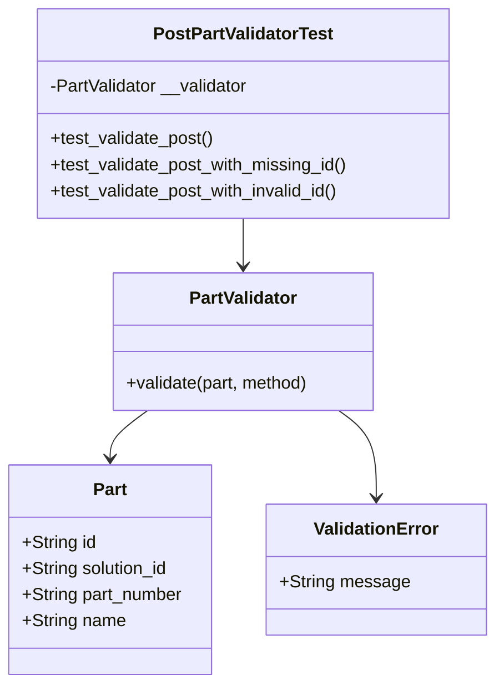
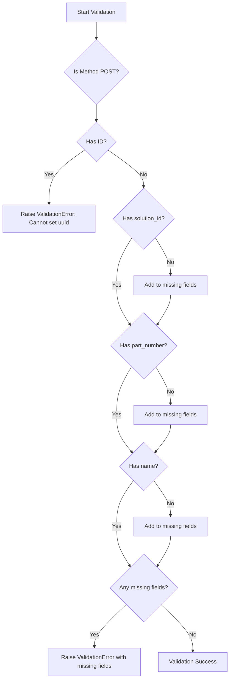
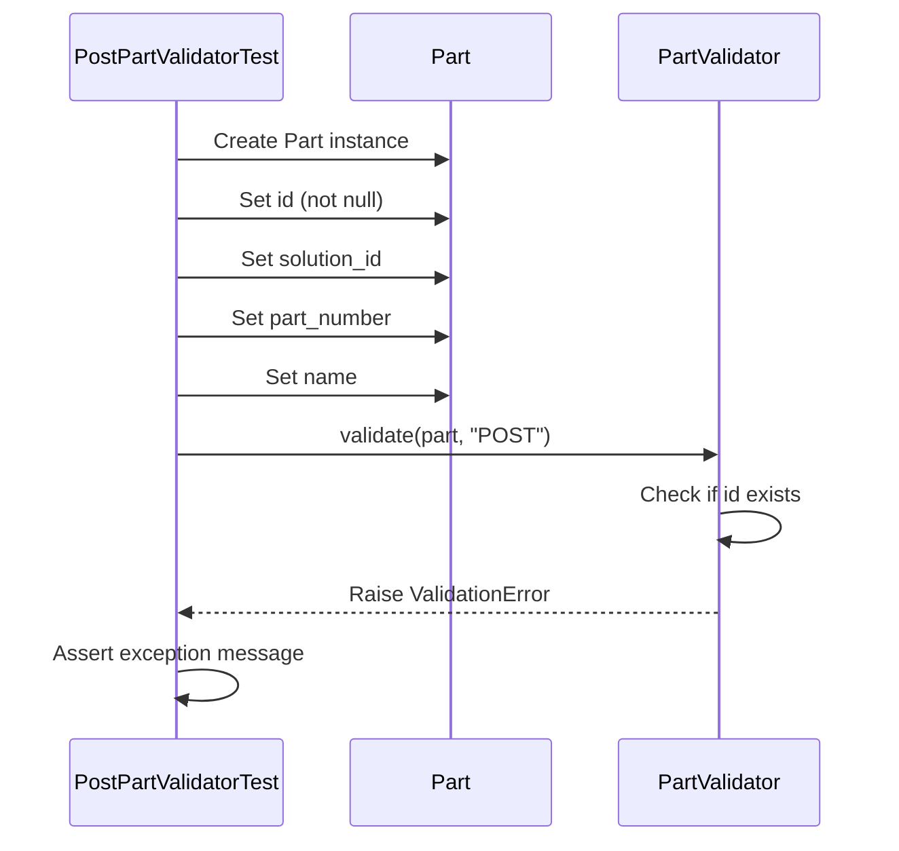

# Diagram: platform/partview_core/partview_service/partview_service/tests/unit/core/validators/part/part_post_validator_test.py

> Auto-generated by Obscura crawlers

## Diagram 1

### SVG

<svg id="container" width="450.703125" xmlns="http://www.w3.org/2000/svg" class="classDiagram" height="626" viewBox="0 0 450.703125 626" role="graphics-document document" aria-roledescription="class"><g><defs><marker id="container_class-aggregationStart" class="marker aggregation class" refX="18" refY="7" markerWidth="190" markerHeight="240" orient="auto"><path d="M 18,7 L9,13 L1,7 L9,1 Z"></path></marker></defs><defs><marker id="container_class-aggregationEnd" class="marker aggregation class" refX="1" refY="7" markerWidth="20" markerHeight="28" orient="auto"><path d="M 18,7 L9,13 L1,7 L9,1 Z"></path></marker></defs><defs><marker id="container_class-extensionStart" class="marker extension class" refX="18" refY="7" markerWidth="190" markerHeight="240" orient="auto"><path d="M 1,7 L18,13 V 1 Z"></path></marker></defs><defs><marker id="container_class-extensionEnd" class="marker extension class" refX="1" refY="7" markerWidth="20" markerHeight="28" orient="auto"><path d="M 1,1 V 13 L18,7 Z"></path></marker></defs><defs><marker id="container_class-compositionStart" class="marker composition class" refX="18" refY="7" markerWidth="190" markerHeight="240" orient="auto"><path d="M 18,7 L9,13 L1,7 L9,1 Z"></path></marker></defs><defs><marker id="container_class-compositionEnd" class="marker composition class" refX="1" refY="7" markerWidth="20" markerHeight="28" orient="auto"><path d="M 18,7 L9,13 L1,7 L9,1 Z"></path></marker></defs><defs><marker id="container_class-dependencyStart" class="marker dependency class" refX="6" refY="7" markerWidth="190" markerHeight="240" orient="auto"><path d="M 5,7 L9,13 L1,7 L9,1 Z"></path></marker></defs><defs><marker id="container_class-dependencyEnd" class="marker dependency class" refX="13" refY="7" markerWidth="20" markerHeight="28" orient="auto"><path d="M 18,7 L9,13 L14,7 L9,1 Z"></path></marker></defs><defs><marker id="container_class-lollipopStart" class="marker lollipop class" refX="13" refY="7" markerWidth="190" markerHeight="240" orient="auto"><circle stroke="black" fill="transparent" cx="7" cy="7" r="6"></circle></marker></defs><defs><marker id="container_class-lollipopEnd" class="marker lollipop class" refX="1" refY="7" markerWidth="190" markerHeight="240" orient="auto"><circle stroke="black" fill="transparent" cx="7" cy="7" r="6"></circle></marker></defs><g class="root"><g class="clusters"></g><g class="edgePaths"><path d="M223.508,200L223.508,204.167C223.508,208.333,223.508,216.667,223.508,224C223.508,231.333,223.508,237.667,223.508,240.833L223.508,244" id="id_PostPartValidatorTest_PartValidator_1" class="edge-thickness-normal edge-pattern-solid relation" style=";;;" data-edge="true" data-et="edge" data-id="id_PostPartValidatorTest_PartValidator_1" data-points="W3sieCI6MjIzLjUwNzgxMjUsInkiOjIwMH0seyJ4IjoyMjMuNTA3ODEyNSwieSI6MjI1fSx7IngiOjIyMy41MDc4MTI1LCJ5IjoyNTB9XQ==" marker-end="url(#container_class-dependencyEnd)"></path><path d="M136.757,376L131.019,380.167C125.282,384.333,113.807,392.667,108.07,400C102.332,407.333,102.332,413.667,102.332,416.833L102.332,420" id="id_PartValidator_Part_2" class="edge-thickness-normal edge-pattern-solid relation" style=";;;" data-edge="true" data-et="edge" data-id="id_PartValidator_Part_2" data-points="W3sieCI6MTM2Ljc1Njk2OTEwNTExMzYzLCJ5IjozNzZ9LHsieCI6MTAyLjMzMjAzMTI1LCJ5Ijo0MDF9LHsieCI6MTAyLjMzMjAzMTI1LCJ5Ijo0MjZ9XQ==" marker-end="url(#container_class-dependencyEnd)"></path><path d="M310.259,376L315.996,380.167C321.734,384.333,333.209,392.667,338.946,406C344.684,419.333,344.684,437.667,344.684,446.833L344.684,456" id="id_PartValidator_ValidationError_3" class="edge-thickness-normal edge-pattern-solid relation" style=";;;" data-edge="true" data-et="edge" data-id="id_PartValidator_ValidationError_3" data-points="W3sieCI6MzEwLjI1ODY1NTg5NDg4NjQsInkiOjM3Nn0seyJ4IjozNDQuNjgzNTkzNzUsInkiOjQwMX0seyJ4IjozNDQuNjgzNTkzNzUsInkiOjQ2Mn1d" marker-end="url(#container_class-dependencyEnd)"></path></g><g class="edgeLabels"><g class="edgeLabel"><g class="label" data-id="id_PostPartValidatorTest_PartValidator_1" transform="translate(0, 0)"><foreignObject width="0" height="0">

</foreignObject></g></g><g class="edgeLabel"><g class="label" data-id="id_PartValidator_Part_2" transform="translate(0, 0)"><foreignObject width="0" height="0">

</foreignObject></g></g><g class="edgeLabel"><g class="label" data-id="id_PartValidator_ValidationError_3" transform="translate(0, 0)"><foreignObject width="0" height="0">

</foreignObject></g></g></g><g class="nodes"><g class="node default" id="classId-PostPartValidatorTest-0" transform="translate(223.5078125, 104)"><g class="basic label-container"><path d="M-190.21875 -96 L190.21875 -96 L190.21875 96 L-190.21875 96" stroke="none" stroke-width="0" fill="#ECECFF" style=""></path><path d="M-190.21875 -96 C-102.53250002800604 -96, -14.846250056012082 -96, 190.21875 -96 M-190.21875 -96 C-99.57586674066779 -96, -8.932983481335583 -96, 190.21875 -96 M190.21875 -96 C190.21875 -39.484120920656636, 190.21875 17.031758158686728, 190.21875 96 M190.21875 -96 C190.21875 -29.020536378073075, 190.21875 37.95892724385385, 190.21875 96 M190.21875 96 C111.1992987886562 96, 32.17984757731239 96, -190.21875 96 M190.21875 96 C107.05138257377509 96, 23.884015147550173 96, -190.21875 96 M-190.21875 96 C-190.21875 38.005917537847886, -190.21875 -19.98816492430423, -190.21875 -96 M-190.21875 96 C-190.21875 46.793081038000224, -190.21875 -2.4138379239995515, -190.21875 -96" stroke="#9370DB" stroke-width="1.3" fill="none" stroke-dasharray="0 0" style=""></path></g><g class="annotation-group text" transform="translate(0, -72)"></g><g class="label-group text" transform="translate(-79.6875, -72)"><g class="label" style="font-weight: bolder" transform="translate(0,-12)"><foreignObject width="159.375" height="24">

PostPartValidatorTest

</foreignObject></g></g><g class="members-group text" transform="translate(-178.21875, -24)"><g class="label" style="" transform="translate(0,-12)"><foreignObject width="185.78125" height="24">

-PartValidator __validator

</foreignObject></g></g><g class="methods-group text" transform="translate(-178.21875, 24)"><g class="label" style="" transform="translate(0,-12)"><foreignObject width="151.609375" height="24">

+test_validate_post()

</foreignObject></g><g class="label" style="" transform="translate(0,12)"><foreignObject width="276.75" height="24">

+test_validate_post_with_missing_id()

</foreignObject></g><g class="label" style="" transform="translate(0,36)"><foreignObject width="270.171875" height="24">

+test_validate_post_with_invalid_id()

</foreignObject></g></g><g class="divider" style=""><path d="M-190.21875 -48 C-70.29637810844731 -48, 49.62599378310537 -48, 190.21875 -48 M-190.21875 -48 C-46.9529171828234 -48, 96.3129156343532 -48, 190.21875 -48" stroke="#9370DB" stroke-width="1.3" fill="none" stroke-dasharray="0 0" style=""></path></g><g class="divider" style=""><path d="M-190.21875 0 C-112.42554808717587 0, -34.63234617435174 0, 190.21875 0 M-190.21875 0 C-48.302949116324356 0, 93.61285176735129 0, 190.21875 0" stroke="#9370DB" stroke-width="1.3" fill="none" stroke-dasharray="0 0" style=""></path></g></g><g class="node default" id="classId-PartValidator-1" transform="translate(223.5078125, 313)"><g class="basic label-container"><path d="M-121.4921875 -63 L121.4921875 -63 L121.4921875 63 L-121.4921875 63" stroke="none" stroke-width="0" fill="#ECECFF" style=""></path><path d="M-121.4921875 -63 C-30.41476674431756 -63, 60.66265401136488 -63, 121.4921875 -63 M-121.4921875 -63 C-31.898900170037408 -63, 57.694387159925185 -63, 121.4921875 -63 M121.4921875 -63 C121.4921875 -22.983514433171678, 121.4921875 17.032971133656645, 121.4921875 63 M121.4921875 -63 C121.4921875 -15.701661485289868, 121.4921875 31.596677029420263, 121.4921875 63 M121.4921875 63 C41.21876015972748 63, -39.05466718054504 63, -121.4921875 63 M121.4921875 63 C31.889945050877174 63, -57.71229739824565 63, -121.4921875 63 M-121.4921875 63 C-121.4921875 32.40977628188513, -121.4921875 1.8195525637702588, -121.4921875 -63 M-121.4921875 63 C-121.4921875 18.60374810601445, -121.4921875 -25.7925037879711, -121.4921875 -63" stroke="#9370DB" stroke-width="1.3" fill="none" stroke-dasharray="0 0" style=""></path></g><g class="annotation-group text" transform="translate(0, -39)"></g><g class="label-group text" transform="translate(-48.25, -39)"><g class="label" style="font-weight: bolder" transform="translate(0,-12)"><foreignObject width="96.5" height="24">

PartValidator

</foreignObject></g></g><g class="members-group text" transform="translate(-109.4921875, 9)"></g><g class="methods-group text" transform="translate(-109.4921875, 39)"><g class="label" style="" transform="translate(0,-12)"><foreignObject width="170.734375" height="24">

+validate(part, method)

</foreignObject></g></g><g class="divider" style=""><path d="M-121.4921875 -15 C-28.514795373107503 -15, 64.462596753785 -15, 121.4921875 -15 M-121.4921875 -15 C-64.99505600698171 -15, -8.497924513963426 -15, 121.4921875 -15" stroke="#9370DB" stroke-width="1.3" fill="none" stroke-dasharray="0 0" style=""></path></g><g class="divider" style=""><path d="M-121.4921875 9 C-68.82762310999632 9, -16.163058719992634 9, 121.4921875 9 M-121.4921875 9 C-45.93178512673158 9, 29.628617246536834 9, 121.4921875 9" stroke="#9370DB" stroke-width="1.3" fill="none" stroke-dasharray="0 0" style=""></path></g></g><g class="node default" id="classId-Part-2" transform="translate(102.33203125, 522)"><g class="basic label-container"><path d="M-94.33203125 -96 L94.33203125 -96 L94.33203125 96 L-94.33203125 96" stroke="none" stroke-width="0" fill="#ECECFF" style=""></path><path d="M-94.33203125 -96 C-29.358835131559715 -96, 35.61436098688057 -96, 94.33203125 -96 M-94.33203125 -96 C-20.582265115498302 -96, 53.167501019003396 -96, 94.33203125 -96 M94.33203125 -96 C94.33203125 -41.684149820225585, 94.33203125 12.63170035954883, 94.33203125 96 M94.33203125 -96 C94.33203125 -39.18135542134588, 94.33203125 17.637289157308246, 94.33203125 96 M94.33203125 96 C44.63578021103583 96, -5.0604708279283415 96, -94.33203125 96 M94.33203125 96 C48.82594183046065 96, 3.3198524109212997 96, -94.33203125 96 M-94.33203125 96 C-94.33203125 40.94862115092557, -94.33203125 -14.102757698148864, -94.33203125 -96 M-94.33203125 96 C-94.33203125 47.761606708260274, -94.33203125 -0.476786583479452, -94.33203125 -96" stroke="#9370DB" stroke-width="1.3" fill="none" stroke-dasharray="0 0" style=""></path></g><g class="annotation-group text" transform="translate(0, -72)"></g><g class="label-group text" transform="translate(-15.0703125, -72)"><g class="label" style="font-weight: bolder" transform="translate(0,-12)"><foreignObject width="30.140625" height="24">

Part

</foreignObject></g></g><g class="members-group text" transform="translate(-82.33203125, -24)"><g class="label" style="" transform="translate(0,-12)"><foreignObject width="68.546875" height="24">

+String id

</foreignObject></g><g class="label" style="" transform="translate(0,12)"><foreignObject width="136.703125" height="24">

+String solution_id

</foreignObject></g><g class="label" style="" transform="translate(0,36)"><foreignObject width="149.59375" height="24">

+String part_number

</foreignObject></g><g class="label" style="" transform="translate(0,60)"><foreignObject width="94.984375" height="24">

+String name

</foreignObject></g></g><g class="methods-group text" transform="translate(-82.33203125, 96)"></g><g class="divider" style=""><path d="M-94.33203125 -48 C-21.279504737699924 -48, 51.77302177460015 -48, 94.33203125 -48 M-94.33203125 -48 C-25.766648123285563 -48, 42.798735003428874 -48, 94.33203125 -48" stroke="#9370DB" stroke-width="1.3" fill="none" stroke-dasharray="0 0" style=""></path></g><g class="divider" style=""><path d="M-94.33203125 72 C-40.28680666411761 72, 13.758417921764774 72, 94.33203125 72 M-94.33203125 72 C-50.9427031450598 72, -7.5533750401196045 72, 94.33203125 72" stroke="#9370DB" stroke-width="1.3" fill="none" stroke-dasharray="0 0" style=""></path></g></g><g class="node default" id="classId-ValidationError-3" transform="translate(344.68359375, 522)"><g class="basic label-container"><path d="M-98.01953125 -60 L98.01953125 -60 L98.01953125 60 L-98.01953125 60" stroke="none" stroke-width="0" fill="#ECECFF" style=""></path><path d="M-98.01953125 -60 C-40.359775694408384 -60, 17.299979861183232 -60, 98.01953125 -60 M-98.01953125 -60 C-41.93520288384674 -60, 14.149125482306516 -60, 98.01953125 -60 M98.01953125 -60 C98.01953125 -31.750747964557164, 98.01953125 -3.501495929114327, 98.01953125 60 M98.01953125 -60 C98.01953125 -31.090155608577984, 98.01953125 -2.1803112171559675, 98.01953125 60 M98.01953125 60 C51.90696244405623 60, 5.794393638112453 60, -98.01953125 60 M98.01953125 60 C57.1707373979 60, 16.321943545799996 60, -98.01953125 60 M-98.01953125 60 C-98.01953125 27.746063357767234, -98.01953125 -4.507873284465532, -98.01953125 -60 M-98.01953125 60 C-98.01953125 19.61972761434241, -98.01953125 -20.760544771315182, -98.01953125 -60" stroke="#9370DB" stroke-width="1.3" fill="none" stroke-dasharray="0 0" style=""></path></g><g class="annotation-group text" transform="translate(0, -36)"></g><g class="label-group text" transform="translate(-55.1796875, -36)"><g class="label" style="font-weight: bolder" transform="translate(0,-12)"><foreignObject width="110.359375" height="24">

ValidationError

</foreignObject></g></g><g class="members-group text" transform="translate(-86.01953125, 12)"><g class="label" style="" transform="translate(0,-12)"><foreignObject width="116.859375" height="24">

+String message

</foreignObject></g></g><g class="methods-group text" transform="translate(-86.01953125, 60)"></g><g class="divider" style=""><path d="M-98.01953125 -12 C-47.893108767278605 -12, 2.2333137154427902 -12, 98.01953125 -12 M-98.01953125 -12 C-28.089891925285457 -12, 41.839747399429086 -12, 98.01953125 -12" stroke="#9370DB" stroke-width="1.3" fill="none" stroke-dasharray="0 0" style=""></path></g><g class="divider" style=""><path d="M-98.01953125 36 C-55.04924796300017 36, -12.07896467600034 36, 98.01953125 36 M-98.01953125 36 C-23.230970222292285 36, 51.55759080541543 36, 98.01953125 36" stroke="#9370DB" stroke-width="1.3" fill="none" stroke-dasharray="0 0" style=""></path></g></g></g></g></g></svg>

## Diagram 2

### SVG

<svg id="container" width="648.6484375" xmlns="http://www.w3.org/2000/svg" class="flowchart" height="1896.09375" viewBox="0 0 648.6484375 1896.09375" role="graphics-document document" aria-roledescription="flowchart-v2"><g><marker id="container_flowchart-v2-pointEnd" class="marker flowchart-v2" viewBox="0 0 10 10" refX="5" refY="5" markerUnits="userSpaceOnUse" markerWidth="8" markerHeight="8" orient="auto"><path d="M 0 0 L 10 5 L 0 10 z" class="arrowMarkerPath" style="stroke-width: 1; stroke-dasharray: 1, 0;"></path></marker><marker id="container_flowchart-v2-pointStart" class="marker flowchart-v2" viewBox="0 0 10 10" refX="4.5" refY="5" markerUnits="userSpaceOnUse" markerWidth="8" markerHeight="8" orient="auto"><path d="M 0 5 L 10 10 L 10 0 z" class="arrowMarkerPath" style="stroke-width: 1; stroke-dasharray: 1, 0;"></path></marker><marker id="container_flowchart-v2-circleEnd" class="marker flowchart-v2" viewBox="0 0 10 10" refX="11" refY="5" markerUnits="userSpaceOnUse" markerWidth="11" markerHeight="11" orient="auto"><circle cx="5" cy="5" r="5" class="arrowMarkerPath" style="stroke-width: 1; stroke-dasharray: 1, 0;"></circle></marker><marker id="container_flowchart-v2-circleStart" class="marker flowchart-v2" viewBox="0 0 10 10" refX="-1" refY="5" markerUnits="userSpaceOnUse" markerWidth="11" markerHeight="11" orient="auto"><circle cx="5" cy="5" r="5" class="arrowMarkerPath" style="stroke-width: 1; stroke-dasharray: 1, 0;"></circle></marker><marker id="container_flowchart-v2-crossEnd" class="marker cross flowchart-v2" viewBox="0 0 11 11" refX="12" refY="5.2" markerUnits="userSpaceOnUse" markerWidth="11" markerHeight="11" orient="auto"><path d="M 1,1 l 9,9 M 10,1 l -9,9" class="arrowMarkerPath" style="stroke-width: 2; stroke-dasharray: 1, 0;"></path></marker><marker id="container_flowchart-v2-crossStart" class="marker cross flowchart-v2" viewBox="0 0 11 11" refX="-1" refY="5.2" markerUnits="userSpaceOnUse" markerWidth="11" markerHeight="11" orient="auto"><path d="M 1,1 l 9,9 M 10,1 l -9,9" class="arrowMarkerPath" style="stroke-width: 2; stroke-dasharray: 1, 0;"></path></marker><g class="root"><g class="clusters"></g><g class="edgePaths"><path d="M271.68,62L271.68,66.167C271.68,70.333,271.68,78.667,271.68,86.333C271.68,94,271.68,101,271.68,104.5L271.68,108" id="L_A_B_0" class="edge-thickness-normal edge-pattern-solid edge-thickness-normal edge-pattern-solid flowchart-link" style=";" data-edge="true" data-et="edge" data-id="L_A_B_0" data-points="W3sieCI6MjcxLjY3OTY4NzUsInkiOjYyfSx7IngiOjI3MS42Nzk2ODc1LCJ5Ijo4N30seyJ4IjoyNzEuNjc5Njg3NSwieSI6MTEyfV0=" marker-end="url(#container_flowchart-v2-pointEnd)"></path><path d="M271.68,286.266L271.68,290.432C271.68,294.599,271.68,302.932,271.68,310.599C271.68,318.266,271.68,325.266,271.68,328.766L271.68,332.266" id="L_B_C_0" class="edge-thickness-normal edge-pattern-solid edge-thickness-normal edge-pattern-solid flowchart-link" style=";" data-edge="true" data-et="edge" data-id="L_B_C_0" data-points="W3sieCI6MjcxLjY3OTY4NzUsInkiOjI4Ni4yNjU2MjV9LHsieCI6MjcxLjY3OTY4NzUsInkiOjMxMS4yNjU2MjV9LHsieCI6MjcxLjY3OTY4NzUsInkiOjMzNi4yNjU2MjV9XQ==" marker-end="url(#container_flowchart-v2-pointEnd)"></path><path d="M239.735,411.508L222.779,422.999C205.823,434.49,171.912,457.471,154.956,482.522C138,507.573,138,534.693,138,548.253L138,561.813" id="L_C_D_0" class="edge-thickness-normal edge-pattern-solid edge-thickness-normal edge-pattern-solid flowchart-link" style=";" data-edge="true" data-et="edge" data-id="L_C_D_0" data-points="W3sieCI6MjM5LjczNDc3MzE0OTg0MTUyLCJ5Ijo0MTEuNTA4MjEwNjQ5ODQxNX0seyJ4IjoxMzgsInkiOjQ4MC40NTMxMjV9LHsieCI6MTM4LCJ5Ijo1NjUuODEyNX1d" marker-end="url(#container_flowchart-v2-pointEnd)"></path><path d="M303.625,411.508L320.58,422.999C337.536,434.49,371.448,457.471,388.404,474.462C405.359,491.453,405.359,502.453,405.359,507.953L405.359,513.453" id="L_C_E_0" class="edge-thickness-normal edge-pattern-solid edge-thickness-normal edge-pattern-solid flowchart-link" style=";" data-edge="true" data-et="edge" data-id="L_C_E_0" data-points="W3sieCI6MzAzLjYyNDYwMTg1MDE1ODUsInkiOjQxMS41MDgyMTA2NDk4NDE1fSx7IngiOjQwNS4zNTkzNzUsInkiOjQ4MC40NTMxMjV9LHsieCI6NDA1LjM1OTM3NSwieSI6NTE3LjQ1MzEyNX1d" marker-end="url(#container_flowchart-v2-pointEnd)"></path><path d="M438.548,658.983L445.715,670.681C452.882,682.379,467.217,705.776,474.384,722.974C481.551,740.172,481.551,751.172,481.551,756.672L481.551,762.172" id="L_E_F_0" class="edge-thickness-normal edge-pattern-solid edge-thickness-normal edge-pattern-solid flowchart-link" style=";" data-edge="true" data-et="edge" data-id="L_E_F_0" data-points="W3sieCI6NDM4LjU0ODE0NDM5MjM5NTk1LCJ5Ijo2NTguOTgzMTA1NjA3NjA0MX0seyJ4Ijo0ODEuNTUwNzgxMjUsInkiOjcyOS4xNzE4NzV9LHsieCI6NDgxLjU1MDc4MTI1LCJ5Ijo3NjYuMTcxODc1fV0=" marker-end="url(#container_flowchart-v2-pointEnd)"></path><path d="M372.171,658.983L365.003,670.681C357.836,682.379,343.502,705.776,336.335,728.14C329.168,750.505,329.168,771.839,329.168,791.172C329.168,810.505,329.168,827.839,335.406,846.212C341.643,864.585,354.118,883.997,360.356,893.704L366.593,903.41" id="L_E_G_0" class="edge-thickness-normal edge-pattern-solid edge-thickness-normal edge-pattern-solid flowchart-link" style=";" data-edge="true" data-et="edge" data-id="L_E_G_0" data-points="W3sieCI6MzcyLjE3MDYwNTYwNzYwNDA1LCJ5Ijo2NTguOTgzMTA1NjA3NjA0MX0seyJ4IjozMjkuMTY3OTY4NzUsInkiOjcyOS4xNzE4NzV9LHsieCI6MzI5LjE2Nzk2ODc1LCJ5Ijo3OTMuMTcxODc1fSx7IngiOjMyOS4xNjc5Njg3NSwieSI6ODQ1LjE3MTg3NX0seyJ4IjozNjguNzU1OTU3OTc3MzE1MSwieSI6OTA2Ljc3NTI5MjAyMjY4NDl9XQ==" marker-end="url(#container_flowchart-v2-pointEnd)"></path><path d="M481.551,820.172L481.551,824.339C481.551,828.505,481.551,836.839,475.313,850.712C469.076,864.585,456.6,883.997,450.363,893.704L444.125,903.41" id="L_F_G_0" class="edge-thickness-normal edge-pattern-solid edge-thickness-normal edge-pattern-solid flowchart-link" style=";" data-edge="true" data-et="edge" data-id="L_F_G_0" data-points="W3sieCI6NDgxLjU1MDc4MTI1LCJ5Ijo4MjAuMTcxODc1fSx7IngiOjQ4MS41NTA3ODEyNSwieSI6ODQ1LjE3MTg3NX0seyJ4Ijo0NDEuOTYyNzkyMDIyNjg0OSwieSI6OTA2Ljc3NTI5MjAyMjY4NDl9XQ==" marker-end="url(#container_flowchart-v2-pointEnd)"></path><path d="M439.838,1022.818L446.79,1034.731C453.742,1046.644,467.647,1070.471,474.599,1087.884C481.551,1105.297,481.551,1116.297,481.551,1121.797L481.551,1127.297" id="L_G_H_0" class="edge-thickness-normal edge-pattern-solid edge-thickness-normal edge-pattern-solid flowchart-link" style=";" data-edge="true" data-et="edge" data-id="L_G_H_0" data-points="W3sieCI6NDM5LjgzODMyOTExNzc4MDQsInkiOjEwMjIuODE3OTIwODgyMjE5Nn0seyJ4Ijo0ODEuNTUwNzgxMjUsInkiOjEwOTQuMjk2ODc1fSx7IngiOjQ4MS41NTA3ODEyNSwieSI6MTEzMS4yOTY4NzV9XQ==" marker-end="url(#container_flowchart-v2-pointEnd)"></path><path d="M370.88,1022.818L363.928,1034.731C356.976,1046.644,343.072,1070.471,336.12,1093.05C329.168,1115.63,329.168,1136.964,329.168,1156.297C329.168,1175.63,329.168,1192.964,336.418,1210.306C343.668,1227.649,358.168,1245.002,365.418,1253.678L372.668,1262.354" id="L_G_I_0" class="edge-thickness-normal edge-pattern-solid edge-thickness-normal edge-pattern-solid flowchart-link" style=";" data-edge="true" data-et="edge" data-id="L_G_I_0" data-points="W3sieCI6MzcwLjg4MDQyMDg4MjIxOTYsInkiOjEwMjIuODE3OTIwODgyMjE5Nn0seyJ4IjozMjkuMTY3OTY4NzUsInkiOjEwOTQuMjk2ODc1fSx7IngiOjMyOS4xNjc5Njg3NSwieSI6MTE1OC4yOTY4NzV9LHsieCI6MzI5LjE2Nzk2ODc1LCJ5IjoxMjEwLjI5Njg3NX0seyJ4IjozNzUuMjMyNzY2MjU5ODg5ODQsInkiOjEyNjUuNDIzNDgzNzQwMTEwMn1d" marker-end="url(#container_flowchart-v2-pointEnd)"></path><path d="M481.551,1185.297L481.551,1189.464C481.551,1193.63,481.551,1201.964,474.301,1214.806C467.051,1227.649,452.551,1245.002,445.301,1253.678L438.051,1262.354" id="L_H_I_0" class="edge-thickness-normal edge-pattern-solid edge-thickness-normal edge-pattern-solid flowchart-link" style=";" data-edge="true" data-et="edge" data-id="L_H_I_0" data-points="W3sieCI6NDgxLjU1MDc4MTI1LCJ5IjoxMTg1LjI5Njg3NX0seyJ4Ijo0ODEuNTUwNzgxMjUsInkiOjEyMTAuMjk2ODc1fSx7IngiOjQzNS40ODU5ODM3NDAxMTAxNiwieSI6MTI2NS40MjM0ODM3NDAxMTAyfV0=" marker-end="url(#container_flowchart-v2-pointEnd)"></path><path d="M433.471,1339.545L441.484,1350.397C449.497,1361.249,465.524,1382.953,473.537,1399.304C481.551,1415.656,481.551,1426.656,481.551,1432.156L481.551,1437.656" id="L_I_J_0" class="edge-thickness-normal edge-pattern-solid edge-thickness-normal edge-pattern-solid flowchart-link" style=";" data-edge="true" data-et="edge" data-id="L_I_J_0" data-points="W3sieCI6NDMzLjQ3MDUwMTIxNTQ1NTUsInkiOjEzMzkuNTQ1MTIzNzg0NTQ0Nn0seyJ4Ijo0ODEuNTUwNzgxMjUsInkiOjE0MDQuNjU2MjV9LHsieCI6NDgxLjU1MDc4MTI1LCJ5IjoxNDQxLjY1NjI1fV0=" marker-end="url(#container_flowchart-v2-pointEnd)"></path><path d="M377.248,1339.545L369.235,1350.397C361.221,1361.249,345.195,1382.953,337.181,1404.471C329.168,1425.99,329.168,1447.323,329.168,1466.656C329.168,1485.99,329.168,1503.323,335.353,1521.749C341.539,1540.176,353.91,1559.695,360.095,1569.455L366.281,1579.215" id="L_I_K_0" class="edge-thickness-normal edge-pattern-solid edge-thickness-normal edge-pattern-solid flowchart-link" style=";" data-edge="true" data-et="edge" data-id="L_I_K_0" data-points="W3sieCI6Mzc3LjI0ODI0ODc4NDU0NDUsInkiOjEzMzkuNTQ1MTIzNzg0NTQ0Nn0seyJ4IjozMjkuMTY3OTY4NzUsInkiOjE0MDQuNjU2MjV9LHsieCI6MzI5LjE2Nzk2ODc1LCJ5IjoxNDY4LjY1NjI1fSx7IngiOjMyOS4xNjc5Njg3NSwieSI6MTUyMC42NTYyNX0seyJ4IjozNjguNDIyMTI3OTUzNDAxODUsInkiOjE1ODIuNTkzNDk3MDQ2NTk4fV0=" marker-end="url(#container_flowchart-v2-pointEnd)"></path><path d="M481.551,1495.656L481.551,1499.823C481.551,1503.99,481.551,1512.323,475.365,1526.249C469.18,1540.176,456.809,1559.695,450.623,1569.455L444.438,1579.215" id="L_J_K_0" class="edge-thickness-normal edge-pattern-solid edge-thickness-normal edge-pattern-solid flowchart-link" style=";" data-edge="true" data-et="edge" data-id="L_J_K_0" data-points="W3sieCI6NDgxLjU1MDc4MTI1LCJ5IjoxNDk1LjY1NjI1fSx7IngiOjQ4MS41NTA3ODEyNSwieSI6MTUyMC42NTYyNX0seyJ4Ijo0NDIuMjk2NjIyMDQ2NTk4MTUsInkiOjE1ODIuNTkzNDk3MDQ2NTk4fV0=" marker-end="url(#container_flowchart-v2-pointEnd)"></path><path d="M356.657,1687.392L341.703,1701.675C326.748,1715.959,296.839,1744.526,281.884,1764.31C266.93,1784.094,266.93,1795.094,266.93,1800.594L266.93,1806.094" id="L_K_L_0" class="edge-thickness-normal edge-pattern-solid edge-thickness-normal edge-pattern-solid flowchart-link" style=";" data-edge="true" data-et="edge" data-id="L_K_L_0" data-points="W3sieCI6MzU2LjY1NzQ0Mjk3MTg4NDcsInkiOjE2ODcuMzkxODE3OTcxODg0Nn0seyJ4IjoyNjYuOTI5Njg3NSwieSI6MTc3My4wOTM3NX0seyJ4IjoyNjYuOTI5Njg3NSwieSI6MTgxMC4wOTM3NX1d" marker-end="url(#container_flowchart-v2-pointEnd)"></path><path d="M454.061,1687.392L469.016,1701.675C483.971,1715.959,513.88,1744.526,528.834,1766.31C543.789,1788.094,543.789,1803.094,543.789,1810.594L543.789,1818.094" id="L_K_M_0" class="edge-thickness-normal edge-pattern-solid edge-thickness-normal edge-pattern-solid flowchart-link" style=";" data-edge="true" data-et="edge" data-id="L_K_M_0" data-points="W3sieCI6NDU0LjA2MTMwNzAyODExNTMsInkiOjE2ODcuMzkxODE3OTcxODg0Nn0seyJ4Ijo1NDMuNzg5MDYyNSwieSI6MTc3My4wOTM3NX0seyJ4Ijo1NDMuNzg5MDYyNSwieSI6MTgyMi4wOTM3NX1d" marker-end="url(#container_flowchart-v2-pointEnd)"></path></g><g class="edgeLabels"><g class="edgeLabel"><g class="label" data-id="L_A_B_0" transform="translate(0, 0)"><foreignObject width="0" height="0">

</foreignObject></g></g><g class="edgeLabel"><g class="label" data-id="L_B_C_0" transform="translate(0, 0)"><foreignObject width="0" height="0">

</foreignObject></g></g><g class="edgeLabel" transform="translate(138, 480.453125)"><g class="label" data-id="L_C_D_0" transform="translate(-12.03125, -12)"><foreignObject width="24.0625" height="24">

Yes

</foreignObject></g></g><g class="edgeLabel" transform="translate(405.359375, 480.453125)"><g class="label" data-id="L_C_E_0" transform="translate(-10.140625, -12)"><foreignObject width="20.28125" height="24">

No

</foreignObject></g></g><g class="edgeLabel" transform="translate(481.55078125, 729.171875)"><g class="label" data-id="L_E_F_0" transform="translate(-10.140625, -12)"><foreignObject width="20.28125" height="24">

No

</foreignObject></g></g><g class="edgeLabel" transform="translate(329.16796875, 793.171875)"><g class="label" data-id="L_E_G_0" transform="translate(-12.03125, -12)"><foreignObject width="24.0625" height="24">

Yes

</foreignObject></g></g><g class="edgeLabel"><g class="label" data-id="L_F_G_0" transform="translate(0, 0)"><foreignObject width="0" height="0">

</foreignObject></g></g><g class="edgeLabel" transform="translate(481.55078125, 1094.296875)"><g class="label" data-id="L_G_H_0" transform="translate(-10.140625, -12)"><foreignObject width="20.28125" height="24">

No

</foreignObject></g></g><g class="edgeLabel" transform="translate(329.16796875, 1158.296875)"><g class="label" data-id="L_G_I_0" transform="translate(-12.03125, -12)"><foreignObject width="24.0625" height="24">

Yes

</foreignObject></g></g><g class="edgeLabel"><g class="label" data-id="L_H_I_0" transform="translate(0, 0)"><foreignObject width="0" height="0">

</foreignObject></g></g><g class="edgeLabel" transform="translate(481.55078125, 1404.65625)"><g class="label" data-id="L_I_J_0" transform="translate(-10.140625, -12)"><foreignObject width="20.28125" height="24">

No

</foreignObject></g></g><g class="edgeLabel" transform="translate(329.16796875, 1468.65625)"><g class="label" data-id="L_I_K_0" transform="translate(-12.03125, -12)"><foreignObject width="24.0625" height="24">

Yes

</foreignObject></g></g><g class="edgeLabel"><g class="label" data-id="L_J_K_0" transform="translate(0, 0)"><foreignObject width="0" height="0">

</foreignObject></g></g><g class="edgeLabel" transform="translate(266.9296875, 1773.09375)"><g class="label" data-id="L_K_L_0" transform="translate(-12.03125, -12)"><foreignObject width="24.0625" height="24">

Yes

</foreignObject></g></g><g class="edgeLabel" transform="translate(543.7890625, 1773.09375)"><g class="label" data-id="L_K_M_0" transform="translate(-10.140625, -12)"><foreignObject width="20.28125" height="24">

No

</foreignObject></g></g></g><g class="nodes"><g class="node default" id="flowchart-A-0" transform="translate(271.6796875, 35)"><rect class="basic label-container" style="" x="-86.28125" y="-27" width="172.5625" height="54"></rect><g class="label" style="" transform="translate(-56.28125, -12)"><rect></rect><foreignObject width="112.5625" height="24">

Start Validation

</foreignObject></g></g><g class="node default" id="flowchart-B-1" transform="translate(271.6796875, 199.1328125)"><polygon points="87.1328125,0 174.265625,-87.1328125 87.1328125,-174.265625 0,-87.1328125" class="label-container" transform="translate(-86.6328125, 87.1328125)"></polygon><g class="label" style="" transform="translate(-60.1328125, -12)"><rect></rect><foreignObject width="120.265625" height="24">

Is Method POST?

</foreignObject></g></g><g class="node default" id="flowchart-C-3" transform="translate(271.6796875, 389.859375)"><polygon points="53.59375,0 107.1875,-53.59375 53.59375,-107.1875 0,-53.59375" class="label-container" transform="translate(-53.09375, 53.59375)"></polygon><g class="label" style="" transform="translate(-26.59375, -12)"><rect></rect><foreignObject width="53.1875" height="24">

Has ID?

</foreignObject></g></g><g class="node default" id="flowchart-D-5" transform="translate(138, 604.8125)"><rect class="basic label-container" style="" x="-130" y="-39" width="260" height="78"></rect><g class="label" style="" transform="translate(-100, -24)"><rect></rect><foreignObject width="200" height="48">

Raise ValidationError: Cannot set uuid

</foreignObject></g></g><g class="node default" id="flowchart-E-7" transform="translate(405.359375, 604.8125)"><polygon points="87.359375,0 174.71875,-87.359375 87.359375,-174.71875 0,-87.359375" class="label-container" transform="translate(-86.859375, 87.359375)"></polygon><g class="label" style="" transform="translate(-60.359375, -12)"><rect></rect><foreignObject width="120.71875" height="24">

Has solution_id?

</foreignObject></g></g><g class="node default" id="flowchart-F-9" transform="translate(481.55078125, 793.171875)"><rect class="basic label-container" style="" x="-105.3515625" y="-27" width="210.703125" height="54"></rect><g class="label" style="" transform="translate(-75.3515625, -12)"><rect></rect><foreignObject width="150.703125" height="24">

Add to missing fields

</foreignObject></g></g><g class="node default" id="flowchart-G-11" transform="translate(405.359375, 963.734375)"><polygon points="93.5625,0 187.125,-93.5625 93.5625,-187.125 0,-93.5625" class="label-container" transform="translate(-93.0625, 93.5625)"></polygon><g class="label" style="" transform="translate(-66.5625, -12)"><rect></rect><foreignObject width="133.125" height="24">

Has part_number?

</foreignObject></g></g><g class="node default" id="flowchart-H-15" transform="translate(481.55078125, 1158.296875)"><rect class="basic label-container" style="" x="-105.3515625" y="-27" width="210.703125" height="54"></rect><g class="label" style="" transform="translate(-75.3515625, -12)"><rect></rect><foreignObject width="150.703125" height="24">

Add to missing fields

</foreignObject></g></g><g class="node default" id="flowchart-I-17" transform="translate(405.359375, 1301.4765625)"><polygon points="66.1796875,0 132.359375,-66.1796875 66.1796875,-132.359375 0,-66.1796875" class="label-container" transform="translate(-65.6796875, 66.1796875)"></polygon><g class="label" style="" transform="translate(-39.1796875, -12)"><rect></rect><foreignObject width="78.359375" height="24">

Has name?

</foreignObject></g></g><g class="node default" id="flowchart-J-21" transform="translate(481.55078125, 1468.65625)"><rect class="basic label-container" style="" x="-105.3515625" y="-27" width="210.703125" height="54"></rect><g class="label" style="" transform="translate(-75.3515625, -12)"><rect></rect><foreignObject width="150.703125" height="24">

Add to missing fields

</foreignObject></g></g><g class="node default" id="flowchart-K-23" transform="translate(405.359375, 1640.875)"><polygon points="95.21875,0 190.4375,-95.21875 95.21875,-190.4375 0,-95.21875" class="label-container" transform="translate(-94.71875, 95.21875)"></polygon><g class="label" style="" transform="translate(-68.21875, -12)"><rect></rect><foreignObject width="136.4375" height="24">

Any missing fields?

</foreignObject></g></g><g class="node default" id="flowchart-L-27" transform="translate(266.9296875, 1849.09375)"><rect class="basic label-container" style="" x="-130" y="-39" width="260" height="78"></rect><g class="label" style="" transform="translate(-100, -24)"><rect></rect><foreignObject width="200" height="48">

Raise ValidationError with missing fields

</foreignObject></g></g><g class="node default" id="flowchart-M-29" transform="translate(543.7890625, 1849.09375)"><rect class="basic label-container" style="" x="-96.859375" y="-27" width="193.71875" height="54"></rect><g class="label" style="" transform="translate(-66.859375, -12)"><rect></rect><foreignObject width="133.71875" height="24">

Validation Success

</foreignObject></g></g></g></g></g></svg>

## Diagram 3

### SVG

<svg id="container" width="683" xmlns="http://www.w3.org/2000/svg" height="663" viewBox="-54.5 -10 683 663" role="graphics-document document" aria-roledescription="sequence"><g><rect x="427.5" y="577" fill="#eaeaea" stroke="#666" width="150" height="65" name="Validator" rx="3" ry="3" class="actor actor-bottom"></rect><text x="502.5" y="609.5" dominant-baseline="central" alignment-baseline="central" class="actor actor-box" style="text-anchor: middle; font-size: 16px; font-weight: 400;"><tspan x="502.5" dy="0">PartValidator</tspan></text></g><g><rect x="227.5" y="577" fill="#eaeaea" stroke="#666" width="150" height="65" name="Part" rx="3" ry="3" class="actor actor-bottom"></rect><text x="302.5" y="609.5" dominant-baseline="central" alignment-baseline="central" class="actor actor-box" style="text-anchor: middle; font-size: 16px; font-weight: 400;"><tspan x="302.5" dy="0">Part</tspan></text></g><g><rect x="0" y="577" fill="#eaeaea" stroke="#666" width="175" height="65" name="Test" rx="3" ry="3" class="actor actor-bottom"></rect><text x="87.5" y="609.5" dominant-baseline="central" alignment-baseline="central" class="actor actor-box" style="text-anchor: middle; font-size: 16px; font-weight: 400;"><tspan x="87.5" dy="0">PostPartValidatorTest</tspan></text></g><g><line id="actor2" x1="502.5" y1="65" x2="502.5" y2="577" class="actor-line 200" stroke-width="0.5px" stroke="#999" name="Validator"></line><g id="root-2"><rect x="427.5" y="0" fill="#eaeaea" stroke="#666" width="150" height="65" name="Validator" rx="3" ry="3" class="actor actor-top"></rect><text x="502.5" y="32.5" dominant-baseline="central" alignment-baseline="central" class="actor actor-box" style="text-anchor: middle; font-size: 16px; font-weight: 400;"><tspan x="502.5" dy="0">PartValidator</tspan></text></g></g><g><line id="actor1" x1="302.5" y1="65" x2="302.5" y2="577" class="actor-line 200" stroke-width="0.5px" stroke="#999" name="Part"></line><g id="root-1"><rect x="227.5" y="0" fill="#eaeaea" stroke="#666" width="150" height="65" name="Part" rx="3" ry="3" class="actor actor-top"></rect><text x="302.5" y="32.5" dominant-baseline="central" alignment-baseline="central" class="actor actor-box" style="text-anchor: middle; font-size: 16px; font-weight: 400;"><tspan x="302.5" dy="0">Part</tspan></text></g></g><g><line id="actor0" x1="87.5" y1="65" x2="87.5" y2="577" class="actor-line 200" stroke-width="0.5px" stroke="#999" name="Test"></line><g id="root-0"><rect x="0" y="0" fill="#eaeaea" stroke="#666" width="175" height="65" name="Test" rx="3" ry="3" class="actor actor-top"></rect><text x="87.5" y="32.5" dominant-baseline="central" alignment-baseline="central" class="actor actor-box" style="text-anchor: middle; font-size: 16px; font-weight: 400;"><tspan x="87.5" dy="0">PostPartValidatorTest</tspan></text></g></g><g></g><defs><symbol id="computer" width="24" height="24"><path transform="scale(.5)" d="M2 2v13h20v-13h-20zm18 11h-16v-9h16v9zm-10.228 6l.466-1h3.524l.467 1h-4.457zm14.228 3h-24l2-6h2.104l-1.33 4h18.45l-1.297-4h2.073l2 6zm-5-10h-14v-7h14v7z"></path></symbol></defs><defs><symbol id="database" fill-rule="evenodd" clip-rule="evenodd"><path transform="scale(.5)" d="M12.258.001l.256.004.255.005.253.008.251.01.249.012.247.015.246.016.242.019.241.02.239.023.236.024.233.027.231.028.229.031.225.032.223.034.22.036.217.038.214.04.211.041.208.043.205.045.201.046.198.048.194.05.191.051.187.053.183.054.18.056.175.057.172.059.168.06.163.061.16.063.155.064.15.066.074.033.073.033.071.034.07.034.069.035.068.035.067.035.066.035.064.036.064.036.062.036.06.036.06.037.058.037.058.037.055.038.055.038.053.038.052.038.051.039.05.039.048.039.047.039.045.04.044.04.043.04.041.04.04.041.039.041.037.041.036.041.034.041.033.042.032.042.03.042.029.042.027.042.026.043.024.043.023.043.021.043.02.043.018.044.017.043.015.044.013.044.012.044.011.045.009.044.007.045.006.045.004.045.002.045.001.045v17l-.001.045-.002.045-.004.045-.006.045-.007.045-.009.044-.011.045-.012.044-.013.044-.015.044-.017.043-.018.044-.02.043-.021.043-.023.043-.024.043-.026.043-.027.042-.029.042-.03.042-.032.042-.033.042-.034.041-.036.041-.037.041-.039.041-.04.041-.041.04-.043.04-.044.04-.045.04-.047.039-.048.039-.05.039-.051.039-.052.038-.053.038-.055.038-.055.038-.058.037-.058.037-.06.037-.06.036-.062.036-.064.036-.064.036-.066.035-.067.035-.068.035-.069.035-.07.034-.071.034-.073.033-.074.033-.15.066-.155.064-.16.063-.163.061-.168.06-.172.059-.175.057-.18.056-.183.054-.187.053-.191.051-.194.05-.198.048-.201.046-.205.045-.208.043-.211.041-.214.04-.217.038-.22.036-.223.034-.225.032-.229.031-.231.028-.233.027-.236.024-.239.023-.241.02-.242.019-.246.016-.247.015-.249.012-.251.01-.253.008-.255.005-.256.004-.258.001-.258-.001-.256-.004-.255-.005-.253-.008-.251-.01-.249-.012-.247-.015-.245-.016-.243-.019-.241-.02-.238-.023-.236-.024-.234-.027-.231-.028-.228-.031-.226-.032-.223-.034-.22-.036-.217-.038-.214-.04-.211-.041-.208-.043-.204-.045-.201-.046-.198-.048-.195-.05-.19-.051-.187-.053-.184-.054-.179-.056-.176-.057-.172-.059-.167-.06-.164-.061-.159-.063-.155-.064-.151-.066-.074-.033-.072-.033-.072-.034-.07-.034-.069-.035-.068-.035-.067-.035-.066-.035-.064-.036-.063-.036-.062-.036-.061-.036-.06-.037-.058-.037-.057-.037-.056-.038-.055-.038-.053-.038-.052-.038-.051-.039-.049-.039-.049-.039-.046-.039-.046-.04-.044-.04-.043-.04-.041-.04-.04-.041-.039-.041-.037-.041-.036-.041-.034-.041-.033-.042-.032-.042-.03-.042-.029-.042-.027-.042-.026-.043-.024-.043-.023-.043-.021-.043-.02-.043-.018-.044-.017-.043-.015-.044-.013-.044-.012-.044-.011-.045-.009-.044-.007-.045-.006-.045-.004-.045-.002-.045-.001-.045v-17l.001-.045.002-.045.004-.045.006-.045.007-.045.009-.044.011-.045.012-.044.013-.044.015-.044.017-.043.018-.044.02-.043.021-.043.023-.043.024-.043.026-.043.027-.042.029-.042.03-.042.032-.042.033-.042.034-.041.036-.041.037-.041.039-.041.04-.041.041-.04.043-.04.044-.04.046-.04.046-.039.049-.039.049-.039.051-.039.052-.038.053-.038.055-.038.056-.038.057-.037.058-.037.06-.037.061-.036.062-.036.063-.036.064-.036.066-.035.067-.035.068-.035.069-.035.07-.034.072-.034.072-.033.074-.033.151-.066.155-.064.159-.063.164-.061.167-.06.172-.059.176-.057.179-.056.184-.054.187-.053.19-.051.195-.05.198-.048.201-.046.204-.045.208-.043.211-.041.214-.04.217-.038.22-.036.223-.034.226-.032.228-.031.231-.028.234-.027.236-.024.238-.023.241-.02.243-.019.245-.016.247-.015.249-.012.251-.01.253-.008.255-.005.256-.004.258-.001.258.001zm-9.258 20.499v.01l.001.021.003.021.004.022.005.021.006.022.007.022.009.023.01.022.011.023.012.023.013.023.015.023.016.024.017.023.018.024.019.024.021.024.022.025.023.024.024.025.052.049.056.05.061.051.066.051.07.051.075.051.079.052.084.052.088.052.092.052.097.052.102.051.105.052.11.052.114.051.119.051.123.051.127.05.131.05.135.05.139.048.144.049.147.047.152.047.155.047.16.045.163.045.167.043.171.043.176.041.178.041.183.039.187.039.19.037.194.035.197.035.202.033.204.031.209.03.212.029.216.027.219.025.222.024.226.021.23.02.233.018.236.016.24.015.243.012.246.01.249.008.253.005.256.004.259.001.26-.001.257-.004.254-.005.25-.008.247-.011.244-.012.241-.014.237-.016.233-.018.231-.021.226-.021.224-.024.22-.026.216-.027.212-.028.21-.031.205-.031.202-.034.198-.034.194-.036.191-.037.187-.039.183-.04.179-.04.175-.042.172-.043.168-.044.163-.045.16-.046.155-.046.152-.047.148-.048.143-.049.139-.049.136-.05.131-.05.126-.05.123-.051.118-.052.114-.051.11-.052.106-.052.101-.052.096-.052.092-.052.088-.053.083-.051.079-.052.074-.052.07-.051.065-.051.06-.051.056-.05.051-.05.023-.024.023-.025.021-.024.02-.024.019-.024.018-.024.017-.024.015-.023.014-.024.013-.023.012-.023.01-.023.01-.022.008-.022.006-.022.006-.022.004-.022.004-.021.001-.021.001-.021v-4.127l-.077.055-.08.053-.083.054-.085.053-.087.052-.09.052-.093.051-.095.05-.097.05-.1.049-.102.049-.105.048-.106.047-.109.047-.111.046-.114.045-.115.045-.118.044-.12.043-.122.042-.124.042-.126.041-.128.04-.13.04-.132.038-.134.038-.135.037-.138.037-.139.035-.142.035-.143.034-.144.033-.147.032-.148.031-.15.03-.151.03-.153.029-.154.027-.156.027-.158.026-.159.025-.161.024-.162.023-.163.022-.165.021-.166.02-.167.019-.169.018-.169.017-.171.016-.173.015-.173.014-.175.013-.175.012-.177.011-.178.01-.179.008-.179.008-.181.006-.182.005-.182.004-.184.003-.184.002h-.37l-.184-.002-.184-.003-.182-.004-.182-.005-.181-.006-.179-.008-.179-.008-.178-.01-.176-.011-.176-.012-.175-.013-.173-.014-.172-.015-.171-.016-.17-.017-.169-.018-.167-.019-.166-.02-.165-.021-.163-.022-.162-.023-.161-.024-.159-.025-.157-.026-.156-.027-.155-.027-.153-.029-.151-.03-.15-.03-.148-.031-.146-.032-.145-.033-.143-.034-.141-.035-.14-.035-.137-.037-.136-.037-.134-.038-.132-.038-.13-.04-.128-.04-.126-.041-.124-.042-.122-.042-.12-.044-.117-.043-.116-.045-.113-.045-.112-.046-.109-.047-.106-.047-.105-.048-.102-.049-.1-.049-.097-.05-.095-.05-.093-.052-.09-.051-.087-.052-.085-.053-.083-.054-.08-.054-.077-.054v4.127zm0-5.654v.011l.001.021.003.021.004.021.005.022.006.022.007.022.009.022.01.022.011.023.012.023.013.023.015.024.016.023.017.024.018.024.019.024.021.024.022.024.023.025.024.024.052.05.056.05.061.05.066.051.07.051.075.052.079.051.084.052.088.052.092.052.097.052.102.052.105.052.11.051.114.051.119.052.123.05.127.051.131.05.135.049.139.049.144.048.147.048.152.047.155.046.16.045.163.045.167.044.171.042.176.042.178.04.183.04.187.038.19.037.194.036.197.034.202.033.204.032.209.03.212.028.216.027.219.025.222.024.226.022.23.02.233.018.236.016.24.014.243.012.246.01.249.008.253.006.256.003.259.001.26-.001.257-.003.254-.006.25-.008.247-.01.244-.012.241-.015.237-.016.233-.018.231-.02.226-.022.224-.024.22-.025.216-.027.212-.029.21-.03.205-.032.202-.033.198-.035.194-.036.191-.037.187-.039.183-.039.179-.041.175-.042.172-.043.168-.044.163-.045.16-.045.155-.047.152-.047.148-.048.143-.048.139-.05.136-.049.131-.05.126-.051.123-.051.118-.051.114-.052.11-.052.106-.052.101-.052.096-.052.092-.052.088-.052.083-.052.079-.052.074-.051.07-.052.065-.051.06-.05.056-.051.051-.049.023-.025.023-.024.021-.025.02-.024.019-.024.018-.024.017-.024.015-.023.014-.023.013-.024.012-.022.01-.023.01-.023.008-.022.006-.022.006-.022.004-.021.004-.022.001-.021.001-.021v-4.139l-.077.054-.08.054-.083.054-.085.052-.087.053-.09.051-.093.051-.095.051-.097.05-.1.049-.102.049-.105.048-.106.047-.109.047-.111.046-.114.045-.115.044-.118.044-.12.044-.122.042-.124.042-.126.041-.128.04-.13.039-.132.039-.134.038-.135.037-.138.036-.139.036-.142.035-.143.033-.144.033-.147.033-.148.031-.15.03-.151.03-.153.028-.154.028-.156.027-.158.026-.159.025-.161.024-.162.023-.163.022-.165.021-.166.02-.167.019-.169.018-.169.017-.171.016-.173.015-.173.014-.175.013-.175.012-.177.011-.178.009-.179.009-.179.007-.181.007-.182.005-.182.004-.184.003-.184.002h-.37l-.184-.002-.184-.003-.182-.004-.182-.005-.181-.007-.179-.007-.179-.009-.178-.009-.176-.011-.176-.012-.175-.013-.173-.014-.172-.015-.171-.016-.17-.017-.169-.018-.167-.019-.166-.02-.165-.021-.163-.022-.162-.023-.161-.024-.159-.025-.157-.026-.156-.027-.155-.028-.153-.028-.151-.03-.15-.03-.148-.031-.146-.033-.145-.033-.143-.033-.141-.035-.14-.036-.137-.036-.136-.037-.134-.038-.132-.039-.13-.039-.128-.04-.126-.041-.124-.042-.122-.043-.12-.043-.117-.044-.116-.044-.113-.046-.112-.046-.109-.046-.106-.047-.105-.048-.102-.049-.1-.049-.097-.05-.095-.051-.093-.051-.09-.051-.087-.053-.085-.052-.083-.054-.08-.054-.077-.054v4.139zm0-5.666v.011l.001.02.003.022.004.021.005.022.006.021.007.022.009.023.01.022.011.023.012.023.013.023.015.023.016.024.017.024.018.023.019.024.021.025.022.024.023.024.024.025.052.05.056.05.061.05.066.051.07.051.075.052.079.051.084.052.088.052.092.052.097.052.102.052.105.051.11.052.114.051.119.051.123.051.127.05.131.05.135.05.139.049.144.048.147.048.152.047.155.046.16.045.163.045.167.043.171.043.176.042.178.04.183.04.187.038.19.037.194.036.197.034.202.033.204.032.209.03.212.028.216.027.219.025.222.024.226.021.23.02.233.018.236.017.24.014.243.012.246.01.249.008.253.006.256.003.259.001.26-.001.257-.003.254-.006.25-.008.247-.01.244-.013.241-.014.237-.016.233-.018.231-.02.226-.022.224-.024.22-.025.216-.027.212-.029.21-.03.205-.032.202-.033.198-.035.194-.036.191-.037.187-.039.183-.039.179-.041.175-.042.172-.043.168-.044.163-.045.16-.045.155-.047.152-.047.148-.048.143-.049.139-.049.136-.049.131-.051.126-.05.123-.051.118-.052.114-.051.11-.052.106-.052.101-.052.096-.052.092-.052.088-.052.083-.052.079-.052.074-.052.07-.051.065-.051.06-.051.056-.05.051-.049.023-.025.023-.025.021-.024.02-.024.019-.024.018-.024.017-.024.015-.023.014-.024.013-.023.012-.023.01-.022.01-.023.008-.022.006-.022.006-.022.004-.022.004-.021.001-.021.001-.021v-4.153l-.077.054-.08.054-.083.053-.085.053-.087.053-.09.051-.093.051-.095.051-.097.05-.1.049-.102.048-.105.048-.106.048-.109.046-.111.046-.114.046-.115.044-.118.044-.12.043-.122.043-.124.042-.126.041-.128.04-.13.039-.132.039-.134.038-.135.037-.138.036-.139.036-.142.034-.143.034-.144.033-.147.032-.148.032-.15.03-.151.03-.153.028-.154.028-.156.027-.158.026-.159.024-.161.024-.162.023-.163.023-.165.021-.166.02-.167.019-.169.018-.169.017-.171.016-.173.015-.173.014-.175.013-.175.012-.177.01-.178.01-.179.009-.179.007-.181.006-.182.006-.182.004-.184.003-.184.001-.185.001-.185-.001-.184-.001-.184-.003-.182-.004-.182-.006-.181-.006-.179-.007-.179-.009-.178-.01-.176-.01-.176-.012-.175-.013-.173-.014-.172-.015-.171-.016-.17-.017-.169-.018-.167-.019-.166-.02-.165-.021-.163-.023-.162-.023-.161-.024-.159-.024-.157-.026-.156-.027-.155-.028-.153-.028-.151-.03-.15-.03-.148-.032-.146-.032-.145-.033-.143-.034-.141-.034-.14-.036-.137-.036-.136-.037-.134-.038-.132-.039-.13-.039-.128-.041-.126-.041-.124-.041-.122-.043-.12-.043-.117-.044-.116-.044-.113-.046-.112-.046-.109-.046-.106-.048-.105-.048-.102-.048-.1-.05-.097-.049-.095-.051-.093-.051-.09-.052-.087-.052-.085-.053-.083-.053-.08-.054-.077-.054v4.153zm8.74-8.179l-.257.004-.254.005-.25.008-.247.011-.244.012-.241.014-.237.016-.233.018-.231.021-.226.022-.224.023-.22.026-.216.027-.212.028-.21.031-.205.032-.202.033-.198.034-.194.036-.191.038-.187.038-.183.04-.179.041-.175.042-.172.043-.168.043-.163.045-.16.046-.155.046-.152.048-.148.048-.143.048-.139.049-.136.05-.131.05-.126.051-.123.051-.118.051-.114.052-.11.052-.106.052-.101.052-.096.052-.092.052-.088.052-.083.052-.079.052-.074.051-.07.052-.065.051-.06.05-.056.05-.051.05-.023.025-.023.024-.021.024-.02.025-.019.024-.018.024-.017.023-.015.024-.014.023-.013.023-.012.023-.01.023-.01.022-.008.022-.006.023-.006.021-.004.022-.004.021-.001.021-.001.021.001.021.001.021.004.021.004.022.006.021.006.023.008.022.01.022.01.023.012.023.013.023.014.023.015.024.017.023.018.024.019.024.02.025.021.024.023.024.023.025.051.05.056.05.06.05.065.051.07.052.074.051.079.052.083.052.088.052.092.052.096.052.101.052.106.052.11.052.114.052.118.051.123.051.126.051.131.05.136.05.139.049.143.048.148.048.152.048.155.046.16.046.163.045.168.043.172.043.175.042.179.041.183.04.187.038.191.038.194.036.198.034.202.033.205.032.21.031.212.028.216.027.22.026.224.023.226.022.231.021.233.018.237.016.241.014.244.012.247.011.25.008.254.005.257.004.26.001.26-.001.257-.004.254-.005.25-.008.247-.011.244-.012.241-.014.237-.016.233-.018.231-.021.226-.022.224-.023.22-.026.216-.027.212-.028.21-.031.205-.032.202-.033.198-.034.194-.036.191-.038.187-.038.183-.04.179-.041.175-.042.172-.043.168-.043.163-.045.16-.046.155-.046.152-.048.148-.048.143-.048.139-.049.136-.05.131-.05.126-.051.123-.051.118-.051.114-.052.11-.052.106-.052.101-.052.096-.052.092-.052.088-.052.083-.052.079-.052.074-.051.07-.052.065-.051.06-.05.056-.05.051-.05.023-.025.023-.024.021-.024.02-.025.019-.024.018-.024.017-.023.015-.024.014-.023.013-.023.012-.023.01-.023.01-.022.008-.022.006-.023.006-.021.004-.022.004-.021.001-.021.001-.021-.001-.021-.001-.021-.004-.021-.004-.022-.006-.021-.006-.023-.008-.022-.01-.022-.01-.023-.012-.023-.013-.023-.014-.023-.015-.024-.017-.023-.018-.024-.019-.024-.02-.025-.021-.024-.023-.024-.023-.025-.051-.05-.056-.05-.06-.05-.065-.051-.07-.052-.074-.051-.079-.052-.083-.052-.088-.052-.092-.052-.096-.052-.101-.052-.106-.052-.11-.052-.114-.052-.118-.051-.123-.051-.126-.051-.131-.05-.136-.05-.139-.049-.143-.048-.148-.048-.152-.048-.155-.046-.16-.046-.163-.045-.168-.043-.172-.043-.175-.042-.179-.041-.183-.04-.187-.038-.191-.038-.194-.036-.198-.034-.202-.033-.205-.032-.21-.031-.212-.028-.216-.027-.22-.026-.224-.023-.226-.022-.231-.021-.233-.018-.237-.016-.241-.014-.244-.012-.247-.011-.25-.008-.254-.005-.257-.004-.26-.001-.26.001z"></path></symbol></defs><defs><symbol id="clock" width="24" height="24"><path transform="scale(.5)" d="M12 2c5.514 0 10 4.486 10 10s-4.486 10-10 10-10-4.486-10-10 4.486-10 10-10zm0-2c-6.627 0-12 5.373-12 12s5.373 12 12 12 12-5.373 12-12-5.373-12-12-12zm5.848 12.459c.202.038.202.333.001.372-1.907.361-6.045 1.111-6.547 1.111-.719 0-1.301-.582-1.301-1.301 0-.512.77-5.447 1.125-7.445.034-.192.312-.181.343.014l.985 6.238 5.394 1.011z"></path></symbol></defs><defs><marker id="arrowhead" refX="7.9" refY="5" markerUnits="userSpaceOnUse" markerWidth="12" markerHeight="12" orient="auto-start-reverse"><path d="M -1 0 L 10 5 L 0 10 z"></path></marker></defs><defs><marker id="crosshead" markerWidth="15" markerHeight="8" orient="auto" refX="4" refY="4.5"><path fill="none" stroke="#000000" stroke-width="1pt" d="M 1,2 L 6,7 M 6,2 L 1,7" style="stroke-dasharray: 0, 0;"></path></marker></defs><defs><marker id="filled-head" refX="15.5" refY="7" markerWidth="20" markerHeight="28" orient="auto"><path d="M 18,7 L9,13 L14,7 L9,1 Z"></path></marker></defs><defs><marker id="sequencenumber" refX="15" refY="15" markerWidth="60" markerHeight="40" orient="auto"><circle cx="15" cy="15" r="6"></circle></marker></defs><text x="194" y="80" text-anchor="middle" dominant-baseline="middle" alignment-baseline="middle" class="messageText" dy="1em" style="font-size: 16px; font-weight: 400;">Create Part instance</text><line x1="88.5" y1="113" x2="298.5" y2="113" class="messageLine0" stroke-width="2" stroke="none" marker-end="url(#arrowhead)" style="fill: none;"></line><text x="194" y="128" text-anchor="middle" dominant-baseline="middle" alignment-baseline="middle" class="messageText" dy="1em" style="font-size: 16px; font-weight: 400;">Set id (not null)</text><line x1="88.5" y1="161" x2="298.5" y2="161" class="messageLine0" stroke-width="2" stroke="none" marker-end="url(#arrowhead)" style="fill: none;"></line><text x="194" y="176" text-anchor="middle" dominant-baseline="middle" alignment-baseline="middle" class="messageText" dy="1em" style="font-size: 16px; font-weight: 400;">Set solution_id</text><line x1="88.5" y1="209" x2="298.5" y2="209" class="messageLine0" stroke-width="2" stroke="none" marker-end="url(#arrowhead)" style="fill: none;"></line><text x="194" y="224" text-anchor="middle" dominant-baseline="middle" alignment-baseline="middle" class="messageText" dy="1em" style="font-size: 16px; font-weight: 400;">Set part_number</text><line x1="88.5" y1="257" x2="298.5" y2="257" class="messageLine0" stroke-width="2" stroke="none" marker-end="url(#arrowhead)" style="fill: none;"></line><text x="194" y="272" text-anchor="middle" dominant-baseline="middle" alignment-baseline="middle" class="messageText" dy="1em" style="font-size: 16px; font-weight: 400;">Set name</text><line x1="88.5" y1="305" x2="298.5" y2="305" class="messageLine0" stroke-width="2" stroke="none" marker-end="url(#arrowhead)" style="fill: none;"></line><text x="294" y="320" text-anchor="middle" dominant-baseline="middle" alignment-baseline="middle" class="messageText" dy="1em" style="font-size: 16px; font-weight: 400;">validate(part, "POST")</text><line x1="88.5" y1="353" x2="498.5" y2="353" class="messageLine0" stroke-width="2" stroke="none" marker-end="url(#arrowhead)" style="fill: none;"></line><text x="504" y="368" text-anchor="middle" dominant-baseline="middle" alignment-baseline="middle" class="messageText" dy="1em" style="font-size: 16px; font-weight: 400;">Check if id exists</text><path d="M 503.5,401 C 563.5,391 563.5,431 503.5,421" class="messageLine0" stroke-width="2" stroke="none" marker-end="url(#arrowhead)" style="fill: none;"></path><text x="297" y="446" text-anchor="middle" dominant-baseline="middle" alignment-baseline="middle" class="messageText" dy="1em" style="font-size: 16px; font-weight: 400;">Raise ValidationError</text><line x1="501.5" y1="479" x2="91.5" y2="479" class="messageLine1" stroke-width="2" stroke="none" marker-end="url(#arrowhead)" style="stroke-dasharray: 3, 3; fill: none;"></line><text x="89" y="494" text-anchor="middle" dominant-baseline="middle" alignment-baseline="middle" class="messageText" dy="1em" style="font-size: 16px; font-weight: 400;">Assert exception message</text><path d="M 88.5,527 C 148.5,517 148.5,557 88.5,547" class="messageLine0" stroke-width="2" stroke="none" marker-end="url(#arrowhead)" style="fill: none;"></path></svg>
