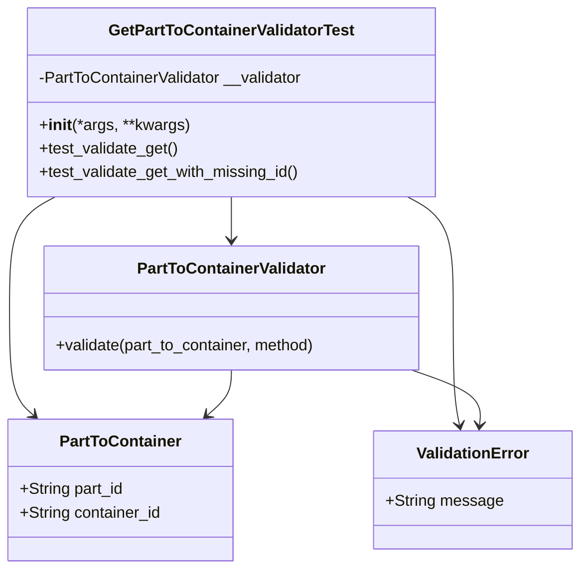
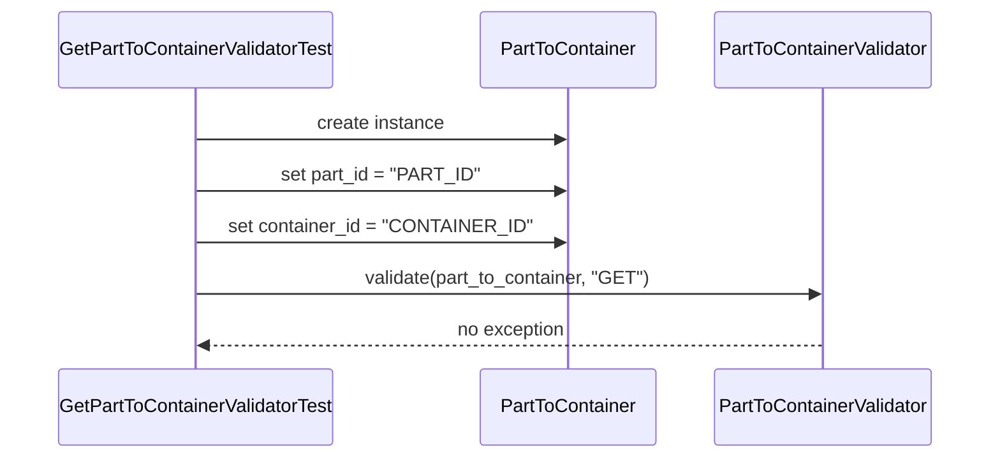
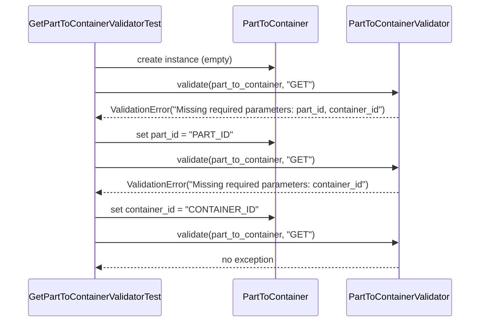
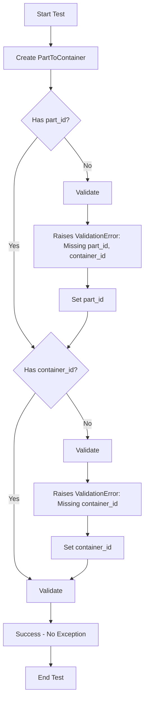

# Diagram: platform/partview_core/partview_service/partview_service/tests/unit/core/validators/part_to_container/part_to_container_get_validator_test.py

> Auto-generated by Obscura crawlers

## Diagram 1

### SVG

<svg id="container" width="586.814453125" xmlns="http://www.w3.org/2000/svg" class="classDiagram" height="578" viewBox="0 0 586.814453125 578" role="graphics-document document" aria-roledescription="class"><g><defs><marker id="container_class-aggregationStart" class="marker aggregation class" refX="18" refY="7" markerWidth="190" markerHeight="240" orient="auto"><path d="M 18,7 L9,13 L1,7 L9,1 Z"></path></marker></defs><defs><marker id="container_class-aggregationEnd" class="marker aggregation class" refX="1" refY="7" markerWidth="20" markerHeight="28" orient="auto"><path d="M 18,7 L9,13 L1,7 L9,1 Z"></path></marker></defs><defs><marker id="container_class-extensionStart" class="marker extension class" refX="18" refY="7" markerWidth="190" markerHeight="240" orient="auto"><path d="M 1,7 L18,13 V 1 Z"></path></marker></defs><defs><marker id="container_class-extensionEnd" class="marker extension class" refX="1" refY="7" markerWidth="20" markerHeight="28" orient="auto"><path d="M 1,1 V 13 L18,7 Z"></path></marker></defs><defs><marker id="container_class-compositionStart" class="marker composition class" refX="18" refY="7" markerWidth="190" markerHeight="240" orient="auto"><path d="M 18,7 L9,13 L1,7 L9,1 Z"></path></marker></defs><defs><marker id="container_class-compositionEnd" class="marker composition class" refX="1" refY="7" markerWidth="20" markerHeight="28" orient="auto"><path d="M 18,7 L9,13 L1,7 L9,1 Z"></path></marker></defs><defs><marker id="container_class-dependencyStart" class="marker dependency class" refX="6" refY="7" markerWidth="190" markerHeight="240" orient="auto"><path d="M 5,7 L9,13 L1,7 L9,1 Z"></path></marker></defs><defs><marker id="container_class-dependencyEnd" class="marker dependency class" refX="13" refY="7" markerWidth="20" markerHeight="28" orient="auto"><path d="M 18,7 L9,13 L14,7 L9,1 Z"></path></marker></defs><defs><marker id="container_class-lollipopStart" class="marker lollipop class" refX="13" refY="7" markerWidth="190" markerHeight="240" orient="auto"><circle stroke="black" fill="transparent" cx="7" cy="7" r="6"></circle></marker></defs><defs><marker id="container_class-lollipopEnd" class="marker lollipop class" refX="1" refY="7" markerWidth="190" markerHeight="240" orient="auto"><circle stroke="black" fill="transparent" cx="7" cy="7" r="6"></circle></marker></defs><g class="root"><g class="clusters"></g><g class="edgePaths"><path d="M235.895,200L235.895,204.167C235.895,208.333,235.895,216.667,235.895,224C235.895,231.333,235.895,237.667,235.895,240.833L235.895,244" id="id_GetPartToContainerValidatorTest_PartToContainerValidator_1" class="edge-thickness-normal edge-pattern-solid relation" style=";;;" data-edge="true" data-et="edge" data-id="id_GetPartToContainerValidatorTest_PartToContainerValidator_1" data-points="W3sieCI6MjM1Ljg5NDUzMTI1LCJ5IjoyMDB9LHsieCI6MjM1Ljg5NDUzMTI1LCJ5IjoyMjV9LHsieCI6MjM1Ljg5NDUzMTI1LCJ5IjoyNTB9XQ==" marker-end="url(#container_class-dependencyEnd)"></path><path d="M55.182,200L47.338,204.167C39.495,208.333,23.808,216.667,15.965,235.5C8.121,254.333,8.121,283.667,8.121,313C8.121,342.333,8.121,371.667,12.252,389.852C16.383,408.037,24.644,415.073,28.775,418.591L32.906,422.11" id="id_GetPartToContainerValidatorTest_PartToContainer_2" class="edge-thickness-normal edge-pattern-solid relation" style=";;;" data-edge="true" data-et="edge" data-id="id_GetPartToContainerValidatorTest_PartToContainer_2" data-points="W3sieCI6NTUuMTgxNzIxMzMyNjQ0NjMsInkiOjIwMH0seyJ4Ijo4LjEyMTA5Mzc1LCJ5IjoyMjV9LHsieCI6OC4xMjEwOTM3NSwieSI6MzEzfSx7IngiOjguMTIxMDkzNzUsInkiOjQwMX0seyJ4IjozNy40NzMzNDA4NTA1MTU0NywieSI6NDI2fV0=" marker-end="url(#container_class-dependencyEnd)"></path><path d="M416.607,200L424.451,204.167C432.294,208.333,447.981,216.667,455.825,235.5C463.668,254.333,463.668,283.667,463.668,313C463.668,342.333,463.668,371.667,464.583,391.515C465.498,411.364,467.328,421.728,468.243,426.909L469.158,432.091" id="id_GetPartToContainerValidatorTest_ValidationError_3" class="edge-thickness-normal edge-pattern-solid relation" style=";;;" data-edge="true" data-et="edge" data-id="id_GetPartToContainerValidatorTest_ValidationError_3" data-points="W3sieCI6NDE2LjYwNzM0MTE2NzM1NTM0LCJ5IjoyMDB9LHsieCI6NDYzLjY2Nzk2ODc1LCJ5IjoyMjV9LHsieCI6NDYzLjY2Nzk2ODc1LCJ5IjozMTN9LHsieCI6NDYzLjY2Nzk2ODc1LCJ5Ijo0MDF9LHsieCI6NDcwLjIwMDkzMDI1MTI4ODY0LCJ5Ijo0Mzh9XQ==" marker-end="url(#container_class-dependencyEnd)"></path><path d="M235.895,376L235.895,380.167C235.895,384.333,235.895,392.667,231.764,400.352C227.633,408.037,219.372,415.073,215.241,418.591L211.11,422.11" id="id_PartToContainerValidator_PartToContainer_4" class="edge-thickness-normal edge-pattern-solid relation" style=";;;" data-edge="true" data-et="edge" data-id="id_PartToContainerValidator_PartToContainer_4" data-points="W3sieCI6MjM1Ljg5NDUzMTI1LCJ5IjozNzZ9LHsieCI6MjM1Ljg5NDUzMTI1LCJ5Ijo0MDF9LHsieCI6MjA2LjU0MjI4NDE0OTQ4NDU0LCJ5Ijo0MjZ9XQ==" marker-end="url(#container_class-dependencyEnd)"></path><path d="M418.38,376L430.449,380.167C442.518,384.333,466.657,392.667,478.193,402.005C489.729,411.344,488.662,421.688,488.129,426.86L487.596,432.032" id="id_PartToContainerValidator_ValidationError_5" class="edge-thickness-normal edge-pattern-solid relation" style=";;;" data-edge="true" data-et="edge" data-id="id_PartToContainerValidator_ValidationError_5" data-points="W3sieCI6NDE4LjM4MDAzODE3NDcxNTksInkiOjM3Nn0seyJ4Ijo0OTAuNzk0OTIxODc1LCJ5Ijo0MDF9LHsieCI6NDg2Ljk4MDQ4ODg4NTMwOTMsInkiOjQzOH1d" marker-end="url(#container_class-dependencyEnd)"></path></g><g class="edgeLabels"><g class="edgeLabel"><g class="label" data-id="id_GetPartToContainerValidatorTest_PartToContainerValidator_1" transform="translate(0, 0)"><foreignObject width="0" height="0">

</foreignObject></g></g><g class="edgeLabel"><g class="label" data-id="id_GetPartToContainerValidatorTest_PartToContainer_2" transform="translate(0, 0)"><foreignObject width="0" height="0">

</foreignObject></g></g><g class="edgeLabel"><g class="label" data-id="id_GetPartToContainerValidatorTest_ValidationError_3" transform="translate(0, 0)"><foreignObject width="0" height="0">

</foreignObject></g></g><g class="edgeLabel"><g class="label" data-id="id_PartToContainerValidator_PartToContainer_4" transform="translate(0, 0)"><foreignObject width="0" height="0">

</foreignObject></g></g><g class="edgeLabel"><g class="label" data-id="id_PartToContainerValidator_ValidationError_5" transform="translate(0, 0)"><foreignObject width="0" height="0">

</foreignObject></g></g></g><g class="nodes"><g class="node default" id="classId-GetPartToContainerValidatorTest-0" transform="translate(235.89453125, 104)"><g class="basic label-container"><path d="M-208.671875 -96 L208.671875 -96 L208.671875 96 L-208.671875 96" stroke="none" stroke-width="0" fill="#ECECFF" style=""></path><path d="M-208.671875 -96 C-113.67768619674735 -96, -18.68349739349469 -96, 208.671875 -96 M-208.671875 -96 C-76.6672437094796 -96, 55.33738758104079 -96, 208.671875 -96 M208.671875 -96 C208.671875 -40.774483794598694, 208.671875 14.451032410802611, 208.671875 96 M208.671875 -96 C208.671875 -57.5778341953788, 208.671875 -19.155668390757597, 208.671875 96 M208.671875 96 C44.7458463212713 96, -119.1801823574574 96, -208.671875 96 M208.671875 96 C113.2982244597435 96, 17.92457391948699 96, -208.671875 96 M-208.671875 96 C-208.671875 32.139599874610425, -208.671875 -31.72080025077915, -208.671875 -96 M-208.671875 96 C-208.671875 51.471640356103094, -208.671875 6.943280712206189, -208.671875 -96" stroke="#9370DB" stroke-width="1.3" fill="none" stroke-dasharray="0 0" style=""></path></g><g class="annotation-group text" transform="translate(0, -72)"></g><g class="label-group text" transform="translate(-120.3125, -72)"><g class="label" style="font-weight: bolder" transform="translate(0,-12)"><foreignObject width="240.625" height="24">

GetPartToContainerValidatorTest

</foreignObject></g></g><g class="members-group text" transform="translate(-196.671875, -24)"><g class="label" style="" transform="translate(0,-12)"><foreignObject width="273.03125" height="24">

-PartToContainerValidator __validator

</foreignObject></g></g><g class="methods-group text" transform="translate(-196.671875, 24)"><g class="label" style="" transform="translate(0,-12)"><foreignObject width="151.8125" height="24">

+<strong>init</strong>(*args, **kwargs)

</foreignObject></g><g class="label" style="" transform="translate(0,12)"><foreignObject width="142.21875" height="24">

+test_validate_get()

</foreignObject></g><g class="label" style="" transform="translate(0,36)"><foreignObject width="267.359375" height="24">

+test_validate_get_with_missing_id()

</foreignObject></g></g><g class="divider" style=""><path d="M-208.671875 -48 C-66.24613461894063 -48, 76.17960576211874 -48, 208.671875 -48 M-208.671875 -48 C-44.34782482732638 -48, 119.97622534534725 -48, 208.671875 -48" stroke="#9370DB" stroke-width="1.3" fill="none" stroke-dasharray="0 0" style=""></path></g><g class="divider" style=""><path d="M-208.671875 0 C-78.42399382823123 0, 51.823887343537535 0, 208.671875 0 M-208.671875 0 C-51.83755512419921 0, 104.99676475160157 0, 208.671875 0" stroke="#9370DB" stroke-width="1.3" fill="none" stroke-dasharray="0 0" style=""></path></g></g><g class="node default" id="classId-PartToContainerValidator-1" transform="translate(235.89453125, 313)"><g class="basic label-container"><path d="M-192.7734375 -63 L192.7734375 -63 L192.7734375 63 L-192.7734375 63" stroke="none" stroke-width="0" fill="#ECECFF" style=""></path><path d="M-192.7734375 -63 C-67.85615968324483 -63, 57.06111813351035 -63, 192.7734375 -63 M-192.7734375 -63 C-95.8065743790226 -63, 1.160288741954787 -63, 192.7734375 -63 M192.7734375 -63 C192.7734375 -36.37296843240154, 192.7734375 -9.745936864803085, 192.7734375 63 M192.7734375 -63 C192.7734375 -13.45312222318536, 192.7734375 36.09375555362928, 192.7734375 63 M192.7734375 63 C50.86035195826136 63, -91.05273358347728 63, -192.7734375 63 M192.7734375 63 C44.19732510501325 63, -104.3787872899735 63, -192.7734375 63 M-192.7734375 63 C-192.7734375 13.53487408030206, -192.7734375 -35.93025183939588, -192.7734375 -63 M-192.7734375 63 C-192.7734375 13.390299320350934, -192.7734375 -36.21940135929813, -192.7734375 -63" stroke="#9370DB" stroke-width="1.3" fill="none" stroke-dasharray="0 0" style=""></path></g><g class="annotation-group text" transform="translate(0, -39)"></g><g class="label-group text" transform="translate(-92.40625, -39)"><g class="label" style="font-weight: bolder" transform="translate(0,-12)"><foreignObject width="184.8125" height="24">

PartToContainerValidator

</foreignObject></g></g><g class="members-group text" transform="translate(-180.7734375, 9)"></g><g class="methods-group text" transform="translate(-180.7734375, 39)"><g class="label" style="" transform="translate(0,-12)"><foreignObject width="269.140625" height="24">

+validate(part_to_container, method)

</foreignObject></g></g><g class="divider" style=""><path d="M-192.7734375 -15 C-111.71104543849215 -15, -30.6486533769843 -15, 192.7734375 -15 M-192.7734375 -15 C-103.200833645129 -15, -13.62822979025799 -15, 192.7734375 -15" stroke="#9370DB" stroke-width="1.3" fill="none" stroke-dasharray="0 0" style=""></path></g><g class="divider" style=""><path d="M-192.7734375 9 C-90.28899334614924 9, 12.19545080770152 9, 192.7734375 9 M-192.7734375 9 C-48.2314234988454 9, 96.3105905023092 9, 192.7734375 9" stroke="#9370DB" stroke-width="1.3" fill="none" stroke-dasharray="0 0" style=""></path></g></g><g class="node default" id="classId-PartToContainer-2" transform="translate(122.0078125, 498)"><g class="basic label-container"><path d="M-114.0078125 -72 L114.0078125 -72 L114.0078125 72 L-114.0078125 72" stroke="none" stroke-width="0" fill="#ECECFF" style=""></path><path d="M-114.0078125 -72 C-24.13271334557507 -72, 65.74238580884986 -72, 114.0078125 -72 M-114.0078125 -72 C-43.769697321048525 -72, 26.46841785790295 -72, 114.0078125 -72 M114.0078125 -72 C114.0078125 -15.899503756669375, 114.0078125 40.20099248666125, 114.0078125 72 M114.0078125 -72 C114.0078125 -40.86657872522571, 114.0078125 -9.733157450451415, 114.0078125 72 M114.0078125 72 C54.79057780415299 72, -4.426656891694023 72, -114.0078125 72 M114.0078125 72 C49.501543386033504 72, -15.004725727932993 72, -114.0078125 72 M-114.0078125 72 C-114.0078125 26.860212258661235, -114.0078125 -18.27957548267753, -114.0078125 -72 M-114.0078125 72 C-114.0078125 35.36770586369061, -114.0078125 -1.2645882726187807, -114.0078125 -72" stroke="#9370DB" stroke-width="1.3" fill="none" stroke-dasharray="0 0" style=""></path></g><g class="annotation-group text" transform="translate(0, -48)"></g><g class="label-group text" transform="translate(-59.21875, -48)"><g class="label" style="font-weight: bolder" transform="translate(0,-12)"><foreignObject width="118.4375" height="24">

PartToContainer

</foreignObject></g></g><g class="members-group text" transform="translate(-102.0078125, 0)"><g class="label" style="" transform="translate(0,-12)"><foreignObject width="106.875" height="24">

+String part_id

</foreignObject></g><g class="label" style="" transform="translate(0,12)"><foreignObject width="144.796875" height="24">

+String container_id

</foreignObject></g></g><g class="methods-group text" transform="translate(-102.0078125, 72)"></g><g class="divider" style=""><path d="M-114.0078125 -24 C-40.590451124694255 -24, 32.82691025061149 -24, 114.0078125 -24 M-114.0078125 -24 C-38.51527043120146 -24, 36.977271637597084 -24, 114.0078125 -24" stroke="#9370DB" stroke-width="1.3" fill="none" stroke-dasharray="0 0" style=""></path></g><g class="divider" style=""><path d="M-114.0078125 48 C-51.48861860492697 48, 11.03057529014606 48, 114.0078125 48 M-114.0078125 48 C-60.050014011683125 48, -6.092215523366249 48, 114.0078125 48" stroke="#9370DB" stroke-width="1.3" fill="none" stroke-dasharray="0 0" style=""></path></g></g><g class="node default" id="classId-ValidationError-3" transform="translate(480.794921875, 498)"><g class="basic label-container"><path d="M-98.01953125 -60 L98.01953125 -60 L98.01953125 60 L-98.01953125 60" stroke="none" stroke-width="0" fill="#ECECFF" style=""></path><path d="M-98.01953125 -60 C-25.4461401412037 -60, 47.1272509675926 -60, 98.01953125 -60 M-98.01953125 -60 C-36.51707933513071 -60, 24.98537257973858 -60, 98.01953125 -60 M98.01953125 -60 C98.01953125 -29.190860278734245, 98.01953125 1.6182794425315095, 98.01953125 60 M98.01953125 -60 C98.01953125 -27.867238333694985, 98.01953125 4.26552333261003, 98.01953125 60 M98.01953125 60 C39.9483178647015 60, -18.122895520596998 60, -98.01953125 60 M98.01953125 60 C21.910346202203627 60, -54.198838845592746 60, -98.01953125 60 M-98.01953125 60 C-98.01953125 12.152616824014835, -98.01953125 -35.69476635197033, -98.01953125 -60 M-98.01953125 60 C-98.01953125 19.034697861261364, -98.01953125 -21.930604277477272, -98.01953125 -60" stroke="#9370DB" stroke-width="1.3" fill="none" stroke-dasharray="0 0" style=""></path></g><g class="annotation-group text" transform="translate(0, -36)"></g><g class="label-group text" transform="translate(-55.1796875, -36)"><g class="label" style="font-weight: bolder" transform="translate(0,-12)"><foreignObject width="110.359375" height="24">

ValidationError

</foreignObject></g></g><g class="members-group text" transform="translate(-86.01953125, 12)"><g class="label" style="" transform="translate(0,-12)"><foreignObject width="116.859375" height="24">

+String message

</foreignObject></g></g><g class="methods-group text" transform="translate(-86.01953125, 60)"></g><g class="divider" style=""><path d="M-98.01953125 -12 C-38.14510154318058 -12, 21.72932816363884 -12, 98.01953125 -12 M-98.01953125 -12 C-43.79360725172376 -12, 10.432316746552473 -12, 98.01953125 -12" stroke="#9370DB" stroke-width="1.3" fill="none" stroke-dasharray="0 0" style=""></path></g><g class="divider" style=""><path d="M-98.01953125 36 C-45.15961701805208 36, 7.700297213895837 36, 98.01953125 36 M-98.01953125 36 C-22.471158587036342 36, 53.077214075927316 36, 98.01953125 36" stroke="#9370DB" stroke-width="1.3" fill="none" stroke-dasharray="0 0" style=""></path></g></g></g></g></g></svg>

## Diagram 2

### SVG

<svg id="container" width="875" xmlns="http://www.w3.org/2000/svg" height="411" viewBox="-50 -10 875 411" role="graphics-document document" aria-roledescription="sequence"><g><rect x="573" y="325" fill="#eaeaea" stroke="#666" width="202" height="65" name="Validator" rx="3" ry="3" class="actor actor-bottom"></rect><text x="674" y="357.5" dominant-baseline="central" alignment-baseline="central" class="actor actor-box" style="text-anchor: middle; font-size: 16px; font-weight: 400;"><tspan x="674" dy="0">PartToContainerValidator</tspan></text></g><g><rect x="373" y="325" fill="#eaeaea" stroke="#666" width="150" height="65" name="PTC" rx="3" ry="3" class="actor actor-bottom"></rect><text x="448" y="357.5" dominant-baseline="central" alignment-baseline="central" class="actor actor-box" style="text-anchor: middle; font-size: 16px; font-weight: 400;"><tspan x="448" dy="0">PartToContainer</tspan></text></g><g><rect x="0" y="325" fill="#eaeaea" stroke="#666" width="256" height="65" name="Test" rx="3" ry="3" class="actor actor-bottom"></rect><text x="128" y="357.5" dominant-baseline="central" alignment-baseline="central" class="actor actor-box" style="text-anchor: middle; font-size: 16px; font-weight: 400;"><tspan x="128" dy="0">GetPartToContainerValidatorTest</tspan></text></g><g><line id="actor2" x1="674" y1="65" x2="674" y2="325" class="actor-line 200" stroke-width="0.5px" stroke="#999" name="Validator"></line><g id="root-2"><rect x="573" y="0" fill="#eaeaea" stroke="#666" width="202" height="65" name="Validator" rx="3" ry="3" class="actor actor-top"></rect><text x="674" y="32.5" dominant-baseline="central" alignment-baseline="central" class="actor actor-box" style="text-anchor: middle; font-size: 16px; font-weight: 400;"><tspan x="674" dy="0">PartToContainerValidator</tspan></text></g></g><g><line id="actor1" x1="448" y1="65" x2="448" y2="325" class="actor-line 200" stroke-width="0.5px" stroke="#999" name="PTC"></line><g id="root-1"><rect x="373" y="0" fill="#eaeaea" stroke="#666" width="150" height="65" name="PTC" rx="3" ry="3" class="actor actor-top"></rect><text x="448" y="32.5" dominant-baseline="central" alignment-baseline="central" class="actor actor-box" style="text-anchor: middle; font-size: 16px; font-weight: 400;"><tspan x="448" dy="0">PartToContainer</tspan></text></g></g><g><line id="actor0" x1="128" y1="65" x2="128" y2="325" class="actor-line 200" stroke-width="0.5px" stroke="#999" name="Test"></line><g id="root-0"><rect x="0" y="0" fill="#eaeaea" stroke="#666" width="256" height="65" name="Test" rx="3" ry="3" class="actor actor-top"></rect><text x="128" y="32.5" dominant-baseline="central" alignment-baseline="central" class="actor actor-box" style="text-anchor: middle; font-size: 16px; font-weight: 400;"><tspan x="128" dy="0">GetPartToContainerValidatorTest</tspan></text></g></g><g></g><defs><symbol id="computer" width="24" height="24"><path transform="scale(.5)" d="M2 2v13h20v-13h-20zm18 11h-16v-9h16v9zm-10.228 6l.466-1h3.524l.467 1h-4.457zm14.228 3h-24l2-6h2.104l-1.33 4h18.45l-1.297-4h2.073l2 6zm-5-10h-14v-7h14v7z"></path></symbol></defs><defs><symbol id="database" fill-rule="evenodd" clip-rule="evenodd"><path transform="scale(.5)" d="M12.258.001l.256.004.255.005.253.008.251.01.249.012.247.015.246.016.242.019.241.02.239.023.236.024.233.027.231.028.229.031.225.032.223.034.22.036.217.038.214.04.211.041.208.043.205.045.201.046.198.048.194.05.191.051.187.053.183.054.18.056.175.057.172.059.168.06.163.061.16.063.155.064.15.066.074.033.073.033.071.034.07.034.069.035.068.035.067.035.066.035.064.036.064.036.062.036.06.036.06.037.058.037.058.037.055.038.055.038.053.038.052.038.051.039.05.039.048.039.047.039.045.04.044.04.043.04.041.04.04.041.039.041.037.041.036.041.034.041.033.042.032.042.03.042.029.042.027.042.026.043.024.043.023.043.021.043.02.043.018.044.017.043.015.044.013.044.012.044.011.045.009.044.007.045.006.045.004.045.002.045.001.045v17l-.001.045-.002.045-.004.045-.006.045-.007.045-.009.044-.011.045-.012.044-.013.044-.015.044-.017.043-.018.044-.02.043-.021.043-.023.043-.024.043-.026.043-.027.042-.029.042-.03.042-.032.042-.033.042-.034.041-.036.041-.037.041-.039.041-.04.041-.041.04-.043.04-.044.04-.045.04-.047.039-.048.039-.05.039-.051.039-.052.038-.053.038-.055.038-.055.038-.058.037-.058.037-.06.037-.06.036-.062.036-.064.036-.064.036-.066.035-.067.035-.068.035-.069.035-.07.034-.071.034-.073.033-.074.033-.15.066-.155.064-.16.063-.163.061-.168.06-.172.059-.175.057-.18.056-.183.054-.187.053-.191.051-.194.05-.198.048-.201.046-.205.045-.208.043-.211.041-.214.04-.217.038-.22.036-.223.034-.225.032-.229.031-.231.028-.233.027-.236.024-.239.023-.241.02-.242.019-.246.016-.247.015-.249.012-.251.01-.253.008-.255.005-.256.004-.258.001-.258-.001-.256-.004-.255-.005-.253-.008-.251-.01-.249-.012-.247-.015-.245-.016-.243-.019-.241-.02-.238-.023-.236-.024-.234-.027-.231-.028-.228-.031-.226-.032-.223-.034-.22-.036-.217-.038-.214-.04-.211-.041-.208-.043-.204-.045-.201-.046-.198-.048-.195-.05-.19-.051-.187-.053-.184-.054-.179-.056-.176-.057-.172-.059-.167-.06-.164-.061-.159-.063-.155-.064-.151-.066-.074-.033-.072-.033-.072-.034-.07-.034-.069-.035-.068-.035-.067-.035-.066-.035-.064-.036-.063-.036-.062-.036-.061-.036-.06-.037-.058-.037-.057-.037-.056-.038-.055-.038-.053-.038-.052-.038-.051-.039-.049-.039-.049-.039-.046-.039-.046-.04-.044-.04-.043-.04-.041-.04-.04-.041-.039-.041-.037-.041-.036-.041-.034-.041-.033-.042-.032-.042-.03-.042-.029-.042-.027-.042-.026-.043-.024-.043-.023-.043-.021-.043-.02-.043-.018-.044-.017-.043-.015-.044-.013-.044-.012-.044-.011-.045-.009-.044-.007-.045-.006-.045-.004-.045-.002-.045-.001-.045v-17l.001-.045.002-.045.004-.045.006-.045.007-.045.009-.044.011-.045.012-.044.013-.044.015-.044.017-.043.018-.044.02-.043.021-.043.023-.043.024-.043.026-.043.027-.042.029-.042.03-.042.032-.042.033-.042.034-.041.036-.041.037-.041.039-.041.04-.041.041-.04.043-.04.044-.04.046-.04.046-.039.049-.039.049-.039.051-.039.052-.038.053-.038.055-.038.056-.038.057-.037.058-.037.06-.037.061-.036.062-.036.063-.036.064-.036.066-.035.067-.035.068-.035.069-.035.07-.034.072-.034.072-.033.074-.033.151-.066.155-.064.159-.063.164-.061.167-.06.172-.059.176-.057.179-.056.184-.054.187-.053.19-.051.195-.05.198-.048.201-.046.204-.045.208-.043.211-.041.214-.04.217-.038.22-.036.223-.034.226-.032.228-.031.231-.028.234-.027.236-.024.238-.023.241-.02.243-.019.245-.016.247-.015.249-.012.251-.01.253-.008.255-.005.256-.004.258-.001.258.001zm-9.258 20.499v.01l.001.021.003.021.004.022.005.021.006.022.007.022.009.023.01.022.011.023.012.023.013.023.015.023.016.024.017.023.018.024.019.024.021.024.022.025.023.024.024.025.052.049.056.05.061.051.066.051.07.051.075.051.079.052.084.052.088.052.092.052.097.052.102.051.105.052.11.052.114.051.119.051.123.051.127.05.131.05.135.05.139.048.144.049.147.047.152.047.155.047.16.045.163.045.167.043.171.043.176.041.178.041.183.039.187.039.19.037.194.035.197.035.202.033.204.031.209.03.212.029.216.027.219.025.222.024.226.021.23.02.233.018.236.016.24.015.243.012.246.01.249.008.253.005.256.004.259.001.26-.001.257-.004.254-.005.25-.008.247-.011.244-.012.241-.014.237-.016.233-.018.231-.021.226-.021.224-.024.22-.026.216-.027.212-.028.21-.031.205-.031.202-.034.198-.034.194-.036.191-.037.187-.039.183-.04.179-.04.175-.042.172-.043.168-.044.163-.045.16-.046.155-.046.152-.047.148-.048.143-.049.139-.049.136-.05.131-.05.126-.05.123-.051.118-.052.114-.051.11-.052.106-.052.101-.052.096-.052.092-.052.088-.053.083-.051.079-.052.074-.052.07-.051.065-.051.06-.051.056-.05.051-.05.023-.024.023-.025.021-.024.02-.024.019-.024.018-.024.017-.024.015-.023.014-.024.013-.023.012-.023.01-.023.01-.022.008-.022.006-.022.006-.022.004-.022.004-.021.001-.021.001-.021v-4.127l-.077.055-.08.053-.083.054-.085.053-.087.052-.09.052-.093.051-.095.05-.097.05-.1.049-.102.049-.105.048-.106.047-.109.047-.111.046-.114.045-.115.045-.118.044-.12.043-.122.042-.124.042-.126.041-.128.04-.13.04-.132.038-.134.038-.135.037-.138.037-.139.035-.142.035-.143.034-.144.033-.147.032-.148.031-.15.03-.151.03-.153.029-.154.027-.156.027-.158.026-.159.025-.161.024-.162.023-.163.022-.165.021-.166.02-.167.019-.169.018-.169.017-.171.016-.173.015-.173.014-.175.013-.175.012-.177.011-.178.01-.179.008-.179.008-.181.006-.182.005-.182.004-.184.003-.184.002h-.37l-.184-.002-.184-.003-.182-.004-.182-.005-.181-.006-.179-.008-.179-.008-.178-.01-.176-.011-.176-.012-.175-.013-.173-.014-.172-.015-.171-.016-.17-.017-.169-.018-.167-.019-.166-.02-.165-.021-.163-.022-.162-.023-.161-.024-.159-.025-.157-.026-.156-.027-.155-.027-.153-.029-.151-.03-.15-.03-.148-.031-.146-.032-.145-.033-.143-.034-.141-.035-.14-.035-.137-.037-.136-.037-.134-.038-.132-.038-.13-.04-.128-.04-.126-.041-.124-.042-.122-.042-.12-.044-.117-.043-.116-.045-.113-.045-.112-.046-.109-.047-.106-.047-.105-.048-.102-.049-.1-.049-.097-.05-.095-.05-.093-.052-.09-.051-.087-.052-.085-.053-.083-.054-.08-.054-.077-.054v4.127zm0-5.654v.011l.001.021.003.021.004.021.005.022.006.022.007.022.009.022.01.022.011.023.012.023.013.023.015.024.016.023.017.024.018.024.019.024.021.024.022.024.023.025.024.024.052.05.056.05.061.05.066.051.07.051.075.052.079.051.084.052.088.052.092.052.097.052.102.052.105.052.11.051.114.051.119.052.123.05.127.051.131.05.135.049.139.049.144.048.147.048.152.047.155.046.16.045.163.045.167.044.171.042.176.042.178.04.183.04.187.038.19.037.194.036.197.034.202.033.204.032.209.03.212.028.216.027.219.025.222.024.226.022.23.02.233.018.236.016.24.014.243.012.246.01.249.008.253.006.256.003.259.001.26-.001.257-.003.254-.006.25-.008.247-.01.244-.012.241-.015.237-.016.233-.018.231-.02.226-.022.224-.024.22-.025.216-.027.212-.029.21-.03.205-.032.202-.033.198-.035.194-.036.191-.037.187-.039.183-.039.179-.041.175-.042.172-.043.168-.044.163-.045.16-.045.155-.047.152-.047.148-.048.143-.048.139-.05.136-.049.131-.05.126-.051.123-.051.118-.051.114-.052.11-.052.106-.052.101-.052.096-.052.092-.052.088-.052.083-.052.079-.052.074-.051.07-.052.065-.051.06-.05.056-.051.051-.049.023-.025.023-.024.021-.025.02-.024.019-.024.018-.024.017-.024.015-.023.014-.023.013-.024.012-.022.01-.023.01-.023.008-.022.006-.022.006-.022.004-.021.004-.022.001-.021.001-.021v-4.139l-.077.054-.08.054-.083.054-.085.052-.087.053-.09.051-.093.051-.095.051-.097.05-.1.049-.102.049-.105.048-.106.047-.109.047-.111.046-.114.045-.115.044-.118.044-.12.044-.122.042-.124.042-.126.041-.128.04-.13.039-.132.039-.134.038-.135.037-.138.036-.139.036-.142.035-.143.033-.144.033-.147.033-.148.031-.15.03-.151.03-.153.028-.154.028-.156.027-.158.026-.159.025-.161.024-.162.023-.163.022-.165.021-.166.02-.167.019-.169.018-.169.017-.171.016-.173.015-.173.014-.175.013-.175.012-.177.011-.178.009-.179.009-.179.007-.181.007-.182.005-.182.004-.184.003-.184.002h-.37l-.184-.002-.184-.003-.182-.004-.182-.005-.181-.007-.179-.007-.179-.009-.178-.009-.176-.011-.176-.012-.175-.013-.173-.014-.172-.015-.171-.016-.17-.017-.169-.018-.167-.019-.166-.02-.165-.021-.163-.022-.162-.023-.161-.024-.159-.025-.157-.026-.156-.027-.155-.028-.153-.028-.151-.03-.15-.03-.148-.031-.146-.033-.145-.033-.143-.033-.141-.035-.14-.036-.137-.036-.136-.037-.134-.038-.132-.039-.13-.039-.128-.04-.126-.041-.124-.042-.122-.043-.12-.043-.117-.044-.116-.044-.113-.046-.112-.046-.109-.046-.106-.047-.105-.048-.102-.049-.1-.049-.097-.05-.095-.051-.093-.051-.09-.051-.087-.053-.085-.052-.083-.054-.08-.054-.077-.054v4.139zm0-5.666v.011l.001.02.003.022.004.021.005.022.006.021.007.022.009.023.01.022.011.023.012.023.013.023.015.023.016.024.017.024.018.023.019.024.021.025.022.024.023.024.024.025.052.05.056.05.061.05.066.051.07.051.075.052.079.051.084.052.088.052.092.052.097.052.102.052.105.051.11.052.114.051.119.051.123.051.127.05.131.05.135.05.139.049.144.048.147.048.152.047.155.046.16.045.163.045.167.043.171.043.176.042.178.04.183.04.187.038.19.037.194.036.197.034.202.033.204.032.209.03.212.028.216.027.219.025.222.024.226.021.23.02.233.018.236.017.24.014.243.012.246.01.249.008.253.006.256.003.259.001.26-.001.257-.003.254-.006.25-.008.247-.01.244-.013.241-.014.237-.016.233-.018.231-.02.226-.022.224-.024.22-.025.216-.027.212-.029.21-.03.205-.032.202-.033.198-.035.194-.036.191-.037.187-.039.183-.039.179-.041.175-.042.172-.043.168-.044.163-.045.16-.045.155-.047.152-.047.148-.048.143-.049.139-.049.136-.049.131-.051.126-.05.123-.051.118-.052.114-.051.11-.052.106-.052.101-.052.096-.052.092-.052.088-.052.083-.052.079-.052.074-.052.07-.051.065-.051.06-.051.056-.05.051-.049.023-.025.023-.025.021-.024.02-.024.019-.024.018-.024.017-.024.015-.023.014-.024.013-.023.012-.023.01-.022.01-.023.008-.022.006-.022.006-.022.004-.022.004-.021.001-.021.001-.021v-4.153l-.077.054-.08.054-.083.053-.085.053-.087.053-.09.051-.093.051-.095.051-.097.05-.1.049-.102.048-.105.048-.106.048-.109.046-.111.046-.114.046-.115.044-.118.044-.12.043-.122.043-.124.042-.126.041-.128.04-.13.039-.132.039-.134.038-.135.037-.138.036-.139.036-.142.034-.143.034-.144.033-.147.032-.148.032-.15.03-.151.03-.153.028-.154.028-.156.027-.158.026-.159.024-.161.024-.162.023-.163.023-.165.021-.166.02-.167.019-.169.018-.169.017-.171.016-.173.015-.173.014-.175.013-.175.012-.177.01-.178.01-.179.009-.179.007-.181.006-.182.006-.182.004-.184.003-.184.001-.185.001-.185-.001-.184-.001-.184-.003-.182-.004-.182-.006-.181-.006-.179-.007-.179-.009-.178-.01-.176-.01-.176-.012-.175-.013-.173-.014-.172-.015-.171-.016-.17-.017-.169-.018-.167-.019-.166-.02-.165-.021-.163-.023-.162-.023-.161-.024-.159-.024-.157-.026-.156-.027-.155-.028-.153-.028-.151-.03-.15-.03-.148-.032-.146-.032-.145-.033-.143-.034-.141-.034-.14-.036-.137-.036-.136-.037-.134-.038-.132-.039-.13-.039-.128-.041-.126-.041-.124-.041-.122-.043-.12-.043-.117-.044-.116-.044-.113-.046-.112-.046-.109-.046-.106-.048-.105-.048-.102-.048-.1-.05-.097-.049-.095-.051-.093-.051-.09-.052-.087-.052-.085-.053-.083-.053-.08-.054-.077-.054v4.153zm8.74-8.179l-.257.004-.254.005-.25.008-.247.011-.244.012-.241.014-.237.016-.233.018-.231.021-.226.022-.224.023-.22.026-.216.027-.212.028-.21.031-.205.032-.202.033-.198.034-.194.036-.191.038-.187.038-.183.04-.179.041-.175.042-.172.043-.168.043-.163.045-.16.046-.155.046-.152.048-.148.048-.143.048-.139.049-.136.05-.131.05-.126.051-.123.051-.118.051-.114.052-.11.052-.106.052-.101.052-.096.052-.092.052-.088.052-.083.052-.079.052-.074.051-.07.052-.065.051-.06.05-.056.05-.051.05-.023.025-.023.024-.021.024-.02.025-.019.024-.018.024-.017.023-.015.024-.014.023-.013.023-.012.023-.01.023-.01.022-.008.022-.006.023-.006.021-.004.022-.004.021-.001.021-.001.021.001.021.001.021.004.021.004.022.006.021.006.023.008.022.01.022.01.023.012.023.013.023.014.023.015.024.017.023.018.024.019.024.02.025.021.024.023.024.023.025.051.05.056.05.06.05.065.051.07.052.074.051.079.052.083.052.088.052.092.052.096.052.101.052.106.052.11.052.114.052.118.051.123.051.126.051.131.05.136.05.139.049.143.048.148.048.152.048.155.046.16.046.163.045.168.043.172.043.175.042.179.041.183.04.187.038.191.038.194.036.198.034.202.033.205.032.21.031.212.028.216.027.22.026.224.023.226.022.231.021.233.018.237.016.241.014.244.012.247.011.25.008.254.005.257.004.26.001.26-.001.257-.004.254-.005.25-.008.247-.011.244-.012.241-.014.237-.016.233-.018.231-.021.226-.022.224-.023.22-.026.216-.027.212-.028.21-.031.205-.032.202-.033.198-.034.194-.036.191-.038.187-.038.183-.04.179-.041.175-.042.172-.043.168-.043.163-.045.16-.046.155-.046.152-.048.148-.048.143-.048.139-.049.136-.05.131-.05.126-.051.123-.051.118-.051.114-.052.11-.052.106-.052.101-.052.096-.052.092-.052.088-.052.083-.052.079-.052.074-.051.07-.052.065-.051.06-.05.056-.05.051-.05.023-.025.023-.024.021-.024.02-.025.019-.024.018-.024.017-.023.015-.024.014-.023.013-.023.012-.023.01-.023.01-.022.008-.022.006-.023.006-.021.004-.022.004-.021.001-.021.001-.021-.001-.021-.001-.021-.004-.021-.004-.022-.006-.021-.006-.023-.008-.022-.01-.022-.01-.023-.012-.023-.013-.023-.014-.023-.015-.024-.017-.023-.018-.024-.019-.024-.02-.025-.021-.024-.023-.024-.023-.025-.051-.05-.056-.05-.06-.05-.065-.051-.07-.052-.074-.051-.079-.052-.083-.052-.088-.052-.092-.052-.096-.052-.101-.052-.106-.052-.11-.052-.114-.052-.118-.051-.123-.051-.126-.051-.131-.05-.136-.05-.139-.049-.143-.048-.148-.048-.152-.048-.155-.046-.16-.046-.163-.045-.168-.043-.172-.043-.175-.042-.179-.041-.183-.04-.187-.038-.191-.038-.194-.036-.198-.034-.202-.033-.205-.032-.21-.031-.212-.028-.216-.027-.22-.026-.224-.023-.226-.022-.231-.021-.233-.018-.237-.016-.241-.014-.244-.012-.247-.011-.25-.008-.254-.005-.257-.004-.26-.001-.26.001z"></path></symbol></defs><defs><symbol id="clock" width="24" height="24"><path transform="scale(.5)" d="M12 2c5.514 0 10 4.486 10 10s-4.486 10-10 10-10-4.486-10-10 4.486-10 10-10zm0-2c-6.627 0-12 5.373-12 12s5.373 12 12 12 12-5.373 12-12-5.373-12-12-12zm5.848 12.459c.202.038.202.333.001.372-1.907.361-6.045 1.111-6.547 1.111-.719 0-1.301-.582-1.301-1.301 0-.512.77-5.447 1.125-7.445.034-.192.312-.181.343.014l.985 6.238 5.394 1.011z"></path></symbol></defs><defs><marker id="arrowhead" refX="7.9" refY="5" markerUnits="userSpaceOnUse" markerWidth="12" markerHeight="12" orient="auto-start-reverse"><path d="M -1 0 L 10 5 L 0 10 z"></path></marker></defs><defs><marker id="crosshead" markerWidth="15" markerHeight="8" orient="auto" refX="4" refY="4.5"><path fill="none" stroke="#000000" stroke-width="1pt" d="M 1,2 L 6,7 M 6,2 L 1,7" style="stroke-dasharray: 0, 0;"></path></marker></defs><defs><marker id="filled-head" refX="15.5" refY="7" markerWidth="20" markerHeight="28" orient="auto"><path d="M 18,7 L9,13 L14,7 L9,1 Z"></path></marker></defs><defs><marker id="sequencenumber" refX="15" refY="15" markerWidth="60" markerHeight="40" orient="auto"><circle cx="15" cy="15" r="6"></circle></marker></defs><text x="287" y="80" text-anchor="middle" dominant-baseline="middle" alignment-baseline="middle" class="messageText" dy="1em" style="font-size: 16px; font-weight: 400;">create instance</text><line x1="129" y1="113" x2="444" y2="113" class="messageLine0" stroke-width="2" stroke="none" marker-end="url(#arrowhead)" style="fill: none;"></line><text x="287" y="128" text-anchor="middle" dominant-baseline="middle" alignment-baseline="middle" class="messageText" dy="1em" style="font-size: 16px; font-weight: 400;">set part_id = "PART_ID"</text><line x1="129" y1="161" x2="444" y2="161" class="messageLine0" stroke-width="2" stroke="none" marker-end="url(#arrowhead)" style="fill: none;"></line><text x="287" y="176" text-anchor="middle" dominant-baseline="middle" alignment-baseline="middle" class="messageText" dy="1em" style="font-size: 16px; font-weight: 400;">set container_id = "CONTAINER_ID"</text><line x1="129" y1="209" x2="444" y2="209" class="messageLine0" stroke-width="2" stroke="none" marker-end="url(#arrowhead)" style="fill: none;"></line><text x="400" y="224" text-anchor="middle" dominant-baseline="middle" alignment-baseline="middle" class="messageText" dy="1em" style="font-size: 16px; font-weight: 400;">validate(part_to_container, "GET")</text><line x1="129" y1="257" x2="670" y2="257" class="messageLine0" stroke-width="2" stroke="none" marker-end="url(#arrowhead)" style="fill: none;"></line><text x="403" y="272" text-anchor="middle" dominant-baseline="middle" alignment-baseline="middle" class="messageText" dy="1em" style="font-size: 16px; font-weight: 400;">no exception</text><line x1="673" y1="305" x2="132" y2="305" class="messageLine1" stroke-width="2" stroke="none" marker-end="url(#arrowhead)" style="stroke-dasharray: 3, 3; fill: none;"></line></svg>

## Diagram 3

### SVG

<svg id="container" width="875" xmlns="http://www.w3.org/2000/svg" height="603" viewBox="-50 -10 875 603" role="graphics-document document" aria-roledescription="sequence"><g><rect x="573" y="517" fill="#eaeaea" stroke="#666" width="202" height="65" name="Validator" rx="3" ry="3" class="actor actor-bottom"></rect><text x="674" y="549.5" dominant-baseline="central" alignment-baseline="central" class="actor actor-box" style="text-anchor: middle; font-size: 16px; font-weight: 400;"><tspan x="674" dy="0">PartToContainerValidator</tspan></text></g><g><rect x="373" y="517" fill="#eaeaea" stroke="#666" width="150" height="65" name="PTC" rx="3" ry="3" class="actor actor-bottom"></rect><text x="448" y="549.5" dominant-baseline="central" alignment-baseline="central" class="actor actor-box" style="text-anchor: middle; font-size: 16px; font-weight: 400;"><tspan x="448" dy="0">PartToContainer</tspan></text></g><g><rect x="0" y="517" fill="#eaeaea" stroke="#666" width="256" height="65" name="Test" rx="3" ry="3" class="actor actor-bottom"></rect><text x="128" y="549.5" dominant-baseline="central" alignment-baseline="central" class="actor actor-box" style="text-anchor: middle; font-size: 16px; font-weight: 400;"><tspan x="128" dy="0">GetPartToContainerValidatorTest</tspan></text></g><g><line id="actor2" x1="674" y1="65" x2="674" y2="517" class="actor-line 200" stroke-width="0.5px" stroke="#999" name="Validator"></line><g id="root-2"><rect x="573" y="0" fill="#eaeaea" stroke="#666" width="202" height="65" name="Validator" rx="3" ry="3" class="actor actor-top"></rect><text x="674" y="32.5" dominant-baseline="central" alignment-baseline="central" class="actor actor-box" style="text-anchor: middle; font-size: 16px; font-weight: 400;"><tspan x="674" dy="0">PartToContainerValidator</tspan></text></g></g><g><line id="actor1" x1="448" y1="65" x2="448" y2="517" class="actor-line 200" stroke-width="0.5px" stroke="#999" name="PTC"></line><g id="root-1"><rect x="373" y="0" fill="#eaeaea" stroke="#666" width="150" height="65" name="PTC" rx="3" ry="3" class="actor actor-top"></rect><text x="448" y="32.5" dominant-baseline="central" alignment-baseline="central" class="actor actor-box" style="text-anchor: middle; font-size: 16px; font-weight: 400;"><tspan x="448" dy="0">PartToContainer</tspan></text></g></g><g><line id="actor0" x1="128" y1="65" x2="128" y2="517" class="actor-line 200" stroke-width="0.5px" stroke="#999" name="Test"></line><g id="root-0"><rect x="0" y="0" fill="#eaeaea" stroke="#666" width="256" height="65" name="Test" rx="3" ry="3" class="actor actor-top"></rect><text x="128" y="32.5" dominant-baseline="central" alignment-baseline="central" class="actor actor-box" style="text-anchor: middle; font-size: 16px; font-weight: 400;"><tspan x="128" dy="0">GetPartToContainerValidatorTest</tspan></text></g></g><g></g><defs><symbol id="computer" width="24" height="24"><path transform="scale(.5)" d="M2 2v13h20v-13h-20zm18 11h-16v-9h16v9zm-10.228 6l.466-1h3.524l.467 1h-4.457zm14.228 3h-24l2-6h2.104l-1.33 4h18.45l-1.297-4h2.073l2 6zm-5-10h-14v-7h14v7z"></path></symbol></defs><defs><symbol id="database" fill-rule="evenodd" clip-rule="evenodd"><path transform="scale(.5)" d="M12.258.001l.256.004.255.005.253.008.251.01.249.012.247.015.246.016.242.019.241.02.239.023.236.024.233.027.231.028.229.031.225.032.223.034.22.036.217.038.214.04.211.041.208.043.205.045.201.046.198.048.194.05.191.051.187.053.183.054.18.056.175.057.172.059.168.06.163.061.16.063.155.064.15.066.074.033.073.033.071.034.07.034.069.035.068.035.067.035.066.035.064.036.064.036.062.036.06.036.06.037.058.037.058.037.055.038.055.038.053.038.052.038.051.039.05.039.048.039.047.039.045.04.044.04.043.04.041.04.04.041.039.041.037.041.036.041.034.041.033.042.032.042.03.042.029.042.027.042.026.043.024.043.023.043.021.043.02.043.018.044.017.043.015.044.013.044.012.044.011.045.009.044.007.045.006.045.004.045.002.045.001.045v17l-.001.045-.002.045-.004.045-.006.045-.007.045-.009.044-.011.045-.012.044-.013.044-.015.044-.017.043-.018.044-.02.043-.021.043-.023.043-.024.043-.026.043-.027.042-.029.042-.03.042-.032.042-.033.042-.034.041-.036.041-.037.041-.039.041-.04.041-.041.04-.043.04-.044.04-.045.04-.047.039-.048.039-.05.039-.051.039-.052.038-.053.038-.055.038-.055.038-.058.037-.058.037-.06.037-.06.036-.062.036-.064.036-.064.036-.066.035-.067.035-.068.035-.069.035-.07.034-.071.034-.073.033-.074.033-.15.066-.155.064-.16.063-.163.061-.168.06-.172.059-.175.057-.18.056-.183.054-.187.053-.191.051-.194.05-.198.048-.201.046-.205.045-.208.043-.211.041-.214.04-.217.038-.22.036-.223.034-.225.032-.229.031-.231.028-.233.027-.236.024-.239.023-.241.02-.242.019-.246.016-.247.015-.249.012-.251.01-.253.008-.255.005-.256.004-.258.001-.258-.001-.256-.004-.255-.005-.253-.008-.251-.01-.249-.012-.247-.015-.245-.016-.243-.019-.241-.02-.238-.023-.236-.024-.234-.027-.231-.028-.228-.031-.226-.032-.223-.034-.22-.036-.217-.038-.214-.04-.211-.041-.208-.043-.204-.045-.201-.046-.198-.048-.195-.05-.19-.051-.187-.053-.184-.054-.179-.056-.176-.057-.172-.059-.167-.06-.164-.061-.159-.063-.155-.064-.151-.066-.074-.033-.072-.033-.072-.034-.07-.034-.069-.035-.068-.035-.067-.035-.066-.035-.064-.036-.063-.036-.062-.036-.061-.036-.06-.037-.058-.037-.057-.037-.056-.038-.055-.038-.053-.038-.052-.038-.051-.039-.049-.039-.049-.039-.046-.039-.046-.04-.044-.04-.043-.04-.041-.04-.04-.041-.039-.041-.037-.041-.036-.041-.034-.041-.033-.042-.032-.042-.03-.042-.029-.042-.027-.042-.026-.043-.024-.043-.023-.043-.021-.043-.02-.043-.018-.044-.017-.043-.015-.044-.013-.044-.012-.044-.011-.045-.009-.044-.007-.045-.006-.045-.004-.045-.002-.045-.001-.045v-17l.001-.045.002-.045.004-.045.006-.045.007-.045.009-.044.011-.045.012-.044.013-.044.015-.044.017-.043.018-.044.02-.043.021-.043.023-.043.024-.043.026-.043.027-.042.029-.042.03-.042.032-.042.033-.042.034-.041.036-.041.037-.041.039-.041.04-.041.041-.04.043-.04.044-.04.046-.04.046-.039.049-.039.049-.039.051-.039.052-.038.053-.038.055-.038.056-.038.057-.037.058-.037.06-.037.061-.036.062-.036.063-.036.064-.036.066-.035.067-.035.068-.035.069-.035.07-.034.072-.034.072-.033.074-.033.151-.066.155-.064.159-.063.164-.061.167-.06.172-.059.176-.057.179-.056.184-.054.187-.053.19-.051.195-.05.198-.048.201-.046.204-.045.208-.043.211-.041.214-.04.217-.038.22-.036.223-.034.226-.032.228-.031.231-.028.234-.027.236-.024.238-.023.241-.02.243-.019.245-.016.247-.015.249-.012.251-.01.253-.008.255-.005.256-.004.258-.001.258.001zm-9.258 20.499v.01l.001.021.003.021.004.022.005.021.006.022.007.022.009.023.01.022.011.023.012.023.013.023.015.023.016.024.017.023.018.024.019.024.021.024.022.025.023.024.024.025.052.049.056.05.061.051.066.051.07.051.075.051.079.052.084.052.088.052.092.052.097.052.102.051.105.052.11.052.114.051.119.051.123.051.127.05.131.05.135.05.139.048.144.049.147.047.152.047.155.047.16.045.163.045.167.043.171.043.176.041.178.041.183.039.187.039.19.037.194.035.197.035.202.033.204.031.209.03.212.029.216.027.219.025.222.024.226.021.23.02.233.018.236.016.24.015.243.012.246.01.249.008.253.005.256.004.259.001.26-.001.257-.004.254-.005.25-.008.247-.011.244-.012.241-.014.237-.016.233-.018.231-.021.226-.021.224-.024.22-.026.216-.027.212-.028.21-.031.205-.031.202-.034.198-.034.194-.036.191-.037.187-.039.183-.04.179-.04.175-.042.172-.043.168-.044.163-.045.16-.046.155-.046.152-.047.148-.048.143-.049.139-.049.136-.05.131-.05.126-.05.123-.051.118-.052.114-.051.11-.052.106-.052.101-.052.096-.052.092-.052.088-.053.083-.051.079-.052.074-.052.07-.051.065-.051.06-.051.056-.05.051-.05.023-.024.023-.025.021-.024.02-.024.019-.024.018-.024.017-.024.015-.023.014-.024.013-.023.012-.023.01-.023.01-.022.008-.022.006-.022.006-.022.004-.022.004-.021.001-.021.001-.021v-4.127l-.077.055-.08.053-.083.054-.085.053-.087.052-.09.052-.093.051-.095.05-.097.05-.1.049-.102.049-.105.048-.106.047-.109.047-.111.046-.114.045-.115.045-.118.044-.12.043-.122.042-.124.042-.126.041-.128.04-.13.04-.132.038-.134.038-.135.037-.138.037-.139.035-.142.035-.143.034-.144.033-.147.032-.148.031-.15.03-.151.03-.153.029-.154.027-.156.027-.158.026-.159.025-.161.024-.162.023-.163.022-.165.021-.166.02-.167.019-.169.018-.169.017-.171.016-.173.015-.173.014-.175.013-.175.012-.177.011-.178.01-.179.008-.179.008-.181.006-.182.005-.182.004-.184.003-.184.002h-.37l-.184-.002-.184-.003-.182-.004-.182-.005-.181-.006-.179-.008-.179-.008-.178-.01-.176-.011-.176-.012-.175-.013-.173-.014-.172-.015-.171-.016-.17-.017-.169-.018-.167-.019-.166-.02-.165-.021-.163-.022-.162-.023-.161-.024-.159-.025-.157-.026-.156-.027-.155-.027-.153-.029-.151-.03-.15-.03-.148-.031-.146-.032-.145-.033-.143-.034-.141-.035-.14-.035-.137-.037-.136-.037-.134-.038-.132-.038-.13-.04-.128-.04-.126-.041-.124-.042-.122-.042-.12-.044-.117-.043-.116-.045-.113-.045-.112-.046-.109-.047-.106-.047-.105-.048-.102-.049-.1-.049-.097-.05-.095-.05-.093-.052-.09-.051-.087-.052-.085-.053-.083-.054-.08-.054-.077-.054v4.127zm0-5.654v.011l.001.021.003.021.004.021.005.022.006.022.007.022.009.022.01.022.011.023.012.023.013.023.015.024.016.023.017.024.018.024.019.024.021.024.022.024.023.025.024.024.052.05.056.05.061.05.066.051.07.051.075.052.079.051.084.052.088.052.092.052.097.052.102.052.105.052.11.051.114.051.119.052.123.05.127.051.131.05.135.049.139.049.144.048.147.048.152.047.155.046.16.045.163.045.167.044.171.042.176.042.178.04.183.04.187.038.19.037.194.036.197.034.202.033.204.032.209.03.212.028.216.027.219.025.222.024.226.022.23.02.233.018.236.016.24.014.243.012.246.01.249.008.253.006.256.003.259.001.26-.001.257-.003.254-.006.25-.008.247-.01.244-.012.241-.015.237-.016.233-.018.231-.02.226-.022.224-.024.22-.025.216-.027.212-.029.21-.03.205-.032.202-.033.198-.035.194-.036.191-.037.187-.039.183-.039.179-.041.175-.042.172-.043.168-.044.163-.045.16-.045.155-.047.152-.047.148-.048.143-.048.139-.05.136-.049.131-.05.126-.051.123-.051.118-.051.114-.052.11-.052.106-.052.101-.052.096-.052.092-.052.088-.052.083-.052.079-.052.074-.051.07-.052.065-.051.06-.05.056-.051.051-.049.023-.025.023-.024.021-.025.02-.024.019-.024.018-.024.017-.024.015-.023.014-.023.013-.024.012-.022.01-.023.01-.023.008-.022.006-.022.006-.022.004-.021.004-.022.001-.021.001-.021v-4.139l-.077.054-.08.054-.083.054-.085.052-.087.053-.09.051-.093.051-.095.051-.097.05-.1.049-.102.049-.105.048-.106.047-.109.047-.111.046-.114.045-.115.044-.118.044-.12.044-.122.042-.124.042-.126.041-.128.04-.13.039-.132.039-.134.038-.135.037-.138.036-.139.036-.142.035-.143.033-.144.033-.147.033-.148.031-.15.03-.151.03-.153.028-.154.028-.156.027-.158.026-.159.025-.161.024-.162.023-.163.022-.165.021-.166.02-.167.019-.169.018-.169.017-.171.016-.173.015-.173.014-.175.013-.175.012-.177.011-.178.009-.179.009-.179.007-.181.007-.182.005-.182.004-.184.003-.184.002h-.37l-.184-.002-.184-.003-.182-.004-.182-.005-.181-.007-.179-.007-.179-.009-.178-.009-.176-.011-.176-.012-.175-.013-.173-.014-.172-.015-.171-.016-.17-.017-.169-.018-.167-.019-.166-.02-.165-.021-.163-.022-.162-.023-.161-.024-.159-.025-.157-.026-.156-.027-.155-.028-.153-.028-.151-.03-.15-.03-.148-.031-.146-.033-.145-.033-.143-.033-.141-.035-.14-.036-.137-.036-.136-.037-.134-.038-.132-.039-.13-.039-.128-.04-.126-.041-.124-.042-.122-.043-.12-.043-.117-.044-.116-.044-.113-.046-.112-.046-.109-.046-.106-.047-.105-.048-.102-.049-.1-.049-.097-.05-.095-.051-.093-.051-.09-.051-.087-.053-.085-.052-.083-.054-.08-.054-.077-.054v4.139zm0-5.666v.011l.001.02.003.022.004.021.005.022.006.021.007.022.009.023.01.022.011.023.012.023.013.023.015.023.016.024.017.024.018.023.019.024.021.025.022.024.023.024.024.025.052.05.056.05.061.05.066.051.07.051.075.052.079.051.084.052.088.052.092.052.097.052.102.052.105.051.11.052.114.051.119.051.123.051.127.05.131.05.135.05.139.049.144.048.147.048.152.047.155.046.16.045.163.045.167.043.171.043.176.042.178.04.183.04.187.038.19.037.194.036.197.034.202.033.204.032.209.03.212.028.216.027.219.025.222.024.226.021.23.02.233.018.236.017.24.014.243.012.246.01.249.008.253.006.256.003.259.001.26-.001.257-.003.254-.006.25-.008.247-.01.244-.013.241-.014.237-.016.233-.018.231-.02.226-.022.224-.024.22-.025.216-.027.212-.029.21-.03.205-.032.202-.033.198-.035.194-.036.191-.037.187-.039.183-.039.179-.041.175-.042.172-.043.168-.044.163-.045.16-.045.155-.047.152-.047.148-.048.143-.049.139-.049.136-.049.131-.051.126-.05.123-.051.118-.052.114-.051.11-.052.106-.052.101-.052.096-.052.092-.052.088-.052.083-.052.079-.052.074-.052.07-.051.065-.051.06-.051.056-.05.051-.049.023-.025.023-.025.021-.024.02-.024.019-.024.018-.024.017-.024.015-.023.014-.024.013-.023.012-.023.01-.022.01-.023.008-.022.006-.022.006-.022.004-.022.004-.021.001-.021.001-.021v-4.153l-.077.054-.08.054-.083.053-.085.053-.087.053-.09.051-.093.051-.095.051-.097.05-.1.049-.102.048-.105.048-.106.048-.109.046-.111.046-.114.046-.115.044-.118.044-.12.043-.122.043-.124.042-.126.041-.128.04-.13.039-.132.039-.134.038-.135.037-.138.036-.139.036-.142.034-.143.034-.144.033-.147.032-.148.032-.15.03-.151.03-.153.028-.154.028-.156.027-.158.026-.159.024-.161.024-.162.023-.163.023-.165.021-.166.02-.167.019-.169.018-.169.017-.171.016-.173.015-.173.014-.175.013-.175.012-.177.01-.178.01-.179.009-.179.007-.181.006-.182.006-.182.004-.184.003-.184.001-.185.001-.185-.001-.184-.001-.184-.003-.182-.004-.182-.006-.181-.006-.179-.007-.179-.009-.178-.01-.176-.01-.176-.012-.175-.013-.173-.014-.172-.015-.171-.016-.17-.017-.169-.018-.167-.019-.166-.02-.165-.021-.163-.023-.162-.023-.161-.024-.159-.024-.157-.026-.156-.027-.155-.028-.153-.028-.151-.03-.15-.03-.148-.032-.146-.032-.145-.033-.143-.034-.141-.034-.14-.036-.137-.036-.136-.037-.134-.038-.132-.039-.13-.039-.128-.041-.126-.041-.124-.041-.122-.043-.12-.043-.117-.044-.116-.044-.113-.046-.112-.046-.109-.046-.106-.048-.105-.048-.102-.048-.1-.05-.097-.049-.095-.051-.093-.051-.09-.052-.087-.052-.085-.053-.083-.053-.08-.054-.077-.054v4.153zm8.74-8.179l-.257.004-.254.005-.25.008-.247.011-.244.012-.241.014-.237.016-.233.018-.231.021-.226.022-.224.023-.22.026-.216.027-.212.028-.21.031-.205.032-.202.033-.198.034-.194.036-.191.038-.187.038-.183.04-.179.041-.175.042-.172.043-.168.043-.163.045-.16.046-.155.046-.152.048-.148.048-.143.048-.139.049-.136.05-.131.05-.126.051-.123.051-.118.051-.114.052-.11.052-.106.052-.101.052-.096.052-.092.052-.088.052-.083.052-.079.052-.074.051-.07.052-.065.051-.06.05-.056.05-.051.05-.023.025-.023.024-.021.024-.02.025-.019.024-.018.024-.017.023-.015.024-.014.023-.013.023-.012.023-.01.023-.01.022-.008.022-.006.023-.006.021-.004.022-.004.021-.001.021-.001.021.001.021.001.021.004.021.004.022.006.021.006.023.008.022.01.022.01.023.012.023.013.023.014.023.015.024.017.023.018.024.019.024.02.025.021.024.023.024.023.025.051.05.056.05.06.05.065.051.07.052.074.051.079.052.083.052.088.052.092.052.096.052.101.052.106.052.11.052.114.052.118.051.123.051.126.051.131.05.136.05.139.049.143.048.148.048.152.048.155.046.16.046.163.045.168.043.172.043.175.042.179.041.183.04.187.038.191.038.194.036.198.034.202.033.205.032.21.031.212.028.216.027.22.026.224.023.226.022.231.021.233.018.237.016.241.014.244.012.247.011.25.008.254.005.257.004.26.001.26-.001.257-.004.254-.005.25-.008.247-.011.244-.012.241-.014.237-.016.233-.018.231-.021.226-.022.224-.023.22-.026.216-.027.212-.028.21-.031.205-.032.202-.033.198-.034.194-.036.191-.038.187-.038.183-.04.179-.041.175-.042.172-.043.168-.043.163-.045.16-.046.155-.046.152-.048.148-.048.143-.048.139-.049.136-.05.131-.05.126-.051.123-.051.118-.051.114-.052.11-.052.106-.052.101-.052.096-.052.092-.052.088-.052.083-.052.079-.052.074-.051.07-.052.065-.051.06-.05.056-.05.051-.05.023-.025.023-.024.021-.024.02-.025.019-.024.018-.024.017-.023.015-.024.014-.023.013-.023.012-.023.01-.023.01-.022.008-.022.006-.023.006-.021.004-.022.004-.021.001-.021.001-.021-.001-.021-.001-.021-.004-.021-.004-.022-.006-.021-.006-.023-.008-.022-.01-.022-.01-.023-.012-.023-.013-.023-.014-.023-.015-.024-.017-.023-.018-.024-.019-.024-.02-.025-.021-.024-.023-.024-.023-.025-.051-.05-.056-.05-.06-.05-.065-.051-.07-.052-.074-.051-.079-.052-.083-.052-.088-.052-.092-.052-.096-.052-.101-.052-.106-.052-.11-.052-.114-.052-.118-.051-.123-.051-.126-.051-.131-.05-.136-.05-.139-.049-.143-.048-.148-.048-.152-.048-.155-.046-.16-.046-.163-.045-.168-.043-.172-.043-.175-.042-.179-.041-.183-.04-.187-.038-.191-.038-.194-.036-.198-.034-.202-.033-.205-.032-.21-.031-.212-.028-.216-.027-.22-.026-.224-.023-.226-.022-.231-.021-.233-.018-.237-.016-.241-.014-.244-.012-.247-.011-.25-.008-.254-.005-.257-.004-.26-.001-.26.001z"></path></symbol></defs><defs><symbol id="clock" width="24" height="24"><path transform="scale(.5)" d="M12 2c5.514 0 10 4.486 10 10s-4.486 10-10 10-10-4.486-10-10 4.486-10 10-10zm0-2c-6.627 0-12 5.373-12 12s5.373 12 12 12 12-5.373 12-12-5.373-12-12-12zm5.848 12.459c.202.038.202.333.001.372-1.907.361-6.045 1.111-6.547 1.111-.719 0-1.301-.582-1.301-1.301 0-.512.77-5.447 1.125-7.445.034-.192.312-.181.343.014l.985 6.238 5.394 1.011z"></path></symbol></defs><defs><marker id="arrowhead" refX="7.9" refY="5" markerUnits="userSpaceOnUse" markerWidth="12" markerHeight="12" orient="auto-start-reverse"><path d="M -1 0 L 10 5 L 0 10 z"></path></marker></defs><defs><marker id="crosshead" markerWidth="15" markerHeight="8" orient="auto" refX="4" refY="4.5"><path fill="none" stroke="#000000" stroke-width="1pt" d="M 1,2 L 6,7 M 6,2 L 1,7" style="stroke-dasharray: 0, 0;"></path></marker></defs><defs><marker id="filled-head" refX="15.5" refY="7" markerWidth="20" markerHeight="28" orient="auto"><path d="M 18,7 L9,13 L14,7 L9,1 Z"></path></marker></defs><defs><marker id="sequencenumber" refX="15" refY="15" markerWidth="60" markerHeight="40" orient="auto"><circle cx="15" cy="15" r="6"></circle></marker></defs><text x="287" y="80" text-anchor="middle" dominant-baseline="middle" alignment-baseline="middle" class="messageText" dy="1em" style="font-size: 16px; font-weight: 400;">create instance (empty)</text><line x1="129" y1="113" x2="444" y2="113" class="messageLine0" stroke-width="2" stroke="none" marker-end="url(#arrowhead)" style="fill: none;"></line><text x="400" y="128" text-anchor="middle" dominant-baseline="middle" alignment-baseline="middle" class="messageText" dy="1em" style="font-size: 16px; font-weight: 400;">validate(part_to_container, "GET")</text><line x1="129" y1="161" x2="670" y2="161" class="messageLine0" stroke-width="2" stroke="none" marker-end="url(#arrowhead)" style="fill: none;"></line><text x="403" y="176" text-anchor="middle" dominant-baseline="middle" alignment-baseline="middle" class="messageText" dy="1em" style="font-size: 16px; font-weight: 400;">ValidationError("Missing required parameters: part_id, container_id")</text><line x1="673" y1="209" x2="132" y2="209" class="messageLine1" stroke-width="2" stroke="none" marker-end="url(#arrowhead)" style="stroke-dasharray: 3, 3; fill: none;"></line><text x="287" y="224" text-anchor="middle" dominant-baseline="middle" alignment-baseline="middle" class="messageText" dy="1em" style="font-size: 16px; font-weight: 400;">set part_id = "PART_ID"</text><line x1="129" y1="257" x2="444" y2="257" class="messageLine0" stroke-width="2" stroke="none" marker-end="url(#arrowhead)" style="fill: none;"></line><text x="400" y="272" text-anchor="middle" dominant-baseline="middle" alignment-baseline="middle" class="messageText" dy="1em" style="font-size: 16px; font-weight: 400;">validate(part_to_container, "GET")</text><line x1="129" y1="305" x2="670" y2="305" class="messageLine0" stroke-width="2" stroke="none" marker-end="url(#arrowhead)" style="fill: none;"></line><text x="403" y="320" text-anchor="middle" dominant-baseline="middle" alignment-baseline="middle" class="messageText" dy="1em" style="font-size: 16px; font-weight: 400;">ValidationError("Missing required parameters: container_id")</text><line x1="673" y1="353" x2="132" y2="353" class="messageLine1" stroke-width="2" stroke="none" marker-end="url(#arrowhead)" style="stroke-dasharray: 3, 3; fill: none;"></line><text x="287" y="368" text-anchor="middle" dominant-baseline="middle" alignment-baseline="middle" class="messageText" dy="1em" style="font-size: 16px; font-weight: 400;">set container_id = "CONTAINER_ID"</text><line x1="129" y1="401" x2="444" y2="401" class="messageLine0" stroke-width="2" stroke="none" marker-end="url(#arrowhead)" style="fill: none;"></line><text x="400" y="416" text-anchor="middle" dominant-baseline="middle" alignment-baseline="middle" class="messageText" dy="1em" style="font-size: 16px; font-weight: 400;">validate(part_to_container, "GET")</text><line x1="129" y1="449" x2="670" y2="449" class="messageLine0" stroke-width="2" stroke="none" marker-end="url(#arrowhead)" style="fill: none;"></line><text x="403" y="464" text-anchor="middle" dominant-baseline="middle" alignment-baseline="middle" class="messageText" dy="1em" style="font-size: 16px; font-weight: 400;">no exception</text><line x1="673" y1="497" x2="132" y2="497" class="messageLine1" stroke-width="2" stroke="none" marker-end="url(#arrowhead)" style="stroke-dasharray: 3, 3; fill: none;"></line></svg>

## Diagram 4

### SVG

<svg id="container" width="347.765625" xmlns="http://www.w3.org/2000/svg" class="flowchart" height="1657.703125" viewBox="0 0 347.765625 1657.703125" role="graphics-document document" aria-roledescription="flowchart-v2"><g><marker id="container_flowchart-v2-pointEnd" class="marker flowchart-v2" viewBox="0 0 10 10" refX="5" refY="5" markerUnits="userSpaceOnUse" markerWidth="8" markerHeight="8" orient="auto"><path d="M 0 0 L 10 5 L 0 10 z" class="arrowMarkerPath" style="stroke-width: 1; stroke-dasharray: 1, 0;"></path></marker><marker id="container_flowchart-v2-pointStart" class="marker flowchart-v2" viewBox="0 0 10 10" refX="4.5" refY="5" markerUnits="userSpaceOnUse" markerWidth="8" markerHeight="8" orient="auto"><path d="M 0 5 L 10 10 L 10 0 z" class="arrowMarkerPath" style="stroke-width: 1; stroke-dasharray: 1, 0;"></path></marker><marker id="container_flowchart-v2-circleEnd" class="marker flowchart-v2" viewBox="0 0 10 10" refX="11" refY="5" markerUnits="userSpaceOnUse" markerWidth="11" markerHeight="11" orient="auto"><circle cx="5" cy="5" r="5" class="arrowMarkerPath" style="stroke-width: 1; stroke-dasharray: 1, 0;"></circle></marker><marker id="container_flowchart-v2-circleStart" class="marker flowchart-v2" viewBox="0 0 10 10" refX="-1" refY="5" markerUnits="userSpaceOnUse" markerWidth="11" markerHeight="11" orient="auto"><circle cx="5" cy="5" r="5" class="arrowMarkerPath" style="stroke-width: 1; stroke-dasharray: 1, 0;"></circle></marker><marker id="container_flowchart-v2-crossEnd" class="marker cross flowchart-v2" viewBox="0 0 11 11" refX="12" refY="5.2" markerUnits="userSpaceOnUse" markerWidth="11" markerHeight="11" orient="auto"><path d="M 1,1 l 9,9 M 10,1 l -9,9" class="arrowMarkerPath" style="stroke-width: 2; stroke-dasharray: 1, 0;"></path></marker><marker id="container_flowchart-v2-crossStart" class="marker cross flowchart-v2" viewBox="0 0 11 11" refX="-1" refY="5.2" markerUnits="userSpaceOnUse" markerWidth="11" markerHeight="11" orient="auto"><path d="M 1,1 l 9,9 M 10,1 l -9,9" class="arrowMarkerPath" style="stroke-width: 2; stroke-dasharray: 1, 0;"></path></marker><g class="root"><g class="clusters"></g><g class="edgePaths"><path d="M121.25,62L121.25,66.167C121.25,70.333,121.25,78.667,121.25,86.333C121.25,94,121.25,101,121.25,104.5L121.25,108" id="L_A_B_0" class="edge-thickness-normal edge-pattern-solid edge-thickness-normal edge-pattern-solid flowchart-link" style=";" data-edge="true" data-et="edge" data-id="L_A_B_0" data-points="W3sieCI6MTIxLjI1LCJ5Ijo2Mn0seyJ4IjoxMjEuMjUsInkiOjg3fSx7IngiOjEyMS4yNSwieSI6MTEyfV0=" marker-end="url(#container_flowchart-v2-pointEnd)"></path><path d="M121.25,166L121.25,170.167C121.25,174.333,121.25,182.667,121.25,190.333C121.25,198,121.25,205,121.25,208.5L121.25,212" id="L_B_C_0" class="edge-thickness-normal edge-pattern-solid edge-thickness-normal edge-pattern-solid flowchart-link" style=";" data-edge="true" data-et="edge" data-id="L_B_C_0" data-points="W3sieCI6MTIxLjI1LCJ5IjoxNjZ9LHsieCI6MTIxLjI1LCJ5IjoxOTF9LHsieCI6MTIxLjI1LCJ5IjoyMTZ9XQ==" marker-end="url(#container_flowchart-v2-pointEnd)"></path><path d="M153.643,328.498L162.997,340.063C172.351,351.629,191.058,374.76,200.412,391.825C209.766,408.891,209.766,419.891,209.766,425.391L209.766,430.891" id="L_C_D_0" class="edge-thickness-normal edge-pattern-solid edge-thickness-normal edge-pattern-solid flowchart-link" style=";" data-edge="true" data-et="edge" data-id="L_C_D_0" data-points="W3sieCI6MTUzLjY0Mjk2Njk5MjU4MDYsInkiOjMyOC40OTc2NTgwMDc0MTk0fSx7IngiOjIwOS43NjU2MjUsInkiOjM5Ny44OTA2MjV9LHsieCI6MjA5Ljc2NTYyNSwieSI6NDM0Ljg5MDYyNX1d" marker-end="url(#container_flowchart-v2-pointEnd)"></path><path d="M209.766,488.891L209.766,493.057C209.766,497.224,209.766,505.557,209.766,513.224C209.766,520.891,209.766,527.891,209.766,531.391L209.766,534.891" id="L_D_E_0" class="edge-thickness-normal edge-pattern-solid edge-thickness-normal edge-pattern-solid flowchart-link" style=";" data-edge="true" data-et="edge" data-id="L_D_E_0" data-points="W3sieCI6MjA5Ljc2NTYyNSwieSI6NDg4Ljg5MDYyNX0seyJ4IjoyMDkuNzY1NjI1LCJ5Ijo1MTMuODkwNjI1fSx7IngiOjIwOS43NjU2MjUsInkiOjUzOC44OTA2MjV9XQ==" marker-end="url(#container_flowchart-v2-pointEnd)"></path><path d="M88.857,328.498L79.503,340.063C70.149,351.629,51.442,374.76,42.088,396.992C32.734,419.224,32.734,440.557,32.734,459.891C32.734,479.224,32.734,496.557,32.734,517.891C32.734,539.224,32.734,564.557,32.734,589.891C32.734,615.224,32.734,640.557,32.734,661.891C32.734,683.224,32.734,700.557,32.734,717.891C32.734,735.224,32.734,752.557,40.503,771.44C48.272,790.324,63.809,810.756,71.577,820.973L79.346,831.189" id="L_C_F_0" class="edge-thickness-normal edge-pattern-solid edge-thickness-normal edge-pattern-solid flowchart-link" style=";" data-edge="true" data-et="edge" data-id="L_C_F_0" data-points="W3sieCI6ODguODU3MDMzMDA3NDE5MzksInkiOjMyOC40OTc2NTgwMDc0MTk0fSx7IngiOjMyLjczNDM3NSwieSI6Mzk3Ljg5MDYyNX0seyJ4IjozMi43MzQzNzUsInkiOjQ2MS44OTA2MjV9LHsieCI6MzIuNzM0Mzc1LCJ5Ijo1MTMuODkwNjI1fSx7IngiOjMyLjczNDM3NSwieSI6NTg5Ljg5MDYyNX0seyJ4IjozMi43MzQzNzUsInkiOjY2NS44OTA2MjV9LHsieCI6MzIuNzM0Mzc1LCJ5Ijo3MTcuODkwNjI1fSx7IngiOjMyLjczNDM3NSwieSI6NzY5Ljg5MDYyNX0seyJ4Ijo4MS43NjcyMzkzMjUyMDAxNSwieSI6ODM0LjM3MzM4NTY3NDc5OTh9XQ==" marker-end="url(#container_flowchart-v2-pointEnd)"></path><path d="M158.549,940.405L167.085,952.788C175.621,965.171,192.693,989.937,201.229,1007.82C209.766,1025.703,209.766,1036.703,209.766,1042.203L209.766,1047.703" id="L_F_G_0" class="edge-thickness-normal edge-pattern-solid edge-thickness-normal edge-pattern-solid flowchart-link" style=";" data-edge="true" data-et="edge" data-id="L_F_G_0" data-points="W3sieCI6MTU4LjU0ODU5NTg1NDY0MjM3LCJ5Ijo5NDAuNDA0NTI5MTQ1MzU3Nn0seyJ4IjoyMDkuNzY1NjI1LCJ5IjoxMDE0LjcwMzEyNX0seyJ4IjoyMDkuNzY1NjI1LCJ5IjoxMDUxLjcwMzEyNX1d" marker-end="url(#container_flowchart-v2-pointEnd)"></path><path d="M209.766,1105.703L209.766,1109.87C209.766,1114.036,209.766,1122.37,209.766,1130.036C209.766,1137.703,209.766,1144.703,209.766,1148.203L209.766,1151.703" id="L_G_H_0" class="edge-thickness-normal edge-pattern-solid edge-thickness-normal edge-pattern-solid flowchart-link" style=";" data-edge="true" data-et="edge" data-id="L_G_H_0" data-points="W3sieCI6MjA5Ljc2NTYyNSwieSI6MTEwNS43MDMxMjV9LHsieCI6MjA5Ljc2NTYyNSwieSI6MTEzMC43MDMxMjV9LHsieCI6MjA5Ljc2NTYyNSwieSI6MTE1NS43MDMxMjV9XQ==" marker-end="url(#container_flowchart-v2-pointEnd)"></path><path d="M83.951,940.405L75.415,952.788C66.879,965.171,49.807,989.937,41.271,1012.987C32.734,1036.036,32.734,1057.37,32.734,1076.703C32.734,1096.036,32.734,1113.37,32.734,1132.703C32.734,1152.036,32.734,1173.37,32.734,1194.703C32.734,1216.036,32.734,1237.37,32.734,1256.703C32.734,1276.036,32.734,1293.37,32.734,1310.703C32.734,1328.036,32.734,1345.37,39.252,1357.865C45.77,1370.361,58.806,1378.019,65.323,1381.848L71.841,1385.677" id="L_F_I_0" class="edge-thickness-normal edge-pattern-solid edge-thickness-normal edge-pattern-solid flowchart-link" style=";" data-edge="true" data-et="edge" data-id="L_F_I_0" data-points="W3sieCI6ODMuOTUxNDA0MTQ1MzU3NjMsInkiOjk0MC40MDQ1MjkxNDUzNTc2fSx7IngiOjMyLjczNDM3NSwieSI6MTAxNC43MDMxMjV9LHsieCI6MzIuNzM0Mzc1LCJ5IjoxMDc4LjcwMzEyNX0seyJ4IjozMi43MzQzNzUsInkiOjExMzAuNzAzMTI1fSx7IngiOjMyLjczNDM3NSwieSI6MTE5NC43MDMxMjV9LHsieCI6MzIuNzM0Mzc1LCJ5IjoxMjU4LjcwMzEyNX0seyJ4IjozMi43MzQzNzUsInkiOjEzMTAuNzAzMTI1fSx7IngiOjMyLjczNDM3NSwieSI6MTM2Mi43MDMxMjV9LHsieCI6NzUuMjg5OTYzOTQyMzA3NywieSI6MTM4Ny43MDMxMjV9XQ==" marker-end="url(#container_flowchart-v2-pointEnd)"></path><path d="M121.25,1441.703L121.25,1445.87C121.25,1450.036,121.25,1458.37,121.25,1466.036C121.25,1473.703,121.25,1480.703,121.25,1484.203L121.25,1487.703" id="L_I_J_0" class="edge-thickness-normal edge-pattern-solid edge-thickness-normal edge-pattern-solid flowchart-link" style=";" data-edge="true" data-et="edge" data-id="L_I_J_0" data-points="W3sieCI6MTIxLjI1LCJ5IjoxNDQxLjcwMzEyNX0seyJ4IjoxMjEuMjUsInkiOjE0NjYuNzAzMTI1fSx7IngiOjEyMS4yNSwieSI6MTQ5MS43MDMxMjV9XQ==" marker-end="url(#container_flowchart-v2-pointEnd)"></path><path d="M209.766,640.891L209.766,645.057C209.766,649.224,209.766,657.557,209.766,665.224C209.766,672.891,209.766,679.891,209.766,683.391L209.766,686.891" id="L_E_K_0" class="edge-thickness-normal edge-pattern-solid edge-thickness-normal edge-pattern-solid flowchart-link" style=";" data-edge="true" data-et="edge" data-id="L_E_K_0" data-points="W3sieCI6MjA5Ljc2NTYyNSwieSI6NjQwLjg5MDYyNX0seyJ4IjoyMDkuNzY1NjI1LCJ5Ijo2NjUuODkwNjI1fSx7IngiOjIwOS43NjU2MjUsInkiOjY5MC44OTA2MjV9XQ==" marker-end="url(#container_flowchart-v2-pointEnd)"></path><path d="M209.766,744.891L209.766,749.057C209.766,753.224,209.766,761.557,201.997,775.94C194.228,790.324,178.691,810.756,170.923,820.973L163.154,831.189" id="L_K_F_0" class="edge-thickness-normal edge-pattern-solid edge-thickness-normal edge-pattern-solid flowchart-link" style=";" data-edge="true" data-et="edge" data-id="L_K_F_0" data-points="W3sieCI6MjA5Ljc2NTYyNSwieSI6NzQ0Ljg5MDYyNX0seyJ4IjoyMDkuNzY1NjI1LCJ5Ijo3NjkuODkwNjI1fSx7IngiOjE2MC43MzI3NjA2NzQ3OTk4MywieSI6ODM0LjM3MzM4NTY3NDc5OTh9XQ==" marker-end="url(#container_flowchart-v2-pointEnd)"></path><path d="M209.766,1233.703L209.766,1237.87C209.766,1242.036,209.766,1250.37,209.766,1258.036C209.766,1265.703,209.766,1272.703,209.766,1276.203L209.766,1279.703" id="L_H_L_0" class="edge-thickness-normal edge-pattern-solid edge-thickness-normal edge-pattern-solid flowchart-link" style=";" data-edge="true" data-et="edge" data-id="L_H_L_0" data-points="W3sieCI6MjA5Ljc2NTYyNSwieSI6MTIzMy43MDMxMjV9LHsieCI6MjA5Ljc2NTYyNSwieSI6MTI1OC43MDMxMjV9LHsieCI6MjA5Ljc2NTYyNSwieSI6MTI4My43MDMxMjV9XQ==" marker-end="url(#container_flowchart-v2-pointEnd)"></path><path d="M209.766,1337.703L209.766,1341.87C209.766,1346.036,209.766,1354.37,203.248,1362.365C196.73,1370.361,183.694,1378.019,177.177,1381.848L170.659,1385.677" id="L_L_I_0" class="edge-thickness-normal edge-pattern-solid edge-thickness-normal edge-pattern-solid flowchart-link" style=";" data-edge="true" data-et="edge" data-id="L_L_I_0" data-points="W3sieCI6MjA5Ljc2NTYyNSwieSI6MTMzNy43MDMxMjV9LHsieCI6MjA5Ljc2NTYyNSwieSI6MTM2Mi43MDMxMjV9LHsieCI6MTY3LjIxMDAzNjA1NzY5MjMyLCJ5IjoxMzg3LjcwMzEyNX1d" marker-end="url(#container_flowchart-v2-pointEnd)"></path><path d="M121.25,1545.703L121.25,1549.87C121.25,1554.036,121.25,1562.37,121.25,1570.036C121.25,1577.703,121.25,1584.703,121.25,1588.203L121.25,1591.703" id="L_J_M_0" class="edge-thickness-normal edge-pattern-solid edge-thickness-normal edge-pattern-solid flowchart-link" style=";" data-edge="true" data-et="edge" data-id="L_J_M_0" data-points="W3sieCI6MTIxLjI1LCJ5IjoxNTQ1LjcwMzEyNX0seyJ4IjoxMjEuMjUsInkiOjE1NzAuNzAzMTI1fSx7IngiOjEyMS4yNSwieSI6MTU5NS43MDMxMjV9XQ==" marker-end="url(#container_flowchart-v2-pointEnd)"></path></g><g class="edgeLabels"><g class="edgeLabel"><g class="label" data-id="L_A_B_0" transform="translate(0, 0)"><foreignObject width="0" height="0">

</foreignObject></g></g><g class="edgeLabel"><g class="label" data-id="L_B_C_0" transform="translate(0, 0)"><foreignObject width="0" height="0">

</foreignObject></g></g><g class="edgeLabel" transform="translate(209.765625, 397.890625)"><g class="label" data-id="L_C_D_0" transform="translate(-10.140625, -12)"><foreignObject width="20.28125" height="24">

No

</foreignObject></g></g><g class="edgeLabel"><g class="label" data-id="L_D_E_0" transform="translate(0, 0)"><foreignObject width="0" height="0">

</foreignObject></g></g><g class="edgeLabel" transform="translate(32.734375, 589.890625)"><g class="label" data-id="L_C_F_0" transform="translate(-12.03125, -12)"><foreignObject width="24.0625" height="24">

Yes

</foreignObject></g></g><g class="edgeLabel" transform="translate(209.765625, 1014.703125)"><g class="label" data-id="L_F_G_0" transform="translate(-10.140625, -12)"><foreignObject width="20.28125" height="24">

No

</foreignObject></g></g><g class="edgeLabel"><g class="label" data-id="L_G_H_0" transform="translate(0, 0)"><foreignObject width="0" height="0">

</foreignObject></g></g><g class="edgeLabel" transform="translate(32.734375, 1194.703125)"><g class="label" data-id="L_F_I_0" transform="translate(-12.03125, -12)"><foreignObject width="24.0625" height="24">

Yes

</foreignObject></g></g><g class="edgeLabel"><g class="label" data-id="L_I_J_0" transform="translate(0, 0)"><foreignObject width="0" height="0">

</foreignObject></g></g><g class="edgeLabel"><g class="label" data-id="L_E_K_0" transform="translate(0, 0)"><foreignObject width="0" height="0">

</foreignObject></g></g><g class="edgeLabel"><g class="label" data-id="L_K_F_0" transform="translate(0, 0)"><foreignObject width="0" height="0">

</foreignObject></g></g><g class="edgeLabel"><g class="label" data-id="L_H_L_0" transform="translate(0, 0)"><foreignObject width="0" height="0">

</foreignObject></g></g><g class="edgeLabel"><g class="label" data-id="L_L_I_0" transform="translate(0, 0)"><foreignObject width="0" height="0">

</foreignObject></g></g><g class="edgeLabel"><g class="label" data-id="L_J_M_0" transform="translate(0, 0)"><foreignObject width="0" height="0">

</foreignObject></g></g></g><g class="nodes"><g class="node default" id="flowchart-A-0" transform="translate(121.25, 35)"><rect class="basic label-container" style="" x="-64.3203125" y="-27" width="128.640625" height="54"></rect><g class="label" style="" transform="translate(-34.3203125, -12)"><rect></rect><foreignObject width="68.640625" height="24">

Start Test

</foreignObject></g></g><g class="node default" id="flowchart-B-1" transform="translate(121.25, 139)"><rect class="basic label-container" style="" x="-113.25" y="-27" width="226.5" height="54"></rect><g class="label" style="" transform="translate(-83.25, -12)"><rect></rect><foreignObject width="166.5" height="24">

Create PartToContainer

</foreignObject></g></g><g class="node default" id="flowchart-C-3" transform="translate(121.25, 288.4453125)"><polygon points="72.4453125,0 144.890625,-72.4453125 72.4453125,-144.890625 0,-72.4453125" class="label-container" transform="translate(-71.9453125, 72.4453125)"></polygon><g class="label" style="" transform="translate(-45.4453125, -12)"><rect></rect><foreignObject width="90.890625" height="24">

Has part_id?

</foreignObject></g></g><g class="node default" id="flowchart-D-5" transform="translate(209.765625, 461.890625)"><rect class="basic label-container" style="" x="-59.265625" y="-27" width="118.53125" height="54"></rect><g class="label" style="" transform="translate(-29.265625, -12)"><rect></rect><foreignObject width="58.53125" height="24">

Validate

</foreignObject></g></g><g class="node default" id="flowchart-E-7" transform="translate(209.765625, 589.890625)"><rect class="basic label-container" style="" x="-130" y="-51" width="260" height="102"></rect><g class="label" style="" transform="translate(-100, -36)"><rect></rect><foreignObject width="200" height="72">

Raises ValidationError: Missing part_id, container_id

</foreignObject></g></g><g class="node default" id="flowchart-F-9" transform="translate(121.25, 886.296875)"><polygon points="91.40625,0 182.8125,-91.40625 91.40625,-182.8125 0,-91.40625" class="label-container" transform="translate(-90.90625, 91.40625)"></polygon><g class="label" style="" transform="translate(-64.40625, -12)"><rect></rect><foreignObject width="128.8125" height="24">

Has container_id?

</foreignObject></g></g><g class="node default" id="flowchart-G-11" transform="translate(209.765625, 1078.703125)"><rect class="basic label-container" style="" x="-59.265625" y="-27" width="118.53125" height="54"></rect><g class="label" style="" transform="translate(-29.265625, -12)"><rect></rect><foreignObject width="58.53125" height="24">

Validate

</foreignObject></g></g><g class="node default" id="flowchart-H-13" transform="translate(209.765625, 1194.703125)"><rect class="basic label-container" style="" x="-130" y="-39" width="260" height="78"></rect><g class="label" style="" transform="translate(-100, -24)"><rect></rect><foreignObject width="200" height="48">

Raises ValidationError: Missing container_id

</foreignObject></g></g><g class="node default" id="flowchart-I-15" transform="translate(121.25, 1414.703125)"><rect class="basic label-container" style="" x="-59.265625" y="-27" width="118.53125" height="54"></rect><g class="label" style="" transform="translate(-29.265625, -12)"><rect></rect><foreignObject width="58.53125" height="24">

Validate

</foreignObject></g></g><g class="node default" id="flowchart-J-17" transform="translate(121.25, 1518.703125)"><rect class="basic label-container" style="" x="-113.1875" y="-27" width="226.375" height="54"></rect><g class="label" style="" transform="translate(-83.1875, -12)"><rect></rect><foreignObject width="166.375" height="24">

Success - No Exception

</foreignObject></g></g><g class="node default" id="flowchart-K-19" transform="translate(209.765625, 717.890625)"><rect class="basic label-container" style="" x="-69.9296875" y="-27" width="139.859375" height="54"></rect><g class="label" style="" transform="translate(-39.9296875, -12)"><rect></rect><foreignObject width="79.859375" height="24">

Set part_id

</foreignObject></g></g><g class="node default" id="flowchart-L-23" transform="translate(209.765625, 1310.703125)"><rect class="basic label-container" style="" x="-88.890625" y="-27" width="177.78125" height="54"></rect><g class="label" style="" transform="translate(-58.890625, -12)"><rect></rect><foreignObject width="117.78125" height="24">

Set container_id

</foreignObject></g></g><g class="node default" id="flowchart-M-27" transform="translate(121.25, 1622.703125)"><rect class="basic label-container" style="" x="-60.4765625" y="-27" width="120.953125" height="54"></rect><g class="label" style="" transform="translate(-30.4765625, -12)"><rect></rect><foreignObject width="60.953125" height="24">

End Test

</foreignObject></g></g></g></g></g></svg>
