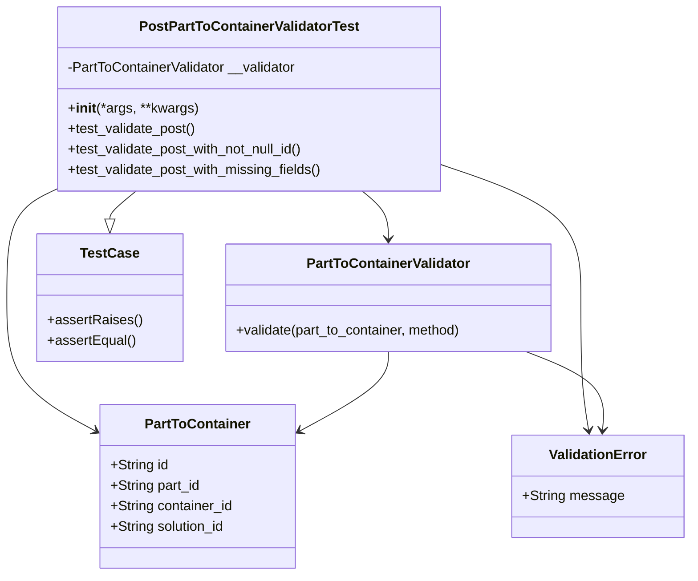
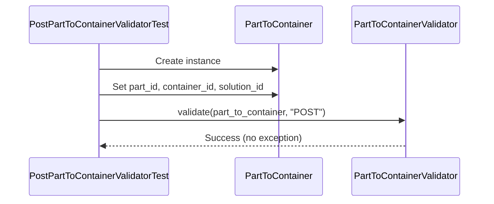
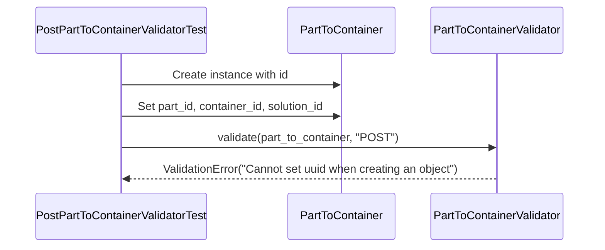
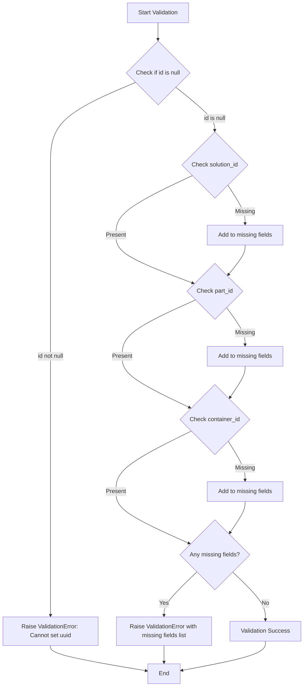
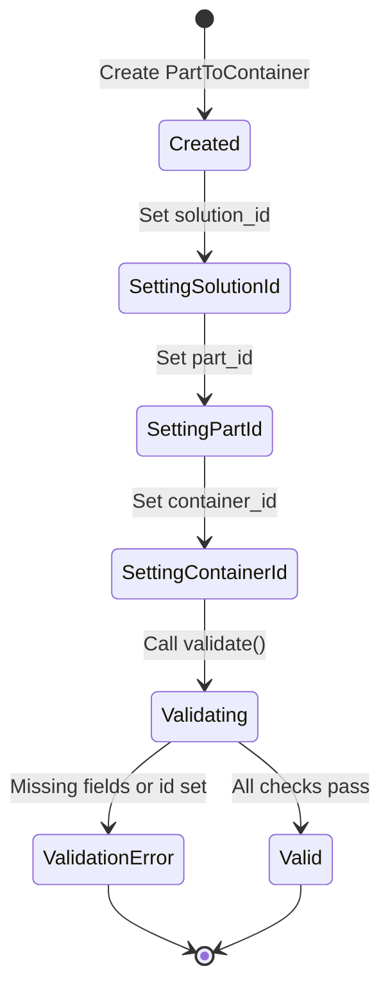

# Diagram: platform/partview_core/partview_service/partview_service/tests/unit/core/validators/part_to_container/part_to_container_post_validator_test.py

> Auto-generated by Obscura crawlers

## Diagram 1

### SVG

<svg id="container" width="801.568359375" xmlns="http://www.w3.org/2000/svg" class="classDiagram" height="674" viewBox="-35 0 801.568359375 674" role="graphics-document document" aria-roledescription="class"><g><defs><marker id="container_class-aggregationStart" class="marker aggregation class" refX="18" refY="7" markerWidth="190" markerHeight="240" orient="auto"><path d="M 18,7 L9,13 L1,7 L9,1 Z"></path></marker></defs><defs><marker id="container_class-aggregationEnd" class="marker aggregation class" refX="1" refY="7" markerWidth="20" markerHeight="28" orient="auto"><path d="M 18,7 L9,13 L1,7 L9,1 Z"></path></marker></defs><defs><marker id="container_class-extensionStart" class="marker extension class" refX="18" refY="7" markerWidth="190" markerHeight="240" orient="auto"><path d="M 1,7 L18,13 V 1 Z"></path></marker></defs><defs><marker id="container_class-extensionEnd" class="marker extension class" refX="1" refY="7" markerWidth="20" markerHeight="28" orient="auto"><path d="M 1,1 V 13 L18,7 Z"></path></marker></defs><defs><marker id="container_class-compositionStart" class="marker composition class" refX="18" refY="7" markerWidth="190" markerHeight="240" orient="auto"><path d="M 18,7 L9,13 L1,7 L9,1 Z"></path></marker></defs><defs><marker id="container_class-compositionEnd" class="marker composition class" refX="1" refY="7" markerWidth="20" markerHeight="28" orient="auto"><path d="M 18,7 L9,13 L1,7 L9,1 Z"></path></marker></defs><defs><marker id="container_class-dependencyStart" class="marker dependency class" refX="6" refY="7" markerWidth="190" markerHeight="240" orient="auto"><path d="M 5,7 L9,13 L1,7 L9,1 Z"></path></marker></defs><defs><marker id="container_class-dependencyEnd" class="marker dependency class" refX="13" refY="7" markerWidth="20" markerHeight="28" orient="auto"><path d="M 18,7 L9,13 L14,7 L9,1 Z"></path></marker></defs><defs><marker id="container_class-lollipopStart" class="marker lollipop class" refX="13" refY="7" markerWidth="190" markerHeight="240" orient="auto"><circle stroke="black" fill="transparent" cx="7" cy="7" r="6"></circle></marker></defs><defs><marker id="container_class-lollipopEnd" class="marker lollipop class" refX="1" refY="7" markerWidth="190" markerHeight="240" orient="auto"><circle stroke="black" fill="transparent" cx="7" cy="7" r="6"></circle></marker></defs><g class="root"><g class="clusters"></g><g class="edgePaths"><path d="M121.002,224L115.908,228.167C110.814,232.333,100.626,240.667,95.532,246.125C90.438,251.583,90.438,254.167,90.438,255.458L90.438,256.75" id="id_PostPartToContainerValidatorTest_TestCase_1" class="edge-thickness-normal edge-pattern-solid relation" style=";;;" data-edge="true" data-et="edge" data-id="id_PostPartToContainerValidatorTest_TestCase_1" data-points="W3sieCI6MTIxLjAwMjQzNzczNDk2MjQsInkiOjIyNH0seyJ4Ijo5MC40Mzc1LCJ5IjoyNDl9LHsieCI6OTAuNDM3NSwieSI6Mjc0fV0=" marker-end="url(#container_class-extensionEnd)"></path><path d="M385.083,224L390.178,228.167C395.272,232.333,405.46,240.667,410.554,250C415.648,259.333,415.648,269.667,415.648,274.833L415.648,280" id="id_PostPartToContainerValidatorTest_PartToContainerValidator_2" class="edge-thickness-normal edge-pattern-solid relation" style=";;;" data-edge="true" data-et="edge" data-id="id_PostPartToContainerValidatorTest_PartToContainerValidator_2" data-points="W3sieCI6Mzg1LjA4MzQ5OTc2NTAzNzYsInkiOjIyNH0seyJ4Ijo0MTUuNjQ4NDM3NSwieSI6MjQ5fSx7IngiOjQxNS42NDg0Mzc1LCJ5IjoyODZ9XQ==" marker-end="url(#container_class-dependencyEnd)"></path><path d="M28.172,222.797L18.977,227.164C9.781,231.532,-8.609,240.266,-17.805,261.3C-27,282.333,-27,315.667,-27,349C-27,382.333,-27,415.667,-9.991,441.632C7.017,467.598,41.035,486.195,58.043,495.494L75.052,504.793" id="id_PostPartToContainerValidatorTest_PartToContainer_3" class="edge-thickness-normal edge-pattern-solid relation" style=";;;" data-edge="true" data-et="edge" data-id="id_PostPartToContainerValidatorTest_PartToContainer_3" data-points="W3sieCI6MjguMTcxODc1LCJ5IjoyMjIuNzk3MzgwNDI0MzIxMDN9LHsieCI6LTI3LCJ5IjoyNDl9LHsieCI6LTI3LCJ5IjozNDl9LHsieCI6LTI3LCJ5Ijo0NDl9LHsieCI6ODAuMzE2NDA2MjUsInkiOjUwNy42NzA4NzMxMTgxMjc3Nn1d" marker-end="url(#container_class-dependencyEnd)"></path><path d="M477.914,192.612L505.499,202.01C533.083,211.408,588.253,230.204,615.837,256.269C643.422,282.333,643.422,315.667,643.422,349C643.422,382.333,643.422,415.667,644.721,441.51C646.02,467.353,648.617,485.706,649.916,494.883L651.215,504.059" id="id_PostPartToContainerValidatorTest_ValidationError_4" class="edge-thickness-normal edge-pattern-solid relation" style=";;;" data-edge="true" data-et="edge" data-id="id_PostPartToContainerValidatorTest_ValidationError_4" data-points="W3sieCI6NDc3LjkxNDA2MjUsInkiOjE5Mi42MTIzNzU3OTY3NTE5Nn0seyJ4Ijo2NDMuNDIxODc1LCJ5IjoyNDl9LHsieCI6NjQzLjQyMTg3NSwieSI6MzQ5fSx7IngiOjY0My40MjE4NzUsInkiOjQ0OX0seyJ4Ijo2NTIuMDU2MTI0MDk2MDc0NCwieSI6NTEwfV0=" marker-end="url(#container_class-dependencyEnd)"></path><path d="M415.648,412L415.648,418.167C415.648,424.333,415.648,436.667,398.64,452.132C381.631,467.598,347.614,486.195,330.605,495.494L313.597,504.793" id="id_PartToContainerValidator_PartToContainer_5" class="edge-thickness-normal edge-pattern-solid relation" style=";;;" data-edge="true" data-et="edge" data-id="id_PartToContainerValidator_PartToContainer_5" data-points="W3sieCI6NDE1LjY0ODQzNzUsInkiOjQxMn0seyJ4Ijo0MTUuNjQ4NDM3NSwieSI6NDQ5fSx7IngiOjMwOC4zMzIwMzEyNSwieSI6NTA3LjY3MDg3MzExODEyNzc2fV0=" marker-end="url(#container_class-dependencyEnd)"></path><path d="M576.236,412L591.955,418.167C607.673,424.333,639.111,436.667,654.072,452.003C669.033,467.34,667.517,485.68,666.76,494.85L666.002,504.02" id="id_PartToContainerValidator_ValidationError_6" class="edge-thickness-normal edge-pattern-solid relation" style=";;;" data-edge="true" data-et="edge" data-id="id_PartToContainerValidator_ValidationError_6" data-points="W3sieCI6NTc2LjIzNTY4MzU5Mzc1LCJ5Ijo0MTJ9LHsieCI6NjcwLjU0ODgyODEyNSwieSI6NDQ5fSx7IngiOjY2NS41MDc1MDU4MTA5NTA0LCJ5Ijo1MTB9XQ==" marker-end="url(#container_class-dependencyEnd)"></path></g><g class="edgeLabels"><g class="edgeLabel"><g class="label" data-id="id_PostPartToContainerValidatorTest_TestCase_1" transform="translate(0, 0)"><foreignObject width="0" height="0">

</foreignObject></g></g><g class="edgeLabel"><g class="label" data-id="id_PostPartToContainerValidatorTest_PartToContainerValidator_2" transform="translate(0, 0)"><foreignObject width="0" height="0">

</foreignObject></g></g><g class="edgeLabel"><g class="label" data-id="id_PostPartToContainerValidatorTest_PartToContainer_3" transform="translate(0, 0)"><foreignObject width="0" height="0">

</foreignObject></g></g><g class="edgeLabel"><g class="label" data-id="id_PostPartToContainerValidatorTest_ValidationError_4" transform="translate(0, 0)"><foreignObject width="0" height="0">

</foreignObject></g></g><g class="edgeLabel"><g class="label" data-id="id_PartToContainerValidator_PartToContainer_5" transform="translate(0, 0)"><foreignObject width="0" height="0">

</foreignObject></g></g><g class="edgeLabel"><g class="label" data-id="id_PartToContainerValidator_ValidationError_6" transform="translate(0, 0)"><foreignObject width="0" height="0">

</foreignObject></g></g></g><g class="nodes"><g class="node default" id="classId-PostPartToContainerValidatorTest-0" transform="translate(253.04296875, 116)"><g class="basic label-container"><path d="M-224.87109375 -108 L224.87109375 -108 L224.87109375 108 L-224.87109375 108" stroke="none" stroke-width="0" fill="#ECECFF" style=""></path><path d="M-224.87109375 -108 C-62.77320322732692 -108, 99.32468729534617 -108, 224.87109375 -108 M-224.87109375 -108 C-131.20895179924025 -108, -37.54680984848048 -108, 224.87109375 -108 M224.87109375 -108 C224.87109375 -38.72522039139395, 224.87109375 30.549559217212106, 224.87109375 108 M224.87109375 -108 C224.87109375 -57.21978869131036, 224.87109375 -6.439577382620726, 224.87109375 108 M224.87109375 108 C73.41454740159642 108, -78.04199894680715 108, -224.87109375 108 M224.87109375 108 C108.95236474335154 108, -6.966364263296924 108, -224.87109375 108 M-224.87109375 108 C-224.87109375 30.4322805737131, -224.87109375 -47.1354388525738, -224.87109375 -108 M-224.87109375 108 C-224.87109375 28.931485233666606, -224.87109375 -50.13702953266679, -224.87109375 -108" stroke="#9370DB" stroke-width="1.3" fill="none" stroke-dasharray="0 0" style=""></path></g><g class="annotation-group text" transform="translate(0, -84)"></g><g class="label-group text" transform="translate(-123.8359375, -84)"><g class="label" style="font-weight: bolder" transform="translate(0,-12)"><foreignObject width="247.671875" height="24">

PostPartToContainerValidatorTest

</foreignObject></g></g><g class="members-group text" transform="translate(-212.87109375, -36)"><g class="label" style="" transform="translate(0,-12)"><foreignObject width="273.03125" height="24">

-PartToContainerValidator __validator

</foreignObject></g></g><g class="methods-group text" transform="translate(-212.87109375, 12)"><g class="label" style="" transform="translate(0,-12)"><foreignObject width="151.8125" height="24">

+<strong>init</strong>(*args, **kwargs)

</foreignObject></g><g class="label" style="" transform="translate(0,12)"><foreignObject width="151.609375" height="24">

+test_validate_post()

</foreignObject></g><g class="label" style="" transform="translate(0,36)"><foreignObject width="282.34375" height="24">

+test_validate_post_with_not_null_id()

</foreignObject></g><g class="label" style="" transform="translate(0,60)"><foreignObject width="301.90625" height="24">

+test_validate_post_with_missing_fields()

</foreignObject></g></g><g class="divider" style=""><path d="M-224.87109375 -60 C-113.41764406361547 -60, -1.964194377230939 -60, 224.87109375 -60 M-224.87109375 -60 C-107.9782603559897 -60, 8.914573038020592 -60, 224.87109375 -60" stroke="#9370DB" stroke-width="1.3" fill="none" stroke-dasharray="0 0" style=""></path></g><g class="divider" style=""><path d="M-224.87109375 -12 C-48.33768041575419 -12, 128.19573291849161 -12, 224.87109375 -12 M-224.87109375 -12 C-84.07307374804779 -12, 56.72494625390442 -12, 224.87109375 -12" stroke="#9370DB" stroke-width="1.3" fill="none" stroke-dasharray="0 0" style=""></path></g></g><g class="node default" id="classId-PartToContainerValidator-1" transform="translate(415.6484375, 349)"><g class="basic label-container"><path d="M-192.7734375 -63 L192.7734375 -63 L192.7734375 63 L-192.7734375 63" stroke="none" stroke-width="0" fill="#ECECFF" style=""></path><path d="M-192.7734375 -63 C-89.76141139123648 -63, 13.250614717527043 -63, 192.7734375 -63 M-192.7734375 -63 C-55.63732676746028 -63, 81.49878396507944 -63, 192.7734375 -63 M192.7734375 -63 C192.7734375 -18.901117728944257, 192.7734375 25.197764542111486, 192.7734375 63 M192.7734375 -63 C192.7734375 -35.018036503869325, 192.7734375 -7.036073007738651, 192.7734375 63 M192.7734375 63 C63.769149558080045 63, -65.23513838383991 63, -192.7734375 63 M192.7734375 63 C70.1094097798494 63, -52.5546179403012 63, -192.7734375 63 M-192.7734375 63 C-192.7734375 14.344103042090879, -192.7734375 -34.31179391581824, -192.7734375 -63 M-192.7734375 63 C-192.7734375 15.766104104731888, -192.7734375 -31.467791790536225, -192.7734375 -63" stroke="#9370DB" stroke-width="1.3" fill="none" stroke-dasharray="0 0" style=""></path></g><g class="annotation-group text" transform="translate(0, -39)"></g><g class="label-group text" transform="translate(-92.40625, -39)"><g class="label" style="font-weight: bolder" transform="translate(0,-12)"><foreignObject width="184.8125" height="24">

PartToContainerValidator

</foreignObject></g></g><g class="members-group text" transform="translate(-180.7734375, 9)"></g><g class="methods-group text" transform="translate(-180.7734375, 39)"><g class="label" style="" transform="translate(0,-12)"><foreignObject width="269.140625" height="24">

+validate(part_to_container, method)

</foreignObject></g></g><g class="divider" style=""><path d="M-192.7734375 -15 C-114.2905977152436 -15, -35.80775793048721 -15, 192.7734375 -15 M-192.7734375 -15 C-49.206507430145365 -15, 94.36042263970927 -15, 192.7734375 -15" stroke="#9370DB" stroke-width="1.3" fill="none" stroke-dasharray="0 0" style=""></path></g><g class="divider" style=""><path d="M-192.7734375 9 C-48.37321299771861 9, 96.02701150456278 9, 192.7734375 9 M-192.7734375 9 C-73.37826193935099 9, 46.016913621298016 9, 192.7734375 9" stroke="#9370DB" stroke-width="1.3" fill="none" stroke-dasharray="0 0" style=""></path></g></g><g class="node default" id="classId-PartToContainer-2" transform="translate(194.32421875, 570)"><g class="basic label-container"><path d="M-114.0078125 -96 L114.0078125 -96 L114.0078125 96 L-114.0078125 96" stroke="none" stroke-width="0" fill="#ECECFF" style=""></path><path d="M-114.0078125 -96 C-51.72413792348359 -96, 10.559536653032822 -96, 114.0078125 -96 M-114.0078125 -96 C-65.70050144947228 -96, -17.39319039894457 -96, 114.0078125 -96 M114.0078125 -96 C114.0078125 -27.707786660734854, 114.0078125 40.58442667853029, 114.0078125 96 M114.0078125 -96 C114.0078125 -53.6410928234739, 114.0078125 -11.282185646947795, 114.0078125 96 M114.0078125 96 C24.464949305451782 96, -65.07791388909644 96, -114.0078125 96 M114.0078125 96 C63.060329914957826 96, 12.112847329915652 96, -114.0078125 96 M-114.0078125 96 C-114.0078125 44.940197630055195, -114.0078125 -6.11960473988961, -114.0078125 -96 M-114.0078125 96 C-114.0078125 19.70698476753161, -114.0078125 -56.58603046493678, -114.0078125 -96" stroke="#9370DB" stroke-width="1.3" fill="none" stroke-dasharray="0 0" style=""></path></g><g class="annotation-group text" transform="translate(0, -72)"></g><g class="label-group text" transform="translate(-59.21875, -72)"><g class="label" style="font-weight: bolder" transform="translate(0,-12)"><foreignObject width="118.4375" height="24">

PartToContainer

</foreignObject></g></g><g class="members-group text" transform="translate(-102.0078125, -24)"><g class="label" style="" transform="translate(0,-12)"><foreignObject width="68.546875" height="24">

+String id

</foreignObject></g><g class="label" style="" transform="translate(0,12)"><foreignObject width="106.875" height="24">

+String part_id

</foreignObject></g><g class="label" style="" transform="translate(0,36)"><foreignObject width="144.796875" height="24">

+String container_id

</foreignObject></g><g class="label" style="" transform="translate(0,60)"><foreignObject width="136.703125" height="24">

+String solution_id

</foreignObject></g></g><g class="methods-group text" transform="translate(-102.0078125, 96)"></g><g class="divider" style=""><path d="M-114.0078125 -48 C-38.9418429784933 -48, 36.1241265430134 -48, 114.0078125 -48 M-114.0078125 -48 C-39.38954704721627 -48, 35.22871840556746 -48, 114.0078125 -48" stroke="#9370DB" stroke-width="1.3" fill="none" stroke-dasharray="0 0" style=""></path></g><g class="divider" style=""><path d="M-114.0078125 72 C-39.102344324656045 72, 35.80312385068791 72, 114.0078125 72 M-114.0078125 72 C-46.99571217613145 72, 20.016388147737104 72, 114.0078125 72" stroke="#9370DB" stroke-width="1.3" fill="none" stroke-dasharray="0 0" style=""></path></g></g><g class="node default" id="classId-ValidationError-3" transform="translate(660.548828125, 570)"><g class="basic label-container"><path d="M-98.01953125 -60 L98.01953125 -60 L98.01953125 60 L-98.01953125 60" stroke="none" stroke-width="0" fill="#ECECFF" style=""></path><path d="M-98.01953125 -60 C-31.451152181884368 -60, 35.117226886231265 -60, 98.01953125 -60 M-98.01953125 -60 C-22.578558252593282 -60, 52.862414744813435 -60, 98.01953125 -60 M98.01953125 -60 C98.01953125 -19.703636241930766, 98.01953125 20.592727516138467, 98.01953125 60 M98.01953125 -60 C98.01953125 -23.87116433587073, 98.01953125 12.257671328258539, 98.01953125 60 M98.01953125 60 C30.222219544707798 60, -37.575092160584404 60, -98.01953125 60 M98.01953125 60 C45.89054398038298 60, -6.238443289234041 60, -98.01953125 60 M-98.01953125 60 C-98.01953125 24.079020610403376, -98.01953125 -11.841958779193249, -98.01953125 -60 M-98.01953125 60 C-98.01953125 30.755439693835594, -98.01953125 1.5108793876711886, -98.01953125 -60" stroke="#9370DB" stroke-width="1.3" fill="none" stroke-dasharray="0 0" style=""></path></g><g class="annotation-group text" transform="translate(0, -36)"></g><g class="label-group text" transform="translate(-55.1796875, -36)"><g class="label" style="font-weight: bolder" transform="translate(0,-12)"><foreignObject width="110.359375" height="24">

ValidationError

</foreignObject></g></g><g class="members-group text" transform="translate(-86.01953125, 12)"><g class="label" style="" transform="translate(0,-12)"><foreignObject width="116.859375" height="24">

+String message

</foreignObject></g></g><g class="methods-group text" transform="translate(-86.01953125, 60)"></g><g class="divider" style=""><path d="M-98.01953125 -12 C-23.492580752652913 -12, 51.034369744694175 -12, 98.01953125 -12 M-98.01953125 -12 C-39.10594092968414 -12, 19.807649390631724 -12, 98.01953125 -12" stroke="#9370DB" stroke-width="1.3" fill="none" stroke-dasharray="0 0" style=""></path></g><g class="divider" style=""><path d="M-98.01953125 36 C-30.0782362615698 36, 37.8630587268604 36, 98.01953125 36 M-98.01953125 36 C-25.367628768847965 36, 47.28427371230407 36, 98.01953125 36" stroke="#9370DB" stroke-width="1.3" fill="none" stroke-dasharray="0 0" style=""></path></g></g><g class="node default" id="classId-TestCase-4" transform="translate(90.4375, 349)"><g class="basic label-container"><path d="M-82.4375 -75 L82.4375 -75 L82.4375 75 L-82.4375 75" stroke="none" stroke-width="0" fill="#ECECFF" style=""></path><path d="M-82.4375 -75 C-37.488821069874305 -75, 7.45985786025139 -75, 82.4375 -75 M-82.4375 -75 C-30.262363618167207 -75, 21.912772763665586 -75, 82.4375 -75 M82.4375 -75 C82.4375 -16.998161692140535, 82.4375 41.00367661571893, 82.4375 75 M82.4375 -75 C82.4375 -25.486521197609903, 82.4375 24.026957604780193, 82.4375 75 M82.4375 75 C43.724921537722814 75, 5.012343075445628 75, -82.4375 75 M82.4375 75 C27.8268274832945 75, -26.783845033410998 75, -82.4375 75 M-82.4375 75 C-82.4375 22.637309506847004, -82.4375 -29.725380986305993, -82.4375 -75 M-82.4375 75 C-82.4375 22.959981576172012, -82.4375 -29.080036847655975, -82.4375 -75" stroke="#9370DB" stroke-width="1.3" fill="none" stroke-dasharray="0 0" style=""></path></g><g class="annotation-group text" transform="translate(0, -51)"></g><g class="label-group text" transform="translate(-32.359375, -51)"><g class="label" style="font-weight: bolder" transform="translate(0,-12)"><foreignObject width="64.71875" height="24">

TestCase

</foreignObject></g></g><g class="members-group text" transform="translate(-70.4375, -3)"></g><g class="methods-group text" transform="translate(-70.4375, 27)"><g class="label" style="" transform="translate(0,-12)"><foreignObject width="108.515625" height="24">

+assertRaises()

</foreignObject></g><g class="label" style="" transform="translate(0,12)"><foreignObject width="102.46875" height="24">

+assertEqual()

</foreignObject></g></g><g class="divider" style=""><path d="M-82.4375 -27 C-31.141921335006984 -27, 20.153657329986032 -27, 82.4375 -27 M-82.4375 -27 C-27.413746079814757 -27, 27.610007840370486 -27, 82.4375 -27" stroke="#9370DB" stroke-width="1.3" fill="none" stroke-dasharray="0 0" style=""></path></g><g class="divider" style=""><path d="M-82.4375 -3 C-17.053904663891387 -3, 48.329690672217225 -3, 82.4375 -3 M-82.4375 -3 C-38.61064214131015 -3, 5.216215717379697 -3, 82.4375 -3" stroke="#9370DB" stroke-width="1.3" fill="none" stroke-dasharray="0 0" style=""></path></g></g></g></g></g></svg>

## Diagram 2

### SVG

<svg id="container" width="897.5" xmlns="http://www.w3.org/2000/svg" height="363" viewBox="-50 -10 897.5 363" role="graphics-document document" aria-roledescription="sequence"><g><rect x="595.5" y="277" fill="#eaeaea" stroke="#666" width="202" height="65" name="Validator" rx="3" ry="3" class="actor actor-bottom"></rect><text x="696.5" y="309.5" dominant-baseline="central" alignment-baseline="central" class="actor actor-box" style="text-anchor: middle; font-size: 16px; font-weight: 400;"><tspan x="696.5" dy="0">PartToContainerValidator</tspan></text></g><g><rect x="395.5" y="277" fill="#eaeaea" stroke="#666" width="150" height="65" name="PTC" rx="3" ry="3" class="actor actor-bottom"></rect><text x="470.5" y="309.5" dominant-baseline="central" alignment-baseline="central" class="actor actor-box" style="text-anchor: middle; font-size: 16px; font-weight: 400;"><tspan x="470.5" dy="0">PartToContainer</tspan></text></g><g><rect x="0" y="277" fill="#eaeaea" stroke="#666" width="263" height="65" name="Test" rx="3" ry="3" class="actor actor-bottom"></rect><text x="131.5" y="309.5" dominant-baseline="central" alignment-baseline="central" class="actor actor-box" style="text-anchor: middle; font-size: 16px; font-weight: 400;"><tspan x="131.5" dy="0">PostPartToContainerValidatorTest</tspan></text></g><g><line id="actor2" x1="696.5" y1="65" x2="696.5" y2="277" class="actor-line 200" stroke-width="0.5px" stroke="#999" name="Validator"></line><g id="root-2"><rect x="595.5" y="0" fill="#eaeaea" stroke="#666" width="202" height="65" name="Validator" rx="3" ry="3" class="actor actor-top"></rect><text x="696.5" y="32.5" dominant-baseline="central" alignment-baseline="central" class="actor actor-box" style="text-anchor: middle; font-size: 16px; font-weight: 400;"><tspan x="696.5" dy="0">PartToContainerValidator</tspan></text></g></g><g><line id="actor1" x1="470.5" y1="65" x2="470.5" y2="277" class="actor-line 200" stroke-width="0.5px" stroke="#999" name="PTC"></line><g id="root-1"><rect x="395.5" y="0" fill="#eaeaea" stroke="#666" width="150" height="65" name="PTC" rx="3" ry="3" class="actor actor-top"></rect><text x="470.5" y="32.5" dominant-baseline="central" alignment-baseline="central" class="actor actor-box" style="text-anchor: middle; font-size: 16px; font-weight: 400;"><tspan x="470.5" dy="0">PartToContainer</tspan></text></g></g><g><line id="actor0" x1="131.5" y1="65" x2="131.5" y2="277" class="actor-line 200" stroke-width="0.5px" stroke="#999" name="Test"></line><g id="root-0"><rect x="0" y="0" fill="#eaeaea" stroke="#666" width="263" height="65" name="Test" rx="3" ry="3" class="actor actor-top"></rect><text x="131.5" y="32.5" dominant-baseline="central" alignment-baseline="central" class="actor actor-box" style="text-anchor: middle; font-size: 16px; font-weight: 400;"><tspan x="131.5" dy="0">PostPartToContainerValidatorTest</tspan></text></g></g><g></g><defs><symbol id="computer" width="24" height="24"><path transform="scale(.5)" d="M2 2v13h20v-13h-20zm18 11h-16v-9h16v9zm-10.228 6l.466-1h3.524l.467 1h-4.457zm14.228 3h-24l2-6h2.104l-1.33 4h18.45l-1.297-4h2.073l2 6zm-5-10h-14v-7h14v7z"></path></symbol></defs><defs><symbol id="database" fill-rule="evenodd" clip-rule="evenodd"><path transform="scale(.5)" d="M12.258.001l.256.004.255.005.253.008.251.01.249.012.247.015.246.016.242.019.241.02.239.023.236.024.233.027.231.028.229.031.225.032.223.034.22.036.217.038.214.04.211.041.208.043.205.045.201.046.198.048.194.05.191.051.187.053.183.054.18.056.175.057.172.059.168.06.163.061.16.063.155.064.15.066.074.033.073.033.071.034.07.034.069.035.068.035.067.035.066.035.064.036.064.036.062.036.06.036.06.037.058.037.058.037.055.038.055.038.053.038.052.038.051.039.05.039.048.039.047.039.045.04.044.04.043.04.041.04.04.041.039.041.037.041.036.041.034.041.033.042.032.042.03.042.029.042.027.042.026.043.024.043.023.043.021.043.02.043.018.044.017.043.015.044.013.044.012.044.011.045.009.044.007.045.006.045.004.045.002.045.001.045v17l-.001.045-.002.045-.004.045-.006.045-.007.045-.009.044-.011.045-.012.044-.013.044-.015.044-.017.043-.018.044-.02.043-.021.043-.023.043-.024.043-.026.043-.027.042-.029.042-.03.042-.032.042-.033.042-.034.041-.036.041-.037.041-.039.041-.04.041-.041.04-.043.04-.044.04-.045.04-.047.039-.048.039-.05.039-.051.039-.052.038-.053.038-.055.038-.055.038-.058.037-.058.037-.06.037-.06.036-.062.036-.064.036-.064.036-.066.035-.067.035-.068.035-.069.035-.07.034-.071.034-.073.033-.074.033-.15.066-.155.064-.16.063-.163.061-.168.06-.172.059-.175.057-.18.056-.183.054-.187.053-.191.051-.194.05-.198.048-.201.046-.205.045-.208.043-.211.041-.214.04-.217.038-.22.036-.223.034-.225.032-.229.031-.231.028-.233.027-.236.024-.239.023-.241.02-.242.019-.246.016-.247.015-.249.012-.251.01-.253.008-.255.005-.256.004-.258.001-.258-.001-.256-.004-.255-.005-.253-.008-.251-.01-.249-.012-.247-.015-.245-.016-.243-.019-.241-.02-.238-.023-.236-.024-.234-.027-.231-.028-.228-.031-.226-.032-.223-.034-.22-.036-.217-.038-.214-.04-.211-.041-.208-.043-.204-.045-.201-.046-.198-.048-.195-.05-.19-.051-.187-.053-.184-.054-.179-.056-.176-.057-.172-.059-.167-.06-.164-.061-.159-.063-.155-.064-.151-.066-.074-.033-.072-.033-.072-.034-.07-.034-.069-.035-.068-.035-.067-.035-.066-.035-.064-.036-.063-.036-.062-.036-.061-.036-.06-.037-.058-.037-.057-.037-.056-.038-.055-.038-.053-.038-.052-.038-.051-.039-.049-.039-.049-.039-.046-.039-.046-.04-.044-.04-.043-.04-.041-.04-.04-.041-.039-.041-.037-.041-.036-.041-.034-.041-.033-.042-.032-.042-.03-.042-.029-.042-.027-.042-.026-.043-.024-.043-.023-.043-.021-.043-.02-.043-.018-.044-.017-.043-.015-.044-.013-.044-.012-.044-.011-.045-.009-.044-.007-.045-.006-.045-.004-.045-.002-.045-.001-.045v-17l.001-.045.002-.045.004-.045.006-.045.007-.045.009-.044.011-.045.012-.044.013-.044.015-.044.017-.043.018-.044.02-.043.021-.043.023-.043.024-.043.026-.043.027-.042.029-.042.03-.042.032-.042.033-.042.034-.041.036-.041.037-.041.039-.041.04-.041.041-.04.043-.04.044-.04.046-.04.046-.039.049-.039.049-.039.051-.039.052-.038.053-.038.055-.038.056-.038.057-.037.058-.037.06-.037.061-.036.062-.036.063-.036.064-.036.066-.035.067-.035.068-.035.069-.035.07-.034.072-.034.072-.033.074-.033.151-.066.155-.064.159-.063.164-.061.167-.06.172-.059.176-.057.179-.056.184-.054.187-.053.19-.051.195-.05.198-.048.201-.046.204-.045.208-.043.211-.041.214-.04.217-.038.22-.036.223-.034.226-.032.228-.031.231-.028.234-.027.236-.024.238-.023.241-.02.243-.019.245-.016.247-.015.249-.012.251-.01.253-.008.255-.005.256-.004.258-.001.258.001zm-9.258 20.499v.01l.001.021.003.021.004.022.005.021.006.022.007.022.009.023.01.022.011.023.012.023.013.023.015.023.016.024.017.023.018.024.019.024.021.024.022.025.023.024.024.025.052.049.056.05.061.051.066.051.07.051.075.051.079.052.084.052.088.052.092.052.097.052.102.051.105.052.11.052.114.051.119.051.123.051.127.05.131.05.135.05.139.048.144.049.147.047.152.047.155.047.16.045.163.045.167.043.171.043.176.041.178.041.183.039.187.039.19.037.194.035.197.035.202.033.204.031.209.03.212.029.216.027.219.025.222.024.226.021.23.02.233.018.236.016.24.015.243.012.246.01.249.008.253.005.256.004.259.001.26-.001.257-.004.254-.005.25-.008.247-.011.244-.012.241-.014.237-.016.233-.018.231-.021.226-.021.224-.024.22-.026.216-.027.212-.028.21-.031.205-.031.202-.034.198-.034.194-.036.191-.037.187-.039.183-.04.179-.04.175-.042.172-.043.168-.044.163-.045.16-.046.155-.046.152-.047.148-.048.143-.049.139-.049.136-.05.131-.05.126-.05.123-.051.118-.052.114-.051.11-.052.106-.052.101-.052.096-.052.092-.052.088-.053.083-.051.079-.052.074-.052.07-.051.065-.051.06-.051.056-.05.051-.05.023-.024.023-.025.021-.024.02-.024.019-.024.018-.024.017-.024.015-.023.014-.024.013-.023.012-.023.01-.023.01-.022.008-.022.006-.022.006-.022.004-.022.004-.021.001-.021.001-.021v-4.127l-.077.055-.08.053-.083.054-.085.053-.087.052-.09.052-.093.051-.095.05-.097.05-.1.049-.102.049-.105.048-.106.047-.109.047-.111.046-.114.045-.115.045-.118.044-.12.043-.122.042-.124.042-.126.041-.128.04-.13.04-.132.038-.134.038-.135.037-.138.037-.139.035-.142.035-.143.034-.144.033-.147.032-.148.031-.15.03-.151.03-.153.029-.154.027-.156.027-.158.026-.159.025-.161.024-.162.023-.163.022-.165.021-.166.02-.167.019-.169.018-.169.017-.171.016-.173.015-.173.014-.175.013-.175.012-.177.011-.178.01-.179.008-.179.008-.181.006-.182.005-.182.004-.184.003-.184.002h-.37l-.184-.002-.184-.003-.182-.004-.182-.005-.181-.006-.179-.008-.179-.008-.178-.01-.176-.011-.176-.012-.175-.013-.173-.014-.172-.015-.171-.016-.17-.017-.169-.018-.167-.019-.166-.02-.165-.021-.163-.022-.162-.023-.161-.024-.159-.025-.157-.026-.156-.027-.155-.027-.153-.029-.151-.03-.15-.03-.148-.031-.146-.032-.145-.033-.143-.034-.141-.035-.14-.035-.137-.037-.136-.037-.134-.038-.132-.038-.13-.04-.128-.04-.126-.041-.124-.042-.122-.042-.12-.044-.117-.043-.116-.045-.113-.045-.112-.046-.109-.047-.106-.047-.105-.048-.102-.049-.1-.049-.097-.05-.095-.05-.093-.052-.09-.051-.087-.052-.085-.053-.083-.054-.08-.054-.077-.054v4.127zm0-5.654v.011l.001.021.003.021.004.021.005.022.006.022.007.022.009.022.01.022.011.023.012.023.013.023.015.024.016.023.017.024.018.024.019.024.021.024.022.024.023.025.024.024.052.05.056.05.061.05.066.051.07.051.075.052.079.051.084.052.088.052.092.052.097.052.102.052.105.052.11.051.114.051.119.052.123.05.127.051.131.05.135.049.139.049.144.048.147.048.152.047.155.046.16.045.163.045.167.044.171.042.176.042.178.04.183.04.187.038.19.037.194.036.197.034.202.033.204.032.209.03.212.028.216.027.219.025.222.024.226.022.23.02.233.018.236.016.24.014.243.012.246.01.249.008.253.006.256.003.259.001.26-.001.257-.003.254-.006.25-.008.247-.01.244-.012.241-.015.237-.016.233-.018.231-.02.226-.022.224-.024.22-.025.216-.027.212-.029.21-.03.205-.032.202-.033.198-.035.194-.036.191-.037.187-.039.183-.039.179-.041.175-.042.172-.043.168-.044.163-.045.16-.045.155-.047.152-.047.148-.048.143-.048.139-.05.136-.049.131-.05.126-.051.123-.051.118-.051.114-.052.11-.052.106-.052.101-.052.096-.052.092-.052.088-.052.083-.052.079-.052.074-.051.07-.052.065-.051.06-.05.056-.051.051-.049.023-.025.023-.024.021-.025.02-.024.019-.024.018-.024.017-.024.015-.023.014-.023.013-.024.012-.022.01-.023.01-.023.008-.022.006-.022.006-.022.004-.021.004-.022.001-.021.001-.021v-4.139l-.077.054-.08.054-.083.054-.085.052-.087.053-.09.051-.093.051-.095.051-.097.05-.1.049-.102.049-.105.048-.106.047-.109.047-.111.046-.114.045-.115.044-.118.044-.12.044-.122.042-.124.042-.126.041-.128.04-.13.039-.132.039-.134.038-.135.037-.138.036-.139.036-.142.035-.143.033-.144.033-.147.033-.148.031-.15.03-.151.03-.153.028-.154.028-.156.027-.158.026-.159.025-.161.024-.162.023-.163.022-.165.021-.166.02-.167.019-.169.018-.169.017-.171.016-.173.015-.173.014-.175.013-.175.012-.177.011-.178.009-.179.009-.179.007-.181.007-.182.005-.182.004-.184.003-.184.002h-.37l-.184-.002-.184-.003-.182-.004-.182-.005-.181-.007-.179-.007-.179-.009-.178-.009-.176-.011-.176-.012-.175-.013-.173-.014-.172-.015-.171-.016-.17-.017-.169-.018-.167-.019-.166-.02-.165-.021-.163-.022-.162-.023-.161-.024-.159-.025-.157-.026-.156-.027-.155-.028-.153-.028-.151-.03-.15-.03-.148-.031-.146-.033-.145-.033-.143-.033-.141-.035-.14-.036-.137-.036-.136-.037-.134-.038-.132-.039-.13-.039-.128-.04-.126-.041-.124-.042-.122-.043-.12-.043-.117-.044-.116-.044-.113-.046-.112-.046-.109-.046-.106-.047-.105-.048-.102-.049-.1-.049-.097-.05-.095-.051-.093-.051-.09-.051-.087-.053-.085-.052-.083-.054-.08-.054-.077-.054v4.139zm0-5.666v.011l.001.02.003.022.004.021.005.022.006.021.007.022.009.023.01.022.011.023.012.023.013.023.015.023.016.024.017.024.018.023.019.024.021.025.022.024.023.024.024.025.052.05.056.05.061.05.066.051.07.051.075.052.079.051.084.052.088.052.092.052.097.052.102.052.105.051.11.052.114.051.119.051.123.051.127.05.131.05.135.05.139.049.144.048.147.048.152.047.155.046.16.045.163.045.167.043.171.043.176.042.178.04.183.04.187.038.19.037.194.036.197.034.202.033.204.032.209.03.212.028.216.027.219.025.222.024.226.021.23.02.233.018.236.017.24.014.243.012.246.01.249.008.253.006.256.003.259.001.26-.001.257-.003.254-.006.25-.008.247-.01.244-.013.241-.014.237-.016.233-.018.231-.02.226-.022.224-.024.22-.025.216-.027.212-.029.21-.03.205-.032.202-.033.198-.035.194-.036.191-.037.187-.039.183-.039.179-.041.175-.042.172-.043.168-.044.163-.045.16-.045.155-.047.152-.047.148-.048.143-.049.139-.049.136-.049.131-.051.126-.05.123-.051.118-.052.114-.051.11-.052.106-.052.101-.052.096-.052.092-.052.088-.052.083-.052.079-.052.074-.052.07-.051.065-.051.06-.051.056-.05.051-.049.023-.025.023-.025.021-.024.02-.024.019-.024.018-.024.017-.024.015-.023.014-.024.013-.023.012-.023.01-.022.01-.023.008-.022.006-.022.006-.022.004-.022.004-.021.001-.021.001-.021v-4.153l-.077.054-.08.054-.083.053-.085.053-.087.053-.09.051-.093.051-.095.051-.097.05-.1.049-.102.048-.105.048-.106.048-.109.046-.111.046-.114.046-.115.044-.118.044-.12.043-.122.043-.124.042-.126.041-.128.04-.13.039-.132.039-.134.038-.135.037-.138.036-.139.036-.142.034-.143.034-.144.033-.147.032-.148.032-.15.03-.151.03-.153.028-.154.028-.156.027-.158.026-.159.024-.161.024-.162.023-.163.023-.165.021-.166.02-.167.019-.169.018-.169.017-.171.016-.173.015-.173.014-.175.013-.175.012-.177.01-.178.01-.179.009-.179.007-.181.006-.182.006-.182.004-.184.003-.184.001-.185.001-.185-.001-.184-.001-.184-.003-.182-.004-.182-.006-.181-.006-.179-.007-.179-.009-.178-.01-.176-.01-.176-.012-.175-.013-.173-.014-.172-.015-.171-.016-.17-.017-.169-.018-.167-.019-.166-.02-.165-.021-.163-.023-.162-.023-.161-.024-.159-.024-.157-.026-.156-.027-.155-.028-.153-.028-.151-.03-.15-.03-.148-.032-.146-.032-.145-.033-.143-.034-.141-.034-.14-.036-.137-.036-.136-.037-.134-.038-.132-.039-.13-.039-.128-.041-.126-.041-.124-.041-.122-.043-.12-.043-.117-.044-.116-.044-.113-.046-.112-.046-.109-.046-.106-.048-.105-.048-.102-.048-.1-.05-.097-.049-.095-.051-.093-.051-.09-.052-.087-.052-.085-.053-.083-.053-.08-.054-.077-.054v4.153zm8.74-8.179l-.257.004-.254.005-.25.008-.247.011-.244.012-.241.014-.237.016-.233.018-.231.021-.226.022-.224.023-.22.026-.216.027-.212.028-.21.031-.205.032-.202.033-.198.034-.194.036-.191.038-.187.038-.183.04-.179.041-.175.042-.172.043-.168.043-.163.045-.16.046-.155.046-.152.048-.148.048-.143.048-.139.049-.136.05-.131.05-.126.051-.123.051-.118.051-.114.052-.11.052-.106.052-.101.052-.096.052-.092.052-.088.052-.083.052-.079.052-.074.051-.07.052-.065.051-.06.05-.056.05-.051.05-.023.025-.023.024-.021.024-.02.025-.019.024-.018.024-.017.023-.015.024-.014.023-.013.023-.012.023-.01.023-.01.022-.008.022-.006.023-.006.021-.004.022-.004.021-.001.021-.001.021.001.021.001.021.004.021.004.022.006.021.006.023.008.022.01.022.01.023.012.023.013.023.014.023.015.024.017.023.018.024.019.024.02.025.021.024.023.024.023.025.051.05.056.05.06.05.065.051.07.052.074.051.079.052.083.052.088.052.092.052.096.052.101.052.106.052.11.052.114.052.118.051.123.051.126.051.131.05.136.05.139.049.143.048.148.048.152.048.155.046.16.046.163.045.168.043.172.043.175.042.179.041.183.04.187.038.191.038.194.036.198.034.202.033.205.032.21.031.212.028.216.027.22.026.224.023.226.022.231.021.233.018.237.016.241.014.244.012.247.011.25.008.254.005.257.004.26.001.26-.001.257-.004.254-.005.25-.008.247-.011.244-.012.241-.014.237-.016.233-.018.231-.021.226-.022.224-.023.22-.026.216-.027.212-.028.21-.031.205-.032.202-.033.198-.034.194-.036.191-.038.187-.038.183-.04.179-.041.175-.042.172-.043.168-.043.163-.045.16-.046.155-.046.152-.048.148-.048.143-.048.139-.049.136-.05.131-.05.126-.051.123-.051.118-.051.114-.052.11-.052.106-.052.101-.052.096-.052.092-.052.088-.052.083-.052.079-.052.074-.051.07-.052.065-.051.06-.05.056-.05.051-.05.023-.025.023-.024.021-.024.02-.025.019-.024.018-.024.017-.023.015-.024.014-.023.013-.023.012-.023.01-.023.01-.022.008-.022.006-.023.006-.021.004-.022.004-.021.001-.021.001-.021-.001-.021-.001-.021-.004-.021-.004-.022-.006-.021-.006-.023-.008-.022-.01-.022-.01-.023-.012-.023-.013-.023-.014-.023-.015-.024-.017-.023-.018-.024-.019-.024-.02-.025-.021-.024-.023-.024-.023-.025-.051-.05-.056-.05-.06-.05-.065-.051-.07-.052-.074-.051-.079-.052-.083-.052-.088-.052-.092-.052-.096-.052-.101-.052-.106-.052-.11-.052-.114-.052-.118-.051-.123-.051-.126-.051-.131-.05-.136-.05-.139-.049-.143-.048-.148-.048-.152-.048-.155-.046-.16-.046-.163-.045-.168-.043-.172-.043-.175-.042-.179-.041-.183-.04-.187-.038-.191-.038-.194-.036-.198-.034-.202-.033-.205-.032-.21-.031-.212-.028-.216-.027-.22-.026-.224-.023-.226-.022-.231-.021-.233-.018-.237-.016-.241-.014-.244-.012-.247-.011-.25-.008-.254-.005-.257-.004-.26-.001-.26.001z"></path></symbol></defs><defs><symbol id="clock" width="24" height="24"><path transform="scale(.5)" d="M12 2c5.514 0 10 4.486 10 10s-4.486 10-10 10-10-4.486-10-10 4.486-10 10-10zm0-2c-6.627 0-12 5.373-12 12s5.373 12 12 12 12-5.373 12-12-5.373-12-12-12zm5.848 12.459c.202.038.202.333.001.372-1.907.361-6.045 1.111-6.547 1.111-.719 0-1.301-.582-1.301-1.301 0-.512.77-5.447 1.125-7.445.034-.192.312-.181.343.014l.985 6.238 5.394 1.011z"></path></symbol></defs><defs><marker id="arrowhead" refX="7.9" refY="5" markerUnits="userSpaceOnUse" markerWidth="12" markerHeight="12" orient="auto-start-reverse"><path d="M -1 0 L 10 5 L 0 10 z"></path></marker></defs><defs><marker id="crosshead" markerWidth="15" markerHeight="8" orient="auto" refX="4" refY="4.5"><path fill="none" stroke="#000000" stroke-width="1pt" d="M 1,2 L 6,7 M 6,2 L 1,7" style="stroke-dasharray: 0, 0;"></path></marker></defs><defs><marker id="filled-head" refX="15.5" refY="7" markerWidth="20" markerHeight="28" orient="auto"><path d="M 18,7 L9,13 L14,7 L9,1 Z"></path></marker></defs><defs><marker id="sequencenumber" refX="15" refY="15" markerWidth="60" markerHeight="40" orient="auto"><circle cx="15" cy="15" r="6"></circle></marker></defs><text x="300" y="80" text-anchor="middle" dominant-baseline="middle" alignment-baseline="middle" class="messageText" dy="1em" style="font-size: 16px; font-weight: 400;">Create instance</text><line x1="132.5" y1="113" x2="466.5" y2="113" class="messageLine0" stroke-width="2" stroke="none" marker-end="url(#arrowhead)" style="fill: none;"></line><text x="300" y="128" text-anchor="middle" dominant-baseline="middle" alignment-baseline="middle" class="messageText" dy="1em" style="font-size: 16px; font-weight: 400;">Set part_id, container_id, solution_id</text><line x1="132.5" y1="161" x2="466.5" y2="161" class="messageLine0" stroke-width="2" stroke="none" marker-end="url(#arrowhead)" style="fill: none;"></line><text x="413" y="176" text-anchor="middle" dominant-baseline="middle" alignment-baseline="middle" class="messageText" dy="1em" style="font-size: 16px; font-weight: 400;">validate(part_to_container, "POST")</text><line x1="132.5" y1="209" x2="692.5" y2="209" class="messageLine0" stroke-width="2" stroke="none" marker-end="url(#arrowhead)" style="fill: none;"></line><text x="416" y="224" text-anchor="middle" dominant-baseline="middle" alignment-baseline="middle" class="messageText" dy="1em" style="font-size: 16px; font-weight: 400;">Success (no exception)</text><line x1="695.5" y1="257" x2="135.5" y2="257" class="messageLine1" stroke-width="2" stroke="none" marker-end="url(#arrowhead)" style="stroke-dasharray: 3, 3; fill: none;"></line></svg>

## Diagram 3

### SVG

<svg id="container" width="897.5" xmlns="http://www.w3.org/2000/svg" height="363" viewBox="-50 -10 897.5 363" role="graphics-document document" aria-roledescription="sequence"><g><rect x="595.5" y="277" fill="#eaeaea" stroke="#666" width="202" height="65" name="Validator" rx="3" ry="3" class="actor actor-bottom"></rect><text x="696.5" y="309.5" dominant-baseline="central" alignment-baseline="central" class="actor actor-box" style="text-anchor: middle; font-size: 16px; font-weight: 400;"><tspan x="696.5" dy="0">PartToContainerValidator</tspan></text></g><g><rect x="395.5" y="277" fill="#eaeaea" stroke="#666" width="150" height="65" name="PTC" rx="3" ry="3" class="actor actor-bottom"></rect><text x="470.5" y="309.5" dominant-baseline="central" alignment-baseline="central" class="actor actor-box" style="text-anchor: middle; font-size: 16px; font-weight: 400;"><tspan x="470.5" dy="0">PartToContainer</tspan></text></g><g><rect x="0" y="277" fill="#eaeaea" stroke="#666" width="263" height="65" name="Test" rx="3" ry="3" class="actor actor-bottom"></rect><text x="131.5" y="309.5" dominant-baseline="central" alignment-baseline="central" class="actor actor-box" style="text-anchor: middle; font-size: 16px; font-weight: 400;"><tspan x="131.5" dy="0">PostPartToContainerValidatorTest</tspan></text></g><g><line id="actor2" x1="696.5" y1="65" x2="696.5" y2="277" class="actor-line 200" stroke-width="0.5px" stroke="#999" name="Validator"></line><g id="root-2"><rect x="595.5" y="0" fill="#eaeaea" stroke="#666" width="202" height="65" name="Validator" rx="3" ry="3" class="actor actor-top"></rect><text x="696.5" y="32.5" dominant-baseline="central" alignment-baseline="central" class="actor actor-box" style="text-anchor: middle; font-size: 16px; font-weight: 400;"><tspan x="696.5" dy="0">PartToContainerValidator</tspan></text></g></g><g><line id="actor1" x1="470.5" y1="65" x2="470.5" y2="277" class="actor-line 200" stroke-width="0.5px" stroke="#999" name="PTC"></line><g id="root-1"><rect x="395.5" y="0" fill="#eaeaea" stroke="#666" width="150" height="65" name="PTC" rx="3" ry="3" class="actor actor-top"></rect><text x="470.5" y="32.5" dominant-baseline="central" alignment-baseline="central" class="actor actor-box" style="text-anchor: middle; font-size: 16px; font-weight: 400;"><tspan x="470.5" dy="0">PartToContainer</tspan></text></g></g><g><line id="actor0" x1="131.5" y1="65" x2="131.5" y2="277" class="actor-line 200" stroke-width="0.5px" stroke="#999" name="Test"></line><g id="root-0"><rect x="0" y="0" fill="#eaeaea" stroke="#666" width="263" height="65" name="Test" rx="3" ry="3" class="actor actor-top"></rect><text x="131.5" y="32.5" dominant-baseline="central" alignment-baseline="central" class="actor actor-box" style="text-anchor: middle; font-size: 16px; font-weight: 400;"><tspan x="131.5" dy="0">PostPartToContainerValidatorTest</tspan></text></g></g><g></g><defs><symbol id="computer" width="24" height="24"><path transform="scale(.5)" d="M2 2v13h20v-13h-20zm18 11h-16v-9h16v9zm-10.228 6l.466-1h3.524l.467 1h-4.457zm14.228 3h-24l2-6h2.104l-1.33 4h18.45l-1.297-4h2.073l2 6zm-5-10h-14v-7h14v7z"></path></symbol></defs><defs><symbol id="database" fill-rule="evenodd" clip-rule="evenodd"><path transform="scale(.5)" d="M12.258.001l.256.004.255.005.253.008.251.01.249.012.247.015.246.016.242.019.241.02.239.023.236.024.233.027.231.028.229.031.225.032.223.034.22.036.217.038.214.04.211.041.208.043.205.045.201.046.198.048.194.05.191.051.187.053.183.054.18.056.175.057.172.059.168.06.163.061.16.063.155.064.15.066.074.033.073.033.071.034.07.034.069.035.068.035.067.035.066.035.064.036.064.036.062.036.06.036.06.037.058.037.058.037.055.038.055.038.053.038.052.038.051.039.05.039.048.039.047.039.045.04.044.04.043.04.041.04.04.041.039.041.037.041.036.041.034.041.033.042.032.042.03.042.029.042.027.042.026.043.024.043.023.043.021.043.02.043.018.044.017.043.015.044.013.044.012.044.011.045.009.044.007.045.006.045.004.045.002.045.001.045v17l-.001.045-.002.045-.004.045-.006.045-.007.045-.009.044-.011.045-.012.044-.013.044-.015.044-.017.043-.018.044-.02.043-.021.043-.023.043-.024.043-.026.043-.027.042-.029.042-.03.042-.032.042-.033.042-.034.041-.036.041-.037.041-.039.041-.04.041-.041.04-.043.04-.044.04-.045.04-.047.039-.048.039-.05.039-.051.039-.052.038-.053.038-.055.038-.055.038-.058.037-.058.037-.06.037-.06.036-.062.036-.064.036-.064.036-.066.035-.067.035-.068.035-.069.035-.07.034-.071.034-.073.033-.074.033-.15.066-.155.064-.16.063-.163.061-.168.06-.172.059-.175.057-.18.056-.183.054-.187.053-.191.051-.194.05-.198.048-.201.046-.205.045-.208.043-.211.041-.214.04-.217.038-.22.036-.223.034-.225.032-.229.031-.231.028-.233.027-.236.024-.239.023-.241.02-.242.019-.246.016-.247.015-.249.012-.251.01-.253.008-.255.005-.256.004-.258.001-.258-.001-.256-.004-.255-.005-.253-.008-.251-.01-.249-.012-.247-.015-.245-.016-.243-.019-.241-.02-.238-.023-.236-.024-.234-.027-.231-.028-.228-.031-.226-.032-.223-.034-.22-.036-.217-.038-.214-.04-.211-.041-.208-.043-.204-.045-.201-.046-.198-.048-.195-.05-.19-.051-.187-.053-.184-.054-.179-.056-.176-.057-.172-.059-.167-.06-.164-.061-.159-.063-.155-.064-.151-.066-.074-.033-.072-.033-.072-.034-.07-.034-.069-.035-.068-.035-.067-.035-.066-.035-.064-.036-.063-.036-.062-.036-.061-.036-.06-.037-.058-.037-.057-.037-.056-.038-.055-.038-.053-.038-.052-.038-.051-.039-.049-.039-.049-.039-.046-.039-.046-.04-.044-.04-.043-.04-.041-.04-.04-.041-.039-.041-.037-.041-.036-.041-.034-.041-.033-.042-.032-.042-.03-.042-.029-.042-.027-.042-.026-.043-.024-.043-.023-.043-.021-.043-.02-.043-.018-.044-.017-.043-.015-.044-.013-.044-.012-.044-.011-.045-.009-.044-.007-.045-.006-.045-.004-.045-.002-.045-.001-.045v-17l.001-.045.002-.045.004-.045.006-.045.007-.045.009-.044.011-.045.012-.044.013-.044.015-.044.017-.043.018-.044.02-.043.021-.043.023-.043.024-.043.026-.043.027-.042.029-.042.03-.042.032-.042.033-.042.034-.041.036-.041.037-.041.039-.041.04-.041.041-.04.043-.04.044-.04.046-.04.046-.039.049-.039.049-.039.051-.039.052-.038.053-.038.055-.038.056-.038.057-.037.058-.037.06-.037.061-.036.062-.036.063-.036.064-.036.066-.035.067-.035.068-.035.069-.035.07-.034.072-.034.072-.033.074-.033.151-.066.155-.064.159-.063.164-.061.167-.06.172-.059.176-.057.179-.056.184-.054.187-.053.19-.051.195-.05.198-.048.201-.046.204-.045.208-.043.211-.041.214-.04.217-.038.22-.036.223-.034.226-.032.228-.031.231-.028.234-.027.236-.024.238-.023.241-.02.243-.019.245-.016.247-.015.249-.012.251-.01.253-.008.255-.005.256-.004.258-.001.258.001zm-9.258 20.499v.01l.001.021.003.021.004.022.005.021.006.022.007.022.009.023.01.022.011.023.012.023.013.023.015.023.016.024.017.023.018.024.019.024.021.024.022.025.023.024.024.025.052.049.056.05.061.051.066.051.07.051.075.051.079.052.084.052.088.052.092.052.097.052.102.051.105.052.11.052.114.051.119.051.123.051.127.05.131.05.135.05.139.048.144.049.147.047.152.047.155.047.16.045.163.045.167.043.171.043.176.041.178.041.183.039.187.039.19.037.194.035.197.035.202.033.204.031.209.03.212.029.216.027.219.025.222.024.226.021.23.02.233.018.236.016.24.015.243.012.246.01.249.008.253.005.256.004.259.001.26-.001.257-.004.254-.005.25-.008.247-.011.244-.012.241-.014.237-.016.233-.018.231-.021.226-.021.224-.024.22-.026.216-.027.212-.028.21-.031.205-.031.202-.034.198-.034.194-.036.191-.037.187-.039.183-.04.179-.04.175-.042.172-.043.168-.044.163-.045.16-.046.155-.046.152-.047.148-.048.143-.049.139-.049.136-.05.131-.05.126-.05.123-.051.118-.052.114-.051.11-.052.106-.052.101-.052.096-.052.092-.052.088-.053.083-.051.079-.052.074-.052.07-.051.065-.051.06-.051.056-.05.051-.05.023-.024.023-.025.021-.024.02-.024.019-.024.018-.024.017-.024.015-.023.014-.024.013-.023.012-.023.01-.023.01-.022.008-.022.006-.022.006-.022.004-.022.004-.021.001-.021.001-.021v-4.127l-.077.055-.08.053-.083.054-.085.053-.087.052-.09.052-.093.051-.095.05-.097.05-.1.049-.102.049-.105.048-.106.047-.109.047-.111.046-.114.045-.115.045-.118.044-.12.043-.122.042-.124.042-.126.041-.128.04-.13.04-.132.038-.134.038-.135.037-.138.037-.139.035-.142.035-.143.034-.144.033-.147.032-.148.031-.15.03-.151.03-.153.029-.154.027-.156.027-.158.026-.159.025-.161.024-.162.023-.163.022-.165.021-.166.02-.167.019-.169.018-.169.017-.171.016-.173.015-.173.014-.175.013-.175.012-.177.011-.178.01-.179.008-.179.008-.181.006-.182.005-.182.004-.184.003-.184.002h-.37l-.184-.002-.184-.003-.182-.004-.182-.005-.181-.006-.179-.008-.179-.008-.178-.01-.176-.011-.176-.012-.175-.013-.173-.014-.172-.015-.171-.016-.17-.017-.169-.018-.167-.019-.166-.02-.165-.021-.163-.022-.162-.023-.161-.024-.159-.025-.157-.026-.156-.027-.155-.027-.153-.029-.151-.03-.15-.03-.148-.031-.146-.032-.145-.033-.143-.034-.141-.035-.14-.035-.137-.037-.136-.037-.134-.038-.132-.038-.13-.04-.128-.04-.126-.041-.124-.042-.122-.042-.12-.044-.117-.043-.116-.045-.113-.045-.112-.046-.109-.047-.106-.047-.105-.048-.102-.049-.1-.049-.097-.05-.095-.05-.093-.052-.09-.051-.087-.052-.085-.053-.083-.054-.08-.054-.077-.054v4.127zm0-5.654v.011l.001.021.003.021.004.021.005.022.006.022.007.022.009.022.01.022.011.023.012.023.013.023.015.024.016.023.017.024.018.024.019.024.021.024.022.024.023.025.024.024.052.05.056.05.061.05.066.051.07.051.075.052.079.051.084.052.088.052.092.052.097.052.102.052.105.052.11.051.114.051.119.052.123.05.127.051.131.05.135.049.139.049.144.048.147.048.152.047.155.046.16.045.163.045.167.044.171.042.176.042.178.04.183.04.187.038.19.037.194.036.197.034.202.033.204.032.209.03.212.028.216.027.219.025.222.024.226.022.23.02.233.018.236.016.24.014.243.012.246.01.249.008.253.006.256.003.259.001.26-.001.257-.003.254-.006.25-.008.247-.01.244-.012.241-.015.237-.016.233-.018.231-.02.226-.022.224-.024.22-.025.216-.027.212-.029.21-.03.205-.032.202-.033.198-.035.194-.036.191-.037.187-.039.183-.039.179-.041.175-.042.172-.043.168-.044.163-.045.16-.045.155-.047.152-.047.148-.048.143-.048.139-.05.136-.049.131-.05.126-.051.123-.051.118-.051.114-.052.11-.052.106-.052.101-.052.096-.052.092-.052.088-.052.083-.052.079-.052.074-.051.07-.052.065-.051.06-.05.056-.051.051-.049.023-.025.023-.024.021-.025.02-.024.019-.024.018-.024.017-.024.015-.023.014-.023.013-.024.012-.022.01-.023.01-.023.008-.022.006-.022.006-.022.004-.021.004-.022.001-.021.001-.021v-4.139l-.077.054-.08.054-.083.054-.085.052-.087.053-.09.051-.093.051-.095.051-.097.05-.1.049-.102.049-.105.048-.106.047-.109.047-.111.046-.114.045-.115.044-.118.044-.12.044-.122.042-.124.042-.126.041-.128.04-.13.039-.132.039-.134.038-.135.037-.138.036-.139.036-.142.035-.143.033-.144.033-.147.033-.148.031-.15.03-.151.03-.153.028-.154.028-.156.027-.158.026-.159.025-.161.024-.162.023-.163.022-.165.021-.166.02-.167.019-.169.018-.169.017-.171.016-.173.015-.173.014-.175.013-.175.012-.177.011-.178.009-.179.009-.179.007-.181.007-.182.005-.182.004-.184.003-.184.002h-.37l-.184-.002-.184-.003-.182-.004-.182-.005-.181-.007-.179-.007-.179-.009-.178-.009-.176-.011-.176-.012-.175-.013-.173-.014-.172-.015-.171-.016-.17-.017-.169-.018-.167-.019-.166-.02-.165-.021-.163-.022-.162-.023-.161-.024-.159-.025-.157-.026-.156-.027-.155-.028-.153-.028-.151-.03-.15-.03-.148-.031-.146-.033-.145-.033-.143-.033-.141-.035-.14-.036-.137-.036-.136-.037-.134-.038-.132-.039-.13-.039-.128-.04-.126-.041-.124-.042-.122-.043-.12-.043-.117-.044-.116-.044-.113-.046-.112-.046-.109-.046-.106-.047-.105-.048-.102-.049-.1-.049-.097-.05-.095-.051-.093-.051-.09-.051-.087-.053-.085-.052-.083-.054-.08-.054-.077-.054v4.139zm0-5.666v.011l.001.02.003.022.004.021.005.022.006.021.007.022.009.023.01.022.011.023.012.023.013.023.015.023.016.024.017.024.018.023.019.024.021.025.022.024.023.024.024.025.052.05.056.05.061.05.066.051.07.051.075.052.079.051.084.052.088.052.092.052.097.052.102.052.105.051.11.052.114.051.119.051.123.051.127.05.131.05.135.05.139.049.144.048.147.048.152.047.155.046.16.045.163.045.167.043.171.043.176.042.178.04.183.04.187.038.19.037.194.036.197.034.202.033.204.032.209.03.212.028.216.027.219.025.222.024.226.021.23.02.233.018.236.017.24.014.243.012.246.01.249.008.253.006.256.003.259.001.26-.001.257-.003.254-.006.25-.008.247-.01.244-.013.241-.014.237-.016.233-.018.231-.02.226-.022.224-.024.22-.025.216-.027.212-.029.21-.03.205-.032.202-.033.198-.035.194-.036.191-.037.187-.039.183-.039.179-.041.175-.042.172-.043.168-.044.163-.045.16-.045.155-.047.152-.047.148-.048.143-.049.139-.049.136-.049.131-.051.126-.05.123-.051.118-.052.114-.051.11-.052.106-.052.101-.052.096-.052.092-.052.088-.052.083-.052.079-.052.074-.052.07-.051.065-.051.06-.051.056-.05.051-.049.023-.025.023-.025.021-.024.02-.024.019-.024.018-.024.017-.024.015-.023.014-.024.013-.023.012-.023.01-.022.01-.023.008-.022.006-.022.006-.022.004-.022.004-.021.001-.021.001-.021v-4.153l-.077.054-.08.054-.083.053-.085.053-.087.053-.09.051-.093.051-.095.051-.097.05-.1.049-.102.048-.105.048-.106.048-.109.046-.111.046-.114.046-.115.044-.118.044-.12.043-.122.043-.124.042-.126.041-.128.04-.13.039-.132.039-.134.038-.135.037-.138.036-.139.036-.142.034-.143.034-.144.033-.147.032-.148.032-.15.03-.151.03-.153.028-.154.028-.156.027-.158.026-.159.024-.161.024-.162.023-.163.023-.165.021-.166.02-.167.019-.169.018-.169.017-.171.016-.173.015-.173.014-.175.013-.175.012-.177.01-.178.01-.179.009-.179.007-.181.006-.182.006-.182.004-.184.003-.184.001-.185.001-.185-.001-.184-.001-.184-.003-.182-.004-.182-.006-.181-.006-.179-.007-.179-.009-.178-.01-.176-.01-.176-.012-.175-.013-.173-.014-.172-.015-.171-.016-.17-.017-.169-.018-.167-.019-.166-.02-.165-.021-.163-.023-.162-.023-.161-.024-.159-.024-.157-.026-.156-.027-.155-.028-.153-.028-.151-.03-.15-.03-.148-.032-.146-.032-.145-.033-.143-.034-.141-.034-.14-.036-.137-.036-.136-.037-.134-.038-.132-.039-.13-.039-.128-.041-.126-.041-.124-.041-.122-.043-.12-.043-.117-.044-.116-.044-.113-.046-.112-.046-.109-.046-.106-.048-.105-.048-.102-.048-.1-.05-.097-.049-.095-.051-.093-.051-.09-.052-.087-.052-.085-.053-.083-.053-.08-.054-.077-.054v4.153zm8.74-8.179l-.257.004-.254.005-.25.008-.247.011-.244.012-.241.014-.237.016-.233.018-.231.021-.226.022-.224.023-.22.026-.216.027-.212.028-.21.031-.205.032-.202.033-.198.034-.194.036-.191.038-.187.038-.183.04-.179.041-.175.042-.172.043-.168.043-.163.045-.16.046-.155.046-.152.048-.148.048-.143.048-.139.049-.136.05-.131.05-.126.051-.123.051-.118.051-.114.052-.11.052-.106.052-.101.052-.096.052-.092.052-.088.052-.083.052-.079.052-.074.051-.07.052-.065.051-.06.05-.056.05-.051.05-.023.025-.023.024-.021.024-.02.025-.019.024-.018.024-.017.023-.015.024-.014.023-.013.023-.012.023-.01.023-.01.022-.008.022-.006.023-.006.021-.004.022-.004.021-.001.021-.001.021.001.021.001.021.004.021.004.022.006.021.006.023.008.022.01.022.01.023.012.023.013.023.014.023.015.024.017.023.018.024.019.024.02.025.021.024.023.024.023.025.051.05.056.05.06.05.065.051.07.052.074.051.079.052.083.052.088.052.092.052.096.052.101.052.106.052.11.052.114.052.118.051.123.051.126.051.131.05.136.05.139.049.143.048.148.048.152.048.155.046.16.046.163.045.168.043.172.043.175.042.179.041.183.04.187.038.191.038.194.036.198.034.202.033.205.032.21.031.212.028.216.027.22.026.224.023.226.022.231.021.233.018.237.016.241.014.244.012.247.011.25.008.254.005.257.004.26.001.26-.001.257-.004.254-.005.25-.008.247-.011.244-.012.241-.014.237-.016.233-.018.231-.021.226-.022.224-.023.22-.026.216-.027.212-.028.21-.031.205-.032.202-.033.198-.034.194-.036.191-.038.187-.038.183-.04.179-.041.175-.042.172-.043.168-.043.163-.045.16-.046.155-.046.152-.048.148-.048.143-.048.139-.049.136-.05.131-.05.126-.051.123-.051.118-.051.114-.052.11-.052.106-.052.101-.052.096-.052.092-.052.088-.052.083-.052.079-.052.074-.051.07-.052.065-.051.06-.05.056-.05.051-.05.023-.025.023-.024.021-.024.02-.025.019-.024.018-.024.017-.023.015-.024.014-.023.013-.023.012-.023.01-.023.01-.022.008-.022.006-.023.006-.021.004-.022.004-.021.001-.021.001-.021-.001-.021-.001-.021-.004-.021-.004-.022-.006-.021-.006-.023-.008-.022-.01-.022-.01-.023-.012-.023-.013-.023-.014-.023-.015-.024-.017-.023-.018-.024-.019-.024-.02-.025-.021-.024-.023-.024-.023-.025-.051-.05-.056-.05-.06-.05-.065-.051-.07-.052-.074-.051-.079-.052-.083-.052-.088-.052-.092-.052-.096-.052-.101-.052-.106-.052-.11-.052-.114-.052-.118-.051-.123-.051-.126-.051-.131-.05-.136-.05-.139-.049-.143-.048-.148-.048-.152-.048-.155-.046-.16-.046-.163-.045-.168-.043-.172-.043-.175-.042-.179-.041-.183-.04-.187-.038-.191-.038-.194-.036-.198-.034-.202-.033-.205-.032-.21-.031-.212-.028-.216-.027-.22-.026-.224-.023-.226-.022-.231-.021-.233-.018-.237-.016-.241-.014-.244-.012-.247-.011-.25-.008-.254-.005-.257-.004-.26-.001-.26.001z"></path></symbol></defs><defs><symbol id="clock" width="24" height="24"><path transform="scale(.5)" d="M12 2c5.514 0 10 4.486 10 10s-4.486 10-10 10-10-4.486-10-10 4.486-10 10-10zm0-2c-6.627 0-12 5.373-12 12s5.373 12 12 12 12-5.373 12-12-5.373-12-12-12zm5.848 12.459c.202.038.202.333.001.372-1.907.361-6.045 1.111-6.547 1.111-.719 0-1.301-.582-1.301-1.301 0-.512.77-5.447 1.125-7.445.034-.192.312-.181.343.014l.985 6.238 5.394 1.011z"></path></symbol></defs><defs><marker id="arrowhead" refX="7.9" refY="5" markerUnits="userSpaceOnUse" markerWidth="12" markerHeight="12" orient="auto-start-reverse"><path d="M -1 0 L 10 5 L 0 10 z"></path></marker></defs><defs><marker id="crosshead" markerWidth="15" markerHeight="8" orient="auto" refX="4" refY="4.5"><path fill="none" stroke="#000000" stroke-width="1pt" d="M 1,2 L 6,7 M 6,2 L 1,7" style="stroke-dasharray: 0, 0;"></path></marker></defs><defs><marker id="filled-head" refX="15.5" refY="7" markerWidth="20" markerHeight="28" orient="auto"><path d="M 18,7 L9,13 L14,7 L9,1 Z"></path></marker></defs><defs><marker id="sequencenumber" refX="15" refY="15" markerWidth="60" markerHeight="40" orient="auto"><circle cx="15" cy="15" r="6"></circle></marker></defs><text x="300" y="80" text-anchor="middle" dominant-baseline="middle" alignment-baseline="middle" class="messageText" dy="1em" style="font-size: 16px; font-weight: 400;">Create instance with id</text><line x1="132.5" y1="113" x2="466.5" y2="113" class="messageLine0" stroke-width="2" stroke="none" marker-end="url(#arrowhead)" style="fill: none;"></line><text x="300" y="128" text-anchor="middle" dominant-baseline="middle" alignment-baseline="middle" class="messageText" dy="1em" style="font-size: 16px; font-weight: 400;">Set part_id, container_id, solution_id</text><line x1="132.5" y1="161" x2="466.5" y2="161" class="messageLine0" stroke-width="2" stroke="none" marker-end="url(#arrowhead)" style="fill: none;"></line><text x="413" y="176" text-anchor="middle" dominant-baseline="middle" alignment-baseline="middle" class="messageText" dy="1em" style="font-size: 16px; font-weight: 400;">validate(part_to_container, "POST")</text><line x1="132.5" y1="209" x2="692.5" y2="209" class="messageLine0" stroke-width="2" stroke="none" marker-end="url(#arrowhead)" style="fill: none;"></line><text x="416" y="224" text-anchor="middle" dominant-baseline="middle" alignment-baseline="middle" class="messageText" dy="1em" style="font-size: 16px; font-weight: 400;">ValidationError("Cannot set uuid when creating an object")</text><line x1="695.5" y1="257" x2="135.5" y2="257" class="messageLine1" stroke-width="2" stroke="none" marker-end="url(#arrowhead)" style="stroke-dasharray: 3, 3; fill: none;"></line></svg>

## Diagram 4

### SVG

<svg id="container" width="829.71875" xmlns="http://www.w3.org/2000/svg" class="flowchart" height="1880.03125" viewBox="0 0 829.71875 1880.03125" role="graphics-document document" aria-roledescription="flowchart-v2"><g><marker id="container_flowchart-v2-pointEnd" class="marker flowchart-v2" viewBox="0 0 10 10" refX="5" refY="5" markerUnits="userSpaceOnUse" markerWidth="8" markerHeight="8" orient="auto"><path d="M 0 0 L 10 5 L 0 10 z" class="arrowMarkerPath" style="stroke-width: 1; stroke-dasharray: 1, 0;"></path></marker><marker id="container_flowchart-v2-pointStart" class="marker flowchart-v2" viewBox="0 0 10 10" refX="4.5" refY="5" markerUnits="userSpaceOnUse" markerWidth="8" markerHeight="8" orient="auto"><path d="M 0 5 L 10 10 L 10 0 z" class="arrowMarkerPath" style="stroke-width: 1; stroke-dasharray: 1, 0;"></path></marker><marker id="container_flowchart-v2-circleEnd" class="marker flowchart-v2" viewBox="0 0 10 10" refX="11" refY="5" markerUnits="userSpaceOnUse" markerWidth="11" markerHeight="11" orient="auto"><circle cx="5" cy="5" r="5" class="arrowMarkerPath" style="stroke-width: 1; stroke-dasharray: 1, 0;"></circle></marker><marker id="container_flowchart-v2-circleStart" class="marker flowchart-v2" viewBox="0 0 10 10" refX="-1" refY="5" markerUnits="userSpaceOnUse" markerWidth="11" markerHeight="11" orient="auto"><circle cx="5" cy="5" r="5" class="arrowMarkerPath" style="stroke-width: 1; stroke-dasharray: 1, 0;"></circle></marker><marker id="container_flowchart-v2-crossEnd" class="marker cross flowchart-v2" viewBox="0 0 11 11" refX="12" refY="5.2" markerUnits="userSpaceOnUse" markerWidth="11" markerHeight="11" orient="auto"><path d="M 1,1 l 9,9 M 10,1 l -9,9" class="arrowMarkerPath" style="stroke-width: 2; stroke-dasharray: 1, 0;"></path></marker><marker id="container_flowchart-v2-crossStart" class="marker cross flowchart-v2" viewBox="0 0 11 11" refX="-1" refY="5.2" markerUnits="userSpaceOnUse" markerWidth="11" markerHeight="11" orient="auto"><path d="M 1,1 l 9,9 M 10,1 l -9,9" class="arrowMarkerPath" style="stroke-width: 2; stroke-dasharray: 1, 0;"></path></marker><g class="root"><g class="clusters"></g><g class="edgePaths"><path d="M431.43,62L431.43,66.167C431.43,70.333,431.43,78.667,431.43,86.333C431.43,94,431.43,101,431.43,104.5L431.43,108" id="L_A_B_0" class="edge-thickness-normal edge-pattern-solid edge-thickness-normal edge-pattern-solid flowchart-link" style=";" data-edge="true" data-et="edge" data-id="L_A_B_0" data-points="W3sieCI6NDMxLjQyOTY4NzUsInkiOjYyfSx7IngiOjQzMS40Mjk2ODc1LCJ5Ijo4N30seyJ4Ijo0MzEuNDI5Njg3NSwieSI6MTEyfV0=" marker-end="url(#container_flowchart-v2-pointEnd)"></path><path d="M369.248,227.521L330.707,244.052C292.165,260.582,215.083,293.643,176.541,331.606C138,369.57,138,412.438,138,455.305C138,498.172,138,541.039,138,573.139C138,605.24,138,626.573,138,645.906C138,665.24,138,682.573,138,708.189C138,733.805,138,767.703,138,803.602C138,839.5,138,877.398,138,907.014C138,936.63,138,957.964,138,977.297C138,996.63,138,1013.964,138,1042.738C138,1071.513,138,1111.729,138,1153.945C138,1196.161,138,1240.378,138,1273.152C138,1305.927,138,1327.26,138,1346.594C138,1365.927,138,1383.26,138,1411.964C138,1440.667,138,1480.74,138,1522.813C138,1564.885,138,1608.958,138,1636.495C138,1664.031,138,1675.031,138,1680.531L138,1686.031" id="L_B_C_0" class="edge-thickness-normal edge-pattern-solid edge-thickness-normal edge-pattern-solid flowchart-link" style=";" data-edge="true" data-et="edge" data-id="L_B_C_0" data-points="W3sieCI6MzY5LjI0NzgzMTcyMTE4Mzk2LCJ5IjoyMjcuNTIxMjY5MjIxMTgzOTZ9LHsieCI6MTM4LCJ5IjozMjYuNzAzMTI1fSx7IngiOjEzOCwieSI6NDU1LjMwNDY4NzV9LHsieCI6MTM4LCJ5Ijo1ODMuOTA2MjV9LHsieCI6MTM4LCJ5Ijo2NDcuOTA2MjV9LHsieCI6MTM4LCJ5Ijo2OTkuOTA2MjV9LHsieCI6MTM4LCJ5Ijo4MDEuNjAxNTYyNX0seyJ4IjoxMzgsInkiOjkxNS4yOTY4NzV9LHsieCI6MTM4LCJ5Ijo5NzkuMjk2ODc1fSx7IngiOjEzOCwieSI6MTAzMS4yOTY4NzV9LHsieCI6MTM4LCJ5IjoxMTUxLjk0NTMxMjV9LHsieCI6MTM4LCJ5IjoxMjg0LjU5Mzc1fSx7IngiOjEzOCwieSI6MTM0OC41OTM3NX0seyJ4IjoxMzgsInkiOjE0MDAuNTkzNzV9LHsieCI6MTM4LCJ5IjoxNTIwLjgxMjV9LHsieCI6MTM4LCJ5IjoxNjUzLjAzMTI1fSx7IngiOjEzOCwieSI6MTY5MC4wMzEyNX1d" marker-end="url(#container_flowchart-v2-pointEnd)"></path><path d="M480.466,240.667L498.127,255.006C515.787,269.345,551.109,298.024,568.769,317.864C586.43,337.703,586.43,348.703,586.43,354.203L586.43,359.703" id="L_B_D_0" class="edge-thickness-normal edge-pattern-solid edge-thickness-normal edge-pattern-solid flowchart-link" style=";" data-edge="true" data-et="edge" data-id="L_B_D_0" data-points="W3sieCI6NDgwLjQ2NjIzOTI4MTY5MDcsInkiOjI0MC42NjY1NzMyMTgzMDkyOH0seyJ4Ijo1ODYuNDI5Njg3NSwieSI6MzI2LjcwMzEyNX0seyJ4Ijo1ODYuNDI5Njg3NSwieSI6MzYzLjcwMzEyNX1d" marker-end="url(#container_flowchart-v2-pointEnd)"></path><path d="M622.586,510.75L630.537,522.942C638.489,535.135,654.391,559.521,662.342,577.213C670.293,594.906,670.293,605.906,670.293,611.406L670.293,616.906" id="L_D_E_0" class="edge-thickness-normal edge-pattern-solid edge-thickness-normal edge-pattern-solid flowchart-link" style=";" data-edge="true" data-et="edge" data-id="L_D_E_0" data-points="W3sieCI6NjIyLjU4NjI5MzI4NjExMzUsInkiOjUxMC43NDk2NDQyMTM4ODY1fSx7IngiOjY3MC4yOTI5Njg3NSwieSI6NTgzLjkwNjI1fSx7IngiOjY3MC4yOTI5Njg3NSwieSI6NjIwLjkwNjI1fV0=" marker-end="url(#container_flowchart-v2-pointEnd)"></path><path d="M524.401,484.877L489.782,501.382C455.163,517.887,385.925,550.897,351.306,578.068C316.688,605.24,316.688,626.573,316.688,645.906C316.688,665.24,316.688,682.573,351.738,704.454C386.788,726.335,456.889,752.764,491.939,765.978L526.99,779.192" id="L_D_F_0" class="edge-thickness-normal edge-pattern-solid edge-thickness-normal edge-pattern-solid flowchart-link" style=";" data-edge="true" data-et="edge" data-id="L_D_F_0" data-points="W3sieCI6NTI0LjQwMDgzNDY2MzMwMzIsInkiOjQ4NC44NzczOTcxNjMzMDMxNn0seyJ4IjozMTYuNjg3NSwieSI6NTgzLjkwNjI1fSx7IngiOjMxNi42ODc1LCJ5Ijo2NDcuOTA2MjV9LHsieCI6MzE2LjY4NzUsInkiOjY5OS45MDYyNX0seyJ4Ijo1MzAuNzMyNjY4ODUwMTcwNCwieSI6NzgwLjYwMzI2ODY0OTgyOTZ9XQ==" marker-end="url(#container_flowchart-v2-pointEnd)"></path><path d="M670.293,674.906L670.293,679.073C670.293,683.24,670.293,691.573,662.517,705.169C654.741,718.765,639.189,737.624,631.413,747.053L623.637,756.483" id="L_E_F_0" class="edge-thickness-normal edge-pattern-solid edge-thickness-normal edge-pattern-solid flowchart-link" style=";" data-edge="true" data-et="edge" data-id="L_E_F_0" data-points="W3sieCI6NjcwLjI5Mjk2ODc1LCJ5Ijo2NzQuOTA2MjV9LHsieCI6NjcwLjI5Mjk2ODc1LCJ5Ijo2OTkuOTA2MjV9LHsieCI6NjIxLjA5MjE2NDkwMjc0MywieSI6NzU5LjU2ODcyNzQwMjc0M31d" marker-end="url(#container_flowchart-v2-pointEnd)"></path><path d="M618.987,845.74L627.538,857.333C636.089,868.926,653.191,892.111,661.742,909.204C670.293,926.297,670.293,937.297,670.293,942.797L670.293,948.297" id="L_F_G_0" class="edge-thickness-normal edge-pattern-solid edge-thickness-normal edge-pattern-solid flowchart-link" style=";" data-edge="true" data-et="edge" data-id="L_F_G_0" data-points="W3sieCI6NjE4Ljk4NjcxNDk2NTM5NzksInkiOjg0NS43Mzk4NDc1MzQ2MDIxfSx7IngiOjY3MC4yOTI5Njg3NSwieSI6OTE1LjI5Njg3NX0seyJ4Ijo2NzAuMjkyOTY4NzUsInkiOjk1Mi4yOTY4NzV9XQ==" marker-end="url(#container_flowchart-v2-pointEnd)"></path><path d="M533.647,825.514L500.617,840.478C467.588,855.442,401.528,885.369,368.498,911C335.469,936.63,335.469,957.964,335.469,977.297C335.469,996.63,335.469,1013.964,365.929,1037.274C396.389,1060.584,457.31,1089.871,487.77,1104.515L518.23,1119.159" id="L_F_H_0" class="edge-thickness-normal edge-pattern-solid edge-thickness-normal edge-pattern-solid flowchart-link" style=";" data-edge="true" data-et="edge" data-id="L_F_H_0" data-points="W3sieCI6NTMzLjY0NzAyNTY3Mjk5MDQsInkiOjgyNS41MTQyMTMxNzI5OTA0fSx7IngiOjMzNS40Njg3NSwieSI6OTE1LjI5Njg3NX0seyJ4IjozMzUuNDY4NzUsInkiOjk3OS4yOTY4NzV9LHsieCI6MzM1LjQ2ODc1LCJ5IjoxMDMxLjI5Njg3NX0seyJ4Ijo1MjEuODM0OTE5MDEzODQzOSwieSI6MTEyMC44OTE2NDM0ODYxNTZ9XQ==" marker-end="url(#container_flowchart-v2-pointEnd)"></path><path d="M670.293,1006.297L670.293,1010.464C670.293,1014.63,670.293,1022.964,663.233,1037.286C656.174,1051.609,642.054,1071.922,634.995,1082.078L627.935,1092.235" id="L_G_H_0" class="edge-thickness-normal edge-pattern-solid edge-thickness-normal edge-pattern-solid flowchart-link" style=";" data-edge="true" data-et="edge" data-id="L_G_H_0" data-points="W3sieCI6NjcwLjI5Mjk2ODc1LCJ5IjoxMDA2LjI5Njg3NX0seyJ4Ijo2NzAuMjkyOTY4NzUsInkiOjEwMzEuMjk2ODc1fSx7IngiOjYyNS42NTE4NDk3NTE2OTUyLCJ5IjoxMDk1LjUxOTAzNzI1MTY5NTJ9XQ==" marker-end="url(#container_flowchart-v2-pointEnd)"></path><path d="M623.478,1210.545L631.28,1222.887C639.083,1235.228,654.688,1259.911,662.49,1277.752C670.293,1295.594,670.293,1306.594,670.293,1312.094L670.293,1317.594" id="L_H_I_0" class="edge-thickness-normal edge-pattern-solid edge-thickness-normal edge-pattern-solid flowchart-link" style=";" data-edge="true" data-et="edge" data-id="L_H_I_0" data-points="W3sieCI6NjIzLjQ3Nzk5MDc1ODExNDMsInkiOjEyMTAuNTQ1NDQ2NzQxODg1OH0seyJ4Ijo2NzAuMjkyOTY4NzUsInkiOjEyODQuNTkzNzV9LHsieCI6NjcwLjI5Mjk2ODc1LCJ5IjoxMzIxLjU5Mzc1fV0=" marker-end="url(#container_flowchart-v2-pointEnd)"></path><path d="M522.312,1183.476L488.041,1200.329C453.77,1217.182,385.229,1250.888,350.958,1278.407C316.688,1305.927,316.688,1327.26,316.688,1346.594C316.688,1365.927,316.688,1383.26,350.058,1406.8C383.429,1430.339,450.17,1460.084,483.541,1474.957L516.912,1489.83" id="L_H_J_0" class="edge-thickness-normal edge-pattern-solid edge-thickness-normal edge-pattern-solid flowchart-link" style=";" data-edge="true" data-et="edge" data-id="L_H_J_0" data-points="W3sieCI6NTIyLjMxMTg0NDg4ODIxNjksInkiOjExODMuNDc1OTA3Mzg4MjE3fSx7IngiOjMxNi42ODc1LCJ5IjoxMjg0LjU5Mzc1fSx7IngiOjMxNi42ODc1LCJ5IjoxMzQ4LjU5Mzc1fSx7IngiOjMxNi42ODc1LCJ5IjoxNDAwLjU5Mzc1fSx7IngiOjUyMC41NjUzNjI1MjI1MzgzLCJ5IjoxNDkxLjQ1ODA3NDk3NzQ2MTZ9XQ==" marker-end="url(#container_flowchart-v2-pointEnd)"></path><path d="M670.293,1375.594L670.293,1379.76C670.293,1383.927,670.293,1392.26,663.219,1406.568C656.144,1420.876,641.995,1441.159,634.921,1451.3L627.846,1461.441" id="L_I_J_0" class="edge-thickness-normal edge-pattern-solid edge-thickness-normal edge-pattern-solid flowchart-link" style=";" data-edge="true" data-et="edge" data-id="L_I_J_0" data-points="W3sieCI6NjcwLjI5Mjk2ODc1LCJ5IjoxMzc1LjU5Mzc1fSx7IngiOjY3MC4yOTI5Njg3NSwieSI6MTQwMC41OTM3NX0seyJ4Ijo2MjUuNTU3ODU5NDU0MjU0LCJ5IjoxNDY0LjcyMTkyMTk1NDI1NH1d" marker-end="url(#container_flowchart-v2-pointEnd)"></path><path d="M537.728,1567.329L522.773,1581.613C507.819,1595.897,477.909,1624.464,462.955,1644.248C448,1664.031,448,1675.031,448,1680.531L448,1686.031" id="L_J_K_0" class="edge-thickness-normal edge-pattern-solid edge-thickness-normal edge-pattern-solid flowchart-link" style=";" data-edge="true" data-et="edge" data-id="L_J_K_0" data-points="W3sieCI6NTM3LjcyNzc1NTQ3MTg4NDYsInkiOjE1NjcuMzI5MzE3OTcxODg0Nn0seyJ4Ijo0NDgsInkiOjE2NTMuMDMxMjV9LHsieCI6NDQ4LCJ5IjoxNjkwLjAzMTI1fV0=" marker-end="url(#container_flowchart-v2-pointEnd)"></path><path d="M635.132,1567.329L650.086,1581.613C665.041,1595.897,694.95,1624.464,709.905,1646.248C724.859,1668.031,724.859,1683.031,724.859,1690.531L724.859,1698.031" id="L_J_L_0" class="edge-thickness-normal edge-pattern-solid edge-thickness-normal edge-pattern-solid flowchart-link" style=";" data-edge="true" data-et="edge" data-id="L_J_L_0" data-points="W3sieCI6NjM1LjEzMTYxOTUyODExNTQsInkiOjE1NjcuMzI5MzE3OTcxODg0Nn0seyJ4Ijo3MjQuODU5Mzc1LCJ5IjoxNjUzLjAzMTI1fSx7IngiOjcyNC44NTkzNzUsInkiOjE3MDIuMDMxMjV9XQ==" marker-end="url(#container_flowchart-v2-pointEnd)"></path><path d="M138,1768.031L138,1772.198C138,1776.365,138,1784.698,181.729,1796.2C225.458,1807.702,312.917,1822.372,356.646,1829.707L400.375,1837.043" id="L_C_M_0" class="edge-thickness-normal edge-pattern-solid edge-thickness-normal edge-pattern-solid flowchart-link" style=";" data-edge="true" data-et="edge" data-id="L_C_M_0" data-points="W3sieCI6MTM4LCJ5IjoxNzY4LjAzMTI1fSx7IngiOjEzOCwieSI6MTc5My4wMzEyNX0seyJ4Ijo0MDQuMzIwMzEyNSwieSI6MTgzNy43MDQzMzQ2Nzc0MTk0fV0=" marker-end="url(#container_flowchart-v2-pointEnd)"></path><path d="M448,1768.031L448,1772.198C448,1776.365,448,1784.698,448,1792.365C448,1800.031,448,1807.031,448,1810.531L448,1814.031" id="L_K_M_0" class="edge-thickness-normal edge-pattern-solid edge-thickness-normal edge-pattern-solid flowchart-link" style=";" data-edge="true" data-et="edge" data-id="L_K_M_0" data-points="W3sieCI6NDQ4LCJ5IjoxNzY4LjAzMTI1fSx7IngiOjQ0OCwieSI6MTc5My4wMzEyNX0seyJ4Ijo0NDgsInkiOjE4MTguMDMxMjV9XQ==" marker-end="url(#container_flowchart-v2-pointEnd)"></path><path d="M724.859,1756.031L724.859,1762.198C724.859,1768.365,724.859,1780.698,686.651,1794.041C648.443,1807.384,572.027,1821.736,533.819,1828.913L495.611,1836.089" id="L_L_M_0" class="edge-thickness-normal edge-pattern-solid edge-thickness-normal edge-pattern-solid flowchart-link" style=";" data-edge="true" data-et="edge" data-id="L_L_M_0" data-points="W3sieCI6NzI0Ljg1OTM3NSwieSI6MTc1Ni4wMzEyNX0seyJ4Ijo3MjQuODU5Mzc1LCJ5IjoxNzkzLjAzMTI1fSx7IngiOjQ5MS42Nzk2ODc1LCJ5IjoxODM2LjgyNzI4ODE1MTEzNzN9XQ==" marker-end="url(#container_flowchart-v2-pointEnd)"></path></g><g class="edgeLabels"><g class="edgeLabel"><g class="label" data-id="L_A_B_0" transform="translate(0, 0)"><foreignObject width="0" height="0">

</foreignObject></g></g><g class="edgeLabel" transform="translate(138, 979.296875)"><g class="label" data-id="L_B_C_0" transform="translate(-37.5625, -12)"><foreignObject width="75.125" height="24">

id not null

</foreignObject></g></g><g class="edgeLabel" transform="translate(586.4296875, 326.703125)"><g class="label" data-id="L_B_D_0" transform="translate(-31.3046875, -12)"><foreignObject width="62.609375" height="24">

id is null

</foreignObject></g></g><g class="edgeLabel" transform="translate(670.29296875, 583.90625)"><g class="label" data-id="L_D_E_0" transform="translate(-26.9765625, -12)"><foreignObject width="53.953125" height="24">

Missing

</foreignObject></g></g><g class="edgeLabel" transform="translate(316.6875, 647.90625)"><g class="label" data-id="L_D_F_0" transform="translate(-27.375, -12)"><foreignObject width="54.75" height="24">

Present

</foreignObject></g></g><g class="edgeLabel"><g class="label" data-id="L_E_F_0" transform="translate(0, 0)"><foreignObject width="0" height="0">

</foreignObject></g></g><g class="edgeLabel" transform="translate(670.29296875, 915.296875)"><g class="label" data-id="L_F_G_0" transform="translate(-26.9765625, -12)"><foreignObject width="53.953125" height="24">

Missing

</foreignObject></g></g><g class="edgeLabel" transform="translate(335.46875, 979.296875)"><g class="label" data-id="L_F_H_0" transform="translate(-27.375, -12)"><foreignObject width="54.75" height="24">

Present

</foreignObject></g></g><g class="edgeLabel"><g class="label" data-id="L_G_H_0" transform="translate(0, 0)"><foreignObject width="0" height="0">

</foreignObject></g></g><g class="edgeLabel" transform="translate(670.29296875, 1284.59375)"><g class="label" data-id="L_H_I_0" transform="translate(-26.9765625, -12)"><foreignObject width="53.953125" height="24">

Missing

</foreignObject></g></g><g class="edgeLabel" transform="translate(316.6875, 1348.59375)"><g class="label" data-id="L_H_J_0" transform="translate(-27.375, -12)"><foreignObject width="54.75" height="24">

Present

</foreignObject></g></g><g class="edgeLabel"><g class="label" data-id="L_I_J_0" transform="translate(0, 0)"><foreignObject width="0" height="0">

</foreignObject></g></g><g class="edgeLabel" transform="translate(448, 1653.03125)"><g class="label" data-id="L_J_K_0" transform="translate(-12.03125, -12)"><foreignObject width="24.0625" height="24">

Yes

</foreignObject></g></g><g class="edgeLabel" transform="translate(724.859375, 1653.03125)"><g class="label" data-id="L_J_L_0" transform="translate(-10.140625, -12)"><foreignObject width="20.28125" height="24">

No

</foreignObject></g></g><g class="edgeLabel"><g class="label" data-id="L_C_M_0" transform="translate(0, 0)"><foreignObject width="0" height="0">

</foreignObject></g></g><g class="edgeLabel"><g class="label" data-id="L_K_M_0" transform="translate(0, 0)"><foreignObject width="0" height="0">

</foreignObject></g></g><g class="edgeLabel"><g class="label" data-id="L_L_M_0" transform="translate(0, 0)"><foreignObject width="0" height="0">

</foreignObject></g></g></g><g class="nodes"><g class="node default" id="flowchart-A-0" transform="translate(431.4296875, 35)"><rect class="basic label-container" style="" x="-86.28125" y="-27" width="172.5625" height="54"></rect><g class="label" style="" transform="translate(-56.28125, -12)"><rect></rect><foreignObject width="112.5625" height="24">

Start Validation

</foreignObject></g></g><g class="node default" id="flowchart-B-1" transform="translate(431.4296875, 200.8515625)"><polygon points="88.8515625,0 177.703125,-88.8515625 88.8515625,-177.703125 0,-88.8515625" class="label-container" transform="translate(-88.3515625, 88.8515625)"></polygon><g class="label" style="" transform="translate(-61.8515625, -12)"><rect></rect><foreignObject width="123.703125" height="24">

Check if id is null

</foreignObject></g></g><g class="node default" id="flowchart-C-3" transform="translate(138, 1729.03125)"><rect class="basic label-container" style="" x="-130" y="-39" width="260" height="78"></rect><g class="label" style="" transform="translate(-100, -24)"><rect></rect><foreignObject width="200" height="48">

Raise ValidationError: Cannot set uuid

</foreignObject></g></g><g class="node default" id="flowchart-D-5" transform="translate(586.4296875, 455.3046875)"><polygon points="91.6015625,0 183.203125,-91.6015625 91.6015625,-183.203125 0,-91.6015625" class="label-container" transform="translate(-91.1015625, 91.6015625)"></polygon><g class="label" style="" transform="translate(-64.6015625, -12)"><rect></rect><foreignObject width="129.203125" height="24">

Check solution_id

</foreignObject></g></g><g class="node default" id="flowchart-E-7" transform="translate(670.29296875, 647.90625)"><rect class="basic label-container" style="" x="-105.3515625" y="-27" width="210.703125" height="54"></rect><g class="label" style="" transform="translate(-75.3515625, -12)"><rect></rect><foreignObject width="150.703125" height="24">

Add to missing fields

</foreignObject></g></g><g class="node default" id="flowchart-F-9" transform="translate(586.4296875, 801.6015625)"><polygon points="76.6953125,0 153.390625,-76.6953125 76.6953125,-153.390625 0,-76.6953125" class="label-container" transform="translate(-76.1953125, 76.6953125)"></polygon><g class="label" style="" transform="translate(-49.6953125, -12)"><rect></rect><foreignObject width="99.390625" height="24">

Check part_id

</foreignObject></g></g><g class="node default" id="flowchart-G-13" transform="translate(670.29296875, 979.296875)"><rect class="basic label-container" style="" x="-105.3515625" y="-27" width="210.703125" height="54"></rect><g class="label" style="" transform="translate(-75.3515625, -12)"><rect></rect><foreignObject width="150.703125" height="24">

Add to missing fields

</foreignObject></g></g><g class="node default" id="flowchart-H-15" transform="translate(586.4296875, 1151.9453125)"><polygon points="95.6484375,0 191.296875,-95.6484375 95.6484375,-191.296875 0,-95.6484375" class="label-container" transform="translate(-95.1484375, 95.6484375)"></polygon><g class="label" style="" transform="translate(-68.6484375, -12)"><rect></rect><foreignObject width="137.296875" height="24">

Check container_id

</foreignObject></g></g><g class="node default" id="flowchart-I-19" transform="translate(670.29296875, 1348.59375)"><rect class="basic label-container" style="" x="-105.3515625" y="-27" width="210.703125" height="54"></rect><g class="label" style="" transform="translate(-75.3515625, -12)"><rect></rect><foreignObject width="150.703125" height="24">

Add to missing fields

</foreignObject></g></g><g class="node default" id="flowchart-J-21" transform="translate(586.4296875, 1520.8125)"><polygon points="95.21875,0 190.4375,-95.21875 95.21875,-190.4375 0,-95.21875" class="label-container" transform="translate(-94.71875, 95.21875)"></polygon><g class="label" style="" transform="translate(-68.21875, -12)"><rect></rect><foreignObject width="136.4375" height="24">

Any missing fields?

</foreignObject></g></g><g class="node default" id="flowchart-K-25" transform="translate(448, 1729.03125)"><rect class="basic label-container" style="" x="-130" y="-39" width="260" height="78"></rect><g class="label" style="" transform="translate(-100, -24)"><rect></rect><foreignObject width="200" height="48">

Raise ValidationError with missing fields list

</foreignObject></g></g><g class="node default" id="flowchart-L-27" transform="translate(724.859375, 1729.03125)"><rect class="basic label-container" style="" x="-96.859375" y="-27" width="193.71875" height="54"></rect><g class="label" style="" transform="translate(-66.859375, -12)"><rect></rect><foreignObject width="133.71875" height="24">

Validation Success

</foreignObject></g></g><g class="node default" id="flowchart-M-29" transform="translate(448, 1845.03125)"><rect class="basic label-container" style="" x="-43.6796875" y="-27" width="87.359375" height="54"></rect><g class="label" style="" transform="translate(-13.6796875, -12)"><rect></rect><foreignObject width="27.359375" height="24">

End

</foreignObject></g></g></g></g></g></svg>

## Diagram 5

### SVG

<svg id="container" width="306.75" xmlns="http://www.w3.org/2000/svg" class="statediagram" height="778" viewBox="0 0 306.75 778" role="graphics-document document" aria-roledescription="stateDiagram"><g><defs><marker id="container_stateDiagram-barbEnd" refX="19" refY="7" markerWidth="20" markerHeight="14" markerUnits="userSpaceOnUse" orient="auto"><path d="M 19,7 L9,13 L14,7 L9,1 Z"></path></marker></defs><g class="root"><g class="clusters"></g><g class="edgePaths"><path d="M166.719,22L166.719,28.167C166.719,34.333,166.719,46.667,166.802,59.083C166.885,71.5,167.052,84,167.135,90.25L167.219,96.5" id="edge0" class="edge-thickness-normal edge-pattern-solid transition" style="fill:none;;;fill:none" data-edge="true" data-et="edge" data-id="edge0" data-points="W3sieCI6MTY2LjcxODc1LCJ5IjoyMn0seyJ4IjoxNjYuNzE4NzUsInkiOjU5fSx7IngiOjE2Ny4yMTg3NSwieSI6OTYuNX1d" marker-end="url(#container_stateDiagram-barbEnd)"></path><path d="M167.219,136.5L167.135,142.583C167.052,148.667,166.885,160.833,166.885,173.167C166.885,185.5,167.052,198,167.135,204.25L167.219,210.5" id="edge1" class="edge-thickness-normal edge-pattern-solid transition" style="fill:none;;;fill:none" data-edge="true" data-et="edge" data-id="edge1" data-points="W3sieCI6MTY3LjIxODc1LCJ5IjoxMzYuNX0seyJ4IjoxNjYuNzE4NzUsInkiOjE3M30seyJ4IjoxNjcuMjE4NzUsInkiOjIxMC41fV0=" marker-end="url(#container_stateDiagram-barbEnd)"></path><path d="M167.219,250.5L167.135,256.583C167.052,262.667,166.885,274.833,166.885,287.167C166.885,299.5,167.052,312,167.135,318.25L167.219,324.5" id="edge2" class="edge-thickness-normal edge-pattern-solid transition" style="fill:none;;;fill:none" data-edge="true" data-et="edge" data-id="edge2" data-points="W3sieCI6MTY3LjIxODc1LCJ5IjoyNTAuNX0seyJ4IjoxNjYuNzE4NzUsInkiOjI4N30seyJ4IjoxNjcuMjE4NzUsInkiOjMyNC41fV0=" marker-end="url(#container_stateDiagram-barbEnd)"></path><path d="M167.219,364.5L167.135,370.583C167.052,376.667,166.885,388.833,166.885,401.167C166.885,413.5,167.052,426,167.135,432.25L167.219,438.5" id="edge3" class="edge-thickness-normal edge-pattern-solid transition" style="fill:none;;;fill:none" data-edge="true" data-et="edge" data-id="edge3" data-points="W3sieCI6MTY3LjIxODc1LCJ5IjozNjQuNX0seyJ4IjoxNjYuNzE4NzUsInkiOjQwMX0seyJ4IjoxNjcuMjE4NzUsInkiOjQzOC41fV0=" marker-end="url(#container_stateDiagram-barbEnd)"></path><path d="M167.219,478.5L167.135,484.583C167.052,490.667,166.885,502.833,166.885,515.167C166.885,527.5,167.052,540,167.135,546.25L167.219,552.5" id="edge4" class="edge-thickness-normal edge-pattern-solid transition" style="fill:none;;;fill:none" data-edge="true" data-et="edge" data-id="edge4" data-points="W3sieCI6MTY3LjIxODc1LCJ5Ijo0NzguNX0seyJ4IjoxNjYuNzE4NzUsInkiOjUxNX0seyJ4IjoxNjcuMjE4NzUsInkiOjU1Mi41fV0=" marker-end="url(#container_stateDiagram-barbEnd)"></path><path d="M139.96,592.5L131.472,598.583C122.984,604.667,106.007,616.833,97.603,629.167C89.198,641.5,89.365,654,89.448,660.25L89.531,666.5" id="edge5" class="edge-thickness-normal edge-pattern-solid transition" style="fill:none;;;fill:none" data-edge="true" data-et="edge" data-id="edge5" data-points="W3sieCI6MTM5Ljk1OTk3ODA3MDE3NTQ1LCJ5Ijo1OTIuNX0seyJ4Ijo4OS4wMzEyNSwieSI6NjI5fSx7IngiOjg5LjUzMTI1LCJ5Ijo2NjYuNX1d" marker-end="url(#container_stateDiagram-barbEnd)"></path><path d="M194.478,592.5L202.799,598.583C211.12,604.667,227.763,616.833,236.168,629.167C244.573,641.5,244.74,654,244.823,660.25L244.906,666.5" id="edge6" class="edge-thickness-normal edge-pattern-solid transition" style="fill:none;;;fill:none" data-edge="true" data-et="edge" data-id="edge6" data-points="W3sieCI6MTk0LjQ3NzUyMTkyOTgyNDU1LCJ5Ijo1OTIuNX0seyJ4IjoyNDQuNDA2MjUsInkiOjYyOX0seyJ4IjoyNDQuOTA2MjUsInkiOjY2Ni41fV0=" marker-end="url(#container_stateDiagram-barbEnd)"></path><path d="M89.531,706.5L89.448,710.583C89.365,714.667,89.198,722.833,100.984,731.806C112.77,740.778,136.508,750.556,148.377,755.445L160.246,760.334" id="edge7" class="edge-thickness-normal edge-pattern-solid transition" style="fill:none;;;fill:none" data-edge="true" data-et="edge" data-id="edge7" data-points="W3sieCI6ODkuNTMxMjUsInkiOjcwNi41fSx7IngiOjg5LjAzMTI1LCJ5Ijo3MzF9LHsieCI6MTYwLjI0NjMyNjg3NjMwMDM0LCJ5Ijo3NjAuMzMzOTY1Njk2NDMyNn1d" marker-end="url(#container_stateDiagram-barbEnd)"></path><path d="M244.906,706.5L244.823,710.583C244.74,714.667,244.573,722.833,232.62,731.806C220.668,740.778,196.93,750.556,185.06,755.445L173.191,760.334" id="edge8" class="edge-thickness-normal edge-pattern-solid transition" style="fill:none;;;fill:none" data-edge="true" data-et="edge" data-id="edge8" data-points="W3sieCI6MjQ0LjkwNjI1LCJ5Ijo3MDYuNX0seyJ4IjoyNDQuNDA2MjUsInkiOjczMX0seyJ4IjoxNzMuMTkxMTczMTIzNjk5NjYsInkiOjc2MC4zMzM5NjU2OTY0MzI2fV0=" marker-end="url(#container_stateDiagram-barbEnd)"></path></g><g class="edgeLabels"><g class="edgeLabel" transform="translate(166.71875, 59)"><g class="label" data-id="edge0" transform="translate(-83.25, -12)"><foreignObject width="166.5" height="24">

Create PartToContainer

</foreignObject></g></g><g class="edgeLabel" transform="translate(166.71875, 173)"><g class="label" data-id="edge1" transform="translate(-54.84375, -12)"><foreignObject width="109.6875" height="24">

Set solution_id

</foreignObject></g></g><g class="edgeLabel" transform="translate(166.71875, 287)"><g class="label" data-id="edge2" transform="translate(-39.9296875, -12)"><foreignObject width="79.859375" height="24">

Set part_id

</foreignObject></g></g><g class="edgeLabel" transform="translate(166.71875, 401)"><g class="label" data-id="edge3" transform="translate(-58.890625, -12)"><foreignObject width="117.78125" height="24">

Set container_id

</foreignObject></g></g><g class="edgeLabel" transform="translate(166.71875, 515)"><g class="label" data-id="edge4" transform="translate(-49.609375, -12)"><foreignObject width="99.21875" height="24">

Call validate()

</foreignObject></g></g><g class="edgeLabel" transform="translate(89.03125, 629)"><g class="label" data-id="edge5" transform="translate(-81.03125, -12)"><foreignObject width="162.0625" height="24">

Missing fields or id set

</foreignObject></g></g><g class="edgeLabel" transform="translate(244.40625, 629)"><g class="label" data-id="edge6" transform="translate(-54.34375, -12)"><foreignObject width="108.6875" height="24">

All checks pass

</foreignObject></g></g><g class="edgeLabel"><g class="label" data-id="edge7" transform="translate(0, 0)"><foreignObject width="0" height="0">

</foreignObject></g></g><g class="edgeLabel"><g class="label" data-id="edge8" transform="translate(0, 0)"><foreignObject width="0" height="0">

</foreignObject></g></g></g><g class="nodes"><g class="node default" id="state-root_start-0" transform="translate(166.71875, 15)"><circle class="state-start" r="7" width="14" height="14"></circle></g><g class="node  statediagram-state" id="state-Created-1" transform="translate(166.71875, 116)"><g class="basic label-container outer-path"><path d="M-30.7578125 -20 C-15.42396588190616 -20, -0.09011926381231916 -20, 30.7578125 -20 C30.7578125 -20, 30.7578125 -20, 30.7578125 -20 C30.910199626476818 -19.9936972218271, 31.06258675295363 -19.987394443654207, 31.170709227361662 -19.982922465033347 C31.29653108696886 -19.96723878658929, 31.42235294657606 -19.951555108145232, 31.58078545140367 -19.931806517013612 C31.71147135429653 -19.904404564742798, 31.842157257189392 -19.87700261247198, 31.985239935703998 -19.847001329696653 C32.11593282598925 -19.80809237045589, 32.2466257162745 -19.769183411215124, 32.38130984602342 -19.729086208503173 C32.51526601939042 -19.676816347456096, 32.64922219275741 -19.62454648640902, 32.766289623264846 -19.578866633275286 C32.883321430084365 -19.521653269185713, 33.000353236903884 -19.464439905096135, 33.137549465185366 -19.397368756032446 C33.24545095727627 -19.333073422433397, 33.35335244936718 -19.26877808883435, 33.492553290612136 -19.185832391312644 C33.60348049546593 -19.106631889339646, 33.71440770031972 -19.02743138736665, 33.82887606344834 -18.94570254698197 C33.921930259122895 -18.86688966351278, 34.01498445479745 -18.78807678004359, 34.144220358128706 -18.678619553365657 C34.22450817506413 -18.598331736430232, 34.304795991999555 -18.518043919494808, 34.43643205336566 -18.386407858128706 C34.52281688747311 -18.28441347722915, 34.60920172158057 -18.182419096329596, 34.70351504698197 -18.07106356344834 C34.79733748707383 -17.939657060046372, 34.89115992716569 -17.808250556644403, 34.943644891312644 -17.734740790612136 C34.99738576210952 -17.644551972533844, 35.0511266329064 -17.554363154455547, 35.15518125603245 -17.37973696518537 C35.22146964238561 -17.244141903620484, 35.28775802873876 -17.1085468420556, 35.33667913327529 -17.008477123264846 C35.36675269482312 -16.931405190342808, 35.39682625637096 -16.85433325742077, 35.486898708503176 -16.623497346023417 C35.53260500581074 -16.469972599643047, 35.5783113031183 -16.316447853262677, 35.60481382969665 -16.227427435703994 C35.626010769033456 -16.12633459646329, 35.64720770837025 -16.02524175722259, 35.68961901701361 -15.82297295140367 C35.70566842589354 -15.694217029884873, 35.72171783477347 -15.565461108366074, 35.74073496503335 -15.412896727361662 C35.747029851516295 -15.260700404356182, 35.75332473799924 -15.108504081350702, 35.7578125 -15 C35.7578125 -15, 35.7578125 -15, 35.7578125 -15 C35.7578125 -3.787050789671879, 35.7578125 7.425898420656242, 35.7578125 15 C35.7578125 15, 35.7578125 15, 35.7578125 15 C35.752662284640664 15.124520726863187, 35.74751206928132 15.249041453726374, 35.74073496503335 15.412896727361662 C35.729902279917916 15.499801632395577, 35.71906959480248 15.586706537429492, 35.68961901701361 15.822972951403669 C35.660286335024686 15.962866926552099, 35.63095365303576 16.102760901700528, 35.60481382969665 16.227427435703994 C35.57657856918363 16.322268003953837, 35.54834330867061 16.41710857220368, 35.486898708503176 16.623497346023417 C35.431665323702134 16.76504837986663, 35.37643193890109 16.90659941370985, 35.33667913327529 17.008477123264846 C35.29154908627937 17.100792109908763, 35.24641903928344 17.193107096552684, 35.15518125603245 17.379736965185366 C35.10758929448171 17.459606582082934, 35.059997332930976 17.539476198980502, 34.943644891312644 17.734740790612133 C34.864422524851776 17.845698618586542, 34.785200158390914 17.956656446560952, 34.70351504698197 18.07106356344834 C34.63009199175667 18.157754000940447, 34.55666893653137 18.244444438432552, 34.43643205336566 18.386407858128706 C34.35065985548249 18.472180056011872, 34.264887657599324 18.55795225389504, 34.144220358128706 18.678619553365657 C34.03551065616622 18.770691974288024, 33.926800954203735 18.862764395210394, 33.82887606344834 18.94570254698197 C33.74912125971793 19.002646382342576, 33.669366455987515 19.05959021770318, 33.492553290612136 19.185832391312644 C33.375106951452715 19.255815219259823, 33.2576606122933 19.325798047207005, 33.137549465185366 19.397368756032446 C33.04749307123807 19.441394644340285, 32.95743667729078 19.485420532648124, 32.766289623264846 19.578866633275286 C32.68778779475113 19.609498141814363, 32.609285966237415 19.64012965035344, 32.38130984602342 19.729086208503173 C32.298025431236745 19.753881053067808, 32.21474101645007 19.778675897632443, 31.985239935703998 19.847001329696653 C31.897393553135572 19.865420779147733, 31.809547170567146 19.883840228598814, 31.58078545140367 19.931806517013612 C31.4188308166198 19.95199414118643, 31.256876181835928 19.972181765359245, 31.170709227361662 19.982922465033347 C31.060415616352316 19.987484242528282, 30.95012200534297 19.992046020023217, 30.7578125 20 C30.7578125 20, 30.7578125 20, 30.7578125 20 C10.124138992934384 20, -10.509534514131232 20, -30.7578125 20 C-30.7578125 20, -30.7578125 20, -30.7578125 20 C-30.89282255034484 19.99441594301232, -31.027832600689678 19.98883188602464, -31.170709227361662 19.982922465033347 C-31.288100966047722 19.968289600066253, -31.405492704733785 19.953656735099155, -31.58078545140367 19.931806517013612 C-31.728679018145378 19.900796497054998, -31.876572584887086 19.869786477096383, -31.985239935703994 19.847001329696653 C-32.09200089627189 19.815217214629836, -32.198761856839795 19.78343309956302, -32.38130984602342 19.729086208503173 C-32.48404714401253 19.68899799042956, -32.58678444200164 19.64890977235595, -32.766289623264846 19.578866633275286 C-32.863238618357954 19.531471157591188, -32.96018761345107 19.48407568190709, -33.137549465185366 19.397368756032446 C-33.274007629104254 19.316057339466614, -33.41046579302314 19.23474592290078, -33.492553290612136 19.185832391312644 C-33.62136950230518 19.093859383953482, -33.75018571399823 19.001886376594317, -33.82887606344834 18.94570254698197 C-33.93295454987517 18.85755256553357, -34.037033036302006 18.76940258408517, -34.144220358128706 18.67861955336566 C-34.215140532195534 18.60769937929883, -34.28606070626237 18.536779205231998, -34.43643205336566 18.386407858128706 C-34.49783857849268 18.31390531091384, -34.559245103619716 18.24140276369897, -34.70351504698197 18.07106356344834 C-34.759505214333366 17.992644454871172, -34.81549538168477 17.914225346294003, -34.943644891312644 17.734740790612133 C-35.011206865509855 17.621357168249304, -35.078768839707074 17.507973545886472, -35.15518125603244 17.37973696518537 C-35.20037927623069 17.28728293713373, -35.24557729642894 17.194828909082094, -35.33667913327528 17.00847712326485 C-35.3960873770051 16.85622684294875, -35.45549562073493 16.703976562632654, -35.486898708503176 16.623497346023417 C-35.51799305061311 16.519053291976135, -35.549087392723045 16.414609237928854, -35.60481382969665 16.227427435703994 C-35.634146844199726 16.087531874722888, -35.6634798587028 15.947636313741778, -35.68961901701361 15.82297295140367 C-35.70888506200412 15.668411659125915, -35.72815110699464 15.513850366848162, -35.74073496503335 15.412896727361664 C-35.744297914198675 15.326752558838864, -35.74786086336401 15.240608390316062, -35.7578125 15 C-35.7578125 15, -35.7578125 15, -35.7578125 15 C-35.7578125 6.30574081187979, -35.7578125 -2.3885183762404196, -35.7578125 -15 C-35.7578125 -15, -35.7578125 -15, -35.7578125 -15 C-35.75118193285791 -15.160312333066027, -35.74455136571582 -15.320624666132057, -35.74073496503335 -15.41289672736166 C-35.7209318758328 -15.571766441381097, -35.70112878663225 -15.730636155400534, -35.68961901701361 -15.822972951403669 C-35.65763369855998 -15.975517929955481, -35.625648380106334 -16.128062908507292, -35.60481382969665 -16.227427435703994 C-35.562025167435756 -16.37115201871617, -35.51923650517485 -16.514876601728343, -35.486898708503176 -16.623497346023417 C-35.427142259669104 -16.77663999954231, -35.36738581083503 -16.929782653061206, -35.33667913327529 -17.008477123264846 C-35.27331290218602 -17.138094820698434, -35.20994667109675 -17.26771251813202, -35.15518125603245 -17.379736965185366 C-35.112200049648614 -17.451868736514285, -35.06921884326477 -17.524000507843205, -34.943644891312644 -17.734740790612133 C-34.88237031290318 -17.82056117738032, -34.8210957344937 -17.906381564148504, -34.70351504698197 -18.07106356344834 C-34.61496281878688 -18.175616981711546, -34.526410590591794 -18.280170399974747, -34.43643205336566 -18.386407858128706 C-34.33628333530288 -18.48655657619148, -34.23613461724011 -18.586705294254255, -34.144220358128706 -18.678619553365657 C-34.06875469848429 -18.74253570670368, -33.99328903883987 -18.8064518600417, -33.82887606344834 -18.945702546981966 C-33.725649896220794 -19.019404613773844, -33.62242372899325 -19.093106680565718, -33.492553290612136 -19.185832391312644 C-33.391838066365125 -19.245845638729175, -33.291122842118114 -19.30585888614571, -33.137549465185366 -19.397368756032446 C-33.05316997718986 -19.438619374130003, -32.968790489194355 -19.479869992227556, -32.766289623264846 -19.578866633275286 C-32.63241165338992 -19.63110597922506, -32.49853368351501 -19.683345325174837, -32.38130984602342 -19.729086208503173 C-32.2260877415053 -19.775297831222506, -32.07086563698718 -19.821509453941836, -31.985239935703994 -19.847001329696653 C-31.846888267304507 -19.876010623967503, -31.70853659890502 -19.90501991823835, -31.580785451403674 -19.931806517013612 C-31.492781953843142 -19.94277614154468, -31.404778456282607 -19.95374576607575, -31.170709227361662 -19.982922465033347 C-31.0625301326867 -19.98739678548577, -30.95435103801174 -19.99187110593819, -30.7578125 -20 C-30.7578125 -20, -30.7578125 -20, -30.7578125 -20" stroke="none" stroke-width="0" fill="#ECECFF" style=""></path><path d="M-30.7578125 -20 C-10.878408439871006 -20, 9.000995620257989 -20, 30.7578125 -20 M-30.7578125 -20 C-18.141195948053983 -20, -5.524579396107967 -20, 30.7578125 -20 M30.7578125 -20 C30.7578125 -20, 30.7578125 -20, 30.7578125 -20 M30.7578125 -20 C30.7578125 -20, 30.7578125 -20, 30.7578125 -20 M30.7578125 -20 C30.866569208613296 -19.99550178925837, 30.975325917226588 -19.991003578516743, 31.170709227361662 -19.982922465033347 M30.7578125 -20 C30.902642772655113 -19.994009775613137, 31.047473045310227 -19.988019551226277, 31.170709227361662 -19.982922465033347 M31.170709227361662 -19.982922465033347 C31.269474887860184 -19.970611338291064, 31.368240548358706 -19.958300211548785, 31.58078545140367 -19.931806517013612 M31.170709227361662 -19.982922465033347 C31.312144051596572 -19.965292632578024, 31.453578875831486 -19.9476628001227, 31.58078545140367 -19.931806517013612 M31.58078545140367 -19.931806517013612 C31.716982591985815 -19.903248979719685, 31.853179732567956 -19.874691442425757, 31.985239935703998 -19.847001329696653 M31.58078545140367 -19.931806517013612 C31.67745095626499 -19.911537892075422, 31.77411646112631 -19.89126926713723, 31.985239935703998 -19.847001329696653 M31.985239935703998 -19.847001329696653 C32.09575521219446 -19.814099506352903, 32.20627048868493 -19.781197683009154, 32.38130984602342 -19.729086208503173 M31.985239935703998 -19.847001329696653 C32.080368744892425 -19.818680256138204, 32.175497554080856 -19.790359182579753, 32.38130984602342 -19.729086208503173 M32.38130984602342 -19.729086208503173 C32.48971533338359 -19.68678625607371, 32.598120820743766 -19.64448630364425, 32.766289623264846 -19.578866633275286 M32.38130984602342 -19.729086208503173 C32.48099796410066 -19.690187784123236, 32.5806860821779 -19.651289359743302, 32.766289623264846 -19.578866633275286 M32.766289623264846 -19.578866633275286 C32.8783155675107 -19.524100486278165, 32.99034151175655 -19.469334339281048, 33.137549465185366 -19.397368756032446 M32.766289623264846 -19.578866633275286 C32.86093029355756 -19.532599628823338, 32.95557096385027 -19.486332624371386, 33.137549465185366 -19.397368756032446 M33.137549465185366 -19.397368756032446 C33.21186988537212 -19.353083398003267, 33.28619030555886 -19.308798039974086, 33.492553290612136 -19.185832391312644 M33.137549465185366 -19.397368756032446 C33.21534615461941 -19.351011991143135, 33.29314284405346 -19.30465522625383, 33.492553290612136 -19.185832391312644 M33.492553290612136 -19.185832391312644 C33.616043509418866 -19.09766206978386, 33.7395337282256 -19.00949174825507, 33.82887606344834 -18.94570254698197 M33.492553290612136 -19.185832391312644 C33.58380605964738 -19.120679166514968, 33.675058828682616 -19.05552594171729, 33.82887606344834 -18.94570254698197 M33.82887606344834 -18.94570254698197 C33.8986742462008 -18.886586501716586, 33.968472428953255 -18.827470456451202, 34.144220358128706 -18.678619553365657 M33.82887606344834 -18.94570254698197 C33.939787035392946 -18.85176574548732, 34.050698007337544 -18.757828943992674, 34.144220358128706 -18.678619553365657 M34.144220358128706 -18.678619553365657 C34.21845927722872 -18.60438063426564, 34.292698196328736 -18.53014171516563, 34.43643205336566 -18.386407858128706 M34.144220358128706 -18.678619553365657 C34.25517274278019 -18.567667168714173, 34.36612512743167 -18.456714784062687, 34.43643205336566 -18.386407858128706 M34.43643205336566 -18.386407858128706 C34.52131395325214 -18.28618798831069, 34.60619585313863 -18.18596811849267, 34.70351504698197 -18.07106356344834 M34.43643205336566 -18.386407858128706 C34.51627443538432 -18.292138135813683, 34.59611681740298 -18.19786841349866, 34.70351504698197 -18.07106356344834 M34.70351504698197 -18.07106356344834 C34.797240640541595 -17.939792702054355, 34.890966234101214 -17.80852184066037, 34.943644891312644 -17.734740790612136 M34.70351504698197 -18.07106356344834 C34.78345969023798 -17.959094123880313, 34.863404333493996 -17.847124684312288, 34.943644891312644 -17.734740790612136 M34.943644891312644 -17.734740790612136 C35.015850317372475 -17.61356445054521, 35.0880557434323 -17.49238811047828, 35.15518125603245 -17.37973696518537 M34.943644891312644 -17.734740790612136 C35.02740921403818 -17.59416611901259, 35.11117353676372 -17.453591447413043, 35.15518125603245 -17.37973696518537 M35.15518125603245 -17.37973696518537 C35.21727071543167 -17.25273094598746, 35.279360174830884 -17.125724926789548, 35.33667913327529 -17.008477123264846 M35.15518125603245 -17.37973696518537 C35.21700341706351 -17.25327771353877, 35.27882557809457 -17.126818461892167, 35.33667913327529 -17.008477123264846 M35.33667913327529 -17.008477123264846 C35.386162276945505 -16.881662694463095, 35.43564542061573 -16.75484826566134, 35.486898708503176 -16.623497346023417 M35.33667913327529 -17.008477123264846 C35.387925233134176 -16.87714462496535, 35.43917133299307 -16.745812126665854, 35.486898708503176 -16.623497346023417 M35.486898708503176 -16.623497346023417 C35.52486470765671 -16.495971802838376, 35.562830706810246 -16.368446259653332, 35.60481382969665 -16.227427435703994 M35.486898708503176 -16.623497346023417 C35.51494024572136 -16.529307482850545, 35.54298178293955 -16.435117619677676, 35.60481382969665 -16.227427435703994 M35.60481382969665 -16.227427435703994 C35.624152194756 -16.13519854364276, 35.64349055981534 -16.042969651581526, 35.68961901701361 -15.82297295140367 M35.60481382969665 -16.227427435703994 C35.63515866315649 -16.08270628884411, 35.665503496616324 -15.937985141984228, 35.68961901701361 -15.82297295140367 M35.68961901701361 -15.82297295140367 C35.70120050091543 -15.730060829624673, 35.712781984817234 -15.637148707845675, 35.74073496503335 -15.412896727361662 M35.68961901701361 -15.82297295140367 C35.702561476238195 -15.719142444208808, 35.715503935462785 -15.615311937013946, 35.74073496503335 -15.412896727361662 M35.74073496503335 -15.412896727361662 C35.744453565136915 -15.322989266119357, 35.748172165240476 -15.23308180487705, 35.7578125 -15 M35.74073496503335 -15.412896727361662 C35.745966834196274 -15.28640179354505, 35.75119870335921 -15.159906859728435, 35.7578125 -15 M35.7578125 -15 C35.7578125 -15, 35.7578125 -15, 35.7578125 -15 M35.7578125 -15 C35.7578125 -15, 35.7578125 -15, 35.7578125 -15 M35.7578125 -15 C35.7578125 -6.231188999210179, 35.7578125 2.537622001579642, 35.7578125 15 M35.7578125 -15 C35.7578125 -7.02208962742592, 35.7578125 0.9558207451481593, 35.7578125 15 M35.7578125 15 C35.7578125 15, 35.7578125 15, 35.7578125 15 M35.7578125 15 C35.7578125 15, 35.7578125 15, 35.7578125 15 M35.7578125 15 C35.75115298400545 15.16101225178761, 35.7444934680109 15.322024503575221, 35.74073496503335 15.412896727361662 M35.7578125 15 C35.753644663143206 15.100769004526, 35.74947682628641 15.201538009052001, 35.74073496503335 15.412896727361662 M35.74073496503335 15.412896727361662 C35.720364868858226 15.576315238540259, 35.6999947726831 15.739733749718853, 35.68961901701361 15.822972951403669 M35.74073496503335 15.412896727361662 C35.725240034329296 15.537204363648813, 35.709745103625245 15.661511999935964, 35.68961901701361 15.822972951403669 M35.68961901701361 15.822972951403669 C35.66585349315785 15.93631593193722, 35.64208796930208 16.049658912470772, 35.60481382969665 16.227427435703994 M35.68961901701361 15.822972951403669 C35.67031804311499 15.915023516842364, 35.65101706921637 16.007074082281058, 35.60481382969665 16.227427435703994 M35.60481382969665 16.227427435703994 C35.5634144692299 16.366485436250382, 35.522015108763135 16.505543436796774, 35.486898708503176 16.623497346023417 M35.60481382969665 16.227427435703994 C35.563538140675334 16.366070031187764, 35.52226245165401 16.504712626671534, 35.486898708503176 16.623497346023417 M35.486898708503176 16.623497346023417 C35.4282498259713 16.77380155037448, 35.369600943439416 16.92410575472554, 35.33667913327529 17.008477123264846 M35.486898708503176 16.623497346023417 C35.44415255438497 16.73304635030858, 35.401406400266765 16.842595354593744, 35.33667913327529 17.008477123264846 M35.33667913327529 17.008477123264846 C35.29526196046835 17.093197304363855, 35.253844787661414 17.17791748546286, 35.15518125603245 17.379736965185366 M35.33667913327529 17.008477123264846 C35.26724145475084 17.15051416493131, 35.19780377622639 17.29255120659777, 35.15518125603245 17.379736965185366 M35.15518125603245 17.379736965185366 C35.0810967693307 17.504066775895392, 35.00701228262894 17.628396586605422, 34.943644891312644 17.734740790612133 M35.15518125603245 17.379736965185366 C35.074598040590914 17.514973049935275, 34.99401482514937 17.650209134685184, 34.943644891312644 17.734740790612133 M34.943644891312644 17.734740790612133 C34.86747109214859 17.84142883442331, 34.79129729298454 17.94811687823449, 34.70351504698197 18.07106356344834 M34.943644891312644 17.734740790612133 C34.881219394137766 17.82217313940682, 34.81879389696289 17.909605488201507, 34.70351504698197 18.07106356344834 M34.70351504698197 18.07106356344834 C34.61177244200499 18.17938385245995, 34.52002983702801 18.287704141471558, 34.43643205336566 18.386407858128706 M34.70351504698197 18.07106356344834 C34.600022261886906 18.193257263909825, 34.49652947679185 18.315450964371312, 34.43643205336566 18.386407858128706 M34.43643205336566 18.386407858128706 C34.320718713952445 18.502121197541918, 34.20500537453923 18.61783453695513, 34.144220358128706 18.678619553365657 M34.43643205336566 18.386407858128706 C34.33391479368439 18.488925117809966, 34.231397534003136 18.59144237749123, 34.144220358128706 18.678619553365657 M34.144220358128706 18.678619553365657 C34.07160977481344 18.74011758040219, 33.99899919149817 18.801615607438716, 33.82887606344834 18.94570254698197 M34.144220358128706 18.678619553365657 C34.03688827131052 18.769525193778602, 33.929556184492334 18.860430834191547, 33.82887606344834 18.94570254698197 M33.82887606344834 18.94570254698197 C33.730737693052404 19.015771996657683, 33.63259932265647 19.085841446333397, 33.492553290612136 19.185832391312644 M33.82887606344834 18.94570254698197 C33.731805965684316 19.015009264658772, 33.6347358679203 19.084315982335575, 33.492553290612136 19.185832391312644 M33.492553290612136 19.185832391312644 C33.35925623874644 19.265260193944457, 33.22595918688075 19.344687996576265, 33.137549465185366 19.397368756032446 M33.492553290612136 19.185832391312644 C33.38972976423028 19.24710191411945, 33.28690623784842 19.308371436926254, 33.137549465185366 19.397368756032446 M33.137549465185366 19.397368756032446 C33.001451072648216 19.4639032059042, 32.86535268011106 19.530437655775952, 32.766289623264846 19.578866633275286 M33.137549465185366 19.397368756032446 C33.005210086851164 19.46206553583778, 32.87287070851696 19.52676231564311, 32.766289623264846 19.578866633275286 M32.766289623264846 19.578866633275286 C32.64902390562823 19.62462385828692, 32.53175818799163 19.670381083298555, 32.38130984602342 19.729086208503173 M32.766289623264846 19.578866633275286 C32.63065003902201 19.63179336328445, 32.49501045477917 19.68472009329362, 32.38130984602342 19.729086208503173 M32.38130984602342 19.729086208503173 C32.268995446366866 19.762523654020292, 32.156681046710304 19.79596109953741, 31.985239935703998 19.847001329696653 M32.38130984602342 19.729086208503173 C32.29438771650156 19.754964047667222, 32.20746558697971 19.78084188683127, 31.985239935703998 19.847001329696653 M31.985239935703998 19.847001329696653 C31.885892397011386 19.867832317991617, 31.786544858318777 19.88866330628658, 31.58078545140367 19.931806517013612 M31.985239935703998 19.847001329696653 C31.903801877270975 19.864077094877224, 31.822363818837953 19.8811528600578, 31.58078545140367 19.931806517013612 M31.58078545140367 19.931806517013612 C31.4620192468477 19.94661070897272, 31.343253042291728 19.96141490093183, 31.170709227361662 19.982922465033347 M31.58078545140367 19.931806517013612 C31.467526718505166 19.94592420334655, 31.354267985606665 19.960041889679488, 31.170709227361662 19.982922465033347 M31.170709227361662 19.982922465033347 C31.061624848766897 19.98743422830566, 30.952540470172135 19.991945991577968, 30.7578125 20 M31.170709227361662 19.982922465033347 C31.069727249216342 19.987099110544193, 30.96874527107102 19.991275756055042, 30.7578125 20 M30.7578125 20 C30.7578125 20, 30.7578125 20, 30.7578125 20 M30.7578125 20 C30.7578125 20, 30.7578125 20, 30.7578125 20 M30.7578125 20 C10.437311346221687 20, -9.883189807556626 20, -30.7578125 20 M30.7578125 20 C12.65694149188198 20, -5.4439295162360395 20, -30.7578125 20 M-30.7578125 20 C-30.7578125 20, -30.7578125 20, -30.7578125 20 M-30.7578125 20 C-30.7578125 20, -30.7578125 20, -30.7578125 20 M-30.7578125 20 C-30.917365388506283 19.993400843717247, -31.076918277012567 19.986801687434497, -31.170709227361662 19.982922465033347 M-30.7578125 20 C-30.89925538934735 19.994149878823094, -31.0406982786947 19.98829975764619, -31.170709227361662 19.982922465033347 M-31.170709227361662 19.982922465033347 C-31.26720088858352 19.970894792005296, -31.363692549805382 19.95886711897725, -31.58078545140367 19.931806517013612 M-31.170709227361662 19.982922465033347 C-31.318128127996257 19.964546718232693, -31.465547028630848 19.94617097143204, -31.58078545140367 19.931806517013612 M-31.58078545140367 19.931806517013612 C-31.711083757283948 19.904485835289993, -31.841382063164225 19.877165153566374, -31.985239935703994 19.847001329696653 M-31.58078545140367 19.931806517013612 C-31.716785655531762 19.903290272951736, -31.852785859659857 19.874774028889863, -31.985239935703994 19.847001329696653 M-31.985239935703994 19.847001329696653 C-32.06604562475561 19.822944433756337, -32.146851313807225 19.798887537816025, -32.38130984602342 19.729086208503173 M-31.985239935703994 19.847001329696653 C-32.13800742014991 19.80152047903487, -32.29077490459583 19.756039628373088, -32.38130984602342 19.729086208503173 M-32.38130984602342 19.729086208503173 C-32.53314599447511 19.669839559528288, -32.684982142926806 19.610592910553404, -32.766289623264846 19.578866633275286 M-32.38130984602342 19.729086208503173 C-32.4960336128877 19.68432085576079, -32.61075737975198 19.639555503018414, -32.766289623264846 19.578866633275286 M-32.766289623264846 19.578866633275286 C-32.84121162841286 19.54223949681259, -32.916133633560875 19.505612360349897, -33.137549465185366 19.397368756032446 M-32.766289623264846 19.578866633275286 C-32.88686874402591 19.519919093070744, -33.007447864786975 19.460971552866205, -33.137549465185366 19.397368756032446 M-33.137549465185366 19.397368756032446 C-33.244188909497495 19.3338254396797, -33.35082835380963 19.270282123326954, -33.492553290612136 19.185832391312644 M-33.137549465185366 19.397368756032446 C-33.26225749377449 19.32305890039243, -33.386965522363624 19.24874904475241, -33.492553290612136 19.185832391312644 M-33.492553290612136 19.185832391312644 C-33.58501012205095 19.119819482482583, -33.67746695348977 19.05380657365252, -33.82887606344834 18.94570254698197 M-33.492553290612136 19.185832391312644 C-33.5705016444477 19.130178336386418, -33.64844999828326 19.074524281460196, -33.82887606344834 18.94570254698197 M-33.82887606344834 18.94570254698197 C-33.92220590126452 18.866656206527527, -34.015535739080704 18.787609866073087, -34.144220358128706 18.67861955336566 M-33.82887606344834 18.94570254698197 C-33.92606165677639 18.86339054819112, -34.02324725010443 18.78107854940027, -34.144220358128706 18.67861955336566 M-34.144220358128706 18.67861955336566 C-34.2330462207464 18.589793690747964, -34.3218720833641 18.500967828130268, -34.43643205336566 18.386407858128706 M-34.144220358128706 18.67861955336566 C-34.23271853658046 18.590121374913906, -34.321216715032214 18.501623196462152, -34.43643205336566 18.386407858128706 M-34.43643205336566 18.386407858128706 C-34.50762822636464 18.30234669551287, -34.57882439936362 18.21828553289704, -34.70351504698197 18.07106356344834 M-34.43643205336566 18.386407858128706 C-34.49516108333735 18.317066623470044, -34.55389011330905 18.247725388811382, -34.70351504698197 18.07106356344834 M-34.70351504698197 18.07106356344834 C-34.768078680125825 17.9806365689036, -34.83264231326967 17.890209574358853, -34.943644891312644 17.734740790612133 M-34.70351504698197 18.07106356344834 C-34.77224485817739 17.974801473485375, -34.84097466937281 17.878539383522405, -34.943644891312644 17.734740790612133 M-34.943644891312644 17.734740790612133 C-34.99377194161362 17.650616745851416, -35.0438989919146 17.566492701090702, -35.15518125603244 17.37973696518537 M-34.943644891312644 17.734740790612133 C-34.989699538379675 17.657451120303516, -35.03575418544671 17.5801614499949, -35.15518125603244 17.37973696518537 M-35.15518125603244 17.37973696518537 C-35.209180203951256 17.269280351737546, -35.26317915187007 17.15882373828972, -35.33667913327528 17.00847712326485 M-35.15518125603244 17.37973696518537 C-35.206629250227905 17.274498410981355, -35.25807724442336 17.16925985677734, -35.33667913327528 17.00847712326485 M-35.33667913327528 17.00847712326485 C-35.37573024208301 16.90839770853463, -35.41478135089074 16.80831829380441, -35.486898708503176 16.623497346023417 M-35.33667913327528 17.00847712326485 C-35.372990545815185 16.91541894832509, -35.40930195835509 16.82236077338533, -35.486898708503176 16.623497346023417 M-35.486898708503176 16.623497346023417 C-35.53246911546953 16.47042904725308, -35.57803952243589 16.31736074848275, -35.60481382969665 16.227427435703994 M-35.486898708503176 16.623497346023417 C-35.51960266628221 16.513646688249175, -35.552306624061245 16.403796030474933, -35.60481382969665 16.227427435703994 M-35.60481382969665 16.227427435703994 C-35.621799052773724 16.146421192363157, -35.638784275850796 16.06541494902232, -35.68961901701361 15.82297295140367 M-35.60481382969665 16.227427435703994 C-35.629135275014 16.11143314414607, -35.653456720331356 15.995438852588146, -35.68961901701361 15.82297295140367 M-35.68961901701361 15.82297295140367 C-35.70277485210427 15.717430642455144, -35.71593068719493 15.611888333506615, -35.74073496503335 15.412896727361664 M-35.68961901701361 15.82297295140367 C-35.70762812431594 15.678495405608098, -35.725637231618265 15.534017859812524, -35.74073496503335 15.412896727361664 M-35.74073496503335 15.412896727361664 C-35.74707980001723 15.259492760945498, -35.75342463500112 15.106088794529333, -35.7578125 15 M-35.74073496503335 15.412896727361664 C-35.74603455547969 15.284764443871948, -35.75133414592604 15.156632160382232, -35.7578125 15 M-35.7578125 15 C-35.7578125 15, -35.7578125 15, -35.7578125 15 M-35.7578125 15 C-35.7578125 15, -35.7578125 15, -35.7578125 15 M-35.7578125 15 C-35.7578125 8.03784882974486, -35.7578125 1.0756976594897196, -35.7578125 -15 M-35.7578125 15 C-35.7578125 7.798368910227049, -35.7578125 0.5967378204540985, -35.7578125 -15 M-35.7578125 -15 C-35.7578125 -15, -35.7578125 -15, -35.7578125 -15 M-35.7578125 -15 C-35.7578125 -15, -35.7578125 -15, -35.7578125 -15 M-35.7578125 -15 C-35.75288258254634 -15.119194414577652, -35.747952665092676 -15.238388829155303, -35.74073496503335 -15.41289672736166 M-35.7578125 -15 C-35.75272665641002 -15.122964360973448, -35.74764081282004 -15.245928721946898, -35.74073496503335 -15.41289672736166 M-35.74073496503335 -15.41289672736166 C-35.72405906038016 -15.54667869321742, -35.70738315572699 -15.680460659073178, -35.68961901701361 -15.822972951403669 M-35.74073496503335 -15.41289672736166 C-35.72679963637574 -15.524692501050364, -35.71286430771812 -15.636488274739065, -35.68961901701361 -15.822972951403669 M-35.68961901701361 -15.822972951403669 C-35.66401381912862 -15.94508973969959, -35.638408621243634 -16.06720652799551, -35.60481382969665 -16.227427435703994 M-35.68961901701361 -15.822972951403669 C-35.66061970150495 -15.961277028904044, -35.631620385996285 -16.09958110640442, -35.60481382969665 -16.227427435703994 M-35.60481382969665 -16.227427435703994 C-35.571815084963 -16.33826826540442, -35.538816340229346 -16.44910909510484, -35.486898708503176 -16.623497346023417 M-35.60481382969665 -16.227427435703994 C-35.572346098609344 -16.336484622007728, -35.53987836752204 -16.445541808311464, -35.486898708503176 -16.623497346023417 M-35.486898708503176 -16.623497346023417 C-35.44453328550472 -16.732070620072037, -35.40216786250626 -16.84064389412066, -35.33667913327529 -17.008477123264846 M-35.486898708503176 -16.623497346023417 C-35.437447030197085 -16.750231136007937, -35.387995351890986 -16.876964925992457, -35.33667913327529 -17.008477123264846 M-35.33667913327529 -17.008477123264846 C-35.267430075873904 -17.150128334257158, -35.198181018472525 -17.29177954524947, -35.15518125603245 -17.379736965185366 M-35.33667913327529 -17.008477123264846 C-35.288489073908465 -17.107051465259662, -35.240299014541634 -17.205625807254478, -35.15518125603245 -17.379736965185366 M-35.15518125603245 -17.379736965185366 C-35.08679719366398 -17.494500229511974, -35.01841313129551 -17.609263493838583, -34.943644891312644 -17.734740790612133 M-35.15518125603245 -17.379736965185366 C-35.08277633613438 -17.501248099110637, -35.01037141623631 -17.622759233035907, -34.943644891312644 -17.734740790612133 M-34.943644891312644 -17.734740790612133 C-34.87397563963985 -17.83231864883017, -34.80430638796705 -17.92989650704821, -34.70351504698197 -18.07106356344834 M-34.943644891312644 -17.734740790612133 C-34.89236393999017 -17.806564231761346, -34.841082988667694 -17.87838767291056, -34.70351504698197 -18.07106356344834 M-34.70351504698197 -18.07106356344834 C-34.648799615609 -18.135665951196128, -34.59408418423603 -18.200268338943918, -34.43643205336566 -18.386407858128706 M-34.70351504698197 -18.07106356344834 C-34.624671208787255 -18.16415430729826, -34.545827370592534 -18.257245051148182, -34.43643205336566 -18.386407858128706 M-34.43643205336566 -18.386407858128706 C-34.37550297770208 -18.447336933792283, -34.314573902038504 -18.50826600945586, -34.144220358128706 -18.678619553365657 M-34.43643205336566 -18.386407858128706 C-34.34510167644083 -18.477738235053536, -34.253771299515996 -18.569068611978366, -34.144220358128706 -18.678619553365657 M-34.144220358128706 -18.678619553365657 C-34.05087497669922 -18.757679058589034, -33.95752959526973 -18.836738563812407, -33.82887606344834 -18.945702546981966 M-34.144220358128706 -18.678619553365657 C-34.04483376295325 -18.762795705630275, -33.94544716777779 -18.846971857894893, -33.82887606344834 -18.945702546981966 M-33.82887606344834 -18.945702546981966 C-33.749087387078816 -19.002670566942054, -33.66929871070929 -19.059638586902143, -33.492553290612136 -19.185832391312644 M-33.82887606344834 -18.945702546981966 C-33.74864958925419 -19.002983148580785, -33.66842311506004 -19.060263750179605, -33.492553290612136 -19.185832391312644 M-33.492553290612136 -19.185832391312644 C-33.38197242732473 -19.25172428360218, -33.27139156403733 -19.317616175891718, -33.137549465185366 -19.397368756032446 M-33.492553290612136 -19.185832391312644 C-33.36927264472664 -19.259291711475115, -33.24599199884115 -19.33275103163758, -33.137549465185366 -19.397368756032446 M-33.137549465185366 -19.397368756032446 C-33.02761528451567 -19.4511123021288, -32.91768110384597 -19.504855848225155, -32.766289623264846 -19.578866633275286 M-33.137549465185366 -19.397368756032446 C-33.03703485217257 -19.446507356101165, -32.93652023915977 -19.495645956169884, -32.766289623264846 -19.578866633275286 M-32.766289623264846 -19.578866633275286 C-32.632398196309595 -19.6311112301941, -32.49850676935434 -19.683355827112916, -32.38130984602342 -19.729086208503173 M-32.766289623264846 -19.578866633275286 C-32.65079934814248 -19.62393107846809, -32.535309073020116 -19.668995523660893, -32.38130984602342 -19.729086208503173 M-32.38130984602342 -19.729086208503173 C-32.290087285216394 -19.756244341531925, -32.19886472440936 -19.783402474560674, -31.985239935703994 -19.847001329696653 M-32.38130984602342 -19.729086208503173 C-32.25129044448006 -19.76779466145817, -32.121271042936705 -19.806503114413164, -31.985239935703994 -19.847001329696653 M-31.985239935703994 -19.847001329696653 C-31.893126348709192 -19.866315517825992, -31.80101276171439 -19.88562970595533, -31.580785451403674 -19.931806517013612 M-31.985239935703994 -19.847001329696653 C-31.88057206005949 -19.868947875339373, -31.775904184414983 -19.890894420982097, -31.580785451403674 -19.931806517013612 M-31.580785451403674 -19.931806517013612 C-31.45569361451411 -19.947399198220815, -31.330601777624544 -19.962991879428017, -31.170709227361662 -19.982922465033347 M-31.580785451403674 -19.931806517013612 C-31.45599252252837 -19.947361939375693, -31.331199593653068 -19.962917361737773, -31.170709227361662 -19.982922465033347 M-31.170709227361662 -19.982922465033347 C-31.073277769979164 -19.986952259919185, -30.975846312596662 -19.990982054805023, -30.7578125 -20 M-31.170709227361662 -19.982922465033347 C-31.033188959912128 -19.98861034536846, -30.89566869246259 -19.994298225703574, -30.7578125 -20 M-30.7578125 -20 C-30.7578125 -20, -30.7578125 -20, -30.7578125 -20 M-30.7578125 -20 C-30.7578125 -20, -30.7578125 -20, -30.7578125 -20" stroke="#9370DB" stroke-width="1.3" fill="none" stroke-dasharray="0 0" style=""></path></g><g class="label" style="" transform="translate(-27.7578125, -12)"><rect></rect><foreignObject width="55.515625" height="24">

Created

</foreignObject></g></g><g class="node  statediagram-state" id="state-SettingSolutionId-2" transform="translate(166.71875, 230)"><g class="basic label-container outer-path"><path d="M-66.28125 -20 C-29.508695749925415 -20, 7.263858500149169 -20, 66.28125 -20 C66.28125 -20, 66.28125 -20, 66.28125 -20 C66.38061710868652 -19.995890145984028, 66.47998421737306 -19.991780291968055, 66.69414672736166 -19.982922465033347 C66.84789305720852 -19.963758005003907, 67.00163938705538 -19.944593544974467, 67.10422295140367 -19.931806517013612 C67.22040303020493 -19.907446116207858, 67.33658310900621 -19.883085715402103, 67.508677435704 -19.847001329696653 C67.5978433226369 -19.82045549500919, 67.68700920956981 -19.793909660321727, 67.90474734602341 -19.729086208503173 C67.99969164561509 -19.692038827840303, 68.09463594520676 -19.654991447177434, 68.28972712326485 -19.578866633275286 C68.42579952141543 -19.512344891284787, 68.56187191956599 -19.445823149294284, 68.66098696518537 -19.397368756032446 C68.79813733684176 -19.315644873183338, 68.93528770849815 -19.23392099033423, 69.01599079061214 -19.185832391312644 C69.09836682537029 -19.127017032970294, 69.18074286012845 -19.068201674627943, 69.35231356344833 -18.94570254698197 C69.42839080049201 -18.881268414009057, 69.5044680375357 -18.816834281036147, 69.6676578581287 -18.678619553365657 C69.77204421052741 -18.574233200966958, 69.8764305629261 -18.469846848568263, 69.95986955336566 -18.386407858128706 C70.05242983016596 -18.27712214581958, 70.14499010696628 -18.167836433510452, 70.22695254698196 -18.07106356344834 C70.27676223776406 -18.00130075089731, 70.32657192854616 -17.93153793834628, 70.46708239131264 -17.734740790612136 C70.51152737303009 -17.66015248731207, 70.55597235474752 -17.585564184012007, 70.67861875603245 -17.37973696518537 C70.72798429467056 -17.27875814190919, 70.77734983330866 -17.17777931863301, 70.86011663327528 -17.008477123264846 C70.89725691138605 -16.913294747918115, 70.93439718949682 -16.818112372571385, 71.01033620850318 -16.623497346023417 C71.0340754126733 -16.54375876481729, 71.05781461684343 -16.46402018361116, 71.12825132969665 -16.227427435703994 C71.15673560006454 -16.091579721114854, 71.18521987043242 -15.955732006525713, 71.21305651701361 -15.82297295140367 C71.22881082689484 -15.696584453121503, 71.24456513677609 -15.570195954839336, 71.26417246503335 -15.412896727361662 C71.26772895658574 -15.32690868952498, 71.27128544813813 -15.2409206516883, 71.28125 -15 C71.28125 -15, 71.28125 -15, 71.28125 -15 C71.28125 -5.64693469657627, 71.28125 3.7061306068474593, 71.28125 15 C71.28125 15, 71.28125 15, 71.28125 15 C71.27454250611463 15.162172250238635, 71.26783501222926 15.324344500477272, 71.26417246503335 15.412896727361662 C71.2512514884441 15.516554890731912, 71.23833051185485 15.620213054102162, 71.21305651701361 15.822972951403669 C71.1812589748735 15.974622383651628, 71.14946143273337 16.12627181589959, 71.12825132969665 16.227427435703994 C71.08872812221763 16.360183549451833, 71.04920491473861 16.492939663199675, 71.01033620850318 16.623497346023417 C70.95329060413326 16.769692700587665, 70.89624499976334 16.91588805515191, 70.86011663327528 17.008477123264846 C70.80873688272915 17.11357608285295, 70.75735713218303 17.218675042441053, 70.67861875603245 17.379736965185366 C70.61126613335247 17.492769250369932, 70.54391351067251 17.605801535554495, 70.46708239131264 17.734740790612133 C70.40022558685297 17.828379571420573, 70.3333687823933 17.922018352229017, 70.22695254698196 18.07106356344834 C70.1662579812773 18.14272550176166, 70.10556341557263 18.21438744007498, 69.95986955336566 18.386407858128706 C69.85388948751576 18.49238792397861, 69.74790942166585 18.598367989828514, 69.6676578581287 18.678619553365657 C69.59689303271917 18.73855430319924, 69.52612820730963 18.798489053032824, 69.35231356344833 18.94570254698197 C69.22935032366136 19.033496612722566, 69.1063870838744 19.12129067846316, 69.01599079061214 19.185832391312644 C68.93356075226183 19.234950032891227, 68.85113071391152 19.28406767446981, 68.66098696518537 19.397368756032446 C68.5176104532331 19.4674612616781, 68.37423394128085 19.537553767323754, 68.28972712326485 19.578866633275286 C68.21168071020543 19.609320438152665, 68.133634297146 19.639774243030043, 67.90474734602341 19.729086208503173 C67.79534009282493 19.76165815902055, 67.68593283962645 19.79423010953792, 67.508677435704 19.847001329696653 C67.38914908964098 19.872063788319398, 67.26962074357796 19.897126246942143, 67.10422295140367 19.931806517013612 C66.99208402754155 19.945784619295733, 66.87994510367943 19.959762721577853, 66.69414672736166 19.982922465033347 C66.60645818693399 19.986549289893155, 66.51876964650633 19.99017611475296, 66.28125 20 C66.28125 20, 66.28125 20, 66.28125 20 C29.760237785710345 20, -6.76077442857931 20, -66.28125 20 C-66.28125 20, -66.28125 20, -66.28125 20 C-66.40396736795472 19.99492437211684, -66.52668473590944 19.98984874423368, -66.69414672736166 19.982922465033347 C-66.83444118070568 19.965434779661333, -66.9747356340497 19.94794709428932, -67.10422295140367 19.931806517013612 C-67.21866835297078 19.907809839775005, -67.33311375453788 19.883813162536395, -67.508677435704 19.847001329696653 C-67.66510581060543 19.800430584724573, -67.82153418550685 19.75385983975249, -67.90474734602341 19.729086208503173 C-68.05662257475178 19.669824310357008, -68.20849780348017 19.610562412210843, -68.28972712326485 19.578866633275286 C-68.39346937687536 19.528150135866643, -68.49721163048586 19.477433638458, -68.66098696518537 19.397368756032446 C-68.75597819767331 19.340766267378708, -68.85096943016124 19.28416377872497, -69.01599079061214 19.185832391312644 C-69.10287565505014 19.123797790455118, -69.18976051948815 19.06176318959759, -69.35231356344833 18.94570254698197 C-69.44805732027112 18.864611721418687, -69.54380107709392 18.783520895855403, -69.6676578581287 18.67861955336566 C-69.73204627295529 18.614231138539076, -69.79643468778188 18.54984272371249, -69.95986955336566 18.386407858128706 C-70.06210388883737 18.265700006329816, -70.16433822430908 18.14499215453092, -70.22695254698196 18.07106356344834 C-70.31722734072501 17.944625847913613, -70.40750213446807 17.818188132378882, -70.46708239131264 17.734740790612133 C-70.52279561125425 17.641241943582642, -70.57850883119585 17.547743096553152, -70.67861875603245 17.37973696518537 C-70.74984693222775 17.234037401993383, -70.82107510842305 17.088337838801394, -70.86011663327528 17.00847712326485 C-70.90076499978721 16.904304287858725, -70.94141336629916 16.8001314524526, -71.01033620850318 16.623497346023417 C-71.03713286659092 16.533488958140257, -71.06392952467866 16.443480570257098, -71.12825132969665 16.227427435703994 C-71.14917641003234 16.127631151492274, -71.17010149036803 16.02783486728055, -71.21305651701361 15.82297295140367 C-71.22838825234233 15.699974545325395, -71.24371998767103 15.576976139247119, -71.26417246503335 15.412896727361664 C-71.26960245473886 15.281611680462822, -71.27503244444438 15.150326633563981, -71.28125 15 C-71.28125 15, -71.28125 15, -71.28125 15 C-71.28125 6.384277520018731, -71.28125 -2.2314449599625377, -71.28125 -15 C-71.28125 -15, -71.28125 -15, -71.28125 -15 C-71.27735184753244 -15.094248637157243, -71.27345369506489 -15.188497274314486, -71.26417246503335 -15.41289672736166 C-71.25277788949651 -15.504309382153936, -71.24138331395967 -15.595722036946212, -71.21305651701361 -15.822972951403669 C-71.18896896093307 -15.937851774042164, -71.16488140485254 -16.05273059668066, -71.12825132969665 -16.227427435703994 C-71.09514194867718 -16.338639886137706, -71.06203256765771 -16.44985233657142, -71.01033620850318 -16.623497346023417 C-70.98011796458525 -16.700940068082133, -70.94989972066732 -16.77838279014085, -70.86011663327528 -17.008477123264846 C-70.80906850890693 -17.112897730663878, -70.7580203845386 -17.217318338062906, -70.67861875603245 -17.379736965185366 C-70.6039927164375 -17.504975618916365, -70.52936667684254 -17.63021427264736, -70.46708239131264 -17.734740790612133 C-70.41322384448158 -17.810174378892846, -70.35936529765051 -17.885607967173563, -70.22695254698196 -18.07106356344834 C-70.1649443008426 -18.14427656131998, -70.10293605470325 -18.217489559191616, -69.95986955336566 -18.386407858128706 C-69.86059701495913 -18.48568039653524, -69.76132447655259 -18.584952934941775, -69.6676578581287 -18.678619553365657 C-69.58177749164895 -18.751356513441394, -69.49589712516921 -18.82409347351713, -69.35231356344833 -18.945702546981966 C-69.27259957932357 -19.002617237704325, -69.1928855951988 -19.059531928426683, -69.01599079061214 -19.185832391312644 C-68.90269301591117 -19.253343211406698, -68.78939524121019 -19.320854031500748, -68.66098696518537 -19.397368756032446 C-68.55963419704649 -19.446917105174478, -68.45828142890761 -19.496465454316507, -68.28972712326485 -19.578866633275286 C-68.1511524514931 -19.632938637992147, -68.01257777972135 -19.68701064270901, -67.90474734602341 -19.729086208503173 C-67.74791385616047 -19.775777561424864, -67.59108036629752 -19.82246891434655, -67.508677435704 -19.847001329696653 C-67.40446237408571 -19.868852930222424, -67.3002473124674 -19.8907045307482, -67.10422295140367 -19.931806517013612 C-67.02163849149478 -19.942100659205842, -66.9390540315859 -19.95239480139807, -66.69414672736167 -19.982922465033347 C-66.5457280212186 -19.989061108127128, -66.39730931507553 -19.99519975122091, -66.28125 -20 C-66.28125 -20, -66.28125 -20, -66.28125 -20" stroke="none" stroke-width="0" fill="#ECECFF" style=""></path><path d="M-66.28125 -20 C-20.804722612107263 -20, 24.671804775785475 -20, 66.28125 -20 M-66.28125 -20 C-14.080660355439086 -20, 38.11992928912183 -20, 66.28125 -20 M66.28125 -20 C66.28125 -20, 66.28125 -20, 66.28125 -20 M66.28125 -20 C66.28125 -20, 66.28125 -20, 66.28125 -20 M66.28125 -20 C66.43919607901553 -19.99346730184938, 66.59714215803106 -19.986934603698757, 66.69414672736166 -19.982922465033347 M66.28125 -20 C66.4347155211864 -19.993652619091986, 66.58818104237281 -19.987305238183975, 66.69414672736166 -19.982922465033347 M66.69414672736166 -19.982922465033347 C66.79588227700323 -19.97024114199545, 66.89761782664479 -19.957559818957556, 67.10422295140367 -19.931806517013612 M66.69414672736166 -19.982922465033347 C66.7765414377237 -19.972651975097467, 66.85893614808575 -19.962381485161586, 67.10422295140367 -19.931806517013612 M67.10422295140367 -19.931806517013612 C67.23143981259561 -19.905131946296656, 67.35865667378756 -19.878457375579703, 67.508677435704 -19.847001329696653 M67.10422295140367 -19.931806517013612 C67.23456118439812 -19.90447746345453, 67.36489941739256 -19.877148409895444, 67.508677435704 -19.847001329696653 M67.508677435704 -19.847001329696653 C67.66072803367888 -19.80173390538439, 67.81277863165376 -19.756466481072128, 67.90474734602341 -19.729086208503173 M67.508677435704 -19.847001329696653 C67.6554301876329 -19.803311142488997, 67.80218293956182 -19.759620955281346, 67.90474734602341 -19.729086208503173 M67.90474734602341 -19.729086208503173 C68.0406135250509 -19.676071060934667, 68.17647970407839 -19.623055913366162, 68.28972712326485 -19.578866633275286 M67.90474734602341 -19.729086208503173 C68.05052317808594 -19.67220430232141, 68.19629901014845 -19.615322396139646, 68.28972712326485 -19.578866633275286 M68.28972712326485 -19.578866633275286 C68.43620505928384 -19.507257933791845, 68.5826829953028 -19.435649234308404, 68.66098696518537 -19.397368756032446 M68.28972712326485 -19.578866633275286 C68.43703134230681 -19.50685398863608, 68.58433556134877 -19.43484134399688, 68.66098696518537 -19.397368756032446 M68.66098696518537 -19.397368756032446 C68.79890778822923 -19.315185783804502, 68.9368286112731 -19.233002811576554, 69.01599079061214 -19.185832391312644 M68.66098696518537 -19.397368756032446 C68.77849684764062 -19.327348064499464, 68.89600673009588 -19.257327372966483, 69.01599079061214 -19.185832391312644 M69.01599079061214 -19.185832391312644 C69.08535233136293 -19.136309203089123, 69.15471387211373 -19.0867860148656, 69.35231356344833 -18.94570254698197 M69.01599079061214 -19.185832391312644 C69.13476237967946 -19.1010311066624, 69.25353396874677 -19.01622982201216, 69.35231356344833 -18.94570254698197 M69.35231356344833 -18.94570254698197 C69.4435918007206 -18.868393823551898, 69.53487003799286 -18.791085100121826, 69.6676578581287 -18.678619553365657 M69.35231356344833 -18.94570254698197 C69.43584267941594 -18.87495699450776, 69.51937179538355 -18.804211442033548, 69.6676578581287 -18.678619553365657 M69.6676578581287 -18.678619553365657 C69.73984877965972 -18.606428631834643, 69.81203970119074 -18.534237710303632, 69.95986955336566 -18.386407858128706 M69.6676578581287 -18.678619553365657 C69.75775399546524 -18.588523416029133, 69.84785013280175 -18.498427278692606, 69.95986955336566 -18.386407858128706 M69.95986955336566 -18.386407858128706 C70.04237442830168 -18.28899453636638, 70.12487930323769 -18.191581214604053, 70.22695254698196 -18.07106356344834 M69.95986955336566 -18.386407858128706 C70.05029718239587 -18.279640158283634, 70.14072481142608 -18.17287245843856, 70.22695254698196 -18.07106356344834 M70.22695254698196 -18.07106356344834 C70.32269543205082 -17.936967309501014, 70.4184383171197 -17.80287105555369, 70.46708239131264 -17.734740790612136 M70.22695254698196 -18.07106356344834 C70.31484884807918 -17.947957134135226, 70.40274514917641 -17.82485070482211, 70.46708239131264 -17.734740790612136 M70.46708239131264 -17.734740790612136 C70.51313951460614 -17.657446964659318, 70.55919663789965 -17.580153138706503, 70.67861875603245 -17.37973696518537 M70.46708239131264 -17.734740790612136 C70.53347846539461 -17.62331380110308, 70.59987453947657 -17.511886811594024, 70.67861875603245 -17.37973696518537 M70.67861875603245 -17.37973696518537 C70.74083267559593 -17.252476358652274, 70.8030465951594 -17.12521575211918, 70.86011663327528 -17.008477123264846 M70.67861875603245 -17.37973696518537 C70.71787753865515 -17.29943184177616, 70.75713632127786 -17.219126718366944, 70.86011663327528 -17.008477123264846 M70.86011663327528 -17.008477123264846 C70.90024321439427 -16.905641509216476, 70.94036979551325 -16.80280589516811, 71.01033620850318 -16.623497346023417 M70.86011663327528 -17.008477123264846 C70.90323318012724 -16.897978883755755, 70.9463497269792 -16.787480644246664, 71.01033620850318 -16.623497346023417 M71.01033620850318 -16.623497346023417 C71.05143381116083 -16.48545293209067, 71.09253141381849 -16.347408518157923, 71.12825132969665 -16.227427435703994 M71.01033620850318 -16.623497346023417 C71.04082838994054 -16.521075914021292, 71.0713205713779 -16.418654482019164, 71.12825132969665 -16.227427435703994 M71.12825132969665 -16.227427435703994 C71.15010680812723 -16.12319387950962, 71.17196228655781 -16.01896032331525, 71.21305651701361 -15.82297295140367 M71.12825132969665 -16.227427435703994 C71.14923891989902 -16.1273330282678, 71.1702265101014 -16.027238620831604, 71.21305651701361 -15.82297295140367 M71.21305651701361 -15.82297295140367 C71.22624201423321 -15.71719267887817, 71.2394275114528 -15.611412406352668, 71.26417246503335 -15.412896727361662 M71.21305651701361 -15.82297295140367 C71.22760384401539 -15.706267438586192, 71.24215117101718 -15.589561925768715, 71.26417246503335 -15.412896727361662 M71.26417246503335 -15.412896727361662 C71.26910271117312 -15.293694365886651, 71.27403295731288 -15.174492004411638, 71.28125 -15 M71.26417246503335 -15.412896727361662 C71.27007103615117 -15.270282426444664, 71.27596960726898 -15.127668125527665, 71.28125 -15 M71.28125 -15 C71.28125 -15, 71.28125 -15, 71.28125 -15 M71.28125 -15 C71.28125 -15, 71.28125 -15, 71.28125 -15 M71.28125 -15 C71.28125 -5.564241204205086, 71.28125 3.8715175915898286, 71.28125 15 M71.28125 -15 C71.28125 -4.856330179649193, 71.28125 5.287339640701614, 71.28125 15 M71.28125 15 C71.28125 15, 71.28125 15, 71.28125 15 M71.28125 15 C71.28125 15, 71.28125 15, 71.28125 15 M71.28125 15 C71.27540344814045 15.14135659121027, 71.26955689628089 15.28271318242054, 71.26417246503335 15.412896727361662 M71.28125 15 C71.27683110227231 15.106839096735749, 71.27241220454462 15.213678193471498, 71.26417246503335 15.412896727361662 M71.26417246503335 15.412896727361662 C71.25118452420278 15.51709210943352, 71.23819658337221 15.621287491505376, 71.21305651701361 15.822972951403669 M71.26417246503335 15.412896727361662 C71.24833007502089 15.53999184596541, 71.23248768500842 15.667086964569158, 71.21305651701361 15.822972951403669 M71.21305651701361 15.822972951403669 C71.18556677124332 15.954077560695023, 71.15807702547303 16.08518216998638, 71.12825132969665 16.227427435703994 M71.21305651701361 15.822972951403669 C71.18493670936387 15.957082463585934, 71.15681690171412 16.0911919757682, 71.12825132969665 16.227427435703994 M71.12825132969665 16.227427435703994 C71.08637723571962 16.368080038002354, 71.0445031417426 16.50873264030071, 71.01033620850318 16.623497346023417 M71.12825132969665 16.227427435703994 C71.08736151409758 16.36477390521003, 71.04647169849852 16.50212037471606, 71.01033620850318 16.623497346023417 M71.01033620850318 16.623497346023417 C70.97717274723257 16.708488013272625, 70.94400928596197 16.793478680521833, 70.86011663327528 17.008477123264846 M71.01033620850318 16.623497346023417 C70.96869876161207 16.73020497720078, 70.92706131472097 16.836912608378146, 70.86011663327528 17.008477123264846 M70.86011663327528 17.008477123264846 C70.81079103396685 17.109374249336366, 70.76146543465842 17.210271375407885, 70.67861875603245 17.379736965185366 M70.86011663327528 17.008477123264846 C70.81513823589461 17.100481905662647, 70.77015983851392 17.192486688060445, 70.67861875603245 17.379736965185366 M70.67861875603245 17.379736965185366 C70.60804441224442 17.498175996010726, 70.53747006845639 17.616615026836087, 70.46708239131264 17.734740790612133 M70.67861875603245 17.379736965185366 C70.63266195635515 17.456862426386426, 70.58670515667787 17.53398788758749, 70.46708239131264 17.734740790612133 M70.46708239131264 17.734740790612133 C70.39747329272126 17.83223439919767, 70.32786419412989 17.92972800778321, 70.22695254698196 18.07106356344834 M70.46708239131264 17.734740790612133 C70.38625994212718 17.847939673879793, 70.3054374929417 17.961138557147454, 70.22695254698196 18.07106356344834 M70.22695254698196 18.07106356344834 C70.15524297060207 18.15573090029057, 70.0835333942222 18.240398237132798, 69.95986955336566 18.386407858128706 M70.22695254698196 18.07106356344834 C70.13511446508932 18.179496581841263, 70.04327638319668 18.287929600234182, 69.95986955336566 18.386407858128706 M69.95986955336566 18.386407858128706 C69.88977812805571 18.456499283438653, 69.81968670274577 18.526590708748603, 69.6676578581287 18.678619553365657 M69.95986955336566 18.386407858128706 C69.844986311196 18.501291100298374, 69.73010306902631 18.616174342468046, 69.6676578581287 18.678619553365657 M69.6676578581287 18.678619553365657 C69.56989423074343 18.761421122029887, 69.47213060335815 18.844222690694114, 69.35231356344833 18.94570254698197 M69.6676578581287 18.678619553365657 C69.55907397731373 18.770585409212, 69.45049009649874 18.862551265058343, 69.35231356344833 18.94570254698197 M69.35231356344833 18.94570254698197 C69.22093487317477 19.03950512888184, 69.0895561829012 19.133307710781708, 69.01599079061214 19.185832391312644 M69.35231356344833 18.94570254698197 C69.2552109446907 19.015032484201914, 69.15810832593307 19.08436242142186, 69.01599079061214 19.185832391312644 M69.01599079061214 19.185832391312644 C68.87481842044451 19.26995286508004, 68.73364605027689 19.354073338847435, 68.66098696518537 19.397368756032446 M69.01599079061214 19.185832391312644 C68.90536164607776 19.25175305298081, 68.7947325015434 19.31767371464898, 68.66098696518537 19.397368756032446 M68.66098696518537 19.397368756032446 C68.56748182771346 19.44308063231473, 68.47397669024156 19.488792508597015, 68.28972712326485 19.578866633275286 M68.66098696518537 19.397368756032446 C68.57787454816045 19.4379999408773, 68.49476213113553 19.47863112572216, 68.28972712326485 19.578866633275286 M68.28972712326485 19.578866633275286 C68.1465063788578 19.63475154116009, 68.00328563445073 19.69063644904489, 67.90474734602341 19.729086208503173 M68.28972712326485 19.578866633275286 C68.1631089480691 19.628273198550815, 68.03649077287332 19.677679763826344, 67.90474734602341 19.729086208503173 M67.90474734602341 19.729086208503173 C67.81046500902075 19.757155276373307, 67.71618267201809 19.785224344243442, 67.508677435704 19.847001329696653 M67.90474734602341 19.729086208503173 C67.79148528744318 19.76280578430569, 67.67822322886295 19.796525360108205, 67.508677435704 19.847001329696653 M67.508677435704 19.847001329696653 C67.41870035272227 19.86586754004341, 67.32872326974054 19.88473375039017, 67.10422295140367 19.931806517013612 M67.508677435704 19.847001329696653 C67.41675084647453 19.86627630851782, 67.32482425724507 19.885551287338984, 67.10422295140367 19.931806517013612 M67.10422295140367 19.931806517013612 C66.97360663353496 19.94808782405672, 66.84299031566623 19.96436913109983, 66.69414672736166 19.982922465033347 M67.10422295140367 19.931806517013612 C66.98055971407054 19.947221123471813, 66.8568964767374 19.962635729930014, 66.69414672736166 19.982922465033347 M66.69414672736166 19.982922465033347 C66.5973330099701 19.986926710004166, 66.50051929257853 19.99093095497499, 66.28125 20 M66.69414672736166 19.982922465033347 C66.5747077461054 19.987862497839657, 66.45526876484914 19.99280253064597, 66.28125 20 M66.28125 20 C66.28125 20, 66.28125 20, 66.28125 20 M66.28125 20 C66.28125 20, 66.28125 20, 66.28125 20 M66.28125 20 C24.5771962092998 20, -17.1268575814004 20, -66.28125 20 M66.28125 20 C29.92151165814507 20, -6.438226683709857 20, -66.28125 20 M-66.28125 20 C-66.28125 20, -66.28125 20, -66.28125 20 M-66.28125 20 C-66.28125 20, -66.28125 20, -66.28125 20 M-66.28125 20 C-66.37856608035379 19.99597497714337, -66.47588216070757 19.991949954286735, -66.69414672736166 19.982922465033347 M-66.28125 20 C-66.40376894082931 19.994932579123454, -66.52628788165862 19.989865158246907, -66.69414672736166 19.982922465033347 M-66.69414672736166 19.982922465033347 C-66.81461128140165 19.96790657403183, -66.93507583544164 19.95289068303031, -67.10422295140367 19.931806517013612 M-66.69414672736166 19.982922465033347 C-66.85625637909743 19.962715518017628, -67.0183660308332 19.94250857100191, -67.10422295140367 19.931806517013612 M-67.10422295140367 19.931806517013612 C-67.25162466131015 19.90089962858812, -67.39902637121664 19.869992740162633, -67.508677435704 19.847001329696653 M-67.10422295140367 19.931806517013612 C-67.24283509446234 19.902742606950085, -67.381447237521 19.873678696886557, -67.508677435704 19.847001329696653 M-67.508677435704 19.847001329696653 C-67.64479503298 19.806477365211645, -67.78091263025598 19.765953400726637, -67.90474734602341 19.729086208503173 M-67.508677435704 19.847001329696653 C-67.64891089510323 19.805252019967202, -67.78914435450247 19.76350271023775, -67.90474734602341 19.729086208503173 M-67.90474734602341 19.729086208503173 C-67.99712949694872 19.69303858135227, -68.08951164787402 19.656990954201362, -68.28972712326485 19.578866633275286 M-67.90474734602341 19.729086208503173 C-68.05090900188257 19.672053753408793, -68.19707065774172 19.615021298314414, -68.28972712326485 19.578866633275286 M-68.28972712326485 19.578866633275286 C-68.3679190423969 19.540640933273373, -68.44611096152896 19.502415233271456, -68.66098696518537 19.397368756032446 M-68.28972712326485 19.578866633275286 C-68.40930203804909 19.52041001945849, -68.52887695283333 19.461953405641697, -68.66098696518537 19.397368756032446 M-68.66098696518537 19.397368756032446 C-68.77547575778834 19.32914824331184, -68.8899645503913 19.260927730591234, -69.01599079061214 19.185832391312644 M-68.66098696518537 19.397368756032446 C-68.73811178178755 19.35141234045272, -68.81523659838972 19.30545592487299, -69.01599079061214 19.185832391312644 M-69.01599079061214 19.185832391312644 C-69.10344404704377 19.123391966371916, -69.19089730347538 19.060951541431184, -69.35231356344833 18.94570254698197 M-69.01599079061214 19.185832391312644 C-69.13813955092705 19.09861985273771, -69.26028831124196 19.011407314162778, -69.35231356344833 18.94570254698197 M-69.35231356344833 18.94570254698197 C-69.44492664648084 18.86726326686299, -69.53753972951333 18.788823986744013, -69.6676578581287 18.67861955336566 M-69.35231356344833 18.94570254698197 C-69.45041618675334 18.862613863419543, -69.54851881005834 18.779525179857117, -69.6676578581287 18.67861955336566 M-69.6676578581287 18.67861955336566 C-69.73821959599364 18.60805781550072, -69.80878133385859 18.53749607763578, -69.95986955336566 18.386407858128706 M-69.6676578581287 18.67861955336566 C-69.78314602000589 18.563131391488483, -69.89863418188307 18.447643229611305, -69.95986955336566 18.386407858128706 M-69.95986955336566 18.386407858128706 C-70.03337049268559 18.299625463059833, -70.10687143200552 18.21284306799096, -70.22695254698196 18.07106356344834 M-69.95986955336566 18.386407858128706 C-70.05374806446606 18.27556570952254, -70.14762657556646 18.164723560916368, -70.22695254698196 18.07106356344834 M-70.22695254698196 18.07106356344834 C-70.3229023017308 17.936677570486776, -70.41885205647965 17.802291577525214, -70.46708239131264 17.734740790612133 M-70.22695254698196 18.07106356344834 C-70.3166395872855 17.9454490478248, -70.40632662758902 17.819834532201252, -70.46708239131264 17.734740790612133 M-70.46708239131264 17.734740790612133 C-70.5235568297512 17.639964454112878, -70.58003126818974 17.54518811761362, -70.67861875603245 17.37973696518537 M-70.46708239131264 17.734740790612133 C-70.53722673595776 17.617023391459263, -70.60737108060287 17.499305992306393, -70.67861875603245 17.37973696518537 M-70.67861875603245 17.37973696518537 C-70.72329030808633 17.288359844935737, -70.76796186014023 17.19698272468611, -70.86011663327528 17.00847712326485 M-70.67861875603245 17.37973696518537 C-70.74435375521993 17.2452738751607, -70.81008875440742 17.11081078513603, -70.86011663327528 17.00847712326485 M-70.86011663327528 17.00847712326485 C-70.90844743216702 16.88461590103057, -70.95677823105875 16.760754678796296, -71.01033620850318 16.623497346023417 M-70.86011663327528 17.00847712326485 C-70.90462937659646 16.89440073886424, -70.94914211991765 16.780324354463627, -71.01033620850318 16.623497346023417 M-71.01033620850318 16.623497346023417 C-71.03859245138231 16.528586299248182, -71.06684869426144 16.433675252472952, -71.12825132969665 16.227427435703994 M-71.01033620850318 16.623497346023417 C-71.05562971618357 16.471359135559354, -71.10092322386397 16.319220925095294, -71.12825132969665 16.227427435703994 M-71.12825132969665 16.227427435703994 C-71.1615229484708 16.06874780962356, -71.19479456724495 15.910068183543125, -71.21305651701361 15.82297295140367 M-71.12825132969665 16.227427435703994 C-71.14937994738783 16.12666043733252, -71.17050856507899 16.025893438961052, -71.21305651701361 15.82297295140367 M-71.21305651701361 15.82297295140367 C-71.22495595817414 15.727510026654022, -71.23685539933464 15.632047101904373, -71.26417246503335 15.412896727361664 M-71.21305651701361 15.82297295140367 C-71.22606817855592 15.718587270603598, -71.23907984009823 15.614201589803523, -71.26417246503335 15.412896727361664 M-71.26417246503335 15.412896727361664 C-71.26836885736179 15.31143731518524, -71.27256524969023 15.209977903008815, -71.28125 15 M-71.26417246503335 15.412896727361664 C-71.26884289460266 15.29997615139409, -71.27351332417197 15.187055575426514, -71.28125 15 M-71.28125 15 C-71.28125 15, -71.28125 15, -71.28125 15 M-71.28125 15 C-71.28125 15, -71.28125 15, -71.28125 15 M-71.28125 15 C-71.28125 6.365836236684597, -71.28125 -2.268327526630806, -71.28125 -15 M-71.28125 15 C-71.28125 6.847509729836897, -71.28125 -1.3049805403262056, -71.28125 -15 M-71.28125 -15 C-71.28125 -15, -71.28125 -15, -71.28125 -15 M-71.28125 -15 C-71.28125 -15, -71.28125 -15, -71.28125 -15 M-71.28125 -15 C-71.27609603631608 -15.124611352996034, -71.27094207263217 -15.249222705992068, -71.26417246503335 -15.41289672736166 M-71.28125 -15 C-71.27602082342548 -15.126429833031107, -71.27079164685095 -15.252859666062212, -71.26417246503335 -15.41289672736166 M-71.26417246503335 -15.41289672736166 C-71.25076616675908 -15.520448370003052, -71.2373598684848 -15.628000012644446, -71.21305651701361 -15.822972951403669 M-71.26417246503335 -15.41289672736166 C-71.24568644608205 -15.56120028315589, -71.22720042713074 -15.709503838950118, -71.21305651701361 -15.822972951403669 M-71.21305651701361 -15.822972951403669 C-71.18116192842947 -15.97508521936615, -71.14926733984535 -16.12719748732863, -71.12825132969665 -16.227427435703994 M-71.21305651701361 -15.822972951403669 C-71.18820024085424 -15.941517968208919, -71.16334396469489 -16.060062985014167, -71.12825132969665 -16.227427435703994 M-71.12825132969665 -16.227427435703994 C-71.09560099841575 -16.337097965246247, -71.06295066713484 -16.446768494788497, -71.01033620850318 -16.623497346023417 M-71.12825132969665 -16.227427435703994 C-71.0901640686624 -16.355360290366427, -71.05207680762815 -16.483293145028863, -71.01033620850318 -16.623497346023417 M-71.01033620850318 -16.623497346023417 C-70.96590284429385 -16.737370299195085, -70.92146948008453 -16.851243252366753, -70.86011663327528 -17.008477123264846 M-71.01033620850318 -16.623497346023417 C-70.97937828846398 -16.70283569551927, -70.94842036842478 -16.782174045015122, -70.86011663327528 -17.008477123264846 M-70.86011663327528 -17.008477123264846 C-70.81728268350342 -17.09609536796672, -70.77444873373156 -17.18371361266859, -70.67861875603245 -17.379736965185366 M-70.86011663327528 -17.008477123264846 C-70.79242032274436 -17.146952139767034, -70.72472401221343 -17.285427156269222, -70.67861875603245 -17.379736965185366 M-70.67861875603245 -17.379736965185366 C-70.60939987176967 -17.49590124142038, -70.54018098750687 -17.61206551765539, -70.46708239131264 -17.734740790612133 M-70.67861875603245 -17.379736965185366 C-70.61887676684412 -17.47999695938802, -70.5591347776558 -17.58025695359068, -70.46708239131264 -17.734740790612133 M-70.46708239131264 -17.734740790612133 C-70.38863491821138 -17.844613312909193, -70.3101874451101 -17.954485835206253, -70.22695254698196 -18.07106356344834 M-70.46708239131264 -17.734740790612133 C-70.38771210693442 -17.845905790519957, -70.30834182255617 -17.957070790427778, -70.22695254698196 -18.07106356344834 M-70.22695254698196 -18.07106356344834 C-70.16515745880841 -18.144024886185328, -70.10336237063487 -18.21698620892231, -69.95986955336566 -18.386407858128706 M-70.22695254698196 -18.07106356344834 C-70.17074679227142 -18.137425572635788, -70.11454103756087 -18.20378758182323, -69.95986955336566 -18.386407858128706 M-69.95986955336566 -18.386407858128706 C-69.8436727752744 -18.50260463621997, -69.72747599718313 -18.618801414311232, -69.6676578581287 -18.678619553365657 M-69.95986955336566 -18.386407858128706 C-69.86706030072399 -18.479217110770374, -69.77425104808232 -18.572026363412046, -69.6676578581287 -18.678619553365657 M-69.6676578581287 -18.678619553365657 C-69.56958203499754 -18.761685538338707, -69.47150621186637 -18.844751523311757, -69.35231356344833 -18.945702546981966 M-69.6676578581287 -18.678619553365657 C-69.5608270836307 -18.76910060390185, -69.4539963091327 -18.859581654438045, -69.35231356344833 -18.945702546981966 M-69.35231356344833 -18.945702546981966 C-69.25705130432137 -19.01371849268151, -69.16178904519441 -19.081734438381048, -69.01599079061214 -19.185832391312644 M-69.35231356344833 -18.945702546981966 C-69.26558740158754 -19.0076238363773, -69.17886123972674 -19.06954512577263, -69.01599079061214 -19.185832391312644 M-69.01599079061214 -19.185832391312644 C-68.90253947213702 -19.253434703637147, -68.78908815366192 -19.321037015961647, -68.66098696518537 -19.397368756032446 M-69.01599079061214 -19.185832391312644 C-68.92955422134636 -19.237337407122975, -68.84311765208058 -19.28884242293331, -68.66098696518537 -19.397368756032446 M-68.66098696518537 -19.397368756032446 C-68.58218096484245 -19.43589466204547, -68.50337496449951 -19.474420568058495, -68.28972712326485 -19.578866633275286 M-68.66098696518537 -19.397368756032446 C-68.53502161295582 -19.4589494643513, -68.40905626072626 -19.520530172670153, -68.28972712326485 -19.578866633275286 M-68.28972712326485 -19.578866633275286 C-68.1677698956713 -19.62645449115278, -68.04581266807773 -19.674042349030277, -67.90474734602341 -19.729086208503173 M-68.28972712326485 -19.578866633275286 C-68.19967840094678 -19.61400375375824, -68.10962967862872 -19.649140874241198, -67.90474734602341 -19.729086208503173 M-67.90474734602341 -19.729086208503173 C-67.82318379472183 -19.753368729810944, -67.74162024342023 -19.777651251118712, -67.508677435704 -19.847001329696653 M-67.90474734602341 -19.729086208503173 C-67.77218544853629 -19.76855159529619, -67.63962355104917 -19.80801698208921, -67.508677435704 -19.847001329696653 M-67.508677435704 -19.847001329696653 C-67.3514118677926 -19.879976451652105, -67.19414629988121 -19.91295157360756, -67.10422295140367 -19.931806517013612 M-67.508677435704 -19.847001329696653 C-67.39415861638291 -19.871013401019443, -67.27963979706182 -19.895025472342237, -67.10422295140367 -19.931806517013612 M-67.10422295140367 -19.931806517013612 C-66.96867685707403 -19.948702320051737, -66.83313076274439 -19.965598123089862, -66.69414672736167 -19.982922465033347 M-67.10422295140367 -19.931806517013612 C-66.97580397955473 -19.947813925160997, -66.84738500770578 -19.96382133330838, -66.69414672736167 -19.982922465033347 M-66.69414672736167 -19.982922465033347 C-66.54099177033737 -19.989257000912602, -66.38783681331306 -19.995591536791853, -66.28125 -20 M-66.69414672736167 -19.982922465033347 C-66.58049211856446 -19.987623254425063, -66.46683750976726 -19.992324043816776, -66.28125 -20 M-66.28125 -20 C-66.28125 -20, -66.28125 -20, -66.28125 -20 M-66.28125 -20 C-66.28125 -20, -66.28125 -20, -66.28125 -20" stroke="#9370DB" stroke-width="1.3" fill="none" stroke-dasharray="0 0" style=""></path></g><g class="label" style="" transform="translate(-63.28125, -12)"><rect></rect><foreignObject width="126.5625" height="24">

SettingSolutionId

</foreignObject></g></g><g class="node  statediagram-state" id="state-SettingPartId-3" transform="translate(166.71875, 344)"><g class="basic label-container outer-path"><path d="M-50.28125 -20 C-20.851204994795747 -20, 8.578840010408506 -20, 50.28125 -20 C50.28125 -20, 50.28125 -20, 50.28125 -20 C50.433217548570276 -19.993714575697684, 50.58518509714055 -19.987429151395368, 50.69414672736166 -19.982922465033347 C50.78533808073644 -19.971555474689435, 50.876529434111205 -19.96018848434552, 51.10422295140367 -19.931806517013612 C51.19291663121703 -19.913209408012793, 51.28161031103039 -19.89461229901198, 51.508677435703994 -19.847001329696653 C51.60147253971597 -19.819375030271612, 51.69426764372794 -19.79174873084657, 51.90474734602342 -19.729086208503173 C52.0232603895463 -19.682842275420406, 52.14177343306918 -19.636598342337635, 52.289727123264846 -19.578866633275286 C52.3695148102131 -19.539860809924416, 52.44930249716135 -19.500854986573543, 52.660986965185366 -19.397368756032446 C52.73310740150952 -19.35439430384541, 52.80522783783368 -19.31141985165837, 53.015990790612136 -19.185832391312644 C53.08427675371185 -19.13707715077147, 53.15256271681156 -19.088321910230295, 53.35231356344834 -18.94570254698197 C53.44432341477599 -18.867774178055278, 53.536333266103625 -18.78984580912859, 53.667657858128706 -18.678619553365657 C53.77344229945643 -18.57283511203794, 53.87922674078414 -18.46705067071022, 53.95986955336566 -18.386407858128706 C54.046841158742836 -18.283720677700114, 54.13381276412002 -18.181033497271525, 54.22695254698197 -18.07106356344834 C54.32119989422857 -17.939061940548093, 54.41544724147517 -17.807060317647842, 54.467082391312644 -17.734740790612136 C54.52141551797136 -17.64355803895243, 54.57574864463009 -17.552375287292726, 54.67861875603245 -17.37973696518537 C54.720315046623455 -17.29444583953338, 54.76201133721445 -17.209154713881393, 54.86011663327529 -17.008477123264846 C54.89354502306426 -16.92280750241167, 54.926973412853236 -16.837137881558487, 55.010336208503176 -16.623497346023417 C55.04333997267451 -16.512639656329032, 55.076343736845836 -16.401781966634644, 55.12825132969665 -16.227427435703994 C55.14720744860911 -16.1370215591104, 55.166163567521565 -16.04661568251681, 55.21305651701361 -15.82297295140367 C55.22509034435832 -15.726431917353272, 55.23712417170303 -15.629890883302872, 55.26417246503335 -15.412896727361662 C55.268164478776306 -15.316378733794684, 55.272156492519265 -15.219860740227704, 55.28125 -15 C55.28125 -15, 55.28125 -15, 55.28125 -15 C55.28125 -8.760866307765085, 55.28125 -2.521732615530169, 55.28125 15 C55.28125 15, 55.28125 15, 55.28125 15 C55.27761118706183 15.087978385439488, 55.27397237412366 15.175956770878976, 55.26417246503335 15.412896727361662 C55.250276584050916 15.52437603320984, 55.23638070306849 15.635855339058018, 55.21305651701361 15.822972951403669 C55.18275978423292 15.96746469560561, 55.15246305145223 16.11195643980755, 55.12825132969665 16.227427435703994 C55.09087669212862 16.35296663033794, 55.05350205456058 16.47850582497188, 55.010336208503176 16.623497346023417 C54.95043657578567 16.7770069483868, 54.89053694306816 16.93051655075018, 54.86011663327529 17.008477123264846 C54.801279566255566 17.12883026751448, 54.74244249923584 17.249183411764115, 54.67861875603245 17.379736965185366 C54.629214062739365 17.462648738469884, 54.57980936944629 17.545560511754406, 54.467082391312644 17.734740790612133 C54.39598605293394 17.8343174081237, 54.32488971455523 17.93389402563526, 54.22695254698197 18.07106356344834 C54.137616741510044 18.176542149654082, 54.048280936038125 18.282020735859824, 53.95986955336566 18.386407858128706 C53.88193745161971 18.46433995987465, 53.80400534987377 18.542272061620594, 53.667657858128706 18.678619553365657 C53.56332097703885 18.766988383930087, 53.45898409594899 18.855357214494514, 53.35231356344834 18.94570254698197 C53.21975090134199 19.040350468522387, 53.087188239235644 19.13499839006281, 53.015990790612136 19.185832391312644 C52.91382737541201 19.24670857323213, 52.81166396021189 19.30758475515162, 52.660986965185366 19.397368756032446 C52.56604570310858 19.44378271085329, 52.47110444103179 19.490196665674134, 52.289727123264846 19.578866633275286 C52.21091948561501 19.609617468909562, 52.13211184796518 19.640368304543838, 51.90474734602342 19.729086208503173 C51.78350238127562 19.765182398442988, 51.66225741652782 19.801278588382804, 51.508677435703994 19.847001329696653 C51.42362745539975 19.864834435252355, 51.338577475095505 19.882667540808058, 51.10422295140367 19.931806517013612 C51.01827927335466 19.942519385310334, 50.93233559530564 19.95323225360705, 50.69414672736166 19.982922465033347 C50.60197882802239 19.986734557548168, 50.50981092868311 19.99054665006299, 50.28125 20 C50.28125 20, 50.28125 20, 50.28125 20 C22.431705666562305 20, -5.41783866687539 20, -50.28125 20 C-50.28125 20, -50.28125 20, -50.28125 20 C-50.39909869860438 19.995125741770707, -50.51694739720875 19.990251483541414, -50.69414672736166 19.982922465033347 C-50.84595673321953 19.963999367537426, -50.99776673907739 19.945076270041504, -51.10422295140367 19.931806517013612 C-51.25533389528885 19.900121884009742, -51.40644483917403 19.868437251005872, -51.508677435703994 19.847001329696653 C-51.59608675552085 19.820978447697534, -51.68349607533771 19.794955565698412, -51.90474734602342 19.729086208503173 C-51.99322170933977 19.69456340480898, -52.081696072656115 19.660040601114787, -52.289727123264846 19.578866633275286 C-52.39349573824471 19.528137248578442, -52.49726435322458 19.4774078638816, -52.660986965185366 19.397368756032446 C-52.75269227077617 19.3427242548165, -52.84439757636699 19.288079753600556, -53.015990790612136 19.185832391312644 C-53.10004561745942 19.1258183984573, -53.184100444306715 19.065804405601956, -53.35231356344834 18.94570254698197 C-53.41538548977242 18.89228335031359, -53.47845741609649 18.838864153645215, -53.667657858128706 18.67861955336566 C-53.74019158759368 18.60608582390069, -53.81272531705865 18.533552094435716, -53.95986955336566 18.386407858128706 C-54.044146341898504 18.286902441935883, -54.12842313043135 18.18739702574306, -54.22695254698197 18.07106356344834 C-54.29232897479238 17.979498179142983, -54.35770540260279 17.887932794837628, -54.467082391312644 17.734740790612133 C-54.54470563162235 17.604472185077253, -54.62232887193205 17.474203579542376, -54.67861875603244 17.37973696518537 C-54.73159810407292 17.271365976624203, -54.784577452113396 17.162994988063037, -54.86011663327528 17.00847712326485 C-54.90373237730648 16.896699551028494, -54.94734812133768 16.784921978792138, -55.010336208503176 16.623497346023417 C-55.03657105598579 16.53537604669801, -55.0628059034684 16.4472547473726, -55.12825132969665 16.227427435703994 C-55.15894760737804 16.081030174494465, -55.189643885059425 15.934632913284936, -55.21305651701361 15.82297295140367 C-55.232388006907996 15.667886629265332, -55.25171949680238 15.512800307126996, -55.26417246503335 15.412896727361664 C-55.270027750396444 15.271328979503846, -55.27588303575955 15.129761231646025, -55.28125 15 C-55.28125 15, -55.28125 15, -55.28125 15 C-55.28125 6.950659987356293, -55.28125 -1.0986800252874147, -55.28125 -15 C-55.28125 -15, -55.28125 -15, -55.28125 -15 C-55.27483574610651 -15.155082360906318, -55.26842149221302 -15.310164721812638, -55.26417246503335 -15.41289672736166 C-55.24774426533894 -15.544691487304117, -55.23131606564453 -15.676486247246572, -55.21305651701361 -15.822972951403669 C-55.18318356520671 -15.965443591465231, -55.15331061339981 -16.107914231526795, -55.12825132969665 -16.227427435703994 C-55.08677250664245 -16.366752346376636, -55.04529368358824 -16.506077257049274, -55.010336208503176 -16.623497346023417 C-54.96025065956732 -16.75185560720935, -54.91016511063146 -16.880213868395288, -54.86011663327529 -17.008477123264846 C-54.81389120773733 -17.10303274252959, -54.767665782199366 -17.19758836179433, -54.67861875603245 -17.379736965185366 C-54.6298423236145 -17.461594380679763, -54.581065891196545 -17.54345179617416, -54.467082391312644 -17.734740790612133 C-54.39644577860055 -17.833673522265318, -54.32580916588846 -17.932606253918507, -54.22695254698197 -18.07106356344834 C-54.15367756816785 -18.15757916745214, -54.080402589353724 -18.24409477145594, -53.95986955336566 -18.386407858128706 C-53.89778866621699 -18.448488745277373, -53.83570777906832 -18.51056963242604, -53.667657858128706 -18.678619553365657 C-53.59346003707184 -18.741461902195084, -53.51926221601499 -18.80430425102451, -53.35231356344834 -18.945702546981966 C-53.25244502291751 -19.017007314390266, -53.15257648238668 -19.08831208179857, -53.015990790612136 -19.185832391312644 C-52.91978238735529 -19.243160156319075, -52.823573984098445 -19.300487921325505, -52.660986965185366 -19.397368756032446 C-52.57452768780904 -19.439636121203367, -52.48806841043272 -19.481903486374286, -52.289727123264846 -19.578866633275286 C-52.13741257472456 -19.638299954544006, -51.98509802618426 -19.697733275812727, -51.90474734602342 -19.729086208503173 C-51.796350554620886 -19.76135733150998, -51.68795376321835 -19.793628454516792, -51.508677435703994 -19.847001329696653 C-51.35323035539439 -19.87959515489885, -51.19778327508479 -19.91218898010105, -51.10422295140367 -19.931806517013612 C-51.0047911480472 -19.944200678376543, -50.90535934469072 -19.956594839739473, -50.69414672736166 -19.982922465033347 C-50.551485341815926 -19.98882298358581, -50.40882395627019 -19.99472350213827, -50.28125 -20 C-50.28125 -20, -50.28125 -20, -50.28125 -20" stroke="none" stroke-width="0" fill="#ECECFF" style=""></path><path d="M-50.28125 -20 C-11.060717441304256 -20, 28.15981511739149 -20, 50.28125 -20 M-50.28125 -20 C-24.025933008623653 -20, 2.229383982752694 -20, 50.28125 -20 M50.28125 -20 C50.28125 -20, 50.28125 -20, 50.28125 -20 M50.28125 -20 C50.28125 -20, 50.28125 -20, 50.28125 -20 M50.28125 -20 C50.372112659755935 -19.996241892593677, 50.46297531951188 -19.99248378518735, 50.69414672736166 -19.982922465033347 M50.28125 -20 C50.385015348935305 -19.995708233421727, 50.48878069787061 -19.99141646684345, 50.69414672736166 -19.982922465033347 M50.69414672736166 -19.982922465033347 C50.79728898594781 -19.970065795908372, 50.90043124453396 -19.957209126783393, 51.10422295140367 -19.931806517013612 M50.69414672736166 -19.982922465033347 C50.82314711698945 -19.96684258323541, 50.95214750661724 -19.950762701437473, 51.10422295140367 -19.931806517013612 M51.10422295140367 -19.931806517013612 C51.253500729976025 -19.900506258355364, 51.40277850854837 -19.86920599969712, 51.508677435703994 -19.847001329696653 M51.10422295140367 -19.931806517013612 C51.248184843310455 -19.901620882576207, 51.39214673521724 -19.871435248138802, 51.508677435703994 -19.847001329696653 M51.508677435703994 -19.847001329696653 C51.62568971156433 -19.812165265835937, 51.74270198742466 -19.777329201975217, 51.90474734602342 -19.729086208503173 M51.508677435703994 -19.847001329696653 C51.62431766757852 -19.812573741028455, 51.739957899453046 -19.77814615236026, 51.90474734602342 -19.729086208503173 M51.90474734602342 -19.729086208503173 C51.999094264692026 -19.692271926599815, 52.093441183360625 -19.655457644696458, 52.289727123264846 -19.578866633275286 M51.90474734602342 -19.729086208503173 C51.9963885156938 -19.693327713135144, 52.088029685364184 -19.65756921776712, 52.289727123264846 -19.578866633275286 M52.289727123264846 -19.578866633275286 C52.369546662857864 -19.539845238115248, 52.449366202450875 -19.500823842955214, 52.660986965185366 -19.397368756032446 M52.289727123264846 -19.578866633275286 C52.38441997499689 -19.532574118872084, 52.47911282672892 -19.486281604468882, 52.660986965185366 -19.397368756032446 M52.660986965185366 -19.397368756032446 C52.78129147629782 -19.32568282726949, 52.90159598741027 -19.253996898506532, 53.015990790612136 -19.185832391312644 M52.660986965185366 -19.397368756032446 C52.7509589499816 -19.343757089827044, 52.84093093477783 -19.290145423621645, 53.015990790612136 -19.185832391312644 M53.015990790612136 -19.185832391312644 C53.13087078539872 -19.103809651573144, 53.245750780185304 -19.021786911833644, 53.35231356344834 -18.94570254698197 M53.015990790612136 -19.185832391312644 C53.12083050661499 -19.110978272838487, 53.22567022261785 -19.03612415436433, 53.35231356344834 -18.94570254698197 M53.35231356344834 -18.94570254698197 C53.44607796850964 -18.86628814684574, 53.539842373570934 -18.78687374670951, 53.667657858128706 -18.678619553365657 M53.35231356344834 -18.94570254698197 C53.43404963039446 -18.87647562956296, 53.51578569734058 -18.807248712143956, 53.667657858128706 -18.678619553365657 M53.667657858128706 -18.678619553365657 C53.752940281357084 -18.593337130137282, 53.838222704585455 -18.508054706908904, 53.95986955336566 -18.386407858128706 M53.667657858128706 -18.678619553365657 C53.74707105033985 -18.59920636115452, 53.82648424255098 -18.519793168943377, 53.95986955336566 -18.386407858128706 M53.95986955336566 -18.386407858128706 C54.05626806460579 -18.272590350979872, 54.15266657584592 -18.158772843831034, 54.22695254698197 -18.07106356344834 M53.95986955336566 -18.386407858128706 C54.042009763903714 -18.28942509480746, 54.12414997444178 -18.192442331486212, 54.22695254698197 -18.07106356344834 M54.22695254698197 -18.07106356344834 C54.31208918109157 -17.951822288239526, 54.39722581520118 -17.83258101303071, 54.467082391312644 -17.734740790612136 M54.22695254698197 -18.07106356344834 C54.27587706000457 -18.002540519487333, 54.32480157302716 -17.93401747552633, 54.467082391312644 -17.734740790612136 M54.467082391312644 -17.734740790612136 C54.515726234337954 -17.65310588882909, 54.564370077363264 -17.57147098704604, 54.67861875603245 -17.37973696518537 M54.467082391312644 -17.734740790612136 C54.54509197640165 -17.603823814879696, 54.62310156149065 -17.472906839147257, 54.67861875603245 -17.37973696518537 M54.67861875603245 -17.37973696518537 C54.73067756560174 -17.27324896816375, 54.782736375171034 -17.16676097114213, 54.86011663327529 -17.008477123264846 M54.67861875603245 -17.37973696518537 C54.74422237497119 -17.245542617754946, 54.809825993909925 -17.111348270324523, 54.86011663327529 -17.008477123264846 M54.86011663327529 -17.008477123264846 C54.89255832976763 -16.92533618061466, 54.92500002625998 -16.842195237964475, 55.010336208503176 -16.623497346023417 M54.86011663327529 -17.008477123264846 C54.9067786012154 -16.888892748219327, 54.95344056915551 -16.769308373173807, 55.010336208503176 -16.623497346023417 M55.010336208503176 -16.623497346023417 C55.05288915532213 -16.48056451722401, 55.09544210214108 -16.3376316884246, 55.12825132969665 -16.227427435703994 M55.010336208503176 -16.623497346023417 C55.04651097289637 -16.501988454339113, 55.082685737289566 -16.380479562654813, 55.12825132969665 -16.227427435703994 M55.12825132969665 -16.227427435703994 C55.14811784007389 -16.132679703122022, 55.16798435045112 -16.037931970540054, 55.21305651701361 -15.82297295140367 M55.12825132969665 -16.227427435703994 C55.154915886055406 -16.10025833517633, 55.181580442414166 -15.97308923464867, 55.21305651701361 -15.82297295140367 M55.21305651701361 -15.82297295140367 C55.231087583330016 -15.67831924004873, 55.24911864964641 -15.533665528693788, 55.26417246503335 -15.412896727361662 M55.21305651701361 -15.82297295140367 C55.23096847601314 -15.679274775075518, 55.248880435012666 -15.535576598747365, 55.26417246503335 -15.412896727361662 M55.26417246503335 -15.412896727361662 C55.27050248823896 -15.259850876726524, 55.27683251144458 -15.106805026091386, 55.28125 -15 M55.26417246503335 -15.412896727361662 C55.27047968866285 -15.260402119653614, 55.27678691229235 -15.107907511945568, 55.28125 -15 M55.28125 -15 C55.28125 -15, 55.28125 -15, 55.28125 -15 M55.28125 -15 C55.28125 -15, 55.28125 -15, 55.28125 -15 M55.28125 -15 C55.28125 -4.025224526972247, 55.28125 6.949550946055506, 55.28125 15 M55.28125 -15 C55.28125 -5.706158262291217, 55.28125 3.587683475417567, 55.28125 15 M55.28125 15 C55.28125 15, 55.28125 15, 55.28125 15 M55.28125 15 C55.28125 15, 55.28125 15, 55.28125 15 M55.28125 15 C55.27715658835495 15.098969568809983, 55.27306317670989 15.197939137619967, 55.26417246503335 15.412896727361662 M55.28125 15 C55.276975447982814 15.10334913922181, 55.27270089596563 15.206698278443623, 55.26417246503335 15.412896727361662 M55.26417246503335 15.412896727361662 C55.244972007009714 15.566931850082428, 55.22577154898608 15.720966972803195, 55.21305651701361 15.822972951403669 M55.26417246503335 15.412896727361662 C55.250716183929335 15.52084935581828, 55.237259902825315 15.628801984274897, 55.21305651701361 15.822972951403669 M55.21305651701361 15.822972951403669 C55.19540577195863 15.907153214599678, 55.177755026903654 15.991333477795685, 55.12825132969665 16.227427435703994 M55.21305651701361 15.822972951403669 C55.17941128079699 15.983434440773365, 55.14576604458038 16.14389593014306, 55.12825132969665 16.227427435703994 M55.12825132969665 16.227427435703994 C55.09645236327024 16.33423828110944, 55.06465339684382 16.441049126514883, 55.010336208503176 16.623497346023417 M55.12825132969665 16.227427435703994 C55.09912534541304 16.325259892359366, 55.06999936112943 16.423092349014738, 55.010336208503176 16.623497346023417 M55.010336208503176 16.623497346023417 C54.97121432616154 16.723758137776436, 54.9320924438199 16.824018929529455, 54.86011663327529 17.008477123264846 M55.010336208503176 16.623497346023417 C54.956533482207355 16.761381916346057, 54.902730755911534 16.8992664866687, 54.86011663327529 17.008477123264846 M54.86011663327529 17.008477123264846 C54.79320796993702 17.14534098168256, 54.72629930659875 17.282204840100267, 54.67861875603245 17.379736965185366 M54.86011663327529 17.008477123264846 C54.802907703732686 17.125499859073546, 54.74569877419009 17.242522594882242, 54.67861875603245 17.379736965185366 M54.67861875603245 17.379736965185366 C54.632653596741314 17.456876455628624, 54.58668843745017 17.53401594607188, 54.467082391312644 17.734740790612133 M54.67861875603245 17.379736965185366 C54.60849820538454 17.497414432858648, 54.538377654736635 17.61509190053193, 54.467082391312644 17.734740790612133 M54.467082391312644 17.734740790612133 C54.38008812032873 17.856583848145142, 54.293093849344814 17.978426905678155, 54.22695254698197 18.07106356344834 M54.467082391312644 17.734740790612133 C54.38910304995478 17.84395765360774, 54.3111237085969 17.953174516603347, 54.22695254698197 18.07106356344834 M54.22695254698197 18.07106356344834 C54.134912278215744 18.1797353034318, 54.042872009449525 18.288407043415262, 53.95986955336566 18.386407858128706 M54.22695254698197 18.07106356344834 C54.14628853741463 18.16630337957698, 54.065624527847284 18.26154319570562, 53.95986955336566 18.386407858128706 M53.95986955336566 18.386407858128706 C53.84398699345069 18.50229041804367, 53.72810443353573 18.618172977958636, 53.667657858128706 18.678619553365657 M53.95986955336566 18.386407858128706 C53.87118202051125 18.475095390983114, 53.78249448765684 18.56378292383752, 53.667657858128706 18.678619553365657 M53.667657858128706 18.678619553365657 C53.555030663261014 18.77400992152932, 53.44240346839332 18.869400289692987, 53.35231356344834 18.94570254698197 M53.667657858128706 18.678619553365657 C53.57918506108882 18.753552190123752, 53.49071226404894 18.828484826881844, 53.35231356344834 18.94570254698197 M53.35231356344834 18.94570254698197 C53.27126434894534 19.003570573870558, 53.19021513444233 19.061438600759146, 53.015990790612136 19.185832391312644 M53.35231356344834 18.94570254698197 C53.26835321454319 19.00564908388318, 53.18439286563804 19.065595620784393, 53.015990790612136 19.185832391312644 M53.015990790612136 19.185832391312644 C52.908332032494215 19.24998308685835, 52.800673274376294 19.314133782404053, 52.660986965185366 19.397368756032446 M53.015990790612136 19.185832391312644 C52.895862763894925 19.257413158202052, 52.77573473717772 19.32899392509146, 52.660986965185366 19.397368756032446 M52.660986965185366 19.397368756032446 C52.57906040394041 19.437420211311977, 52.497133842695455 19.477471666591505, 52.289727123264846 19.578866633275286 M52.660986965185366 19.397368756032446 C52.5707412324998 19.441487206409207, 52.48049549981424 19.485605656785967, 52.289727123264846 19.578866633275286 M52.289727123264846 19.578866633275286 C52.211650722140035 19.60933213953209, 52.13357432101523 19.63979764578889, 51.90474734602342 19.729086208503173 M52.289727123264846 19.578866633275286 C52.13833211172422 19.637941150093326, 51.98693710018359 19.69701566691137, 51.90474734602342 19.729086208503173 M51.90474734602342 19.729086208503173 C51.75536721144654 19.77355860141564, 51.60598707686967 19.818030994328105, 51.508677435703994 19.847001329696653 M51.90474734602342 19.729086208503173 C51.78895021017403 19.763560509508586, 51.673153074324645 19.798034810513997, 51.508677435703994 19.847001329696653 M51.508677435703994 19.847001329696653 C51.406097392469285 19.868510102918812, 51.30351734923458 19.89001887614097, 51.10422295140367 19.931806517013612 M51.508677435703994 19.847001329696653 C51.39965318294899 19.869861311563277, 51.29062893019398 19.8927212934299, 51.10422295140367 19.931806517013612 M51.10422295140367 19.931806517013612 C51.005399325547145 19.944124869130235, 50.90657569969062 19.956443221246854, 50.69414672736166 19.982922465033347 M51.10422295140367 19.931806517013612 C51.018220831852716 19.942526670035953, 50.93221871230177 19.95324682305829, 50.69414672736166 19.982922465033347 M50.69414672736166 19.982922465033347 C50.55041815651298 19.988867122696437, 50.406689585664296 19.994811780359527, 50.28125 20 M50.69414672736166 19.982922465033347 C50.599650736317805 19.986830848133334, 50.50515474527394 19.99073923123332, 50.28125 20 M50.28125 20 C50.28125 20, 50.28125 20, 50.28125 20 M50.28125 20 C50.28125 20, 50.28125 20, 50.28125 20 M50.28125 20 C21.784467833380884 20, -6.712314333238233 20, -50.28125 20 M50.28125 20 C20.247943205844265 20, -9.78536358831147 20, -50.28125 20 M-50.28125 20 C-50.28125 20, -50.28125 20, -50.28125 20 M-50.28125 20 C-50.28125 20, -50.28125 20, -50.28125 20 M-50.28125 20 C-50.37807085252398 19.99599545991792, -50.47489170504796 19.99199091983584, -50.69414672736166 19.982922465033347 M-50.28125 20 C-50.4045196114706 19.994901531156067, -50.527789222941195 19.989803062312138, -50.69414672736166 19.982922465033347 M-50.69414672736166 19.982922465033347 C-50.83025219578325 19.965956936087377, -50.96635766420484 19.948991407141403, -51.10422295140367 19.931806517013612 M-50.69414672736166 19.982922465033347 C-50.78511447173166 19.97158334752281, -50.876082216101665 19.960244230012275, -51.10422295140367 19.931806517013612 M-51.10422295140367 19.931806517013612 C-51.225540589548544 19.906368883294395, -51.34685822769342 19.880931249575177, -51.508677435703994 19.847001329696653 M-51.10422295140367 19.931806517013612 C-51.227133293682456 19.906034928355925, -51.35004363596125 19.880263339698242, -51.508677435703994 19.847001329696653 M-51.508677435703994 19.847001329696653 C-51.58978561980586 19.82285437707801, -51.67089380390772 19.798707424459362, -51.90474734602342 19.729086208503173 M-51.508677435703994 19.847001329696653 C-51.66156596689038 19.801484441858854, -51.81445449807676 19.75596755402106, -51.90474734602342 19.729086208503173 M-51.90474734602342 19.729086208503173 C-52.021912423243144 19.683368253504064, -52.139077500462875 19.63765029850496, -52.289727123264846 19.578866633275286 M-51.90474734602342 19.729086208503173 C-51.989155399363995 19.696150083885172, -52.07356345270456 19.66321395926717, -52.289727123264846 19.578866633275286 M-52.289727123264846 19.578866633275286 C-52.37984483613632 19.534810767972047, -52.46996254900779 19.490754902668808, -52.660986965185366 19.397368756032446 M-52.289727123264846 19.578866633275286 C-52.37245205072165 19.53842488053734, -52.45517697817845 19.4979831277994, -52.660986965185366 19.397368756032446 M-52.660986965185366 19.397368756032446 C-52.795116569386686 19.317444859888667, -52.929246173588005 19.23752096374489, -53.015990790612136 19.185832391312644 M-52.660986965185366 19.397368756032446 C-52.77569244952348 19.32901912306401, -52.89039793386161 19.260669490095577, -53.015990790612136 19.185832391312644 M-53.015990790612136 19.185832391312644 C-53.09506504642933 19.129374457822678, -53.17413930224653 19.07291652433271, -53.35231356344834 18.94570254698197 M-53.015990790612136 19.185832391312644 C-53.1118989416462 19.117355287655233, -53.20780709268026 19.04887818399782, -53.35231356344834 18.94570254698197 M-53.35231356344834 18.94570254698197 C-53.43994806173244 18.87147991305259, -53.52758256001653 18.797257279123208, -53.667657858128706 18.67861955336566 M-53.35231356344834 18.94570254698197 C-53.46794812023864 18.84776507319843, -53.58358267702893 18.749827599414893, -53.667657858128706 18.67861955336566 M-53.667657858128706 18.67861955336566 C-53.76883135314861 18.577446058345753, -53.87000484816852 18.476272563325843, -53.95986955336566 18.386407858128706 M-53.667657858128706 18.67861955336566 C-53.77775206426985 18.568525347224515, -53.887846270410996 18.45843114108337, -53.95986955336566 18.386407858128706 M-53.95986955336566 18.386407858128706 C-54.06034351985771 18.26777847005658, -54.16081748634976 18.149149081984458, -54.22695254698197 18.07106356344834 M-53.95986955336566 18.386407858128706 C-54.060272133552814 18.267862755707498, -54.16067471373997 18.149317653286293, -54.22695254698197 18.07106356344834 M-54.22695254698197 18.07106356344834 C-54.299577494310746 17.969345995893256, -54.37220244163952 17.867628428338172, -54.467082391312644 17.734740790612133 M-54.22695254698197 18.07106356344834 C-54.314677927721135 17.948196522991346, -54.40240330846031 17.82532948253435, -54.467082391312644 17.734740790612133 M-54.467082391312644 17.734740790612133 C-54.51091329883606 17.661183036779363, -54.554744206359466 17.587625282946593, -54.67861875603244 17.37973696518537 M-54.467082391312644 17.734740790612133 C-54.54811540420913 17.59874984833508, -54.62914841710561 17.462758906058024, -54.67861875603244 17.37973696518537 M-54.67861875603244 17.37973696518537 C-54.718224919548256 17.298721262801777, -54.75783108306407 17.21770556041819, -54.86011663327528 17.00847712326485 M-54.67861875603244 17.37973696518537 C-54.737024243154664 17.26026663172645, -54.795429730276894 17.14079629826753, -54.86011663327528 17.00847712326485 M-54.86011663327528 17.00847712326485 C-54.89680925731539 16.914441986978964, -54.93350188135549 16.82040685069308, -55.010336208503176 16.623497346023417 M-54.86011663327528 17.00847712326485 C-54.89788770091905 16.911678172890987, -54.93565876856281 16.81487922251712, -55.010336208503176 16.623497346023417 M-55.010336208503176 16.623497346023417 C-55.043986211503565 16.510468978366106, -55.077636214503954 16.397440610708795, -55.12825132969665 16.227427435703994 M-55.010336208503176 16.623497346023417 C-55.03836534267089 16.529349143962683, -55.06639447683861 16.43520094190195, -55.12825132969665 16.227427435703994 M-55.12825132969665 16.227427435703994 C-55.14883547867103 16.129257127712375, -55.16941962764541 16.031086819720755, -55.21305651701361 15.82297295140367 M-55.12825132969665 16.227427435703994 C-55.160030679688575 16.075864765789213, -55.19181002968049 15.924302095874435, -55.21305651701361 15.82297295140367 M-55.21305651701361 15.82297295140367 C-55.231142610456544 15.677877786507478, -55.249228703899476 15.532782621611284, -55.26417246503335 15.412896727361664 M-55.21305651701361 15.82297295140367 C-55.232692755970064 15.665441788672622, -55.252328994926515 15.507910625941573, -55.26417246503335 15.412896727361664 M-55.26417246503335 15.412896727361664 C-55.26903442648858 15.295345337342805, -55.27389638794382 15.177793947323947, -55.28125 15 M-55.26417246503335 15.412896727361664 C-55.26922203121322 15.290809473297442, -55.27427159739309 15.168722219233219, -55.28125 15 M-55.28125 15 C-55.28125 15, -55.28125 15, -55.28125 15 M-55.28125 15 C-55.28125 15, -55.28125 15, -55.28125 15 M-55.28125 15 C-55.28125 7.690118953856795, -55.28125 0.3802379077135907, -55.28125 -15 M-55.28125 15 C-55.28125 4.876423853801082, -55.28125 -5.2471522923978355, -55.28125 -15 M-55.28125 -15 C-55.28125 -15, -55.28125 -15, -55.28125 -15 M-55.28125 -15 C-55.28125 -15, -55.28125 -15, -55.28125 -15 M-55.28125 -15 C-55.275959631072396 -15.127909327722563, -55.27066926214479 -15.255818655445125, -55.26417246503335 -15.41289672736166 M-55.28125 -15 C-55.277040545102885 -15.101775235968764, -55.27283109020577 -15.203550471937529, -55.26417246503335 -15.41289672736166 M-55.26417246503335 -15.41289672736166 C-55.25158263876762 -15.513898246777872, -55.2389928125019 -15.614899766194082, -55.21305651701361 -15.822972951403669 M-55.26417246503335 -15.41289672736166 C-55.24757879259751 -15.546018987616973, -55.23098512016166 -15.679141247872286, -55.21305651701361 -15.822972951403669 M-55.21305651701361 -15.822972951403669 C-55.18227900581153 -15.969757633038313, -55.15150149460945 -16.11654231467296, -55.12825132969665 -16.227427435703994 M-55.21305651701361 -15.822972951403669 C-55.18715615889574 -15.946497423398599, -55.161255800777866 -16.070021895393527, -55.12825132969665 -16.227427435703994 M-55.12825132969665 -16.227427435703994 C-55.090071603999505 -16.355670873694258, -55.05189187830236 -16.483914311684526, -55.010336208503176 -16.623497346023417 M-55.12825132969665 -16.227427435703994 C-55.10394173357887 -16.309081929689313, -55.07963213746109 -16.390736423674632, -55.010336208503176 -16.623497346023417 M-55.010336208503176 -16.623497346023417 C-54.97881714120748 -16.704273792687886, -54.94729807391179 -16.78505023935235, -54.86011663327529 -17.008477123264846 M-55.010336208503176 -16.623497346023417 C-54.95206077130443 -16.77284449200878, -54.893785334105694 -16.922191637994146, -54.86011663327529 -17.008477123264846 M-54.86011663327529 -17.008477123264846 C-54.800815534654525 -17.129779459325793, -54.741514436033754 -17.251081795386735, -54.67861875603245 -17.379736965185366 M-54.86011663327529 -17.008477123264846 C-54.8149611998324 -17.10084403871603, -54.76980576638952 -17.19321095416721, -54.67861875603245 -17.379736965185366 M-54.67861875603245 -17.379736965185366 C-54.61089623596014 -17.4933900182907, -54.54317371588784 -17.60704307139604, -54.467082391312644 -17.734740790612133 M-54.67861875603245 -17.379736965185366 C-54.59807805695277 -17.514901698273714, -54.51753735787309 -17.650066431362063, -54.467082391312644 -17.734740790612133 M-54.467082391312644 -17.734740790612133 C-54.400706854997544 -17.827705513444513, -54.33433131868245 -17.920670236276894, -54.22695254698197 -18.07106356344834 M-54.467082391312644 -17.734740790612133 C-54.40959973717554 -17.815250256993803, -54.35211708303843 -17.895759723375477, -54.22695254698197 -18.07106356344834 M-54.22695254698197 -18.07106356344834 C-54.12153153454657 -18.195533917628545, -54.01611052211117 -18.32000427180875, -53.95986955336566 -18.386407858128706 M-54.22695254698197 -18.07106356344834 C-54.14337203584989 -18.16974688646752, -54.059791524717824 -18.268430209486702, -53.95986955336566 -18.386407858128706 M-53.95986955336566 -18.386407858128706 C-53.866969863815434 -18.47930754767893, -53.77407017426521 -18.57220723722915, -53.667657858128706 -18.678619553365657 M-53.95986955336566 -18.386407858128706 C-53.867769196494926 -18.478508214999437, -53.775668839624196 -18.570608571870167, -53.667657858128706 -18.678619553365657 M-53.667657858128706 -18.678619553365657 C-53.59382435661622 -18.74115333928088, -53.519990855103735 -18.803687125196102, -53.35231356344834 -18.945702546981966 M-53.667657858128706 -18.678619553365657 C-53.55839105343921 -18.771163816229016, -53.449124248749705 -18.863708079092373, -53.35231356344834 -18.945702546981966 M-53.35231356344834 -18.945702546981966 C-53.22974242149773 -19.033216660248296, -53.107171279547124 -19.120730773514623, -53.015990790612136 -19.185832391312644 M-53.35231356344834 -18.945702546981966 C-53.251321304461825 -19.017809633946445, -53.15032904547531 -19.089916720910928, -53.015990790612136 -19.185832391312644 M-53.015990790612136 -19.185832391312644 C-52.90054729117275 -19.254621785828554, -52.78510379173337 -19.323411180344465, -52.660986965185366 -19.397368756032446 M-53.015990790612136 -19.185832391312644 C-52.92979350636555 -19.237194824200014, -52.84359622211896 -19.288557257087387, -52.660986965185366 -19.397368756032446 M-52.660986965185366 -19.397368756032446 C-52.563228678277234 -19.445159870376887, -52.4654703913691 -19.49295098472133, -52.289727123264846 -19.578866633275286 M-52.660986965185366 -19.397368756032446 C-52.55406358019012 -19.449640413812258, -52.44714019519487 -19.50191207159207, -52.289727123264846 -19.578866633275286 M-52.289727123264846 -19.578866633275286 C-52.147377603639285 -19.634411588195437, -52.00502808401373 -19.68995654311559, -51.90474734602342 -19.729086208503173 M-52.289727123264846 -19.578866633275286 C-52.19241758786484 -19.61683693181449, -52.09510805246483 -19.65480723035369, -51.90474734602342 -19.729086208503173 M-51.90474734602342 -19.729086208503173 C-51.78591031926747 -19.764465524242908, -51.66707329251153 -19.799844839982647, -51.508677435703994 -19.847001329696653 M-51.90474734602342 -19.729086208503173 C-51.81206521690359 -19.756678873845562, -51.71938308778377 -19.78427153918795, -51.508677435703994 -19.847001329696653 M-51.508677435703994 -19.847001329696653 C-51.36950188173665 -19.87618337460477, -51.23032632776931 -19.90536541951289, -51.10422295140367 -19.931806517013612 M-51.508677435703994 -19.847001329696653 C-51.35925762861048 -19.878331368604123, -51.209837821516956 -19.909661407511592, -51.10422295140367 -19.931806517013612 M-51.10422295140367 -19.931806517013612 C-51.003070583499934 -19.9444151465237, -50.9019182155962 -19.957023776033783, -50.69414672736166 -19.982922465033347 M-51.10422295140367 -19.931806517013612 C-51.00878436210895 -19.943702924762835, -50.91334577281422 -19.95559933251206, -50.69414672736166 -19.982922465033347 M-50.69414672736166 -19.982922465033347 C-50.55271327740806 -19.98877219579404, -50.41127982745445 -19.994621926554732, -50.28125 -20 M-50.69414672736166 -19.982922465033347 C-50.56633493965627 -19.988208799676, -50.43852315195088 -19.99349513431865, -50.28125 -20 M-50.28125 -20 C-50.28125 -20, -50.28125 -20, -50.28125 -20 M-50.28125 -20 C-50.28125 -20, -50.28125 -20, -50.28125 -20" stroke="#9370DB" stroke-width="1.3" fill="none" stroke-dasharray="0 0" style=""></path></g><g class="label" style="" transform="translate(-47.28125, -12)"><rect></rect><foreignObject width="94.5625" height="24">

SettingPartId

</foreignObject></g></g><g class="node  statediagram-state" id="state-SettingContainerId-4" transform="translate(166.71875, 458)"><g class="basic label-container outer-path"><path d="M-71.0078125 -20 C-21.879770512497764 -20, 27.248271475004472 -20, 71.0078125 -20 C71.0078125 -20, 71.0078125 -20, 71.0078125 -20 C71.10873831866894 -19.995825677262278, 71.20966413733787 -19.991651354524556, 71.42070922736166 -19.982922465033347 C71.50784708576552 -19.97206074231063, 71.59498494416938 -19.961199019587912, 71.83078545140367 -19.931806517013612 C71.91368445215603 -19.9144244244418, 71.99658345290838 -19.89704233186999, 72.235239935704 -19.847001329696653 C72.39234184848836 -19.800230063808883, 72.54944376127271 -19.753458797921112, 72.63130984602341 -19.729086208503173 C72.77819254342207 -19.67177240212702, 72.9250752408207 -19.614458595750865, 73.01628962326485 -19.578866633275286 C73.13579702468694 -19.520443024730085, 73.25530442610903 -19.462019416184884, 73.38754946518537 -19.397368756032446 C73.46540238222623 -19.350978486761807, 73.54325529926709 -19.304588217491165, 73.74255329061214 -19.185832391312644 C73.81907859818261 -19.131194371890725, 73.8956039057531 -19.07655635246881, 74.07887606344833 -18.94570254698197 C74.16768060205855 -18.870488939446204, 74.25648514066876 -18.795275331910442, 74.3942203581287 -18.678619553365657 C74.4737265419668 -18.599113369527565, 74.55323272580489 -18.51960718568947, 74.68643205336566 -18.386407858128706 C74.78789031728508 -18.266616312280135, 74.88934858120449 -18.146824766431564, 74.95351504698196 -18.07106356344834 C75.03699714481301 -17.95413961048038, 75.12047924264408 -17.83721565751242, 75.19364489131264 -17.734740790612136 C75.25800964471352 -17.626722797061824, 75.32237439811439 -17.518704803511508, 75.40518125603245 -17.37973696518537 C75.4660172015472 -17.2552950496214, 75.52685314706196 -17.13085313405743, 75.58667913327528 -17.008477123264846 C75.64472409610111 -16.859720632476094, 75.70276905892696 -16.71096414168734, 75.73689870850318 -16.623497346023417 C75.76375558869373 -16.533286675662694, 75.79061246888428 -16.443076005301968, 75.85481382969665 -16.227427435703994 C75.88744251166048 -16.07181411587538, 75.92007119362431 -15.916200796046768, 75.93961901701361 -15.82297295140367 C75.95251670847513 -15.719501592301533, 75.96541439993665 -15.616030233199394, 75.99073496503335 -15.412896727361662 C75.99605064551969 -15.284375422571943, 76.001366326006 -15.155854117782223, 76.0078125 -15 C76.0078125 -15, 76.0078125 -15, 76.0078125 -15 C76.0078125 -5.3663542413872065, 76.0078125 4.267291517225587, 76.0078125 15 C76.0078125 15, 76.0078125 15, 76.0078125 15 C76.00327302654883 15.109754348949988, 75.99873355309765 15.219508697899977, 75.99073496503335 15.412896727361662 C75.97371668557129 15.549425385282673, 75.95669840610923 15.685954043203683, 75.93961901701361 15.822972951403669 C75.91509915732675 15.93991352448089, 75.89057929763989 16.05685409755811, 75.85481382969665 16.227427435703994 C75.83009011110177 16.31047294256964, 75.8053663925069 16.393518449435284, 75.73689870850318 16.623497346023417 C75.68641927621735 16.752865043723194, 75.63593984393152 16.88223274142297, 75.58667913327528 17.008477123264846 C75.53544822159343 17.113271628089844, 75.48421730991157 17.218066132914842, 75.40518125603245 17.379736965185366 C75.35880897826021 17.457559688596085, 75.31243670048796 17.535382412006808, 75.19364489131264 17.734740790612133 C75.12261914377872 17.834218539494024, 75.05159339624478 17.933696288375916, 74.95351504698196 18.07106356344834 C74.84720684146279 18.196581424523163, 74.74089863594362 18.322099285597986, 74.68643205336566 18.386407858128706 C74.61673331412618 18.456106597368187, 74.5470345748867 18.525805336607668, 74.3942203581287 18.678619553365657 C74.27526329630608 18.779371045367732, 74.15630623448344 18.880122537369804, 74.07887606344833 18.94570254698197 C73.95251494158613 19.035922653893966, 73.82615381972393 19.126142760805962, 73.74255329061214 19.185832391312644 C73.62308083751877 19.257022521112365, 73.5036083844254 19.328212650912082, 73.38754946518537 19.397368756032446 C73.29934361635837 19.44048996795693, 73.21113776753135 19.48361117988141, 73.01628962326485 19.578866633275286 C72.89424879059047 19.626487113956554, 72.77220795791607 19.67410759463782, 72.63130984602341 19.729086208503173 C72.53692470990336 19.757185880996555, 72.4425395737833 19.78528555348994, 72.235239935704 19.847001329696653 C72.15218523440355 19.864416069240274, 72.06913053310308 19.881830808783896, 71.83078545140367 19.931806517013612 C71.67549809962858 19.951163065226083, 71.52021074785351 19.970519613438555, 71.42070922736166 19.982922465033347 C71.29011459142819 19.988323899130105, 71.15951995549472 19.993725333226863, 71.0078125 20 C71.0078125 20, 71.0078125 20, 71.0078125 20 C39.9749248414694 20, 8.942037182938812 20, -71.0078125 20 C-71.0078125 20, -71.0078125 20, -71.0078125 20 C-71.1675253489646 19.993394227703753, -71.3272381979292 19.986788455407506, -71.42070922736166 19.982922465033347 C-71.5818528236458 19.962835936704092, -71.74299641992997 19.942749408374837, -71.83078545140367 19.931806517013612 C-71.95708739014047 19.905323785361873, -72.08338932887726 19.87884105371013, -72.235239935704 19.847001329696653 C-72.37244008972691 19.806155074104225, -72.50964024374983 19.7653088185118, -72.63130984602341 19.729086208503173 C-72.72024648923798 19.694383022632955, -72.80918313245253 19.659679836762734, -73.01628962326485 19.578866633275286 C-73.13639045478068 19.520152914434966, -73.25649128629651 19.461439195594647, -73.38754946518537 19.397368756032446 C-73.46242337462274 19.352753589996695, -73.53729728406013 19.30813842396094, -73.74255329061214 19.185832391312644 C-73.81386901446976 19.134913943168776, -73.8851847383274 19.08399549502491, -74.07887606344833 18.94570254698197 C-74.17912011051973 18.860800170006414, -74.27936415759113 18.775897793030857, -74.3942203581287 18.67861955336566 C-74.500575644699 18.572264266795376, -74.60693093126928 18.465908980225088, -74.68643205336566 18.386407858128706 C-74.74237086107902 18.320361032665254, -74.7983096687924 18.254314207201805, -74.95351504698196 18.07106356344834 C-75.04192539604502 17.94723716516293, -75.13033574510807 17.823410766877522, -75.19364489131264 17.734740790612133 C-75.26311146724322 17.618160834124186, -75.3325780431738 17.501580877636243, -75.40518125603245 17.37973696518537 C-75.44722542099677 17.293734251129095, -75.4892695859611 17.20773153707282, -75.58667913327528 17.00847712326485 C-75.6423796359133 16.86572896900272, -75.69808013855133 16.72298081474059, -75.73689870850318 16.623497346023417 C-75.76875463160317 16.51649518652384, -75.80061055470316 16.40949302702426, -75.85481382969665 16.227427435703994 C-75.8810922686392 16.102099813574018, -75.90737070758173 15.976772191444043, -75.93961901701361 15.82297295140367 C-75.9527866803744 15.717335750497964, -75.96595434373518 15.611698549592258, -75.99073496503335 15.412896727361664 C-75.9946151753218 15.319081892099993, -75.99849538561023 15.225267056838321, -76.0078125 15 C-76.0078125 15, -76.0078125 15, -76.0078125 15 C-76.0078125 8.175118682158494, -76.0078125 1.3502373643169907, -76.0078125 -15 C-76.0078125 -15, -76.0078125 -15, -76.0078125 -15 C-76.00198170481424 -15.140975629961702, -75.99615090962848 -15.281951259923401, -75.99073496503335 -15.41289672736166 C-75.97320605163715 -15.553521931344962, -75.95567713824094 -15.694147135328265, -75.93961901701361 -15.822972951403669 C-75.91277340893154 -15.9510055271939, -75.88592780084947 -16.079038102984132, -75.85481382969665 -16.227427435703994 C-75.81626324678419 -16.356916561122002, -75.77771266387172 -16.48640568654001, -75.73689870850318 -16.623497346023417 C-75.67779190043574 -16.774975112943846, -75.61868509236828 -16.926452879864275, -75.58667913327528 -17.008477123264846 C-75.54153330705905 -17.100824386819788, -75.49638748084284 -17.19317165037473, -75.40518125603245 -17.379736965185366 C-75.35734660876486 -17.460013861266237, -75.30951196149725 -17.54029075734711, -75.19364489131264 -17.734740790612133 C-75.14094413942746 -17.808552786176364, -75.08824338754229 -17.8823647817406, -74.95351504698196 -18.07106356344834 C-74.89149815963924 -18.144286763969514, -74.82948127229652 -18.217509964490688, -74.68643205336566 -18.386407858128706 C-74.591044306361 -18.481795605133364, -74.49565655935635 -18.577183352138018, -74.3942203581287 -18.678619553365657 C-74.29716153103479 -18.760824186632945, -74.20010270394087 -18.843028819900233, -74.07887606344833 -18.945702546981966 C-73.94649536768918 -19.04022054704768, -73.81411467193001 -19.134738547113397, -73.74255329061214 -19.185832391312644 C-73.6305988685768 -19.25254274696358, -73.51864444654146 -19.319253102614514, -73.38754946518537 -19.397368756032446 C-73.31069508797388 -19.434940571633476, -73.2338407107624 -19.472512387234506, -73.01628962326485 -19.578866633275286 C-72.92006905297877 -19.616412016308473, -72.82384848269268 -19.65395739934166, -72.63130984602341 -19.729086208503173 C-72.49180520286708 -19.77061854023614, -72.35230055971076 -19.812150871969102, -72.235239935704 -19.847001329696653 C-72.10957587214253 -19.873350312988993, -71.98391180858106 -19.89969929628133, -71.83078545140367 -19.931806517013612 C-71.71129755511338 -19.94670066775359, -71.5918096588231 -19.961594818493566, -71.42070922736167 -19.982922465033347 C-71.33734369523425 -19.986370488947262, -71.25397816310682 -19.989818512861174, -71.0078125 -20 C-71.0078125 -20, -71.0078125 -20, -71.0078125 -20" stroke="none" stroke-width="0" fill="#ECECFF" style=""></path><path d="M-71.0078125 -20 C-19.86413736766937 -20, 31.279537764661256 -20, 71.0078125 -20 M-71.0078125 -20 C-37.97285856034027 -20, -4.937904620680541 -20, 71.0078125 -20 M71.0078125 -20 C71.0078125 -20, 71.0078125 -20, 71.0078125 -20 M71.0078125 -20 C71.0078125 -20, 71.0078125 -20, 71.0078125 -20 M71.0078125 -20 C71.10794514062106 -19.995858483349007, 71.20807778124211 -19.99171696669801, 71.42070922736166 -19.982922465033347 M71.0078125 -20 C71.10286175790108 -19.99606873361353, 71.19791101580216 -19.99213746722706, 71.42070922736166 -19.982922465033347 M71.42070922736166 -19.982922465033347 C71.56479361690087 -19.96496236460727, 71.70887800644007 -19.94700226418119, 71.83078545140367 -19.931806517013612 M71.42070922736166 -19.982922465033347 C71.54617809102723 -19.967282787487527, 71.6716469546928 -19.951643109941706, 71.83078545140367 -19.931806517013612 M71.83078545140367 -19.931806517013612 C71.97192030337195 -19.902213650516345, 72.11305515534023 -19.872620784019073, 72.235239935704 -19.847001329696653 M71.83078545140367 -19.931806517013612 C71.98418258017696 -19.89964252144806, 72.13757970895027 -19.867478525882508, 72.235239935704 -19.847001329696653 M72.235239935704 -19.847001329696653 C72.37967956674211 -19.80399978841505, 72.52411919778022 -19.760998247133447, 72.63130984602341 -19.729086208503173 M72.235239935704 -19.847001329696653 C72.34580420439823 -19.814084920741895, 72.45636847309245 -19.781168511787136, 72.63130984602341 -19.729086208503173 M72.63130984602341 -19.729086208503173 C72.74222588103811 -19.68580663733905, 72.8531419160528 -19.642527066174928, 73.01628962326485 -19.578866633275286 M72.63130984602341 -19.729086208503173 C72.7363305995891 -19.688106983298688, 72.84135135315478 -19.647127758094204, 73.01628962326485 -19.578866633275286 M73.01628962326485 -19.578866633275286 C73.11409977405168 -19.531050164225526, 73.21190992483851 -19.483233695175766, 73.38754946518537 -19.397368756032446 M73.01628962326485 -19.578866633275286 C73.14936626277364 -19.513809428443995, 73.28244290228244 -19.4487522236127, 73.38754946518537 -19.397368756032446 M73.38754946518537 -19.397368756032446 C73.48526347363219 -19.3391438450637, 73.58297748207899 -19.28091893409495, 73.74255329061214 -19.185832391312644 M73.38754946518537 -19.397368756032446 C73.49436697896822 -19.33371933330618, 73.60118449275105 -19.270069910579917, 73.74255329061214 -19.185832391312644 M73.74255329061214 -19.185832391312644 C73.8485435096226 -19.11015682947981, 73.95453372863305 -19.034481267646974, 74.07887606344833 -18.94570254698197 M73.74255329061214 -19.185832391312644 C73.86612096637842 -19.0976067665777, 73.98968864214471 -19.00938114184276, 74.07887606344833 -18.94570254698197 M74.07887606344833 -18.94570254698197 C74.170743122686 -18.867895116786368, 74.26261018192368 -18.790087686590766, 74.3942203581287 -18.678619553365657 M74.07887606344833 -18.94570254698197 C74.1579729743378 -18.878710880722167, 74.23706988522726 -18.811719214462364, 74.3942203581287 -18.678619553365657 M74.3942203581287 -18.678619553365657 C74.46191708016906 -18.61092283132531, 74.5296138022094 -18.543226109284966, 74.68643205336566 -18.386407858128706 M74.3942203581287 -18.678619553365657 C74.47459492578432 -18.598244985710053, 74.55496949343991 -18.51787041805445, 74.68643205336566 -18.386407858128706 M74.68643205336566 -18.386407858128706 C74.75849068981884 -18.301328386836726, 74.830549326272 -18.216248915544746, 74.95351504698196 -18.07106356344834 M74.68643205336566 -18.386407858128706 C74.77603143327745 -18.280618070169858, 74.86563081318926 -18.17482828221101, 74.95351504698196 -18.07106356344834 M74.95351504698196 -18.07106356344834 C75.00599545666549 -17.99756017633901, 75.058475866349 -17.92405678922968, 75.19364489131264 -17.734740790612136 M74.95351504698196 -18.07106356344834 C75.03650648492527 -17.954826822411192, 75.11949792286858 -17.838590081374043, 75.19364489131264 -17.734740790612136 M75.19364489131264 -17.734740790612136 C75.27014954873984 -17.60634940936857, 75.34665420616703 -17.477958028125006, 75.40518125603245 -17.37973696518537 M75.19364489131264 -17.734740790612136 C75.27036666090002 -17.605985048150977, 75.34708843048742 -17.47722930568982, 75.40518125603245 -17.37973696518537 M75.40518125603245 -17.37973696518537 C75.45701783798977 -17.273703542009702, 75.50885441994708 -17.16767011883403, 75.58667913327528 -17.008477123264846 M75.40518125603245 -17.37973696518537 C75.4729232067498 -17.241168590189663, 75.54066515746715 -17.10260021519396, 75.58667913327528 -17.008477123264846 M75.58667913327528 -17.008477123264846 C75.63746404965572 -16.87832653692679, 75.68824896603616 -16.74817595058873, 75.73689870850318 -16.623497346023417 M75.58667913327528 -17.008477123264846 C75.63325169830468 -16.88912186824312, 75.67982426333408 -16.769766613221396, 75.73689870850318 -16.623497346023417 M75.73689870850318 -16.623497346023417 C75.77456144172858 -16.49699045513456, 75.81222417495398 -16.37048356424571, 75.85481382969665 -16.227427435703994 M75.73689870850318 -16.623497346023417 C75.76339525543568 -16.534497013741078, 75.78989180236819 -16.445496681458742, 75.85481382969665 -16.227427435703994 M75.85481382969665 -16.227427435703994 C75.88016087079664 -16.106541853571862, 75.90550791189663 -15.985656271439732, 75.93961901701361 -15.82297295140367 M75.85481382969665 -16.227427435703994 C75.88855397643789 -16.066513297286495, 75.92229412317911 -15.905599158868998, 75.93961901701361 -15.82297295140367 M75.93961901701361 -15.82297295140367 C75.9548972174919 -15.700404027124424, 75.9701754179702 -15.577835102845176, 75.99073496503335 -15.412896727361662 M75.93961901701361 -15.82297295140367 C75.95174164441353 -15.725719521462205, 75.96386427181346 -15.62846609152074, 75.99073496503335 -15.412896727361662 M75.99073496503335 -15.412896727361662 C75.99638297751916 -15.276340375637368, 76.00203099000498 -15.139784023913073, 76.0078125 -15 M75.99073496503335 -15.412896727361662 C75.99585894982076 -15.2890101972564, 76.00098293460816 -15.16512366715114, 76.0078125 -15 M76.0078125 -15 C76.0078125 -15, 76.0078125 -15, 76.0078125 -15 M76.0078125 -15 C76.0078125 -15, 76.0078125 -15, 76.0078125 -15 M76.0078125 -15 C76.0078125 -8.551014671238129, 76.0078125 -2.102029342476257, 76.0078125 15 M76.0078125 -15 C76.0078125 -6.7629673038266365, 76.0078125 1.474065392346727, 76.0078125 15 M76.0078125 15 C76.0078125 15, 76.0078125 15, 76.0078125 15 M76.0078125 15 C76.0078125 15, 76.0078125 15, 76.0078125 15 M76.0078125 15 C76.00114462001308 15.161214474478644, 75.99447674002617 15.322428948957286, 75.99073496503335 15.412896727361662 M76.0078125 15 C76.00218614306762 15.13603276871558, 75.99655978613524 15.272065537431162, 75.99073496503335 15.412896727361662 M75.99073496503335 15.412896727361662 C75.97527030644382 15.536961506480015, 75.95980564785428 15.661026285598368, 75.93961901701361 15.822972951403669 M75.99073496503335 15.412896727361662 C75.98006039024519 15.49853319683877, 75.96938581545702 15.584169666315875, 75.93961901701361 15.822972951403669 M75.93961901701361 15.822972951403669 C75.92035620606252 15.914841509399734, 75.90109339511145 16.0067100673958, 75.85481382969665 16.227427435703994 M75.93961901701361 15.822972951403669 C75.91070253708199 15.960881967921917, 75.88178605715035 16.098790984440164, 75.85481382969665 16.227427435703994 M75.85481382969665 16.227427435703994 C75.82077557443311 16.341759919724765, 75.78673731916957 16.456092403745533, 75.73689870850318 16.623497346023417 M75.85481382969665 16.227427435703994 C75.8293148825938 16.313076889226537, 75.80381593549095 16.398726342749082, 75.73689870850318 16.623497346023417 M75.73689870850318 16.623497346023417 C75.70484471703536 16.705644685850853, 75.67279072556754 16.78779202567829, 75.58667913327528 17.008477123264846 M75.73689870850318 16.623497346023417 C75.69793050417536 16.723364294780684, 75.65896229984754 16.82323124353795, 75.58667913327528 17.008477123264846 M75.58667913327528 17.008477123264846 C75.52092798849344 17.142973239630663, 75.4551768437116 17.277469355996477, 75.40518125603245 17.379736965185366 M75.58667913327528 17.008477123264846 C75.52445211468853 17.135764524278333, 75.46222509610176 17.26305192529182, 75.40518125603245 17.379736965185366 M75.40518125603245 17.379736965185366 C75.3399733352563 17.489169976168224, 75.27476541448017 17.59860298715108, 75.19364489131264 17.734740790612133 M75.40518125603245 17.379736965185366 C75.35526788583819 17.463502408457376, 75.30535451564393 17.547267851729387, 75.19364489131264 17.734740790612133 M75.19364489131264 17.734740790612133 C75.10391447226445 17.860416061947767, 75.01418405321627 17.9860913332834, 74.95351504698196 18.07106356344834 M75.19364489131264 17.734740790612133 C75.14419793085506 17.80399556773395, 75.09475097039747 17.873250344855766, 74.95351504698196 18.07106356344834 M74.95351504698196 18.07106356344834 C74.86029571389797 18.181127422041207, 74.76707638081399 18.291191280634077, 74.68643205336566 18.386407858128706 M74.95351504698196 18.07106356344834 C74.85576940525462 18.186471624557885, 74.75802376352728 18.30187968566743, 74.68643205336566 18.386407858128706 M74.68643205336566 18.386407858128706 C74.62060495330738 18.452234958186985, 74.5547778532491 18.518062058245263, 74.3942203581287 18.678619553365657 M74.68643205336566 18.386407858128706 C74.61399446777853 18.45884544371585, 74.54155688219137 18.531283029302987, 74.3942203581287 18.678619553365657 M74.3942203581287 18.678619553365657 C74.27531173361128 18.77933002106289, 74.15640310909383 18.880040488760123, 74.07887606344833 18.94570254698197 M74.3942203581287 18.678619553365657 C74.33077421243658 18.732355697671185, 74.26732806674445 18.786091841976713, 74.07887606344833 18.94570254698197 M74.07887606344833 18.94570254698197 C73.98659875031497 19.011587282205532, 73.8943214371816 19.077472017429095, 73.74255329061214 19.185832391312644 M74.07887606344833 18.94570254698197 C73.99726253857557 19.003973483730345, 73.91564901370279 19.062244420478716, 73.74255329061214 19.185832391312644 M73.74255329061214 19.185832391312644 C73.60507768661132 19.26775007057436, 73.46760208261051 19.349667749836076, 73.38754946518537 19.397368756032446 M73.74255329061214 19.185832391312644 C73.63102643682227 19.252287971589798, 73.51949958303241 19.318743551866948, 73.38754946518537 19.397368756032446 M73.38754946518537 19.397368756032446 C73.2701745531244 19.45474985405379, 73.15279964106344 19.51213095207514, 73.01628962326485 19.578866633275286 M73.38754946518537 19.397368756032446 C73.26250167649786 19.458500894868923, 73.13745388781037 19.5196330337054, 73.01628962326485 19.578866633275286 M73.01628962326485 19.578866633275286 C72.89604120811272 19.625787710469044, 72.77579279296057 19.6727087876628, 72.63130984602341 19.729086208503173 M73.01628962326485 19.578866633275286 C72.88251079266459 19.631067294960047, 72.74873196206433 19.683267956644805, 72.63130984602341 19.729086208503173 M72.63130984602341 19.729086208503173 C72.48381514935161 19.772997282231103, 72.33632045267983 19.816908355959033, 72.235239935704 19.847001329696653 M72.63130984602341 19.729086208503173 C72.55068262856791 19.753089971147226, 72.4700554111124 19.777093733791283, 72.235239935704 19.847001329696653 M72.235239935704 19.847001329696653 C72.11448656745402 19.87232064846081, 71.99373319920404 19.89763996722497, 71.83078545140367 19.931806517013612 M72.235239935704 19.847001329696653 C72.14030334507522 19.866907439442066, 72.04536675444645 19.88681354918748, 71.83078545140367 19.931806517013612 M71.83078545140367 19.931806517013612 C71.70693883224095 19.947243981993033, 71.58309221307823 19.962681446972454, 71.42070922736166 19.982922465033347 M71.83078545140367 19.931806517013612 C71.71634347714597 19.946071694228163, 71.60190150288827 19.96033687144271, 71.42070922736166 19.982922465033347 M71.42070922736166 19.982922465033347 C71.29831939685737 19.98798454586735, 71.17592956635306 19.993046626701354, 71.0078125 20 M71.42070922736166 19.982922465033347 C71.28466448740181 19.98854931710006, 71.14861974744196 19.99417616916677, 71.0078125 20 M71.0078125 20 C71.0078125 20, 71.0078125 20, 71.0078125 20 M71.0078125 20 C71.0078125 20, 71.0078125 20, 71.0078125 20 M71.0078125 20 C38.89546017899872 20, 6.783107857997436 20, -71.0078125 20 M71.0078125 20 C24.90240845129741 20, -21.202995597405177 20, -71.0078125 20 M-71.0078125 20 C-71.0078125 20, -71.0078125 20, -71.0078125 20 M-71.0078125 20 C-71.0078125 20, -71.0078125 20, -71.0078125 20 M-71.0078125 20 C-71.15373115664211 19.99396475971845, -71.29964981328423 19.987929519436904, -71.42070922736166 19.982922465033347 M-71.0078125 20 C-71.09763843226781 19.996284771959765, -71.18746436453561 19.99256954391953, -71.42070922736166 19.982922465033347 M-71.42070922736166 19.982922465033347 C-71.5701853001335 19.9642902919932, -71.71966137290535 19.94565811895306, -71.83078545140367 19.931806517013612 M-71.42070922736166 19.982922465033347 C-71.5599044871868 19.965571793990573, -71.69909974701193 19.948221122947803, -71.83078545140367 19.931806517013612 M-71.83078545140367 19.931806517013612 C-71.97950105864079 19.900624133288737, -72.12821666587793 19.86944174956386, -72.235239935704 19.847001329696653 M-71.83078545140367 19.931806517013612 C-71.97035168442896 19.902542555321343, -72.10991791745424 19.873278593629074, -72.235239935704 19.847001329696653 M-72.235239935704 19.847001329696653 C-72.32850984172075 19.819233675590336, -72.4217797477375 19.79146602148402, -72.63130984602341 19.729086208503173 M-72.235239935704 19.847001329696653 C-72.34644710898688 19.813893519753048, -72.45765428226976 19.780785709809447, -72.63130984602341 19.729086208503173 M-72.63130984602341 19.729086208503173 C-72.75533742052743 19.680690498754366, -72.87936499503142 19.63229478900556, -73.01628962326485 19.578866633275286 M-72.63130984602341 19.729086208503173 C-72.75997238457647 19.67888193017023, -72.88863492312954 19.628677651837293, -73.01628962326485 19.578866633275286 M-73.01628962326485 19.578866633275286 C-73.15663998171149 19.510253523932338, -73.29699034015815 19.44164041458939, -73.38754946518537 19.397368756032446 M-73.01628962326485 19.578866633275286 C-73.16431728054134 19.506500321233748, -73.31234493781781 19.434134009192213, -73.38754946518537 19.397368756032446 M-73.38754946518537 19.397368756032446 C-73.5080198651188 19.325583978987797, -73.62849026505222 19.253799201943153, -73.74255329061214 19.185832391312644 M-73.38754946518537 19.397368756032446 C-73.51116527374329 19.323709722266248, -73.63478108230119 19.250050688500053, -73.74255329061214 19.185832391312644 M-73.74255329061214 19.185832391312644 C-73.8479394475636 19.110588121500175, -73.95332560451507 19.035343851687706, -74.07887606344833 18.94570254698197 M-73.74255329061214 19.185832391312644 C-73.86719452193798 19.096840262640956, -73.99183575326381 19.007848133969272, -74.07887606344833 18.94570254698197 M-74.07887606344833 18.94570254698197 C-74.15233731039604 18.88348404460042, -74.22579855734374 18.821265542218867, -74.3942203581287 18.67861955336566 M-74.07887606344833 18.94570254698197 C-74.20080790270514 18.84243154701396, -74.32273974196194 18.739160547045948, -74.3942203581287 18.67861955336566 M-74.3942203581287 18.67861955336566 C-74.46707491147836 18.605765000016003, -74.53992946482802 18.532910446666346, -74.68643205336566 18.386407858128706 M-74.3942203581287 18.67861955336566 C-74.46167627817177 18.611163633322604, -74.52913219821482 18.54370771327955, -74.68643205336566 18.386407858128706 M-74.68643205336566 18.386407858128706 C-74.77588981994595 18.280785272714418, -74.86534758652624 18.175162687300134, -74.95351504698196 18.07106356344834 M-74.68643205336566 18.386407858128706 C-74.76872298972683 18.2892471331644, -74.85101392608799 18.192086408200097, -74.95351504698196 18.07106356344834 M-74.95351504698196 18.07106356344834 C-75.03284574940928 17.959954001512102, -75.11217645183659 17.848844439575863, -75.19364489131264 17.734740790612133 M-74.95351504698196 18.07106356344834 C-75.0047757064501 17.999268542809435, -75.05603636591825 17.927473522170526, -75.19364489131264 17.734740790612133 M-75.19364489131264 17.734740790612133 C-75.24106796186234 17.655154609385434, -75.28849103241205 17.575568428158736, -75.40518125603245 17.37973696518537 M-75.19364489131264 17.734740790612133 C-75.2556806741513 17.63063131397327, -75.31771645698996 17.526521837334414, -75.40518125603245 17.37973696518537 M-75.40518125603245 17.37973696518537 C-75.47326939073004 17.240460459539694, -75.54135752542763 17.10118395389402, -75.58667913327528 17.00847712326485 M-75.40518125603245 17.37973696518537 C-75.44677012303585 17.294665577994014, -75.48835899003925 17.20959419080266, -75.58667913327528 17.00847712326485 M-75.58667913327528 17.00847712326485 C-75.62032118286814 16.922259939262318, -75.65396323246101 16.836042755259783, -75.73689870850318 16.623497346023417 M-75.58667913327528 17.00847712326485 C-75.64651134549794 16.855140304821592, -75.70634355772061 16.701803486378335, -75.73689870850318 16.623497346023417 M-75.73689870850318 16.623497346023417 C-75.76085030971144 16.543045335742214, -75.78480191091973 16.46259332546101, -75.85481382969665 16.227427435703994 M-75.73689870850318 16.623497346023417 C-75.78063293665204 16.47659666318063, -75.82436716480092 16.329695980337842, -75.85481382969665 16.227427435703994 M-75.85481382969665 16.227427435703994 C-75.88656868111846 16.075981604827657, -75.91832353254027 15.92453577395132, -75.93961901701361 15.82297295140367 M-75.85481382969665 16.227427435703994 C-75.8727184071386 16.142036590344066, -75.89062298458057 16.056645744984134, -75.93961901701361 15.82297295140367 M-75.93961901701361 15.82297295140367 C-75.95615564605795 15.690308320117394, -75.9726922751023 15.557643688831117, -75.99073496503335 15.412896727361664 M-75.93961901701361 15.82297295140367 C-75.95990202049362 15.660253138868839, -75.98018502397363 15.497533326334006, -75.99073496503335 15.412896727361664 M-75.99073496503335 15.412896727361664 C-75.99462126164235 15.318934738436234, -75.99850755825133 15.224972749510805, -76.0078125 15 M-75.99073496503335 15.412896727361664 C-75.99460076945931 15.319430193742285, -75.99846657388525 15.225963660122906, -76.0078125 15 M-76.0078125 15 C-76.0078125 15, -76.0078125 15, -76.0078125 15 M-76.0078125 15 C-76.0078125 15, -76.0078125 15, -76.0078125 15 M-76.0078125 15 C-76.0078125 6.991554483566757, -76.0078125 -1.0168910328664857, -76.0078125 -15 M-76.0078125 15 C-76.0078125 3.9436109112300244, -76.0078125 -7.112778177539951, -76.0078125 -15 M-76.0078125 -15 C-76.0078125 -15, -76.0078125 -15, -76.0078125 -15 M-76.0078125 -15 C-76.0078125 -15, -76.0078125 -15, -76.0078125 -15 M-76.0078125 -15 C-76.00158069714645 -15.15067110146871, -75.99534889429289 -15.30134220293742, -75.99073496503335 -15.41289672736166 M-76.0078125 -15 C-76.00104022197593 -15.16373858629977, -75.99426794395185 -15.32747717259954, -75.99073496503335 -15.41289672736166 M-75.99073496503335 -15.41289672736166 C-75.97941990639973 -15.50367146008299, -75.96810484776611 -15.594446192804318, -75.93961901701361 -15.822972951403669 M-75.99073496503335 -15.41289672736166 C-75.97795847180711 -15.515395777104205, -75.96518197858089 -15.61789482684675, -75.93961901701361 -15.822972951403669 M-75.93961901701361 -15.822972951403669 C-75.912852510328 -15.950628275335566, -75.88608600364238 -16.07828359926746, -75.85481382969665 -16.227427435703994 M-75.93961901701361 -15.822972951403669 C-75.9206164858886 -15.913600177988755, -75.9016139547636 -16.00422740457384, -75.85481382969665 -16.227427435703994 M-75.85481382969665 -16.227427435703994 C-75.80896079247125 -16.38144507277989, -75.76310775524585 -16.535462709855782, -75.73689870850318 -16.623497346023417 M-75.85481382969665 -16.227427435703994 C-75.8201770205219 -16.343770426872087, -75.78554021134714 -16.46011341804018, -75.73689870850318 -16.623497346023417 M-75.73689870850318 -16.623497346023417 C-75.70521964106109 -16.7046838379208, -75.67354057361902 -16.785870329818188, -75.58667913327528 -17.008477123264846 M-75.73689870850318 -16.623497346023417 C-75.67692727464927 -16.77719095892906, -75.61695584079536 -16.930884571834707, -75.58667913327528 -17.008477123264846 M-75.58667913327528 -17.008477123264846 C-75.53795121475527 -17.108151673742647, -75.48922329623527 -17.207826224220447, -75.40518125603245 -17.379736965185366 M-75.58667913327528 -17.008477123264846 C-75.54640952938057 -17.090849914634482, -75.50613992548584 -17.17322270600412, -75.40518125603245 -17.379736965185366 M-75.40518125603245 -17.379736965185366 C-75.3376739903085 -17.49302877488366, -75.27016672458454 -17.606320584581947, -75.19364489131264 -17.734740790612133 M-75.40518125603245 -17.379736965185366 C-75.33180276930605 -17.502881955061717, -75.25842428257964 -17.62602694493807, -75.19364489131264 -17.734740790612133 M-75.19364489131264 -17.734740790612133 C-75.13786885914415 -17.812859984205076, -75.08209282697564 -17.89097917779802, -74.95351504698196 -18.07106356344834 M-75.19364489131264 -17.734740790612133 C-75.1276821098568 -17.827127414295052, -75.06171932840097 -17.919514037977976, -74.95351504698196 -18.07106356344834 M-74.95351504698196 -18.07106356344834 C-74.87968537897117 -18.15823408774909, -74.8058557109604 -18.245404612049835, -74.68643205336566 -18.386407858128706 M-74.95351504698196 -18.07106356344834 C-74.86082017135234 -18.18050819629494, -74.76812529572273 -18.28995282914154, -74.68643205336566 -18.386407858128706 M-74.68643205336566 -18.386407858128706 C-74.61606022398881 -18.456779687505556, -74.54568839461196 -18.5271515168824, -74.3942203581287 -18.678619553365657 M-74.68643205336566 -18.386407858128706 C-74.57697408506532 -18.495865826429043, -74.46751611676498 -18.605323794729383, -74.3942203581287 -18.678619553365657 M-74.3942203581287 -18.678619553365657 C-74.29137034889231 -18.765729067708275, -74.18852033965591 -18.85283858205089, -74.07887606344833 -18.945702546981966 M-74.3942203581287 -18.678619553365657 C-74.3266408936486 -18.735856440110748, -74.25906142916851 -18.793093326855843, -74.07887606344833 -18.945702546981966 M-74.07887606344833 -18.945702546981966 C-73.97503023776295 -19.019847041408948, -73.87118441207757 -19.093991535835933, -73.74255329061214 -19.185832391312644 M-74.07887606344833 -18.945702546981966 C-73.94862181839444 -19.038702290426144, -73.81836757334055 -19.131702033870322, -73.74255329061214 -19.185832391312644 M-73.74255329061214 -19.185832391312644 C-73.63438955559228 -19.25028398777956, -73.5262258205724 -19.314735584246478, -73.38754946518537 -19.397368756032446 M-73.74255329061214 -19.185832391312644 C-73.66726776026631 -19.230692830171897, -73.59198222992049 -19.275553269031146, -73.38754946518537 -19.397368756032446 M-73.38754946518537 -19.397368756032446 C-73.26148442842545 -19.45899819714869, -73.13541939166551 -19.52062763826494, -73.01628962326485 -19.578866633275286 M-73.38754946518537 -19.397368756032446 C-73.24992788210012 -19.46464784838879, -73.11230629901488 -19.531926940745134, -73.01628962326485 -19.578866633275286 M-73.01628962326485 -19.578866633275286 C-72.93686849779104 -19.609856852601315, -72.85744737231722 -19.64084707192734, -72.63130984602341 -19.729086208503173 M-73.01628962326485 -19.578866633275286 C-72.93529823988675 -19.610469569136892, -72.85430685650866 -19.6420725049985, -72.63130984602341 -19.729086208503173 M-72.63130984602341 -19.729086208503173 C-72.50705826191783 -19.766077507808074, -72.38280667781227 -19.803068807112975, -72.235239935704 -19.847001329696653 M-72.63130984602341 -19.729086208503173 C-72.52157513765721 -19.76175564664781, -72.411840429291 -19.794425084792447, -72.235239935704 -19.847001329696653 M-72.235239935704 -19.847001329696653 C-72.11077167901753 -19.873099578654312, -71.98630342233106 -19.89919782761197, -71.83078545140367 -19.931806517013612 M-72.235239935704 -19.847001329696653 C-72.12046021001461 -19.871068107332004, -72.00568048432524 -19.89513488496736, -71.83078545140367 -19.931806517013612 M-71.83078545140367 -19.931806517013612 C-71.72360864234643 -19.945166092330346, -71.6164318332892 -19.95852566764708, -71.42070922736167 -19.982922465033347 M-71.83078545140367 -19.931806517013612 C-71.7425420659793 -19.942806043535725, -71.65429868055493 -19.953805570057835, -71.42070922736167 -19.982922465033347 M-71.42070922736167 -19.982922465033347 C-71.26219677580893 -19.989478588525387, -71.1036843242562 -19.996034712017426, -71.0078125 -20 M-71.42070922736167 -19.982922465033347 C-71.26984305098784 -19.98916233624466, -71.11897687461402 -19.99540220745597, -71.0078125 -20 M-71.0078125 -20 C-71.0078125 -20, -71.0078125 -20, -71.0078125 -20 M-71.0078125 -20 C-71.0078125 -20, -71.0078125 -20, -71.0078125 -20" stroke="#9370DB" stroke-width="1.3" fill="none" stroke-dasharray="0 0" style=""></path></g><g class="label" style="" transform="translate(-68.0078125, -12)"><rect></rect><foreignObject width="136.015625" height="24">

SettingContainerId

</foreignObject></g></g><g class="node  statediagram-state" id="state-Validating-6" transform="translate(166.71875, 572)"><g class="basic label-container outer-path"><path d="M-39.1328125 -20 C-23.399520233006456 -20, -7.666227966012915 -20, 39.1328125 -20 C39.1328125 -20, 39.1328125 -20, 39.1328125 -20 C39.22660318566793 -19.996120788546147, 39.32039387133587 -19.99224157709229, 39.54570922736166 -19.982922465033347 C39.692900774301336 -19.96457505784121, 39.84009232124101 -19.946227650649075, 39.95578545140367 -19.931806517013612 C40.09127093734868 -19.903398198005423, 40.22675642329369 -19.874989878997237, 40.360239935703994 -19.847001329696653 C40.443747969575284 -19.822139910846076, 40.52725600344657 -19.7972784919955, 40.75630984602342 -19.729086208503173 C40.89472744857981 -19.67507549238433, 41.03314505113619 -19.621064776265484, 41.141289623264846 -19.578866633275286 C41.26263795791179 -19.519543047316077, 41.38398629255873 -19.46021946135687, 41.512549465185366 -19.397368756032446 C41.63993083519555 -19.32146593466823, 41.76731220520573 -19.245563113304012, 41.867553290612136 -19.185832391312644 C41.936419934145 -19.13666255291108, 42.00528657767786 -19.087492714509516, 42.20387606344834 -18.94570254698197 C42.30965130345292 -18.856115488558917, 42.41542654345749 -18.766528430135867, 42.519220358128706 -18.678619553365657 C42.58896316553307 -18.60887674596129, 42.65870597293744 -18.539133938556922, 42.81143205336566 -18.386407858128706 C42.89649054087874 -18.285979491693947, 42.98154902839182 -18.18555112525919, 43.07851504698197 -18.07106356344834 C43.132884304599244 -17.99491468020621, 43.18725356221652 -17.91876579696408, 43.318644891312644 -17.734740790612136 C43.37118787055549 -17.64656229394923, 43.42373084979833 -17.558383797286325, 43.53018125603245 -17.37973696518537 C43.589820601556134 -17.257742734025626, 43.64945994707981 -17.135748502865884, 43.71167913327529 -17.008477123264846 C43.75759729899774 -16.890798949935277, 43.80351546472018 -16.773120776605705, 43.861898708503176 -16.623497346023417 C43.894906182197516 -16.51262719626089, 43.92791365589185 -16.401757046498364, 43.97981382969665 -16.227427435703994 C44.010998621471174 -16.078700343951486, 44.0421834132457 -15.929973252198975, 44.06461901701361 -15.82297295140367 C44.08016996298167 -15.698215934270776, 44.09572090894973 -15.573458917137883, 44.11573496503335 -15.412896727361662 C44.12101452453552 -15.285248747450462, 44.12629408403768 -15.157600767539263, 44.1328125 -15 C44.1328125 -15, 44.1328125 -15, 44.1328125 -15 C44.1328125 -8.39785466584236, 44.1328125 -1.7957093316847192, 44.1328125 15 C44.1328125 15, 44.1328125 15, 44.1328125 15 C44.12619660056483 15.159957700608953, 44.119580701129664 15.319915401217905, 44.11573496503335 15.412896727361662 C44.10419643290089 15.505464269805298, 44.092657900768444 15.598031812248934, 44.06461901701361 15.822972951403669 C44.046763889413484 15.908127959653772, 44.028908761813355 15.993282967903875, 43.97981382969665 16.227427435703994 C43.9548598099867 16.311246510379, 43.929905790276756 16.395065585054006, 43.861898708503176 16.623497346023417 C43.82449074558889 16.71936573872756, 43.78708278267461 16.81523413143171, 43.71167913327529 17.008477123264846 C43.67128737537459 17.091099784647504, 43.63089561747389 17.173722446030162, 43.53018125603245 17.379736965185366 C43.45358315951592 17.508285157453837, 43.3769850629994 17.63683334972231, 43.318644891312644 17.734740790612133 C43.24957851342837 17.831474271552576, 43.18051213554409 17.928207752493023, 43.07851504698197 18.07106356344834 C43.010977077170736 18.150805493722135, 42.943439107359495 18.23054742399593, 42.81143205336566 18.386407858128706 C42.7358625355227 18.46197737597166, 42.66029301767975 18.537546893814618, 42.519220358128706 18.678619553365657 C42.40488366335896 18.775457794089977, 42.29054696858922 18.872296034814298, 42.20387606344834 18.94570254698197 C42.097388464081114 19.02173323156381, 41.990900864713886 19.09776391614565, 41.867553290612136 19.185832391312644 C41.77409363040981 19.241522260973575, 41.68063397020748 19.297212130634502, 41.512549465185366 19.397368756032446 C41.3928279945996 19.455897016614852, 41.27310652401383 19.51442527719726, 41.141289623264846 19.578866633275286 C41.01231614325046 19.629192241342935, 40.88334266323608 19.679517849410587, 40.75630984602342 19.729086208503173 C40.616115455579234 19.770823886900757, 40.47592106513505 19.812561565298342, 40.360239935703994 19.847001329696653 C40.22810339954076 19.87470744777845, 40.09596686337751 19.90241356586025, 39.95578545140367 19.931806517013612 C39.822796908121596 19.94838352164612, 39.68980836483953 19.96496052627863, 39.54570922736166 19.982922465033347 C39.463104039903 19.98633904085914, 39.38049885244434 19.98975561668493, 39.1328125 20 C39.1328125 20, 39.1328125 20, 39.1328125 20 C16.42047122631504 20, -6.291870047369919 20, -39.1328125 20 C-39.1328125 20, -39.1328125 20, -39.1328125 20 C-39.24444072205808 19.995383022583773, -39.35606894411616 19.99076604516755, -39.54570922736166 19.982922465033347 C-39.672740829400254 19.967087992352475, -39.799772431438846 19.951253519671603, -39.95578545140367 19.931806517013612 C-40.0633282367327 19.909257166200522, -40.17087102206174 19.886707815387428, -40.360239935703994 19.847001329696653 C-40.45099901253034 19.819981181827416, -40.541758089356684 19.792961033958175, -40.75630984602342 19.729086208503173 C-40.889117225218904 19.677264608332827, -41.02192460441438 19.62544300816248, -41.141289623264846 19.578866633275286 C-41.288166472839144 19.5070629168379, -41.435043322413435 19.43525920040051, -41.512549465185366 19.397368756032446 C-41.605775491147305 19.341818102161167, -41.699001517109245 19.286267448289884, -41.867553290612136 19.185832391312644 C-41.95835862327498 19.12099862994453, -42.049163955937836 19.056164868576413, -42.20387606344834 18.94570254698197 C-42.31405054464502 18.852389521331837, -42.42422502584169 18.759076495681704, -42.519220358128706 18.67861955336566 C-42.58602997969141 18.611809931802956, -42.652839601254115 18.545000310240248, -42.81143205336566 18.386407858128706 C-42.91245263699274 18.26713308042479, -43.01347322061983 18.147858302720877, -43.07851504698197 18.07106356344834 C-43.136186011710585 17.990290351673142, -43.1938569764392 17.90951713989794, -43.318644891312644 17.734740790612133 C-43.39305018111289 17.60987260283713, -43.46745547091313 17.485004415062125, -43.53018125603244 17.37973696518537 C-43.58865014080267 17.260136949764686, -43.647119025572906 17.140536934344006, -43.71167913327528 17.00847712326485 C-43.747299008862726 16.91719120564581, -43.78291888445016 16.82590528802677, -43.861898708503176 16.623497346023417 C-43.90353850082431 16.483631749114185, -43.94517829314544 16.343766152204953, -43.97981382969665 16.227427435703994 C-44.00406115253351 16.111786650465344, -44.028308475370366 15.996145865226692, -44.06461901701361 15.82297295140367 C-44.07595270634325 15.732048754458935, -44.08728639567289 15.6411245575142, -44.11573496503335 15.412896727361664 C-44.120674166361425 15.29347784939559, -44.1256133676895 15.174058971429515, -44.1328125 15 C-44.1328125 15, -44.1328125 15, -44.1328125 15 C-44.1328125 8.323571262728604, -44.1328125 1.647142525457209, -44.1328125 -15 C-44.1328125 -15, -44.1328125 -15, -44.1328125 -15 C-44.12610369925415 -15.162203847211671, -44.1193948985083 -15.324407694423344, -44.11573496503335 -15.41289672736166 C-44.099420532176126 -15.54377879612213, -44.08310609931891 -15.674660864882599, -44.06461901701361 -15.822972951403669 C-44.035226462265676 -15.963152472833341, -44.00583390751774 -16.103331994263012, -43.97981382969665 -16.227427435703994 C-43.94219045931656 -16.35380210912612, -43.904567088936474 -16.480176782548252, -43.861898708503176 -16.623497346023417 C-43.815879073925345 -16.74143556174284, -43.769859439347506 -16.859373777462267, -43.71167913327529 -17.008477123264846 C-43.65155710683594 -17.1314586940187, -43.591435080396586 -17.254440264772555, -43.53018125603245 -17.379736965185366 C-43.46007439631734 -17.497391456508826, -43.38996753660223 -17.615045947832282, -43.318644891312644 -17.734740790612133 C-43.22992277790136 -17.8590038420356, -43.14120066449007 -17.98326689345907, -43.07851504698197 -18.07106356344834 C-42.979808490357314 -18.18760617463326, -42.88110193373265 -18.30414878581818, -42.81143205336566 -18.386407858128706 C-42.69886695192736 -18.498972959567006, -42.58630185048906 -18.6115380610053, -42.519220358128706 -18.678619553365657 C-42.445450628754934 -18.74109932703457, -42.37168089938116 -18.80357910070348, -42.20387606344834 -18.945702546981966 C-42.107907752444795 -19.01422260403199, -42.01193944144125 -19.082742661082015, -41.867553290612136 -19.185832391312644 C-41.771968006055936 -19.242788858165977, -41.676382721499735 -19.299745325019313, -41.512549465185366 -19.397368756032446 C-41.43709151770288 -19.43425789873726, -41.3616335702204 -19.471147041442073, -41.141289623264846 -19.578866633275286 C-41.024876125526006 -19.62429132105091, -40.908462627787166 -19.669716008826533, -40.75630984602342 -19.729086208503173 C-40.62790737768175 -19.767313279587263, -40.499504909340075 -19.805540350671354, -40.360239935703994 -19.847001329696653 C-40.22006738668813 -19.87639242248315, -40.07989483767227 -19.905783515269647, -39.95578545140367 -19.931806517013612 C-39.871837632799945 -19.942270601689923, -39.78788981419622 -19.952734686366238, -39.54570922736166 -19.982922465033347 C-39.40072657950925 -19.98891899170499, -39.25574393165684 -19.99491551837663, -39.1328125 -20 C-39.1328125 -20, -39.1328125 -20, -39.1328125 -20" stroke="none" stroke-width="0" fill="#ECECFF" style=""></path><path d="M-39.1328125 -20 C-15.856799453403045 -20, 7.419213593193909 -20, 39.1328125 -20 M-39.1328125 -20 C-11.024457978859864 -20, 17.08389654228027 -20, 39.1328125 -20 M39.1328125 -20 C39.1328125 -20, 39.1328125 -20, 39.1328125 -20 M39.1328125 -20 C39.1328125 -20, 39.1328125 -20, 39.1328125 -20 M39.1328125 -20 C39.22934409551775 -19.996007423676193, 39.32587569103551 -19.992014847352387, 39.54570922736166 -19.982922465033347 M39.1328125 -20 C39.22584809639678 -19.996152019269413, 39.31888369279357 -19.99230403853883, 39.54570922736166 -19.982922465033347 M39.54570922736166 -19.982922465033347 C39.6728420964216 -19.967075369431427, 39.79997496548153 -19.95122827382951, 39.95578545140367 -19.931806517013612 M39.54570922736166 -19.982922465033347 C39.65368090258566 -19.969463809752256, 39.761652577809656 -19.95600515447116, 39.95578545140367 -19.931806517013612 M39.95578545140367 -19.931806517013612 C40.107727358499446 -19.89994764934685, 40.25966926559522 -19.868088781680083, 40.360239935703994 -19.847001329696653 M39.95578545140367 -19.931806517013612 C40.06837428454304 -19.908199121237793, 40.18096311768242 -19.884591725461974, 40.360239935703994 -19.847001329696653 M40.360239935703994 -19.847001329696653 C40.476472009702256 -19.81239754199407, 40.59270408370051 -19.777793754291487, 40.75630984602342 -19.729086208503173 M40.360239935703994 -19.847001329696653 C40.45620393258525 -19.818431609988995, 40.5521679294665 -19.789861890281333, 40.75630984602342 -19.729086208503173 M40.75630984602342 -19.729086208503173 C40.865414373841595 -19.68651348964057, 40.97451890165977 -19.643940770777974, 41.141289623264846 -19.578866633275286 M40.75630984602342 -19.729086208503173 C40.85518151512888 -19.690506363500614, 40.95405318423434 -19.65192651849805, 41.141289623264846 -19.578866633275286 M41.141289623264846 -19.578866633275286 C41.24307302363526 -19.52910776086338, 41.34485642400567 -19.479348888451472, 41.512549465185366 -19.397368756032446 M41.141289623264846 -19.578866633275286 C41.227155695051636 -19.536889268646068, 41.31302176683842 -19.494911904016853, 41.512549465185366 -19.397368756032446 M41.512549465185366 -19.397368756032446 C41.63067047920146 -19.326983909131307, 41.74879149321756 -19.25659906223017, 41.867553290612136 -19.185832391312644 M41.512549465185366 -19.397368756032446 C41.59785581348858 -19.34653720573608, 41.6831621617918 -19.29570565543971, 41.867553290612136 -19.185832391312644 M41.867553290612136 -19.185832391312644 C42.00197404220166 -19.089857819380445, 42.13639479379119 -18.993883247448245, 42.20387606344834 -18.94570254698197 M41.867553290612136 -19.185832391312644 C41.996775123918795 -19.093569775687847, 42.12599695722546 -19.00130716006305, 42.20387606344834 -18.94570254698197 M42.20387606344834 -18.94570254698197 C42.297830816411015 -18.866126930396973, 42.39178556937368 -18.786551313811973, 42.519220358128706 -18.678619553365657 M42.20387606344834 -18.94570254698197 C42.2693451054624 -18.89025309688797, 42.33481414747645 -18.834803646793972, 42.519220358128706 -18.678619553365657 M42.519220358128706 -18.678619553365657 C42.61207392058709 -18.585765990907273, 42.70492748304547 -18.492912428448886, 42.81143205336566 -18.386407858128706 M42.519220358128706 -18.678619553365657 C42.623583391840846 -18.574256519653517, 42.727946425552986 -18.46989348594138, 42.81143205336566 -18.386407858128706 M42.81143205336566 -18.386407858128706 C42.88746405415678 -18.296637044427783, 42.96349605494791 -18.20686623072686, 43.07851504698197 -18.07106356344834 M42.81143205336566 -18.386407858128706 C42.870730205409274 -18.316394662309484, 42.93002835745288 -18.246381466490263, 43.07851504698197 -18.07106356344834 M43.07851504698197 -18.07106356344834 C43.12815756134062 -18.00153489604675, 43.177800075699274 -17.93200622864516, 43.318644891312644 -17.734740790612136 M43.07851504698197 -18.07106356344834 C43.161603118823926 -17.95469147821508, 43.244691190665876 -17.838319392981813, 43.318644891312644 -17.734740790612136 M43.318644891312644 -17.734740790612136 C43.397446073779754 -17.6024953430692, 43.476247256246864 -17.470249895526266, 43.53018125603245 -17.37973696518537 M43.318644891312644 -17.734740790612136 C43.38550003129533 -17.622543389116974, 43.452355171278015 -17.51034598762181, 43.53018125603245 -17.37973696518537 M43.53018125603245 -17.37973696518537 C43.58846286514218 -17.26052002825115, 43.646744474251925 -17.14130309131693, 43.71167913327529 -17.008477123264846 M43.53018125603245 -17.37973696518537 C43.59578545665319 -17.245541427905394, 43.66138965727393 -17.111345890625422, 43.71167913327529 -17.008477123264846 M43.71167913327529 -17.008477123264846 C43.761680832083435 -16.880333751539492, 43.811682530891574 -16.752190379814138, 43.861898708503176 -16.623497346023417 M43.71167913327529 -17.008477123264846 C43.74986122269611 -16.910624814352772, 43.78804331211693 -16.812772505440694, 43.861898708503176 -16.623497346023417 M43.861898708503176 -16.623497346023417 C43.89206656401131 -16.522165305614188, 43.92223441951945 -16.420833265204962, 43.97981382969665 -16.227427435703994 M43.861898708503176 -16.623497346023417 C43.89734942010852 -16.504420504782257, 43.93280013171386 -16.385343663541097, 43.97981382969665 -16.227427435703994 M43.97981382969665 -16.227427435703994 C44.01355961635707 -16.066486399278507, 44.047305403017496 -15.905545362853017, 44.06461901701361 -15.82297295140367 M43.97981382969665 -16.227427435703994 C44.00684871221907 -16.09849216871547, 44.03388359474149 -15.969556901726945, 44.06461901701361 -15.82297295140367 M44.06461901701361 -15.82297295140367 C44.08049017698228 -15.695647026653043, 44.09636133695095 -15.568321101902415, 44.11573496503335 -15.412896727361662 M44.06461901701361 -15.82297295140367 C44.08469253761405 -15.661933709250098, 44.1047660582145 -15.500894467096524, 44.11573496503335 -15.412896727361662 M44.11573496503335 -15.412896727361662 C44.12098771565173 -15.285896926499811, 44.126240466270104 -15.158897125637962, 44.1328125 -15 M44.11573496503335 -15.412896727361662 C44.12149255937384 -15.27369093066396, 44.127250153714336 -15.13448513396626, 44.1328125 -15 M44.1328125 -15 C44.1328125 -15, 44.1328125 -15, 44.1328125 -15 M44.1328125 -15 C44.1328125 -15, 44.1328125 -15, 44.1328125 -15 M44.1328125 -15 C44.1328125 -3.6858177347238072, 44.1328125 7.6283645305523855, 44.1328125 15 M44.1328125 -15 C44.1328125 -3.633449763839817, 44.1328125 7.733100472320366, 44.1328125 15 M44.1328125 15 C44.1328125 15, 44.1328125 15, 44.1328125 15 M44.1328125 15 C44.1328125 15, 44.1328125 15, 44.1328125 15 M44.1328125 15 C44.12648982472801 15.152868193979511, 44.12016714945602 15.305736387959024, 44.11573496503335 15.412896727361662 M44.1328125 15 C44.128958572418476 15.093179377996186, 44.125104644836945 15.186358755992373, 44.11573496503335 15.412896727361662 M44.11573496503335 15.412896727361662 C44.100808013345656 15.53264776831239, 44.085881061657965 15.652398809263119, 44.06461901701361 15.822972951403669 M44.11573496503335 15.412896727361662 C44.10326197471214 15.512960933770529, 44.09078898439094 15.613025140179396, 44.06461901701361 15.822972951403669 M44.06461901701361 15.822972951403669 C44.040420334277414 15.938381761365209, 44.016221651541215 16.05379057132675, 43.97981382969665 16.227427435703994 M44.06461901701361 15.822972951403669 C44.0323905155843 15.976677722747983, 44.00016201415499 16.130382494092295, 43.97981382969665 16.227427435703994 M43.97981382969665 16.227427435703994 C43.95555174876863 16.308922328980298, 43.93128966784061 16.3904172222566, 43.861898708503176 16.623497346023417 M43.97981382969665 16.227427435703994 C43.950401837936234 16.326220574539427, 43.92098984617582 16.42501371337486, 43.861898708503176 16.623497346023417 M43.861898708503176 16.623497346023417 C43.817500839683866 16.737279332306642, 43.77310297086456 16.85106131858987, 43.71167913327529 17.008477123264846 M43.861898708503176 16.623497346023417 C43.81118531434326 16.753464636619352, 43.76047192018335 16.88343192721529, 43.71167913327529 17.008477123264846 M43.71167913327529 17.008477123264846 C43.66710932773492 17.099646117694494, 43.62253952219456 17.190815112124138, 43.53018125603245 17.379736965185366 M43.71167913327529 17.008477123264846 C43.65793190685002 17.118418832167677, 43.60418468042474 17.228360541070508, 43.53018125603245 17.379736965185366 M43.53018125603245 17.379736965185366 C43.48728673225956 17.451723264323125, 43.444392208486676 17.523709563460883, 43.318644891312644 17.734740790612133 M43.53018125603245 17.379736965185366 C43.47986297869769 17.46418193031647, 43.42954470136293 17.548626895447573, 43.318644891312644 17.734740790612133 M43.318644891312644 17.734740790612133 C43.22929344026223 17.859885284242132, 43.13994198921182 17.985029777872132, 43.07851504698197 18.07106356344834 M43.318644891312644 17.734740790612133 C43.26935807939987 17.803771265740966, 43.2200712674871 17.872801740869804, 43.07851504698197 18.07106356344834 M43.07851504698197 18.07106356344834 C43.01012480851991 18.15181176541668, 42.941734570057854 18.232559967385026, 42.81143205336566 18.386407858128706 M43.07851504698197 18.07106356344834 C42.98146606533564 18.18564907955453, 42.8844170836893 18.300234595660715, 42.81143205336566 18.386407858128706 M42.81143205336566 18.386407858128706 C42.74280737304828 18.455032538446083, 42.6741826927309 18.52365721876346, 42.519220358128706 18.678619553365657 M42.81143205336566 18.386407858128706 C42.69839838649578 18.49944152499858, 42.58536471962591 18.612475191868455, 42.519220358128706 18.678619553365657 M42.519220358128706 18.678619553365657 C42.431253846378006 18.753123388357107, 42.343287334627306 18.82762722334856, 42.20387606344834 18.94570254698197 M42.519220358128706 18.678619553365657 C42.44251118483639 18.743588909039303, 42.365802011544076 18.80855826471295, 42.20387606344834 18.94570254698197 M42.20387606344834 18.94570254698197 C42.128011642654634 18.999868702314846, 42.05214722186093 19.05403485764772, 41.867553290612136 19.185832391312644 M42.20387606344834 18.94570254698197 C42.125230348293684 19.001854508319894, 42.04658463313903 19.058006469657823, 41.867553290612136 19.185832391312644 M41.867553290612136 19.185832391312644 C41.74704274687844 19.25764108887016, 41.626532203144755 19.329449786427674, 41.512549465185366 19.397368756032446 M41.867553290612136 19.185832391312644 C41.760088677523825 19.249867401530892, 41.65262406443552 19.31390241174914, 41.512549465185366 19.397368756032446 M41.512549465185366 19.397368756032446 C41.38882982972665 19.457851600319767, 41.26511019426795 19.518334444607085, 41.141289623264846 19.578866633275286 M41.512549465185366 19.397368756032446 C41.364449980777465 19.469770182218873, 41.21635049636956 19.5421716084053, 41.141289623264846 19.578866633275286 M41.141289623264846 19.578866633275286 C41.015126172749376 19.62809576442997, 40.88896272223391 19.677324895584647, 40.75630984602342 19.729086208503173 M41.141289623264846 19.578866633275286 C41.02954075958362 19.62247117519351, 40.9177918959024 19.666075717111735, 40.75630984602342 19.729086208503173 M40.75630984602342 19.729086208503173 C40.60654965307176 19.77367174969617, 40.456789460120106 19.818257290889168, 40.360239935703994 19.847001329696653 M40.75630984602342 19.729086208503173 C40.6603415272969 19.757657214879913, 40.56437320857039 19.786228221256657, 40.360239935703994 19.847001329696653 M40.360239935703994 19.847001329696653 C40.26730975717146 19.866486739065977, 40.17437957863893 19.885972148435297, 39.95578545140367 19.931806517013612 M40.360239935703994 19.847001329696653 C40.27513668315229 19.86484560526802, 40.19003343060058 19.882689880839386, 39.95578545140367 19.931806517013612 M39.95578545140367 19.931806517013612 C39.79541933191802 19.951796132961, 39.635053212432375 19.97178574890839, 39.54570922736166 19.982922465033347 M39.95578545140367 19.931806517013612 C39.86385267350431 19.943265925828136, 39.771919895604945 19.95472533464266, 39.54570922736166 19.982922465033347 M39.54570922736166 19.982922465033347 C39.44596281375649 19.987048007216803, 39.34621640015131 19.991173549400255, 39.1328125 20 M39.54570922736166 19.982922465033347 C39.40916737118248 19.988569877978982, 39.272625515003284 19.994217290924613, 39.1328125 20 M39.1328125 20 C39.1328125 20, 39.1328125 20, 39.1328125 20 M39.1328125 20 C39.1328125 20, 39.1328125 20, 39.1328125 20 M39.1328125 20 C17.27352403803818 20, -4.585764423923642 20, -39.1328125 20 M39.1328125 20 C17.123729579815734 20, -4.885353340368532 20, -39.1328125 20 M-39.1328125 20 C-39.1328125 20, -39.1328125 20, -39.1328125 20 M-39.1328125 20 C-39.1328125 20, -39.1328125 20, -39.1328125 20 M-39.1328125 20 C-39.28053478014508 19.993890161298562, -39.428257060290164 19.987780322597125, -39.54570922736166 19.982922465033347 M-39.1328125 20 C-39.29450407898982 19.99331238682453, -39.456195657979634 19.986624773649062, -39.54570922736166 19.982922465033347 M-39.54570922736166 19.982922465033347 C-39.6524129526698 19.969621859544443, -39.759116677977936 19.956321254055535, -39.95578545140367 19.931806517013612 M-39.54570922736166 19.982922465033347 C-39.67891909374928 19.9663178725045, -39.812128960136896 19.949713279975654, -39.95578545140367 19.931806517013612 M-39.95578545140367 19.931806517013612 C-40.095492561712625 19.90251301646124, -40.23519967202157 19.873219515908865, -40.360239935703994 19.847001329696653 M-39.95578545140367 19.931806517013612 C-40.089570080626416 19.903754830156952, -40.22335470984916 19.875703143300292, -40.360239935703994 19.847001329696653 M-40.360239935703994 19.847001329696653 C-40.46941614591603 19.81449816365656, -40.57859235612806 19.78199499761647, -40.75630984602342 19.729086208503173 M-40.360239935703994 19.847001329696653 C-40.50842079994345 19.80288597503298, -40.656601664182915 19.758770620369308, -40.75630984602342 19.729086208503173 M-40.75630984602342 19.729086208503173 C-40.89062197938185 19.676677451436433, -41.024934112740276 19.62426869436969, -41.141289623264846 19.578866633275286 M-40.75630984602342 19.729086208503173 C-40.86092653449626 19.688264649987172, -40.96554322296909 19.647443091471175, -41.141289623264846 19.578866633275286 M-41.141289623264846 19.578866633275286 C-41.22463877078292 19.5381197179443, -41.30798791830099 19.497372802613317, -41.512549465185366 19.397368756032446 M-41.141289623264846 19.578866633275286 C-41.262476525591126 19.51962196676874, -41.383663427917405 19.460377300262188, -41.512549465185366 19.397368756032446 M-41.512549465185366 19.397368756032446 C-41.612723029209306 19.337678268051995, -41.71289659323325 19.27798778007154, -41.867553290612136 19.185832391312644 M-41.512549465185366 19.397368756032446 C-41.58715266024808 19.352914900750527, -41.6617558553108 19.308461045468608, -41.867553290612136 19.185832391312644 M-41.867553290612136 19.185832391312644 C-41.94407206604928 19.13119903574429, -42.020590841486424 19.076565680175936, -42.20387606344834 18.94570254698197 M-41.867553290612136 19.185832391312644 C-41.97663558042677 19.10794913335919, -42.08571787024141 19.03006587540574, -42.20387606344834 18.94570254698197 M-42.20387606344834 18.94570254698197 C-42.274389154455925 18.885981005311034, -42.34490224546351 18.8262594636401, -42.519220358128706 18.67861955336566 M-42.20387606344834 18.94570254698197 C-42.31939107446906 18.847866323300465, -42.43490608548978 18.750030099618957, -42.519220358128706 18.67861955336566 M-42.519220358128706 18.67861955336566 C-42.582457799496844 18.615382111997523, -42.64569524086498 18.552144670629385, -42.81143205336566 18.386407858128706 M-42.519220358128706 18.67861955336566 C-42.58952767544437 18.60831223604999, -42.65983499276004 18.538004918734323, -42.81143205336566 18.386407858128706 M-42.81143205336566 18.386407858128706 C-42.897326222646086 18.28499280409571, -42.98322039192651 18.183577750062717, -43.07851504698197 18.07106356344834 M-42.81143205336566 18.386407858128706 C-42.87648524880418 18.309599695413052, -42.94153844424271 18.232791532697398, -43.07851504698197 18.07106356344834 M-43.07851504698197 18.07106356344834 C-43.148634493154475 17.97285516860175, -43.21875393932699 17.87464677375516, -43.318644891312644 17.734740790612133 M-43.07851504698197 18.07106356344834 C-43.13306153205384 17.994666457711755, -43.18760801712571 17.91826935197517, -43.318644891312644 17.734740790612133 M-43.318644891312644 17.734740790612133 C-43.37477618056536 17.64054033275116, -43.43090746981808 17.546339874890187, -43.53018125603244 17.37973696518537 M-43.318644891312644 17.734740790612133 C-43.37632865582258 17.637934943101378, -43.434012420332515 17.541129095590623, -43.53018125603244 17.37973696518537 M-43.53018125603244 17.37973696518537 C-43.59420314594487 17.248778096192446, -43.658225035857285 17.117819227199522, -43.71167913327528 17.00847712326485 M-43.53018125603244 17.37973696518537 C-43.5674608756308 17.303480284450607, -43.604740495229166 17.227223603715846, -43.71167913327528 17.00847712326485 M-43.71167913327528 17.00847712326485 C-43.76027192277277 16.883944476651365, -43.80886471227026 16.75941183003788, -43.861898708503176 16.623497346023417 M-43.71167913327528 17.00847712326485 C-43.7518453040888 16.905540049524813, -43.792011474902324 16.802602975784776, -43.861898708503176 16.623497346023417 M-43.861898708503176 16.623497346023417 C-43.90415182029046 16.481571645342115, -43.94640493207774 16.339645944660813, -43.97981382969665 16.227427435703994 M-43.861898708503176 16.623497346023417 C-43.89254562904696 16.520556154524957, -43.92319254959074 16.417614963026498, -43.97981382969665 16.227427435703994 M-43.97981382969665 16.227427435703994 C-44.002155905637565 16.120873189569195, -44.02449798157847 16.014318943434397, -44.06461901701361 15.82297295140367 M-43.97981382969665 16.227427435703994 C-44.011570322888275 16.075973774868377, -44.0433268160799 15.92452011403276, -44.06461901701361 15.82297295140367 M-44.06461901701361 15.82297295140367 C-44.07821162917316 15.713926610971871, -44.0918042413327 15.604880270540072, -44.11573496503335 15.412896727361664 M-44.06461901701361 15.82297295140367 C-44.07506009056395 15.739209738896804, -44.085501164114284 15.655446526389937, -44.11573496503335 15.412896727361664 M-44.11573496503335 15.412896727361664 C-44.12152758523963 15.272844083306431, -44.127320205445926 15.132791439251196, -44.1328125 15 M-44.11573496503335 15.412896727361664 C-44.12130652839059 15.27818874515079, -44.126878091747834 15.143480762939916, -44.1328125 15 M-44.1328125 15 C-44.1328125 15, -44.1328125 15, -44.1328125 15 M-44.1328125 15 C-44.1328125 15, -44.1328125 15, -44.1328125 15 M-44.1328125 15 C-44.1328125 7.50698220370367, -44.1328125 0.013964407407339507, -44.1328125 -15 M-44.1328125 15 C-44.1328125 5.378796449821467, -44.1328125 -4.242407100357067, -44.1328125 -15 M-44.1328125 -15 C-44.1328125 -15, -44.1328125 -15, -44.1328125 -15 M-44.1328125 -15 C-44.1328125 -15, -44.1328125 -15, -44.1328125 -15 M-44.1328125 -15 C-44.12654124342377 -15.151625004535223, -44.120269986847546 -15.303250009070448, -44.11573496503335 -15.41289672736166 M-44.1328125 -15 C-44.128604735000515 -15.101734378010999, -44.12439697000104 -15.203468756021996, -44.11573496503335 -15.41289672736166 M-44.11573496503335 -15.41289672736166 C-44.100993993484174 -15.53115574799573, -44.086253021935 -15.6494147686298, -44.06461901701361 -15.822972951403669 M-44.11573496503335 -15.41289672736166 C-44.10447008870859 -15.50326887395225, -44.093205212383836 -15.59364102054284, -44.06461901701361 -15.822972951403669 M-44.06461901701361 -15.822972951403669 C-44.03731896625996 -15.953172863676398, -44.01001891550631 -16.083372775949126, -43.97981382969665 -16.227427435703994 M-44.06461901701361 -15.822972951403669 C-44.03778391846032 -15.950955404952833, -44.01094881990702 -16.078937858501998, -43.97981382969665 -16.227427435703994 M-43.97981382969665 -16.227427435703994 C-43.944090238547666 -16.347420863175017, -43.90836664739868 -16.46741429064604, -43.861898708503176 -16.623497346023417 M-43.97981382969665 -16.227427435703994 C-43.94055984089234 -16.359279259863953, -43.901305852088036 -16.491131084023912, -43.861898708503176 -16.623497346023417 M-43.861898708503176 -16.623497346023417 C-43.82373592098171 -16.721300188406897, -43.78557313346024 -16.81910303079038, -43.71167913327529 -17.008477123264846 M-43.861898708503176 -16.623497346023417 C-43.8087449522039 -16.759718748783996, -43.75559119590462 -16.895940151544576, -43.71167913327529 -17.008477123264846 M-43.71167913327529 -17.008477123264846 C-43.67378344259244 -17.08599399754521, -43.63588775190958 -17.16351087182557, -43.53018125603245 -17.379736965185366 M-43.71167913327529 -17.008477123264846 C-43.64665522705014 -17.141485649386084, -43.58163132082499 -17.274494175507318, -43.53018125603245 -17.379736965185366 M-43.53018125603245 -17.379736965185366 C-43.46505766841775 -17.489028446862076, -43.39993408080306 -17.598319928538785, -43.318644891312644 -17.734740790612133 M-43.53018125603245 -17.379736965185366 C-43.48521043469504 -17.455207741231415, -43.44023961335763 -17.53067851727746, -43.318644891312644 -17.734740790612133 M-43.318644891312644 -17.734740790612133 C-43.26020524024178 -17.816590614595974, -43.20176558917092 -17.89844043857981, -43.07851504698197 -18.07106356344834 M-43.318644891312644 -17.734740790612133 C-43.24873240305 -17.832659322870843, -43.17881991478735 -17.930577855129552, -43.07851504698197 -18.07106356344834 M-43.07851504698197 -18.07106356344834 C-42.984087200356825 -18.182554311282964, -42.88965935373168 -18.294045059117586, -42.81143205336566 -18.386407858128706 M-43.07851504698197 -18.07106356344834 C-42.985147040159326 -18.181302960792735, -42.891779033336675 -18.29154235813713, -42.81143205336566 -18.386407858128706 M-42.81143205336566 -18.386407858128706 C-42.71890544496765 -18.478934466526713, -42.62637883656964 -18.57146107492472, -42.519220358128706 -18.678619553365657 M-42.81143205336566 -18.386407858128706 C-42.7371896820226 -18.46065022947176, -42.66294731067955 -18.534892600814814, -42.519220358128706 -18.678619553365657 M-42.519220358128706 -18.678619553365657 C-42.42198289005989 -18.760975487820772, -42.32474542199107 -18.843331422275885, -42.20387606344834 -18.945702546981966 M-42.519220358128706 -18.678619553365657 C-42.40945971521956 -18.77158207586551, -42.299699072310425 -18.864544598365367, -42.20387606344834 -18.945702546981966 M-42.20387606344834 -18.945702546981966 C-42.119638749277605 -19.005846833281915, -42.03540143510686 -19.065991119581867, -41.867553290612136 -19.185832391312644 M-42.20387606344834 -18.945702546981966 C-42.08031106947506 -19.033926256953507, -41.956746075501776 -19.122149966925047, -41.867553290612136 -19.185832391312644 M-41.867553290612136 -19.185832391312644 C-41.787793150326486 -19.233359118962085, -41.708033010040836 -19.280885846611525, -41.512549465185366 -19.397368756032446 M-41.867553290612136 -19.185832391312644 C-41.761773068121215 -19.248863722589373, -41.655992845630294 -19.311895053866103, -41.512549465185366 -19.397368756032446 M-41.512549465185366 -19.397368756032446 C-41.39945097283165 -19.45265923984933, -41.286352480477944 -19.507949723666208, -41.141289623264846 -19.578866633275286 M-41.512549465185366 -19.397368756032446 C-41.42147529582186 -19.441892204422725, -41.330401126458355 -19.486415652813005, -41.141289623264846 -19.578866633275286 M-41.141289623264846 -19.578866633275286 C-41.00107709925614 -19.633577729918184, -40.86086457524744 -19.68828882656108, -40.75630984602342 -19.729086208503173 M-41.141289623264846 -19.578866633275286 C-41.0568906166764 -19.611799227839654, -40.97249161008794 -19.644731822404022, -40.75630984602342 -19.729086208503173 M-40.75630984602342 -19.729086208503173 C-40.60299332100441 -19.774730515625617, -40.44967679598541 -19.820374822748065, -40.360239935703994 -19.847001329696653 M-40.75630984602342 -19.729086208503173 C-40.67132703444746 -19.754386687699537, -40.586344222871496 -19.7796871668959, -40.360239935703994 -19.847001329696653 M-40.360239935703994 -19.847001329696653 C-40.23399579207795 -19.873471942988026, -40.1077516484519 -19.8999425562794, -39.95578545140367 -19.931806517013612 M-40.360239935703994 -19.847001329696653 C-40.27870159253622 -19.86409812237487, -40.197163249368444 -19.881194915053086, -39.95578545140367 -19.931806517013612 M-39.95578545140367 -19.931806517013612 C-39.86596791266643 -19.943002261541544, -39.77615037392919 -19.954198006069475, -39.54570922736166 -19.982922465033347 M-39.95578545140367 -19.931806517013612 C-39.8346343862082 -19.94690798154142, -39.71348332101274 -19.962009446069224, -39.54570922736166 -19.982922465033347 M-39.54570922736166 -19.982922465033347 C-39.41639329897423 -19.98827101139479, -39.287077370586786 -19.993619557756233, -39.1328125 -20 M-39.54570922736166 -19.982922465033347 C-39.45027407485642 -19.986869692138708, -39.35483892235117 -19.990816919244065, -39.1328125 -20 M-39.1328125 -20 C-39.1328125 -20, -39.1328125 -20, -39.1328125 -20 M-39.1328125 -20 C-39.1328125 -20, -39.1328125 -20, -39.1328125 -20" stroke="#9370DB" stroke-width="1.3" fill="none" stroke-dasharray="0 0" style=""></path></g><g class="label" style="" transform="translate(-36.1328125, -12)"><rect></rect><foreignObject width="72.265625" height="24">

Validating

</foreignObject></g></g><g class="node  statediagram-state" id="state-ValidationError-7" transform="translate(89.03125, 686)"><g class="basic label-container outer-path"><path d="M-57.5390625 -20 C-21.313020800527198 -20, 14.913020898945604 -20, 57.5390625 -20 C57.5390625 -20, 57.5390625 -20, 57.5390625 -20 C57.66620073803823 -19.99474152357765, 57.79333897607645 -19.9894830471553, 57.95195922736166 -19.982922465033347 C58.035567143664245 -19.97250074913469, 58.11917505996682 -19.962079033236027, 58.36203545140367 -19.931806517013612 C58.46671027131164 -19.90985851531196, 58.57138509121961 -19.887910513610308, 58.766489935703994 -19.847001329696653 C58.88937845904631 -19.810415831163045, 59.01226698238863 -19.77383033262944, 59.16255984602342 -19.729086208503173 C59.28494900547257 -19.681329810292628, 59.40733816492172 -19.63357341208208, 59.547539623264846 -19.578866633275286 C59.66434242537096 -19.521765222768263, 59.781145227477076 -19.464663812261243, 59.918799465185366 -19.397368756032446 C60.01563022697609 -19.339670145833992, 60.11246098876682 -19.281971535635535, 60.273803290612136 -19.185832391312644 C60.35342007593037 -19.128987099204256, 60.43303686124861 -19.07214180709587, 60.61012606344834 -18.94570254698197 C60.70569577025453 -18.864759134263178, 60.80126547706071 -18.783815721544386, 60.925470358128706 -18.678619553365657 C61.03590703201753 -18.568182879476833, 61.146343705906354 -18.45774620558801, 61.21768205336566 -18.386407858128706 C61.28658184829026 -18.305058023981896, 61.35548164321486 -18.22370818983509, 61.48476504698197 -18.07106356344834 C61.569283502965405 -17.95268810057568, 61.65380195894884 -17.834312637703018, 61.724894891312644 -17.734740790612136 C61.79629305900976 -17.61491920487905, 61.86769122670689 -17.495097619145962, 61.93643125603245 -17.37973696518537 C62.00898767541894 -17.231320437119276, 62.08154409480544 -17.08290390905318, 62.11792913327529 -17.008477123264846 C62.154867736638785 -16.913811595999732, 62.19180634000229 -16.81914606873462, 62.268148708503176 -16.623497346023417 C62.30489658030974 -16.50006342047138, 62.3416444521163 -16.376629494919346, 62.38606382969665 -16.227427435703994 C62.41984456111717 -16.06631974007553, 62.4536252925377 -15.905212044447065, 62.47086901701361 -15.82297295140367 C62.48717105656542 -15.692190307579715, 62.503473096117226 -15.56140766375576, 62.52198496503335 -15.412896727361662 C62.526021212910855 -15.31530925102513, 62.53005746078837 -15.217721774688597, 62.5390625 -15 C62.5390625 -15, 62.5390625 -15, 62.5390625 -15 C62.5390625 -6.897599648656147, 62.5390625 1.204800702687706, 62.5390625 15 C62.5390625 15, 62.5390625 15, 62.5390625 15 C62.53372532273678 15.129041048935752, 62.528388145473556 15.258082097871505, 62.52198496503335 15.412896727361662 C62.509342770726036 15.514318367886581, 62.496700576418725 15.6157400084115, 62.47086901701361 15.822972951403669 C62.44844106071987 15.929936779722247, 62.426013104426126 16.036900608040824, 62.38606382969665 16.227427435703994 C62.34952331465346 16.350164862165492, 62.31298279961027 16.47290228862699, 62.268148708503176 16.623497346023417 C62.23709498911301 16.703081208214535, 62.206041269722846 16.78266507040565, 62.11792913327529 17.008477123264846 C62.054825385931245 17.137557901615743, 61.99172163858721 17.26663867996664, 61.93643125603245 17.379736965185366 C61.852122892249305 17.521224655484534, 61.76781452846616 17.6627123457837, 61.724894891312644 17.734740790612133 C61.66155477324669 17.823454145668403, 61.59821465518074 17.91216750072467, 61.48476504698197 18.07106356344834 C61.39589310463887 18.17599446749279, 61.30702116229578 18.280925371537236, 61.21768205336566 18.386407858128706 C61.10833058692231 18.495759324572052, 60.998979120478964 18.6051107910154, 60.925470358128706 18.678619553365657 C60.83369428864171 18.756349919173516, 60.74191821915471 18.834080284981376, 60.61012606344834 18.94570254698197 C60.534450374809985 18.999733950145963, 60.45877468617162 19.05376535330996, 60.273803290612136 19.185832391312644 C60.1677816824699 19.249007557217393, 60.061760074327665 19.312182723122138, 59.918799465185366 19.397368756032446 C59.789917676035465 19.460375223483815, 59.661035886885564 19.52338169093519, 59.547539623264846 19.578866633275286 C59.410069990407465 19.632507450469742, 59.27260035755008 19.686148267664194, 59.16255984602342 19.729086208503173 C59.03018868538704 19.768494810475417, 58.89781752475065 19.80790341244766, 58.766489935703994 19.847001329696653 C58.62588592330463 19.876482890841096, 58.485281910905265 19.90596445198554, 58.36203545140367 19.931806517013612 C58.26577407801727 19.943805484692906, 58.16951270463088 19.955804452372202, 57.95195922736166 19.982922465033347 C57.86661743754371 19.986452227569963, 57.78127564772575 19.989981990106582, 57.5390625 20 C57.5390625 20, 57.5390625 20, 57.5390625 20 C25.142529556464247 20, -7.254003387071506 20, -57.5390625 20 C-57.5390625 20, -57.5390625 20, -57.5390625 20 C-57.65035909485775 19.99539673878624, -57.7616556897155 19.990793477572478, -57.95195922736166 19.982922465033347 C-58.11286579718678 19.9628654820214, -58.2737723670119 19.94280849900945, -58.36203545140367 19.931806517013612 C-58.50865043019652 19.90106458875558, -58.65526540898936 19.870322660497553, -58.766489935703994 19.847001329696653 C-58.875519981274785 19.81454167875563, -58.98455002684558 19.782082027814607, -59.16255984602342 19.729086208503173 C-59.27712392107432 19.684383167699735, -59.39168799612522 19.639680126896298, -59.547539623264846 19.578866633275286 C-59.670367750735224 19.518819620686298, -59.79319587820561 19.458772608097313, -59.918799465185366 19.397368756032446 C-60.05110749732145 19.318530281242346, -60.183415529457534 19.239691806452242, -60.273803290612136 19.185832391312644 C-60.4029121332365 19.093650449484397, -60.53202097586087 19.00146850765615, -60.61012606344834 18.94570254698197 C-60.702249677366304 18.86767782605622, -60.794373291284266 18.78965310513047, -60.925470358128706 18.67861955336566 C-61.031062769390246 18.573027142104117, -61.136655180651786 18.467434730842577, -61.21768205336566 18.386407858128706 C-61.302581379778225 18.28616741285022, -61.3874807061908 18.18592696757173, -61.48476504698197 18.07106356344834 C-61.554664731318226 17.973162964204324, -61.62456441565448 17.875262364960307, -61.724894891312644 17.734740790612133 C-61.788937694812745 17.627263098709346, -61.852980498312846 17.519785406806562, -61.93643125603244 17.37973696518537 C-61.9750785656781 17.300682629742624, -62.013725875323765 17.221628294299876, -62.11792913327528 17.00847712326485 C-62.150663512265325 16.924586099657535, -62.18339789125537 16.840695076050224, -62.268148708503176 16.623497346023417 C-62.31231020024259 16.475161510078323, -62.356471691982 16.32682567413323, -62.38606382969665 16.227427435703994 C-62.41809212122515 16.074677509160416, -62.450120412753655 15.921927582616842, -62.47086901701361 15.82297295140367 C-62.490980998012716 15.661625161807082, -62.51109297901183 15.500277372210492, -62.52198496503335 15.412896727361664 C-62.52867167116784 15.251227078600733, -62.53535837730233 15.089557429839802, -62.5390625 15 C-62.5390625 15, -62.5390625 15, -62.5390625 15 C-62.5390625 6.699139125269248, -62.5390625 -1.601721749461504, -62.5390625 -15 C-62.5390625 -15, -62.5390625 -15, -62.5390625 -15 C-62.53245955326702 -15.15964453314349, -62.52585660653403 -15.31928906628698, -62.52198496503335 -15.41289672736166 C-62.50376391762111 -15.559074556598393, -62.48554287020887 -15.705252385835125, -62.47086901701361 -15.822972951403669 C-62.44608176805654 -15.941188762385691, -62.42129451909947 -16.059404573367715, -62.38606382969665 -16.227427435703994 C-62.350627309800764 -16.34645660783338, -62.31519078990488 -16.46548577996277, -62.268148708503176 -16.623497346023417 C-62.23565845215171 -16.706762736926894, -62.203168195800245 -16.79002812783037, -62.11792913327529 -17.008477123264846 C-62.075055142371625 -17.096177273410955, -62.03218115146795 -17.183877423557064, -61.93643125603245 -17.379736965185366 C-61.8935077775879 -17.45177185653193, -61.85058429914335 -17.523806747878496, -61.724894891312644 -17.734740790612133 C-61.646486333109465 -17.844558809203228, -61.568077774906286 -17.95437682779432, -61.48476504698197 -18.07106356344834 C-61.413217173614825 -18.155539977904198, -61.34166930024768 -18.240016392360054, -61.21768205336566 -18.386407858128706 C-61.13847011249593 -18.465619798998432, -61.059258171626205 -18.544831739868155, -60.925470358128706 -18.678619553365657 C-60.80815653598248 -18.777979292355532, -60.69084271383624 -18.877339031345404, -60.61012606344834 -18.945702546981966 C-60.48956200181014 -19.031783632449095, -60.368997940171944 -19.11786471791622, -60.273803290612136 -19.185832391312644 C-60.175782580324785 -19.244240056910364, -60.07776187003744 -19.302647722508084, -59.918799465185366 -19.397368756032446 C-59.834006700553864 -19.438821412766227, -59.74921393592236 -19.48027406950001, -59.547539623264846 -19.578866633275286 C-59.452762051464056 -19.615848956552274, -59.357984479663266 -19.652831279829265, -59.16255984602342 -19.729086208503173 C-59.06220776435935 -19.758962317652422, -58.96185568269527 -19.788838426801675, -58.766489935703994 -19.847001329696653 C-58.61964590838962 -19.87779128437923, -58.47280188107524 -19.908581239061807, -58.36203545140367 -19.931806517013612 C-58.23059205965418 -19.948190918708445, -58.09914866790468 -19.96457532040328, -57.95195922736166 -19.982922465033347 C-57.843843922055086 -19.987394147137977, -57.7357286167485 -19.991865829242606, -57.5390625 -20 C-57.5390625 -20, -57.5390625 -20, -57.5390625 -20" stroke="none" stroke-width="0" fill="#ECECFF" style=""></path><path d="M-57.5390625 -20 C-13.003662535751339 -20, 31.531737428497323 -20, 57.5390625 -20 M-57.5390625 -20 C-25.812535646495125 -20, 5.913991207009751 -20, 57.5390625 -20 M57.5390625 -20 C57.5390625 -20, 57.5390625 -20, 57.5390625 -20 M57.5390625 -20 C57.5390625 -20, 57.5390625 -20, 57.5390625 -20 M57.5390625 -20 C57.65138535956447 -19.99535429216399, 57.76370821912895 -19.99070858432798, 57.95195922736166 -19.982922465033347 M57.5390625 -20 C57.677529691633744 -19.994272954590922, 57.815996883267495 -19.988545909181845, 57.95195922736166 -19.982922465033347 M57.95195922736166 -19.982922465033347 C58.0343999146921 -19.972646244074333, 58.116840602022535 -19.96237002311532, 58.36203545140367 -19.931806517013612 M57.95195922736166 -19.982922465033347 C58.08333273938279 -19.96654677383757, 58.21470625140391 -19.950171082641795, 58.36203545140367 -19.931806517013612 M58.36203545140367 -19.931806517013612 C58.52156279772612 -19.898357149996563, 58.68109014404857 -19.864907782979515, 58.766489935703994 -19.847001329696653 M58.36203545140367 -19.931806517013612 C58.51797097519074 -19.89911027598415, 58.673906498977814 -19.866414034954687, 58.766489935703994 -19.847001329696653 M58.766489935703994 -19.847001329696653 C58.9198083951205 -19.801356446679122, 59.073126854537 -19.75571156366159, 59.16255984602342 -19.729086208503173 M58.766489935703994 -19.847001329696653 C58.85487343611403 -19.820688421569024, 58.94325693652407 -19.79437551344139, 59.16255984602342 -19.729086208503173 M59.16255984602342 -19.729086208503173 C59.288476772004564 -19.679953271520287, 59.41439369798571 -19.630820334537397, 59.547539623264846 -19.578866633275286 M59.16255984602342 -19.729086208503173 C59.252609296206046 -19.69394880400658, 59.34265874638867 -19.658811399509993, 59.547539623264846 -19.578866633275286 M59.547539623264846 -19.578866633275286 C59.669157496115155 -19.519411278117737, 59.79077536896546 -19.459955922960184, 59.918799465185366 -19.397368756032446 M59.547539623264846 -19.578866633275286 C59.64221905219175 -19.53258068088166, 59.73689848111865 -19.48629472848804, 59.918799465185366 -19.397368756032446 M59.918799465185366 -19.397368756032446 C60.02149773435124 -19.336173870325933, 60.12419600351712 -19.274978984619423, 60.273803290612136 -19.185832391312644 M59.918799465185366 -19.397368756032446 C60.041526896281695 -19.32423908033301, 60.16425432737803 -19.251109404633578, 60.273803290612136 -19.185832391312644 M60.273803290612136 -19.185832391312644 C60.37979701850426 -19.110154324186453, 60.4857907463964 -19.034476257060263, 60.61012606344834 -18.94570254698197 M60.273803290612136 -19.185832391312644 C60.36647436799651 -19.119666513817624, 60.459145445380884 -19.053500636322607, 60.61012606344834 -18.94570254698197 M60.61012606344834 -18.94570254698197 C60.68204059367877 -18.884794046836365, 60.75395512390921 -18.823885546690757, 60.925470358128706 -18.678619553365657 M60.61012606344834 -18.94570254698197 C60.673228030063896 -18.892257907484556, 60.73632999667945 -18.83881326798714, 60.925470358128706 -18.678619553365657 M60.925470358128706 -18.678619553365657 C61.03539107572198 -18.568698835772384, 61.14531179331525 -18.458778118179108, 61.21768205336566 -18.386407858128706 M60.925470358128706 -18.678619553365657 C61.026965638853355 -18.577124272641008, 61.128460919578 -18.47562899191636, 61.21768205336566 -18.386407858128706 M61.21768205336566 -18.386407858128706 C61.31886110967423 -18.266945972083317, 61.42004016598281 -18.14748408603793, 61.48476504698197 -18.07106356344834 M61.21768205336566 -18.386407858128706 C61.284411183284874 -18.30762092331084, 61.35114031320409 -18.22883398849297, 61.48476504698197 -18.07106356344834 M61.48476504698197 -18.07106356344834 C61.54371806809249 -17.988494719986893, 61.60267108920301 -17.905925876525444, 61.724894891312644 -17.734740790612136 M61.48476504698197 -18.07106356344834 C61.571582993676465 -17.949467463448254, 61.65840094037095 -17.82787136344817, 61.724894891312644 -17.734740790612136 M61.724894891312644 -17.734740790612136 C61.78186601005529 -17.639130917013, 61.838837128797934 -17.54352104341386, 61.93643125603245 -17.37973696518537 M61.724894891312644 -17.734740790612136 C61.769603510460705 -17.659710046616258, 61.814312129608766 -17.58467930262038, 61.93643125603245 -17.37973696518537 M61.93643125603245 -17.37973696518537 C61.98078641318226 -17.289007041056472, 62.02514157033207 -17.198277116927578, 62.11792913327529 -17.008477123264846 M61.93643125603245 -17.37973696518537 C62.00726437442158 -17.234845505652206, 62.078097492810706 -17.089954046119043, 62.11792913327529 -17.008477123264846 M62.11792913327529 -17.008477123264846 C62.16212781676911 -16.895205605222007, 62.20632650026292 -16.781934087179163, 62.268148708503176 -16.623497346023417 M62.11792913327529 -17.008477123264846 C62.15828231631697 -16.9050607782592, 62.19863549935865 -16.801644433253557, 62.268148708503176 -16.623497346023417 M62.268148708503176 -16.623497346023417 C62.29458840706881 -16.534687964039406, 62.32102810563444 -16.445878582055396, 62.38606382969665 -16.227427435703994 M62.268148708503176 -16.623497346023417 C62.308992366956865 -16.48630591563574, 62.34983602541055 -16.349114485248062, 62.38606382969665 -16.227427435703994 M62.38606382969665 -16.227427435703994 C62.404613180260355 -16.138961526321484, 62.423162530824065 -16.05049561693897, 62.47086901701361 -15.82297295140367 M62.38606382969665 -16.227427435703994 C62.40790385035526 -16.123267601004596, 62.42974387101387 -16.019107766305197, 62.47086901701361 -15.82297295140367 M62.47086901701361 -15.82297295140367 C62.487250931725264 -15.69154951140526, 62.50363284643692 -15.560126071406849, 62.52198496503335 -15.412896727361662 M62.47086901701361 -15.82297295140367 C62.482192564347436 -15.73213011832889, 62.49351611168126 -15.641287285254107, 62.52198496503335 -15.412896727361662 M62.52198496503335 -15.412896727361662 C62.52552190366081 -15.327381435663597, 62.529058842288265 -15.24186614396553, 62.5390625 -15 M62.52198496503335 -15.412896727361662 C62.52751025961384 -15.279307421033247, 62.533035554194335 -15.145718114704831, 62.5390625 -15 M62.5390625 -15 C62.5390625 -15, 62.5390625 -15, 62.5390625 -15 M62.5390625 -15 C62.5390625 -15, 62.5390625 -15, 62.5390625 -15 M62.5390625 -15 C62.5390625 -4.304827271803992, 62.5390625 6.390345456392016, 62.5390625 15 M62.5390625 -15 C62.5390625 -7.73436959455164, 62.5390625 -0.46873918910327994, 62.5390625 15 M62.5390625 15 C62.5390625 15, 62.5390625 15, 62.5390625 15 M62.5390625 15 C62.5390625 15, 62.5390625 15, 62.5390625 15 M62.5390625 15 C62.535385846470554 15.088893286584636, 62.531709192941115 15.177786573169271, 62.52198496503335 15.412896727361662 M62.5390625 15 C62.53542196458865 15.088020031001292, 62.5317814291773 15.176040062002587, 62.52198496503335 15.412896727361662 M62.52198496503335 15.412896727361662 C62.51005582204926 15.508597934137326, 62.49812667906518 15.604299140912989, 62.47086901701361 15.822972951403669 M62.52198496503335 15.412896727361662 C62.50876422213896 15.518959757300339, 62.49554347924457 15.625022787239015, 62.47086901701361 15.822972951403669 M62.47086901701361 15.822972951403669 C62.44138948254338 15.963567298150528, 62.41190994807314 16.10416164489739, 62.38606382969665 16.227427435703994 M62.47086901701361 15.822972951403669 C62.451814079127836 15.913850117291668, 62.43275914124206 16.004727283179665, 62.38606382969665 16.227427435703994 M62.38606382969665 16.227427435703994 C62.35202759258045 16.341753140887363, 62.31799135546424 16.456078846070735, 62.268148708503176 16.623497346023417 M62.38606382969665 16.227427435703994 C62.347283592510024 16.357687956231064, 62.30850335532339 16.487948476758135, 62.268148708503176 16.623497346023417 M62.268148708503176 16.623497346023417 C62.22221263792522 16.74122140556507, 62.17627656734726 16.85894546510672, 62.11792913327529 17.008477123264846 M62.268148708503176 16.623497346023417 C62.23683147927416 16.70375652605448, 62.20551425004515 16.784015706085544, 62.11792913327529 17.008477123264846 M62.11792913327529 17.008477123264846 C62.07098019855958 17.10451270420759, 62.024031263843874 17.20054828515033, 61.93643125603245 17.379736965185366 M62.11792913327529 17.008477123264846 C62.071403030483935 17.103647787681954, 62.02487692769258 17.198818452099058, 61.93643125603245 17.379736965185366 M61.93643125603245 17.379736965185366 C61.852423804117805 17.520719660210673, 61.768416352203154 17.661702355235985, 61.724894891312644 17.734740790612133 M61.93643125603245 17.379736965185366 C61.87398579347315 17.484533973106235, 61.811540330913864 17.589330981027103, 61.724894891312644 17.734740790612133 M61.724894891312644 17.734740790612133 C61.654449460485914 17.833405755374535, 61.584004029659184 17.93207072013694, 61.48476504698197 18.07106356344834 M61.724894891312644 17.734740790612133 C61.64236867335773 17.85032595051446, 61.559842455402816 17.96591111041679, 61.48476504698197 18.07106356344834 M61.48476504698197 18.07106356344834 C61.386569616834876 18.187002688741565, 61.288374186687776 18.30294181403479, 61.21768205336566 18.386407858128706 M61.48476504698197 18.07106356344834 C61.378524619354 18.196501399318233, 61.27228419172603 18.321939235188125, 61.21768205336566 18.386407858128706 M61.21768205336566 18.386407858128706 C61.13599351382814 18.468096397666226, 61.054304974290616 18.549784937203746, 60.925470358128706 18.678619553365657 M61.21768205336566 18.386407858128706 C61.15280563744441 18.451284274049957, 61.087929221523154 18.51616068997121, 60.925470358128706 18.678619553365657 M60.925470358128706 18.678619553365657 C60.83626104905288 18.754175983998294, 60.74705173997705 18.82973241463093, 60.61012606344834 18.94570254698197 M60.925470358128706 18.678619553365657 C60.8296364218912 18.75978675699714, 60.73380248565369 18.840953960628628, 60.61012606344834 18.94570254698197 M60.61012606344834 18.94570254698197 C60.49557252191979 19.027492203575264, 60.38101898039124 19.10928186016856, 60.273803290612136 19.185832391312644 M60.61012606344834 18.94570254698197 C60.480673383877736 19.03812998367124, 60.35122070430713 19.13055742036051, 60.273803290612136 19.185832391312644 M60.273803290612136 19.185832391312644 C60.174105283934274 19.24523950862213, 60.07440727725642 19.304646625931618, 59.918799465185366 19.397368756032446 M60.273803290612136 19.185832391312644 C60.13573272115444 19.268104593035435, 59.997662151696744 19.35037679475823, 59.918799465185366 19.397368756032446 M59.918799465185366 19.397368756032446 C59.80463382256244 19.45318093782657, 59.690468179939515 19.508993119620694, 59.547539623264846 19.578866633275286 M59.918799465185366 19.397368756032446 C59.79647354089355 19.45717025644758, 59.67414761660174 19.516971756862713, 59.547539623264846 19.578866633275286 M59.547539623264846 19.578866633275286 C59.4590449118352 19.613397376827926, 59.37055020040555 19.647928120380563, 59.16255984602342 19.729086208503173 M59.547539623264846 19.578866633275286 C59.40641972873491 19.63393178699425, 59.265299834204974 19.68899694071321, 59.16255984602342 19.729086208503173 M59.16255984602342 19.729086208503173 C59.07291956212238 19.75577327728728, 58.98327927822134 19.782460346071385, 58.766489935703994 19.847001329696653 M59.16255984602342 19.729086208503173 C59.04137216222612 19.765165345165162, 58.920184478428816 19.80124448182715, 58.766489935703994 19.847001329696653 M58.766489935703994 19.847001329696653 C58.63610116736445 19.87434097940332, 58.50571239902491 19.901680629109993, 58.36203545140367 19.931806517013612 M58.766489935703994 19.847001329696653 C58.612382959519145 19.879314164612587, 58.458275983334296 19.911626999528526, 58.36203545140367 19.931806517013612 M58.36203545140367 19.931806517013612 C58.201796334166154 19.95178030214728, 58.04155721692863 19.97175408728095, 57.95195922736166 19.982922465033347 M58.36203545140367 19.931806517013612 C58.22794493059005 19.948520883002182, 58.09385440977643 19.965235248990748, 57.95195922736166 19.982922465033347 M57.95195922736166 19.982922465033347 C57.849022848456826 19.987179945157543, 57.74608646955198 19.99143742528174, 57.5390625 20 M57.95195922736166 19.982922465033347 C57.82460257247222 19.988189975243486, 57.697245917582784 19.993457485453625, 57.5390625 20 M57.5390625 20 C57.5390625 20, 57.5390625 20, 57.5390625 20 M57.5390625 20 C57.5390625 20, 57.5390625 20, 57.5390625 20 M57.5390625 20 C23.611195106656034 20, -10.316672286687933 20, -57.5390625 20 M57.5390625 20 C20.323385342590463 20, -16.892291814819075 20, -57.5390625 20 M-57.5390625 20 C-57.5390625 20, -57.5390625 20, -57.5390625 20 M-57.5390625 20 C-57.5390625 20, -57.5390625 20, -57.5390625 20 M-57.5390625 20 C-57.6833444406059 19.99403245479445, -57.82762638121179 19.988064909588903, -57.95195922736166 19.982922465033347 M-57.5390625 20 C-57.688115308704205 19.99383513023029, -57.83716811740841 19.987670260460582, -57.95195922736166 19.982922465033347 M-57.95195922736166 19.982922465033347 C-58.0611028640902 19.96931772490306, -58.170246500818735 19.955712984772774, -58.36203545140367 19.931806517013612 M-57.95195922736166 19.982922465033347 C-58.05091292654013 19.970587899294056, -58.14986662571859 19.95825333355476, -58.36203545140367 19.931806517013612 M-58.36203545140367 19.931806517013612 C-58.52309120065337 19.898036677603322, -58.68414694990306 19.864266838193032, -58.766489935703994 19.847001329696653 M-58.36203545140367 19.931806517013612 C-58.47028625334751 19.909108710727846, -58.57853705529134 19.88641090444208, -58.766489935703994 19.847001329696653 M-58.766489935703994 19.847001329696653 C-58.89058068773505 19.810057912174905, -59.014671439766104 19.773114494653157, -59.16255984602342 19.729086208503173 M-58.766489935703994 19.847001329696653 C-58.910271153336176 19.80419580657885, -59.05405237096836 19.761390283461044, -59.16255984602342 19.729086208503173 M-59.16255984602342 19.729086208503173 C-59.30437541581925 19.673749601453107, -59.44619098561509 19.61841299440304, -59.547539623264846 19.578866633275286 M-59.16255984602342 19.729086208503173 C-59.27544707999395 19.685037473119678, -59.38833431396449 19.64098873773618, -59.547539623264846 19.578866633275286 M-59.547539623264846 19.578866633275286 C-59.69249973022179 19.50799995520561, -59.837459837178734 19.437133277135935, -59.918799465185366 19.397368756032446 M-59.547539623264846 19.578866633275286 C-59.62426770476624 19.541356559884694, -59.700995786267626 19.503846486494105, -59.918799465185366 19.397368756032446 M-59.918799465185366 19.397368756032446 C-60.003869874335464 19.346677794955603, -60.08894028348556 19.295986833878764, -60.273803290612136 19.185832391312644 M-59.918799465185366 19.397368756032446 C-60.05266956300573 19.317599492127865, -60.186539660826085 19.237830228223288, -60.273803290612136 19.185832391312644 M-60.273803290612136 19.185832391312644 C-60.36580297913515 19.120145876250938, -60.45780266765815 19.05445936118923, -60.61012606344834 18.94570254698197 M-60.273803290612136 19.185832391312644 C-60.37757849093319 19.111738322426575, -60.48135369125425 19.037644253540503, -60.61012606344834 18.94570254698197 M-60.61012606344834 18.94570254698197 C-60.69927574061126 18.87019662200326, -60.78842541777418 18.79469069702455, -60.925470358128706 18.67861955336566 M-60.61012606344834 18.94570254698197 C-60.68636508404019 18.881131390333373, -60.76260410463205 18.816560233684775, -60.925470358128706 18.67861955336566 M-60.925470358128706 18.67861955336566 C-61.002217050270644 18.60187286122372, -61.07896374241259 18.525126169081776, -61.21768205336566 18.386407858128706 M-60.925470358128706 18.67861955336566 C-61.01657157755796 18.5875183339364, -61.10767279698722 18.496417114507146, -61.21768205336566 18.386407858128706 M-61.21768205336566 18.386407858128706 C-61.29316731643811 18.297282576432412, -61.36865257951056 18.208157294736118, -61.48476504698197 18.07106356344834 M-61.21768205336566 18.386407858128706 C-61.303391705051 18.28521066360856, -61.38910135673633 18.184013469088413, -61.48476504698197 18.07106356344834 M-61.48476504698197 18.07106356344834 C-61.543815341261336 17.98835848043716, -61.6028656355407 17.90565339742598, -61.724894891312644 17.734740790612133 M-61.48476504698197 18.07106356344834 C-61.56510745083825 17.958537025497225, -61.64544985469453 17.846010487546113, -61.724894891312644 17.734740790612133 M-61.724894891312644 17.734740790612133 C-61.7762367211706 17.648578082710223, -61.82757855102855 17.562415374808314, -61.93643125603244 17.37973696518537 M-61.724894891312644 17.734740790612133 C-61.78117002103412 17.64029893729781, -61.8374451507556 17.545857083983492, -61.93643125603244 17.37973696518537 M-61.93643125603244 17.37973696518537 C-61.974013359074455 17.302861544677015, -62.01159546211646 17.22598612416866, -62.11792913327528 17.00847712326485 M-61.93643125603244 17.37973696518537 C-61.99222886967801 17.26560112218662, -62.048026483323575 17.15146527918787, -62.11792913327528 17.00847712326485 M-62.11792913327528 17.00847712326485 C-62.1706134196341 16.873458868847788, -62.22329770599293 16.73844061443073, -62.268148708503176 16.623497346023417 M-62.11792913327528 17.00847712326485 C-62.16651141437687 16.883971407362008, -62.21509369547846 16.75946569145917, -62.268148708503176 16.623497346023417 M-62.268148708503176 16.623497346023417 C-62.29468324016991 16.534369425267894, -62.321217771836636 16.445241504512367, -62.38606382969665 16.227427435703994 M-62.268148708503176 16.623497346023417 C-62.30721085306332 16.492289915320498, -62.34627299762346 16.361082484617576, -62.38606382969665 16.227427435703994 M-62.38606382969665 16.227427435703994 C-62.40499214615776 16.137154155080978, -62.423920462618874 16.04688087445796, -62.47086901701361 15.82297295140367 M-62.38606382969665 16.227427435703994 C-62.40487882176754 16.137694623880765, -62.42369381383843 16.047961812057537, -62.47086901701361 15.82297295140367 M-62.47086901701361 15.82297295140367 C-62.48261363347497 15.72875210335374, -62.49435824993633 15.63453125530381, -62.52198496503335 15.412896727361664 M-62.47086901701361 15.82297295140367 C-62.48964546744675 15.672339417392712, -62.508421917879886 15.521705883381752, -62.52198496503335 15.412896727361664 M-62.52198496503335 15.412896727361664 C-62.52746828711681 15.280322222448985, -62.53295160920028 15.147747717536307, -62.5390625 15 M-62.52198496503335 15.412896727361664 C-62.5273806059024 15.282442158760126, -62.53277624677146 15.15198759015859, -62.5390625 15 M-62.5390625 15 C-62.5390625 15, -62.5390625 15, -62.5390625 15 M-62.5390625 15 C-62.5390625 15, -62.5390625 15, -62.5390625 15 M-62.5390625 15 C-62.5390625 3.4295598475911486, -62.5390625 -8.140880304817703, -62.5390625 -15 M-62.5390625 15 C-62.5390625 7.460984004603542, -62.5390625 -0.07803199079291545, -62.5390625 -15 M-62.5390625 -15 C-62.5390625 -15, -62.5390625 -15, -62.5390625 -15 M-62.5390625 -15 C-62.5390625 -15, -62.5390625 -15, -62.5390625 -15 M-62.5390625 -15 C-62.53242677537731 -15.16043702945027, -62.52579105075461 -15.320874058900541, -62.52198496503335 -15.41289672736166 M-62.5390625 -15 C-62.5327091928103 -15.15360880546708, -62.5263558856206 -15.307217610934158, -62.52198496503335 -15.41289672736166 M-62.52198496503335 -15.41289672736166 C-62.50476369363387 -15.551053882267066, -62.4875424222344 -15.689211037172472, -62.47086901701361 -15.822972951403669 M-62.52198496503335 -15.41289672736166 C-62.50315824293904 -15.56393356432972, -62.48433152084472 -15.714970401297776, -62.47086901701361 -15.822972951403669 M-62.47086901701361 -15.822972951403669 C-62.45051203625949 -15.920059844473647, -62.43015505550537 -16.017146737543623, -62.38606382969665 -16.227427435703994 M-62.47086901701361 -15.822972951403669 C-62.439850987984975 -15.970904715151821, -62.40883295895634 -16.118836478899972, -62.38606382969665 -16.227427435703994 M-62.38606382969665 -16.227427435703994 C-62.34964420153704 -16.349758810281276, -62.313224573377425 -16.472090184858555, -62.268148708503176 -16.623497346023417 M-62.38606382969665 -16.227427435703994 C-62.36143162707373 -16.31016554583851, -62.33679942445081 -16.392903655973033, -62.268148708503176 -16.623497346023417 M-62.268148708503176 -16.623497346023417 C-62.22495655598331 -16.734189346253423, -62.18176440346344 -16.844881346483426, -62.11792913327529 -17.008477123264846 M-62.268148708503176 -16.623497346023417 C-62.237981852128286 -16.700808373096034, -62.207814995753395 -16.77811940016865, -62.11792913327529 -17.008477123264846 M-62.11792913327529 -17.008477123264846 C-62.0774360648631 -17.091307018611065, -62.03694299645092 -17.17413691395728, -61.93643125603245 -17.379736965185366 M-62.11792913327529 -17.008477123264846 C-62.07973931795306 -17.086595639111366, -62.041549502630836 -17.16471415495788, -61.93643125603245 -17.379736965185366 M-61.93643125603245 -17.379736965185366 C-61.85371117051769 -17.51855918062934, -61.77099108500294 -17.65738139607331, -61.724894891312644 -17.734740790612133 M-61.93643125603245 -17.379736965185366 C-61.85856418820455 -17.510414766093433, -61.780697120376644 -17.641092567001497, -61.724894891312644 -17.734740790612133 M-61.724894891312644 -17.734740790612133 C-61.64138248530716 -17.851707192819557, -61.55787007930168 -17.968673595026978, -61.48476504698197 -18.07106356344834 M-61.724894891312644 -17.734740790612133 C-61.67023541409583 -17.811296151694293, -61.615575936879004 -17.887851512776457, -61.48476504698197 -18.07106356344834 M-61.48476504698197 -18.07106356344834 C-61.42755223989298 -18.138614597132197, -61.370339432803995 -18.206165630816052, -61.21768205336566 -18.386407858128706 M-61.48476504698197 -18.07106356344834 C-61.42329751856894 -18.143638137106894, -61.3618299901559 -18.216212710765447, -61.21768205336566 -18.386407858128706 M-61.21768205336566 -18.386407858128706 C-61.14029860024478 -18.46379131124958, -61.06291514712391 -18.541174764370457, -60.925470358128706 -18.678619553365657 M-61.21768205336566 -18.386407858128706 C-61.13332587517344 -18.47076403632092, -61.04896969698123 -18.55512021451313, -60.925470358128706 -18.678619553365657 M-60.925470358128706 -18.678619553365657 C-60.829285755375366 -18.760083756386027, -60.733101152622034 -18.841547959406398, -60.61012606344834 -18.945702546981966 M-60.925470358128706 -18.678619553365657 C-60.844647203880136 -18.74707327317087, -60.76382404963156 -18.81552699297608, -60.61012606344834 -18.945702546981966 M-60.61012606344834 -18.945702546981966 C-60.533950078937515 -19.00009115453317, -60.45777409442669 -19.05447976208437, -60.273803290612136 -19.185832391312644 M-60.61012606344834 -18.945702546981966 C-60.496029360275315 -19.027166027258772, -60.38193265710228 -19.10862950753558, -60.273803290612136 -19.185832391312644 M-60.273803290612136 -19.185832391312644 C-60.1398108007613 -19.26567458503753, -60.00581831091048 -19.345516778762413, -59.918799465185366 -19.397368756032446 M-60.273803290612136 -19.185832391312644 C-60.14656370729766 -19.26165072614453, -60.019324123983175 -19.337469060976417, -59.918799465185366 -19.397368756032446 M-59.918799465185366 -19.397368756032446 C-59.820485783078304 -19.445431386544957, -59.72217210097124 -19.49349401705747, -59.547539623264846 -19.578866633275286 M-59.918799465185366 -19.397368756032446 C-59.79058991927936 -19.460046583787353, -59.66238037337335 -19.52272441154226, -59.547539623264846 -19.578866633275286 M-59.547539623264846 -19.578866633275286 C-59.4565926888322 -19.61435423721294, -59.36564575439956 -19.649841841150597, -59.16255984602342 -19.729086208503173 M-59.547539623264846 -19.578866633275286 C-59.431846040356724 -19.624010409412264, -59.316152457448595 -19.669154185549242, -59.16255984602342 -19.729086208503173 M-59.16255984602342 -19.729086208503173 C-59.04465624614649 -19.764187631020786, -58.92675264626956 -19.799289053538402, -58.766489935703994 -19.847001329696653 M-59.16255984602342 -19.729086208503173 C-59.07617046146959 -19.754805442618384, -58.989781076915754 -19.78052467673359, -58.766489935703994 -19.847001329696653 M-58.766489935703994 -19.847001329696653 C-58.668491771466634 -19.867549383921453, -58.570493607229274 -19.888097438146257, -58.36203545140367 -19.931806517013612 M-58.766489935703994 -19.847001329696653 C-58.611582156305765 -19.87948207538908, -58.45667437690754 -19.91196282108151, -58.36203545140367 -19.931806517013612 M-58.36203545140367 -19.931806517013612 C-58.25081058041578 -19.945670682723783, -58.139585709427884 -19.95953484843395, -57.95195922736166 -19.982922465033347 M-58.36203545140367 -19.931806517013612 C-58.222451362335384 -19.949205655571, -58.08286727326709 -19.966604794128386, -57.95195922736166 -19.982922465033347 M-57.95195922736166 -19.982922465033347 C-57.833208216299575 -19.987834043181948, -57.71445720523749 -19.99274562133055, -57.5390625 -20 M-57.95195922736166 -19.982922465033347 C-57.83756650688402 -19.987653782949984, -57.72317378640638 -19.992385100866624, -57.5390625 -20 M-57.5390625 -20 C-57.5390625 -20, -57.5390625 -20, -57.5390625 -20 M-57.5390625 -20 C-57.5390625 -20, -57.5390625 -20, -57.5390625 -20" stroke="#9370DB" stroke-width="1.3" fill="none" stroke-dasharray="0 0" style=""></path></g><g class="label" style="" transform="translate(-54.5390625, -12)"><rect></rect><foreignObject width="109.078125" height="24">

ValidationError

</foreignObject></g></g><g class="node  statediagram-state" id="state-Valid-8" transform="translate(244.40625, 686)"><g class="basic label-container outer-path"><path d="M-20.7890625 -20 C-5.397939968917703 -20, 9.993182562164595 -20, 20.7890625 -20 C20.7890625 -20, 20.7890625 -20, 20.7890625 -20 C20.898524445749885 -19.99547262043464, 21.00798639149977 -19.99094524086928, 21.201959227361662 -19.982922465033347 C21.339553540992974 -19.96577135172552, 21.47714785462428 -19.9486202384177, 21.61203545140367 -19.931806517013612 C21.72849930867034 -19.907386614120853, 21.84496316593701 -19.88296671122809, 22.016489935703998 -19.847001329696653 C22.134810953386104 -19.81177563651418, 22.253131971068207 -19.77654994333171, 22.412559846023417 -19.729086208503173 C22.507300063034243 -19.69211846111046, 22.602040280045074 -19.655150713717745, 22.797539623264846 -19.578866633275286 C22.885066350091414 -19.53607742386643, 22.97259307691798 -19.493288214457575, 23.16879946518537 -19.397368756032446 C23.269194456352974 -19.33754632611316, 23.369589447520575 -19.277723896193873, 23.523803290612136 -19.185832391312644 C23.596260936003596 -19.13409862686461, 23.668718581395055 -19.082364862416572, 23.86012606344834 -18.94570254698197 C23.93309935896612 -18.88389731838035, 24.0060726544839 -18.822092089778728, 24.175470358128706 -18.678619553365657 C24.241144480019678 -18.612945431474685, 24.306818601910653 -18.54727130958371, 24.467682053365657 -18.386407858128706 C24.54418013730741 -18.296086741091706, 24.620678221249165 -18.205765624054706, 24.73476504698197 -18.07106356344834 C24.80638175059661 -17.970758129077193, 24.87799845421125 -17.870452694706042, 24.974894891312644 -17.734740790612136 C25.033845064350622 -17.63580963536716, 25.0927952373886 -17.536878480122187, 25.186431256032446 -17.37973696518537 C25.249784644660235 -17.250145537426615, 25.313138033288027 -17.12055410966786, 25.367929133275286 -17.008477123264846 C25.398378525602837 -16.930442018601457, 25.42882791793039 -16.852406913938065, 25.518148708503173 -16.623497346023417 C25.543910110497727 -16.536966322059634, 25.56967151249228 -16.45043529809585, 25.636063829696653 -16.227427435703994 C25.6565143428853 -16.12989446599924, 25.676964856073948 -16.032361496294484, 25.720869017013612 -15.82297295140367 C25.739865137307728 -15.6705771222458, 25.75886125760184 -15.518181293087931, 25.771984965033347 -15.412896727361662 C25.77563449231712 -15.324659292929256, 25.779284019600894 -15.236421858496852, 25.7890625 -15 C25.7890625 -15, 25.7890625 -15, 25.7890625 -15 C25.7890625 -3.3760898526231546, 25.7890625 8.24782029475369, 25.7890625 15 C25.7890625 15, 25.7890625 15, 25.7890625 15 C25.78250355378485 15.158580698705336, 25.7759446075697 15.317161397410672, 25.771984965033347 15.412896727361662 C25.754597813560572 15.552384650388142, 25.737210662087797 15.691872573414619, 25.720869017013612 15.822972951403669 C25.687993224693773 15.979764794560484, 25.655117432373935 16.1365566377173, 25.636063829696653 16.227427435703994 C25.6072135205281 16.32433391597065, 25.578363211359548 16.421240396237305, 25.518148708503173 16.623497346023417 C25.48362716375281 16.71196848294324, 25.44910561900245 16.800439619863067, 25.367929133275286 17.008477123264846 C25.301595666400654 17.144164398510302, 25.235262199526026 17.279851673755758, 25.186431256032446 17.379736965185366 C25.120491927395143 17.490397436936032, 25.054552598757844 17.601057908686702, 24.974894891312644 17.734740790612133 C24.913267962320443 17.821054675076635, 24.851641033328242 17.90736855954114, 24.73476504698197 18.07106356344834 C24.652728811479392 18.16792356367717, 24.570692575976814 18.264783563906, 24.467682053365657 18.386407858128706 C24.35164103679857 18.502448874695794, 24.23560002023148 18.618489891262882, 24.175470358128706 18.678619553365657 C24.086426179232113 18.754036125870687, 23.997382000335516 18.829452698375714, 23.86012606344834 18.94570254698197 C23.7296591525743 19.038854130903243, 23.599192241700262 19.132005714824516, 23.523803290612136 19.185832391312644 C23.39908041557577 19.260151093515017, 23.274357540539405 19.33446979571739, 23.16879946518537 19.397368756032446 C23.061075176341923 19.45003195184549, 22.953350887498473 19.502695147658535, 22.797539623264846 19.578866633275286 C22.705668194111585 19.61471497617234, 22.613796764958323 19.65056331906939, 22.412559846023417 19.729086208503173 C22.31668758885386 19.757628616115312, 22.2208153316843 19.786171023727455, 22.016489935703998 19.847001329696653 C21.86136414936079 19.879527786638487, 21.70623836301758 19.91205424358032, 21.61203545140367 19.931806517013612 C21.49560672043035 19.9463193431945, 21.37917798945703 19.960832169375387, 21.201959227361662 19.982922465033347 C21.048434524380514 19.989272293718496, 20.894909821399363 19.995622122403645, 20.7890625 20 C20.7890625 20, 20.7890625 20, 20.7890625 20 C10.077684345860677 20, -0.6336938082786467 20, -20.7890625 20 C-20.7890625 20, -20.7890625 20, -20.7890625 20 C-20.878500554882155 19.996300814687103, -20.96793860976431 19.992601629374207, -21.201959227361662 19.982922465033347 C-21.287274484995823 19.97228792925965, -21.372589742629984 19.96165339348595, -21.61203545140367 19.931806517013612 C-21.769568467948023 19.89877531697695, -21.927101484492376 19.865744116940284, -22.016489935703994 19.847001329696653 C-22.142711826443897 19.8094234446918, -22.268933717183796 19.77184555968695, -22.412559846023417 19.729086208503173 C-22.545759484336816 19.67711154835005, -22.678959122650216 19.625136888196934, -22.797539623264846 19.578866633275286 C-22.913194815004626 19.522326255290164, -23.028850006744403 19.465785877305038, -23.16879946518537 19.397368756032446 C-23.294666440616112 19.322368317969875, -23.42053341604685 19.247367879907305, -23.523803290612133 19.185832391312644 C-23.60028112527635 19.131228266894315, -23.67675895994057 19.076624142475985, -23.86012606344834 18.94570254698197 C-23.95321666988209 18.866858825172816, -24.046307276315833 18.788015103363662, -24.175470358128706 18.67861955336566 C-24.243831890016196 18.61025802147817, -24.312193421903686 18.541896489590677, -24.467682053365657 18.386407858128706 C-24.54867187645254 18.29078335470446, -24.629661699539426 18.19515885128021, -24.734765046981966 18.07106356344834 C-24.821628940317535 17.94940311117346, -24.908492833653103 17.827742658898583, -24.974894891312644 17.734740790612133 C-25.02553295657417 17.649759152094028, -25.076171021835698 17.564777513575923, -25.186431256032446 17.37973696518537 C-25.23180424369803 17.286925035458786, -25.277177231363616 17.194113105732203, -25.367929133275286 17.00847712326485 C-25.418406284627974 16.879115271095717, -25.46888343598066 16.749753418926584, -25.518148708503173 16.623497346023417 C-25.55279374851046 16.507126707976205, -25.58743878851775 16.390756069928994, -25.636063829696653 16.227427435703994 C-25.66358597194255 16.09616832053571, -25.69110811418845 15.964909205367423, -25.720869017013612 15.82297295140367 C-25.73233689566417 15.730972224488132, -25.743804774314725 15.638971497572594, -25.771984965033347 15.412896727361664 C-25.776864217975863 15.294927267725473, -25.78174347091838 15.17695780808928, -25.7890625 15 C-25.7890625 15, -25.7890625 15, -25.7890625 15 C-25.7890625 5.286098178627402, -25.7890625 -4.4278036427451966, -25.7890625 -15 C-25.7890625 -15, -25.7890625 -15, -25.7890625 -15 C-25.782323484226065 -15.162934379237369, -25.77558446845213 -15.325868758474735, -25.771984965033347 -15.41289672736166 C-25.755197671305357 -15.547572308869041, -25.738410377577363 -15.682247890376424, -25.720869017013612 -15.822972951403669 C-25.701419540939376 -15.915731756193715, -25.681970064865137 -16.00849056098376, -25.636063829696653 -16.227427435703994 C-25.598279712862546 -16.35434204694734, -25.560495596028442 -16.481256658190688, -25.518148708503173 -16.623497346023417 C-25.469845990140357 -16.747286604029654, -25.421543271777544 -16.871075862035894, -25.36792913327529 -17.008477123264846 C-25.304024857882627 -17.139195407912226, -25.240120582489965 -17.26991369255961, -25.186431256032446 -17.379736965185366 C-25.11452010321371 -17.500419451032727, -25.042608950394975 -17.62110193688009, -24.974894891312644 -17.734740790612133 C-24.891174953721215 -17.851997858890783, -24.807455016129786 -17.96925492716943, -24.73476504698197 -18.07106356344834 C-24.67731299391255 -18.138897074327517, -24.619860940843132 -18.206730585206692, -24.46768205336566 -18.386407858128706 C-24.364089937147074 -18.489999974347292, -24.26049782092849 -18.593592090565874, -24.175470358128706 -18.678619553365657 C-24.097106333837544 -18.744990496339966, -24.018742309546386 -18.811361439314275, -23.86012606344834 -18.945702546981966 C-23.74778779524036 -19.025910528825342, -23.635449527032378 -19.10611851066872, -23.523803290612136 -19.185832391312644 C-23.412152700681034 -19.252361702326276, -23.300502110749928 -19.318891013339908, -23.168799465185366 -19.397368756032446 C-23.0525793656801 -19.454185300596063, -22.93635926617483 -19.511001845159676, -22.79753962326485 -19.578866633275286 C-22.683151420381193 -19.623501048546114, -22.568763217497533 -19.668135463816938, -22.41255984602342 -19.729086208503173 C-22.286626641711084 -19.76657814783478, -22.16069343739875 -19.804070087166394, -22.016489935703994 -19.847001329696653 C-21.91182801352011 -19.868946627029953, -21.80716609133623 -19.890891924363252, -21.612035451403674 -19.931806517013612 C-21.465828463889114 -19.950031199001394, -21.319621476374554 -19.968255880989176, -21.201959227361662 -19.982922465033347 C-21.03986455926716 -19.989626750097507, -20.877769891172655 -19.99633103516167, -20.7890625 -20 C-20.7890625 -20, -20.7890625 -20, -20.7890625 -20" stroke="none" stroke-width="0" fill="#ECECFF" style=""></path><path d="M-20.7890625 -20 C-4.242345762562458 -20, 12.304370974875084 -20, 20.7890625 -20 M-20.7890625 -20 C-11.29824951979231 -20, -1.8074365395846215 -20, 20.7890625 -20 M20.7890625 -20 C20.7890625 -20, 20.7890625 -20, 20.7890625 -20 M20.7890625 -20 C20.7890625 -20, 20.7890625 -20, 20.7890625 -20 M20.7890625 -20 C20.889811997710378 -19.995832969951067, 20.99056149542076 -19.991665939902138, 21.201959227361662 -19.982922465033347 M20.7890625 -20 C20.913646905996004 -19.994847150852245, 21.03823131199201 -19.98969430170449, 21.201959227361662 -19.982922465033347 M21.201959227361662 -19.982922465033347 C21.321639239494676 -19.96800436707855, 21.44131925162769 -19.95308626912375, 21.61203545140367 -19.931806517013612 M21.201959227361662 -19.982922465033347 C21.33623372574062 -19.966185166265177, 21.47050822411958 -19.949447867497003, 21.61203545140367 -19.931806517013612 M21.61203545140367 -19.931806517013612 C21.698859842680317 -19.913601356601966, 21.785684233956967 -19.89539619619032, 22.016489935703998 -19.847001329696653 M21.61203545140367 -19.931806517013612 C21.72828468130041 -19.90743161674789, 21.844533911197146 -19.883056716482166, 22.016489935703998 -19.847001329696653 M22.016489935703998 -19.847001329696653 C22.11007067910808 -19.819141135290646, 22.203651422512163 -19.79128094088464, 22.412559846023417 -19.729086208503173 M22.016489935703998 -19.847001329696653 C22.170627517038884 -19.801112583518194, 22.32476509837377 -19.755223837339734, 22.412559846023417 -19.729086208503173 M22.412559846023417 -19.729086208503173 C22.53269917450784 -19.682207697059244, 22.652838502992267 -19.635329185615312, 22.797539623264846 -19.578866633275286 M22.412559846023417 -19.729086208503173 C22.535376577881955 -19.68116297102076, 22.658193309740494 -19.63323973353835, 22.797539623264846 -19.578866633275286 M22.797539623264846 -19.578866633275286 C22.922643779924467 -19.517706937816392, 23.047747936584088 -19.456547242357495, 23.16879946518537 -19.397368756032446 M22.797539623264846 -19.578866633275286 C22.899893296267656 -19.52882897156127, 23.00224696927047 -19.478791309847256, 23.16879946518537 -19.397368756032446 M23.16879946518537 -19.397368756032446 C23.27670181736196 -19.33307290993357, 23.38460416953855 -19.26877706383469, 23.523803290612136 -19.185832391312644 M23.16879946518537 -19.397368756032446 C23.285488250319503 -19.327837332304345, 23.40217703545364 -19.258305908576247, 23.523803290612136 -19.185832391312644 M23.523803290612136 -19.185832391312644 C23.64401729668816 -19.100001240712977, 23.764231302764177 -19.01417009011331, 23.86012606344834 -18.94570254698197 M23.523803290612136 -19.185832391312644 C23.628181271942466 -19.111307945058126, 23.732559253272797 -19.036783498803608, 23.86012606344834 -18.94570254698197 M23.86012606344834 -18.94570254698197 C23.977278246097164 -18.846479709663008, 24.09443042874599 -18.747256872344042, 24.175470358128706 -18.678619553365657 M23.86012606344834 -18.94570254698197 C23.93828411445722 -18.879506054478988, 24.016442165466096 -18.813309561976002, 24.175470358128706 -18.678619553365657 M24.175470358128706 -18.678619553365657 C24.24856882190651 -18.605521089587853, 24.321667285684317 -18.532422625810046, 24.467682053365657 -18.386407858128706 M24.175470358128706 -18.678619553365657 C24.253063065897365 -18.601026845596998, 24.33065577366602 -18.523434137828342, 24.467682053365657 -18.386407858128706 M24.467682053365657 -18.386407858128706 C24.56177420866096 -18.27531346029828, 24.655866363956264 -18.164219062467847, 24.73476504698197 -18.07106356344834 M24.467682053365657 -18.386407858128706 C24.536591180116762 -18.305047005915164, 24.605500306867867 -18.22368615370162, 24.73476504698197 -18.07106356344834 M24.73476504698197 -18.07106356344834 C24.786344524575817 -17.998822010241327, 24.837924002169668 -17.926580457034316, 24.974894891312644 -17.734740790612136 M24.73476504698197 -18.07106356344834 C24.82133327545653 -17.949817215576687, 24.907901503931093 -17.828570867705032, 24.974894891312644 -17.734740790612136 M24.974894891312644 -17.734740790612136 C25.05284785793918 -17.6039188329197, 25.130800824565718 -17.47309687522726, 25.186431256032446 -17.37973696518537 M24.974894891312644 -17.734740790612136 C25.023464627027177 -17.653230256943534, 25.072034362741714 -17.571719723274935, 25.186431256032446 -17.37973696518537 M25.186431256032446 -17.37973696518537 C25.23731212973362 -17.275658474494254, 25.28819300343479 -17.17157998380314, 25.367929133275286 -17.008477123264846 M25.186431256032446 -17.37973696518537 C25.231876585376806 -17.28677705818966, 25.277321914721167 -17.193817151193947, 25.367929133275286 -17.008477123264846 M25.367929133275286 -17.008477123264846 C25.415112725958398 -16.88755593857212, 25.462296318641506 -16.766634753879394, 25.518148708503173 -16.623497346023417 M25.367929133275286 -17.008477123264846 C25.422112323964875 -16.869617506265772, 25.476295514654463 -16.730757889266695, 25.518148708503173 -16.623497346023417 M25.518148708503173 -16.623497346023417 C25.55144859921639 -16.51164498480853, 25.584748489929606 -16.399792623593644, 25.636063829696653 -16.227427435703994 M25.518148708503173 -16.623497346023417 C25.549354943111258 -16.518677451700015, 25.580561177719346 -16.413857557376613, 25.636063829696653 -16.227427435703994 M25.636063829696653 -16.227427435703994 C25.664166338780866 -16.093400424163764, 25.692268847865083 -15.959373412623536, 25.720869017013612 -15.82297295140367 M25.636063829696653 -16.227427435703994 C25.668691192709908 -16.07182040623911, 25.701318555723162 -15.916213376774225, 25.720869017013612 -15.82297295140367 M25.720869017013612 -15.82297295140367 C25.736080793568384 -15.700936911141968, 25.751292570123155 -15.578900870880265, 25.771984965033347 -15.412896727361662 M25.720869017013612 -15.82297295140367 C25.73954391710189 -15.673154102116037, 25.75821881719017 -15.523335252828405, 25.771984965033347 -15.412896727361662 M25.771984965033347 -15.412896727361662 C25.778740935285864 -15.249552426626007, 25.78549690553838 -15.086208125890353, 25.7890625 -15 M25.771984965033347 -15.412896727361662 C25.77768105591049 -15.275177947308238, 25.783377146787632 -15.137459167254812, 25.7890625 -15 M25.7890625 -15 C25.7890625 -15, 25.7890625 -15, 25.7890625 -15 M25.7890625 -15 C25.7890625 -15, 25.7890625 -15, 25.7890625 -15 M25.7890625 -15 C25.7890625 -3.763173398531997, 25.7890625 7.473653202936006, 25.7890625 15 M25.7890625 -15 C25.7890625 -8.946266814475088, 25.7890625 -2.892533628950174, 25.7890625 15 M25.7890625 15 C25.7890625 15, 25.7890625 15, 25.7890625 15 M25.7890625 15 C25.7890625 15, 25.7890625 15, 25.7890625 15 M25.7890625 15 C25.784294171105206 15.115287563426994, 25.77952584221041 15.230575126853987, 25.771984965033347 15.412896727361662 M25.7890625 15 C25.785117718811186 15.095376015695443, 25.781172937622372 15.190752031390886, 25.771984965033347 15.412896727361662 M25.771984965033347 15.412896727361662 C25.752560852583194 15.568726111291916, 25.73313674013304 15.724555495222168, 25.720869017013612 15.822972951403669 M25.771984965033347 15.412896727361662 C25.75376277916356 15.559083689841334, 25.735540593293774 15.705270652321005, 25.720869017013612 15.822972951403669 M25.720869017013612 15.822972951403669 C25.700757001209926 15.918891553053793, 25.68064498540624 16.01481015470392, 25.636063829696653 16.227427435703994 M25.720869017013612 15.822972951403669 C25.697718066593087 15.933384896823947, 25.674567116172557 16.043796842244223, 25.636063829696653 16.227427435703994 M25.636063829696653 16.227427435703994 C25.591783111916754 16.376163744859678, 25.54750239413686 16.52490005401536, 25.518148708503173 16.623497346023417 M25.636063829696653 16.227427435703994 C25.595355673710518 16.36416372132627, 25.554647517724387 16.500900006948545, 25.518148708503173 16.623497346023417 M25.518148708503173 16.623497346023417 C25.480575977273258 16.719788003730983, 25.443003246043343 16.81607866143855, 25.367929133275286 17.008477123264846 M25.518148708503173 16.623497346023417 C25.473880624493706 16.736946722344815, 25.429612540484243 16.850396098666213, 25.367929133275286 17.008477123264846 M25.367929133275286 17.008477123264846 C25.31831326089751 17.109968012390098, 25.268697388519733 17.21145890151535, 25.186431256032446 17.379736965185366 M25.367929133275286 17.008477123264846 C25.308033209328592 17.130996193977612, 25.2481372853819 17.253515264690378, 25.186431256032446 17.379736965185366 M25.186431256032446 17.379736965185366 C25.104254794347167 17.517646862128863, 25.022078332661888 17.65555675907236, 24.974894891312644 17.734740790612133 M25.186431256032446 17.379736965185366 C25.108859967138148 17.509918384995792, 25.031288678243854 17.64009980480622, 24.974894891312644 17.734740790612133 M24.974894891312644 17.734740790612133 C24.902916125320676 17.835553324894256, 24.830937359328708 17.93636585917638, 24.73476504698197 18.07106356344834 M24.974894891312644 17.734740790612133 C24.92042196741396 17.81103486751526, 24.865949043515275 17.887328944418392, 24.73476504698197 18.07106356344834 M24.73476504698197 18.07106356344834 C24.666629381585818 18.15151119156574, 24.59849371618967 18.231958819683136, 24.467682053365657 18.386407858128706 M24.73476504698197 18.07106356344834 C24.631781519543797 18.192655984530532, 24.52879799210562 18.314248405612723, 24.467682053365657 18.386407858128706 M24.467682053365657 18.386407858128706 C24.394147200801832 18.45994271069253, 24.320612348238004 18.53347756325636, 24.175470358128706 18.678619553365657 M24.467682053365657 18.386407858128706 C24.39837647783265 18.455713433661714, 24.32907090229964 18.52501900919472, 24.175470358128706 18.678619553365657 M24.175470358128706 18.678619553365657 C24.071493841404145 18.76668317088168, 23.967517324679584 18.85474678839771, 23.86012606344834 18.94570254698197 M24.175470358128706 18.678619553365657 C24.086360900058693 18.75409141451028, 23.99725144198868 18.829563275654905, 23.86012606344834 18.94570254698197 M23.86012606344834 18.94570254698197 C23.736737146498996 19.033800540374784, 23.613348229549654 19.121898533767595, 23.523803290612136 19.185832391312644 M23.86012606344834 18.94570254698197 C23.75829116730859 19.018411265310057, 23.656456271168842 19.09111998363814, 23.523803290612136 19.185832391312644 M23.523803290612136 19.185832391312644 C23.385738267135302 19.268101288348145, 23.247673243658472 19.350370185383643, 23.16879946518537 19.397368756032446 M23.523803290612136 19.185832391312644 C23.421278446601214 19.246923938057144, 23.318753602590288 19.308015484801643, 23.16879946518537 19.397368756032446 M23.16879946518537 19.397368756032446 C23.034369342965437 19.46308763824227, 22.8999392207455 19.528806520452097, 22.797539623264846 19.578866633275286 M23.16879946518537 19.397368756032446 C23.02538423867637 19.46748018807162, 22.881969012167374 19.53759162011079, 22.797539623264846 19.578866633275286 M22.797539623264846 19.578866633275286 C22.668377983138196 19.629265661646574, 22.539216343011546 19.67966469001786, 22.412559846023417 19.729086208503173 M22.797539623264846 19.578866633275286 C22.671020957635733 19.62823436979742, 22.544502292006616 19.677602106319554, 22.412559846023417 19.729086208503173 M22.412559846023417 19.729086208503173 C22.260981481272697 19.774213042893283, 22.10940311652198 19.819339877283394, 22.016489935703998 19.847001329696653 M22.412559846023417 19.729086208503173 C22.266803906958 19.77247963166351, 22.121047967892583 19.81587305482385, 22.016489935703998 19.847001329696653 M22.016489935703998 19.847001329696653 C21.908454521026638 19.869653974021833, 21.800419106349274 19.89230661834701, 21.61203545140367 19.931806517013612 M22.016489935703998 19.847001329696653 C21.892070683947075 19.873089303401123, 21.767651432190153 19.899177277105593, 21.61203545140367 19.931806517013612 M21.61203545140367 19.931806517013612 C21.465347376353822 19.95009116650013, 21.318659301303974 19.968375815986647, 21.201959227361662 19.982922465033347 M21.61203545140367 19.931806517013612 C21.521135703949355 19.943137158717448, 21.43023595649504 19.954467800421284, 21.201959227361662 19.982922465033347 M21.201959227361662 19.982922465033347 C21.116025648039756 19.9864767041649, 21.030092068717853 19.990030943296457, 20.7890625 20 M21.201959227361662 19.982922465033347 C21.04794342737536 19.989292605640877, 20.89392762738905 19.99566274624841, 20.7890625 20 M20.7890625 20 C20.7890625 20, 20.7890625 20, 20.7890625 20 M20.7890625 20 C20.7890625 20, 20.7890625 20, 20.7890625 20 M20.7890625 20 C6.814065593701006 20, -7.160931312597988 20, -20.7890625 20 M20.7890625 20 C5.779237255260771 20, -9.230587989478458 20, -20.7890625 20 M-20.7890625 20 C-20.7890625 20, -20.7890625 20, -20.7890625 20 M-20.7890625 20 C-20.7890625 20, -20.7890625 20, -20.7890625 20 M-20.7890625 20 C-20.908049338215054 19.995078667968205, -21.027036176430105 19.990157335936406, -21.201959227361662 19.982922465033347 M-20.7890625 20 C-20.899228157256037 19.99544351471145, -21.009393814512077 19.990887029422897, -21.201959227361662 19.982922465033347 M-21.201959227361662 19.982922465033347 C-21.337579501788287 19.966017415455777, -21.47319977621491 19.949112365878204, -21.61203545140367 19.931806517013612 M-21.201959227361662 19.982922465033347 C-21.332194652563103 19.9666886362117, -21.46243007776454 19.950454807390056, -21.61203545140367 19.931806517013612 M-21.61203545140367 19.931806517013612 C-21.692947310376685 19.91484108425734, -21.773859169349695 19.897875651501067, -22.016489935703994 19.847001329696653 M-21.61203545140367 19.931806517013612 C-21.729448313232524 19.907187628789288, -21.84686117506138 19.882568740564963, -22.016489935703994 19.847001329696653 M-22.016489935703994 19.847001329696653 C-22.134839916303893 19.81176701387996, -22.253189896903795 19.77653269806327, -22.412559846023417 19.729086208503173 M-22.016489935703994 19.847001329696653 C-22.112029958384465 19.818557832577394, -22.20756998106494 19.790114335458135, -22.412559846023417 19.729086208503173 M-22.412559846023417 19.729086208503173 C-22.54176134811646 19.678671625944332, -22.670962850209502 19.628257043385492, -22.797539623264846 19.578866633275286 M-22.412559846023417 19.729086208503173 C-22.490420892855276 19.698704733752237, -22.56828193968714 19.668323259001305, -22.797539623264846 19.578866633275286 M-22.797539623264846 19.578866633275286 C-22.879695638755095 19.538703004650454, -22.961851654245347 19.49853937602562, -23.16879946518537 19.397368756032446 M-22.797539623264846 19.578866633275286 C-22.872100156741144 19.542416209545, -22.946660690217445 19.505965785814713, -23.16879946518537 19.397368756032446 M-23.16879946518537 19.397368756032446 C-23.278877350987035 19.33177657327066, -23.3889552367887 19.266184390508872, -23.523803290612133 19.185832391312644 M-23.16879946518537 19.397368756032446 C-23.272844983817613 19.33537108389358, -23.376890502449854 19.27337341175472, -23.523803290612133 19.185832391312644 M-23.523803290612133 19.185832391312644 C-23.646793490592348 19.098019076364057, -23.769783690572563 19.01020576141547, -23.86012606344834 18.94570254698197 M-23.523803290612133 19.185832391312644 C-23.593177893885553 19.13629987662723, -23.662552497158973 19.086767361941817, -23.86012606344834 18.94570254698197 M-23.86012606344834 18.94570254698197 C-23.970315113064768 18.852377182509716, -24.080504162681194 18.75905181803746, -24.175470358128706 18.67861955336566 M-23.86012606344834 18.94570254698197 C-23.961280976305854 18.860028706038168, -24.062435889163368 18.774354865094363, -24.175470358128706 18.67861955336566 M-24.175470358128706 18.67861955336566 C-24.29172368120831 18.562366230286056, -24.407977004287915 18.446112907206448, -24.467682053365657 18.386407858128706 M-24.175470358128706 18.67861955336566 C-24.236317685772175 18.61777222572219, -24.297165013415643 18.55692489807872, -24.467682053365657 18.386407858128706 M-24.467682053365657 18.386407858128706 C-24.524303824721397 18.319554659016447, -24.580925596077137 18.25270145990419, -24.734765046981966 18.07106356344834 M-24.467682053365657 18.386407858128706 C-24.56953177774318 18.266154115790624, -24.6713815021207 18.14590037345254, -24.734765046981966 18.07106356344834 M-24.734765046981966 18.07106356344834 C-24.822027514101553 17.948844873855666, -24.909289981221143 17.82662618426299, -24.974894891312644 17.734740790612133 M-24.734765046981966 18.07106356344834 C-24.81888005085902 17.953253170409063, -24.902995054736067 17.83544277736978, -24.974894891312644 17.734740790612133 M-24.974894891312644 17.734740790612133 C-25.03506576852817 17.633761029429746, -25.095236645743697 17.53278126824736, -25.186431256032446 17.37973696518537 M-24.974894891312644 17.734740790612133 C-25.048976868312398 17.610415191725505, -25.123058845312148 17.486089592838876, -25.186431256032446 17.37973696518537 M-25.186431256032446 17.37973696518537 C-25.252300539497313 17.244999192280925, -25.31816982296218 17.110261419376485, -25.367929133275286 17.00847712326485 M-25.186431256032446 17.37973696518537 C-25.241019647708303 17.26807462526082, -25.29560803938416 17.156412285336273, -25.367929133275286 17.00847712326485 M-25.367929133275286 17.00847712326485 C-25.40593547859812 16.911075207875662, -25.443941823920955 16.813673292486477, -25.518148708503173 16.623497346023417 M-25.367929133275286 17.00847712326485 C-25.413223409672426 16.892397841245646, -25.458517686069566 16.776318559226443, -25.518148708503173 16.623497346023417 M-25.518148708503173 16.623497346023417 C-25.545326419785273 16.532209023022617, -25.572504131067372 16.440920700021817, -25.636063829696653 16.227427435703994 M-25.518148708503173 16.623497346023417 C-25.554693420189754 16.500745823285268, -25.591238131876334 16.37799430054712, -25.636063829696653 16.227427435703994 M-25.636063829696653 16.227427435703994 C-25.65614051741786 16.131677321405075, -25.67621720513907 16.03592720710616, -25.720869017013612 15.82297295140367 M-25.636063829696653 16.227427435703994 C-25.655314043659455 16.135618955499865, -25.67456425762226 16.043810475295736, -25.720869017013612 15.82297295140367 M-25.720869017013612 15.82297295140367 C-25.739220629513294 15.675747667505066, -25.757572242012976 15.528522383606461, -25.771984965033347 15.412896727361664 M-25.720869017013612 15.82297295140367 C-25.738013819778754 15.685429263919676, -25.755158622543895 15.547885576435682, -25.771984965033347 15.412896727361664 M-25.771984965033347 15.412896727361664 C-25.777514778686726 15.27919815992452, -25.7830445923401 15.14549959248738, -25.7890625 15 M-25.771984965033347 15.412896727361664 C-25.77832525127151 15.259602739477193, -25.784665537509678 15.106308751592724, -25.7890625 15 M-25.7890625 15 C-25.7890625 15, -25.7890625 15, -25.7890625 15 M-25.7890625 15 C-25.7890625 15, -25.7890625 15, -25.7890625 15 M-25.7890625 15 C-25.7890625 3.8960772814878553, -25.7890625 -7.2078454370242895, -25.7890625 -15 M-25.7890625 15 C-25.7890625 7.401875842742349, -25.7890625 -0.19624831451530156, -25.7890625 -15 M-25.7890625 -15 C-25.7890625 -15, -25.7890625 -15, -25.7890625 -15 M-25.7890625 -15 C-25.7890625 -15, -25.7890625 -15, -25.7890625 -15 M-25.7890625 -15 C-25.783183687035276 -15.142136592818886, -25.777304874070555 -15.28427318563777, -25.771984965033347 -15.41289672736166 M-25.7890625 -15 C-25.783757781823564 -15.12825626057292, -25.778453063647127 -15.256512521145842, -25.771984965033347 -15.41289672736166 M-25.771984965033347 -15.41289672736166 C-25.7545358288864 -15.552881920655393, -25.737086692739453 -15.692867113949125, -25.720869017013612 -15.822972951403669 M-25.771984965033347 -15.41289672736166 C-25.75251221900484 -15.569116272776661, -25.73303947297633 -15.725335818191663, -25.720869017013612 -15.822972951403669 M-25.720869017013612 -15.822972951403669 C-25.69699167229798 -15.936849230071962, -25.673114327582343 -16.050725508740253, -25.636063829696653 -16.227427435703994 M-25.720869017013612 -15.822972951403669 C-25.691863616163825 -15.961306051226668, -25.662858215314035 -16.09963915104967, -25.636063829696653 -16.227427435703994 M-25.636063829696653 -16.227427435703994 C-25.60098856917955 -16.345243158970266, -25.565913308662445 -16.46305888223654, -25.518148708503173 -16.623497346023417 M-25.636063829696653 -16.227427435703994 C-25.58930759662745 -16.384478854140884, -25.542551363558243 -16.541530272577774, -25.518148708503173 -16.623497346023417 M-25.518148708503173 -16.623497346023417 C-25.47406096523579 -16.736484548632703, -25.42997322196841 -16.84947175124199, -25.36792913327529 -17.008477123264846 M-25.518148708503173 -16.623497346023417 C-25.475013009229162 -16.734044668983625, -25.43187730995515 -16.84459199194383, -25.36792913327529 -17.008477123264846 M-25.36792913327529 -17.008477123264846 C-25.315011061430287 -17.116722769364763, -25.26209298958528 -17.22496841546468, -25.186431256032446 -17.379736965185366 M-25.36792913327529 -17.008477123264846 C-25.330536467229624 -17.08496504420359, -25.29314380118396 -17.16145296514233, -25.186431256032446 -17.379736965185366 M-25.186431256032446 -17.379736965185366 C-25.1332599249857 -17.468969972236568, -25.080088593938957 -17.558202979287767, -24.974894891312644 -17.734740790612133 M-25.186431256032446 -17.379736965185366 C-25.109052755432014 -17.50959484449291, -25.031674254831586 -17.63945272380045, -24.974894891312644 -17.734740790612133 M-24.974894891312644 -17.734740790612133 C-24.88849216206643 -17.855755342392236, -24.802089432820217 -17.976769894172342, -24.73476504698197 -18.07106356344834 M-24.974894891312644 -17.734740790612133 C-24.909192477512434 -17.826762746703892, -24.843490063712224 -17.91878470279565, -24.73476504698197 -18.07106356344834 M-24.73476504698197 -18.07106356344834 C-24.639882978095994 -18.183090610492922, -24.545000909210017 -18.295117657537503, -24.46768205336566 -18.386407858128706 M-24.73476504698197 -18.07106356344834 C-24.65708182566647 -18.162783969538395, -24.57939860435097 -18.254504375628446, -24.46768205336566 -18.386407858128706 M-24.46768205336566 -18.386407858128706 C-24.370469169056825 -18.48362074243754, -24.27325628474799 -18.580833626746376, -24.175470358128706 -18.678619553365657 M-24.46768205336566 -18.386407858128706 C-24.381753693866173 -18.472336217628193, -24.295825334366686 -18.55826457712768, -24.175470358128706 -18.678619553365657 M-24.175470358128706 -18.678619553365657 C-24.079787815089283 -18.75965853349908, -23.98410527204986 -18.840697513632502, -23.86012606344834 -18.945702546981966 M-24.175470358128706 -18.678619553365657 C-24.056958528848668 -18.77899395263976, -23.93844669956863 -18.87936835191386, -23.86012606344834 -18.945702546981966 M-23.86012606344834 -18.945702546981966 C-23.783204353370653 -19.000623592354057, -23.706282643292965 -19.055544637726147, -23.523803290612136 -19.185832391312644 M-23.86012606344834 -18.945702546981966 C-23.757292837357035 -19.019124059195036, -23.654459611265725 -19.092545571408106, -23.523803290612136 -19.185832391312644 M-23.523803290612136 -19.185832391312644 C-23.451620858217076 -19.228843785139535, -23.379438425822016 -19.271855178966426, -23.168799465185366 -19.397368756032446 M-23.523803290612136 -19.185832391312644 C-23.43991696073915 -19.235817794285936, -23.35603063086617 -19.285803197259227, -23.168799465185366 -19.397368756032446 M-23.168799465185366 -19.397368756032446 C-23.070529648743385 -19.445409941928016, -22.972259832301404 -19.493451127823583, -22.79753962326485 -19.578866633275286 M-23.168799465185366 -19.397368756032446 C-23.093682768735334 -19.43409107127303, -23.018566072285306 -19.47081338651362, -22.79753962326485 -19.578866633275286 M-22.79753962326485 -19.578866633275286 C-22.690190015038215 -19.620754580388343, -22.58284040681158 -19.662642527501397, -22.41255984602342 -19.729086208503173 M-22.79753962326485 -19.578866633275286 C-22.645901293011473 -19.63803609334966, -22.494262962758096 -19.697205553424034, -22.41255984602342 -19.729086208503173 M-22.41255984602342 -19.729086208503173 C-22.272276574614697 -19.770850347910372, -22.131993303205974 -19.81261448731757, -22.016489935703994 -19.847001329696653 M-22.41255984602342 -19.729086208503173 C-22.255125632766276 -19.775956404528024, -22.09769141950913 -19.822826600552872, -22.016489935703994 -19.847001329696653 M-22.016489935703994 -19.847001329696653 C-21.87478807692325 -19.87671308502025, -21.733086218142507 -19.906424840343846, -21.612035451403674 -19.931806517013612 M-22.016489935703994 -19.847001329696653 C-21.931533595794438 -19.864814800926318, -21.84657725588488 -19.882628272155983, -21.612035451403674 -19.931806517013612 M-21.612035451403674 -19.931806517013612 C-21.459698946486427 -19.950795242548846, -21.30736244156918 -19.969783968084077, -21.201959227361662 -19.982922465033347 M-21.612035451403674 -19.931806517013612 C-21.452936816401994 -19.951638141184837, -21.29383818140031 -19.971469765356066, -21.201959227361662 -19.982922465033347 M-21.201959227361662 -19.982922465033347 C-21.04545621025787 -19.989395477701805, -20.888953193154084 -19.995868490370263, -20.7890625 -20 M-21.201959227361662 -19.982922465033347 C-21.071349525166475 -19.9883245222753, -20.940739822971288 -19.99372657951725, -20.7890625 -20 M-20.7890625 -20 C-20.7890625 -20, -20.7890625 -20, -20.7890625 -20 M-20.7890625 -20 C-20.7890625 -20, -20.7890625 -20, -20.7890625 -20" stroke="#9370DB" stroke-width="1.3" fill="none" stroke-dasharray="0 0" style=""></path></g><g class="label" style="" transform="translate(-17.7890625, -12)"><rect></rect><foreignObject width="35.578125" height="24">

Valid

</foreignObject></g></g><g class="node default" id="state-root_end-8" transform="translate(166.71875, 763)"><g><path d="M7 0 C7 0.40517908122283747, 6.964012880168563 0.816513743121899, 6.893654271085456 1.2155372436685123 C6.823295662002349 1.6145607442151257, 6.716427752933756 2.013397210557766, 6.5778483455013586 2.394141003279681 C6.439268938068961 2.7748847960015954, 6.26476736710249 3.149104622578984, 6.062177826491071 3.4999999999999996 C5.859588285879653 3.8508953774210153, 5.622755194947063 4.189128084166967, 5.362311101832846 4.499513267805774 C5.10186700871863 4.809898451444582, 4.809898451444583 5.10186700871863, 4.499513267805775 5.362311101832846 C4.189128084166968 5.622755194947063, 3.8508953774210166 5.859588285879652, 3.500000000000001 6.06217782649107 C3.149104622578985 6.264767367102489, 2.7748847960015963 6.439268938068961, 2.3941410032796817 6.5778483455013586 C2.013397210557767 6.716427752933756, 1.6145607442151264 6.823295662002349, 1.2155372436685128 6.893654271085456 C0.8165137431218992 6.964012880168563, 0.4051790812228379 7, 4.286263797015736e-16 7 C-0.405179081222837 7, -0.8165137431218985 6.964012880168563, -1.2155372436685121 6.893654271085456 C-1.6145607442151257 6.823295662002349, -2.0133972105577667 6.716427752933756, -2.394141003279681 6.5778483455013586 C-2.774884796001595 6.439268938068961, -3.149104622578983 6.26476736710249, -3.4999999999999982 6.062177826491071 C-3.8508953774210135 5.859588285879653, -4.189128084166966 5.6227551949470636, -4.499513267805773 5.362311101832848 C-4.809898451444581 5.101867008718632, -5.101867008718628 4.809898451444586, -5.3623111018328435 4.499513267805779 C-5.622755194947059 4.189128084166971, -5.859588285879649 3.8508953774210206, -6.062177826491068 3.5000000000000053 C-6.264767367102486 3.14910462257899, -6.439268938068958 2.774884796001602, -6.577848345501356 2.394141003279688 C-6.716427752933754 2.0133972105577738, -6.823295662002347 1.614560744215134, -6.893654271085454 1.215537243668521 C-6.9640128801685615 0.816513743121908, -6.999999999999999 0.4051790812228472, -7 1.0183126166254463e-14 C-7.000000000000001 -0.40517908122282686, -6.964012880168565 -0.8165137431218878, -6.893654271085459 -1.215537243668501 C-6.823295662002352 -1.6145607442151142, -6.716427752933759 -2.0133972105577542, -6.577848345501363 -2.394141003279669 C-6.439268938068967 -2.7748847960015834, -6.264767367102496 -3.149104622578972, -6.062177826491078 -3.4999999999999876 C-5.859588285879661 -3.8508953774210033, -5.6227551949470715 -4.1891280841669545, -5.362311101832856 -4.499513267805763 C-5.10186700871864 -4.809898451444571, -4.809898451444594 -5.10186700871862, -4.499513267805787 -5.362311101832836 C-4.189128084166979 -5.622755194947053, -3.850895377421028 -5.859588285879643, -3.5000000000000133 -6.062177826491062 C-3.1491046225789985 -6.264767367102482, -2.774884796001611 -6.439268938068954, -2.3941410032796973 -6.577848345501353 C-2.0133972105577835 -6.716427752933752, -1.6145607442151435 -6.823295662002345, -1.2155372436685306 -6.893654271085453 C-0.8165137431219176 -6.9640128801685615, -0.40517908122285695 -6.999999999999999, -1.9937625952807352e-14 -7 C0.4051790812228171 -7.000000000000001, 0.8165137431218781 -6.964012880168565, 1.2155372436684913 -6.89365427108546 C1.6145607442151044 -6.823295662002354, 2.013397210557745 -6.716427752933763, 2.3941410032796595 -6.5778483455013665 C2.774884796001574 -6.43926893806897, 3.149104622578963 -6.2647673671025, 3.499999999999979 -6.062177826491083 C3.8508953774209953 -5.859588285879665, 4.189128084166947 -5.622755194947077, 4.499513267805756 -5.362311101832862 C4.809898451444564 -5.1018670087186475, 5.101867008718613 -4.809898451444602, 5.362311101832829 -4.499513267805796 C5.622755194947046 -4.189128084166989, 5.859588285879637 -3.8508953774210393, 6.062177826491056 -3.500000000000025 C6.2647673671024755 -3.1491046225790105, 6.439268938068949 -2.774884796001623, 6.577848345501348 -2.3941410032797092 C6.716427752933747 -2.0133972105577955, 6.823295662002342 -1.6145607442151562, 6.893654271085451 -1.2155372436685434 C6.96401288016856 -0.8165137431219307, 6.982275711847575 -0.2025895406114567, 7 -3.2800750208310675e-14 C7.017724288152425 0.2025895406113911, 7.017724288152424 -0.2025895406114242, 7 0" stroke="none" stroke-width="0" fill="#ECECFF" style=""></path><path d="M7 0 C7 0.40517908122283747, 6.964012880168563 0.816513743121899, 6.893654271085456 1.2155372436685123 C6.823295662002349 1.6145607442151257, 6.716427752933756 2.013397210557766, 6.5778483455013586 2.394141003279681 C6.439268938068961 2.7748847960015954, 6.26476736710249 3.149104622578984, 6.062177826491071 3.4999999999999996 C5.859588285879653 3.8508953774210153, 5.622755194947063 4.189128084166967, 5.362311101832846 4.499513267805774 C5.10186700871863 4.809898451444582, 4.809898451444583 5.10186700871863, 4.499513267805775 5.362311101832846 C4.189128084166968 5.622755194947063, 3.8508953774210166 5.859588285879652, 3.500000000000001 6.06217782649107 C3.149104622578985 6.264767367102489, 2.7748847960015963 6.439268938068961, 2.3941410032796817 6.5778483455013586 C2.013397210557767 6.716427752933756, 1.6145607442151264 6.823295662002349, 1.2155372436685128 6.893654271085456 C0.8165137431218992 6.964012880168563, 0.4051790812228379 7, 4.286263797015736e-16 7 C-0.405179081222837 7, -0.8165137431218985 6.964012880168563, -1.2155372436685121 6.893654271085456 C-1.6145607442151257 6.823295662002349, -2.0133972105577667 6.716427752933756, -2.394141003279681 6.5778483455013586 C-2.774884796001595 6.439268938068961, -3.149104622578983 6.26476736710249, -3.4999999999999982 6.062177826491071 C-3.8508953774210135 5.859588285879653, -4.189128084166966 5.6227551949470636, -4.499513267805773 5.362311101832848 C-4.809898451444581 5.101867008718632, -5.101867008718628 4.809898451444586, -5.3623111018328435 4.499513267805779 C-5.622755194947059 4.189128084166971, -5.859588285879649 3.8508953774210206, -6.062177826491068 3.5000000000000053 C-6.264767367102486 3.14910462257899, -6.439268938068958 2.774884796001602, -6.577848345501356 2.394141003279688 C-6.716427752933754 2.0133972105577738, -6.823295662002347 1.614560744215134, -6.893654271085454 1.215537243668521 C-6.9640128801685615 0.816513743121908, -6.999999999999999 0.4051790812228472, -7 1.0183126166254463e-14 C-7.000000000000001 -0.40517908122282686, -6.964012880168565 -0.8165137431218878, -6.893654271085459 -1.215537243668501 C-6.823295662002352 -1.6145607442151142, -6.716427752933759 -2.0133972105577542, -6.577848345501363 -2.394141003279669 C-6.439268938068967 -2.7748847960015834, -6.264767367102496 -3.149104622578972, -6.062177826491078 -3.4999999999999876 C-5.859588285879661 -3.8508953774210033, -5.6227551949470715 -4.1891280841669545, -5.362311101832856 -4.499513267805763 C-5.10186700871864 -4.809898451444571, -4.809898451444594 -5.10186700871862, -4.499513267805787 -5.362311101832836 C-4.189128084166979 -5.622755194947053, -3.850895377421028 -5.859588285879643, -3.5000000000000133 -6.062177826491062 C-3.1491046225789985 -6.264767367102482, -2.774884796001611 -6.439268938068954, -2.3941410032796973 -6.577848345501353 C-2.0133972105577835 -6.716427752933752, -1.6145607442151435 -6.823295662002345, -1.2155372436685306 -6.893654271085453 C-0.8165137431219176 -6.9640128801685615, -0.40517908122285695 -6.999999999999999, -1.9937625952807352e-14 -7 C0.4051790812228171 -7.000000000000001, 0.8165137431218781 -6.964012880168565, 1.2155372436684913 -6.89365427108546 C1.6145607442151044 -6.823295662002354, 2.013397210557745 -6.716427752933763, 2.3941410032796595 -6.5778483455013665 C2.774884796001574 -6.43926893806897, 3.149104622578963 -6.2647673671025, 3.499999999999979 -6.062177826491083 C3.8508953774209953 -5.859588285879665, 4.189128084166947 -5.622755194947077, 4.499513267805756 -5.362311101832862 C4.809898451444564 -5.1018670087186475, 5.101867008718613 -4.809898451444602, 5.362311101832829 -4.499513267805796 C5.622755194947046 -4.189128084166989, 5.859588285879637 -3.8508953774210393, 6.062177826491056 -3.500000000000025 C6.2647673671024755 -3.1491046225790105, 6.439268938068949 -2.774884796001623, 6.577848345501348 -2.3941410032797092 C6.716427752933747 -2.0133972105577955, 6.823295662002342 -1.6145607442151562, 6.893654271085451 -1.2155372436685434 C6.96401288016856 -0.8165137431219307, 6.982275711847575 -0.2025895406114567, 7 -3.2800750208310675e-14 C7.017724288152425 0.2025895406113911, 7.017724288152424 -0.2025895406114242, 7 0" stroke="#333333" stroke-width="2" fill="none" stroke-dasharray="0 0" style=""></path><g><path d="M2.5 0 C2.5 0.14470681472244193, 2.487147457203058 0.29161205111496386, 2.46201938253052 0.4341204441673258 C2.436891307857982 0.5766288372196877, 2.3987241974763416 0.7190704323420595, 2.3492315519647713 0.8550503583141718 C2.299738906453201 0.991030284286284, 2.2374169168223177 1.124680222349637, 2.165063509461097 1.2499999999999998 C2.092710102099876 1.3753197776503625, 2.0081268553382365 1.496117172916774, 1.915111107797445 1.6069690242163481 C1.8220953602566536 1.7178208755159223, 1.7178208755159226 1.8220953602566536, 1.6069690242163484 1.915111107797445 C1.4961171729167742 2.0081268553382365, 1.375319777650363 2.0927101020998755, 1.2500000000000002 2.1650635094610964 C1.1246802223496375 2.2374169168223172, 0.9910302842862845 2.2997389064532, 0.8550503583141721 2.349231551964771 C0.7190704323420597 2.3987241974763416, 0.576628837219688 2.436891307857982, 0.43412044416732604 2.46201938253052 C0.291612051114964 2.487147457203058, 0.14470681472244212 2.5, 1.5308084989341916e-16 2.5 C-0.1447068147224418 2.5, -0.2916120511149638 2.487147457203058, -0.43412044416732576 2.46201938253052 C-0.5766288372196877 2.436891307857982, -0.7190704323420595 2.3987241974763416, -0.8550503583141718 2.3492315519647713 C-0.991030284286284 2.299738906453201, -1.124680222349637 2.2374169168223177, -1.2499999999999996 2.165063509461097 C-1.375319777650362 2.092710102099876, -1.4961171729167733 2.008126855338237, -1.6069690242163475 1.9151111077974459 C-1.7178208755159217 1.8220953602566548, -1.822095360256653 1.7178208755159234, -1.9151111077974443 1.6069690242163495 C-2.0081268553382357 1.4961171729167755, -2.0927101020998746 1.3753197776503645, -2.1650635094610955 1.250000000000002 C-2.2374169168223164 1.1246802223496395, -2.2997389064531992 0.9910302842862865, -2.34923155196477 0.8550503583141743 C-2.3987241974763407 0.7190704323420621, -2.436891307857981 0.5766288372196907, -2.4620193825305194 0.434120444167329 C-2.487147457203058 0.29161205111496724, -2.5 0.14470681472244545, -2.5 3.636830773662308e-15 C-2.5 -0.14470681472243818, -2.4871474572030587 -0.2916120511149599, -2.4620193825305208 -0.4341204441673218 C-2.436891307857983 -0.5766288372196837, -2.398724197476343 -0.7190704323420553, -2.3492315519647726 -0.8550503583141675 C-2.2997389064532023 -0.9910302842862798, -2.23741691682232 -1.1246802223496328, -2.165063509461099 -1.2499999999999956 C-2.092710102099878 -1.3753197776503583, -2.00812685533824 -1.4961171729167695, -1.9151111077974488 -1.606969024216344 C-1.8220953602566576 -1.7178208755159183, -1.7178208755159263 -1.82209536025665, -1.6069690242163523 -1.9151111077974416 C-1.4961171729167784 -2.0081268553382334, -1.3753197776503672 -2.0927101020998724, -1.2500000000000047 -2.1650635094610937 C-1.1246802223496422 -2.237416916822315, -0.9910302842862897 -2.299738906453198, -0.8550503583141776 -2.3492315519647686 C-0.7190704323420656 -2.3987241974763394, -0.5766288372196942 -2.4368913078579806, -0.43412044416733236 -2.462019382530519 C-0.29161205111497057 -2.4871474572030574, -0.1447068147224489 -2.4999999999999996, -7.120580697431198e-15 -2.5 C0.14470681472243463 -2.5000000000000004, 0.29161205111495647 -2.487147457203059, 0.4341204441673183 -2.4620193825305217 C0.5766288372196802 -2.436891307857984, 0.7190704323420518 -2.3987241974763442, 0.8550503583141642 -2.349231551964774 C0.9910302842862766 -2.2997389064532037, 1.1246802223496295 -2.2374169168223212, 1.2499999999999925 -2.165063509461101 C1.3753197776503554 -2.0927101020998804, 1.4961171729167668 -2.008126855338242, 1.6069690242163412 -1.915111107797451 C1.7178208755159157 -1.82209536025666, 1.8220953602566472 -1.7178208755159294, 1.915111107797439 -1.6069690242163557 C2.0081268553382308 -1.496117172916782, 2.09271010209987 -1.3753197776503712, 2.1650635094610915 -1.2500000000000089 C2.237416916822313 -1.1246802223496466, 2.299738906453196 -0.9910302842862939, 2.3492315519647673 -0.855050358314182 C2.3987241974763385 -0.71907043234207, 2.4368913078579792 -0.5766288372196986, 2.462019382530518 -0.4341204441673369 C2.487147457203057 -0.29161205111497523, 2.4936698970884197 -0.07235340736123454, 2.5 -1.1714553645825241e-14 C2.5063301029115803 0.07235340736121111, 2.50633010291158 -0.07235340736122292, 2.5 0" stroke="none" stroke-width="0" fill="#9370DB" style=""></path><path d="M2.5 0 C2.5 0.14470681472244193, 2.487147457203058 0.29161205111496386, 2.46201938253052 0.4341204441673258 C2.436891307857982 0.5766288372196877, 2.3987241974763416 0.7190704323420595, 2.3492315519647713 0.8550503583141718 C2.299738906453201 0.991030284286284, 2.2374169168223177 1.124680222349637, 2.165063509461097 1.2499999999999998 C2.092710102099876 1.3753197776503625, 2.0081268553382365 1.496117172916774, 1.915111107797445 1.6069690242163481 C1.8220953602566536 1.7178208755159223, 1.7178208755159226 1.8220953602566536, 1.6069690242163484 1.915111107797445 C1.4961171729167742 2.0081268553382365, 1.375319777650363 2.0927101020998755, 1.2500000000000002 2.1650635094610964 C1.1246802223496375 2.2374169168223172, 0.9910302842862845 2.2997389064532, 0.8550503583141721 2.349231551964771 C0.7190704323420597 2.3987241974763416, 0.576628837219688 2.436891307857982, 0.43412044416732604 2.46201938253052 C0.291612051114964 2.487147457203058, 0.14470681472244212 2.5, 1.5308084989341916e-16 2.5 C-0.1447068147224418 2.5, -0.2916120511149638 2.487147457203058, -0.43412044416732576 2.46201938253052 C-0.5766288372196877 2.436891307857982, -0.7190704323420595 2.3987241974763416, -0.8550503583141718 2.3492315519647713 C-0.991030284286284 2.299738906453201, -1.124680222349637 2.2374169168223177, -1.2499999999999996 2.165063509461097 C-1.375319777650362 2.092710102099876, -1.4961171729167733 2.008126855338237, -1.6069690242163475 1.9151111077974459 C-1.7178208755159217 1.8220953602566548, -1.822095360256653 1.7178208755159234, -1.9151111077974443 1.6069690242163495 C-2.0081268553382357 1.4961171729167755, -2.0927101020998746 1.3753197776503645, -2.1650635094610955 1.250000000000002 C-2.2374169168223164 1.1246802223496395, -2.2997389064531992 0.9910302842862865, -2.34923155196477 0.8550503583141743 C-2.3987241974763407 0.7190704323420621, -2.436891307857981 0.5766288372196907, -2.4620193825305194 0.434120444167329 C-2.487147457203058 0.29161205111496724, -2.5 0.14470681472244545, -2.5 3.636830773662308e-15 C-2.5 -0.14470681472243818, -2.4871474572030587 -0.2916120511149599, -2.4620193825305208 -0.4341204441673218 C-2.436891307857983 -0.5766288372196837, -2.398724197476343 -0.7190704323420553, -2.3492315519647726 -0.8550503583141675 C-2.2997389064532023 -0.9910302842862798, -2.23741691682232 -1.1246802223496328, -2.165063509461099 -1.2499999999999956 C-2.092710102099878 -1.3753197776503583, -2.00812685533824 -1.4961171729167695, -1.9151111077974488 -1.606969024216344 C-1.8220953602566576 -1.7178208755159183, -1.7178208755159263 -1.82209536025665, -1.6069690242163523 -1.9151111077974416 C-1.4961171729167784 -2.0081268553382334, -1.3753197776503672 -2.0927101020998724, -1.2500000000000047 -2.1650635094610937 C-1.1246802223496422 -2.237416916822315, -0.9910302842862897 -2.299738906453198, -0.8550503583141776 -2.3492315519647686 C-0.7190704323420656 -2.3987241974763394, -0.5766288372196942 -2.4368913078579806, -0.43412044416733236 -2.462019382530519 C-0.29161205111497057 -2.4871474572030574, -0.1447068147224489 -2.4999999999999996, -7.120580697431198e-15 -2.5 C0.14470681472243463 -2.5000000000000004, 0.29161205111495647 -2.487147457203059, 0.4341204441673183 -2.4620193825305217 C0.5766288372196802 -2.436891307857984, 0.7190704323420518 -2.3987241974763442, 0.8550503583141642 -2.349231551964774 C0.9910302842862766 -2.2997389064532037, 1.1246802223496295 -2.2374169168223212, 1.2499999999999925 -2.165063509461101 C1.3753197776503554 -2.0927101020998804, 1.4961171729167668 -2.008126855338242, 1.6069690242163412 -1.915111107797451 C1.7178208755159157 -1.82209536025666, 1.8220953602566472 -1.7178208755159294, 1.915111107797439 -1.6069690242163557 C2.0081268553382308 -1.496117172916782, 2.09271010209987 -1.3753197776503712, 2.1650635094610915 -1.2500000000000089 C2.237416916822313 -1.1246802223496466, 2.299738906453196 -0.9910302842862939, 2.3492315519647673 -0.855050358314182 C2.3987241974763385 -0.71907043234207, 2.4368913078579792 -0.5766288372196986, 2.462019382530518 -0.4341204441673369 C2.487147457203057 -0.29161205111497523, 2.4936698970884197 -0.07235340736123454, 2.5 -1.1714553645825241e-14 C2.5063301029115803 0.07235340736121111, 2.50633010291158 -0.07235340736122292, 2.5 0" stroke="#9370DB" stroke-width="2" fill="none" stroke-dasharray="0 0" style=""></path></g></g></g></g></g></g></svg>
