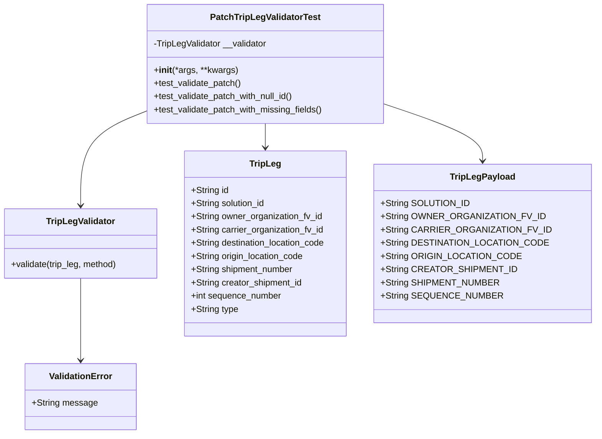
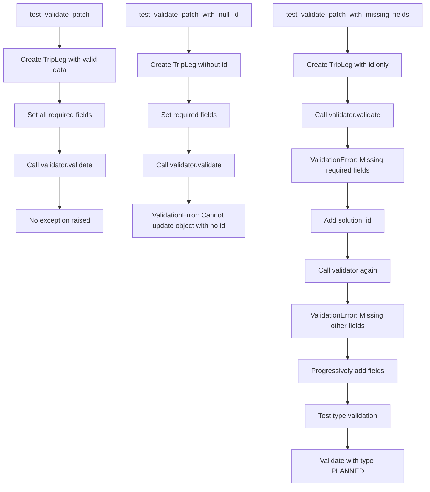
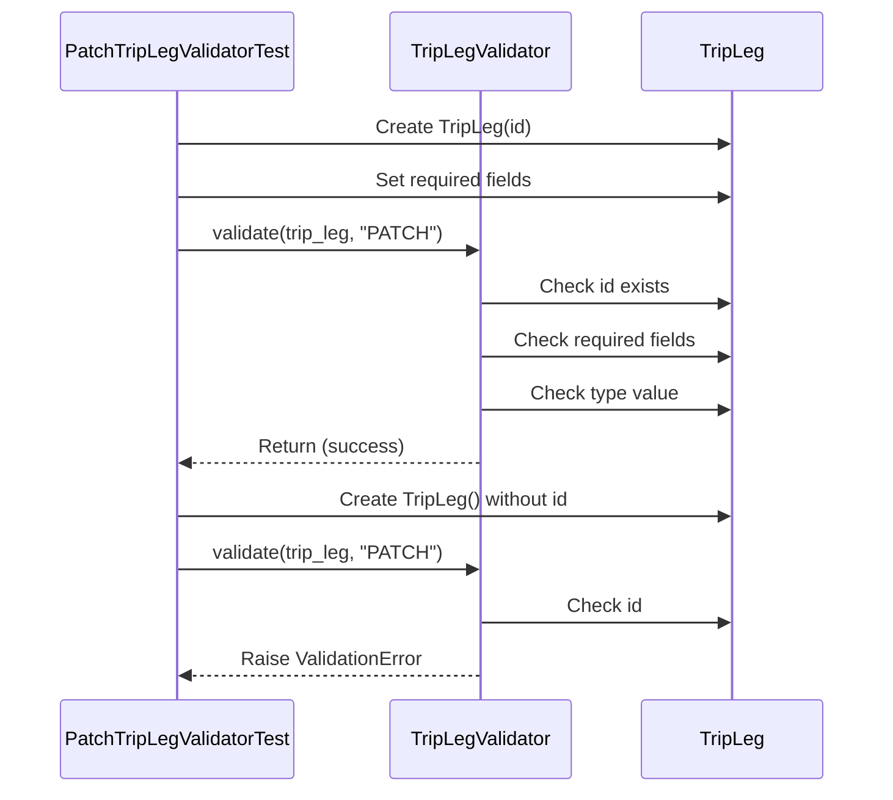

# Diagram: platform/partview_core/partview_service/partview_service/tests/unit/core/validators/trip_leg/trip_leg_patch_validator_test.py

> Auto-generated by Obscura crawlers

## Diagram 1

### SVG

<svg id="container" width="1052.6953125" xmlns="http://www.w3.org/2000/svg" class="classDiagram" height="788" viewBox="0 0 1052.6953125 788" role="graphics-document document" aria-roledescription="class"><g><defs><marker id="container_class-aggregationStart" class="marker aggregation class" refX="18" refY="7" markerWidth="190" markerHeight="240" orient="auto"><path d="M 18,7 L9,13 L1,7 L9,1 Z"></path></marker></defs><defs><marker id="container_class-aggregationEnd" class="marker aggregation class" refX="1" refY="7" markerWidth="20" markerHeight="28" orient="auto"><path d="M 18,7 L9,13 L1,7 L9,1 Z"></path></marker></defs><defs><marker id="container_class-extensionStart" class="marker extension class" refX="18" refY="7" markerWidth="190" markerHeight="240" orient="auto"><path d="M 1,7 L18,13 V 1 Z"></path></marker></defs><defs><marker id="container_class-extensionEnd" class="marker extension class" refX="1" refY="7" markerWidth="20" markerHeight="28" orient="auto"><path d="M 1,1 V 13 L18,7 Z"></path></marker></defs><defs><marker id="container_class-compositionStart" class="marker composition class" refX="18" refY="7" markerWidth="190" markerHeight="240" orient="auto"><path d="M 18,7 L9,13 L1,7 L9,1 Z"></path></marker></defs><defs><marker id="container_class-compositionEnd" class="marker composition class" refX="1" refY="7" markerWidth="20" markerHeight="28" orient="auto"><path d="M 18,7 L9,13 L1,7 L9,1 Z"></path></marker></defs><defs><marker id="container_class-dependencyStart" class="marker dependency class" refX="6" refY="7" markerWidth="190" markerHeight="240" orient="auto"><path d="M 5,7 L9,13 L1,7 L9,1 Z"></path></marker></defs><defs><marker id="container_class-dependencyEnd" class="marker dependency class" refX="13" refY="7" markerWidth="20" markerHeight="28" orient="auto"><path d="M 18,7 L9,13 L14,7 L9,1 Z"></path></marker></defs><defs><marker id="container_class-lollipopStart" class="marker lollipop class" refX="13" refY="7" markerWidth="190" markerHeight="240" orient="auto"><circle stroke="black" fill="transparent" cx="7" cy="7" r="6"></circle></marker></defs><defs><marker id="container_class-lollipopEnd" class="marker lollipop class" refX="1" refY="7" markerWidth="190" markerHeight="240" orient="auto"><circle stroke="black" fill="transparent" cx="7" cy="7" r="6"></circle></marker></defs><g class="root"><g class="clusters"></g><g class="edgePaths"><path d="M272.793,200.203L252.024,208.336C231.255,216.469,189.717,232.734,168.949,261.534C148.18,290.333,148.18,331.667,148.18,352.333L148.18,373" id="id_PatchTripLegValidatorTest_TripLegValidator_1" class="edge-thickness-normal edge-pattern-solid relation" style=";;;" data-edge="true" data-et="edge" data-id="id_PatchTripLegValidatorTest_TripLegValidator_1" data-points="W3sieCI6MjcyLjc5Mjk2ODc1LCJ5IjoyMDAuMjAzMTk5NTc2NzYzMzh9LHsieCI6MTQ4LjE3OTY4NzUsInkiOjI0OX0seyJ4IjoxNDguMTc5Njg3NSwieSI6Mzc5fV0=" marker-end="url(#container_class-dependencyEnd)"></path><path d="M487.824,224L487.824,228.167C487.824,232.333,487.824,240.667,487.824,248C487.824,255.333,487.824,261.667,487.824,264.833L487.824,268" id="id_PatchTripLegValidatorTest_TripLeg_2" class="edge-thickness-normal edge-pattern-solid relation" style=";;;" data-edge="true" data-et="edge" data-id="id_PatchTripLegValidatorTest_TripLeg_2" data-points="W3sieCI6NDg3LjgyNDIxODc1LCJ5IjoyMjR9LHsieCI6NDg3LjgyNDIxODc1LCJ5IjoyNDl9LHsieCI6NDg3LjgyNDIxODc1LCJ5IjoyNzR9XQ==" marker-end="url(#container_class-dependencyEnd)"></path><path d="M702.855,191.626L730.045,201.188C757.234,210.75,811.613,229.875,838.803,246.604C865.992,263.333,865.992,277.667,865.992,284.833L865.992,292" id="id_PatchTripLegValidatorTest_TripLegPayload_3" class="edge-thickness-normal edge-pattern-solid relation" style=";;;" data-edge="true" data-et="edge" data-id="id_PatchTripLegValidatorTest_TripLegPayload_3" data-points="W3sieCI6NzAyLjg1NTQ2ODc1LCJ5IjoxOTEuNjI1NTM4NDIwMjIwODN9LHsieCI6ODY1Ljk5MjE4NzUsInkiOjI0OX0seyJ4Ijo4NjUuOTkyMTg3NSwieSI6Mjk4fV0=" marker-end="url(#container_class-dependencyEnd)"></path><path d="M148.18,505L148.18,526.667C148.18,548.333,148.18,591.667,148.18,616.5C148.18,641.333,148.18,647.667,148.18,650.833L148.18,654" id="id_TripLegValidator_ValidationError_4" class="edge-thickness-normal edge-pattern-solid relation" style=";;;" data-edge="true" data-et="edge" data-id="id_TripLegValidator_ValidationError_4" data-points="W3sieCI6MTQ4LjE3OTY4NzUsInkiOjUwNX0seyJ4IjoxNDguMTc5Njg3NSwieSI6NjM1fSx7IngiOjE0OC4xNzk2ODc1LCJ5Ijo2NjB9XQ==" marker-end="url(#container_class-dependencyEnd)"></path></g><g class="edgeLabels"><g class="edgeLabel"><g class="label" data-id="id_PatchTripLegValidatorTest_TripLegValidator_1" transform="translate(0, 0)"><foreignObject width="0" height="0">

</foreignObject></g></g><g class="edgeLabel"><g class="label" data-id="id_PatchTripLegValidatorTest_TripLeg_2" transform="translate(0, 0)"><foreignObject width="0" height="0">

</foreignObject></g></g><g class="edgeLabel"><g class="label" data-id="id_PatchTripLegValidatorTest_TripLegPayload_3" transform="translate(0, 0)"><foreignObject width="0" height="0">

</foreignObject></g></g><g class="edgeLabel"><g class="label" data-id="id_TripLegValidator_ValidationError_4" transform="translate(0, 0)"><foreignObject width="0" height="0">

</foreignObject></g></g></g><g class="nodes"><g class="node default" id="classId-PatchTripLegValidatorTest-0" transform="translate(487.82421875, 116)"><g class="basic label-container"><path d="M-215.03125 -108 L215.03125 -108 L215.03125 108 L-215.03125 108" stroke="none" stroke-width="0" fill="#ECECFF" style=""></path><path d="M-215.03125 -108 C-125.01273677419015 -108, -34.99422354838029 -108, 215.03125 -108 M-215.03125 -108 C-115.4083984637595 -108, -15.785546927518993 -108, 215.03125 -108 M215.03125 -108 C215.03125 -49.50137488649469, 215.03125 8.997250227010625, 215.03125 108 M215.03125 -108 C215.03125 -51.7738983599015, 215.03125 4.452203280196997, 215.03125 108 M215.03125 108 C112.01004745697843 108, 8.988844913956854 108, -215.03125 108 M215.03125 108 C68.23872972680644 108, -78.55379054638712 108, -215.03125 108 M-215.03125 108 C-215.03125 59.120333749621295, -215.03125 10.24066749924259, -215.03125 -108 M-215.03125 108 C-215.03125 42.65981077629337, -215.03125 -22.68037844741326, -215.03125 -108" stroke="#9370DB" stroke-width="1.3" fill="none" stroke-dasharray="0 0" style=""></path></g><g class="annotation-group text" transform="translate(0, -84)"></g><g class="label-group text" transform="translate(-95.640625, -84)"><g class="label" style="font-weight: bolder" transform="translate(0,-12)"><foreignObject width="191.28125" height="24">

PatchTripLegValidatorTest

</foreignObject></g></g><g class="members-group text" transform="translate(-203.03125, -36)"><g class="label" style="" transform="translate(0,-12)"><foreignObject width="208.5" height="24">

-TripLegValidator __validator

</foreignObject></g></g><g class="methods-group text" transform="translate(-203.03125, 12)"><g class="label" style="" transform="translate(0,-12)"><foreignObject width="151.8125" height="24">

+<strong>init</strong>(*args, **kwargs)

</foreignObject></g><g class="label" style="" transform="translate(0,12)"><foreignObject width="160.125" height="24">

+test_validate_patch()

</foreignObject></g><g class="label" style="" transform="translate(0,36)"><foreignObject width="258.046875" height="24">

+test_validate_patch_with_null_id()

</foreignObject></g><g class="label" style="" transform="translate(0,60)"><foreignObject width="310.421875" height="24">

+test_validate_patch_with_missing_fields()

</foreignObject></g></g><g class="divider" style=""><path d="M-215.03125 -60 C-111.65427796190708 -60, -8.277305923814168 -60, 215.03125 -60 M-215.03125 -60 C-114.88417336121464 -60, -14.737096722429271 -60, 215.03125 -60" stroke="#9370DB" stroke-width="1.3" fill="none" stroke-dasharray="0 0" style=""></path></g><g class="divider" style=""><path d="M-215.03125 -12 C-74.73896186411284 -12, 65.55332627177432 -12, 215.03125 -12 M-215.03125 -12 C-67.70675894297642 -12, 79.61773211404716 -12, 215.03125 -12" stroke="#9370DB" stroke-width="1.3" fill="none" stroke-dasharray="0 0" style=""></path></g></g><g class="node default" id="classId-TripLegValidator-1" transform="translate(148.1796875, 442)"><g class="basic label-container"><path d="M-140.1796875 -63 L140.1796875 -63 L140.1796875 63 L-140.1796875 63" stroke="none" stroke-width="0" fill="#ECECFF" style=""></path><path d="M-140.1796875 -63 C-54.47217543142469 -63, 31.235336637150624 -63, 140.1796875 -63 M-140.1796875 -63 C-61.67899813573264 -63, 16.821691228534718 -63, 140.1796875 -63 M140.1796875 -63 C140.1796875 -23.56543151681555, 140.1796875 15.869136966368899, 140.1796875 63 M140.1796875 -63 C140.1796875 -24.50595420140663, 140.1796875 13.988091597186738, 140.1796875 63 M140.1796875 63 C64.97177635527962 63, -10.236134789440769 63, -140.1796875 63 M140.1796875 63 C63.23275726006001 63, -13.714172979879976 63, -140.1796875 63 M-140.1796875 63 C-140.1796875 37.78667336429443, -140.1796875 12.573346728588852, -140.1796875 -63 M-140.1796875 63 C-140.1796875 31.213171737828173, -140.1796875 -0.5736565243436544, -140.1796875 -63" stroke="#9370DB" stroke-width="1.3" fill="none" stroke-dasharray="0 0" style=""></path></g><g class="annotation-group text" transform="translate(0, -39)"></g><g class="label-group text" transform="translate(-60.234375, -39)"><g class="label" style="font-weight: bolder" transform="translate(0,-12)"><foreignObject width="120.46875" height="24">

TripLegValidator

</foreignObject></g></g><g class="members-group text" transform="translate(-128.1796875, 9)"></g><g class="methods-group text" transform="translate(-128.1796875, 39)"><g class="label" style="" transform="translate(0,-12)"><foreignObject width="196.125" height="24">

+validate(trip_leg, method)

</foreignObject></g></g><g class="divider" style=""><path d="M-140.1796875 -15 C-42.54261565733049 -15, 55.09445618533903 -15, 140.1796875 -15 M-140.1796875 -15 C-42.95909310629513 -15, 54.26150128740974 -15, 140.1796875 -15" stroke="#9370DB" stroke-width="1.3" fill="none" stroke-dasharray="0 0" style=""></path></g><g class="divider" style=""><path d="M-140.1796875 9 C-79.72568027682885 9, -19.27167305365772 9, 140.1796875 9 M-140.1796875 9 C-32.74344659026566 9, 74.69279431946867 9, 140.1796875 9" stroke="#9370DB" stroke-width="1.3" fill="none" stroke-dasharray="0 0" style=""></path></g></g><g class="node default" id="classId-TripLeg-2" transform="translate(487.82421875, 442)"><g class="basic label-container"><path d="M-149.46484375 -168 L149.46484375 -168 L149.46484375 168 L-149.46484375 168" stroke="none" stroke-width="0" fill="#ECECFF" style=""></path><path d="M-149.46484375 -168 C-87.50735127366255 -168, -25.5498587973251 -168, 149.46484375 -168 M-149.46484375 -168 C-80.65005545549963 -168, -11.835267160999251 -168, 149.46484375 -168 M149.46484375 -168 C149.46484375 -82.27092135576493, 149.46484375 3.4581572884701473, 149.46484375 168 M149.46484375 -168 C149.46484375 -77.23039087574385, 149.46484375 13.539218248512299, 149.46484375 168 M149.46484375 168 C45.9192249632126 168, -57.6263938235748 168, -149.46484375 168 M149.46484375 168 C75.24609649387419 168, 1.027349237748382 168, -149.46484375 168 M-149.46484375 168 C-149.46484375 83.81101015703379, -149.46484375 -0.3779796859324165, -149.46484375 -168 M-149.46484375 168 C-149.46484375 78.1971781943822, -149.46484375 -11.605643611235593, -149.46484375 -168" stroke="#9370DB" stroke-width="1.3" fill="none" stroke-dasharray="0 0" style=""></path></g><g class="annotation-group text" transform="translate(0, -144)"></g><g class="label-group text" transform="translate(-27.0546875, -144)"><g class="label" style="font-weight: bolder" transform="translate(0,-12)"><foreignObject width="54.109375" height="24">

TripLeg

</foreignObject></g></g><g class="members-group text" transform="translate(-137.46484375, -96)"><g class="label" style="" transform="translate(0,-12)"><foreignObject width="68.546875" height="24">

+String id

</foreignObject></g><g class="label" style="" transform="translate(0,12)"><foreignObject width="136.703125" height="24">

+String solution_id

</foreignObject></g><g class="label" style="" transform="translate(0,36)"><foreignObject width="239.78125" height="24">

+String owner_organization_fv_id

</foreignObject></g><g class="label" style="" transform="translate(0,60)"><foreignObject width="242.640625" height="24">

+String carrier_organization_fv_id

</foreignObject></g><g class="label" style="" transform="translate(0,84)"><foreignObject width="247.875" height="24">

+String destination_location_code

</foreignObject></g><g class="label" style="" transform="translate(0,108)"><foreignObject width="206.984375" height="24">

+String origin_location_code

</foreignObject></g><g class="label" style="" transform="translate(0,132)"><foreignObject width="188.046875" height="24">

+String shipment_number

</foreignObject></g><g class="label" style="" transform="translate(0,156)"><foreignObject width="204.03125" height="24">

+String creator_shipment_id

</foreignObject></g><g class="label" style="" transform="translate(0,180)"><foreignObject width="165.90625" height="24">

+int sequence_number

</foreignObject></g><g class="label" style="" transform="translate(0,204)"><foreignObject width="86.265625" height="24">

+String type

</foreignObject></g></g><g class="methods-group text" transform="translate(-137.46484375, 168)"></g><g class="divider" style=""><path d="M-149.46484375 -120 C-87.31011093036666 -120, -25.155378110733324 -120, 149.46484375 -120 M-149.46484375 -120 C-42.74878623982309 -120, 63.96727127035382 -120, 149.46484375 -120" stroke="#9370DB" stroke-width="1.3" fill="none" stroke-dasharray="0 0" style=""></path></g><g class="divider" style=""><path d="M-149.46484375 144 C-63.77112731477885 144, 21.922589120442296 144, 149.46484375 144 M-149.46484375 144 C-53.506580352330786 144, 42.45168304533843 144, 149.46484375 144" stroke="#9370DB" stroke-width="1.3" fill="none" stroke-dasharray="0 0" style=""></path></g></g><g class="node default" id="classId-TripLegPayload-3" transform="translate(865.9921875, 442)"><g class="basic label-container"><path d="M-178.703125 -144 L178.703125 -144 L178.703125 144 L-178.703125 144" stroke="none" stroke-width="0" fill="#ECECFF" style=""></path><path d="M-178.703125 -144 C-51.87890015807692 -144, 74.94532468384617 -144, 178.703125 -144 M-178.703125 -144 C-105.15055625853648 -144, -31.597987517072966 -144, 178.703125 -144 M178.703125 -144 C178.703125 -60.19566725099614, 178.703125 23.608665498007724, 178.703125 144 M178.703125 -144 C178.703125 -78.9936332432247, 178.703125 -13.987266486449414, 178.703125 144 M178.703125 144 C99.78502774436542 144, 20.866930488730844 144, -178.703125 144 M178.703125 144 C97.33950520894363 144, 15.97588541788727 144, -178.703125 144 M-178.703125 144 C-178.703125 34.805049935500364, -178.703125 -74.38990012899927, -178.703125 -144 M-178.703125 144 C-178.703125 56.37689296850563, -178.703125 -31.24621406298874, -178.703125 -144" stroke="#9370DB" stroke-width="1.3" fill="none" stroke-dasharray="0 0" style=""></path></g><g class="annotation-group text" transform="translate(0, -120)"></g><g class="label-group text" transform="translate(-55.953125, -120)"><g class="label" style="font-weight: bolder" transform="translate(0,-12)"><foreignObject width="111.90625" height="24">

TripLegPayload

</foreignObject></g></g><g class="members-group text" transform="translate(-166.703125, -72)"><g class="label" style="" transform="translate(0,-12)"><foreignObject width="150.765625" height="24">

+String SOLUTION_ID

</foreignObject></g><g class="label" style="" transform="translate(0,12)"><foreignObject width="270.453125" height="24">

+String OWNER_ORGANIZATION_FV_ID

</foreignObject></g><g class="label" style="" transform="translate(0,36)"><foreignObject width="277.453125" height="24">

+String CARRIER_ORGANIZATION_FV_ID

</foreignObject></g><g class="label" style="" transform="translate(0,60)"><foreignObject width="274.046875" height="24">

+String DESTINATION_LOCATION_CODE

</foreignObject></g><g class="label" style="" transform="translate(0,84)"><foreignObject width="230.90625" height="24">

+String ORIGIN_LOCATION_CODE

</foreignObject></g><g class="label" style="" transform="translate(0,108)"><foreignObject width="222.390625" height="24">

+String CREATOR_SHIPMENT_ID

</foreignObject></g><g class="label" style="" transform="translate(0,132)"><foreignObject width="197.265625" height="24">

+String SHIPMENT_NUMBER

</foreignObject></g><g class="label" style="" transform="translate(0,156)"><foreignObject width="200.46875" height="24">

+String SEQUENCE_NUMBER

</foreignObject></g></g><g class="methods-group text" transform="translate(-166.703125, 144)"></g><g class="divider" style=""><path d="M-178.703125 -96 C-56.766273154821604 -96, 65.17057869035679 -96, 178.703125 -96 M-178.703125 -96 C-81.68853743300514 -96, 15.326050133989725 -96, 178.703125 -96" stroke="#9370DB" stroke-width="1.3" fill="none" stroke-dasharray="0 0" style=""></path></g><g class="divider" style=""><path d="M-178.703125 120 C-38.70076032263631 120, 101.30160435472737 120, 178.703125 120 M-178.703125 120 C-80.51474826066833 120, 17.673628478663346 120, 178.703125 120" stroke="#9370DB" stroke-width="1.3" fill="none" stroke-dasharray="0 0" style=""></path></g></g><g class="node default" id="classId-ValidationError-4" transform="translate(148.1796875, 720)"><g class="basic label-container"><path d="M-98.01953125 -60 L98.01953125 -60 L98.01953125 60 L-98.01953125 60" stroke="none" stroke-width="0" fill="#ECECFF" style=""></path><path d="M-98.01953125 -60 C-36.779434518777705 -60, 24.46066221244459 -60, 98.01953125 -60 M-98.01953125 -60 C-55.01373072999676 -60, -12.007930209993518 -60, 98.01953125 -60 M98.01953125 -60 C98.01953125 -23.477729351275308, 98.01953125 13.044541297449385, 98.01953125 60 M98.01953125 -60 C98.01953125 -24.493356747321897, 98.01953125 11.013286505356206, 98.01953125 60 M98.01953125 60 C54.877881602887534 60, 11.736231955775068 60, -98.01953125 60 M98.01953125 60 C43.583707363945365 60, -10.85211652210927 60, -98.01953125 60 M-98.01953125 60 C-98.01953125 16.04379568978161, -98.01953125 -27.91240862043678, -98.01953125 -60 M-98.01953125 60 C-98.01953125 18.36152175455156, -98.01953125 -23.27695649089688, -98.01953125 -60" stroke="#9370DB" stroke-width="1.3" fill="none" stroke-dasharray="0 0" style=""></path></g><g class="annotation-group text" transform="translate(0, -36)"></g><g class="label-group text" transform="translate(-55.1796875, -36)"><g class="label" style="font-weight: bolder" transform="translate(0,-12)"><foreignObject width="110.359375" height="24">

ValidationError

</foreignObject></g></g><g class="members-group text" transform="translate(-86.01953125, 12)"><g class="label" style="" transform="translate(0,-12)"><foreignObject width="116.859375" height="24">

+String message

</foreignObject></g></g><g class="methods-group text" transform="translate(-86.01953125, 60)"></g><g class="divider" style=""><path d="M-98.01953125 -12 C-34.983858798868866 -12, 28.05181365226227 -12, 98.01953125 -12 M-98.01953125 -12 C-30.70331471608644 -12, 36.61290181782712 -12, 98.01953125 -12" stroke="#9370DB" stroke-width="1.3" fill="none" stroke-dasharray="0 0" style=""></path></g><g class="divider" style=""><path d="M-98.01953125 36 C-49.94390742366121 36, -1.8682835973224172 36, 98.01953125 36 M-98.01953125 36 C-34.6282205520658 36, 28.763090145868404 36, 98.01953125 36" stroke="#9370DB" stroke-width="1.3" fill="none" stroke-dasharray="0 0" style=""></path></g></g></g></g></g></svg>

## Diagram 2

### SVG

<svg id="container" width="998.84375" xmlns="http://www.w3.org/2000/svg" class="flowchart" height="1126" viewBox="0 0 998.84375 1126" role="graphics-document document" aria-roledescription="flowchart-v2"><g><marker id="container_flowchart-v2-pointEnd" class="marker flowchart-v2" viewBox="0 0 10 10" refX="5" refY="5" markerUnits="userSpaceOnUse" markerWidth="8" markerHeight="8" orient="auto"><path d="M 0 0 L 10 5 L 0 10 z" class="arrowMarkerPath" style="stroke-width: 1; stroke-dasharray: 1, 0;"></path></marker><marker id="container_flowchart-v2-pointStart" class="marker flowchart-v2" viewBox="0 0 10 10" refX="4.5" refY="5" markerUnits="userSpaceOnUse" markerWidth="8" markerHeight="8" orient="auto"><path d="M 0 5 L 10 10 L 10 0 z" class="arrowMarkerPath" style="stroke-width: 1; stroke-dasharray: 1, 0;"></path></marker><marker id="container_flowchart-v2-circleEnd" class="marker flowchart-v2" viewBox="0 0 10 10" refX="11" refY="5" markerUnits="userSpaceOnUse" markerWidth="11" markerHeight="11" orient="auto"><circle cx="5" cy="5" r="5" class="arrowMarkerPath" style="stroke-width: 1; stroke-dasharray: 1, 0;"></circle></marker><marker id="container_flowchart-v2-circleStart" class="marker flowchart-v2" viewBox="0 0 10 10" refX="-1" refY="5" markerUnits="userSpaceOnUse" markerWidth="11" markerHeight="11" orient="auto"><circle cx="5" cy="5" r="5" class="arrowMarkerPath" style="stroke-width: 1; stroke-dasharray: 1, 0;"></circle></marker><marker id="container_flowchart-v2-crossEnd" class="marker cross flowchart-v2" viewBox="0 0 11 11" refX="12" refY="5.2" markerUnits="userSpaceOnUse" markerWidth="11" markerHeight="11" orient="auto"><path d="M 1,1 l 9,9 M 10,1 l -9,9" class="arrowMarkerPath" style="stroke-width: 2; stroke-dasharray: 1, 0;"></path></marker><marker id="container_flowchart-v2-crossStart" class="marker cross flowchart-v2" viewBox="0 0 11 11" refX="-1" refY="5.2" markerUnits="userSpaceOnUse" markerWidth="11" markerHeight="11" orient="auto"><path d="M 1,1 l 9,9 M 10,1 l -9,9" class="arrowMarkerPath" style="stroke-width: 2; stroke-dasharray: 1, 0;"></path></marker><g class="root"><g class="clusters"></g><g class="edgePaths"><path d="M138,62L138,66.167C138,70.333,138,78.667,138,86.333C138,94,138,101,138,104.5L138,108" id="L_A_B_0" class="edge-thickness-normal edge-pattern-solid edge-thickness-normal edge-pattern-solid flowchart-link" style=";" data-edge="true" data-et="edge" data-id="L_A_B_0" data-points="W3sieCI6MTM4LCJ5Ijo2Mn0seyJ4IjoxMzgsInkiOjg3fSx7IngiOjEzOCwieSI6MTEyfV0=" marker-end="url(#container_flowchart-v2-pointEnd)"></path><path d="M138,190L138,194.167C138,198.333,138,206.667,138,214.333C138,222,138,229,138,232.5L138,236" id="L_B_C_0" class="edge-thickness-normal edge-pattern-solid edge-thickness-normal edge-pattern-solid flowchart-link" style=";" data-edge="true" data-et="edge" data-id="L_B_C_0" data-points="W3sieCI6MTM4LCJ5IjoxOTB9LHsieCI6MTM4LCJ5IjoyMTV9LHsieCI6MTM4LCJ5IjoyNDB9XQ==" marker-end="url(#container_flowchart-v2-pointEnd)"></path><path d="M138,294L138,298.167C138,302.333,138,310.667,138,320.333C138,330,138,341,138,346.5L138,352" id="L_C_D_0" class="edge-thickness-normal edge-pattern-solid edge-thickness-normal edge-pattern-solid flowchart-link" style=";" data-edge="true" data-et="edge" data-id="L_C_D_0" data-points="W3sieCI6MTM4LCJ5IjoyOTR9LHsieCI6MTM4LCJ5IjozMTl9LHsieCI6MTM4LCJ5IjozNTZ9XQ==" marker-end="url(#container_flowchart-v2-pointEnd)"></path><path d="M138,410L138,416.167C138,422.333,138,434.667,138,446.333C138,458,138,469,138,474.5L138,480" id="L_D_E_0" class="edge-thickness-normal edge-pattern-solid edge-thickness-normal edge-pattern-solid flowchart-link" style=";" data-edge="true" data-et="edge" data-id="L_D_E_0" data-points="W3sieCI6MTM4LCJ5Ijo0MTB9LHsieCI6MTM4LCJ5Ijo0NDd9LHsieCI6MTM4LCJ5Ijo0ODR9XQ==" marker-end="url(#container_flowchart-v2-pointEnd)"></path><path d="M438.805,62L438.805,66.167C438.805,70.333,438.805,78.667,438.805,88.333C438.805,98,438.805,109,438.805,114.5L438.805,120" id="L_F_G_0" class="edge-thickness-normal edge-pattern-solid edge-thickness-normal edge-pattern-solid flowchart-link" style=";" data-edge="true" data-et="edge" data-id="L_F_G_0" data-points="W3sieCI6NDM4LjgwNDY4NzUsInkiOjYyfSx7IngiOjQzOC44MDQ2ODc1LCJ5Ijo4N30seyJ4Ijo0MzguODA0Njg3NSwieSI6MTI0fV0=" marker-end="url(#container_flowchart-v2-pointEnd)"></path><path d="M438.805,178L438.805,184.167C438.805,190.333,438.805,202.667,438.805,212.333C438.805,222,438.805,229,438.805,232.5L438.805,236" id="L_G_H_0" class="edge-thickness-normal edge-pattern-solid edge-thickness-normal edge-pattern-solid flowchart-link" style=";" data-edge="true" data-et="edge" data-id="L_G_H_0" data-points="W3sieCI6NDM4LjgwNDY4NzUsInkiOjE3OH0seyJ4Ijo0MzguODA0Njg3NSwieSI6MjE1fSx7IngiOjQzOC44MDQ2ODc1LCJ5IjoyNDB9XQ==" marker-end="url(#container_flowchart-v2-pointEnd)"></path><path d="M438.805,294L438.805,298.167C438.805,302.333,438.805,310.667,438.805,320.333C438.805,330,438.805,341,438.805,346.5L438.805,352" id="L_H_I_0" class="edge-thickness-normal edge-pattern-solid edge-thickness-normal edge-pattern-solid flowchart-link" style=";" data-edge="true" data-et="edge" data-id="L_H_I_0" data-points="W3sieCI6NDM4LjgwNDY4NzUsInkiOjI5NH0seyJ4Ijo0MzguODA0Njg3NSwieSI6MzE5fSx7IngiOjQzOC44MDQ2ODc1LCJ5IjozNTZ9XQ==" marker-end="url(#container_flowchart-v2-pointEnd)"></path><path d="M438.805,410L438.805,416.167C438.805,422.333,438.805,434.667,438.805,444.333C438.805,454,438.805,461,438.805,464.5L438.805,468" id="L_I_J_0" class="edge-thickness-normal edge-pattern-solid edge-thickness-normal edge-pattern-solid flowchart-link" style=";" data-edge="true" data-et="edge" data-id="L_I_J_0" data-points="W3sieCI6NDM4LjgwNDY4NzUsInkiOjQxMH0seyJ4Ijo0MzguODA0Njg3NSwieSI6NDQ3fSx7IngiOjQzOC44MDQ2ODc1LCJ5Ijo0NzJ9XQ==" marker-end="url(#container_flowchart-v2-pointEnd)"></path><path d="M814.766,62L814.766,66.167C814.766,70.333,814.766,78.667,814.766,88.333C814.766,98,814.766,109,814.766,114.5L814.766,120" id="L_K_L_0" class="edge-thickness-normal edge-pattern-solid edge-thickness-normal edge-pattern-solid flowchart-link" style=";" data-edge="true" data-et="edge" data-id="L_K_L_0" data-points="W3sieCI6ODE0Ljc2NTYyNSwieSI6NjJ9LHsieCI6ODE0Ljc2NTYyNSwieSI6ODd9LHsieCI6ODE0Ljc2NTYyNSwieSI6MTI0fV0=" marker-end="url(#container_flowchart-v2-pointEnd)"></path><path d="M814.766,178L814.766,184.167C814.766,190.333,814.766,202.667,814.766,212.333C814.766,222,814.766,229,814.766,232.5L814.766,236" id="L_L_M_0" class="edge-thickness-normal edge-pattern-solid edge-thickness-normal edge-pattern-solid flowchart-link" style=";" data-edge="true" data-et="edge" data-id="L_L_M_0" data-points="W3sieCI6ODE0Ljc2NTYyNSwieSI6MTc4fSx7IngiOjgxNC43NjU2MjUsInkiOjIxNX0seyJ4Ijo4MTQuNzY1NjI1LCJ5IjoyNDB9XQ==" marker-end="url(#container_flowchart-v2-pointEnd)"></path><path d="M814.766,294L814.766,298.167C814.766,302.333,814.766,310.667,814.766,318.333C814.766,326,814.766,333,814.766,336.5L814.766,340" id="L_M_N_0" class="edge-thickness-normal edge-pattern-solid edge-thickness-normal edge-pattern-solid flowchart-link" style=";" data-edge="true" data-et="edge" data-id="L_M_N_0" data-points="W3sieCI6ODE0Ljc2NTYyNSwieSI6Mjk0fSx7IngiOjgxNC43NjU2MjUsInkiOjMxOX0seyJ4Ijo4MTQuNzY1NjI1LCJ5IjozNDR9XQ==" marker-end="url(#container_flowchart-v2-pointEnd)"></path><path d="M814.766,422L814.766,426.167C814.766,430.333,814.766,438.667,814.766,448.333C814.766,458,814.766,469,814.766,474.5L814.766,480" id="L_N_O_0" class="edge-thickness-normal edge-pattern-solid edge-thickness-normal edge-pattern-solid flowchart-link" style=";" data-edge="true" data-et="edge" data-id="L_N_O_0" data-points="W3sieCI6ODE0Ljc2NTYyNSwieSI6NDIyfSx7IngiOjgxNC43NjU2MjUsInkiOjQ0N30seyJ4Ijo4MTQuNzY1NjI1LCJ5Ijo0ODR9XQ==" marker-end="url(#container_flowchart-v2-pointEnd)"></path><path d="M814.766,538L814.766,544.167C814.766,550.333,814.766,562.667,814.766,572.333C814.766,582,814.766,589,814.766,592.5L814.766,596" id="L_O_P_0" class="edge-thickness-normal edge-pattern-solid edge-thickness-normal edge-pattern-solid flowchart-link" style=";" data-edge="true" data-et="edge" data-id="L_O_P_0" data-points="W3sieCI6ODE0Ljc2NTYyNSwieSI6NTM4fSx7IngiOjgxNC43NjU2MjUsInkiOjU3NX0seyJ4Ijo4MTQuNzY1NjI1LCJ5Ijo2MDB9XQ==" marker-end="url(#container_flowchart-v2-pointEnd)"></path><path d="M814.766,654L814.766,658.167C814.766,662.333,814.766,670.667,814.766,678.333C814.766,686,814.766,693,814.766,696.5L814.766,700" id="L_P_Q_0" class="edge-thickness-normal edge-pattern-solid edge-thickness-normal edge-pattern-solid flowchart-link" style=";" data-edge="true" data-et="edge" data-id="L_P_Q_0" data-points="W3sieCI6ODE0Ljc2NTYyNSwieSI6NjU0fSx7IngiOjgxNC43NjU2MjUsInkiOjY3OX0seyJ4Ijo4MTQuNzY1NjI1LCJ5Ijo3MDR9XQ==" marker-end="url(#container_flowchart-v2-pointEnd)"></path><path d="M814.766,782L814.766,786.167C814.766,790.333,814.766,798.667,814.766,806.333C814.766,814,814.766,821,814.766,824.5L814.766,828" id="L_Q_R_0" class="edge-thickness-normal edge-pattern-solid edge-thickness-normal edge-pattern-solid flowchart-link" style=";" data-edge="true" data-et="edge" data-id="L_Q_R_0" data-points="W3sieCI6ODE0Ljc2NTYyNSwieSI6NzgyfSx7IngiOjgxNC43NjU2MjUsInkiOjgwN30seyJ4Ijo4MTQuNzY1NjI1LCJ5Ijo4MzJ9XQ==" marker-end="url(#container_flowchart-v2-pointEnd)"></path><path d="M814.766,886L814.766,890.167C814.766,894.333,814.766,902.667,814.766,910.333C814.766,918,814.766,925,814.766,928.5L814.766,932" id="L_R_S_0" class="edge-thickness-normal edge-pattern-solid edge-thickness-normal edge-pattern-solid flowchart-link" style=";" data-edge="true" data-et="edge" data-id="L_R_S_0" data-points="W3sieCI6ODE0Ljc2NTYyNSwieSI6ODg2fSx7IngiOjgxNC43NjU2MjUsInkiOjkxMX0seyJ4Ijo4MTQuNzY1NjI1LCJ5Ijo5MzZ9XQ==" marker-end="url(#container_flowchart-v2-pointEnd)"></path><path d="M814.766,990L814.766,994.167C814.766,998.333,814.766,1006.667,814.766,1014.333C814.766,1022,814.766,1029,814.766,1032.5L814.766,1036" id="L_S_T_0" class="edge-thickness-normal edge-pattern-solid edge-thickness-normal edge-pattern-solid flowchart-link" style=";" data-edge="true" data-et="edge" data-id="L_S_T_0" data-points="W3sieCI6ODE0Ljc2NTYyNSwieSI6OTkwfSx7IngiOjgxNC43NjU2MjUsInkiOjEwMTV9LHsieCI6ODE0Ljc2NTYyNSwieSI6MTA0MH1d" marker-end="url(#container_flowchart-v2-pointEnd)"></path></g><g class="edgeLabels"><g class="edgeLabel"><g class="label" data-id="L_A_B_0" transform="translate(0, 0)"><foreignObject width="0" height="0">

</foreignObject></g></g><g class="edgeLabel"><g class="label" data-id="L_B_C_0" transform="translate(0, 0)"><foreignObject width="0" height="0">

</foreignObject></g></g><g class="edgeLabel"><g class="label" data-id="L_C_D_0" transform="translate(0, 0)"><foreignObject width="0" height="0">

</foreignObject></g></g><g class="edgeLabel"><g class="label" data-id="L_D_E_0" transform="translate(0, 0)"><foreignObject width="0" height="0">

</foreignObject></g></g><g class="edgeLabel"><g class="label" data-id="L_F_G_0" transform="translate(0, 0)"><foreignObject width="0" height="0">

</foreignObject></g></g><g class="edgeLabel"><g class="label" data-id="L_G_H_0" transform="translate(0, 0)"><foreignObject width="0" height="0">

</foreignObject></g></g><g class="edgeLabel"><g class="label" data-id="L_H_I_0" transform="translate(0, 0)"><foreignObject width="0" height="0">

</foreignObject></g></g><g class="edgeLabel"><g class="label" data-id="L_I_J_0" transform="translate(0, 0)"><foreignObject width="0" height="0">

</foreignObject></g></g><g class="edgeLabel"><g class="label" data-id="L_K_L_0" transform="translate(0, 0)"><foreignObject width="0" height="0">

</foreignObject></g></g><g class="edgeLabel"><g class="label" data-id="L_L_M_0" transform="translate(0, 0)"><foreignObject width="0" height="0">

</foreignObject></g></g><g class="edgeLabel"><g class="label" data-id="L_M_N_0" transform="translate(0, 0)"><foreignObject width="0" height="0">

</foreignObject></g></g><g class="edgeLabel"><g class="label" data-id="L_N_O_0" transform="translate(0, 0)"><foreignObject width="0" height="0">

</foreignObject></g></g><g class="edgeLabel"><g class="label" data-id="L_O_P_0" transform="translate(0, 0)"><foreignObject width="0" height="0">

</foreignObject></g></g><g class="edgeLabel"><g class="label" data-id="L_P_Q_0" transform="translate(0, 0)"><foreignObject width="0" height="0">

</foreignObject></g></g><g class="edgeLabel"><g class="label" data-id="L_Q_R_0" transform="translate(0, 0)"><foreignObject width="0" height="0">

</foreignObject></g></g><g class="edgeLabel"><g class="label" data-id="L_R_S_0" transform="translate(0, 0)"><foreignObject width="0" height="0">

</foreignObject></g></g><g class="edgeLabel"><g class="label" data-id="L_S_T_0" transform="translate(0, 0)"><foreignObject width="0" height="0">

</foreignObject></g></g></g><g class="nodes"><g class="node default" id="flowchart-A-0" transform="translate(138, 35)"><rect class="basic label-container" style="" x="-100.921875" y="-27" width="201.84375" height="54"></rect><g class="label" style="" transform="translate(-70.921875, -12)"><rect></rect><foreignObject width="141.84375" height="24">

test_validate_patch

</foreignObject></g></g><g class="node default" id="flowchart-B-1" transform="translate(138, 151)"><rect class="basic label-container" style="" x="-130" y="-39" width="260" height="78"></rect><g class="label" style="" transform="translate(-100, -24)"><rect></rect><foreignObject width="200" height="48">

Create TripLeg with valid data

</foreignObject></g></g><g class="node default" id="flowchart-C-3" transform="translate(138, 267)"><rect class="basic label-container" style="" x="-107.609375" y="-27" width="215.21875" height="54"></rect><g class="label" style="" transform="translate(-77.609375, -12)"><rect></rect><foreignObject width="155.21875" height="24">

Set all required fields

</foreignObject></g></g><g class="node default" id="flowchart-D-5" transform="translate(138, 383)"><rect class="basic label-container" style="" x="-107.734375" y="-27" width="215.46875" height="54"></rect><g class="label" style="" transform="translate(-77.734375, -12)"><rect></rect><foreignObject width="155.46875" height="24">

Call validator.validate

</foreignObject></g></g><g class="node default" id="flowchart-E-7" transform="translate(138, 511)"><rect class="basic label-container" style="" x="-102.0546875" y="-27" width="204.109375" height="54"></rect><g class="label" style="" transform="translate(-72.0546875, -12)"><rect></rect><foreignObject width="144.109375" height="24">

No exception raised

</foreignObject></g></g><g class="node default" id="flowchart-F-8" transform="translate(438.8046875, 35)"><rect class="basic label-container" style="" x="-149.8828125" y="-27" width="299.765625" height="54"></rect><g class="label" style="" transform="translate(-119.8828125, -12)"><rect></rect><foreignObject width="239.765625" height="24">

test_validate_patch_with_null_id

</foreignObject></g></g><g class="node default" id="flowchart-G-9" transform="translate(438.8046875, 151)"><rect class="basic label-container" style="" x="-120.453125" y="-27" width="240.90625" height="54"></rect><g class="label" style="" transform="translate(-90.453125, -12)"><rect></rect><foreignObject width="180.90625" height="24">

Create TripLeg without id

</foreignObject></g></g><g class="node default" id="flowchart-H-11" transform="translate(438.8046875, 267)"><rect class="basic label-container" style="" x="-96.53125" y="-27" width="193.0625" height="54"></rect><g class="label" style="" transform="translate(-66.53125, -12)"><rect></rect><foreignObject width="133.0625" height="24">

Set required fields

</foreignObject></g></g><g class="node default" id="flowchart-I-13" transform="translate(438.8046875, 383)"><rect class="basic label-container" style="" x="-107.734375" y="-27" width="215.46875" height="54"></rect><g class="label" style="" transform="translate(-77.734375, -12)"><rect></rect><foreignObject width="155.46875" height="24">

Call validator.validate

</foreignObject></g></g><g class="node default" id="flowchart-J-15" transform="translate(438.8046875, 511)"><rect class="basic label-container" style="" x="-130" y="-39" width="260" height="78"></rect><g class="label" style="" transform="translate(-100, -24)"><rect></rect><foreignObject width="200" height="48">

ValidationError: Cannot update object with no id

</foreignObject></g></g><g class="node default" id="flowchart-K-16" transform="translate(814.765625, 35)"><rect class="basic label-container" style="" x="-176.078125" y="-27" width="352.15625" height="54"></rect><g class="label" style="" transform="translate(-146.078125, -12)"><rect></rect><foreignObject width="292.15625" height="24">

test_validate_patch_with_missing_fields

</foreignObject></g></g><g class="node default" id="flowchart-L-17" transform="translate(814.765625, 151)"><rect class="basic label-container" style="" x="-125.9140625" y="-27" width="251.828125" height="54"></rect><g class="label" style="" transform="translate(-95.9140625, -12)"><rect></rect><foreignObject width="191.828125" height="24">

Create TripLeg with id only

</foreignObject></g></g><g class="node default" id="flowchart-M-19" transform="translate(814.765625, 267)"><rect class="basic label-container" style="" x="-107.734375" y="-27" width="215.46875" height="54"></rect><g class="label" style="" transform="translate(-77.734375, -12)"><rect></rect><foreignObject width="155.46875" height="24">

Call validator.validate

</foreignObject></g></g><g class="node default" id="flowchart-N-21" transform="translate(814.765625, 383)"><rect class="basic label-container" style="" x="-130" y="-39" width="260" height="78"></rect><g class="label" style="" transform="translate(-100, -24)"><rect></rect><foreignObject width="200" height="48">

ValidationError: Missing required fields

</foreignObject></g></g><g class="node default" id="flowchart-O-23" transform="translate(814.765625, 511)"><rect class="basic label-container" style="" x="-87.390625" y="-27" width="174.78125" height="54"></rect><g class="label" style="" transform="translate(-57.390625, -12)"><rect></rect><foreignObject width="114.78125" height="24">

Add solution_id

</foreignObject></g></g><g class="node default" id="flowchart-P-25" transform="translate(814.765625, 627)"><rect class="basic label-container" style="" x="-99.5234375" y="-27" width="199.046875" height="54"></rect><g class="label" style="" transform="translate(-69.5234375, -12)"><rect></rect><foreignObject width="139.046875" height="24">

Call validator again

</foreignObject></g></g><g class="node default" id="flowchart-Q-27" transform="translate(814.765625, 743)"><rect class="basic label-container" style="" x="-130" y="-39" width="260" height="78"></rect><g class="label" style="" transform="translate(-100, -24)"><rect></rect><foreignObject width="200" height="48">

ValidationError: Missing other fields

</foreignObject></g></g><g class="node default" id="flowchart-R-29" transform="translate(814.765625, 859)"><rect class="basic label-container" style="" x="-115.4375" y="-27" width="230.875" height="54"></rect><g class="label" style="" transform="translate(-85.4375, -12)"><rect></rect><foreignObject width="170.875" height="24">

Progressively add fields

</foreignObject></g></g><g class="node default" id="flowchart-S-31" transform="translate(814.765625, 963)"><rect class="basic label-container" style="" x="-101.140625" y="-27" width="202.28125" height="54"></rect><g class="label" style="" transform="translate(-71.140625, -12)"><rect></rect><foreignObject width="142.28125" height="24">

Test type validation

</foreignObject></g></g><g class="node default" id="flowchart-T-33" transform="translate(814.765625, 1079)"><rect class="basic label-container" style="" x="-130" y="-39" width="260" height="78"></rect><g class="label" style="" transform="translate(-100, -24)"><rect></rect><foreignObject width="200" height="48">

Validate with type PLANNED

</foreignObject></g></g></g></g></g></svg>

## Diagram 3

### SVG

<svg id="container" width="760.5" xmlns="http://www.w3.org/2000/svg" height="699" viewBox="-50 -10 760.5 699" role="graphics-document document" aria-roledescription="sequence"><g><rect x="510.5" y="613" fill="#eaeaea" stroke="#666" width="150" height="65" name="TripLeg" rx="3" ry="3" class="actor actor-bottom"></rect><text x="585.5" y="645.5" dominant-baseline="central" alignment-baseline="central" class="actor actor-box" style="text-anchor: middle; font-size: 16px; font-weight: 400;"><tspan x="585.5" dy="0">TripLeg</tspan></text></g><g><rect x="287.5" y="613" fill="#eaeaea" stroke="#666" width="150" height="65" name="Validator" rx="3" ry="3" class="actor actor-bottom"></rect><text x="362.5" y="645.5" dominant-baseline="central" alignment-baseline="central" class="actor actor-box" style="text-anchor: middle; font-size: 16px; font-weight: 400;"><tspan x="362.5" dy="0">TripLegValidator</tspan></text></g><g><rect x="0" y="613" fill="#eaeaea" stroke="#666" width="207" height="65" name="Test" rx="3" ry="3" class="actor actor-bottom"></rect><text x="103.5" y="645.5" dominant-baseline="central" alignment-baseline="central" class="actor actor-box" style="text-anchor: middle; font-size: 16px; font-weight: 400;"><tspan x="103.5" dy="0">PatchTripLegValidatorTest</tspan></text></g><g><line id="actor2" x1="585.5" y1="65" x2="585.5" y2="613" class="actor-line 200" stroke-width="0.5px" stroke="#999" name="TripLeg"></line><g id="root-2"><rect x="510.5" y="0" fill="#eaeaea" stroke="#666" width="150" height="65" name="TripLeg" rx="3" ry="3" class="actor actor-top"></rect><text x="585.5" y="32.5" dominant-baseline="central" alignment-baseline="central" class="actor actor-box" style="text-anchor: middle; font-size: 16px; font-weight: 400;"><tspan x="585.5" dy="0">TripLeg</tspan></text></g></g><g><line id="actor1" x1="362.5" y1="65" x2="362.5" y2="613" class="actor-line 200" stroke-width="0.5px" stroke="#999" name="Validator"></line><g id="root-1"><rect x="287.5" y="0" fill="#eaeaea" stroke="#666" width="150" height="65" name="Validator" rx="3" ry="3" class="actor actor-top"></rect><text x="362.5" y="32.5" dominant-baseline="central" alignment-baseline="central" class="actor actor-box" style="text-anchor: middle; font-size: 16px; font-weight: 400;"><tspan x="362.5" dy="0">TripLegValidator</tspan></text></g></g><g><line id="actor0" x1="103.5" y1="65" x2="103.5" y2="613" class="actor-line 200" stroke-width="0.5px" stroke="#999" name="Test"></line><g id="root-0"><rect x="0" y="0" fill="#eaeaea" stroke="#666" width="207" height="65" name="Test" rx="3" ry="3" class="actor actor-top"></rect><text x="103.5" y="32.5" dominant-baseline="central" alignment-baseline="central" class="actor actor-box" style="text-anchor: middle; font-size: 16px; font-weight: 400;"><tspan x="103.5" dy="0">PatchTripLegValidatorTest</tspan></text></g></g><g></g><defs><symbol id="computer" width="24" height="24"><path transform="scale(.5)" d="M2 2v13h20v-13h-20zm18 11h-16v-9h16v9zm-10.228 6l.466-1h3.524l.467 1h-4.457zm14.228 3h-24l2-6h2.104l-1.33 4h18.45l-1.297-4h2.073l2 6zm-5-10h-14v-7h14v7z"></path></symbol></defs><defs><symbol id="database" fill-rule="evenodd" clip-rule="evenodd"><path transform="scale(.5)" d="M12.258.001l.256.004.255.005.253.008.251.01.249.012.247.015.246.016.242.019.241.02.239.023.236.024.233.027.231.028.229.031.225.032.223.034.22.036.217.038.214.04.211.041.208.043.205.045.201.046.198.048.194.05.191.051.187.053.183.054.18.056.175.057.172.059.168.06.163.061.16.063.155.064.15.066.074.033.073.033.071.034.07.034.069.035.068.035.067.035.066.035.064.036.064.036.062.036.06.036.06.037.058.037.058.037.055.038.055.038.053.038.052.038.051.039.05.039.048.039.047.039.045.04.044.04.043.04.041.04.04.041.039.041.037.041.036.041.034.041.033.042.032.042.03.042.029.042.027.042.026.043.024.043.023.043.021.043.02.043.018.044.017.043.015.044.013.044.012.044.011.045.009.044.007.045.006.045.004.045.002.045.001.045v17l-.001.045-.002.045-.004.045-.006.045-.007.045-.009.044-.011.045-.012.044-.013.044-.015.044-.017.043-.018.044-.02.043-.021.043-.023.043-.024.043-.026.043-.027.042-.029.042-.03.042-.032.042-.033.042-.034.041-.036.041-.037.041-.039.041-.04.041-.041.04-.043.04-.044.04-.045.04-.047.039-.048.039-.05.039-.051.039-.052.038-.053.038-.055.038-.055.038-.058.037-.058.037-.06.037-.06.036-.062.036-.064.036-.064.036-.066.035-.067.035-.068.035-.069.035-.07.034-.071.034-.073.033-.074.033-.15.066-.155.064-.16.063-.163.061-.168.06-.172.059-.175.057-.18.056-.183.054-.187.053-.191.051-.194.05-.198.048-.201.046-.205.045-.208.043-.211.041-.214.04-.217.038-.22.036-.223.034-.225.032-.229.031-.231.028-.233.027-.236.024-.239.023-.241.02-.242.019-.246.016-.247.015-.249.012-.251.01-.253.008-.255.005-.256.004-.258.001-.258-.001-.256-.004-.255-.005-.253-.008-.251-.01-.249-.012-.247-.015-.245-.016-.243-.019-.241-.02-.238-.023-.236-.024-.234-.027-.231-.028-.228-.031-.226-.032-.223-.034-.22-.036-.217-.038-.214-.04-.211-.041-.208-.043-.204-.045-.201-.046-.198-.048-.195-.05-.19-.051-.187-.053-.184-.054-.179-.056-.176-.057-.172-.059-.167-.06-.164-.061-.159-.063-.155-.064-.151-.066-.074-.033-.072-.033-.072-.034-.07-.034-.069-.035-.068-.035-.067-.035-.066-.035-.064-.036-.063-.036-.062-.036-.061-.036-.06-.037-.058-.037-.057-.037-.056-.038-.055-.038-.053-.038-.052-.038-.051-.039-.049-.039-.049-.039-.046-.039-.046-.04-.044-.04-.043-.04-.041-.04-.04-.041-.039-.041-.037-.041-.036-.041-.034-.041-.033-.042-.032-.042-.03-.042-.029-.042-.027-.042-.026-.043-.024-.043-.023-.043-.021-.043-.02-.043-.018-.044-.017-.043-.015-.044-.013-.044-.012-.044-.011-.045-.009-.044-.007-.045-.006-.045-.004-.045-.002-.045-.001-.045v-17l.001-.045.002-.045.004-.045.006-.045.007-.045.009-.044.011-.045.012-.044.013-.044.015-.044.017-.043.018-.044.02-.043.021-.043.023-.043.024-.043.026-.043.027-.042.029-.042.03-.042.032-.042.033-.042.034-.041.036-.041.037-.041.039-.041.04-.041.041-.04.043-.04.044-.04.046-.04.046-.039.049-.039.049-.039.051-.039.052-.038.053-.038.055-.038.056-.038.057-.037.058-.037.06-.037.061-.036.062-.036.063-.036.064-.036.066-.035.067-.035.068-.035.069-.035.07-.034.072-.034.072-.033.074-.033.151-.066.155-.064.159-.063.164-.061.167-.06.172-.059.176-.057.179-.056.184-.054.187-.053.19-.051.195-.05.198-.048.201-.046.204-.045.208-.043.211-.041.214-.04.217-.038.22-.036.223-.034.226-.032.228-.031.231-.028.234-.027.236-.024.238-.023.241-.02.243-.019.245-.016.247-.015.249-.012.251-.01.253-.008.255-.005.256-.004.258-.001.258.001zm-9.258 20.499v.01l.001.021.003.021.004.022.005.021.006.022.007.022.009.023.01.022.011.023.012.023.013.023.015.023.016.024.017.023.018.024.019.024.021.024.022.025.023.024.024.025.052.049.056.05.061.051.066.051.07.051.075.051.079.052.084.052.088.052.092.052.097.052.102.051.105.052.11.052.114.051.119.051.123.051.127.05.131.05.135.05.139.048.144.049.147.047.152.047.155.047.16.045.163.045.167.043.171.043.176.041.178.041.183.039.187.039.19.037.194.035.197.035.202.033.204.031.209.03.212.029.216.027.219.025.222.024.226.021.23.02.233.018.236.016.24.015.243.012.246.01.249.008.253.005.256.004.259.001.26-.001.257-.004.254-.005.25-.008.247-.011.244-.012.241-.014.237-.016.233-.018.231-.021.226-.021.224-.024.22-.026.216-.027.212-.028.21-.031.205-.031.202-.034.198-.034.194-.036.191-.037.187-.039.183-.04.179-.04.175-.042.172-.043.168-.044.163-.045.16-.046.155-.046.152-.047.148-.048.143-.049.139-.049.136-.05.131-.05.126-.05.123-.051.118-.052.114-.051.11-.052.106-.052.101-.052.096-.052.092-.052.088-.053.083-.051.079-.052.074-.052.07-.051.065-.051.06-.051.056-.05.051-.05.023-.024.023-.025.021-.024.02-.024.019-.024.018-.024.017-.024.015-.023.014-.024.013-.023.012-.023.01-.023.01-.022.008-.022.006-.022.006-.022.004-.022.004-.021.001-.021.001-.021v-4.127l-.077.055-.08.053-.083.054-.085.053-.087.052-.09.052-.093.051-.095.05-.097.05-.1.049-.102.049-.105.048-.106.047-.109.047-.111.046-.114.045-.115.045-.118.044-.12.043-.122.042-.124.042-.126.041-.128.04-.13.04-.132.038-.134.038-.135.037-.138.037-.139.035-.142.035-.143.034-.144.033-.147.032-.148.031-.15.03-.151.03-.153.029-.154.027-.156.027-.158.026-.159.025-.161.024-.162.023-.163.022-.165.021-.166.02-.167.019-.169.018-.169.017-.171.016-.173.015-.173.014-.175.013-.175.012-.177.011-.178.01-.179.008-.179.008-.181.006-.182.005-.182.004-.184.003-.184.002h-.37l-.184-.002-.184-.003-.182-.004-.182-.005-.181-.006-.179-.008-.179-.008-.178-.01-.176-.011-.176-.012-.175-.013-.173-.014-.172-.015-.171-.016-.17-.017-.169-.018-.167-.019-.166-.02-.165-.021-.163-.022-.162-.023-.161-.024-.159-.025-.157-.026-.156-.027-.155-.027-.153-.029-.151-.03-.15-.03-.148-.031-.146-.032-.145-.033-.143-.034-.141-.035-.14-.035-.137-.037-.136-.037-.134-.038-.132-.038-.13-.04-.128-.04-.126-.041-.124-.042-.122-.042-.12-.044-.117-.043-.116-.045-.113-.045-.112-.046-.109-.047-.106-.047-.105-.048-.102-.049-.1-.049-.097-.05-.095-.05-.093-.052-.09-.051-.087-.052-.085-.053-.083-.054-.08-.054-.077-.054v4.127zm0-5.654v.011l.001.021.003.021.004.021.005.022.006.022.007.022.009.022.01.022.011.023.012.023.013.023.015.024.016.023.017.024.018.024.019.024.021.024.022.024.023.025.024.024.052.05.056.05.061.05.066.051.07.051.075.052.079.051.084.052.088.052.092.052.097.052.102.052.105.052.11.051.114.051.119.052.123.05.127.051.131.05.135.049.139.049.144.048.147.048.152.047.155.046.16.045.163.045.167.044.171.042.176.042.178.04.183.04.187.038.19.037.194.036.197.034.202.033.204.032.209.03.212.028.216.027.219.025.222.024.226.022.23.02.233.018.236.016.24.014.243.012.246.01.249.008.253.006.256.003.259.001.26-.001.257-.003.254-.006.25-.008.247-.01.244-.012.241-.015.237-.016.233-.018.231-.02.226-.022.224-.024.22-.025.216-.027.212-.029.21-.03.205-.032.202-.033.198-.035.194-.036.191-.037.187-.039.183-.039.179-.041.175-.042.172-.043.168-.044.163-.045.16-.045.155-.047.152-.047.148-.048.143-.048.139-.05.136-.049.131-.05.126-.051.123-.051.118-.051.114-.052.11-.052.106-.052.101-.052.096-.052.092-.052.088-.052.083-.052.079-.052.074-.051.07-.052.065-.051.06-.05.056-.051.051-.049.023-.025.023-.024.021-.025.02-.024.019-.024.018-.024.017-.024.015-.023.014-.023.013-.024.012-.022.01-.023.01-.023.008-.022.006-.022.006-.022.004-.021.004-.022.001-.021.001-.021v-4.139l-.077.054-.08.054-.083.054-.085.052-.087.053-.09.051-.093.051-.095.051-.097.05-.1.049-.102.049-.105.048-.106.047-.109.047-.111.046-.114.045-.115.044-.118.044-.12.044-.122.042-.124.042-.126.041-.128.04-.13.039-.132.039-.134.038-.135.037-.138.036-.139.036-.142.035-.143.033-.144.033-.147.033-.148.031-.15.03-.151.03-.153.028-.154.028-.156.027-.158.026-.159.025-.161.024-.162.023-.163.022-.165.021-.166.02-.167.019-.169.018-.169.017-.171.016-.173.015-.173.014-.175.013-.175.012-.177.011-.178.009-.179.009-.179.007-.181.007-.182.005-.182.004-.184.003-.184.002h-.37l-.184-.002-.184-.003-.182-.004-.182-.005-.181-.007-.179-.007-.179-.009-.178-.009-.176-.011-.176-.012-.175-.013-.173-.014-.172-.015-.171-.016-.17-.017-.169-.018-.167-.019-.166-.02-.165-.021-.163-.022-.162-.023-.161-.024-.159-.025-.157-.026-.156-.027-.155-.028-.153-.028-.151-.03-.15-.03-.148-.031-.146-.033-.145-.033-.143-.033-.141-.035-.14-.036-.137-.036-.136-.037-.134-.038-.132-.039-.13-.039-.128-.04-.126-.041-.124-.042-.122-.043-.12-.043-.117-.044-.116-.044-.113-.046-.112-.046-.109-.046-.106-.047-.105-.048-.102-.049-.1-.049-.097-.05-.095-.051-.093-.051-.09-.051-.087-.053-.085-.052-.083-.054-.08-.054-.077-.054v4.139zm0-5.666v.011l.001.02.003.022.004.021.005.022.006.021.007.022.009.023.01.022.011.023.012.023.013.023.015.023.016.024.017.024.018.023.019.024.021.025.022.024.023.024.024.025.052.05.056.05.061.05.066.051.07.051.075.052.079.051.084.052.088.052.092.052.097.052.102.052.105.051.11.052.114.051.119.051.123.051.127.05.131.05.135.05.139.049.144.048.147.048.152.047.155.046.16.045.163.045.167.043.171.043.176.042.178.04.183.04.187.038.19.037.194.036.197.034.202.033.204.032.209.03.212.028.216.027.219.025.222.024.226.021.23.02.233.018.236.017.24.014.243.012.246.01.249.008.253.006.256.003.259.001.26-.001.257-.003.254-.006.25-.008.247-.01.244-.013.241-.014.237-.016.233-.018.231-.02.226-.022.224-.024.22-.025.216-.027.212-.029.21-.03.205-.032.202-.033.198-.035.194-.036.191-.037.187-.039.183-.039.179-.041.175-.042.172-.043.168-.044.163-.045.16-.045.155-.047.152-.047.148-.048.143-.049.139-.049.136-.049.131-.051.126-.05.123-.051.118-.052.114-.051.11-.052.106-.052.101-.052.096-.052.092-.052.088-.052.083-.052.079-.052.074-.052.07-.051.065-.051.06-.051.056-.05.051-.049.023-.025.023-.025.021-.024.02-.024.019-.024.018-.024.017-.024.015-.023.014-.024.013-.023.012-.023.01-.022.01-.023.008-.022.006-.022.006-.022.004-.022.004-.021.001-.021.001-.021v-4.153l-.077.054-.08.054-.083.053-.085.053-.087.053-.09.051-.093.051-.095.051-.097.05-.1.049-.102.048-.105.048-.106.048-.109.046-.111.046-.114.046-.115.044-.118.044-.12.043-.122.043-.124.042-.126.041-.128.04-.13.039-.132.039-.134.038-.135.037-.138.036-.139.036-.142.034-.143.034-.144.033-.147.032-.148.032-.15.03-.151.03-.153.028-.154.028-.156.027-.158.026-.159.024-.161.024-.162.023-.163.023-.165.021-.166.02-.167.019-.169.018-.169.017-.171.016-.173.015-.173.014-.175.013-.175.012-.177.01-.178.01-.179.009-.179.007-.181.006-.182.006-.182.004-.184.003-.184.001-.185.001-.185-.001-.184-.001-.184-.003-.182-.004-.182-.006-.181-.006-.179-.007-.179-.009-.178-.01-.176-.01-.176-.012-.175-.013-.173-.014-.172-.015-.171-.016-.17-.017-.169-.018-.167-.019-.166-.02-.165-.021-.163-.023-.162-.023-.161-.024-.159-.024-.157-.026-.156-.027-.155-.028-.153-.028-.151-.03-.15-.03-.148-.032-.146-.032-.145-.033-.143-.034-.141-.034-.14-.036-.137-.036-.136-.037-.134-.038-.132-.039-.13-.039-.128-.041-.126-.041-.124-.041-.122-.043-.12-.043-.117-.044-.116-.044-.113-.046-.112-.046-.109-.046-.106-.048-.105-.048-.102-.048-.1-.05-.097-.049-.095-.051-.093-.051-.09-.052-.087-.052-.085-.053-.083-.053-.08-.054-.077-.054v4.153zm8.74-8.179l-.257.004-.254.005-.25.008-.247.011-.244.012-.241.014-.237.016-.233.018-.231.021-.226.022-.224.023-.22.026-.216.027-.212.028-.21.031-.205.032-.202.033-.198.034-.194.036-.191.038-.187.038-.183.04-.179.041-.175.042-.172.043-.168.043-.163.045-.16.046-.155.046-.152.048-.148.048-.143.048-.139.049-.136.05-.131.05-.126.051-.123.051-.118.051-.114.052-.11.052-.106.052-.101.052-.096.052-.092.052-.088.052-.083.052-.079.052-.074.051-.07.052-.065.051-.06.05-.056.05-.051.05-.023.025-.023.024-.021.024-.02.025-.019.024-.018.024-.017.023-.015.024-.014.023-.013.023-.012.023-.01.023-.01.022-.008.022-.006.023-.006.021-.004.022-.004.021-.001.021-.001.021.001.021.001.021.004.021.004.022.006.021.006.023.008.022.01.022.01.023.012.023.013.023.014.023.015.024.017.023.018.024.019.024.02.025.021.024.023.024.023.025.051.05.056.05.06.05.065.051.07.052.074.051.079.052.083.052.088.052.092.052.096.052.101.052.106.052.11.052.114.052.118.051.123.051.126.051.131.05.136.05.139.049.143.048.148.048.152.048.155.046.16.046.163.045.168.043.172.043.175.042.179.041.183.04.187.038.191.038.194.036.198.034.202.033.205.032.21.031.212.028.216.027.22.026.224.023.226.022.231.021.233.018.237.016.241.014.244.012.247.011.25.008.254.005.257.004.26.001.26-.001.257-.004.254-.005.25-.008.247-.011.244-.012.241-.014.237-.016.233-.018.231-.021.226-.022.224-.023.22-.026.216-.027.212-.028.21-.031.205-.032.202-.033.198-.034.194-.036.191-.038.187-.038.183-.04.179-.041.175-.042.172-.043.168-.043.163-.045.16-.046.155-.046.152-.048.148-.048.143-.048.139-.049.136-.05.131-.05.126-.051.123-.051.118-.051.114-.052.11-.052.106-.052.101-.052.096-.052.092-.052.088-.052.083-.052.079-.052.074-.051.07-.052.065-.051.06-.05.056-.05.051-.05.023-.025.023-.024.021-.024.02-.025.019-.024.018-.024.017-.023.015-.024.014-.023.013-.023.012-.023.01-.023.01-.022.008-.022.006-.023.006-.021.004-.022.004-.021.001-.021.001-.021-.001-.021-.001-.021-.004-.021-.004-.022-.006-.021-.006-.023-.008-.022-.01-.022-.01-.023-.012-.023-.013-.023-.014-.023-.015-.024-.017-.023-.018-.024-.019-.024-.02-.025-.021-.024-.023-.024-.023-.025-.051-.05-.056-.05-.06-.05-.065-.051-.07-.052-.074-.051-.079-.052-.083-.052-.088-.052-.092-.052-.096-.052-.101-.052-.106-.052-.11-.052-.114-.052-.118-.051-.123-.051-.126-.051-.131-.05-.136-.05-.139-.049-.143-.048-.148-.048-.152-.048-.155-.046-.16-.046-.163-.045-.168-.043-.172-.043-.175-.042-.179-.041-.183-.04-.187-.038-.191-.038-.194-.036-.198-.034-.202-.033-.205-.032-.21-.031-.212-.028-.216-.027-.22-.026-.224-.023-.226-.022-.231-.021-.233-.018-.237-.016-.241-.014-.244-.012-.247-.011-.25-.008-.254-.005-.257-.004-.26-.001-.26.001z"></path></symbol></defs><defs><symbol id="clock" width="24" height="24"><path transform="scale(.5)" d="M12 2c5.514 0 10 4.486 10 10s-4.486 10-10 10-10-4.486-10-10 4.486-10 10-10zm0-2c-6.627 0-12 5.373-12 12s5.373 12 12 12 12-5.373 12-12-5.373-12-12-12zm5.848 12.459c.202.038.202.333.001.372-1.907.361-6.045 1.111-6.547 1.111-.719 0-1.301-.582-1.301-1.301 0-.512.77-5.447 1.125-7.445.034-.192.312-.181.343.014l.985 6.238 5.394 1.011z"></path></symbol></defs><defs><marker id="arrowhead" refX="7.9" refY="5" markerUnits="userSpaceOnUse" markerWidth="12" markerHeight="12" orient="auto-start-reverse"><path d="M -1 0 L 10 5 L 0 10 z"></path></marker></defs><defs><marker id="crosshead" markerWidth="15" markerHeight="8" orient="auto" refX="4" refY="4.5"><path fill="none" stroke="#000000" stroke-width="1pt" d="M 1,2 L 6,7 M 6,2 L 1,7" style="stroke-dasharray: 0, 0;"></path></marker></defs><defs><marker id="filled-head" refX="15.5" refY="7" markerWidth="20" markerHeight="28" orient="auto"><path d="M 18,7 L9,13 L14,7 L9,1 Z"></path></marker></defs><defs><marker id="sequencenumber" refX="15" refY="15" markerWidth="60" markerHeight="40" orient="auto"><circle cx="15" cy="15" r="6"></circle></marker></defs><text x="343" y="80" text-anchor="middle" dominant-baseline="middle" alignment-baseline="middle" class="messageText" dy="1em" style="font-size: 16px; font-weight: 400;">Create TripLeg(id)</text><line x1="104.5" y1="113" x2="581.5" y2="113" class="messageLine0" stroke-width="2" stroke="none" marker-end="url(#arrowhead)" style="fill: none;"></line><text x="343" y="128" text-anchor="middle" dominant-baseline="middle" alignment-baseline="middle" class="messageText" dy="1em" style="font-size: 16px; font-weight: 400;">Set required fields</text><line x1="104.5" y1="161" x2="581.5" y2="161" class="messageLine0" stroke-width="2" stroke="none" marker-end="url(#arrowhead)" style="fill: none;"></line><text x="232" y="176" text-anchor="middle" dominant-baseline="middle" alignment-baseline="middle" class="messageText" dy="1em" style="font-size: 16px; font-weight: 400;">validate(trip_leg, "PATCH")</text><line x1="104.5" y1="209" x2="358.5" y2="209" class="messageLine0" stroke-width="2" stroke="none" marker-end="url(#arrowhead)" style="fill: none;"></line><text x="473" y="224" text-anchor="middle" dominant-baseline="middle" alignment-baseline="middle" class="messageText" dy="1em" style="font-size: 16px; font-weight: 400;">Check id exists</text><line x1="363.5" y1="257" x2="581.5" y2="257" class="messageLine0" stroke-width="2" stroke="none" marker-end="url(#arrowhead)" style="fill: none;"></line><text x="473" y="272" text-anchor="middle" dominant-baseline="middle" alignment-baseline="middle" class="messageText" dy="1em" style="font-size: 16px; font-weight: 400;">Check required fields</text><line x1="363.5" y1="305" x2="581.5" y2="305" class="messageLine0" stroke-width="2" stroke="none" marker-end="url(#arrowhead)" style="fill: none;"></line><text x="473" y="320" text-anchor="middle" dominant-baseline="middle" alignment-baseline="middle" class="messageText" dy="1em" style="font-size: 16px; font-weight: 400;">Check type value</text><line x1="363.5" y1="353" x2="581.5" y2="353" class="messageLine0" stroke-width="2" stroke="none" marker-end="url(#arrowhead)" style="fill: none;"></line><text x="235" y="368" text-anchor="middle" dominant-baseline="middle" alignment-baseline="middle" class="messageText" dy="1em" style="font-size: 16px; font-weight: 400;">Return (success)</text><line x1="361.5" y1="401" x2="107.5" y2="401" class="messageLine1" stroke-width="2" stroke="none" marker-end="url(#arrowhead)" style="stroke-dasharray: 3, 3; fill: none;"></line><text x="343" y="416" text-anchor="middle" dominant-baseline="middle" alignment-baseline="middle" class="messageText" dy="1em" style="font-size: 16px; font-weight: 400;">Create TripLeg() without id</text><line x1="104.5" y1="449" x2="581.5" y2="449" class="messageLine0" stroke-width="2" stroke="none" marker-end="url(#arrowhead)" style="fill: none;"></line><text x="232" y="464" text-anchor="middle" dominant-baseline="middle" alignment-baseline="middle" class="messageText" dy="1em" style="font-size: 16px; font-weight: 400;">validate(trip_leg, "PATCH")</text><line x1="104.5" y1="497" x2="358.5" y2="497" class="messageLine0" stroke-width="2" stroke="none" marker-end="url(#arrowhead)" style="fill: none;"></line><text x="473" y="512" text-anchor="middle" dominant-baseline="middle" alignment-baseline="middle" class="messageText" dy="1em" style="font-size: 16px; font-weight: 400;">Check id</text><line x1="363.5" y1="545" x2="581.5" y2="545" class="messageLine0" stroke-width="2" stroke="none" marker-end="url(#arrowhead)" style="fill: none;"></line><text x="235" y="560" text-anchor="middle" dominant-baseline="middle" alignment-baseline="middle" class="messageText" dy="1em" style="font-size: 16px; font-weight: 400;">Raise ValidationError</text><line x1="361.5" y1="593" x2="107.5" y2="593" class="messageLine1" stroke-width="2" stroke="none" marker-end="url(#arrowhead)" style="stroke-dasharray: 3, 3; fill: none;"></line></svg>
