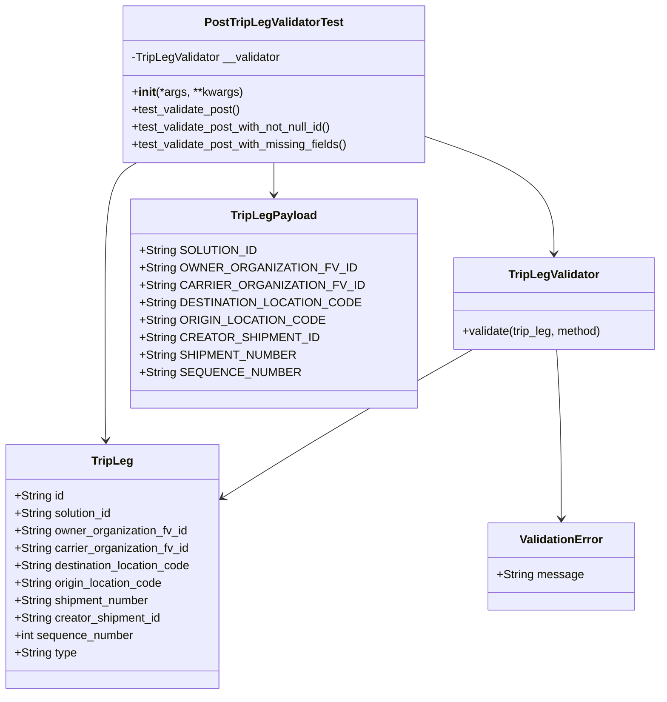
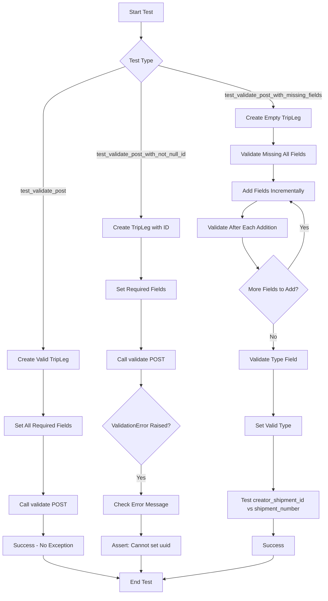
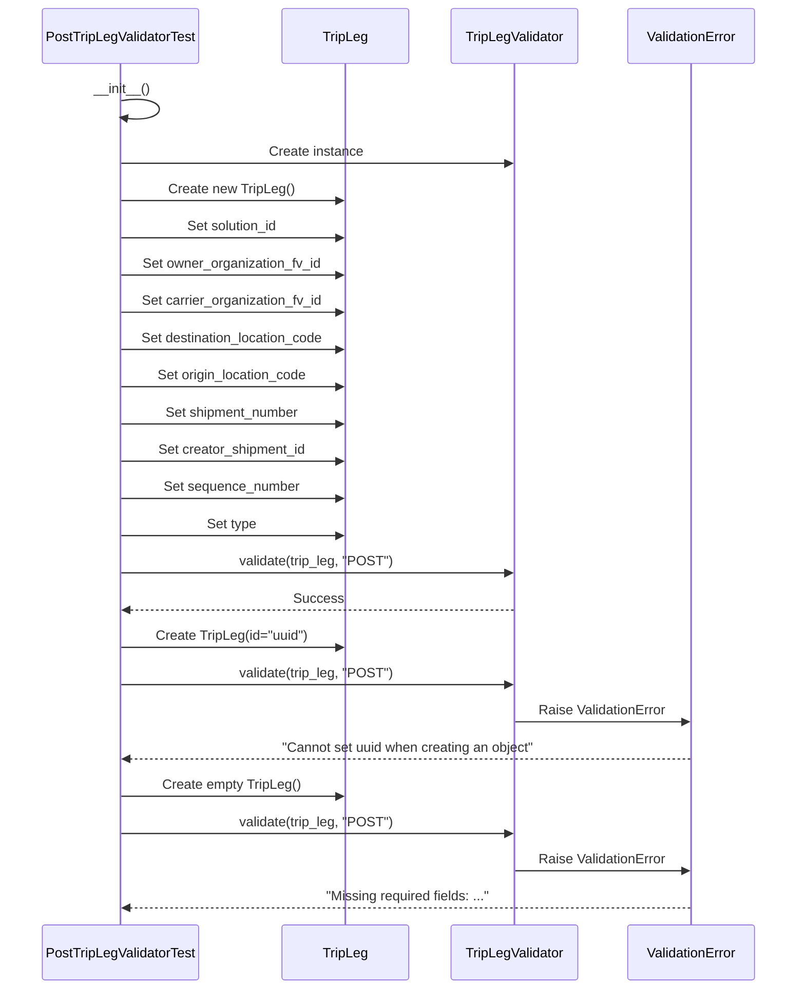
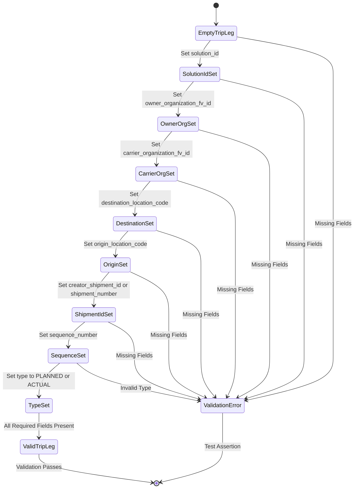

# Diagram: platform/partview_core/partview_service/partview_service/tests/unit/core/validators/trip_leg/trip_leg_post_validator_test.py

> Auto-generated by Obscura crawlers

## Diagram 1

### SVG

<svg id="container" width="878.23046875" xmlns="http://www.w3.org/2000/svg" class="classDiagram" height="956" viewBox="0 0 878.23046875 956" role="graphics-document document" aria-roledescription="class"><g><defs><marker id="container_class-aggregationStart" class="marker aggregation class" refX="18" refY="7" markerWidth="190" markerHeight="240" orient="auto"><path d="M 18,7 L9,13 L1,7 L9,1 Z"></path></marker></defs><defs><marker id="container_class-aggregationEnd" class="marker aggregation class" refX="1" refY="7" markerWidth="20" markerHeight="28" orient="auto"><path d="M 18,7 L9,13 L1,7 L9,1 Z"></path></marker></defs><defs><marker id="container_class-extensionStart" class="marker extension class" refX="18" refY="7" markerWidth="190" markerHeight="240" orient="auto"><path d="M 1,7 L18,13 V 1 Z"></path></marker></defs><defs><marker id="container_class-extensionEnd" class="marker extension class" refX="1" refY="7" markerWidth="20" markerHeight="28" orient="auto"><path d="M 1,1 V 13 L18,7 Z"></path></marker></defs><defs><marker id="container_class-compositionStart" class="marker composition class" refX="18" refY="7" markerWidth="190" markerHeight="240" orient="auto"><path d="M 18,7 L9,13 L1,7 L9,1 Z"></path></marker></defs><defs><marker id="container_class-compositionEnd" class="marker composition class" refX="1" refY="7" markerWidth="20" markerHeight="28" orient="auto"><path d="M 18,7 L9,13 L1,7 L9,1 Z"></path></marker></defs><defs><marker id="container_class-dependencyStart" class="marker dependency class" refX="6" refY="7" markerWidth="190" markerHeight="240" orient="auto"><path d="M 5,7 L9,13 L1,7 L9,1 Z"></path></marker></defs><defs><marker id="container_class-dependencyEnd" class="marker dependency class" refX="13" refY="7" markerWidth="20" markerHeight="28" orient="auto"><path d="M 18,7 L9,13 L14,7 L9,1 Z"></path></marker></defs><defs><marker id="container_class-lollipopStart" class="marker lollipop class" refX="13" refY="7" markerWidth="190" markerHeight="240" orient="auto"><circle stroke="black" fill="transparent" cx="7" cy="7" r="6"></circle></marker></defs><defs><marker id="container_class-lollipopEnd" class="marker lollipop class" refX="1" refY="7" markerWidth="190" markerHeight="240" orient="auto"><circle stroke="black" fill="transparent" cx="7" cy="7" r="6"></circle></marker></defs><g class="root"><g class="clusters"></g><g class="edgePaths"><path d="M569.957,191.279L596.639,200.899C623.322,210.519,676.686,229.76,703.368,256.046C730.051,282.333,730.051,315.667,730.051,332.333L730.051,349" id="id_PostTripLegValidatorTest_TripLegValidator_1" class="edge-thickness-normal edge-pattern-solid relation" style=";;;" data-edge="true" data-et="edge" data-id="id_PostTripLegValidatorTest_TripLegValidator_1" data-points="W3sieCI6NTY5Ljk1NzAzMTI1LCJ5IjoxOTEuMjc4NTAxMzg3MjEyMjN9LHsieCI6NzMwLjA1MDc4MTI1LCJ5IjoyNDl9LHsieCI6NzMwLjA1MDc4MTI1LCJ5IjozNTV9XQ==" marker-end="url(#container_class-dependencyEnd)"></path><path d="M187.635,224L180.94,228.167C174.245,232.333,160.855,240.667,154.16,273C147.465,305.333,147.465,361.667,147.465,418C147.465,474.333,147.465,530.667,147.629,562.001C147.793,593.336,148.121,599.672,148.286,602.84L148.45,606.008" id="id_PostTripLegValidatorTest_TripLeg_2" class="edge-thickness-normal edge-pattern-solid relation" style=";;;" data-edge="true" data-et="edge" data-id="id_PostTripLegValidatorTest_TripLeg_2" data-points="W3sieCI6MTg3LjYzNDYwNDA4ODM0NTg3LCJ5IjoyMjR9LHsieCI6MTQ3LjQ2NDg0Mzc1LCJ5IjoyNDl9LHsieCI6MTQ3LjQ2NDg0Mzc1LCJ5Ijo0MTh9LHsieCI6MTQ3LjQ2NDg0Mzc1LCJ5Ijo1ODd9LHsieCI6MTQ4Ljc2MDE4MDUzNzU2NDc2LCJ5Ijo2MTJ9XQ==" marker-end="url(#container_class-dependencyEnd)"></path><path d="M361.168,224L361.168,228.167C361.168,232.333,361.168,240.667,361.168,248C361.168,255.333,361.168,261.667,361.168,264.833L361.168,268" id="id_PostTripLegValidatorTest_TripLegPayload_3" class="edge-thickness-normal edge-pattern-solid relation" style=";;;" data-edge="true" data-et="edge" data-id="id_PostTripLegValidatorTest_TripLegPayload_3" data-points="W3sieCI6MzYxLjE2Nzk2ODc1LCJ5IjoyMjR9LHsieCI6MzYxLjE2Nzk2ODc1LCJ5IjoyNDl9LHsieCI6MzYxLjE2Nzk2ODc1LCJ5IjoyNzR9XQ==" marker-end="url(#container_class-dependencyEnd)"></path><path d="M625.19,481L595.785,498.667C566.379,516.333,507.569,551.667,455.359,584.443C403.149,617.219,357.54,647.437,334.736,662.547L311.931,677.656" id="id_TripLegValidator_TripLeg_4" class="edge-thickness-normal edge-pattern-solid relation" style=";;;" data-edge="true" data-et="edge" data-id="id_TripLegValidator_TripLeg_4" data-points="W3sieCI6NjI1LjE5MDA4ODc1NzM5NjQsInkiOjQ4MX0seyJ4Ijo0NDguNzU3ODEyNSwieSI6NTg3fSx7IngiOjMwNi45Mjk2ODc1LCJ5Ijo2ODAuOTcwMDk1NjEzNTc2M31d" marker-end="url(#container_class-dependencyEnd)"></path><path d="M733.779,481L734.824,498.667C735.869,516.333,737.96,551.667,739.005,590.5C740.051,629.333,740.051,671.667,740.051,692.833L740.051,714" id="id_TripLegValidator_ValidationError_5" class="edge-thickness-normal edge-pattern-solid relation" style=";;;" data-edge="true" data-et="edge" data-id="id_TripLegValidator_ValidationError_5" data-points="W3sieCI6NzMzLjc3ODU5MTkwMDg4NzYsInkiOjQ4MX0seyJ4Ijo3NDAuMDUwNzgxMjUsInkiOjU4N30seyJ4Ijo3NDAuMDUwNzgxMjUsInkiOjcyMH1d" marker-end="url(#container_class-dependencyEnd)"></path></g><g class="edgeLabels"><g class="edgeLabel"><g class="label" data-id="id_PostTripLegValidatorTest_TripLegValidator_1" transform="translate(0, 0)"><foreignObject width="0" height="0">

</foreignObject></g></g><g class="edgeLabel"><g class="label" data-id="id_PostTripLegValidatorTest_TripLeg_2" transform="translate(0, 0)"><foreignObject width="0" height="0">

</foreignObject></g></g><g class="edgeLabel"><g class="label" data-id="id_PostTripLegValidatorTest_TripLegPayload_3" transform="translate(0, 0)"><foreignObject width="0" height="0">

</foreignObject></g></g><g class="edgeLabel"><g class="label" data-id="id_TripLegValidator_TripLeg_4" transform="translate(0, 0)"><foreignObject width="0" height="0">

</foreignObject></g></g><g class="edgeLabel"><g class="label" data-id="id_TripLegValidator_ValidationError_5" transform="translate(0, 0)"><foreignObject width="0" height="0">

</foreignObject></g></g></g><g class="nodes"><g class="node default" id="classId-PostTripLegValidatorTest-0" transform="translate(361.16796875, 116)"><g class="basic label-container"><path d="M-208.7890625 -108 L208.7890625 -108 L208.7890625 108 L-208.7890625 108" stroke="none" stroke-width="0" fill="#ECECFF" style=""></path><path d="M-208.7890625 -108 C-50.090298149882926 -108, 108.60846620023415 -108, 208.7890625 -108 M-208.7890625 -108 C-117.65461373336497 -108, -26.520164966729936 -108, 208.7890625 -108 M208.7890625 -108 C208.7890625 -63.05804456146563, 208.7890625 -18.116089122931257, 208.7890625 108 M208.7890625 -108 C208.7890625 -56.35106171739276, 208.7890625 -4.70212343478552, 208.7890625 108 M208.7890625 108 C111.15891153410031 108, 13.528760568200624 108, -208.7890625 108 M208.7890625 108 C55.722669669103055 108, -97.34372316179389 108, -208.7890625 108 M-208.7890625 108 C-208.7890625 39.51866477899033, -208.7890625 -28.962670442019345, -208.7890625 -108 M-208.7890625 108 C-208.7890625 39.456397682405, -208.7890625 -29.087204635190005, -208.7890625 -108" stroke="#9370DB" stroke-width="1.3" fill="none" stroke-dasharray="0 0" style=""></path></g><g class="annotation-group text" transform="translate(0, -84)"></g><g class="label-group text" transform="translate(-91.671875, -84)"><g class="label" style="font-weight: bolder" transform="translate(0,-12)"><foreignObject width="183.34375" height="24">

PostTripLegValidatorTest

</foreignObject></g></g><g class="members-group text" transform="translate(-196.7890625, -36)"><g class="label" style="" transform="translate(0,-12)"><foreignObject width="208.5" height="24">

-TripLegValidator __validator

</foreignObject></g></g><g class="methods-group text" transform="translate(-196.7890625, 12)"><g class="label" style="" transform="translate(0,-12)"><foreignObject width="151.8125" height="24">

+<strong>init</strong>(*args, **kwargs)

</foreignObject></g><g class="label" style="" transform="translate(0,12)"><foreignObject width="151.609375" height="24">

+test_validate_post()

</foreignObject></g><g class="label" style="" transform="translate(0,36)"><foreignObject width="282.34375" height="24">

+test_validate_post_with_not_null_id()

</foreignObject></g><g class="label" style="" transform="translate(0,60)"><foreignObject width="301.90625" height="24">

+test_validate_post_with_missing_fields()

</foreignObject></g></g><g class="divider" style=""><path d="M-208.7890625 -60 C-49.8885580284705 -60, 109.011946443059 -60, 208.7890625 -60 M-208.7890625 -60 C-50.480161230734495 -60, 107.82874003853101 -60, 208.7890625 -60" stroke="#9370DB" stroke-width="1.3" fill="none" stroke-dasharray="0 0" style=""></path></g><g class="divider" style=""><path d="M-208.7890625 -12 C-87.63880957944068 -12, 33.51144334111865 -12, 208.7890625 -12 M-208.7890625 -12 C-72.76302437203887 -12, 63.26301375592226 -12, 208.7890625 -12" stroke="#9370DB" stroke-width="1.3" fill="none" stroke-dasharray="0 0" style=""></path></g></g><g class="node default" id="classId-TripLegValidator-1" transform="translate(730.05078125, 418)"><g class="basic label-container"><path d="M-140.1796875 -63 L140.1796875 -63 L140.1796875 63 L-140.1796875 63" stroke="none" stroke-width="0" fill="#ECECFF" style=""></path><path d="M-140.1796875 -63 C-59.08022340159239 -63, 22.019240696815217 -63, 140.1796875 -63 M-140.1796875 -63 C-53.22967082212635 -63, 33.7203458557473 -63, 140.1796875 -63 M140.1796875 -63 C140.1796875 -26.466804711683217, 140.1796875 10.066390576633566, 140.1796875 63 M140.1796875 -63 C140.1796875 -22.547561834829693, 140.1796875 17.904876330340613, 140.1796875 63 M140.1796875 63 C45.87278288108972 63, -48.43412173782056 63, -140.1796875 63 M140.1796875 63 C47.78765654618999 63, -44.604374407620014 63, -140.1796875 63 M-140.1796875 63 C-140.1796875 19.62317428828974, -140.1796875 -23.75365142342052, -140.1796875 -63 M-140.1796875 63 C-140.1796875 35.955131701670666, -140.1796875 8.910263403341325, -140.1796875 -63" stroke="#9370DB" stroke-width="1.3" fill="none" stroke-dasharray="0 0" style=""></path></g><g class="annotation-group text" transform="translate(0, -39)"></g><g class="label-group text" transform="translate(-60.234375, -39)"><g class="label" style="font-weight: bolder" transform="translate(0,-12)"><foreignObject width="120.46875" height="24">

TripLegValidator

</foreignObject></g></g><g class="members-group text" transform="translate(-128.1796875, 9)"></g><g class="methods-group text" transform="translate(-128.1796875, 39)"><g class="label" style="" transform="translate(0,-12)"><foreignObject width="196.125" height="24">

+validate(trip_leg, method)

</foreignObject></g></g><g class="divider" style=""><path d="M-140.1796875 -15 C-67.28787309423602 -15, 5.6039413115279615 -15, 140.1796875 -15 M-140.1796875 -15 C-45.41767964166341 -15, 49.344328216673176 -15, 140.1796875 -15" stroke="#9370DB" stroke-width="1.3" fill="none" stroke-dasharray="0 0" style=""></path></g><g class="divider" style=""><path d="M-140.1796875 9 C-82.51799259510818 9, -24.85629769021635 9, 140.1796875 9 M-140.1796875 9 C-68.23001847951952 9, 3.71965054096097 9, 140.1796875 9" stroke="#9370DB" stroke-width="1.3" fill="none" stroke-dasharray="0 0" style=""></path></g></g><g class="node default" id="classId-TripLeg-2" transform="translate(157.46484375, 780)"><g class="basic label-container"><path d="M-149.46484375 -168 L149.46484375 -168 L149.46484375 168 L-149.46484375 168" stroke="none" stroke-width="0" fill="#ECECFF" style=""></path><path d="M-149.46484375 -168 C-70.51018565176678 -168, 8.444472446466449 -168, 149.46484375 -168 M-149.46484375 -168 C-44.682483860650464 -168, 60.09987602869907 -168, 149.46484375 -168 M149.46484375 -168 C149.46484375 -87.33391418662463, 149.46484375 -6.66782837324925, 149.46484375 168 M149.46484375 -168 C149.46484375 -75.95462131496417, 149.46484375 16.090757370071657, 149.46484375 168 M149.46484375 168 C71.92248360127724 168, -5.619876547445529 168, -149.46484375 168 M149.46484375 168 C56.6668597242882 168, -36.1311243014236 168, -149.46484375 168 M-149.46484375 168 C-149.46484375 96.31189422375402, -149.46484375 24.623788447508048, -149.46484375 -168 M-149.46484375 168 C-149.46484375 81.80429793832293, -149.46484375 -4.391404123354135, -149.46484375 -168" stroke="#9370DB" stroke-width="1.3" fill="none" stroke-dasharray="0 0" style=""></path></g><g class="annotation-group text" transform="translate(0, -144)"></g><g class="label-group text" transform="translate(-27.0546875, -144)"><g class="label" style="font-weight: bolder" transform="translate(0,-12)"><foreignObject width="54.109375" height="24">

TripLeg

</foreignObject></g></g><g class="members-group text" transform="translate(-137.46484375, -96)"><g class="label" style="" transform="translate(0,-12)"><foreignObject width="68.546875" height="24">

+String id

</foreignObject></g><g class="label" style="" transform="translate(0,12)"><foreignObject width="136.703125" height="24">

+String solution_id

</foreignObject></g><g class="label" style="" transform="translate(0,36)"><foreignObject width="239.78125" height="24">

+String owner_organization_fv_id

</foreignObject></g><g class="label" style="" transform="translate(0,60)"><foreignObject width="242.640625" height="24">

+String carrier_organization_fv_id

</foreignObject></g><g class="label" style="" transform="translate(0,84)"><foreignObject width="247.875" height="24">

+String destination_location_code

</foreignObject></g><g class="label" style="" transform="translate(0,108)"><foreignObject width="206.984375" height="24">

+String origin_location_code

</foreignObject></g><g class="label" style="" transform="translate(0,132)"><foreignObject width="188.046875" height="24">

+String shipment_number

</foreignObject></g><g class="label" style="" transform="translate(0,156)"><foreignObject width="204.03125" height="24">

+String creator_shipment_id

</foreignObject></g><g class="label" style="" transform="translate(0,180)"><foreignObject width="165.90625" height="24">

+int sequence_number

</foreignObject></g><g class="label" style="" transform="translate(0,204)"><foreignObject width="86.265625" height="24">

+String type

</foreignObject></g></g><g class="methods-group text" transform="translate(-137.46484375, 168)"></g><g class="divider" style=""><path d="M-149.46484375 -120 C-59.71346245865912 -120, 30.037918832681754 -120, 149.46484375 -120 M-149.46484375 -120 C-84.93033356948138 -120, -20.395823388962754 -120, 149.46484375 -120" stroke="#9370DB" stroke-width="1.3" fill="none" stroke-dasharray="0 0" style=""></path></g><g class="divider" style=""><path d="M-149.46484375 144 C-63.46345885877312 144, 22.537926032453754 144, 149.46484375 144 M-149.46484375 144 C-38.15096101614354 144, 73.16292171771292 144, 149.46484375 144" stroke="#9370DB" stroke-width="1.3" fill="none" stroke-dasharray="0 0" style=""></path></g></g><g class="node default" id="classId-TripLegPayload-3" transform="translate(361.16796875, 418)"><g class="basic label-container"><path d="M-178.703125 -144 L178.703125 -144 L178.703125 144 L-178.703125 144" stroke="none" stroke-width="0" fill="#ECECFF" style=""></path><path d="M-178.703125 -144 C-92.92310694097281 -144, -7.14308888194563 -144, 178.703125 -144 M-178.703125 -144 C-50.72956020893285 -144, 77.2440045821343 -144, 178.703125 -144 M178.703125 -144 C178.703125 -63.48357551883578, 178.703125 17.032848962328444, 178.703125 144 M178.703125 -144 C178.703125 -81.15289346218222, 178.703125 -18.30578692436444, 178.703125 144 M178.703125 144 C50.71468821097204 144, -77.27374857805592 144, -178.703125 144 M178.703125 144 C75.85417352769798 144, -26.99477794460404 144, -178.703125 144 M-178.703125 144 C-178.703125 32.09004148293906, -178.703125 -79.81991703412189, -178.703125 -144 M-178.703125 144 C-178.703125 71.54321813418242, -178.703125 -0.9135637316351506, -178.703125 -144" stroke="#9370DB" stroke-width="1.3" fill="none" stroke-dasharray="0 0" style=""></path></g><g class="annotation-group text" transform="translate(0, -120)"></g><g class="label-group text" transform="translate(-55.953125, -120)"><g class="label" style="font-weight: bolder" transform="translate(0,-12)"><foreignObject width="111.90625" height="24">

TripLegPayload

</foreignObject></g></g><g class="members-group text" transform="translate(-166.703125, -72)"><g class="label" style="" transform="translate(0,-12)"><foreignObject width="150.765625" height="24">

+String SOLUTION_ID

</foreignObject></g><g class="label" style="" transform="translate(0,12)"><foreignObject width="270.453125" height="24">

+String OWNER_ORGANIZATION_FV_ID

</foreignObject></g><g class="label" style="" transform="translate(0,36)"><foreignObject width="277.453125" height="24">

+String CARRIER_ORGANIZATION_FV_ID

</foreignObject></g><g class="label" style="" transform="translate(0,60)"><foreignObject width="274.046875" height="24">

+String DESTINATION_LOCATION_CODE

</foreignObject></g><g class="label" style="" transform="translate(0,84)"><foreignObject width="230.90625" height="24">

+String ORIGIN_LOCATION_CODE

</foreignObject></g><g class="label" style="" transform="translate(0,108)"><foreignObject width="222.390625" height="24">

+String CREATOR_SHIPMENT_ID

</foreignObject></g><g class="label" style="" transform="translate(0,132)"><foreignObject width="197.265625" height="24">

+String SHIPMENT_NUMBER

</foreignObject></g><g class="label" style="" transform="translate(0,156)"><foreignObject width="200.46875" height="24">

+String SEQUENCE_NUMBER

</foreignObject></g></g><g class="methods-group text" transform="translate(-166.703125, 144)"></g><g class="divider" style=""><path d="M-178.703125 -96 C-104.08723218988457 -96, -29.471339379769148 -96, 178.703125 -96 M-178.703125 -96 C-101.12556083033475 -96, -23.547996660669497 -96, 178.703125 -96" stroke="#9370DB" stroke-width="1.3" fill="none" stroke-dasharray="0 0" style=""></path></g><g class="divider" style=""><path d="M-178.703125 120 C-55.67550704941621 120, 67.35211090116758 120, 178.703125 120 M-178.703125 120 C-50.83404292247717 120, 77.03503915504567 120, 178.703125 120" stroke="#9370DB" stroke-width="1.3" fill="none" stroke-dasharray="0 0" style=""></path></g></g><g class="node default" id="classId-ValidationError-4" transform="translate(740.05078125, 780)"><g class="basic label-container"><path d="M-98.01953125 -60 L98.01953125 -60 L98.01953125 60 L-98.01953125 60" stroke="none" stroke-width="0" fill="#ECECFF" style=""></path><path d="M-98.01953125 -60 C-49.90149795961901 -60, -1.7834646692380147 -60, 98.01953125 -60 M-98.01953125 -60 C-40.13352259428839 -60, 17.752486061423227 -60, 98.01953125 -60 M98.01953125 -60 C98.01953125 -32.05991942280718, 98.01953125 -4.119838845614353, 98.01953125 60 M98.01953125 -60 C98.01953125 -12.84252705574302, 98.01953125 34.31494588851396, 98.01953125 60 M98.01953125 60 C58.038152862226475 60, 18.05677447445295 60, -98.01953125 60 M98.01953125 60 C36.04735143271384 60, -25.924828384572322 60, -98.01953125 60 M-98.01953125 60 C-98.01953125 29.82247936853544, -98.01953125 -0.3550412629291202, -98.01953125 -60 M-98.01953125 60 C-98.01953125 26.104069305229224, -98.01953125 -7.791861389541552, -98.01953125 -60" stroke="#9370DB" stroke-width="1.3" fill="none" stroke-dasharray="0 0" style=""></path></g><g class="annotation-group text" transform="translate(0, -36)"></g><g class="label-group text" transform="translate(-55.1796875, -36)"><g class="label" style="font-weight: bolder" transform="translate(0,-12)"><foreignObject width="110.359375" height="24">

ValidationError

</foreignObject></g></g><g class="members-group text" transform="translate(-86.01953125, 12)"><g class="label" style="" transform="translate(0,-12)"><foreignObject width="116.859375" height="24">

+String message

</foreignObject></g></g><g class="methods-group text" transform="translate(-86.01953125, 60)"></g><g class="divider" style=""><path d="M-98.01953125 -12 C-36.39048940745468 -12, 25.23855243509064 -12, 98.01953125 -12 M-98.01953125 -12 C-34.92588123822913 -12, 28.167768773541738 -12, 98.01953125 -12" stroke="#9370DB" stroke-width="1.3" fill="none" stroke-dasharray="0 0" style=""></path></g><g class="divider" style=""><path d="M-98.01953125 36 C-44.56311551061883 36, 8.893300228762342 36, 98.01953125 36 M-98.01953125 36 C-39.599750095675056 36, 18.82003105864989 36, 98.01953125 36" stroke="#9370DB" stroke-width="1.3" fill="none" stroke-dasharray="0 0" style=""></path></g></g></g></g></g></svg>

## Diagram 2

### SVG

<svg id="container" width="925.71484375" xmlns="http://www.w3.org/2000/svg" class="flowchart" height="1712.125" viewBox="0 0 925.71484375 1712.125" role="graphics-document document" aria-roledescription="flowchart-v2"><g><marker id="container_flowchart-v2-pointEnd" class="marker flowchart-v2" viewBox="0 0 10 10" refX="5" refY="5" markerUnits="userSpaceOnUse" markerWidth="8" markerHeight="8" orient="auto"><path d="M 0 0 L 10 5 L 0 10 z" class="arrowMarkerPath" style="stroke-width: 1; stroke-dasharray: 1, 0;"></path></marker><marker id="container_flowchart-v2-pointStart" class="marker flowchart-v2" viewBox="0 0 10 10" refX="4.5" refY="5" markerUnits="userSpaceOnUse" markerWidth="8" markerHeight="8" orient="auto"><path d="M 0 5 L 10 10 L 10 0 z" class="arrowMarkerPath" style="stroke-width: 1; stroke-dasharray: 1, 0;"></path></marker><marker id="container_flowchart-v2-circleEnd" class="marker flowchart-v2" viewBox="0 0 10 10" refX="11" refY="5" markerUnits="userSpaceOnUse" markerWidth="11" markerHeight="11" orient="auto"><circle cx="5" cy="5" r="5" class="arrowMarkerPath" style="stroke-width: 1; stroke-dasharray: 1, 0;"></circle></marker><marker id="container_flowchart-v2-circleStart" class="marker flowchart-v2" viewBox="0 0 10 10" refX="-1" refY="5" markerUnits="userSpaceOnUse" markerWidth="11" markerHeight="11" orient="auto"><circle cx="5" cy="5" r="5" class="arrowMarkerPath" style="stroke-width: 1; stroke-dasharray: 1, 0;"></circle></marker><marker id="container_flowchart-v2-crossEnd" class="marker cross flowchart-v2" viewBox="0 0 11 11" refX="12" refY="5.2" markerUnits="userSpaceOnUse" markerWidth="11" markerHeight="11" orient="auto"><path d="M 1,1 l 9,9 M 10,1 l -9,9" class="arrowMarkerPath" style="stroke-width: 2; stroke-dasharray: 1, 0;"></path></marker><marker id="container_flowchart-v2-crossStart" class="marker cross flowchart-v2" viewBox="0 0 11 11" refX="-1" refY="5.2" markerUnits="userSpaceOnUse" markerWidth="11" markerHeight="11" orient="auto"><path d="M 1,1 l 9,9 M 10,1 l -9,9" class="arrowMarkerPath" style="stroke-width: 2; stroke-dasharray: 1, 0;"></path></marker><g class="root"><g class="clusters"></g><g class="edgePaths"><path d="M398.023,62L398.023,66.167C398.023,70.333,398.023,78.667,398.023,86.333C398.023,94,398.023,101,398.023,104.5L398.023,108" id="L_A_B_0" class="edge-thickness-normal edge-pattern-solid edge-thickness-normal edge-pattern-solid flowchart-link" style=";" data-edge="true" data-et="edge" data-id="L_A_B_0" data-points="W3sieCI6Mzk4LjAyMzQzNzUsInkiOjYyfSx7IngiOjM5OC4wMjM0Mzc1LCJ5Ijo4N30seyJ4IjozOTguMDIzNDM3NSwieSI6MTEyfV0=" marker-end="url(#container_flowchart-v2-pointEnd)"></path><path d="M353.18,188.484L314.514,202.125C275.849,215.766,198.518,243.047,159.853,267.354C121.188,291.661,121.188,312.995,121.188,332.328C121.188,351.661,121.188,368.995,121.188,386.328C121.188,403.661,121.188,420.995,121.188,438.328C121.188,455.661,121.188,472.995,121.188,490.328C121.188,507.661,121.188,524.995,121.188,542.328C121.188,559.661,121.188,576.995,121.188,596.328C121.188,615.661,121.188,636.995,121.188,658.328C121.188,679.661,121.188,700.995,121.188,732.132C121.188,763.268,121.188,804.208,121.188,847.148C121.188,890.089,121.188,935.029,121.188,962.999C121.188,990.969,121.188,1001.969,121.188,1007.469L121.188,1012.969" id="L_B_C_0" class="edge-thickness-normal edge-pattern-solid edge-thickness-normal edge-pattern-solid flowchart-link" style=";" data-edge="true" data-et="edge" data-id="L_B_C_0" data-points="W3sieCI6MzUzLjE3OTY2NTQ5ODAwNzc1LCJ5IjoxODguNDg0MzUyOTk4MDA3NzV9LHsieCI6MTIxLjE4NzUsInkiOjI3MC4zMjgxMjV9LHsieCI6MTIxLjE4NzUsInkiOjMzNC4zMjgxMjV9LHsieCI6MTIxLjE4NzUsInkiOjM4Ni4zMjgxMjV9LHsieCI6MTIxLjE4NzUsInkiOjQzOC4zMjgxMjV9LHsieCI6MTIxLjE4NzUsInkiOjQ5MC4zMjgxMjV9LHsieCI6MTIxLjE4NzUsInkiOjU0Mi4zMjgxMjV9LHsieCI6MTIxLjE4NzUsInkiOjU5NC4zMjgxMjV9LHsieCI6MTIxLjE4NzUsInkiOjY1OC4zMjgxMjV9LHsieCI6MTIxLjE4NzUsInkiOjcyMi4zMjgxMjV9LHsieCI6MTIxLjE4NzUsInkiOjg0NS4xNDg0Mzc1fSx7IngiOjEyMS4xODc1LCJ5Ijo5NzkuOTY4NzV9LHsieCI6MTIxLjE4NzUsInkiOjEwMTYuOTY4NzV9XQ==" marker-end="url(#container_flowchart-v2-pointEnd)"></path><path d="M121.188,1070.969L121.188,1075.135C121.188,1079.302,121.188,1087.635,121.188,1109.398C121.188,1131.161,121.188,1166.354,121.188,1183.951L121.188,1201.547" id="L_C_D_0" class="edge-thickness-normal edge-pattern-solid edge-thickness-normal edge-pattern-solid flowchart-link" style=";" data-edge="true" data-et="edge" data-id="L_C_D_0" data-points="W3sieCI6MTIxLjE4NzUsInkiOjEwNzAuOTY4NzV9LHsieCI6MTIxLjE4NzUsInkiOjEwOTUuOTY4NzV9LHsieCI6MTIxLjE4NzUsInkiOjEyMDUuNTQ2ODc1fV0=" marker-end="url(#container_flowchart-v2-pointEnd)"></path><path d="M121.188,1259.547L121.188,1279.81C121.188,1300.073,121.188,1340.599,121.188,1368.362C121.188,1396.125,121.188,1411.125,121.188,1418.625L121.188,1426.125" id="L_D_E_0" class="edge-thickness-normal edge-pattern-solid edge-thickness-normal edge-pattern-solid flowchart-link" style=";" data-edge="true" data-et="edge" data-id="L_D_E_0" data-points="W3sieCI6MTIxLjE4NzUsInkiOjEyNTkuNTQ2ODc1fSx7IngiOjEyMS4xODc1LCJ5IjoxMzgxLjEyNX0seyJ4IjoxMjEuMTg3NSwieSI6MTQzMC4xMjV9XQ==" marker-end="url(#container_flowchart-v2-pointEnd)"></path><path d="M121.188,1484.125L121.188,1490.292C121.188,1496.458,121.188,1508.792,121.188,1518.458C121.188,1528.125,121.188,1535.125,121.188,1538.625L121.188,1542.125" id="L_E_F_0" class="edge-thickness-normal edge-pattern-solid edge-thickness-normal edge-pattern-solid flowchart-link" style=";" data-edge="true" data-et="edge" data-id="L_E_F_0" data-points="W3sieCI6MTIxLjE4NzUsInkiOjE0ODQuMTI1fSx7IngiOjEyMS4xODc1LCJ5IjoxNTIxLjEyNX0seyJ4IjoxMjEuMTg3NSwieSI6MTU0Ni4xMjV9XQ==" marker-end="url(#container_flowchart-v2-pointEnd)"></path><path d="M398.023,233.328L398.023,239.495C398.023,245.661,398.023,257.995,398.023,274.828C398.023,291.661,398.023,312.995,398.023,332.328C398.023,351.661,398.023,368.995,398.023,386.328C398.023,403.661,398.023,420.995,398.023,438.328C398.023,455.661,398.023,472.995,398.023,490.328C398.023,507.661,398.023,524.995,398.023,542.328C398.023,559.661,398.023,576.995,398.023,591.161C398.023,605.328,398.023,616.328,398.023,621.828L398.023,627.328" id="L_B_G_0" class="edge-thickness-normal edge-pattern-solid edge-thickness-normal edge-pattern-solid flowchart-link" style=";" data-edge="true" data-et="edge" data-id="L_B_G_0" data-points="W3sieCI6Mzk4LjAyMzQzNzUsInkiOjIzMy4zMjgxMjV9LHsieCI6Mzk4LjAyMzQzNzUsInkiOjI3MC4zMjgxMjV9LHsieCI6Mzk4LjAyMzQzNzUsInkiOjMzNC4zMjgxMjV9LHsieCI6Mzk4LjAyMzQzNzUsInkiOjM4Ni4zMjgxMjV9LHsieCI6Mzk4LjAyMzQzNzUsInkiOjQzOC4zMjgxMjV9LHsieCI6Mzk4LjAyMzQzNzUsInkiOjQ5MC4zMjgxMjV9LHsieCI6Mzk4LjAyMzQzNzUsInkiOjU0Mi4zMjgxMjV9LHsieCI6Mzk4LjAyMzQzNzUsInkiOjU5NC4zMjgxMjV9LHsieCI6Mzk4LjAyMzQzNzUsInkiOjYzMS4zMjgxMjV9XQ==" marker-end="url(#container_flowchart-v2-pointEnd)"></path><path d="M398.023,685.328L398.023,691.495C398.023,697.661,398.023,709.995,398.023,731.465C398.023,752.935,398.023,783.542,398.023,798.845L398.023,814.148" id="L_G_H_0" class="edge-thickness-normal edge-pattern-solid edge-thickness-normal edge-pattern-solid flowchart-link" style=";" data-edge="true" data-et="edge" data-id="L_G_H_0" data-points="W3sieCI6Mzk4LjAyMzQzNzUsInkiOjY4NS4zMjgxMjV9LHsieCI6Mzk4LjAyMzQzNzUsInkiOjcyMi4zMjgxMjV9LHsieCI6Mzk4LjAyMzQzNzUsInkiOjgxOC4xNDg0Mzc1fV0=" marker-end="url(#container_flowchart-v2-pointEnd)"></path><path d="M398.023,872.148L398.023,890.118C398.023,908.089,398.023,944.029,398.023,967.499C398.023,990.969,398.023,1001.969,398.023,1007.469L398.023,1012.969" id="L_H_I_0" class="edge-thickness-normal edge-pattern-solid edge-thickness-normal edge-pattern-solid flowchart-link" style=";" data-edge="true" data-et="edge" data-id="L_H_I_0" data-points="W3sieCI6Mzk4LjAyMzQzNzUsInkiOjg3Mi4xNDg0Mzc1fSx7IngiOjM5OC4wMjM0Mzc1LCJ5Ijo5NzkuOTY4NzV9LHsieCI6Mzk4LjAyMzQzNzUsInkiOjEwMTYuOTY4NzV9XQ==" marker-end="url(#container_flowchart-v2-pointEnd)"></path><path d="M398.023,1070.969L398.023,1075.135C398.023,1079.302,398.023,1087.635,398.023,1095.302C398.023,1102.969,398.023,1109.969,398.023,1113.469L398.023,1116.969" id="L_I_J_0" class="edge-thickness-normal edge-pattern-solid edge-thickness-normal edge-pattern-solid flowchart-link" style=";" data-edge="true" data-et="edge" data-id="L_I_J_0" data-points="W3sieCI6Mzk4LjAyMzQzNzUsInkiOjEwNzAuOTY4NzV9LHsieCI6Mzk4LjAyMzQzNzUsInkiOjEwOTUuOTY4NzV9LHsieCI6Mzk4LjAyMzQzNzUsInkiOjExMjAuOTY4NzV9XQ==" marker-end="url(#container_flowchart-v2-pointEnd)"></path><path d="M398.023,1344.125L398.023,1350.292C398.023,1356.458,398.023,1368.792,398.023,1382.458C398.023,1396.125,398.023,1411.125,398.023,1418.625L398.023,1426.125" id="L_J_K_0" class="edge-thickness-normal edge-pattern-solid edge-thickness-normal edge-pattern-solid flowchart-link" style=";" data-edge="true" data-et="edge" data-id="L_J_K_0" data-points="W3sieCI6Mzk4LjAyMzQzNzUsInkiOjEzNDQuMTI1fSx7IngiOjM5OC4wMjM0Mzc1LCJ5IjoxMzgxLjEyNX0seyJ4IjozOTguMDIzNDM3NSwieSI6MTQzMC4xMjV9XQ==" marker-end="url(#container_flowchart-v2-pointEnd)"></path><path d="M398.023,1484.125L398.023,1490.292C398.023,1496.458,398.023,1508.792,398.023,1518.458C398.023,1528.125,398.023,1535.125,398.023,1538.625L398.023,1542.125" id="L_K_L_0" class="edge-thickness-normal edge-pattern-solid edge-thickness-normal edge-pattern-solid flowchart-link" style=";" data-edge="true" data-et="edge" data-id="L_K_L_0" data-points="W3sieCI6Mzk4LjAyMzQzNzUsInkiOjE0ODQuMTI1fSx7IngiOjM5OC4wMjM0Mzc1LCJ5IjoxNTIxLjEyNX0seyJ4IjozOTguMDIzNDM3NSwieSI6MTU0Ni4xMjV9XQ==" marker-end="url(#container_flowchart-v2-pointEnd)"></path><path d="M446.228,185.123L501.173,199.324C556.117,213.525,666.006,241.926,720.95,261.627C775.895,281.328,775.895,292.328,775.895,297.828L775.895,303.328" id="L_B_M_0" class="edge-thickness-normal edge-pattern-solid edge-thickness-normal edge-pattern-solid flowchart-link" style=";" data-edge="true" data-et="edge" data-id="L_B_M_0" data-points="W3sieCI6NDQ2LjIyODQ4Njc5NDI3Nzg0LCJ5IjoxODUuMTIzMDc1NzA1NzIyMTZ9LHsieCI6Nzc1Ljg5NDUzMTI1LCJ5IjoyNzAuMzI4MTI1fSx7IngiOjc3NS44OTQ1MzEyNSwieSI6MzA3LjMyODEyNX1d" marker-end="url(#container_flowchart-v2-pointEnd)"></path><path d="M775.895,361.328L775.895,365.495C775.895,369.661,775.895,377.995,775.895,385.661C775.895,393.328,775.895,400.328,775.895,403.828L775.895,407.328" id="L_M_N_0" class="edge-thickness-normal edge-pattern-solid edge-thickness-normal edge-pattern-solid flowchart-link" style=";" data-edge="true" data-et="edge" data-id="L_M_N_0" data-points="W3sieCI6Nzc1Ljg5NDUzMTI1LCJ5IjozNjEuMzI4MTI1fSx7IngiOjc3NS44OTQ1MzEyNSwieSI6Mzg2LjMyODEyNX0seyJ4Ijo3NzUuODk0NTMxMjUsInkiOjQxMS4zMjgxMjV9XQ==" marker-end="url(#container_flowchart-v2-pointEnd)"></path><path d="M775.895,465.328L775.895,469.495C775.895,473.661,775.895,481.995,775.895,489.661C775.895,497.328,775.895,504.328,775.895,507.828L775.895,511.328" id="L_N_O_0" class="edge-thickness-normal edge-pattern-solid edge-thickness-normal edge-pattern-solid flowchart-link" style=";" data-edge="true" data-et="edge" data-id="L_N_O_0" data-points="W3sieCI6Nzc1Ljg5NDUzMTI1LCJ5Ijo0NjUuMzI4MTI1fSx7IngiOjc3NS44OTQ1MzEyNSwieSI6NDkwLjMyODEyNX0seyJ4Ijo3NzUuODk0NTMxMjUsInkiOjUxNS4zMjgxMjV9XQ==" marker-end="url(#container_flowchart-v2-pointEnd)"></path><path d="M729.934,569.328L722.842,573.495C715.749,577.661,701.564,585.995,694.472,593.661C687.379,601.328,687.379,608.328,687.379,611.828L687.379,615.328" id="L_O_P_0" class="edge-thickness-normal edge-pattern-solid edge-thickness-normal edge-pattern-solid flowchart-link" style=";" data-edge="true" data-et="edge" data-id="L_O_P_0" data-points="W3sieCI6NzI5LjkzNDQ5NTE5MjMwNzcsInkiOjU2OS4zMjgxMjV9LHsieCI6Njg3LjM3ODkwNjI1LCJ5Ijo1OTQuMzI4MTI1fSx7IngiOjY4Ny4zNzg5MDYyNSwieSI6NjE5LjMyODEyNX1d" marker-end="url(#container_flowchart-v2-pointEnd)"></path><path d="M687.379,697.328L687.379,701.495C687.379,705.661,687.379,713.995,694.913,728.616C702.448,743.237,717.516,764.145,725.051,774.6L732.585,785.054" id="L_P_Q_0" class="edge-thickness-normal edge-pattern-solid edge-thickness-normal edge-pattern-solid flowchart-link" style=";" data-edge="true" data-et="edge" data-id="L_P_Q_0" data-points="W3sieCI6Njg3LjM3ODkwNjI1LCJ5Ijo2OTcuMzI4MTI1fSx7IngiOjY4Ny4zNzg5MDYyNSwieSI6NzIyLjMyODEyNX0seyJ4Ijo3MzQuOTIzNjE5MjQ1ODIyNywieSI6Nzg4LjI5OTAzNzAwNDE3NzN9XQ==" marker-end="url(#container_flowchart-v2-pointEnd)"></path><path d="M816.865,788.299L824.79,777.304C832.714,766.309,848.562,744.318,856.486,722.657C864.41,700.995,864.41,679.661,864.41,658.328C864.41,636.995,864.41,615.661,857.892,601.166C851.375,586.67,838.339,579.012,831.821,575.183L825.303,571.354" id="L_Q_O_0" class="edge-thickness-normal edge-pattern-solid edge-thickness-normal edge-pattern-solid flowchart-link" style=";" data-edge="true" data-et="edge" data-id="L_Q_O_0" data-points="W3sieCI6ODE2Ljg2NTQ0MzI1NDE3NzMsInkiOjc4OC4yOTkwMzcwMDQxNzczfSx7IngiOjg2NC40MTAxNTYyNSwieSI6NzIyLjMyODEyNX0seyJ4Ijo4NjQuNDEwMTU2MjUsInkiOjY1OC4zMjgxMjV9LHsieCI6ODY0LjQxMDE1NjI1LCJ5Ijo1OTQuMzI4MTI1fSx7IngiOjgyMS44NTQ1NjczMDc2OTIzLCJ5Ijo1NjkuMzI4MTI1fV0=" marker-end="url(#container_flowchart-v2-pointEnd)"></path><path d="M775.895,942.969L775.895,949.135C775.895,955.302,775.895,967.635,775.895,979.302C775.895,990.969,775.895,1001.969,775.895,1007.469L775.895,1012.969" id="L_Q_R_0" class="edge-thickness-normal edge-pattern-solid edge-thickness-normal edge-pattern-solid flowchart-link" style=";" data-edge="true" data-et="edge" data-id="L_Q_R_0" data-points="W3sieCI6Nzc1Ljg5NDUzMTI1LCJ5Ijo5NDIuOTY4NzV9LHsieCI6Nzc1Ljg5NDUzMTI1LCJ5Ijo5NzkuOTY4NzV9LHsieCI6Nzc1Ljg5NDUzMTI1LCJ5IjoxMDE2Ljk2ODc1fV0=" marker-end="url(#container_flowchart-v2-pointEnd)"></path><path d="M775.895,1070.969L775.895,1075.135C775.895,1079.302,775.895,1087.635,775.895,1109.398C775.895,1131.161,775.895,1166.354,775.895,1183.951L775.895,1201.547" id="L_R_S_0" class="edge-thickness-normal edge-pattern-solid edge-thickness-normal edge-pattern-solid flowchart-link" style=";" data-edge="true" data-et="edge" data-id="L_R_S_0" data-points="W3sieCI6Nzc1Ljg5NDUzMTI1LCJ5IjoxMDcwLjk2ODc1fSx7IngiOjc3NS44OTQ1MzEyNSwieSI6MTA5NS45Njg3NX0seyJ4Ijo3NzUuODk0NTMxMjUsInkiOjEyMDUuNTQ2ODc1fV0=" marker-end="url(#container_flowchart-v2-pointEnd)"></path><path d="M775.895,1259.547L775.895,1279.81C775.895,1300.073,775.895,1340.599,775.895,1366.362C775.895,1392.125,775.895,1403.125,775.895,1408.625L775.895,1414.125" id="L_S_T_0" class="edge-thickness-normal edge-pattern-solid edge-thickness-normal edge-pattern-solid flowchart-link" style=";" data-edge="true" data-et="edge" data-id="L_S_T_0" data-points="W3sieCI6Nzc1Ljg5NDUzMTI1LCJ5IjoxMjU5LjU0Njg3NX0seyJ4Ijo3NzUuODk0NTMxMjUsInkiOjEzODEuMTI1fSx7IngiOjc3NS44OTQ1MzEyNSwieSI6MTQxOC4xMjV9XQ==" marker-end="url(#container_flowchart-v2-pointEnd)"></path><path d="M775.895,1496.125L775.895,1500.292C775.895,1504.458,775.895,1512.792,775.895,1520.458C775.895,1528.125,775.895,1535.125,775.895,1538.625L775.895,1542.125" id="L_T_U_0" class="edge-thickness-normal edge-pattern-solid edge-thickness-normal edge-pattern-solid flowchart-link" style=";" data-edge="true" data-et="edge" data-id="L_T_U_0" data-points="W3sieCI6Nzc1Ljg5NDUzMTI1LCJ5IjoxNDk2LjEyNX0seyJ4Ijo3NzUuODk0NTMxMjUsInkiOjE1MjEuMTI1fSx7IngiOjc3NS44OTQ1MzEyNSwieSI6MTU0Ni4xMjV9XQ==" marker-end="url(#container_flowchart-v2-pointEnd)"></path><path d="M121.188,1600.125L121.188,1604.292C121.188,1608.458,121.188,1616.792,156.592,1627.609C191.997,1638.426,262.806,1651.726,298.211,1658.377L333.616,1665.027" id="L_F_V_0" class="edge-thickness-normal edge-pattern-solid edge-thickness-normal edge-pattern-solid flowchart-link" style=";" data-edge="true" data-et="edge" data-id="L_F_V_0" data-points="W3sieCI6MTIxLjE4NzUsInkiOjE2MDAuMTI1fSx7IngiOjEyMS4xODc1LCJ5IjoxNjI1LjEyNX0seyJ4IjozMzcuNTQ2ODc1LCJ5IjoxNjY1Ljc2NTI3MDkxODU4MzR9XQ==" marker-end="url(#container_flowchart-v2-pointEnd)"></path><path d="M398.023,1600.125L398.023,1604.292C398.023,1608.458,398.023,1616.792,398.023,1624.458C398.023,1632.125,398.023,1639.125,398.023,1642.625L398.023,1646.125" id="L_L_V_0" class="edge-thickness-normal edge-pattern-solid edge-thickness-normal edge-pattern-solid flowchart-link" style=";" data-edge="true" data-et="edge" data-id="L_L_V_0" data-points="W3sieCI6Mzk4LjAyMzQzNzUsInkiOjE2MDAuMTI1fSx7IngiOjM5OC4wMjM0Mzc1LCJ5IjoxNjI1LjEyNX0seyJ4IjozOTguMDIzNDM3NSwieSI6MTY1MC4xMjV9XQ==" marker-end="url(#container_flowchart-v2-pointEnd)"></path><path d="M775.895,1600.125L775.895,1604.292C775.895,1608.458,775.895,1616.792,723.656,1628.147C671.417,1639.502,566.94,1653.88,514.701,1661.069L462.463,1668.257" id="L_U_V_0" class="edge-thickness-normal edge-pattern-solid edge-thickness-normal edge-pattern-solid flowchart-link" style=";" data-edge="true" data-et="edge" data-id="L_U_V_0" data-points="W3sieCI6Nzc1Ljg5NDUzMTI1LCJ5IjoxNjAwLjEyNX0seyJ4Ijo3NzUuODk0NTMxMjUsInkiOjE2MjUuMTI1fSx7IngiOjQ1OC41LCJ5IjoxNjY4LjgwMjYzNDc3NTQxNzN9XQ==" marker-end="url(#container_flowchart-v2-pointEnd)"></path></g><g class="edgeLabels"><g class="edgeLabel"><g class="label" data-id="L_A_B_0" transform="translate(0, 0)"><foreignObject width="0" height="0">

</foreignObject></g></g><g class="edgeLabel" transform="translate(121.1875, 542.328125)"><g class="label" data-id="L_B_C_0" transform="translate(-66.671875, -12)"><foreignObject width="133.34375" height="24">

test_validate_post

</foreignObject></g></g><g class="edgeLabel"><g class="label" data-id="L_C_D_0" transform="translate(0, 0)"><foreignObject width="0" height="0">

</foreignObject></g></g><g class="edgeLabel"><g class="label" data-id="L_D_E_0" transform="translate(0, 0)"><foreignObject width="0" height="0">

</foreignObject></g></g><g class="edgeLabel"><g class="label" data-id="L_E_F_0" transform="translate(0, 0)"><foreignObject width="0" height="0">

</foreignObject></g></g><g class="edgeLabel" transform="translate(398.0234375, 438.328125)"><g class="label" data-id="L_B_G_0" transform="translate(-132.0390625, -12)"><foreignObject width="264.078125" height="24">

test_validate_post_with_not_null_id

</foreignObject></g></g><g class="edgeLabel"><g class="label" data-id="L_G_H_0" transform="translate(0, 0)"><foreignObject width="0" height="0">

</foreignObject></g></g><g class="edgeLabel"><g class="label" data-id="L_H_I_0" transform="translate(0, 0)"><foreignObject width="0" height="0">

</foreignObject></g></g><g class="edgeLabel"><g class="label" data-id="L_I_J_0" transform="translate(0, 0)"><foreignObject width="0" height="0">

</foreignObject></g></g><g class="edgeLabel" transform="translate(398.0234375, 1381.125)"><g class="label" data-id="L_J_K_0" transform="translate(-12.03125, -12)"><foreignObject width="24.0625" height="24">

Yes

</foreignObject></g></g><g class="edgeLabel"><g class="label" data-id="L_K_L_0" transform="translate(0, 0)"><foreignObject width="0" height="0">

</foreignObject></g></g><g class="edgeLabel" transform="translate(775.89453125, 270.328125)"><g class="label" data-id="L_B_M_0" transform="translate(-141.8203125, -12)"><foreignObject width="283.640625" height="24">

test_validate_post_with_missing_fields

</foreignObject></g></g><g class="edgeLabel"><g class="label" data-id="L_M_N_0" transform="translate(0, 0)"><foreignObject width="0" height="0">

</foreignObject></g></g><g class="edgeLabel"><g class="label" data-id="L_N_O_0" transform="translate(0, 0)"><foreignObject width="0" height="0">

</foreignObject></g></g><g class="edgeLabel"><g class="label" data-id="L_O_P_0" transform="translate(0, 0)"><foreignObject width="0" height="0">

</foreignObject></g></g><g class="edgeLabel"><g class="label" data-id="L_P_Q_0" transform="translate(0, 0)"><foreignObject width="0" height="0">

</foreignObject></g></g><g class="edgeLabel" transform="translate(864.41015625, 658.328125)"><g class="label" data-id="L_Q_O_0" transform="translate(-12.03125, -12)"><foreignObject width="24.0625" height="24">

Yes

</foreignObject></g></g><g class="edgeLabel" transform="translate(775.89453125, 979.96875)"><g class="label" data-id="L_Q_R_0" transform="translate(-10.140625, -12)"><foreignObject width="20.28125" height="24">

No

</foreignObject></g></g><g class="edgeLabel"><g class="label" data-id="L_R_S_0" transform="translate(0, 0)"><foreignObject width="0" height="0">

</foreignObject></g></g><g class="edgeLabel"><g class="label" data-id="L_S_T_0" transform="translate(0, 0)"><foreignObject width="0" height="0">

</foreignObject></g></g><g class="edgeLabel"><g class="label" data-id="L_T_U_0" transform="translate(0, 0)"><foreignObject width="0" height="0">

</foreignObject></g></g><g class="edgeLabel"><g class="label" data-id="L_F_V_0" transform="translate(0, 0)"><foreignObject width="0" height="0">

</foreignObject></g></g><g class="edgeLabel"><g class="label" data-id="L_L_V_0" transform="translate(0, 0)"><foreignObject width="0" height="0">

</foreignObject></g></g><g class="edgeLabel"><g class="label" data-id="L_U_V_0" transform="translate(0, 0)"><foreignObject width="0" height="0">

</foreignObject></g></g></g><g class="nodes"><g class="node default" id="flowchart-A-0" transform="translate(398.0234375, 35)"><rect class="basic label-container" style="" x="-64.3203125" y="-27" width="128.640625" height="54"></rect><g class="label" style="" transform="translate(-34.3203125, -12)"><rect></rect><foreignObject width="68.640625" height="24">

Start Test

</foreignObject></g></g><g class="node default" id="flowchart-B-1" transform="translate(398.0234375, 172.6640625)"><polygon points="60.6640625,0 121.328125,-60.6640625 60.6640625,-121.328125 0,-60.6640625" class="label-container" transform="translate(-60.1640625, 60.6640625)"></polygon><g class="label" style="" transform="translate(-33.6640625, -12)"><rect></rect><foreignObject width="67.328125" height="24">

Test Type

</foreignObject></g></g><g class="node default" id="flowchart-C-3" transform="translate(121.1875, 1043.96875)"><rect class="basic label-container" style="" x="-101.2890625" y="-27" width="202.578125" height="54"></rect><g class="label" style="" transform="translate(-71.2890625, -12)"><rect></rect><foreignObject width="142.578125" height="24">

Create Valid TripLeg

</foreignObject></g></g><g class="node default" id="flowchart-D-5" transform="translate(121.1875, 1232.546875)"><rect class="basic label-container" style="" x="-111.1015625" y="-27" width="222.203125" height="54"></rect><g class="label" style="" transform="translate(-81.1015625, -12)"><rect></rect><foreignObject width="162.203125" height="24">

Set All Required Fields

</foreignObject></g></g><g class="node default" id="flowchart-E-7" transform="translate(121.1875, 1457.125)"><rect class="basic label-container" style="" x="-95.0546875" y="-27" width="190.109375" height="54"></rect><g class="label" style="" transform="translate(-65.0546875, -12)"><rect></rect><foreignObject width="130.109375" height="24">

Call validate POST

</foreignObject></g></g><g class="node default" id="flowchart-F-9" transform="translate(121.1875, 1573.125)"><rect class="basic label-container" style="" x="-113.1875" y="-27" width="226.375" height="54"></rect><g class="label" style="" transform="translate(-83.1875, -12)"><rect></rect><foreignObject width="166.375" height="24">

Success - No Exception

</foreignObject></g></g><g class="node default" id="flowchart-G-11" transform="translate(398.0234375, 658.328125)"><rect class="basic label-container" style="" x="-108.7109375" y="-27" width="217.421875" height="54"></rect><g class="label" style="" transform="translate(-78.7109375, -12)"><rect></rect><foreignObject width="157.421875" height="24">

Create TripLeg with ID

</foreignObject></g></g><g class="node default" id="flowchart-H-13" transform="translate(398.0234375, 845.1484375)"><rect class="basic label-container" style="" x="-99.7109375" y="-27" width="199.421875" height="54"></rect><g class="label" style="" transform="translate(-69.7109375, -12)"><rect></rect><foreignObject width="139.421875" height="24">

Set Required Fields

</foreignObject></g></g><g class="node default" id="flowchart-I-15" transform="translate(398.0234375, 1043.96875)"><rect class="basic label-container" style="" x="-95.0546875" y="-27" width="190.109375" height="54"></rect><g class="label" style="" transform="translate(-65.0546875, -12)"><rect></rect><foreignObject width="130.109375" height="24">

Call validate POST

</foreignObject></g></g><g class="node default" id="flowchart-J-17" transform="translate(398.0234375, 1232.546875)"><polygon points="111.578125,0 223.15625,-111.578125 111.578125,-223.15625 0,-111.578125" class="label-container" transform="translate(-111.078125, 111.578125)"></polygon><g class="label" style="" transform="translate(-84.578125, -12)"><rect></rect><foreignObject width="169.15625" height="24">

ValidationError Raised?

</foreignObject></g></g><g class="node default" id="flowchart-K-19" transform="translate(398.0234375, 1457.125)"><rect class="basic label-container" style="" x="-104.0703125" y="-27" width="208.140625" height="54"></rect><g class="label" style="" transform="translate(-74.0703125, -12)"><rect></rect><foreignObject width="148.140625" height="24">

Check Error Message

</foreignObject></g></g><g class="node default" id="flowchart-L-21" transform="translate(398.0234375, 1573.125)"><rect class="basic label-container" style="" x="-113.6484375" y="-27" width="227.296875" height="54"></rect><g class="label" style="" transform="translate(-83.6484375, -12)"><rect></rect><foreignObject width="167.296875" height="24">

Assert: Cannot set uuid

</foreignObject></g></g><g class="node default" id="flowchart-M-23" transform="translate(775.89453125, 334.328125)"><rect class="basic label-container" style="" x="-106.1015625" y="-27" width="212.203125" height="54"></rect><g class="label" style="" transform="translate(-76.1015625, -12)"><rect></rect><foreignObject width="152.203125" height="24">

Create Empty TripLeg

</foreignObject></g></g><g class="node default" id="flowchart-N-25" transform="translate(775.89453125, 438.328125)"><rect class="basic label-container" style="" x="-122.9609375" y="-27" width="245.921875" height="54"></rect><g class="label" style="" transform="translate(-92.9609375, -12)"><rect></rect><foreignObject width="185.921875" height="24">

Validate Missing All Fields

</foreignObject></g></g><g class="node default" id="flowchart-O-27" transform="translate(775.89453125, 542.328125)"><rect class="basic label-container" style="" x="-119.1171875" y="-27" width="238.234375" height="54"></rect><g class="label" style="" transform="translate(-89.1171875, -12)"><rect></rect><foreignObject width="178.234375" height="24">

Add Fields Incrementally

</foreignObject></g></g><g class="node default" id="flowchart-P-29" transform="translate(687.37890625, 658.328125)"><rect class="basic label-container" style="" x="-130" y="-39" width="260" height="78"></rect><g class="label" style="" transform="translate(-100, -24)"><rect></rect><foreignObject width="200" height="48">

Validate After Each Addition

</foreignObject></g></g><g class="node default" id="flowchart-Q-31" transform="translate(775.89453125, 845.1484375)"><polygon points="97.8203125,0 195.640625,-97.8203125 97.8203125,-195.640625 0,-97.8203125" class="label-container" transform="translate(-97.3203125, 97.8203125)"></polygon><g class="label" style="" transform="translate(-70.8203125, -12)"><rect></rect><foreignObject width="141.640625" height="24">

More Fields to Add?

</foreignObject></g></g><g class="node default" id="flowchart-R-35" transform="translate(775.89453125, 1043.96875)"><rect class="basic label-container" style="" x="-97.7265625" y="-27" width="195.453125" height="54"></rect><g class="label" style="" transform="translate(-67.7265625, -12)"><rect></rect><foreignObject width="135.453125" height="24">

Validate Type Field

</foreignObject></g></g><g class="node default" id="flowchart-S-37" transform="translate(775.89453125, 1232.546875)"><rect class="basic label-container" style="" x="-80.5" y="-27" width="161" height="54"></rect><g class="label" style="" transform="translate(-50.5, -12)"><rect></rect><foreignObject width="101" height="24">

Set Valid Type

</foreignObject></g></g><g class="node default" id="flowchart-T-39" transform="translate(775.89453125, 1457.125)"><rect class="basic label-container" style="" x="-130" y="-39" width="260" height="78"></rect><g class="label" style="" transform="translate(-100, -24)"><rect></rect><foreignObject width="200" height="48">

Test creator_shipment_id vs shipment_number

</foreignObject></g></g><g class="node default" id="flowchart-U-41" transform="translate(775.89453125, 1573.125)"><rect class="basic label-container" style="" x="-58.1015625" y="-27" width="116.203125" height="54"></rect><g class="label" style="" transform="translate(-28.1015625, -12)"><rect></rect><foreignObject width="56.203125" height="24">

Success

</foreignObject></g></g><g class="node default" id="flowchart-V-43" transform="translate(398.0234375, 1677.125)"><rect class="basic label-container" style="" x="-60.4765625" y="-27" width="120.953125" height="54"></rect><g class="label" style="" transform="translate(-30.4765625, -12)"><rect></rect><foreignObject width="60.953125" height="24">

End Test

</foreignObject></g></g></g></g></g></svg>

## Diagram 3

### SVG

<svg id="container" width="988.5" xmlns="http://www.w3.org/2000/svg" height="1257" viewBox="-50 -10 988.5 1257" role="graphics-document document" aria-roledescription="sequence"><g><rect x="738.5" y="1171" fill="#eaeaea" stroke="#666" width="150" height="65" name="Error" rx="3" ry="3" class="actor actor-bottom"></rect><text x="813.5" y="1203.5" dominant-baseline="central" alignment-baseline="central" class="actor actor-box" style="text-anchor: middle; font-size: 16px; font-weight: 400;"><tspan x="813.5" dy="0">ValidationError</tspan></text></g><g><rect x="515.5" y="1171" fill="#eaeaea" stroke="#666" width="150" height="65" name="Validator" rx="3" ry="3" class="actor actor-bottom"></rect><text x="590.5" y="1203.5" dominant-baseline="central" alignment-baseline="central" class="actor actor-box" style="text-anchor: middle; font-size: 16px; font-weight: 400;"><tspan x="590.5" dy="0">TripLegValidator</tspan></text></g><g><rect x="315.5" y="1171" fill="#eaeaea" stroke="#666" width="150" height="65" name="TripLeg" rx="3" ry="3" class="actor actor-bottom"></rect><text x="390.5" y="1203.5" dominant-baseline="central" alignment-baseline="central" class="actor actor-box" style="text-anchor: middle; font-size: 16px; font-weight: 400;"><tspan x="390.5" dy="0">TripLeg</tspan></text></g><g><rect x="0" y="1171" fill="#eaeaea" stroke="#666" width="199" height="65" name="Test" rx="3" ry="3" class="actor actor-bottom"></rect><text x="99.5" y="1203.5" dominant-baseline="central" alignment-baseline="central" class="actor actor-box" style="text-anchor: middle; font-size: 16px; font-weight: 400;"><tspan x="99.5" dy="0">PostTripLegValidatorTest</tspan></text></g><g><line id="actor3" x1="813.5" y1="65" x2="813.5" y2="1171" class="actor-line 200" stroke-width="0.5px" stroke="#999" name="Error"></line><g id="root-3"><rect x="738.5" y="0" fill="#eaeaea" stroke="#666" width="150" height="65" name="Error" rx="3" ry="3" class="actor actor-top"></rect><text x="813.5" y="32.5" dominant-baseline="central" alignment-baseline="central" class="actor actor-box" style="text-anchor: middle; font-size: 16px; font-weight: 400;"><tspan x="813.5" dy="0">ValidationError</tspan></text></g></g><g><line id="actor2" x1="590.5" y1="65" x2="590.5" y2="1171" class="actor-line 200" stroke-width="0.5px" stroke="#999" name="Validator"></line><g id="root-2"><rect x="515.5" y="0" fill="#eaeaea" stroke="#666" width="150" height="65" name="Validator" rx="3" ry="3" class="actor actor-top"></rect><text x="590.5" y="32.5" dominant-baseline="central" alignment-baseline="central" class="actor actor-box" style="text-anchor: middle; font-size: 16px; font-weight: 400;"><tspan x="590.5" dy="0">TripLegValidator</tspan></text></g></g><g><line id="actor1" x1="390.5" y1="65" x2="390.5" y2="1171" class="actor-line 200" stroke-width="0.5px" stroke="#999" name="TripLeg"></line><g id="root-1"><rect x="315.5" y="0" fill="#eaeaea" stroke="#666" width="150" height="65" name="TripLeg" rx="3" ry="3" class="actor actor-top"></rect><text x="390.5" y="32.5" dominant-baseline="central" alignment-baseline="central" class="actor actor-box" style="text-anchor: middle; font-size: 16px; font-weight: 400;"><tspan x="390.5" dy="0">TripLeg</tspan></text></g></g><g><line id="actor0" x1="99.5" y1="65" x2="99.5" y2="1171" class="actor-line 200" stroke-width="0.5px" stroke="#999" name="Test"></line><g id="root-0"><rect x="0" y="0" fill="#eaeaea" stroke="#666" width="199" height="65" name="Test" rx="3" ry="3" class="actor actor-top"></rect><text x="99.5" y="32.5" dominant-baseline="central" alignment-baseline="central" class="actor actor-box" style="text-anchor: middle; font-size: 16px; font-weight: 400;"><tspan x="99.5" dy="0">PostTripLegValidatorTest</tspan></text></g></g><g></g><defs><symbol id="computer" width="24" height="24"><path transform="scale(.5)" d="M2 2v13h20v-13h-20zm18 11h-16v-9h16v9zm-10.228 6l.466-1h3.524l.467 1h-4.457zm14.228 3h-24l2-6h2.104l-1.33 4h18.45l-1.297-4h2.073l2 6zm-5-10h-14v-7h14v7z"></path></symbol></defs><defs><symbol id="database" fill-rule="evenodd" clip-rule="evenodd"><path transform="scale(.5)" d="M12.258.001l.256.004.255.005.253.008.251.01.249.012.247.015.246.016.242.019.241.02.239.023.236.024.233.027.231.028.229.031.225.032.223.034.22.036.217.038.214.04.211.041.208.043.205.045.201.046.198.048.194.05.191.051.187.053.183.054.18.056.175.057.172.059.168.06.163.061.16.063.155.064.15.066.074.033.073.033.071.034.07.034.069.035.068.035.067.035.066.035.064.036.064.036.062.036.06.036.06.037.058.037.058.037.055.038.055.038.053.038.052.038.051.039.05.039.048.039.047.039.045.04.044.04.043.04.041.04.04.041.039.041.037.041.036.041.034.041.033.042.032.042.03.042.029.042.027.042.026.043.024.043.023.043.021.043.02.043.018.044.017.043.015.044.013.044.012.044.011.045.009.044.007.045.006.045.004.045.002.045.001.045v17l-.001.045-.002.045-.004.045-.006.045-.007.045-.009.044-.011.045-.012.044-.013.044-.015.044-.017.043-.018.044-.02.043-.021.043-.023.043-.024.043-.026.043-.027.042-.029.042-.03.042-.032.042-.033.042-.034.041-.036.041-.037.041-.039.041-.04.041-.041.04-.043.04-.044.04-.045.04-.047.039-.048.039-.05.039-.051.039-.052.038-.053.038-.055.038-.055.038-.058.037-.058.037-.06.037-.06.036-.062.036-.064.036-.064.036-.066.035-.067.035-.068.035-.069.035-.07.034-.071.034-.073.033-.074.033-.15.066-.155.064-.16.063-.163.061-.168.06-.172.059-.175.057-.18.056-.183.054-.187.053-.191.051-.194.05-.198.048-.201.046-.205.045-.208.043-.211.041-.214.04-.217.038-.22.036-.223.034-.225.032-.229.031-.231.028-.233.027-.236.024-.239.023-.241.02-.242.019-.246.016-.247.015-.249.012-.251.01-.253.008-.255.005-.256.004-.258.001-.258-.001-.256-.004-.255-.005-.253-.008-.251-.01-.249-.012-.247-.015-.245-.016-.243-.019-.241-.02-.238-.023-.236-.024-.234-.027-.231-.028-.228-.031-.226-.032-.223-.034-.22-.036-.217-.038-.214-.04-.211-.041-.208-.043-.204-.045-.201-.046-.198-.048-.195-.05-.19-.051-.187-.053-.184-.054-.179-.056-.176-.057-.172-.059-.167-.06-.164-.061-.159-.063-.155-.064-.151-.066-.074-.033-.072-.033-.072-.034-.07-.034-.069-.035-.068-.035-.067-.035-.066-.035-.064-.036-.063-.036-.062-.036-.061-.036-.06-.037-.058-.037-.057-.037-.056-.038-.055-.038-.053-.038-.052-.038-.051-.039-.049-.039-.049-.039-.046-.039-.046-.04-.044-.04-.043-.04-.041-.04-.04-.041-.039-.041-.037-.041-.036-.041-.034-.041-.033-.042-.032-.042-.03-.042-.029-.042-.027-.042-.026-.043-.024-.043-.023-.043-.021-.043-.02-.043-.018-.044-.017-.043-.015-.044-.013-.044-.012-.044-.011-.045-.009-.044-.007-.045-.006-.045-.004-.045-.002-.045-.001-.045v-17l.001-.045.002-.045.004-.045.006-.045.007-.045.009-.044.011-.045.012-.044.013-.044.015-.044.017-.043.018-.044.02-.043.021-.043.023-.043.024-.043.026-.043.027-.042.029-.042.03-.042.032-.042.033-.042.034-.041.036-.041.037-.041.039-.041.04-.041.041-.04.043-.04.044-.04.046-.04.046-.039.049-.039.049-.039.051-.039.052-.038.053-.038.055-.038.056-.038.057-.037.058-.037.06-.037.061-.036.062-.036.063-.036.064-.036.066-.035.067-.035.068-.035.069-.035.07-.034.072-.034.072-.033.074-.033.151-.066.155-.064.159-.063.164-.061.167-.06.172-.059.176-.057.179-.056.184-.054.187-.053.19-.051.195-.05.198-.048.201-.046.204-.045.208-.043.211-.041.214-.04.217-.038.22-.036.223-.034.226-.032.228-.031.231-.028.234-.027.236-.024.238-.023.241-.02.243-.019.245-.016.247-.015.249-.012.251-.01.253-.008.255-.005.256-.004.258-.001.258.001zm-9.258 20.499v.01l.001.021.003.021.004.022.005.021.006.022.007.022.009.023.01.022.011.023.012.023.013.023.015.023.016.024.017.023.018.024.019.024.021.024.022.025.023.024.024.025.052.049.056.05.061.051.066.051.07.051.075.051.079.052.084.052.088.052.092.052.097.052.102.051.105.052.11.052.114.051.119.051.123.051.127.05.131.05.135.05.139.048.144.049.147.047.152.047.155.047.16.045.163.045.167.043.171.043.176.041.178.041.183.039.187.039.19.037.194.035.197.035.202.033.204.031.209.03.212.029.216.027.219.025.222.024.226.021.23.02.233.018.236.016.24.015.243.012.246.01.249.008.253.005.256.004.259.001.26-.001.257-.004.254-.005.25-.008.247-.011.244-.012.241-.014.237-.016.233-.018.231-.021.226-.021.224-.024.22-.026.216-.027.212-.028.21-.031.205-.031.202-.034.198-.034.194-.036.191-.037.187-.039.183-.04.179-.04.175-.042.172-.043.168-.044.163-.045.16-.046.155-.046.152-.047.148-.048.143-.049.139-.049.136-.05.131-.05.126-.05.123-.051.118-.052.114-.051.11-.052.106-.052.101-.052.096-.052.092-.052.088-.053.083-.051.079-.052.074-.052.07-.051.065-.051.06-.051.056-.05.051-.05.023-.024.023-.025.021-.024.02-.024.019-.024.018-.024.017-.024.015-.023.014-.024.013-.023.012-.023.01-.023.01-.022.008-.022.006-.022.006-.022.004-.022.004-.021.001-.021.001-.021v-4.127l-.077.055-.08.053-.083.054-.085.053-.087.052-.09.052-.093.051-.095.05-.097.05-.1.049-.102.049-.105.048-.106.047-.109.047-.111.046-.114.045-.115.045-.118.044-.12.043-.122.042-.124.042-.126.041-.128.04-.13.04-.132.038-.134.038-.135.037-.138.037-.139.035-.142.035-.143.034-.144.033-.147.032-.148.031-.15.03-.151.03-.153.029-.154.027-.156.027-.158.026-.159.025-.161.024-.162.023-.163.022-.165.021-.166.02-.167.019-.169.018-.169.017-.171.016-.173.015-.173.014-.175.013-.175.012-.177.011-.178.01-.179.008-.179.008-.181.006-.182.005-.182.004-.184.003-.184.002h-.37l-.184-.002-.184-.003-.182-.004-.182-.005-.181-.006-.179-.008-.179-.008-.178-.01-.176-.011-.176-.012-.175-.013-.173-.014-.172-.015-.171-.016-.17-.017-.169-.018-.167-.019-.166-.02-.165-.021-.163-.022-.162-.023-.161-.024-.159-.025-.157-.026-.156-.027-.155-.027-.153-.029-.151-.03-.15-.03-.148-.031-.146-.032-.145-.033-.143-.034-.141-.035-.14-.035-.137-.037-.136-.037-.134-.038-.132-.038-.13-.04-.128-.04-.126-.041-.124-.042-.122-.042-.12-.044-.117-.043-.116-.045-.113-.045-.112-.046-.109-.047-.106-.047-.105-.048-.102-.049-.1-.049-.097-.05-.095-.05-.093-.052-.09-.051-.087-.052-.085-.053-.083-.054-.08-.054-.077-.054v4.127zm0-5.654v.011l.001.021.003.021.004.021.005.022.006.022.007.022.009.022.01.022.011.023.012.023.013.023.015.024.016.023.017.024.018.024.019.024.021.024.022.024.023.025.024.024.052.05.056.05.061.05.066.051.07.051.075.052.079.051.084.052.088.052.092.052.097.052.102.052.105.052.11.051.114.051.119.052.123.05.127.051.131.05.135.049.139.049.144.048.147.048.152.047.155.046.16.045.163.045.167.044.171.042.176.042.178.04.183.04.187.038.19.037.194.036.197.034.202.033.204.032.209.03.212.028.216.027.219.025.222.024.226.022.23.02.233.018.236.016.24.014.243.012.246.01.249.008.253.006.256.003.259.001.26-.001.257-.003.254-.006.25-.008.247-.01.244-.012.241-.015.237-.016.233-.018.231-.02.226-.022.224-.024.22-.025.216-.027.212-.029.21-.03.205-.032.202-.033.198-.035.194-.036.191-.037.187-.039.183-.039.179-.041.175-.042.172-.043.168-.044.163-.045.16-.045.155-.047.152-.047.148-.048.143-.048.139-.05.136-.049.131-.05.126-.051.123-.051.118-.051.114-.052.11-.052.106-.052.101-.052.096-.052.092-.052.088-.052.083-.052.079-.052.074-.051.07-.052.065-.051.06-.05.056-.051.051-.049.023-.025.023-.024.021-.025.02-.024.019-.024.018-.024.017-.024.015-.023.014-.023.013-.024.012-.022.01-.023.01-.023.008-.022.006-.022.006-.022.004-.021.004-.022.001-.021.001-.021v-4.139l-.077.054-.08.054-.083.054-.085.052-.087.053-.09.051-.093.051-.095.051-.097.05-.1.049-.102.049-.105.048-.106.047-.109.047-.111.046-.114.045-.115.044-.118.044-.12.044-.122.042-.124.042-.126.041-.128.04-.13.039-.132.039-.134.038-.135.037-.138.036-.139.036-.142.035-.143.033-.144.033-.147.033-.148.031-.15.03-.151.03-.153.028-.154.028-.156.027-.158.026-.159.025-.161.024-.162.023-.163.022-.165.021-.166.02-.167.019-.169.018-.169.017-.171.016-.173.015-.173.014-.175.013-.175.012-.177.011-.178.009-.179.009-.179.007-.181.007-.182.005-.182.004-.184.003-.184.002h-.37l-.184-.002-.184-.003-.182-.004-.182-.005-.181-.007-.179-.007-.179-.009-.178-.009-.176-.011-.176-.012-.175-.013-.173-.014-.172-.015-.171-.016-.17-.017-.169-.018-.167-.019-.166-.02-.165-.021-.163-.022-.162-.023-.161-.024-.159-.025-.157-.026-.156-.027-.155-.028-.153-.028-.151-.03-.15-.03-.148-.031-.146-.033-.145-.033-.143-.033-.141-.035-.14-.036-.137-.036-.136-.037-.134-.038-.132-.039-.13-.039-.128-.04-.126-.041-.124-.042-.122-.043-.12-.043-.117-.044-.116-.044-.113-.046-.112-.046-.109-.046-.106-.047-.105-.048-.102-.049-.1-.049-.097-.05-.095-.051-.093-.051-.09-.051-.087-.053-.085-.052-.083-.054-.08-.054-.077-.054v4.139zm0-5.666v.011l.001.02.003.022.004.021.005.022.006.021.007.022.009.023.01.022.011.023.012.023.013.023.015.023.016.024.017.024.018.023.019.024.021.025.022.024.023.024.024.025.052.05.056.05.061.05.066.051.07.051.075.052.079.051.084.052.088.052.092.052.097.052.102.052.105.051.11.052.114.051.119.051.123.051.127.05.131.05.135.05.139.049.144.048.147.048.152.047.155.046.16.045.163.045.167.043.171.043.176.042.178.04.183.04.187.038.19.037.194.036.197.034.202.033.204.032.209.03.212.028.216.027.219.025.222.024.226.021.23.02.233.018.236.017.24.014.243.012.246.01.249.008.253.006.256.003.259.001.26-.001.257-.003.254-.006.25-.008.247-.01.244-.013.241-.014.237-.016.233-.018.231-.02.226-.022.224-.024.22-.025.216-.027.212-.029.21-.03.205-.032.202-.033.198-.035.194-.036.191-.037.187-.039.183-.039.179-.041.175-.042.172-.043.168-.044.163-.045.16-.045.155-.047.152-.047.148-.048.143-.049.139-.049.136-.049.131-.051.126-.05.123-.051.118-.052.114-.051.11-.052.106-.052.101-.052.096-.052.092-.052.088-.052.083-.052.079-.052.074-.052.07-.051.065-.051.06-.051.056-.05.051-.049.023-.025.023-.025.021-.024.02-.024.019-.024.018-.024.017-.024.015-.023.014-.024.013-.023.012-.023.01-.022.01-.023.008-.022.006-.022.006-.022.004-.022.004-.021.001-.021.001-.021v-4.153l-.077.054-.08.054-.083.053-.085.053-.087.053-.09.051-.093.051-.095.051-.097.05-.1.049-.102.048-.105.048-.106.048-.109.046-.111.046-.114.046-.115.044-.118.044-.12.043-.122.043-.124.042-.126.041-.128.04-.13.039-.132.039-.134.038-.135.037-.138.036-.139.036-.142.034-.143.034-.144.033-.147.032-.148.032-.15.03-.151.03-.153.028-.154.028-.156.027-.158.026-.159.024-.161.024-.162.023-.163.023-.165.021-.166.02-.167.019-.169.018-.169.017-.171.016-.173.015-.173.014-.175.013-.175.012-.177.01-.178.01-.179.009-.179.007-.181.006-.182.006-.182.004-.184.003-.184.001-.185.001-.185-.001-.184-.001-.184-.003-.182-.004-.182-.006-.181-.006-.179-.007-.179-.009-.178-.01-.176-.01-.176-.012-.175-.013-.173-.014-.172-.015-.171-.016-.17-.017-.169-.018-.167-.019-.166-.02-.165-.021-.163-.023-.162-.023-.161-.024-.159-.024-.157-.026-.156-.027-.155-.028-.153-.028-.151-.03-.15-.03-.148-.032-.146-.032-.145-.033-.143-.034-.141-.034-.14-.036-.137-.036-.136-.037-.134-.038-.132-.039-.13-.039-.128-.041-.126-.041-.124-.041-.122-.043-.12-.043-.117-.044-.116-.044-.113-.046-.112-.046-.109-.046-.106-.048-.105-.048-.102-.048-.1-.05-.097-.049-.095-.051-.093-.051-.09-.052-.087-.052-.085-.053-.083-.053-.08-.054-.077-.054v4.153zm8.74-8.179l-.257.004-.254.005-.25.008-.247.011-.244.012-.241.014-.237.016-.233.018-.231.021-.226.022-.224.023-.22.026-.216.027-.212.028-.21.031-.205.032-.202.033-.198.034-.194.036-.191.038-.187.038-.183.04-.179.041-.175.042-.172.043-.168.043-.163.045-.16.046-.155.046-.152.048-.148.048-.143.048-.139.049-.136.05-.131.05-.126.051-.123.051-.118.051-.114.052-.11.052-.106.052-.101.052-.096.052-.092.052-.088.052-.083.052-.079.052-.074.051-.07.052-.065.051-.06.05-.056.05-.051.05-.023.025-.023.024-.021.024-.02.025-.019.024-.018.024-.017.023-.015.024-.014.023-.013.023-.012.023-.01.023-.01.022-.008.022-.006.023-.006.021-.004.022-.004.021-.001.021-.001.021.001.021.001.021.004.021.004.022.006.021.006.023.008.022.01.022.01.023.012.023.013.023.014.023.015.024.017.023.018.024.019.024.02.025.021.024.023.024.023.025.051.05.056.05.06.05.065.051.07.052.074.051.079.052.083.052.088.052.092.052.096.052.101.052.106.052.11.052.114.052.118.051.123.051.126.051.131.05.136.05.139.049.143.048.148.048.152.048.155.046.16.046.163.045.168.043.172.043.175.042.179.041.183.04.187.038.191.038.194.036.198.034.202.033.205.032.21.031.212.028.216.027.22.026.224.023.226.022.231.021.233.018.237.016.241.014.244.012.247.011.25.008.254.005.257.004.26.001.26-.001.257-.004.254-.005.25-.008.247-.011.244-.012.241-.014.237-.016.233-.018.231-.021.226-.022.224-.023.22-.026.216-.027.212-.028.21-.031.205-.032.202-.033.198-.034.194-.036.191-.038.187-.038.183-.04.179-.041.175-.042.172-.043.168-.043.163-.045.16-.046.155-.046.152-.048.148-.048.143-.048.139-.049.136-.05.131-.05.126-.051.123-.051.118-.051.114-.052.11-.052.106-.052.101-.052.096-.052.092-.052.088-.052.083-.052.079-.052.074-.051.07-.052.065-.051.06-.05.056-.05.051-.05.023-.025.023-.024.021-.024.02-.025.019-.024.018-.024.017-.023.015-.024.014-.023.013-.023.012-.023.01-.023.01-.022.008-.022.006-.023.006-.021.004-.022.004-.021.001-.021.001-.021-.001-.021-.001-.021-.004-.021-.004-.022-.006-.021-.006-.023-.008-.022-.01-.022-.01-.023-.012-.023-.013-.023-.014-.023-.015-.024-.017-.023-.018-.024-.019-.024-.02-.025-.021-.024-.023-.024-.023-.025-.051-.05-.056-.05-.06-.05-.065-.051-.07-.052-.074-.051-.079-.052-.083-.052-.088-.052-.092-.052-.096-.052-.101-.052-.106-.052-.11-.052-.114-.052-.118-.051-.123-.051-.126-.051-.131-.05-.136-.05-.139-.049-.143-.048-.148-.048-.152-.048-.155-.046-.16-.046-.163-.045-.168-.043-.172-.043-.175-.042-.179-.041-.183-.04-.187-.038-.191-.038-.194-.036-.198-.034-.202-.033-.205-.032-.21-.031-.212-.028-.216-.027-.22-.026-.224-.023-.226-.022-.231-.021-.233-.018-.237-.016-.241-.014-.244-.012-.247-.011-.25-.008-.254-.005-.257-.004-.26-.001-.26.001z"></path></symbol></defs><defs><symbol id="clock" width="24" height="24"><path transform="scale(.5)" d="M12 2c5.514 0 10 4.486 10 10s-4.486 10-10 10-10-4.486-10-10 4.486-10 10-10zm0-2c-6.627 0-12 5.373-12 12s5.373 12 12 12 12-5.373 12-12-5.373-12-12-12zm5.848 12.459c.202.038.202.333.001.372-1.907.361-6.045 1.111-6.547 1.111-.719 0-1.301-.582-1.301-1.301 0-.512.77-5.447 1.125-7.445.034-.192.312-.181.343.014l.985 6.238 5.394 1.011z"></path></symbol></defs><defs><marker id="arrowhead" refX="7.9" refY="5" markerUnits="userSpaceOnUse" markerWidth="12" markerHeight="12" orient="auto-start-reverse"><path d="M -1 0 L 10 5 L 0 10 z"></path></marker></defs><defs><marker id="crosshead" markerWidth="15" markerHeight="8" orient="auto" refX="4" refY="4.5"><path fill="none" stroke="#000000" stroke-width="1pt" d="M 1,2 L 6,7 M 6,2 L 1,7" style="stroke-dasharray: 0, 0;"></path></marker></defs><defs><marker id="filled-head" refX="15.5" refY="7" markerWidth="20" markerHeight="28" orient="auto"><path d="M 18,7 L9,13 L14,7 L9,1 Z"></path></marker></defs><defs><marker id="sequencenumber" refX="15" refY="15" markerWidth="60" markerHeight="40" orient="auto"><circle cx="15" cy="15" r="6"></circle></marker></defs><text x="101" y="80" text-anchor="middle" dominant-baseline="middle" alignment-baseline="middle" class="messageText" dy="1em" style="font-size: 16px; font-weight: 400;">__init__()</text><path d="M 100.5,113 C 160.5,103 160.5,143 100.5,133" class="messageLine0" stroke-width="2" stroke="none" marker-end="url(#arrowhead)" style="fill: none;"></path><text x="344" y="158" text-anchor="middle" dominant-baseline="middle" alignment-baseline="middle" class="messageText" dy="1em" style="font-size: 16px; font-weight: 400;">Create instance</text><line x1="100.5" y1="191" x2="586.5" y2="191" class="messageLine0" stroke-width="2" stroke="none" marker-end="url(#arrowhead)" style="fill: none;"></line><text x="244" y="206" text-anchor="middle" dominant-baseline="middle" alignment-baseline="middle" class="messageText" dy="1em" style="font-size: 16px; font-weight: 400;">Create new TripLeg()</text><line x1="100.5" y1="239" x2="386.5" y2="239" class="messageLine0" stroke-width="2" stroke="none" marker-end="url(#arrowhead)" style="fill: none;"></line><text x="244" y="254" text-anchor="middle" dominant-baseline="middle" alignment-baseline="middle" class="messageText" dy="1em" style="font-size: 16px; font-weight: 400;">Set solution_id</text><line x1="100.5" y1="287" x2="386.5" y2="287" class="messageLine0" stroke-width="2" stroke="none" marker-end="url(#arrowhead)" style="fill: none;"></line><text x="244" y="302" text-anchor="middle" dominant-baseline="middle" alignment-baseline="middle" class="messageText" dy="1em" style="font-size: 16px; font-weight: 400;">Set owner_organization_fv_id</text><line x1="100.5" y1="335" x2="386.5" y2="335" class="messageLine0" stroke-width="2" stroke="none" marker-end="url(#arrowhead)" style="fill: none;"></line><text x="244" y="350" text-anchor="middle" dominant-baseline="middle" alignment-baseline="middle" class="messageText" dy="1em" style="font-size: 16px; font-weight: 400;">Set carrier_organization_fv_id</text><line x1="100.5" y1="383" x2="386.5" y2="383" class="messageLine0" stroke-width="2" stroke="none" marker-end="url(#arrowhead)" style="fill: none;"></line><text x="244" y="398" text-anchor="middle" dominant-baseline="middle" alignment-baseline="middle" class="messageText" dy="1em" style="font-size: 16px; font-weight: 400;">Set destination_location_code</text><line x1="100.5" y1="431" x2="386.5" y2="431" class="messageLine0" stroke-width="2" stroke="none" marker-end="url(#arrowhead)" style="fill: none;"></line><text x="244" y="446" text-anchor="middle" dominant-baseline="middle" alignment-baseline="middle" class="messageText" dy="1em" style="font-size: 16px; font-weight: 400;">Set origin_location_code</text><line x1="100.5" y1="479" x2="386.5" y2="479" class="messageLine0" stroke-width="2" stroke="none" marker-end="url(#arrowhead)" style="fill: none;"></line><text x="244" y="494" text-anchor="middle" dominant-baseline="middle" alignment-baseline="middle" class="messageText" dy="1em" style="font-size: 16px; font-weight: 400;">Set shipment_number</text><line x1="100.5" y1="527" x2="386.5" y2="527" class="messageLine0" stroke-width="2" stroke="none" marker-end="url(#arrowhead)" style="fill: none;"></line><text x="244" y="542" text-anchor="middle" dominant-baseline="middle" alignment-baseline="middle" class="messageText" dy="1em" style="font-size: 16px; font-weight: 400;">Set creator_shipment_id</text><line x1="100.5" y1="575" x2="386.5" y2="575" class="messageLine0" stroke-width="2" stroke="none" marker-end="url(#arrowhead)" style="fill: none;"></line><text x="244" y="590" text-anchor="middle" dominant-baseline="middle" alignment-baseline="middle" class="messageText" dy="1em" style="font-size: 16px; font-weight: 400;">Set sequence_number</text><line x1="100.5" y1="623" x2="386.5" y2="623" class="messageLine0" stroke-width="2" stroke="none" marker-end="url(#arrowhead)" style="fill: none;"></line><text x="244" y="638" text-anchor="middle" dominant-baseline="middle" alignment-baseline="middle" class="messageText" dy="1em" style="font-size: 16px; font-weight: 400;">Set type</text><line x1="100.5" y1="671" x2="386.5" y2="671" class="messageLine0" stroke-width="2" stroke="none" marker-end="url(#arrowhead)" style="fill: none;"></line><text x="344" y="686" text-anchor="middle" dominant-baseline="middle" alignment-baseline="middle" class="messageText" dy="1em" style="font-size: 16px; font-weight: 400;">validate(trip_leg, "POST")</text><line x1="100.5" y1="719" x2="586.5" y2="719" class="messageLine0" stroke-width="2" stroke="none" marker-end="url(#arrowhead)" style="fill: none;"></line><text x="347" y="734" text-anchor="middle" dominant-baseline="middle" alignment-baseline="middle" class="messageText" dy="1em" style="font-size: 16px; font-weight: 400;">Success</text><line x1="589.5" y1="767" x2="103.5" y2="767" class="messageLine1" stroke-width="2" stroke="none" marker-end="url(#arrowhead)" style="stroke-dasharray: 3, 3; fill: none;"></line><text x="244" y="782" text-anchor="middle" dominant-baseline="middle" alignment-baseline="middle" class="messageText" dy="1em" style="font-size: 16px; font-weight: 400;">Create TripLeg(id="uuid")</text><line x1="100.5" y1="815" x2="386.5" y2="815" class="messageLine0" stroke-width="2" stroke="none" marker-end="url(#arrowhead)" style="fill: none;"></line><text x="344" y="830" text-anchor="middle" dominant-baseline="middle" alignment-baseline="middle" class="messageText" dy="1em" style="font-size: 16px; font-weight: 400;">validate(trip_leg, "POST")</text><line x1="100.5" y1="863" x2="586.5" y2="863" class="messageLine0" stroke-width="2" stroke="none" marker-end="url(#arrowhead)" style="fill: none;"></line><text x="701" y="878" text-anchor="middle" dominant-baseline="middle" alignment-baseline="middle" class="messageText" dy="1em" style="font-size: 16px; font-weight: 400;">Raise ValidationError</text><line x1="591.5" y1="911" x2="809.5" y2="911" class="messageLine0" stroke-width="2" stroke="none" marker-end="url(#arrowhead)" style="fill: none;"></line><text x="458" y="926" text-anchor="middle" dominant-baseline="middle" alignment-baseline="middle" class="messageText" dy="1em" style="font-size: 16px; font-weight: 400;">"Cannot set uuid when creating an object"</text><line x1="812.5" y1="959" x2="103.5" y2="959" class="messageLine1" stroke-width="2" stroke="none" marker-end="url(#arrowhead)" style="stroke-dasharray: 3, 3; fill: none;"></line><text x="244" y="974" text-anchor="middle" dominant-baseline="middle" alignment-baseline="middle" class="messageText" dy="1em" style="font-size: 16px; font-weight: 400;">Create empty TripLeg()</text><line x1="100.5" y1="1007" x2="386.5" y2="1007" class="messageLine0" stroke-width="2" stroke="none" marker-end="url(#arrowhead)" style="fill: none;"></line><text x="344" y="1022" text-anchor="middle" dominant-baseline="middle" alignment-baseline="middle" class="messageText" dy="1em" style="font-size: 16px; font-weight: 400;">validate(trip_leg, "POST")</text><line x1="100.5" y1="1055" x2="586.5" y2="1055" class="messageLine0" stroke-width="2" stroke="none" marker-end="url(#arrowhead)" style="fill: none;"></line><text x="701" y="1070" text-anchor="middle" dominant-baseline="middle" alignment-baseline="middle" class="messageText" dy="1em" style="font-size: 16px; font-weight: 400;">Raise ValidationError</text><line x1="591.5" y1="1103" x2="809.5" y2="1103" class="messageLine0" stroke-width="2" stroke="none" marker-end="url(#arrowhead)" style="fill: none;"></line><text x="458" y="1118" text-anchor="middle" dominant-baseline="middle" alignment-baseline="middle" class="messageText" dy="1em" style="font-size: 16px; font-weight: 400;">"Missing required fields: ..."</text><line x1="812.5" y1="1151" x2="103.5" y2="1151" class="messageLine1" stroke-width="2" stroke="none" marker-end="url(#arrowhead)" style="stroke-dasharray: 3, 3; fill: none;"></line></svg>

## Diagram 4

### SVG

<svg id="container" width="983.0703125" xmlns="http://www.w3.org/2000/svg" class="statediagram" height="1354" viewBox="0 0 983.0703125 1354" role="graphics-document document" aria-roledescription="stateDiagram"><g><defs><marker id="container_stateDiagram-barbEnd" refX="19" refY="7" markerWidth="20" markerHeight="14" markerUnits="userSpaceOnUse" orient="auto"><path d="M 19,7 L9,13 L14,7 L9,1 Z"></path></marker></defs><g class="root"><g class="clusters"></g><g class="edgePaths"><path d="M600.875,22L600.875,26.167C600.875,30.333,600.875,38.667,600.958,47.083C601.042,55.5,601.208,64,601.292,68.25L601.375,72.5" id="edge0" class="edge-thickness-normal edge-pattern-solid transition" style="fill:none;;;fill:none" data-edge="true" data-et="edge" data-id="edge0" data-points="W3sieCI6NjAwLjg3NSwieSI6MjJ9LHsieCI6NjAwLjg3NSwieSI6NDd9LHsieCI6NjAxLjM3NSwieSI6NzIuNX1d" marker-end="url(#container_stateDiagram-barbEnd)"></path><path d="M585.184,112.5L580.108,118.583C575.033,124.667,564.882,136.833,559.889,149.167C554.897,161.5,555.064,174,555.147,180.25L555.23,186.5" id="edge1" class="edge-thickness-normal edge-pattern-solid transition" style="fill:none;;;fill:none" data-edge="true" data-et="edge" data-id="edge1" data-points="W3sieCI6NTg1LjE4MzkzNjQwMzUwODgsInkiOjExMi41fSx7IngiOjU1NC43MzA0Njg3NSwieSI6MTQ5fSx7IngiOjU1NS4yMzA0Njg3NSwieSI6MTg2LjV9XQ==" marker-end="url(#container_stateDiagram-barbEnd)"></path><path d="M537.839,226.5L530.654,234.583C523.47,242.667,509.1,258.833,501.999,275.167C494.897,291.5,495.064,308,495.147,316.25L495.23,324.5" id="edge2" class="edge-thickness-normal edge-pattern-solid transition" style="fill:none;;;fill:none" data-edge="true" data-et="edge" data-id="edge2" data-points="W3sieCI6NTM3LjgzOTE2NDQwMjE3MzksInkiOjIyNi41fSx7IngiOjQ5NC43MzA0Njg3NSwieSI6Mjc1fSx7IngiOjQ5NS4yMzA0Njg3NSwieSI6MzI0LjV9XQ==" marker-end="url(#container_stateDiagram-barbEnd)"></path><path d="M477.839,364.5L470.654,372.583C463.47,380.667,449.1,396.833,441.999,413.167C434.897,429.5,435.064,446,435.147,454.25L435.23,462.5" id="edge3" class="edge-thickness-normal edge-pattern-solid transition" style="fill:none;;;fill:none" data-edge="true" data-et="edge" data-id="edge3" data-points="W3sieCI6NDc3LjgzOTE2NDQwMjE3Mzk0LCJ5IjozNjQuNX0seyJ4Ijo0MzQuNzMwNDY4NzUsInkiOjQxM30seyJ4Ijo0MzUuMjMwNDY4NzUsInkiOjQ2Mi41fV0=" marker-end="url(#container_stateDiagram-barbEnd)"></path><path d="M417.839,502.5L410.654,510.583C403.47,518.667,389.1,534.833,381.999,551.167C374.897,567.5,375.064,584,375.147,592.25L375.23,600.5" id="edge4" class="edge-thickness-normal edge-pattern-solid transition" style="fill:none;;;fill:none" data-edge="true" data-et="edge" data-id="edge4" data-points="W3sieCI6NDE3LjgzOTE2NDQwMjE3Mzk0LCJ5Ijo1MDIuNX0seyJ4IjozNzQuNzMwNDY4NzUsInkiOjU1MX0seyJ4IjozNzUuMjMwNDY4NzUsInkiOjYwMC41fV0=" marker-end="url(#container_stateDiagram-barbEnd)"></path><path d="M355.935,640.5L349.902,646.583C343.869,652.667,331.804,664.833,325.854,677.167C319.905,689.5,320.072,702,320.155,708.25L320.238,714.5" id="edge5" class="edge-thickness-normal edge-pattern-solid transition" style="fill:none;;;fill:none" data-edge="true" data-et="edge" data-id="edge5" data-points="W3sieCI6MzU1LjkzNDk2NDM2NDAzNTA3LCJ5Ijo2NDAuNX0seyJ4IjozMTkuNzM4MjgxMjUsInkiOjY3N30seyJ4IjozMjAuMjM4MjgxMjUsInkiOjcxNC41fV0=" marker-end="url(#container_stateDiagram-barbEnd)"></path><path d="M302.847,754.5L295.662,762.583C288.477,770.667,274.108,786.833,267.006,803.167C259.905,819.5,260.072,836,260.155,844.25L260.238,852.5" id="edge6" class="edge-thickness-normal edge-pattern-solid transition" style="fill:none;;;fill:none" data-edge="true" data-et="edge" data-id="edge6" data-points="W3sieCI6MzAyLjg0Njk3NjkwMjE3Mzk0LCJ5Ijo3NTQuNX0seyJ4IjoyNTkuNzM4MjgxMjUsInkiOjgwM30seyJ4IjoyNjAuMjM4MjgxMjUsInkiOjg1Mi41fV0=" marker-end="url(#container_stateDiagram-barbEnd)"></path><path d="M235.671,892.5L228.013,898.583C220.355,904.667,205.039,916.833,197.464,929.167C189.889,941.5,190.056,954,190.139,960.25L190.223,966.5" id="edge7" class="edge-thickness-normal edge-pattern-solid transition" style="fill:none;;;fill:none" data-edge="true" data-et="edge" data-id="edge7" data-points="W3sieCI6MjM1LjY3MTM5NTI4NTA4NzczLCJ5Ijo4OTIuNX0seyJ4IjoxODkuNzIyNjU2MjUsInkiOjkyOX0seyJ4IjoxOTAuMjIyNjU2MjUsInkiOjk2Ni41fV0=" marker-end="url(#container_stateDiagram-barbEnd)"></path><path d="M166.535,1006.5L156.779,1014.583C147.023,1022.667,127.512,1038.833,117.839,1055.167C108.167,1071.5,108.333,1088,108.417,1096.25L108.5,1104.5" id="edge8" class="edge-thickness-normal edge-pattern-solid transition" style="fill:none;;;fill:none" data-edge="true" data-et="edge" data-id="edge8" data-points="W3sieCI6MTY2LjUzNDkyOTgwMDcyNDYzLCJ5IjoxMDA2LjV9LHsieCI6MTA4LCJ5IjoxMDU1fSx7IngiOjEwOC41LCJ5IjoxMTA0LjV9XQ==" marker-end="url(#container_stateDiagram-barbEnd)"></path><path d="M108.5,1144.5L108.417,1150.583C108.333,1156.667,108.167,1168.833,108.167,1181.167C108.167,1193.5,108.333,1206,108.417,1212.25L108.5,1218.5" id="edge9" class="edge-thickness-normal edge-pattern-solid transition" style="fill:none;;;fill:none" data-edge="true" data-et="edge" data-id="edge9" data-points="W3sieCI6MTA4LjUsInkiOjExNDQuNX0seyJ4IjoxMDgsInkiOjExODF9LHsieCI6MTA4LjUsInkiOjEyMTguNX1d" marker-end="url(#container_stateDiagram-barbEnd)"></path><path d="M108.5,1258.5L108.417,1264.583C108.333,1270.667,108.167,1282.833,161.382,1296.094C214.598,1309.355,321.195,1323.711,374.494,1330.888L427.793,1338.066" id="edge10" class="edge-thickness-normal edge-pattern-solid transition" style="fill:none;;;fill:none" data-edge="true" data-et="edge" data-id="edge10" data-points="W3sieCI6MTA4LjUsInkiOjEyNTguNX0seyJ4IjoxMDgsInkiOjEyOTV9LHsieCI6NDI3Ljc5MzA5MTk5OTk1MjUsInkiOjEzMzguMDY1NzYwMjk0MTk2M31d" marker-end="url(#container_stateDiagram-barbEnd)"></path><path d="M658.266,102.508L702.702,110.257C747.138,118.006,836.01,133.503,880.447,150.751C924.883,168,924.883,187,924.883,208C924.883,229,924.883,252,924.883,275C924.883,298,924.883,321,924.883,344C924.883,367,924.883,390,924.883,413C924.883,436,924.883,459,924.883,482C924.883,505,924.883,528,924.883,551C924.883,574,924.883,597,924.883,618C924.883,639,924.883,658,924.883,677C924.883,696,924.883,715,924.883,736C924.883,757,924.883,780,924.883,803C924.883,826,924.883,849,924.883,870C924.883,891,924.883,910,924.883,929C924.883,948,924.883,967,924.883,988C924.883,1009,924.883,1032,884.303,1052.737C843.723,1073.474,762.563,1091.948,721.982,1101.185L681.402,1110.422" id="edge11" class="edge-thickness-normal edge-pattern-solid transition" style="fill:none;;;fill:none" data-edge="true" data-et="edge" data-id="edge11" data-points="W3sieCI6NjU4LjI2NTYyNSwieSI6MTAyLjUwODI5NDU1MzA4MjczfSx7IngiOjkyNC44ODI4MTI1LCJ5IjoxNDl9LHsieCI6OTI0Ljg4MjgxMjUsInkiOjIwNn0seyJ4Ijo5MjQuODgyODEyNSwieSI6Mjc1fSx7IngiOjkyNC44ODI4MTI1LCJ5IjozNDR9LHsieCI6OTI0Ljg4MjgxMjUsInkiOjQxM30seyJ4Ijo5MjQuODgyODEyNSwieSI6NDgyfSx7IngiOjkyNC44ODI4MTI1LCJ5Ijo1NTF9LHsieCI6OTI0Ljg4MjgxMjUsInkiOjYyMH0seyJ4Ijo5MjQuODgyODEyNSwieSI6Njc3fSx7IngiOjkyNC44ODI4MTI1LCJ5Ijo3MzR9LHsieCI6OTI0Ljg4MjgxMjUsInkiOjgwM30seyJ4Ijo5MjQuODgyODEyNSwieSI6ODcyfSx7IngiOjkyNC44ODI4MTI1LCJ5Ijo5Mjl9LHsieCI6OTI0Ljg4MjgxMjUsInkiOjk4Nn0seyJ4Ijo5MjQuODgyODEyNSwieSI6MTA1NX0seyJ4Ijo2ODEuNDAyMzQzNzUsInkiOjExMTAuNDIxOTU2NDQxMzk3Mn1d" marker-end="url(#container_stateDiagram-barbEnd)"></path><path d="M612.52,220.182L651.04,229.318C689.561,238.455,766.603,256.727,805.124,277.364C843.645,298,843.645,321,843.645,344C843.645,367,843.645,390,843.645,413C843.645,436,843.645,459,843.645,482C843.645,505,843.645,528,843.645,551C843.645,574,843.645,597,843.645,618C843.645,639,843.645,658,843.645,677C843.645,696,843.645,715,843.645,736C843.645,757,843.645,780,843.645,803C843.645,826,843.645,849,843.645,870C843.645,891,843.645,910,843.645,929C843.645,948,843.645,967,843.645,988C843.645,1009,843.645,1032,816.338,1051.973C789.031,1071.945,734.417,1088.89,707.11,1097.363L679.803,1105.835" id="edge12" class="edge-thickness-normal edge-pattern-solid transition" style="fill:none;;;fill:none" data-edge="true" data-et="edge" data-id="edge12" data-points="W3sieCI6NjEyLjUxOTUzMTI1LCJ5IjoyMjAuMTgyMDc5OTg3MDIwMzZ9LHsieCI6ODQzLjY0NDUzMTI1LCJ5IjoyNzV9LHsieCI6ODQzLjY0NDUzMTI1LCJ5IjozNDR9LHsieCI6ODQzLjY0NDUzMTI1LCJ5Ijo0MTN9LHsieCI6ODQzLjY0NDUzMTI1LCJ5Ijo0ODJ9LHsieCI6ODQzLjY0NDUzMTI1LCJ5Ijo1NTF9LHsieCI6ODQzLjY0NDUzMTI1LCJ5Ijo2MjB9LHsieCI6ODQzLjY0NDUzMTI1LCJ5Ijo2Nzd9LHsieCI6ODQzLjY0NDUzMTI1LCJ5Ijo3MzR9LHsieCI6ODQzLjY0NDUzMTI1LCJ5Ijo4MDN9LHsieCI6ODQzLjY0NDUzMTI1LCJ5Ijo4NzJ9LHsieCI6ODQzLjY0NDUzMTI1LCJ5Ijo5Mjl9LHsieCI6ODQzLjY0NDUzMTI1LCJ5Ijo5ODZ9LHsieCI6ODQzLjY0NDUzMTI1LCJ5IjoxMDU1fSx7IngiOjY3OS44MDI2MzM5Mjg1OTI1LCJ5IjoxMTA1LjgzNTI2Mjc2Njc3M31d" marker-end="url(#container_stateDiagram-barbEnd)"></path><path d="M550.912,359.637L583.852,368.531C616.792,377.425,682.671,395.212,715.611,415.606C748.551,436,748.551,459,748.551,482C748.551,505,748.551,528,748.551,551C748.551,574,748.551,597,748.551,618C748.551,639,748.551,658,748.551,677C748.551,696,748.551,715,748.551,736C748.551,757,748.551,780,748.551,803C748.551,826,748.551,849,748.551,870C748.551,891,748.551,910,748.551,929C748.551,948,748.551,967,748.551,988C748.551,1009,748.551,1032,733.225,1051.75C717.9,1071.5,687.249,1088,671.924,1096.25L656.599,1104.5" id="edge13" class="edge-thickness-normal edge-pattern-solid transition" style="fill:none;;;fill:none" data-edge="true" data-et="edge" data-id="edge13" data-points="W3sieCI6NTUwLjkxMjMwNzQ3MTk0NDYsInkiOjM1OS42MzY4NzcwODQzMTIwNn0seyJ4Ijo3NDguNTUwNzgxMjUsInkiOjQxM30seyJ4Ijo3NDguNTUwNzgxMjUsInkiOjQ4Mn0seyJ4Ijo3NDguNTUwNzgxMjUsInkiOjU1MX0seyJ4Ijo3NDguNTUwNzgxMjUsInkiOjYyMH0seyJ4Ijo3NDguNTUwNzgxMjUsInkiOjY3N30seyJ4Ijo3NDguNTUwNzgxMjUsInkiOjczNH0seyJ4Ijo3NDguNTUwNzgxMjUsInkiOjgwM30seyJ4Ijo3NDguNTUwNzgxMjUsInkiOjg3Mn0seyJ4Ijo3NDguNTUwNzgxMjUsInkiOjkyOX0seyJ4Ijo3NDguNTUwNzgxMjUsInkiOjk4Nn0seyJ4Ijo3NDguNTUwNzgxMjUsInkiOjEwNTV9LHsieCI6NjU2LjU5ODc4ODQ5NjM3NjgsInkiOjExMDQuNX1d" marker-end="url(#container_stateDiagram-barbEnd)"></path><path d="M491.343,500.201L518.362,508.668C545.381,517.134,599.419,534.067,626.438,554.034C653.457,574,653.457,597,653.457,618C653.457,639,653.457,658,653.457,677C653.457,696,653.457,715,653.457,736C653.457,757,653.457,780,653.457,803C653.457,826,653.457,849,653.457,870C653.457,891,653.457,910,653.457,929C653.457,948,653.457,967,653.457,988C653.457,1009,653.457,1032,649.387,1051.75C645.316,1071.5,637.176,1088,633.106,1096.25L629.035,1104.5" id="edge14" class="edge-thickness-normal edge-pattern-solid transition" style="fill:none;;;fill:none" data-edge="true" data-et="edge" data-id="edge14" data-points="W3sieCI6NDkxLjM0MjUxMzk3ODIyODcsInkiOjUwMC4yMDEyMzg4Mjc1Nzg2fSx7IngiOjY1My40NTcwMzEyNSwieSI6NTUxfSx7IngiOjY1My40NTcwMzEyNSwieSI6NjIwfSx7IngiOjY1My40NTcwMzEyNSwieSI6Njc3fSx7IngiOjY1My40NTcwMzEyNSwieSI6NzM0fSx7IngiOjY1My40NTcwMzEyNSwieSI6ODAzfSx7IngiOjY1My40NTcwMzEyNSwieSI6ODcyfSx7IngiOjY1My40NTcwMzEyNSwieSI6OTI5fSx7IngiOjY1My40NTcwMzEyNSwieSI6OTg2fSx7IngiOjY1My40NTcwMzEyNSwieSI6MTA1NX0seyJ4Ijo2MjkuMDM1MzgyNjk5Mjc1NCwieSI6MTEwNC41fV0=" marker-end="url(#container_stateDiagram-barbEnd)"></path><path d="M435.221,639.121L455.745,645.434C476.269,651.747,517.316,664.374,537.84,680.187C558.363,696,558.363,715,558.363,736C558.363,757,558.363,780,558.363,803C558.363,826,558.363,849,558.363,870C558.363,891,558.363,910,558.363,929C558.363,948,558.363,967,558.363,988C558.363,1009,558.363,1032,565.548,1051.75C572.733,1071.5,587.102,1088,594.287,1096.25L601.472,1104.5" id="edge15" class="edge-thickness-normal edge-pattern-solid transition" style="fill:none;;;fill:none" data-edge="true" data-et="edge" data-id="edge15" data-points="W3sieCI6NDM1LjIyMTE0MzI3OTQ4MjQsInkiOjYzOS4xMjEyMjc4ODIwMjk1fSx7IngiOjU1OC4zNjMyODEyNSwieSI6Njc3fSx7IngiOjU1OC4zNjMyODEyNSwieSI6NzM0fSx7IngiOjU1OC4zNjMyODEyNSwieSI6ODAzfSx7IngiOjU1OC4zNjMyODEyNSwieSI6ODcyfSx7IngiOjU1OC4zNjMyODEyNSwieSI6OTI5fSx7IngiOjU1OC4zNjMyODEyNSwieSI6OTg2fSx7IngiOjU1OC4zNjMyODEyNSwieSI6MTA1NX0seyJ4Ijo2MDEuNDcxOTc2OTAyMTczOSwieSI6MTEwNC41fV0=" marker-end="url(#container_stateDiagram-barbEnd)"></path><path d="M360.291,753.106L378.289,761.421C396.287,769.737,432.282,786.369,450.28,806.184C468.277,826,468.277,849,468.277,870C468.277,891,468.277,910,468.277,929C468.277,948,468.277,967,468.277,988C468.277,1009,468.277,1032,486.124,1051.75C503.972,1071.5,539.666,1088,557.513,1096.25L575.36,1104.5" id="edge16" class="edge-thickness-normal edge-pattern-solid transition" style="fill:none;;;fill:none" data-edge="true" data-et="edge" data-id="edge16" data-points="W3sieCI6MzYwLjI5MTQwODczODgxMDk2LCJ5Ijo3NTMuMTA1NjQ5OTIyNzQ2NH0seyJ4Ijo0NjguMjc3MzQzNzUsInkiOjgwM30seyJ4Ijo0NjguMjc3MzQzNzUsInkiOjg3Mn0seyJ4Ijo0NjguMjc3MzQzNzUsInkiOjkyOX0seyJ4Ijo0NjguMjc3MzQzNzUsInkiOjk4Nn0seyJ4Ijo0NjguMjc3MzQzNzUsInkiOjEwNTV9LHsieCI6NTc1LjM2MDExMDk2MDE0NDksInkiOjExMDQuNX1d" marker-end="url(#container_stateDiagram-barbEnd)"></path><path d="M300.044,892.5L312.234,898.583C324.424,904.667,348.804,916.833,360.994,932.417C373.184,948,373.184,967,373.184,988C373.184,1009,373.184,1032,403.812,1052.179C434.44,1072.359,495.696,1089.718,526.325,1098.397L556.953,1107.077" id="edge17" class="edge-thickness-normal edge-pattern-solid transition" style="fill:none;;;fill:none" data-edge="true" data-et="edge" data-id="edge17" data-points="W3sieCI6MzAwLjA0MzY1NDA1NzAxNzUzLCJ5Ijo4OTIuNX0seyJ4IjozNzMuMTgzNTkzNzUsInkiOjkyOX0seyJ4IjozNzMuMTgzNTkzNzUsInkiOjk4Nn0seyJ4IjozNzMuMTgzNTkzNzUsInkiOjEwNTV9LHsieCI6NTU2Ljk1Mjc3MzM5OTA1NTMsInkiOjExMDcuMDc2NzU3OTQ3MzEwOX1d" marker-end="url(#container_stateDiagram-barbEnd)"></path><path d="M213.91,1006.5L223.5,1014.583C233.089,1022.667,252.267,1038.833,309.336,1056.427C366.405,1074.02,461.365,1093.041,508.844,1102.551L556.324,1112.061" id="edge18" class="edge-thickness-normal edge-pattern-solid transition" style="fill:none;;;fill:none" data-edge="true" data-et="edge" data-id="edge18" data-points="W3sieCI6MjEzLjkxMDM4MjY5OTI3NTM3LCJ5IjoxMDA2LjV9LHsieCI6MjcxLjQ0NTMxMjUsInkiOjEwNTV9LHsieCI6NTU2LjMyNDIxODc1LCJ5IjoxMTEyLjA2MTMzODEyMjUyOTh9XQ==" marker-end="url(#container_stateDiagram-barbEnd)"></path><path d="M618.863,1144.5L618.78,1150.583C618.697,1156.667,618.53,1168.833,618.447,1184.417C618.363,1200,618.363,1219,618.363,1238C618.363,1257,618.363,1276,588.892,1292.561C559.421,1309.123,500.48,1323.246,471.009,1330.307L441.538,1337.369" id="edge19" class="edge-thickness-normal edge-pattern-solid transition" style="fill:none;;;fill:none" data-edge="true" data-et="edge" data-id="edge19" data-points="W3sieCI6NjE4Ljg2MzI4MTI1LCJ5IjoxMTQ0LjV9LHsieCI6NjE4LjM2MzI4MTI1LCJ5IjoxMTgxfSx7IngiOjYxOC4zNjMyODEyNSwieSI6MTIzOH0seyJ4Ijo2MTguMzYzMjgxMjUsInkiOjEyOTV9LHsieCI6NDQxLjUzNzc4NDAzMjU3MywieSI6MTMzNy4zNjg5MDg3NTY3OTg0fV0=" marker-end="url(#container_stateDiagram-barbEnd)"></path></g><g class="edgeLabels"><g class="edgeLabel"><g class="label" data-id="edge0" transform="translate(0, 0)"><foreignObject width="0" height="0">

</foreignObject></g></g><g class="edgeLabel" transform="translate(554.73046875, 149)"><g class="label" data-id="edge1" transform="translate(-54.84375, -12)"><foreignObject width="109.6875" height="24">

Set solution_id

</foreignObject></g></g><g class="edgeLabel" transform="translate(494.73046875, 275)"><g class="label" data-id="edge2" transform="translate(-100, -24)"><foreignObject width="200" height="48">

Set owner_organization_fv_id

</foreignObject></g></g><g class="edgeLabel" transform="translate(434.73046875, 413)"><g class="label" data-id="edge3" transform="translate(-100, -24)"><foreignObject width="200" height="48">

Set carrier_organization_fv_id

</foreignObject></g></g><g class="edgeLabel" transform="translate(374.73046875, 551)"><g class="label" data-id="edge4" transform="translate(-100, -24)"><foreignObject width="200" height="48">

Set destination_location_code

</foreignObject></g></g><g class="edgeLabel" transform="translate(319.73828125, 677)"><g class="label" data-id="edge5" transform="translate(-89.984375, -12)"><foreignObject width="179.96875" height="24">

Set origin_location_code

</foreignObject></g></g><g class="edgeLabel" transform="translate(259.73828125, 803)"><g class="label" data-id="edge6" transform="translate(-100, -24)"><foreignObject width="200" height="48">

Set creator_shipment_id or shipment_number

</foreignObject></g></g><g class="edgeLabel" transform="translate(189.72265625, 929)"><g class="label" data-id="edge7" transform="translate(-80.7421875, -12)"><foreignObject width="161.484375" height="24">

Set sequence_number

</foreignObject></g></g><g class="edgeLabel" transform="translate(108, 1055)"><g class="label" data-id="edge8" transform="translate(-100, -24)"><foreignObject width="200" height="48">

Set type to PLANNED or ACTUAL

</foreignObject></g></g><g class="edgeLabel" transform="translate(108, 1181)"><g class="label" data-id="edge9" transform="translate(-96.859375, -12)"><foreignObject width="193.71875" height="24">

All Required Fields Present

</foreignObject></g></g><g class="edgeLabel" transform="translate(108, 1295)"><g class="label" data-id="edge10" transform="translate(-62.734375, -12)"><foreignObject width="125.46875" height="24">

Validation Passes

</foreignObject></g></g><g class="edgeLabel" transform="translate(924.8828125, 620)"><g class="label" data-id="edge11" transform="translate(-50.1875, -12)"><foreignObject width="100.375" height="24">

Missing Fields

</foreignObject></g></g><g class="edgeLabel" transform="translate(843.64453125, 677)"><g class="label" data-id="edge12" transform="translate(-50.1875, -12)"><foreignObject width="100.375" height="24">

Missing Fields

</foreignObject></g></g><g class="edgeLabel" transform="translate(748.55078125, 734)"><g class="label" data-id="edge13" transform="translate(-50.1875, -12)"><foreignObject width="100.375" height="24">

Missing Fields

</foreignObject></g></g><g class="edgeLabel" transform="translate(653.45703125, 803)"><g class="label" data-id="edge14" transform="translate(-50.1875, -12)"><foreignObject width="100.375" height="24">

Missing Fields

</foreignObject></g></g><g class="edgeLabel" transform="translate(558.36328125, 872)"><g class="label" data-id="edge15" transform="translate(-50.1875, -12)"><foreignObject width="100.375" height="24">

Missing Fields

</foreignObject></g></g><g class="edgeLabel" transform="translate(468.27734375, 929)"><g class="label" data-id="edge16" transform="translate(-50.1875, -12)"><foreignObject width="100.375" height="24">

Missing Fields

</foreignObject></g></g><g class="edgeLabel" transform="translate(373.18359375, 986)"><g class="label" data-id="edge17" transform="translate(-50.1875, -12)"><foreignObject width="100.375" height="24">

Missing Fields

</foreignObject></g></g><g class="edgeLabel" transform="translate(376.99269, 1076.14118)"><g class="label" data-id="edge18" transform="translate(-43.4453125, -12)"><foreignObject width="86.890625" height="24">

Invalid Type

</foreignObject></g></g><g class="edgeLabel" transform="translate(618.36328125, 1238)"><g class="label" data-id="edge19" transform="translate(-50.734375, -12)"><foreignObject width="101.46875" height="24">

Test Assertion

</foreignObject></g></g></g><g class="nodes"><g class="node default" id="state-root_start-0" transform="translate(600.875, 15)"><circle class="state-start" r="7" width="14" height="14"></circle></g><g class="node  statediagram-state" id="state-EmptyTripLeg-11" transform="translate(600.875, 92)"><g class="basic label-container outer-path"><path d="M-51.890625 -20 C-30.24961143720009 -20, -8.608597874400182 -20, 51.890625 -20 C51.890625 -20, 51.890625 -20, 51.890625 -20 C52.000754525973576 -19.995445009112345, 52.11088405194715 -19.990890018224693, 52.30352172736166 -19.982922465033347 C52.45843145907949 -19.963612987111926, 52.61334119079732 -19.9443035091905, 52.71359795140367 -19.931806517013612 C52.83324857396975 -19.90671841970432, 52.95289919653582 -19.881630322395026, 53.118052435703994 -19.847001329696653 C53.237579804953505 -19.81141649009188, 53.35710717420302 -19.775831650487103, 53.51412234602342 -19.729086208503173 C53.59995442091452 -19.695594428951896, 53.685786495805615 -19.662102649400623, 53.899102123264846 -19.578866633275286 C53.99029907888918 -19.534283158339772, 54.08149603451351 -19.489699683404258, 54.270361965185366 -19.397368756032446 C54.34358702117264 -19.353736093394712, 54.4168120771599 -19.31010343075698, 54.625365790612136 -19.185832391312644 C54.71115598654113 -19.124579368748037, 54.79694618247012 -19.06332634618343, 54.96168856344834 -18.94570254698197 C55.05128822259074 -18.869815506707432, 55.14088788173315 -18.793928466432895, 55.277032858128706 -18.678619553365657 C55.38340735584646 -18.572245055647905, 55.48978185356421 -18.46587055793015, 55.56924455336566 -18.386407858128706 C55.63556873325761 -18.30809904690456, 55.70189291314956 -18.22979023568041, 55.83632754698197 -18.07106356344834 C55.9084138443984 -17.97010042203555, 55.98050014181483 -17.86913728062276, 56.076457391312644 -17.734740790612136 C56.15500688486714 -17.602917731564496, 56.23355637842164 -17.47109467251686, 56.28799375603245 -17.37973696518537 C56.32685593758882 -17.3002431022241, 56.365718119145185 -17.220749239262833, 56.46949163327529 -17.008477123264846 C56.52671194833935 -16.861834023564768, 56.58393226340341 -16.71519092386469, 56.619711208503176 -16.623497346023417 C56.660680142658656 -16.48588512197101, 56.701649076814135 -16.3482728979186, 56.73762632969665 -16.227427435703994 C56.76915313879463 -16.077069188540428, 56.800679947892604 -15.926710941376863, 56.82243151701361 -15.82297295140367 C56.83961945774506 -15.685083190824667, 56.856807398476505 -15.547193430245663, 56.87354746503335 -15.412896727361662 C56.87958929872118 -15.266818656853177, 56.88563113240902 -15.12074058634469, 56.890625 -15 C56.890625 -15, 56.890625 -15, 56.890625 -15 C56.890625 -7.512931050404028, 56.890625 -0.02586210080805529, 56.890625 15 C56.890625 15, 56.890625 15, 56.890625 15 C56.884080381165646 15.158234294575351, 56.87753576233129 15.3164685891507, 56.87354746503335 15.412896727361662 C56.85426036782304 15.567626910467768, 56.83497327061272 15.722357093573873, 56.82243151701361 15.822972951403669 C56.793934791152836 15.958880068962307, 56.76543806529206 16.094787186520943, 56.73762632969665 16.227427435703994 C56.702655119160184 16.344893661246125, 56.667683908623715 16.46235988678826, 56.619711208503176 16.623497346023417 C56.57946357370905 16.726643194053096, 56.539215938914914 16.82978904208278, 56.46949163327529 17.008477123264846 C56.42057340619636 17.108540956121992, 56.37165517911743 17.208604788979137, 56.28799375603245 17.379736965185366 C56.21475397935452 17.502649169564535, 56.14151420267659 17.6255613739437, 56.076457391312644 17.734740790612133 C56.01686821747728 17.81820062140155, 55.95727904364192 17.90166045219097, 55.83632754698197 18.07106356344834 C55.74556262301154 18.1782295066768, 55.654797699041104 18.285395449905263, 55.56924455336566 18.386407858128706 C55.483476233543456 18.472176177950907, 55.397707913721256 18.557944497773107, 55.277032858128706 18.678619553365657 C55.20348664905403 18.740910014998093, 55.12994043997936 18.803200476630533, 54.96168856344834 18.94570254698197 C54.85465451909522 19.02212338578468, 54.74762047474211 19.098544224587393, 54.625365790612136 19.185832391312644 C54.512339224885025 19.25318160593571, 54.399312659157914 19.320530820558776, 54.270361965185366 19.397368756032446 C54.1668752388967 19.447960333745353, 54.063388512608036 19.49855191145826, 53.899102123264846 19.578866633275286 C53.82143975323052 19.609170584099257, 53.743777383196196 19.639474534923227, 53.51412234602342 19.729086208503173 C53.3931515530712 19.765100773962914, 53.27218076011898 19.801115339422655, 53.118052435703994 19.847001329696653 C53.008056105357596 19.870065134800313, 52.8980597750112 19.893128939903974, 52.71359795140367 19.931806517013612 C52.614951553945815 19.94410277763338, 52.51630515648796 19.956399038253142, 52.30352172736166 19.982922465033347 C52.18344959039826 19.987888685353415, 52.06337745343486 19.992854905673482, 51.890625 20 C51.890625 20, 51.890625 20, 51.890625 20 C23.840206793918036 20, -4.210211412163929 20, -51.890625 20 C-51.890625 20, -51.890625 20, -51.890625 20 C-51.98155751488421 19.9962390033642, -52.07249002976841 19.992478006728398, -52.30352172736166 19.982922465033347 C-52.46316716819901 19.963022681585787, -52.62281260903635 19.943122898138224, -52.71359795140367 19.931806517013612 C-52.865016962508584 19.90005728910651, -53.016435973613504 19.868308061199404, -53.118052435703994 19.847001329696653 C-53.21908507849092 19.816922608722596, -53.32011772127784 19.78684388774854, -53.51412234602342 19.729086208503173 C-53.63758043299419 19.68091271347939, -53.76103851996496 19.632739218455608, -53.899102123264846 19.578866633275286 C-54.00743539193369 19.525905725366528, -54.11576866060253 19.47294481745777, -54.270361965185366 19.397368756032446 C-54.40155095884115 19.319197083443196, -54.532739952496925 19.241025410853943, -54.625365790612136 19.185832391312644 C-54.72691313739189 19.11332897928145, -54.82846048417165 19.040825567250263, -54.96168856344834 18.94570254698197 C-55.074474783787764 18.85017749111421, -55.18726100412719 18.754652435246445, -55.277032858128706 18.67861955336566 C-55.37195266076308 18.583699750731288, -55.46687246339744 18.488779948096916, -55.56924455336566 18.386407858128706 C-55.63848917198758 18.304650891411793, -55.70773379060951 18.222893924694883, -55.83632754698197 18.07106356344834 C-55.92655567729577 17.944691204112722, -56.016783807609556 17.818318844777107, -56.076457391312644 17.734740790612133 C-56.14633562307519 17.617469986499465, -56.21621385483773 17.500199182386798, -56.28799375603244 17.37973696518537 C-56.35404230449293 17.24463249987137, -56.420090852953415 17.109528034557364, -56.46949163327528 17.00847712326485 C-56.52604551786415 16.863541938498617, -56.58259940245301 16.718606753732384, -56.619711208503176 16.623497346023417 C-56.64337752873907 16.544003577636897, -56.66704384897497 16.46450980925038, -56.73762632969665 16.227427435703994 C-56.76098559295117 16.116022000822618, -56.78434485620569 16.00461656594124, -56.82243151701361 15.82297295140367 C-56.83980293438164 15.683611254780375, -56.85717435174967 15.544249558157079, -56.87354746503335 15.412896727361664 C-56.87868750559521 15.288622004420503, -56.88382754615707 15.164347281479342, -56.890625 15 C-56.890625 15, -56.890625 15, -56.890625 15 C-56.890625 5.616243454819159, -56.890625 -3.767513090361682, -56.890625 -15 C-56.890625 -15, -56.890625 -15, -56.890625 -15 C-56.886698642610725 -15.094930569291694, -56.882772285221456 -15.189861138583387, -56.87354746503335 -15.41289672736166 C-56.858332398182625 -15.534959163928075, -56.843117331331904 -15.657021600494488, -56.82243151701361 -15.822972951403669 C-56.79531793221477 -15.952283566759787, -56.76820434741594 -16.081594182115904, -56.73762632969665 -16.227427435703994 C-56.71344599235069 -16.308647757128206, -56.689265655004725 -16.389868078552418, -56.619711208503176 -16.623497346023417 C-56.577944592499605 -16.730536009265474, -56.536177976496035 -16.837574672507532, -56.46949163327529 -17.008477123264846 C-56.42067560744949 -17.10833190011728, -56.37185958162369 -17.208186676969714, -56.28799375603245 -17.379736965185366 C-56.24016040178703 -17.46001169129504, -56.1923270475416 -17.54028641740472, -56.076457391312644 -17.734740790612133 C-56.01348605145461 -17.822937639651435, -55.95051471159658 -17.911134488690738, -55.83632754698197 -18.07106356344834 C-55.76164277858328 -18.15924370286929, -55.68695801018459 -18.24742384229024, -55.56924455336566 -18.386407858128706 C-55.499088612387865 -18.456563799106494, -55.42893267141008 -18.526719740084285, -55.277032858128706 -18.678619553365657 C-55.198205167499374 -18.745383201696388, -55.11937747687004 -18.81214685002712, -54.96168856344834 -18.945702546981966 C-54.87730855322094 -19.005948716308104, -54.79292854299354 -19.06619488563424, -54.625365790612136 -19.185832391312644 C-54.54916255761574 -19.23123966225846, -54.47295932461934 -19.276646933204276, -54.270361965185366 -19.397368756032446 C-54.17424472047431 -19.444357613731796, -54.07812747576325 -19.49134647143115, -53.899102123264846 -19.578866633275286 C-53.80469328275251 -19.615705077157045, -53.71028444224017 -19.652543521038805, -53.51412234602342 -19.729086208503173 C-53.37178287683461 -19.771462504512325, -53.22944340764579 -19.81383880052148, -53.118052435703994 -19.847001329696653 C-52.96073872865201 -19.879986545368443, -52.80342502160002 -19.912971761040232, -52.71359795140367 -19.931806517013612 C-52.55661372755273 -19.951374580109757, -52.399629503701796 -19.970942643205902, -52.30352172736166 -19.982922465033347 C-52.175776589365235 -19.988206043023645, -52.048031451368814 -19.993489621013943, -51.890625 -20 C-51.890625 -20, -51.890625 -20, -51.890625 -20" stroke="none" stroke-width="0" fill="#ECECFF" style=""></path><path d="M-51.890625 -20 C-26.033564464150132 -20, -0.17650392830026362 -20, 51.890625 -20 M-51.890625 -20 C-27.734370030663136 -20, -3.5781150613262724 -20, 51.890625 -20 M51.890625 -20 C51.890625 -20, 51.890625 -20, 51.890625 -20 M51.890625 -20 C51.890625 -20, 51.890625 -20, 51.890625 -20 M51.890625 -20 C51.99517573078283 -19.99567574978823, 52.09972646156567 -19.99135149957646, 52.30352172736166 -19.982922465033347 M51.890625 -20 C51.98887739205913 -19.995936251004775, 52.08712978411826 -19.991872502009553, 52.30352172736166 -19.982922465033347 M52.30352172736166 -19.982922465033347 C52.46574999752418 -19.962700732246155, 52.627978267686686 -19.942478999458963, 52.71359795140367 -19.931806517013612 M52.30352172736166 -19.982922465033347 C52.40801771678828 -19.96989705353508, 52.512513706214904 -19.956871642036816, 52.71359795140367 -19.931806517013612 M52.71359795140367 -19.931806517013612 C52.844205401355616 -19.904421014594654, 52.97481285130756 -19.877035512175695, 53.118052435703994 -19.847001329696653 M52.71359795140367 -19.931806517013612 C52.806261447420596 -19.912377025087583, 52.89892494343753 -19.892947533161554, 53.118052435703994 -19.847001329696653 M53.118052435703994 -19.847001329696653 C53.243333461946435 -19.80970355218887, 53.368614488188875 -19.77240577468109, 53.51412234602342 -19.729086208503173 M53.118052435703994 -19.847001329696653 C53.27434164125023 -19.80047201723675, 53.430630846796475 -19.75394270477685, 53.51412234602342 -19.729086208503173 M53.51412234602342 -19.729086208503173 C53.660353771868394 -19.672026529075843, 53.80658519771337 -19.614966849648514, 53.899102123264846 -19.578866633275286 M53.51412234602342 -19.729086208503173 C53.63968283021764 -19.680092355537138, 53.765243314411855 -19.631098502571103, 53.899102123264846 -19.578866633275286 M53.899102123264846 -19.578866633275286 C53.99144914405305 -19.533720925740486, 54.08379616484126 -19.488575218205686, 54.270361965185366 -19.397368756032446 M53.899102123264846 -19.578866633275286 C54.02643612170472 -19.51661683459486, 54.153770120144586 -19.45436703591443, 54.270361965185366 -19.397368756032446 M54.270361965185366 -19.397368756032446 C54.40757297716504 -19.315608739393717, 54.54478398914471 -19.23384872275499, 54.625365790612136 -19.185832391312644 M54.270361965185366 -19.397368756032446 C54.37803033570949 -19.333212332735886, 54.485698706233606 -19.26905590943933, 54.625365790612136 -19.185832391312644 M54.625365790612136 -19.185832391312644 C54.72786028888257 -19.1126527261152, 54.83035478715299 -19.03947306091776, 54.96168856344834 -18.94570254698197 M54.625365790612136 -19.185832391312644 C54.73900953983537 -19.104692313939946, 54.85265328905861 -19.023552236567248, 54.96168856344834 -18.94570254698197 M54.96168856344834 -18.94570254698197 C55.053035525938014 -18.868335616261916, 55.144382488427695 -18.790968685541863, 55.277032858128706 -18.678619553365657 M54.96168856344834 -18.94570254698197 C55.086516880442986 -18.839978355507984, 55.21134519743763 -18.734254164034, 55.277032858128706 -18.678619553365657 M55.277032858128706 -18.678619553365657 C55.37185868932592 -18.58379372216844, 55.46668452052314 -18.488967890971228, 55.56924455336566 -18.386407858128706 M55.277032858128706 -18.678619553365657 C55.353742974799914 -18.601909436694452, 55.430453091471115 -18.525199320023248, 55.56924455336566 -18.386407858128706 M55.56924455336566 -18.386407858128706 C55.641218532417994 -18.301428341641017, 55.71319251147033 -18.21644882515333, 55.83632754698197 -18.07106356344834 M55.56924455336566 -18.386407858128706 C55.63889658350158 -18.304169861546185, 55.708548613637504 -18.22193186496366, 55.83632754698197 -18.07106356344834 M55.83632754698197 -18.07106356344834 C55.91996668674916 -17.95391965956357, 56.003605826516356 -17.8367757556788, 56.076457391312644 -17.734740790612136 M55.83632754698197 -18.07106356344834 C55.91850726592806 -17.955963705603146, 56.00068698487415 -17.84086384775795, 56.076457391312644 -17.734740790612136 M56.076457391312644 -17.734740790612136 C56.15045925330035 -17.610549642063585, 56.22446111528805 -17.486358493515034, 56.28799375603245 -17.37973696518537 M56.076457391312644 -17.734740790612136 C56.1547436118098 -17.603359560763046, 56.233029832306954 -17.471978330913956, 56.28799375603245 -17.37973696518537 M56.28799375603245 -17.37973696518537 C56.33293101088052 -17.28781634118316, 56.3778682657286 -17.19589571718095, 56.46949163327529 -17.008477123264846 M56.28799375603245 -17.37973696518537 C56.3513230962458 -17.250194729244605, 56.41465243645915 -17.12065249330384, 56.46949163327529 -17.008477123264846 M56.46949163327529 -17.008477123264846 C56.52594946696705 -16.86378809585137, 56.582407300658815 -16.719099068437895, 56.619711208503176 -16.623497346023417 M56.46949163327529 -17.008477123264846 C56.50034972070672 -16.929394622815565, 56.53120780813816 -16.85031212236628, 56.619711208503176 -16.623497346023417 M56.619711208503176 -16.623497346023417 C56.65467658880806 -16.506050703883968, 56.68964196911294 -16.388604061744523, 56.73762632969665 -16.227427435703994 M56.619711208503176 -16.623497346023417 C56.66474061407553 -16.47224623890277, 56.709770019647884 -16.320995131782123, 56.73762632969665 -16.227427435703994 M56.73762632969665 -16.227427435703994 C56.762335292564636 -16.10958498820116, 56.787044255432626 -15.991742540698322, 56.82243151701361 -15.82297295140367 M56.73762632969665 -16.227427435703994 C56.768317486322296 -16.081054597929228, 56.79900864294793 -15.934681760154458, 56.82243151701361 -15.82297295140367 M56.82243151701361 -15.82297295140367 C56.83738854105564 -15.702980655854532, 56.85234556509766 -15.582988360305393, 56.87354746503335 -15.412896727361662 M56.82243151701361 -15.82297295140367 C56.836172882670304 -15.712733240315833, 56.849914248326996 -15.602493529227994, 56.87354746503335 -15.412896727361662 M56.87354746503335 -15.412896727361662 C56.879208869645765 -15.276016583868993, 56.884870274258176 -15.139136440376324, 56.890625 -15 M56.87354746503335 -15.412896727361662 C56.879217200388865 -15.275815165071059, 56.88488693574439 -15.138733602780455, 56.890625 -15 M56.890625 -15 C56.890625 -15, 56.890625 -15, 56.890625 -15 M56.890625 -15 C56.890625 -15, 56.890625 -15, 56.890625 -15 M56.890625 -15 C56.890625 -6.837410426125558, 56.890625 1.3251791477488837, 56.890625 15 M56.890625 -15 C56.890625 -5.657275962066143, 56.890625 3.685448075867715, 56.890625 15 M56.890625 15 C56.890625 15, 56.890625 15, 56.890625 15 M56.890625 15 C56.890625 15, 56.890625 15, 56.890625 15 M56.890625 15 C56.886103531568075 15.109319027720067, 56.88158206313616 15.218638055440135, 56.87354746503335 15.412896727361662 M56.890625 15 C56.88454313176447 15.147046016629501, 56.878461263528926 15.294092033259002, 56.87354746503335 15.412896727361662 M56.87354746503335 15.412896727361662 C56.86060928684272 15.516692890084647, 56.84767110865209 15.620489052807631, 56.82243151701361 15.822972951403669 M56.87354746503335 15.412896727361662 C56.855994976017406 15.553711066076797, 56.838442487001466 15.69452540479193, 56.82243151701361 15.822972951403669 M56.82243151701361 15.822972951403669 C56.79309543184631 15.96288315705402, 56.763759346679 16.102793362704368, 56.73762632969665 16.227427435703994 M56.82243151701361 15.822972951403669 C56.79131967844192 15.971352113377767, 56.76020783987024 16.119731275351867, 56.73762632969665 16.227427435703994 M56.73762632969665 16.227427435703994 C56.69589743810468 16.367592311788403, 56.65416854651271 16.50775718787281, 56.619711208503176 16.623497346023417 M56.73762632969665 16.227427435703994 C56.70958284945988 16.321623825361257, 56.6815393692231 16.41582021501852, 56.619711208503176 16.623497346023417 M56.619711208503176 16.623497346023417 C56.572496906909606 16.744497230908777, 56.525282605316036 16.86549711579414, 56.46949163327529 17.008477123264846 M56.619711208503176 16.623497346023417 C56.585779913776086 16.710455801775485, 56.551848619049 16.797414257527553, 56.46949163327529 17.008477123264846 M56.46949163327529 17.008477123264846 C56.418973845895195 17.111812909015185, 56.36845605851511 17.21514869476552, 56.28799375603245 17.379736965185366 M56.46949163327529 17.008477123264846 C56.397626999083904 17.155478582096627, 56.32576236489252 17.30248004092841, 56.28799375603245 17.379736965185366 M56.28799375603245 17.379736965185366 C56.21757310612474 17.497918064399162, 56.14715245621702 17.616099163612958, 56.076457391312644 17.734740790612133 M56.28799375603245 17.379736965185366 C56.2116991128641 17.50777589702675, 56.13540446969576 17.635814828868135, 56.076457391312644 17.734740790612133 M56.076457391312644 17.734740790612133 C55.992148881726 17.85282220526054, 55.907840372139354 17.97090361990895, 55.83632754698197 18.07106356344834 M56.076457391312644 17.734740790612133 C56.02448035868879 17.80753915428316, 55.97250332606494 17.88033751795419, 55.83632754698197 18.07106356344834 M55.83632754698197 18.07106356344834 C55.75619588262816 18.16567484077106, 55.676064218274355 18.26028611809378, 55.56924455336566 18.386407858128706 M55.83632754698197 18.07106356344834 C55.745698680589 18.178068863798643, 55.65506981419603 18.285074164148945, 55.56924455336566 18.386407858128706 M55.56924455336566 18.386407858128706 C55.48566508475768 18.46998732673669, 55.40208561614969 18.553566795344672, 55.277032858128706 18.678619553365657 M55.56924455336566 18.386407858128706 C55.46712096544487 18.488531446049493, 55.364997377524084 18.590655033970283, 55.277032858128706 18.678619553365657 M55.277032858128706 18.678619553365657 C55.15822971120937 18.779240686094305, 55.03942656429003 18.879861818822953, 54.96168856344834 18.94570254698197 M55.277032858128706 18.678619553365657 C55.161995841526284 18.7760509364259, 55.04695882492386 18.873482319486143, 54.96168856344834 18.94570254698197 M54.96168856344834 18.94570254698197 C54.844864891923265 19.029113045239, 54.7280412203982 19.112523543496028, 54.625365790612136 19.185832391312644 M54.96168856344834 18.94570254698197 C54.84588726214003 19.02838308693457, 54.73008596083172 19.111063626887173, 54.625365790612136 19.185832391312644 M54.625365790612136 19.185832391312644 C54.51290185203492 19.252846352923047, 54.40043791345771 19.319860314533447, 54.270361965185366 19.397368756032446 M54.625365790612136 19.185832391312644 C54.53316486950141 19.240772215276888, 54.440963948390696 19.295712039241128, 54.270361965185366 19.397368756032446 M54.270361965185366 19.397368756032446 C54.14963303417008 19.456389534007574, 54.028904103154794 19.515410311982702, 53.899102123264846 19.578866633275286 M54.270361965185366 19.397368756032446 C54.16962267963625 19.446617191811395, 54.06888339408712 19.495865627590344, 53.899102123264846 19.578866633275286 M53.899102123264846 19.578866633275286 C53.79204194333194 19.62064164511768, 53.68498176339903 19.662416656960072, 53.51412234602342 19.729086208503173 M53.899102123264846 19.578866633275286 C53.75708920864976 19.634280244512777, 53.61507629403468 19.689693855750267, 53.51412234602342 19.729086208503173 M53.51412234602342 19.729086208503173 C53.392173495703105 19.76539195425732, 53.2702246453828 19.80169770001147, 53.118052435703994 19.847001329696653 M53.51412234602342 19.729086208503173 C53.35798150742066 19.77557135021022, 53.201840668817894 19.82205649191727, 53.118052435703994 19.847001329696653 M53.118052435703994 19.847001329696653 C53.005611685977684 19.870577675645926, 52.89317093625138 19.894154021595195, 52.71359795140367 19.931806517013612 M53.118052435703994 19.847001329696653 C52.95950147338572 19.880245970516857, 52.80095051106744 19.913490611337064, 52.71359795140367 19.931806517013612 M52.71359795140367 19.931806517013612 C52.591804058342596 19.946988109951302, 52.47001016528153 19.962169702888993, 52.30352172736166 19.982922465033347 M52.71359795140367 19.931806517013612 C52.557684275939906 19.95124113639246, 52.40177060047614 19.970675755771307, 52.30352172736166 19.982922465033347 M52.30352172736166 19.982922465033347 C52.19764375424459 19.987301610394123, 52.091765781127506 19.9916807557549, 51.890625 20 M52.30352172736166 19.982922465033347 C52.21796508978392 19.98646111373904, 52.13240845220618 19.989999762444732, 51.890625 20 M51.890625 20 C51.890625 20, 51.890625 20, 51.890625 20 M51.890625 20 C51.890625 20, 51.890625 20, 51.890625 20 M51.890625 20 C25.174695163693965 20, -1.5412346726120703 20, -51.890625 20 M51.890625 20 C19.623458193354686 20, -12.643708613290627 20, -51.890625 20 M-51.890625 20 C-51.890625 20, -51.890625 20, -51.890625 20 M-51.890625 20 C-51.890625 20, -51.890625 20, -51.890625 20 M-51.890625 20 C-52.03785558853593 19.993910497813946, -52.18508617707187 19.987820995627892, -52.30352172736166 19.982922465033347 M-51.890625 20 C-52.046687476690565 19.993545208217814, -52.20274995338113 19.987090416435628, -52.30352172736166 19.982922465033347 M-52.30352172736166 19.982922465033347 C-52.437467832189384 19.96622610047865, -52.571413937017105 19.94952973592395, -52.71359795140367 19.931806517013612 M-52.30352172736166 19.982922465033347 C-52.41724073711219 19.968747405250635, -52.53095974686271 19.954572345467927, -52.71359795140367 19.931806517013612 M-52.71359795140367 19.931806517013612 C-52.87242109394007 19.898504806003118, -53.031244236476475 19.865203094992626, -53.118052435703994 19.847001329696653 M-52.71359795140367 19.931806517013612 C-52.85730821591021 19.901673643293766, -53.001018480416754 19.871540769573922, -53.118052435703994 19.847001329696653 M-53.118052435703994 19.847001329696653 C-53.26508323669521 19.803228363696608, -53.41211403768642 19.75945539769656, -53.51412234602342 19.729086208503173 M-53.118052435703994 19.847001329696653 C-53.201732234486016 19.82208877421656, -53.28541203326804 19.797176218736467, -53.51412234602342 19.729086208503173 M-53.51412234602342 19.729086208503173 C-53.64772899075897 19.67695273395131, -53.78133563549452 19.624819259399448, -53.899102123264846 19.578866633275286 M-53.51412234602342 19.729086208503173 C-53.635581225836496 19.68169280653304, -53.75704010564958 19.634299404562906, -53.899102123264846 19.578866633275286 M-53.899102123264846 19.578866633275286 C-54.022857043620114 19.51836653925314, -54.14661196397538 19.457866445230998, -54.270361965185366 19.397368756032446 M-53.899102123264846 19.578866633275286 C-53.97387079945163 19.542314454774214, -54.04863947563842 19.505762276273142, -54.270361965185366 19.397368756032446 M-54.270361965185366 19.397368756032446 C-54.40535253906101 19.316931833318254, -54.54034311293667 19.236494910604065, -54.625365790612136 19.185832391312644 M-54.270361965185366 19.397368756032446 C-54.38027624483568 19.331874061376492, -54.49019052448598 19.26637936672054, -54.625365790612136 19.185832391312644 M-54.625365790612136 19.185832391312644 C-54.74167023398144 19.102792614833284, -54.85797467735074 19.019752838353927, -54.96168856344834 18.94570254698197 M-54.625365790612136 19.185832391312644 C-54.70048814002908 19.13219606475907, -54.77561048944603 19.078559738205495, -54.96168856344834 18.94570254698197 M-54.96168856344834 18.94570254698197 C-55.06425581380713 18.858832517192514, -55.16682306416591 18.77196248740306, -55.277032858128706 18.67861955336566 M-54.96168856344834 18.94570254698197 C-55.08498251655894 18.84127789542788, -55.208276469669535 18.73685324387379, -55.277032858128706 18.67861955336566 M-55.277032858128706 18.67861955336566 C-55.351712217441396 18.60394019405297, -55.42639157675408 18.529260834740285, -55.56924455336566 18.386407858128706 M-55.277032858128706 18.67861955336566 C-55.3467402007789 18.608912210715463, -55.4164475434291 18.539204868065262, -55.56924455336566 18.386407858128706 M-55.56924455336566 18.386407858128706 C-55.66115104472699 18.27789406882873, -55.75305753608833 18.169380279528752, -55.83632754698197 18.07106356344834 M-55.56924455336566 18.386407858128706 C-55.67462820106802 18.261981620405443, -55.78001184877038 18.137555382682176, -55.83632754698197 18.07106356344834 M-55.83632754698197 18.07106356344834 C-55.905460073520054 17.97423743555379, -55.97459260005814 17.877411307659237, -56.076457391312644 17.734740790612133 M-55.83632754698197 18.07106356344834 C-55.88498799826881 18.00291036095962, -55.93364844955566 17.934757158470905, -56.076457391312644 17.734740790612133 M-56.076457391312644 17.734740790612133 C-56.15433268056551 17.60404919237273, -56.232207969818376 17.473357594133326, -56.28799375603244 17.37973696518537 M-56.076457391312644 17.734740790612133 C-56.131946874216986 17.641617422778488, -56.18743635712132 17.548494054944847, -56.28799375603244 17.37973696518537 M-56.28799375603244 17.37973696518537 C-56.331926817134224 17.289870452323026, -56.37585987823601 17.200003939460682, -56.46949163327528 17.00847712326485 M-56.28799375603244 17.37973696518537 C-56.344997650083606 17.26313363617798, -56.40200154413477 17.146530307170593, -56.46949163327528 17.00847712326485 M-56.46949163327528 17.00847712326485 C-56.52366411111888 16.869644960937087, -56.577836588962484 16.730812798609325, -56.619711208503176 16.623497346023417 M-56.46949163327528 17.00847712326485 C-56.51489750122953 16.892111856594646, -56.56030336918377 16.775746589924445, -56.619711208503176 16.623497346023417 M-56.619711208503176 16.623497346023417 C-56.6471292718032 16.531401694825675, -56.67454733510323 16.439306043627933, -56.73762632969665 16.227427435703994 M-56.619711208503176 16.623497346023417 C-56.65457158279662 16.506403412858965, -56.68943195709007 16.389309479694514, -56.73762632969665 16.227427435703994 M-56.73762632969665 16.227427435703994 C-56.767976953939616 16.082678671333014, -56.79832757818257 15.937929906962031, -56.82243151701361 15.82297295140367 M-56.73762632969665 16.227427435703994 C-56.770045148226934 16.072815000484866, -56.80246396675721 15.918202565265736, -56.82243151701361 15.82297295140367 M-56.82243151701361 15.82297295140367 C-56.83786009220295 15.699197650326385, -56.8532886673923 15.5754223492491, -56.87354746503335 15.412896727361664 M-56.82243151701361 15.82297295140367 C-56.84139468086217 15.670841514383154, -56.860357844710734 15.518710077362638, -56.87354746503335 15.412896727361664 M-56.87354746503335 15.412896727361664 C-56.87721715684606 15.324171759569087, -56.88088684865876 15.23544679177651, -56.890625 15 M-56.87354746503335 15.412896727361664 C-56.87904184698835 15.280054819409076, -56.88453622894336 15.147212911456489, -56.890625 15 M-56.890625 15 C-56.890625 15, -56.890625 15, -56.890625 15 M-56.890625 15 C-56.890625 15, -56.890625 15, -56.890625 15 M-56.890625 15 C-56.890625 5.6460043573053085, -56.890625 -3.707991285389383, -56.890625 -15 M-56.890625 15 C-56.890625 6.337596064740923, -56.890625 -2.3248078705181534, -56.890625 -15 M-56.890625 -15 C-56.890625 -15, -56.890625 -15, -56.890625 -15 M-56.890625 -15 C-56.890625 -15, -56.890625 -15, -56.890625 -15 M-56.890625 -15 C-56.885298492554135 -15.128783076536468, -56.87997198510827 -15.257566153072936, -56.87354746503335 -15.41289672736166 M-56.890625 -15 C-56.885763698471656 -15.11753543445765, -56.88090239694331 -15.235070868915301, -56.87354746503335 -15.41289672736166 M-56.87354746503335 -15.41289672736166 C-56.86223835635682 -15.503623726723232, -56.850929247680284 -15.594350726084805, -56.82243151701361 -15.822972951403669 M-56.87354746503335 -15.41289672736166 C-56.85765046631798 -15.540429942715164, -56.84175346760261 -15.667963158068666, -56.82243151701361 -15.822972951403669 M-56.82243151701361 -15.822972951403669 C-56.79066566751466 -15.974471234515063, -56.75889981801571 -16.125969517626455, -56.73762632969665 -16.227427435703994 M-56.82243151701361 -15.822972951403669 C-56.797561652567424 -15.941582773720407, -56.772691788121236 -16.060192596037147, -56.73762632969665 -16.227427435703994 M-56.73762632969665 -16.227427435703994 C-56.69315061195103 -16.376818738198583, -56.648674894205406 -16.526210040693172, -56.619711208503176 -16.623497346023417 M-56.73762632969665 -16.227427435703994 C-56.70236087091478 -16.34588202367997, -56.6670954121329 -16.464336611655945, -56.619711208503176 -16.623497346023417 M-56.619711208503176 -16.623497346023417 C-56.56247215906805 -16.770188457801737, -56.505233109632925 -16.916879569580054, -56.46949163327529 -17.008477123264846 M-56.619711208503176 -16.623497346023417 C-56.577807495324144 -16.730887359214307, -56.53590378214511 -16.838277372405194, -56.46949163327529 -17.008477123264846 M-56.46949163327529 -17.008477123264846 C-56.40626622481186 -17.137806763413128, -56.34304081634843 -17.267136403561405, -56.28799375603245 -17.379736965185366 M-56.46949163327529 -17.008477123264846 C-56.406791066731735 -17.136733182106465, -56.34409050018818 -17.264989240948083, -56.28799375603245 -17.379736965185366 M-56.28799375603245 -17.379736965185366 C-56.22138538589614 -17.491520233443534, -56.154777015759834 -17.6033035017017, -56.076457391312644 -17.734740790612133 M-56.28799375603245 -17.379736965185366 C-56.23293225966463 -17.47214207893585, -56.177870763296816 -17.56454719268633, -56.076457391312644 -17.734740790612133 M-56.076457391312644 -17.734740790612133 C-56.000808056748745 -17.840694276046907, -55.92515872218485 -17.946647761481678, -55.83632754698197 -18.07106356344834 M-56.076457391312644 -17.734740790612133 C-56.01980938201493 -17.814081264162034, -55.96316137271721 -17.893421737711936, -55.83632754698197 -18.07106356344834 M-55.83632754698197 -18.07106356344834 C-55.74439125648347 -18.17961253652308, -55.65245496598497 -18.288161509597824, -55.56924455336566 -18.386407858128706 M-55.83632754698197 -18.07106356344834 C-55.76477113289826 -18.155550061909185, -55.69321471881456 -18.24003656037003, -55.56924455336566 -18.386407858128706 M-55.56924455336566 -18.386407858128706 C-55.46262870935763 -18.493023702136732, -55.356012865349605 -18.599639546144758, -55.277032858128706 -18.678619553365657 M-55.56924455336566 -18.386407858128706 C-55.50946223603645 -18.446190175457915, -55.44967991870724 -18.505972492787123, -55.277032858128706 -18.678619553365657 M-55.277032858128706 -18.678619553365657 C-55.174869857278 -18.765147201286766, -55.07270685642729 -18.851674849207875, -54.96168856344834 -18.945702546981966 M-55.277032858128706 -18.678619553365657 C-55.19625140938364 -18.747037950411222, -55.11546996063857 -18.815456347456788, -54.96168856344834 -18.945702546981966 M-54.96168856344834 -18.945702546981966 C-54.830222903854484 -19.039567223783013, -54.69875724426063 -19.13343190058406, -54.625365790612136 -19.185832391312644 M-54.96168856344834 -18.945702546981966 C-54.8413806392852 -19.03160075380697, -54.721072715122055 -19.11749896063197, -54.625365790612136 -19.185832391312644 M-54.625365790612136 -19.185832391312644 C-54.52637008452833 -19.244821028301736, -54.42737437844452 -19.303809665290828, -54.270361965185366 -19.397368756032446 M-54.625365790612136 -19.185832391312644 C-54.49864897564507 -19.26133922382292, -54.371932160678 -19.33684605633319, -54.270361965185366 -19.397368756032446 M-54.270361965185366 -19.397368756032446 C-54.14863943848779 -19.45687527333839, -54.02691691179022 -19.51638179064433, -53.899102123264846 -19.578866633275286 M-54.270361965185366 -19.397368756032446 C-54.18561861049288 -19.438797257718914, -54.1008752558004 -19.480225759405386, -53.899102123264846 -19.578866633275286 M-53.899102123264846 -19.578866633275286 C-53.79564993009563 -19.6192338043138, -53.6921977369264 -19.659600975352312, -53.51412234602342 -19.729086208503173 M-53.899102123264846 -19.578866633275286 C-53.76618380442765 -19.63073152222816, -53.63326548559045 -19.682596411181034, -53.51412234602342 -19.729086208503173 M-53.51412234602342 -19.729086208503173 C-53.38786595065307 -19.766674365981583, -53.26160955528272 -19.804262523459993, -53.118052435703994 -19.847001329696653 M-53.51412234602342 -19.729086208503173 C-53.36506424807103 -19.77346272695859, -53.21600615011863 -19.81783924541401, -53.118052435703994 -19.847001329696653 M-53.118052435703994 -19.847001329696653 C-52.980229063758266 -19.875899851849848, -52.842405691812544 -19.904798374003043, -52.71359795140367 -19.931806517013612 M-53.118052435703994 -19.847001329696653 C-52.97688298761112 -19.87660145023842, -52.835713539518245 -19.906201570780187, -52.71359795140367 -19.931806517013612 M-52.71359795140367 -19.931806517013612 C-52.56609913480752 -19.950192225328486, -52.418600318211375 -19.96857793364336, -52.30352172736166 -19.982922465033347 M-52.71359795140367 -19.931806517013612 C-52.56825042325023 -19.949924067503755, -52.42290289509679 -19.968041617993897, -52.30352172736166 -19.982922465033347 M-52.30352172736166 -19.982922465033347 C-52.19479155325619 -19.987419578299615, -52.08606137915072 -19.99191669156588, -51.890625 -20 M-52.30352172736166 -19.982922465033347 C-52.162794949467795 -19.988742967621448, -52.02206817157393 -19.99456347020955, -51.890625 -20 M-51.890625 -20 C-51.890625 -20, -51.890625 -20, -51.890625 -20 M-51.890625 -20 C-51.890625 -20, -51.890625 -20, -51.890625 -20" stroke="#9370DB" stroke-width="1.3" fill="none" stroke-dasharray="0 0" style=""></path></g><g class="label" style="" transform="translate(-48.890625, -12)"><rect></rect><foreignObject width="97.78125" height="24">

EmptyTripLeg

</foreignObject></g></g><g class="node  statediagram-state" id="state-SolutionIdSet-12" transform="translate(554.73046875, 206)"><g class="basic label-container outer-path"><path d="M-52.2890625 -20 C-10.50245630319305 -20, 31.2841498936139 -20, 52.2890625 -20 C52.2890625 -20, 52.2890625 -20, 52.2890625 -20 C52.45050861380457 -19.99332253933969, 52.61195472760915 -19.98664507867938, 52.70195922736166 -19.982922465033347 C52.79175119356303 -19.971729908118686, 52.881543159764405 -19.960537351204028, 53.11203545140367 -19.931806517013612 C53.224054809040794 -19.908318527693936, 53.33607416667792 -19.884830538374256, 53.516489935703994 -19.847001329696653 C53.60251330638466 -19.821391062632685, 53.68853667706532 -19.795780795568717, 53.91255984602342 -19.729086208503173 C54.03073810481979 -19.68297290882606, 54.14891636361616 -19.636859609148946, 54.297539623264846 -19.578866633275286 C54.4383311553979 -19.510037847259195, 54.57912268753095 -19.4412090612431, 54.668799465185366 -19.397368756032446 C54.78118403831344 -19.33040208596482, 54.893568611441516 -19.263435415897195, 55.023803290612136 -19.185832391312644 C55.138679769580364 -19.1038121618192, 55.25355624854859 -19.02179193232576, 55.36012606344834 -18.94570254698197 C55.48622588386002 -18.838901447047157, 55.612325704271704 -18.73210034711234, 55.675470358128706 -18.678619553365657 C55.76983690036791 -18.584253011126446, 55.86420344260713 -18.48988646888724, 55.96768205336566 -18.386407858128706 C56.06293507819256 -18.273942824232304, 56.15818810301946 -18.1614777903359, 56.23476504698197 -18.07106356344834 C56.31849981409998 -17.95378572512541, 56.402234581217996 -17.836507886802476, 56.474894891312644 -17.734740790612136 C56.52281141961345 -17.654326480427276, 56.57072794791426 -17.57391217024242, 56.68643125603245 -17.37973696518537 C56.75514103811585 -17.239188859487427, 56.82385082019926 -17.098640753789486, 56.86792913327529 -17.008477123264846 C56.92693428572222 -16.85725987737226, 56.98593943816915 -16.70604263147968, 57.018148708503176 -16.623497346023417 C57.04742177061843 -16.525170863640064, 57.07669483273367 -16.426844381256714, 57.13606382969665 -16.227427435703994 C57.157442460569705 -16.125468069792912, 57.17882109144276 -16.023508703881834, 57.22086901701361 -15.82297295140367 C57.232876948165426 -15.726639668816595, 57.24488487931723 -15.630306386229522, 57.27198496503335 -15.412896727361662 C57.275445319355114 -15.329233073458457, 57.27890567367688 -15.245569419555254, 57.2890625 -15 C57.2890625 -15, 57.2890625 -15, 57.2890625 -15 C57.2890625 -3.249764730562335, 57.2890625 8.50047053887533, 57.2890625 15 C57.2890625 15, 57.2890625 15, 57.2890625 15 C57.282949631038605 15.147795545076043, 57.2768367620772 15.295591090152087, 57.27198496503335 15.412896727361662 C57.25890416142108 15.51783709843106, 57.2458233578088 15.622777469500459, 57.22086901701361 15.822972951403669 C57.202696259672535 15.90964280535056, 57.18452350233146 15.996312659297448, 57.13606382969665 16.227427435703994 C57.104059564647564 16.334927867027236, 57.07205529959848 16.442428298350475, 57.018148708503176 16.623497346023417 C56.96910065022298 16.749196746532235, 56.920052591942785 16.874896147041056, 56.86792913327529 17.008477123264846 C56.81554059341494 17.115639594377264, 56.763152053554585 17.22280206548968, 56.68643125603245 17.379736965185366 C56.606979392044096 17.51307439721751, 56.527527528055735 17.64641182924965, 56.474894891312644 17.734740790612133 C56.394688988267596 17.847076147281907, 56.31448308522254 17.959411503951678, 56.23476504698197 18.07106356344834 C56.138182928189956 18.185097855624036, 56.04160080939795 18.29913214779973, 55.96768205336566 18.386407858128706 C55.89242967003463 18.46166024145973, 55.81717728670361 18.536912624790755, 55.675470358128706 18.678619553365657 C55.56387495988765 18.77313603436379, 55.45227956164659 18.86765251536192, 55.36012606344834 18.94570254698197 C55.26436644023315 19.014073603815007, 55.168606817017945 19.082444660648047, 55.023803290612136 19.185832391312644 C54.92460500131131 19.24494174169751, 54.82540671201049 19.30405109208238, 54.668799465185366 19.397368756032446 C54.53443375764388 19.46305614782483, 54.40006805010239 19.528743539617217, 54.297539623264846 19.578866633275286 C54.173280731619464 19.62735260325275, 54.049021839974074 19.67583857323021, 53.91255984602342 19.729086208503173 C53.78618677028979 19.766709103230788, 53.65981369455616 19.804331997958403, 53.516489935703994 19.847001329696653 C53.37451327179064 19.876770705597227, 53.23253660787728 19.906540081497802, 53.11203545140367 19.931806517013612 C52.966749670189365 19.94991637075582, 52.82146388897506 19.968026224498026, 52.70195922736166 19.982922465033347 C52.5551102694157 19.98899618286144, 52.408261311469744 19.995069900689536, 52.2890625 20 C52.2890625 20, 52.2890625 20, 52.2890625 20 C31.0183907348493 20, 9.747718969698603 20, -52.2890625 20 C-52.2890625 20, -52.2890625 20, -52.2890625 20 C-52.42297882856488 19.994461179679757, -52.55689515712976 19.988922359359513, -52.70195922736166 19.982922465033347 C-52.78414718818669 19.97267774640038, -52.86633514901171 19.962433027767414, -53.11203545140367 19.931806517013612 C-53.24440592149264 19.904051348145728, -53.37677639158161 19.87629617927784, -53.516489935703994 19.847001329696653 C-53.661893277810265 19.80371287919919, -53.807296619916535 19.76042442870172, -53.91255984602342 19.729086208503173 C-53.99318888684521 19.697624659145774, -54.073817927667 19.666163109788375, -54.297539623264846 19.578866633275286 C-54.38920400063665 19.534054649771473, -54.480868378008466 19.489242666267664, -54.668799465185366 19.397368756032446 C-54.756910619923204 19.344865903867124, -54.84502177466104 19.2923630517018, -55.023803290612136 19.185832391312644 C-55.09211611429052 19.137057972686915, -55.16042893796891 19.08828355406118, -55.36012606344834 18.94570254698197 C-55.42844283119311 18.887841196225782, -55.49675959893788 18.829979845469595, -55.675470358128706 18.67861955336566 C-55.77752174955481 18.576568161939555, -55.87957314098091 18.47451677051345, -55.96768205336566 18.386407858128706 C-56.067596435205004 18.26843917040755, -56.16751081704436 18.15047048268639, -56.23476504698197 18.07106356344834 C-56.322083534654865 17.948766412188903, -56.40940202232777 17.826469260929464, -56.474894891312644 17.734740790612133 C-56.545319032862736 17.61655383166636, -56.61574317441282 17.49836687272058, -56.68643125603244 17.37973696518537 C-56.73567830678 17.279000512763243, -56.784925357527555 17.17826406034112, -56.86792913327528 17.00847712326485 C-56.90283578399097 16.919019044340157, -56.937742434706664 16.82956096541546, -57.018148708503176 16.623497346023417 C-57.05429978687401 16.502068014285776, -57.09045086524485 16.38063868254814, -57.13606382969665 16.227427435703994 C-57.161455667546846 16.106328208073553, -57.18684750539705 15.98522898044311, -57.22086901701361 15.82297295140367 C-57.231569964607424 15.737124906851186, -57.24227091220123 15.651276862298701, -57.27198496503335 15.412896727361664 C-57.275605750459036 15.325354206988298, -57.279226535884725 15.237811686614931, -57.2890625 15 C-57.2890625 15, -57.2890625 15, -57.2890625 15 C-57.2890625 3.7292093917134252, -57.2890625 -7.5415812165731495, -57.2890625 -15 C-57.2890625 -15, -57.2890625 -15, -57.2890625 -15 C-57.28472417307971 -15.104891074215972, -57.28038584615942 -15.209782148431946, -57.27198496503335 -15.41289672736166 C-57.25763068004708 -15.528053566157222, -57.24327639506082 -15.643210404952784, -57.22086901701361 -15.822972951403669 C-57.19336164368184 -15.954161630390704, -57.16585427035006 -16.085350309377738, -57.13606382969665 -16.227427435703994 C-57.09801802972421 -16.355221025114734, -57.059972229751764 -16.483014614525477, -57.018148708503176 -16.623497346023417 C-56.96023020073624 -16.77192976027066, -56.902311692969306 -16.9203621745179, -56.86792913327529 -17.008477123264846 C-56.82918751054148 -17.087724379212936, -56.79044588780767 -17.16697163516103, -56.68643125603245 -17.379736965185366 C-56.63545597159562 -17.465284530500025, -56.58448068715879 -17.55083209581468, -56.474894891312644 -17.734740790612133 C-56.39204612350907 -17.850777709685758, -56.3091973557055 -17.966814628759384, -56.23476504698197 -18.07106356344834 C-56.17649881673778 -18.13985837150128, -56.11823258649358 -18.20865317955422, -55.96768205336566 -18.386407858128706 C-55.86709740258176 -18.4869925089126, -55.76651275179787 -18.587577159696494, -55.675470358128706 -18.678619553365657 C-55.577827186402565 -18.761319101290706, -55.480184014676425 -18.84401864921575, -55.36012606344834 -18.945702546981966 C-55.23133491674649 -19.037657658281393, -55.10254377004463 -19.129612769580824, -55.023803290612136 -19.185832391312644 C-54.9071517978408 -19.25534159361581, -54.790500305069465 -19.324850795918973, -54.668799465185366 -19.397368756032446 C-54.56620888573559 -19.447522234251167, -54.463618306285824 -19.49767571246989, -54.297539623264846 -19.578866633275286 C-54.19159538623636 -19.62020620284515, -54.08565114920787 -19.66154577241501, -53.91255984602342 -19.729086208503173 C-53.82053731092104 -19.756482504198488, -53.72851477581866 -19.783878799893806, -53.516489935703994 -19.847001329696653 C-53.43053726944667 -19.865023708592894, -53.34458460318934 -19.883046087489138, -53.11203545140367 -19.931806517013612 C-53.00775420457979 -19.94480516087436, -52.9034729577559 -19.95780380473511, -52.70195922736166 -19.982922465033347 C-52.54129536949625 -19.989567571348687, -52.38063151163083 -19.996212677664026, -52.2890625 -20 C-52.2890625 -20, -52.2890625 -20, -52.2890625 -20" stroke="none" stroke-width="0" fill="#ECECFF" style=""></path><path d="M-52.2890625 -20 C-16.12730102928662 -20, 20.03446044142676 -20, 52.2890625 -20 M-52.2890625 -20 C-22.256354881825654 -20, 7.7763527363486915 -20, 52.2890625 -20 M52.2890625 -20 C52.2890625 -20, 52.2890625 -20, 52.2890625 -20 M52.2890625 -20 C52.2890625 -20, 52.2890625 -20, 52.2890625 -20 M52.2890625 -20 C52.40437113725659 -19.995230799485167, 52.51967977451318 -19.99046159897033, 52.70195922736166 -19.982922465033347 M52.2890625 -20 C52.45299030975474 -19.993219895635935, 52.616918119509485 -19.986439791271867, 52.70195922736166 -19.982922465033347 M52.70195922736166 -19.982922465033347 C52.85183075568274 -19.964240998510398, 53.00170228400383 -19.945559531987445, 53.11203545140367 -19.931806517013612 M52.70195922736166 -19.982922465033347 C52.85825921058303 -19.96343969244273, 53.014559193804395 -19.943956919852116, 53.11203545140367 -19.931806517013612 M53.11203545140367 -19.931806517013612 C53.23455400886524 -19.906117076993418, 53.35707256632681 -19.88042763697322, 53.516489935703994 -19.847001329696653 M53.11203545140367 -19.931806517013612 C53.20713219750338 -19.9118668261973, 53.302228943603076 -19.891927135380993, 53.516489935703994 -19.847001329696653 M53.516489935703994 -19.847001329696653 C53.64083295549348 -19.809982808809227, 53.765175975282965 -19.772964287921802, 53.91255984602342 -19.729086208503173 M53.516489935703994 -19.847001329696653 C53.59777150428543 -19.822802758281956, 53.67905307286688 -19.798604186867262, 53.91255984602342 -19.729086208503173 M53.91255984602342 -19.729086208503173 C54.01583026033775 -19.68878996779394, 54.11910067465208 -19.64849372708471, 54.297539623264846 -19.578866633275286 M53.91255984602342 -19.729086208503173 C54.01389185034294 -19.68954633772102, 54.115223854662446 -19.65000646693887, 54.297539623264846 -19.578866633275286 M54.297539623264846 -19.578866633275286 C54.39938854073078 -19.529075731507067, 54.50123745819673 -19.479284829738848, 54.668799465185366 -19.397368756032446 M54.297539623264846 -19.578866633275286 C54.38713189716203 -19.53506763943426, 54.4767241710592 -19.491268645593234, 54.668799465185366 -19.397368756032446 M54.668799465185366 -19.397368756032446 C54.78081907878644 -19.33061955464003, 54.89283869238752 -19.26387035324762, 55.023803290612136 -19.185832391312644 M54.668799465185366 -19.397368756032446 C54.744084693094315 -19.352508497386456, 54.819369921003265 -19.307648238740466, 55.023803290612136 -19.185832391312644 M55.023803290612136 -19.185832391312644 C55.13550569225174 -19.106078409472875, 55.24720809389134 -19.026324427633103, 55.36012606344834 -18.94570254698197 M55.023803290612136 -19.185832391312644 C55.13210897377672 -19.10850361984969, 55.2404146569413 -19.031174848386737, 55.36012606344834 -18.94570254698197 M55.36012606344834 -18.94570254698197 C55.426041124731974 -18.889875337836234, 55.49195618601561 -18.8340481286905, 55.675470358128706 -18.678619553365657 M55.36012606344834 -18.94570254698197 C55.45565479168633 -18.864793841340028, 55.55118351992431 -18.783885135698082, 55.675470358128706 -18.678619553365657 M55.675470358128706 -18.678619553365657 C55.7532653348108 -18.600824576683564, 55.83106031149289 -18.523029600001472, 55.96768205336566 -18.386407858128706 M55.675470358128706 -18.678619553365657 C55.74098206770354 -18.613107843790818, 55.806493777278384 -18.54759613421598, 55.96768205336566 -18.386407858128706 M55.96768205336566 -18.386407858128706 C56.05792086008271 -18.2798631003675, 56.14815966679977 -18.173318342606294, 56.23476504698197 -18.07106356344834 M55.96768205336566 -18.386407858128706 C56.03561397811305 -18.30620078614074, 56.10354590286044 -18.22599371415277, 56.23476504698197 -18.07106356344834 M56.23476504698197 -18.07106356344834 C56.28339375084799 -18.00295482598908, 56.332022454714014 -17.934846088529817, 56.474894891312644 -17.734740790612136 M56.23476504698197 -18.07106356344834 C56.32934748489858 -17.938592616863637, 56.42392992281519 -17.80612167027893, 56.474894891312644 -17.734740790612136 M56.474894891312644 -17.734740790612136 C56.54348834534154 -17.619626121738314, 56.612081799370436 -17.504511452864488, 56.68643125603245 -17.37973696518537 M56.474894891312644 -17.734740790612136 C56.542944457992746 -17.62053888248126, 56.610994024672856 -17.506336974350383, 56.68643125603245 -17.37973696518537 M56.68643125603245 -17.37973696518537 C56.72768955502666 -17.29534176566464, 56.76894785402086 -17.210946566143914, 56.86792913327529 -17.008477123264846 M56.68643125603245 -17.37973696518537 C56.750449566866855 -17.24878541731355, 56.814467877701254 -17.117833869441725, 56.86792913327529 -17.008477123264846 M56.86792913327529 -17.008477123264846 C56.919293906388994 -16.876840491478532, 56.9706586795027 -16.745203859692214, 57.018148708503176 -16.623497346023417 M56.86792913327529 -17.008477123264846 C56.90404327375047 -16.915924513298354, 56.94015741422564 -16.82337190333186, 57.018148708503176 -16.623497346023417 M57.018148708503176 -16.623497346023417 C57.05450116526776 -16.501391596184813, 57.09085362203234 -16.37928584634621, 57.13606382969665 -16.227427435703994 M57.018148708503176 -16.623497346023417 C57.05105432034783 -16.512969344182714, 57.08395993219249 -16.402441342342016, 57.13606382969665 -16.227427435703994 M57.13606382969665 -16.227427435703994 C57.16289855660735 -16.099446754599633, 57.18973328351805 -15.971466073495273, 57.22086901701361 -15.82297295140367 M57.13606382969665 -16.227427435703994 C57.167494464849604 -16.077527863116444, 57.19892510000256 -15.92762829052889, 57.22086901701361 -15.82297295140367 M57.22086901701361 -15.82297295140367 C57.23865920037229 -15.680251716654674, 57.256449383730974 -15.537530481905675, 57.27198496503335 -15.412896727361662 M57.22086901701361 -15.82297295140367 C57.23615803359385 -15.70031725525731, 57.2514470501741 -15.57766155911095, 57.27198496503335 -15.412896727361662 M57.27198496503335 -15.412896727361662 C57.27694880489094 -15.292882144674513, 57.28191264474854 -15.172867561987363, 57.2890625 -15 M57.27198496503335 -15.412896727361662 C57.27709328016415 -15.289389054623218, 57.28220159529496 -15.165881381884773, 57.2890625 -15 M57.2890625 -15 C57.2890625 -15, 57.2890625 -15, 57.2890625 -15 M57.2890625 -15 C57.2890625 -15, 57.2890625 -15, 57.2890625 -15 M57.2890625 -15 C57.2890625 -6.136075665338659, 57.2890625 2.7278486693226824, 57.2890625 15 M57.2890625 -15 C57.2890625 -7.659665951677899, 57.2890625 -0.3193319033557973, 57.2890625 15 M57.2890625 15 C57.2890625 15, 57.2890625 15, 57.2890625 15 M57.2890625 15 C57.2890625 15, 57.2890625 15, 57.2890625 15 M57.2890625 15 C57.28500752692305 15.098040209917858, 57.28095255384611 15.196080419835717, 57.27198496503335 15.412896727361662 M57.2890625 15 C57.283971170126 15.123097007091424, 57.278879840251996 15.246194014182848, 57.27198496503335 15.412896727361662 M57.27198496503335 15.412896727361662 C57.26008118738094 15.508394441492888, 57.248177409728534 15.603892155624113, 57.22086901701361 15.822972951403669 M57.27198496503335 15.412896727361662 C57.253906996942476 15.557926706854419, 57.23582902885161 15.702956686347177, 57.22086901701361 15.822972951403669 M57.22086901701361 15.822972951403669 C57.19814183858563 15.931363835517121, 57.17541466015764 16.039754719630572, 57.13606382969665 16.227427435703994 M57.22086901701361 15.822972951403669 C57.18778410236892 15.980762144660522, 57.154699187724226 16.138551337917377, 57.13606382969665 16.227427435703994 M57.13606382969665 16.227427435703994 C57.09314637444659 16.371584626740923, 57.05022891919653 16.515741817777847, 57.018148708503176 16.623497346023417 M57.13606382969665 16.227427435703994 C57.10490255046294 16.332096327586697, 57.073741271229224 16.4367652194694, 57.018148708503176 16.623497346023417 M57.018148708503176 16.623497346023417 C56.96451317006595 16.760953450585447, 56.91087763162872 16.898409555147477, 56.86792913327529 17.008477123264846 M57.018148708503176 16.623497346023417 C56.96916310978705 16.749036676388073, 56.920177511070925 16.874576006752733, 56.86792913327529 17.008477123264846 M56.86792913327529 17.008477123264846 C56.81010383298359 17.126760665592876, 56.7522785326919 17.245044207920902, 56.68643125603245 17.379736965185366 M56.86792913327529 17.008477123264846 C56.83003738608013 17.085985931012196, 56.79214563888497 17.16349473875955, 56.68643125603245 17.379736965185366 M56.68643125603245 17.379736965185366 C56.63389636391282 17.467901889904365, 56.58136147179318 17.556066814623364, 56.474894891312644 17.734740790612133 M56.68643125603245 17.379736965185366 C56.61981868589926 17.491527281947754, 56.553206115766066 17.603317598710145, 56.474894891312644 17.734740790612133 M56.474894891312644 17.734740790612133 C56.38999701930526 17.85364765869013, 56.305099147297874 17.972554526768125, 56.23476504698197 18.07106356344834 M56.474894891312644 17.734740790612133 C56.414998351404755 17.8186311143712, 56.35510181149687 17.90252143813027, 56.23476504698197 18.07106356344834 M56.23476504698197 18.07106356344834 C56.14117728536862 18.181562424783824, 56.04758952375528 18.29206128611931, 55.96768205336566 18.386407858128706 M56.23476504698197 18.07106356344834 C56.174846844391844 18.14180885156445, 56.11492864180172 18.212554139680556, 55.96768205336566 18.386407858128706 M55.96768205336566 18.386407858128706 C55.905623867768334 18.44846604372603, 55.84356568217101 18.51052422932335, 55.675470358128706 18.678619553365657 M55.96768205336566 18.386407858128706 C55.891478412162904 18.46261149933146, 55.81527477096015 18.538815140534215, 55.675470358128706 18.678619553365657 M55.675470358128706 18.678619553365657 C55.59689429760019 18.745170081872303, 55.51831823707167 18.811720610378945, 55.36012606344834 18.94570254698197 M55.675470358128706 18.678619553365657 C55.608395766094375 18.735428834961446, 55.54132117406004 18.792238116557236, 55.36012606344834 18.94570254698197 M55.36012606344834 18.94570254698197 C55.286973216847294 18.997932675553162, 55.213820370246246 19.050162804124355, 55.023803290612136 19.185832391312644 M55.36012606344834 18.94570254698197 C55.276736388017184 19.005241630854297, 55.19334671258603 19.064780714726627, 55.023803290612136 19.185832391312644 M55.023803290612136 19.185832391312644 C54.90756944169859 19.25509273189349, 54.791335592785046 19.324353072474338, 54.668799465185366 19.397368756032446 M55.023803290612136 19.185832391312644 C54.94540287787409 19.2325488972072, 54.86700246513603 19.279265403101753, 54.668799465185366 19.397368756032446 M54.668799465185366 19.397368756032446 C54.54421751569989 19.458273159959948, 54.41963556621442 19.519177563887453, 54.297539623264846 19.578866633275286 M54.668799465185366 19.397368756032446 C54.52867403804456 19.46587190316046, 54.38854861090375 19.534375050288467, 54.297539623264846 19.578866633275286 M54.297539623264846 19.578866633275286 C54.1509674377409 19.636059277541953, 54.004395252216966 19.69325192180862, 53.91255984602342 19.729086208503173 M54.297539623264846 19.578866633275286 C54.205493858479464 19.614783002147085, 54.11344809369408 19.650699371018884, 53.91255984602342 19.729086208503173 M53.91255984602342 19.729086208503173 C53.75856279847032 19.774933115962053, 53.604565750917224 19.820780023420934, 53.516489935703994 19.847001329696653 M53.91255984602342 19.729086208503173 C53.81192004649525 19.75904797497183, 53.711280246967085 19.78900974144048, 53.516489935703994 19.847001329696653 M53.516489935703994 19.847001329696653 C53.367510118327736 19.87823911246199, 53.21853030095147 19.90947689522733, 53.11203545140367 19.931806517013612 M53.516489935703994 19.847001329696653 C53.426673508607585 19.86583385404665, 53.336857081511184 19.884666378396645, 53.11203545140367 19.931806517013612 M53.11203545140367 19.931806517013612 C52.986731902971954 19.947425588037024, 52.86142835454023 19.963044659060433, 52.70195922736166 19.982922465033347 M53.11203545140367 19.931806517013612 C52.97433643089114 19.94897068202057, 52.83663741037861 19.966134847027526, 52.70195922736166 19.982922465033347 M52.70195922736166 19.982922465033347 C52.56215473525066 19.988704821599303, 52.42235024313966 19.994487178165254, 52.2890625 20 M52.70195922736166 19.982922465033347 C52.57133394021563 19.988325166873633, 52.44070865306959 19.993727868713922, 52.2890625 20 M52.2890625 20 C52.2890625 20, 52.2890625 20, 52.2890625 20 M52.2890625 20 C52.2890625 20, 52.2890625 20, 52.2890625 20 M52.2890625 20 C30.086650961996302 20, 7.884239423992604 20, -52.2890625 20 M52.2890625 20 C27.354476409703583 20, 2.419890319407166 20, -52.2890625 20 M-52.2890625 20 C-52.2890625 20, -52.2890625 20, -52.2890625 20 M-52.2890625 20 C-52.2890625 20, -52.2890625 20, -52.2890625 20 M-52.2890625 20 C-52.41735035442214 19.994693975092297, -52.54563820884428 19.98938795018459, -52.70195922736166 19.982922465033347 M-52.2890625 20 C-52.42767271495003 19.994267039102805, -52.566282929900055 19.98853407820561, -52.70195922736166 19.982922465033347 M-52.70195922736166 19.982922465033347 C-52.84987201863151 19.964485154829212, -52.99778480990136 19.946047844625074, -53.11203545140367 19.931806517013612 M-52.70195922736166 19.982922465033347 C-52.85706559700075 19.9635884762206, -53.01217196663983 19.944254487407854, -53.11203545140367 19.931806517013612 M-53.11203545140367 19.931806517013612 C-53.22442703372275 19.908240480385516, -53.336818616041825 19.884674443757422, -53.516489935703994 19.847001329696653 M-53.11203545140367 19.931806517013612 C-53.26403647718904 19.89993525346118, -53.416037502974405 19.86806398990875, -53.516489935703994 19.847001329696653 M-53.516489935703994 19.847001329696653 C-53.623627538550615 19.815105083365165, -53.73076514139724 19.783208837033676, -53.91255984602342 19.729086208503173 M-53.516489935703994 19.847001329696653 C-53.6350391769158 19.811707691425543, -53.75358841812759 19.776414053154433, -53.91255984602342 19.729086208503173 M-53.91255984602342 19.729086208503173 C-54.007434575077056 19.692065974348484, -54.10230930413069 19.655045740193792, -54.297539623264846 19.578866633275286 M-53.91255984602342 19.729086208503173 C-54.023105351304274 19.685951218489848, -54.13365085658512 19.64281622847652, -54.297539623264846 19.578866633275286 M-54.297539623264846 19.578866633275286 C-54.40079911623639 19.528386143162056, -54.50405860920794 19.47790565304883, -54.668799465185366 19.397368756032446 M-54.297539623264846 19.578866633275286 C-54.40791700826391 19.524906417784933, -54.51829439326297 19.47094620229458, -54.668799465185366 19.397368756032446 M-54.668799465185366 19.397368756032446 C-54.787487429871625 19.326646079859756, -54.90617539455789 19.255923403687063, -55.023803290612136 19.185832391312644 M-54.668799465185366 19.397368756032446 C-54.74253163085595 19.35343392161165, -54.816263796526535 19.309499087190858, -55.023803290612136 19.185832391312644 M-55.023803290612136 19.185832391312644 C-55.143911153316694 19.10007702562356, -55.26401901602126 19.014321659934474, -55.36012606344834 18.94570254698197 M-55.023803290612136 19.185832391312644 C-55.10110658674687 19.13063889873246, -55.1784098828816 19.075445406152276, -55.36012606344834 18.94570254698197 M-55.36012606344834 18.94570254698197 C-55.46797816806625 18.854356473959246, -55.575830272684165 18.763010400936523, -55.675470358128706 18.67861955336566 M-55.36012606344834 18.94570254698197 C-55.480627808368624 18.8436427751319, -55.601129553288914 18.741583003281836, -55.675470358128706 18.67861955336566 M-55.675470358128706 18.67861955336566 C-55.73997564797262 18.614114263521742, -55.804480937816535 18.549608973677827, -55.96768205336566 18.386407858128706 M-55.675470358128706 18.67861955336566 C-55.79194841501396 18.562141496480404, -55.90842647189922 18.445663439595148, -55.96768205336566 18.386407858128706 M-55.96768205336566 18.386407858128706 C-56.06370793876747 18.273030309475818, -56.15973382416929 18.159652760822926, -56.23476504698197 18.07106356344834 M-55.96768205336566 18.386407858128706 C-56.06652473358967 18.26970452611373, -56.165367413813684 18.153001194098753, -56.23476504698197 18.07106356344834 M-56.23476504698197 18.07106356344834 C-56.327969191320165 17.940523037130088, -56.42117333565835 17.80998251081183, -56.474894891312644 17.734740790612133 M-56.23476504698197 18.07106356344834 C-56.32752467914012 17.94114561517476, -56.42028431129827 17.81122766690118, -56.474894891312644 17.734740790612133 M-56.474894891312644 17.734740790612133 C-56.54454156710049 17.61785858756543, -56.614188242888325 17.500976384518722, -56.68643125603244 17.37973696518537 M-56.474894891312644 17.734740790612133 C-56.52490207486352 17.650817908213664, -56.574909258414394 17.566895025815196, -56.68643125603244 17.37973696518537 M-56.68643125603244 17.37973696518537 C-56.74016533067034 17.269822158693625, -56.793899405308224 17.159907352201877, -56.86792913327528 17.00847712326485 M-56.68643125603244 17.37973696518537 C-56.724473245548566 17.301920831858357, -56.76251523506469 17.224104698531345, -56.86792913327528 17.00847712326485 M-56.86792913327528 17.00847712326485 C-56.90692925187706 16.908528385233044, -56.94592937047884 16.80857964720124, -57.018148708503176 16.623497346023417 M-56.86792913327528 17.00847712326485 C-56.90885753682528 16.903586614437206, -56.94978594037528 16.79869610560956, -57.018148708503176 16.623497346023417 M-57.018148708503176 16.623497346023417 C-57.05937228410039 16.485029796445573, -57.100595859697606 16.34656224686773, -57.13606382969665 16.227427435703994 M-57.018148708503176 16.623497346023417 C-57.04922532255934 16.51911283945907, -57.080301936615506 16.41472833289472, -57.13606382969665 16.227427435703994 M-57.13606382969665 16.227427435703994 C-57.166048504477644 16.084423964346364, -57.19603317925864 15.941420492988733, -57.22086901701361 15.82297295140367 M-57.13606382969665 16.227427435703994 C-57.166106240249576 16.084148609823828, -57.1961486508025 15.940869783943661, -57.22086901701361 15.82297295140367 M-57.22086901701361 15.82297295140367 C-57.236067016382876 15.701047438216786, -57.25126501575214 15.579121925029904, -57.27198496503335 15.412896727361664 M-57.22086901701361 15.82297295140367 C-57.23931132139995 15.675020094450584, -57.2577536257863 15.527067237497498, -57.27198496503335 15.412896727361664 M-57.27198496503335 15.412896727361664 C-57.277979473780505 15.267962868425036, -57.28397398252766 15.123029009488405, -57.2890625 15 M-57.27198496503335 15.412896727361664 C-57.2775280578717 15.278877098832895, -57.28307115071005 15.144857470304126, -57.2890625 15 M-57.2890625 15 C-57.2890625 15, -57.2890625 15, -57.2890625 15 M-57.2890625 15 C-57.2890625 15, -57.2890625 15, -57.2890625 15 M-57.2890625 15 C-57.2890625 4.2823387527895775, -57.2890625 -6.435322494420845, -57.2890625 -15 M-57.2890625 15 C-57.2890625 6.71685974077622, -57.2890625 -1.5662805184475594, -57.2890625 -15 M-57.2890625 -15 C-57.2890625 -15, -57.2890625 -15, -57.2890625 -15 M-57.2890625 -15 C-57.2890625 -15, -57.2890625 -15, -57.2890625 -15 M-57.2890625 -15 C-57.28310276894123 -15.144093011955748, -57.277143037882446 -15.288186023911495, -57.27198496503335 -15.41289672736166 M-57.2890625 -15 C-57.28273117060043 -15.153077431493218, -57.27639984120086 -15.306154862986435, -57.27198496503335 -15.41289672736166 M-57.27198496503335 -15.41289672736166 C-57.258813441972016 -15.518564892604063, -57.24564191891069 -15.624233057846466, -57.22086901701361 -15.822972951403669 M-57.27198496503335 -15.41289672736166 C-57.260224161181625 -15.507247438285575, -57.24846335732991 -15.601598149209488, -57.22086901701361 -15.822972951403669 M-57.22086901701361 -15.822972951403669 C-57.20198571158473 -15.913031564570543, -57.183102406155854 -16.003090177737416, -57.13606382969665 -16.227427435703994 M-57.22086901701361 -15.822972951403669 C-57.194260635639054 -15.949874141146811, -57.1676522542645 -16.076775330889955, -57.13606382969665 -16.227427435703994 M-57.13606382969665 -16.227427435703994 C-57.0956994063519 -16.363009143736345, -57.055334983007135 -16.498590851768693, -57.018148708503176 -16.623497346023417 M-57.13606382969665 -16.227427435703994 C-57.111717041862974 -16.309206854460882, -57.087370254029295 -16.390986273217774, -57.018148708503176 -16.623497346023417 M-57.018148708503176 -16.623497346023417 C-56.97262146885334 -16.74017366169148, -56.927094229203504 -16.85684997735954, -56.86792913327529 -17.008477123264846 M-57.018148708503176 -16.623497346023417 C-56.981935112394126 -16.71630483893521, -56.94572151628507 -16.809112331846997, -56.86792913327529 -17.008477123264846 M-56.86792913327529 -17.008477123264846 C-56.81570331672374 -17.11530673852892, -56.76347750017219 -17.22213635379299, -56.68643125603245 -17.379736965185366 M-56.86792913327529 -17.008477123264846 C-56.82499445331341 -17.096301414863742, -56.78205977335153 -17.184125706462638, -56.68643125603245 -17.379736965185366 M-56.68643125603245 -17.379736965185366 C-56.61213173041283 -17.504427657763433, -56.53783220479321 -17.6291183503415, -56.474894891312644 -17.734740790612133 M-56.68643125603245 -17.379736965185366 C-56.6402860678499 -17.45717858309131, -56.59414087966735 -17.534620200997253, -56.474894891312644 -17.734740790612133 M-56.474894891312644 -17.734740790612133 C-56.391986623599344 -17.85086104449439, -56.30907835588604 -17.966981298376645, -56.23476504698197 -18.07106356344834 M-56.474894891312644 -17.734740790612133 C-56.40775347190589 -17.82877819945642, -56.34061205249914 -17.922815608300702, -56.23476504698197 -18.07106356344834 M-56.23476504698197 -18.07106356344834 C-56.17692177152647 -18.139358989725913, -56.11907849607097 -18.20765441600349, -55.96768205336566 -18.386407858128706 M-56.23476504698197 -18.07106356344834 C-56.13174827949994 -18.192695230976156, -56.0287315120179 -18.314326898503975, -55.96768205336566 -18.386407858128706 M-55.96768205336566 -18.386407858128706 C-55.89643015751704 -18.457659753977328, -55.82517826166841 -18.528911649825947, -55.675470358128706 -18.678619553365657 M-55.96768205336566 -18.386407858128706 C-55.88672736172273 -18.467362549771636, -55.8057726700798 -18.548317241414566, -55.675470358128706 -18.678619553365657 M-55.675470358128706 -18.678619553365657 C-55.59271210788939 -18.7487122158721, -55.50995385765008 -18.818804878378543, -55.36012606344834 -18.945702546981966 M-55.675470358128706 -18.678619553365657 C-55.59608107582294 -18.7458588455836, -55.51669179351717 -18.81309813780155, -55.36012606344834 -18.945702546981966 M-55.36012606344834 -18.945702546981966 C-55.280532000671606 -19.002531615507554, -55.200937937894864 -19.05936068403314, -55.023803290612136 -19.185832391312644 M-55.36012606344834 -18.945702546981966 C-55.289633178097894 -18.996033499723804, -55.21914029274745 -19.046364452465646, -55.023803290612136 -19.185832391312644 M-55.023803290612136 -19.185832391312644 C-54.90779499480221 -19.254958331416162, -54.79178669899229 -19.32408427151968, -54.668799465185366 -19.397368756032446 M-55.023803290612136 -19.185832391312644 C-54.91271991682015 -19.252023714869562, -54.801636543028174 -19.31821503842648, -54.668799465185366 -19.397368756032446 M-54.668799465185366 -19.397368756032446 C-54.58697911602964 -19.437368287385507, -54.50515876687391 -19.477367818738568, -54.297539623264846 -19.578866633275286 M-54.668799465185366 -19.397368756032446 C-54.5802543573172 -19.44065582159595, -54.491709249449045 -19.483942887159454, -54.297539623264846 -19.578866633275286 M-54.297539623264846 -19.578866633275286 C-54.1445622870009 -19.638558575116303, -53.991584950736964 -19.69825051695732, -53.91255984602342 -19.729086208503173 M-54.297539623264846 -19.578866633275286 C-54.14395911116888 -19.638793935056306, -53.99037859907292 -19.69872123683733, -53.91255984602342 -19.729086208503173 M-53.91255984602342 -19.729086208503173 C-53.7640246687286 -19.773307046733695, -53.61548949143379 -19.817527884964218, -53.516489935703994 -19.847001329696653 M-53.91255984602342 -19.729086208503173 C-53.78359437867001 -19.76748089165516, -53.65462891131659 -19.805875574807153, -53.516489935703994 -19.847001329696653 M-53.516489935703994 -19.847001329696653 C-53.388871816095175 -19.873760035456055, -53.261253696486364 -19.90051874121546, -53.11203545140367 -19.931806517013612 M-53.516489935703994 -19.847001329696653 C-53.39020105722108 -19.873481322901128, -53.26391217873817 -19.899961316105603, -53.11203545140367 -19.931806517013612 M-53.11203545140367 -19.931806517013612 C-52.998380444799956 -19.945973598812394, -52.88472543819624 -19.960140680611172, -52.70195922736166 -19.982922465033347 M-53.11203545140367 -19.931806517013612 C-52.9594559961 -19.95082552628293, -52.80687654079632 -19.969844535552248, -52.70195922736166 -19.982922465033347 M-52.70195922736166 -19.982922465033347 C-52.59529141443963 -19.987334278410103, -52.488623601517595 -19.991746091786858, -52.2890625 -20 M-52.70195922736166 -19.982922465033347 C-52.60655905664011 -19.986868245281432, -52.51115888591856 -19.990814025529513, -52.2890625 -20 M-52.2890625 -20 C-52.2890625 -20, -52.2890625 -20, -52.2890625 -20 M-52.2890625 -20 C-52.2890625 -20, -52.2890625 -20, -52.2890625 -20" stroke="#9370DB" stroke-width="1.3" fill="none" stroke-dasharray="0 0" style=""></path></g><g class="label" style="" transform="translate(-49.2890625, -12)"><rect></rect><foreignObject width="98.578125" height="24">

SolutionIdSet

</foreignObject></g></g><g class="node  statediagram-state" id="state-OwnerOrgSet-13" transform="translate(494.73046875, 344)"><g class="basic label-container outer-path"><path d="M-50.6875 -20 C-13.730614984594581 -20, 23.226270030810838 -20, 50.6875 -20 C50.6875 -20, 50.6875 -20, 50.6875 -20 C50.796564384070315 -19.99548906370734, 50.90562876814064 -19.990978127414675, 51.10039672736166 -19.982922465033347 C51.24551759418134 -19.964833167848994, 51.390638461001004 -19.94674387066464, 51.51047295140367 -19.931806517013612 C51.634491777417004 -19.905802503758363, 51.75851060343034 -19.879798490503116, 51.914927435703994 -19.847001329696653 C52.04198978569804 -19.80917322913079, 52.16905213569209 -19.77134512856492, 52.31099734602342 -19.729086208503173 C52.44136608182483 -19.678216169937997, 52.57173481762624 -19.627346131372818, 52.695977123264846 -19.578866633275286 C52.78758761519725 -19.534080992757602, 52.87919810712966 -19.489295352239917, 53.067236965185366 -19.397368756032446 C53.190159149026854 -19.32412303288569, 53.31308133286834 -19.250877309738936, 53.422240790612136 -19.185832391312644 C53.49104917946525 -19.136704145952972, 53.559857568318364 -19.0875759005933, 53.75856356344834 -18.94570254698197 C53.88372104209343 -18.839699569810993, 54.00887852073852 -18.73369659264002, 54.073907858128706 -18.678619553365657 C54.17348737071163 -18.579040040782736, 54.27306688329455 -18.47946052819982, 54.36611955336566 -18.386407858128706 C54.44381881116814 -18.29466851779425, 54.52151806897063 -18.20292917745979, 54.63320254698197 -18.07106356344834 C54.71623140888526 -17.954774406893968, 54.79926027078854 -17.8384852503396, 54.873332391312644 -17.734740790612136 C54.94073677099739 -17.62162164596626, 55.00814115068213 -17.50850250132039, 55.08486875603245 -17.37973696518537 C55.13874005588588 -17.2695414600287, 55.19261135573931 -17.15934595487203, 55.26636663327529 -17.008477123264846 C55.315337800895286 -16.882974776629936, 55.36430896851528 -16.757472429995026, 55.416586208503176 -16.623497346023417 C55.45647512022752 -16.48951285336893, 55.49636403195186 -16.355528360714437, 55.53450132969665 -16.227427435703994 C55.56240346219957 -16.094356063900204, 55.59030559470248 -15.961284692096411, 55.61930651701361 -15.82297295140367 C55.63489706151394 -15.697898256183615, 55.650487606014266 -15.57282356096356, 55.67042246503335 -15.412896727361662 C55.67584856210591 -15.281705795650227, 55.681274659178484 -15.150514863938792, 55.6875 -15 C55.6875 -15, 55.6875 -15, 55.6875 -15 C55.6875 -5.493596568440868, 55.6875 4.012806863118264, 55.6875 15 C55.6875 15, 55.6875 15, 55.6875 15 C55.68253710480754 15.119991742790143, 55.67757420961507 15.239983485580284, 55.67042246503335 15.412896727361662 C55.65646663998967 15.524856932718578, 55.642510814945986 15.636817138075493, 55.61930651701361 15.822972951403669 C55.59918940173865 15.918915873547535, 55.57907228646368 16.014858795691403, 55.53450132969665 16.227427435703994 C55.505848037083794 16.323672149025455, 55.477194744470935 16.419916862346913, 55.416586208503176 16.623497346023417 C55.36304321601697 16.760716275639666, 55.30950022353077 16.89793520525592, 55.26636663327529 17.008477123264846 C55.22751775667706 17.08794377049924, 55.18866888007883 17.167410417733638, 55.08486875603245 17.379736965185366 C55.039004222949934 17.45670758306127, 54.99313968986741 17.533678200937175, 54.873332391312644 17.734740790612133 C54.79229946309223 17.848234468110203, 54.71126653487181 17.961728145608273, 54.63320254698197 18.07106356344834 C54.53212074517703 18.190410621318264, 54.431038943372094 18.30975767918819, 54.36611955336566 18.386407858128706 C54.27520842828514 18.477318983209226, 54.184297303204616 18.568230108289747, 54.073907858128706 18.678619553365657 C54.010614502575805 18.732226291024332, 53.9473211470229 18.78583302868301, 53.75856356344834 18.94570254698197 C53.680508139670245 19.001433048377805, 53.60245271589215 19.057163549773637, 53.422240790612136 19.185832391312644 C53.32535978363373 19.243560941144377, 53.22847877665533 19.30128949097611, 53.067236965185366 19.397368756032446 C52.949104514784324 19.45512019198192, 52.83097206438328 19.512871627931393, 52.695977123264846 19.578866633275286 C52.59745219918819 19.617311177947755, 52.498927275111534 19.655755722620224, 52.31099734602342 19.729086208503173 C52.21912085817121 19.756439024048255, 52.12724437031899 19.78379183959334, 51.914927435703994 19.847001329696653 C51.754349704954386 19.88067093916757, 51.59377197420478 19.914340548638485, 51.51047295140367 19.931806517013612 C51.39465444884217 19.94624327830229, 51.278835946280665 19.960680039590972, 51.10039672736166 19.982922465033347 C51.014553357147214 19.986472973088617, 50.928709986932766 19.99002348114389, 50.6875 20 C50.6875 20, 50.6875 20, 50.6875 20 C25.71162550620729 20, 0.7357510124145819 20, -50.6875 20 C-50.6875 20, -50.6875 20, -50.6875 20 C-50.83339725696578 19.99396564481561, -50.97929451393157 19.987931289631224, -51.10039672736166 19.982922465033347 C-51.2204164536109 19.967962021758122, -51.34043617986014 19.953001578482898, -51.51047295140367 19.931806517013612 C-51.65292355509235 19.90193776639231, -51.79537415878103 19.872069015771014, -51.914927435703994 19.847001329696653 C-52.050900251350456 19.80652046857029, -52.18687306699691 19.76603960744393, -52.31099734602342 19.729086208503173 C-52.43571105916895 19.68042276662564, -52.560424772314484 19.631759324748106, -52.695977123264846 19.578866633275286 C-52.83824370645553 19.509316738737464, -52.98051028964621 19.439766844199642, -53.067236965185366 19.397368756032446 C-53.18387926530735 19.327865031359348, -53.30052156542932 19.258361306686247, -53.422240790612136 19.185832391312644 C-53.54147961476872 19.100697507220694, -53.66071843892531 19.015562623128744, -53.75856356344834 18.94570254698197 C-53.83189322607673 18.883595490833972, -53.90522288870512 18.821488434685975, -54.073907858128706 18.67861955336566 C-54.140255367984935 18.61227204350943, -54.20660287784116 18.545924533653203, -54.36611955336566 18.386407858128706 C-54.427128002423146 18.314375318441, -54.48813645148064 18.242342778753297, -54.63320254698197 18.07106356344834 C-54.718567835653346 17.951502037599916, -54.80393312432472 17.83194051175149, -54.873332391312644 17.734740790612133 C-54.92175487890793 17.653477371172272, -54.97017736650323 17.572213951732408, -55.08486875603244 17.37973696518537 C-55.15742901490646 17.23131258332201, -55.22998927378048 17.082888201458648, -55.26636663327528 17.00847712326485 C-55.32429194722636 16.86002726626256, -55.38221726117744 16.711577409260265, -55.416586208503176 16.623497346023417 C-55.452650958870926 16.50235798493664, -55.488715709238676 16.38121862384987, -55.53450132969665 16.227427435703994 C-55.55427460784731 16.133124347999455, -55.57404788599797 16.038821260294917, -55.61930651701361 15.82297295140367 C-55.63735976610319 15.678141279388438, -55.65541301519276 15.533309607373205, -55.67042246503335 15.412896727361664 C-55.67675508445976 15.259788105895172, -55.68308770388616 15.10667948442868, -55.6875 15 C-55.6875 15, -55.6875 15, -55.6875 15 C-55.6875 5.499719617877334, -55.6875 -4.000560764245332, -55.6875 -15 C-55.6875 -15, -55.6875 -15, -55.6875 -15 C-55.682277250513785 -15.126274440362746, -55.67705450102756 -15.252548880725492, -55.67042246503335 -15.41289672736166 C-55.65731432523947 -15.518056402162436, -55.64420618544559 -15.623216076963212, -55.61930651701361 -15.822972951403669 C-55.588696300519615 -15.968959767989883, -55.55808608402562 -16.114946584576096, -55.53450132969665 -16.227427435703994 C-55.506315536540164 -16.32210184603222, -55.47812974338367 -16.416776256360443, -55.416586208503176 -16.623497346023417 C-55.38139884958784 -16.713674818409352, -55.34621149067251 -16.80385229079529, -55.26636663327529 -17.008477123264846 C-55.211848378516436 -17.119995995832557, -55.15733012375758 -17.231514868400264, -55.08486875603245 -17.379736965185366 C-55.01325286209537 -17.499923942694867, -54.94163696815829 -17.620110920204368, -54.873332391312644 -17.734740790612133 C-54.77847090227469 -17.867602572609883, -54.683609413236745 -18.00046435460763, -54.63320254698197 -18.07106356344834 C-54.54247746988768 -18.17818245955904, -54.451752392793395 -18.285301355669734, -54.36611955336566 -18.386407858128706 C-54.28966845837937 -18.462858953114996, -54.21321736339308 -18.53931004810128, -54.073907858128706 -18.678619553365657 C-53.953024029854625 -18.781002933309054, -53.832140201580536 -18.883386313252448, -53.75856356344834 -18.945702546981966 C-53.66950819557574 -19.009286857505224, -53.580452827703134 -19.072871168028477, -53.422240790612136 -19.185832391312644 C-53.34812312591015 -19.229996933296754, -53.274005461208155 -19.274161475280863, -53.067236965185366 -19.397368756032446 C-52.96002400702732 -19.449781977505445, -52.85281104886927 -19.502195198978445, -52.695977123264846 -19.578866633275286 C-52.580837799981204 -19.62379413663567, -52.46569847669757 -19.668721639996058, -52.31099734602342 -19.729086208503173 C-52.22349210324887 -19.755137648004105, -52.135986860474326 -19.781189087505034, -51.914927435703994 -19.847001329696653 C-51.77199945610509 -19.8769701755204, -51.62907147650619 -19.906939021344147, -51.51047295140367 -19.931806517013612 C-51.402207340881894 -19.945301811291365, -51.29394173036011 -19.958797105569115, -51.10039672736166 -19.982922465033347 C-50.94504389906685 -19.98934790554077, -50.78969107077204 -19.9957733460482, -50.6875 -20 C-50.6875 -20, -50.6875 -20, -50.6875 -20" stroke="none" stroke-width="0" fill="#ECECFF" style=""></path><path d="M-50.6875 -20 C-28.512010206729734 -20, -6.336520413459468 -20, 50.6875 -20 M-50.6875 -20 C-17.878386433367815 -20, 14.93072713326437 -20, 50.6875 -20 M50.6875 -20 C50.6875 -20, 50.6875 -20, 50.6875 -20 M50.6875 -20 C50.6875 -20, 50.6875 -20, 50.6875 -20 M50.6875 -20 C50.77575072090338 -19.996349923183722, 50.86400144180677 -19.992699846367444, 51.10039672736166 -19.982922465033347 M50.6875 -20 C50.83408936239197 -19.99393701912344, 50.980678724783935 -19.98787403824688, 51.10039672736166 -19.982922465033347 M51.10039672736166 -19.982922465033347 C51.221835032284545 -19.96778519611086, 51.34327333720742 -19.95264792718837, 51.51047295140367 -19.931806517013612 M51.10039672736166 -19.982922465033347 C51.262789488752425 -19.962680228435936, 51.42518225014319 -19.942437991838524, 51.51047295140367 -19.931806517013612 M51.51047295140367 -19.931806517013612 C51.625313232049436 -19.907727042339115, 51.740153512695194 -19.88364756766462, 51.914927435703994 -19.847001329696653 M51.51047295140367 -19.931806517013612 C51.61502553325733 -19.909884145936655, 51.71957811511099 -19.887961774859697, 51.914927435703994 -19.847001329696653 M51.914927435703994 -19.847001329696653 C52.05374522715768 -19.80567348257524, 52.19256301861136 -19.76434563545383, 52.31099734602342 -19.729086208503173 M51.914927435703994 -19.847001329696653 C52.0202817459725 -19.8156359925683, 52.12563605624099 -19.784270655439943, 52.31099734602342 -19.729086208503173 M52.31099734602342 -19.729086208503173 C52.40463035012533 -19.692550496928174, 52.49826335422724 -19.656014785353175, 52.695977123264846 -19.578866633275286 M52.31099734602342 -19.729086208503173 C52.41149752047445 -19.689870918742916, 52.51199769492547 -19.65065562898266, 52.695977123264846 -19.578866633275286 M52.695977123264846 -19.578866633275286 C52.83439421991184 -19.511198638036184, 52.97281131655884 -19.443530642797086, 53.067236965185366 -19.397368756032446 M52.695977123264846 -19.578866633275286 C52.820571637660386 -19.51795608673755, 52.94516615205592 -19.457045540199815, 53.067236965185366 -19.397368756032446 M53.067236965185366 -19.397368756032446 C53.147716604868364 -19.34941329980029, 53.22819624455137 -19.301457843568134, 53.422240790612136 -19.185832391312644 M53.067236965185366 -19.397368756032446 C53.1902952275571 -19.324041947681696, 53.31335348992883 -19.250715139330946, 53.422240790612136 -19.185832391312644 M53.422240790612136 -19.185832391312644 C53.51682799722252 -19.11829842384596, 53.61141520383291 -19.050764456379273, 53.75856356344834 -18.94570254698197 M53.422240790612136 -19.185832391312644 C53.52537898441499 -19.112193136338707, 53.62851717821785 -19.03855388136477, 53.75856356344834 -18.94570254698197 M53.75856356344834 -18.94570254698197 C53.882334076659866 -18.84087426961146, 54.006104589871384 -18.73604599224095, 54.073907858128706 -18.678619553365657 M53.75856356344834 -18.94570254698197 C53.87069032039884 -18.850736028113495, 53.982817077349345 -18.75576950924502, 54.073907858128706 -18.678619553365657 M54.073907858128706 -18.678619553365657 C54.16611271769758 -18.586414693796783, 54.25831757726645 -18.494209834227906, 54.36611955336566 -18.386407858128706 M54.073907858128706 -18.678619553365657 C54.13819045702288 -18.614336954471483, 54.202473055917054 -18.55005435557731, 54.36611955336566 -18.386407858128706 M54.36611955336566 -18.386407858128706 C54.44130926807285 -18.29763152972788, 54.516498982780035 -18.208855201327058, 54.63320254698197 -18.07106356344834 M54.36611955336566 -18.386407858128706 C54.460438705825126 -18.27504544525299, 54.5547578582846 -18.16368303237727, 54.63320254698197 -18.07106356344834 M54.63320254698197 -18.07106356344834 C54.72703856880287 -17.93963803765129, 54.82087459062377 -17.808212511854236, 54.873332391312644 -17.734740790612136 M54.63320254698197 -18.07106356344834 C54.71289721655137 -17.959444233812096, 54.79259188612077 -17.847824904175855, 54.873332391312644 -17.734740790612136 M54.873332391312644 -17.734740790612136 C54.922147735832176 -17.652818072185383, 54.97096308035171 -17.57089535375863, 55.08486875603245 -17.37973696518537 M54.873332391312644 -17.734740790612136 C54.92212640333066 -17.652853872742206, 54.97092041534867 -17.57096695487228, 55.08486875603245 -17.37973696518537 M55.08486875603245 -17.37973696518537 C55.1350485054186 -17.277092647203688, 55.185228254804755 -17.17444832922201, 55.26636663327529 -17.008477123264846 M55.08486875603245 -17.37973696518537 C55.13897816494047 -17.26905440017264, 55.19308757384848 -17.15837183515991, 55.26636663327529 -17.008477123264846 M55.26636663327529 -17.008477123264846 C55.31830428985112 -16.87537231699262, 55.370241946426944 -16.742267510720396, 55.416586208503176 -16.623497346023417 M55.26636663327529 -17.008477123264846 C55.31219425087184 -16.89103100489405, 55.35802186846839 -16.773584886523253, 55.416586208503176 -16.623497346023417 M55.416586208503176 -16.623497346023417 C55.44225444198265 -16.53727926958527, 55.46792267546212 -16.451061193147122, 55.53450132969665 -16.227427435703994 M55.416586208503176 -16.623497346023417 C55.45437757222146 -16.4965583929252, 55.492168935939745 -16.36961943982698, 55.53450132969665 -16.227427435703994 M55.53450132969665 -16.227427435703994 C55.567533067340236 -16.06989185519468, 55.60056480498382 -15.912356274685365, 55.61930651701361 -15.82297295140367 M55.53450132969665 -16.227427435703994 C55.56084831238306 -16.101772913469738, 55.58719529506946 -15.976118391235483, 55.61930651701361 -15.82297295140367 M55.61930651701361 -15.82297295140367 C55.63592240436499 -15.689672472626853, 55.652538291716375 -15.556371993850034, 55.67042246503335 -15.412896727361662 M55.61930651701361 -15.82297295140367 C55.63563336833455 -15.691991255874868, 55.65196021965549 -15.561009560346063, 55.67042246503335 -15.412896727361662 M55.67042246503335 -15.412896727361662 C55.67434334702984 -15.318098540862087, 55.678264229026325 -15.223300354362511, 55.6875 -15 M55.67042246503335 -15.412896727361662 C55.67436390665404 -15.317601454979176, 55.67830534827472 -15.222306182596691, 55.6875 -15 M55.6875 -15 C55.6875 -15, 55.6875 -15, 55.6875 -15 M55.6875 -15 C55.6875 -15, 55.6875 -15, 55.6875 -15 M55.6875 -15 C55.6875 -5.097227397967691, 55.6875 4.805545204064618, 55.6875 15 M55.6875 -15 C55.6875 -5.353635445626118, 55.6875 4.292729108747764, 55.6875 15 M55.6875 15 C55.6875 15, 55.6875 15, 55.6875 15 M55.6875 15 C55.6875 15, 55.6875 15, 55.6875 15 M55.6875 15 C55.683024912841866 15.108197631909952, 55.67854982568373 15.216395263819903, 55.67042246503335 15.412896727361662 M55.6875 15 C55.681314635295124 15.149548330550497, 55.675129270590254 15.299096661100991, 55.67042246503335 15.412896727361662 M55.67042246503335 15.412896727361662 C55.65017691843381 15.575316043149352, 55.629931371834275 15.73773535893704, 55.61930651701361 15.822972951403669 M55.67042246503335 15.412896727361662 C55.653154470469346 15.551428717511765, 55.635886475905345 15.689960707661868, 55.61930651701361 15.822972951403669 M55.61930651701361 15.822972951403669 C55.58549391739093 15.984232633457486, 55.551681317768235 16.145492315511305, 55.53450132969665 16.227427435703994 M55.61930651701361 15.822972951403669 C55.58789807518394 15.972766679179028, 55.556489633354275 16.122560406954385, 55.53450132969665 16.227427435703994 M55.53450132969665 16.227427435703994 C55.50078456899952 16.34068003851194, 55.46706780830238 16.45393264131989, 55.416586208503176 16.623497346023417 M55.53450132969665 16.227427435703994 C55.50791852968934 16.31671748695756, 55.48133572968202 16.40600753821113, 55.416586208503176 16.623497346023417 M55.416586208503176 16.623497346023417 C55.361750545876625 16.764029105288692, 55.306914883250066 16.904560864553968, 55.26636663327529 17.008477123264846 M55.416586208503176 16.623497346023417 C55.36159727514269 16.764421904515522, 55.306608341782216 16.90534646300763, 55.26636663327529 17.008477123264846 M55.26636663327529 17.008477123264846 C55.222419366250115 17.09837269480795, 55.17847209922494 17.188268266351052, 55.08486875603245 17.379736965185366 M55.26636663327529 17.008477123264846 C55.20573787865129 17.132495223087723, 55.1451091240273 17.2565133229106, 55.08486875603245 17.379736965185366 M55.08486875603245 17.379736965185366 C55.003734393024246 17.515897994895926, 54.922600030016035 17.652059024606483, 54.873332391312644 17.734740790612133 M55.08486875603245 17.379736965185366 C55.006454071171575 17.51133378605405, 54.9280393863107 17.642930606922732, 54.873332391312644 17.734740790612133 M54.873332391312644 17.734740790612133 C54.7812995681103 17.86364077960614, 54.689266744907954 17.992540768600147, 54.63320254698197 18.07106356344834 M54.873332391312644 17.734740790612133 C54.793211862451614 17.846956573297344, 54.71309133359058 17.959172355982556, 54.63320254698197 18.07106356344834 M54.63320254698197 18.07106356344834 C54.54154436874215 18.179284169999747, 54.44988619050233 18.287504776551152, 54.36611955336566 18.386407858128706 M54.63320254698197 18.07106356344834 C54.57640993533667 18.13811847330932, 54.51961732369138 18.205173383170298, 54.36611955336566 18.386407858128706 M54.36611955336566 18.386407858128706 C54.284960800770335 18.467566610724027, 54.203802048175014 18.548725363319345, 54.073907858128706 18.678619553365657 M54.36611955336566 18.386407858128706 C54.280207328748766 18.472320082745593, 54.19429510413188 18.558232307362484, 54.073907858128706 18.678619553365657 M54.073907858128706 18.678619553365657 C53.97407352538648 18.763174920005497, 53.87423919264426 18.847730286645337, 53.75856356344834 18.94570254698197 M54.073907858128706 18.678619553365657 C53.957831159704995 18.776931502010633, 53.84175446128128 18.87524345065561, 53.75856356344834 18.94570254698197 M53.75856356344834 18.94570254698197 C53.66384398360159 19.013331027122817, 53.56912440375483 19.080959507263668, 53.422240790612136 19.185832391312644 M53.75856356344834 18.94570254698197 C53.68027869390386 19.001596869506237, 53.60199382435938 19.057491192030508, 53.422240790612136 19.185832391312644 M53.422240790612136 19.185832391312644 C53.29610215895974 19.26099470134804, 53.169963527307345 19.336157011383435, 53.067236965185366 19.397368756032446 M53.422240790612136 19.185832391312644 C53.3214248272141 19.24590566623386, 53.22060886381606 19.30597894115507, 53.067236965185366 19.397368756032446 M53.067236965185366 19.397368756032446 C52.935698349339226 19.461674066911307, 52.80415973349309 19.52597937779017, 52.695977123264846 19.578866633275286 M53.067236965185366 19.397368756032446 C52.92726346333924 19.465797631409593, 52.787289961493116 19.53422650678674, 52.695977123264846 19.578866633275286 M52.695977123264846 19.578866633275286 C52.568429607993146 19.628635828173728, 52.440882092721445 19.67840502307217, 52.31099734602342 19.729086208503173 M52.695977123264846 19.578866633275286 C52.55710374739814 19.633055192691685, 52.41823037153142 19.68724375210809, 52.31099734602342 19.729086208503173 M52.31099734602342 19.729086208503173 C52.159083719119046 19.77431285476096, 52.00717009221468 19.819539501018745, 51.914927435703994 19.847001329696653 M52.31099734602342 19.729086208503173 C52.156559091212664 19.775064469053774, 52.002120836401915 19.821042729604372, 51.914927435703994 19.847001329696653 M51.914927435703994 19.847001329696653 C51.816514266595455 19.86763640129227, 51.718101097486915 19.888271472887887, 51.51047295140367 19.931806517013612 M51.914927435703994 19.847001329696653 C51.8174022115072 19.867450218823066, 51.71987698731041 19.887899107949476, 51.51047295140367 19.931806517013612 M51.51047295140367 19.931806517013612 C51.408991989165735 19.94445610576474, 51.3075110269278 19.957105694515867, 51.10039672736166 19.982922465033347 M51.51047295140367 19.931806517013612 C51.42440974985438 19.942534283899104, 51.33834654830508 19.9532620507846, 51.10039672736166 19.982922465033347 M51.10039672736166 19.982922465033347 C50.98888297053418 19.987534708132614, 50.877369213706686 19.992146951231884, 50.6875 20 M51.10039672736166 19.982922465033347 C50.96005333651297 19.988727110615965, 50.819709945664286 19.994531756198583, 50.6875 20 M50.6875 20 C50.6875 20, 50.6875 20, 50.6875 20 M50.6875 20 C50.6875 20, 50.6875 20, 50.6875 20 M50.6875 20 C28.120977600146322 20, 5.554455200292644 20, -50.6875 20 M50.6875 20 C21.846885170729145 20, -6.99372965854171 20, -50.6875 20 M-50.6875 20 C-50.6875 20, -50.6875 20, -50.6875 20 M-50.6875 20 C-50.6875 20, -50.6875 20, -50.6875 20 M-50.6875 20 C-50.79121265381508 19.99571041290802, -50.89492530763017 19.99142082581604, -51.10039672736166 19.982922465033347 M-50.6875 20 C-50.797961769611895 19.995431267413817, -50.90842353922378 19.990862534827635, -51.10039672736166 19.982922465033347 M-51.10039672736166 19.982922465033347 C-51.20041687127383 19.97045496709663, -51.300437015186 19.95798746915991, -51.51047295140367 19.931806517013612 M-51.10039672736166 19.982922465033347 C-51.24677289877211 19.964676694294933, -51.39314907018256 19.946430923556523, -51.51047295140367 19.931806517013612 M-51.51047295140367 19.931806517013612 C-51.60930287695738 19.911084060780738, -51.70813280251109 19.890361604547863, -51.914927435703994 19.847001329696653 M-51.51047295140367 19.931806517013612 C-51.658458733891116 19.900777161446435, -51.80644451637857 19.869747805879253, -51.914927435703994 19.847001329696653 M-51.914927435703994 19.847001329696653 C-52.02037504826139 19.81560821527339, -52.12582266081879 19.78421510085013, -52.31099734602342 19.729086208503173 M-51.914927435703994 19.847001329696653 C-52.04029015492621 19.809679231135036, -52.16565287414843 19.772357132573422, -52.31099734602342 19.729086208503173 M-52.31099734602342 19.729086208503173 C-52.42805144943267 19.683411555619283, -52.54510555284192 19.637736902735398, -52.695977123264846 19.578866633275286 M-52.31099734602342 19.729086208503173 C-52.4506717316299 19.674585094116416, -52.59034611723639 19.620083979729664, -52.695977123264846 19.578866633275286 M-52.695977123264846 19.578866633275286 C-52.81933450789077 19.51856088262901, -52.9426918925167 19.458255131982735, -53.067236965185366 19.397368756032446 M-52.695977123264846 19.578866633275286 C-52.84274056158896 19.5071183602197, -52.98950399991308 19.43537008716411, -53.067236965185366 19.397368756032446 M-53.067236965185366 19.397368756032446 C-53.1840215953004 19.327780221092063, -53.300806225415435 19.258191686151676, -53.422240790612136 19.185832391312644 M-53.067236965185366 19.397368756032446 C-53.15826977338312 19.343124976283768, -53.24930258158087 19.28888119653509, -53.422240790612136 19.185832391312644 M-53.422240790612136 19.185832391312644 C-53.548253463130166 19.0958610724505, -53.67426613564819 19.005889753588356, -53.75856356344834 18.94570254698197 M-53.422240790612136 19.185832391312644 C-53.542518494123044 19.099955761618613, -53.662796197633945 19.014079131924582, -53.75856356344834 18.94570254698197 M-53.75856356344834 18.94570254698197 C-53.877564567889245 18.844913837480696, -53.99656557233014 18.744125127979423, -54.073907858128706 18.67861955336566 M-53.75856356344834 18.94570254698197 C-53.88120942986678 18.841826796856527, -54.00385529628521 18.737951046731084, -54.073907858128706 18.67861955336566 M-54.073907858128706 18.67861955336566 C-54.13500682351001 18.617520587984355, -54.196105788891316 18.55642162260305, -54.36611955336566 18.386407858128706 M-54.073907858128706 18.67861955336566 C-54.14396319642791 18.608564215066455, -54.21401853472712 18.53850887676725, -54.36611955336566 18.386407858128706 M-54.36611955336566 18.386407858128706 C-54.44719379203676 18.29068368541251, -54.52826803070786 18.194959512696315, -54.63320254698197 18.07106356344834 M-54.36611955336566 18.386407858128706 C-54.46376483999414 18.271118286060496, -54.561410126622626 18.155828713992285, -54.63320254698197 18.07106356344834 M-54.63320254698197 18.07106356344834 C-54.69524865700203 17.984162579425245, -54.757294767022096 17.89726159540215, -54.873332391312644 17.734740790612133 M-54.63320254698197 18.07106356344834 C-54.71261530168324 17.95983908015206, -54.792028056384524 17.848614596855786, -54.873332391312644 17.734740790612133 M-54.873332391312644 17.734740790612133 C-54.952082247941554 17.60258147893963, -55.030832104570464 17.470422167267127, -55.08486875603244 17.37973696518537 M-54.873332391312644 17.734740790612133 C-54.955214898980635 17.59732421216153, -55.03709740664863 17.45990763371093, -55.08486875603244 17.37973696518537 M-55.08486875603244 17.37973696518537 C-55.13989714550017 17.267174595391953, -55.194925534967894 17.154612225598537, -55.26636663327528 17.00847712326485 M-55.08486875603244 17.37973696518537 C-55.14149552955683 17.263905048545354, -55.19812230308121 17.148073131905335, -55.26636663327528 17.00847712326485 M-55.26636663327528 17.00847712326485 C-55.29861460107151 16.92583266471244, -55.330862568867744 16.843188206160033, -55.416586208503176 16.623497346023417 M-55.26636663327528 17.00847712326485 C-55.30627037344853 16.906212601615856, -55.34617411362177 16.803948079966858, -55.416586208503176 16.623497346023417 M-55.416586208503176 16.623497346023417 C-55.44041000129741 16.543474636637423, -55.46423379409164 16.46345192725143, -55.53450132969665 16.227427435703994 M-55.416586208503176 16.623497346023417 C-55.45235270324404 16.50335980792762, -55.488119197984894 16.38322226983182, -55.53450132969665 16.227427435703994 M-55.53450132969665 16.227427435703994 C-55.561849176127936 16.09699957539222, -55.589197022559226 15.966571715080446, -55.61930651701361 15.82297295140367 M-55.53450132969665 16.227427435703994 C-55.5600518155337 16.105571581129666, -55.58560230137074 15.983715726555339, -55.61930651701361 15.82297295140367 M-55.61930651701361 15.82297295140367 C-55.63598988754617 15.689131090745164, -55.65267325807873 15.55528923008666, -55.67042246503335 15.412896727361664 M-55.61930651701361 15.82297295140367 C-55.63635377105753 15.686211845732387, -55.65340102510145 15.549450740061102, -55.67042246503335 15.412896727361664 M-55.67042246503335 15.412896727361664 C-55.67715500512281 15.250118915739543, -55.68388754521228 15.08734110411742, -55.6875 15 M-55.67042246503335 15.412896727361664 C-55.67617164432374 15.273894387817098, -55.681920823614135 15.134892048272533, -55.6875 15 M-55.6875 15 C-55.6875 15, -55.6875 15, -55.6875 15 M-55.6875 15 C-55.6875 15, -55.6875 15, -55.6875 15 M-55.6875 15 C-55.6875 4.762221278370426, -55.6875 -5.475557443259149, -55.6875 -15 M-55.6875 15 C-55.6875 3.5357924083347996, -55.6875 -7.928415183330401, -55.6875 -15 M-55.6875 -15 C-55.6875 -15, -55.6875 -15, -55.6875 -15 M-55.6875 -15 C-55.6875 -15, -55.6875 -15, -55.6875 -15 M-55.6875 -15 C-55.68215174382597 -15.12930891230276, -55.67680348765193 -15.258617824605519, -55.67042246503335 -15.41289672736166 M-55.6875 -15 C-55.6809892723093 -15.15741488226986, -55.67447854461859 -15.314829764539722, -55.67042246503335 -15.41289672736166 M-55.67042246503335 -15.41289672736166 C-55.65399528986797 -15.544683268049349, -55.6375681147026 -15.676469808737036, -55.61930651701361 -15.822972951403669 M-55.67042246503335 -15.41289672736166 C-55.65356964620429 -15.54809798210934, -55.636716827375224 -15.68329923685702, -55.61930651701361 -15.822972951403669 M-55.61930651701361 -15.822972951403669 C-55.594850720453266 -15.939607993420614, -55.57039492389292 -16.05624303543756, -55.53450132969665 -16.227427435703994 M-55.61930651701361 -15.822972951403669 C-55.59889565083155 -15.920316835863645, -55.57848478464949 -16.01766072032362, -55.53450132969665 -16.227427435703994 M-55.53450132969665 -16.227427435703994 C-55.49426846456678 -16.362567247482136, -55.4540355994369 -16.497707059260275, -55.416586208503176 -16.623497346023417 M-55.53450132969665 -16.227427435703994 C-55.488006223703664 -16.383601743753257, -55.44151111771067 -16.53977605180252, -55.416586208503176 -16.623497346023417 M-55.416586208503176 -16.623497346023417 C-55.36435162649106 -16.75736310697247, -55.31211704447894 -16.89122886792152, -55.26636663327529 -17.008477123264846 M-55.416586208503176 -16.623497346023417 C-55.363563053453085 -16.75938404646746, -55.310539898402986 -16.895270746911503, -55.26636663327529 -17.008477123264846 M-55.26636663327529 -17.008477123264846 C-55.19377461705978 -17.156966465808512, -55.12118260084428 -17.305455808352182, -55.08486875603245 -17.379736965185366 M-55.26636663327529 -17.008477123264846 C-55.21320141773293 -17.117228309877987, -55.160036202190575 -17.22597949649113, -55.08486875603245 -17.379736965185366 M-55.08486875603245 -17.379736965185366 C-55.02968166767219 -17.472352849494463, -54.97449457931193 -17.56496873380356, -54.873332391312644 -17.734740790612133 M-55.08486875603245 -17.379736965185366 C-55.02748672753282 -17.476036434333846, -54.970104699033186 -17.572335903482326, -54.873332391312644 -17.734740790612133 M-54.873332391312644 -17.734740790612133 C-54.799844643686434 -17.83766678517156, -54.72635689606022 -17.940592779730988, -54.63320254698197 -18.07106356344834 M-54.873332391312644 -17.734740790612133 C-54.78168067281646 -17.863107009254218, -54.69002895432027 -17.991473227896307, -54.63320254698197 -18.07106356344834 M-54.63320254698197 -18.07106356344834 C-54.57369262965875 -18.141326790060724, -54.51418271233554 -18.211590016673103, -54.36611955336566 -18.386407858128706 M-54.63320254698197 -18.07106356344834 C-54.569102875238144 -18.146745902865046, -54.50500320349432 -18.222428242281755, -54.36611955336566 -18.386407858128706 M-54.36611955336566 -18.386407858128706 C-54.30658192347201 -18.445945488022357, -54.247044293578355 -18.505483117916004, -54.073907858128706 -18.678619553365657 M-54.36611955336566 -18.386407858128706 C-54.2641348594309 -18.488392552063463, -54.16215016549614 -18.590377245998223, -54.073907858128706 -18.678619553365657 M-54.073907858128706 -18.678619553365657 C-53.978492677900796 -18.759432088748742, -53.88307749767288 -18.840244624131824, -53.75856356344834 -18.945702546981966 M-54.073907858128706 -18.678619553365657 C-53.97740155641487 -18.76035622150705, -53.88089525470103 -18.84209288964844, -53.75856356344834 -18.945702546981966 M-53.75856356344834 -18.945702546981966 C-53.65324364446854 -19.020899523791673, -53.54792372548873 -19.09609650060138, -53.422240790612136 -19.185832391312644 M-53.75856356344834 -18.945702546981966 C-53.654863953241666 -19.019742645563717, -53.551164343035 -19.093782744145464, -53.422240790612136 -19.185832391312644 M-53.422240790612136 -19.185832391312644 C-53.29572071255324 -19.261221994071065, -53.169200634494345 -19.336611596829485, -53.067236965185366 -19.397368756032446 M-53.422240790612136 -19.185832391312644 C-53.30550221176915 -19.255393485651034, -53.18876363292617 -19.324954579989424, -53.067236965185366 -19.397368756032446 M-53.067236965185366 -19.397368756032446 C-52.9575458701956 -19.45099346478117, -52.84785477520583 -19.504618173529895, -52.695977123264846 -19.578866633275286 M-53.067236965185366 -19.397368756032446 C-52.97835671551485 -19.44081966243957, -52.88947646584434 -19.484270568846693, -52.695977123264846 -19.578866633275286 M-52.695977123264846 -19.578866633275286 C-52.608835385828385 -19.61286944473755, -52.521693648391924 -19.646872256199817, -52.31099734602342 -19.729086208503173 M-52.695977123264846 -19.578866633275286 C-52.6104525655026 -19.61223841927053, -52.52492800774035 -19.645610205265776, -52.31099734602342 -19.729086208503173 M-52.31099734602342 -19.729086208503173 C-52.20387584639514 -19.760977660698845, -52.09675434676686 -19.792869112894515, -51.914927435703994 -19.847001329696653 M-52.31099734602342 -19.729086208503173 C-52.2307626289616 -19.75297311871718, -52.15052791189978 -19.776860028931182, -51.914927435703994 -19.847001329696653 M-51.914927435703994 -19.847001329696653 C-51.760856776853515 -19.879306549668353, -51.60678611800303 -19.911611769640054, -51.51047295140367 -19.931806517013612 M-51.914927435703994 -19.847001329696653 C-51.761470253457745 -19.87917791715133, -51.608013071211495 -19.91135450460601, -51.51047295140367 -19.931806517013612 M-51.51047295140367 -19.931806517013612 C-51.34950036124826 -19.95187172945115, -51.18852777109286 -19.971936941888686, -51.10039672736166 -19.982922465033347 M-51.51047295140367 -19.931806517013612 C-51.42365027431846 -19.94262895242593, -51.336827597233246 -19.95345138783825, -51.10039672736166 -19.982922465033347 M-51.10039672736166 -19.982922465033347 C-51.00451868167699 -19.98688801033611, -50.90864063599233 -19.990853555638868, -50.6875 -20 M-51.10039672736166 -19.982922465033347 C-51.012493576140145 -19.986558166261247, -50.92459042491863 -19.990193867489147, -50.6875 -20 M-50.6875 -20 C-50.6875 -20, -50.6875 -20, -50.6875 -20 M-50.6875 -20 C-50.6875 -20, -50.6875 -20, -50.6875 -20" stroke="#9370DB" stroke-width="1.3" fill="none" stroke-dasharray="0 0" style=""></path></g><g class="label" style="" transform="translate(-47.6875, -12)"><rect></rect><foreignObject width="95.375" height="24">

OwnerOrgSet

</foreignObject></g></g><g class="node  statediagram-state" id="state-CarrierOrgSet-14" transform="translate(434.73046875, 482)"><g class="basic label-container outer-path"><path d="M-51.90625 -20 C-16.75211994960579 -20, 18.402010100788416 -20, 51.90625 -20 C51.90625 -20, 51.90625 -20, 51.90625 -20 C52.0698558663589 -19.99323321131328, 52.23346173271779 -19.986466422626567, 52.31914672736166 -19.982922465033347 C52.45389144823545 -19.96612655309232, 52.588636169109236 -19.949330641151295, 52.72922295140367 -19.931806517013612 C52.83465133641242 -19.9097005093261, 52.94007972142117 -19.88759450163859, 53.133677435703994 -19.847001329696653 C53.22383943662321 -19.82015893902663, 53.314001437542416 -19.793316548356604, 53.52974734602342 -19.729086208503173 C53.63371371981535 -19.68851840356309, 53.73768009360727 -19.64795059862301, 53.914727123264846 -19.578866633275286 C54.040488301700734 -19.51738573944202, 54.166249480136614 -19.455904845608753, 54.285986965185366 -19.397368756032446 C54.36688915400105 -19.34916151516857, 54.44779134281673 -19.3009542743047, 54.640990790612136 -19.185832391312644 C54.726948207453916 -19.124459975311137, 54.812905624295695 -19.063087559309633, 54.97731356344834 -18.94570254698197 C55.059530549686464 -18.87606831170003, 55.14174753592459 -18.806434076418093, 55.292657858128706 -18.678619553365657 C55.40864967816296 -18.562627733331404, 55.52464149819721 -18.44663591329715, 55.58486955336566 -18.386407858128706 C55.65116341082892 -18.308134848528454, 55.717457268292186 -18.2298618389282, 55.85195254698197 -18.07106356344834 C55.93034888475952 -17.961262660628282, 56.008745222537065 -17.851461757808224, 56.092082391312644 -17.734740790612136 C56.14009752052624 -17.65416100674488, 56.188112649739836 -17.57358122287762, 56.30361875603245 -17.37973696518537 C56.34854749631342 -17.287833758008553, 56.39347623659439 -17.195930550831733, 56.48511663327529 -17.008477123264846 C56.542876721921395 -16.860450702429283, 56.6006368105675 -16.712424281593723, 56.635336208503176 -16.623497346023417 C56.674569192324235 -16.4917160763585, 56.713802176145286 -16.359934806693584, 56.75325132969665 -16.227427435703994 C56.78123365318131 -16.093973615571365, 56.80921597666597 -15.960519795438739, 56.83805651701361 -15.82297295140367 C56.857059381221944 -15.670523019387769, 56.87606224543028 -15.518073087371867, 56.88917246503335 -15.412896727361662 C56.89281022946806 -15.324943692398486, 56.89644799390278 -15.236990657435312, 56.90625 -15 C56.90625 -15, 56.90625 -15, 56.90625 -15 C56.90625 -6.775621631737348, 56.90625 1.4487567365253042, 56.90625 15 C56.90625 15, 56.90625 15, 56.90625 15 C56.90271694101172 15.08542149067105, 56.89918388202343 15.1708429813421, 56.88917246503335 15.412896727361662 C56.878911507639764 15.495214963177064, 56.86865055024618 15.577533198992466, 56.83805651701361 15.822972951403669 C56.80751834857075 15.96861615507788, 56.77698018012789 16.114259358752093, 56.75325132969665 16.227427435703994 C56.7286634406723 16.310016699084727, 56.704075551647946 16.39260596246546, 56.635336208503176 16.623497346023417 C56.59046726793074 16.73848658574421, 56.545598327358306 16.853475825465004, 56.48511663327529 17.008477123264846 C56.447360190498394 17.0857091614009, 56.4096037477215 17.162941199536952, 56.30361875603245 17.379736965185366 C56.23898588911293 17.488204911276434, 56.174353022193415 17.596672857367498, 56.092082391312644 17.734740790612133 C56.02868965276353 17.823527845240626, 55.96529691421441 17.91231489986912, 55.85195254698197 18.07106356344834 C55.77740204366163 18.159085176390843, 55.702851540341285 18.24710678933334, 55.58486955336566 18.386407858128706 C55.48958554688674 18.48169186460763, 55.39430154040781 18.57697587108655, 55.292657858128706 18.678619553365657 C55.20826977701616 18.750092612207325, 55.12388169590362 18.821565671048997, 54.97731356344834 18.94570254698197 C54.87044559245255 19.02200481168663, 54.763577621456754 19.098307076391297, 54.640990790612136 19.185832391312644 C54.53500980009632 19.24898335436542, 54.429028809580494 19.3121343174182, 54.285986965185366 19.397368756032446 C54.19074870908349 19.443927902384992, 54.095510452981614 19.49048704873754, 53.914727123264846 19.578866633275286 C53.787894622034074 19.62835682882919, 53.6610621208033 19.677847024383095, 53.52974734602342 19.729086208503173 C53.43532019534202 19.757198389273412, 53.340893044660625 19.785310570043652, 53.133677435703994 19.847001329696653 C52.98969937319319 19.877190354753168, 52.845721310682386 19.90737937980968, 52.72922295140367 19.931806517013612 C52.61259804147297 19.946343796876032, 52.49597313154227 19.960881076738456, 52.31914672736166 19.982922465033347 C52.200624673258176 19.98782457345209, 52.08210261915469 19.99272668187084, 51.90625 20 C51.90625 20, 51.90625 20, 51.90625 20 C21.750599354370912 20, -8.405051291258175 20, -51.90625 20 C-51.90625 20, -51.90625 20, -51.90625 20 C-52.06969186866054 19.99323999430826, -52.233133737321076 19.98647998861652, -52.31914672736166 19.982922465033347 C-52.427439846713455 19.969423741783512, -52.53573296606524 19.955925018533673, -52.72922295140367 19.931806517013612 C-52.86007358444305 19.904370024463297, -52.99092421748242 19.876933531912982, -53.133677435703994 19.847001329696653 C-53.22660885318358 19.819334447994002, -53.31954027066316 19.791667566291352, -53.52974734602342 19.729086208503173 C-53.63917525760426 19.686387304904816, -53.748603169185095 19.643688401306463, -53.914727123264846 19.578866633275286 C-54.0414062380041 19.51693698772774, -54.168085352743354 19.45500734218019, -54.285986965185366 19.397368756032446 C-54.36341967520106 19.351228875800363, -54.44085238521675 19.30508899556828, -54.640990790612136 19.185832391312644 C-54.73610476037222 19.11792232218603, -54.8312187301323 19.050012253059418, -54.97731356344834 18.94570254698197 C-55.08224596576759 18.856829335664848, -55.18717836808684 18.76795612434773, -55.292657858128706 18.67861955336566 C-55.398922434182786 18.57235497731158, -55.50518701023687 18.4660904012575, -55.58486955336566 18.386407858128706 C-55.67565933218068 18.279212568840695, -55.766449110995694 18.172017279552684, -55.85195254698197 18.07106356344834 C-55.90283737287751 17.999794930479474, -55.953722198773036 17.928526297510608, -56.092082391312644 17.734740790612133 C-56.165301881659495 17.611862631089245, -56.23852137200635 17.488984471566358, -56.30361875603244 17.37973696518537 C-56.36339936653189 17.257453771899087, -56.42317997703133 17.135170578612804, -56.48511663327528 17.00847712326485 C-56.52445784874346 16.907654228882613, -56.563799064211636 16.806831334500377, -56.635336208503176 16.623497346023417 C-56.67289773781545 16.49733039308647, -56.71045926712772 16.371163440149527, -56.75325132969665 16.227427435703994 C-56.778533697320185 16.106850295524467, -56.803816064943724 15.98627315534494, -56.83805651701361 15.82297295140367 C-56.85200742237947 15.711052214020691, -56.86595832774533 15.599131476637714, -56.88917246503335 15.412896727361664 C-56.8930562807768 15.318994720234823, -56.896940096520254 15.225092713107982, -56.90625 15 C-56.90625 15, -56.90625 15, -56.90625 15 C-56.90625 3.5669709661047406, -56.90625 -7.866058067790519, -56.90625 -15 C-56.90625 -15, -56.90625 -15, -56.90625 -15 C-56.90165678571584 -15.111053682495804, -56.897063571431694 -15.22210736499161, -56.88917246503335 -15.41289672736166 C-56.874368736262554 -15.531659216002675, -56.85956500749176 -15.650421704643689, -56.83805651701361 -15.822972951403669 C-56.80699390084101 -15.971117360992135, -56.7759312846684 -16.119261770580604, -56.75325132969665 -16.227427435703994 C-56.72502223079268 -16.32224730747385, -56.69679313188872 -16.41706717924371, -56.635336208503176 -16.623497346023417 C-56.59174726584489 -16.735206232227625, -56.548158323186605 -16.84691511843183, -56.48511663327529 -17.008477123264846 C-56.41401417512145 -17.153919526092704, -56.34291171696761 -17.29936192892056, -56.30361875603245 -17.379736965185366 C-56.24386613888942 -17.480014795397356, -56.184113521746404 -17.580292625609346, -56.092082391312644 -17.734740790612133 C-56.01173436525402 -17.847275202947564, -55.931386339195406 -17.959809615282996, -55.85195254698197 -18.07106356344834 C-55.75098511805484 -18.19027558151661, -55.650017689127715 -18.309487599584877, -55.58486955336566 -18.386407858128706 C-55.5186945291446 -18.452582882349766, -55.452519504923536 -18.518757906570823, -55.292657858128706 -18.678619553365657 C-55.17707686912981 -18.776511657544198, -55.06149588013091 -18.87440376172274, -54.97731356344834 -18.945702546981966 C-54.8700611030347 -19.02227933185449, -54.76280864262107 -19.098856116727017, -54.640990790612136 -19.185832391312644 C-54.542443083851786 -19.244554078647976, -54.44389537709143 -19.30327576598331, -54.285986965185366 -19.397368756032446 C-54.199128054431704 -19.439831490056857, -54.112269143678034 -19.482294224081265, -53.914727123264846 -19.578866633275286 C-53.77459282450195 -19.633547206332555, -53.63445852573905 -19.68822777938982, -53.52974734602342 -19.729086208503173 C-53.375167901099914 -19.775106503171546, -53.2205884561764 -19.82112679783992, -53.133677435703994 -19.847001329696653 C-52.99388040915891 -19.87631368370113, -52.85408338261382 -19.90562603770561, -52.72922295140367 -19.931806517013612 C-52.61571553206623 -19.94595520207884, -52.50220811272879 -19.96010388714406, -52.31914672736166 -19.982922465033347 C-52.15863472276266 -19.989561290651128, -51.99812271816367 -19.996200116268913, -51.90625 -20 C-51.90625 -20, -51.90625 -20, -51.90625 -20" stroke="none" stroke-width="0" fill="#ECECFF" style=""></path><path d="M-51.90625 -20 C-15.774010143110083 -20, 20.358229713779835 -20, 51.90625 -20 M-51.90625 -20 C-24.672276386919012 -20, 2.561697226161975 -20, 51.90625 -20 M51.90625 -20 C51.90625 -20, 51.90625 -20, 51.90625 -20 M51.90625 -20 C51.90625 -20, 51.90625 -20, 51.90625 -20 M51.90625 -20 C52.010805825528365 -19.995675539067996, 52.11536165105674 -19.99135107813599, 52.31914672736166 -19.982922465033347 M51.90625 -20 C52.04513924610256 -19.994255498288968, 52.18402849220511 -19.988510996577936, 52.31914672736166 -19.982922465033347 M52.31914672736166 -19.982922465033347 C52.43828013312096 -19.968072501491978, 52.55741353888027 -19.95322253795061, 52.72922295140367 -19.931806517013612 M52.31914672736166 -19.982922465033347 C52.43654421727699 -19.96828888317627, 52.553941707192315 -19.953655301319195, 52.72922295140367 -19.931806517013612 M52.72922295140367 -19.931806517013612 C52.81024400347013 -19.9148181888733, 52.8912650555366 -19.897829860732994, 53.133677435703994 -19.847001329696653 M52.72922295140367 -19.931806517013612 C52.82671152601939 -19.911365312496244, 52.9242001006351 -19.89092410797888, 53.133677435703994 -19.847001329696653 M53.133677435703994 -19.847001329696653 C53.23153119223446 -19.81786900416548, 53.32938494876494 -19.788736678634308, 53.52974734602342 -19.729086208503173 M53.133677435703994 -19.847001329696653 C53.219198286419584 -19.821540669308273, 53.30471913713518 -19.796080008919894, 53.52974734602342 -19.729086208503173 M53.52974734602342 -19.729086208503173 C53.622632598277384 -19.69284227060465, 53.71551785053135 -19.656598332706125, 53.914727123264846 -19.578866633275286 M53.52974734602342 -19.729086208503173 C53.646992134641806 -19.68333715001979, 53.7642369232602 -19.637588091536408, 53.914727123264846 -19.578866633275286 M53.914727123264846 -19.578866633275286 C53.990522880541796 -19.541812345424987, 54.066318637818746 -19.504758057574687, 54.285986965185366 -19.397368756032446 M53.914727123264846 -19.578866633275286 C53.99608078532287 -19.539095251342133, 54.077434447380895 -19.499323869408983, 54.285986965185366 -19.397368756032446 M54.285986965185366 -19.397368756032446 C54.37122147193734 -19.346580014008826, 54.45645597868931 -19.29579127198521, 54.640990790612136 -19.185832391312644 M54.285986965185366 -19.397368756032446 C54.37618475460776 -19.343622539474808, 54.46638254403017 -19.289876322917173, 54.640990790612136 -19.185832391312644 M54.640990790612136 -19.185832391312644 C54.722686803648735 -19.12750255914731, 54.80438281668533 -19.069172726981975, 54.97731356344834 -18.94570254698197 M54.640990790612136 -19.185832391312644 C54.7349459918396 -19.118749667016132, 54.828901193067075 -19.05166694271962, 54.97731356344834 -18.94570254698197 M54.97731356344834 -18.94570254698197 C55.08244624302345 -18.856659709481818, 55.18757892259855 -18.76761687198167, 55.292657858128706 -18.678619553365657 M54.97731356344834 -18.94570254698197 C55.05922188882972 -18.876329734110463, 55.1411302142111 -18.80695692123896, 55.292657858128706 -18.678619553365657 M55.292657858128706 -18.678619553365657 C55.3958722806121 -18.575405130882263, 55.49908670309549 -18.47219070839887, 55.58486955336566 -18.386407858128706 M55.292657858128706 -18.678619553365657 C55.36153091757381 -18.609746493920557, 55.430403977018905 -18.540873434475458, 55.58486955336566 -18.386407858128706 M55.58486955336566 -18.386407858128706 C55.66986558510898 -18.286053233081958, 55.7548616168523 -18.18569860803521, 55.85195254698197 -18.07106356344834 M55.58486955336566 -18.386407858128706 C55.670177358715485 -18.285685122680345, 55.75548516406532 -18.184962387231984, 55.85195254698197 -18.07106356344834 M55.85195254698197 -18.07106356344834 C55.92767183237107 -17.96501210578709, 56.00339111776017 -17.858960648125834, 56.092082391312644 -17.734740790612136 M55.85195254698197 -18.07106356344834 C55.905082779385545 -17.996650042991483, 55.95821301178912 -17.92223652253463, 56.092082391312644 -17.734740790612136 M56.092082391312644 -17.734740790612136 C56.15295306189559 -17.63258662462814, 56.21382373247854 -17.53043245864414, 56.30361875603245 -17.37973696518537 M56.092082391312644 -17.734740790612136 C56.141063920326644 -17.652539178618596, 56.19004544934064 -17.570337566625057, 56.30361875603245 -17.37973696518537 M56.30361875603245 -17.37973696518537 C56.344717451755834 -17.295668239373292, 56.38581614747921 -17.211599513561218, 56.48511663327529 -17.008477123264846 M56.30361875603245 -17.37973696518537 C56.350202601448196 -17.284448186342193, 56.396786446863935 -17.189159407499012, 56.48511663327529 -17.008477123264846 M56.48511663327529 -17.008477123264846 C56.541099288449864 -16.865005874023222, 56.59708194362444 -16.721534624781597, 56.635336208503176 -16.623497346023417 M56.48511663327529 -17.008477123264846 C56.522307284100215 -16.913165653715538, 56.55949793492513 -16.817854184166233, 56.635336208503176 -16.623497346023417 M56.635336208503176 -16.623497346023417 C56.661626673416166 -16.53518923104248, 56.68791713832916 -16.446881116061544, 56.75325132969665 -16.227427435703994 M56.635336208503176 -16.623497346023417 C56.66001362521994 -16.540607364424815, 56.6846910419367 -16.457717382826218, 56.75325132969665 -16.227427435703994 M56.75325132969665 -16.227427435703994 C56.780000246022595 -16.099856004044184, 56.806749162348545 -15.972284572384375, 56.83805651701361 -15.82297295140367 M56.75325132969665 -16.227427435703994 C56.78367308136946 -16.082339449065273, 56.81409483304226 -15.93725146242655, 56.83805651701361 -15.82297295140367 M56.83805651701361 -15.82297295140367 C56.85502850142261 -15.68681569421547, 56.872000485831606 -15.55065843702727, 56.88917246503335 -15.412896727361662 M56.83805651701361 -15.82297295140367 C56.84940402393072 -15.731937903260572, 56.86075153084782 -15.640902855117474, 56.88917246503335 -15.412896727361662 M56.88917246503335 -15.412896727361662 C56.893571622744645 -15.306534900219132, 56.89797078045595 -15.200173073076604, 56.90625 -15 M56.88917246503335 -15.412896727361662 C56.894014561814295 -15.29582562088599, 56.89885665859525 -15.178754514410317, 56.90625 -15 M56.90625 -15 C56.90625 -15, 56.90625 -15, 56.90625 -15 M56.90625 -15 C56.90625 -15, 56.90625 -15, 56.90625 -15 M56.90625 -15 C56.90625 -3.9059731434570626, 56.90625 7.188053713085875, 56.90625 15 M56.90625 -15 C56.90625 -6.147657261111291, 56.90625 2.704685477777417, 56.90625 15 M56.90625 15 C56.90625 15, 56.90625 15, 56.90625 15 M56.90625 15 C56.90625 15, 56.90625 15, 56.90625 15 M56.90625 15 C56.90022430087533 15.14568797273736, 56.89419860175066 15.291375945474718, 56.88917246503335 15.412896727361662 M56.90625 15 C56.900925281422246 15.128739825693266, 56.895600562844486 15.257479651386532, 56.88917246503335 15.412896727361662 M56.88917246503335 15.412896727361662 C56.87794521875919 15.50296698795273, 56.86671797248503 15.5930372485438, 56.83805651701361 15.822972951403669 M56.88917246503335 15.412896727361662 C56.87246244356915 15.546952394353355, 56.855752422104956 15.681008061345045, 56.83805651701361 15.822972951403669 M56.83805651701361 15.822972951403669 C56.80927558954813 15.960235488567001, 56.780494662082646 16.09749802573033, 56.75325132969665 16.227427435703994 M56.83805651701361 15.822972951403669 C56.808665983722555 15.963142832063419, 56.7792754504315 16.10331271272317, 56.75325132969665 16.227427435703994 M56.75325132969665 16.227427435703994 C56.72568009455306 16.320037582054937, 56.69810885940947 16.41264772840588, 56.635336208503176 16.623497346023417 M56.75325132969665 16.227427435703994 C56.708989482805734 16.37610035866096, 56.66472763591481 16.52477328161793, 56.635336208503176 16.623497346023417 M56.635336208503176 16.623497346023417 C56.601169616660535 16.711058816602225, 56.5670030248179 16.798620287181034, 56.48511663327529 17.008477123264846 M56.635336208503176 16.623497346023417 C56.59668653128571 16.72254797975781, 56.55803685406824 16.8215986134922, 56.48511663327529 17.008477123264846 M56.48511663327529 17.008477123264846 C56.42573089936546 17.129952583576696, 56.366345165455634 17.25142804388854, 56.30361875603245 17.379736965185366 M56.48511663327529 17.008477123264846 C56.418939513321 17.143844585773024, 56.35276239336672 17.279212048281202, 56.30361875603245 17.379736965185366 M56.30361875603245 17.379736965185366 C56.237266958325506 17.49108964934966, 56.17091516061856 17.602442333513956, 56.092082391312644 17.734740790612133 M56.30361875603245 17.379736965185366 C56.259989858515894 17.45295570248401, 56.21636096099934 17.526174439782658, 56.092082391312644 17.734740790612133 M56.092082391312644 17.734740790612133 C56.016404667342776 17.840734037883927, 55.940726943372916 17.946727285155717, 55.85195254698197 18.07106356344834 M56.092082391312644 17.734740790612133 C56.02954039198937 17.822336310818095, 55.966998392666106 17.909931831024057, 55.85195254698197 18.07106356344834 M55.85195254698197 18.07106356344834 C55.763019072962166 18.1760671178062, 55.67408559894236 18.281070672164056, 55.58486955336566 18.386407858128706 M55.85195254698197 18.07106356344834 C55.75576653738695 18.184630170378902, 55.659580527791924 18.298196777309464, 55.58486955336566 18.386407858128706 M55.58486955336566 18.386407858128706 C55.47359047120078 18.497686940293583, 55.3623113890359 18.608966022458464, 55.292657858128706 18.678619553365657 M55.58486955336566 18.386407858128706 C55.51090817936414 18.460369232130223, 55.43694680536262 18.53433060613174, 55.292657858128706 18.678619553365657 M55.292657858128706 18.678619553365657 C55.2137246854228 18.745472540458053, 55.13479151271689 18.812325527550453, 54.97731356344834 18.94570254698197 M55.292657858128706 18.678619553365657 C55.19111270716313 18.76462390912734, 55.089567556197544 18.850628264889025, 54.97731356344834 18.94570254698197 M54.97731356344834 18.94570254698197 C54.84789840748451 19.038103192330954, 54.718483251520674 19.13050383767994, 54.640990790612136 19.185832391312644 M54.97731356344834 18.94570254698197 C54.843447358781965 19.04128118002128, 54.70958115411559 19.13685981306059, 54.640990790612136 19.185832391312644 M54.640990790612136 19.185832391312644 C54.56584063408735 19.230612164883443, 54.49069047756256 19.275391938454238, 54.285986965185366 19.397368756032446 M54.640990790612136 19.185832391312644 C54.54629652165811 19.242257928108632, 54.45160225270408 19.29868346490462, 54.285986965185366 19.397368756032446 M54.285986965185366 19.397368756032446 C54.16051213496888 19.458709662751286, 54.03503730475239 19.520050569470126, 53.914727123264846 19.578866633275286 M54.285986965185366 19.397368756032446 C54.184609568733975 19.446929145222807, 54.08323217228259 19.49648953441317, 53.914727123264846 19.578866633275286 M53.914727123264846 19.578866633275286 C53.814003108722964 19.61816926571003, 53.71327909418108 19.65747189814477, 53.52974734602342 19.729086208503173 M53.914727123264846 19.578866633275286 C53.81618244996763 19.617318884117534, 53.71763777667041 19.655771134959778, 53.52974734602342 19.729086208503173 M53.52974734602342 19.729086208503173 C53.42161648638023 19.76127816019498, 53.31348562673704 19.79347011188679, 53.133677435703994 19.847001329696653 M53.52974734602342 19.729086208503173 C53.441297168874684 19.755418967155972, 53.35284699172595 19.781751725808775, 53.133677435703994 19.847001329696653 M53.133677435703994 19.847001329696653 C52.973541798339056 19.880578241932767, 52.81340616097411 19.914155154168878, 52.72922295140367 19.931806517013612 M53.133677435703994 19.847001329696653 C52.988546150147776 19.877432160197735, 52.84341486459156 19.90786299069882, 52.72922295140367 19.931806517013612 M52.72922295140367 19.931806517013612 C52.607843644913835 19.94693643178909, 52.48646433842401 19.96206634656457, 52.31914672736166 19.982922465033347 M52.72922295140367 19.931806517013612 C52.59237589135938 19.94886448525895, 52.45552883131509 19.96592245350429, 52.31914672736166 19.982922465033347 M52.31914672736166 19.982922465033347 C52.234501558994516 19.986423415093633, 52.14985639062737 19.989924365153918, 51.90625 20 M52.31914672736166 19.982922465033347 C52.15924272776245 19.989536143378324, 51.99933872816323 19.9961498217233, 51.90625 20 M51.90625 20 C51.90625 20, 51.90625 20, 51.90625 20 M51.90625 20 C51.90625 20, 51.90625 20, 51.90625 20 M51.90625 20 C17.73915267671792 20, -16.427944646564157 20, -51.90625 20 M51.90625 20 C14.814527834910834 20, -22.277194330178332 20, -51.90625 20 M-51.90625 20 C-51.90625 20, -51.90625 20, -51.90625 20 M-51.90625 20 C-51.90625 20, -51.90625 20, -51.90625 20 M-51.90625 20 C-52.020836521329414 19.99526066642084, -52.13542304265883 19.99052133284168, -52.31914672736166 19.982922465033347 M-51.90625 20 C-52.053985232873906 19.993889625569736, -52.20172046574781 19.98777925113947, -52.31914672736166 19.982922465033347 M-52.31914672736166 19.982922465033347 C-52.45004905731765 19.96660550662074, -52.58095138727363 19.950288548208135, -52.72922295140367 19.931806517013612 M-52.31914672736166 19.982922465033347 C-52.457051491343364 19.965732654129702, -52.594956255325066 19.948542843226058, -52.72922295140367 19.931806517013612 M-52.72922295140367 19.931806517013612 C-52.85441941389192 19.905555579355934, -52.979615876380166 19.879304641698255, -53.133677435703994 19.847001329696653 M-52.72922295140367 19.931806517013612 C-52.87486990601173 19.90126756208263, -53.02051686061979 19.870728607151648, -53.133677435703994 19.847001329696653 M-53.133677435703994 19.847001329696653 C-53.21600844195523 19.822490327151, -53.29833944820647 19.797979324605347, -53.52974734602342 19.729086208503173 M-53.133677435703994 19.847001329696653 C-53.2306703659317 19.81812528325958, -53.3276632961594 19.78924923682251, -53.52974734602342 19.729086208503173 M-53.52974734602342 19.729086208503173 C-53.64417102259628 19.684437951355864, -53.75859469916915 19.639789694208556, -53.914727123264846 19.578866633275286 M-53.52974734602342 19.729086208503173 C-53.607313606141794 19.69881975988478, -53.68487986626017 19.66855331126639, -53.914727123264846 19.578866633275286 M-53.914727123264846 19.578866633275286 C-53.99930815966118 19.537517484168497, -54.08388919605751 19.49616833506171, -54.285986965185366 19.397368756032446 M-53.914727123264846 19.578866633275286 C-54.00929455220579 19.532635434338427, -54.10386198114673 19.48640423540157, -54.285986965185366 19.397368756032446 M-54.285986965185366 19.397368756032446 C-54.40974496711501 19.323624993407606, -54.53350296904465 19.249881230782762, -54.640990790612136 19.185832391312644 M-54.285986965185366 19.397368756032446 C-54.359097757393364 19.35380417982859, -54.43220854960136 19.310239603624733, -54.640990790612136 19.185832391312644 M-54.640990790612136 19.185832391312644 C-54.7233097555308 19.127057780052503, -54.80562872044946 19.068283168792362, -54.97731356344834 18.94570254698197 M-54.640990790612136 19.185832391312644 C-54.72353734543267 19.126895283985863, -54.8060839002532 19.067958176659083, -54.97731356344834 18.94570254698197 M-54.97731356344834 18.94570254698197 C-55.09970323686331 18.842043781262024, -55.222092910278285 18.738385015542082, -55.292657858128706 18.67861955336566 M-54.97731356344834 18.94570254698197 C-55.08116310123946 18.857746475136636, -55.18501263903058 18.769790403291303, -55.292657858128706 18.67861955336566 M-55.292657858128706 18.67861955336566 C-55.398442170052476 18.572835241441886, -55.504226481976254 18.467050929518113, -55.58486955336566 18.386407858128706 M-55.292657858128706 18.67861955336566 C-55.39703863882366 18.574238772670704, -55.50141941951861 18.469857991975747, -55.58486955336566 18.386407858128706 M-55.58486955336566 18.386407858128706 C-55.66749767267345 18.288849022011593, -55.75012579198125 18.191290185894484, -55.85195254698197 18.07106356344834 M-55.58486955336566 18.386407858128706 C-55.65119410352968 18.308098609725146, -55.7175186536937 18.229789361321586, -55.85195254698197 18.07106356344834 M-55.85195254698197 18.07106356344834 C-55.9476588310891 17.937018572337475, -56.043365115196224 17.802973581226606, -56.092082391312644 17.734740790612133 M-55.85195254698197 18.07106356344834 C-55.940742244291144 17.946705854886353, -56.02953194160032 17.822348146324362, -56.092082391312644 17.734740790612133 M-56.092082391312644 17.734740790612133 C-56.15408184455596 17.63069228290094, -56.21608129779928 17.526643775189747, -56.30361875603244 17.37973696518537 M-56.092082391312644 17.734740790612133 C-56.16707626354614 17.608884834064316, -56.24207013577964 17.483028877516503, -56.30361875603244 17.37973696518537 M-56.30361875603244 17.37973696518537 C-56.35347657372253 17.277751169013452, -56.40333439141261 17.175765372841536, -56.48511663327528 17.00847712326485 M-56.30361875603244 17.37973696518537 C-56.37114281999214 17.241614284676196, -56.438666883951825 17.103491604167022, -56.48511663327528 17.00847712326485 M-56.48511663327528 17.00847712326485 C-56.520444297314405 16.917940079663122, -56.55577196135352 16.827403036061398, -56.635336208503176 16.623497346023417 M-56.48511663327528 17.00847712326485 C-56.537867072006485 16.873289334847005, -56.590617510737694 16.738101546429164, -56.635336208503176 16.623497346023417 M-56.635336208503176 16.623497346023417 C-56.6603656733664 16.539424855545683, -56.685395138229616 16.455352365067952, -56.75325132969665 16.227427435703994 M-56.635336208503176 16.623497346023417 C-56.67721879232966 16.48281622682343, -56.71910137615614 16.34213510762344, -56.75325132969665 16.227427435703994 M-56.75325132969665 16.227427435703994 C-56.774759860233 16.124848549891, -56.79626839076935 16.022269664078003, -56.83805651701361 15.82297295140367 M-56.75325132969665 16.227427435703994 C-56.78301779552154 16.08546465057801, -56.812784261346415 15.943501865452031, -56.83805651701361 15.82297295140367 M-56.83805651701361 15.82297295140367 C-56.85094316011811 15.719590227428165, -56.863829803222615 15.61620750345266, -56.88917246503335 15.412896727361664 M-56.83805651701361 15.82297295140367 C-56.853403256344826 15.699854176146445, -56.86874999567604 15.57673540088922, -56.88917246503335 15.412896727361664 M-56.88917246503335 15.412896727361664 C-56.89412358490986 15.293189685462458, -56.89907470478638 15.173482643563252, -56.90625 15 M-56.88917246503335 15.412896727361664 C-56.89484744342615 15.27568840011692, -56.90052242181896 15.138480072872174, -56.90625 15 M-56.90625 15 C-56.90625 15, -56.90625 15, -56.90625 15 M-56.90625 15 C-56.90625 15, -56.90625 15, -56.90625 15 M-56.90625 15 C-56.90625 3.111770899082673, -56.90625 -8.776458201834654, -56.90625 -15 M-56.90625 15 C-56.90625 3.9059298050409303, -56.90625 -7.188140389918139, -56.90625 -15 M-56.90625 -15 C-56.90625 -15, -56.90625 -15, -56.90625 -15 M-56.90625 -15 C-56.90625 -15, -56.90625 -15, -56.90625 -15 M-56.90625 -15 C-56.9020283894133 -15.102069133446074, -56.89780677882661 -15.204138266892148, -56.88917246503335 -15.41289672736166 M-56.90625 -15 C-56.90112872518284 -15.12382100906557, -56.89600745036569 -15.247642018131138, -56.88917246503335 -15.41289672736166 M-56.88917246503335 -15.41289672736166 C-56.87440811525473 -15.531343299169592, -56.859643765476115 -15.649789870977525, -56.83805651701361 -15.822972951403669 M-56.88917246503335 -15.41289672736166 C-56.87094507500998 -15.559125440013887, -56.85271768498661 -15.705354152666114, -56.83805651701361 -15.822972951403669 M-56.83805651701361 -15.822972951403669 C-56.81734806166032 -15.921736103700807, -56.796639606307025 -16.020499255997947, -56.75325132969665 -16.227427435703994 M-56.83805651701361 -15.822972951403669 C-56.809844239987044 -15.957523470266064, -56.78163196296047 -16.09207398912846, -56.75325132969665 -16.227427435703994 M-56.75325132969665 -16.227427435703994 C-56.706145750434075 -16.385652287319587, -56.659040171171505 -16.54387713893518, -56.635336208503176 -16.623497346023417 M-56.75325132969665 -16.227427435703994 C-56.72654115436558 -16.31714533312816, -56.69983097903451 -16.40686323055232, -56.635336208503176 -16.623497346023417 M-56.635336208503176 -16.623497346023417 C-56.580500436308945 -16.764029386086577, -56.525664664114714 -16.90456142614974, -56.48511663327529 -17.008477123264846 M-56.635336208503176 -16.623497346023417 C-56.60071512705553 -16.712223573636244, -56.56609404560788 -16.800949801249075, -56.48511663327529 -17.008477123264846 M-56.48511663327529 -17.008477123264846 C-56.415377251412615 -17.151131308973742, -56.34563786954995 -17.29378549468264, -56.30361875603245 -17.379736965185366 M-56.48511663327529 -17.008477123264846 C-56.42267285322151 -17.13620791694607, -56.36022907316773 -17.263938710627293, -56.30361875603245 -17.379736965185366 M-56.30361875603245 -17.379736965185366 C-56.22994541686011 -17.503376781312422, -56.15627207768778 -17.62701659743948, -56.092082391312644 -17.734740790612133 M-56.30361875603245 -17.379736965185366 C-56.224801519855845 -17.512009354329056, -56.14598428367924 -17.64428174347275, -56.092082391312644 -17.734740790612133 M-56.092082391312644 -17.734740790612133 C-56.003026224286224 -17.859471713234328, -55.91397005725981 -17.984202635856523, -55.85195254698197 -18.07106356344834 M-56.092082391312644 -17.734740790612133 C-56.03613682371321 -17.81309743335008, -55.98019125611378 -17.891454076088028, -55.85195254698197 -18.07106356344834 M-55.85195254698197 -18.07106356344834 C-55.79511926766842 -18.13816648953449, -55.738285988354875 -18.20526941562064, -55.58486955336566 -18.386407858128706 M-55.85195254698197 -18.07106356344834 C-55.747262059514256 -18.19467138842905, -55.64257157204655 -18.318279213409756, -55.58486955336566 -18.386407858128706 M-55.58486955336566 -18.386407858128706 C-55.48772820566595 -18.48354920582841, -55.39058685796625 -18.580690553528118, -55.292657858128706 -18.678619553365657 M-55.58486955336566 -18.386407858128706 C-55.51271503583213 -18.458562375662233, -55.440560518298604 -18.530716893195756, -55.292657858128706 -18.678619553365657 M-55.292657858128706 -18.678619553365657 C-55.19809190356691 -18.75871283129906, -55.103525949005125 -18.83880610923246, -54.97731356344834 -18.945702546981966 M-55.292657858128706 -18.678619553365657 C-55.178742470087165 -18.77510096549311, -55.06482708204563 -18.871582377620566, -54.97731356344834 -18.945702546981966 M-54.97731356344834 -18.945702546981966 C-54.89997521422783 -19.00092106698435, -54.82263686500731 -19.05613958698674, -54.640990790612136 -19.185832391312644 M-54.97731356344834 -18.945702546981966 C-54.90286782360479 -18.998855783585487, -54.82842208376123 -19.052009020189008, -54.640990790612136 -19.185832391312644 M-54.640990790612136 -19.185832391312644 C-54.56962122347163 -19.228359422581615, -54.49825165633112 -19.270886453850586, -54.285986965185366 -19.397368756032446 M-54.640990790612136 -19.185832391312644 C-54.55988955536047 -19.234158238108236, -54.4787883201088 -19.282484084903828, -54.285986965185366 -19.397368756032446 M-54.285986965185366 -19.397368756032446 C-54.17801138504057 -19.450154800676994, -54.07003580489578 -19.50294084532154, -53.914727123264846 -19.578866633275286 M-54.285986965185366 -19.397368756032446 C-54.18594115364532 -19.446278173026283, -54.08589534210527 -19.49518759002012, -53.914727123264846 -19.578866633275286 M-53.914727123264846 -19.578866633275286 C-53.78369389836572 -19.62999595629098, -53.6526606734666 -19.681125279306674, -53.52974734602342 -19.729086208503173 M-53.914727123264846 -19.578866633275286 C-53.81224860667339 -19.618853874534192, -53.70977009008193 -19.658841115793095, -53.52974734602342 -19.729086208503173 M-53.52974734602342 -19.729086208503173 C-53.384798391610836 -19.772239381923097, -53.239849437198245 -19.815392555343024, -53.133677435703994 -19.847001329696653 M-53.52974734602342 -19.729086208503173 C-53.40655703738885 -19.765761552411, -53.28336672875428 -19.802436896318827, -53.133677435703994 -19.847001329696653 M-53.133677435703994 -19.847001329696653 C-53.05183282432292 -19.86416234006612, -52.96998821294186 -19.881323350435586, -52.72922295140367 -19.931806517013612 M-53.133677435703994 -19.847001329696653 C-53.019846952895115 -19.870869072030345, -52.90601647008623 -19.89473681436404, -52.72922295140367 -19.931806517013612 M-52.72922295140367 -19.931806517013612 C-52.587165789373756 -19.949513923794182, -52.445108627343835 -19.967221330574755, -52.31914672736166 -19.982922465033347 M-52.72922295140367 -19.931806517013612 C-52.62698925006512 -19.94454993459578, -52.524755548726574 -19.95729335217795, -52.31914672736166 -19.982922465033347 M-52.31914672736166 -19.982922465033347 C-52.176738445076 -19.988812515157537, -52.03433016279033 -19.994702565281727, -51.90625 -20 M-52.31914672736166 -19.982922465033347 C-52.16502178998385 -19.98929711959678, -52.010896852606024 -19.995671774160215, -51.90625 -20 M-51.90625 -20 C-51.90625 -20, -51.90625 -20, -51.90625 -20 M-51.90625 -20 C-51.90625 -20, -51.90625 -20, -51.90625 -20" stroke="#9370DB" stroke-width="1.3" fill="none" stroke-dasharray="0 0" style=""></path></g><g class="label" style="" transform="translate(-48.90625, -12)"><rect></rect><foreignObject width="97.8125" height="24">

CarrierOrgSet

</foreignObject></g></g><g class="node  statediagram-state" id="state-DestinationSet-15" transform="translate(374.73046875, 620)"><g class="basic label-container outer-path"><path d="M-56.546875 -20 C-16.780386114579464 -20, 22.98610277084107 -20, 56.546875 -20 C56.546875 -20, 56.546875 -20, 56.546875 -20 C56.70098739419944 -19.99362586422626, 56.85509978839888 -19.987251728452524, 56.95977172736166 -19.982922465033347 C57.090743053297565 -19.966596906280813, 57.22171437923346 -19.95027134752828, 57.36984795140367 -19.931806517013612 C57.49914033925903 -19.904696754119776, 57.62843272711439 -19.87758699122594, 57.774302435703994 -19.847001329696653 C57.92636392241618 -19.80173066366684, 58.07842540912837 -19.756459997637027, 58.17037234602342 -19.729086208503173 C58.285496777399274 -19.684164515983237, 58.40062120877512 -19.639242823463302, 58.555352123264846 -19.578866633275286 C58.63825669367259 -19.53833705845002, 58.72116126408033 -19.497807483624754, 58.926611965185366 -19.397368756032446 C59.00728013173985 -19.349300962168442, 59.08794829829433 -19.301233168304442, 59.281615790612136 -19.185832391312644 C59.39609891644762 -19.104093010557857, 59.51058204228311 -19.022353629803067, 59.61793856344834 -18.94570254698197 C59.70598906463937 -18.8711275765632, 59.794039565830396 -18.796552606144427, 59.933282858128706 -18.678619553365657 C60.0211322288207 -18.590770182673666, 60.10898159951269 -18.502920811981674, 60.22549455336566 -18.386407858128706 C60.279427165807945 -18.322729742945846, 60.333359778250234 -18.259051627762986, 60.49257754698197 -18.07106356344834 C60.579614210196624 -17.949161131901963, 60.66665087341127 -17.827258700355582, 60.732707391312644 -17.734740790612136 C60.79134430713444 -17.63633534880767, 60.84998122295623 -17.5379299070032, 60.94424375603245 -17.37973696518537 C60.99020164184269 -17.285728607180822, 61.03615952765293 -17.19172024917627, 61.12574163327529 -17.008477123264846 C61.179071527805945 -16.87180431690406, 61.2324014223366 -16.735131510543273, 61.275961208503176 -16.623497346023417 C61.32301209697967 -16.465456197520034, 61.37006298545616 -16.307415049016655, 61.39387632969665 -16.227427435703994 C61.42770130631542 -16.06610872504917, 61.46152628293418 -15.904790014394342, 61.47868151701361 -15.82297295140367 C61.48974137789983 -15.7342455352771, 61.50080123878605 -15.645518119150532, 61.52979746503335 -15.412896727361662 C61.5335705502653 -15.321671937169599, 61.53734363549726 -15.230447146977534, 61.546875 -15 C61.546875 -15, 61.546875 -15, 61.546875 -15 C61.546875 -3.8442781562767383, 61.546875 7.311443687446523, 61.546875 15 C61.546875 15, 61.546875 15, 61.546875 15 C61.54229723263766 15.110680210359746, 61.53771946527531 15.221360420719494, 61.52979746503335 15.412896727361662 C61.51416588460098 15.538300632167275, 61.49853430416861 15.663704536972888, 61.47868151701361 15.822972951403669 C61.454856876285284 15.936597873230703, 61.431032235556955 16.05022279505774, 61.39387632969665 16.227427435703994 C61.36678457162858 16.318427046948187, 61.339692813560504 16.409426658192384, 61.275961208503176 16.623497346023417 C61.22787161158247 16.746740420583283, 61.17978201466177 16.869983495143153, 61.12574163327529 17.008477123264846 C61.058059775973355 17.14692257521459, 60.99037791867142 17.28536802716433, 60.94424375603245 17.379736965185366 C60.87677828050435 17.492958641885902, 60.809312804976244 17.60618031858644, 60.732707391312644 17.734740790612133 C60.65533944107725 17.843101347061705, 60.57797149084186 17.951461903511273, 60.49257754698197 18.07106356344834 C60.40763829410591 18.171351149813187, 60.32269904122985 18.271638736178033, 60.22549455336566 18.386407858128706 C60.114656093005735 18.497246318488628, 60.00381763264581 18.60808477884855, 59.933282858128706 18.678619553365657 C59.844392985409776 18.753905435204775, 59.75550311269084 18.82919131704389, 59.61793856344834 18.94570254698197 C59.5266992170952 19.01084618816883, 59.43545987074206 19.075989829355695, 59.281615790612136 19.185832391312644 C59.20393966716572 19.232117314467004, 59.126263543719304 19.27840223762136, 58.926611965185366 19.397368756032446 C58.77923585030218 19.46941654840672, 58.63185973541899 19.541464340780994, 58.555352123264846 19.578866633275286 C58.46444227929976 19.614339764467587, 58.37353243533468 19.649812895659892, 58.17037234602342 19.729086208503173 C58.0317745265165 19.770348567138623, 57.89317670700959 19.811610925774072, 57.774302435703994 19.847001329696653 C57.63748921715324 19.875688044956355, 57.50067599860249 19.904374760216054, 57.36984795140367 19.931806517013612 C57.278245663890075 19.943224730244513, 57.18664337637648 19.954642943475413, 56.95977172736166 19.982922465033347 C56.80885700917547 19.98916434394887, 56.657942290989276 19.995406222864393, 56.546875 20 C56.546875 20, 56.546875 20, 56.546875 20 C27.596090017837874 20, -1.3546949643242527 20, -56.546875 20 C-56.546875 20, -56.546875 20, -56.546875 20 C-56.66617484587662 19.99506572187556, -56.78547469175324 19.990131443751118, -56.95977172736166 19.982922465033347 C-57.10705200510218 19.964563997558418, -57.2543322828427 19.946205530083493, -57.36984795140367 19.931806517013612 C-57.469657189184744 19.910878720600056, -57.56946642696582 19.8899509241865, -57.774302435703994 19.847001329696653 C-57.927460250066886 19.801404272783735, -58.08061806442978 19.755807215870817, -58.17037234602342 19.729086208503173 C-58.28250257047132 19.685332859152023, -58.39463279491923 19.641579509800874, -58.555352123264846 19.578866633275286 C-58.63666519743811 19.539115093549917, -58.717978271611386 19.499363553824548, -58.926611965185366 19.397368756032446 C-59.05037865380163 19.32361981726589, -59.174145342417894 19.249870878499333, -59.281615790612136 19.185832391312644 C-59.35703543045358 19.1319838034758, -59.43245507029502 19.07813521563896, -59.61793856344834 18.94570254698197 C-59.718584037681644 18.86046017854334, -59.81922951191495 18.77521781010471, -59.933282858128706 18.67861955336566 C-60.03371581640606 18.578186595088305, -60.13414877468342 18.477753636810945, -60.22549455336566 18.386407858128706 C-60.329794998101036 18.26326055573185, -60.43409544283641 18.14011325333499, -60.49257754698197 18.07106356344834 C-60.573826109633636 17.95726787113808, -60.6550746722853 17.84347217882782, -60.732707391312644 17.734740790612133 C-60.781804633483034 17.652344986885993, -60.83090187565343 17.569949183159853, -60.94424375603244 17.37973696518537 C-60.98135660158394 17.303821426216086, -61.018469447135445 17.227905887246806, -61.12574163327528 17.00847712326485 C-61.16814794552179 16.899799059054352, -61.210554257768294 16.79112099484385, -61.275961208503176 16.623497346023417 C-61.320349194178775 16.474400730357416, -61.36473717985437 16.325304114691416, -61.39387632969665 16.227427435703994 C-61.426892642111035 16.06996542148605, -61.459908954525424 15.912503407268105, -61.47868151701361 15.82297295140367 C-61.496801246506614 15.677607942262435, -61.51492097599961 15.532242933121202, -61.52979746503335 15.412896727361664 C-61.53445034247726 15.300400522660102, -61.539103219921174 15.18790431795854, -61.546875 15 C-61.546875 15, -61.546875 15, -61.546875 15 C-61.546875 6.8807998217236666, -61.546875 -1.238400356552667, -61.546875 -15 C-61.546875 -15, -61.546875 -15, -61.546875 -15 C-61.540872519436796 -15.145126599678447, -61.534870038873585 -15.290253199356892, -61.52979746503335 -15.41289672736166 C-61.51699637732719 -15.515593085612622, -61.50419528962103 -15.618289443863583, -61.47868151701361 -15.822972951403669 C-61.45730052809545 -15.924943563347544, -61.43591953917729 -16.026914175291417, -61.39387632969665 -16.227427435703994 C-61.3559390798055 -16.354856411818933, -61.31800182991435 -16.482285387933874, -61.275961208503176 -16.623497346023417 C-61.2290218828306 -16.74379252801868, -61.18208255715803 -16.864087710013944, -61.12574163327529 -17.008477123264846 C-61.07207392372492 -17.11825617780028, -61.01840621417455 -17.22803523233571, -60.94424375603245 -17.379736965185366 C-60.883130168914136 -17.482298797716105, -60.822016581795815 -17.584860630246844, -60.732707391312644 -17.734740790612133 C-60.683624755333064 -17.803485299553845, -60.63454211935349 -17.872229808495554, -60.49257754698197 -18.07106356344834 C-60.40734135784928 -18.1717017417889, -60.3221051687166 -18.272339920129465, -60.22549455336566 -18.386407858128706 C-60.11970158004576 -18.492200831448596, -60.01390860672588 -18.597993804768485, -59.933282858128706 -18.678619553365657 C-59.84863569183614 -18.750312046161422, -59.76398852554356 -18.822004538957188, -59.61793856344834 -18.945702546981966 C-59.51493105333978 -19.019248495591594, -59.411923543231225 -19.09279444420122, -59.281615790612136 -19.185832391312644 C-59.17941815887517 -19.246728961862615, -59.0772205271382 -19.307625532412587, -58.926611965185366 -19.397368756032446 C-58.848487764410244 -19.43556135054692, -58.77036356363513 -19.47375394506139, -58.555352123264846 -19.578866633275286 C-58.4434085186171 -19.62254716335445, -58.33146491396934 -19.666227693433612, -58.17037234602342 -19.729086208503173 C-58.03300547815116 -19.769982096958984, -57.89563861027891 -19.81087798541479, -57.774302435703994 -19.847001329696653 C-57.67867125585669 -19.86705307948581, -57.58304007600939 -19.887104829274964, -57.36984795140367 -19.931806517013612 C-57.28243502027186 -19.942702527516108, -57.19502208914006 -19.953598538018607, -56.95977172736166 -19.982922465033347 C-56.85452367397237 -19.98727555672146, -56.74927562058309 -19.991628648409577, -56.546875 -20 C-56.546875 -20, -56.546875 -20, -56.546875 -20" stroke="none" stroke-width="0" fill="#ECECFF" style=""></path><path d="M-56.546875 -20 C-33.53875601467802 -20, -10.530637029356043 -20, 56.546875 -20 M-56.546875 -20 C-22.865270898287562 -20, 10.816333203424875 -20, 56.546875 -20 M56.546875 -20 C56.546875 -20, 56.546875 -20, 56.546875 -20 M56.546875 -20 C56.546875 -20, 56.546875 -20, 56.546875 -20 M56.546875 -20 C56.68960858673298 -19.994096495184344, 56.83234217346595 -19.988192990368688, 56.95977172736166 -19.982922465033347 M56.546875 -20 C56.670338424666696 -19.99489351498298, 56.79380184933339 -19.989787029965964, 56.95977172736166 -19.982922465033347 M56.95977172736166 -19.982922465033347 C57.04639006380551 -19.972125500655412, 57.13300840024935 -19.961328536277477, 57.36984795140367 -19.931806517013612 M56.95977172736166 -19.982922465033347 C57.05141340071626 -19.97149934236249, 57.14305507407086 -19.960076219691626, 57.36984795140367 -19.931806517013612 M57.36984795140367 -19.931806517013612 C57.479110340084986 -19.908896603294032, 57.5883727287663 -19.885986689574455, 57.774302435703994 -19.847001329696653 M57.36984795140367 -19.931806517013612 C57.47707551011313 -19.90932326227204, 57.58430306882259 -19.886840007530466, 57.774302435703994 -19.847001329696653 M57.774302435703994 -19.847001329696653 C57.906705742338254 -19.807583157446192, 58.039109048972506 -19.768164985195728, 58.17037234602342 -19.729086208503173 M57.774302435703994 -19.847001329696653 C57.87431032155062 -19.817227692082028, 57.97431820739724 -19.7874540544674, 58.17037234602342 -19.729086208503173 M58.17037234602342 -19.729086208503173 C58.31462946041797 -19.67279690779437, 58.45888657481252 -19.616507607085573, 58.555352123264846 -19.578866633275286 M58.17037234602342 -19.729086208503173 C58.25209165248734 -19.697199236172082, 58.333810958951254 -19.66531226384099, 58.555352123264846 -19.578866633275286 M58.555352123264846 -19.578866633275286 C58.69812529257333 -19.50906908387518, 58.84089846188182 -19.439271534475075, 58.926611965185366 -19.397368756032446 M58.555352123264846 -19.578866633275286 C58.66004785269078 -19.527684009943602, 58.764743582116715 -19.476501386611922, 58.926611965185366 -19.397368756032446 M58.926611965185366 -19.397368756032446 C59.042173450269274 -19.328509057332344, 59.157734935353176 -19.25964935863224, 59.281615790612136 -19.185832391312644 M58.926611965185366 -19.397368756032446 C58.99831131275746 -19.354645218279156, 59.07001066032956 -19.311921680525867, 59.281615790612136 -19.185832391312644 M59.281615790612136 -19.185832391312644 C59.38092430504804 -19.11492747485069, 59.480232819483945 -19.044022558388733, 59.61793856344834 -18.94570254698197 M59.281615790612136 -19.185832391312644 C59.35121473985734 -19.136139696682154, 59.420813689102545 -19.086447002051663, 59.61793856344834 -18.94570254698197 M59.61793856344834 -18.94570254698197 C59.68445998687344 -18.88936177529938, 59.750981410298536 -18.833021003616793, 59.933282858128706 -18.678619553365657 M59.61793856344834 -18.94570254698197 C59.71558097677083 -18.863003641392048, 59.81322339009333 -18.780304735802122, 59.933282858128706 -18.678619553365657 M59.933282858128706 -18.678619553365657 C60.04315231726225 -18.56875009423212, 60.15302177639578 -18.45888063509858, 60.22549455336566 -18.386407858128706 M59.933282858128706 -18.678619553365657 C60.01411343434669 -18.59778897714767, 60.09494401056468 -18.51695840092968, 60.22549455336566 -18.386407858128706 M60.22549455336566 -18.386407858128706 C60.329498231505774 -18.263610947388766, 60.43350190964589 -18.140814036648823, 60.49257754698197 -18.07106356344834 M60.22549455336566 -18.386407858128706 C60.290431174407495 -18.309737334543136, 60.35536779544933 -18.233066810957563, 60.49257754698197 -18.07106356344834 M60.49257754698197 -18.07106356344834 C60.5445578165691 -17.99826066612815, 60.596538086156244 -17.925457768807963, 60.732707391312644 -17.734740790612136 M60.49257754698197 -18.07106356344834 C60.565677949888006 -17.968680078924255, 60.638778352794034 -17.86629659440017, 60.732707391312644 -17.734740790612136 M60.732707391312644 -17.734740790612136 C60.800318544069555 -17.621274635977162, 60.86792969682647 -17.50780848134219, 60.94424375603245 -17.37973696518537 M60.732707391312644 -17.734740790612136 C60.80971720304216 -17.605501651064728, 60.88672701477169 -17.476262511517316, 60.94424375603245 -17.37973696518537 M60.94424375603245 -17.37973696518537 C60.98657795686107 -17.293140973286043, 61.028912157689696 -17.206544981386713, 61.12574163327529 -17.008477123264846 M60.94424375603245 -17.37973696518537 C60.99484536273897 -17.276229724262365, 61.0454469694455 -17.172722483339363, 61.12574163327529 -17.008477123264846 M61.12574163327529 -17.008477123264846 C61.177837372921985 -16.87496718480319, 61.22993311256867 -16.74145724634153, 61.275961208503176 -16.623497346023417 M61.12574163327529 -17.008477123264846 C61.18216963947119 -16.863864537171985, 61.23859764566709 -16.719251951079126, 61.275961208503176 -16.623497346023417 M61.275961208503176 -16.623497346023417 C61.30152664970864 -16.53762454274731, 61.32709209091411 -16.451751739471206, 61.39387632969665 -16.227427435703994 M61.275961208503176 -16.623497346023417 C61.31339995942151 -16.49774279844198, 61.35083871033984 -16.371988250860547, 61.39387632969665 -16.227427435703994 M61.39387632969665 -16.227427435703994 C61.41473237880102 -16.12796037653081, 61.43558842790539 -16.02849331735763, 61.47868151701361 -15.82297295140367 M61.39387632969665 -16.227427435703994 C61.42041142738069 -16.10087575190729, 61.44694652506473 -15.97432406811058, 61.47868151701361 -15.82297295140367 M61.47868151701361 -15.82297295140367 C61.491675294197634 -15.718730747354, 61.50466907138165 -15.614488543304331, 61.52979746503335 -15.412896727361662 M61.47868151701361 -15.82297295140367 C61.490226342065284 -15.730354924196451, 61.50177116711696 -15.63773689698923, 61.52979746503335 -15.412896727361662 M61.52979746503335 -15.412896727361662 C61.53442087562763 -15.301112965398513, 61.539044286221916 -15.189329203435364, 61.546875 -15 M61.52979746503335 -15.412896727361662 C61.53560072410739 -15.272586859199622, 61.54140398318143 -15.132276991037582, 61.546875 -15 M61.546875 -15 C61.546875 -15, 61.546875 -15, 61.546875 -15 M61.546875 -15 C61.546875 -15, 61.546875 -15, 61.546875 -15 M61.546875 -15 C61.546875 -7.809956983657031, 61.546875 -0.6199139673140621, 61.546875 15 M61.546875 -15 C61.546875 -3.295435048179245, 61.546875 8.40912990364151, 61.546875 15 M61.546875 15 C61.546875 15, 61.546875 15, 61.546875 15 M61.546875 15 C61.546875 15, 61.546875 15, 61.546875 15 M61.546875 15 C61.54283174289401 15.097756943856634, 61.53878848578802 15.195513887713266, 61.52979746503335 15.412896727361662 M61.546875 15 C61.54065612465444 15.15035854314253, 61.53443724930888 15.300717086285061, 61.52979746503335 15.412896727361662 M61.52979746503335 15.412896727361662 C61.514180301863604 15.538184970092184, 61.498563138693854 15.663473212822705, 61.47868151701361 15.822972951403669 M61.52979746503335 15.412896727361662 C61.51909129309035 15.498786684105392, 61.50838512114735 15.584676640849123, 61.47868151701361 15.822972951403669 M61.47868151701361 15.822972951403669 C61.461323743634516 15.90575596860762, 61.44396597025542 15.988538985811571, 61.39387632969665 16.227427435703994 M61.47868151701361 15.822972951403669 C61.44748854552493 15.971739054001844, 61.41629557403623 16.12050515660002, 61.39387632969665 16.227427435703994 M61.39387632969665 16.227427435703994 C61.366811027343076 16.318338183769637, 61.3397457249895 16.409248931835283, 61.275961208503176 16.623497346023417 M61.39387632969665 16.227427435703994 C61.347518728691206 16.38313987264179, 61.30116112768575 16.538852309579585, 61.275961208503176 16.623497346023417 M61.275961208503176 16.623497346023417 C61.244503939997266 16.70411541596308, 61.213046671491355 16.78473348590275, 61.12574163327529 17.008477123264846 M61.275961208503176 16.623497346023417 C61.216328184759696 16.77632368814409, 61.15669516101621 16.929150030264758, 61.12574163327529 17.008477123264846 M61.12574163327529 17.008477123264846 C61.07826389377735 17.105594391678764, 61.030786154279404 17.202711660092685, 60.94424375603245 17.379736965185366 M61.12574163327529 17.008477123264846 C61.06527282593832 17.13216804568268, 61.00480401860135 17.25585896810051, 60.94424375603245 17.379736965185366 M60.94424375603245 17.379736965185366 C60.861158723883925 17.519171640105213, 60.7780736917354 17.65860631502506, 60.732707391312644 17.734740790612133 M60.94424375603245 17.379736965185366 C60.88857681302697 17.473158149495376, 60.832909870021496 17.566579333805382, 60.732707391312644 17.734740790612133 M60.732707391312644 17.734740790612133 C60.68365463936248 17.803443444366437, 60.63460188741232 17.872146098120737, 60.49257754698197 18.07106356344834 M60.732707391312644 17.734740790612133 C60.66119237073475 17.83490380902926, 60.58967735015686 17.935066827446388, 60.49257754698197 18.07106356344834 M60.49257754698197 18.07106356344834 C60.39560290376516 18.18556130833665, 60.29862826054834 18.300059053224956, 60.22549455336566 18.386407858128706 M60.49257754698197 18.07106356344834 C60.40942690333749 18.169239342883984, 60.32627625969302 18.267415122319623, 60.22549455336566 18.386407858128706 M60.22549455336566 18.386407858128706 C60.1413156193505 18.470586792143866, 60.05713668533534 18.554765726159022, 59.933282858128706 18.678619553365657 M60.22549455336566 18.386407858128706 C60.13737406652901 18.474528344965346, 60.049253579692376 18.562648831801987, 59.933282858128706 18.678619553365657 M59.933282858128706 18.678619553365657 C59.8179237854982 18.776323703967734, 59.7025647128677 18.87402785456981, 59.61793856344834 18.94570254698197 M59.933282858128706 18.678619553365657 C59.831738115896954 18.764623562947445, 59.73019337366521 18.850627572529234, 59.61793856344834 18.94570254698197 M59.61793856344834 18.94570254698197 C59.51156312537366 19.02165314994016, 59.405187687298984 19.09760375289835, 59.281615790612136 19.185832391312644 M59.61793856344834 18.94570254698197 C59.48827663322434 19.03827938576615, 59.35861470300033 19.130856224550328, 59.281615790612136 19.185832391312644 M59.281615790612136 19.185832391312644 C59.14102037050732 19.269609077463766, 59.000424950402504 19.353385763614888, 58.926611965185366 19.397368756032446 M59.281615790612136 19.185832391312644 C59.16706319154078 19.254090924435857, 59.05251059246942 19.32234945755907, 58.926611965185366 19.397368756032446 M58.926611965185366 19.397368756032446 C58.79251312747886 19.462925683112303, 58.65841428977236 19.52848261019216, 58.555352123264846 19.578866633275286 M58.926611965185366 19.397368756032446 C58.83558863664788 19.441867349857386, 58.74456530811038 19.486365943682323, 58.555352123264846 19.578866633275286 M58.555352123264846 19.578866633275286 C58.4307465898339 19.627487863297198, 58.306141056402964 19.676109093319113, 58.17037234602342 19.729086208503173 M58.555352123264846 19.578866633275286 C58.43792751924129 19.624685855947494, 58.32050291521774 19.670505078619698, 58.17037234602342 19.729086208503173 M58.17037234602342 19.729086208503173 C58.084106044993945 19.75476879906553, 57.99783974396447 19.78045138962789, 57.774302435703994 19.847001329696653 M58.17037234602342 19.729086208503173 C58.04687363474177 19.76585336785711, 57.92337492346013 19.802620527211047, 57.774302435703994 19.847001329696653 M57.774302435703994 19.847001329696653 C57.67803684726051 19.867186100980003, 57.58177125881703 19.88737087226335, 57.36984795140367 19.931806517013612 M57.774302435703994 19.847001329696653 C57.622814136952 19.878765085695587, 57.4713258382 19.91052884169452, 57.36984795140367 19.931806517013612 M57.36984795140367 19.931806517013612 C57.260440423547756 19.945444151138624, 57.15103289569184 19.95908178526363, 56.95977172736166 19.982922465033347 M57.36984795140367 19.931806517013612 C57.26182832192565 19.945271149786237, 57.15380869244763 19.958735782558858, 56.95977172736166 19.982922465033347 M56.95977172736166 19.982922465033347 C56.81458518319251 19.98892742491903, 56.66939863902336 19.99493238480471, 56.546875 20 M56.95977172736166 19.982922465033347 C56.832789127163494 19.988174504227015, 56.70580652696532 19.993426543420682, 56.546875 20 M56.546875 20 C56.546875 20, 56.546875 20, 56.546875 20 M56.546875 20 C56.546875 20, 56.546875 20, 56.546875 20 M56.546875 20 C19.99822856616231 20, -16.550417867675378 20, -56.546875 20 M56.546875 20 C16.18705903465183 20, -24.172756930696337 20, -56.546875 20 M-56.546875 20 C-56.546875 20, -56.546875 20, -56.546875 20 M-56.546875 20 C-56.546875 20, -56.546875 20, -56.546875 20 M-56.546875 20 C-56.6554488658964 19.99550935168908, -56.76402273179281 19.991018703378163, -56.95977172736166 19.982922465033347 M-56.546875 20 C-56.642950326956395 19.996026295083485, -56.7390256539128 19.992052590166967, -56.95977172736166 19.982922465033347 M-56.95977172736166 19.982922465033347 C-57.115787595187264 19.96347510738988, -57.271803463012866 19.944027749746414, -57.36984795140367 19.931806517013612 M-56.95977172736166 19.982922465033347 C-57.0668534916172 19.96957473703879, -57.17393525587275 19.956227009044234, -57.36984795140367 19.931806517013612 M-57.36984795140367 19.931806517013612 C-57.48725966378476 19.90718786980314, -57.60467137616585 19.882569222592668, -57.774302435703994 19.847001329696653 M-57.36984795140367 19.931806517013612 C-57.46739418647324 19.911353222370458, -57.564940421542815 19.890899927727304, -57.774302435703994 19.847001329696653 M-57.774302435703994 19.847001329696653 C-57.91904579457694 19.803909364720848, -58.06378915344989 19.760817399745044, -58.17037234602342 19.729086208503173 M-57.774302435703994 19.847001329696653 C-57.861522743688894 19.821034718957964, -57.9487430516738 19.795068108219272, -58.17037234602342 19.729086208503173 M-58.17037234602342 19.729086208503173 C-58.30806923817513 19.675356714456896, -58.44576613032684 19.62162722041062, -58.555352123264846 19.578866633275286 M-58.17037234602342 19.729086208503173 C-58.29320032499351 19.681158582384217, -58.41602830396359 19.63323095626526, -58.555352123264846 19.578866633275286 M-58.555352123264846 19.578866633275286 C-58.64312976498512 19.53595475904941, -58.73090740670539 19.493042884823534, -58.926611965185366 19.397368756032446 M-58.555352123264846 19.578866633275286 C-58.65718528859103 19.529083432258954, -58.759018453917214 19.47930023124262, -58.926611965185366 19.397368756032446 M-58.926611965185366 19.397368756032446 C-59.029063911458145 19.336320646911485, -59.131515857730925 19.27527253779052, -59.281615790612136 19.185832391312644 M-58.926611965185366 19.397368756032446 C-59.02557179280071 19.338401497970132, -59.12453162041606 19.279434239907822, -59.281615790612136 19.185832391312644 M-59.281615790612136 19.185832391312644 C-59.38898544646535 19.10917193050458, -59.49635510231856 19.032511469696516, -59.61793856344834 18.94570254698197 M-59.281615790612136 19.185832391312644 C-59.361198863612564 19.129011169336525, -59.44078193661299 19.072189947360407, -59.61793856344834 18.94570254698197 M-59.61793856344834 18.94570254698197 C-59.730425443183414 18.850431019673533, -59.84291232291848 18.755159492365095, -59.933282858128706 18.67861955336566 M-59.61793856344834 18.94570254698197 C-59.7342930534809 18.84715532084587, -59.85064754351346 18.74860809470977, -59.933282858128706 18.67861955336566 M-59.933282858128706 18.67861955336566 C-59.999292049250954 18.61261036224341, -60.06530124037321 18.546601171121157, -60.22549455336566 18.386407858128706 M-59.933282858128706 18.67861955336566 C-60.01689930593684 18.595003105557527, -60.10051575374497 18.51138665774939, -60.22549455336566 18.386407858128706 M-60.22549455336566 18.386407858128706 C-60.288766866543966 18.31170237912441, -60.35203917972227 18.23699690012011, -60.49257754698197 18.07106356344834 M-60.22549455336566 18.386407858128706 C-60.3197083830061 18.275169799670433, -60.41392221264655 18.16393174121216, -60.49257754698197 18.07106356344834 M-60.49257754698197 18.07106356344834 C-60.56623161849718 17.967904617788264, -60.639885690012385 17.86474567212819, -60.732707391312644 17.734740790612133 M-60.49257754698197 18.07106356344834 C-60.54570224202305 17.996657798550203, -60.59882693706413 17.922252033652068, -60.732707391312644 17.734740790612133 M-60.732707391312644 17.734740790612133 C-60.784411271312344 17.647970484175158, -60.83611515131205 17.56120017773818, -60.94424375603244 17.37973696518537 M-60.732707391312644 17.734740790612133 C-60.78565773596406 17.64587864658401, -60.838608080615465 17.557016502555886, -60.94424375603244 17.37973696518537 M-60.94424375603244 17.37973696518537 C-60.98459831715715 17.29719039102414, -61.02495287828186 17.21464381686291, -61.12574163327528 17.00847712326485 M-60.94424375603244 17.37973696518537 C-60.987137566701186 17.291996273061798, -61.03003137736993 17.204255580938224, -61.12574163327528 17.00847712326485 M-61.12574163327528 17.00847712326485 C-61.15583027386275 16.931366546076188, -61.185918914450205 16.854255968887525, -61.275961208503176 16.623497346023417 M-61.12574163327528 17.00847712326485 C-61.169076415866186 16.897419593489907, -61.21241119845708 16.786362063714968, -61.275961208503176 16.623497346023417 M-61.275961208503176 16.623497346023417 C-61.31707695255345 16.48539199622703, -61.35819269660372 16.347286646430646, -61.39387632969665 16.227427435703994 M-61.275961208503176 16.623497346023417 C-61.31853362544772 16.480499118224962, -61.361106042392265 16.337500890426508, -61.39387632969665 16.227427435703994 M-61.39387632969665 16.227427435703994 C-61.423225967664024 16.08745259378628, -61.45257560563139 15.94747775186857, -61.47868151701361 15.82297295140367 M-61.39387632969665 16.227427435703994 C-61.41860748857463 16.109479130575483, -61.443338647452606 15.991530825446972, -61.47868151701361 15.82297295140367 M-61.47868151701361 15.82297295140367 C-61.49060431680659 15.72732263269641, -61.50252711659956 15.631672313989151, -61.52979746503335 15.412896727361664 M-61.47868151701361 15.82297295140367 C-61.48940058626394 15.736979526382527, -61.50011965551427 15.650986101361385, -61.52979746503335 15.412896727361664 M-61.52979746503335 15.412896727361664 C-61.53451836339631 15.298755928465331, -61.53923926175927 15.184615129569, -61.546875 15 M-61.52979746503335 15.412896727361664 C-61.5338844253876 15.314083136382573, -61.53797138574184 15.215269545403483, -61.546875 15 M-61.546875 15 C-61.546875 15, -61.546875 15, -61.546875 15 M-61.546875 15 C-61.546875 15, -61.546875 15, -61.546875 15 M-61.546875 15 C-61.546875 7.175338882088742, -61.546875 -0.6493222358225168, -61.546875 -15 M-61.546875 15 C-61.546875 3.701964385629763, -61.546875 -7.596071228740474, -61.546875 -15 M-61.546875 -15 C-61.546875 -15, -61.546875 -15, -61.546875 -15 M-61.546875 -15 C-61.546875 -15, -61.546875 -15, -61.546875 -15 M-61.546875 -15 C-61.54140292972812 -15.132302461190344, -61.535930859456236 -15.264604922380686, -61.52979746503335 -15.41289672736166 M-61.546875 -15 C-61.5401937084251 -15.161538736779693, -61.53351241685021 -15.323077473559389, -61.52979746503335 -15.41289672736166 M-61.52979746503335 -15.41289672736166 C-61.51160338964932 -15.558858174277118, -61.4934093142653 -15.704819621192575, -61.47868151701361 -15.822972951403669 M-61.52979746503335 -15.41289672736166 C-61.51909329933187 -15.498770589090398, -61.5083891336304 -15.584644450819138, -61.47868151701361 -15.822972951403669 M-61.47868151701361 -15.822972951403669 C-61.45278044144218 -15.946500845091526, -61.42687936587075 -16.070028738779385, -61.39387632969665 -16.227427435703994 M-61.47868151701361 -15.822972951403669 C-61.4575416218894 -15.923793734319576, -61.43640172676519 -16.02461451723548, -61.39387632969665 -16.227427435703994 M-61.39387632969665 -16.227427435703994 C-61.368493609701936 -16.312686489252147, -61.34311088970721 -16.3979455428003, -61.275961208503176 -16.623497346023417 M-61.39387632969665 -16.227427435703994 C-61.36023578416545 -16.340424036282304, -61.32659523863423 -16.453420636860614, -61.275961208503176 -16.623497346023417 M-61.275961208503176 -16.623497346023417 C-61.23602725055147 -16.72583930920161, -61.19609329259976 -16.8281812723798, -61.12574163327529 -17.008477123264846 M-61.275961208503176 -16.623497346023417 C-61.222102550896366 -16.76152525601144, -61.16824389328955 -16.899553165999457, -61.12574163327529 -17.008477123264846 M-61.12574163327529 -17.008477123264846 C-61.073275850533534 -17.115797597216613, -61.02081006779178 -17.223118071168376, -60.94424375603245 -17.379736965185366 M-61.12574163327529 -17.008477123264846 C-61.07614979521773 -17.1099188494023, -61.02655795716017 -17.21136057553975, -60.94424375603245 -17.379736965185366 M-60.94424375603245 -17.379736965185366 C-60.89032408335659 -17.470225851533787, -60.836404410680736 -17.560714737882208, -60.732707391312644 -17.734740790612133 M-60.94424375603245 -17.379736965185366 C-60.866877968063676 -17.509573509944232, -60.7895121800949 -17.639410054703095, -60.732707391312644 -17.734740790612133 M-60.732707391312644 -17.734740790612133 C-60.67746234880336 -17.812116286914836, -60.622217306294075 -17.889491783217537, -60.49257754698197 -18.07106356344834 M-60.732707391312644 -17.734740790612133 C-60.65036309192852 -17.850071157702974, -60.56801879254439 -17.96540152479382, -60.49257754698197 -18.07106356344834 M-60.49257754698197 -18.07106356344834 C-60.424687056813916 -18.151221713720926, -60.35679656664587 -18.23137986399351, -60.22549455336566 -18.386407858128706 M-60.49257754698197 -18.07106356344834 C-60.42957253935394 -18.145453435385807, -60.366567531725906 -18.21984330732327, -60.22549455336566 -18.386407858128706 M-60.22549455336566 -18.386407858128706 C-60.114027613297594 -18.497874798196772, -60.002560673229524 -18.609341738264835, -59.933282858128706 -18.678619553365657 M-60.22549455336566 -18.386407858128706 C-60.125081309402354 -18.486821102092012, -60.024668065439045 -18.587234346055318, -59.933282858128706 -18.678619553365657 M-59.933282858128706 -18.678619553365657 C-59.82238269598741 -18.772547199423926, -59.711482533846116 -18.86647484548219, -59.61793856344834 -18.945702546981966 M-59.933282858128706 -18.678619553365657 C-59.86058496366884 -18.74019152916951, -59.78788706920898 -18.801763504973366, -59.61793856344834 -18.945702546981966 M-59.61793856344834 -18.945702546981966 C-59.52859675836235 -19.009491369744705, -59.439254953276354 -19.073280192507443, -59.281615790612136 -19.185832391312644 M-59.61793856344834 -18.945702546981966 C-59.501519107436124 -19.028824440910007, -59.38509965142391 -19.111946334838052, -59.281615790612136 -19.185832391312644 M-59.281615790612136 -19.185832391312644 C-59.20888707146396 -19.229169301389142, -59.13615835231578 -19.27250621146564, -58.926611965185366 -19.397368756032446 M-59.281615790612136 -19.185832391312644 C-59.17180700958724 -19.251264222432756, -59.06199822856235 -19.31669605355287, -58.926611965185366 -19.397368756032446 M-58.926611965185366 -19.397368756032446 C-58.828968625656394 -19.445103676027387, -58.73132528612742 -19.492838596022327, -58.555352123264846 -19.578866633275286 M-58.926611965185366 -19.397368756032446 C-58.79641364411951 -19.46101883671931, -58.666215323053656 -19.52466891740618, -58.555352123264846 -19.578866633275286 M-58.555352123264846 -19.578866633275286 C-58.47093916218052 -19.611804672900842, -58.3865262010962 -19.644742712526394, -58.17037234602342 -19.729086208503173 M-58.555352123264846 -19.578866633275286 C-58.45292626496396 -19.61883332720545, -58.35050040666308 -19.65880002113561, -58.17037234602342 -19.729086208503173 M-58.17037234602342 -19.729086208503173 C-58.082398119726776 -19.755277270448033, -57.99442389343013 -19.781468332392894, -57.774302435703994 -19.847001329696653 M-58.17037234602342 -19.729086208503173 C-58.02474714091961 -19.772440710476808, -57.87912193581579 -19.815795212450446, -57.774302435703994 -19.847001329696653 M-57.774302435703994 -19.847001329696653 C-57.654121017924666 -19.872200723058366, -57.53393960014534 -19.897400116420084, -57.36984795140367 -19.931806517013612 M-57.774302435703994 -19.847001329696653 C-57.68289836593599 -19.86616674770807, -57.59149429616799 -19.88533216571949, -57.36984795140367 -19.931806517013612 M-57.36984795140367 -19.931806517013612 C-57.28690236149787 -19.942145674013013, -57.203956771592075 -19.95248483101241, -56.95977172736166 -19.982922465033347 M-57.36984795140367 -19.931806517013612 C-57.244917614056035 -19.947379067323908, -57.1199872767084 -19.9629516176342, -56.95977172736166 -19.982922465033347 M-56.95977172736166 -19.982922465033347 C-56.82917947377169 -19.988323800595648, -56.698587220181714 -19.993725136157952, -56.546875 -20 M-56.95977172736166 -19.982922465033347 C-56.8129126155961 -19.98899660282653, -56.66605350383053 -19.99507074061971, -56.546875 -20 M-56.546875 -20 C-56.546875 -20, -56.546875 -20, -56.546875 -20 M-56.546875 -20 C-56.546875 -20, -56.546875 -20, -56.546875 -20" stroke="#9370DB" stroke-width="1.3" fill="none" stroke-dasharray="0 0" style=""></path></g><g class="label" style="" transform="translate(-53.546875, -12)"><rect></rect><foreignObject width="107.09375" height="24">

DestinationSet

</foreignObject></g></g><g class="node  statediagram-state" id="state-OriginSet-16" transform="translate(319.73828125, 734)"><g class="basic label-container outer-path"><path d="M-36.59375 -20 C-10.8355167739123 -20, 14.9227164521754 -20, 36.59375 -20 C36.59375 -20, 36.59375 -20, 36.59375 -20 C36.6945444634393 -19.995831110154764, 36.79533892687859 -19.991662220309525, 37.00664672736166 -19.982922465033347 C37.11936847607761 -19.96887171370896, 37.23209022479355 -19.954820962384574, 37.41672295140367 -19.931806517013612 C37.515024009979356 -19.91119495252475, 37.61332506855504 -19.890583388035882, 37.821177435703994 -19.847001329696653 C37.94875836974004 -19.80901883997229, 38.07633930377609 -19.771036350247922, 38.21724734602342 -19.729086208503173 C38.33466515525677 -19.68326963716633, 38.45208296449013 -19.637453065829487, 38.602227123264846 -19.578866633275286 C38.71464181275719 -19.5239104403075, 38.82705650224954 -19.468954247339713, 38.973486965185366 -19.397368756032446 C39.111656948149495 -19.315037316717692, 39.24982693111363 -19.23270587740294, 39.328490790612136 -19.185832391312644 C39.43470330938131 -19.109998110502783, 39.540915828150496 -19.034163829692922, 39.66481356344834 -18.94570254698197 C39.75956837938808 -18.86544931162092, 39.854323195327815 -18.785196076259872, 39.980157858128706 -18.678619553365657 C40.061994134245374 -18.596783277248992, 40.143830410362035 -18.514947001132324, 40.27236955336566 -18.386407858128706 C40.33434204701903 -18.313237073137508, 40.39631454067239 -18.24006628814631, 40.53945254698197 -18.07106356344834 C40.616081047046556 -17.963738671401558, 40.692709547111136 -17.856413779354774, 40.779582391312644 -17.734740790612136 C40.84909013761549 -17.618091741324612, 40.91859788391834 -17.50144269203709, 40.99111875603245 -17.37973696518537 C41.04275396408872 -17.274115458908174, 41.09438917214498 -17.16849395263098, 41.17261663327529 -17.008477123264846 C41.21142432342895 -16.90902153708078, 41.25023201358261 -16.80956595089671, 41.322836208503176 -16.623497346023417 C41.36803667104473 -16.471671668671533, 41.41323713358628 -16.319845991319646, 41.44075132969665 -16.227427435703994 C41.474247492670834 -16.0676769092282, 41.507743655645015 -15.907926382752406, 41.52555651701361 -15.82297295140367 C41.539947393243594 -15.707522560406954, 41.554338269473575 -15.592072169410237, 41.57667246503335 -15.412896727361662 C41.5825244295195 -15.271409270905723, 41.58837639400565 -15.129921814449784, 41.59375 -15 C41.59375 -15, 41.59375 -15, 41.59375 -15 C41.59375 -5.157837278650181, 41.59375 4.684325442699638, 41.59375 15 C41.59375 15, 41.59375 15, 41.59375 15 C41.5876592385173 15.14726103552182, 41.58156847703459 15.294522071043643, 41.57667246503335 15.412896727361662 C41.558760692261494 15.556593409683645, 41.54084891948965 15.700290092005625, 41.52555651701361 15.822972951403669 C41.49166254905962 15.984620696823876, 41.45776858110562 16.146268442244086, 41.44075132969665 16.227427435703994 C41.41616313232612 16.31001773480129, 41.391574934955585 16.392608033898583, 41.322836208503176 16.623497346023417 C41.28390084751797 16.72328012450725, 41.24496548653276 16.823062902991087, 41.17261663327529 17.008477123264846 C41.11590549131131 17.124481618306447, 41.05919434934734 17.24048611334805, 40.99111875603245 17.379736965185366 C40.94830013704576 17.45159587965569, 40.90548151805908 17.52345479412602, 40.779582391312644 17.734740790612133 C40.72526188884125 17.810821388023736, 40.67094138636987 17.886901985435344, 40.53945254698197 18.07106356344834 C40.474605990763166 18.1476277476983, 40.409759434544355 18.224191931948262, 40.27236955336566 18.386407858128706 C40.16942546141874 18.489351950075623, 40.06648136947182 18.59229604202254, 39.980157858128706 18.678619553365657 C39.86640590414877 18.774962543903854, 39.75265395016884 18.871305534442055, 39.66481356344834 18.94570254698197 C39.55012326832561 19.027589843764794, 39.43543297320288 19.109477140547614, 39.328490790612136 19.185832391312644 C39.19525454894668 19.265223958930143, 39.06201830728122 19.34461552654764, 38.973486965185366 19.397368756032446 C38.88146171117604 19.442357161374176, 38.78943645716671 19.487345566715902, 38.602227123264846 19.578866633275286 C38.453774799871766 19.636792909615032, 38.30532247647869 19.694719185954778, 38.21724734602342 19.729086208503173 C38.07848798377252 19.77039666049724, 37.93972862152162 19.811707112491305, 37.821177435703994 19.847001329696653 C37.71988200941742 19.86824074707002, 37.61858658313085 19.889480164443384, 37.41672295140367 19.931806517013612 C37.32887552545388 19.94275668723869, 37.24102809950409 19.953706857463768, 37.00664672736166 19.982922465033347 C36.85581476562701 19.989160921116717, 36.70498280389235 19.995399377200084, 36.59375 20 C36.59375 20, 36.59375 20, 36.59375 20 C13.030548357669936 20, -10.532653284660128 20, -36.59375 20 C-36.59375 20, -36.59375 20, -36.59375 20 C-36.678982365406235 19.99647476329053, -36.76421473081247 19.99294952658106, -37.00664672736166 19.982922465033347 C-37.10653568726663 19.970471319166073, -37.2064246471716 19.9580201732988, -37.41672295140367 19.931806517013612 C-37.50972586570192 19.91230585655801, -37.60272878000016 19.89280519610241, -37.821177435703994 19.847001329696653 C-37.95500777176341 19.80715831237912, -38.08883810782283 19.76731529506159, -38.21724734602342 19.729086208503173 C-38.36319627367542 19.6721367602128, -38.50914520132743 19.61518731192243, -38.602227123264846 19.578866633275286 C-38.74328424873028 19.50990800659076, -38.884341374195714 19.440949379906233, -38.973486965185366 19.397368756032446 C-39.04885437337997 19.35245952856518, -39.124221781574576 19.307550301097915, -39.328490790612136 19.185832391312644 C-39.42758690873411 19.115079122904046, -39.526683026856084 19.044325854495447, -39.66481356344834 18.94570254698197 C-39.72931276279819 18.89107451172396, -39.79381196214803 18.836446476465948, -39.980157858128706 18.67861955336566 C-40.06320819764615 18.595569213848215, -40.1462585371636 18.51251887433077, -40.27236955336566 18.386407858128706 C-40.354638541943935 18.28927304686269, -40.43690753052221 18.19213823559667, -40.53945254698197 18.07106356344834 C-40.591671263291225 17.99792670071465, -40.64388997960047 17.924789837980956, -40.779582391312644 17.734740790612133 C-40.86300189219023 17.594744804740095, -40.946421393067816 17.45474881886806, -40.99111875603244 17.37973696518537 C-41.0342741163333 17.29146126473801, -41.07742947663416 17.203185564290656, -41.17261663327528 17.00847712326485 C-41.22077951538634 16.885046234858393, -41.2689423974974 16.761615346451933, -41.322836208503176 16.623497346023417 C-41.35610704873729 16.51174256364774, -41.38937788897141 16.399987781272067, -41.44075132969665 16.227427435703994 C-41.47321532867931 16.072599525026977, -41.50567932766197 15.917771614349961, -41.52555651701361 15.82297295140367 C-41.53754798182107 15.726771769590977, -41.54953944662853 15.630570587778283, -41.57667246503335 15.412896727361664 C-41.58279910238899 15.264768293204426, -41.58892573974463 15.116639859047188, -41.59375 15 C-41.59375 15, -41.59375 15, -41.59375 15 C-41.59375 6.03510266464065, -41.59375 -2.9297946707186995, -41.59375 -15 C-41.59375 -15, -41.59375 -15, -41.59375 -15 C-41.58804497775423 -15.137934720637599, -41.58233995550846 -15.275869441275198, -41.57667246503335 -15.41289672736166 C-41.559806196872344 -15.548205878988336, -41.54293992871134 -15.683515030615009, -41.52555651701361 -15.822972951403669 C-41.505272332367454 -15.919712663915035, -41.48498814772129 -16.0164523764264, -41.44075132969665 -16.227427435703994 C-41.3953466930853 -16.379938921667172, -41.34994205647394 -16.532450407630346, -41.322836208503176 -16.623497346023417 C-41.27420221658758 -16.74813558538486, -41.22556822467198 -16.872773824746304, -41.17261663327529 -17.008477123264846 C-41.122909616215686 -17.11015445181673, -41.073202599156076 -17.211831780368612, -40.99111875603245 -17.379736965185366 C-40.90745303982848 -17.520146153689762, -40.823787323624515 -17.66055534219416, -40.779582391312644 -17.734740790612133 C-40.709233762723706 -17.833270175404785, -40.63888513413476 -17.93179956019744, -40.53945254698197 -18.07106356344834 C-40.43688373096421 -18.1921663356817, -40.33431491494645 -18.313269107915062, -40.27236955336566 -18.386407858128706 C-40.174708325354864 -18.484069086139503, -40.077047097344064 -18.5817303141503, -39.980157858128706 -18.678619553365657 C-39.861096659762644 -18.779459244520954, -39.74203546139658 -18.88029893567625, -39.66481356344834 -18.945702546981966 C-39.55178038598395 -19.02640668449794, -39.43874720851956 -19.10711082201391, -39.328490790612136 -19.185832391312644 C-39.247918272675875 -19.233843190971122, -39.167345754739614 -19.281853990629596, -38.973486965185366 -19.397368756032446 C-38.88175881025751 -19.442211918483537, -38.79003065532965 -19.487055080934628, -38.602227123264846 -19.578866633275286 C-38.49736630455993 -19.619783451703444, -38.39250548585502 -19.660700270131606, -38.21724734602342 -19.729086208503173 C-38.134920056604834 -19.753596104499803, -38.05259276718625 -19.77810600049643, -37.821177435703994 -19.847001329696653 C-37.710588981812414 -19.87018929005168, -37.60000052792083 -19.893377250406708, -37.41672295140367 -19.931806517013612 C-37.26618272557253 -19.950571336594265, -37.11564249974138 -19.96933615617492, -37.00664672736166 -19.982922465033347 C-36.85742797914385 -19.989094198112106, -36.70820923092603 -19.99526593119087, -36.59375 -20 C-36.59375 -20, -36.59375 -20, -36.59375 -20" stroke="none" stroke-width="0" fill="#ECECFF" style=""></path><path d="M-36.59375 -20 C-20.964323385392966 -20, -5.334896770785928 -20, 36.59375 -20 M-36.59375 -20 C-21.14169051709687 -20, -5.689631034193738 -20, 36.59375 -20 M36.59375 -20 C36.59375 -20, 36.59375 -20, 36.59375 -20 M36.59375 -20 C36.59375 -20, 36.59375 -20, 36.59375 -20 M36.59375 -20 C36.721579128590136 -19.99471294813305, 36.84940825718027 -19.989425896266102, 37.00664672736166 -19.982922465033347 M36.59375 -20 C36.68789202417389 -19.99610625707805, 36.78203404834779 -19.992212514156098, 37.00664672736166 -19.982922465033347 M37.00664672736166 -19.982922465033347 C37.13824932674505 -19.966518218127646, 37.26985192612844 -19.950113971221942, 37.41672295140367 -19.931806517013612 M37.00664672736166 -19.982922465033347 C37.12658458000457 -19.96797222729251, 37.246522432647474 -19.95302198955167, 37.41672295140367 -19.931806517013612 M37.41672295140367 -19.931806517013612 C37.514106892697036 -19.911387251796825, 37.6114908339904 -19.890967986580034, 37.821177435703994 -19.847001329696653 M37.41672295140367 -19.931806517013612 C37.53349263731338 -19.907322488597792, 37.65026232322308 -19.882838460181972, 37.821177435703994 -19.847001329696653 M37.821177435703994 -19.847001329696653 C37.94135756785383 -19.81122215415649, 38.06153770000366 -19.775442978616322, 38.21724734602342 -19.729086208503173 M37.821177435703994 -19.847001329696653 C37.910755453443514 -19.820332798352, 38.00033347118304 -19.793664267007347, 38.21724734602342 -19.729086208503173 M38.21724734602342 -19.729086208503173 C38.33976559071699 -19.68127944107395, 38.46228383541057 -19.633472673644725, 38.602227123264846 -19.578866633275286 M38.21724734602342 -19.729086208503173 C38.335668338713035 -19.682878193767007, 38.45408933140264 -19.636670179030837, 38.602227123264846 -19.578866633275286 M38.602227123264846 -19.578866633275286 C38.74859132251728 -19.5073135363089, 38.89495552176971 -19.43576043934251, 38.973486965185366 -19.397368756032446 M38.602227123264846 -19.578866633275286 C38.67658903433332 -19.542513310123415, 38.7509509454018 -19.506159986971547, 38.973486965185366 -19.397368756032446 M38.973486965185366 -19.397368756032446 C39.0914803951793 -19.32705993270714, 39.20947382517324 -19.256751109381838, 39.328490790612136 -19.185832391312644 M38.973486965185366 -19.397368756032446 C39.08111278709519 -19.333237686206886, 39.188738609005014 -19.269106616381325, 39.328490790612136 -19.185832391312644 M39.328490790612136 -19.185832391312644 C39.44969756037214 -19.09929242106666, 39.57090433013213 -19.012752450820674, 39.66481356344834 -18.94570254698197 M39.328490790612136 -19.185832391312644 C39.42845915176901 -19.11445635334722, 39.528427512925894 -19.043080315381797, 39.66481356344834 -18.94570254698197 M39.66481356344834 -18.94570254698197 C39.776609248222826 -18.8510164319431, 39.88840493299731 -18.756330316904236, 39.980157858128706 -18.678619553365657 M39.66481356344834 -18.94570254698197 C39.742372495497186 -18.880013482354094, 39.81993142754603 -18.814324417726223, 39.980157858128706 -18.678619553365657 M39.980157858128706 -18.678619553365657 C40.059448033567016 -18.599329377927347, 40.138738209005325 -18.520039202489038, 40.27236955336566 -18.386407858128706 M39.980157858128706 -18.678619553365657 C40.09476070146265 -18.56401671003172, 40.20936354479658 -18.449413866697782, 40.27236955336566 -18.386407858128706 M40.27236955336566 -18.386407858128706 C40.35270854324518 -18.291551792020336, 40.4330475331247 -18.19669572591196, 40.53945254698197 -18.07106356344834 M40.27236955336566 -18.386407858128706 C40.34101246521404 -18.30536132525686, 40.40965537706242 -18.22431479238502, 40.53945254698197 -18.07106356344834 M40.53945254698197 -18.07106356344834 C40.6211590300903 -17.956626513633548, 40.70286551319863 -17.842189463818755, 40.779582391312644 -17.734740790612136 M40.53945254698197 -18.07106356344834 C40.610563595356105 -17.971466343306286, 40.68167464373025 -17.871869123164235, 40.779582391312644 -17.734740790612136 M40.779582391312644 -17.734740790612136 C40.83602223528649 -17.640022511115625, 40.89246207926034 -17.545304231619113, 40.99111875603245 -17.37973696518537 M40.779582391312644 -17.734740790612136 C40.8618826263125 -17.596623175245288, 40.94418286131236 -17.458505559878436, 40.99111875603245 -17.37973696518537 M40.99111875603245 -17.37973696518537 C41.03523289037147 -17.289500061096124, 41.07934702471048 -17.199263157006882, 41.17261663327529 -17.008477123264846 M40.99111875603245 -17.37973696518537 C41.034460866347594 -17.291079261478046, 41.077802976662745 -17.202421557770727, 41.17261663327529 -17.008477123264846 M41.17261663327529 -17.008477123264846 C41.20450420072162 -16.926756291651273, 41.236391768167955 -16.8450354600377, 41.322836208503176 -16.623497346023417 M41.17261663327529 -17.008477123264846 C41.23122776949683 -16.85826965441662, 41.289838905718376 -16.70806218556839, 41.322836208503176 -16.623497346023417 M41.322836208503176 -16.623497346023417 C41.349999597693575 -16.53225713008063, 41.377162986883974 -16.441016914137847, 41.44075132969665 -16.227427435703994 M41.322836208503176 -16.623497346023417 C41.36383651773608 -16.48577973494367, 41.40483682696898 -16.348062123863922, 41.44075132969665 -16.227427435703994 M41.44075132969665 -16.227427435703994 C41.469128419776695 -16.092090887346764, 41.49750550985673 -15.95675433898953, 41.52555651701361 -15.82297295140367 M41.44075132969665 -16.227427435703994 C41.46054539509728 -16.13302520905842, 41.4803394604979 -16.038622982412846, 41.52555651701361 -15.82297295140367 M41.52555651701361 -15.82297295140367 C41.545135563054984 -15.66590061719029, 41.56471460909635 -15.508828282976912, 41.57667246503335 -15.412896727361662 M41.52555651701361 -15.82297295140367 C41.54028753539506 -15.704793779771673, 41.555018553776506 -15.586614608139676, 41.57667246503335 -15.412896727361662 M41.57667246503335 -15.412896727361662 C41.58193347495527 -15.2856972349513, 41.58719448487719 -15.158497742540938, 41.59375 -15 M41.57667246503335 -15.412896727361662 C41.58055984332877 -15.318908585669599, 41.584447221624195 -15.224920443977535, 41.59375 -15 M41.59375 -15 C41.59375 -15, 41.59375 -15, 41.59375 -15 M41.59375 -15 C41.59375 -15, 41.59375 -15, 41.59375 -15 M41.59375 -15 C41.59375 -7.337927284897968, 41.59375 0.32414543020406406, 41.59375 15 M41.59375 -15 C41.59375 -4.821268687326922, 41.59375 5.357462625346155, 41.59375 15 M41.59375 15 C41.59375 15, 41.59375 15, 41.59375 15 M41.59375 15 C41.59375 15, 41.59375 15, 41.59375 15 M41.59375 15 C41.58971529502981 15.097550172276822, 41.585680590059624 15.195100344553643, 41.57667246503335 15.412896727361662 M41.59375 15 C41.5872721542349 15.156619870606905, 41.580794308469805 15.313239741213808, 41.57667246503335 15.412896727361662 M41.57667246503335 15.412896727361662 C41.56112359514421 15.537637089211076, 41.54557472525507 15.66237745106049, 41.52555651701361 15.822972951403669 M41.57667246503335 15.412896727361662 C41.557684960503884 15.56522343679522, 41.53869745597442 15.717550146228778, 41.52555651701361 15.822972951403669 M41.52555651701361 15.822972951403669 C41.49598045676069 15.964027650717302, 41.46640439650777 16.105082350030937, 41.44075132969665 16.227427435703994 M41.52555651701361 15.822972951403669 C41.49411914767737 15.972904640784048, 41.462681778341114 16.122836330164425, 41.44075132969665 16.227427435703994 M41.44075132969665 16.227427435703994 C41.41082480787443 16.327948850551657, 41.3808982860522 16.42847026539932, 41.322836208503176 16.623497346023417 M41.44075132969665 16.227427435703994 C41.41262182259359 16.321912784511436, 41.38449231549054 16.41639813331888, 41.322836208503176 16.623497346023417 M41.322836208503176 16.623497346023417 C41.277514163909935 16.739647791830258, 41.232192119316686 16.8557982376371, 41.17261663327529 17.008477123264846 M41.322836208503176 16.623497346023417 C41.285346661045736 16.71957482199252, 41.2478571135883 16.815652297961623, 41.17261663327529 17.008477123264846 M41.17261663327529 17.008477123264846 C41.10741916527284 17.14184067567611, 41.042221697270385 17.275204228087375, 40.99111875603245 17.379736965185366 M41.17261663327529 17.008477123264846 C41.11305779531359 17.130306673574385, 41.053498957351884 17.252136223883927, 40.99111875603245 17.379736965185366 M40.99111875603245 17.379736965185366 C40.923366513788785 17.493439898530184, 40.85561427154512 17.607142831875002, 40.779582391312644 17.734740790612133 M40.99111875603245 17.379736965185366 C40.92379920969226 17.492713741109522, 40.85647966335208 17.60569051703368, 40.779582391312644 17.734740790612133 M40.779582391312644 17.734740790612133 C40.69197947250983 17.857436312455455, 40.60437655370701 17.980131834298778, 40.53945254698197 18.07106356344834 M40.779582391312644 17.734740790612133 C40.72349222411791 17.813299957684265, 40.66740205692318 17.8918591247564, 40.53945254698197 18.07106356344834 M40.53945254698197 18.07106356344834 C40.454688491195 18.171144295000982, 40.369924435408024 18.271225026553623, 40.27236955336566 18.386407858128706 M40.53945254698197 18.07106356344834 C40.474998704658404 18.14716407127836, 40.41054486233484 18.223264579108385, 40.27236955336566 18.386407858128706 M40.27236955336566 18.386407858128706 C40.17166148039365 18.487115931100707, 40.070953407421655 18.58782400407271, 39.980157858128706 18.678619553365657 M40.27236955336566 18.386407858128706 C40.17293321468411 18.48584419681026, 40.07349687600255 18.585280535491812, 39.980157858128706 18.678619553365657 M39.980157858128706 18.678619553365657 C39.914869286666246 18.733916152699415, 39.849580715203786 18.78921275203317, 39.66481356344834 18.94570254698197 M39.980157858128706 18.678619553365657 C39.91024841382838 18.7378298323552, 39.84033896952805 18.79704011134474, 39.66481356344834 18.94570254698197 M39.66481356344834 18.94570254698197 C39.53735139215902 19.036708788074844, 39.40988922086969 19.127715029167717, 39.328490790612136 19.185832391312644 M39.66481356344834 18.94570254698197 C39.56407759976677 19.01762664261595, 39.46334163608519 19.089550738249933, 39.328490790612136 19.185832391312644 M39.328490790612136 19.185832391312644 C39.22828298278995 19.245543284167848, 39.12807517496777 19.305254177023052, 38.973486965185366 19.397368756032446 M39.328490790612136 19.185832391312644 C39.20258349844025 19.260856852938478, 39.07667620626836 19.33588131456431, 38.973486965185366 19.397368756032446 M38.973486965185366 19.397368756032446 C38.826808391833545 19.469075541131122, 38.680129818481724 19.540782326229802, 38.602227123264846 19.578866633275286 M38.973486965185366 19.397368756032446 C38.89526788826692 19.435607732667123, 38.81704881134847 19.4738467093018, 38.602227123264846 19.578866633275286 M38.602227123264846 19.578866633275286 C38.4708533712371 19.63012883038889, 38.33947961920936 19.681391027502496, 38.21724734602342 19.729086208503173 M38.602227123264846 19.578866633275286 C38.49076112656349 19.62236080015546, 38.379295129862136 19.665854967035635, 38.21724734602342 19.729086208503173 M38.21724734602342 19.729086208503173 C38.10316474214998 19.76305007122366, 37.98908213827654 19.797013933944147, 37.821177435703994 19.847001329696653 M38.21724734602342 19.729086208503173 C38.101556393717395 19.763528897298066, 37.98586544141137 19.797971586092963, 37.821177435703994 19.847001329696653 M37.821177435703994 19.847001329696653 C37.67225448103592 19.87822718960588, 37.52333152636784 19.90945304951511, 37.41672295140367 19.931806517013612 M37.821177435703994 19.847001329696653 C37.724779480598485 19.867213855350403, 37.62838152549297 19.887426381004154, 37.41672295140367 19.931806517013612 M37.41672295140367 19.931806517013612 C37.28036038185422 19.94880409358175, 37.143997812304775 19.96580167014989, 37.00664672736166 19.982922465033347 M37.41672295140367 19.931806517013612 C37.26028014400333 19.95130709261957, 37.103837336603 19.97080766822553, 37.00664672736166 19.982922465033347 M37.00664672736166 19.982922465033347 C36.907600947824776 19.987019028777382, 36.808555168287896 19.991115592521417, 36.59375 20 M37.00664672736166 19.982922465033347 C36.847528621480144 19.98950363857372, 36.688410515598626 19.996084812114095, 36.59375 20 M36.59375 20 C36.59375 20, 36.59375 20, 36.59375 20 M36.59375 20 C36.59375 20, 36.59375 20, 36.59375 20 M36.59375 20 C11.422711621748654 20, -13.748326756502692 20, -36.59375 20 M36.59375 20 C13.308018143775392 20, -9.977713712449216 20, -36.59375 20 M-36.59375 20 C-36.59375 20, -36.59375 20, -36.59375 20 M-36.59375 20 C-36.59375 20, -36.59375 20, -36.59375 20 M-36.59375 20 C-36.73921291185926 19.993983609462102, -36.884675823718524 19.987967218924204, -37.00664672736166 19.982922465033347 M-36.59375 20 C-36.70306975872954 19.995478501333302, -36.812389517459074 19.990957002666605, -37.00664672736166 19.982922465033347 M-37.00664672736166 19.982922465033347 C-37.09573390094812 19.971817760426518, -37.184821074534575 19.96071305581969, -37.41672295140367 19.931806517013612 M-37.00664672736166 19.982922465033347 C-37.14684211643744 19.96544712800949, -37.287037505513226 19.947971790985637, -37.41672295140367 19.931806517013612 M-37.41672295140367 19.931806517013612 C-37.546881116416984 19.904515219739753, -37.677039281430304 19.87722392246589, -37.821177435703994 19.847001329696653 M-37.41672295140367 19.931806517013612 C-37.50785682377493 19.91269775343856, -37.598990696146195 19.893588989863506, -37.821177435703994 19.847001329696653 M-37.821177435703994 19.847001329696653 C-37.944697786137 19.810227728088233, -38.06821813657 19.773454126479816, -38.21724734602342 19.729086208503173 M-37.821177435703994 19.847001329696653 C-37.91955101770306 19.81771424541827, -38.01792459970213 19.788427161139886, -38.21724734602342 19.729086208503173 M-38.21724734602342 19.729086208503173 C-38.305339425128 19.694712572571298, -38.39343150423257 19.660338936639427, -38.602227123264846 19.578866633275286 M-38.21724734602342 19.729086208503173 C-38.35996852367904 19.67339623216967, -38.502689701334674 19.61770625583617, -38.602227123264846 19.578866633275286 M-38.602227123264846 19.578866633275286 C-38.68880406847012 19.536541743808005, -38.77538101367539 19.49421685434072, -38.973486965185366 19.397368756032446 M-38.602227123264846 19.578866633275286 C-38.71169279444891 19.52535212751001, -38.821158465632976 19.47183762174474, -38.973486965185366 19.397368756032446 M-38.973486965185366 19.397368756032446 C-39.08713387316619 19.329649897659557, -39.20078078114701 19.26193103928667, -39.328490790612136 19.185832391312644 M-38.973486965185366 19.397368756032446 C-39.081542329132944 19.33298173470819, -39.18959769308052 19.268594713383937, -39.328490790612136 19.185832391312644 M-39.328490790612136 19.185832391312644 C-39.452032775964796 19.097625109180477, -39.575574761317455 19.009417827048306, -39.66481356344834 18.94570254698197 M-39.328490790612136 19.185832391312644 C-39.41291406122983 19.125555334661517, -39.49733733184752 19.065278278010386, -39.66481356344834 18.94570254698197 M-39.66481356344834 18.94570254698197 C-39.73437404137898 18.886787827430986, -39.80393451930962 18.827873107880002, -39.980157858128706 18.67861955336566 M-39.66481356344834 18.94570254698197 C-39.74742593221011 18.87573343978441, -39.83003830097189 18.805764332586847, -39.980157858128706 18.67861955336566 M-39.980157858128706 18.67861955336566 C-40.060232896119174 18.598544515375192, -40.140307934109636 18.518469477384727, -40.27236955336566 18.386407858128706 M-39.980157858128706 18.67861955336566 C-40.08903953360159 18.56973787789277, -40.19792120907449 18.460856202419876, -40.27236955336566 18.386407858128706 M-40.27236955336566 18.386407858128706 C-40.344939502816985 18.300724680720588, -40.417509452268305 18.21504150331247, -40.53945254698197 18.07106356344834 M-40.27236955336566 18.386407858128706 C-40.360183704976926 18.282725885241316, -40.44799785658819 18.17904391235393, -40.53945254698197 18.07106356344834 M-40.53945254698197 18.07106356344834 C-40.59357827663688 17.99525576233947, -40.6477040062918 17.919447961230603, -40.779582391312644 17.734740790612133 M-40.53945254698197 18.07106356344834 C-40.58903711319928 18.00161605746852, -40.6386216794166 17.9321685514887, -40.779582391312644 17.734740790612133 M-40.779582391312644 17.734740790612133 C-40.8226208735024 17.66251289807855, -40.865659355692166 17.590285005544967, -40.99111875603244 17.37973696518537 M-40.779582391312644 17.734740790612133 C-40.82304133299185 17.66180727601027, -40.866500274671054 17.5888737614084, -40.99111875603244 17.37973696518537 M-40.99111875603244 17.37973696518537 C-41.03731406827353 17.285242943653927, -41.08350938051462 17.190748922122484, -41.17261663327528 17.00847712326485 M-40.99111875603244 17.37973696518537 C-41.03875102560929 17.282303600442734, -41.08638329518613 17.184870235700103, -41.17261663327528 17.00847712326485 M-41.17261663327528 17.00847712326485 C-41.213310275312274 16.904188256632274, -41.254003917349266 16.799899389999702, -41.322836208503176 16.623497346023417 M-41.17261663327528 17.00847712326485 C-41.218321922137534 16.89134450657191, -41.264027210999785 16.774211889878973, -41.322836208503176 16.623497346023417 M-41.322836208503176 16.623497346023417 C-41.36100377071392 16.49529476446379, -41.399171332924666 16.36709218290416, -41.44075132969665 16.227427435703994 M-41.322836208503176 16.623497346023417 C-41.36908884536014 16.46813747744545, -41.4153414822171 16.312777608867478, -41.44075132969665 16.227427435703994 M-41.44075132969665 16.227427435703994 C-41.464248158187594 16.115365922126088, -41.487744986678535 16.003304408548185, -41.52555651701361 15.82297295140367 M-41.44075132969665 16.227427435703994 C-41.469831713465396 16.08873672594255, -41.49891209723413 15.950046016181103, -41.52555651701361 15.82297295140367 M-41.52555651701361 15.82297295140367 C-41.54267998634798 15.685600410754992, -41.55980345568235 15.548227870106313, -41.57667246503335 15.412896727361664 M-41.52555651701361 15.82297295140367 C-41.54481528729805 15.668470020246344, -41.56407405758249 15.513967089089018, -41.57667246503335 15.412896727361664 M-41.57667246503335 15.412896727361664 C-41.58055436226866 15.319041105485196, -41.58443625950396 15.225185483608728, -41.59375 15 M-41.57667246503335 15.412896727361664 C-41.582417032469365 15.274005892175493, -41.588161599905376 15.135115056989322, -41.59375 15 M-41.59375 15 C-41.59375 15, -41.59375 15, -41.59375 15 M-41.59375 15 C-41.59375 15, -41.59375 15, -41.59375 15 M-41.59375 15 C-41.59375 8.82188611205887, -41.59375 2.6437722241177397, -41.59375 -15 M-41.59375 15 C-41.59375 5.00458095408951, -41.59375 -4.990838091820979, -41.59375 -15 M-41.59375 -15 C-41.59375 -15, -41.59375 -15, -41.59375 -15 M-41.59375 -15 C-41.59375 -15, -41.59375 -15, -41.59375 -15 M-41.59375 -15 C-41.59018633357344 -15.086161510300425, -41.586622667146884 -15.172323020600851, -41.57667246503335 -15.41289672736166 M-41.59375 -15 C-41.5900692556822 -15.08899219272807, -41.58638851136441 -15.177984385456137, -41.57667246503335 -15.41289672736166 M-41.57667246503335 -15.41289672736166 C-41.562823828177606 -15.523997018561138, -41.54897519132187 -15.635097309760615, -41.52555651701361 -15.822972951403669 M-41.57667246503335 -15.41289672736166 C-41.56009784283785 -15.545866157611256, -41.543523220642356 -15.678835587860851, -41.52555651701361 -15.822972951403669 M-41.52555651701361 -15.822972951403669 C-41.50369650860981 -15.927228112030978, -41.481836500206015 -16.031483272658285, -41.44075132969665 -16.227427435703994 M-41.52555651701361 -15.822972951403669 C-41.50610027474447 -15.915764025656923, -41.486644032475326 -16.008555099910176, -41.44075132969665 -16.227427435703994 M-41.44075132969665 -16.227427435703994 C-41.40502076770554 -16.34744427782099, -41.36929020571442 -16.467461119937987, -41.322836208503176 -16.623497346023417 M-41.44075132969665 -16.227427435703994 C-41.40796025007527 -16.337570730588187, -41.37516917045389 -16.447714025472383, -41.322836208503176 -16.623497346023417 M-41.322836208503176 -16.623497346023417 C-41.2834883028369 -16.724337385913945, -41.24414039717063 -16.825177425804476, -41.17261663327529 -17.008477123264846 M-41.322836208503176 -16.623497346023417 C-41.283394960889915 -16.72457660082256, -41.243953713276646 -16.8256558556217, -41.17261663327529 -17.008477123264846 M-41.17261663327529 -17.008477123264846 C-41.13542955513014 -17.084544507431453, -41.098242476984986 -17.160611891598062, -40.99111875603245 -17.379736965185366 M-41.17261663327529 -17.008477123264846 C-41.123350202549254 -17.10925321806657, -41.07408377182322 -17.210029312868294, -40.99111875603245 -17.379736965185366 M-40.99111875603245 -17.379736965185366 C-40.90822398705855 -17.518852337299194, -40.825329218084654 -17.65796770941302, -40.779582391312644 -17.734740790612133 M-40.99111875603245 -17.379736965185366 C-40.92934835921023 -17.483401066622783, -40.86757796238802 -17.5870651680602, -40.779582391312644 -17.734740790612133 M-40.779582391312644 -17.734740790612133 C-40.69360603585348 -17.855158168747604, -40.60762968039431 -17.97557554688307, -40.53945254698197 -18.07106356344834 M-40.779582391312644 -17.734740790612133 C-40.71557572400213 -17.824387705971116, -40.65156905669161 -17.914034621330096, -40.53945254698197 -18.07106356344834 M-40.53945254698197 -18.07106356344834 C-40.43357334425625 -18.196074901882064, -40.327694141530536 -18.321086240315786, -40.27236955336566 -18.386407858128706 M-40.53945254698197 -18.07106356344834 C-40.48418630370068 -18.13631629358738, -40.42892006041939 -18.20156902372642, -40.27236955336566 -18.386407858128706 M-40.27236955336566 -18.386407858128706 C-40.16713041650601 -18.491646994988347, -40.061891279646375 -18.59688613184799, -39.980157858128706 -18.678619553365657 M-40.27236955336566 -18.386407858128706 C-40.157221713292024 -18.50155569820234, -40.04207387321839 -18.616703538275967, -39.980157858128706 -18.678619553365657 M-39.980157858128706 -18.678619553365657 C-39.902409366954366 -18.744469166383205, -39.82466087578003 -18.81031877940075, -39.66481356344834 -18.945702546981966 M-39.980157858128706 -18.678619553365657 C-39.87293536117743 -18.769432375895995, -39.76571286422615 -18.86024519842633, -39.66481356344834 -18.945702546981966 M-39.66481356344834 -18.945702546981966 C-39.55553903992049 -19.02372305716856, -39.446264516392645 -19.101743567355157, -39.328490790612136 -19.185832391312644 M-39.66481356344834 -18.945702546981966 C-39.53809776456546 -19.036175888419372, -39.411381965682565 -19.126649229856778, -39.328490790612136 -19.185832391312644 M-39.328490790612136 -19.185832391312644 C-39.19959079779278 -19.262640115456563, -39.07069080497343 -19.339447839600478, -38.973486965185366 -19.397368756032446 M-39.328490790612136 -19.185832391312644 C-39.219904574210005 -19.250535732040795, -39.11131835780787 -19.315239072768943, -38.973486965185366 -19.397368756032446 M-38.973486965185366 -19.397368756032446 C-38.84667308924742 -19.45936428231563, -38.719859213309476 -19.521359808598813, -38.602227123264846 -19.578866633275286 M-38.973486965185366 -19.397368756032446 C-38.83462326690978 -19.465255081503933, -38.69575956863419 -19.53314140697542, -38.602227123264846 -19.578866633275286 M-38.602227123264846 -19.578866633275286 C-38.508156905236724 -19.61557294625369, -38.4140866872086 -19.652279259232092, -38.21724734602342 -19.729086208503173 M-38.602227123264846 -19.578866633275286 C-38.52231860782208 -19.61004703275735, -38.44241009237931 -19.641227432239415, -38.21724734602342 -19.729086208503173 M-38.21724734602342 -19.729086208503173 C-38.13686901611583 -19.75301587411382, -38.056490686208235 -19.77694553972447, -37.821177435703994 -19.847001329696653 M-38.21724734602342 -19.729086208503173 C-38.0746240581955 -19.771547000982153, -37.932000770367594 -19.81400779346113, -37.821177435703994 -19.847001329696653 M-37.821177435703994 -19.847001329696653 C-37.691630856676944 -19.87416439087439, -37.56208427764989 -19.90132745205213, -37.41672295140367 -19.931806517013612 M-37.821177435703994 -19.847001329696653 C-37.67088326962731 -19.878514702403667, -37.52058910355062 -19.91002807511068, -37.41672295140367 -19.931806517013612 M-37.41672295140367 -19.931806517013612 C-37.334575653743876 -19.94204616698832, -37.252428356084074 -19.952285816963027, -37.00664672736166 -19.982922465033347 M-37.41672295140367 -19.931806517013612 C-37.28163744914209 -19.948644907310328, -37.1465519468805 -19.965483297607044, -37.00664672736166 -19.982922465033347 M-37.00664672736166 -19.982922465033347 C-36.89437057007466 -19.98756624124887, -36.782094412787664 -19.992210017464398, -36.59375 -20 M-37.00664672736166 -19.982922465033347 C-36.91954890900625 -19.986524857447517, -36.83245109065084 -19.99012724986169, -36.59375 -20 M-36.59375 -20 C-36.59375 -20, -36.59375 -20, -36.59375 -20 M-36.59375 -20 C-36.59375 -20, -36.59375 -20, -36.59375 -20" stroke="#9370DB" stroke-width="1.3" fill="none" stroke-dasharray="0 0" style=""></path></g><g class="label" style="" transform="translate(-33.59375, -12)"><rect></rect><foreignObject width="67.1875" height="24">

OriginSet

</foreignObject></g></g><g class="node  statediagram-state" id="state-ShipmentIdSet-17" transform="translate(259.73828125, 872)"><g class="basic label-container outer-path"><path d="M-56.6015625 -20 C-23.403347967522137 -20, 9.794866564955726 -20, 56.6015625 -20 C56.6015625 -20, 56.6015625 -20, 56.6015625 -20 C56.7063583905751 -19.99566560990422, 56.81115428115019 -19.991331219808433, 57.01445922736166 -19.982922465033347 C57.12898295279177 -19.968647097545784, 57.243506678221884 -19.95437173005822, 57.42453545140367 -19.931806517013612 C57.54989491700686 -19.905521401196875, 57.67525438261005 -19.879236285380138, 57.828989935703994 -19.847001329696653 C57.92540211583343 -19.81829818005491, 58.02181429596286 -19.78959503041317, 58.22505984602342 -19.729086208503173 C58.34769914565469 -19.681232205290684, 58.47033844528595 -19.633378202078198, 58.610039623264846 -19.578866633275286 C58.74839101705147 -19.511230758207397, 58.886742410838096 -19.443594883139507, 58.981299465185366 -19.397368756032446 C59.06641426546316 -19.346651343584927, 59.15152906574096 -19.295933931137405, 59.336303290612136 -19.185832391312644 C59.46510324637081 -19.093870990467536, 59.59390320212948 -19.00190958962243, 59.67262606344834 -18.94570254698197 C59.794346554013 -18.842610550225196, 59.91606704457766 -18.739518553468418, 59.987970358128706 -18.678619553365657 C60.066347111833984 -18.600242799660375, 60.14472386553927 -18.521866045955093, 60.28018205336566 -18.386407858128706 C60.36672816466661 -18.284223057606606, 60.453274275967566 -18.182038257084507, 60.54726504698197 -18.07106356344834 C60.64297143284353 -17.937018429821528, 60.738677818705085 -17.802973296194715, 60.787394891312644 -17.734740790612136 C60.86389711900678 -17.606353486986766, 60.94039934670092 -17.477966183361396, 60.99893125603245 -17.37973696518537 C61.068779073491754 -17.23686097091829, 61.13862689095106 -17.09398497665121, 61.18042913327529 -17.008477123264846 C61.237772583473934 -16.8615184552601, 61.29511603367258 -16.714559787255354, 61.330648708503176 -16.623497346023417 C61.361988372109735 -16.5182292715945, 61.39332803571629 -16.412961197165583, 61.44856382969665 -16.227427435703994 C61.47135047482242 -16.11875294190409, 61.494137119948185 -16.010078448104185, 61.53336901701361 -15.82297295140367 C61.55032615663567 -15.686934786092086, 61.56728329625773 -15.550896620780504, 61.58448496503335 -15.412896727361662 C61.59033479169916 -15.271460958635917, 61.59618461836499 -15.130025189910171, 61.6015625 -15 C61.6015625 -15, 61.6015625 -15, 61.6015625 -15 C61.6015625 -4.462179266042556, 61.6015625 6.075641467914888, 61.6015625 15 C61.6015625 15, 61.6015625 15, 61.6015625 15 C61.59593420242571 15.13607968911084, 61.59030590485142 15.27215937822168, 61.58448496503335 15.412896727361662 C61.56607595114115 15.560582512282142, 61.547666937248955 15.708268297202624, 61.53336901701361 15.822972951403669 C61.5130724165839 15.919771877501988, 61.49277581615419 16.016570803600306, 61.44856382969665 16.227427435703994 C61.4166888285651 16.334493677181968, 61.38481382743355 16.441559918659944, 61.330648708503176 16.623497346023417 C61.273729906026496 16.76936773518594, 61.216811103549816 16.915238124348466, 61.18042913327529 17.008477123264846 C61.139130006102114 17.092955838160517, 61.097830878928946 17.17743455305619, 60.99893125603245 17.379736965185366 C60.93043046788661 17.494696120641837, 60.861929679740776 17.60965527609831, 60.787394891312644 17.734740790612133 C60.721827762965056 17.826573267638196, 60.65626063461747 17.918405744664256, 60.54726504698197 18.07106356344834 C60.46453880164464 18.168738256749595, 60.38181255630732 18.266412950050846, 60.28018205336566 18.386407858128706 C60.17538340173094 18.491206509763423, 60.070584750096224 18.596005161398143, 59.987970358128706 18.678619553365657 C59.880210714107186 18.769887316257858, 59.772451070085665 18.86115507915006, 59.67262606344834 18.94570254698197 C59.55401746027106 19.030387461943437, 59.43540885709378 19.115072376904905, 59.336303290612136 19.185832391312644 C59.195767974685985 19.26957326314699, 59.055232658759834 19.353314134981343, 58.981299465185366 19.397368756032446 C58.9062876393931 19.434039803132446, 58.83127581360083 19.470710850232447, 58.610039623264846 19.578866633275286 C58.522627674492995 19.612974881527805, 58.43521572572114 19.64708312978032, 58.22505984602342 19.729086208503173 C58.08859172094301 19.769714529637, 57.952123595862595 19.810342850770827, 57.828989935703994 19.847001329696653 C57.68445997508902 19.877306075616502, 57.53993001447405 19.907610821536352, 57.42453545140367 19.931806517013612 C57.319321046542214 19.94492147890244, 57.214106641680765 19.95803644079127, 57.01445922736166 19.982922465033347 C56.89140888681755 19.988011864764676, 56.76835854627343 19.993101264496005, 56.6015625 20 C56.6015625 20, 56.6015625 20, 56.6015625 20 C20.12646531537772 20, -16.348631869244556 20, -56.6015625 20 C-56.6015625 20, -56.6015625 20, -56.6015625 20 C-56.766066833146425 19.99319605045207, -56.93057116629284 19.98639210090414, -57.01445922736166 19.982922465033347 C-57.09957521253422 19.972312768546082, -57.18469119770678 19.961703072058818, -57.42453545140367 19.931806517013612 C-57.569920045883116 19.901322573216678, -57.71530464036256 19.87083862941974, -57.828989935703994 19.847001329696653 C-57.952121474465145 19.81034348233821, -58.075253013226295 19.77368563497977, -58.22505984602342 19.729086208503173 C-58.335158521166484 19.68612557215065, -58.44525719630955 19.643164935798126, -58.610039623264846 19.578866633275286 C-58.71319432283273 19.528437373535414, -58.81634902240061 19.478008113795546, -58.981299465185366 19.397368756032446 C-59.078149511598745 19.33965865469311, -59.174999558012125 19.28194855335378, -59.336303290612136 19.185832391312644 C-59.45605929945663 19.10032824445103, -59.57581530830113 19.01482409758942, -59.67262606344834 18.94570254698197 C-59.76220020073626 18.86983712261555, -59.85177433802418 18.793971698249127, -59.987970358128706 18.67861955336566 C-60.08459105747576 18.581998854018604, -60.18121175682282 18.485378154671547, -60.28018205336566 18.386407858128706 C-60.36879196962792 18.281786327693293, -60.45740188589019 18.177164797257877, -60.54726504698197 18.07106356344834 C-60.64147401065269 17.939115700091, -60.73568297432341 17.807167836733665, -60.787394891312644 17.734740790612133 C-60.85977913786794 17.61326435103257, -60.93216338442324 17.49178791145301, -60.99893125603244 17.37973696518537 C-61.06306264691203 17.248554108384, -61.127194037791625 17.117371251582632, -61.18042913327528 17.00847712326485 C-61.22162589473632 16.902898872053054, -61.262822656197365 16.797320620841262, -61.330648708503176 16.623497346023417 C-61.356330736696734 16.53723293395745, -61.382012764890284 16.450968521891486, -61.44856382969665 16.227427435703994 C-61.46762117882059 16.13653877009387, -61.486678527944534 16.045650104483745, -61.53336901701361 15.82297295140367 C-61.55223924505189 15.671587089250473, -61.571109473090154 15.520201227097274, -61.58448496503335 15.412896727361664 C-61.588147303102545 15.3243495566946, -61.59180964117175 15.235802386027535, -61.6015625 15 C-61.6015625 15, -61.6015625 15, -61.6015625 15 C-61.6015625 6.447420564119724, -61.6015625 -2.105158871760551, -61.6015625 -15 C-61.6015625 -15, -61.6015625 -15, -61.6015625 -15 C-61.5967942031993 -15.115286787463281, -61.592025906398604 -15.230573574926561, -61.58448496503335 -15.41289672736166 C-61.56945362440617 -15.533485225579522, -61.55442228377899 -15.654073723797381, -61.53336901701361 -15.822972951403669 C-61.504187898887906 -15.962144085342999, -61.47500678076221 -16.101315219282327, -61.44856382969665 -16.227427435703994 C-61.40283911023221 -16.38101406101856, -61.35711439076776 -16.53460068633313, -61.330648708503176 -16.623497346023417 C-61.285724439524316 -16.738628380297598, -61.24080017054546 -16.85375941457178, -61.18042913327529 -17.008477123264846 C-61.125435568554664 -17.120968257899488, -61.07044200383404 -17.233459392534126, -60.99893125603245 -17.379736965185366 C-60.933837883765435 -17.48897773896593, -60.86874451149842 -17.59821851274649, -60.787394891312644 -17.734740790612133 C-60.722179226912694 -17.826081011751594, -60.656963562512736 -17.91742123289105, -60.54726504698197 -18.07106356344834 C-60.4818813368332 -18.14826196414498, -60.416497626684425 -18.225460364841616, -60.28018205336566 -18.386407858128706 C-60.18190190525134 -18.48468800624303, -60.08362175713701 -18.58296815435735, -59.987970358128706 -18.678619553365657 C-59.91807896129707 -18.73781454692893, -59.84818756446543 -18.797009540492205, -59.67262606344834 -18.945702546981966 C-59.58647145862826 -19.0072157524939, -59.50031685380819 -19.06872895800583, -59.336303290612136 -19.185832391312644 C-59.24366055496919 -19.241035479594995, -59.15101781932625 -19.296238567877346, -58.981299465185366 -19.397368756032446 C-58.87917094899039 -19.447296345290315, -58.77704243279542 -19.49722393454818, -58.610039623264846 -19.578866633275286 C-58.46739040121595 -19.634528532443916, -58.32474117916706 -19.690190431612542, -58.22505984602342 -19.729086208503173 C-58.099167678394934 -19.76656593068467, -57.97327551076644 -19.80404565286617, -57.828989935703994 -19.847001329696653 C-57.694836793322786 -19.87513028563709, -57.56068365094158 -19.903259241577533, -57.42453545140367 -19.931806517013612 C-57.30354015460616 -19.94688856503086, -57.182544857808644 -19.961970613048113, -57.01445922736166 -19.982922465033347 C-56.8556509513733 -19.98949082391455, -56.69684267538493 -19.99605918279575, -56.6015625 -20 C-56.6015625 -20, -56.6015625 -20, -56.6015625 -20" stroke="none" stroke-width="0" fill="#ECECFF" style=""></path><path d="M-56.6015625 -20 C-24.299525534689515 -20, 8.00251143062097 -20, 56.6015625 -20 M-56.6015625 -20 C-28.339314775718506 -20, -0.07706705143701242 -20, 56.6015625 -20 M56.6015625 -20 C56.6015625 -20, 56.6015625 -20, 56.6015625 -20 M56.6015625 -20 C56.6015625 -20, 56.6015625 -20, 56.6015625 -20 M56.6015625 -20 C56.73401460800267 -19.99452174029018, 56.866466716005334 -19.989043480580357, 57.01445922736166 -19.982922465033347 M56.6015625 -20 C56.74014654427097 -19.994268121530098, 56.87873058854194 -19.988536243060196, 57.01445922736166 -19.982922465033347 M57.01445922736166 -19.982922465033347 C57.09954491149121 -19.972316545567157, 57.18463059562075 -19.961710626100963, 57.42453545140367 -19.931806517013612 M57.01445922736166 -19.982922465033347 C57.17742766766668 -19.96260847013411, 57.340396107971685 -19.94229447523487, 57.42453545140367 -19.931806517013612 M57.42453545140367 -19.931806517013612 C57.57616685665609 -19.900012754736974, 57.727798261908504 -19.868218992460335, 57.828989935703994 -19.847001329696653 M57.42453545140367 -19.931806517013612 C57.57021482247279 -19.901260765065512, 57.71589419354192 -19.870715013117415, 57.828989935703994 -19.847001329696653 M57.828989935703994 -19.847001329696653 C57.955572674606316 -19.80931601553928, 58.08215541350864 -19.77163070138191, 58.22505984602342 -19.729086208503173 M57.828989935703994 -19.847001329696653 C57.96185303238415 -19.807446272018712, 58.094716129064295 -19.767891214340775, 58.22505984602342 -19.729086208503173 M58.22505984602342 -19.729086208503173 C58.311486971487774 -19.6953622394977, 58.39791409695213 -19.661638270492233, 58.610039623264846 -19.578866633275286 M58.22505984602342 -19.729086208503173 C58.351203654213805 -19.679864741807524, 58.47734746240419 -19.630643275111872, 58.610039623264846 -19.578866633275286 M58.610039623264846 -19.578866633275286 C58.70817731509878 -19.530890039164724, 58.80631500693272 -19.482913445054166, 58.981299465185366 -19.397368756032446 M58.610039623264846 -19.578866633275286 C58.743396271149095 -19.51367254069041, 58.87675291903335 -19.448478448105536, 58.981299465185366 -19.397368756032446 M58.981299465185366 -19.397368756032446 C59.08322511787253 -19.33663424981912, 59.185150770559694 -19.275899743605798, 59.336303290612136 -19.185832391312644 M58.981299465185366 -19.397368756032446 C59.11612166655982 -19.317032161552124, 59.250943867934275 -19.236695567071802, 59.336303290612136 -19.185832391312644 M59.336303290612136 -19.185832391312644 C59.438790586597214 -19.112657868448103, 59.54127788258229 -19.039483345583562, 59.67262606344834 -18.94570254698197 M59.336303290612136 -19.185832391312644 C59.45314853673246 -19.10240648909068, 59.56999378285279 -19.01898058686871, 59.67262606344834 -18.94570254698197 M59.67262606344834 -18.94570254698197 C59.776410781376285 -18.8578013747603, 59.88019549930423 -18.76990020253863, 59.987970358128706 -18.678619553365657 M59.67262606344834 -18.94570254698197 C59.781802277111915 -18.85323501080372, 59.89097849077549 -18.760767474625467, 59.987970358128706 -18.678619553365657 M59.987970358128706 -18.678619553365657 C60.08876455127136 -18.577825360223002, 60.189558744414015 -18.477031167080348, 60.28018205336566 -18.386407858128706 M59.987970358128706 -18.678619553365657 C60.0922640343657 -18.57432587712867, 60.19655771060268 -18.470032200891676, 60.28018205336566 -18.386407858128706 M60.28018205336566 -18.386407858128706 C60.383604360129894 -18.264297371275177, 60.48702666689414 -18.142186884421648, 60.54726504698197 -18.07106356344834 M60.28018205336566 -18.386407858128706 C60.3378345086294 -18.31833773282581, 60.395486963893134 -18.25026760752291, 60.54726504698197 -18.07106356344834 M60.54726504698197 -18.07106356344834 C60.64071076554026 -17.940184691383113, 60.73415648409856 -17.809305819317885, 60.787394891312644 -17.734740790612136 M60.54726504698197 -18.07106356344834 C60.630884974086406 -17.95394656857203, 60.71450490119084 -17.836829573695717, 60.787394891312644 -17.734740790612136 M60.787394891312644 -17.734740790612136 C60.86370938426128 -17.606668546541226, 60.9400238772099 -17.47859630247032, 60.99893125603245 -17.37973696518537 M60.787394891312644 -17.734740790612136 C60.865340370673024 -17.603931398173582, 60.943285850033405 -17.473122005735025, 60.99893125603245 -17.37973696518537 M60.99893125603245 -17.37973696518537 C61.05735615778553 -17.260226918464276, 61.11578105953861 -17.140716871743187, 61.18042913327529 -17.008477123264846 M60.99893125603245 -17.37973696518537 C61.065468158165636 -17.243633556467284, 61.132005060298816 -17.1075301477492, 61.18042913327529 -17.008477123264846 M61.18042913327529 -17.008477123264846 C61.211660653652544 -16.928437596195852, 61.24289217402979 -16.848398069126855, 61.330648708503176 -16.623497346023417 M61.18042913327529 -17.008477123264846 C61.23365528974146 -16.872070174778404, 61.28688144620764 -16.735663226291962, 61.330648708503176 -16.623497346023417 M61.330648708503176 -16.623497346023417 C61.37676891907522 -16.468582289495526, 61.42288912964725 -16.313667232967635, 61.44856382969665 -16.227427435703994 M61.330648708503176 -16.623497346023417 C61.360316882549114 -16.523843706059516, 61.389985056595044 -16.42419006609562, 61.44856382969665 -16.227427435703994 M61.44856382969665 -16.227427435703994 C61.480661441639526 -16.074346904944644, 61.5127590535824 -15.921266374185294, 61.53336901701361 -15.82297295140367 M61.44856382969665 -16.227427435703994 C61.481708766692755 -16.06935198272704, 61.51485370368885 -15.911276529750083, 61.53336901701361 -15.82297295140367 M61.53336901701361 -15.82297295140367 C61.54489625527958 -15.73049601367935, 61.556423493545545 -15.63801907595503, 61.58448496503335 -15.412896727361662 M61.53336901701361 -15.82297295140367 C61.547875901977115 -15.706591883676085, 61.56238278694062 -15.590210815948497, 61.58448496503335 -15.412896727361662 M61.58448496503335 -15.412896727361662 C61.58944798584692 -15.29290194733322, 61.59441100666049 -15.172907167304778, 61.6015625 -15 M61.58448496503335 -15.412896727361662 C61.58904224405262 -15.30271187946608, 61.593599523071894 -15.1925270315705, 61.6015625 -15 M61.6015625 -15 C61.6015625 -15, 61.6015625 -15, 61.6015625 -15 M61.6015625 -15 C61.6015625 -15, 61.6015625 -15, 61.6015625 -15 M61.6015625 -15 C61.6015625 -5.189617275579305, 61.6015625 4.620765448841389, 61.6015625 15 M61.6015625 -15 C61.6015625 -5.562162046098729, 61.6015625 3.875675907802542, 61.6015625 15 M61.6015625 15 C61.6015625 15, 61.6015625 15, 61.6015625 15 M61.6015625 15 C61.6015625 15, 61.6015625 15, 61.6015625 15 M61.6015625 15 C61.59522414449234 15.153247307124692, 61.58888578898468 15.306494614249386, 61.58448496503335 15.412896727361662 M61.6015625 15 C61.59645746774697 15.12342830007185, 61.59135243549394 15.246856600143703, 61.58448496503335 15.412896727361662 M61.58448496503335 15.412896727361662 C61.5680682688143 15.544599201003587, 61.551651572595254 15.676301674645511, 61.53336901701361 15.822972951403669 M61.58448496503335 15.412896727361662 C61.565322100219106 15.566630259640446, 61.54615923540486 15.72036379191923, 61.53336901701361 15.822972951403669 M61.53336901701361 15.822972951403669 C61.51241219376815 15.922920624493962, 61.49145537052269 16.022868297584253, 61.44856382969665 16.227427435703994 M61.53336901701361 15.822972951403669 C61.51317644929155 15.91927572276839, 61.49298388156948 16.015578494133113, 61.44856382969665 16.227427435703994 M61.44856382969665 16.227427435703994 C61.41707494217808 16.333196744417794, 61.38558605465951 16.438966053131594, 61.330648708503176 16.623497346023417 M61.44856382969665 16.227427435703994 C61.41268749949365 16.34793390461375, 61.376811169290654 16.468440373523507, 61.330648708503176 16.623497346023417 M61.330648708503176 16.623497346023417 C61.29070372248123 16.725867571723438, 61.25075873645929 16.82823779742346, 61.18042913327529 17.008477123264846 M61.330648708503176 16.623497346023417 C61.295894874352285 16.712563789657, 61.261141040201395 16.801630233290588, 61.18042913327529 17.008477123264846 M61.18042913327529 17.008477123264846 C61.115139760892205 17.142028669091477, 61.04985038850912 17.275580214918108, 60.99893125603245 17.379736965185366 M61.18042913327529 17.008477123264846 C61.127164312820604 17.117432054982714, 61.07389949236592 17.226386986700582, 60.99893125603245 17.379736965185366 M60.99893125603245 17.379736965185366 C60.944833428786296 17.47052483347977, 60.89073560154015 17.56131270177418, 60.787394891312644 17.734740790612133 M60.99893125603245 17.379736965185366 C60.92148450493489 17.50970938360584, 60.84403775383733 17.639681802026317, 60.787394891312644 17.734740790612133 M60.787394891312644 17.734740790612133 C60.70597479455766 17.848776731382237, 60.62455469780268 17.962812672152346, 60.54726504698197 18.07106356344834 M60.787394891312644 17.734740790612133 C60.71194867523571 17.840409790905372, 60.63650245915878 17.946078791198616, 60.54726504698197 18.07106356344834 M60.54726504698197 18.07106356344834 C60.461358408621216 18.17249333969666, 60.375451770260455 18.273923115944978, 60.28018205336566 18.386407858128706 M60.54726504698197 18.07106356344834 C60.44920594808581 18.18684172273775, 60.35114684918965 18.30261988202716, 60.28018205336566 18.386407858128706 M60.28018205336566 18.386407858128706 C60.1709693936117 18.49562051788266, 60.06175673385775 18.604833177636618, 59.987970358128706 18.678619553365657 M60.28018205336566 18.386407858128706 C60.21815680946769 18.448433102026666, 60.15613156556974 18.510458345924626, 59.987970358128706 18.678619553365657 M59.987970358128706 18.678619553365657 C59.88635961259878 18.764679464889426, 59.784748867068856 18.8507393764132, 59.67262606344834 18.94570254698197 M59.987970358128706 18.678619553365657 C59.88329001133392 18.76727928454324, 59.778609664539125 18.855939015720825, 59.67262606344834 18.94570254698197 M59.67262606344834 18.94570254698197 C59.59253766077321 19.00288456741101, 59.51244925809809 19.060066587840048, 59.336303290612136 19.185832391312644 M59.67262606344834 18.94570254698197 C59.60467033568061 18.994222004028046, 59.53671460791288 19.04274146107412, 59.336303290612136 19.185832391312644 M59.336303290612136 19.185832391312644 C59.236161939182864 19.24550368475296, 59.13602058775359 19.30517497819328, 58.981299465185366 19.397368756032446 M59.336303290612136 19.185832391312644 C59.26164366314669 19.230319873007772, 59.18698403568125 19.274807354702904, 58.981299465185366 19.397368756032446 M58.981299465185366 19.397368756032446 C58.83879531125017 19.467034791830255, 58.69629115731498 19.536700827628067, 58.610039623264846 19.578866633275286 M58.981299465185366 19.397368756032446 C58.87891193098031 19.447422971479547, 58.776524396775244 19.497477186926652, 58.610039623264846 19.578866633275286 M58.610039623264846 19.578866633275286 C58.50189502547729 19.621064786277618, 58.39375042768973 19.66326293927995, 58.22505984602342 19.729086208503173 M58.610039623264846 19.578866633275286 C58.49863775695887 19.62233577639753, 58.387235890652896 19.665804919519775, 58.22505984602342 19.729086208503173 M58.22505984602342 19.729086208503173 C58.13775114088248 19.755079136215446, 58.050442435741545 19.78107206392772, 57.828989935703994 19.847001329696653 M58.22505984602342 19.729086208503173 C58.099677988090946 19.7664140049057, 57.97429613015847 19.80374180130823, 57.828989935703994 19.847001329696653 M57.828989935703994 19.847001329696653 C57.69640389296668 19.874801699395615, 57.56381785022936 19.90260206909458, 57.42453545140367 19.931806517013612 M57.828989935703994 19.847001329696653 C57.72843597041938 19.86808527904679, 57.627882005134765 19.88916922839693, 57.42453545140367 19.931806517013612 M57.42453545140367 19.931806517013612 C57.28418639823329 19.949301008246884, 57.143837345062906 19.966795499480156, 57.01445922736166 19.982922465033347 M57.42453545140367 19.931806517013612 C57.301411798903786 19.947153864292492, 57.178288146403894 19.96250121157137, 57.01445922736166 19.982922465033347 M57.01445922736166 19.982922465033347 C56.87153662678563 19.98883378751938, 56.72861402620959 19.99474511000541, 56.6015625 20 M57.01445922736166 19.982922465033347 C56.8682180820179 19.98897104354626, 56.72197693667413 19.99501962205917, 56.6015625 20 M56.6015625 20 C56.6015625 20, 56.6015625 20, 56.6015625 20 M56.6015625 20 C56.6015625 20, 56.6015625 20, 56.6015625 20 M56.6015625 20 C27.09377478015232 20, -2.414012939695361 20, -56.6015625 20 M56.6015625 20 C11.762419934013899 20, -33.0767226319722 20, -56.6015625 20 M-56.6015625 20 C-56.6015625 20, -56.6015625 20, -56.6015625 20 M-56.6015625 20 C-56.6015625 20, -56.6015625 20, -56.6015625 20 M-56.6015625 20 C-56.693199065869926 19.99620988360003, -56.78483563173985 19.992419767200058, -57.01445922736166 19.982922465033347 M-56.6015625 20 C-56.71915494997036 19.995136340292607, -56.83674739994073 19.990272680585214, -57.01445922736166 19.982922465033347 M-57.01445922736166 19.982922465033347 C-57.102969302444286 19.97188969568, -57.1914793775269 19.960856926326656, -57.42453545140367 19.931806517013612 M-57.01445922736166 19.982922465033347 C-57.09703647751486 19.972629221536227, -57.17961372766807 19.962335978039107, -57.42453545140367 19.931806517013612 M-57.42453545140367 19.931806517013612 C-57.55834068121125 19.903750510668548, -57.69214591101882 19.87569450432348, -57.828989935703994 19.847001329696653 M-57.42453545140367 19.931806517013612 C-57.50827118536011 19.9142489799385, -57.592006919316546 19.896691442863386, -57.828989935703994 19.847001329696653 M-57.828989935703994 19.847001329696653 C-57.92235429605347 19.81920555531712, -58.015718656402946 19.791409780937588, -58.22505984602342 19.729086208503173 M-57.828989935703994 19.847001329696653 C-57.98225652072844 19.801371890354762, -58.13552310575289 19.75574245101287, -58.22505984602342 19.729086208503173 M-58.22505984602342 19.729086208503173 C-58.326596294413676 19.68946656339707, -58.42813274280394 19.64984691829096, -58.610039623264846 19.578866633275286 M-58.22505984602342 19.729086208503173 C-58.326661632329554 19.68944106846318, -58.42826341863569 19.649795928423185, -58.610039623264846 19.578866633275286 M-58.610039623264846 19.578866633275286 C-58.68794380147532 19.54078160123841, -58.76584797968579 19.502696569201536, -58.981299465185366 19.397368756032446 M-58.610039623264846 19.578866633275286 C-58.732878040237544 19.51881459045513, -58.85571645721025 19.458762547634972, -58.981299465185366 19.397368756032446 M-58.981299465185366 19.397368756032446 C-59.05833969061245 19.35146274585228, -59.13537991603953 19.305556735672113, -59.336303290612136 19.185832391312644 M-58.981299465185366 19.397368756032446 C-59.052818259554286 19.35475280463599, -59.1243370539232 19.31213685323953, -59.336303290612136 19.185832391312644 M-59.336303290612136 19.185832391312644 C-59.41680737838777 19.128353577426434, -59.4973114661634 19.07087476354023, -59.67262606344834 18.94570254698197 M-59.336303290612136 19.185832391312644 C-59.43886817903003 19.1126024685159, -59.541433067447926 19.039372545719157, -59.67262606344834 18.94570254698197 M-59.67262606344834 18.94570254698197 C-59.76275366502558 18.86936836227409, -59.852881266602814 18.793034177566213, -59.987970358128706 18.67861955336566 M-59.67262606344834 18.94570254698197 C-59.768459537008475 18.86453573521823, -59.864293010568616 18.78336892345449, -59.987970358128706 18.67861955336566 M-59.987970358128706 18.67861955336566 C-60.07217541286344 18.59441449863093, -60.15638046759817 18.510209443896194, -60.28018205336566 18.386407858128706 M-59.987970358128706 18.67861955336566 C-60.0806517739842 18.585938137510166, -60.173333189839695 18.49325672165467, -60.28018205336566 18.386407858128706 M-60.28018205336566 18.386407858128706 C-60.379396271944856 18.269265851606697, -60.47861049052405 18.152123845084688, -60.54726504698197 18.07106356344834 M-60.28018205336566 18.386407858128706 C-60.33837588750289 18.31769852799773, -60.39656972164013 18.24898919786676, -60.54726504698197 18.07106356344834 M-60.54726504698197 18.07106356344834 C-60.61267489377339 17.97945137294782, -60.67808474056481 17.8878391824473, -60.787394891312644 17.734740790612133 M-60.54726504698197 18.07106356344834 C-60.629890694142745 17.955339144278554, -60.71251634130352 17.83961472510877, -60.787394891312644 17.734740790612133 M-60.787394891312644 17.734740790612133 C-60.84133361252696 17.644219936691467, -60.895272333741275 17.553699082770798, -60.99893125603244 17.37973696518537 M-60.787394891312644 17.734740790612133 C-60.86444948217418 17.60542650198487, -60.94150407303571 17.476112213357602, -60.99893125603244 17.37973696518537 M-60.99893125603244 17.37973696518537 C-61.03524696386142 17.305451997489698, -61.071562671690394 17.231167029794022, -61.18042913327528 17.00847712326485 M-60.99893125603244 17.37973696518537 C-61.04775638884401 17.279863559695798, -61.09658152165557 17.17999015420623, -61.18042913327528 17.00847712326485 M-61.18042913327528 17.00847712326485 C-61.22801747424882 16.88651865760224, -61.27560581522236 16.76456019193963, -61.330648708503176 16.623497346023417 M-61.18042913327528 17.00847712326485 C-61.23520970839186 16.868086541188305, -61.28999028350842 16.727695959111756, -61.330648708503176 16.623497346023417 M-61.330648708503176 16.623497346023417 C-61.35801617645286 16.53157164161174, -61.38538364440253 16.43964593720007, -61.44856382969665 16.227427435703994 M-61.330648708503176 16.623497346023417 C-61.37710990275705 16.467436945497937, -61.42357109701092 16.31137654497246, -61.44856382969665 16.227427435703994 M-61.44856382969665 16.227427435703994 C-61.466578663509374 16.141510753600016, -61.48459349732209 16.055594071496042, -61.53336901701361 15.82297295140367 M-61.44856382969665 16.227427435703994 C-61.47067088763726 16.121994041808556, -61.49277794557786 16.016560647913114, -61.53336901701361 15.82297295140367 M-61.53336901701361 15.82297295140367 C-61.54732891852235 15.71098004272296, -61.56128882003109 15.598987134042252, -61.58448496503335 15.412896727361664 M-61.53336901701361 15.82297295140367 C-61.54797549606866 15.705792892938724, -61.56258197512371 15.588612834473778, -61.58448496503335 15.412896727361664 M-61.58448496503335 15.412896727361664 C-61.59013128016025 15.276381413992246, -61.595777595287146 15.139866100622827, -61.6015625 15 M-61.58448496503335 15.412896727361664 C-61.59091915698475 15.257332308659654, -61.59735334893615 15.101767889957644, -61.6015625 15 M-61.6015625 15 C-61.6015625 15, -61.6015625 15, -61.6015625 15 M-61.6015625 15 C-61.6015625 15, -61.6015625 15, -61.6015625 15 M-61.6015625 15 C-61.6015625 8.091569088508184, -61.6015625 1.1831381770163656, -61.6015625 -15 M-61.6015625 15 C-61.6015625 4.62563633119537, -61.6015625 -5.74872733760926, -61.6015625 -15 M-61.6015625 -15 C-61.6015625 -15, -61.6015625 -15, -61.6015625 -15 M-61.6015625 -15 C-61.6015625 -15, -61.6015625 -15, -61.6015625 -15 M-61.6015625 -15 C-61.597830758950685 -15.090225180017576, -61.59409901790137 -15.180450360035152, -61.58448496503335 -15.41289672736166 M-61.6015625 -15 C-61.59684144416626 -15.114144606188823, -61.59212038833251 -15.228289212377646, -61.58448496503335 -15.41289672736166 M-61.58448496503335 -15.41289672736166 C-61.56933682302951 -15.534422261267208, -61.55418868102567 -15.655947795172757, -61.53336901701361 -15.822972951403669 M-61.58448496503335 -15.41289672736166 C-61.56705136504961 -15.552757282232538, -61.54961776506587 -15.692617837103416, -61.53336901701361 -15.822972951403669 M-61.53336901701361 -15.822972951403669 C-61.514752508771295 -15.911759150442156, -61.49613600052898 -16.000545349480646, -61.44856382969665 -16.227427435703994 M-61.53336901701361 -15.822972951403669 C-61.51576651327908 -15.906923141192589, -61.49816400954455 -15.99087333098151, -61.44856382969665 -16.227427435703994 M-61.44856382969665 -16.227427435703994 C-61.40733463026646 -16.365913875403816, -61.36610543083627 -16.504400315103634, -61.330648708503176 -16.623497346023417 M-61.44856382969665 -16.227427435703994 C-61.42238745543424 -16.315352326944964, -61.39621108117183 -16.40327721818593, -61.330648708503176 -16.623497346023417 M-61.330648708503176 -16.623497346023417 C-61.271194108582634 -16.775866427074718, -61.211739508662085 -16.928235508126022, -61.18042913327529 -17.008477123264846 M-61.330648708503176 -16.623497346023417 C-61.28204833241026 -16.748049435414675, -61.23344795631734 -16.87260152480593, -61.18042913327529 -17.008477123264846 M-61.18042913327529 -17.008477123264846 C-61.12907888467868 -17.113515735650648, -61.07772863608207 -17.218554348036452, -60.99893125603245 -17.379736965185366 M-61.18042913327529 -17.008477123264846 C-61.12337522692326 -17.125182754068796, -61.06632132057123 -17.241888384872745, -60.99893125603245 -17.379736965185366 M-60.99893125603245 -17.379736965185366 C-60.91457609687865 -17.521303188249423, -60.830220937724846 -17.66286941131348, -60.787394891312644 -17.734740790612133 M-60.99893125603245 -17.379736965185366 C-60.92529727841761 -17.50331072409572, -60.85166330080276 -17.626884483006073, -60.787394891312644 -17.734740790612133 M-60.787394891312644 -17.734740790612133 C-60.69316784501157 -17.86671398026907, -60.5989407987105 -17.998687169926, -60.54726504698197 -18.07106356344834 M-60.787394891312644 -17.734740790612133 C-60.69794290267793 -17.860026095890184, -60.608490914043216 -17.98531140116824, -60.54726504698197 -18.07106356344834 M-60.54726504698197 -18.07106356344834 C-60.48485227661946 -18.14475418216773, -60.42243950625696 -18.21844480088712, -60.28018205336566 -18.386407858128706 M-60.54726504698197 -18.07106356344834 C-60.46443028793184 -18.1688663786482, -60.38159552888171 -18.266669193848056, -60.28018205336566 -18.386407858128706 M-60.28018205336566 -18.386407858128706 C-60.21385576367655 -18.452734147817818, -60.14752947398743 -18.519060437506926, -59.987970358128706 -18.678619553365657 M-60.28018205336566 -18.386407858128706 C-60.1869894983545 -18.479600413139867, -60.093796943343335 -18.572792968151028, -59.987970358128706 -18.678619553365657 M-59.987970358128706 -18.678619553365657 C-59.88139686949993 -18.76888269388627, -59.77482338087116 -18.859145834406878, -59.67262606344834 -18.945702546981966 M-59.987970358128706 -18.678619553365657 C-59.92250725471878 -18.734063973718523, -59.85704415130886 -18.78950839407139, -59.67262606344834 -18.945702546981966 M-59.67262606344834 -18.945702546981966 C-59.59669020372831 -18.99991970872786, -59.520754344008274 -19.05413687047375, -59.336303290612136 -19.185832391312644 M-59.67262606344834 -18.945702546981966 C-59.565490153359136 -19.022196116522306, -59.45835424326993 -19.098689686062645, -59.336303290612136 -19.185832391312644 M-59.336303290612136 -19.185832391312644 C-59.261868688467075 -19.230185787020993, -59.187434086322014 -19.274539182729338, -58.981299465185366 -19.397368756032446 M-59.336303290612136 -19.185832391312644 C-59.19541990334421 -19.269780668648085, -59.05453651607629 -19.353728945983526, -58.981299465185366 -19.397368756032446 M-58.981299465185366 -19.397368756032446 C-58.88472920360602 -19.444579080183768, -58.78815894202668 -19.49178940433509, -58.610039623264846 -19.578866633275286 M-58.981299465185366 -19.397368756032446 C-58.86129557497164 -19.456035083157957, -58.74129168475791 -19.514701410283465, -58.610039623264846 -19.578866633275286 M-58.610039623264846 -19.578866633275286 C-58.5119655253509 -19.617135265033188, -58.41389142743696 -19.65540389679109, -58.22505984602342 -19.729086208503173 M-58.610039623264846 -19.578866633275286 C-58.48743712820868 -19.626706275298005, -58.364834633152526 -19.67454591732072, -58.22505984602342 -19.729086208503173 M-58.22505984602342 -19.729086208503173 C-58.07535990197784 -19.773653812819685, -57.925659957932254 -19.818221417136193, -57.828989935703994 -19.847001329696653 M-58.22505984602342 -19.729086208503173 C-58.0967158017054 -19.767295886001815, -57.96837175738738 -19.805505563500454, -57.828989935703994 -19.847001329696653 M-57.828989935703994 -19.847001329696653 C-57.739338074024595 -19.865799348307295, -57.649686212345195 -19.88459736691794, -57.42453545140367 -19.931806517013612 M-57.828989935703994 -19.847001329696653 C-57.74145289367621 -19.86535591725718, -57.653915851648435 -19.88371050481771, -57.42453545140367 -19.931806517013612 M-57.42453545140367 -19.931806517013612 C-57.321129333860604 -19.944696076123268, -57.21772321631754 -19.957585635232924, -57.01445922736166 -19.982922465033347 M-57.42453545140367 -19.931806517013612 C-57.32813593548018 -19.9438227041422, -57.23173641955668 -19.955838891270787, -57.01445922736166 -19.982922465033347 M-57.01445922736166 -19.982922465033347 C-56.91938148989652 -19.9868549093433, -56.82430375243138 -19.99078735365325, -56.6015625 -20 M-57.01445922736166 -19.982922465033347 C-56.931796628320626 -19.98634141541975, -56.84913402927958 -19.989760365806152, -56.6015625 -20 M-56.6015625 -20 C-56.6015625 -20, -56.6015625 -20, -56.6015625 -20 M-56.6015625 -20 C-56.6015625 -20, -56.6015625 -20, -56.6015625 -20" stroke="#9370DB" stroke-width="1.3" fill="none" stroke-dasharray="0 0" style=""></path></g><g class="label" style="" transform="translate(-53.6015625, -12)"><rect></rect><foreignObject width="107.203125" height="24">

ShipmentIdSet

</foreignObject></g></g><g class="node  statediagram-state" id="state-SequenceSet-18" transform="translate(189.72265625, 986)"><g class="basic label-container outer-path"><path d="M-49.84375 -20 C-26.457030290671476 -20, -3.0703105813429517 -20, 49.84375 -20 C49.84375 -20, 49.84375 -20, 49.84375 -20 C49.93080477712752 -19.996399387784184, 50.01785955425504 -19.992798775568364, 50.25664672736166 -19.982922465033347 C50.34022981976745 -19.972503843430196, 50.42381291217324 -19.962085221827042, 50.66672295140367 -19.931806517013612 C50.75732790665096 -19.91280865569707, 50.84793286189824 -19.89381079438053, 51.071177435703994 -19.847001329696653 C51.197420502460574 -19.809417140318487, 51.323663569217146 -19.771832950940322, 51.46724734602342 -19.729086208503173 C51.57000186752753 -19.688991269793153, 51.67275638903164 -19.648896331083133, 51.852227123264846 -19.578866633275286 C51.94054125336311 -19.53569248586288, 52.02885538346137 -19.49251833845048, 52.223486965185366 -19.397368756032446 C52.34137757125283 -19.32712120246835, 52.45926817732029 -19.25687364890426, 52.578490790612136 -19.185832391312644 C52.664089620485704 -19.124716001485428, 52.74968845035927 -19.063599611658212, 52.91481356344834 -18.94570254698197 C53.01172047021933 -18.863626583664708, 53.10862737699032 -18.78155062034745, 53.230157858128706 -18.678619553365657 C53.32407116823024 -18.584706243264122, 53.417984478331775 -18.490792933162584, 53.52236955336566 -18.386407858128706 C53.57713134127474 -18.321750737322148, 53.63189312918383 -18.257093616515593, 53.78945254698197 -18.07106356344834 C53.853324538249225 -17.981605273624144, 53.917196529516474 -17.89214698379995, 54.029582391312644 -17.734740790612136 C54.10711848303357 -17.60461843928012, 54.18465457475449 -17.4744960879481, 54.24111875603245 -17.37973696518537 C54.27838860849628 -17.303500263443627, 54.3156584609601 -17.22726356170189, 54.42261663327529 -17.008477123264846 C54.47401734941067 -16.87674837740845, 54.525418065546056 -16.74501963155205, 54.572836208503176 -16.623497346023417 C54.61470021791952 -16.48287861716729, 54.65656422733586 -16.34225988831117, 54.69075132969665 -16.227427435703994 C54.71649948677417 -16.10462884375528, 54.74224764385168 -15.981830251806567, 54.77555651701361 -15.82297295140367 C54.78818458184057 -15.721664664228848, 54.80081264666753 -15.620356377054025, 54.82667246503335 -15.412896727361662 C54.831993821603064 -15.284238187528464, 54.83731517817278 -15.155579647695264, 54.84375 -15 C54.84375 -15, 54.84375 -15, 54.84375 -15 C54.84375 -4.383098167183185, 54.84375 6.23380366563363, 54.84375 15 C54.84375 15, 54.84375 15, 54.84375 15 C54.83971424631991 15.097575527744588, 54.835678492639815 15.195151055489175, 54.82667246503335 15.412896727361662 C54.810271294000685 15.544474650641988, 54.79387012296802 15.676052573922313, 54.77555651701361 15.822972951403669 C54.74402487920234 15.973354227756928, 54.71249324139107 16.12373550411019, 54.69075132969665 16.227427435703994 C54.66314196361887 16.320165661605163, 54.635532597541086 16.412903887506328, 54.572836208503176 16.623497346023417 C54.53945630563337 16.709042705552378, 54.50607640276357 16.794588065081335, 54.42261663327529 17.008477123264846 C54.37813980715215 17.09945592525661, 54.333662981029015 17.190434727248377, 54.24111875603245 17.379736965185366 C54.19064952887117 17.464435256811576, 54.14018030170989 17.549133548437787, 54.029582391312644 17.734740790612133 C53.94997335967886 17.846240176856725, 53.87036432804508 17.957739563101317, 53.78945254698197 18.07106356344834 C53.69468516651057 18.182955198137716, 53.59991778603916 18.29484683282709, 53.52236955336566 18.386407858128706 C53.43798481110165 18.470792600392713, 53.35360006883764 18.555177342656716, 53.230157858128706 18.678619553365657 C53.13221378486814 18.76157395189036, 53.034269711607585 18.84452835041506, 52.91481356344834 18.94570254698197 C52.837740151012376 19.000731905756005, 52.76066673857641 19.05576126453004, 52.578490790612136 19.185832391312644 C52.48657644646374 19.240601452472433, 52.39466210231533 19.29537051363222, 52.223486965185366 19.397368756032446 C52.147738801725026 19.43439977668358, 52.07199063826469 19.471430797334712, 51.852227123264846 19.578866633275286 C51.69929214803148 19.63854204579088, 51.54635717279812 19.698217458306473, 51.46724734602342 19.729086208503173 C51.318183717635 19.77346437344073, 51.16912008924659 19.817842538378294, 51.071177435703994 19.847001329696653 C50.936264314000375 19.875289636543798, 50.80135119229676 19.903577943390943, 50.66672295140367 19.931806517013612 C50.526433558409806 19.949293571613637, 50.38614416541594 19.966780626213662, 50.25664672736166 19.982922465033347 C50.1059915355926 19.989153609856857, 49.95533634382354 19.99538475468037, 49.84375 20 C49.84375 20, 49.84375 20, 49.84375 20 C20.891854024279265 20, -8.06004195144147 20, -49.84375 20 C-49.84375 20, -49.84375 20, -49.84375 20 C-49.97712028905808 19.994483764040815, -50.110490578116156 19.98896752808163, -50.25664672736166 19.982922465033347 C-50.355864681470976 19.970554959951276, -50.45508263558028 19.958187454869204, -50.66672295140367 19.931806517013612 C-50.78021520533164 19.90800969381845, -50.89370745925961 19.884212870623287, -51.071177435703994 19.847001329696653 C-51.18730256274145 19.812429381483806, -51.30342768977891 19.77785743327096, -51.46724734602342 19.729086208503173 C-51.610427032237354 19.673217321575038, -51.753606718451294 19.617348434646903, -51.852227123264846 19.578866633275286 C-51.93975596335711 19.536076390753784, -52.027284803449376 19.49328614823228, -52.223486965185366 19.397368756032446 C-52.32640939414844 19.336040300079027, -52.42933182311152 19.27471184412561, -52.578490790612136 19.185832391312644 C-52.64842258523538 19.135902049649985, -52.718354379858624 19.085971707987326, -52.91481356344834 18.94570254698197 C-53.03530728586949 18.843649569842068, -53.15580100829064 18.74159659270217, -53.230157858128706 18.67861955336566 C-53.29077634869277 18.61800106280159, -53.35139483925684 18.557382572237522, -53.52236955336566 18.386407858128706 C-53.609727355615235 18.283264695914518, -53.697085157864805 18.180121533700326, -53.78945254698197 18.07106356344834 C-53.84733177431349 17.989998661748963, -53.90521100164501 17.908933760049585, -54.029582391312644 17.734740790612133 C-54.074202375544544 17.659858795198303, -54.118822359776445 17.584976799784474, -54.24111875603244 17.37973696518537 C-54.29153503791111 17.276608812256885, -54.34195131978978 17.173480659328398, -54.42261663327528 17.00847712326485 C-54.47770483953632 16.867298150132807, -54.53279304579736 16.72611917700077, -54.572836208503176 16.623497346023417 C-54.613714867626655 16.48618835045832, -54.654593526750126 16.34887935489322, -54.69075132969665 16.227427435703994 C-54.71511172411051 16.11124738738709, -54.73947211852437 15.995067339070182, -54.77555651701361 15.82297295140367 C-54.793249029896856 15.681035275237058, -54.8109415427801 15.539097599070445, -54.82667246503335 15.412896727361664 C-54.83125505332663 15.302099957638438, -54.835837641619904 15.191303187915214, -54.84375 15 C-54.84375 15, -54.84375 15, -54.84375 15 C-54.84375 3.773332196772479, -54.84375 -7.453335606455042, -54.84375 -15 C-54.84375 -15, -54.84375 -15, -54.84375 -15 C-54.83764776470934 -15.147538446621597, -54.83154552941867 -15.295076893243195, -54.82667246503335 -15.41289672736166 C-54.81234616964291 -15.527829020429083, -54.79801987425246 -15.642761313496507, -54.77555651701361 -15.822972951403669 C-54.75745669289955 -15.909294970841202, -54.73935686878549 -15.995616990278737, -54.69075132969665 -16.227427435703994 C-54.65576533034491 -16.34494333600097, -54.62077933099317 -16.462459236297946, -54.572836208503176 -16.623497346023417 C-54.517300697508425 -16.765822662942433, -54.46176518651367 -16.90814797986145, -54.42261663327529 -17.008477123264846 C-54.37905705761146 -17.097579659452855, -54.335497481947634 -17.186682195640866, -54.24111875603245 -17.379736965185366 C-54.16032795907785 -17.515321416663248, -54.079537162123245 -17.650905868141134, -54.029582391312644 -17.734740790612133 C-53.95318675202306 -17.841739540851137, -53.876791112733464 -17.948738291090145, -53.78945254698197 -18.07106356344834 C-53.72401246887151 -18.14832851767159, -53.65857239076104 -18.22559347189484, -53.52236955336566 -18.386407858128706 C-53.46382884002458 -18.444948571469777, -53.405288126683516 -18.50348928481085, -53.230157858128706 -18.678619553365657 C-53.11813850656931 -18.773495104508154, -53.00611915500991 -18.86837065565065, -52.91481356344834 -18.945702546981966 C-52.81032040671336 -19.020309226894813, -52.705827249978384 -19.09491590680766, -52.578490790612136 -19.185832391312644 C-52.43777314932622 -19.269681905479942, -52.29705550804031 -19.353531419647243, -52.223486965185366 -19.397368756032446 C-52.09744653864746 -19.45898616594426, -51.97140611210955 -19.52060357585608, -51.852227123264846 -19.578866633275286 C-51.710544556678705 -19.634151342311885, -51.568861990092564 -19.689436051348483, -51.46724734602342 -19.729086208503173 C-51.36954949046959 -19.75817212030264, -51.271851634915755 -19.787258032102105, -51.071177435703994 -19.847001329696653 C-50.915684050140065 -19.879604864089675, -50.76019066457614 -19.912208398482694, -50.66672295140367 -19.931806517013612 C-50.51566551572112 -19.95063580673501, -50.364608080038565 -19.969465096456407, -50.25664672736166 -19.982922465033347 C-50.12166525479632 -19.988505340035324, -49.986683782230976 -19.994088215037298, -49.84375 -20 C-49.84375 -20, -49.84375 -20, -49.84375 -20" stroke="none" stroke-width="0" fill="#ECECFF" style=""></path><path d="M-49.84375 -20 C-16.5274011969122 -20, 16.788947606175597 -20, 49.84375 -20 M-49.84375 -20 C-26.25626661900327 -20, -2.66878323800654 -20, 49.84375 -20 M49.84375 -20 C49.84375 -20, 49.84375 -20, 49.84375 -20 M49.84375 -20 C49.84375 -20, 49.84375 -20, 49.84375 -20 M49.84375 -20 C49.94789157741515 -19.995692672496695, 50.0520331548303 -19.99138534499339, 50.25664672736166 -19.982922465033347 M49.84375 -20 C49.94767724731088 -19.995701537255382, 50.05160449462175 -19.99140307451076, 50.25664672736166 -19.982922465033347 M50.25664672736166 -19.982922465033347 C50.371848935784385 -19.968562524728952, 50.48705114420711 -19.95420258442456, 50.66672295140367 -19.931806517013612 M50.25664672736166 -19.982922465033347 C50.40753769948766 -19.964113924972633, 50.55842867161367 -19.945305384911922, 50.66672295140367 -19.931806517013612 M50.66672295140367 -19.931806517013612 C50.75305524670227 -19.91370453827807, 50.83938754200086 -19.89560255954252, 51.071177435703994 -19.847001329696653 M50.66672295140367 -19.931806517013612 C50.76123908574243 -19.91198856768134, 50.855755220081186 -19.89217061834907, 51.071177435703994 -19.847001329696653 M51.071177435703994 -19.847001329696653 C51.181021017949774 -19.814299478393707, 51.290864600195555 -19.78159762709076, 51.46724734602342 -19.729086208503173 M51.071177435703994 -19.847001329696653 C51.22547246717234 -19.80106570858252, 51.37976749864069 -19.755130087468388, 51.46724734602342 -19.729086208503173 M51.46724734602342 -19.729086208503173 C51.554991266873664 -19.694848424343704, 51.64273518772391 -19.66061064018423, 51.852227123264846 -19.578866633275286 M51.46724734602342 -19.729086208503173 C51.5507215294257 -19.696514481065858, 51.63419571282799 -19.663942753628543, 51.852227123264846 -19.578866633275286 M51.852227123264846 -19.578866633275286 C51.994282143917395 -19.509420165360112, 52.136337164569944 -19.43997369744494, 52.223486965185366 -19.397368756032446 M51.852227123264846 -19.578866633275286 C51.9441332116047 -19.533936484479536, 52.03603929994455 -19.489006335683783, 52.223486965185366 -19.397368756032446 M52.223486965185366 -19.397368756032446 C52.352266300574684 -19.320632928111326, 52.481045635963994 -19.243897100190207, 52.578490790612136 -19.185832391312644 M52.223486965185366 -19.397368756032446 C52.33910143650053 -19.32847748439161, 52.45471590781569 -19.259586212750776, 52.578490790612136 -19.185832391312644 M52.578490790612136 -19.185832391312644 C52.6471218049169 -19.13683078894632, 52.71575281922166 -19.087829186579995, 52.91481356344834 -18.94570254698197 M52.578490790612136 -19.185832391312644 C52.67220014041346 -19.118925201560494, 52.76590949021479 -19.052018011808347, 52.91481356344834 -18.94570254698197 M52.91481356344834 -18.94570254698197 C53.02508018925882 -18.852311478824912, 53.135346815069305 -18.758920410667855, 53.230157858128706 -18.678619553365657 M52.91481356344834 -18.94570254698197 C52.991511968861985 -18.880742311236343, 53.06821037427564 -18.81578207549072, 53.230157858128706 -18.678619553365657 M53.230157858128706 -18.678619553365657 C53.289785138419106 -18.61899227307526, 53.3494124187095 -18.559364992784865, 53.52236955336566 -18.386407858128706 M53.230157858128706 -18.678619553365657 C53.325943406782606 -18.582834004711756, 53.42172895543651 -18.487048456057853, 53.52236955336566 -18.386407858128706 M53.52236955336566 -18.386407858128706 C53.60314547896552 -18.29103590299016, 53.68392140456539 -18.195663947851614, 53.78945254698197 -18.07106356344834 M53.52236955336566 -18.386407858128706 C53.594131074078575 -18.301679190728358, 53.665892594791494 -18.21695052332801, 53.78945254698197 -18.07106356344834 M53.78945254698197 -18.07106356344834 C53.849001139504566 -17.98766057032386, 53.90854973202717 -17.904257577199385, 54.029582391312644 -17.734740790612136 M53.78945254698197 -18.07106356344834 C53.86457988067117 -17.96584118572777, 53.93970721436038 -17.8606188080072, 54.029582391312644 -17.734740790612136 M54.029582391312644 -17.734740790612136 C54.10446980800315 -17.609063489517013, 54.17935722469366 -17.48338618842189, 54.24111875603245 -17.37973696518537 M54.029582391312644 -17.734740790612136 C54.0721001222875 -17.66338683137901, 54.11461785326236 -17.592032872145886, 54.24111875603245 -17.37973696518537 M54.24111875603245 -17.37973696518537 C54.28188472929274 -17.296348834049805, 54.322650702553034 -17.212960702914238, 54.42261663327529 -17.008477123264846 M54.24111875603245 -17.37973696518537 C54.292248247261654 -17.275149919212186, 54.34337773849086 -17.170562873239007, 54.42261663327529 -17.008477123264846 M54.42261663327529 -17.008477123264846 C54.474183341557584 -16.87632297599425, 54.525750049839885 -16.74416882872365, 54.572836208503176 -16.623497346023417 M54.42261663327529 -17.008477123264846 C54.46782067816784 -16.89262908477356, 54.51302472306039 -16.77678104628227, 54.572836208503176 -16.623497346023417 M54.572836208503176 -16.623497346023417 C54.599554083301015 -16.53375358654628, 54.62627195809885 -16.44400982706914, 54.69075132969665 -16.227427435703994 M54.572836208503176 -16.623497346023417 C54.60374812303706 -16.519666055402546, 54.63466003757093 -16.415834764781675, 54.69075132969665 -16.227427435703994 M54.69075132969665 -16.227427435703994 C54.71663662529471 -16.103974800160064, 54.74252192089278 -15.980522164616135, 54.77555651701361 -15.82297295140367 M54.69075132969665 -16.227427435703994 C54.713488429544626 -16.1189892341689, 54.736225529392605 -16.01055103263381, 54.77555651701361 -15.82297295140367 M54.77555651701361 -15.82297295140367 C54.79261891940276 -15.686090318568109, 54.809681321791906 -15.549207685732547, 54.82667246503335 -15.412896727361662 M54.77555651701361 -15.82297295140367 C54.79465994881795 -15.669716218738866, 54.8137633806223 -15.516459486074062, 54.82667246503335 -15.412896727361662 M54.82667246503335 -15.412896727361662 C54.83204102756903 -15.283096852499677, 54.83740959010473 -15.15329697763769, 54.84375 -15 M54.82667246503335 -15.412896727361662 C54.83233925191815 -15.275886452520417, 54.83800603880296 -15.138876177679172, 54.84375 -15 M54.84375 -15 C54.84375 -15, 54.84375 -15, 54.84375 -15 M54.84375 -15 C54.84375 -15, 54.84375 -15, 54.84375 -15 M54.84375 -15 C54.84375 -8.983198382993256, 54.84375 -2.966396765986513, 54.84375 15 M54.84375 -15 C54.84375 -7.769822603128901, 54.84375 -0.5396452062578021, 54.84375 15 M54.84375 15 C54.84375 15, 54.84375 15, 54.84375 15 M54.84375 15 C54.84375 15, 54.84375 15, 54.84375 15 M54.84375 15 C54.838024931159005 15.13841940262355, 54.83229986231801 15.276838805247097, 54.82667246503335 15.412896727361662 M54.84375 15 C54.83855199956178 15.125676063551134, 54.83335399912356 15.251352127102267, 54.82667246503335 15.412896727361662 M54.82667246503335 15.412896727361662 C54.80740192610771 15.567494072104846, 54.78813138718206 15.722091416848032, 54.77555651701361 15.822972951403669 M54.82667246503335 15.412896727361662 C54.80651298134327 15.574625605931494, 54.78635349765318 15.736354484501327, 54.77555651701361 15.822972951403669 M54.77555651701361 15.822972951403669 C54.75175108796144 15.936506248545724, 54.72794565890927 16.050039545687778, 54.69075132969665 16.227427435703994 M54.77555651701361 15.822972951403669 C54.75452062985738 15.92329769757484, 54.73348474270115 16.023622443746014, 54.69075132969665 16.227427435703994 M54.69075132969665 16.227427435703994 C54.65389753222106 16.35121715930643, 54.617043734745465 16.475006882908865, 54.572836208503176 16.623497346023417 M54.69075132969665 16.227427435703994 C54.66356437304577 16.3187468133511, 54.63637741639489 16.410066190998208, 54.572836208503176 16.623497346023417 M54.572836208503176 16.623497346023417 C54.53711118225758 16.71505274168412, 54.501386156011996 16.80660813734482, 54.42261663327529 17.008477123264846 M54.572836208503176 16.623497346023417 C54.52698793493387 16.740996401115524, 54.48113966136457 16.85849545620763, 54.42261663327529 17.008477123264846 M54.42261663327529 17.008477123264846 C54.35094878146136 17.155076057309795, 54.279280929647435 17.301674991354744, 54.24111875603245 17.379736965185366 M54.42261663327529 17.008477123264846 C54.36425486184713 17.12785803484228, 54.30589309041898 17.247238946419714, 54.24111875603245 17.379736965185366 M54.24111875603245 17.379736965185366 C54.18134763854411 17.480045842982797, 54.12157652105578 17.580354720780228, 54.029582391312644 17.734740790612133 M54.24111875603245 17.379736965185366 C54.18128432457876 17.480152097526467, 54.121449893125074 17.58056722986757, 54.029582391312644 17.734740790612133 M54.029582391312644 17.734740790612133 C53.96101218163533 17.830779344740694, 53.892441971958014 17.926817898869253, 53.78945254698197 18.07106356344834 M54.029582391312644 17.734740790612133 C53.93454058434232 17.86785512358777, 53.83949877737201 18.000969456563407, 53.78945254698197 18.07106356344834 M53.78945254698197 18.07106356344834 C53.71628585488124 18.15745131357123, 53.643119162780515 18.243839063694118, 53.52236955336566 18.386407858128706 M53.78945254698197 18.07106356344834 C53.71743582080694 18.156093551368418, 53.64541909463191 18.241123539288495, 53.52236955336566 18.386407858128706 M53.52236955336566 18.386407858128706 C53.46178272633409 18.44699468516027, 53.40119589930253 18.50758151219183, 53.230157858128706 18.678619553365657 M53.52236955336566 18.386407858128706 C53.45691291761438 18.45186449387998, 53.39145628186311 18.517321129631256, 53.230157858128706 18.678619553365657 M53.230157858128706 18.678619553365657 C53.159811776931804 18.738199644942355, 53.089465695734894 18.797779736519054, 52.91481356344834 18.94570254698197 M53.230157858128706 18.678619553365657 C53.16173858260769 18.736567723779633, 53.09331930708667 18.79451589419361, 52.91481356344834 18.94570254698197 M52.91481356344834 18.94570254698197 C52.83020908502259 19.006108983521276, 52.745604606596835 19.066515420060586, 52.578490790612136 19.185832391312644 M52.91481356344834 18.94570254698197 C52.81343781001705 19.018083443717195, 52.71206205658575 19.090464340452417, 52.578490790612136 19.185832391312644 M52.578490790612136 19.185832391312644 C52.45989252646708 19.256501617564403, 52.34129426232202 19.32717084381616, 52.223486965185366 19.397368756032446 M52.578490790612136 19.185832391312644 C52.45907457374877 19.256989011592722, 52.33965835688541 19.3281456318728, 52.223486965185366 19.397368756032446 M52.223486965185366 19.397368756032446 C52.12484638447464 19.445591197534295, 52.026205803763915 19.493813639036144, 51.852227123264846 19.578866633275286 M52.223486965185366 19.397368756032446 C52.110100728194084 19.452799909631, 51.996714491202795 19.508231063229555, 51.852227123264846 19.578866633275286 M51.852227123264846 19.578866633275286 C51.730393124470346 19.62640640712618, 51.60855912567584 19.673946180977076, 51.46724734602342 19.729086208503173 M51.852227123264846 19.578866633275286 C51.752540302068276 19.617764551610815, 51.65285348087171 19.656662469946344, 51.46724734602342 19.729086208503173 M51.46724734602342 19.729086208503173 C51.33684641109348 19.76790824886874, 51.20644547616355 19.806730289234302, 51.071177435703994 19.847001329696653 M51.46724734602342 19.729086208503173 C51.36977117774414 19.75810612114147, 51.27229500946486 19.787126033779764, 51.071177435703994 19.847001329696653 M51.071177435703994 19.847001329696653 C50.946985624414125 19.873041614150143, 50.82279381312426 19.899081898603633, 50.66672295140367 19.931806517013612 M51.071177435703994 19.847001329696653 C50.94796420350639 19.872836427691727, 50.82475097130879 19.8986715256868, 50.66672295140367 19.931806517013612 M50.66672295140367 19.931806517013612 C50.533063110002544 19.9484671988694, 50.399403268601425 19.965127880725184, 50.25664672736166 19.982922465033347 M50.66672295140367 19.931806517013612 C50.518526581634816 19.950279175240787, 50.37033021186597 19.96875183346796, 50.25664672736166 19.982922465033347 M50.25664672736166 19.982922465033347 C50.167665037713 19.986602774940565, 50.07868334806434 19.990283084847782, 49.84375 20 M50.25664672736166 19.982922465033347 C50.1182983184408 19.98864459755308, 49.97994990951994 19.99436673007281, 49.84375 20 M49.84375 20 C49.84375 20, 49.84375 20, 49.84375 20 M49.84375 20 C49.84375 20, 49.84375 20, 49.84375 20 M49.84375 20 C13.83339686209407 20, -22.17695627581186 20, -49.84375 20 M49.84375 20 C14.482717189544182 20, -20.878315620911636 20, -49.84375 20 M-49.84375 20 C-49.84375 20, -49.84375 20, -49.84375 20 M-49.84375 20 C-49.84375 20, -49.84375 20, -49.84375 20 M-49.84375 20 C-49.94738200719113 19.99571374847706, -50.05101401438226 19.99142749695412, -50.25664672736166 19.982922465033347 M-49.84375 20 C-49.97280448844058 19.994662266874744, -50.10185897688117 19.989324533749492, -50.25664672736166 19.982922465033347 M-50.25664672736166 19.982922465033347 C-50.39974374473811 19.965085440419006, -50.54284076211456 19.947248415804662, -50.66672295140367 19.931806517013612 M-50.25664672736166 19.982922465033347 C-50.36315426733622 19.96964631402077, -50.46966180731078 19.95637016300819, -50.66672295140367 19.931806517013612 M-50.66672295140367 19.931806517013612 C-50.80486888543164 19.90284036070412, -50.94301481945961 19.873874204394628, -51.071177435703994 19.847001329696653 M-50.66672295140367 19.931806517013612 C-50.7674806151511 19.91067985658728, -50.86823827889853 19.88955319616095, -51.071177435703994 19.847001329696653 M-51.071177435703994 19.847001329696653 C-51.17989119274991 19.81463584192928, -51.28860494979583 19.782270354161906, -51.46724734602342 19.729086208503173 M-51.071177435703994 19.847001329696653 C-51.19684574548816 19.809588252882943, -51.32251405527233 19.772175176069233, -51.46724734602342 19.729086208503173 M-51.46724734602342 19.729086208503173 C-51.59387581000864 19.679675628529537, -51.72050427399387 19.630265048555902, -51.852227123264846 19.578866633275286 M-51.46724734602342 19.729086208503173 C-51.57265064372161 19.687957714114983, -51.67805394141979 19.646829219726797, -51.852227123264846 19.578866633275286 M-51.852227123264846 19.578866633275286 C-51.954792260956594 19.52872559277418, -52.057357398648335 19.47858455227307, -52.223486965185366 19.397368756032446 M-51.852227123264846 19.578866633275286 C-51.96708651496224 19.52271529822477, -52.081945906659634 19.466563963174252, -52.223486965185366 19.397368756032446 M-52.223486965185366 19.397368756032446 C-52.33942766404921 19.328283094965986, -52.45536836291305 19.259197433899526, -52.578490790612136 19.185832391312644 M-52.223486965185366 19.397368756032446 C-52.311751413759325 19.344774560567405, -52.400015862333284 19.29218036510236, -52.578490790612136 19.185832391312644 M-52.578490790612136 19.185832391312644 C-52.6990971723572 19.099721089869988, -52.81970355410226 19.013609788427335, -52.91481356344834 18.94570254698197 M-52.578490790612136 19.185832391312644 C-52.70913379123752 19.09255508172545, -52.8397767918629 18.99927777213826, -52.91481356344834 18.94570254698197 M-52.91481356344834 18.94570254698197 C-52.99926375659157 18.87417688193377, -53.08371394973479 18.80265121688557, -53.230157858128706 18.67861955336566 M-52.91481356344834 18.94570254698197 C-53.0320367543513 18.846419568739556, -53.149259945254265 18.747136590497146, -53.230157858128706 18.67861955336566 M-53.230157858128706 18.67861955336566 C-53.343958143528766 18.564819267965596, -53.457758428928834 18.45101898256553, -53.52236955336566 18.386407858128706 M-53.230157858128706 18.67861955336566 C-53.30006422501113 18.60871318648324, -53.36997059189355 18.53880681960082, -53.52236955336566 18.386407858128706 M-53.52236955336566 18.386407858128706 C-53.594363069396685 18.301405274373863, -53.66635658542772 18.21640269061902, -53.78945254698197 18.07106356344834 M-53.52236955336566 18.386407858128706 C-53.5837846782024 18.313895157255768, -53.64519980303914 18.24138245638283, -53.78945254698197 18.07106356344834 M-53.78945254698197 18.07106356344834 C-53.86397771331847 17.966684573580448, -53.93850287965496 17.86230558371255, -54.029582391312644 17.734740790612133 M-53.78945254698197 18.07106356344834 C-53.842540748954214 17.996708910273263, -53.89562895092645 17.922354257098185, -54.029582391312644 17.734740790612133 M-54.029582391312644 17.734740790612133 C-54.077454659787556 17.654400757999007, -54.12532692826247 17.574060725385877, -54.24111875603244 17.37973696518537 M-54.029582391312644 17.734740790612133 C-54.09799272852313 17.619933431411138, -54.166403065733626 17.505126072210142, -54.24111875603244 17.37973696518537 M-54.24111875603244 17.37973696518537 C-54.30247068911174 17.25423958018806, -54.363822622191044 17.128742195190753, -54.42261663327528 17.00847712326485 M-54.24111875603244 17.37973696518537 C-54.303036644110335 17.25308190073471, -54.36495453218822 17.126426836284047, -54.42261663327528 17.00847712326485 M-54.42261663327528 17.00847712326485 C-54.47334891666005 16.87846142373442, -54.524081200044826 16.748445724203993, -54.572836208503176 16.623497346023417 M-54.42261663327528 17.00847712326485 C-54.47842358267157 16.865456169341154, -54.53423053206785 16.722435215417462, -54.572836208503176 16.623497346023417 M-54.572836208503176 16.623497346023417 C-54.60983480186534 16.499221261611385, -54.646833395227496 16.374945177199354, -54.69075132969665 16.227427435703994 M-54.572836208503176 16.623497346023417 C-54.60927912188715 16.501087757756224, -54.64572203527113 16.37867816948903, -54.69075132969665 16.227427435703994 M-54.69075132969665 16.227427435703994 C-54.71532926193042 16.110209901950743, -54.73990719416419 15.992992368197493, -54.77555651701361 15.82297295140367 M-54.69075132969665 16.227427435703994 C-54.709158987627696 16.139637289473296, -54.727566645558746 16.051847143242597, -54.77555651701361 15.82297295140367 M-54.77555651701361 15.82297295140367 C-54.78672322558408 15.733388352800727, -54.797889934154554 15.643803754197783, -54.82667246503335 15.412896727361664 M-54.77555651701361 15.82297295140367 C-54.79009887074731 15.706307336486466, -54.80464122448101 15.589641721569263, -54.82667246503335 15.412896727361664 M-54.82667246503335 15.412896727361664 C-54.83175348645748 15.29004895560921, -54.836834507881605 15.167201183856754, -54.84375 15 M-54.82667246503335 15.412896727361664 C-54.83120793921774 15.303239071767566, -54.835743413402135 15.193581416173465, -54.84375 15 M-54.84375 15 C-54.84375 15, -54.84375 15, -54.84375 15 M-54.84375 15 C-54.84375 15, -54.84375 15, -54.84375 15 M-54.84375 15 C-54.84375 6.839180121724892, -54.84375 -1.3216397565502156, -54.84375 -15 M-54.84375 15 C-54.84375 6.598230308163016, -54.84375 -1.803539383673968, -54.84375 -15 M-54.84375 -15 C-54.84375 -15, -54.84375 -15, -54.84375 -15 M-54.84375 -15 C-54.84375 -15, -54.84375 -15, -54.84375 -15 M-54.84375 -15 C-54.83709747828653 -15.16084314566223, -54.83044495657307 -15.321686291324461, -54.82667246503335 -15.41289672736166 M-54.84375 -15 C-54.83942408470392 -15.104590988809786, -54.835098169407836 -15.20918197761957, -54.82667246503335 -15.41289672736166 M-54.82667246503335 -15.41289672736166 C-54.81037743653522 -15.543623125208939, -54.79408240803709 -15.674349523056216, -54.77555651701361 -15.822972951403669 M-54.82667246503335 -15.41289672736166 C-54.811630273822125 -15.533572274078193, -54.7965880826109 -15.654247820794724, -54.77555651701361 -15.822972951403669 M-54.77555651701361 -15.822972951403669 C-54.75541742814894 -15.91902067040225, -54.73527833928426 -16.015068389400835, -54.69075132969665 -16.227427435703994 M-54.77555651701361 -15.822972951403669 C-54.75532876456516 -15.919443526423057, -54.73510101211671 -16.015914101442448, -54.69075132969665 -16.227427435703994 M-54.69075132969665 -16.227427435703994 C-54.65812412839495 -16.33702027301563, -54.62549692709325 -16.446613110327263, -54.572836208503176 -16.623497346023417 M-54.69075132969665 -16.227427435703994 C-54.655491639667645 -16.34586264678066, -54.62023194963864 -16.46429785785732, -54.572836208503176 -16.623497346023417 M-54.572836208503176 -16.623497346023417 C-54.53724966675722 -16.714697836328146, -54.50166312501126 -16.805898326632878, -54.42261663327529 -17.008477123264846 M-54.572836208503176 -16.623497346023417 C-54.539613907129905 -16.708638807532196, -54.50639160575663 -16.793780269040973, -54.42261663327529 -17.008477123264846 M-54.42261663327529 -17.008477123264846 C-54.35434423674679 -17.14813054251003, -54.28607184021829 -17.287783961755213, -54.24111875603245 -17.379736965185366 M-54.42261663327529 -17.008477123264846 C-54.37138595255619 -17.11327115564796, -54.320155271837095 -17.218065188031076, -54.24111875603245 -17.379736965185366 M-54.24111875603245 -17.379736965185366 C-54.16487502429779 -17.50769045661681, -54.08863129256314 -17.635643948048255, -54.029582391312644 -17.734740790612133 M-54.24111875603245 -17.379736965185366 C-54.17453513182651 -17.49147870441397, -54.10795150762056 -17.603220443642577, -54.029582391312644 -17.734740790612133 M-54.029582391312644 -17.734740790612133 C-53.94210717348118 -17.857257456116717, -53.85463195564972 -17.979774121621297, -53.78945254698197 -18.07106356344834 M-54.029582391312644 -17.734740790612133 C-53.96847169943727 -17.8203316400076, -53.9073610075619 -17.905922489403064, -53.78945254698197 -18.07106356344834 M-53.78945254698197 -18.07106356344834 C-53.69920872929222 -18.177614237653824, -53.60896491160247 -18.28416491185931, -53.52236955336566 -18.386407858128706 M-53.78945254698197 -18.07106356344834 C-53.704265283729576 -18.171643975111195, -53.61907802047718 -18.272224386774052, -53.52236955336566 -18.386407858128706 M-53.52236955336566 -18.386407858128706 C-53.41653812491307 -18.49223928658129, -53.310706696460485 -18.598070715033877, -53.230157858128706 -18.678619553365657 M-53.52236955336566 -18.386407858128706 C-53.44411675908086 -18.4646606524135, -53.36586396479607 -18.542913446698297, -53.230157858128706 -18.678619553365657 M-53.230157858128706 -18.678619553365657 C-53.16202647746756 -18.736323889271386, -53.09389509680641 -18.794028225177115, -52.91481356344834 -18.945702546981966 M-53.230157858128706 -18.678619553365657 C-53.151363018305226 -18.7453553784831, -53.072568178481745 -18.81209120360055, -52.91481356344834 -18.945702546981966 M-52.91481356344834 -18.945702546981966 C-52.797353952065585 -19.02956709757016, -52.67989434068283 -19.11343164815835, -52.578490790612136 -19.185832391312644 M-52.91481356344834 -18.945702546981966 C-52.79114212628274 -19.034002255932066, -52.66747068911714 -19.122301964882162, -52.578490790612136 -19.185832391312644 M-52.578490790612136 -19.185832391312644 C-52.46209344114829 -19.255190157074754, -52.345696091684445 -19.32454792283686, -52.223486965185366 -19.397368756032446 M-52.578490790612136 -19.185832391312644 C-52.455755844410575 -19.25896654504281, -52.333020898209014 -19.33210069877298, -52.223486965185366 -19.397368756032446 M-52.223486965185366 -19.397368756032446 C-52.12741116469803 -19.444337352885405, -52.0313353642107 -19.49130594973836, -51.852227123264846 -19.578866633275286 M-52.223486965185366 -19.397368756032446 C-52.11594462812342 -19.449943001039678, -52.008402291061486 -19.502517246046914, -51.852227123264846 -19.578866633275286 M-51.852227123264846 -19.578866633275286 C-51.770780625820215 -19.610647155196727, -51.68933412837558 -19.642427677118164, -51.46724734602342 -19.729086208503173 M-51.852227123264846 -19.578866633275286 C-51.76814185000993 -19.611676808713028, -51.68405657675502 -19.64448698415077, -51.46724734602342 -19.729086208503173 M-51.46724734602342 -19.729086208503173 C-51.3864674026732 -19.75313543961609, -51.30568745932297 -19.777184670729007, -51.071177435703994 -19.847001329696653 M-51.46724734602342 -19.729086208503173 C-51.35452342992768 -19.76264557234657, -51.24179951383195 -19.796204936189973, -51.071177435703994 -19.847001329696653 M-51.071177435703994 -19.847001329696653 C-50.968690982686006 -19.86849047911399, -50.86620452966801 -19.889979628531325, -50.66672295140367 -19.931806517013612 M-51.071177435703994 -19.847001329696653 C-50.924861274340884 -19.87768060252846, -50.77854511297777 -19.908359875360265, -50.66672295140367 -19.931806517013612 M-50.66672295140367 -19.931806517013612 C-50.56777994203424 -19.9441397502696, -50.46883693266481 -19.956472983525583, -50.25664672736166 -19.982922465033347 M-50.66672295140367 -19.931806517013612 C-50.50974102650559 -19.951374293545584, -50.35275910160751 -19.97094207007755, -50.25664672736166 -19.982922465033347 M-50.25664672736166 -19.982922465033347 C-50.093330034543 -19.98967729341397, -49.93001334172434 -19.996432121794594, -49.84375 -20 M-50.25664672736166 -19.982922465033347 C-50.170215841179854 -19.986497272928776, -50.08378495499804 -19.990072080824202, -49.84375 -20 M-49.84375 -20 C-49.84375 -20, -49.84375 -20, -49.84375 -20 M-49.84375 -20 C-49.84375 -20, -49.84375 -20, -49.84375 -20" stroke="#9370DB" stroke-width="1.3" fill="none" stroke-dasharray="0 0" style=""></path></g><g class="label" style="" transform="translate(-46.84375, -12)"><rect></rect><foreignObject width="93.6875" height="24">

SequenceSet

</foreignObject></g></g><g class="node  statediagram-state" id="state-TypeSet-9" transform="translate(108, 1124)"><g class="basic label-container outer-path"><path d="M-31.4765625 -20 C-15.91410806909599 -20, -0.3516536381919799 -20, 31.4765625 -20 C31.4765625 -20, 31.4765625 -20, 31.4765625 -20 C31.584638403641154 -19.995529947560307, 31.69271430728231 -19.991059895120614, 31.889459227361662 -19.982922465033347 C32.022079851462166 -19.96639132147899, 32.15470047556267 -19.949860177924638, 32.29953545140367 -19.931806517013612 C32.459369406987996 -19.898292860794946, 32.61920336257232 -19.864779204576276, 32.703989935703994 -19.847001329696653 C32.836649173340106 -19.807506963485693, 32.96930841097622 -19.768012597274737, 33.10005984602342 -19.729086208503173 C33.19930344790014 -19.690361234882918, 33.29854704977686 -19.65163626126266, 33.485039623264846 -19.578866633275286 C33.58298825364483 -19.530982465677607, 33.68093688402481 -19.483098298079923, 33.856299465185366 -19.397368756032446 C33.9607546539903 -19.335126973456294, 34.06520984279523 -19.27288519088014, 34.211303290612136 -19.185832391312644 C34.28810446314385 -19.130997408094196, 34.364905635675576 -19.07616242487575, 34.54762606344834 -18.94570254698197 C34.67288654724079 -18.83961232890136, 34.798147031033245 -18.73352211082075, 34.862970358128706 -18.678619553365657 C34.95347715586814 -18.588112755626216, 35.04398395360759 -18.497605957886776, 35.15518205336566 -18.386407858128706 C35.22684851136184 -18.30179143106592, 35.29851496935802 -18.21717500400313, 35.42226504698197 -18.07106356344834 C35.497994198591215 -17.964998287285997, 35.57372335020045 -17.858933011123654, 35.662394891312644 -17.734740790612136 C35.724890667858496 -17.629859344926988, 35.78738644440435 -17.524977899241836, 35.87393125603245 -17.37973696518537 C35.942949433231504 -17.23855802719548, 36.01196761043056 -17.09737908920559, 36.05542913327529 -17.008477123264846 C36.1133363694728 -16.860073595574374, 36.171243605670305 -16.711670067883897, 36.205648708503176 -16.623497346023417 C36.23279728962702 -16.532306869499394, 36.25994587075087 -16.44111639297537, 36.32356382969665 -16.227427435703994 C36.34358401605954 -16.13194678873915, 36.36360420242243 -16.0364661417743, 36.40836901701361 -15.82297295140367 C36.42314699183593 -15.704417073074179, 36.43792496665825 -15.58586119474469, 36.45948496503335 -15.412896727361662 C36.46609223542661 -15.25314765775073, 36.47269950581987 -15.093398588139797, 36.4765625 -15 C36.4765625 -15, 36.4765625 -15, 36.4765625 -15 C36.4765625 -5.879930270908584, 36.4765625 3.2401394581828313, 36.4765625 15 C36.4765625 15, 36.4765625 15, 36.4765625 15 C36.471670399751616 15.118280078853633, 36.46677829950324 15.236560157707267, 36.45948496503335 15.412896727361662 C36.44081373843145 15.562686106210363, 36.422142511829556 15.71247548505906, 36.40836901701361 15.822972951403669 C36.38436346808538 15.93746066399873, 36.360357919157146 16.05194837659379, 36.32356382969665 16.227427435703994 C36.29445920894 16.325188133537264, 36.26535458818334 16.422948831370533, 36.205648708503176 16.623497346023417 C36.14611267090243 16.776075133962184, 36.08657663330169 16.92865292190095, 36.05542913327529 17.008477123264846 C35.986054128365964 17.150385964002467, 35.91667912345664 17.29229480474009, 35.87393125603245 17.379736965185366 C35.815032886638626 17.47858118269804, 35.75613451724481 17.577425400210714, 35.662394891312644 17.734740790612133 C35.59650944373817 17.827019101455022, 35.530623996163705 17.919297412297915, 35.42226504698197 18.07106356344834 C35.3294343477765 18.180668562887913, 35.23660364857103 18.290273562327485, 35.15518205336566 18.386407858128706 C35.082113516860964 18.4594763946334, 35.00904498035627 18.53254493113809, 34.862970358128706 18.678619553365657 C34.76878329789662 18.758391924171363, 34.67459623766453 18.838164294977073, 34.54762606344834 18.94570254698197 C34.44214064713331 19.021017686617853, 34.33665523081827 19.096332826253732, 34.211303290612136 19.185832391312644 C34.11798562827891 19.241437648609214, 34.024667965945675 19.29704290590578, 33.856299465185366 19.397368756032446 C33.717874692220995 19.46504050399444, 33.57944991925662 19.53271225195644, 33.485039623264846 19.578866633275286 C33.33749650253558 19.636438137634716, 33.18995338180631 19.694009641994146, 33.10005984602342 19.729086208503173 C32.9965216521627 19.75991086435091, 32.89298345830198 19.79073552019865, 32.703989935703994 19.847001329696653 C32.60937748641257 19.866839474150794, 32.51476503712115 19.88667761860494, 32.29953545140367 19.931806517013612 C32.14482373559895 19.951091312277207, 31.99011201979423 19.9703761075408, 31.889459227361662 19.982922465033347 C31.783502561735837 19.98730486514036, 31.677545896110008 19.99168726524737, 31.4765625 20 C31.4765625 20, 31.4765625 20, 31.4765625 20 C15.93636352926 20, 0.3961645585199989 20, -31.4765625 20 C-31.4765625 20, -31.4765625 20, -31.4765625 20 C-31.561977611957413 19.996467204837263, -31.647392723914827 19.992934409674525, -31.889459227361662 19.982922465033347 C-32.03178522726465 19.965181547646846, -32.174111227167636 19.947440630260346, -32.29953545140367 19.931806517013612 C-32.40048468263021 19.91063968911089, -32.501433913856744 19.889472861208166, -32.703989935703994 19.847001329696653 C-32.80798113896309 19.816041807107666, -32.91197234222219 19.78508228451868, -33.10005984602342 19.729086208503173 C-33.22537703931568 19.680187287941667, -33.35069423260794 19.63128836738016, -33.485039623264846 19.578866633275286 C-33.62730447735002 19.509317584045636, -33.7695693314352 19.43976853481599, -33.856299465185366 19.397368756032446 C-33.95106270720618 19.340902120209446, -34.045825949226995 19.284435484386442, -34.211303290612136 19.185832391312644 C-34.31432610985191 19.112275512193424, -34.41734892909168 19.0387186330742, -34.54762606344834 18.94570254698197 C-34.648605519648314 18.86017731024676, -34.74958497584829 18.774652073511547, -34.862970358128706 18.67861955336566 C-34.960308500854886 18.581281410639477, -35.05764664358107 18.483943267913293, -35.15518205336566 18.386407858128706 C-35.21044766308532 18.32115587603447, -35.26571327280498 18.255903893940232, -35.42226504698197 18.07106356344834 C-35.501675164291576 17.959842774048933, -35.581085281601176 17.848621984649526, -35.662394891312644 17.734740790612133 C-35.709065141520696 17.656418004932096, -35.75573539172875 17.57809521925206, -35.87393125603244 17.37973696518537 C-35.9354602980241 17.253877298117317, -35.99698934001575 17.128017631049264, -36.05542913327528 17.00847712326485 C-36.10938632559866 16.870196690440327, -36.163343517922044 16.731916257615808, -36.205648708503176 16.623497346023417 C-36.2432407679663 16.497227844117454, -36.28083282742942 16.370958342211487, -36.32356382969665 16.227427435703994 C-36.34138690779111 16.14242527855533, -36.35920998588557 16.057423121406668, -36.40836901701361 15.82297295140367 C-36.42509852165861 15.688760981153864, -36.44182802630362 15.55454901090406, -36.45948496503335 15.412896727361664 C-36.46571284565327 15.262320456758943, -36.471940726273196 15.111744186156221, -36.4765625 15 C-36.4765625 15, -36.4765625 15, -36.4765625 15 C-36.4765625 3.622705396217672, -36.4765625 -7.754589207564656, -36.4765625 -15 C-36.4765625 -15, -36.4765625 -15, -36.4765625 -15 C-36.4713739076483 -15.12544859699093, -36.466185315296606 -15.25089719398186, -36.45948496503335 -15.41289672736166 C-36.446959428125396 -15.513382487252677, -36.43443389121744 -15.613868247143696, -36.40836901701361 -15.822972951403669 C-36.37606935683149 -15.97701709440176, -36.34376969664938 -16.131061237399848, -36.32356382969665 -16.227427435703994 C-36.27928340032414 -16.376162776116363, -36.235002970951626 -16.524898116528732, -36.205648708503176 -16.623497346023417 C-36.161159865654696 -16.73751247876197, -36.116671022806216 -16.851527611500526, -36.05542913327529 -17.008477123264846 C-36.010709513274634 -17.099952568071153, -35.96598989327398 -17.191428012877463, -35.87393125603245 -17.379736965185366 C-35.821882610050295 -17.46708586359545, -35.769833964068134 -17.554434762005535, -35.662394891312644 -17.734740790612133 C-35.59910408577998 -17.82338507916825, -35.53581328024731 -17.91202936772437, -35.42226504698197 -18.07106356344834 C-35.32668624913263 -18.18391323682551, -35.231107451283286 -18.296762910202684, -35.15518205336566 -18.386407858128706 C-35.05596943085333 -18.485620480641035, -34.956756808341 -18.58483310315336, -34.862970358128706 -18.678619553365657 C-34.78253780669782 -18.746742449459695, -34.702105255266936 -18.814865345553734, -34.54762606344834 -18.945702546981966 C-34.425513322400114 -19.03288936829479, -34.30340058135189 -19.12007618960761, -34.211303290612136 -19.185832391312644 C-34.128831490715754 -19.23497491737136, -34.04635969081937 -19.284117443430077, -33.856299465185366 -19.397368756032446 C-33.72280882113097 -19.46262835535329, -33.58931817707657 -19.527887954674135, -33.485039623264846 -19.578866633275286 C-33.401469866565286 -19.61147565352892, -33.317900109865725 -19.644084673782558, -33.10005984602342 -19.729086208503173 C-32.94685684641223 -19.774696717647352, -32.793653846801035 -19.82030722679153, -32.703989935703994 -19.847001329696653 C-32.552328833176745 -19.878801318837013, -32.40066773064949 -19.910601307977373, -32.29953545140367 -19.931806517013612 C-32.19932250397701 -19.94429804788335, -32.099109556550346 -19.956789578753085, -31.889459227361662 -19.982922465033347 C-31.743539420281273 -19.988957752897374, -31.597619613200887 -19.994993040761404, -31.4765625 -20 C-31.4765625 -20, -31.4765625 -20, -31.4765625 -20" stroke="none" stroke-width="0" fill="#ECECFF" style=""></path><path d="M-31.4765625 -20 C-7.29096134635185 -20, 16.8946398072963 -20, 31.4765625 -20 M-31.4765625 -20 C-17.474531504601927 -20, -3.4725005092038543 -20, 31.4765625 -20 M31.4765625 -20 C31.4765625 -20, 31.4765625 -20, 31.4765625 -20 M31.4765625 -20 C31.4765625 -20, 31.4765625 -20, 31.4765625 -20 M31.4765625 -20 C31.58094101642495 -19.99568287262676, 31.685319532849903 -19.991365745253518, 31.889459227361662 -19.982922465033347 M31.4765625 -20 C31.619556824046178 -19.994085711009298, 31.76255114809236 -19.9881714220186, 31.889459227361662 -19.982922465033347 M31.889459227361662 -19.982922465033347 C32.0459317986349 -19.963418179364503, 32.20240436990814 -19.943913893695655, 32.29953545140367 -19.931806517013612 M31.889459227361662 -19.982922465033347 C32.03591349437162 -19.964666959688607, 32.18236776138158 -19.946411454343867, 32.29953545140367 -19.931806517013612 M32.29953545140367 -19.931806517013612 C32.38214573355058 -19.914484962367247, 32.46475601569749 -19.897163407720882, 32.703989935703994 -19.847001329696653 M32.29953545140367 -19.931806517013612 C32.4255503600031 -19.90538396925279, 32.55156526860254 -19.878961421491965, 32.703989935703994 -19.847001329696653 M32.703989935703994 -19.847001329696653 C32.811090310704145 -19.81511616657526, 32.918190685704296 -19.783231003453867, 33.10005984602342 -19.729086208503173 M32.703989935703994 -19.847001329696653 C32.84584920835503 -19.804767994390833, 32.98770848100607 -19.762534659085016, 33.10005984602342 -19.729086208503173 M33.10005984602342 -19.729086208503173 C33.221616332244636 -19.6816547203944, 33.34317281846585 -19.63422323228562, 33.485039623264846 -19.578866633275286 M33.10005984602342 -19.729086208503173 C33.2001749405854 -19.690021177381894, 33.30029003514737 -19.650956146260615, 33.485039623264846 -19.578866633275286 M33.485039623264846 -19.578866633275286 C33.60530830591232 -19.52007085701683, 33.72557698855979 -19.461275080758373, 33.856299465185366 -19.397368756032446 M33.485039623264846 -19.578866633275286 C33.595082414346976 -19.52506999078369, 33.70512520542911 -19.471273348292094, 33.856299465185366 -19.397368756032446 M33.856299465185366 -19.397368756032446 C33.98206902180575 -19.322426366980963, 34.10783857842613 -19.247483977929484, 34.211303290612136 -19.185832391312644 M33.856299465185366 -19.397368756032446 C33.945563000165954 -19.344179234288184, 34.03482653514654 -19.290989712543926, 34.211303290612136 -19.185832391312644 M34.211303290612136 -19.185832391312644 C34.3413451575173 -19.092984282952123, 34.47138702442246 -19.0001361745916, 34.54762606344834 -18.94570254698197 M34.211303290612136 -19.185832391312644 C34.280477435942075 -19.13644300084792, 34.34965158127201 -19.087053610383197, 34.54762606344834 -18.94570254698197 M34.54762606344834 -18.94570254698197 C34.64824232674301 -18.860484918946344, 34.748858590037685 -18.77526729091072, 34.862970358128706 -18.678619553365657 M34.54762606344834 -18.94570254698197 C34.613230892854624 -18.890138090833247, 34.6788357222609 -18.834573634684524, 34.862970358128706 -18.678619553365657 M34.862970358128706 -18.678619553365657 C34.95533379995594 -18.586256111538425, 35.04769724178317 -18.49389266971119, 35.15518205336566 -18.386407858128706 M34.862970358128706 -18.678619553365657 C34.9578365583054 -18.58375335318896, 35.0527027584821 -18.488887153012264, 35.15518205336566 -18.386407858128706 M35.15518205336566 -18.386407858128706 C35.24554648712199 -18.279714772802507, 35.33591092087833 -18.173021687476307, 35.42226504698197 -18.07106356344834 M35.15518205336566 -18.386407858128706 C35.24153713966813 -18.284448600396118, 35.327892225970615 -18.182489342663526, 35.42226504698197 -18.07106356344834 M35.42226504698197 -18.07106356344834 C35.49891557080254 -17.963707825212065, 35.575566094623106 -17.856352086975793, 35.662394891312644 -17.734740790612136 M35.42226504698197 -18.07106356344834 C35.51115745866757 -17.946561994451248, 35.60004987035316 -17.82206042545415, 35.662394891312644 -17.734740790612136 M35.662394891312644 -17.734740790612136 C35.73746454343415 -17.6087576590031, 35.81253419555566 -17.482774527394064, 35.87393125603245 -17.37973696518537 M35.662394891312644 -17.734740790612136 C35.72645031705989 -17.62724191584545, 35.79050574280715 -17.519743041078762, 35.87393125603245 -17.37973696518537 M35.87393125603245 -17.37973696518537 C35.9219452787402 -17.28152271193215, 35.969959301447965 -17.183308458678933, 36.05542913327529 -17.008477123264846 M35.87393125603245 -17.37973696518537 C35.91600934322491 -17.293664862102375, 35.958087430417365 -17.20759275901938, 36.05542913327529 -17.008477123264846 M36.05542913327529 -17.008477123264846 C36.092979648904624 -16.91224339926215, 36.130530164533965 -16.81600967525945, 36.205648708503176 -16.623497346023417 M36.05542913327529 -17.008477123264846 C36.09539693291064 -16.906048431284425, 36.13536473254599 -16.803619739304004, 36.205648708503176 -16.623497346023417 M36.205648708503176 -16.623497346023417 C36.25118867013943 -16.470531311314232, 36.29672863177567 -16.317565276605052, 36.32356382969665 -16.227427435703994 M36.205648708503176 -16.623497346023417 C36.22932055361347 -16.543985019910938, 36.25299239872376 -16.464472693798456, 36.32356382969665 -16.227427435703994 M36.32356382969665 -16.227427435703994 C36.35399581490498 -16.08229064309641, 36.38442780011331 -15.937153850488825, 36.40836901701361 -15.82297295140367 M36.32356382969665 -16.227427435703994 C36.352625452663766 -16.088826200308286, 36.381687075630886 -15.950224964912579, 36.40836901701361 -15.82297295140367 M36.40836901701361 -15.82297295140367 C36.42816361925252 -15.664171323790086, 36.44795822149143 -15.505369696176501, 36.45948496503335 -15.412896727361662 M36.40836901701361 -15.82297295140367 C36.4189131150562 -15.738383227868402, 36.429457213098786 -15.653793504333134, 36.45948496503335 -15.412896727361662 M36.45948496503335 -15.412896727361662 C36.465041819117026 -15.278544382596671, 36.4705986732007 -15.14419203783168, 36.4765625 -15 M36.45948496503335 -15.412896727361662 C36.4661094051079 -15.252732533130647, 36.472733845182454 -15.092568338899634, 36.4765625 -15 M36.4765625 -15 C36.4765625 -15, 36.4765625 -15, 36.4765625 -15 M36.4765625 -15 C36.4765625 -15, 36.4765625 -15, 36.4765625 -15 M36.4765625 -15 C36.4765625 -6.723571559300154, 36.4765625 1.5528568813996912, 36.4765625 15 M36.4765625 -15 C36.4765625 -5.987292281266038, 36.4765625 3.025415437467924, 36.4765625 15 M36.4765625 15 C36.4765625 15, 36.4765625 15, 36.4765625 15 M36.4765625 15 C36.4765625 15, 36.4765625 15, 36.4765625 15 M36.4765625 15 C36.46978681223416 15.163821026254729, 36.46301112446833 15.327642052509459, 36.45948496503335 15.412896727361662 M36.4765625 15 C36.47280703863005 15.090798684494816, 36.469051577260096 15.18159736898963, 36.45948496503335 15.412896727361662 M36.45948496503335 15.412896727361662 C36.44567909412556 15.5236539299727, 36.43187322321777 15.634411132583736, 36.40836901701361 15.822972951403669 M36.45948496503335 15.412896727361662 C36.44792339664445 15.50564907751063, 36.43636182825555 15.5984014276596, 36.40836901701361 15.822972951403669 M36.40836901701361 15.822972951403669 C36.386791664622486 15.92588006369272, 36.36521431223135 16.02878717598177, 36.32356382969665 16.227427435703994 M36.40836901701361 15.822972951403669 C36.38005665718217 15.958000787049523, 36.351744297350734 16.093028622695375, 36.32356382969665 16.227427435703994 M36.32356382969665 16.227427435703994 C36.29124362434713 16.335989091789518, 36.25892341899762 16.44455074787504, 36.205648708503176 16.623497346023417 M36.32356382969665 16.227427435703994 C36.28969239553724 16.341199577513514, 36.255820961377815 16.454971719323034, 36.205648708503176 16.623497346023417 M36.205648708503176 16.623497346023417 C36.16274183894714 16.733458228676366, 36.11983496939111 16.843419111329315, 36.05542913327529 17.008477123264846 M36.205648708503176 16.623497346023417 C36.15553922570361 16.75191694444522, 36.10542974290405 16.880336542867028, 36.05542913327529 17.008477123264846 M36.05542913327529 17.008477123264846 C36.0040541675022 17.11356629544326, 35.95267920172911 17.218655467621673, 35.87393125603245 17.379736965185366 M36.05542913327529 17.008477123264846 C36.00754489140751 17.10642590556674, 35.959660649539735 17.20437468786864, 35.87393125603245 17.379736965185366 M35.87393125603245 17.379736965185366 C35.82509034406562 17.461702591324975, 35.776249432098794 17.54366821746459, 35.662394891312644 17.734740790612133 M35.87393125603245 17.379736965185366 C35.808713765455124 17.48918603636682, 35.7434962748778 17.598635107548276, 35.662394891312644 17.734740790612133 M35.662394891312644 17.734740790612133 C35.58060032598224 17.849301207254772, 35.498805760651834 17.96386162389741, 35.42226504698197 18.07106356344834 M35.662394891312644 17.734740790612133 C35.604306138482464 17.816099151031256, 35.546217385652284 17.89745751145038, 35.42226504698197 18.07106356344834 M35.42226504698197 18.07106356344834 C35.33706605037155 18.17165782866084, 35.25186705376113 18.27225209387334, 35.15518205336566 18.386407858128706 M35.42226504698197 18.07106356344834 C35.32082917794381 18.19082866771058, 35.219393308905644 18.31059377197282, 35.15518205336566 18.386407858128706 M35.15518205336566 18.386407858128706 C35.07424224452918 18.46734766696518, 34.99330243569271 18.54828747580165, 34.862970358128706 18.678619553365657 M35.15518205336566 18.386407858128706 C35.04252447643404 18.499065435060324, 34.92986689950242 18.611723011991945, 34.862970358128706 18.678619553365657 M34.862970358128706 18.678619553365657 C34.75568974049341 18.769481601604344, 34.648409122858105 18.860343649843035, 34.54762606344834 18.94570254698197 M34.862970358128706 18.678619553365657 C34.754766609165266 18.770263453956776, 34.64656286020182 18.8619073545479, 34.54762606344834 18.94570254698197 M34.54762606344834 18.94570254698197 C34.44326759493359 19.020213061353946, 34.338909126418834 19.094723575725922, 34.211303290612136 19.185832391312644 M34.54762606344834 18.94570254698197 C34.43817390268767 19.023849887715023, 34.328721741927 19.101997228448074, 34.211303290612136 19.185832391312644 M34.211303290612136 19.185832391312644 C34.101144831373155 19.25147258542192, 33.990986372134174 19.317112779531197, 33.856299465185366 19.397368756032446 M34.211303290612136 19.185832391312644 C34.079349769431175 19.264459623424976, 33.94739624825022 19.34308685553731, 33.856299465185366 19.397368756032446 M33.856299465185366 19.397368756032446 C33.72258885253257 19.462735891448396, 33.58887823987976 19.528103026864347, 33.485039623264846 19.578866633275286 M33.856299465185366 19.397368756032446 C33.74767915377719 19.450469990585738, 33.63905884236902 19.50357122513903, 33.485039623264846 19.578866633275286 M33.485039623264846 19.578866633275286 C33.346926729733184 19.63275845156373, 33.20881383620152 19.686650269852176, 33.10005984602342 19.729086208503173 M33.485039623264846 19.578866633275286 C33.33227412515419 19.63847591561239, 33.17950862704353 19.698085197949492, 33.10005984602342 19.729086208503173 M33.10005984602342 19.729086208503173 C32.97420621088289 19.766554459065976, 32.84835257574237 19.80402270962878, 32.703989935703994 19.847001329696653 M33.10005984602342 19.729086208503173 C32.95082717181394 19.773514700562178, 32.80159449760446 19.817943192621183, 32.703989935703994 19.847001329696653 M32.703989935703994 19.847001329696653 C32.57747910730605 19.873527860904414, 32.4509682789081 19.900054392112175, 32.29953545140367 19.931806517013612 M32.703989935703994 19.847001329696653 C32.5929449357437 19.87028501769565, 32.48189993578342 19.893568705694648, 32.29953545140367 19.931806517013612 M32.29953545140367 19.931806517013612 C32.21298506374033 19.942595011584892, 32.12643467607698 19.953383506156168, 31.889459227361662 19.982922465033347 M32.29953545140367 19.931806517013612 C32.14499447417122 19.951070029736368, 31.990453496938763 19.970333542459127, 31.889459227361662 19.982922465033347 M31.889459227361662 19.982922465033347 C31.76442371885014 19.988093971919156, 31.639388210338616 19.993265478804965, 31.4765625 20 M31.889459227361662 19.982922465033347 C31.727793043193078 19.98960902787124, 31.566126859024497 19.996295590709135, 31.4765625 20 M31.4765625 20 C31.4765625 20, 31.4765625 20, 31.4765625 20 M31.4765625 20 C31.4765625 20, 31.4765625 20, 31.4765625 20 M31.4765625 20 C10.412519844346612 20, -10.651522811306776 20, -31.4765625 20 M31.4765625 20 C13.875750322944615 20, -3.72506185411077 20, -31.4765625 20 M-31.4765625 20 C-31.4765625 20, -31.4765625 20, -31.4765625 20 M-31.4765625 20 C-31.4765625 20, -31.4765625 20, -31.4765625 20 M-31.4765625 20 C-31.571018499056212 19.996093270980857, -31.665474498112424 19.992186541961715, -31.889459227361662 19.982922465033347 M-31.4765625 20 C-31.594274022953538 19.995131415397594, -31.711985545907076 19.99026283079519, -31.889459227361662 19.982922465033347 M-31.889459227361662 19.982922465033347 C-32.032669866821706 19.965071277441055, -32.17588050628176 19.947220089848763, -32.29953545140367 19.931806517013612 M-31.889459227361662 19.982922465033347 C-32.014391616926844 19.967349658914404, -32.13932400649202 19.951776852795458, -32.29953545140367 19.931806517013612 M-32.29953545140367 19.931806517013612 C-32.384466539732266 19.913998340483687, -32.46939762806087 19.89619016395376, -32.703989935703994 19.847001329696653 M-32.29953545140367 19.931806517013612 C-32.441699934274894 19.901997759618897, -32.58386441714611 19.872189002224186, -32.703989935703994 19.847001329696653 M-32.703989935703994 19.847001329696653 C-32.7908392637885 19.82114516445957, -32.877688591873 19.795288999222482, -33.10005984602342 19.729086208503173 M-32.703989935703994 19.847001329696653 C-32.78366222581275 19.823281861241302, -32.8633345159215 19.799562392785948, -33.10005984602342 19.729086208503173 M-33.10005984602342 19.729086208503173 C-33.253851447364475 19.66907653944312, -33.40764304870553 19.609066870383074, -33.485039623264846 19.578866633275286 M-33.10005984602342 19.729086208503173 C-33.201847605234086 19.689368501610648, -33.30363536444475 19.649650794718124, -33.485039623264846 19.578866633275286 M-33.485039623264846 19.578866633275286 C-33.592390922004334 19.526385781213055, -33.699742220743815 19.473904929150823, -33.856299465185366 19.397368756032446 M-33.485039623264846 19.578866633275286 C-33.57530953041019 19.534736364725273, -33.665579437555536 19.49060609617526, -33.856299465185366 19.397368756032446 M-33.856299465185366 19.397368756032446 C-33.97059756853392 19.329261869444238, -34.08489567188247 19.26115498285603, -34.211303290612136 19.185832391312644 M-33.856299465185366 19.397368756032446 C-33.98484588595578 19.320771715099646, -34.11339230672619 19.244174674166846, -34.211303290612136 19.185832391312644 M-34.211303290612136 19.185832391312644 C-34.29676165856327 19.124816289370436, -34.3822200265144 19.06380018742823, -34.54762606344834 18.94570254698197 M-34.211303290612136 19.185832391312644 C-34.29501024815701 19.12606677236529, -34.37871720570189 19.066301153417943, -34.54762606344834 18.94570254698197 M-34.54762606344834 18.94570254698197 C-34.663726641319634 18.847370373476565, -34.779827219190935 18.74903819997116, -34.862970358128706 18.67861955336566 M-34.54762606344834 18.94570254698197 C-34.6463704950865 18.862070279489725, -34.74511492672467 18.778438011997483, -34.862970358128706 18.67861955336566 M-34.862970358128706 18.67861955336566 C-34.94522138558481 18.596368525909558, -35.027472413040904 18.51411749845346, -35.15518205336566 18.386407858128706 M-34.862970358128706 18.67861955336566 C-34.969845032972366 18.571744878521997, -35.07671970781603 18.464870203678334, -35.15518205336566 18.386407858128706 M-35.15518205336566 18.386407858128706 C-35.22125758981499 18.308392619662516, -35.287333126264315 18.230377381196323, -35.42226504698197 18.07106356344834 M-35.15518205336566 18.386407858128706 C-35.21917638756842 18.31084989051172, -35.283170721771185 18.235291922894728, -35.42226504698197 18.07106356344834 M-35.42226504698197 18.07106356344834 C-35.48918854754742 17.977331368931594, -35.55611204811288 17.883599174414844, -35.662394891312644 17.734740790612133 M-35.42226504698197 18.07106356344834 C-35.51137752743167 17.94625376896947, -35.60049000788137 17.8214439744906, -35.662394891312644 17.734740790612133 M-35.662394891312644 17.734740790612133 C-35.72073488177493 17.63683365385621, -35.77907487223722 17.538926517100286, -35.87393125603244 17.37973696518537 M-35.662394891312644 17.734740790612133 C-35.71856348370902 17.640477729998597, -35.774732076105394 17.54621466938506, -35.87393125603244 17.37973696518537 M-35.87393125603244 17.37973696518537 C-35.9388826488013 17.246876767709782, -36.00383404157016 17.114016570234195, -36.05542913327528 17.00847712326485 M-35.87393125603244 17.37973696518537 C-35.91357273753827 17.298649018698494, -35.9532142190441 17.21756107221162, -36.05542913327528 17.00847712326485 M-36.05542913327528 17.00847712326485 C-36.097649634995946 16.900275250620854, -36.13987013671662 16.79207337797686, -36.205648708503176 16.623497346023417 M-36.05542913327528 17.00847712326485 C-36.09133880433988 16.916448523488242, -36.12724847540447 16.824419923711634, -36.205648708503176 16.623497346023417 M-36.205648708503176 16.623497346023417 C-36.23536707922501 16.52367509839734, -36.26508544994683 16.42385285077127, -36.32356382969665 16.227427435703994 M-36.205648708503176 16.623497346023417 C-36.24365964608231 16.495820857327605, -36.281670583661445 16.368144368631793, -36.32356382969665 16.227427435703994 M-36.32356382969665 16.227427435703994 C-36.34204890551022 16.1392680666611, -36.36053398132378 16.051108697618204, -36.40836901701361 15.82297295140367 M-36.32356382969665 16.227427435703994 C-36.34345507150432 16.132561753521788, -36.363346313311986 16.037696071339578, -36.40836901701361 15.82297295140367 M-36.40836901701361 15.82297295140367 C-36.427409530729186 15.670220977297896, -36.44645004444476 15.517469003192124, -36.45948496503335 15.412896727361664 M-36.40836901701361 15.82297295140367 C-36.4211002898336 15.720836681070711, -36.43383156265359 15.618700410737752, -36.45948496503335 15.412896727361664 M-36.45948496503335 15.412896727361664 C-36.46379705740619 15.308639946022634, -36.46810914977903 15.204383164683605, -36.4765625 15 M-36.45948496503335 15.412896727361664 C-36.466098659517826 15.252992337545237, -36.472712354002304 15.093087947728808, -36.4765625 15 M-36.4765625 15 C-36.4765625 15, -36.4765625 15, -36.4765625 15 M-36.4765625 15 C-36.4765625 15, -36.4765625 15, -36.4765625 15 M-36.4765625 15 C-36.4765625 6.256745252575692, -36.4765625 -2.4865094948486153, -36.4765625 -15 M-36.4765625 15 C-36.4765625 6.836936069292911, -36.4765625 -1.3261278614141787, -36.4765625 -15 M-36.4765625 -15 C-36.4765625 -15, -36.4765625 -15, -36.4765625 -15 M-36.4765625 -15 C-36.4765625 -15, -36.4765625 -15, -36.4765625 -15 M-36.4765625 -15 C-36.47050097336666 -15.146554202032648, -36.464439446733316 -15.293108404065299, -36.45948496503335 -15.41289672736166 M-36.4765625 -15 C-36.469888092956175 -15.161372284164951, -36.46321368591234 -15.322744568329904, -36.45948496503335 -15.41289672736166 M-36.45948496503335 -15.41289672736166 C-36.44246343254657 -15.54945148257997, -36.42544190005979 -15.68600623779828, -36.40836901701361 -15.822972951403669 M-36.45948496503335 -15.41289672736166 C-36.44417769004618 -15.535698901052848, -36.428870415059016 -15.658501074744034, -36.40836901701361 -15.822972951403669 M-36.40836901701361 -15.822972951403669 C-36.381503136508876 -15.95110221081094, -36.35463725600414 -16.07923147021821, -36.32356382969665 -16.227427435703994 M-36.40836901701361 -15.822972951403669 C-36.388401400974956 -15.918202878995677, -36.36843378493631 -16.013432806587684, -36.32356382969665 -16.227427435703994 M-36.32356382969665 -16.227427435703994 C-36.288399541355204 -16.3455421981609, -36.25323525301375 -16.463656960617808, -36.205648708503176 -16.623497346023417 M-36.32356382969665 -16.227427435703994 C-36.294136533021394 -16.326271982842176, -36.264709236346135 -16.425116529980357, -36.205648708503176 -16.623497346023417 M-36.205648708503176 -16.623497346023417 C-36.1506159622006 -16.764534187463084, -36.095583215898024 -16.905571028902756, -36.05542913327529 -17.008477123264846 M-36.205648708503176 -16.623497346023417 C-36.16145414134374 -16.73675831480535, -36.11725957418431 -16.85001928358728, -36.05542913327529 -17.008477123264846 M-36.05542913327529 -17.008477123264846 C-36.01837686277606 -17.08426875398423, -35.98132459227683 -17.160060384703613, -35.87393125603245 -17.379736965185366 M-36.05542913327529 -17.008477123264846 C-36.01552366580441 -17.090105061674183, -35.97561819833353 -17.171733000083517, -35.87393125603245 -17.379736965185366 M-35.87393125603245 -17.379736965185366 C-35.82175461676048 -17.467300664051027, -35.76957797748851 -17.55486436291669, -35.662394891312644 -17.734740790612133 M-35.87393125603245 -17.379736965185366 C-35.803066274034954 -17.498663749860107, -35.73220129203746 -17.61759053453485, -35.662394891312644 -17.734740790612133 M-35.662394891312644 -17.734740790612133 C-35.566459895323256 -17.86910611264495, -35.47052489933387 -18.00347143467777, -35.42226504698197 -18.07106356344834 M-35.662394891312644 -17.734740790612133 C-35.60824890121888 -17.81057696823119, -35.55410291112511 -17.886413145850245, -35.42226504698197 -18.07106356344834 M-35.42226504698197 -18.07106356344834 C-35.33863661855652 -18.169803462308902, -35.25500819013107 -18.268543361169467, -35.15518205336566 -18.386407858128706 M-35.42226504698197 -18.07106356344834 C-35.31872332342314 -18.193315045444812, -35.21518159986431 -18.315566527441284, -35.15518205336566 -18.386407858128706 M-35.15518205336566 -18.386407858128706 C-35.07398606310957 -18.467603848384787, -34.992790072853495 -18.548799838640868, -34.862970358128706 -18.678619553365657 M-35.15518205336566 -18.386407858128706 C-35.095625810495505 -18.445964100998854, -35.03606956762536 -18.505520343869, -34.862970358128706 -18.678619553365657 M-34.862970358128706 -18.678619553365657 C-34.765207747732276 -18.761420260684268, -34.66744513733585 -18.84422096800288, -34.54762606344834 -18.945702546981966 M-34.862970358128706 -18.678619553365657 C-34.75771117447849 -18.767769534352013, -34.65245199082826 -18.85691951533837, -34.54762606344834 -18.945702546981966 M-34.54762606344834 -18.945702546981966 C-34.43804607079109 -19.023941157934896, -34.328466078133836 -19.10217976888783, -34.211303290612136 -19.185832391312644 M-34.54762606344834 -18.945702546981966 C-34.418022604365405 -19.03823763817384, -34.288419145282475 -19.130772729365717, -34.211303290612136 -19.185832391312644 M-34.211303290612136 -19.185832391312644 C-34.12168638430836 -19.23923247666143, -34.03206947800459 -19.29263256201022, -33.856299465185366 -19.397368756032446 M-34.211303290612136 -19.185832391312644 C-34.10179570857939 -19.2510847467897, -33.99228812654664 -19.316337102266758, -33.856299465185366 -19.397368756032446 M-33.856299465185366 -19.397368756032446 C-33.74063892096708 -19.453911750684867, -33.6249783767488 -19.510454745337285, -33.485039623264846 -19.578866633275286 M-33.856299465185366 -19.397368756032446 C-33.75222671098613 -19.448246825333626, -33.648153956786885 -19.499124894634807, -33.485039623264846 -19.578866633275286 M-33.485039623264846 -19.578866633275286 C-33.394313335621234 -19.614268140568694, -33.30358704797762 -19.649669647862098, -33.10005984602342 -19.729086208503173 M-33.485039623264846 -19.578866633275286 C-33.35705452437761 -19.628806573830353, -33.229069425490366 -19.678746514385423, -33.10005984602342 -19.729086208503173 M-33.10005984602342 -19.729086208503173 C-32.98033399753647 -19.764730137937107, -32.86060814904952 -19.800374067371045, -32.703989935703994 -19.847001329696653 M-33.10005984602342 -19.729086208503173 C-32.96235179897384 -19.77008367040093, -32.82464375192427 -19.811081132298686, -32.703989935703994 -19.847001329696653 M-32.703989935703994 -19.847001329696653 C-32.560876059207445 -19.87700915400089, -32.417762182710895 -19.907016978305133, -32.29953545140367 -19.931806517013612 M-32.703989935703994 -19.847001329696653 C-32.54927482914413 -19.879441676143227, -32.394559722584276 -19.911882022589797, -32.29953545140367 -19.931806517013612 M-32.29953545140367 -19.931806517013612 C-32.185389144083146 -19.946034839382875, -32.07124283676263 -19.96026316175214, -31.889459227361662 -19.982922465033347 M-32.29953545140367 -19.931806517013612 C-32.17482258105485 -19.947351960090774, -32.050109710706025 -19.962897403167936, -31.889459227361662 -19.982922465033347 M-31.889459227361662 -19.982922465033347 C-31.732230259913965 -19.989425503230127, -31.57500129246627 -19.99592854142691, -31.4765625 -20 M-31.889459227361662 -19.982922465033347 C-31.785861721549207 -19.98720728956871, -31.682264215736755 -19.991492114104073, -31.4765625 -20 M-31.4765625 -20 C-31.4765625 -20, -31.4765625 -20, -31.4765625 -20 M-31.4765625 -20 C-31.4765625 -20, -31.4765625 -20, -31.4765625 -20" stroke="#9370DB" stroke-width="1.3" fill="none" stroke-dasharray="0 0" style=""></path></g><g class="label" style="" transform="translate(-28.4765625, -12)"><rect></rect><foreignObject width="56.953125" height="24">

TypeSet

</foreignObject></g></g><g class="node  statediagram-state" id="state-ValidTripLeg-10" transform="translate(108, 1238)"><g class="basic label-container outer-path"><path d="M-47.0859375 -20 C-18.71569106829615 -20, 9.654555363407702 -20, 47.0859375 -20 C47.0859375 -20, 47.0859375 -20, 47.0859375 -20 C47.23728361140311 -19.993740278529042, 47.388629722806215 -19.98748055705809, 47.49883422736166 -19.982922465033347 C47.65982574010911 -19.962854893897173, 47.82081725285656 -19.942787322760996, 47.90891045140367 -19.931806517013612 C48.04312977743494 -19.903663683821076, 48.17734910346621 -19.875520850628536, 48.313364935703994 -19.847001329696653 C48.44523749187756 -19.807741168704467, 48.57711004805114 -19.768481007712282, 48.70943484602342 -19.729086208503173 C48.824510121908204 -19.684183696515372, 48.93958539779299 -19.639281184527572, 49.094414623264846 -19.578866633275286 C49.21443525191421 -19.520192123227215, 49.334455880563574 -19.461517613179144, 49.465674465185366 -19.397368756032446 C49.589705272918266 -19.323462436432827, 49.71373608065116 -19.24955611683321, 49.820678290612136 -19.185832391312644 C49.907458201871485 -19.12387272558437, 49.994238113130834 -19.061913059856096, 50.15700106344834 -18.94570254698197 C50.26837193717044 -18.851376228551146, 50.37974281089255 -18.75704991012032, 50.472345358128706 -18.678619553365657 C50.57663228586971 -18.57433262562466, 50.6809192136107 -18.470045697883663, 50.76455705336566 -18.386407858128706 C50.853981065925886 -18.280825126010594, 50.94340507848612 -18.175242393892482, 51.03164004698197 -18.07106356344834 C51.12688956661177 -17.93765831079221, 51.22213908624157 -17.804253058136077, 51.271769891312644 -17.734740790612136 C51.33915502968877 -17.621653937048574, 51.4065401680649 -17.50856708348501, 51.48330625603245 -17.37973696518537 C51.540895227460574 -17.261936841274473, 51.5984841988887 -17.144136717363576, 51.66480413327529 -17.008477123264846 C51.70300240671143 -16.91058333827616, 51.74120068014756 -16.812689553287473, 51.815023708503176 -16.623497346023417 C51.8404190833191 -16.538195785680138, 51.86581445813502 -16.45289422533686, 51.93293882969665 -16.227427435703994 C51.96006838329319 -16.098040661659436, 51.98719793688973 -15.968653887614876, 52.01774401701361 -15.82297295140367 C52.02907166463898 -15.73209722385786, 52.04039931226434 -15.641221496312047, 52.06885996503335 -15.412896727361662 C52.074440133905206 -15.277980682990234, 52.080020302777065 -15.143064638618807, 52.0859375 -15 C52.0859375 -15, 52.0859375 -15, 52.0859375 -15 C52.0859375 -3.1523965995365444, 52.0859375 8.695206800926911, 52.0859375 15 C52.0859375 15, 52.0859375 15, 52.0859375 15 C52.0799342369277 15.145145519004066, 52.0739309738554 15.290291038008133, 52.06885996503335 15.412896727361662 C52.05162634430187 15.55115295442817, 52.03439272357039 15.689409181494678, 52.01774401701361 15.822972951403669 C51.98400548222496 15.983879402066798, 51.950266947436305 16.144785852729928, 51.93293882969665 16.227427435703994 C51.902944879524405 16.328175338386924, 51.872950929352164 16.428923241069853, 51.815023708503176 16.623497346023417 C51.775777732479874 16.724076162626734, 51.73653175645657 16.82465497923005, 51.66480413327529 17.008477123264846 C51.59613499685666 17.148942086926585, 51.527465860438035 17.289407050588324, 51.48330625603245 17.379736965185366 C51.435844698313915 17.459387736215263, 51.38838314059537 17.539038507245163, 51.271769891312644 17.734740790612133 C51.18399656355808 17.85767498504248, 51.096223235803514 17.98060917947283, 51.03164004698197 18.07106356344834 C50.97794791042577 18.134457749289016, 50.924255773869575 18.19785193512969, 50.76455705336566 18.386407858128706 C50.657668867703116 18.493296043791247, 50.550780682040575 18.60018422945379, 50.472345358128706 18.678619553365657 C50.36707590072445 18.76777823577782, 50.2618064433202 18.856936918189977, 50.15700106344834 18.94570254698197 C50.08169957024324 18.999466779741837, 50.00639807703813 19.0532310125017, 49.820678290612136 19.185832391312644 C49.719022963260855 19.24640581858893, 49.617367635909574 19.306979245865215, 49.465674465185366 19.397368756032446 C49.32875118752402 19.464306467668887, 49.191827909862674 19.531244179305325, 49.094414623264846 19.578866633275286 C48.947127278904766 19.636338333385755, 48.799839934544686 19.693810033496227, 48.70943484602342 19.729086208503173 C48.60255364217038 19.76090612154699, 48.49567243831733 19.792726034590807, 48.313364935703994 19.847001329696653 C48.21752020137915 19.867097857150966, 48.12167546705432 19.887194384605284, 47.90891045140367 19.931806517013612 C47.81855076151086 19.94306984061261, 47.728191071618056 19.954333164211608, 47.49883422736166 19.982922465033347 C47.377761120238084 19.987930085785482, 47.256688013114506 19.992937706537614, 47.0859375 20 C47.0859375 20, 47.0859375 20, 47.0859375 20 C20.325950145388468 20, -6.434037209223064 20, -47.0859375 20 C-47.0859375 20, -47.0859375 20, -47.0859375 20 C-47.21748822207353 19.99455902188798, -47.349038944147054 19.989118043775964, -47.49883422736166 19.982922465033347 C-47.627840564566476 19.966841841870707, -47.7568469017713 19.950761218708067, -47.90891045140367 19.931806517013612 C-48.037443299842046 19.904856012788013, -48.165976148280414 19.877905508562414, -48.313364935703994 19.847001329696653 C-48.40675928629672 19.819196626834863, -48.50015363688944 19.791391923973073, -48.70943484602342 19.729086208503173 C-48.80807610123232 19.690596271282043, -48.90671735644122 19.652106334060917, -49.094414623264846 19.578866633275286 C-49.24002552489369 19.507681801077066, -49.385636426522524 19.436496968878842, -49.465674465185366 19.397368756032446 C-49.592327975177334 19.32189964509964, -49.718981485169294 19.246430534166834, -49.820678290612136 19.185832391312644 C-49.90955116303491 19.122378380036114, -49.998424035457695 19.058924368759588, -50.15700106344834 18.94570254698197 C-50.27330073511107 18.84720174963677, -50.389600406773795 18.74870095229157, -50.472345358128706 18.67861955336566 C-50.55984699801398 18.591117913480385, -50.647348637899256 18.50361627359511, -50.76455705336566 18.386407858128706 C-50.84406038583299 18.29253845086249, -50.92356371830032 18.198669043596276, -51.03164004698197 18.07106356344834 C-51.08586524786794 17.99511644421206, -51.140090448753924 17.919169324975773, -51.271769891312644 17.734740790612133 C-51.333621034961105 17.63094117851561, -51.395472178609566 17.527141566419083, -51.48330625603244 17.37973696518537 C-51.541956861736296 17.259765233653646, -51.60060746744015 17.139793502121922, -51.66480413327528 17.00847712326485 C-51.708817564489344 16.895680366126417, -51.7528309957034 16.782883608987984, -51.815023708503176 16.623497346023417 C-51.84534558249871 16.52164796663447, -51.87566745649424 16.419798587245527, -51.93293882969665 16.227427435703994 C-51.96388851443744 16.079821620810744, -51.99483819917824 15.932215805917492, -52.01774401701361 15.82297295140367 C-52.03230961178311 15.70612088594466, -52.046875206552606 15.58926882048565, -52.06885996503335 15.412896727361664 C-52.073004564787915 15.312689544168935, -52.077149164542476 15.212482360976205, -52.0859375 15 C-52.0859375 15, -52.0859375 15, -52.0859375 15 C-52.0859375 3.3368664489166147, -52.0859375 -8.32626710216677, -52.0859375 -15 C-52.0859375 -15, -52.0859375 -15, -52.0859375 -15 C-52.08054887815379 -15.130284864275445, -52.07516025630758 -15.260569728550891, -52.06885996503335 -15.41289672736166 C-52.054626661772645 -15.527082993740589, -52.04039335851195 -15.641269260119518, -52.01774401701361 -15.822972951403669 C-51.98433243359549 -15.98232009947998, -51.95092085017736 -16.141667247556292, -51.93293882969665 -16.227427435703994 C-51.90078223886833 -16.33543952030045, -51.86862564804001 -16.443451604896907, -51.815023708503176 -16.623497346023417 C-51.75546368736502 -16.776136598500837, -51.695903666226876 -16.92877585097826, -51.66480413327529 -17.008477123264846 C-51.60015614697813 -17.140716692882783, -51.535508160680976 -17.27295626250072, -51.48330625603245 -17.379736965185366 C-51.43837731959504 -17.455137449299585, -51.39344838315763 -17.530537933413807, -51.271769891312644 -17.734740790612133 C-51.205849347338734 -17.827068257020876, -51.13992880336482 -17.91939572342962, -51.03164004698197 -18.07106356344834 C-50.96204991388379 -18.1532284783365, -50.8924597807856 -18.235393393224662, -50.76455705336566 -18.386407858128706 C-50.64822759568835 -18.50273731580602, -50.53189813801103 -18.619066773483333, -50.472345358128706 -18.678619553365657 C-50.39140342126271 -18.747173876916005, -50.310461484396704 -18.81572820046635, -50.15700106344834 -18.945702546981966 C-50.08684526641082 -18.99579282329436, -50.01668946937329 -19.04588309960675, -49.820678290612136 -19.185832391312644 C-49.706587329309066 -19.253815848032936, -49.592496368005996 -19.321799304753227, -49.465674465185366 -19.397368756032446 C-49.32606260235718 -19.4656208368666, -49.18645073952899 -19.53387291770075, -49.094414623264846 -19.578866633275286 C-48.978634282566134 -19.6240442624072, -48.86285394186743 -19.669221891539117, -48.70943484602342 -19.729086208503173 C-48.620233976752196 -19.755642457883987, -48.53103310748097 -19.782198707264804, -48.313364935703994 -19.847001329696653 C-48.19514163215896 -19.871790149678983, -48.07691832861392 -19.89657896966131, -47.90891045140367 -19.931806517013612 C-47.77672449978545 -19.948283478699555, -47.64453854816724 -19.964760440385497, -47.49883422736166 -19.982922465033347 C-47.33999759911027 -19.989491996572823, -47.181160970858876 -19.996061528112296, -47.0859375 -20 C-47.0859375 -20, -47.0859375 -20, -47.0859375 -20" stroke="none" stroke-width="0" fill="#ECECFF" style=""></path><path d="M-47.0859375 -20 C-20.14837872325096 -20, 6.789180053498079 -20, 47.0859375 -20 M-47.0859375 -20 C-15.065886180690008 -20, 16.954165138619985 -20, 47.0859375 -20 M47.0859375 -20 C47.0859375 -20, 47.0859375 -20, 47.0859375 -20 M47.0859375 -20 C47.0859375 -20, 47.0859375 -20, 47.0859375 -20 M47.0859375 -20 C47.18290434168523 -19.995989421761546, 47.27987118337045 -19.991978843523093, 47.49883422736166 -19.982922465033347 M47.0859375 -20 C47.249494129812014 -19.993235247751926, 47.41305075962403 -19.986470495503852, 47.49883422736166 -19.982922465033347 M47.49883422736166 -19.982922465033347 C47.65494059935148 -19.963463826057577, 47.81104697134129 -19.944005187081807, 47.90891045140367 -19.931806517013612 M47.49883422736166 -19.982922465033347 C47.63148742599944 -19.966387261067155, 47.76414062463722 -19.949852057100966, 47.90891045140367 -19.931806517013612 M47.90891045140367 -19.931806517013612 C48.063411501272554 -19.899411053535285, 48.21791255114143 -19.867015590056955, 48.313364935703994 -19.847001329696653 M47.90891045140367 -19.931806517013612 C48.05547186257279 -19.901075820705135, 48.202033273741904 -19.870345124396657, 48.313364935703994 -19.847001329696653 M48.313364935703994 -19.847001329696653 C48.438576768908646 -19.80972415184874, 48.5637886021133 -19.772446974000825, 48.70943484602342 -19.729086208503173 M48.313364935703994 -19.847001329696653 C48.44000501135753 -19.80929894564886, 48.56664508701106 -19.771596561601065, 48.70943484602342 -19.729086208503173 M48.70943484602342 -19.729086208503173 C48.849252173707725 -19.67452931794457, 48.98906950139203 -19.619972427385974, 49.094414623264846 -19.578866633275286 M48.70943484602342 -19.729086208503173 C48.84440350075382 -19.676421276002145, 48.97937215548422 -19.62375634350112, 49.094414623264846 -19.578866633275286 M49.094414623264846 -19.578866633275286 C49.19409721306782 -19.530134784568684, 49.29377980287079 -19.48140293586208, 49.465674465185366 -19.397368756032446 M49.094414623264846 -19.578866633275286 C49.228476028427295 -19.51332800585114, 49.362537433589736 -19.447789378426993, 49.465674465185366 -19.397368756032446 M49.465674465185366 -19.397368756032446 C49.55598726178877 -19.343554010069646, 49.64630005839218 -19.28973926410685, 49.820678290612136 -19.185832391312644 M49.465674465185366 -19.397368756032446 C49.550192538257505 -19.347006915820412, 49.634710611329645 -19.29664507560838, 49.820678290612136 -19.185832391312644 M49.820678290612136 -19.185832391312644 C49.90603280074715 -19.124890442425873, 49.99138731088216 -19.0639484935391, 50.15700106344834 -18.94570254698197 M49.820678290612136 -19.185832391312644 C49.88823063444327 -19.137600944861525, 49.9557829782744 -19.089369498410402, 50.15700106344834 -18.94570254698197 M50.15700106344834 -18.94570254698197 C50.25549862373369 -18.86227936885985, 50.353996184019046 -18.778856190737724, 50.472345358128706 -18.678619553365657 M50.15700106344834 -18.94570254698197 C50.27552626047574 -18.845316825803383, 50.39405145750314 -18.744931104624797, 50.472345358128706 -18.678619553365657 M50.472345358128706 -18.678619553365657 C50.58878212262128 -18.56218278887308, 50.70521888711386 -18.445746024380504, 50.76455705336566 -18.386407858128706 M50.472345358128706 -18.678619553365657 C50.58115318760756 -18.5698117238868, 50.68996101708642 -18.46100389440794, 50.76455705336566 -18.386407858128706 M50.76455705336566 -18.386407858128706 C50.8421589665077 -18.294783452417654, 50.919760879649736 -18.2031590467066, 51.03164004698197 -18.07106356344834 M50.76455705336566 -18.386407858128706 C50.84832560184834 -18.28750251982919, 50.93209415033102 -18.188597181529673, 51.03164004698197 -18.07106356344834 M51.03164004698197 -18.07106356344834 C51.10155504662929 -17.97314151377655, 51.1714700462766 -17.875219464104763, 51.271769891312644 -17.734740790612136 M51.03164004698197 -18.07106356344834 C51.11579638836708 -17.95319527362671, 51.19995272975219 -17.835326983805086, 51.271769891312644 -17.734740790612136 M51.271769891312644 -17.734740790612136 C51.32273269820451 -17.649214165319773, 51.373695505096386 -17.56368754002741, 51.48330625603245 -17.37973696518537 M51.271769891312644 -17.734740790612136 C51.35451740617728 -17.5958725427796, 51.437264921041915 -17.457004294947062, 51.48330625603245 -17.37973696518537 M51.48330625603245 -17.37973696518537 C51.51962017135864 -17.305455664112756, 51.55593408668482 -17.231174363040143, 51.66480413327529 -17.008477123264846 M51.48330625603245 -17.37973696518537 C51.543094869884854 -17.257437400778933, 51.602883483737266 -17.1351378363725, 51.66480413327529 -17.008477123264846 M51.66480413327529 -17.008477123264846 C51.69750104446636 -16.924682121396927, 51.73019795565742 -16.840887119529008, 51.815023708503176 -16.623497346023417 M51.66480413327529 -17.008477123264846 C51.70004473303411 -16.918163206290817, 51.73528533279293 -16.82784928931679, 51.815023708503176 -16.623497346023417 M51.815023708503176 -16.623497346023417 C51.859641281465564 -16.47362956025497, 51.90425885442796 -16.323761774486524, 51.93293882969665 -16.227427435703994 M51.815023708503176 -16.623497346023417 C51.856331541172345 -16.48474678192976, 51.89763937384151 -16.345996217836106, 51.93293882969665 -16.227427435703994 M51.93293882969665 -16.227427435703994 C51.95415545335282 -16.126240717639497, 51.975372077008984 -16.025053999575004, 52.01774401701361 -15.82297295140367 M51.93293882969665 -16.227427435703994 C51.96186540882859 -16.089470253890912, 51.99079198796052 -15.951513072077827, 52.01774401701361 -15.82297295140367 M52.01774401701361 -15.82297295140367 C52.02811901919862 -15.739739794526429, 52.03849402138363 -15.656506637649189, 52.06885996503335 -15.412896727361662 M52.01774401701361 -15.82297295140367 C52.028179462018805 -15.739254893738483, 52.038614907024 -15.655536836073294, 52.06885996503335 -15.412896727361662 M52.06885996503335 -15.412896727361662 C52.07402994729014 -15.287898080981135, 52.07919992954693 -15.162899434600607, 52.0859375 -15 M52.06885996503335 -15.412896727361662 C52.07475401758413 -15.27039167532305, 52.080648070134906 -15.12788662328444, 52.0859375 -15 M52.0859375 -15 C52.0859375 -15, 52.0859375 -15, 52.0859375 -15 M52.0859375 -15 C52.0859375 -15, 52.0859375 -15, 52.0859375 -15 M52.0859375 -15 C52.0859375 -3.0930389455814016, 52.0859375 8.813922108837197, 52.0859375 15 M52.0859375 -15 C52.0859375 -6.455245893215524, 52.0859375 2.0895082135689513, 52.0859375 15 M52.0859375 15 C52.0859375 15, 52.0859375 15, 52.0859375 15 M52.0859375 15 C52.0859375 15, 52.0859375 15, 52.0859375 15 M52.0859375 15 C52.08224107512549 15.089371313635443, 52.078544650250976 15.178742627270884, 52.06885996503335 15.412896727361662 M52.0859375 15 C52.079272092075534 15.16115470551899, 52.072606684151076 15.322309411037981, 52.06885996503335 15.412896727361662 M52.06885996503335 15.412896727361662 C52.04858699758984 15.575536026082146, 52.02831403014632 15.73817532480263, 52.01774401701361 15.822972951403669 M52.06885996503335 15.412896727361662 C52.04850040379408 15.576230722320098, 52.02814084255481 15.739564717278535, 52.01774401701361 15.822972951403669 M52.01774401701361 15.822972951403669 C51.98529882959265 15.97771114562905, 51.952853642171696 16.13244933985443, 51.93293882969665 16.227427435703994 M52.01774401701361 15.822972951403669 C51.99473542622091 15.932705952626304, 51.971726835428214 16.04243895384894, 51.93293882969665 16.227427435703994 M51.93293882969665 16.227427435703994 C51.89483985333809 16.355399641447132, 51.85674087697952 16.483371847190266, 51.815023708503176 16.623497346023417 M51.93293882969665 16.227427435703994 C51.8860557094128 16.384905060781886, 51.83917258912894 16.542382685859778, 51.815023708503176 16.623497346023417 M51.815023708503176 16.623497346023417 C51.755544845272105 16.775928608610432, 51.69606598204103 16.928359871197447, 51.66480413327529 17.008477123264846 M51.815023708503176 16.623497346023417 C51.78488119255616 16.700745993925477, 51.75473867660916 16.777994641827537, 51.66480413327529 17.008477123264846 M51.66480413327529 17.008477123264846 C51.626949337629 17.085910345410863, 51.58909454198271 17.16334356755688, 51.48330625603245 17.379736965185366 M51.66480413327529 17.008477123264846 C51.60261673082565 17.13568348817461, 51.540429328376014 17.262889853084374, 51.48330625603245 17.379736965185366 M51.48330625603245 17.379736965185366 C51.42677333208952 17.474611453025243, 51.370240408146586 17.569485940865125, 51.271769891312644 17.734740790612133 M51.48330625603245 17.379736965185366 C51.408550228793274 17.505193766330493, 51.33379420155409 17.630650567475623, 51.271769891312644 17.734740790612133 M51.271769891312644 17.734740790612133 C51.17755283502745 17.866699988381264, 51.08333577874225 17.998659186150398, 51.03164004698197 18.07106356344834 M51.271769891312644 17.734740790612133 C51.19874982852329 17.83701175180166, 51.12572976573394 17.93928271299119, 51.03164004698197 18.07106356344834 M51.03164004698197 18.07106356344834 C50.92697895618273 18.194636679848173, 50.82231786538349 18.31820979624801, 50.76455705336566 18.386407858128706 M51.03164004698197 18.07106356344834 C50.94069158247876 18.178446212574357, 50.84974311797555 18.285828861700374, 50.76455705336566 18.386407858128706 M50.76455705336566 18.386407858128706 C50.68846208353956 18.462502827954797, 50.612367113713475 18.538597797780888, 50.472345358128706 18.678619553365657 M50.76455705336566 18.386407858128706 C50.66395055669042 18.48701435480394, 50.56334406001519 18.587620851479173, 50.472345358128706 18.678619553365657 M50.472345358128706 18.678619553365657 C50.40521409698824 18.73547683124604, 50.33808283584777 18.79233410912642, 50.15700106344834 18.94570254698197 M50.472345358128706 18.678619553365657 C50.372264938149954 18.76338334526301, 50.2721845181712 18.848147137160357, 50.15700106344834 18.94570254698197 M50.15700106344834 18.94570254698197 C50.025646390737 19.03948798067201, 49.89429171802566 19.133273414362055, 49.820678290612136 19.185832391312644 M50.15700106344834 18.94570254698197 C50.03450109906782 19.03316584044005, 49.9120011346873 19.120629133898124, 49.820678290612136 19.185832391312644 M49.820678290612136 19.185832391312644 C49.68278548957554 19.26799866604855, 49.54489268853894 19.350164940784456, 49.465674465185366 19.397368756032446 M49.820678290612136 19.185832391312644 C49.70904991598834 19.252348464876388, 49.59742154136455 19.318864538440135, 49.465674465185366 19.397368756032446 M49.465674465185366 19.397368756032446 C49.33825519793713 19.459660240093207, 49.210835930688894 19.52195172415397, 49.094414623264846 19.578866633275286 M49.465674465185366 19.397368756032446 C49.3415972879317 19.458026391852496, 49.21752011067803 19.518684027672546, 49.094414623264846 19.578866633275286 M49.094414623264846 19.578866633275286 C48.96367040652322 19.62988318495798, 48.8329261897816 19.680899736640672, 48.70943484602342 19.729086208503173 M49.094414623264846 19.578866633275286 C48.99357170266477 19.618215662997915, 48.89272878206469 19.65756469272054, 48.70943484602342 19.729086208503173 M48.70943484602342 19.729086208503173 C48.60738585273194 19.759467510132303, 48.505336859440455 19.789848811761438, 48.313364935703994 19.847001329696653 M48.70943484602342 19.729086208503173 C48.56705649628222 19.771474079754288, 48.42467814654103 19.813861951005407, 48.313364935703994 19.847001329696653 M48.313364935703994 19.847001329696653 C48.21553678404396 19.86751373603269, 48.11770863238393 19.88802614236873, 47.90891045140367 19.931806517013612 M48.313364935703994 19.847001329696653 C48.155488400738626 19.880104557971777, 47.99761186577325 19.913207786246897, 47.90891045140367 19.931806517013612 M47.90891045140367 19.931806517013612 C47.81632092895149 19.94334778895127, 47.72373140649932 19.95488906088893, 47.49883422736166 19.982922465033347 M47.90891045140367 19.931806517013612 C47.80596955168269 19.94463808678222, 47.70302865196171 19.957469656550828, 47.49883422736166 19.982922465033347 M47.49883422736166 19.982922465033347 C47.34001881209624 19.989491119197233, 47.181203396830824 19.996059773361118, 47.0859375 20 M47.49883422736166 19.982922465033347 C47.387319093124376 19.987534765102705, 47.275803958887096 19.992147065172066, 47.0859375 20 M47.0859375 20 C47.0859375 20, 47.0859375 20, 47.0859375 20 M47.0859375 20 C47.0859375 20, 47.0859375 20, 47.0859375 20 M47.0859375 20 C25.007160237350536 20, 2.928382974701073 20, -47.0859375 20 M47.0859375 20 C28.19660377551389 20, 9.307270051027778 20, -47.0859375 20 M-47.0859375 20 C-47.0859375 20, -47.0859375 20, -47.0859375 20 M-47.0859375 20 C-47.0859375 20, -47.0859375 20, -47.0859375 20 M-47.0859375 20 C-47.24343479441341 19.993485863717826, -47.40093208882682 19.986971727435648, -47.49883422736166 19.982922465033347 M-47.0859375 20 C-47.21302898954508 19.994743457109628, -47.34012047909017 19.98948691421926, -47.49883422736166 19.982922465033347 M-47.49883422736166 19.982922465033347 C-47.64017793511065 19.96530399023615, -47.78152164285964 19.947685515438952, -47.90891045140367 19.931806517013612 M-47.49883422736166 19.982922465033347 C-47.588512409925464 19.97174409123432, -47.67819059248926 19.96056571743529, -47.90891045140367 19.931806517013612 M-47.90891045140367 19.931806517013612 C-48.04749238308853 19.902748941609023, -48.18607431477339 19.873691366204437, -48.313364935703994 19.847001329696653 M-47.90891045140367 19.931806517013612 C-48.01872100903449 19.9087816643522, -48.128531566665316 19.885756811690793, -48.313364935703994 19.847001329696653 M-48.313364935703994 19.847001329696653 C-48.3967102668235 19.822188349553976, -48.48005559794301 19.797375369411302, -48.70943484602342 19.729086208503173 M-48.313364935703994 19.847001329696653 C-48.4706914045228 19.800163210580887, -48.628017873341605 19.753325091465122, -48.70943484602342 19.729086208503173 M-48.70943484602342 19.729086208503173 C-48.83411102540204 19.680437412346937, -48.958787204780656 19.6317886161907, -49.094414623264846 19.578866633275286 M-48.70943484602342 19.729086208503173 C-48.80158106548451 19.693130642095277, -48.893727284945605 19.65717507568738, -49.094414623264846 19.578866633275286 M-49.094414623264846 19.578866633275286 C-49.17235024058657 19.54076623159346, -49.250285857908295 19.502665829911635, -49.465674465185366 19.397368756032446 M-49.094414623264846 19.578866633275286 C-49.181835987063884 19.536128932711925, -49.26925735086293 19.493391232148564, -49.465674465185366 19.397368756032446 M-49.465674465185366 19.397368756032446 C-49.5585740289285 19.342012631419834, -49.651473592671636 19.286656506807223, -49.820678290612136 19.185832391312644 M-49.465674465185366 19.397368756032446 C-49.562670964996215 19.339571387410107, -49.659667464807065 19.281774018787765, -49.820678290612136 19.185832391312644 M-49.820678290612136 19.185832391312644 C-49.950885304340645 19.09286637038662, -50.08109231806915 18.999900349460596, -50.15700106344834 18.94570254698197 M-49.820678290612136 19.185832391312644 C-49.93896788596217 19.10137524356197, -50.05725748131221 19.0169180958113, -50.15700106344834 18.94570254698197 M-50.15700106344834 18.94570254698197 C-50.24670189233973 18.869729820300932, -50.33640272123111 18.793757093619895, -50.472345358128706 18.67861955336566 M-50.15700106344834 18.94570254698197 C-50.22585917074089 18.887382705016577, -50.29471727803344 18.82906286305119, -50.472345358128706 18.67861955336566 M-50.472345358128706 18.67861955336566 C-50.549454935144844 18.60150997634952, -50.62656451216098 18.52440039933338, -50.76455705336566 18.386407858128706 M-50.472345358128706 18.67861955336566 C-50.5530544424484 18.597910469045967, -50.63376352676809 18.517201384726274, -50.76455705336566 18.386407858128706 M-50.76455705336566 18.386407858128706 C-50.83042356121229 18.308639419267358, -50.89629006905893 18.230870980406007, -51.03164004698197 18.07106356344834 M-50.76455705336566 18.386407858128706 C-50.831630911149915 18.3072139038897, -50.89870476893417 18.228019949650694, -51.03164004698197 18.07106356344834 M-51.03164004698197 18.07106356344834 C-51.09748989924817 17.978835106936604, -51.163339751514364 17.886606650424866, -51.271769891312644 17.734740790612133 M-51.03164004698197 18.07106356344834 C-51.09593851082705 17.98100796161442, -51.160236974672124 17.8909523597805, -51.271769891312644 17.734740790612133 M-51.271769891312644 17.734740790612133 C-51.347063465556054 17.608381869195146, -51.42235703979946 17.48202294777816, -51.48330625603244 17.37973696518537 M-51.271769891312644 17.734740790612133 C-51.35415228908845 17.59648528831598, -51.43653468686424 17.458229786019825, -51.48330625603244 17.37973696518537 M-51.48330625603244 17.37973696518537 C-51.54183551497086 17.26001345242974, -51.600364773909284 17.14028993967411, -51.66480413327528 17.00847712326485 M-51.48330625603244 17.37973696518537 C-51.52119736189298 17.302229469308962, -51.55908846775351 17.22472197343255, -51.66480413327528 17.00847712326485 M-51.66480413327528 17.00847712326485 C-51.7130602448217 16.884807308292373, -51.76131635636812 16.7611374933199, -51.815023708503176 16.623497346023417 M-51.66480413327528 17.00847712326485 C-51.716802723853164 16.875216156528843, -51.768801314431045 16.74195518979284, -51.815023708503176 16.623497346023417 M-51.815023708503176 16.623497346023417 C-51.859345788348286 16.474622104139744, -51.90366786819339 16.32574686225607, -51.93293882969665 16.227427435703994 M-51.815023708503176 16.623497346023417 C-51.85096344049796 16.502777914249094, -51.88690317249274 16.38205848247477, -51.93293882969665 16.227427435703994 M-51.93293882969665 16.227427435703994 C-51.9662171224395 16.0687159800073, -51.99949541518236 15.910004524310612, -52.01774401701361 15.82297295140367 M-51.93293882969665 16.227427435703994 C-51.96259421152852 16.085994434433587, -51.992249593360384 15.944561433163178, -52.01774401701361 15.82297295140367 M-52.01774401701361 15.82297295140367 C-52.03549704610072 15.680549785730637, -52.053250075187826 15.538126620057604, -52.06885996503335 15.412896727361664 M-52.01774401701361 15.82297295140367 C-52.03359002441344 15.695848812413734, -52.049436031813265 15.5687246734238, -52.06885996503335 15.412896727361664 M-52.06885996503335 15.412896727361664 C-52.07449619791848 15.276625180123515, -52.08013243080361 15.140353632885367, -52.0859375 15 M-52.06885996503335 15.412896727361664 C-52.07305255961616 15.311529136208831, -52.07724515419898 15.210161545055998, -52.0859375 15 M-52.0859375 15 C-52.0859375 15, -52.0859375 15, -52.0859375 15 M-52.0859375 15 C-52.0859375 15, -52.0859375 15, -52.0859375 15 M-52.0859375 15 C-52.0859375 8.925417085070926, -52.0859375 2.85083417014185, -52.0859375 -15 M-52.0859375 15 C-52.0859375 5.963196981359642, -52.0859375 -3.0736060372807152, -52.0859375 -15 M-52.0859375 -15 C-52.0859375 -15, -52.0859375 -15, -52.0859375 -15 M-52.0859375 -15 C-52.0859375 -15, -52.0859375 -15, -52.0859375 -15 M-52.0859375 -15 C-52.08134366618767 -15.111068661306117, -52.07674983237534 -15.222137322612234, -52.06885996503335 -15.41289672736166 M-52.0859375 -15 C-52.08149462284733 -15.107418865778264, -52.07705174569466 -15.214837731556527, -52.06885996503335 -15.41289672736166 M-52.06885996503335 -15.41289672736166 C-52.05098930186957 -15.556263609034284, -52.03311863870579 -15.699630490706909, -52.01774401701361 -15.822972951403669 M-52.06885996503335 -15.41289672736166 C-52.052641572045026 -15.543008319033833, -52.036423179056705 -15.673119910706003, -52.01774401701361 -15.822972951403669 M-52.01774401701361 -15.822972951403669 C-51.987871571367876 -15.965441177471938, -51.95799912572215 -16.10790940354021, -51.93293882969665 -16.227427435703994 M-52.01774401701361 -15.822972951403669 C-51.98753420121788 -15.96705016949649, -51.95732438542216 -16.11112738758931, -51.93293882969665 -16.227427435703994 M-51.93293882969665 -16.227427435703994 C-51.89422789290245 -16.357455180316194, -51.85551695610824 -16.487482924928393, -51.815023708503176 -16.623497346023417 M-51.93293882969665 -16.227427435703994 C-51.908873232219 -16.308262352704304, -51.88480763474135 -16.389097269704614, -51.815023708503176 -16.623497346023417 M-51.815023708503176 -16.623497346023417 C-51.77913079385635 -16.71548300278164, -51.74323787920954 -16.807468659539857, -51.66480413327529 -17.008477123264846 M-51.815023708503176 -16.623497346023417 C-51.770207145688026 -16.73835235305649, -51.72539058287287 -16.853207360089566, -51.66480413327529 -17.008477123264846 M-51.66480413327529 -17.008477123264846 C-51.62442072660861 -17.091082701925266, -51.584037319941935 -17.173688280585687, -51.48330625603245 -17.379736965185366 M-51.66480413327529 -17.008477123264846 C-51.60300600909741 -17.134887206742377, -51.541207884919544 -17.261297290219908, -51.48330625603245 -17.379736965185366 M-51.48330625603245 -17.379736965185366 C-51.42227497725967 -17.48216066648951, -51.36124369848688 -17.584584367793653, -51.271769891312644 -17.734740790612133 M-51.48330625603245 -17.379736965185366 C-51.40913149193397 -17.504218280915484, -51.33495672783549 -17.628699596645603, -51.271769891312644 -17.734740790612133 M-51.271769891312644 -17.734740790612133 C-51.18497478565336 -17.85630489975195, -51.098179679994075 -17.977869008891773, -51.03164004698197 -18.07106356344834 M-51.271769891312644 -17.734740790612133 C-51.19223678561334 -17.846133835969002, -51.112703679914034 -17.957526881325876, -51.03164004698197 -18.07106356344834 M-51.03164004698197 -18.07106356344834 C-50.95060255331149 -18.166744351424278, -50.86956505964101 -18.262425139400218, -50.76455705336566 -18.386407858128706 M-51.03164004698197 -18.07106356344834 C-50.9510497014984 -18.16621640455762, -50.87045935601483 -18.2613692456669, -50.76455705336566 -18.386407858128706 M-50.76455705336566 -18.386407858128706 C-50.665364187898966 -18.485600723595397, -50.566171322432275 -18.584793589062084, -50.472345358128706 -18.678619553365657 M-50.76455705336566 -18.386407858128706 C-50.66594801449316 -18.4850168970012, -50.56733897562067 -18.583625935873695, -50.472345358128706 -18.678619553365657 M-50.472345358128706 -18.678619553365657 C-50.38929758186699 -18.74895743190454, -50.30624980560527 -18.81929531044342, -50.15700106344834 -18.945702546981966 M-50.472345358128706 -18.678619553365657 C-50.363914443640176 -18.77045585334218, -50.25548352915164 -18.862292153318702, -50.15700106344834 -18.945702546981966 M-50.15700106344834 -18.945702546981966 C-50.026526683781505 -19.0388594635188, -49.89605230411467 -19.132016380055635, -49.820678290612136 -19.185832391312644 M-50.15700106344834 -18.945702546981966 C-50.07099262036616 -19.007111395018867, -49.984984177283984 -19.068520243055765, -49.820678290612136 -19.185832391312644 M-49.820678290612136 -19.185832391312644 C-49.692987272422414 -19.26191972294281, -49.56529625423269 -19.338007054572973, -49.465674465185366 -19.397368756032446 M-49.820678290612136 -19.185832391312644 C-49.71138958628473 -19.250954323986367, -49.602100881957334 -19.31607625666009, -49.465674465185366 -19.397368756032446 M-49.465674465185366 -19.397368756032446 C-49.33135387705976 -19.46303409028647, -49.19703328893415 -19.528699424540495, -49.094414623264846 -19.578866633275286 M-49.465674465185366 -19.397368756032446 C-49.382656835445566 -19.437953602197226, -49.29963920570577 -19.47853844836201, -49.094414623264846 -19.578866633275286 M-49.094414623264846 -19.578866633275286 C-48.95537107603798 -19.63312159376247, -48.8163275288111 -19.68737655424966, -48.70943484602342 -19.729086208503173 M-49.094414623264846 -19.578866633275286 C-48.98533198717943 -19.621430809957257, -48.876249351094 -19.663994986639228, -48.70943484602342 -19.729086208503173 M-48.70943484602342 -19.729086208503173 C-48.60784868984882 -19.75932971755249, -48.506262533674224 -19.789573226601807, -48.313364935703994 -19.847001329696653 M-48.70943484602342 -19.729086208503173 C-48.61607679977283 -19.756880103094023, -48.522718753522234 -19.784673997684873, -48.313364935703994 -19.847001329696653 M-48.313364935703994 -19.847001329696653 C-48.17910565343632 -19.87515254083095, -48.04484637116863 -19.903303751965243, -47.90891045140367 -19.931806517013612 M-48.313364935703994 -19.847001329696653 C-48.185525450120025 -19.873806451020027, -48.057685964536056 -19.900611572343397, -47.90891045140367 -19.931806517013612 M-47.90891045140367 -19.931806517013612 C-47.82653527894923 -19.94207457155185, -47.744160106494796 -19.952342626090086, -47.49883422736166 -19.982922465033347 M-47.90891045140367 -19.931806517013612 C-47.813913201722876 -19.94364791183733, -47.718915952042074 -19.95548930666105, -47.49883422736166 -19.982922465033347 M-47.49883422736166 -19.982922465033347 C-47.38275175731198 -19.98772367150925, -47.266669287262296 -19.992524877985158, -47.0859375 -20 M-47.49883422736166 -19.982922465033347 C-47.406886612309464 -19.98672544652266, -47.31493899725727 -19.990528428011974, -47.0859375 -20 M-47.0859375 -20 C-47.0859375 -20, -47.0859375 -20, -47.0859375 -20 M-47.0859375 -20 C-47.0859375 -20, -47.0859375 -20, -47.0859375 -20" stroke="#9370DB" stroke-width="1.3" fill="none" stroke-dasharray="0 0" style=""></path></g><g class="label" style="" transform="translate(-44.0859375, -12)"><rect></rect><foreignObject width="88.171875" height="24">

ValidTripLeg

</foreignObject></g></g><g class="node default" id="state-root_end-19" transform="translate(434.73046875, 1339)"><g><path d="M7 0 C7 0.40517908122283747, 6.964012880168563 0.816513743121899, 6.893654271085456 1.2155372436685123 C6.823295662002349 1.6145607442151257, 6.716427752933756 2.013397210557766, 6.5778483455013586 2.394141003279681 C6.439268938068961 2.7748847960015954, 6.26476736710249 3.149104622578984, 6.062177826491071 3.4999999999999996 C5.859588285879653 3.8508953774210153, 5.622755194947063 4.189128084166967, 5.362311101832846 4.499513267805774 C5.10186700871863 4.809898451444582, 4.809898451444583 5.10186700871863, 4.499513267805775 5.362311101832846 C4.189128084166968 5.622755194947063, 3.8508953774210166 5.859588285879652, 3.500000000000001 6.06217782649107 C3.149104622578985 6.264767367102489, 2.7748847960015963 6.439268938068961, 2.3941410032796817 6.5778483455013586 C2.013397210557767 6.716427752933756, 1.6145607442151264 6.823295662002349, 1.2155372436685128 6.893654271085456 C0.8165137431218992 6.964012880168563, 0.4051790812228379 7, 4.286263797015736e-16 7 C-0.405179081222837 7, -0.8165137431218985 6.964012880168563, -1.2155372436685121 6.893654271085456 C-1.6145607442151257 6.823295662002349, -2.0133972105577667 6.716427752933756, -2.394141003279681 6.5778483455013586 C-2.774884796001595 6.439268938068961, -3.149104622578983 6.26476736710249, -3.4999999999999982 6.062177826491071 C-3.8508953774210135 5.859588285879653, -4.189128084166966 5.6227551949470636, -4.499513267805773 5.362311101832848 C-4.809898451444581 5.101867008718632, -5.101867008718628 4.809898451444586, -5.3623111018328435 4.499513267805779 C-5.622755194947059 4.189128084166971, -5.859588285879649 3.8508953774210206, -6.062177826491068 3.5000000000000053 C-6.264767367102486 3.14910462257899, -6.439268938068958 2.774884796001602, -6.577848345501356 2.394141003279688 C-6.716427752933754 2.0133972105577738, -6.823295662002347 1.614560744215134, -6.893654271085454 1.215537243668521 C-6.9640128801685615 0.816513743121908, -6.999999999999999 0.4051790812228472, -7 1.0183126166254463e-14 C-7.000000000000001 -0.40517908122282686, -6.964012880168565 -0.8165137431218878, -6.893654271085459 -1.215537243668501 C-6.823295662002352 -1.6145607442151142, -6.716427752933759 -2.0133972105577542, -6.577848345501363 -2.394141003279669 C-6.439268938068967 -2.7748847960015834, -6.264767367102496 -3.149104622578972, -6.062177826491078 -3.4999999999999876 C-5.859588285879661 -3.8508953774210033, -5.6227551949470715 -4.1891280841669545, -5.362311101832856 -4.499513267805763 C-5.10186700871864 -4.809898451444571, -4.809898451444594 -5.10186700871862, -4.499513267805787 -5.362311101832836 C-4.189128084166979 -5.622755194947053, -3.850895377421028 -5.859588285879643, -3.5000000000000133 -6.062177826491062 C-3.1491046225789985 -6.264767367102482, -2.774884796001611 -6.439268938068954, -2.3941410032796973 -6.577848345501353 C-2.0133972105577835 -6.716427752933752, -1.6145607442151435 -6.823295662002345, -1.2155372436685306 -6.893654271085453 C-0.8165137431219176 -6.9640128801685615, -0.40517908122285695 -6.999999999999999, -1.9937625952807352e-14 -7 C0.4051790812228171 -7.000000000000001, 0.8165137431218781 -6.964012880168565, 1.2155372436684913 -6.89365427108546 C1.6145607442151044 -6.823295662002354, 2.013397210557745 -6.716427752933763, 2.3941410032796595 -6.5778483455013665 C2.774884796001574 -6.43926893806897, 3.149104622578963 -6.2647673671025, 3.499999999999979 -6.062177826491083 C3.8508953774209953 -5.859588285879665, 4.189128084166947 -5.622755194947077, 4.499513267805756 -5.362311101832862 C4.809898451444564 -5.1018670087186475, 5.101867008718613 -4.809898451444602, 5.362311101832829 -4.499513267805796 C5.622755194947046 -4.189128084166989, 5.859588285879637 -3.8508953774210393, 6.062177826491056 -3.500000000000025 C6.2647673671024755 -3.1491046225790105, 6.439268938068949 -2.774884796001623, 6.577848345501348 -2.3941410032797092 C6.716427752933747 -2.0133972105577955, 6.823295662002342 -1.6145607442151562, 6.893654271085451 -1.2155372436685434 C6.96401288016856 -0.8165137431219307, 6.982275711847575 -0.2025895406114567, 7 -3.2800750208310675e-14 C7.017724288152425 0.2025895406113911, 7.017724288152424 -0.2025895406114242, 7 0" stroke="none" stroke-width="0" fill="#ECECFF" style=""></path><path d="M7 0 C7 0.40517908122283747, 6.964012880168563 0.816513743121899, 6.893654271085456 1.2155372436685123 C6.823295662002349 1.6145607442151257, 6.716427752933756 2.013397210557766, 6.5778483455013586 2.394141003279681 C6.439268938068961 2.7748847960015954, 6.26476736710249 3.149104622578984, 6.062177826491071 3.4999999999999996 C5.859588285879653 3.8508953774210153, 5.622755194947063 4.189128084166967, 5.362311101832846 4.499513267805774 C5.10186700871863 4.809898451444582, 4.809898451444583 5.10186700871863, 4.499513267805775 5.362311101832846 C4.189128084166968 5.622755194947063, 3.8508953774210166 5.859588285879652, 3.500000000000001 6.06217782649107 C3.149104622578985 6.264767367102489, 2.7748847960015963 6.439268938068961, 2.3941410032796817 6.5778483455013586 C2.013397210557767 6.716427752933756, 1.6145607442151264 6.823295662002349, 1.2155372436685128 6.893654271085456 C0.8165137431218992 6.964012880168563, 0.4051790812228379 7, 4.286263797015736e-16 7 C-0.405179081222837 7, -0.8165137431218985 6.964012880168563, -1.2155372436685121 6.893654271085456 C-1.6145607442151257 6.823295662002349, -2.0133972105577667 6.716427752933756, -2.394141003279681 6.5778483455013586 C-2.774884796001595 6.439268938068961, -3.149104622578983 6.26476736710249, -3.4999999999999982 6.062177826491071 C-3.8508953774210135 5.859588285879653, -4.189128084166966 5.6227551949470636, -4.499513267805773 5.362311101832848 C-4.809898451444581 5.101867008718632, -5.101867008718628 4.809898451444586, -5.3623111018328435 4.499513267805779 C-5.622755194947059 4.189128084166971, -5.859588285879649 3.8508953774210206, -6.062177826491068 3.5000000000000053 C-6.264767367102486 3.14910462257899, -6.439268938068958 2.774884796001602, -6.577848345501356 2.394141003279688 C-6.716427752933754 2.0133972105577738, -6.823295662002347 1.614560744215134, -6.893654271085454 1.215537243668521 C-6.9640128801685615 0.816513743121908, -6.999999999999999 0.4051790812228472, -7 1.0183126166254463e-14 C-7.000000000000001 -0.40517908122282686, -6.964012880168565 -0.8165137431218878, -6.893654271085459 -1.215537243668501 C-6.823295662002352 -1.6145607442151142, -6.716427752933759 -2.0133972105577542, -6.577848345501363 -2.394141003279669 C-6.439268938068967 -2.7748847960015834, -6.264767367102496 -3.149104622578972, -6.062177826491078 -3.4999999999999876 C-5.859588285879661 -3.8508953774210033, -5.6227551949470715 -4.1891280841669545, -5.362311101832856 -4.499513267805763 C-5.10186700871864 -4.809898451444571, -4.809898451444594 -5.10186700871862, -4.499513267805787 -5.362311101832836 C-4.189128084166979 -5.622755194947053, -3.850895377421028 -5.859588285879643, -3.5000000000000133 -6.062177826491062 C-3.1491046225789985 -6.264767367102482, -2.774884796001611 -6.439268938068954, -2.3941410032796973 -6.577848345501353 C-2.0133972105577835 -6.716427752933752, -1.6145607442151435 -6.823295662002345, -1.2155372436685306 -6.893654271085453 C-0.8165137431219176 -6.9640128801685615, -0.40517908122285695 -6.999999999999999, -1.9937625952807352e-14 -7 C0.4051790812228171 -7.000000000000001, 0.8165137431218781 -6.964012880168565, 1.2155372436684913 -6.89365427108546 C1.6145607442151044 -6.823295662002354, 2.013397210557745 -6.716427752933763, 2.3941410032796595 -6.5778483455013665 C2.774884796001574 -6.43926893806897, 3.149104622578963 -6.2647673671025, 3.499999999999979 -6.062177826491083 C3.8508953774209953 -5.859588285879665, 4.189128084166947 -5.622755194947077, 4.499513267805756 -5.362311101832862 C4.809898451444564 -5.1018670087186475, 5.101867008718613 -4.809898451444602, 5.362311101832829 -4.499513267805796 C5.622755194947046 -4.189128084166989, 5.859588285879637 -3.8508953774210393, 6.062177826491056 -3.500000000000025 C6.2647673671024755 -3.1491046225790105, 6.439268938068949 -2.774884796001623, 6.577848345501348 -2.3941410032797092 C6.716427752933747 -2.0133972105577955, 6.823295662002342 -1.6145607442151562, 6.893654271085451 -1.2155372436685434 C6.96401288016856 -0.8165137431219307, 6.982275711847575 -0.2025895406114567, 7 -3.2800750208310675e-14 C7.017724288152425 0.2025895406113911, 7.017724288152424 -0.2025895406114242, 7 0" stroke="#333333" stroke-width="2" fill="none" stroke-dasharray="0 0" style=""></path><g><path d="M2.5 0 C2.5 0.14470681472244193, 2.487147457203058 0.29161205111496386, 2.46201938253052 0.4341204441673258 C2.436891307857982 0.5766288372196877, 2.3987241974763416 0.7190704323420595, 2.3492315519647713 0.8550503583141718 C2.299738906453201 0.991030284286284, 2.2374169168223177 1.124680222349637, 2.165063509461097 1.2499999999999998 C2.092710102099876 1.3753197776503625, 2.0081268553382365 1.496117172916774, 1.915111107797445 1.6069690242163481 C1.8220953602566536 1.7178208755159223, 1.7178208755159226 1.8220953602566536, 1.6069690242163484 1.915111107797445 C1.4961171729167742 2.0081268553382365, 1.375319777650363 2.0927101020998755, 1.2500000000000002 2.1650635094610964 C1.1246802223496375 2.2374169168223172, 0.9910302842862845 2.2997389064532, 0.8550503583141721 2.349231551964771 C0.7190704323420597 2.3987241974763416, 0.576628837219688 2.436891307857982, 0.43412044416732604 2.46201938253052 C0.291612051114964 2.487147457203058, 0.14470681472244212 2.5, 1.5308084989341916e-16 2.5 C-0.1447068147224418 2.5, -0.2916120511149638 2.487147457203058, -0.43412044416732576 2.46201938253052 C-0.5766288372196877 2.436891307857982, -0.7190704323420595 2.3987241974763416, -0.8550503583141718 2.3492315519647713 C-0.991030284286284 2.299738906453201, -1.124680222349637 2.2374169168223177, -1.2499999999999996 2.165063509461097 C-1.375319777650362 2.092710102099876, -1.4961171729167733 2.008126855338237, -1.6069690242163475 1.9151111077974459 C-1.7178208755159217 1.8220953602566548, -1.822095360256653 1.7178208755159234, -1.9151111077974443 1.6069690242163495 C-2.0081268553382357 1.4961171729167755, -2.0927101020998746 1.3753197776503645, -2.1650635094610955 1.250000000000002 C-2.2374169168223164 1.1246802223496395, -2.2997389064531992 0.9910302842862865, -2.34923155196477 0.8550503583141743 C-2.3987241974763407 0.7190704323420621, -2.436891307857981 0.5766288372196907, -2.4620193825305194 0.434120444167329 C-2.487147457203058 0.29161205111496724, -2.5 0.14470681472244545, -2.5 3.636830773662308e-15 C-2.5 -0.14470681472243818, -2.4871474572030587 -0.2916120511149599, -2.4620193825305208 -0.4341204441673218 C-2.436891307857983 -0.5766288372196837, -2.398724197476343 -0.7190704323420553, -2.3492315519647726 -0.8550503583141675 C-2.2997389064532023 -0.9910302842862798, -2.23741691682232 -1.1246802223496328, -2.165063509461099 -1.2499999999999956 C-2.092710102099878 -1.3753197776503583, -2.00812685533824 -1.4961171729167695, -1.9151111077974488 -1.606969024216344 C-1.8220953602566576 -1.7178208755159183, -1.7178208755159263 -1.82209536025665, -1.6069690242163523 -1.9151111077974416 C-1.4961171729167784 -2.0081268553382334, -1.3753197776503672 -2.0927101020998724, -1.2500000000000047 -2.1650635094610937 C-1.1246802223496422 -2.237416916822315, -0.9910302842862897 -2.299738906453198, -0.8550503583141776 -2.3492315519647686 C-0.7190704323420656 -2.3987241974763394, -0.5766288372196942 -2.4368913078579806, -0.43412044416733236 -2.462019382530519 C-0.29161205111497057 -2.4871474572030574, -0.1447068147224489 -2.4999999999999996, -7.120580697431198e-15 -2.5 C0.14470681472243463 -2.5000000000000004, 0.29161205111495647 -2.487147457203059, 0.4341204441673183 -2.4620193825305217 C0.5766288372196802 -2.436891307857984, 0.7190704323420518 -2.3987241974763442, 0.8550503583141642 -2.349231551964774 C0.9910302842862766 -2.2997389064532037, 1.1246802223496295 -2.2374169168223212, 1.2499999999999925 -2.165063509461101 C1.3753197776503554 -2.0927101020998804, 1.4961171729167668 -2.008126855338242, 1.6069690242163412 -1.915111107797451 C1.7178208755159157 -1.82209536025666, 1.8220953602566472 -1.7178208755159294, 1.915111107797439 -1.6069690242163557 C2.0081268553382308 -1.496117172916782, 2.09271010209987 -1.3753197776503712, 2.1650635094610915 -1.2500000000000089 C2.237416916822313 -1.1246802223496466, 2.299738906453196 -0.9910302842862939, 2.3492315519647673 -0.855050358314182 C2.3987241974763385 -0.71907043234207, 2.4368913078579792 -0.5766288372196986, 2.462019382530518 -0.4341204441673369 C2.487147457203057 -0.29161205111497523, 2.4936698970884197 -0.07235340736123454, 2.5 -1.1714553645825241e-14 C2.5063301029115803 0.07235340736121111, 2.50633010291158 -0.07235340736122292, 2.5 0" stroke="none" stroke-width="0" fill="#9370DB" style=""></path><path d="M2.5 0 C2.5 0.14470681472244193, 2.487147457203058 0.29161205111496386, 2.46201938253052 0.4341204441673258 C2.436891307857982 0.5766288372196877, 2.3987241974763416 0.7190704323420595, 2.3492315519647713 0.8550503583141718 C2.299738906453201 0.991030284286284, 2.2374169168223177 1.124680222349637, 2.165063509461097 1.2499999999999998 C2.092710102099876 1.3753197776503625, 2.0081268553382365 1.496117172916774, 1.915111107797445 1.6069690242163481 C1.8220953602566536 1.7178208755159223, 1.7178208755159226 1.8220953602566536, 1.6069690242163484 1.915111107797445 C1.4961171729167742 2.0081268553382365, 1.375319777650363 2.0927101020998755, 1.2500000000000002 2.1650635094610964 C1.1246802223496375 2.2374169168223172, 0.9910302842862845 2.2997389064532, 0.8550503583141721 2.349231551964771 C0.7190704323420597 2.3987241974763416, 0.576628837219688 2.436891307857982, 0.43412044416732604 2.46201938253052 C0.291612051114964 2.487147457203058, 0.14470681472244212 2.5, 1.5308084989341916e-16 2.5 C-0.1447068147224418 2.5, -0.2916120511149638 2.487147457203058, -0.43412044416732576 2.46201938253052 C-0.5766288372196877 2.436891307857982, -0.7190704323420595 2.3987241974763416, -0.8550503583141718 2.3492315519647713 C-0.991030284286284 2.299738906453201, -1.124680222349637 2.2374169168223177, -1.2499999999999996 2.165063509461097 C-1.375319777650362 2.092710102099876, -1.4961171729167733 2.008126855338237, -1.6069690242163475 1.9151111077974459 C-1.7178208755159217 1.8220953602566548, -1.822095360256653 1.7178208755159234, -1.9151111077974443 1.6069690242163495 C-2.0081268553382357 1.4961171729167755, -2.0927101020998746 1.3753197776503645, -2.1650635094610955 1.250000000000002 C-2.2374169168223164 1.1246802223496395, -2.2997389064531992 0.9910302842862865, -2.34923155196477 0.8550503583141743 C-2.3987241974763407 0.7190704323420621, -2.436891307857981 0.5766288372196907, -2.4620193825305194 0.434120444167329 C-2.487147457203058 0.29161205111496724, -2.5 0.14470681472244545, -2.5 3.636830773662308e-15 C-2.5 -0.14470681472243818, -2.4871474572030587 -0.2916120511149599, -2.4620193825305208 -0.4341204441673218 C-2.436891307857983 -0.5766288372196837, -2.398724197476343 -0.7190704323420553, -2.3492315519647726 -0.8550503583141675 C-2.2997389064532023 -0.9910302842862798, -2.23741691682232 -1.1246802223496328, -2.165063509461099 -1.2499999999999956 C-2.092710102099878 -1.3753197776503583, -2.00812685533824 -1.4961171729167695, -1.9151111077974488 -1.606969024216344 C-1.8220953602566576 -1.7178208755159183, -1.7178208755159263 -1.82209536025665, -1.6069690242163523 -1.9151111077974416 C-1.4961171729167784 -2.0081268553382334, -1.3753197776503672 -2.0927101020998724, -1.2500000000000047 -2.1650635094610937 C-1.1246802223496422 -2.237416916822315, -0.9910302842862897 -2.299738906453198, -0.8550503583141776 -2.3492315519647686 C-0.7190704323420656 -2.3987241974763394, -0.5766288372196942 -2.4368913078579806, -0.43412044416733236 -2.462019382530519 C-0.29161205111497057 -2.4871474572030574, -0.1447068147224489 -2.4999999999999996, -7.120580697431198e-15 -2.5 C0.14470681472243463 -2.5000000000000004, 0.29161205111495647 -2.487147457203059, 0.4341204441673183 -2.4620193825305217 C0.5766288372196802 -2.436891307857984, 0.7190704323420518 -2.3987241974763442, 0.8550503583141642 -2.349231551964774 C0.9910302842862766 -2.2997389064532037, 1.1246802223496295 -2.2374169168223212, 1.2499999999999925 -2.165063509461101 C1.3753197776503554 -2.0927101020998804, 1.4961171729167668 -2.008126855338242, 1.6069690242163412 -1.915111107797451 C1.7178208755159157 -1.82209536025666, 1.8220953602566472 -1.7178208755159294, 1.915111107797439 -1.6069690242163557 C2.0081268553382308 -1.496117172916782, 2.09271010209987 -1.3753197776503712, 2.1650635094610915 -1.2500000000000089 C2.237416916822313 -1.1246802223496466, 2.299738906453196 -0.9910302842862939, 2.3492315519647673 -0.855050358314182 C2.3987241974763385 -0.71907043234207, 2.4368913078579792 -0.5766288372196986, 2.462019382530518 -0.4341204441673369 C2.487147457203057 -0.29161205111497523, 2.4936698970884197 -0.07235340736123454, 2.5 -1.1714553645825241e-14 C2.5063301029115803 0.07235340736121111, 2.50633010291158 -0.07235340736122292, 2.5 0" stroke="#9370DB" stroke-width="2" fill="none" stroke-dasharray="0 0" style=""></path></g></g></g><g class="node  statediagram-state" id="state-ValidationError-19" transform="translate(618.36328125, 1124)"><g class="basic label-container outer-path"><path d="M-57.5390625 -20 C-15.26608767635932 -20, 27.00688714728136 -20, 57.5390625 -20 C57.5390625 -20, 57.5390625 -20, 57.5390625 -20 C57.68818635197053 -19.99383219185906, 57.83731020394105 -19.98766438371812, 57.95195922736166 -19.982922465033347 C58.088849108596 -19.965859159132233, 58.22573898983035 -19.948795853231122, 58.36203545140367 -19.931806517013612 C58.496989435075164 -19.903509642312795, 58.63194341874666 -19.875212767611973, 58.766489935703994 -19.847001329696653 C58.88220353038678 -19.81255189997413, 58.99791712506958 -19.77810247025161, 59.16255984602342 -19.729086208503173 C59.23999081394885 -19.698872551062284, 59.31742178187428 -19.668658893621394, 59.547539623264846 -19.578866633275286 C59.642938554644694 -19.5322289375657, 59.73833748602454 -19.485591241856117, 59.918799465185366 -19.397368756032446 C59.994970810186516 -19.35198048620749, 60.07114215518766 -19.30659221638254, 60.273803290612136 -19.185832391312644 C60.371221915503824 -19.11627683004965, 60.468640540395505 -19.046721268786655, 60.61012606344834 -18.94570254698197 C60.71818873535435 -18.85417813256347, 60.82625140726037 -18.762653718144968, 60.925470358128706 -18.678619553365657 C61.001069054417385 -18.603020857076977, 61.076667750706065 -18.527422160788298, 61.21768205336566 -18.386407858128706 C61.3002357483268 -18.28893689467164, 61.38278944328794 -18.191465931214577, 61.48476504698197 -18.07106356344834 C61.55306182178907 -17.975407978683698, 61.62135859659617 -17.879752393919052, 61.724894891312644 -17.734740790612136 C61.79891535064586 -17.610518431690796, 61.87293580997908 -17.486296072769452, 61.93643125603245 -17.37973696518537 C62.00341483949973 -17.242719855194263, 62.070398422967024 -17.105702745203153, 62.11792913327529 -17.008477123264846 C62.17002877085188 -16.874957195265008, 62.22212840842846 -16.741437267265173, 62.268148708503176 -16.623497346023417 C62.31168828953849 -16.477250471309976, 62.355227870573806 -16.33100359659654, 62.38606382969665 -16.227427435703994 C62.40763066965806 -16.12457045949124, 62.42919750961947 -16.02171348327848, 62.47086901701361 -15.82297295140367 C62.485854480936915 -15.702752497724239, 62.500839944860225 -15.582532044044807, 62.52198496503335 -15.412896727361662 C62.527701154183816 -15.274692015861, 62.533417343334285 -15.136487304360337, 62.5390625 -15 C62.5390625 -15, 62.5390625 -15, 62.5390625 -15 C62.5390625 -4.914030934964195, 62.5390625 5.171938130071609, 62.5390625 15 C62.5390625 15, 62.5390625 15, 62.5390625 15 C62.53347919271227 15.134991924271292, 62.527895885424535 15.269983848542584, 62.52198496503335 15.412896727361662 C62.50431085087773 15.55468680026465, 62.48663673672211 15.696476873167638, 62.47086901701361 15.822972951403669 C62.453013645448934 15.90812912317406, 62.435158273884255 15.993285294944453, 62.38606382969665 16.227427435703994 C62.34746930307762 16.35706416543047, 62.30887477645857 16.48670089515694, 62.268148708503176 16.623497346023417 C62.23433556158844 16.71015301488228, 62.200522414673706 16.796808683741148, 62.11792913327529 17.008477123264846 C62.05888031412308 17.12926341342465, 61.99983149497088 17.25004970358445, 61.93643125603245 17.379736965185366 C61.86185852182568 17.5048861609324, 61.78728578761892 17.63003535667944, 61.724894891312644 17.734740790612133 C61.631371970803464 17.865727790737253, 61.537849050294284 17.996714790862377, 61.48476504698197 18.07106356344834 C61.422253607424366 18.14487068066624, 61.35974216786676 18.21867779788414, 61.21768205336566 18.386407858128706 C61.14391538207411 18.46017452942025, 61.07014871078257 18.533941200711798, 60.925470358128706 18.678619553365657 C60.85458542339233 18.738656030609924, 60.78370048865596 18.798692507854195, 60.61012606344834 18.94570254698197 C60.5050795077214 19.02070434618059, 60.400032951994454 19.095706145379214, 60.273803290612136 19.185832391312644 C60.136570473586424 19.267605400938606, 59.99933765656071 19.34937841056457, 59.918799465185366 19.397368756032446 C59.80319984837206 19.45388196509154, 59.68760023155876 19.510395174150634, 59.547539623264846 19.578866633275286 C59.396150420212976 19.63793888361398, 59.2447612171611 19.697011133952675, 59.16255984602342 19.729086208503173 C59.037177636542516 19.766414109566202, 58.911795427061605 19.803742010629236, 58.766489935703994 19.847001329696653 C58.64909168520185 19.87161715424794, 58.531693434699704 19.896232978799226, 58.36203545140367 19.931806517013612 C58.24100675867945 19.946892727828786, 58.119978065955216 19.96197893864396, 57.95195922736166 19.982922465033347 C57.806954165857015 19.988919918740503, 57.66194910435236 19.994917372447656, 57.5390625 20 C57.5390625 20, 57.5390625 20, 57.5390625 20 C22.195534233228848 20, -13.147994033542304 20, -57.5390625 20 C-57.5390625 20, -57.5390625 20, -57.5390625 20 C-57.62386014418906 19.99649274349307, -57.70865778837812 19.992985486986143, -57.95195922736166 19.982922465033347 C-58.07080482502485 19.968108376733746, -58.18965042268803 19.953294288434144, -58.36203545140367 19.931806517013612 C-58.47457371361162 19.908209724847048, -58.58711197581957 19.884612932680483, -58.766489935703994 19.847001329696653 C-58.87665210267115 19.81420463161274, -58.98681426963831 19.781407933528826, -59.16255984602342 19.729086208503173 C-59.242910752487575 19.6977331875089, -59.323261658951736 19.666380166514625, -59.547539623264846 19.578866633275286 C-59.64258959568946 19.532399533203765, -59.73763956811407 19.485932433132245, -59.918799465185366 19.397368756032446 C-59.99982293372826 19.349089248137147, -60.08084640227115 19.30080974024185, -60.273803290612136 19.185832391312644 C-60.36363992377807 19.12169026809153, -60.453476556944 19.057548144870413, -60.61012606344834 18.94570254698197 C-60.68285538758434 18.884103951600302, -60.75558471172033 18.822505356218638, -60.925470358128706 18.67861955336566 C-61.03879686430481 18.565293047189556, -61.15212337048091 18.451966541013455, -61.21768205336566 18.386407858128706 C-61.30959509537008 18.27788633449905, -61.4015081373745 18.1693648108694, -61.48476504698197 18.07106356344834 C-61.552755739133495 17.975836674116064, -61.62074643128502 17.880609784783786, -61.724894891312644 17.734740790612133 C-61.77253717688948 17.654786719101764, -61.820179462466314 17.574832647591393, -61.93643125603244 17.37973696518537 C-61.996956877547 17.255929827509753, -62.057482499061564 17.132122689834137, -62.11792913327528 17.00847712326485 C-62.16713736010463 16.882367245943808, -62.21634558693398 16.756257368622766, -62.268148708503176 16.623497346023417 C-62.30658105179572 16.494405380487756, -62.34501339508826 16.365313414952094, -62.38606382969665 16.227427435703994 C-62.408037973382534 16.122627938956256, -62.43001211706842 16.01782844220852, -62.47086901701361 15.82297295140367 C-62.483948501987335 15.718043159074146, -62.49702798696105 15.61311336674462, -62.52198496503335 15.412896727361664 C-62.52566258710054 15.323980023693162, -62.52934020916774 15.23506332002466, -62.5390625 15 C-62.5390625 15, -62.5390625 15, -62.5390625 15 C-62.5390625 3.08620960332029, -62.5390625 -8.82758079335942, -62.5390625 -15 C-62.5390625 -15, -62.5390625 -15, -62.5390625 -15 C-62.53357181815857 -15.132752447454422, -62.528081136317134 -15.265504894908842, -62.52198496503335 -15.41289672736166 C-62.5105762225083 -15.504423036409758, -62.49916747998324 -15.595949345457855, -62.47086901701361 -15.822972951403669 C-62.45153587693133 -15.915176924406653, -62.43220273684904 -16.007380897409636, -62.38606382969665 -16.227427435703994 C-62.3592814231921 -16.31738795336306, -62.33249901668755 -16.40734847102213, -62.268148708503176 -16.623497346023417 C-62.220904453233814 -16.74457399560084, -62.17366019796445 -16.865650645178267, -62.11792913327529 -17.008477123264846 C-62.0759675639233 -17.094310885295645, -62.03400599457131 -17.18014464732644, -61.93643125603245 -17.379736965185366 C-61.88155286119632 -17.47183479491744, -61.82667446636019 -17.56393262464952, -61.724894891312644 -17.734740790612133 C-61.659908454863164 -17.825759958031135, -61.59492201841368 -17.91677912545014, -61.48476504698197 -18.07106356344834 C-61.37832641091628 -18.196735423578435, -61.27188777485058 -18.322407283708525, -61.21768205336566 -18.386407858128706 C-61.15741414969863 -18.44667576179573, -61.097146246031606 -18.50694366546276, -60.925470358128706 -18.678619553365657 C-60.82026651126234 -18.76772266648683, -60.71506266439597 -18.856825779608002, -60.61012606344834 -18.945702546981966 C-60.51991470669067 -19.01011221770512, -60.42970334993301 -19.074521888428276, -60.273803290612136 -19.185832391312644 C-60.169640816917706 -19.24789975354192, -60.06547834322327 -19.309967115771197, -59.918799465185366 -19.397368756032446 C-59.773662896340014 -19.468321701062735, -59.62852632749466 -19.539274646093027, -59.547539623264846 -19.578866633275286 C-59.44612224958217 -19.618439815286315, -59.34470487589949 -19.65801299729734, -59.16255984602342 -19.729086208503173 C-59.03625929436739 -19.7666875118774, -58.90995874271136 -19.804288815251628, -58.766489935703994 -19.847001329696653 C-58.65215541812102 -19.87097475700873, -58.537820900538044 -19.89494818432081, -58.36203545140367 -19.931806517013612 C-58.27607627945893 -19.942521316622422, -58.19011710751419 -19.953236116231228, -57.95195922736166 -19.982922465033347 C-57.78850014398313 -19.98968318273109, -57.625041060604595 -19.996443900428833, -57.5390625 -20 C-57.5390625 -20, -57.5390625 -20, -57.5390625 -20" stroke="none" stroke-width="0" fill="#ECECFF" style=""></path><path d="M-57.5390625 -20 C-24.390763485162395 -20, 8.75753552967521 -20, 57.5390625 -20 M-57.5390625 -20 C-34.13279628170953 -20, -10.726530063419062 -20, 57.5390625 -20 M57.5390625 -20 C57.5390625 -20, 57.5390625 -20, 57.5390625 -20 M57.5390625 -20 C57.5390625 -20, 57.5390625 -20, 57.5390625 -20 M57.5390625 -20 C57.697778936673934 -19.993435439620942, 57.85649537334787 -19.98687087924188, 57.95195922736166 -19.982922465033347 M57.5390625 -20 C57.64963854456253 -19.995426540966896, 57.76021458912505 -19.990853081933796, 57.95195922736166 -19.982922465033347 M57.95195922736166 -19.982922465033347 C58.11303454300915 -19.962844447876577, 58.27410985865663 -19.942766430719807, 58.36203545140367 -19.931806517013612 M57.95195922736166 -19.982922465033347 C58.08129063144412 -19.966801322326667, 58.210622035526576 -19.950680179619987, 58.36203545140367 -19.931806517013612 M58.36203545140367 -19.931806517013612 C58.51659169715898 -19.899399480174946, 58.67114794291428 -19.866992443336276, 58.766489935703994 -19.847001329696653 M58.36203545140367 -19.931806517013612 C58.521703100908866 -19.898327731512765, 58.68137075041406 -19.864848946011914, 58.766489935703994 -19.847001329696653 M58.766489935703994 -19.847001329696653 C58.880873948260636 -19.812947733723316, 58.99525796081728 -19.77889413774998, 59.16255984602342 -19.729086208503173 M58.766489935703994 -19.847001329696653 C58.861862173532174 -19.818607784292173, 58.957234411360346 -19.790214238887692, 59.16255984602342 -19.729086208503173 M59.16255984602342 -19.729086208503173 C59.26217851398566 -19.690214883642202, 59.36179718194791 -19.651343558781228, 59.547539623264846 -19.578866633275286 M59.16255984602342 -19.729086208503173 C59.27919540146509 -19.683574873543026, 59.395830956906764 -19.638063538582884, 59.547539623264846 -19.578866633275286 M59.547539623264846 -19.578866633275286 C59.66660840182661 -19.520657454380352, 59.78567718038836 -19.462448275485414, 59.918799465185366 -19.397368756032446 M59.547539623264846 -19.578866633275286 C59.68065947671202 -19.51378830243682, 59.8137793301592 -19.44870997159835, 59.918799465185366 -19.397368756032446 M59.918799465185366 -19.397368756032446 C60.02315026733043 -19.335189174404487, 60.127501069475485 -19.27300959277653, 60.273803290612136 -19.185832391312644 M59.918799465185366 -19.397368756032446 C60.00336080388739 -19.34698113510086, 60.08792214258941 -19.296593514169277, 60.273803290612136 -19.185832391312644 M60.273803290612136 -19.185832391312644 C60.36696777699758 -19.119314226562082, 60.460132263383024 -19.052796061811524, 60.61012606344834 -18.94570254698197 M60.273803290612136 -19.185832391312644 C60.405202447526825 -19.092015196511884, 60.536601604441515 -18.998198001711124, 60.61012606344834 -18.94570254698197 M60.61012606344834 -18.94570254698197 C60.73259877705834 -18.841973449804463, 60.85507149066834 -18.738244352626957, 60.925470358128706 -18.678619553365657 M60.61012606344834 -18.94570254698197 C60.68082018095762 -18.885827683685076, 60.7515142984669 -18.825952820388185, 60.925470358128706 -18.678619553365657 M60.925470358128706 -18.678619553365657 C61.033391882768534 -18.570698028725825, 61.14131340740837 -18.462776504085998, 61.21768205336566 -18.386407858128706 M60.925470358128706 -18.678619553365657 C61.0009454183944 -18.60314449309996, 61.0764204786601 -18.527669432834262, 61.21768205336566 -18.386407858128706 M61.21768205336566 -18.386407858128706 C61.3052631548565 -18.283001046998546, 61.392844256347345 -18.17959423586839, 61.48476504698197 -18.07106356344834 M61.21768205336566 -18.386407858128706 C61.31578678720833 -18.27057581775976, 61.413891521051006 -18.154743777390816, 61.48476504698197 -18.07106356344834 M61.48476504698197 -18.07106356344834 C61.55484000217188 -17.972917482099998, 61.62491495736179 -17.874771400751655, 61.724894891312644 -17.734740790612136 M61.48476504698197 -18.07106356344834 C61.57129287129736 -17.949873805122582, 61.657820695612756 -17.82868404679682, 61.724894891312644 -17.734740790612136 M61.724894891312644 -17.734740790612136 C61.76997080535843 -17.659093646244973, 61.81504671940423 -17.58344650187781, 61.93643125603245 -17.37973696518537 M61.724894891312644 -17.734740790612136 C61.78085604016055 -17.64082586519211, 61.836817189008464 -17.546910939772083, 61.93643125603245 -17.37973696518537 M61.93643125603245 -17.37973696518537 C61.9727450929702 -17.305455824458868, 62.00905892990795 -17.231174683732366, 62.11792913327529 -17.008477123264846 M61.93643125603245 -17.37973696518537 C61.99762726853214 -17.25455852083142, 62.058823281031835 -17.12938007647747, 62.11792913327529 -17.008477123264846 M62.11792913327529 -17.008477123264846 C62.15083457527372 -16.92414770273914, 62.18374001727214 -16.839818282213436, 62.268148708503176 -16.623497346023417 M62.11792913327529 -17.008477123264846 C62.15053237388649 -16.92492217851941, 62.183135614497694 -16.841367233773973, 62.268148708503176 -16.623497346023417 M62.268148708503176 -16.623497346023417 C62.295043468658655 -16.533159439103375, 62.321938228814126 -16.442821532183334, 62.38606382969665 -16.227427435703994 M62.268148708503176 -16.623497346023417 C62.298107954619084 -16.522866012210887, 62.32806720073499 -16.422234678398357, 62.38606382969665 -16.227427435703994 M62.38606382969665 -16.227427435703994 C62.406792228204466 -16.128569170141592, 62.42752062671228 -16.029710904579186, 62.47086901701361 -15.82297295140367 M62.38606382969665 -16.227427435703994 C62.409240622017485 -16.116892244609822, 62.43241741433831 -16.00635705351565, 62.47086901701361 -15.82297295140367 M62.47086901701361 -15.82297295140367 C62.48767595731289 -15.688139755842757, 62.504482897612164 -15.553306560281843, 62.52198496503335 -15.412896727361662 M62.47086901701361 -15.82297295140367 C62.490431614965736 -15.666032571513574, 62.50999421291787 -15.509092191623477, 62.52198496503335 -15.412896727361662 M62.52198496503335 -15.412896727361662 C62.526627664711256 -15.300646598354522, 62.53127036438916 -15.188396469347381, 62.5390625 -15 M62.52198496503335 -15.412896727361662 C62.52793215487633 -15.269106934047764, 62.53387934471931 -15.125317140733868, 62.5390625 -15 M62.5390625 -15 C62.5390625 -15, 62.5390625 -15, 62.5390625 -15 M62.5390625 -15 C62.5390625 -15, 62.5390625 -15, 62.5390625 -15 M62.5390625 -15 C62.5390625 -3.5872477137763816, 62.5390625 7.825504572447237, 62.5390625 15 M62.5390625 -15 C62.5390625 -8.366133840574934, 62.5390625 -1.7322676811498674, 62.5390625 15 M62.5390625 15 C62.5390625 15, 62.5390625 15, 62.5390625 15 M62.5390625 15 C62.5390625 15, 62.5390625 15, 62.5390625 15 M62.5390625 15 C62.535256399417094 15.092023027782423, 62.53145029883419 15.184046055564847, 62.52198496503335 15.412896727361662 M62.5390625 15 C62.53550382130674 15.086040918027619, 62.53194514261347 15.17208183605524, 62.52198496503335 15.412896727361662 M62.52198496503335 15.412896727361662 C62.51012808274589 15.508018224775233, 62.49827120045843 15.603139722188804, 62.47086901701361 15.822972951403669 M62.52198496503335 15.412896727361662 C62.50392321855639 15.557796569422981, 62.485861472079435 15.7026964114843, 62.47086901701361 15.822972951403669 M62.47086901701361 15.822972951403669 C62.4396911148027 15.971667185320651, 62.408513212591785 16.120361419237632, 62.38606382969665 16.227427435703994 M62.47086901701361 15.822972951403669 C62.437754701187785 15.980902365323061, 62.404640385361965 16.138831779242455, 62.38606382969665 16.227427435703994 M62.38606382969665 16.227427435703994 C62.35732477414877 16.323960221646157, 62.32858571860089 16.420493007588323, 62.268148708503176 16.623497346023417 M62.38606382969665 16.227427435703994 C62.35537349415217 16.3305144556192, 62.32468315860769 16.433601475534402, 62.268148708503176 16.623497346023417 M62.268148708503176 16.623497346023417 C62.23689257291161 16.703599956480243, 62.20563643732004 16.783702566937073, 62.11792913327529 17.008477123264846 M62.268148708503176 16.623497346023417 C62.21387290462266 16.762594310289366, 62.159597100742154 16.90169127455531, 62.11792913327529 17.008477123264846 M62.11792913327529 17.008477123264846 C62.07415436615917 17.098019840604138, 62.03037959904305 17.18756255794343, 61.93643125603245 17.379736965185366 M62.11792913327529 17.008477123264846 C62.05935912237758 17.128283995485585, 62.00078911147986 17.248090867706328, 61.93643125603245 17.379736965185366 M61.93643125603245 17.379736965185366 C61.86444744595971 17.500541385637916, 61.792463635886975 17.621345806090464, 61.724894891312644 17.734740790612133 M61.93643125603245 17.379736965185366 C61.86234013180832 17.504077915095213, 61.788249007584184 17.62841886500506, 61.724894891312644 17.734740790612133 M61.724894891312644 17.734740790612133 C61.63011053997731 17.867494534535286, 61.535326188641974 18.000248278458443, 61.48476504698197 18.07106356344834 M61.724894891312644 17.734740790612133 C61.64812832894043 17.842259050952038, 61.571361766568224 17.94977731129194, 61.48476504698197 18.07106356344834 M61.48476504698197 18.07106356344834 C61.409782961297054 18.159594744725805, 61.33480087561213 18.24812592600327, 61.21768205336566 18.386407858128706 M61.48476504698197 18.07106356344834 C61.42543660835462 18.141112518569404, 61.36610816972727 18.21116147369047, 61.21768205336566 18.386407858128706 M61.21768205336566 18.386407858128706 C61.15099104035126 18.453098871143105, 61.08430002733686 18.519789884157507, 60.925470358128706 18.678619553365657 M61.21768205336566 18.386407858128706 C61.13272717080072 18.471362740693642, 61.047772288235784 18.55631762325858, 60.925470358128706 18.678619553365657 M60.925470358128706 18.678619553365657 C60.811116824990336 18.775472055460728, 60.69676329185196 18.8723245575558, 60.61012606344834 18.94570254698197 M60.925470358128706 18.678619553365657 C60.83917048739202 18.75171181542297, 60.752870616655336 18.824804077480277, 60.61012606344834 18.94570254698197 M60.61012606344834 18.94570254698197 C60.48410118834933 19.035682578319474, 60.35807631325032 19.125662609656978, 60.273803290612136 19.185832391312644 M60.61012606344834 18.94570254698197 C60.52033078081117 19.00981514649302, 60.430535498173995 19.073927746004067, 60.273803290612136 19.185832391312644 M60.273803290612136 19.185832391312644 C60.14982833596011 19.25970542969995, 60.02585338130809 19.33357846808725, 59.918799465185366 19.397368756032446 M60.273803290612136 19.185832391312644 C60.145779389855456 19.262118077898585, 60.01775548909878 19.33840376448452, 59.918799465185366 19.397368756032446 M59.918799465185366 19.397368756032446 C59.781681538955034 19.464401625555872, 59.6445636127247 19.531434495079296, 59.547539623264846 19.578866633275286 M59.918799465185366 19.397368756032446 C59.8242318004649 19.44360007023489, 59.72966413574444 19.48983138443733, 59.547539623264846 19.578866633275286 M59.547539623264846 19.578866633275286 C59.430161927976144 19.624667552102352, 59.31278423268745 19.670468470929418, 59.16255984602342 19.729086208503173 M59.547539623264846 19.578866633275286 C59.439786044406 19.620912210218176, 59.33203246554715 19.662957787161066, 59.16255984602342 19.729086208503173 M59.16255984602342 19.729086208503173 C59.01906555588064 19.771806309606315, 58.875571265737854 19.81452641070946, 58.766489935703994 19.847001329696653 M59.16255984602342 19.729086208503173 C59.03290618167351 19.76768577677805, 58.9032525173236 19.806285345052924, 58.766489935703994 19.847001329696653 M58.766489935703994 19.847001329696653 C58.64624604088421 19.872213823116162, 58.52600214606442 19.89742631653567, 58.36203545140367 19.931806517013612 M58.766489935703994 19.847001329696653 C58.616270490195475 19.878499035148078, 58.46605104468696 19.909996740599503, 58.36203545140367 19.931806517013612 M58.36203545140367 19.931806517013612 C58.268144516429395 19.94351000985298, 58.17425358145512 19.95521350269234, 57.95195922736166 19.982922465033347 M58.36203545140367 19.931806517013612 C58.25105782857372 19.945639863273033, 58.14008020574377 19.959473209532458, 57.95195922736166 19.982922465033347 M57.95195922736166 19.982922465033347 C57.83707794674681 19.98767398994673, 57.72219666613195 19.992425514860116, 57.5390625 20 M57.95195922736166 19.982922465033347 C57.83796955058711 19.987637112939115, 57.72397987381256 19.992351760844887, 57.5390625 20 M57.5390625 20 C57.5390625 20, 57.5390625 20, 57.5390625 20 M57.5390625 20 C57.5390625 20, 57.5390625 20, 57.5390625 20 M57.5390625 20 C12.515141359082065 20, -32.50877978183587 20, -57.5390625 20 M57.5390625 20 C21.40539336696402 20, -14.72827576607196 20, -57.5390625 20 M-57.5390625 20 C-57.5390625 20, -57.5390625 20, -57.5390625 20 M-57.5390625 20 C-57.5390625 20, -57.5390625 20, -57.5390625 20 M-57.5390625 20 C-57.674013809167484 19.994418372565388, -57.80896511833496 19.988836745130776, -57.95195922736166 19.982922465033347 M-57.5390625 20 C-57.670086423613846 19.994580810433444, -57.801110347227684 19.989161620866888, -57.95195922736166 19.982922465033347 M-57.95195922736166 19.982922465033347 C-58.05383523828285 19.970223633515204, -58.155711249204046 19.957524801997064, -58.36203545140367 19.931806517013612 M-57.95195922736166 19.982922465033347 C-58.06190810734257 19.969217351436328, -58.171856987323466 19.95551223783931, -58.36203545140367 19.931806517013612 M-58.36203545140367 19.931806517013612 C-58.50631499387776 19.9015542782563, -58.65059453635184 19.871302039498982, -58.766489935703994 19.847001329696653 M-58.36203545140367 19.931806517013612 C-58.45530695443155 19.91224953942367, -58.548578457459435 19.892692561833723, -58.766489935703994 19.847001329696653 M-58.766489935703994 19.847001329696653 C-58.90374710870267 19.80613809881966, -59.04100428170134 19.765274867942665, -59.16255984602342 19.729086208503173 M-58.766489935703994 19.847001329696653 C-58.892824202426894 19.809389988912127, -59.019158469149794 19.7717786481276, -59.16255984602342 19.729086208503173 M-59.16255984602342 19.729086208503173 C-59.27873321763893 19.683755218231624, -59.39490658925444 19.63842422796008, -59.547539623264846 19.578866633275286 M-59.16255984602342 19.729086208503173 C-59.29561380934773 19.677168390907184, -59.42866777267204 19.625250573311195, -59.547539623264846 19.578866633275286 M-59.547539623264846 19.578866633275286 C-59.62292010576915 19.5420153608907, -59.69830058827344 19.505164088506117, -59.918799465185366 19.397368756032446 M-59.547539623264846 19.578866633275286 C-59.683682554101715 19.512310409955557, -59.819825484938576 19.445754186635824, -59.918799465185366 19.397368756032446 M-59.918799465185366 19.397368756032446 C-60.02814709550336 19.332211711089663, -60.13749472582135 19.267054666146876, -60.273803290612136 19.185832391312644 M-59.918799465185366 19.397368756032446 C-59.99083022825287 19.354447737508277, -60.06286099132037 19.31152671898411, -60.273803290612136 19.185832391312644 M-60.273803290612136 19.185832391312644 C-60.3428599054205 19.136526916027414, -60.41191652022886 19.087221440742187, -60.61012606344834 18.94570254698197 M-60.273803290612136 19.185832391312644 C-60.353022371993426 19.129271054357407, -60.432241453374715 19.07270971740217, -60.61012606344834 18.94570254698197 M-60.61012606344834 18.94570254698197 C-60.688512181831 18.879312891266704, -60.76689830021366 18.812923235551434, -60.925470358128706 18.67861955336566 M-60.61012606344834 18.94570254698197 C-60.694403860803384 18.87432289371826, -60.77868165815842 18.802943240454557, -60.925470358128706 18.67861955336566 M-60.925470358128706 18.67861955336566 C-61.02669249470222 18.577397416792145, -61.127914631275736 18.47617528021863, -61.21768205336566 18.386407858128706 M-60.925470358128706 18.67861955336566 C-61.0396530519928 18.564436859501566, -61.15383574585689 18.45025416563747, -61.21768205336566 18.386407858128706 M-61.21768205336566 18.386407858128706 C-61.29719456969454 18.292527607497647, -61.37670708602342 18.198647356866587, -61.48476504698197 18.07106356344834 M-61.21768205336566 18.386407858128706 C-61.31600172467904 18.27032204156764, -61.414321395992424 18.15423622500657, -61.48476504698197 18.07106356344834 M-61.48476504698197 18.07106356344834 C-61.541074477199714 17.992197299405042, -61.59738390741746 17.913331035361743, -61.724894891312644 17.734740790612133 M-61.48476504698197 18.07106356344834 C-61.5587486826095 17.967443034529456, -61.632732318237025 17.86382250561057, -61.724894891312644 17.734740790612133 M-61.724894891312644 17.734740790612133 C-61.77376155392761 17.65273194930898, -61.822628216542576 17.570723108005822, -61.93643125603244 17.37973696518537 M-61.724894891312644 17.734740790612133 C-61.80714068180295 17.596714544921554, -61.88938647229325 17.458688299230975, -61.93643125603244 17.37973696518537 M-61.93643125603244 17.37973696518537 C-62.008263631877185 17.23280149185632, -62.08009600772193 17.085866018527273, -62.11792913327528 17.00847712326485 M-61.93643125603244 17.37973696518537 C-61.97878260245533 17.293105901412396, -62.02113394887822 17.206474837639426, -62.11792913327528 17.00847712326485 M-62.11792913327528 17.00847712326485 C-62.17462274754879 16.863183842006972, -62.23131636182229 16.717890560749094, -62.268148708503176 16.623497346023417 M-62.11792913327528 17.00847712326485 C-62.15180838044022 16.921652053982903, -62.18568762760516 16.83482698470096, -62.268148708503176 16.623497346023417 M-62.268148708503176 16.623497346023417 C-62.30978235798807 16.483652382537386, -62.35141600747296 16.343807419051355, -62.38606382969665 16.227427435703994 M-62.268148708503176 16.623497346023417 C-62.300403621505644 16.515155003065672, -62.33265853450811 16.406812660107924, -62.38606382969665 16.227427435703994 M-62.38606382969665 16.227427435703994 C-62.41616764836071 16.08385574111252, -62.44627146702477 15.940284046521043, -62.47086901701361 15.82297295140367 M-62.38606382969665 16.227427435703994 C-62.41852899260517 16.07259397401002, -62.45099415551369 15.917760512316045, -62.47086901701361 15.82297295140367 M-62.47086901701361 15.82297295140367 C-62.48264018809313 15.728539069692692, -62.494411359172645 15.634105187981715, -62.52198496503335 15.412896727361664 M-62.47086901701361 15.82297295140367 C-62.486397583266665 15.698395474891274, -62.50192614951972 15.573817998378876, -62.52198496503335 15.412896727361664 M-62.52198496503335 15.412896727361664 C-62.52868106296564 15.251000005865595, -62.53537716089792 15.089103284369527, -62.5390625 15 M-62.52198496503335 15.412896727361664 C-62.52557466799439 15.326105711696357, -62.529164370955435 15.23931469603105, -62.5390625 15 M-62.5390625 15 C-62.5390625 15, -62.5390625 15, -62.5390625 15 M-62.5390625 15 C-62.5390625 15, -62.5390625 15, -62.5390625 15 M-62.5390625 15 C-62.5390625 7.3110793213589185, -62.5390625 -0.37784135728216306, -62.5390625 -15 M-62.5390625 15 C-62.5390625 7.995642622274005, -62.5390625 0.9912852445480098, -62.5390625 -15 M-62.5390625 -15 C-62.5390625 -15, -62.5390625 -15, -62.5390625 -15 M-62.5390625 -15 C-62.5390625 -15, -62.5390625 -15, -62.5390625 -15 M-62.5390625 -15 C-62.535008463954654 -15.098017554582555, -62.53095442790931 -15.19603510916511, -62.52198496503335 -15.41289672736166 M-62.5390625 -15 C-62.53243362776445 -15.160271354004184, -62.52580475552889 -15.32054270800837, -62.52198496503335 -15.41289672736166 M-62.52198496503335 -15.41289672736166 C-62.506568036495494 -15.536578593512072, -62.49115110795764 -15.660260459662483, -62.47086901701361 -15.822972951403669 M-62.52198496503335 -15.41289672736166 C-62.50639273058742 -15.537984980121752, -62.49080049614149 -15.663073232881843, -62.47086901701361 -15.822972951403669 M-62.47086901701361 -15.822972951403669 C-62.45002175942678 -15.922398081907104, -62.42917450183995 -16.02182321241054, -62.38606382969665 -16.227427435703994 M-62.47086901701361 -15.822972951403669 C-62.44300654490098 -15.95585517413291, -62.415144072788344 -16.08873739686215, -62.38606382969665 -16.227427435703994 M-62.38606382969665 -16.227427435703994 C-62.362208638181684 -16.30755561153383, -62.33835344666671 -16.387683787363663, -62.268148708503176 -16.623497346023417 M-62.38606382969665 -16.227427435703994 C-62.35406411530456 -16.334912581639838, -62.32206440091247 -16.44239772757568, -62.268148708503176 -16.623497346023417 M-62.268148708503176 -16.623497346023417 C-62.2197810951399 -16.747452915662365, -62.171413481776625 -16.871408485301313, -62.11792913327529 -17.008477123264846 M-62.268148708503176 -16.623497346023417 C-62.22379281389371 -16.737171761625987, -62.17943691928424 -16.850846177228558, -62.11792913327529 -17.008477123264846 M-62.11792913327529 -17.008477123264846 C-62.08064876517831 -17.084735335078012, -62.04336839708132 -17.160993546891177, -61.93643125603245 -17.379736965185366 M-62.11792913327529 -17.008477123264846 C-62.0666850784809 -17.113298512756227, -62.01544102368651 -17.218119902247604, -61.93643125603245 -17.379736965185366 M-61.93643125603245 -17.379736965185366 C-61.89003098599146 -17.457606665684406, -61.84363071595047 -17.535476366183442, -61.724894891312644 -17.734740790612133 M-61.93643125603245 -17.379736965185366 C-61.86862209844678 -17.49353541479834, -61.800812940861114 -17.60733386441132, -61.724894891312644 -17.734740790612133 M-61.724894891312644 -17.734740790612133 C-61.6349235193195 -17.860753537544756, -61.54495214732636 -17.98676628447738, -61.48476504698197 -18.07106356344834 M-61.724894891312644 -17.734740790612133 C-61.63389627191461 -17.862192287053656, -61.54289765251657 -17.989643783495175, -61.48476504698197 -18.07106356344834 M-61.48476504698197 -18.07106356344834 C-61.38745563614985 -18.185956567713145, -61.29014622531774 -18.300849571977945, -61.21768205336566 -18.386407858128706 M-61.48476504698197 -18.07106356344834 C-61.38883004497772 -18.184333806276488, -61.292895042973484 -18.29760404910463, -61.21768205336566 -18.386407858128706 M-61.21768205336566 -18.386407858128706 C-61.13202822075968 -18.47206169073468, -61.04637438815371 -18.557715523340658, -60.925470358128706 -18.678619553365657 M-61.21768205336566 -18.386407858128706 C-61.13239976868568 -18.471690142808683, -61.0471174840057 -18.556972427488656, -60.925470358128706 -18.678619553365657 M-60.925470358128706 -18.678619553365657 C-60.805797122983286 -18.779977613230937, -60.68612388783787 -18.881335673096217, -60.61012606344834 -18.945702546981966 M-60.925470358128706 -18.678619553365657 C-60.85117806994175 -18.74154191177296, -60.77688578175481 -18.804464270180265, -60.61012606344834 -18.945702546981966 M-60.61012606344834 -18.945702546981966 C-60.54148207830681 -18.994713410347742, -60.472838093165265 -19.043724273713522, -60.273803290612136 -19.185832391312644 M-60.61012606344834 -18.945702546981966 C-60.4815355097153 -19.03751443765447, -60.35294495598225 -19.129326328326975, -60.273803290612136 -19.185832391312644 M-60.273803290612136 -19.185832391312644 C-60.15328073347488 -19.257648247304903, -60.032758176337616 -19.329464103297166, -59.918799465185366 -19.397368756032446 M-60.273803290612136 -19.185832391312644 C-60.175975042378134 -19.24412537441909, -60.07814679414414 -19.30241835752554, -59.918799465185366 -19.397368756032446 M-59.918799465185366 -19.397368756032446 C-59.773178773902195 -19.468558374101043, -59.627558082619025 -19.539747992169644, -59.547539623264846 -19.578866633275286 M-59.918799465185366 -19.397368756032446 C-59.80059053984839 -19.455157578299982, -59.68238161451142 -19.512946400567515, -59.547539623264846 -19.578866633275286 M-59.547539623264846 -19.578866633275286 C-59.40376814926651 -19.634966436513455, -59.25999667526817 -19.69106623975162, -59.16255984602342 -19.729086208503173 M-59.547539623264846 -19.578866633275286 C-59.44004546277672 -19.620810984855805, -59.33255130228859 -19.662755336436327, -59.16255984602342 -19.729086208503173 M-59.16255984602342 -19.729086208503173 C-59.015693499859424 -19.77281021417986, -58.86882715369543 -19.816534219856546, -58.766489935703994 -19.847001329696653 M-59.16255984602342 -19.729086208503173 C-59.06773173819373 -19.75731775938839, -58.97290363036404 -19.78554931027361, -58.766489935703994 -19.847001329696653 M-58.766489935703994 -19.847001329696653 C-58.66051459129772 -19.869222022709614, -58.554539246891444 -19.891442715722576, -58.36203545140367 -19.931806517013612 M-58.766489935703994 -19.847001329696653 C-58.62795032156859 -19.8760500320442, -58.489410707433194 -19.905098734391753, -58.36203545140367 -19.931806517013612 M-58.36203545140367 -19.931806517013612 C-58.213962324560356 -19.95026381302614, -58.06588919771704 -19.968721109038665, -57.95195922736166 -19.982922465033347 M-58.36203545140367 -19.931806517013612 C-58.261317152824795 -19.94436103983878, -58.160598854245926 -19.956915562663948, -57.95195922736166 -19.982922465033347 M-57.95195922736166 -19.982922465033347 C-57.849587640074795 -19.98715658520343, -57.74721605278793 -19.99139070537351, -57.5390625 -20 M-57.95195922736166 -19.982922465033347 C-57.820750367244464 -19.98834930363026, -57.68954150712726 -19.993776142227176, -57.5390625 -20 M-57.5390625 -20 C-57.5390625 -20, -57.5390625 -20, -57.5390625 -20 M-57.5390625 -20 C-57.5390625 -20, -57.5390625 -20, -57.5390625 -20" stroke="#9370DB" stroke-width="1.3" fill="none" stroke-dasharray="0 0" style=""></path></g><g class="label" style="" transform="translate(-54.5390625, -12)"><rect></rect><foreignObject width="109.078125" height="24">

ValidationError

</foreignObject></g></g></g></g></g></svg>
