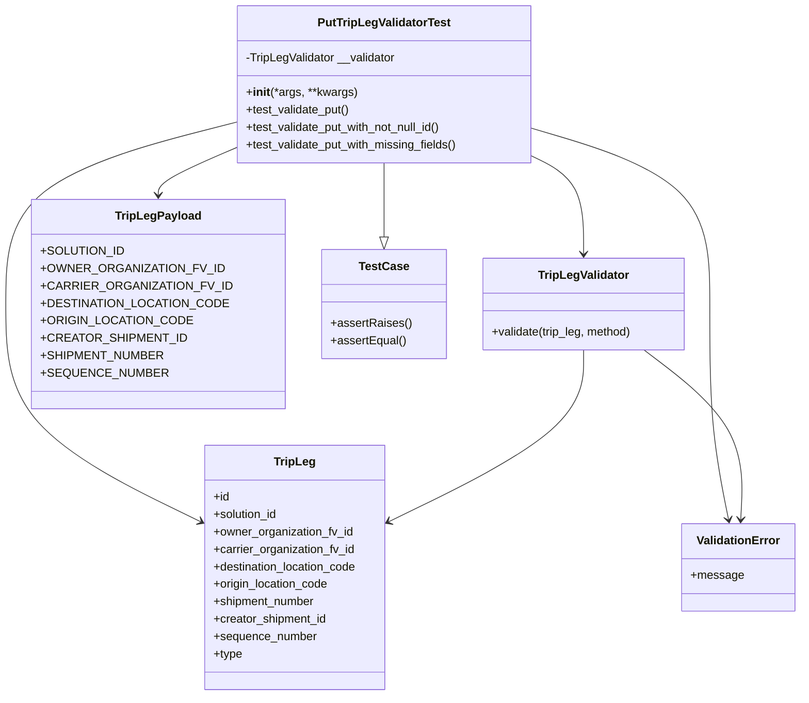
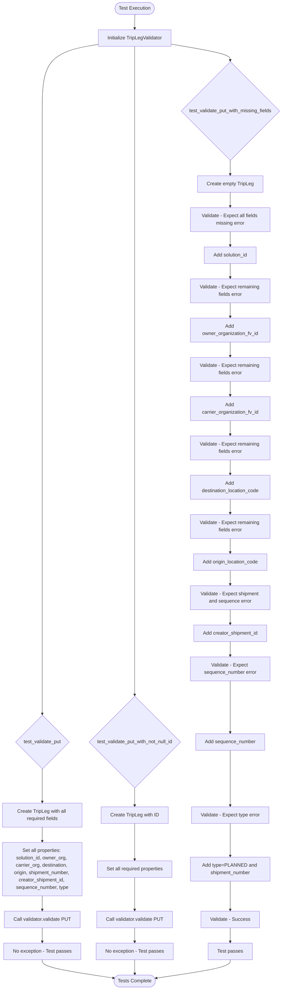
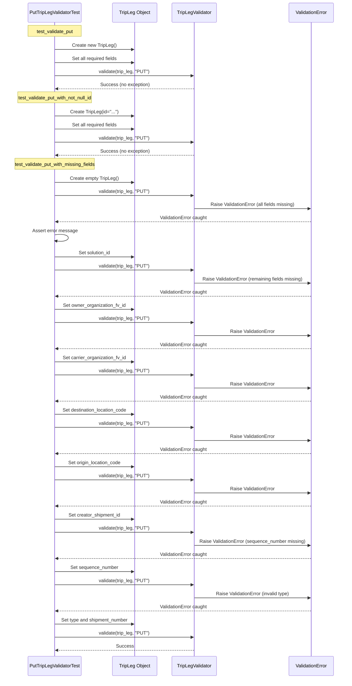
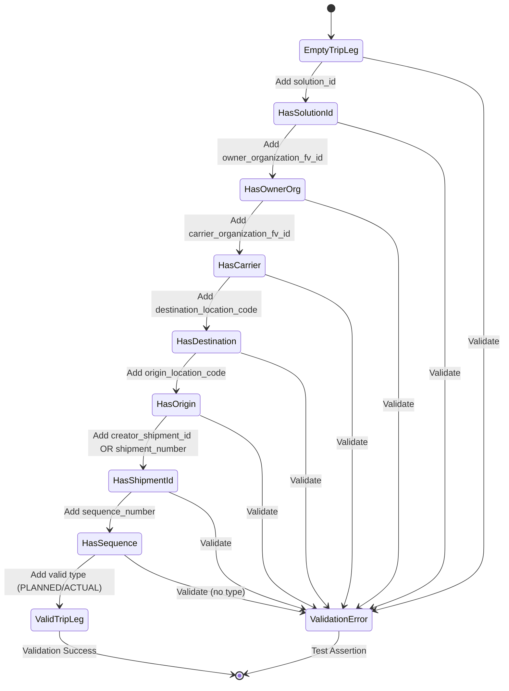

# Diagram: platform/partview_core/partview_service/partview_service/tests/unit/core/validators/trip_leg/trip_leg_put_validator_test.py

> Auto-generated by Obscura crawlers

## Diagram 1

### SVG

<svg id="container" width="1054.84765625" xmlns="http://www.w3.org/2000/svg" class="classDiagram" height="956" viewBox="-35 0 1054.84765625 956" role="graphics-document document" aria-roledescription="class"><g><defs><marker id="container_class-aggregationStart" class="marker aggregation class" refX="18" refY="7" markerWidth="190" markerHeight="240" orient="auto"><path d="M 18,7 L9,13 L1,7 L9,1 Z"></path></marker></defs><defs><marker id="container_class-aggregationEnd" class="marker aggregation class" refX="1" refY="7" markerWidth="20" markerHeight="28" orient="auto"><path d="M 18,7 L9,13 L1,7 L9,1 Z"></path></marker></defs><defs><marker id="container_class-extensionStart" class="marker extension class" refX="18" refY="7" markerWidth="190" markerHeight="240" orient="auto"><path d="M 1,7 L18,13 V 1 Z"></path></marker></defs><defs><marker id="container_class-extensionEnd" class="marker extension class" refX="1" refY="7" markerWidth="20" markerHeight="28" orient="auto"><path d="M 1,1 V 13 L18,7 Z"></path></marker></defs><defs><marker id="container_class-compositionStart" class="marker composition class" refX="18" refY="7" markerWidth="190" markerHeight="240" orient="auto"><path d="M 18,7 L9,13 L1,7 L9,1 Z"></path></marker></defs><defs><marker id="container_class-compositionEnd" class="marker composition class" refX="1" refY="7" markerWidth="20" markerHeight="28" orient="auto"><path d="M 18,7 L9,13 L1,7 L9,1 Z"></path></marker></defs><defs><marker id="container_class-dependencyStart" class="marker dependency class" refX="6" refY="7" markerWidth="190" markerHeight="240" orient="auto"><path d="M 5,7 L9,13 L1,7 L9,1 Z"></path></marker></defs><defs><marker id="container_class-dependencyEnd" class="marker dependency class" refX="13" refY="7" markerWidth="20" markerHeight="28" orient="auto"><path d="M 18,7 L9,13 L14,7 L9,1 Z"></path></marker></defs><defs><marker id="container_class-lollipopStart" class="marker lollipop class" refX="13" refY="7" markerWidth="190" markerHeight="240" orient="auto"><circle stroke="black" fill="transparent" cx="7" cy="7" r="6"></circle></marker></defs><defs><marker id="container_class-lollipopEnd" class="marker lollipop class" refX="1" refY="7" markerWidth="190" markerHeight="240" orient="auto"><circle stroke="black" fill="transparent" cx="7" cy="7" r="6"></circle></marker></defs><g class="root"><g class="clusters"></g><g class="edgePaths"><path d="M451.359,224L451.359,228.167C451.359,232.333,451.359,240.667,451.359,257.625C451.359,274.583,451.359,300.167,451.359,312.958L451.359,325.75" id="id_PutTripLegValidatorTest_TestCase_1" class="edge-thickness-normal edge-pattern-solid relation" style=";;;" data-edge="true" data-et="edge" data-id="id_PutTripLegValidatorTest_TestCase_1" data-points="W3sieCI6NDUxLjM1OTM3NSwieSI6MjI0fSx7IngiOjQ1MS4zNTkzNzUsInkiOjI0OX0seyJ4Ijo0NTEuMzU5Mzc1LCJ5IjozNDN9XQ==" marker-end="url(#container_class-extensionEnd)"></path><path d="M654.434,215.073L666.024,220.727C677.615,226.382,700.796,237.691,712.386,260.012C723.977,282.333,723.977,315.667,723.977,332.333L723.977,349" id="id_PutTripLegValidatorTest_TripLegValidator_2" class="edge-thickness-normal edge-pattern-solid relation" style=";;;" data-edge="true" data-et="edge" data-id="id_PutTripLegValidatorTest_TripLegValidator_2" data-points="W3sieCI6NjU0LjQzMzU5Mzc1LCJ5IjoyMTUuMDcyNTE3NTUyNjU3OTh9LHsieCI6NzIzLjk3NjU2MjUsInkiOjI0OX0seyJ4Ijo3MjMuOTc2NTYyNSwieSI6MzU1fV0=" marker-end="url(#container_class-dependencyEnd)"></path><path d="M248.285,172.461L202.404,185.218C156.523,197.974,64.762,223.487,18.881,264.41C-27,305.333,-27,361.667,-27,418C-27,474.333,-27,530.667,13.654,579.729C54.307,628.792,135.614,670.583,176.268,691.479L216.921,712.375" id="id_PutTripLegValidatorTest_TripLeg_3" class="edge-thickness-normal edge-pattern-solid relation" style=";;;" data-edge="true" data-et="edge" data-id="id_PutTripLegValidatorTest_TripLeg_3" data-points="W3sieCI6MjQ4LjI4NTE1NjI1LCJ5IjoxNzIuNDYxNDY0OTY4MTUyODh9LHsieCI6LTI3LCJ5IjoyNDl9LHsieCI6LTI3LCJ5Ijo0MTh9LHsieCI6LTI3LCJ5Ijo1ODd9LHsieCI6MjIyLjI1NzgxMjUsInkiOjcxNS4xMTc4NjczNjAyMDh9XQ==" marker-end="url(#container_class-dependencyEnd)"></path><path d="M248.285,209.814L234.148,216.345C220.01,222.876,191.736,235.938,177.598,245.636C163.461,255.333,163.461,261.667,163.461,264.833L163.461,268" id="id_PutTripLegValidatorTest_TripLegPayload_4" class="edge-thickness-normal edge-pattern-solid relation" style=";;;" data-edge="true" data-et="edge" data-id="id_PutTripLegValidatorTest_TripLegPayload_4" data-points="W3sieCI6MjQ4LjI4NTE1NjI1LCJ5IjoyMDkuODEzODg1NjQ3NjA3OTV9LHsieCI6MTYzLjQ2MDkzNzUsInkiOjI0OX0seyJ4IjoxNjMuNDYwOTM3NSwieSI6Mjc0fV0=" marker-end="url(#container_class-dependencyEnd)"></path><path d="M654.434,176.315L695.221,188.429C736.008,200.543,817.582,224.772,858.369,265.053C899.156,305.333,899.156,361.667,899.156,418C899.156,474.333,899.156,530.667,903.318,580.019C907.48,629.371,915.803,671.742,919.965,692.927L924.127,714.113" id="id_PutTripLegValidatorTest_ValidationError_5" class="edge-thickness-normal edge-pattern-solid relation" style=";;;" data-edge="true" data-et="edge" data-id="id_PutTripLegValidatorTest_ValidationError_5" data-points="W3sieCI6NjU0LjQzMzU5Mzc1LCJ5IjoxNzYuMzE1MDA1NzU3MzUzN30seyJ4Ijo4OTkuMTU2MjUsInkiOjI0OX0seyJ4Ijo4OTkuMTU2MjUsInkiOjQxOH0seyJ4Ijo4OTkuMTU2MjUsInkiOjU4N30seyJ4Ijo5MjUuMjgzNTU3MzE4NjUyOCwieSI6NzIwfV0=" marker-end="url(#container_class-dependencyEnd)"></path><path d="M723.977,481L723.977,498.667C723.977,516.333,723.977,551.667,683.323,590.229C642.669,628.792,561.362,670.583,520.709,691.479L480.055,712.375" id="id_TripLegValidator_TripLeg_6" class="edge-thickness-normal edge-pattern-solid relation" style=";;;" data-edge="true" data-et="edge" data-id="id_TripLegValidator_TripLeg_6" data-points="W3sieCI6NzIzLjk3NjU2MjUsInkiOjQ4MX0seyJ4Ijo3MjMuOTc2NTYyNSwieSI6NTg3fSx7IngiOjQ3NC43MTg3NSwieSI6NzE1LjExNzg2NzM2MDIwOH1d" marker-end="url(#container_class-dependencyEnd)"></path><path d="M807.142,481L830.463,498.667C853.785,516.333,900.427,551.667,922.652,590.501C944.877,629.336,942.683,671.672,941.586,692.84L940.49,714.008" id="id_TripLegValidator_ValidationError_7" class="edge-thickness-normal edge-pattern-solid relation" style=";;;" data-edge="true" data-et="edge" data-id="id_TripLegValidator_ValidationError_7" data-points="W3sieCI6ODA3LjE0MTY4ODIzOTY0NSwieSI6NDgxfSx7IngiOjk0Ny4wNzAzMTI1LCJ5Ijo1ODd9LHsieCI6OTQwLjE3OTEyMDc5MDE1NTUsInkiOjcyMH1d" marker-end="url(#container_class-dependencyEnd)"></path></g><g class="edgeLabels"><g class="edgeLabel"><g class="label" data-id="id_PutTripLegValidatorTest_TestCase_1" transform="translate(0, 0)"><foreignObject width="0" height="0">

</foreignObject></g></g><g class="edgeLabel"><g class="label" data-id="id_PutTripLegValidatorTest_TripLegValidator_2" transform="translate(0, 0)"><foreignObject width="0" height="0">

</foreignObject></g></g><g class="edgeLabel"><g class="label" data-id="id_PutTripLegValidatorTest_TripLeg_3" transform="translate(0, 0)"><foreignObject width="0" height="0">

</foreignObject></g></g><g class="edgeLabel"><g class="label" data-id="id_PutTripLegValidatorTest_TripLegPayload_4" transform="translate(0, 0)"><foreignObject width="0" height="0">

</foreignObject></g></g><g class="edgeLabel"><g class="label" data-id="id_PutTripLegValidatorTest_ValidationError_5" transform="translate(0, 0)"><foreignObject width="0" height="0">

</foreignObject></g></g><g class="edgeLabel"><g class="label" data-id="id_TripLegValidator_TripLeg_6" transform="translate(0, 0)"><foreignObject width="0" height="0">

</foreignObject></g></g><g class="edgeLabel"><g class="label" data-id="id_TripLegValidator_ValidationError_7" transform="translate(0, 0)"><foreignObject width="0" height="0">

</foreignObject></g></g></g><g class="nodes"><g class="node default" id="classId-PutTripLegValidatorTest-0" transform="translate(451.359375, 116)"><g class="basic label-container"><path d="M-203.07421875 -108 L203.07421875 -108 L203.07421875 108 L-203.07421875 108" stroke="none" stroke-width="0" fill="#ECECFF" style=""></path><path d="M-203.07421875 -108 C-56.45336544418652 -108, 90.16748786162697 -108, 203.07421875 -108 M-203.07421875 -108 C-57.71435983184179 -108, 87.64549908631642 -108, 203.07421875 -108 M203.07421875 -108 C203.07421875 -25.337534965178406, 203.07421875 57.32493006964319, 203.07421875 108 M203.07421875 -108 C203.07421875 -49.4045516457289, 203.07421875 9.190896708542198, 203.07421875 108 M203.07421875 108 C74.4004527748069 108, -54.27331320038621 108, -203.07421875 108 M203.07421875 108 C78.42403725396895 108, -46.226144242062105 108, -203.07421875 108 M-203.07421875 108 C-203.07421875 23.863041994314813, -203.07421875 -60.273916011370375, -203.07421875 -108 M-203.07421875 108 C-203.07421875 37.44302597977601, -203.07421875 -33.11394804044798, -203.07421875 -108" stroke="#9370DB" stroke-width="1.3" fill="none" stroke-dasharray="0 0" style=""></path></g><g class="annotation-group text" transform="translate(0, -84)"></g><g class="label-group text" transform="translate(-87.7421875, -84)"><g class="label" style="font-weight: bolder" transform="translate(0,-12)"><foreignObject width="175.484375" height="24">

PutTripLegValidatorTest

</foreignObject></g></g><g class="members-group text" transform="translate(-191.07421875, -36)"><g class="label" style="" transform="translate(0,-12)"><foreignObject width="208.5" height="24">

-TripLegValidator __validator

</foreignObject></g></g><g class="methods-group text" transform="translate(-191.07421875, 12)"><g class="label" style="" transform="translate(0,-12)"><foreignObject width="151.8125" height="24">

+<strong>init</strong>(*args, **kwargs)

</foreignObject></g><g class="label" style="" transform="translate(0,12)"><foreignObject width="144.109375" height="24">

+test_validate_put()

</foreignObject></g><g class="label" style="" transform="translate(0,36)"><foreignObject width="274.84375" height="24">

+test_validate_put_with_not_null_id()

</foreignObject></g><g class="label" style="" transform="translate(0,60)"><foreignObject width="294.40625" height="24">

+test_validate_put_with_missing_fields()

</foreignObject></g></g><g class="divider" style=""><path d="M-203.07421875 -60 C-67.18173542812059 -60, 68.71074789375882 -60, 203.07421875 -60 M-203.07421875 -60 C-48.10582770303384 -60, 106.86256334393232 -60, 203.07421875 -60" stroke="#9370DB" stroke-width="1.3" fill="none" stroke-dasharray="0 0" style=""></path></g><g class="divider" style=""><path d="M-203.07421875 -12 C-54.955130243105884 -12, 93.16395826378823 -12, 203.07421875 -12 M-203.07421875 -12 C-72.39168029881964 -12, 58.29085815236073 -12, 203.07421875 -12" stroke="#9370DB" stroke-width="1.3" fill="none" stroke-dasharray="0 0" style=""></path></g></g><g class="node default" id="classId-TripLegValidator-1" transform="translate(723.9765625, 418)"><g class="basic label-container"><path d="M-140.1796875 -63 L140.1796875 -63 L140.1796875 63 L-140.1796875 63" stroke="none" stroke-width="0" fill="#ECECFF" style=""></path><path d="M-140.1796875 -63 C-61.60584672694121 -63, 16.96799404611758 -63, 140.1796875 -63 M-140.1796875 -63 C-38.08050718080251 -63, 64.01867313839497 -63, 140.1796875 -63 M140.1796875 -63 C140.1796875 -37.5437799906047, 140.1796875 -12.087559981209395, 140.1796875 63 M140.1796875 -63 C140.1796875 -36.59663515006152, 140.1796875 -10.193270300123046, 140.1796875 63 M140.1796875 63 C65.88359504037133 63, -8.412497419257335 63, -140.1796875 63 M140.1796875 63 C52.94625979542248 63, -34.287167909155045 63, -140.1796875 63 M-140.1796875 63 C-140.1796875 31.800647035244964, -140.1796875 0.6012940704899279, -140.1796875 -63 M-140.1796875 63 C-140.1796875 36.979134936445696, -140.1796875 10.958269872891393, -140.1796875 -63" stroke="#9370DB" stroke-width="1.3" fill="none" stroke-dasharray="0 0" style=""></path></g><g class="annotation-group text" transform="translate(0, -39)"></g><g class="label-group text" transform="translate(-60.234375, -39)"><g class="label" style="font-weight: bolder" transform="translate(0,-12)"><foreignObject width="120.46875" height="24">

TripLegValidator

</foreignObject></g></g><g class="members-group text" transform="translate(-128.1796875, 9)"></g><g class="methods-group text" transform="translate(-128.1796875, 39)"><g class="label" style="" transform="translate(0,-12)"><foreignObject width="196.125" height="24">

+validate(trip_leg, method)

</foreignObject></g></g><g class="divider" style=""><path d="M-140.1796875 -15 C-48.72753816359504 -15, 42.724611172809915 -15, 140.1796875 -15 M-140.1796875 -15 C-76.17068461115569 -15, -12.161681722311386 -15, 140.1796875 -15" stroke="#9370DB" stroke-width="1.3" fill="none" stroke-dasharray="0 0" style=""></path></g><g class="divider" style=""><path d="M-140.1796875 9 C-30.727839631910626 9, 78.72400823617875 9, 140.1796875 9 M-140.1796875 9 C-75.7195249455719 9, -11.25936239114381 9, 140.1796875 9" stroke="#9370DB" stroke-width="1.3" fill="none" stroke-dasharray="0 0" style=""></path></g></g><g class="node default" id="classId-TripLeg-2" transform="translate(348.48828125, 780)"><g class="basic label-container"><path d="M-126.23046875 -168 L126.23046875 -168 L126.23046875 168 L-126.23046875 168" stroke="none" stroke-width="0" fill="#ECECFF" style=""></path><path d="M-126.23046875 -168 C-71.74927074904136 -168, -17.2680727480827 -168, 126.23046875 -168 M-126.23046875 -168 C-52.7102708645608 -168, 20.809927020878405 -168, 126.23046875 -168 M126.23046875 -168 C126.23046875 -46.85937330175797, 126.23046875 74.28125339648406, 126.23046875 168 M126.23046875 -168 C126.23046875 -76.44826225365277, 126.23046875 15.103475492694457, 126.23046875 168 M126.23046875 168 C45.33057146508895 168, -35.5693258198221 168, -126.23046875 168 M126.23046875 168 C64.64489016367557 168, 3.0593115773511244 168, -126.23046875 168 M-126.23046875 168 C-126.23046875 37.08704003053714, -126.23046875 -93.82591993892572, -126.23046875 -168 M-126.23046875 168 C-126.23046875 82.66383658653814, -126.23046875 -2.6723268269237224, -126.23046875 -168" stroke="#9370DB" stroke-width="1.3" fill="none" stroke-dasharray="0 0" style=""></path></g><g class="annotation-group text" transform="translate(0, -144)"></g><g class="label-group text" transform="translate(-27.0546875, -144)"><g class="label" style="font-weight: bolder" transform="translate(0,-12)"><foreignObject width="54.109375" height="24">

TripLeg

</foreignObject></g></g><g class="members-group text" transform="translate(-114.23046875, -96)"><g class="label" style="" transform="translate(0,-12)"><foreignObject width="22.078125" height="24">

+id

</foreignObject></g><g class="label" style="" transform="translate(0,12)"><foreignObject width="90.21875" height="24">

+solution_id

</foreignObject></g><g class="label" style="" transform="translate(0,36)"><foreignObject width="193.296875" height="24">

+owner_organization_fv_id

</foreignObject></g><g class="label" style="" transform="translate(0,60)"><foreignObject width="196.171875" height="24">

+carrier_organization_fv_id

</foreignObject></g><g class="label" style="" transform="translate(0,84)"><foreignObject width="201.40625" height="24">

+destination_location_code

</foreignObject></g><g class="label" style="" transform="translate(0,108)"><foreignObject width="160.5" height="24">

+origin_location_code

</foreignObject></g><g class="label" style="" transform="translate(0,132)"><foreignObject width="141.5625" height="24">

+shipment_number

</foreignObject></g><g class="label" style="" transform="translate(0,156)"><foreignObject width="157.546875" height="24">

+creator_shipment_id

</foreignObject></g><g class="label" style="" transform="translate(0,180)"><foreignObject width="142.015625" height="24">

+sequence_number

</foreignObject></g><g class="label" style="" transform="translate(0,204)"><foreignObject width="39.703125" height="24">

+type

</foreignObject></g></g><g class="methods-group text" transform="translate(-114.23046875, 168)"></g><g class="divider" style=""><path d="M-126.23046875 -120 C-35.80477465148515 -120, 54.620919447029706 -120, 126.23046875 -120 M-126.23046875 -120 C-35.477639648319 -120, 55.275189453362 -120, 126.23046875 -120" stroke="#9370DB" stroke-width="1.3" fill="none" stroke-dasharray="0 0" style=""></path></g><g class="divider" style=""><path d="M-126.23046875 144 C-42.24479740160069 144, 41.740873946798615 144, 126.23046875 144 M-126.23046875 144 C-30.91772457196946 144, 64.39501960606108 144, 126.23046875 144" stroke="#9370DB" stroke-width="1.3" fill="none" stroke-dasharray="0 0" style=""></path></g></g><g class="node default" id="classId-TripLegPayload-3" transform="translate(163.4609375, 418)"><g class="basic label-container"><path d="M-155.4609375 -144 L155.4609375 -144 L155.4609375 144 L-155.4609375 144" stroke="none" stroke-width="0" fill="#ECECFF" style=""></path><path d="M-155.4609375 -144 C-83.68695224700802 -144, -11.912966994016045 -144, 155.4609375 -144 M-155.4609375 -144 C-33.28402125877322 -144, 88.89289498245356 -144, 155.4609375 -144 M155.4609375 -144 C155.4609375 -77.85973504038101, 155.4609375 -11.719470080762022, 155.4609375 144 M155.4609375 -144 C155.4609375 -39.688672766300144, 155.4609375 64.62265446739971, 155.4609375 144 M155.4609375 144 C90.42586538903822 144, 25.390793278076444 144, -155.4609375 144 M155.4609375 144 C75.88650345080143 144, -3.687930598397145 144, -155.4609375 144 M-155.4609375 144 C-155.4609375 47.44139476020361, -155.4609375 -49.117210479592785, -155.4609375 -144 M-155.4609375 144 C-155.4609375 53.79376950994336, -155.4609375 -36.41246098011328, -155.4609375 -144" stroke="#9370DB" stroke-width="1.3" fill="none" stroke-dasharray="0 0" style=""></path></g><g class="annotation-group text" transform="translate(0, -120)"></g><g class="label-group text" transform="translate(-55.953125, -120)"><g class="label" style="font-weight: bolder" transform="translate(0,-12)"><foreignObject width="111.90625" height="24">

TripLegPayload

</foreignObject></g></g><g class="members-group text" transform="translate(-143.4609375, -72)"><g class="label" style="" transform="translate(0,-12)"><foreignObject width="103.640625" height="24">

+SOLUTION_ID

</foreignObject></g><g class="label" style="" transform="translate(0,12)"><foreignObject width="223.96875" height="24">

+OWNER_ORGANIZATION_FV_ID

</foreignObject></g><g class="label" style="" transform="translate(0,36)"><foreignObject width="230.96875" height="24">

+CARRIER_ORGANIZATION_FV_ID

</foreignObject></g><g class="label" style="" transform="translate(0,60)"><foreignObject width="227.5625" height="24">

+DESTINATION_LOCATION_CODE

</foreignObject></g><g class="label" style="" transform="translate(0,84)"><foreignObject width="184.421875" height="24">

+ORIGIN_LOCATION_CODE

</foreignObject></g><g class="label" style="" transform="translate(0,108)"><foreignObject width="175.90625" height="24">

+CREATOR_SHIPMENT_ID

</foreignObject></g><g class="label" style="" transform="translate(0,132)"><foreignObject width="150.15625" height="24">

+SHIPMENT_NUMBER

</foreignObject></g><g class="label" style="" transform="translate(0,156)"><foreignObject width="153.359375" height="24">

+SEQUENCE_NUMBER

</foreignObject></g></g><g class="methods-group text" transform="translate(-143.4609375, 144)"></g><g class="divider" style=""><path d="M-155.4609375 -96 C-60.63734906860107 -96, 34.18623936279786 -96, 155.4609375 -96 M-155.4609375 -96 C-53.31592031350753 -96, 48.829096872984934 -96, 155.4609375 -96" stroke="#9370DB" stroke-width="1.3" fill="none" stroke-dasharray="0 0" style=""></path></g><g class="divider" style=""><path d="M-155.4609375 120 C-52.36022267629542 120, 50.74049214740916 120, 155.4609375 120 M-155.4609375 120 C-45.85926080512864 120, 63.742415889742716 120, 155.4609375 120" stroke="#9370DB" stroke-width="1.3" fill="none" stroke-dasharray="0 0" style=""></path></g></g><g class="node default" id="classId-ValidationError-4" transform="translate(937.0703125, 780)"><g class="basic label-container"><path d="M-74.77734375 -60 L74.77734375 -60 L74.77734375 60 L-74.77734375 60" stroke="none" stroke-width="0" fill="#ECECFF" style=""></path><path d="M-74.77734375 -60 C-22.450289253226444 -60, 29.876765243547112 -60, 74.77734375 -60 M-74.77734375 -60 C-27.867306751647206 -60, 19.042730246705588 -60, 74.77734375 -60 M74.77734375 -60 C74.77734375 -23.87258188378302, 74.77734375 12.25483623243396, 74.77734375 60 M74.77734375 -60 C74.77734375 -14.19365870471993, 74.77734375 31.61268259056014, 74.77734375 60 M74.77734375 60 C32.841148140249565 60, -9.09504746950087 60, -74.77734375 60 M74.77734375 60 C42.43771370254694 60, 10.098083655093873 60, -74.77734375 60 M-74.77734375 60 C-74.77734375 20.165844048182834, -74.77734375 -19.668311903634333, -74.77734375 -60 M-74.77734375 60 C-74.77734375 34.606648149280645, -74.77734375 9.213296298561282, -74.77734375 -60" stroke="#9370DB" stroke-width="1.3" fill="none" stroke-dasharray="0 0" style=""></path></g><g class="annotation-group text" transform="translate(0, -36)"></g><g class="label-group text" transform="translate(-55.1796875, -36)"><g class="label" style="font-weight: bolder" transform="translate(0,-12)"><foreignObject width="110.359375" height="24">

ValidationError

</foreignObject></g></g><g class="members-group text" transform="translate(-62.77734375, 12)"><g class="label" style="" transform="translate(0,-12)"><foreignObject width="70.375" height="24">

+message

</foreignObject></g></g><g class="methods-group text" transform="translate(-62.77734375, 60)"></g><g class="divider" style=""><path d="M-74.77734375 -12 C-37.01759219243654 -12, 0.7421593651269234 -12, 74.77734375 -12 M-74.77734375 -12 C-36.665928676831555 -12, 1.4454863963368894 -12, 74.77734375 -12" stroke="#9370DB" stroke-width="1.3" fill="none" stroke-dasharray="0 0" style=""></path></g><g class="divider" style=""><path d="M-74.77734375 36 C-29.870222265533755 36, 15.03689921893249 36, 74.77734375 36 M-74.77734375 36 C-21.00550571236615 36, 32.7663323252677 36, 74.77734375 36" stroke="#9370DB" stroke-width="1.3" fill="none" stroke-dasharray="0 0" style=""></path></g></g><g class="node default" id="classId-TestCase-5" transform="translate(451.359375, 418)"><g class="basic label-container"><path d="M-82.4375 -75 L82.4375 -75 L82.4375 75 L-82.4375 75" stroke="none" stroke-width="0" fill="#ECECFF" style=""></path><path d="M-82.4375 -75 C-35.66604176821088 -75, 11.105416463578237 -75, 82.4375 -75 M-82.4375 -75 C-28.63843338067045 -75, 25.160633238659102 -75, 82.4375 -75 M82.4375 -75 C82.4375 -24.20852032848415, 82.4375 26.582959343031703, 82.4375 75 M82.4375 -75 C82.4375 -27.66296946484806, 82.4375 19.67406107030388, 82.4375 75 M82.4375 75 C32.47776270167426 75, -17.481974596651483 75, -82.4375 75 M82.4375 75 C44.08027393766421 75, 5.723047875328419 75, -82.4375 75 M-82.4375 75 C-82.4375 39.189104556751275, -82.4375 3.3782091135025496, -82.4375 -75 M-82.4375 75 C-82.4375 26.372832918351087, -82.4375 -22.254334163297827, -82.4375 -75" stroke="#9370DB" stroke-width="1.3" fill="none" stroke-dasharray="0 0" style=""></path></g><g class="annotation-group text" transform="translate(0, -51)"></g><g class="label-group text" transform="translate(-32.359375, -51)"><g class="label" style="font-weight: bolder" transform="translate(0,-12)"><foreignObject width="64.71875" height="24">

TestCase

</foreignObject></g></g><g class="members-group text" transform="translate(-70.4375, -3)"></g><g class="methods-group text" transform="translate(-70.4375, 27)"><g class="label" style="" transform="translate(0,-12)"><foreignObject width="108.515625" height="24">

+assertRaises()

</foreignObject></g><g class="label" style="" transform="translate(0,12)"><foreignObject width="102.46875" height="24">

+assertEqual()

</foreignObject></g></g><g class="divider" style=""><path d="M-82.4375 -27 C-40.862050579421755 -27, 0.71339884115649 -27, 82.4375 -27 M-82.4375 -27 C-48.56579640659427 -27, -14.694092813188547 -27, 82.4375 -27" stroke="#9370DB" stroke-width="1.3" fill="none" stroke-dasharray="0 0" style=""></path></g><g class="divider" style=""><path d="M-82.4375 -3 C-24.292620377462427 -3, 33.852259245075146 -3, 82.4375 -3 M-82.4375 -3 C-40.00704966131765 -3, 2.4234006773646968 -3, 82.4375 -3" stroke="#9370DB" stroke-width="1.3" fill="none" stroke-dasharray="0 0" style=""></path></g></g></g></g></g></svg>

## Diagram 2

### SVG

<svg id="container" width="935.671875" xmlns="http://www.w3.org/2000/svg" class="flowchart" height="3244.703125" viewBox="0 0 935.671875 3244.703125" role="graphics-document document" aria-roledescription="flowchart-v2"><g><marker id="container_flowchart-v2-pointEnd" class="marker flowchart-v2" viewBox="0 0 10 10" refX="5" refY="5" markerUnits="userSpaceOnUse" markerWidth="8" markerHeight="8" orient="auto"><path d="M 0 0 L 10 5 L 0 10 z" class="arrowMarkerPath" style="stroke-width: 1; stroke-dasharray: 1, 0;"></path></marker><marker id="container_flowchart-v2-pointStart" class="marker flowchart-v2" viewBox="0 0 10 10" refX="4.5" refY="5" markerUnits="userSpaceOnUse" markerWidth="8" markerHeight="8" orient="auto"><path d="M 0 5 L 10 10 L 10 0 z" class="arrowMarkerPath" style="stroke-width: 1; stroke-dasharray: 1, 0;"></path></marker><marker id="container_flowchart-v2-circleEnd" class="marker flowchart-v2" viewBox="0 0 10 10" refX="11" refY="5" markerUnits="userSpaceOnUse" markerWidth="11" markerHeight="11" orient="auto"><circle cx="5" cy="5" r="5" class="arrowMarkerPath" style="stroke-width: 1; stroke-dasharray: 1, 0;"></circle></marker><marker id="container_flowchart-v2-circleStart" class="marker flowchart-v2" viewBox="0 0 10 10" refX="-1" refY="5" markerUnits="userSpaceOnUse" markerWidth="11" markerHeight="11" orient="auto"><circle cx="5" cy="5" r="5" class="arrowMarkerPath" style="stroke-width: 1; stroke-dasharray: 1, 0;"></circle></marker><marker id="container_flowchart-v2-crossEnd" class="marker cross flowchart-v2" viewBox="0 0 11 11" refX="12" refY="5.2" markerUnits="userSpaceOnUse" markerWidth="11" markerHeight="11" orient="auto"><path d="M 1,1 l 9,9 M 10,1 l -9,9" class="arrowMarkerPath" style="stroke-width: 2; stroke-dasharray: 1, 0;"></path></marker><marker id="container_flowchart-v2-crossStart" class="marker cross flowchart-v2" viewBox="0 0 11 11" refX="-1" refY="5.2" markerUnits="userSpaceOnUse" markerWidth="11" markerHeight="11" orient="auto"><path d="M 1,1 l 9,9 M 10,1 l -9,9" class="arrowMarkerPath" style="stroke-width: 2; stroke-dasharray: 1, 0;"></path></marker><g class="root"><g class="clusters"></g><g class="edgePaths"><path d="M444.039,47.5L443.956,51.583C443.872,55.667,443.706,63.833,443.622,71.417C443.539,79,443.539,86,443.539,89.5L443.539,93" id="L_Start_Init_0" class="edge-thickness-normal edge-pattern-solid edge-thickness-normal edge-pattern-solid flowchart-link" style=";" data-edge="true" data-et="edge" data-id="L_Start_Init_0" data-points="W3sieCI6NDQ0LjAzOTA2MjUsInkiOjQ3LjV9LHsieCI6NDQzLjUzOTA2MjUsInkiOjcyfSx7IngiOjQ0My41MzkwNjI1LCJ5Ijo5N31d" marker-end="url(#container_flowchart-v2-pointEnd)"></path><path d="M321.336,144.798L290.78,149.998C260.224,155.199,199.112,165.599,168.556,202.478C138,239.357,138,302.714,138,366.07C138,429.427,138,492.784,138,533.129C138,573.474,138,590.807,138,608.141C138,625.474,138,642.807,138,662.141C138,681.474,138,702.807,138,724.141C138,745.474,138,766.807,138,786.141C138,805.474,138,822.807,138,840.141C138,857.474,138,874.807,138,894.141C138,913.474,138,934.807,138,956.141C138,977.474,138,998.807,138,1020.141C138,1041.474,138,1062.807,138,1084.141C138,1105.474,138,1126.807,138,1148.141C138,1169.474,138,1190.807,138,1212.141C138,1233.474,138,1254.807,138,1276.141C138,1297.474,138,1318.807,138,1340.141C138,1361.474,138,1382.807,138,1404.141C138,1425.474,138,1446.807,138,1468.141C138,1489.474,138,1510.807,138,1532.141C138,1553.474,138,1574.807,138,1596.141C138,1617.474,138,1638.807,138,1660.141C138,1681.474,138,1702.807,138,1724.141C138,1745.474,138,1766.807,138,1786.141C138,1805.474,138,1822.807,138,1840.141C138,1857.474,138,1874.807,138,1894.141C138,1913.474,138,1934.807,138,1956.141C138,1977.474,138,1998.807,138,2018.141C138,2037.474,138,2054.807,138,2072.141C138,2089.474,138,2106.807,138,2126.141C138,2145.474,138,2166.807,138,2188.141C138,2209.474,138,2230.807,138,2255.868C138,2280.93,138,2309.719,138,2324.113L138,2338.508" id="L_Init_Test1_0" class="edge-thickness-normal edge-pattern-solid edge-thickness-normal edge-pattern-solid flowchart-link" style=";" data-edge="true" data-et="edge" data-id="L_Init_Test1_0" data-points="W3sieCI6MzIxLjMzNTkzNzUsInkiOjE0NC43OTc4NzI2MTI0NDIxNX0seyJ4IjoxMzgsInkiOjE3Nn0seyJ4IjoxMzgsInkiOjM2Ni4wNzAzMTI1fSx7IngiOjEzOCwieSI6NTU2LjE0MDYyNX0seyJ4IjoxMzgsInkiOjYwOC4xNDA2MjV9LHsieCI6MTM4LCJ5Ijo2NjAuMTQwNjI1fSx7IngiOjEzOCwieSI6NzI0LjE0MDYyNX0seyJ4IjoxMzgsInkiOjc4OC4xNDA2MjV9LHsieCI6MTM4LCJ5Ijo4NDAuMTQwNjI1fSx7IngiOjEzOCwieSI6ODkyLjE0MDYyNX0seyJ4IjoxMzgsInkiOjk1Ni4xNDA2MjV9LHsieCI6MTM4LCJ5IjoxMDIwLjE0MDYyNX0seyJ4IjoxMzgsInkiOjEwODQuMTQwNjI1fSx7IngiOjEzOCwieSI6MTE0OC4xNDA2MjV9LHsieCI6MTM4LCJ5IjoxMjEyLjE0MDYyNX0seyJ4IjoxMzgsInkiOjEyNzYuMTQwNjI1fSx7IngiOjEzOCwieSI6MTM0MC4xNDA2MjV9LHsieCI6MTM4LCJ5IjoxNDA0LjE0MDYyNX0seyJ4IjoxMzgsInkiOjE0NjguMTQwNjI1fSx7IngiOjEzOCwieSI6MTUzMi4xNDA2MjV9LHsieCI6MTM4LCJ5IjoxNTk2LjE0MDYyNX0seyJ4IjoxMzgsInkiOjE2NjAuMTQwNjI1fSx7IngiOjEzOCwieSI6MTcyNC4xNDA2MjV9LHsieCI6MTM4LCJ5IjoxNzg4LjE0MDYyNX0seyJ4IjoxMzgsInkiOjE4NDAuMTQwNjI1fSx7IngiOjEzOCwieSI6MTg5Mi4xNDA2MjV9LHsieCI6MTM4LCJ5IjoxOTU2LjE0MDYyNX0seyJ4IjoxMzgsInkiOjIwMjAuMTQwNjI1fSx7IngiOjEzOCwieSI6MjA3Mi4xNDA2MjV9LHsieCI6MTM4LCJ5IjoyMTI0LjE0MDYyNX0seyJ4IjoxMzgsInkiOjIxODguMTQwNjI1fSx7IngiOjEzOCwieSI6MjI1Mi4xNDA2MjV9LHsieCI6MTM4LCJ5IjoyMzQyLjUwNzgxMjV9XQ==" marker-end="url(#container_flowchart-v2-pointEnd)"></path><path d="M443.539,151L443.539,155.167C443.539,159.333,443.539,167.667,443.539,203.512C443.539,239.357,443.539,302.714,443.539,366.07C443.539,429.427,443.539,492.784,443.539,533.129C443.539,573.474,443.539,590.807,443.539,608.141C443.539,625.474,443.539,642.807,443.539,662.141C443.539,681.474,443.539,702.807,443.539,724.141C443.539,745.474,443.539,766.807,443.539,786.141C443.539,805.474,443.539,822.807,443.539,840.141C443.539,857.474,443.539,874.807,443.539,894.141C443.539,913.474,443.539,934.807,443.539,956.141C443.539,977.474,443.539,998.807,443.539,1020.141C443.539,1041.474,443.539,1062.807,443.539,1084.141C443.539,1105.474,443.539,1126.807,443.539,1148.141C443.539,1169.474,443.539,1190.807,443.539,1212.141C443.539,1233.474,443.539,1254.807,443.539,1276.141C443.539,1297.474,443.539,1318.807,443.539,1340.141C443.539,1361.474,443.539,1382.807,443.539,1404.141C443.539,1425.474,443.539,1446.807,443.539,1468.141C443.539,1489.474,443.539,1510.807,443.539,1532.141C443.539,1553.474,443.539,1574.807,443.539,1596.141C443.539,1617.474,443.539,1638.807,443.539,1660.141C443.539,1681.474,443.539,1702.807,443.539,1724.141C443.539,1745.474,443.539,1766.807,443.539,1786.141C443.539,1805.474,443.539,1822.807,443.539,1840.141C443.539,1857.474,443.539,1874.807,443.539,1894.141C443.539,1913.474,443.539,1934.807,443.539,1956.141C443.539,1977.474,443.539,1998.807,443.539,2018.141C443.539,2037.474,443.539,2054.807,443.539,2072.141C443.539,2089.474,443.539,2106.807,443.539,2126.141C443.539,2145.474,443.539,2166.807,443.539,2188.141C443.539,2209.474,443.539,2230.807,443.539,2244.974C443.539,2259.141,443.539,2266.141,443.539,2269.641L443.539,2273.141" id="L_Init_Test2_0" class="edge-thickness-normal edge-pattern-solid edge-thickness-normal edge-pattern-solid flowchart-link" style=";" data-edge="true" data-et="edge" data-id="L_Init_Test2_0" data-points="W3sieCI6NDQzLjUzOTA2MjUsInkiOjE1MX0seyJ4Ijo0NDMuNTM5MDYyNSwieSI6MTc2fSx7IngiOjQ0My41MzkwNjI1LCJ5IjozNjYuMDcwMzEyNX0seyJ4Ijo0NDMuNTM5MDYyNSwieSI6NTU2LjE0MDYyNX0seyJ4Ijo0NDMuNTM5MDYyNSwieSI6NjA4LjE0MDYyNX0seyJ4Ijo0NDMuNTM5MDYyNSwieSI6NjYwLjE0MDYyNX0seyJ4Ijo0NDMuNTM5MDYyNSwieSI6NzI0LjE0MDYyNX0seyJ4Ijo0NDMuNTM5MDYyNSwieSI6Nzg4LjE0MDYyNX0seyJ4Ijo0NDMuNTM5MDYyNSwieSI6ODQwLjE0MDYyNX0seyJ4Ijo0NDMuNTM5MDYyNSwieSI6ODkyLjE0MDYyNX0seyJ4Ijo0NDMuNTM5MDYyNSwieSI6OTU2LjE0MDYyNX0seyJ4Ijo0NDMuNTM5MDYyNSwieSI6MTAyMC4xNDA2MjV9LHsieCI6NDQzLjUzOTA2MjUsInkiOjEwODQuMTQwNjI1fSx7IngiOjQ0My41MzkwNjI1LCJ5IjoxMTQ4LjE0MDYyNX0seyJ4Ijo0NDMuNTM5MDYyNSwieSI6MTIxMi4xNDA2MjV9LHsieCI6NDQzLjUzOTA2MjUsInkiOjEyNzYuMTQwNjI1fSx7IngiOjQ0My41MzkwNjI1LCJ5IjoxMzQwLjE0MDYyNX0seyJ4Ijo0NDMuNTM5MDYyNSwieSI6MTQwNC4xNDA2MjV9LHsieCI6NDQzLjUzOTA2MjUsInkiOjE0NjguMTQwNjI1fSx7IngiOjQ0My41MzkwNjI1LCJ5IjoxNTMyLjE0MDYyNX0seyJ4Ijo0NDMuNTM5MDYyNSwieSI6MTU5Ni4xNDA2MjV9LHsieCI6NDQzLjUzOTA2MjUsInkiOjE2NjAuMTQwNjI1fSx7IngiOjQ0My41MzkwNjI1LCJ5IjoxNzI0LjE0MDYyNX0seyJ4Ijo0NDMuNTM5MDYyNSwieSI6MTc4OC4xNDA2MjV9LHsieCI6NDQzLjUzOTA2MjUsInkiOjE4NDAuMTQwNjI1fSx7IngiOjQ0My41MzkwNjI1LCJ5IjoxODkyLjE0MDYyNX0seyJ4Ijo0NDMuNTM5MDYyNSwieSI6MTk1Ni4xNDA2MjV9LHsieCI6NDQzLjUzOTA2MjUsInkiOjIwMjAuMTQwNjI1fSx7IngiOjQ0My41MzkwNjI1LCJ5IjoyMDcyLjE0MDYyNX0seyJ4Ijo0NDMuNTM5MDYyNSwieSI6MjEyNC4xNDA2MjV9LHsieCI6NDQzLjUzOTA2MjUsInkiOjIxODguMTQwNjI1fSx7IngiOjQ0My41MzkwNjI1LCJ5IjoyMjUyLjE0MDYyNX0seyJ4Ijo0NDMuNTM5MDYyNSwieSI6MjI3Ny4xNDA2MjV9XQ==" marker-end="url(#container_flowchart-v2-pointEnd)"></path><path d="M565.742,143.948L598.469,149.29C631.195,154.632,696.648,165.316,729.375,174.158C762.102,183,762.102,190,762.102,193.5L762.102,197" id="L_Init_Test3_0" class="edge-thickness-normal edge-pattern-solid edge-thickness-normal edge-pattern-solid flowchart-link" style=";" data-edge="true" data-et="edge" data-id="L_Init_Test3_0" data-points="W3sieCI6NTY1Ljc0MjE4NzUsInkiOjE0My45NDc2MTYyNDQ4NDk5fSx7IngiOjc2Mi4xMDE1NjI1LCJ5IjoxNzZ9LHsieCI6NzYyLjEwMTU2MjUsInkiOjIwMX1d" marker-end="url(#container_flowchart-v2-pointEnd)"></path><path d="M138,2522.336L138,2537.397C138,2552.458,138,2582.581,138,2601.142C138,2619.703,138,2626.703,138,2630.203L138,2633.703" id="L_Test1_Create1_0" class="edge-thickness-normal edge-pattern-solid edge-thickness-normal edge-pattern-solid flowchart-link" style=";" data-edge="true" data-et="edge" data-id="L_Test1_Create1_0" data-points="W3sieCI6MTM4LCJ5IjoyNTIyLjMzNTkzNzV9LHsieCI6MTM4LCJ5IjoyNjEyLjcwMzEyNX0seyJ4IjoxMzgsInkiOjI2MzcuNzAzMTI1fV0=" marker-end="url(#container_flowchart-v2-pointEnd)"></path><path d="M138,2715.703L138,2719.87C138,2724.036,138,2732.37,138,2740.036C138,2747.703,138,2754.703,138,2758.203L138,2761.703" id="L_Create1_SetAll1_0" class="edge-thickness-normal edge-pattern-solid edge-thickness-normal edge-pattern-solid flowchart-link" style=";" data-edge="true" data-et="edge" data-id="L_Create1_SetAll1_0" data-points="W3sieCI6MTM4LCJ5IjoyNzE1LjcwMzEyNX0seyJ4IjoxMzgsInkiOjI3NDAuNzAzMTI1fSx7IngiOjEzOCwieSI6Mjc2NS43MDMxMjV9XQ==" marker-end="url(#container_flowchart-v2-pointEnd)"></path><path d="M138,2939.703L138,2943.87C138,2948.036,138,2956.37,138,2964.036C138,2971.703,138,2978.703,138,2982.203L138,2985.703" id="L_SetAll1_Valid1_0" class="edge-thickness-normal edge-pattern-solid edge-thickness-normal edge-pattern-solid flowchart-link" style=";" data-edge="true" data-et="edge" data-id="L_SetAll1_Valid1_0" data-points="W3sieCI6MTM4LCJ5IjoyOTM5LjcwMzEyNX0seyJ4IjoxMzgsInkiOjI5NjQuNzAzMTI1fSx7IngiOjEzOCwieSI6Mjk4OS43MDMxMjV9XQ==" marker-end="url(#container_flowchart-v2-pointEnd)"></path><path d="M138,3043.703L138,3047.87C138,3052.036,138,3060.37,138,3068.036C138,3075.703,138,3082.703,138,3086.203L138,3089.703" id="L_Valid1_Pass1_0" class="edge-thickness-normal edge-pattern-solid edge-thickness-normal edge-pattern-solid flowchart-link" style=";" data-edge="true" data-et="edge" data-id="L_Valid1_Pass1_0" data-points="W3sieCI6MTM4LCJ5IjozMDQzLjcwMzEyNX0seyJ4IjoxMzgsInkiOjMwNjguNzAzMTI1fSx7IngiOjEzOCwieSI6MzA5My43MDMxMjV9XQ==" marker-end="url(#container_flowchart-v2-pointEnd)"></path><path d="M443.539,2587.703L443.539,2591.87C443.539,2596.036,443.539,2604.37,443.539,2614.036C443.539,2623.703,443.539,2634.703,443.539,2640.203L443.539,2645.703" id="L_Test2_Create2_0" class="edge-thickness-normal edge-pattern-solid edge-thickness-normal edge-pattern-solid flowchart-link" style=";" data-edge="true" data-et="edge" data-id="L_Test2_Create2_0" data-points="W3sieCI6NDQzLjUzOTA2MjUsInkiOjI1ODcuNzAzMTI1fSx7IngiOjQ0My41MzkwNjI1LCJ5IjoyNjEyLjcwMzEyNX0seyJ4Ijo0NDMuNTM5MDYyNSwieSI6MjY0OS43MDMxMjV9XQ==" marker-end="url(#container_flowchart-v2-pointEnd)"></path><path d="M443.539,2703.703L443.539,2709.87C443.539,2716.036,443.539,2728.37,443.539,2748.036C443.539,2767.703,443.539,2794.703,443.539,2808.203L443.539,2821.703" id="L_Create2_SetAll2_0" class="edge-thickness-normal edge-pattern-solid edge-thickness-normal edge-pattern-solid flowchart-link" style=";" data-edge="true" data-et="edge" data-id="L_Create2_SetAll2_0" data-points="W3sieCI6NDQzLjUzOTA2MjUsInkiOjI3MDMuNzAzMTI1fSx7IngiOjQ0My41MzkwNjI1LCJ5IjoyNzQwLjcwMzEyNX0seyJ4Ijo0NDMuNTM5MDYyNSwieSI6MjgyNS43MDMxMjV9XQ==" marker-end="url(#container_flowchart-v2-pointEnd)"></path><path d="M443.539,2879.703L443.539,2893.87C443.539,2908.036,443.539,2936.37,443.539,2954.036C443.539,2971.703,443.539,2978.703,443.539,2982.203L443.539,2985.703" id="L_SetAll2_Valid2_0" class="edge-thickness-normal edge-pattern-solid edge-thickness-normal edge-pattern-solid flowchart-link" style=";" data-edge="true" data-et="edge" data-id="L_SetAll2_Valid2_0" data-points="W3sieCI6NDQzLjUzOTA2MjUsInkiOjI4NzkuNzAzMTI1fSx7IngiOjQ0My41MzkwNjI1LCJ5IjoyOTY0LjcwMzEyNX0seyJ4Ijo0NDMuNTM5MDYyNSwieSI6Mjk4OS43MDMxMjV9XQ==" marker-end="url(#container_flowchart-v2-pointEnd)"></path><path d="M443.539,3043.703L443.539,3047.87C443.539,3052.036,443.539,3060.37,443.539,3068.036C443.539,3075.703,443.539,3082.703,443.539,3086.203L443.539,3089.703" id="L_Valid2_Pass2_0" class="edge-thickness-normal edge-pattern-solid edge-thickness-normal edge-pattern-solid flowchart-link" style=";" data-edge="true" data-et="edge" data-id="L_Valid2_Pass2_0" data-points="W3sieCI6NDQzLjUzOTA2MjUsInkiOjMwNDMuNzAzMTI1fSx7IngiOjQ0My41MzkwNjI1LCJ5IjozMDY4LjcwMzEyNX0seyJ4Ijo0NDMuNTM5MDYyNSwieSI6MzA5My43MDMxMjV9XQ==" marker-end="url(#container_flowchart-v2-pointEnd)"></path><path d="M762.102,531.141L762.102,535.307C762.102,539.474,762.102,547.807,762.102,555.474C762.102,563.141,762.102,570.141,762.102,573.641L762.102,577.141" id="L_Test3_Create3_0" class="edge-thickness-normal edge-pattern-solid edge-thickness-normal edge-pattern-solid flowchart-link" style=";" data-edge="true" data-et="edge" data-id="L_Test3_Create3_0" data-points="W3sieCI6NzYyLjEwMTU2MjUsInkiOjUzMS4xNDA2MjV9LHsieCI6NzYyLjEwMTU2MjUsInkiOjU1Ni4xNDA2MjV9LHsieCI6NzYyLjEwMTU2MjUsInkiOjU4MS4xNDA2MjV9XQ==" marker-end="url(#container_flowchart-v2-pointEnd)"></path><path d="M762.102,635.141L762.102,639.307C762.102,643.474,762.102,651.807,762.102,659.474C762.102,667.141,762.102,674.141,762.102,677.641L762.102,681.141" id="L_Create3_Check1_0" class="edge-thickness-normal edge-pattern-solid edge-thickness-normal edge-pattern-solid flowchart-link" style=";" data-edge="true" data-et="edge" data-id="L_Create3_Check1_0" data-points="W3sieCI6NzYyLjEwMTU2MjUsInkiOjYzNS4xNDA2MjV9LHsieCI6NzYyLjEwMTU2MjUsInkiOjY2MC4xNDA2MjV9LHsieCI6NzYyLjEwMTU2MjUsInkiOjY4NS4xNDA2MjV9XQ==" marker-end="url(#container_flowchart-v2-pointEnd)"></path><path d="M762.102,763.141L762.102,767.307C762.102,771.474,762.102,779.807,762.102,787.474C762.102,795.141,762.102,802.141,762.102,805.641L762.102,809.141" id="L_Check1_AddSol_0" class="edge-thickness-normal edge-pattern-solid edge-thickness-normal edge-pattern-solid flowchart-link" style=";" data-edge="true" data-et="edge" data-id="L_Check1_AddSol_0" data-points="W3sieCI6NzYyLjEwMTU2MjUsInkiOjc2My4xNDA2MjV9LHsieCI6NzYyLjEwMTU2MjUsInkiOjc4OC4xNDA2MjV9LHsieCI6NzYyLjEwMTU2MjUsInkiOjgxMy4xNDA2MjV9XQ==" marker-end="url(#container_flowchart-v2-pointEnd)"></path><path d="M762.102,867.141L762.102,871.307C762.102,875.474,762.102,883.807,762.102,891.474C762.102,899.141,762.102,906.141,762.102,909.641L762.102,913.141" id="L_AddSol_Check2_0" class="edge-thickness-normal edge-pattern-solid edge-thickness-normal edge-pattern-solid flowchart-link" style=";" data-edge="true" data-et="edge" data-id="L_AddSol_Check2_0" data-points="W3sieCI6NzYyLjEwMTU2MjUsInkiOjg2Ny4xNDA2MjV9LHsieCI6NzYyLjEwMTU2MjUsInkiOjg5Mi4xNDA2MjV9LHsieCI6NzYyLjEwMTU2MjUsInkiOjkxNy4xNDA2MjV9XQ==" marker-end="url(#container_flowchart-v2-pointEnd)"></path><path d="M762.102,995.141L762.102,999.307C762.102,1003.474,762.102,1011.807,762.102,1019.474C762.102,1027.141,762.102,1034.141,762.102,1037.641L762.102,1041.141" id="L_Check2_AddOwner_0" class="edge-thickness-normal edge-pattern-solid edge-thickness-normal edge-pattern-solid flowchart-link" style=";" data-edge="true" data-et="edge" data-id="L_Check2_AddOwner_0" data-points="W3sieCI6NzYyLjEwMTU2MjUsInkiOjk5NS4xNDA2MjV9LHsieCI6NzYyLjEwMTU2MjUsInkiOjEwMjAuMTQwNjI1fSx7IngiOjc2Mi4xMDE1NjI1LCJ5IjoxMDQ1LjE0MDYyNX1d" marker-end="url(#container_flowchart-v2-pointEnd)"></path><path d="M762.102,1123.141L762.102,1127.307C762.102,1131.474,762.102,1139.807,762.102,1147.474C762.102,1155.141,762.102,1162.141,762.102,1165.641L762.102,1169.141" id="L_AddOwner_Check3_0" class="edge-thickness-normal edge-pattern-solid edge-thickness-normal edge-pattern-solid flowchart-link" style=";" data-edge="true" data-et="edge" data-id="L_AddOwner_Check3_0" data-points="W3sieCI6NzYyLjEwMTU2MjUsInkiOjExMjMuMTQwNjI1fSx7IngiOjc2Mi4xMDE1NjI1LCJ5IjoxMTQ4LjE0MDYyNX0seyJ4Ijo3NjIuMTAxNTYyNSwieSI6MTE3My4xNDA2MjV9XQ==" marker-end="url(#container_flowchart-v2-pointEnd)"></path><path d="M762.102,1251.141L762.102,1255.307C762.102,1259.474,762.102,1267.807,762.102,1275.474C762.102,1283.141,762.102,1290.141,762.102,1293.641L762.102,1297.141" id="L_Check3_AddCarrier_0" class="edge-thickness-normal edge-pattern-solid edge-thickness-normal edge-pattern-solid flowchart-link" style=";" data-edge="true" data-et="edge" data-id="L_Check3_AddCarrier_0" data-points="W3sieCI6NzYyLjEwMTU2MjUsInkiOjEyNTEuMTQwNjI1fSx7IngiOjc2Mi4xMDE1NjI1LCJ5IjoxMjc2LjE0MDYyNX0seyJ4Ijo3NjIuMTAxNTYyNSwieSI6MTMwMS4xNDA2MjV9XQ==" marker-end="url(#container_flowchart-v2-pointEnd)"></path><path d="M762.102,1379.141L762.102,1383.307C762.102,1387.474,762.102,1395.807,762.102,1403.474C762.102,1411.141,762.102,1418.141,762.102,1421.641L762.102,1425.141" id="L_AddCarrier_Check4_0" class="edge-thickness-normal edge-pattern-solid edge-thickness-normal edge-pattern-solid flowchart-link" style=";" data-edge="true" data-et="edge" data-id="L_AddCarrier_Check4_0" data-points="W3sieCI6NzYyLjEwMTU2MjUsInkiOjEzNzkuMTQwNjI1fSx7IngiOjc2Mi4xMDE1NjI1LCJ5IjoxNDA0LjE0MDYyNX0seyJ4Ijo3NjIuMTAxNTYyNSwieSI6MTQyOS4xNDA2MjV9XQ==" marker-end="url(#container_flowchart-v2-pointEnd)"></path><path d="M762.102,1507.141L762.102,1511.307C762.102,1515.474,762.102,1523.807,762.102,1531.474C762.102,1539.141,762.102,1546.141,762.102,1549.641L762.102,1553.141" id="L_Check4_AddDest_0" class="edge-thickness-normal edge-pattern-solid edge-thickness-normal edge-pattern-solid flowchart-link" style=";" data-edge="true" data-et="edge" data-id="L_Check4_AddDest_0" data-points="W3sieCI6NzYyLjEwMTU2MjUsInkiOjE1MDcuMTQwNjI1fSx7IngiOjc2Mi4xMDE1NjI1LCJ5IjoxNTMyLjE0MDYyNX0seyJ4Ijo3NjIuMTAxNTYyNSwieSI6MTU1Ny4xNDA2MjV9XQ==" marker-end="url(#container_flowchart-v2-pointEnd)"></path><path d="M762.102,1635.141L762.102,1639.307C762.102,1643.474,762.102,1651.807,762.102,1659.474C762.102,1667.141,762.102,1674.141,762.102,1677.641L762.102,1681.141" id="L_AddDest_Check5_0" class="edge-thickness-normal edge-pattern-solid edge-thickness-normal edge-pattern-solid flowchart-link" style=";" data-edge="true" data-et="edge" data-id="L_AddDest_Check5_0" data-points="W3sieCI6NzYyLjEwMTU2MjUsInkiOjE2MzUuMTQwNjI1fSx7IngiOjc2Mi4xMDE1NjI1LCJ5IjoxNjYwLjE0MDYyNX0seyJ4Ijo3NjIuMTAxNTYyNSwieSI6MTY4NS4xNDA2MjV9XQ==" marker-end="url(#container_flowchart-v2-pointEnd)"></path><path d="M762.102,1763.141L762.102,1767.307C762.102,1771.474,762.102,1779.807,762.102,1787.474C762.102,1795.141,762.102,1802.141,762.102,1805.641L762.102,1809.141" id="L_Check5_AddOrigin_0" class="edge-thickness-normal edge-pattern-solid edge-thickness-normal edge-pattern-solid flowchart-link" style=";" data-edge="true" data-et="edge" data-id="L_Check5_AddOrigin_0" data-points="W3sieCI6NzYyLjEwMTU2MjUsInkiOjE3NjMuMTQwNjI1fSx7IngiOjc2Mi4xMDE1NjI1LCJ5IjoxNzg4LjE0MDYyNX0seyJ4Ijo3NjIuMTAxNTYyNSwieSI6MTgxMy4xNDA2MjV9XQ==" marker-end="url(#container_flowchart-v2-pointEnd)"></path><path d="M762.102,1867.141L762.102,1871.307C762.102,1875.474,762.102,1883.807,762.102,1891.474C762.102,1899.141,762.102,1906.141,762.102,1909.641L762.102,1913.141" id="L_AddOrigin_Check6_0" class="edge-thickness-normal edge-pattern-solid edge-thickness-normal edge-pattern-solid flowchart-link" style=";" data-edge="true" data-et="edge" data-id="L_AddOrigin_Check6_0" data-points="W3sieCI6NzYyLjEwMTU2MjUsInkiOjE4NjcuMTQwNjI1fSx7IngiOjc2Mi4xMDE1NjI1LCJ5IjoxODkyLjE0MDYyNX0seyJ4Ijo3NjIuMTAxNTYyNSwieSI6MTkxNy4xNDA2MjV9XQ==" marker-end="url(#container_flowchart-v2-pointEnd)"></path><path d="M762.102,1995.141L762.102,1999.307C762.102,2003.474,762.102,2011.807,762.102,2019.474C762.102,2027.141,762.102,2034.141,762.102,2037.641L762.102,2041.141" id="L_Check6_AddCreator_0" class="edge-thickness-normal edge-pattern-solid edge-thickness-normal edge-pattern-solid flowchart-link" style=";" data-edge="true" data-et="edge" data-id="L_Check6_AddCreator_0" data-points="W3sieCI6NzYyLjEwMTU2MjUsInkiOjE5OTUuMTQwNjI1fSx7IngiOjc2Mi4xMDE1NjI1LCJ5IjoyMDIwLjE0MDYyNX0seyJ4Ijo3NjIuMTAxNTYyNSwieSI6MjA0NS4xNDA2MjV9XQ==" marker-end="url(#container_flowchart-v2-pointEnd)"></path><path d="M762.102,2099.141L762.102,2103.307C762.102,2107.474,762.102,2115.807,762.102,2123.474C762.102,2131.141,762.102,2138.141,762.102,2141.641L762.102,2145.141" id="L_AddCreator_Check7_0" class="edge-thickness-normal edge-pattern-solid edge-thickness-normal edge-pattern-solid flowchart-link" style=";" data-edge="true" data-et="edge" data-id="L_AddCreator_Check7_0" data-points="W3sieCI6NzYyLjEwMTU2MjUsInkiOjIwOTkuMTQwNjI1fSx7IngiOjc2Mi4xMDE1NjI1LCJ5IjoyMTI0LjE0MDYyNX0seyJ4Ijo3NjIuMTAxNTYyNSwieSI6MjE0OS4xNDA2MjV9XQ==" marker-end="url(#container_flowchart-v2-pointEnd)"></path><path d="M762.102,2227.141L762.102,2231.307C762.102,2235.474,762.102,2243.807,762.102,2272.854C762.102,2301.901,762.102,2351.661,762.102,2376.542L762.102,2401.422" id="L_Check7_AddSeq_0" class="edge-thickness-normal edge-pattern-solid edge-thickness-normal edge-pattern-solid flowchart-link" style=";" data-edge="true" data-et="edge" data-id="L_Check7_AddSeq_0" data-points="W3sieCI6NzYyLjEwMTU2MjUsInkiOjIyMjcuMTQwNjI1fSx7IngiOjc2Mi4xMDE1NjI1LCJ5IjoyMjUyLjE0MDYyNX0seyJ4Ijo3NjIuMTAxNTYyNSwieSI6MjQwNS40MjE4NzV9XQ==" marker-end="url(#container_flowchart-v2-pointEnd)"></path><path d="M762.102,2459.422L762.102,2484.969C762.102,2510.516,762.102,2561.609,762.102,2592.656C762.102,2623.703,762.102,2634.703,762.102,2640.203L762.102,2645.703" id="L_AddSeq_Check8_0" class="edge-thickness-normal edge-pattern-solid edge-thickness-normal edge-pattern-solid flowchart-link" style=";" data-edge="true" data-et="edge" data-id="L_AddSeq_Check8_0" data-points="W3sieCI6NzYyLjEwMTU2MjUsInkiOjI0NTkuNDIxODc1fSx7IngiOjc2Mi4xMDE1NjI1LCJ5IjoyNjEyLjcwMzEyNX0seyJ4Ijo3NjIuMTAxNTYyNSwieSI6MjY0OS43MDMxMjV9XQ==" marker-end="url(#container_flowchart-v2-pointEnd)"></path><path d="M762.102,2703.703L762.102,2709.87C762.102,2716.036,762.102,2728.37,762.102,2746.036C762.102,2763.703,762.102,2786.703,762.102,2798.203L762.102,2809.703" id="L_Check8_AddType_0" class="edge-thickness-normal edge-pattern-solid edge-thickness-normal edge-pattern-solid flowchart-link" style=";" data-edge="true" data-et="edge" data-id="L_Check8_AddType_0" data-points="W3sieCI6NzYyLjEwMTU2MjUsInkiOjI3MDMuNzAzMTI1fSx7IngiOjc2Mi4xMDE1NjI1LCJ5IjoyNzQwLjcwMzEyNX0seyJ4Ijo3NjIuMTAxNTYyNSwieSI6MjgxMy43MDMxMjV9XQ==" marker-end="url(#container_flowchart-v2-pointEnd)"></path><path d="M762.102,2891.703L762.102,2903.87C762.102,2916.036,762.102,2940.37,762.102,2956.036C762.102,2971.703,762.102,2978.703,762.102,2982.203L762.102,2985.703" id="L_AddType_Check9_0" class="edge-thickness-normal edge-pattern-solid edge-thickness-normal edge-pattern-solid flowchart-link" style=";" data-edge="true" data-et="edge" data-id="L_AddType_Check9_0" data-points="W3sieCI6NzYyLjEwMTU2MjUsInkiOjI4OTEuNzAzMTI1fSx7IngiOjc2Mi4xMDE1NjI1LCJ5IjoyOTY0LjcwMzEyNX0seyJ4Ijo3NjIuMTAxNTYyNSwieSI6Mjk4OS43MDMxMjV9XQ==" marker-end="url(#container_flowchart-v2-pointEnd)"></path><path d="M762.102,3043.703L762.102,3047.87C762.102,3052.036,762.102,3060.37,762.102,3068.036C762.102,3075.703,762.102,3082.703,762.102,3086.203L762.102,3089.703" id="L_Check9_Pass3_0" class="edge-thickness-normal edge-pattern-solid edge-thickness-normal edge-pattern-solid flowchart-link" style=";" data-edge="true" data-et="edge" data-id="L_Check9_Pass3_0" data-points="W3sieCI6NzYyLjEwMTU2MjUsInkiOjMwNDMuNzAzMTI1fSx7IngiOjc2Mi4xMDE1NjI1LCJ5IjozMDY4LjcwMzEyNX0seyJ4Ijo3NjIuMTAxNTYyNSwieSI6MzA5My43MDMxMjV9XQ==" marker-end="url(#container_flowchart-v2-pointEnd)"></path><path d="M138,3147.703L138,3151.87C138,3156.036,138,3164.37,177.538,3174.365C217.076,3184.36,296.152,3196.017,335.69,3201.846L375.228,3207.674" id="L_Pass1_End_0" class="edge-thickness-normal edge-pattern-solid edge-thickness-normal edge-pattern-solid flowchart-link" style=";" data-edge="true" data-et="edge" data-id="L_Pass1_End_0" data-points="W3sieCI6MTM4LCJ5IjozMTQ3LjcwMzEyNX0seyJ4IjoxMzgsInkiOjMxNzIuNzAzMTI1fSx7IngiOjM3OS4xODU2MjM5Njg1MjM4LCJ5IjozMjA4LjI1NzU5NjE5OTA3N31d" marker-end="url(#container_flowchart-v2-pointEnd)"></path><path d="M443.539,3147.703L443.539,3151.87C443.539,3156.036,443.539,3164.37,443.609,3172.12C443.68,3179.87,443.82,3187.037,443.89,3190.62L443.961,3194.204" id="L_Pass2_End_0" class="edge-thickness-normal edge-pattern-solid edge-thickness-normal edge-pattern-solid flowchart-link" style=";" data-edge="true" data-et="edge" data-id="L_Pass2_End_0" data-points="W3sieCI6NDQzLjUzOTA2MjUsInkiOjMxNDcuNzAzMTI1fSx7IngiOjQ0My41MzkwNjI1LCJ5IjozMTcyLjcwMzEyNX0seyJ4Ijo0NDQuMDM5MDYyNSwieSI6MzE5OC4yMDMxMjV9XQ==" marker-end="url(#container_flowchart-v2-pointEnd)"></path><path d="M762.102,3147.703L762.102,3151.87C762.102,3156.036,762.102,3164.37,720.594,3174.428C679.086,3184.487,596.07,3196.27,554.562,3202.162L513.054,3208.053" id="L_Pass3_End_0" class="edge-thickness-normal edge-pattern-solid edge-thickness-normal edge-pattern-solid flowchart-link" style=";" data-edge="true" data-et="edge" data-id="L_Pass3_End_0" data-points="W3sieCI6NzYyLjEwMTU2MjUsInkiOjMxNDcuNzAzMTI1fSx7IngiOjc2Mi4xMDE1NjI1LCJ5IjozMTcyLjcwMzEyNX0seyJ4Ijo1MDkuMDk0MTEzMjYzNTU2MiwieSI6MzIwOC42MTU1ODQwNjU0MDA1fV0=" marker-end="url(#container_flowchart-v2-pointEnd)"></path></g><g class="edgeLabels"><g class="edgeLabel"><g class="label" data-id="L_Start_Init_0" transform="translate(0, 0)"><foreignObject width="0" height="0">

</foreignObject></g></g><g class="edgeLabel"><g class="label" data-id="L_Init_Test1_0" transform="translate(0, 0)"><foreignObject width="0" height="0">

</foreignObject></g></g><g class="edgeLabel"><g class="label" data-id="L_Init_Test2_0" transform="translate(0, 0)"><foreignObject width="0" height="0">

</foreignObject></g></g><g class="edgeLabel"><g class="label" data-id="L_Init_Test3_0" transform="translate(0, 0)"><foreignObject width="0" height="0">

</foreignObject></g></g><g class="edgeLabel"><g class="label" data-id="L_Test1_Create1_0" transform="translate(0, 0)"><foreignObject width="0" height="0">

</foreignObject></g></g><g class="edgeLabel"><g class="label" data-id="L_Create1_SetAll1_0" transform="translate(0, 0)"><foreignObject width="0" height="0">

</foreignObject></g></g><g class="edgeLabel"><g class="label" data-id="L_SetAll1_Valid1_0" transform="translate(0, 0)"><foreignObject width="0" height="0">

</foreignObject></g></g><g class="edgeLabel"><g class="label" data-id="L_Valid1_Pass1_0" transform="translate(0, 0)"><foreignObject width="0" height="0">

</foreignObject></g></g><g class="edgeLabel"><g class="label" data-id="L_Test2_Create2_0" transform="translate(0, 0)"><foreignObject width="0" height="0">

</foreignObject></g></g><g class="edgeLabel"><g class="label" data-id="L_Create2_SetAll2_0" transform="translate(0, 0)"><foreignObject width="0" height="0">

</foreignObject></g></g><g class="edgeLabel"><g class="label" data-id="L_SetAll2_Valid2_0" transform="translate(0, 0)"><foreignObject width="0" height="0">

</foreignObject></g></g><g class="edgeLabel"><g class="label" data-id="L_Valid2_Pass2_0" transform="translate(0, 0)"><foreignObject width="0" height="0">

</foreignObject></g></g><g class="edgeLabel"><g class="label" data-id="L_Test3_Create3_0" transform="translate(0, 0)"><foreignObject width="0" height="0">

</foreignObject></g></g><g class="edgeLabel"><g class="label" data-id="L_Create3_Check1_0" transform="translate(0, 0)"><foreignObject width="0" height="0">

</foreignObject></g></g><g class="edgeLabel"><g class="label" data-id="L_Check1_AddSol_0" transform="translate(0, 0)"><foreignObject width="0" height="0">

</foreignObject></g></g><g class="edgeLabel"><g class="label" data-id="L_AddSol_Check2_0" transform="translate(0, 0)"><foreignObject width="0" height="0">

</foreignObject></g></g><g class="edgeLabel"><g class="label" data-id="L_Check2_AddOwner_0" transform="translate(0, 0)"><foreignObject width="0" height="0">

</foreignObject></g></g><g class="edgeLabel"><g class="label" data-id="L_AddOwner_Check3_0" transform="translate(0, 0)"><foreignObject width="0" height="0">

</foreignObject></g></g><g class="edgeLabel"><g class="label" data-id="L_Check3_AddCarrier_0" transform="translate(0, 0)"><foreignObject width="0" height="0">

</foreignObject></g></g><g class="edgeLabel"><g class="label" data-id="L_AddCarrier_Check4_0" transform="translate(0, 0)"><foreignObject width="0" height="0">

</foreignObject></g></g><g class="edgeLabel"><g class="label" data-id="L_Check4_AddDest_0" transform="translate(0, 0)"><foreignObject width="0" height="0">

</foreignObject></g></g><g class="edgeLabel"><g class="label" data-id="L_AddDest_Check5_0" transform="translate(0, 0)"><foreignObject width="0" height="0">

</foreignObject></g></g><g class="edgeLabel"><g class="label" data-id="L_Check5_AddOrigin_0" transform="translate(0, 0)"><foreignObject width="0" height="0">

</foreignObject></g></g><g class="edgeLabel"><g class="label" data-id="L_AddOrigin_Check6_0" transform="translate(0, 0)"><foreignObject width="0" height="0">

</foreignObject></g></g><g class="edgeLabel"><g class="label" data-id="L_Check6_AddCreator_0" transform="translate(0, 0)"><foreignObject width="0" height="0">

</foreignObject></g></g><g class="edgeLabel"><g class="label" data-id="L_AddCreator_Check7_0" transform="translate(0, 0)"><foreignObject width="0" height="0">

</foreignObject></g></g><g class="edgeLabel"><g class="label" data-id="L_Check7_AddSeq_0" transform="translate(0, 0)"><foreignObject width="0" height="0">

</foreignObject></g></g><g class="edgeLabel"><g class="label" data-id="L_AddSeq_Check8_0" transform="translate(0, 0)"><foreignObject width="0" height="0">

</foreignObject></g></g><g class="edgeLabel"><g class="label" data-id="L_Check8_AddType_0" transform="translate(0, 0)"><foreignObject width="0" height="0">

</foreignObject></g></g><g class="edgeLabel"><g class="label" data-id="L_AddType_Check9_0" transform="translate(0, 0)"><foreignObject width="0" height="0">

</foreignObject></g></g><g class="edgeLabel"><g class="label" data-id="L_Check9_Pass3_0" transform="translate(0, 0)"><foreignObject width="0" height="0">

</foreignObject></g></g><g class="edgeLabel"><g class="label" data-id="L_Pass1_End_0" transform="translate(0, 0)"><foreignObject width="0" height="0">

</foreignObject></g></g><g class="edgeLabel"><g class="label" data-id="L_Pass2_End_0" transform="translate(0, 0)"><foreignObject width="0" height="0">

</foreignObject></g></g><g class="edgeLabel"><g class="label" data-id="L_Pass3_End_0" transform="translate(0, 0)"><foreignObject width="0" height="0">

</foreignObject></g></g></g><g class="nodes"><g class="node default" id="flowchart-Start-0" transform="translate(443.5390625, 27.5)"><g class="basic label-container outer-path"><path d="M-45.03125 -19.5 C-24.711670578792933 -19.5, -4.392091157585867 -19.5, 45.03125 -19.5 C45.03125 -19.5, 45.03125 -19.5, 45.03125 -19.5 C45.33508339505416 -19.49025665439644, 45.638916790108325 -19.48051330879288, 46.2806192896239 -19.45993515863156 C46.68963377263658 -19.42047802336721, 47.098648255649266 -19.38102088810286, 47.524854652847864 -19.3399052695533 C47.88313298246457 -19.281981607710815, 48.241411312081276 -19.224057945868328, 48.75884325967676 -19.140403561325776 C49.06001099645863 -19.071663990708466, 49.36117873324049 -19.00292442009115, 49.97751438623539 -18.862249829261074 C50.40689954373237 -18.734810568404658, 50.83628470122935 -18.607371307548238, 51.175860251460605 -18.50658706670804 C51.58108111752716 -18.357462042174923, 51.98630198359372 -18.208337017641806, 52.3489565951478 -18.074876768247425 C52.65493681502311 -17.939428401489355, 52.96091703489843 -17.803980034731282, 53.49198291279238 -17.568892924097174 C53.71505060195747 -17.45251865354142, 53.93811829112256 -17.33614438298567, 54.60024226407678 -16.990714730406097 C54.9738397923495 -16.7642377132644, 55.34743732062222 -16.537760696122707, 55.6691805736057 -16.342718045390892 C55.897009790590836 -16.18379424618991, 56.12483900757597 -16.024870446988928, 56.69440534457871 -15.627565626425154 C56.903692959124584 -15.460664323202145, 57.11298057367045 -15.293763019979135, 57.671703708501866 -14.848196188198123 C57.94016888135065 -14.60438322141609, 58.208634054199436 -14.360570254634055, 58.59705973676799 -14.007812326905688 C58.8799399564184 -13.715715275218683, 59.162820176068806 -13.423618223531676, 59.46667094296865 -13.10986736009568 C59.724171957680944 -12.8073920159918, 59.98167297239324 -12.504916671887921, 60.27696390812658 -12.158051136245305 C60.53089243052941 -11.817810049589797, 60.78482095293225 -11.47756896293429, 61.024608964640635 -11.156274872382312 C61.24481244698214 -10.817983190591368, 61.465015929323634 -10.479691508800427, 61.70653387860425 -10.108655082055241 C61.9212583137893 -9.727390104177363, 62.13598274897436 -9.346125126299484, 62.319936474273504 -9.019496659696287 C62.52265258485365 -8.59855231864669, 62.725368695433794 -8.177607977597091, 62.86229614880834 -7.893275190886684 C63.01886884259989 -7.506537610094453, 63.175441536391446 -7.1198000293022226, 63.331384229970325 -6.734618561215508 C63.43855543301038 -6.411835973071188, 63.54572663605043 -6.089053384926869, 63.72527313421488 -5.548287939305138 C63.81177822119714 -5.218406551099932, 63.898283308179394 -4.888525162894725, 64.04234428754556 -4.339158212148133 C64.1228218115859 -3.9259231351317436, 64.20329933562623 -3.512688058115354, 64.28129477658177 -3.1121979531509023 C64.33635219611799 -2.6851834795453238, 64.39140961565418 -2.2581690059397452, 64.44114270250937 -1.872449005199798 C64.47314978049434 -1.3739129299355684, 64.50515685847931 -0.875376854671339, 64.52123121591342 -0.6250057626472757 C64.52123121591342 -0.21614576912437128, 64.52123121591342 0.19271422439853314, 64.52123121591342 0.625005762647271 C64.50508419247862 0.8765086862869783, 64.48893716904382 1.1280116099266855, 64.44114270250937 1.8724490051997846 C64.38482541697145 2.309234750725929, 64.32850813143354 2.7460204962520733, 64.28129477658177 3.1121979531508885 C64.18939468662589 3.5840854919834895, 64.09749459667 4.05597303081609, 64.04234428754556 4.339158212148129 C63.95010688866731 4.690899390012465, 63.85786948978905 5.0426405678768, 63.72527313421489 5.548287939305125 C63.575459546322996 5.999502596481804, 63.42564595843111 6.450717253658482, 63.331384229970325 6.734618561215495 C63.216446868072794 7.018516067265122, 63.10150950617526 7.30241357331475, 62.86229614880834 7.893275190886679 C62.68540044037462 8.260602914411123, 62.5085047319409 8.627930637935568, 62.319936474273504 9.019496659696284 C62.13166514755614 9.353791464822082, 61.94339382083877 9.688086269947881, 61.70653387860425 10.108655082055236 C61.47738887597201 10.46068334014714, 61.248243873339774 10.812711598239044, 61.02460896464064 11.156274872382301 C60.7690244221162 11.498734875134229, 60.51343987959176 11.841194877886156, 60.27696390812658 12.158051136245302 C60.05988304899831 12.413046665628185, 59.84280218987003 12.668042195011068, 59.46667094296866 13.10986736009567 C59.11894025085514 13.468927848923645, 58.77120955874162 13.82798833775162, 58.59705973676799 14.007812326905684 C58.361659937374114 14.221596196377815, 58.12626013798023 14.435380065849946, 57.67170370850189 14.848196188198111 C57.405695306546164 15.060330809976934, 57.13968690459044 15.272465431755757, 56.69440534457871 15.627565626425152 C56.311046739051314 15.894979994314504, 55.92768813352391 16.162394362203855, 55.66918057360571 16.34271804539089 C55.334716498457645 16.54547213327472, 55.00025242330958 16.748226221158554, 54.60024226407678 16.990714730406093 C54.33236347321654 17.13046692401333, 54.064484682356294 17.270219117620563, 53.49198291279239 17.56889292409717 C53.102993993199874 17.741086779854456, 52.71400507360736 17.91328063561174, 52.348956595147804 18.07487676824742 C51.95984742349476 18.218072540301495, 51.57073825184171 18.36126831235557, 51.17586025146062 18.506587066708033 C50.85052676716677 18.60314433713614, 50.52519328287292 18.69970160756425, 49.97751438623541 18.86224982926107 C49.608133130290284 18.946558690492584, 49.238751874345155 19.030867551724096, 48.758843259676766 19.140403561325773 C48.373621262087234 19.20268326645484, 47.9883992644977 19.26496297158391, 47.52485465284788 19.3399052695533 C47.157562709400466 19.375337481604483, 46.79027076595305 19.410769693655663, 46.2806192896239 19.45993515863156 C46.02691464306946 19.468070972840422, 45.77320999651502 19.476206787049286, 45.03125000000001 19.5 C45.03125000000001 19.5, 45.03125000000001 19.5, 45.03125 19.5 C26.17085388644465 19.5, 7.3104577728893005 19.5, -45.03124999999999 19.5 C-45.33660602692419 19.49020782655599, -45.64196205384839 19.480415653111983, -46.28061928962389 19.45993515863156 C-46.657805934756254 19.42354841660895, -47.03499257988862 19.38716167458634, -47.52485465284787 19.3399052695533 C-47.784481479480625 19.297930817659427, -48.04410830611338 19.255956365765552, -48.75884325967676 19.140403561325773 C-49.24595511543734 19.029223458950344, -49.73306697119792 18.918043356574916, -49.977514386235384 18.862249829261074 C-50.294276229758765 18.768236576820183, -50.61103807328214 18.67422332437929, -51.17586025146059 18.506587066708043 C-51.50085874373853 18.38698461729663, -51.825857236016475 18.26738216788522, -52.3489565951478 18.074876768247425 C-52.729824114784606 17.906278015337758, -53.110691634421414 17.737679262428095, -53.49198291279238 17.568892924097174 C-53.89222905381341 17.360084768696392, -54.292475194834445 17.15127661329561, -54.60024226407678 16.990714730406097 C-54.87320860490429 16.825240930468187, -55.1461749457318 16.659767130530277, -55.669180573605686 16.3427180453909 C-55.89327061884436 16.18640253053411, -56.11736066408304 16.03008701567732, -56.69440534457871 15.627565626425156 C-57.04080343836055 15.35132236467455, -57.387201532142385 15.075079102923944, -57.671703708501866 14.848196188198125 C-57.98158593567676 14.566769348512326, -58.29146816285166 14.285342508826524, -58.597059736767974 14.007812326905697 C-58.774614741724136 13.824472206751445, -58.952169746680305 13.641132086597194, -59.466670942968655 13.109867360095677 C-59.660689818854976 12.881961748492815, -59.8547086947413 12.65405613688995, -60.276963908126575 12.158051136245307 C-60.5299972891693 11.819009457463292, -60.78303067021203 11.479967778681274, -61.024608964640635 11.156274872382316 C-61.16479759519298 10.94090748993569, -61.30498622574532 10.725540107489064, -61.70653387860425 10.108655082055249 C-61.92054315512273 9.728659940807535, -62.13455243164121 9.348664799559822, -62.319936474273504 9.019496659696289 C-62.429241927909636 8.792521546458817, -62.53854738154576 8.565546433221346, -62.86229614880834 7.893275190886686 C-62.99673951981543 7.561197465213428, -63.131182890822515 7.22911973954017, -63.331384229970325 6.73461856121551 C-63.434814775377546 6.423102237868429, -63.53824532078476 6.111585914521347, -63.72527313421488 5.5482879393051325 C-63.81175093780183 5.218510594510928, -63.898228741388785 4.888733249716723, -64.04234428754556 4.339158212148136 C-64.11225197652689 3.980197004224321, -64.18215966550821 3.621235796300506, -64.28129477658177 3.112197953150904 C-64.3278135303561 2.7514076850442812, -64.3743322841304 2.390617416937659, -64.44114270250937 1.872449005199809 C-64.46427479659847 1.5121479678716654, -64.48740689068758 1.1518469305435217, -64.52123121591342 0.6250057626472781 C-64.52123121591342 0.34561450962277396, -64.52123121591342 0.06622325659826978, -64.52123121591342 -0.6250057626472687 C-64.49408866191376 -1.0477729502669992, -64.46694610791413 -1.4705401378867298, -64.44114270250937 -1.8724490051997822 C-64.40310785984569 -2.167439734070075, -64.365073017182 -2.4624304629403673, -64.28129477658177 -3.112197953150895 C-64.20196146810652 -3.519557725070638, -64.12262815963128 -3.926917496990381, -64.04234428754556 -4.339158212148126 C-63.939785005494215 -4.73026120408392, -63.83722572344287 -5.121364196019713, -63.72527313421489 -5.548287939305123 C-63.629571370526556 -5.836526403529046, -63.53386960683823 -6.124764867752969, -63.33138422997033 -6.734618561215485 C-63.175276083682355 -7.120208700692467, -63.019167937394386 -7.505798840169448, -62.86229614880834 -7.893275190886676 C-62.74961490315979 -8.127260208468316, -62.63693365751124 -8.361245226049954, -62.319936474273504 -9.019496659696282 C-62.155359356183 -9.311719998106295, -61.9907822380925 -9.603943336516307, -61.70653387860425 -10.108655082055243 C-61.47346297623797 -10.46671457639032, -61.24039207387169 -10.824774070725397, -61.02460896464064 -11.156274872382308 C-60.828979305714384 -11.41840079311493, -60.633349646788126 -11.68052671384755, -60.27696390812659 -12.158051136245302 C-59.976914998300465 -12.510505658993699, -59.67686608847434 -12.862960181742096, -59.46667094296866 -13.10986736009567 C-59.190775011150166 -13.394752561175526, -58.914879079331676 -13.679637762255382, -58.597059736767996 -14.007812326905677 C-58.332303269417096 -14.248257145481501, -58.067546802066204 -14.488701964057325, -57.67170370850189 -14.848196188198107 C-57.31305918147756 -15.134205654568326, -56.95441465445323 -15.420215120938543, -56.69440534457872 -15.627565626425149 C-56.34384186974844 -15.872103530818517, -55.99327839491816 -16.116641435211886, -55.669180573605715 -16.342718045390885 C-55.394305076408415 -16.50934918713961, -55.11942957921112 -16.675980328888333, -54.60024226407679 -16.99071473040609 C-54.241463812512464 -17.17788921877863, -53.882685360948145 -17.365063707151176, -53.49198291279239 -17.56889292409717 C-53.228962067745215 -17.6853244499634, -52.96594122269804 -17.80175597582963, -52.348956595147804 -18.07487676824742 C-51.9137583257959 -18.235033754297625, -51.47856005644399 -18.39519074034783, -51.17586025146062 -18.506587066708033 C-50.71370472674527 -18.643752400539697, -50.25154920202991 -18.78091773437136, -49.97751438623541 -18.862249829261067 C-49.6731951973121 -18.93170869826452, -49.36887600838878 -19.001167567267967, -48.758843259676766 -19.140403561325773 C-48.47884029803354 -19.185672268708853, -48.19883733639031 -19.23094097609193, -47.52485465284788 -19.3399052695533 C-47.12498004733229 -19.378480691827814, -46.72510544181671 -19.417056114102326, -46.2806192896239 -19.45993515863156 C-45.80312942427664 -19.475247329235604, -45.325639558929375 -19.49055949983965, -45.03125000000001 -19.5 C-45.03125000000001 -19.5, -45.03125 -19.5, -45.03125 -19.5" stroke="none" stroke-width="0" fill="#ECECFF" style=""></path><path d="M-45.03125 -19.5 C-16.211469051651463 -19.5, 12.608311896697074 -19.5, 45.03125 -19.5 M-45.03125 -19.5 C-16.40537775445627 -19.5, 12.220494491087457 -19.5, 45.03125 -19.5 M45.03125 -19.5 C45.03125 -19.5, 45.03125 -19.5, 45.03125 -19.5 M45.03125 -19.5 C45.03125 -19.5, 45.03125 -19.5, 45.03125 -19.5 M45.03125 -19.5 C45.36298895939489 -19.489361777262918, 45.69472791878978 -19.47872355452584, 46.2806192896239 -19.45993515863156 M45.03125 -19.5 C45.440025991566785 -19.486891349584653, 45.848801983133576 -19.473782699169305, 46.2806192896239 -19.45993515863156 M46.2806192896239 -19.45993515863156 C46.65188824742352 -19.42411928878888, 47.023157205223136 -19.388303418946197, 47.524854652847864 -19.3399052695533 M46.2806192896239 -19.45993515863156 C46.537054440528586 -19.435197168032175, 46.793489591433264 -19.41045917743279, 47.524854652847864 -19.3399052695533 M47.524854652847864 -19.3399052695533 C47.97716059029413 -19.266779953271918, 48.42946652774041 -19.193654636990537, 48.75884325967676 -19.140403561325776 M47.524854652847864 -19.3399052695533 C48.01841433900293 -19.260110367108283, 48.51197402515799 -19.180315464663263, 48.75884325967676 -19.140403561325776 M48.75884325967676 -19.140403561325776 C49.12902185402075 -19.055912712807842, 49.49920044836474 -18.97142186428991, 49.97751438623539 -18.862249829261074 M48.75884325967676 -19.140403561325776 C49.22327034826963 -19.034401109024436, 49.68769743686251 -18.928398656723097, 49.97751438623539 -18.862249829261074 M49.97751438623539 -18.862249829261074 C50.36354755584604 -18.747677210850092, 50.74958072545669 -18.633104592439107, 51.175860251460605 -18.50658706670804 M49.97751438623539 -18.862249829261074 C50.266147877039714 -18.77658492425846, 50.554781367844036 -18.69092001925585, 51.175860251460605 -18.50658706670804 M51.175860251460605 -18.50658706670804 C51.45433441925582 -18.404105998772412, 51.73280858705103 -18.301624930836784, 52.3489565951478 -18.074876768247425 M51.175860251460605 -18.50658706670804 C51.63548901154623 -18.337439434234845, 52.095117771631855 -18.168291801761654, 52.3489565951478 -18.074876768247425 M52.3489565951478 -18.074876768247425 C52.723642659246636 -17.909014362338052, 53.09832872334548 -17.743151956428683, 53.49198291279238 -17.568892924097174 M52.3489565951478 -18.074876768247425 C52.7163845429052 -17.912227315138036, 53.0838124906626 -17.749577862028648, 53.49198291279238 -17.568892924097174 M53.49198291279238 -17.568892924097174 C53.907829425021504 -17.351946065029644, 54.32367593725063 -17.134999205962117, 54.60024226407678 -16.990714730406097 M53.49198291279238 -17.568892924097174 C53.879718246402895 -17.3666116489089, 54.26745358001342 -17.16433037372063, 54.60024226407678 -16.990714730406097 M54.60024226407678 -16.990714730406097 C54.9886635782539 -16.75525144713492, 55.37708489243101 -16.519788163863748, 55.6691805736057 -16.342718045390892 M54.60024226407678 -16.990714730406097 C54.81612476435168 -16.859845490073063, 55.03200726462658 -16.72897624974003, 55.6691805736057 -16.342718045390892 M55.6691805736057 -16.342718045390892 C55.89668571653156 -16.184020306224724, 56.124190859457414 -16.025322567058552, 56.69440534457871 -15.627565626425154 M55.6691805736057 -16.342718045390892 C56.03712660870225 -16.08605481943468, 56.40507264379881 -15.829391593478466, 56.69440534457871 -15.627565626425154 M56.69440534457871 -15.627565626425154 C56.97704390341396 -15.402168897081971, 57.2596824622492 -15.176772167738786, 57.671703708501866 -14.848196188198123 M56.69440534457871 -15.627565626425154 C57.01747070758023 -15.369929596561809, 57.34053607058175 -15.112293566698463, 57.671703708501866 -14.848196188198123 M57.671703708501866 -14.848196188198123 C57.89174656569 -14.64835908731483, 58.111789422878125 -14.448521986431537, 58.59705973676799 -14.007812326905688 M57.671703708501866 -14.848196188198123 C57.94284699323281 -14.60195103106367, 58.21399027796375 -14.355705873929216, 58.59705973676799 -14.007812326905688 M58.59705973676799 -14.007812326905688 C58.90625817216101 -13.688539556698736, 59.21545660755403 -13.369266786491783, 59.46667094296865 -13.10986736009568 M58.59705973676799 -14.007812326905688 C58.90105511038806 -13.693912145158626, 59.205050484008126 -13.380011963411564, 59.46667094296865 -13.10986736009568 M59.46667094296865 -13.10986736009568 C59.754333370777466 -12.771962703935607, 60.04199579858628 -12.434058047775533, 60.27696390812658 -12.158051136245305 M59.46667094296865 -13.10986736009568 C59.64639518090533 -12.898753043616408, 59.82611941884201 -12.687638727137136, 60.27696390812658 -12.158051136245305 M60.27696390812658 -12.158051136245305 C60.49713309289935 -11.863044486475163, 60.71730227767211 -11.56803783670502, 61.024608964640635 -11.156274872382312 M60.27696390812658 -12.158051136245305 C60.52542879762757 -11.825130819931076, 60.773893687128556 -11.492210503616846, 61.024608964640635 -11.156274872382312 M61.024608964640635 -11.156274872382312 C61.164079503465445 -10.942010671663805, 61.303550042290254 -10.727746470945299, 61.70653387860425 -10.108655082055241 M61.024608964640635 -11.156274872382312 C61.29180555368209 -10.745789159284207, 61.55900214272354 -10.335303446186103, 61.70653387860425 -10.108655082055241 M61.70653387860425 -10.108655082055241 C61.867651655858324 -9.82257415359655, 62.0287694331124 -9.536493225137859, 62.319936474273504 -9.019496659696287 M61.70653387860425 -10.108655082055241 C61.83990837319897 -9.871835161270223, 61.973282867793706 -9.635015240485204, 62.319936474273504 -9.019496659696287 M62.319936474273504 -9.019496659696287 C62.48989511154747 -8.666573912864628, 62.659853748821426 -8.313651166032969, 62.86229614880834 -7.893275190886684 M62.319936474273504 -9.019496659696287 C62.47244333717053 -8.70281289576648, 62.624950200067566 -8.386129131836672, 62.86229614880834 -7.893275190886684 M62.86229614880834 -7.893275190886684 C62.98095454091026 -7.600186668290995, 63.09961293301218 -7.3070981456953055, 63.331384229970325 -6.734618561215508 M62.86229614880834 -7.893275190886684 C63.03878240902009 -7.4573507160339565, 63.21526866923183 -7.021426241181228, 63.331384229970325 -6.734618561215508 M63.331384229970325 -6.734618561215508 C63.476591090814416 -6.297278631924508, 63.62179795165851 -5.859938702633507, 63.72527313421488 -5.548287939305138 M63.331384229970325 -6.734618561215508 C63.45644959503537 -6.3579416080994315, 63.58151496010043 -5.981264654983355, 63.72527313421488 -5.548287939305138 M63.72527313421488 -5.548287939305138 C63.801393820743634 -5.258006770656779, 63.87751450727238 -4.967725602008421, 64.04234428754556 -4.339158212148133 M63.72527313421488 -5.548287939305138 C63.8085605833957 -5.230676798569836, 63.89184803257653 -4.913065657834535, 64.04234428754556 -4.339158212148133 M64.04234428754556 -4.339158212148133 C64.10694919143475 -4.007425684928405, 64.17155409532394 -3.675693157708678, 64.28129477658177 -3.1121979531509023 M64.04234428754556 -4.339158212148133 C64.09458350661828 -4.070920862972573, 64.146822725691 -3.802683513797013, 64.28129477658177 -3.1121979531509023 M64.28129477658177 -3.1121979531509023 C64.33966478797247 -2.659491671267153, 64.39803479936316 -2.206785389383404, 64.44114270250937 -1.872449005199798 M64.28129477658177 -3.1121979531509023 C64.33960879894398 -2.6599259111157556, 64.39792282130621 -2.207653869080609, 64.44114270250937 -1.872449005199798 M64.44114270250937 -1.872449005199798 C64.4668541110204 -1.4719730637651685, 64.49256551953142 -1.071497122330539, 64.52123121591342 -0.6250057626472757 M64.44114270250937 -1.872449005199798 C64.46133314212895 -1.5579666106952106, 64.48152358174855 -1.2434842161906232, 64.52123121591342 -0.6250057626472757 M64.52123121591342 -0.6250057626472757 C64.52123121591342 -0.1909125769408685, 64.52123121591342 0.2431806087655387, 64.52123121591342 0.625005762647271 M64.52123121591342 -0.6250057626472757 C64.52123121591342 -0.3426324279462776, 64.52123121591342 -0.06025909324527945, 64.52123121591342 0.625005762647271 M64.52123121591342 0.625005762647271 C64.49756482379716 0.9936289230258419, 64.47389843168091 1.362252083404413, 64.44114270250937 1.8724490051997846 M64.52123121591342 0.625005762647271 C64.49058465631326 1.1023506658772895, 64.45993809671312 1.5796955691073078, 64.44114270250937 1.8724490051997846 M64.44114270250937 1.8724490051997846 C64.40517730186694 2.1513895504107476, 64.36921190122452 2.4303300956217107, 64.28129477658177 3.1121979531508885 M64.44114270250937 1.8724490051997846 C64.37739245884107 2.3668833061816, 64.31364221517276 2.8613176071634157, 64.28129477658177 3.1121979531508885 M64.28129477658177 3.1121979531508885 C64.22393144531667 3.406746535452884, 64.16656811405156 3.7012951177548796, 64.04234428754556 4.339158212148129 M64.28129477658177 3.1121979531508885 C64.19481359808277 3.5562605269397443, 64.10833241958376 4.0003231007285995, 64.04234428754556 4.339158212148129 M64.04234428754556 4.339158212148129 C63.958485341650686 4.658948717542345, 63.87462639575581 4.978739222936563, 63.72527313421489 5.548287939305125 M64.04234428754556 4.339158212148129 C63.95789845768417 4.661186760463777, 63.873452627822786 4.983215308779425, 63.72527313421489 5.548287939305125 M63.72527313421489 5.548287939305125 C63.624901911909085 5.85059006890768, 63.52453068960328 6.1528921985102345, 63.331384229970325 6.734618561215495 M63.72527313421489 5.548287939305125 C63.632520610982866 5.827643761172308, 63.539768087750836 6.1069995830394905, 63.331384229970325 6.734618561215495 M63.331384229970325 6.734618561215495 C63.22303255417927 7.002249295256538, 63.11468087838822 7.269880029297582, 62.86229614880834 7.893275190886679 M63.331384229970325 6.734618561215495 C63.18318852442379 7.100664819084481, 63.034992818877264 7.466711076953468, 62.86229614880834 7.893275190886679 M62.86229614880834 7.893275190886679 C62.672562397667306 8.287261384782964, 62.48282864652628 8.681247578679248, 62.319936474273504 9.019496659696284 M62.86229614880834 7.893275190886679 C62.65562801512402 8.322425992471839, 62.448959881439706 8.751576794057, 62.319936474273504 9.019496659696284 M62.319936474273504 9.019496659696284 C62.13741399132552 9.343583810575986, 61.95489150837754 9.667670961455686, 61.70653387860425 10.108655082055236 M62.319936474273504 9.019496659696284 C62.11231603469829 9.38814777401133, 61.90469559512307 9.756798888326376, 61.70653387860425 10.108655082055236 M61.70653387860425 10.108655082055236 C61.53650890053142 10.369859106474443, 61.3664839224586 10.631063130893653, 61.02460896464064 11.156274872382301 M61.70653387860425 10.108655082055236 C61.4684085623987 10.474479513347584, 61.23028324619316 10.840303944639931, 61.02460896464064 11.156274872382301 M61.02460896464064 11.156274872382301 C60.80729067080854 11.44746158801346, 60.58997237697644 11.73864830364462, 60.27696390812658 12.158051136245302 M61.02460896464064 11.156274872382301 C60.80613919463479 11.449004461184657, 60.58766942462893 11.741734049987015, 60.27696390812658 12.158051136245302 M60.27696390812658 12.158051136245302 C59.96221821080692 12.527769341854519, 59.647472513487244 12.897487547463735, 59.46667094296866 13.10986736009567 M60.27696390812658 12.158051136245302 C60.006627375637365 12.47560380989161, 59.73629084314814 12.793156483537917, 59.46667094296866 13.10986736009567 M59.46667094296866 13.10986736009567 C59.25523490418813 13.328192429358193, 59.043798865407595 13.546517498620716, 58.59705973676799 14.007812326905684 M59.46667094296866 13.10986736009567 C59.15270232200802 13.434065738540705, 58.83873370104738 13.758264116985739, 58.59705973676799 14.007812326905684 M58.59705973676799 14.007812326905684 C58.23963604820663 14.332415063944536, 57.88221235964527 14.657017800983386, 57.67170370850189 14.848196188198111 M58.59705973676799 14.007812326905684 C58.26873510804842 14.305988067715155, 57.94041047932885 14.604163808524627, 57.67170370850189 14.848196188198111 M57.67170370850189 14.848196188198111 C57.43862005166119 15.034074201911963, 57.2055363948205 15.219952215625813, 56.69440534457871 15.627565626425152 M57.67170370850189 14.848196188198111 C57.40846957329812 15.058118406068585, 57.14523543809436 15.26804062393906, 56.69440534457871 15.627565626425152 M56.69440534457871 15.627565626425152 C56.34968507322314 15.868027565022764, 56.00496480186757 16.108489503620376, 55.66918057360571 16.34271804539089 M56.69440534457871 15.627565626425152 C56.30721535797144 15.897652599898011, 55.92002537136416 16.16773957337087, 55.66918057360571 16.34271804539089 M55.66918057360571 16.34271804539089 C55.41505334955522 16.49677146202763, 55.16092612550473 16.65082487866437, 54.60024226407678 16.990714730406093 M55.66918057360571 16.34271804539089 C55.377231249743915 16.519699441200572, 55.08528192588213 16.696680837010252, 54.60024226407678 16.990714730406093 M54.60024226407678 16.990714730406093 C54.26304992694555 17.16662775670546, 53.925857589814306 17.34254078300483, 53.49198291279239 17.56889292409717 M54.60024226407678 16.990714730406093 C54.22418714460492 17.186902445359767, 53.848132025133054 17.383090160313436, 53.49198291279239 17.56889292409717 M53.49198291279239 17.56889292409717 C53.08855306586042 17.747479350012746, 52.685123218928446 17.92606577592832, 52.348956595147804 18.07487676824742 M53.49198291279239 17.56889292409717 C53.21093008387328 17.693306674323708, 52.92987725495418 17.817720424550245, 52.348956595147804 18.07487676824742 M52.348956595147804 18.07487676824742 C52.08584470417411 18.1717043763054, 51.82273281320042 18.268531984363374, 51.17586025146062 18.506587066708033 M52.348956595147804 18.07487676824742 C52.056898390064454 18.182356887474544, 51.76484018498111 18.28983700670167, 51.17586025146062 18.506587066708033 M51.17586025146062 18.506587066708033 C50.79515848689048 18.61957735208811, 50.41445672232034 18.73256763746819, 49.97751438623541 18.86224982926107 M51.17586025146062 18.506587066708033 C50.80461649496594 18.61677026493741, 50.433372738471256 18.72695346316679, 49.97751438623541 18.86224982926107 M49.97751438623541 18.86224982926107 C49.52629540162212 18.965237618020005, 49.07507641700883 19.068225406778936, 48.758843259676766 19.140403561325773 M49.97751438623541 18.86224982926107 C49.509961777256905 18.968965661194503, 49.042409168278404 19.075681493127934, 48.758843259676766 19.140403561325773 M48.758843259676766 19.140403561325773 C48.294214719849435 19.215521100396913, 47.82958618002211 19.290638639468057, 47.52485465284788 19.3399052695533 M48.758843259676766 19.140403561325773 C48.37516735300562 19.20243330646527, 47.99149144633447 19.264463051604768, 47.52485465284788 19.3399052695533 M47.52485465284788 19.3399052695533 C47.11527595388009 19.379416834052268, 46.705697254912295 19.418928398551238, 46.2806192896239 19.45993515863156 M47.52485465284788 19.3399052695533 C47.136814777683185 19.377339009624208, 46.74877490251849 19.414772749695118, 46.2806192896239 19.45993515863156 M46.2806192896239 19.45993515863156 C45.8728849219721 19.47301040619535, 45.4651505543203 19.486085653759144, 45.03125000000001 19.5 M46.2806192896239 19.45993515863156 C45.89984327516409 19.472145904279735, 45.519067260704276 19.48435664992791, 45.03125000000001 19.5 M45.03125000000001 19.5 C45.03125000000001 19.5, 45.03125000000001 19.5, 45.03125 19.5 M45.03125000000001 19.5 C45.03125000000001 19.5, 45.03125 19.5, 45.03125 19.5 M45.03125 19.5 C9.953166116719395 19.5, -25.12491776656121 19.5, -45.03124999999999 19.5 M45.03125 19.5 C21.81524798870286 19.5, -1.4007540225942776 19.5, -45.03124999999999 19.5 M-45.03124999999999 19.5 C-45.400247437827325 19.48816697037882, -45.76924487565466 19.476333940757637, -46.28061928962389 19.45993515863156 M-45.03124999999999 19.5 C-45.50199163907385 19.484904231877916, -45.97273327814771 19.469808463755832, -46.28061928962389 19.45993515863156 M-46.28061928962389 19.45993515863156 C-46.736555700549125 19.415951521413362, -47.19249211147435 19.371967884195165, -47.52485465284787 19.3399052695533 M-46.28061928962389 19.45993515863156 C-46.69372076818592 19.420083755821896, -47.10682224674795 19.380232353012232, -47.52485465284787 19.3399052695533 M-47.52485465284787 19.3399052695533 C-47.839240681263384 19.28907777457914, -48.153626709678896 19.238250279604983, -48.75884325967676 19.140403561325773 M-47.52485465284787 19.3399052695533 C-47.95004772899561 19.271163350423286, -48.37524080514334 19.20242143129327, -48.75884325967676 19.140403561325773 M-48.75884325967676 19.140403561325773 C-49.11067652308815 19.06009991487873, -49.462509786499545 18.97979626843169, -49.977514386235384 18.862249829261074 M-48.75884325967676 19.140403561325773 C-49.09576951100004 19.063502343110496, -49.43269576232333 18.986601124895223, -49.977514386235384 18.862249829261074 M-49.977514386235384 18.862249829261074 C-50.294491968550226 18.768172546679313, -50.611469550865074 18.67409526409755, -51.17586025146059 18.506587066708043 M-49.977514386235384 18.862249829261074 C-50.32829749765101 18.758139243091044, -50.679080609066624 18.654028656921014, -51.17586025146059 18.506587066708043 M-51.17586025146059 18.506587066708043 C-51.52181024102016 18.379274272623473, -51.867760230579734 18.251961478538906, -52.3489565951478 18.074876768247425 M-51.17586025146059 18.506587066708043 C-51.6356622863191 18.337375667516696, -52.09546432117761 18.168164268325345, -52.3489565951478 18.074876768247425 M-52.3489565951478 18.074876768247425 C-52.59860874939061 17.964363165232164, -52.84826090363341 17.853849562216904, -53.49198291279238 17.568892924097174 M-52.3489565951478 18.074876768247425 C-52.680224707409685 17.92823420166849, -53.011492819671574 17.781591635089562, -53.49198291279238 17.568892924097174 M-53.49198291279238 17.568892924097174 C-53.79374704622395 17.411462768975078, -54.09551117965551 17.254032613852985, -54.60024226407678 16.990714730406097 M-53.49198291279238 17.568892924097174 C-53.73249203831191 17.443419467367082, -53.97300116383145 17.317946010636987, -54.60024226407678 16.990714730406097 M-54.60024226407678 16.990714730406097 C-55.00679266234043 16.74426148982334, -55.41334306060408 16.497808249240585, -55.669180573605686 16.3427180453909 M-54.60024226407678 16.990714730406097 C-54.81910081203741 16.858041392476775, -55.037959359998034 16.725368054547456, -55.669180573605686 16.3427180453909 M-55.669180573605686 16.3427180453909 C-56.05597581884202 16.072906426410334, -56.44277106407836 15.803094807429767, -56.69440534457871 15.627565626425156 M-55.669180573605686 16.3427180453909 C-55.98485685941223 16.12251593381842, -56.30053314521877 15.902313822245942, -56.69440534457871 15.627565626425156 M-56.69440534457871 15.627565626425156 C-57.07763514142369 15.321950061614476, -57.460864938268664 15.016334496803795, -57.671703708501866 14.848196188198125 M-56.69440534457871 15.627565626425156 C-57.06889710290676 15.328918414802756, -57.44338886123481 15.030271203180355, -57.671703708501866 14.848196188198125 M-57.671703708501866 14.848196188198125 C-57.859882013365066 14.67729763064648, -58.04806031822826 14.506399073094833, -58.597059736767974 14.007812326905697 M-57.671703708501866 14.848196188198125 C-57.925858306645964 14.61737970672583, -58.180012904790054 14.386563225253536, -58.597059736767974 14.007812326905697 M-58.597059736767974 14.007812326905697 C-58.87692384793871 13.718829654851067, -59.15678795910945 13.429846982796436, -59.466670942968655 13.109867360095677 M-58.597059736767974 14.007812326905697 C-58.85546832443244 13.740984244402538, -59.11387691209689 13.474156161899378, -59.466670942968655 13.109867360095677 M-59.466670942968655 13.109867360095677 C-59.78301178448411 12.738275407347812, -60.099352625999565 12.366683454599947, -60.276963908126575 12.158051136245307 M-59.466670942968655 13.109867360095677 C-59.77454621307352 12.748219549231354, -60.08242148317838 12.386571738367032, -60.276963908126575 12.158051136245307 M-60.276963908126575 12.158051136245307 C-60.570504658394604 11.764733272998637, -60.86404540866263 11.371415409751965, -61.024608964640635 11.156274872382316 M-60.276963908126575 12.158051136245307 C-60.501286645322345 11.857479104624748, -60.725609382518115 11.55690707300419, -61.024608964640635 11.156274872382316 M-61.024608964640635 11.156274872382316 C-61.19819708648113 10.889596902297898, -61.371785208321626 10.62291893221348, -61.70653387860425 10.108655082055249 M-61.024608964640635 11.156274872382316 C-61.290765530361895 10.747386914389395, -61.556922096083156 10.338498956396473, -61.70653387860425 10.108655082055249 M-61.70653387860425 10.108655082055249 C-61.90212339315755 9.761366093379864, -62.09771290771086 9.41407710470448, -62.319936474273504 9.019496659696289 M-61.70653387860425 10.108655082055249 C-61.8833560466652 9.794689417476937, -62.06017821472616 9.480723752898623, -62.319936474273504 9.019496659696289 M-62.319936474273504 9.019496659696289 C-62.50482440548621 8.635572914565103, -62.68971233669892 8.251649169433918, -62.86229614880834 7.893275190886686 M-62.319936474273504 9.019496659696289 C-62.53363625936639 8.575744483508004, -62.747336044459274 8.131992307319718, -62.86229614880834 7.893275190886686 M-62.86229614880834 7.893275190886686 C-63.016636135192144 7.512052440558055, -63.17097612157595 7.130829690229424, -63.331384229970325 6.73461856121551 M-62.86229614880834 7.893275190886686 C-62.97026092004368 7.626600118578546, -63.07822569127902 7.359925046270406, -63.331384229970325 6.73461856121551 M-63.331384229970325 6.73461856121551 C-63.451000639487184 6.374352994037425, -63.57061704900404 6.014087426859341, -63.72527313421488 5.5482879393051325 M-63.331384229970325 6.73461856121551 C-63.41333972472094 6.487781668861454, -63.49529521947156 6.2409447765073995, -63.72527313421488 5.5482879393051325 M-63.72527313421488 5.5482879393051325 C-63.82378964586942 5.172601783040141, -63.922306157523956 4.796915626775149, -64.04234428754556 4.339158212148136 M-63.72527313421488 5.5482879393051325 C-63.793346757739045 5.288693709512421, -63.861420381263216 5.02909947971971, -64.04234428754556 4.339158212148136 M-64.04234428754556 4.339158212148136 C-64.11591024673842 3.9614125598637893, -64.18947620593127 3.583666907579443, -64.28129477658177 3.112197953150904 M-64.04234428754556 4.339158212148136 C-64.13165024197862 3.8805910109545247, -64.22095619641168 3.422023809760914, -64.28129477658177 3.112197953150904 M-64.28129477658177 3.112197953150904 C-64.34151338998169 2.645154279131394, -64.40173200338161 2.1781106051118835, -64.44114270250937 1.872449005199809 M-64.28129477658177 3.112197953150904 C-64.31904264856344 2.8194329122215853, -64.3567905205451 2.5266678712922666, -64.44114270250937 1.872449005199809 M-64.44114270250937 1.872449005199809 C-64.46093515380069 1.5641656001584, -64.480727605092 1.255882195116991, -64.52123121591342 0.6250057626472781 M-64.44114270250937 1.872449005199809 C-64.46324290584695 1.5282204992538095, -64.48534310918454 1.18399199330781, -64.52123121591342 0.6250057626472781 M-64.52123121591342 0.6250057626472781 C-64.52123121591342 0.18492736015614963, -64.52123121591342 -0.2551510423349789, -64.52123121591342 -0.6250057626472687 M-64.52123121591342 0.6250057626472781 C-64.52123121591342 0.1536473088160104, -64.52123121591342 -0.3177111450152573, -64.52123121591342 -0.6250057626472687 M-64.52123121591342 -0.6250057626472687 C-64.50386844067519 -0.895445001962468, -64.48650566543698 -1.1658842412776673, -64.44114270250937 -1.8724490051997822 M-64.52123121591342 -0.6250057626472687 C-64.50521120415935 -0.8745303768375771, -64.48919119240529 -1.1240549910278854, -64.44114270250937 -1.8724490051997822 M-64.44114270250937 -1.8724490051997822 C-64.39149548581544 -2.2575030139260006, -64.34184826912153 -2.642557022652219, -64.28129477658177 -3.112197953150895 M-64.44114270250937 -1.8724490051997822 C-64.39134027648161 -2.2587067868696487, -64.34153785045386 -2.6449645685395153, -64.28129477658177 -3.112197953150895 M-64.28129477658177 -3.112197953150895 C-64.22546763063802 -3.398858548500613, -64.16964048469426 -3.6855191438503305, -64.04234428754556 -4.339158212148126 M-64.28129477658177 -3.112197953150895 C-64.19533489397347 -3.5535837827169487, -64.10937501136516 -3.9949696122830027, -64.04234428754556 -4.339158212148126 M-64.04234428754556 -4.339158212148126 C-63.957135001910146 -4.664098148213981, -63.871925716274724 -4.989038084279835, -63.72527313421489 -5.548287939305123 M-64.04234428754556 -4.339158212148126 C-63.972626329950025 -4.605023000413865, -63.90290837235449 -4.870887788679603, -63.72527313421489 -5.548287939305123 M-63.72527313421489 -5.548287939305123 C-63.57869394979297 -5.98976108856247, -63.43211476537105 -6.431234237819816, -63.33138422997033 -6.734618561215485 M-63.72527313421489 -5.548287939305123 C-63.588582716252596 -5.959977699547033, -63.45189229829031 -6.3716674597889424, -63.33138422997033 -6.734618561215485 M-63.33138422997033 -6.734618561215485 C-63.19932220291403 -7.060814321290142, -63.06726017585773 -7.387010081364798, -62.86229614880834 -7.893275190886676 M-63.33138422997033 -6.734618561215485 C-63.19439482284432 -7.0729850453267336, -63.057405415718314 -7.411351529437982, -62.86229614880834 -7.893275190886676 M-62.86229614880834 -7.893275190886676 C-62.75082713526162 -8.124742982571243, -62.63935812171491 -8.35621077425581, -62.319936474273504 -9.019496659696282 M-62.86229614880834 -7.893275190886676 C-62.682643007280234 -8.26632878323123, -62.50298986575213 -8.639382375575787, -62.319936474273504 -9.019496659696282 M-62.319936474273504 -9.019496659696282 C-62.079724554827926 -9.446017246766367, -61.83951263538235 -9.87253783383645, -61.70653387860425 -10.108655082055243 M-62.319936474273504 -9.019496659696282 C-62.09269059937415 -9.422994721720164, -61.86544472447479 -9.826492783744046, -61.70653387860425 -10.108655082055243 M-61.70653387860425 -10.108655082055243 C-61.53529114792509 -10.371729901490133, -61.36404841724594 -10.634804720925022, -61.02460896464064 -11.156274872382308 M-61.70653387860425 -10.108655082055243 C-61.445082341747174 -10.510314852235625, -61.18363080489009 -10.911974622416007, -61.02460896464064 -11.156274872382308 M-61.02460896464064 -11.156274872382308 C-60.86785360288514 -11.36631277642744, -60.71109824112965 -11.57635068047257, -60.27696390812659 -12.158051136245302 M-61.02460896464064 -11.156274872382308 C-60.84722608446326 -11.39395177190718, -60.669843204285876 -11.631628671432052, -60.27696390812659 -12.158051136245302 M-60.27696390812659 -12.158051136245302 C-60.047378320324974 -12.427735431467106, -59.81779273252336 -12.697419726688908, -59.46667094296866 -13.10986736009567 M-60.27696390812659 -12.158051136245302 C-60.0783227359636 -12.39138636007084, -59.87968156380062 -12.624721583896376, -59.46667094296866 -13.10986736009567 M-59.46667094296866 -13.10986736009567 C-59.28365592901662 -13.298845387813245, -59.10064091506457 -13.48782341553082, -58.597059736767996 -14.007812326905677 M-59.46667094296866 -13.10986736009567 C-59.21972354609237 -13.364860822128783, -58.97277614921608 -13.619854284161896, -58.597059736767996 -14.007812326905677 M-58.597059736767996 -14.007812326905677 C-58.377584724716705 -14.207133725860055, -58.15810971266541 -14.406455124814435, -57.67170370850189 -14.848196188198107 M-58.597059736767996 -14.007812326905677 C-58.38999762838276 -14.195860655177976, -58.18293551999753 -14.383908983450272, -57.67170370850189 -14.848196188198107 M-57.67170370850189 -14.848196188198107 C-57.32972247830841 -15.120917118774674, -56.987741248114936 -15.393638049351239, -56.69440534457872 -15.627565626425149 M-57.67170370850189 -14.848196188198107 C-57.29750296099182 -15.14661132643729, -56.923302213481755 -15.445026464676472, -56.69440534457872 -15.627565626425149 M-56.69440534457872 -15.627565626425149 C-56.343979100205324 -15.872007804792405, -55.99355285583192 -16.11644998315966, -55.669180573605715 -16.342718045390885 M-56.69440534457872 -15.627565626425149 C-56.414895576767535 -15.822539540667398, -56.13538580895635 -16.017513454909647, -55.669180573605715 -16.342718045390885 M-55.669180573605715 -16.342718045390885 C-55.38136603917211 -16.517192907550484, -55.09355150473849 -16.691667769710083, -54.60024226407679 -16.99071473040609 M-55.669180573605715 -16.342718045390885 C-55.35095754322697 -16.535626716492587, -55.032734512848215 -16.728535387594285, -54.60024226407679 -16.99071473040609 M-54.60024226407679 -16.99071473040609 C-54.35365902193414 -17.119357049887807, -54.10707577979149 -17.247999369369523, -53.49198291279239 -17.56889292409717 M-54.60024226407679 -16.99071473040609 C-54.186975862807316 -17.20631554723861, -53.77370946153785 -17.42191636407113, -53.49198291279239 -17.56889292409717 M-53.49198291279239 -17.56889292409717 C-53.03865355359112 -17.769568383877925, -52.58532419438985 -17.97024384365868, -52.348956595147804 -18.07487676824742 M-53.49198291279239 -17.56889292409717 C-53.04633533068344 -17.766167889030974, -52.60068774857449 -17.96344285396478, -52.348956595147804 -18.07487676824742 M-52.348956595147804 -18.07487676824742 C-51.9851681739221 -18.208754270081783, -51.62137975269639 -18.342631771916142, -51.17586025146062 -18.506587066708033 M-52.348956595147804 -18.07487676824742 C-52.01854181174619 -18.196472462859994, -51.68812702834457 -18.318068157472563, -51.17586025146062 -18.506587066708033 M-51.17586025146062 -18.506587066708033 C-50.902965562030744 -18.587580778077363, -50.63007087260087 -18.668574489446694, -49.97751438623541 -18.862249829261067 M-51.17586025146062 -18.506587066708033 C-50.86048173269444 -18.60018975562221, -50.54510321392825 -18.693792444536385, -49.97751438623541 -18.862249829261067 M-49.97751438623541 -18.862249829261067 C-49.64170634550847 -18.938895823204735, -49.305898304781515 -19.015541817148403, -48.758843259676766 -19.140403561325773 M-49.97751438623541 -18.862249829261067 C-49.49732126743995 -18.971850775073186, -49.017128148644495 -19.081451720885305, -48.758843259676766 -19.140403561325773 M-48.758843259676766 -19.140403561325773 C-48.37712122599181 -19.202117419433375, -47.995399192306856 -19.263831277540973, -47.52485465284788 -19.3399052695533 M-48.758843259676766 -19.140403561325773 C-48.354192956646564 -19.20582428420973, -47.94954265361636 -19.271245007093686, -47.52485465284788 -19.3399052695533 M-47.52485465284788 -19.3399052695533 C-47.1094928050535 -19.379974727464315, -46.69413095725912 -19.420044185375332, -46.2806192896239 -19.45993515863156 M-47.52485465284788 -19.3399052695533 C-47.0333457198798 -19.387320545190754, -46.54183678691171 -19.43473582082821, -46.2806192896239 -19.45993515863156 M-46.2806192896239 -19.45993515863156 C-45.87885959051903 -19.47281881020404, -45.477099891414156 -19.485702461776516, -45.03125000000001 -19.5 M-46.2806192896239 -19.45993515863156 C-46.013209001970736 -19.468510486074045, -45.74579871431757 -19.477085813516535, -45.03125000000001 -19.5 M-45.03125000000001 -19.5 C-45.03125000000001 -19.5, -45.03125 -19.5, -45.03125 -19.5 M-45.03125000000001 -19.5 C-45.03125000000001 -19.5, -45.03125 -19.5, -45.03125 -19.5" stroke="#9370DB" stroke-width="1.3" fill="none" stroke-dasharray="0 0" style=""></path></g><g class="label" style="" transform="translate(-52.15625, -12)"><rect></rect><foreignObject width="104.3125" height="24">

Test Execution

</foreignObject></g></g><g class="node default" id="flowchart-Init-1" transform="translate(443.5390625, 124)"><rect class="basic label-container" style="" x="-122.203125" y="-27" width="244.40625" height="54"></rect><g class="label" style="" transform="translate(-92.203125, -12)"><rect></rect><foreignObject width="184.40625" height="24">

Initialize TripLegValidator

</foreignObject></g></g><g class="node default" id="flowchart-Test1-3" transform="translate(138, 2432.421875)"><polygon points="89.9140625,0 179.828125,-89.9140625 89.9140625,-179.828125 0,-89.9140625" class="label-container" transform="translate(-89.4140625, 89.9140625)"></polygon><g class="label" style="" transform="translate(-62.9140625, -12)"><rect></rect><foreignObject width="125.828125" height="24">

test_validate_put

</foreignObject></g></g><g class="node default" id="flowchart-Test2-5" transform="translate(443.5390625, 2432.421875)"><polygon points="155.28125,0 310.5625,-155.28125 155.28125,-310.5625 0,-155.28125" class="label-container" transform="translate(-154.78125, 155.28125)"></polygon><g class="label" style="" transform="translate(-128.28125, -12)"><rect></rect><foreignObject width="256.5625" height="24">

test_validate_put_with_not_null_id

</foreignObject></g></g><g class="node default" id="flowchart-Test3-7" transform="translate(762.1015625, 366.0703125)"><polygon points="165.0703125,0 330.140625,-165.0703125 165.0703125,-330.140625 0,-165.0703125" class="label-container" transform="translate(-164.5703125, 165.0703125)"></polygon><g class="label" style="" transform="translate(-138.0703125, -12)"><rect></rect><foreignObject width="276.140625" height="24">

test_validate_put_with_missing_fields

</foreignObject></g></g><g class="node default" id="flowchart-Create1-9" transform="translate(138, 2676.703125)"><rect class="basic label-container" style="" x="-130" y="-39" width="260" height="78"></rect><g class="label" style="" transform="translate(-100, -24)"><rect></rect><foreignObject width="200" height="48">

Create TripLeg with all required fields

</foreignObject></g></g><g class="node default" id="flowchart-SetAll1-11" transform="translate(138, 2852.703125)"><rect class="basic label-container" style="" x="-130" y="-87" width="260" height="174"></rect><g class="label" style="" transform="translate(-100, -72)"><rect></rect><foreignObject width="200" height="144">

Set all properties: solution_id, owner_org, carrier_org, destination, origin, shipment_number, creator_shipment_id, sequence_number, type

</foreignObject></g></g><g class="node default" id="flowchart-Valid1-13" transform="translate(138, 3016.703125)"><rect class="basic label-container" style="" x="-123.9296875" y="-27" width="247.859375" height="54"></rect><g class="label" style="" transform="translate(-93.9296875, -12)"><rect></rect><foreignObject width="187.859375" height="24">

Call validator.validate PUT

</foreignObject></g></g><g class="node default" id="flowchart-Pass1-15" transform="translate(138, 3120.703125)"><rect class="basic label-container" style="" x="-126.3359375" y="-27" width="252.671875" height="54"></rect><g class="label" style="" transform="translate(-96.3359375, -12)"><rect></rect><foreignObject width="192.671875" height="24">

No exception - Test passes

</foreignObject></g></g><g class="node default" id="flowchart-Create2-17" transform="translate(443.5390625, 2676.703125)"><rect class="basic label-container" style="" x="-108.7109375" y="-27" width="217.421875" height="54"></rect><g class="label" style="" transform="translate(-78.7109375, -12)"><rect></rect><foreignObject width="157.421875" height="24">

Create TripLeg with ID

</foreignObject></g></g><g class="node default" id="flowchart-SetAll2-19" transform="translate(443.5390625, 2852.703125)"><rect class="basic label-container" style="" x="-125.5390625" y="-27" width="251.078125" height="54"></rect><g class="label" style="" transform="translate(-95.5390625, -12)"><rect></rect><foreignObject width="191.078125" height="24">

Set all required properties

</foreignObject></g></g><g class="node default" id="flowchart-Valid2-21" transform="translate(443.5390625, 3016.703125)"><rect class="basic label-container" style="" x="-123.9296875" y="-27" width="247.859375" height="54"></rect><g class="label" style="" transform="translate(-93.9296875, -12)"><rect></rect><foreignObject width="187.859375" height="24">

Call validator.validate PUT

</foreignObject></g></g><g class="node default" id="flowchart-Pass2-23" transform="translate(443.5390625, 3120.703125)"><rect class="basic label-container" style="" x="-126.3359375" y="-27" width="252.671875" height="54"></rect><g class="label" style="" transform="translate(-96.3359375, -12)"><rect></rect><foreignObject width="192.671875" height="24">

No exception - Test passes

</foreignObject></g></g><g class="node default" id="flowchart-Create3-25" transform="translate(762.1015625, 608.140625)"><rect class="basic label-container" style="" x="-106.2578125" y="-27" width="212.515625" height="54"></rect><g class="label" style="" transform="translate(-76.2578125, -12)"><rect></rect><foreignObject width="152.515625" height="24">

Create empty TripLeg

</foreignObject></g></g><g class="node default" id="flowchart-Check1-27" transform="translate(762.1015625, 724.140625)"><rect class="basic label-container" style="" x="-130" y="-39" width="260" height="78"></rect><g class="label" style="" transform="translate(-100, -24)"><rect></rect><foreignObject width="200" height="48">

Validate - Expect all fields missing error

</foreignObject></g></g><g class="node default" id="flowchart-AddSol-29" transform="translate(762.1015625, 840.140625)"><rect class="basic label-container" style="" x="-87.390625" y="-27" width="174.78125" height="54"></rect><g class="label" style="" transform="translate(-57.390625, -12)"><rect></rect><foreignObject width="114.78125" height="24">

Add solution_id

</foreignObject></g></g><g class="node default" id="flowchart-Check2-31" transform="translate(762.1015625, 956.140625)"><rect class="basic label-container" style="" x="-130" y="-39" width="260" height="78"></rect><g class="label" style="" transform="translate(-100, -24)"><rect></rect><foreignObject width="200" height="48">

Validate - Expect remaining fields error

</foreignObject></g></g><g class="node default" id="flowchart-AddOwner-33" transform="translate(762.1015625, 1084.140625)"><rect class="basic label-container" style="" x="-130" y="-39" width="260" height="78"></rect><g class="label" style="" transform="translate(-100, -24)"><rect></rect><foreignObject width="200" height="48">

Add owner_organization_fv_id

</foreignObject></g></g><g class="node default" id="flowchart-Check3-35" transform="translate(762.1015625, 1212.140625)"><rect class="basic label-container" style="" x="-130" y="-39" width="260" height="78"></rect><g class="label" style="" transform="translate(-100, -24)"><rect></rect><foreignObject width="200" height="48">

Validate - Expect remaining fields error

</foreignObject></g></g><g class="node default" id="flowchart-AddCarrier-37" transform="translate(762.1015625, 1340.140625)"><rect class="basic label-container" style="" x="-130" y="-39" width="260" height="78"></rect><g class="label" style="" transform="translate(-100, -24)"><rect></rect><foreignObject width="200" height="48">

Add carrier_organization_fv_id

</foreignObject></g></g><g class="node default" id="flowchart-Check4-39" transform="translate(762.1015625, 1468.140625)"><rect class="basic label-container" style="" x="-130" y="-39" width="260" height="78"></rect><g class="label" style="" transform="translate(-100, -24)"><rect></rect><foreignObject width="200" height="48">

Validate - Expect remaining fields error

</foreignObject></g></g><g class="node default" id="flowchart-AddDest-41" transform="translate(762.1015625, 1596.140625)"><rect class="basic label-container" style="" x="-130" y="-39" width="260" height="78"></rect><g class="label" style="" transform="translate(-100, -24)"><rect></rect><foreignObject width="200" height="48">

Add destination_location_code

</foreignObject></g></g><g class="node default" id="flowchart-Check5-43" transform="translate(762.1015625, 1724.140625)"><rect class="basic label-container" style="" x="-130" y="-39" width="260" height="78"></rect><g class="label" style="" transform="translate(-100, -24)"><rect></rect><foreignObject width="200" height="48">

Validate - Expect remaining fields error

</foreignObject></g></g><g class="node default" id="flowchart-AddOrigin-45" transform="translate(762.1015625, 1840.140625)"><rect class="basic label-container" style="" x="-122.53125" y="-27" width="245.0625" height="54"></rect><g class="label" style="" transform="translate(-92.53125, -12)"><rect></rect><foreignObject width="185.0625" height="24">

Add origin_location_code

</foreignObject></g></g><g class="node default" id="flowchart-Check6-47" transform="translate(762.1015625, 1956.140625)"><rect class="basic label-container" style="" x="-130" y="-39" width="260" height="78"></rect><g class="label" style="" transform="translate(-100, -24)"><rect></rect><foreignObject width="200" height="48">

Validate - Expect shipment and sequence error

</foreignObject></g></g><g class="node default" id="flowchart-AddCreator-49" transform="translate(762.1015625, 2072.140625)"><rect class="basic label-container" style="" x="-121.0546875" y="-27" width="242.109375" height="54"></rect><g class="label" style="" transform="translate(-91.0546875, -12)"><rect></rect><foreignObject width="182.109375" height="24">

Add creator_shipment_id

</foreignObject></g></g><g class="node default" id="flowchart-Check7-51" transform="translate(762.1015625, 2188.140625)"><rect class="basic label-container" style="" x="-130" y="-39" width="260" height="78"></rect><g class="label" style="" transform="translate(-100, -24)"><rect></rect><foreignObject width="200" height="48">

Validate - Expect sequence_number error

</foreignObject></g></g><g class="node default" id="flowchart-AddSeq-53" transform="translate(762.1015625, 2432.421875)"><rect class="basic label-container" style="" x="-113.28125" y="-27" width="226.5625" height="54"></rect><g class="label" style="" transform="translate(-83.28125, -12)"><rect></rect><foreignObject width="166.5625" height="24">

Add sequence_number

</foreignObject></g></g><g class="node default" id="flowchart-Check8-55" transform="translate(762.1015625, 2676.703125)"><rect class="basic label-container" style="" x="-128.90625" y="-27" width="257.8125" height="54"></rect><g class="label" style="" transform="translate(-98.90625, -12)"><rect></rect><foreignObject width="197.8125" height="24">

Validate - Expect type error

</foreignObject></g></g><g class="node default" id="flowchart-AddType-57" transform="translate(762.1015625, 2852.703125)"><rect class="basic label-container" style="" x="-130" y="-39" width="260" height="78"></rect><g class="label" style="" transform="translate(-100, -24)"><rect></rect><foreignObject width="200" height="48">

Add type=PLANNED and shipment_number

</foreignObject></g></g><g class="node default" id="flowchart-Check9-59" transform="translate(762.1015625, 3016.703125)"><rect class="basic label-container" style="" x="-94.828125" y="-27" width="189.65625" height="54"></rect><g class="label" style="" transform="translate(-64.828125, -12)"><rect></rect><foreignObject width="129.65625" height="24">

Validate - Success

</foreignObject></g></g><g class="node default" id="flowchart-Pass3-61" transform="translate(762.1015625, 3120.703125)"><rect class="basic label-container" style="" x="-71.234375" y="-27" width="142.46875" height="54"></rect><g class="label" style="" transform="translate(-41.234375, -12)"><rect></rect><foreignObject width="82.46875" height="24">

Test passes

</foreignObject></g></g><g class="node default" id="flowchart-End-63" transform="translate(443.5390625, 3217.203125)"><g class="basic label-container outer-path"><path d="M-47.8046875 -19.5 C-9.670589571443784 -19.5, 28.46350835711243 -19.5, 47.8046875 -19.5 C47.8046875 -19.5, 47.8046875 -19.5, 47.8046875 -19.5 C48.24470287459587 -19.48588956337468, 48.68471824919175 -19.47177912674936, 49.0540567896239 -19.45993515863156 C49.304127510070344 -19.43581113698413, 49.554198230516796 -19.411687115336708, 50.298292152847864 -19.3399052695533 C50.56400583600662 -19.29694674190058, 50.82971951916537 -19.253988214247862, 51.53228075967676 -19.140403561325776 C51.78221167130302 -19.0833584616987, 52.032142582929275 -19.026313362071626, 52.75095188623539 -18.862249829261074 C53.11690077803437 -18.75363811908007, 53.48284966983335 -18.645026408899064, 53.949297751460605 -18.50658706670804 C54.26731963063824 -18.389552075408645, 54.58534150981588 -18.272517084109246, 55.1223940951478 -18.074876768247425 C55.575433144048695 -17.874329820224897, 56.02847219294959 -17.67378287220237, 56.26542041279238 -17.568892924097174 C56.688179185295304 -17.348339943272318, 57.11093795779823 -17.12778696244746, 57.37367976407678 -16.990714730406097 C57.791280993602456 -16.73756241097041, 58.20888222312813 -16.48441009153472, 58.4426180736057 -16.342718045390892 C58.743831142058184 -16.132604848142016, 59.04504421051067 -15.92249165089314, 59.46784284457871 -15.627565626425154 C59.778383527547774 -15.379917695591958, 60.088924210516836 -15.13226976475876, 60.445141208501866 -14.848196188198123 C60.80887898327831 -14.517859165120298, 61.172616758054765 -14.187522142042473, 61.37049723676799 -14.007812326905688 C61.652017085322235 -13.717119970064015, 61.933536933876475 -13.426427613222344, 62.24010844296865 -13.10986736009568 C62.47331167648884 -12.83593357236296, 62.70651491000904 -12.56199978463024, 63.05040140812658 -12.158051136245305 C63.252695020921024 -11.88699612442801, 63.45498863371546 -11.615941112610713, 63.798046464640635 -11.156274872382312 C63.955122916426006 -10.914963261506788, 64.11219936821138 -10.673651650631266, 64.47997137860425 -10.108655082055241 C64.70496219028041 -9.709161113134046, 64.92995300195658 -9.309667144212852, 65.0933739742735 -9.019496659696287 C65.29110238805319 -8.608909377772449, 65.48883080183289 -8.198322095848612, 65.63573364880834 -7.893275190886684 C65.76889592822903 -7.564361786200062, 65.90205820764972 -7.23544838151344, 66.10482172997033 -6.734618561215508 C66.19550820433798 -6.461485349347605, 66.28619467870564 -6.188352137479702, 66.49871063421489 -5.548287939305138 C66.61487114415003 -5.105317570638961, 66.73103165408517 -4.662347201972784, 66.81578178754556 -4.339158212148133 C66.89992091346487 -3.9071215833630095, 66.98406003938419 -3.4750849545778864, 67.05473227658177 -3.1121979531509023 C67.11413989225008 -2.6514442173881974, 67.17354750791837 -2.1906904816254924, 67.21458020250937 -1.872449005199798 C67.24254704646972 -1.4368428360871428, 67.27051389043008 -1.0012366669744877, 67.29466871591342 -0.6250057626472757 C67.29466871591342 -0.37217402017177853, 67.29466871591342 -0.11934227769628136, 67.29466871591342 0.625005762647271 C67.27272360556839 0.9668185700452714, 67.25077849522337 1.3086313774432716, 67.21458020250937 1.8724490051997846 C67.17095679242398 2.210783559405405, 67.12733338233858 2.5491181136110255, 67.05473227658177 3.1121979531508885 C66.96309957691793 3.5827124993468447, 66.87146687725406 4.053227045542801, 66.81578178754556 4.339158212148129 C66.73773360709136 4.636789750515368, 66.65968542663717 4.934421288882607, 66.49871063421489 5.548287939305125 C66.3938849071142 5.864006327620923, 66.28905918001351 6.179724715936721, 66.10482172997033 6.734618561215495 C65.93873396664259 7.144858547723461, 65.77264620331485 7.555098534231428, 65.63573364880834 7.893275190886679 C65.44536595268485 8.288577785103271, 65.25499825656138 8.683880379319863, 65.0933739742735 9.019496659696284 C64.96503162434871 9.247381498059934, 64.8366892744239 9.475266336423585, 64.47997137860425 10.108655082055236 C64.2375330584649 10.481105445593622, 63.995094738325555 10.853555809132008, 63.79804646464064 11.156274872382301 C63.55225324985476 11.485615387972869, 63.30646003506887 11.814955903563439, 63.05040140812658 12.158051136245302 C62.82870516971376 12.418468152758333, 62.60700893130094 12.678885169271364, 62.24010844296866 13.10986736009567 C62.064286584513034 13.291417864194147, 61.8884647260574 13.472968368292621, 61.37049723676799 14.007812326905684 C61.000467394087224 14.34386363957522, 60.63043755140646 14.679914952244756, 60.44514120850189 14.848196188198111 C60.21282727523459 15.033460367845386, 59.98051334196729 15.21872454749266, 59.46784284457871 15.627565626425152 C59.078420955302576 15.899209478582298, 58.68899906602644 16.170853330739444, 58.44261807360571 16.34271804539089 C58.22857757170437 16.472470655485086, 58.01453706980303 16.602223265579287, 57.37367976407678 16.990714730406093 C57.10106675806754 17.13293676102415, 56.828453752058294 17.275158791642212, 56.26542041279239 17.56889292409717 C56.0079072908216 17.682886344338286, 55.750394168850804 17.7968797645794, 55.122394095147804 18.07487676824742 C54.783343936864455 18.199650360640998, 54.44429377858111 18.324423953034575, 53.94929775146062 18.506587066708033 C53.56157912542777 18.621659919737986, 53.17386049939492 18.736732772767937, 52.75095188623541 18.86224982926107 C52.307647728021266 18.963431110543468, 51.86434356980711 19.064612391825865, 51.532280759676766 19.140403561325773 C51.16794839201776 19.199305993089173, 50.80361602435876 19.25820842485257, 50.29829215284788 19.3399052695533 C50.041332631636955 19.36469384552548, 49.784373110426024 19.389482421497657, 49.0540567896239 19.45993515863156 C48.614133101042746 19.474042655064842, 48.17420941246159 19.488150151498125, 47.80468750000001 19.5 C47.80468750000001 19.5, 47.8046875 19.5, 47.8046875 19.5 C12.460273093198602 19.5, -22.884141313602797 19.5, -47.80468749999999 19.5 C-48.2833247498764 19.484651035007353, -48.7619619997528 19.469302070014706, -49.05405678962389 19.45993515863156 C-49.48014709122655 19.418830739684513, -49.90623739282921 19.377726320737466, -50.29829215284787 19.3399052695533 C-50.757329863456235 19.26569161239275, -51.2163675740646 19.1914779552322, -51.53228075967676 19.140403561325773 C-51.87239571857803 19.062774541414083, -52.2125106774793 18.985145521502393, -52.750951886235384 18.862249829261074 C-53.22677827577957 18.721027054508045, -53.70260466532377 18.57980427975502, -53.94929775146059 18.506587066708043 C-54.37878865635603 18.34853044353612, -54.80827956125147 18.190473820364193, -55.1223940951478 18.074876768247425 C-55.56685680692127 17.878126310263205, -56.01131951869475 17.681375852278986, -56.26542041279238 17.568892924097174 C-56.697000653148564 17.34373778914369, -57.12858089350475 17.11858265419021, -57.37367976407678 16.990714730406097 C-57.60721821743799 16.849142347554242, -57.8407566707992 16.70756996470239, -58.442618073605686 16.3427180453909 C-58.71274132465689 16.154291758904655, -58.98286457570809 15.965865472418411, -59.46784284457871 15.627565626425156 C-59.81583626455123 15.35005013449089, -60.163829684523755 15.072534642556626, -60.445141208501866 14.848196188198125 C-60.75192040744877 14.569587436647359, -61.05869960639567 14.290978685096592, -61.370497236767974 14.007812326905697 C-61.70932226271047 13.657947669568092, -62.04814728865297 13.308083012230489, -62.240108442968655 13.109867360095677 C-62.49800953300724 12.806922064748605, -62.75591062304583 12.503976769401532, -63.050401408126575 12.158051136245307 C-63.33487573873913 11.776881449369151, -63.61935006935168 11.395711762492995, -63.798046464640635 11.156274872382316 C-63.9895732926452 10.862038232412804, -64.18110012064976 10.567801592443292, -64.47997137860425 10.108655082055249 C-64.65686103775654 9.794569580210057, -64.83375069690882 9.480484078364865, -65.0933739742735 9.019496659696289 C-65.25290212072079 8.688233050242983, -65.41243026716806 8.356969440789676, -65.63573364880834 7.893275190886686 C-65.80865836328128 7.4661478028666055, -65.98158307775422 7.039020414846525, -66.10482172997033 6.73461856121551 C-66.2599487845808 6.26740058886842, -66.41507583919126 5.80018261652133, -66.49871063421489 5.5482879393051325 C-66.61815985840245 5.092776277856697, -66.73760908259003 4.637264616408261, -66.81578178754556 4.339158212148136 C-66.90841055729899 3.8635290565616667, -67.00103932705242 3.3878999009751976, -67.05473227658177 3.112197953150904 C-67.10152123963373 2.749311995245837, -67.14831020268566 2.3864260373407697, -67.21458020250937 1.872449005199809 C-67.2321730515659 1.5984261804521362, -67.24976590062244 1.3244033557044634, -67.29466871591342 0.6250057626472781 C-67.29466871591342 0.18774053432103505, -67.29466871591342 -0.24952469400520805, -67.29466871591342 -0.6250057626472687 C-67.27609742047511 -0.9142686795788425, -67.25752612503679 -1.2035315965104163, -67.21458020250937 -1.8724490051997822 C-67.18023758251312 -2.1388035841733313, -67.14589496251686 -2.40515816314688, -67.05473227658177 -3.112197953150895 C-67.00533754125676 -3.3658294794638253, -66.95594280593176 -3.619461005776755, -66.81578178754556 -4.339158212148126 C-66.72141541055534 -4.699018106258326, -66.62704903356513 -5.058878000368526, -66.49871063421489 -5.548287939305123 C-66.36443032232454 -5.9527188440566094, -66.23015001043419 -6.357149748808095, -66.10482172997033 -6.734618561215485 C-65.92453420123468 -7.179932242814781, -65.74424667249903 -7.6252459244140764, -65.63573364880834 -7.893275190886676 C-65.46580205257877 -8.246141786411073, -65.2958704563492 -8.59900838193547, -65.0933739742735 -9.019496659696282 C-64.95451540349401 -9.266054113070268, -64.81565683271454 -9.512611566444255, -64.47997137860425 -10.108655082055243 C-64.2635396031225 -10.441152409264511, -64.04710782764074 -10.77364973647378, -63.79804646464064 -11.156274872382308 C-63.61268569295254 -11.40464141973067, -63.42732492126444 -11.653007967079033, -63.05040140812659 -12.158051136245302 C-62.80497527340207 -12.4463426392354, -62.55954913867755 -12.734634142225497, -62.24010844296866 -13.10986736009567 C-62.0498413254697 -13.306333780134207, -61.859574207970745 -13.502800200172745, -61.370497236767996 -14.007812326905677 C-61.16760793825004 -14.192071019663008, -60.96471863973209 -14.376329712420338, -60.44514120850189 -14.848196188198107 C-60.14676335623036 -15.086144585216536, -59.84838550395884 -15.324092982234966, -59.46784284457872 -15.627565626425149 C-59.067496374911386 -15.906829992945731, -58.66714990524405 -16.186094359466313, -58.442618073605715 -16.342718045390885 C-58.06143753268965 -16.573791929359704, -57.68025699177359 -16.804865813328522, -57.37367976407679 -16.99071473040609 C-57.02592938314304 -17.17213588139448, -56.67817900220928 -17.35355703238287, -56.26542041279239 -17.56889292409717 C-55.89308201768962 -17.733716086583104, -55.52074362258686 -17.898539249069035, -55.122394095147804 -18.07487676824742 C-54.69639490965744 -18.231648406401177, -54.27039572416709 -18.38842004455493, -53.94929775146062 -18.506587066708033 C-53.52282162676402 -18.633162941899123, -53.09634550206742 -18.759738817090213, -52.75095188623541 -18.862249829261067 C-52.446759311982326 -18.931679799292276, -52.14256673772923 -19.001109769323484, -51.532280759676766 -19.140403561325773 C-51.078220849356676 -19.21381244633913, -50.62416093903659 -19.287221331352487, -50.29829215284788 -19.3399052695533 C-50.04855077552041 -19.36399751986613, -49.798809398192944 -19.38808977017896, -49.0540567896239 -19.45993515863156 C-48.5736871478157 -19.475339678061562, -48.093317506007494 -19.490744197491566, -47.80468750000001 -19.5 C-47.80468750000001 -19.5, -47.8046875 -19.5, -47.8046875 -19.5" stroke="none" stroke-width="0" fill="#ECECFF" style=""></path><path d="M-47.8046875 -19.5 C-23.659280964602903 -19.5, 0.4861255707941936 -19.5, 47.8046875 -19.5 M-47.8046875 -19.5 C-24.643797130326714 -19.5, -1.482906760653428 -19.5, 47.8046875 -19.5 M47.8046875 -19.5 C47.8046875 -19.5, 47.8046875 -19.5, 47.8046875 -19.5 M47.8046875 -19.5 C47.8046875 -19.5, 47.8046875 -19.5, 47.8046875 -19.5 M47.8046875 -19.5 C48.242325785343 -19.485965792000297, 48.679964070686 -19.471931584000593, 49.0540567896239 -19.45993515863156 M47.8046875 -19.5 C48.28312055870945 -19.484657583020645, 48.7615536174189 -19.469315166041287, 49.0540567896239 -19.45993515863156 M49.0540567896239 -19.45993515863156 C49.53582456876565 -19.41345960038828, 50.01759234790739 -19.366984042145, 50.298292152847864 -19.3399052695533 M49.0540567896239 -19.45993515863156 C49.46116614611724 -19.42066180863128, 49.86827550261059 -19.381388458631005, 50.298292152847864 -19.3399052695533 M50.298292152847864 -19.3399052695533 C50.68029935549992 -19.278145307538615, 51.06230655815198 -19.216385345523936, 51.53228075967676 -19.140403561325776 M50.298292152847864 -19.3399052695533 C50.62642060095475 -19.286856006737498, 50.95454904906165 -19.233806743921697, 51.53228075967676 -19.140403561325776 M51.53228075967676 -19.140403561325776 C52.00472255275255 -19.032571805027047, 52.477164345828335 -18.924740048728314, 52.75095188623539 -18.862249829261074 M51.53228075967676 -19.140403561325776 C51.9653224422206 -19.041564623146215, 52.398364124764434 -18.942725684966653, 52.75095188623539 -18.862249829261074 M52.75095188623539 -18.862249829261074 C53.12864714585071 -18.750151858770124, 53.50634240546602 -18.638053888279174, 53.949297751460605 -18.50658706670804 M52.75095188623539 -18.862249829261074 C53.07828830543823 -18.7650980982656, 53.405624724641065 -18.667946367270126, 53.949297751460605 -18.50658706670804 M53.949297751460605 -18.50658706670804 C54.36332224409625 -18.354222226217665, 54.7773467367319 -18.20185738572729, 55.1223940951478 -18.074876768247425 M53.949297751460605 -18.50658706670804 C54.342383734662235 -18.36192779124284, 54.73546971786387 -18.217268515777647, 55.1223940951478 -18.074876768247425 M55.1223940951478 -18.074876768247425 C55.4063757351946 -17.94916652021475, 55.69035737524141 -17.823456272182074, 56.26542041279238 -17.568892924097174 M55.1223940951478 -18.074876768247425 C55.419934898007725 -17.943164281055655, 55.717475700867645 -17.81145179386389, 56.26542041279238 -17.568892924097174 M56.26542041279238 -17.568892924097174 C56.54056843600086 -17.42534837663003, 56.81571645920935 -17.281803829162886, 57.37367976407678 -16.990714730406097 M56.26542041279238 -17.568892924097174 C56.524203320861815 -17.433886046715713, 56.78298622893126 -17.298879169334253, 57.37367976407678 -16.990714730406097 M57.37367976407678 -16.990714730406097 C57.70117389235132 -16.792185865276952, 58.02866802062585 -16.593657000147807, 58.4426180736057 -16.342718045390892 M57.37367976407678 -16.990714730406097 C57.708677362397225 -16.787637217639837, 58.043674960717674 -16.584559704873577, 58.4426180736057 -16.342718045390892 M58.4426180736057 -16.342718045390892 C58.72114204091624 -16.148431782903277, 58.99966600822678 -15.954145520415661, 59.46784284457871 -15.627565626425154 M58.4426180736057 -16.342718045390892 C58.75399828281576 -16.125512690877965, 59.06537849202581 -15.908307336365038, 59.46784284457871 -15.627565626425154 M59.46784284457871 -15.627565626425154 C59.78597391144591 -15.373864566421796, 60.1041049783131 -15.120163506418436, 60.445141208501866 -14.848196188198123 M59.46784284457871 -15.627565626425154 C59.78386205279535 -15.375548717496699, 60.09988126101199 -15.123531808568242, 60.445141208501866 -14.848196188198123 M60.445141208501866 -14.848196188198123 C60.64650933842427 -14.66531898051135, 60.84787746834669 -14.482441772824576, 61.37049723676799 -14.007812326905688 M60.445141208501866 -14.848196188198123 C60.7025718278183 -14.614404510975877, 60.96000244713475 -14.38061283375363, 61.37049723676799 -14.007812326905688 M61.37049723676799 -14.007812326905688 C61.618169205346554 -13.752070685101529, 61.865841173925126 -13.496329043297372, 62.24010844296865 -13.10986736009568 M61.37049723676799 -14.007812326905688 C61.70978003120944 -13.657474986009419, 62.04906282565089 -13.307137645113151, 62.24010844296865 -13.10986736009568 M62.24010844296865 -13.10986736009568 C62.46923470674706 -12.840722613007813, 62.698360970525464 -12.571577865919945, 63.05040140812658 -12.158051136245305 M62.24010844296865 -13.10986736009568 C62.55305757719843 -12.742259499719184, 62.86600671142821 -12.374651639342689, 63.05040140812658 -12.158051136245305 M63.05040140812658 -12.158051136245305 C63.22449518444216 -11.92478133625173, 63.398588960757735 -11.691511536258153, 63.798046464640635 -11.156274872382312 M63.05040140812658 -12.158051136245305 C63.21755259247143 -11.934083777009365, 63.38470377681628 -11.710116417773426, 63.798046464640635 -11.156274872382312 M63.798046464640635 -11.156274872382312 C63.98951126674617 -10.862133520849996, 64.1809760688517 -10.567992169317678, 64.47997137860425 -10.108655082055241 M63.798046464640635 -11.156274872382312 C63.95051667017841 -10.922039692693401, 64.10298687571618 -10.68780451300449, 64.47997137860425 -10.108655082055241 M64.47997137860425 -10.108655082055241 C64.6358699927946 -9.831841306113759, 64.79176860698496 -9.555027530172277, 65.0933739742735 -9.019496659696287 M64.47997137860425 -10.108655082055241 C64.71537291827192 -9.690675811384587, 64.95077445793962 -9.272696540713932, 65.0933739742735 -9.019496659696287 M65.0933739742735 -9.019496659696287 C65.2390345890507 -8.717029276473554, 65.3846952038279 -8.41456189325082, 65.63573364880834 -7.893275190886684 M65.0933739742735 -9.019496659696287 C65.26583309259728 -8.66138161046297, 65.43829221092105 -8.303266561229654, 65.63573364880834 -7.893275190886684 M65.63573364880834 -7.893275190886684 C65.80784586734137 -7.468154683546713, 65.97995808587442 -7.04303417620674, 66.10482172997033 -6.734618561215508 M65.63573364880834 -7.893275190886684 C65.75404350184942 -7.6010475665097985, 65.87235335489052 -7.308819942132913, 66.10482172997033 -6.734618561215508 M66.10482172997033 -6.734618561215508 C66.21134546100022 -6.41378605560515, 66.3178691920301 -6.0929535499947916, 66.49871063421489 -5.548287939305138 M66.10482172997033 -6.734618561215508 C66.22396681346854 -6.375772552909987, 66.34311189696675 -6.016926544604465, 66.49871063421489 -5.548287939305138 M66.49871063421489 -5.548287939305138 C66.62436598211576 -5.069109638386842, 66.75002133001662 -4.589931337468547, 66.81578178754556 -4.339158212148133 M66.49871063421489 -5.548287939305138 C66.6241791232205 -5.069822212339611, 66.74964761222611 -4.591356485374083, 66.81578178754556 -4.339158212148133 M66.81578178754556 -4.339158212148133 C66.89329985159735 -3.9411193366908095, 66.97081791564915 -3.543080461233486, 67.05473227658177 -3.1121979531509023 M66.81578178754556 -4.339158212148133 C66.90996090919381 -3.8555683272487773, 67.00414003084205 -3.3719784423494215, 67.05473227658177 -3.1121979531509023 M67.05473227658177 -3.1121979531509023 C67.10578725038603 -2.71622565827001, 67.15684222419029 -2.3202533633891176, 67.21458020250937 -1.872449005199798 M67.05473227658177 -3.1121979531509023 C67.09080907523243 -2.832393426986146, 67.12688587388308 -2.55258890082139, 67.21458020250937 -1.872449005199798 M67.21458020250937 -1.872449005199798 C67.24088450638111 -1.4627382399455757, 67.26718881025285 -1.0530274746913537, 67.29466871591342 -0.6250057626472757 M67.21458020250937 -1.872449005199798 C67.24239354561006 -1.439233735880102, 67.27020688871075 -1.0060184665604057, 67.29466871591342 -0.6250057626472757 M67.29466871591342 -0.6250057626472757 C67.29466871591342 -0.23248426374764597, 67.29466871591342 0.16003723515198376, 67.29466871591342 0.625005762647271 M67.29466871591342 -0.6250057626472757 C67.29466871591342 -0.35147622636286585, 67.29466871591342 -0.077946690078456, 67.29466871591342 0.625005762647271 M67.29466871591342 0.625005762647271 C67.27036367625637 1.0035763739808385, 67.2460586365993 1.3821469853144062, 67.21458020250937 1.8724490051997846 M67.29466871591342 0.625005762647271 C67.26616405196978 1.0689889121200584, 67.23765938802613 1.512972061592846, 67.21458020250937 1.8724490051997846 M67.21458020250937 1.8724490051997846 C67.16799325273853 2.233768187988684, 67.12140630296767 2.5950873707775837, 67.05473227658177 3.1121979531508885 M67.21458020250937 1.8724490051997846 C67.16504617830151 2.2566251153564556, 67.11551215409365 2.640801225513126, 67.05473227658177 3.1121979531508885 M67.05473227658177 3.1121979531508885 C66.99040329000046 3.4425137033098197, 66.92607430341914 3.7728294534687508, 66.81578178754556 4.339158212148129 M67.05473227658177 3.1121979531508885 C66.98365630314564 3.4771580548331675, 66.9125803297095 3.842118156515447, 66.81578178754556 4.339158212148129 M66.81578178754556 4.339158212148129 C66.69458158828292 4.801347100435224, 66.57338138902028 5.26353598872232, 66.49871063421489 5.548287939305125 M66.81578178754556 4.339158212148129 C66.73821214394006 4.634964882112124, 66.66064250033455 4.930771552076119, 66.49871063421489 5.548287939305125 M66.49871063421489 5.548287939305125 C66.40864296764529 5.819557400678877, 66.3185753010757 6.090826862052629, 66.10482172997033 6.734618561215495 M66.49871063421489 5.548287939305125 C66.37731169716466 5.913922195406511, 66.25591276011444 6.279556451507896, 66.10482172997033 6.734618561215495 M66.10482172997033 6.734618561215495 C66.00050440787109 6.992284363638811, 65.89618708577187 7.249950166062128, 65.63573364880834 7.893275190886679 M66.10482172997033 6.734618561215495 C65.95529401319793 7.103954912565038, 65.80576629642555 7.4732912639145805, 65.63573364880834 7.893275190886679 M65.63573364880834 7.893275190886679 C65.42399035224516 8.332964676780904, 65.21224705568197 8.772654162675128, 65.0933739742735 9.019496659696284 M65.63573364880834 7.893275190886679 C65.45916726354876 8.259919067793625, 65.28260087828919 8.626562944700572, 65.0933739742735 9.019496659696284 M65.0933739742735 9.019496659696284 C64.87250315897386 9.411675157856092, 64.65163234367421 9.8038536560159, 64.47997137860425 10.108655082055236 M65.0933739742735 9.019496659696284 C64.8627919160733 9.428918452996012, 64.6322098578731 9.83834024629574, 64.47997137860425 10.108655082055236 M64.47997137860425 10.108655082055236 C64.24470548056783 10.470086679178506, 64.00943958253143 10.831518276301775, 63.79804646464064 11.156274872382301 M64.47997137860425 10.108655082055236 C64.31121312379797 10.367913079374208, 64.14245486899169 10.627171076693179, 63.79804646464064 11.156274872382301 M63.79804646464064 11.156274872382301 C63.64498654799494 11.36136121664228, 63.49192663134924 11.566447560902258, 63.05040140812658 12.158051136245302 M63.79804646464064 11.156274872382301 C63.60817965009496 11.410679106650871, 63.41831283554928 11.66508334091944, 63.05040140812658 12.158051136245302 M63.05040140812658 12.158051136245302 C62.779976349077074 12.475707798226628, 62.50955129002757 12.793364460207954, 62.24010844296866 13.10986736009567 M63.05040140812658 12.158051136245302 C62.836594515136376 12.409200878708456, 62.62278762214617 12.66035062117161, 62.24010844296866 13.10986736009567 M62.24010844296866 13.10986736009567 C61.90559044211137 13.455284660419462, 61.57107244125408 13.800701960743252, 61.37049723676799 14.007812326905684 M62.24010844296866 13.10986736009567 C61.95299253158766 13.406338111251268, 61.66587662020666 13.702808862406865, 61.37049723676799 14.007812326905684 M61.37049723676799 14.007812326905684 C61.08287048277482 14.26902733469539, 60.795243728781664 14.530242342485097, 60.44514120850189 14.848196188198111 M61.37049723676799 14.007812326905684 C61.039339008331865 14.30856146800479, 60.70818077989574 14.609310609103895, 60.44514120850189 14.848196188198111 M60.44514120850189 14.848196188198111 C60.23209958625545 15.018091212663979, 60.01905796400902 15.187986237129847, 59.46784284457871 15.627565626425152 M60.44514120850189 14.848196188198111 C60.15895430359541 15.076422629107643, 59.872767398688936 15.304649070017177, 59.46784284457871 15.627565626425152 M59.46784284457871 15.627565626425152 C59.10282104578804 15.88218903172253, 58.737799246997376 16.13681243701991, 58.44261807360571 16.34271804539089 M59.46784284457871 15.627565626425152 C59.226027440867945 15.796245584033674, 58.98421203715717 15.964925541642197, 58.44261807360571 16.34271804539089 M58.44261807360571 16.34271804539089 C58.09178915254845 16.555392599035383, 57.740960231491194 16.768067152679876, 57.37367976407678 16.990714730406093 M58.44261807360571 16.34271804539089 C58.11310770516082 16.542469167160043, 57.78359733671593 16.7422202889292, 57.37367976407678 16.990714730406093 M57.37367976407678 16.990714730406093 C57.08306223106426 17.142329711229312, 56.792444698051746 17.293944692052527, 56.26542041279239 17.56889292409717 M57.37367976407678 16.990714730406093 C57.0831574219374 17.142280050211767, 56.792635079798025 17.29384537001744, 56.26542041279239 17.56889292409717 M56.26542041279239 17.56889292409717 C55.96495749866286 17.70189894326664, 55.66449458453334 17.83490496243611, 55.122394095147804 18.07487676824742 M56.26542041279239 17.56889292409717 C56.0102835187486 17.681834458723298, 55.75514662470482 17.794775993349422, 55.122394095147804 18.07487676824742 M55.122394095147804 18.07487676824742 C54.700477196705215 18.23014608703135, 54.278560298262626 18.385415405815277, 53.94929775146062 18.506587066708033 M55.122394095147804 18.07487676824742 C54.863511957696375 18.17014778790979, 54.60462982024495 18.26541880757216, 53.94929775146062 18.506587066708033 M53.94929775146062 18.506587066708033 C53.54165858221495 18.627572232398485, 53.13401941296928 18.748557398088938, 52.75095188623541 18.86224982926107 M53.94929775146062 18.506587066708033 C53.66690946437907 18.59039842802747, 53.38452117729752 18.674209789346907, 52.75095188623541 18.86224982926107 M52.75095188623541 18.86224982926107 C52.292876204351344 18.966802614427927, 51.834800522467276 19.071355399594783, 51.532280759676766 19.140403561325773 M52.75095188623541 18.86224982926107 C52.394808083978575 18.94353732807069, 52.038664281721736 19.02482482688031, 51.532280759676766 19.140403561325773 M51.532280759676766 19.140403561325773 C51.095688491400644 19.21098841343705, 50.659096223124514 19.281573265548325, 50.29829215284788 19.3399052695533 M51.532280759676766 19.140403561325773 C51.07328668165756 19.214610164307683, 50.614292603638354 19.28881676728959, 50.29829215284788 19.3399052695533 M50.29829215284788 19.3399052695533 C50.01078787114777 19.36764046183442, 49.72328358944767 19.395375654115544, 49.0540567896239 19.45993515863156 M50.29829215284788 19.3399052695533 C49.88045435373502 19.38021357951024, 49.46261655462216 19.420521889467185, 49.0540567896239 19.45993515863156 M49.0540567896239 19.45993515863156 C48.65288836432642 19.47279984920388, 48.251719939028945 19.4856645397762, 47.80468750000001 19.5 M49.0540567896239 19.45993515863156 C48.57842833110428 19.47518763754165, 48.10279987258466 19.490440116451744, 47.80468750000001 19.5 M47.80468750000001 19.5 C47.80468750000001 19.5, 47.8046875 19.5, 47.8046875 19.5 M47.80468750000001 19.5 C47.80468750000001 19.5, 47.8046875 19.5, 47.8046875 19.5 M47.8046875 19.5 C20.419598333019167 19.5, -6.965490833961667 19.5, -47.80468749999999 19.5 M47.8046875 19.5 C21.91990531782055 19.5, -3.9648768643588994 19.5, -47.80468749999999 19.5 M-47.80468749999999 19.5 C-48.20337700022601 19.48721480372979, -48.60206650045203 19.474429607459573, -49.05405678962389 19.45993515863156 M-47.80468749999999 19.5 C-48.26050849098981 19.485382708020694, -48.71632948197963 19.470765416041385, -49.05405678962389 19.45993515863156 M-49.05405678962389 19.45993515863156 C-49.549168984301815 19.412172280670514, -50.04428117897974 19.364409402709466, -50.29829215284787 19.3399052695533 M-49.05405678962389 19.45993515863156 C-49.3274619442855 19.43356009217916, -49.600867098947106 19.40718502572676, -50.29829215284787 19.3399052695533 M-50.29829215284787 19.3399052695533 C-50.67532240997525 19.278949941494258, -51.05235266710263 19.217994613435213, -51.53228075967676 19.140403561325773 M-50.29829215284787 19.3399052695533 C-50.73032289391885 19.270057889785377, -51.162353634989834 19.200210510017456, -51.53228075967676 19.140403561325773 M-51.53228075967676 19.140403561325773 C-51.87761218983166 19.0615839158911, -52.22294361998656 18.982764270456425, -52.750951886235384 18.862249829261074 M-51.53228075967676 19.140403561325773 C-52.002254722454175 19.03313507118855, -52.47222868523159 18.925866581051324, -52.750951886235384 18.862249829261074 M-52.750951886235384 18.862249829261074 C-53.19499058600835 18.730461473975158, -53.63902928578133 18.598673118689238, -53.94929775146059 18.506587066708043 M-52.750951886235384 18.862249829261074 C-53.19459492439882 18.730578904263997, -53.638237962562265 18.598907979266915, -53.94929775146059 18.506587066708043 M-53.94929775146059 18.506587066708043 C-54.348085371131376 18.359829536316848, -54.74687299080215 18.213072005925657, -55.1223940951478 18.074876768247425 M-53.94929775146059 18.506587066708043 C-54.33508140027537 18.36461511779925, -54.72086504909014 18.222643168890453, -55.1223940951478 18.074876768247425 M-55.1223940951478 18.074876768247425 C-55.56909708507736 17.877134605578995, -56.01580007500692 17.67939244291057, -56.26542041279238 17.568892924097174 M-55.1223940951478 18.074876768247425 C-55.44294587075765 17.932978006015517, -55.763497646367505 17.79107924378361, -56.26542041279238 17.568892924097174 M-56.26542041279238 17.568892924097174 C-56.66812876898035 17.358800232620922, -57.070837125168325 17.148707541144674, -57.37367976407678 16.990714730406097 M-56.26542041279238 17.568892924097174 C-56.55210411914867 17.419330218120773, -56.83878782550497 17.269767512144373, -57.37367976407678 16.990714730406097 M-57.37367976407678 16.990714730406097 C-57.70497204478224 16.789883402952906, -58.03626432548769 16.58905207549972, -58.442618073605686 16.3427180453909 M-57.37367976407678 16.990714730406097 C-57.596079885591166 16.855894469775894, -57.81848000710555 16.72107420914569, -58.442618073605686 16.3427180453909 M-58.442618073605686 16.3427180453909 C-58.818395162947226 16.08059221499426, -59.19417225228876 15.818466384597624, -59.46784284457871 15.627565626425156 M-58.442618073605686 16.3427180453909 C-58.7195652581134 16.14953167832871, -58.99651244262112 15.956345311266519, -59.46784284457871 15.627565626425156 M-59.46784284457871 15.627565626425156 C-59.784828409321186 15.37477807388317, -60.10181397406366 15.121990521341184, -60.445141208501866 14.848196188198125 M-59.46784284457871 15.627565626425156 C-59.7153318542697 15.430199727155733, -59.96282086396069 15.23283382788631, -60.445141208501866 14.848196188198125 M-60.445141208501866 14.848196188198125 C-60.783354731104836 14.541039615609543, -61.121568253707814 14.233883043020962, -61.370497236767974 14.007812326905697 M-60.445141208501866 14.848196188198125 C-60.69729108394147 14.619200342843993, -60.94944095938108 14.390204497489858, -61.370497236767974 14.007812326905697 M-61.370497236767974 14.007812326905697 C-61.54680790467463 13.825757086917035, -61.723118572581285 13.643701846928373, -62.240108442968655 13.109867360095677 M-61.370497236767974 14.007812326905697 C-61.60166459875258 13.769113046463213, -61.832831960737174 13.53041376602073, -62.240108442968655 13.109867360095677 M-62.240108442968655 13.109867360095677 C-62.4434146830367 12.871052282058967, -62.64672092310475 12.632237204022257, -63.050401408126575 12.158051136245307 M-62.240108442968655 13.109867360095677 C-62.54270747358974 12.754417320355529, -62.845306504210825 12.398967280615382, -63.050401408126575 12.158051136245307 M-63.050401408126575 12.158051136245307 C-63.247324658746976 11.894191920491163, -63.444247909367384 11.630332704737018, -63.798046464640635 11.156274872382316 M-63.050401408126575 12.158051136245307 C-63.26516828561728 11.870283086072805, -63.47993516310799 11.582515035900304, -63.798046464640635 11.156274872382316 M-63.798046464640635 11.156274872382316 C-63.94526720654862 10.930104278507123, -64.09248794845661 10.703933684631929, -64.47997137860425 10.108655082055249 M-63.798046464640635 11.156274872382316 C-63.94630120512715 10.928515779023012, -64.09455594561366 10.700756685663709, -64.47997137860425 10.108655082055249 M-64.47997137860425 10.108655082055249 C-64.63732249132879 9.82926224788488, -64.79467360405334 9.549869413714514, -65.0933739742735 9.019496659696289 M-64.47997137860425 10.108655082055249 C-64.66647978848343 9.777490514290324, -64.85298819836262 9.4463259465254, -65.0933739742735 9.019496659696289 M-65.0933739742735 9.019496659696289 C-65.26419228099432 8.664788790864257, -65.43501058771514 8.310080922032228, -65.63573364880834 7.893275190886686 M-65.0933739742735 9.019496659696289 C-65.27938276778211 8.633245420025075, -65.4653915612907 8.246994180353862, -65.63573364880834 7.893275190886686 M-65.63573364880834 7.893275190886686 C-65.79354926712534 7.503467562486283, -65.95136488544235 7.113659934085879, -66.10482172997033 6.73461856121551 M-65.63573364880834 7.893275190886686 C-65.76850370334257 7.5653305892527545, -65.90127375787681 7.237385987618823, -66.10482172997033 6.73461856121551 M-66.10482172997033 6.73461856121551 C-66.24546821412635 6.3110137599116385, -66.38611469828236 5.887408958607767, -66.49871063421489 5.5482879393051325 M-66.10482172997033 6.73461856121551 C-66.20160412920984 6.44312539488729, -66.29838652844937 6.151632228559071, -66.49871063421489 5.5482879393051325 M-66.49871063421489 5.5482879393051325 C-66.61100434647744 5.1200633460452565, -66.72329805874 4.69183875278538, -66.81578178754556 4.339158212148136 M-66.49871063421489 5.5482879393051325 C-66.57313377678585 5.264480241488036, -66.6475569193568 4.980672543670939, -66.81578178754556 4.339158212148136 M-66.81578178754556 4.339158212148136 C-66.90600895296674 3.875860787228542, -66.99623611838791 3.412563362308949, -67.05473227658177 3.112197953150904 M-66.81578178754556 4.339158212148136 C-66.88726345608843 3.972114951836501, -66.95874512463129 3.6050716915248664, -67.05473227658177 3.112197953150904 M-67.05473227658177 3.112197953150904 C-67.11695331864605 2.629623837834851, -67.17917436071033 2.1470497225187977, -67.21458020250937 1.872449005199809 M-67.05473227658177 3.112197953150904 C-67.1047434621426 2.724321073766869, -67.1547546477034 2.3364441943828336, -67.21458020250937 1.872449005199809 M-67.21458020250937 1.872449005199809 C-67.23509704694597 1.5528825922010487, -67.25561389138257 1.2333161792022884, -67.29466871591342 0.6250057626472781 M-67.21458020250937 1.872449005199809 C-67.23233661139773 1.5958786040483983, -67.25009302028607 1.3193082028969878, -67.29466871591342 0.6250057626472781 M-67.29466871591342 0.6250057626472781 C-67.29466871591342 0.14976372602099314, -67.29466871591342 -0.32547831060529187, -67.29466871591342 -0.6250057626472687 M-67.29466871591342 0.6250057626472781 C-67.29466871591342 0.1816000716009314, -67.29466871591342 -0.26180561944541536, -67.29466871591342 -0.6250057626472687 M-67.29466871591342 -0.6250057626472687 C-67.26267750598706 -1.1232946800901904, -67.2306862960607 -1.6215835975331123, -67.21458020250937 -1.8724490051997822 M-67.29466871591342 -0.6250057626472687 C-67.26895758869593 -1.0254773227080431, -67.24324646147844 -1.4259488827688176, -67.21458020250937 -1.8724490051997822 M-67.21458020250937 -1.8724490051997822 C-67.15391770696371 -2.34293534148716, -67.09325521141807 -2.813421677774538, -67.05473227658177 -3.112197953150895 M-67.21458020250937 -1.8724490051997822 C-67.16171634857389 -2.2824506171746397, -67.10885249463841 -2.692452229149497, -67.05473227658177 -3.112197953150895 M-67.05473227658177 -3.112197953150895 C-66.96586065667954 -3.5685349383253873, -66.87698903677729 -4.024871923499879, -66.81578178754556 -4.339158212148126 M-67.05473227658177 -3.112197953150895 C-66.99043603541045 -3.4423455625502304, -66.92613979423913 -3.7724931719495656, -66.81578178754556 -4.339158212148126 M-66.81578178754556 -4.339158212148126 C-66.74460493570972 -4.610586396440923, -66.67342808387387 -4.8820145807337205, -66.49871063421489 -5.548287939305123 M-66.81578178754556 -4.339158212148126 C-66.74911060058275 -4.593404343512514, -66.68243941361995 -4.847650474876901, -66.49871063421489 -5.548287939305123 M-66.49871063421489 -5.548287939305123 C-66.38932086274913 -5.8777525020668, -66.27993109128336 -6.207217064828477, -66.10482172997033 -6.734618561215485 M-66.49871063421489 -5.548287939305123 C-66.40106765325966 -5.84237304064597, -66.30342467230443 -6.136458141986819, -66.10482172997033 -6.734618561215485 M-66.10482172997033 -6.734618561215485 C-65.9918172962143 -7.013741697384989, -65.87881286245826 -7.292864833554494, -65.63573364880834 -7.893275190886676 M-66.10482172997033 -6.734618561215485 C-65.9352974964417 -7.153346695559257, -65.7657732629131 -7.5720748299030305, -65.63573364880834 -7.893275190886676 M-65.63573364880834 -7.893275190886676 C-65.48429991441974 -8.207730580507478, -65.33286618003112 -8.52218597012828, -65.0933739742735 -9.019496659696282 M-65.63573364880834 -7.893275190886676 C-65.44754285651175 -8.284057397728471, -65.25935206421514 -8.674839604570264, -65.0933739742735 -9.019496659696282 M-65.0933739742735 -9.019496659696282 C-64.85779225193696 -9.437795862940991, -64.6222105296004 -9.856095066185699, -64.47997137860425 -10.108655082055243 M-65.0933739742735 -9.019496659696282 C-64.86863995470159 -9.418534668233354, -64.64390593512968 -9.817572676770428, -64.47997137860425 -10.108655082055243 M-64.47997137860425 -10.108655082055243 C-64.27373628131969 -10.425487573362142, -64.06750118403512 -10.74232006466904, -63.79804646464064 -11.156274872382308 M-64.47997137860425 -10.108655082055243 C-64.29849108161521 -10.387457552513586, -64.11701078462617 -10.666260022971928, -63.79804646464064 -11.156274872382308 M-63.79804646464064 -11.156274872382308 C-63.6477464987204 -11.35766313410685, -63.49744653280016 -11.559051395831395, -63.05040140812659 -12.158051136245302 M-63.79804646464064 -11.156274872382308 C-63.61789349421719 -11.397663440476494, -63.43774052379374 -11.639052008570678, -63.05040140812659 -12.158051136245302 M-63.05040140812659 -12.158051136245302 C-62.790021598609286 -12.463908076535208, -62.52964178909198 -12.769765016825113, -62.24010844296866 -13.10986736009567 M-63.05040140812659 -12.158051136245302 C-62.8368091886194 -12.408948711020034, -62.623216969112214 -12.65984628579477, -62.24010844296866 -13.10986736009567 M-62.24010844296866 -13.10986736009567 C-61.98990983127768 -13.368217968354651, -61.7397112195867 -13.626568576613632, -61.370497236767996 -14.007812326905677 M-62.24010844296866 -13.10986736009567 C-62.05333369820467 -13.302727618556222, -61.86655895344067 -13.495587877016776, -61.370497236767996 -14.007812326905677 M-61.370497236767996 -14.007812326905677 C-61.00621314430246 -14.338645501253964, -60.64192905183691 -14.669478675602251, -60.44514120850189 -14.848196188198107 M-61.370497236767996 -14.007812326905677 C-61.145824252092986 -14.211854387066095, -60.921151267417976 -14.415896447226515, -60.44514120850189 -14.848196188198107 M-60.44514120850189 -14.848196188198107 C-60.108755440235086 -15.116454886789644, -59.77236967196829 -15.384713585381181, -59.46784284457872 -15.627565626425149 M-60.44514120850189 -14.848196188198107 C-60.206784074057424 -15.038279659967834, -59.96842693961296 -15.228363131737561, -59.46784284457872 -15.627565626425149 M-59.46784284457872 -15.627565626425149 C-59.2482351499131 -15.780754447560005, -59.02862745524748 -15.933943268694861, -58.442618073605715 -16.342718045390885 M-59.46784284457872 -15.627565626425149 C-59.09172949348436 -15.889926018464024, -58.71561614238999 -16.1522864105029, -58.442618073605715 -16.342718045390885 M-58.442618073605715 -16.342718045390885 C-58.09687586807451 -16.552309002190626, -57.75113366254331 -16.76189995899037, -57.37367976407679 -16.99071473040609 M-58.442618073605715 -16.342718045390885 C-58.142933772952496 -16.524388429587297, -57.843249472299284 -16.70605881378371, -57.37367976407679 -16.99071473040609 M-57.37367976407679 -16.99071473040609 C-56.95734387455055 -17.207916897296062, -56.54100798502432 -17.425119064186035, -56.26542041279239 -17.56889292409717 M-57.37367976407679 -16.99071473040609 C-57.089676981282985 -17.138878800277155, -56.80567419848918 -17.28704287014822, -56.26542041279239 -17.56889292409717 M-56.26542041279239 -17.56889292409717 C-56.006881538855794 -17.683340414305693, -55.74834266491921 -17.79778790451422, -55.122394095147804 -18.07487676824742 M-56.26542041279239 -17.56889292409717 C-55.86388047405989 -17.746642743714972, -55.462340535327385 -17.924392563332777, -55.122394095147804 -18.07487676824742 M-55.122394095147804 -18.07487676824742 C-54.67508366390882 -18.239491141835664, -54.22777323266985 -18.404105515423907, -53.94929775146062 -18.506587066708033 M-55.122394095147804 -18.07487676824742 C-54.874942387829265 -18.165941283959153, -54.62749068051072 -18.257005799670882, -53.94929775146062 -18.506587066708033 M-53.94929775146062 -18.506587066708033 C-53.568212015712724 -18.61969131271816, -53.18712627996483 -18.73279555872829, -52.75095188623541 -18.862249829261067 M-53.94929775146062 -18.506587066708033 C-53.58052743786959 -18.616036160066972, -53.21175712427856 -18.725485253425912, -52.75095188623541 -18.862249829261067 M-52.75095188623541 -18.862249829261067 C-52.311000615646805 -18.962665835822573, -51.87104934505819 -19.06308184238408, -51.532280759676766 -19.140403561325773 M-52.75095188623541 -18.862249829261067 C-52.490272810163795 -18.921748127284467, -52.22959373409218 -18.98124642530787, -51.532280759676766 -19.140403561325773 M-51.532280759676766 -19.140403561325773 C-51.26832133335309 -19.18307847433786, -51.00436190702943 -19.225753387349947, -50.29829215284788 -19.3399052695533 M-51.532280759676766 -19.140403561325773 C-51.16239343865817 -19.200204074869042, -50.792506117639576 -19.260004588412315, -50.29829215284788 -19.3399052695533 M-50.29829215284788 -19.3399052695533 C-49.868318738813834 -19.381384287686476, -49.43834532477979 -19.422863305819654, -49.0540567896239 -19.45993515863156 M-50.29829215284788 -19.3399052695533 C-50.02923391412284 -19.36586099425323, -49.7601756753978 -19.39181671895316, -49.0540567896239 -19.45993515863156 M-49.0540567896239 -19.45993515863156 C-48.580688471518435 -19.475115159237664, -48.10732015341297 -19.49029515984377, -47.80468750000001 -19.5 M-49.0540567896239 -19.45993515863156 C-48.604951146544614 -19.474337102474006, -48.155845503465336 -19.488739046316457, -47.80468750000001 -19.5 M-47.80468750000001 -19.5 C-47.80468750000001 -19.5, -47.80468750000001 -19.5, -47.8046875 -19.5 M-47.80468750000001 -19.5 C-47.80468750000001 -19.5, -47.8046875 -19.5, -47.8046875 -19.5" stroke="#9370DB" stroke-width="1.3" fill="none" stroke-dasharray="0 0" style=""></path></g><g class="label" style="" transform="translate(-54.9296875, -12)"><rect></rect><foreignObject width="109.859375" height="24">

Tests Complete

</foreignObject></g></g></g></g></g></svg>

## Diagram 3

### SVG

<svg id="container" width="1253" xmlns="http://www.w3.org/2000/svg" height="2460" viewBox="-102.5 -10 1253 2460" role="graphics-document document" aria-roledescription="sequence"><g><rect x="950.5" y="2374" fill="#eaeaea" stroke="#666" width="150" height="65" name="Error" rx="3" ry="3" class="actor actor-bottom"></rect><text x="1025.5" y="2406.5" dominant-baseline="central" alignment-baseline="central" class="actor actor-box" style="text-anchor: middle; font-size: 16px; font-weight: 400;"><tspan x="1025.5" dy="0">ValidationError</tspan></text></g><g><rect x="520.5" y="2374" fill="#eaeaea" stroke="#666" width="150" height="65" name="Validator" rx="3" ry="3" class="actor actor-bottom"></rect><text x="595.5" y="2406.5" dominant-baseline="central" alignment-baseline="central" class="actor actor-box" style="text-anchor: middle; font-size: 16px; font-weight: 400;"><tspan x="595.5" dy="0">TripLegValidator</tspan></text></g><g><rect x="320.5" y="2374" fill="#eaeaea" stroke="#666" width="150" height="65" name="TripLeg" rx="3" ry="3" class="actor actor-bottom"></rect><text x="395.5" y="2406.5" dominant-baseline="central" alignment-baseline="central" class="actor actor-box" style="text-anchor: middle; font-size: 16px; font-weight: 400;"><tspan x="395.5" dy="0">TripLeg Object</tspan></text></g><g><rect x="0" y="2374" fill="#eaeaea" stroke="#666" width="191" height="65" name="Test" rx="3" ry="3" class="actor actor-bottom"></rect><text x="95.5" y="2406.5" dominant-baseline="central" alignment-baseline="central" class="actor actor-box" style="text-anchor: middle; font-size: 16px; font-weight: 400;"><tspan x="95.5" dy="0">PutTripLegValidatorTest</tspan></text></g><g><line id="actor3" x1="1025.5" y1="65" x2="1025.5" y2="2374" class="actor-line 200" stroke-width="0.5px" stroke="#999" name="Error"></line><g id="root-3"><rect x="950.5" y="0" fill="#eaeaea" stroke="#666" width="150" height="65" name="Error" rx="3" ry="3" class="actor actor-top"></rect><text x="1025.5" y="32.5" dominant-baseline="central" alignment-baseline="central" class="actor actor-box" style="text-anchor: middle; font-size: 16px; font-weight: 400;"><tspan x="1025.5" dy="0">ValidationError</tspan></text></g></g><g><line id="actor2" x1="595.5" y1="65" x2="595.5" y2="2374" class="actor-line 200" stroke-width="0.5px" stroke="#999" name="Validator"></line><g id="root-2"><rect x="520.5" y="0" fill="#eaeaea" stroke="#666" width="150" height="65" name="Validator" rx="3" ry="3" class="actor actor-top"></rect><text x="595.5" y="32.5" dominant-baseline="central" alignment-baseline="central" class="actor actor-box" style="text-anchor: middle; font-size: 16px; font-weight: 400;"><tspan x="595.5" dy="0">TripLegValidator</tspan></text></g></g><g><line id="actor1" x1="395.5" y1="65" x2="395.5" y2="2374" class="actor-line 200" stroke-width="0.5px" stroke="#999" name="TripLeg"></line><g id="root-1"><rect x="320.5" y="0" fill="#eaeaea" stroke="#666" width="150" height="65" name="TripLeg" rx="3" ry="3" class="actor actor-top"></rect><text x="395.5" y="32.5" dominant-baseline="central" alignment-baseline="central" class="actor actor-box" style="text-anchor: middle; font-size: 16px; font-weight: 400;"><tspan x="395.5" dy="0">TripLeg Object</tspan></text></g></g><g><line id="actor0" x1="95.5" y1="65" x2="95.5" y2="2374" class="actor-line 200" stroke-width="0.5px" stroke="#999" name="Test"></line><g id="root-0"><rect x="0" y="0" fill="#eaeaea" stroke="#666" width="191" height="65" name="Test" rx="3" ry="3" class="actor actor-top"></rect><text x="95.5" y="32.5" dominant-baseline="central" alignment-baseline="central" class="actor actor-box" style="text-anchor: middle; font-size: 16px; font-weight: 400;"><tspan x="95.5" dy="0">PutTripLegValidatorTest</tspan></text></g></g><g></g><defs><symbol id="computer" width="24" height="24"><path transform="scale(.5)" d="M2 2v13h20v-13h-20zm18 11h-16v-9h16v9zm-10.228 6l.466-1h3.524l.467 1h-4.457zm14.228 3h-24l2-6h2.104l-1.33 4h18.45l-1.297-4h2.073l2 6zm-5-10h-14v-7h14v7z"></path></symbol></defs><defs><symbol id="database" fill-rule="evenodd" clip-rule="evenodd"><path transform="scale(.5)" d="M12.258.001l.256.004.255.005.253.008.251.01.249.012.247.015.246.016.242.019.241.02.239.023.236.024.233.027.231.028.229.031.225.032.223.034.22.036.217.038.214.04.211.041.208.043.205.045.201.046.198.048.194.05.191.051.187.053.183.054.18.056.175.057.172.059.168.06.163.061.16.063.155.064.15.066.074.033.073.033.071.034.07.034.069.035.068.035.067.035.066.035.064.036.064.036.062.036.06.036.06.037.058.037.058.037.055.038.055.038.053.038.052.038.051.039.05.039.048.039.047.039.045.04.044.04.043.04.041.04.04.041.039.041.037.041.036.041.034.041.033.042.032.042.03.042.029.042.027.042.026.043.024.043.023.043.021.043.02.043.018.044.017.043.015.044.013.044.012.044.011.045.009.044.007.045.006.045.004.045.002.045.001.045v17l-.001.045-.002.045-.004.045-.006.045-.007.045-.009.044-.011.045-.012.044-.013.044-.015.044-.017.043-.018.044-.02.043-.021.043-.023.043-.024.043-.026.043-.027.042-.029.042-.03.042-.032.042-.033.042-.034.041-.036.041-.037.041-.039.041-.04.041-.041.04-.043.04-.044.04-.045.04-.047.039-.048.039-.05.039-.051.039-.052.038-.053.038-.055.038-.055.038-.058.037-.058.037-.06.037-.06.036-.062.036-.064.036-.064.036-.066.035-.067.035-.068.035-.069.035-.07.034-.071.034-.073.033-.074.033-.15.066-.155.064-.16.063-.163.061-.168.06-.172.059-.175.057-.18.056-.183.054-.187.053-.191.051-.194.05-.198.048-.201.046-.205.045-.208.043-.211.041-.214.04-.217.038-.22.036-.223.034-.225.032-.229.031-.231.028-.233.027-.236.024-.239.023-.241.02-.242.019-.246.016-.247.015-.249.012-.251.01-.253.008-.255.005-.256.004-.258.001-.258-.001-.256-.004-.255-.005-.253-.008-.251-.01-.249-.012-.247-.015-.245-.016-.243-.019-.241-.02-.238-.023-.236-.024-.234-.027-.231-.028-.228-.031-.226-.032-.223-.034-.22-.036-.217-.038-.214-.04-.211-.041-.208-.043-.204-.045-.201-.046-.198-.048-.195-.05-.19-.051-.187-.053-.184-.054-.179-.056-.176-.057-.172-.059-.167-.06-.164-.061-.159-.063-.155-.064-.151-.066-.074-.033-.072-.033-.072-.034-.07-.034-.069-.035-.068-.035-.067-.035-.066-.035-.064-.036-.063-.036-.062-.036-.061-.036-.06-.037-.058-.037-.057-.037-.056-.038-.055-.038-.053-.038-.052-.038-.051-.039-.049-.039-.049-.039-.046-.039-.046-.04-.044-.04-.043-.04-.041-.04-.04-.041-.039-.041-.037-.041-.036-.041-.034-.041-.033-.042-.032-.042-.03-.042-.029-.042-.027-.042-.026-.043-.024-.043-.023-.043-.021-.043-.02-.043-.018-.044-.017-.043-.015-.044-.013-.044-.012-.044-.011-.045-.009-.044-.007-.045-.006-.045-.004-.045-.002-.045-.001-.045v-17l.001-.045.002-.045.004-.045.006-.045.007-.045.009-.044.011-.045.012-.044.013-.044.015-.044.017-.043.018-.044.02-.043.021-.043.023-.043.024-.043.026-.043.027-.042.029-.042.03-.042.032-.042.033-.042.034-.041.036-.041.037-.041.039-.041.04-.041.041-.04.043-.04.044-.04.046-.04.046-.039.049-.039.049-.039.051-.039.052-.038.053-.038.055-.038.056-.038.057-.037.058-.037.06-.037.061-.036.062-.036.063-.036.064-.036.066-.035.067-.035.068-.035.069-.035.07-.034.072-.034.072-.033.074-.033.151-.066.155-.064.159-.063.164-.061.167-.06.172-.059.176-.057.179-.056.184-.054.187-.053.19-.051.195-.05.198-.048.201-.046.204-.045.208-.043.211-.041.214-.04.217-.038.22-.036.223-.034.226-.032.228-.031.231-.028.234-.027.236-.024.238-.023.241-.02.243-.019.245-.016.247-.015.249-.012.251-.01.253-.008.255-.005.256-.004.258-.001.258.001zm-9.258 20.499v.01l.001.021.003.021.004.022.005.021.006.022.007.022.009.023.01.022.011.023.012.023.013.023.015.023.016.024.017.023.018.024.019.024.021.024.022.025.023.024.024.025.052.049.056.05.061.051.066.051.07.051.075.051.079.052.084.052.088.052.092.052.097.052.102.051.105.052.11.052.114.051.119.051.123.051.127.05.131.05.135.05.139.048.144.049.147.047.152.047.155.047.16.045.163.045.167.043.171.043.176.041.178.041.183.039.187.039.19.037.194.035.197.035.202.033.204.031.209.03.212.029.216.027.219.025.222.024.226.021.23.02.233.018.236.016.24.015.243.012.246.01.249.008.253.005.256.004.259.001.26-.001.257-.004.254-.005.25-.008.247-.011.244-.012.241-.014.237-.016.233-.018.231-.021.226-.021.224-.024.22-.026.216-.027.212-.028.21-.031.205-.031.202-.034.198-.034.194-.036.191-.037.187-.039.183-.04.179-.04.175-.042.172-.043.168-.044.163-.045.16-.046.155-.046.152-.047.148-.048.143-.049.139-.049.136-.05.131-.05.126-.05.123-.051.118-.052.114-.051.11-.052.106-.052.101-.052.096-.052.092-.052.088-.053.083-.051.079-.052.074-.052.07-.051.065-.051.06-.051.056-.05.051-.05.023-.024.023-.025.021-.024.02-.024.019-.024.018-.024.017-.024.015-.023.014-.024.013-.023.012-.023.01-.023.01-.022.008-.022.006-.022.006-.022.004-.022.004-.021.001-.021.001-.021v-4.127l-.077.055-.08.053-.083.054-.085.053-.087.052-.09.052-.093.051-.095.05-.097.05-.1.049-.102.049-.105.048-.106.047-.109.047-.111.046-.114.045-.115.045-.118.044-.12.043-.122.042-.124.042-.126.041-.128.04-.13.04-.132.038-.134.038-.135.037-.138.037-.139.035-.142.035-.143.034-.144.033-.147.032-.148.031-.15.03-.151.03-.153.029-.154.027-.156.027-.158.026-.159.025-.161.024-.162.023-.163.022-.165.021-.166.02-.167.019-.169.018-.169.017-.171.016-.173.015-.173.014-.175.013-.175.012-.177.011-.178.01-.179.008-.179.008-.181.006-.182.005-.182.004-.184.003-.184.002h-.37l-.184-.002-.184-.003-.182-.004-.182-.005-.181-.006-.179-.008-.179-.008-.178-.01-.176-.011-.176-.012-.175-.013-.173-.014-.172-.015-.171-.016-.17-.017-.169-.018-.167-.019-.166-.02-.165-.021-.163-.022-.162-.023-.161-.024-.159-.025-.157-.026-.156-.027-.155-.027-.153-.029-.151-.03-.15-.03-.148-.031-.146-.032-.145-.033-.143-.034-.141-.035-.14-.035-.137-.037-.136-.037-.134-.038-.132-.038-.13-.04-.128-.04-.126-.041-.124-.042-.122-.042-.12-.044-.117-.043-.116-.045-.113-.045-.112-.046-.109-.047-.106-.047-.105-.048-.102-.049-.1-.049-.097-.05-.095-.05-.093-.052-.09-.051-.087-.052-.085-.053-.083-.054-.08-.054-.077-.054v4.127zm0-5.654v.011l.001.021.003.021.004.021.005.022.006.022.007.022.009.022.01.022.011.023.012.023.013.023.015.024.016.023.017.024.018.024.019.024.021.024.022.024.023.025.024.024.052.05.056.05.061.05.066.051.07.051.075.052.079.051.084.052.088.052.092.052.097.052.102.052.105.052.11.051.114.051.119.052.123.05.127.051.131.05.135.049.139.049.144.048.147.048.152.047.155.046.16.045.163.045.167.044.171.042.176.042.178.04.183.04.187.038.19.037.194.036.197.034.202.033.204.032.209.03.212.028.216.027.219.025.222.024.226.022.23.02.233.018.236.016.24.014.243.012.246.01.249.008.253.006.256.003.259.001.26-.001.257-.003.254-.006.25-.008.247-.01.244-.012.241-.015.237-.016.233-.018.231-.02.226-.022.224-.024.22-.025.216-.027.212-.029.21-.03.205-.032.202-.033.198-.035.194-.036.191-.037.187-.039.183-.039.179-.041.175-.042.172-.043.168-.044.163-.045.16-.045.155-.047.152-.047.148-.048.143-.048.139-.05.136-.049.131-.05.126-.051.123-.051.118-.051.114-.052.11-.052.106-.052.101-.052.096-.052.092-.052.088-.052.083-.052.079-.052.074-.051.07-.052.065-.051.06-.05.056-.051.051-.049.023-.025.023-.024.021-.025.02-.024.019-.024.018-.024.017-.024.015-.023.014-.023.013-.024.012-.022.01-.023.01-.023.008-.022.006-.022.006-.022.004-.021.004-.022.001-.021.001-.021v-4.139l-.077.054-.08.054-.083.054-.085.052-.087.053-.09.051-.093.051-.095.051-.097.05-.1.049-.102.049-.105.048-.106.047-.109.047-.111.046-.114.045-.115.044-.118.044-.12.044-.122.042-.124.042-.126.041-.128.04-.13.039-.132.039-.134.038-.135.037-.138.036-.139.036-.142.035-.143.033-.144.033-.147.033-.148.031-.15.03-.151.03-.153.028-.154.028-.156.027-.158.026-.159.025-.161.024-.162.023-.163.022-.165.021-.166.02-.167.019-.169.018-.169.017-.171.016-.173.015-.173.014-.175.013-.175.012-.177.011-.178.009-.179.009-.179.007-.181.007-.182.005-.182.004-.184.003-.184.002h-.37l-.184-.002-.184-.003-.182-.004-.182-.005-.181-.007-.179-.007-.179-.009-.178-.009-.176-.011-.176-.012-.175-.013-.173-.014-.172-.015-.171-.016-.17-.017-.169-.018-.167-.019-.166-.02-.165-.021-.163-.022-.162-.023-.161-.024-.159-.025-.157-.026-.156-.027-.155-.028-.153-.028-.151-.03-.15-.03-.148-.031-.146-.033-.145-.033-.143-.033-.141-.035-.14-.036-.137-.036-.136-.037-.134-.038-.132-.039-.13-.039-.128-.04-.126-.041-.124-.042-.122-.043-.12-.043-.117-.044-.116-.044-.113-.046-.112-.046-.109-.046-.106-.047-.105-.048-.102-.049-.1-.049-.097-.05-.095-.051-.093-.051-.09-.051-.087-.053-.085-.052-.083-.054-.08-.054-.077-.054v4.139zm0-5.666v.011l.001.02.003.022.004.021.005.022.006.021.007.022.009.023.01.022.011.023.012.023.013.023.015.023.016.024.017.024.018.023.019.024.021.025.022.024.023.024.024.025.052.05.056.05.061.05.066.051.07.051.075.052.079.051.084.052.088.052.092.052.097.052.102.052.105.051.11.052.114.051.119.051.123.051.127.05.131.05.135.05.139.049.144.048.147.048.152.047.155.046.16.045.163.045.167.043.171.043.176.042.178.04.183.04.187.038.19.037.194.036.197.034.202.033.204.032.209.03.212.028.216.027.219.025.222.024.226.021.23.02.233.018.236.017.24.014.243.012.246.01.249.008.253.006.256.003.259.001.26-.001.257-.003.254-.006.25-.008.247-.01.244-.013.241-.014.237-.016.233-.018.231-.02.226-.022.224-.024.22-.025.216-.027.212-.029.21-.03.205-.032.202-.033.198-.035.194-.036.191-.037.187-.039.183-.039.179-.041.175-.042.172-.043.168-.044.163-.045.16-.045.155-.047.152-.047.148-.048.143-.049.139-.049.136-.049.131-.051.126-.05.123-.051.118-.052.114-.051.11-.052.106-.052.101-.052.096-.052.092-.052.088-.052.083-.052.079-.052.074-.052.07-.051.065-.051.06-.051.056-.05.051-.049.023-.025.023-.025.021-.024.02-.024.019-.024.018-.024.017-.024.015-.023.014-.024.013-.023.012-.023.01-.022.01-.023.008-.022.006-.022.006-.022.004-.022.004-.021.001-.021.001-.021v-4.153l-.077.054-.08.054-.083.053-.085.053-.087.053-.09.051-.093.051-.095.051-.097.05-.1.049-.102.048-.105.048-.106.048-.109.046-.111.046-.114.046-.115.044-.118.044-.12.043-.122.043-.124.042-.126.041-.128.04-.13.039-.132.039-.134.038-.135.037-.138.036-.139.036-.142.034-.143.034-.144.033-.147.032-.148.032-.15.03-.151.03-.153.028-.154.028-.156.027-.158.026-.159.024-.161.024-.162.023-.163.023-.165.021-.166.02-.167.019-.169.018-.169.017-.171.016-.173.015-.173.014-.175.013-.175.012-.177.01-.178.01-.179.009-.179.007-.181.006-.182.006-.182.004-.184.003-.184.001-.185.001-.185-.001-.184-.001-.184-.003-.182-.004-.182-.006-.181-.006-.179-.007-.179-.009-.178-.01-.176-.01-.176-.012-.175-.013-.173-.014-.172-.015-.171-.016-.17-.017-.169-.018-.167-.019-.166-.02-.165-.021-.163-.023-.162-.023-.161-.024-.159-.024-.157-.026-.156-.027-.155-.028-.153-.028-.151-.03-.15-.03-.148-.032-.146-.032-.145-.033-.143-.034-.141-.034-.14-.036-.137-.036-.136-.037-.134-.038-.132-.039-.13-.039-.128-.041-.126-.041-.124-.041-.122-.043-.12-.043-.117-.044-.116-.044-.113-.046-.112-.046-.109-.046-.106-.048-.105-.048-.102-.048-.1-.05-.097-.049-.095-.051-.093-.051-.09-.052-.087-.052-.085-.053-.083-.053-.08-.054-.077-.054v4.153zm8.74-8.179l-.257.004-.254.005-.25.008-.247.011-.244.012-.241.014-.237.016-.233.018-.231.021-.226.022-.224.023-.22.026-.216.027-.212.028-.21.031-.205.032-.202.033-.198.034-.194.036-.191.038-.187.038-.183.04-.179.041-.175.042-.172.043-.168.043-.163.045-.16.046-.155.046-.152.048-.148.048-.143.048-.139.049-.136.05-.131.05-.126.051-.123.051-.118.051-.114.052-.11.052-.106.052-.101.052-.096.052-.092.052-.088.052-.083.052-.079.052-.074.051-.07.052-.065.051-.06.05-.056.05-.051.05-.023.025-.023.024-.021.024-.02.025-.019.024-.018.024-.017.023-.015.024-.014.023-.013.023-.012.023-.01.023-.01.022-.008.022-.006.023-.006.021-.004.022-.004.021-.001.021-.001.021.001.021.001.021.004.021.004.022.006.021.006.023.008.022.01.022.01.023.012.023.013.023.014.023.015.024.017.023.018.024.019.024.02.025.021.024.023.024.023.025.051.05.056.05.06.05.065.051.07.052.074.051.079.052.083.052.088.052.092.052.096.052.101.052.106.052.11.052.114.052.118.051.123.051.126.051.131.05.136.05.139.049.143.048.148.048.152.048.155.046.16.046.163.045.168.043.172.043.175.042.179.041.183.04.187.038.191.038.194.036.198.034.202.033.205.032.21.031.212.028.216.027.22.026.224.023.226.022.231.021.233.018.237.016.241.014.244.012.247.011.25.008.254.005.257.004.26.001.26-.001.257-.004.254-.005.25-.008.247-.011.244-.012.241-.014.237-.016.233-.018.231-.021.226-.022.224-.023.22-.026.216-.027.212-.028.21-.031.205-.032.202-.033.198-.034.194-.036.191-.038.187-.038.183-.04.179-.041.175-.042.172-.043.168-.043.163-.045.16-.046.155-.046.152-.048.148-.048.143-.048.139-.049.136-.05.131-.05.126-.051.123-.051.118-.051.114-.052.11-.052.106-.052.101-.052.096-.052.092-.052.088-.052.083-.052.079-.052.074-.051.07-.052.065-.051.06-.05.056-.05.051-.05.023-.025.023-.024.021-.024.02-.025.019-.024.018-.024.017-.023.015-.024.014-.023.013-.023.012-.023.01-.023.01-.022.008-.022.006-.023.006-.021.004-.022.004-.021.001-.021.001-.021-.001-.021-.001-.021-.004-.021-.004-.022-.006-.021-.006-.023-.008-.022-.01-.022-.01-.023-.012-.023-.013-.023-.014-.023-.015-.024-.017-.023-.018-.024-.019-.024-.02-.025-.021-.024-.023-.024-.023-.025-.051-.05-.056-.05-.06-.05-.065-.051-.07-.052-.074-.051-.079-.052-.083-.052-.088-.052-.092-.052-.096-.052-.101-.052-.106-.052-.11-.052-.114-.052-.118-.051-.123-.051-.126-.051-.131-.05-.136-.05-.139-.049-.143-.048-.148-.048-.152-.048-.155-.046-.16-.046-.163-.045-.168-.043-.172-.043-.175-.042-.179-.041-.183-.04-.187-.038-.191-.038-.194-.036-.198-.034-.202-.033-.205-.032-.21-.031-.212-.028-.216-.027-.22-.026-.224-.023-.226-.022-.231-.021-.233-.018-.237-.016-.241-.014-.244-.012-.247-.011-.25-.008-.254-.005-.257-.004-.26-.001-.26.001z"></path></symbol></defs><defs><symbol id="clock" width="24" height="24"><path transform="scale(.5)" d="M12 2c5.514 0 10 4.486 10 10s-4.486 10-10 10-10-4.486-10-10 4.486-10 10-10zm0-2c-6.627 0-12 5.373-12 12s5.373 12 12 12 12-5.373 12-12-5.373-12-12-12zm5.848 12.459c.202.038.202.333.001.372-1.907.361-6.045 1.111-6.547 1.111-.719 0-1.301-.582-1.301-1.301 0-.512.77-5.447 1.125-7.445.034-.192.312-.181.343.014l.985 6.238 5.394 1.011z"></path></symbol></defs><defs><marker id="arrowhead" refX="7.9" refY="5" markerUnits="userSpaceOnUse" markerWidth="12" markerHeight="12" orient="auto-start-reverse"><path d="M -1 0 L 10 5 L 0 10 z"></path></marker></defs><defs><marker id="crosshead" markerWidth="15" markerHeight="8" orient="auto" refX="4" refY="4.5"><path fill="none" stroke="#000000" stroke-width="1pt" d="M 1,2 L 6,7 M 6,2 L 1,7" style="stroke-dasharray: 0, 0;"></path></marker></defs><defs><marker id="filled-head" refX="15.5" refY="7" markerWidth="20" markerHeight="28" orient="auto"><path d="M 18,7 L9,13 L14,7 L9,1 Z"></path></marker></defs><defs><marker id="sequencenumber" refX="15" refY="15" markerWidth="60" markerHeight="40" orient="auto"><circle cx="15" cy="15" r="6"></circle></marker></defs><g><rect x="0" y="75" fill="#EDF2AE" stroke="#666" width="191" height="39" class="note"></rect><text x="96" y="80" text-anchor="middle" dominant-baseline="middle" alignment-baseline="middle" class="noteText" dy="1em" style="font-size: 16px; font-weight: 400;"><tspan x="96">test_validate_put</tspan></text></g><g><rect x="-43" y="316" fill="#EDF2AE" stroke="#666" width="277" height="39" class="note"></rect><text x="96" y="321" text-anchor="middle" dominant-baseline="middle" alignment-baseline="middle" class="noteText" dy="1em" style="font-size: 16px; font-weight: 400;"><tspan x="96">test_validate_put_with_not_null_id</tspan></text></g><g><rect x="-52.5" y="557" fill="#EDF2AE" stroke="#666" width="296" height="39" class="note"></rect><text x="96" y="562" text-anchor="middle" dominant-baseline="middle" alignment-baseline="middle" class="noteText" dy="1em" style="font-size: 16px; font-weight: 400;"><tspan x="96">test_validate_put_with_missing_fields</tspan></text></g><text x="244" y="129" text-anchor="middle" dominant-baseline="middle" alignment-baseline="middle" class="messageText" dy="1em" style="font-size: 16px; font-weight: 400;">Create new TripLeg()</text><line x1="96.5" y1="162" x2="391.5" y2="162" class="messageLine0" stroke-width="2" stroke="none" marker-end="url(#arrowhead)" style="fill: none;"></line><text x="244" y="177" text-anchor="middle" dominant-baseline="middle" alignment-baseline="middle" class="messageText" dy="1em" style="font-size: 16px; font-weight: 400;">Set all required fields</text><line x1="96.5" y1="210" x2="391.5" y2="210" class="messageLine0" stroke-width="2" stroke="none" marker-end="url(#arrowhead)" style="fill: none;"></line><text x="344" y="225" text-anchor="middle" dominant-baseline="middle" alignment-baseline="middle" class="messageText" dy="1em" style="font-size: 16px; font-weight: 400;">validate(trip_leg, "PUT")</text><line x1="96.5" y1="258" x2="591.5" y2="258" class="messageLine0" stroke-width="2" stroke="none" marker-end="url(#arrowhead)" style="fill: none;"></line><text x="347" y="273" text-anchor="middle" dominant-baseline="middle" alignment-baseline="middle" class="messageText" dy="1em" style="font-size: 16px; font-weight: 400;">Success (no exception)</text><line x1="594.5" y1="306" x2="99.5" y2="306" class="messageLine1" stroke-width="2" stroke="none" marker-end="url(#arrowhead)" style="stroke-dasharray: 3, 3; fill: none;"></line><text x="244" y="370" text-anchor="middle" dominant-baseline="middle" alignment-baseline="middle" class="messageText" dy="1em" style="font-size: 16px; font-weight: 400;">Create TripLeg(id="...")</text><line x1="96.5" y1="403" x2="391.5" y2="403" class="messageLine0" stroke-width="2" stroke="none" marker-end="url(#arrowhead)" style="fill: none;"></line><text x="244" y="418" text-anchor="middle" dominant-baseline="middle" alignment-baseline="middle" class="messageText" dy="1em" style="font-size: 16px; font-weight: 400;">Set all required fields</text><line x1="96.5" y1="451" x2="391.5" y2="451" class="messageLine0" stroke-width="2" stroke="none" marker-end="url(#arrowhead)" style="fill: none;"></line><text x="344" y="466" text-anchor="middle" dominant-baseline="middle" alignment-baseline="middle" class="messageText" dy="1em" style="font-size: 16px; font-weight: 400;">validate(trip_leg, "PUT")</text><line x1="96.5" y1="499" x2="591.5" y2="499" class="messageLine0" stroke-width="2" stroke="none" marker-end="url(#arrowhead)" style="fill: none;"></line><text x="347" y="514" text-anchor="middle" dominant-baseline="middle" alignment-baseline="middle" class="messageText" dy="1em" style="font-size: 16px; font-weight: 400;">Success (no exception)</text><line x1="594.5" y1="547" x2="99.5" y2="547" class="messageLine1" stroke-width="2" stroke="none" marker-end="url(#arrowhead)" style="stroke-dasharray: 3, 3; fill: none;"></line><text x="244" y="611" text-anchor="middle" dominant-baseline="middle" alignment-baseline="middle" class="messageText" dy="1em" style="font-size: 16px; font-weight: 400;">Create empty TripLeg()</text><line x1="96.5" y1="644" x2="391.5" y2="644" class="messageLine0" stroke-width="2" stroke="none" marker-end="url(#arrowhead)" style="fill: none;"></line><text x="344" y="659" text-anchor="middle" dominant-baseline="middle" alignment-baseline="middle" class="messageText" dy="1em" style="font-size: 16px; font-weight: 400;">validate(trip_leg, "PUT")</text><line x1="96.5" y1="692" x2="591.5" y2="692" class="messageLine0" stroke-width="2" stroke="none" marker-end="url(#arrowhead)" style="fill: none;"></line><text x="809" y="707" text-anchor="middle" dominant-baseline="middle" alignment-baseline="middle" class="messageText" dy="1em" style="font-size: 16px; font-weight: 400;">Raise ValidationError (all fields missing)</text><line x1="596.5" y1="740" x2="1021.5" y2="740" class="messageLine0" stroke-width="2" stroke="none" marker-end="url(#arrowhead)" style="fill: none;"></line><text x="562" y="755" text-anchor="middle" dominant-baseline="middle" alignment-baseline="middle" class="messageText" dy="1em" style="font-size: 16px; font-weight: 400;">ValidationError caught</text><line x1="1024.5" y1="788" x2="99.5" y2="788" class="messageLine1" stroke-width="2" stroke="none" marker-end="url(#arrowhead)" style="stroke-dasharray: 3, 3; fill: none;"></line><text x="97" y="803" text-anchor="middle" dominant-baseline="middle" alignment-baseline="middle" class="messageText" dy="1em" style="font-size: 16px; font-weight: 400;">Assert error message</text><path d="M 96.5,836 C 156.5,826 156.5,866 96.5,856" class="messageLine0" stroke-width="2" stroke="none" marker-end="url(#arrowhead)" style="fill: none;"></path><text x="244" y="881" text-anchor="middle" dominant-baseline="middle" alignment-baseline="middle" class="messageText" dy="1em" style="font-size: 16px; font-weight: 400;">Set solution_id</text><line x1="96.5" y1="914" x2="391.5" y2="914" class="messageLine0" stroke-width="2" stroke="none" marker-end="url(#arrowhead)" style="fill: none;"></line><text x="344" y="929" text-anchor="middle" dominant-baseline="middle" alignment-baseline="middle" class="messageText" dy="1em" style="font-size: 16px; font-weight: 400;">validate(trip_leg, "PUT")</text><line x1="96.5" y1="962" x2="591.5" y2="962" class="messageLine0" stroke-width="2" stroke="none" marker-end="url(#arrowhead)" style="fill: none;"></line><text x="809" y="977" text-anchor="middle" dominant-baseline="middle" alignment-baseline="middle" class="messageText" dy="1em" style="font-size: 16px; font-weight: 400;">Raise ValidationError (remaining fields missing)</text><line x1="596.5" y1="1010" x2="1021.5" y2="1010" class="messageLine0" stroke-width="2" stroke="none" marker-end="url(#arrowhead)" style="fill: none;"></line><text x="562" y="1025" text-anchor="middle" dominant-baseline="middle" alignment-baseline="middle" class="messageText" dy="1em" style="font-size: 16px; font-weight: 400;">ValidationError caught</text><line x1="1024.5" y1="1058" x2="99.5" y2="1058" class="messageLine1" stroke-width="2" stroke="none" marker-end="url(#arrowhead)" style="stroke-dasharray: 3, 3; fill: none;"></line><text x="244" y="1073" text-anchor="middle" dominant-baseline="middle" alignment-baseline="middle" class="messageText" dy="1em" style="font-size: 16px; font-weight: 400;">Set owner_organization_fv_id</text><line x1="96.5" y1="1106" x2="391.5" y2="1106" class="messageLine0" stroke-width="2" stroke="none" marker-end="url(#arrowhead)" style="fill: none;"></line><text x="344" y="1121" text-anchor="middle" dominant-baseline="middle" alignment-baseline="middle" class="messageText" dy="1em" style="font-size: 16px; font-weight: 400;">validate(trip_leg, "PUT")</text><line x1="96.5" y1="1154" x2="591.5" y2="1154" class="messageLine0" stroke-width="2" stroke="none" marker-end="url(#arrowhead)" style="fill: none;"></line><text x="809" y="1169" text-anchor="middle" dominant-baseline="middle" alignment-baseline="middle" class="messageText" dy="1em" style="font-size: 16px; font-weight: 400;">Raise ValidationError</text><line x1="596.5" y1="1202" x2="1021.5" y2="1202" class="messageLine0" stroke-width="2" stroke="none" marker-end="url(#arrowhead)" style="fill: none;"></line><text x="562" y="1217" text-anchor="middle" dominant-baseline="middle" alignment-baseline="middle" class="messageText" dy="1em" style="font-size: 16px; font-weight: 400;">ValidationError caught</text><line x1="1024.5" y1="1250" x2="99.5" y2="1250" class="messageLine1" stroke-width="2" stroke="none" marker-end="url(#arrowhead)" style="stroke-dasharray: 3, 3; fill: none;"></line><text x="244" y="1265" text-anchor="middle" dominant-baseline="middle" alignment-baseline="middle" class="messageText" dy="1em" style="font-size: 16px; font-weight: 400;">Set carrier_organization_fv_id</text><line x1="96.5" y1="1298" x2="391.5" y2="1298" class="messageLine0" stroke-width="2" stroke="none" marker-end="url(#arrowhead)" style="fill: none;"></line><text x="344" y="1313" text-anchor="middle" dominant-baseline="middle" alignment-baseline="middle" class="messageText" dy="1em" style="font-size: 16px; font-weight: 400;">validate(trip_leg, "PUT")</text><line x1="96.5" y1="1346" x2="591.5" y2="1346" class="messageLine0" stroke-width="2" stroke="none" marker-end="url(#arrowhead)" style="fill: none;"></line><text x="809" y="1361" text-anchor="middle" dominant-baseline="middle" alignment-baseline="middle" class="messageText" dy="1em" style="font-size: 16px; font-weight: 400;">Raise ValidationError</text><line x1="596.5" y1="1394" x2="1021.5" y2="1394" class="messageLine0" stroke-width="2" stroke="none" marker-end="url(#arrowhead)" style="fill: none;"></line><text x="562" y="1409" text-anchor="middle" dominant-baseline="middle" alignment-baseline="middle" class="messageText" dy="1em" style="font-size: 16px; font-weight: 400;">ValidationError caught</text><line x1="1024.5" y1="1442" x2="99.5" y2="1442" class="messageLine1" stroke-width="2" stroke="none" marker-end="url(#arrowhead)" style="stroke-dasharray: 3, 3; fill: none;"></line><text x="244" y="1457" text-anchor="middle" dominant-baseline="middle" alignment-baseline="middle" class="messageText" dy="1em" style="font-size: 16px; font-weight: 400;">Set destination_location_code</text><line x1="96.5" y1="1490" x2="391.5" y2="1490" class="messageLine0" stroke-width="2" stroke="none" marker-end="url(#arrowhead)" style="fill: none;"></line><text x="344" y="1505" text-anchor="middle" dominant-baseline="middle" alignment-baseline="middle" class="messageText" dy="1em" style="font-size: 16px; font-weight: 400;">validate(trip_leg, "PUT")</text><line x1="96.5" y1="1538" x2="591.5" y2="1538" class="messageLine0" stroke-width="2" stroke="none" marker-end="url(#arrowhead)" style="fill: none;"></line><text x="809" y="1553" text-anchor="middle" dominant-baseline="middle" alignment-baseline="middle" class="messageText" dy="1em" style="font-size: 16px; font-weight: 400;">Raise ValidationError</text><line x1="596.5" y1="1586" x2="1021.5" y2="1586" class="messageLine0" stroke-width="2" stroke="none" marker-end="url(#arrowhead)" style="fill: none;"></line><text x="562" y="1601" text-anchor="middle" dominant-baseline="middle" alignment-baseline="middle" class="messageText" dy="1em" style="font-size: 16px; font-weight: 400;">ValidationError caught</text><line x1="1024.5" y1="1634" x2="99.5" y2="1634" class="messageLine1" stroke-width="2" stroke="none" marker-end="url(#arrowhead)" style="stroke-dasharray: 3, 3; fill: none;"></line><text x="244" y="1649" text-anchor="middle" dominant-baseline="middle" alignment-baseline="middle" class="messageText" dy="1em" style="font-size: 16px; font-weight: 400;">Set origin_location_code</text><line x1="96.5" y1="1682" x2="391.5" y2="1682" class="messageLine0" stroke-width="2" stroke="none" marker-end="url(#arrowhead)" style="fill: none;"></line><text x="344" y="1697" text-anchor="middle" dominant-baseline="middle" alignment-baseline="middle" class="messageText" dy="1em" style="font-size: 16px; font-weight: 400;">validate(trip_leg, "PUT")</text><line x1="96.5" y1="1730" x2="591.5" y2="1730" class="messageLine0" stroke-width="2" stroke="none" marker-end="url(#arrowhead)" style="fill: none;"></line><text x="809" y="1745" text-anchor="middle" dominant-baseline="middle" alignment-baseline="middle" class="messageText" dy="1em" style="font-size: 16px; font-weight: 400;">Raise ValidationError</text><line x1="596.5" y1="1778" x2="1021.5" y2="1778" class="messageLine0" stroke-width="2" stroke="none" marker-end="url(#arrowhead)" style="fill: none;"></line><text x="562" y="1793" text-anchor="middle" dominant-baseline="middle" alignment-baseline="middle" class="messageText" dy="1em" style="font-size: 16px; font-weight: 400;">ValidationError caught</text><line x1="1024.5" y1="1826" x2="99.5" y2="1826" class="messageLine1" stroke-width="2" stroke="none" marker-end="url(#arrowhead)" style="stroke-dasharray: 3, 3; fill: none;"></line><text x="244" y="1841" text-anchor="middle" dominant-baseline="middle" alignment-baseline="middle" class="messageText" dy="1em" style="font-size: 16px; font-weight: 400;">Set creator_shipment_id</text><line x1="96.5" y1="1874" x2="391.5" y2="1874" class="messageLine0" stroke-width="2" stroke="none" marker-end="url(#arrowhead)" style="fill: none;"></line><text x="344" y="1889" text-anchor="middle" dominant-baseline="middle" alignment-baseline="middle" class="messageText" dy="1em" style="font-size: 16px; font-weight: 400;">validate(trip_leg, "PUT")</text><line x1="96.5" y1="1922" x2="591.5" y2="1922" class="messageLine0" stroke-width="2" stroke="none" marker-end="url(#arrowhead)" style="fill: none;"></line><text x="809" y="1937" text-anchor="middle" dominant-baseline="middle" alignment-baseline="middle" class="messageText" dy="1em" style="font-size: 16px; font-weight: 400;">Raise ValidationError (sequence_number missing)</text><line x1="596.5" y1="1970" x2="1021.5" y2="1970" class="messageLine0" stroke-width="2" stroke="none" marker-end="url(#arrowhead)" style="fill: none;"></line><text x="562" y="1985" text-anchor="middle" dominant-baseline="middle" alignment-baseline="middle" class="messageText" dy="1em" style="font-size: 16px; font-weight: 400;">ValidationError caught</text><line x1="1024.5" y1="2018" x2="99.5" y2="2018" class="messageLine1" stroke-width="2" stroke="none" marker-end="url(#arrowhead)" style="stroke-dasharray: 3, 3; fill: none;"></line><text x="244" y="2033" text-anchor="middle" dominant-baseline="middle" alignment-baseline="middle" class="messageText" dy="1em" style="font-size: 16px; font-weight: 400;">Set sequence_number</text><line x1="96.5" y1="2066" x2="391.5" y2="2066" class="messageLine0" stroke-width="2" stroke="none" marker-end="url(#arrowhead)" style="fill: none;"></line><text x="344" y="2081" text-anchor="middle" dominant-baseline="middle" alignment-baseline="middle" class="messageText" dy="1em" style="font-size: 16px; font-weight: 400;">validate(trip_leg, "PUT")</text><line x1="96.5" y1="2114" x2="591.5" y2="2114" class="messageLine0" stroke-width="2" stroke="none" marker-end="url(#arrowhead)" style="fill: none;"></line><text x="809" y="2129" text-anchor="middle" dominant-baseline="middle" alignment-baseline="middle" class="messageText" dy="1em" style="font-size: 16px; font-weight: 400;">Raise ValidationError (invalid type)</text><line x1="596.5" y1="2162" x2="1021.5" y2="2162" class="messageLine0" stroke-width="2" stroke="none" marker-end="url(#arrowhead)" style="fill: none;"></line><text x="562" y="2177" text-anchor="middle" dominant-baseline="middle" alignment-baseline="middle" class="messageText" dy="1em" style="font-size: 16px; font-weight: 400;">ValidationError caught</text><line x1="1024.5" y1="2210" x2="99.5" y2="2210" class="messageLine1" stroke-width="2" stroke="none" marker-end="url(#arrowhead)" style="stroke-dasharray: 3, 3; fill: none;"></line><text x="244" y="2225" text-anchor="middle" dominant-baseline="middle" alignment-baseline="middle" class="messageText" dy="1em" style="font-size: 16px; font-weight: 400;">Set type and shipment_number</text><line x1="96.5" y1="2258" x2="391.5" y2="2258" class="messageLine0" stroke-width="2" stroke="none" marker-end="url(#arrowhead)" style="fill: none;"></line><text x="344" y="2273" text-anchor="middle" dominant-baseline="middle" alignment-baseline="middle" class="messageText" dy="1em" style="font-size: 16px; font-weight: 400;">validate(trip_leg, "PUT")</text><line x1="96.5" y1="2306" x2="591.5" y2="2306" class="messageLine0" stroke-width="2" stroke="none" marker-end="url(#arrowhead)" style="fill: none;"></line><text x="347" y="2321" text-anchor="middle" dominant-baseline="middle" alignment-baseline="middle" class="messageText" dy="1em" style="font-size: 16px; font-weight: 400;">Success</text><line x1="594.5" y1="2354" x2="99.5" y2="2354" class="messageLine1" stroke-width="2" stroke="none" marker-end="url(#arrowhead)" style="stroke-dasharray: 3, 3; fill: none;"></line></svg>

## Diagram 4

### SVG

<svg id="container" width="922.7890625" xmlns="http://www.w3.org/2000/svg" class="statediagram" height="1240" viewBox="0 0 922.7890625 1240" role="graphics-document document" aria-roledescription="stateDiagram"><g><defs><marker id="container_stateDiagram-barbEnd" refX="19" refY="7" markerWidth="20" markerHeight="14" markerUnits="userSpaceOnUse" orient="auto"><path d="M 19,7 L9,13 L14,7 L9,1 Z"></path></marker></defs><g class="root"><g class="clusters"></g><g class="edgePaths"><path d="M603.781,22L603.781,26.167C603.781,30.333,603.781,38.667,603.865,47.083C603.948,55.5,604.115,64,604.198,68.25L604.281,72.5" id="edge0" class="edge-thickness-normal edge-pattern-solid transition" style="fill:none;;;fill:none" data-edge="true" data-et="edge" data-id="edge0" data-points="W3sieCI6NjAzLjc4MTI1LCJ5IjoyMn0seyJ4Ijo2MDMuNzgxMjUsInkiOjQ3fSx7IngiOjYwNC4yODEyNSwieSI6NzIuNX1d" marker-end="url(#container_stateDiagram-barbEnd)"></path><path d="M587.767,112.5L582.591,118.583C577.416,124.667,567.065,136.833,561.973,149.167C556.882,161.5,557.048,174,557.132,180.25L557.215,186.5" id="edge1" class="edge-thickness-normal edge-pattern-solid transition" style="fill:none;;;fill:none" data-edge="true" data-et="edge" data-id="edge1" data-points="W3sieCI6NTg3Ljc2NjcyMTQ5MTIyOCwieSI6MTEyLjV9LHsieCI6NTU2LjcxNDg0Mzc1LCJ5IjoxNDl9LHsieCI6NTU3LjIxNDg0Mzc1LCJ5IjoxODYuNX1d" marker-end="url(#container_stateDiagram-barbEnd)"></path><path d="M539.824,226.5L532.639,234.583C525.454,242.667,511.084,258.833,503.983,275.167C496.882,291.5,497.048,308,497.132,316.25L497.215,324.5" id="edge2" class="edge-thickness-normal edge-pattern-solid transition" style="fill:none;;;fill:none" data-edge="true" data-et="edge" data-id="edge2" data-points="W3sieCI6NTM5LjgyMzUzOTQwMjE3MzksInkiOjIyNi41fSx7IngiOjQ5Ni43MTQ4NDM3NSwieSI6Mjc1fSx7IngiOjQ5Ny4yMTQ4NDM3NSwieSI6MzI0LjV9XQ==" marker-end="url(#container_stateDiagram-barbEnd)"></path><path d="M479.824,364.5L472.639,372.583C465.454,380.667,451.084,396.833,443.983,413.167C436.882,429.5,437.048,446,437.132,454.25L437.215,462.5" id="edge3" class="edge-thickness-normal edge-pattern-solid transition" style="fill:none;;;fill:none" data-edge="true" data-et="edge" data-id="edge3" data-points="W3sieCI6NDc5LjgyMzUzOTQwMjE3Mzk0LCJ5IjozNjQuNX0seyJ4Ijo0MzYuNzE0ODQzNzUsInkiOjQxM30seyJ4Ijo0MzcuMjE0ODQzNzUsInkiOjQ2Mi41fV0=" marker-end="url(#container_stateDiagram-barbEnd)"></path><path d="M419.824,502.5L412.639,510.583C405.454,518.667,391.084,534.833,383.983,551.167C376.882,567.5,377.048,584,377.132,592.25L377.215,600.5" id="edge4" class="edge-thickness-normal edge-pattern-solid transition" style="fill:none;;;fill:none" data-edge="true" data-et="edge" data-id="edge4" data-points="W3sieCI6NDE5LjgyMzUzOTQwMjE3Mzk0LCJ5Ijo1MDIuNX0seyJ4IjozNzYuNzE0ODQzNzUsInkiOjU1MX0seyJ4IjozNzcuMjE0ODQzNzUsInkiOjYwMC41fV0=" marker-end="url(#container_stateDiagram-barbEnd)"></path><path d="M357.473,640.5L351.302,646.583C345.131,652.667,332.79,664.833,326.703,677.167C320.616,689.5,320.783,702,320.866,708.25L320.949,714.5" id="edge5" class="edge-thickness-normal edge-pattern-solid transition" style="fill:none;;;fill:none" data-edge="true" data-et="edge" data-id="edge5" data-points="W3sieCI6MzU3LjQ3MjUxOTE4ODU5NjUsInkiOjY0MC41fSx7IngiOjMyMC40NDkyMTg3NSwieSI6Njc3fSx7IngiOjMyMC45NDkyMTg3NSwieSI6NzE0LjV9XQ==" marker-end="url(#container_stateDiagram-barbEnd)"></path><path d="M303.558,754.5L296.373,762.583C289.188,770.667,274.819,786.833,267.717,803.167C260.616,819.5,260.783,836,260.866,844.25L260.949,852.5" id="edge6" class="edge-thickness-normal edge-pattern-solid transition" style="fill:none;;;fill:none" data-edge="true" data-et="edge" data-id="edge6" data-points="W3sieCI6MzAzLjU1NzkxNDQwMjE3Mzk0LCJ5Ijo3NTQuNX0seyJ4IjoyNjAuNDQ5MjE4NzUsInkiOjgwM30seyJ4IjoyNjAuOTQ5MjE4NzUsInkiOjg1Mi41fV0=" marker-end="url(#container_stateDiagram-barbEnd)"></path><path d="M239.729,892.5L233.103,898.583C226.477,904.667,213.225,916.833,206.682,929.167C200.139,941.5,200.306,954,200.389,960.25L200.473,966.5" id="edge7" class="edge-thickness-normal edge-pattern-solid transition" style="fill:none;;;fill:none" data-edge="true" data-et="edge" data-id="edge7" data-points="W3sieCI6MjM5LjcyOTM3MjI1ODc3MTkyLCJ5Ijo4OTIuNX0seyJ4IjoxOTkuOTcyNjU2MjUsInkiOjkyOX0seyJ4IjoyMDAuNDcyNjU2MjUsInkiOjk2Ni41fV0=" marker-end="url(#container_stateDiagram-barbEnd)"></path><path d="M173.814,1006.5L162.845,1014.583C151.876,1022.667,129.938,1038.833,119.052,1055.167C108.167,1071.5,108.333,1088,108.417,1096.25L108.5,1104.5" id="edge8" class="edge-thickness-normal edge-pattern-solid transition" style="fill:none;;;fill:none" data-edge="true" data-et="edge" data-id="edge8" data-points="W3sieCI6MTczLjgxMzkxNTMwNzk3MSwieSI6MTAwNi41fSx7IngiOjEwOCwieSI6MTA1NX0seyJ4IjoxMDguNSwieSI6MTEwNC41fV0=" marker-end="url(#container_stateDiagram-barbEnd)"></path><path d="M108.5,1144.5L108.417,1150.583C108.333,1156.667,108.167,1168.833,161.713,1182.095C215.259,1195.357,322.518,1209.714,376.147,1216.893L429.777,1224.071" id="edge9" class="edge-thickness-normal edge-pattern-solid transition" style="fill:none;;;fill:none" data-edge="true" data-et="edge" data-id="edge9" data-points="W3sieCI6MTA4LjUsInkiOjExNDQuNX0seyJ4IjoxMDgsInkiOjExODF9LHsieCI6NDI5Ljc3NjcyMzE2MzgyNDIsInkiOjEyMjQuMDcxMzAwNTE1OTQ1M31d" marker-end="url(#container_stateDiagram-barbEnd)"></path><path d="M661.172,104.01L698.564,111.508C735.956,119.006,810.74,134.003,848.132,151.002C885.523,168,885.523,187,885.523,208C885.523,229,885.523,252,885.523,275C885.523,298,885.523,321,885.523,344C885.523,367,885.523,390,885.523,413C885.523,436,885.523,459,885.523,482C885.523,505,885.523,528,885.523,551C885.523,574,885.523,597,885.523,618C885.523,639,885.523,658,885.523,677C885.523,696,885.523,715,885.523,736C885.523,757,885.523,780,885.523,803C885.523,826,885.523,849,885.523,870C885.523,891,885.523,910,885.523,929C885.523,948,885.523,967,885.523,988C885.523,1009,885.523,1032,851.739,1052.382C817.954,1072.764,750.385,1090.528,716.6,1099.41L682.816,1108.292" id="edge10" class="edge-thickness-normal edge-pattern-solid transition" style="fill:none;;;fill:none" data-edge="true" data-et="edge" data-id="edge10" data-points="W3sieCI6NjYxLjE3MTg3NSwieSI6MTA0LjAwOTY5MTM3MzQyOTgzfSx7IngiOjg4NS41MjM0Mzc1LCJ5IjoxNDl9LHsieCI6ODg1LjUyMzQzNzUsInkiOjIwNn0seyJ4Ijo4ODUuNTIzNDM3NSwieSI6Mjc1fSx7IngiOjg4NS41MjM0Mzc1LCJ5IjozNDR9LHsieCI6ODg1LjUyMzQzNzUsInkiOjQxM30seyJ4Ijo4ODUuNTIzNDM3NSwieSI6NDgyfSx7IngiOjg4NS41MjM0Mzc1LCJ5Ijo1NTF9LHsieCI6ODg1LjUyMzQzNzUsInkiOjYyMH0seyJ4Ijo4ODUuNTIzNDM3NSwieSI6Njc3fSx7IngiOjg4NS41MjM0Mzc1LCJ5Ijo3MzR9LHsieCI6ODg1LjUyMzQzNzUsInkiOjgwM30seyJ4Ijo4ODUuNTIzNDM3NSwieSI6ODcyfSx7IngiOjg4NS41MjM0Mzc1LCJ5Ijo5Mjl9LHsieCI6ODg1LjUyMzQzNzUsInkiOjk4Nn0seyJ4Ijo4ODUuNTIzNDM3NSwieSI6MTA1NX0seyJ4Ijo2ODIuODE1ODM0MjM2MjU0MiwieSI6MTEwOC4yOTE1OTc3MjQwNDIzfV0=" marker-end="url(#container_stateDiagram-barbEnd)"></path><path d="M616.274,222.35L649.199,231.125C682.124,239.9,747.974,257.45,780.899,277.725C813.824,298,813.824,321,813.824,344C813.824,367,813.824,390,813.824,413C813.824,436,813.824,459,813.824,482C813.824,505,813.824,528,813.824,551C813.824,574,813.824,597,813.824,618C813.824,639,813.824,658,813.824,677C813.824,696,813.824,715,813.824,736C813.824,757,813.824,780,813.824,803C813.824,826,813.824,849,813.824,870C813.824,891,813.824,910,813.824,929C813.824,948,813.824,967,813.824,988C813.824,1009,813.824,1032,790.958,1051.75C768.092,1071.5,722.36,1088,699.494,1096.25L676.628,1104.5" id="edge11" class="edge-thickness-normal edge-pattern-solid transition" style="fill:none;;;fill:none" data-edge="true" data-et="edge" data-id="edge11" data-points="W3sieCI6NjE2LjI3Mzg4NTI3NjYzOTgsInkiOjIyMi4zNDk1NzMyMjI4MjgzOH0seyJ4Ijo4MTMuODI0MjE4NzUsInkiOjI3NX0seyJ4Ijo4MTMuODI0MjE4NzUsInkiOjM0NH0seyJ4Ijo4MTMuODI0MjE4NzUsInkiOjQxM30seyJ4Ijo4MTMuODI0MjE4NzUsInkiOjQ4Mn0seyJ4Ijo4MTMuODI0MjE4NzUsInkiOjU1MX0seyJ4Ijo4MTMuODI0MjE4NzUsInkiOjYyMH0seyJ4Ijo4MTMuODI0MjE4NzUsInkiOjY3N30seyJ4Ijo4MTMuODI0MjE4NzUsInkiOjczNH0seyJ4Ijo4MTMuODI0MjE4NzUsInkiOjgwM30seyJ4Ijo4MTMuODI0MjE4NzUsInkiOjg3Mn0seyJ4Ijo4MTMuODI0MjE4NzUsInkiOjkyOX0seyJ4Ijo4MTMuODI0MjE4NzUsInkiOjk4Nn0seyJ4Ijo4MTMuODI0MjE4NzUsInkiOjEwNTV9LHsieCI6Njc2LjYyODIyNjkwMjE3MzksInkiOjExMDQuNX1d" marker-end="url(#container_stateDiagram-barbEnd)"></path><path d="M554.338,361.454L583.48,370.045C612.623,378.636,670.907,395.818,700.049,415.909C729.191,436,729.191,459,729.191,482C729.191,505,729.191,528,729.191,551C729.191,574,729.191,597,729.191,618C729.191,639,729.191,658,729.191,677C729.191,696,729.191,715,729.191,736C729.191,757,729.191,780,729.191,803C729.191,826,729.191,849,729.191,870C729.191,891,729.191,910,729.191,929C729.191,948,729.191,967,729.191,988C729.191,1009,729.191,1032,716.342,1051.75C703.493,1071.5,677.795,1088,664.946,1096.25L652.097,1104.5" id="edge12" class="edge-thickness-normal edge-pattern-solid transition" style="fill:none;;;fill:none" data-edge="true" data-et="edge" data-id="edge12" data-points="W3sieCI6NTU0LjMzODIyNzMwMTMzMzQsInkiOjM2MS40NTQ0NTUyMDQ2NzA0fSx7IngiOjcyOS4xOTE0MDYyNSwieSI6NDEzfSx7IngiOjcyOS4xOTE0MDYyNSwieSI6NDgyfSx7IngiOjcyOS4xOTE0MDYyNSwieSI6NTUxfSx7IngiOjcyOS4xOTE0MDYyNSwieSI6NjIwfSx7IngiOjcyOS4xOTE0MDYyNSwieSI6Njc3fSx7IngiOjcyOS4xOTE0MDYyNSwieSI6NzM0fSx7IngiOjcyOS4xOTE0MDYyNSwieSI6ODAzfSx7IngiOjcyOS4xOTE0MDYyNSwieSI6ODcyfSx7IngiOjcyOS4xOTE0MDYyNSwieSI6OTI5fSx7IngiOjcyOS4xOTE0MDYyNSwieSI6OTg2fSx7IngiOjcyOS4xOTE0MDYyNSwieSI6MTA1NX0seyJ4Ijo2NTIuMDk2OTc2OTAyMTczOSwieSI6MTEwNC41fV0=" marker-end="url(#container_stateDiagram-barbEnd)"></path><path d="M483.289,497.796L510.167,506.663C537.045,515.53,590.802,533.265,617.68,553.633C644.559,574,644.559,597,644.559,618C644.559,639,644.559,658,644.559,677C644.559,696,644.559,715,644.559,736C644.559,757,644.559,780,644.559,803C644.559,826,644.559,849,644.559,870C644.559,891,644.559,910,644.559,929C644.559,948,644.559,967,644.559,988C644.559,1009,644.559,1032,641.726,1051.75C638.894,1071.5,633.23,1088,630.398,1096.25L627.566,1104.5" id="edge13" class="edge-thickness-normal edge-pattern-solid transition" style="fill:none;;;fill:none" data-edge="true" data-et="edge" data-id="edge13" data-points="W3sieCI6NDgzLjI4ODU1Njg2NjQxNzksInkiOjQ5Ny43OTU1NTgzNDYyNzEzfSx7IngiOjY0NC41NTg1OTM3NSwieSI6NTUxfSx7IngiOjY0NC41NTg1OTM3NSwieSI6NjIwfSx7IngiOjY0NC41NTg1OTM3NSwieSI6Njc3fSx7IngiOjY0NC41NTg1OTM3NSwieSI6NzM0fSx7IngiOjY0NC41NTg1OTM3NSwieSI6ODAzfSx7IngiOjY0NC41NTg1OTM3NSwieSI6ODcyfSx7IngiOjY0NC41NTg1OTM3NSwieSI6OTI5fSx7IngiOjY0NC41NTg1OTM3NSwieSI6OTg2fSx7IngiOjY0NC41NTg1OTM3NSwieSI6MTA1NX0seyJ4Ijo2MjcuNTY1NzI2OTAyMTczOSwieSI6MTEwNC41fV0=" marker-end="url(#container_stateDiagram-barbEnd)"></path><path d="M438.505,639.568L458.742,645.807C478.978,652.046,519.452,664.523,539.689,680.261C559.926,696,559.926,715,559.926,736C559.926,757,559.926,780,559.926,803C559.926,826,559.926,849,559.926,870C559.926,891,559.926,910,559.926,929C559.926,948,559.926,967,559.926,988C559.926,1009,559.926,1032,567.111,1051.75C574.295,1071.5,588.665,1088,595.85,1096.25L603.034,1104.5" id="edge14" class="edge-thickness-normal edge-pattern-solid transition" style="fill:none;;;fill:none" data-edge="true" data-et="edge" data-id="edge14" data-points="W3sieCI6NDM4LjUwNDc4MjYzNzgyNSwieSI6NjM5LjU2ODMyOTQ1ODI1NjR9LHsieCI6NTU5LjkyNTc4MTI1LCJ5Ijo2Nzd9LHsieCI6NTU5LjkyNTc4MTI1LCJ5Ijo3MzR9LHsieCI6NTU5LjkyNTc4MTI1LCJ5Ijo4MDN9LHsieCI6NTU5LjkyNTc4MTI1LCJ5Ijo4NzJ9LHsieCI6NTU5LjkyNTc4MTI1LCJ5Ijo5Mjl9LHsieCI6NTU5LjkyNTc4MTI1LCJ5Ijo5ODZ9LHsieCI6NTU5LjkyNTc4MTI1LCJ5IjoxMDU1fSx7IngiOjYwMy4wMzQ0NzY5MDIxNzM5LCJ5IjoxMTA0LjV9XQ==" marker-end="url(#container_stateDiagram-barbEnd)"></path><path d="M363.103,752.842L382.424,761.202C401.744,769.561,440.386,786.281,459.707,806.14C479.027,826,479.027,849,479.027,870C479.027,891,479.027,910,479.027,929C479.027,948,479.027,967,479.027,988C479.027,1009,479.027,1032,495.787,1051.75C512.547,1071.5,546.066,1088,562.826,1096.25L579.586,1104.5" id="edge15" class="edge-thickness-normal edge-pattern-solid transition" style="fill:none;;;fill:none" data-edge="true" data-et="edge" data-id="edge15" data-points="W3sieCI6MzYzLjEwMzA3Njc3MDExMTMsInkiOjc1Mi44NDE4NTAxMzQ2NzQ1fSx7IngiOjQ3OS4wMjczNDM3NSwieSI6ODAzfSx7IngiOjQ3OS4wMjczNDM3NSwieSI6ODcyfSx7IngiOjQ3OS4wMjczNDM3NSwieSI6OTI5fSx7IngiOjQ3OS4wMjczNDM3NSwieSI6OTg2fSx7IngiOjQ3OS4wMjczNDM3NSwieSI6MTA1NX0seyJ4Ijo1NzkuNTg1NjU0NDM4NDA1OCwieSI6MTEwNC41fV0=" marker-end="url(#container_stateDiagram-barbEnd)"></path><path d="M307.948,892.5L322.355,898.583C336.763,904.667,365.579,916.833,379.987,932.417C394.395,948,394.395,967,394.395,988C394.395,1009,394.395,1032,421.907,1051.975C449.42,1071.95,504.445,1088.901,531.958,1097.376L559.471,1105.851" id="edge16" class="edge-thickness-normal edge-pattern-solid transition" style="fill:none;;;fill:none" data-edge="true" data-et="edge" data-id="edge16" data-points="W3sieCI6MzA3Ljk0NzU3NDAxMzE1NzksInkiOjg5Mi41fSx7IngiOjM5NC4zOTQ1MzEyNSwieSI6OTI5fSx7IngiOjM5NC4zOTQ1MzEyNSwieSI6OTg2fSx7IngiOjM5NC4zOTQ1MzEyNSwieSI6MTA1NX0seyJ4Ijo1NTkuNDcwNTg1ODIzNjIyNSwieSI6MTEwNS44NTExMDU1MTQ1NTd9XQ==" marker-end="url(#container_stateDiagram-barbEnd)"></path><path d="M227.131,1006.5L237.934,1014.583C248.736,1022.667,270.341,1038.833,325.467,1056.307C380.592,1073.781,469.24,1092.562,513.563,1101.953L557.887,1111.343" id="edge17" class="edge-thickness-normal edge-pattern-solid transition" style="fill:none;;;fill:none" data-edge="true" data-et="edge" data-id="edge17" data-points="W3sieCI6MjI3LjEzMTM5NzE5MjAyOSwieSI6MTAwNi41fSx7IngiOjI5MS45NDUzMTI1LCJ5IjoxMDU1fSx7IngiOjU1Ny44ODY3MTg3NSwieSI6MTExMS4zNDMxMzMyODQ4OTkzfV0=" marker-end="url(#container_stateDiagram-barbEnd)"></path><path d="M620.426,1144.5L620.342,1150.583C620.259,1156.667,620.092,1168.833,590.608,1181.978C561.124,1195.122,502.323,1209.244,472.922,1216.304L443.521,1223.365" id="edge18" class="edge-thickness-normal edge-pattern-solid transition" style="fill:none;;;fill:none" data-edge="true" data-et="edge" data-id="edge18" data-points="W3sieCI6NjIwLjQyNTc4MTI1LCJ5IjoxMTQ0LjV9LHsieCI6NjE5LjkyNTc4MTI1LCJ5IjoxMTgxfSx7IngiOjQ0My41MjEzMDcxMzU5NTgzNSwieSI6MTIyMy4zNjUzNTc0Nzc3MzE1fV0=" marker-end="url(#container_stateDiagram-barbEnd)"></path></g><g class="edgeLabels"><g class="edgeLabel"><g class="label" data-id="edge0" transform="translate(0, 0)"><foreignObject width="0" height="0">

</foreignObject></g></g><g class="edgeLabel" transform="translate(556.71484375, 149)"><g class="label" data-id="edge1" transform="translate(-57.390625, -12)"><foreignObject width="114.78125" height="24">

Add solution_id

</foreignObject></g></g><g class="edgeLabel" transform="translate(496.71484375, 275)"><g class="label" data-id="edge2" transform="translate(-100, -24)"><foreignObject width="200" height="48">

Add owner_organization_fv_id

</foreignObject></g></g><g class="edgeLabel" transform="translate(436.71484375, 413)"><g class="label" data-id="edge3" transform="translate(-100, -24)"><foreignObject width="200" height="48">

Add carrier_organization_fv_id

</foreignObject></g></g><g class="edgeLabel" transform="translate(376.71484375, 551)"><g class="label" data-id="edge4" transform="translate(-100, -24)"><foreignObject width="200" height="48">

Add destination_location_code

</foreignObject></g></g><g class="edgeLabel" transform="translate(320.44921875, 677)"><g class="label" data-id="edge5" transform="translate(-92.53125, -12)"><foreignObject width="185.0625" height="24">

Add origin_location_code

</foreignObject></g></g><g class="edgeLabel" transform="translate(260.44921875, 803)"><g class="label" data-id="edge6" transform="translate(-100, -24)"><foreignObject width="200" height="48">

Add creator_shipment_id OR shipment_number

</foreignObject></g></g><g class="edgeLabel" transform="translate(199.97265625, 929)"><g class="label" data-id="edge7" transform="translate(-83.28125, -12)"><foreignObject width="166.5625" height="24">

Add sequence_number

</foreignObject></g></g><g class="edgeLabel" transform="translate(108, 1055)"><g class="label" data-id="edge8" transform="translate(-100, -24)"><foreignObject width="200" height="48">

Add valid type (PLANNED/ACTUAL)

</foreignObject></g></g><g class="edgeLabel" transform="translate(108, 1181)"><g class="label" data-id="edge9" transform="translate(-66.859375, -12)"><foreignObject width="133.71875" height="24">

Validation Success

</foreignObject></g></g><g class="edgeLabel" transform="translate(885.5234375, 620)"><g class="label" data-id="edge10" transform="translate(-29.265625, -12)"><foreignObject width="58.53125" height="24">

Validate

</foreignObject></g></g><g class="edgeLabel" transform="translate(813.82421875, 677)"><g class="label" data-id="edge11" transform="translate(-29.265625, -12)"><foreignObject width="58.53125" height="24">

Validate

</foreignObject></g></g><g class="edgeLabel" transform="translate(729.19140625, 734)"><g class="label" data-id="edge12" transform="translate(-29.265625, -12)"><foreignObject width="58.53125" height="24">

Validate

</foreignObject></g></g><g class="edgeLabel" transform="translate(644.55859375, 803)"><g class="label" data-id="edge13" transform="translate(-29.265625, -12)"><foreignObject width="58.53125" height="24">

Validate

</foreignObject></g></g><g class="edgeLabel" transform="translate(559.92578125, 872)"><g class="label" data-id="edge14" transform="translate(-29.265625, -12)"><foreignObject width="58.53125" height="24">

Validate

</foreignObject></g></g><g class="edgeLabel" transform="translate(479.02734375, 929)"><g class="label" data-id="edge15" transform="translate(-29.265625, -12)"><foreignObject width="58.53125" height="24">

Validate

</foreignObject></g></g><g class="edgeLabel" transform="translate(394.39453125, 986)"><g class="label" data-id="edge16" transform="translate(-29.265625, -12)"><foreignObject width="58.53125" height="24">

Validate

</foreignObject></g></g><g class="edgeLabel" transform="translate(385.31934, 1074.7825)"><g class="label" data-id="edge17" transform="translate(-63.9453125, -12)"><foreignObject width="127.890625" height="24">

Validate (no type)

</foreignObject></g></g><g class="edgeLabel" transform="translate(619.92578125, 1181)"><g class="label" data-id="edge18" transform="translate(-50.734375, -12)"><foreignObject width="101.46875" height="24">

Test Assertion

</foreignObject></g></g></g><g class="nodes"><g class="node default" id="state-root_start-0" transform="translate(603.78125, 15)"><circle class="state-start" r="7" width="14" height="14"></circle></g><g class="node  statediagram-state" id="state-EmptyTripLeg-10" transform="translate(603.78125, 92)"><g class="basic label-container outer-path"><path d="M-51.890625 -20 C-13.781804186962908 -20, 24.327016626074183 -20, 51.890625 -20 C51.890625 -20, 51.890625 -20, 51.890625 -20 C51.99516650259794 -19.99567613146878, 52.09970800519588 -19.99135226293756, 52.30352172736166 -19.982922465033347 C52.393025522586434 -19.97176582859346, 52.482529317811206 -19.960609192153573, 52.71359795140367 -19.931806517013612 C52.829232023980715 -19.907560601673886, 52.94486609655775 -19.883314686334156, 53.118052435703994 -19.847001329696653 C53.23734432957179 -19.811486594150406, 53.35663622343958 -19.775971858604155, 53.51412234602342 -19.729086208503173 C53.64949869311543 -19.676262193948993, 53.784875040207446 -19.623438179394817, 53.899102123264846 -19.578866633275286 C54.03549982201898 -19.512185861510094, 54.171897520773115 -19.445505089744902, 54.270361965185366 -19.397368756032446 C54.391795740611684 -19.325009931794416, 54.513229516038 -19.25265110755638, 54.625365790612136 -19.185832391312644 C54.69703957828434 -19.134658290519006, 54.76871336595654 -19.083484189725365, 54.96168856344834 -18.94570254698197 C55.04798055503338 -18.8726169582257, 55.13427254661842 -18.799531369469427, 55.277032858128706 -18.678619553365657 C55.36157571047279 -18.594076701021567, 55.446118562816885 -18.50953384867748, 55.56924455336566 -18.386407858128706 C55.66894439890734 -18.26869247293556, 55.76864424444902 -18.150977087742408, 55.83632754698197 -18.07106356344834 C55.897249959483815 -17.985736415722897, 55.95817237198566 -17.900409267997453, 56.076457391312644 -17.734740790612136 C56.14618525027937 -17.61772234461211, 56.2159131092461 -17.50070389861208, 56.28799375603245 -17.37973696518537 C56.333929586290914 -17.285773722533072, 56.37986541654938 -17.191810479880775, 56.46949163327529 -17.008477123264846 C56.52808047154347 -16.858326799173597, 56.58666930981165 -16.708176475082343, 56.619711208503176 -16.623497346023417 C56.65740889393276 -16.496873052750246, 56.69510657936234 -16.370248759477075, 56.73762632969665 -16.227427435703994 C56.758992912452484 -16.12552552989872, 56.78035949520832 -16.023623624093446, 56.82243151701361 -15.82297295140367 C56.834903576554225 -15.722916212155347, 56.84737563609484 -15.622859472907026, 56.87354746503335 -15.412896727361662 C56.878012879820794 -15.304932951813893, 56.88247829460824 -15.196969176266123, 56.890625 -15 C56.890625 -15, 56.890625 -15, 56.890625 -15 C56.890625 -8.856327966333168, 56.890625 -2.7126559326663386, 56.890625 15 C56.890625 15, 56.890625 15, 56.890625 15 C56.887138925762564 15.084285504130829, 56.883652851525135 15.168571008261658, 56.87354746503335 15.412896727361662 C56.86151468344219 15.509429371884245, 56.849481901851036 15.605962016406826, 56.82243151701361 15.822972951403669 C56.79092321575835 15.973242930617896, 56.75941491450308 16.123512909832122, 56.73762632969665 16.227427435703994 C56.709740414418164 16.321094573995804, 56.68185449913968 16.414761712287614, 56.619711208503176 16.623497346023417 C56.57969674442774 16.72604562871445, 56.53968228035231 16.82859391140548, 56.46949163327529 17.008477123264846 C56.41277237471595 17.12449822106763, 56.356053116156616 17.240519318870412, 56.28799375603245 17.379736965185366 C56.20448824368512 17.51987729692828, 56.1209827313378 17.660017628671188, 56.076457391312644 17.734740790612133 C56.00857549751427 17.829815298369706, 55.9406936037159 17.92488980612728, 55.83632754698197 18.07106356344834 C55.77950286522898 18.13815633841392, 55.72267818347599 18.2052491133795, 55.56924455336566 18.386407858128706 C55.48947447401551 18.466177937478854, 55.40970439466536 18.545948016829, 55.277032858128706 18.678619553365657 C55.19049455411723 18.751913758105566, 55.103956250105746 18.82520796284547, 54.96168856344834 18.94570254698197 C54.88898304734364 18.99761328771764, 54.816277531238946 19.049524028453316, 54.625365790612136 19.185832391312644 C54.552864213069206 19.229033954370294, 54.48036263552628 19.272235517427948, 54.270361965185366 19.397368756032446 C54.19423722785509 19.43458387243082, 54.11811249052481 19.471798988829196, 53.899102123264846 19.578866633275286 C53.79276896610711 19.6203579599505, 53.68643580894938 19.661849286625714, 53.51412234602342 19.729086208503173 C53.419409870071874 19.757283334286736, 53.32469739412033 19.785480460070296, 53.118052435703994 19.847001329696653 C53.00619652157136 19.870455048517297, 52.89434060743873 19.893908767337937, 52.71359795140367 19.931806517013612 C52.565121915057404 19.950314035643306, 52.41664587871113 19.968821554273, 52.30352172736166 19.982922465033347 C52.17157566742985 19.988379794440135, 52.03962960749804 19.993837123846923, 51.890625 20 C51.890625 20, 51.890625 20, 51.890625 20 C12.050963852020068 20, -27.788697295959864 20, -51.890625 20 C-51.890625 20, -51.890625 20, -51.890625 20 C-51.97599371783053 19.996469123712544, -52.061362435661046 19.99293824742509, -52.30352172736166 19.982922465033347 C-52.39779616147268 19.97117116907644, -52.49207059558369 19.959419873119533, -52.71359795140367 19.931806517013612 C-52.80108720680614 19.91346194925474, -52.888576462208604 19.895117381495865, -53.118052435703994 19.847001329696653 C-53.249632362564896 19.807828288225465, -53.3812122894258 19.768655246754278, -53.51412234602342 19.729086208503173 C-53.626904259264066 19.685078569396005, -53.73968617250471 19.641070930288837, -53.899102123264846 19.578866633275286 C-54.01319107500911 19.52309194336719, -54.127280026753375 19.4673172534591, -54.270361965185366 19.397368756032446 C-54.38065768840699 19.331646770342868, -54.49095341162861 19.26592478465329, -54.625365790612136 19.185832391312644 C-54.758138150964434 19.09103474810238, -54.89091051131673 18.996237104892117, -54.96168856344834 18.94570254698197 C-55.03224248616214 18.885946422619945, -55.10279640887594 18.82619029825792, -55.277032858128706 18.67861955336566 C-55.355841515901986 18.599810895592377, -55.434650173675266 18.521002237819097, -55.56924455336566 18.386407858128706 C-55.627349289347414 18.317803725991116, -55.68545402532917 18.24919959385353, -55.83632754698197 18.07106356344834 C-55.92100343410429 17.9524676045465, -56.00567932122662 17.83387164564466, -56.076457391312644 17.734740790612133 C-56.12453762357566 17.65405174973073, -56.17261785583868 17.57336270884933, -56.28799375603244 17.37973696518537 C-56.35190442279234 17.249005606787346, -56.41581508955224 17.11827424838932, -56.46949163327528 17.00847712326485 C-56.51851021316546 16.882853269395042, -56.567528793055644 16.757229415525238, -56.619711208503176 16.623497346023417 C-56.65607823102511 16.501342670668308, -56.69244525354705 16.3791879953132, -56.73762632969665 16.227427435703994 C-56.75553617566438 16.1420114635925, -56.77344602163211 16.056595491481005, -56.82243151701361 15.82297295140367 C-56.841346099027206 15.671231260758073, -56.8602606810408 15.519489570112476, -56.87354746503335 15.412896727361664 C-56.87868036051439 15.288794756547414, -56.88381325599543 15.164692785733164, -56.890625 15 C-56.890625 15, -56.890625 15, -56.890625 15 C-56.890625 5.068326955932154, -56.890625 -4.8633460881356925, -56.890625 -15 C-56.890625 -15, -56.890625 -15, -56.890625 -15 C-56.88448789243425 -15.148381580498164, -56.8783507848685 -15.296763160996326, -56.87354746503335 -15.41289672736166 C-56.86039652255664 -15.518399785455387, -56.84724558007993 -15.623902843549114, -56.82243151701361 -15.822972951403669 C-56.790961350341426 -15.97306105845155, -56.75949118366924 -16.123149165499434, -56.73762632969665 -16.227427435703994 C-56.695610043009964 -16.36855765489485, -56.653593756323275 -16.509687874085706, -56.619711208503176 -16.623497346023417 C-56.573076278901894 -16.743012427745192, -56.52644134930061 -16.86252750946697, -56.46949163327529 -17.008477123264846 C-56.43003451684457 -17.08918794496282, -56.390577400413854 -17.169898766660793, -56.28799375603245 -17.379736965185366 C-56.238871025623936 -17.462175543694215, -56.18974829521542 -17.54461412220306, -56.076457391312644 -17.734740790612133 C-56.02495328936457 -17.80687677365871, -55.97344918741649 -17.879012756705293, -55.83632754698197 -18.07106356344834 C-55.74963183662091 -18.17342499524694, -55.66293612625985 -18.27578642704554, -55.56924455336566 -18.386407858128706 C-55.49022473684209 -18.465427674652272, -55.411204920318525 -18.544447491175838, -55.277032858128706 -18.678619553365657 C-55.16939590355779 -18.769783403593806, -55.06175894898688 -18.86094725382196, -54.96168856344834 -18.945702546981966 C-54.881423868784 -19.00301043747199, -54.801159174119654 -19.060318327962012, -54.625365790612136 -19.185832391312644 C-54.533058834057854 -19.24083539868691, -54.44075187750357 -19.29583840606118, -54.270361965185366 -19.397368756032446 C-54.1534782361984 -19.45450972928078, -54.03659450721145 -19.511650702529113, -53.899102123264846 -19.578866633275286 C-53.79207278830759 -19.620629609370834, -53.68504345335033 -19.662392585466378, -53.51412234602342 -19.729086208503173 C-53.4226717934566 -19.756312217619673, -53.331221240889775 -19.78353822673617, -53.118052435703994 -19.847001329696653 C-53.01774305424279 -19.868033995211988, -52.91743367278159 -19.88906666072732, -52.71359795140367 -19.931806517013612 C-52.62131844419703 -19.943309145591215, -52.52903893699039 -19.95481177416882, -52.30352172736166 -19.982922465033347 C-52.20097759079429 -19.98716372189446, -52.09843345422692 -19.991404978755575, -51.890625 -20 C-51.890625 -20, -51.890625 -20, -51.890625 -20" stroke="none" stroke-width="0" fill="#ECECFF" style=""></path><path d="M-51.890625 -20 C-20.001398143338644 -20, 11.887828713322712 -20, 51.890625 -20 M-51.890625 -20 C-24.016674319237644 -20, 3.857276361524711 -20, 51.890625 -20 M51.890625 -20 C51.890625 -20, 51.890625 -20, 51.890625 -20 M51.890625 -20 C51.890625 -20, 51.890625 -20, 51.890625 -20 M51.890625 -20 C51.99658268993935 -19.995617557527066, 52.102540379878704 -19.99123511505413, 52.30352172736166 -19.982922465033347 M51.890625 -20 C52.046272476779464 -19.993562372741103, 52.201919953558935 -19.987124745482205, 52.30352172736166 -19.982922465033347 M52.30352172736166 -19.982922465033347 C52.465797856605086 -19.96269476661794, 52.62807398584851 -19.942467068202532, 52.71359795140367 -19.931806517013612 M52.30352172736166 -19.982922465033347 C52.45489119457144 -19.964054280622644, 52.60626066178122 -19.945186096211938, 52.71359795140367 -19.931806517013612 M52.71359795140367 -19.931806517013612 C52.84940347167754 -19.903331093863276, 52.98520899195141 -19.87485567071294, 53.118052435703994 -19.847001329696653 M52.71359795140367 -19.931806517013612 C52.83290546133782 -19.906790362857752, 52.952212971271976 -19.88177420870189, 53.118052435703994 -19.847001329696653 M53.118052435703994 -19.847001329696653 C53.27588370384029 -19.800012925312682, 53.433714971976585 -19.75302452092871, 53.51412234602342 -19.729086208503173 M53.118052435703994 -19.847001329696653 C53.24230385379407 -19.81001007981671, 53.366555271884145 -19.773018829936763, 53.51412234602342 -19.729086208503173 M53.51412234602342 -19.729086208503173 C53.59551394025009 -19.69732710988386, 53.67690553447677 -19.665568011264547, 53.899102123264846 -19.578866633275286 M53.51412234602342 -19.729086208503173 C53.647755719276105 -19.67694230445156, 53.78138909252879 -19.624798400399946, 53.899102123264846 -19.578866633275286 M53.899102123264846 -19.578866633275286 C53.99209642988224 -19.53340448698062, 54.08509073649962 -19.48794234068595, 54.270361965185366 -19.397368756032446 M53.899102123264846 -19.578866633275286 C54.043326957347986 -19.508359408210545, 54.187551791431126 -19.437852183145804, 54.270361965185366 -19.397368756032446 M54.270361965185366 -19.397368756032446 C54.37177206218871 -19.3369414543261, 54.473182159192056 -19.276514152619754, 54.625365790612136 -19.185832391312644 M54.270361965185366 -19.397368756032446 C54.37753374652164 -19.333508235664343, 54.48470552785791 -19.269647715296237, 54.625365790612136 -19.185832391312644 M54.625365790612136 -19.185832391312644 C54.74843114128601 -19.097965419800104, 54.87149649195988 -19.010098448287565, 54.96168856344834 -18.94570254698197 M54.625365790612136 -19.185832391312644 C54.72808662701508 -19.112491123794705, 54.83080746341802 -19.039149856276765, 54.96168856344834 -18.94570254698197 M54.96168856344834 -18.94570254698197 C55.05006906195961 -18.87084808308999, 55.13844956047089 -18.79599361919801, 55.277032858128706 -18.678619553365657 M54.96168856344834 -18.94570254698197 C55.04868035383007 -18.87202425887866, 55.1356721442118 -18.79834597077535, 55.277032858128706 -18.678619553365657 M55.277032858128706 -18.678619553365657 C55.33949992348552 -18.616152488008847, 55.401966988842325 -18.553685422652038, 55.56924455336566 -18.386407858128706 M55.277032858128706 -18.678619553365657 C55.3825010879553 -18.57315132353906, 55.4879693177819 -18.46768309371247, 55.56924455336566 -18.386407858128706 M55.56924455336566 -18.386407858128706 C55.62411227907159 -18.321625656801768, 55.67898000477753 -18.256843455474826, 55.83632754698197 -18.07106356344834 M55.56924455336566 -18.386407858128706 C55.65936781029931 -18.279999529738966, 55.74949106723296 -18.173591201349225, 55.83632754698197 -18.07106356344834 M55.83632754698197 -18.07106356344834 C55.923586163986805 -17.948850266276896, 56.01084478099163 -17.82663696910545, 56.076457391312644 -17.734740790612136 M55.83632754698197 -18.07106356344834 C55.92080699366008 -17.952742736507208, 56.00528644033819 -17.83442190956608, 56.076457391312644 -17.734740790612136 M56.076457391312644 -17.734740790612136 C56.13004241023803 -17.644813525721883, 56.18362742916342 -17.55488626083163, 56.28799375603245 -17.37973696518537 M56.076457391312644 -17.734740790612136 C56.134031013123625 -17.63811978640019, 56.191604634934606 -17.541498782188242, 56.28799375603245 -17.37973696518537 M56.28799375603245 -17.37973696518537 C56.353079507952025 -17.246601931674157, 56.4181652598716 -17.113466898162944, 56.46949163327529 -17.008477123264846 M56.28799375603245 -17.37973696518537 C56.34093208758121 -17.27144987719903, 56.393870419129975 -17.16316278921269, 56.46949163327529 -17.008477123264846 M56.46949163327529 -17.008477123264846 C56.5044193137993 -16.918965149560385, 56.53934699432332 -16.82945317585592, 56.619711208503176 -16.623497346023417 M56.46949163327529 -17.008477123264846 C56.52441673221631 -16.8677161583693, 56.57934183115732 -16.726955193473753, 56.619711208503176 -16.623497346023417 M56.619711208503176 -16.623497346023417 C56.65364754440074 -16.509507203118314, 56.6875838802983 -16.39551706021321, 56.73762632969665 -16.227427435703994 M56.619711208503176 -16.623497346023417 C56.66191896166643 -16.481724002274525, 56.70412671482969 -16.33995065852563, 56.73762632969665 -16.227427435703994 M56.73762632969665 -16.227427435703994 C56.76016921217736 -16.119915499266646, 56.78271209465807 -16.0124035628293, 56.82243151701361 -15.82297295140367 M56.73762632969665 -16.227427435703994 C56.76697531096277 -16.08745572573815, 56.796324292228896 -15.947484015772302, 56.82243151701361 -15.82297295140367 M56.82243151701361 -15.82297295140367 C56.839166418403906 -15.688717685919833, 56.8559013197942 -15.554462420435994, 56.87354746503335 -15.412896727361662 M56.82243151701361 -15.82297295140367 C56.84284015747734 -15.659245219777393, 56.863248797941075 -15.495517488151114, 56.87354746503335 -15.412896727361662 M56.87354746503335 -15.412896727361662 C56.87884069019536 -15.284918342257914, 56.88413391535738 -15.156939957154165, 56.890625 -15 M56.87354746503335 -15.412896727361662 C56.87903378793971 -15.280249669240554, 56.884520110846076 -15.147602611119446, 56.890625 -15 M56.890625 -15 C56.890625 -15, 56.890625 -15, 56.890625 -15 M56.890625 -15 C56.890625 -15, 56.890625 -15, 56.890625 -15 M56.890625 -15 C56.890625 -5.711713360409616, 56.890625 3.576573279180767, 56.890625 15 M56.890625 -15 C56.890625 -5.555409607679151, 56.890625 3.889180784641699, 56.890625 15 M56.890625 15 C56.890625 15, 56.890625 15, 56.890625 15 M56.890625 15 C56.890625 15, 56.890625 15, 56.890625 15 M56.890625 15 C56.88625720413833 15.10560356752826, 56.88188940827666 15.21120713505652, 56.87354746503335 15.412896727361662 M56.890625 15 C56.884200930917736 15.155319670291563, 56.877776861835464 15.310639340583126, 56.87354746503335 15.412896727361662 M56.87354746503335 15.412896727361662 C56.85514205763502 15.560553579288678, 56.8367366502367 15.708210431215694, 56.82243151701361 15.822972951403669 M56.87354746503335 15.412896727361662 C56.85940812504284 15.526329176105735, 56.84526878505233 15.639761624849806, 56.82243151701361 15.822972951403669 M56.82243151701361 15.822972951403669 C56.79724368327081 15.943099238832446, 56.772055849528 16.06322552626122, 56.73762632969665 16.227427435703994 M56.82243151701361 15.822972951403669 C56.805127109902884 15.905501453203133, 56.78782270279216 15.988029955002597, 56.73762632969665 16.227427435703994 M56.73762632969665 16.227427435703994 C56.70571150235619 16.334627451059593, 56.67379667501572 16.441827466415187, 56.619711208503176 16.623497346023417 M56.73762632969665 16.227427435703994 C56.7027429971331 16.344598484338363, 56.66785966456955 16.46176953297273, 56.619711208503176 16.623497346023417 M56.619711208503176 16.623497346023417 C56.561370611322175 16.77301148273165, 56.50303001414117 16.92252561943988, 56.46949163327529 17.008477123264846 M56.619711208503176 16.623497346023417 C56.57644221757196 16.734386266225002, 56.53317322664074 16.84527518642659, 56.46949163327529 17.008477123264846 M56.46949163327529 17.008477123264846 C56.41590177492046 17.11809693063449, 56.362311916565616 17.227716738004133, 56.28799375603245 17.379736965185366 M56.46949163327529 17.008477123264846 C56.426087907107004 17.097260864214277, 56.38268418093871 17.18604460516371, 56.28799375603245 17.379736965185366 M56.28799375603245 17.379736965185366 C56.219466240225735 17.49474097544432, 56.150938724419014 17.60974498570327, 56.076457391312644 17.734740790612133 M56.28799375603245 17.379736965185366 C56.22677968937098 17.48246742414705, 56.1655656227095 17.585197883108737, 56.076457391312644 17.734740790612133 M56.076457391312644 17.734740790612133 C56.02246827903582 17.810357247177617, 55.968479166758996 17.8859737037431, 55.83632754698197 18.07106356344834 M56.076457391312644 17.734740790612133 C56.01669310772248 17.818445877872897, 55.95692882413232 17.902150965133664, 55.83632754698197 18.07106356344834 M55.83632754698197 18.07106356344834 C55.76867009075185 18.150946571070328, 55.70101263452173 18.230829578692312, 55.56924455336566 18.386407858128706 M55.83632754698197 18.07106356344834 C55.76979880488154 18.14961390081565, 55.70327006278111 18.22816423818296, 55.56924455336566 18.386407858128706 M55.56924455336566 18.386407858128706 C55.45841433711152 18.497238074382842, 55.347584120857384 18.60806829063698, 55.277032858128706 18.678619553365657 M55.56924455336566 18.386407858128706 C55.46731636230438 18.488336049189982, 55.365388171243104 18.59026424025126, 55.277032858128706 18.678619553365657 M55.277032858128706 18.678619553365657 C55.176896347433846 18.763430851676233, 55.076759836738994 18.848242149986806, 54.96168856344834 18.94570254698197 M55.277032858128706 18.678619553365657 C55.174754374058566 18.765245010584348, 55.07247588998842 18.85187046780304, 54.96168856344834 18.94570254698197 M54.96168856344834 18.94570254698197 C54.85176092361864 19.024189373245147, 54.741833283788935 19.10267619950832, 54.625365790612136 19.185832391312644 M54.96168856344834 18.94570254698197 C54.83953682119224 19.032917214621985, 54.71738507893614 19.120131882262, 54.625365790612136 19.185832391312644 M54.625365790612136 19.185832391312644 C54.48649682467156 19.268580334076788, 54.347627858730995 19.35132827684093, 54.270361965185366 19.397368756032446 M54.625365790612136 19.185832391312644 C54.54046561017666 19.23642191809249, 54.45556542974119 19.287011444872334, 54.270361965185366 19.397368756032446 M54.270361965185366 19.397368756032446 C54.16904866709157 19.446897809445208, 54.06773536899777 19.49642686285797, 53.899102123264846 19.578866633275286 M54.270361965185366 19.397368756032446 C54.18052844753552 19.44128568675773, 54.09069492988568 19.48520261748302, 53.899102123264846 19.578866633275286 M53.899102123264846 19.578866633275286 C53.79203732941718 19.620643445472805, 53.68497253556951 19.662420257670327, 53.51412234602342 19.729086208503173 M53.899102123264846 19.578866633275286 C53.81448651180285 19.61188374732359, 53.72987090034084 19.644900861371887, 53.51412234602342 19.729086208503173 M53.51412234602342 19.729086208503173 C53.43279773283857 19.753297594851535, 53.35147311965372 19.777508981199897, 53.118052435703994 19.847001329696653 M53.51412234602342 19.729086208503173 C53.4257502295533 19.75539572748505, 53.33737811308318 19.78170524646692, 53.118052435703994 19.847001329696653 M53.118052435703994 19.847001329696653 C53.02619306103133 19.86626221510731, 52.93433368635866 19.885523100517965, 52.71359795140367 19.931806517013612 M53.118052435703994 19.847001329696653 C52.96901204756702 19.878251812814955, 52.819971659430045 19.909502295933255, 52.71359795140367 19.931806517013612 M52.71359795140367 19.931806517013612 C52.60890150885836 19.944856914967065, 52.504205066313055 19.957907312920515, 52.30352172736166 19.982922465033347 M52.71359795140367 19.931806517013612 C52.60699330567705 19.94509477224556, 52.50038865995044 19.95838302747751, 52.30352172736166 19.982922465033347 M52.30352172736166 19.982922465033347 C52.20020514868381 19.987195670336476, 52.096888570005945 19.991468875639605, 51.890625 20 M52.30352172736166 19.982922465033347 C52.19364239580945 19.987467107803187, 52.083763064257234 19.99201175057303, 51.890625 20 M51.890625 20 C51.890625 20, 51.890625 20, 51.890625 20 M51.890625 20 C51.890625 20, 51.890625 20, 51.890625 20 M51.890625 20 C21.51743141376381 20, -8.855762172472382 20, -51.890625 20 M51.890625 20 C14.91461453829686 20, -22.06139592340628 20, -51.890625 20 M-51.890625 20 C-51.890625 20, -51.890625 20, -51.890625 20 M-51.890625 20 C-51.890625 20, -51.890625 20, -51.890625 20 M-51.890625 20 C-51.98066457499862 19.996275935631054, -52.07070414999724 19.992551871262112, -52.30352172736166 19.982922465033347 M-51.890625 20 C-51.99017133699745 19.995882733046255, -52.0897176739949 19.991765466092506, -52.30352172736166 19.982922465033347 M-52.30352172736166 19.982922465033347 C-52.403183994951505 19.970499576333687, -52.502846262541354 19.958076687634023, -52.71359795140367 19.931806517013612 M-52.30352172736166 19.982922465033347 C-52.46390606113439 19.962930578677444, -52.624290394907106 19.942938692321537, -52.71359795140367 19.931806517013612 M-52.71359795140367 19.931806517013612 C-52.82254879685487 19.90896192704, -52.93149964230606 19.886117337066388, -53.118052435703994 19.847001329696653 M-52.71359795140367 19.931806517013612 C-52.85510037769205 19.902136578286267, -52.99660280398042 19.872466639558926, -53.118052435703994 19.847001329696653 M-53.118052435703994 19.847001329696653 C-53.238205249497184 19.811230287183637, -53.35835806329038 19.775459244670625, -53.51412234602342 19.729086208503173 M-53.118052435703994 19.847001329696653 C-53.22882997341378 19.814021427805013, -53.33960751112356 19.781041525913377, -53.51412234602342 19.729086208503173 M-53.51412234602342 19.729086208503173 C-53.653105967028935 19.67485463130012, -53.79208958803446 19.620623054097067, -53.899102123264846 19.578866633275286 M-53.51412234602342 19.729086208503173 C-53.607387471419074 19.692694043644796, -53.700652596814734 19.65630187878642, -53.899102123264846 19.578866633275286 M-53.899102123264846 19.578866633275286 C-54.04732113061335 19.506406775883672, -54.195540137961856 19.433946918492055, -54.270361965185366 19.397368756032446 M-53.899102123264846 19.578866633275286 C-53.99595806154851 19.53151665029326, -54.09281399983216 19.48416666731123, -54.270361965185366 19.397368756032446 M-54.270361965185366 19.397368756032446 C-54.35987813045076 19.344028699312958, -54.449394295716154 19.290688642593473, -54.625365790612136 19.185832391312644 M-54.270361965185366 19.397368756032446 C-54.41174747305762 19.313121279759745, -54.55313298092988 19.22887380348704, -54.625365790612136 19.185832391312644 M-54.625365790612136 19.185832391312644 C-54.730626015313156 19.110678035398788, -54.83588624001417 19.035523679484932, -54.96168856344834 18.94570254698197 M-54.625365790612136 19.185832391312644 C-54.737101549100586 19.106054593140563, -54.84883730758904 19.02627679496848, -54.96168856344834 18.94570254698197 M-54.96168856344834 18.94570254698197 C-55.07000547576254 18.85396280192181, -55.178322388076744 18.76222305686165, -55.277032858128706 18.67861955336566 M-54.96168856344834 18.94570254698197 C-55.033534212411546 18.884852386293797, -55.10537986137474 18.824002225605625, -55.277032858128706 18.67861955336566 M-55.277032858128706 18.67861955336566 C-55.35755314308355 18.598099268410817, -55.438073428038386 18.517578983455977, -55.56924455336566 18.386407858128706 M-55.277032858128706 18.67861955336566 C-55.37203586543327 18.583616546061098, -55.46703887273783 18.488613538756532, -55.56924455336566 18.386407858128706 M-55.56924455336566 18.386407858128706 C-55.65900335247756 18.280429844275965, -55.748762151589474 18.174451830423227, -55.83632754698197 18.07106356344834 M-55.56924455336566 18.386407858128706 C-55.64515530091382 18.29678020786122, -55.721066048461985 18.20715255759374, -55.83632754698197 18.07106356344834 M-55.83632754698197 18.07106356344834 C-55.90597290304644 17.97351917311212, -55.97561825911091 17.8759747827759, -56.076457391312644 17.734740790612133 M-55.83632754698197 18.07106356344834 C-55.92313612494775 17.949480585169233, -56.00994470291354 17.82789760689013, -56.076457391312644 17.734740790612133 M-56.076457391312644 17.734740790612133 C-56.147832100760326 17.614958572901173, -56.219206810208014 17.495176355190218, -56.28799375603244 17.37973696518537 M-56.076457391312644 17.734740790612133 C-56.127258106802486 17.649486189791133, -56.178058822292336 17.564231588970138, -56.28799375603244 17.37973696518537 M-56.28799375603244 17.37973696518537 C-56.32937276046995 17.295094858733936, -56.37075176490746 17.210452752282503, -56.46949163327528 17.00847712326485 M-56.28799375603244 17.37973696518537 C-56.349699166112245 17.25351653142671, -56.41140457619205 17.127296097668044, -56.46949163327528 17.00847712326485 M-56.46949163327528 17.00847712326485 C-56.50555803678345 16.91604685265991, -56.54162444029161 16.823616582054974, -56.619711208503176 16.623497346023417 M-56.46949163327528 17.00847712326485 C-56.5032785428637 16.921888694910606, -56.53706545245212 16.835300266556366, -56.619711208503176 16.623497346023417 M-56.619711208503176 16.623497346023417 C-56.643794070583226 16.542604438245878, -56.66787693266328 16.46171153046834, -56.73762632969665 16.227427435703994 M-56.619711208503176 16.623497346023417 C-56.645767859928746 16.535974596702612, -56.67182451135431 16.448451847381804, -56.73762632969665 16.227427435703994 M-56.73762632969665 16.227427435703994 C-56.762862236186436 16.10707187883189, -56.78809814267622 15.986716321959781, -56.82243151701361 15.82297295140367 M-56.73762632969665 16.227427435703994 C-56.76144943196026 16.113809851151682, -56.78527253422386 16.00019226659937, -56.82243151701361 15.82297295140367 M-56.82243151701361 15.82297295140367 C-56.833881895288705 15.731112620747378, -56.8453322735638 15.639252290091086, -56.87354746503335 15.412896727361664 M-56.82243151701361 15.82297295140367 C-56.83615268041821 15.712895312302704, -56.849873843822806 15.60281767320174, -56.87354746503335 15.412896727361664 M-56.87354746503335 15.412896727361664 C-56.877875238983925 15.30826080042936, -56.882203012934504 15.20362487349706, -56.890625 15 M-56.87354746503335 15.412896727361664 C-56.879513917182024 15.268641214434334, -56.8854803693307 15.124385701507004, -56.890625 15 M-56.890625 15 C-56.890625 15, -56.890625 15, -56.890625 15 M-56.890625 15 C-56.890625 15, -56.890625 15, -56.890625 15 M-56.890625 15 C-56.890625 6.24645313687023, -56.890625 -2.5070937262595407, -56.890625 -15 M-56.890625 15 C-56.890625 8.196640005625383, -56.890625 1.3932800112507646, -56.890625 -15 M-56.890625 -15 C-56.890625 -15, -56.890625 -15, -56.890625 -15 M-56.890625 -15 C-56.890625 -15, -56.890625 -15, -56.890625 -15 M-56.890625 -15 C-56.88635073145089 -15.103342285595572, -56.88207646290178 -15.206684571191143, -56.87354746503335 -15.41289672736166 M-56.890625 -15 C-56.88433800370806 -15.152005555775213, -56.87805100741612 -15.304011111550428, -56.87354746503335 -15.41289672736166 M-56.87354746503335 -15.41289672736166 C-56.86163478411552 -15.508465867683809, -56.849722103197706 -15.604035008005956, -56.82243151701361 -15.822972951403669 M-56.87354746503335 -15.41289672736166 C-56.857273726902 -15.543452323853302, -56.84099998877065 -15.674007920344943, -56.82243151701361 -15.822972951403669 M-56.82243151701361 -15.822972951403669 C-56.7950998658209 -15.953323573080967, -56.767768214628184 -16.083674194758263, -56.73762632969665 -16.227427435703994 M-56.82243151701361 -15.822972951403669 C-56.7991954071097 -15.933791041023666, -56.775959297205794 -16.044609130643664, -56.73762632969665 -16.227427435703994 M-56.73762632969665 -16.227427435703994 C-56.704739653680164 -16.33789183321907, -56.671852977663676 -16.44835623073415, -56.619711208503176 -16.623497346023417 M-56.73762632969665 -16.227427435703994 C-56.700773206644755 -16.351214893957163, -56.66392008359286 -16.475002352210332, -56.619711208503176 -16.623497346023417 M-56.619711208503176 -16.623497346023417 C-56.56580190410595 -16.761655052611243, -56.51189259970874 -16.899812759199065, -56.46949163327529 -17.008477123264846 M-56.619711208503176 -16.623497346023417 C-56.58564499451235 -16.710801570214922, -56.55157878052152 -16.798105794406425, -56.46949163327529 -17.008477123264846 M-56.46949163327529 -17.008477123264846 C-56.42818767938588 -17.09296571136639, -56.38688372549647 -17.177454299467932, -56.28799375603245 -17.379736965185366 M-56.46949163327529 -17.008477123264846 C-56.404420794941444 -17.141581650548854, -56.3393499566076 -17.274686177832866, -56.28799375603245 -17.379736965185366 M-56.28799375603245 -17.379736965185366 C-56.224670542130625 -17.486007029924554, -56.16134732822879 -17.592277094663743, -56.076457391312644 -17.734740790612133 M-56.28799375603245 -17.379736965185366 C-56.23140904441613 -17.474698363955124, -56.17482433279982 -17.569659762724882, -56.076457391312644 -17.734740790612133 M-56.076457391312644 -17.734740790612133 C-55.990924791575345 -17.854536650188525, -55.90539219183804 -17.97433250976492, -55.83632754698197 -18.07106356344834 M-56.076457391312644 -17.734740790612133 C-56.003311062806816 -17.837188597940873, -55.93016473430098 -17.939636405269614, -55.83632754698197 -18.07106356344834 M-55.83632754698197 -18.07106356344834 C-55.751431443720975 -18.171300203158953, -55.66653534045998 -18.27153684286957, -55.56924455336566 -18.386407858128706 M-55.83632754698197 -18.07106356344834 C-55.77627205261551 -18.141970951658454, -55.71621655824906 -18.212878339868563, -55.56924455336566 -18.386407858128706 M-55.56924455336566 -18.386407858128706 C-55.45838311839028 -18.497269293104083, -55.347521683414904 -18.608130728079455, -55.277032858128706 -18.678619553365657 M-55.56924455336566 -18.386407858128706 C-55.47591838292923 -18.47973402856513, -55.38259221249281 -18.573060199001553, -55.277032858128706 -18.678619553365657 M-55.277032858128706 -18.678619553365657 C-55.153574314010896 -18.783183606391948, -55.03011576989309 -18.88774765941824, -54.96168856344834 -18.945702546981966 M-55.277032858128706 -18.678619553365657 C-55.1915439001556 -18.751025007346485, -55.106054942182496 -18.823430461327316, -54.96168856344834 -18.945702546981966 M-54.96168856344834 -18.945702546981966 C-54.87472751208013 -19.007791544262123, -54.78776646071191 -19.06988054154228, -54.625365790612136 -19.185832391312644 M-54.96168856344834 -18.945702546981966 C-54.83452242888735 -19.03649742191343, -54.707356294326345 -19.127292296844892, -54.625365790612136 -19.185832391312644 M-54.625365790612136 -19.185832391312644 C-54.52917974725598 -19.24314683271023, -54.43299370389983 -19.300461274107818, -54.270361965185366 -19.397368756032446 M-54.625365790612136 -19.185832391312644 C-54.5368376622359 -19.23858370583621, -54.448309533859664 -19.291335020359778, -54.270361965185366 -19.397368756032446 M-54.270361965185366 -19.397368756032446 C-54.1552711911393 -19.453633207020573, -54.040180417093225 -19.5098976580087, -53.899102123264846 -19.578866633275286 M-54.270361965185366 -19.397368756032446 C-54.13154959049975 -19.465229990929675, -53.99273721581414 -19.533091225826904, -53.899102123264846 -19.578866633275286 M-53.899102123264846 -19.578866633275286 C-53.81788562689055 -19.610557408500586, -53.736669130516255 -19.642248183725886, -53.51412234602342 -19.729086208503173 M-53.899102123264846 -19.578866633275286 C-53.81556727162055 -19.611462033534092, -53.73203241997626 -19.6440574337929, -53.51412234602342 -19.729086208503173 M-53.51412234602342 -19.729086208503173 C-53.40805085345452 -19.760665060053263, -53.30197936088562 -19.792243911603357, -53.118052435703994 -19.847001329696653 M-53.51412234602342 -19.729086208503173 C-53.42290506013717 -19.756242771119968, -53.33168777425091 -19.783399333736764, -53.118052435703994 -19.847001329696653 M-53.118052435703994 -19.847001329696653 C-52.96757932349642 -19.878552223461632, -52.81710621128886 -19.910103117226612, -52.71359795140367 -19.931806517013612 M-53.118052435703994 -19.847001329696653 C-52.97740912956155 -19.87649112987261, -52.836765823419114 -19.905980930048568, -52.71359795140367 -19.931806517013612 M-52.71359795140367 -19.931806517013612 C-52.60514355068886 -19.945325343964385, -52.496689149974046 -19.958844170915157, -52.30352172736166 -19.982922465033347 M-52.71359795140367 -19.931806517013612 C-52.56337519085711 -19.95053176458781, -52.41315243031055 -19.96925701216201, -52.30352172736166 -19.982922465033347 M-52.30352172736166 -19.982922465033347 C-52.21995195058797 -19.986378936568318, -52.136382173814276 -19.98983540810329, -51.890625 -20 M-52.30352172736166 -19.982922465033347 C-52.144342944991145 -19.98950614817187, -51.98516416262063 -19.99608983131039, -51.890625 -20 M-51.890625 -20 C-51.890625 -20, -51.890625 -20, -51.890625 -20 M-51.890625 -20 C-51.890625 -20, -51.890625 -20, -51.890625 -20" stroke="#9370DB" stroke-width="1.3" fill="none" stroke-dasharray="0 0" style=""></path></g><g class="label" style="" transform="translate(-48.890625, -12)"><rect></rect><foreignObject width="97.78125" height="24">

EmptyTripLeg

</foreignObject></g></g><g class="node  statediagram-state" id="state-HasSolutionId-11" transform="translate(556.71484375, 206)"><g class="basic label-container outer-path"><path d="M-54.1328125 -20 C-25.43979219686011 -20, 3.253228106279778 -20, 54.1328125 -20 C54.1328125 -20, 54.1328125 -20, 54.1328125 -20 C54.24268707795028 -19.99545555384059, 54.35256165590056 -19.99091110768118, 54.54570922736166 -19.982922465033347 C54.64580034725562 -19.970446119949724, 54.74589146714958 -19.957969774866104, 54.95578545140367 -19.931806517013612 C55.09834438323545 -19.901915052369294, 55.24090331506723 -19.872023587724975, 55.360239935703994 -19.847001329696653 C55.51327533065696 -19.801440718621155, 55.66631072560992 -19.755880107545657, 55.75630984602342 -19.729086208503173 C55.893718641405705 -19.675469130165165, 56.03112743678799 -19.621852051827155, 56.141289623264846 -19.578866633275286 C56.21833937907049 -19.541199302899713, 56.29538913487614 -19.503531972524137, 56.512549465185366 -19.397368756032446 C56.608223677255026 -19.340359299882735, 56.703897889324686 -19.28334984373302, 56.867553290612136 -19.185832391312644 C56.98759830806168 -19.100121896273194, 57.10764332551122 -19.014411401233748, 57.20387606344834 -18.94570254698197 C57.294412557315994 -18.869022048169686, 57.384949051183646 -18.792341549357406, 57.519220358128706 -18.678619553365657 C57.57853231394148 -18.619307597552883, 57.637844269754254 -18.55999564174011, 57.81143205336566 -18.386407858128706 C57.90601144851907 -18.274738177284878, 58.00059084367248 -18.16306849644105, 58.07851504698197 -18.07106356344834 C58.13101653009361 -17.997530661166508, 58.183518013205244 -17.923997758884674, 58.318644891312644 -17.734740790612136 C58.40186498271708 -17.595079457015565, 58.48508507412151 -17.455418123418994, 58.53018125603245 -17.37973696518537 C58.57805068476532 -17.281818483635224, 58.6259201134982 -17.183900002085082, 58.71167913327529 -17.008477123264846 C58.75186057030575 -16.905500925563835, 58.79204200733622 -16.802524727862828, 58.861898708503176 -16.623497346023417 C58.896617007926714 -16.50688063393472, 58.93133530735025 -16.390263921846024, 58.97981382969665 -16.227427435703994 C58.999016181977716 -16.135847218326923, 59.01821853425878 -16.044267000949848, 59.06461901701361 -15.82297295140367 C59.084718140561655 -15.661728310338745, 59.1048172641097 -15.500483669273821, 59.11573496503335 -15.412896727361662 C59.12204391784908 -15.260360311785124, 59.12835287066482 -15.107823896208584, 59.1328125 -15 C59.1328125 -15, 59.1328125 -15, 59.1328125 -15 C59.1328125 -4.156358965753341, 59.1328125 6.687282068493317, 59.1328125 15 C59.1328125 15, 59.1328125 15, 59.1328125 15 C59.126732133545055 15.147009706922443, 59.120651767090116 15.294019413844888, 59.11573496503335 15.412896727361662 C59.09958525793816 15.542457288430038, 59.08343555084297 15.672017849498413, 59.06461901701361 15.822972951403669 C59.04272299687434 15.927399859872828, 59.02082697673507 16.031826768341986, 58.97981382969665 16.227427435703994 C58.95369424557961 16.315161572209213, 58.927574661462565 16.402895708714432, 58.861898708503176 16.623497346023417 C58.82480697405585 16.71855531462282, 58.78771523960853 16.81361328322222, 58.71167913327529 17.008477123264846 C58.64251447076678 17.14995570174452, 58.57334980825827 17.29143428022419, 58.53018125603245 17.379736965185366 C58.47525458964115 17.47191580503958, 58.42032792324986 17.564094644893792, 58.318644891312644 17.734740790612133 C58.262269626889676 17.81369926119689, 58.205894362466715 17.892657731781647, 58.07851504698197 18.07106356344834 C58.001062550571916 18.162511553157294, 57.92361005416187 18.253959542866248, 57.81143205336566 18.386407858128706 C57.72667178179099 18.471168129703372, 57.641911510216325 18.55592840127804, 57.519220358128706 18.678619553365657 C57.456032323217286 18.732137088991216, 57.39284428830587 18.78565462461678, 57.20387606344834 18.94570254698197 C57.0851556632734 19.03046728346554, 56.966435263098454 19.115232019949108, 56.867553290612136 19.185832391312644 C56.736039843426454 19.264197396241773, 56.60452639624078 19.342562401170902, 56.512549465185366 19.397368756032446 C56.36901193154373 19.467539980385354, 56.22547439790209 19.53771120473826, 56.141289623264846 19.578866633275286 C55.98758028643965 19.638844202621637, 55.83387094961446 19.698821771967992, 55.75630984602342 19.729086208503173 C55.66085759544883 19.75750357473434, 55.565405344874236 19.78592094096551, 55.360239935703994 19.847001329696653 C55.270598489136674 19.865797164487944, 55.18095704256935 19.88459299927923, 54.95578545140367 19.931806517013612 C54.81035754374585 19.949934086798528, 54.664929636088026 19.968061656583444, 54.54570922736166 19.982922465033347 C54.42975040038428 19.987718557593954, 54.313791573406895 19.99251465015456, 54.1328125 20 C54.1328125 20, 54.1328125 20, 54.1328125 20 C22.578399074414897 20, -8.976014351170207 20, -54.1328125 20 C-54.1328125 20, -54.1328125 20, -54.1328125 20 C-54.22558855398403 19.99616275402301, -54.318364607968064 19.992325508046022, -54.54570922736166 19.982922465033347 C-54.64799236407434 19.97017288533822, -54.750275500787026 19.95742330564309, -54.95578545140367 19.931806517013612 C-55.08629763770372 19.904440989281934, -55.21680982400378 19.877075461550255, -55.360239935703994 19.847001329696653 C-55.47936273401652 19.811536936078365, -55.59848553232904 19.776072542460078, -55.75630984602342 19.729086208503173 C-55.839051133899545 19.69680045778758, -55.92179242177567 19.664514707071994, -56.141289623264846 19.578866633275286 C-56.27679126412216 19.51262391752315, -56.41229290497947 19.44638120177101, -56.512549465185366 19.397368756032446 C-56.58413062372085 19.354715643658725, -56.65571178225634 19.312062531285004, -56.867553290612136 19.185832391312644 C-56.971060808532684 19.111929443987037, -57.07456832645324 19.03802649666143, -57.20387606344834 18.94570254698197 C-57.31765419342106 18.849337386508775, -57.43143232339378 18.75297222603558, -57.519220358128706 18.67861955336566 C-57.63157476472798 18.566265146766384, -57.74392917132725 18.45391074016711, -57.81143205336566 18.386407858128706 C-57.91304279648407 18.266436280430067, -58.01465353960249 18.146464702731425, -58.07851504698197 18.07106356344834 C-58.17325389259897 17.93837355424926, -58.26799273821597 17.80568354505018, -58.318644891312644 17.734740790612133 C-58.36523101604322 17.656559185699574, -58.41181714077379 17.578377580787013, -58.53018125603244 17.37973696518537 C-58.59121014359975 17.254900380344708, -58.65223903116707 17.13006379550405, -58.71167913327528 17.00847712326485 C-58.747248919289675 16.91731957421991, -58.782818705304074 16.826162025174966, -58.861898708503176 16.623497346023417 C-58.89796948526991 16.50233774261928, -58.934040262036646 16.381178139215145, -58.97981382969665 16.227427435703994 C-59.006794081815556 16.098752713056896, -59.03377433393447 15.970077990409798, -59.06461901701361 15.82297295140367 C-59.08032134773479 15.69700145443928, -59.09602367845597 15.57102995747489, -59.11573496503335 15.412896727361664 C-59.12237557964623 15.252341468849062, -59.12901619425911 15.091786210336462, -59.1328125 15 C-59.1328125 15, -59.1328125 15, -59.1328125 15 C-59.1328125 6.366699306129336, -59.1328125 -2.2666013877413285, -59.1328125 -15 C-59.1328125 -15, -59.1328125 -15, -59.1328125 -15 C-59.12818563681163 -15.111867237991879, -59.12355877362325 -15.223734475983756, -59.11573496503335 -15.41289672736166 C-59.09753717223994 -15.558887997087103, -59.07933937944652 -15.704879266812544, -59.06461901701361 -15.822972951403669 C-59.04629244226478 -15.910376394206384, -59.027965867515945 -15.997779837009098, -58.97981382969665 -16.227427435703994 C-58.94778941245124 -16.334995557061475, -58.915764995205826 -16.44256367841896, -58.861898708503176 -16.623497346023417 C-58.811844453573364 -16.751775407545228, -58.76179019864356 -16.88005346906704, -58.71167913327529 -17.008477123264846 C-58.654619250644686 -17.125194978742005, -58.59755936801408 -17.241912834219168, -58.53018125603245 -17.379736965185366 C-58.48011053083096 -17.46376648423267, -58.43003980562947 -17.54779600327998, -58.318644891312644 -17.734740790612133 C-58.23242903405162 -17.855493611892225, -58.146213176790596 -17.976246433172317, -58.07851504698197 -18.07106356344834 C-58.0021985291938 -18.1611703057329, -57.92588201140562 -18.25127704801746, -57.81143205336566 -18.386407858128706 C-57.746826700437445 -18.451013211056914, -57.68222134750924 -18.51561856398512, -57.519220358128706 -18.678619553365657 C-57.42867107564756 -18.755310883581057, -57.33812179316641 -18.832002213796454, -57.20387606344834 -18.945702546981966 C-57.09605569331823 -19.022684811598435, -56.98823532318811 -19.0996670762149, -56.867553290612136 -19.185832391312644 C-56.753530148394326 -19.25377543662966, -56.63950700617651 -19.321718481946675, -56.512549465185366 -19.397368756032446 C-56.42624456253159 -19.439560652000186, -56.33993965987782 -19.481752547967922, -56.141289623264846 -19.578866633275286 C-56.00661819032919 -19.631415589472116, -55.87194675739353 -19.683964545668946, -55.75630984602342 -19.729086208503173 C-55.64977049086772 -19.760804348780294, -55.543231135712034 -19.79252248905742, -55.360239935703994 -19.847001329696653 C-55.246478535620966 -19.870854586905978, -55.13271713553794 -19.894707844115302, -54.95578545140367 -19.931806517013612 C-54.82629592154067 -19.947947370078282, -54.696806391677676 -19.96408822314295, -54.54570922736166 -19.982922465033347 C-54.410172824309825 -19.98852829213002, -54.27463642125799 -19.994134119226697, -54.1328125 -20 C-54.1328125 -20, -54.1328125 -20, -54.1328125 -20" stroke="none" stroke-width="0" fill="#ECECFF" style=""></path><path d="M-54.1328125 -20 C-11.437244581605434 -20, 31.258323336789132 -20, 54.1328125 -20 M-54.1328125 -20 C-15.678305893150132 -20, 22.776200713699737 -20, 54.1328125 -20 M54.1328125 -20 C54.1328125 -20, 54.1328125 -20, 54.1328125 -20 M54.1328125 -20 C54.1328125 -20, 54.1328125 -20, 54.1328125 -20 M54.1328125 -20 C54.28928754021764 -19.993528144464115, 54.44576258043528 -19.987056288928226, 54.54570922736166 -19.982922465033347 M54.1328125 -20 C54.28338703762164 -19.993772191056703, 54.43396157524327 -19.987544382113406, 54.54570922736166 -19.982922465033347 M54.54570922736166 -19.982922465033347 C54.680322576083306 -19.96614292861401, 54.81493592480495 -19.94936339219467, 54.95578545140367 -19.931806517013612 M54.54570922736166 -19.982922465033347 C54.65865986654668 -19.968843182541747, 54.77161050573169 -19.954763900050143, 54.95578545140367 -19.931806517013612 M54.95578545140367 -19.931806517013612 C55.08097902168635 -19.90555618578767, 55.20617259196903 -19.879305854561725, 55.360239935703994 -19.847001329696653 M54.95578545140367 -19.931806517013612 C55.04686106536891 -19.91270996894173, 55.137936679334146 -19.89361342086985, 55.360239935703994 -19.847001329696653 M55.360239935703994 -19.847001329696653 C55.517334803683774 -19.800232161138076, 55.67442967166356 -19.753462992579497, 55.75630984602342 -19.729086208503173 M55.360239935703994 -19.847001329696653 C55.46859932169759 -19.814741342762574, 55.57695870769119 -19.782481355828498, 55.75630984602342 -19.729086208503173 M55.75630984602342 -19.729086208503173 C55.847527049667576 -19.693493145191933, 55.93874425331173 -19.657900081880694, 56.141289623264846 -19.578866633275286 M55.75630984602342 -19.729086208503173 C55.86037131984954 -19.688481295414597, 55.96443279367566 -19.647876382326018, 56.141289623264846 -19.578866633275286 M56.141289623264846 -19.578866633275286 C56.25468985310392 -19.52342863899028, 56.36809008294299 -19.467990644705274, 56.512549465185366 -19.397368756032446 M56.141289623264846 -19.578866633275286 C56.25382850619696 -19.5238497258344, 56.366367389129074 -19.468832818393512, 56.512549465185366 -19.397368756032446 M56.512549465185366 -19.397368756032446 C56.59686072997158 -19.3471301468108, 56.68117199475779 -19.296891537589158, 56.867553290612136 -19.185832391312644 M56.512549465185366 -19.397368756032446 C56.606764392166646 -19.341228845055422, 56.700979319147926 -19.2850889340784, 56.867553290612136 -19.185832391312644 M56.867553290612136 -19.185832391312644 C56.99549675097305 -19.094482516427558, 57.12344021133396 -19.003132641542468, 57.20387606344834 -18.94570254698197 M56.867553290612136 -19.185832391312644 C56.94383364806993 -19.13136926290965, 57.02011400552773 -19.076906134506658, 57.20387606344834 -18.94570254698197 M57.20387606344834 -18.94570254698197 C57.28766791404592 -18.87473446962723, 57.3714597646435 -18.803766392272493, 57.519220358128706 -18.678619553365657 M57.20387606344834 -18.94570254698197 C57.273313159873894 -18.886892326235277, 57.34275025629945 -18.828082105488587, 57.519220358128706 -18.678619553365657 M57.519220358128706 -18.678619553365657 C57.63231560937798 -18.565524302116376, 57.74541086062727 -18.452429050867096, 57.81143205336566 -18.386407858128706 M57.519220358128706 -18.678619553365657 C57.60530936961982 -18.59253054187455, 57.69139838111092 -18.506441530383437, 57.81143205336566 -18.386407858128706 M57.81143205336566 -18.386407858128706 C57.894785503396335 -18.287992625645355, 57.97813895342701 -18.189577393162, 58.07851504698197 -18.07106356344834 M57.81143205336566 -18.386407858128706 C57.89839188452613 -18.28373457949152, 57.9853517156866 -18.18106130085433, 58.07851504698197 -18.07106356344834 M58.07851504698197 -18.07106356344834 C58.173646569415716 -17.937823576148016, 58.26877809184947 -17.80458358884769, 58.318644891312644 -17.734740790612136 M58.07851504698197 -18.07106356344834 C58.16637025184168 -17.948014692997152, 58.254225456701384 -17.824965822545963, 58.318644891312644 -17.734740790612136 M58.318644891312644 -17.734740790612136 C58.375425958176194 -17.63944986521936, 58.43220702503975 -17.54415893982658, 58.53018125603245 -17.37973696518537 M58.318644891312644 -17.734740790612136 C58.38122411551172 -17.62971930169538, 58.4438033397108 -17.524697812778623, 58.53018125603245 -17.37973696518537 M58.53018125603245 -17.37973696518537 C58.59178004045879 -17.253734637686957, 58.653378824885124 -17.12773231018855, 58.71167913327529 -17.008477123264846 M58.53018125603245 -17.37973696518537 C58.59893496948541 -17.23909899643468, 58.66768868293837 -17.098461027683992, 58.71167913327529 -17.008477123264846 M58.71167913327529 -17.008477123264846 C58.75107922029019 -16.90750335403884, 58.79047930730509 -16.806529584812836, 58.861898708503176 -16.623497346023417 M58.71167913327529 -17.008477123264846 C58.76314712724799 -16.876575959088246, 58.81461512122069 -16.744674794911642, 58.861898708503176 -16.623497346023417 M58.861898708503176 -16.623497346023417 C58.901402272352534 -16.490807214064503, 58.9409058362019 -16.35811708210559, 58.97981382969665 -16.227427435703994 M58.861898708503176 -16.623497346023417 C58.90765673151576 -16.469798856062585, 58.95341475452833 -16.316100366101754, 58.97981382969665 -16.227427435703994 M58.97981382969665 -16.227427435703994 C58.999023294418855 -16.135813297539723, 59.01823275914106 -16.044199159375452, 59.06461901701361 -15.82297295140367 M58.97981382969665 -16.227427435703994 C59.012832094029186 -16.069956112361552, 59.04585035836171 -15.91248478901911, 59.06461901701361 -15.82297295140367 M59.06461901701361 -15.82297295140367 C59.08303593929258 -15.675223721677588, 59.101452861571545 -15.527474491951505, 59.11573496503335 -15.412896727361662 M59.06461901701361 -15.82297295140367 C59.07499650201557 -15.739719876198782, 59.08537398701753 -15.656466800993892, 59.11573496503335 -15.412896727361662 M59.11573496503335 -15.412896727361662 C59.1198651670559 -15.3130376492345, 59.12399536907845 -15.213178571107338, 59.1328125 -15 M59.11573496503335 -15.412896727361662 C59.121012486317106 -15.285298027028157, 59.126290007600865 -15.157699326694651, 59.1328125 -15 M59.1328125 -15 C59.1328125 -15, 59.1328125 -15, 59.1328125 -15 M59.1328125 -15 C59.1328125 -15, 59.1328125 -15, 59.1328125 -15 M59.1328125 -15 C59.1328125 -6.360591328796456, 59.1328125 2.2788173424070877, 59.1328125 15 M59.1328125 -15 C59.1328125 -3.796314524318108, 59.1328125 7.407370951363784, 59.1328125 15 M59.1328125 15 C59.1328125 15, 59.1328125 15, 59.1328125 15 M59.1328125 15 C59.1328125 15, 59.1328125 15, 59.1328125 15 M59.1328125 15 C59.12751300385583 15.128130003473284, 59.12221350771166 15.256260006946569, 59.11573496503335 15.412896727361662 M59.1328125 15 C59.127552157492964 15.127183355806244, 59.12229181498592 15.254366711612485, 59.11573496503335 15.412896727361662 M59.11573496503335 15.412896727361662 C59.099227862452544 15.545324483442709, 59.08272075987175 15.677752239523755, 59.06461901701361 15.822972951403669 M59.11573496503335 15.412896727361662 C59.10081029347965 15.532629476002985, 59.08588562192594 15.652362224644307, 59.06461901701361 15.822972951403669 M59.06461901701361 15.822972951403669 C59.047579655778975 15.90423739145738, 59.03054029454434 15.98550183151109, 58.97981382969665 16.227427435703994 M59.06461901701361 15.822972951403669 C59.03077196556211 15.984396941763368, 58.9969249141106 16.14582093212307, 58.97981382969665 16.227427435703994 M58.97981382969665 16.227427435703994 C58.95611301926592 16.307037054612803, 58.93241220883518 16.386646673521607, 58.861898708503176 16.623497346023417 M58.97981382969665 16.227427435703994 C58.95604336923284 16.30727100494993, 58.93227290876902 16.387114574195866, 58.861898708503176 16.623497346023417 M58.861898708503176 16.623497346023417 C58.80203458679709 16.776915941464118, 58.742170465091014 16.930334536904816, 58.71167913327529 17.008477123264846 M58.861898708503176 16.623497346023417 C58.82764375978536 16.7112852558667, 58.793388811067544 16.799073165709977, 58.71167913327529 17.008477123264846 M58.71167913327529 17.008477123264846 C58.67167622321372 17.090304383679285, 58.631673313152156 17.17213164409372, 58.53018125603245 17.379736965185366 M58.71167913327529 17.008477123264846 C58.64471323315966 17.145458061381976, 58.57774733304404 17.28243899949911, 58.53018125603245 17.379736965185366 M58.53018125603245 17.379736965185366 C58.47721442673186 17.468626774024333, 58.42424759743128 17.5575165828633, 58.318644891312644 17.734740790612133 M58.53018125603245 17.379736965185366 C58.45815869824656 17.500606412690907, 58.38613614046066 17.621475860196448, 58.318644891312644 17.734740790612133 M58.318644891312644 17.734740790612133 C58.259534124297204 17.81753057096002, 58.20042335728176 17.900320351307904, 58.07851504698197 18.07106356344834 M58.318644891312644 17.734740790612133 C58.22664348684751 17.86359677492673, 58.13464208238237 17.992452759241328, 58.07851504698197 18.07106356344834 M58.07851504698197 18.07106356344834 C58.01701446396053 18.14367716460929, 57.955513880939094 18.216290765770236, 57.81143205336566 18.386407858128706 M58.07851504698197 18.07106356344834 C57.97435870620488 18.194040722623157, 57.87020236542779 18.31701788179797, 57.81143205336566 18.386407858128706 M57.81143205336566 18.386407858128706 C57.69709114513992 18.500748766354445, 57.58275023691418 18.61508967458018, 57.519220358128706 18.678619553365657 M57.81143205336566 18.386407858128706 C57.74632166249301 18.45151824900135, 57.68121127162037 18.516628639873996, 57.519220358128706 18.678619553365657 M57.519220358128706 18.678619553365657 C57.44701941856367 18.739770629843786, 57.37481847899863 18.800921706321915, 57.20387606344834 18.94570254698197 M57.519220358128706 18.678619553365657 C57.44152338546962 18.744425532426565, 57.36382641281054 18.81023151148747, 57.20387606344834 18.94570254698197 M57.20387606344834 18.94570254698197 C57.12382006443876 19.002861431638497, 57.04376406542918 19.06002031629502, 56.867553290612136 19.185832391312644 M57.20387606344834 18.94570254698197 C57.07515974392275 19.037604232704428, 56.94644342439715 19.129505918426887, 56.867553290612136 19.185832391312644 M56.867553290612136 19.185832391312644 C56.78978554909935 19.232171906984927, 56.71201780758656 19.27851142265721, 56.512549465185366 19.397368756032446 M56.867553290612136 19.185832391312644 C56.74567090058148 19.25845853183226, 56.623788510550824 19.331084672351878, 56.512549465185366 19.397368756032446 M56.512549465185366 19.397368756032446 C56.409277199141975 19.447855490520002, 56.30600493309859 19.498342225007555, 56.141289623264846 19.578866633275286 M56.512549465185366 19.397368756032446 C56.420136805449374 19.4425465524935, 56.327724145713375 19.48772434895455, 56.141289623264846 19.578866633275286 M56.141289623264846 19.578866633275286 C56.022176359385504 19.625344773067912, 55.90306309550617 19.67182291286054, 55.75630984602342 19.729086208503173 M56.141289623264846 19.578866633275286 C56.00440526144237 19.63227907700325, 55.8675208996199 19.68569152073122, 55.75630984602342 19.729086208503173 M55.75630984602342 19.729086208503173 C55.63647980565023 19.76476115720561, 55.516649765277045 19.800436105908044, 55.360239935703994 19.847001329696653 M55.75630984602342 19.729086208503173 C55.61992146889692 19.769690787642453, 55.48353309177042 19.810295366781737, 55.360239935703994 19.847001329696653 M55.360239935703994 19.847001329696653 C55.23893656198402 19.872435972480496, 55.11763318826404 19.89787061526434, 54.95578545140367 19.931806517013612 M55.360239935703994 19.847001329696653 C55.20142742858103 19.880300810695456, 55.04261492145806 19.91360029169426, 54.95578545140367 19.931806517013612 M54.95578545140367 19.931806517013612 C54.80377991575354 19.950753987272723, 54.65177438010341 19.969701457531833, 54.54570922736166 19.982922465033347 M54.95578545140367 19.931806517013612 C54.82132624639592 19.948566839439053, 54.68686704138817 19.965327161864494, 54.54570922736166 19.982922465033347 M54.54570922736166 19.982922465033347 C54.40551868267004 19.988720788852145, 54.265328137978415 19.994519112670947, 54.1328125 20 M54.54570922736166 19.982922465033347 C54.457523578070635 19.98656985046783, 54.36933792877961 19.990217235902314, 54.1328125 20 M54.1328125 20 C54.1328125 20, 54.1328125 20, 54.1328125 20 M54.1328125 20 C54.1328125 20, 54.1328125 20, 54.1328125 20 M54.1328125 20 C29.53603858534272 20, 4.939264670685439 20, -54.1328125 20 M54.1328125 20 C15.67282041621798 20, -22.78717166756404 20, -54.1328125 20 M-54.1328125 20 C-54.1328125 20, -54.1328125 20, -54.1328125 20 M-54.1328125 20 C-54.1328125 20, -54.1328125 20, -54.1328125 20 M-54.1328125 20 C-54.239504851546094 19.995587171698247, -54.34619720309218 19.991174343396494, -54.54570922736166 19.982922465033347 M-54.1328125 20 C-54.27064911702007 19.994299035349865, -54.40848573404015 19.98859807069973, -54.54570922736166 19.982922465033347 M-54.54570922736166 19.982922465033347 C-54.66293049726667 19.96831084897765, -54.78015176717168 19.953699232921952, -54.95578545140367 19.931806517013612 M-54.54570922736166 19.982922465033347 C-54.69130732596355 19.96477368096938, -54.83690542456543 19.94662489690541, -54.95578545140367 19.931806517013612 M-54.95578545140367 19.931806517013612 C-55.0370303277453 19.914771257858025, -55.11827520408693 19.89773599870244, -55.360239935703994 19.847001329696653 M-54.95578545140367 19.931806517013612 C-55.09196813222131 19.903252011613468, -55.22815081303895 19.874697506213327, -55.360239935703994 19.847001329696653 M-55.360239935703994 19.847001329696653 C-55.48442694133339 19.810029256237105, -55.60861394696279 19.77305718277756, -55.75630984602342 19.729086208503173 M-55.360239935703994 19.847001329696653 C-55.46414400288729 19.816067748641398, -55.56804807007059 19.78513416758614, -55.75630984602342 19.729086208503173 M-55.75630984602342 19.729086208503173 C-55.869986971277484 19.68472925658441, -55.98366409653155 19.640372304665654, -56.141289623264846 19.578866633275286 M-55.75630984602342 19.729086208503173 C-55.88464810195831 19.679008465640493, -56.01298635789321 19.628930722777813, -56.141289623264846 19.578866633275286 M-56.141289623264846 19.578866633275286 C-56.24022125111006 19.530501907499403, -56.33915287895526 19.48213718172352, -56.512549465185366 19.397368756032446 M-56.141289623264846 19.578866633275286 C-56.23116813123114 19.534927708124503, -56.32104663919745 19.49098878297372, -56.512549465185366 19.397368756032446 M-56.512549465185366 19.397368756032446 C-56.605789890464635 19.341809522030406, -56.699030315743904 19.286250288028366, -56.867553290612136 19.185832391312644 M-56.512549465185366 19.397368756032446 C-56.63421061268579 19.324874447445936, -56.75587176018622 19.25238013885943, -56.867553290612136 19.185832391312644 M-56.867553290612136 19.185832391312644 C-56.95925748562542 19.12035685456172, -57.0509616806387 19.054881317810796, -57.20387606344834 18.94570254698197 M-56.867553290612136 19.185832391312644 C-56.986878595209774 19.100635761372583, -57.10620389980742 19.01543913143252, -57.20387606344834 18.94570254698197 M-57.20387606344834 18.94570254698197 C-57.280997661965344 18.880383884961226, -57.35811926048235 18.815065222940483, -57.519220358128706 18.67861955336566 M-57.20387606344834 18.94570254698197 C-57.27055277474629 18.889230253180052, -57.33722948604425 18.832757959378135, -57.519220358128706 18.67861955336566 M-57.519220358128706 18.67861955336566 C-57.59651131239374 18.601328599100626, -57.67380226665877 18.524037644835595, -57.81143205336566 18.386407858128706 M-57.519220358128706 18.67861955336566 C-57.582466464102865 18.6153734473915, -57.64571257007702 18.55212734141734, -57.81143205336566 18.386407858128706 M-57.81143205336566 18.386407858128706 C-57.88475684673211 18.29983343819411, -57.95808164009856 18.213259018259514, -58.07851504698197 18.07106356344834 M-57.81143205336566 18.386407858128706 C-57.86948340829993 18.317866752874785, -57.927534763234206 18.24932564762086, -58.07851504698197 18.07106356344834 M-58.07851504698197 18.07106356344834 C-58.15009038796926 17.970816061041297, -58.221665728956545 17.870568558634258, -58.318644891312644 17.734740790612133 M-58.07851504698197 18.07106356344834 C-58.136447952867954 17.989923480255673, -58.19438085875394 17.908783397063004, -58.318644891312644 17.734740790612133 M-58.318644891312644 17.734740790612133 C-58.377608386790214 17.635787277428722, -58.436571882267785 17.536833764245312, -58.53018125603244 17.37973696518537 M-58.318644891312644 17.734740790612133 C-58.39645688697217 17.604155412727764, -58.474268882631684 17.47357003484339, -58.53018125603244 17.37973696518537 M-58.53018125603244 17.37973696518537 C-58.56901803073188 17.30029507278061, -58.60785480543133 17.220853180375848, -58.71167913327528 17.00847712326485 M-58.53018125603244 17.37973696518537 C-58.577952355696446 17.282019618960447, -58.62572345536044 17.18430227273553, -58.71167913327528 17.00847712326485 M-58.71167913327528 17.00847712326485 C-58.75793375911418 16.889936676556562, -58.80418838495307 16.771396229848275, -58.861898708503176 16.623497346023417 M-58.71167913327528 17.00847712326485 C-58.74503134331669 16.92300273437265, -58.7783835533581 16.837528345480447, -58.861898708503176 16.623497346023417 M-58.861898708503176 16.623497346023417 C-58.8858378969281 16.543087029546506, -58.909777085353035 16.46267671306959, -58.97981382969665 16.227427435703994 M-58.861898708503176 16.623497346023417 C-58.89067001281447 16.526856238394423, -58.91944131712575 16.430215130765426, -58.97981382969665 16.227427435703994 M-58.97981382969665 16.227427435703994 C-59.0121759650692 16.07308533486008, -59.04453810044175 15.91874323401617, -59.06461901701361 15.82297295140367 M-58.97981382969665 16.227427435703994 C-59.00428145409153 16.110735984157518, -59.02874907848642 15.994044532611044, -59.06461901701361 15.82297295140367 M-59.06461901701361 15.82297295140367 C-59.078103108364004 15.71479721604468, -59.0915871997144 15.606621480685689, -59.11573496503335 15.412896727361664 M-59.06461901701361 15.82297295140367 C-59.08468032600277 15.662031676550718, -59.104741634991925 15.501090401697766, -59.11573496503335 15.412896727361664 M-59.11573496503335 15.412896727361664 C-59.122154812817314 15.257679118653128, -59.12857466060128 15.10246150994459, -59.1328125 15 M-59.11573496503335 15.412896727361664 C-59.119701335981176 15.316998719419654, -59.12366770692901 15.221100711477646, -59.1328125 15 M-59.1328125 15 C-59.1328125 15, -59.1328125 15, -59.1328125 15 M-59.1328125 15 C-59.1328125 15, -59.1328125 15, -59.1328125 15 M-59.1328125 15 C-59.1328125 4.772995321434076, -59.1328125 -5.454009357131849, -59.1328125 -15 M-59.1328125 15 C-59.1328125 7.528993201491859, -59.1328125 0.057986402983717156, -59.1328125 -15 M-59.1328125 -15 C-59.1328125 -15, -59.1328125 -15, -59.1328125 -15 M-59.1328125 -15 C-59.1328125 -15, -59.1328125 -15, -59.1328125 -15 M-59.1328125 -15 C-59.12801003003115 -15.116113018492632, -59.1232075600623 -15.232226036985264, -59.11573496503335 -15.41289672736166 M-59.1328125 -15 C-59.12666738499431 -15.148575182546217, -59.120522269988626 -15.297150365092435, -59.11573496503335 -15.41289672736166 M-59.11573496503335 -15.41289672736166 C-59.10521741869621 -15.497273440602992, -59.09469987235907 -15.581650153844324, -59.06461901701361 -15.822972951403669 M-59.11573496503335 -15.41289672736166 C-59.10352638910728 -15.510839676884173, -59.09131781318121 -15.608782626406684, -59.06461901701361 -15.822972951403669 M-59.06461901701361 -15.822972951403669 C-59.04680714795929 -15.907921650188616, -59.02899527890497 -15.992870348973563, -58.97981382969665 -16.227427435703994 M-59.06461901701361 -15.822972951403669 C-59.03389374973731 -15.969508470331093, -59.003168482461 -16.116043989258515, -58.97981382969665 -16.227427435703994 M-58.97981382969665 -16.227427435703994 C-58.94453221721919 -16.34593628298698, -58.90925060474173 -16.464445130269965, -58.861898708503176 -16.623497346023417 M-58.97981382969665 -16.227427435703994 C-58.94749999044539 -16.335967708442432, -58.91518615119412 -16.444507981180866, -58.861898708503176 -16.623497346023417 M-58.861898708503176 -16.623497346023417 C-58.82778399419365 -16.71092586587918, -58.79366927988413 -16.798354385734946, -58.71167913327529 -17.008477123264846 M-58.861898708503176 -16.623497346023417 C-58.827499385248544 -16.711655256094293, -58.793100061993904 -16.79981316616517, -58.71167913327529 -17.008477123264846 M-58.71167913327529 -17.008477123264846 C-58.64674944016034 -17.14129293338889, -58.5818197470454 -17.274108743512937, -58.53018125603245 -17.379736965185366 M-58.71167913327529 -17.008477123264846 C-58.67177108545923 -17.090110339854608, -58.63186303764317 -17.171743556444373, -58.53018125603245 -17.379736965185366 M-58.53018125603245 -17.379736965185366 C-58.472771406026304 -17.476083124846166, -58.41536155602015 -17.572429284506967, -58.318644891312644 -17.734740790612133 M-58.53018125603245 -17.379736965185366 C-58.45954290014266 -17.498283422178464, -58.38890454425287 -17.616829879171565, -58.318644891312644 -17.734740790612133 M-58.318644891312644 -17.734740790612133 C-58.227207507050274 -17.86280681548184, -58.1357701227879 -17.990872840351546, -58.07851504698197 -18.07106356344834 M-58.318644891312644 -17.734740790612133 C-58.244250781492454 -17.838936224408158, -58.16985667167227 -17.943131658204184, -58.07851504698197 -18.07106356344834 M-58.07851504698197 -18.07106356344834 C-58.00973398409262 -18.152273210946028, -57.94095292120327 -18.233482858443715, -57.81143205336566 -18.386407858128706 M-58.07851504698197 -18.07106356344834 C-57.983339926246536 -18.183436616157756, -57.888164805511096 -18.29580966886717, -57.81143205336566 -18.386407858128706 M-57.81143205336566 -18.386407858128706 C-57.70484492537778 -18.49299498611658, -57.598257797389905 -18.599582114104457, -57.519220358128706 -18.678619553365657 M-57.81143205336566 -18.386407858128706 C-57.70488620045943 -18.492953711034936, -57.5983403475532 -18.599499563941166, -57.519220358128706 -18.678619553365657 M-57.519220358128706 -18.678619553365657 C-57.43877276630175 -18.746755188025368, -57.3583251744748 -18.81489082268508, -57.20387606344834 -18.945702546981966 M-57.519220358128706 -18.678619553365657 C-57.4382115669273 -18.747230499649753, -57.357202775725895 -18.815841445933845, -57.20387606344834 -18.945702546981966 M-57.20387606344834 -18.945702546981966 C-57.10490514668581 -19.016366423338106, -57.00593422992328 -19.08703029969424, -56.867553290612136 -19.185832391312644 M-57.20387606344834 -18.945702546981966 C-57.08054766460635 -19.03375733127664, -56.957219265764365 -19.121812115571313, -56.867553290612136 -19.185832391312644 M-56.867553290612136 -19.185832391312644 C-56.72746961136924 -19.26930414609724, -56.587385932126345 -19.352775900881838, -56.512549465185366 -19.397368756032446 M-56.867553290612136 -19.185832391312644 C-56.740090519129886 -19.261783717425967, -56.612627747647636 -19.33773504353929, -56.512549465185366 -19.397368756032446 M-56.512549465185366 -19.397368756032446 C-56.424515227479326 -19.440406072392015, -56.336480989773285 -19.48344338875159, -56.141289623264846 -19.578866633275286 M-56.512549465185366 -19.397368756032446 C-56.382985256271404 -19.46070883817784, -56.25342104735744 -19.524048920323235, -56.141289623264846 -19.578866633275286 M-56.141289623264846 -19.578866633275286 C-56.01661794030609 -19.627513674923048, -55.891946257347335 -19.676160716570813, -55.75630984602342 -19.729086208503173 M-56.141289623264846 -19.578866633275286 C-55.99820713598337 -19.63469759306228, -55.855124648701896 -19.690528552849276, -55.75630984602342 -19.729086208503173 M-55.75630984602342 -19.729086208503173 C-55.63384976795335 -19.76554415335273, -55.51138968988328 -19.80200209820229, -55.360239935703994 -19.847001329696653 M-55.75630984602342 -19.729086208503173 C-55.632472662019325 -19.76595413555253, -55.508635478015236 -19.802822062601887, -55.360239935703994 -19.847001329696653 M-55.360239935703994 -19.847001329696653 C-55.26114815562197 -19.86777869105034, -55.16205637553993 -19.88855605240403, -54.95578545140367 -19.931806517013612 M-55.360239935703994 -19.847001329696653 C-55.256006428312034 -19.86885679789444, -55.15177292092007 -19.890712266092233, -54.95578545140367 -19.931806517013612 M-54.95578545140367 -19.931806517013612 C-54.86504192555808 -19.943117685714228, -54.774298399712485 -19.954428854414843, -54.54570922736166 -19.982922465033347 M-54.95578545140367 -19.931806517013612 C-54.82337323434664 -19.94831168265709, -54.69096101728961 -19.96481684830057, -54.54570922736166 -19.982922465033347 M-54.54570922736166 -19.982922465033347 C-54.395631456769145 -19.989129727540337, -54.24555368617663 -19.995336990047328, -54.1328125 -20 M-54.54570922736166 -19.982922465033347 C-54.42291224143335 -19.988001385940255, -54.30011525550504 -19.99308030684716, -54.1328125 -20 M-54.1328125 -20 C-54.1328125 -20, -54.1328125 -20, -54.1328125 -20 M-54.1328125 -20 C-54.1328125 -20, -54.1328125 -20, -54.1328125 -20" stroke="#9370DB" stroke-width="1.3" fill="none" stroke-dasharray="0 0" style=""></path></g><g class="label" style="" transform="translate(-51.1328125, -12)"><rect></rect><foreignObject width="102.265625" height="24">

HasSolutionId

</foreignObject></g></g><g class="node  statediagram-state" id="state-HasOwnerOrg-12" transform="translate(496.71484375, 344)"><g class="basic label-container outer-path"><path d="M-52.5234375 -20 C-18.952332134343003 -20, 14.618773231313995 -20, 52.5234375 -20 C52.5234375 -20, 52.5234375 -20, 52.5234375 -20 C52.652179042048175 -19.99467521043328, 52.78092058409635 -19.989350420866558, 52.93633422736166 -19.982922465033347 C53.02647817278233 -19.971686033954757, 53.116622118203 -19.960449602876167, 53.34641045140367 -19.931806517013612 C53.49690910951504 -19.900250266835883, 53.6474077676264 -19.868694016658154, 53.750864935703994 -19.847001329696653 C53.895971863872376 -19.80380112545193, 54.04107879204076 -19.760600921207207, 54.14693484602342 -19.729086208503173 C54.264188123812886 -19.683333837534956, 54.38144140160235 -19.63758146656674, 54.531914623264846 -19.578866633275286 C54.673324016524525 -19.509735793359873, 54.814733409784196 -19.440604953444456, 54.903174465185366 -19.397368756032446 C55.03175385045545 -19.320752072521376, 55.160333235725545 -19.24413538901031, 55.258178290612136 -19.185832391312644 C55.37379408575988 -19.10328430021292, 55.48940988090763 -19.020736209113192, 55.59450106344834 -18.94570254698197 C55.67843935948805 -18.8746104366647, 55.76237765552776 -18.80351832634743, 55.909845358128706 -18.678619553365657 C56.02611518813893 -18.562349723355428, 56.14238501814916 -18.446079893345203, 56.20205705336566 -18.386407858128706 C56.2750480314049 -18.30022757320618, 56.34803900944414 -18.214047288283652, 56.46914004698197 -18.07106356344834 C56.52459802791036 -17.993389828333402, 56.58005600883874 -17.915716093218467, 56.709269891312644 -17.734740790612136 C56.76381643037343 -17.6431998867301, 56.818362969434226 -17.551658982848064, 56.92080625603245 -17.37973696518537 C56.99151081287581 -17.23510848249736, 57.06221536971917 -17.090479999809347, 57.10230413327529 -17.008477123264846 C57.14946188387375 -16.88762216615916, 57.1966196344722 -16.766767209053473, 57.252523708503176 -16.623497346023417 C57.277468917128296 -16.53970786726064, 57.302414125753415 -16.455918388497864, 57.37043882969665 -16.227427435703994 C57.39787367937574 -16.09658463787676, 57.42530852905484 -15.965741840049525, 57.45524401701361 -15.82297295140367 C57.47263075491579 -15.68348834623542, 57.49001749281797 -15.544003741067167, 57.50635996503335 -15.412896727361662 C57.51017156232785 -15.32074080134587, 57.51398315962234 -15.228584875330078, 57.5234375 -15 C57.5234375 -15, 57.5234375 -15, 57.5234375 -15 C57.5234375 -8.586909917250196, 57.5234375 -2.1738198345003905, 57.5234375 15 C57.5234375 15, 57.5234375 15, 57.5234375 15 C57.51947479148948 15.095809458371935, 57.51551208297896 15.191618916743868, 57.50635996503335 15.412896727361662 C57.49578586266159 15.497727159765429, 57.485211760289836 15.582557592169197, 57.45524401701361 15.822972951403669 C57.43734002635567 15.90836099826231, 57.41943603569773 15.993749045120953, 57.37043882969665 16.227427435703994 C57.342022588210426 16.322875908326925, 57.3136063467242 16.418324380949855, 57.252523708503176 16.623497346023417 C57.2131853992039 16.72431279253307, 57.17384708990462 16.825128239042726, 57.10230413327529 17.008477123264846 C57.04675584992953 17.12210295298355, 56.99120756658378 17.235728782702253, 56.92080625603245 17.379736965185366 C56.85598250788777 17.48852525130508, 56.79115875974309 17.5973135374248, 56.709269891312644 17.734740790612133 C56.65063195532835 17.816868329896558, 56.59199401934406 17.89899586918098, 56.46914004698197 18.07106356344834 C56.40911320282232 18.141937124423198, 56.349086358662674 18.212810685398054, 56.20205705336566 18.386407858128706 C56.13609878641114 18.452366125083223, 56.07014051945662 18.51832439203774, 55.909845358128706 18.678619553365657 C55.82364885747144 18.751624265431644, 55.73745235681418 18.824628977497635, 55.59450106344834 18.94570254698197 C55.51639167993011 19.001471574891756, 55.43828229641187 19.057240602801542, 55.258178290612136 19.185832391312644 C55.179972627205274 19.23243285179416, 55.10176696379841 19.27903331227568, 54.903174465185366 19.397368756032446 C54.79324156706856 19.451111675126896, 54.68330866895176 19.50485459422135, 54.531914623264846 19.578866633275286 C54.39836058865769 19.63097957929135, 54.26480655405053 19.68309252530741, 54.14693484602342 19.729086208503173 C54.03779788621583 19.761577689191572, 53.928660926408234 19.794069169879975, 53.750864935703994 19.847001329696653 C53.63409394315892 19.871485632085097, 53.51732295061385 19.895969934473545, 53.34641045140367 19.931806517013612 C53.25837116613719 19.942780602477576, 53.170331880870705 19.953754687941537, 52.93633422736166 19.982922465033347 C52.83015260561444 19.987314169394367, 52.723970983867204 19.991705873755382, 52.5234375 20 C52.5234375 20, 52.5234375 20, 52.5234375 20 C14.18154487859195 20, -24.1603477428161 20, -52.5234375 20 C-52.5234375 20, -52.5234375 20, -52.5234375 20 C-52.67454745888184 19.99375004586957, -52.825657417763686 19.987500091739143, -52.93633422736166 19.982922465033347 C-53.03469159886397 19.970662231461368, -53.13304897036629 19.95840199788939, -53.34641045140367 19.931806517013612 C-53.500476851145535 19.899502190083076, -53.6545432508874 19.867197863152544, -53.750864935703994 19.847001329696653 C-53.8817535559131 19.808034099132843, -54.01264217612221 19.769066868569034, -54.14693484602342 19.729086208503173 C-54.26586546853482 19.682679335593466, -54.38479609104622 19.636272462683756, -54.531914623264846 19.578866633275286 C-54.63852488490633 19.526748052175485, -54.74513514654782 19.474629471075687, -54.903174465185366 19.397368756032446 C-55.03522127600874 19.31868593535906, -55.16726808683212 19.240003114685674, -55.258178290612136 19.185832391312644 C-55.36208775663335 19.111642458559235, -55.465997222654565 19.037452525805826, -55.59450106344834 18.94570254698197 C-55.69724566160263 18.858682311271775, -55.79999025975691 18.771662075561576, -55.909845358128706 18.67861955336566 C-56.01423828264387 18.574226628850493, -56.11863120715904 18.469833704335322, -56.20205705336566 18.386407858128706 C-56.29706403906462 18.27423332208173, -56.39207102476358 18.16205878603476, -56.46914004698197 18.07106356344834 C-56.54045192789372 17.97118505983603, -56.61176380880546 17.871306556223722, -56.709269891312644 17.734740790612133 C-56.79126102675042 17.59714191124192, -56.87325216218819 17.459543031871707, -56.92080625603244 17.37973696518537 C-56.97886240898113 17.260981206199805, -57.03691856192982 17.142225447214237, -57.10230413327528 17.00847712326485 C-57.15049066480234 16.884985626599505, -57.1986771963294 16.761494129934164, -57.252523708503176 16.623497346023417 C-57.290263495118324 16.49673163736075, -57.32800328173347 16.369965928698083, -57.37043882969665 16.227427435703994 C-57.39049620854419 16.13176940964624, -57.41055358739173 16.036111383588484, -57.45524401701361 15.82297295140367 C-57.46934805077907 15.70982374583546, -57.483452084544524 15.596674540267248, -57.50635996503335 15.412896727361664 C-57.513160741951005 15.248469101342994, -57.51996151886866 15.084041475324323, -57.5234375 15 C-57.5234375 15, -57.5234375 15, -57.5234375 15 C-57.5234375 8.548817406963071, -57.5234375 2.097634813926142, -57.5234375 -15 C-57.5234375 -15, -57.5234375 -15, -57.5234375 -15 C-57.51681799691258 -15.160044828887338, -57.510198493825165 -15.320089657774675, -57.50635996503335 -15.41289672736166 C-57.4916881417418 -15.530601008086089, -57.47701631845025 -15.648305288810516, -57.45524401701361 -15.822972951403669 C-57.42435248142442 -15.970301440276355, -57.39346094583522 -16.11762992914904, -57.37043882969665 -16.227427435703994 C-57.33029069817655 -16.362282632304, -57.29014256665644 -16.497137828904012, -57.252523708503176 -16.623497346023417 C-57.19410152472532 -16.773220571259785, -57.13567934094747 -16.922943796496156, -57.10230413327529 -17.008477123264846 C-57.05492335686387 -17.10539605051511, -57.007542580452444 -17.202314977765376, -56.92080625603245 -17.379736965185366 C-56.87409136265001 -17.458134671778915, -56.82737646926757 -17.536532378372463, -56.709269891312644 -17.734740790612133 C-56.660755865872886 -17.802688910941885, -56.61224184043313 -17.870637031271638, -56.46914004698197 -18.07106356344834 C-56.38989245454613 -18.164631019029947, -56.31064486211029 -18.258198474611554, -56.20205705336566 -18.386407858128706 C-56.135743918937315 -18.452720992557047, -56.069430784508974 -18.51903412698539, -55.909845358128706 -18.678619553365657 C-55.81613473045318 -18.75798840637951, -55.72242410277765 -18.837357259393364, -55.59450106344834 -18.945702546981966 C-55.50549187703586 -19.009253884576463, -55.41648269062337 -19.072805222170956, -55.258178290612136 -19.185832391312644 C-55.126652412671106 -19.2642048033642, -54.995126534730076 -19.342577215415755, -54.903174465185366 -19.397368756032446 C-54.75615645857408 -19.469241479940287, -54.6091384519628 -19.541114203848124, -54.531914623264846 -19.578866633275286 C-54.403163755662916 -19.62910537771005, -54.27441288806098 -19.679344122144812, -54.14693484602342 -19.729086208503173 C-54.024039858180025 -19.765673631602134, -53.90114487033663 -19.8022610547011, -53.750864935703994 -19.847001329696653 C-53.602652509071326 -19.878078207543684, -53.45444008243865 -19.90915508539071, -53.34641045140367 -19.931806517013612 C-53.23857764282881 -19.945247862584942, -53.130744834253946 -19.958689208156272, -52.93633422736166 -19.982922465033347 C-52.81606663038115 -19.987896769639523, -52.69579903340063 -19.9928710742457, -52.5234375 -20 C-52.5234375 -20, -52.5234375 -20, -52.5234375 -20" stroke="none" stroke-width="0" fill="#ECECFF" style=""></path><path d="M-52.5234375 -20 C-12.32439179655141 -20, 27.87465390689718 -20, 52.5234375 -20 M-52.5234375 -20 C-28.620246658912443 -20, -4.717055817824885 -20, 52.5234375 -20 M52.5234375 -20 C52.5234375 -20, 52.5234375 -20, 52.5234375 -20 M52.5234375 -20 C52.5234375 -20, 52.5234375 -20, 52.5234375 -20 M52.5234375 -20 C52.60698404711125 -19.996544489250976, 52.690530594222494 -19.99308897850195, 52.93633422736166 -19.982922465033347 M52.5234375 -20 C52.642476865810075 -19.995076495410803, 52.76151623162015 -19.990152990821606, 52.93633422736166 -19.982922465033347 M52.93633422736166 -19.982922465033347 C53.09921149734071 -19.96261983450339, 53.26208876731977 -19.94231720397343, 53.34641045140367 -19.931806517013612 M52.93633422736166 -19.982922465033347 C53.06439085628426 -19.96696022288463, 53.192447485206856 -19.950997980735913, 53.34641045140367 -19.931806517013612 M53.34641045140367 -19.931806517013612 C53.47417106141712 -19.905017934158206, 53.60193167143057 -19.878229351302803, 53.750864935703994 -19.847001329696653 M53.34641045140367 -19.931806517013612 C53.48584891225531 -19.902569346328836, 53.62528737310694 -19.87333217564406, 53.750864935703994 -19.847001329696653 M53.750864935703994 -19.847001329696653 C53.874385428413206 -19.810227685730773, 53.99790592112242 -19.77345404176489, 54.14693484602342 -19.729086208503173 M53.750864935703994 -19.847001329696653 C53.83721543226719 -19.821293673037868, 53.9235659288304 -19.795586016379083, 54.14693484602342 -19.729086208503173 M54.14693484602342 -19.729086208503173 C54.23067937726891 -19.69640899101009, 54.31442390851441 -19.663731773517007, 54.531914623264846 -19.578866633275286 M54.14693484602342 -19.729086208503173 C54.230960634746395 -19.69629924400182, 54.314986423469364 -19.66351227950047, 54.531914623264846 -19.578866633275286 M54.531914623264846 -19.578866633275286 C54.64392953942811 -19.524105877579228, 54.755944455591376 -19.46934512188317, 54.903174465185366 -19.397368756032446 M54.531914623264846 -19.578866633275286 C54.61813688386502 -19.536715138545727, 54.70435914446519 -19.494563643816164, 54.903174465185366 -19.397368756032446 M54.903174465185366 -19.397368756032446 C54.99326134050236 -19.343688629936302, 55.083348215819356 -19.290008503840156, 55.258178290612136 -19.185832391312644 M54.903174465185366 -19.397368756032446 C54.981378400217025 -19.350769325439003, 55.05958233524869 -19.30416989484556, 55.258178290612136 -19.185832391312644 M55.258178290612136 -19.185832391312644 C55.36847594334001 -19.10708138091799, 55.47877359606788 -19.028330370523335, 55.59450106344834 -18.94570254698197 M55.258178290612136 -19.185832391312644 C55.352126571519925 -19.118754608029416, 55.44607485242771 -19.05167682474619, 55.59450106344834 -18.94570254698197 M55.59450106344834 -18.94570254698197 C55.67222610322105 -18.879872796288417, 55.749951142993766 -18.814043045594865, 55.909845358128706 -18.678619553365657 M55.59450106344834 -18.94570254698197 C55.70306842971258 -18.853750678246612, 55.81163579597683 -18.761798809511255, 55.909845358128706 -18.678619553365657 M55.909845358128706 -18.678619553365657 C56.02179206573106 -18.566672845763303, 56.13373877333341 -18.45472613816095, 56.20205705336566 -18.386407858128706 M55.909845358128706 -18.678619553365657 C55.996359715170954 -18.592105196323413, 56.082874072213194 -18.50559083928117, 56.20205705336566 -18.386407858128706 M56.20205705336566 -18.386407858128706 C56.29517990825543 -18.276457911124506, 56.3883027631452 -18.166507964120306, 56.46914004698197 -18.07106356344834 M56.20205705336566 -18.386407858128706 C56.25821600009145 -18.32010111502443, 56.31437494681725 -18.253794371920147, 56.46914004698197 -18.07106356344834 M56.46914004698197 -18.07106356344834 C56.56185998337641 -17.941201212551086, 56.65457991977084 -17.811338861653834, 56.709269891312644 -17.734740790612136 M56.46914004698197 -18.07106356344834 C56.56230538897392 -17.940577383197393, 56.65547073096586 -17.810091202946445, 56.709269891312644 -17.734740790612136 M56.709269891312644 -17.734740790612136 C56.768847638616755 -17.634756429855614, 56.828425385920866 -17.53477206909909, 56.92080625603245 -17.37973696518537 M56.709269891312644 -17.734740790612136 C56.78983389681953 -17.599536944292232, 56.87039790232642 -17.46433309797233, 56.92080625603245 -17.37973696518537 M56.92080625603245 -17.37973696518537 C56.9614571491863 -17.29658423417004, 57.002108042340154 -17.213431503154712, 57.10230413327529 -17.008477123264846 M56.92080625603245 -17.37973696518537 C56.97653973891807 -17.26573230375282, 57.03227322180369 -17.151727642320274, 57.10230413327529 -17.008477123264846 M57.10230413327529 -17.008477123264846 C57.152428738185094 -16.880018770195896, 57.2025533430949 -16.75156041712695, 57.252523708503176 -16.623497346023417 M57.10230413327529 -17.008477123264846 C57.15554469231217 -16.87203326415305, 57.20878525134905 -16.735589405041253, 57.252523708503176 -16.623497346023417 M57.252523708503176 -16.623497346023417 C57.28016476484786 -16.530652674392126, 57.30780582119254 -16.437808002760836, 57.37043882969665 -16.227427435703994 M57.252523708503176 -16.623497346023417 C57.29160175046141 -16.49223651690158, 57.33067979241965 -16.360975687779746, 57.37043882969665 -16.227427435703994 M57.37043882969665 -16.227427435703994 C57.392201372104786 -16.123637111724793, 57.41396391451291 -16.019846787745593, 57.45524401701361 -15.82297295140367 M57.37043882969665 -16.227427435703994 C57.39046933335753 -16.131897583288758, 57.410499837018406 -16.03636773087352, 57.45524401701361 -15.82297295140367 M57.45524401701361 -15.82297295140367 C57.46817663519316 -15.719221393709828, 57.4811092533727 -15.615469836015986, 57.50635996503335 -15.412896727361662 M57.45524401701361 -15.82297295140367 C57.47137774853511 -15.693540553916083, 57.48751148005662 -15.564108156428498, 57.50635996503335 -15.412896727361662 M57.50635996503335 -15.412896727361662 C57.51245293950615 -15.265582186672349, 57.518545913978954 -15.118267645983034, 57.5234375 -15 M57.50635996503335 -15.412896727361662 C57.51039712945234 -15.31528709109519, 57.51443429387133 -15.217677454828717, 57.5234375 -15 M57.5234375 -15 C57.5234375 -15, 57.5234375 -15, 57.5234375 -15 M57.5234375 -15 C57.5234375 -15, 57.5234375 -15, 57.5234375 -15 M57.5234375 -15 C57.5234375 -5.255457680411302, 57.5234375 4.4890846391773955, 57.5234375 15 M57.5234375 -15 C57.5234375 -7.608775461226705, 57.5234375 -0.21755092245341068, 57.5234375 15 M57.5234375 15 C57.5234375 15, 57.5234375 15, 57.5234375 15 M57.5234375 15 C57.5234375 15, 57.5234375 15, 57.5234375 15 M57.5234375 15 C57.51892196470875 15.109175577604299, 57.514406429417505 15.218351155208598, 57.50635996503335 15.412896727361662 M57.5234375 15 C57.51745772186961 15.144577705459774, 57.511477943739216 15.28915541091955, 57.50635996503335 15.412896727361662 M57.50635996503335 15.412896727361662 C57.49473326937302 15.506171559174065, 57.483106573712696 15.599446390986468, 57.45524401701361 15.822972951403669 M57.50635996503335 15.412896727361662 C57.49359844419528 15.515275661550403, 57.48083692335722 15.617654595739143, 57.45524401701361 15.822972951403669 M57.45524401701361 15.822972951403669 C57.43086182053314 15.939256978544153, 57.406479624052665 16.05554100568464, 57.37043882969665 16.227427435703994 M57.45524401701361 15.822972951403669 C57.424917114108325 15.96760858352767, 57.394590211203045 16.11224421565167, 57.37043882969665 16.227427435703994 M57.37043882969665 16.227427435703994 C57.34365196213972 16.317402937773885, 57.316865094582774 16.407378439843775, 57.252523708503176 16.623497346023417 M57.37043882969665 16.227427435703994 C57.32400661477716 16.38339049636115, 57.27757439985768 16.539353557018305, 57.252523708503176 16.623497346023417 M57.252523708503176 16.623497346023417 C57.20276011412694 16.75103050838681, 57.152996519750694 16.8785636707502, 57.10230413327529 17.008477123264846 M57.252523708503176 16.623497346023417 C57.21985444632618 16.70722148954107, 57.18718518414919 16.790945633058723, 57.10230413327529 17.008477123264846 M57.10230413327529 17.008477123264846 C57.05420611434397 17.106863193539596, 57.00610809541265 17.205249263814345, 56.92080625603245 17.379736965185366 M57.10230413327529 17.008477123264846 C57.06186874465627 17.09118903270831, 57.02143335603726 17.17390094215177, 56.92080625603245 17.379736965185366 M56.92080625603245 17.379736965185366 C56.854390999232535 17.4911961474489, 56.78797574243263 17.60265532971243, 56.709269891312644 17.734740790612133 M56.92080625603245 17.379736965185366 C56.86027339304848 17.48132421687047, 56.79974053006452 17.582911468555572, 56.709269891312644 17.734740790612133 M56.709269891312644 17.734740790612133 C56.64658947970615 17.822530169282533, 56.583909068099665 17.91031954795293, 56.46914004698197 18.07106356344834 M56.709269891312644 17.734740790612133 C56.65069476449674 17.81678036018279, 56.59211963768083 17.89881992975345, 56.46914004698197 18.07106356344834 M56.46914004698197 18.07106356344834 C56.363821323882014 18.1954131448384, 56.25850260078206 18.319762726228458, 56.20205705336566 18.386407858128706 M56.46914004698197 18.07106356344834 C56.39965910615087 18.15309955527037, 56.33017816531977 18.2351355470924, 56.20205705336566 18.386407858128706 M56.20205705336566 18.386407858128706 C56.11319258147906 18.475272330015304, 56.02432810959246 18.5641368019019, 55.909845358128706 18.678619553365657 M56.20205705336566 18.386407858128706 C56.134642626255854 18.45382228523851, 56.06722819914605 18.52123671234831, 55.909845358128706 18.678619553365657 M55.909845358128706 18.678619553365657 C55.79726750129805 18.773968134343527, 55.6846896444674 18.869316715321396, 55.59450106344834 18.94570254698197 M55.909845358128706 18.678619553365657 C55.84290761259318 18.735312931889204, 55.775969867057654 18.792006310412752, 55.59450106344834 18.94570254698197 M55.59450106344834 18.94570254698197 C55.52378516974572 18.996192724626837, 55.4530692760431 19.046682902271705, 55.258178290612136 19.185832391312644 M55.59450106344834 18.94570254698197 C55.5175861215832 19.000618759943183, 55.44067117971806 19.0555349729044, 55.258178290612136 19.185832391312644 M55.258178290612136 19.185832391312644 C55.1252784297997 19.26502351944833, 54.99237856898727 19.344214647584014, 54.903174465185366 19.397368756032446 M55.258178290612136 19.185832391312644 C55.185434774839 19.22917811826386, 55.11269125906587 19.27252384521508, 54.903174465185366 19.397368756032446 M54.903174465185366 19.397368756032446 C54.764588223902415 19.46511944104541, 54.62600198261946 19.532870126058377, 54.531914623264846 19.578866633275286 M54.903174465185366 19.397368756032446 C54.76262035843674 19.466081471850767, 54.62206625168811 19.534794187669085, 54.531914623264846 19.578866633275286 M54.531914623264846 19.578866633275286 C54.4158777411767 19.624144365167986, 54.29984085908856 19.66942209706069, 54.14693484602342 19.729086208503173 M54.531914623264846 19.578866633275286 C54.39062812814405 19.633996794746526, 54.24934163302326 19.68912695621777, 54.14693484602342 19.729086208503173 M54.14693484602342 19.729086208503173 C54.0644661686953 19.753638197504227, 53.981997491367174 19.778190186505284, 53.750864935703994 19.847001329696653 M54.14693484602342 19.729086208503173 C54.04092696072463 19.760646123348483, 53.934919075425846 19.792206038193793, 53.750864935703994 19.847001329696653 M53.750864935703994 19.847001329696653 C53.59992401922019 19.87865031170348, 53.448983102736385 19.910299293710313, 53.34641045140367 19.931806517013612 M53.750864935703994 19.847001329696653 C53.62777504582855 19.87281056552641, 53.504685155953105 19.898619801356173, 53.34641045140367 19.931806517013612 M53.34641045140367 19.931806517013612 C53.20678049694537 19.9492113726859, 53.06715054248707 19.96661622835819, 52.93633422736166 19.982922465033347 M53.34641045140367 19.931806517013612 C53.2349133649587 19.94570461434512, 53.12341627851373 19.959602711676627, 52.93633422736166 19.982922465033347 M52.93633422736166 19.982922465033347 C52.79142745165175 19.98891585360996, 52.64652067594184 19.994909242186576, 52.5234375 20 M52.93633422736166 19.982922465033347 C52.830452374510756 19.9873017708611, 52.72457052165984 19.991681076688856, 52.5234375 20 M52.5234375 20 C52.5234375 20, 52.5234375 20, 52.5234375 20 M52.5234375 20 C52.5234375 20, 52.5234375 20, 52.5234375 20 M52.5234375 20 C21.323409503742027 20, -9.876618492515945 20, -52.5234375 20 M52.5234375 20 C19.021984159859898 20, -14.479469180280205 20, -52.5234375 20 M-52.5234375 20 C-52.5234375 20, -52.5234375 20, -52.5234375 20 M-52.5234375 20 C-52.5234375 20, -52.5234375 20, -52.5234375 20 M-52.5234375 20 C-52.60932093742305 19.996447834752722, -52.69520437484609 19.992895669505447, -52.93633422736166 19.982922465033347 M-52.5234375 20 C-52.66509158120862 19.9941411438631, -52.80674566241724 19.988282287726197, -52.93633422736166 19.982922465033347 M-52.93633422736166 19.982922465033347 C-53.05750496748725 19.96781854802806, -53.17867570761283 19.952714631022772, -53.34641045140367 19.931806517013612 M-52.93633422736166 19.982922465033347 C-53.042279385287344 19.969716414870057, -53.14822454321303 19.956510364706766, -53.34641045140367 19.931806517013612 M-53.34641045140367 19.931806517013612 C-53.47566848650721 19.90470395713437, -53.60492652161074 19.877601397255127, -53.750864935703994 19.847001329696653 M-53.34641045140367 19.931806517013612 C-53.496920842811384 19.900247806622353, -53.647431234219106 19.868689096231094, -53.750864935703994 19.847001329696653 M-53.750864935703994 19.847001329696653 C-53.868184853754 19.812073676787804, -53.98550477180401 19.777146023878956, -54.14693484602342 19.729086208503173 M-53.750864935703994 19.847001329696653 C-53.83590873156483 19.821682694692047, -53.92095252742567 19.796364059687445, -54.14693484602342 19.729086208503173 M-54.14693484602342 19.729086208503173 C-54.30027546007708 19.669252515228735, -54.45361607413074 19.6094188219543, -54.531914623264846 19.578866633275286 M-54.14693484602342 19.729086208503173 C-54.23894984493871 19.693181844511138, -54.330964843854 19.657277480519102, -54.531914623264846 19.578866633275286 M-54.531914623264846 19.578866633275286 C-54.633182701324124 19.529359686590336, -54.73445077938341 19.47985273990539, -54.903174465185366 19.397368756032446 M-54.531914623264846 19.578866633275286 C-54.62219991065011 19.534728845784137, -54.712485198035374 19.49059105829299, -54.903174465185366 19.397368756032446 M-54.903174465185366 19.397368756032446 C-54.99771439721421 19.341035184082347, -55.092254329243055 19.284701612132253, -55.258178290612136 19.185832391312644 M-54.903174465185366 19.397368756032446 C-54.99686900138669 19.341538930654337, -55.09056353758802 19.285709105276233, -55.258178290612136 19.185832391312644 M-55.258178290612136 19.185832391312644 C-55.37487659585331 19.102511402861875, -55.49157490109448 19.019190414411106, -55.59450106344834 18.94570254698197 M-55.258178290612136 19.185832391312644 C-55.33586635727418 19.1303641778563, -55.413554423936226 19.074895964399957, -55.59450106344834 18.94570254698197 M-55.59450106344834 18.94570254698197 C-55.680587653317396 18.872790924605066, -55.76667424318644 18.79987930222816, -55.909845358128706 18.67861955336566 M-55.59450106344834 18.94570254698197 C-55.699346466140206 18.856903020590558, -55.80419186883206 18.768103494199146, -55.909845358128706 18.67861955336566 M-55.909845358128706 18.67861955336566 C-55.97977300471174 18.608691906782628, -56.04970065129476 18.5387642601996, -56.20205705336566 18.386407858128706 M-55.909845358128706 18.67861955336566 C-55.9720097857733 18.616455125721064, -56.0341742134179 18.554290698076464, -56.20205705336566 18.386407858128706 M-56.20205705336566 18.386407858128706 C-56.26492959450763 18.312174389075793, -56.32780213564959 18.237940920022876, -56.46914004698197 18.07106356344834 M-56.20205705336566 18.386407858128706 C-56.29661582769667 18.274762524243872, -56.39117460202769 18.163117190359042, -56.46914004698197 18.07106356344834 M-56.46914004698197 18.07106356344834 C-56.54507990746164 17.96470317115097, -56.621019767941306 17.8583427788536, -56.709269891312644 17.734740790612133 M-56.46914004698197 18.07106356344834 C-56.52702107719381 17.989996136657965, -56.58490210740564 17.90892870986759, -56.709269891312644 17.734740790612133 M-56.709269891312644 17.734740790612133 C-56.77695888594537 17.62114400045391, -56.84464788057809 17.507547210295687, -56.92080625603244 17.37973696518537 M-56.709269891312644 17.734740790612133 C-56.7799846536992 17.61606610697263, -56.85069941608575 17.49739142333313, -56.92080625603244 17.37973696518537 M-56.92080625603244 17.37973696518537 C-56.970317117737686 17.27846087882407, -57.01982797944294 17.177184792462768, -57.10230413327528 17.00847712326485 M-56.92080625603244 17.37973696518537 C-56.988093953384016 17.24209778030103, -57.0553816507356 17.104458595416695, -57.10230413327528 17.00847712326485 M-57.10230413327528 17.00847712326485 C-57.15938434863016 16.86219306834806, -57.21646456398504 16.71590901343127, -57.252523708503176 16.623497346023417 M-57.10230413327528 17.00847712326485 C-57.156472010057655 16.86965675244644, -57.210639886840035 16.73083638162803, -57.252523708503176 16.623497346023417 M-57.252523708503176 16.623497346023417 C-57.28153968393753 16.526034402579057, -57.31055565937188 16.428571459134695, -57.37043882969665 16.227427435703994 M-57.252523708503176 16.623497346023417 C-57.285088672613654 16.51411355975202, -57.31765363672414 16.40472977348062, -57.37043882969665 16.227427435703994 M-57.37043882969665 16.227427435703994 C-57.39644893481181 16.103379556278526, -57.42245903992697 15.979331676853056, -57.45524401701361 15.82297295140367 M-57.37043882969665 16.227427435703994 C-57.399381188104535 16.08939499907315, -57.428323546512416 15.951362562442306, -57.45524401701361 15.82297295140367 M-57.45524401701361 15.82297295140367 C-57.468136930708425 15.719539921797566, -57.481029844403245 15.61610689219146, -57.50635996503335 15.412896727361664 M-57.45524401701361 15.82297295140367 C-57.47037706260747 15.701568528013349, -57.48551010820133 15.580164104623028, -57.50635996503335 15.412896727361664 M-57.50635996503335 15.412896727361664 C-57.50990342223005 15.327223831189947, -57.513446879426766 15.24155093501823, -57.5234375 15 M-57.50635996503335 15.412896727361664 C-57.510560129003345 15.311346125299966, -57.514760292973335 15.209795523238267, -57.5234375 15 M-57.5234375 15 C-57.5234375 15, -57.5234375 15, -57.5234375 15 M-57.5234375 15 C-57.5234375 15, -57.5234375 15, -57.5234375 15 M-57.5234375 15 C-57.5234375 3.854439598681079, -57.5234375 -7.291120802637842, -57.5234375 -15 M-57.5234375 15 C-57.5234375 3.103350104887472, -57.5234375 -8.793299790225056, -57.5234375 -15 M-57.5234375 -15 C-57.5234375 -15, -57.5234375 -15, -57.5234375 -15 M-57.5234375 -15 C-57.5234375 -15, -57.5234375 -15, -57.5234375 -15 M-57.5234375 -15 C-57.51732254369337 -15.147846012430916, -57.51120758738673 -15.295692024861832, -57.50635996503335 -15.41289672736166 M-57.5234375 -15 C-57.51692728584921 -15.157402466019455, -57.51041707169842 -15.314804932038909, -57.50635996503335 -15.41289672736166 M-57.50635996503335 -15.41289672736166 C-57.486139932441866 -15.575111357752961, -57.46591989985038 -15.73732598814426, -57.45524401701361 -15.822972951403669 M-57.50635996503335 -15.41289672736166 C-57.49294998989063 -15.520477867574444, -57.479540014747926 -15.628059007787227, -57.45524401701361 -15.822972951403669 M-57.45524401701361 -15.822972951403669 C-57.432469360241264 -15.93159027012441, -57.40969470346891 -16.04020758884515, -57.37043882969665 -16.227427435703994 M-57.45524401701361 -15.822972951403669 C-57.42222199476614 -15.98046219706429, -57.38919997251867 -16.13795144272491, -57.37043882969665 -16.227427435703994 M-57.37043882969665 -16.227427435703994 C-57.339391885869645 -16.33171228172538, -57.30834494204264 -16.435997127746766, -57.252523708503176 -16.623497346023417 M-57.37043882969665 -16.227427435703994 C-57.344803802207025 -16.31353397518838, -57.3191687747174 -16.399640514672768, -57.252523708503176 -16.623497346023417 M-57.252523708503176 -16.623497346023417 C-57.205743141028 -16.74338566562823, -57.15896257355283 -16.863273985233043, -57.10230413327529 -17.008477123264846 M-57.252523708503176 -16.623497346023417 C-57.19798704896098 -16.7632628260562, -57.14345038941878 -16.903028306088984, -57.10230413327529 -17.008477123264846 M-57.10230413327529 -17.008477123264846 C-57.03195792208912 -17.152372598195065, -56.96161171090295 -17.296268073125283, -56.92080625603245 -17.379736965185366 M-57.10230413327529 -17.008477123264846 C-57.0525382239154 -17.110274917942426, -57.002772314555514 -17.212072712620007, -56.92080625603245 -17.379736965185366 M-56.92080625603245 -17.379736965185366 C-56.838120872499125 -17.518500943190233, -56.75543548896581 -17.657264921195097, -56.709269891312644 -17.734740790612133 M-56.92080625603245 -17.379736965185366 C-56.83653349555503 -17.521164905428094, -56.75226073507761 -17.662592845670822, -56.709269891312644 -17.734740790612133 M-56.709269891312644 -17.734740790612133 C-56.62272750145219 -17.85595094925305, -56.536185111591735 -17.977161107893966, -56.46914004698197 -18.07106356344834 M-56.709269891312644 -17.734740790612133 C-56.652549150908335 -17.814183130414886, -56.595828410504026 -17.89362547021764, -56.46914004698197 -18.07106356344834 M-56.46914004698197 -18.07106356344834 C-56.40162989708206 -18.1507726468149, -56.33411974718215 -18.23048173018146, -56.20205705336566 -18.386407858128706 M-56.46914004698197 -18.07106356344834 C-56.405078379756084 -18.146701031015507, -56.3410167125302 -18.22233849858267, -56.20205705336566 -18.386407858128706 M-56.20205705336566 -18.386407858128706 C-56.133539105438075 -18.454925806056288, -56.06502115751049 -18.523443753983866, -55.909845358128706 -18.678619553365657 M-56.20205705336566 -18.386407858128706 C-56.09549777419109 -18.492967137303275, -55.98893849501652 -18.599526416477847, -55.909845358128706 -18.678619553365657 M-55.909845358128706 -18.678619553365657 C-55.80891150197704 -18.76410616883003, -55.70797764582538 -18.8495927842944, -55.59450106344834 -18.945702546981966 M-55.909845358128706 -18.678619553365657 C-55.83136604755343 -18.745088138841844, -55.75288673697815 -18.811556724318027, -55.59450106344834 -18.945702546981966 M-55.59450106344834 -18.945702546981966 C-55.47561742825645 -19.03058383102751, -55.356733793064556 -19.11546511507305, -55.258178290612136 -19.185832391312644 M-55.59450106344834 -18.945702546981966 C-55.500866651631945 -19.012556232041277, -55.40723223981554 -19.07940991710059, -55.258178290612136 -19.185832391312644 M-55.258178290612136 -19.185832391312644 C-55.12738425236541 -19.263768721560563, -54.996590214118676 -19.341705051808482, -54.903174465185366 -19.397368756032446 M-55.258178290612136 -19.185832391312644 C-55.17525416993849 -19.235244442052664, -55.09233004926485 -19.284656492792685, -54.903174465185366 -19.397368756032446 M-54.903174465185366 -19.397368756032446 C-54.78139547850625 -19.456902874941477, -54.65961649182713 -19.516436993850505, -54.531914623264846 -19.578866633275286 M-54.903174465185366 -19.397368756032446 C-54.799937842539386 -19.44783806552479, -54.6967012198934 -19.498307375017138, -54.531914623264846 -19.578866633275286 M-54.531914623264846 -19.578866633275286 C-54.39333374500688 -19.632941059770587, -54.25475286674891 -19.687015486265892, -54.14693484602342 -19.729086208503173 M-54.531914623264846 -19.578866633275286 C-54.437420893430364 -19.615738201073334, -54.34292716359589 -19.65260976887138, -54.14693484602342 -19.729086208503173 M-54.14693484602342 -19.729086208503173 C-53.99690346458221 -19.77375248600756, -53.84687208314101 -19.818418763511946, -53.750864935703994 -19.847001329696653 M-54.14693484602342 -19.729086208503173 C-53.99217769339694 -19.775159409046967, -53.83742054077046 -19.82123260959076, -53.750864935703994 -19.847001329696653 M-53.750864935703994 -19.847001329696653 C-53.61059897538635 -19.876412008773457, -53.47033301506871 -19.905822687850257, -53.34641045140367 -19.931806517013612 M-53.750864935703994 -19.847001329696653 C-53.66629859978988 -19.86473302568789, -53.581732263875764 -19.882464721679124, -53.34641045140367 -19.931806517013612 M-53.34641045140367 -19.931806517013612 C-53.22424351448798 -19.947034609819287, -53.10207657757229 -19.96226270262496, -52.93633422736166 -19.982922465033347 M-53.34641045140367 -19.931806517013612 C-53.24593388229676 -19.944330908291523, -53.14545731318986 -19.956855299569433, -52.93633422736166 -19.982922465033347 M-52.93633422736166 -19.982922465033347 C-52.84566085879417 -19.986672743298204, -52.754987490226675 -19.990423021563064, -52.5234375 -20 M-52.93633422736166 -19.982922465033347 C-52.811348647652295 -19.988091906848624, -52.686363067942935 -19.9932613486639, -52.5234375 -20 M-52.5234375 -20 C-52.5234375 -20, -52.5234375 -20, -52.5234375 -20 M-52.5234375 -20 C-52.5234375 -20, -52.5234375 -20, -52.5234375 -20" stroke="#9370DB" stroke-width="1.3" fill="none" stroke-dasharray="0 0" style=""></path></g><g class="label" style="" transform="translate(-49.5234375, -12)"><rect></rect><foreignObject width="99.046875" height="24">

HasOwnerOrg

</foreignObject></g></g><g class="node  statediagram-state" id="state-HasCarrier-13" transform="translate(436.71484375, 482)"><g class="basic label-container outer-path"><path d="M-41.0859375 -20 C-15.999642301073898 -20, 9.086652897852204 -20, 41.0859375 -20 C41.0859375 -20, 41.0859375 -20, 41.0859375 -20 C41.233308251187054 -19.993904700643814, 41.38067900237411 -19.987809401287628, 41.49883422736166 -19.982922465033347 C41.63089522931339 -19.96646107830709, 41.762956231265115 -19.949999691580835, 41.90891045140367 -19.931806517013612 C42.06401666590905 -19.89928416385462, 42.21912288041443 -19.86676181069563, 42.313364935703994 -19.847001329696653 C42.41371033628753 -19.81712720959126, 42.514055736871065 -19.787253089485862, 42.70943484602342 -19.729086208503173 C42.81115968824113 -19.68939305189748, 42.91288453045885 -19.649699895291786, 43.094414623264846 -19.578866633275286 C43.17617597758667 -19.53889594273912, 43.25793733190849 -19.49892525220296, 43.465674465185366 -19.397368756032446 C43.56307289869038 -19.3393318869134, 43.66047133219539 -19.281295017794356, 43.820678290612136 -19.185832391312644 C43.90447370721137 -19.126003613814433, 43.98826912381061 -19.066174836316222, 44.15700106344834 -18.94570254698197 C44.244292444596574 -18.8717705184428, 44.33158382574481 -18.79783848990363, 44.472345358128706 -18.678619553365657 C44.567583028913724 -18.58338188258064, 44.66282069969874 -18.488144211795618, 44.76455705336566 -18.386407858128706 C44.825291341418236 -18.31469901972783, 44.886025629470815 -18.242990181326952, 45.03164004698197 -18.07106356344834 C45.100808925479214 -17.974186521467136, 45.16997780397645 -17.87730947948593, 45.271769891312644 -17.734740790612136 C45.340643213463736 -17.6191564424275, 45.40951653561482 -17.50357209424286, 45.48330625603245 -17.37973696518537 C45.52765454320998 -17.289021093809392, 45.572002830387504 -17.19830522243341, 45.66480413327529 -17.008477123264846 C45.69690602867855 -16.92620701617244, 45.729007924081806 -16.843936909080032, 45.815023708503176 -16.623497346023417 C45.83860923728288 -16.544274951354577, 45.862194766062586 -16.465052556685738, 45.93293882969665 -16.227427435703994 C45.95287125961229 -16.13236531842751, 45.972803689527915 -16.037303201151026, 46.01774401701361 -15.82297295140367 C46.03599802688577 -15.676530681779493, 46.05425203675794 -15.530088412155314, 46.06885996503335 -15.412896727361662 C46.07506737555917 -15.262815378003616, 46.081274786085004 -15.11273402864557, 46.0859375 -15 C46.0859375 -15, 46.0859375 -15, 46.0859375 -15 C46.0859375 -6.491730363496483, 46.0859375 2.0165392730070337, 46.0859375 15 C46.0859375 15, 46.0859375 15, 46.0859375 15 C46.08071278224597 15.126322028690893, 46.07548806449194 15.252644057381787, 46.06885996503335 15.412896727361662 C46.055886830032016 15.51697333009395, 46.04291369503068 15.621049932826237, 46.01774401701361 15.822972951403669 C45.99784843362428 15.9178593395383, 45.97795285023494 16.01274572767293, 45.93293882969665 16.227427435703994 C45.88650974412649 16.383379985062046, 45.84008065855633 16.539332534420097, 45.815023708503176 16.623497346023417 C45.770860269643755 16.736678539809397, 45.726696830784334 16.849859733595377, 45.66480413327529 17.008477123264846 C45.612919126638246 17.11460960070611, 45.5610341200012 17.220742078147378, 45.48330625603245 17.379736965185366 C45.406600895785914 17.508465169219345, 45.329895535539386 17.63719337325332, 45.271769891312644 17.734740790612133 C45.2115479706469 17.819086838477528, 45.15132604998116 17.903432886342923, 45.03164004698197 18.07106356344834 C44.943630835221875 18.17497584341826, 44.85562162346178 18.27888812338818, 44.76455705336566 18.386407858128706 C44.65062367236256 18.500341239131796, 44.53669029135948 18.614274620134886, 44.472345358128706 18.678619553365657 C44.40122888212957 18.73885213605609, 44.33011240613044 18.79908471874652, 44.15700106344834 18.94570254698197 C44.067177127670526 19.00983560444222, 43.97735319189271 19.073968661902473, 43.820678290612136 19.185832391312644 C43.72326368293658 19.243878898145407, 43.62584907526104 19.301925404978167, 43.465674465185366 19.397368756032446 C43.376818201555295 19.440807936378917, 43.287961937925225 19.484247116725392, 43.094414623264846 19.578866633275286 C43.00862144020268 19.61234323718782, 42.922828257140516 19.645819841100355, 42.70943484602342 19.729086208503173 C42.55391480417695 19.775386531008238, 42.398394762330476 19.821686853513302, 42.313364935703994 19.847001329696653 C42.16268726897013 19.87859511403546, 42.01200960223626 19.910188898374265, 41.90891045140367 19.931806517013612 C41.82060223372275 19.942814124868075, 41.732294016041834 19.95382173272254, 41.49883422736166 19.982922465033347 C41.389293137676574 19.98745311801608, 41.279752047991494 19.991983770998814, 41.0859375 20 C41.0859375 20, 41.0859375 20, 41.0859375 20 C14.662101453963427 20, -11.761734592073147 20, -41.0859375 20 C-41.0859375 20, -41.0859375 20, -41.0859375 20 C-41.227323345917014 19.994152238156826, -41.368709191834036 19.988304476313647, -41.49883422736166 19.982922465033347 C-41.638599730910485 19.965500713184547, -41.77836523445931 19.948078961335742, -41.90891045140367 19.931806517013612 C-41.99852106972469 19.913017146225826, -42.0881316880457 19.894227775438036, -42.313364935703994 19.847001329696653 C-42.408205060417835 19.81876620123002, -42.503045185131676 19.790531072763383, -42.70943484602342 19.729086208503173 C-42.82079641579184 19.685632789138676, -42.93215798556026 19.642179369774176, -43.094414623264846 19.578866633275286 C-43.20156465638415 19.526484173979252, -43.308714689503454 19.47410171468322, -43.465674465185366 19.397368756032446 C-43.582454310256296 19.327783072359463, -43.699234155327225 19.25819738868648, -43.820678290612136 19.185832391312644 C-43.952878235519286 19.091443444874756, -44.08507818042644 18.99705449843687, -44.15700106344834 18.94570254698197 C-44.276403572845545 18.844573780129128, -44.39580608224274 18.74344501327629, -44.472345358128706 18.67861955336566 C-44.54876306905917 18.602201842435196, -44.625180779989634 18.525784131504732, -44.76455705336566 18.386407858128706 C-44.87101038126889 18.260718651378806, -44.97746370917212 18.13502944462891, -45.03164004698197 18.07106356344834 C-45.11216563212423 17.95828046414308, -45.19269121726649 17.845497364837815, -45.271769891312644 17.734740790612133 C-45.345071153283534 17.611725400597535, -45.41837241525443 17.48871001058294, -45.48330625603244 17.37973696518537 C-45.54670070036124 17.250061556647903, -45.610095144690035 17.120386148110434, -45.66480413327528 17.00847712326485 C-45.722589022273 16.860387144575242, -45.78037391127071 16.71229716588563, -45.815023708503176 16.623497346023417 C-45.84415589683338 16.52564405034288, -45.87328808516358 16.427790754662343, -45.93293882969665 16.227427435703994 C-45.958779248969 16.104188825171356, -45.98461966824135 15.980950214638721, -46.01774401701361 15.82297295140367 C-46.036628499673114 15.6714727319613, -46.055512982332615 15.51997251251893, -46.06885996503335 15.412896727361664 C-46.073442418150414 15.302103225897985, -46.07802487126747 15.191309724434308, -46.0859375 15 C-46.0859375 15, -46.0859375 15, -46.0859375 15 C-46.0859375 6.569424390423659, -46.0859375 -1.8611512191526813, -46.0859375 -15 C-46.0859375 -15, -46.0859375 -15, -46.0859375 -15 C-46.0813420849345 -15.111106892483054, -46.07674666986899 -15.222213784966106, -46.06885996503335 -15.41289672736166 C-46.05044421327197 -15.560636566643968, -46.032028461510606 -15.708376405926277, -46.01774401701361 -15.822972951403669 C-45.99302016360897 -15.940886415132239, -45.96829631020432 -16.05879987886081, -45.93293882969665 -16.227427435703994 C-45.90263516445468 -16.329215652967868, -45.872331499212706 -16.431003870231745, -45.815023708503176 -16.623497346023417 C-45.779688834350736 -16.71405286756197, -45.74435396019829 -16.804608389100522, -45.66480413327529 -17.008477123264846 C-45.61618135462007 -17.1079366067117, -45.567558575964846 -17.207396090158554, -45.48330625603245 -17.379736965185366 C-45.43564891913059 -17.459716296078287, -45.387991582228736 -17.539695626971206, -45.271769891312644 -17.734740790612133 C-45.19684270926522 -17.8396828385164, -45.121915527217794 -17.944624886420662, -45.03164004698197 -18.07106356344834 C-44.9539137054867 -18.162834881438442, -44.876187363991434 -18.25460619942854, -44.76455705336566 -18.386407858128706 C-44.67781088715323 -18.473154024341138, -44.59106472094079 -18.559900190553567, -44.472345358128706 -18.678619553365657 C-44.40841157852921 -18.732768702523234, -44.34447779892972 -18.786917851680812, -44.15700106344834 -18.945702546981966 C-44.028714599022535 -19.037297322062226, -43.90042813459673 -19.128892097142483, -43.820678290612136 -19.185832391312644 C-43.686954875747546 -19.26551425114716, -43.553231460882955 -19.345196110981675, -43.465674465185366 -19.397368756032446 C-43.37139148708394 -19.44346089542738, -43.27710850898252 -19.48955303482231, -43.094414623264846 -19.578866633275286 C-42.97170670335442 -19.62674741220379, -42.848998783443996 -19.674628191132292, -42.70943484602342 -19.729086208503173 C-42.56828443108166 -19.771108507725412, -42.427134016139895 -19.813130806947647, -42.313364935703994 -19.847001329696653 C-42.15945335686103 -19.87927319409842, -42.00554177801806 -19.911545058500188, -41.90891045140367 -19.931806517013612 C-41.792044622895325 -19.946373827345422, -41.67517879438697 -19.960941137677228, -41.49883422736166 -19.982922465033347 C-41.35624109629614 -19.988820160559627, -41.213647965230614 -19.994717856085906, -41.0859375 -20 C-41.0859375 -20, -41.0859375 -20, -41.0859375 -20" stroke="none" stroke-width="0" fill="#ECECFF" style=""></path><path d="M-41.0859375 -20 C-17.750939814450433 -20, 5.584057871099134 -20, 41.0859375 -20 M-41.0859375 -20 C-20.980759296787095 -20, -0.8755810935741906 -20, 41.0859375 -20 M41.0859375 -20 C41.0859375 -20, 41.0859375 -20, 41.0859375 -20 M41.0859375 -20 C41.0859375 -20, 41.0859375 -20, 41.0859375 -20 M41.0859375 -20 C41.17109599386109 -19.996477818640237, 41.25625448772217 -19.992955637280474, 41.49883422736166 -19.982922465033347 M41.0859375 -20 C41.201675219290514 -19.995213052520967, 41.31741293858103 -19.990426105041937, 41.49883422736166 -19.982922465033347 M41.49883422736166 -19.982922465033347 C41.63329187658418 -19.966162336536335, 41.76774952580669 -19.94940220803932, 41.90891045140367 -19.931806517013612 M41.49883422736166 -19.982922465033347 C41.59860740856998 -19.970485750965562, 41.69838058977831 -19.958049036897773, 41.90891045140367 -19.931806517013612 M41.90891045140367 -19.931806517013612 C42.048163046580584 -19.90260831826257, 42.187415641757504 -19.87341011951153, 42.313364935703994 -19.847001329696653 M41.90891045140367 -19.931806517013612 C42.00655993197809 -19.911331574064608, 42.104209412552514 -19.890856631115607, 42.313364935703994 -19.847001329696653 M42.313364935703994 -19.847001329696653 C42.441174357353276 -19.808950816262573, 42.568983779002565 -19.770900302828494, 42.70943484602342 -19.729086208503173 M42.313364935703994 -19.847001329696653 C42.43298563170665 -19.81138870551365, 42.55260632770931 -19.775776081330644, 42.70943484602342 -19.729086208503173 M42.70943484602342 -19.729086208503173 C42.84879430468019 -19.674707978993524, 42.98815376333695 -19.620329749483876, 43.094414623264846 -19.578866633275286 M42.70943484602342 -19.729086208503173 C42.83261068981674 -19.681022845108984, 42.95578653361005 -19.632959481714796, 43.094414623264846 -19.578866633275286 M43.094414623264846 -19.578866633275286 C43.17514054570712 -19.539402134540516, 43.25586646814939 -19.499937635805747, 43.465674465185366 -19.397368756032446 M43.094414623264846 -19.578866633275286 C43.229261009249456 -19.512944252111005, 43.364107395234065 -19.447021870946724, 43.465674465185366 -19.397368756032446 M43.465674465185366 -19.397368756032446 C43.53838400847364 -19.354043272288294, 43.61109355176192 -19.310717788544142, 43.820678290612136 -19.185832391312644 M43.465674465185366 -19.397368756032446 C43.587878300851024 -19.324551075489275, 43.71008213651668 -19.251733394946108, 43.820678290612136 -19.185832391312644 M43.820678290612136 -19.185832391312644 C43.91127775957165 -19.121145613803574, 44.00187722853116 -19.056458836294503, 44.15700106344834 -18.94570254698197 M43.820678290612136 -19.185832391312644 C43.929933325261544 -19.107825795917805, 44.03918835991095 -19.029819200522965, 44.15700106344834 -18.94570254698197 M44.15700106344834 -18.94570254698197 C44.23874623186825 -18.87646792100788, 44.320491400288155 -18.80723329503379, 44.472345358128706 -18.678619553365657 M44.15700106344834 -18.94570254698197 C44.26418768581987 -18.85492010867077, 44.371374308191406 -18.764137670359567, 44.472345358128706 -18.678619553365657 M44.472345358128706 -18.678619553365657 C44.570703737776675 -18.580261173717687, 44.669062117424644 -18.48190279406972, 44.76455705336566 -18.386407858128706 M44.472345358128706 -18.678619553365657 C44.561200537193315 -18.589764374301048, 44.650055716257924 -18.50090919523644, 44.76455705336566 -18.386407858128706 M44.76455705336566 -18.386407858128706 C44.82334213401929 -18.31700044455493, 44.88212721467293 -18.247593030981157, 45.03164004698197 -18.07106356344834 M44.76455705336566 -18.386407858128706 C44.82968723954718 -18.30950879261457, 44.894817425728704 -18.232609727100428, 45.03164004698197 -18.07106356344834 M45.03164004698197 -18.07106356344834 C45.08837755950074 -17.991597732837693, 45.145115072019514 -17.912131902227046, 45.271769891312644 -17.734740790612136 M45.03164004698197 -18.07106356344834 C45.112245429821016 -17.958168700514847, 45.19285081266007 -17.845273837581356, 45.271769891312644 -17.734740790612136 M45.271769891312644 -17.734740790612136 C45.31413085353146 -17.663649923297864, 45.35649181575028 -17.592559055983596, 45.48330625603245 -17.37973696518537 M45.271769891312644 -17.734740790612136 C45.33330110284757 -17.631478093879235, 45.39483231438249 -17.528215397146337, 45.48330625603245 -17.37973696518537 M45.48330625603245 -17.37973696518537 C45.5462212375696 -17.25104231346412, 45.609136219106745 -17.122347661742864, 45.66480413327529 -17.008477123264846 M45.48330625603245 -17.37973696518537 C45.541584221549364 -17.26052748133939, 45.59986218706628 -17.141317997493417, 45.66480413327529 -17.008477123264846 M45.66480413327529 -17.008477123264846 C45.7117175502369 -16.88824833960522, 45.758630967198506 -16.768019555945596, 45.815023708503176 -16.623497346023417 M45.66480413327529 -17.008477123264846 C45.72240911889426 -16.860848197421163, 45.780014104513235 -16.71321927157748, 45.815023708503176 -16.623497346023417 M45.815023708503176 -16.623497346023417 C45.85511023042036 -16.488849092431707, 45.89519675233754 -16.354200838839997, 45.93293882969665 -16.227427435703994 M45.815023708503176 -16.623497346023417 C45.842848048570566 -16.530037035219795, 45.870672388637956 -16.436576724416177, 45.93293882969665 -16.227427435703994 M45.93293882969665 -16.227427435703994 C45.952342004297485 -16.134889452766245, 45.971745178898324 -16.042351469828493, 46.01774401701361 -15.82297295140367 M45.93293882969665 -16.227427435703994 C45.9560748451082 -16.117086718607695, 45.979210860519736 -16.006746001511395, 46.01774401701361 -15.82297295140367 M46.01774401701361 -15.82297295140367 C46.02912450946455 -15.731673277763296, 46.04050500191549 -15.640373604122919, 46.06885996503335 -15.412896727361662 M46.01774401701361 -15.82297295140367 C46.0368641652765 -15.669582111430577, 46.05598431353938 -15.516191271457485, 46.06885996503335 -15.412896727361662 M46.06885996503335 -15.412896727361662 C46.07263894154305 -15.321529499206093, 46.076417918052755 -15.230162271050526, 46.0859375 -15 M46.06885996503335 -15.412896727361662 C46.073814011142574 -15.293118935678496, 46.0787680572518 -15.173341143995332, 46.0859375 -15 M46.0859375 -15 C46.0859375 -15, 46.0859375 -15, 46.0859375 -15 M46.0859375 -15 C46.0859375 -15, 46.0859375 -15, 46.0859375 -15 M46.0859375 -15 C46.0859375 -6.4481753628815, 46.0859375 2.103649274237, 46.0859375 15 M46.0859375 -15 C46.0859375 -5.053209008259509, 46.0859375 4.893581983480981, 46.0859375 15 M46.0859375 15 C46.0859375 15, 46.0859375 15, 46.0859375 15 M46.0859375 15 C46.0859375 15, 46.0859375 15, 46.0859375 15 M46.0859375 15 C46.08209484690033 15.0929067861572, 46.078252193800665 15.185813572314402, 46.06885996503335 15.412896727361662 M46.0859375 15 C46.08124960447484 15.113342863846015, 46.07656170894968 15.226685727692029, 46.06885996503335 15.412896727361662 M46.06885996503335 15.412896727361662 C46.05366762780145 15.534776816214226, 46.03847529056956 15.65665690506679, 46.01774401701361 15.822972951403669 M46.06885996503335 15.412896727361662 C46.0530107300989 15.54004675915534, 46.03716149516445 15.667196790949015, 46.01774401701361 15.822972951403669 M46.01774401701361 15.822972951403669 C45.98815831820067 15.964073619117926, 45.958572619387716 16.10517428683218, 45.93293882969665 16.227427435703994 M46.01774401701361 15.822972951403669 C45.995999080491295 15.926679309063207, 45.97425414396898 16.030385666722747, 45.93293882969665 16.227427435703994 M45.93293882969665 16.227427435703994 C45.90793391970601 16.311417447818627, 45.88292900971537 16.395407459933256, 45.815023708503176 16.623497346023417 M45.93293882969665 16.227427435703994 C45.894433956529475 16.35676302479406, 45.8559290833623 16.486098613884124, 45.815023708503176 16.623497346023417 M45.815023708503176 16.623497346023417 C45.77860249836143 16.71683690810087, 45.74218128821968 16.810176470178327, 45.66480413327529 17.008477123264846 M45.815023708503176 16.623497346023417 C45.75552864092184 16.77597013680105, 45.69603357334051 16.928442927578683, 45.66480413327529 17.008477123264846 M45.66480413327529 17.008477123264846 C45.62637509475513 17.087084977984066, 45.58794605623497 17.165692832703286, 45.48330625603245 17.379736965185366 M45.66480413327529 17.008477123264846 C45.59970578062262 17.141637931987585, 45.534607427969945 17.274798740710327, 45.48330625603245 17.379736965185366 M45.48330625603245 17.379736965185366 C45.412435503915816 17.49867343336947, 45.341564751799176 17.61760990155357, 45.271769891312644 17.734740790612133 M45.48330625603245 17.379736965185366 C45.42280829945987 17.481265636353644, 45.36231034288728 17.582794307521922, 45.271769891312644 17.734740790612133 M45.271769891312644 17.734740790612133 C45.199746632666 17.835615640734396, 45.127723374019354 17.936490490856663, 45.03164004698197 18.07106356344834 M45.271769891312644 17.734740790612133 C45.198923390088424 17.836768663704856, 45.126076888864205 17.93879653679758, 45.03164004698197 18.07106356344834 M45.03164004698197 18.07106356344834 C44.925210522211344 18.196724665892674, 44.818780997440726 18.322385768337007, 44.76455705336566 18.386407858128706 M45.03164004698197 18.07106356344834 C44.963815967855616 18.151143302352164, 44.895991888729256 18.23122304125599, 44.76455705336566 18.386407858128706 M44.76455705336566 18.386407858128706 C44.69954212141808 18.451422790076286, 44.6345271894705 18.51643772202387, 44.472345358128706 18.678619553365657 M44.76455705336566 18.386407858128706 C44.69673488143528 18.454230030059076, 44.62891270950492 18.52205220198945, 44.472345358128706 18.678619553365657 M44.472345358128706 18.678619553365657 C44.40887581389738 18.732375515222987, 44.345406269666064 18.786131477080318, 44.15700106344834 18.94570254698197 M44.472345358128706 18.678619553365657 C44.40811759413442 18.73301769460447, 44.343889830140135 18.78741583584328, 44.15700106344834 18.94570254698197 M44.15700106344834 18.94570254698197 C44.0430914264785 19.02703246455688, 43.92918178950865 19.108362382131784, 43.820678290612136 19.185832391312644 M44.15700106344834 18.94570254698197 C44.08914943680524 18.99414767725367, 44.021297810162146 19.042592807525374, 43.820678290612136 19.185832391312644 M43.820678290612136 19.185832391312644 C43.711670085414035 19.2507871827843, 43.60266188021593 19.315741974255957, 43.465674465185366 19.397368756032446 M43.820678290612136 19.185832391312644 C43.698704230303065 19.25851315546181, 43.57673016999399 19.33119391961098, 43.465674465185366 19.397368756032446 M43.465674465185366 19.397368756032446 C43.32763318781407 19.464853024422947, 43.18959191044278 19.53233729281345, 43.094414623264846 19.578866633275286 M43.465674465185366 19.397368756032446 C43.34488294849148 19.456420130281472, 43.224091431797596 19.5154715045305, 43.094414623264846 19.578866633275286 M43.094414623264846 19.578866633275286 C42.999055885109634 19.61607572836747, 42.90369714695442 19.65328482345965, 42.70943484602342 19.729086208503173 M43.094414623264846 19.578866633275286 C42.990510411771346 19.619410182411254, 42.88660620027784 19.659953731547226, 42.70943484602342 19.729086208503173 M42.70943484602342 19.729086208503173 C42.565795248693064 19.77184956943037, 42.42215565136271 19.814612930357562, 42.313364935703994 19.847001329696653 M42.70943484602342 19.729086208503173 C42.554626199491466 19.775174739446843, 42.399817552959504 19.821263270390517, 42.313364935703994 19.847001329696653 M42.313364935703994 19.847001329696653 C42.16605532807544 19.877888906305277, 42.01874572044688 19.9087764829139, 41.90891045140367 19.931806517013612 M42.313364935703994 19.847001329696653 C42.22724086540428 19.8650596482412, 42.14111679510458 19.883117966785747, 41.90891045140367 19.931806517013612 M41.90891045140367 19.931806517013612 C41.79330765425295 19.94621639065088, 41.677704857102235 19.96062626428814, 41.49883422736166 19.982922465033347 M41.90891045140367 19.931806517013612 C41.796713504587274 19.945791851849442, 41.684516557770884 19.95977718668527, 41.49883422736166 19.982922465033347 M41.49883422736166 19.982922465033347 C41.38031936433547 19.987824276026934, 41.26180450130927 19.99272608702052, 41.0859375 20 M41.49883422736166 19.982922465033347 C41.40574916264106 19.98677249178894, 41.31266409792045 19.990622518544534, 41.0859375 20 M41.0859375 20 C41.0859375 20, 41.0859375 20, 41.0859375 20 M41.0859375 20 C41.0859375 20, 41.0859375 20, 41.0859375 20 M41.0859375 20 C19.39721391073384 20, -2.2915096785323215 20, -41.0859375 20 M41.0859375 20 C16.81109809098439 20, -7.463741318031218 20, -41.0859375 20 M-41.0859375 20 C-41.0859375 20, -41.0859375 20, -41.0859375 20 M-41.0859375 20 C-41.0859375 20, -41.0859375 20, -41.0859375 20 M-41.0859375 20 C-41.218437729989596 19.994519749950076, -41.35093795997919 19.989039499900155, -41.49883422736166 19.982922465033347 M-41.0859375 20 C-41.24939994938176 19.993239143083333, -41.41286239876352 19.98647828616667, -41.49883422736166 19.982922465033347 M-41.49883422736166 19.982922465033347 C-41.6293273980598 19.966656508269043, -41.75982056875794 19.95039055150474, -41.90891045140367 19.931806517013612 M-41.49883422736166 19.982922465033347 C-41.58885074106496 19.97170191830176, -41.678867254768264 19.960481371570175, -41.90891045140367 19.931806517013612 M-41.90891045140367 19.931806517013612 C-41.99442020610243 19.9138770069052, -42.079929960801195 19.895947496796786, -42.313364935703994 19.847001329696653 M-41.90891045140367 19.931806517013612 C-42.04865672619472 19.902504804532903, -42.188403000985765 19.87320309205219, -42.313364935703994 19.847001329696653 M-42.313364935703994 19.847001329696653 C-42.44407098421042 19.80808845308372, -42.57477703271684 19.769175576470786, -42.70943484602342 19.729086208503173 M-42.313364935703994 19.847001329696653 C-42.401166330142736 19.820861722025242, -42.488967724581485 19.794722114353828, -42.70943484602342 19.729086208503173 M-42.70943484602342 19.729086208503173 C-42.83014110255019 19.68198648105066, -42.95084735907697 19.634886753598146, -43.094414623264846 19.578866633275286 M-42.70943484602342 19.729086208503173 C-42.85019195517374 19.67416261407861, -42.99094906432406 19.61923901965405, -43.094414623264846 19.578866633275286 M-43.094414623264846 19.578866633275286 C-43.23102947049408 19.51207970408926, -43.36764431772331 19.445292774903233, -43.465674465185366 19.397368756032446 M-43.094414623264846 19.578866633275286 C-43.20560766906143 19.524507665518772, -43.31680071485801 19.47014869776226, -43.465674465185366 19.397368756032446 M-43.465674465185366 19.397368756032446 C-43.600017113583775 19.31731791310176, -43.73435976198219 19.23726707017108, -43.820678290612136 19.185832391312644 M-43.465674465185366 19.397368756032446 C-43.55530991151927 19.343957623223623, -43.64494535785316 19.290546490414798, -43.820678290612136 19.185832391312644 M-43.820678290612136 19.185832391312644 C-43.93214698205015 19.106245275349522, -44.043615673488155 19.026658159386404, -44.15700106344834 18.94570254698197 M-43.820678290612136 19.185832391312644 C-43.900614216952306 19.12875923689428, -43.98055014329248 19.07168608247591, -44.15700106344834 18.94570254698197 M-44.15700106344834 18.94570254698197 C-44.235455390631884 18.879255121359215, -44.31390971781543 18.812807695736456, -44.472345358128706 18.67861955336566 M-44.15700106344834 18.94570254698197 C-44.278102199816686 18.843135116471203, -44.39920333618503 18.74056768596044, -44.472345358128706 18.67861955336566 M-44.472345358128706 18.67861955336566 C-44.532903423122434 18.618061488371936, -44.593461488116155 18.557503423378208, -44.76455705336566 18.386407858128706 M-44.472345358128706 18.67861955336566 C-44.54794720228429 18.60301770921008, -44.62354904643987 18.527415865054493, -44.76455705336566 18.386407858128706 M-44.76455705336566 18.386407858128706 C-44.83179057448793 18.307025389742723, -44.8990240956102 18.227642921356743, -45.03164004698197 18.07106356344834 M-44.76455705336566 18.386407858128706 C-44.82805413217509 18.31143699884521, -44.89155121098452 18.236466139561713, -45.03164004698197 18.07106356344834 M-45.03164004698197 18.07106356344834 C-45.0815855724679 18.001110502557424, -45.13153109795383 17.931157441666507, -45.271769891312644 17.734740790612133 M-45.03164004698197 18.07106356344834 C-45.10531378575156 17.96787707208461, -45.17898752452116 17.864690580720882, -45.271769891312644 17.734740790612133 M-45.271769891312644 17.734740790612133 C-45.31477664160432 17.66256615107466, -45.35778339189599 17.59039151153719, -45.48330625603244 17.37973696518537 M-45.271769891312644 17.734740790612133 C-45.33905570626259 17.621820623264878, -45.406341521212546 17.50890045591762, -45.48330625603244 17.37973696518537 M-45.48330625603244 17.37973696518537 C-45.55151150627726 17.240220895858787, -45.619716756522074 17.10070482653221, -45.66480413327528 17.00847712326485 M-45.48330625603244 17.37973696518537 C-45.54466111546239 17.254233594242127, -45.606015974892344 17.128730223298888, -45.66480413327528 17.00847712326485 M-45.66480413327528 17.00847712326485 C-45.69752317745717 16.924625399402718, -45.73024222163906 16.840773675540582, -45.815023708503176 16.623497346023417 M-45.66480413327528 17.00847712326485 C-45.72389803022977 16.857032444691143, -45.78299192718426 16.705587766117436, -45.815023708503176 16.623497346023417 M-45.815023708503176 16.623497346023417 C-45.85917296683195 16.475202601380325, -45.90332222516072 16.326907856737236, -45.93293882969665 16.227427435703994 M-45.815023708503176 16.623497346023417 C-45.852090682836106 16.498991573979417, -45.88915765716904 16.374485801935418, -45.93293882969665 16.227427435703994 M-45.93293882969665 16.227427435703994 C-45.95381431585539 16.127867676967842, -45.974689802014126 16.028307918231686, -46.01774401701361 15.82297295140367 M-45.93293882969665 16.227427435703994 C-45.95642154862247 16.11543321372775, -45.97990426754829 16.00343899175151, -46.01774401701361 15.82297295140367 M-46.01774401701361 15.82297295140367 C-46.03521045821973 15.682848928770024, -46.052676899425855 15.542724906136376, -46.06885996503335 15.412896727361664 M-46.01774401701361 15.82297295140367 C-46.0374047704878 15.665245121658607, -46.05706552396198 15.507517291913544, -46.06885996503335 15.412896727361664 M-46.06885996503335 15.412896727361664 C-46.07557823066939 15.25046404020362, -46.08229649630543 15.088031353045572, -46.0859375 15 M-46.06885996503335 15.412896727361664 C-46.074928422438596 15.266174954713927, -46.080996879843845 15.119453182066188, -46.0859375 15 M-46.0859375 15 C-46.0859375 15, -46.0859375 15, -46.0859375 15 M-46.0859375 15 C-46.0859375 15, -46.0859375 15, -46.0859375 15 M-46.0859375 15 C-46.0859375 8.354718527891555, -46.0859375 1.7094370557831091, -46.0859375 -15 M-46.0859375 15 C-46.0859375 7.677308079671889, -46.0859375 0.3546161593437773, -46.0859375 -15 M-46.0859375 -15 C-46.0859375 -15, -46.0859375 -15, -46.0859375 -15 M-46.0859375 -15 C-46.0859375 -15, -46.0859375 -15, -46.0859375 -15 M-46.0859375 -15 C-46.0819593314133 -15.096183248551272, -46.0779811628266 -15.192366497102542, -46.06885996503335 -15.41289672736166 M-46.0859375 -15 C-46.08080747350107 -15.124032605222167, -46.07567744700214 -15.248065210444333, -46.06885996503335 -15.41289672736166 M-46.06885996503335 -15.41289672736166 C-46.05688776410823 -15.508943365231886, -46.04491556318311 -15.60499000310211, -46.01774401701361 -15.822972951403669 M-46.06885996503335 -15.41289672736166 C-46.05051681352337 -15.560054133213471, -46.0321736620134 -15.70721153906528, -46.01774401701361 -15.822972951403669 M-46.01774401701361 -15.822972951403669 C-45.990033069952254 -15.955132518026486, -45.96232212289089 -16.087292084649306, -45.93293882969665 -16.227427435703994 M-46.01774401701361 -15.822972951403669 C-45.98908530957455 -15.959652594532775, -45.96042660213549 -16.096332237661883, -45.93293882969665 -16.227427435703994 M-45.93293882969665 -16.227427435703994 C-45.89616239937508 -16.350957287617003, -45.859385969053506 -16.474487139530012, -45.815023708503176 -16.623497346023417 M-45.93293882969665 -16.227427435703994 C-45.90154546103408 -16.332875902236168, -45.87015209237152 -16.438324368768345, -45.815023708503176 -16.623497346023417 M-45.815023708503176 -16.623497346023417 C-45.78243010508113 -16.707027592769737, -45.7498365016591 -16.790557839516058, -45.66480413327529 -17.008477123264846 M-45.815023708503176 -16.623497346023417 C-45.770420070524914 -16.73780667346613, -45.725816432546644 -16.852116000908847, -45.66480413327529 -17.008477123264846 M-45.66480413327529 -17.008477123264846 C-45.597974654493754 -17.14517900708284, -45.53114517571222 -17.281880890900833, -45.48330625603245 -17.379736965185366 M-45.66480413327529 -17.008477123264846 C-45.62675183553663 -17.086314342398072, -45.58869953779797 -17.164151561531302, -45.48330625603245 -17.379736965185366 M-45.48330625603245 -17.379736965185366 C-45.43793477450508 -17.455880135787876, -45.39256329297772 -17.532023306390386, -45.271769891312644 -17.734740790612133 M-45.48330625603245 -17.379736965185366 C-45.40103447751974 -17.517806824404904, -45.318762699007024 -17.655876683624438, -45.271769891312644 -17.734740790612133 M-45.271769891312644 -17.734740790612133 C-45.201631721957135 -17.832975408908123, -45.13149355260163 -17.931210027204116, -45.03164004698197 -18.07106356344834 M-45.271769891312644 -17.734740790612133 C-45.19305084449788 -17.844993675560936, -45.11433179768312 -17.955246560509735, -45.03164004698197 -18.07106356344834 M-45.03164004698197 -18.07106356344834 C-44.94192405712612 -18.176991032507964, -44.852208067270276 -18.282918501567583, -44.76455705336566 -18.386407858128706 M-45.03164004698197 -18.07106356344834 C-44.933273194511656 -18.187205086696128, -44.83490634204134 -18.30334660994392, -44.76455705336566 -18.386407858128706 M-44.76455705336566 -18.386407858128706 C-44.67393893699278 -18.47702597450158, -44.58332082061991 -18.567644090874456, -44.472345358128706 -18.678619553365657 M-44.76455705336566 -18.386407858128706 C-44.691386038736354 -18.45957887275801, -44.61821502410705 -18.53274988738731, -44.472345358128706 -18.678619553365657 M-44.472345358128706 -18.678619553365657 C-44.369146107521495 -18.766024860060902, -44.26594685691429 -18.853430166756144, -44.15700106344834 -18.945702546981966 M-44.472345358128706 -18.678619553365657 C-44.397822717673655 -18.741737010192015, -44.323300077218605 -18.804854467018377, -44.15700106344834 -18.945702546981966 M-44.15700106344834 -18.945702546981966 C-44.07039295768583 -19.007539545943242, -43.98378485192333 -19.069376544904515, -43.820678290612136 -19.185832391312644 M-44.15700106344834 -18.945702546981966 C-44.0295766503428 -19.03668182924979, -43.902152237237246 -19.127661111517618, -43.820678290612136 -19.185832391312644 M-43.820678290612136 -19.185832391312644 C-43.733397149009804 -19.23784066300086, -43.64611600740748 -19.289848934689076, -43.465674465185366 -19.397368756032446 M-43.820678290612136 -19.185832391312644 C-43.682839844070045 -19.267966277799886, -43.545001397527955 -19.350100164287127, -43.465674465185366 -19.397368756032446 M-43.465674465185366 -19.397368756032446 C-43.37621978632951 -19.441100483756596, -43.28676510747364 -19.484832211480743, -43.094414623264846 -19.578866633275286 M-43.465674465185366 -19.397368756032446 C-43.379901952958036 -19.439300382180093, -43.29412944073071 -19.48123200832774, -43.094414623264846 -19.578866633275286 M-43.094414623264846 -19.578866633275286 C-43.003854467284455 -19.614203315792547, -42.913294311304064 -19.649539998309805, -42.70943484602342 -19.729086208503173 M-43.094414623264846 -19.578866633275286 C-43.01011002136448 -19.611762391016054, -42.925805419464126 -19.644658148756818, -42.70943484602342 -19.729086208503173 M-42.70943484602342 -19.729086208503173 C-42.55550086055188 -19.774914341566937, -42.40156687508034 -19.820742474630702, -42.313364935703994 -19.847001329696653 M-42.70943484602342 -19.729086208503173 C-42.57653090952968 -19.76865342472041, -42.44362697303595 -19.80822064093764, -42.313364935703994 -19.847001329696653 M-42.313364935703994 -19.847001329696653 C-42.17421685754811 -19.87617761353294, -42.03506877939223 -19.905353897369224, -41.90891045140367 -19.931806517013612 M-42.313364935703994 -19.847001329696653 C-42.17343676824201 -19.876341181059807, -42.03350860078003 -19.905681032422958, -41.90891045140367 -19.931806517013612 M-41.90891045140367 -19.931806517013612 C-41.763726000327075 -19.949903739967326, -41.61854154925048 -19.96800096292104, -41.49883422736166 -19.982922465033347 M-41.90891045140367 -19.931806517013612 C-41.76271835854056 -19.95002934238503, -41.61652626567744 -19.968252167756443, -41.49883422736166 -19.982922465033347 M-41.49883422736166 -19.982922465033347 C-41.356649721382524 -19.988803259701037, -41.21446521540339 -19.994684054368726, -41.0859375 -20 M-41.49883422736166 -19.982922465033347 C-41.40242407099627 -19.986910018596657, -41.30601391463088 -19.99089757215997, -41.0859375 -20 M-41.0859375 -20 C-41.0859375 -20, -41.0859375 -20, -41.0859375 -20 M-41.0859375 -20 C-41.0859375 -20, -41.0859375 -20, -41.0859375 -20" stroke="#9370DB" stroke-width="1.3" fill="none" stroke-dasharray="0 0" style=""></path></g><g class="label" style="" transform="translate(-38.0859375, -12)"><rect></rect><foreignObject width="76.171875" height="24">

HasCarrier

</foreignObject></g></g><g class="node  statediagram-state" id="state-HasDestination-14" transform="translate(376.71484375, 620)"><g class="basic label-container outer-path"><path d="M-58.390625 -20 C-33.00013359269898 -20, -7.609642185397959 -20, 58.390625 -20 C58.390625 -20, 58.390625 -20, 58.390625 -20 C58.544291850963766 -19.9936442920308, 58.69795870192754 -19.9872885840616, 58.80352172736166 -19.982922465033347 C58.90803925715929 -19.969894368530635, 59.01255678695692 -19.956866272027924, 59.21359795140367 -19.931806517013612 C59.35208954286991 -19.902767883960905, 59.49058113433616 -19.873729250908198, 59.618052435703994 -19.847001329696653 C59.70949556569885 -19.81977753037557, 59.800938695693716 -19.79255373105449, 60.01412234602342 -19.729086208503173 C60.11373181470006 -19.690218473214582, 60.21334128337669 -19.651350737925995, 60.399102123264846 -19.578866633275286 C60.47346706142393 -19.54251183026899, 60.547831999583025 -19.50615702726269, 60.770361965185366 -19.397368756032446 C60.911988016139105 -19.312977947194373, 61.053614067092845 -19.228587138356296, 61.125365790612136 -19.185832391312644 C61.23429152231687 -19.10806091370116, 61.34321725402162 -19.03028943608967, 61.46168856344834 -18.94570254698197 C61.537919818141425 -18.881137967714114, 61.6141510728345 -18.816573388446262, 61.777032858128706 -18.678619553365657 C61.854726051947885 -18.600926359546474, 61.93241924576707 -18.523233165727294, 62.06924455336566 -18.386407858128706 C62.12558288644404 -18.319889313958146, 62.18192121952244 -18.253370769787587, 62.33632754698197 -18.07106356344834 C62.40492430721409 -17.974987822954052, 62.473521067446214 -17.878912082459767, 62.576457391312644 -17.734740790612136 C62.621965178049045 -17.658368870353762, 62.667472964785446 -17.581996950095387, 62.78799375603245 -17.37973696518537 C62.83488107211364 -17.28382742717413, 62.881768388194835 -17.187917889162893, 62.96949163327529 -17.008477123264846 C63.015406559562344 -16.89080725189667, 63.061321485849405 -16.773137380528492, 63.119711208503176 -16.623497346023417 C63.144419959777565 -16.540502113501077, 63.169128711051954 -16.457506880978737, 63.23762632969665 -16.227427435703994 C63.26168617543717 -16.112680769737032, 63.28574602117768 -15.99793410377007, 63.32243151701361 -15.82297295140367 C63.338923763830785 -15.690664375259432, 63.35541601064795 -15.558355799115192, 63.37354746503335 -15.412896727361662 C63.3786944590529 -15.288453885313617, 63.38384145307246 -15.16401104326557, 63.390625 -15 C63.390625 -15, 63.390625 -15, 63.390625 -15 C63.390625 -3.1755249543520616, 63.390625 8.648950091295877, 63.390625 15 C63.390625 15, 63.390625 15, 63.390625 15 C63.38463664223675 15.144785141857176, 63.37864828447349 15.28957028371435, 63.37354746503335 15.412896727361662 C63.35496685952114 15.561959101122564, 63.33638625400893 15.711021474883468, 63.32243151701361 15.822972951403669 C63.30336081008867 15.913925323287966, 63.284290103163734 16.004877695172265, 63.23762632969665 16.227427435703994 C63.209288514194064 16.322612480091486, 63.18095069869148 16.417797524478978, 63.119711208503176 16.623497346023417 C63.07305449648471 16.743068251296165, 63.02639778446625 16.862639156568914, 62.96949163327529 17.008477123264846 C62.92866244491668 17.09199456295081, 62.887833256558075 17.175512002636776, 62.78799375603245 17.379736965185366 C62.7120513992862 17.507184684127452, 62.636109042539964 17.634632403069542, 62.576457391312644 17.734740790612133 C62.51909205006697 17.815085950066248, 62.461726708821296 17.895431109520363, 62.33632754698197 18.07106356344834 C62.25848255310233 18.162974974043944, 62.18063755922269 18.25488638463955, 62.06924455336566 18.386407858128706 C61.95841529399759 18.497237117496773, 61.84758603462952 18.608066376864844, 61.777032858128706 18.678619553365657 C61.705558667011196 18.739155105306807, 61.634084475893694 18.799690657247957, 61.46168856344834 18.94570254698197 C61.371949688446755 19.009774872215313, 61.28221081344517 19.073847197448654, 61.125365790612136 19.185832391312644 C61.023647373479676 19.24644341193865, 60.921928956347216 19.307054432564655, 60.770361965185366 19.397368756032446 C60.681626329094144 19.440748965168552, 60.59289069300292 19.48412917430466, 60.399102123264846 19.578866633275286 C60.2716648927267 19.62859279493716, 60.14422766218855 19.678318956599032, 60.01412234602342 19.729086208503173 C59.90930436705124 19.760291872886494, 59.804486388079056 19.791497537269816, 59.618052435703994 19.847001329696653 C59.478046559878116 19.87635747479028, 59.33804068405224 19.905713619883908, 59.21359795140367 19.931806517013612 C59.10302730656206 19.945589133519693, 58.99245666172046 19.95937175002577, 58.80352172736166 19.982922465033347 C58.70750639591399 19.986893688517267, 58.61149106446631 19.99086491200119, 58.390625 20 C58.390625 20, 58.390625 20, 58.390625 20 C33.1841635453848 20, 7.977702090769597 20, -58.390625 20 C-58.390625 20, -58.390625 20, -58.390625 20 C-58.535163655375214 19.994021836993053, -58.67970231075043 19.988043673986105, -58.80352172736166 19.982922465033347 C-58.96394871720461 19.962925261603836, -59.12437570704756 19.94292805817432, -59.21359795140367 19.931806517013612 C-59.34050812875677 19.905196251135422, -59.46741830610987 19.87858598525723, -59.618052435703994 19.847001329696653 C-59.72201969616919 19.816048935186245, -59.825986956634395 19.78509654067584, -60.01412234602342 19.729086208503173 C-60.141563209122644 19.67935862941157, -60.26900407222186 19.62963105031997, -60.399102123264846 19.578866633275286 C-60.53901924975037 19.51046531813257, -60.678936376235896 19.442064002989852, -60.770361965185366 19.397368756032446 C-60.84787010071867 19.351183931947197, -60.92537823625198 19.30499910786195, -61.125365790612136 19.185832391312644 C-61.21841216880442 19.119398554191157, -61.31145854699671 19.052964717069674, -61.46168856344834 18.94570254698197 C-61.57353466145868 18.850973734110365, -61.68538075946902 18.75624492123876, -61.777032858128706 18.67861955336566 C-61.837700633055746 18.61795177843862, -61.89836840798279 18.55728400351158, -62.06924455336566 18.386407858128706 C-62.12671604130213 18.31855140054536, -62.1841875292386 18.250694942962017, -62.33632754698197 18.07106356344834 C-62.39209595728947 17.992955044935925, -62.44786436759697 17.91484652642351, -62.576457391312644 17.734740790612133 C-62.62659851342449 17.650593130305715, -62.676739635536336 17.566445469999294, -62.78799375603244 17.37973696518537 C-62.858223338732934 17.236080057635736, -62.92845292143343 17.092423150086102, -62.96949163327528 17.00847712326485 C-63.024588212972546 16.867276690854894, -63.079684792669816 16.726076258444934, -63.119711208503176 16.623497346023417 C-63.15368443997078 16.50938327308313, -63.18765767143839 16.395269200142845, -63.23762632969665 16.227427435703994 C-63.26487709540033 16.09746257461271, -63.29212786110401 15.967497713521425, -63.32243151701361 15.82297295140367 C-63.34043591854294 15.678533157536785, -63.358440320072255 15.534093363669902, -63.37354746503335 15.412896727361664 C-63.378947680927006 15.282331544863581, -63.384347896820664 15.1517663623655, -63.390625 15 C-63.390625 15, -63.390625 15, -63.390625 15 C-63.390625 6.758926403638075, -63.390625 -1.4821471927238505, -63.390625 -15 C-63.390625 -15, -63.390625 -15, -63.390625 -15 C-63.38393809034387 -15.161674569460494, -63.377251180687736 -15.323349138920989, -63.37354746503335 -15.41289672736166 C-63.35650794678434 -15.549595772840549, -63.33946842853534 -15.686294818319439, -63.32243151701361 -15.822972951403669 C-63.30108924842248 -15.924758897640222, -63.27974697983135 -16.026544843876774, -63.23762632969665 -16.227427435703994 C-63.193748336948325 -16.37481101532404, -63.1498703442 -16.522194594944082, -63.119711208503176 -16.623497346023417 C-63.065442365971734 -16.76257646988069, -63.011173523440284 -16.901655593737964, -62.96949163327529 -17.008477123264846 C-62.90287931903615 -17.14473478991123, -62.83626700479702 -17.280992456557613, -62.78799375603245 -17.379736965185366 C-62.739720951031565 -17.460749184820003, -62.69144814603069 -17.54176140445464, -62.576457391312644 -17.734740790612133 C-62.505502140274906 -17.834119803007777, -62.43454688923716 -17.933498815403418, -62.33632754698197 -18.07106356344834 C-62.27745567860331 -18.140573447095424, -62.218583810224644 -18.21008333074251, -62.06924455336566 -18.386407858128706 C-62.00067551379954 -18.454976897694817, -61.932106474233436 -18.52354593726093, -61.777032858128706 -18.678619553365657 C-61.71312206105203 -18.73274923731933, -61.64921126397537 -18.786878921272997, -61.46168856344834 -18.945702546981966 C-61.38757064036071 -18.998621726920504, -61.31345271727307 -19.05154090685904, -61.125365790612136 -19.185832391312644 C-61.048243608122036 -19.231787237302264, -60.971121425631935 -19.277742083291884, -60.770361965185366 -19.397368756032446 C-60.662461672938235 -19.450117994666577, -60.55456138069111 -19.502867233300712, -60.399102123264846 -19.578866633275286 C-60.30945179354263 -19.613848300484953, -60.21980146382041 -19.648829967694624, -60.01412234602342 -19.729086208503173 C-59.872410749548564 -19.771275578706472, -59.73069915307371 -19.813464948909772, -59.618052435703994 -19.847001329696653 C-59.5182229093144 -19.86793338018406, -59.41839338292482 -19.888865430671466, -59.21359795140367 -19.931806517013612 C-59.09961326811302 -19.946014692968564, -58.985628584822365 -19.960222868923516, -58.80352172736166 -19.982922465033347 C-58.65796368830941 -19.98894279006105, -58.51240564925715 -19.994963115088755, -58.390625 -20 C-58.390625 -20, -58.390625 -20, -58.390625 -20" stroke="none" stroke-width="0" fill="#ECECFF" style=""></path><path d="M-58.390625 -20 C-13.815389612978969 -20, 30.759845774042063 -20, 58.390625 -20 M-58.390625 -20 C-22.54766967631823 -20, 13.295285647363542 -20, 58.390625 -20 M58.390625 -20 C58.390625 -20, 58.390625 -20, 58.390625 -20 M58.390625 -20 C58.390625 -20, 58.390625 -20, 58.390625 -20 M58.390625 -20 C58.48087820646756 -19.99626709976814, 58.57113141293512 -19.99253419953628, 58.80352172736166 -19.982922465033347 M58.390625 -20 C58.481065629606334 -19.99625934788978, 58.57150625921266 -19.99251869577956, 58.80352172736166 -19.982922465033347 M58.80352172736166 -19.982922465033347 C58.901564864282804 -19.97070140076106, 58.99960800120395 -19.95848033648878, 59.21359795140367 -19.931806517013612 M58.80352172736166 -19.982922465033347 C58.9015910270255 -19.970698139578587, 58.99966032668935 -19.958473814123824, 59.21359795140367 -19.931806517013612 M59.21359795140367 -19.931806517013612 C59.30331517630908 -19.912994793175706, 59.393032401214484 -19.894183069337796, 59.618052435703994 -19.847001329696653 M59.21359795140367 -19.931806517013612 C59.341858690619894 -19.90491306809201, 59.47011942983612 -19.87801961917041, 59.618052435703994 -19.847001329696653 M59.618052435703994 -19.847001329696653 C59.77071350355543 -19.80155216062771, 59.92337457140686 -19.75610299155877, 60.01412234602342 -19.729086208503173 M59.618052435703994 -19.847001329696653 C59.75858706334659 -19.805162358296396, 59.89912169098918 -19.763323386896136, 60.01412234602342 -19.729086208503173 M60.01412234602342 -19.729086208503173 C60.14463576656995 -19.678159713775262, 60.275149187116476 -19.62723321904735, 60.399102123264846 -19.578866633275286 M60.01412234602342 -19.729086208503173 C60.12670602693387 -19.685155919891276, 60.239289707844314 -19.64122563127938, 60.399102123264846 -19.578866633275286 M60.399102123264846 -19.578866633275286 C60.525445852207746 -19.517100947852757, 60.651789581150645 -19.45533526243023, 60.770361965185366 -19.397368756032446 M60.399102123264846 -19.578866633275286 C60.49393438362805 -19.532505966145155, 60.58876664399126 -19.48614529901502, 60.770361965185366 -19.397368756032446 M60.770361965185366 -19.397368756032446 C60.86210814887701 -19.342699896755466, 60.95385433256866 -19.288031037478483, 61.125365790612136 -19.185832391312644 M60.770361965185366 -19.397368756032446 C60.867025914580594 -19.339769544446643, 60.96368986397583 -19.28217033286084, 61.125365790612136 -19.185832391312644 M61.125365790612136 -19.185832391312644 C61.21905285500542 -19.118941113036005, 61.3127399193987 -19.05204983475937, 61.46168856344834 -18.94570254698197 M61.125365790612136 -19.185832391312644 C61.23269244688549 -19.1092026316145, 61.34001910315884 -19.032572871916358, 61.46168856344834 -18.94570254698197 M61.46168856344834 -18.94570254698197 C61.58503895145504 -18.841230097509065, 61.70838933946174 -18.736757648036164, 61.777032858128706 -18.678619553365657 M61.46168856344834 -18.94570254698197 C61.53043332346714 -18.887478705260442, 61.599178083485945 -18.829254863538914, 61.777032858128706 -18.678619553365657 M61.777032858128706 -18.678619553365657 C61.862493164940396 -18.593159246553967, 61.947953471752086 -18.507698939742273, 62.06924455336566 -18.386407858128706 M61.777032858128706 -18.678619553365657 C61.83671534090026 -18.618937070594097, 61.896397823671826 -18.559254587822537, 62.06924455336566 -18.386407858128706 M62.06924455336566 -18.386407858128706 C62.15593339251904 -18.284054539149682, 62.24262223167242 -18.18170122017066, 62.33632754698197 -18.07106356344834 M62.06924455336566 -18.386407858128706 C62.173213125209195 -18.263652397314807, 62.27718169705274 -18.140896936500905, 62.33632754698197 -18.07106356344834 M62.33632754698197 -18.07106356344834 C62.388419767589795 -17.998103868967828, 62.44051198819762 -17.925144174487315, 62.576457391312644 -17.734740790612136 M62.33632754698197 -18.07106356344834 C62.409522053129876 -17.96854827913349, 62.482716559277776 -17.86603299481864, 62.576457391312644 -17.734740790612136 M62.576457391312644 -17.734740790612136 C62.653964873806395 -17.604666451758273, 62.73147235630014 -17.47459211290441, 62.78799375603245 -17.37973696518537 M62.576457391312644 -17.734740790612136 C62.62200832875288 -17.658296454129008, 62.66755926619311 -17.58185211764588, 62.78799375603245 -17.37973696518537 M62.78799375603245 -17.37973696518537 C62.852613719627186 -17.247554716921425, 62.91723368322192 -17.11537246865748, 62.96949163327529 -17.008477123264846 M62.78799375603245 -17.37973696518537 C62.83223020363407 -17.289249865318478, 62.87646665123568 -17.198762765451587, 62.96949163327529 -17.008477123264846 M62.96949163327529 -17.008477123264846 C63.01347169746011 -16.895765878493638, 63.057451761644934 -16.78305463372243, 63.119711208503176 -16.623497346023417 M62.96949163327529 -17.008477123264846 C63.018400231683955 -16.883135127775944, 63.06730883009262 -16.757793132287038, 63.119711208503176 -16.623497346023417 M63.119711208503176 -16.623497346023417 C63.15123482893499 -16.51761137151057, 63.1827584493668 -16.41172539699772, 63.23762632969665 -16.227427435703994 M63.119711208503176 -16.623497346023417 C63.15807045685207 -16.494650902075488, 63.19642970520097 -16.36580445812756, 63.23762632969665 -16.227427435703994 M63.23762632969665 -16.227427435703994 C63.266070505440155 -16.091770941146805, 63.29451468118365 -15.956114446589616, 63.32243151701361 -15.82297295140367 M63.23762632969665 -16.227427435703994 C63.26283292385285 -16.107211675761054, 63.28803951800904 -15.986995915818111, 63.32243151701361 -15.82297295140367 M63.32243151701361 -15.82297295140367 C63.340821197560814 -15.675442267687803, 63.35921087810802 -15.527911583971935, 63.37354746503335 -15.412896727361662 M63.32243151701361 -15.82297295140367 C63.335342607177886 -15.719394101593666, 63.348253697342166 -15.615815251783664, 63.37354746503335 -15.412896727361662 M63.37354746503335 -15.412896727361662 C63.37912574950037 -15.278026243698676, 63.38470403396738 -15.143155760035691, 63.390625 -15 M63.37354746503335 -15.412896727361662 C63.37927013691937 -15.274535277766306, 63.384992808805386 -15.13617382817095, 63.390625 -15 M63.390625 -15 C63.390625 -15, 63.390625 -15, 63.390625 -15 M63.390625 -15 C63.390625 -15, 63.390625 -15, 63.390625 -15 M63.390625 -15 C63.390625 -3.6413262826626234, 63.390625 7.717347434674753, 63.390625 15 M63.390625 -15 C63.390625 -4.568947588510234, 63.390625 5.862104822979532, 63.390625 15 M63.390625 15 C63.390625 15, 63.390625 15, 63.390625 15 M63.390625 15 C63.390625 15, 63.390625 15, 63.390625 15 M63.390625 15 C63.386595354509744 15.097427845330305, 63.38256570901949 15.19485569066061, 63.37354746503335 15.412896727361662 M63.390625 15 C63.38511058221274 15.133326329713856, 63.379596164425486 15.266652659427713, 63.37354746503335 15.412896727361662 M63.37354746503335 15.412896727361662 C63.360906854144325 15.514305664958849, 63.3482662432553 15.615714602556036, 63.32243151701361 15.822972951403669 M63.37354746503335 15.412896727361662 C63.35989139102406 15.522452188659276, 63.346235317014774 15.63200764995689, 63.32243151701361 15.822972951403669 M63.32243151701361 15.822972951403669 C63.29175197218439 15.969290409981939, 63.26107242735517 16.11560786856021, 63.23762632969665 16.227427435703994 M63.32243151701361 15.822972951403669 C63.300542372217194 15.927367069859207, 63.278653227420776 16.031761188314746, 63.23762632969665 16.227427435703994 M63.23762632969665 16.227427435703994 C63.20544401131604 16.335525937625267, 63.17326169293543 16.44362443954654, 63.119711208503176 16.623497346023417 M63.23762632969665 16.227427435703994 C63.21293512077823 16.310363744491326, 63.18824391185981 16.393300053278658, 63.119711208503176 16.623497346023417 M63.119711208503176 16.623497346023417 C63.069134354668456 16.753114713755444, 63.018557500833744 16.88273208148747, 62.96949163327529 17.008477123264846 M63.119711208503176 16.623497346023417 C63.081601399551694 16.72116441596819, 63.043491590600205 16.818831485912966, 62.96949163327529 17.008477123264846 M62.96949163327529 17.008477123264846 C62.91569930668832 17.11851108602296, 62.86190698010135 17.228545048781072, 62.78799375603245 17.379736965185366 M62.96949163327529 17.008477123264846 C62.90730734861312 17.13567711063842, 62.84512306395094 17.26287709801199, 62.78799375603245 17.379736965185366 M62.78799375603245 17.379736965185366 C62.70655247054613 17.516413077274244, 62.62511118505981 17.653089189363122, 62.576457391312644 17.734740790612133 M62.78799375603245 17.379736965185366 C62.74334200320127 17.454672275187853, 62.6986902503701 17.52960758519034, 62.576457391312644 17.734740790612133 M62.576457391312644 17.734740790612133 C62.51093881064651 17.82650527237969, 62.445420229980364 17.918269754147246, 62.33632754698197 18.07106356344834 M62.576457391312644 17.734740790612133 C62.51113204199707 17.826234635034286, 62.4458066926815 17.917728479456443, 62.33632754698197 18.07106356344834 M62.33632754698197 18.07106356344834 C62.23629587621078 18.18917073394964, 62.13626420543959 18.30727790445094, 62.06924455336566 18.386407858128706 M62.33632754698197 18.07106356344834 C62.27094321595065 18.148262697219618, 62.205558884919334 18.22546183099089, 62.06924455336566 18.386407858128706 M62.06924455336566 18.386407858128706 C61.97861359702632 18.477038814468045, 61.88798264068698 18.567669770807385, 61.777032858128706 18.678619553365657 M62.06924455336566 18.386407858128706 C62.003061537927515 18.452590873566844, 61.93687852248938 18.518773889004986, 61.777032858128706 18.678619553365657 M61.777032858128706 18.678619553365657 C61.70777480101928 18.737278135546706, 61.63851674390986 18.79593671772776, 61.46168856344834 18.94570254698197 M61.777032858128706 18.678619553365657 C61.68481072703486 18.756727714083095, 61.59258859594102 18.83483587480053, 61.46168856344834 18.94570254698197 M61.46168856344834 18.94570254698197 C61.36679258829799 19.01345697094885, 61.27189661314764 19.08121139491573, 61.125365790612136 19.185832391312644 M61.46168856344834 18.94570254698197 C61.38562212483808 19.000012940263503, 61.309555686227824 19.05432333354504, 61.125365790612136 19.185832391312644 M61.125365790612136 19.185832391312644 C61.036570296800384 19.238743021055456, 60.94777480298863 19.291653650798267, 60.770361965185366 19.397368756032446 M61.125365790612136 19.185832391312644 C61.0380629469515 19.237853594620724, 60.95076010329087 19.289874797928803, 60.770361965185366 19.397368756032446 M60.770361965185366 19.397368756032446 C60.691143314353916 19.436096394576847, 60.611924663522466 19.47482403312125, 60.399102123264846 19.578866633275286 M60.770361965185366 19.397368756032446 C60.655299479164945 19.453619377847506, 60.54023699314453 19.509869999662566, 60.399102123264846 19.578866633275286 M60.399102123264846 19.578866633275286 C60.320156321006564 19.609671380907074, 60.241210518748275 19.640476128538864, 60.01412234602342 19.729086208503173 M60.399102123264846 19.578866633275286 C60.299333755230045 19.61779637128583, 60.19956538719525 19.65672610929638, 60.01412234602342 19.729086208503173 M60.01412234602342 19.729086208503173 C59.8643951354376 19.773661930420424, 59.714667924851774 19.818237652337675, 59.618052435703994 19.847001329696653 M60.01412234602342 19.729086208503173 C59.93215157233463 19.753489965168356, 59.850180798645845 19.777893721833543, 59.618052435703994 19.847001329696653 M59.618052435703994 19.847001329696653 C59.46690353798386 19.878693920782847, 59.31575464026373 19.910386511869042, 59.21359795140367 19.931806517013612 M59.618052435703994 19.847001329696653 C59.523525804080776 19.866821480078013, 59.42899917245756 19.886641630459373, 59.21359795140367 19.931806517013612 M59.21359795140367 19.931806517013612 C59.06772642928927 19.949989383282873, 58.921854907174875 19.968172249552133, 58.80352172736166 19.982922465033347 M59.21359795140367 19.931806517013612 C59.049857354598274 19.952216761120248, 58.88611675779288 19.972627005226883, 58.80352172736166 19.982922465033347 M58.80352172736166 19.982922465033347 C58.65950373607477 19.988879093214308, 58.51548574478787 19.99483572139527, 58.390625 20 M58.80352172736166 19.982922465033347 C58.71008852920034 19.986786890694557, 58.61665533103903 19.990651316355766, 58.390625 20 M58.390625 20 C58.390625 20, 58.390625 20, 58.390625 20 M58.390625 20 C58.390625 20, 58.390625 20, 58.390625 20 M58.390625 20 C23.604520527251253 20, -11.181583945497493 20, -58.390625 20 M58.390625 20 C27.122187895464922 20, -4.146249209070156 20, -58.390625 20 M-58.390625 20 C-58.390625 20, -58.390625 20, -58.390625 20 M-58.390625 20 C-58.390625 20, -58.390625 20, -58.390625 20 M-58.390625 20 C-58.50392388488023 19.995313923458323, -58.61722276976046 19.990627846916645, -58.80352172736166 19.982922465033347 M-58.390625 20 C-58.48709311978616 19.996010049051872, -58.58356123957231 19.992020098103744, -58.80352172736166 19.982922465033347 M-58.80352172736166 19.982922465033347 C-58.91845397977256 19.968596174710736, -59.03338623218345 19.954269884388122, -59.21359795140367 19.931806517013612 M-58.80352172736166 19.982922465033347 C-58.957415319409 19.96373964878976, -59.11130891145634 19.944556832546173, -59.21359795140367 19.931806517013612 M-59.21359795140367 19.931806517013612 C-59.36622784111504 19.899803394562067, -59.51885773082641 19.86780027211052, -59.618052435703994 19.847001329696653 M-59.21359795140367 19.931806517013612 C-59.36284272233373 19.90051317933015, -59.51208749326379 19.86921984164669, -59.618052435703994 19.847001329696653 M-59.618052435703994 19.847001329696653 C-59.71256593259001 19.81886344254752, -59.807079429476026 19.790725555398392, -60.01412234602342 19.729086208503173 M-59.618052435703994 19.847001329696653 C-59.7189541716852 19.81696158136722, -59.819855907666394 19.78692183303779, -60.01412234602342 19.729086208503173 M-60.01412234602342 19.729086208503173 C-60.12390105507823 19.686250423305715, -60.23367976413303 19.643414638108258, -60.399102123264846 19.578866633275286 M-60.01412234602342 19.729086208503173 C-60.149283832424196 19.676346032850876, -60.28444531882498 19.62360585719858, -60.399102123264846 19.578866633275286 M-60.399102123264846 19.578866633275286 C-60.51567134600104 19.521879412764115, -60.63224056873724 19.46489219225294, -60.770361965185366 19.397368756032446 M-60.399102123264846 19.578866633275286 C-60.5305351583623 19.51461293767931, -60.66196819345975 19.450359242083334, -60.770361965185366 19.397368756032446 M-60.770361965185366 19.397368756032446 C-60.87324259306626 19.33606520811757, -60.976123220947144 19.274761660202692, -61.125365790612136 19.185832391312644 M-60.770361965185366 19.397368756032446 C-60.85503587070424 19.346914059837104, -60.93970977622312 19.296459363641766, -61.125365790612136 19.185832391312644 M-61.125365790612136 19.185832391312644 C-61.24079093158221 19.103420424679364, -61.35621607255228 19.021008458046083, -61.46168856344834 18.94570254698197 M-61.125365790612136 19.185832391312644 C-61.19427495711392 19.13663219209483, -61.2631841236157 19.087431992877015, -61.46168856344834 18.94570254698197 M-61.46168856344834 18.94570254698197 C-61.53697217309154 18.88194058212978, -61.61225578273475 18.81817861727759, -61.777032858128706 18.67861955336566 M-61.46168856344834 18.94570254698197 C-61.54794274410872 18.872648982445327, -61.634196924769086 18.79959541790868, -61.777032858128706 18.67861955336566 M-61.777032858128706 18.67861955336566 C-61.88166816301669 18.573984248477675, -61.986303467904676 18.469348943589686, -62.06924455336566 18.386407858128706 M-61.777032858128706 18.67861955336566 C-61.882704743415374 18.57294766807899, -61.98837662870205 18.467275782792314, -62.06924455336566 18.386407858128706 M-62.06924455336566 18.386407858128706 C-62.17449691296958 18.26213663197035, -62.279749272573504 18.137865405811997, -62.33632754698197 18.07106356344834 M-62.06924455336566 18.386407858128706 C-62.171766174349116 18.265360808967046, -62.274287795332576 18.144313759805385, -62.33632754698197 18.07106356344834 M-62.33632754698197 18.07106356344834 C-62.3856152371776 18.002031858207822, -62.43490292737323 17.933000152967303, -62.576457391312644 17.734740790612133 M-62.33632754698197 18.07106356344834 C-62.41959408453416 17.954441521435694, -62.502860622086345 17.837819479423047, -62.576457391312644 17.734740790612133 M-62.576457391312644 17.734740790612133 C-62.62597856367319 17.65163354023038, -62.67549973603375 17.56852628984863, -62.78799375603244 17.37973696518537 M-62.576457391312644 17.734740790612133 C-62.62007051139773 17.661548531259893, -62.66368363148281 17.58835627190765, -62.78799375603244 17.37973696518537 M-62.78799375603244 17.37973696518537 C-62.833300312392325 17.28706092286655, -62.87860686875221 17.194384880547734, -62.96949163327528 17.00847712326485 M-62.78799375603244 17.37973696518537 C-62.82803199141658 17.297837445668655, -62.86807022680072 17.21593792615194, -62.96949163327528 17.00847712326485 M-62.96949163327528 17.00847712326485 C-63.026304406401216 16.862878464040122, -63.08311717952715 16.71727980481539, -63.119711208503176 16.623497346023417 M-62.96949163327528 17.00847712326485 C-63.0181325307275 16.883821186529772, -63.066773428179715 16.759165249794698, -63.119711208503176 16.623497346023417 M-63.119711208503176 16.623497346023417 C-63.14808216900796 16.528200969536073, -63.17645312951274 16.432904593048733, -63.23762632969665 16.227427435703994 M-63.119711208503176 16.623497346023417 C-63.15048725932641 16.52012241356208, -63.18126331014965 16.416747481100742, -63.23762632969665 16.227427435703994 M-63.23762632969665 16.227427435703994 C-63.25603058702365 16.139653507697652, -63.27443484435066 16.05187957969131, -63.32243151701361 15.82297295140367 M-63.23762632969665 16.227427435703994 C-63.2704219593637 16.07101790576906, -63.303217589030744 15.914608375834128, -63.32243151701361 15.82297295140367 M-63.32243151701361 15.82297295140367 C-63.342593417748986 15.661224682157465, -63.36275531848435 15.499476412911259, -63.37354746503335 15.412896727361664 M-63.32243151701361 15.82297295140367 C-63.33359939948529 15.733378935212057, -63.34476728195696 15.643784919020444, -63.37354746503335 15.412896727361664 M-63.37354746503335 15.412896727361664 C-63.3774144105997 15.319402603511246, -63.38128135616605 15.225908479660829, -63.390625 15 M-63.37354746503335 15.412896727361664 C-63.37832221577716 15.297453897940548, -63.383096966520974 15.182011068519431, -63.390625 15 M-63.390625 15 C-63.390625 15, -63.390625 15, -63.390625 15 M-63.390625 15 C-63.390625 15, -63.390625 15, -63.390625 15 M-63.390625 15 C-63.390625 7.956218012735564, -63.390625 0.9124360254711288, -63.390625 -15 M-63.390625 15 C-63.390625 6.270962225230612, -63.390625 -2.4580755495387763, -63.390625 -15 M-63.390625 -15 C-63.390625 -15, -63.390625 -15, -63.390625 -15 M-63.390625 -15 C-63.390625 -15, -63.390625 -15, -63.390625 -15 M-63.390625 -15 C-63.38579824089445 -15.116700275674106, -63.38097148178891 -15.23340055134821, -63.37354746503335 -15.41289672736166 M-63.390625 -15 C-63.38493927299871 -15.137468204637814, -63.379253545997415 -15.274936409275627, -63.37354746503335 -15.41289672736166 M-63.37354746503335 -15.41289672736166 C-63.361143770438645 -15.51240501079609, -63.348740075843935 -15.611913294230519, -63.32243151701361 -15.822972951403669 M-63.37354746503335 -15.41289672736166 C-63.36142085271361 -15.51018212620781, -63.349294240393874 -15.607467525053961, -63.32243151701361 -15.822972951403669 M-63.32243151701361 -15.822972951403669 C-63.29532391591389 -15.952255029190145, -63.26821631481416 -16.081537106976622, -63.23762632969665 -16.227427435703994 M-63.32243151701361 -15.822972951403669 C-63.29919501105382 -15.9337929299008, -63.27595850509402 -16.044612908397934, -63.23762632969665 -16.227427435703994 M-63.23762632969665 -16.227427435703994 C-63.190829774336 -16.384614294330362, -63.14403321897535 -16.54180115295673, -63.119711208503176 -16.623497346023417 M-63.23762632969665 -16.227427435703994 C-63.19762420009673 -16.36179222049889, -63.157622070496814 -16.496157005293785, -63.119711208503176 -16.623497346023417 M-63.119711208503176 -16.623497346023417 C-63.06790957993704 -16.756253542383856, -63.0161079513709 -16.889009738744292, -62.96949163327529 -17.008477123264846 M-63.119711208503176 -16.623497346023417 C-63.068617691974225 -16.754438806761517, -63.017524175445274 -16.88538026749962, -62.96949163327529 -17.008477123264846 M-62.96949163327529 -17.008477123264846 C-62.9129423959767 -17.124150437019967, -62.85639315867812 -17.23982375077509, -62.78799375603245 -17.379736965185366 M-62.96949163327529 -17.008477123264846 C-62.89809984929751 -17.154511351524995, -62.826708065319735 -17.300545579785148, -62.78799375603245 -17.379736965185366 M-62.78799375603245 -17.379736965185366 C-62.704812777897416 -17.51933265824642, -62.62163179976238 -17.658928351307473, -62.576457391312644 -17.734740790612133 M-62.78799375603245 -17.379736965185366 C-62.70809906579622 -17.513817555549664, -62.62820437555998 -17.647898145913963, -62.576457391312644 -17.734740790612133 M-62.576457391312644 -17.734740790612133 C-62.51895794688954 -17.815273773252507, -62.46145850246644 -17.895806755892885, -62.33632754698197 -18.07106356344834 M-62.576457391312644 -17.734740790612133 C-62.52584370929608 -17.805629662949965, -62.475230027279515 -17.876518535287797, -62.33632754698197 -18.07106356344834 M-62.33632754698197 -18.07106356344834 C-62.254234639663515 -18.16799047596374, -62.172141732345054 -18.264917388479137, -62.06924455336566 -18.386407858128706 M-62.33632754698197 -18.07106356344834 C-62.257639391461865 -18.163970493111687, -62.17895123594176 -18.25687742277503, -62.06924455336566 -18.386407858128706 M-62.06924455336566 -18.386407858128706 C-61.97311119135488 -18.482541220139485, -61.8769778293441 -18.578674582150263, -61.777032858128706 -18.678619553365657 M-62.06924455336566 -18.386407858128706 C-61.99051625967262 -18.46513615182175, -61.91178796597957 -18.54386444551479, -61.777032858128706 -18.678619553365657 M-61.777032858128706 -18.678619553365657 C-61.70376439731836 -18.740674774217908, -61.630495936508005 -18.80272999507016, -61.46168856344834 -18.945702546981966 M-61.777032858128706 -18.678619553365657 C-61.65835266942613 -18.779136545796934, -61.53967248072355 -18.879653538228215, -61.46168856344834 -18.945702546981966 M-61.46168856344834 -18.945702546981966 C-61.33535543031963 -19.035902670322347, -61.20902229719091 -19.126102793662728, -61.125365790612136 -19.185832391312644 M-61.46168856344834 -18.945702546981966 C-61.39054619429613 -18.99649722224517, -61.319403825143915 -19.04729189750838, -61.125365790612136 -19.185832391312644 M-61.125365790612136 -19.185832391312644 C-61.035697802498184 -19.239262914813512, -60.94602981438423 -19.292693438314384, -60.770361965185366 -19.397368756032446 M-61.125365790612136 -19.185832391312644 C-61.02296422543136 -19.246850479818928, -60.92056266025058 -19.30786856832521, -60.770361965185366 -19.397368756032446 M-60.770361965185366 -19.397368756032446 C-60.63870664142878 -19.461731121932107, -60.50705131767219 -19.52609348783177, -60.399102123264846 -19.578866633275286 M-60.770361965185366 -19.397368756032446 C-60.66217645270056 -19.450257430344344, -60.553990940215755 -19.503146104656242, -60.399102123264846 -19.578866633275286 M-60.399102123264846 -19.578866633275286 C-60.31468435594678 -19.611806548299068, -60.23026658862871 -19.644746463322846, -60.01412234602342 -19.729086208503173 M-60.399102123264846 -19.578866633275286 C-60.25017169489957 -19.63697946675409, -60.101241266534295 -19.6950923002329, -60.01412234602342 -19.729086208503173 M-60.01412234602342 -19.729086208503173 C-59.92844669270641 -19.754592955622787, -59.8427710393894 -19.7800997027424, -59.618052435703994 -19.847001329696653 M-60.01412234602342 -19.729086208503173 C-59.88797509275428 -19.766641872970233, -59.76182783948514 -19.804197537437293, -59.618052435703994 -19.847001329696653 M-59.618052435703994 -19.847001329696653 C-59.47915511728827 -19.876125034744568, -59.34025779887254 -19.90524873979248, -59.21359795140367 -19.931806517013612 M-59.618052435703994 -19.847001329696653 C-59.474535406313365 -19.87709368627344, -59.331018376922735 -19.907186042850228, -59.21359795140367 -19.931806517013612 M-59.21359795140367 -19.931806517013612 C-59.05902344833347 -19.951074208727686, -58.90444894526327 -19.97034190044176, -58.80352172736166 -19.982922465033347 M-59.21359795140367 -19.931806517013612 C-59.09024117879549 -19.947182922683687, -58.96688440618731 -19.96255932835376, -58.80352172736166 -19.982922465033347 M-58.80352172736166 -19.982922465033347 C-58.66225957469816 -19.988765110885716, -58.520997422034654 -19.99460775673808, -58.390625 -20 M-58.80352172736166 -19.982922465033347 C-58.71491114577124 -19.986587425797737, -58.626300564180816 -19.99025238656213, -58.390625 -20 M-58.390625 -20 C-58.390625 -20, -58.390625 -20, -58.390625 -20 M-58.390625 -20 C-58.390625 -20, -58.390625 -20, -58.390625 -20" stroke="#9370DB" stroke-width="1.3" fill="none" stroke-dasharray="0 0" style=""></path></g><g class="label" style="" transform="translate(-55.390625, -12)"><rect></rect><foreignObject width="110.78125" height="24">

HasDestination

</foreignObject></g></g><g class="node  statediagram-state" id="state-HasOrigin-15" transform="translate(320.44921875, 734)"><g class="basic label-container outer-path"><path d="M-38.4375 -20 C-10.525280074402065 -20, 17.38693985119587 -20, 38.4375 -20 C38.4375 -20, 38.4375 -20, 38.4375 -20 C38.58475729123385 -19.99390939338219, 38.732014582467706 -19.987818786764382, 38.85039672736166 -19.982922465033347 C38.97314743433924 -19.967621605365345, 39.09589814131681 -19.952320745697342, 39.26047295140367 -19.931806517013612 C39.35126459829701 -19.912769510575362, 39.442056245190344 -19.89373250413711, 39.664927435703994 -19.847001329696653 C39.8068902942606 -19.804737155530596, 39.94885315281721 -19.76247298136454, 40.06099734602342 -19.729086208503173 C40.13871148357975 -19.698762057929436, 40.21642562113607 -19.6684379073557, 40.445977123264846 -19.578866633275286 C40.56953173864973 -19.518464462386273, 40.69308635403461 -19.458062291497257, 40.817236965185366 -19.397368756032446 C40.95797898133616 -19.313504717598256, 41.098720997486964 -19.229640679164063, 41.172240790612136 -19.185832391312644 C41.24115696170492 -19.136627190912982, 41.31007313279769 -19.087421990513324, 41.50856356344834 -18.94570254698197 C41.584314059933284 -18.881545149145968, 41.660064556418234 -18.81738775130997, 41.823907858128706 -18.678619553365657 C41.88977972048794 -18.61274769100643, 41.95565158284716 -18.5468758286472, 42.11611955336566 -18.386407858128706 C42.21904675205979 -18.264881944268932, 42.32197395075392 -18.143356030409155, 42.38320254698197 -18.07106356344834 C42.46359094254392 -17.95847261010555, 42.543979338105856 -17.845881656762757, 42.623332391312644 -17.734740790612136 C42.6793885265137 -17.640666457523484, 42.73544466171475 -17.546592124434827, 42.83486875603245 -17.37973696518537 C42.89563881215694 -17.255429828523418, 42.95640886828143 -17.131122691861464, 43.01636663327529 -17.008477123264846 C43.07597310339358 -16.85571883225334, 43.13557957351186 -16.70296054124184, 43.166586208503176 -16.623497346023417 C43.19361570901935 -16.53270685420979, 43.22064520953552 -16.44191636239616, 43.28450132969665 -16.227427435703994 C43.31509816433553 -16.08150444011131, 43.34569499897441 -15.935581444518625, 43.36930651701361 -15.82297295140367 C43.379969810079345 -15.737426989220587, 43.39063310314508 -15.651881027037504, 43.42042246503335 -15.412896727361662 C43.42384983849605 -15.330030477111963, 43.427277211958746 -15.247164226862262, 43.4375 -15 C43.4375 -15, 43.4375 -15, 43.4375 -15 C43.4375 -7.931182411978499, 43.4375 -0.8623648239569981, 43.4375 15 C43.4375 15, 43.4375 15, 43.4375 15 C43.430993670875374 15.157308534747044, 43.42448734175075 15.314617069494087, 43.42042246503335 15.412896727361662 C43.402046242461324 15.56031944485836, 43.38367001988931 15.707742162355057, 43.36930651701361 15.822972951403669 C43.35185456424223 15.906205130725455, 43.33440261147085 15.989437310047244, 43.28450132969665 16.227427435703994 C43.25179592427959 16.33728295600865, 43.21909051886253 16.44713847631331, 43.166586208503176 16.623497346023417 C43.12459488596586 16.73111188275715, 43.082603563428556 16.838726419490882, 43.01636663327529 17.008477123264846 C42.945624694373706 17.15318207217515, 42.87488275547212 17.29788702108545, 42.83486875603245 17.379736965185366 C42.770631367940034 17.487541212168797, 42.70639397984762 17.595345459152224, 42.623332391312644 17.734740790612133 C42.53386195457942 17.86005193405979, 42.44439151784619 17.98536307750745, 42.38320254698197 18.07106356344834 C42.317985294221074 18.14806542827849, 42.252768041460186 18.22506729310864, 42.11611955336566 18.386407858128706 C42.039213411434766 18.463314000059594, 41.96230726950388 18.540220141990485, 41.823907858128706 18.678619553365657 C41.747689525424036 18.7431731882676, 41.671471192719366 18.807726823169542, 41.50856356344834 18.94570254698197 C41.40912239107839 19.01670217938832, 41.30968121870845 19.08770181179467, 41.172240790612136 19.185832391312644 C41.075978951625096 19.24319199710304, 40.979717112638056 19.30055160289343, 40.817236965185366 19.397368756032446 C40.737389035360565 19.436404030331083, 40.65754110553576 19.47543930462972, 40.445977123264846 19.578866633275286 C40.35171241180011 19.615648837828154, 40.25744770033537 19.652431042381025, 40.06099734602342 19.729086208503173 C39.913725371893015 19.77293097485764, 39.76645339776261 19.816775741212105, 39.664927435703994 19.847001329696653 C39.51931814788398 19.877532386732717, 39.37370886006396 19.908063443768786, 39.26047295140367 19.931806517013612 C39.175691582845545 19.942374503583384, 39.09091021428741 19.95294249015316, 38.85039672736166 19.982922465033347 C38.68864090034398 19.989612735526904, 38.52688507332629 19.99630300602046, 38.4375 20 C38.4375 20, 38.4375 20, 38.4375 20 C18.57274467459955 20, -1.292010650800897 20, -38.4375 20 C-38.4375 20, -38.4375 20, -38.4375 20 C-38.56665588304711 19.9946580731628, -38.69581176609423 19.989316146325596, -38.85039672736166 19.982922465033347 C-38.944811368381224 19.971153692303517, -39.03922600940079 19.959384919573683, -39.26047295140367 19.931806517013612 C-39.412315855907195 19.89996840800748, -39.56415876041071 19.86813029900135, -39.664927435703994 19.847001329696653 C-39.77505870691132 19.814213829678966, -39.88518997811864 19.78142632966128, -40.06099734602342 19.729086208503173 C-40.14565209624343 19.696053822464105, -40.23030684646345 19.663021436425037, -40.445977123264846 19.578866633275286 C-40.56839848793209 19.519018474903678, -40.69081985259935 19.45917031653207, -40.817236965185366 19.397368756032446 C-40.912719909300435 19.34047327084559, -41.008202853415504 19.283577785658736, -41.172240790612136 19.185832391312644 C-41.30474128144289 19.091228859209807, -41.43724177227363 18.99662532710697, -41.50856356344834 18.94570254698197 C-41.603356767230494 18.865416798776884, -41.69814997101265 18.7851310505718, -41.823907858128706 18.67861955336566 C-41.93431063329768 18.568216778196685, -42.044713408466656 18.45781400302771, -42.11611955336566 18.386407858128706 C-42.21946839169208 18.264384115295794, -42.32281723001851 18.142360372462882, -42.38320254698197 18.07106356344834 C-42.47004109396284 17.949438610951994, -42.55687964094371 17.827813658455646, -42.623332391312644 17.734740790612133 C-42.69141083207998 17.620490425510567, -42.759489272847325 17.506240060409002, -42.83486875603244 17.37973696518537 C-42.904519556678764 17.237263975250656, -42.974170357325086 17.09479098531594, -43.01636663327528 17.00847712326485 C-43.06583478548012 16.881701114296153, -43.115302937684966 16.754925105327455, -43.166586208503176 16.623497346023417 C-43.20765554215509 16.485547886007176, -43.24872487580699 16.34759842599093, -43.28450132969665 16.227427435703994 C-43.30673423620514 16.12139384246662, -43.328967142713616 16.015360249229246, -43.36930651701361 15.82297295140367 C-43.38843107279096 15.669546752272506, -43.4075556285683 15.516120553141343, -43.42042246503335 15.412896727361664 C-43.42691410258727 15.255943402044782, -43.43340574014119 15.098990076727901, -43.4375 15 C-43.4375 15, -43.4375 15, -43.4375 15 C-43.4375 7.040019139002835, -43.4375 -0.9199617219943299, -43.4375 -15 C-43.4375 -15, -43.4375 -15, -43.4375 -15 C-43.43124021010369 -15.151347765775721, -43.42498042020737 -15.302695531551445, -43.42042246503335 -15.41289672736166 C-43.40090361547565 -15.569486137014692, -43.38138476591795 -15.726075546667722, -43.36930651701361 -15.822972951403669 C-43.34688405321695 -15.929910584802535, -43.32446158942028 -16.0368482182014, -43.28450132969665 -16.227427435703994 C-43.244057011031934 -16.36327750738549, -43.20361269236721 -16.49912757906699, -43.166586208503176 -16.623497346023417 C-43.1098093241204 -16.76900403028201, -43.05303243973762 -16.9145107145406, -43.01636663327529 -17.008477123264846 C-42.96270388750593 -17.118246024223932, -42.90904114173657 -17.228014925183015, -42.83486875603245 -17.379736965185366 C-42.75514225899139 -17.513535290948127, -42.67541576195034 -17.647333616710885, -42.623332391312644 -17.734740790612133 C-42.527479659657764 -17.868990894275637, -42.431626928002885 -18.003240997939145, -42.38320254698197 -18.07106356344834 C-42.30271393348653 -18.16609628982621, -42.22222531999108 -18.261129016204077, -42.11611955336566 -18.386407858128706 C-41.99935858601609 -18.503168825478273, -41.88259761866652 -18.619929792827836, -41.823907858128706 -18.678619553365657 C-41.739510929465936 -18.75010010570012, -41.65511400080317 -18.821580658034588, -41.50856356344834 -18.945702546981966 C-41.41075810593753 -19.015534301426378, -41.31295264842672 -19.08536605587079, -41.172240790612136 -19.185832391312644 C-41.068572252476685 -19.247605431833055, -40.96490371434123 -19.30937847235347, -40.817236965185366 -19.397368756032446 C-40.678764546823324 -19.465063796410053, -40.540292128461275 -19.53275883678766, -40.445977123264846 -19.578866633275286 C-40.30854132334992 -19.632494248814627, -40.171105523434996 -19.68612186435397, -40.06099734602342 -19.729086208503173 C-39.96015374807627 -19.759108648389947, -39.85931015012912 -19.78913108827672, -39.664927435703994 -19.847001329696653 C-39.54845274728464 -19.87142350364331, -39.43197805886529 -19.895845677589964, -39.26047295140367 -19.931806517013612 C-39.17422756188279 -19.94255699360608, -39.087982172361905 -19.95330747019855, -38.85039672736166 -19.982922465033347 C-38.75307480708278 -19.98694772943107, -38.65575288680391 -19.990972993828787, -38.4375 -20 C-38.4375 -20, -38.4375 -20, -38.4375 -20" stroke="none" stroke-width="0" fill="#ECECFF" style=""></path><path d="M-38.4375 -20 C-20.552805832337235 -20, -2.66811166467447 -20, 38.4375 -20 M-38.4375 -20 C-15.721424300007946 -20, 6.994651399984107 -20, 38.4375 -20 M38.4375 -20 C38.4375 -20, 38.4375 -20, 38.4375 -20 M38.4375 -20 C38.4375 -20, 38.4375 -20, 38.4375 -20 M38.4375 -20 C38.52195773752972 -19.996506802136494, 38.606415475059435 -19.99301360427299, 38.85039672736166 -19.982922465033347 M38.4375 -20 C38.590905328183894 -19.993655108692987, 38.74431065636779 -19.987310217385975, 38.85039672736166 -19.982922465033347 M38.85039672736166 -19.982922465033347 C38.965379838647955 -19.96858983515853, 39.08036294993425 -19.95425720528371, 39.26047295140367 -19.931806517013612 M38.85039672736166 -19.982922465033347 C38.95805760738126 -19.96950255033408, 39.06571848740086 -19.956082635634814, 39.26047295140367 -19.931806517013612 M39.26047295140367 -19.931806517013612 C39.34940225006642 -19.91316000393537, 39.43833154872917 -19.894513490857126, 39.664927435703994 -19.847001329696653 M39.26047295140367 -19.931806517013612 C39.3987359798408 -19.902815808588397, 39.53699900827794 -19.873825100163184, 39.664927435703994 -19.847001329696653 M39.664927435703994 -19.847001329696653 C39.7812439969556 -19.81237238904895, 39.8975605582072 -19.77774344840125, 40.06099734602342 -19.729086208503173 M39.664927435703994 -19.847001329696653 C39.81696286243493 -19.801738422059405, 39.96899828916587 -19.75647551442216, 40.06099734602342 -19.729086208503173 M40.06099734602342 -19.729086208503173 C40.19997217829889 -19.674858060673227, 40.33894701057436 -19.62062991284328, 40.445977123264846 -19.578866633275286 M40.06099734602342 -19.729086208503173 C40.20933247279054 -19.67120566242878, 40.35766759955767 -19.613325116354385, 40.445977123264846 -19.578866633275286 M40.445977123264846 -19.578866633275286 C40.5632649846351 -19.521528091743477, 40.68055284600535 -19.464189550211664, 40.817236965185366 -19.397368756032446 M40.445977123264846 -19.578866633275286 C40.52171466939371 -19.54184080312123, 40.59745221552258 -19.504814972967175, 40.817236965185366 -19.397368756032446 M40.817236965185366 -19.397368756032446 C40.954089769186545 -19.315822185019247, 41.09094257318773 -19.234275614006048, 41.172240790612136 -19.185832391312644 M40.817236965185366 -19.397368756032446 C40.94172163794939 -19.32319199157595, 41.06620631071342 -19.249015227119457, 41.172240790612136 -19.185832391312644 M41.172240790612136 -19.185832391312644 C41.26711928208323 -19.11809045045282, 41.36199777355432 -19.05034850959299, 41.50856356344834 -18.94570254698197 M41.172240790612136 -19.185832391312644 C41.2400905466075 -19.137388596657754, 41.30794030260286 -19.088944802002864, 41.50856356344834 -18.94570254698197 M41.50856356344834 -18.94570254698197 C41.59896544288386 -18.869136060777887, 41.689367322319384 -18.792569574573808, 41.823907858128706 -18.678619553365657 M41.50856356344834 -18.94570254698197 C41.577304712288495 -18.88748176377274, 41.646045861128655 -18.829260980563507, 41.823907858128706 -18.678619553365657 M41.823907858128706 -18.678619553365657 C41.924456553441836 -18.578070858052527, 42.025005248754965 -18.477522162739394, 42.11611955336566 -18.386407858128706 M41.823907858128706 -18.678619553365657 C41.90301567057557 -18.59951174091879, 41.98212348302244 -18.520403928471925, 42.11611955336566 -18.386407858128706 M42.11611955336566 -18.386407858128706 C42.179418080528045 -18.311671428331895, 42.242716607690426 -18.23693499853508, 42.38320254698197 -18.07106356344834 M42.11611955336566 -18.386407858128706 C42.215188534396404 -18.269437333256114, 42.314257515427144 -18.152466808383526, 42.38320254698197 -18.07106356344834 M42.38320254698197 -18.07106356344834 C42.438626139273275 -17.993437992616396, 42.49404973156458 -17.91581242178445, 42.623332391312644 -17.734740790612136 M42.38320254698197 -18.07106356344834 C42.46978853191695 -17.949792346106506, 42.556374516851925 -17.828521128764674, 42.623332391312644 -17.734740790612136 M42.623332391312644 -17.734740790612136 C42.690053244553596 -17.62276875134764, 42.75677409779454 -17.510796712083145, 42.83486875603245 -17.37973696518537 M42.623332391312644 -17.734740790612136 C42.68591069813443 -17.62972084125312, 42.74848900495621 -17.524700891894106, 42.83486875603245 -17.37973696518537 M42.83486875603245 -17.37973696518537 C42.88167713089276 -17.283988904022397, 42.92848550575308 -17.188240842859425, 43.01636663327529 -17.008477123264846 M42.83486875603245 -17.37973696518537 C42.894849775306646 -17.257043829198025, 42.95483079458084 -17.134350693210685, 43.01636663327529 -17.008477123264846 M43.01636663327529 -17.008477123264846 C43.0764536674846 -16.85448725203863, 43.13654070169392 -16.700497380812415, 43.166586208503176 -16.623497346023417 M43.01636663327529 -17.008477123264846 C43.06228390682466 -16.890801236378913, 43.108201180374024 -16.77312534949298, 43.166586208503176 -16.623497346023417 M43.166586208503176 -16.623497346023417 C43.20681331686185 -16.488376870898882, 43.247040425220526 -16.35325639577435, 43.28450132969665 -16.227427435703994 M43.166586208503176 -16.623497346023417 C43.205929619561594 -16.491345157806602, 43.24527303062002 -16.359192969589788, 43.28450132969665 -16.227427435703994 M43.28450132969665 -16.227427435703994 C43.3056088981235 -16.126760825877327, 43.326716466550344 -16.02609421605066, 43.36930651701361 -15.82297295140367 M43.28450132969665 -16.227427435703994 C43.316856728443106 -16.07311746330314, 43.34921212718957 -15.918807490902287, 43.36930651701361 -15.82297295140367 M43.36930651701361 -15.82297295140367 C43.38283033665896 -15.714478496940066, 43.39635415630432 -15.605984042476463, 43.42042246503335 -15.412896727361662 M43.36930651701361 -15.82297295140367 C43.384613265214284 -15.700175003842006, 43.39992001341495 -15.57737705628034, 43.42042246503335 -15.412896727361662 M43.42042246503335 -15.412896727361662 C43.425516275377085 -15.289739748041331, 43.43061008572082 -15.166582768720998, 43.4375 -15 M43.42042246503335 -15.412896727361662 C43.42444745944681 -15.315581334700328, 43.42847245386027 -15.218265942038993, 43.4375 -15 M43.4375 -15 C43.4375 -15, 43.4375 -15, 43.4375 -15 M43.4375 -15 C43.4375 -15, 43.4375 -15, 43.4375 -15 M43.4375 -15 C43.4375 -6.74502565071559, 43.4375 1.5099486985688202, 43.4375 15 M43.4375 -15 C43.4375 -6.009620704948343, 43.4375 2.9807585901033136, 43.4375 15 M43.4375 15 C43.4375 15, 43.4375 15, 43.4375 15 M43.4375 15 C43.4375 15, 43.4375 15, 43.4375 15 M43.4375 15 C43.43263299008279 15.117673450575767, 43.427765980165574 15.235346901151534, 43.42042246503335 15.412896727361662 M43.4375 15 C43.43258100747664 15.118930274116074, 43.427662014953285 15.237860548232149, 43.42042246503335 15.412896727361662 M43.42042246503335 15.412896727361662 C43.4092459640332 15.502559885450264, 43.39806946303305 15.592223043538866, 43.36930651701361 15.822972951403669 M43.42042246503335 15.412896727361662 C43.40896484891096 15.504815123439844, 43.397507232788584 15.596733519518024, 43.36930651701361 15.822972951403669 M43.36930651701361 15.822972951403669 C43.33895930384137 15.967705447632442, 43.30861209066912 16.112437943861213, 43.28450132969665 16.227427435703994 M43.36930651701361 15.822972951403669 C43.341512871633206 15.955526924395247, 43.3137192262528 16.088080897386824, 43.28450132969665 16.227427435703994 M43.28450132969665 16.227427435703994 C43.25235258710606 16.335413158534614, 43.22020384451547 16.443398881365233, 43.166586208503176 16.623497346023417 M43.28450132969665 16.227427435703994 C43.25178553847228 16.337317841320484, 43.21906974724789 16.44720824693697, 43.166586208503176 16.623497346023417 M43.166586208503176 16.623497346023417 C43.13557020856835 16.702984541535155, 43.10455420863352 16.782471737046894, 43.01636663327529 17.008477123264846 M43.166586208503176 16.623497346023417 C43.12871999746158 16.72054012802873, 43.090853786419984 16.81758291003404, 43.01636663327529 17.008477123264846 M43.01636663327529 17.008477123264846 C42.94835120086064 17.147604914013787, 42.88033576844599 17.286732704762727, 42.83486875603245 17.379736965185366 M43.01636663327529 17.008477123264846 C42.95688522238553 17.13014829396727, 42.89740381149577 17.251819464669694, 42.83486875603245 17.379736965185366 M42.83486875603245 17.379736965185366 C42.77284269006784 17.483830134805515, 42.71081662410324 17.587923304425665, 42.623332391312644 17.734740790612133 M42.83486875603245 17.379736965185366 C42.75072544102192 17.520947667904938, 42.66658212601139 17.662158370624507, 42.623332391312644 17.734740790612133 M42.623332391312644 17.734740790612133 C42.56857973955329 17.81142665076071, 42.513827087793935 17.88811251090928, 42.38320254698197 18.07106356344834 M42.623332391312644 17.734740790612133 C42.53991097525308 17.85157975347108, 42.456489559193514 17.968418716330024, 42.38320254698197 18.07106356344834 M42.38320254698197 18.07106356344834 C42.32566118546455 18.139002520612816, 42.26811982394713 18.206941477777292, 42.11611955336566 18.386407858128706 M42.38320254698197 18.07106356344834 C42.29368885479164 18.176752180105627, 42.20417516260131 18.282440796762913, 42.11611955336566 18.386407858128706 M42.11611955336566 18.386407858128706 C42.03808849872366 18.464438912770706, 41.960057444081656 18.542469967412703, 41.823907858128706 18.678619553365657 M42.11611955336566 18.386407858128706 C42.03469224676432 18.46783516473004, 41.95326494016299 18.549262471331378, 41.823907858128706 18.678619553365657 M41.823907858128706 18.678619553365657 C41.72865932498641 18.75929094586696, 41.63341079184411 18.83996233836827, 41.50856356344834 18.94570254698197 M41.823907858128706 18.678619553365657 C41.74378894438796 18.7464768118864, 41.66367003064721 18.81433407040714, 41.50856356344834 18.94570254698197 M41.50856356344834 18.94570254698197 C41.41351054565831 19.01356909723843, 41.31845752786828 19.08143564749489, 41.172240790612136 19.185832391312644 M41.50856356344834 18.94570254698197 C41.421331324132325 19.007985168735246, 41.33409908481631 19.070267790488526, 41.172240790612136 19.185832391312644 M41.172240790612136 19.185832391312644 C41.04553871475158 19.26133044122175, 40.91883663889103 19.33682849113086, 40.817236965185366 19.397368756032446 M41.172240790612136 19.185832391312644 C41.07313195960718 19.244888436123468, 40.974023128602234 19.303944480934287, 40.817236965185366 19.397368756032446 M40.817236965185366 19.397368756032446 C40.741102880501145 19.43458844207371, 40.66496879581693 19.47180812811498, 40.445977123264846 19.578866633275286 M40.817236965185366 19.397368756032446 C40.730142000547964 19.439946889768798, 40.643047035910556 19.48252502350515, 40.445977123264846 19.578866633275286 M40.445977123264846 19.578866633275286 C40.35885677332928 19.612861099308805, 40.271736423393705 19.646855565342328, 40.06099734602342 19.729086208503173 M40.445977123264846 19.578866633275286 C40.34299180783276 19.619051628055455, 40.240006492400674 19.659236622835625, 40.06099734602342 19.729086208503173 M40.06099734602342 19.729086208503173 C39.98090540970348 19.752930611048598, 39.900813473383536 19.776775013594023, 39.664927435703994 19.847001329696653 M40.06099734602342 19.729086208503173 C39.97356001366856 19.755117430196186, 39.88612268131371 19.781148651889204, 39.664927435703994 19.847001329696653 M39.664927435703994 19.847001329696653 C39.51564457942509 19.878302653038002, 39.36636172314619 19.90960397637935, 39.26047295140367 19.931806517013612 M39.664927435703994 19.847001329696653 C39.516215564182694 19.878182930124293, 39.36750369266139 19.909364530551933, 39.26047295140367 19.931806517013612 M39.26047295140367 19.931806517013612 C39.17210717954635 19.942821298988683, 39.083741407689025 19.95383608096375, 38.85039672736166 19.982922465033347 M39.26047295140367 19.931806517013612 C39.13775773320415 19.947102953010045, 39.01504251500463 19.962399389006478, 38.85039672736166 19.982922465033347 M38.85039672736166 19.982922465033347 C38.71450341325908 19.988543054080274, 38.5786100991565 19.9941636431272, 38.4375 20 M38.85039672736166 19.982922465033347 C38.75864191872212 19.986717471990445, 38.66688711008257 19.990512478947544, 38.4375 20 M38.4375 20 C38.4375 20, 38.4375 20, 38.4375 20 M38.4375 20 C38.4375 20, 38.4375 20, 38.4375 20 M38.4375 20 C13.44137448754292 20, -11.554751024914161 20, -38.4375 20 M38.4375 20 C14.161589014222844 20, -10.114321971554311 20, -38.4375 20 M-38.4375 20 C-38.4375 20, -38.4375 20, -38.4375 20 M-38.4375 20 C-38.4375 20, -38.4375 20, -38.4375 20 M-38.4375 20 C-38.52949112208971 19.996195219046307, -38.621482244179425 19.99239043809261, -38.85039672736166 19.982922465033347 M-38.4375 20 C-38.55095216807002 19.995307583618697, -38.664404336140045 19.990615167237394, -38.85039672736166 19.982922465033347 M-38.85039672736166 19.982922465033347 C-38.98851044537114 19.965706608037305, -39.12662416338061 19.94849075104126, -39.26047295140367 19.931806517013612 M-38.85039672736166 19.982922465033347 C-38.942137984739176 19.971486929226977, -39.03387924211669 19.960051393420603, -39.26047295140367 19.931806517013612 M-39.26047295140367 19.931806517013612 C-39.38229046508171 19.90626407041712, -39.50410797875975 19.88072162382063, -39.664927435703994 19.847001329696653 M-39.26047295140367 19.931806517013612 C-39.34174718145452 19.914765103032437, -39.423021411505374 19.897723689051265, -39.664927435703994 19.847001329696653 M-39.664927435703994 19.847001329696653 C-39.802254853566 19.806117186017758, -39.93958227142801 19.765233042338863, -40.06099734602342 19.729086208503173 M-39.664927435703994 19.847001329696653 C-39.747047815311326 19.822553033419755, -39.82916819491866 19.798104737142857, -40.06099734602342 19.729086208503173 M-40.06099734602342 19.729086208503173 C-40.1998601653399 19.674901768265453, -40.338722984656386 19.620717328027734, -40.445977123264846 19.578866633275286 M-40.06099734602342 19.729086208503173 C-40.212623627605865 19.669921449834785, -40.36424990918831 19.610756691166397, -40.445977123264846 19.578866633275286 M-40.445977123264846 19.578866633275286 C-40.57209325582439 19.517212212944703, -40.69820938838394 19.455557792614115, -40.817236965185366 19.397368756032446 M-40.445977123264846 19.578866633275286 C-40.552142344273 19.526965619283793, -40.65830756528115 19.4750646052923, -40.817236965185366 19.397368756032446 M-40.817236965185366 19.397368756032446 C-40.95759828733073 19.313731561987556, -41.097959609476106 19.23009436794267, -41.172240790612136 19.185832391312644 M-40.817236965185366 19.397368756032446 C-40.9317473713765 19.32913536440873, -41.04625777756765 19.260901972785017, -41.172240790612136 19.185832391312644 M-41.172240790612136 19.185832391312644 C-41.27484634209695 19.11257343564415, -41.377451893581764 19.039314479975662, -41.50856356344834 18.94570254698197 M-41.172240790612136 19.185832391312644 C-41.248738698900056 19.131213934602467, -41.325236607187975 19.076595477892294, -41.50856356344834 18.94570254698197 M-41.50856356344834 18.94570254698197 C-41.60393362151511 18.86492822811994, -41.69930367958188 18.78415390925791, -41.823907858128706 18.67861955336566 M-41.50856356344834 18.94570254698197 C-41.605994003559694 18.8631831735439, -41.70342444367105 18.780663800105827, -41.823907858128706 18.67861955336566 M-41.823907858128706 18.67861955336566 C-41.913278674551805 18.58924873694256, -42.0026494909749 18.499877920519463, -42.11611955336566 18.386407858128706 M-41.823907858128706 18.67861955336566 C-41.91356845020987 18.588958961284494, -42.00322904229104 18.499298369203327, -42.11611955336566 18.386407858128706 M-42.11611955336566 18.386407858128706 C-42.199202667817005 18.288311810260733, -42.282285782268346 18.190215762392757, -42.38320254698197 18.07106356344834 M-42.11611955336566 18.386407858128706 C-42.193565124589604 18.294968044971537, -42.271010695813544 18.20352823181437, -42.38320254698197 18.07106356344834 M-42.38320254698197 18.07106356344834 C-42.454490740591666 17.971218235966756, -42.52577893420137 17.87137290848517, -42.623332391312644 17.734740790612133 M-42.38320254698197 18.07106356344834 C-42.448006514178466 17.980299960119225, -42.512810481374956 17.889536356790114, -42.623332391312644 17.734740790612133 M-42.623332391312644 17.734740790612133 C-42.70289744494533 17.601213401847076, -42.782462498578006 17.46768601308202, -42.83486875603244 17.37973696518537 M-42.623332391312644 17.734740790612133 C-42.69710713951112 17.61093078818042, -42.77088188770959 17.4871207857487, -42.83486875603244 17.37973696518537 M-42.83486875603244 17.37973696518537 C-42.876123162388474 17.29534972818329, -42.917377568744506 17.210962491181213, -43.01636663327528 17.00847712326485 M-42.83486875603244 17.37973696518537 C-42.88415443482473 17.278921497834823, -42.93344011361701 17.178106030484276, -43.01636663327528 17.00847712326485 M-43.01636663327528 17.00847712326485 C-43.05117147874516 16.91927994882478, -43.08597632421504 16.830082774384707, -43.166586208503176 16.623497346023417 M-43.01636663327528 17.00847712326485 C-43.06939622318861 16.87257393167969, -43.12242581310194 16.73667074009453, -43.166586208503176 16.623497346023417 M-43.166586208503176 16.623497346023417 C-43.19401672878829 16.531359852550345, -43.22144724907341 16.439222359077274, -43.28450132969665 16.227427435703994 M-43.166586208503176 16.623497346023417 C-43.19918391371487 16.514003584331643, -43.23178161892657 16.404509822639874, -43.28450132969665 16.227427435703994 M-43.28450132969665 16.227427435703994 C-43.31487244100473 16.08258096403915, -43.345243552312816 15.937734492374304, -43.36930651701361 15.82297295140367 M-43.28450132969665 16.227427435703994 C-43.30283294141769 16.139999970479323, -43.32116455313872 16.052572505254652, -43.36930651701361 15.82297295140367 M-43.36930651701361 15.82297295140367 C-43.38106186793858 15.72866598642795, -43.39281721886354 15.634359021452228, -43.42042246503335 15.412896727361664 M-43.36930651701361 15.82297295140367 C-43.382083503224294 15.720469946707535, -43.39486048943498 15.6179669420114, -43.42042246503335 15.412896727361664 M-43.42042246503335 15.412896727361664 C-43.42653090933822 15.265208160617254, -43.43263935364309 15.117519593872846, -43.4375 15 M-43.42042246503335 15.412896727361664 C-43.425476010852336 15.290713254494628, -43.43052955667133 15.168529781627592, -43.4375 15 M-43.4375 15 C-43.4375 15, -43.4375 15, -43.4375 15 M-43.4375 15 C-43.4375 15, -43.4375 15, -43.4375 15 M-43.4375 15 C-43.4375 4.417182691949801, -43.4375 -6.165634616100398, -43.4375 -15 M-43.4375 15 C-43.4375 8.943984162385135, -43.4375 2.88796832477027, -43.4375 -15 M-43.4375 -15 C-43.4375 -15, -43.4375 -15, -43.4375 -15 M-43.4375 -15 C-43.4375 -15, -43.4375 -15, -43.4375 -15 M-43.4375 -15 C-43.431938969552846 -15.1344533199242, -43.42637793910569 -15.268906639848401, -43.42042246503335 -15.41289672736166 M-43.4375 -15 C-43.432339938970976 -15.124758773208855, -43.42717987794195 -15.249517546417712, -43.42042246503335 -15.41289672736166 M-43.42042246503335 -15.41289672736166 C-43.40954139870848 -15.500189769257924, -43.398660332383606 -15.587482811154187, -43.36930651701361 -15.822972951403669 M-43.42042246503335 -15.41289672736166 C-43.40847619737792 -15.508735316321033, -43.3965299297225 -15.604573905280406, -43.36930651701361 -15.822972951403669 M-43.36930651701361 -15.822972951403669 C-43.3450965099048 -15.938435769774733, -43.320886502795986 -16.053898588145795, -43.28450132969665 -16.227427435703994 M-43.36930651701361 -15.822972951403669 C-43.351557855151455 -15.907620201266468, -43.3338091932893 -15.992267451129267, -43.28450132969665 -16.227427435703994 M-43.28450132969665 -16.227427435703994 C-43.258492698607576 -16.314788887557807, -43.232484067518506 -16.40215033941162, -43.166586208503176 -16.623497346023417 M-43.28450132969665 -16.227427435703994 C-43.24183953923829 -16.37072586384353, -43.19917774877994 -16.514024291983066, -43.166586208503176 -16.623497346023417 M-43.166586208503176 -16.623497346023417 C-43.116513756908105 -16.751822041601596, -43.066441305313035 -16.88014673717978, -43.01636663327529 -17.008477123264846 M-43.166586208503176 -16.623497346023417 C-43.10683320701458 -16.776631164753017, -43.047080205525994 -16.929764983482617, -43.01636663327529 -17.008477123264846 M-43.01636663327529 -17.008477123264846 C-42.9494456147598 -17.145366254601498, -42.88252459624432 -17.28225538593815, -42.83486875603245 -17.379736965185366 M-43.01636663327529 -17.008477123264846 C-42.97695794256479 -17.08908888856885, -42.93754925185429 -17.169700653872855, -42.83486875603245 -17.379736965185366 M-42.83486875603245 -17.379736965185366 C-42.7520862004282 -17.518664018966582, -42.669303644823955 -17.657591072747795, -42.623332391312644 -17.734740790612133 M-42.83486875603245 -17.379736965185366 C-42.75112570547305 -17.520275937483923, -42.66738265491365 -17.660814909782477, -42.623332391312644 -17.734740790612133 M-42.623332391312644 -17.734740790612133 C-42.53367672398771 -17.8603113656452, -42.44402105666277 -17.985881940678265, -42.38320254698197 -18.07106356344834 M-42.623332391312644 -17.734740790612133 C-42.55330541756397 -17.832819669770732, -42.4832784438153 -17.930898548929335, -42.38320254698197 -18.07106356344834 M-42.38320254698197 -18.07106356344834 C-42.31610364167559 -18.150287091240838, -42.24900473636921 -18.229510619033334, -42.11611955336566 -18.386407858128706 M-42.38320254698197 -18.07106356344834 C-42.31359980638251 -18.15324336398513, -42.24399706578305 -18.23542316452192, -42.11611955336566 -18.386407858128706 M-42.11611955336566 -18.386407858128706 C-42.01311973215415 -18.489407679340207, -41.910119910942655 -18.59240750055171, -41.823907858128706 -18.678619553365657 M-42.11611955336566 -18.386407858128706 C-42.0179575706066 -18.48456984088776, -41.919795587847545 -18.582731823646817, -41.823907858128706 -18.678619553365657 M-41.823907858128706 -18.678619553365657 C-41.74422091392025 -18.74611095235514, -41.664533969711805 -18.81360235134462, -41.50856356344834 -18.945702546981966 M-41.823907858128706 -18.678619553365657 C-41.754612329122295 -18.73730987262454, -41.685316800115885 -18.796000191883422, -41.50856356344834 -18.945702546981966 M-41.50856356344834 -18.945702546981966 C-41.42642021094904 -19.004351773384673, -41.34427685844974 -19.06300099978738, -41.172240790612136 -19.185832391312644 M-41.50856356344834 -18.945702546981966 C-41.39179935866766 -19.029070586799584, -41.275035153886975 -19.112438626617205, -41.172240790612136 -19.185832391312644 M-41.172240790612136 -19.185832391312644 C-41.07269938709627 -19.245146193392213, -40.97315798358041 -19.30445999547178, -40.817236965185366 -19.397368756032446 M-41.172240790612136 -19.185832391312644 C-41.036640255052845 -19.26663277229949, -40.901039719493546 -19.34743315328634, -40.817236965185366 -19.397368756032446 M-40.817236965185366 -19.397368756032446 C-40.698478536628116 -19.4554262140552, -40.57972010807087 -19.51348367207796, -40.445977123264846 -19.578866633275286 M-40.817236965185366 -19.397368756032446 C-40.74196306468872 -19.434167923648467, -40.66668916419207 -19.470967091264487, -40.445977123264846 -19.578866633275286 M-40.445977123264846 -19.578866633275286 C-40.330686597404366 -19.623853136064238, -40.215396071543886 -19.668839638853186, -40.06099734602342 -19.729086208503173 M-40.445977123264846 -19.578866633275286 C-40.35032302400231 -19.61619097862918, -40.25466892473976 -19.65351532398308, -40.06099734602342 -19.729086208503173 M-40.06099734602342 -19.729086208503173 C-39.97657527930279 -19.754219746723074, -39.89215321258217 -19.779353284942978, -39.664927435703994 -19.847001329696653 M-40.06099734602342 -19.729086208503173 C-39.9787747166072 -19.75356494586709, -39.89655208719098 -19.77804368323101, -39.664927435703994 -19.847001329696653 M-39.664927435703994 -19.847001329696653 C-39.565107161708944 -19.867931440160934, -39.4652868877139 -19.88886155062522, -39.26047295140367 -19.931806517013612 M-39.664927435703994 -19.847001329696653 C-39.53423060602848 -19.87440557307286, -39.403533776352965 -19.90180981644907, -39.26047295140367 -19.931806517013612 M-39.26047295140367 -19.931806517013612 C-39.17064633857076 -19.94300339262639, -39.080819725737854 -19.954200268239166, -38.85039672736166 -19.982922465033347 M-39.26047295140367 -19.931806517013612 C-39.13961975284083 -19.946870852504382, -39.01876655427799 -19.961935187995152, -38.85039672736166 -19.982922465033347 M-38.85039672736166 -19.982922465033347 C-38.71019522223692 -19.988721242179015, -38.569993717112176 -19.99452001932468, -38.4375 -20 M-38.85039672736166 -19.982922465033347 C-38.74386067538951 -19.987328828736903, -38.63732462341736 -19.99173519244046, -38.4375 -20 M-38.4375 -20 C-38.4375 -20, -38.4375 -20, -38.4375 -20 M-38.4375 -20 C-38.4375 -20, -38.4375 -20, -38.4375 -20" stroke="#9370DB" stroke-width="1.3" fill="none" stroke-dasharray="0 0" style=""></path></g><g class="label" style="" transform="translate(-35.4375, -12)"><rect></rect><foreignObject width="70.875" height="24">

HasOrigin

</foreignObject></g></g><g class="node  statediagram-state" id="state-HasShipmentId-16" transform="translate(260.44921875, 872)"><g class="basic label-container outer-path"><path d="M-58.4453125 -20 C-33.63470151436961 -20, -8.824090528739227 -20, 58.4453125 -20 C58.4453125 -20, 58.4453125 -20, 58.4453125 -20 C58.59131790229722 -19.993961171891616, 58.73732330459445 -19.987922343783232, 58.85820922736166 -19.982922465033347 C58.96370864888585 -19.96977197585456, 59.06920807041004 -19.956621486675772, 59.26828545140367 -19.931806517013612 C59.39468349174673 -19.905303634974036, 59.52108153208979 -19.878800752934456, 59.672739935703994 -19.847001329696653 C59.82786327934423 -19.80081910936458, 59.98298662298447 -19.754636889032504, 60.06880984602342 -19.729086208503173 C60.15191622352469 -19.696657999373787, 60.23502260102596 -19.664229790244402, 60.453789623264846 -19.578866633275286 C60.53112110994063 -19.541061573069793, 60.60845259661641 -19.503256512864297, 60.825049465185366 -19.397368756032446 C60.938476974700826 -19.329780630768507, 61.051904484216294 -19.26219250550457, 61.180053290612136 -19.185832391312644 C61.26055002547899 -19.128358827302396, 61.34104676034585 -19.070885263292148, 61.51637606344834 -18.94570254698197 C61.62023780123901 -18.857736142264105, 61.724099539029666 -18.769769737546238, 61.831720358128706 -18.678619553365657 C61.91565164149588 -18.594688269998485, 61.99958292486305 -18.510756986631314, 62.12393205336566 -18.386407858128706 C62.19738884595626 -18.299677587004652, 62.27084563854687 -18.212947315880598, 62.39101504698197 -18.07106356344834 C62.45451375226343 -17.982128093176847, 62.518012457544884 -17.893192622905357, 62.631144891312644 -17.734740790612136 C62.67717259831916 -17.657496331558583, 62.72320030532568 -17.580251872505027, 62.84268125603245 -17.37973696518537 C62.90316239689656 -17.25602081413452, 62.963643537760674 -17.132304663083673, 63.02417913327529 -17.008477123264846 C63.068769665888 -16.894201381995607, 63.11336019850071 -16.77992564072637, 63.174398708503176 -16.623497346023417 C63.21511040100364 -16.486749181458887, 63.25582209350411 -16.350001016894357, 63.29231382969665 -16.227427435703994 C63.316334569937645 -16.11286727241622, 63.34035531017863 -15.998307109128445, 63.37711901701361 -15.82297295140367 C63.396753839847925 -15.665453149471794, 63.41638866268224 -15.50793334753992, 63.42823496503335 -15.412896727361662 C63.433753912784326 -15.27946087322289, 63.43927286053531 -15.146025019084119, 63.4453125 -15 C63.4453125 -15, 63.4453125 -15, 63.4453125 -15 C63.4453125 -7.897986644891162, 63.4453125 -0.7959732897823244, 63.4453125 15 C63.4453125 15, 63.4453125 15, 63.4453125 15 C63.44097259653868 15.10492919146382, 63.43663269307736 15.209858382927637, 63.42823496503335 15.412896727361662 C63.41792762754208 15.495587046177913, 63.40762029005081 15.578277364994165, 63.37711901701361 15.822972951403669 C63.35467796164987 15.929999252051692, 63.332236906286134 16.037025552699717, 63.29231382969665 16.227427435703994 C63.24735717795188 16.37843416702555, 63.202400526207114 16.529440898347108, 63.174398708503176 16.623497346023417 C63.1166309928905 16.771543313099123, 63.05886327727782 16.919589280174833, 63.02417913327529 17.008477123264846 C62.98703025821746 17.0844663617673, 62.94988138315963 17.160455600269756, 62.84268125603245 17.379736965185366 C62.78645146183935 17.474102735666253, 62.73022166764625 17.568468506147138, 62.631144891312644 17.734740790612133 C62.56536229888676 17.82687504385623, 62.49957970646088 17.919009297100324, 62.39101504698197 18.07106356344834 C62.30872670202784 18.168221228744144, 62.22643835707371 18.265378894039948, 62.12393205336566 18.386407858128706 C62.03971081927852 18.470629092215848, 61.95548958519137 18.554850326302986, 61.831720358128706 18.678619553365657 C61.72115358787363 18.772264830899992, 61.610586817618554 18.86591010843433, 61.51637606344834 18.94570254698197 C61.4181330877416 19.015846683414058, 61.31989011203486 19.08599081984615, 61.180053290612136 19.185832391312644 C61.08127314820115 19.244692580233156, 60.98249300579016 19.303552769153672, 60.825049465185366 19.397368756032446 C60.72438839053143 19.446578956834564, 60.6237273158775 19.495789157636686, 60.453789623264846 19.578866633275286 C60.3164532665207 19.63245544596898, 60.17911690977656 19.686044258662672, 60.06880984602342 19.729086208503173 C59.98290044855903 19.75466254427052, 59.89699105109464 19.780238880037864, 59.672739935703994 19.847001329696653 C59.5730572192034 19.86790259738743, 59.4733745027028 19.88880386507821, 59.26828545140367 19.931806517013612 C59.111449987428266 19.951356037210612, 58.954614523452854 19.970905557407608, 58.85820922736166 19.982922465033347 C58.731260595026285 19.98817309930582, 58.604311962690915 19.99342373357829, 58.4453125 20 C58.4453125 20, 58.4453125 20, 58.4453125 20 C24.9005181519613 20, -8.6442761960774 20, -58.4453125 20 C-58.4453125 20, -58.4453125 20, -58.4453125 20 C-58.55516497930377 19.99545646784737, -58.665017458607544 19.990912935694737, -58.85820922736166 19.982922465033347 C-59.01106936232125 19.963868469081405, -59.16392949728085 19.944814473129462, -59.26828545140367 19.931806517013612 C-59.397480893749815 19.904717081455452, -59.52667633609596 19.877627645897295, -59.672739935703994 19.847001329696653 C-59.758989918715294 19.82132359721879, -59.84523990172659 19.79564586474093, -60.06880984602342 19.729086208503173 C-60.18271097743712 19.68464184910969, -60.29661210885081 19.640197489716208, -60.453789623264846 19.578866633275286 C-60.53763390444467 19.537877661846625, -60.62147818562449 19.49688869041796, -60.825049465185366 19.397368756032446 C-60.96415724322658 19.31447851214363, -61.1032650212678 19.23158826825481, -61.180053290612136 19.185832391312644 C-61.281528389829205 19.113380563049734, -61.38300348904627 19.040928734786828, -61.51637606344834 18.94570254698197 C-61.6392549796898 18.841629413724995, -61.76213389593126 18.73755628046802, -61.831720358128706 18.67861955336566 C-61.937333015008 18.573006896486365, -62.042945671887296 18.46739423960707, -62.12393205336566 18.386407858128706 C-62.209232581987585 18.285693714296745, -62.294533110609514 18.184979570464783, -62.39101504698197 18.07106356344834 C-62.45120672505053 17.98675987297576, -62.51139840311909 17.902456182503176, -62.631144891312644 17.734740790612133 C-62.698484338936 17.621730616025452, -62.76582378655935 17.508720441438772, -62.84268125603244 17.37973696518537 C-62.90517764045531 17.251898567547297, -62.96767402487817 17.124060169909225, -63.02417913327528 17.00847712326485 C-63.07750125876817 16.871824227241486, -63.130823384261056 16.73517133121812, -63.174398708503176 16.623497346023417 C-63.19940782056955 16.539493219385207, -63.22441693263592 16.455489092746998, -63.29231382969665 16.227427435703994 C-63.31635845020261 16.112753382210244, -63.34040307070856 15.998079328716491, -63.37711901701361 15.82297295140367 C-63.393552425123175 15.691136407100323, -63.40998583323274 15.559299862796976, -63.42823496503335 15.412896727361664 C-63.433162903201726 15.293750167490007, -63.438090841370105 15.17460360761835, -63.4453125 15 C-63.4453125 15, -63.4453125 15, -63.4453125 15 C-63.4453125 4.311488453806454, -63.4453125 -6.377023092387091, -63.4453125 -15 C-63.4453125 -15, -63.4453125 -15, -63.4453125 -15 C-63.438874283534254 -15.155661722487698, -63.43243606706851 -15.311323444975395, -63.42823496503335 -15.41289672736166 C-63.41074396662958 -15.553217759407707, -63.393252968225816 -15.69353879145375, -63.37711901701361 -15.822972951403669 C-63.34843866798927 -15.959755807985758, -63.31975831896493 -16.09653866456785, -63.29231382969665 -16.227427435703994 C-63.24676532133779 -16.380422178348383, -63.20121681297893 -16.533416920992774, -63.174398708503176 -16.623497346023417 C-63.13848045983451 -16.715547928315296, -63.10256221116584 -16.807598510607175, -63.02417913327529 -17.008477123264846 C-62.95304185546872 -17.153990750830793, -62.88190457766214 -17.29950437839674, -62.84268125603245 -17.379736965185366 C-62.760149819965065 -17.518242586007084, -62.67761838389768 -17.6567482068288, -62.631144891312644 -17.734740790612133 C-62.54274110934428 -17.858557991109148, -62.45433732737591 -17.982375191606167, -62.39101504698197 -18.07106356344834 C-62.30898733343839 -18.167913501819193, -62.226959619894814 -18.26476344019005, -62.12393205336566 -18.386407858128706 C-62.060126736046556 -18.450213175447804, -61.99632141872746 -18.514018492766905, -61.831720358128706 -18.678619553365657 C-61.754106086579256 -18.744355488159684, -61.6764918150298 -18.81009142295371, -61.51637606344834 -18.945702546981966 C-61.42528490692336 -19.010740382665187, -61.33419375039837 -19.075778218348404, -61.180053290612136 -19.185832391312644 C-61.088820344653215 -19.2401954272817, -60.997587398694286 -19.294558463250763, -60.825049465185366 -19.397368756032446 C-60.74189974880127 -19.43801817542289, -60.65875003241718 -19.478667594813334, -60.453789623264846 -19.578866633275286 C-60.327088907062056 -19.628305406151703, -60.200388190859265 -19.677744179028117, -60.06880984602342 -19.729086208503173 C-59.95343989709855 -19.763433330450887, -59.838069948173676 -19.7977804523986, -59.672739935703994 -19.847001329696653 C-59.56780382316501 -19.869004118701643, -59.46286771062603 -19.891006907706632, -59.26828545140367 -19.931806517013612 C-59.18110857964262 -19.94267310274623, -59.093931707881566 -19.95353968847885, -58.85820922736166 -19.982922465033347 C-58.75355353159178 -19.987251056629095, -58.64889783582189 -19.991579648224842, -58.4453125 -20 C-58.4453125 -20, -58.4453125 -20, -58.4453125 -20" stroke="none" stroke-width="0" fill="#ECECFF" style=""></path><path d="M-58.4453125 -20 C-23.466378065804 -20, 11.512556368391998 -20, 58.4453125 -20 M-58.4453125 -20 C-26.43707575492339 -20, 5.571160990153217 -20, 58.4453125 -20 M58.4453125 -20 C58.4453125 -20, 58.4453125 -20, 58.4453125 -20 M58.4453125 -20 C58.4453125 -20, 58.4453125 -20, 58.4453125 -20 M58.4453125 -20 C58.52969614099933 -19.996509866791662, 58.61407978199865 -19.99301973358332, 58.85820922736166 -19.982922465033347 M58.4453125 -20 C58.60132725730503 -19.993547181906198, 58.75734201461006 -19.9870943638124, 58.85820922736166 -19.982922465033347 M58.85820922736166 -19.982922465033347 C59.018621881658994 -19.96292704852773, 59.179034535956326 -19.942931632022116, 59.26828545140367 -19.931806517013612 M58.85820922736166 -19.982922465033347 C59.0040273277745 -19.96474625777224, 59.14984542818734 -19.946570050511134, 59.26828545140367 -19.931806517013612 M59.26828545140367 -19.931806517013612 C59.37626539129632 -19.909165504527593, 59.484245331188966 -19.886524492041573, 59.672739935703994 -19.847001329696653 M59.26828545140367 -19.931806517013612 C59.34949697127676 -19.914778251973985, 59.43070849114984 -19.897749986934357, 59.672739935703994 -19.847001329696653 M59.672739935703994 -19.847001329696653 C59.78315076375612 -19.814130602000272, 59.89356159180825 -19.781259874303895, 60.06880984602342 -19.729086208503173 M59.672739935703994 -19.847001329696653 C59.77651239007229 -19.816106931474092, 59.88028484444059 -19.785212533251528, 60.06880984602342 -19.729086208503173 M60.06880984602342 -19.729086208503173 C60.181131395333594 -19.685258203959105, 60.29345294464376 -19.641430199415034, 60.453789623264846 -19.578866633275286 M60.06880984602342 -19.729086208503173 C60.15460261158465 -19.69560976750001, 60.24039537714588 -19.662133326496846, 60.453789623264846 -19.578866633275286 M60.453789623264846 -19.578866633275286 C60.55680289587933 -19.52850651295996, 60.65981616849381 -19.478146392644632, 60.825049465185366 -19.397368756032446 M60.453789623264846 -19.578866633275286 C60.53532963236154 -19.539004151826024, 60.61686964145824 -19.499141670376765, 60.825049465185366 -19.397368756032446 M60.825049465185366 -19.397368756032446 C60.91331140848056 -19.344776053389523, 61.00157335177575 -19.2921833507466, 61.180053290612136 -19.185832391312644 M60.825049465185366 -19.397368756032446 C60.902407419582985 -19.351273420480045, 60.979765373980605 -19.305178084927643, 61.180053290612136 -19.185832391312644 M61.180053290612136 -19.185832391312644 C61.306179868500834 -19.095779745579005, 61.43230644638953 -19.005727099845366, 61.51637606344834 -18.94570254698197 M61.180053290612136 -19.185832391312644 C61.27360160225953 -19.119040180592417, 61.36714991390693 -19.052247969872194, 61.51637606344834 -18.94570254698197 M61.51637606344834 -18.94570254698197 C61.63017354816047 -18.84932099388069, 61.7439710328726 -18.752939440779407, 61.831720358128706 -18.678619553365657 M61.51637606344834 -18.94570254698197 C61.58024120092694 -18.891611534735212, 61.644106338405535 -18.83752052248845, 61.831720358128706 -18.678619553365657 M61.831720358128706 -18.678619553365657 C61.910436705835195 -18.599903205659167, 61.989153053541685 -18.521186857952678, 62.12393205336566 -18.386407858128706 M61.831720358128706 -18.678619553365657 C61.92186103504822 -18.588478876446146, 62.01200171196773 -18.498338199526636, 62.12393205336566 -18.386407858128706 M62.12393205336566 -18.386407858128706 C62.1854385227193 -18.313787306988456, 62.24694499207295 -18.241166755848205, 62.39101504698197 -18.07106356344834 M62.12393205336566 -18.386407858128706 C62.21243020614 -18.28191828659413, 62.30092835891434 -18.177428715059555, 62.39101504698197 -18.07106356344834 M62.39101504698197 -18.07106356344834 C62.46268231385228 -17.970687310831348, 62.53434958072259 -17.870311058214355, 62.631144891312644 -17.734740790612136 M62.39101504698197 -18.07106356344834 C62.4764924929914 -17.951344951474145, 62.56196993900083 -17.831626339499945, 62.631144891312644 -17.734740790612136 M62.631144891312644 -17.734740790612136 C62.71507879110651 -17.593881531972254, 62.79901269090037 -17.453022273332373, 62.84268125603245 -17.37973696518537 M62.631144891312644 -17.734740790612136 C62.67645141562153 -17.658706632287874, 62.72175793993041 -17.582672473963612, 62.84268125603245 -17.37973696518537 M62.84268125603245 -17.37973696518537 C62.889401122660836 -17.284169950504552, 62.93612098928923 -17.188602935823734, 63.02417913327529 -17.008477123264846 M62.84268125603245 -17.37973696518537 C62.90494623464817 -17.25237191569155, 62.96721121326389 -17.125006866197737, 63.02417913327529 -17.008477123264846 M63.02417913327529 -17.008477123264846 C63.078297061888456 -16.869784758633553, 63.13241499050162 -16.731092394002257, 63.174398708503176 -16.623497346023417 M63.02417913327529 -17.008477123264846 C63.07879952790254 -16.86849704860056, 63.13341992252978 -16.728516973936276, 63.174398708503176 -16.623497346023417 M63.174398708503176 -16.623497346023417 C63.21546280598914 -16.485565473978543, 63.256526903475105 -16.347633601933673, 63.29231382969665 -16.227427435703994 M63.174398708503176 -16.623497346023417 C63.215923390674455 -16.484018397291848, 63.25744807284574 -16.344539448560276, 63.29231382969665 -16.227427435703994 M63.29231382969665 -16.227427435703994 C63.31714878387407 -16.10898410809353, 63.34198373805149 -15.990540780483066, 63.37711901701361 -15.82297295140367 M63.29231382969665 -16.227427435703994 C63.314183927444866 -16.123124156786748, 63.33605402519307 -16.0188208778695, 63.37711901701361 -15.82297295140367 M63.37711901701361 -15.82297295140367 C63.39408732465765 -15.686845190956712, 63.41105563230168 -15.550717430509755, 63.42823496503335 -15.412896727361662 M63.37711901701361 -15.82297295140367 C63.390651561398634 -15.714408502966819, 63.40418410578365 -15.605844054529967, 63.42823496503335 -15.412896727361662 M63.42823496503335 -15.412896727361662 C63.434579057795595 -15.259510706210115, 63.44092315055784 -15.106124685058568, 63.4453125 -15 M63.42823496503335 -15.412896727361662 C63.43364090910805 -15.282193050214913, 63.439046853182745 -15.151489373068161, 63.4453125 -15 M63.4453125 -15 C63.4453125 -15, 63.4453125 -15, 63.4453125 -15 M63.4453125 -15 C63.4453125 -15, 63.4453125 -15, 63.4453125 -15 M63.4453125 -15 C63.4453125 -6.170625925438273, 63.4453125 2.658748149123454, 63.4453125 15 M63.4453125 -15 C63.4453125 -6.646739803138283, 63.4453125 1.7065203937234337, 63.4453125 15 M63.4453125 15 C63.4453125 15, 63.4453125 15, 63.4453125 15 M63.4453125 15 C63.4453125 15, 63.4453125 15, 63.4453125 15 M63.4453125 15 C63.439077899734755 15.150738736647593, 63.43284329946951 15.301477473295186, 63.42823496503335 15.412896727361662 M63.4453125 15 C63.44185917570291 15.083493683577304, 63.438405851405825 15.166987367154608, 63.42823496503335 15.412896727361662 M63.42823496503335 15.412896727361662 C63.4166315538122 15.505984760429865, 63.40502814259106 15.599072793498067, 63.37711901701361 15.822972951403669 M63.42823496503335 15.412896727361662 C63.41171162752344 15.545454727694901, 63.395188290013536 15.67801272802814, 63.37711901701361 15.822972951403669 M63.37711901701361 15.822972951403669 C63.35800705719969 15.914122067337061, 63.33889509738578 16.00527118327045, 63.29231382969665 16.227427435703994 M63.37711901701361 15.822972951403669 C63.34942985047768 15.955028641937561, 63.32174068394174 16.087084332471452, 63.29231382969665 16.227427435703994 M63.29231382969665 16.227427435703994 C63.263292458860484 16.324908501983593, 63.234271088024315 16.422389568263192, 63.174398708503176 16.623497346023417 M63.29231382969665 16.227427435703994 C63.24739574058363 16.378304637428812, 63.20247765147061 16.529181839153633, 63.174398708503176 16.623497346023417 M63.174398708503176 16.623497346023417 C63.12103921693548 16.76024600308948, 63.06767972536778 16.896994660155546, 63.02417913327529 17.008477123264846 M63.174398708503176 16.623497346023417 C63.13359104549153 16.72807842337059, 63.09278338247988 16.832659500717764, 63.02417913327529 17.008477123264846 M63.02417913327529 17.008477123264846 C62.986040898997324 17.0864901283989, 62.94790266471936 17.164503133532957, 62.84268125603245 17.379736965185366 M63.02417913327529 17.008477123264846 C62.98690861699947 17.084715182855714, 62.94963810072366 17.16095324244658, 62.84268125603245 17.379736965185366 M62.84268125603245 17.379736965185366 C62.792911584499116 17.463261250988285, 62.743141912965775 17.546785536791205, 62.631144891312644 17.734740790612133 M62.84268125603245 17.379736965185366 C62.793845331776964 17.461694220865326, 62.74500940752147 17.543651476545282, 62.631144891312644 17.734740790612133 M62.631144891312644 17.734740790612133 C62.53667041362737 17.867060529484775, 62.4421959359421 17.999380268357417, 62.39101504698197 18.07106356344834 M62.631144891312644 17.734740790612133 C62.5685846237489 17.822361897080853, 62.506024356185144 17.909983003549574, 62.39101504698197 18.07106356344834 M62.39101504698197 18.07106356344834 C62.327243686315434 18.146358266708578, 62.2634723256489 18.22165296996881, 62.12393205336566 18.386407858128706 M62.39101504698197 18.07106356344834 C62.31151429911385 18.16492991908403, 62.23201355124573 18.25879627471972, 62.12393205336566 18.386407858128706 M62.12393205336566 18.386407858128706 C62.06290842798022 18.447431483514144, 62.00188480259478 18.508455108899582, 61.831720358128706 18.678619553365657 M62.12393205336566 18.386407858128706 C62.03461963010668 18.475720281387677, 61.945307206847716 18.565032704646647, 61.831720358128706 18.678619553365657 M61.831720358128706 18.678619553365657 C61.715754150830755 18.776837920800716, 61.59978794353281 18.87505628823578, 61.51637606344834 18.94570254698197 M61.831720358128706 18.678619553365657 C61.739278372265105 18.75691392157458, 61.64683638640151 18.8352082897835, 61.51637606344834 18.94570254698197 M61.51637606344834 18.94570254698197 C61.41007527068611 19.021599854211455, 61.30377447792388 19.09749716144094, 61.180053290612136 19.185832391312644 M61.51637606344834 18.94570254698197 C61.41718529672894 19.016523393190237, 61.31799453000953 19.087344239398504, 61.180053290612136 19.185832391312644 M61.180053290612136 19.185832391312644 C61.09761804525503 19.234953135593816, 61.015182799897936 19.284073879874988, 60.825049465185366 19.397368756032446 M61.180053290612136 19.185832391312644 C61.06942337377013 19.251753513176272, 60.95879345692813 19.317674635039896, 60.825049465185366 19.397368756032446 M60.825049465185366 19.397368756032446 C60.698647900592675 19.45916271558129, 60.572246335999985 19.520956675130133, 60.453789623264846 19.578866633275286 M60.825049465185366 19.397368756032446 C60.7166295552347 19.45037202028293, 60.60820964528402 19.503375284533416, 60.453789623264846 19.578866633275286 M60.453789623264846 19.578866633275286 C60.3651632689366 19.61344874404636, 60.27653691460835 19.648030854817428, 60.06880984602342 19.729086208503173 M60.453789623264846 19.578866633275286 C60.308814552627105 19.63543608137951, 60.16383948198936 19.692005529483733, 60.06880984602342 19.729086208503173 M60.06880984602342 19.729086208503173 C59.92888828090269 19.7707426632828, 59.78896671578195 19.81239911806243, 59.672739935703994 19.847001329696653 M60.06880984602342 19.729086208503173 C59.93152050289599 19.76995901684246, 59.794231159768565 19.810831825181744, 59.672739935703994 19.847001329696653 M59.672739935703994 19.847001329696653 C59.58510334005818 19.86537679145577, 59.497466744412364 19.883752253214887, 59.26828545140367 19.931806517013612 M59.672739935703994 19.847001329696653 C59.51143682208854 19.88082303596017, 59.35013370847308 19.914644742223686, 59.26828545140367 19.931806517013612 M59.26828545140367 19.931806517013612 C59.13332040666779 19.948629892295408, 58.998355361931914 19.965453267577203, 58.85820922736166 19.982922465033347 M59.26828545140367 19.931806517013612 C59.18304907564541 19.942431220171734, 59.09781269988714 19.953055923329856, 58.85820922736166 19.982922465033347 M58.85820922736166 19.982922465033347 C58.73578996595787 19.987985763138358, 58.61337070455408 19.993049061243365, 58.4453125 20 M58.85820922736166 19.982922465033347 C58.732254396228754 19.988131995384038, 58.606299565095846 19.993341525734728, 58.4453125 20 M58.4453125 20 C58.4453125 20, 58.4453125 20, 58.4453125 20 M58.4453125 20 C58.4453125 20, 58.4453125 20, 58.4453125 20 M58.4453125 20 C20.168175021182115 20, -18.10896245763577 20, -58.4453125 20 M58.4453125 20 C13.874610001886332 20, -30.696092496227337 20, -58.4453125 20 M-58.4453125 20 C-58.4453125 20, -58.4453125 20, -58.4453125 20 M-58.4453125 20 C-58.4453125 20, -58.4453125 20, -58.4453125 20 M-58.4453125 20 C-58.583866279952986 19.99426937327155, -58.722420059905964 19.988538746543096, -58.85820922736166 19.982922465033347 M-58.4453125 20 C-58.591417087711555 19.993957069552536, -58.73752167542311 19.98791413910507, -58.85820922736166 19.982922465033347 M-58.85820922736166 19.982922465033347 C-58.97667264336155 19.968156015628395, -59.095136059361444 19.95338956622344, -59.26828545140367 19.931806517013612 M-58.85820922736166 19.982922465033347 C-58.969987932941414 19.968989263913297, -59.08176663852117 19.955056062793247, -59.26828545140367 19.931806517013612 M-59.26828545140367 19.931806517013612 C-59.36526206960118 19.911472658468732, -59.46223868779869 19.891138799923855, -59.672739935703994 19.847001329696653 M-59.26828545140367 19.931806517013612 C-59.42314555094206 19.899335768736474, -59.57800565048045 19.866865020459333, -59.672739935703994 19.847001329696653 M-59.672739935703994 19.847001329696653 C-59.77393639691107 19.816873837865828, -59.87513285811815 19.786746346035006, -60.06880984602342 19.729086208503173 M-59.672739935703994 19.847001329696653 C-59.77872315337084 19.81544875872356, -59.88470637103769 19.78389618775046, -60.06880984602342 19.729086208503173 M-60.06880984602342 19.729086208503173 C-60.203081441761796 19.67669326926486, -60.33735303750017 19.624300330026546, -60.453789623264846 19.578866633275286 M-60.06880984602342 19.729086208503173 C-60.16040316075071 19.693346386191884, -60.251996475478 19.6576065638806, -60.453789623264846 19.578866633275286 M-60.453789623264846 19.578866633275286 C-60.59400187454268 19.510321040413093, -60.7342141258205 19.441775447550903, -60.825049465185366 19.397368756032446 M-60.453789623264846 19.578866633275286 C-60.58664441245366 19.513917884456724, -60.71949920164247 19.448969135638162, -60.825049465185366 19.397368756032446 M-60.825049465185366 19.397368756032446 C-60.90967183969862 19.34694476565158, -60.99429421421186 19.29652077527071, -61.180053290612136 19.185832391312644 M-60.825049465185366 19.397368756032446 C-60.925863895877384 19.337296394405783, -61.0266783265694 19.27722403277912, -61.180053290612136 19.185832391312644 M-61.180053290612136 19.185832391312644 C-61.30848479579375 19.094134059123178, -61.436916300975376 19.002435726933715, -61.51637606344834 18.94570254698197 M-61.180053290612136 19.185832391312644 C-61.30285006423982 19.098157180125305, -61.42564683786751 19.010481968937967, -61.51637606344834 18.94570254698197 M-61.51637606344834 18.94570254698197 C-61.59329301527049 18.88055721187031, -61.670209967092646 18.815411876758652, -61.831720358128706 18.67861955336566 M-61.51637606344834 18.94570254698197 C-61.60965317817735 18.866700860704533, -61.70293029290637 18.787699174427097, -61.831720358128706 18.67861955336566 M-61.831720358128706 18.67861955336566 C-61.890218209677435 18.62012170181693, -61.948716061226165 18.5616238502682, -62.12393205336566 18.386407858128706 M-61.831720358128706 18.67861955336566 C-61.9213593441904 18.588980567303967, -62.010998330252086 18.499341581242277, -62.12393205336566 18.386407858128706 M-62.12393205336566 18.386407858128706 C-62.191626961797276 18.30648063077597, -62.259321870228895 18.226553403423235, -62.39101504698197 18.07106356344834 M-62.12393205336566 18.386407858128706 C-62.20150094173695 18.294822444690787, -62.279069830108256 18.20323703125287, -62.39101504698197 18.07106356344834 M-62.39101504698197 18.07106356344834 C-62.463611671488394 17.96938566447412, -62.53620829599482 17.867707765499905, -62.631144891312644 17.734740790612133 M-62.39101504698197 18.07106356344834 C-62.472137137563266 17.9574450062939, -62.55325922814456 17.84382644913946, -62.631144891312644 17.734740790612133 M-62.631144891312644 17.734740790612133 C-62.68182427679962 17.649689807808375, -62.73250366228659 17.564638825004618, -62.84268125603244 17.37973696518537 M-62.631144891312644 17.734740790612133 C-62.71165558210128 17.59962641793405, -62.792166272889915 17.46451204525597, -62.84268125603244 17.37973696518537 M-62.84268125603244 17.37973696518537 C-62.90826101584351 17.245591422380663, -62.97384077565458 17.11144587957596, -63.02417913327528 17.00847712326485 M-62.84268125603244 17.37973696518537 C-62.886588865874906 17.28992251370608, -62.93049647571737 17.200108062226796, -63.02417913327528 17.00847712326485 M-63.02417913327528 17.00847712326485 C-63.06321079892495 16.90844753707826, -63.10224246457462 16.808417950891666, -63.174398708503176 16.623497346023417 M-63.02417913327528 17.00847712326485 C-63.05462061787166 16.93046228437962, -63.08506210246804 16.852447445494388, -63.174398708503176 16.623497346023417 M-63.174398708503176 16.623497346023417 C-63.20768367178481 16.511695125167368, -63.24096863506644 16.399892904311322, -63.29231382969665 16.227427435703994 M-63.174398708503176 16.623497346023417 C-63.208156144677126 16.51010811669726, -63.24191358085107 16.396718887371105, -63.29231382969665 16.227427435703994 M-63.29231382969665 16.227427435703994 C-63.31433496010048 16.122403849022874, -63.33635609050432 16.01738026234175, -63.37711901701361 15.82297295140367 M-63.29231382969665 16.227427435703994 C-63.31950437950978 16.097749757363307, -63.34669492932291 15.968072079022617, -63.37711901701361 15.82297295140367 M-63.37711901701361 15.82297295140367 C-63.3917669396778 15.705460412775427, -63.40641486234198 15.587947874147183, -63.42823496503335 15.412896727361664 M-63.37711901701361 15.82297295140367 C-63.38825921773446 15.733601011262577, -63.3993994184553 15.644229071121481, -63.42823496503335 15.412896727361664 M-63.42823496503335 15.412896727361664 C-63.432223146563096 15.31647138816756, -63.43621132809285 15.220046048973456, -63.4453125 15 M-63.42823496503335 15.412896727361664 C-63.43503983315964 15.248370185037917, -63.441844701285945 15.08384364271417, -63.4453125 15 M-63.4453125 15 C-63.4453125 15, -63.4453125 15, -63.4453125 15 M-63.4453125 15 C-63.4453125 15, -63.4453125 15, -63.4453125 15 M-63.4453125 15 C-63.4453125 6.564734042932686, -63.4453125 -1.8705319141346273, -63.4453125 -15 M-63.4453125 15 C-63.4453125 6.014650216988862, -63.4453125 -2.970699566022276, -63.4453125 -15 M-63.4453125 -15 C-63.4453125 -15, -63.4453125 -15, -63.4453125 -15 M-63.4453125 -15 C-63.4453125 -15, -63.4453125 -15, -63.4453125 -15 M-63.4453125 -15 C-63.44121991307909 -15.0989496288187, -63.43712732615817 -15.197899257637397, -63.42823496503335 -15.41289672736166 M-63.4453125 -15 C-63.44101415446614 -15.103924413416085, -63.43671580893227 -15.207848826832171, -63.42823496503335 -15.41289672736166 M-63.42823496503335 -15.41289672736166 C-63.41002466249556 -15.55898835615187, -63.39181435995777 -15.705079984942078, -63.37711901701361 -15.822972951403669 M-63.42823496503335 -15.41289672736166 C-63.41095202022833 -15.551548655390691, -63.39366907542331 -15.690200583419724, -63.37711901701361 -15.822972951403669 M-63.37711901701361 -15.822972951403669 C-63.346230977674296 -15.970284765896087, -63.315342938334986 -16.117596580388504, -63.29231382969665 -16.227427435703994 M-63.37711901701361 -15.822972951403669 C-63.345071343039706 -15.975815317068125, -63.3130236690658 -16.128657682732584, -63.29231382969665 -16.227427435703994 M-63.29231382969665 -16.227427435703994 C-63.25083723352469 -16.366744866411018, -63.20936063735274 -16.506062297118042, -63.174398708503176 -16.623497346023417 M-63.29231382969665 -16.227427435703994 C-63.25854877301432 -16.34084226186661, -63.224783716331984 -16.454257088029223, -63.174398708503176 -16.623497346023417 M-63.174398708503176 -16.623497346023417 C-63.139427721760626 -16.713120304054254, -63.10445673501808 -16.80274326208509, -63.02417913327529 -17.008477123264846 M-63.174398708503176 -16.623497346023417 C-63.134471833799005 -16.72582115639393, -63.09454495909484 -16.828144966764444, -63.02417913327529 -17.008477123264846 M-63.02417913327529 -17.008477123264846 C-62.9635116836212 -17.132574375036906, -62.90284423396711 -17.256671626808963, -62.84268125603245 -17.379736965185366 M-63.02417913327529 -17.008477123264846 C-62.95334843010645 -17.15336364238594, -62.88251772693761 -17.298250161507035, -62.84268125603245 -17.379736965185366 M-62.84268125603245 -17.379736965185366 C-62.77933063562527 -17.486053023975053, -62.71598001521809 -17.59236908276474, -62.631144891312644 -17.734740790612133 M-62.84268125603245 -17.379736965185366 C-62.767987744168856 -17.50508885199337, -62.69329423230527 -17.63044073880138, -62.631144891312644 -17.734740790612133 M-62.631144891312644 -17.734740790612133 C-62.55529795714096 -17.840971031517213, -62.47945102296927 -17.94720127242229, -62.39101504698197 -18.07106356344834 M-62.631144891312644 -17.734740790612133 C-62.544225136359884 -17.856479481949894, -62.457305381407124 -17.97821817328765, -62.39101504698197 -18.07106356344834 M-62.39101504698197 -18.07106356344834 C-62.32454226825605 -18.14954782498422, -62.258069489530136 -18.228032086520102, -62.12393205336566 -18.386407858128706 M-62.39101504698197 -18.07106356344834 C-62.304630693063956 -18.17305737738929, -62.21824633914595 -18.275051191330242, -62.12393205336566 -18.386407858128706 M-62.12393205336566 -18.386407858128706 C-62.02856109909805 -18.48177881239631, -61.93319014483045 -18.57714976666392, -61.831720358128706 -18.678619553365657 M-62.12393205336566 -18.386407858128706 C-62.04962855005857 -18.46071136143579, -61.975325046751486 -18.53501486474288, -61.831720358128706 -18.678619553365657 M-61.831720358128706 -18.678619553365657 C-61.753285408249724 -18.74505056724862, -61.67485045837074 -18.811481581131577, -61.51637606344834 -18.945702546981966 M-61.831720358128706 -18.678619553365657 C-61.75910279681213 -18.74012349046782, -61.68648523549555 -18.801627427569983, -61.51637606344834 -18.945702546981966 M-61.51637606344834 -18.945702546981966 C-61.41884629357461 -19.01533746423686, -61.32131652370088 -19.084972381491756, -61.180053290612136 -19.185832391312644 M-61.51637606344834 -18.945702546981966 C-61.43917283324494 -19.000824593860422, -61.36196960304153 -19.055946640738878, -61.180053290612136 -19.185832391312644 M-61.180053290612136 -19.185832391312644 C-61.08446833502037 -19.24278866214572, -60.98888337942861 -19.2997449329788, -60.825049465185366 -19.397368756032446 M-61.180053290612136 -19.185832391312644 C-61.08812958067491 -19.24060703327123, -60.99620587073768 -19.29538167522981, -60.825049465185366 -19.397368756032446 M-60.825049465185366 -19.397368756032446 C-60.71211556420673 -19.45257877602907, -60.59918166322809 -19.507788796025697, -60.453789623264846 -19.578866633275286 M-60.825049465185366 -19.397368756032446 C-60.71507279561094 -19.451133073688617, -60.60509612603652 -19.50489739134479, -60.453789623264846 -19.578866633275286 M-60.453789623264846 -19.578866633275286 C-60.364926514131255 -19.613541126058074, -60.276063404997664 -19.648215618840865, -60.06880984602342 -19.729086208503173 M-60.453789623264846 -19.578866633275286 C-60.33814384153963 -19.623991757332814, -60.22249805981442 -19.669116881390337, -60.06880984602342 -19.729086208503173 M-60.06880984602342 -19.729086208503173 C-59.98943649546785 -19.75271667879753, -59.91006314491228 -19.77634714909189, -59.672739935703994 -19.847001329696653 M-60.06880984602342 -19.729086208503173 C-59.9240253630089 -19.772190416666383, -59.779240879994376 -19.815294624829594, -59.672739935703994 -19.847001329696653 M-59.672739935703994 -19.847001329696653 C-59.516319460814955 -19.879799254279245, -59.35989898592591 -19.912597178861837, -59.26828545140367 -19.931806517013612 M-59.672739935703994 -19.847001329696653 C-59.532141871616346 -19.876481643611285, -59.3915438075287 -19.90596195752592, -59.26828545140367 -19.931806517013612 M-59.26828545140367 -19.931806517013612 C-59.1317177489665 -19.948829663369537, -58.99515004652934 -19.965852809725465, -58.85820922736166 -19.982922465033347 M-59.26828545140367 -19.931806517013612 C-59.1166029946517 -19.950713715530064, -58.96492053789974 -19.969620914046516, -58.85820922736166 -19.982922465033347 M-58.85820922736166 -19.982922465033347 C-58.77231340436151 -19.986475142551882, -58.68641758136137 -19.990027820070416, -58.4453125 -20 M-58.85820922736166 -19.982922465033347 C-58.77304143085698 -19.986445031153295, -58.68787363435229 -19.989967597273242, -58.4453125 -20 M-58.4453125 -20 C-58.4453125 -20, -58.4453125 -20, -58.4453125 -20 M-58.4453125 -20 C-58.4453125 -20, -58.4453125 -20, -58.4453125 -20" stroke="#9370DB" stroke-width="1.3" fill="none" stroke-dasharray="0 0" style=""></path></g><g class="label" style="" transform="translate(-55.4453125, -12)"><rect></rect><foreignObject width="110.890625" height="24">

HasShipmentId

</foreignObject></g></g><g class="node  statediagram-state" id="state-HasSequence-17" transform="translate(199.97265625, 986)"><g class="basic label-container outer-path"><path d="M-51.6875 -20 C-30.039559481956292 -20, -8.391618963912585 -20, 51.6875 -20 C51.6875 -20, 51.6875 -20, 51.6875 -20 C51.846218229987954 -19.993435365448924, 52.00493645997591 -19.98687073089785, 52.10039672736166 -19.982922465033347 C52.23405714047101 -19.966261711914207, 52.367717553580356 -19.949600958795063, 52.51047295140367 -19.931806517013612 C52.64043028068966 -19.904557330563435, 52.77038760997564 -19.877308144113258, 52.914927435703994 -19.847001329696653 C53.00112708025889 -19.821338583626577, 53.087326724813785 -19.795675837556498, 53.31099734602342 -19.729086208503173 C53.44923861840753 -19.675144296631057, 53.587479890791634 -19.621202384758945, 53.695977123264846 -19.578866633275286 C53.813985440754465 -19.521175882208407, 53.93199375824409 -19.46348513114153, 54.067236965185366 -19.397368756032446 C54.1906501384499 -19.323830466692804, 54.31406331171443 -19.25029217735316, 54.422240790612136 -19.185832391312644 C54.4924445554037 -19.135707866682143, 54.56264832019527 -19.085583342051645, 54.75856356344834 -18.94570254698197 C54.842562115321606 -18.874559402576942, 54.92656066719487 -18.803416258171914, 55.073907858128706 -18.678619553365657 C55.138522868788144 -18.614004542706216, 55.20313787944759 -18.549389532046778, 55.36611955336566 -18.386407858128706 C55.431249925077374 -18.309508573559476, 55.4963802967891 -18.23260928899025, 55.63320254698197 -18.07106356344834 C55.684370249162725 -17.999398737591083, 55.735537951343474 -17.927733911733824, 55.873332391312644 -17.734740790612136 C55.94956742625197 -17.606801894286438, 56.02580246119129 -17.478862997960736, 56.08486875603245 -17.37973696518537 C56.136161740172746 -17.274815489117195, 56.18745472431305 -17.169894013049017, 56.26636663327529 -17.008477123264846 C56.3064936235211 -16.90564046071427, 56.34662061376691 -16.80280379816369, 56.416586208503176 -16.623497346023417 C56.44190911991508 -16.53843918596366, 56.467232031326986 -16.453381025903905, 56.53450132969665 -16.227427435703994 C56.563233195791355 -16.090398882947127, 56.59196506188605 -15.953370330190259, 56.61930651701361 -15.82297295140367 C56.637433377088485 -15.67755073737429, 56.65556023716335 -15.53212852334491, 56.67042246503335 -15.412896727361662 C56.674379643446024 -15.317220974428333, 56.6783368218587 -15.221545221495003, 56.6875 -15 C56.6875 -15, 56.6875 -15, 56.6875 -15 C56.6875 -7.709339618293544, 56.6875 -0.4186792365870886, 56.6875 15 C56.6875 15, 56.6875 15, 56.6875 15 C56.6811002270025 15.154732245121062, 56.674700454005006 15.309464490242124, 56.67042246503335 15.412896727361662 C56.65042017565707 15.573364519066383, 56.63041788628079 15.733832310771101, 56.61930651701361 15.822972951403669 C56.59897776150679 15.919925232096698, 56.57864900599997 16.01687751278973, 56.53450132969665 16.227427435703994 C56.49748170463468 16.351774164350406, 56.46046207957271 16.476120892996814, 56.416586208503176 16.623497346023417 C56.37580520115918 16.728010110749015, 56.335024193815194 16.832522875474613, 56.26636663327529 17.008477123264846 C56.22781142019857 17.087343072164757, 56.18925620712184 17.166209021064663, 56.08486875603245 17.379736965185366 C56.02163996400069 17.48584856958076, 55.95841117196893 17.591960173976155, 55.873332391312644 17.734740790612133 C55.81720427182971 17.813353113171203, 55.761076152346774 17.891965435730274, 55.63320254698197 18.07106356344834 C55.53825256299013 18.18317079770689, 55.44330257899829 18.295278031965438, 55.36611955336566 18.386407858128706 C55.2739352737953 18.47859213769906, 55.18175099422495 18.57077641726941, 55.073907858128706 18.678619553365657 C54.951103232908444 18.78262976533731, 54.82829860768818 18.886639977308967, 54.75856356344834 18.94570254698197 C54.676911096473056 19.004001287857125, 54.59525862949776 19.06230002873228, 54.422240790612136 19.185832391312644 C54.29649653237118 19.260759705802013, 54.17075227413022 19.33568702029138, 54.067236965185366 19.397368756032446 C53.978651909986326 19.440675350656022, 53.890066854787285 19.483981945279602, 53.695977123264846 19.578866633275286 C53.545504038532556 19.63758141313641, 53.395030953800266 19.69629619299753, 53.31099734602342 19.729086208503173 C53.175684852401794 19.76937048324527, 53.04037235878017 19.80965475798737, 52.914927435703994 19.847001329696653 C52.765695649975086 19.87829194466975, 52.61646386424617 19.90958255964285, 52.51047295140367 19.931806517013612 C52.39155885638099 19.94662914350017, 52.27264476135831 19.96145176998673, 52.10039672736166 19.982922465033347 C51.95485342153143 19.98894218069048, 51.809310115701194 19.994961896347615, 51.6875 20 C51.6875 20, 51.6875 20, 51.6875 20 C22.31892098035825 20, -7.0496580392835 20, -51.6875 20 C-51.6875 20, -51.6875 20, -51.6875 20 C-51.78924117678562 19.995791953801117, -51.890982353571246 19.991583907602237, -52.10039672736166 19.982922465033347 C-52.24275336234574 19.96517772898797, -52.38510999732981 19.947432992942595, -52.51047295140367 19.931806517013612 C-52.67183327788812 19.897972814472986, -52.833193604372575 19.86413911193236, -52.914927435703994 19.847001329696653 C-53.02753567535042 19.813476404224318, -53.14014391499685 19.779951478751983, -53.31099734602342 19.729086208503173 C-53.40102000029191 19.693959259804725, -53.4910426545604 19.658832311106277, -53.695977123264846 19.578866633275286 C-53.79251760772411 19.53167086627094, -53.889058092183376 19.48447509926659, -54.067236965185366 19.397368756032446 C-54.19720025068101 19.31992744697686, -54.32716353617665 19.242486137921276, -54.422240790612136 19.185832391312644 C-54.50797254419365 19.124621095782114, -54.59370429777516 19.06340980025158, -54.75856356344834 18.94570254698197 C-54.857240326257035 18.862127592064752, -54.955917089065736 18.778552637147538, -55.073907858128706 18.67861955336566 C-55.14995906300961 18.602568348484755, -55.226010267890516 18.52651714360385, -55.36611955336566 18.386407858128706 C-55.46841878895547 18.265623378905172, -55.57071802454528 18.144838899681638, -55.63320254698197 18.07106356344834 C-55.7262608789763 17.940727260024325, -55.819319210970626 17.810390956600305, -55.873332391312644 17.734740790612133 C-55.943222074923675 17.61745076781796, -56.013111758534706 17.500160745023784, -56.08486875603244 17.37973696518537 C-56.12694721427071 17.293664103116047, -56.16902567250897 17.207591241046725, -56.26636663327528 17.00847712326485 C-56.30670419730566 16.905100806354618, -56.34704176133605 16.801724489444386, -56.416586208503176 16.623497346023417 C-56.46306030524952 16.467393606789674, -56.50953440199587 16.31128986755593, -56.53450132969665 16.227427435703994 C-56.56177212688896 16.097367040062732, -56.58904292408128 15.967306644421472, -56.61930651701361 15.82297295140367 C-56.63619124164563 15.687515733268615, -56.65307596627766 15.552058515133561, -56.67042246503335 15.412896727361664 C-56.67473187687703 15.308704755242362, -56.67904128872072 15.204512783123059, -56.6875 15 C-56.6875 15, -56.6875 15, -56.6875 15 C-56.6875 5.8439058566419195, -56.6875 -3.312188286716161, -56.6875 -15 C-56.6875 -15, -56.6875 -15, -56.6875 -15 C-56.681777263277674 -15.138363017192768, -56.67605452655535 -15.276726034385536, -56.67042246503335 -15.41289672736166 C-56.652376432523646 -15.557670504572275, -56.63433040001394 -15.702444281782892, -56.61930651701361 -15.822972951403669 C-56.59060362444311 -15.959863323087443, -56.561900731872605 -16.09675369477122, -56.53450132969665 -16.227427435703994 C-56.51036884764993 -16.308487014011586, -56.4862363656032 -16.389546592319178, -56.416586208503176 -16.623497346023417 C-56.36367039540526 -16.7591089526205, -56.31075458230735 -16.894720559217582, -56.26636663327529 -17.008477123264846 C-56.220816575464156 -17.101651255763404, -56.17526651765303 -17.194825388261957, -56.08486875603245 -17.379736965185366 C-56.03756906938213 -17.459116081511734, -55.99026938273181 -17.538495197838103, -55.873332391312644 -17.734740790612133 C-55.78505719493736 -17.858377895780592, -55.696781998562074 -17.982015000949048, -55.63320254698197 -18.07106356344834 C-55.56498301342653 -18.151610214514303, -55.49676347987108 -18.23215686558026, -55.36611955336566 -18.386407858128706 C-55.27196408982831 -18.48056332166605, -55.17780862629097 -18.574718785203398, -55.073907858128706 -18.678619553365657 C-54.95043164849763 -18.783198568318475, -54.82695543886654 -18.887777583271294, -54.75856356344834 -18.945702546981966 C-54.65113436428012 -19.02240552089982, -54.54370516511189 -19.09910849481767, -54.422240790612136 -19.185832391312644 C-54.28744341865668 -19.266154190670616, -54.152646046701214 -19.346475990028583, -54.067236965185366 -19.397368756032446 C-53.986539726829385 -19.436819231971896, -53.90584248847341 -19.476269707911346, -53.695977123264846 -19.578866633275286 C-53.59019731680661 -19.62014204183754, -53.484417510348365 -19.661417450399792, -53.31099734602342 -19.729086208503173 C-53.167863822778905 -19.77169890464718, -53.02473029953439 -19.814311600791193, -52.914927435703994 -19.847001329696653 C-52.772721117919616 -19.876818858950216, -52.63051480013524 -19.90663638820378, -52.51047295140367 -19.931806517013612 C-52.37916552000793 -19.948173971268023, -52.24785808861219 -19.964541425522437, -52.10039672736166 -19.982922465033347 C-51.9424426580071 -19.989455493666835, -51.784488588652536 -19.995988522300326, -51.6875 -20 C-51.6875 -20, -51.6875 -20, -51.6875 -20" stroke="none" stroke-width="0" fill="#ECECFF" style=""></path><path d="M-51.6875 -20 C-23.78458749513598 -20, 4.118325009728039 -20, 51.6875 -20 M-51.6875 -20 C-26.549191610497108 -20, -1.410883220994215 -20, 51.6875 -20 M51.6875 -20 C51.6875 -20, 51.6875 -20, 51.6875 -20 M51.6875 -20 C51.6875 -20, 51.6875 -20, 51.6875 -20 M51.6875 -20 C51.78328041769428 -19.99603849262079, 51.87906083538856 -19.99207698524158, 52.10039672736166 -19.982922465033347 M51.6875 -20 C51.79319903732401 -19.99562825547837, 51.89889807464802 -19.99125651095674, 52.10039672736166 -19.982922465033347 M52.10039672736166 -19.982922465033347 C52.20817789071261 -19.969487557032465, 52.31595905406356 -19.956052649031584, 52.51047295140367 -19.931806517013612 M52.10039672736166 -19.982922465033347 C52.21943119573658 -19.96808483402408, 52.3384656641115 -19.95324720301481, 52.51047295140367 -19.931806517013612 M52.51047295140367 -19.931806517013612 C52.609730601194684 -19.9109943764393, 52.7089882509857 -19.890182235864994, 52.914927435703994 -19.847001329696653 M52.51047295140367 -19.931806517013612 C52.6301495661572 -19.906712969715723, 52.74982618091073 -19.881619422417838, 52.914927435703994 -19.847001329696653 M52.914927435703994 -19.847001329696653 C53.0445820923018 -19.80840146601678, 53.1742367488996 -19.76980160233691, 53.31099734602342 -19.729086208503173 M52.914927435703994 -19.847001329696653 C53.00455067594286 -19.82031933503062, 53.094173916181724 -19.79363734036459, 53.31099734602342 -19.729086208503173 M53.31099734602342 -19.729086208503173 C53.46147758775298 -19.67036863597305, 53.61195782948255 -19.611651063442924, 53.695977123264846 -19.578866633275286 M53.31099734602342 -19.729086208503173 C53.399215468560016 -19.694663390271504, 53.48743359109661 -19.66024057203984, 53.695977123264846 -19.578866633275286 M53.695977123264846 -19.578866633275286 C53.77857214956249 -19.538488385344422, 53.86116717586014 -19.498110137413562, 54.067236965185366 -19.397368756032446 M53.695977123264846 -19.578866633275286 C53.820917748607044 -19.51778688340604, 53.94585837394924 -19.456707133536792, 54.067236965185366 -19.397368756032446 M54.067236965185366 -19.397368756032446 C54.16595658790033 -19.338544629023307, 54.2646762106153 -19.279720502014168, 54.422240790612136 -19.185832391312644 M54.067236965185366 -19.397368756032446 C54.15539407474541 -19.344838520736758, 54.24355118430546 -19.29230828544107, 54.422240790612136 -19.185832391312644 M54.422240790612136 -19.185832391312644 C54.50154099878421 -19.12921313094212, 54.58084120695628 -19.0725938705716, 54.75856356344834 -18.94570254698197 M54.422240790612136 -19.185832391312644 C54.5306400442355 -19.10843681182622, 54.639039297858865 -19.031041232339792, 54.75856356344834 -18.94570254698197 M54.75856356344834 -18.94570254698197 C54.8676659313855 -18.853297554943598, 54.976768299322664 -18.760892562905227, 55.073907858128706 -18.678619553365657 M54.75856356344834 -18.94570254698197 C54.827962544368646 -18.886924608421506, 54.89736152528894 -18.82814666986104, 55.073907858128706 -18.678619553365657 M55.073907858128706 -18.678619553365657 C55.17865989088632 -18.57386752060804, 55.28341192364394 -18.469115487850424, 55.36611955336566 -18.386407858128706 M55.073907858128706 -18.678619553365657 C55.15734289174477 -18.595184519749594, 55.24077792536083 -18.51174948613353, 55.36611955336566 -18.386407858128706 M55.36611955336566 -18.386407858128706 C55.44386425673778 -18.294614860311565, 55.52160896010991 -18.202821862494428, 55.63320254698197 -18.07106356344834 M55.36611955336566 -18.386407858128706 C55.43318941231145 -18.307218625309353, 55.500259271257235 -18.22802939249, 55.63320254698197 -18.07106356344834 M55.63320254698197 -18.07106356344834 C55.70026853112493 -17.977131808264726, 55.76733451526788 -17.88320005308111, 55.873332391312644 -17.734740790612136 M55.63320254698197 -18.07106356344834 C55.68280303350526 -18.001593759692646, 55.73240352002855 -17.932123955936948, 55.873332391312644 -17.734740790612136 M55.873332391312644 -17.734740790612136 C55.92920243601001 -17.640978757684135, 55.98507248070737 -17.547216724756133, 56.08486875603245 -17.37973696518537 M55.873332391312644 -17.734740790612136 C55.95638098400487 -17.595367268990444, 56.039429576697096 -17.45599374736875, 56.08486875603245 -17.37973696518537 M56.08486875603245 -17.37973696518537 C56.1415536317461 -17.263786198617584, 56.19823850745974 -17.1478354320498, 56.26636663327529 -17.008477123264846 M56.08486875603245 -17.37973696518537 C56.12643126334799 -17.294719497597356, 56.16799377066352 -17.209702030009343, 56.26636663327529 -17.008477123264846 M56.26636663327529 -17.008477123264846 C56.30977886007894 -16.89722112098239, 56.35319108688259 -16.78596511869993, 56.416586208503176 -16.623497346023417 M56.26636663327529 -17.008477123264846 C56.310684865381745 -16.89489922838534, 56.3550030974882 -16.781321333505833, 56.416586208503176 -16.623497346023417 M56.416586208503176 -16.623497346023417 C56.454590188831475 -16.49584422632121, 56.49259416915978 -16.368191106619005, 56.53450132969665 -16.227427435703994 M56.416586208503176 -16.623497346023417 C56.4583225126549 -16.483307571589684, 56.500058816806636 -16.34311779715595, 56.53450132969665 -16.227427435703994 M56.53450132969665 -16.227427435703994 C56.56219102731093 -16.09536921234134, 56.58988072492521 -15.963310988978686, 56.61930651701361 -15.82297295140367 M56.53450132969665 -16.227427435703994 C56.55436159901901 -16.132709468077596, 56.57422186834136 -16.037991500451195, 56.61930651701361 -15.82297295140367 M56.61930651701361 -15.82297295140367 C56.634371142269536 -15.702117428208217, 56.64943576752546 -15.581261905012761, 56.67042246503335 -15.412896727361662 M56.61930651701361 -15.82297295140367 C56.631324571651014 -15.726558453444357, 56.64334262628842 -15.630143955485043, 56.67042246503335 -15.412896727361662 M56.67042246503335 -15.412896727361662 C56.673859524290485 -15.329796296193345, 56.67729658354762 -15.246695865025027, 56.6875 -15 M56.67042246503335 -15.412896727361662 C56.67401241593738 -15.326099716987438, 56.67760236684143 -15.239302706613211, 56.6875 -15 M56.6875 -15 C56.6875 -15, 56.6875 -15, 56.6875 -15 M56.6875 -15 C56.6875 -15, 56.6875 -15, 56.6875 -15 M56.6875 -15 C56.6875 -8.453632245074067, 56.6875 -1.9072644901481333, 56.6875 15 M56.6875 -15 C56.6875 -4.486329298154544, 56.6875 6.027341403690912, 56.6875 15 M56.6875 15 C56.6875 15, 56.6875 15, 56.6875 15 M56.6875 15 C56.6875 15, 56.6875 15, 56.6875 15 M56.6875 15 C56.68146527188179 15.145906273674314, 56.675430543763575 15.291812547348627, 56.67042246503335 15.412896727361662 M56.6875 15 C56.6830272747424 15.108140526420092, 56.6785545494848 15.216281052840184, 56.67042246503335 15.412896727361662 M56.67042246503335 15.412896727361662 C56.65913355354551 15.503461695357377, 56.64784464205767 15.594026663353093, 56.61930651701361 15.822972951403669 M56.67042246503335 15.412896727361662 C56.651824551076615 15.562097957621376, 56.633226637119876 15.711299187881089, 56.61930651701361 15.822972951403669 M56.61930651701361 15.822972951403669 C56.598421910477754 15.922576207212854, 56.57753730394189 16.022179463022038, 56.53450132969665 16.227427435703994 M56.61930651701361 15.822972951403669 C56.58789344669942 15.972788753433921, 56.55648037638523 16.122604555464175, 56.53450132969665 16.227427435703994 M56.53450132969665 16.227427435703994 C56.50930173918277 16.31207136816915, 56.48410214866888 16.39671530063431, 56.416586208503176 16.623497346023417 M56.53450132969665 16.227427435703994 C56.49796833862759 16.3501395895819, 56.46143534755852 16.472851743459806, 56.416586208503176 16.623497346023417 M56.416586208503176 16.623497346023417 C56.37315087733092 16.734812559727985, 56.329715546158674 16.846127773432553, 56.26636663327529 17.008477123264846 M56.416586208503176 16.623497346023417 C56.358493814904705 16.772375391464784, 56.30040142130624 16.921253436906152, 56.26636663327529 17.008477123264846 M56.26636663327529 17.008477123264846 C56.21037163468576 17.12301672361992, 56.154376636096224 17.237556323974996, 56.08486875603245 17.379736965185366 M56.26636663327529 17.008477123264846 C56.21556037006409 17.112402995759343, 56.1647541068529 17.21632886825384, 56.08486875603245 17.379736965185366 M56.08486875603245 17.379736965185366 C56.02287044986691 17.483783547851658, 55.96087214370137 17.587830130517954, 55.873332391312644 17.734740790612133 M56.08486875603245 17.379736965185366 C56.00206437361831 17.518700649079893, 55.91925999120417 17.657664332974424, 55.873332391312644 17.734740790612133 M55.873332391312644 17.734740790612133 C55.8175325035146 17.81289339609313, 55.76173261571655 17.89104600157413, 55.63320254698197 18.07106356344834 M55.873332391312644 17.734740790612133 C55.787978858007016 17.85428585204642, 55.70262532470139 17.973830913480707, 55.63320254698197 18.07106356344834 M55.63320254698197 18.07106356344834 C55.56905130098328 18.146806796472692, 55.5049000549846 18.222550029497043, 55.36611955336566 18.386407858128706 M55.63320254698197 18.07106356344834 C55.545759607062365 18.174307247519586, 55.45831666714276 18.27755093159083, 55.36611955336566 18.386407858128706 M55.36611955336566 18.386407858128706 C55.2582559402066 18.494271471287757, 55.150392327047555 18.60213508444681, 55.073907858128706 18.678619553365657 M55.36611955336566 18.386407858128706 C55.29947029558586 18.4530571159085, 55.23282103780607 18.519706373688297, 55.073907858128706 18.678619553365657 M55.073907858128706 18.678619553365657 C54.98461418174011 18.754247439467242, 54.89532050535153 18.829875325568825, 54.75856356344834 18.94570254698197 M55.073907858128706 18.678619553365657 C54.97960183078306 18.75849268417675, 54.88529580343741 18.83836581498785, 54.75856356344834 18.94570254698197 M54.75856356344834 18.94570254698197 C54.68545879393729 18.99789834917068, 54.612354024426246 19.050094151359392, 54.422240790612136 19.185832391312644 M54.75856356344834 18.94570254698197 C54.67399956748039 19.006080079601965, 54.58943557151243 19.066457612221956, 54.422240790612136 19.185832391312644 M54.422240790612136 19.185832391312644 C54.30639742899371 19.25486005197017, 54.19055406737529 19.323887712627695, 54.067236965185366 19.397368756032446 M54.422240790612136 19.185832391312644 C54.332587388730396 19.23925422330566, 54.24293398684865 19.292676055298678, 54.067236965185366 19.397368756032446 M54.067236965185366 19.397368756032446 C53.93948953301872 19.4598206701461, 53.81174210085208 19.522272584259756, 53.695977123264846 19.578866633275286 M54.067236965185366 19.397368756032446 C53.92544810000438 19.466685108466084, 53.783659234823396 19.536001460899726, 53.695977123264846 19.578866633275286 M53.695977123264846 19.578866633275286 C53.5549578000241 19.633892543955433, 53.41393847678335 19.688918454635576, 53.31099734602342 19.729086208503173 M53.695977123264846 19.578866633275286 C53.55910740300757 19.63227336384678, 53.42223768275029 19.68568009441828, 53.31099734602342 19.729086208503173 M53.31099734602342 19.729086208503173 C53.175564689602176 19.769406257260695, 53.04013203318093 19.809726306018213, 52.914927435703994 19.847001329696653 M53.31099734602342 19.729086208503173 C53.21480358598549 19.757724331666278, 53.11860982594757 19.786362454829387, 52.914927435703994 19.847001329696653 M52.914927435703994 19.847001329696653 C52.78788405715291 19.873639524929033, 52.66084067860182 19.900277720161416, 52.51047295140367 19.931806517013612 M52.914927435703994 19.847001329696653 C52.77407674451251 19.876534613944646, 52.633226053321025 19.90606789819264, 52.51047295140367 19.931806517013612 M52.51047295140367 19.931806517013612 C52.3898617128026 19.9468406922266, 52.26925047420153 19.96187486743959, 52.10039672736166 19.982922465033347 M52.51047295140367 19.931806517013612 C52.41777834544266 19.943360887596988, 52.32508373948166 19.954915258180364, 52.10039672736166 19.982922465033347 M52.10039672736166 19.982922465033347 C51.97410263782193 19.98814602721554, 51.8478085482822 19.993369589397727, 51.6875 20 M52.10039672736166 19.982922465033347 C51.94253951186599 19.989451487761603, 51.78468229637031 19.995980510489854, 51.6875 20 M51.6875 20 C51.6875 20, 51.6875 20, 51.6875 20 M51.6875 20 C51.6875 20, 51.6875 20, 51.6875 20 M51.6875 20 C30.40020405474873 20, 9.11290810949746 20, -51.6875 20 M51.6875 20 C15.975039232351612 20, -19.737421535296775 20, -51.6875 20 M-51.6875 20 C-51.6875 20, -51.6875 20, -51.6875 20 M-51.6875 20 C-51.6875 20, -51.6875 20, -51.6875 20 M-51.6875 20 C-51.842627567001905 19.993583876368564, -51.99775513400381 19.987167752737133, -52.10039672736166 19.982922465033347 M-51.6875 20 C-51.80692386644168 19.995060592347045, -51.92634773288335 19.99012118469409, -52.10039672736166 19.982922465033347 M-52.10039672736166 19.982922465033347 C-52.19775004528941 19.97078738660892, -52.295103363217166 19.95865230818449, -52.51047295140367 19.931806517013612 M-52.10039672736166 19.982922465033347 C-52.21623382120115 19.968483386344285, -52.33207091504064 19.95404430765522, -52.51047295140367 19.931806517013612 M-52.51047295140367 19.931806517013612 C-52.625648162223605 19.907656814866655, -52.74082337304353 19.883507112719695, -52.914927435703994 19.847001329696653 M-52.51047295140367 19.931806517013612 C-52.612447517706414 19.91042469895359, -52.71442208400915 19.88904288089357, -52.914927435703994 19.847001329696653 M-52.914927435703994 19.847001329696653 C-53.07146891507213 19.800396912065903, -53.22801039444027 19.75379249443515, -53.31099734602342 19.729086208503173 M-52.914927435703994 19.847001329696653 C-53.02329730003757 19.814738223225604, -53.13166716437114 19.782475116754558, -53.31099734602342 19.729086208503173 M-53.31099734602342 19.729086208503173 C-53.42872526251454 19.68314863293886, -53.54645317900565 19.63721105737455, -53.695977123264846 19.578866633275286 M-53.31099734602342 19.729086208503173 C-53.41421943295644 19.688808825196645, -53.51744151988946 19.648531441890118, -53.695977123264846 19.578866633275286 M-53.695977123264846 19.578866633275286 C-53.79529249011081 19.530314308933146, -53.894607856956775 19.481761984591007, -54.067236965185366 19.397368756032446 M-53.695977123264846 19.578866633275286 C-53.78423781105257 19.53571861221651, -53.872498498840294 19.492570591157733, -54.067236965185366 19.397368756032446 M-54.067236965185366 19.397368756032446 C-54.20552414839409 19.314967480530274, -54.34381133160282 19.232566205028107, -54.422240790612136 19.185832391312644 M-54.067236965185366 19.397368756032446 C-54.14227406024606 19.352656352471186, -54.217311155306746 19.307943948909926, -54.422240790612136 19.185832391312644 M-54.422240790612136 19.185832391312644 C-54.53942892264494 19.102161673254717, -54.65661705467774 19.01849095519679, -54.75856356344834 18.94570254698197 M-54.422240790612136 19.185832391312644 C-54.49699004660141 19.132462448346338, -54.571739302590686 19.07909250538003, -54.75856356344834 18.94570254698197 M-54.75856356344834 18.94570254698197 C-54.84518833667624 18.87233510655153, -54.931813109904134 18.798967666121094, -55.073907858128706 18.67861955336566 M-54.75856356344834 18.94570254698197 C-54.8458464907552 18.871777678481212, -54.93312941806205 18.79785280998046, -55.073907858128706 18.67861955336566 M-55.073907858128706 18.67861955336566 C-55.16100258240233 18.591524829092034, -55.24809730667595 18.50443010481841, -55.36611955336566 18.386407858128706 M-55.073907858128706 18.67861955336566 C-55.18284566489035 18.56968174660401, -55.291783471651996 18.460743939842367, -55.36611955336566 18.386407858128706 M-55.36611955336566 18.386407858128706 C-55.42582615352546 18.31591240852997, -55.48553275368528 18.245416958931237, -55.63320254698197 18.07106356344834 M-55.36611955336566 18.386407858128706 C-55.44656021571576 18.291431747561152, -55.52700087806588 18.196455636993598, -55.63320254698197 18.07106356344834 M-55.63320254698197 18.07106356344834 C-55.70489923242395 17.97064610755808, -55.776595917865926 17.870228651667816, -55.873332391312644 17.734740790612133 M-55.63320254698197 18.07106356344834 C-55.71339774782792 17.958743196141036, -55.793592948673876 17.84642282883373, -55.873332391312644 17.734740790612133 M-55.873332391312644 17.734740790612133 C-55.94443800475497 17.615410174267375, -56.0155436181973 17.49607955792262, -56.08486875603244 17.37973696518537 M-55.873332391312644 17.734740790612133 C-55.94865123642668 17.608339459202167, -56.0239700815407 17.4819381277922, -56.08486875603244 17.37973696518537 M-56.08486875603244 17.37973696518537 C-56.14421054129088 17.258351403276823, -56.20355232654932 17.13696584136828, -56.26636663327528 17.00847712326485 M-56.08486875603244 17.37973696518537 C-56.14654670478595 17.253572704467484, -56.20822465353945 17.127408443749598, -56.26636663327528 17.00847712326485 M-56.26636663327528 17.00847712326485 C-56.32220962333732 16.865363805030764, -56.378052613399355 16.722250486796675, -56.416586208503176 16.623497346023417 M-56.26636663327528 17.00847712326485 C-56.308693215534255 16.9000033895006, -56.35101979779322 16.791529655736348, -56.416586208503176 16.623497346023417 M-56.416586208503176 16.623497346023417 C-56.442091009532675 16.537828229507884, -56.467595810562166 16.45215911299235, -56.53450132969665 16.227427435703994 M-56.416586208503176 16.623497346023417 C-56.45414654183608 16.49733441031034, -56.49170687516899 16.37117147459727, -56.53450132969665 16.227427435703994 M-56.53450132969665 16.227427435703994 C-56.554311251892976 16.132949584532028, -56.57412117408929 16.03847173336006, -56.61930651701361 15.82297295140367 M-56.53450132969665 16.227427435703994 C-56.55490915856742 16.130098036845823, -56.57531698743818 16.032768637987655, -56.61930651701361 15.82297295140367 M-56.61930651701361 15.82297295140367 C-56.63441020849286 15.701804020554274, -56.649513899972106 15.580635089704876, -56.67042246503335 15.412896727361664 M-56.61930651701361 15.82297295140367 C-56.629816632911854 15.738655848644841, -56.6403267488101 15.65433874588601, -56.67042246503335 15.412896727361664 M-56.67042246503335 15.412896727361664 C-56.677106769289644 15.25128515066142, -56.68379107354594 15.089673573961177, -56.6875 15 M-56.67042246503335 15.412896727361664 C-56.67483028168988 15.306325546225354, -56.67923809834642 15.199754365089042, -56.6875 15 M-56.6875 15 C-56.6875 15, -56.6875 15, -56.6875 15 M-56.6875 15 C-56.6875 15, -56.6875 15, -56.6875 15 M-56.6875 15 C-56.6875 6.936043962943598, -56.6875 -1.1279120741128033, -56.6875 -15 M-56.6875 15 C-56.6875 7.028811046680689, -56.6875 -0.9423779066386224, -56.6875 -15 M-56.6875 -15 C-56.6875 -15, -56.6875 -15, -56.6875 -15 M-56.6875 -15 C-56.6875 -15, -56.6875 -15, -56.6875 -15 M-56.6875 -15 C-56.68235092752358 -15.12449309450179, -56.677201855047166 -15.248986189003581, -56.67042246503335 -15.41289672736166 M-56.6875 -15 C-56.682264825481745 -15.126574849940331, -56.67702965096349 -15.253149699880662, -56.67042246503335 -15.41289672736166 M-56.67042246503335 -15.41289672736166 C-56.660015660947145 -15.496385014077312, -56.649608856860944 -15.579873300792963, -56.61930651701361 -15.822972951403669 M-56.67042246503335 -15.41289672736166 C-56.65091798450563 -15.56937086188459, -56.63141350397791 -15.72584499640752, -56.61930651701361 -15.822972951403669 M-56.61930651701361 -15.822972951403669 C-56.59336263495395 -15.94670499859521, -56.567418752894284 -16.070437045786754, -56.53450132969665 -16.227427435703994 M-56.61930651701361 -15.822972951403669 C-56.596611255202625 -15.931211618190831, -56.57391599339164 -16.039450284977995, -56.53450132969665 -16.227427435703994 M-56.53450132969665 -16.227427435703994 C-56.501620322647845 -16.337872791492288, -56.46873931559904 -16.44831814728058, -56.416586208503176 -16.623497346023417 M-56.53450132969665 -16.227427435703994 C-56.50137952584367 -16.338681613699904, -56.46825772199069 -16.449935791695815, -56.416586208503176 -16.623497346023417 M-56.416586208503176 -16.623497346023417 C-56.37418454649405 -16.73216349269688, -56.33178288448493 -16.840829639370344, -56.26636663327529 -17.008477123264846 M-56.416586208503176 -16.623497346023417 C-56.35731785071936 -16.7753891293843, -56.29804949293555 -16.927280912745182, -56.26636663327529 -17.008477123264846 M-56.26636663327529 -17.008477123264846 C-56.208931255211404 -17.125963066927497, -56.15149587714752 -17.243449010590147, -56.08486875603245 -17.379736965185366 M-56.26636663327529 -17.008477123264846 C-56.19655190873561 -17.151285424882875, -56.126737184195925 -17.294093726500904, -56.08486875603245 -17.379736965185366 M-56.08486875603245 -17.379736965185366 C-56.010518667160554 -17.504512513849566, -55.93616857828865 -17.629288062513766, -55.873332391312644 -17.734740790612133 M-56.08486875603245 -17.379736965185366 C-56.010200274397185 -17.505046845850266, -55.93553179276193 -17.630356726515167, -55.873332391312644 -17.734740790612133 M-55.873332391312644 -17.734740790612133 C-55.79793710070295 -17.840338465350655, -55.72254181009327 -17.945936140089177, -55.63320254698197 -18.07106356344834 M-55.873332391312644 -17.734740790612133 C-55.793059130415166 -17.847170487824055, -55.71278586951769 -17.95960018503598, -55.63320254698197 -18.07106356344834 M-55.63320254698197 -18.07106356344834 C-55.542548451286756 -18.17809865197952, -55.451894355591534 -18.285133740510698, -55.36611955336566 -18.386407858128706 M-55.63320254698197 -18.07106356344834 C-55.57427533437493 -18.140638791902386, -55.5153481217679 -18.21021402035643, -55.36611955336566 -18.386407858128706 M-55.36611955336566 -18.386407858128706 C-55.26083967455223 -18.491687736942136, -55.155559795738796 -18.596967615755563, -55.073907858128706 -18.678619553365657 M-55.36611955336566 -18.386407858128706 C-55.252487258166546 -18.50004015332782, -55.13885496296743 -18.61367244852693, -55.073907858128706 -18.678619553365657 M-55.073907858128706 -18.678619553365657 C-54.95759517834769 -18.777131368025053, -54.84128249856666 -18.87564318268445, -54.75856356344834 -18.945702546981966 M-55.073907858128706 -18.678619553365657 C-54.98518081119186 -18.753767528801987, -54.89645376425502 -18.828915504238317, -54.75856356344834 -18.945702546981966 M-54.75856356344834 -18.945702546981966 C-54.6376589188277 -19.03202680402462, -54.51675427420705 -19.118351061067276, -54.422240790612136 -19.185832391312644 M-54.75856356344834 -18.945702546981966 C-54.638577158852044 -19.031371193248564, -54.51859075425575 -19.11703983951516, -54.422240790612136 -19.185832391312644 M-54.422240790612136 -19.185832391312644 C-54.30049737716099 -19.25837571976573, -54.17875396370984 -19.330919048218817, -54.067236965185366 -19.397368756032446 M-54.422240790612136 -19.185832391312644 C-54.333197206873294 -19.238890850564722, -54.244153623134444 -19.2919493098168, -54.067236965185366 -19.397368756032446 M-54.067236965185366 -19.397368756032446 C-53.93772208471191 -19.460684722972726, -53.80820720423844 -19.524000689913006, -53.695977123264846 -19.578866633275286 M-54.067236965185366 -19.397368756032446 C-53.93676137928575 -19.461154383237087, -53.80628579338613 -19.52494001044173, -53.695977123264846 -19.578866633275286 M-53.695977123264846 -19.578866633275286 C-53.612432606502104 -19.611465804875014, -53.52888808973937 -19.64406497647474, -53.31099734602342 -19.729086208503173 M-53.695977123264846 -19.578866633275286 C-53.56055932369278 -19.631706822637373, -53.425141524120704 -19.684547011999463, -53.31099734602342 -19.729086208503173 M-53.31099734602342 -19.729086208503173 C-53.20182068078037 -19.761589510011866, -53.092644015537324 -19.794092811520564, -52.914927435703994 -19.847001329696653 M-53.31099734602342 -19.729086208503173 C-53.19494723090521 -19.763635824700085, -53.07889711578699 -19.798185440896997, -52.914927435703994 -19.847001329696653 M-52.914927435703994 -19.847001329696653 C-52.82111441516185 -19.86667185156912, -52.7273013946197 -19.886342373441586, -52.51047295140367 -19.931806517013612 M-52.914927435703994 -19.847001329696653 C-52.82766692184681 -19.86529793539713, -52.740406407989624 -19.883594541097604, -52.51047295140367 -19.931806517013612 M-52.51047295140367 -19.931806517013612 C-52.4252596344604 -19.942428345893443, -52.340046317517135 -19.953050174773274, -52.10039672736166 -19.982922465033347 M-52.51047295140367 -19.931806517013612 C-52.39064023691843 -19.946743649296767, -52.27080752243318 -19.96168078157992, -52.10039672736166 -19.982922465033347 M-52.10039672736166 -19.982922465033347 C-51.97885036336363 -19.987949659834598, -51.8573039993656 -19.99297685463585, -51.6875 -20 M-52.10039672736166 -19.982922465033347 C-51.94837068300013 -19.989210308739484, -51.796344638638594 -19.995498152445624, -51.6875 -20 M-51.6875 -20 C-51.6875 -20, -51.6875 -20, -51.6875 -20 M-51.6875 -20 C-51.6875 -20, -51.6875 -20, -51.6875 -20" stroke="#9370DB" stroke-width="1.3" fill="none" stroke-dasharray="0 0" style=""></path></g><g class="label" style="" transform="translate(-48.6875, -12)"><rect></rect><foreignObject width="97.375" height="24">

HasSequence

</foreignObject></g></g><g class="node  statediagram-state" id="state-ValidTripLeg-9" transform="translate(108, 1124)"><g class="basic label-container outer-path"><path d="M-47.0859375 -20 C-19.835338477954714 -20, 7.415260544090572 -20, 47.0859375 -20 C47.0859375 -20, 47.0859375 -20, 47.0859375 -20 C47.23091163226698 -19.99400382553558, 47.37588576453396 -19.988007651071154, 47.49883422736166 -19.982922465033347 C47.600752764402145 -19.970218332639963, 47.70267130144263 -19.957514200246578, 47.90891045140367 -19.931806517013612 C48.02035219609236 -19.908439640393112, 48.13179394078105 -19.885072763772616, 48.313364935703994 -19.847001329696653 C48.40860465370253 -19.818647237154824, 48.50384437170107 -19.790293144612995, 48.70943484602342 -19.729086208503173 C48.848770952402965 -19.67471709108037, 48.98810705878252 -19.62034797365757, 49.094414623264846 -19.578866633275286 C49.179219566503306 -19.537408022783353, 49.264024509741766 -19.495949412291417, 49.465674465185366 -19.397368756032446 C49.5799652492787 -19.329266230773698, 49.69425603337203 -19.26116370551495, 49.820678290612136 -19.185832391312644 C49.92880067241508 -19.10863449450639, 50.03692305421802 -19.031436597700136, 50.15700106344834 -18.94570254698197 C50.26922998851844 -18.85064949613022, 50.38145891358853 -18.755596445278467, 50.472345358128706 -18.678619553365657 C50.586756982931 -18.564207928563363, 50.701168607733294 -18.44979630376107, 50.76455705336566 -18.386407858128706 C50.86203632520192 -18.271314299355282, 50.95951559703818 -18.156220740581855, 51.03164004698197 -18.07106356344834 C51.11388517272461 -17.95587209768478, 51.196130298467246 -17.840680631921217, 51.271769891312644 -17.734740790612136 C51.351071255273624 -17.601655930214744, 51.430372619234596 -17.46857106981735, 51.48330625603245 -17.37973696518537 C51.54731916736304 -17.24879646217513, 51.611332078693636 -17.11785595916489, 51.66480413327529 -17.008477123264846 C51.70829829382739 -16.89701114278095, 51.75179245437949 -16.785545162297055, 51.815023708503176 -16.623497346023417 C51.84828460449444 -16.511775965770678, 51.88154550048571 -16.40005458551794, 51.93293882969665 -16.227427435703994 C51.951910938629126 -16.136945299208094, 51.9708830475616 -16.04646316271219, 52.01774401701361 -15.82297295140367 C52.02812584311438 -15.739685049858323, 52.03850766921515 -15.656397148312974, 52.06885996503335 -15.412896727361662 C52.07402141059216 -15.288104479308883, 52.07918285615097 -15.163312231256104, 52.0859375 -15 C52.0859375 -15, 52.0859375 -15, 52.0859375 -15 C52.0859375 -8.420260491455307, 52.0859375 -1.8405209829106148, 52.0859375 15 C52.0859375 15, 52.0859375 15, 52.0859375 15 C52.08161199086568 15.104581168723653, 52.07728648173137 15.209162337447307, 52.06885996503335 15.412896727361662 C52.0503419814931 15.561456718152114, 52.03182399795285 15.710016708942565, 52.01774401701361 15.822972951403669 C51.990557819281825 15.952629873716692, 51.96337162155004 16.082286796029713, 51.93293882969665 16.227427435703994 C51.89673323755197 16.349039875980218, 51.860527645407295 16.47065231625644, 51.815023708503176 16.623497346023417 C51.75691440833084 16.772418719300248, 51.69880510815852 16.92134009257708, 51.66480413327529 17.008477123264846 C51.601508997545714 17.137949392815745, 51.53821386181613 17.267421662366647, 51.48330625603245 17.379736965185366 C51.42776097249099 17.472953978570995, 51.372215688949524 17.566170991956625, 51.271769891312644 17.734740790612133 C51.17679711112188 17.867758445567745, 51.08182433093111 18.000776100523353, 51.03164004698197 18.07106356344834 C50.970164332672375 18.1436478021767, 50.908688618362774 18.21623204090506, 50.76455705336566 18.386407858128706 C50.68466658721212 18.46629832428224, 50.60477612105859 18.54618879043577, 50.472345358128706 18.678619553365657 C50.35015565680903 18.782108951360385, 50.227965955489346 18.885598349355114, 50.15700106344834 18.94570254698197 C50.06856486760101 19.008844777176293, 49.98012867175368 19.071987007370613, 49.820678290612136 19.185832391312644 C49.70249893451546 19.256252002548, 49.58431957841879 19.326671613783354, 49.465674465185366 19.397368756032446 C49.37805501345533 19.440203295884423, 49.290435561725296 19.483037835736397, 49.094414623264846 19.578866633275286 C48.97814654504022 19.624234578180385, 48.86187846681558 19.669602523085487, 48.70943484602342 19.729086208503173 C48.562798649667094 19.772741695613423, 48.41616245331076 19.816397182723673, 48.313364935703994 19.847001329696653 C48.174124093386936 19.87619706413213, 48.03488325106988 19.905392798567604, 47.90891045140367 19.931806517013612 C47.82125600423091 19.94273263245922, 47.73360155705815 19.953658747904825, 47.49883422736166 19.982922465033347 C47.40266169675867 19.986900190322427, 47.30648916615568 19.990877915611502, 47.0859375 20 C47.0859375 20, 47.0859375 20, 47.0859375 20 C23.258498953065597 20, -0.5689395938688051 20, -47.0859375 20 C-47.0859375 20, -47.0859375 20, -47.0859375 20 C-47.18189315167385 19.996031244889785, -47.277848803347695 19.992062489779567, -47.49883422736166 19.982922465033347 C-47.64962792945661 19.96412604966936, -47.800421631551544 19.945329634305377, -47.90891045140367 19.931806517013612 C-48.032544052872765 19.905883276851263, -48.15617765434186 19.87996003668891, -48.313364935703994 19.847001329696653 C-48.46423786552266 19.802084512385193, -48.61511079534134 19.757167695073733, -48.70943484602342 19.729086208503173 C-48.8469323653949 19.67543450995715, -48.98442988476638 19.621782811411126, -49.094414623264846 19.578866633275286 C-49.20222955155796 19.52615912653536, -49.31004447985107 19.473451619795437, -49.465674465185366 19.397368756032446 C-49.56316374633245 19.339277753468714, -49.66065302747954 19.28118675090498, -49.820678290612136 19.185832391312644 C-49.90178931537532 19.127920232746533, -49.9829003401385 19.07000807418042, -50.15700106344834 18.94570254698197 C-50.28213492093802 18.83971957590911, -50.4072687784277 18.733736604836253, -50.472345358128706 18.67861955336566 C-50.584642579589726 18.56632233190464, -50.696939801050746 18.454025110443617, -50.76455705336566 18.386407858128706 C-50.847769503613456 18.288159103774415, -50.930981953861256 18.189910349420124, -51.03164004698197 18.07106356344834 C-51.11041663318842 17.960730089567264, -51.18919321939488 17.85039661568619, -51.271769891312644 17.734740790612133 C-51.33808546244518 17.623448902484082, -51.40440103357771 17.512157014356028, -51.48330625603244 17.37973696518537 C-51.54904886707968 17.245258304852705, -51.61479147812692 17.110779644520044, -51.66480413327528 17.00847712326485 C-51.705099685647006 16.905208473008358, -51.74539523801874 16.80193982275187, -51.815023708503176 16.623497346023417 C-51.84339201897299 16.528209870846613, -51.87176032944281 16.43292239566981, -51.93293882969665 16.227427435703994 C-51.95732209895569 16.111138292247908, -51.98170536821474 15.99484914879182, -52.01774401701361 15.82297295140367 C-52.03289048918141 15.701460813709788, -52.048036961349204 15.579948676015906, -52.06885996503335 15.412896727361664 C-52.07262033745011 15.321979304702278, -52.076380709866875 15.231061882042894, -52.0859375 15 C-52.0859375 15, -52.0859375 15, -52.0859375 15 C-52.0859375 7.558107359946043, -52.0859375 0.11621471989208665, -52.0859375 -15 C-52.0859375 -15, -52.0859375 -15, -52.0859375 -15 C-52.08128232488694 -15.112551757219652, -52.076627149773884 -15.225103514439303, -52.06885996503335 -15.41289672736166 C-52.05797267095044 -15.500239731267788, -52.047085376867535 -15.587582735173916, -52.01774401701361 -15.822972951403669 C-51.990521862597994 -15.952801359005225, -51.963299708182376 -16.082629766606782, -51.93293882969665 -16.227427435703994 C-51.90638531358821 -16.316619124075164, -51.87983179747976 -16.405810812446333, -51.815023708503176 -16.623497346023417 C-51.76118857622848 -16.761464965752307, -51.70735344395378 -16.899432585481193, -51.66480413327529 -17.008477123264846 C-51.59990200938114 -17.14123653964639, -51.53499988548699 -17.27399595602793, -51.48330625603245 -17.379736965185366 C-51.43135392349744 -17.46692422877572, -51.37940159096244 -17.554111492366076, -51.271769891312644 -17.734740790612133 C-51.176997619690404 -17.867477615844425, -51.082225348068164 -18.00021444107672, -51.03164004698197 -18.07106356344834 C-50.925901116203526 -18.19590928310687, -50.82016218542509 -18.320755002765402, -50.76455705336566 -18.386407858128706 C-50.66639189526736 -18.484573016227007, -50.568226737169056 -18.582738174325307, -50.472345358128706 -18.678619553365657 C-50.40045242660824 -18.73950976033706, -50.328559495087774 -18.80039996730846, -50.15700106344834 -18.945702546981966 C-50.027611760080454 -19.03808473393223, -49.89822245671257 -19.130466920882494, -49.820678290612136 -19.185832391312644 C-49.7352359184226 -19.236744994252295, -49.64979354623306 -19.28765759719195, -49.465674465185366 -19.397368756032446 C-49.35032322321021 -19.45376054203202, -49.23497198123505 -19.510152328031587, -49.094414623264846 -19.578866633275286 C-48.97332473641618 -19.626116053743914, -48.852234849567516 -19.673365474212545, -48.70943484602342 -19.729086208503173 C-48.61548131429701 -19.757057386801318, -48.521527782570594 -19.785028565099466, -48.313364935703994 -19.847001329696653 C-48.190171969016816 -19.872832178461035, -48.06697900232963 -19.898663027225417, -47.90891045140367 -19.931806517013612 C-47.74558786583843 -19.952164656073503, -47.58226528027319 -19.97252279513339, -47.49883422736166 -19.982922465033347 C-47.365271209267654 -19.98844667232442, -47.231708191173645 -19.993970879615496, -47.0859375 -20 C-47.0859375 -20, -47.0859375 -20, -47.0859375 -20" stroke="none" stroke-width="0" fill="#ECECFF" style=""></path><path d="M-47.0859375 -20 C-14.013106120333461 -20, 19.059725259333078 -20, 47.0859375 -20 M-47.0859375 -20 C-10.353888754823501 -20, 26.378159990352998 -20, 47.0859375 -20 M47.0859375 -20 C47.0859375 -20, 47.0859375 -20, 47.0859375 -20 M47.0859375 -20 C47.0859375 -20, 47.0859375 -20, 47.0859375 -20 M47.0859375 -20 C47.18484935583071 -19.995908975381425, 47.28376121166142 -19.99181795076285, 47.49883422736166 -19.982922465033347 M47.0859375 -20 C47.21693842048902 -19.994581761849723, 47.34793934097805 -19.98916352369945, 47.49883422736166 -19.982922465033347 M47.49883422736166 -19.982922465033347 C47.59085450463264 -19.971452149433528, 47.682874781903614 -19.959981833833705, 47.90891045140367 -19.931806517013612 M47.49883422736166 -19.982922465033347 C47.64930473961704 -19.96416633524085, 47.79977525187242 -19.945410205448354, 47.90891045140367 -19.931806517013612 M47.90891045140367 -19.931806517013612 C48.060423617377275 -19.900037546906617, 48.21193678335088 -19.868268576799622, 48.313364935703994 -19.847001329696653 M47.90891045140367 -19.931806517013612 C48.03100772153744 -19.90620541165686, 48.15310499167121 -19.880604306300107, 48.313364935703994 -19.847001329696653 M48.313364935703994 -19.847001329696653 C48.46962544338944 -19.800480560960082, 48.625885951074885 -19.75395979222351, 48.70943484602342 -19.729086208503173 M48.313364935703994 -19.847001329696653 C48.39622466166376 -19.822332920473833, 48.47908438762353 -19.797664511251018, 48.70943484602342 -19.729086208503173 M48.70943484602342 -19.729086208503173 C48.83121277248273 -19.681568314145366, 48.952990698942045 -19.634050419787556, 49.094414623264846 -19.578866633275286 M48.70943484602342 -19.729086208503173 C48.837775997243874 -19.67900733589656, 48.966117148464335 -19.62892846328995, 49.094414623264846 -19.578866633275286 M49.094414623264846 -19.578866633275286 C49.18887250387337 -19.532688989254808, 49.28333038448189 -19.48651134523433, 49.465674465185366 -19.397368756032446 M49.094414623264846 -19.578866633275286 C49.20425716594869 -19.525167886260405, 49.31409970863254 -19.471469139245528, 49.465674465185366 -19.397368756032446 M49.465674465185366 -19.397368756032446 C49.55703524543858 -19.34292954735773, 49.648396025691795 -19.28849033868302, 49.820678290612136 -19.185832391312644 M49.465674465185366 -19.397368756032446 C49.55632992713858 -19.343349825840573, 49.64698538909179 -19.289330895648696, 49.820678290612136 -19.185832391312644 M49.820678290612136 -19.185832391312644 C49.93979167689918 -19.100787068138114, 50.05890506318624 -19.015741744963584, 50.15700106344834 -18.94570254698197 M49.820678290612136 -19.185832391312644 C49.952671412496464 -19.09159111367475, 50.08466453438079 -18.997349836036857, 50.15700106344834 -18.94570254698197 M50.15700106344834 -18.94570254698197 C50.268446727671744 -18.85131288422776, 50.37989239189514 -18.756923221473546, 50.472345358128706 -18.678619553365657 M50.15700106344834 -18.94570254698197 C50.26756339027001 -18.85206103284375, 50.37812571709169 -18.758419518705534, 50.472345358128706 -18.678619553365657 M50.472345358128706 -18.678619553365657 C50.58570000332303 -18.565264908171326, 50.69905464851737 -18.451910262976995, 50.76455705336566 -18.386407858128706 M50.472345358128706 -18.678619553365657 C50.56356099668449 -18.587403914809876, 50.65477663524027 -18.49618827625409, 50.76455705336566 -18.386407858128706 M50.76455705336566 -18.386407858128706 C50.85932703267345 -18.274513154999013, 50.95409701198123 -18.162618451869317, 51.03164004698197 -18.07106356344834 M50.76455705336566 -18.386407858128706 C50.87079719244823 -18.26097036294372, 50.9770373315308 -18.135532867758734, 51.03164004698197 -18.07106356344834 M51.03164004698197 -18.07106356344834 C51.11060936624155 -17.960460150130853, 51.189578685501125 -17.84985673681337, 51.271769891312644 -17.734740790612136 M51.03164004698197 -18.07106356344834 C51.11077582107818 -17.96022701562663, 51.18991159517439 -17.84939046780492, 51.271769891312644 -17.734740790612136 M51.271769891312644 -17.734740790612136 C51.345034479878194 -17.611786946512847, 51.41829906844375 -17.488833102413558, 51.48330625603245 -17.37973696518537 M51.271769891312644 -17.734740790612136 C51.348208124397225 -17.6064608837988, 51.424646357481805 -17.47818097698546, 51.48330625603245 -17.37973696518537 M51.48330625603245 -17.37973696518537 C51.52971619047022 -17.284803926933616, 51.57612612490798 -17.189870888681863, 51.66480413327529 -17.008477123264846 M51.48330625603245 -17.37973696518537 C51.544301346241404 -17.25496951394623, 51.60529643645035 -17.130202062707088, 51.66480413327529 -17.008477123264846 M51.66480413327529 -17.008477123264846 C51.70931420929618 -16.894407574569033, 51.75382428531707 -16.78033802587322, 51.815023708503176 -16.623497346023417 M51.66480413327529 -17.008477123264846 C51.71729087152045 -16.87396514127384, 51.769777609765605 -16.739453159282835, 51.815023708503176 -16.623497346023417 M51.815023708503176 -16.623497346023417 C51.84087267074126 -16.53667221238606, 51.86672163297935 -16.449847078748704, 51.93293882969665 -16.227427435703994 M51.815023708503176 -16.623497346023417 C51.85523144060034 -16.488441954614025, 51.8954391726975 -16.353386563204634, 51.93293882969665 -16.227427435703994 M51.93293882969665 -16.227427435703994 C51.95326711463609 -16.130477399249727, 51.97359539957553 -16.033527362795464, 52.01774401701361 -15.82297295140367 M51.93293882969665 -16.227427435703994 C51.950948145800325 -16.14153706876112, 51.968957461904 -16.055646701818247, 52.01774401701361 -15.82297295140367 M52.01774401701361 -15.82297295140367 C52.03686536101168 -15.669572518679445, 52.05598670500975 -15.516172085955219, 52.06885996503335 -15.412896727361662 M52.01774401701361 -15.82297295140367 C52.03077917976596 -15.718398732821392, 52.04381434251831 -15.613824514239115, 52.06885996503335 -15.412896727361662 M52.06885996503335 -15.412896727361662 C52.07326536343628 -15.306384014206923, 52.0776707618392 -15.199871301052186, 52.0859375 -15 M52.06885996503335 -15.412896727361662 C52.074620840941634 -15.273611589669729, 52.08038171684993 -15.134326451977794, 52.0859375 -15 M52.0859375 -15 C52.0859375 -15, 52.0859375 -15, 52.0859375 -15 M52.0859375 -15 C52.0859375 -15, 52.0859375 -15, 52.0859375 -15 M52.0859375 -15 C52.0859375 -3.0105058018935473, 52.0859375 8.978988396212905, 52.0859375 15 M52.0859375 -15 C52.0859375 -6.256356248650491, 52.0859375 2.4872875026990187, 52.0859375 15 M52.0859375 15 C52.0859375 15, 52.0859375 15, 52.0859375 15 M52.0859375 15 C52.0859375 15, 52.0859375 15, 52.0859375 15 M52.0859375 15 C52.082216551296966 15.089964245142138, 52.07849560259393 15.179928490284276, 52.06885996503335 15.412896727361662 M52.0859375 15 C52.0793209755926 15.15997281104434, 52.0727044511852 15.319945622088682, 52.06885996503335 15.412896727361662 M52.06885996503335 15.412896727361662 C52.05216954242236 15.54679516311668, 52.035479119811384 15.680693598871699, 52.01774401701361 15.822972951403669 M52.06885996503335 15.412896727361662 C52.05477613896618 15.525883817251076, 52.04069231289901 15.63887090714049, 52.01774401701361 15.822972951403669 M52.01774401701361 15.822972951403669 C51.995347065495785 15.929788911165497, 51.97295011397796 16.036604870927327, 51.93293882969665 16.227427435703994 M52.01774401701361 15.822972951403669 C51.98838753232829 15.96298044681662, 51.95903104764296 16.102987942229568, 51.93293882969665 16.227427435703994 M51.93293882969665 16.227427435703994 C51.906750958436184 16.315390944680683, 51.88056308717572 16.403354453657368, 51.815023708503176 16.623497346023417 M51.93293882969665 16.227427435703994 C51.88636052624514 16.383881199090283, 51.83978222279364 16.540334962476567, 51.815023708503176 16.623497346023417 M51.815023708503176 16.623497346023417 C51.77067184936881 16.73716141958966, 51.72631999023444 16.850825493155906, 51.66480413327529 17.008477123264846 M51.815023708503176 16.623497346023417 C51.77169602363307 16.734536685898902, 51.72836833876296 16.84557602577439, 51.66480413327529 17.008477123264846 M51.66480413327529 17.008477123264846 C51.59583074748514 17.149564438963385, 51.52685736169499 17.29065175466192, 51.48330625603245 17.379736965185366 M51.66480413327529 17.008477123264846 C51.62663369142232 17.086556010046586, 51.58846324956935 17.16463489682832, 51.48330625603245 17.379736965185366 M51.48330625603245 17.379736965185366 C51.43553994821935 17.45989917286358, 51.38777364040625 17.54006138054179, 51.271769891312644 17.734740790612133 M51.48330625603245 17.379736965185366 C51.42415775454435 17.479000958515055, 51.365009253056265 17.578264951844744, 51.271769891312644 17.734740790612133 M51.271769891312644 17.734740790612133 C51.19700535589575 17.839455037736684, 51.122240820478844 17.94416928486124, 51.03164004698197 18.07106356344834 M51.271769891312644 17.734740790612133 C51.19943737607821 17.836048781535418, 51.12710486084378 17.937356772458703, 51.03164004698197 18.07106356344834 M51.03164004698197 18.07106356344834 C50.949356609645996 18.16821543433033, 50.86707317231003 18.265367305212322, 50.76455705336566 18.386407858128706 M51.03164004698197 18.07106356344834 C50.97658129907741 18.13607130425901, 50.921522551172856 18.20107904506968, 50.76455705336566 18.386407858128706 M50.76455705336566 18.386407858128706 C50.67765579398886 18.4733091175055, 50.59075453461207 18.560210376882296, 50.472345358128706 18.678619553365657 M50.76455705336566 18.386407858128706 C50.66670459880468 18.484260312689685, 50.5688521442437 18.582112767250663, 50.472345358128706 18.678619553365657 M50.472345358128706 18.678619553365657 C50.38118799819317 18.755825898913844, 50.29003063825764 18.833032244462032, 50.15700106344834 18.94570254698197 M50.472345358128706 18.678619553365657 C50.3612968231982 18.772672864766157, 50.250248288267706 18.86672617616666, 50.15700106344834 18.94570254698197 M50.15700106344834 18.94570254698197 C50.07628276865867 19.00333430173656, 49.995564473869 19.060966056491157, 49.820678290612136 19.185832391312644 M50.15700106344834 18.94570254698197 C50.056494320648156 19.017462982052315, 49.95598757784797 19.089223417122664, 49.820678290612136 19.185832391312644 M49.820678290612136 19.185832391312644 C49.730484040156966 19.23957649910353, 49.6402897897018 19.293320606894422, 49.465674465185366 19.397368756032446 M49.820678290612136 19.185832391312644 C49.6866809807005 19.265677457170355, 49.552683670788866 19.345522523028066, 49.465674465185366 19.397368756032446 M49.465674465185366 19.397368756032446 C49.35634403297646 19.450817147491403, 49.24701360076755 19.50426553895036, 49.094414623264846 19.578866633275286 M49.465674465185366 19.397368756032446 C49.35090515971182 19.4534760506117, 49.236135854238285 19.50958334519096, 49.094414623264846 19.578866633275286 M49.094414623264846 19.578866633275286 C48.99701740079093 19.6168711474169, 48.89962017831702 19.654875661558513, 48.70943484602342 19.729086208503173 M49.094414623264846 19.578866633275286 C48.972653127776574 19.626378116248297, 48.85089163228831 19.67388959922131, 48.70943484602342 19.729086208503173 M48.70943484602342 19.729086208503173 C48.628150535126764 19.753285596340483, 48.5468662242301 19.77748498417779, 48.313364935703994 19.847001329696653 M48.70943484602342 19.729086208503173 C48.616806860871364 19.756662754487955, 48.52417887571931 19.78423930047274, 48.313364935703994 19.847001329696653 M48.313364935703994 19.847001329696653 C48.17680220847874 19.87563552244862, 48.04023948125349 19.904269715200584, 47.90891045140367 19.931806517013612 M48.313364935703994 19.847001329696653 C48.16007131502534 19.879143621897065, 48.00677769434669 19.91128591409748, 47.90891045140367 19.931806517013612 M47.90891045140367 19.931806517013612 C47.763484503870416 19.949933842469257, 47.61805855633716 19.968061167924898, 47.49883422736166 19.982922465033347 M47.90891045140367 19.931806517013612 C47.80045082727941 19.945325995061694, 47.69199120315516 19.958845473109772, 47.49883422736166 19.982922465033347 M47.49883422736166 19.982922465033347 C47.3445357105171 19.98930429889663, 47.19023719367253 19.995686132759914, 47.0859375 20 M47.49883422736166 19.982922465033347 C47.40513450371808 19.986797914270046, 47.31143478007451 19.990673363506744, 47.0859375 20 M47.0859375 20 C47.0859375 20, 47.0859375 20, 47.0859375 20 M47.0859375 20 C47.0859375 20, 47.0859375 20, 47.0859375 20 M47.0859375 20 C28.08504763243506 20, 9.08415776487012 20, -47.0859375 20 M47.0859375 20 C27.6801214180156 20, 8.274305336031198 20, -47.0859375 20 M-47.0859375 20 C-47.0859375 20, -47.0859375 20, -47.0859375 20 M-47.0859375 20 C-47.0859375 20, -47.0859375 20, -47.0859375 20 M-47.0859375 20 C-47.213240702983335 19.99473470057705, -47.340543905966676 19.989469401154103, -47.49883422736166 19.982922465033347 M-47.0859375 20 C-47.16959034957521 19.996540092548543, -47.25324319915041 19.993080185097085, -47.49883422736166 19.982922465033347 M-47.49883422736166 19.982922465033347 C-47.60728801708482 19.969403714242606, -47.715741806807976 19.955884963451865, -47.90891045140367 19.931806517013612 M-47.49883422736166 19.982922465033347 C-47.590540956465276 19.97149123317183, -47.682247685568896 19.96006000131031, -47.90891045140367 19.931806517013612 M-47.90891045140367 19.931806517013612 C-48.05302887851427 19.9015880605955, -48.19714730562487 19.871369604177385, -48.313364935703994 19.847001329696653 M-47.90891045140367 19.931806517013612 C-48.05621782409463 19.900919409022123, -48.20352519678559 19.870032301030633, -48.313364935703994 19.847001329696653 M-48.313364935703994 19.847001329696653 C-48.425142437087246 19.81372372572093, -48.5369199384705 19.780446121745204, -48.70943484602342 19.729086208503173 M-48.313364935703994 19.847001329696653 C-48.450597841140294 19.806145323586005, -48.587830746576586 19.765289317475357, -48.70943484602342 19.729086208503173 M-48.70943484602342 19.729086208503173 C-48.825497484128505 19.683798426581472, -48.9415601222336 19.638510644659775, -49.094414623264846 19.578866633275286 M-48.70943484602342 19.729086208503173 C-48.847356660996816 19.675268949299532, -48.985278475970205 19.62145169009589, -49.094414623264846 19.578866633275286 M-49.094414623264846 19.578866633275286 C-49.2033545205196 19.52560916272175, -49.31229441777437 19.472351692168218, -49.465674465185366 19.397368756032446 M-49.094414623264846 19.578866633275286 C-49.23351088019487 19.51086661680534, -49.372607137124895 19.442866600335396, -49.465674465185366 19.397368756032446 M-49.465674465185366 19.397368756032446 C-49.54401970975353 19.35068512323184, -49.6223649543217 19.304001490431236, -49.820678290612136 19.185832391312644 M-49.465674465185366 19.397368756032446 C-49.53910585549978 19.35361314482246, -49.61253724581418 19.309857533612476, -49.820678290612136 19.185832391312644 M-49.820678290612136 19.185832391312644 C-49.90418068548184 19.12621282730808, -49.987683080351545 19.066593263303517, -50.15700106344834 18.94570254698197 M-49.820678290612136 19.185832391312644 C-49.917630482038795 19.11660985714265, -50.014582673465455 19.047387322972657, -50.15700106344834 18.94570254698197 M-50.15700106344834 18.94570254698197 C-50.22842974072215 18.885205543300074, -50.29985841799596 18.824708539618182, -50.472345358128706 18.67861955336566 M-50.15700106344834 18.94570254698197 C-50.23251622512512 18.8817444675612, -50.30803138680189 18.817786388140433, -50.472345358128706 18.67861955336566 M-50.472345358128706 18.67861955336566 C-50.543302776353364 18.607662135141, -50.61426019457803 18.536704716916336, -50.76455705336566 18.386407858128706 M-50.472345358128706 18.67861955336566 C-50.541609858768034 18.609355052726333, -50.61087435940736 18.540090552087, -50.76455705336566 18.386407858128706 M-50.76455705336566 18.386407858128706 C-50.84859322776701 18.287186534504105, -50.93262940216837 18.187965210879504, -51.03164004698197 18.07106356344834 M-50.76455705336566 18.386407858128706 C-50.85479351392835 18.279865870466725, -50.945029974491035 18.173323882804745, -51.03164004698197 18.07106356344834 M-51.03164004698197 18.07106356344834 C-51.10463571699452 17.968826766468403, -51.17763138700708 17.866589969488462, -51.271769891312644 17.734740790612133 M-51.03164004698197 18.07106356344834 C-51.10370991363497 17.970123434751567, -51.17577978028798 17.869183306054794, -51.271769891312644 17.734740790612133 M-51.271769891312644 17.734740790612133 C-51.33087006397578 17.635557903515696, -51.38997023663891 17.53637501641926, -51.48330625603244 17.37973696518537 M-51.271769891312644 17.734740790612133 C-51.34090441997075 17.618718081347875, -51.41003894862885 17.50269537208362, -51.48330625603244 17.37973696518537 M-51.48330625603244 17.37973696518537 C-51.54663241506823 17.25020123644731, -51.60995857410403 17.120665507709255, -51.66480413327528 17.00847712326485 M-51.48330625603244 17.37973696518537 C-51.52985586941198 17.28451820909146, -51.576405482791515 17.189299452997552, -51.66480413327528 17.00847712326485 M-51.66480413327528 17.00847712326485 C-51.6976037010567 16.92441903510324, -51.73040326883812 16.84036094694163, -51.815023708503176 16.623497346023417 M-51.66480413327528 17.00847712326485 C-51.715865745953096 16.87761742508989, -51.76692735863091 16.746757726914932, -51.815023708503176 16.623497346023417 M-51.815023708503176 16.623497346023417 C-51.8559815217163 16.485922476557914, -51.89693933492942 16.34834760709241, -51.93293882969665 16.227427435703994 M-51.815023708503176 16.623497346023417 C-51.84640304831533 16.518096001569123, -51.877782388127486 16.41269465711483, -51.93293882969665 16.227427435703994 M-51.93293882969665 16.227427435703994 C-51.9531421373748 16.13107344314003, -51.973345445052935 16.034719450576066, -52.01774401701361 15.82297295140367 M-51.93293882969665 16.227427435703994 C-51.965118948791584 16.073953410293054, -51.99729906788651 15.920479384882114, -52.01774401701361 15.82297295140367 M-52.01774401701361 15.82297295140367 C-52.03533961555344 15.681812767771998, -52.052935214093274 15.540652584140327, -52.06885996503335 15.412896727361664 M-52.01774401701361 15.82297295140367 C-52.03669766959341 15.6709178182635, -52.055651322173205 15.518862685123333, -52.06885996503335 15.412896727361664 M-52.06885996503335 15.412896727361664 C-52.07410707179938 15.286033382268561, -52.079354178565424 15.15917003717546, -52.0859375 15 M-52.06885996503335 15.412896727361664 C-52.07468633588366 15.27202806796866, -52.08051270673397 15.131159408575659, -52.0859375 15 M-52.0859375 15 C-52.0859375 15, -52.0859375 15, -52.0859375 15 M-52.0859375 15 C-52.0859375 15, -52.0859375 15, -52.0859375 15 M-52.0859375 15 C-52.0859375 3.757042899091962, -52.0859375 -7.485914201816076, -52.0859375 -15 M-52.0859375 15 C-52.0859375 5.206518739176257, -52.0859375 -4.586962521647486, -52.0859375 -15 M-52.0859375 -15 C-52.0859375 -15, -52.0859375 -15, -52.0859375 -15 M-52.0859375 -15 C-52.0859375 -15, -52.0859375 -15, -52.0859375 -15 M-52.0859375 -15 C-52.0803128997251 -15.135990296653436, -52.074688299450195 -15.271980593306871, -52.06885996503335 -15.41289672736166 M-52.0859375 -15 C-52.08104354460666 -15.11832493212339, -52.07614958921332 -15.236649864246777, -52.06885996503335 -15.41289672736166 M-52.06885996503335 -15.41289672736166 C-52.051333594871195 -15.553501528322853, -52.033807224709044 -15.694106329284043, -52.01774401701361 -15.822972951403669 M-52.06885996503335 -15.41289672736166 C-52.05763263462573 -15.502967662910963, -52.04640530421812 -15.593038598460266, -52.01774401701361 -15.822972951403669 M-52.01774401701361 -15.822972951403669 C-51.98532961541269 -15.97756432132079, -51.95291521381176 -16.13215569123791, -51.93293882969665 -16.227427435703994 M-52.01774401701361 -15.822972951403669 C-51.98978965644002 -15.956293410298258, -51.96183529586642 -16.08961386919285, -51.93293882969665 -16.227427435703994 M-51.93293882969665 -16.227427435703994 C-51.90737254487007 -16.313303072653476, -51.88180626004349 -16.399178709602957, -51.815023708503176 -16.623497346023417 M-51.93293882969665 -16.227427435703994 C-51.89544349598828 -16.35337204152689, -51.85794816227991 -16.479316647349783, -51.815023708503176 -16.623497346023417 M-51.815023708503176 -16.623497346023417 C-51.78361817897993 -16.703982820314422, -51.75221264945667 -16.78446829460543, -51.66480413327529 -17.008477123264846 M-51.815023708503176 -16.623497346023417 C-51.76706681301029 -16.746400335970204, -51.71910991751739 -16.869303325916988, -51.66480413327529 -17.008477123264846 M-51.66480413327529 -17.008477123264846 C-51.596842853904214 -17.147494142192635, -51.528881574533145 -17.286511161120423, -51.48330625603245 -17.379736965185366 M-51.66480413327529 -17.008477123264846 C-51.620547009843726 -17.099006516217884, -51.57628988641216 -17.18953590917092, -51.48330625603245 -17.379736965185366 M-51.48330625603245 -17.379736965185366 C-51.42513033304036 -17.47736876119965, -51.36695441004826 -17.57500055721393, -51.271769891312644 -17.734740790612133 M-51.48330625603245 -17.379736965185366 C-51.40652204892479 -17.508597491325567, -51.329737841817135 -17.637458017465768, -51.271769891312644 -17.734740790612133 M-51.271769891312644 -17.734740790612133 C-51.210673422970686 -17.820311718709558, -51.149576954628735 -17.905882646806983, -51.03164004698197 -18.07106356344834 M-51.271769891312644 -17.734740790612133 C-51.21961191918808 -17.807792575821683, -51.167453947063514 -17.88084436103123, -51.03164004698197 -18.07106356344834 M-51.03164004698197 -18.07106356344834 C-50.96796075556419 -18.146249560751983, -50.904281464146415 -18.221435558055624, -50.76455705336566 -18.386407858128706 M-51.03164004698197 -18.07106356344834 C-50.97096072962983 -18.142707498065857, -50.91028141227768 -18.214351432683372, -50.76455705336566 -18.386407858128706 M-50.76455705336566 -18.386407858128706 C-50.668312740459285 -18.482652171035078, -50.572068427552914 -18.57889648394145, -50.472345358128706 -18.678619553365657 M-50.76455705336566 -18.386407858128706 C-50.66540133478158 -18.48556357671279, -50.56624561619749 -18.58471929529687, -50.472345358128706 -18.678619553365657 M-50.472345358128706 -18.678619553365657 C-50.36696992891838 -18.767867989319203, -50.26159449970805 -18.857116425272753, -50.15700106344834 -18.945702546981966 M-50.472345358128706 -18.678619553365657 C-50.40720131801597 -18.73379374089046, -50.34205727790323 -18.78896792841526, -50.15700106344834 -18.945702546981966 M-50.15700106344834 -18.945702546981966 C-50.06310835402893 -19.012740652985123, -49.96921564460952 -19.07977875898828, -49.820678290612136 -19.185832391312644 M-50.15700106344834 -18.945702546981966 C-50.059821259963485 -19.015087593037915, -49.96264145647863 -19.08447263909386, -49.820678290612136 -19.185832391312644 M-49.820678290612136 -19.185832391312644 C-49.715612297873804 -19.248438134033375, -49.61054630513547 -19.311043876754105, -49.465674465185366 -19.397368756032446 M-49.820678290612136 -19.185832391312644 C-49.695372613380876 -19.260498368245113, -49.57006693614962 -19.335164345177578, -49.465674465185366 -19.397368756032446 M-49.465674465185366 -19.397368756032446 C-49.38622672412898 -19.43620838996344, -49.306778983072604 -19.475048023894434, -49.094414623264846 -19.578866633275286 M-49.465674465185366 -19.397368756032446 C-49.337457810309466 -19.460050059150962, -49.209241155433574 -19.522731362269482, -49.094414623264846 -19.578866633275286 M-49.094414623264846 -19.578866633275286 C-49.002923990290626 -19.614566389042196, -48.911433357316405 -19.650266144809105, -48.70943484602342 -19.729086208503173 M-49.094414623264846 -19.578866633275286 C-48.99329037513946 -19.61832543733893, -48.89216612701407 -19.657784241402577, -48.70943484602342 -19.729086208503173 M-48.70943484602342 -19.729086208503173 C-48.566830336999686 -19.77154141028992, -48.42422582797595 -19.813996612076668, -48.313364935703994 -19.847001329696653 M-48.70943484602342 -19.729086208503173 C-48.57936685514054 -19.767809127131297, -48.44929886425766 -19.80653204575942, -48.313364935703994 -19.847001329696653 M-48.313364935703994 -19.847001329696653 C-48.17944966437581 -19.875080409322223, -48.04553439304763 -19.903159488947793, -47.90891045140367 -19.931806517013612 M-48.313364935703994 -19.847001329696653 C-48.2274681009887 -19.86501200194959, -48.14157126627342 -19.88302267420253, -47.90891045140367 -19.931806517013612 M-47.90891045140367 -19.931806517013612 C-47.79794338100995 -19.94563854791323, -47.68697631061623 -19.959470578812848, -47.49883422736166 -19.982922465033347 M-47.90891045140367 -19.931806517013612 C-47.81442019193637 -19.943584715573124, -47.719929932469064 -19.955362914132635, -47.49883422736166 -19.982922465033347 M-47.49883422736166 -19.982922465033347 C-47.39404319309222 -19.987256654270844, -47.289252158822784 -19.991590843508337, -47.0859375 -20 M-47.49883422736166 -19.982922465033347 C-47.34255100318587 -19.98938638699906, -47.18626777901007 -19.99585030896477, -47.0859375 -20 M-47.0859375 -20 C-47.0859375 -20, -47.0859375 -20, -47.0859375 -20 M-47.0859375 -20 C-47.0859375 -20, -47.0859375 -20, -47.0859375 -20" stroke="#9370DB" stroke-width="1.3" fill="none" stroke-dasharray="0 0" style=""></path></g><g class="label" style="" transform="translate(-44.0859375, -12)"><rect></rect><foreignObject width="88.171875" height="24">

ValidTripLeg

</foreignObject></g></g><g class="node default" id="state-root_end-18" transform="translate(436.71484375, 1225)"><g><path d="M7 0 C7 0.40517908122283747, 6.964012880168563 0.816513743121899, 6.893654271085456 1.2155372436685123 C6.823295662002349 1.6145607442151257, 6.716427752933756 2.013397210557766, 6.5778483455013586 2.394141003279681 C6.439268938068961 2.7748847960015954, 6.26476736710249 3.149104622578984, 6.062177826491071 3.4999999999999996 C5.859588285879653 3.8508953774210153, 5.622755194947063 4.189128084166967, 5.362311101832846 4.499513267805774 C5.10186700871863 4.809898451444582, 4.809898451444583 5.10186700871863, 4.499513267805775 5.362311101832846 C4.189128084166968 5.622755194947063, 3.8508953774210166 5.859588285879652, 3.500000000000001 6.06217782649107 C3.149104622578985 6.264767367102489, 2.7748847960015963 6.439268938068961, 2.3941410032796817 6.5778483455013586 C2.013397210557767 6.716427752933756, 1.6145607442151264 6.823295662002349, 1.2155372436685128 6.893654271085456 C0.8165137431218992 6.964012880168563, 0.4051790812228379 7, 4.286263797015736e-16 7 C-0.405179081222837 7, -0.8165137431218985 6.964012880168563, -1.2155372436685121 6.893654271085456 C-1.6145607442151257 6.823295662002349, -2.0133972105577667 6.716427752933756, -2.394141003279681 6.5778483455013586 C-2.774884796001595 6.439268938068961, -3.149104622578983 6.26476736710249, -3.4999999999999982 6.062177826491071 C-3.8508953774210135 5.859588285879653, -4.189128084166966 5.6227551949470636, -4.499513267805773 5.362311101832848 C-4.809898451444581 5.101867008718632, -5.101867008718628 4.809898451444586, -5.3623111018328435 4.499513267805779 C-5.622755194947059 4.189128084166971, -5.859588285879649 3.8508953774210206, -6.062177826491068 3.5000000000000053 C-6.264767367102486 3.14910462257899, -6.439268938068958 2.774884796001602, -6.577848345501356 2.394141003279688 C-6.716427752933754 2.0133972105577738, -6.823295662002347 1.614560744215134, -6.893654271085454 1.215537243668521 C-6.9640128801685615 0.816513743121908, -6.999999999999999 0.4051790812228472, -7 1.0183126166254463e-14 C-7.000000000000001 -0.40517908122282686, -6.964012880168565 -0.8165137431218878, -6.893654271085459 -1.215537243668501 C-6.823295662002352 -1.6145607442151142, -6.716427752933759 -2.0133972105577542, -6.577848345501363 -2.394141003279669 C-6.439268938068967 -2.7748847960015834, -6.264767367102496 -3.149104622578972, -6.062177826491078 -3.4999999999999876 C-5.859588285879661 -3.8508953774210033, -5.6227551949470715 -4.1891280841669545, -5.362311101832856 -4.499513267805763 C-5.10186700871864 -4.809898451444571, -4.809898451444594 -5.10186700871862, -4.499513267805787 -5.362311101832836 C-4.189128084166979 -5.622755194947053, -3.850895377421028 -5.859588285879643, -3.5000000000000133 -6.062177826491062 C-3.1491046225789985 -6.264767367102482, -2.774884796001611 -6.439268938068954, -2.3941410032796973 -6.577848345501353 C-2.0133972105577835 -6.716427752933752, -1.6145607442151435 -6.823295662002345, -1.2155372436685306 -6.893654271085453 C-0.8165137431219176 -6.9640128801685615, -0.40517908122285695 -6.999999999999999, -1.9937625952807352e-14 -7 C0.4051790812228171 -7.000000000000001, 0.8165137431218781 -6.964012880168565, 1.2155372436684913 -6.89365427108546 C1.6145607442151044 -6.823295662002354, 2.013397210557745 -6.716427752933763, 2.3941410032796595 -6.5778483455013665 C2.774884796001574 -6.43926893806897, 3.149104622578963 -6.2647673671025, 3.499999999999979 -6.062177826491083 C3.8508953774209953 -5.859588285879665, 4.189128084166947 -5.622755194947077, 4.499513267805756 -5.362311101832862 C4.809898451444564 -5.1018670087186475, 5.101867008718613 -4.809898451444602, 5.362311101832829 -4.499513267805796 C5.622755194947046 -4.189128084166989, 5.859588285879637 -3.8508953774210393, 6.062177826491056 -3.500000000000025 C6.2647673671024755 -3.1491046225790105, 6.439268938068949 -2.774884796001623, 6.577848345501348 -2.3941410032797092 C6.716427752933747 -2.0133972105577955, 6.823295662002342 -1.6145607442151562, 6.893654271085451 -1.2155372436685434 C6.96401288016856 -0.8165137431219307, 6.982275711847575 -0.2025895406114567, 7 -3.2800750208310675e-14 C7.017724288152425 0.2025895406113911, 7.017724288152424 -0.2025895406114242, 7 0" stroke="none" stroke-width="0" fill="#ECECFF" style=""></path><path d="M7 0 C7 0.40517908122283747, 6.964012880168563 0.816513743121899, 6.893654271085456 1.2155372436685123 C6.823295662002349 1.6145607442151257, 6.716427752933756 2.013397210557766, 6.5778483455013586 2.394141003279681 C6.439268938068961 2.7748847960015954, 6.26476736710249 3.149104622578984, 6.062177826491071 3.4999999999999996 C5.859588285879653 3.8508953774210153, 5.622755194947063 4.189128084166967, 5.362311101832846 4.499513267805774 C5.10186700871863 4.809898451444582, 4.809898451444583 5.10186700871863, 4.499513267805775 5.362311101832846 C4.189128084166968 5.622755194947063, 3.8508953774210166 5.859588285879652, 3.500000000000001 6.06217782649107 C3.149104622578985 6.264767367102489, 2.7748847960015963 6.439268938068961, 2.3941410032796817 6.5778483455013586 C2.013397210557767 6.716427752933756, 1.6145607442151264 6.823295662002349, 1.2155372436685128 6.893654271085456 C0.8165137431218992 6.964012880168563, 0.4051790812228379 7, 4.286263797015736e-16 7 C-0.405179081222837 7, -0.8165137431218985 6.964012880168563, -1.2155372436685121 6.893654271085456 C-1.6145607442151257 6.823295662002349, -2.0133972105577667 6.716427752933756, -2.394141003279681 6.5778483455013586 C-2.774884796001595 6.439268938068961, -3.149104622578983 6.26476736710249, -3.4999999999999982 6.062177826491071 C-3.8508953774210135 5.859588285879653, -4.189128084166966 5.6227551949470636, -4.499513267805773 5.362311101832848 C-4.809898451444581 5.101867008718632, -5.101867008718628 4.809898451444586, -5.3623111018328435 4.499513267805779 C-5.622755194947059 4.189128084166971, -5.859588285879649 3.8508953774210206, -6.062177826491068 3.5000000000000053 C-6.264767367102486 3.14910462257899, -6.439268938068958 2.774884796001602, -6.577848345501356 2.394141003279688 C-6.716427752933754 2.0133972105577738, -6.823295662002347 1.614560744215134, -6.893654271085454 1.215537243668521 C-6.9640128801685615 0.816513743121908, -6.999999999999999 0.4051790812228472, -7 1.0183126166254463e-14 C-7.000000000000001 -0.40517908122282686, -6.964012880168565 -0.8165137431218878, -6.893654271085459 -1.215537243668501 C-6.823295662002352 -1.6145607442151142, -6.716427752933759 -2.0133972105577542, -6.577848345501363 -2.394141003279669 C-6.439268938068967 -2.7748847960015834, -6.264767367102496 -3.149104622578972, -6.062177826491078 -3.4999999999999876 C-5.859588285879661 -3.8508953774210033, -5.6227551949470715 -4.1891280841669545, -5.362311101832856 -4.499513267805763 C-5.10186700871864 -4.809898451444571, -4.809898451444594 -5.10186700871862, -4.499513267805787 -5.362311101832836 C-4.189128084166979 -5.622755194947053, -3.850895377421028 -5.859588285879643, -3.5000000000000133 -6.062177826491062 C-3.1491046225789985 -6.264767367102482, -2.774884796001611 -6.439268938068954, -2.3941410032796973 -6.577848345501353 C-2.0133972105577835 -6.716427752933752, -1.6145607442151435 -6.823295662002345, -1.2155372436685306 -6.893654271085453 C-0.8165137431219176 -6.9640128801685615, -0.40517908122285695 -6.999999999999999, -1.9937625952807352e-14 -7 C0.4051790812228171 -7.000000000000001, 0.8165137431218781 -6.964012880168565, 1.2155372436684913 -6.89365427108546 C1.6145607442151044 -6.823295662002354, 2.013397210557745 -6.716427752933763, 2.3941410032796595 -6.5778483455013665 C2.774884796001574 -6.43926893806897, 3.149104622578963 -6.2647673671025, 3.499999999999979 -6.062177826491083 C3.8508953774209953 -5.859588285879665, 4.189128084166947 -5.622755194947077, 4.499513267805756 -5.362311101832862 C4.809898451444564 -5.1018670087186475, 5.101867008718613 -4.809898451444602, 5.362311101832829 -4.499513267805796 C5.622755194947046 -4.189128084166989, 5.859588285879637 -3.8508953774210393, 6.062177826491056 -3.500000000000025 C6.2647673671024755 -3.1491046225790105, 6.439268938068949 -2.774884796001623, 6.577848345501348 -2.3941410032797092 C6.716427752933747 -2.0133972105577955, 6.823295662002342 -1.6145607442151562, 6.893654271085451 -1.2155372436685434 C6.96401288016856 -0.8165137431219307, 6.982275711847575 -0.2025895406114567, 7 -3.2800750208310675e-14 C7.017724288152425 0.2025895406113911, 7.017724288152424 -0.2025895406114242, 7 0" stroke="#333333" stroke-width="2" fill="none" stroke-dasharray="0 0" style=""></path><g><path d="M2.5 0 C2.5 0.14470681472244193, 2.487147457203058 0.29161205111496386, 2.46201938253052 0.4341204441673258 C2.436891307857982 0.5766288372196877, 2.3987241974763416 0.7190704323420595, 2.3492315519647713 0.8550503583141718 C2.299738906453201 0.991030284286284, 2.2374169168223177 1.124680222349637, 2.165063509461097 1.2499999999999998 C2.092710102099876 1.3753197776503625, 2.0081268553382365 1.496117172916774, 1.915111107797445 1.6069690242163481 C1.8220953602566536 1.7178208755159223, 1.7178208755159226 1.8220953602566536, 1.6069690242163484 1.915111107797445 C1.4961171729167742 2.0081268553382365, 1.375319777650363 2.0927101020998755, 1.2500000000000002 2.1650635094610964 C1.1246802223496375 2.2374169168223172, 0.9910302842862845 2.2997389064532, 0.8550503583141721 2.349231551964771 C0.7190704323420597 2.3987241974763416, 0.576628837219688 2.436891307857982, 0.43412044416732604 2.46201938253052 C0.291612051114964 2.487147457203058, 0.14470681472244212 2.5, 1.5308084989341916e-16 2.5 C-0.1447068147224418 2.5, -0.2916120511149638 2.487147457203058, -0.43412044416732576 2.46201938253052 C-0.5766288372196877 2.436891307857982, -0.7190704323420595 2.3987241974763416, -0.8550503583141718 2.3492315519647713 C-0.991030284286284 2.299738906453201, -1.124680222349637 2.2374169168223177, -1.2499999999999996 2.165063509461097 C-1.375319777650362 2.092710102099876, -1.4961171729167733 2.008126855338237, -1.6069690242163475 1.9151111077974459 C-1.7178208755159217 1.8220953602566548, -1.822095360256653 1.7178208755159234, -1.9151111077974443 1.6069690242163495 C-2.0081268553382357 1.4961171729167755, -2.0927101020998746 1.3753197776503645, -2.1650635094610955 1.250000000000002 C-2.2374169168223164 1.1246802223496395, -2.2997389064531992 0.9910302842862865, -2.34923155196477 0.8550503583141743 C-2.3987241974763407 0.7190704323420621, -2.436891307857981 0.5766288372196907, -2.4620193825305194 0.434120444167329 C-2.487147457203058 0.29161205111496724, -2.5 0.14470681472244545, -2.5 3.636830773662308e-15 C-2.5 -0.14470681472243818, -2.4871474572030587 -0.2916120511149599, -2.4620193825305208 -0.4341204441673218 C-2.436891307857983 -0.5766288372196837, -2.398724197476343 -0.7190704323420553, -2.3492315519647726 -0.8550503583141675 C-2.2997389064532023 -0.9910302842862798, -2.23741691682232 -1.1246802223496328, -2.165063509461099 -1.2499999999999956 C-2.092710102099878 -1.3753197776503583, -2.00812685533824 -1.4961171729167695, -1.9151111077974488 -1.606969024216344 C-1.8220953602566576 -1.7178208755159183, -1.7178208755159263 -1.82209536025665, -1.6069690242163523 -1.9151111077974416 C-1.4961171729167784 -2.0081268553382334, -1.3753197776503672 -2.0927101020998724, -1.2500000000000047 -2.1650635094610937 C-1.1246802223496422 -2.237416916822315, -0.9910302842862897 -2.299738906453198, -0.8550503583141776 -2.3492315519647686 C-0.7190704323420656 -2.3987241974763394, -0.5766288372196942 -2.4368913078579806, -0.43412044416733236 -2.462019382530519 C-0.29161205111497057 -2.4871474572030574, -0.1447068147224489 -2.4999999999999996, -7.120580697431198e-15 -2.5 C0.14470681472243463 -2.5000000000000004, 0.29161205111495647 -2.487147457203059, 0.4341204441673183 -2.4620193825305217 C0.5766288372196802 -2.436891307857984, 0.7190704323420518 -2.3987241974763442, 0.8550503583141642 -2.349231551964774 C0.9910302842862766 -2.2997389064532037, 1.1246802223496295 -2.2374169168223212, 1.2499999999999925 -2.165063509461101 C1.3753197776503554 -2.0927101020998804, 1.4961171729167668 -2.008126855338242, 1.6069690242163412 -1.915111107797451 C1.7178208755159157 -1.82209536025666, 1.8220953602566472 -1.7178208755159294, 1.915111107797439 -1.6069690242163557 C2.0081268553382308 -1.496117172916782, 2.09271010209987 -1.3753197776503712, 2.1650635094610915 -1.2500000000000089 C2.237416916822313 -1.1246802223496466, 2.299738906453196 -0.9910302842862939, 2.3492315519647673 -0.855050358314182 C2.3987241974763385 -0.71907043234207, 2.4368913078579792 -0.5766288372196986, 2.462019382530518 -0.4341204441673369 C2.487147457203057 -0.29161205111497523, 2.4936698970884197 -0.07235340736123454, 2.5 -1.1714553645825241e-14 C2.5063301029115803 0.07235340736121111, 2.50633010291158 -0.07235340736122292, 2.5 0" stroke="none" stroke-width="0" fill="#9370DB" style=""></path><path d="M2.5 0 C2.5 0.14470681472244193, 2.487147457203058 0.29161205111496386, 2.46201938253052 0.4341204441673258 C2.436891307857982 0.5766288372196877, 2.3987241974763416 0.7190704323420595, 2.3492315519647713 0.8550503583141718 C2.299738906453201 0.991030284286284, 2.2374169168223177 1.124680222349637, 2.165063509461097 1.2499999999999998 C2.092710102099876 1.3753197776503625, 2.0081268553382365 1.496117172916774, 1.915111107797445 1.6069690242163481 C1.8220953602566536 1.7178208755159223, 1.7178208755159226 1.8220953602566536, 1.6069690242163484 1.915111107797445 C1.4961171729167742 2.0081268553382365, 1.375319777650363 2.0927101020998755, 1.2500000000000002 2.1650635094610964 C1.1246802223496375 2.2374169168223172, 0.9910302842862845 2.2997389064532, 0.8550503583141721 2.349231551964771 C0.7190704323420597 2.3987241974763416, 0.576628837219688 2.436891307857982, 0.43412044416732604 2.46201938253052 C0.291612051114964 2.487147457203058, 0.14470681472244212 2.5, 1.5308084989341916e-16 2.5 C-0.1447068147224418 2.5, -0.2916120511149638 2.487147457203058, -0.43412044416732576 2.46201938253052 C-0.5766288372196877 2.436891307857982, -0.7190704323420595 2.3987241974763416, -0.8550503583141718 2.3492315519647713 C-0.991030284286284 2.299738906453201, -1.124680222349637 2.2374169168223177, -1.2499999999999996 2.165063509461097 C-1.375319777650362 2.092710102099876, -1.4961171729167733 2.008126855338237, -1.6069690242163475 1.9151111077974459 C-1.7178208755159217 1.8220953602566548, -1.822095360256653 1.7178208755159234, -1.9151111077974443 1.6069690242163495 C-2.0081268553382357 1.4961171729167755, -2.0927101020998746 1.3753197776503645, -2.1650635094610955 1.250000000000002 C-2.2374169168223164 1.1246802223496395, -2.2997389064531992 0.9910302842862865, -2.34923155196477 0.8550503583141743 C-2.3987241974763407 0.7190704323420621, -2.436891307857981 0.5766288372196907, -2.4620193825305194 0.434120444167329 C-2.487147457203058 0.29161205111496724, -2.5 0.14470681472244545, -2.5 3.636830773662308e-15 C-2.5 -0.14470681472243818, -2.4871474572030587 -0.2916120511149599, -2.4620193825305208 -0.4341204441673218 C-2.436891307857983 -0.5766288372196837, -2.398724197476343 -0.7190704323420553, -2.3492315519647726 -0.8550503583141675 C-2.2997389064532023 -0.9910302842862798, -2.23741691682232 -1.1246802223496328, -2.165063509461099 -1.2499999999999956 C-2.092710102099878 -1.3753197776503583, -2.00812685533824 -1.4961171729167695, -1.9151111077974488 -1.606969024216344 C-1.8220953602566576 -1.7178208755159183, -1.7178208755159263 -1.82209536025665, -1.6069690242163523 -1.9151111077974416 C-1.4961171729167784 -2.0081268553382334, -1.3753197776503672 -2.0927101020998724, -1.2500000000000047 -2.1650635094610937 C-1.1246802223496422 -2.237416916822315, -0.9910302842862897 -2.299738906453198, -0.8550503583141776 -2.3492315519647686 C-0.7190704323420656 -2.3987241974763394, -0.5766288372196942 -2.4368913078579806, -0.43412044416733236 -2.462019382530519 C-0.29161205111497057 -2.4871474572030574, -0.1447068147224489 -2.4999999999999996, -7.120580697431198e-15 -2.5 C0.14470681472243463 -2.5000000000000004, 0.29161205111495647 -2.487147457203059, 0.4341204441673183 -2.4620193825305217 C0.5766288372196802 -2.436891307857984, 0.7190704323420518 -2.3987241974763442, 0.8550503583141642 -2.349231551964774 C0.9910302842862766 -2.2997389064532037, 1.1246802223496295 -2.2374169168223212, 1.2499999999999925 -2.165063509461101 C1.3753197776503554 -2.0927101020998804, 1.4961171729167668 -2.008126855338242, 1.6069690242163412 -1.915111107797451 C1.7178208755159157 -1.82209536025666, 1.8220953602566472 -1.7178208755159294, 1.915111107797439 -1.6069690242163557 C2.0081268553382308 -1.496117172916782, 2.09271010209987 -1.3753197776503712, 2.1650635094610915 -1.2500000000000089 C2.237416916822313 -1.1246802223496466, 2.299738906453196 -0.9910302842862939, 2.3492315519647673 -0.855050358314182 C2.3987241974763385 -0.71907043234207, 2.4368913078579792 -0.5766288372196986, 2.462019382530518 -0.4341204441673369 C2.487147457203057 -0.29161205111497523, 2.4936698970884197 -0.07235340736123454, 2.5 -1.1714553645825241e-14 C2.5063301029115803 0.07235340736121111, 2.50633010291158 -0.07235340736122292, 2.5 0" stroke="#9370DB" stroke-width="2" fill="none" stroke-dasharray="0 0" style=""></path></g></g></g><g class="node  statediagram-state" id="state-ValidationError-18" transform="translate(619.92578125, 1124)"><g class="basic label-container outer-path"><path d="M-57.5390625 -20 C-12.144204157321361 -20, 33.25065418535728 -20, 57.5390625 -20 C57.5390625 -20, 57.5390625 -20, 57.5390625 -20 C57.63193736628636 -19.996158667115957, 57.72481223257272 -19.992317334231913, 57.95195922736166 -19.982922465033347 C58.044564460347075 -19.97137923477976, 58.137169693332496 -19.959836004526174, 58.36203545140367 -19.931806517013612 C58.496026050545815 -19.9037116428064, 58.63001664968796 -19.875616768599183, 58.766489935703994 -19.847001329696653 C58.88244547094432 -19.81247987114937, 58.99840100618464 -19.77795841260209, 59.16255984602342 -19.729086208503173 C59.258013941558396 -19.691839904845946, 59.35346803709337 -19.65459360118872, 59.547539623264846 -19.578866633275286 C59.66968862904932 -19.519151623048163, 59.79183763483378 -19.459436612821037, 59.918799465185366 -19.397368756032446 C60.05408104115141 -19.316758433709804, 60.18936261711745 -19.236148111387163, 60.273803290612136 -19.185832391312644 C60.36281236780994 -19.12228113169593, 60.451821445007745 -19.058729872079223, 60.61012606344834 -18.94570254698197 C60.67537260417626 -18.890441545864494, 60.74061914490418 -18.83518054474702, 60.925470358128706 -18.678619553365657 C61.01426163156394 -18.589828279930426, 61.10305290499917 -18.501037006495192, 61.21768205336566 -18.386407858128706 C61.28070555127615 -18.31199615475599, 61.34372904918664 -18.237584451383277, 61.48476504698197 -18.07106356344834 C61.55577472211361 -17.971608325366468, 61.626784397245245 -17.872153087284595, 61.724894891312644 -17.734740790612136 C61.77720290847446 -17.646956611199162, 61.829510925636264 -17.559172431786184, 61.93643125603245 -17.37973696518537 C61.99491100512639 -17.260114726435333, 62.053390754220324 -17.1404924876853, 62.11792913327529 -17.008477123264846 C62.15276057750054 -16.919211782056884, 62.187592021725784 -16.829946440848918, 62.268148708503176 -16.623497346023417 C62.30470515384583 -16.500706410629263, 62.341261599188485 -16.37791547523511, 62.38606382969665 -16.227427435703994 C62.40538285587688 -16.13529077498647, 62.42470188205711 -16.043154114268944, 62.47086901701361 -15.82297295140367 C62.48251375195285 -15.729553399994604, 62.49415848689209 -15.636133848585535, 62.52198496503335 -15.412896727361662 C62.52715040153926 -15.288007987104294, 62.53231583804518 -15.163119246846923, 62.5390625 -15 C62.5390625 -15, 62.5390625 -15, 62.5390625 -15 C62.5390625 -3.981347038206616, 62.5390625 7.037305923586768, 62.5390625 15 C62.5390625 15, 62.5390625 15, 62.5390625 15 C62.5356093345559 15.083489842866117, 62.5321561691118 15.166979685732233, 62.52198496503335 15.412896727361662 C62.5077532666076 15.527070118998312, 62.49352156818185 15.641243510634963, 62.47086901701361 15.822972951403669 C62.43768568440267 15.98123152146449, 62.40450235179174 16.139490091525314, 62.38606382969665 16.227427435703994 C62.34493668168706 16.36557109072451, 62.30380953367746 16.50371474574503, 62.268148708503176 16.623497346023417 C62.23379981967359 16.711526003740246, 62.19945093084401 16.799554661457076, 62.11792913327529 17.008477123264846 C62.06566289889169 17.115389414525826, 62.013396664508086 17.22230170578681, 61.93643125603245 17.379736965185366 C61.8651888472283 17.499297153768495, 61.79394643842416 17.618857342351625, 61.724894891312644 17.734740790612133 C61.62932641909362 17.868592764164237, 61.53375794687461 18.002444737716342, 61.48476504698197 18.07106356344834 C61.41106208116752 18.158084490748557, 61.33735911535307 18.24510541804877, 61.21768205336566 18.386407858128706 C61.12817036375082 18.475919547743544, 61.03865867413598 18.565431237358386, 60.925470358128706 18.678619553365657 C60.802093680939954 18.783114268639974, 60.6787170037512 18.887608983914294, 60.61012606344834 18.94570254698197 C60.49711217790527 19.026392910330866, 60.38409829236221 19.10708327367976, 60.273803290612136 19.185832391312644 C60.13965987380697 19.26576451798183, 60.005516457001804 19.345696644651017, 59.918799465185366 19.397368756032446 C59.82512652729767 19.443162664939397, 59.73145358940997 19.488956573846348, 59.547539623264846 19.578866633275286 C59.39494202674203 19.638410400209512, 59.24234443021921 19.697954167143738, 59.16255984602342 19.729086208503173 C59.02466999421741 19.770137796022013, 58.8867801424114 19.81118938354085, 58.766489935703994 19.847001329696653 C58.65895516516217 19.86954899998559, 58.55142039462034 19.89209667027453, 58.36203545140367 19.931806517013612 C58.20406917185358 19.951496993224996, 58.046102892303495 19.97118746943638, 57.95195922736166 19.982922465033347 C57.84778029736586 19.987231337450815, 57.743601367370054 19.991540209868283, 57.5390625 20 C57.5390625 20, 57.5390625 20, 57.5390625 20 C27.857453567478803 20, -1.8241553650423938 20, -57.5390625 20 C-57.5390625 20, -57.5390625 20, -57.5390625 20 C-57.65952240814415 19.99501774134526, -57.77998231628829 19.99003548269052, -57.95195922736166 19.982922465033347 C-58.0996179608136 19.964516823103185, -58.24727669426555 19.946111181173027, -58.36203545140367 19.931806517013612 C-58.46125867598655 19.91100159464639, -58.560481900569435 19.890196672279163, -58.766489935703994 19.847001329696653 C-58.866044604335066 19.817362620693128, -58.96559927296614 19.787723911689604, -59.16255984602342 19.729086208503173 C-59.30361870736352 19.674044870008785, -59.44467756870361 19.6190035315144, -59.547539623264846 19.578866633275286 C-59.691358949145766 19.50855764909091, -59.83517827502669 19.438248664906535, -59.918799465185366 19.397368756032446 C-60.02476526678705 19.334226843608, -60.13073106838874 19.27108493118355, -60.273803290612136 19.185832391312644 C-60.36328954359689 19.121940434732497, -60.452775796581655 19.05804847815235, -60.61012606344834 18.94570254698197 C-60.67423855839907 18.891402033643026, -60.7383510533498 18.83710152030408, -60.925470358128706 18.67861955336566 C-61.03027731425601 18.573812597238355, -61.13508427038332 18.469005641111046, -61.21768205336566 18.386407858128706 C-61.30341473632339 18.285183470636632, -61.38914741928112 18.183959083144554, -61.48476504698197 18.07106356344834 C-61.579976253174436 17.93771197209998, -61.6751874593669 17.804360380751614, -61.724894891312644 17.734740790612133 C-61.77624532938624 17.648563636260377, -61.82759576745984 17.562386481908618, -61.93643125603244 17.37973696518537 C-62.00345105508896 17.24264577502244, -62.07047085414547 17.105554584859505, -62.11792913327528 17.00847712326485 C-62.14903032316247 16.92877160461623, -62.180131513049666 16.849066085967614, -62.268148708503176 16.623497346023417 C-62.30098480573408 16.513202839654337, -62.33382090296499 16.402908333285257, -62.38606382969665 16.227427435703994 C-62.41225306564594 16.102525242156577, -62.438442301595224 15.977623048609157, -62.47086901701361 15.82297295140367 C-62.483877883878485 15.718609690822989, -62.49688675074336 15.614246430242307, -62.52198496503335 15.412896727361664 C-62.52571598032036 15.322689094658552, -62.52944699560739 15.232481461955437, -62.5390625 15 C-62.5390625 15, -62.5390625 15, -62.5390625 15 C-62.5390625 6.7999690178753625, -62.5390625 -1.400061964249275, -62.5390625 -15 C-62.5390625 -15, -62.5390625 -15, -62.5390625 -15 C-62.53508851326174 -15.096082140777872, -62.53111452652349 -15.192164281555744, -62.52198496503335 -15.41289672736166 C-62.50339761202315 -15.562013232731243, -62.48481025901296 -15.711129738100825, -62.47086901701361 -15.822972951403669 C-62.45292741410196 -15.908540379325656, -62.4349858111903 -15.994107807247643, -62.38606382969665 -16.227427435703994 C-62.34656960625498 -16.360086193786536, -62.3070753828133 -16.492744951869078, -62.268148708503176 -16.623497346023417 C-62.22292318280483 -16.739400435101945, -62.17769765710648 -16.855303524180478, -62.11792913327529 -17.008477123264846 C-62.05294305661277 -17.1414082677789, -61.98795697995025 -17.274339412292953, -61.93643125603245 -17.379736965185366 C-61.87202548655236 -17.487823792598096, -61.80761971707227 -17.595910620010827, -61.724894891312644 -17.734740790612133 C-61.66519315392946 -17.818358276459506, -61.60549141654627 -17.901975762306883, -61.48476504698197 -18.07106356344834 C-61.38037197938785 -18.19432022544786, -61.27597891179374 -18.31757688744738, -61.21768205336566 -18.386407858128706 C-61.15418146650025 -18.44990844499411, -61.090680879634846 -18.51340903185952, -60.925470358128706 -18.678619553365657 C-60.81195517773708 -18.774762006904005, -60.69843999734546 -18.870904460442354, -60.61012606344834 -18.945702546981966 C-60.537462412801844 -18.99758339635502, -60.46479876215535 -19.04946424572807, -60.273803290612136 -19.185832391312644 C-60.20160759230563 -19.228851689906982, -60.12941189399911 -19.271870988501323, -59.918799465185366 -19.397368756032446 C-59.78173923603363 -19.464373419172887, -59.64467900688189 -19.531378082313328, -59.547539623264846 -19.578866633275286 C-59.41958030016777 -19.62879651608582, -59.29162097707069 -19.67872639889636, -59.16255984602342 -19.729086208503173 C-59.050975975655426 -19.762306166028015, -58.939392105287425 -19.79552612355286, -58.766489935703994 -19.847001329696653 C-58.651891296379695 -19.871030137514122, -58.537292657055396 -19.89505894533159, -58.36203545140367 -19.931806517013612 C-58.27284291397627 -19.94292435520952, -58.18365037654886 -19.954042193405424, -57.95195922736166 -19.982922465033347 C-57.842776508121105 -19.987438295704855, -57.73359378888054 -19.991954126376363, -57.5390625 -20 C-57.5390625 -20, -57.5390625 -20, -57.5390625 -20" stroke="none" stroke-width="0" fill="#ECECFF" style=""></path><path d="M-57.5390625 -20 C-30.785985956969608 -20, -4.032909413939215 -20, 57.5390625 -20 M-57.5390625 -20 C-30.727644001078264 -20, -3.9162255021565286 -20, 57.5390625 -20 M57.5390625 -20 C57.5390625 -20, 57.5390625 -20, 57.5390625 -20 M57.5390625 -20 C57.5390625 -20, 57.5390625 -20, 57.5390625 -20 M57.5390625 -20 C57.6430975173246 -19.99569707985464, 57.74713253464919 -19.991394159709284, 57.95195922736166 -19.982922465033347 M57.5390625 -20 C57.67747906361843 -19.994275048581127, 57.81589562723686 -19.98855009716225, 57.95195922736166 -19.982922465033347 M57.95195922736166 -19.982922465033347 C58.05928396793792 -19.969544450071997, 58.16660870851418 -19.95616643511065, 58.36203545140367 -19.931806517013612 M57.95195922736166 -19.982922465033347 C58.08704187604939 -19.966084430434243, 58.22212452473711 -19.949246395835136, 58.36203545140367 -19.931806517013612 M58.36203545140367 -19.931806517013612 C58.45122663292976 -19.913105092873327, 58.54041781445584 -19.89440366873304, 58.766489935703994 -19.847001329696653 M58.36203545140367 -19.931806517013612 C58.52096113096545 -19.89848330624979, 58.679886810527236 -19.865160095485972, 58.766489935703994 -19.847001329696653 M58.766489935703994 -19.847001329696653 C58.91650121018088 -19.8023410382949, 59.06651248465778 -19.75768074689315, 59.16255984602342 -19.729086208503173 M58.766489935703994 -19.847001329696653 C58.8845313824223 -19.81185886839628, 59.00257282914061 -19.776716407095904, 59.16255984602342 -19.729086208503173 M59.16255984602342 -19.729086208503173 C59.28267182498954 -19.6822183688744, 59.40278380395567 -19.635350529245624, 59.547539623264846 -19.578866633275286 M59.16255984602342 -19.729086208503173 C59.25015774449669 -19.694905402452008, 59.33775564296996 -19.66072459640084, 59.547539623264846 -19.578866633275286 M59.547539623264846 -19.578866633275286 C59.66739847797117 -19.52027120968888, 59.787257332677484 -19.461675786102475, 59.918799465185366 -19.397368756032446 M59.547539623264846 -19.578866633275286 C59.688713127891525 -19.509851112285652, 59.829886632518196 -19.44083559129602, 59.918799465185366 -19.397368756032446 M59.918799465185366 -19.397368756032446 C60.05548255017465 -19.31592331559934, 60.192165635163946 -19.234477875166228, 60.273803290612136 -19.185832391312644 M59.918799465185366 -19.397368756032446 C60.04234776242082 -19.323749950282703, 60.16589605965627 -19.25013114453296, 60.273803290612136 -19.185832391312644 M60.273803290612136 -19.185832391312644 C60.34702302717695 -19.133554504225273, 60.42024276374177 -19.081276617137906, 60.61012606344834 -18.94570254698197 M60.273803290612136 -19.185832391312644 C60.387602862543446 -19.10458105866479, 60.501402434474755 -19.02332972601694, 60.61012606344834 -18.94570254698197 M60.61012606344834 -18.94570254698197 C60.695651191535184 -18.873266458477477, 60.781176319622034 -18.80083036997299, 60.925470358128706 -18.678619553365657 M60.61012606344834 -18.94570254698197 C60.71052167700807 -18.860671799739002, 60.810917290567794 -18.775641052496034, 60.925470358128706 -18.678619553365657 M60.925470358128706 -18.678619553365657 C61.006170839079445 -18.597919072414918, 61.086871320030184 -18.517218591464175, 61.21768205336566 -18.386407858128706 M60.925470358128706 -18.678619553365657 C61.032235730188205 -18.57185418130616, 61.1390011022477 -18.465088809246666, 61.21768205336566 -18.386407858128706 M61.21768205336566 -18.386407858128706 C61.301325608656235 -18.287650099012232, 61.38496916394682 -18.188892339895762, 61.48476504698197 -18.07106356344834 M61.21768205336566 -18.386407858128706 C61.3101091921669 -18.277279341558035, 61.40253633096814 -18.168150824987368, 61.48476504698197 -18.07106356344834 M61.48476504698197 -18.07106356344834 C61.53844008685152 -17.995886992658736, 61.592115126721076 -17.92071042186913, 61.724894891312644 -17.734740790612136 M61.48476504698197 -18.07106356344834 C61.56414364168914 -17.95988692420064, 61.64352223639632 -17.848710284952933, 61.724894891312644 -17.734740790612136 M61.724894891312644 -17.734740790612136 C61.78454951500706 -17.63462741462611, 61.84420413870147 -17.534514038640083, 61.93643125603245 -17.37973696518537 M61.724894891312644 -17.734740790612136 C61.804363804878946 -17.601374745696337, 61.88383271844525 -17.468008700780537, 61.93643125603245 -17.37973696518537 M61.93643125603245 -17.37973696518537 C62.00581947240991 -17.23780109995773, 62.075207688787366 -17.095865234730088, 62.11792913327529 -17.008477123264846 M61.93643125603245 -17.37973696518537 C61.98338490055434 -17.283691750180097, 62.030338545076226 -17.187646535174824, 62.11792913327529 -17.008477123264846 M62.11792913327529 -17.008477123264846 C62.174900359779464 -16.862472382834202, 62.231871586283646 -16.716467642403558, 62.268148708503176 -16.623497346023417 M62.11792913327529 -17.008477123264846 C62.16560019257704 -16.88630666869519, 62.213271251878794 -16.764136214125536, 62.268148708503176 -16.623497346023417 M62.268148708503176 -16.623497346023417 C62.312062080309396 -16.4759949302427, 62.35597545211562 -16.328492514461985, 62.38606382969665 -16.227427435703994 M62.268148708503176 -16.623497346023417 C62.31182502427351 -16.47679118743114, 62.35550134004384 -16.330085028838866, 62.38606382969665 -16.227427435703994 M62.38606382969665 -16.227427435703994 C62.419433739235366 -16.06827903947221, 62.452803648774086 -15.909130643240427, 62.47086901701361 -15.82297295140367 M62.38606382969665 -16.227427435703994 C62.40879209979764 -16.119031345163265, 62.43152036989862 -16.010635254622535, 62.47086901701361 -15.82297295140367 M62.47086901701361 -15.82297295140367 C62.483282083856295 -15.723389479379202, 62.49569515069897 -15.623806007354732, 62.52198496503335 -15.412896727361662 M62.47086901701361 -15.82297295140367 C62.48598220445955 -15.701727839434344, 62.501095391905494 -15.580482727465018, 62.52198496503335 -15.412896727361662 M62.52198496503335 -15.412896727361662 C62.526445259421166 -15.305056751662821, 62.530905553808985 -15.19721677596398, 62.5390625 -15 M62.52198496503335 -15.412896727361662 C62.527451795209075 -15.280720960015428, 62.5329186253848 -15.148545192669193, 62.5390625 -15 M62.5390625 -15 C62.5390625 -15, 62.5390625 -15, 62.5390625 -15 M62.5390625 -15 C62.5390625 -15, 62.5390625 -15, 62.5390625 -15 M62.5390625 -15 C62.5390625 -3.2957961728302116, 62.5390625 8.408407654339577, 62.5390625 15 M62.5390625 -15 C62.5390625 -6.149554153177855, 62.5390625 2.700891693644291, 62.5390625 15 M62.5390625 15 C62.5390625 15, 62.5390625 15, 62.5390625 15 M62.5390625 15 C62.5390625 15, 62.5390625 15, 62.5390625 15 M62.5390625 15 C62.53356703930361 15.132867989514544, 62.528071578607225 15.265735979029088, 62.52198496503335 15.412896727361662 M62.5390625 15 C62.53452124890075 15.109797328517825, 62.5299799978015 15.219594657035648, 62.52198496503335 15.412896727361662 M62.52198496503335 15.412896727361662 C62.50766476300554 15.527780136602425, 62.49334456097774 15.642663545843188, 62.47086901701361 15.822972951403669 M62.52198496503335 15.412896727361662 C62.50707219932628 15.53253396169051, 62.49215943361921 15.652171196019355, 62.47086901701361 15.822972951403669 M62.47086901701361 15.822972951403669 C62.44982973678094 15.923313879898414, 62.42879045654827 16.023654808393157, 62.38606382969665 16.227427435703994 M62.47086901701361 15.822972951403669 C62.44055616268801 15.967541582778878, 62.41024330836241 16.112110214154086, 62.38606382969665 16.227427435703994 M62.38606382969665 16.227427435703994 C62.35687577024564 16.325468399171218, 62.32768771079461 16.42350936263844, 62.268148708503176 16.623497346023417 M62.38606382969665 16.227427435703994 C62.34594166191624 16.362195421639697, 62.305819494135825 16.4969634075754, 62.268148708503176 16.623497346023417 M62.268148708503176 16.623497346023417 C62.2133985964535 16.763809857950385, 62.15864848440383 16.904122369877353, 62.11792913327529 17.008477123264846 M62.268148708503176 16.623497346023417 C62.21538147871509 16.758728166232082, 62.16261424892701 16.893958986440744, 62.11792913327529 17.008477123264846 M62.11792913327529 17.008477123264846 C62.07426468969998 17.097794170194415, 62.03060024612468 17.187111217123984, 61.93643125603245 17.379736965185366 M62.11792913327529 17.008477123264846 C62.064786051112414 17.11718303532662, 62.01164296894954 17.22588894738839, 61.93643125603245 17.379736965185366 M61.93643125603245 17.379736965185366 C61.87166225159256 17.48843337951441, 61.806893247152665 17.59712979384346, 61.724894891312644 17.734740790612133 M61.93643125603245 17.379736965185366 C61.85408433205711 17.517932934762953, 61.771737408081776 17.656128904340537, 61.724894891312644 17.734740790612133 M61.724894891312644 17.734740790612133 C61.629821017372294 17.867900036173737, 61.53474714343194 18.001059281735344, 61.48476504698197 18.07106356344834 M61.724894891312644 17.734740790612133 C61.647238408053866 17.843505462704847, 61.569581924795095 17.95227013479756, 61.48476504698197 18.07106356344834 M61.48476504698197 18.07106356344834 C61.414715025013905 18.153771468099123, 61.34466500304584 18.2364793727499, 61.21768205336566 18.386407858128706 M61.48476504698197 18.07106356344834 C61.38594337140971 18.18774209531786, 61.28712169583744 18.304420627187376, 61.21768205336566 18.386407858128706 M61.21768205336566 18.386407858128706 C61.11486952685391 18.489220384640454, 61.01205700034216 18.592032911152202, 60.925470358128706 18.678619553365657 M61.21768205336566 18.386407858128706 C61.11396443835508 18.490125473139283, 61.0102468233445 18.59384308814986, 60.925470358128706 18.678619553365657 M60.925470358128706 18.678619553365657 C60.81022869345359 18.776224264501955, 60.69498702877848 18.873828975638254, 60.61012606344834 18.94570254698197 M60.925470358128706 18.678619553365657 C60.85495694019058 18.738341371932634, 60.78444352225246 18.798063190499615, 60.61012606344834 18.94570254698197 M60.61012606344834 18.94570254698197 C60.5128257928887 19.015173604876104, 60.41552552232905 19.08464466277024, 60.273803290612136 19.185832391312644 M60.61012606344834 18.94570254698197 C60.478493845758045 19.03968614397814, 60.34686162806775 19.13366974097431, 60.273803290612136 19.185832391312644 M60.273803290612136 19.185832391312644 C60.13356532149348 19.269396082907758, 59.99332735237483 19.35295977450287, 59.918799465185366 19.397368756032446 M60.273803290612136 19.185832391312644 C60.196140505198564 19.232109366724533, 60.118477719784984 19.278386342136425, 59.918799465185366 19.397368756032446 M59.918799465185366 19.397368756032446 C59.77513080183116 19.467604085795603, 59.63146213847695 19.537839415558757, 59.547539623264846 19.578866633275286 M59.918799465185366 19.397368756032446 C59.77349457189275 19.468403989870783, 59.62818967860013 19.539439223709117, 59.547539623264846 19.578866633275286 M59.547539623264846 19.578866633275286 C59.467381242652365 19.61014453044912, 59.38722286203988 19.641422427622953, 59.16255984602342 19.729086208503173 M59.547539623264846 19.578866633275286 C59.39471079110696 19.638500628634308, 59.241881958949065 19.69813462399333, 59.16255984602342 19.729086208503173 M59.16255984602342 19.729086208503173 C59.03643382446843 19.766635552015064, 58.910307802913444 19.804184895526955, 58.766489935703994 19.847001329696653 M59.16255984602342 19.729086208503173 C59.02884255711797 19.768895570224778, 58.89512526821252 19.808704931946384, 58.766489935703994 19.847001329696653 M58.766489935703994 19.847001329696653 C58.61249912977786 19.87928980627084, 58.45850832385172 19.911578282845024, 58.36203545140367 19.931806517013612 M58.766489935703994 19.847001329696653 C58.64768843628815 19.87191138460413, 58.52888693687231 19.896821439511605, 58.36203545140367 19.931806517013612 M58.36203545140367 19.931806517013612 C58.27558685092858 19.942582323825107, 58.189138250453496 19.953358130636598, 57.95195922736166 19.982922465033347 M58.36203545140367 19.931806517013612 C58.23051848937119 19.948200089234657, 58.09900152733871 19.9645936614557, 57.95195922736166 19.982922465033347 M57.95195922736166 19.982922465033347 C57.84994800628621 19.987141680346674, 57.747936785210754 19.99136089566, 57.5390625 20 M57.95195922736166 19.982922465033347 C57.83920101233521 19.987586179304458, 57.72644279730876 19.99224989357557, 57.5390625 20 M57.5390625 20 C57.5390625 20, 57.5390625 20, 57.5390625 20 M57.5390625 20 C57.5390625 20, 57.5390625 20, 57.5390625 20 M57.5390625 20 C15.503457556316015 20, -26.53214738736797 20, -57.5390625 20 M57.5390625 20 C21.909262733624736 20, -13.720537032750528 20, -57.5390625 20 M-57.5390625 20 C-57.5390625 20, -57.5390625 20, -57.5390625 20 M-57.5390625 20 C-57.5390625 20, -57.5390625 20, -57.5390625 20 M-57.5390625 20 C-57.6557300037768 19.995174596350154, -57.772397507553606 19.990349192700307, -57.95195922736166 19.982922465033347 M-57.5390625 20 C-57.640211911035564 19.995816429413587, -57.74136132207112 19.991632858827174, -57.95195922736166 19.982922465033347 M-57.95195922736166 19.982922465033347 C-58.04748511409683 19.97101517566952, -58.143011000832 19.95910788630569, -58.36203545140367 19.931806517013612 M-57.95195922736166 19.982922465033347 C-58.05566220575318 19.969995902257523, -58.1593651841447 19.957069339481695, -58.36203545140367 19.931806517013612 M-58.36203545140367 19.931806517013612 C-58.48549129486015 19.905920548787023, -58.60894713831663 19.880034580560434, -58.766489935703994 19.847001329696653 M-58.36203545140367 19.931806517013612 C-58.51146854526998 19.900473692162855, -58.66090163913628 19.8691408673121, -58.766489935703994 19.847001329696653 M-58.766489935703994 19.847001329696653 C-58.89537110111708 19.808631744319708, -59.024252266530155 19.77026215894276, -59.16255984602342 19.729086208503173 M-58.766489935703994 19.847001329696653 C-58.86438479400829 19.817856767637245, -58.962279652312574 19.788712205577834, -59.16255984602342 19.729086208503173 M-59.16255984602342 19.729086208503173 C-59.315510367059495 19.66940472999654, -59.46846088809557 19.609723251489903, -59.547539623264846 19.578866633275286 M-59.16255984602342 19.729086208503173 C-59.288420879062016 19.679975081014145, -59.41428191210061 19.630863953525118, -59.547539623264846 19.578866633275286 M-59.547539623264846 19.578866633275286 C-59.694652057852934 19.506947746342505, -59.84176449244103 19.43502885940972, -59.918799465185366 19.397368756032446 M-59.547539623264846 19.578866633275286 C-59.6739602530693 19.51706335331234, -59.80038088287376 19.4552600733494, -59.918799465185366 19.397368756032446 M-59.918799465185366 19.397368756032446 C-60.05307505131756 19.317357873538775, -60.18735063744976 19.2373469910451, -60.273803290612136 19.185832391312644 M-59.918799465185366 19.397368756032446 C-60.01997090638958 19.337083662315287, -60.121142347593796 19.276798568598128, -60.273803290612136 19.185832391312644 M-60.273803290612136 19.185832391312644 C-60.39863599434416 19.096703553970585, -60.52346869807619 19.007574716628525, -60.61012606344834 18.94570254698197 M-60.273803290612136 19.185832391312644 C-60.38605563772297 19.105685755953505, -60.4983079848338 19.02553912059437, -60.61012606344834 18.94570254698197 M-60.61012606344834 18.94570254698197 C-60.71973559130315 18.852868012404436, -60.829345119157956 18.7600334778269, -60.925470358128706 18.67861955336566 M-60.61012606344834 18.94570254698197 C-60.68668165137844 18.88086327147469, -60.76323723930855 18.81602399596741, -60.925470358128706 18.67861955336566 M-60.925470358128706 18.67861955336566 C-61.02176389202754 18.582326019466823, -61.11805742592638 18.486032485567982, -61.21768205336566 18.386407858128706 M-60.925470358128706 18.67861955336566 C-60.990997568371746 18.613092343122617, -61.056524778614786 18.547565132879576, -61.21768205336566 18.386407858128706 M-61.21768205336566 18.386407858128706 C-61.32190023280644 18.263357686181635, -61.42611841224723 18.140307514234564, -61.48476504698197 18.07106356344834 M-61.21768205336566 18.386407858128706 C-61.30127752430315 18.287706872100646, -61.38487299524064 18.189005886072582, -61.48476504698197 18.07106356344834 M-61.48476504698197 18.07106356344834 C-61.57252027672108 17.948154716865773, -61.66027550646018 17.825245870283204, -61.724894891312644 17.734740790612133 M-61.48476504698197 18.07106356344834 C-61.56278714578101 17.961786814930328, -61.64080924458004 17.852510066412314, -61.724894891312644 17.734740790612133 M-61.724894891312644 17.734740790612133 C-61.8001937690941 17.608372968709894, -61.87549264687555 17.48200514680766, -61.93643125603244 17.37973696518537 M-61.724894891312644 17.734740790612133 C-61.773558856646744 17.653072119237713, -61.822222821980844 17.571403447863293, -61.93643125603244 17.37973696518537 M-61.93643125603244 17.37973696518537 C-61.99529677437367 17.259325622827387, -62.054162292714906 17.138914280469404, -62.11792913327528 17.00847712326485 M-61.93643125603244 17.37973696518537 C-61.99849757348699 17.252778283591898, -62.060563890941545 17.125819601998426, -62.11792913327528 17.00847712326485 M-62.11792913327528 17.00847712326485 C-62.15610032319355 16.910652747383867, -62.194271513111815 16.812828371502885, -62.268148708503176 16.623497346023417 M-62.11792913327528 17.00847712326485 C-62.17541487987293 16.861153780843285, -62.23290062647058 16.713830438421724, -62.268148708503176 16.623497346023417 M-62.268148708503176 16.623497346023417 C-62.30727830087781 16.492063362105213, -62.34640789325244 16.36062937818701, -62.38606382969665 16.227427435703994 M-62.268148708503176 16.623497346023417 C-62.30824810873409 16.488805834938407, -62.348347508965006 16.3541143238534, -62.38606382969665 16.227427435703994 M-62.38606382969665 16.227427435703994 C-62.41575427889257 16.08582719050555, -62.445444728088496 15.944226945307108, -62.47086901701361 15.82297295140367 M-62.38606382969665 16.227427435703994 C-62.40741528581519 16.12559767214001, -62.428766741933735 16.023767908576026, -62.47086901701361 15.82297295140367 M-62.47086901701361 15.82297295140367 C-62.48966332283909 15.672196173020765, -62.50845762866457 15.52141939463786, -62.52198496503335 15.412896727361664 M-62.47086901701361 15.82297295140367 C-62.48740424943513 15.690319524483858, -62.50393948185665 15.557666097564045, -62.52198496503335 15.412896727361664 M-62.52198496503335 15.412896727361664 C-62.52842342110775 15.25722921167066, -62.534861877182166 15.101561695979656, -62.5390625 15 M-62.52198496503335 15.412896727361664 C-62.52791724874196 15.26946733114918, -62.53384953245056 15.126037934936694, -62.5390625 15 M-62.5390625 15 C-62.5390625 15, -62.5390625 15, -62.5390625 15 M-62.5390625 15 C-62.5390625 15, -62.5390625 15, -62.5390625 15 M-62.5390625 15 C-62.5390625 6.476117114568758, -62.5390625 -2.0477657708624832, -62.5390625 -15 M-62.5390625 15 C-62.5390625 7.345818538189739, -62.5390625 -0.3083629236205212, -62.5390625 -15 M-62.5390625 -15 C-62.5390625 -15, -62.5390625 -15, -62.5390625 -15 M-62.5390625 -15 C-62.5390625 -15, -62.5390625 -15, -62.5390625 -15 M-62.5390625 -15 C-62.535060603353514 -15.096756940143912, -62.53105870670703 -15.193513880287826, -62.52198496503335 -15.41289672736166 M-62.5390625 -15 C-62.535506915275704 -15.085966112754981, -62.5319513305514 -15.171932225509963, -62.52198496503335 -15.41289672736166 M-62.52198496503335 -15.41289672736166 C-62.5024607662264 -15.569529051213074, -62.48293656741945 -15.726161375064487, -62.47086901701361 -15.822972951403669 M-62.52198496503335 -15.41289672736166 C-62.510407415136214 -15.50577728870119, -62.498829865239074 -15.59865785004072, -62.47086901701361 -15.822972951403669 M-62.47086901701361 -15.822972951403669 C-62.4473909689985 -15.934944896785257, -62.42391292098339 -16.046916842166848, -62.38606382969665 -16.227427435703994 M-62.47086901701361 -15.822972951403669 C-62.44103966400189 -15.965235659276434, -62.41121031099017 -16.107498367149198, -62.38606382969665 -16.227427435703994 M-62.38606382969665 -16.227427435703994 C-62.33911158080275 -16.385137259689916, -62.292159331908856 -16.54284708367584, -62.268148708503176 -16.623497346023417 M-62.38606382969665 -16.227427435703994 C-62.340785113989774 -16.379515960804817, -62.2955063982829 -16.53160448590564, -62.268148708503176 -16.623497346023417 M-62.268148708503176 -16.623497346023417 C-62.22491177115264 -16.73430411993793, -62.181674833802106 -16.845110893852443, -62.11792913327529 -17.008477123264846 M-62.268148708503176 -16.623497346023417 C-62.21221335928351 -16.766847360492843, -62.15627801006384 -16.91019737496227, -62.11792913327529 -17.008477123264846 M-62.11792913327529 -17.008477123264846 C-62.080344031226616 -17.08535867833938, -62.04275892917795 -17.162240233413907, -61.93643125603245 -17.379736965185366 M-62.11792913327529 -17.008477123264846 C-62.05218513274075 -17.142958625839206, -61.98644113220622 -17.277440128413566, -61.93643125603245 -17.379736965185366 M-61.93643125603245 -17.379736965185366 C-61.88098638499775 -17.472785464641635, -61.82554151396305 -17.565833964097905, -61.724894891312644 -17.734740790612133 M-61.93643125603245 -17.379736965185366 C-61.88489924528138 -17.4662188378071, -61.83336723453031 -17.552700710428834, -61.724894891312644 -17.734740790612133 M-61.724894891312644 -17.734740790612133 C-61.64630049098089 -17.844819097299307, -61.56770609064913 -17.95489740398648, -61.48476504698197 -18.07106356344834 M-61.724894891312644 -17.734740790612133 C-61.66197572945748 -17.822864559811432, -61.59905656760231 -17.910988329010728, -61.48476504698197 -18.07106356344834 M-61.48476504698197 -18.07106356344834 C-61.37983693650489 -18.19495194938606, -61.274908826027804 -18.318840335323777, -61.21768205336566 -18.386407858128706 M-61.48476504698197 -18.07106356344834 C-61.40915207354338 -18.160339632489006, -61.333539100104794 -18.249615701529667, -61.21768205336566 -18.386407858128706 M-61.21768205336566 -18.386407858128706 C-61.15505165407167 -18.44903825742269, -61.09242125477769 -18.511668656716672, -60.925470358128706 -18.678619553365657 M-61.21768205336566 -18.386407858128706 C-61.15705930963148 -18.44703060186289, -61.09643656589729 -18.50765334559707, -60.925470358128706 -18.678619553365657 M-60.925470358128706 -18.678619553365657 C-60.85794345965696 -18.73581191897271, -60.79041656118521 -18.79300428457977, -60.61012606344834 -18.945702546981966 M-60.925470358128706 -18.678619553365657 C-60.82326066032722 -18.7651867515866, -60.72105096252573 -18.85175394980755, -60.61012606344834 -18.945702546981966 M-60.61012606344834 -18.945702546981966 C-60.48642253112371 -19.03402517143516, -60.362718998799075 -19.122347795888356, -60.273803290612136 -19.185832391312644 M-60.61012606344834 -18.945702546981966 C-60.529480952632696 -19.003282049383436, -60.44883584181705 -19.060861551784903, -60.273803290612136 -19.185832391312644 M-60.273803290612136 -19.185832391312644 C-60.142384752488184 -19.264140842716262, -60.01096621436424 -19.34244929411988, -59.918799465185366 -19.397368756032446 M-60.273803290612136 -19.185832391312644 C-60.15976277046464 -19.253785791628136, -60.04572225031715 -19.321739191943628, -59.918799465185366 -19.397368756032446 M-59.918799465185366 -19.397368756032446 C-59.791962715684136 -19.459375464519336, -59.665125966182906 -19.52138217300623, -59.547539623264846 -19.578866633275286 M-59.918799465185366 -19.397368756032446 C-59.77511286107877 -19.46761285649501, -59.63142625697217 -19.537856956957572, -59.547539623264846 -19.578866633275286 M-59.547539623264846 -19.578866633275286 C-59.45620257340532 -19.614506460724876, -59.364865523545795 -19.65014628817447, -59.16255984602342 -19.729086208503173 M-59.547539623264846 -19.578866633275286 C-59.42924155987634 -19.625026680849317, -59.31094349648783 -19.671186728423343, -59.16255984602342 -19.729086208503173 M-59.16255984602342 -19.729086208503173 C-59.008609373690774 -19.774919249918153, -58.85465890135812 -19.820752291333132, -58.766489935703994 -19.847001329696653 M-59.16255984602342 -19.729086208503173 C-59.07582365501553 -19.7549086913732, -58.989087464007646 -19.780731174243225, -58.766489935703994 -19.847001329696653 M-58.766489935703994 -19.847001329696653 C-58.671548341293345 -19.866908488624794, -58.5766067468827 -19.886815647552933, -58.36203545140367 -19.931806517013612 M-58.766489935703994 -19.847001329696653 C-58.68113557278701 -19.864898257574747, -58.59578120987002 -19.882795185452842, -58.36203545140367 -19.931806517013612 M-58.36203545140367 -19.931806517013612 C-58.251684053865944 -19.945561804371764, -58.14133265632822 -19.959317091729915, -57.95195922736166 -19.982922465033347 M-58.36203545140367 -19.931806517013612 C-58.26885819740976 -19.943421049611548, -58.175680943415855 -19.955035582209483, -57.95195922736166 -19.982922465033347 M-57.95195922736166 -19.982922465033347 C-57.82955351107835 -19.98798520290803, -57.70714779479504 -19.993047940782713, -57.5390625 -20 M-57.95195922736166 -19.982922465033347 C-57.815204438146395 -19.988578684954497, -57.678449648931135 -19.994234904875647, -57.5390625 -20 M-57.5390625 -20 C-57.5390625 -20, -57.5390625 -20, -57.5390625 -20 M-57.5390625 -20 C-57.5390625 -20, -57.5390625 -20, -57.5390625 -20" stroke="#9370DB" stroke-width="1.3" fill="none" stroke-dasharray="0 0" style=""></path></g><g class="label" style="" transform="translate(-54.5390625, -12)"><rect></rect><foreignObject width="109.078125" height="24">

ValidationError

</foreignObject></g></g></g></g></g></svg>
