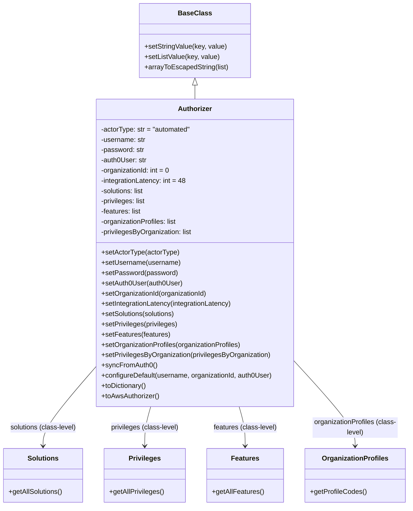
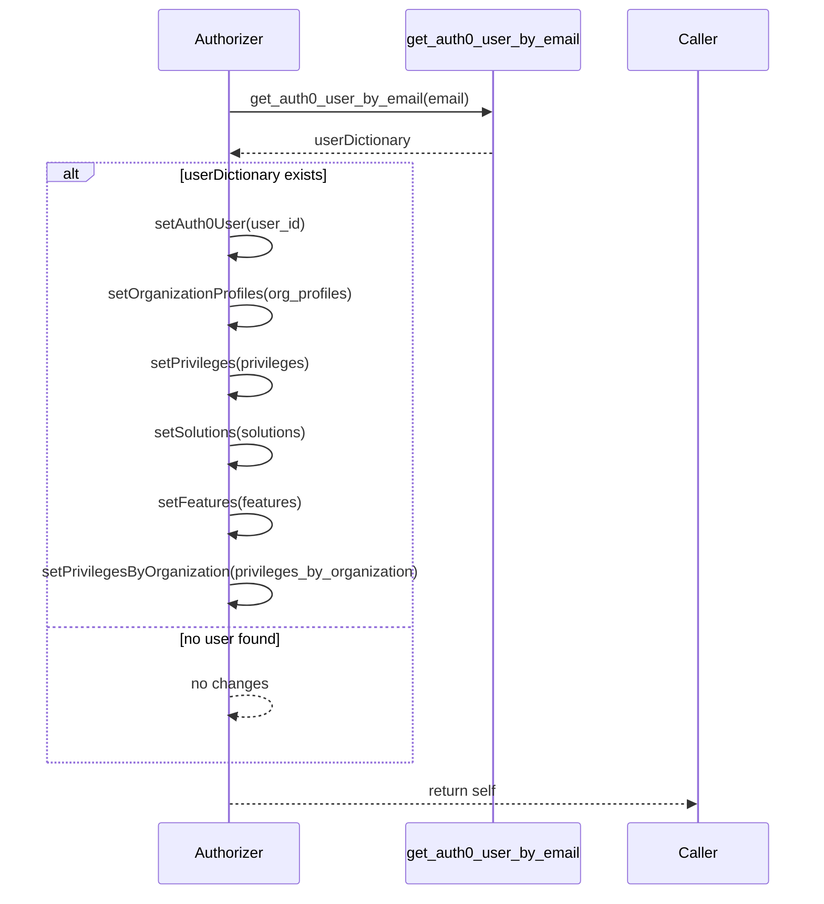

# Diagram: platform/tools/ide_local_testing/localTest/core/Authorizer.py


> Auto-generated by Obscura crawlers

## Diagram 1



### SVG

<svg id="container" width="947.3828125" xmlns="http://www.w3.org/2000/svg" class="classDiagram" height="1184" viewBox="0 0 947.3828125 1184" role="graphics-document document" aria-roledescription="class"><style>#container{font-family:"trebuchet ms",verdana,arial,sans-serif;font-size:16px;fill:#333;}@keyframes edge-animation-frame{from{stroke-dashoffset:0;}}@keyframes dash{to{stroke-dashoffset:0;}}#container .edge-animation-slow{stroke-dasharray:9,5!important;stroke-dashoffset:900;animation:dash 50s linear infinite;stroke-linecap:round;}#container .edge-animation-fast{stroke-dasharray:9,5!important;stroke-dashoffset:900;animation:dash 20s linear infinite;stroke-linecap:round;}#container .error-icon{fill:#552222;}#container .error-text{fill:#552222;stroke:#552222;}#container .edge-thickness-normal{stroke-width:1px;}#container .edge-thickness-thick{stroke-width:3.5px;}#container .edge-pattern-solid{stroke-dasharray:0;}#container .edge-thickness-invisible{stroke-width:0;fill:none;}#container .edge-pattern-dashed{stroke-dasharray:3;}#container .edge-pattern-dotted{stroke-dasharray:2;}#container .marker{fill:#333333;stroke:#333333;}#container .marker.cross{stroke:#333333;}#container svg{font-family:"trebuchet ms",verdana,arial,sans-serif;font-size:16px;}#container p{margin:0;}#container g.classGroup text{fill:#9370DB;stroke:none;font-family:"trebuchet ms",verdana,arial,sans-serif;font-size:10px;}#container g.classGroup text .title{font-weight:bolder;}#container .nodeLabel,#container .edgeLabel{color:#131300;}#container .edgeLabel .label rect{fill:#ECECFF;}#container .label text{fill:#131300;}#container .labelBkg{background:#ECECFF;}#container .edgeLabel .label span{background:#ECECFF;}#container .classTitle{font-weight:bolder;}#container .node rect,#container .node circle,#container .node ellipse,#container .node polygon,#container .node path{fill:#ECECFF;stroke:#9370DB;stroke-width:1px;}#container .divider{stroke:#9370DB;stroke-width:1;}#container g.clickable{cursor:pointer;}#container g.classGroup rect{fill:#ECECFF;stroke:#9370DB;}#container g.classGroup line{stroke:#9370DB;stroke-width:1;}#container .classLabel .box{stroke:none;stroke-width:0;fill:#ECECFF;opacity:0.5;}#container .classLabel .label{fill:#9370DB;font-size:10px;}#container .relation{stroke:#333333;stroke-width:1;fill:none;}#container .dashed-line{stroke-dasharray:3;}#container .dotted-line{stroke-dasharray:1 2;}#container #compositionStart,#container .composition{fill:#333333!important;stroke:#333333!important;stroke-width:1;}#container #compositionEnd,#container .composition{fill:#333333!important;stroke:#333333!important;stroke-width:1;}#container #dependencyStart,#container .dependency{fill:#333333!important;stroke:#333333!important;stroke-width:1;}#container #dependencyStart,#container .dependency{fill:#333333!important;stroke:#333333!important;stroke-width:1;}#container #extensionStart,#container .extension{fill:transparent!important;stroke:#333333!important;stroke-width:1;}#container #extensionEnd,#container .extension{fill:transparent!important;stroke:#333333!important;stroke-width:1;}#container #aggregationStart,#container .aggregation{fill:transparent!important;stroke:#333333!important;stroke-width:1;}#container #aggregationEnd,#container .aggregation{fill:transparent!important;stroke:#333333!important;stroke-width:1;}#container #lollipopStart,#container .lollipop{fill:#ECECFF!important;stroke:#333333!important;stroke-width:1;}#container #lollipopEnd,#container .lollipop{fill:#ECECFF!important;stroke:#333333!important;stroke-width:1;}#container .edgeTerminals{font-size:11px;line-height:initial;}#container .classTitleText{text-anchor:middle;font-size:18px;fill:#333;}#container .label-icon{display:inline-block;height:1em;overflow:visible;vertical-align:-0.125em;}#container .node .label-icon path{fill:currentColor;stroke:revert;stroke-width:revert;}#container :root{--mermaid-font-family:"trebuchet ms",verdana,arial,sans-serif;}</style><g><defs><marker id="container_class-aggregationStart" class="marker aggregation class" refX="18" refY="7" markerWidth="190" markerHeight="240" orient="auto"><path d="M 18,7 L9,13 L1,7 L9,1 Z"></path></marker></defs><defs><marker id="container_class-aggregationEnd" class="marker aggregation class" refX="1" refY="7" markerWidth="20" markerHeight="28" orient="auto"><path d="M 18,7 L9,13 L1,7 L9,1 Z"></path></marker></defs><defs><marker id="container_class-extensionStart" class="marker extension class" refX="18" refY="7" markerWidth="190" markerHeight="240" orient="auto"><path d="M 1,7 L18,13 V 1 Z"></path></marker></defs><defs><marker id="container_class-extensionEnd" class="marker extension class" refX="1" refY="7" markerWidth="20" markerHeight="28" orient="auto"><path d="M 1,1 V 13 L18,7 Z"></path></marker></defs><defs><marker id="container_class-compositionStart" class="marker composition class" refX="18" refY="7" markerWidth="190" markerHeight="240" orient="auto"><path d="M 18,7 L9,13 L1,7 L9,1 Z"></path></marker></defs><defs><marker id="container_class-compositionEnd" class="marker composition class" refX="1" refY="7" markerWidth="20" markerHeight="28" orient="auto"><path d="M 18,7 L9,13 L1,7 L9,1 Z"></path></marker></defs><defs><marker id="container_class-dependencyStart" class="marker dependency class" refX="6" refY="7" markerWidth="190" markerHeight="240" orient="auto"><path d="M 5,7 L9,13 L1,7 L9,1 Z"></path></marker></defs><defs><marker id="container_class-dependencyEnd" class="marker dependency class" refX="13" refY="7" markerWidth="20" markerHeight="28" orient="auto"><path d="M 18,7 L9,13 L14,7 L9,1 Z"></path></marker></defs><defs><marker id="container_class-lollipopStart" class="marker lollipop class" refX="13" refY="7" markerWidth="190" markerHeight="240" orient="auto"><circle stroke="black" fill="transparent" cx="7" cy="7" r="6"></circle></marker></defs><defs><marker id="container_class-lollipopEnd" class="marker lollipop class" refX="1" refY="7" markerWidth="190" markerHeight="240" orient="auto"><circle stroke="black" fill="transparent" cx="7" cy="7" r="6"></circle></marker></defs><g class="root"><g class="clusters"></g><g class="edgePaths"><path d="M455.402,199.25L455.402,200.542C455.402,201.833,455.402,204.417,455.402,209.875C455.402,215.333,455.402,223.667,455.402,227.833L455.402,232" id="id_BaseClass_Authorizer_1" class="edge-thickness-normal edge-pattern-solid relation" style=";;;" data-edge="true" data-et="edge" data-id="id_BaseClass_Authorizer_1" data-points="W3sieCI6NDU1LjQwMjM0Mzc1LCJ5IjoxODJ9LHsieCI6NDU1LjQwMjM0Mzc1LCJ5IjoyMDd9LHsieCI6NDU1LjQwMjM0Mzc1LCJ5IjoyMzJ9XQ==" marker-start="url(#container_class-extensionStart)"></path><path d="M221.313,862.427L201.32,885.522C181.328,908.618,141.344,954.809,121.352,985.071C101.359,1015.333,101.359,1029.667,101.359,1036.833L101.359,1044" id="id_Authorizer_Solutions_2" class="edge-thickness-normal edge-pattern-solid relation" style=";;;" data-edge="true" data-et="edge" data-id="id_Authorizer_Solutions_2" data-points="W3sieCI6MjIxLjMxMjUsInkiOjg2Mi40MjY5MTAxMzQwNTQyfSx7IngiOjEwMS4zNTkzNzUsInkiOjEwMDF9LHsieCI6MTAxLjM1OTM3NSwieSI6MTA1MH1d" marker-end="url(#container_class-dependencyEnd)"></path><path d="M353.062,952L350.741,960.167C348.419,968.333,343.776,984.667,341.454,1000C339.133,1015.333,339.133,1029.667,339.133,1036.833L339.133,1044" id="id_Authorizer_Privileges_3" class="edge-thickness-normal edge-pattern-solid relation" style=";;;" data-edge="true" data-et="edge" data-id="id_Authorizer_Privileges_3" data-points="W3sieCI6MzUzLjA2MjQxNDA0MzM5ODUsInkiOjk1Mn0seyJ4IjozMzkuMTMyODEyNSwieSI6MTAwMX0seyJ4IjozMzkuMTMyODEyNSwieSI6MTA1MH1d" marker-end="url(#container_class-dependencyEnd)"></path><path d="M557.742,952L560.064,960.167C562.385,968.333,567.029,984.667,569.35,1000C571.672,1015.333,571.672,1029.667,571.672,1036.833L571.672,1044" id="id_Authorizer_Features_4" class="edge-thickness-normal edge-pattern-solid relation" style=";;;" data-edge="true" data-et="edge" data-id="id_Authorizer_Features_4" data-points="W3sieCI6NTU3Ljc0MjI3MzQ1NjYwMTQsInkiOjk1Mn0seyJ4Ijo1NzEuNjcxODc1LCJ5IjoxMDAxfSx7IngiOjU3MS42NzE4NzUsInkiOjEwNTB9XQ==" marker-end="url(#container_class-dependencyEnd)"></path><path d="M689.492,851.334L712.008,876.278C734.525,901.222,779.557,951.111,802.074,983.222C824.59,1015.333,824.59,1029.667,824.59,1036.833L824.59,1044" id="id_Authorizer_OrganizationProfiles_5" class="edge-thickness-normal edge-pattern-solid relation" style=";;;" data-edge="true" data-et="edge" data-id="id_Authorizer_OrganizationProfiles_5" data-points="W3sieCI6Njg5LjQ5MjE4NzUsInkiOjg1MS4zMzM2NjEzMzQwMTA1fSx7IngiOjgyNC41ODk4NDM3NSwieSI6MTAwMX0seyJ4Ijo4MjQuNTg5ODQzNzUsInkiOjEwNTB9XQ==" marker-end="url(#container_class-dependencyEnd)"></path></g><g class="edgeLabels"><g class="edgeLabel"><g class="label" data-id="id_BaseClass_Authorizer_1" transform="translate(0, 0)"><foreignObject width="0" height="0"><div xmlns="http://www.w3.org/1999/xhtml" class="labelBkg" style="display: table-cell; white-space: nowrap; line-height: 1.5; max-width: 200px; text-align: center;"><span class="edgeLabel"></span></div></foreignObject></g></g><g class="edgeLabel" transform="translate(101.359375, 1001)"><g class="label" data-id="id_Authorizer_Solutions_2" transform="translate(-79.1328125, -12)"><foreignObject width="158.265625" height="24"><div xmlns="http://www.w3.org/1999/xhtml" class="labelBkg" style="display: table-cell; white-space: nowrap; line-height: 1.5; max-width: 200px; text-align: center;"><span class="edgeLabel"><p>solutions (class-level)</p></span></div></foreignObject></g></g><g class="edgeLabel" transform="translate(339.1328125, 1001)"><g class="label" data-id="id_Authorizer_Privileges_3" transform="translate(-80.5625, -12)"><foreignObject width="161.125" height="24"><div xmlns="http://www.w3.org/1999/xhtml" class="labelBkg" style="display: table-cell; white-space: nowrap; line-height: 1.5; max-width: 200px; text-align: center;"><span class="edgeLabel"><p>privileges (class-level)</p></span></div></foreignObject></g></g><g class="edgeLabel" transform="translate(571.671875, 1001)"><g class="label" data-id="id_Authorizer_Features_4" transform="translate(-75.203125, -12)"><foreignObject width="150.40625" height="24"><div xmlns="http://www.w3.org/1999/xhtml" class="labelBkg" style="display: table-cell; white-space: nowrap; line-height: 1.5; max-width: 200px; text-align: center;"><span class="edgeLabel"><p>features (class-level)</p></span></div></foreignObject></g></g><g class="edgeLabel" transform="translate(824.58984375, 1001)"><g class="label" data-id="id_Authorizer_OrganizationProfiles_5" transform="translate(-100, -24)"><foreignObject width="200" height="48"><div xmlns="http://www.w3.org/1999/xhtml" class="labelBkg" style="display: table; white-space: break-spaces; line-height: 1.5; max-width: 200px; text-align: center; width: 200px;"><span class="edgeLabel"><p>organizationProfiles (class-level)</p></span></div></foreignObject></g></g></g><g class="nodes"><g class="node default" id="classId-BaseClass-0" transform="translate(455.40234375, 95)"><g class="basic label-container"><path d="M-128.65625 -87 L128.65625 -87 L128.65625 87 L-128.65625 87" stroke="none" stroke-width="0" fill="#ECECFF" style=""></path><path d="M-128.65625 -87 C-26.24330623588726 -87, 76.16963752822548 -87, 128.65625 -87 M-128.65625 -87 C-42.32799259777808 -87, 44.000264804443844 -87, 128.65625 -87 M128.65625 -87 C128.65625 -26.681973539637816, 128.65625 33.63605292072437, 128.65625 87 M128.65625 -87 C128.65625 -44.64191781629966, 128.65625 -2.2838356325993203, 128.65625 87 M128.65625 87 C32.259636468448974 87, -64.13697706310205 87, -128.65625 87 M128.65625 87 C38.91945839870125 87, -50.817333202597496 87, -128.65625 87 M-128.65625 87 C-128.65625 19.726080589512947, -128.65625 -47.54783882097411, -128.65625 -87 M-128.65625 87 C-128.65625 42.19011890956766, -128.65625 -2.619762180864683, -128.65625 -87" stroke="#9370DB" stroke-width="1.3" fill="none" stroke-dasharray="0 0" style=""></path></g><g class="annotation-group text" transform="translate(0, -63)"></g><g class="label-group text" transform="translate(-36.359375, -63)"><g class="label" style="font-weight: bolder" transform="translate(0,-12)"><foreignObject width="72.71875" height="24"><div xmlns="http://www.w3.org/1999/xhtml" style="display: table-cell; white-space: nowrap; line-height: 1.5; max-width: 121px; text-align: center;"><span class="nodeLabel markdown-node-label" style=""><p>BaseClass</p></span></div></foreignObject></g></g><g class="members-group text" transform="translate(-116.65625, -15)"></g><g class="methods-group text" transform="translate(-116.65625, 15)"><g class="label" style="" transform="translate(0,-12)"><foreignObject width="193.625" height="24"><div xmlns="http://www.w3.org/1999/xhtml" style="display: table-cell; white-space: nowrap; line-height: 1.5; max-width: 251px; text-align: center;"><span class="nodeLabel markdown-node-label" style=""><p>+setStringValue(key, value)</p></span></div></foreignObject></g><g class="label" style="" transform="translate(0,12)"><foreignObject width="176.46875" height="24"><div xmlns="http://www.w3.org/1999/xhtml" style="display: table-cell; white-space: nowrap; line-height: 1.5; max-width: 234px; text-align: center;"><span class="nodeLabel markdown-node-label" style=""><p>+setListValue(key, value)</p></span></div></foreignObject></g><g class="label" style="" transform="translate(0,36)"><foreignObject width="196.953125" height="24"><div xmlns="http://www.w3.org/1999/xhtml" style="display: table-cell; white-space: nowrap; line-height: 1.5; max-width: 254px; text-align: center;"><span class="nodeLabel markdown-node-label" style=""><p>+arrayToEscapedString(list)</p></span></div></foreignObject></g></g><g class="divider" style=""><path d="M-128.65625 -39 C-53.03393085965351 -39, 22.588388280692982 -39, 128.65625 -39 M-128.65625 -39 C-48.118879706982725 -39, 32.41849058603455 -39, 128.65625 -39" stroke="#9370DB" stroke-width="1.3" fill="none" stroke-dasharray="0 0" style=""></path></g><g class="divider" style=""><path d="M-128.65625 -15 C-70.7091220863293 -15, -12.76199417265859 -15, 128.65625 -15 M-128.65625 -15 C-29.21496910116994 -15, 70.22631179766012 -15, 128.65625 -15" stroke="#9370DB" stroke-width="1.3" fill="none" stroke-dasharray="0 0" style=""></path></g></g><g class="node default" id="classId-Solutions-1" transform="translate(101.359375, 1113)"><g class="basic label-container"><path d="M-93.359375 -63 L93.359375 -63 L93.359375 63 L-93.359375 63" stroke="none" stroke-width="0" fill="#ECECFF" style=""></path><path d="M-93.359375 -63 C-42.77488175856176 -63, 7.809611482876477 -63, 93.359375 -63 M-93.359375 -63 C-49.49524950416205 -63, -5.631124008324093 -63, 93.359375 -63 M93.359375 -63 C93.359375 -26.905616337714143, 93.359375 9.188767324571714, 93.359375 63 M93.359375 -63 C93.359375 -30.842555201787285, 93.359375 1.3148895964254308, 93.359375 63 M93.359375 63 C30.744189465913408 63, -31.870996068173184 63, -93.359375 63 M93.359375 63 C20.28898300087593 63, -52.78140899824814 63, -93.359375 63 M-93.359375 63 C-93.359375 16.61797909020202, -93.359375 -29.76404181959596, -93.359375 -63 M-93.359375 63 C-93.359375 36.798627853895844, -93.359375 10.597255707791689, -93.359375 -63" stroke="#9370DB" stroke-width="1.3" fill="none" stroke-dasharray="0 0" style=""></path></g><g class="annotation-group text" transform="translate(0, -39)"></g><g class="label-group text" transform="translate(-34.703125, -39)"><g class="label" style="font-weight: bolder" transform="translate(0,-12)"><foreignObject width="69.40625" height="24"><div xmlns="http://www.w3.org/1999/xhtml" style="display: table-cell; white-space: nowrap; line-height: 1.5; max-width: 119px; text-align: center;"><span class="nodeLabel markdown-node-label" style=""><p>Solutions</p></span></div></foreignObject></g></g><g class="members-group text" transform="translate(-81.359375, 9)"></g><g class="methods-group text" transform="translate(-81.359375, 39)"><g class="label" style="" transform="translate(0,-12)"><foreignObject width="128.015625" height="24"><div xmlns="http://www.w3.org/1999/xhtml" style="display: table-cell; white-space: nowrap; line-height: 1.5; max-width: 185px; text-align: center;"><span class="nodeLabel markdown-node-label" style=""><p>+getAllSolutions()</p></span></div></foreignObject></g></g><g class="divider" style=""><path d="M-93.359375 -15 C-51.7004149012802 -15, -10.041454802560395 -15, 93.359375 -15 M-93.359375 -15 C-36.402100412771354 -15, 20.555174174457292 -15, 93.359375 -15" stroke="#9370DB" stroke-width="1.3" fill="none" stroke-dasharray="0 0" style=""></path></g><g class="divider" style=""><path d="M-93.359375 9 C-44.56094258788104 9, 4.237489824237926 9, 93.359375 9 M-93.359375 9 C-37.438954289726766 9, 18.481466420546468 9, 93.359375 9" stroke="#9370DB" stroke-width="1.3" fill="none" stroke-dasharray="0 0" style=""></path></g></g><g class="node default" id="classId-Privileges-2" transform="translate(339.1328125, 1113)"><g class="basic label-container"><path d="M-94.4140625 -63 L94.4140625 -63 L94.4140625 63 L-94.4140625 63" stroke="none" stroke-width="0" fill="#ECECFF" style=""></path><path d="M-94.4140625 -63 C-52.145165719318214 -63, -9.876268938636429 -63, 94.4140625 -63 M-94.4140625 -63 C-37.93492284440021 -63, 18.544216811199576 -63, 94.4140625 -63 M94.4140625 -63 C94.4140625 -19.008610036745814, 94.4140625 24.98277992650837, 94.4140625 63 M94.4140625 -63 C94.4140625 -13.566655184871799, 94.4140625 35.8666896302564, 94.4140625 63 M94.4140625 63 C46.266454908752344 63, -1.881152682495312 63, -94.4140625 63 M94.4140625 63 C38.69021232394826 63, -17.03363785210348 63, -94.4140625 63 M-94.4140625 63 C-94.4140625 17.397354946105906, -94.4140625 -28.205290107788187, -94.4140625 -63 M-94.4140625 63 C-94.4140625 18.898621988368987, -94.4140625 -25.202756023262026, -94.4140625 -63" stroke="#9370DB" stroke-width="1.3" fill="none" stroke-dasharray="0 0" style=""></path></g><g class="annotation-group text" transform="translate(0, -39)"></g><g class="label-group text" transform="translate(-35.734375, -39)"><g class="label" style="font-weight: bolder" transform="translate(0,-12)"><foreignObject width="71.46875" height="24"><div xmlns="http://www.w3.org/1999/xhtml" style="display: table-cell; white-space: nowrap; line-height: 1.5; max-width: 120px; text-align: center;"><span class="nodeLabel markdown-node-label" style=""><p>Privileges</p></span></div></foreignObject></g></g><g class="members-group text" transform="translate(-82.4140625, 9)"></g><g class="methods-group text" transform="translate(-82.4140625, 39)"><g class="label" style="" transform="translate(0,-12)"><foreignObject width="129.09375" height="24"><div xmlns="http://www.w3.org/1999/xhtml" style="display: table-cell; white-space: nowrap; line-height: 1.5; max-width: 186px; text-align: center;"><span class="nodeLabel markdown-node-label" style=""><p>+getAllPrivileges()</p></span></div></foreignObject></g></g><g class="divider" style=""><path d="M-94.4140625 -15 C-32.641411766433414 -15, 29.13123896713317 -15, 94.4140625 -15 M-94.4140625 -15 C-55.01560775485591 -15, -15.617153009711814 -15, 94.4140625 -15" stroke="#9370DB" stroke-width="1.3" fill="none" stroke-dasharray="0 0" style=""></path></g><g class="divider" style=""><path d="M-94.4140625 9 C-44.101347442550455 9, 6.211367614899089 9, 94.4140625 9 M-94.4140625 9 C-28.38359058331116 9, 37.64688133337768 9, 94.4140625 9" stroke="#9370DB" stroke-width="1.3" fill="none" stroke-dasharray="0 0" style=""></path></g></g><g class="node default" id="classId-Features-3" transform="translate(571.671875, 1113)"><g class="basic label-container"><path d="M-88.125 -63 L88.125 -63 L88.125 63 L-88.125 63" stroke="none" stroke-width="0" fill="#ECECFF" style=""></path><path d="M-88.125 -63 C-28.467242988234617 -63, 31.190514023530767 -63, 88.125 -63 M-88.125 -63 C-17.817757161823266 -63, 52.48948567635347 -63, 88.125 -63 M88.125 -63 C88.125 -30.993052084231522, 88.125 1.0138958315369564, 88.125 63 M88.125 -63 C88.125 -34.446090797955634, 88.125 -5.892181595911261, 88.125 63 M88.125 63 C50.30592376422739 63, 12.486847528454774 63, -88.125 63 M88.125 63 C23.111256618315096 63, -41.90248676336981 63, -88.125 63 M-88.125 63 C-88.125 21.969761677484122, -88.125 -19.060476645031756, -88.125 -63 M-88.125 63 C-88.125 17.882577993557902, -88.125 -27.234844012884196, -88.125 -63" stroke="#9370DB" stroke-width="1.3" fill="none" stroke-dasharray="0 0" style=""></path></g><g class="annotation-group text" transform="translate(0, -39)"></g><g class="label-group text" transform="translate(-31.25, -39)"><g class="label" style="font-weight: bolder" transform="translate(0,-12)"><foreignObject width="62.5" height="24"><div xmlns="http://www.w3.org/1999/xhtml" style="display: table-cell; white-space: nowrap; line-height: 1.5; max-width: 112px; text-align: center;"><span class="nodeLabel markdown-node-label" style=""><p>Features</p></span></div></foreignObject></g></g><g class="members-group text" transform="translate(-76.125, 9)"></g><g class="methods-group text" transform="translate(-76.125, 39)"><g class="label" style="" transform="translate(0,-12)"><foreignObject width="121" height="24"><div xmlns="http://www.w3.org/1999/xhtml" style="display: table-cell; white-space: nowrap; line-height: 1.5; max-width: 178px; text-align: center;"><span class="nodeLabel markdown-node-label" style=""><p>+getAllFeatures()</p></span></div></foreignObject></g></g><g class="divider" style=""><path d="M-88.125 -15 C-50.11031924476842 -15, -12.095638489536839 -15, 88.125 -15 M-88.125 -15 C-46.75213372635521 -15, -5.3792674527104225 -15, 88.125 -15" stroke="#9370DB" stroke-width="1.3" fill="none" stroke-dasharray="0 0" style=""></path></g><g class="divider" style=""><path d="M-88.125 9 C-47.13194233574525 9, -6.138884671490501 9, 88.125 9 M-88.125 9 C-45.35946038467405 9, -2.5939207693481023 9, 88.125 9" stroke="#9370DB" stroke-width="1.3" fill="none" stroke-dasharray="0 0" style=""></path></g></g><g class="node default" id="classId-OrganizationProfiles-4" transform="translate(824.58984375, 1113)"><g class="basic label-container"><path d="M-114.79296875 -63 L114.79296875 -63 L114.79296875 63 L-114.79296875 63" stroke="none" stroke-width="0" fill="#ECECFF" style=""></path><path d="M-114.79296875 -63 C-43.98332200804691 -63, 26.826324733906176 -63, 114.79296875 -63 M-114.79296875 -63 C-23.44375089617553 -63, 67.90546695764894 -63, 114.79296875 -63 M114.79296875 -63 C114.79296875 -24.9367592644941, 114.79296875 13.1264814710118, 114.79296875 63 M114.79296875 -63 C114.79296875 -27.33511470769585, 114.79296875 8.329770584608298, 114.79296875 63 M114.79296875 63 C52.99853227406914 63, -8.795904201861717 63, -114.79296875 63 M114.79296875 63 C35.70940972044909 63, -43.374149309101824 63, -114.79296875 63 M-114.79296875 63 C-114.79296875 22.1238173110926, -114.79296875 -18.752365377814797, -114.79296875 -63 M-114.79296875 63 C-114.79296875 22.751325115128793, -114.79296875 -17.497349769742414, -114.79296875 -63" stroke="#9370DB" stroke-width="1.3" fill="none" stroke-dasharray="0 0" style=""></path></g><g class="annotation-group text" transform="translate(0, -39)"></g><g class="label-group text" transform="translate(-74.3828125, -39)"><g class="label" style="font-weight: bolder" transform="translate(0,-12)"><foreignObject width="148.765625" height="24"><div xmlns="http://www.w3.org/1999/xhtml" style="display: table-cell; white-space: nowrap; line-height: 1.5; max-width: 196px; text-align: center;"><span class="nodeLabel markdown-node-label" style=""><p>OrganizationProfiles</p></span></div></foreignObject></g></g><g class="members-group text" transform="translate(-102.79296875, 9)"></g><g class="methods-group text" transform="translate(-102.79296875, 39)"><g class="label" style="" transform="translate(0,-12)"><foreignObject width="131.203125" height="24"><div xmlns="http://www.w3.org/1999/xhtml" style="display: table-cell; white-space: nowrap; line-height: 1.5; max-width: 189px; text-align: center;"><span class="nodeLabel markdown-node-label" style=""><p>+getProfileCodes()</p></span></div></foreignObject></g></g><g class="divider" style=""><path d="M-114.79296875 -15 C-57.48482755119022 -15, -0.17668635238044317 -15, 114.79296875 -15 M-114.79296875 -15 C-58.51053896035164 -15, -2.228109170703277 -15, 114.79296875 -15" stroke="#9370DB" stroke-width="1.3" fill="none" stroke-dasharray="0 0" style=""></path></g><g class="divider" style=""><path d="M-114.79296875 9 C-56.211183282464496 9, 2.3706021850710073 9, 114.79296875 9 M-114.79296875 9 C-52.0156244288505 9, 10.761719892298999 9, 114.79296875 9" stroke="#9370DB" stroke-width="1.3" fill="none" stroke-dasharray="0 0" style=""></path></g></g><g class="node default" id="classId-Authorizer-5" transform="translate(455.40234375, 592)"><g class="basic label-container"><path d="M-234.08984375 -360 L234.08984375 -360 L234.08984375 360 L-234.08984375 360" stroke="none" stroke-width="0" fill="#ECECFF" style=""></path><path d="M-234.08984375 -360 C-96.59036406728421 -360, 40.909115615431574 -360, 234.08984375 -360 M-234.08984375 -360 C-80.86357910870927 -360, 72.36268553258145 -360, 234.08984375 -360 M234.08984375 -360 C234.08984375 -199.62285423128063, 234.08984375 -39.245708462561254, 234.08984375 360 M234.08984375 -360 C234.08984375 -103.22454743976505, 234.08984375 153.5509051204699, 234.08984375 360 M234.08984375 360 C85.78026343208546 360, -62.529316885829076 360, -234.08984375 360 M234.08984375 360 C136.89822697264225 360, 39.7066101952845 360, -234.08984375 360 M-234.08984375 360 C-234.08984375 204.194829143581, -234.08984375 48.38965828716198, -234.08984375 -360 M-234.08984375 360 C-234.08984375 89.88613565291115, -234.08984375 -180.2277286941777, -234.08984375 -360" stroke="#9370DB" stroke-width="1.3" fill="none" stroke-dasharray="0 0" style=""></path></g><g class="annotation-group text" transform="translate(0, -336)"></g><g class="label-group text" transform="translate(-38.3671875, -336)"><g class="label" style="font-weight: bolder" transform="translate(0,-12)"><foreignObject width="76.734375" height="24"><div xmlns="http://www.w3.org/1999/xhtml" style="display: table-cell; white-space: nowrap; line-height: 1.5; max-width: 126px; text-align: center;"><span class="nodeLabel markdown-node-label" style=""><p>Authorizer</p></span></div></foreignObject></g></g><g class="members-group text" transform="translate(-222.08984375, -288)"><g class="label" style="" transform="translate(0,-12)"><foreignObject width="213" height="24"><div xmlns="http://www.w3.org/1999/xhtml" style="display: table-cell; white-space: nowrap; line-height: 1.5; max-width: 270px; text-align: center;"><span class="nodeLabel markdown-node-label" style=""><p>-actorType: str = "automated"</p></span></div></foreignObject></g><g class="label" style="" transform="translate(0,12)"><foreignObject width="106.15625" height="24"><div xmlns="http://www.w3.org/1999/xhtml" style="display: table-cell; white-space: nowrap; line-height: 1.5; max-width: 164px; text-align: center;"><span class="nodeLabel markdown-node-label" style=""><p>-username: str</p></span></div></foreignObject></g><g class="label" style="" transform="translate(0,36)"><foreignObject width="102.59375" height="24"><div xmlns="http://www.w3.org/1999/xhtml" style="display: table-cell; white-space: nowrap; line-height: 1.5; max-width: 161px; text-align: center;"><span class="nodeLabel markdown-node-label" style=""><p>-password: str</p></span></div></foreignObject></g><g class="label" style="" transform="translate(0,60)"><foreignObject width="108.859375" height="24"><div xmlns="http://www.w3.org/1999/xhtml" style="display: table-cell; white-space: nowrap; line-height: 1.5; max-width: 167px; text-align: center;"><span class="nodeLabel markdown-node-label" style=""><p>-auth0User: str</p></span></div></foreignObject></g><g class="label" style="" transform="translate(0,84)"><foreignObject width="164.25" height="24"><div xmlns="http://www.w3.org/1999/xhtml" style="display: table-cell; white-space: nowrap; line-height: 1.5; max-width: 222px; text-align: center;"><span class="nodeLabel markdown-node-label" style=""><p>-organizationId: int = 0</p></span></div></foreignObject></g><g class="label" style="" transform="translate(0,108)"><foreignObject width="203.53125" height="24"><div xmlns="http://www.w3.org/1999/xhtml" style="display: table-cell; white-space: nowrap; line-height: 1.5; max-width: 261px; text-align: center;"><span class="nodeLabel markdown-node-label" style=""><p>-integrationLatency: int = 48</p></span></div></foreignObject></g><g class="label" style="" transform="translate(0,132)"><foreignObject width="104.28125" height="24"><div xmlns="http://www.w3.org/1999/xhtml" style="display: table-cell; white-space: nowrap; line-height: 1.5; max-width: 162px; text-align: center;"><span class="nodeLabel markdown-node-label" style=""><p>-solutions: list</p></span></div></foreignObject></g><g class="label" style="" transform="translate(0,156)"><foreignObject width="107.140625" height="24"><div xmlns="http://www.w3.org/1999/xhtml" style="display: table-cell; white-space: nowrap; line-height: 1.5; max-width: 165px; text-align: center;"><span class="nodeLabel markdown-node-label" style=""><p>-privileges: list</p></span></div></foreignObject></g><g class="label" style="" transform="translate(0,180)"><foreignObject width="96.1875" height="24"><div xmlns="http://www.w3.org/1999/xhtml" style="display: table-cell; white-space: nowrap; line-height: 1.5; max-width: 154px; text-align: center;"><span class="nodeLabel markdown-node-label" style=""><p>-features: list</p></span></div></foreignObject></g><g class="label" style="" transform="translate(0,204)"><foreignObject width="181.359375" height="24"><div xmlns="http://www.w3.org/1999/xhtml" style="display: table-cell; white-space: nowrap; line-height: 1.5; max-width: 239px; text-align: center;"><span class="nodeLabel markdown-node-label" style=""><p>-organizationProfiles: list</p></span></div></foreignObject></g><g class="label" style="" transform="translate(0,228)"><foreignObject width="216.828125" height="24"><div xmlns="http://www.w3.org/1999/xhtml" style="display: table-cell; white-space: nowrap; line-height: 1.5; max-width: 274px; text-align: center;"><span class="nodeLabel markdown-node-label" style=""><p>-privilegesByOrganization: list</p></span></div></foreignObject></g></g><g class="methods-group text" transform="translate(-222.08984375, 0)"><g class="label" style="" transform="translate(0,-12)"><foreignObject width="183.0625" height="24"><div xmlns="http://www.w3.org/1999/xhtml" style="display: table-cell; white-space: nowrap; line-height: 1.5; max-width: 240px; text-align: center;"><span class="nodeLabel markdown-node-label" style=""><p>+setActorType(actorType)</p></span></div></foreignObject></g><g class="label" style="" transform="translate(0,12)"><foreignObject width="185.90625" height="24"><div xmlns="http://www.w3.org/1999/xhtml" style="display: table-cell; white-space: nowrap; line-height: 1.5; max-width: 243px; text-align: center;"><span class="nodeLabel markdown-node-label" style=""><p>+setUsername(username)</p></span></div></foreignObject></g><g class="label" style="" transform="translate(0,36)"><foreignObject width="176.6875" height="24"><div xmlns="http://www.w3.org/1999/xhtml" style="display: table-cell; white-space: nowrap; line-height: 1.5; max-width: 234px; text-align: center;"><span class="nodeLabel markdown-node-label" style=""><p>+setPassword(password)</p></span></div></foreignObject></g><g class="label" style="" transform="translate(0,60)"><foreignObject width="190.75" height="24"><div xmlns="http://www.w3.org/1999/xhtml" style="display: table-cell; white-space: nowrap; line-height: 1.5; max-width: 248px; text-align: center;"><span class="nodeLabel markdown-node-label" style=""><p>+setAuth0User(auth0User)</p></span></div></foreignObject></g><g class="label" style="" transform="translate(0,84)"><foreignObject width="251.34375" height="24"><div xmlns="http://www.w3.org/1999/xhtml" style="display: table-cell; white-space: nowrap; line-height: 1.5; max-width: 309px; text-align: center;"><span class="nodeLabel markdown-node-label" style=""><p>+setOrganizationId(organizationId)</p></span></div></foreignObject></g><g class="label" style="" transform="translate(0,108)"><foreignObject width="311.453125" height="24"><div xmlns="http://www.w3.org/1999/xhtml" style="display: table-cell; white-space: nowrap; line-height: 1.5; max-width: 369px; text-align: center;"><span class="nodeLabel markdown-node-label" style=""><p>+setIntegrationLatency(integrationLatency)</p></span></div></foreignObject></g><g class="label" style="" transform="translate(0,132)"><foreignObject width="176.171875" height="24"><div xmlns="http://www.w3.org/1999/xhtml" style="display: table-cell; white-space: nowrap; line-height: 1.5; max-width: 234px; text-align: center;"><span class="nodeLabel markdown-node-label" style=""><p>+setSolutions(solutions)</p></span></div></foreignObject></g><g class="label" style="" transform="translate(0,156)"><foreignObject width="180.125" height="24"><div xmlns="http://www.w3.org/1999/xhtml" style="display: table-cell; white-space: nowrap; line-height: 1.5; max-width: 237px; text-align: center;"><span class="nodeLabel markdown-node-label" style=""><p>+setPrivileges(privileges)</p></span></div></foreignObject></g><g class="label" style="" transform="translate(0,180)"><foreignObject width="161.296875" height="24"><div xmlns="http://www.w3.org/1999/xhtml" style="display: table-cell; white-space: nowrap; line-height: 1.5; max-width: 219px; text-align: center;"><span class="nodeLabel markdown-node-label" style=""><p>+setFeatures(features)</p></span></div></foreignObject></g><g class="label" style="" transform="translate(0,204)"><foreignObject width="330.796875" height="24"><div xmlns="http://www.w3.org/1999/xhtml" style="display: table-cell; white-space: nowrap; line-height: 1.5; max-width: 388px; text-align: center;"><span class="nodeLabel markdown-node-label" style=""><p>+setOrganizationProfiles(organizationProfiles)</p></span></div></foreignObject></g><g class="label" style="" transform="translate(0,228)"><foreignObject width="399.484375" height="24"><div xmlns="http://www.w3.org/1999/xhtml" style="display: table-cell; white-space: nowrap; line-height: 1.5; max-width: 457px; text-align: center;"><span class="nodeLabel markdown-node-label" style=""><p>+setPrivilegesByOrganization(privilegesByOrganization)</p></span></div></foreignObject></g><g class="label" style="" transform="translate(0,252)"><foreignObject width="129.0625" height="24"><div xmlns="http://www.w3.org/1999/xhtml" style="display: table-cell; white-space: nowrap; line-height: 1.5; max-width: 186px; text-align: center;"><span class="nodeLabel markdown-node-label" style=""><p>+syncFromAuth0()</p></span></div></foreignObject></g><g class="label" style="" transform="translate(0,276)"><foreignObject width="405.8125" height="24"><div xmlns="http://www.w3.org/1999/xhtml" style="display: table-cell; white-space: nowrap; line-height: 1.5; max-width: 463px; text-align: center;"><span class="nodeLabel markdown-node-label" style=""><p>+configureDefault(username, organizationId, auth0User)</p></span></div></foreignObject></g><g class="label" style="" transform="translate(0,300)"><foreignObject width="107.390625" height="24"><div xmlns="http://www.w3.org/1999/xhtml" style="display: table-cell; white-space: nowrap; line-height: 1.5; max-width: 165px; text-align: center;"><span class="nodeLabel markdown-node-label" style=""><p>+toDictionary()</p></span></div></foreignObject></g><g class="label" style="" transform="translate(0,324)"><foreignObject width="136.71875" height="24"><div xmlns="http://www.w3.org/1999/xhtml" style="display: table-cell; white-space: nowrap; line-height: 1.5; max-width: 194px; text-align: center;"><span class="nodeLabel markdown-node-label" style=""><p>+toAwsAuthorizer()</p></span></div></foreignObject></g></g><g class="divider" style=""><path d="M-234.08984375 -312 C-120.11511545653879 -312, -6.140387163077577 -312, 234.08984375 -312 M-234.08984375 -312 C-85.2491645199249 -312, 63.59151471015019 -312, 234.08984375 -312" stroke="#9370DB" stroke-width="1.3" fill="none" stroke-dasharray="0 0" style=""></path></g><g class="divider" style=""><path d="M-234.08984375 -24 C-60.96126231188444 -24, 112.16731912623112 -24, 234.08984375 -24 M-234.08984375 -24 C-64.25134809396238 -24, 105.58714756207524 -24, 234.08984375 -24" stroke="#9370DB" stroke-width="1.3" fill="none" stroke-dasharray="0 0" style=""></path></g></g></g></g></g></svg>

## Diagram 2



### SVG

<svg id="container" width="918.5" xmlns="http://www.w3.org/2000/svg" height="991" viewBox="-186.5 -10 918.5 991" role="graphics-document document" aria-roledescription="sequence"><g><rect x="532" y="905" fill="#eaeaea" stroke="#666" width="150" height="65" name="Caller" rx="3" ry="3" class="actor actor-bottom"></rect><text x="607" y="937.5" dominant-baseline="central" alignment-baseline="central" class="actor actor-box" style="text-anchor: middle; font-size: 16px; font-weight: 400;"><tspan x="607" dy="0">Caller</tspan></text></g><g><rect x="278" y="905" fill="#eaeaea" stroke="#666" width="204" height="65" name="Auth0Lambda" rx="3" ry="3" class="actor actor-bottom"></rect><text x="380" y="937.5" dominant-baseline="central" alignment-baseline="central" class="actor actor-box" style="text-anchor: middle; font-size: 16px; font-weight: 400;"><tspan x="380" dy="0">get_auth0_user_by_email</tspan></text></g><g><rect x="0" y="905" fill="#eaeaea" stroke="#666" width="150" height="65" name="Authorizer" rx="3" ry="3" class="actor actor-bottom"></rect><text x="75" y="937.5" dominant-baseline="central" alignment-baseline="central" class="actor actor-box" style="text-anchor: middle; font-size: 16px; font-weight: 400;"><tspan x="75" dy="0">Authorizer</tspan></text></g><g><line id="actor2" x1="607" y1="65" x2="607" y2="905" class="actor-line 200" stroke-width="0.5px" stroke="#999" name="Caller"></line><g id="root-2"><rect x="532" y="0" fill="#eaeaea" stroke="#666" width="150" height="65" name="Caller" rx="3" ry="3" class="actor actor-top"></rect><text x="607" y="32.5" dominant-baseline="central" alignment-baseline="central" class="actor actor-box" style="text-anchor: middle; font-size: 16px; font-weight: 400;"><tspan x="607" dy="0">Caller</tspan></text></g></g><g><line id="actor1" x1="380" y1="65" x2="380" y2="905" class="actor-line 200" stroke-width="0.5px" stroke="#999" name="Auth0Lambda"></line><g id="root-1"><rect x="278" y="0" fill="#eaeaea" stroke="#666" width="204" height="65" name="Auth0Lambda" rx="3" ry="3" class="actor actor-top"></rect><text x="380" y="32.5" dominant-baseline="central" alignment-baseline="central" class="actor actor-box" style="text-anchor: middle; font-size: 16px; font-weight: 400;"><tspan x="380" dy="0">get_auth0_user_by_email</tspan></text></g></g><g><line id="actor0" x1="75" y1="65" x2="75" y2="905" class="actor-line 200" stroke-width="0.5px" stroke="#999" name="Authorizer"></line><g id="root-0"><rect x="0" y="0" fill="#eaeaea" stroke="#666" width="150" height="65" name="Authorizer" rx="3" ry="3" class="actor actor-top"></rect><text x="75" y="32.5" dominant-baseline="central" alignment-baseline="central" class="actor actor-box" style="text-anchor: middle; font-size: 16px; font-weight: 400;"><tspan x="75" dy="0">Authorizer</tspan></text></g></g><style>#container{font-family:"trebuchet ms",verdana,arial,sans-serif;font-size:16px;fill:#333;}@keyframes edge-animation-frame{from{stroke-dashoffset:0;}}@keyframes dash{to{stroke-dashoffset:0;}}#container .edge-animation-slow{stroke-dasharray:9,5!important;stroke-dashoffset:900;animation:dash 50s linear infinite;stroke-linecap:round;}#container .edge-animation-fast{stroke-dasharray:9,5!important;stroke-dashoffset:900;animation:dash 20s linear infinite;stroke-linecap:round;}#container .error-icon{fill:#552222;}#container .error-text{fill:#552222;stroke:#552222;}#container .edge-thickness-normal{stroke-width:1px;}#container .edge-thickness-thick{stroke-width:3.5px;}#container .edge-pattern-solid{stroke-dasharray:0;}#container .edge-thickness-invisible{stroke-width:0;fill:none;}#container .edge-pattern-dashed{stroke-dasharray:3;}#container .edge-pattern-dotted{stroke-dasharray:2;}#container .marker{fill:#333333;stroke:#333333;}#container .marker.cross{stroke:#333333;}#container svg{font-family:"trebuchet ms",verdana,arial,sans-serif;font-size:16px;}#container p{margin:0;}#container .actor{stroke:hsl(259.6261682243, 59.7765363128%, 87.9019607843%);fill:#ECECFF;}#container text.actor&gt;tspan{fill:black;stroke:none;}#container .actor-line{stroke:hsl(259.6261682243, 59.7765363128%, 87.9019607843%);}#container .innerArc{stroke-width:1.5;stroke-dasharray:none;}#container .messageLine0{stroke-width:1.5;stroke-dasharray:none;stroke:#333;}#container .messageLine1{stroke-width:1.5;stroke-dasharray:2,2;stroke:#333;}#container #arrowhead path{fill:#333;stroke:#333;}#container .sequenceNumber{fill:white;}#container #sequencenumber{fill:#333;}#container #crosshead path{fill:#333;stroke:#333;}#container .messageText{fill:#333;stroke:none;}#container .labelBox{stroke:hsl(259.6261682243, 59.7765363128%, 87.9019607843%);fill:#ECECFF;}#container .labelText,#container .labelText&gt;tspan{fill:black;stroke:none;}#container .loopText,#container .loopText&gt;tspan{fill:black;stroke:none;}#container .loopLine{stroke-width:2px;stroke-dasharray:2,2;stroke:hsl(259.6261682243, 59.7765363128%, 87.9019607843%);fill:hsl(259.6261682243, 59.7765363128%, 87.9019607843%);}#container .note{stroke:#aaaa33;fill:#fff5ad;}#container .noteText,#container .noteText&gt;tspan{fill:black;stroke:none;}#container .activation0{fill:#f4f4f4;stroke:#666;}#container .activation1{fill:#f4f4f4;stroke:#666;}#container .activation2{fill:#f4f4f4;stroke:#666;}#container .actorPopupMenu{position:absolute;}#container .actorPopupMenuPanel{position:absolute;fill:#ECECFF;box-shadow:0px 8px 16px 0px rgba(0,0,0,0.2);filter:drop-shadow(3px 5px 2px rgb(0 0 0 / 0.4));}#container .actor-man line{stroke:hsl(259.6261682243, 59.7765363128%, 87.9019607843%);fill:#ECECFF;}#container .actor-man circle,#container line{stroke:hsl(259.6261682243, 59.7765363128%, 87.9019607843%);fill:#ECECFF;stroke-width:2px;}#container :root{--mermaid-font-family:"trebuchet ms",verdana,arial,sans-serif;}</style><g></g><defs><symbol id="computer" width="24" height="24"><path transform="scale(.5)" d="M2 2v13h20v-13h-20zm18 11h-16v-9h16v9zm-10.228 6l.466-1h3.524l.467 1h-4.457zm14.228 3h-24l2-6h2.104l-1.33 4h18.45l-1.297-4h2.073l2 6zm-5-10h-14v-7h14v7z"></path></symbol></defs><defs><symbol id="database" fill-rule="evenodd" clip-rule="evenodd"><path transform="scale(.5)" d="M12.258.001l.256.004.255.005.253.008.251.01.249.012.247.015.246.016.242.019.241.02.239.023.236.024.233.027.231.028.229.031.225.032.223.034.22.036.217.038.214.04.211.041.208.043.205.045.201.046.198.048.194.05.191.051.187.053.183.054.18.056.175.057.172.059.168.06.163.061.16.063.155.064.15.066.074.033.073.033.071.034.07.034.069.035.068.035.067.035.066.035.064.036.064.036.062.036.06.036.06.037.058.037.058.037.055.038.055.038.053.038.052.038.051.039.05.039.048.039.047.039.045.04.044.04.043.04.041.04.04.041.039.041.037.041.036.041.034.041.033.042.032.042.03.042.029.042.027.042.026.043.024.043.023.043.021.043.02.043.018.044.017.043.015.044.013.044.012.044.011.045.009.044.007.045.006.045.004.045.002.045.001.045v17l-.001.045-.002.045-.004.045-.006.045-.007.045-.009.044-.011.045-.012.044-.013.044-.015.044-.017.043-.018.044-.02.043-.021.043-.023.043-.024.043-.026.043-.027.042-.029.042-.03.042-.032.042-.033.042-.034.041-.036.041-.037.041-.039.041-.04.041-.041.04-.043.04-.044.04-.045.04-.047.039-.048.039-.05.039-.051.039-.052.038-.053.038-.055.038-.055.038-.058.037-.058.037-.06.037-.06.036-.062.036-.064.036-.064.036-.066.035-.067.035-.068.035-.069.035-.07.034-.071.034-.073.033-.074.033-.15.066-.155.064-.16.063-.163.061-.168.06-.172.059-.175.057-.18.056-.183.054-.187.053-.191.051-.194.05-.198.048-.201.046-.205.045-.208.043-.211.041-.214.04-.217.038-.22.036-.223.034-.225.032-.229.031-.231.028-.233.027-.236.024-.239.023-.241.02-.242.019-.246.016-.247.015-.249.012-.251.01-.253.008-.255.005-.256.004-.258.001-.258-.001-.256-.004-.255-.005-.253-.008-.251-.01-.249-.012-.247-.015-.245-.016-.243-.019-.241-.02-.238-.023-.236-.024-.234-.027-.231-.028-.228-.031-.226-.032-.223-.034-.22-.036-.217-.038-.214-.04-.211-.041-.208-.043-.204-.045-.201-.046-.198-.048-.195-.05-.19-.051-.187-.053-.184-.054-.179-.056-.176-.057-.172-.059-.167-.06-.164-.061-.159-.063-.155-.064-.151-.066-.074-.033-.072-.033-.072-.034-.07-.034-.069-.035-.068-.035-.067-.035-.066-.035-.064-.036-.063-.036-.062-.036-.061-.036-.06-.037-.058-.037-.057-.037-.056-.038-.055-.038-.053-.038-.052-.038-.051-.039-.049-.039-.049-.039-.046-.039-.046-.04-.044-.04-.043-.04-.041-.04-.04-.041-.039-.041-.037-.041-.036-.041-.034-.041-.033-.042-.032-.042-.03-.042-.029-.042-.027-.042-.026-.043-.024-.043-.023-.043-.021-.043-.02-.043-.018-.044-.017-.043-.015-.044-.013-.044-.012-.044-.011-.045-.009-.044-.007-.045-.006-.045-.004-.045-.002-.045-.001-.045v-17l.001-.045.002-.045.004-.045.006-.045.007-.045.009-.044.011-.045.012-.044.013-.044.015-.044.017-.043.018-.044.02-.043.021-.043.023-.043.024-.043.026-.043.027-.042.029-.042.03-.042.032-.042.033-.042.034-.041.036-.041.037-.041.039-.041.04-.041.041-.04.043-.04.044-.04.046-.04.046-.039.049-.039.049-.039.051-.039.052-.038.053-.038.055-.038.056-.038.057-.037.058-.037.06-.037.061-.036.062-.036.063-.036.064-.036.066-.035.067-.035.068-.035.069-.035.07-.034.072-.034.072-.033.074-.033.151-.066.155-.064.159-.063.164-.061.167-.06.172-.059.176-.057.179-.056.184-.054.187-.053.19-.051.195-.05.198-.048.201-.046.204-.045.208-.043.211-.041.214-.04.217-.038.22-.036.223-.034.226-.032.228-.031.231-.028.234-.027.236-.024.238-.023.241-.02.243-.019.245-.016.247-.015.249-.012.251-.01.253-.008.255-.005.256-.004.258-.001.258.001zm-9.258 20.499v.01l.001.021.003.021.004.022.005.021.006.022.007.022.009.023.01.022.011.023.012.023.013.023.015.023.016.024.017.023.018.024.019.024.021.024.022.025.023.024.024.025.052.049.056.05.061.051.066.051.07.051.075.051.079.052.084.052.088.052.092.052.097.052.102.051.105.052.11.052.114.051.119.051.123.051.127.05.131.05.135.05.139.048.144.049.147.047.152.047.155.047.16.045.163.045.167.043.171.043.176.041.178.041.183.039.187.039.19.037.194.035.197.035.202.033.204.031.209.03.212.029.216.027.219.025.222.024.226.021.23.02.233.018.236.016.24.015.243.012.246.01.249.008.253.005.256.004.259.001.26-.001.257-.004.254-.005.25-.008.247-.011.244-.012.241-.014.237-.016.233-.018.231-.021.226-.021.224-.024.22-.026.216-.027.212-.028.21-.031.205-.031.202-.034.198-.034.194-.036.191-.037.187-.039.183-.04.179-.04.175-.042.172-.043.168-.044.163-.045.16-.046.155-.046.152-.047.148-.048.143-.049.139-.049.136-.05.131-.05.126-.05.123-.051.118-.052.114-.051.11-.052.106-.052.101-.052.096-.052.092-.052.088-.053.083-.051.079-.052.074-.052.07-.051.065-.051.06-.051.056-.05.051-.05.023-.024.023-.025.021-.024.02-.024.019-.024.018-.024.017-.024.015-.023.014-.024.013-.023.012-.023.01-.023.01-.022.008-.022.006-.022.006-.022.004-.022.004-.021.001-.021.001-.021v-4.127l-.077.055-.08.053-.083.054-.085.053-.087.052-.09.052-.093.051-.095.05-.097.05-.1.049-.102.049-.105.048-.106.047-.109.047-.111.046-.114.045-.115.045-.118.044-.12.043-.122.042-.124.042-.126.041-.128.04-.13.04-.132.038-.134.038-.135.037-.138.037-.139.035-.142.035-.143.034-.144.033-.147.032-.148.031-.15.03-.151.03-.153.029-.154.027-.156.027-.158.026-.159.025-.161.024-.162.023-.163.022-.165.021-.166.02-.167.019-.169.018-.169.017-.171.016-.173.015-.173.014-.175.013-.175.012-.177.011-.178.01-.179.008-.179.008-.181.006-.182.005-.182.004-.184.003-.184.002h-.37l-.184-.002-.184-.003-.182-.004-.182-.005-.181-.006-.179-.008-.179-.008-.178-.01-.176-.011-.176-.012-.175-.013-.173-.014-.172-.015-.171-.016-.17-.017-.169-.018-.167-.019-.166-.02-.165-.021-.163-.022-.162-.023-.161-.024-.159-.025-.157-.026-.156-.027-.155-.027-.153-.029-.151-.03-.15-.03-.148-.031-.146-.032-.145-.033-.143-.034-.141-.035-.14-.035-.137-.037-.136-.037-.134-.038-.132-.038-.13-.04-.128-.04-.126-.041-.124-.042-.122-.042-.12-.044-.117-.043-.116-.045-.113-.045-.112-.046-.109-.047-.106-.047-.105-.048-.102-.049-.1-.049-.097-.05-.095-.05-.093-.052-.09-.051-.087-.052-.085-.053-.083-.054-.08-.054-.077-.054v4.127zm0-5.654v.011l.001.021.003.021.004.021.005.022.006.022.007.022.009.022.01.022.011.023.012.023.013.023.015.024.016.023.017.024.018.024.019.024.021.024.022.024.023.025.024.024.052.05.056.05.061.05.066.051.07.051.075.052.079.051.084.052.088.052.092.052.097.052.102.052.105.052.11.051.114.051.119.052.123.05.127.051.131.05.135.049.139.049.144.048.147.048.152.047.155.046.16.045.163.045.167.044.171.042.176.042.178.04.183.04.187.038.19.037.194.036.197.034.202.033.204.032.209.03.212.028.216.027.219.025.222.024.226.022.23.02.233.018.236.016.24.014.243.012.246.01.249.008.253.006.256.003.259.001.26-.001.257-.003.254-.006.25-.008.247-.01.244-.012.241-.015.237-.016.233-.018.231-.02.226-.022.224-.024.22-.025.216-.027.212-.029.21-.03.205-.032.202-.033.198-.035.194-.036.191-.037.187-.039.183-.039.179-.041.175-.042.172-.043.168-.044.163-.045.16-.045.155-.047.152-.047.148-.048.143-.048.139-.05.136-.049.131-.05.126-.051.123-.051.118-.051.114-.052.11-.052.106-.052.101-.052.096-.052.092-.052.088-.052.083-.052.079-.052.074-.051.07-.052.065-.051.06-.05.056-.051.051-.049.023-.025.023-.024.021-.025.02-.024.019-.024.018-.024.017-.024.015-.023.014-.023.013-.024.012-.022.01-.023.01-.023.008-.022.006-.022.006-.022.004-.021.004-.022.001-.021.001-.021v-4.139l-.077.054-.08.054-.083.054-.085.052-.087.053-.09.051-.093.051-.095.051-.097.05-.1.049-.102.049-.105.048-.106.047-.109.047-.111.046-.114.045-.115.044-.118.044-.12.044-.122.042-.124.042-.126.041-.128.04-.13.039-.132.039-.134.038-.135.037-.138.036-.139.036-.142.035-.143.033-.144.033-.147.033-.148.031-.15.03-.151.03-.153.028-.154.028-.156.027-.158.026-.159.025-.161.024-.162.023-.163.022-.165.021-.166.02-.167.019-.169.018-.169.017-.171.016-.173.015-.173.014-.175.013-.175.012-.177.011-.178.009-.179.009-.179.007-.181.007-.182.005-.182.004-.184.003-.184.002h-.37l-.184-.002-.184-.003-.182-.004-.182-.005-.181-.007-.179-.007-.179-.009-.178-.009-.176-.011-.176-.012-.175-.013-.173-.014-.172-.015-.171-.016-.17-.017-.169-.018-.167-.019-.166-.02-.165-.021-.163-.022-.162-.023-.161-.024-.159-.025-.157-.026-.156-.027-.155-.028-.153-.028-.151-.03-.15-.03-.148-.031-.146-.033-.145-.033-.143-.033-.141-.035-.14-.036-.137-.036-.136-.037-.134-.038-.132-.039-.13-.039-.128-.04-.126-.041-.124-.042-.122-.043-.12-.043-.117-.044-.116-.044-.113-.046-.112-.046-.109-.046-.106-.047-.105-.048-.102-.049-.1-.049-.097-.05-.095-.051-.093-.051-.09-.051-.087-.053-.085-.052-.083-.054-.08-.054-.077-.054v4.139zm0-5.666v.011l.001.02.003.022.004.021.005.022.006.021.007.022.009.023.01.022.011.023.012.023.013.023.015.023.016.024.017.024.018.023.019.024.021.025.022.024.023.024.024.025.052.05.056.05.061.05.066.051.07.051.075.052.079.051.084.052.088.052.092.052.097.052.102.052.105.051.11.052.114.051.119.051.123.051.127.05.131.05.135.05.139.049.144.048.147.048.152.047.155.046.16.045.163.045.167.043.171.043.176.042.178.04.183.04.187.038.19.037.194.036.197.034.202.033.204.032.209.03.212.028.216.027.219.025.222.024.226.021.23.02.233.018.236.017.24.014.243.012.246.01.249.008.253.006.256.003.259.001.26-.001.257-.003.254-.006.25-.008.247-.01.244-.013.241-.014.237-.016.233-.018.231-.02.226-.022.224-.024.22-.025.216-.027.212-.029.21-.03.205-.032.202-.033.198-.035.194-.036.191-.037.187-.039.183-.039.179-.041.175-.042.172-.043.168-.044.163-.045.16-.045.155-.047.152-.047.148-.048.143-.049.139-.049.136-.049.131-.051.126-.05.123-.051.118-.052.114-.051.11-.052.106-.052.101-.052.096-.052.092-.052.088-.052.083-.052.079-.052.074-.052.07-.051.065-.051.06-.051.056-.05.051-.049.023-.025.023-.025.021-.024.02-.024.019-.024.018-.024.017-.024.015-.023.014-.024.013-.023.012-.023.01-.022.01-.023.008-.022.006-.022.006-.022.004-.022.004-.021.001-.021.001-.021v-4.153l-.077.054-.08.054-.083.053-.085.053-.087.053-.09.051-.093.051-.095.051-.097.05-.1.049-.102.048-.105.048-.106.048-.109.046-.111.046-.114.046-.115.044-.118.044-.12.043-.122.043-.124.042-.126.041-.128.04-.13.039-.132.039-.134.038-.135.037-.138.036-.139.036-.142.034-.143.034-.144.033-.147.032-.148.032-.15.03-.151.03-.153.028-.154.028-.156.027-.158.026-.159.024-.161.024-.162.023-.163.023-.165.021-.166.02-.167.019-.169.018-.169.017-.171.016-.173.015-.173.014-.175.013-.175.012-.177.01-.178.01-.179.009-.179.007-.181.006-.182.006-.182.004-.184.003-.184.001-.185.001-.185-.001-.184-.001-.184-.003-.182-.004-.182-.006-.181-.006-.179-.007-.179-.009-.178-.01-.176-.01-.176-.012-.175-.013-.173-.014-.172-.015-.171-.016-.17-.017-.169-.018-.167-.019-.166-.02-.165-.021-.163-.023-.162-.023-.161-.024-.159-.024-.157-.026-.156-.027-.155-.028-.153-.028-.151-.03-.15-.03-.148-.032-.146-.032-.145-.033-.143-.034-.141-.034-.14-.036-.137-.036-.136-.037-.134-.038-.132-.039-.13-.039-.128-.041-.126-.041-.124-.041-.122-.043-.12-.043-.117-.044-.116-.044-.113-.046-.112-.046-.109-.046-.106-.048-.105-.048-.102-.048-.1-.05-.097-.049-.095-.051-.093-.051-.09-.052-.087-.052-.085-.053-.083-.053-.08-.054-.077-.054v4.153zm8.74-8.179l-.257.004-.254.005-.25.008-.247.011-.244.012-.241.014-.237.016-.233.018-.231.021-.226.022-.224.023-.22.026-.216.027-.212.028-.21.031-.205.032-.202.033-.198.034-.194.036-.191.038-.187.038-.183.04-.179.041-.175.042-.172.043-.168.043-.163.045-.16.046-.155.046-.152.048-.148.048-.143.048-.139.049-.136.05-.131.05-.126.051-.123.051-.118.051-.114.052-.11.052-.106.052-.101.052-.096.052-.092.052-.088.052-.083.052-.079.052-.074.051-.07.052-.065.051-.06.05-.056.05-.051.05-.023.025-.023.024-.021.024-.02.025-.019.024-.018.024-.017.023-.015.024-.014.023-.013.023-.012.023-.01.023-.01.022-.008.022-.006.023-.006.021-.004.022-.004.021-.001.021-.001.021.001.021.001.021.004.021.004.022.006.021.006.023.008.022.01.022.01.023.012.023.013.023.014.023.015.024.017.023.018.024.019.024.02.025.021.024.023.024.023.025.051.05.056.05.06.05.065.051.07.052.074.051.079.052.083.052.088.052.092.052.096.052.101.052.106.052.11.052.114.052.118.051.123.051.126.051.131.05.136.05.139.049.143.048.148.048.152.048.155.046.16.046.163.045.168.043.172.043.175.042.179.041.183.04.187.038.191.038.194.036.198.034.202.033.205.032.21.031.212.028.216.027.22.026.224.023.226.022.231.021.233.018.237.016.241.014.244.012.247.011.25.008.254.005.257.004.26.001.26-.001.257-.004.254-.005.25-.008.247-.011.244-.012.241-.014.237-.016.233-.018.231-.021.226-.022.224-.023.22-.026.216-.027.212-.028.21-.031.205-.032.202-.033.198-.034.194-.036.191-.038.187-.038.183-.04.179-.041.175-.042.172-.043.168-.043.163-.045.16-.046.155-.046.152-.048.148-.048.143-.048.139-.049.136-.05.131-.05.126-.051.123-.051.118-.051.114-.052.11-.052.106-.052.101-.052.096-.052.092-.052.088-.052.083-.052.079-.052.074-.051.07-.052.065-.051.06-.05.056-.05.051-.05.023-.025.023-.024.021-.024.02-.025.019-.024.018-.024.017-.023.015-.024.014-.023.013-.023.012-.023.01-.023.01-.022.008-.022.006-.023.006-.021.004-.022.004-.021.001-.021.001-.021-.001-.021-.001-.021-.004-.021-.004-.022-.006-.021-.006-.023-.008-.022-.01-.022-.01-.023-.012-.023-.013-.023-.014-.023-.015-.024-.017-.023-.018-.024-.019-.024-.02-.025-.021-.024-.023-.024-.023-.025-.051-.05-.056-.05-.06-.05-.065-.051-.07-.052-.074-.051-.079-.052-.083-.052-.088-.052-.092-.052-.096-.052-.101-.052-.106-.052-.11-.052-.114-.052-.118-.051-.123-.051-.126-.051-.131-.05-.136-.05-.139-.049-.143-.048-.148-.048-.152-.048-.155-.046-.16-.046-.163-.045-.168-.043-.172-.043-.175-.042-.179-.041-.183-.04-.187-.038-.191-.038-.194-.036-.198-.034-.202-.033-.205-.032-.21-.031-.212-.028-.216-.027-.22-.026-.224-.023-.226-.022-.231-.021-.233-.018-.237-.016-.241-.014-.244-.012-.247-.011-.25-.008-.254-.005-.257-.004-.26-.001-.26.001z"></path></symbol></defs><defs><symbol id="clock" width="24" height="24"><path transform="scale(.5)" d="M12 2c5.514 0 10 4.486 10 10s-4.486 10-10 10-10-4.486-10-10 4.486-10 10-10zm0-2c-6.627 0-12 5.373-12 12s5.373 12 12 12 12-5.373 12-12-5.373-12-12-12zm5.848 12.459c.202.038.202.333.001.372-1.907.361-6.045 1.111-6.547 1.111-.719 0-1.301-.582-1.301-1.301 0-.512.77-5.447 1.125-7.445.034-.192.312-.181.343.014l.985 6.238 5.394 1.011z"></path></symbol></defs><defs><marker id="arrowhead" refX="7.9" refY="5" markerUnits="userSpaceOnUse" markerWidth="12" markerHeight="12" orient="auto-start-reverse"><path d="M -1 0 L 10 5 L 0 10 z"></path></marker></defs><defs><marker id="crosshead" markerWidth="15" markerHeight="8" orient="auto" refX="4" refY="4.5"><path fill="none" stroke="#000000" stroke-width="1pt" d="M 1,2 L 6,7 M 6,2 L 1,7" style="stroke-dasharray: 0, 0;"></path></marker></defs><defs><marker id="filled-head" refX="15.5" refY="7" markerWidth="20" markerHeight="28" orient="auto"><path d="M 18,7 L9,13 L14,7 L9,1 Z"></path></marker></defs><defs><marker id="sequencenumber" refX="15" refY="15" markerWidth="60" markerHeight="40" orient="auto"><circle cx="15" cy="15" r="6"></circle></marker></defs><g><line x1="-136.5" y1="171" x2="288.5" y2="171" class="loopLine"></line><line x1="288.5" y1="171" x2="288.5" y2="837" class="loopLine"></line><line x1="-136.5" y1="837" x2="288.5" y2="837" class="loopLine"></line><line x1="-136.5" y1="171" x2="-136.5" y2="837" class="loopLine"></line><line x1="-136.5" y1="689" x2="288.5" y2="689" class="loopLine" style="stroke-dasharray: 3, 3;"></line><polygon points="-136.5,171 -86.5,171 -86.5,184 -94.9,191 -136.5,191" class="labelBox"></polygon><text x="-111" y="184" text-anchor="middle" dominant-baseline="middle" alignment-baseline="middle" class="labelText" style="font-size: 16px; font-weight: 400;">alt</text><text x="101" y="189" text-anchor="middle" class="loopText" style="font-size: 16px; font-weight: 400;"><tspan x="101">[userDictionary exists]</tspan></text><text x="76" y="707" text-anchor="middle" class="loopText" style="font-size: 16px; font-weight: 400;">[no user found]</text></g><text x="226" y="80" text-anchor="middle" dominant-baseline="middle" alignment-baseline="middle" class="messageText" dy="1em" style="font-size: 16px; font-weight: 400;">get_auth0_user_by_email(email)</text><line x1="76" y1="113" x2="376" y2="113" class="messageLine0" stroke-width="2" stroke="none" marker-end="url(#arrowhead)" style="fill: none;"></line><text x="229" y="128" text-anchor="middle" dominant-baseline="middle" alignment-baseline="middle" class="messageText" dy="1em" style="font-size: 16px; font-weight: 400;">userDictionary</text><line x1="379" y1="161" x2="79" y2="161" class="messageLine1" stroke-width="2" stroke="none" marker-end="url(#arrowhead)" style="stroke-dasharray: 3, 3; fill: none;"></line><text x="76" y="221" text-anchor="middle" dominant-baseline="middle" alignment-baseline="middle" class="messageText" dy="1em" style="font-size: 16px; font-weight: 400;">setAuth0User(user_id)</text><path d="M 76,254 C 136,244 136,284 76,274" class="messageLine0" stroke-width="2" stroke="none" marker-end="url(#arrowhead)" style="fill: none;"></path><text x="76" y="299" text-anchor="middle" dominant-baseline="middle" alignment-baseline="middle" class="messageText" dy="1em" style="font-size: 16px; font-weight: 400;">setOrganizationProfiles(org_profiles)</text><path d="M 76,332 C 136,322 136,362 76,352" class="messageLine0" stroke-width="2" stroke="none" marker-end="url(#arrowhead)" style="fill: none;"></path><text x="76" y="377" text-anchor="middle" dominant-baseline="middle" alignment-baseline="middle" class="messageText" dy="1em" style="font-size: 16px; font-weight: 400;">setPrivileges(privileges)</text><path d="M 76,410 C 136,400 136,440 76,430" class="messageLine0" stroke-width="2" stroke="none" marker-end="url(#arrowhead)" style="fill: none;"></path><text x="76" y="455" text-anchor="middle" dominant-baseline="middle" alignment-baseline="middle" class="messageText" dy="1em" style="font-size: 16px; font-weight: 400;">setSolutions(solutions)</text><path d="M 76,488 C 136,478 136,518 76,508" class="messageLine0" stroke-width="2" stroke="none" marker-end="url(#arrowhead)" style="fill: none;"></path><text x="76" y="533" text-anchor="middle" dominant-baseline="middle" alignment-baseline="middle" class="messageText" dy="1em" style="font-size: 16px; font-weight: 400;">setFeatures(features)</text><path d="M 76,566 C 136,556 136,596 76,586" class="messageLine0" stroke-width="2" stroke="none" marker-end="url(#arrowhead)" style="fill: none;"></path><text x="76" y="611" text-anchor="middle" dominant-baseline="middle" alignment-baseline="middle" class="messageText" dy="1em" style="font-size: 16px; font-weight: 400;">setPrivilegesByOrganization(privileges_by_organization)</text><path d="M 76,644 C 136,634 136,674 76,664" class="messageLine0" stroke-width="2" stroke="none" marker-end="url(#arrowhead)" style="fill: none;"></path><text x="76" y="734" text-anchor="middle" dominant-baseline="middle" alignment-baseline="middle" class="messageText" dy="1em" style="font-size: 16px; font-weight: 400;">no changes</text><path d="M 76,767 C 136,757 136,797 76,787" class="messageLine1" stroke-width="2" stroke="none" marker-end="url(#arrowhead)" style="stroke-dasharray: 3, 3; fill: none;"></path><text x="340" y="852" text-anchor="middle" dominant-baseline="middle" alignment-baseline="middle" class="messageText" dy="1em" style="font-size: 16px; font-weight: 400;">return self</text><line x1="76" y1="885" x2="603" y2="885" class="messageLine1" stroke-width="2" stroke="none" marker-end="url(#arrowhead)" style="stroke-dasharray: 3, 3; fill: none;"></line></svg>

## Diagram 3

```mermaid
flowchart LR
    Start([configureDefault]) --> SetUsername[setUsername(username)]
    SetUsername --> SetAuth0User[setAuth0User(auth0User)]
    SetAuth0User --> SetOrgId[setOrganizationId(organizationId)]
    SetOrgId --> SetFeatures[setFeatures(Authorizer.features)]
    SetFeatures --> SetSolutions[setSolutions(Authorizer.solutions)]
    SetSolutions --> SetPrivileges[setPrivileges(Authorizer.privileges)]
    SetPrivileges --> SetPrivsByOrg[setPrivilegesByOrganization([...])]
    SetPrivsByOrg --> SetOrgProfiles[setOrganizationProfiles(Authorizer.organizationProfiles)]
    SetOrgProfiles --> Sync[syncFromAuth0()]
    Sync --> End([return self])
```

> SVG rendering failed for this diagram.
