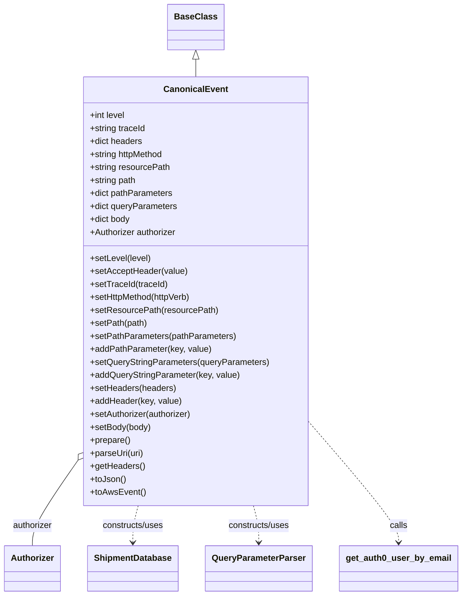
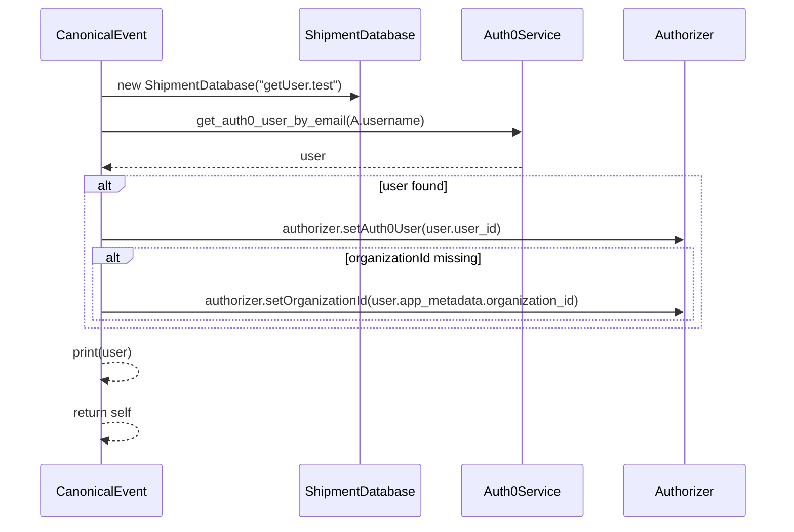

# Diagram: platform/tools/ide_local_testing/localTest/core/CanonicalEvent.py


> Auto-generated by Obscura crawlers

## Diagram 1



### SVG

<svg id="container" width="829.875" xmlns="http://www.w3.org/2000/svg" class="classDiagram" height="1100" viewBox="0 0 829.875 1100" role="graphics-document document" aria-roledescription="class"><style>#container{font-family:"trebuchet ms",verdana,arial,sans-serif;font-size:16px;fill:#333;}@keyframes edge-animation-frame{from{stroke-dashoffset:0;}}@keyframes dash{to{stroke-dashoffset:0;}}#container .edge-animation-slow{stroke-dasharray:9,5!important;stroke-dashoffset:900;animation:dash 50s linear infinite;stroke-linecap:round;}#container .edge-animation-fast{stroke-dasharray:9,5!important;stroke-dashoffset:900;animation:dash 20s linear infinite;stroke-linecap:round;}#container .error-icon{fill:#552222;}#container .error-text{fill:#552222;stroke:#552222;}#container .edge-thickness-normal{stroke-width:1px;}#container .edge-thickness-thick{stroke-width:3.5px;}#container .edge-pattern-solid{stroke-dasharray:0;}#container .edge-thickness-invisible{stroke-width:0;fill:none;}#container .edge-pattern-dashed{stroke-dasharray:3;}#container .edge-pattern-dotted{stroke-dasharray:2;}#container .marker{fill:#333333;stroke:#333333;}#container .marker.cross{stroke:#333333;}#container svg{font-family:"trebuchet ms",verdana,arial,sans-serif;font-size:16px;}#container p{margin:0;}#container g.classGroup text{fill:#9370DB;stroke:none;font-family:"trebuchet ms",verdana,arial,sans-serif;font-size:10px;}#container g.classGroup text .title{font-weight:bolder;}#container .nodeLabel,#container .edgeLabel{color:#131300;}#container .edgeLabel .label rect{fill:#ECECFF;}#container .label text{fill:#131300;}#container .labelBkg{background:#ECECFF;}#container .edgeLabel .label span{background:#ECECFF;}#container .classTitle{font-weight:bolder;}#container .node rect,#container .node circle,#container .node ellipse,#container .node polygon,#container .node path{fill:#ECECFF;stroke:#9370DB;stroke-width:1px;}#container .divider{stroke:#9370DB;stroke-width:1;}#container g.clickable{cursor:pointer;}#container g.classGroup rect{fill:#ECECFF;stroke:#9370DB;}#container g.classGroup line{stroke:#9370DB;stroke-width:1;}#container .classLabel .box{stroke:none;stroke-width:0;fill:#ECECFF;opacity:0.5;}#container .classLabel .label{fill:#9370DB;font-size:10px;}#container .relation{stroke:#333333;stroke-width:1;fill:none;}#container .dashed-line{stroke-dasharray:3;}#container .dotted-line{stroke-dasharray:1 2;}#container #compositionStart,#container .composition{fill:#333333!important;stroke:#333333!important;stroke-width:1;}#container #compositionEnd,#container .composition{fill:#333333!important;stroke:#333333!important;stroke-width:1;}#container #dependencyStart,#container .dependency{fill:#333333!important;stroke:#333333!important;stroke-width:1;}#container #dependencyStart,#container .dependency{fill:#333333!important;stroke:#333333!important;stroke-width:1;}#container #extensionStart,#container .extension{fill:transparent!important;stroke:#333333!important;stroke-width:1;}#container #extensionEnd,#container .extension{fill:transparent!important;stroke:#333333!important;stroke-width:1;}#container #aggregationStart,#container .aggregation{fill:transparent!important;stroke:#333333!important;stroke-width:1;}#container #aggregationEnd,#container .aggregation{fill:transparent!important;stroke:#333333!important;stroke-width:1;}#container #lollipopStart,#container .lollipop{fill:#ECECFF!important;stroke:#333333!important;stroke-width:1;}#container #lollipopEnd,#container .lollipop{fill:#ECECFF!important;stroke:#333333!important;stroke-width:1;}#container .edgeTerminals{font-size:11px;line-height:initial;}#container .classTitleText{text-anchor:middle;font-size:18px;fill:#333;}#container .label-icon{display:inline-block;height:1em;overflow:visible;vertical-align:-0.125em;}#container .node .label-icon path{fill:currentColor;stroke:revert;stroke-width:revert;}#container :root{--mermaid-font-family:"trebuchet ms",verdana,arial,sans-serif;}</style><g><defs><marker id="container_class-aggregationStart" class="marker aggregation class" refX="18" refY="7" markerWidth="190" markerHeight="240" orient="auto"><path d="M 18,7 L9,13 L1,7 L9,1 Z"></path></marker></defs><defs><marker id="container_class-aggregationEnd" class="marker aggregation class" refX="1" refY="7" markerWidth="20" markerHeight="28" orient="auto"><path d="M 18,7 L9,13 L1,7 L9,1 Z"></path></marker></defs><defs><marker id="container_class-extensionStart" class="marker extension class" refX="18" refY="7" markerWidth="190" markerHeight="240" orient="auto"><path d="M 1,7 L18,13 V 1 Z"></path></marker></defs><defs><marker id="container_class-extensionEnd" class="marker extension class" refX="1" refY="7" markerWidth="20" markerHeight="28" orient="auto"><path d="M 1,1 V 13 L18,7 Z"></path></marker></defs><defs><marker id="container_class-compositionStart" class="marker composition class" refX="18" refY="7" markerWidth="190" markerHeight="240" orient="auto"><path d="M 18,7 L9,13 L1,7 L9,1 Z"></path></marker></defs><defs><marker id="container_class-compositionEnd" class="marker composition class" refX="1" refY="7" markerWidth="20" markerHeight="28" orient="auto"><path d="M 18,7 L9,13 L1,7 L9,1 Z"></path></marker></defs><defs><marker id="container_class-dependencyStart" class="marker dependency class" refX="6" refY="7" markerWidth="190" markerHeight="240" orient="auto"><path d="M 5,7 L9,13 L1,7 L9,1 Z"></path></marker></defs><defs><marker id="container_class-dependencyEnd" class="marker dependency class" refX="13" refY="7" markerWidth="20" markerHeight="28" orient="auto"><path d="M 18,7 L9,13 L14,7 L9,1 Z"></path></marker></defs><defs><marker id="container_class-lollipopStart" class="marker lollipop class" refX="13" refY="7" markerWidth="190" markerHeight="240" orient="auto"><circle stroke="black" fill="transparent" cx="7" cy="7" r="6"></circle></marker></defs><defs><marker id="container_class-lollipopEnd" class="marker lollipop class" refX="1" refY="7" markerWidth="190" markerHeight="240" orient="auto"><circle stroke="black" fill="transparent" cx="7" cy="7" r="6"></circle></marker></defs><g class="root"><g class="clusters"></g><g class="edgePaths"><path d="M353.176,109.25L353.176,110.542C353.176,111.833,353.176,114.417,353.176,119.875C353.176,125.333,353.176,133.667,353.176,137.833L353.176,142" id="id_BaseClass_CanonicalEvent_1" class="edge-thickness-normal edge-pattern-solid relation" style=";;;" data-edge="true" data-et="edge" data-id="id_BaseClass_CanonicalEvent_1" data-points="W3sieCI6MzUzLjE3NTc4MTI1LCJ5Ijo5Mn0seyJ4IjozNTMuMTc1NzgxMjUsInkiOjExN30seyJ4IjozNTMuMTc1NzgxMjUsInkiOjE0Mn1d" marker-start="url(#container_class-extensionStart)"></path><path d="M138.081,853.92L124.795,873.434C111.51,892.947,84.938,931.973,71.653,957.653C58.367,983.333,58.367,995.667,58.367,1001.833L58.367,1008" id="id_CanonicalEvent_Authorizer_2" class="edge-thickness-normal edge-pattern-solid relation" style=";;;" data-edge="true" data-et="edge" data-id="id_CanonicalEvent_Authorizer_2" data-points="W3sieCI6MTQ3Ljc4OTA2MjUsInkiOjgzOS42NjE2NTgxMjAzMzc2fSx7IngiOjU4LjM2NzE4NzUsInkiOjk3MX0seyJ4Ijo1OC4zNjcxODc1LCJ5IjoxMDA4fV0=" marker-start="url(#container_class-aggregationStart)"></path><path d="M249.678,934L248.066,940.167C246.455,946.333,243.231,958.667,241.62,970C240.008,981.333,240.008,991.667,240.008,996.833L240.008,1002" id="id_CanonicalEvent_ShipmentDatabase_3" class="edge-thickness-normal edge-pattern-dashed relation" style=";;;" data-edge="true" data-et="edge" data-id="id_CanonicalEvent_ShipmentDatabase_3" data-points="W3sieCI6MjQ5LjY3ODA1NDYzMzM3MTgzLCJ5Ijo5MzR9LHsieCI6MjQwLjAwNzgxMjUsInkiOjk3MX0seyJ4IjoyNDAuMDA3ODEyNSwieSI6MTAwOH1d" marker-end="url(#container_class-dependencyEnd)"></path><path d="M456.674,934L458.285,940.167C459.897,946.333,463.12,958.667,464.732,970C466.344,981.333,466.344,991.667,466.344,996.833L466.344,1002" id="id_CanonicalEvent_QueryParameterParser_4" class="edge-thickness-normal edge-pattern-dashed relation" style=";;;" data-edge="true" data-et="edge" data-id="id_CanonicalEvent_QueryParameterParser_4" data-points="W3sieCI6NDU2LjY3MzUwNzg2NjYyODE0LCJ5Ijo5MzR9LHsieCI6NDY2LjM0Mzc1LCJ5Ijo5NzF9LHsieCI6NDY2LjM0Mzc1LCJ5IjoxMDA4fV0=" marker-end="url(#container_class-dependencyEnd)"></path><path d="M558.563,782.68L584.909,814.066C611.255,845.453,663.948,908.227,690.294,944.78C716.641,981.333,716.641,991.667,716.641,996.833L716.641,1002" id="id_CanonicalEvent_get_auth0_user_by_email_5" class="edge-thickness-normal edge-pattern-dashed relation" style=";;;" data-edge="true" data-et="edge" data-id="id_CanonicalEvent_get_auth0_user_by_email_5" data-points="W3sieCI6NTU4LjU2MjUsInkiOjc4Mi42Nzk2NDU3NzA0MTcxfSx7IngiOjcxNi42NDA2MjUsInkiOjk3MX0seyJ4Ijo3MTYuNjQwNjI1LCJ5IjoxMDA4fV0=" marker-end="url(#container_class-dependencyEnd)"></path></g><g class="edgeLabels"><g class="edgeLabel"><g class="label" data-id="id_BaseClass_CanonicalEvent_1" transform="translate(0, 0)"><foreignObject width="0" height="0"><div xmlns="http://www.w3.org/1999/xhtml" class="labelBkg" style="display: table-cell; white-space: nowrap; line-height: 1.5; max-width: 200px; text-align: center;"><span class="edgeLabel"></span></div></foreignObject></g></g><g class="edgeLabel" transform="translate(58.3671875, 971)"><g class="label" data-id="id_CanonicalEvent_Authorizer_2" transform="translate(-37.4921875, -12)"><foreignObject width="74.984375" height="24"><div xmlns="http://www.w3.org/1999/xhtml" class="labelBkg" style="display: table-cell; white-space: nowrap; line-height: 1.5; max-width: 200px; text-align: center;"><span class="edgeLabel"><p>authorizer</p></span></div></foreignObject></g></g><g class="edgeLabel" transform="translate(240.0078125, 971)"><g class="label" data-id="id_CanonicalEvent_ShipmentDatabase_3" transform="translate(-58.25, -12)"><foreignObject width="116.5" height="24"><div xmlns="http://www.w3.org/1999/xhtml" class="labelBkg" style="display: table-cell; white-space: nowrap; line-height: 1.5; max-width: 200px; text-align: center;"><span class="edgeLabel"><p>constructs/uses</p></span></div></foreignObject></g></g><g class="edgeLabel" transform="translate(466.34375, 971)"><g class="label" data-id="id_CanonicalEvent_QueryParameterParser_4" transform="translate(-58.25, -12)"><foreignObject width="116.5" height="24"><div xmlns="http://www.w3.org/1999/xhtml" class="labelBkg" style="display: table-cell; white-space: nowrap; line-height: 1.5; max-width: 200px; text-align: center;"><span class="edgeLabel"><p>constructs/uses</p></span></div></foreignObject></g></g><g class="edgeLabel" transform="translate(716.640625, 971)"><g class="label" data-id="id_CanonicalEvent_get_auth0_user_by_email_5" transform="translate(-16.4453125, -12)"><foreignObject width="32.890625" height="24"><div xmlns="http://www.w3.org/1999/xhtml" class="labelBkg" style="display: table-cell; white-space: nowrap; line-height: 1.5; max-width: 200px; text-align: center;"><span class="edgeLabel"><p>calls</p></span></div></foreignObject></g></g></g><g class="nodes"><g class="node default" id="classId-CanonicalEvent-0" transform="translate(353.17578125, 538)"><g class="basic label-container"><path d="M-205.38671875 -396 L205.38671875 -396 L205.38671875 396 L-205.38671875 396" stroke="none" stroke-width="0" fill="#ECECFF" style=""></path><path d="M-205.38671875 -396 C-80.15291125852958 -396, 45.08089623294083 -396, 205.38671875 -396 M-205.38671875 -396 C-50.89693622644779 -396, 103.59284629710442 -396, 205.38671875 -396 M205.38671875 -396 C205.38671875 -130.3468056639648, 205.38671875 135.3063886720704, 205.38671875 396 M205.38671875 -396 C205.38671875 -197.5602598465259, 205.38671875 0.87948030694821, 205.38671875 396 M205.38671875 396 C103.92979468500374 396, 2.472870620007484 396, -205.38671875 396 M205.38671875 396 C45.30957704518207 396, -114.76756465963587 396, -205.38671875 396 M-205.38671875 396 C-205.38671875 190.9133416338679, -205.38671875 -14.173316732264198, -205.38671875 -396 M-205.38671875 396 C-205.38671875 235.47071074106054, -205.38671875 74.94142148212109, -205.38671875 -396" stroke="#9370DB" stroke-width="1.3" fill="none" stroke-dasharray="0 0" style=""></path></g><g class="annotation-group text" transform="translate(0, -372)"></g><g class="label-group text" transform="translate(-55.7109375, -372)"><g class="label" style="font-weight: bolder" transform="translate(0,-12)"><foreignObject width="111.421875" height="24"><div xmlns="http://www.w3.org/1999/xhtml" style="display: table-cell; white-space: nowrap; line-height: 1.5; max-width: 161px; text-align: center;"><span class="nodeLabel markdown-node-label" style=""><p>CanonicalEvent</p></span></div></foreignObject></g></g><g class="members-group text" transform="translate(-193.38671875, -324)"><g class="label" style="" transform="translate(0,-12)"><foreignObject width="66.375" height="24"><div xmlns="http://www.w3.org/1999/xhtml" style="display: table-cell; white-space: nowrap; line-height: 1.5; max-width: 124px; text-align: center;"><span class="nodeLabel markdown-node-label" style=""><p>+int level</p></span></div></foreignObject></g><g class="label" style="" transform="translate(0,12)"><foreignObject width="104.296875" height="24"><div xmlns="http://www.w3.org/1999/xhtml" style="display: table-cell; white-space: nowrap; line-height: 1.5; max-width: 162px; text-align: center;"><span class="nodeLabel markdown-node-label" style=""><p>+string traceId</p></span></div></foreignObject></g><g class="label" style="" transform="translate(0,36)"><foreignObject width="98.078125" height="24"><div xmlns="http://www.w3.org/1999/xhtml" style="display: table-cell; white-space: nowrap; line-height: 1.5; max-width: 155px; text-align: center;"><span class="nodeLabel markdown-node-label" style=""><p>+dict headers</p></span></div></foreignObject></g><g class="label" style="" transform="translate(0,60)"><foreignObject width="139.53125" height="24"><div xmlns="http://www.w3.org/1999/xhtml" style="display: table-cell; white-space: nowrap; line-height: 1.5; max-width: 197px; text-align: center;"><span class="nodeLabel markdown-node-label" style=""><p>+string httpMethod</p></span></div></foreignObject></g><g class="label" style="" transform="translate(0,84)"><foreignObject width="148.421875" height="24"><div xmlns="http://www.w3.org/1999/xhtml" style="display: table-cell; white-space: nowrap; line-height: 1.5; max-width: 206px; text-align: center;"><span class="nodeLabel markdown-node-label" style=""><p>+string resourcePath</p></span></div></foreignObject></g><g class="label" style="" transform="translate(0,108)"><foreignObject width="87.0625" height="24"><div xmlns="http://www.w3.org/1999/xhtml" style="display: table-cell; white-space: nowrap; line-height: 1.5; max-width: 144px; text-align: center;"><span class="nodeLabel markdown-node-label" style=""><p>+string path</p></span></div></foreignObject></g><g class="label" style="" transform="translate(0,132)"><foreignObject width="154.46875" height="24"><div xmlns="http://www.w3.org/1999/xhtml" style="display: table-cell; white-space: nowrap; line-height: 1.5; max-width: 212px; text-align: center;"><span class="nodeLabel markdown-node-label" style=""><p>+dict pathParameters</p></span></div></foreignObject></g><g class="label" style="" transform="translate(0,156)"><foreignObject width="162.921875" height="24"><div xmlns="http://www.w3.org/1999/xhtml" style="display: table-cell; white-space: nowrap; line-height: 1.5; max-width: 220px; text-align: center;"><span class="nodeLabel markdown-node-label" style=""><p>+dict queryParameters</p></span></div></foreignObject></g><g class="label" style="" transform="translate(0,180)"><foreignObject width="76.03125" height="24"><div xmlns="http://www.w3.org/1999/xhtml" style="display: table-cell; white-space: nowrap; line-height: 1.5; max-width: 134px; text-align: center;"><span class="nodeLabel markdown-node-label" style=""><p>+dict body</p></span></div></foreignObject></g><g class="label" style="" transform="translate(0,204)"><foreignObject width="162.484375" height="24"><div xmlns="http://www.w3.org/1999/xhtml" style="display: table-cell; white-space: nowrap; line-height: 1.5; max-width: 221px; text-align: center;"><span class="nodeLabel markdown-node-label" style=""><p>+Authorizer authorizer</p></span></div></foreignObject></g></g><g class="methods-group text" transform="translate(-193.38671875, -60)"><g class="label" style="" transform="translate(0,-12)"><foreignObject width="112.25" height="24"><div xmlns="http://www.w3.org/1999/xhtml" style="display: table-cell; white-space: nowrap; line-height: 1.5; max-width: 170px; text-align: center;"><span class="nodeLabel markdown-node-label" style=""><p>+setLevel(level)</p></span></div></foreignObject></g><g class="label" style="" transform="translate(0,12)"><foreignObject width="179.640625" height="24"><div xmlns="http://www.w3.org/1999/xhtml" style="display: table-cell; white-space: nowrap; line-height: 1.5; max-width: 237px; text-align: center;"><span class="nodeLabel markdown-node-label" style=""><p>+setAcceptHeader(value)</p></span></div></foreignObject></g><g class="label" style="" transform="translate(0,36)"><foreignObject width="143.203125" height="24"><div xmlns="http://www.w3.org/1999/xhtml" style="display: table-cell; white-space: nowrap; line-height: 1.5; max-width: 201px; text-align: center;"><span class="nodeLabel markdown-node-label" style=""><p>+setTraceId(traceId)</p></span></div></foreignObject></g><g class="label" style="" transform="translate(0,60)"><foreignObject width="190.828125" height="24"><div xmlns="http://www.w3.org/1999/xhtml" style="display: table-cell; white-space: nowrap; line-height: 1.5; max-width: 248px; text-align: center;"><span class="nodeLabel markdown-node-label" style=""><p>+setHttpMethod(httpVerb)</p></span></div></foreignObject></g><g class="label" style="" transform="translate(0,84)"><foreignObject width="233.1875" height="24"><div xmlns="http://www.w3.org/1999/xhtml" style="display: table-cell; white-space: nowrap; line-height: 1.5; max-width: 291px; text-align: center;"><span class="nodeLabel markdown-node-label" style=""><p>+setResourcePath(resourcePath)</p></span></div></foreignObject></g><g class="label" style="" transform="translate(0,108)"><foreignObject width="105.796875" height="24"><div xmlns="http://www.w3.org/1999/xhtml" style="display: table-cell; white-space: nowrap; line-height: 1.5; max-width: 163px; text-align: center;"><span class="nodeLabel markdown-node-label" style=""><p>+setPath(path)</p></span></div></foreignObject></g><g class="label" style="" transform="translate(0,132)"><foreignObject width="268.875" height="24"><div xmlns="http://www.w3.org/1999/xhtml" style="display: table-cell; white-space: nowrap; line-height: 1.5; max-width: 326px; text-align: center;"><span class="nodeLabel markdown-node-label" style=""><p>+setPathParameters(pathParameters)</p></span></div></foreignObject></g><g class="label" style="" transform="translate(0,156)"><foreignObject width="223.4375" height="24"><div xmlns="http://www.w3.org/1999/xhtml" style="display: table-cell; white-space: nowrap; line-height: 1.5; max-width: 281px; text-align: center;"><span class="nodeLabel markdown-node-label" style=""><p>+addPathParameter(key, value)</p></span></div></foreignObject></g><g class="label" style="" transform="translate(0,180)"><foreignObject width="331.0625" height="24"><div xmlns="http://www.w3.org/1999/xhtml" style="display: table-cell; white-space: nowrap; line-height: 1.5; max-width: 388px; text-align: center;"><span class="nodeLabel markdown-node-label" style=""><p>+setQueryStringParameters(queryParameters)</p></span></div></foreignObject></g><g class="label" style="" transform="translate(0,204)"><foreignObject width="277.171875" height="24"><div xmlns="http://www.w3.org/1999/xhtml" style="display: table-cell; white-space: nowrap; line-height: 1.5; max-width: 335px; text-align: center;"><span class="nodeLabel markdown-node-label" style=""><p>+addQueryStringParameter(key, value)</p></span></div></foreignObject></g><g class="label" style="" transform="translate(0,228)"><foreignObject width="158.5" height="24"><div xmlns="http://www.w3.org/1999/xhtml" style="display: table-cell; white-space: nowrap; line-height: 1.5; max-width: 216px; text-align: center;"><span class="nodeLabel markdown-node-label" style=""><p>+setHeaders(headers)</p></span></div></foreignObject></g><g class="label" style="" transform="translate(0,252)"><foreignObject width="169.46875" height="24"><div xmlns="http://www.w3.org/1999/xhtml" style="display: table-cell; white-space: nowrap; line-height: 1.5; max-width: 227px; text-align: center;"><span class="nodeLabel markdown-node-label" style=""><p>+addHeader(key, value)</p></span></div></foreignObject></g><g class="label" style="" transform="translate(0,276)"><foreignObject width="190.75" height="24"><div xmlns="http://www.w3.org/1999/xhtml" style="display: table-cell; white-space: nowrap; line-height: 1.5; max-width: 248px; text-align: center;"><span class="nodeLabel markdown-node-label" style=""><p>+setAuthorizer(authorizer)</p></span></div></foreignObject></g><g class="label" style="" transform="translate(0,300)"><foreignObject width="113.125" height="24"><div xmlns="http://www.w3.org/1999/xhtml" style="display: table-cell; white-space: nowrap; line-height: 1.5; max-width: 170px; text-align: center;"><span class="nodeLabel markdown-node-label" style=""><p>+setBody(body)</p></span></div></foreignObject></g><g class="label" style="" transform="translate(0,324)"><foreignObject width="74.75" height="24"><div xmlns="http://www.w3.org/1999/xhtml" style="display: table-cell; white-space: nowrap; line-height: 1.5; max-width: 132px; text-align: center;"><span class="nodeLabel markdown-node-label" style=""><p>+prepare()</p></span></div></foreignObject></g><g class="label" style="" transform="translate(0,348)"><foreignObject width="99.8125" height="24"><div xmlns="http://www.w3.org/1999/xhtml" style="display: table-cell; white-space: nowrap; line-height: 1.5; max-width: 157px; text-align: center;"><span class="nodeLabel markdown-node-label" style=""><p>+parseUri(uri)</p></span></div></foreignObject></g><g class="label" style="" transform="translate(0,372)"><foreignObject width="100.765625" height="24"><div xmlns="http://www.w3.org/1999/xhtml" style="display: table-cell; white-space: nowrap; line-height: 1.5; max-width: 158px; text-align: center;"><span class="nodeLabel markdown-node-label" style=""><p>+getHeaders()</p></span></div></foreignObject></g><g class="label" style="" transform="translate(0,396)"><foreignObject width="64.234375" height="24"><div xmlns="http://www.w3.org/1999/xhtml" style="display: table-cell; white-space: nowrap; line-height: 1.5; max-width: 122px; text-align: center;"><span class="nodeLabel markdown-node-label" style=""><p>+toJson()</p></span></div></foreignObject></g><g class="label" style="" transform="translate(0,420)"><foreignObject width="101.1875" height="24"><div xmlns="http://www.w3.org/1999/xhtml" style="display: table-cell; white-space: nowrap; line-height: 1.5; max-width: 159px; text-align: center;"><span class="nodeLabel markdown-node-label" style=""><p>+toAwsEvent()</p></span></div></foreignObject></g></g><g class="divider" style=""><path d="M-205.38671875 -348 C-122.89990759949355 -348, -40.41309644898709 -348, 205.38671875 -348 M-205.38671875 -348 C-41.25764690461722 -348, 122.87142494076556 -348, 205.38671875 -348" stroke="#9370DB" stroke-width="1.3" fill="none" stroke-dasharray="0 0" style=""></path></g><g class="divider" style=""><path d="M-205.38671875 -84 C-54.29894785981011 -84, 96.78882303037977 -84, 205.38671875 -84 M-205.38671875 -84 C-121.04190609825079 -84, -36.69709344650158 -84, 205.38671875 -84" stroke="#9370DB" stroke-width="1.3" fill="none" stroke-dasharray="0 0" style=""></path></g></g><g class="node default" id="classId-BaseClass-1" transform="translate(353.17578125, 50)"><g class="basic label-container"><path d="M-48.359375 -42 L48.359375 -42 L48.359375 42 L-48.359375 42" stroke="none" stroke-width="0" fill="#ECECFF" style=""></path><path d="M-48.359375 -42 C-17.404296320501675 -42, 13.55078235899665 -42, 48.359375 -42 M-48.359375 -42 C-19.700663207854497 -42, 8.958048584291006 -42, 48.359375 -42 M48.359375 -42 C48.359375 -17.485269334149265, 48.359375 7.029461331701469, 48.359375 42 M48.359375 -42 C48.359375 -16.825973000383524, 48.359375 8.348053999232953, 48.359375 42 M48.359375 42 C27.968661384873958 42, 7.577947769747915 42, -48.359375 42 M48.359375 42 C26.811339093640594 42, 5.263303187281188 42, -48.359375 42 M-48.359375 42 C-48.359375 15.078920439930542, -48.359375 -11.842159120138916, -48.359375 -42 M-48.359375 42 C-48.359375 18.55432621384209, -48.359375 -4.891347572315823, -48.359375 -42" stroke="#9370DB" stroke-width="1.3" fill="none" stroke-dasharray="0 0" style=""></path></g><g class="annotation-group text" transform="translate(0, -18)"></g><g class="label-group text" transform="translate(-36.359375, -18)"><g class="label" style="font-weight: bolder" transform="translate(0,-12)"><foreignObject width="72.71875" height="24"><div xmlns="http://www.w3.org/1999/xhtml" style="display: table-cell; white-space: nowrap; line-height: 1.5; max-width: 121px; text-align: center;"><span class="nodeLabel markdown-node-label" style=""><p>BaseClass</p></span></div></foreignObject></g></g><g class="members-group text" transform="translate(-36.359375, 30)"></g><g class="methods-group text" transform="translate(-36.359375, 60)"></g><g class="divider" style=""><path d="M-48.359375 6 C-28.57079448721108 6, -8.782213974422163 6, 48.359375 6 M-48.359375 6 C-18.0555192409581 6, 12.248336518083804 6, 48.359375 6" stroke="#9370DB" stroke-width="1.3" fill="none" stroke-dasharray="0 0" style=""></path></g><g class="divider" style=""><path d="M-48.359375 24 C-16.48791040718891 24, 15.383554185622181 24, 48.359375 24 M-48.359375 24 C-20.893354492182752 24, 6.572666015634496 24, 48.359375 24" stroke="#9370DB" stroke-width="1.3" fill="none" stroke-dasharray="0 0" style=""></path></g></g><g class="node default" id="classId-Authorizer-2" transform="translate(58.3671875, 1050)"><g class="basic label-container"><path d="M-50.3671875 -42 L50.3671875 -42 L50.3671875 42 L-50.3671875 42" stroke="none" stroke-width="0" fill="#ECECFF" style=""></path><path d="M-50.3671875 -42 C-19.124398318664557 -42, 12.118390862670886 -42, 50.3671875 -42 M-50.3671875 -42 C-19.89153094009415 -42, 10.5841256198117 -42, 50.3671875 -42 M50.3671875 -42 C50.3671875 -23.244356380658473, 50.3671875 -4.488712761316947, 50.3671875 42 M50.3671875 -42 C50.3671875 -8.52605325303383, 50.3671875 24.94789349393234, 50.3671875 42 M50.3671875 42 C14.429744440595584 42, -21.50769861880883 42, -50.3671875 42 M50.3671875 42 C23.810191004329823 42, -2.7468054913403535 42, -50.3671875 42 M-50.3671875 42 C-50.3671875 17.44837995318239, -50.3671875 -7.103240093635222, -50.3671875 -42 M-50.3671875 42 C-50.3671875 25.11430380284522, -50.3671875 8.228607605690442, -50.3671875 -42" stroke="#9370DB" stroke-width="1.3" fill="none" stroke-dasharray="0 0" style=""></path></g><g class="annotation-group text" transform="translate(0, -18)"></g><g class="label-group text" transform="translate(-38.3671875, -18)"><g class="label" style="font-weight: bolder" transform="translate(0,-12)"><foreignObject width="76.734375" height="24"><div xmlns="http://www.w3.org/1999/xhtml" style="display: table-cell; white-space: nowrap; line-height: 1.5; max-width: 126px; text-align: center;"><span class="nodeLabel markdown-node-label" style=""><p>Authorizer</p></span></div></foreignObject></g></g><g class="members-group text" transform="translate(-38.3671875, 30)"></g><g class="methods-group text" transform="translate(-38.3671875, 60)"></g><g class="divider" style=""><path d="M-50.3671875 6 C-13.855588964214483 6, 22.656009571571033 6, 50.3671875 6 M-50.3671875 6 C-24.195686464532518 6, 1.9758145709349648 6, 50.3671875 6" stroke="#9370DB" stroke-width="1.3" fill="none" stroke-dasharray="0 0" style=""></path></g><g class="divider" style=""><path d="M-50.3671875 24 C-16.857701697905654 24, 16.651784104188692 24, 50.3671875 24 M-50.3671875 24 C-28.023024558479257 24, -5.678861616958514 24, 50.3671875 24" stroke="#9370DB" stroke-width="1.3" fill="none" stroke-dasharray="0 0" style=""></path></g></g><g class="node default" id="classId-ShipmentDatabase-3" transform="translate(240.0078125, 1050)"><g class="basic label-container"><path d="M-81.2734375 -42 L81.2734375 -42 L81.2734375 42 L-81.2734375 42" stroke="none" stroke-width="0" fill="#ECECFF" style=""></path><path d="M-81.2734375 -42 C-38.91879178778007 -42, 3.4358539244398543 -42, 81.2734375 -42 M-81.2734375 -42 C-18.93539613941359 -42, 43.40264522117282 -42, 81.2734375 -42 M81.2734375 -42 C81.2734375 -17.43979618817062, 81.2734375 7.120407623658757, 81.2734375 42 M81.2734375 -42 C81.2734375 -14.019111882082388, 81.2734375 13.961776235835224, 81.2734375 42 M81.2734375 42 C17.245277703434567 42, -46.782882093130866 42, -81.2734375 42 M81.2734375 42 C19.479279742142786 42, -42.31487801571443 42, -81.2734375 42 M-81.2734375 42 C-81.2734375 15.51509495636856, -81.2734375 -10.969810087262879, -81.2734375 -42 M-81.2734375 42 C-81.2734375 15.51489842981303, -81.2734375 -10.97020314037394, -81.2734375 -42" stroke="#9370DB" stroke-width="1.3" fill="none" stroke-dasharray="0 0" style=""></path></g><g class="annotation-group text" transform="translate(0, -18)"></g><g class="label-group text" transform="translate(-69.2734375, -18)"><g class="label" style="font-weight: bolder" transform="translate(0,-12)"><foreignObject width="138.546875" height="24"><div xmlns="http://www.w3.org/1999/xhtml" style="display: table-cell; white-space: nowrap; line-height: 1.5; max-width: 187px; text-align: center;"><span class="nodeLabel markdown-node-label" style=""><p>ShipmentDatabase</p></span></div></foreignObject></g></g><g class="members-group text" transform="translate(-69.2734375, 30)"></g><g class="methods-group text" transform="translate(-69.2734375, 60)"></g><g class="divider" style=""><path d="M-81.2734375 6 C-39.52387213639108 6, 2.225693227217846 6, 81.2734375 6 M-81.2734375 6 C-35.964923231678576 6, 9.343591036642849 6, 81.2734375 6" stroke="#9370DB" stroke-width="1.3" fill="none" stroke-dasharray="0 0" style=""></path></g><g class="divider" style=""><path d="M-81.2734375 24 C-30.54032985919435 24, 20.192777781611298 24, 81.2734375 24 M-81.2734375 24 C-37.85003773040951 24, 5.573362039180978 24, 81.2734375 24" stroke="#9370DB" stroke-width="1.3" fill="none" stroke-dasharray="0 0" style=""></path></g></g><g class="node default" id="classId-QueryParameterParser-4" transform="translate(466.34375, 1050)"><g class="basic label-container"><path d="M-95.0625 -42 L95.0625 -42 L95.0625 42 L-95.0625 42" stroke="none" stroke-width="0" fill="#ECECFF" style=""></path><path d="M-95.0625 -42 C-38.3604634120189 -42, 18.341573175962196 -42, 95.0625 -42 M-95.0625 -42 C-53.278491099443166 -42, -11.494482198886331 -42, 95.0625 -42 M95.0625 -42 C95.0625 -24.386421926913812, 95.0625 -6.772843853827624, 95.0625 42 M95.0625 -42 C95.0625 -11.76208140206922, 95.0625 18.47583719586156, 95.0625 42 M95.0625 42 C33.07648881475489 42, -28.909522370490222 42, -95.0625 42 M95.0625 42 C33.46791808206179 42, -28.126663835876414 42, -95.0625 42 M-95.0625 42 C-95.0625 21.354688450352, -95.0625 0.709376900704001, -95.0625 -42 M-95.0625 42 C-95.0625 17.007575267620936, -95.0625 -7.984849464758128, -95.0625 -42" stroke="#9370DB" stroke-width="1.3" fill="none" stroke-dasharray="0 0" style=""></path></g><g class="annotation-group text" transform="translate(0, -18)"></g><g class="label-group text" transform="translate(-83.0625, -18)"><g class="label" style="font-weight: bolder" transform="translate(0,-12)"><foreignObject width="166.125" height="24"><div xmlns="http://www.w3.org/1999/xhtml" style="display: table-cell; white-space: nowrap; line-height: 1.5; max-width: 214px; text-align: center;"><span class="nodeLabel markdown-node-label" style=""><p>QueryParameterParser</p></span></div></foreignObject></g></g><g class="members-group text" transform="translate(-83.0625, 30)"></g><g class="methods-group text" transform="translate(-83.0625, 60)"></g><g class="divider" style=""><path d="M-95.0625 6 C-32.98476517708513 6, 29.09296964582974 6, 95.0625 6 M-95.0625 6 C-27.450754632465276 6, 40.16099073506945 6, 95.0625 6" stroke="#9370DB" stroke-width="1.3" fill="none" stroke-dasharray="0 0" style=""></path></g><g class="divider" style=""><path d="M-95.0625 24 C-27.12158407827502 24, 40.81933184344996 24, 95.0625 24 M-95.0625 24 C-32.1921699067505 24, 30.678160186499 24, 95.0625 24" stroke="#9370DB" stroke-width="1.3" fill="none" stroke-dasharray="0 0" style=""></path></g></g><g class="node default" id="classId-get_auth0_user_by_email-5" transform="translate(716.640625, 1050)"><g class="basic label-container"><path d="M-105.234375 -42 L105.234375 -42 L105.234375 42 L-105.234375 42" stroke="none" stroke-width="0" fill="#ECECFF" style=""></path><path d="M-105.234375 -42 C-37.276768160947114 -42, 30.680838678105772 -42, 105.234375 -42 M-105.234375 -42 C-55.182152818125665 -42, -5.129930636251331 -42, 105.234375 -42 M105.234375 -42 C105.234375 -14.491612167078362, 105.234375 13.016775665843276, 105.234375 42 M105.234375 -42 C105.234375 -11.575677941051232, 105.234375 18.848644117897535, 105.234375 42 M105.234375 42 C54.82334258387758 42, 4.412310167755166 42, -105.234375 42 M105.234375 42 C38.62237775793923 42, -27.989619484121533 42, -105.234375 42 M-105.234375 42 C-105.234375 22.566938451717913, -105.234375 3.1338769034358265, -105.234375 -42 M-105.234375 42 C-105.234375 21.632152319423085, -105.234375 1.2643046388461698, -105.234375 -42" stroke="#9370DB" stroke-width="1.3" fill="none" stroke-dasharray="0 0" style=""></path></g><g class="annotation-group text" transform="translate(0, -18)"></g><g class="label-group text" transform="translate(-93.234375, -18)"><g class="label" style="font-weight: bolder" transform="translate(0,-12)"><foreignObject width="186.46875" height="24"><div xmlns="http://www.w3.org/1999/xhtml" style="display: table-cell; white-space: nowrap; line-height: 1.5; max-width: 234px; text-align: center;"><span class="nodeLabel markdown-node-label" style=""><p>get_auth0_user_by_email</p></span></div></foreignObject></g></g><g class="members-group text" transform="translate(-93.234375, 30)"></g><g class="methods-group text" transform="translate(-93.234375, 60)"></g><g class="divider" style=""><path d="M-105.234375 6 C-23.95844717579118 6, 57.31748064841764 6, 105.234375 6 M-105.234375 6 C-30.103854027013966 6, 45.02666694597207 6, 105.234375 6" stroke="#9370DB" stroke-width="1.3" fill="none" stroke-dasharray="0 0" style=""></path></g><g class="divider" style=""><path d="M-105.234375 24 C-30.38177419588405 24, 44.4708266082319 24, 105.234375 24 M-105.234375 24 C-24.24591295288468 24, 56.74254909423064 24, 105.234375 24" stroke="#9370DB" stroke-width="1.3" fill="none" stroke-dasharray="0 0" style=""></path></g></g></g></g></g></svg>

## Diagram 2



### SVG

<svg id="container" width="1002.5" xmlns="http://www.w3.org/2000/svg" height="677" viewBox="-50 -10 1002.5 677" role="graphics-document document" aria-roledescription="sequence"><g><rect x="752.5" y="591" fill="#eaeaea" stroke="#666" width="150" height="65" name="A" rx="3" ry="3" class="actor actor-bottom"></rect><text x="827.5" y="623.5" dominant-baseline="central" alignment-baseline="central" class="actor actor-box" style="text-anchor: middle; font-size: 16px; font-weight: 400;"><tspan x="827.5" dy="0">Authorizer</tspan></text></g><g><rect x="552.5" y="591" fill="#eaeaea" stroke="#666" width="150" height="65" name="Auth0" rx="3" ry="3" class="actor actor-bottom"></rect><text x="627.5" y="623.5" dominant-baseline="central" alignment-baseline="central" class="actor actor-box" style="text-anchor: middle; font-size: 16px; font-weight: 400;"><tspan x="627.5" dy="0">Auth0Service</tspan></text></g><g><rect x="345.5" y="591" fill="#eaeaea" stroke="#666" width="157" height="65" name="DB" rx="3" ry="3" class="actor actor-bottom"></rect><text x="424" y="623.5" dominant-baseline="central" alignment-baseline="central" class="actor actor-box" style="text-anchor: middle; font-size: 16px; font-weight: 400;"><tspan x="424" dy="0">ShipmentDatabase</tspan></text></g><g><rect x="0" y="591" fill="#eaeaea" stroke="#666" width="150" height="65" name="CE" rx="3" ry="3" class="actor actor-bottom"></rect><text x="75" y="623.5" dominant-baseline="central" alignment-baseline="central" class="actor actor-box" style="text-anchor: middle; font-size: 16px; font-weight: 400;"><tspan x="75" dy="0">CanonicalEvent</tspan></text></g><g><line id="actor3" x1="827.5" y1="65" x2="827.5" y2="591" class="actor-line 200" stroke-width="0.5px" stroke="#999" name="A"></line><g id="root-3"><rect x="752.5" y="0" fill="#eaeaea" stroke="#666" width="150" height="65" name="A" rx="3" ry="3" class="actor actor-top"></rect><text x="827.5" y="32.5" dominant-baseline="central" alignment-baseline="central" class="actor actor-box" style="text-anchor: middle; font-size: 16px; font-weight: 400;"><tspan x="827.5" dy="0">Authorizer</tspan></text></g></g><g><line id="actor2" x1="627.5" y1="65" x2="627.5" y2="591" class="actor-line 200" stroke-width="0.5px" stroke="#999" name="Auth0"></line><g id="root-2"><rect x="552.5" y="0" fill="#eaeaea" stroke="#666" width="150" height="65" name="Auth0" rx="3" ry="3" class="actor actor-top"></rect><text x="627.5" y="32.5" dominant-baseline="central" alignment-baseline="central" class="actor actor-box" style="text-anchor: middle; font-size: 16px; font-weight: 400;"><tspan x="627.5" dy="0">Auth0Service</tspan></text></g></g><g><line id="actor1" x1="424" y1="65" x2="424" y2="591" class="actor-line 200" stroke-width="0.5px" stroke="#999" name="DB"></line><g id="root-1"><rect x="345.5" y="0" fill="#eaeaea" stroke="#666" width="157" height="65" name="DB" rx="3" ry="3" class="actor actor-top"></rect><text x="424" y="32.5" dominant-baseline="central" alignment-baseline="central" class="actor actor-box" style="text-anchor: middle; font-size: 16px; font-weight: 400;"><tspan x="424" dy="0">ShipmentDatabase</tspan></text></g></g><g><line id="actor0" x1="75" y1="65" x2="75" y2="591" class="actor-line 200" stroke-width="0.5px" stroke="#999" name="CE"></line><g id="root-0"><rect x="0" y="0" fill="#eaeaea" stroke="#666" width="150" height="65" name="CE" rx="3" ry="3" class="actor actor-top"></rect><text x="75" y="32.5" dominant-baseline="central" alignment-baseline="central" class="actor actor-box" style="text-anchor: middle; font-size: 16px; font-weight: 400;"><tspan x="75" dy="0">CanonicalEvent</tspan></text></g></g><style>#container{font-family:"trebuchet ms",verdana,arial,sans-serif;font-size:16px;fill:#333;}@keyframes edge-animation-frame{from{stroke-dashoffset:0;}}@keyframes dash{to{stroke-dashoffset:0;}}#container .edge-animation-slow{stroke-dasharray:9,5!important;stroke-dashoffset:900;animation:dash 50s linear infinite;stroke-linecap:round;}#container .edge-animation-fast{stroke-dasharray:9,5!important;stroke-dashoffset:900;animation:dash 20s linear infinite;stroke-linecap:round;}#container .error-icon{fill:#552222;}#container .error-text{fill:#552222;stroke:#552222;}#container .edge-thickness-normal{stroke-width:1px;}#container .edge-thickness-thick{stroke-width:3.5px;}#container .edge-pattern-solid{stroke-dasharray:0;}#container .edge-thickness-invisible{stroke-width:0;fill:none;}#container .edge-pattern-dashed{stroke-dasharray:3;}#container .edge-pattern-dotted{stroke-dasharray:2;}#container .marker{fill:#333333;stroke:#333333;}#container .marker.cross{stroke:#333333;}#container svg{font-family:"trebuchet ms",verdana,arial,sans-serif;font-size:16px;}#container p{margin:0;}#container .actor{stroke:hsl(259.6261682243, 59.7765363128%, 87.9019607843%);fill:#ECECFF;}#container text.actor&gt;tspan{fill:black;stroke:none;}#container .actor-line{stroke:hsl(259.6261682243, 59.7765363128%, 87.9019607843%);}#container .innerArc{stroke-width:1.5;stroke-dasharray:none;}#container .messageLine0{stroke-width:1.5;stroke-dasharray:none;stroke:#333;}#container .messageLine1{stroke-width:1.5;stroke-dasharray:2,2;stroke:#333;}#container #arrowhead path{fill:#333;stroke:#333;}#container .sequenceNumber{fill:white;}#container #sequencenumber{fill:#333;}#container #crosshead path{fill:#333;stroke:#333;}#container .messageText{fill:#333;stroke:none;}#container .labelBox{stroke:hsl(259.6261682243, 59.7765363128%, 87.9019607843%);fill:#ECECFF;}#container .labelText,#container .labelText&gt;tspan{fill:black;stroke:none;}#container .loopText,#container .loopText&gt;tspan{fill:black;stroke:none;}#container .loopLine{stroke-width:2px;stroke-dasharray:2,2;stroke:hsl(259.6261682243, 59.7765363128%, 87.9019607843%);fill:hsl(259.6261682243, 59.7765363128%, 87.9019607843%);}#container .note{stroke:#aaaa33;fill:#fff5ad;}#container .noteText,#container .noteText&gt;tspan{fill:black;stroke:none;}#container .activation0{fill:#f4f4f4;stroke:#666;}#container .activation1{fill:#f4f4f4;stroke:#666;}#container .activation2{fill:#f4f4f4;stroke:#666;}#container .actorPopupMenu{position:absolute;}#container .actorPopupMenuPanel{position:absolute;fill:#ECECFF;box-shadow:0px 8px 16px 0px rgba(0,0,0,0.2);filter:drop-shadow(3px 5px 2px rgb(0 0 0 / 0.4));}#container .actor-man line{stroke:hsl(259.6261682243, 59.7765363128%, 87.9019607843%);fill:#ECECFF;}#container .actor-man circle,#container line{stroke:hsl(259.6261682243, 59.7765363128%, 87.9019607843%);fill:#ECECFF;stroke-width:2px;}#container :root{--mermaid-font-family:"trebuchet ms",verdana,arial,sans-serif;}</style><g></g><defs><symbol id="computer" width="24" height="24"><path transform="scale(.5)" d="M2 2v13h20v-13h-20zm18 11h-16v-9h16v9zm-10.228 6l.466-1h3.524l.467 1h-4.457zm14.228 3h-24l2-6h2.104l-1.33 4h18.45l-1.297-4h2.073l2 6zm-5-10h-14v-7h14v7z"></path></symbol></defs><defs><symbol id="database" fill-rule="evenodd" clip-rule="evenodd"><path transform="scale(.5)" d="M12.258.001l.256.004.255.005.253.008.251.01.249.012.247.015.246.016.242.019.241.02.239.023.236.024.233.027.231.028.229.031.225.032.223.034.22.036.217.038.214.04.211.041.208.043.205.045.201.046.198.048.194.05.191.051.187.053.183.054.18.056.175.057.172.059.168.06.163.061.16.063.155.064.15.066.074.033.073.033.071.034.07.034.069.035.068.035.067.035.066.035.064.036.064.036.062.036.06.036.06.037.058.037.058.037.055.038.055.038.053.038.052.038.051.039.05.039.048.039.047.039.045.04.044.04.043.04.041.04.04.041.039.041.037.041.036.041.034.041.033.042.032.042.03.042.029.042.027.042.026.043.024.043.023.043.021.043.02.043.018.044.017.043.015.044.013.044.012.044.011.045.009.044.007.045.006.045.004.045.002.045.001.045v17l-.001.045-.002.045-.004.045-.006.045-.007.045-.009.044-.011.045-.012.044-.013.044-.015.044-.017.043-.018.044-.02.043-.021.043-.023.043-.024.043-.026.043-.027.042-.029.042-.03.042-.032.042-.033.042-.034.041-.036.041-.037.041-.039.041-.04.041-.041.04-.043.04-.044.04-.045.04-.047.039-.048.039-.05.039-.051.039-.052.038-.053.038-.055.038-.055.038-.058.037-.058.037-.06.037-.06.036-.062.036-.064.036-.064.036-.066.035-.067.035-.068.035-.069.035-.07.034-.071.034-.073.033-.074.033-.15.066-.155.064-.16.063-.163.061-.168.06-.172.059-.175.057-.18.056-.183.054-.187.053-.191.051-.194.05-.198.048-.201.046-.205.045-.208.043-.211.041-.214.04-.217.038-.22.036-.223.034-.225.032-.229.031-.231.028-.233.027-.236.024-.239.023-.241.02-.242.019-.246.016-.247.015-.249.012-.251.01-.253.008-.255.005-.256.004-.258.001-.258-.001-.256-.004-.255-.005-.253-.008-.251-.01-.249-.012-.247-.015-.245-.016-.243-.019-.241-.02-.238-.023-.236-.024-.234-.027-.231-.028-.228-.031-.226-.032-.223-.034-.22-.036-.217-.038-.214-.04-.211-.041-.208-.043-.204-.045-.201-.046-.198-.048-.195-.05-.19-.051-.187-.053-.184-.054-.179-.056-.176-.057-.172-.059-.167-.06-.164-.061-.159-.063-.155-.064-.151-.066-.074-.033-.072-.033-.072-.034-.07-.034-.069-.035-.068-.035-.067-.035-.066-.035-.064-.036-.063-.036-.062-.036-.061-.036-.06-.037-.058-.037-.057-.037-.056-.038-.055-.038-.053-.038-.052-.038-.051-.039-.049-.039-.049-.039-.046-.039-.046-.04-.044-.04-.043-.04-.041-.04-.04-.041-.039-.041-.037-.041-.036-.041-.034-.041-.033-.042-.032-.042-.03-.042-.029-.042-.027-.042-.026-.043-.024-.043-.023-.043-.021-.043-.02-.043-.018-.044-.017-.043-.015-.044-.013-.044-.012-.044-.011-.045-.009-.044-.007-.045-.006-.045-.004-.045-.002-.045-.001-.045v-17l.001-.045.002-.045.004-.045.006-.045.007-.045.009-.044.011-.045.012-.044.013-.044.015-.044.017-.043.018-.044.02-.043.021-.043.023-.043.024-.043.026-.043.027-.042.029-.042.03-.042.032-.042.033-.042.034-.041.036-.041.037-.041.039-.041.04-.041.041-.04.043-.04.044-.04.046-.04.046-.039.049-.039.049-.039.051-.039.052-.038.053-.038.055-.038.056-.038.057-.037.058-.037.06-.037.061-.036.062-.036.063-.036.064-.036.066-.035.067-.035.068-.035.069-.035.07-.034.072-.034.072-.033.074-.033.151-.066.155-.064.159-.063.164-.061.167-.06.172-.059.176-.057.179-.056.184-.054.187-.053.19-.051.195-.05.198-.048.201-.046.204-.045.208-.043.211-.041.214-.04.217-.038.22-.036.223-.034.226-.032.228-.031.231-.028.234-.027.236-.024.238-.023.241-.02.243-.019.245-.016.247-.015.249-.012.251-.01.253-.008.255-.005.256-.004.258-.001.258.001zm-9.258 20.499v.01l.001.021.003.021.004.022.005.021.006.022.007.022.009.023.01.022.011.023.012.023.013.023.015.023.016.024.017.023.018.024.019.024.021.024.022.025.023.024.024.025.052.049.056.05.061.051.066.051.07.051.075.051.079.052.084.052.088.052.092.052.097.052.102.051.105.052.11.052.114.051.119.051.123.051.127.05.131.05.135.05.139.048.144.049.147.047.152.047.155.047.16.045.163.045.167.043.171.043.176.041.178.041.183.039.187.039.19.037.194.035.197.035.202.033.204.031.209.03.212.029.216.027.219.025.222.024.226.021.23.02.233.018.236.016.24.015.243.012.246.01.249.008.253.005.256.004.259.001.26-.001.257-.004.254-.005.25-.008.247-.011.244-.012.241-.014.237-.016.233-.018.231-.021.226-.021.224-.024.22-.026.216-.027.212-.028.21-.031.205-.031.202-.034.198-.034.194-.036.191-.037.187-.039.183-.04.179-.04.175-.042.172-.043.168-.044.163-.045.16-.046.155-.046.152-.047.148-.048.143-.049.139-.049.136-.05.131-.05.126-.05.123-.051.118-.052.114-.051.11-.052.106-.052.101-.052.096-.052.092-.052.088-.053.083-.051.079-.052.074-.052.07-.051.065-.051.06-.051.056-.05.051-.05.023-.024.023-.025.021-.024.02-.024.019-.024.018-.024.017-.024.015-.023.014-.024.013-.023.012-.023.01-.023.01-.022.008-.022.006-.022.006-.022.004-.022.004-.021.001-.021.001-.021v-4.127l-.077.055-.08.053-.083.054-.085.053-.087.052-.09.052-.093.051-.095.05-.097.05-.1.049-.102.049-.105.048-.106.047-.109.047-.111.046-.114.045-.115.045-.118.044-.12.043-.122.042-.124.042-.126.041-.128.04-.13.04-.132.038-.134.038-.135.037-.138.037-.139.035-.142.035-.143.034-.144.033-.147.032-.148.031-.15.03-.151.03-.153.029-.154.027-.156.027-.158.026-.159.025-.161.024-.162.023-.163.022-.165.021-.166.02-.167.019-.169.018-.169.017-.171.016-.173.015-.173.014-.175.013-.175.012-.177.011-.178.01-.179.008-.179.008-.181.006-.182.005-.182.004-.184.003-.184.002h-.37l-.184-.002-.184-.003-.182-.004-.182-.005-.181-.006-.179-.008-.179-.008-.178-.01-.176-.011-.176-.012-.175-.013-.173-.014-.172-.015-.171-.016-.17-.017-.169-.018-.167-.019-.166-.02-.165-.021-.163-.022-.162-.023-.161-.024-.159-.025-.157-.026-.156-.027-.155-.027-.153-.029-.151-.03-.15-.03-.148-.031-.146-.032-.145-.033-.143-.034-.141-.035-.14-.035-.137-.037-.136-.037-.134-.038-.132-.038-.13-.04-.128-.04-.126-.041-.124-.042-.122-.042-.12-.044-.117-.043-.116-.045-.113-.045-.112-.046-.109-.047-.106-.047-.105-.048-.102-.049-.1-.049-.097-.05-.095-.05-.093-.052-.09-.051-.087-.052-.085-.053-.083-.054-.08-.054-.077-.054v4.127zm0-5.654v.011l.001.021.003.021.004.021.005.022.006.022.007.022.009.022.01.022.011.023.012.023.013.023.015.024.016.023.017.024.018.024.019.024.021.024.022.024.023.025.024.024.052.05.056.05.061.05.066.051.07.051.075.052.079.051.084.052.088.052.092.052.097.052.102.052.105.052.11.051.114.051.119.052.123.05.127.051.131.05.135.049.139.049.144.048.147.048.152.047.155.046.16.045.163.045.167.044.171.042.176.042.178.04.183.04.187.038.19.037.194.036.197.034.202.033.204.032.209.03.212.028.216.027.219.025.222.024.226.022.23.02.233.018.236.016.24.014.243.012.246.01.249.008.253.006.256.003.259.001.26-.001.257-.003.254-.006.25-.008.247-.01.244-.012.241-.015.237-.016.233-.018.231-.02.226-.022.224-.024.22-.025.216-.027.212-.029.21-.03.205-.032.202-.033.198-.035.194-.036.191-.037.187-.039.183-.039.179-.041.175-.042.172-.043.168-.044.163-.045.16-.045.155-.047.152-.047.148-.048.143-.048.139-.05.136-.049.131-.05.126-.051.123-.051.118-.051.114-.052.11-.052.106-.052.101-.052.096-.052.092-.052.088-.052.083-.052.079-.052.074-.051.07-.052.065-.051.06-.05.056-.051.051-.049.023-.025.023-.024.021-.025.02-.024.019-.024.018-.024.017-.024.015-.023.014-.023.013-.024.012-.022.01-.023.01-.023.008-.022.006-.022.006-.022.004-.021.004-.022.001-.021.001-.021v-4.139l-.077.054-.08.054-.083.054-.085.052-.087.053-.09.051-.093.051-.095.051-.097.05-.1.049-.102.049-.105.048-.106.047-.109.047-.111.046-.114.045-.115.044-.118.044-.12.044-.122.042-.124.042-.126.041-.128.04-.13.039-.132.039-.134.038-.135.037-.138.036-.139.036-.142.035-.143.033-.144.033-.147.033-.148.031-.15.03-.151.03-.153.028-.154.028-.156.027-.158.026-.159.025-.161.024-.162.023-.163.022-.165.021-.166.02-.167.019-.169.018-.169.017-.171.016-.173.015-.173.014-.175.013-.175.012-.177.011-.178.009-.179.009-.179.007-.181.007-.182.005-.182.004-.184.003-.184.002h-.37l-.184-.002-.184-.003-.182-.004-.182-.005-.181-.007-.179-.007-.179-.009-.178-.009-.176-.011-.176-.012-.175-.013-.173-.014-.172-.015-.171-.016-.17-.017-.169-.018-.167-.019-.166-.02-.165-.021-.163-.022-.162-.023-.161-.024-.159-.025-.157-.026-.156-.027-.155-.028-.153-.028-.151-.03-.15-.03-.148-.031-.146-.033-.145-.033-.143-.033-.141-.035-.14-.036-.137-.036-.136-.037-.134-.038-.132-.039-.13-.039-.128-.04-.126-.041-.124-.042-.122-.043-.12-.043-.117-.044-.116-.044-.113-.046-.112-.046-.109-.046-.106-.047-.105-.048-.102-.049-.1-.049-.097-.05-.095-.051-.093-.051-.09-.051-.087-.053-.085-.052-.083-.054-.08-.054-.077-.054v4.139zm0-5.666v.011l.001.02.003.022.004.021.005.022.006.021.007.022.009.023.01.022.011.023.012.023.013.023.015.023.016.024.017.024.018.023.019.024.021.025.022.024.023.024.024.025.052.05.056.05.061.05.066.051.07.051.075.052.079.051.084.052.088.052.092.052.097.052.102.052.105.051.11.052.114.051.119.051.123.051.127.05.131.05.135.05.139.049.144.048.147.048.152.047.155.046.16.045.163.045.167.043.171.043.176.042.178.04.183.04.187.038.19.037.194.036.197.034.202.033.204.032.209.03.212.028.216.027.219.025.222.024.226.021.23.02.233.018.236.017.24.014.243.012.246.01.249.008.253.006.256.003.259.001.26-.001.257-.003.254-.006.25-.008.247-.01.244-.013.241-.014.237-.016.233-.018.231-.02.226-.022.224-.024.22-.025.216-.027.212-.029.21-.03.205-.032.202-.033.198-.035.194-.036.191-.037.187-.039.183-.039.179-.041.175-.042.172-.043.168-.044.163-.045.16-.045.155-.047.152-.047.148-.048.143-.049.139-.049.136-.049.131-.051.126-.05.123-.051.118-.052.114-.051.11-.052.106-.052.101-.052.096-.052.092-.052.088-.052.083-.052.079-.052.074-.052.07-.051.065-.051.06-.051.056-.05.051-.049.023-.025.023-.025.021-.024.02-.024.019-.024.018-.024.017-.024.015-.023.014-.024.013-.023.012-.023.01-.022.01-.023.008-.022.006-.022.006-.022.004-.022.004-.021.001-.021.001-.021v-4.153l-.077.054-.08.054-.083.053-.085.053-.087.053-.09.051-.093.051-.095.051-.097.05-.1.049-.102.048-.105.048-.106.048-.109.046-.111.046-.114.046-.115.044-.118.044-.12.043-.122.043-.124.042-.126.041-.128.04-.13.039-.132.039-.134.038-.135.037-.138.036-.139.036-.142.034-.143.034-.144.033-.147.032-.148.032-.15.03-.151.03-.153.028-.154.028-.156.027-.158.026-.159.024-.161.024-.162.023-.163.023-.165.021-.166.02-.167.019-.169.018-.169.017-.171.016-.173.015-.173.014-.175.013-.175.012-.177.01-.178.01-.179.009-.179.007-.181.006-.182.006-.182.004-.184.003-.184.001-.185.001-.185-.001-.184-.001-.184-.003-.182-.004-.182-.006-.181-.006-.179-.007-.179-.009-.178-.01-.176-.01-.176-.012-.175-.013-.173-.014-.172-.015-.171-.016-.17-.017-.169-.018-.167-.019-.166-.02-.165-.021-.163-.023-.162-.023-.161-.024-.159-.024-.157-.026-.156-.027-.155-.028-.153-.028-.151-.03-.15-.03-.148-.032-.146-.032-.145-.033-.143-.034-.141-.034-.14-.036-.137-.036-.136-.037-.134-.038-.132-.039-.13-.039-.128-.041-.126-.041-.124-.041-.122-.043-.12-.043-.117-.044-.116-.044-.113-.046-.112-.046-.109-.046-.106-.048-.105-.048-.102-.048-.1-.05-.097-.049-.095-.051-.093-.051-.09-.052-.087-.052-.085-.053-.083-.053-.08-.054-.077-.054v4.153zm8.74-8.179l-.257.004-.254.005-.25.008-.247.011-.244.012-.241.014-.237.016-.233.018-.231.021-.226.022-.224.023-.22.026-.216.027-.212.028-.21.031-.205.032-.202.033-.198.034-.194.036-.191.038-.187.038-.183.04-.179.041-.175.042-.172.043-.168.043-.163.045-.16.046-.155.046-.152.048-.148.048-.143.048-.139.049-.136.05-.131.05-.126.051-.123.051-.118.051-.114.052-.11.052-.106.052-.101.052-.096.052-.092.052-.088.052-.083.052-.079.052-.074.051-.07.052-.065.051-.06.05-.056.05-.051.05-.023.025-.023.024-.021.024-.02.025-.019.024-.018.024-.017.023-.015.024-.014.023-.013.023-.012.023-.01.023-.01.022-.008.022-.006.023-.006.021-.004.022-.004.021-.001.021-.001.021.001.021.001.021.004.021.004.022.006.021.006.023.008.022.01.022.01.023.012.023.013.023.014.023.015.024.017.023.018.024.019.024.02.025.021.024.023.024.023.025.051.05.056.05.06.05.065.051.07.052.074.051.079.052.083.052.088.052.092.052.096.052.101.052.106.052.11.052.114.052.118.051.123.051.126.051.131.05.136.05.139.049.143.048.148.048.152.048.155.046.16.046.163.045.168.043.172.043.175.042.179.041.183.04.187.038.191.038.194.036.198.034.202.033.205.032.21.031.212.028.216.027.22.026.224.023.226.022.231.021.233.018.237.016.241.014.244.012.247.011.25.008.254.005.257.004.26.001.26-.001.257-.004.254-.005.25-.008.247-.011.244-.012.241-.014.237-.016.233-.018.231-.021.226-.022.224-.023.22-.026.216-.027.212-.028.21-.031.205-.032.202-.033.198-.034.194-.036.191-.038.187-.038.183-.04.179-.041.175-.042.172-.043.168-.043.163-.045.16-.046.155-.046.152-.048.148-.048.143-.048.139-.049.136-.05.131-.05.126-.051.123-.051.118-.051.114-.052.11-.052.106-.052.101-.052.096-.052.092-.052.088-.052.083-.052.079-.052.074-.051.07-.052.065-.051.06-.05.056-.05.051-.05.023-.025.023-.024.021-.024.02-.025.019-.024.018-.024.017-.023.015-.024.014-.023.013-.023.012-.023.01-.023.01-.022.008-.022.006-.023.006-.021.004-.022.004-.021.001-.021.001-.021-.001-.021-.001-.021-.004-.021-.004-.022-.006-.021-.006-.023-.008-.022-.01-.022-.01-.023-.012-.023-.013-.023-.014-.023-.015-.024-.017-.023-.018-.024-.019-.024-.02-.025-.021-.024-.023-.024-.023-.025-.051-.05-.056-.05-.06-.05-.065-.051-.07-.052-.074-.051-.079-.052-.083-.052-.088-.052-.092-.052-.096-.052-.101-.052-.106-.052-.11-.052-.114-.052-.118-.051-.123-.051-.126-.051-.131-.05-.136-.05-.139-.049-.143-.048-.148-.048-.152-.048-.155-.046-.16-.046-.163-.045-.168-.043-.172-.043-.175-.042-.179-.041-.183-.04-.187-.038-.191-.038-.194-.036-.198-.034-.202-.033-.205-.032-.21-.031-.212-.028-.216-.027-.22-.026-.224-.023-.226-.022-.231-.021-.233-.018-.237-.016-.241-.014-.244-.012-.247-.011-.25-.008-.254-.005-.257-.004-.26-.001-.26.001z"></path></symbol></defs><defs><symbol id="clock" width="24" height="24"><path transform="scale(.5)" d="M12 2c5.514 0 10 4.486 10 10s-4.486 10-10 10-10-4.486-10-10 4.486-10 10-10zm0-2c-6.627 0-12 5.373-12 12s5.373 12 12 12 12-5.373 12-12-5.373-12-12-12zm5.848 12.459c.202.038.202.333.001.372-1.907.361-6.045 1.111-6.547 1.111-.719 0-1.301-.582-1.301-1.301 0-.512.77-5.447 1.125-7.445.034-.192.312-.181.343.014l.985 6.238 5.394 1.011z"></path></symbol></defs><defs><marker id="arrowhead" refX="7.9" refY="5" markerUnits="userSpaceOnUse" markerWidth="12" markerHeight="12" orient="auto-start-reverse"><path d="M -1 0 L 10 5 L 0 10 z"></path></marker></defs><defs><marker id="crosshead" markerWidth="15" markerHeight="8" orient="auto" refX="4" refY="4.5"><path fill="none" stroke="#000000" stroke-width="1pt" d="M 1,2 L 6,7 M 6,2 L 1,7" style="stroke-dasharray: 0, 0;"></path></marker></defs><defs><marker id="filled-head" refX="15.5" refY="7" markerWidth="20" markerHeight="28" orient="auto"><path d="M 18,7 L9,13 L14,7 L9,1 Z"></path></marker></defs><defs><marker id="sequencenumber" refX="15" refY="15" markerWidth="60" markerHeight="40" orient="auto"><circle cx="15" cy="15" r="6"></circle></marker></defs><g><line x1="64" y1="312" x2="838.5" y2="312" class="loopLine"></line><line x1="838.5" y1="312" x2="838.5" y2="405" class="loopLine"></line><line x1="64" y1="405" x2="838.5" y2="405" class="loopLine"></line><line x1="64" y1="312" x2="64" y2="405" class="loopLine"></line><polygon points="64,312 114,312 114,325 105.6,332 64,332" class="labelBox"></polygon><text x="89" y="325" text-anchor="middle" dominant-baseline="middle" alignment-baseline="middle" class="labelText" style="font-size: 16px; font-weight: 400;">alt</text><text x="476.25" y="330" text-anchor="middle" class="loopText" style="font-size: 16px; font-weight: 400;"><tspan x="476.25">[organizationId missing]</tspan></text></g><g><line x1="54" y1="219" x2="848.5" y2="219" class="loopLine"></line><line x1="848.5" y1="219" x2="848.5" y2="415" class="loopLine"></line><line x1="54" y1="415" x2="848.5" y2="415" class="loopLine"></line><line x1="54" y1="219" x2="54" y2="415" class="loopLine"></line><polygon points="54,219 104,219 104,232 95.6,239 54,239" class="labelBox"></polygon><text x="79" y="232" text-anchor="middle" dominant-baseline="middle" alignment-baseline="middle" class="labelText" style="font-size: 16px; font-weight: 400;">alt</text><text x="476.25" y="237" text-anchor="middle" class="loopText" style="font-size: 16px; font-weight: 400;"><tspan x="476.25">[user found]</tspan></text></g><text x="248" y="80" text-anchor="middle" dominant-baseline="middle" alignment-baseline="middle" class="messageText" dy="1em" style="font-size: 16px; font-weight: 400;">new ShipmentDatabase("getUser.test")</text><line x1="76" y1="113" x2="420" y2="113" class="messageLine0" stroke-width="2" stroke="none" marker-end="url(#arrowhead)" style="fill: none;"></line><text x="350" y="128" text-anchor="middle" dominant-baseline="middle" alignment-baseline="middle" class="messageText" dy="1em" style="font-size: 16px; font-weight: 400;">get_auth0_user_by_email(A.username)</text><line x1="76" y1="161" x2="623.5" y2="161" class="messageLine0" stroke-width="2" stroke="none" marker-end="url(#arrowhead)" style="fill: none;"></line><text x="353" y="176" text-anchor="middle" dominant-baseline="middle" alignment-baseline="middle" class="messageText" dy="1em" style="font-size: 16px; font-weight: 400;">user</text><line x1="626.5" y1="209" x2="79" y2="209" class="messageLine1" stroke-width="2" stroke="none" marker-end="url(#arrowhead)" style="stroke-dasharray: 3, 3; fill: none;"></line><text x="450" y="269" text-anchor="middle" dominant-baseline="middle" alignment-baseline="middle" class="messageText" dy="1em" style="font-size: 16px; font-weight: 400;">authorizer.setAuth0User(user.user_id)</text><line x1="76" y1="302" x2="823.5" y2="302" class="messageLine0" stroke-width="2" stroke="none" marker-end="url(#arrowhead)" style="fill: none;"></line><text x="450" y="362" text-anchor="middle" dominant-baseline="middle" alignment-baseline="middle" class="messageText" dy="1em" style="font-size: 16px; font-weight: 400;">authorizer.setOrganizationId(user.app_metadata.organization_id)</text><line x1="76" y1="395" x2="823.5" y2="395" class="messageLine0" stroke-width="2" stroke="none" marker-end="url(#arrowhead)" style="fill: none;"></line><text x="76" y="430" text-anchor="middle" dominant-baseline="middle" alignment-baseline="middle" class="messageText" dy="1em" style="font-size: 16px; font-weight: 400;">print(user)</text><path d="M 76,463 C 136,453 136,493 76,483" class="messageLine1" stroke-width="2" stroke="none" marker-end="url(#arrowhead)" style="stroke-dasharray: 3, 3; fill: none;"></path><text x="76" y="508" text-anchor="middle" dominant-baseline="middle" alignment-baseline="middle" class="messageText" dy="1em" style="font-size: 16px; font-weight: 400;">return self</text><path d="M 76,541 C 136,531 136,571 76,561" class="messageLine1" stroke-width="2" stroke="none" marker-end="url(#arrowhead)" style="stroke-dasharray: 3, 3; fill: none;"></path></svg>

## Diagram 3

```mermaid
flowchart TD
    CE[CanonicalEvent] -->|toAwsEvent| AWS[API Gateway Event]
    AWS --> R[resource: resourcePath]
    AWS --> P[path: path]
    AWS --> M[httpMethod: httpMethod]
    AWS --> H[headers: getHeaders()]
    AWS --> Q[queryStringParameters: queryParameters]
    AWS --> PP[pathParameters: pathParameters]
    AWS --> CTX[requestContext]
    CTX --> RID[resourceId: use6sw]
    CTX --> AUTH[authorizer: authorizer.toAwsAuthorizer()]
    CTX --> RP[resourcePath: resourcePath]
    CTX --> HM[httpMethod: httpMethod]
    CTX --> RT[requestTime: "29/Jan/2020 16:31:36 +0000"]
    CTX --> ST[stage: stage]
    CTX --> DP[domainName: domainName]
    AWS --> B[body: body]
    AWS --> E[isBase64Encoded: false]
```

> SVG rendering failed for this diagram.
