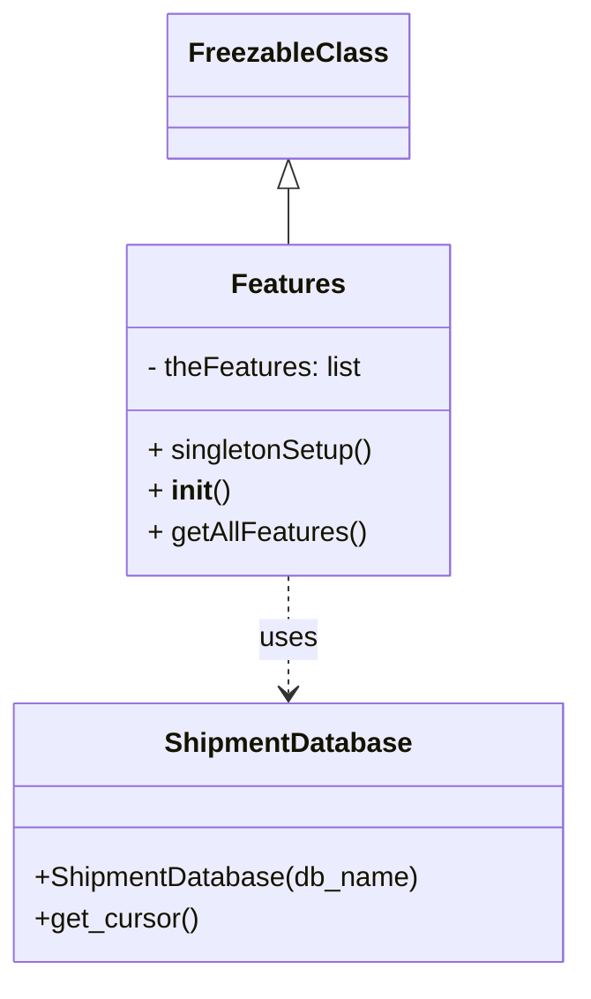

# Diagram: platform/tools/ide_local_testing/localTest/core/Features.py


> Auto-generated by Obscura crawlers

## Diagram 1



### SVG

<svg id="container" width="331.5703125" xmlns="http://www.w3.org/2000/svg" class="classDiagram" height="566" viewBox="0 0 331.5703125 566" role="graphics-document document" aria-roledescription="class"><style>#container{font-family:"trebuchet ms",verdana,arial,sans-serif;font-size:16px;fill:#333;}@keyframes edge-animation-frame{from{stroke-dashoffset:0;}}@keyframes dash{to{stroke-dashoffset:0;}}#container .edge-animation-slow{stroke-dasharray:9,5!important;stroke-dashoffset:900;animation:dash 50s linear infinite;stroke-linecap:round;}#container .edge-animation-fast{stroke-dasharray:9,5!important;stroke-dashoffset:900;animation:dash 20s linear infinite;stroke-linecap:round;}#container .error-icon{fill:#552222;}#container .error-text{fill:#552222;stroke:#552222;}#container .edge-thickness-normal{stroke-width:1px;}#container .edge-thickness-thick{stroke-width:3.5px;}#container .edge-pattern-solid{stroke-dasharray:0;}#container .edge-thickness-invisible{stroke-width:0;fill:none;}#container .edge-pattern-dashed{stroke-dasharray:3;}#container .edge-pattern-dotted{stroke-dasharray:2;}#container .marker{fill:#333333;stroke:#333333;}#container .marker.cross{stroke:#333333;}#container svg{font-family:"trebuchet ms",verdana,arial,sans-serif;font-size:16px;}#container p{margin:0;}#container g.classGroup text{fill:#9370DB;stroke:none;font-family:"trebuchet ms",verdana,arial,sans-serif;font-size:10px;}#container g.classGroup text .title{font-weight:bolder;}#container .nodeLabel,#container .edgeLabel{color:#131300;}#container .edgeLabel .label rect{fill:#ECECFF;}#container .label text{fill:#131300;}#container .labelBkg{background:#ECECFF;}#container .edgeLabel .label span{background:#ECECFF;}#container .classTitle{font-weight:bolder;}#container .node rect,#container .node circle,#container .node ellipse,#container .node polygon,#container .node path{fill:#ECECFF;stroke:#9370DB;stroke-width:1px;}#container .divider{stroke:#9370DB;stroke-width:1;}#container g.clickable{cursor:pointer;}#container g.classGroup rect{fill:#ECECFF;stroke:#9370DB;}#container g.classGroup line{stroke:#9370DB;stroke-width:1;}#container .classLabel .box{stroke:none;stroke-width:0;fill:#ECECFF;opacity:0.5;}#container .classLabel .label{fill:#9370DB;font-size:10px;}#container .relation{stroke:#333333;stroke-width:1;fill:none;}#container .dashed-line{stroke-dasharray:3;}#container .dotted-line{stroke-dasharray:1 2;}#container #compositionStart,#container .composition{fill:#333333!important;stroke:#333333!important;stroke-width:1;}#container #compositionEnd,#container .composition{fill:#333333!important;stroke:#333333!important;stroke-width:1;}#container #dependencyStart,#container .dependency{fill:#333333!important;stroke:#333333!important;stroke-width:1;}#container #dependencyStart,#container .dependency{fill:#333333!important;stroke:#333333!important;stroke-width:1;}#container #extensionStart,#container .extension{fill:transparent!important;stroke:#333333!important;stroke-width:1;}#container #extensionEnd,#container .extension{fill:transparent!important;stroke:#333333!important;stroke-width:1;}#container #aggregationStart,#container .aggregation{fill:transparent!important;stroke:#333333!important;stroke-width:1;}#container #aggregationEnd,#container .aggregation{fill:transparent!important;stroke:#333333!important;stroke-width:1;}#container #lollipopStart,#container .lollipop{fill:#ECECFF!important;stroke:#333333!important;stroke-width:1;}#container #lollipopEnd,#container .lollipop{fill:#ECECFF!important;stroke:#333333!important;stroke-width:1;}#container .edgeTerminals{font-size:11px;line-height:initial;}#container .classTitleText{text-anchor:middle;font-size:18px;fill:#333;}#container .label-icon{display:inline-block;height:1em;overflow:visible;vertical-align:-0.125em;}#container .node .label-icon path{fill:currentColor;stroke:revert;stroke-width:revert;}#container :root{--mermaid-font-family:"trebuchet ms",verdana,arial,sans-serif;}</style><g><defs><marker id="container_class-aggregationStart" class="marker aggregation class" refX="18" refY="7" markerWidth="190" markerHeight="240" orient="auto"><path d="M 18,7 L9,13 L1,7 L9,1 Z"></path></marker></defs><defs><marker id="container_class-aggregationEnd" class="marker aggregation class" refX="1" refY="7" markerWidth="20" markerHeight="28" orient="auto"><path d="M 18,7 L9,13 L1,7 L9,1 Z"></path></marker></defs><defs><marker id="container_class-extensionStart" class="marker extension class" refX="18" refY="7" markerWidth="190" markerHeight="240" orient="auto"><path d="M 1,7 L18,13 V 1 Z"></path></marker></defs><defs><marker id="container_class-extensionEnd" class="marker extension class" refX="1" refY="7" markerWidth="20" markerHeight="28" orient="auto"><path d="M 1,1 V 13 L18,7 Z"></path></marker></defs><defs><marker id="container_class-compositionStart" class="marker composition class" refX="18" refY="7" markerWidth="190" markerHeight="240" orient="auto"><path d="M 18,7 L9,13 L1,7 L9,1 Z"></path></marker></defs><defs><marker id="container_class-compositionEnd" class="marker composition class" refX="1" refY="7" markerWidth="20" markerHeight="28" orient="auto"><path d="M 18,7 L9,13 L1,7 L9,1 Z"></path></marker></defs><defs><marker id="container_class-dependencyStart" class="marker dependency class" refX="6" refY="7" markerWidth="190" markerHeight="240" orient="auto"><path d="M 5,7 L9,13 L1,7 L9,1 Z"></path></marker></defs><defs><marker id="container_class-dependencyEnd" class="marker dependency class" refX="13" refY="7" markerWidth="20" markerHeight="28" orient="auto"><path d="M 18,7 L9,13 L14,7 L9,1 Z"></path></marker></defs><defs><marker id="container_class-lollipopStart" class="marker lollipop class" refX="13" refY="7" markerWidth="190" markerHeight="240" orient="auto"><circle stroke="black" fill="transparent" cx="7" cy="7" r="6"></circle></marker></defs><defs><marker id="container_class-lollipopEnd" class="marker lollipop class" refX="1" refY="7" markerWidth="190" markerHeight="240" orient="auto"><circle stroke="black" fill="transparent" cx="7" cy="7" r="6"></circle></marker></defs><g class="root"><g class="clusters"></g><g class="edgePaths"><path d="M165.785,109.25L165.785,110.542C165.785,111.833,165.785,114.417,165.785,119.875C165.785,125.333,165.785,133.667,165.785,137.833L165.785,142" id="id_FreezableClass_Features_1" class="edge-thickness-normal edge-pattern-solid relation" style=";;;" data-edge="true" data-et="edge" data-id="id_FreezableClass_Features_1" data-points="W3sieCI6MTY1Ljc4NTE1NjI1LCJ5Ijo5Mn0seyJ4IjoxNjUuNzg1MTU2MjUsInkiOjExN30seyJ4IjoxNjUuNzg1MTU2MjUsInkiOjE0Mn1d" marker-start="url(#container_class-extensionStart)"></path><path d="M165.785,334L165.785,340.167C165.785,346.333,165.785,358.667,165.785,370C165.785,381.333,165.785,391.667,165.785,396.833L165.785,402" id="id_Features_ShipmentDatabase_2" class="edge-thickness-normal edge-pattern-dashed relation" style=";;;" data-edge="true" data-et="edge" data-id="id_Features_ShipmentDatabase_2" data-points="W3sieCI6MTY1Ljc4NTE1NjI1LCJ5IjozMzR9LHsieCI6MTY1Ljc4NTE1NjI1LCJ5IjozNzF9LHsieCI6MTY1Ljc4NTE1NjI1LCJ5Ijo0MDh9XQ==" marker-end="url(#container_class-dependencyEnd)"></path></g><g class="edgeLabels"><g class="edgeLabel"><g class="label" data-id="id_FreezableClass_Features_1" transform="translate(0, 0)"><foreignObject width="0" height="0"><div xmlns="http://www.w3.org/1999/xhtml" class="labelBkg" style="display: table-cell; white-space: nowrap; line-height: 1.5; max-width: 200px; text-align: center;"><span class="edgeLabel"></span></div></foreignObject></g></g><g class="edgeLabel" transform="translate(165.78515625, 371)"><g class="label" data-id="id_Features_ShipmentDatabase_2" transform="translate(-16.4921875, -12)"><foreignObject width="32.984375" height="24"><div xmlns="http://www.w3.org/1999/xhtml" class="labelBkg" style="display: table-cell; white-space: nowrap; line-height: 1.5; max-width: 200px; text-align: center;"><span class="edgeLabel"><p>uses</p></span></div></foreignObject></g></g></g><g class="nodes"><g class="node default" id="classId-FreezableClass-0" transform="translate(165.78515625, 50)"><g class="basic label-container"><path d="M-65.640625 -42 L65.640625 -42 L65.640625 42 L-65.640625 42" stroke="none" stroke-width="0" fill="#ECECFF" style=""></path><path d="M-65.640625 -42 C-13.911471089896487 -42, 37.817682820207025 -42, 65.640625 -42 M-65.640625 -42 C-21.957075694799016 -42, 21.726473610401968 -42, 65.640625 -42 M65.640625 -42 C65.640625 -11.346325287540203, 65.640625 19.307349424919593, 65.640625 42 M65.640625 -42 C65.640625 -24.71736347629815, 65.640625 -7.4347269525963, 65.640625 42 M65.640625 42 C20.872743732693863 42, -23.895137534612275 42, -65.640625 42 M65.640625 42 C37.691183049363815 42, 9.741741098727637 42, -65.640625 42 M-65.640625 42 C-65.640625 17.18637504627802, -65.640625 -7.627249907443961, -65.640625 -42 M-65.640625 42 C-65.640625 13.510404503593897, -65.640625 -14.979190992812207, -65.640625 -42" stroke="#9370DB" stroke-width="1.3" fill="none" stroke-dasharray="0 0" style=""></path></g><g class="annotation-group text" transform="translate(0, -18)"></g><g class="label-group text" transform="translate(-53.640625, -18)"><g class="label" style="font-weight: bolder" transform="translate(0,-12)"><foreignObject width="107.28125" height="24"><div xmlns="http://www.w3.org/1999/xhtml" style="display: table-cell; white-space: nowrap; line-height: 1.5; max-width: 155px; text-align: center;"><span class="nodeLabel markdown-node-label" style=""><p>FreezableClass</p></span></div></foreignObject></g></g><g class="members-group text" transform="translate(-53.640625, 30)"></g><g class="methods-group text" transform="translate(-53.640625, 60)"></g><g class="divider" style=""><path d="M-65.640625 6 C-35.943074377888564 6, -6.2455237557771355 6, 65.640625 6 M-65.640625 6 C-27.103889434723193 6, 11.432846130553614 6, 65.640625 6" stroke="#9370DB" stroke-width="1.3" fill="none" stroke-dasharray="0 0" style=""></path></g><g class="divider" style=""><path d="M-65.640625 24 C-35.691988722677664 24, -5.743352445355335 24, 65.640625 24 M-65.640625 24 C-17.302743362994143 24, 31.035138274011715 24, 65.640625 24" stroke="#9370DB" stroke-width="1.3" fill="none" stroke-dasharray="0 0" style=""></path></g></g><g class="node default" id="classId-ShipmentDatabase-1" transform="translate(165.78515625, 483)"><g class="basic label-container"><path d="M-157.78515625 -75 L157.78515625 -75 L157.78515625 75 L-157.78515625 75" stroke="none" stroke-width="0" fill="#ECECFF" style=""></path><path d="M-157.78515625 -75 C-49.31013395091723 -75, 59.16488834816553 -75, 157.78515625 -75 M-157.78515625 -75 C-92.06957436794215 -75, -26.353992485884305 -75, 157.78515625 -75 M157.78515625 -75 C157.78515625 -38.10398728692761, 157.78515625 -1.2079745738552248, 157.78515625 75 M157.78515625 -75 C157.78515625 -32.29595750580663, 157.78515625 10.408084988386733, 157.78515625 75 M157.78515625 75 C76.67671421348979 75, -4.431727823020424 75, -157.78515625 75 M157.78515625 75 C48.115479880681065 75, -61.55419648863787 75, -157.78515625 75 M-157.78515625 75 C-157.78515625 21.36215314394307, -157.78515625 -32.27569371211386, -157.78515625 -75 M-157.78515625 75 C-157.78515625 19.970837687687826, -157.78515625 -35.05832462462435, -157.78515625 -75" stroke="#9370DB" stroke-width="1.3" fill="none" stroke-dasharray="0 0" style=""></path></g><g class="annotation-group text" transform="translate(0, -51)"></g><g class="label-group text" transform="translate(-69.2734375, -51)"><g class="label" style="font-weight: bolder" transform="translate(0,-12)"><foreignObject width="138.546875" height="24"><div xmlns="http://www.w3.org/1999/xhtml" style="display: table-cell; white-space: nowrap; line-height: 1.5; max-width: 187px; text-align: center;"><span class="nodeLabel markdown-node-label" style=""><p>ShipmentDatabase</p></span></div></foreignObject></g></g><g class="members-group text" transform="translate(-145.78515625, -3)"></g><g class="methods-group text" transform="translate(-145.78515625, 27)"><g class="label" style="" transform="translate(0,-12)"><foreignObject width="222.296875" height="24"><div xmlns="http://www.w3.org/1999/xhtml" style="display: table-cell; white-space: nowrap; line-height: 1.5; max-width: 280px; text-align: center;"><span class="nodeLabel markdown-node-label" style=""><p>+ShipmentDatabase(db_name)</p></span></div></foreignObject></g><g class="label" style="" transform="translate(0,12)"><foreignObject width="94.640625" height="24"><div xmlns="http://www.w3.org/1999/xhtml" style="display: table-cell; white-space: nowrap; line-height: 1.5; max-width: 152px; text-align: center;"><span class="nodeLabel markdown-node-label" style=""><p>+get_cursor()</p></span></div></foreignObject></g></g><g class="divider" style=""><path d="M-157.78515625 -27 C-62.93126520656426 -27, 31.922625836871475 -27, 157.78515625 -27 M-157.78515625 -27 C-41.52303675309935 -27, 74.7390827438013 -27, 157.78515625 -27" stroke="#9370DB" stroke-width="1.3" fill="none" stroke-dasharray="0 0" style=""></path></g><g class="divider" style=""><path d="M-157.78515625 -3 C-34.02828039207279 -3, 89.72859546585443 -3, 157.78515625 -3 M-157.78515625 -3 C-41.24788109428144 -3, 75.28939406143712 -3, 157.78515625 -3" stroke="#9370DB" stroke-width="1.3" fill="none" stroke-dasharray="0 0" style=""></path></g></g><g class="node default" id="classId-Features-2" transform="translate(165.78515625, 238)"><g class="basic label-container"><path d="M-93.5703125 -96 L93.5703125 -96 L93.5703125 96 L-93.5703125 96" stroke="none" stroke-width="0" fill="#ECECFF" style=""></path><path d="M-93.5703125 -96 C-52.18333891783643 -96, -10.79636533567286 -96, 93.5703125 -96 M-93.5703125 -96 C-20.90107488541922 -96, 51.76816272916156 -96, 93.5703125 -96 M93.5703125 -96 C93.5703125 -19.219400247637395, 93.5703125 57.56119950472521, 93.5703125 96 M93.5703125 -96 C93.5703125 -37.2291981957316, 93.5703125 21.541603608536803, 93.5703125 96 M93.5703125 96 C39.596753095992966 96, -14.376806308014068 96, -93.5703125 96 M93.5703125 96 C26.788914648865926 96, -39.99248320226815 96, -93.5703125 96 M-93.5703125 96 C-93.5703125 44.36845123506934, -93.5703125 -7.2630975298613265, -93.5703125 -96 M-93.5703125 96 C-93.5703125 24.890129728342572, -93.5703125 -46.219740543314856, -93.5703125 -96" stroke="#9370DB" stroke-width="1.3" fill="none" stroke-dasharray="0 0" style=""></path></g><g class="annotation-group text" transform="translate(0, -72)"></g><g class="label-group text" transform="translate(-31.25, -72)"><g class="label" style="font-weight: bolder" transform="translate(0,-12)"><foreignObject width="62.5" height="24"><div xmlns="http://www.w3.org/1999/xhtml" style="display: table-cell; white-space: nowrap; line-height: 1.5; max-width: 112px; text-align: center;"><span class="nodeLabel markdown-node-label" style=""><p>Features</p></span></div></foreignObject></g></g><g class="members-group text" transform="translate(-81.5703125, -24)"><g class="label" style="" transform="translate(0,-12)"><foreignObject width="126.625" height="24"><div xmlns="http://www.w3.org/1999/xhtml" style="display: table-cell; white-space: nowrap; line-height: 1.5; max-width: 184px; text-align: center;"><span class="nodeLabel markdown-node-label" style=""><p>- theFeatures: list</p></span></div></foreignObject></g></g><g class="methods-group text" transform="translate(-81.5703125, 24)"><g class="label" style="" transform="translate(0,-12)"><foreignObject width="131.890625" height="24"><div xmlns="http://www.w3.org/1999/xhtml" style="display: table-cell; white-space: nowrap; line-height: 1.5; max-width: 189px; text-align: center;"><span class="nodeLabel markdown-node-label" style=""><p>+ singletonSetup()</p></span></div></foreignObject></g><g class="label" style="" transform="translate(0,12)"><foreignObject width="47.046875" height="24"><div xmlns="http://www.w3.org/1999/xhtml" style="display: table-cell; white-space: nowrap; line-height: 1.5; max-width: 137px; text-align: center;"><span class="nodeLabel markdown-node-label" style=""><p>+ <strong>init</strong>()</p></span></div></foreignObject></g><g class="label" style="" transform="translate(0,36)"><foreignObject width="125.234375" height="24"><div xmlns="http://www.w3.org/1999/xhtml" style="display: table-cell; white-space: nowrap; line-height: 1.5; max-width: 183px; text-align: center;"><span class="nodeLabel markdown-node-label" style=""><p>+ getAllFeatures()</p></span></div></foreignObject></g></g><g class="divider" style=""><path d="M-93.5703125 -48 C-42.079416922866734 -48, 9.411478654266531 -48, 93.5703125 -48 M-93.5703125 -48 C-23.180568888105952 -48, 47.209174723788095 -48, 93.5703125 -48" stroke="#9370DB" stroke-width="1.3" fill="none" stroke-dasharray="0 0" style=""></path></g><g class="divider" style=""><path d="M-93.5703125 0 C-33.64009174784611 0, 26.290129004307786 0, 93.5703125 0 M-93.5703125 0 C-53.307417073311306 0, -13.044521646622613 0, 93.5703125 0" stroke="#9370DB" stroke-width="1.3" fill="none" stroke-dasharray="0 0" style=""></path></g></g></g></g></g></svg>

## Diagram 2

```mermaid
flowchart TD
    Start([Start])
    Start --> Check{Features.theFeatures empty?}
    Check -- Yes --> CallSingleton[Call Features.singletonSetup()]
    Check -- No --> End([End])
    CallSingleton --> CreateDB[Create ShipmentDatabase "getFeatures.test"]
    CreateDB --> Execute[Execute query: SELECT name FROM feature where is_active = TRUE]
    Execute --> Fetch[Fetch all rows]
    Fetch --> ForEach[For each feature in rows]
    ForEach --> Append[Append feature.name to Features.theFeatures]
    Append --> ForEach
    ForEach --> End
```

> SVG rendering failed for this diagram.
