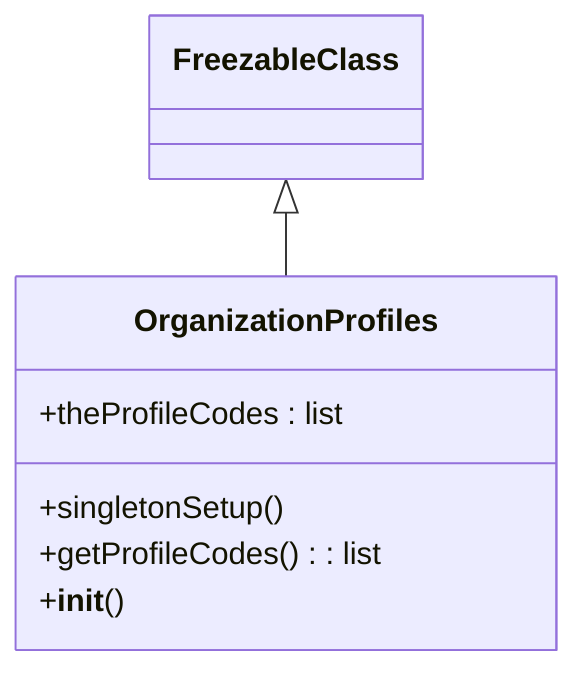

# Diagram: platform/tools/ide_local_testing/localTest/core/OrganizationProfiles.py


> Auto-generated by Obscura crawlers

## Diagram 1



### SVG

<svg id="container" width="288.4453125" xmlns="http://www.w3.org/2000/svg" class="classDiagram" height="342" viewBox="0 0 288.4453125 342" role="graphics-document document" aria-roledescription="class"><style>#container{font-family:"trebuchet ms",verdana,arial,sans-serif;font-size:16px;fill:#333;}@keyframes edge-animation-frame{from{stroke-dashoffset:0;}}@keyframes dash{to{stroke-dashoffset:0;}}#container .edge-animation-slow{stroke-dasharray:9,5!important;stroke-dashoffset:900;animation:dash 50s linear infinite;stroke-linecap:round;}#container .edge-animation-fast{stroke-dasharray:9,5!important;stroke-dashoffset:900;animation:dash 20s linear infinite;stroke-linecap:round;}#container .error-icon{fill:#552222;}#container .error-text{fill:#552222;stroke:#552222;}#container .edge-thickness-normal{stroke-width:1px;}#container .edge-thickness-thick{stroke-width:3.5px;}#container .edge-pattern-solid{stroke-dasharray:0;}#container .edge-thickness-invisible{stroke-width:0;fill:none;}#container .edge-pattern-dashed{stroke-dasharray:3;}#container .edge-pattern-dotted{stroke-dasharray:2;}#container .marker{fill:#333333;stroke:#333333;}#container .marker.cross{stroke:#333333;}#container svg{font-family:"trebuchet ms",verdana,arial,sans-serif;font-size:16px;}#container p{margin:0;}#container g.classGroup text{fill:#9370DB;stroke:none;font-family:"trebuchet ms",verdana,arial,sans-serif;font-size:10px;}#container g.classGroup text .title{font-weight:bolder;}#container .nodeLabel,#container .edgeLabel{color:#131300;}#container .edgeLabel .label rect{fill:#ECECFF;}#container .label text{fill:#131300;}#container .labelBkg{background:#ECECFF;}#container .edgeLabel .label span{background:#ECECFF;}#container .classTitle{font-weight:bolder;}#container .node rect,#container .node circle,#container .node ellipse,#container .node polygon,#container .node path{fill:#ECECFF;stroke:#9370DB;stroke-width:1px;}#container .divider{stroke:#9370DB;stroke-width:1;}#container g.clickable{cursor:pointer;}#container g.classGroup rect{fill:#ECECFF;stroke:#9370DB;}#container g.classGroup line{stroke:#9370DB;stroke-width:1;}#container .classLabel .box{stroke:none;stroke-width:0;fill:#ECECFF;opacity:0.5;}#container .classLabel .label{fill:#9370DB;font-size:10px;}#container .relation{stroke:#333333;stroke-width:1;fill:none;}#container .dashed-line{stroke-dasharray:3;}#container .dotted-line{stroke-dasharray:1 2;}#container #compositionStart,#container .composition{fill:#333333!important;stroke:#333333!important;stroke-width:1;}#container #compositionEnd,#container .composition{fill:#333333!important;stroke:#333333!important;stroke-width:1;}#container #dependencyStart,#container .dependency{fill:#333333!important;stroke:#333333!important;stroke-width:1;}#container #dependencyStart,#container .dependency{fill:#333333!important;stroke:#333333!important;stroke-width:1;}#container #extensionStart,#container .extension{fill:transparent!important;stroke:#333333!important;stroke-width:1;}#container #extensionEnd,#container .extension{fill:transparent!important;stroke:#333333!important;stroke-width:1;}#container #aggregationStart,#container .aggregation{fill:transparent!important;stroke:#333333!important;stroke-width:1;}#container #aggregationEnd,#container .aggregation{fill:transparent!important;stroke:#333333!important;stroke-width:1;}#container #lollipopStart,#container .lollipop{fill:#ECECFF!important;stroke:#333333!important;stroke-width:1;}#container #lollipopEnd,#container .lollipop{fill:#ECECFF!important;stroke:#333333!important;stroke-width:1;}#container .edgeTerminals{font-size:11px;line-height:initial;}#container .classTitleText{text-anchor:middle;font-size:18px;fill:#333;}#container .label-icon{display:inline-block;height:1em;overflow:visible;vertical-align:-0.125em;}#container .node .label-icon path{fill:currentColor;stroke:revert;stroke-width:revert;}#container :root{--mermaid-font-family:"trebuchet ms",verdana,arial,sans-serif;}</style><g><defs><marker id="container_class-aggregationStart" class="marker aggregation class" refX="18" refY="7" markerWidth="190" markerHeight="240" orient="auto"><path d="M 18,7 L9,13 L1,7 L9,1 Z"></path></marker></defs><defs><marker id="container_class-aggregationEnd" class="marker aggregation class" refX="1" refY="7" markerWidth="20" markerHeight="28" orient="auto"><path d="M 18,7 L9,13 L1,7 L9,1 Z"></path></marker></defs><defs><marker id="container_class-extensionStart" class="marker extension class" refX="18" refY="7" markerWidth="190" markerHeight="240" orient="auto"><path d="M 1,7 L18,13 V 1 Z"></path></marker></defs><defs><marker id="container_class-extensionEnd" class="marker extension class" refX="1" refY="7" markerWidth="20" markerHeight="28" orient="auto"><path d="M 1,1 V 13 L18,7 Z"></path></marker></defs><defs><marker id="container_class-compositionStart" class="marker composition class" refX="18" refY="7" markerWidth="190" markerHeight="240" orient="auto"><path d="M 18,7 L9,13 L1,7 L9,1 Z"></path></marker></defs><defs><marker id="container_class-compositionEnd" class="marker composition class" refX="1" refY="7" markerWidth="20" markerHeight="28" orient="auto"><path d="M 18,7 L9,13 L1,7 L9,1 Z"></path></marker></defs><defs><marker id="container_class-dependencyStart" class="marker dependency class" refX="6" refY="7" markerWidth="190" markerHeight="240" orient="auto"><path d="M 5,7 L9,13 L1,7 L9,1 Z"></path></marker></defs><defs><marker id="container_class-dependencyEnd" class="marker dependency class" refX="13" refY="7" markerWidth="20" markerHeight="28" orient="auto"><path d="M 18,7 L9,13 L14,7 L9,1 Z"></path></marker></defs><defs><marker id="container_class-lollipopStart" class="marker lollipop class" refX="13" refY="7" markerWidth="190" markerHeight="240" orient="auto"><circle stroke="black" fill="transparent" cx="7" cy="7" r="6"></circle></marker></defs><defs><marker id="container_class-lollipopEnd" class="marker lollipop class" refX="1" refY="7" markerWidth="190" markerHeight="240" orient="auto"><circle stroke="black" fill="transparent" cx="7" cy="7" r="6"></circle></marker></defs><g class="root"><g class="clusters"></g><g class="edgePaths"><path d="M144.223,109.25L144.223,110.542C144.223,111.833,144.223,114.417,144.223,119.875C144.223,125.333,144.223,133.667,144.223,137.833L144.223,142" id="id_FreezableClass_OrganizationProfiles_1" class="edge-thickness-normal edge-pattern-solid relation" style=";;;" data-edge="true" data-et="edge" data-id="id_FreezableClass_OrganizationProfiles_1" data-points="W3sieCI6MTQ0LjIyMjY1NjI1LCJ5Ijo5Mn0seyJ4IjoxNDQuMjIyNjU2MjUsInkiOjExN30seyJ4IjoxNDQuMjIyNjU2MjUsInkiOjE0Mn1d" marker-start="url(#container_class-extensionStart)"></path></g><g class="edgeLabels"><g class="edgeLabel"><g class="label" data-id="id_FreezableClass_OrganizationProfiles_1" transform="translate(0, 0)"><foreignObject width="0" height="0"><div xmlns="http://www.w3.org/1999/xhtml" class="labelBkg" style="display: table-cell; white-space: nowrap; line-height: 1.5; max-width: 200px; text-align: center;"><span class="edgeLabel"></span></div></foreignObject></g></g></g><g class="nodes"><g class="node default" id="classId-FreezableClass-0" transform="translate(144.22265625, 50)"><g class="basic label-container"><path d="M-65.640625 -42 L65.640625 -42 L65.640625 42 L-65.640625 42" stroke="none" stroke-width="0" fill="#ECECFF" style=""></path><path d="M-65.640625 -42 C-16.960070203602974 -42, 31.72048459279405 -42, 65.640625 -42 M-65.640625 -42 C-29.88957415447456 -42, 5.861476691050882 -42, 65.640625 -42 M65.640625 -42 C65.640625 -18.30345296702767, 65.640625 5.393094065944659, 65.640625 42 M65.640625 -42 C65.640625 -10.900672370605601, 65.640625 20.198655258788797, 65.640625 42 M65.640625 42 C15.862591783442724 42, -33.91544143311455 42, -65.640625 42 M65.640625 42 C38.3699604513273 42, 11.09929590265461 42, -65.640625 42 M-65.640625 42 C-65.640625 12.545390741032254, -65.640625 -16.909218517935493, -65.640625 -42 M-65.640625 42 C-65.640625 10.63428524486513, -65.640625 -20.73142951026974, -65.640625 -42" stroke="#9370DB" stroke-width="1.3" fill="none" stroke-dasharray="0 0" style=""></path></g><g class="annotation-group text" transform="translate(0, -18)"></g><g class="label-group text" transform="translate(-53.640625, -18)"><g class="label" style="font-weight: bolder" transform="translate(0,-12)"><foreignObject width="107.28125" height="24"><div xmlns="http://www.w3.org/1999/xhtml" style="display: table-cell; white-space: nowrap; line-height: 1.5; max-width: 155px; text-align: center;"><span class="nodeLabel markdown-node-label" style=""><p>FreezableClass</p></span></div></foreignObject></g></g><g class="members-group text" transform="translate(-53.640625, 30)"></g><g class="methods-group text" transform="translate(-53.640625, 60)"></g><g class="divider" style=""><path d="M-65.640625 6 C-36.84753127422452 6, -8.054437548449044 6, 65.640625 6 M-65.640625 6 C-36.18922266016928 6, -6.73782032033855 6, 65.640625 6" stroke="#9370DB" stroke-width="1.3" fill="none" stroke-dasharray="0 0" style=""></path></g><g class="divider" style=""><path d="M-65.640625 24 C-17.0744824306743 24, 31.491660138651397 24, 65.640625 24 M-65.640625 24 C-15.38800091073751 24, 34.86462317852498 24, 65.640625 24" stroke="#9370DB" stroke-width="1.3" fill="none" stroke-dasharray="0 0" style=""></path></g></g><g class="node default" id="classId-OrganizationProfiles-1" transform="translate(144.22265625, 238)"><g class="basic label-container"><path d="M-136.22265625 -96 L136.22265625 -96 L136.22265625 96 L-136.22265625 96" stroke="none" stroke-width="0" fill="#ECECFF" style=""></path><path d="M-136.22265625 -96 C-74.16957254375757 -96, -12.11648883751512 -96, 136.22265625 -96 M-136.22265625 -96 C-30.13138002448528 -96, 75.95989620102944 -96, 136.22265625 -96 M136.22265625 -96 C136.22265625 -46.621179373396444, 136.22265625 2.7576412532071117, 136.22265625 96 M136.22265625 -96 C136.22265625 -39.15206318615431, 136.22265625 17.695873627691384, 136.22265625 96 M136.22265625 96 C59.68896740273469 96, -16.84472144453062 96, -136.22265625 96 M136.22265625 96 C55.70132392537751 96, -24.820008399244983 96, -136.22265625 96 M-136.22265625 96 C-136.22265625 19.305078593464415, -136.22265625 -57.38984281307117, -136.22265625 -96 M-136.22265625 96 C-136.22265625 33.477380124752244, -136.22265625 -29.04523975049551, -136.22265625 -96" stroke="#9370DB" stroke-width="1.3" fill="none" stroke-dasharray="0 0" style=""></path></g><g class="annotation-group text" transform="translate(0, -72)"></g><g class="label-group text" transform="translate(-74.3828125, -72)"><g class="label" style="font-weight: bolder" transform="translate(0,-12)"><foreignObject width="148.765625" height="24"><div xmlns="http://www.w3.org/1999/xhtml" style="display: table-cell; white-space: nowrap; line-height: 1.5; max-width: 196px; text-align: center;"><span class="nodeLabel markdown-node-label" style=""><p>OrganizationProfiles</p></span></div></foreignObject></g></g><g class="members-group text" transform="translate(-124.22265625, -24)"><g class="label" style="" transform="translate(0,-12)"><foreignObject width="156.84375" height="24"><div xmlns="http://www.w3.org/1999/xhtml" style="display: table-cell; white-space: nowrap; line-height: 1.5; max-width: 214px; text-align: center;"><span class="nodeLabel markdown-node-label" style=""><p>+theProfileCodes : list</p></span></div></foreignObject></g></g><g class="methods-group text" transform="translate(-124.22265625, 24)"><g class="label" style="" transform="translate(0,-12)"><foreignObject width="127.65625" height="24"><div xmlns="http://www.w3.org/1999/xhtml" style="display: table-cell; white-space: nowrap; line-height: 1.5; max-width: 185px; text-align: center;"><span class="nodeLabel markdown-node-label" style=""><p>+singletonSetup()</p></span></div></foreignObject></g><g class="label" style="" transform="translate(0,12)"><foreignObject width="174.0625" height="24"><div xmlns="http://www.w3.org/1999/xhtml" style="display: table-cell; white-space: nowrap; line-height: 1.5; max-width: 232px; text-align: center;"><span class="nodeLabel markdown-node-label" style=""><p>+getProfileCodes() : : list</p></span></div></foreignObject></g><g class="label" style="" transform="translate(0,36)"><foreignObject width="42.796875" height="24"><div xmlns="http://www.w3.org/1999/xhtml" style="display: table-cell; white-space: nowrap; line-height: 1.5; max-width: 132px; text-align: center;"><span class="nodeLabel markdown-node-label" style=""><p>+<strong>init</strong>()</p></span></div></foreignObject></g></g><g class="divider" style=""><path d="M-136.22265625 -48 C-54.541371899210915 -48, 27.13991245157817 -48, 136.22265625 -48 M-136.22265625 -48 C-62.28367149663984 -48, 11.65531325672032 -48, 136.22265625 -48" stroke="#9370DB" stroke-width="1.3" fill="none" stroke-dasharray="0 0" style=""></path></g><g class="divider" style=""><path d="M-136.22265625 0 C-42.57418519152198 0, 51.074285866956046 0, 136.22265625 0 M-136.22265625 0 C-35.28998091480021 0, 65.64269442039958 0, 136.22265625 0" stroke="#9370DB" stroke-width="1.3" fill="none" stroke-dasharray="0 0" style=""></path></g></g></g></g></g></svg>

## Diagram 2

```mermaid
flowchart TD
    A[Module load]
    B{OrganizationProfiles.theProfileCodes empty?}
    C[Call OrganizationProfiles.singletonSetup()]
    D[Create ShipmentDatabase getOrganizationProfiles.test]
    E[Execute SELECT CODE FROM organization_profiles]
    F[For each profile: append profile.code to theProfileCodes]
    G[Finished]
    A --> B
    B -- yes --> C
    B -- no --> G
    C --> D --> E --> F --> G
```

> SVG rendering failed for this diagram.
