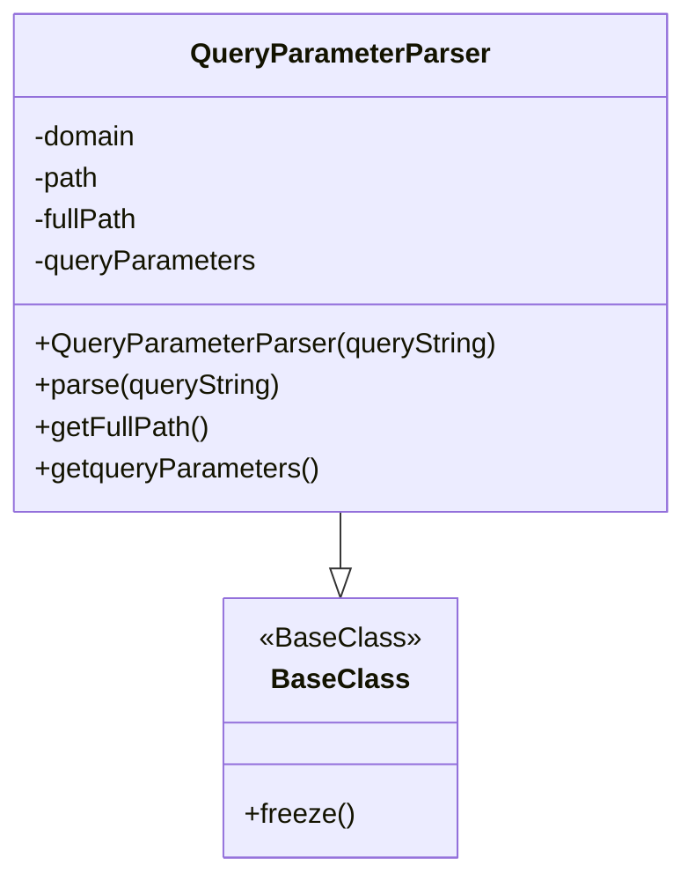

# Diagram: platform/tools/ide_local_testing/localTest/core/QueryParameterParser.py


> Auto-generated by Obscura crawlers

## Diagram 1



### SVG

<svg id="container" width="388.8125" xmlns="http://www.w3.org/2000/svg" class="classDiagram" height="504" viewBox="0 0 388.8125 504" role="graphics-document document" aria-roledescription="class"><style>#container{font-family:"trebuchet ms",verdana,arial,sans-serif;font-size:16px;fill:#333;}@keyframes edge-animation-frame{from{stroke-dashoffset:0;}}@keyframes dash{to{stroke-dashoffset:0;}}#container .edge-animation-slow{stroke-dasharray:9,5!important;stroke-dashoffset:900;animation:dash 50s linear infinite;stroke-linecap:round;}#container .edge-animation-fast{stroke-dasharray:9,5!important;stroke-dashoffset:900;animation:dash 20s linear infinite;stroke-linecap:round;}#container .error-icon{fill:#552222;}#container .error-text{fill:#552222;stroke:#552222;}#container .edge-thickness-normal{stroke-width:1px;}#container .edge-thickness-thick{stroke-width:3.5px;}#container .edge-pattern-solid{stroke-dasharray:0;}#container .edge-thickness-invisible{stroke-width:0;fill:none;}#container .edge-pattern-dashed{stroke-dasharray:3;}#container .edge-pattern-dotted{stroke-dasharray:2;}#container .marker{fill:#333333;stroke:#333333;}#container .marker.cross{stroke:#333333;}#container svg{font-family:"trebuchet ms",verdana,arial,sans-serif;font-size:16px;}#container p{margin:0;}#container g.classGroup text{fill:#9370DB;stroke:none;font-family:"trebuchet ms",verdana,arial,sans-serif;font-size:10px;}#container g.classGroup text .title{font-weight:bolder;}#container .nodeLabel,#container .edgeLabel{color:#131300;}#container .edgeLabel .label rect{fill:#ECECFF;}#container .label text{fill:#131300;}#container .labelBkg{background:#ECECFF;}#container .edgeLabel .label span{background:#ECECFF;}#container .classTitle{font-weight:bolder;}#container .node rect,#container .node circle,#container .node ellipse,#container .node polygon,#container .node path{fill:#ECECFF;stroke:#9370DB;stroke-width:1px;}#container .divider{stroke:#9370DB;stroke-width:1;}#container g.clickable{cursor:pointer;}#container g.classGroup rect{fill:#ECECFF;stroke:#9370DB;}#container g.classGroup line{stroke:#9370DB;stroke-width:1;}#container .classLabel .box{stroke:none;stroke-width:0;fill:#ECECFF;opacity:0.5;}#container .classLabel .label{fill:#9370DB;font-size:10px;}#container .relation{stroke:#333333;stroke-width:1;fill:none;}#container .dashed-line{stroke-dasharray:3;}#container .dotted-line{stroke-dasharray:1 2;}#container #compositionStart,#container .composition{fill:#333333!important;stroke:#333333!important;stroke-width:1;}#container #compositionEnd,#container .composition{fill:#333333!important;stroke:#333333!important;stroke-width:1;}#container #dependencyStart,#container .dependency{fill:#333333!important;stroke:#333333!important;stroke-width:1;}#container #dependencyStart,#container .dependency{fill:#333333!important;stroke:#333333!important;stroke-width:1;}#container #extensionStart,#container .extension{fill:transparent!important;stroke:#333333!important;stroke-width:1;}#container #extensionEnd,#container .extension{fill:transparent!important;stroke:#333333!important;stroke-width:1;}#container #aggregationStart,#container .aggregation{fill:transparent!important;stroke:#333333!important;stroke-width:1;}#container #aggregationEnd,#container .aggregation{fill:transparent!important;stroke:#333333!important;stroke-width:1;}#container #lollipopStart,#container .lollipop{fill:#ECECFF!important;stroke:#333333!important;stroke-width:1;}#container #lollipopEnd,#container .lollipop{fill:#ECECFF!important;stroke:#333333!important;stroke-width:1;}#container .edgeTerminals{font-size:11px;line-height:initial;}#container .classTitleText{text-anchor:middle;font-size:18px;fill:#333;}#container .label-icon{display:inline-block;height:1em;overflow:visible;vertical-align:-0.125em;}#container .node .label-icon path{fill:currentColor;stroke:revert;stroke-width:revert;}#container :root{--mermaid-font-family:"trebuchet ms",verdana,arial,sans-serif;}</style><g><defs><marker id="container_class-aggregationStart" class="marker aggregation class" refX="18" refY="7" markerWidth="190" markerHeight="240" orient="auto"><path d="M 18,7 L9,13 L1,7 L9,1 Z"></path></marker></defs><defs><marker id="container_class-aggregationEnd" class="marker aggregation class" refX="1" refY="7" markerWidth="20" markerHeight="28" orient="auto"><path d="M 18,7 L9,13 L1,7 L9,1 Z"></path></marker></defs><defs><marker id="container_class-extensionStart" class="marker extension class" refX="18" refY="7" markerWidth="190" markerHeight="240" orient="auto"><path d="M 1,7 L18,13 V 1 Z"></path></marker></defs><defs><marker id="container_class-extensionEnd" class="marker extension class" refX="1" refY="7" markerWidth="20" markerHeight="28" orient="auto"><path d="M 1,1 V 13 L18,7 Z"></path></marker></defs><defs><marker id="container_class-compositionStart" class="marker composition class" refX="18" refY="7" markerWidth="190" markerHeight="240" orient="auto"><path d="M 18,7 L9,13 L1,7 L9,1 Z"></path></marker></defs><defs><marker id="container_class-compositionEnd" class="marker composition class" refX="1" refY="7" markerWidth="20" markerHeight="28" orient="auto"><path d="M 18,7 L9,13 L1,7 L9,1 Z"></path></marker></defs><defs><marker id="container_class-dependencyStart" class="marker dependency class" refX="6" refY="7" markerWidth="190" markerHeight="240" orient="auto"><path d="M 5,7 L9,13 L1,7 L9,1 Z"></path></marker></defs><defs><marker id="container_class-dependencyEnd" class="marker dependency class" refX="13" refY="7" markerWidth="20" markerHeight="28" orient="auto"><path d="M 18,7 L9,13 L14,7 L9,1 Z"></path></marker></defs><defs><marker id="container_class-lollipopStart" class="marker lollipop class" refX="13" refY="7" markerWidth="190" markerHeight="240" orient="auto"><circle stroke="black" fill="transparent" cx="7" cy="7" r="6"></circle></marker></defs><defs><marker id="container_class-lollipopEnd" class="marker lollipop class" refX="1" refY="7" markerWidth="190" markerHeight="240" orient="auto"><circle stroke="black" fill="transparent" cx="7" cy="7" r="6"></circle></marker></defs><g class="root"><g class="clusters"></g><g class="edgePaths"><path d="M194.406,296L194.406,300.167C194.406,304.333,194.406,312.667,194.406,318.125C194.406,323.583,194.406,326.167,194.406,327.458L194.406,328.75" id="id_QueryParameterParser_BaseClass_1" class="edge-thickness-normal edge-pattern-solid relation" style=";;;" data-edge="true" data-et="edge" data-id="id_QueryParameterParser_BaseClass_1" data-points="W3sieCI6MTk0LjQwNjI1LCJ5IjoyOTZ9LHsieCI6MTk0LjQwNjI1LCJ5IjozMjF9LHsieCI6MTk0LjQwNjI1LCJ5IjozNDZ9XQ==" marker-end="url(#container_class-extensionEnd)"></path></g><g class="edgeLabels"><g class="edgeLabel"><g class="label" data-id="id_QueryParameterParser_BaseClass_1" transform="translate(0, 0)"><foreignObject width="0" height="0"><div xmlns="http://www.w3.org/1999/xhtml" class="labelBkg" style="display: table-cell; white-space: nowrap; line-height: 1.5; max-width: 200px; text-align: center;"><span class="edgeLabel"></span></div></foreignObject></g></g></g><g class="nodes"><g class="node default" id="classId-BaseClass-0" transform="translate(194.40625, 421)"><g class="basic label-container"><path d="M-65.421875 -75 L65.421875 -75 L65.421875 75 L-65.421875 75" stroke="none" stroke-width="0" fill="#ECECFF" style=""></path><path d="M-65.421875 -75 C-26.059986594616454 -75, 13.301901810767092 -75, 65.421875 -75 M-65.421875 -75 C-21.979228837294272 -75, 21.463417325411456 -75, 65.421875 -75 M65.421875 -75 C65.421875 -15.831899784110675, 65.421875 43.33620043177865, 65.421875 75 M65.421875 -75 C65.421875 -40.0343598605427, 65.421875 -5.068719721085401, 65.421875 75 M65.421875 75 C31.395466644769684 75, -2.6309417104606325 75, -65.421875 75 M65.421875 75 C14.952374122437988 75, -35.517126755124025 75, -65.421875 75 M-65.421875 75 C-65.421875 35.89810774191598, -65.421875 -3.2037845161680423, -65.421875 -75 M-65.421875 75 C-65.421875 26.21208918748011, -65.421875 -22.57582162503978, -65.421875 -75" stroke="#9370DB" stroke-width="1.3" fill="none" stroke-dasharray="0 0" style=""></path></g><g class="annotation-group text" transform="translate(-44.734375, -51)"><g class="label" style="" transform="translate(0,-12)"><foreignObject width="89.46875" height="24"><div xmlns="http://www.w3.org/1999/xhtml" style="display: table-cell; white-space: nowrap; line-height: 1.5; max-width: 139px; text-align: center;"><span class="nodeLabel markdown-node-label" style=""><p>«BaseClass»</p></span></div></foreignObject></g></g><g class="label-group text" transform="translate(-36.359375, -27)"><g class="label" style="font-weight: bolder" transform="translate(0,-12)"><foreignObject width="72.71875" height="24"><div xmlns="http://www.w3.org/1999/xhtml" style="display: table-cell; white-space: nowrap; line-height: 1.5; max-width: 121px; text-align: center;"><span class="nodeLabel markdown-node-label" style=""><p>BaseClass</p></span></div></foreignObject></g></g><g class="members-group text" transform="translate(-53.421875, 21)"></g><g class="methods-group text" transform="translate(-53.421875, 51)"><g class="label" style="" transform="translate(0,-12)"><foreignObject width="62.109375" height="24"><div xmlns="http://www.w3.org/1999/xhtml" style="display: table-cell; white-space: nowrap; line-height: 1.5; max-width: 119px; text-align: center;"><span class="nodeLabel markdown-node-label" style=""><p>+freeze()</p></span></div></foreignObject></g></g><g class="divider" style=""><path d="M-65.421875 -3 C-26.723626997532186 -3, 11.974621004935628 -3, 65.421875 -3 M-65.421875 -3 C-19.427749098522185 -3, 26.56637680295563 -3, 65.421875 -3" stroke="#9370DB" stroke-width="1.3" fill="none" stroke-dasharray="0 0" style=""></path></g><g class="divider" style=""><path d="M-65.421875 21 C-28.663346450624637 21, 8.095182098750726 21, 65.421875 21 M-65.421875 21 C-18.775387449209404 21, 27.87110010158119 21, 65.421875 21" stroke="#9370DB" stroke-width="1.3" fill="none" stroke-dasharray="0 0" style=""></path></g></g><g class="node default" id="classId-QueryParameterParser-1" transform="translate(194.40625, 152)"><g class="basic label-container"><path d="M-186.40625 -144 L186.40625 -144 L186.40625 144 L-186.40625 144" stroke="none" stroke-width="0" fill="#ECECFF" style=""></path><path d="M-186.40625 -144 C-89.8411951349137 -144, 6.723859730172592 -144, 186.40625 -144 M-186.40625 -144 C-68.5785499573924 -144, 49.249150085215206 -144, 186.40625 -144 M186.40625 -144 C186.40625 -43.728802858218614, 186.40625 56.54239428356277, 186.40625 144 M186.40625 -144 C186.40625 -58.459613048028444, 186.40625 27.08077390394311, 186.40625 144 M186.40625 144 C47.542105915431364 144, -91.32203816913727 144, -186.40625 144 M186.40625 144 C49.37098226066047 144, -87.66428547867906 144, -186.40625 144 M-186.40625 144 C-186.40625 55.75401262822665, -186.40625 -32.491974743546706, -186.40625 -144 M-186.40625 144 C-186.40625 84.61393914722645, -186.40625 25.227878294452893, -186.40625 -144" stroke="#9370DB" stroke-width="1.3" fill="none" stroke-dasharray="0 0" style=""></path></g><g class="annotation-group text" transform="translate(0, -120)"></g><g class="label-group text" transform="translate(-83.0625, -120)"><g class="label" style="font-weight: bolder" transform="translate(0,-12)"><foreignObject width="166.125" height="24"><div xmlns="http://www.w3.org/1999/xhtml" style="display: table-cell; white-space: nowrap; line-height: 1.5; max-width: 214px; text-align: center;"><span class="nodeLabel markdown-node-label" style=""><p>QueryParameterParser</p></span></div></foreignObject></g></g><g class="members-group text" transform="translate(-174.40625, -72)"><g class="label" style="" transform="translate(0,-12)"><foreignObject width="61.671875" height="24"><div xmlns="http://www.w3.org/1999/xhtml" style="display: table-cell; white-space: nowrap; line-height: 1.5; max-width: 119px; text-align: center;"><span class="nodeLabel markdown-node-label" style=""><p>-domain</p></span></div></foreignObject></g><g class="label" style="" transform="translate(0,12)"><foreignObject width="39.65625" height="24"><div xmlns="http://www.w3.org/1999/xhtml" style="display: table-cell; white-space: nowrap; line-height: 1.5; max-width: 97px; text-align: center;"><span class="nodeLabel markdown-node-label" style=""><p>-path</p></span></div></foreignObject></g><g class="label" style="" transform="translate(0,36)"><foreignObject width="62.53125" height="24"><div xmlns="http://www.w3.org/1999/xhtml" style="display: table-cell; white-space: nowrap; line-height: 1.5; max-width: 120px; text-align: center;"><span class="nodeLabel markdown-node-label" style=""><p>-fullPath</p></span></div></foreignObject></g><g class="label" style="" transform="translate(0,60)"><foreignObject width="129.640625" height="24"><div xmlns="http://www.w3.org/1999/xhtml" style="display: table-cell; white-space: nowrap; line-height: 1.5; max-width: 187px; text-align: center;"><span class="nodeLabel markdown-node-label" style=""><p>-queryParameters</p></span></div></foreignObject></g></g><g class="methods-group text" transform="translate(-174.40625, 48)"><g class="label" style="" transform="translate(0,-12)"><foreignObject width="265.75" height="24"><div xmlns="http://www.w3.org/1999/xhtml" style="display: table-cell; white-space: nowrap; line-height: 1.5; max-width: 323px; text-align: center;"><span class="nodeLabel markdown-node-label" style=""><p>+QueryParameterParser(queryString)</p></span></div></foreignObject></g><g class="label" style="" transform="translate(0,12)"><foreignObject width="143.0625" height="24"><div xmlns="http://www.w3.org/1999/xhtml" style="display: table-cell; white-space: nowrap; line-height: 1.5; max-width: 200px; text-align: center;"><span class="nodeLabel markdown-node-label" style=""><p>+parse(queryString)</p></span></div></foreignObject></g><g class="label" style="" transform="translate(0,36)"><foreignObject width="99.140625" height="24"><div xmlns="http://www.w3.org/1999/xhtml" style="display: table-cell; white-space: nowrap; line-height: 1.5; max-width: 157px; text-align: center;"><span class="nodeLabel markdown-node-label" style=""><p>+getFullPath()</p></span></div></foreignObject></g><g class="label" style="" transform="translate(0,60)"><foreignObject width="163.859375" height="24"><div xmlns="http://www.w3.org/1999/xhtml" style="display: table-cell; white-space: nowrap; line-height: 1.5; max-width: 221px; text-align: center;"><span class="nodeLabel markdown-node-label" style=""><p>+getqueryParameters()</p></span></div></foreignObject></g></g><g class="divider" style=""><path d="M-186.40625 -96 C-69.18676711464862 -96, 48.032715770702765 -96, 186.40625 -96 M-186.40625 -96 C-40.420347959933764 -96, 105.56555408013247 -96, 186.40625 -96" stroke="#9370DB" stroke-width="1.3" fill="none" stroke-dasharray="0 0" style=""></path></g><g class="divider" style=""><path d="M-186.40625 24 C-44.48925715072022 24, 97.42773569855956 24, 186.40625 24 M-186.40625 24 C-91.33295177126598 24, 3.7403464574680356 24, 186.40625 24" stroke="#9370DB" stroke-width="1.3" fill="none" stroke-dasharray="0 0" style=""></path></g></g></g></g></g></svg>

## Diagram 2

```mermaid
flowchart TD
  Start([Start])
  CheckQS{queryString provided?}
  Start --> CheckQS
  CheckQS -- No --> SetFullPathDirect[Set fullPath = queryString]
  SetFullPathDirect --> AssignQueryParamsNone[queryParameters = None]
  AssignQueryParamsNone --> ReturnSelf([return self])
  CheckQS -- Yes --> ContainsQAndURL{Contains ? and URL regex match?}
  ContainsQAndURL -- No --> SetFullPathDirect
  ContainsQAndURL -- Yes --> SplitOnQuestion[Split on "?" -> path, queryParameterString]
  SplitOnQuestion --> SetFullPathAssigned[fullPath = path]
  SetFullPathAssigned --> SplitParams[paramList = queryParameterString.split("&")]
  SplitParams --> HasParams{parameterList present?}
  HasParams -- No --> AssignQueryParamsNone
  HasParams -- Yes --> LoopParams[For each temp in parameterList]
  LoopParams --> TrimParam[parameterString = temp.strip()]
  TrimParam --> HasEquals{parameterString.index("=") ?}
  HasEquals -- Yes --> SplitKV[key, value = parameterString.split("=")]
  HasEquals -- No --> KeyOnly[key = parameterString; value = None]
  SplitKV --> EnsureDict[if not queryStringParameters: queryStringParameters = {}]
  KeyOnly --> EnsureDict
  EnsureDict --> SetEntry[queryStringParameters[key] = value]
  SetEntry --> LoopParams
  LoopParams --> AfterLoop[All params processed]
  AfterLoop --> SetQueryParameters[queryParameters = queryStringParameters]
  SetQueryParameters --> ReturnSelf
```

> SVG rendering failed for this diagram.
