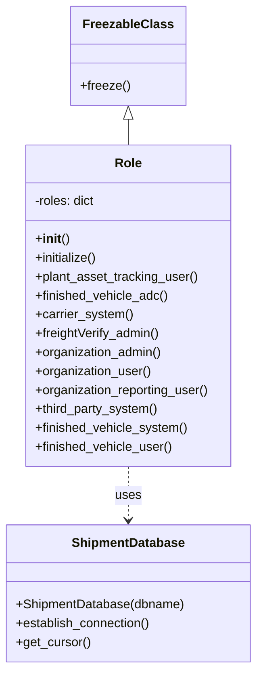

# Diagram: platform/tools/ide_local_testing/localTest/core/Role.py


> Auto-generated by Obscura crawlers

## Diagram 1



### SVG

<svg id="container" width="323.5703125" xmlns="http://www.w3.org/2000/svg" class="classDiagram" height="848" viewBox="0 0 323.5703125 848" role="graphics-document document" aria-roledescription="class"><style>#container{font-family:"trebuchet ms",verdana,arial,sans-serif;font-size:16px;fill:#333;}@keyframes edge-animation-frame{from{stroke-dashoffset:0;}}@keyframes dash{to{stroke-dashoffset:0;}}#container .edge-animation-slow{stroke-dasharray:9,5!important;stroke-dashoffset:900;animation:dash 50s linear infinite;stroke-linecap:round;}#container .edge-animation-fast{stroke-dasharray:9,5!important;stroke-dashoffset:900;animation:dash 20s linear infinite;stroke-linecap:round;}#container .error-icon{fill:#552222;}#container .error-text{fill:#552222;stroke:#552222;}#container .edge-thickness-normal{stroke-width:1px;}#container .edge-thickness-thick{stroke-width:3.5px;}#container .edge-pattern-solid{stroke-dasharray:0;}#container .edge-thickness-invisible{stroke-width:0;fill:none;}#container .edge-pattern-dashed{stroke-dasharray:3;}#container .edge-pattern-dotted{stroke-dasharray:2;}#container .marker{fill:#333333;stroke:#333333;}#container .marker.cross{stroke:#333333;}#container svg{font-family:"trebuchet ms",verdana,arial,sans-serif;font-size:16px;}#container p{margin:0;}#container g.classGroup text{fill:#9370DB;stroke:none;font-family:"trebuchet ms",verdana,arial,sans-serif;font-size:10px;}#container g.classGroup text .title{font-weight:bolder;}#container .nodeLabel,#container .edgeLabel{color:#131300;}#container .edgeLabel .label rect{fill:#ECECFF;}#container .label text{fill:#131300;}#container .labelBkg{background:#ECECFF;}#container .edgeLabel .label span{background:#ECECFF;}#container .classTitle{font-weight:bolder;}#container .node rect,#container .node circle,#container .node ellipse,#container .node polygon,#container .node path{fill:#ECECFF;stroke:#9370DB;stroke-width:1px;}#container .divider{stroke:#9370DB;stroke-width:1;}#container g.clickable{cursor:pointer;}#container g.classGroup rect{fill:#ECECFF;stroke:#9370DB;}#container g.classGroup line{stroke:#9370DB;stroke-width:1;}#container .classLabel .box{stroke:none;stroke-width:0;fill:#ECECFF;opacity:0.5;}#container .classLabel .label{fill:#9370DB;font-size:10px;}#container .relation{stroke:#333333;stroke-width:1;fill:none;}#container .dashed-line{stroke-dasharray:3;}#container .dotted-line{stroke-dasharray:1 2;}#container #compositionStart,#container .composition{fill:#333333!important;stroke:#333333!important;stroke-width:1;}#container #compositionEnd,#container .composition{fill:#333333!important;stroke:#333333!important;stroke-width:1;}#container #dependencyStart,#container .dependency{fill:#333333!important;stroke:#333333!important;stroke-width:1;}#container #dependencyStart,#container .dependency{fill:#333333!important;stroke:#333333!important;stroke-width:1;}#container #extensionStart,#container .extension{fill:transparent!important;stroke:#333333!important;stroke-width:1;}#container #extensionEnd,#container .extension{fill:transparent!important;stroke:#333333!important;stroke-width:1;}#container #aggregationStart,#container .aggregation{fill:transparent!important;stroke:#333333!important;stroke-width:1;}#container #aggregationEnd,#container .aggregation{fill:transparent!important;stroke:#333333!important;stroke-width:1;}#container #lollipopStart,#container .lollipop{fill:#ECECFF!important;stroke:#333333!important;stroke-width:1;}#container #lollipopEnd,#container .lollipop{fill:#ECECFF!important;stroke:#333333!important;stroke-width:1;}#container .edgeTerminals{font-size:11px;line-height:initial;}#container .classTitleText{text-anchor:middle;font-size:18px;fill:#333;}#container .label-icon{display:inline-block;height:1em;overflow:visible;vertical-align:-0.125em;}#container .node .label-icon path{fill:currentColor;stroke:revert;stroke-width:revert;}#container :root{--mermaid-font-family:"trebuchet ms",verdana,arial,sans-serif;}</style><g><defs><marker id="container_class-aggregationStart" class="marker aggregation class" refX="18" refY="7" markerWidth="190" markerHeight="240" orient="auto"><path d="M 18,7 L9,13 L1,7 L9,1 Z"></path></marker></defs><defs><marker id="container_class-aggregationEnd" class="marker aggregation class" refX="1" refY="7" markerWidth="20" markerHeight="28" orient="auto"><path d="M 18,7 L9,13 L1,7 L9,1 Z"></path></marker></defs><defs><marker id="container_class-extensionStart" class="marker extension class" refX="18" refY="7" markerWidth="190" markerHeight="240" orient="auto"><path d="M 1,7 L18,13 V 1 Z"></path></marker></defs><defs><marker id="container_class-extensionEnd" class="marker extension class" refX="1" refY="7" markerWidth="20" markerHeight="28" orient="auto"><path d="M 1,1 V 13 L18,7 Z"></path></marker></defs><defs><marker id="container_class-compositionStart" class="marker composition class" refX="18" refY="7" markerWidth="190" markerHeight="240" orient="auto"><path d="M 18,7 L9,13 L1,7 L9,1 Z"></path></marker></defs><defs><marker id="container_class-compositionEnd" class="marker composition class" refX="1" refY="7" markerWidth="20" markerHeight="28" orient="auto"><path d="M 18,7 L9,13 L1,7 L9,1 Z"></path></marker></defs><defs><marker id="container_class-dependencyStart" class="marker dependency class" refX="6" refY="7" markerWidth="190" markerHeight="240" orient="auto"><path d="M 5,7 L9,13 L1,7 L9,1 Z"></path></marker></defs><defs><marker id="container_class-dependencyEnd" class="marker dependency class" refX="13" refY="7" markerWidth="20" markerHeight="28" orient="auto"><path d="M 18,7 L9,13 L14,7 L9,1 Z"></path></marker></defs><defs><marker id="container_class-lollipopStart" class="marker lollipop class" refX="13" refY="7" markerWidth="190" markerHeight="240" orient="auto"><circle stroke="black" fill="transparent" cx="7" cy="7" r="6"></circle></marker></defs><defs><marker id="container_class-lollipopEnd" class="marker lollipop class" refX="1" refY="7" markerWidth="190" markerHeight="240" orient="auto"><circle stroke="black" fill="transparent" cx="7" cy="7" r="6"></circle></marker></defs><g class="root"><g class="clusters"></g><g class="edgePaths"><path d="M161.785,151.25L161.785,152.542C161.785,153.833,161.785,156.417,161.785,161.875C161.785,167.333,161.785,175.667,161.785,179.833L161.785,184" id="id_FreezableClass_Role_1" class="edge-thickness-normal edge-pattern-solid relation" style=";;;" data-edge="true" data-et="edge" data-id="id_FreezableClass_Role_1" data-points="W3sieCI6MTYxLjc4NTE1NjI1LCJ5IjoxMzR9LHsieCI6MTYxLjc4NTE1NjI1LCJ5IjoxNTl9LHsieCI6MTYxLjc4NTE1NjI1LCJ5IjoxODR9XQ==" marker-start="url(#container_class-extensionStart)"></path><path d="M161.785,592L161.785,598.167C161.785,604.333,161.785,616.667,161.785,628C161.785,639.333,161.785,649.667,161.785,654.833L161.785,660" id="id_Role_ShipmentDatabase_2" class="edge-thickness-normal edge-pattern-dashed relation" style=";;;" data-edge="true" data-et="edge" data-id="id_Role_ShipmentDatabase_2" data-points="W3sieCI6MTYxLjc4NTE1NjI1LCJ5Ijo1OTJ9LHsieCI6MTYxLjc4NTE1NjI1LCJ5Ijo2Mjl9LHsieCI6MTYxLjc4NTE1NjI1LCJ5Ijo2NjZ9XQ==" marker-end="url(#container_class-dependencyEnd)"></path></g><g class="edgeLabels"><g class="edgeLabel"><g class="label" data-id="id_FreezableClass_Role_1" transform="translate(0, 0)"><foreignObject width="0" height="0"><div xmlns="http://www.w3.org/1999/xhtml" class="labelBkg" style="display: table-cell; white-space: nowrap; line-height: 1.5; max-width: 200px; text-align: center;"><span class="edgeLabel"></span></div></foreignObject></g></g><g class="edgeLabel" transform="translate(161.78515625, 629)"><g class="label" data-id="id_Role_ShipmentDatabase_2" transform="translate(-16.4921875, -12)"><foreignObject width="32.984375" height="24"><div xmlns="http://www.w3.org/1999/xhtml" class="labelBkg" style="display: table-cell; white-space: nowrap; line-height: 1.5; max-width: 200px; text-align: center;"><span class="edgeLabel"><p>uses</p></span></div></foreignObject></g></g></g><g class="nodes"><g class="node default" id="classId-FreezableClass-0" transform="translate(161.78515625, 71)"><g class="basic label-container"><path d="M-69.875 -63 L69.875 -63 L69.875 63 L-69.875 63" stroke="none" stroke-width="0" fill="#ECECFF" style=""></path><path d="M-69.875 -63 C-33.02013348333284 -63, 3.8347330333343166 -63, 69.875 -63 M-69.875 -63 C-21.27811272502302 -63, 27.318774549953957 -63, 69.875 -63 M69.875 -63 C69.875 -32.272391189497014, 69.875 -1.5447823789940358, 69.875 63 M69.875 -63 C69.875 -26.365961485148993, 69.875 10.268077029702013, 69.875 63 M69.875 63 C20.59729421387256 63, -28.680411572254883 63, -69.875 63 M69.875 63 C18.34572798697257 63, -33.18354402605486 63, -69.875 63 M-69.875 63 C-69.875 14.325933873390262, -69.875 -34.348132253219475, -69.875 -63 M-69.875 63 C-69.875 15.271657427462593, -69.875 -32.456685145074815, -69.875 -63" stroke="#9370DB" stroke-width="1.3" fill="none" stroke-dasharray="0 0" style=""></path></g><g class="annotation-group text" transform="translate(0, -39)"></g><g class="label-group text" transform="translate(-53.640625, -39)"><g class="label" style="font-weight: bolder" transform="translate(0,-12)"><foreignObject width="107.28125" height="24"><div xmlns="http://www.w3.org/1999/xhtml" style="display: table-cell; white-space: nowrap; line-height: 1.5; max-width: 155px; text-align: center;"><span class="nodeLabel markdown-node-label" style=""><p>FreezableClass</p></span></div></foreignObject></g></g><g class="members-group text" transform="translate(-57.875, 9)"></g><g class="methods-group text" transform="translate(-57.875, 39)"><g class="label" style="" transform="translate(0,-12)"><foreignObject width="62.109375" height="24"><div xmlns="http://www.w3.org/1999/xhtml" style="display: table-cell; white-space: nowrap; line-height: 1.5; max-width: 119px; text-align: center;"><span class="nodeLabel markdown-node-label" style=""><p>+freeze()</p></span></div></foreignObject></g></g><g class="divider" style=""><path d="M-69.875 -15 C-25.19785149563873 -15, 19.47929700872254 -15, 69.875 -15 M-69.875 -15 C-19.48463592700871 -15, 30.90572814598258 -15, 69.875 -15" stroke="#9370DB" stroke-width="1.3" fill="none" stroke-dasharray="0 0" style=""></path></g><g class="divider" style=""><path d="M-69.875 9 C-24.892091722530346 9, 20.09081655493931 9, 69.875 9 M-69.875 9 C-16.788478766090428 9, 36.298042467819144 9, 69.875 9" stroke="#9370DB" stroke-width="1.3" fill="none" stroke-dasharray="0 0" style=""></path></g></g><g class="node default" id="classId-ShipmentDatabase-1" transform="translate(161.78515625, 753)"><g class="basic label-container"><path d="M-153.78515625 -87 L153.78515625 -87 L153.78515625 87 L-153.78515625 87" stroke="none" stroke-width="0" fill="#ECECFF" style=""></path><path d="M-153.78515625 -87 C-48.300431328951106 -87, 57.18429359209779 -87, 153.78515625 -87 M-153.78515625 -87 C-59.9512347321935 -87, 33.882686785613004 -87, 153.78515625 -87 M153.78515625 -87 C153.78515625 -29.370261368502568, 153.78515625 28.259477262994864, 153.78515625 87 M153.78515625 -87 C153.78515625 -30.337458431616668, 153.78515625 26.325083136766665, 153.78515625 87 M153.78515625 87 C89.09662624460162 87, 24.408096239203246 87, -153.78515625 87 M153.78515625 87 C75.9461208628631 87, -1.892914524273806 87, -153.78515625 87 M-153.78515625 87 C-153.78515625 48.899014403785515, -153.78515625 10.79802880757103, -153.78515625 -87 M-153.78515625 87 C-153.78515625 46.344163524093545, -153.78515625 5.688327048187091, -153.78515625 -87" stroke="#9370DB" stroke-width="1.3" fill="none" stroke-dasharray="0 0" style=""></path></g><g class="annotation-group text" transform="translate(0, -63)"></g><g class="label-group text" transform="translate(-69.2734375, -63)"><g class="label" style="font-weight: bolder" transform="translate(0,-12)"><foreignObject width="138.546875" height="24"><div xmlns="http://www.w3.org/1999/xhtml" style="display: table-cell; white-space: nowrap; line-height: 1.5; max-width: 187px; text-align: center;"><span class="nodeLabel markdown-node-label" style=""><p>ShipmentDatabase</p></span></div></foreignObject></g></g><g class="members-group text" transform="translate(-141.78515625, -15)"></g><g class="methods-group text" transform="translate(-141.78515625, 15)"><g class="label" style="" transform="translate(0,-12)"><foreignObject width="214.296875" height="24"><div xmlns="http://www.w3.org/1999/xhtml" style="display: table-cell; white-space: nowrap; line-height: 1.5; max-width: 272px; text-align: center;"><span class="nodeLabel markdown-node-label" style=""><p>+ShipmentDatabase(dbname)</p></span></div></foreignObject></g><g class="label" style="" transform="translate(0,12)"><foreignObject width="173.265625" height="24"><div xmlns="http://www.w3.org/1999/xhtml" style="display: table-cell; white-space: nowrap; line-height: 1.5; max-width: 231px; text-align: center;"><span class="nodeLabel markdown-node-label" style=""><p>+establish_connection()</p></span></div></foreignObject></g><g class="label" style="" transform="translate(0,36)"><foreignObject width="94.640625" height="24"><div xmlns="http://www.w3.org/1999/xhtml" style="display: table-cell; white-space: nowrap; line-height: 1.5; max-width: 152px; text-align: center;"><span class="nodeLabel markdown-node-label" style=""><p>+get_cursor()</p></span></div></foreignObject></g></g><g class="divider" style=""><path d="M-153.78515625 -39 C-89.3131956053731 -39, -24.841234960746192 -39, 153.78515625 -39 M-153.78515625 -39 C-83.10802878317425 -39, -12.430901316348496 -39, 153.78515625 -39" stroke="#9370DB" stroke-width="1.3" fill="none" stroke-dasharray="0 0" style=""></path></g><g class="divider" style=""><path d="M-153.78515625 -15 C-35.52972579788913 -15, 82.72570465422174 -15, 153.78515625 -15 M-153.78515625 -15 C-33.0925585871605 -15, 87.600039075679 -15, 153.78515625 -15" stroke="#9370DB" stroke-width="1.3" fill="none" stroke-dasharray="0 0" style=""></path></g></g><g class="node default" id="classId-Role-2" transform="translate(161.78515625, 388)"><g class="basic label-container"><path d="M-132.22265625 -204 L132.22265625 -204 L132.22265625 204 L-132.22265625 204" stroke="none" stroke-width="0" fill="#ECECFF" style=""></path><path d="M-132.22265625 -204 C-50.60891208546889 -204, 31.004832079062226 -204, 132.22265625 -204 M-132.22265625 -204 C-60.14394192087717 -204, 11.934772408245664 -204, 132.22265625 -204 M132.22265625 -204 C132.22265625 -76.02046690443659, 132.22265625 51.95906619112682, 132.22265625 204 M132.22265625 -204 C132.22265625 -120.2905965703366, 132.22265625 -36.58119314067321, 132.22265625 204 M132.22265625 204 C47.351822573272315 204, -37.51901110345537 204, -132.22265625 204 M132.22265625 204 C27.093378810555407 204, -78.03589862888919 204, -132.22265625 204 M-132.22265625 204 C-132.22265625 52.02473370040829, -132.22265625 -99.95053259918342, -132.22265625 -204 M-132.22265625 204 C-132.22265625 115.3142403991922, -132.22265625 26.628480798384402, -132.22265625 -204" stroke="#9370DB" stroke-width="1.3" fill="none" stroke-dasharray="0 0" style=""></path></g><g class="annotation-group text" transform="translate(0, -180)"></g><g class="label-group text" transform="translate(-16.2421875, -180)"><g class="label" style="font-weight: bolder" transform="translate(0,-12)"><foreignObject width="32.484375" height="24"><div xmlns="http://www.w3.org/1999/xhtml" style="display: table-cell; white-space: nowrap; line-height: 1.5; max-width: 82px; text-align: center;"><span class="nodeLabel markdown-node-label" style=""><p>Role</p></span></div></foreignObject></g></g><g class="members-group text" transform="translate(-120.22265625, -132)"><g class="label" style="" transform="translate(0,-12)"><foreignObject width="77.875" height="24"><div xmlns="http://www.w3.org/1999/xhtml" style="display: table-cell; white-space: nowrap; line-height: 1.5; max-width: 135px; text-align: center;"><span class="nodeLabel markdown-node-label" style=""><p>-roles: dict</p></span></div></foreignObject></g></g><g class="methods-group text" transform="translate(-120.22265625, -84)"><g class="label" style="" transform="translate(0,-12)"><foreignObject width="42.796875" height="24"><div xmlns="http://www.w3.org/1999/xhtml" style="display: table-cell; white-space: nowrap; line-height: 1.5; max-width: 132px; text-align: center;"><span class="nodeLabel markdown-node-label" style=""><p>+<strong>init</strong>()</p></span></div></foreignObject></g><g class="label" style="" transform="translate(0,12)"><foreignObject width="80.390625" height="24"><div xmlns="http://www.w3.org/1999/xhtml" style="display: table-cell; white-space: nowrap; line-height: 1.5; max-width: 138px; text-align: center;"><span class="nodeLabel markdown-node-label" style=""><p>+initialize()</p></span></div></foreignObject></g><g class="label" style="" transform="translate(0,36)"><foreignObject width="208.046875" height="24"><div xmlns="http://www.w3.org/1999/xhtml" style="display: table-cell; white-space: nowrap; line-height: 1.5; max-width: 265px; text-align: center;"><span class="nodeLabel markdown-node-label" style=""><p>+plant_asset_tracking_user()</p></span></div></foreignObject></g><g class="label" style="" transform="translate(0,60)"><foreignObject width="169.171875" height="24"><div xmlns="http://www.w3.org/1999/xhtml" style="display: table-cell; white-space: nowrap; line-height: 1.5; max-width: 227px; text-align: center;"><span class="nodeLabel markdown-node-label" style=""><p>+finished_vehicle_adc()</p></span></div></foreignObject></g><g class="label" style="" transform="translate(0,84)"><foreignObject width="123.75" height="24"><div xmlns="http://www.w3.org/1999/xhtml" style="display: table-cell; white-space: nowrap; line-height: 1.5; max-width: 181px; text-align: center;"><span class="nodeLabel markdown-node-label" style=""><p>+carrier_system()</p></span></div></foreignObject></g><g class="label" style="" transform="translate(0,108)"><foreignObject width="160.40625" height="24"><div xmlns="http://www.w3.org/1999/xhtml" style="display: table-cell; white-space: nowrap; line-height: 1.5; max-width: 218px; text-align: center;"><span class="nodeLabel markdown-node-label" style=""><p>+freightVerify_admin()</p></span></div></foreignObject></g><g class="label" style="" transform="translate(0,132)"><foreignObject width="162.578125" height="24"><div xmlns="http://www.w3.org/1999/xhtml" style="display: table-cell; white-space: nowrap; line-height: 1.5; max-width: 220px; text-align: center;"><span class="nodeLabel markdown-node-label" style=""><p>+organization_admin()</p></span></div></foreignObject></g><g class="label" style="" transform="translate(0,156)"><foreignObject width="148.390625" height="24"><div xmlns="http://www.w3.org/1999/xhtml" style="display: table-cell; white-space: nowrap; line-height: 1.5; max-width: 206px; text-align: center;"><span class="nodeLabel markdown-node-label" style=""><p>+organization_user()</p></span></div></foreignObject></g><g class="label" style="" transform="translate(0,180)"><foreignObject width="224.203125" height="24"><div xmlns="http://www.w3.org/1999/xhtml" style="display: table-cell; white-space: nowrap; line-height: 1.5; max-width: 282px; text-align: center;"><span class="nodeLabel markdown-node-label" style=""><p>+organization_reporting_user()</p></span></div></foreignObject></g><g class="label" style="" transform="translate(0,204)"><foreignObject width="157.5625" height="24"><div xmlns="http://www.w3.org/1999/xhtml" style="display: table-cell; white-space: nowrap; line-height: 1.5; max-width: 215px; text-align: center;"><span class="nodeLabel markdown-node-label" style=""><p>+third_party_system()</p></span></div></foreignObject></g><g class="label" style="" transform="translate(0,228)"><foreignObject width="193.96875" height="24"><div xmlns="http://www.w3.org/1999/xhtml" style="display: table-cell; white-space: nowrap; line-height: 1.5; max-width: 251px; text-align: center;"><span class="nodeLabel markdown-node-label" style=""><p>+finished_vehicle_system()</p></span></div></foreignObject></g><g class="label" style="" transform="translate(0,252)"><foreignObject width="174.9375" height="24"><div xmlns="http://www.w3.org/1999/xhtml" style="display: table-cell; white-space: nowrap; line-height: 1.5; max-width: 232px; text-align: center;"><span class="nodeLabel markdown-node-label" style=""><p>+finished_vehicle_user()</p></span></div></foreignObject></g></g><g class="divider" style=""><path d="M-132.22265625 -156 C-47.27017494593352 -156, 37.68230635813296 -156, 132.22265625 -156 M-132.22265625 -156 C-33.506155734017796 -156, 65.21034478196441 -156, 132.22265625 -156" stroke="#9370DB" stroke-width="1.3" fill="none" stroke-dasharray="0 0" style=""></path></g><g class="divider" style=""><path d="M-132.22265625 -108 C-27.869768122147846 -108, 76.48312000570431 -108, 132.22265625 -108 M-132.22265625 -108 C-32.69955434927496 -108, 66.82354755145008 -108, 132.22265625 -108" stroke="#9370DB" stroke-width="1.3" fill="none" stroke-dasharray="0 0" style=""></path></g></g></g></g></g></svg>

## Diagram 2

```mermaid
flowchart LR
    Init[Role.__init__()] --> Freeze[FreezableClass.freeze()]
    Init --> Initialize[Role.initialize()]
    Initialize --> DB[ShipmentDatabase("core_init.test")]
    DB --> Establish[establish_connection()]
    Establish --> Cursor[get_cursor()]
    Cursor --> Execute[execute SELECT * FROM "role"]
    Execute --> Results[fetchall()]
    Results --> Loop{for each row in results}
    Loop --> Assign[self.roles[row.name] = int(row.id)]
    Loop --> End[done]
```

> SVG rendering failed for this diagram.
