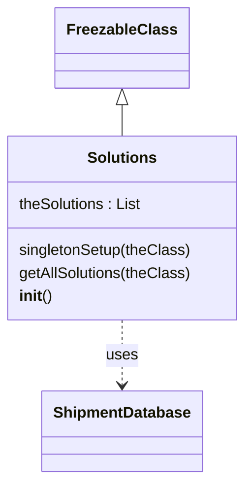

# Diagram: platform/tools/ide_local_testing/localTest/core/Solutions.py


> Auto-generated by Obscura crawlers

## Diagram 1



### SVG

<svg id="container" width="255.328125" xmlns="http://www.w3.org/2000/svg" class="classDiagram" height="500" viewBox="0 0 255.328125 500" role="graphics-document document" aria-roledescription="class"><style>#container{font-family:"trebuchet ms",verdana,arial,sans-serif;font-size:16px;fill:#333;}@keyframes edge-animation-frame{from{stroke-dashoffset:0;}}@keyframes dash{to{stroke-dashoffset:0;}}#container .edge-animation-slow{stroke-dasharray:9,5!important;stroke-dashoffset:900;animation:dash 50s linear infinite;stroke-linecap:round;}#container .edge-animation-fast{stroke-dasharray:9,5!important;stroke-dashoffset:900;animation:dash 20s linear infinite;stroke-linecap:round;}#container .error-icon{fill:#552222;}#container .error-text{fill:#552222;stroke:#552222;}#container .edge-thickness-normal{stroke-width:1px;}#container .edge-thickness-thick{stroke-width:3.5px;}#container .edge-pattern-solid{stroke-dasharray:0;}#container .edge-thickness-invisible{stroke-width:0;fill:none;}#container .edge-pattern-dashed{stroke-dasharray:3;}#container .edge-pattern-dotted{stroke-dasharray:2;}#container .marker{fill:#333333;stroke:#333333;}#container .marker.cross{stroke:#333333;}#container svg{font-family:"trebuchet ms",verdana,arial,sans-serif;font-size:16px;}#container p{margin:0;}#container g.classGroup text{fill:#9370DB;stroke:none;font-family:"trebuchet ms",verdana,arial,sans-serif;font-size:10px;}#container g.classGroup text .title{font-weight:bolder;}#container .nodeLabel,#container .edgeLabel{color:#131300;}#container .edgeLabel .label rect{fill:#ECECFF;}#container .label text{fill:#131300;}#container .labelBkg{background:#ECECFF;}#container .edgeLabel .label span{background:#ECECFF;}#container .classTitle{font-weight:bolder;}#container .node rect,#container .node circle,#container .node ellipse,#container .node polygon,#container .node path{fill:#ECECFF;stroke:#9370DB;stroke-width:1px;}#container .divider{stroke:#9370DB;stroke-width:1;}#container g.clickable{cursor:pointer;}#container g.classGroup rect{fill:#ECECFF;stroke:#9370DB;}#container g.classGroup line{stroke:#9370DB;stroke-width:1;}#container .classLabel .box{stroke:none;stroke-width:0;fill:#ECECFF;opacity:0.5;}#container .classLabel .label{fill:#9370DB;font-size:10px;}#container .relation{stroke:#333333;stroke-width:1;fill:none;}#container .dashed-line{stroke-dasharray:3;}#container .dotted-line{stroke-dasharray:1 2;}#container #compositionStart,#container .composition{fill:#333333!important;stroke:#333333!important;stroke-width:1;}#container #compositionEnd,#container .composition{fill:#333333!important;stroke:#333333!important;stroke-width:1;}#container #dependencyStart,#container .dependency{fill:#333333!important;stroke:#333333!important;stroke-width:1;}#container #dependencyStart,#container .dependency{fill:#333333!important;stroke:#333333!important;stroke-width:1;}#container #extensionStart,#container .extension{fill:transparent!important;stroke:#333333!important;stroke-width:1;}#container #extensionEnd,#container .extension{fill:transparent!important;stroke:#333333!important;stroke-width:1;}#container #aggregationStart,#container .aggregation{fill:transparent!important;stroke:#333333!important;stroke-width:1;}#container #aggregationEnd,#container .aggregation{fill:transparent!important;stroke:#333333!important;stroke-width:1;}#container #lollipopStart,#container .lollipop{fill:#ECECFF!important;stroke:#333333!important;stroke-width:1;}#container #lollipopEnd,#container .lollipop{fill:#ECECFF!important;stroke:#333333!important;stroke-width:1;}#container .edgeTerminals{font-size:11px;line-height:initial;}#container .classTitleText{text-anchor:middle;font-size:18px;fill:#333;}#container .label-icon{display:inline-block;height:1em;overflow:visible;vertical-align:-0.125em;}#container .node .label-icon path{fill:currentColor;stroke:revert;stroke-width:revert;}#container :root{--mermaid-font-family:"trebuchet ms",verdana,arial,sans-serif;}</style><g><defs><marker id="container_class-aggregationStart" class="marker aggregation class" refX="18" refY="7" markerWidth="190" markerHeight="240" orient="auto"><path d="M 18,7 L9,13 L1,7 L9,1 Z"></path></marker></defs><defs><marker id="container_class-aggregationEnd" class="marker aggregation class" refX="1" refY="7" markerWidth="20" markerHeight="28" orient="auto"><path d="M 18,7 L9,13 L1,7 L9,1 Z"></path></marker></defs><defs><marker id="container_class-extensionStart" class="marker extension class" refX="18" refY="7" markerWidth="190" markerHeight="240" orient="auto"><path d="M 1,7 L18,13 V 1 Z"></path></marker></defs><defs><marker id="container_class-extensionEnd" class="marker extension class" refX="1" refY="7" markerWidth="20" markerHeight="28" orient="auto"><path d="M 1,1 V 13 L18,7 Z"></path></marker></defs><defs><marker id="container_class-compositionStart" class="marker composition class" refX="18" refY="7" markerWidth="190" markerHeight="240" orient="auto"><path d="M 18,7 L9,13 L1,7 L9,1 Z"></path></marker></defs><defs><marker id="container_class-compositionEnd" class="marker composition class" refX="1" refY="7" markerWidth="20" markerHeight="28" orient="auto"><path d="M 18,7 L9,13 L1,7 L9,1 Z"></path></marker></defs><defs><marker id="container_class-dependencyStart" class="marker dependency class" refX="6" refY="7" markerWidth="190" markerHeight="240" orient="auto"><path d="M 5,7 L9,13 L1,7 L9,1 Z"></path></marker></defs><defs><marker id="container_class-dependencyEnd" class="marker dependency class" refX="13" refY="7" markerWidth="20" markerHeight="28" orient="auto"><path d="M 18,7 L9,13 L14,7 L9,1 Z"></path></marker></defs><defs><marker id="container_class-lollipopStart" class="marker lollipop class" refX="13" refY="7" markerWidth="190" markerHeight="240" orient="auto"><circle stroke="black" fill="transparent" cx="7" cy="7" r="6"></circle></marker></defs><defs><marker id="container_class-lollipopEnd" class="marker lollipop class" refX="1" refY="7" markerWidth="190" markerHeight="240" orient="auto"><circle stroke="black" fill="transparent" cx="7" cy="7" r="6"></circle></marker></defs><g class="root"><g class="clusters"></g><g class="edgePaths"><path d="M127.664,109.25L127.664,110.542C127.664,111.833,127.664,114.417,127.664,119.875C127.664,125.333,127.664,133.667,127.664,137.833L127.664,142" id="id_FreezableClass_Solutions_1" class="edge-thickness-normal edge-pattern-solid relation" style=";;;" data-edge="true" data-et="edge" data-id="id_FreezableClass_Solutions_1" data-points="W3sieCI6MTI3LjY2NDA2MjUsInkiOjkyfSx7IngiOjEyNy42NjQwNjI1LCJ5IjoxMTd9LHsieCI6MTI3LjY2NDA2MjUsInkiOjE0Mn1d" marker-start="url(#container_class-extensionStart)"></path><path d="M127.664,334L127.664,340.167C127.664,346.333,127.664,358.667,127.664,370C127.664,381.333,127.664,391.667,127.664,396.833L127.664,402" id="id_Solutions_ShipmentDatabase_2" class="edge-thickness-normal edge-pattern-dashed relation" style=";;;" data-edge="true" data-et="edge" data-id="id_Solutions_ShipmentDatabase_2" data-points="W3sieCI6MTI3LjY2NDA2MjUsInkiOjMzNH0seyJ4IjoxMjcuNjY0MDYyNSwieSI6MzcxfSx7IngiOjEyNy42NjQwNjI1LCJ5Ijo0MDh9XQ==" marker-end="url(#container_class-dependencyEnd)"></path></g><g class="edgeLabels"><g class="edgeLabel"><g class="label" data-id="id_FreezableClass_Solutions_1" transform="translate(0, 0)"><foreignObject width="0" height="0"><div xmlns="http://www.w3.org/1999/xhtml" class="labelBkg" style="display: table-cell; white-space: nowrap; line-height: 1.5; max-width: 200px; text-align: center;"><span class="edgeLabel"></span></div></foreignObject></g></g><g class="edgeLabel" transform="translate(127.6640625, 371)"><g class="label" data-id="id_Solutions_ShipmentDatabase_2" transform="translate(-16.4921875, -12)"><foreignObject width="32.984375" height="24"><div xmlns="http://www.w3.org/1999/xhtml" class="labelBkg" style="display: table-cell; white-space: nowrap; line-height: 1.5; max-width: 200px; text-align: center;"><span class="edgeLabel"><p>uses</p></span></div></foreignObject></g></g></g><g class="nodes"><g class="node default" id="classId-FreezableClass-0" transform="translate(127.6640625, 50)"><g class="basic label-container"><path d="M-65.640625 -42 L65.640625 -42 L65.640625 42 L-65.640625 42" stroke="none" stroke-width="0" fill="#ECECFF" style=""></path><path d="M-65.640625 -42 C-25.492557593716846 -42, 14.655509812566308 -42, 65.640625 -42 M-65.640625 -42 C-19.11923428458701 -42, 27.402156430825983 -42, 65.640625 -42 M65.640625 -42 C65.640625 -17.17515071093553, 65.640625 7.649698578128941, 65.640625 42 M65.640625 -42 C65.640625 -15.125031067358886, 65.640625 11.749937865282227, 65.640625 42 M65.640625 42 C32.24284007265012 42, -1.1549448546997638 42, -65.640625 42 M65.640625 42 C26.226973077982763 42, -13.186678844034475 42, -65.640625 42 M-65.640625 42 C-65.640625 22.188969644022464, -65.640625 2.377939288044928, -65.640625 -42 M-65.640625 42 C-65.640625 12.374257993273183, -65.640625 -17.251484013453634, -65.640625 -42" stroke="#9370DB" stroke-width="1.3" fill="none" stroke-dasharray="0 0" style=""></path></g><g class="annotation-group text" transform="translate(0, -18)"></g><g class="label-group text" transform="translate(-53.640625, -18)"><g class="label" style="font-weight: bolder" transform="translate(0,-12)"><foreignObject width="107.28125" height="24"><div xmlns="http://www.w3.org/1999/xhtml" style="display: table-cell; white-space: nowrap; line-height: 1.5; max-width: 155px; text-align: center;"><span class="nodeLabel markdown-node-label" style=""><p>FreezableClass</p></span></div></foreignObject></g></g><g class="members-group text" transform="translate(-53.640625, 30)"></g><g class="methods-group text" transform="translate(-53.640625, 60)"></g><g class="divider" style=""><path d="M-65.640625 6 C-34.42004931892742 6, -3.1994736378548367 6, 65.640625 6 M-65.640625 6 C-25.961230117741884 6, 13.718164764516231 6, 65.640625 6" stroke="#9370DB" stroke-width="1.3" fill="none" stroke-dasharray="0 0" style=""></path></g><g class="divider" style=""><path d="M-65.640625 24 C-22.60144043893807 24, 20.43774412212386 24, 65.640625 24 M-65.640625 24 C-23.57105522355434 24, 18.498514552891322 24, 65.640625 24" stroke="#9370DB" stroke-width="1.3" fill="none" stroke-dasharray="0 0" style=""></path></g></g><g class="node default" id="classId-ShipmentDatabase-1" transform="translate(127.6640625, 450)"><g class="basic label-container"><path d="M-81.2734375 -42 L81.2734375 -42 L81.2734375 42 L-81.2734375 42" stroke="none" stroke-width="0" fill="#ECECFF" style=""></path><path d="M-81.2734375 -42 C-22.59646855122066 -42, 36.08050039755868 -42, 81.2734375 -42 M-81.2734375 -42 C-40.896000993342824 -42, -0.5185644866856478 -42, 81.2734375 -42 M81.2734375 -42 C81.2734375 -15.043076110020571, 81.2734375 11.913847779958857, 81.2734375 42 M81.2734375 -42 C81.2734375 -13.124535449972214, 81.2734375 15.750929100055572, 81.2734375 42 M81.2734375 42 C17.247615504270684 42, -46.77820649145863 42, -81.2734375 42 M81.2734375 42 C34.03108013389841 42, -13.211277232203173 42, -81.2734375 42 M-81.2734375 42 C-81.2734375 11.056926314766816, -81.2734375 -19.886147370466368, -81.2734375 -42 M-81.2734375 42 C-81.2734375 24.26903784766387, -81.2734375 6.538075695327741, -81.2734375 -42" stroke="#9370DB" stroke-width="1.3" fill="none" stroke-dasharray="0 0" style=""></path></g><g class="annotation-group text" transform="translate(0, -18)"></g><g class="label-group text" transform="translate(-69.2734375, -18)"><g class="label" style="font-weight: bolder" transform="translate(0,-12)"><foreignObject width="138.546875" height="24"><div xmlns="http://www.w3.org/1999/xhtml" style="display: table-cell; white-space: nowrap; line-height: 1.5; max-width: 187px; text-align: center;"><span class="nodeLabel markdown-node-label" style=""><p>ShipmentDatabase</p></span></div></foreignObject></g></g><g class="members-group text" transform="translate(-69.2734375, 30)"></g><g class="methods-group text" transform="translate(-69.2734375, 60)"></g><g class="divider" style=""><path d="M-81.2734375 6 C-43.41297241463602 6, -5.552507329272046 6, 81.2734375 6 M-81.2734375 6 C-33.02831623782113 6, 15.21680502435774 6, 81.2734375 6" stroke="#9370DB" stroke-width="1.3" fill="none" stroke-dasharray="0 0" style=""></path></g><g class="divider" style=""><path d="M-81.2734375 24 C-24.75944219187781 24, 31.75455311624438 24, 81.2734375 24 M-81.2734375 24 C-16.472954067780577 24, 48.327529364438846 24, 81.2734375 24" stroke="#9370DB" stroke-width="1.3" fill="none" stroke-dasharray="0 0" style=""></path></g></g><g class="node default" id="classId-Solutions-2" transform="translate(127.6640625, 238)"><g class="basic label-container"><path d="M-119.6640625 -96 L119.6640625 -96 L119.6640625 96 L-119.6640625 96" stroke="none" stroke-width="0" fill="#ECECFF" style=""></path><path d="M-119.6640625 -96 C-63.18749385904541 -96, -6.710925218090821 -96, 119.6640625 -96 M-119.6640625 -96 C-44.618756801352646 -96, 30.42654889729471 -96, 119.6640625 -96 M119.6640625 -96 C119.6640625 -21.737445763935995, 119.6640625 52.52510847212801, 119.6640625 96 M119.6640625 -96 C119.6640625 -22.55498609566409, 119.6640625 50.89002780867182, 119.6640625 96 M119.6640625 96 C27.41605303033009 96, -64.83195643933982 96, -119.6640625 96 M119.6640625 96 C53.48967534142729 96, -12.684711817145427 96, -119.6640625 96 M-119.6640625 96 C-119.6640625 48.717878783680504, -119.6640625 1.4357575673610086, -119.6640625 -96 M-119.6640625 96 C-119.6640625 46.81218144483343, -119.6640625 -2.3756371103331446, -119.6640625 -96" stroke="#9370DB" stroke-width="1.3" fill="none" stroke-dasharray="0 0" style=""></path></g><g class="annotation-group text" transform="translate(0, -72)"></g><g class="label-group text" transform="translate(-34.703125, -72)"><g class="label" style="font-weight: bolder" transform="translate(0,-12)"><foreignObject width="69.40625" height="24"><div xmlns="http://www.w3.org/1999/xhtml" style="display: table-cell; white-space: nowrap; line-height: 1.5; max-width: 119px; text-align: center;"><span class="nodeLabel markdown-node-label" style=""><p>Solutions</p></span></div></foreignObject></g></g><g class="members-group text" transform="translate(-107.6640625, -24)"><g class="label" style="" transform="translate(0,-12)"><foreignObject width="130.46875" height="24"><div xmlns="http://www.w3.org/1999/xhtml" style="display: table-cell; white-space: nowrap; line-height: 1.5; max-width: 181px; text-align: center;"><span class="nodeLabel markdown-node-label" style=""><p>theSolutions : List</p></span></div></foreignObject></g></g><g class="methods-group text" transform="translate(-107.6640625, 24)"><g class="label" style="" transform="translate(0,-12)"><foreignObject width="180.28125" height="24"><div xmlns="http://www.w3.org/1999/xhtml" style="display: table-cell; white-space: nowrap; line-height: 1.5; max-width: 230px; text-align: center;"><span class="nodeLabel markdown-node-label" style=""><p>singletonSetup(theClass)</p></span></div></foreignObject></g><g class="label" style="" transform="translate(0,12)"><foreignObject width="180.625" height="24"><div xmlns="http://www.w3.org/1999/xhtml" style="display: table-cell; white-space: nowrap; line-height: 1.5; max-width: 231px; text-align: center;"><span class="nodeLabel markdown-node-label" style=""><p>getAllSolutions(theClass)</p></span></div></foreignObject></g><g class="label" style="" transform="translate(0,36)"><foreignObject width="34.8125" height="24"><div xmlns="http://www.w3.org/1999/xhtml" style="display: table-cell; white-space: nowrap; line-height: 1.5; max-width: 118px; text-align: center;"><span class="nodeLabel markdown-node-label" style=""><p><strong>init</strong>()</p></span></div></foreignObject></g></g><g class="divider" style=""><path d="M-119.6640625 -48 C-66.60547851898394 -48, -13.546894537967873 -48, 119.6640625 -48 M-119.6640625 -48 C-64.51524410441185 -48, -9.366425708823698 -48, 119.6640625 -48" stroke="#9370DB" stroke-width="1.3" fill="none" stroke-dasharray="0 0" style=""></path></g><g class="divider" style=""><path d="M-119.6640625 0 C-69.11842241094817 0, -18.57278232189634 0, 119.6640625 0 M-119.6640625 0 C-24.229590284854183 0, 71.20488193029163 0, 119.6640625 0" stroke="#9370DB" stroke-width="1.3" fill="none" stroke-dasharray="0 0" style=""></path></g></g></g></g></g></svg>

## Diagram 2

```mermaid
flowchart TD
    ML[Module load: imports & top-level code]
    ML --> Check{Solutions.theSolutions empty?}
    Check -- "yes" --> Singleton[Call Solutions.singletonSetup()]
    Check -- "no" --> EndNoInit([No initialization needed])
    Singleton --> DB[Create connector: ShipmentDatabase(getFeatures.test)]
    DB --> Cursor[connector.get_cursor()]
    Cursor --> Execute[Execute SQL query: SELECT EXTERNAL_ID FROM solution WHERE external_id IS NOT NULL]
    Execute --> Results[cursor.fetchall()]
    Results --> Loop{for solution in results}
    Loop --> Append[theClass.theSolutions.append(solution.external_id)]
    Append --> Loop
    Loop -- "done" --> Done([Initialization complete])
    Done --> EndNoInit
```

> SVG rendering failed for this diagram.
