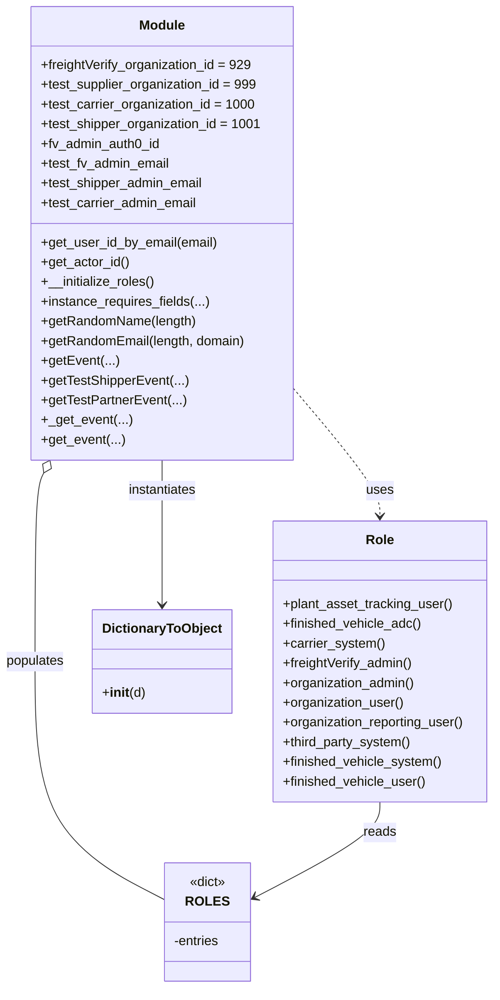
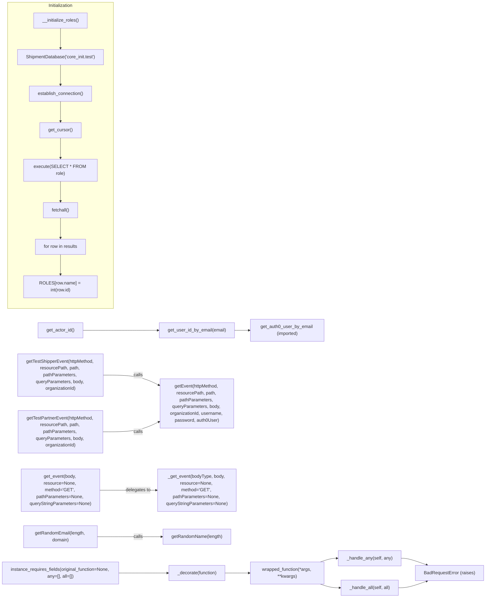

# Diagram: platform/tools/ide_local_testing/localTest/core/__init__.py

> Auto-generated by Obscura crawlers

## Diagram 1

### SVG

<svg id="container" width="602.3828125" xmlns="http://www.w3.org/2000/svg" class="classDiagram" height="1202" viewBox="0 0 602.3828125 1202" role="graphics-document document" aria-roledescription="class"><g><defs><marker id="container_class-aggregationStart" class="marker aggregation class" refX="18" refY="7" markerWidth="190" markerHeight="240" orient="auto"><path d="M 18,7 L9,13 L1,7 L9,1 Z"></path></marker></defs><defs><marker id="container_class-aggregationEnd" class="marker aggregation class" refX="1" refY="7" markerWidth="20" markerHeight="28" orient="auto"><path d="M 18,7 L9,13 L1,7 L9,1 Z"></path></marker></defs><defs><marker id="container_class-extensionStart" class="marker extension class" refX="18" refY="7" markerWidth="190" markerHeight="240" orient="auto"><path d="M 1,7 L18,13 V 1 Z"></path></marker></defs><defs><marker id="container_class-extensionEnd" class="marker extension class" refX="1" refY="7" markerWidth="20" markerHeight="28" orient="auto"><path d="M 1,1 V 13 L18,7 Z"></path></marker></defs><defs><marker id="container_class-compositionStart" class="marker composition class" refX="18" refY="7" markerWidth="190" markerHeight="240" orient="auto"><path d="M 18,7 L9,13 L1,7 L9,1 Z"></path></marker></defs><defs><marker id="container_class-compositionEnd" class="marker composition class" refX="1" refY="7" markerWidth="20" markerHeight="28" orient="auto"><path d="M 18,7 L9,13 L1,7 L9,1 Z"></path></marker></defs><defs><marker id="container_class-dependencyStart" class="marker dependency class" refX="6" refY="7" markerWidth="190" markerHeight="240" orient="auto"><path d="M 5,7 L9,13 L1,7 L9,1 Z"></path></marker></defs><defs><marker id="container_class-dependencyEnd" class="marker dependency class" refX="13" refY="7" markerWidth="20" markerHeight="28" orient="auto"><path d="M 18,7 L9,13 L14,7 L9,1 Z"></path></marker></defs><defs><marker id="container_class-lollipopStart" class="marker lollipop class" refX="13" refY="7" markerWidth="190" markerHeight="240" orient="auto"><circle stroke="black" fill="transparent" cx="7" cy="7" r="6"></circle></marker></defs><defs><marker id="container_class-lollipopEnd" class="marker lollipop class" refX="1" refY="7" markerWidth="190" markerHeight="240" orient="auto"><circle stroke="black" fill="transparent" cx="7" cy="7" r="6"></circle></marker></defs><g class="root"><g class="clusters"></g><g class="edgePaths"><path d="M356.508,471.895L374.117,492.746C391.725,513.597,426.943,555.298,444.551,581.316C462.16,607.333,462.16,617.667,462.16,622.833L462.16,628" id="id_Module_Role_1" class="edge-thickness-normal edge-pattern-dashed relation" style=";;;" data-edge="true" data-et="edge" data-id="id_Module_Role_1" data-points="W3sieCI6MzU2LjUwNzgxMjUsInkiOjQ3MS44OTUyODQzOTkwNjAxM30seyJ4Ijo0NjIuMTYwMTU2MjUsInkiOjU5N30seyJ4Ijo0NjIuMTYwMTU2MjUsInkiOjYzNH1d" marker-end="url(#container_class-dependencyEnd)"></path><path d="M54.907,575.488L53.149,579.074C51.391,582.659,47.875,589.829,46.117,628.081C44.359,666.333,44.359,735.667,44.359,805C44.359,874.333,44.359,943.667,70.478,991.962C96.597,1040.257,148.835,1067.513,174.953,1081.141L201.072,1094.77" id="id_Module_ROLES_2" class="edge-thickness-normal edge-pattern-solid relation" style=";;;" data-edge="true" data-et="edge" data-id="id_Module_ROLES_2" data-points="W3sieCI6NjIuNTAxMDQ4MzIyNjgzNzE1LCJ5Ijo1NjB9LHsieCI6NDQuMzU5Mzc1LCJ5Ijo1OTd9LHsieCI6NDQuMzU5Mzc1LCJ5Ijo4MDV9LHsieCI6NDQuMzU5Mzc1LCJ5IjoxMDEzfSx7IngiOjIwMS4wNzIyNjU2MjUsInkiOjEwOTQuNzY5NjE3Njk2ODMxM31d" marker-start="url(#container_class-aggregationStart)"></path><path d="M197.828,560L197.828,566.167C197.828,572.333,197.828,584.667,197.828,614C197.828,643.333,197.828,689.667,197.828,712.833L197.828,736" id="id_Module_DictionaryToObject_3" class="edge-thickness-normal edge-pattern-solid relation" style=";;;" data-edge="true" data-et="edge" data-id="id_Module_DictionaryToObject_3" data-points="W3sieCI6MTk3LjgyODEyNSwieSI6NTYwfSx7IngiOjE5Ny44MjgxMjUsInkiOjU5N30seyJ4IjoxOTcuODI4MTI1LCJ5Ijo3NDJ9XQ==" marker-end="url(#container_class-dependencyEnd)"></path><path d="M462.16,976L462.16,982.167C462.16,988.333,462.16,1000.667,436.928,1019.999C411.696,1039.331,361.231,1065.663,335.999,1078.828L310.767,1091.994" id="id_Role_ROLES_4" class="edge-thickness-normal edge-pattern-solid relation" style=";;;" data-edge="true" data-et="edge" data-id="id_Role_ROLES_4" data-points="W3sieCI6NDYyLjE2MDE1NjI1LCJ5Ijo5NzZ9LHsieCI6NDYyLjE2MDE1NjI1LCJ5IjoxMDEzfSx7IngiOjMwNS40NDcyNjU2MjUsInkiOjEwOTQuNzY5NjE3Njk2ODMxM31d" marker-end="url(#container_class-dependencyEnd)"></path></g><g class="edgeLabels"><g class="edgeLabel" transform="translate(462.16015625, 597)"><g class="label" data-id="id_Module_Role_1" transform="translate(-16.4921875, -12)"><foreignObject width="32.984375" height="24">

uses

</foreignObject></g></g><g class="edgeLabel" transform="translate(44.359375, 805)"><g class="label" data-id="id_Module_ROLES_2" transform="translate(-36.359375, -12)"><foreignObject width="72.71875" height="24">

populates

</foreignObject></g></g><g class="edgeLabel" transform="translate(197.828125, 597)"><g class="label" data-id="id_Module_DictionaryToObject_3" transform="translate(-42.9140625, -12)"><foreignObject width="85.828125" height="24">

instantiates

</foreignObject></g></g><g class="edgeLabel" transform="translate(462.16015625, 1013)"><g class="label" data-id="id_Role_ROLES_4" transform="translate(-20.0078125, -12)"><foreignObject width="40.015625" height="24">

reads

</foreignObject></g></g></g><g class="nodes"><g class="node default" id="classId-Role-0" transform="translate(462.16015625, 805)"><g class="basic label-container"><path d="M-132.22265625 -171 L132.22265625 -171 L132.22265625 171 L-132.22265625 171" stroke="none" stroke-width="0" fill="#ECECFF" style=""></path><path d="M-132.22265625 -171 C-27.12802054147359 -171, 77.96661516705282 -171, 132.22265625 -171 M-132.22265625 -171 C-53.68463916435036 -171, 24.853377921299284 -171, 132.22265625 -171 M132.22265625 -171 C132.22265625 -61.89937786042012, 132.22265625 47.201244279159766, 132.22265625 171 M132.22265625 -171 C132.22265625 -55.90373158721657, 132.22265625 59.19253682556686, 132.22265625 171 M132.22265625 171 C75.56539062710462 171, 18.908125004209225 171, -132.22265625 171 M132.22265625 171 C48.62160796137479 171, -34.979440327250416 171, -132.22265625 171 M-132.22265625 171 C-132.22265625 72.80985338665818, -132.22265625 -25.380293226683648, -132.22265625 -171 M-132.22265625 171 C-132.22265625 78.70950981444065, -132.22265625 -13.580980371118699, -132.22265625 -171" stroke="#9370DB" stroke-width="1.3" fill="none" stroke-dasharray="0 0" style=""></path></g><g class="annotation-group text" transform="translate(0, -147)"></g><g class="label-group text" transform="translate(-16.2421875, -147)"><g class="label" style="font-weight: bolder" transform="translate(0,-12)"><foreignObject width="32.484375" height="24">

Role

</foreignObject></g></g><g class="members-group text" transform="translate(-120.22265625, -99)"></g><g class="methods-group text" transform="translate(-120.22265625, -69)"><g class="label" style="" transform="translate(0,-12)"><foreignObject width="208.046875" height="24">

+plant_asset_tracking_user()

</foreignObject></g><g class="label" style="" transform="translate(0,12)"><foreignObject width="169.171875" height="24">

+finished_vehicle_adc()

</foreignObject></g><g class="label" style="" transform="translate(0,36)"><foreignObject width="123.75" height="24">

+carrier_system()

</foreignObject></g><g class="label" style="" transform="translate(0,60)"><foreignObject width="160.40625" height="24">

+freightVerify_admin()

</foreignObject></g><g class="label" style="" transform="translate(0,84)"><foreignObject width="162.578125" height="24">

+organization_admin()

</foreignObject></g><g class="label" style="" transform="translate(0,108)"><foreignObject width="148.390625" height="24">

+organization_user()

</foreignObject></g><g class="label" style="" transform="translate(0,132)"><foreignObject width="224.203125" height="24">

+organization_reporting_user()

</foreignObject></g><g class="label" style="" transform="translate(0,156)"><foreignObject width="157.5625" height="24">

+third_party_system()

</foreignObject></g><g class="label" style="" transform="translate(0,180)"><foreignObject width="193.96875" height="24">

+finished_vehicle_system()

</foreignObject></g><g class="label" style="" transform="translate(0,204)"><foreignObject width="174.9375" height="24">

+finished_vehicle_user()

</foreignObject></g></g><g class="divider" style=""><path d="M-132.22265625 -123 C-30.14425475411518 -123, 71.93414674176964 -123, 132.22265625 -123 M-132.22265625 -123 C-67.89277824278858 -123, -3.5629002355771604 -123, 132.22265625 -123" stroke="#9370DB" stroke-width="1.3" fill="none" stroke-dasharray="0 0" style=""></path></g><g class="divider" style=""><path d="M-132.22265625 -99 C-58.198655817372654 -99, 15.825344615254693 -99, 132.22265625 -99 M-132.22265625 -99 C-55.8850787181474 -99, 20.452498813705205 -99, 132.22265625 -99" stroke="#9370DB" stroke-width="1.3" fill="none" stroke-dasharray="0 0" style=""></path></g></g><g class="node default" id="classId-DictionaryToObject-1" transform="translate(197.828125, 805)"><g class="basic label-container"><path d="M-82.109375 -63 L82.109375 -63 L82.109375 63 L-82.109375 63" stroke="none" stroke-width="0" fill="#ECECFF" style=""></path><path d="M-82.109375 -63 C-25.033747601462863 -63, 32.04187979707427 -63, 82.109375 -63 M-82.109375 -63 C-20.730063432207757 -63, 40.649248135584486 -63, 82.109375 -63 M82.109375 -63 C82.109375 -25.628026905051904, 82.109375 11.743946189896192, 82.109375 63 M82.109375 -63 C82.109375 -13.725900433267803, 82.109375 35.548199133464394, 82.109375 63 M82.109375 63 C36.15320259906707 63, -9.802969801865856 63, -82.109375 63 M82.109375 63 C44.35977167449332 63, 6.610168348986633 63, -82.109375 63 M-82.109375 63 C-82.109375 28.07650855982392, -82.109375 -6.846982880352158, -82.109375 -63 M-82.109375 63 C-82.109375 27.578669168769885, -82.109375 -7.84266166246023, -82.109375 -63" stroke="#9370DB" stroke-width="1.3" fill="none" stroke-dasharray="0 0" style=""></path></g><g class="annotation-group text" transform="translate(0, -39)"></g><g class="label-group text" transform="translate(-70.109375, -39)"><g class="label" style="font-weight: bolder" transform="translate(0,-12)"><foreignObject width="140.21875" height="24">

DictionaryToObject

</foreignObject></g></g><g class="members-group text" transform="translate(-70.109375, 9)"></g><g class="methods-group text" transform="translate(-70.109375, 39)"><g class="label" style="" transform="translate(0,-12)"><foreignObject width="52.359375" height="24">

+<strong>init</strong>(d)

</foreignObject></g></g><g class="divider" style=""><path d="M-82.109375 -15 C-21.893902033886306 -15, 38.32157093222739 -15, 82.109375 -15 M-82.109375 -15 C-26.524247882873645 -15, 29.06087923425271 -15, 82.109375 -15" stroke="#9370DB" stroke-width="1.3" fill="none" stroke-dasharray="0 0" style=""></path></g><g class="divider" style=""><path d="M-82.109375 9 C-17.480545551957874 9, 47.14828389608425 9, 82.109375 9 M-82.109375 9 C-42.3101140012287 9, -2.510853002457395 9, 82.109375 9" stroke="#9370DB" stroke-width="1.3" fill="none" stroke-dasharray="0 0" style=""></path></g></g><g class="node default" id="classId-ROLES-2" transform="translate(253.259765625, 1122)"><g class="basic label-container"><path d="M-52.1875 -72 L52.1875 -72 L52.1875 72 L-52.1875 72" stroke="none" stroke-width="0" fill="#ECECFF" style=""></path><path d="M-52.1875 -72 C-20.337524857278897 -72, 11.512450285442206 -72, 52.1875 -72 M-52.1875 -72 C-13.641379825614116 -72, 24.904740348771767 -72, 52.1875 -72 M52.1875 -72 C52.1875 -23.069291071381095, 52.1875 25.86141785723781, 52.1875 72 M52.1875 -72 C52.1875 -22.515259640964317, 52.1875 26.969480718071367, 52.1875 72 M52.1875 72 C21.071848284553507 72, -10.043803430892986 72, -52.1875 72 M52.1875 72 C23.1036777227637 72, -5.980144554472602 72, -52.1875 72 M-52.1875 72 C-52.1875 29.923744930291107, -52.1875 -12.152510139417785, -52.1875 -72 M-52.1875 72 C-52.1875 32.85042459845458, -52.1875 -6.299150803090839, -52.1875 -72" stroke="#9370DB" stroke-width="1.3" fill="none" stroke-dasharray="0 0" style=""></path></g><g class="annotation-group text" transform="translate(-22.7265625, -48)"><g class="label" style="" transform="translate(0,-12)"><foreignObject width="45.453125" height="24">

«dict»

</foreignObject></g></g><g class="label-group text" transform="translate(-23.171875, -24)"><g class="label" style="font-weight: bolder" transform="translate(0,-12)"><foreignObject width="46.34375" height="24">

ROLES

</foreignObject></g></g><g class="members-group text" transform="translate(-40.1875, 24)"><g class="label" style="" transform="translate(0,-12)"><foreignObject width="57.203125" height="24">

-entries

</foreignObject></g></g><g class="methods-group text" transform="translate(-40.1875, 72)"></g><g class="divider" style=""><path d="M-52.1875 0 C-17.15480800414553 0, 17.87788399170894 0, 52.1875 0 M-52.1875 0 C-10.602351692922383 0, 30.982796614155234 0, 52.1875 0" stroke="#9370DB" stroke-width="1.3" fill="none" stroke-dasharray="0 0" style=""></path></g><g class="divider" style=""><path d="M-52.1875 48 C-15.197964913805755 48, 21.79157017238849 48, 52.1875 48 M-52.1875 48 C-31.058546257509114 48, -9.929592515018228 48, 52.1875 48" stroke="#9370DB" stroke-width="1.3" fill="none" stroke-dasharray="0 0" style=""></path></g></g><g class="node default" id="classId-Module-3" transform="translate(197.828125, 284)"><g class="basic label-container"><path d="M-158.6796875 -276 L158.6796875 -276 L158.6796875 276 L-158.6796875 276" stroke="none" stroke-width="0" fill="#ECECFF" style=""></path><path d="M-158.6796875 -276 C-51.26784496888605 -276, 56.143997562227895 -276, 158.6796875 -276 M-158.6796875 -276 C-72.75054416041695 -276, 13.178599179166099 -276, 158.6796875 -276 M158.6796875 -276 C158.6796875 -135.78819745459458, 158.6796875 4.423605090810838, 158.6796875 276 M158.6796875 -276 C158.6796875 -89.58548634923059, 158.6796875 96.82902730153882, 158.6796875 276 M158.6796875 276 C63.10473875869276 276, -32.47020998261448 276, -158.6796875 276 M158.6796875 276 C57.1361407740538 276, -44.4074059518924 276, -158.6796875 276 M-158.6796875 276 C-158.6796875 132.6635891108646, -158.6796875 -10.672821778270816, -158.6796875 -276 M-158.6796875 276 C-158.6796875 65.16644141826569, -158.6796875 -145.66711716346862, -158.6796875 -276" stroke="#9370DB" stroke-width="1.3" fill="none" stroke-dasharray="0 0" style=""></path></g><g class="annotation-group text" transform="translate(0, -252)"></g><g class="label-group text" transform="translate(-27.09375, -252)"><g class="label" style="font-weight: bolder" transform="translate(0,-12)"><foreignObject width="54.1875" height="24">

Module

</foreignObject></g></g><g class="members-group text" transform="translate(-146.6796875, -204)"><g class="label" style="" transform="translate(0,-12)"><foreignObject width="257.609375" height="24">

+freightVerify_organization_id = 929

</foreignObject></g><g class="label" style="" transform="translate(0,12)"><foreignObject width="264.78125" height="24">

+test_supplier_organization_id = 999

</foreignObject></g><g class="label" style="" transform="translate(0,36)"><foreignObject width="261.03125" height="24">

+test_carrier_organization_id = 1000

</foreignObject></g><g class="label" style="" transform="translate(0,60)"><foreignObject width="266.265625" height="24">

+test_shipper_organization_id = 1001

</foreignObject></g><g class="label" style="" transform="translate(0,84)"><foreignObject width="146.390625" height="24">

+fv_admin_auth0_id

</foreignObject></g><g class="label" style="" transform="translate(0,108)"><foreignObject width="158.375" height="24">

+test_fv_admin_email

</foreignObject></g><g class="label" style="" transform="translate(0,132)"><foreignObject width="199.921875" height="24">

+test_shipper_admin_email

</foreignObject></g><g class="label" style="" transform="translate(0,156)"><foreignObject width="192.296875" height="24">

+test_carrier_admin_email

</foreignObject></g></g><g class="methods-group text" transform="translate(-146.6796875, 12)"><g class="label" style="" transform="translate(0,-12)"><foreignObject width="215.546875" height="24">

+get_user_id_by_email(email)

</foreignObject></g><g class="label" style="" transform="translate(0,12)"><foreignObject width="107.453125" height="24">

+get_actor_id()

</foreignObject></g><g class="label" style="" transform="translate(0,36)"><foreignObject width="139.4375" height="24">

+__initialize_roles()

</foreignObject></g><g class="label" style="" transform="translate(0,60)"><foreignObject width="205.96875" height="24">

+instance_requires_fields(...)

</foreignObject></g><g class="label" style="" transform="translate(0,84)"><foreignObject width="189.390625" height="24">

+getRandomName(length)

</foreignObject></g><g class="label" style="" transform="translate(0,108)"><foreignObject width="250.625" height="24">

+getRandomEmail(length, domain)

</foreignObject></g><g class="label" style="" transform="translate(0,132)"><foreignObject width="92.359375" height="24">

+getEvent(...)

</foreignObject></g><g class="label" style="" transform="translate(0,156)"><foreignObject width="178.234375" height="24">

+getTestShipperEvent(...)

</foreignObject></g><g class="label" style="" transform="translate(0,180)"><foreignObject width="175.0625" height="24">

+getTestPartnerEvent(...)

</foreignObject></g><g class="label" style="" transform="translate(0,204)"><foreignObject width="107.953125" height="24">

+_get_event(...)

</foreignObject></g><g class="label" style="" transform="translate(0,228)"><foreignObject width="100.78125" height="24">

+get_event(...)

</foreignObject></g></g><g class="divider" style=""><path d="M-158.6796875 -228 C-75.68870374257222 -228, 7.302280014855569 -228, 158.6796875 -228 M-158.6796875 -228 C-42.02060299090719 -228, 74.63848151818561 -228, 158.6796875 -228" stroke="#9370DB" stroke-width="1.3" fill="none" stroke-dasharray="0 0" style=""></path></g><g class="divider" style=""><path d="M-158.6796875 -12 C-54.104770886992114 -12, 50.47014572601577 -12, 158.6796875 -12 M-158.6796875 -12 C-76.58118642468676 -12, 5.517314650626474 -12, 158.6796875 -12" stroke="#9370DB" stroke-width="1.3" fill="none" stroke-dasharray="0 0" style=""></path></g></g></g></g></g></svg>

## Diagram 2

### SVG

<svg id="container" width="1724.375" xmlns="http://www.w3.org/2000/svg" class="flowchart" height="2108" viewBox="0 0 1724.375 2108" role="graphics-document document" aria-roledescription="flowchart-v2"><g><marker id="container_flowchart-v2-pointEnd" class="marker flowchart-v2" viewBox="0 0 10 10" refX="5" refY="5" markerUnits="userSpaceOnUse" markerWidth="8" markerHeight="8" orient="auto"><path d="M 0 0 L 10 5 L 0 10 z" class="arrowMarkerPath" style="stroke-width: 1; stroke-dasharray: 1, 0;"></path></marker><marker id="container_flowchart-v2-pointStart" class="marker flowchart-v2" viewBox="0 0 10 10" refX="4.5" refY="5" markerUnits="userSpaceOnUse" markerWidth="8" markerHeight="8" orient="auto"><path d="M 0 5 L 10 10 L 10 0 z" class="arrowMarkerPath" style="stroke-width: 1; stroke-dasharray: 1, 0;"></path></marker><marker id="container_flowchart-v2-circleEnd" class="marker flowchart-v2" viewBox="0 0 10 10" refX="11" refY="5" markerUnits="userSpaceOnUse" markerWidth="11" markerHeight="11" orient="auto"><circle cx="5" cy="5" r="5" class="arrowMarkerPath" style="stroke-width: 1; stroke-dasharray: 1, 0;"></circle></marker><marker id="container_flowchart-v2-circleStart" class="marker flowchart-v2" viewBox="0 0 10 10" refX="-1" refY="5" markerUnits="userSpaceOnUse" markerWidth="11" markerHeight="11" orient="auto"><circle cx="5" cy="5" r="5" class="arrowMarkerPath" style="stroke-width: 1; stroke-dasharray: 1, 0;"></circle></marker><marker id="container_flowchart-v2-crossEnd" class="marker cross flowchart-v2" viewBox="0 0 11 11" refX="12" refY="5.2" markerUnits="userSpaceOnUse" markerWidth="11" markerHeight="11" orient="auto"><path d="M 1,1 l 9,9 M 10,1 l -9,9" class="arrowMarkerPath" style="stroke-width: 2; stroke-dasharray: 1, 0;"></path></marker><marker id="container_flowchart-v2-crossStart" class="marker cross flowchart-v2" viewBox="0 0 11 11" refX="-1" refY="5.2" markerUnits="userSpaceOnUse" markerWidth="11" markerHeight="11" orient="auto"><path d="M 1,1 l 9,9 M 10,1 l -9,9" class="arrowMarkerPath" style="stroke-width: 2; stroke-dasharray: 1, 0;"></path></marker><g class="root"><g class="clusters"></g><g class="edgePaths"><path d="M839.523,1165L844.527,1165C849.531,1165,859.539,1165,868.043,1165C876.547,1165,883.547,1165,887.047,1165L890.547,1165" id="L_getUser_auth0_0" class="edge-thickness-normal edge-pattern-solid edge-thickness-normal edge-pattern-solid flowchart-link" style=";" data-edge="true" data-et="edge" data-id="L_getUser_auth0_0" data-points="W3sieCI6ODM5LjUyMzQzNzUsInkiOjExNjV9LHsieCI6ODY5LjU0Njg3NSwieSI6MTE2NX0seyJ4Ijo4OTQuNTQ2ODc1LCJ5IjoxMTY1fV0=" marker-end="url(#container_flowchart-v2-pointEnd)"></path><path d="M297.609,1165L330.898,1165C364.188,1165,430.766,1165,475.824,1165C520.883,1165,544.422,1165,556.191,1165L567.961,1165" id="L_getActor_getUser_0" class="edge-thickness-normal edge-pattern-solid edge-thickness-normal edge-pattern-solid flowchart-link" style=";" data-edge="true" data-et="edge" data-id="L_getActor_getUser_0" data-points="W3sieCI6Mjk3LjYwOTM3NSwieSI6MTE2NX0seyJ4Ijo0OTcuMzQzNzUsInkiOjExNjV9LHsieCI6NTcxLjk2MDkzNzUsInkiOjExNjV9XQ==" marker-end="url(#container_flowchart-v2-pointEnd)"></path><path d="M371.516,1323L392.487,1323C413.458,1323,455.401,1323,488.838,1328.982C522.274,1334.963,547.205,1346.926,559.671,1352.908L572.136,1358.889" id="L_getTestShipper_getEvent_0" class="edge-thickness-normal edge-pattern-solid edge-thickness-normal edge-pattern-solid flowchart-link" style=";" data-edge="true" data-et="edge" data-id="L_getTestShipper_getEvent_0" data-points="W3sieCI6MzcxLjUxNTYyNSwieSI6MTMyM30seyJ4Ijo0OTcuMzQzNzUsInkiOjEzMjN9LHsieCI6NTc1Ljc0MjE4NzUsInkiOjEzNjAuNjE5NDkzOTA4MTUzOH1d" marker-end="url(#container_flowchart-v2-pointEnd)"></path><path d="M369.938,1523L391.172,1523C412.406,1523,454.875,1523,488.575,1517.018C522.274,1511.037,547.205,1499.074,559.671,1493.092L572.136,1487.111" id="L_getTestPartner_getEvent_0" class="edge-thickness-normal edge-pattern-solid edge-thickness-normal edge-pattern-solid flowchart-link" style=";" data-edge="true" data-et="edge" data-id="L_getTestPartner_getEvent_0" data-points="W3sieCI6MzY5LjkzNzUsInkiOjE1MjN9LHsieCI6NDk3LjM0Mzc1LCJ5IjoxNTIzfSx7IngiOjU3NS43NDIxODc1LCJ5IjoxNDg1LjM4MDUwNjA5MTg0NjJ9XQ==" marker-end="url(#container_flowchart-v2-pointEnd)"></path><path d="M356.688,1729L380.13,1729C403.573,1729,450.458,1729,484.833,1729C519.208,1729,541.073,1729,552.005,1729L562.938,1729" id="L_get_event__get_event_0" class="edge-thickness-normal edge-pattern-solid edge-thickness-normal edge-pattern-solid flowchart-link" style=";" data-edge="true" data-et="edge" data-id="L_get_event__get_event_0" data-points="W3sieCI6MzU2LjY4NzUsInkiOjE3Mjl9LHsieCI6NDk3LjM0Mzc1LCJ5IjoxNzI5fSx7IngiOjU2Ni45Mzc1LCJ5IjoxNzI5fV0=" marker-end="url(#container_flowchart-v2-pointEnd)"></path><path d="M347.875,1893L372.786,1893C397.698,1893,447.521,1893,486.382,1893C525.242,1893,553.141,1893,567.09,1893L581.039,1893" id="L_randEmail_randName_0" class="edge-thickness-normal edge-pattern-solid edge-thickness-normal edge-pattern-solid flowchart-link" style=";" data-edge="true" data-et="edge" data-id="L_randEmail_randName_0" data-points="W3sieCI6MzQ3Ljg3NSwieSI6MTg5M30seyJ4Ijo0OTcuMzQzNzUsInkiOjE4OTN9LHsieCI6NTg1LjAzOTA2MjUsInkiOjE4OTN9XQ==" marker-end="url(#container_flowchart-v2-pointEnd)"></path><path d="M427.75,2021L439.349,2021C450.948,2021,474.146,2021,502.927,2021C531.708,2021,566.073,2021,583.255,2021L600.438,2021" id="L_decorator_decorate_0" class="edge-thickness-normal edge-pattern-solid edge-thickness-normal edge-pattern-solid flowchart-link" style=";" data-edge="true" data-et="edge" data-id="L_decorator_decorate_0" data-points="W3sieCI6NDI3Ljc1LCJ5IjoyMDIxfSx7IngiOjQ5Ny4zNDM3NSwieSI6MjAyMX0seyJ4Ijo2MDQuNDM3NSwieSI6MjAyMX1d" marker-end="url(#container_flowchart-v2-pointEnd)"></path><path d="M807.047,2021L817.464,2021C827.88,2021,848.714,2021,862.63,2021C876.547,2021,883.547,2021,887.047,2021L890.547,2021" id="L_decorate_wrapped_0" class="edge-thickness-normal edge-pattern-solid edge-thickness-normal edge-pattern-solid flowchart-link" style=";" data-edge="true" data-et="edge" data-id="L_decorate_wrapped_0" data-points="W3sieCI6ODA3LjA0Njg3NSwieSI6MjAyMX0seyJ4Ijo4NjkuNTQ2ODc1LCJ5IjoyMDIxfSx7IngiOjg5NC41NDY4NzUsInkiOjIwMjF9XQ==" marker-end="url(#container_flowchart-v2-pointEnd)"></path><path d="M1140.797,1982L1147.255,1979.833C1153.714,1977.667,1166.63,1973.333,1176.589,1971.167C1186.547,1969,1193.547,1969,1197.047,1969L1200.547,1969" id="L_wrapped_handleAny_0" class="edge-thickness-normal edge-pattern-solid edge-thickness-normal edge-pattern-solid flowchart-link" style=";" data-edge="true" data-et="edge" data-id="L_wrapped_handleAny_0" data-points="W3sieCI6MTE0MC43OTY4NzUsInkiOjE5ODJ9LHsieCI6MTE3OS41NDY4NzUsInkiOjE5Njl9LHsieCI6MTIwNC41NDY4NzUsInkiOjE5Njl9XQ==" marker-end="url(#container_flowchart-v2-pointEnd)"></path><path d="M1140.797,2060L1147.255,2062.167C1153.714,2064.333,1166.63,2068.667,1177.908,2070.833C1189.185,2073,1198.823,2073,1203.642,2073L1208.461,2073" id="L_wrapped_handleAll_0" class="edge-thickness-normal edge-pattern-solid edge-thickness-normal edge-pattern-solid flowchart-link" style=";" data-edge="true" data-et="edge" data-id="L_wrapped_handleAll_0" data-points="W3sieCI6MTE0MC43OTY4NzUsInkiOjIwNjB9LHsieCI6MTE3OS41NDY4NzUsInkiOjIwNzN9LHsieCI6MTIxMi40NjA5Mzc1LCJ5IjoyMDczfV0=" marker-end="url(#container_flowchart-v2-pointEnd)"></path><path d="M1426.469,1969L1430.635,1969C1434.802,1969,1443.135,1969,1458.289,1972.942C1473.443,1976.883,1495.418,1984.766,1506.405,1988.708L1517.393,1992.649" id="L_handleAny_exception_0" class="edge-thickness-normal edge-pattern-solid edge-thickness-normal edge-pattern-solid flowchart-link" style=";" data-edge="true" data-et="edge" data-id="L_handleAny_exception_0" data-points="W3sieCI6MTQyNi40Njg3NSwieSI6MTk2OX0seyJ4IjoxNDUxLjQ2ODc1LCJ5IjoxOTY5fSx7IngiOjE1MjEuMTU3NzUyNDAzODQ2MiwieSI6MTk5NH1d" marker-end="url(#container_flowchart-v2-pointEnd)"></path><path d="M1418.555,2073L1424.04,2073C1429.526,2073,1440.497,2073,1456.97,2069.058C1473.443,2065.117,1495.418,2057.234,1506.405,2053.292L1517.393,2049.351" id="L_handleAll_exception_0" class="edge-thickness-normal edge-pattern-solid edge-thickness-normal edge-pattern-solid flowchart-link" style=";" data-edge="true" data-et="edge" data-id="L_handleAll_exception_0" data-points="W3sieCI6MTQxOC41NTQ2ODc1LCJ5IjoyMDczfSx7IngiOjE0NTEuNDY4NzUsInkiOjIwNzN9LHsieCI6MTUyMS4xNTc3NTI0MDM4NDYyLCJ5IjoyMDQ4fV0=" marker-end="url(#container_flowchart-v2-pointEnd)"></path></g><g class="edgeLabels"><g class="edgeLabel"><g class="label" data-id="L_getUser_auth0_0" transform="translate(0, 0)"><foreignObject width="0" height="0">

</foreignObject></g></g><g class="edgeLabel"><g class="label" data-id="L_getActor_getUser_0" transform="translate(0, 0)"><foreignObject width="0" height="0">

</foreignObject></g></g><g class="edgeLabel" transform="translate(497.34375, 1323)"><g class="label" data-id="L_getTestShipper_getEvent_0" transform="translate(-16.4453125, -12)"><foreignObject width="32.890625" height="24">

calls

</foreignObject></g></g><g class="edgeLabel" transform="translate(497.34375, 1523)"><g class="label" data-id="L_getTestPartner_getEvent_0" transform="translate(-16.4453125, -12)"><foreignObject width="32.890625" height="24">

calls

</foreignObject></g></g><g class="edgeLabel" transform="translate(497.34375, 1729)"><g class="label" data-id="L_get_event__get_event_0" transform="translate(-44.59375, -12)"><foreignObject width="89.1875" height="24">

delegates to

</foreignObject></g></g><g class="edgeLabel" transform="translate(497.34375, 1893)"><g class="label" data-id="L_randEmail_randName_0" transform="translate(-16.4453125, -12)"><foreignObject width="32.890625" height="24">

calls

</foreignObject></g></g><g class="edgeLabel"><g class="label" data-id="L_decorator_decorate_0" transform="translate(0, 0)"><foreignObject width="0" height="0">

</foreignObject></g></g><g class="edgeLabel"><g class="label" data-id="L_decorate_wrapped_0" transform="translate(0, 0)"><foreignObject width="0" height="0">

</foreignObject></g></g><g class="edgeLabel"><g class="label" data-id="L_wrapped_handleAny_0" transform="translate(0, 0)"><foreignObject width="0" height="0">

</foreignObject></g></g><g class="edgeLabel"><g class="label" data-id="L_wrapped_handleAll_0" transform="translate(0, 0)"><foreignObject width="0" height="0">

</foreignObject></g></g><g class="edgeLabel"><g class="label" data-id="L_handleAny_exception_0" transform="translate(0, 0)"><foreignObject width="0" height="0">

</foreignObject></g></g><g class="edgeLabel"><g class="label" data-id="L_handleAll_exception_0" transform="translate(0, 0)"><foreignObject width="0" height="0">

</foreignObject></g></g></g><g class="nodes"><g class="root" transform="translate(20.7890625, 0)"><g class="clusters"><g class="cluster" id="Initialization" data-look="classic"><rect style="" x="8" y="8" width="378.171875" height="1080"></rect><g class="cluster-label" transform="translate(151.53125, 8)"><foreignObject width="91.109375" height="24">

Initialization

</foreignObject></g></g></g><g class="edgePaths"><path d="M197.086,99.5L197.086,105.75C197.086,112,197.086,124.5,197.086,136.333C197.086,148.167,197.086,159.333,197.086,164.917L197.086,170.5" id="L_init_db_0" class="edge-thickness-normal edge-pattern-solid edge-thickness-normal edge-pattern-solid flowchart-link" style=";" data-edge="true" data-et="edge" data-id="L_init_db_0" data-points="W3sieCI6MTk3LjA4NTkzNzUsInkiOjk5LjV9LHsieCI6MTk3LjA4NTkzNzUsInkiOjEzN30seyJ4IjoxOTcuMDg1OTM3NSwieSI6MTc0LjV9XQ==" marker-end="url(#container_flowchart-v2-pointEnd)"></path><path d="M197.086,228.5L197.086,234.75C197.086,241,197.086,253.5,197.086,265.333C197.086,277.167,197.086,288.333,197.086,293.917L197.086,299.5" id="L_db_conn_0" class="edge-thickness-normal edge-pattern-solid edge-thickness-normal edge-pattern-solid flowchart-link" style=";" data-edge="true" data-et="edge" data-id="L_db_conn_0" data-points="W3sieCI6MTk3LjA4NTkzNzUsInkiOjIyOC41fSx7IngiOjE5Ny4wODU5Mzc1LCJ5IjoyNjZ9LHsieCI6MTk3LjA4NTkzNzUsInkiOjMwMy41fV0=" marker-end="url(#container_flowchart-v2-pointEnd)"></path><path d="M197.086,357.5L197.086,363.75C197.086,370,197.086,382.5,197.086,394.333C197.086,406.167,197.086,417.333,197.086,422.917L197.086,428.5" id="L_conn_cursor_0" class="edge-thickness-normal edge-pattern-solid edge-thickness-normal edge-pattern-solid flowchart-link" style=";" data-edge="true" data-et="edge" data-id="L_conn_cursor_0" data-points="W3sieCI6MTk3LjA4NTkzNzUsInkiOjM1Ny41fSx7IngiOjE5Ny4wODU5Mzc1LCJ5IjozOTV9LHsieCI6MTk3LjA4NTkzNzUsInkiOjQzMi41fV0=" marker-end="url(#container_flowchart-v2-pointEnd)"></path><path d="M197.086,486.5L197.086,492.75C197.086,499,197.086,511.5,197.086,523.333C197.086,535.167,197.086,546.333,197.086,551.917L197.086,557.5" id="L_cursor_exec_0" class="edge-thickness-normal edge-pattern-solid edge-thickness-normal edge-pattern-solid flowchart-link" style=";" data-edge="true" data-et="edge" data-id="L_cursor_exec_0" data-points="W3sieCI6MTk3LjA4NTkzNzUsInkiOjQ4Ni41fSx7IngiOjE5Ny4wODU5Mzc1LCJ5Ijo1MjR9LHsieCI6MTk3LjA4NTkzNzUsInkiOjU2MS41fV0=" marker-end="url(#container_flowchart-v2-pointEnd)"></path><path d="M197.086,639.5L197.086,645.75C197.086,652,197.086,664.5,197.086,676.333C197.086,688.167,197.086,699.333,197.086,704.917L197.086,710.5" id="L_exec_rows_0" class="edge-thickness-normal edge-pattern-solid edge-thickness-normal edge-pattern-solid flowchart-link" style=";" data-edge="true" data-et="edge" data-id="L_exec_rows_0" data-points="W3sieCI6MTk3LjA4NTkzNzUsInkiOjYzOS41fSx7IngiOjE5Ny4wODU5Mzc1LCJ5Ijo2Nzd9LHsieCI6MTk3LjA4NTkzNzUsInkiOjcxNC41fV0=" marker-end="url(#container_flowchart-v2-pointEnd)"></path><path d="M197.086,768.5L197.086,774.75C197.086,781,197.086,793.5,197.086,805.333C197.086,817.167,197.086,828.333,197.086,833.917L197.086,839.5" id="L_rows_loop_0" class="edge-thickness-normal edge-pattern-solid edge-thickness-normal edge-pattern-solid flowchart-link" style=";" data-edge="true" data-et="edge" data-id="L_rows_loop_0" data-points="W3sieCI6MTk3LjA4NTkzNzUsInkiOjc2OC41fSx7IngiOjE5Ny4wODU5Mzc1LCJ5Ijo4MDZ9LHsieCI6MTk3LjA4NTkzNzUsInkiOjg0My41fV0=" marker-end="url(#container_flowchart-v2-pointEnd)"></path><path d="M197.086,897.5L197.086,903.75C197.086,910,197.086,922.5,197.086,934.333C197.086,946.167,197.086,957.333,197.086,962.917L197.086,968.5" id="L_loop_update_0" class="edge-thickness-normal edge-pattern-solid edge-thickness-normal edge-pattern-solid flowchart-link" style=";" data-edge="true" data-et="edge" data-id="L_loop_update_0" data-points="W3sieCI6MTk3LjA4NTkzNzUsInkiOjg5Ny41fSx7IngiOjE5Ny4wODU5Mzc1LCJ5Ijo5MzV9LHsieCI6MTk3LjA4NTkzNzUsInkiOjk3Mi41fV0=" marker-end="url(#container_flowchart-v2-pointEnd)"></path></g><g class="edgeLabels"><g class="edgeLabel"><g class="label" data-id="L_init_db_0" transform="translate(0, 0)"><foreignObject width="0" height="0">

</foreignObject></g></g><g class="edgeLabel"><g class="label" data-id="L_db_conn_0" transform="translate(0, 0)"><foreignObject width="0" height="0">

</foreignObject></g></g><g class="edgeLabel"><g class="label" data-id="L_conn_cursor_0" transform="translate(0, 0)"><foreignObject width="0" height="0">

</foreignObject></g></g><g class="edgeLabel"><g class="label" data-id="L_cursor_exec_0" transform="translate(0, 0)"><foreignObject width="0" height="0">

</foreignObject></g></g><g class="edgeLabel"><g class="label" data-id="L_exec_rows_0" transform="translate(0, 0)"><foreignObject width="0" height="0">

</foreignObject></g></g><g class="edgeLabel"><g class="label" data-id="L_rows_loop_0" transform="translate(0, 0)"><foreignObject width="0" height="0">

</foreignObject></g></g><g class="edgeLabel"><g class="label" data-id="L_loop_update_0" transform="translate(0, 0)"><foreignObject width="0" height="0">

</foreignObject></g></g></g><g class="nodes"><g class="node default" id="flowchart-init-0" transform="translate(197.0859375, 72.5)"><rect class="basic label-container" style="" x="-96.3671875" y="-27" width="192.734375" height="54"></rect><g class="label" style="" transform="translate(-66.3671875, -12)"><rect></rect><foreignObject width="132.734375" height="24">

__initialize_roles()

</foreignObject></g></g><g class="node default" id="flowchart-db-1" transform="translate(197.0859375, 201.5)"><rect class="basic label-container" style="" x="-154.0859375" y="-27" width="308.171875" height="54"></rect><g class="label" style="" transform="translate(-124.0859375, -12)"><rect></rect><foreignObject width="248.171875" height="24">

ShipmentDatabase('core_init.test')

</foreignObject></g></g><g class="node default" id="flowchart-conn-2" transform="translate(197.0859375, 330.5)"><rect class="basic label-container" style="" x="-112.640625" y="-27" width="225.28125" height="54"></rect><g class="label" style="" transform="translate(-82.640625, -12)"><rect></rect><foreignObject width="165.28125" height="24">

establish_connection()

</foreignObject></g></g><g class="node default" id="flowchart-cursor-3" transform="translate(197.0859375, 459.5)"><rect class="basic label-container" style="" x="-73.328125" y="-27" width="146.65625" height="54"></rect><g class="label" style="" transform="translate(-43.328125, -12)"><rect></rect><foreignObject width="86.65625" height="24">

get_cursor()

</foreignObject></g></g><g class="node default" id="flowchart-exec-4" transform="translate(197.0859375, 600.5)"><rect class="basic label-container" style="" x="-130" y="-39" width="260" height="78"></rect><g class="label" style="" transform="translate(-100, -24)"><rect></rect><foreignObject width="200" height="48">

execute(SELECT * FROM role)

</foreignObject></g></g><g class="node default" id="flowchart-rows-5" transform="translate(197.0859375, 741.5)"><rect class="basic label-container" style="" x="-62.390625" y="-27" width="124.78125" height="54"></rect><g class="label" style="" transform="translate(-32.390625, -12)"><rect></rect><foreignObject width="64.78125" height="24">

fetchall()

</foreignObject></g></g><g class="node default" id="flowchart-loop-6" transform="translate(197.0859375, 870.5)"><rect class="basic label-container" style="" x="-91.4921875" y="-27" width="182.984375" height="54"></rect><g class="label" style="" transform="translate(-61.4921875, -12)"><rect></rect><foreignObject width="122.984375" height="24">

for row in results

</foreignObject></g></g><g class="node default" id="flowchart-update-7" transform="translate(197.0859375, 1011.5)"><rect class="basic label-container" style="" x="-130" y="-39" width="260" height="78"></rect><g class="label" style="" transform="translate(-100, -24)"><rect></rect><foreignObject width="200" height="48">

ROLES[row.name] = int(row.id)

</foreignObject></g></g></g></g><g class="node default" id="flowchart-getUser-16" transform="translate(705.7421875, 1165)"><rect class="basic label-container" style="" x="-133.78125" y="-27" width="267.5625" height="54"></rect><g class="label" style="" transform="translate(-103.78125, -12)"><rect></rect><foreignObject width="207.5625" height="24">

get_user_id_by_email(email)

</foreignObject></g></g><g class="node default" id="flowchart-auth0-17" transform="translate(1024.546875, 1165)"><rect class="basic label-container" style="" x="-130" y="-39" width="260" height="78"></rect><g class="label" style="" transform="translate(-100, -24)"><rect></rect><foreignObject width="200" height="48">

get_auth0_user_by_email (imported)

</foreignObject></g></g><g class="node default" id="flowchart-getActor-18" transform="translate(217.875, 1165)"><rect class="basic label-container" style="" x="-79.734375" y="-27" width="159.46875" height="54"></rect><g class="label" style="" transform="translate(-49.734375, -12)"><rect></rect><foreignObject width="99.46875" height="24">

get_actor_id()

</foreignObject></g></g><g class="node default" id="flowchart-getEvent-23" transform="translate(705.7421875, 1423)"><rect class="basic label-container" style="" x="-130" y="-87" width="260" height="174"></rect><g class="label" style="" transform="translate(-100, -72)"><rect></rect><foreignObject width="200" height="144">

getEvent(httpMethod, resourcePath, path, pathParameters, queryParameters, body, organizationId, username, password, auth0User)

</foreignObject></g></g><g class="node default" id="flowchart-getTestShipper-24" transform="translate(217.875, 1323)"><rect class="basic label-container" style="" x="-153.640625" y="-75" width="307.28125" height="150"></rect><g class="label" style="" transform="translate(-123.640625, -60)"><rect></rect><foreignObject width="247.28125" height="120">

getTestShipperEvent(httpMethod, resourcePath, path, pathParameters, queryParameters, body, organizationId)

</foreignObject></g></g><g class="node default" id="flowchart-getTestPartner-25" transform="translate(217.875, 1523)"><rect class="basic label-container" style="" x="-152.0625" y="-75" width="304.125" height="150"></rect><g class="label" style="" transform="translate(-122.0625, -60)"><rect></rect><foreignObject width="244.125" height="120">

getTestPartnerEvent(httpMethod, resourcePath, path, pathParameters, queryParameters, body, organizationId)

</foreignObject></g></g><g class="node default" id="flowchart-_get_event-30" transform="translate(705.7421875, 1729)"><rect class="basic label-container" style="" x="-138.8046875" y="-75" width="277.609375" height="150"></rect><g class="label" style="" transform="translate(-108.8046875, -60)"><rect></rect><foreignObject width="217.609375" height="120">

_get_event(bodyType, body, resource=None, method='GET', pathParameters=None, queryStringParameters=None)

</foreignObject></g></g><g class="node default" id="flowchart-get_event-31" transform="translate(217.875, 1729)"><rect class="basic label-container" style="" x="-138.8125" y="-75" width="277.625" height="150"></rect><g class="label" style="" transform="translate(-108.8125, -60)"><rect></rect><foreignObject width="217.625" height="120">

get_event(body, resource=None, method='GET', pathParameters=None, queryStringParameters=None)

</foreignObject></g></g><g class="node default" id="flowchart-randName-34" transform="translate(705.7421875, 1893)"><rect class="basic label-container" style="" x="-120.703125" y="-27" width="241.40625" height="54"></rect><g class="label" style="" transform="translate(-90.703125, -12)"><rect></rect><foreignObject width="181.40625" height="24">

getRandomName(length)

</foreignObject></g></g><g class="node default" id="flowchart-randEmail-35" transform="translate(217.875, 1893)"><rect class="basic label-container" style="" x="-130" y="-39" width="260" height="78"></rect><g class="label" style="" transform="translate(-100, -24)"><rect></rect><foreignObject width="200" height="48">

getRandomEmail(length, domain)

</foreignObject></g></g><g class="node default" id="flowchart-decorator-38" transform="translate(217.875, 2021)"><rect class="basic label-container" style="" x="-209.875" y="-39" width="419.75" height="78"></rect><g class="label" style="" transform="translate(-179.875, -24)"><rect></rect><foreignObject width="359.75" height="48">

instance_requires_fields(original_function=None, any=[], all=[])

</foreignObject></g></g><g class="node default" id="flowchart-decorate-39" transform="translate(705.7421875, 2021)"><rect class="basic label-container" style="" x="-101.3046875" y="-27" width="202.609375" height="54"></rect><g class="label" style="" transform="translate(-71.3046875, -12)"><rect></rect><foreignObject width="142.609375" height="24">

_decorate(function)

</foreignObject></g></g><g class="node default" id="flowchart-wrapped-40" transform="translate(1024.546875, 2021)"><rect class="basic label-container" style="" x="-130" y="-39" width="260" height="78"></rect><g class="label" style="" transform="translate(-100, -24)"><rect></rect><foreignObject width="200" height="48">

wrapped_function(*args, **kwargs)

</foreignObject></g></g><g class="node default" id="flowchart-handleAny-41" transform="translate(1315.5078125, 1969)"><rect class="basic label-container" style="" x="-110.9609375" y="-27" width="221.921875" height="54"></rect><g class="label" style="" transform="translate(-80.9609375, -12)"><rect></rect><foreignObject width="161.921875" height="24">

_handle_any(self, any)

</foreignObject></g></g><g class="node default" id="flowchart-handleAll-42" transform="translate(1315.5078125, 2073)"><rect class="basic label-container" style="" x="-103.046875" y="-27" width="206.09375" height="54"></rect><g class="label" style="" transform="translate(-73.046875, -12)"><rect></rect><foreignObject width="146.09375" height="24">

_handle_all(self, all)

</foreignObject></g></g><g class="node default" id="flowchart-exception-43" transform="translate(1596.421875, 2021)"><rect class="basic label-container" style="" x="-119.953125" y="-27" width="239.90625" height="54"></rect><g class="label" style="" transform="translate(-89.953125, -12)"><rect></rect><foreignObject width="179.90625" height="24">

BadRequestError (raises)

</foreignObject></g></g></g></g></g></svg>
