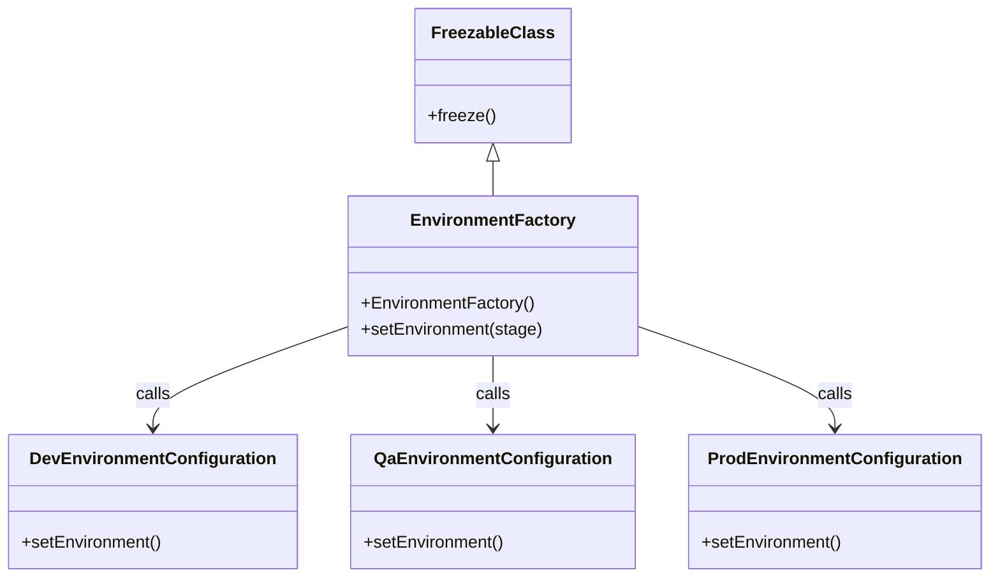

# Diagram: platform/tools/ide_local_testing/localTest/core/environment/EnvironmentFactory.py


> Auto-generated by Obscura crawlers

## Diagram 1



### SVG

<svg id="container" width="912.3828125" xmlns="http://www.w3.org/2000/svg" class="classDiagram" height="542" viewBox="0 0 912.3828125 542" role="graphics-document document" aria-roledescription="class"><style>#container{font-family:"trebuchet ms",verdana,arial,sans-serif;font-size:16px;fill:#333;}@keyframes edge-animation-frame{from{stroke-dashoffset:0;}}@keyframes dash{to{stroke-dashoffset:0;}}#container .edge-animation-slow{stroke-dasharray:9,5!important;stroke-dashoffset:900;animation:dash 50s linear infinite;stroke-linecap:round;}#container .edge-animation-fast{stroke-dasharray:9,5!important;stroke-dashoffset:900;animation:dash 20s linear infinite;stroke-linecap:round;}#container .error-icon{fill:#552222;}#container .error-text{fill:#552222;stroke:#552222;}#container .edge-thickness-normal{stroke-width:1px;}#container .edge-thickness-thick{stroke-width:3.5px;}#container .edge-pattern-solid{stroke-dasharray:0;}#container .edge-thickness-invisible{stroke-width:0;fill:none;}#container .edge-pattern-dashed{stroke-dasharray:3;}#container .edge-pattern-dotted{stroke-dasharray:2;}#container .marker{fill:#333333;stroke:#333333;}#container .marker.cross{stroke:#333333;}#container svg{font-family:"trebuchet ms",verdana,arial,sans-serif;font-size:16px;}#container p{margin:0;}#container g.classGroup text{fill:#9370DB;stroke:none;font-family:"trebuchet ms",verdana,arial,sans-serif;font-size:10px;}#container g.classGroup text .title{font-weight:bolder;}#container .nodeLabel,#container .edgeLabel{color:#131300;}#container .edgeLabel .label rect{fill:#ECECFF;}#container .label text{fill:#131300;}#container .labelBkg{background:#ECECFF;}#container .edgeLabel .label span{background:#ECECFF;}#container .classTitle{font-weight:bolder;}#container .node rect,#container .node circle,#container .node ellipse,#container .node polygon,#container .node path{fill:#ECECFF;stroke:#9370DB;stroke-width:1px;}#container .divider{stroke:#9370DB;stroke-width:1;}#container g.clickable{cursor:pointer;}#container g.classGroup rect{fill:#ECECFF;stroke:#9370DB;}#container g.classGroup line{stroke:#9370DB;stroke-width:1;}#container .classLabel .box{stroke:none;stroke-width:0;fill:#ECECFF;opacity:0.5;}#container .classLabel .label{fill:#9370DB;font-size:10px;}#container .relation{stroke:#333333;stroke-width:1;fill:none;}#container .dashed-line{stroke-dasharray:3;}#container .dotted-line{stroke-dasharray:1 2;}#container #compositionStart,#container .composition{fill:#333333!important;stroke:#333333!important;stroke-width:1;}#container #compositionEnd,#container .composition{fill:#333333!important;stroke:#333333!important;stroke-width:1;}#container #dependencyStart,#container .dependency{fill:#333333!important;stroke:#333333!important;stroke-width:1;}#container #dependencyStart,#container .dependency{fill:#333333!important;stroke:#333333!important;stroke-width:1;}#container #extensionStart,#container .extension{fill:transparent!important;stroke:#333333!important;stroke-width:1;}#container #extensionEnd,#container .extension{fill:transparent!important;stroke:#333333!important;stroke-width:1;}#container #aggregationStart,#container .aggregation{fill:transparent!important;stroke:#333333!important;stroke-width:1;}#container #aggregationEnd,#container .aggregation{fill:transparent!important;stroke:#333333!important;stroke-width:1;}#container #lollipopStart,#container .lollipop{fill:#ECECFF!important;stroke:#333333!important;stroke-width:1;}#container #lollipopEnd,#container .lollipop{fill:#ECECFF!important;stroke:#333333!important;stroke-width:1;}#container .edgeTerminals{font-size:11px;line-height:initial;}#container .classTitleText{text-anchor:middle;font-size:18px;fill:#333;}#container .label-icon{display:inline-block;height:1em;overflow:visible;vertical-align:-0.125em;}#container .node .label-icon path{fill:currentColor;stroke:revert;stroke-width:revert;}#container :root{--mermaid-font-family:"trebuchet ms",verdana,arial,sans-serif;}</style><g><defs><marker id="container_class-aggregationStart" class="marker aggregation class" refX="18" refY="7" markerWidth="190" markerHeight="240" orient="auto"><path d="M 18,7 L9,13 L1,7 L9,1 Z"></path></marker></defs><defs><marker id="container_class-aggregationEnd" class="marker aggregation class" refX="1" refY="7" markerWidth="20" markerHeight="28" orient="auto"><path d="M 18,7 L9,13 L1,7 L9,1 Z"></path></marker></defs><defs><marker id="container_class-extensionStart" class="marker extension class" refX="18" refY="7" markerWidth="190" markerHeight="240" orient="auto"><path d="M 1,7 L18,13 V 1 Z"></path></marker></defs><defs><marker id="container_class-extensionEnd" class="marker extension class" refX="1" refY="7" markerWidth="20" markerHeight="28" orient="auto"><path d="M 1,1 V 13 L18,7 Z"></path></marker></defs><defs><marker id="container_class-compositionStart" class="marker composition class" refX="18" refY="7" markerWidth="190" markerHeight="240" orient="auto"><path d="M 18,7 L9,13 L1,7 L9,1 Z"></path></marker></defs><defs><marker id="container_class-compositionEnd" class="marker composition class" refX="1" refY="7" markerWidth="20" markerHeight="28" orient="auto"><path d="M 18,7 L9,13 L1,7 L9,1 Z"></path></marker></defs><defs><marker id="container_class-dependencyStart" class="marker dependency class" refX="6" refY="7" markerWidth="190" markerHeight="240" orient="auto"><path d="M 5,7 L9,13 L1,7 L9,1 Z"></path></marker></defs><defs><marker id="container_class-dependencyEnd" class="marker dependency class" refX="13" refY="7" markerWidth="20" markerHeight="28" orient="auto"><path d="M 18,7 L9,13 L14,7 L9,1 Z"></path></marker></defs><defs><marker id="container_class-lollipopStart" class="marker lollipop class" refX="13" refY="7" markerWidth="190" markerHeight="240" orient="auto"><circle stroke="black" fill="transparent" cx="7" cy="7" r="6"></circle></marker></defs><defs><marker id="container_class-lollipopEnd" class="marker lollipop class" refX="1" refY="7" markerWidth="190" markerHeight="240" orient="auto"><circle stroke="black" fill="transparent" cx="7" cy="7" r="6"></circle></marker></defs><g class="root"><g class="clusters"></g><g class="edgePaths"><path d="M454.484,151.25L454.484,152.542C454.484,153.833,454.484,156.417,454.484,161.875C454.484,167.333,454.484,175.667,454.484,179.833L454.484,184" id="id_FreezableClass_EnvironmentFactory_1" class="edge-thickness-normal edge-pattern-solid relation" style=";;;" data-edge="true" data-et="edge" data-id="id_FreezableClass_EnvironmentFactory_1" data-points="W3sieCI6NDU0LjQ4NDM3NSwieSI6MTM0fSx7IngiOjQ1NC40ODQzNzUsInkiOjE1OX0seyJ4Ijo0NTQuNDg0Mzc1LCJ5IjoxODR9XQ==" marker-start="url(#container_class-extensionStart)"></path><path d="M320.664,306.78L290.687,317.484C260.71,328.187,200.755,349.593,170.778,365.463C140.801,381.333,140.801,391.667,140.801,396.833L140.801,402" id="id_EnvironmentFactory_DevEnvironmentConfiguration_2" class="edge-thickness-normal edge-pattern-solid relation" style=";;;" data-edge="true" data-et="edge" data-id="id_EnvironmentFactory_DevEnvironmentConfiguration_2" data-points="W3sieCI6MzIwLjY2NDA2MjUsInkiOjMwNi43ODAyMzIzNjk4OTl9LHsieCI6MTQwLjgwMDc4MTI1LCJ5IjozNzF9LHsieCI6MTQwLjgwMDc4MTI1LCJ5Ijo0MDh9XQ==" marker-end="url(#container_class-dependencyEnd)"></path><path d="M454.484,334L454.484,340.167C454.484,346.333,454.484,358.667,454.484,370C454.484,381.333,454.484,391.667,454.484,396.833L454.484,402" id="id_EnvironmentFactory_QaEnvironmentConfiguration_3" class="edge-thickness-normal edge-pattern-solid relation" style=";;;" data-edge="true" data-et="edge" data-id="id_EnvironmentFactory_QaEnvironmentConfiguration_3" data-points="W3sieCI6NDU0LjQ4NDM3NSwieSI6MzM0fSx7IngiOjQ1NC40ODQzNzUsInkiOjM3MX0seyJ4Ijo0NTQuNDg0Mzc1LCJ5Ijo0MDh9XQ==" marker-end="url(#container_class-dependencyEnd)"></path><path d="M588.305,306.522L618.566,317.268C648.828,328.014,709.352,349.507,739.613,365.42C769.875,381.333,769.875,391.667,769.875,396.833L769.875,402" id="id_EnvironmentFactory_ProdEnvironmentConfiguration_4" class="edge-thickness-normal edge-pattern-solid relation" style=";;;" data-edge="true" data-et="edge" data-id="id_EnvironmentFactory_ProdEnvironmentConfiguration_4" data-points="W3sieCI6NTg4LjMwNDY4NzUsInkiOjMwNi41MjE2MjQ5NjkwMzY0fSx7IngiOjc2OS44NzUsInkiOjM3MX0seyJ4Ijo3NjkuODc1LCJ5Ijo0MDh9XQ==" marker-end="url(#container_class-dependencyEnd)"></path></g><g class="edgeLabels"><g class="edgeLabel"><g class="label" data-id="id_FreezableClass_EnvironmentFactory_1" transform="translate(0, 0)"><foreignObject width="0" height="0"><div xmlns="http://www.w3.org/1999/xhtml" class="labelBkg" style="display: table-cell; white-space: nowrap; line-height: 1.5; max-width: 200px; text-align: center;"><span class="edgeLabel"></span></div></foreignObject></g></g><g class="edgeLabel" transform="translate(140.80078125, 371)"><g class="label" data-id="id_EnvironmentFactory_DevEnvironmentConfiguration_2" transform="translate(-16.4453125, -12)"><foreignObject width="32.890625" height="24"><div xmlns="http://www.w3.org/1999/xhtml" class="labelBkg" style="display: table-cell; white-space: nowrap; line-height: 1.5; max-width: 200px; text-align: center;"><span class="edgeLabel"><p>calls</p></span></div></foreignObject></g></g><g class="edgeLabel" transform="translate(454.484375, 371)"><g class="label" data-id="id_EnvironmentFactory_QaEnvironmentConfiguration_3" transform="translate(-16.4453125, -12)"><foreignObject width="32.890625" height="24"><div xmlns="http://www.w3.org/1999/xhtml" class="labelBkg" style="display: table-cell; white-space: nowrap; line-height: 1.5; max-width: 200px; text-align: center;"><span class="edgeLabel"><p>calls</p></span></div></foreignObject></g></g><g class="edgeLabel" transform="translate(769.875, 371)"><g class="label" data-id="id_EnvironmentFactory_ProdEnvironmentConfiguration_4" transform="translate(-16.4453125, -12)"><foreignObject width="32.890625" height="24"><div xmlns="http://www.w3.org/1999/xhtml" class="labelBkg" style="display: table-cell; white-space: nowrap; line-height: 1.5; max-width: 200px; text-align: center;"><span class="edgeLabel"><p>calls</p></span></div></foreignObject></g></g></g><g class="nodes"><g class="node default" id="classId-FreezableClass-0" transform="translate(454.484375, 71)"><g class="basic label-container"><path d="M-69.875 -63 L69.875 -63 L69.875 63 L-69.875 63" stroke="none" stroke-width="0" fill="#ECECFF" style=""></path><path d="M-69.875 -63 C-23.112592344287428 -63, 23.649815311425144 -63, 69.875 -63 M-69.875 -63 C-39.422600038983276 -63, -8.970200077966545 -63, 69.875 -63 M69.875 -63 C69.875 -30.59842568461208, 69.875 1.803148630775837, 69.875 63 M69.875 -63 C69.875 -31.49271404153116, 69.875 0.014571916937683227, 69.875 63 M69.875 63 C15.961461311873222 63, -37.952077376253555 63, -69.875 63 M69.875 63 C21.46047701353733 63, -26.954045972925343 63, -69.875 63 M-69.875 63 C-69.875 27.53736618399048, -69.875 -7.925267632019043, -69.875 -63 M-69.875 63 C-69.875 19.63906813916823, -69.875 -23.72186372166354, -69.875 -63" stroke="#9370DB" stroke-width="1.3" fill="none" stroke-dasharray="0 0" style=""></path></g><g class="annotation-group text" transform="translate(0, -39)"></g><g class="label-group text" transform="translate(-53.640625, -39)"><g class="label" style="font-weight: bolder" transform="translate(0,-12)"><foreignObject width="107.28125" height="24"><div xmlns="http://www.w3.org/1999/xhtml" style="display: table-cell; white-space: nowrap; line-height: 1.5; max-width: 155px; text-align: center;"><span class="nodeLabel markdown-node-label" style=""><p>FreezableClass</p></span></div></foreignObject></g></g><g class="members-group text" transform="translate(-57.875, 9)"></g><g class="methods-group text" transform="translate(-57.875, 39)"><g class="label" style="" transform="translate(0,-12)"><foreignObject width="62.109375" height="24"><div xmlns="http://www.w3.org/1999/xhtml" style="display: table-cell; white-space: nowrap; line-height: 1.5; max-width: 119px; text-align: center;"><span class="nodeLabel markdown-node-label" style=""><p>+freeze()</p></span></div></foreignObject></g></g><g class="divider" style=""><path d="M-69.875 -15 C-16.77623393661225 -15, 36.3225321267755 -15, 69.875 -15 M-69.875 -15 C-33.015881281500235 -15, 3.84323743699953 -15, 69.875 -15" stroke="#9370DB" stroke-width="1.3" fill="none" stroke-dasharray="0 0" style=""></path></g><g class="divider" style=""><path d="M-69.875 9 C-29.701096788309393 9, 10.472806423381215 9, 69.875 9 M-69.875 9 C-35.636118335336164 9, -1.3972366706723278 9, 69.875 9" stroke="#9370DB" stroke-width="1.3" fill="none" stroke-dasharray="0 0" style=""></path></g></g><g class="node default" id="classId-EnvironmentFactory-1" transform="translate(454.484375, 259)"><g class="basic label-container"><path d="M-133.8203125 -75 L133.8203125 -75 L133.8203125 75 L-133.8203125 75" stroke="none" stroke-width="0" fill="#ECECFF" style=""></path><path d="M-133.8203125 -75 C-41.58163220117241 -75, 50.65704809765518 -75, 133.8203125 -75 M-133.8203125 -75 C-55.732380851669575 -75, 22.35555079666085 -75, 133.8203125 -75 M133.8203125 -75 C133.8203125 -37.99497128452801, 133.8203125 -0.9899425690560264, 133.8203125 75 M133.8203125 -75 C133.8203125 -24.58095640323325, 133.8203125 25.838087193533497, 133.8203125 75 M133.8203125 75 C62.82000282138176 75, -8.180306857236474 75, -133.8203125 75 M133.8203125 75 C76.00044803675044 75, 18.180583573500897 75, -133.8203125 75 M-133.8203125 75 C-133.8203125 36.6356333648466, -133.8203125 -1.7287332703068046, -133.8203125 -75 M-133.8203125 75 C-133.8203125 25.616051056860904, -133.8203125 -23.767897886278192, -133.8203125 -75" stroke="#9370DB" stroke-width="1.3" fill="none" stroke-dasharray="0 0" style=""></path></g><g class="annotation-group text" transform="translate(0, -51)"></g><g class="label-group text" transform="translate(-72.796875, -51)"><g class="label" style="font-weight: bolder" transform="translate(0,-12)"><foreignObject width="145.59375" height="24"><div xmlns="http://www.w3.org/1999/xhtml" style="display: table-cell; white-space: nowrap; line-height: 1.5; max-width: 194px; text-align: center;"><span class="nodeLabel markdown-node-label" style=""><p>EnvironmentFactory</p></span></div></foreignObject></g></g><g class="members-group text" transform="translate(-121.8203125, -3)"></g><g class="methods-group text" transform="translate(-121.8203125, 27)"><g class="label" style="" transform="translate(0,-12)"><foreignObject width="162.578125" height="24"><div xmlns="http://www.w3.org/1999/xhtml" style="display: table-cell; white-space: nowrap; line-height: 1.5; max-width: 220px; text-align: center;"><span class="nodeLabel markdown-node-label" style=""><p>+EnvironmentFactory()</p></span></div></foreignObject></g><g class="label" style="" transform="translate(0,12)"><foreignObject width="170.84375" height="24"><div xmlns="http://www.w3.org/1999/xhtml" style="display: table-cell; white-space: nowrap; line-height: 1.5; max-width: 228px; text-align: center;"><span class="nodeLabel markdown-node-label" style=""><p>+setEnvironment(stage)</p></span></div></foreignObject></g></g><g class="divider" style=""><path d="M-133.8203125 -27 C-40.655418293598245 -27, 52.50947591280351 -27, 133.8203125 -27 M-133.8203125 -27 C-38.95013802837293 -27, 55.92003644325413 -27, 133.8203125 -27" stroke="#9370DB" stroke-width="1.3" fill="none" stroke-dasharray="0 0" style=""></path></g><g class="divider" style=""><path d="M-133.8203125 -3 C-50.731851619294886 -3, 32.35660926141023 -3, 133.8203125 -3 M-133.8203125 -3 C-59.41350424240369 -3, 14.99330401519262 -3, 133.8203125 -3" stroke="#9370DB" stroke-width="1.3" fill="none" stroke-dasharray="0 0" style=""></path></g></g><g class="node default" id="classId-DevEnvironmentConfiguration-2" transform="translate(140.80078125, 471)"><g class="basic label-container"><path d="M-132.80078125 -63 L132.80078125 -63 L132.80078125 63 L-132.80078125 63" stroke="none" stroke-width="0" fill="#ECECFF" style=""></path><path d="M-132.80078125 -63 C-47.021174536525635 -63, 38.75843217694873 -63, 132.80078125 -63 M-132.80078125 -63 C-30.607959570170024 -63, 71.58486210965995 -63, 132.80078125 -63 M132.80078125 -63 C132.80078125 -26.61102243554739, 132.80078125 9.77795512890522, 132.80078125 63 M132.80078125 -63 C132.80078125 -22.688000864807982, 132.80078125 17.623998270384035, 132.80078125 63 M132.80078125 63 C43.51877879237908 63, -45.76322366524184 63, -132.80078125 63 M132.80078125 63 C61.42163746817074 63, -9.957506313658513 63, -132.80078125 63 M-132.80078125 63 C-132.80078125 34.924885496858344, -132.80078125 6.849770993716689, -132.80078125 -63 M-132.80078125 63 C-132.80078125 17.429710248756095, -132.80078125 -28.14057950248781, -132.80078125 -63" stroke="#9370DB" stroke-width="1.3" fill="none" stroke-dasharray="0 0" style=""></path></g><g class="annotation-group text" transform="translate(0, -39)"></g><g class="label-group text" transform="translate(-109.2265625, -39)"><g class="label" style="font-weight: bolder" transform="translate(0,-12)"><foreignObject width="218.453125" height="24"><div xmlns="http://www.w3.org/1999/xhtml" style="display: table-cell; white-space: nowrap; line-height: 1.5; max-width: 266px; text-align: center;"><span class="nodeLabel markdown-node-label" style=""><p>DevEnvironmentConfiguration</p></span></div></foreignObject></g></g><g class="members-group text" transform="translate(-120.80078125, 9)"></g><g class="methods-group text" transform="translate(-120.80078125, 39)"><g class="label" style="" transform="translate(0,-12)"><foreignObject width="132.375" height="24"><div xmlns="http://www.w3.org/1999/xhtml" style="display: table-cell; white-space: nowrap; line-height: 1.5; max-width: 190px; text-align: center;"><span class="nodeLabel markdown-node-label" style=""><p>+setEnvironment()</p></span></div></foreignObject></g></g><g class="divider" style=""><path d="M-132.80078125 -15 C-32.47496795107668 -15, 67.85084534784664 -15, 132.80078125 -15 M-132.80078125 -15 C-32.99661709186694 -15, 66.80754706626612 -15, 132.80078125 -15" stroke="#9370DB" stroke-width="1.3" fill="none" stroke-dasharray="0 0" style=""></path></g><g class="divider" style=""><path d="M-132.80078125 9 C-31.27273079325805 9, 70.2553196634839 9, 132.80078125 9 M-132.80078125 9 C-42.689645503662845 9, 47.42149024267431 9, 132.80078125 9" stroke="#9370DB" stroke-width="1.3" fill="none" stroke-dasharray="0 0" style=""></path></g></g><g class="node default" id="classId-QaEnvironmentConfiguration-3" transform="translate(454.484375, 471)"><g class="basic label-container"><path d="M-130.8828125 -63 L130.8828125 -63 L130.8828125 63 L-130.8828125 63" stroke="none" stroke-width="0" fill="#ECECFF" style=""></path><path d="M-130.8828125 -63 C-45.544585119139654 -63, 39.79364226172069 -63, 130.8828125 -63 M-130.8828125 -63 C-46.21043542273196 -63, 38.461941654536076 -63, 130.8828125 -63 M130.8828125 -63 C130.8828125 -28.339503590985615, 130.8828125 6.32099281802877, 130.8828125 63 M130.8828125 -63 C130.8828125 -21.407418020036395, 130.8828125 20.18516395992721, 130.8828125 63 M130.8828125 63 C26.188894916346484 63, -78.50502266730703 63, -130.8828125 63 M130.8828125 63 C52.00662469710282 63, -26.869563105794356 63, -130.8828125 63 M-130.8828125 63 C-130.8828125 32.61573292433607, -130.8828125 2.231465848672144, -130.8828125 -63 M-130.8828125 63 C-130.8828125 30.660645956917456, -130.8828125 -1.6787080861650878, -130.8828125 -63" stroke="#9370DB" stroke-width="1.3" fill="none" stroke-dasharray="0 0" style=""></path></g><g class="annotation-group text" transform="translate(0, -39)"></g><g class="label-group text" transform="translate(-105.390625, -39)"><g class="label" style="font-weight: bolder" transform="translate(0,-12)"><foreignObject width="210.78125" height="24"><div xmlns="http://www.w3.org/1999/xhtml" style="display: table-cell; white-space: nowrap; line-height: 1.5; max-width: 259px; text-align: center;"><span class="nodeLabel markdown-node-label" style=""><p>QaEnvironmentConfiguration</p></span></div></foreignObject></g></g><g class="members-group text" transform="translate(-118.8828125, 9)"></g><g class="methods-group text" transform="translate(-118.8828125, 39)"><g class="label" style="" transform="translate(0,-12)"><foreignObject width="132.375" height="24"><div xmlns="http://www.w3.org/1999/xhtml" style="display: table-cell; white-space: nowrap; line-height: 1.5; max-width: 190px; text-align: center;"><span class="nodeLabel markdown-node-label" style=""><p>+setEnvironment()</p></span></div></foreignObject></g></g><g class="divider" style=""><path d="M-130.8828125 -15 C-54.584371157015596 -15, 21.714070185968808 -15, 130.8828125 -15 M-130.8828125 -15 C-46.98753732256313 -15, 36.907737854873744 -15, 130.8828125 -15" stroke="#9370DB" stroke-width="1.3" fill="none" stroke-dasharray="0 0" style=""></path></g><g class="divider" style=""><path d="M-130.8828125 9 C-76.23888897059177 9, -21.594965441183533 9, 130.8828125 9 M-130.8828125 9 C-73.36392594404009 9, -15.845039388080181 9, 130.8828125 9" stroke="#9370DB" stroke-width="1.3" fill="none" stroke-dasharray="0 0" style=""></path></g></g><g class="node default" id="classId-ProdEnvironmentConfiguration-4" transform="translate(769.875, 471)"><g class="basic label-container"><path d="M-134.5078125 -63 L134.5078125 -63 L134.5078125 63 L-134.5078125 63" stroke="none" stroke-width="0" fill="#ECECFF" style=""></path><path d="M-134.5078125 -63 C-65.48871858259662 -63, 3.530375334806763 -63, 134.5078125 -63 M-134.5078125 -63 C-41.55217305790423 -63, 51.403466384191546 -63, 134.5078125 -63 M134.5078125 -63 C134.5078125 -36.25345621687066, 134.5078125 -9.506912433741313, 134.5078125 63 M134.5078125 -63 C134.5078125 -26.982548053376796, 134.5078125 9.034903893246408, 134.5078125 63 M134.5078125 63 C54.15156492917936 63, -26.204682641641284 63, -134.5078125 63 M134.5078125 63 C40.58356978968081 63, -53.34067292063838 63, -134.5078125 63 M-134.5078125 63 C-134.5078125 13.17450785416893, -134.5078125 -36.65098429166214, -134.5078125 -63 M-134.5078125 63 C-134.5078125 35.61102075368862, -134.5078125 8.222041507377241, -134.5078125 -63" stroke="#9370DB" stroke-width="1.3" fill="none" stroke-dasharray="0 0" style=""></path></g><g class="annotation-group text" transform="translate(0, -39)"></g><g class="label-group text" transform="translate(-112.640625, -39)"><g class="label" style="font-weight: bolder" transform="translate(0,-12)"><foreignObject width="225.28125" height="24"><div xmlns="http://www.w3.org/1999/xhtml" style="display: table-cell; white-space: nowrap; line-height: 1.5; max-width: 273px; text-align: center;"><span class="nodeLabel markdown-node-label" style=""><p>ProdEnvironmentConfiguration</p></span></div></foreignObject></g></g><g class="members-group text" transform="translate(-122.5078125, 9)"></g><g class="methods-group text" transform="translate(-122.5078125, 39)"><g class="label" style="" transform="translate(0,-12)"><foreignObject width="132.375" height="24"><div xmlns="http://www.w3.org/1999/xhtml" style="display: table-cell; white-space: nowrap; line-height: 1.5; max-width: 190px; text-align: center;"><span class="nodeLabel markdown-node-label" style=""><p>+setEnvironment()</p></span></div></foreignObject></g></g><g class="divider" style=""><path d="M-134.5078125 -15 C-37.499426444383786 -15, 59.50895961123243 -15, 134.5078125 -15 M-134.5078125 -15 C-44.05621544702775 -15, 46.39538160594449 -15, 134.5078125 -15" stroke="#9370DB" stroke-width="1.3" fill="none" stroke-dasharray="0 0" style=""></path></g><g class="divider" style=""><path d="M-134.5078125 9 C-64.35621268981477 9, 5.795387120370464 9, 134.5078125 9 M-134.5078125 9 C-61.351347004889746 9, 11.805118490220508 9, 134.5078125 9" stroke="#9370DB" stroke-width="1.3" fill="none" stroke-dasharray="0 0" style=""></path></g></g></g></g></g></svg>

## Diagram 2

```mermaid
flowchart TD
    Start([EnvironmentFactory.__init__]) --> InitCall{setEnvironment called with stage?}
    InitCall -- No (None/False) --> ReadEnv[stage = os.environ.get("AWS_STAGE")]
    InitCall -- Yes --> UseArg[use provided stage]
    ReadEnv --> Normalize[stage = stage.lower()]
    UseArg --> Normalize
    Normalize --> IsDev{stage == dev}
    IsDev -- Yes --> DevCall[DevEnvironmentConfiguration.setEnvironment()]
    IsDev -- No --> IsQa{stage == qa}
    IsQa -- Yes --> QaCall[QaEnvironmentConfiguration.setEnvironment()]
    IsQa -- No --> IsProbB{stage == prob-b}
    IsProbB -- Yes --> ProdCall[ProdEnvironmentConfiguration.setEnvironment()]
    IsProbB -- No --> NoMatch[retval undefined]
    DevCall --> Return[return retval]
    QaCall --> Return
    ProdCall --> Return
    NoMatch --> Return
```

> SVG rendering failed for this diagram.
