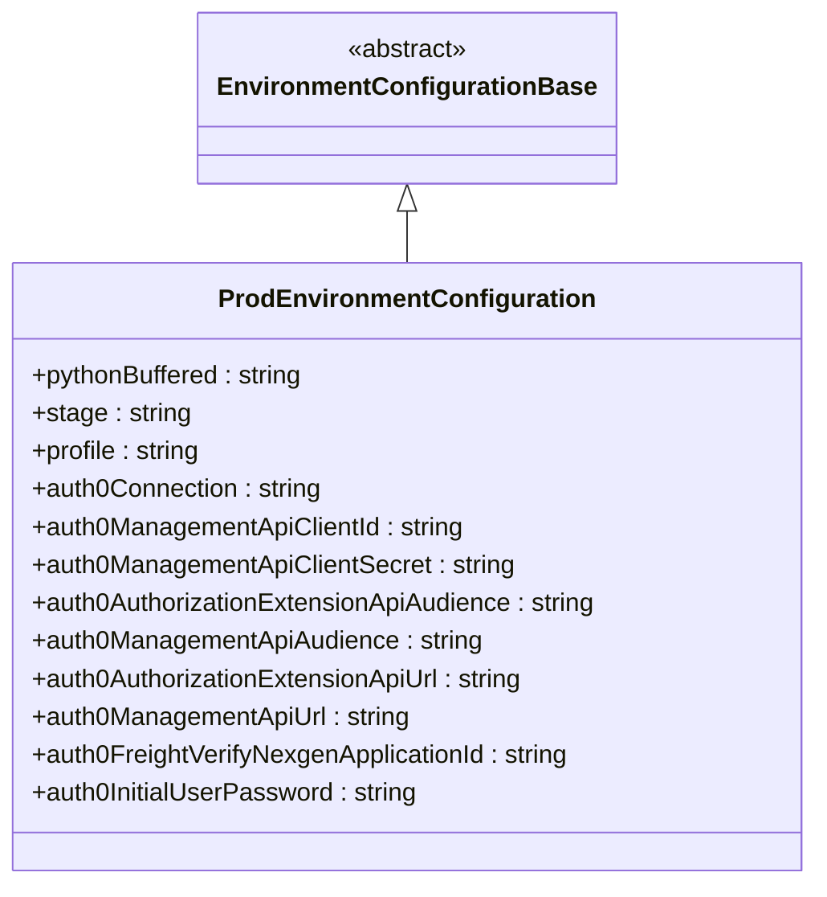

# Diagram: platform/tools/ide_local_testing/localTest/core/environment/ProdEnvironmentConfiguration.py

> Auto-generated by Obscura crawlers

## Mermaid

### SVG

<svg id="container" width="515.109375" xmlns="http://www.w3.org/2000/svg" class="classDiagram" height="558" viewBox="0 0 515.109375 558" role="graphics-document document" aria-roledescription="class"><g><defs><marker id="container_class-aggregationStart" class="marker aggregation class" refX="18" refY="7" markerWidth="190" markerHeight="240" orient="auto"><path d="M 18,7 L9,13 L1,7 L9,1 Z"></path></marker></defs><defs><marker id="container_class-aggregationEnd" class="marker aggregation class" refX="1" refY="7" markerWidth="20" markerHeight="28" orient="auto"><path d="M 18,7 L9,13 L1,7 L9,1 Z"></path></marker></defs><defs><marker id="container_class-extensionStart" class="marker extension class" refX="18" refY="7" markerWidth="190" markerHeight="240" orient="auto"><path d="M 1,7 L18,13 V 1 Z"></path></marker></defs><defs><marker id="container_class-extensionEnd" class="marker extension class" refX="1" refY="7" markerWidth="20" markerHeight="28" orient="auto"><path d="M 1,1 V 13 L18,7 Z"></path></marker></defs><defs><marker id="container_class-compositionStart" class="marker composition class" refX="18" refY="7" markerWidth="190" markerHeight="240" orient="auto"><path d="M 18,7 L9,13 L1,7 L9,1 Z"></path></marker></defs><defs><marker id="container_class-compositionEnd" class="marker composition class" refX="1" refY="7" markerWidth="20" markerHeight="28" orient="auto"><path d="M 18,7 L9,13 L1,7 L9,1 Z"></path></marker></defs><defs><marker id="container_class-dependencyStart" class="marker dependency class" refX="6" refY="7" markerWidth="190" markerHeight="240" orient="auto"><path d="M 5,7 L9,13 L1,7 L9,1 Z"></path></marker></defs><defs><marker id="container_class-dependencyEnd" class="marker dependency class" refX="13" refY="7" markerWidth="20" markerHeight="28" orient="auto"><path d="M 18,7 L9,13 L14,7 L9,1 Z"></path></marker></defs><defs><marker id="container_class-lollipopStart" class="marker lollipop class" refX="13" refY="7" markerWidth="190" markerHeight="240" orient="auto"><circle stroke="black" fill="transparent" cx="7" cy="7" r="6"></circle></marker></defs><defs><marker id="container_class-lollipopEnd" class="marker lollipop class" refX="1" refY="7" markerWidth="190" markerHeight="240" orient="auto"><circle stroke="black" fill="transparent" cx="7" cy="7" r="6"></circle></marker></defs><g class="root"><g class="clusters"></g><g class="edgePaths"><path d="M257.555,133.25L257.555,134.542C257.555,135.833,257.555,138.417,257.555,143.875C257.555,149.333,257.555,157.667,257.555,161.833L257.555,166" id="id_EnvironmentConfigurationBase_ProdEnvironmentConfiguration_1" class="edge-thickness-normal edge-pattern-solid relation" style=";;;" data-edge="true" data-et="edge" data-id="id_EnvironmentConfigurationBase_ProdEnvironmentConfiguration_1" data-points="W3sieCI6MjU3LjU1NDY4NzUsInkiOjExNn0seyJ4IjoyNTcuNTU0Njg3NSwieSI6MTQxfSx7IngiOjI1Ny41NTQ2ODc1LCJ5IjoxNjZ9XQ==" marker-start="url(#container_class-extensionStart)"></path></g><g class="edgeLabels"><g class="edgeLabel"><g class="label" data-id="id_EnvironmentConfigurationBase_ProdEnvironmentConfiguration_1" transform="translate(0, 0)"><foreignObject width="0" height="0">

</foreignObject></g></g></g><g class="nodes"><g class="node default" id="classId-EnvironmentConfigurationBase-0" transform="translate(257.5546875, 62)"><g class="basic label-container"><path d="M-125.0859375 -54 L125.0859375 -54 L125.0859375 54 L-125.0859375 54" stroke="none" stroke-width="0" fill="#ECECFF" style=""></path><path d="M-125.0859375 -54 C-62.75970440973665 -54, -0.4334713194732984 -54, 125.0859375 -54 M-125.0859375 -54 C-60.29166647952984 -54, 4.502604540940325 -54, 125.0859375 -54 M125.0859375 -54 C125.0859375 -31.592747093738463, 125.0859375 -9.185494187476927, 125.0859375 54 M125.0859375 -54 C125.0859375 -29.501918485242907, 125.0859375 -5.003836970485814, 125.0859375 54 M125.0859375 54 C32.61669013427543 54, -59.85255723144914 54, -125.0859375 54 M125.0859375 54 C34.35909548985795 54, -56.3677465202841 54, -125.0859375 54 M-125.0859375 54 C-125.0859375 26.257976206632282, -125.0859375 -1.4840475867354357, -125.0859375 -54 M-125.0859375 54 C-125.0859375 22.427912106716377, -125.0859375 -9.144175786567246, -125.0859375 -54" stroke="#9370DB" stroke-width="1.3" fill="none" stroke-dasharray="0 0" style=""></path></g><g class="annotation-group text" transform="translate(-38.609375, -30)"><g class="label" style="" transform="translate(0,-12)"><foreignObject width="77.21875" height="24">

«abstract»

</foreignObject></g></g><g class="label-group text" transform="translate(-113.0859375, -6)"><g class="label" style="font-weight: bolder" transform="translate(0,-12)"><foreignObject width="226.171875" height="24">

EnvironmentConfigurationBase

</foreignObject></g></g><g class="members-group text" transform="translate(-113.0859375, 42)"></g><g class="methods-group text" transform="translate(-113.0859375, 72)"></g><g class="divider" style=""><path d="M-125.0859375 18 C-52.53382285523389 18, 20.018291789532213 18, 125.0859375 18 M-125.0859375 18 C-38.42400246574711 18, 48.237932568505784 18, 125.0859375 18" stroke="#9370DB" stroke-width="1.3" fill="none" stroke-dasharray="0 0" style=""></path></g><g class="divider" style=""><path d="M-125.0859375 36 C-38.84004232688417 36, 47.40585284623165 36, 125.0859375 36 M-125.0859375 36 C-55.18528391371714 36, 14.715369672565714 36, 125.0859375 36" stroke="#9370DB" stroke-width="1.3" fill="none" stroke-dasharray="0 0" style=""></path></g></g><g class="node default" id="classId-ProdEnvironmentConfiguration-1" transform="translate(257.5546875, 358)"><g class="basic label-container"><path d="M-249.5546875 -192 L249.5546875 -192 L249.5546875 192 L-249.5546875 192" stroke="none" stroke-width="0" fill="#ECECFF" style=""></path><path d="M-249.5546875 -192 C-60.14149063587311 -192, 129.27170622825378 -192, 249.5546875 -192 M-249.5546875 -192 C-116.47745573348715 -192, 16.599776033025705 -192, 249.5546875 -192 M249.5546875 -192 C249.5546875 -112.22785333147071, 249.5546875 -32.455706662941424, 249.5546875 192 M249.5546875 -192 C249.5546875 -89.59814163902648, 249.5546875 12.80371672194704, 249.5546875 192 M249.5546875 192 C51.34407659236817 192, -146.86653431526366 192, -249.5546875 192 M249.5546875 192 C121.31539435151606 192, -6.923898796967876 192, -249.5546875 192 M-249.5546875 192 C-249.5546875 113.81551680804088, -249.5546875 35.631033616081766, -249.5546875 -192 M-249.5546875 192 C-249.5546875 85.31472188752866, -249.5546875 -21.370556224942675, -249.5546875 -192" stroke="#9370DB" stroke-width="1.3" fill="none" stroke-dasharray="0 0" style=""></path></g><g class="annotation-group text" transform="translate(0, -168)"></g><g class="label-group text" transform="translate(-112.640625, -168)"><g class="label" style="font-weight: bolder" transform="translate(0,-12)"><foreignObject width="225.28125" height="24">

ProdEnvironmentConfiguration

</foreignObject></g></g><g class="members-group text" transform="translate(-237.5546875, -120)"><g class="label" style="" transform="translate(0,-12)"><foreignObject width="175.4375" height="24">

+pythonBuffered : string

</foreignObject></g><g class="label" style="" transform="translate(0,12)"><foreignObject width="100.40625" height="24">

+stage : string

</foreignObject></g><g class="label" style="" transform="translate(0,36)"><foreignObject width="109.015625" height="24">

+profile : string

</foreignObject></g><g class="label" style="" transform="translate(0,60)"><foreignObject width="185.90625" height="24">

+auth0Connection : string

</foreignObject></g><g class="label" style="" transform="translate(0,84)"><foreignObject width="276.578125" height="24">

+auth0ManagementApiClientId : string

</foreignObject></g><g class="label" style="" transform="translate(0,108)"><foreignObject width="307.578125" height="24">

+auth0ManagementApiClientSecret : string

</foreignObject></g><g class="label" style="" transform="translate(0,132)"><foreignObject width="362.46875" height="24">

+auth0AuthorizationExtensionApiAudience : string

</foreignObject></g><g class="label" style="" transform="translate(0,156)"><foreignObject width="287.125" height="24">

+auth0ManagementApiAudience : string

</foreignObject></g><g class="label" style="" transform="translate(0,180)"><foreignObject width="317.21875" height="24">

+auth0AuthorizationExtensionApiUrl : string

</foreignObject></g><g class="label" style="" transform="translate(0,204)"><foreignObject width="241.875" height="24">

+auth0ManagementApiUrl : string

</foreignObject></g><g class="label" style="" transform="translate(0,228)"><foreignObject width="344.8125" height="24">

+auth0FreightVerifyNexgenApplicationId : string

</foreignObject></g><g class="label" style="" transform="translate(0,252)"><foreignObject width="246.515625" height="24">

+auth0InitialUserPassword : string

</foreignObject></g></g><g class="methods-group text" transform="translate(-237.5546875, 192)"></g><g class="divider" style=""><path d="M-249.5546875 -144 C-59.90105723986599 -144, 129.75257302026802 -144, 249.5546875 -144 M-249.5546875 -144 C-104.92901250434633 -144, 39.696662491307336 -144, 249.5546875 -144" stroke="#9370DB" stroke-width="1.3" fill="none" stroke-dasharray="0 0" style=""></path></g><g class="divider" style=""><path d="M-249.5546875 168 C-143.18783967045533 168, -36.82099184091069 168, 249.5546875 168 M-249.5546875 168 C-147.3716382451359 168, -45.18858899027177 168, 249.5546875 168" stroke="#9370DB" stroke-width="1.3" fill="none" stroke-dasharray="0 0" style=""></path></g></g></g></g></g></svg>
