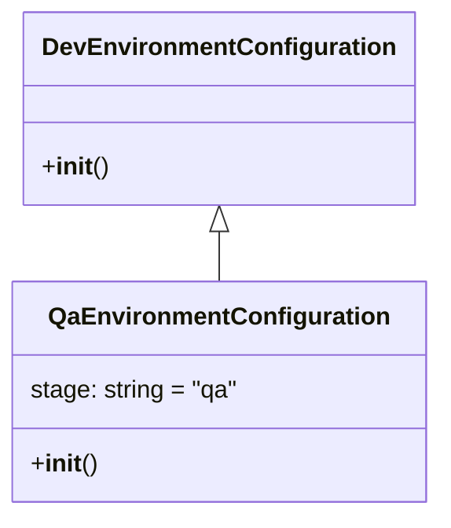

# Diagram: platform/tools/ide_local_testing/localTest/core/environment/QaEnvironmentConfiguration.py

> Auto-generated by Obscura crawlers

## Mermaid

### SVG

<svg id="container" width="280.78125" xmlns="http://www.w3.org/2000/svg" class="classDiagram" height="336" viewBox="0 0 280.78125 336" role="graphics-document document" aria-roledescription="class"><g><defs><marker id="container_class-aggregationStart" class="marker aggregation class" refX="18" refY="7" markerWidth="190" markerHeight="240" orient="auto"><path d="M 18,7 L9,13 L1,7 L9,1 Z"></path></marker></defs><defs><marker id="container_class-aggregationEnd" class="marker aggregation class" refX="1" refY="7" markerWidth="20" markerHeight="28" orient="auto"><path d="M 18,7 L9,13 L1,7 L9,1 Z"></path></marker></defs><defs><marker id="container_class-extensionStart" class="marker extension class" refX="18" refY="7" markerWidth="190" markerHeight="240" orient="auto"><path d="M 1,7 L18,13 V 1 Z"></path></marker></defs><defs><marker id="container_class-extensionEnd" class="marker extension class" refX="1" refY="7" markerWidth="20" markerHeight="28" orient="auto"><path d="M 1,1 V 13 L18,7 Z"></path></marker></defs><defs><marker id="container_class-compositionStart" class="marker composition class" refX="18" refY="7" markerWidth="190" markerHeight="240" orient="auto"><path d="M 18,7 L9,13 L1,7 L9,1 Z"></path></marker></defs><defs><marker id="container_class-compositionEnd" class="marker composition class" refX="1" refY="7" markerWidth="20" markerHeight="28" orient="auto"><path d="M 18,7 L9,13 L1,7 L9,1 Z"></path></marker></defs><defs><marker id="container_class-dependencyStart" class="marker dependency class" refX="6" refY="7" markerWidth="190" markerHeight="240" orient="auto"><path d="M 5,7 L9,13 L1,7 L9,1 Z"></path></marker></defs><defs><marker id="container_class-dependencyEnd" class="marker dependency class" refX="13" refY="7" markerWidth="20" markerHeight="28" orient="auto"><path d="M 18,7 L9,13 L14,7 L9,1 Z"></path></marker></defs><defs><marker id="container_class-lollipopStart" class="marker lollipop class" refX="13" refY="7" markerWidth="190" markerHeight="240" orient="auto"><circle stroke="black" fill="transparent" cx="7" cy="7" r="6"></circle></marker></defs><defs><marker id="container_class-lollipopEnd" class="marker lollipop class" refX="1" refY="7" markerWidth="190" markerHeight="240" orient="auto"><circle stroke="black" fill="transparent" cx="7" cy="7" r="6"></circle></marker></defs><g class="root"><g class="clusters"></g><g class="edgePaths"><path d="M140.391,151.25L140.391,152.542C140.391,153.833,140.391,156.417,140.391,161.875C140.391,167.333,140.391,175.667,140.391,179.833L140.391,184" id="id_DevEnvironmentConfiguration_QaEnvironmentConfiguration_1" class="edge-thickness-normal edge-pattern-solid relation" style=";;;" data-edge="true" data-et="edge" data-id="id_DevEnvironmentConfiguration_QaEnvironmentConfiguration_1" data-points="W3sieCI6MTQwLjM5MDYyNSwieSI6MTM0fSx7IngiOjE0MC4zOTA2MjUsInkiOjE1OX0seyJ4IjoxNDAuMzkwNjI1LCJ5IjoxODR9XQ==" marker-start="url(#container_class-extensionStart)"></path></g><g class="edgeLabels"><g class="edgeLabel"><g class="label" data-id="id_DevEnvironmentConfiguration_QaEnvironmentConfiguration_1" transform="translate(0, 0)"><foreignObject width="0" height="0">

</foreignObject></g></g></g><g class="nodes"><g class="node default" id="classId-DevEnvironmentConfiguration-0" transform="translate(140.390625, 71)"><g class="basic label-container"><path d="M-121.2265625 -63 L121.2265625 -63 L121.2265625 63 L-121.2265625 63" stroke="none" stroke-width="0" fill="#ECECFF" style=""></path><path d="M-121.2265625 -63 C-54.8504333516356 -63, 11.525695796728797 -63, 121.2265625 -63 M-121.2265625 -63 C-61.09671351369448 -63, -0.9668645273889638 -63, 121.2265625 -63 M121.2265625 -63 C121.2265625 -28.34877864727335, 121.2265625 6.302442705453302, 121.2265625 63 M121.2265625 -63 C121.2265625 -25.91434673596048, 121.2265625 11.171306528079043, 121.2265625 63 M121.2265625 63 C45.203579632727894 63, -30.81940323454421 63, -121.2265625 63 M121.2265625 63 C56.107361869413694 63, -9.011838761172612 63, -121.2265625 63 M-121.2265625 63 C-121.2265625 27.836966863793975, -121.2265625 -7.326066272412049, -121.2265625 -63 M-121.2265625 63 C-121.2265625 35.32303905571567, -121.2265625 7.646078111431336, -121.2265625 -63" stroke="#9370DB" stroke-width="1.3" fill="none" stroke-dasharray="0 0" style=""></path></g><g class="annotation-group text" transform="translate(0, -39)"></g><g class="label-group text" transform="translate(-109.2265625, -39)"><g class="label" style="font-weight: bolder" transform="translate(0,-12)"><foreignObject width="218.453125" height="24">

DevEnvironmentConfiguration

</foreignObject></g></g><g class="members-group text" transform="translate(-109.2265625, 9)"></g><g class="methods-group text" transform="translate(-109.2265625, 39)"><g class="label" style="" transform="translate(0,-12)"><foreignObject width="42.796875" height="24">

+<strong>init</strong>()

</foreignObject></g></g><g class="divider" style=""><path d="M-121.2265625 -15 C-41.42950008308067 -15, 38.36756233383866 -15, 121.2265625 -15 M-121.2265625 -15 C-55.66077404861856 -15, 9.905014402762873 -15, 121.2265625 -15" stroke="#9370DB" stroke-width="1.3" fill="none" stroke-dasharray="0 0" style=""></path></g><g class="divider" style=""><path d="M-121.2265625 9 C-67.4079418000236 9, -13.589321100047187 9, 121.2265625 9 M-121.2265625 9 C-36.61114924897751 9, 48.00426400204498 9, 121.2265625 9" stroke="#9370DB" stroke-width="1.3" fill="none" stroke-dasharray="0 0" style=""></path></g></g><g class="node default" id="classId-QaEnvironmentConfiguration-1" transform="translate(140.390625, 256)"><g class="basic label-container"><path d="M-132.390625 -72 L132.390625 -72 L132.390625 72 L-132.390625 72" stroke="none" stroke-width="0" fill="#ECECFF" style=""></path><path d="M-132.390625 -72 C-34.12290618592917 -72, 64.14481262814166 -72, 132.390625 -72 M-132.390625 -72 C-75.65983299913403 -72, -18.92904099826805 -72, 132.390625 -72 M132.390625 -72 C132.390625 -27.258480926697963, 132.390625 17.483038146604073, 132.390625 72 M132.390625 -72 C132.390625 -35.79894564897263, 132.390625 0.4021087020547469, 132.390625 72 M132.390625 72 C27.768839824173526 72, -76.85294535165295 72, -132.390625 72 M132.390625 72 C53.81922349744292 72, -24.75217800511416 72, -132.390625 72 M-132.390625 72 C-132.390625 16.536007956838873, -132.390625 -38.927984086322255, -132.390625 -72 M-132.390625 72 C-132.390625 27.991457793543177, -132.390625 -16.017084412913647, -132.390625 -72" stroke="#9370DB" stroke-width="1.3" fill="none" stroke-dasharray="0 0" style=""></path></g><g class="annotation-group text" transform="translate(0, -48)"></g><g class="label-group text" transform="translate(-105.390625, -48)"><g class="label" style="font-weight: bolder" transform="translate(0,-12)"><foreignObject width="210.78125" height="24">

QaEnvironmentConfiguration

</foreignObject></g></g><g class="members-group text" transform="translate(-120.390625, 0)"><g class="label" style="" transform="translate(0,-12)"><foreignObject width="135.390625" height="24">

stage: string = "qa"

</foreignObject></g></g><g class="methods-group text" transform="translate(-120.390625, 48)"><g class="label" style="" transform="translate(0,-12)"><foreignObject width="42.796875" height="24">

+<strong>init</strong>()

</foreignObject></g></g><g class="divider" style=""><path d="M-132.390625 -24 C-35.72396716196802 -24, 60.94269067606396 -24, 132.390625 -24 M-132.390625 -24 C-61.85933840568073 -24, 8.671948188638538 -24, 132.390625 -24" stroke="#9370DB" stroke-width="1.3" fill="none" stroke-dasharray="0 0" style=""></path></g><g class="divider" style=""><path d="M-132.390625 24 C-71.9344006187864 24, -11.478176237572796 24, 132.390625 24 M-132.390625 24 C-31.455890150588473 24, 69.47884469882305 24, 132.390625 24" stroke="#9370DB" stroke-width="1.3" fill="none" stroke-dasharray="0 0" style=""></path></g></g></g></g></g></svg>
