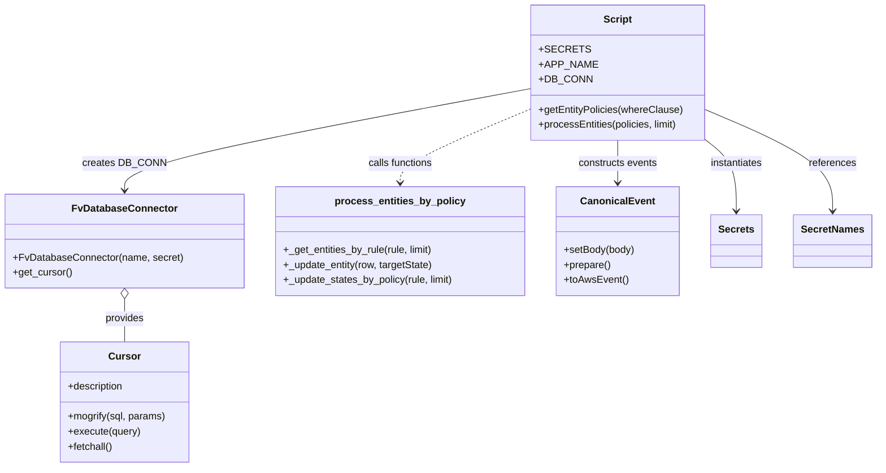

# Diagram: platform/tools/ide_local_testing/localTest/processes/entityWatcherRuleProcessor.py


> Auto-generated by Obscura crawlers

## Diagram 1

```mermaid
flowchart TD
  Start([Start])
  Init[Init SECRETS, APP_NAME, DB_CONN]
  GetPolicies[getEntityPolicies(whereClause)]
  ComposeSQL[Compose SQL: select * from entity_lifecycle_rules]
  Cursor[get_cursor() -> cursor]
  Mogrify[query = cursor.mogrify(sql, {})]
  Execute[cursor.execute(query)]
  Fetch[rows = cursor.fetchall()]
  MapRows[Convert rows to list of dicts]
  CallProcess[processEntities(policies, limit)]
  PolicyLoop{for state_change_policy in policies}
  CreateEvent[event = CanonicalEvent.setBody(body).prepare().toAwsEvent()]
  RuleLoop{for rule in policies}
  GetMessage[message = rule.get("message")]
  PrintRun[print running query for rule]
  StartTimer[start = time.time()]
  GetEntities[results = processEntitiesScript._get_entities_by_rule(rule, limit)]
  QueryEnd[queryEnd = time.time()]
  Duration[duration = queryEnd - start]
  PrintResults[print results took ... length: len(results)]
  TargetState[targetState = rule.get("entity_state_to")]
  HasResults{results exist?}
  RowLoop{for row in results}
  UpdateEntity[processEntitiesScript._update_entity(row, targetState)]
  ProcessDuration[processDuration = time.time() - queryEnd]
  PrintDone[print Done. Took ...]
  End([End])

  Start --> Init --> GetPolicies --> ComposeSQL --> Cursor --> Mogrify --> Execute --> Fetch --> MapRows --> CallProcess --> PolicyLoop
  PolicyLoop --> CreateEvent --> RuleLoop
  RuleLoop --> GetMessage --> PrintRun --> StartTimer --> GetEntities --> QueryEnd --> Duration --> PrintResults --> TargetState --> HasResults
  HasResults -- Yes --> RowLoop --> UpdateEntity --> RowLoop
  HasResults -- No --> ProcessDuration
  UpdateEntity --> ProcessDuration
  ProcessDuration --> PrintDone --> PolicyLoop
  PolicyLoop -- Completed --> End
```

> SVG rendering failed for this diagram.

## Diagram 2



### SVG

<svg id="container" width="1375.4765625" xmlns="http://www.w3.org/2000/svg" class="classDiagram" height="746" viewBox="0 0 1375.4765625 746" role="graphics-document document" aria-roledescription="class"><style>#container{font-family:"trebuchet ms",verdana,arial,sans-serif;font-size:16px;fill:#333;}@keyframes edge-animation-frame{from{stroke-dashoffset:0;}}@keyframes dash{to{stroke-dashoffset:0;}}#container .edge-animation-slow{stroke-dasharray:9,5!important;stroke-dashoffset:900;animation:dash 50s linear infinite;stroke-linecap:round;}#container .edge-animation-fast{stroke-dasharray:9,5!important;stroke-dashoffset:900;animation:dash 20s linear infinite;stroke-linecap:round;}#container .error-icon{fill:#552222;}#container .error-text{fill:#552222;stroke:#552222;}#container .edge-thickness-normal{stroke-width:1px;}#container .edge-thickness-thick{stroke-width:3.5px;}#container .edge-pattern-solid{stroke-dasharray:0;}#container .edge-thickness-invisible{stroke-width:0;fill:none;}#container .edge-pattern-dashed{stroke-dasharray:3;}#container .edge-pattern-dotted{stroke-dasharray:2;}#container .marker{fill:#333333;stroke:#333333;}#container .marker.cross{stroke:#333333;}#container svg{font-family:"trebuchet ms",verdana,arial,sans-serif;font-size:16px;}#container p{margin:0;}#container g.classGroup text{fill:#9370DB;stroke:none;font-family:"trebuchet ms",verdana,arial,sans-serif;font-size:10px;}#container g.classGroup text .title{font-weight:bolder;}#container .nodeLabel,#container .edgeLabel{color:#131300;}#container .edgeLabel .label rect{fill:#ECECFF;}#container .label text{fill:#131300;}#container .labelBkg{background:#ECECFF;}#container .edgeLabel .label span{background:#ECECFF;}#container .classTitle{font-weight:bolder;}#container .node rect,#container .node circle,#container .node ellipse,#container .node polygon,#container .node path{fill:#ECECFF;stroke:#9370DB;stroke-width:1px;}#container .divider{stroke:#9370DB;stroke-width:1;}#container g.clickable{cursor:pointer;}#container g.classGroup rect{fill:#ECECFF;stroke:#9370DB;}#container g.classGroup line{stroke:#9370DB;stroke-width:1;}#container .classLabel .box{stroke:none;stroke-width:0;fill:#ECECFF;opacity:0.5;}#container .classLabel .label{fill:#9370DB;font-size:10px;}#container .relation{stroke:#333333;stroke-width:1;fill:none;}#container .dashed-line{stroke-dasharray:3;}#container .dotted-line{stroke-dasharray:1 2;}#container #compositionStart,#container .composition{fill:#333333!important;stroke:#333333!important;stroke-width:1;}#container #compositionEnd,#container .composition{fill:#333333!important;stroke:#333333!important;stroke-width:1;}#container #dependencyStart,#container .dependency{fill:#333333!important;stroke:#333333!important;stroke-width:1;}#container #dependencyStart,#container .dependency{fill:#333333!important;stroke:#333333!important;stroke-width:1;}#container #extensionStart,#container .extension{fill:transparent!important;stroke:#333333!important;stroke-width:1;}#container #extensionEnd,#container .extension{fill:transparent!important;stroke:#333333!important;stroke-width:1;}#container #aggregationStart,#container .aggregation{fill:transparent!important;stroke:#333333!important;stroke-width:1;}#container #aggregationEnd,#container .aggregation{fill:transparent!important;stroke:#333333!important;stroke-width:1;}#container #lollipopStart,#container .lollipop{fill:#ECECFF!important;stroke:#333333!important;stroke-width:1;}#container #lollipopEnd,#container .lollipop{fill:#ECECFF!important;stroke:#333333!important;stroke-width:1;}#container .edgeTerminals{font-size:11px;line-height:initial;}#container .classTitleText{text-anchor:middle;font-size:18px;fill:#333;}#container .label-icon{display:inline-block;height:1em;overflow:visible;vertical-align:-0.125em;}#container .node .label-icon path{fill:currentColor;stroke:revert;stroke-width:revert;}#container :root{--mermaid-font-family:"trebuchet ms",verdana,arial,sans-serif;}</style><g><defs><marker id="container_class-aggregationStart" class="marker aggregation class" refX="18" refY="7" markerWidth="190" markerHeight="240" orient="auto"><path d="M 18,7 L9,13 L1,7 L9,1 Z"></path></marker></defs><defs><marker id="container_class-aggregationEnd" class="marker aggregation class" refX="1" refY="7" markerWidth="20" markerHeight="28" orient="auto"><path d="M 18,7 L9,13 L1,7 L9,1 Z"></path></marker></defs><defs><marker id="container_class-extensionStart" class="marker extension class" refX="18" refY="7" markerWidth="190" markerHeight="240" orient="auto"><path d="M 1,7 L18,13 V 1 Z"></path></marker></defs><defs><marker id="container_class-extensionEnd" class="marker extension class" refX="1" refY="7" markerWidth="20" markerHeight="28" orient="auto"><path d="M 1,1 V 13 L18,7 Z"></path></marker></defs><defs><marker id="container_class-compositionStart" class="marker composition class" refX="18" refY="7" markerWidth="190" markerHeight="240" orient="auto"><path d="M 18,7 L9,13 L1,7 L9,1 Z"></path></marker></defs><defs><marker id="container_class-compositionEnd" class="marker composition class" refX="1" refY="7" markerWidth="20" markerHeight="28" orient="auto"><path d="M 18,7 L9,13 L1,7 L9,1 Z"></path></marker></defs><defs><marker id="container_class-dependencyStart" class="marker dependency class" refX="6" refY="7" markerWidth="190" markerHeight="240" orient="auto"><path d="M 5,7 L9,13 L1,7 L9,1 Z"></path></marker></defs><defs><marker id="container_class-dependencyEnd" class="marker dependency class" refX="13" refY="7" markerWidth="20" markerHeight="28" orient="auto"><path d="M 18,7 L9,13 L14,7 L9,1 Z"></path></marker></defs><defs><marker id="container_class-lollipopStart" class="marker lollipop class" refX="13" refY="7" markerWidth="190" markerHeight="240" orient="auto"><circle stroke="black" fill="transparent" cx="7" cy="7" r="6"></circle></marker></defs><defs><marker id="container_class-lollipopEnd" class="marker lollipop class" refX="1" refY="7" markerWidth="190" markerHeight="240" orient="auto"><circle stroke="black" fill="transparent" cx="7" cy="7" r="6"></circle></marker></defs><g class="root"><g class="clusters"></g><g class="edgePaths"><path d="M1110.469,223.667L1118.432,229.889C1126.396,236.112,1142.323,248.556,1150.286,267.445C1158.25,286.333,1158.25,311.667,1158.25,324.333L1158.25,337" id="id_Script_Secrets_1" class="edge-thickness-normal edge-pattern-solid relation" style=";;;" data-edge="true" data-et="edge" data-id="id_Script_Secrets_1" data-points="W3sieCI6MTExMC40Njg3NSwieSI6MjIzLjY2NzI4NDA5MzU0MDE2fSx7IngiOjExNTguMjUsInkiOjI2MX0seyJ4IjoxMTU4LjI1LCJ5IjozNDN9XQ==" marker-end="url(#container_class-dependencyEnd)"></path><path d="M1110.469,175.685L1143.298,189.904C1176.128,204.123,1241.786,232.562,1274.616,259.447C1307.445,286.333,1307.445,311.667,1307.445,324.333L1307.445,337" id="id_Script_SecretNames_2" class="edge-thickness-normal edge-pattern-solid relation" style=";;;" data-edge="true" data-et="edge" data-id="id_Script_SecretNames_2" data-points="W3sieCI6MTExMC40Njg3NSwieSI6MTc1LjY4NDc4MzQ5NjQ5Mzd9LHsieCI6MTMwNy40NDUzMTI1LCJ5IjoyNjF9LHsieCI6MTMwNy40NDUzMTI1LCJ5IjozNDN9XQ==" marker-end="url(#container_class-dependencyEnd)"></path><path d="M834.867,141.64L727.952,161.533C621.038,181.427,407.208,221.213,300.294,248.273C193.379,275.333,193.379,289.667,193.379,296.833L193.379,304" id="id_Script_FvDatabaseConnector_3" class="edge-thickness-normal edge-pattern-solid relation" style=";;;" data-edge="true" data-et="edge" data-id="id_Script_FvDatabaseConnector_3" data-points="W3sieCI6ODM0Ljg2NzE4NzUsInkiOjE0MS42NDAxODE4NTY0NTk3Mn0seyJ4IjoxOTMuMzc4OTA2MjUsInkiOjI2MX0seyJ4IjoxOTMuMzc4OTA2MjUsInkiOjMxMH1d" marker-end="url(#container_class-dependencyEnd)"></path><path d="M193.379,477.25L193.379,482.542C193.379,487.833,193.379,498.417,193.379,509.875C193.379,521.333,193.379,533.667,193.379,539.833L193.379,546" id="id_FvDatabaseConnector_Cursor_4" class="edge-thickness-normal edge-pattern-solid relation" style=";;;" data-edge="true" data-et="edge" data-id="id_FvDatabaseConnector_Cursor_4" data-points="W3sieCI6MTkzLjM3ODkwNjI1LCJ5Ijo0NjB9LHsieCI6MTkzLjM3ODkwNjI1LCJ5Ijo1MDl9LHsieCI6MTkzLjM3ODkwNjI1LCJ5Ijo1NDZ9XQ==" marker-start="url(#container_class-aggregationStart)"></path><path d="M834.867,173.889L800.307,188.407C765.746,202.926,696.625,231.963,662.064,251.648C627.504,271.333,627.504,281.667,627.504,286.833L627.504,292" id="id_Script_process_entities_by_policy_5" class="edge-thickness-normal edge-pattern-dashed relation" style=";;;" data-edge="true" data-et="edge" data-id="id_Script_process_entities_by_policy_5" data-points="W3sieCI6ODM0Ljg2NzE4NzUsInkiOjE3My44ODg3NDE3NjY4MjI4NX0seyJ4Ijo2MjcuNTAzOTA2MjUsInkiOjI2MX0seyJ4Ijo2MjcuNTAzOTA2MjUsInkiOjI5OH1d" marker-end="url(#container_class-dependencyEnd)"></path><path d="M972.668,224L972.668,230.167C972.668,236.333,972.668,248.667,972.668,260C972.668,271.333,972.668,281.667,972.668,286.833L972.668,292" id="id_Script_CanonicalEvent_6" class="edge-thickness-normal edge-pattern-solid relation" style=";;;" data-edge="true" data-et="edge" data-id="id_Script_CanonicalEvent_6" data-points="W3sieCI6OTcyLjY2Nzk2ODc1LCJ5IjoyMjR9LHsieCI6OTcyLjY2Nzk2ODc1LCJ5IjoyNjF9LHsieCI6OTcyLjY2Nzk2ODc1LCJ5IjoyOTh9XQ==" marker-end="url(#container_class-dependencyEnd)"></path></g><g class="edgeLabels"><g class="edgeLabel" transform="translate(1158.25, 261)"><g class="label" data-id="id_Script_Secrets_1" transform="translate(-42.9140625, -12)"><foreignObject width="85.828125" height="24"><div xmlns="http://www.w3.org/1999/xhtml" class="labelBkg" style="display: table-cell; white-space: nowrap; line-height: 1.5; max-width: 200px; text-align: center;"><span class="edgeLabel"><p>instantiates</p></span></div></foreignObject></g></g><g class="edgeLabel" transform="translate(1307.4453125, 261)"><g class="label" data-id="id_Script_SecretNames_2" transform="translate(-37.828125, -12)"><foreignObject width="75.65625" height="24"><div xmlns="http://www.w3.org/1999/xhtml" class="labelBkg" style="display: table-cell; white-space: nowrap; line-height: 1.5; max-width: 200px; text-align: center;"><span class="edgeLabel"><p>references</p></span></div></foreignObject></g></g><g class="edgeLabel" transform="translate(193.37890625, 261)"><g class="label" data-id="id_Script_FvDatabaseConnector_3" transform="translate(-62.7734375, -12)"><foreignObject width="125.546875" height="24"><div xmlns="http://www.w3.org/1999/xhtml" class="labelBkg" style="display: table-cell; white-space: nowrap; line-height: 1.5; max-width: 200px; text-align: center;"><span class="edgeLabel"><p>creates DB_CONN</p></span></div></foreignObject></g></g><g class="edgeLabel" transform="translate(193.37890625, 509)"><g class="label" data-id="id_FvDatabaseConnector_Cursor_4" transform="translate(-31.3125, -12)"><foreignObject width="62.625" height="24"><div xmlns="http://www.w3.org/1999/xhtml" class="labelBkg" style="display: table-cell; white-space: nowrap; line-height: 1.5; max-width: 200px; text-align: center;"><span class="edgeLabel"><p>provides</p></span></div></foreignObject></g></g><g class="edgeLabel" transform="translate(627.50390625, 261)"><g class="label" data-id="id_Script_process_entities_by_policy_5" transform="translate(-52.6484375, -12)"><foreignObject width="105.296875" height="24"><div xmlns="http://www.w3.org/1999/xhtml" class="labelBkg" style="display: table-cell; white-space: nowrap; line-height: 1.5; max-width: 200px; text-align: center;"><span class="edgeLabel"><p>calls functions</p></span></div></foreignObject></g></g><g class="edgeLabel" transform="translate(972.66796875, 261)"><g class="label" data-id="id_Script_CanonicalEvent_6" transform="translate(-63.8671875, -12)"><foreignObject width="127.734375" height="24"><div xmlns="http://www.w3.org/1999/xhtml" class="labelBkg" style="display: table-cell; white-space: nowrap; line-height: 1.5; max-width: 200px; text-align: center;"><span class="edgeLabel"><p>constructs events</p></span></div></foreignObject></g></g></g><g class="nodes"><g class="node default" id="classId-Script-0" transform="translate(972.66796875, 116)"><g class="basic label-container"><path d="M-137.80078125 -108 L137.80078125 -108 L137.80078125 108 L-137.80078125 108" stroke="none" stroke-width="0" fill="#ECECFF" style=""></path><path d="M-137.80078125 -108 C-66.19874032823063 -108, 5.403300593538745 -108, 137.80078125 -108 M-137.80078125 -108 C-33.21630821013126 -108, 71.36816482973748 -108, 137.80078125 -108 M137.80078125 -108 C137.80078125 -33.64316407836884, 137.80078125 40.71367184326232, 137.80078125 108 M137.80078125 -108 C137.80078125 -34.85660738635275, 137.80078125 38.2867852272945, 137.80078125 108 M137.80078125 108 C78.37239596000526 108, 18.94401067001054 108, -137.80078125 108 M137.80078125 108 C56.31401376737911 108, -25.172753715241782 108, -137.80078125 108 M-137.80078125 108 C-137.80078125 45.999344554780215, -137.80078125 -16.00131089043957, -137.80078125 -108 M-137.80078125 108 C-137.80078125 44.48796502511263, -137.80078125 -19.02406994977474, -137.80078125 -108" stroke="#9370DB" stroke-width="1.3" fill="none" stroke-dasharray="0 0" style=""></path></g><g class="annotation-group text" transform="translate(0, -84)"></g><g class="label-group text" transform="translate(-21.7421875, -84)"><g class="label" style="font-weight: bolder" transform="translate(0,-12)"><foreignObject width="43.484375" height="24"><div xmlns="http://www.w3.org/1999/xhtml" style="display: table-cell; white-space: nowrap; line-height: 1.5; max-width: 93px; text-align: center;"><span class="nodeLabel markdown-node-label" style=""><p>Script</p></span></div></foreignObject></g></g><g class="members-group text" transform="translate(-125.80078125, -36)"><g class="label" style="" transform="translate(0,-12)"><foreignObject width="68.3125" height="24"><div xmlns="http://www.w3.org/1999/xhtml" style="display: table-cell; white-space: nowrap; line-height: 1.5; max-width: 126px; text-align: center;"><span class="nodeLabel markdown-node-label" style=""><p>+SECRETS</p></span></div></foreignObject></g><g class="label" style="" transform="translate(0,12)"><foreignObject width="83.421875" height="24"><div xmlns="http://www.w3.org/1999/xhtml" style="display: table-cell; white-space: nowrap; line-height: 1.5; max-width: 141px; text-align: center;"><span class="nodeLabel markdown-node-label" style=""><p>+APP_NAME</p></span></div></foreignObject></g><g class="label" style="" transform="translate(0,36)"><foreignObject width="76.953125" height="24"><div xmlns="http://www.w3.org/1999/xhtml" style="display: table-cell; white-space: nowrap; line-height: 1.5; max-width: 134px; text-align: center;"><span class="nodeLabel markdown-node-label" style=""><p>+DB_CONN</p></span></div></foreignObject></g></g><g class="methods-group text" transform="translate(-125.80078125, 60)"><g class="label" style="" transform="translate(0,-12)"><foreignObject width="229.859375" height="24"><div xmlns="http://www.w3.org/1999/xhtml" style="display: table-cell; white-space: nowrap; line-height: 1.5; max-width: 287px; text-align: center;"><span class="nodeLabel markdown-node-label" style=""><p>+getEntityPolicies(whereClause)</p></span></div></foreignObject></g><g class="label" style="" transform="translate(0,12)"><foreignObject width="225.953125" height="24"><div xmlns="http://www.w3.org/1999/xhtml" style="display: table-cell; white-space: nowrap; line-height: 1.5; max-width: 283px; text-align: center;"><span class="nodeLabel markdown-node-label" style=""><p>+processEntities(policies, limit)</p></span></div></foreignObject></g></g><g class="divider" style=""><path d="M-137.80078125 -60 C-49.1948824869357 -60, 39.411016276128606 -60, 137.80078125 -60 M-137.80078125 -60 C-75.21733443683772 -60, -12.633887623675449 -60, 137.80078125 -60" stroke="#9370DB" stroke-width="1.3" fill="none" stroke-dasharray="0 0" style=""></path></g><g class="divider" style=""><path d="M-137.80078125 36 C-69.1117879810153 36, -0.42279471203059416 36, 137.80078125 36 M-137.80078125 36 C-65.53341806499135 36, 6.733945120017296 36, 137.80078125 36" stroke="#9370DB" stroke-width="1.3" fill="none" stroke-dasharray="0 0" style=""></path></g></g><g class="node default" id="classId-FvDatabaseConnector-1" transform="translate(193.37890625, 385)"><g class="basic label-container"><path d="M-185.37890625 -75 L185.37890625 -75 L185.37890625 75 L-185.37890625 75" stroke="none" stroke-width="0" fill="#ECECFF" style=""></path><path d="M-185.37890625 -75 C-89.66656024428063 -75, 6.0457857614387365 -75, 185.37890625 -75 M-185.37890625 -75 C-102.20718945199445 -75, -19.035472653988904 -75, 185.37890625 -75 M185.37890625 -75 C185.37890625 -36.5990542983998, 185.37890625 1.8018914032004005, 185.37890625 75 M185.37890625 -75 C185.37890625 -40.64680514236312, 185.37890625 -6.293610284726242, 185.37890625 75 M185.37890625 75 C106.6956722333662 75, 28.01243821673239 75, -185.37890625 75 M185.37890625 75 C47.77378458218894 75, -89.83133708562212 75, -185.37890625 75 M-185.37890625 75 C-185.37890625 27.270478268339374, -185.37890625 -20.45904346332125, -185.37890625 -75 M-185.37890625 75 C-185.37890625 36.24440532987834, -185.37890625 -2.5111893402433196, -185.37890625 -75" stroke="#9370DB" stroke-width="1.3" fill="none" stroke-dasharray="0 0" style=""></path></g><g class="annotation-group text" transform="translate(0, -51)"></g><g class="label-group text" transform="translate(-79.3046875, -51)"><g class="label" style="font-weight: bolder" transform="translate(0,-12)"><foreignObject width="158.609375" height="24"><div xmlns="http://www.w3.org/1999/xhtml" style="display: table-cell; white-space: nowrap; line-height: 1.5; max-width: 207px; text-align: center;"><span class="nodeLabel markdown-node-label" style=""><p>FvDatabaseConnector</p></span></div></foreignObject></g></g><g class="members-group text" transform="translate(-173.37890625, -3)"></g><g class="methods-group text" transform="translate(-173.37890625, 27)"><g class="label" style="" transform="translate(0,-12)"><foreignObject width="267.453125" height="24"><div xmlns="http://www.w3.org/1999/xhtml" style="display: table-cell; white-space: nowrap; line-height: 1.5; max-width: 325px; text-align: center;"><span class="nodeLabel markdown-node-label" style=""><p>+FvDatabaseConnector(name, secret)</p></span></div></foreignObject></g><g class="label" style="" transform="translate(0,12)"><foreignObject width="94.640625" height="24"><div xmlns="http://www.w3.org/1999/xhtml" style="display: table-cell; white-space: nowrap; line-height: 1.5; max-width: 152px; text-align: center;"><span class="nodeLabel markdown-node-label" style=""><p>+get_cursor()</p></span></div></foreignObject></g></g><g class="divider" style=""><path d="M-185.37890625 -27 C-109.32340157700101 -27, -33.267896904002015 -27, 185.37890625 -27 M-185.37890625 -27 C-94.6661190813604 -27, -3.953331912720813 -27, 185.37890625 -27" stroke="#9370DB" stroke-width="1.3" fill="none" stroke-dasharray="0 0" style=""></path></g><g class="divider" style=""><path d="M-185.37890625 -3 C-64.49468826271016 -3, 56.38952972457969 -3, 185.37890625 -3 M-185.37890625 -3 C-50.69411794430863 -3, 83.99067036138274 -3, 185.37890625 -3" stroke="#9370DB" stroke-width="1.3" fill="none" stroke-dasharray="0 0" style=""></path></g></g><g class="node default" id="classId-Cursor-2" transform="translate(193.37890625, 642)"><g class="basic label-container"><path d="M-102.4921875 -96 L102.4921875 -96 L102.4921875 96 L-102.4921875 96" stroke="none" stroke-width="0" fill="#ECECFF" style=""></path><path d="M-102.4921875 -96 C-31.077053711575076 -96, 40.33808007684985 -96, 102.4921875 -96 M-102.4921875 -96 C-20.71874151566557 -96, 61.05470446866886 -96, 102.4921875 -96 M102.4921875 -96 C102.4921875 -27.067262131395395, 102.4921875 41.86547573720921, 102.4921875 96 M102.4921875 -96 C102.4921875 -28.052548438551256, 102.4921875 39.89490312289749, 102.4921875 96 M102.4921875 96 C44.01145228118254 96, -14.469282937634915 96, -102.4921875 96 M102.4921875 96 C55.350517386823554 96, 8.208847273647109 96, -102.4921875 96 M-102.4921875 96 C-102.4921875 50.79831841591968, -102.4921875 5.596636831839362, -102.4921875 -96 M-102.4921875 96 C-102.4921875 43.72275319666789, -102.4921875 -8.554493606664224, -102.4921875 -96" stroke="#9370DB" stroke-width="1.3" fill="none" stroke-dasharray="0 0" style=""></path></g><g class="annotation-group text" transform="translate(0, -72)"></g><g class="label-group text" transform="translate(-23.90625, -72)"><g class="label" style="font-weight: bolder" transform="translate(0,-12)"><foreignObject width="47.8125" height="24"><div xmlns="http://www.w3.org/1999/xhtml" style="display: table-cell; white-space: nowrap; line-height: 1.5; max-width: 98px; text-align: center;"><span class="nodeLabel markdown-node-label" style=""><p>Cursor</p></span></div></foreignObject></g></g><g class="members-group text" transform="translate(-90.4921875, -24)"><g class="label" style="" transform="translate(0,-12)"><foreignObject width="90.59375" height="24"><div xmlns="http://www.w3.org/1999/xhtml" style="display: table-cell; white-space: nowrap; line-height: 1.5; max-width: 148px; text-align: center;"><span class="nodeLabel markdown-node-label" style=""><p>+description</p></span></div></foreignObject></g></g><g class="methods-group text" transform="translate(-90.4921875, 24)"><g class="label" style="" transform="translate(0,-12)"><foreignObject width="157.078125" height="24"><div xmlns="http://www.w3.org/1999/xhtml" style="display: table-cell; white-space: nowrap; line-height: 1.5; max-width: 214px; text-align: center;"><span class="nodeLabel markdown-node-label" style=""><p>+mogrify(sql, params)</p></span></div></foreignObject></g><g class="label" style="" transform="translate(0,12)"><foreignObject width="115.96875" height="24"><div xmlns="http://www.w3.org/1999/xhtml" style="display: table-cell; white-space: nowrap; line-height: 1.5; max-width: 173px; text-align: center;"><span class="nodeLabel markdown-node-label" style=""><p>+execute(query)</p></span></div></foreignObject></g><g class="label" style="" transform="translate(0,36)"><foreignObject width="72.515625" height="24"><div xmlns="http://www.w3.org/1999/xhtml" style="display: table-cell; white-space: nowrap; line-height: 1.5; max-width: 130px; text-align: center;"><span class="nodeLabel markdown-node-label" style=""><p>+fetchall()</p></span></div></foreignObject></g></g><g class="divider" style=""><path d="M-102.4921875 -48 C-51.66856949549724 -48, -0.8449514909944753 -48, 102.4921875 -48 M-102.4921875 -48 C-56.111956379801896 -48, -9.731725259603792 -48, 102.4921875 -48" stroke="#9370DB" stroke-width="1.3" fill="none" stroke-dasharray="0 0" style=""></path></g><g class="divider" style=""><path d="M-102.4921875 0 C-40.706990465747396 0, 21.07820656850521 0, 102.4921875 0 M-102.4921875 0 C-39.45908361202344 0, 23.574020275953117 0, 102.4921875 0" stroke="#9370DB" stroke-width="1.3" fill="none" stroke-dasharray="0 0" style=""></path></g></g><g class="node default" id="classId-process_entities_by_policy-3" transform="translate(627.50390625, 385)"><g class="basic label-container"><path d="M-198.74609375 -87 L198.74609375 -87 L198.74609375 87 L-198.74609375 87" stroke="none" stroke-width="0" fill="#ECECFF" style=""></path><path d="M-198.74609375 -87 C-43.58540561890152 -87, 111.57528251219696 -87, 198.74609375 -87 M-198.74609375 -87 C-74.10224769486292 -87, 50.54159836027415 -87, 198.74609375 -87 M198.74609375 -87 C198.74609375 -42.3704641448595, 198.74609375 2.259071710281006, 198.74609375 87 M198.74609375 -87 C198.74609375 -30.094960065966752, 198.74609375 26.810079868066495, 198.74609375 87 M198.74609375 87 C69.71172261255217 87, -59.32264852489567 87, -198.74609375 87 M198.74609375 87 C46.08229960405643 87, -106.58149454188714 87, -198.74609375 87 M-198.74609375 87 C-198.74609375 37.581844010832505, -198.74609375 -11.83631197833499, -198.74609375 -87 M-198.74609375 87 C-198.74609375 47.48948556950307, -198.74609375 7.978971139006134, -198.74609375 -87" stroke="#9370DB" stroke-width="1.3" fill="none" stroke-dasharray="0 0" style=""></path></g><g class="annotation-group text" transform="translate(0, -63)"></g><g class="label-group text" transform="translate(-98.8515625, -63)"><g class="label" style="font-weight: bolder" transform="translate(0,-12)"><foreignObject width="197.703125" height="24"><div xmlns="http://www.w3.org/1999/xhtml" style="display: table-cell; white-space: nowrap; line-height: 1.5; max-width: 245px; text-align: center;"><span class="nodeLabel markdown-node-label" style=""><p>process_entities_by_policy</p></span></div></foreignObject></g></g><g class="members-group text" transform="translate(-186.74609375, -15)"></g><g class="methods-group text" transform="translate(-186.74609375, 15)"><g class="label" style="" transform="translate(0,-12)"><foreignObject width="242.875" height="24"><div xmlns="http://www.w3.org/1999/xhtml" style="display: table-cell; white-space: nowrap; line-height: 1.5; max-width: 300px; text-align: center;"><span class="nodeLabel markdown-node-label" style=""><p>+_get_entities_by_rule(rule, limit)</p></span></div></foreignObject></g><g class="label" style="" transform="translate(0,12)"><foreignObject width="240.53125" height="24"><div xmlns="http://www.w3.org/1999/xhtml" style="display: table-cell; white-space: nowrap; line-height: 1.5; max-width: 298px; text-align: center;"><span class="nodeLabel markdown-node-label" style=""><p>+_update_entity(row, targetState)</p></span></div></foreignObject></g><g class="label" style="" transform="translate(0,36)"><foreignObject width="274.640625" height="24"><div xmlns="http://www.w3.org/1999/xhtml" style="display: table-cell; white-space: nowrap; line-height: 1.5; max-width: 332px; text-align: center;"><span class="nodeLabel markdown-node-label" style=""><p>+_update_states_by_policy(rule, limit)</p></span></div></foreignObject></g></g><g class="divider" style=""><path d="M-198.74609375 -39 C-78.68542169101539 -39, 41.375250367969215 -39, 198.74609375 -39 M-198.74609375 -39 C-54.95681327125763 -39, 88.83246720748474 -39, 198.74609375 -39" stroke="#9370DB" stroke-width="1.3" fill="none" stroke-dasharray="0 0" style=""></path></g><g class="divider" style=""><path d="M-198.74609375 -15 C-68.24410700605142 -15, 62.257879737897156 -15, 198.74609375 -15 M-198.74609375 -15 C-40.11532165146147 -15, 118.51545044707706 -15, 198.74609375 -15" stroke="#9370DB" stroke-width="1.3" fill="none" stroke-dasharray="0 0" style=""></path></g></g><g class="node default" id="classId-CanonicalEvent-4" transform="translate(972.66796875, 385)"><g class="basic label-container"><path d="M-96.41796875 -87 L96.41796875 -87 L96.41796875 87 L-96.41796875 87" stroke="none" stroke-width="0" fill="#ECECFF" style=""></path><path d="M-96.41796875 -87 C-19.818106212440043 -87, 56.781756325119915 -87, 96.41796875 -87 M-96.41796875 -87 C-54.69973053396481 -87, -12.981492317929622 -87, 96.41796875 -87 M96.41796875 -87 C96.41796875 -46.15353045150828, 96.41796875 -5.307060903016563, 96.41796875 87 M96.41796875 -87 C96.41796875 -41.79953908694673, 96.41796875 3.40092182610654, 96.41796875 87 M96.41796875 87 C31.04444706900621 87, -34.32907461198758 87, -96.41796875 87 M96.41796875 87 C46.673627754050116 87, -3.0707132418997674 87, -96.41796875 87 M-96.41796875 87 C-96.41796875 48.093851091354125, -96.41796875 9.18770218270825, -96.41796875 -87 M-96.41796875 87 C-96.41796875 20.630190780684217, -96.41796875 -45.73961843863157, -96.41796875 -87" stroke="#9370DB" stroke-width="1.3" fill="none" stroke-dasharray="0 0" style=""></path></g><g class="annotation-group text" transform="translate(0, -63)"></g><g class="label-group text" transform="translate(-55.7109375, -63)"><g class="label" style="font-weight: bolder" transform="translate(0,-12)"><foreignObject width="111.421875" height="24"><div xmlns="http://www.w3.org/1999/xhtml" style="display: table-cell; white-space: nowrap; line-height: 1.5; max-width: 161px; text-align: center;"><span class="nodeLabel markdown-node-label" style=""><p>CanonicalEvent</p></span></div></foreignObject></g></g><g class="members-group text" transform="translate(-84.41796875, -15)"></g><g class="methods-group text" transform="translate(-84.41796875, 15)"><g class="label" style="" transform="translate(0,-12)"><foreignObject width="113.125" height="24"><div xmlns="http://www.w3.org/1999/xhtml" style="display: table-cell; white-space: nowrap; line-height: 1.5; max-width: 170px; text-align: center;"><span class="nodeLabel markdown-node-label" style=""><p>+setBody(body)</p></span></div></foreignObject></g><g class="label" style="" transform="translate(0,12)"><foreignObject width="74.75" height="24"><div xmlns="http://www.w3.org/1999/xhtml" style="display: table-cell; white-space: nowrap; line-height: 1.5; max-width: 132px; text-align: center;"><span class="nodeLabel markdown-node-label" style=""><p>+prepare()</p></span></div></foreignObject></g><g class="label" style="" transform="translate(0,36)"><foreignObject width="101.1875" height="24"><div xmlns="http://www.w3.org/1999/xhtml" style="display: table-cell; white-space: nowrap; line-height: 1.5; max-width: 159px; text-align: center;"><span class="nodeLabel markdown-node-label" style=""><p>+toAwsEvent()</p></span></div></foreignObject></g></g><g class="divider" style=""><path d="M-96.41796875 -39 C-23.518011458413923 -39, 49.38194583317215 -39, 96.41796875 -39 M-96.41796875 -39 C-52.80343001876213 -39, -9.188891287524257 -39, 96.41796875 -39" stroke="#9370DB" stroke-width="1.3" fill="none" stroke-dasharray="0 0" style=""></path></g><g class="divider" style=""><path d="M-96.41796875 -15 C-43.708816222539966 -15, 9.000336304920069 -15, 96.41796875 -15 M-96.41796875 -15 C-37.065758140679485 -15, 22.28645246864103 -15, 96.41796875 -15" stroke="#9370DB" stroke-width="1.3" fill="none" stroke-dasharray="0 0" style=""></path></g></g><g class="node default" id="classId-Secrets-5" transform="translate(1158.25, 385)"><g class="basic label-container"><path d="M-39.1640625 -42 L39.1640625 -42 L39.1640625 42 L-39.1640625 42" stroke="none" stroke-width="0" fill="#ECECFF" style=""></path><path d="M-39.1640625 -42 C-18.349050034065016 -42, 2.4659624318699684 -42, 39.1640625 -42 M-39.1640625 -42 C-19.24440168363147 -42, 0.675259132737061 -42, 39.1640625 -42 M39.1640625 -42 C39.1640625 -22.854103719597244, 39.1640625 -3.7082074391944886, 39.1640625 42 M39.1640625 -42 C39.1640625 -22.642118750717483, 39.1640625 -3.2842375014349656, 39.1640625 42 M39.1640625 42 C8.132048499628702 42, -22.899965500742596 42, -39.1640625 42 M39.1640625 42 C13.670372397744373 42, -11.823317704511254 42, -39.1640625 42 M-39.1640625 42 C-39.1640625 17.504222285212418, -39.1640625 -6.991555429575165, -39.1640625 -42 M-39.1640625 42 C-39.1640625 12.83095862698718, -39.1640625 -16.33808274602564, -39.1640625 -42" stroke="#9370DB" stroke-width="1.3" fill="none" stroke-dasharray="0 0" style=""></path></g><g class="annotation-group text" transform="translate(0, -18)"></g><g class="label-group text" transform="translate(-27.1640625, -18)"><g class="label" style="font-weight: bolder" transform="translate(0,-12)"><foreignObject width="54.328125" height="24"><div xmlns="http://www.w3.org/1999/xhtml" style="display: table-cell; white-space: nowrap; line-height: 1.5; max-width: 103px; text-align: center;"><span class="nodeLabel markdown-node-label" style=""><p>Secrets</p></span></div></foreignObject></g></g><g class="members-group text" transform="translate(-27.1640625, 30)"></g><g class="methods-group text" transform="translate(-27.1640625, 60)"></g><g class="divider" style=""><path d="M-39.1640625 6 C-15.714804313685075 6, 7.7344538726298495 6, 39.1640625 6 M-39.1640625 6 C-21.219781336374098 6, -3.2755001727481954 6, 39.1640625 6" stroke="#9370DB" stroke-width="1.3" fill="none" stroke-dasharray="0 0" style=""></path></g><g class="divider" style=""><path d="M-39.1640625 24 C-21.010512264986172 24, -2.856962029972344 24, 39.1640625 24 M-39.1640625 24 C-23.06454013829503 24, -6.965017776590059 24, 39.1640625 24" stroke="#9370DB" stroke-width="1.3" fill="none" stroke-dasharray="0 0" style=""></path></g></g><g class="node default" id="classId-SecretNames-6" transform="translate(1307.4453125, 385)"><g class="basic label-container"><path d="M-60.03125 -42 L60.03125 -42 L60.03125 42 L-60.03125 42" stroke="none" stroke-width="0" fill="#ECECFF" style=""></path><path d="M-60.03125 -42 C-20.65737598034748 -42, 18.716498039305037 -42, 60.03125 -42 M-60.03125 -42 C-34.959332058856205 -42, -9.887414117712417 -42, 60.03125 -42 M60.03125 -42 C60.03125 -12.124343086897383, 60.03125 17.751313826205234, 60.03125 42 M60.03125 -42 C60.03125 -23.505215671385745, 60.03125 -5.01043134277149, 60.03125 42 M60.03125 42 C33.27419269668106 42, 6.517135393362125 42, -60.03125 42 M60.03125 42 C33.70587852879117 42, 7.380507057582335 42, -60.03125 42 M-60.03125 42 C-60.03125 18.315577915355966, -60.03125 -5.368844169288067, -60.03125 -42 M-60.03125 42 C-60.03125 15.195958333153335, -60.03125 -11.60808333369333, -60.03125 -42" stroke="#9370DB" stroke-width="1.3" fill="none" stroke-dasharray="0 0" style=""></path></g><g class="annotation-group text" transform="translate(0, -18)"></g><g class="label-group text" transform="translate(-48.03125, -18)"><g class="label" style="font-weight: bolder" transform="translate(0,-12)"><foreignObject width="96.0625" height="24"><div xmlns="http://www.w3.org/1999/xhtml" style="display: table-cell; white-space: nowrap; line-height: 1.5; max-width: 145px; text-align: center;"><span class="nodeLabel markdown-node-label" style=""><p>SecretNames</p></span></div></foreignObject></g></g><g class="members-group text" transform="translate(-48.03125, 30)"></g><g class="methods-group text" transform="translate(-48.03125, 60)"></g><g class="divider" style=""><path d="M-60.03125 6 C-30.02802454432796 6, -0.024799088655917956 6, 60.03125 6 M-60.03125 6 C-31.20254875372836 6, -2.3738475074567233 6, 60.03125 6" stroke="#9370DB" stroke-width="1.3" fill="none" stroke-dasharray="0 0" style=""></path></g><g class="divider" style=""><path d="M-60.03125 24 C-29.735374329543617 24, 0.560501340912765 24, 60.03125 24 M-60.03125 24 C-19.7542129390907 24, 20.5228241218186 24, 60.03125 24" stroke="#9370DB" stroke-width="1.3" fill="none" stroke-dasharray="0 0" style=""></path></g></g></g></g></g></svg>
