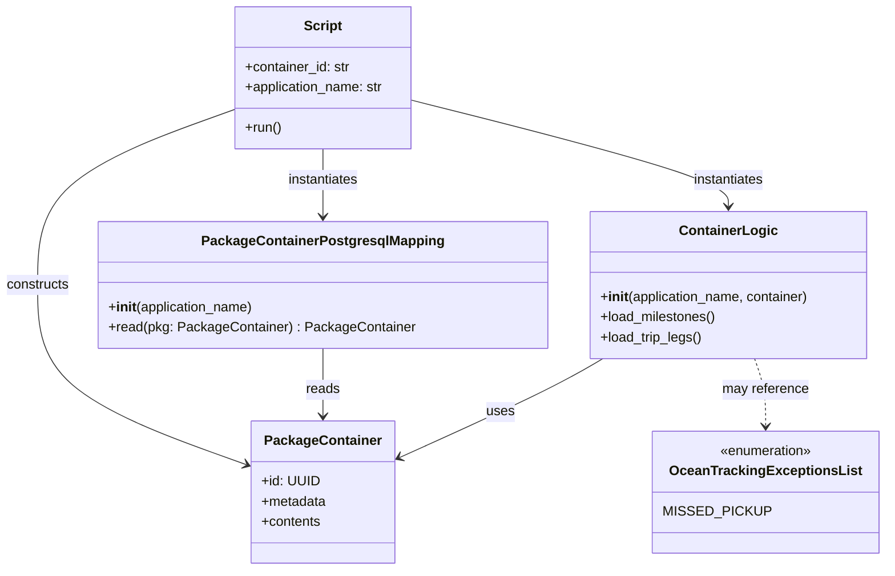
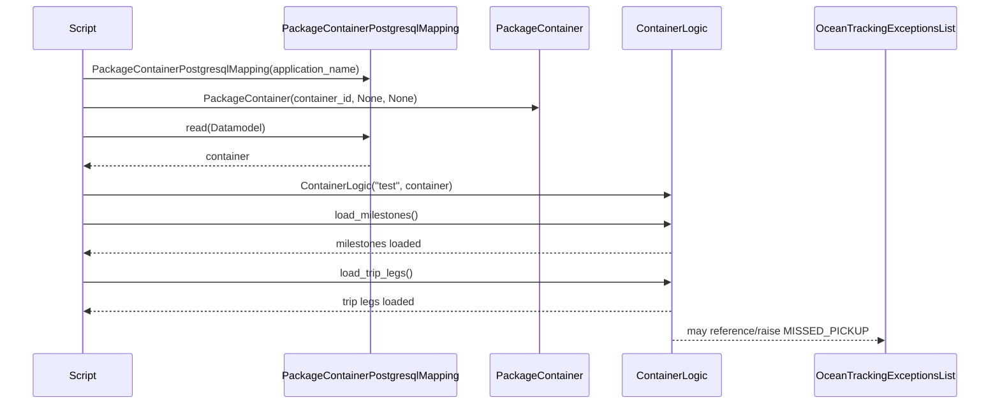

# Diagram: platform/tools/ide_local_testing/localTest/test/byClass/ContainerTracking.py

> Auto-generated by Obscura crawlers

## Diagram 1

### SVG

<svg id="container" width="1021.22265625" xmlns="http://www.w3.org/2000/svg" class="classDiagram" height="674" viewBox="0 0 1021.22265625 674" role="graphics-document document" aria-roledescription="class"><g><defs><marker id="container_class-aggregationStart" class="marker aggregation class" refX="18" refY="7" markerWidth="190" markerHeight="240" orient="auto"><path d="M 18,7 L9,13 L1,7 L9,1 Z"></path></marker></defs><defs><marker id="container_class-aggregationEnd" class="marker aggregation class" refX="1" refY="7" markerWidth="20" markerHeight="28" orient="auto"><path d="M 18,7 L9,13 L1,7 L9,1 Z"></path></marker></defs><defs><marker id="container_class-extensionStart" class="marker extension class" refX="18" refY="7" markerWidth="190" markerHeight="240" orient="auto"><path d="M 1,7 L18,13 V 1 Z"></path></marker></defs><defs><marker id="container_class-extensionEnd" class="marker extension class" refX="1" refY="7" markerWidth="20" markerHeight="28" orient="auto"><path d="M 1,1 V 13 L18,7 Z"></path></marker></defs><defs><marker id="container_class-compositionStart" class="marker composition class" refX="18" refY="7" markerWidth="190" markerHeight="240" orient="auto"><path d="M 18,7 L9,13 L1,7 L9,1 Z"></path></marker></defs><defs><marker id="container_class-compositionEnd" class="marker composition class" refX="1" refY="7" markerWidth="20" markerHeight="28" orient="auto"><path d="M 18,7 L9,13 L1,7 L9,1 Z"></path></marker></defs><defs><marker id="container_class-dependencyStart" class="marker dependency class" refX="6" refY="7" markerWidth="190" markerHeight="240" orient="auto"><path d="M 5,7 L9,13 L1,7 L9,1 Z"></path></marker></defs><defs><marker id="container_class-dependencyEnd" class="marker dependency class" refX="13" refY="7" markerWidth="20" markerHeight="28" orient="auto"><path d="M 18,7 L9,13 L14,7 L9,1 Z"></path></marker></defs><defs><marker id="container_class-lollipopStart" class="marker lollipop class" refX="13" refY="7" markerWidth="190" markerHeight="240" orient="auto"><circle stroke="black" fill="transparent" cx="7" cy="7" r="6"></circle></marker></defs><defs><marker id="container_class-lollipopEnd" class="marker lollipop class" refX="1" refY="7" markerWidth="190" markerHeight="240" orient="auto"><circle stroke="black" fill="transparent" cx="7" cy="7" r="6"></circle></marker></defs><g class="root"><g class="clusters"></g><g class="edgePaths"><path d="M375.77,176L375.77,182.167C375.77,188.333,375.77,200.667,375.77,214C375.77,227.333,375.77,241.667,375.77,248.833L375.77,256" id="id_Script_PackageContainerPostgresqlMapping_1" class="edge-thickness-normal edge-pattern-solid relation" style=";;;" data-edge="true" data-et="edge" data-id="id_Script_PackageContainerPostgresqlMapping_1" data-points="W3sieCI6Mzc1Ljc2OTUzMTI1LCJ5IjoxNzZ9LHsieCI6Mzc1Ljc2OTUzMTI1LCJ5IjoyMTN9LHsieCI6Mzc1Ljc2OTUzMTI1LCJ5IjoyNjJ9XQ==" marker-end="url(#container_class-dependencyEnd)"></path><path d="M269.797,130.865L232.471,144.554C195.146,158.244,120.495,185.622,83.169,219.978C45.844,254.333,45.844,295.667,45.844,337C45.844,378.333,45.844,419.667,85.985,455.055C126.126,490.444,206.409,519.887,246.55,534.609L286.691,549.331" id="id_Script_PackageContainer_2" class="edge-thickness-normal edge-pattern-solid relation" style=";;;" data-edge="true" data-et="edge" data-id="id_Script_PackageContainer_2" data-points="W3sieCI6MjY5Ljc5Njg3NSwieSI6MTMwLjg2NTM4MTY1NTQzODZ9LHsieCI6NDUuODQzNzUsInkiOjIxM30seyJ4Ijo0NS44NDM3NSwieSI6MzM3fSx7IngiOjQ1Ljg0Mzc1LCJ5Ijo0NjF9LHsieCI6MjkyLjMyNDIxODc1LCJ5Ijo1NTEuMzk2NTAyNTI3NzkzOX1d" marker-end="url(#container_class-dependencyEnd)"></path><path d="M375.77,412L375.77,420.167C375.77,428.333,375.77,444.667,375.77,458C375.77,471.333,375.77,481.667,375.77,486.833L375.77,492" id="id_PackageContainerPostgresqlMapping_PackageContainer_3" class="edge-thickness-normal edge-pattern-solid relation" style=";;;" data-edge="true" data-et="edge" data-id="id_PackageContainerPostgresqlMapping_PackageContainer_3" data-points="W3sieCI6Mzc1Ljc2OTUzMTI1LCJ5Ijo0MTJ9LHsieCI6Mzc1Ljc2OTUzMTI1LCJ5Ijo0NjF9LHsieCI6Mzc1Ljc2OTUzMTI1LCJ5Ijo0OTh9XQ==" marker-end="url(#container_class-dependencyEnd)"></path><path d="M481.742,119.175L542.722,134.813C603.702,150.45,725.661,181.725,786.641,202.529C847.621,223.333,847.621,233.667,847.621,238.833L847.621,244" id="id_Script_ContainerLogic_4" class="edge-thickness-normal edge-pattern-solid relation" style=";;;" data-edge="true" data-et="edge" data-id="id_Script_ContainerLogic_4" data-points="W3sieCI6NDgxLjc0MjE4NzUsInkiOjExOS4xNzUyNjUzMjc3NDgwNn0seyJ4Ijo4NDcuNjIxMDkzNzUsInkiOjIxM30seyJ4Ijo4NDcuNjIxMDkzNzUsInkiOjI1MH1d" marker-end="url(#container_class-dependencyEnd)"></path><path d="M701.913,424L691.585,430.167C681.257,436.333,660.601,448.667,621.061,468.214C581.52,487.76,523.095,514.521,493.882,527.901L464.67,541.281" id="id_ContainerLogic_PackageContainer_5" class="edge-thickness-normal edge-pattern-solid relation" style=";;;" data-edge="true" data-et="edge" data-id="id_ContainerLogic_PackageContainer_5" data-points="W3sieCI6NzAxLjkxMzA4NTkzNzUsInkiOjQyNH0seyJ4Ijo2MzkuOTQ1MzEyNSwieSI6NDYxfSx7IngiOjQ1OS4yMTQ4NDM3NSwieSI6NTQzLjc3OTY4MDMxNDY1Nzl9XQ==" marker-end="url(#container_class-dependencyEnd)"></path><path d="M878.396,424L880.578,430.167C882.759,436.333,887.122,448.667,889.303,462C891.484,475.333,891.484,489.667,891.484,496.833L891.484,504" id="id_ContainerLogic_OceanTrackingExceptionsList_6" class="edge-thickness-normal edge-pattern-dashed relation" style=";;;" data-edge="true" data-et="edge" data-id="id_ContainerLogic_OceanTrackingExceptionsList_6" data-points="W3sieCI6ODc4LjM5NjEzNzg1MjgyMjYsInkiOjQyNH0seyJ4Ijo4OTEuNDg0Mzc1LCJ5Ijo0NjF9LHsieCI6ODkxLjQ4NDM3NSwieSI6NTEwfV0=" marker-end="url(#container_class-dependencyEnd)"></path></g><g class="edgeLabels"><g class="edgeLabel" transform="translate(375.76953125, 213)"><g class="label" data-id="id_Script_PackageContainerPostgresqlMapping_1" transform="translate(-42.9140625, -12)"><foreignObject width="85.828125" height="24">

instantiates

</foreignObject></g></g><g class="edgeLabel" transform="translate(45.84375, 337)"><g class="label" data-id="id_Script_PackageContainer_2" transform="translate(-37.84375, -12)"><foreignObject width="75.6875" height="24">

constructs

</foreignObject></g></g><g class="edgeLabel" transform="translate(375.76953125, 461)"><g class="label" data-id="id_PackageContainerPostgresqlMapping_PackageContainer_3" transform="translate(-20.0078125, -12)"><foreignObject width="40.015625" height="24">

reads

</foreignObject></g></g><g class="edgeLabel" transform="translate(847.62109375, 213)"><g class="label" data-id="id_Script_ContainerLogic_4" transform="translate(-42.9140625, -12)"><foreignObject width="85.828125" height="24">

instantiates

</foreignObject></g></g><g class="edgeLabel" transform="translate(582.38903, 487.36241)"><g class="label" data-id="id_ContainerLogic_PackageContainer_5" transform="translate(-16.4921875, -12)"><foreignObject width="32.984375" height="24">

uses

</foreignObject></g></g><g class="edgeLabel" transform="translate(891.484375, 461)"><g class="label" data-id="id_ContainerLogic_OceanTrackingExceptionsList_6" transform="translate(-51.234375, -12)"><foreignObject width="102.46875" height="24">

may reference

</foreignObject></g></g></g><g class="nodes"><g class="node default" id="classId-Script-0" transform="translate(375.76953125, 92)"><g class="basic label-container"><path d="M-105.97265625 -84 L105.97265625 -84 L105.97265625 84 L-105.97265625 84" stroke="none" stroke-width="0" fill="#ECECFF" style=""></path><path d="M-105.97265625 -84 C-27.37848740671717 -84, 51.21568143656566 -84, 105.97265625 -84 M-105.97265625 -84 C-56.60051321101939 -84, -7.22837017203878 -84, 105.97265625 -84 M105.97265625 -84 C105.97265625 -34.12305101121517, 105.97265625 15.753897977569665, 105.97265625 84 M105.97265625 -84 C105.97265625 -48.79971321235257, 105.97265625 -13.599426424705143, 105.97265625 84 M105.97265625 84 C28.823652248599473 84, -48.325351752801055 84, -105.97265625 84 M105.97265625 84 C22.72994813451014 84, -60.51275998097972 84, -105.97265625 84 M-105.97265625 84 C-105.97265625 45.233148700842705, -105.97265625 6.466297401685409, -105.97265625 -84 M-105.97265625 84 C-105.97265625 30.996530307195158, -105.97265625 -22.006939385609684, -105.97265625 -84" stroke="#9370DB" stroke-width="1.3" fill="none" stroke-dasharray="0 0" style=""></path></g><g class="annotation-group text" transform="translate(0, -60)"></g><g class="label-group text" transform="translate(-21.7421875, -60)"><g class="label" style="font-weight: bolder" transform="translate(0,-12)"><foreignObject width="43.484375" height="24">

Script

</foreignObject></g></g><g class="members-group text" transform="translate(-93.97265625, -12)"><g class="label" style="" transform="translate(0,-12)"><foreignObject width="125.8125" height="24">

+container_id: str

</foreignObject></g><g class="label" style="" transform="translate(0,12)"><foreignObject width="166.203125" height="24">

+application_name: str

</foreignObject></g></g><g class="methods-group text" transform="translate(-93.97265625, 60)"><g class="label" style="" transform="translate(0,-12)"><foreignObject width="43.21875" height="24">

+run()

</foreignObject></g></g><g class="divider" style=""><path d="M-105.97265625 -36 C-61.80200050137117 -36, -17.631344752742336 -36, 105.97265625 -36 M-105.97265625 -36 C-37.466574396082976 -36, 31.03950745783405 -36, 105.97265625 -36" stroke="#9370DB" stroke-width="1.3" fill="none" stroke-dasharray="0 0" style=""></path></g><g class="divider" style=""><path d="M-105.97265625 36 C-60.686942796619846 36, -15.401229343239692 36, 105.97265625 36 M-105.97265625 36 C-39.542353111928165 36, 26.88795002614367 36, 105.97265625 36" stroke="#9370DB" stroke-width="1.3" fill="none" stroke-dasharray="0 0" style=""></path></g></g><g class="node default" id="classId-PackageContainerPostgresqlMapping-1" transform="translate(375.76953125, 337)"><g class="basic label-container"><path d="M-257.08203125 -75 L257.08203125 -75 L257.08203125 75 L-257.08203125 75" stroke="none" stroke-width="0" fill="#ECECFF" style=""></path><path d="M-257.08203125 -75 C-88.11954972400846 -75, 80.84293180198307 -75, 257.08203125 -75 M-257.08203125 -75 C-127.17417472091986 -75, 2.73368180816027 -75, 257.08203125 -75 M257.08203125 -75 C257.08203125 -22.598660832055558, 257.08203125 29.802678335888885, 257.08203125 75 M257.08203125 -75 C257.08203125 -32.06754995178101, 257.08203125 10.864900096437978, 257.08203125 75 M257.08203125 75 C51.64612234502084 75, -153.78978655995832 75, -257.08203125 75 M257.08203125 75 C147.5467882197722 75, 38.01154518954439 75, -257.08203125 75 M-257.08203125 75 C-257.08203125 24.597604018704153, -257.08203125 -25.804791962591693, -257.08203125 -75 M-257.08203125 75 C-257.08203125 33.22335100808486, -257.08203125 -8.553297983830277, -257.08203125 -75" stroke="#9370DB" stroke-width="1.3" fill="none" stroke-dasharray="0 0" style=""></path></g><g class="annotation-group text" transform="translate(0, -51)"></g><g class="label-group text" transform="translate(-135.8515625, -51)"><g class="label" style="font-weight: bolder" transform="translate(0,-12)"><foreignObject width="271.703125" height="24">

PackageContainerPostgresqlMapping

</foreignObject></g></g><g class="members-group text" transform="translate(-245.08203125, -3)"></g><g class="methods-group text" transform="translate(-245.08203125, 27)"><g class="label" style="" transform="translate(0,-12)"><foreignObject width="173.734375" height="24">

+<strong>init</strong>(application_name)

</foreignObject></g><g class="label" style="" transform="translate(0,12)"><foreignObject width="354.3125" height="24">

+read(pkg: PackageContainer) : PackageContainer

</foreignObject></g></g><g class="divider" style=""><path d="M-257.08203125 -27 C-81.1040160244552 -27, 94.87399920108959 -27, 257.08203125 -27 M-257.08203125 -27 C-134.41666826627915 -27, -11.751305282558292 -27, 257.08203125 -27" stroke="#9370DB" stroke-width="1.3" fill="none" stroke-dasharray="0 0" style=""></path></g><g class="divider" style=""><path d="M-257.08203125 -3 C-60.796162314957826 -3, 135.48970662008435 -3, 257.08203125 -3 M-257.08203125 -3 C-127.34672646878917 -3, 2.3885783124216573 -3, 257.08203125 -3" stroke="#9370DB" stroke-width="1.3" fill="none" stroke-dasharray="0 0" style=""></path></g></g><g class="node default" id="classId-PackageContainer-2" transform="translate(375.76953125, 582)"><g class="basic label-container"><path d="M-83.4453125 -84 L83.4453125 -84 L83.4453125 84 L-83.4453125 84" stroke="none" stroke-width="0" fill="#ECECFF" style=""></path><path d="M-83.4453125 -84 C-26.65333863655028 -84, 30.13863522689944 -84, 83.4453125 -84 M-83.4453125 -84 C-33.85695788141016 -84, 15.73139673717968 -84, 83.4453125 -84 M83.4453125 -84 C83.4453125 -22.629227849983103, 83.4453125 38.741544300033794, 83.4453125 84 M83.4453125 -84 C83.4453125 -47.18293555162172, 83.4453125 -10.365871103243435, 83.4453125 84 M83.4453125 84 C26.794009470939713 84, -29.857293558120574 84, -83.4453125 84 M83.4453125 84 C31.975154362106544 84, -19.495003775786913 84, -83.4453125 84 M-83.4453125 84 C-83.4453125 49.614174255934515, -83.4453125 15.22834851186903, -83.4453125 -84 M-83.4453125 84 C-83.4453125 41.81747996723063, -83.4453125 -0.3650400655387358, -83.4453125 -84" stroke="#9370DB" stroke-width="1.3" fill="none" stroke-dasharray="0 0" style=""></path></g><g class="annotation-group text" transform="translate(0, -60)"></g><g class="label-group text" transform="translate(-65.453125, -60)"><g class="label" style="font-weight: bolder" transform="translate(0,-12)"><foreignObject width="130.90625" height="24">

PackageContainer

</foreignObject></g></g><g class="members-group text" transform="translate(-71.4453125, -12)"><g class="label" style="" transform="translate(0,-12)"><foreignObject width="66.359375" height="24">

+id: UUID

</foreignObject></g><g class="label" style="" transform="translate(0,12)"><foreignObject width="77.4375" height="24">

+metadata

</foreignObject></g><g class="label" style="" transform="translate(0,36)"><foreignObject width="70.921875" height="24">

+contents

</foreignObject></g></g><g class="methods-group text" transform="translate(-71.4453125, 84)"></g><g class="divider" style=""><path d="M-83.4453125 -36 C-41.65145935406232 -36, 0.14239379187536372 -36, 83.4453125 -36 M-83.4453125 -36 C-39.64554660235916 -36, 4.154219295281678 -36, 83.4453125 -36" stroke="#9370DB" stroke-width="1.3" fill="none" stroke-dasharray="0 0" style=""></path></g><g class="divider" style=""><path d="M-83.4453125 60 C-22.10776006352068 60, 39.22979237295864 60, 83.4453125 60 M-83.4453125 60 C-29.53569810829279 60, 24.373916283414417 60, 83.4453125 60" stroke="#9370DB" stroke-width="1.3" fill="none" stroke-dasharray="0 0" style=""></path></g></g><g class="node default" id="classId-ContainerLogic-3" transform="translate(847.62109375, 337)"><g class="basic label-container"><path d="M-164.76953125 -87 L164.76953125 -87 L164.76953125 87 L-164.76953125 87" stroke="none" stroke-width="0" fill="#ECECFF" style=""></path><path d="M-164.76953125 -87 C-54.139282896005795 -87, 56.49096545798841 -87, 164.76953125 -87 M-164.76953125 -87 C-35.00794524018448 -87, 94.75364076963103 -87, 164.76953125 -87 M164.76953125 -87 C164.76953125 -44.580975581104134, 164.76953125 -2.1619511622082683, 164.76953125 87 M164.76953125 -87 C164.76953125 -41.556258364811946, 164.76953125 3.8874832703761086, 164.76953125 87 M164.76953125 87 C58.5657116896856 87, -47.6381078706288 87, -164.76953125 87 M164.76953125 87 C75.24483364315934 87, -14.279863963681322 87, -164.76953125 87 M-164.76953125 87 C-164.76953125 41.078851804664886, -164.76953125 -4.842296390670228, -164.76953125 -87 M-164.76953125 87 C-164.76953125 48.08161731675654, -164.76953125 9.163234633513085, -164.76953125 -87" stroke="#9370DB" stroke-width="1.3" fill="none" stroke-dasharray="0 0" style=""></path></g><g class="annotation-group text" transform="translate(0, -63)"></g><g class="label-group text" transform="translate(-54.6796875, -63)"><g class="label" style="font-weight: bolder" transform="translate(0,-12)"><foreignObject width="109.359375" height="24">

ContainerLogic

</foreignObject></g></g><g class="members-group text" transform="translate(-152.76953125, -15)"></g><g class="methods-group text" transform="translate(-152.76953125, 15)"><g class="label" style="" transform="translate(0,-12)"><foreignObject width="250.859375" height="24">

+<strong>init</strong>(application_name, container)

</foreignObject></g><g class="label" style="" transform="translate(0,12)"><foreignObject width="138.21875" height="24">

+load_milestones()

</foreignObject></g><g class="label" style="" transform="translate(0,36)"><foreignObject width="121.234375" height="24">

+load_trip_legs()

</foreignObject></g></g><g class="divider" style=""><path d="M-164.76953125 -39 C-87.30251531231535 -39, -9.8354993746307 -39, 164.76953125 -39 M-164.76953125 -39 C-46.46413918792882 -39, 71.84125287414236 -39, 164.76953125 -39" stroke="#9370DB" stroke-width="1.3" fill="none" stroke-dasharray="0 0" style=""></path></g><g class="divider" style=""><path d="M-164.76953125 -15 C-97.56654621416477 -15, -30.363561178329547 -15, 164.76953125 -15 M-164.76953125 -15 C-50.72782103929811 -15, 63.31388917140379 -15, 164.76953125 -15" stroke="#9370DB" stroke-width="1.3" fill="none" stroke-dasharray="0 0" style=""></path></g></g><g class="node default" id="classId-OceanTrackingExceptionsList-4" transform="translate(891.484375, 582)"><g class="basic label-container"><path d="M-121.73828125 -72 L121.73828125 -72 L121.73828125 72 L-121.73828125 72" stroke="none" stroke-width="0" fill="#ECECFF" style=""></path><path d="M-121.73828125 -72 C-28.414002712085136 -72, 64.91027582582973 -72, 121.73828125 -72 M-121.73828125 -72 C-58.42521357371349 -72, 4.887854102573016 -72, 121.73828125 -72 M121.73828125 -72 C121.73828125 -22.38805288707504, 121.73828125 27.223894225849918, 121.73828125 72 M121.73828125 -72 C121.73828125 -35.855062097542834, 121.73828125 0.28987580491433107, 121.73828125 72 M121.73828125 72 C40.20300582132619 72, -41.33226960734763 72, -121.73828125 72 M121.73828125 72 C72.51800618781134 72, 23.297731125622676 72, -121.73828125 72 M-121.73828125 72 C-121.73828125 26.510911997725664, -121.73828125 -18.978176004548672, -121.73828125 -72 M-121.73828125 72 C-121.73828125 36.595653853634516, -121.73828125 1.1913077072690328, -121.73828125 -72" stroke="#9370DB" stroke-width="1.3" fill="none" stroke-dasharray="0 0" style=""></path></g><g class="annotation-group text" transform="translate(-55.5546875, -48)"><g class="label" style="" transform="translate(0,-12)"><foreignObject width="111.109375" height="24">

«enumeration»

</foreignObject></g></g><g class="label-group text" transform="translate(-106.3359375, -24)"><g class="label" style="font-weight: bolder" transform="translate(0,-12)"><foreignObject width="212.671875" height="24">

OceanTrackingExceptionsList

</foreignObject></g></g><g class="members-group text" transform="translate(-109.73828125, 24)"><g class="label" style="" transform="translate(0,-12)"><foreignObject width="113.140625" height="24">

MISSED_PICKUP

</foreignObject></g></g><g class="methods-group text" transform="translate(-109.73828125, 72)"></g><g class="divider" style=""><path d="M-121.73828125 0 C-40.55439176169325 0, 40.629497726613494 0, 121.73828125 0 M-121.73828125 0 C-50.89522468179557 0, 19.947831886408864 0, 121.73828125 0" stroke="#9370DB" stroke-width="1.3" fill="none" stroke-dasharray="0 0" style=""></path></g><g class="divider" style=""><path d="M-121.73828125 48 C-34.01956029858424 48, 53.69916065283152 48, 121.73828125 48 M-121.73828125 48 C-39.12757540834143 48, 43.48313043331714 48, 121.73828125 48" stroke="#9370DB" stroke-width="1.3" fill="none" stroke-dasharray="0 0" style=""></path></g></g></g></g></g></svg>

## Diagram 2

### SVG

<svg id="container" width="1569" xmlns="http://www.w3.org/2000/svg" height="651" viewBox="-50 -10 1569 651" role="graphics-document document" aria-roledescription="sequence"><g><rect x="1240" y="565" fill="#eaeaea" stroke="#666" width="229" height="65" name="Exceptions" rx="3" ry="3" class="actor actor-bottom"></rect><text x="1354.5" y="597.5" dominant-baseline="central" alignment-baseline="central" class="actor actor-box" style="text-anchor: middle; font-size: 16px; font-weight: 400;"><tspan x="1354.5" dy="0">OceanTrackingExceptionsList</tspan></text></g><g><rect x="946.5" y="565" fill="#eaeaea" stroke="#666" width="150" height="65" name="Logic" rx="3" ry="3" class="actor actor-bottom"></rect><text x="1021.5" y="597.5" dominant-baseline="central" alignment-baseline="central" class="actor actor-box" style="text-anchor: middle; font-size: 16px; font-weight: 400;"><tspan x="1021.5" dy="0">ContainerLogic</tspan></text></g><g><rect x="746.5" y="565" fill="#eaeaea" stroke="#666" width="150" height="65" name="Datamodel" rx="3" ry="3" class="actor actor-bottom"></rect><text x="821.5" y="597.5" dominant-baseline="central" alignment-baseline="central" class="actor actor-box" style="text-anchor: middle; font-size: 16px; font-weight: 400;"><tspan x="821.5" dy="0">PackageContainer</tspan></text></g><g><rect x="409.5" y="565" fill="#eaeaea" stroke="#666" width="287" height="65" name="DataStore" rx="3" ry="3" class="actor actor-bottom"></rect><text x="553" y="597.5" dominant-baseline="central" alignment-baseline="central" class="actor actor-box" style="text-anchor: middle; font-size: 16px; font-weight: 400;"><tspan x="553" dy="0">PackageContainerPostgresqlMapping</tspan></text></g><g><rect x="0" y="565" fill="#eaeaea" stroke="#666" width="150" height="65" name="Script" rx="3" ry="3" class="actor actor-bottom"></rect><text x="75" y="597.5" dominant-baseline="central" alignment-baseline="central" class="actor actor-box" style="text-anchor: middle; font-size: 16px; font-weight: 400;"><tspan x="75" dy="0">Script</tspan></text></g><g><line id="actor4" x1="1354.5" y1="65" x2="1354.5" y2="565" class="actor-line 200" stroke-width="0.5px" stroke="#999" name="Exceptions"></line><g id="root-4"><rect x="1240" y="0" fill="#eaeaea" stroke="#666" width="229" height="65" name="Exceptions" rx="3" ry="3" class="actor actor-top"></rect><text x="1354.5" y="32.5" dominant-baseline="central" alignment-baseline="central" class="actor actor-box" style="text-anchor: middle; font-size: 16px; font-weight: 400;"><tspan x="1354.5" dy="0">OceanTrackingExceptionsList</tspan></text></g></g><g><line id="actor3" x1="1021.5" y1="65" x2="1021.5" y2="565" class="actor-line 200" stroke-width="0.5px" stroke="#999" name="Logic"></line><g id="root-3"><rect x="946.5" y="0" fill="#eaeaea" stroke="#666" width="150" height="65" name="Logic" rx="3" ry="3" class="actor actor-top"></rect><text x="1021.5" y="32.5" dominant-baseline="central" alignment-baseline="central" class="actor actor-box" style="text-anchor: middle; font-size: 16px; font-weight: 400;"><tspan x="1021.5" dy="0">ContainerLogic</tspan></text></g></g><g><line id="actor2" x1="821.5" y1="65" x2="821.5" y2="565" class="actor-line 200" stroke-width="0.5px" stroke="#999" name="Datamodel"></line><g id="root-2"><rect x="746.5" y="0" fill="#eaeaea" stroke="#666" width="150" height="65" name="Datamodel" rx="3" ry="3" class="actor actor-top"></rect><text x="821.5" y="32.5" dominant-baseline="central" alignment-baseline="central" class="actor actor-box" style="text-anchor: middle; font-size: 16px; font-weight: 400;"><tspan x="821.5" dy="0">PackageContainer</tspan></text></g></g><g><line id="actor1" x1="553" y1="65" x2="553" y2="565" class="actor-line 200" stroke-width="0.5px" stroke="#999" name="DataStore"></line><g id="root-1"><rect x="409.5" y="0" fill="#eaeaea" stroke="#666" width="287" height="65" name="DataStore" rx="3" ry="3" class="actor actor-top"></rect><text x="553" y="32.5" dominant-baseline="central" alignment-baseline="central" class="actor actor-box" style="text-anchor: middle; font-size: 16px; font-weight: 400;"><tspan x="553" dy="0">PackageContainerPostgresqlMapping</tspan></text></g></g><g><line id="actor0" x1="75" y1="65" x2="75" y2="565" class="actor-line 200" stroke-width="0.5px" stroke="#999" name="Script"></line><g id="root-0"><rect x="0" y="0" fill="#eaeaea" stroke="#666" width="150" height="65" name="Script" rx="3" ry="3" class="actor actor-top"></rect><text x="75" y="32.5" dominant-baseline="central" alignment-baseline="central" class="actor actor-box" style="text-anchor: middle; font-size: 16px; font-weight: 400;"><tspan x="75" dy="0">Script</tspan></text></g></g><g></g><defs><symbol id="computer" width="24" height="24"><path transform="scale(.5)" d="M2 2v13h20v-13h-20zm18 11h-16v-9h16v9zm-10.228 6l.466-1h3.524l.467 1h-4.457zm14.228 3h-24l2-6h2.104l-1.33 4h18.45l-1.297-4h2.073l2 6zm-5-10h-14v-7h14v7z"></path></symbol></defs><defs><symbol id="database" fill-rule="evenodd" clip-rule="evenodd"><path transform="scale(.5)" d="M12.258.001l.256.004.255.005.253.008.251.01.249.012.247.015.246.016.242.019.241.02.239.023.236.024.233.027.231.028.229.031.225.032.223.034.22.036.217.038.214.04.211.041.208.043.205.045.201.046.198.048.194.05.191.051.187.053.183.054.18.056.175.057.172.059.168.06.163.061.16.063.155.064.15.066.074.033.073.033.071.034.07.034.069.035.068.035.067.035.066.035.064.036.064.036.062.036.06.036.06.037.058.037.058.037.055.038.055.038.053.038.052.038.051.039.05.039.048.039.047.039.045.04.044.04.043.04.041.04.04.041.039.041.037.041.036.041.034.041.033.042.032.042.03.042.029.042.027.042.026.043.024.043.023.043.021.043.02.043.018.044.017.043.015.044.013.044.012.044.011.045.009.044.007.045.006.045.004.045.002.045.001.045v17l-.001.045-.002.045-.004.045-.006.045-.007.045-.009.044-.011.045-.012.044-.013.044-.015.044-.017.043-.018.044-.02.043-.021.043-.023.043-.024.043-.026.043-.027.042-.029.042-.03.042-.032.042-.033.042-.034.041-.036.041-.037.041-.039.041-.04.041-.041.04-.043.04-.044.04-.045.04-.047.039-.048.039-.05.039-.051.039-.052.038-.053.038-.055.038-.055.038-.058.037-.058.037-.06.037-.06.036-.062.036-.064.036-.064.036-.066.035-.067.035-.068.035-.069.035-.07.034-.071.034-.073.033-.074.033-.15.066-.155.064-.16.063-.163.061-.168.06-.172.059-.175.057-.18.056-.183.054-.187.053-.191.051-.194.05-.198.048-.201.046-.205.045-.208.043-.211.041-.214.04-.217.038-.22.036-.223.034-.225.032-.229.031-.231.028-.233.027-.236.024-.239.023-.241.02-.242.019-.246.016-.247.015-.249.012-.251.01-.253.008-.255.005-.256.004-.258.001-.258-.001-.256-.004-.255-.005-.253-.008-.251-.01-.249-.012-.247-.015-.245-.016-.243-.019-.241-.02-.238-.023-.236-.024-.234-.027-.231-.028-.228-.031-.226-.032-.223-.034-.22-.036-.217-.038-.214-.04-.211-.041-.208-.043-.204-.045-.201-.046-.198-.048-.195-.05-.19-.051-.187-.053-.184-.054-.179-.056-.176-.057-.172-.059-.167-.06-.164-.061-.159-.063-.155-.064-.151-.066-.074-.033-.072-.033-.072-.034-.07-.034-.069-.035-.068-.035-.067-.035-.066-.035-.064-.036-.063-.036-.062-.036-.061-.036-.06-.037-.058-.037-.057-.037-.056-.038-.055-.038-.053-.038-.052-.038-.051-.039-.049-.039-.049-.039-.046-.039-.046-.04-.044-.04-.043-.04-.041-.04-.04-.041-.039-.041-.037-.041-.036-.041-.034-.041-.033-.042-.032-.042-.03-.042-.029-.042-.027-.042-.026-.043-.024-.043-.023-.043-.021-.043-.02-.043-.018-.044-.017-.043-.015-.044-.013-.044-.012-.044-.011-.045-.009-.044-.007-.045-.006-.045-.004-.045-.002-.045-.001-.045v-17l.001-.045.002-.045.004-.045.006-.045.007-.045.009-.044.011-.045.012-.044.013-.044.015-.044.017-.043.018-.044.02-.043.021-.043.023-.043.024-.043.026-.043.027-.042.029-.042.03-.042.032-.042.033-.042.034-.041.036-.041.037-.041.039-.041.04-.041.041-.04.043-.04.044-.04.046-.04.046-.039.049-.039.049-.039.051-.039.052-.038.053-.038.055-.038.056-.038.057-.037.058-.037.06-.037.061-.036.062-.036.063-.036.064-.036.066-.035.067-.035.068-.035.069-.035.07-.034.072-.034.072-.033.074-.033.151-.066.155-.064.159-.063.164-.061.167-.06.172-.059.176-.057.179-.056.184-.054.187-.053.19-.051.195-.05.198-.048.201-.046.204-.045.208-.043.211-.041.214-.04.217-.038.22-.036.223-.034.226-.032.228-.031.231-.028.234-.027.236-.024.238-.023.241-.02.243-.019.245-.016.247-.015.249-.012.251-.01.253-.008.255-.005.256-.004.258-.001.258.001zm-9.258 20.499v.01l.001.021.003.021.004.022.005.021.006.022.007.022.009.023.01.022.011.023.012.023.013.023.015.023.016.024.017.023.018.024.019.024.021.024.022.025.023.024.024.025.052.049.056.05.061.051.066.051.07.051.075.051.079.052.084.052.088.052.092.052.097.052.102.051.105.052.11.052.114.051.119.051.123.051.127.05.131.05.135.05.139.048.144.049.147.047.152.047.155.047.16.045.163.045.167.043.171.043.176.041.178.041.183.039.187.039.19.037.194.035.197.035.202.033.204.031.209.03.212.029.216.027.219.025.222.024.226.021.23.02.233.018.236.016.24.015.243.012.246.01.249.008.253.005.256.004.259.001.26-.001.257-.004.254-.005.25-.008.247-.011.244-.012.241-.014.237-.016.233-.018.231-.021.226-.021.224-.024.22-.026.216-.027.212-.028.21-.031.205-.031.202-.034.198-.034.194-.036.191-.037.187-.039.183-.04.179-.04.175-.042.172-.043.168-.044.163-.045.16-.046.155-.046.152-.047.148-.048.143-.049.139-.049.136-.05.131-.05.126-.05.123-.051.118-.052.114-.051.11-.052.106-.052.101-.052.096-.052.092-.052.088-.053.083-.051.079-.052.074-.052.07-.051.065-.051.06-.051.056-.05.051-.05.023-.024.023-.025.021-.024.02-.024.019-.024.018-.024.017-.024.015-.023.014-.024.013-.023.012-.023.01-.023.01-.022.008-.022.006-.022.006-.022.004-.022.004-.021.001-.021.001-.021v-4.127l-.077.055-.08.053-.083.054-.085.053-.087.052-.09.052-.093.051-.095.05-.097.05-.1.049-.102.049-.105.048-.106.047-.109.047-.111.046-.114.045-.115.045-.118.044-.12.043-.122.042-.124.042-.126.041-.128.04-.13.04-.132.038-.134.038-.135.037-.138.037-.139.035-.142.035-.143.034-.144.033-.147.032-.148.031-.15.03-.151.03-.153.029-.154.027-.156.027-.158.026-.159.025-.161.024-.162.023-.163.022-.165.021-.166.02-.167.019-.169.018-.169.017-.171.016-.173.015-.173.014-.175.013-.175.012-.177.011-.178.01-.179.008-.179.008-.181.006-.182.005-.182.004-.184.003-.184.002h-.37l-.184-.002-.184-.003-.182-.004-.182-.005-.181-.006-.179-.008-.179-.008-.178-.01-.176-.011-.176-.012-.175-.013-.173-.014-.172-.015-.171-.016-.17-.017-.169-.018-.167-.019-.166-.02-.165-.021-.163-.022-.162-.023-.161-.024-.159-.025-.157-.026-.156-.027-.155-.027-.153-.029-.151-.03-.15-.03-.148-.031-.146-.032-.145-.033-.143-.034-.141-.035-.14-.035-.137-.037-.136-.037-.134-.038-.132-.038-.13-.04-.128-.04-.126-.041-.124-.042-.122-.042-.12-.044-.117-.043-.116-.045-.113-.045-.112-.046-.109-.047-.106-.047-.105-.048-.102-.049-.1-.049-.097-.05-.095-.05-.093-.052-.09-.051-.087-.052-.085-.053-.083-.054-.08-.054-.077-.054v4.127zm0-5.654v.011l.001.021.003.021.004.021.005.022.006.022.007.022.009.022.01.022.011.023.012.023.013.023.015.024.016.023.017.024.018.024.019.024.021.024.022.024.023.025.024.024.052.05.056.05.061.05.066.051.07.051.075.052.079.051.084.052.088.052.092.052.097.052.102.052.105.052.11.051.114.051.119.052.123.05.127.051.131.05.135.049.139.049.144.048.147.048.152.047.155.046.16.045.163.045.167.044.171.042.176.042.178.04.183.04.187.038.19.037.194.036.197.034.202.033.204.032.209.03.212.028.216.027.219.025.222.024.226.022.23.02.233.018.236.016.24.014.243.012.246.01.249.008.253.006.256.003.259.001.26-.001.257-.003.254-.006.25-.008.247-.01.244-.012.241-.015.237-.016.233-.018.231-.02.226-.022.224-.024.22-.025.216-.027.212-.029.21-.03.205-.032.202-.033.198-.035.194-.036.191-.037.187-.039.183-.039.179-.041.175-.042.172-.043.168-.044.163-.045.16-.045.155-.047.152-.047.148-.048.143-.048.139-.05.136-.049.131-.05.126-.051.123-.051.118-.051.114-.052.11-.052.106-.052.101-.052.096-.052.092-.052.088-.052.083-.052.079-.052.074-.051.07-.052.065-.051.06-.05.056-.051.051-.049.023-.025.023-.024.021-.025.02-.024.019-.024.018-.024.017-.024.015-.023.014-.023.013-.024.012-.022.01-.023.01-.023.008-.022.006-.022.006-.022.004-.021.004-.022.001-.021.001-.021v-4.139l-.077.054-.08.054-.083.054-.085.052-.087.053-.09.051-.093.051-.095.051-.097.05-.1.049-.102.049-.105.048-.106.047-.109.047-.111.046-.114.045-.115.044-.118.044-.12.044-.122.042-.124.042-.126.041-.128.04-.13.039-.132.039-.134.038-.135.037-.138.036-.139.036-.142.035-.143.033-.144.033-.147.033-.148.031-.15.03-.151.03-.153.028-.154.028-.156.027-.158.026-.159.025-.161.024-.162.023-.163.022-.165.021-.166.02-.167.019-.169.018-.169.017-.171.016-.173.015-.173.014-.175.013-.175.012-.177.011-.178.009-.179.009-.179.007-.181.007-.182.005-.182.004-.184.003-.184.002h-.37l-.184-.002-.184-.003-.182-.004-.182-.005-.181-.007-.179-.007-.179-.009-.178-.009-.176-.011-.176-.012-.175-.013-.173-.014-.172-.015-.171-.016-.17-.017-.169-.018-.167-.019-.166-.02-.165-.021-.163-.022-.162-.023-.161-.024-.159-.025-.157-.026-.156-.027-.155-.028-.153-.028-.151-.03-.15-.03-.148-.031-.146-.033-.145-.033-.143-.033-.141-.035-.14-.036-.137-.036-.136-.037-.134-.038-.132-.039-.13-.039-.128-.04-.126-.041-.124-.042-.122-.043-.12-.043-.117-.044-.116-.044-.113-.046-.112-.046-.109-.046-.106-.047-.105-.048-.102-.049-.1-.049-.097-.05-.095-.051-.093-.051-.09-.051-.087-.053-.085-.052-.083-.054-.08-.054-.077-.054v4.139zm0-5.666v.011l.001.02.003.022.004.021.005.022.006.021.007.022.009.023.01.022.011.023.012.023.013.023.015.023.016.024.017.024.018.023.019.024.021.025.022.024.023.024.024.025.052.05.056.05.061.05.066.051.07.051.075.052.079.051.084.052.088.052.092.052.097.052.102.052.105.051.11.052.114.051.119.051.123.051.127.05.131.05.135.05.139.049.144.048.147.048.152.047.155.046.16.045.163.045.167.043.171.043.176.042.178.04.183.04.187.038.19.037.194.036.197.034.202.033.204.032.209.03.212.028.216.027.219.025.222.024.226.021.23.02.233.018.236.017.24.014.243.012.246.01.249.008.253.006.256.003.259.001.26-.001.257-.003.254-.006.25-.008.247-.01.244-.013.241-.014.237-.016.233-.018.231-.02.226-.022.224-.024.22-.025.216-.027.212-.029.21-.03.205-.032.202-.033.198-.035.194-.036.191-.037.187-.039.183-.039.179-.041.175-.042.172-.043.168-.044.163-.045.16-.045.155-.047.152-.047.148-.048.143-.049.139-.049.136-.049.131-.051.126-.05.123-.051.118-.052.114-.051.11-.052.106-.052.101-.052.096-.052.092-.052.088-.052.083-.052.079-.052.074-.052.07-.051.065-.051.06-.051.056-.05.051-.049.023-.025.023-.025.021-.024.02-.024.019-.024.018-.024.017-.024.015-.023.014-.024.013-.023.012-.023.01-.022.01-.023.008-.022.006-.022.006-.022.004-.022.004-.021.001-.021.001-.021v-4.153l-.077.054-.08.054-.083.053-.085.053-.087.053-.09.051-.093.051-.095.051-.097.05-.1.049-.102.048-.105.048-.106.048-.109.046-.111.046-.114.046-.115.044-.118.044-.12.043-.122.043-.124.042-.126.041-.128.04-.13.039-.132.039-.134.038-.135.037-.138.036-.139.036-.142.034-.143.034-.144.033-.147.032-.148.032-.15.03-.151.03-.153.028-.154.028-.156.027-.158.026-.159.024-.161.024-.162.023-.163.023-.165.021-.166.02-.167.019-.169.018-.169.017-.171.016-.173.015-.173.014-.175.013-.175.012-.177.01-.178.01-.179.009-.179.007-.181.006-.182.006-.182.004-.184.003-.184.001-.185.001-.185-.001-.184-.001-.184-.003-.182-.004-.182-.006-.181-.006-.179-.007-.179-.009-.178-.01-.176-.01-.176-.012-.175-.013-.173-.014-.172-.015-.171-.016-.17-.017-.169-.018-.167-.019-.166-.02-.165-.021-.163-.023-.162-.023-.161-.024-.159-.024-.157-.026-.156-.027-.155-.028-.153-.028-.151-.03-.15-.03-.148-.032-.146-.032-.145-.033-.143-.034-.141-.034-.14-.036-.137-.036-.136-.037-.134-.038-.132-.039-.13-.039-.128-.041-.126-.041-.124-.041-.122-.043-.12-.043-.117-.044-.116-.044-.113-.046-.112-.046-.109-.046-.106-.048-.105-.048-.102-.048-.1-.05-.097-.049-.095-.051-.093-.051-.09-.052-.087-.052-.085-.053-.083-.053-.08-.054-.077-.054v4.153zm8.74-8.179l-.257.004-.254.005-.25.008-.247.011-.244.012-.241.014-.237.016-.233.018-.231.021-.226.022-.224.023-.22.026-.216.027-.212.028-.21.031-.205.032-.202.033-.198.034-.194.036-.191.038-.187.038-.183.04-.179.041-.175.042-.172.043-.168.043-.163.045-.16.046-.155.046-.152.048-.148.048-.143.048-.139.049-.136.05-.131.05-.126.051-.123.051-.118.051-.114.052-.11.052-.106.052-.101.052-.096.052-.092.052-.088.052-.083.052-.079.052-.074.051-.07.052-.065.051-.06.05-.056.05-.051.05-.023.025-.023.024-.021.024-.02.025-.019.024-.018.024-.017.023-.015.024-.014.023-.013.023-.012.023-.01.023-.01.022-.008.022-.006.023-.006.021-.004.022-.004.021-.001.021-.001.021.001.021.001.021.004.021.004.022.006.021.006.023.008.022.01.022.01.023.012.023.013.023.014.023.015.024.017.023.018.024.019.024.02.025.021.024.023.024.023.025.051.05.056.05.06.05.065.051.07.052.074.051.079.052.083.052.088.052.092.052.096.052.101.052.106.052.11.052.114.052.118.051.123.051.126.051.131.05.136.05.139.049.143.048.148.048.152.048.155.046.16.046.163.045.168.043.172.043.175.042.179.041.183.04.187.038.191.038.194.036.198.034.202.033.205.032.21.031.212.028.216.027.22.026.224.023.226.022.231.021.233.018.237.016.241.014.244.012.247.011.25.008.254.005.257.004.26.001.26-.001.257-.004.254-.005.25-.008.247-.011.244-.012.241-.014.237-.016.233-.018.231-.021.226-.022.224-.023.22-.026.216-.027.212-.028.21-.031.205-.032.202-.033.198-.034.194-.036.191-.038.187-.038.183-.04.179-.041.175-.042.172-.043.168-.043.163-.045.16-.046.155-.046.152-.048.148-.048.143-.048.139-.049.136-.05.131-.05.126-.051.123-.051.118-.051.114-.052.11-.052.106-.052.101-.052.096-.052.092-.052.088-.052.083-.052.079-.052.074-.051.07-.052.065-.051.06-.05.056-.05.051-.05.023-.025.023-.024.021-.024.02-.025.019-.024.018-.024.017-.023.015-.024.014-.023.013-.023.012-.023.01-.023.01-.022.008-.022.006-.023.006-.021.004-.022.004-.021.001-.021.001-.021-.001-.021-.001-.021-.004-.021-.004-.022-.006-.021-.006-.023-.008-.022-.01-.022-.01-.023-.012-.023-.013-.023-.014-.023-.015-.024-.017-.023-.018-.024-.019-.024-.02-.025-.021-.024-.023-.024-.023-.025-.051-.05-.056-.05-.06-.05-.065-.051-.07-.052-.074-.051-.079-.052-.083-.052-.088-.052-.092-.052-.096-.052-.101-.052-.106-.052-.11-.052-.114-.052-.118-.051-.123-.051-.126-.051-.131-.05-.136-.05-.139-.049-.143-.048-.148-.048-.152-.048-.155-.046-.16-.046-.163-.045-.168-.043-.172-.043-.175-.042-.179-.041-.183-.04-.187-.038-.191-.038-.194-.036-.198-.034-.202-.033-.205-.032-.21-.031-.212-.028-.216-.027-.22-.026-.224-.023-.226-.022-.231-.021-.233-.018-.237-.016-.241-.014-.244-.012-.247-.011-.25-.008-.254-.005-.257-.004-.26-.001-.26.001z"></path></symbol></defs><defs><symbol id="clock" width="24" height="24"><path transform="scale(.5)" d="M12 2c5.514 0 10 4.486 10 10s-4.486 10-10 10-10-4.486-10-10 4.486-10 10-10zm0-2c-6.627 0-12 5.373-12 12s5.373 12 12 12 12-5.373 12-12-5.373-12-12-12zm5.848 12.459c.202.038.202.333.001.372-1.907.361-6.045 1.111-6.547 1.111-.719 0-1.301-.582-1.301-1.301 0-.512.77-5.447 1.125-7.445.034-.192.312-.181.343.014l.985 6.238 5.394 1.011z"></path></symbol></defs><defs><marker id="arrowhead" refX="7.9" refY="5" markerUnits="userSpaceOnUse" markerWidth="12" markerHeight="12" orient="auto-start-reverse"><path d="M -1 0 L 10 5 L 0 10 z"></path></marker></defs><defs><marker id="crosshead" markerWidth="15" markerHeight="8" orient="auto" refX="4" refY="4.5"><path fill="none" stroke="#000000" stroke-width="1pt" d="M 1,2 L 6,7 M 6,2 L 1,7" style="stroke-dasharray: 0, 0;"></path></marker></defs><defs><marker id="filled-head" refX="15.5" refY="7" markerWidth="20" markerHeight="28" orient="auto"><path d="M 18,7 L9,13 L14,7 L9,1 Z"></path></marker></defs><defs><marker id="sequencenumber" refX="15" refY="15" markerWidth="60" markerHeight="40" orient="auto"><circle cx="15" cy="15" r="6"></circle></marker></defs><text x="313" y="80" text-anchor="middle" dominant-baseline="middle" alignment-baseline="middle" class="messageText" dy="1em" style="font-size: 16px; font-weight: 400;">PackageContainerPostgresqlMapping(application_name)</text><line x1="76" y1="113" x2="549" y2="113" class="messageLine0" stroke-width="2" stroke="none" marker-end="url(#arrowhead)" style="fill: none;"></line><text x="447" y="128" text-anchor="middle" dominant-baseline="middle" alignment-baseline="middle" class="messageText" dy="1em" style="font-size: 16px; font-weight: 400;">PackageContainer(container_id, None, None)</text><line x1="76" y1="161" x2="817.5" y2="161" class="messageLine0" stroke-width="2" stroke="none" marker-end="url(#arrowhead)" style="fill: none;"></line><text x="313" y="176" text-anchor="middle" dominant-baseline="middle" alignment-baseline="middle" class="messageText" dy="1em" style="font-size: 16px; font-weight: 400;">read(Datamodel)</text><line x1="76" y1="209" x2="549" y2="209" class="messageLine0" stroke-width="2" stroke="none" marker-end="url(#arrowhead)" style="fill: none;"></line><text x="316" y="224" text-anchor="middle" dominant-baseline="middle" alignment-baseline="middle" class="messageText" dy="1em" style="font-size: 16px; font-weight: 400;">container</text><line x1="552" y1="257" x2="79" y2="257" class="messageLine1" stroke-width="2" stroke="none" marker-end="url(#arrowhead)" style="stroke-dasharray: 3, 3; fill: none;"></line><text x="547" y="272" text-anchor="middle" dominant-baseline="middle" alignment-baseline="middle" class="messageText" dy="1em" style="font-size: 16px; font-weight: 400;">ContainerLogic("test", container)</text><line x1="76" y1="305" x2="1017.5" y2="305" class="messageLine0" stroke-width="2" stroke="none" marker-end="url(#arrowhead)" style="fill: none;"></line><text x="547" y="320" text-anchor="middle" dominant-baseline="middle" alignment-baseline="middle" class="messageText" dy="1em" style="font-size: 16px; font-weight: 400;">load_milestones()</text><line x1="76" y1="353" x2="1017.5" y2="353" class="messageLine0" stroke-width="2" stroke="none" marker-end="url(#arrowhead)" style="fill: none;"></line><text x="550" y="368" text-anchor="middle" dominant-baseline="middle" alignment-baseline="middle" class="messageText" dy="1em" style="font-size: 16px; font-weight: 400;">milestones loaded</text><line x1="1020.5" y1="401" x2="79" y2="401" class="messageLine1" stroke-width="2" stroke="none" marker-end="url(#arrowhead)" style="stroke-dasharray: 3, 3; fill: none;"></line><text x="547" y="416" text-anchor="middle" dominant-baseline="middle" alignment-baseline="middle" class="messageText" dy="1em" style="font-size: 16px; font-weight: 400;">load_trip_legs()</text><line x1="76" y1="449" x2="1017.5" y2="449" class="messageLine0" stroke-width="2" stroke="none" marker-end="url(#arrowhead)" style="fill: none;"></line><text x="550" y="464" text-anchor="middle" dominant-baseline="middle" alignment-baseline="middle" class="messageText" dy="1em" style="font-size: 16px; font-weight: 400;">trip legs loaded</text><line x1="1020.5" y1="497" x2="79" y2="497" class="messageLine1" stroke-width="2" stroke="none" marker-end="url(#arrowhead)" style="stroke-dasharray: 3, 3; fill: none;"></line><text x="1187" y="512" text-anchor="middle" dominant-baseline="middle" alignment-baseline="middle" class="messageText" dy="1em" style="font-size: 16px; font-weight: 400;">may reference/raise MISSED_PICKUP</text><line x1="1022.5" y1="545" x2="1350.5" y2="545" class="messageLine1" stroke-width="2" stroke="none" marker-end="url(#arrowhead)" style="stroke-dasharray: 3, 3; fill: none;"></line></svg>
