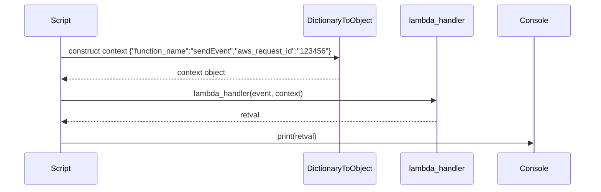
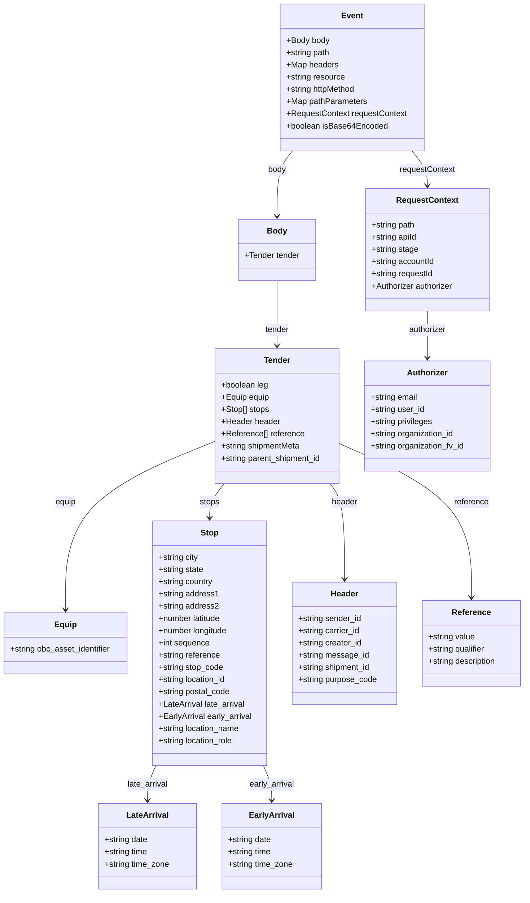

# Diagram: platform/tools/ide_local_testing/localTest/test/byEvent/createShipment.py

> Auto-generated by Obscura crawlers

## Diagram 1

### SVG

<svg id="container" width="1269" xmlns="http://www.w3.org/2000/svg" height="411" viewBox="-50 -10 1269 411" role="graphics-document document" aria-roledescription="sequence"><g><rect x="1019" y="325" fill="#eaeaea" stroke="#666" width="150" height="65" name="C" rx="3" ry="3" class="actor actor-bottom"></rect><text x="1094" y="357.5" dominant-baseline="central" alignment-baseline="central" class="actor actor-box" style="text-anchor: middle; font-size: 16px; font-weight: 400;"><tspan x="1094" dy="0">Console</tspan></text></g><g><rect x="819" y="325" fill="#eaeaea" stroke="#666" width="150" height="65" name="L" rx="3" ry="3" class="actor actor-bottom"></rect><text x="894" y="357.5" dominant-baseline="central" alignment-baseline="central" class="actor actor-box" style="text-anchor: middle; font-size: 16px; font-weight: 400;"><tspan x="894" dy="0">lambda_handler</tspan></text></g><g><rect x="611" y="325" fill="#eaeaea" stroke="#666" width="158" height="65" name="D" rx="3" ry="3" class="actor actor-bottom"></rect><text x="690" y="357.5" dominant-baseline="central" alignment-baseline="central" class="actor actor-box" style="text-anchor: middle; font-size: 16px; font-weight: 400;"><tspan x="690" dy="0">DictionaryToObject</tspan></text></g><g><rect x="0" y="325" fill="#eaeaea" stroke="#666" width="150" height="65" name="S" rx="3" ry="3" class="actor actor-bottom"></rect><text x="75" y="357.5" dominant-baseline="central" alignment-baseline="central" class="actor actor-box" style="text-anchor: middle; font-size: 16px; font-weight: 400;"><tspan x="75" dy="0">Script</tspan></text></g><g><line id="actor3" x1="1094" y1="65" x2="1094" y2="325" class="actor-line 200" stroke-width="0.5px" stroke="#999" name="C"></line><g id="root-3"><rect x="1019" y="0" fill="#eaeaea" stroke="#666" width="150" height="65" name="C" rx="3" ry="3" class="actor actor-top"></rect><text x="1094" y="32.5" dominant-baseline="central" alignment-baseline="central" class="actor actor-box" style="text-anchor: middle; font-size: 16px; font-weight: 400;"><tspan x="1094" dy="0">Console</tspan></text></g></g><g><line id="actor2" x1="894" y1="65" x2="894" y2="325" class="actor-line 200" stroke-width="0.5px" stroke="#999" name="L"></line><g id="root-2"><rect x="819" y="0" fill="#eaeaea" stroke="#666" width="150" height="65" name="L" rx="3" ry="3" class="actor actor-top"></rect><text x="894" y="32.5" dominant-baseline="central" alignment-baseline="central" class="actor actor-box" style="text-anchor: middle; font-size: 16px; font-weight: 400;"><tspan x="894" dy="0">lambda_handler</tspan></text></g></g><g><line id="actor1" x1="690" y1="65" x2="690" y2="325" class="actor-line 200" stroke-width="0.5px" stroke="#999" name="D"></line><g id="root-1"><rect x="611" y="0" fill="#eaeaea" stroke="#666" width="158" height="65" name="D" rx="3" ry="3" class="actor actor-top"></rect><text x="690" y="32.5" dominant-baseline="central" alignment-baseline="central" class="actor actor-box" style="text-anchor: middle; font-size: 16px; font-weight: 400;"><tspan x="690" dy="0">DictionaryToObject</tspan></text></g></g><g><line id="actor0" x1="75" y1="65" x2="75" y2="325" class="actor-line 200" stroke-width="0.5px" stroke="#999" name="S"></line><g id="root-0"><rect x="0" y="0" fill="#eaeaea" stroke="#666" width="150" height="65" name="S" rx="3" ry="3" class="actor actor-top"></rect><text x="75" y="32.5" dominant-baseline="central" alignment-baseline="central" class="actor actor-box" style="text-anchor: middle; font-size: 16px; font-weight: 400;"><tspan x="75" dy="0">Script</tspan></text></g></g><g></g><defs><symbol id="computer" width="24" height="24"><path transform="scale(.5)" d="M2 2v13h20v-13h-20zm18 11h-16v-9h16v9zm-10.228 6l.466-1h3.524l.467 1h-4.457zm14.228 3h-24l2-6h2.104l-1.33 4h18.45l-1.297-4h2.073l2 6zm-5-10h-14v-7h14v7z"></path></symbol></defs><defs><symbol id="database" fill-rule="evenodd" clip-rule="evenodd"><path transform="scale(.5)" d="M12.258.001l.256.004.255.005.253.008.251.01.249.012.247.015.246.016.242.019.241.02.239.023.236.024.233.027.231.028.229.031.225.032.223.034.22.036.217.038.214.04.211.041.208.043.205.045.201.046.198.048.194.05.191.051.187.053.183.054.18.056.175.057.172.059.168.06.163.061.16.063.155.064.15.066.074.033.073.033.071.034.07.034.069.035.068.035.067.035.066.035.064.036.064.036.062.036.06.036.06.037.058.037.058.037.055.038.055.038.053.038.052.038.051.039.05.039.048.039.047.039.045.04.044.04.043.04.041.04.04.041.039.041.037.041.036.041.034.041.033.042.032.042.03.042.029.042.027.042.026.043.024.043.023.043.021.043.02.043.018.044.017.043.015.044.013.044.012.044.011.045.009.044.007.045.006.045.004.045.002.045.001.045v17l-.001.045-.002.045-.004.045-.006.045-.007.045-.009.044-.011.045-.012.044-.013.044-.015.044-.017.043-.018.044-.02.043-.021.043-.023.043-.024.043-.026.043-.027.042-.029.042-.03.042-.032.042-.033.042-.034.041-.036.041-.037.041-.039.041-.04.041-.041.04-.043.04-.044.04-.045.04-.047.039-.048.039-.05.039-.051.039-.052.038-.053.038-.055.038-.055.038-.058.037-.058.037-.06.037-.06.036-.062.036-.064.036-.064.036-.066.035-.067.035-.068.035-.069.035-.07.034-.071.034-.073.033-.074.033-.15.066-.155.064-.16.063-.163.061-.168.06-.172.059-.175.057-.18.056-.183.054-.187.053-.191.051-.194.05-.198.048-.201.046-.205.045-.208.043-.211.041-.214.04-.217.038-.22.036-.223.034-.225.032-.229.031-.231.028-.233.027-.236.024-.239.023-.241.02-.242.019-.246.016-.247.015-.249.012-.251.01-.253.008-.255.005-.256.004-.258.001-.258-.001-.256-.004-.255-.005-.253-.008-.251-.01-.249-.012-.247-.015-.245-.016-.243-.019-.241-.02-.238-.023-.236-.024-.234-.027-.231-.028-.228-.031-.226-.032-.223-.034-.22-.036-.217-.038-.214-.04-.211-.041-.208-.043-.204-.045-.201-.046-.198-.048-.195-.05-.19-.051-.187-.053-.184-.054-.179-.056-.176-.057-.172-.059-.167-.06-.164-.061-.159-.063-.155-.064-.151-.066-.074-.033-.072-.033-.072-.034-.07-.034-.069-.035-.068-.035-.067-.035-.066-.035-.064-.036-.063-.036-.062-.036-.061-.036-.06-.037-.058-.037-.057-.037-.056-.038-.055-.038-.053-.038-.052-.038-.051-.039-.049-.039-.049-.039-.046-.039-.046-.04-.044-.04-.043-.04-.041-.04-.04-.041-.039-.041-.037-.041-.036-.041-.034-.041-.033-.042-.032-.042-.03-.042-.029-.042-.027-.042-.026-.043-.024-.043-.023-.043-.021-.043-.02-.043-.018-.044-.017-.043-.015-.044-.013-.044-.012-.044-.011-.045-.009-.044-.007-.045-.006-.045-.004-.045-.002-.045-.001-.045v-17l.001-.045.002-.045.004-.045.006-.045.007-.045.009-.044.011-.045.012-.044.013-.044.015-.044.017-.043.018-.044.02-.043.021-.043.023-.043.024-.043.026-.043.027-.042.029-.042.03-.042.032-.042.033-.042.034-.041.036-.041.037-.041.039-.041.04-.041.041-.04.043-.04.044-.04.046-.04.046-.039.049-.039.049-.039.051-.039.052-.038.053-.038.055-.038.056-.038.057-.037.058-.037.06-.037.061-.036.062-.036.063-.036.064-.036.066-.035.067-.035.068-.035.069-.035.07-.034.072-.034.072-.033.074-.033.151-.066.155-.064.159-.063.164-.061.167-.06.172-.059.176-.057.179-.056.184-.054.187-.053.19-.051.195-.05.198-.048.201-.046.204-.045.208-.043.211-.041.214-.04.217-.038.22-.036.223-.034.226-.032.228-.031.231-.028.234-.027.236-.024.238-.023.241-.02.243-.019.245-.016.247-.015.249-.012.251-.01.253-.008.255-.005.256-.004.258-.001.258.001zm-9.258 20.499v.01l.001.021.003.021.004.022.005.021.006.022.007.022.009.023.01.022.011.023.012.023.013.023.015.023.016.024.017.023.018.024.019.024.021.024.022.025.023.024.024.025.052.049.056.05.061.051.066.051.07.051.075.051.079.052.084.052.088.052.092.052.097.052.102.051.105.052.11.052.114.051.119.051.123.051.127.05.131.05.135.05.139.048.144.049.147.047.152.047.155.047.16.045.163.045.167.043.171.043.176.041.178.041.183.039.187.039.19.037.194.035.197.035.202.033.204.031.209.03.212.029.216.027.219.025.222.024.226.021.23.02.233.018.236.016.24.015.243.012.246.01.249.008.253.005.256.004.259.001.26-.001.257-.004.254-.005.25-.008.247-.011.244-.012.241-.014.237-.016.233-.018.231-.021.226-.021.224-.024.22-.026.216-.027.212-.028.21-.031.205-.031.202-.034.198-.034.194-.036.191-.037.187-.039.183-.04.179-.04.175-.042.172-.043.168-.044.163-.045.16-.046.155-.046.152-.047.148-.048.143-.049.139-.049.136-.05.131-.05.126-.05.123-.051.118-.052.114-.051.11-.052.106-.052.101-.052.096-.052.092-.052.088-.053.083-.051.079-.052.074-.052.07-.051.065-.051.06-.051.056-.05.051-.05.023-.024.023-.025.021-.024.02-.024.019-.024.018-.024.017-.024.015-.023.014-.024.013-.023.012-.023.01-.023.01-.022.008-.022.006-.022.006-.022.004-.022.004-.021.001-.021.001-.021v-4.127l-.077.055-.08.053-.083.054-.085.053-.087.052-.09.052-.093.051-.095.05-.097.05-.1.049-.102.049-.105.048-.106.047-.109.047-.111.046-.114.045-.115.045-.118.044-.12.043-.122.042-.124.042-.126.041-.128.04-.13.04-.132.038-.134.038-.135.037-.138.037-.139.035-.142.035-.143.034-.144.033-.147.032-.148.031-.15.03-.151.03-.153.029-.154.027-.156.027-.158.026-.159.025-.161.024-.162.023-.163.022-.165.021-.166.02-.167.019-.169.018-.169.017-.171.016-.173.015-.173.014-.175.013-.175.012-.177.011-.178.01-.179.008-.179.008-.181.006-.182.005-.182.004-.184.003-.184.002h-.37l-.184-.002-.184-.003-.182-.004-.182-.005-.181-.006-.179-.008-.179-.008-.178-.01-.176-.011-.176-.012-.175-.013-.173-.014-.172-.015-.171-.016-.17-.017-.169-.018-.167-.019-.166-.02-.165-.021-.163-.022-.162-.023-.161-.024-.159-.025-.157-.026-.156-.027-.155-.027-.153-.029-.151-.03-.15-.03-.148-.031-.146-.032-.145-.033-.143-.034-.141-.035-.14-.035-.137-.037-.136-.037-.134-.038-.132-.038-.13-.04-.128-.04-.126-.041-.124-.042-.122-.042-.12-.044-.117-.043-.116-.045-.113-.045-.112-.046-.109-.047-.106-.047-.105-.048-.102-.049-.1-.049-.097-.05-.095-.05-.093-.052-.09-.051-.087-.052-.085-.053-.083-.054-.08-.054-.077-.054v4.127zm0-5.654v.011l.001.021.003.021.004.021.005.022.006.022.007.022.009.022.01.022.011.023.012.023.013.023.015.024.016.023.017.024.018.024.019.024.021.024.022.024.023.025.024.024.052.05.056.05.061.05.066.051.07.051.075.052.079.051.084.052.088.052.092.052.097.052.102.052.105.052.11.051.114.051.119.052.123.05.127.051.131.05.135.049.139.049.144.048.147.048.152.047.155.046.16.045.163.045.167.044.171.042.176.042.178.04.183.04.187.038.19.037.194.036.197.034.202.033.204.032.209.03.212.028.216.027.219.025.222.024.226.022.23.02.233.018.236.016.24.014.243.012.246.01.249.008.253.006.256.003.259.001.26-.001.257-.003.254-.006.25-.008.247-.01.244-.012.241-.015.237-.016.233-.018.231-.02.226-.022.224-.024.22-.025.216-.027.212-.029.21-.03.205-.032.202-.033.198-.035.194-.036.191-.037.187-.039.183-.039.179-.041.175-.042.172-.043.168-.044.163-.045.16-.045.155-.047.152-.047.148-.048.143-.048.139-.05.136-.049.131-.05.126-.051.123-.051.118-.051.114-.052.11-.052.106-.052.101-.052.096-.052.092-.052.088-.052.083-.052.079-.052.074-.051.07-.052.065-.051.06-.05.056-.051.051-.049.023-.025.023-.024.021-.025.02-.024.019-.024.018-.024.017-.024.015-.023.014-.023.013-.024.012-.022.01-.023.01-.023.008-.022.006-.022.006-.022.004-.021.004-.022.001-.021.001-.021v-4.139l-.077.054-.08.054-.083.054-.085.052-.087.053-.09.051-.093.051-.095.051-.097.05-.1.049-.102.049-.105.048-.106.047-.109.047-.111.046-.114.045-.115.044-.118.044-.12.044-.122.042-.124.042-.126.041-.128.04-.13.039-.132.039-.134.038-.135.037-.138.036-.139.036-.142.035-.143.033-.144.033-.147.033-.148.031-.15.03-.151.03-.153.028-.154.028-.156.027-.158.026-.159.025-.161.024-.162.023-.163.022-.165.021-.166.02-.167.019-.169.018-.169.017-.171.016-.173.015-.173.014-.175.013-.175.012-.177.011-.178.009-.179.009-.179.007-.181.007-.182.005-.182.004-.184.003-.184.002h-.37l-.184-.002-.184-.003-.182-.004-.182-.005-.181-.007-.179-.007-.179-.009-.178-.009-.176-.011-.176-.012-.175-.013-.173-.014-.172-.015-.171-.016-.17-.017-.169-.018-.167-.019-.166-.02-.165-.021-.163-.022-.162-.023-.161-.024-.159-.025-.157-.026-.156-.027-.155-.028-.153-.028-.151-.03-.15-.03-.148-.031-.146-.033-.145-.033-.143-.033-.141-.035-.14-.036-.137-.036-.136-.037-.134-.038-.132-.039-.13-.039-.128-.04-.126-.041-.124-.042-.122-.043-.12-.043-.117-.044-.116-.044-.113-.046-.112-.046-.109-.046-.106-.047-.105-.048-.102-.049-.1-.049-.097-.05-.095-.051-.093-.051-.09-.051-.087-.053-.085-.052-.083-.054-.08-.054-.077-.054v4.139zm0-5.666v.011l.001.02.003.022.004.021.005.022.006.021.007.022.009.023.01.022.011.023.012.023.013.023.015.023.016.024.017.024.018.023.019.024.021.025.022.024.023.024.024.025.052.05.056.05.061.05.066.051.07.051.075.052.079.051.084.052.088.052.092.052.097.052.102.052.105.051.11.052.114.051.119.051.123.051.127.05.131.05.135.05.139.049.144.048.147.048.152.047.155.046.16.045.163.045.167.043.171.043.176.042.178.04.183.04.187.038.19.037.194.036.197.034.202.033.204.032.209.03.212.028.216.027.219.025.222.024.226.021.23.02.233.018.236.017.24.014.243.012.246.01.249.008.253.006.256.003.259.001.26-.001.257-.003.254-.006.25-.008.247-.01.244-.013.241-.014.237-.016.233-.018.231-.02.226-.022.224-.024.22-.025.216-.027.212-.029.21-.03.205-.032.202-.033.198-.035.194-.036.191-.037.187-.039.183-.039.179-.041.175-.042.172-.043.168-.044.163-.045.16-.045.155-.047.152-.047.148-.048.143-.049.139-.049.136-.049.131-.051.126-.05.123-.051.118-.052.114-.051.11-.052.106-.052.101-.052.096-.052.092-.052.088-.052.083-.052.079-.052.074-.052.07-.051.065-.051.06-.051.056-.05.051-.049.023-.025.023-.025.021-.024.02-.024.019-.024.018-.024.017-.024.015-.023.014-.024.013-.023.012-.023.01-.022.01-.023.008-.022.006-.022.006-.022.004-.022.004-.021.001-.021.001-.021v-4.153l-.077.054-.08.054-.083.053-.085.053-.087.053-.09.051-.093.051-.095.051-.097.05-.1.049-.102.048-.105.048-.106.048-.109.046-.111.046-.114.046-.115.044-.118.044-.12.043-.122.043-.124.042-.126.041-.128.04-.13.039-.132.039-.134.038-.135.037-.138.036-.139.036-.142.034-.143.034-.144.033-.147.032-.148.032-.15.03-.151.03-.153.028-.154.028-.156.027-.158.026-.159.024-.161.024-.162.023-.163.023-.165.021-.166.02-.167.019-.169.018-.169.017-.171.016-.173.015-.173.014-.175.013-.175.012-.177.01-.178.01-.179.009-.179.007-.181.006-.182.006-.182.004-.184.003-.184.001-.185.001-.185-.001-.184-.001-.184-.003-.182-.004-.182-.006-.181-.006-.179-.007-.179-.009-.178-.01-.176-.01-.176-.012-.175-.013-.173-.014-.172-.015-.171-.016-.17-.017-.169-.018-.167-.019-.166-.02-.165-.021-.163-.023-.162-.023-.161-.024-.159-.024-.157-.026-.156-.027-.155-.028-.153-.028-.151-.03-.15-.03-.148-.032-.146-.032-.145-.033-.143-.034-.141-.034-.14-.036-.137-.036-.136-.037-.134-.038-.132-.039-.13-.039-.128-.041-.126-.041-.124-.041-.122-.043-.12-.043-.117-.044-.116-.044-.113-.046-.112-.046-.109-.046-.106-.048-.105-.048-.102-.048-.1-.05-.097-.049-.095-.051-.093-.051-.09-.052-.087-.052-.085-.053-.083-.053-.08-.054-.077-.054v4.153zm8.74-8.179l-.257.004-.254.005-.25.008-.247.011-.244.012-.241.014-.237.016-.233.018-.231.021-.226.022-.224.023-.22.026-.216.027-.212.028-.21.031-.205.032-.202.033-.198.034-.194.036-.191.038-.187.038-.183.04-.179.041-.175.042-.172.043-.168.043-.163.045-.16.046-.155.046-.152.048-.148.048-.143.048-.139.049-.136.05-.131.05-.126.051-.123.051-.118.051-.114.052-.11.052-.106.052-.101.052-.096.052-.092.052-.088.052-.083.052-.079.052-.074.051-.07.052-.065.051-.06.05-.056.05-.051.05-.023.025-.023.024-.021.024-.02.025-.019.024-.018.024-.017.023-.015.024-.014.023-.013.023-.012.023-.01.023-.01.022-.008.022-.006.023-.006.021-.004.022-.004.021-.001.021-.001.021.001.021.001.021.004.021.004.022.006.021.006.023.008.022.01.022.01.023.012.023.013.023.014.023.015.024.017.023.018.024.019.024.02.025.021.024.023.024.023.025.051.05.056.05.06.05.065.051.07.052.074.051.079.052.083.052.088.052.092.052.096.052.101.052.106.052.11.052.114.052.118.051.123.051.126.051.131.05.136.05.139.049.143.048.148.048.152.048.155.046.16.046.163.045.168.043.172.043.175.042.179.041.183.04.187.038.191.038.194.036.198.034.202.033.205.032.21.031.212.028.216.027.22.026.224.023.226.022.231.021.233.018.237.016.241.014.244.012.247.011.25.008.254.005.257.004.26.001.26-.001.257-.004.254-.005.25-.008.247-.011.244-.012.241-.014.237-.016.233-.018.231-.021.226-.022.224-.023.22-.026.216-.027.212-.028.21-.031.205-.032.202-.033.198-.034.194-.036.191-.038.187-.038.183-.04.179-.041.175-.042.172-.043.168-.043.163-.045.16-.046.155-.046.152-.048.148-.048.143-.048.139-.049.136-.05.131-.05.126-.051.123-.051.118-.051.114-.052.11-.052.106-.052.101-.052.096-.052.092-.052.088-.052.083-.052.079-.052.074-.051.07-.052.065-.051.06-.05.056-.05.051-.05.023-.025.023-.024.021-.024.02-.025.019-.024.018-.024.017-.023.015-.024.014-.023.013-.023.012-.023.01-.023.01-.022.008-.022.006-.023.006-.021.004-.022.004-.021.001-.021.001-.021-.001-.021-.001-.021-.004-.021-.004-.022-.006-.021-.006-.023-.008-.022-.01-.022-.01-.023-.012-.023-.013-.023-.014-.023-.015-.024-.017-.023-.018-.024-.019-.024-.02-.025-.021-.024-.023-.024-.023-.025-.051-.05-.056-.05-.06-.05-.065-.051-.07-.052-.074-.051-.079-.052-.083-.052-.088-.052-.092-.052-.096-.052-.101-.052-.106-.052-.11-.052-.114-.052-.118-.051-.123-.051-.126-.051-.131-.05-.136-.05-.139-.049-.143-.048-.148-.048-.152-.048-.155-.046-.16-.046-.163-.045-.168-.043-.172-.043-.175-.042-.179-.041-.183-.04-.187-.038-.191-.038-.194-.036-.198-.034-.202-.033-.205-.032-.21-.031-.212-.028-.216-.027-.22-.026-.224-.023-.226-.022-.231-.021-.233-.018-.237-.016-.241-.014-.244-.012-.247-.011-.25-.008-.254-.005-.257-.004-.26-.001-.26.001z"></path></symbol></defs><defs><symbol id="clock" width="24" height="24"><path transform="scale(.5)" d="M12 2c5.514 0 10 4.486 10 10s-4.486 10-10 10-10-4.486-10-10 4.486-10 10-10zm0-2c-6.627 0-12 5.373-12 12s5.373 12 12 12 12-5.373 12-12-5.373-12-12-12zm5.848 12.459c.202.038.202.333.001.372-1.907.361-6.045 1.111-6.547 1.111-.719 0-1.301-.582-1.301-1.301 0-.512.77-5.447 1.125-7.445.034-.192.312-.181.343.014l.985 6.238 5.394 1.011z"></path></symbol></defs><defs><marker id="arrowhead" refX="7.9" refY="5" markerUnits="userSpaceOnUse" markerWidth="12" markerHeight="12" orient="auto-start-reverse"><path d="M -1 0 L 10 5 L 0 10 z"></path></marker></defs><defs><marker id="crosshead" markerWidth="15" markerHeight="8" orient="auto" refX="4" refY="4.5"><path fill="none" stroke="#000000" stroke-width="1pt" d="M 1,2 L 6,7 M 6,2 L 1,7" style="stroke-dasharray: 0, 0;"></path></marker></defs><defs><marker id="filled-head" refX="15.5" refY="7" markerWidth="20" markerHeight="28" orient="auto"><path d="M 18,7 L9,13 L14,7 L9,1 Z"></path></marker></defs><defs><marker id="sequencenumber" refX="15" refY="15" markerWidth="60" markerHeight="40" orient="auto"><circle cx="15" cy="15" r="6"></circle></marker></defs><text x="381" y="80" text-anchor="middle" dominant-baseline="middle" alignment-baseline="middle" class="messageText" dy="1em" style="font-size: 16px; font-weight: 400;">construct context {"function_name":"sendEvent","aws_request_id":"123456"}</text><line x1="76" y1="113" x2="686" y2="113" class="messageLine0" stroke-width="2" stroke="none" marker-end="url(#arrowhead)" style="fill: none;"></line><text x="384" y="128" text-anchor="middle" dominant-baseline="middle" alignment-baseline="middle" class="messageText" dy="1em" style="font-size: 16px; font-weight: 400;">context object</text><line x1="689" y1="161" x2="79" y2="161" class="messageLine1" stroke-width="2" stroke="none" marker-end="url(#arrowhead)" style="stroke-dasharray: 3, 3; fill: none;"></line><text x="483" y="176" text-anchor="middle" dominant-baseline="middle" alignment-baseline="middle" class="messageText" dy="1em" style="font-size: 16px; font-weight: 400;">lambda_handler(event, context)</text><line x1="76" y1="209" x2="890" y2="209" class="messageLine0" stroke-width="2" stroke="none" marker-end="url(#arrowhead)" style="fill: none;"></line><text x="486" y="224" text-anchor="middle" dominant-baseline="middle" alignment-baseline="middle" class="messageText" dy="1em" style="font-size: 16px; font-weight: 400;">retval</text><line x1="893" y1="257" x2="79" y2="257" class="messageLine1" stroke-width="2" stroke="none" marker-end="url(#arrowhead)" style="stroke-dasharray: 3, 3; fill: none;"></line><text x="583" y="272" text-anchor="middle" dominant-baseline="middle" alignment-baseline="middle" class="messageText" dy="1em" style="font-size: 16px; font-weight: 400;">print(retval)</text><line x1="76" y1="305" x2="1090" y2="305" class="messageLine0" stroke-width="2" stroke="none" marker-end="url(#arrowhead)" style="fill: none;"></line></svg>

## Diagram 2

### SVG

<svg id="container" width="1041.0078125" xmlns="http://www.w3.org/2000/svg" class="classDiagram" height="1752" viewBox="0 0 1041.0078125 1752" role="graphics-document document" aria-roledescription="class"><g><defs><marker id="container_class-aggregationStart" class="marker aggregation class" refX="18" refY="7" markerWidth="190" markerHeight="240" orient="auto"><path d="M 18,7 L9,13 L1,7 L9,1 Z"></path></marker></defs><defs><marker id="container_class-aggregationEnd" class="marker aggregation class" refX="1" refY="7" markerWidth="20" markerHeight="28" orient="auto"><path d="M 18,7 L9,13 L1,7 L9,1 Z"></path></marker></defs><defs><marker id="container_class-extensionStart" class="marker extension class" refX="18" refY="7" markerWidth="190" markerHeight="240" orient="auto"><path d="M 1,7 L18,13 V 1 Z"></path></marker></defs><defs><marker id="container_class-extensionEnd" class="marker extension class" refX="1" refY="7" markerWidth="20" markerHeight="28" orient="auto"><path d="M 1,1 V 13 L18,7 Z"></path></marker></defs><defs><marker id="container_class-compositionStart" class="marker composition class" refX="18" refY="7" markerWidth="190" markerHeight="240" orient="auto"><path d="M 18,7 L9,13 L1,7 L9,1 Z"></path></marker></defs><defs><marker id="container_class-compositionEnd" class="marker composition class" refX="1" refY="7" markerWidth="20" markerHeight="28" orient="auto"><path d="M 18,7 L9,13 L1,7 L9,1 Z"></path></marker></defs><defs><marker id="container_class-dependencyStart" class="marker dependency class" refX="6" refY="7" markerWidth="190" markerHeight="240" orient="auto"><path d="M 5,7 L9,13 L1,7 L9,1 Z"></path></marker></defs><defs><marker id="container_class-dependencyEnd" class="marker dependency class" refX="13" refY="7" markerWidth="20" markerHeight="28" orient="auto"><path d="M 18,7 L9,13 L14,7 L9,1 Z"></path></marker></defs><defs><marker id="container_class-lollipopStart" class="marker lollipop class" refX="13" refY="7" markerWidth="190" markerHeight="240" orient="auto"><circle stroke="black" fill="transparent" cx="7" cy="7" r="6"></circle></marker></defs><defs><marker id="container_class-lollipopEnd" class="marker lollipop class" refX="1" refY="7" markerWidth="190" markerHeight="240" orient="auto"><circle stroke="black" fill="transparent" cx="7" cy="7" r="6"></circle></marker></defs><g class="root"><g class="clusters"></g><g class="edgePaths"><path d="M580.049,296L574.941,302.167C569.833,308.333,559.617,320.667,554.509,342C549.4,363.333,549.4,393.667,549.4,408.833L549.4,424" id="id_Event_Body_1" class="edge-thickness-normal edge-pattern-solid relation" style=";;;" data-edge="true" data-et="edge" data-id="id_Event_Body_1" data-points="W3sieCI6NTgwLjA0OTQwMDAzNDUzMDQsInkiOjI5Nn0seyJ4Ijo1NDkuNDAwMzkwNjI1LCJ5IjozMzN9LHsieCI6NTQ5LjQwMDM5MDYyNSwieSI6NDMwfV0=" marker-end="url(#container_class-dependencyEnd)"></path><path d="M549.4,550L549.4,566.167C549.4,582.333,549.4,614.667,549.4,636C549.4,657.333,549.4,667.667,549.4,672.833L549.4,678" id="id_Body_Tender_2" class="edge-thickness-normal edge-pattern-solid relation" style=";;;" data-edge="true" data-et="edge" data-id="id_Body_Tender_2" data-points="W3sieCI6NTQ5LjQwMDM5MDYyNSwieSI6NTUwfSx7IngiOjU0OS40MDAzOTA2MjUsInkiOjY0N30seyJ4Ijo1NDkuNDAwMzkwNjI1LCJ5Ijo2ODR9XQ==" marker-end="url(#container_class-dependencyEnd)"></path><path d="M424.408,866.458L375.467,886.215C326.526,905.972,228.644,945.486,179.703,1000.41C130.762,1055.333,130.762,1125.667,130.762,1160.833L130.762,1196" id="id_Tender_Equip_3" class="edge-thickness-normal edge-pattern-solid relation" style=";;;" data-edge="true" data-et="edge" data-id="id_Tender_Equip_3" data-points="W3sieCI6NDI0LjQwODIwMzEyNSwieSI6ODY2LjQ1ODAyMjg4ODU0Nzh9LHsieCI6MTMwLjc2MTcxODc1LCJ5Ijo5ODV9LHsieCI6MTMwLjc2MTcxODc1LCJ5IjoxMjAyfV0=" marker-end="url(#container_class-dependencyEnd)"></path><path d="M445.42,948L440.562,954.167C435.704,960.333,425.989,972.667,421.131,984C416.273,995.333,416.273,1005.667,416.273,1010.833L416.273,1016" id="id_Tender_Stop_4" class="edge-thickness-normal edge-pattern-solid relation" style=";;;" data-edge="true" data-et="edge" data-id="id_Tender_Stop_4" data-points="W3sieCI6NDQ1LjQxOTU3NTE2NjQyMDE1LCJ5Ijo5NDh9LHsieCI6NDE2LjI3MzQzNzUsInkiOjk4NX0seyJ4Ijo0MTYuMjczNDM3NSwieSI6MTAyMn1d" marker-end="url(#container_class-dependencyEnd)"></path><path d="M653.381,948L658.239,954.167C663.097,960.333,672.812,972.667,677.67,1004C682.527,1035.333,682.527,1085.667,682.527,1110.833L682.527,1136" id="id_Tender_Header_5" class="edge-thickness-normal edge-pattern-solid relation" style=";;;" data-edge="true" data-et="edge" data-id="id_Tender_Header_5" data-points="W3sieCI6NjUzLjM4MTIwNjA4MzU3OTksInkiOjk0OH0seyJ4Ijo2ODIuNTI3MzQzNzUsInkiOjk4NX0seyJ4Ijo2ODIuNTI3MzQzNzUsInkiOjExNDJ9XQ==" marker-end="url(#container_class-dependencyEnd)"></path><path d="M674.393,870.85L717.747,889.875C761.102,908.9,847.811,946.95,891.165,997.142C934.52,1047.333,934.52,1109.667,934.52,1140.833L934.52,1172" id="id_Tender_Reference_6" class="edge-thickness-normal edge-pattern-solid relation" style=";;;" data-edge="true" data-et="edge" data-id="id_Tender_Reference_6" data-points="W3sieCI6Njc0LjM5MjU3ODEyNSwieSI6ODcwLjg0OTcyNjkwMDY2NDl9LHsieCI6OTM0LjUxOTUzMTI1LCJ5Ijo5ODV9LHsieCI6OTM0LjUxOTUzMTI1LCJ5IjoxMTc4fV0=" marker-end="url(#container_class-dependencyEnd)"></path><path d="M310.625,1502L307.911,1508.167C305.196,1514.333,299.767,1526.667,297.052,1538C294.338,1549.333,294.338,1559.667,294.338,1564.833L294.338,1570" id="id_Stop_LateArrival_7" class="edge-thickness-normal edge-pattern-solid relation" style=";;;" data-edge="true" data-et="edge" data-id="id_Stop_LateArrival_7" data-points="W3sieCI6MzEwLjYyNTMxMDI0MzY4MjMsInkiOjE1MDJ9LHsieCI6Mjk0LjMzNzg5MDYyNSwieSI6MTUzOX0seyJ4IjoyOTQuMzM3ODkwNjI1LCJ5IjoxNTc2fV0=" marker-end="url(#container_class-dependencyEnd)"></path><path d="M521.922,1502L524.636,1508.167C527.351,1514.333,532.78,1526.667,535.494,1538C538.209,1549.333,538.209,1559.667,538.209,1564.833L538.209,1570" id="id_Stop_EarlyArrival_8" class="edge-thickness-normal edge-pattern-solid relation" style=";;;" data-edge="true" data-et="edge" data-id="id_Stop_EarlyArrival_8" data-points="W3sieCI6NTIxLjkyMTU2NDc1NjMxNzcsInkiOjE1MDJ9LHsieCI6NTM4LjIwODk4NDM3NSwieSI6MTUzOX0seyJ4Ijo1MzguMjA4OTg0Mzc1LCJ5IjoxNTc2fV0=" marker-end="url(#container_class-dependencyEnd)"></path><path d="M818.615,296L823.723,302.167C828.831,308.333,839.047,320.667,844.156,332C849.264,343.333,849.264,353.667,849.264,358.833L849.264,364" id="id_Event_RequestContext_9" class="edge-thickness-normal edge-pattern-solid relation" style=";;;" data-edge="true" data-et="edge" data-id="id_Event_RequestContext_9" data-points="W3sieCI6ODE4LjYxNDY2MjQ2NTQ2OTYsInkiOjI5Nn0seyJ4Ijo4NDkuMjYzNjcxODc1LCJ5IjozMzN9LHsieCI6ODQ5LjI2MzY3MTg3NSwieSI6MzcwfV0=" marker-end="url(#container_class-dependencyEnd)"></path><path d="M849.264,610L849.264,616.167C849.264,622.333,849.264,634.667,849.264,650C849.264,665.333,849.264,683.667,849.264,692.833L849.264,702" id="id_RequestContext_Authorizer_10" class="edge-thickness-normal edge-pattern-solid relation" style=";;;" data-edge="true" data-et="edge" data-id="id_RequestContext_Authorizer_10" data-points="W3sieCI6ODQ5LjI2MzY3MTg3NSwieSI6NjEwfSx7IngiOjg0OS4yNjM2NzE4NzUsInkiOjY0N30seyJ4Ijo4NDkuMjYzNjcxODc1LCJ5Ijo3MDh9XQ==" marker-end="url(#container_class-dependencyEnd)"></path></g><g class="edgeLabels"><g class="edgeLabel" transform="translate(549.400390625, 333)"><g class="label" data-id="id_Event_Body_1" transform="translate(-18.1484375, -12)"><foreignObject width="36.296875" height="24">

body

</foreignObject></g></g><g class="edgeLabel" transform="translate(549.400390625, 647)"><g class="label" data-id="id_Body_Tender_2" transform="translate(-24.0546875, -12)"><foreignObject width="48.109375" height="24">

tender

</foreignObject></g></g><g class="edgeLabel" transform="translate(130.76171875, 985)"><g class="label" data-id="id_Tender_Equip_3" transform="translate(-20.8125, -12)"><foreignObject width="41.625" height="24">

equip

</foreignObject></g></g><g class="edgeLabel" transform="translate(416.2734375, 985)"><g class="label" data-id="id_Tender_Stop_4" transform="translate(-19.6640625, -12)"><foreignObject width="39.328125" height="24">

stops

</foreignObject></g></g><g class="edgeLabel" transform="translate(682.52734375, 985)"><g class="label" data-id="id_Tender_Header_5" transform="translate(-25.5546875, -12)"><foreignObject width="51.109375" height="24">

header

</foreignObject></g></g><g class="edgeLabel" transform="translate(934.51953125, 985)"><g class="label" data-id="id_Tender_Reference_6" transform="translate(-34.09375, -12)"><foreignObject width="68.1875" height="24">

reference

</foreignObject></g></g><g class="edgeLabel" transform="translate(294.337890625, 1539)"><g class="label" data-id="id_Stop_LateArrival_7" transform="translate(-40.8359375, -12)"><foreignObject width="81.671875" height="24">

late_arrival

</foreignObject></g></g><g class="edgeLabel" transform="translate(538.208984375, 1539)"><g class="label" data-id="id_Stop_EarlyArrival_8" transform="translate(-44.890625, -12)"><foreignObject width="89.78125" height="24">

early_arrival

</foreignObject></g></g><g class="edgeLabel" transform="translate(849.263671875, 333)"><g class="label" data-id="id_Event_RequestContext_9" transform="translate(-55.140625, -12)"><foreignObject width="110.28125" height="24">

requestContext

</foreignObject></g></g><g class="edgeLabel" transform="translate(849.263671875, 647)"><g class="label" data-id="id_RequestContext_Authorizer_10" transform="translate(-37.4921875, -12)"><foreignObject width="74.984375" height="24">

authorizer

</foreignObject></g></g></g><g class="nodes"><g class="node default" id="classId-Event-0" transform="translate(699.33203125, 152)"><g class="basic label-container"><path d="M-140.36328125 -144 L140.36328125 -144 L140.36328125 144 L-140.36328125 144" stroke="none" stroke-width="0" fill="#ECECFF" style=""></path><path d="M-140.36328125 -144 C-34.848278676278895 -144, 70.66672389744221 -144, 140.36328125 -144 M-140.36328125 -144 C-53.6406649210861 -144, 33.0819514078278 -144, 140.36328125 -144 M140.36328125 -144 C140.36328125 -62.094273761825946, 140.36328125 19.81145247634811, 140.36328125 144 M140.36328125 -144 C140.36328125 -31.788519260204467, 140.36328125 80.42296147959107, 140.36328125 144 M140.36328125 144 C79.56338109796442 144, 18.763480945928862 144, -140.36328125 144 M140.36328125 144 C31.398344283554238 144, -77.56659268289152 144, -140.36328125 144 M-140.36328125 144 C-140.36328125 63.37175885413161, -140.36328125 -17.256482291736774, -140.36328125 -144 M-140.36328125 144 C-140.36328125 86.20019978062983, -140.36328125 28.40039956125966, -140.36328125 -144" stroke="#9370DB" stroke-width="1.3" fill="none" stroke-dasharray="0 0" style=""></path></g><g class="annotation-group text" transform="translate(0, -120)"></g><g class="label-group text" transform="translate(-20.2109375, -120)"><g class="label" style="font-weight: bolder" transform="translate(0,-12)"><foreignObject width="40.421875" height="24">

Event

</foreignObject></g></g><g class="members-group text" transform="translate(-128.36328125, -72)"><g class="label" style="" transform="translate(0,-12)"><foreignObject width="85.03125" height="24">

+Body body

</foreignObject></g><g class="label" style="" transform="translate(0,12)"><foreignObject width="87.0625" height="24">

+string path

</foreignObject></g><g class="label" style="" transform="translate(0,36)"><foreignObject width="101.21875" height="24">

+Map headers

</foreignObject></g><g class="label" style="" transform="translate(0,60)"><foreignObject width="116.15625" height="24">

+string resource

</foreignObject></g><g class="label" style="" transform="translate(0,84)"><foreignObject width="139.53125" height="24">

+string httpMethod

</foreignObject></g><g class="label" style="" transform="translate(0,108)"><foreignObject width="157.625" height="24">

+Map pathParameters

</foreignObject></g><g class="label" style="" transform="translate(0,132)"><foreignObject width="236.515625" height="24">

+RequestContext requestContext

</foreignObject></g><g class="label" style="" transform="translate(0,156)"><foreignObject width="197.46875" height="24">

+boolean isBase64Encoded

</foreignObject></g></g><g class="methods-group text" transform="translate(-128.36328125, 144)"></g><g class="divider" style=""><path d="M-140.36328125 -96 C-48.27173221276267 -96, 43.81981682447466 -96, 140.36328125 -96 M-140.36328125 -96 C-52.51642637303979 -96, 35.330428503920416 -96, 140.36328125 -96" stroke="#9370DB" stroke-width="1.3" fill="none" stroke-dasharray="0 0" style=""></path></g><g class="divider" style=""><path d="M-140.36328125 120 C-57.130668266060866 120, 26.10194471787827 120, 140.36328125 120 M-140.36328125 120 C-30.010171805234293 120, 80.34293763953141 120, 140.36328125 120" stroke="#9370DB" stroke-width="1.3" fill="none" stroke-dasharray="0 0" style=""></path></g></g><g class="node default" id="classId-Body-1" transform="translate(549.400390625, 490)"><g class="basic label-container"><path d="M-76.01953125 -60 L76.01953125 -60 L76.01953125 60 L-76.01953125 60" stroke="none" stroke-width="0" fill="#ECECFF" style=""></path><path d="M-76.01953125 -60 C-19.262958461757826 -60, 37.49361432648435 -60, 76.01953125 -60 M-76.01953125 -60 C-23.498851213124397 -60, 29.021828823751207 -60, 76.01953125 -60 M76.01953125 -60 C76.01953125 -17.6948452127196, 76.01953125 24.6103095745608, 76.01953125 60 M76.01953125 -60 C76.01953125 -23.89055876509751, 76.01953125 12.218882469804981, 76.01953125 60 M76.01953125 60 C44.580937285445785 60, 13.14234332089157 60, -76.01953125 60 M76.01953125 60 C37.51065930530696 60, -0.9982126393860824 60, -76.01953125 60 M-76.01953125 60 C-76.01953125 31.83754118190407, -76.01953125 3.675082363808137, -76.01953125 -60 M-76.01953125 60 C-76.01953125 26.266956958485565, -76.01953125 -7.46608608302887, -76.01953125 -60" stroke="#9370DB" stroke-width="1.3" fill="none" stroke-dasharray="0 0" style=""></path></g><g class="annotation-group text" transform="translate(0, -36)"></g><g class="label-group text" transform="translate(-18.5546875, -36)"><g class="label" style="font-weight: bolder" transform="translate(0,-12)"><foreignObject width="37.109375" height="24">

Body

</foreignObject></g></g><g class="members-group text" transform="translate(-64.01953125, 12)"><g class="label" style="" transform="translate(0,-12)"><foreignObject width="109.484375" height="24">

+Tender tender

</foreignObject></g></g><g class="methods-group text" transform="translate(-64.01953125, 60)"></g><g class="divider" style=""><path d="M-76.01953125 -12 C-26.89974927934231 -12, 22.22003269131538 -12, 76.01953125 -12 M-76.01953125 -12 C-41.13160641257148 -12, -6.243681575142958 -12, 76.01953125 -12" stroke="#9370DB" stroke-width="1.3" fill="none" stroke-dasharray="0 0" style=""></path></g><g class="divider" style=""><path d="M-76.01953125 36 C-29.505500720030355 36, 17.00852980993929 36, 76.01953125 36 M-76.01953125 36 C-41.970072327683134 36, -7.920613405366268 36, 76.01953125 36" stroke="#9370DB" stroke-width="1.3" fill="none" stroke-dasharray="0 0" style=""></path></g></g><g class="node default" id="classId-Tender-2" transform="translate(549.400390625, 816)"><g class="basic label-container"><path d="M-124.9921875 -132 L124.9921875 -132 L124.9921875 132 L-124.9921875 132" stroke="none" stroke-width="0" fill="#ECECFF" style=""></path><path d="M-124.9921875 -132 C-59.74975204960465 -132, 5.492683400790696 -132, 124.9921875 -132 M-124.9921875 -132 C-60.889170236185734 -132, 3.213847027628532 -132, 124.9921875 -132 M124.9921875 -132 C124.9921875 -45.31700649797082, 124.9921875 41.365987004058354, 124.9921875 132 M124.9921875 -132 C124.9921875 -74.74744525090665, 124.9921875 -17.494890501813288, 124.9921875 132 M124.9921875 132 C62.32692649993987 132, -0.33833450012025423 132, -124.9921875 132 M124.9921875 132 C44.08860123258795 132, -36.814985034824105 132, -124.9921875 132 M-124.9921875 132 C-124.9921875 33.01846829886715, -124.9921875 -65.9630634022657, -124.9921875 -132 M-124.9921875 132 C-124.9921875 38.832065502979674, -124.9921875 -54.33586899404065, -124.9921875 -132" stroke="#9370DB" stroke-width="1.3" fill="none" stroke-dasharray="0 0" style=""></path></g><g class="annotation-group text" transform="translate(0, -108)"></g><g class="label-group text" transform="translate(-25.34375, -108)"><g class="label" style="font-weight: bolder" transform="translate(0,-12)"><foreignObject width="50.6875" height="24">

Tender

</foreignObject></g></g><g class="members-group text" transform="translate(-112.9921875, -60)"><g class="label" style="" transform="translate(0,-12)"><foreignObject width="93.3125" height="24">

+boolean leg

</foreignObject></g><g class="label" style="" transform="translate(0,12)"><foreignObject width="94.984375" height="24">

+Equip equip

</foreignObject></g><g class="label" style="" transform="translate(0,36)"><foreignObject width="94.328125" height="24">

+Stop[] stops

</foreignObject></g><g class="label" style="" transform="translate(0,60)"><foreignObject width="115.9375" height="24">

+Header header

</foreignObject></g><g class="label" style="" transform="translate(0,84)"><foreignObject width="162.625" height="24">

+Reference[] reference

</foreignObject></g><g class="label" style="" transform="translate(0,108)"><foreignObject width="157.84375" height="24">

+string shipmentMeta

</foreignObject></g><g class="label" style="" transform="translate(0,132)"><foreignObject width="200.640625" height="24">

+string parent_shipment_id

</foreignObject></g></g><g class="methods-group text" transform="translate(-112.9921875, 132)"></g><g class="divider" style=""><path d="M-124.9921875 -84 C-60.69405005841253 -84, 3.6040873831749423 -84, 124.9921875 -84 M-124.9921875 -84 C-25.99693250519303 -84, 72.99832248961394 -84, 124.9921875 -84" stroke="#9370DB" stroke-width="1.3" fill="none" stroke-dasharray="0 0" style=""></path></g><g class="divider" style=""><path d="M-124.9921875 108 C-68.50048533820087 108, -12.00878317640175 108, 124.9921875 108 M-124.9921875 108 C-58.03723840971166 108, 8.917710680576675 108, 124.9921875 108" stroke="#9370DB" stroke-width="1.3" fill="none" stroke-dasharray="0 0" style=""></path></g></g><g class="node default" id="classId-Equip-3" transform="translate(130.76171875, 1262)"><g class="basic label-container"><path d="M-122.76171875 -60 L122.76171875 -60 L122.76171875 60 L-122.76171875 60" stroke="none" stroke-width="0" fill="#ECECFF" style=""></path><path d="M-122.76171875 -60 C-28.26187116615725 -60, 66.2379764176855 -60, 122.76171875 -60 M-122.76171875 -60 C-52.36012975292631 -60, 18.041459244147376 -60, 122.76171875 -60 M122.76171875 -60 C122.76171875 -28.401216220745656, 122.76171875 3.1975675585086876, 122.76171875 60 M122.76171875 -60 C122.76171875 -31.99595905649484, 122.76171875 -3.99191811298968, 122.76171875 60 M122.76171875 60 C41.66026748589357 60, -39.44118377821286 60, -122.76171875 60 M122.76171875 60 C71.69064367664375 60, 20.61956860328749 60, -122.76171875 60 M-122.76171875 60 C-122.76171875 16.43862141908128, -122.76171875 -27.12275716183744, -122.76171875 -60 M-122.76171875 60 C-122.76171875 34.98816754862486, -122.76171875 9.97633509724971, -122.76171875 -60" stroke="#9370DB" stroke-width="1.3" fill="none" stroke-dasharray="0 0" style=""></path></g><g class="annotation-group text" transform="translate(0, -36)"></g><g class="label-group text" transform="translate(-20.4609375, -36)"><g class="label" style="font-weight: bolder" transform="translate(0,-12)"><foreignObject width="40.921875" height="24">

Equip

</foreignObject></g></g><g class="members-group text" transform="translate(-110.76171875, 12)"><g class="label" style="" transform="translate(0,-12)"><foreignObject width="201.0625" height="24">

+string obc_asset_identifier

</foreignObject></g></g><g class="methods-group text" transform="translate(-110.76171875, 60)"></g><g class="divider" style=""><path d="M-122.76171875 -12 C-43.74960946918901 -12, 35.26249981162198 -12, 122.76171875 -12 M-122.76171875 -12 C-55.36347794993905 -12, 12.034762850121894 -12, 122.76171875 -12" stroke="#9370DB" stroke-width="1.3" fill="none" stroke-dasharray="0 0" style=""></path></g><g class="divider" style=""><path d="M-122.76171875 36 C-43.10018793264635 36, 36.5613428847073 36, 122.76171875 36 M-122.76171875 36 C-47.046249758993284 36, 28.669219232013432 36, 122.76171875 36" stroke="#9370DB" stroke-width="1.3" fill="none" stroke-dasharray="0 0" style=""></path></g></g><g class="node default" id="classId-Stop-4" transform="translate(416.2734375, 1262)"><g class="basic label-container"><path d="M-112.75 -240 L112.75 -240 L112.75 240 L-112.75 240" stroke="none" stroke-width="0" fill="#ECECFF" style=""></path><path d="M-112.75 -240 C-23.672838826925954 -240, 65.40432234614809 -240, 112.75 -240 M-112.75 -240 C-39.26369583844736 -240, 34.22260832310528 -240, 112.75 -240 M112.75 -240 C112.75 -61.03765586608742, 112.75 117.92468826782516, 112.75 240 M112.75 -240 C112.75 -134.72954052925326, 112.75 -29.45908105850654, 112.75 240 M112.75 240 C36.52919533247072 240, -39.69160933505856 240, -112.75 240 M112.75 240 C54.3774553960675 240, -3.995089207865007 240, -112.75 240 M-112.75 240 C-112.75 48.430107466526636, -112.75 -143.13978506694673, -112.75 -240 M-112.75 240 C-112.75 139.94983584137805, -112.75 39.89967168275609, -112.75 -240" stroke="#9370DB" stroke-width="1.3" fill="none" stroke-dasharray="0 0" style=""></path></g><g class="annotation-group text" transform="translate(0, -216)"></g><g class="label-group text" transform="translate(-16.96875, -216)"><g class="label" style="font-weight: bolder" transform="translate(0,-12)"><foreignObject width="33.9375" height="24">

Stop

</foreignObject></g></g><g class="members-group text" transform="translate(-100.75, -168)"><g class="label" style="" transform="translate(0,-12)"><foreignObject width="79.59375" height="24">

+string city

</foreignObject></g><g class="label" style="" transform="translate(0,12)"><foreignObject width="89.953125" height="24">

+string state

</foreignObject></g><g class="label" style="" transform="translate(0,36)"><foreignObject width="109.046875" height="24">

+string country

</foreignObject></g><g class="label" style="" transform="translate(0,60)"><foreignObject width="117.359375" height="24">

+string address1

</foreignObject></g><g class="label" style="" transform="translate(0,84)"><foreignObject width="118.65625" height="24">

+string address2

</foreignObject></g><g class="label" style="" transform="translate(0,108)"><foreignObject width="126.015625" height="24">

+number latitude

</foreignObject></g><g class="label" style="" transform="translate(0,132)"><foreignObject width="138.5625" height="24">

+number longitude

</foreignObject></g><g class="label" style="" transform="translate(0,156)"><foreignObject width="101.109375" height="24">

+int sequence

</foreignObject></g><g class="label" style="" transform="translate(0,180)"><foreignObject width="122.046875" height="24">

+string reference

</foreignObject></g><g class="label" style="" transform="translate(0,204)"><foreignObject width="128.359375" height="24">

+string stop_code

</foreignObject></g><g class="label" style="" transform="translate(0,228)"><foreignObject width="135.421875" height="24">

+string location_id

</foreignObject></g><g class="label" style="" transform="translate(0,252)"><foreignObject width="142.046875" height="24">

+string postal_code

</foreignObject></g><g class="label" style="" transform="translate(0,276)"><foreignObject width="171.546875" height="24">

+LateArrival late_arrival

</foreignObject></g><g class="label" style="" transform="translate(0,300)"><foreignObject width="184.53125" height="24">

+EarlyArrival early_arrival

</foreignObject></g><g class="label" style="" transform="translate(0,324)"><foreignObject width="161.84375" height="24">

+string location_name

</foreignObject></g><g class="label" style="" transform="translate(0,348)"><foreignObject width="149.703125" height="24">

+string location_role

</foreignObject></g></g><g class="methods-group text" transform="translate(-100.75, 240)"></g><g class="divider" style=""><path d="M-112.75 -192 C-59.39080978742616 -192, -6.031619574852314 -192, 112.75 -192 M-112.75 -192 C-44.07593151766082 -192, 24.59813696467836 -192, 112.75 -192" stroke="#9370DB" stroke-width="1.3" fill="none" stroke-dasharray="0 0" style=""></path></g><g class="divider" style=""><path d="M-112.75 216 C-24.741782538943767 216, 63.26643492211247 216, 112.75 216 M-112.75 216 C-61.21043132413628 216, -9.67086264827256 216, 112.75 216" stroke="#9370DB" stroke-width="1.3" fill="none" stroke-dasharray="0 0" style=""></path></g></g><g class="node default" id="classId-LateArrival-5" transform="translate(294.337890625, 1660)"><g class="basic label-container"><path d="M-96.33984375 -84 L96.33984375 -84 L96.33984375 84 L-96.33984375 84" stroke="none" stroke-width="0" fill="#ECECFF" style=""></path><path d="M-96.33984375 -84 C-40.619834328155996 -84, 15.100175093688009 -84, 96.33984375 -84 M-96.33984375 -84 C-26.173061442951607 -84, 43.99372086409679 -84, 96.33984375 -84 M96.33984375 -84 C96.33984375 -17.776582830868477, 96.33984375 48.446834338263045, 96.33984375 84 M96.33984375 -84 C96.33984375 -49.574341494296064, 96.33984375 -15.148682988592128, 96.33984375 84 M96.33984375 84 C38.077571721600386 84, -20.18470030679923 84, -96.33984375 84 M96.33984375 84 C50.90647088174388 84, 5.473098013487757 84, -96.33984375 84 M-96.33984375 84 C-96.33984375 24.303195935677245, -96.33984375 -35.39360812864551, -96.33984375 -84 M-96.33984375 84 C-96.33984375 36.232884581655156, -96.33984375 -11.534230836689687, -96.33984375 -84" stroke="#9370DB" stroke-width="1.3" fill="none" stroke-dasharray="0 0" style=""></path></g><g class="annotation-group text" transform="translate(0, -60)"></g><g class="label-group text" transform="translate(-39.7734375, -60)"><g class="label" style="font-weight: bolder" transform="translate(0,-12)"><foreignObject width="79.546875" height="24">

LateArrival

</foreignObject></g></g><g class="members-group text" transform="translate(-84.33984375, -12)"><g class="label" style="" transform="translate(0,-12)"><foreignObject width="86.390625" height="24">

+string date

</foreignObject></g><g class="label" style="" transform="translate(0,12)"><foreignObject width="86.578125" height="24">

+string time

</foreignObject></g><g class="label" style="" transform="translate(0,36)"><foreignObject width="128.90625" height="24">

+string time_zone

</foreignObject></g></g><g class="methods-group text" transform="translate(-84.33984375, 84)"></g><g class="divider" style=""><path d="M-96.33984375 -36 C-33.78244862064269 -36, 28.77494650871462 -36, 96.33984375 -36 M-96.33984375 -36 C-46.58945758578697 -36, 3.1609285784260663 -36, 96.33984375 -36" stroke="#9370DB" stroke-width="1.3" fill="none" stroke-dasharray="0 0" style=""></path></g><g class="divider" style=""><path d="M-96.33984375 60 C-20.482714709057333 60, 55.37441433188533 60, 96.33984375 60 M-96.33984375 60 C-32.121886679141 60, 32.096070391718 60, 96.33984375 60" stroke="#9370DB" stroke-width="1.3" fill="none" stroke-dasharray="0 0" style=""></path></g></g><g class="node default" id="classId-EarlyArrival-6" transform="translate(538.208984375, 1660)"><g class="basic label-container"><path d="M-97.53125 -84 L97.53125 -84 L97.53125 84 L-97.53125 84" stroke="none" stroke-width="0" fill="#ECECFF" style=""></path><path d="M-97.53125 -84 C-25.32704023815623 -84, 46.87716952368754 -84, 97.53125 -84 M-97.53125 -84 C-43.20398471390709 -84, 11.12328057218582 -84, 97.53125 -84 M97.53125 -84 C97.53125 -40.502237107143074, 97.53125 2.995525785713852, 97.53125 84 M97.53125 -84 C97.53125 -20.157886978853377, 97.53125 43.68422604229325, 97.53125 84 M97.53125 84 C34.587339985712845 84, -28.35657002857431 84, -97.53125 84 M97.53125 84 C52.97161607291381 84, 8.411982145827622 84, -97.53125 84 M-97.53125 84 C-97.53125 45.64383531565367, -97.53125 7.287670631307336, -97.53125 -84 M-97.53125 84 C-97.53125 31.200073637892906, -97.53125 -21.599852724214188, -97.53125 -84" stroke="#9370DB" stroke-width="1.3" fill="none" stroke-dasharray="0 0" style=""></path></g><g class="annotation-group text" transform="translate(0, -60)"></g><g class="label-group text" transform="translate(-42.15625, -60)"><g class="label" style="font-weight: bolder" transform="translate(0,-12)"><foreignObject width="84.3125" height="24">

EarlyArrival

</foreignObject></g></g><g class="members-group text" transform="translate(-85.53125, -12)"><g class="label" style="" transform="translate(0,-12)"><foreignObject width="86.390625" height="24">

+string date

</foreignObject></g><g class="label" style="" transform="translate(0,12)"><foreignObject width="86.578125" height="24">

+string time

</foreignObject></g><g class="label" style="" transform="translate(0,36)"><foreignObject width="128.90625" height="24">

+string time_zone

</foreignObject></g></g><g class="methods-group text" transform="translate(-85.53125, 84)"></g><g class="divider" style=""><path d="M-97.53125 -36 C-42.45872081880524 -36, 12.61380836238952 -36, 97.53125 -36 M-97.53125 -36 C-43.488146365996954 -36, 10.554957268006092 -36, 97.53125 -36" stroke="#9370DB" stroke-width="1.3" fill="none" stroke-dasharray="0 0" style=""></path></g><g class="divider" style=""><path d="M-97.53125 60 C-49.91080359880264 60, -2.2903571976052746 60, 97.53125 60 M-97.53125 60 C-39.14068311224188 60, 19.24988377551624 60, 97.53125 60" stroke="#9370DB" stroke-width="1.3" fill="none" stroke-dasharray="0 0" style=""></path></g></g><g class="node default" id="classId-Header-7" transform="translate(682.52734375, 1262)"><g class="basic label-container"><path d="M-103.50390625 -120 L103.50390625 -120 L103.50390625 120 L-103.50390625 120" stroke="none" stroke-width="0" fill="#ECECFF" style=""></path><path d="M-103.50390625 -120 C-31.82563490128551 -120, 39.85263644742898 -120, 103.50390625 -120 M-103.50390625 -120 C-59.24173697907225 -120, -14.9795677081445 -120, 103.50390625 -120 M103.50390625 -120 C103.50390625 -42.630087147621694, 103.50390625 34.73982570475661, 103.50390625 120 M103.50390625 -120 C103.50390625 -58.96307416621181, 103.50390625 2.0738516675763776, 103.50390625 120 M103.50390625 120 C54.7602999765035 120, 6.016693703006993 120, -103.50390625 120 M103.50390625 120 C58.88652971175046 120, 14.269153173500925 120, -103.50390625 120 M-103.50390625 120 C-103.50390625 34.80269463206794, -103.50390625 -50.39461073586412, -103.50390625 -120 M-103.50390625 120 C-103.50390625 62.05810381005904, -103.50390625 4.116207620118075, -103.50390625 -120" stroke="#9370DB" stroke-width="1.3" fill="none" stroke-dasharray="0 0" style=""></path></g><g class="annotation-group text" transform="translate(0, -96)"></g><g class="label-group text" transform="translate(-26.4765625, -96)"><g class="label" style="font-weight: bolder" transform="translate(0,-12)"><foreignObject width="52.953125" height="24">

Header

</foreignObject></g></g><g class="members-group text" transform="translate(-91.50390625, -48)"><g class="label" style="" transform="translate(0,-12)"><foreignObject width="125.015625" height="24">

+string sender_id

</foreignObject></g><g class="label" style="" transform="translate(0,12)"><foreignObject width="122.9375" height="24">

+string carrier_id

</foreignObject></g><g class="label" style="" transform="translate(0,36)"><foreignObject width="126.640625" height="24">

+string creator_id

</foreignObject></g><g class="label" style="" transform="translate(0,60)"><foreignObject width="138.328125" height="24">

+string message_id

</foreignObject></g><g class="label" style="" transform="translate(0,84)"><foreignObject width="144.71875" height="24">

+string shipment_id

</foreignObject></g><g class="label" style="" transform="translate(0,108)"><foreignObject width="156.53125" height="24">

+string purpose_code

</foreignObject></g></g><g class="methods-group text" transform="translate(-91.50390625, 120)"></g><g class="divider" style=""><path d="M-103.50390625 -72 C-50.33273517230291 -72, 2.838435905394178 -72, 103.50390625 -72 M-103.50390625 -72 C-38.29269653999931 -72, 26.918513170001376 -72, 103.50390625 -72" stroke="#9370DB" stroke-width="1.3" fill="none" stroke-dasharray="0 0" style=""></path></g><g class="divider" style=""><path d="M-103.50390625 96 C-39.29259358923794 96, 24.918719071524123 96, 103.50390625 96 M-103.50390625 96 C-53.46559958381747 96, -3.4272929176349436 96, 103.50390625 96" stroke="#9370DB" stroke-width="1.3" fill="none" stroke-dasharray="0 0" style=""></path></g></g><g class="node default" id="classId-Reference-8" transform="translate(934.51953125, 1262)"><g class="basic label-container"><path d="M-98.48828125 -84 L98.48828125 -84 L98.48828125 84 L-98.48828125 84" stroke="none" stroke-width="0" fill="#ECECFF" style=""></path><path d="M-98.48828125 -84 C-54.967125359590916 -84, -11.445969469181833 -84, 98.48828125 -84 M-98.48828125 -84 C-57.0189712416207 -84, -15.549661233241395 -84, 98.48828125 -84 M98.48828125 -84 C98.48828125 -31.724344455504443, 98.48828125 20.551311088991113, 98.48828125 84 M98.48828125 -84 C98.48828125 -44.426976636169165, 98.48828125 -4.85395327233833, 98.48828125 84 M98.48828125 84 C27.23598925836103 84, -44.01630273327794 84, -98.48828125 84 M98.48828125 84 C21.11898977793446 84, -56.25030169413108 84, -98.48828125 84 M-98.48828125 84 C-98.48828125 39.080586278471635, -98.48828125 -5.838827443056729, -98.48828125 -84 M-98.48828125 84 C-98.48828125 32.9072897111214, -98.48828125 -18.1854205777572, -98.48828125 -84" stroke="#9370DB" stroke-width="1.3" fill="none" stroke-dasharray="0 0" style=""></path></g><g class="annotation-group text" transform="translate(0, -60)"></g><g class="label-group text" transform="translate(-36.5078125, -60)"><g class="label" style="font-weight: bolder" transform="translate(0,-12)"><foreignObject width="73.015625" height="24">

Reference

</foreignObject></g></g><g class="members-group text" transform="translate(-86.48828125, -12)"><g class="label" style="" transform="translate(0,-12)"><foreignObject width="92.75" height="24">

+string value

</foreignObject></g><g class="label" style="" transform="translate(0,12)"><foreignObject width="114.578125" height="24">

+string qualifier

</foreignObject></g><g class="label" style="" transform="translate(0,36)"><foreignObject width="136.46875" height="24">

+string description

</foreignObject></g></g><g class="methods-group text" transform="translate(-86.48828125, 84)"></g><g class="divider" style=""><path d="M-98.48828125 -36 C-20.904471964804216 -36, 56.67933732039157 -36, 98.48828125 -36 M-98.48828125 -36 C-58.602910754700225 -36, -18.71754025940045 -36, 98.48828125 -36" stroke="#9370DB" stroke-width="1.3" fill="none" stroke-dasharray="0 0" style=""></path></g><g class="divider" style=""><path d="M-98.48828125 60 C-21.27651024477072 60, 55.93526076045856 60, 98.48828125 60 M-98.48828125 60 C-24.088870810914173 60, 50.310539628171654 60, 98.48828125 60" stroke="#9370DB" stroke-width="1.3" fill="none" stroke-dasharray="0 0" style=""></path></g></g><g class="node default" id="classId-RequestContext-9" transform="translate(849.263671875, 490)"><g class="basic label-container"><path d="M-122.31640625 -120 L122.31640625 -120 L122.31640625 120 L-122.31640625 120" stroke="none" stroke-width="0" fill="#ECECFF" style=""></path><path d="M-122.31640625 -120 C-28.15717353521441 -120, 66.00205917957118 -120, 122.31640625 -120 M-122.31640625 -120 C-42.87322093377355 -120, 36.569964382452895 -120, 122.31640625 -120 M122.31640625 -120 C122.31640625 -71.83002273211571, 122.31640625 -23.66004546423143, 122.31640625 120 M122.31640625 -120 C122.31640625 -59.11171510008403, 122.31640625 1.7765697998319467, 122.31640625 120 M122.31640625 120 C58.88873906620482 120, -4.538928117590359 120, -122.31640625 120 M122.31640625 120 C28.880758397607735 120, -64.55488945478453 120, -122.31640625 120 M-122.31640625 120 C-122.31640625 58.46939492489964, -122.31640625 -3.061210150200722, -122.31640625 -120 M-122.31640625 120 C-122.31640625 55.09005830624177, -122.31640625 -9.819883387516455, -122.31640625 -120" stroke="#9370DB" stroke-width="1.3" fill="none" stroke-dasharray="0 0" style=""></path></g><g class="annotation-group text" transform="translate(0, -96)"></g><g class="label-group text" transform="translate(-58.1484375, -96)"><g class="label" style="font-weight: bolder" transform="translate(0,-12)"><foreignObject width="116.296875" height="24">

RequestContext

</foreignObject></g></g><g class="members-group text" transform="translate(-110.31640625, -48)"><g class="label" style="" transform="translate(0,-12)"><foreignObject width="87.0625" height="24">

+string path

</foreignObject></g><g class="label" style="" transform="translate(0,12)"><foreignObject width="90.875" height="24">

+string apiId

</foreignObject></g><g class="label" style="" transform="translate(0,36)"><foreignObject width="92.328125" height="24">

+string stage

</foreignObject></g><g class="label" style="" transform="translate(0,60)"><foreignObject width="125.3125" height="24">

+string accountId

</foreignObject></g><g class="label" style="" transform="translate(0,84)"><foreignObject width="123.421875" height="24">

+string requestId

</foreignObject></g><g class="label" style="" transform="translate(0,108)"><foreignObject width="162.484375" height="24">

+Authorizer authorizer

</foreignObject></g></g><g class="methods-group text" transform="translate(-110.31640625, 120)"></g><g class="divider" style=""><path d="M-122.31640625 -72 C-72.58733514092636 -72, -22.858264031852713 -72, 122.31640625 -72 M-122.31640625 -72 C-70.53568723434833 -72, -18.754968218696675 -72, 122.31640625 -72" stroke="#9370DB" stroke-width="1.3" fill="none" stroke-dasharray="0 0" style=""></path></g><g class="divider" style=""><path d="M-122.31640625 96 C-61.42772375018213 96, -0.5390412503642636 96, 122.31640625 96 M-122.31640625 96 C-24.862068798988005 96, 72.59226865202399 96, 122.31640625 96" stroke="#9370DB" stroke-width="1.3" fill="none" stroke-dasharray="0 0" style=""></path></g></g><g class="node default" id="classId-Authorizer-10" transform="translate(849.263671875, 816)"><g class="basic label-container"><path d="M-124.87109375 -108 L124.87109375 -108 L124.87109375 108 L-124.87109375 108" stroke="none" stroke-width="0" fill="#ECECFF" style=""></path><path d="M-124.87109375 -108 C-70.84061655361023 -108, -16.81013935722045 -108, 124.87109375 -108 M-124.87109375 -108 C-63.38990863148739 -108, -1.908723512974774 -108, 124.87109375 -108 M124.87109375 -108 C124.87109375 -31.413164414419413, 124.87109375 45.173671171161175, 124.87109375 108 M124.87109375 -108 C124.87109375 -31.826269411134916, 124.87109375 44.34746117773017, 124.87109375 108 M124.87109375 108 C52.060025787370975 108, -20.75104217525805 108, -124.87109375 108 M124.87109375 108 C39.707616341088354 108, -45.45586106782329 108, -124.87109375 108 M-124.87109375 108 C-124.87109375 51.55940623206273, -124.87109375 -4.881187535874545, -124.87109375 -108 M-124.87109375 108 C-124.87109375 36.76665399336987, -124.87109375 -34.46669201326026, -124.87109375 -108" stroke="#9370DB" stroke-width="1.3" fill="none" stroke-dasharray="0 0" style=""></path></g><g class="annotation-group text" transform="translate(0, -84)"></g><g class="label-group text" transform="translate(-38.3671875, -84)"><g class="label" style="font-weight: bolder" transform="translate(0,-12)"><foreignObject width="76.734375" height="24">

Authorizer

</foreignObject></g></g><g class="members-group text" transform="translate(-112.87109375, -36)"><g class="label" style="" transform="translate(0,-12)"><foreignObject width="94.203125" height="24">

+string email

</foreignObject></g><g class="label" style="" transform="translate(0,12)"><foreignObject width="106.65625" height="24">

+string user_id

</foreignObject></g><g class="label" style="" transform="translate(0,36)"><foreignObject width="124.03125" height="24">

+string privileges

</foreignObject></g><g class="label" style="" transform="translate(0,60)"><foreignObject width="166.609375" height="24">

+string organization_id

</foreignObject></g><g class="label" style="" transform="translate(0,84)"><foreignObject width="187.375" height="24">

+string organization_fv_id

</foreignObject></g></g><g class="methods-group text" transform="translate(-112.87109375, 108)"></g><g class="divider" style=""><path d="M-124.87109375 -60 C-29.418027940134806 -60, 66.03503786973039 -60, 124.87109375 -60 M-124.87109375 -60 C-45.05164298131477 -60, 34.76780778737046 -60, 124.87109375 -60" stroke="#9370DB" stroke-width="1.3" fill="none" stroke-dasharray="0 0" style=""></path></g><g class="divider" style=""><path d="M-124.87109375 84 C-47.248991121008814 84, 30.373111507982372 84, 124.87109375 84 M-124.87109375 84 C-44.066090876761265 84, 36.73891199647747 84, 124.87109375 84" stroke="#9370DB" stroke-width="1.3" fill="none" stroke-dasharray="0 0" style=""></path></g></g></g></g></g></svg>
