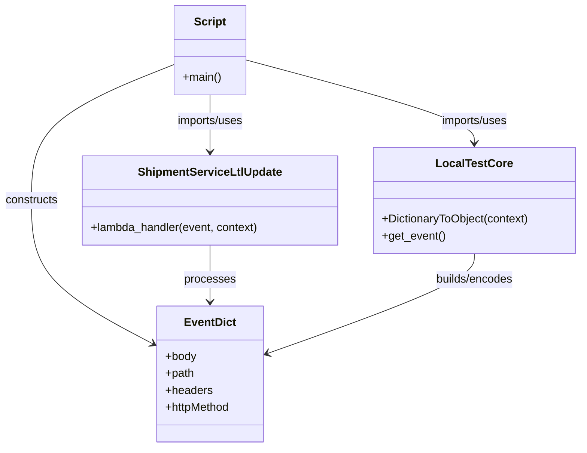

# Diagram: platform/tools/ide_local_testing/localTest/test/byEvent/ltlUpdate.py


> Auto-generated by Obscura crawlers

## Diagram 1

```mermaid
flowchart TD
    A[Start: script executed] --> B[Import modules: localTest.core, shipment_service.ltl_update.ltl_update]
    B --> C[Construct event dictionary]
    C --> D[Create context via DictionaryToObject(context)]
    D --> E[Call lambda_handler(event, context)]
    E --> F[retval returned]
    F --> G[print(retval)]
    G --> H[End]
```

> SVG rendering failed for this diagram.

## Diagram 2



### SVG

<svg id="container" width="823.3984375" xmlns="http://www.w3.org/2000/svg" class="classDiagram" height="632" viewBox="0 0 823.3984375 632" role="graphics-document document" aria-roledescription="class"><style>#container{font-family:"trebuchet ms",verdana,arial,sans-serif;font-size:16px;fill:#333;}@keyframes edge-animation-frame{from{stroke-dashoffset:0;}}@keyframes dash{to{stroke-dashoffset:0;}}#container .edge-animation-slow{stroke-dasharray:9,5!important;stroke-dashoffset:900;animation:dash 50s linear infinite;stroke-linecap:round;}#container .edge-animation-fast{stroke-dasharray:9,5!important;stroke-dashoffset:900;animation:dash 20s linear infinite;stroke-linecap:round;}#container .error-icon{fill:#552222;}#container .error-text{fill:#552222;stroke:#552222;}#container .edge-thickness-normal{stroke-width:1px;}#container .edge-thickness-thick{stroke-width:3.5px;}#container .edge-pattern-solid{stroke-dasharray:0;}#container .edge-thickness-invisible{stroke-width:0;fill:none;}#container .edge-pattern-dashed{stroke-dasharray:3;}#container .edge-pattern-dotted{stroke-dasharray:2;}#container .marker{fill:#333333;stroke:#333333;}#container .marker.cross{stroke:#333333;}#container svg{font-family:"trebuchet ms",verdana,arial,sans-serif;font-size:16px;}#container p{margin:0;}#container g.classGroup text{fill:#9370DB;stroke:none;font-family:"trebuchet ms",verdana,arial,sans-serif;font-size:10px;}#container g.classGroup text .title{font-weight:bolder;}#container .nodeLabel,#container .edgeLabel{color:#131300;}#container .edgeLabel .label rect{fill:#ECECFF;}#container .label text{fill:#131300;}#container .labelBkg{background:#ECECFF;}#container .edgeLabel .label span{background:#ECECFF;}#container .classTitle{font-weight:bolder;}#container .node rect,#container .node circle,#container .node ellipse,#container .node polygon,#container .node path{fill:#ECECFF;stroke:#9370DB;stroke-width:1px;}#container .divider{stroke:#9370DB;stroke-width:1;}#container g.clickable{cursor:pointer;}#container g.classGroup rect{fill:#ECECFF;stroke:#9370DB;}#container g.classGroup line{stroke:#9370DB;stroke-width:1;}#container .classLabel .box{stroke:none;stroke-width:0;fill:#ECECFF;opacity:0.5;}#container .classLabel .label{fill:#9370DB;font-size:10px;}#container .relation{stroke:#333333;stroke-width:1;fill:none;}#container .dashed-line{stroke-dasharray:3;}#container .dotted-line{stroke-dasharray:1 2;}#container #compositionStart,#container .composition{fill:#333333!important;stroke:#333333!important;stroke-width:1;}#container #compositionEnd,#container .composition{fill:#333333!important;stroke:#333333!important;stroke-width:1;}#container #dependencyStart,#container .dependency{fill:#333333!important;stroke:#333333!important;stroke-width:1;}#container #dependencyStart,#container .dependency{fill:#333333!important;stroke:#333333!important;stroke-width:1;}#container #extensionStart,#container .extension{fill:transparent!important;stroke:#333333!important;stroke-width:1;}#container #extensionEnd,#container .extension{fill:transparent!important;stroke:#333333!important;stroke-width:1;}#container #aggregationStart,#container .aggregation{fill:transparent!important;stroke:#333333!important;stroke-width:1;}#container #aggregationEnd,#container .aggregation{fill:transparent!important;stroke:#333333!important;stroke-width:1;}#container #lollipopStart,#container .lollipop{fill:#ECECFF!important;stroke:#333333!important;stroke-width:1;}#container #lollipopEnd,#container .lollipop{fill:#ECECFF!important;stroke:#333333!important;stroke-width:1;}#container .edgeTerminals{font-size:11px;line-height:initial;}#container .classTitleText{text-anchor:middle;font-size:18px;fill:#333;}#container .label-icon{display:inline-block;height:1em;overflow:visible;vertical-align:-0.125em;}#container .node .label-icon path{fill:currentColor;stroke:revert;stroke-width:revert;}#container :root{--mermaid-font-family:"trebuchet ms",verdana,arial,sans-serif;}</style><g><defs><marker id="container_class-aggregationStart" class="marker aggregation class" refX="18" refY="7" markerWidth="190" markerHeight="240" orient="auto"><path d="M 18,7 L9,13 L1,7 L9,1 Z"></path></marker></defs><defs><marker id="container_class-aggregationEnd" class="marker aggregation class" refX="1" refY="7" markerWidth="20" markerHeight="28" orient="auto"><path d="M 18,7 L9,13 L1,7 L9,1 Z"></path></marker></defs><defs><marker id="container_class-extensionStart" class="marker extension class" refX="18" refY="7" markerWidth="190" markerHeight="240" orient="auto"><path d="M 1,7 L18,13 V 1 Z"></path></marker></defs><defs><marker id="container_class-extensionEnd" class="marker extension class" refX="1" refY="7" markerWidth="20" markerHeight="28" orient="auto"><path d="M 1,1 V 13 L18,7 Z"></path></marker></defs><defs><marker id="container_class-compositionStart" class="marker composition class" refX="18" refY="7" markerWidth="190" markerHeight="240" orient="auto"><path d="M 18,7 L9,13 L1,7 L9,1 Z"></path></marker></defs><defs><marker id="container_class-compositionEnd" class="marker composition class" refX="1" refY="7" markerWidth="20" markerHeight="28" orient="auto"><path d="M 18,7 L9,13 L1,7 L9,1 Z"></path></marker></defs><defs><marker id="container_class-dependencyStart" class="marker dependency class" refX="6" refY="7" markerWidth="190" markerHeight="240" orient="auto"><path d="M 5,7 L9,13 L1,7 L9,1 Z"></path></marker></defs><defs><marker id="container_class-dependencyEnd" class="marker dependency class" refX="13" refY="7" markerWidth="20" markerHeight="28" orient="auto"><path d="M 18,7 L9,13 L14,7 L9,1 Z"></path></marker></defs><defs><marker id="container_class-lollipopStart" class="marker lollipop class" refX="13" refY="7" markerWidth="190" markerHeight="240" orient="auto"><circle stroke="black" fill="transparent" cx="7" cy="7" r="6"></circle></marker></defs><defs><marker id="container_class-lollipopEnd" class="marker lollipop class" refX="1" refY="7" markerWidth="190" markerHeight="240" orient="auto"><circle stroke="black" fill="transparent" cx="7" cy="7" r="6"></circle></marker></defs><g class="root"><g class="clusters"></g><g class="edgePaths"><path d="M349.754,84.445L403.613,98.871C457.473,113.297,565.191,142.148,619.051,161.741C672.91,181.333,672.91,191.667,672.91,196.833L672.91,202" id="id_Script_LocalTestCore_1" class="edge-thickness-normal edge-pattern-solid relation" style=";;;" data-edge="true" data-et="edge" data-id="id_Script_LocalTestCore_1" data-points="W3sieCI6MzQ5Ljc1MzkwNjI1LCJ5Ijo4NC40NDU0MjIxMTE1NTE3fSx7IngiOjY3Mi45MTAxNTYyNSwieSI6MTcxfSx7IngiOjY3Mi45MTAxNTYyNSwieSI6MjA4fV0=" marker-end="url(#container_class-dependencyEnd)"></path><path d="M299.555,134L299.555,140.167C299.555,146.333,299.555,158.667,299.555,172C299.555,185.333,299.555,199.667,299.555,206.833L299.555,214" id="id_Script_ShipmentServiceLtlUpdate_2" class="edge-thickness-normal edge-pattern-solid relation" style=";;;" data-edge="true" data-et="edge" data-id="id_Script_ShipmentServiceLtlUpdate_2" data-points="W3sieCI6Mjk5LjU1NDY4NzUsInkiOjEzNH0seyJ4IjoyOTkuNTU0Njg3NSwieSI6MTcxfSx7IngiOjI5OS41NTQ2ODc1LCJ5IjoyMjB9XQ==" marker-end="url(#container_class-dependencyEnd)"></path><path d="M249.355,90.786L215.437,104.155C181.518,117.524,113.681,144.262,79.762,176.298C45.844,208.333,45.844,245.667,45.844,283C45.844,320.333,45.844,357.667,74.556,391.385C103.268,425.103,160.692,455.205,189.404,470.257L218.116,485.308" id="id_Script_EventDict_3" class="edge-thickness-normal edge-pattern-solid relation" style=";;;" data-edge="true" data-et="edge" data-id="id_Script_EventDict_3" data-points="W3sieCI6MjQ5LjM1NTQ2ODc1LCJ5Ijo5MC43ODU5ODkyMjI0Nzg4M30seyJ4Ijo0NS44NDM3NSwieSI6MTcxfSx7IngiOjQ1Ljg0Mzc1LCJ5IjoyODN9LHsieCI6NDUuODQzNzUsInkiOjM5NX0seyJ4IjoyMjMuNDI5Njg3NSwieSI6NDg4LjA5Mzg1NjgxMjkzMzA0fV0=" marker-end="url(#container_class-dependencyEnd)"></path><path d="M299.555,346L299.555,354.167C299.555,362.333,299.555,378.667,299.555,392C299.555,405.333,299.555,415.667,299.555,420.833L299.555,426" id="id_ShipmentServiceLtlUpdate_EventDict_4" class="edge-thickness-normal edge-pattern-solid relation" style=";;;" data-edge="true" data-et="edge" data-id="id_ShipmentServiceLtlUpdate_EventDict_4" data-points="W3sieCI6Mjk5LjU1NDY4NzUsInkiOjM0Nn0seyJ4IjoyOTkuNTU0Njg3NSwieSI6Mzk1fSx7IngiOjI5OS41NTQ2ODc1LCJ5Ijo0MzJ9XQ==" marker-end="url(#container_class-dependencyEnd)"></path><path d="M672.91,358L672.91,364.167C672.91,370.333,672.91,382.667,624.314,406.145C575.717,429.623,478.525,464.246,429.928,481.557L381.332,498.869" id="id_LocalTestCore_EventDict_5" class="edge-thickness-normal edge-pattern-solid relation" style=";;;" data-edge="true" data-et="edge" data-id="id_LocalTestCore_EventDict_5" data-points="W3sieCI6NjcyLjkxMDE1NjI1LCJ5IjozNTh9LHsieCI6NjcyLjkxMDE1NjI1LCJ5IjozOTV9LHsieCI6Mzc1LjY3OTY4NzUsInkiOjUwMC44ODIwNzY2MDY3ODYwM31d" marker-end="url(#container_class-dependencyEnd)"></path></g><g class="edgeLabels"><g class="edgeLabel" transform="translate(672.91015625, 171)"><g class="label" data-id="id_Script_LocalTestCore_1" transform="translate(-48.65625, -12)"><foreignObject width="97.3125" height="24"><div xmlns="http://www.w3.org/1999/xhtml" class="labelBkg" style="display: table-cell; white-space: nowrap; line-height: 1.5; max-width: 200px; text-align: center;"><span class="edgeLabel"><p>imports/uses</p></span></div></foreignObject></g></g><g class="edgeLabel" transform="translate(299.5546875, 171)"><g class="label" data-id="id_Script_ShipmentServiceLtlUpdate_2" transform="translate(-48.65625, -12)"><foreignObject width="97.3125" height="24"><div xmlns="http://www.w3.org/1999/xhtml" class="labelBkg" style="display: table-cell; white-space: nowrap; line-height: 1.5; max-width: 200px; text-align: center;"><span class="edgeLabel"><p>imports/uses</p></span></div></foreignObject></g></g><g class="edgeLabel" transform="translate(45.84375, 283)"><g class="label" data-id="id_Script_EventDict_3" transform="translate(-37.84375, -12)"><foreignObject width="75.6875" height="24"><div xmlns="http://www.w3.org/1999/xhtml" class="labelBkg" style="display: table-cell; white-space: nowrap; line-height: 1.5; max-width: 200px; text-align: center;"><span class="edgeLabel"><p>constructs</p></span></div></foreignObject></g></g><g class="edgeLabel" transform="translate(299.5546875, 395)"><g class="label" data-id="id_ShipmentServiceLtlUpdate_EventDict_4" transform="translate(-35.7890625, -12)"><foreignObject width="71.578125" height="24"><div xmlns="http://www.w3.org/1999/xhtml" class="labelBkg" style="display: table-cell; white-space: nowrap; line-height: 1.5; max-width: 200px; text-align: center;"><span class="edgeLabel"><p>processes</p></span></div></foreignObject></g></g><g class="edgeLabel" transform="translate(672.91015625, 395)"><g class="label" data-id="id_LocalTestCore_EventDict_5" transform="translate(-56.515625, -12)"><foreignObject width="113.03125" height="24"><div xmlns="http://www.w3.org/1999/xhtml" class="labelBkg" style="display: table-cell; white-space: nowrap; line-height: 1.5; max-width: 200px; text-align: center;"><span class="edgeLabel"><p>builds/encodes</p></span></div></foreignObject></g></g></g><g class="nodes"><g class="node default" id="classId-Script-0" transform="translate(299.5546875, 71)"><g class="basic label-container"><path d="M-50.19921875 -63 L50.19921875 -63 L50.19921875 63 L-50.19921875 63" stroke="none" stroke-width="0" fill="#ECECFF" style=""></path><path d="M-50.19921875 -63 C-22.029870912117488 -63, 6.139476925765024 -63, 50.19921875 -63 M-50.19921875 -63 C-10.891288493402733 -63, 28.416641763194534 -63, 50.19921875 -63 M50.19921875 -63 C50.19921875 -23.22541211988444, 50.19921875 16.549175760231122, 50.19921875 63 M50.19921875 -63 C50.19921875 -30.96535006441129, 50.19921875 1.0692998711774209, 50.19921875 63 M50.19921875 63 C29.04328606325641 63, 7.88735337651282 63, -50.19921875 63 M50.19921875 63 C27.718054869175727 63, 5.236890988351455 63, -50.19921875 63 M-50.19921875 63 C-50.19921875 29.377935225888102, -50.19921875 -4.244129548223796, -50.19921875 -63 M-50.19921875 63 C-50.19921875 34.822608724368074, -50.19921875 6.6452174487361475, -50.19921875 -63" stroke="#9370DB" stroke-width="1.3" fill="none" stroke-dasharray="0 0" style=""></path></g><g class="annotation-group text" transform="translate(0, -39)"></g><g class="label-group text" transform="translate(-21.7421875, -39)"><g class="label" style="font-weight: bolder" transform="translate(0,-12)"><foreignObject width="43.484375" height="24"><div xmlns="http://www.w3.org/1999/xhtml" style="display: table-cell; white-space: nowrap; line-height: 1.5; max-width: 93px; text-align: center;"><span class="nodeLabel markdown-node-label" style=""><p>Script</p></span></div></foreignObject></g></g><g class="members-group text" transform="translate(-38.19921875, 9)"></g><g class="methods-group text" transform="translate(-38.19921875, 39)"><g class="label" style="" transform="translate(0,-12)"><foreignObject width="54.65625" height="24"><div xmlns="http://www.w3.org/1999/xhtml" style="display: table-cell; white-space: nowrap; line-height: 1.5; max-width: 112px; text-align: center;"><span class="nodeLabel markdown-node-label" style=""><p>+main()</p></span></div></foreignObject></g></g><g class="divider" style=""><path d="M-50.19921875 -15 C-12.087000441928602 -15, 26.025217866142796 -15, 50.19921875 -15 M-50.19921875 -15 C-12.378397613354814 -15, 25.442423523290373 -15, 50.19921875 -15" stroke="#9370DB" stroke-width="1.3" fill="none" stroke-dasharray="0 0" style=""></path></g><g class="divider" style=""><path d="M-50.19921875 9 C-11.66901355155806 9, 26.86119164688388 9, 50.19921875 9 M-50.19921875 9 C-20.842902809936366 9, 8.513413130127269 9, 50.19921875 9" stroke="#9370DB" stroke-width="1.3" fill="none" stroke-dasharray="0 0" style=""></path></g></g><g class="node default" id="classId-LocalTestCore-1" transform="translate(672.91015625, 283)"><g class="basic label-container"><path d="M-142.48828125 -75 L142.48828125 -75 L142.48828125 75 L-142.48828125 75" stroke="none" stroke-width="0" fill="#ECECFF" style=""></path><path d="M-142.48828125 -75 C-59.75206662093812 -75, 22.984148008123753 -75, 142.48828125 -75 M-142.48828125 -75 C-60.989036863722475 -75, 20.51020752255505 -75, 142.48828125 -75 M142.48828125 -75 C142.48828125 -15.623837236669019, 142.48828125 43.75232552666196, 142.48828125 75 M142.48828125 -75 C142.48828125 -20.134074522689055, 142.48828125 34.73185095462189, 142.48828125 75 M142.48828125 75 C79.41389876591687 75, 16.33951628183374 75, -142.48828125 75 M142.48828125 75 C37.09664988899384 75, -68.29498147201232 75, -142.48828125 75 M-142.48828125 75 C-142.48828125 16.78207934642156, -142.48828125 -41.43584130715688, -142.48828125 -75 M-142.48828125 75 C-142.48828125 39.89942266493551, -142.48828125 4.798845329871014, -142.48828125 -75" stroke="#9370DB" stroke-width="1.3" fill="none" stroke-dasharray="0 0" style=""></path></g><g class="annotation-group text" transform="translate(0, -51)"></g><g class="label-group text" transform="translate(-50.7578125, -51)"><g class="label" style="font-weight: bolder" transform="translate(0,-12)"><foreignObject width="101.515625" height="24"><div xmlns="http://www.w3.org/1999/xhtml" style="display: table-cell; white-space: nowrap; line-height: 1.5; max-width: 149px; text-align: center;"><span class="nodeLabel markdown-node-label" style=""><p>LocalTestCore</p></span></div></foreignObject></g></g><g class="members-group text" transform="translate(-130.48828125, -3)"></g><g class="methods-group text" transform="translate(-130.48828125, 27)"><g class="label" style="" transform="translate(0,-12)"><foreignObject width="210.21875" height="24"><div xmlns="http://www.w3.org/1999/xhtml" style="display: table-cell; white-space: nowrap; line-height: 1.5; max-width: 268px; text-align: center;"><span class="nodeLabel markdown-node-label" style=""><p>+DictionaryToObject(context)</p></span></div></foreignObject></g><g class="label" style="" transform="translate(0,12)"><foreignObject width="89.25" height="24"><div xmlns="http://www.w3.org/1999/xhtml" style="display: table-cell; white-space: nowrap; line-height: 1.5; max-width: 147px; text-align: center;"><span class="nodeLabel markdown-node-label" style=""><p>+get_event()</p></span></div></foreignObject></g></g><g class="divider" style=""><path d="M-142.48828125 -27 C-85.13088950120726 -27, -27.773497752414542 -27, 142.48828125 -27 M-142.48828125 -27 C-37.16297090045359 -27, 68.16233944909283 -27, 142.48828125 -27" stroke="#9370DB" stroke-width="1.3" fill="none" stroke-dasharray="0 0" style=""></path></g><g class="divider" style=""><path d="M-142.48828125 -3 C-69.18889888253523 -3, 4.110483484929546 -3, 142.48828125 -3 M-142.48828125 -3 C-42.51005100041418 -3, 57.46817924917164 -3, 142.48828125 -3" stroke="#9370DB" stroke-width="1.3" fill="none" stroke-dasharray="0 0" style=""></path></g></g><g class="node default" id="classId-ShipmentServiceLtlUpdate-2" transform="translate(299.5546875, 283)"><g class="basic label-container"><path d="M-180.8671875 -63 L180.8671875 -63 L180.8671875 63 L-180.8671875 63" stroke="none" stroke-width="0" fill="#ECECFF" style=""></path><path d="M-180.8671875 -63 C-52.108929019592324 -63, 76.64932946081535 -63, 180.8671875 -63 M-180.8671875 -63 C-97.71141854517921 -63, -14.555649590358428 -63, 180.8671875 -63 M180.8671875 -63 C180.8671875 -13.925431114888006, 180.8671875 35.14913777022399, 180.8671875 63 M180.8671875 -63 C180.8671875 -27.040040868663574, 180.8671875 8.919918262672851, 180.8671875 63 M180.8671875 63 C91.2543702169981 63, 1.641552933996195 63, -180.8671875 63 M180.8671875 63 C108.35589865463773 63, 35.844609809275454 63, -180.8671875 63 M-180.8671875 63 C-180.8671875 34.826752800448446, -180.8671875 6.653505600896892, -180.8671875 -63 M-180.8671875 63 C-180.8671875 36.37247920743618, -180.8671875 9.744958414872357, -180.8671875 -63" stroke="#9370DB" stroke-width="1.3" fill="none" stroke-dasharray="0 0" style=""></path></g><g class="annotation-group text" transform="translate(0, -39)"></g><g class="label-group text" transform="translate(-97.546875, -39)"><g class="label" style="font-weight: bolder" transform="translate(0,-12)"><foreignObject width="195.09375" height="24"><div xmlns="http://www.w3.org/1999/xhtml" style="display: table-cell; white-space: nowrap; line-height: 1.5; max-width: 242px; text-align: center;"><span class="nodeLabel markdown-node-label" style=""><p>ShipmentServiceLtlUpdate</p></span></div></foreignObject></g></g><g class="members-group text" transform="translate(-168.8671875, 9)"></g><g class="methods-group text" transform="translate(-168.8671875, 39)"><g class="label" style="" transform="translate(0,-12)"><foreignObject width="240.1875" height="24"><div xmlns="http://www.w3.org/1999/xhtml" style="display: table-cell; white-space: nowrap; line-height: 1.5; max-width: 298px; text-align: center;"><span class="nodeLabel markdown-node-label" style=""><p>+lambda_handler(event, context)</p></span></div></foreignObject></g></g><g class="divider" style=""><path d="M-180.8671875 -15 C-39.52299834211317 -15, 101.82119081577366 -15, 180.8671875 -15 M-180.8671875 -15 C-78.02857018941906 -15, 24.810047121161887 -15, 180.8671875 -15" stroke="#9370DB" stroke-width="1.3" fill="none" stroke-dasharray="0 0" style=""></path></g><g class="divider" style=""><path d="M-180.8671875 9 C-80.33375787546771 9, 20.199671749064578 9, 180.8671875 9 M-180.8671875 9 C-58.959724720127554 9, 62.94773805974489 9, 180.8671875 9" stroke="#9370DB" stroke-width="1.3" fill="none" stroke-dasharray="0 0" style=""></path></g></g><g class="node default" id="classId-EventDict-3" transform="translate(299.5546875, 528)"><g class="basic label-container"><path d="M-76.125 -96 L76.125 -96 L76.125 96 L-76.125 96" stroke="none" stroke-width="0" fill="#ECECFF" style=""></path><path d="M-76.125 -96 C-33.83898945199621 -96, 8.447021096007575 -96, 76.125 -96 M-76.125 -96 C-39.87167856256285 -96, -3.618357125125698 -96, 76.125 -96 M76.125 -96 C76.125 -53.34321338619267, 76.125 -10.686426772385346, 76.125 96 M76.125 -96 C76.125 -23.39573930760531, 76.125 49.20852138478938, 76.125 96 M76.125 96 C19.57991879857333 96, -36.96516240285334 96, -76.125 96 M76.125 96 C18.47585630862188 96, -39.17328738275624 96, -76.125 96 M-76.125 96 C-76.125 48.90393109170034, -76.125 1.8078621834006867, -76.125 -96 M-76.125 96 C-76.125 49.699703682983454, -76.125 3.3994073659669084, -76.125 -96" stroke="#9370DB" stroke-width="1.3" fill="none" stroke-dasharray="0 0" style=""></path></g><g class="annotation-group text" transform="translate(0, -72)"></g><g class="label-group text" transform="translate(-34.59375, -72)"><g class="label" style="font-weight: bolder" transform="translate(0,-12)"><foreignObject width="69.1875" height="24"><div xmlns="http://www.w3.org/1999/xhtml" style="display: table-cell; white-space: nowrap; line-height: 1.5; max-width: 118px; text-align: center;"><span class="nodeLabel markdown-node-label" style=""><p>EventDict</p></span></div></foreignObject></g></g><g class="members-group text" transform="translate(-64.125, -24)"><g class="label" style="" transform="translate(0,-12)"><foreignObject width="44.28125" height="24"><div xmlns="http://www.w3.org/1999/xhtml" style="display: table-cell; white-space: nowrap; line-height: 1.5; max-width: 102px; text-align: center;"><span class="nodeLabel markdown-node-label" style=""><p>+body</p></span></div></foreignObject></g><g class="label" style="" transform="translate(0,12)"><foreignObject width="41.1875" height="24"><div xmlns="http://www.w3.org/1999/xhtml" style="display: table-cell; white-space: nowrap; line-height: 1.5; max-width: 99px; text-align: center;"><span class="nodeLabel markdown-node-label" style=""><p>+path</p></span></div></foreignObject></g><g class="label" style="" transform="translate(0,36)"><foreignObject width="66.328125" height="24"><div xmlns="http://www.w3.org/1999/xhtml" style="display: table-cell; white-space: nowrap; line-height: 1.5; max-width: 124px; text-align: center;"><span class="nodeLabel markdown-node-label" style=""><p>+headers</p></span></div></foreignObject></g><g class="label" style="" transform="translate(0,60)"><foreignObject width="93.65625" height="24"><div xmlns="http://www.w3.org/1999/xhtml" style="display: table-cell; white-space: nowrap; line-height: 1.5; max-width: 151px; text-align: center;"><span class="nodeLabel markdown-node-label" style=""><p>+httpMethod</p></span></div></foreignObject></g></g><g class="methods-group text" transform="translate(-64.125, 96)"></g><g class="divider" style=""><path d="M-76.125 -48 C-16.481734000385593 -48, 43.161531999228814 -48, 76.125 -48 M-76.125 -48 C-40.339850582487266 -48, -4.5547011649745315 -48, 76.125 -48" stroke="#9370DB" stroke-width="1.3" fill="none" stroke-dasharray="0 0" style=""></path></g><g class="divider" style=""><path d="M-76.125 72 C-16.845421229326718 72, 42.434157541346565 72, 76.125 72 M-76.125 72 C-34.74676590486786 72, 6.631468190264286 72, 76.125 72" stroke="#9370DB" stroke-width="1.3" fill="none" stroke-dasharray="0 0" style=""></path></g></g></g></g></g></svg>
