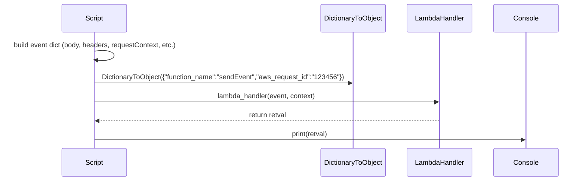
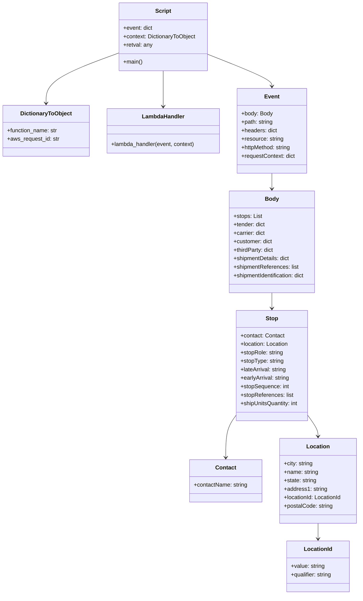

# Diagram: platform/tools/ide_local_testing/localTest/test/byEvent/patchShipment.py

> Auto-generated by Obscura crawlers

## Diagram 1

### SVG

<svg id="container" width="1402.5" xmlns="http://www.w3.org/2000/svg" height="441" viewBox="-165.5 -10 1402.5 441" role="graphics-document document" aria-roledescription="sequence"><g><rect x="1037" y="355" fill="#eaeaea" stroke="#666" width="150" height="65" name="Console" rx="3" ry="3" class="actor actor-bottom"></rect><text x="1112" y="387.5" dominant-baseline="central" alignment-baseline="central" class="actor actor-box" style="text-anchor: middle; font-size: 16px; font-weight: 400;"><tspan x="1112" dy="0">Console</tspan></text></g><g><rect x="837" y="355" fill="#eaeaea" stroke="#666" width="150" height="65" name="LambdaHandler" rx="3" ry="3" class="actor actor-bottom"></rect><text x="912" y="387.5" dominant-baseline="central" alignment-baseline="central" class="actor actor-box" style="text-anchor: middle; font-size: 16px; font-weight: 400;"><tspan x="912" dy="0">LambdaHandler</tspan></text></g><g><rect x="629" y="355" fill="#eaeaea" stroke="#666" width="158" height="65" name="DictionaryToObject" rx="3" ry="3" class="actor actor-bottom"></rect><text x="708" y="387.5" dominant-baseline="central" alignment-baseline="central" class="actor actor-box" style="text-anchor: middle; font-size: 16px; font-weight: 400;"><tspan x="708" dy="0">DictionaryToObject</tspan></text></g><g><rect x="0" y="355" fill="#eaeaea" stroke="#666" width="150" height="65" name="Script" rx="3" ry="3" class="actor actor-bottom"></rect><text x="75" y="387.5" dominant-baseline="central" alignment-baseline="central" class="actor actor-box" style="text-anchor: middle; font-size: 16px; font-weight: 400;"><tspan x="75" dy="0">Script</tspan></text></g><g><line id="actor3" x1="1112" y1="65" x2="1112" y2="355" class="actor-line 200" stroke-width="0.5px" stroke="#999" name="Console"></line><g id="root-3"><rect x="1037" y="0" fill="#eaeaea" stroke="#666" width="150" height="65" name="Console" rx="3" ry="3" class="actor actor-top"></rect><text x="1112" y="32.5" dominant-baseline="central" alignment-baseline="central" class="actor actor-box" style="text-anchor: middle; font-size: 16px; font-weight: 400;"><tspan x="1112" dy="0">Console</tspan></text></g></g><g><line id="actor2" x1="912" y1="65" x2="912" y2="355" class="actor-line 200" stroke-width="0.5px" stroke="#999" name="LambdaHandler"></line><g id="root-2"><rect x="837" y="0" fill="#eaeaea" stroke="#666" width="150" height="65" name="LambdaHandler" rx="3" ry="3" class="actor actor-top"></rect><text x="912" y="32.5" dominant-baseline="central" alignment-baseline="central" class="actor actor-box" style="text-anchor: middle; font-size: 16px; font-weight: 400;"><tspan x="912" dy="0">LambdaHandler</tspan></text></g></g><g><line id="actor1" x1="708" y1="65" x2="708" y2="355" class="actor-line 200" stroke-width="0.5px" stroke="#999" name="DictionaryToObject"></line><g id="root-1"><rect x="629" y="0" fill="#eaeaea" stroke="#666" width="158" height="65" name="DictionaryToObject" rx="3" ry="3" class="actor actor-top"></rect><text x="708" y="32.5" dominant-baseline="central" alignment-baseline="central" class="actor actor-box" style="text-anchor: middle; font-size: 16px; font-weight: 400;"><tspan x="708" dy="0">DictionaryToObject</tspan></text></g></g><g><line id="actor0" x1="75" y1="65" x2="75" y2="355" class="actor-line 200" stroke-width="0.5px" stroke="#999" name="Script"></line><g id="root-0"><rect x="0" y="0" fill="#eaeaea" stroke="#666" width="150" height="65" name="Script" rx="3" ry="3" class="actor actor-top"></rect><text x="75" y="32.5" dominant-baseline="central" alignment-baseline="central" class="actor actor-box" style="text-anchor: middle; font-size: 16px; font-weight: 400;"><tspan x="75" dy="0">Script</tspan></text></g></g><g></g><defs><symbol id="computer" width="24" height="24"><path transform="scale(.5)" d="M2 2v13h20v-13h-20zm18 11h-16v-9h16v9zm-10.228 6l.466-1h3.524l.467 1h-4.457zm14.228 3h-24l2-6h2.104l-1.33 4h18.45l-1.297-4h2.073l2 6zm-5-10h-14v-7h14v7z"></path></symbol></defs><defs><symbol id="database" fill-rule="evenodd" clip-rule="evenodd"><path transform="scale(.5)" d="M12.258.001l.256.004.255.005.253.008.251.01.249.012.247.015.246.016.242.019.241.02.239.023.236.024.233.027.231.028.229.031.225.032.223.034.22.036.217.038.214.04.211.041.208.043.205.045.201.046.198.048.194.05.191.051.187.053.183.054.18.056.175.057.172.059.168.06.163.061.16.063.155.064.15.066.074.033.073.033.071.034.07.034.069.035.068.035.067.035.066.035.064.036.064.036.062.036.06.036.06.037.058.037.058.037.055.038.055.038.053.038.052.038.051.039.05.039.048.039.047.039.045.04.044.04.043.04.041.04.04.041.039.041.037.041.036.041.034.041.033.042.032.042.03.042.029.042.027.042.026.043.024.043.023.043.021.043.02.043.018.044.017.043.015.044.013.044.012.044.011.045.009.044.007.045.006.045.004.045.002.045.001.045v17l-.001.045-.002.045-.004.045-.006.045-.007.045-.009.044-.011.045-.012.044-.013.044-.015.044-.017.043-.018.044-.02.043-.021.043-.023.043-.024.043-.026.043-.027.042-.029.042-.03.042-.032.042-.033.042-.034.041-.036.041-.037.041-.039.041-.04.041-.041.04-.043.04-.044.04-.045.04-.047.039-.048.039-.05.039-.051.039-.052.038-.053.038-.055.038-.055.038-.058.037-.058.037-.06.037-.06.036-.062.036-.064.036-.064.036-.066.035-.067.035-.068.035-.069.035-.07.034-.071.034-.073.033-.074.033-.15.066-.155.064-.16.063-.163.061-.168.06-.172.059-.175.057-.18.056-.183.054-.187.053-.191.051-.194.05-.198.048-.201.046-.205.045-.208.043-.211.041-.214.04-.217.038-.22.036-.223.034-.225.032-.229.031-.231.028-.233.027-.236.024-.239.023-.241.02-.242.019-.246.016-.247.015-.249.012-.251.01-.253.008-.255.005-.256.004-.258.001-.258-.001-.256-.004-.255-.005-.253-.008-.251-.01-.249-.012-.247-.015-.245-.016-.243-.019-.241-.02-.238-.023-.236-.024-.234-.027-.231-.028-.228-.031-.226-.032-.223-.034-.22-.036-.217-.038-.214-.04-.211-.041-.208-.043-.204-.045-.201-.046-.198-.048-.195-.05-.19-.051-.187-.053-.184-.054-.179-.056-.176-.057-.172-.059-.167-.06-.164-.061-.159-.063-.155-.064-.151-.066-.074-.033-.072-.033-.072-.034-.07-.034-.069-.035-.068-.035-.067-.035-.066-.035-.064-.036-.063-.036-.062-.036-.061-.036-.06-.037-.058-.037-.057-.037-.056-.038-.055-.038-.053-.038-.052-.038-.051-.039-.049-.039-.049-.039-.046-.039-.046-.04-.044-.04-.043-.04-.041-.04-.04-.041-.039-.041-.037-.041-.036-.041-.034-.041-.033-.042-.032-.042-.03-.042-.029-.042-.027-.042-.026-.043-.024-.043-.023-.043-.021-.043-.02-.043-.018-.044-.017-.043-.015-.044-.013-.044-.012-.044-.011-.045-.009-.044-.007-.045-.006-.045-.004-.045-.002-.045-.001-.045v-17l.001-.045.002-.045.004-.045.006-.045.007-.045.009-.044.011-.045.012-.044.013-.044.015-.044.017-.043.018-.044.02-.043.021-.043.023-.043.024-.043.026-.043.027-.042.029-.042.03-.042.032-.042.033-.042.034-.041.036-.041.037-.041.039-.041.04-.041.041-.04.043-.04.044-.04.046-.04.046-.039.049-.039.049-.039.051-.039.052-.038.053-.038.055-.038.056-.038.057-.037.058-.037.06-.037.061-.036.062-.036.063-.036.064-.036.066-.035.067-.035.068-.035.069-.035.07-.034.072-.034.072-.033.074-.033.151-.066.155-.064.159-.063.164-.061.167-.06.172-.059.176-.057.179-.056.184-.054.187-.053.19-.051.195-.05.198-.048.201-.046.204-.045.208-.043.211-.041.214-.04.217-.038.22-.036.223-.034.226-.032.228-.031.231-.028.234-.027.236-.024.238-.023.241-.02.243-.019.245-.016.247-.015.249-.012.251-.01.253-.008.255-.005.256-.004.258-.001.258.001zm-9.258 20.499v.01l.001.021.003.021.004.022.005.021.006.022.007.022.009.023.01.022.011.023.012.023.013.023.015.023.016.024.017.023.018.024.019.024.021.024.022.025.023.024.024.025.052.049.056.05.061.051.066.051.07.051.075.051.079.052.084.052.088.052.092.052.097.052.102.051.105.052.11.052.114.051.119.051.123.051.127.05.131.05.135.05.139.048.144.049.147.047.152.047.155.047.16.045.163.045.167.043.171.043.176.041.178.041.183.039.187.039.19.037.194.035.197.035.202.033.204.031.209.03.212.029.216.027.219.025.222.024.226.021.23.02.233.018.236.016.24.015.243.012.246.01.249.008.253.005.256.004.259.001.26-.001.257-.004.254-.005.25-.008.247-.011.244-.012.241-.014.237-.016.233-.018.231-.021.226-.021.224-.024.22-.026.216-.027.212-.028.21-.031.205-.031.202-.034.198-.034.194-.036.191-.037.187-.039.183-.04.179-.04.175-.042.172-.043.168-.044.163-.045.16-.046.155-.046.152-.047.148-.048.143-.049.139-.049.136-.05.131-.05.126-.05.123-.051.118-.052.114-.051.11-.052.106-.052.101-.052.096-.052.092-.052.088-.053.083-.051.079-.052.074-.052.07-.051.065-.051.06-.051.056-.05.051-.05.023-.024.023-.025.021-.024.02-.024.019-.024.018-.024.017-.024.015-.023.014-.024.013-.023.012-.023.01-.023.01-.022.008-.022.006-.022.006-.022.004-.022.004-.021.001-.021.001-.021v-4.127l-.077.055-.08.053-.083.054-.085.053-.087.052-.09.052-.093.051-.095.05-.097.05-.1.049-.102.049-.105.048-.106.047-.109.047-.111.046-.114.045-.115.045-.118.044-.12.043-.122.042-.124.042-.126.041-.128.04-.13.04-.132.038-.134.038-.135.037-.138.037-.139.035-.142.035-.143.034-.144.033-.147.032-.148.031-.15.03-.151.03-.153.029-.154.027-.156.027-.158.026-.159.025-.161.024-.162.023-.163.022-.165.021-.166.02-.167.019-.169.018-.169.017-.171.016-.173.015-.173.014-.175.013-.175.012-.177.011-.178.01-.179.008-.179.008-.181.006-.182.005-.182.004-.184.003-.184.002h-.37l-.184-.002-.184-.003-.182-.004-.182-.005-.181-.006-.179-.008-.179-.008-.178-.01-.176-.011-.176-.012-.175-.013-.173-.014-.172-.015-.171-.016-.17-.017-.169-.018-.167-.019-.166-.02-.165-.021-.163-.022-.162-.023-.161-.024-.159-.025-.157-.026-.156-.027-.155-.027-.153-.029-.151-.03-.15-.03-.148-.031-.146-.032-.145-.033-.143-.034-.141-.035-.14-.035-.137-.037-.136-.037-.134-.038-.132-.038-.13-.04-.128-.04-.126-.041-.124-.042-.122-.042-.12-.044-.117-.043-.116-.045-.113-.045-.112-.046-.109-.047-.106-.047-.105-.048-.102-.049-.1-.049-.097-.05-.095-.05-.093-.052-.09-.051-.087-.052-.085-.053-.083-.054-.08-.054-.077-.054v4.127zm0-5.654v.011l.001.021.003.021.004.021.005.022.006.022.007.022.009.022.01.022.011.023.012.023.013.023.015.024.016.023.017.024.018.024.019.024.021.024.022.024.023.025.024.024.052.05.056.05.061.05.066.051.07.051.075.052.079.051.084.052.088.052.092.052.097.052.102.052.105.052.11.051.114.051.119.052.123.05.127.051.131.05.135.049.139.049.144.048.147.048.152.047.155.046.16.045.163.045.167.044.171.042.176.042.178.04.183.04.187.038.19.037.194.036.197.034.202.033.204.032.209.03.212.028.216.027.219.025.222.024.226.022.23.02.233.018.236.016.24.014.243.012.246.01.249.008.253.006.256.003.259.001.26-.001.257-.003.254-.006.25-.008.247-.01.244-.012.241-.015.237-.016.233-.018.231-.02.226-.022.224-.024.22-.025.216-.027.212-.029.21-.03.205-.032.202-.033.198-.035.194-.036.191-.037.187-.039.183-.039.179-.041.175-.042.172-.043.168-.044.163-.045.16-.045.155-.047.152-.047.148-.048.143-.048.139-.05.136-.049.131-.05.126-.051.123-.051.118-.051.114-.052.11-.052.106-.052.101-.052.096-.052.092-.052.088-.052.083-.052.079-.052.074-.051.07-.052.065-.051.06-.05.056-.051.051-.049.023-.025.023-.024.021-.025.02-.024.019-.024.018-.024.017-.024.015-.023.014-.023.013-.024.012-.022.01-.023.01-.023.008-.022.006-.022.006-.022.004-.021.004-.022.001-.021.001-.021v-4.139l-.077.054-.08.054-.083.054-.085.052-.087.053-.09.051-.093.051-.095.051-.097.05-.1.049-.102.049-.105.048-.106.047-.109.047-.111.046-.114.045-.115.044-.118.044-.12.044-.122.042-.124.042-.126.041-.128.04-.13.039-.132.039-.134.038-.135.037-.138.036-.139.036-.142.035-.143.033-.144.033-.147.033-.148.031-.15.03-.151.03-.153.028-.154.028-.156.027-.158.026-.159.025-.161.024-.162.023-.163.022-.165.021-.166.02-.167.019-.169.018-.169.017-.171.016-.173.015-.173.014-.175.013-.175.012-.177.011-.178.009-.179.009-.179.007-.181.007-.182.005-.182.004-.184.003-.184.002h-.37l-.184-.002-.184-.003-.182-.004-.182-.005-.181-.007-.179-.007-.179-.009-.178-.009-.176-.011-.176-.012-.175-.013-.173-.014-.172-.015-.171-.016-.17-.017-.169-.018-.167-.019-.166-.02-.165-.021-.163-.022-.162-.023-.161-.024-.159-.025-.157-.026-.156-.027-.155-.028-.153-.028-.151-.03-.15-.03-.148-.031-.146-.033-.145-.033-.143-.033-.141-.035-.14-.036-.137-.036-.136-.037-.134-.038-.132-.039-.13-.039-.128-.04-.126-.041-.124-.042-.122-.043-.12-.043-.117-.044-.116-.044-.113-.046-.112-.046-.109-.046-.106-.047-.105-.048-.102-.049-.1-.049-.097-.05-.095-.051-.093-.051-.09-.051-.087-.053-.085-.052-.083-.054-.08-.054-.077-.054v4.139zm0-5.666v.011l.001.02.003.022.004.021.005.022.006.021.007.022.009.023.01.022.011.023.012.023.013.023.015.023.016.024.017.024.018.023.019.024.021.025.022.024.023.024.024.025.052.05.056.05.061.05.066.051.07.051.075.052.079.051.084.052.088.052.092.052.097.052.102.052.105.051.11.052.114.051.119.051.123.051.127.05.131.05.135.05.139.049.144.048.147.048.152.047.155.046.16.045.163.045.167.043.171.043.176.042.178.04.183.04.187.038.19.037.194.036.197.034.202.033.204.032.209.03.212.028.216.027.219.025.222.024.226.021.23.02.233.018.236.017.24.014.243.012.246.01.249.008.253.006.256.003.259.001.26-.001.257-.003.254-.006.25-.008.247-.01.244-.013.241-.014.237-.016.233-.018.231-.02.226-.022.224-.024.22-.025.216-.027.212-.029.21-.03.205-.032.202-.033.198-.035.194-.036.191-.037.187-.039.183-.039.179-.041.175-.042.172-.043.168-.044.163-.045.16-.045.155-.047.152-.047.148-.048.143-.049.139-.049.136-.049.131-.051.126-.05.123-.051.118-.052.114-.051.11-.052.106-.052.101-.052.096-.052.092-.052.088-.052.083-.052.079-.052.074-.052.07-.051.065-.051.06-.051.056-.05.051-.049.023-.025.023-.025.021-.024.02-.024.019-.024.018-.024.017-.024.015-.023.014-.024.013-.023.012-.023.01-.022.01-.023.008-.022.006-.022.006-.022.004-.022.004-.021.001-.021.001-.021v-4.153l-.077.054-.08.054-.083.053-.085.053-.087.053-.09.051-.093.051-.095.051-.097.05-.1.049-.102.048-.105.048-.106.048-.109.046-.111.046-.114.046-.115.044-.118.044-.12.043-.122.043-.124.042-.126.041-.128.04-.13.039-.132.039-.134.038-.135.037-.138.036-.139.036-.142.034-.143.034-.144.033-.147.032-.148.032-.15.03-.151.03-.153.028-.154.028-.156.027-.158.026-.159.024-.161.024-.162.023-.163.023-.165.021-.166.02-.167.019-.169.018-.169.017-.171.016-.173.015-.173.014-.175.013-.175.012-.177.01-.178.01-.179.009-.179.007-.181.006-.182.006-.182.004-.184.003-.184.001-.185.001-.185-.001-.184-.001-.184-.003-.182-.004-.182-.006-.181-.006-.179-.007-.179-.009-.178-.01-.176-.01-.176-.012-.175-.013-.173-.014-.172-.015-.171-.016-.17-.017-.169-.018-.167-.019-.166-.02-.165-.021-.163-.023-.162-.023-.161-.024-.159-.024-.157-.026-.156-.027-.155-.028-.153-.028-.151-.03-.15-.03-.148-.032-.146-.032-.145-.033-.143-.034-.141-.034-.14-.036-.137-.036-.136-.037-.134-.038-.132-.039-.13-.039-.128-.041-.126-.041-.124-.041-.122-.043-.12-.043-.117-.044-.116-.044-.113-.046-.112-.046-.109-.046-.106-.048-.105-.048-.102-.048-.1-.05-.097-.049-.095-.051-.093-.051-.09-.052-.087-.052-.085-.053-.083-.053-.08-.054-.077-.054v4.153zm8.74-8.179l-.257.004-.254.005-.25.008-.247.011-.244.012-.241.014-.237.016-.233.018-.231.021-.226.022-.224.023-.22.026-.216.027-.212.028-.21.031-.205.032-.202.033-.198.034-.194.036-.191.038-.187.038-.183.04-.179.041-.175.042-.172.043-.168.043-.163.045-.16.046-.155.046-.152.048-.148.048-.143.048-.139.049-.136.05-.131.05-.126.051-.123.051-.118.051-.114.052-.11.052-.106.052-.101.052-.096.052-.092.052-.088.052-.083.052-.079.052-.074.051-.07.052-.065.051-.06.05-.056.05-.051.05-.023.025-.023.024-.021.024-.02.025-.019.024-.018.024-.017.023-.015.024-.014.023-.013.023-.012.023-.01.023-.01.022-.008.022-.006.023-.006.021-.004.022-.004.021-.001.021-.001.021.001.021.001.021.004.021.004.022.006.021.006.023.008.022.01.022.01.023.012.023.013.023.014.023.015.024.017.023.018.024.019.024.02.025.021.024.023.024.023.025.051.05.056.05.06.05.065.051.07.052.074.051.079.052.083.052.088.052.092.052.096.052.101.052.106.052.11.052.114.052.118.051.123.051.126.051.131.05.136.05.139.049.143.048.148.048.152.048.155.046.16.046.163.045.168.043.172.043.175.042.179.041.183.04.187.038.191.038.194.036.198.034.202.033.205.032.21.031.212.028.216.027.22.026.224.023.226.022.231.021.233.018.237.016.241.014.244.012.247.011.25.008.254.005.257.004.26.001.26-.001.257-.004.254-.005.25-.008.247-.011.244-.012.241-.014.237-.016.233-.018.231-.021.226-.022.224-.023.22-.026.216-.027.212-.028.21-.031.205-.032.202-.033.198-.034.194-.036.191-.038.187-.038.183-.04.179-.041.175-.042.172-.043.168-.043.163-.045.16-.046.155-.046.152-.048.148-.048.143-.048.139-.049.136-.05.131-.05.126-.051.123-.051.118-.051.114-.052.11-.052.106-.052.101-.052.096-.052.092-.052.088-.052.083-.052.079-.052.074-.051.07-.052.065-.051.06-.05.056-.05.051-.05.023-.025.023-.024.021-.024.02-.025.019-.024.018-.024.017-.023.015-.024.014-.023.013-.023.012-.023.01-.023.01-.022.008-.022.006-.023.006-.021.004-.022.004-.021.001-.021.001-.021-.001-.021-.001-.021-.004-.021-.004-.022-.006-.021-.006-.023-.008-.022-.01-.022-.01-.023-.012-.023-.013-.023-.014-.023-.015-.024-.017-.023-.018-.024-.019-.024-.02-.025-.021-.024-.023-.024-.023-.025-.051-.05-.056-.05-.06-.05-.065-.051-.07-.052-.074-.051-.079-.052-.083-.052-.088-.052-.092-.052-.096-.052-.101-.052-.106-.052-.11-.052-.114-.052-.118-.051-.123-.051-.126-.051-.131-.05-.136-.05-.139-.049-.143-.048-.148-.048-.152-.048-.155-.046-.16-.046-.163-.045-.168-.043-.172-.043-.175-.042-.179-.041-.183-.04-.187-.038-.191-.038-.194-.036-.198-.034-.202-.033-.205-.032-.21-.031-.212-.028-.216-.027-.22-.026-.224-.023-.226-.022-.231-.021-.233-.018-.237-.016-.241-.014-.244-.012-.247-.011-.25-.008-.254-.005-.257-.004-.26-.001-.26.001z"></path></symbol></defs><defs><symbol id="clock" width="24" height="24"><path transform="scale(.5)" d="M12 2c5.514 0 10 4.486 10 10s-4.486 10-10 10-10-4.486-10-10 4.486-10 10-10zm0-2c-6.627 0-12 5.373-12 12s5.373 12 12 12 12-5.373 12-12-5.373-12-12-12zm5.848 12.459c.202.038.202.333.001.372-1.907.361-6.045 1.111-6.547 1.111-.719 0-1.301-.582-1.301-1.301 0-.512.77-5.447 1.125-7.445.034-.192.312-.181.343.014l.985 6.238 5.394 1.011z"></path></symbol></defs><defs><marker id="arrowhead" refX="7.9" refY="5" markerUnits="userSpaceOnUse" markerWidth="12" markerHeight="12" orient="auto-start-reverse"><path d="M -1 0 L 10 5 L 0 10 z"></path></marker></defs><defs><marker id="crosshead" markerWidth="15" markerHeight="8" orient="auto" refX="4" refY="4.5"><path fill="none" stroke="#000000" stroke-width="1pt" d="M 1,2 L 6,7 M 6,2 L 1,7" style="stroke-dasharray: 0, 0;"></path></marker></defs><defs><marker id="filled-head" refX="15.5" refY="7" markerWidth="20" markerHeight="28" orient="auto"><path d="M 18,7 L9,13 L14,7 L9,1 Z"></path></marker></defs><defs><marker id="sequencenumber" refX="15" refY="15" markerWidth="60" markerHeight="40" orient="auto"><circle cx="15" cy="15" r="6"></circle></marker></defs><text x="76" y="80" text-anchor="middle" dominant-baseline="middle" alignment-baseline="middle" class="messageText" dy="1em" style="font-size: 16px; font-weight: 400;">build event dict (body, headers, requestContext, etc.)</text><path d="M 76,113 C 136,103 136,143 76,133" class="messageLine0" stroke-width="2" stroke="none" marker-end="url(#arrowhead)" style="fill: none;"></path><text x="390" y="158" text-anchor="middle" dominant-baseline="middle" alignment-baseline="middle" class="messageText" dy="1em" style="font-size: 16px; font-weight: 400;">DictionaryToObject({"function_name":"sendEvent","aws_request_id":"123456"})</text><line x1="76" y1="191" x2="704" y2="191" class="messageLine0" stroke-width="2" stroke="none" marker-end="url(#arrowhead)" style="fill: none;"></line><text x="492" y="206" text-anchor="middle" dominant-baseline="middle" alignment-baseline="middle" class="messageText" dy="1em" style="font-size: 16px; font-weight: 400;">lambda_handler(event, context)</text><line x1="76" y1="239" x2="908" y2="239" class="messageLine0" stroke-width="2" stroke="none" marker-end="url(#arrowhead)" style="fill: none;"></line><text x="495" y="254" text-anchor="middle" dominant-baseline="middle" alignment-baseline="middle" class="messageText" dy="1em" style="font-size: 16px; font-weight: 400;">return retval</text><line x1="911" y1="287" x2="79" y2="287" class="messageLine1" stroke-width="2" stroke="none" marker-end="url(#arrowhead)" style="stroke-dasharray: 3, 3; fill: none;"></line><text x="592" y="302" text-anchor="middle" dominant-baseline="middle" alignment-baseline="middle" class="messageText" dy="1em" style="font-size: 16px; font-weight: 400;">print(retval)</text><line x1="76" y1="335" x2="1108" y2="335" class="messageLine0" stroke-width="2" stroke="none" marker-end="url(#arrowhead)" style="fill: none;"></line></svg>

## Diagram 2

### SVG

<svg id="container" width="1022.412109375" xmlns="http://www.w3.org/2000/svg" class="classDiagram" height="1682" viewBox="0 0 1022.412109375 1682" role="graphics-document document" aria-roledescription="class"><g><defs><marker id="container_class-aggregationStart" class="marker aggregation class" refX="18" refY="7" markerWidth="190" markerHeight="240" orient="auto"><path d="M 18,7 L9,13 L1,7 L9,1 Z"></path></marker></defs><defs><marker id="container_class-aggregationEnd" class="marker aggregation class" refX="1" refY="7" markerWidth="20" markerHeight="28" orient="auto"><path d="M 18,7 L9,13 L1,7 L9,1 Z"></path></marker></defs><defs><marker id="container_class-extensionStart" class="marker extension class" refX="18" refY="7" markerWidth="190" markerHeight="240" orient="auto"><path d="M 1,7 L18,13 V 1 Z"></path></marker></defs><defs><marker id="container_class-extensionEnd" class="marker extension class" refX="1" refY="7" markerWidth="20" markerHeight="28" orient="auto"><path d="M 1,1 V 13 L18,7 Z"></path></marker></defs><defs><marker id="container_class-compositionStart" class="marker composition class" refX="18" refY="7" markerWidth="190" markerHeight="240" orient="auto"><path d="M 18,7 L9,13 L1,7 L9,1 Z"></path></marker></defs><defs><marker id="container_class-compositionEnd" class="marker composition class" refX="1" refY="7" markerWidth="20" markerHeight="28" orient="auto"><path d="M 18,7 L9,13 L1,7 L9,1 Z"></path></marker></defs><defs><marker id="container_class-dependencyStart" class="marker dependency class" refX="6" refY="7" markerWidth="190" markerHeight="240" orient="auto"><path d="M 5,7 L9,13 L1,7 L9,1 Z"></path></marker></defs><defs><marker id="container_class-dependencyEnd" class="marker dependency class" refX="13" refY="7" markerWidth="20" markerHeight="28" orient="auto"><path d="M 18,7 L9,13 L14,7 L9,1 Z"></path></marker></defs><defs><marker id="container_class-lollipopStart" class="marker lollipop class" refX="13" refY="7" markerWidth="190" markerHeight="240" orient="auto"><circle stroke="black" fill="transparent" cx="7" cy="7" r="6"></circle></marker></defs><defs><marker id="container_class-lollipopEnd" class="marker lollipop class" refX="1" refY="7" markerWidth="190" markerHeight="240" orient="auto"><circle stroke="black" fill="transparent" cx="7" cy="7" r="6"></circle></marker></defs><g class="root"><g class="clusters"></g><g class="edgePaths"><path d="M588.668,153.479L619.233,165.399C649.798,177.319,710.928,201.16,741.493,216.246C772.059,231.333,772.059,237.667,772.059,240.833L772.059,244" id="id_Script_Event_1" class="edge-thickness-normal edge-pattern-solid relation" style=";;;" data-edge="true" data-et="edge" data-id="id_Script_Event_1" data-points="W3sieCI6NTg4LjY2Nzk2ODc1LCJ5IjoxNTMuNDc4ODc5OTc3ODQxM30seyJ4Ijo3NzIuMDU4NTkzNzUsInkiOjIyNX0seyJ4Ijo3NzIuMDU4NTkzNzUsInkiOjI1MH1d" marker-end="url(#container_class-dependencyEnd)"></path><path d="M334.926,150.17L300.654,162.641C266.383,175.113,197.84,200.057,163.568,223.695C129.297,247.333,129.297,269.667,129.297,280.833L129.297,292" id="id_Script_DictionaryToObject_2" class="edge-thickness-normal edge-pattern-solid relation" style=";;;" data-edge="true" data-et="edge" data-id="id_Script_DictionaryToObject_2" data-points="W3sieCI6MzM0LjkyNTc4MTI1LCJ5IjoxNTAuMTY5NjMxMTA5MDIyNTZ9LHsieCI6MTI5LjI5Njg3NSwieSI6MjI1fSx7IngiOjEyOS4yOTY4NzUsInkiOjI5OH1d" marker-end="url(#container_class-dependencyEnd)"></path><path d="M461.797,200L461.797,204.167C461.797,208.333,461.797,216.667,461.797,233.5C461.797,250.333,461.797,275.667,461.797,288.333L461.797,301" id="id_Script_LambdaHandler_3" class="edge-thickness-normal edge-pattern-solid relation" style=";;;" data-edge="true" data-et="edge" data-id="id_Script_LambdaHandler_3" data-points="W3sieCI6NDYxLjc5Njg3NSwieSI6MjAwfSx7IngiOjQ2MS43OTY4NzUsInkiOjIyNX0seyJ4Ijo0NjEuNzk2ODc1LCJ5IjozMDd9XQ==" marker-end="url(#container_class-dependencyEnd)"></path><path d="M772.059,490L772.059,494.167C772.059,498.333,772.059,506.667,772.059,514C772.059,521.333,772.059,527.667,772.059,530.833L772.059,534" id="id_Event_Body_4" class="edge-thickness-normal edge-pattern-solid relation" style=";;;" data-edge="true" data-et="edge" data-id="id_Event_Body_4" data-points="W3sieCI6NzcyLjA1ODU5Mzc1LCJ5Ijo0OTB9LHsieCI6NzcyLjA1ODU5Mzc1LCJ5Ijo1MTV9LHsieCI6NzcyLjA1ODU5Mzc1LCJ5Ijo1NDB9XQ==" marker-end="url(#container_class-dependencyEnd)"></path><path d="M772.059,828L772.059,832.167C772.059,836.333,772.059,844.667,772.059,852C772.059,859.333,772.059,865.667,772.059,868.833L772.059,872" id="id_Body_Stop_5" class="edge-thickness-normal edge-pattern-solid relation" style=";;;" data-edge="true" data-et="edge" data-id="id_Body_Stop_5" data-points="W3sieCI6NzcyLjA1ODU5Mzc1LCJ5Ijo4Mjh9LHsieCI6NzcyLjA1ODU5Mzc1LCJ5Ijo4NTN9LHsieCI6NzcyLjA1ODU5Mzc1LCJ5Ijo4Nzh9XQ==" marker-end="url(#container_class-dependencyEnd)"></path><path d="M668.223,1176.679L663.575,1183.066C658.926,1189.453,649.63,1202.226,644.982,1221.78C640.334,1241.333,640.334,1267.667,640.334,1280.833L640.334,1294" id="id_Stop_Contact_6" class="edge-thickness-normal edge-pattern-solid relation" style=";;;" data-edge="true" data-et="edge" data-id="id_Stop_Contact_6" data-points="W3sieCI6NjY4LjIyMjY1NjI1LCJ5IjoxMTc2LjY3ODc2NTc3MjU3ODN9LHsieCI6NjQwLjMzMzk4NDM3NSwieSI6MTIxNX0seyJ4Ijo2NDAuMzMzOTg0Mzc1LCJ5IjoxMzAwfV0=" marker-end="url(#container_class-dependencyEnd)"></path><path d="M875.895,1176.679L880.543,1183.066C885.191,1189.453,894.487,1202.226,899.135,1211.78C903.783,1221.333,903.783,1227.667,903.783,1230.833L903.783,1234" id="id_Stop_Location_7" class="edge-thickness-normal edge-pattern-solid relation" style=";;;" data-edge="true" data-et="edge" data-id="id_Stop_Location_7" data-points="W3sieCI6ODc1Ljg5NDUzMTI1LCJ5IjoxMTc2LjY3ODc2NTc3MjU3ODN9LHsieCI6OTAzLjc4MzIwMzEyNSwieSI6MTIxNX0seyJ4Ijo5MDMuNzgzMjAzMTI1LCJ5IjoxMjQwfV0=" marker-end="url(#container_class-dependencyEnd)"></path><path d="M903.783,1480L903.783,1484.167C903.783,1488.333,903.783,1496.667,903.783,1504C903.783,1511.333,903.783,1517.667,903.783,1520.833L903.783,1524" id="id_Location_LocationId_8" class="edge-thickness-normal edge-pattern-solid relation" style=";;;" data-edge="true" data-et="edge" data-id="id_Location_LocationId_8" data-points="W3sieCI6OTAzLjc4MzIwMzEyNSwieSI6MTQ4MH0seyJ4Ijo5MDMuNzgzMjAzMTI1LCJ5IjoxNTA1fSx7IngiOjkwMy43ODMyMDMxMjUsInkiOjE1MzB9XQ==" marker-end="url(#container_class-dependencyEnd)"></path></g><g class="edgeLabels"><g class="edgeLabel"><g class="label" data-id="id_Script_Event_1" transform="translate(0, 0)"><foreignObject width="0" height="0">

</foreignObject></g></g><g class="edgeLabel"><g class="label" data-id="id_Script_DictionaryToObject_2" transform="translate(0, 0)"><foreignObject width="0" height="0">

</foreignObject></g></g><g class="edgeLabel"><g class="label" data-id="id_Script_LambdaHandler_3" transform="translate(0, 0)"><foreignObject width="0" height="0">

</foreignObject></g></g><g class="edgeLabel"><g class="label" data-id="id_Event_Body_4" transform="translate(0, 0)"><foreignObject width="0" height="0">

</foreignObject></g></g><g class="edgeLabel"><g class="label" data-id="id_Body_Stop_5" transform="translate(0, 0)"><foreignObject width="0" height="0">

</foreignObject></g></g><g class="edgeLabel"><g class="label" data-id="id_Stop_Contact_6" transform="translate(0, 0)"><foreignObject width="0" height="0">

</foreignObject></g></g><g class="edgeLabel"><g class="label" data-id="id_Stop_Location_7" transform="translate(0, 0)"><foreignObject width="0" height="0">

</foreignObject></g></g><g class="edgeLabel"><g class="label" data-id="id_Location_LocationId_8" transform="translate(0, 0)"><foreignObject width="0" height="0">

</foreignObject></g></g></g><g class="nodes"><g class="node default" id="classId-Script-0" transform="translate(461.796875, 104)"><g class="basic label-container"><path d="M-126.87109375 -96 L126.87109375 -96 L126.87109375 96 L-126.87109375 96" stroke="none" stroke-width="0" fill="#ECECFF" style=""></path><path d="M-126.87109375 -96 C-54.928639824769945 -96, 17.01381410046011 -96, 126.87109375 -96 M-126.87109375 -96 C-31.05992451176749 -96, 64.75124472646502 -96, 126.87109375 -96 M126.87109375 -96 C126.87109375 -29.976874146161947, 126.87109375 36.046251707676106, 126.87109375 96 M126.87109375 -96 C126.87109375 -45.21960511474094, 126.87109375 5.560789770518113, 126.87109375 96 M126.87109375 96 C74.26195859368471 96, 21.652823437369435 96, -126.87109375 96 M126.87109375 96 C59.832924626439734 96, -7.205244497120532 96, -126.87109375 96 M-126.87109375 96 C-126.87109375 27.680652690578484, -126.87109375 -40.63869461884303, -126.87109375 -96 M-126.87109375 96 C-126.87109375 55.037867591044694, -126.87109375 14.075735182089389, -126.87109375 -96" stroke="#9370DB" stroke-width="1.3" fill="none" stroke-dasharray="0 0" style=""></path></g><g class="annotation-group text" transform="translate(0, -72)"></g><g class="label-group text" transform="translate(-21.7421875, -72)"><g class="label" style="font-weight: bolder" transform="translate(0,-12)"><foreignObject width="43.484375" height="24">

Script

</foreignObject></g></g><g class="members-group text" transform="translate(-114.87109375, -24)"><g class="label" style="" transform="translate(0,-12)"><foreignObject width="83.96875" height="24">

+event: dict

</foreignObject></g><g class="label" style="" transform="translate(0,12)"><foreignObject width="208" height="24">

+context: DictionaryToObject

</foreignObject></g><g class="label" style="" transform="translate(0,36)"><foreignObject width="83.03125" height="24">

+retval: any

</foreignObject></g></g><g class="methods-group text" transform="translate(-114.87109375, 72)"><g class="label" style="" transform="translate(0,-12)"><foreignObject width="54.65625" height="24">

+main()

</foreignObject></g></g><g class="divider" style=""><path d="M-126.87109375 -48 C-72.97959404029298 -48, -19.08809433058596 -48, 126.87109375 -48 M-126.87109375 -48 C-29.82173878518917 -48, 67.22761617962166 -48, 126.87109375 -48" stroke="#9370DB" stroke-width="1.3" fill="none" stroke-dasharray="0 0" style=""></path></g><g class="divider" style=""><path d="M-126.87109375 48 C-70.2783542167002 48, -13.685614683400402 48, 126.87109375 48 M-126.87109375 48 C-28.283884238598276 48, 70.30332527280345 48, 126.87109375 48" stroke="#9370DB" stroke-width="1.3" fill="none" stroke-dasharray="0 0" style=""></path></g></g><g class="node default" id="classId-DictionaryToObject-1" transform="translate(129.296875, 370)"><g class="basic label-container"><path d="M-121.296875 -72 L121.296875 -72 L121.296875 72 L-121.296875 72" stroke="none" stroke-width="0" fill="#ECECFF" style=""></path><path d="M-121.296875 -72 C-63.921788278040594 -72, -6.546701556081189 -72, 121.296875 -72 M-121.296875 -72 C-33.60326013823577 -72, 54.09035472352846 -72, 121.296875 -72 M121.296875 -72 C121.296875 -36.19129410291722, 121.296875 -0.38258820583443764, 121.296875 72 M121.296875 -72 C121.296875 -25.18753865625426, 121.296875 21.624922687491477, 121.296875 72 M121.296875 72 C45.71216275630228 72, -29.872549487395446 72, -121.296875 72 M121.296875 72 C62.71970925087633 72, 4.142543501752655 72, -121.296875 72 M-121.296875 72 C-121.296875 35.97061923350561, -121.296875 -0.058761532988782506, -121.296875 -72 M-121.296875 72 C-121.296875 16.092253171101333, -121.296875 -39.81549365779733, -121.296875 -72" stroke="#9370DB" stroke-width="1.3" fill="none" stroke-dasharray="0 0" style=""></path></g><g class="annotation-group text" transform="translate(0, -48)"></g><g class="label-group text" transform="translate(-70.109375, -48)"><g class="label" style="font-weight: bolder" transform="translate(0,-12)"><foreignObject width="140.21875" height="24">

DictionaryToObject

</foreignObject></g></g><g class="members-group text" transform="translate(-109.296875, 0)"><g class="label" style="" transform="translate(0,-12)"><foreignObject width="144.796875" height="24">

+function_name: str

</foreignObject></g><g class="label" style="" transform="translate(0,12)"><foreignObject width="148.484375" height="24">

+aws_request_id: str

</foreignObject></g></g><g class="methods-group text" transform="translate(-109.296875, 72)"></g><g class="divider" style=""><path d="M-121.296875 -24 C-51.223103679025755 -24, 18.85066764194849 -24, 121.296875 -24 M-121.296875 -24 C-69.40344004303562 -24, -17.51000508607123 -24, 121.296875 -24" stroke="#9370DB" stroke-width="1.3" fill="none" stroke-dasharray="0 0" style=""></path></g><g class="divider" style=""><path d="M-121.296875 48 C-48.59391829749002 48, 24.10903840501996 48, 121.296875 48 M-121.296875 48 C-32.12281495885313 48, 57.05124508229375 48, 121.296875 48" stroke="#9370DB" stroke-width="1.3" fill="none" stroke-dasharray="0 0" style=""></path></g></g><g class="node default" id="classId-LambdaHandler-2" transform="translate(461.796875, 370)"><g class="basic label-container"><path d="M-161.203125 -63 L161.203125 -63 L161.203125 63 L-161.203125 63" stroke="none" stroke-width="0" fill="#ECECFF" style=""></path><path d="M-161.203125 -63 C-76.00449184910715 -63, 9.194141301785692 -63, 161.203125 -63 M-161.203125 -63 C-64.49437651363658 -63, 32.21437197272684 -63, 161.203125 -63 M161.203125 -63 C161.203125 -27.600946284490007, 161.203125 7.798107431019986, 161.203125 63 M161.203125 -63 C161.203125 -27.70219556152766, 161.203125 7.595608876944681, 161.203125 63 M161.203125 63 C96.35676808444461 63, 31.51041116888922 63, -161.203125 63 M161.203125 63 C81.87278124434626 63, 2.5424374886925136 63, -161.203125 63 M-161.203125 63 C-161.203125 32.63637292793129, -161.203125 2.2727458558625884, -161.203125 -63 M-161.203125 63 C-161.203125 16.613379251833912, -161.203125 -29.773241496332176, -161.203125 -63" stroke="#9370DB" stroke-width="1.3" fill="none" stroke-dasharray="0 0" style=""></path></g><g class="annotation-group text" transform="translate(0, -39)"></g><g class="label-group text" transform="translate(-58.21875, -39)"><g class="label" style="font-weight: bolder" transform="translate(0,-12)"><foreignObject width="116.4375" height="24">

LambdaHandler

</foreignObject></g></g><g class="members-group text" transform="translate(-149.203125, 9)"></g><g class="methods-group text" transform="translate(-149.203125, 39)"><g class="label" style="" transform="translate(0,-12)"><foreignObject width="240.1875" height="24">

+lambda_handler(event, context)

</foreignObject></g></g><g class="divider" style=""><path d="M-161.203125 -15 C-56.16786657130339 -15, 48.867391857393216 -15, 161.203125 -15 M-161.203125 -15 C-56.02011161235954 -15, 49.162901775280915 -15, 161.203125 -15" stroke="#9370DB" stroke-width="1.3" fill="none" stroke-dasharray="0 0" style=""></path></g><g class="divider" style=""><path d="M-161.203125 9 C-61.45908008280723 9, 38.28496483438553 9, 161.203125 9 M-161.203125 9 C-46.02384194814208 9, 69.15544110371584 9, 161.203125 9" stroke="#9370DB" stroke-width="1.3" fill="none" stroke-dasharray="0 0" style=""></path></g></g><g class="node default" id="classId-Event-3" transform="translate(772.05859375, 370)"><g class="basic label-container"><path d="M-99.05859375 -120 L99.05859375 -120 L99.05859375 120 L-99.05859375 120" stroke="none" stroke-width="0" fill="#ECECFF" style=""></path><path d="M-99.05859375 -120 C-49.44231074477687 -120, 0.1739722604462628 -120, 99.05859375 -120 M-99.05859375 -120 C-44.52765176930324 -120, 10.00329021139352 -120, 99.05859375 -120 M99.05859375 -120 C99.05859375 -40.21189660177568, 99.05859375 39.576206796448645, 99.05859375 120 M99.05859375 -120 C99.05859375 -40.09486762457426, 99.05859375 39.81026475085147, 99.05859375 120 M99.05859375 120 C23.031566202752387 120, -52.995461344495226 120, -99.05859375 120 M99.05859375 120 C50.217077672258725 120, 1.3755615945174497 120, -99.05859375 120 M-99.05859375 120 C-99.05859375 26.157313925727394, -99.05859375 -67.68537214854521, -99.05859375 -120 M-99.05859375 120 C-99.05859375 30.797067755909566, -99.05859375 -58.40586448818087, -99.05859375 -120" stroke="#9370DB" stroke-width="1.3" fill="none" stroke-dasharray="0 0" style=""></path></g><g class="annotation-group text" transform="translate(0, -96)"></g><g class="label-group text" transform="translate(-20.2109375, -96)"><g class="label" style="font-weight: bolder" transform="translate(0,-12)"><foreignObject width="40.421875" height="24">

Event

</foreignObject></g></g><g class="members-group text" transform="translate(-87.05859375, -48)"><g class="label" style="" transform="translate(0,-12)"><foreignObject width="88.9375" height="24">

+body: Body

</foreignObject></g><g class="label" style="" transform="translate(0,12)"><foreignObject width="90.90625" height="24">

+path: string

</foreignObject></g><g class="label" style="" transform="translate(0,36)"><foreignObject width="101.90625" height="24">

+headers: dict

</foreignObject></g><g class="label" style="" transform="translate(0,60)"><foreignObject width="119.984375" height="24">

+resource: string

</foreignObject></g><g class="label" style="" transform="translate(0,84)"><foreignObject width="143.375" height="24">

+httpMethod: string

</foreignObject></g><g class="label" style="" transform="translate(0,108)"><foreignObject width="153.90625" height="24">

+requestContext: dict

</foreignObject></g></g><g class="methods-group text" transform="translate(-87.05859375, 120)"></g><g class="divider" style=""><path d="M-99.05859375 -72 C-45.59759855565724 -72, 7.863396638685515 -72, 99.05859375 -72 M-99.05859375 -72 C-27.209437594793954 -72, 44.63971856041209 -72, 99.05859375 -72" stroke="#9370DB" stroke-width="1.3" fill="none" stroke-dasharray="0 0" style=""></path></g><g class="divider" style=""><path d="M-99.05859375 96 C-45.206877704063 96, 8.644838341874006 96, 99.05859375 96 M-99.05859375 96 C-36.01507220402542 96, 27.028449341949155 96, 99.05859375 96" stroke="#9370DB" stroke-width="1.3" fill="none" stroke-dasharray="0 0" style=""></path></g></g><g class="node default" id="classId-Body-4" transform="translate(772.05859375, 684)"><g class="basic label-container"><path d="M-125.82421875 -144 L125.82421875 -144 L125.82421875 144 L-125.82421875 144" stroke="none" stroke-width="0" fill="#ECECFF" style=""></path><path d="M-125.82421875 -144 C-30.58110588000605 -144, 64.6620069899879 -144, 125.82421875 -144 M-125.82421875 -144 C-29.678784579403555 -144, 66.46664959119289 -144, 125.82421875 -144 M125.82421875 -144 C125.82421875 -54.91985710820987, 125.82421875 34.160285783580264, 125.82421875 144 M125.82421875 -144 C125.82421875 -69.63138445868131, 125.82421875 4.737231082637379, 125.82421875 144 M125.82421875 144 C36.34667964563444 144, -53.13085945873112 144, -125.82421875 144 M125.82421875 144 C34.56302270551038 144, -56.698173338979245 144, -125.82421875 144 M-125.82421875 144 C-125.82421875 66.69833827419632, -125.82421875 -10.603323451607366, -125.82421875 -144 M-125.82421875 144 C-125.82421875 35.75247422668954, -125.82421875 -72.49505154662091, -125.82421875 -144" stroke="#9370DB" stroke-width="1.3" fill="none" stroke-dasharray="0 0" style=""></path></g><g class="annotation-group text" transform="translate(0, -120)"></g><g class="label-group text" transform="translate(-18.5546875, -120)"><g class="label" style="font-weight: bolder" transform="translate(0,-12)"><foreignObject width="37.109375" height="24">

Body

</foreignObject></g></g><g class="members-group text" transform="translate(-113.82421875, -72)"><g class="label" style="" transform="translate(0,-12)"><foreignObject width="81.125" height="24">

+stops: List

</foreignObject></g><g class="label" style="" transform="translate(0,12)"><foreignObject width="91.75" height="24">

+tender: dict

</foreignObject></g><g class="label" style="" transform="translate(0,36)"><foreignObject width="91.6875" height="24">

+carrier: dict

</foreignObject></g><g class="label" style="" transform="translate(0,60)"><foreignObject width="111.5" height="24">

+customer: dict

</foreignObject></g><g class="label" style="" transform="translate(0,84)"><foreignObject width="115.359375" height="24">

+thirdParty: dict

</foreignObject></g><g class="label" style="" transform="translate(0,108)"><foreignObject width="162.09375" height="24">

+shipmentDetails: dict

</foreignObject></g><g class="label" style="" transform="translate(0,132)"><foreignObject width="186.359375" height="24">

+shipmentReferences: list

</foreignObject></g><g class="label" style="" transform="translate(0,156)"><foreignObject width="209.09375" height="24">

+shipmentIdentification: dict

</foreignObject></g></g><g class="methods-group text" transform="translate(-113.82421875, 144)"></g><g class="divider" style=""><path d="M-125.82421875 -96 C-26.064000708604837 -96, 73.69621733279033 -96, 125.82421875 -96 M-125.82421875 -96 C-37.54920109646204 -96, 50.725816557075916 -96, 125.82421875 -96" stroke="#9370DB" stroke-width="1.3" fill="none" stroke-dasharray="0 0" style=""></path></g><g class="divider" style=""><path d="M-125.82421875 120 C-56.821134577573545 120, 12.18194959485291 120, 125.82421875 120 M-125.82421875 120 C-32.767764284565814 120, 60.28869018086837 120, 125.82421875 120" stroke="#9370DB" stroke-width="1.3" fill="none" stroke-dasharray="0 0" style=""></path></g></g><g class="node default" id="classId-Stop-5" transform="translate(772.05859375, 1034)"><g class="basic label-container"><path d="M-103.8359375 -156 L103.8359375 -156 L103.8359375 156 L-103.8359375 156" stroke="none" stroke-width="0" fill="#ECECFF" style=""></path><path d="M-103.8359375 -156 C-40.1074367054699 -156, 23.621064089060198 -156, 103.8359375 -156 M-103.8359375 -156 C-21.686560429562107 -156, 60.462816640875786 -156, 103.8359375 -156 M103.8359375 -156 C103.8359375 -86.7501374280548, 103.8359375 -17.5002748561096, 103.8359375 156 M103.8359375 -156 C103.8359375 -33.23349449016625, 103.8359375 89.5330110196675, 103.8359375 156 M103.8359375 156 C46.72729800338061 156, -10.381341493238779 156, -103.8359375 156 M103.8359375 156 C22.909420748778444 156, -58.01709600244311 156, -103.8359375 156 M-103.8359375 156 C-103.8359375 75.94160067842732, -103.8359375 -4.1167986431453585, -103.8359375 -156 M-103.8359375 156 C-103.8359375 65.34286615083795, -103.8359375 -25.3142676983241, -103.8359375 -156" stroke="#9370DB" stroke-width="1.3" fill="none" stroke-dasharray="0 0" style=""></path></g><g class="annotation-group text" transform="translate(0, -132)"></g><g class="label-group text" transform="translate(-16.96875, -132)"><g class="label" style="font-weight: bolder" transform="translate(0,-12)"><foreignObject width="33.9375" height="24">

Stop

</foreignObject></g></g><g class="members-group text" transform="translate(-91.8359375, -84)"><g class="label" style="" transform="translate(0,-12)"><foreignObject width="125.125" height="24">

+contact: Contact

</foreignObject></g><g class="label" style="" transform="translate(0,12)"><foreignObject width="137.34375" height="24">

+location: Location

</foreignObject></g><g class="label" style="" transform="translate(0,36)"><foreignObject width="121.671875" height="24">

+stopRole: string

</foreignObject></g><g class="label" style="" transform="translate(0,60)"><foreignObject width="123.28125" height="24">

+stopType: string

</foreignObject></g><g class="label" style="" transform="translate(0,84)"><foreignObject width="132.3125" height="24">

+lateArrival: string

</foreignObject></g><g class="label" style="" transform="translate(0,108)"><foreignObject width="140.578125" height="24">

+earlyArrival: string

</foreignObject></g><g class="label" style="" transform="translate(0,132)"><foreignObject width="138.0625" height="24">

+stopSequence: int

</foreignObject></g><g class="label" style="" transform="translate(0,156)"><foreignObject width="149.765625" height="24">

+stopReferences: list

</foreignObject></g><g class="label" style="" transform="translate(0,180)"><foreignObject width="166.703125" height="24">

+shipUnitsQuantity: int

</foreignObject></g></g><g class="methods-group text" transform="translate(-91.8359375, 156)"></g><g class="divider" style=""><path d="M-103.8359375 -108 C-40.01737134132044 -108, 23.801194817359118 -108, 103.8359375 -108 M-103.8359375 -108 C-24.672785626814118 -108, 54.490366246371764 -108, 103.8359375 -108" stroke="#9370DB" stroke-width="1.3" fill="none" stroke-dasharray="0 0" style=""></path></g><g class="divider" style=""><path d="M-103.8359375 132 C-46.77409777264083 132, 10.287741954718342 132, 103.8359375 132 M-103.8359375 132 C-40.675280171278786 132, 22.48537715744243 132, 103.8359375 132" stroke="#9370DB" stroke-width="1.3" fill="none" stroke-dasharray="0 0" style=""></path></g></g><g class="node default" id="classId-Contact-6" transform="translate(640.333984375, 1360)"><g class="basic label-container"><path d="M-102.8203125 -60 L102.8203125 -60 L102.8203125 60 L-102.8203125 60" stroke="none" stroke-width="0" fill="#ECECFF" style=""></path><path d="M-102.8203125 -60 C-43.31482896937226 -60, 16.190654561255485 -60, 102.8203125 -60 M-102.8203125 -60 C-42.043913141526566 -60, 18.732486216946867 -60, 102.8203125 -60 M102.8203125 -60 C102.8203125 -33.78844964916218, 102.8203125 -7.5768992983243635, 102.8203125 60 M102.8203125 -60 C102.8203125 -18.532641745174516, 102.8203125 22.93471650965097, 102.8203125 60 M102.8203125 60 C44.114157384434485 60, -14.59199773113103 60, -102.8203125 60 M102.8203125 60 C56.079478135746776 60, 9.338643771493551 60, -102.8203125 60 M-102.8203125 60 C-102.8203125 23.720977469610887, -102.8203125 -12.558045060778227, -102.8203125 -60 M-102.8203125 60 C-102.8203125 19.7341335522704, -102.8203125 -20.5317328954592, -102.8203125 -60" stroke="#9370DB" stroke-width="1.3" fill="none" stroke-dasharray="0 0" style=""></path></g><g class="annotation-group text" transform="translate(0, -36)"></g><g class="label-group text" transform="translate(-28.03125, -36)"><g class="label" style="font-weight: bolder" transform="translate(0,-12)"><foreignObject width="56.0625" height="24">

Contact

</foreignObject></g></g><g class="members-group text" transform="translate(-90.8203125, 12)"><g class="label" style="" transform="translate(0,-12)"><foreignObject width="153.609375" height="24">

+contactName: string

</foreignObject></g></g><g class="methods-group text" transform="translate(-90.8203125, 60)"></g><g class="divider" style=""><path d="M-102.8203125 -12 C-23.166571601882296 -12, 56.48716929623541 -12, 102.8203125 -12 M-102.8203125 -12 C-20.697865709304807 -12, 61.424581081390386 -12, 102.8203125 -12" stroke="#9370DB" stroke-width="1.3" fill="none" stroke-dasharray="0 0" style=""></path></g><g class="divider" style=""><path d="M-102.8203125 36 C-22.19973130635745 36, 58.4208498872851 36, 102.8203125 36 M-102.8203125 36 C-38.55097245477491 36, 25.718367590450185 36, 102.8203125 36" stroke="#9370DB" stroke-width="1.3" fill="none" stroke-dasharray="0 0" style=""></path></g></g><g class="node default" id="classId-Location-7" transform="translate(903.783203125, 1360)"><g class="basic label-container"><path d="M-110.62890625 -120 L110.62890625 -120 L110.62890625 120 L-110.62890625 120" stroke="none" stroke-width="0" fill="#ECECFF" style=""></path><path d="M-110.62890625 -120 C-26.62583852437372 -120, 57.37722920125256 -120, 110.62890625 -120 M-110.62890625 -120 C-57.1362598994815 -120, -3.6436135489630033 -120, 110.62890625 -120 M110.62890625 -120 C110.62890625 -30.017775748935392, 110.62890625 59.964448502129216, 110.62890625 120 M110.62890625 -120 C110.62890625 -65.15704134000299, 110.62890625 -10.314082680005995, 110.62890625 120 M110.62890625 120 C58.03677027796485 120, 5.444634305929696 120, -110.62890625 120 M110.62890625 120 C26.814813191309426 120, -56.99927986738115 120, -110.62890625 120 M-110.62890625 120 C-110.62890625 60.26531114303174, -110.62890625 0.5306222860634762, -110.62890625 -120 M-110.62890625 120 C-110.62890625 66.89398651931909, -110.62890625 13.787973038638171, -110.62890625 -120" stroke="#9370DB" stroke-width="1.3" fill="none" stroke-dasharray="0 0" style=""></path></g><g class="annotation-group text" transform="translate(0, -96)"></g><g class="label-group text" transform="translate(-31.3515625, -96)"><g class="label" style="font-weight: bolder" transform="translate(0,-12)"><foreignObject width="62.703125" height="24">

Location

</foreignObject></g></g><g class="members-group text" transform="translate(-98.62890625, -48)"><g class="label" style="" transform="translate(0,-12)"><foreignObject width="83.5" height="24">

+city: string

</foreignObject></g><g class="label" style="" transform="translate(0,12)"><foreignObject width="98.21875" height="24">

+name: string

</foreignObject></g><g class="label" style="" transform="translate(0,36)"><foreignObject width="93.796875" height="24">

+state: string

</foreignObject></g><g class="label" style="" transform="translate(0,60)"><foreignObject width="120.953125" height="24">

+address1: string

</foreignObject></g><g class="label" style="" transform="translate(0,84)"><foreignObject width="165.90625" height="24">

+locationId: LocationId

</foreignObject></g><g class="label" style="" transform="translate(0,108)"><foreignObject width="139.1875" height="24">

+postalCode: string

</foreignObject></g></g><g class="methods-group text" transform="translate(-98.62890625, 120)"></g><g class="divider" style=""><path d="M-110.62890625 -72 C-51.14746349835719 -72, 8.33397925328562 -72, 110.62890625 -72 M-110.62890625 -72 C-24.947134587020358 -72, 60.734637075959284 -72, 110.62890625 -72" stroke="#9370DB" stroke-width="1.3" fill="none" stroke-dasharray="0 0" style=""></path></g><g class="divider" style=""><path d="M-110.62890625 96 C-51.644793756060565 96, 7.33931873787887 96, 110.62890625 96 M-110.62890625 96 C-53.84614239308606 96, 2.9366214638278763 96, 110.62890625 96" stroke="#9370DB" stroke-width="1.3" fill="none" stroke-dasharray="0 0" style=""></path></g></g><g class="node default" id="classId-LocationId-8" transform="translate(903.783203125, 1602)"><g class="basic label-container"><path d="M-90.53515625 -72 L90.53515625 -72 L90.53515625 72 L-90.53515625 72" stroke="none" stroke-width="0" fill="#ECECFF" style=""></path><path d="M-90.53515625 -72 C-38.048644259138214 -72, 14.437867731723571 -72, 90.53515625 -72 M-90.53515625 -72 C-26.664584348792687 -72, 37.205987552414626 -72, 90.53515625 -72 M90.53515625 -72 C90.53515625 -40.226033928913225, 90.53515625 -8.45206785782645, 90.53515625 72 M90.53515625 -72 C90.53515625 -27.158962833653902, 90.53515625 17.682074332692196, 90.53515625 72 M90.53515625 72 C37.5976372204949 72, -15.339881809010194 72, -90.53515625 72 M90.53515625 72 C33.134930377584 72, -24.265295494832003 72, -90.53515625 72 M-90.53515625 72 C-90.53515625 40.26543937351781, -90.53515625 8.530878747035608, -90.53515625 -72 M-90.53515625 72 C-90.53515625 40.03633874755889, -90.53515625 8.07267749511778, -90.53515625 -72" stroke="#9370DB" stroke-width="1.3" fill="none" stroke-dasharray="0 0" style=""></path></g><g class="annotation-group text" transform="translate(0, -48)"></g><g class="label-group text" transform="translate(-38.4921875, -48)"><g class="label" style="font-weight: bolder" transform="translate(0,-12)"><foreignObject width="76.984375" height="24">

LocationId

</foreignObject></g></g><g class="members-group text" transform="translate(-78.53515625, 0)"><g class="label" style="" transform="translate(0,-12)"><foreignObject width="96.421875" height="24">

+value: string

</foreignObject></g><g class="label" style="" transform="translate(0,12)"><foreignObject width="118.578125" height="24">

+qualifier: string

</foreignObject></g></g><g class="methods-group text" transform="translate(-78.53515625, 72)"></g><g class="divider" style=""><path d="M-90.53515625 -24 C-37.914717399360164 -24, 14.705721451279672 -24, 90.53515625 -24 M-90.53515625 -24 C-50.36683067404568 -24, -10.19850509809136 -24, 90.53515625 -24" stroke="#9370DB" stroke-width="1.3" fill="none" stroke-dasharray="0 0" style=""></path></g><g class="divider" style=""><path d="M-90.53515625 48 C-28.273161407699448 48, 33.988833434601105 48, 90.53515625 48 M-90.53515625 48 C-47.82638220825152 48, -5.117608166503047 48, 90.53515625 48" stroke="#9370DB" stroke-width="1.3" fill="none" stroke-dasharray="0 0" style=""></path></g></g></g></g></g></svg>
