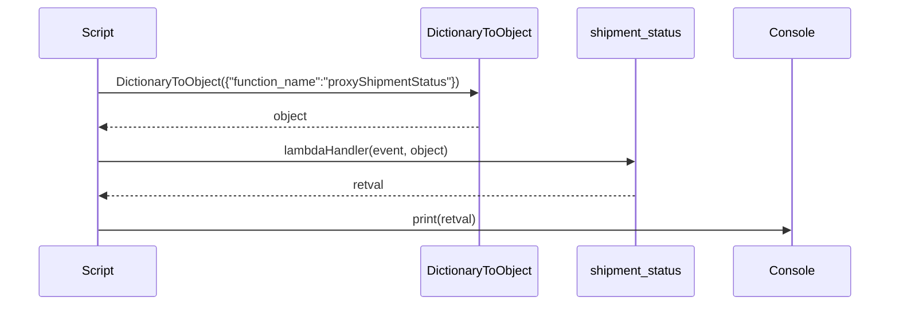
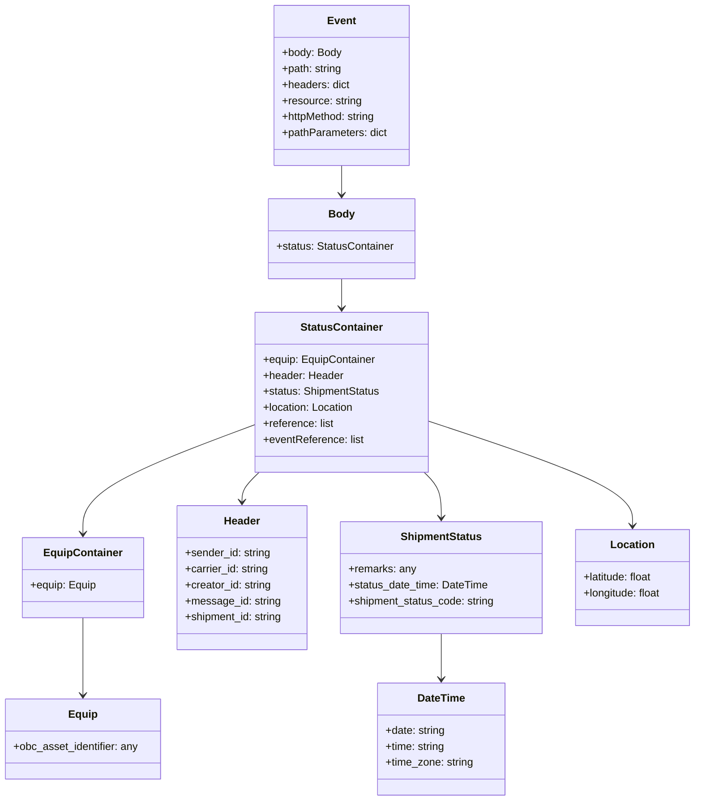

# Diagram: platform/tools/ide_local_testing/localTest/test/byEvent/proxyShipmentStatus.py


> Auto-generated by Obscura crawlers

## Diagram 1

```mermaid
flowchart TB
    Script[Python script] -->|imports| Dictionary[localTest.core.DictionaryToObject]
    Script -->|imports| ShipmentStatus[shipment_service.proxy_endpoints.proxy_endpoints.shipment_status (lambdaHandler)]
    Script -->|constructs| Event[event dict]
    Event -->|passed as first arg| ShipmentStatus
    Dictionary -->|obj (second arg)| ShipmentStatus
    ShipmentStatus -->|returns| Retval[retval]
    Script -->|prints| Retval
```

> SVG rendering failed for this diagram.

## Diagram 2



### SVG

<svg id="container" width="1177" xmlns="http://www.w3.org/2000/svg" height="411" viewBox="-50 -10 1177 411" role="graphics-document document" aria-roledescription="sequence"><g><rect x="927" y="325" fill="#eaeaea" stroke="#666" width="150" height="65" name="Console" rx="3" ry="3" class="actor actor-bottom"></rect><text x="1002" y="357.5" dominant-baseline="central" alignment-baseline="central" class="actor actor-box" style="text-anchor: middle; font-size: 16px; font-weight: 400;"><tspan x="1002" dy="0">Console</tspan></text></g><g><rect x="727" y="325" fill="#eaeaea" stroke="#666" width="150" height="65" name="Lambda" rx="3" ry="3" class="actor actor-bottom"></rect><text x="802" y="357.5" dominant-baseline="central" alignment-baseline="central" class="actor actor-box" style="text-anchor: middle; font-size: 16px; font-weight: 400;"><tspan x="802" dy="0">shipment_status</tspan></text></g><g><rect x="519" y="325" fill="#eaeaea" stroke="#666" width="158" height="65" name="Dict" rx="3" ry="3" class="actor actor-bottom"></rect><text x="598" y="357.5" dominant-baseline="central" alignment-baseline="central" class="actor actor-box" style="text-anchor: middle; font-size: 16px; font-weight: 400;"><tspan x="598" dy="0">DictionaryToObject</tspan></text></g><g><rect x="0" y="325" fill="#eaeaea" stroke="#666" width="150" height="65" name="Script" rx="3" ry="3" class="actor actor-bottom"></rect><text x="75" y="357.5" dominant-baseline="central" alignment-baseline="central" class="actor actor-box" style="text-anchor: middle; font-size: 16px; font-weight: 400;"><tspan x="75" dy="0">Script</tspan></text></g><g><line id="actor3" x1="1002" y1="65" x2="1002" y2="325" class="actor-line 200" stroke-width="0.5px" stroke="#999" name="Console"></line><g id="root-3"><rect x="927" y="0" fill="#eaeaea" stroke="#666" width="150" height="65" name="Console" rx="3" ry="3" class="actor actor-top"></rect><text x="1002" y="32.5" dominant-baseline="central" alignment-baseline="central" class="actor actor-box" style="text-anchor: middle; font-size: 16px; font-weight: 400;"><tspan x="1002" dy="0">Console</tspan></text></g></g><g><line id="actor2" x1="802" y1="65" x2="802" y2="325" class="actor-line 200" stroke-width="0.5px" stroke="#999" name="Lambda"></line><g id="root-2"><rect x="727" y="0" fill="#eaeaea" stroke="#666" width="150" height="65" name="Lambda" rx="3" ry="3" class="actor actor-top"></rect><text x="802" y="32.5" dominant-baseline="central" alignment-baseline="central" class="actor actor-box" style="text-anchor: middle; font-size: 16px; font-weight: 400;"><tspan x="802" dy="0">shipment_status</tspan></text></g></g><g><line id="actor1" x1="598" y1="65" x2="598" y2="325" class="actor-line 200" stroke-width="0.5px" stroke="#999" name="Dict"></line><g id="root-1"><rect x="519" y="0" fill="#eaeaea" stroke="#666" width="158" height="65" name="Dict" rx="3" ry="3" class="actor actor-top"></rect><text x="598" y="32.5" dominant-baseline="central" alignment-baseline="central" class="actor actor-box" style="text-anchor: middle; font-size: 16px; font-weight: 400;"><tspan x="598" dy="0">DictionaryToObject</tspan></text></g></g><g><line id="actor0" x1="75" y1="65" x2="75" y2="325" class="actor-line 200" stroke-width="0.5px" stroke="#999" name="Script"></line><g id="root-0"><rect x="0" y="0" fill="#eaeaea" stroke="#666" width="150" height="65" name="Script" rx="3" ry="3" class="actor actor-top"></rect><text x="75" y="32.5" dominant-baseline="central" alignment-baseline="central" class="actor actor-box" style="text-anchor: middle; font-size: 16px; font-weight: 400;"><tspan x="75" dy="0">Script</tspan></text></g></g><style>#container{font-family:"trebuchet ms",verdana,arial,sans-serif;font-size:16px;fill:#333;}@keyframes edge-animation-frame{from{stroke-dashoffset:0;}}@keyframes dash{to{stroke-dashoffset:0;}}#container .edge-animation-slow{stroke-dasharray:9,5!important;stroke-dashoffset:900;animation:dash 50s linear infinite;stroke-linecap:round;}#container .edge-animation-fast{stroke-dasharray:9,5!important;stroke-dashoffset:900;animation:dash 20s linear infinite;stroke-linecap:round;}#container .error-icon{fill:#552222;}#container .error-text{fill:#552222;stroke:#552222;}#container .edge-thickness-normal{stroke-width:1px;}#container .edge-thickness-thick{stroke-width:3.5px;}#container .edge-pattern-solid{stroke-dasharray:0;}#container .edge-thickness-invisible{stroke-width:0;fill:none;}#container .edge-pattern-dashed{stroke-dasharray:3;}#container .edge-pattern-dotted{stroke-dasharray:2;}#container .marker{fill:#333333;stroke:#333333;}#container .marker.cross{stroke:#333333;}#container svg{font-family:"trebuchet ms",verdana,arial,sans-serif;font-size:16px;}#container p{margin:0;}#container .actor{stroke:hsl(259.6261682243, 59.7765363128%, 87.9019607843%);fill:#ECECFF;}#container text.actor&gt;tspan{fill:black;stroke:none;}#container .actor-line{stroke:hsl(259.6261682243, 59.7765363128%, 87.9019607843%);}#container .innerArc{stroke-width:1.5;stroke-dasharray:none;}#container .messageLine0{stroke-width:1.5;stroke-dasharray:none;stroke:#333;}#container .messageLine1{stroke-width:1.5;stroke-dasharray:2,2;stroke:#333;}#container #arrowhead path{fill:#333;stroke:#333;}#container .sequenceNumber{fill:white;}#container #sequencenumber{fill:#333;}#container #crosshead path{fill:#333;stroke:#333;}#container .messageText{fill:#333;stroke:none;}#container .labelBox{stroke:hsl(259.6261682243, 59.7765363128%, 87.9019607843%);fill:#ECECFF;}#container .labelText,#container .labelText&gt;tspan{fill:black;stroke:none;}#container .loopText,#container .loopText&gt;tspan{fill:black;stroke:none;}#container .loopLine{stroke-width:2px;stroke-dasharray:2,2;stroke:hsl(259.6261682243, 59.7765363128%, 87.9019607843%);fill:hsl(259.6261682243, 59.7765363128%, 87.9019607843%);}#container .note{stroke:#aaaa33;fill:#fff5ad;}#container .noteText,#container .noteText&gt;tspan{fill:black;stroke:none;}#container .activation0{fill:#f4f4f4;stroke:#666;}#container .activation1{fill:#f4f4f4;stroke:#666;}#container .activation2{fill:#f4f4f4;stroke:#666;}#container .actorPopupMenu{position:absolute;}#container .actorPopupMenuPanel{position:absolute;fill:#ECECFF;box-shadow:0px 8px 16px 0px rgba(0,0,0,0.2);filter:drop-shadow(3px 5px 2px rgb(0 0 0 / 0.4));}#container .actor-man line{stroke:hsl(259.6261682243, 59.7765363128%, 87.9019607843%);fill:#ECECFF;}#container .actor-man circle,#container line{stroke:hsl(259.6261682243, 59.7765363128%, 87.9019607843%);fill:#ECECFF;stroke-width:2px;}#container :root{--mermaid-font-family:"trebuchet ms",verdana,arial,sans-serif;}</style><g></g><defs><symbol id="computer" width="24" height="24"><path transform="scale(.5)" d="M2 2v13h20v-13h-20zm18 11h-16v-9h16v9zm-10.228 6l.466-1h3.524l.467 1h-4.457zm14.228 3h-24l2-6h2.104l-1.33 4h18.45l-1.297-4h2.073l2 6zm-5-10h-14v-7h14v7z"></path></symbol></defs><defs><symbol id="database" fill-rule="evenodd" clip-rule="evenodd"><path transform="scale(.5)" d="M12.258.001l.256.004.255.005.253.008.251.01.249.012.247.015.246.016.242.019.241.02.239.023.236.024.233.027.231.028.229.031.225.032.223.034.22.036.217.038.214.04.211.041.208.043.205.045.201.046.198.048.194.05.191.051.187.053.183.054.18.056.175.057.172.059.168.06.163.061.16.063.155.064.15.066.074.033.073.033.071.034.07.034.069.035.068.035.067.035.066.035.064.036.064.036.062.036.06.036.06.037.058.037.058.037.055.038.055.038.053.038.052.038.051.039.05.039.048.039.047.039.045.04.044.04.043.04.041.04.04.041.039.041.037.041.036.041.034.041.033.042.032.042.03.042.029.042.027.042.026.043.024.043.023.043.021.043.02.043.018.044.017.043.015.044.013.044.012.044.011.045.009.044.007.045.006.045.004.045.002.045.001.045v17l-.001.045-.002.045-.004.045-.006.045-.007.045-.009.044-.011.045-.012.044-.013.044-.015.044-.017.043-.018.044-.02.043-.021.043-.023.043-.024.043-.026.043-.027.042-.029.042-.03.042-.032.042-.033.042-.034.041-.036.041-.037.041-.039.041-.04.041-.041.04-.043.04-.044.04-.045.04-.047.039-.048.039-.05.039-.051.039-.052.038-.053.038-.055.038-.055.038-.058.037-.058.037-.06.037-.06.036-.062.036-.064.036-.064.036-.066.035-.067.035-.068.035-.069.035-.07.034-.071.034-.073.033-.074.033-.15.066-.155.064-.16.063-.163.061-.168.06-.172.059-.175.057-.18.056-.183.054-.187.053-.191.051-.194.05-.198.048-.201.046-.205.045-.208.043-.211.041-.214.04-.217.038-.22.036-.223.034-.225.032-.229.031-.231.028-.233.027-.236.024-.239.023-.241.02-.242.019-.246.016-.247.015-.249.012-.251.01-.253.008-.255.005-.256.004-.258.001-.258-.001-.256-.004-.255-.005-.253-.008-.251-.01-.249-.012-.247-.015-.245-.016-.243-.019-.241-.02-.238-.023-.236-.024-.234-.027-.231-.028-.228-.031-.226-.032-.223-.034-.22-.036-.217-.038-.214-.04-.211-.041-.208-.043-.204-.045-.201-.046-.198-.048-.195-.05-.19-.051-.187-.053-.184-.054-.179-.056-.176-.057-.172-.059-.167-.06-.164-.061-.159-.063-.155-.064-.151-.066-.074-.033-.072-.033-.072-.034-.07-.034-.069-.035-.068-.035-.067-.035-.066-.035-.064-.036-.063-.036-.062-.036-.061-.036-.06-.037-.058-.037-.057-.037-.056-.038-.055-.038-.053-.038-.052-.038-.051-.039-.049-.039-.049-.039-.046-.039-.046-.04-.044-.04-.043-.04-.041-.04-.04-.041-.039-.041-.037-.041-.036-.041-.034-.041-.033-.042-.032-.042-.03-.042-.029-.042-.027-.042-.026-.043-.024-.043-.023-.043-.021-.043-.02-.043-.018-.044-.017-.043-.015-.044-.013-.044-.012-.044-.011-.045-.009-.044-.007-.045-.006-.045-.004-.045-.002-.045-.001-.045v-17l.001-.045.002-.045.004-.045.006-.045.007-.045.009-.044.011-.045.012-.044.013-.044.015-.044.017-.043.018-.044.02-.043.021-.043.023-.043.024-.043.026-.043.027-.042.029-.042.03-.042.032-.042.033-.042.034-.041.036-.041.037-.041.039-.041.04-.041.041-.04.043-.04.044-.04.046-.04.046-.039.049-.039.049-.039.051-.039.052-.038.053-.038.055-.038.056-.038.057-.037.058-.037.06-.037.061-.036.062-.036.063-.036.064-.036.066-.035.067-.035.068-.035.069-.035.07-.034.072-.034.072-.033.074-.033.151-.066.155-.064.159-.063.164-.061.167-.06.172-.059.176-.057.179-.056.184-.054.187-.053.19-.051.195-.05.198-.048.201-.046.204-.045.208-.043.211-.041.214-.04.217-.038.22-.036.223-.034.226-.032.228-.031.231-.028.234-.027.236-.024.238-.023.241-.02.243-.019.245-.016.247-.015.249-.012.251-.01.253-.008.255-.005.256-.004.258-.001.258.001zm-9.258 20.499v.01l.001.021.003.021.004.022.005.021.006.022.007.022.009.023.01.022.011.023.012.023.013.023.015.023.016.024.017.023.018.024.019.024.021.024.022.025.023.024.024.025.052.049.056.05.061.051.066.051.07.051.075.051.079.052.084.052.088.052.092.052.097.052.102.051.105.052.11.052.114.051.119.051.123.051.127.05.131.05.135.05.139.048.144.049.147.047.152.047.155.047.16.045.163.045.167.043.171.043.176.041.178.041.183.039.187.039.19.037.194.035.197.035.202.033.204.031.209.03.212.029.216.027.219.025.222.024.226.021.23.02.233.018.236.016.24.015.243.012.246.01.249.008.253.005.256.004.259.001.26-.001.257-.004.254-.005.25-.008.247-.011.244-.012.241-.014.237-.016.233-.018.231-.021.226-.021.224-.024.22-.026.216-.027.212-.028.21-.031.205-.031.202-.034.198-.034.194-.036.191-.037.187-.039.183-.04.179-.04.175-.042.172-.043.168-.044.163-.045.16-.046.155-.046.152-.047.148-.048.143-.049.139-.049.136-.05.131-.05.126-.05.123-.051.118-.052.114-.051.11-.052.106-.052.101-.052.096-.052.092-.052.088-.053.083-.051.079-.052.074-.052.07-.051.065-.051.06-.051.056-.05.051-.05.023-.024.023-.025.021-.024.02-.024.019-.024.018-.024.017-.024.015-.023.014-.024.013-.023.012-.023.01-.023.01-.022.008-.022.006-.022.006-.022.004-.022.004-.021.001-.021.001-.021v-4.127l-.077.055-.08.053-.083.054-.085.053-.087.052-.09.052-.093.051-.095.05-.097.05-.1.049-.102.049-.105.048-.106.047-.109.047-.111.046-.114.045-.115.045-.118.044-.12.043-.122.042-.124.042-.126.041-.128.04-.13.04-.132.038-.134.038-.135.037-.138.037-.139.035-.142.035-.143.034-.144.033-.147.032-.148.031-.15.03-.151.03-.153.029-.154.027-.156.027-.158.026-.159.025-.161.024-.162.023-.163.022-.165.021-.166.02-.167.019-.169.018-.169.017-.171.016-.173.015-.173.014-.175.013-.175.012-.177.011-.178.01-.179.008-.179.008-.181.006-.182.005-.182.004-.184.003-.184.002h-.37l-.184-.002-.184-.003-.182-.004-.182-.005-.181-.006-.179-.008-.179-.008-.178-.01-.176-.011-.176-.012-.175-.013-.173-.014-.172-.015-.171-.016-.17-.017-.169-.018-.167-.019-.166-.02-.165-.021-.163-.022-.162-.023-.161-.024-.159-.025-.157-.026-.156-.027-.155-.027-.153-.029-.151-.03-.15-.03-.148-.031-.146-.032-.145-.033-.143-.034-.141-.035-.14-.035-.137-.037-.136-.037-.134-.038-.132-.038-.13-.04-.128-.04-.126-.041-.124-.042-.122-.042-.12-.044-.117-.043-.116-.045-.113-.045-.112-.046-.109-.047-.106-.047-.105-.048-.102-.049-.1-.049-.097-.05-.095-.05-.093-.052-.09-.051-.087-.052-.085-.053-.083-.054-.08-.054-.077-.054v4.127zm0-5.654v.011l.001.021.003.021.004.021.005.022.006.022.007.022.009.022.01.022.011.023.012.023.013.023.015.024.016.023.017.024.018.024.019.024.021.024.022.024.023.025.024.024.052.05.056.05.061.05.066.051.07.051.075.052.079.051.084.052.088.052.092.052.097.052.102.052.105.052.11.051.114.051.119.052.123.05.127.051.131.05.135.049.139.049.144.048.147.048.152.047.155.046.16.045.163.045.167.044.171.042.176.042.178.04.183.04.187.038.19.037.194.036.197.034.202.033.204.032.209.03.212.028.216.027.219.025.222.024.226.022.23.02.233.018.236.016.24.014.243.012.246.01.249.008.253.006.256.003.259.001.26-.001.257-.003.254-.006.25-.008.247-.01.244-.012.241-.015.237-.016.233-.018.231-.02.226-.022.224-.024.22-.025.216-.027.212-.029.21-.03.205-.032.202-.033.198-.035.194-.036.191-.037.187-.039.183-.039.179-.041.175-.042.172-.043.168-.044.163-.045.16-.045.155-.047.152-.047.148-.048.143-.048.139-.05.136-.049.131-.05.126-.051.123-.051.118-.051.114-.052.11-.052.106-.052.101-.052.096-.052.092-.052.088-.052.083-.052.079-.052.074-.051.07-.052.065-.051.06-.05.056-.051.051-.049.023-.025.023-.024.021-.025.02-.024.019-.024.018-.024.017-.024.015-.023.014-.023.013-.024.012-.022.01-.023.01-.023.008-.022.006-.022.006-.022.004-.021.004-.022.001-.021.001-.021v-4.139l-.077.054-.08.054-.083.054-.085.052-.087.053-.09.051-.093.051-.095.051-.097.05-.1.049-.102.049-.105.048-.106.047-.109.047-.111.046-.114.045-.115.044-.118.044-.12.044-.122.042-.124.042-.126.041-.128.04-.13.039-.132.039-.134.038-.135.037-.138.036-.139.036-.142.035-.143.033-.144.033-.147.033-.148.031-.15.03-.151.03-.153.028-.154.028-.156.027-.158.026-.159.025-.161.024-.162.023-.163.022-.165.021-.166.02-.167.019-.169.018-.169.017-.171.016-.173.015-.173.014-.175.013-.175.012-.177.011-.178.009-.179.009-.179.007-.181.007-.182.005-.182.004-.184.003-.184.002h-.37l-.184-.002-.184-.003-.182-.004-.182-.005-.181-.007-.179-.007-.179-.009-.178-.009-.176-.011-.176-.012-.175-.013-.173-.014-.172-.015-.171-.016-.17-.017-.169-.018-.167-.019-.166-.02-.165-.021-.163-.022-.162-.023-.161-.024-.159-.025-.157-.026-.156-.027-.155-.028-.153-.028-.151-.03-.15-.03-.148-.031-.146-.033-.145-.033-.143-.033-.141-.035-.14-.036-.137-.036-.136-.037-.134-.038-.132-.039-.13-.039-.128-.04-.126-.041-.124-.042-.122-.043-.12-.043-.117-.044-.116-.044-.113-.046-.112-.046-.109-.046-.106-.047-.105-.048-.102-.049-.1-.049-.097-.05-.095-.051-.093-.051-.09-.051-.087-.053-.085-.052-.083-.054-.08-.054-.077-.054v4.139zm0-5.666v.011l.001.02.003.022.004.021.005.022.006.021.007.022.009.023.01.022.011.023.012.023.013.023.015.023.016.024.017.024.018.023.019.024.021.025.022.024.023.024.024.025.052.05.056.05.061.05.066.051.07.051.075.052.079.051.084.052.088.052.092.052.097.052.102.052.105.051.11.052.114.051.119.051.123.051.127.05.131.05.135.05.139.049.144.048.147.048.152.047.155.046.16.045.163.045.167.043.171.043.176.042.178.04.183.04.187.038.19.037.194.036.197.034.202.033.204.032.209.03.212.028.216.027.219.025.222.024.226.021.23.02.233.018.236.017.24.014.243.012.246.01.249.008.253.006.256.003.259.001.26-.001.257-.003.254-.006.25-.008.247-.01.244-.013.241-.014.237-.016.233-.018.231-.02.226-.022.224-.024.22-.025.216-.027.212-.029.21-.03.205-.032.202-.033.198-.035.194-.036.191-.037.187-.039.183-.039.179-.041.175-.042.172-.043.168-.044.163-.045.16-.045.155-.047.152-.047.148-.048.143-.049.139-.049.136-.049.131-.051.126-.05.123-.051.118-.052.114-.051.11-.052.106-.052.101-.052.096-.052.092-.052.088-.052.083-.052.079-.052.074-.052.07-.051.065-.051.06-.051.056-.05.051-.049.023-.025.023-.025.021-.024.02-.024.019-.024.018-.024.017-.024.015-.023.014-.024.013-.023.012-.023.01-.022.01-.023.008-.022.006-.022.006-.022.004-.022.004-.021.001-.021.001-.021v-4.153l-.077.054-.08.054-.083.053-.085.053-.087.053-.09.051-.093.051-.095.051-.097.05-.1.049-.102.048-.105.048-.106.048-.109.046-.111.046-.114.046-.115.044-.118.044-.12.043-.122.043-.124.042-.126.041-.128.04-.13.039-.132.039-.134.038-.135.037-.138.036-.139.036-.142.034-.143.034-.144.033-.147.032-.148.032-.15.03-.151.03-.153.028-.154.028-.156.027-.158.026-.159.024-.161.024-.162.023-.163.023-.165.021-.166.02-.167.019-.169.018-.169.017-.171.016-.173.015-.173.014-.175.013-.175.012-.177.01-.178.01-.179.009-.179.007-.181.006-.182.006-.182.004-.184.003-.184.001-.185.001-.185-.001-.184-.001-.184-.003-.182-.004-.182-.006-.181-.006-.179-.007-.179-.009-.178-.01-.176-.01-.176-.012-.175-.013-.173-.014-.172-.015-.171-.016-.17-.017-.169-.018-.167-.019-.166-.02-.165-.021-.163-.023-.162-.023-.161-.024-.159-.024-.157-.026-.156-.027-.155-.028-.153-.028-.151-.03-.15-.03-.148-.032-.146-.032-.145-.033-.143-.034-.141-.034-.14-.036-.137-.036-.136-.037-.134-.038-.132-.039-.13-.039-.128-.041-.126-.041-.124-.041-.122-.043-.12-.043-.117-.044-.116-.044-.113-.046-.112-.046-.109-.046-.106-.048-.105-.048-.102-.048-.1-.05-.097-.049-.095-.051-.093-.051-.09-.052-.087-.052-.085-.053-.083-.053-.08-.054-.077-.054v4.153zm8.74-8.179l-.257.004-.254.005-.25.008-.247.011-.244.012-.241.014-.237.016-.233.018-.231.021-.226.022-.224.023-.22.026-.216.027-.212.028-.21.031-.205.032-.202.033-.198.034-.194.036-.191.038-.187.038-.183.04-.179.041-.175.042-.172.043-.168.043-.163.045-.16.046-.155.046-.152.048-.148.048-.143.048-.139.049-.136.05-.131.05-.126.051-.123.051-.118.051-.114.052-.11.052-.106.052-.101.052-.096.052-.092.052-.088.052-.083.052-.079.052-.074.051-.07.052-.065.051-.06.05-.056.05-.051.05-.023.025-.023.024-.021.024-.02.025-.019.024-.018.024-.017.023-.015.024-.014.023-.013.023-.012.023-.01.023-.01.022-.008.022-.006.023-.006.021-.004.022-.004.021-.001.021-.001.021.001.021.001.021.004.021.004.022.006.021.006.023.008.022.01.022.01.023.012.023.013.023.014.023.015.024.017.023.018.024.019.024.02.025.021.024.023.024.023.025.051.05.056.05.06.05.065.051.07.052.074.051.079.052.083.052.088.052.092.052.096.052.101.052.106.052.11.052.114.052.118.051.123.051.126.051.131.05.136.05.139.049.143.048.148.048.152.048.155.046.16.046.163.045.168.043.172.043.175.042.179.041.183.04.187.038.191.038.194.036.198.034.202.033.205.032.21.031.212.028.216.027.22.026.224.023.226.022.231.021.233.018.237.016.241.014.244.012.247.011.25.008.254.005.257.004.26.001.26-.001.257-.004.254-.005.25-.008.247-.011.244-.012.241-.014.237-.016.233-.018.231-.021.226-.022.224-.023.22-.026.216-.027.212-.028.21-.031.205-.032.202-.033.198-.034.194-.036.191-.038.187-.038.183-.04.179-.041.175-.042.172-.043.168-.043.163-.045.16-.046.155-.046.152-.048.148-.048.143-.048.139-.049.136-.05.131-.05.126-.051.123-.051.118-.051.114-.052.11-.052.106-.052.101-.052.096-.052.092-.052.088-.052.083-.052.079-.052.074-.051.07-.052.065-.051.06-.05.056-.05.051-.05.023-.025.023-.024.021-.024.02-.025.019-.024.018-.024.017-.023.015-.024.014-.023.013-.023.012-.023.01-.023.01-.022.008-.022.006-.023.006-.021.004-.022.004-.021.001-.021.001-.021-.001-.021-.001-.021-.004-.021-.004-.022-.006-.021-.006-.023-.008-.022-.01-.022-.01-.023-.012-.023-.013-.023-.014-.023-.015-.024-.017-.023-.018-.024-.019-.024-.02-.025-.021-.024-.023-.024-.023-.025-.051-.05-.056-.05-.06-.05-.065-.051-.07-.052-.074-.051-.079-.052-.083-.052-.088-.052-.092-.052-.096-.052-.101-.052-.106-.052-.11-.052-.114-.052-.118-.051-.123-.051-.126-.051-.131-.05-.136-.05-.139-.049-.143-.048-.148-.048-.152-.048-.155-.046-.16-.046-.163-.045-.168-.043-.172-.043-.175-.042-.179-.041-.183-.04-.187-.038-.191-.038-.194-.036-.198-.034-.202-.033-.205-.032-.21-.031-.212-.028-.216-.027-.22-.026-.224-.023-.226-.022-.231-.021-.233-.018-.237-.016-.241-.014-.244-.012-.247-.011-.25-.008-.254-.005-.257-.004-.26-.001-.26.001z"></path></symbol></defs><defs><symbol id="clock" width="24" height="24"><path transform="scale(.5)" d="M12 2c5.514 0 10 4.486 10 10s-4.486 10-10 10-10-4.486-10-10 4.486-10 10-10zm0-2c-6.627 0-12 5.373-12 12s5.373 12 12 12 12-5.373 12-12-5.373-12-12-12zm5.848 12.459c.202.038.202.333.001.372-1.907.361-6.045 1.111-6.547 1.111-.719 0-1.301-.582-1.301-1.301 0-.512.77-5.447 1.125-7.445.034-.192.312-.181.343.014l.985 6.238 5.394 1.011z"></path></symbol></defs><defs><marker id="arrowhead" refX="7.9" refY="5" markerUnits="userSpaceOnUse" markerWidth="12" markerHeight="12" orient="auto-start-reverse"><path d="M -1 0 L 10 5 L 0 10 z"></path></marker></defs><defs><marker id="crosshead" markerWidth="15" markerHeight="8" orient="auto" refX="4" refY="4.5"><path fill="none" stroke="#000000" stroke-width="1pt" d="M 1,2 L 6,7 M 6,2 L 1,7" style="stroke-dasharray: 0, 0;"></path></marker></defs><defs><marker id="filled-head" refX="15.5" refY="7" markerWidth="20" markerHeight="28" orient="auto"><path d="M 18,7 L9,13 L14,7 L9,1 Z"></path></marker></defs><defs><marker id="sequencenumber" refX="15" refY="15" markerWidth="60" markerHeight="40" orient="auto"><circle cx="15" cy="15" r="6"></circle></marker></defs><text x="335" y="80" text-anchor="middle" dominant-baseline="middle" alignment-baseline="middle" class="messageText" dy="1em" style="font-size: 16px; font-weight: 400;">DictionaryToObject({"function_name":"proxyShipmentStatus"})</text><line x1="76" y1="113" x2="594" y2="113" class="messageLine0" stroke-width="2" stroke="none" marker-end="url(#arrowhead)" style="fill: none;"></line><text x="338" y="128" text-anchor="middle" dominant-baseline="middle" alignment-baseline="middle" class="messageText" dy="1em" style="font-size: 16px; font-weight: 400;">object</text><line x1="597" y1="161" x2="79" y2="161" class="messageLine1" stroke-width="2" stroke="none" marker-end="url(#arrowhead)" style="stroke-dasharray: 3, 3; fill: none;"></line><text x="437" y="176" text-anchor="middle" dominant-baseline="middle" alignment-baseline="middle" class="messageText" dy="1em" style="font-size: 16px; font-weight: 400;">lambdaHandler(event, object)</text><line x1="76" y1="209" x2="798" y2="209" class="messageLine0" stroke-width="2" stroke="none" marker-end="url(#arrowhead)" style="fill: none;"></line><text x="440" y="224" text-anchor="middle" dominant-baseline="middle" alignment-baseline="middle" class="messageText" dy="1em" style="font-size: 16px; font-weight: 400;">retval</text><line x1="801" y1="257" x2="79" y2="257" class="messageLine1" stroke-width="2" stroke="none" marker-end="url(#arrowhead)" style="stroke-dasharray: 3, 3; fill: none;"></line><text x="537" y="272" text-anchor="middle" dominant-baseline="middle" alignment-baseline="middle" class="messageText" dy="1em" style="font-size: 16px; font-weight: 400;">print(retval)</text><line x1="76" y1="305" x2="998" y2="305" class="messageLine0" stroke-width="2" stroke="none" marker-end="url(#arrowhead)" style="fill: none;"></line></svg>

## Diagram 3



### SVG

<svg id="container" width="1049.44140625" xmlns="http://www.w3.org/2000/svg" class="classDiagram" height="1200" viewBox="0 0 1049.44140625 1200" role="graphics-document document" aria-roledescription="class"><style>#container{font-family:"trebuchet ms",verdana,arial,sans-serif;font-size:16px;fill:#333;}@keyframes edge-animation-frame{from{stroke-dashoffset:0;}}@keyframes dash{to{stroke-dashoffset:0;}}#container .edge-animation-slow{stroke-dasharray:9,5!important;stroke-dashoffset:900;animation:dash 50s linear infinite;stroke-linecap:round;}#container .edge-animation-fast{stroke-dasharray:9,5!important;stroke-dashoffset:900;animation:dash 20s linear infinite;stroke-linecap:round;}#container .error-icon{fill:#552222;}#container .error-text{fill:#552222;stroke:#552222;}#container .edge-thickness-normal{stroke-width:1px;}#container .edge-thickness-thick{stroke-width:3.5px;}#container .edge-pattern-solid{stroke-dasharray:0;}#container .edge-thickness-invisible{stroke-width:0;fill:none;}#container .edge-pattern-dashed{stroke-dasharray:3;}#container .edge-pattern-dotted{stroke-dasharray:2;}#container .marker{fill:#333333;stroke:#333333;}#container .marker.cross{stroke:#333333;}#container svg{font-family:"trebuchet ms",verdana,arial,sans-serif;font-size:16px;}#container p{margin:0;}#container g.classGroup text{fill:#9370DB;stroke:none;font-family:"trebuchet ms",verdana,arial,sans-serif;font-size:10px;}#container g.classGroup text .title{font-weight:bolder;}#container .nodeLabel,#container .edgeLabel{color:#131300;}#container .edgeLabel .label rect{fill:#ECECFF;}#container .label text{fill:#131300;}#container .labelBkg{background:#ECECFF;}#container .edgeLabel .label span{background:#ECECFF;}#container .classTitle{font-weight:bolder;}#container .node rect,#container .node circle,#container .node ellipse,#container .node polygon,#container .node path{fill:#ECECFF;stroke:#9370DB;stroke-width:1px;}#container .divider{stroke:#9370DB;stroke-width:1;}#container g.clickable{cursor:pointer;}#container g.classGroup rect{fill:#ECECFF;stroke:#9370DB;}#container g.classGroup line{stroke:#9370DB;stroke-width:1;}#container .classLabel .box{stroke:none;stroke-width:0;fill:#ECECFF;opacity:0.5;}#container .classLabel .label{fill:#9370DB;font-size:10px;}#container .relation{stroke:#333333;stroke-width:1;fill:none;}#container .dashed-line{stroke-dasharray:3;}#container .dotted-line{stroke-dasharray:1 2;}#container #compositionStart,#container .composition{fill:#333333!important;stroke:#333333!important;stroke-width:1;}#container #compositionEnd,#container .composition{fill:#333333!important;stroke:#333333!important;stroke-width:1;}#container #dependencyStart,#container .dependency{fill:#333333!important;stroke:#333333!important;stroke-width:1;}#container #dependencyStart,#container .dependency{fill:#333333!important;stroke:#333333!important;stroke-width:1;}#container #extensionStart,#container .extension{fill:transparent!important;stroke:#333333!important;stroke-width:1;}#container #extensionEnd,#container .extension{fill:transparent!important;stroke:#333333!important;stroke-width:1;}#container #aggregationStart,#container .aggregation{fill:transparent!important;stroke:#333333!important;stroke-width:1;}#container #aggregationEnd,#container .aggregation{fill:transparent!important;stroke:#333333!important;stroke-width:1;}#container #lollipopStart,#container .lollipop{fill:#ECECFF!important;stroke:#333333!important;stroke-width:1;}#container #lollipopEnd,#container .lollipop{fill:#ECECFF!important;stroke:#333333!important;stroke-width:1;}#container .edgeTerminals{font-size:11px;line-height:initial;}#container .classTitleText{text-anchor:middle;font-size:18px;fill:#333;}#container .label-icon{display:inline-block;height:1em;overflow:visible;vertical-align:-0.125em;}#container .node .label-icon path{fill:currentColor;stroke:revert;stroke-width:revert;}#container :root{--mermaid-font-family:"trebuchet ms",verdana,arial,sans-serif;}</style><g><defs><marker id="container_class-aggregationStart" class="marker aggregation class" refX="18" refY="7" markerWidth="190" markerHeight="240" orient="auto"><path d="M 18,7 L9,13 L1,7 L9,1 Z"></path></marker></defs><defs><marker id="container_class-aggregationEnd" class="marker aggregation class" refX="1" refY="7" markerWidth="20" markerHeight="28" orient="auto"><path d="M 18,7 L9,13 L1,7 L9,1 Z"></path></marker></defs><defs><marker id="container_class-extensionStart" class="marker extension class" refX="18" refY="7" markerWidth="190" markerHeight="240" orient="auto"><path d="M 1,7 L18,13 V 1 Z"></path></marker></defs><defs><marker id="container_class-extensionEnd" class="marker extension class" refX="1" refY="7" markerWidth="20" markerHeight="28" orient="auto"><path d="M 1,1 V 13 L18,7 Z"></path></marker></defs><defs><marker id="container_class-compositionStart" class="marker composition class" refX="18" refY="7" markerWidth="190" markerHeight="240" orient="auto"><path d="M 18,7 L9,13 L1,7 L9,1 Z"></path></marker></defs><defs><marker id="container_class-compositionEnd" class="marker composition class" refX="1" refY="7" markerWidth="20" markerHeight="28" orient="auto"><path d="M 18,7 L9,13 L1,7 L9,1 Z"></path></marker></defs><defs><marker id="container_class-dependencyStart" class="marker dependency class" refX="6" refY="7" markerWidth="190" markerHeight="240" orient="auto"><path d="M 5,7 L9,13 L1,7 L9,1 Z"></path></marker></defs><defs><marker id="container_class-dependencyEnd" class="marker dependency class" refX="13" refY="7" markerWidth="20" markerHeight="28" orient="auto"><path d="M 18,7 L9,13 L14,7 L9,1 Z"></path></marker></defs><defs><marker id="container_class-lollipopStart" class="marker lollipop class" refX="13" refY="7" markerWidth="190" markerHeight="240" orient="auto"><circle stroke="black" fill="transparent" cx="7" cy="7" r="6"></circle></marker></defs><defs><marker id="container_class-lollipopEnd" class="marker lollipop class" refX="1" refY="7" markerWidth="190" markerHeight="240" orient="auto"><circle stroke="black" fill="transparent" cx="7" cy="7" r="6"></circle></marker></defs><g class="root"><g class="clusters"></g><g class="edgePaths"><path d="M514.602,248L514.602,252.167C514.602,256.333,514.602,264.667,514.602,272C514.602,279.333,514.602,285.667,514.602,288.833L514.602,292" id="id_Event_Body_1" class="edge-thickness-normal edge-pattern-solid relation" style=";;;" data-edge="true" data-et="edge" data-id="id_Event_Body_1" data-points="W3sieCI6NTE0LjYwMTU2MjUsInkiOjI0OH0seyJ4Ijo1MTQuNjAxNTYyNSwieSI6MjczfSx7IngiOjUxNC42MDE1NjI1LCJ5IjoyOTh9XQ==" marker-end="url(#container_class-dependencyEnd)"></path><path d="M514.602,418L514.602,422.167C514.602,426.333,514.602,434.667,514.602,442C514.602,449.333,514.602,455.667,514.602,458.833L514.602,462" id="id_Body_StatusContainer_2" class="edge-thickness-normal edge-pattern-solid relation" style=";;;" data-edge="true" data-et="edge" data-id="id_Body_StatusContainer_2" data-points="W3sieCI6NTE0LjYwMTU2MjUsInkiOjQxOH0seyJ4Ijo1MTQuNjAxNTYyNSwieSI6NDQzfSx7IngiOjUxNC42MDE1NjI1LCJ5Ijo0Njh9XQ==" marker-end="url(#container_class-dependencyEnd)"></path><path d="M385.152,636.161L341.771,652.301C298.389,668.441,211.626,700.72,168.245,728.027C124.863,755.333,124.863,777.667,124.863,788.833L124.863,800" id="id_StatusContainer_EquipContainer_3" class="edge-thickness-normal edge-pattern-solid relation" style=";;;" data-edge="true" data-et="edge" data-id="id_StatusContainer_EquipContainer_3" data-points="W3sieCI6Mzg1LjE1MjM0Mzc1LCJ5Ijo2MzYuMTYwODc1MTg2NjczN30seyJ4IjoxMjQuODYzMjgxMjUsInkiOjczM30seyJ4IjoxMjQuODYzMjgxMjUsInkiOjgwNn1d" marker-end="url(#container_class-dependencyEnd)"></path><path d="M124.863,926L124.863,938.167C124.863,950.333,124.863,974.667,124.863,994C124.863,1013.333,124.863,1027.667,124.863,1034.833L124.863,1042" id="id_EquipContainer_Equip_4" class="edge-thickness-normal edge-pattern-solid relation" style=";;;" data-edge="true" data-et="edge" data-id="id_EquipContainer_Equip_4" data-points="W3sieCI6MTI0Ljg2MzI4MTI1LCJ5Ijo5MjZ9LHsieCI6MTI0Ljg2MzI4MTI1LCJ5Ijo5OTl9LHsieCI6MTI0Ljg2MzI4MTI1LCJ5IjoxMDQ4fV0=" marker-end="url(#container_class-dependencyEnd)"></path><path d="M389.817,708L385.484,712.167C381.151,716.333,372.486,724.667,368.153,732C363.82,739.333,363.82,745.667,363.82,748.833L363.82,752" id="id_StatusContainer_Header_5" class="edge-thickness-normal edge-pattern-solid relation" style=";;;" data-edge="true" data-et="edge" data-id="id_StatusContainer_Header_5" data-points="W3sieCI6Mzg5LjgxNzA3OTc0MTM3OTMsInkiOjcwOH0seyJ4IjozNjMuODIwMzEyNSwieSI6NzMzfSx7IngiOjM2My44MjAzMTI1LCJ5Ijo3NTh9XQ==" marker-end="url(#container_class-dependencyEnd)"></path><path d="M639.386,708L643.719,712.167C648.052,716.333,656.717,724.667,661.05,736C665.383,747.333,665.383,761.667,665.383,768.833L665.383,776" id="id_StatusContainer_ShipmentStatus_6" class="edge-thickness-normal edge-pattern-solid relation" style=";;;" data-edge="true" data-et="edge" data-id="id_StatusContainer_ShipmentStatus_6" data-points="W3sieCI6NjM5LjM4NjA0NTI1ODYyMDcsInkiOjcwOH0seyJ4Ijo2NjUuMzgyODEyNSwieSI6NzMzfSx7IngiOjY2NS4zODI4MTI1LCJ5Ijo3ODJ9XQ==" marker-end="url(#container_class-dependencyEnd)"></path><path d="M665.383,950L665.383,958.167C665.383,966.333,665.383,982.667,665.383,994C665.383,1005.333,665.383,1011.667,665.383,1014.833L665.383,1018" id="id_ShipmentStatus_DateTime_7" class="edge-thickness-normal edge-pattern-solid relation" style=";;;" data-edge="true" data-et="edge" data-id="id_ShipmentStatus_DateTime_7" data-points="W3sieCI6NjY1LjM4MjgxMjUsInkiOjk1MH0seyJ4Ijo2NjUuMzgyODEyNSwieSI6OTk5fSx7IngiOjY2NS4zODI4MTI1LCJ5IjoxMDI0fV0=" marker-end="url(#container_class-dependencyEnd)"></path><path d="M644.051,630.675L695.782,647.729C747.513,664.784,850.975,698.892,902.706,725.113C954.438,751.333,954.438,769.667,954.438,778.833L954.438,788" id="id_StatusContainer_Location_8" class="edge-thickness-normal edge-pattern-solid relation" style=";;;" data-edge="true" data-et="edge" data-id="id_StatusContainer_Location_8" data-points="W3sieCI6NjQ0LjA1MDc4MTI1LCJ5Ijo2MzAuNjc1MzEzOTQ4NzM4fSx7IngiOjk1NC40Mzc1LCJ5Ijo3MzN9LHsieCI6OTU0LjQzNzUsInkiOjc5NH1d" marker-end="url(#container_class-dependencyEnd)"></path></g><g class="edgeLabels"><g class="edgeLabel"><g class="label" data-id="id_Event_Body_1" transform="translate(0, 0)"><foreignObject width="0" height="0"><div xmlns="http://www.w3.org/1999/xhtml" class="labelBkg" style="display: table-cell; white-space: nowrap; line-height: 1.5; max-width: 200px; text-align: center;"><span class="edgeLabel"></span></div></foreignObject></g></g><g class="edgeLabel"><g class="label" data-id="id_Body_StatusContainer_2" transform="translate(0, 0)"><foreignObject width="0" height="0"><div xmlns="http://www.w3.org/1999/xhtml" class="labelBkg" style="display: table-cell; white-space: nowrap; line-height: 1.5; max-width: 200px; text-align: center;"><span class="edgeLabel"></span></div></foreignObject></g></g><g class="edgeLabel"><g class="label" data-id="id_StatusContainer_EquipContainer_3" transform="translate(0, 0)"><foreignObject width="0" height="0"><div xmlns="http://www.w3.org/1999/xhtml" class="labelBkg" style="display: table-cell; white-space: nowrap; line-height: 1.5; max-width: 200px; text-align: center;"><span class="edgeLabel"></span></div></foreignObject></g></g><g class="edgeLabel"><g class="label" data-id="id_EquipContainer_Equip_4" transform="translate(0, 0)"><foreignObject width="0" height="0"><div xmlns="http://www.w3.org/1999/xhtml" class="labelBkg" style="display: table-cell; white-space: nowrap; line-height: 1.5; max-width: 200px; text-align: center;"><span class="edgeLabel"></span></div></foreignObject></g></g><g class="edgeLabel"><g class="label" data-id="id_StatusContainer_Header_5" transform="translate(0, 0)"><foreignObject width="0" height="0"><div xmlns="http://www.w3.org/1999/xhtml" class="labelBkg" style="display: table-cell; white-space: nowrap; line-height: 1.5; max-width: 200px; text-align: center;"><span class="edgeLabel"></span></div></foreignObject></g></g><g class="edgeLabel"><g class="label" data-id="id_StatusContainer_ShipmentStatus_6" transform="translate(0, 0)"><foreignObject width="0" height="0"><div xmlns="http://www.w3.org/1999/xhtml" class="labelBkg" style="display: table-cell; white-space: nowrap; line-height: 1.5; max-width: 200px; text-align: center;"><span class="edgeLabel"></span></div></foreignObject></g></g><g class="edgeLabel"><g class="label" data-id="id_ShipmentStatus_DateTime_7" transform="translate(0, 0)"><foreignObject width="0" height="0"><div xmlns="http://www.w3.org/1999/xhtml" class="labelBkg" style="display: table-cell; white-space: nowrap; line-height: 1.5; max-width: 200px; text-align: center;"><span class="edgeLabel"></span></div></foreignObject></g></g><g class="edgeLabel"><g class="label" data-id="id_StatusContainer_Location_8" transform="translate(0, 0)"><foreignObject width="0" height="0"><div xmlns="http://www.w3.org/1999/xhtml" class="labelBkg" style="display: table-cell; white-space: nowrap; line-height: 1.5; max-width: 200px; text-align: center;"><span class="edgeLabel"></span></div></foreignObject></g></g></g><g class="nodes"><g class="node default" id="classId-Event-0" transform="translate(514.6015625, 128)"><g class="basic label-container"><path d="M-101.26171875 -120 L101.26171875 -120 L101.26171875 120 L-101.26171875 120" stroke="none" stroke-width="0" fill="#ECECFF" style=""></path><path d="M-101.26171875 -120 C-49.46763797709698 -120, 2.326442795806045 -120, 101.26171875 -120 M-101.26171875 -120 C-58.020993857329216 -120, -14.780268964658433 -120, 101.26171875 -120 M101.26171875 -120 C101.26171875 -29.954330637124087, 101.26171875 60.091338725751825, 101.26171875 120 M101.26171875 -120 C101.26171875 -42.60014531787081, 101.26171875 34.799709364258376, 101.26171875 120 M101.26171875 120 C30.81321767939849 120, -39.63528339120302 120, -101.26171875 120 M101.26171875 120 C50.7609276492747 120, 0.26013654854939716 120, -101.26171875 120 M-101.26171875 120 C-101.26171875 24.565093840326384, -101.26171875 -70.86981231934723, -101.26171875 -120 M-101.26171875 120 C-101.26171875 55.20215500935437, -101.26171875 -9.595689981291258, -101.26171875 -120" stroke="#9370DB" stroke-width="1.3" fill="none" stroke-dasharray="0 0" style=""></path></g><g class="annotation-group text" transform="translate(0, -96)"></g><g class="label-group text" transform="translate(-20.2109375, -96)"><g class="label" style="font-weight: bolder" transform="translate(0,-12)"><foreignObject width="40.421875" height="24"><div xmlns="http://www.w3.org/1999/xhtml" style="display: table-cell; white-space: nowrap; line-height: 1.5; max-width: 90px; text-align: center;"><span class="nodeLabel markdown-node-label" style=""><p>Event</p></span></div></foreignObject></g></g><g class="members-group text" transform="translate(-89.26171875, -48)"><g class="label" style="" transform="translate(0,-12)"><foreignObject width="88.9375" height="24"><div xmlns="http://www.w3.org/1999/xhtml" style="display: table-cell; white-space: nowrap; line-height: 1.5; max-width: 146px; text-align: center;"><span class="nodeLabel markdown-node-label" style=""><p>+body: Body</p></span></div></foreignObject></g><g class="label" style="" transform="translate(0,12)"><foreignObject width="90.90625" height="24"><div xmlns="http://www.w3.org/1999/xhtml" style="display: table-cell; white-space: nowrap; line-height: 1.5; max-width: 149px; text-align: center;"><span class="nodeLabel markdown-node-label" style=""><p>+path: string</p></span></div></foreignObject></g><g class="label" style="" transform="translate(0,36)"><foreignObject width="101.90625" height="24"><div xmlns="http://www.w3.org/1999/xhtml" style="display: table-cell; white-space: nowrap; line-height: 1.5; max-width: 159px; text-align: center;"><span class="nodeLabel markdown-node-label" style=""><p>+headers: dict</p></span></div></foreignObject></g><g class="label" style="" transform="translate(0,60)"><foreignObject width="119.984375" height="24"><div xmlns="http://www.w3.org/1999/xhtml" style="display: table-cell; white-space: nowrap; line-height: 1.5; max-width: 178px; text-align: center;"><span class="nodeLabel markdown-node-label" style=""><p>+resource: string</p></span></div></foreignObject></g><g class="label" style="" transform="translate(0,84)"><foreignObject width="143.375" height="24"><div xmlns="http://www.w3.org/1999/xhtml" style="display: table-cell; white-space: nowrap; line-height: 1.5; max-width: 201px; text-align: center;"><span class="nodeLabel markdown-node-label" style=""><p>+httpMethod: string</p></span></div></foreignObject></g><g class="label" style="" transform="translate(0,108)"><foreignObject width="158.3125" height="24"><div xmlns="http://www.w3.org/1999/xhtml" style="display: table-cell; white-space: nowrap; line-height: 1.5; max-width: 216px; text-align: center;"><span class="nodeLabel markdown-node-label" style=""><p>+pathParameters: dict</p></span></div></foreignObject></g></g><g class="methods-group text" transform="translate(-89.26171875, 120)"></g><g class="divider" style=""><path d="M-101.26171875 -72 C-41.31916021750052 -72, 18.623398314998965 -72, 101.26171875 -72 M-101.26171875 -72 C-27.82040716491231 -72, 45.62090442017538 -72, 101.26171875 -72" stroke="#9370DB" stroke-width="1.3" fill="none" stroke-dasharray="0 0" style=""></path></g><g class="divider" style=""><path d="M-101.26171875 96 C-26.254277352318354 96, 48.75316404536329 96, 101.26171875 96 M-101.26171875 96 C-38.48616801125854 96, 24.289382727482916 96, 101.26171875 96" stroke="#9370DB" stroke-width="1.3" fill="none" stroke-dasharray="0 0" style=""></path></g></g><g class="node default" id="classId-Body-1" transform="translate(514.6015625, 358)"><g class="basic label-container"><path d="M-109.58984375 -60 L109.58984375 -60 L109.58984375 60 L-109.58984375 60" stroke="none" stroke-width="0" fill="#ECECFF" style=""></path><path d="M-109.58984375 -60 C-49.7676867847583 -60, 10.054470180483406 -60, 109.58984375 -60 M-109.58984375 -60 C-28.526374989599333 -60, 52.537093770801334 -60, 109.58984375 -60 M109.58984375 -60 C109.58984375 -30.64711882968148, 109.58984375 -1.2942376593629632, 109.58984375 60 M109.58984375 -60 C109.58984375 -19.20603551183858, 109.58984375 21.587928976322843, 109.58984375 60 M109.58984375 60 C39.523543036463124 60, -30.54275767707375 60, -109.58984375 60 M109.58984375 60 C31.99570845219644 60, -45.59842684560712 60, -109.58984375 60 M-109.58984375 60 C-109.58984375 30.533217299992632, -109.58984375 1.0664345999852642, -109.58984375 -60 M-109.58984375 60 C-109.58984375 35.39602848001921, -109.58984375 10.792056960038416, -109.58984375 -60" stroke="#9370DB" stroke-width="1.3" fill="none" stroke-dasharray="0 0" style=""></path></g><g class="annotation-group text" transform="translate(0, -36)"></g><g class="label-group text" transform="translate(-18.5546875, -36)"><g class="label" style="font-weight: bolder" transform="translate(0,-12)"><foreignObject width="37.109375" height="24"><div xmlns="http://www.w3.org/1999/xhtml" style="display: table-cell; white-space: nowrap; line-height: 1.5; max-width: 87px; text-align: center;"><span class="nodeLabel markdown-node-label" style=""><p>Body</p></span></div></foreignObject></g></g><g class="members-group text" transform="translate(-97.58984375, 12)"><g class="label" style="" transform="translate(0,-12)"><foreignObject width="176.625" height="24"><div xmlns="http://www.w3.org/1999/xhtml" style="display: table-cell; white-space: nowrap; line-height: 1.5; max-width: 235px; text-align: center;"><span class="nodeLabel markdown-node-label" style=""><p>+status: StatusContainer</p></span></div></foreignObject></g></g><g class="methods-group text" transform="translate(-97.58984375, 60)"></g><g class="divider" style=""><path d="M-109.58984375 -12 C-53.50279547981745 -12, 2.584252790365099 -12, 109.58984375 -12 M-109.58984375 -12 C-29.93400409321889 -12, 49.72183556356222 -12, 109.58984375 -12" stroke="#9370DB" stroke-width="1.3" fill="none" stroke-dasharray="0 0" style=""></path></g><g class="divider" style=""><path d="M-109.58984375 36 C-53.92358427390649 36, 1.7426752021870158 36, 109.58984375 36 M-109.58984375 36 C-36.37519442755951 36, 36.83945489488099 36, 109.58984375 36" stroke="#9370DB" stroke-width="1.3" fill="none" stroke-dasharray="0 0" style=""></path></g></g><g class="node default" id="classId-StatusContainer-2" transform="translate(514.6015625, 588)"><g class="basic label-container"><path d="M-129.44921875 -120 L129.44921875 -120 L129.44921875 120 L-129.44921875 120" stroke="none" stroke-width="0" fill="#ECECFF" style=""></path><path d="M-129.44921875 -120 C-75.39973157712711 -120, -21.35024440425424 -120, 129.44921875 -120 M-129.44921875 -120 C-48.71611672665179 -120, 32.01698529669642 -120, 129.44921875 -120 M129.44921875 -120 C129.44921875 -47.60934505266137, 129.44921875 24.781309894677264, 129.44921875 120 M129.44921875 -120 C129.44921875 -60.934175829914615, 129.44921875 -1.86835165982923, 129.44921875 120 M129.44921875 120 C44.413345967517074 120, -40.62252681496585 120, -129.44921875 120 M129.44921875 120 C40.8131501659408 120, -47.822918418118405 120, -129.44921875 120 M-129.44921875 120 C-129.44921875 37.85815426397876, -129.44921875 -44.28369147204248, -129.44921875 -120 M-129.44921875 120 C-129.44921875 64.80090617157319, -129.44921875 9.601812343146378, -129.44921875 -120" stroke="#9370DB" stroke-width="1.3" fill="none" stroke-dasharray="0 0" style=""></path></g><g class="annotation-group text" transform="translate(0, -96)"></g><g class="label-group text" transform="translate(-59.0859375, -96)"><g class="label" style="font-weight: bolder" transform="translate(0,-12)"><foreignObject width="118.171875" height="24"><div xmlns="http://www.w3.org/1999/xhtml" style="display: table-cell; white-space: nowrap; line-height: 1.5; max-width: 167px; text-align: center;"><span class="nodeLabel markdown-node-label" style=""><p>StatusContainer</p></span></div></foreignObject></g></g><g class="members-group text" transform="translate(-117.44921875, -48)"><g class="label" style="" transform="translate(0,-12)"><foreignObject width="169.34375" height="24"><div xmlns="http://www.w3.org/1999/xhtml" style="display: table-cell; white-space: nowrap; line-height: 1.5; max-width: 228px; text-align: center;"><span class="nodeLabel markdown-node-label" style=""><p>+equip: EquipContainer</p></span></div></foreignObject></g><g class="label" style="" transform="translate(0,12)"><foreignObject width="119.9375" height="24"><div xmlns="http://www.w3.org/1999/xhtml" style="display: table-cell; white-space: nowrap; line-height: 1.5; max-width: 178px; text-align: center;"><span class="nodeLabel markdown-node-label" style=""><p>+header: Header</p></span></div></foreignObject></g><g class="label" style="" transform="translate(0,36)"><foreignObject width="175.8125" height="24"><div xmlns="http://www.w3.org/1999/xhtml" style="display: table-cell; white-space: nowrap; line-height: 1.5; max-width: 233px; text-align: center;"><span class="nodeLabel markdown-node-label" style=""><p>+status: ShipmentStatus</p></span></div></foreignObject></g><g class="label" style="" transform="translate(0,60)"><foreignObject width="137.34375" height="24"><div xmlns="http://www.w3.org/1999/xhtml" style="display: table-cell; white-space: nowrap; line-height: 1.5; max-width: 195px; text-align: center;"><span class="nodeLabel markdown-node-label" style=""><p>+location: Location</p></span></div></foreignObject></g><g class="label" style="" transform="translate(0,84)"><foreignObject width="106.703125" height="24"><div xmlns="http://www.w3.org/1999/xhtml" style="display: table-cell; white-space: nowrap; line-height: 1.5; max-width: 164px; text-align: center;"><span class="nodeLabel markdown-node-label" style=""><p>+reference: list</p></span></div></foreignObject></g><g class="label" style="" transform="translate(0,108)"><foreignObject width="150.78125" height="24"><div xmlns="http://www.w3.org/1999/xhtml" style="display: table-cell; white-space: nowrap; line-height: 1.5; max-width: 208px; text-align: center;"><span class="nodeLabel markdown-node-label" style=""><p>+eventReference: list</p></span></div></foreignObject></g></g><g class="methods-group text" transform="translate(-117.44921875, 120)"></g><g class="divider" style=""><path d="M-129.44921875 -72 C-34.60903869382324 -72, 60.231141362353526 -72, 129.44921875 -72 M-129.44921875 -72 C-64.2448624491037 -72, 0.9594938517925868 -72, 129.44921875 -72" stroke="#9370DB" stroke-width="1.3" fill="none" stroke-dasharray="0 0" style=""></path></g><g class="divider" style=""><path d="M-129.44921875 96 C-32.834664682385466 96, 63.77988938522907 96, 129.44921875 96 M-129.44921875 96 C-64.45421824238389 96, 0.5407822652322238 96, 129.44921875 96" stroke="#9370DB" stroke-width="1.3" fill="none" stroke-dasharray="0 0" style=""></path></g></g><g class="node default" id="classId-EquipContainer-3" transform="translate(124.86328125, 866)"><g class="basic label-container"><path d="M-89.4453125 -60 L89.4453125 -60 L89.4453125 60 L-89.4453125 60" stroke="none" stroke-width="0" fill="#ECECFF" style=""></path><path d="M-89.4453125 -60 C-32.039257974072385 -60, 25.36679655185523 -60, 89.4453125 -60 M-89.4453125 -60 C-46.033244025463055 -60, -2.621175550926111 -60, 89.4453125 -60 M89.4453125 -60 C89.4453125 -27.034103520597704, 89.4453125 5.931792958804593, 89.4453125 60 M89.4453125 -60 C89.4453125 -31.8640764340821, 89.4453125 -3.7281528681642015, 89.4453125 60 M89.4453125 60 C43.55783639864353 60, -2.3296397027129387 60, -89.4453125 60 M89.4453125 60 C40.386391198125985 60, -8.67253010374803 60, -89.4453125 60 M-89.4453125 60 C-89.4453125 31.900327220058916, -89.4453125 3.8006544401178317, -89.4453125 -60 M-89.4453125 60 C-89.4453125 30.873140181419515, -89.4453125 1.7462803628390304, -89.4453125 -60" stroke="#9370DB" stroke-width="1.3" fill="none" stroke-dasharray="0 0" style=""></path></g><g class="annotation-group text" transform="translate(0, -36)"></g><g class="label-group text" transform="translate(-56.0625, -36)"><g class="label" style="font-weight: bolder" transform="translate(0,-12)"><foreignObject width="112.125" height="24"><div xmlns="http://www.w3.org/1999/xhtml" style="display: table-cell; white-space: nowrap; line-height: 1.5; max-width: 162px; text-align: center;"><span class="nodeLabel markdown-node-label" style=""><p>EquipContainer</p></span></div></foreignObject></g></g><g class="members-group text" transform="translate(-77.4453125, 12)"><g class="label" style="" transform="translate(0,-12)"><foreignObject width="98.828125" height="24"><div xmlns="http://www.w3.org/1999/xhtml" style="display: table-cell; white-space: nowrap; line-height: 1.5; max-width: 156px; text-align: center;"><span class="nodeLabel markdown-node-label" style=""><p>+equip: Equip</p></span></div></foreignObject></g></g><g class="methods-group text" transform="translate(-77.4453125, 60)"></g><g class="divider" style=""><path d="M-89.4453125 -12 C-47.36636071111414 -12, -5.2874089222282805 -12, 89.4453125 -12 M-89.4453125 -12 C-27.031516873436175 -12, 35.38227875312765 -12, 89.4453125 -12" stroke="#9370DB" stroke-width="1.3" fill="none" stroke-dasharray="0 0" style=""></path></g><g class="divider" style=""><path d="M-89.4453125 36 C-46.37484037353879 36, -3.3043682470775764 36, 89.4453125 36 M-89.4453125 36 C-50.088695103205964 36, -10.732077706411928 36, 89.4453125 36" stroke="#9370DB" stroke-width="1.3" fill="none" stroke-dasharray="0 0" style=""></path></g></g><g class="node default" id="classId-Equip-4" transform="translate(124.86328125, 1108)"><g class="basic label-container"><path d="M-116.86328125 -60 L116.86328125 -60 L116.86328125 60 L-116.86328125 60" stroke="none" stroke-width="0" fill="#ECECFF" style=""></path><path d="M-116.86328125 -60 C-57.53732321411439 -60, 1.7886348217712253 -60, 116.86328125 -60 M-116.86328125 -60 C-40.38097726910138 -60, 36.10132671179724 -60, 116.86328125 -60 M116.86328125 -60 C116.86328125 -17.29693599449407, 116.86328125 25.40612801101186, 116.86328125 60 M116.86328125 -60 C116.86328125 -21.053680698581438, 116.86328125 17.892638602837124, 116.86328125 60 M116.86328125 60 C38.98455504564936 60, -38.89417115870128 60, -116.86328125 60 M116.86328125 60 C39.06882579372035 60, -38.7256296625593 60, -116.86328125 60 M-116.86328125 60 C-116.86328125 34.91994348440937, -116.86328125 9.839886968818739, -116.86328125 -60 M-116.86328125 60 C-116.86328125 30.357213548792597, -116.86328125 0.7144270975851938, -116.86328125 -60" stroke="#9370DB" stroke-width="1.3" fill="none" stroke-dasharray="0 0" style=""></path></g><g class="annotation-group text" transform="translate(0, -36)"></g><g class="label-group text" transform="translate(-20.4609375, -36)"><g class="label" style="font-weight: bolder" transform="translate(0,-12)"><foreignObject width="40.921875" height="24"><div xmlns="http://www.w3.org/1999/xhtml" style="display: table-cell; white-space: nowrap; line-height: 1.5; max-width: 91px; text-align: center;"><span class="nodeLabel markdown-node-label" style=""><p>Equip</p></span></div></foreignObject></g></g><g class="members-group text" transform="translate(-104.86328125, 12)"><g class="label" style="" transform="translate(0,-12)"><foreignObject width="189.265625" height="24"><div xmlns="http://www.w3.org/1999/xhtml" style="display: table-cell; white-space: nowrap; line-height: 1.5; max-width: 247px; text-align: center;"><span class="nodeLabel markdown-node-label" style=""><p>+obc_asset_identifier: any</p></span></div></foreignObject></g></g><g class="methods-group text" transform="translate(-104.86328125, 60)"></g><g class="divider" style=""><path d="M-116.86328125 -12 C-63.01481729061705 -12, -9.166353331234106 -12, 116.86328125 -12 M-116.86328125 -12 C-26.252700259322893 -12, 64.35788073135421 -12, 116.86328125 -12" stroke="#9370DB" stroke-width="1.3" fill="none" stroke-dasharray="0 0" style=""></path></g><g class="divider" style=""><path d="M-116.86328125 36 C-37.8975119878194 36, 41.0682572743612 36, 116.86328125 36 M-116.86328125 36 C-60.93459639883016 36, -5.005911547660318 36, 116.86328125 36" stroke="#9370DB" stroke-width="1.3" fill="none" stroke-dasharray="0 0" style=""></path></g></g><g class="node default" id="classId-Header-5" transform="translate(363.8203125, 866)"><g class="basic label-container"><path d="M-99.51171875 -108 L99.51171875 -108 L99.51171875 108 L-99.51171875 108" stroke="none" stroke-width="0" fill="#ECECFF" style=""></path><path d="M-99.51171875 -108 C-21.231496749304867 -108, 57.048725251390266 -108, 99.51171875 -108 M-99.51171875 -108 C-40.19805296777622 -108, 19.11561281444756 -108, 99.51171875 -108 M99.51171875 -108 C99.51171875 -28.614050394300236, 99.51171875 50.77189921139953, 99.51171875 108 M99.51171875 -108 C99.51171875 -38.071071748122776, 99.51171875 31.857856503754448, 99.51171875 108 M99.51171875 108 C20.236439035778844 108, -59.03884067844231 108, -99.51171875 108 M99.51171875 108 C52.62808160388545 108, 5.744444457770896 108, -99.51171875 108 M-99.51171875 108 C-99.51171875 35.03646345289428, -99.51171875 -37.92707309421144, -99.51171875 -108 M-99.51171875 108 C-99.51171875 24.50803436340705, -99.51171875 -58.9839312731859, -99.51171875 -108" stroke="#9370DB" stroke-width="1.3" fill="none" stroke-dasharray="0 0" style=""></path></g><g class="annotation-group text" transform="translate(0, -84)"></g><g class="label-group text" transform="translate(-26.4765625, -84)"><g class="label" style="font-weight: bolder" transform="translate(0,-12)"><foreignObject width="52.953125" height="24"><div xmlns="http://www.w3.org/1999/xhtml" style="display: table-cell; white-space: nowrap; line-height: 1.5; max-width: 103px; text-align: center;"><span class="nodeLabel markdown-node-label" style=""><p>Header</p></span></div></foreignObject></g></g><g class="members-group text" transform="translate(-87.51171875, -36)"><g class="label" style="" transform="translate(0,-12)"><foreignObject width="128.859375" height="24"><div xmlns="http://www.w3.org/1999/xhtml" style="display: table-cell; white-space: nowrap; line-height: 1.5; max-width: 187px; text-align: center;"><span class="nodeLabel markdown-node-label" style=""><p>+sender_id: string</p></span></div></foreignObject></g><g class="label" style="" transform="translate(0,12)"><foreignObject width="126.78125" height="24"><div xmlns="http://www.w3.org/1999/xhtml" style="display: table-cell; white-space: nowrap; line-height: 1.5; max-width: 185px; text-align: center;"><span class="nodeLabel markdown-node-label" style=""><p>+carrier_id: string</p></span></div></foreignObject></g><g class="label" style="" transform="translate(0,36)"><foreignObject width="130.484375" height="24"><div xmlns="http://www.w3.org/1999/xhtml" style="display: table-cell; white-space: nowrap; line-height: 1.5; max-width: 189px; text-align: center;"><span class="nodeLabel markdown-node-label" style=""><p>+creator_id: string</p></span></div></foreignObject></g><g class="label" style="" transform="translate(0,60)"><foreignObject width="142.171875" height="24"><div xmlns="http://www.w3.org/1999/xhtml" style="display: table-cell; white-space: nowrap; line-height: 1.5; max-width: 200px; text-align: center;"><span class="nodeLabel markdown-node-label" style=""><p>+message_id: string</p></span></div></foreignObject></g><g class="label" style="" transform="translate(0,84)"><foreignObject width="148.546875" height="24"><div xmlns="http://www.w3.org/1999/xhtml" style="display: table-cell; white-space: nowrap; line-height: 1.5; max-width: 207px; text-align: center;"><span class="nodeLabel markdown-node-label" style=""><p>+shipment_id: string</p></span></div></foreignObject></g></g><g class="methods-group text" transform="translate(-87.51171875, 108)"></g><g class="divider" style=""><path d="M-99.51171875 -60 C-32.44622358383231 -60, 34.61927158233539 -60, 99.51171875 -60 M-99.51171875 -60 C-46.145059786564374 -60, 7.221599176871251 -60, 99.51171875 -60" stroke="#9370DB" stroke-width="1.3" fill="none" stroke-dasharray="0 0" style=""></path></g><g class="divider" style=""><path d="M-99.51171875 84 C-56.773229606642275 84, -14.03474046328455 84, 99.51171875 84 M-99.51171875 84 C-43.34996879903001 84, 12.811781151939982 84, 99.51171875 84" stroke="#9370DB" stroke-width="1.3" fill="none" stroke-dasharray="0 0" style=""></path></g></g><g class="node default" id="classId-ShipmentStatus-6" transform="translate(665.3828125, 866)"><g class="basic label-container"><path d="M-152.05078125 -84 L152.05078125 -84 L152.05078125 84 L-152.05078125 84" stroke="none" stroke-width="0" fill="#ECECFF" style=""></path><path d="M-152.05078125 -84 C-76.99188035375195 -84, -1.9329794575039045 -84, 152.05078125 -84 M-152.05078125 -84 C-36.30661542328376 -84, 79.43755040343248 -84, 152.05078125 -84 M152.05078125 -84 C152.05078125 -22.54303002339229, 152.05078125 38.91393995321542, 152.05078125 84 M152.05078125 -84 C152.05078125 -22.277720067785175, 152.05078125 39.44455986442965, 152.05078125 84 M152.05078125 84 C75.28402452561718 84, -1.482732198765632 84, -152.05078125 84 M152.05078125 84 C45.81629342602827 84, -60.418194397943466 84, -152.05078125 84 M-152.05078125 84 C-152.05078125 21.639984106470195, -152.05078125 -40.72003178705961, -152.05078125 -84 M-152.05078125 84 C-152.05078125 45.9975524294537, -152.05078125 7.995104858907396, -152.05078125 -84" stroke="#9370DB" stroke-width="1.3" fill="none" stroke-dasharray="0 0" style=""></path></g><g class="annotation-group text" transform="translate(0, -60)"></g><g class="label-group text" transform="translate(-58.5859375, -60)"><g class="label" style="font-weight: bolder" transform="translate(0,-12)"><foreignObject width="117.171875" height="24"><div xmlns="http://www.w3.org/1999/xhtml" style="display: table-cell; white-space: nowrap; line-height: 1.5; max-width: 165px; text-align: center;"><span class="nodeLabel markdown-node-label" style=""><p>ShipmentStatus</p></span></div></foreignObject></g></g><g class="members-group text" transform="translate(-140.05078125, -12)"><g class="label" style="" transform="translate(0,-12)"><foreignObject width="100.5" height="24"><div xmlns="http://www.w3.org/1999/xhtml" style="display: table-cell; white-space: nowrap; line-height: 1.5; max-width: 158px; text-align: center;"><span class="nodeLabel markdown-node-label" style=""><p>+remarks: any</p></span></div></foreignObject></g><g class="label" style="" transform="translate(0,12)"><foreignObject width="209.40625" height="24"><div xmlns="http://www.w3.org/1999/xhtml" style="display: table-cell; white-space: nowrap; line-height: 1.5; max-width: 267px; text-align: center;"><span class="nodeLabel markdown-node-label" style=""><p>+status_date_time: DateTime</p></span></div></foreignObject></g><g class="label" style="" transform="translate(0,36)"><foreignObject width="221.515625" height="24"><div xmlns="http://www.w3.org/1999/xhtml" style="display: table-cell; white-space: nowrap; line-height: 1.5; max-width: 280px; text-align: center;"><span class="nodeLabel markdown-node-label" style=""><p>+shipment_status_code: string</p></span></div></foreignObject></g></g><g class="methods-group text" transform="translate(-140.05078125, 84)"></g><g class="divider" style=""><path d="M-152.05078125 -36 C-79.40856011204255 -36, -6.766338974085102 -36, 152.05078125 -36 M-152.05078125 -36 C-64.78215760937108 -36, 22.486466031257834 -36, 152.05078125 -36" stroke="#9370DB" stroke-width="1.3" fill="none" stroke-dasharray="0 0" style=""></path></g><g class="divider" style=""><path d="M-152.05078125 60 C-62.24734922863615 60, 27.556082792727693 60, 152.05078125 60 M-152.05078125 60 C-63.399040964091284 60, 25.25269932181743 60, 152.05078125 60" stroke="#9370DB" stroke-width="1.3" fill="none" stroke-dasharray="0 0" style=""></path></g></g><g class="node default" id="classId-DateTime-7" transform="translate(665.3828125, 1108)"><g class="basic label-container"><path d="M-95.6484375 -84 L95.6484375 -84 L95.6484375 84 L-95.6484375 84" stroke="none" stroke-width="0" fill="#ECECFF" style=""></path><path d="M-95.6484375 -84 C-49.55857310939769 -84, -3.4687087187953836 -84, 95.6484375 -84 M-95.6484375 -84 C-22.310008006160146 -84, 51.02842148767971 -84, 95.6484375 -84 M95.6484375 -84 C95.6484375 -38.80386617199403, 95.6484375 6.3922676560119385, 95.6484375 84 M95.6484375 -84 C95.6484375 -34.54462006436825, 95.6484375 14.910759871263494, 95.6484375 84 M95.6484375 84 C28.31001731966228 84, -39.02840286067544 84, -95.6484375 84 M95.6484375 84 C40.57979802055682 84, -14.488841458886355 84, -95.6484375 84 M-95.6484375 84 C-95.6484375 26.820439300801645, -95.6484375 -30.35912139839671, -95.6484375 -84 M-95.6484375 84 C-95.6484375 43.130522422895325, -95.6484375 2.26104484579065, -95.6484375 -84" stroke="#9370DB" stroke-width="1.3" fill="none" stroke-dasharray="0 0" style=""></path></g><g class="annotation-group text" transform="translate(0, -60)"></g><g class="label-group text" transform="translate(-34.625, -60)"><g class="label" style="font-weight: bolder" transform="translate(0,-12)"><foreignObject width="69.25" height="24"><div xmlns="http://www.w3.org/1999/xhtml" style="display: table-cell; white-space: nowrap; line-height: 1.5; max-width: 118px; text-align: center;"><span class="nodeLabel markdown-node-label" style=""><p>DateTime</p></span></div></foreignObject></g></g><g class="members-group text" transform="translate(-83.6484375, -12)"><g class="label" style="" transform="translate(0,-12)"><foreignObject width="90.234375" height="24"><div xmlns="http://www.w3.org/1999/xhtml" style="display: table-cell; white-space: nowrap; line-height: 1.5; max-width: 148px; text-align: center;"><span class="nodeLabel markdown-node-label" style=""><p>+date: string</p></span></div></foreignObject></g><g class="label" style="" transform="translate(0,12)"><foreignObject width="90.34375" height="24"><div xmlns="http://www.w3.org/1999/xhtml" style="display: table-cell; white-space: nowrap; line-height: 1.5; max-width: 148px; text-align: center;"><span class="nodeLabel markdown-node-label" style=""><p>+time: string</p></span></div></foreignObject></g><g class="label" style="" transform="translate(0,36)"><foreignObject width="132.671875" height="24"><div xmlns="http://www.w3.org/1999/xhtml" style="display: table-cell; white-space: nowrap; line-height: 1.5; max-width: 191px; text-align: center;"><span class="nodeLabel markdown-node-label" style=""><p>+time_zone: string</p></span></div></foreignObject></g></g><g class="methods-group text" transform="translate(-83.6484375, 84)"></g><g class="divider" style=""><path d="M-95.6484375 -36 C-45.57848442447259 -36, 4.4914686510548165 -36, 95.6484375 -36 M-95.6484375 -36 C-21.949685609979937 -36, 51.749066280040125 -36, 95.6484375 -36" stroke="#9370DB" stroke-width="1.3" fill="none" stroke-dasharray="0 0" style=""></path></g><g class="divider" style=""><path d="M-95.6484375 60 C-40.316064243170345 60, 15.01630901365931 60, 95.6484375 60 M-95.6484375 60 C-54.838471105888615 60, -14.02850471177723 60, 95.6484375 60" stroke="#9370DB" stroke-width="1.3" fill="none" stroke-dasharray="0 0" style=""></path></g></g><g class="node default" id="classId-Location-8" transform="translate(954.4375, 866)"><g class="basic label-container"><path d="M-87.00390625 -72 L87.00390625 -72 L87.00390625 72 L-87.00390625 72" stroke="none" stroke-width="0" fill="#ECECFF" style=""></path><path d="M-87.00390625 -72 C-38.66288380525497 -72, 9.678138639490058 -72, 87.00390625 -72 M-87.00390625 -72 C-31.19341214404406 -72, 24.61708196191188 -72, 87.00390625 -72 M87.00390625 -72 C87.00390625 -19.17673750964469, 87.00390625 33.64652498071062, 87.00390625 72 M87.00390625 -72 C87.00390625 -34.77907660597604, 87.00390625 2.4418467880479255, 87.00390625 72 M87.00390625 72 C17.989206818164348 72, -51.025492613671304 72, -87.00390625 72 M87.00390625 72 C44.53834249335789 72, 2.072778736715776 72, -87.00390625 72 M-87.00390625 72 C-87.00390625 22.367146792485755, -87.00390625 -27.26570641502849, -87.00390625 -72 M-87.00390625 72 C-87.00390625 23.93634255854637, -87.00390625 -24.127314882907257, -87.00390625 -72" stroke="#9370DB" stroke-width="1.3" fill="none" stroke-dasharray="0 0" style=""></path></g><g class="annotation-group text" transform="translate(0, -48)"></g><g class="label-group text" transform="translate(-31.3515625, -48)"><g class="label" style="font-weight: bolder" transform="translate(0,-12)"><foreignObject width="62.703125" height="24"><div xmlns="http://www.w3.org/1999/xhtml" style="display: table-cell; white-space: nowrap; line-height: 1.5; max-width: 112px; text-align: center;"><span class="nodeLabel markdown-node-label" style=""><p>Location</p></span></div></foreignObject></g></g><g class="members-group text" transform="translate(-75.00390625, 0)"><g class="label" style="" transform="translate(0,-12)"><foreignObject width="106.109375" height="24"><div xmlns="http://www.w3.org/1999/xhtml" style="display: table-cell; white-space: nowrap; line-height: 1.5; max-width: 164px; text-align: center;"><span class="nodeLabel markdown-node-label" style=""><p>+latitude: float</p></span></div></foreignObject></g><g class="label" style="" transform="translate(0,12)"><foreignObject width="118.65625" height="24"><div xmlns="http://www.w3.org/1999/xhtml" style="display: table-cell; white-space: nowrap; line-height: 1.5; max-width: 176px; text-align: center;"><span class="nodeLabel markdown-node-label" style=""><p>+longitude: float</p></span></div></foreignObject></g></g><g class="methods-group text" transform="translate(-75.00390625, 72)"></g><g class="divider" style=""><path d="M-87.00390625 -24 C-51.68095590989073 -24, -16.358005569781454 -24, 87.00390625 -24 M-87.00390625 -24 C-51.27096985752941 -24, -15.538033465058817 -24, 87.00390625 -24" stroke="#9370DB" stroke-width="1.3" fill="none" stroke-dasharray="0 0" style=""></path></g><g class="divider" style=""><path d="M-87.00390625 48 C-27.137175205233213 48, 32.729555839533575 48, 87.00390625 48 M-87.00390625 48 C-24.80968275301683 48, 37.38454074396634 48, 87.00390625 48" stroke="#9370DB" stroke-width="1.3" fill="none" stroke-dasharray="0 0" style=""></path></g></g></g></g></g></svg>
