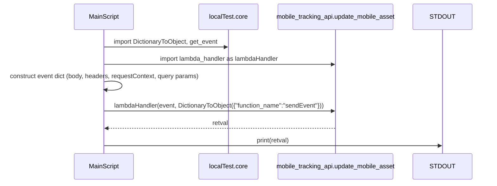
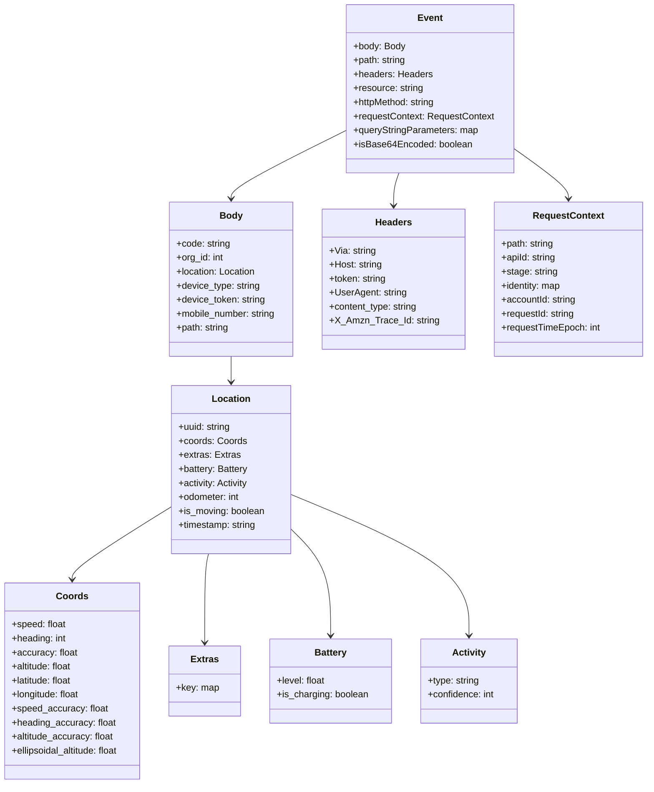

# Diagram: platform/tools/ide_local_testing/localTest/test/byEvent/updateMobileAsset.py

> Auto-generated by Obscura crawlers

## Diagram 1

### SVG

<svg id="container" width="1334.5" xmlns="http://www.w3.org/2000/svg" height="489" viewBox="-217.5 -10 1334.5 489" role="graphics-document document" aria-roledescription="sequence"><g><rect x="917" y="403" fill="#eaeaea" stroke="#666" width="150" height="65" name="Console" rx="3" ry="3" class="actor actor-bottom"></rect><text x="992" y="435.5" dominant-baseline="central" alignment-baseline="central" class="actor actor-box" style="text-anchor: middle; font-size: 16px; font-weight: 400;"><tspan x="992" dy="0">STDOUT</tspan></text></g><g><rect x="541" y="403" fill="#eaeaea" stroke="#666" width="326" height="65" name="Mobile" rx="3" ry="3" class="actor actor-bottom"></rect><text x="704" y="435.5" dominant-baseline="central" alignment-baseline="central" class="actor actor-box" style="text-anchor: middle; font-size: 16px; font-weight: 400;"><tspan x="704" dy="0">mobile_tracking_api.update_mobile_asset</tspan></text></g><g><rect x="341" y="403" fill="#eaeaea" stroke="#666" width="150" height="65" name="Core" rx="3" ry="3" class="actor actor-bottom"></rect><text x="416" y="435.5" dominant-baseline="central" alignment-baseline="central" class="actor actor-box" style="text-anchor: middle; font-size: 16px; font-weight: 400;"><tspan x="416" dy="0">localTest.core</tspan></text></g><g><rect x="0" y="403" fill="#eaeaea" stroke="#666" width="150" height="65" name="Script" rx="3" ry="3" class="actor actor-bottom"></rect><text x="75" y="435.5" dominant-baseline="central" alignment-baseline="central" class="actor actor-box" style="text-anchor: middle; font-size: 16px; font-weight: 400;"><tspan x="75" dy="0">MainScript</tspan></text></g><g><line id="actor3" x1="992" y1="65" x2="992" y2="403" class="actor-line 200" stroke-width="0.5px" stroke="#999" name="Console"></line><g id="root-3"><rect x="917" y="0" fill="#eaeaea" stroke="#666" width="150" height="65" name="Console" rx="3" ry="3" class="actor actor-top"></rect><text x="992" y="32.5" dominant-baseline="central" alignment-baseline="central" class="actor actor-box" style="text-anchor: middle; font-size: 16px; font-weight: 400;"><tspan x="992" dy="0">STDOUT</tspan></text></g></g><g><line id="actor2" x1="704" y1="65" x2="704" y2="403" class="actor-line 200" stroke-width="0.5px" stroke="#999" name="Mobile"></line><g id="root-2"><rect x="541" y="0" fill="#eaeaea" stroke="#666" width="326" height="65" name="Mobile" rx="3" ry="3" class="actor actor-top"></rect><text x="704" y="32.5" dominant-baseline="central" alignment-baseline="central" class="actor actor-box" style="text-anchor: middle; font-size: 16px; font-weight: 400;"><tspan x="704" dy="0">mobile_tracking_api.update_mobile_asset</tspan></text></g></g><g><line id="actor1" x1="416" y1="65" x2="416" y2="403" class="actor-line 200" stroke-width="0.5px" stroke="#999" name="Core"></line><g id="root-1"><rect x="341" y="0" fill="#eaeaea" stroke="#666" width="150" height="65" name="Core" rx="3" ry="3" class="actor actor-top"></rect><text x="416" y="32.5" dominant-baseline="central" alignment-baseline="central" class="actor actor-box" style="text-anchor: middle; font-size: 16px; font-weight: 400;"><tspan x="416" dy="0">localTest.core</tspan></text></g></g><g><line id="actor0" x1="75" y1="65" x2="75" y2="403" class="actor-line 200" stroke-width="0.5px" stroke="#999" name="Script"></line><g id="root-0"><rect x="0" y="0" fill="#eaeaea" stroke="#666" width="150" height="65" name="Script" rx="3" ry="3" class="actor actor-top"></rect><text x="75" y="32.5" dominant-baseline="central" alignment-baseline="central" class="actor actor-box" style="text-anchor: middle; font-size: 16px; font-weight: 400;"><tspan x="75" dy="0">MainScript</tspan></text></g></g><g></g><defs><symbol id="computer" width="24" height="24"><path transform="scale(.5)" d="M2 2v13h20v-13h-20zm18 11h-16v-9h16v9zm-10.228 6l.466-1h3.524l.467 1h-4.457zm14.228 3h-24l2-6h2.104l-1.33 4h18.45l-1.297-4h2.073l2 6zm-5-10h-14v-7h14v7z"></path></symbol></defs><defs><symbol id="database" fill-rule="evenodd" clip-rule="evenodd"><path transform="scale(.5)" d="M12.258.001l.256.004.255.005.253.008.251.01.249.012.247.015.246.016.242.019.241.02.239.023.236.024.233.027.231.028.229.031.225.032.223.034.22.036.217.038.214.04.211.041.208.043.205.045.201.046.198.048.194.05.191.051.187.053.183.054.18.056.175.057.172.059.168.06.163.061.16.063.155.064.15.066.074.033.073.033.071.034.07.034.069.035.068.035.067.035.066.035.064.036.064.036.062.036.06.036.06.037.058.037.058.037.055.038.055.038.053.038.052.038.051.039.05.039.048.039.047.039.045.04.044.04.043.04.041.04.04.041.039.041.037.041.036.041.034.041.033.042.032.042.03.042.029.042.027.042.026.043.024.043.023.043.021.043.02.043.018.044.017.043.015.044.013.044.012.044.011.045.009.044.007.045.006.045.004.045.002.045.001.045v17l-.001.045-.002.045-.004.045-.006.045-.007.045-.009.044-.011.045-.012.044-.013.044-.015.044-.017.043-.018.044-.02.043-.021.043-.023.043-.024.043-.026.043-.027.042-.029.042-.03.042-.032.042-.033.042-.034.041-.036.041-.037.041-.039.041-.04.041-.041.04-.043.04-.044.04-.045.04-.047.039-.048.039-.05.039-.051.039-.052.038-.053.038-.055.038-.055.038-.058.037-.058.037-.06.037-.06.036-.062.036-.064.036-.064.036-.066.035-.067.035-.068.035-.069.035-.07.034-.071.034-.073.033-.074.033-.15.066-.155.064-.16.063-.163.061-.168.06-.172.059-.175.057-.18.056-.183.054-.187.053-.191.051-.194.05-.198.048-.201.046-.205.045-.208.043-.211.041-.214.04-.217.038-.22.036-.223.034-.225.032-.229.031-.231.028-.233.027-.236.024-.239.023-.241.02-.242.019-.246.016-.247.015-.249.012-.251.01-.253.008-.255.005-.256.004-.258.001-.258-.001-.256-.004-.255-.005-.253-.008-.251-.01-.249-.012-.247-.015-.245-.016-.243-.019-.241-.02-.238-.023-.236-.024-.234-.027-.231-.028-.228-.031-.226-.032-.223-.034-.22-.036-.217-.038-.214-.04-.211-.041-.208-.043-.204-.045-.201-.046-.198-.048-.195-.05-.19-.051-.187-.053-.184-.054-.179-.056-.176-.057-.172-.059-.167-.06-.164-.061-.159-.063-.155-.064-.151-.066-.074-.033-.072-.033-.072-.034-.07-.034-.069-.035-.068-.035-.067-.035-.066-.035-.064-.036-.063-.036-.062-.036-.061-.036-.06-.037-.058-.037-.057-.037-.056-.038-.055-.038-.053-.038-.052-.038-.051-.039-.049-.039-.049-.039-.046-.039-.046-.04-.044-.04-.043-.04-.041-.04-.04-.041-.039-.041-.037-.041-.036-.041-.034-.041-.033-.042-.032-.042-.03-.042-.029-.042-.027-.042-.026-.043-.024-.043-.023-.043-.021-.043-.02-.043-.018-.044-.017-.043-.015-.044-.013-.044-.012-.044-.011-.045-.009-.044-.007-.045-.006-.045-.004-.045-.002-.045-.001-.045v-17l.001-.045.002-.045.004-.045.006-.045.007-.045.009-.044.011-.045.012-.044.013-.044.015-.044.017-.043.018-.044.02-.043.021-.043.023-.043.024-.043.026-.043.027-.042.029-.042.03-.042.032-.042.033-.042.034-.041.036-.041.037-.041.039-.041.04-.041.041-.04.043-.04.044-.04.046-.04.046-.039.049-.039.049-.039.051-.039.052-.038.053-.038.055-.038.056-.038.057-.037.058-.037.06-.037.061-.036.062-.036.063-.036.064-.036.066-.035.067-.035.068-.035.069-.035.07-.034.072-.034.072-.033.074-.033.151-.066.155-.064.159-.063.164-.061.167-.06.172-.059.176-.057.179-.056.184-.054.187-.053.19-.051.195-.05.198-.048.201-.046.204-.045.208-.043.211-.041.214-.04.217-.038.22-.036.223-.034.226-.032.228-.031.231-.028.234-.027.236-.024.238-.023.241-.02.243-.019.245-.016.247-.015.249-.012.251-.01.253-.008.255-.005.256-.004.258-.001.258.001zm-9.258 20.499v.01l.001.021.003.021.004.022.005.021.006.022.007.022.009.023.01.022.011.023.012.023.013.023.015.023.016.024.017.023.018.024.019.024.021.024.022.025.023.024.024.025.052.049.056.05.061.051.066.051.07.051.075.051.079.052.084.052.088.052.092.052.097.052.102.051.105.052.11.052.114.051.119.051.123.051.127.05.131.05.135.05.139.048.144.049.147.047.152.047.155.047.16.045.163.045.167.043.171.043.176.041.178.041.183.039.187.039.19.037.194.035.197.035.202.033.204.031.209.03.212.029.216.027.219.025.222.024.226.021.23.02.233.018.236.016.24.015.243.012.246.01.249.008.253.005.256.004.259.001.26-.001.257-.004.254-.005.25-.008.247-.011.244-.012.241-.014.237-.016.233-.018.231-.021.226-.021.224-.024.22-.026.216-.027.212-.028.21-.031.205-.031.202-.034.198-.034.194-.036.191-.037.187-.039.183-.04.179-.04.175-.042.172-.043.168-.044.163-.045.16-.046.155-.046.152-.047.148-.048.143-.049.139-.049.136-.05.131-.05.126-.05.123-.051.118-.052.114-.051.11-.052.106-.052.101-.052.096-.052.092-.052.088-.053.083-.051.079-.052.074-.052.07-.051.065-.051.06-.051.056-.05.051-.05.023-.024.023-.025.021-.024.02-.024.019-.024.018-.024.017-.024.015-.023.014-.024.013-.023.012-.023.01-.023.01-.022.008-.022.006-.022.006-.022.004-.022.004-.021.001-.021.001-.021v-4.127l-.077.055-.08.053-.083.054-.085.053-.087.052-.09.052-.093.051-.095.05-.097.05-.1.049-.102.049-.105.048-.106.047-.109.047-.111.046-.114.045-.115.045-.118.044-.12.043-.122.042-.124.042-.126.041-.128.04-.13.04-.132.038-.134.038-.135.037-.138.037-.139.035-.142.035-.143.034-.144.033-.147.032-.148.031-.15.03-.151.03-.153.029-.154.027-.156.027-.158.026-.159.025-.161.024-.162.023-.163.022-.165.021-.166.02-.167.019-.169.018-.169.017-.171.016-.173.015-.173.014-.175.013-.175.012-.177.011-.178.01-.179.008-.179.008-.181.006-.182.005-.182.004-.184.003-.184.002h-.37l-.184-.002-.184-.003-.182-.004-.182-.005-.181-.006-.179-.008-.179-.008-.178-.01-.176-.011-.176-.012-.175-.013-.173-.014-.172-.015-.171-.016-.17-.017-.169-.018-.167-.019-.166-.02-.165-.021-.163-.022-.162-.023-.161-.024-.159-.025-.157-.026-.156-.027-.155-.027-.153-.029-.151-.03-.15-.03-.148-.031-.146-.032-.145-.033-.143-.034-.141-.035-.14-.035-.137-.037-.136-.037-.134-.038-.132-.038-.13-.04-.128-.04-.126-.041-.124-.042-.122-.042-.12-.044-.117-.043-.116-.045-.113-.045-.112-.046-.109-.047-.106-.047-.105-.048-.102-.049-.1-.049-.097-.05-.095-.05-.093-.052-.09-.051-.087-.052-.085-.053-.083-.054-.08-.054-.077-.054v4.127zm0-5.654v.011l.001.021.003.021.004.021.005.022.006.022.007.022.009.022.01.022.011.023.012.023.013.023.015.024.016.023.017.024.018.024.019.024.021.024.022.024.023.025.024.024.052.05.056.05.061.05.066.051.07.051.075.052.079.051.084.052.088.052.092.052.097.052.102.052.105.052.11.051.114.051.119.052.123.05.127.051.131.05.135.049.139.049.144.048.147.048.152.047.155.046.16.045.163.045.167.044.171.042.176.042.178.04.183.04.187.038.19.037.194.036.197.034.202.033.204.032.209.03.212.028.216.027.219.025.222.024.226.022.23.02.233.018.236.016.24.014.243.012.246.01.249.008.253.006.256.003.259.001.26-.001.257-.003.254-.006.25-.008.247-.01.244-.012.241-.015.237-.016.233-.018.231-.02.226-.022.224-.024.22-.025.216-.027.212-.029.21-.03.205-.032.202-.033.198-.035.194-.036.191-.037.187-.039.183-.039.179-.041.175-.042.172-.043.168-.044.163-.045.16-.045.155-.047.152-.047.148-.048.143-.048.139-.05.136-.049.131-.05.126-.051.123-.051.118-.051.114-.052.11-.052.106-.052.101-.052.096-.052.092-.052.088-.052.083-.052.079-.052.074-.051.07-.052.065-.051.06-.05.056-.051.051-.049.023-.025.023-.024.021-.025.02-.024.019-.024.018-.024.017-.024.015-.023.014-.023.013-.024.012-.022.01-.023.01-.023.008-.022.006-.022.006-.022.004-.021.004-.022.001-.021.001-.021v-4.139l-.077.054-.08.054-.083.054-.085.052-.087.053-.09.051-.093.051-.095.051-.097.05-.1.049-.102.049-.105.048-.106.047-.109.047-.111.046-.114.045-.115.044-.118.044-.12.044-.122.042-.124.042-.126.041-.128.04-.13.039-.132.039-.134.038-.135.037-.138.036-.139.036-.142.035-.143.033-.144.033-.147.033-.148.031-.15.03-.151.03-.153.028-.154.028-.156.027-.158.026-.159.025-.161.024-.162.023-.163.022-.165.021-.166.02-.167.019-.169.018-.169.017-.171.016-.173.015-.173.014-.175.013-.175.012-.177.011-.178.009-.179.009-.179.007-.181.007-.182.005-.182.004-.184.003-.184.002h-.37l-.184-.002-.184-.003-.182-.004-.182-.005-.181-.007-.179-.007-.179-.009-.178-.009-.176-.011-.176-.012-.175-.013-.173-.014-.172-.015-.171-.016-.17-.017-.169-.018-.167-.019-.166-.02-.165-.021-.163-.022-.162-.023-.161-.024-.159-.025-.157-.026-.156-.027-.155-.028-.153-.028-.151-.03-.15-.03-.148-.031-.146-.033-.145-.033-.143-.033-.141-.035-.14-.036-.137-.036-.136-.037-.134-.038-.132-.039-.13-.039-.128-.04-.126-.041-.124-.042-.122-.043-.12-.043-.117-.044-.116-.044-.113-.046-.112-.046-.109-.046-.106-.047-.105-.048-.102-.049-.1-.049-.097-.05-.095-.051-.093-.051-.09-.051-.087-.053-.085-.052-.083-.054-.08-.054-.077-.054v4.139zm0-5.666v.011l.001.02.003.022.004.021.005.022.006.021.007.022.009.023.01.022.011.023.012.023.013.023.015.023.016.024.017.024.018.023.019.024.021.025.022.024.023.024.024.025.052.05.056.05.061.05.066.051.07.051.075.052.079.051.084.052.088.052.092.052.097.052.102.052.105.051.11.052.114.051.119.051.123.051.127.05.131.05.135.05.139.049.144.048.147.048.152.047.155.046.16.045.163.045.167.043.171.043.176.042.178.04.183.04.187.038.19.037.194.036.197.034.202.033.204.032.209.03.212.028.216.027.219.025.222.024.226.021.23.02.233.018.236.017.24.014.243.012.246.01.249.008.253.006.256.003.259.001.26-.001.257-.003.254-.006.25-.008.247-.01.244-.013.241-.014.237-.016.233-.018.231-.02.226-.022.224-.024.22-.025.216-.027.212-.029.21-.03.205-.032.202-.033.198-.035.194-.036.191-.037.187-.039.183-.039.179-.041.175-.042.172-.043.168-.044.163-.045.16-.045.155-.047.152-.047.148-.048.143-.049.139-.049.136-.049.131-.051.126-.05.123-.051.118-.052.114-.051.11-.052.106-.052.101-.052.096-.052.092-.052.088-.052.083-.052.079-.052.074-.052.07-.051.065-.051.06-.051.056-.05.051-.049.023-.025.023-.025.021-.024.02-.024.019-.024.018-.024.017-.024.015-.023.014-.024.013-.023.012-.023.01-.022.01-.023.008-.022.006-.022.006-.022.004-.022.004-.021.001-.021.001-.021v-4.153l-.077.054-.08.054-.083.053-.085.053-.087.053-.09.051-.093.051-.095.051-.097.05-.1.049-.102.048-.105.048-.106.048-.109.046-.111.046-.114.046-.115.044-.118.044-.12.043-.122.043-.124.042-.126.041-.128.04-.13.039-.132.039-.134.038-.135.037-.138.036-.139.036-.142.034-.143.034-.144.033-.147.032-.148.032-.15.03-.151.03-.153.028-.154.028-.156.027-.158.026-.159.024-.161.024-.162.023-.163.023-.165.021-.166.02-.167.019-.169.018-.169.017-.171.016-.173.015-.173.014-.175.013-.175.012-.177.01-.178.01-.179.009-.179.007-.181.006-.182.006-.182.004-.184.003-.184.001-.185.001-.185-.001-.184-.001-.184-.003-.182-.004-.182-.006-.181-.006-.179-.007-.179-.009-.178-.01-.176-.01-.176-.012-.175-.013-.173-.014-.172-.015-.171-.016-.17-.017-.169-.018-.167-.019-.166-.02-.165-.021-.163-.023-.162-.023-.161-.024-.159-.024-.157-.026-.156-.027-.155-.028-.153-.028-.151-.03-.15-.03-.148-.032-.146-.032-.145-.033-.143-.034-.141-.034-.14-.036-.137-.036-.136-.037-.134-.038-.132-.039-.13-.039-.128-.041-.126-.041-.124-.041-.122-.043-.12-.043-.117-.044-.116-.044-.113-.046-.112-.046-.109-.046-.106-.048-.105-.048-.102-.048-.1-.05-.097-.049-.095-.051-.093-.051-.09-.052-.087-.052-.085-.053-.083-.053-.08-.054-.077-.054v4.153zm8.74-8.179l-.257.004-.254.005-.25.008-.247.011-.244.012-.241.014-.237.016-.233.018-.231.021-.226.022-.224.023-.22.026-.216.027-.212.028-.21.031-.205.032-.202.033-.198.034-.194.036-.191.038-.187.038-.183.04-.179.041-.175.042-.172.043-.168.043-.163.045-.16.046-.155.046-.152.048-.148.048-.143.048-.139.049-.136.05-.131.05-.126.051-.123.051-.118.051-.114.052-.11.052-.106.052-.101.052-.096.052-.092.052-.088.052-.083.052-.079.052-.074.051-.07.052-.065.051-.06.05-.056.05-.051.05-.023.025-.023.024-.021.024-.02.025-.019.024-.018.024-.017.023-.015.024-.014.023-.013.023-.012.023-.01.023-.01.022-.008.022-.006.023-.006.021-.004.022-.004.021-.001.021-.001.021.001.021.001.021.004.021.004.022.006.021.006.023.008.022.01.022.01.023.012.023.013.023.014.023.015.024.017.023.018.024.019.024.02.025.021.024.023.024.023.025.051.05.056.05.06.05.065.051.07.052.074.051.079.052.083.052.088.052.092.052.096.052.101.052.106.052.11.052.114.052.118.051.123.051.126.051.131.05.136.05.139.049.143.048.148.048.152.048.155.046.16.046.163.045.168.043.172.043.175.042.179.041.183.04.187.038.191.038.194.036.198.034.202.033.205.032.21.031.212.028.216.027.22.026.224.023.226.022.231.021.233.018.237.016.241.014.244.012.247.011.25.008.254.005.257.004.26.001.26-.001.257-.004.254-.005.25-.008.247-.011.244-.012.241-.014.237-.016.233-.018.231-.021.226-.022.224-.023.22-.026.216-.027.212-.028.21-.031.205-.032.202-.033.198-.034.194-.036.191-.038.187-.038.183-.04.179-.041.175-.042.172-.043.168-.043.163-.045.16-.046.155-.046.152-.048.148-.048.143-.048.139-.049.136-.05.131-.05.126-.051.123-.051.118-.051.114-.052.11-.052.106-.052.101-.052.096-.052.092-.052.088-.052.083-.052.079-.052.074-.051.07-.052.065-.051.06-.05.056-.05.051-.05.023-.025.023-.024.021-.024.02-.025.019-.024.018-.024.017-.023.015-.024.014-.023.013-.023.012-.023.01-.023.01-.022.008-.022.006-.023.006-.021.004-.022.004-.021.001-.021.001-.021-.001-.021-.001-.021-.004-.021-.004-.022-.006-.021-.006-.023-.008-.022-.01-.022-.01-.023-.012-.023-.013-.023-.014-.023-.015-.024-.017-.023-.018-.024-.019-.024-.02-.025-.021-.024-.023-.024-.023-.025-.051-.05-.056-.05-.06-.05-.065-.051-.07-.052-.074-.051-.079-.052-.083-.052-.088-.052-.092-.052-.096-.052-.101-.052-.106-.052-.11-.052-.114-.052-.118-.051-.123-.051-.126-.051-.131-.05-.136-.05-.139-.049-.143-.048-.148-.048-.152-.048-.155-.046-.16-.046-.163-.045-.168-.043-.172-.043-.175-.042-.179-.041-.183-.04-.187-.038-.191-.038-.194-.036-.198-.034-.202-.033-.205-.032-.21-.031-.212-.028-.216-.027-.22-.026-.224-.023-.226-.022-.231-.021-.233-.018-.237-.016-.241-.014-.244-.012-.247-.011-.25-.008-.254-.005-.257-.004-.26-.001-.26.001z"></path></symbol></defs><defs><symbol id="clock" width="24" height="24"><path transform="scale(.5)" d="M12 2c5.514 0 10 4.486 10 10s-4.486 10-10 10-10-4.486-10-10 4.486-10 10-10zm0-2c-6.627 0-12 5.373-12 12s5.373 12 12 12 12-5.373 12-12-5.373-12-12-12zm5.848 12.459c.202.038.202.333.001.372-1.907.361-6.045 1.111-6.547 1.111-.719 0-1.301-.582-1.301-1.301 0-.512.77-5.447 1.125-7.445.034-.192.312-.181.343.014l.985 6.238 5.394 1.011z"></path></symbol></defs><defs><marker id="arrowhead" refX="7.9" refY="5" markerUnits="userSpaceOnUse" markerWidth="12" markerHeight="12" orient="auto-start-reverse"><path d="M -1 0 L 10 5 L 0 10 z"></path></marker></defs><defs><marker id="crosshead" markerWidth="15" markerHeight="8" orient="auto" refX="4" refY="4.5"><path fill="none" stroke="#000000" stroke-width="1pt" d="M 1,2 L 6,7 M 6,2 L 1,7" style="stroke-dasharray: 0, 0;"></path></marker></defs><defs><marker id="filled-head" refX="15.5" refY="7" markerWidth="20" markerHeight="28" orient="auto"><path d="M 18,7 L9,13 L14,7 L9,1 Z"></path></marker></defs><defs><marker id="sequencenumber" refX="15" refY="15" markerWidth="60" markerHeight="40" orient="auto"><circle cx="15" cy="15" r="6"></circle></marker></defs><text x="244" y="80" text-anchor="middle" dominant-baseline="middle" alignment-baseline="middle" class="messageText" dy="1em" style="font-size: 16px; font-weight: 400;">import DictionaryToObject, get_event</text><line x1="76" y1="113" x2="412" y2="113" class="messageLine0" stroke-width="2" stroke="none" marker-end="url(#arrowhead)" style="fill: none;"></line><text x="388" y="128" text-anchor="middle" dominant-baseline="middle" alignment-baseline="middle" class="messageText" dy="1em" style="font-size: 16px; font-weight: 400;">import lambda_handler as lambdaHandler</text><line x1="76" y1="161" x2="700" y2="161" class="messageLine0" stroke-width="2" stroke="none" marker-end="url(#arrowhead)" style="fill: none;"></line><text x="76" y="176" text-anchor="middle" dominant-baseline="middle" alignment-baseline="middle" class="messageText" dy="1em" style="font-size: 16px; font-weight: 400;">construct event dict (body, headers, requestContext, query params)</text><path d="M 76,209 C 136,199 136,239 76,229" class="messageLine0" stroke-width="2" stroke="none" marker-end="url(#arrowhead)" style="fill: none;"></path><text x="388" y="254" text-anchor="middle" dominant-baseline="middle" alignment-baseline="middle" class="messageText" dy="1em" style="font-size: 16px; font-weight: 400;">lambdaHandler(event, DictionaryToObject({"function_name":"sendEvent"}))</text><line x1="76" y1="287" x2="700" y2="287" class="messageLine0" stroke-width="2" stroke="none" marker-end="url(#arrowhead)" style="fill: none;"></line><text x="391" y="302" text-anchor="middle" dominant-baseline="middle" alignment-baseline="middle" class="messageText" dy="1em" style="font-size: 16px; font-weight: 400;">retval</text><line x1="703" y1="335" x2="79" y2="335" class="messageLine1" stroke-width="2" stroke="none" marker-end="url(#arrowhead)" style="stroke-dasharray: 3, 3; fill: none;"></line><text x="532" y="350" text-anchor="middle" dominant-baseline="middle" alignment-baseline="middle" class="messageText" dy="1em" style="font-size: 16px; font-weight: 400;">print(retval)</text><line x1="76" y1="383" x2="988" y2="383" class="messageLine0" stroke-width="2" stroke="none" marker-end="url(#arrowhead)" style="fill: none;"></line></svg>

## Diagram 2

### SVG

<svg id="container" width="1108.890625" xmlns="http://www.w3.org/2000/svg" class="classDiagram" height="1342" viewBox="0 0 1108.890625 1342" role="graphics-document document" aria-roledescription="class"><g><defs><marker id="container_class-aggregationStart" class="marker aggregation class" refX="18" refY="7" markerWidth="190" markerHeight="240" orient="auto"><path d="M 18,7 L9,13 L1,7 L9,1 Z"></path></marker></defs><defs><marker id="container_class-aggregationEnd" class="marker aggregation class" refX="1" refY="7" markerWidth="20" markerHeight="28" orient="auto"><path d="M 18,7 L9,13 L1,7 L9,1 Z"></path></marker></defs><defs><marker id="container_class-extensionStart" class="marker extension class" refX="18" refY="7" markerWidth="190" markerHeight="240" orient="auto"><path d="M 1,7 L18,13 V 1 Z"></path></marker></defs><defs><marker id="container_class-extensionEnd" class="marker extension class" refX="1" refY="7" markerWidth="20" markerHeight="28" orient="auto"><path d="M 1,1 V 13 L18,7 Z"></path></marker></defs><defs><marker id="container_class-compositionStart" class="marker composition class" refX="18" refY="7" markerWidth="190" markerHeight="240" orient="auto"><path d="M 18,7 L9,13 L1,7 L9,1 Z"></path></marker></defs><defs><marker id="container_class-compositionEnd" class="marker composition class" refX="1" refY="7" markerWidth="20" markerHeight="28" orient="auto"><path d="M 18,7 L9,13 L1,7 L9,1 Z"></path></marker></defs><defs><marker id="container_class-dependencyStart" class="marker dependency class" refX="6" refY="7" markerWidth="190" markerHeight="240" orient="auto"><path d="M 5,7 L9,13 L1,7 L9,1 Z"></path></marker></defs><defs><marker id="container_class-dependencyEnd" class="marker dependency class" refX="13" refY="7" markerWidth="20" markerHeight="28" orient="auto"><path d="M 18,7 L9,13 L14,7 L9,1 Z"></path></marker></defs><defs><marker id="container_class-lollipopStart" class="marker lollipop class" refX="13" refY="7" markerWidth="190" markerHeight="240" orient="auto"><circle stroke="black" fill="transparent" cx="7" cy="7" r="6"></circle></marker></defs><defs><marker id="container_class-lollipopEnd" class="marker lollipop class" refX="1" refY="7" markerWidth="190" markerHeight="240" orient="auto"><circle stroke="black" fill="transparent" cx="7" cy="7" r="6"></circle></marker></defs><g class="root"><g class="clusters"></g><g class="edgePaths"><path d="M597.436,223.819L565.34,240.016C533.245,256.213,469.054,288.606,436.959,307.97C404.863,327.333,404.863,333.667,404.863,336.833L404.863,340" id="id_Event_Body_1" class="edge-thickness-normal edge-pattern-solid relation" style=";;;" data-edge="true" data-et="edge" data-id="id_Event_Body_1" data-points="W3sieCI6NTk3LjQzNTU0Njg3NSwieSI6MjIzLjgxOTMwNzk1NTY1MjIyfSx7IngiOjQwNC44NjMyODEyNSwieSI6MzIxfSx7IngiOjQwNC44NjMyODEyNSwieSI6MzQ2fV0=" marker-end="url(#container_class-dependencyEnd)"></path><path d="M689.235,296L687.773,300.167C686.312,304.333,683.388,312.667,681.927,322C680.465,331.333,680.465,341.667,680.465,346.833L680.465,352" id="id_Event_Headers_2" class="edge-thickness-normal edge-pattern-solid relation" style=";;;" data-edge="true" data-et="edge" data-id="id_Event_Headers_2" data-points="W3sieCI6Njg5LjIzNTEyNjIwMTkyMzEsInkiOjI5Nn0seyJ4Ijo2ODAuNDY0ODQzNzUsInkiOjMyMX0seyJ4Ijo2ODAuNDY0ODQzNzUsInkiOjM1OH1d" marker-end="url(#container_class-dependencyEnd)"></path><path d="M882.068,254.424L897.486,265.52C912.904,276.616,943.739,298.808,959.157,313.071C974.574,327.333,974.574,333.667,974.574,336.833L974.574,340" id="id_Event_RequestContext_3" class="edge-thickness-normal edge-pattern-solid relation" style=";;;" data-edge="true" data-et="edge" data-id="id_Event_RequestContext_3" data-points="W3sieCI6ODgyLjA2ODM1OTM3NSwieSI6MjU0LjQyNDE1NzIzMzI3OTgzfSx7IngiOjk3NC41NzQyMTg3NSwieSI6MzIxfSx7IngiOjk3NC41NzQyMTg3NSwieSI6MzQ2fV0=" marker-end="url(#container_class-dependencyEnd)"></path><path d="M404.863,610L404.863,614.167C404.863,618.333,404.863,626.667,404.863,634C404.863,641.333,404.863,647.667,404.863,650.833L404.863,654" id="id_Body_Location_4" class="edge-thickness-normal edge-pattern-solid relation" style=";;;" data-edge="true" data-et="edge" data-id="id_Body_Location_4" data-points="W3sieCI6NDA0Ljg2MzI4MTI1LCJ5Ijo2MTB9LHsieCI6NDA0Ljg2MzI4MTI1LCJ5Ijo2MzV9LHsieCI6NDA0Ljg2MzI4MTI1LCJ5Ijo2NjB9XQ==" marker-end="url(#container_class-dependencyEnd)"></path><path d="M302.906,866.2L273.729,884C244.552,901.8,186.198,937.4,157.021,958.367C127.844,979.333,127.844,985.667,127.844,988.833L127.844,992" id="id_Location_Coords_5" class="edge-thickness-normal edge-pattern-solid relation" style=";;;" data-edge="true" data-et="edge" data-id="id_Location_Coords_5" data-points="W3sieCI6MzAyLjkwNjI1LCJ5Ijo4NjYuMjAwNDQ1NTkxMzI1MX0seyJ4IjoxMjcuODQzNzUsInkiOjk3M30seyJ4IjoxMjcuODQzNzUsInkiOjk5OH1d" marker-end="url(#container_class-dependencyEnd)"></path><path d="M364.29,948L363.116,952.167C361.942,956.333,359.594,964.667,358.42,990C357.246,1015.333,357.246,1057.667,357.246,1078.833L357.246,1100" id="id_Location_Extras_6" class="edge-thickness-normal edge-pattern-solid relation" style=";;;" data-edge="true" data-et="edge" data-id="id_Location_Extras_6" data-points="W3sieCI6MzY0LjI5MDA1NjM5NzkyOSwieSI6OTQ4fSx7IngiOjM1Ny4yNDYwOTM3NSwieSI6OTczfSx7IngiOjM1Ny4yNDYwOTM3NSwieSI6MTEwNn1d" marker-end="url(#container_class-dependencyEnd)"></path><path d="M506.82,907.68L517.526,918.567C528.232,929.453,549.643,951.227,560.349,981.28C571.055,1011.333,571.055,1049.667,571.055,1068.833L571.055,1088" id="id_Location_Battery_7" class="edge-thickness-normal edge-pattern-solid relation" style=";;;" data-edge="true" data-et="edge" data-id="id_Location_Battery_7" data-points="W3sieCI6NTA2LjgyMDMxMjUsInkiOjkwNy42ODAwNzk5MTUzODM3fSx7IngiOjU3MS4wNTQ2ODc1LCJ5Ijo5NzN9LHsieCI6NTcxLjA1NDY4NzUsInkiOjEwOTR9XQ==" marker-end="url(#container_class-dependencyEnd)"></path><path d="M506.82,846.701L557.081,867.751C607.341,888.801,707.862,930.9,758.122,971.117C808.383,1011.333,808.383,1049.667,808.383,1068.833L808.383,1088" id="id_Location_Activity_8" class="edge-thickness-normal edge-pattern-solid relation" style=";;;" data-edge="true" data-et="edge" data-id="id_Location_Activity_8" data-points="W3sieCI6NTA2LjgyMDMxMjUsInkiOjg0Ni43MDExMjU4MzYxNDg4fSx7IngiOjgwOC4zODI4MTI1LCJ5Ijo5NzN9LHsieCI6ODA4LjM4MjgxMjUsInkiOjEwOTR9XQ==" marker-end="url(#container_class-dependencyEnd)"></path></g><g class="edgeLabels"><g class="edgeLabel"><g class="label" data-id="id_Event_Body_1" transform="translate(0, 0)"><foreignObject width="0" height="0">

</foreignObject></g></g><g class="edgeLabel"><g class="label" data-id="id_Event_Headers_2" transform="translate(0, 0)"><foreignObject width="0" height="0">

</foreignObject></g></g><g class="edgeLabel"><g class="label" data-id="id_Event_RequestContext_3" transform="translate(0, 0)"><foreignObject width="0" height="0">

</foreignObject></g></g><g class="edgeLabel"><g class="label" data-id="id_Body_Location_4" transform="translate(0, 0)"><foreignObject width="0" height="0">

</foreignObject></g></g><g class="edgeLabel"><g class="label" data-id="id_Location_Coords_5" transform="translate(0, 0)"><foreignObject width="0" height="0">

</foreignObject></g></g><g class="edgeLabel"><g class="label" data-id="id_Location_Extras_6" transform="translate(0, 0)"><foreignObject width="0" height="0">

</foreignObject></g></g><g class="edgeLabel"><g class="label" data-id="id_Location_Battery_7" transform="translate(0, 0)"><foreignObject width="0" height="0">

</foreignObject></g></g><g class="edgeLabel"><g class="label" data-id="id_Location_Activity_8" transform="translate(0, 0)"><foreignObject width="0" height="0">

</foreignObject></g></g></g><g class="nodes"><g class="node default" id="classId-Event-0" transform="translate(739.751953125, 152)"><g class="basic label-container"><path d="M-142.31640625 -144 L142.31640625 -144 L142.31640625 144 L-142.31640625 144" stroke="none" stroke-width="0" fill="#ECECFF" style=""></path><path d="M-142.31640625 -144 C-34.168920263658336 -144, 73.97856572268333 -144, 142.31640625 -144 M-142.31640625 -144 C-31.07694709502968 -144, 80.16251205994064 -144, 142.31640625 -144 M142.31640625 -144 C142.31640625 -61.416275555452415, 142.31640625 21.16744888909517, 142.31640625 144 M142.31640625 -144 C142.31640625 -30.37472214508972, 142.31640625 83.25055570982056, 142.31640625 144 M142.31640625 144 C55.581895463329175 144, -31.15261532334165 144, -142.31640625 144 M142.31640625 144 C48.79850762210556 144, -44.71939100578888 144, -142.31640625 144 M-142.31640625 144 C-142.31640625 64.54950993130537, -142.31640625 -14.900980137389269, -142.31640625 -144 M-142.31640625 144 C-142.31640625 69.25883110168374, -142.31640625 -5.482337796632521, -142.31640625 -144" stroke="#9370DB" stroke-width="1.3" fill="none" stroke-dasharray="0 0" style=""></path></g><g class="annotation-group text" transform="translate(0, -120)"></g><g class="label-group text" transform="translate(-20.2109375, -120)"><g class="label" style="font-weight: bolder" transform="translate(0,-12)"><foreignObject width="40.421875" height="24">

Event

</foreignObject></g></g><g class="members-group text" transform="translate(-130.31640625, -72)"><g class="label" style="" transform="translate(0,-12)"><foreignObject width="88.9375" height="24">

+body: Body

</foreignObject></g><g class="label" style="" transform="translate(0,12)"><foreignObject width="90.90625" height="24">

+path: string

</foreignObject></g><g class="label" style="" transform="translate(0,36)"><foreignObject width="134.25" height="24">

+headers: Headers

</foreignObject></g><g class="label" style="" transform="translate(0,60)"><foreignObject width="119.984375" height="24">

+resource: string

</foreignObject></g><g class="label" style="" transform="translate(0,84)"><foreignObject width="143.375" height="24">

+httpMethod: string

</foreignObject></g><g class="label" style="" transform="translate(0,108)"><foreignObject width="240.421875" height="24">

+requestContext: RequestContext

</foreignObject></g><g class="label" style="" transform="translate(0,132)"><foreignObject width="214.0625" height="24">

+queryStringParameters: map

</foreignObject></g><g class="label" style="" transform="translate(0,156)"><foreignObject width="201.296875" height="24">

+isBase64Encoded: boolean

</foreignObject></g></g><g class="methods-group text" transform="translate(-130.31640625, 144)"></g><g class="divider" style=""><path d="M-142.31640625 -96 C-37.07010375319136 -96, 68.17619874361728 -96, 142.31640625 -96 M-142.31640625 -96 C-52.48896365376342 -96, 37.33847894247316 -96, 142.31640625 -96" stroke="#9370DB" stroke-width="1.3" fill="none" stroke-dasharray="0 0" style=""></path></g><g class="divider" style=""><path d="M-142.31640625 120 C-38.90655433686719 120, 64.50329757626562 120, 142.31640625 120 M-142.31640625 120 C-73.49863913104011 120, -4.680872012080215 120, 142.31640625 120" stroke="#9370DB" stroke-width="1.3" fill="none" stroke-dasharray="0 0" style=""></path></g></g><g class="node default" id="classId-Body-1" transform="translate(404.86328125, 478)"><g class="basic label-container"><path d="M-107.80859375 -132 L107.80859375 -132 L107.80859375 132 L-107.80859375 132" stroke="none" stroke-width="0" fill="#ECECFF" style=""></path><path d="M-107.80859375 -132 C-64.68092879526003 -132, -21.553263840520046 -132, 107.80859375 -132 M-107.80859375 -132 C-61.915564538784174 -132, -16.02253532756835 -132, 107.80859375 -132 M107.80859375 -132 C107.80859375 -52.88759214896538, 107.80859375 26.224815702069236, 107.80859375 132 M107.80859375 -132 C107.80859375 -46.10902280903839, 107.80859375 39.781954381923214, 107.80859375 132 M107.80859375 132 C46.3935822268905 132, -15.021429296218997 132, -107.80859375 132 M107.80859375 132 C47.80097521800824 132, -12.20664331398352 132, -107.80859375 132 M-107.80859375 132 C-107.80859375 73.779035988821, -107.80859375 15.558071977642001, -107.80859375 -132 M-107.80859375 132 C-107.80859375 56.61801540869165, -107.80859375 -18.763969182616705, -107.80859375 -132" stroke="#9370DB" stroke-width="1.3" fill="none" stroke-dasharray="0 0" style=""></path></g><g class="annotation-group text" transform="translate(0, -108)"></g><g class="label-group text" transform="translate(-18.5546875, -108)"><g class="label" style="font-weight: bolder" transform="translate(0,-12)"><foreignObject width="37.109375" height="24">

Body

</foreignObject></g></g><g class="members-group text" transform="translate(-95.80859375, -60)"><g class="label" style="" transform="translate(0,-12)"><foreignObject width="92.65625" height="24">

+code: string

</foreignObject></g><g class="label" style="" transform="translate(0,12)"><foreignObject width="81.796875" height="24">

+org_id: int

</foreignObject></g><g class="label" style="" transform="translate(0,36)"><foreignObject width="137.34375" height="24">

+location: Location

</foreignObject></g><g class="label" style="" transform="translate(0,60)"><foreignObject width="143.828125" height="24">

+device_type: string

</foreignObject></g><g class="label" style="" transform="translate(0,84)"><foreignObject width="153.0625" height="24">

+device_token: string

</foreignObject></g><g class="label" style="" transform="translate(0,108)"><foreignObject width="173.0625" height="24">

+mobile_number: string

</foreignObject></g><g class="label" style="" transform="translate(0,132)"><foreignObject width="90.90625" height="24">

+path: string

</foreignObject></g></g><g class="methods-group text" transform="translate(-95.80859375, 132)"></g><g class="divider" style=""><path d="M-107.80859375 -84 C-44.69285133275664 -84, 18.42289108448672 -84, 107.80859375 -84 M-107.80859375 -84 C-31.733830360919498 -84, 44.340933028161004 -84, 107.80859375 -84" stroke="#9370DB" stroke-width="1.3" fill="none" stroke-dasharray="0 0" style=""></path></g><g class="divider" style=""><path d="M-107.80859375 108 C-27.123547583275382 108, 53.561498583449236 108, 107.80859375 108 M-107.80859375 108 C-47.72826678864848 108, 12.352060172703034 108, 107.80859375 108" stroke="#9370DB" stroke-width="1.3" fill="none" stroke-dasharray="0 0" style=""></path></g></g><g class="node default" id="classId-Location-2" transform="translate(404.86328125, 804)"><g class="basic label-container"><path d="M-101.95703125 -144 L101.95703125 -144 L101.95703125 144 L-101.95703125 144" stroke="none" stroke-width="0" fill="#ECECFF" style=""></path><path d="M-101.95703125 -144 C-39.68998005297054 -144, 22.57707114405892 -144, 101.95703125 -144 M-101.95703125 -144 C-26.5801932600168 -144, 48.7966447299664 -144, 101.95703125 -144 M101.95703125 -144 C101.95703125 -34.442030171629, 101.95703125 75.115939656742, 101.95703125 144 M101.95703125 -144 C101.95703125 -29.38061527252806, 101.95703125 85.23876945494388, 101.95703125 144 M101.95703125 144 C47.69197209661174 144, -6.573087056776515 144, -101.95703125 144 M101.95703125 144 C41.54535010493363 144, -18.866331040132735 144, -101.95703125 144 M-101.95703125 144 C-101.95703125 54.72846687895344, -101.95703125 -34.54306624209312, -101.95703125 -144 M-101.95703125 144 C-101.95703125 46.36696515334579, -101.95703125 -51.266069693308424, -101.95703125 -144" stroke="#9370DB" stroke-width="1.3" fill="none" stroke-dasharray="0 0" style=""></path></g><g class="annotation-group text" transform="translate(0, -120)"></g><g class="label-group text" transform="translate(-31.3515625, -120)"><g class="label" style="font-weight: bolder" transform="translate(0,-12)"><foreignObject width="62.703125" height="24">

Location

</foreignObject></g></g><g class="members-group text" transform="translate(-89.95703125, -72)"><g class="label" style="" transform="translate(0,-12)"><foreignObject width="90.40625" height="24">

+uuid: string

</foreignObject></g><g class="label" style="" transform="translate(0,12)"><foreignObject width="114.890625" height="24">

+coords: Coords

</foreignObject></g><g class="label" style="" transform="translate(0,36)"><foreignObject width="103.546875" height="24">

+extras: Extras

</foreignObject></g><g class="label" style="" transform="translate(0,60)"><foreignObject width="120.78125" height="24">

+battery: Battery

</foreignObject></g><g class="label" style="" transform="translate(0,84)"><foreignObject width="121.546875" height="24">

+activity: Activity

</foreignObject></g><g class="label" style="" transform="translate(0,108)"><foreignObject width="107.015625" height="24">

+odometer: int

</foreignObject></g><g class="label" style="" transform="translate(0,132)"><foreignObject width="148.5625" height="24">

+is_moving: boolean

</foreignObject></g><g class="label" style="" transform="translate(0,156)"><foreignObject width="135.40625" height="24">

+timestamp: string

</foreignObject></g></g><g class="methods-group text" transform="translate(-89.95703125, 144)"></g><g class="divider" style=""><path d="M-101.95703125 -96 C-38.68013238916089 -96, 24.596766471678222 -96, 101.95703125 -96 M-101.95703125 -96 C-36.68518676420754 -96, 28.586657721584913 -96, 101.95703125 -96" stroke="#9370DB" stroke-width="1.3" fill="none" stroke-dasharray="0 0" style=""></path></g><g class="divider" style=""><path d="M-101.95703125 120 C-33.39039398907926 120, 35.176243271841486 120, 101.95703125 120 M-101.95703125 120 C-43.98437479921224 120, 13.98828165157552 120, 101.95703125 120" stroke="#9370DB" stroke-width="1.3" fill="none" stroke-dasharray="0 0" style=""></path></g></g><g class="node default" id="classId-Coords-3" transform="translate(127.84375, 1166)"><g class="basic label-container"><path d="M-119.84375 -168 L119.84375 -168 L119.84375 168 L-119.84375 168" stroke="none" stroke-width="0" fill="#ECECFF" style=""></path><path d="M-119.84375 -168 C-55.66973142100136 -168, 8.504287157997283 -168, 119.84375 -168 M-119.84375 -168 C-58.854182973369234 -168, 2.1353840532615322 -168, 119.84375 -168 M119.84375 -168 C119.84375 -66.93514004874564, 119.84375 34.129719902508725, 119.84375 168 M119.84375 -168 C119.84375 -53.66607822606032, 119.84375 60.66784354787936, 119.84375 168 M119.84375 168 C30.979696006747375 168, -57.88435798650525 168, -119.84375 168 M119.84375 168 C44.39219577616281 168, -31.059358447674384 168, -119.84375 168 M-119.84375 168 C-119.84375 92.81835129491586, -119.84375 17.636702589831714, -119.84375 -168 M-119.84375 168 C-119.84375 75.0190674649063, -119.84375 -17.9618650701874, -119.84375 -168" stroke="#9370DB" stroke-width="1.3" fill="none" stroke-dasharray="0 0" style=""></path></g><g class="annotation-group text" transform="translate(0, -144)"></g><g class="label-group text" transform="translate(-25.421875, -144)"><g class="label" style="font-weight: bolder" transform="translate(0,-12)"><foreignObject width="50.84375" height="24">

Coords

</foreignObject></g></g><g class="members-group text" transform="translate(-107.84375, -96)"><g class="label" style="" transform="translate(0,-12)"><foreignObject width="93.109375" height="24">

+speed: float

</foreignObject></g><g class="label" style="" transform="translate(0,12)"><foreignObject width="94.15625" height="24">

+heading: int

</foreignObject></g><g class="label" style="" transform="translate(0,36)"><foreignObject width="111.625" height="24">

+accuracy: float

</foreignObject></g><g class="label" style="" transform="translate(0,60)"><foreignObject width="105.78125" height="24">

+altitude: float

</foreignObject></g><g class="label" style="" transform="translate(0,84)"><foreignObject width="106.109375" height="24">

+latitude: float

</foreignObject></g><g class="label" style="" transform="translate(0,108)"><foreignObject width="118.65625" height="24">

+longitude: float

</foreignObject></g><g class="label" style="" transform="translate(0,132)"><foreignObject width="163.84375" height="24">

+speed_accuracy: float

</foreignObject></g><g class="label" style="" transform="translate(0,156)"><foreignObject width="178.34375" height="24">

+heading_accuracy: float

</foreignObject></g><g class="label" style="" transform="translate(0,180)"><foreignObject width="176.203125" height="24">

+altitude_accuracy: float

</foreignObject></g><g class="label" style="" transform="translate(0,204)"><foreignObject width="190.265625" height="24">

+ellipsoidal_altitude: float

</foreignObject></g></g><g class="methods-group text" transform="translate(-107.84375, 168)"></g><g class="divider" style=""><path d="M-119.84375 -120 C-69.76735024429226 -120, -19.690950488584505 -120, 119.84375 -120 M-119.84375 -120 C-44.87977307038297 -120, 30.084203859234066 -120, 119.84375 -120" stroke="#9370DB" stroke-width="1.3" fill="none" stroke-dasharray="0 0" style=""></path></g><g class="divider" style=""><path d="M-119.84375 144 C-57.61301909135381 144, 4.617711817292374 144, 119.84375 144 M-119.84375 144 C-38.59043136878725 144, 42.6628872624255 144, 119.84375 144" stroke="#9370DB" stroke-width="1.3" fill="none" stroke-dasharray="0 0" style=""></path></g></g><g class="node default" id="classId-Extras-4" transform="translate(357.24609375, 1166)"><g class="basic label-container"><path d="M-59.55859375 -60 L59.55859375 -60 L59.55859375 60 L-59.55859375 60" stroke="none" stroke-width="0" fill="#ECECFF" style=""></path><path d="M-59.55859375 -60 C-16.365167287541716 -60, 26.828259174916568 -60, 59.55859375 -60 M-59.55859375 -60 C-26.85245849710101 -60, 5.853676755797977 -60, 59.55859375 -60 M59.55859375 -60 C59.55859375 -31.810996355690033, 59.55859375 -3.6219927113800665, 59.55859375 60 M59.55859375 -60 C59.55859375 -32.010403488476484, 59.55859375 -4.020806976952969, 59.55859375 60 M59.55859375 60 C21.540934947313545 60, -16.47672385537291 60, -59.55859375 60 M59.55859375 60 C31.625859516735318 60, 3.6931252834706356 60, -59.55859375 60 M-59.55859375 60 C-59.55859375 34.22520914791035, -59.55859375 8.45041829582069, -59.55859375 -60 M-59.55859375 60 C-59.55859375 30.289933112442185, -59.55859375 0.5798662248843698, -59.55859375 -60" stroke="#9370DB" stroke-width="1.3" fill="none" stroke-dasharray="0 0" style=""></path></g><g class="annotation-group text" transform="translate(0, -36)"></g><g class="label-group text" transform="translate(-22.4921875, -36)"><g class="label" style="font-weight: bolder" transform="translate(0,-12)"><foreignObject width="44.984375" height="24">

Extras

</foreignObject></g></g><g class="members-group text" transform="translate(-47.55859375, 12)"><g class="label" style="" transform="translate(0,-12)"><foreignObject width="72.625" height="24">

+key: map

</foreignObject></g></g><g class="methods-group text" transform="translate(-47.55859375, 60)"></g><g class="divider" style=""><path d="M-59.55859375 -12 C-12.709221621648645 -12, 34.14015050670271 -12, 59.55859375 -12 M-59.55859375 -12 C-23.319090566098268 -12, 12.920412617803464 -12, 59.55859375 -12" stroke="#9370DB" stroke-width="1.3" fill="none" stroke-dasharray="0 0" style=""></path></g><g class="divider" style=""><path d="M-59.55859375 36 C-26.64389017988742 36, 6.2708133902251575 36, 59.55859375 36 M-59.55859375 36 C-12.935871581463765 36, 33.68685058707247 36, 59.55859375 36" stroke="#9370DB" stroke-width="1.3" fill="none" stroke-dasharray="0 0" style=""></path></g></g><g class="node default" id="classId-Battery-5" transform="translate(571.0546875, 1166)"><g class="basic label-container"><path d="M-104.25 -72 L104.25 -72 L104.25 72 L-104.25 72" stroke="none" stroke-width="0" fill="#ECECFF" style=""></path><path d="M-104.25 -72 C-49.4544677755382 -72, 5.341064448923603 -72, 104.25 -72 M-104.25 -72 C-44.00160896674597 -72, 16.24678206650806 -72, 104.25 -72 M104.25 -72 C104.25 -15.00506523210101, 104.25 41.98986953579798, 104.25 72 M104.25 -72 C104.25 -29.449529172944423, 104.25 13.100941654111153, 104.25 72 M104.25 72 C35.045210401643814 72, -34.15957919671237 72, -104.25 72 M104.25 72 C46.74631232610983 72, -10.75737534778034 72, -104.25 72 M-104.25 72 C-104.25 34.79776398211737, -104.25 -2.4044720357652665, -104.25 -72 M-104.25 72 C-104.25 39.96286911276714, -104.25 7.925738225534275, -104.25 -72" stroke="#9370DB" stroke-width="1.3" fill="none" stroke-dasharray="0 0" style=""></path></g><g class="annotation-group text" transform="translate(0, -48)"></g><g class="label-group text" transform="translate(-27.125, -48)"><g class="label" style="font-weight: bolder" transform="translate(0,-12)"><foreignObject width="54.25" height="24">

Battery

</foreignObject></g></g><g class="members-group text" transform="translate(-92.25, 0)"><g class="label" style="" transform="translate(0,-12)"><foreignObject width="83.765625" height="24">

+level: float

</foreignObject></g><g class="label" style="" transform="translate(0,12)"><foreignObject width="157.375" height="24">

+is_charging: boolean

</foreignObject></g></g><g class="methods-group text" transform="translate(-92.25, 72)"></g><g class="divider" style=""><path d="M-104.25 -24 C-45.854877015069036 -24, 12.540245969861928 -24, 104.25 -24 M-104.25 -24 C-29.697267810104634 -24, 44.85546437979073 -24, 104.25 -24" stroke="#9370DB" stroke-width="1.3" fill="none" stroke-dasharray="0 0" style=""></path></g><g class="divider" style=""><path d="M-104.25 48 C-57.04435386705009 48, -9.838707734100183 48, 104.25 48 M-104.25 48 C-39.06251292403702 48, 26.124974151925954 48, 104.25 48" stroke="#9370DB" stroke-width="1.3" fill="none" stroke-dasharray="0 0" style=""></path></g></g><g class="node default" id="classId-Activity-6" transform="translate(808.3828125, 1166)"><g class="basic label-container"><path d="M-83.078125 -72 L83.078125 -72 L83.078125 72 L-83.078125 72" stroke="none" stroke-width="0" fill="#ECECFF" style=""></path><path d="M-83.078125 -72 C-31.543341685998264 -72, 19.99144162800347 -72, 83.078125 -72 M-83.078125 -72 C-43.62820431638607 -72, -4.1782836327721355 -72, 83.078125 -72 M83.078125 -72 C83.078125 -16.394170060155794, 83.078125 39.21165987968841, 83.078125 72 M83.078125 -72 C83.078125 -36.738442256211634, 83.078125 -1.4768845124232683, 83.078125 72 M83.078125 72 C31.977797083481825 72, -19.12253083303635 72, -83.078125 72 M83.078125 72 C42.66708149496092 72, 2.256037989921836 72, -83.078125 72 M-83.078125 72 C-83.078125 24.512218824559213, -83.078125 -22.975562350881575, -83.078125 -72 M-83.078125 72 C-83.078125 18.78976967357577, -83.078125 -34.42046065284846, -83.078125 -72" stroke="#9370DB" stroke-width="1.3" fill="none" stroke-dasharray="0 0" style=""></path></g><g class="annotation-group text" transform="translate(0, -48)"></g><g class="label-group text" transform="translate(-27.453125, -48)"><g class="label" style="font-weight: bolder" transform="translate(0,-12)"><foreignObject width="54.90625" height="24">

Activity

</foreignObject></g></g><g class="members-group text" transform="translate(-71.078125, 0)"><g class="label" style="" transform="translate(0,-12)"><foreignObject width="89.421875" height="24">

+type: string

</foreignObject></g><g class="label" style="" transform="translate(0,12)"><foreignObject width="114.703125" height="24">

+confidence: int

</foreignObject></g></g><g class="methods-group text" transform="translate(-71.078125, 72)"></g><g class="divider" style=""><path d="M-83.078125 -24 C-19.675846858666347 -24, 43.726431282667306 -24, 83.078125 -24 M-83.078125 -24 C-40.648345324010386 -24, 1.7814343519792288 -24, 83.078125 -24" stroke="#9370DB" stroke-width="1.3" fill="none" stroke-dasharray="0 0" style=""></path></g><g class="divider" style=""><path d="M-83.078125 48 C-34.54878216175162 48, 13.980560676496765 48, 83.078125 48 M-83.078125 48 C-47.58830660838472 48, -12.09848821676944 48, 83.078125 48" stroke="#9370DB" stroke-width="1.3" fill="none" stroke-dasharray="0 0" style=""></path></g></g><g class="node default" id="classId-Headers-7" transform="translate(680.46484375, 478)"><g class="basic label-container"><path d="M-117.79296875 -120 L117.79296875 -120 L117.79296875 120 L-117.79296875 120" stroke="none" stroke-width="0" fill="#ECECFF" style=""></path><path d="M-117.79296875 -120 C-54.988384900910894 -120, 7.8161989481782115 -120, 117.79296875 -120 M-117.79296875 -120 C-43.57198789448407 -120, 30.648992961031865 -120, 117.79296875 -120 M117.79296875 -120 C117.79296875 -24.657750443955862, 117.79296875 70.68449911208828, 117.79296875 120 M117.79296875 -120 C117.79296875 -66.01192786355674, 117.79296875 -12.023855727113471, 117.79296875 120 M117.79296875 120 C67.64845258289309 120, 17.50393641578617 120, -117.79296875 120 M117.79296875 120 C45.88784065292542 120, -26.01728744414916 120, -117.79296875 120 M-117.79296875 120 C-117.79296875 70.95206051413788, -117.79296875 21.904121028275767, -117.79296875 -120 M-117.79296875 120 C-117.79296875 64.1908317229736, -117.79296875 8.381663445947183, -117.79296875 -120" stroke="#9370DB" stroke-width="1.3" fill="none" stroke-dasharray="0 0" style=""></path></g><g class="annotation-group text" transform="translate(0, -96)"></g><g class="label-group text" transform="translate(-30.2421875, -96)"><g class="label" style="font-weight: bolder" transform="translate(0,-12)"><foreignObject width="60.484375" height="24">

Headers

</foreignObject></g></g><g class="members-group text" transform="translate(-105.79296875, -48)"><g class="label" style="" transform="translate(0,-12)"><foreignObject width="79.421875" height="24">

+Via: string

</foreignObject></g><g class="label" style="" transform="translate(0,12)"><foreignObject width="91.234375" height="24">

+Host: string

</foreignObject></g><g class="label" style="" transform="translate(0,36)"><foreignObject width="98.640625" height="24">

+token: string

</foreignObject></g><g class="label" style="" transform="translate(0,60)"><foreignObject width="131.75" height="24">

+UserAgent: string

</foreignObject></g><g class="label" style="" transform="translate(0,84)"><foreignObject width="152.953125" height="24">

+content_type: string

</foreignObject></g><g class="label" style="" transform="translate(0,108)"><foreignObject width="181.34375" height="24">

+X_Amzn_Trace_Id: string

</foreignObject></g></g><g class="methods-group text" transform="translate(-105.79296875, 120)"></g><g class="divider" style=""><path d="M-117.79296875 -72 C-45.06490503116697 -72, 27.663158687666055 -72, 117.79296875 -72 M-117.79296875 -72 C-63.204814470018626 -72, -8.616660190037251 -72, 117.79296875 -72" stroke="#9370DB" stroke-width="1.3" fill="none" stroke-dasharray="0 0" style=""></path></g><g class="divider" style=""><path d="M-117.79296875 96 C-44.883850974291164 96, 28.025266801417672 96, 117.79296875 96 M-117.79296875 96 C-31.30421885231459 96, 55.18453104537082 96, 117.79296875 96" stroke="#9370DB" stroke-width="1.3" fill="none" stroke-dasharray="0 0" style=""></path></g></g><g class="node default" id="classId-RequestContext-8" transform="translate(974.57421875, 478)"><g class="basic label-container"><path d="M-126.31640625 -132 L126.31640625 -132 L126.31640625 132 L-126.31640625 132" stroke="none" stroke-width="0" fill="#ECECFF" style=""></path><path d="M-126.31640625 -132 C-66.45253615291293 -132, -6.588666055825868 -132, 126.31640625 -132 M-126.31640625 -132 C-43.046210801459054 -132, 40.22398464708189 -132, 126.31640625 -132 M126.31640625 -132 C126.31640625 -65.74025023375744, 126.31640625 0.5194995324851277, 126.31640625 132 M126.31640625 -132 C126.31640625 -28.78734325612892, 126.31640625 74.42531348774216, 126.31640625 132 M126.31640625 132 C39.481858664736535 132, -47.35268892052693 132, -126.31640625 132 M126.31640625 132 C73.67350708002098 132, 21.03060791004195 132, -126.31640625 132 M-126.31640625 132 C-126.31640625 62.111344062021786, -126.31640625 -7.777311875956428, -126.31640625 -132 M-126.31640625 132 C-126.31640625 75.80815803205655, -126.31640625 19.616316064113093, -126.31640625 -132" stroke="#9370DB" stroke-width="1.3" fill="none" stroke-dasharray="0 0" style=""></path></g><g class="annotation-group text" transform="translate(0, -108)"></g><g class="label-group text" transform="translate(-58.1484375, -108)"><g class="label" style="font-weight: bolder" transform="translate(0,-12)"><foreignObject width="116.296875" height="24">

RequestContext

</foreignObject></g></g><g class="members-group text" transform="translate(-114.31640625, -60)"><g class="label" style="" transform="translate(0,-12)"><foreignObject width="90.90625" height="24">

+path: string

</foreignObject></g><g class="label" style="" transform="translate(0,12)"><foreignObject width="94.46875" height="24">

+apiId: string

</foreignObject></g><g class="label" style="" transform="translate(0,36)"><foreignObject width="96.171875" height="24">

+stage: string

</foreignObject></g><g class="label" style="" transform="translate(0,60)"><foreignObject width="104.09375" height="24">

+identity: map

</foreignObject></g><g class="label" style="" transform="translate(0,84)"><foreignObject width="128.921875" height="24">

+accountId: string

</foreignObject></g><g class="label" style="" transform="translate(0,108)"><foreignObject width="127.25" height="24">

+requestId: string

</foreignObject></g><g class="label" style="" transform="translate(0,132)"><foreignObject width="170.484375" height="24">

+requestTimeEpoch: int

</foreignObject></g></g><g class="methods-group text" transform="translate(-114.31640625, 132)"></g><g class="divider" style=""><path d="M-126.31640625 -84 C-41.79669181927515 -84, 42.72302261144969 -84, 126.31640625 -84 M-126.31640625 -84 C-39.16675335641884 -84, 47.982899537162325 -84, 126.31640625 -84" stroke="#9370DB" stroke-width="1.3" fill="none" stroke-dasharray="0 0" style=""></path></g><g class="divider" style=""><path d="M-126.31640625 108 C-47.36105005103056 108, 31.59430614793888 108, 126.31640625 108 M-126.31640625 108 C-51.48520922436353 108, 23.34598780127294 108, 126.31640625 108" stroke="#9370DB" stroke-width="1.3" fill="none" stroke-dasharray="0 0" style=""></path></g></g></g></g></g></svg>
