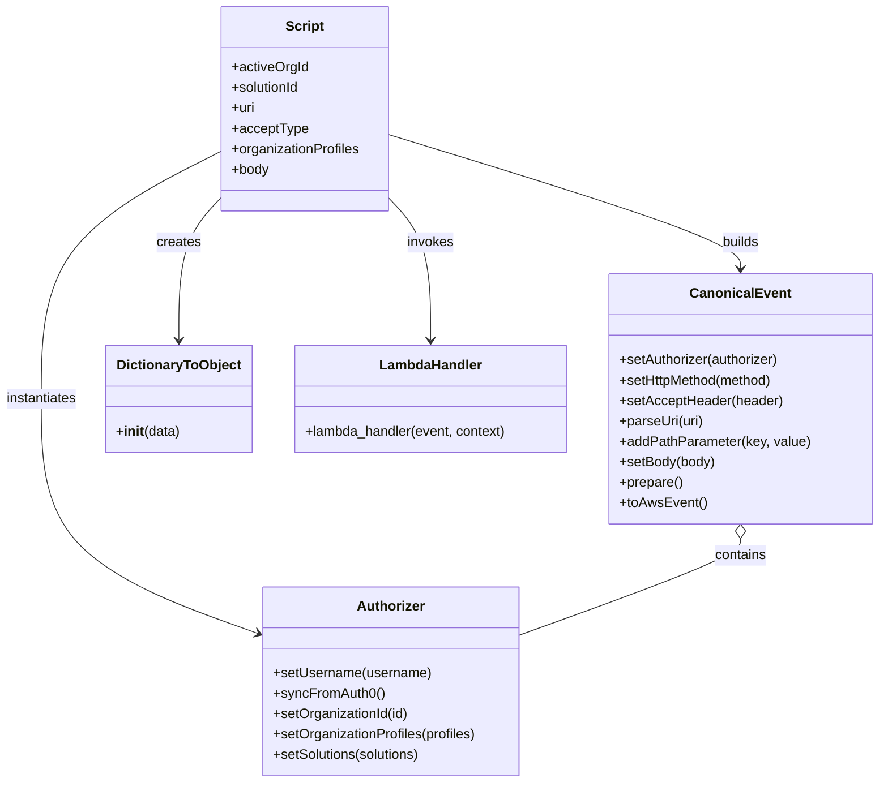

# Diagram: platform/tools/ide_local_testing/localTest/test/byUrl/entityExtract.py


> Auto-generated by Obscura crawlers

## Diagram 1

```mermaid
sequenceDiagram
    participant Script
    participant Authorizer
    participant CanonicalEvent
    participant LambdaHandler
    participant DictionaryToObject

    Script->>Authorizer: Authorizer().setUsername("shipper-org-admin@yopmail.com"); syncFromAuth0()
    Authorizer-->>Script: authorizer
    Script->>Authorizer: setOrganizationId(18); setOrganizationProfiles(["SH","FV"]); setSolutions(["GM_FV"])
    Script->>CanonicalEvent: CanonicalEvent().setAuthorizer(authorizer)
    CanonicalEvent->>CanonicalEvent: setHttpMethod("GET"); setAcceptHeader(acceptType); parseUri(uri); addPathParameter("solution_id", solutionId); setBody(body); prepare(); toAwsEvent()
    Script->>DictionaryToObject: DictionaryToObject({"function_name":"entity-status-update"})
    Script->>LambdaHandler: lambda_handler(event, DictionaryToObject)
    LambdaHandler-->>Script: retval
    Script->>Script: if retval.body -> json.loads -> pretty print; print execution time
```

> SVG rendering failed for this diagram.

## Diagram 2



### SVG

<svg id="container" width="1031.9296875" xmlns="http://www.w3.org/2000/svg" class="classDiagram" height="920" viewBox="0 0 1031.9296875 920" role="graphics-document document" aria-roledescription="class"><style>#container{font-family:"trebuchet ms",verdana,arial,sans-serif;font-size:16px;fill:#333;}@keyframes edge-animation-frame{from{stroke-dashoffset:0;}}@keyframes dash{to{stroke-dashoffset:0;}}#container .edge-animation-slow{stroke-dasharray:9,5!important;stroke-dashoffset:900;animation:dash 50s linear infinite;stroke-linecap:round;}#container .edge-animation-fast{stroke-dasharray:9,5!important;stroke-dashoffset:900;animation:dash 20s linear infinite;stroke-linecap:round;}#container .error-icon{fill:#552222;}#container .error-text{fill:#552222;stroke:#552222;}#container .edge-thickness-normal{stroke-width:1px;}#container .edge-thickness-thick{stroke-width:3.5px;}#container .edge-pattern-solid{stroke-dasharray:0;}#container .edge-thickness-invisible{stroke-width:0;fill:none;}#container .edge-pattern-dashed{stroke-dasharray:3;}#container .edge-pattern-dotted{stroke-dasharray:2;}#container .marker{fill:#333333;stroke:#333333;}#container .marker.cross{stroke:#333333;}#container svg{font-family:"trebuchet ms",verdana,arial,sans-serif;font-size:16px;}#container p{margin:0;}#container g.classGroup text{fill:#9370DB;stroke:none;font-family:"trebuchet ms",verdana,arial,sans-serif;font-size:10px;}#container g.classGroup text .title{font-weight:bolder;}#container .nodeLabel,#container .edgeLabel{color:#131300;}#container .edgeLabel .label rect{fill:#ECECFF;}#container .label text{fill:#131300;}#container .labelBkg{background:#ECECFF;}#container .edgeLabel .label span{background:#ECECFF;}#container .classTitle{font-weight:bolder;}#container .node rect,#container .node circle,#container .node ellipse,#container .node polygon,#container .node path{fill:#ECECFF;stroke:#9370DB;stroke-width:1px;}#container .divider{stroke:#9370DB;stroke-width:1;}#container g.clickable{cursor:pointer;}#container g.classGroup rect{fill:#ECECFF;stroke:#9370DB;}#container g.classGroup line{stroke:#9370DB;stroke-width:1;}#container .classLabel .box{stroke:none;stroke-width:0;fill:#ECECFF;opacity:0.5;}#container .classLabel .label{fill:#9370DB;font-size:10px;}#container .relation{stroke:#333333;stroke-width:1;fill:none;}#container .dashed-line{stroke-dasharray:3;}#container .dotted-line{stroke-dasharray:1 2;}#container #compositionStart,#container .composition{fill:#333333!important;stroke:#333333!important;stroke-width:1;}#container #compositionEnd,#container .composition{fill:#333333!important;stroke:#333333!important;stroke-width:1;}#container #dependencyStart,#container .dependency{fill:#333333!important;stroke:#333333!important;stroke-width:1;}#container #dependencyStart,#container .dependency{fill:#333333!important;stroke:#333333!important;stroke-width:1;}#container #extensionStart,#container .extension{fill:transparent!important;stroke:#333333!important;stroke-width:1;}#container #extensionEnd,#container .extension{fill:transparent!important;stroke:#333333!important;stroke-width:1;}#container #aggregationStart,#container .aggregation{fill:transparent!important;stroke:#333333!important;stroke-width:1;}#container #aggregationEnd,#container .aggregation{fill:transparent!important;stroke:#333333!important;stroke-width:1;}#container #lollipopStart,#container .lollipop{fill:#ECECFF!important;stroke:#333333!important;stroke-width:1;}#container #lollipopEnd,#container .lollipop{fill:#ECECFF!important;stroke:#333333!important;stroke-width:1;}#container .edgeTerminals{font-size:11px;line-height:initial;}#container .classTitleText{text-anchor:middle;font-size:18px;fill:#333;}#container .label-icon{display:inline-block;height:1em;overflow:visible;vertical-align:-0.125em;}#container .node .label-icon path{fill:currentColor;stroke:revert;stroke-width:revert;}#container :root{--mermaid-font-family:"trebuchet ms",verdana,arial,sans-serif;}</style><g><defs><marker id="container_class-aggregationStart" class="marker aggregation class" refX="18" refY="7" markerWidth="190" markerHeight="240" orient="auto"><path d="M 18,7 L9,13 L1,7 L9,1 Z"></path></marker></defs><defs><marker id="container_class-aggregationEnd" class="marker aggregation class" refX="1" refY="7" markerWidth="20" markerHeight="28" orient="auto"><path d="M 18,7 L9,13 L1,7 L9,1 Z"></path></marker></defs><defs><marker id="container_class-extensionStart" class="marker extension class" refX="18" refY="7" markerWidth="190" markerHeight="240" orient="auto"><path d="M 1,7 L18,13 V 1 Z"></path></marker></defs><defs><marker id="container_class-extensionEnd" class="marker extension class" refX="1" refY="7" markerWidth="20" markerHeight="28" orient="auto"><path d="M 1,1 V 13 L18,7 Z"></path></marker></defs><defs><marker id="container_class-compositionStart" class="marker composition class" refX="18" refY="7" markerWidth="190" markerHeight="240" orient="auto"><path d="M 18,7 L9,13 L1,7 L9,1 Z"></path></marker></defs><defs><marker id="container_class-compositionEnd" class="marker composition class" refX="1" refY="7" markerWidth="20" markerHeight="28" orient="auto"><path d="M 18,7 L9,13 L1,7 L9,1 Z"></path></marker></defs><defs><marker id="container_class-dependencyStart" class="marker dependency class" refX="6" refY="7" markerWidth="190" markerHeight="240" orient="auto"><path d="M 5,7 L9,13 L1,7 L9,1 Z"></path></marker></defs><defs><marker id="container_class-dependencyEnd" class="marker dependency class" refX="13" refY="7" markerWidth="20" markerHeight="28" orient="auto"><path d="M 18,7 L9,13 L14,7 L9,1 Z"></path></marker></defs><defs><marker id="container_class-lollipopStart" class="marker lollipop class" refX="13" refY="7" markerWidth="190" markerHeight="240" orient="auto"><circle stroke="black" fill="transparent" cx="7" cy="7" r="6"></circle></marker></defs><defs><marker id="container_class-lollipopEnd" class="marker lollipop class" refX="1" refY="7" markerWidth="190" markerHeight="240" orient="auto"><circle stroke="black" fill="transparent" cx="7" cy="7" r="6"></circle></marker></defs><g class="root"><g class="clusters"></g><g class="edgePaths"><path d="M262.539,178.055L227.268,195.879C191.997,213.704,121.456,249.352,86.185,297.843C50.914,346.333,50.914,407.667,50.914,469C50.914,530.333,50.914,591.667,93.149,637.552C135.383,683.438,219.853,713.876,262.087,729.095L304.322,744.314" id="id_Script_Authorizer_1" class="edge-thickness-normal edge-pattern-solid relation" style=";;;" data-edge="true" data-et="edge" data-id="id_Script_Authorizer_1" data-points="W3sieCI6MjYyLjUzOTA2MjUsInkiOjE3OC4wNTUzMTAzNzQzMTAwNH0seyJ4Ijo1MC45MTQwNjI1LCJ5IjoyODV9LHsieCI6NTAuOTE0MDYyNSwieSI6NDY5fSx7IngiOjUwLjkxNDA2MjUsInkiOjY1M30seyJ4IjozMDkuOTY2Nzk2ODc1LCJ5Ijo3NDYuMzQ3NjMxMTE3MTc2OX1d" marker-end="url(#container_class-dependencyEnd)"></path><path d="M460.641,158.446L529.26,179.539C597.879,200.631,735.117,242.815,803.736,269.074C872.355,295.333,872.355,305.667,872.355,310.833L872.355,316" id="id_Script_CanonicalEvent_2" class="edge-thickness-normal edge-pattern-solid relation" style=";;;" data-edge="true" data-et="edge" data-id="id_Script_CanonicalEvent_2" data-points="W3sieCI6NDYwLjY0MDYyNSwieSI6MTU4LjQ0NjM5NjM0MTI3Njg4fSx7IngiOjg3Mi4zNTU0Njg3NSwieSI6Mjg1fSx7IngiOjg3Mi4zNTU0Njg3NSwieSI6MzIyfV0=" marker-end="url(#container_class-dependencyEnd)"></path><path d="M872.355,633.25L872.355,636.542C872.355,639.833,872.355,646.417,829.18,665.266C786.005,684.116,699.654,715.232,656.478,730.79L613.303,746.348" id="id_CanonicalEvent_Authorizer_3" class="edge-thickness-normal edge-pattern-solid relation" style=";;;" data-edge="true" data-et="edge" data-id="id_CanonicalEvent_Authorizer_3" data-points="W3sieCI6ODcyLjM1NTQ2ODc1LCJ5Ijo2MTZ9LHsieCI6ODcyLjM1NTQ2ODc1LCJ5Ijo2NTN9LHsieCI6NjEzLjMwMjczNDM3NSwieSI6NzQ2LjM0NzYzMTExNzE3Njl9XQ==" marker-start="url(#container_class-aggregationStart)"></path><path d="M262.539,233.082L254.383,241.735C246.227,250.388,229.914,267.694,221.758,295.514C213.602,323.333,213.602,361.667,213.602,380.833L213.602,400" id="id_Script_DictionaryToObject_4" class="edge-thickness-normal edge-pattern-solid relation" style=";;;" data-edge="true" data-et="edge" data-id="id_Script_DictionaryToObject_4" data-points="W3sieCI6MjYyLjUzOTA2MjUsInkiOjIzMy4wODI0NjAwNzY1NDc0NX0seyJ4IjoyMTMuNjAxNTYyNSwieSI6Mjg1fSx7IngiOjIxMy42MDE1NjI1LCJ5Ijo0MDZ9XQ==" marker-end="url(#container_class-dependencyEnd)"></path><path d="M460.641,233.082L468.797,241.735C476.953,250.388,493.266,267.694,501.422,295.514C509.578,323.333,509.578,361.667,509.578,380.833L509.578,400" id="id_Script_LambdaHandler_5" class="edge-thickness-normal edge-pattern-solid relation" style=";;;" data-edge="true" data-et="edge" data-id="id_Script_LambdaHandler_5" data-points="W3sieCI6NDYwLjY0MDYyNSwieSI6MjMzLjA4MjQ2MDA3NjU0NzQ1fSx7IngiOjUwOS41NzgxMjUsInkiOjI4NX0seyJ4Ijo1MDkuNTc4MTI1LCJ5Ijo0MDZ9XQ==" marker-end="url(#container_class-dependencyEnd)"></path></g><g class="edgeLabels"><g class="edgeLabel" transform="translate(50.9140625, 469)"><g class="label" data-id="id_Script_Authorizer_1" transform="translate(-42.9140625, -12)"><foreignObject width="85.828125" height="24"><div xmlns="http://www.w3.org/1999/xhtml" class="labelBkg" style="display: table-cell; white-space: nowrap; line-height: 1.5; max-width: 200px; text-align: center;"><span class="edgeLabel"><p>instantiates</p></span></div></foreignObject></g></g><g class="edgeLabel" transform="translate(872.35546875, 285)"><g class="label" data-id="id_Script_CanonicalEvent_2" transform="translate(-22.4921875, -12)"><foreignObject width="44.984375" height="24"><div xmlns="http://www.w3.org/1999/xhtml" class="labelBkg" style="display: table-cell; white-space: nowrap; line-height: 1.5; max-width: 200px; text-align: center;"><span class="edgeLabel"><p>builds</p></span></div></foreignObject></g></g><g class="edgeLabel" transform="translate(872.35546875, 653)"><g class="label" data-id="id_CanonicalEvent_Authorizer_3" transform="translate(-30.890625, -12)"><foreignObject width="61.78125" height="24"><div xmlns="http://www.w3.org/1999/xhtml" class="labelBkg" style="display: table-cell; white-space: nowrap; line-height: 1.5; max-width: 200px; text-align: center;"><span class="edgeLabel"><p>contains</p></span></div></foreignObject></g></g><g class="edgeLabel" transform="translate(213.6015625, 285)"><g class="label" data-id="id_Script_DictionaryToObject_4" transform="translate(-26.171875, -12)"><foreignObject width="52.34375" height="24"><div xmlns="http://www.w3.org/1999/xhtml" class="labelBkg" style="display: table-cell; white-space: nowrap; line-height: 1.5; max-width: 200px; text-align: center;"><span class="edgeLabel"><p>creates</p></span></div></foreignObject></g></g><g class="edgeLabel" transform="translate(509.578125, 285)"><g class="label" data-id="id_Script_LambdaHandler_5" transform="translate(-27.5859375, -12)"><foreignObject width="55.171875" height="24"><div xmlns="http://www.w3.org/1999/xhtml" class="labelBkg" style="display: table-cell; white-space: nowrap; line-height: 1.5; max-width: 200px; text-align: center;"><span class="edgeLabel"><p>invokes</p></span></div></foreignObject></g></g></g><g class="nodes"><g class="node default" id="classId-Authorizer-0" transform="translate(461.634765625, 801)"><g class="basic label-container"><path d="M-151.66796875 -111 L151.66796875 -111 L151.66796875 111 L-151.66796875 111" stroke="none" stroke-width="0" fill="#ECECFF" style=""></path><path d="M-151.66796875 -111 C-74.74269389040269 -111, 2.1825809691946176 -111, 151.66796875 -111 M-151.66796875 -111 C-77.32646397781629 -111, -2.9849592056325776 -111, 151.66796875 -111 M151.66796875 -111 C151.66796875 -22.264323153607137, 151.66796875 66.47135369278573, 151.66796875 111 M151.66796875 -111 C151.66796875 -52.66846141573498, 151.66796875 5.663077168530037, 151.66796875 111 M151.66796875 111 C53.49059870595708 111, -44.68677133808583 111, -151.66796875 111 M151.66796875 111 C62.31557687484974 111, -27.03681500030052 111, -151.66796875 111 M-151.66796875 111 C-151.66796875 40.73761560833914, -151.66796875 -29.52476878332172, -151.66796875 -111 M-151.66796875 111 C-151.66796875 52.59802170913092, -151.66796875 -5.803956581738163, -151.66796875 -111" stroke="#9370DB" stroke-width="1.3" fill="none" stroke-dasharray="0 0" style=""></path></g><g class="annotation-group text" transform="translate(0, -87)"></g><g class="label-group text" transform="translate(-38.3671875, -87)"><g class="label" style="font-weight: bolder" transform="translate(0,-12)"><foreignObject width="76.734375" height="24"><div xmlns="http://www.w3.org/1999/xhtml" style="display: table-cell; white-space: nowrap; line-height: 1.5; max-width: 126px; text-align: center;"><span class="nodeLabel markdown-node-label" style=""><p>Authorizer</p></span></div></foreignObject></g></g><g class="members-group text" transform="translate(-139.66796875, -39)"></g><g class="methods-group text" transform="translate(-139.66796875, -9)"><g class="label" style="" transform="translate(0,-12)"><foreignObject width="185.90625" height="24"><div xmlns="http://www.w3.org/1999/xhtml" style="display: table-cell; white-space: nowrap; line-height: 1.5; max-width: 243px; text-align: center;"><span class="nodeLabel markdown-node-label" style=""><p>+setUsername(username)</p></span></div></foreignObject></g><g class="label" style="" transform="translate(0,12)"><foreignObject width="129.0625" height="24"><div xmlns="http://www.w3.org/1999/xhtml" style="display: table-cell; white-space: nowrap; line-height: 1.5; max-width: 186px; text-align: center;"><span class="nodeLabel markdown-node-label" style=""><p>+syncFromAuth0()</p></span></div></foreignObject></g><g class="label" style="" transform="translate(0,36)"><foreignObject width="160.78125" height="24"><div xmlns="http://www.w3.org/1999/xhtml" style="display: table-cell; white-space: nowrap; line-height: 1.5; max-width: 218px; text-align: center;"><span class="nodeLabel markdown-node-label" style=""><p>+setOrganizationId(id)</p></span></div></foreignObject></g><g class="label" style="" transform="translate(0,60)"><foreignObject width="240.96875" height="24"><div xmlns="http://www.w3.org/1999/xhtml" style="display: table-cell; white-space: nowrap; line-height: 1.5; max-width: 298px; text-align: center;"><span class="nodeLabel markdown-node-label" style=""><p>+setOrganizationProfiles(profiles)</p></span></div></foreignObject></g><g class="label" style="" transform="translate(0,84)"><foreignObject width="176.171875" height="24"><div xmlns="http://www.w3.org/1999/xhtml" style="display: table-cell; white-space: nowrap; line-height: 1.5; max-width: 234px; text-align: center;"><span class="nodeLabel markdown-node-label" style=""><p>+setSolutions(solutions)</p></span></div></foreignObject></g></g><g class="divider" style=""><path d="M-151.66796875 -63 C-84.5458177444789 -63, -17.42366673895779 -63, 151.66796875 -63 M-151.66796875 -63 C-39.510836912704804 -63, 72.64629492459039 -63, 151.66796875 -63" stroke="#9370DB" stroke-width="1.3" fill="none" stroke-dasharray="0 0" style=""></path></g><g class="divider" style=""><path d="M-151.66796875 -39 C-60.78425728260905 -39, 30.099454184781905 -39, 151.66796875 -39 M-151.66796875 -39 C-45.541281657828264 -39, 60.58540543434347 -39, 151.66796875 -39" stroke="#9370DB" stroke-width="1.3" fill="none" stroke-dasharray="0 0" style=""></path></g></g><g class="node default" id="classId-CanonicalEvent-1" transform="translate(872.35546875, 469)"><g class="basic label-container"><path d="M-151.57421875 -147 L151.57421875 -147 L151.57421875 147 L-151.57421875 147" stroke="none" stroke-width="0" fill="#ECECFF" style=""></path><path d="M-151.57421875 -147 C-61.34614407010832 -147, 28.881930609783353 -147, 151.57421875 -147 M-151.57421875 -147 C-66.29139570579738 -147, 18.99142733840523 -147, 151.57421875 -147 M151.57421875 -147 C151.57421875 -80.77236064444823, 151.57421875 -14.544721288896454, 151.57421875 147 M151.57421875 -147 C151.57421875 -70.13453632399707, 151.57421875 6.730927352005864, 151.57421875 147 M151.57421875 147 C69.04922566434672 147, -13.475767421306557 147, -151.57421875 147 M151.57421875 147 C40.77720061988684 147, -70.01981751022632 147, -151.57421875 147 M-151.57421875 147 C-151.57421875 53.31002612481748, -151.57421875 -40.379947750365034, -151.57421875 -147 M-151.57421875 147 C-151.57421875 65.2065459867014, -151.57421875 -16.5869080265972, -151.57421875 -147" stroke="#9370DB" stroke-width="1.3" fill="none" stroke-dasharray="0 0" style=""></path></g><g class="annotation-group text" transform="translate(0, -123)"></g><g class="label-group text" transform="translate(-55.7109375, -123)"><g class="label" style="font-weight: bolder" transform="translate(0,-12)"><foreignObject width="111.421875" height="24"><div xmlns="http://www.w3.org/1999/xhtml" style="display: table-cell; white-space: nowrap; line-height: 1.5; max-width: 161px; text-align: center;"><span class="nodeLabel markdown-node-label" style=""><p>CanonicalEvent</p></span></div></foreignObject></g></g><g class="members-group text" transform="translate(-139.57421875, -75)"></g><g class="methods-group text" transform="translate(-139.57421875, -45)"><g class="label" style="" transform="translate(0,-12)"><foreignObject width="190.75" height="24"><div xmlns="http://www.w3.org/1999/xhtml" style="display: table-cell; white-space: nowrap; line-height: 1.5; max-width: 248px; text-align: center;"><span class="nodeLabel markdown-node-label" style=""><p>+setAuthorizer(authorizer)</p></span></div></foreignObject></g><g class="label" style="" transform="translate(0,12)"><foreignObject width="184" height="24"><div xmlns="http://www.w3.org/1999/xhtml" style="display: table-cell; white-space: nowrap; line-height: 1.5; max-width: 241px; text-align: center;"><span class="nodeLabel markdown-node-label" style=""><p>+setHttpMethod(method)</p></span></div></foreignObject></g><g class="label" style="" transform="translate(0,36)"><foreignObject width="191.859375" height="24"><div xmlns="http://www.w3.org/1999/xhtml" style="display: table-cell; white-space: nowrap; line-height: 1.5; max-width: 249px; text-align: center;"><span class="nodeLabel markdown-node-label" style=""><p>+setAcceptHeader(header)</p></span></div></foreignObject></g><g class="label" style="" transform="translate(0,60)"><foreignObject width="99.8125" height="24"><div xmlns="http://www.w3.org/1999/xhtml" style="display: table-cell; white-space: nowrap; line-height: 1.5; max-width: 157px; text-align: center;"><span class="nodeLabel markdown-node-label" style=""><p>+parseUri(uri)</p></span></div></foreignObject></g><g class="label" style="" transform="translate(0,84)"><foreignObject width="223.4375" height="24"><div xmlns="http://www.w3.org/1999/xhtml" style="display: table-cell; white-space: nowrap; line-height: 1.5; max-width: 281px; text-align: center;"><span class="nodeLabel markdown-node-label" style=""><p>+addPathParameter(key, value)</p></span></div></foreignObject></g><g class="label" style="" transform="translate(0,108)"><foreignObject width="113.125" height="24"><div xmlns="http://www.w3.org/1999/xhtml" style="display: table-cell; white-space: nowrap; line-height: 1.5; max-width: 170px; text-align: center;"><span class="nodeLabel markdown-node-label" style=""><p>+setBody(body)</p></span></div></foreignObject></g><g class="label" style="" transform="translate(0,132)"><foreignObject width="74.75" height="24"><div xmlns="http://www.w3.org/1999/xhtml" style="display: table-cell; white-space: nowrap; line-height: 1.5; max-width: 132px; text-align: center;"><span class="nodeLabel markdown-node-label" style=""><p>+prepare()</p></span></div></foreignObject></g><g class="label" style="" transform="translate(0,156)"><foreignObject width="101.1875" height="24"><div xmlns="http://www.w3.org/1999/xhtml" style="display: table-cell; white-space: nowrap; line-height: 1.5; max-width: 159px; text-align: center;"><span class="nodeLabel markdown-node-label" style=""><p>+toAwsEvent()</p></span></div></foreignObject></g></g><g class="divider" style=""><path d="M-151.57421875 -99 C-78.09616386089021 -99, -4.61810897178043 -99, 151.57421875 -99 M-151.57421875 -99 C-84.94973107151846 -99, -18.325243393036914 -99, 151.57421875 -99" stroke="#9370DB" stroke-width="1.3" fill="none" stroke-dasharray="0 0" style=""></path></g><g class="divider" style=""><path d="M-151.57421875 -75 C-43.892812259576914 -75, 63.78859423084617 -75, 151.57421875 -75 M-151.57421875 -75 C-81.28012954008014 -75, -10.986040330160279 -75, 151.57421875 -75" stroke="#9370DB" stroke-width="1.3" fill="none" stroke-dasharray="0 0" style=""></path></g></g><g class="node default" id="classId-DictionaryToObject-2" transform="translate(213.6015625, 469)"><g class="basic label-container"><path d="M-84.7734375 -63 L84.7734375 -63 L84.7734375 63 L-84.7734375 63" stroke="none" stroke-width="0" fill="#ECECFF" style=""></path><path d="M-84.7734375 -63 C-21.18287544065678 -63, 42.40768661868644 -63, 84.7734375 -63 M-84.7734375 -63 C-24.693113496694465 -63, 35.38721050661107 -63, 84.7734375 -63 M84.7734375 -63 C84.7734375 -31.9690692341226, 84.7734375 -0.9381384682451994, 84.7734375 63 M84.7734375 -63 C84.7734375 -21.86104270284548, 84.7734375 19.27791459430904, 84.7734375 63 M84.7734375 63 C48.89901083830451 63, 13.024584176609025 63, -84.7734375 63 M84.7734375 63 C21.284447429070134 63, -42.20454264185973 63, -84.7734375 63 M-84.7734375 63 C-84.7734375 30.416021554904304, -84.7734375 -2.167956890191391, -84.7734375 -63 M-84.7734375 63 C-84.7734375 29.352924854653445, -84.7734375 -4.294150290693111, -84.7734375 -63" stroke="#9370DB" stroke-width="1.3" fill="none" stroke-dasharray="0 0" style=""></path></g><g class="annotation-group text" transform="translate(0, -39)"></g><g class="label-group text" transform="translate(-70.109375, -39)"><g class="label" style="font-weight: bolder" transform="translate(0,-12)"><foreignObject width="140.21875" height="24"><div xmlns="http://www.w3.org/1999/xhtml" style="display: table-cell; white-space: nowrap; line-height: 1.5; max-width: 188px; text-align: center;"><span class="nodeLabel markdown-node-label" style=""><p>DictionaryToObject</p></span></div></foreignObject></g></g><g class="members-group text" transform="translate(-72.7734375, 9)"></g><g class="methods-group text" transform="translate(-72.7734375, 39)"><g class="label" style="" transform="translate(0,-12)"><foreignObject width="75.4375" height="24"><div xmlns="http://www.w3.org/1999/xhtml" style="display: table-cell; white-space: nowrap; line-height: 1.5; max-width: 164px; text-align: center;"><span class="nodeLabel markdown-node-label" style=""><p>+<strong>init</strong>(data)</p></span></div></foreignObject></g></g><g class="divider" style=""><path d="M-84.7734375 -15 C-35.308897737520425 -15, 14.15564202495915 -15, 84.7734375 -15 M-84.7734375 -15 C-46.861172677201615 -15, -8.948907854403231 -15, 84.7734375 -15" stroke="#9370DB" stroke-width="1.3" fill="none" stroke-dasharray="0 0" style=""></path></g><g class="divider" style=""><path d="M-84.7734375 9 C-42.72402156082429 9, -0.6746056216485812 9, 84.7734375 9 M-84.7734375 9 C-35.28348985147027 9, 14.206457797059457 9, 84.7734375 9" stroke="#9370DB" stroke-width="1.3" fill="none" stroke-dasharray="0 0" style=""></path></g></g><g class="node default" id="classId-LambdaHandler-3" transform="translate(509.578125, 469)"><g class="basic label-container"><path d="M-161.203125 -63 L161.203125 -63 L161.203125 63 L-161.203125 63" stroke="none" stroke-width="0" fill="#ECECFF" style=""></path><path d="M-161.203125 -63 C-34.32595172627185 -63, 92.5512215474563 -63, 161.203125 -63 M-161.203125 -63 C-36.37671392459612 -63, 88.44969715080776 -63, 161.203125 -63 M161.203125 -63 C161.203125 -30.479685993380144, 161.203125 2.0406280132397114, 161.203125 63 M161.203125 -63 C161.203125 -33.24258611038094, 161.203125 -3.485172220761889, 161.203125 63 M161.203125 63 C34.71610599277541 63, -91.77091301444918 63, -161.203125 63 M161.203125 63 C90.74515380009613 63, 20.287182600192267 63, -161.203125 63 M-161.203125 63 C-161.203125 20.35176796364847, -161.203125 -22.29646407270306, -161.203125 -63 M-161.203125 63 C-161.203125 27.537687693050998, -161.203125 -7.924624613898004, -161.203125 -63" stroke="#9370DB" stroke-width="1.3" fill="none" stroke-dasharray="0 0" style=""></path></g><g class="annotation-group text" transform="translate(0, -39)"></g><g class="label-group text" transform="translate(-58.21875, -39)"><g class="label" style="font-weight: bolder" transform="translate(0,-12)"><foreignObject width="116.4375" height="24"><div xmlns="http://www.w3.org/1999/xhtml" style="display: table-cell; white-space: nowrap; line-height: 1.5; max-width: 167px; text-align: center;"><span class="nodeLabel markdown-node-label" style=""><p>LambdaHandler</p></span></div></foreignObject></g></g><g class="members-group text" transform="translate(-149.203125, 9)"></g><g class="methods-group text" transform="translate(-149.203125, 39)"><g class="label" style="" transform="translate(0,-12)"><foreignObject width="240.1875" height="24"><div xmlns="http://www.w3.org/1999/xhtml" style="display: table-cell; white-space: nowrap; line-height: 1.5; max-width: 298px; text-align: center;"><span class="nodeLabel markdown-node-label" style=""><p>+lambda_handler(event, context)</p></span></div></foreignObject></g></g><g class="divider" style=""><path d="M-161.203125 -15 C-50.47080417198559 -15, 60.26151665602882 -15, 161.203125 -15 M-161.203125 -15 C-93.53149537507112 -15, -25.859865750142234 -15, 161.203125 -15" stroke="#9370DB" stroke-width="1.3" fill="none" stroke-dasharray="0 0" style=""></path></g><g class="divider" style=""><path d="M-161.203125 9 C-54.82179064992836 9, 51.55954370014328 9, 161.203125 9 M-161.203125 9 C-61.58249885526813 9, 38.038127289463745 9, 161.203125 9" stroke="#9370DB" stroke-width="1.3" fill="none" stroke-dasharray="0 0" style=""></path></g></g><g class="node default" id="classId-Script-4" transform="translate(361.58984375, 128)"><g class="basic label-container"><path d="M-99.05078125 -120 L99.05078125 -120 L99.05078125 120 L-99.05078125 120" stroke="none" stroke-width="0" fill="#ECECFF" style=""></path><path d="M-99.05078125 -120 C-29.27492134140887 -120, 40.50093856718226 -120, 99.05078125 -120 M-99.05078125 -120 C-59.01353584329993 -120, -18.976290436599854 -120, 99.05078125 -120 M99.05078125 -120 C99.05078125 -64.94519962888825, 99.05078125 -9.890399257776494, 99.05078125 120 M99.05078125 -120 C99.05078125 -56.77920667054877, 99.05078125 6.441586658902466, 99.05078125 120 M99.05078125 120 C58.48592403124782 120, 17.92106681249564 120, -99.05078125 120 M99.05078125 120 C50.52145543307714 120, 1.992129616154287 120, -99.05078125 120 M-99.05078125 120 C-99.05078125 66.78134127486675, -99.05078125 13.56268254973348, -99.05078125 -120 M-99.05078125 120 C-99.05078125 55.81921461165993, -99.05078125 -8.36157077668014, -99.05078125 -120" stroke="#9370DB" stroke-width="1.3" fill="none" stroke-dasharray="0 0" style=""></path></g><g class="annotation-group text" transform="translate(0, -96)"></g><g class="label-group text" transform="translate(-21.7421875, -96)"><g class="label" style="font-weight: bolder" transform="translate(0,-12)"><foreignObject width="43.484375" height="24"><div xmlns="http://www.w3.org/1999/xhtml" style="display: table-cell; white-space: nowrap; line-height: 1.5; max-width: 93px; text-align: center;"><span class="nodeLabel markdown-node-label" style=""><p>Script</p></span></div></foreignObject></g></g><g class="members-group text" transform="translate(-87.05078125, -48)"><g class="label" style="" transform="translate(0,-12)"><foreignObject width="90.53125" height="24"><div xmlns="http://www.w3.org/1999/xhtml" style="display: table-cell; white-space: nowrap; line-height: 1.5; max-width: 148px; text-align: center;"><span class="nodeLabel markdown-node-label" style=""><p>+activeOrgId</p></span></div></foreignObject></g><g class="label" style="" transform="translate(0,12)"><foreignObject width="82.109375" height="24"><div xmlns="http://www.w3.org/1999/xhtml" style="display: table-cell; white-space: nowrap; line-height: 1.5; max-width: 139px; text-align: center;"><span class="nodeLabel markdown-node-label" style=""><p>+solutionId</p></span></div></foreignObject></g><g class="label" style="" transform="translate(0,36)"><foreignObject width="27.984375" height="24"><div xmlns="http://www.w3.org/1999/xhtml" style="display: table-cell; white-space: nowrap; line-height: 1.5; max-width: 85px; text-align: center;"><span class="nodeLabel markdown-node-label" style=""><p>+uri</p></span></div></foreignObject></g><g class="label" style="" transform="translate(0,60)"><foreignObject width="88.84375" height="24"><div xmlns="http://www.w3.org/1999/xhtml" style="display: table-cell; white-space: nowrap; line-height: 1.5; max-width: 146px; text-align: center;"><span class="nodeLabel markdown-node-label" style=""><p>+acceptType</p></span></div></foreignObject></g><g class="label" style="" transform="translate(0,84)"><foreignObject width="152.359375" height="24"><div xmlns="http://www.w3.org/1999/xhtml" style="display: table-cell; white-space: nowrap; line-height: 1.5; max-width: 210px; text-align: center;"><span class="nodeLabel markdown-node-label" style=""><p>+organizationProfiles</p></span></div></foreignObject></g><g class="label" style="" transform="translate(0,108)"><foreignObject width="44.28125" height="24"><div xmlns="http://www.w3.org/1999/xhtml" style="display: table-cell; white-space: nowrap; line-height: 1.5; max-width: 102px; text-align: center;"><span class="nodeLabel markdown-node-label" style=""><p>+body</p></span></div></foreignObject></g></g><g class="methods-group text" transform="translate(-87.05078125, 120)"></g><g class="divider" style=""><path d="M-99.05078125 -72 C-31.417036821703178 -72, 36.216707606593644 -72, 99.05078125 -72 M-99.05078125 -72 C-30.184646229987678 -72, 38.681488790024645 -72, 99.05078125 -72" stroke="#9370DB" stroke-width="1.3" fill="none" stroke-dasharray="0 0" style=""></path></g><g class="divider" style=""><path d="M-99.05078125 96 C-22.64687719692813 96, 53.75702685614374 96, 99.05078125 96 M-99.05078125 96 C-53.574485970370645 96, -8.09819069074129 96, 99.05078125 96" stroke="#9370DB" stroke-width="1.3" fill="none" stroke-dasharray="0 0" style=""></path></g></g></g></g></g></svg>

## Diagram 3

```mermaid
flowchart TD
    Start([Start])
    SetVars[Set variables: activeOrgId, solutionId, acceptType]
    BuildURI[Build URI with solutionId and query params]
    CreateAuth[Create Authorizer and syncFromAuth0()]
    ConfigureAuth[Configure Authorizer: org id, profiles, solutions]
    CreateEvent[Create CanonicalEvent and set authorizer]
    PrepareEvent[prepare() and toAwsEvent()]
    CallLambda[Invoke lambda_handler(event, DictionaryToObject(...))]
    Response{retval has body?}
    ParseBody[Parse JSON body and pretty-print]
    PrintTime[Print prettyRetval and execution time]
    End([End])

    Start --> SetVars --> BuildURI --> CreateAuth --> ConfigureAuth --> CreateEvent --> PrepareEvent --> CallLambda --> Response
    Response -->|yes| ParseBody --> PrintTime --> End
    Response -->|no| PrintTime --> End
```

> SVG rendering failed for this diagram.
