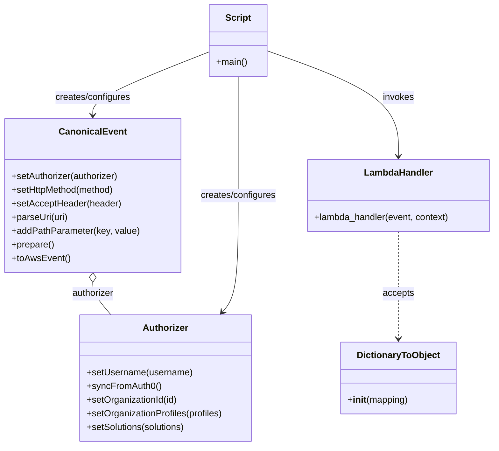
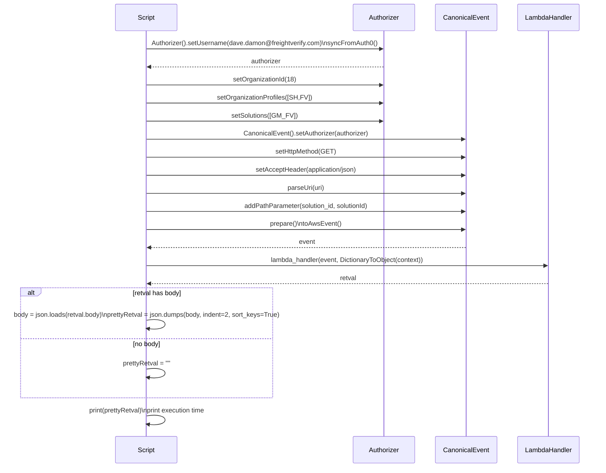

# Diagram: platform/tools/ide_local_testing/localTest/test/byUrl/entityGetStatusUpdates.py


> Auto-generated by Obscura crawlers

## Diagram 1

```mermaid
flowchart LR
    Start([Start])
    SetConsts[Set acceptType\nactiveOrgId\nsolutionId\norganizationProfiles]
    BuildURI[Build URI string]
    CreateAuth[Authorizer().setUsername(...)\nsyncFromAuth0()]
    ConfigureAuth[Configure authorizer:\nsetOrganizationId / setOrganizationProfiles / setSolutions]
    CreateEvent[CanonicalEvent():\nsetAuthorizer / setHttpMethod(GET)\nsetAcceptHeader(acceptType)]
    PrepareEvent[parseUri(uri)\naddPathParameter(solution_id, solutionId)\nprepare()\ntoAwsEvent()]
    CallLambda[Call lambda_handler(event,\nDictionaryToObject(context))]
    HandleResp{Response has body?}
    ParseBody[json.loads(retval.body)\nprettyRetval = json.dumps(...)]
    EmptyPretty[prettyRetval = ""]
    Print[print(prettyRetval)\nprint execution time]
    End([End])

    Start --> SetConsts
    SetConsts --> BuildURI
    BuildURI --> CreateAuth
    CreateAuth --> ConfigureAuth
    ConfigureAuth --> CreateEvent
    CreateEvent --> PrepareEvent
    PrepareEvent --> CallLambda
    CallLambda --> HandleResp
    HandleResp -->|yes| ParseBody
    HandleResp -->|no| EmptyPretty
    ParseBody --> Print
    EmptyPretty --> Print
    Print --> End
```

> SVG rendering failed for this diagram.

## Diagram 2



### SVG

<svg id="container" width="865.275390625" xmlns="http://www.w3.org/2000/svg" class="classDiagram" height="782" viewBox="0 0 865.275390625 782" role="graphics-document document" aria-roledescription="class"><style>#container{font-family:"trebuchet ms",verdana,arial,sans-serif;font-size:16px;fill:#333;}@keyframes edge-animation-frame{from{stroke-dashoffset:0;}}@keyframes dash{to{stroke-dashoffset:0;}}#container .edge-animation-slow{stroke-dasharray:9,5!important;stroke-dashoffset:900;animation:dash 50s linear infinite;stroke-linecap:round;}#container .edge-animation-fast{stroke-dasharray:9,5!important;stroke-dashoffset:900;animation:dash 20s linear infinite;stroke-linecap:round;}#container .error-icon{fill:#552222;}#container .error-text{fill:#552222;stroke:#552222;}#container .edge-thickness-normal{stroke-width:1px;}#container .edge-thickness-thick{stroke-width:3.5px;}#container .edge-pattern-solid{stroke-dasharray:0;}#container .edge-thickness-invisible{stroke-width:0;fill:none;}#container .edge-pattern-dashed{stroke-dasharray:3;}#container .edge-pattern-dotted{stroke-dasharray:2;}#container .marker{fill:#333333;stroke:#333333;}#container .marker.cross{stroke:#333333;}#container svg{font-family:"trebuchet ms",verdana,arial,sans-serif;font-size:16px;}#container p{margin:0;}#container g.classGroup text{fill:#9370DB;stroke:none;font-family:"trebuchet ms",verdana,arial,sans-serif;font-size:10px;}#container g.classGroup text .title{font-weight:bolder;}#container .nodeLabel,#container .edgeLabel{color:#131300;}#container .edgeLabel .label rect{fill:#ECECFF;}#container .label text{fill:#131300;}#container .labelBkg{background:#ECECFF;}#container .edgeLabel .label span{background:#ECECFF;}#container .classTitle{font-weight:bolder;}#container .node rect,#container .node circle,#container .node ellipse,#container .node polygon,#container .node path{fill:#ECECFF;stroke:#9370DB;stroke-width:1px;}#container .divider{stroke:#9370DB;stroke-width:1;}#container g.clickable{cursor:pointer;}#container g.classGroup rect{fill:#ECECFF;stroke:#9370DB;}#container g.classGroup line{stroke:#9370DB;stroke-width:1;}#container .classLabel .box{stroke:none;stroke-width:0;fill:#ECECFF;opacity:0.5;}#container .classLabel .label{fill:#9370DB;font-size:10px;}#container .relation{stroke:#333333;stroke-width:1;fill:none;}#container .dashed-line{stroke-dasharray:3;}#container .dotted-line{stroke-dasharray:1 2;}#container #compositionStart,#container .composition{fill:#333333!important;stroke:#333333!important;stroke-width:1;}#container #compositionEnd,#container .composition{fill:#333333!important;stroke:#333333!important;stroke-width:1;}#container #dependencyStart,#container .dependency{fill:#333333!important;stroke:#333333!important;stroke-width:1;}#container #dependencyStart,#container .dependency{fill:#333333!important;stroke:#333333!important;stroke-width:1;}#container #extensionStart,#container .extension{fill:transparent!important;stroke:#333333!important;stroke-width:1;}#container #extensionEnd,#container .extension{fill:transparent!important;stroke:#333333!important;stroke-width:1;}#container #aggregationStart,#container .aggregation{fill:transparent!important;stroke:#333333!important;stroke-width:1;}#container #aggregationEnd,#container .aggregation{fill:transparent!important;stroke:#333333!important;stroke-width:1;}#container #lollipopStart,#container .lollipop{fill:#ECECFF!important;stroke:#333333!important;stroke-width:1;}#container #lollipopEnd,#container .lollipop{fill:#ECECFF!important;stroke:#333333!important;stroke-width:1;}#container .edgeTerminals{font-size:11px;line-height:initial;}#container .classTitleText{text-anchor:middle;font-size:18px;fill:#333;}#container .label-icon{display:inline-block;height:1em;overflow:visible;vertical-align:-0.125em;}#container .node .label-icon path{fill:currentColor;stroke:revert;stroke-width:revert;}#container :root{--mermaid-font-family:"trebuchet ms",verdana,arial,sans-serif;}</style><g><defs><marker id="container_class-aggregationStart" class="marker aggregation class" refX="18" refY="7" markerWidth="190" markerHeight="240" orient="auto"><path d="M 18,7 L9,13 L1,7 L9,1 Z"></path></marker></defs><defs><marker id="container_class-aggregationEnd" class="marker aggregation class" refX="1" refY="7" markerWidth="20" markerHeight="28" orient="auto"><path d="M 18,7 L9,13 L1,7 L9,1 Z"></path></marker></defs><defs><marker id="container_class-extensionStart" class="marker extension class" refX="18" refY="7" markerWidth="190" markerHeight="240" orient="auto"><path d="M 1,7 L18,13 V 1 Z"></path></marker></defs><defs><marker id="container_class-extensionEnd" class="marker extension class" refX="1" refY="7" markerWidth="20" markerHeight="28" orient="auto"><path d="M 1,1 V 13 L18,7 Z"></path></marker></defs><defs><marker id="container_class-compositionStart" class="marker composition class" refX="18" refY="7" markerWidth="190" markerHeight="240" orient="auto"><path d="M 18,7 L9,13 L1,7 L9,1 Z"></path></marker></defs><defs><marker id="container_class-compositionEnd" class="marker composition class" refX="1" refY="7" markerWidth="20" markerHeight="28" orient="auto"><path d="M 18,7 L9,13 L1,7 L9,1 Z"></path></marker></defs><defs><marker id="container_class-dependencyStart" class="marker dependency class" refX="6" refY="7" markerWidth="190" markerHeight="240" orient="auto"><path d="M 5,7 L9,13 L1,7 L9,1 Z"></path></marker></defs><defs><marker id="container_class-dependencyEnd" class="marker dependency class" refX="13" refY="7" markerWidth="20" markerHeight="28" orient="auto"><path d="M 18,7 L9,13 L14,7 L9,1 Z"></path></marker></defs><defs><marker id="container_class-lollipopStart" class="marker lollipop class" refX="13" refY="7" markerWidth="190" markerHeight="240" orient="auto"><circle stroke="black" fill="transparent" cx="7" cy="7" r="6"></circle></marker></defs><defs><marker id="container_class-lollipopEnd" class="marker lollipop class" refX="1" refY="7" markerWidth="190" markerHeight="240" orient="auto"><circle stroke="black" fill="transparent" cx="7" cy="7" r="6"></circle></marker></defs><g class="root"><g class="clusters"></g><g class="edgePaths"><path d="M159.574,495.25L159.574,498.542C159.574,501.833,159.574,508.417,164.862,517.875C170.15,527.333,180.725,539.667,186.013,545.833L191.3,552" id="id_CanonicalEvent_Authorizer_1" class="edge-thickness-normal edge-pattern-solid relation" style=";;;" data-edge="true" data-et="edge" data-id="id_CanonicalEvent_Authorizer_1" data-points="W3sieCI6MTU5LjU3NDIxODc1LCJ5Ijo0Nzh9LHsieCI6MTU5LjU3NDIxODc1LCJ5Ijo1MTV9LHsieCI6MTkxLjMwMDI5Mjk2ODc1LCJ5Ijo1NTJ9XQ==" marker-start="url(#container_class-aggregationStart)"></path><path d="M413.383,134L413.383,140.167C413.383,146.333,413.383,158.667,413.383,193.5C413.383,228.333,413.383,285.667,413.383,343C413.383,400.333,413.383,457.667,408.746,491.741C404.109,525.815,394.836,536.63,390.199,542.038L385.562,547.445" id="id_Script_Authorizer_2" class="edge-thickness-normal edge-pattern-solid relation" style=";;;" data-edge="true" data-et="edge" data-id="id_Script_Authorizer_2" data-points="W3sieCI6NDEzLjM4MjgxMjUsInkiOjEzNH0seyJ4Ijo0MTMuMzgyODEyNSwieSI6MTcxfSx7IngiOjQxMy4zODI4MTI1LCJ5IjozNDN9LHsieCI6NDEzLjM4MjgxMjUsInkiOjUxNX0seyJ4IjozODEuNjU2NzM4MjgxMjUsInkiOjU1Mn1d" marker-end="url(#container_class-dependencyEnd)"></path><path d="M363.184,90.778L329.249,104.149C295.314,117.519,227.444,144.259,193.509,162.796C159.574,181.333,159.574,191.667,159.574,196.833L159.574,202" id="id_Script_CanonicalEvent_3" class="edge-thickness-normal edge-pattern-solid relation" style=";;;" data-edge="true" data-et="edge" data-id="id_Script_CanonicalEvent_3" data-points="W3sieCI6MzYzLjE4MzU5Mzc1LCJ5Ijo5MC43NzgzNzYyOTg1NzYzOH0seyJ4IjoxNTkuNTc0MjE4NzUsInkiOjE3MX0seyJ4IjoxNTkuNTc0MjE4NzUsInkiOjIwOH1d" marker-end="url(#container_class-dependencyEnd)"></path><path d="M463.582,88.758L502.33,102.465C541.079,116.172,618.576,143.586,657.324,174.46C696.072,205.333,696.072,239.667,696.072,256.833L696.072,274" id="id_Script_LambdaHandler_4" class="edge-thickness-normal edge-pattern-solid relation" style=";;;" data-edge="true" data-et="edge" data-id="id_Script_LambdaHandler_4" data-points="W3sieCI6NDYzLjU4MjAzMTI1LCJ5Ijo4OC43NTc3MjYwODI0ODA2NH0seyJ4Ijo2OTYuMDcyMjY1NjI1LCJ5IjoxNzF9LHsieCI6Njk2LjA3MjI2NTYyNSwieSI6MjgwfV0=" marker-end="url(#container_class-dependencyEnd)"></path><path d="M696.072,406L696.072,424.167C696.072,442.333,696.072,478.667,696.072,510C696.072,541.333,696.072,567.667,696.072,580.833L696.072,594" id="id_LambdaHandler_DictionaryToObject_5" class="edge-thickness-normal edge-pattern-dashed relation" style=";;;" data-edge="true" data-et="edge" data-id="id_LambdaHandler_DictionaryToObject_5" data-points="W3sieCI6Njk2LjA3MjI2NTYyNSwieSI6NDA2fSx7IngiOjY5Ni4wNzIyNjU2MjUsInkiOjUxNX0seyJ4Ijo2OTYuMDcyMjY1NjI1LCJ5Ijo2MDB9XQ==" marker-end="url(#container_class-dependencyEnd)"></path></g><g class="edgeLabels"><g class="edgeLabel" transform="translate(159.57421875, 515)"><g class="label" data-id="id_CanonicalEvent_Authorizer_1" transform="translate(-37.4921875, -12)"><foreignObject width="74.984375" height="24"><div xmlns="http://www.w3.org/1999/xhtml" class="labelBkg" style="display: table-cell; white-space: nowrap; line-height: 1.5; max-width: 200px; text-align: center;"><span class="edgeLabel"><p>authorizer</p></span></div></foreignObject></g></g><g class="edgeLabel" transform="translate(413.3828125, 343)"><g class="label" data-id="id_Script_Authorizer_2" transform="translate(-67.234375, -12)"><foreignObject width="134.46875" height="24"><div xmlns="http://www.w3.org/1999/xhtml" class="labelBkg" style="display: table-cell; white-space: nowrap; line-height: 1.5; max-width: 200px; text-align: center;"><span class="edgeLabel"><p>creates/configures</p></span></div></foreignObject></g></g><g class="edgeLabel" transform="translate(159.57421875, 171)"><g class="label" data-id="id_Script_CanonicalEvent_3" transform="translate(-67.234375, -12)"><foreignObject width="134.46875" height="24"><div xmlns="http://www.w3.org/1999/xhtml" class="labelBkg" style="display: table-cell; white-space: nowrap; line-height: 1.5; max-width: 200px; text-align: center;"><span class="edgeLabel"><p>creates/configures</p></span></div></foreignObject></g></g><g class="edgeLabel" transform="translate(696.072265625, 171)"><g class="label" data-id="id_Script_LambdaHandler_4" transform="translate(-27.5859375, -12)"><foreignObject width="55.171875" height="24"><div xmlns="http://www.w3.org/1999/xhtml" class="labelBkg" style="display: table-cell; white-space: nowrap; line-height: 1.5; max-width: 200px; text-align: center;"><span class="edgeLabel"><p>invokes</p></span></div></foreignObject></g></g><g class="edgeLabel" transform="translate(696.072265625, 515)"><g class="label" data-id="id_LambdaHandler_DictionaryToObject_5" transform="translate(-27.421875, -12)"><foreignObject width="54.84375" height="24"><div xmlns="http://www.w3.org/1999/xhtml" class="labelBkg" style="display: table-cell; white-space: nowrap; line-height: 1.5; max-width: 200px; text-align: center;"><span class="edgeLabel"><p>accepts</p></span></div></foreignObject></g></g></g><g class="nodes"><g class="node default" id="classId-Authorizer-0" transform="translate(286.478515625, 663)"><g class="basic label-container"><path d="M-151.66796875 -111 L151.66796875 -111 L151.66796875 111 L-151.66796875 111" stroke="none" stroke-width="0" fill="#ECECFF" style=""></path><path d="M-151.66796875 -111 C-60.874958808279686 -111, 29.918051133440628 -111, 151.66796875 -111 M-151.66796875 -111 C-52.85866650439473 -111, 45.95063574121053 -111, 151.66796875 -111 M151.66796875 -111 C151.66796875 -45.68499998224432, 151.66796875 19.630000035511358, 151.66796875 111 M151.66796875 -111 C151.66796875 -23.55077959689318, 151.66796875 63.89844080621364, 151.66796875 111 M151.66796875 111 C66.6660152348098 111, -18.33593828038039 111, -151.66796875 111 M151.66796875 111 C65.96547515423565 111, -19.737018441528704 111, -151.66796875 111 M-151.66796875 111 C-151.66796875 22.87305485861009, -151.66796875 -65.25389028277982, -151.66796875 -111 M-151.66796875 111 C-151.66796875 34.671221021259726, -151.66796875 -41.65755795748055, -151.66796875 -111" stroke="#9370DB" stroke-width="1.3" fill="none" stroke-dasharray="0 0" style=""></path></g><g class="annotation-group text" transform="translate(0, -87)"></g><g class="label-group text" transform="translate(-38.3671875, -87)"><g class="label" style="font-weight: bolder" transform="translate(0,-12)"><foreignObject width="76.734375" height="24"><div xmlns="http://www.w3.org/1999/xhtml" style="display: table-cell; white-space: nowrap; line-height: 1.5; max-width: 126px; text-align: center;"><span class="nodeLabel markdown-node-label" style=""><p>Authorizer</p></span></div></foreignObject></g></g><g class="members-group text" transform="translate(-139.66796875, -39)"></g><g class="methods-group text" transform="translate(-139.66796875, -9)"><g class="label" style="" transform="translate(0,-12)"><foreignObject width="185.90625" height="24"><div xmlns="http://www.w3.org/1999/xhtml" style="display: table-cell; white-space: nowrap; line-height: 1.5; max-width: 243px; text-align: center;"><span class="nodeLabel markdown-node-label" style=""><p>+setUsername(username)</p></span></div></foreignObject></g><g class="label" style="" transform="translate(0,12)"><foreignObject width="129.0625" height="24"><div xmlns="http://www.w3.org/1999/xhtml" style="display: table-cell; white-space: nowrap; line-height: 1.5; max-width: 186px; text-align: center;"><span class="nodeLabel markdown-node-label" style=""><p>+syncFromAuth0()</p></span></div></foreignObject></g><g class="label" style="" transform="translate(0,36)"><foreignObject width="160.78125" height="24"><div xmlns="http://www.w3.org/1999/xhtml" style="display: table-cell; white-space: nowrap; line-height: 1.5; max-width: 218px; text-align: center;"><span class="nodeLabel markdown-node-label" style=""><p>+setOrganizationId(id)</p></span></div></foreignObject></g><g class="label" style="" transform="translate(0,60)"><foreignObject width="240.96875" height="24"><div xmlns="http://www.w3.org/1999/xhtml" style="display: table-cell; white-space: nowrap; line-height: 1.5; max-width: 298px; text-align: center;"><span class="nodeLabel markdown-node-label" style=""><p>+setOrganizationProfiles(profiles)</p></span></div></foreignObject></g><g class="label" style="" transform="translate(0,84)"><foreignObject width="176.171875" height="24"><div xmlns="http://www.w3.org/1999/xhtml" style="display: table-cell; white-space: nowrap; line-height: 1.5; max-width: 234px; text-align: center;"><span class="nodeLabel markdown-node-label" style=""><p>+setSolutions(solutions)</p></span></div></foreignObject></g></g><g class="divider" style=""><path d="M-151.66796875 -63 C-54.64723031146194 -63, 42.37350812707612 -63, 151.66796875 -63 M-151.66796875 -63 C-46.96771492342347 -63, 57.732538903153056 -63, 151.66796875 -63" stroke="#9370DB" stroke-width="1.3" fill="none" stroke-dasharray="0 0" style=""></path></g><g class="divider" style=""><path d="M-151.66796875 -39 C-71.57358256897777 -39, 8.52080361204446 -39, 151.66796875 -39 M-151.66796875 -39 C-65.37456502166461 -39, 20.918838706670783 -39, 151.66796875 -39" stroke="#9370DB" stroke-width="1.3" fill="none" stroke-dasharray="0 0" style=""></path></g></g><g class="node default" id="classId-CanonicalEvent-1" transform="translate(159.57421875, 343)"><g class="basic label-container"><path d="M-151.57421875 -135 L151.57421875 -135 L151.57421875 135 L-151.57421875 135" stroke="none" stroke-width="0" fill="#ECECFF" style=""></path><path d="M-151.57421875 -135 C-50.516748263893604 -135, 50.54072222221279 -135, 151.57421875 -135 M-151.57421875 -135 C-37.13496595229519 -135, 77.30428684540962 -135, 151.57421875 -135 M151.57421875 -135 C151.57421875 -47.23823317051776, 151.57421875 40.52353365896448, 151.57421875 135 M151.57421875 -135 C151.57421875 -32.38067368680943, 151.57421875 70.23865262638114, 151.57421875 135 M151.57421875 135 C72.01903853181065 135, -7.5361416863786985 135, -151.57421875 135 M151.57421875 135 C71.16547782426261 135, -9.243263101474781 135, -151.57421875 135 M-151.57421875 135 C-151.57421875 66.96389224657759, -151.57421875 -1.0722155068448274, -151.57421875 -135 M-151.57421875 135 C-151.57421875 33.69349441230065, -151.57421875 -67.6130111753987, -151.57421875 -135" stroke="#9370DB" stroke-width="1.3" fill="none" stroke-dasharray="0 0" style=""></path></g><g class="annotation-group text" transform="translate(0, -111)"></g><g class="label-group text" transform="translate(-55.7109375, -111)"><g class="label" style="font-weight: bolder" transform="translate(0,-12)"><foreignObject width="111.421875" height="24"><div xmlns="http://www.w3.org/1999/xhtml" style="display: table-cell; white-space: nowrap; line-height: 1.5; max-width: 161px; text-align: center;"><span class="nodeLabel markdown-node-label" style=""><p>CanonicalEvent</p></span></div></foreignObject></g></g><g class="members-group text" transform="translate(-139.57421875, -63)"></g><g class="methods-group text" transform="translate(-139.57421875, -33)"><g class="label" style="" transform="translate(0,-12)"><foreignObject width="190.75" height="24"><div xmlns="http://www.w3.org/1999/xhtml" style="display: table-cell; white-space: nowrap; line-height: 1.5; max-width: 248px; text-align: center;"><span class="nodeLabel markdown-node-label" style=""><p>+setAuthorizer(authorizer)</p></span></div></foreignObject></g><g class="label" style="" transform="translate(0,12)"><foreignObject width="184" height="24"><div xmlns="http://www.w3.org/1999/xhtml" style="display: table-cell; white-space: nowrap; line-height: 1.5; max-width: 241px; text-align: center;"><span class="nodeLabel markdown-node-label" style=""><p>+setHttpMethod(method)</p></span></div></foreignObject></g><g class="label" style="" transform="translate(0,36)"><foreignObject width="191.859375" height="24"><div xmlns="http://www.w3.org/1999/xhtml" style="display: table-cell; white-space: nowrap; line-height: 1.5; max-width: 249px; text-align: center;"><span class="nodeLabel markdown-node-label" style=""><p>+setAcceptHeader(header)</p></span></div></foreignObject></g><g class="label" style="" transform="translate(0,60)"><foreignObject width="99.8125" height="24"><div xmlns="http://www.w3.org/1999/xhtml" style="display: table-cell; white-space: nowrap; line-height: 1.5; max-width: 157px; text-align: center;"><span class="nodeLabel markdown-node-label" style=""><p>+parseUri(uri)</p></span></div></foreignObject></g><g class="label" style="" transform="translate(0,84)"><foreignObject width="223.4375" height="24"><div xmlns="http://www.w3.org/1999/xhtml" style="display: table-cell; white-space: nowrap; line-height: 1.5; max-width: 281px; text-align: center;"><span class="nodeLabel markdown-node-label" style=""><p>+addPathParameter(key, value)</p></span></div></foreignObject></g><g class="label" style="" transform="translate(0,108)"><foreignObject width="74.75" height="24"><div xmlns="http://www.w3.org/1999/xhtml" style="display: table-cell; white-space: nowrap; line-height: 1.5; max-width: 132px; text-align: center;"><span class="nodeLabel markdown-node-label" style=""><p>+prepare()</p></span></div></foreignObject></g><g class="label" style="" transform="translate(0,132)"><foreignObject width="101.1875" height="24"><div xmlns="http://www.w3.org/1999/xhtml" style="display: table-cell; white-space: nowrap; line-height: 1.5; max-width: 159px; text-align: center;"><span class="nodeLabel markdown-node-label" style=""><p>+toAwsEvent()</p></span></div></foreignObject></g></g><g class="divider" style=""><path d="M-151.57421875 -87 C-82.61029393243412 -87, -13.646369114868236 -87, 151.57421875 -87 M-151.57421875 -87 C-51.68186116629937 -87, 48.21049641740126 -87, 151.57421875 -87" stroke="#9370DB" stroke-width="1.3" fill="none" stroke-dasharray="0 0" style=""></path></g><g class="divider" style=""><path d="M-151.57421875 -63 C-58.895621815883516 -63, 33.78297511823297 -63, 151.57421875 -63 M-151.57421875 -63 C-66.10012970736126 -63, 19.373959335277476 -63, 151.57421875 -63" stroke="#9370DB" stroke-width="1.3" fill="none" stroke-dasharray="0 0" style=""></path></g></g><g class="node default" id="classId-DictionaryToObject-2" transform="translate(696.072265625, 663)"><g class="basic label-container"><path d="M-100.2734375 -63 L100.2734375 -63 L100.2734375 63 L-100.2734375 63" stroke="none" stroke-width="0" fill="#ECECFF" style=""></path><path d="M-100.2734375 -63 C-47.52124431940588 -63, 5.230948861188239 -63, 100.2734375 -63 M-100.2734375 -63 C-53.81172458693377 -63, -7.350011673867542 -63, 100.2734375 -63 M100.2734375 -63 C100.2734375 -28.002098213450545, 100.2734375 6.995803573098911, 100.2734375 63 M100.2734375 -63 C100.2734375 -22.74152690330657, 100.2734375 17.516946193386858, 100.2734375 63 M100.2734375 63 C33.25515594342254 63, -33.763125613154926 63, -100.2734375 63 M100.2734375 63 C50.88989476402154 63, 1.5063520280430822 63, -100.2734375 63 M-100.2734375 63 C-100.2734375 17.207716914891925, -100.2734375 -28.58456617021615, -100.2734375 -63 M-100.2734375 63 C-100.2734375 29.399275983020985, -100.2734375 -4.20144803395803, -100.2734375 -63" stroke="#9370DB" stroke-width="1.3" fill="none" stroke-dasharray="0 0" style=""></path></g><g class="annotation-group text" transform="translate(0, -39)"></g><g class="label-group text" transform="translate(-70.109375, -39)"><g class="label" style="font-weight: bolder" transform="translate(0,-12)"><foreignObject width="140.21875" height="24"><div xmlns="http://www.w3.org/1999/xhtml" style="display: table-cell; white-space: nowrap; line-height: 1.5; max-width: 188px; text-align: center;"><span class="nodeLabel markdown-node-label" style=""><p>DictionaryToObject</p></span></div></foreignObject></g></g><g class="members-group text" transform="translate(-88.2734375, 9)"></g><g class="methods-group text" transform="translate(-88.2734375, 39)"><g class="label" style="" transform="translate(0,-12)"><foreignObject width="106.4375" height="24"><div xmlns="http://www.w3.org/1999/xhtml" style="display: table-cell; white-space: nowrap; line-height: 1.5; max-width: 195px; text-align: center;"><span class="nodeLabel markdown-node-label" style=""><p>+<strong>init</strong>(mapping)</p></span></div></foreignObject></g></g><g class="divider" style=""><path d="M-100.2734375 -15 C-29.50095697099613 -15, 41.27152355800774 -15, 100.2734375 -15 M-100.2734375 -15 C-57.46595626037807 -15, -14.658475020756143 -15, 100.2734375 -15" stroke="#9370DB" stroke-width="1.3" fill="none" stroke-dasharray="0 0" style=""></path></g><g class="divider" style=""><path d="M-100.2734375 9 C-55.86683124113594 9, -11.460224982271882 9, 100.2734375 9 M-100.2734375 9 C-42.31615227372157 9, 15.641132952556859 9, 100.2734375 9" stroke="#9370DB" stroke-width="1.3" fill="none" stroke-dasharray="0 0" style=""></path></g></g><g class="node default" id="classId-LambdaHandler-3" transform="translate(696.072265625, 343)"><g class="basic label-container"><path d="M-161.203125 -63 L161.203125 -63 L161.203125 63 L-161.203125 63" stroke="none" stroke-width="0" fill="#ECECFF" style=""></path><path d="M-161.203125 -63 C-62.59171326920301 -63, 36.019698461593975 -63, 161.203125 -63 M-161.203125 -63 C-82.29165223438352 -63, -3.3801794687670395 -63, 161.203125 -63 M161.203125 -63 C161.203125 -37.346917207179644, 161.203125 -11.69383441435928, 161.203125 63 M161.203125 -63 C161.203125 -25.822362592786803, 161.203125 11.355274814426394, 161.203125 63 M161.203125 63 C34.66128876279856 63, -91.88054747440287 63, -161.203125 63 M161.203125 63 C54.40902541977505 63, -52.3850741604499 63, -161.203125 63 M-161.203125 63 C-161.203125 13.784641799313356, -161.203125 -35.43071640137329, -161.203125 -63 M-161.203125 63 C-161.203125 27.797045110917118, -161.203125 -7.405909778165764, -161.203125 -63" stroke="#9370DB" stroke-width="1.3" fill="none" stroke-dasharray="0 0" style=""></path></g><g class="annotation-group text" transform="translate(0, -39)"></g><g class="label-group text" transform="translate(-58.21875, -39)"><g class="label" style="font-weight: bolder" transform="translate(0,-12)"><foreignObject width="116.4375" height="24"><div xmlns="http://www.w3.org/1999/xhtml" style="display: table-cell; white-space: nowrap; line-height: 1.5; max-width: 167px; text-align: center;"><span class="nodeLabel markdown-node-label" style=""><p>LambdaHandler</p></span></div></foreignObject></g></g><g class="members-group text" transform="translate(-149.203125, 9)"></g><g class="methods-group text" transform="translate(-149.203125, 39)"><g class="label" style="" transform="translate(0,-12)"><foreignObject width="240.1875" height="24"><div xmlns="http://www.w3.org/1999/xhtml" style="display: table-cell; white-space: nowrap; line-height: 1.5; max-width: 298px; text-align: center;"><span class="nodeLabel markdown-node-label" style=""><p>+lambda_handler(event, context)</p></span></div></foreignObject></g></g><g class="divider" style=""><path d="M-161.203125 -15 C-45.578531783376164 -15, 70.04606143324767 -15, 161.203125 -15 M-161.203125 -15 C-88.72650588135596 -15, -16.249886762711924 -15, 161.203125 -15" stroke="#9370DB" stroke-width="1.3" fill="none" stroke-dasharray="0 0" style=""></path></g><g class="divider" style=""><path d="M-161.203125 9 C-57.57985933452393 9, 46.04340633095214 9, 161.203125 9 M-161.203125 9 C-54.87418398034268 9, 51.45475703931464 9, 161.203125 9" stroke="#9370DB" stroke-width="1.3" fill="none" stroke-dasharray="0 0" style=""></path></g></g><g class="node default" id="classId-Script-4" transform="translate(413.3828125, 71)"><g class="basic label-container"><path d="M-50.19921875 -63 L50.19921875 -63 L50.19921875 63 L-50.19921875 63" stroke="none" stroke-width="0" fill="#ECECFF" style=""></path><path d="M-50.19921875 -63 C-24.122925911933844 -63, 1.9533669261323112 -63, 50.19921875 -63 M-50.19921875 -63 C-12.625314691851628 -63, 24.948589366296744 -63, 50.19921875 -63 M50.19921875 -63 C50.19921875 -20.915238316565585, 50.19921875 21.16952336686883, 50.19921875 63 M50.19921875 -63 C50.19921875 -31.80953263756241, 50.19921875 -0.619065275124818, 50.19921875 63 M50.19921875 63 C17.989396641381305 63, -14.22042546723739 63, -50.19921875 63 M50.19921875 63 C14.486601224884296 63, -21.226016300231407 63, -50.19921875 63 M-50.19921875 63 C-50.19921875 21.79572382796993, -50.19921875 -19.40855234406014, -50.19921875 -63 M-50.19921875 63 C-50.19921875 25.8386821518326, -50.19921875 -11.3226356963348, -50.19921875 -63" stroke="#9370DB" stroke-width="1.3" fill="none" stroke-dasharray="0 0" style=""></path></g><g class="annotation-group text" transform="translate(0, -39)"></g><g class="label-group text" transform="translate(-21.7421875, -39)"><g class="label" style="font-weight: bolder" transform="translate(0,-12)"><foreignObject width="43.484375" height="24"><div xmlns="http://www.w3.org/1999/xhtml" style="display: table-cell; white-space: nowrap; line-height: 1.5; max-width: 93px; text-align: center;"><span class="nodeLabel markdown-node-label" style=""><p>Script</p></span></div></foreignObject></g></g><g class="members-group text" transform="translate(-38.19921875, 9)"></g><g class="methods-group text" transform="translate(-38.19921875, 39)"><g class="label" style="" transform="translate(0,-12)"><foreignObject width="54.65625" height="24"><div xmlns="http://www.w3.org/1999/xhtml" style="display: table-cell; white-space: nowrap; line-height: 1.5; max-width: 112px; text-align: center;"><span class="nodeLabel markdown-node-label" style=""><p>+main()</p></span></div></foreignObject></g></g><g class="divider" style=""><path d="M-50.19921875 -15 C-26.228227980885748 -15, -2.2572372117714963 -15, 50.19921875 -15 M-50.19921875 -15 C-20.794400237312075 -15, 8.61041827537585 -15, 50.19921875 -15" stroke="#9370DB" stroke-width="1.3" fill="none" stroke-dasharray="0 0" style=""></path></g><g class="divider" style=""><path d="M-50.19921875 9 C-20.2089511421202 9, 9.781316465759602 9, 50.19921875 9 M-50.19921875 9 C-13.041286829641152 9, 24.116645090717697 9, 50.19921875 9" stroke="#9370DB" stroke-width="1.3" fill="none" stroke-dasharray="0 0" style=""></path></g></g></g></g></g></svg>

## Diagram 3



### SVG

<svg id="container" width="1544.5" xmlns="http://www.w3.org/2000/svg" height="1207" viewBox="-313.5 -10 1544.5 1207" role="graphics-document document" aria-roledescription="sequence"><g><rect x="1031" y="1121" fill="#eaeaea" stroke="#666" width="150" height="65" name="LambdaHandler" rx="3" ry="3" class="actor actor-bottom"></rect><text x="1106" y="1153.5" dominant-baseline="central" alignment-baseline="central" class="actor actor-box" style="text-anchor: middle; font-size: 16px; font-weight: 400;"><tspan x="1106" dy="0">LambdaHandler</tspan></text></g><g><rect x="831" y="1121" fill="#eaeaea" stroke="#666" width="150" height="65" name="CanonicalEvent" rx="3" ry="3" class="actor actor-bottom"></rect><text x="906" y="1153.5" dominant-baseline="central" alignment-baseline="central" class="actor actor-box" style="text-anchor: middle; font-size: 16px; font-weight: 400;"><tspan x="906" dy="0">CanonicalEvent</tspan></text></g><g><rect x="631" y="1121" fill="#eaeaea" stroke="#666" width="150" height="65" name="Authorizer" rx="3" ry="3" class="actor actor-bottom"></rect><text x="706" y="1153.5" dominant-baseline="central" alignment-baseline="central" class="actor actor-box" style="text-anchor: middle; font-size: 16px; font-weight: 400;"><tspan x="706" dy="0">Authorizer</tspan></text></g><g><rect x="0" y="1121" fill="#eaeaea" stroke="#666" width="150" height="65" name="Script" rx="3" ry="3" class="actor actor-bottom"></rect><text x="75" y="1153.5" dominant-baseline="central" alignment-baseline="central" class="actor actor-box" style="text-anchor: middle; font-size: 16px; font-weight: 400;"><tspan x="75" dy="0">Script</tspan></text></g><g><line id="actor3" x1="1106" y1="65" x2="1106" y2="1121" class="actor-line 200" stroke-width="0.5px" stroke="#999" name="LambdaHandler"></line><g id="root-3"><rect x="1031" y="0" fill="#eaeaea" stroke="#666" width="150" height="65" name="LambdaHandler" rx="3" ry="3" class="actor actor-top"></rect><text x="1106" y="32.5" dominant-baseline="central" alignment-baseline="central" class="actor actor-box" style="text-anchor: middle; font-size: 16px; font-weight: 400;"><tspan x="1106" dy="0">LambdaHandler</tspan></text></g></g><g><line id="actor2" x1="906" y1="65" x2="906" y2="1121" class="actor-line 200" stroke-width="0.5px" stroke="#999" name="CanonicalEvent"></line><g id="root-2"><rect x="831" y="0" fill="#eaeaea" stroke="#666" width="150" height="65" name="CanonicalEvent" rx="3" ry="3" class="actor actor-top"></rect><text x="906" y="32.5" dominant-baseline="central" alignment-baseline="central" class="actor actor-box" style="text-anchor: middle; font-size: 16px; font-weight: 400;"><tspan x="906" dy="0">CanonicalEvent</tspan></text></g></g><g><line id="actor1" x1="706" y1="65" x2="706" y2="1121" class="actor-line 200" stroke-width="0.5px" stroke="#999" name="Authorizer"></line><g id="root-1"><rect x="631" y="0" fill="#eaeaea" stroke="#666" width="150" height="65" name="Authorizer" rx="3" ry="3" class="actor actor-top"></rect><text x="706" y="32.5" dominant-baseline="central" alignment-baseline="central" class="actor actor-box" style="text-anchor: middle; font-size: 16px; font-weight: 400;"><tspan x="706" dy="0">Authorizer</tspan></text></g></g><g><line id="actor0" x1="75" y1="65" x2="75" y2="1121" class="actor-line 200" stroke-width="0.5px" stroke="#999" name="Script"></line><g id="root-0"><rect x="0" y="0" fill="#eaeaea" stroke="#666" width="150" height="65" name="Script" rx="3" ry="3" class="actor actor-top"></rect><text x="75" y="32.5" dominant-baseline="central" alignment-baseline="central" class="actor actor-box" style="text-anchor: middle; font-size: 16px; font-weight: 400;"><tspan x="75" dy="0">Script</tspan></text></g></g><style>#container{font-family:"trebuchet ms",verdana,arial,sans-serif;font-size:16px;fill:#333;}@keyframes edge-animation-frame{from{stroke-dashoffset:0;}}@keyframes dash{to{stroke-dashoffset:0;}}#container .edge-animation-slow{stroke-dasharray:9,5!important;stroke-dashoffset:900;animation:dash 50s linear infinite;stroke-linecap:round;}#container .edge-animation-fast{stroke-dasharray:9,5!important;stroke-dashoffset:900;animation:dash 20s linear infinite;stroke-linecap:round;}#container .error-icon{fill:#552222;}#container .error-text{fill:#552222;stroke:#552222;}#container .edge-thickness-normal{stroke-width:1px;}#container .edge-thickness-thick{stroke-width:3.5px;}#container .edge-pattern-solid{stroke-dasharray:0;}#container .edge-thickness-invisible{stroke-width:0;fill:none;}#container .edge-pattern-dashed{stroke-dasharray:3;}#container .edge-pattern-dotted{stroke-dasharray:2;}#container .marker{fill:#333333;stroke:#333333;}#container .marker.cross{stroke:#333333;}#container svg{font-family:"trebuchet ms",verdana,arial,sans-serif;font-size:16px;}#container p{margin:0;}#container .actor{stroke:hsl(259.6261682243, 59.7765363128%, 87.9019607843%);fill:#ECECFF;}#container text.actor&gt;tspan{fill:black;stroke:none;}#container .actor-line{stroke:hsl(259.6261682243, 59.7765363128%, 87.9019607843%);}#container .innerArc{stroke-width:1.5;stroke-dasharray:none;}#container .messageLine0{stroke-width:1.5;stroke-dasharray:none;stroke:#333;}#container .messageLine1{stroke-width:1.5;stroke-dasharray:2,2;stroke:#333;}#container #arrowhead path{fill:#333;stroke:#333;}#container .sequenceNumber{fill:white;}#container #sequencenumber{fill:#333;}#container #crosshead path{fill:#333;stroke:#333;}#container .messageText{fill:#333;stroke:none;}#container .labelBox{stroke:hsl(259.6261682243, 59.7765363128%, 87.9019607843%);fill:#ECECFF;}#container .labelText,#container .labelText&gt;tspan{fill:black;stroke:none;}#container .loopText,#container .loopText&gt;tspan{fill:black;stroke:none;}#container .loopLine{stroke-width:2px;stroke-dasharray:2,2;stroke:hsl(259.6261682243, 59.7765363128%, 87.9019607843%);fill:hsl(259.6261682243, 59.7765363128%, 87.9019607843%);}#container .note{stroke:#aaaa33;fill:#fff5ad;}#container .noteText,#container .noteText&gt;tspan{fill:black;stroke:none;}#container .activation0{fill:#f4f4f4;stroke:#666;}#container .activation1{fill:#f4f4f4;stroke:#666;}#container .activation2{fill:#f4f4f4;stroke:#666;}#container .actorPopupMenu{position:absolute;}#container .actorPopupMenuPanel{position:absolute;fill:#ECECFF;box-shadow:0px 8px 16px 0px rgba(0,0,0,0.2);filter:drop-shadow(3px 5px 2px rgb(0 0 0 / 0.4));}#container .actor-man line{stroke:hsl(259.6261682243, 59.7765363128%, 87.9019607843%);fill:#ECECFF;}#container .actor-man circle,#container line{stroke:hsl(259.6261682243, 59.7765363128%, 87.9019607843%);fill:#ECECFF;stroke-width:2px;}#container :root{--mermaid-font-family:"trebuchet ms",verdana,arial,sans-serif;}</style><g></g><defs><symbol id="computer" width="24" height="24"><path transform="scale(.5)" d="M2 2v13h20v-13h-20zm18 11h-16v-9h16v9zm-10.228 6l.466-1h3.524l.467 1h-4.457zm14.228 3h-24l2-6h2.104l-1.33 4h18.45l-1.297-4h2.073l2 6zm-5-10h-14v-7h14v7z"></path></symbol></defs><defs><symbol id="database" fill-rule="evenodd" clip-rule="evenodd"><path transform="scale(.5)" d="M12.258.001l.256.004.255.005.253.008.251.01.249.012.247.015.246.016.242.019.241.02.239.023.236.024.233.027.231.028.229.031.225.032.223.034.22.036.217.038.214.04.211.041.208.043.205.045.201.046.198.048.194.05.191.051.187.053.183.054.18.056.175.057.172.059.168.06.163.061.16.063.155.064.15.066.074.033.073.033.071.034.07.034.069.035.068.035.067.035.066.035.064.036.064.036.062.036.06.036.06.037.058.037.058.037.055.038.055.038.053.038.052.038.051.039.05.039.048.039.047.039.045.04.044.04.043.04.041.04.04.041.039.041.037.041.036.041.034.041.033.042.032.042.03.042.029.042.027.042.026.043.024.043.023.043.021.043.02.043.018.044.017.043.015.044.013.044.012.044.011.045.009.044.007.045.006.045.004.045.002.045.001.045v17l-.001.045-.002.045-.004.045-.006.045-.007.045-.009.044-.011.045-.012.044-.013.044-.015.044-.017.043-.018.044-.02.043-.021.043-.023.043-.024.043-.026.043-.027.042-.029.042-.03.042-.032.042-.033.042-.034.041-.036.041-.037.041-.039.041-.04.041-.041.04-.043.04-.044.04-.045.04-.047.039-.048.039-.05.039-.051.039-.052.038-.053.038-.055.038-.055.038-.058.037-.058.037-.06.037-.06.036-.062.036-.064.036-.064.036-.066.035-.067.035-.068.035-.069.035-.07.034-.071.034-.073.033-.074.033-.15.066-.155.064-.16.063-.163.061-.168.06-.172.059-.175.057-.18.056-.183.054-.187.053-.191.051-.194.05-.198.048-.201.046-.205.045-.208.043-.211.041-.214.04-.217.038-.22.036-.223.034-.225.032-.229.031-.231.028-.233.027-.236.024-.239.023-.241.02-.242.019-.246.016-.247.015-.249.012-.251.01-.253.008-.255.005-.256.004-.258.001-.258-.001-.256-.004-.255-.005-.253-.008-.251-.01-.249-.012-.247-.015-.245-.016-.243-.019-.241-.02-.238-.023-.236-.024-.234-.027-.231-.028-.228-.031-.226-.032-.223-.034-.22-.036-.217-.038-.214-.04-.211-.041-.208-.043-.204-.045-.201-.046-.198-.048-.195-.05-.19-.051-.187-.053-.184-.054-.179-.056-.176-.057-.172-.059-.167-.06-.164-.061-.159-.063-.155-.064-.151-.066-.074-.033-.072-.033-.072-.034-.07-.034-.069-.035-.068-.035-.067-.035-.066-.035-.064-.036-.063-.036-.062-.036-.061-.036-.06-.037-.058-.037-.057-.037-.056-.038-.055-.038-.053-.038-.052-.038-.051-.039-.049-.039-.049-.039-.046-.039-.046-.04-.044-.04-.043-.04-.041-.04-.04-.041-.039-.041-.037-.041-.036-.041-.034-.041-.033-.042-.032-.042-.03-.042-.029-.042-.027-.042-.026-.043-.024-.043-.023-.043-.021-.043-.02-.043-.018-.044-.017-.043-.015-.044-.013-.044-.012-.044-.011-.045-.009-.044-.007-.045-.006-.045-.004-.045-.002-.045-.001-.045v-17l.001-.045.002-.045.004-.045.006-.045.007-.045.009-.044.011-.045.012-.044.013-.044.015-.044.017-.043.018-.044.02-.043.021-.043.023-.043.024-.043.026-.043.027-.042.029-.042.03-.042.032-.042.033-.042.034-.041.036-.041.037-.041.039-.041.04-.041.041-.04.043-.04.044-.04.046-.04.046-.039.049-.039.049-.039.051-.039.052-.038.053-.038.055-.038.056-.038.057-.037.058-.037.06-.037.061-.036.062-.036.063-.036.064-.036.066-.035.067-.035.068-.035.069-.035.07-.034.072-.034.072-.033.074-.033.151-.066.155-.064.159-.063.164-.061.167-.06.172-.059.176-.057.179-.056.184-.054.187-.053.19-.051.195-.05.198-.048.201-.046.204-.045.208-.043.211-.041.214-.04.217-.038.22-.036.223-.034.226-.032.228-.031.231-.028.234-.027.236-.024.238-.023.241-.02.243-.019.245-.016.247-.015.249-.012.251-.01.253-.008.255-.005.256-.004.258-.001.258.001zm-9.258 20.499v.01l.001.021.003.021.004.022.005.021.006.022.007.022.009.023.01.022.011.023.012.023.013.023.015.023.016.024.017.023.018.024.019.024.021.024.022.025.023.024.024.025.052.049.056.05.061.051.066.051.07.051.075.051.079.052.084.052.088.052.092.052.097.052.102.051.105.052.11.052.114.051.119.051.123.051.127.05.131.05.135.05.139.048.144.049.147.047.152.047.155.047.16.045.163.045.167.043.171.043.176.041.178.041.183.039.187.039.19.037.194.035.197.035.202.033.204.031.209.03.212.029.216.027.219.025.222.024.226.021.23.02.233.018.236.016.24.015.243.012.246.01.249.008.253.005.256.004.259.001.26-.001.257-.004.254-.005.25-.008.247-.011.244-.012.241-.014.237-.016.233-.018.231-.021.226-.021.224-.024.22-.026.216-.027.212-.028.21-.031.205-.031.202-.034.198-.034.194-.036.191-.037.187-.039.183-.04.179-.04.175-.042.172-.043.168-.044.163-.045.16-.046.155-.046.152-.047.148-.048.143-.049.139-.049.136-.05.131-.05.126-.05.123-.051.118-.052.114-.051.11-.052.106-.052.101-.052.096-.052.092-.052.088-.053.083-.051.079-.052.074-.052.07-.051.065-.051.06-.051.056-.05.051-.05.023-.024.023-.025.021-.024.02-.024.019-.024.018-.024.017-.024.015-.023.014-.024.013-.023.012-.023.01-.023.01-.022.008-.022.006-.022.006-.022.004-.022.004-.021.001-.021.001-.021v-4.127l-.077.055-.08.053-.083.054-.085.053-.087.052-.09.052-.093.051-.095.05-.097.05-.1.049-.102.049-.105.048-.106.047-.109.047-.111.046-.114.045-.115.045-.118.044-.12.043-.122.042-.124.042-.126.041-.128.04-.13.04-.132.038-.134.038-.135.037-.138.037-.139.035-.142.035-.143.034-.144.033-.147.032-.148.031-.15.03-.151.03-.153.029-.154.027-.156.027-.158.026-.159.025-.161.024-.162.023-.163.022-.165.021-.166.02-.167.019-.169.018-.169.017-.171.016-.173.015-.173.014-.175.013-.175.012-.177.011-.178.01-.179.008-.179.008-.181.006-.182.005-.182.004-.184.003-.184.002h-.37l-.184-.002-.184-.003-.182-.004-.182-.005-.181-.006-.179-.008-.179-.008-.178-.01-.176-.011-.176-.012-.175-.013-.173-.014-.172-.015-.171-.016-.17-.017-.169-.018-.167-.019-.166-.02-.165-.021-.163-.022-.162-.023-.161-.024-.159-.025-.157-.026-.156-.027-.155-.027-.153-.029-.151-.03-.15-.03-.148-.031-.146-.032-.145-.033-.143-.034-.141-.035-.14-.035-.137-.037-.136-.037-.134-.038-.132-.038-.13-.04-.128-.04-.126-.041-.124-.042-.122-.042-.12-.044-.117-.043-.116-.045-.113-.045-.112-.046-.109-.047-.106-.047-.105-.048-.102-.049-.1-.049-.097-.05-.095-.05-.093-.052-.09-.051-.087-.052-.085-.053-.083-.054-.08-.054-.077-.054v4.127zm0-5.654v.011l.001.021.003.021.004.021.005.022.006.022.007.022.009.022.01.022.011.023.012.023.013.023.015.024.016.023.017.024.018.024.019.024.021.024.022.024.023.025.024.024.052.05.056.05.061.05.066.051.07.051.075.052.079.051.084.052.088.052.092.052.097.052.102.052.105.052.11.051.114.051.119.052.123.05.127.051.131.05.135.049.139.049.144.048.147.048.152.047.155.046.16.045.163.045.167.044.171.042.176.042.178.04.183.04.187.038.19.037.194.036.197.034.202.033.204.032.209.03.212.028.216.027.219.025.222.024.226.022.23.02.233.018.236.016.24.014.243.012.246.01.249.008.253.006.256.003.259.001.26-.001.257-.003.254-.006.25-.008.247-.01.244-.012.241-.015.237-.016.233-.018.231-.02.226-.022.224-.024.22-.025.216-.027.212-.029.21-.03.205-.032.202-.033.198-.035.194-.036.191-.037.187-.039.183-.039.179-.041.175-.042.172-.043.168-.044.163-.045.16-.045.155-.047.152-.047.148-.048.143-.048.139-.05.136-.049.131-.05.126-.051.123-.051.118-.051.114-.052.11-.052.106-.052.101-.052.096-.052.092-.052.088-.052.083-.052.079-.052.074-.051.07-.052.065-.051.06-.05.056-.051.051-.049.023-.025.023-.024.021-.025.02-.024.019-.024.018-.024.017-.024.015-.023.014-.023.013-.024.012-.022.01-.023.01-.023.008-.022.006-.022.006-.022.004-.021.004-.022.001-.021.001-.021v-4.139l-.077.054-.08.054-.083.054-.085.052-.087.053-.09.051-.093.051-.095.051-.097.05-.1.049-.102.049-.105.048-.106.047-.109.047-.111.046-.114.045-.115.044-.118.044-.12.044-.122.042-.124.042-.126.041-.128.04-.13.039-.132.039-.134.038-.135.037-.138.036-.139.036-.142.035-.143.033-.144.033-.147.033-.148.031-.15.03-.151.03-.153.028-.154.028-.156.027-.158.026-.159.025-.161.024-.162.023-.163.022-.165.021-.166.02-.167.019-.169.018-.169.017-.171.016-.173.015-.173.014-.175.013-.175.012-.177.011-.178.009-.179.009-.179.007-.181.007-.182.005-.182.004-.184.003-.184.002h-.37l-.184-.002-.184-.003-.182-.004-.182-.005-.181-.007-.179-.007-.179-.009-.178-.009-.176-.011-.176-.012-.175-.013-.173-.014-.172-.015-.171-.016-.17-.017-.169-.018-.167-.019-.166-.02-.165-.021-.163-.022-.162-.023-.161-.024-.159-.025-.157-.026-.156-.027-.155-.028-.153-.028-.151-.03-.15-.03-.148-.031-.146-.033-.145-.033-.143-.033-.141-.035-.14-.036-.137-.036-.136-.037-.134-.038-.132-.039-.13-.039-.128-.04-.126-.041-.124-.042-.122-.043-.12-.043-.117-.044-.116-.044-.113-.046-.112-.046-.109-.046-.106-.047-.105-.048-.102-.049-.1-.049-.097-.05-.095-.051-.093-.051-.09-.051-.087-.053-.085-.052-.083-.054-.08-.054-.077-.054v4.139zm0-5.666v.011l.001.02.003.022.004.021.005.022.006.021.007.022.009.023.01.022.011.023.012.023.013.023.015.023.016.024.017.024.018.023.019.024.021.025.022.024.023.024.024.025.052.05.056.05.061.05.066.051.07.051.075.052.079.051.084.052.088.052.092.052.097.052.102.052.105.051.11.052.114.051.119.051.123.051.127.05.131.05.135.05.139.049.144.048.147.048.152.047.155.046.16.045.163.045.167.043.171.043.176.042.178.04.183.04.187.038.19.037.194.036.197.034.202.033.204.032.209.03.212.028.216.027.219.025.222.024.226.021.23.02.233.018.236.017.24.014.243.012.246.01.249.008.253.006.256.003.259.001.26-.001.257-.003.254-.006.25-.008.247-.01.244-.013.241-.014.237-.016.233-.018.231-.02.226-.022.224-.024.22-.025.216-.027.212-.029.21-.03.205-.032.202-.033.198-.035.194-.036.191-.037.187-.039.183-.039.179-.041.175-.042.172-.043.168-.044.163-.045.16-.045.155-.047.152-.047.148-.048.143-.049.139-.049.136-.049.131-.051.126-.05.123-.051.118-.052.114-.051.11-.052.106-.052.101-.052.096-.052.092-.052.088-.052.083-.052.079-.052.074-.052.07-.051.065-.051.06-.051.056-.05.051-.049.023-.025.023-.025.021-.024.02-.024.019-.024.018-.024.017-.024.015-.023.014-.024.013-.023.012-.023.01-.022.01-.023.008-.022.006-.022.006-.022.004-.022.004-.021.001-.021.001-.021v-4.153l-.077.054-.08.054-.083.053-.085.053-.087.053-.09.051-.093.051-.095.051-.097.05-.1.049-.102.048-.105.048-.106.048-.109.046-.111.046-.114.046-.115.044-.118.044-.12.043-.122.043-.124.042-.126.041-.128.04-.13.039-.132.039-.134.038-.135.037-.138.036-.139.036-.142.034-.143.034-.144.033-.147.032-.148.032-.15.03-.151.03-.153.028-.154.028-.156.027-.158.026-.159.024-.161.024-.162.023-.163.023-.165.021-.166.02-.167.019-.169.018-.169.017-.171.016-.173.015-.173.014-.175.013-.175.012-.177.01-.178.01-.179.009-.179.007-.181.006-.182.006-.182.004-.184.003-.184.001-.185.001-.185-.001-.184-.001-.184-.003-.182-.004-.182-.006-.181-.006-.179-.007-.179-.009-.178-.01-.176-.01-.176-.012-.175-.013-.173-.014-.172-.015-.171-.016-.17-.017-.169-.018-.167-.019-.166-.02-.165-.021-.163-.023-.162-.023-.161-.024-.159-.024-.157-.026-.156-.027-.155-.028-.153-.028-.151-.03-.15-.03-.148-.032-.146-.032-.145-.033-.143-.034-.141-.034-.14-.036-.137-.036-.136-.037-.134-.038-.132-.039-.13-.039-.128-.041-.126-.041-.124-.041-.122-.043-.12-.043-.117-.044-.116-.044-.113-.046-.112-.046-.109-.046-.106-.048-.105-.048-.102-.048-.1-.05-.097-.049-.095-.051-.093-.051-.09-.052-.087-.052-.085-.053-.083-.053-.08-.054-.077-.054v4.153zm8.74-8.179l-.257.004-.254.005-.25.008-.247.011-.244.012-.241.014-.237.016-.233.018-.231.021-.226.022-.224.023-.22.026-.216.027-.212.028-.21.031-.205.032-.202.033-.198.034-.194.036-.191.038-.187.038-.183.04-.179.041-.175.042-.172.043-.168.043-.163.045-.16.046-.155.046-.152.048-.148.048-.143.048-.139.049-.136.05-.131.05-.126.051-.123.051-.118.051-.114.052-.11.052-.106.052-.101.052-.096.052-.092.052-.088.052-.083.052-.079.052-.074.051-.07.052-.065.051-.06.05-.056.05-.051.05-.023.025-.023.024-.021.024-.02.025-.019.024-.018.024-.017.023-.015.024-.014.023-.013.023-.012.023-.01.023-.01.022-.008.022-.006.023-.006.021-.004.022-.004.021-.001.021-.001.021.001.021.001.021.004.021.004.022.006.021.006.023.008.022.01.022.01.023.012.023.013.023.014.023.015.024.017.023.018.024.019.024.02.025.021.024.023.024.023.025.051.05.056.05.06.05.065.051.07.052.074.051.079.052.083.052.088.052.092.052.096.052.101.052.106.052.11.052.114.052.118.051.123.051.126.051.131.05.136.05.139.049.143.048.148.048.152.048.155.046.16.046.163.045.168.043.172.043.175.042.179.041.183.04.187.038.191.038.194.036.198.034.202.033.205.032.21.031.212.028.216.027.22.026.224.023.226.022.231.021.233.018.237.016.241.014.244.012.247.011.25.008.254.005.257.004.26.001.26-.001.257-.004.254-.005.25-.008.247-.011.244-.012.241-.014.237-.016.233-.018.231-.021.226-.022.224-.023.22-.026.216-.027.212-.028.21-.031.205-.032.202-.033.198-.034.194-.036.191-.038.187-.038.183-.04.179-.041.175-.042.172-.043.168-.043.163-.045.16-.046.155-.046.152-.048.148-.048.143-.048.139-.049.136-.05.131-.05.126-.051.123-.051.118-.051.114-.052.11-.052.106-.052.101-.052.096-.052.092-.052.088-.052.083-.052.079-.052.074-.051.07-.052.065-.051.06-.05.056-.05.051-.05.023-.025.023-.024.021-.024.02-.025.019-.024.018-.024.017-.023.015-.024.014-.023.013-.023.012-.023.01-.023.01-.022.008-.022.006-.023.006-.021.004-.022.004-.021.001-.021.001-.021-.001-.021-.001-.021-.004-.021-.004-.022-.006-.021-.006-.023-.008-.022-.01-.022-.01-.023-.012-.023-.013-.023-.014-.023-.015-.024-.017-.023-.018-.024-.019-.024-.02-.025-.021-.024-.023-.024-.023-.025-.051-.05-.056-.05-.06-.05-.065-.051-.07-.052-.074-.051-.079-.052-.083-.052-.088-.052-.092-.052-.096-.052-.101-.052-.106-.052-.11-.052-.114-.052-.118-.051-.123-.051-.126-.051-.131-.05-.136-.05-.139-.049-.143-.048-.148-.048-.152-.048-.155-.046-.16-.046-.163-.045-.168-.043-.172-.043-.175-.042-.179-.041-.183-.04-.187-.038-.191-.038-.194-.036-.198-.034-.202-.033-.205-.032-.21-.031-.212-.028-.216-.027-.22-.026-.224-.023-.226-.022-.231-.021-.233-.018-.237-.016-.241-.014-.244-.012-.247-.011-.25-.008-.254-.005-.257-.004-.26-.001-.26.001z"></path></symbol></defs><defs><symbol id="clock" width="24" height="24"><path transform="scale(.5)" d="M12 2c5.514 0 10 4.486 10 10s-4.486 10-10 10-10-4.486-10-10 4.486-10 10-10zm0-2c-6.627 0-12 5.373-12 12s5.373 12 12 12 12-5.373 12-12-5.373-12-12-12zm5.848 12.459c.202.038.202.333.001.372-1.907.361-6.045 1.111-6.547 1.111-.719 0-1.301-.582-1.301-1.301 0-.512.77-5.447 1.125-7.445.034-.192.312-.181.343.014l.985 6.238 5.394 1.011z"></path></symbol></defs><defs><marker id="arrowhead" refX="7.9" refY="5" markerUnits="userSpaceOnUse" markerWidth="12" markerHeight="12" orient="auto-start-reverse"><path d="M -1 0 L 10 5 L 0 10 z"></path></marker></defs><defs><marker id="crosshead" markerWidth="15" markerHeight="8" orient="auto" refX="4" refY="4.5"><path fill="none" stroke="#000000" stroke-width="1pt" d="M 1,2 L 6,7 M 6,2 L 1,7" style="stroke-dasharray: 0, 0;"></path></marker></defs><defs><marker id="filled-head" refX="15.5" refY="7" markerWidth="20" markerHeight="28" orient="auto"><path d="M 18,7 L9,13 L14,7 L9,1 Z"></path></marker></defs><defs><marker id="sequencenumber" refX="15" refY="15" markerWidth="60" markerHeight="40" orient="auto"><circle cx="15" cy="15" r="6"></circle></marker></defs><g><line x1="-263.5" y1="747" x2="415.5" y2="747" class="loopLine"></line><line x1="415.5" y1="747" x2="415.5" y2="1023" class="loopLine"></line><line x1="-263.5" y1="1023" x2="415.5" y2="1023" class="loopLine"></line><line x1="-263.5" y1="747" x2="-263.5" y2="1023" class="loopLine"></line><line x1="-263.5" y1="875" x2="415.5" y2="875" class="loopLine" style="stroke-dasharray: 3, 3;"></line><polygon points="-263.5,747 -213.5,747 -213.5,760 -221.9,767 -263.5,767" class="labelBox"></polygon><text x="-238" y="760" text-anchor="middle" dominant-baseline="middle" alignment-baseline="middle" class="labelText" style="font-size: 16px; font-weight: 400;">alt</text><text x="101" y="765" text-anchor="middle" class="loopText" style="font-size: 16px; font-weight: 400;"><tspan x="101">[retval has body]</tspan></text><text x="76" y="893" text-anchor="middle" class="loopText" style="font-size: 16px; font-weight: 400;">[no body]</text></g><text x="389" y="80" text-anchor="middle" dominant-baseline="middle" alignment-baseline="middle" class="messageText" dy="1em" style="font-size: 16px; font-weight: 400;">Authorizer().setUsername(dave.damon@freightverify.com)\nsyncFromAuth0()</text><line x1="76" y1="113" x2="702" y2="113" class="messageLine0" stroke-width="2" stroke="none" marker-end="url(#arrowhead)" style="fill: none;"></line><text x="392" y="128" text-anchor="middle" dominant-baseline="middle" alignment-baseline="middle" class="messageText" dy="1em" style="font-size: 16px; font-weight: 400;">authorizer</text><line x1="705" y1="161" x2="79" y2="161" class="messageLine1" stroke-width="2" stroke="none" marker-end="url(#arrowhead)" style="stroke-dasharray: 3, 3; fill: none;"></line><text x="389" y="176" text-anchor="middle" dominant-baseline="middle" alignment-baseline="middle" class="messageText" dy="1em" style="font-size: 16px; font-weight: 400;">setOrganizationId(18)</text><line x1="76" y1="209" x2="702" y2="209" class="messageLine0" stroke-width="2" stroke="none" marker-end="url(#arrowhead)" style="fill: none;"></line><text x="389" y="224" text-anchor="middle" dominant-baseline="middle" alignment-baseline="middle" class="messageText" dy="1em" style="font-size: 16px; font-weight: 400;">setOrganizationProfiles([SH,FV])</text><line x1="76" y1="257" x2="702" y2="257" class="messageLine0" stroke-width="2" stroke="none" marker-end="url(#arrowhead)" style="fill: none;"></line><text x="389" y="272" text-anchor="middle" dominant-baseline="middle" alignment-baseline="middle" class="messageText" dy="1em" style="font-size: 16px; font-weight: 400;">setSolutions([GM_FV])</text><line x1="76" y1="305" x2="702" y2="305" class="messageLine0" stroke-width="2" stroke="none" marker-end="url(#arrowhead)" style="fill: none;"></line><text x="489" y="320" text-anchor="middle" dominant-baseline="middle" alignment-baseline="middle" class="messageText" dy="1em" style="font-size: 16px; font-weight: 400;">CanonicalEvent().setAuthorizer(authorizer)</text><line x1="76" y1="353" x2="902" y2="353" class="messageLine0" stroke-width="2" stroke="none" marker-end="url(#arrowhead)" style="fill: none;"></line><text x="489" y="368" text-anchor="middle" dominant-baseline="middle" alignment-baseline="middle" class="messageText" dy="1em" style="font-size: 16px; font-weight: 400;">setHttpMethod(GET)</text><line x1="76" y1="401" x2="902" y2="401" class="messageLine0" stroke-width="2" stroke="none" marker-end="url(#arrowhead)" style="fill: none;"></line><text x="489" y="416" text-anchor="middle" dominant-baseline="middle" alignment-baseline="middle" class="messageText" dy="1em" style="font-size: 16px; font-weight: 400;">setAcceptHeader(application/json)</text><line x1="76" y1="449" x2="902" y2="449" class="messageLine0" stroke-width="2" stroke="none" marker-end="url(#arrowhead)" style="fill: none;"></line><text x="489" y="464" text-anchor="middle" dominant-baseline="middle" alignment-baseline="middle" class="messageText" dy="1em" style="font-size: 16px; font-weight: 400;">parseUri(uri)</text><line x1="76" y1="497" x2="902" y2="497" class="messageLine0" stroke-width="2" stroke="none" marker-end="url(#arrowhead)" style="fill: none;"></line><text x="489" y="512" text-anchor="middle" dominant-baseline="middle" alignment-baseline="middle" class="messageText" dy="1em" style="font-size: 16px; font-weight: 400;">addPathParameter(solution_id, solutionId)</text><line x1="76" y1="545" x2="902" y2="545" class="messageLine0" stroke-width="2" stroke="none" marker-end="url(#arrowhead)" style="fill: none;"></line><text x="489" y="560" text-anchor="middle" dominant-baseline="middle" alignment-baseline="middle" class="messageText" dy="1em" style="font-size: 16px; font-weight: 400;">prepare()\ntoAwsEvent()</text><line x1="76" y1="593" x2="902" y2="593" class="messageLine0" stroke-width="2" stroke="none" marker-end="url(#arrowhead)" style="fill: none;"></line><text x="492" y="608" text-anchor="middle" dominant-baseline="middle" alignment-baseline="middle" class="messageText" dy="1em" style="font-size: 16px; font-weight: 400;">event</text><line x1="905" y1="641" x2="79" y2="641" class="messageLine1" stroke-width="2" stroke="none" marker-end="url(#arrowhead)" style="stroke-dasharray: 3, 3; fill: none;"></line><text x="589" y="656" text-anchor="middle" dominant-baseline="middle" alignment-baseline="middle" class="messageText" dy="1em" style="font-size: 16px; font-weight: 400;">lambda_handler(event, DictionaryToObject(context))</text><line x1="76" y1="689" x2="1102" y2="689" class="messageLine0" stroke-width="2" stroke="none" marker-end="url(#arrowhead)" style="fill: none;"></line><text x="592" y="704" text-anchor="middle" dominant-baseline="middle" alignment-baseline="middle" class="messageText" dy="1em" style="font-size: 16px; font-weight: 400;">retval</text><line x1="1105" y1="737" x2="79" y2="737" class="messageLine1" stroke-width="2" stroke="none" marker-end="url(#arrowhead)" style="stroke-dasharray: 3, 3; fill: none;"></line><text x="76" y="797" text-anchor="middle" dominant-baseline="middle" alignment-baseline="middle" class="messageText" dy="1em" style="font-size: 16px; font-weight: 400;">body = json.loads(retval.body)\nprettyRetval = json.dumps(body, indent=2, sort_keys=True)</text><path d="M 76,830 C 136,820 136,860 76,850" class="messageLine0" stroke-width="2" stroke="none" marker-end="url(#arrowhead)" style="fill: none;"></path><text x="76" y="920" text-anchor="middle" dominant-baseline="middle" alignment-baseline="middle" class="messageText" dy="1em" style="font-size: 16px; font-weight: 400;">prettyRetval = ""</text><path d="M 76,953 C 136,943 136,983 76,973" class="messageLine0" stroke-width="2" stroke="none" marker-end="url(#arrowhead)" style="fill: none;"></path><text x="76" y="1038" text-anchor="middle" dominant-baseline="middle" alignment-baseline="middle" class="messageText" dy="1em" style="font-size: 16px; font-weight: 400;">print(prettyRetval)\nprint execution time</text><path d="M 76,1071 C 136,1061 136,1101 76,1091" class="messageLine0" stroke-width="2" stroke="none" marker-end="url(#arrowhead)" style="fill: none;"></path></svg>
