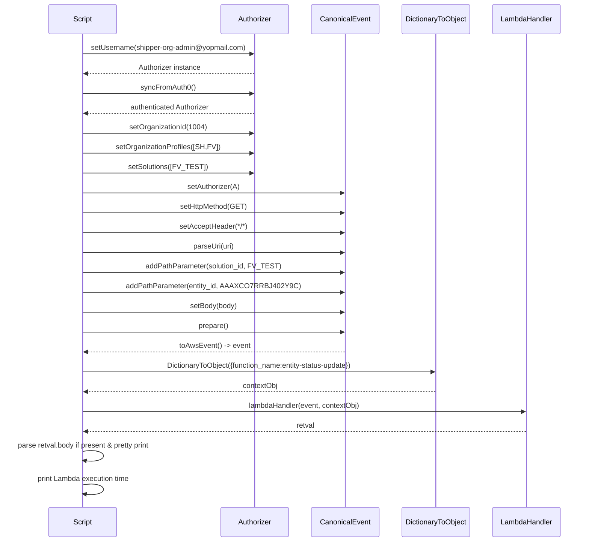
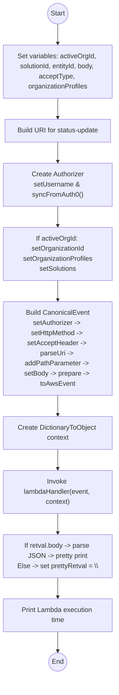
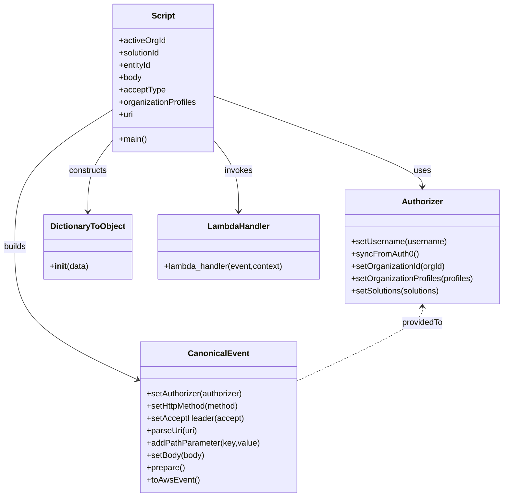

# Diagram: platform/tools/ide_local_testing/localTest/test/byUrl/entityPostStatusUpdate.py

> Auto-generated by Obscura crawlers

## Diagram 1

### SVG

<svg id="container" width="1354" xmlns="http://www.w3.org/2000/svg" height="1287" viewBox="-125 -10 1354 1287" role="graphics-document document" aria-roledescription="sequence"><g><rect x="1029" y="1201" fill="#eaeaea" stroke="#666" width="150" height="65" name="L" rx="3" ry="3" class="actor actor-bottom"></rect><text x="1104" y="1233.5" dominant-baseline="central" alignment-baseline="central" class="actor actor-box" style="text-anchor: middle; font-size: 16px; font-weight: 400;"><tspan x="1104" dy="0">LambdaHandler</tspan></text></g><g><rect x="821" y="1201" fill="#eaeaea" stroke="#666" width="158" height="65" name="D" rx="3" ry="3" class="actor actor-bottom"></rect><text x="900" y="1233.5" dominant-baseline="central" alignment-baseline="central" class="actor actor-box" style="text-anchor: middle; font-size: 16px; font-weight: 400;"><tspan x="900" dy="0">DictionaryToObject</tspan></text></g><g><rect x="621" y="1201" fill="#eaeaea" stroke="#666" width="150" height="65" name="C" rx="3" ry="3" class="actor actor-bottom"></rect><text x="696" y="1233.5" dominant-baseline="central" alignment-baseline="central" class="actor actor-box" style="text-anchor: middle; font-size: 16px; font-weight: 400;"><tspan x="696" dy="0">CanonicalEvent</tspan></text></g><g><rect x="421" y="1201" fill="#eaeaea" stroke="#666" width="150" height="65" name="A" rx="3" ry="3" class="actor actor-bottom"></rect><text x="496" y="1233.5" dominant-baseline="central" alignment-baseline="central" class="actor actor-box" style="text-anchor: middle; font-size: 16px; font-weight: 400;"><tspan x="496" dy="0">Authorizer</tspan></text></g><g><rect x="0" y="1201" fill="#eaeaea" stroke="#666" width="150" height="65" name="S" rx="3" ry="3" class="actor actor-bottom"></rect><text x="75" y="1233.5" dominant-baseline="central" alignment-baseline="central" class="actor actor-box" style="text-anchor: middle; font-size: 16px; font-weight: 400;"><tspan x="75" dy="0">Script</tspan></text></g><g><line id="actor4" x1="1104" y1="65" x2="1104" y2="1201" class="actor-line 200" stroke-width="0.5px" stroke="#999" name="L"></line><g id="root-4"><rect x="1029" y="0" fill="#eaeaea" stroke="#666" width="150" height="65" name="L" rx="3" ry="3" class="actor actor-top"></rect><text x="1104" y="32.5" dominant-baseline="central" alignment-baseline="central" class="actor actor-box" style="text-anchor: middle; font-size: 16px; font-weight: 400;"><tspan x="1104" dy="0">LambdaHandler</tspan></text></g></g><g><line id="actor3" x1="900" y1="65" x2="900" y2="1201" class="actor-line 200" stroke-width="0.5px" stroke="#999" name="D"></line><g id="root-3"><rect x="821" y="0" fill="#eaeaea" stroke="#666" width="158" height="65" name="D" rx="3" ry="3" class="actor actor-top"></rect><text x="900" y="32.5" dominant-baseline="central" alignment-baseline="central" class="actor actor-box" style="text-anchor: middle; font-size: 16px; font-weight: 400;"><tspan x="900" dy="0">DictionaryToObject</tspan></text></g></g><g><line id="actor2" x1="696" y1="65" x2="696" y2="1201" class="actor-line 200" stroke-width="0.5px" stroke="#999" name="C"></line><g id="root-2"><rect x="621" y="0" fill="#eaeaea" stroke="#666" width="150" height="65" name="C" rx="3" ry="3" class="actor actor-top"></rect><text x="696" y="32.5" dominant-baseline="central" alignment-baseline="central" class="actor actor-box" style="text-anchor: middle; font-size: 16px; font-weight: 400;"><tspan x="696" dy="0">CanonicalEvent</tspan></text></g></g><g><line id="actor1" x1="496" y1="65" x2="496" y2="1201" class="actor-line 200" stroke-width="0.5px" stroke="#999" name="A"></line><g id="root-1"><rect x="421" y="0" fill="#eaeaea" stroke="#666" width="150" height="65" name="A" rx="3" ry="3" class="actor actor-top"></rect><text x="496" y="32.5" dominant-baseline="central" alignment-baseline="central" class="actor actor-box" style="text-anchor: middle; font-size: 16px; font-weight: 400;"><tspan x="496" dy="0">Authorizer</tspan></text></g></g><g><line id="actor0" x1="75" y1="65" x2="75" y2="1201" class="actor-line 200" stroke-width="0.5px" stroke="#999" name="S"></line><g id="root-0"><rect x="0" y="0" fill="#eaeaea" stroke="#666" width="150" height="65" name="S" rx="3" ry="3" class="actor actor-top"></rect><text x="75" y="32.5" dominant-baseline="central" alignment-baseline="central" class="actor actor-box" style="text-anchor: middle; font-size: 16px; font-weight: 400;"><tspan x="75" dy="0">Script</tspan></text></g></g><g></g><defs><symbol id="computer" width="24" height="24"><path transform="scale(.5)" d="M2 2v13h20v-13h-20zm18 11h-16v-9h16v9zm-10.228 6l.466-1h3.524l.467 1h-4.457zm14.228 3h-24l2-6h2.104l-1.33 4h18.45l-1.297-4h2.073l2 6zm-5-10h-14v-7h14v7z"></path></symbol></defs><defs><symbol id="database" fill-rule="evenodd" clip-rule="evenodd"><path transform="scale(.5)" d="M12.258.001l.256.004.255.005.253.008.251.01.249.012.247.015.246.016.242.019.241.02.239.023.236.024.233.027.231.028.229.031.225.032.223.034.22.036.217.038.214.04.211.041.208.043.205.045.201.046.198.048.194.05.191.051.187.053.183.054.18.056.175.057.172.059.168.06.163.061.16.063.155.064.15.066.074.033.073.033.071.034.07.034.069.035.068.035.067.035.066.035.064.036.064.036.062.036.06.036.06.037.058.037.058.037.055.038.055.038.053.038.052.038.051.039.05.039.048.039.047.039.045.04.044.04.043.04.041.04.04.041.039.041.037.041.036.041.034.041.033.042.032.042.03.042.029.042.027.042.026.043.024.043.023.043.021.043.02.043.018.044.017.043.015.044.013.044.012.044.011.045.009.044.007.045.006.045.004.045.002.045.001.045v17l-.001.045-.002.045-.004.045-.006.045-.007.045-.009.044-.011.045-.012.044-.013.044-.015.044-.017.043-.018.044-.02.043-.021.043-.023.043-.024.043-.026.043-.027.042-.029.042-.03.042-.032.042-.033.042-.034.041-.036.041-.037.041-.039.041-.04.041-.041.04-.043.04-.044.04-.045.04-.047.039-.048.039-.05.039-.051.039-.052.038-.053.038-.055.038-.055.038-.058.037-.058.037-.06.037-.06.036-.062.036-.064.036-.064.036-.066.035-.067.035-.068.035-.069.035-.07.034-.071.034-.073.033-.074.033-.15.066-.155.064-.16.063-.163.061-.168.06-.172.059-.175.057-.18.056-.183.054-.187.053-.191.051-.194.05-.198.048-.201.046-.205.045-.208.043-.211.041-.214.04-.217.038-.22.036-.223.034-.225.032-.229.031-.231.028-.233.027-.236.024-.239.023-.241.02-.242.019-.246.016-.247.015-.249.012-.251.01-.253.008-.255.005-.256.004-.258.001-.258-.001-.256-.004-.255-.005-.253-.008-.251-.01-.249-.012-.247-.015-.245-.016-.243-.019-.241-.02-.238-.023-.236-.024-.234-.027-.231-.028-.228-.031-.226-.032-.223-.034-.22-.036-.217-.038-.214-.04-.211-.041-.208-.043-.204-.045-.201-.046-.198-.048-.195-.05-.19-.051-.187-.053-.184-.054-.179-.056-.176-.057-.172-.059-.167-.06-.164-.061-.159-.063-.155-.064-.151-.066-.074-.033-.072-.033-.072-.034-.07-.034-.069-.035-.068-.035-.067-.035-.066-.035-.064-.036-.063-.036-.062-.036-.061-.036-.06-.037-.058-.037-.057-.037-.056-.038-.055-.038-.053-.038-.052-.038-.051-.039-.049-.039-.049-.039-.046-.039-.046-.04-.044-.04-.043-.04-.041-.04-.04-.041-.039-.041-.037-.041-.036-.041-.034-.041-.033-.042-.032-.042-.03-.042-.029-.042-.027-.042-.026-.043-.024-.043-.023-.043-.021-.043-.02-.043-.018-.044-.017-.043-.015-.044-.013-.044-.012-.044-.011-.045-.009-.044-.007-.045-.006-.045-.004-.045-.002-.045-.001-.045v-17l.001-.045.002-.045.004-.045.006-.045.007-.045.009-.044.011-.045.012-.044.013-.044.015-.044.017-.043.018-.044.02-.043.021-.043.023-.043.024-.043.026-.043.027-.042.029-.042.03-.042.032-.042.033-.042.034-.041.036-.041.037-.041.039-.041.04-.041.041-.04.043-.04.044-.04.046-.04.046-.039.049-.039.049-.039.051-.039.052-.038.053-.038.055-.038.056-.038.057-.037.058-.037.06-.037.061-.036.062-.036.063-.036.064-.036.066-.035.067-.035.068-.035.069-.035.07-.034.072-.034.072-.033.074-.033.151-.066.155-.064.159-.063.164-.061.167-.06.172-.059.176-.057.179-.056.184-.054.187-.053.19-.051.195-.05.198-.048.201-.046.204-.045.208-.043.211-.041.214-.04.217-.038.22-.036.223-.034.226-.032.228-.031.231-.028.234-.027.236-.024.238-.023.241-.02.243-.019.245-.016.247-.015.249-.012.251-.01.253-.008.255-.005.256-.004.258-.001.258.001zm-9.258 20.499v.01l.001.021.003.021.004.022.005.021.006.022.007.022.009.023.01.022.011.023.012.023.013.023.015.023.016.024.017.023.018.024.019.024.021.024.022.025.023.024.024.025.052.049.056.05.061.051.066.051.07.051.075.051.079.052.084.052.088.052.092.052.097.052.102.051.105.052.11.052.114.051.119.051.123.051.127.05.131.05.135.05.139.048.144.049.147.047.152.047.155.047.16.045.163.045.167.043.171.043.176.041.178.041.183.039.187.039.19.037.194.035.197.035.202.033.204.031.209.03.212.029.216.027.219.025.222.024.226.021.23.02.233.018.236.016.24.015.243.012.246.01.249.008.253.005.256.004.259.001.26-.001.257-.004.254-.005.25-.008.247-.011.244-.012.241-.014.237-.016.233-.018.231-.021.226-.021.224-.024.22-.026.216-.027.212-.028.21-.031.205-.031.202-.034.198-.034.194-.036.191-.037.187-.039.183-.04.179-.04.175-.042.172-.043.168-.044.163-.045.16-.046.155-.046.152-.047.148-.048.143-.049.139-.049.136-.05.131-.05.126-.05.123-.051.118-.052.114-.051.11-.052.106-.052.101-.052.096-.052.092-.052.088-.053.083-.051.079-.052.074-.052.07-.051.065-.051.06-.051.056-.05.051-.05.023-.024.023-.025.021-.024.02-.024.019-.024.018-.024.017-.024.015-.023.014-.024.013-.023.012-.023.01-.023.01-.022.008-.022.006-.022.006-.022.004-.022.004-.021.001-.021.001-.021v-4.127l-.077.055-.08.053-.083.054-.085.053-.087.052-.09.052-.093.051-.095.05-.097.05-.1.049-.102.049-.105.048-.106.047-.109.047-.111.046-.114.045-.115.045-.118.044-.12.043-.122.042-.124.042-.126.041-.128.04-.13.04-.132.038-.134.038-.135.037-.138.037-.139.035-.142.035-.143.034-.144.033-.147.032-.148.031-.15.03-.151.03-.153.029-.154.027-.156.027-.158.026-.159.025-.161.024-.162.023-.163.022-.165.021-.166.02-.167.019-.169.018-.169.017-.171.016-.173.015-.173.014-.175.013-.175.012-.177.011-.178.01-.179.008-.179.008-.181.006-.182.005-.182.004-.184.003-.184.002h-.37l-.184-.002-.184-.003-.182-.004-.182-.005-.181-.006-.179-.008-.179-.008-.178-.01-.176-.011-.176-.012-.175-.013-.173-.014-.172-.015-.171-.016-.17-.017-.169-.018-.167-.019-.166-.02-.165-.021-.163-.022-.162-.023-.161-.024-.159-.025-.157-.026-.156-.027-.155-.027-.153-.029-.151-.03-.15-.03-.148-.031-.146-.032-.145-.033-.143-.034-.141-.035-.14-.035-.137-.037-.136-.037-.134-.038-.132-.038-.13-.04-.128-.04-.126-.041-.124-.042-.122-.042-.12-.044-.117-.043-.116-.045-.113-.045-.112-.046-.109-.047-.106-.047-.105-.048-.102-.049-.1-.049-.097-.05-.095-.05-.093-.052-.09-.051-.087-.052-.085-.053-.083-.054-.08-.054-.077-.054v4.127zm0-5.654v.011l.001.021.003.021.004.021.005.022.006.022.007.022.009.022.01.022.011.023.012.023.013.023.015.024.016.023.017.024.018.024.019.024.021.024.022.024.023.025.024.024.052.05.056.05.061.05.066.051.07.051.075.052.079.051.084.052.088.052.092.052.097.052.102.052.105.052.11.051.114.051.119.052.123.05.127.051.131.05.135.049.139.049.144.048.147.048.152.047.155.046.16.045.163.045.167.044.171.042.176.042.178.04.183.04.187.038.19.037.194.036.197.034.202.033.204.032.209.03.212.028.216.027.219.025.222.024.226.022.23.02.233.018.236.016.24.014.243.012.246.01.249.008.253.006.256.003.259.001.26-.001.257-.003.254-.006.25-.008.247-.01.244-.012.241-.015.237-.016.233-.018.231-.02.226-.022.224-.024.22-.025.216-.027.212-.029.21-.03.205-.032.202-.033.198-.035.194-.036.191-.037.187-.039.183-.039.179-.041.175-.042.172-.043.168-.044.163-.045.16-.045.155-.047.152-.047.148-.048.143-.048.139-.05.136-.049.131-.05.126-.051.123-.051.118-.051.114-.052.11-.052.106-.052.101-.052.096-.052.092-.052.088-.052.083-.052.079-.052.074-.051.07-.052.065-.051.06-.05.056-.051.051-.049.023-.025.023-.024.021-.025.02-.024.019-.024.018-.024.017-.024.015-.023.014-.023.013-.024.012-.022.01-.023.01-.023.008-.022.006-.022.006-.022.004-.021.004-.022.001-.021.001-.021v-4.139l-.077.054-.08.054-.083.054-.085.052-.087.053-.09.051-.093.051-.095.051-.097.05-.1.049-.102.049-.105.048-.106.047-.109.047-.111.046-.114.045-.115.044-.118.044-.12.044-.122.042-.124.042-.126.041-.128.04-.13.039-.132.039-.134.038-.135.037-.138.036-.139.036-.142.035-.143.033-.144.033-.147.033-.148.031-.15.03-.151.03-.153.028-.154.028-.156.027-.158.026-.159.025-.161.024-.162.023-.163.022-.165.021-.166.02-.167.019-.169.018-.169.017-.171.016-.173.015-.173.014-.175.013-.175.012-.177.011-.178.009-.179.009-.179.007-.181.007-.182.005-.182.004-.184.003-.184.002h-.37l-.184-.002-.184-.003-.182-.004-.182-.005-.181-.007-.179-.007-.179-.009-.178-.009-.176-.011-.176-.012-.175-.013-.173-.014-.172-.015-.171-.016-.17-.017-.169-.018-.167-.019-.166-.02-.165-.021-.163-.022-.162-.023-.161-.024-.159-.025-.157-.026-.156-.027-.155-.028-.153-.028-.151-.03-.15-.03-.148-.031-.146-.033-.145-.033-.143-.033-.141-.035-.14-.036-.137-.036-.136-.037-.134-.038-.132-.039-.13-.039-.128-.04-.126-.041-.124-.042-.122-.043-.12-.043-.117-.044-.116-.044-.113-.046-.112-.046-.109-.046-.106-.047-.105-.048-.102-.049-.1-.049-.097-.05-.095-.051-.093-.051-.09-.051-.087-.053-.085-.052-.083-.054-.08-.054-.077-.054v4.139zm0-5.666v.011l.001.02.003.022.004.021.005.022.006.021.007.022.009.023.01.022.011.023.012.023.013.023.015.023.016.024.017.024.018.023.019.024.021.025.022.024.023.024.024.025.052.05.056.05.061.05.066.051.07.051.075.052.079.051.084.052.088.052.092.052.097.052.102.052.105.051.11.052.114.051.119.051.123.051.127.05.131.05.135.05.139.049.144.048.147.048.152.047.155.046.16.045.163.045.167.043.171.043.176.042.178.04.183.04.187.038.19.037.194.036.197.034.202.033.204.032.209.03.212.028.216.027.219.025.222.024.226.021.23.02.233.018.236.017.24.014.243.012.246.01.249.008.253.006.256.003.259.001.26-.001.257-.003.254-.006.25-.008.247-.01.244-.013.241-.014.237-.016.233-.018.231-.02.226-.022.224-.024.22-.025.216-.027.212-.029.21-.03.205-.032.202-.033.198-.035.194-.036.191-.037.187-.039.183-.039.179-.041.175-.042.172-.043.168-.044.163-.045.16-.045.155-.047.152-.047.148-.048.143-.049.139-.049.136-.049.131-.051.126-.05.123-.051.118-.052.114-.051.11-.052.106-.052.101-.052.096-.052.092-.052.088-.052.083-.052.079-.052.074-.052.07-.051.065-.051.06-.051.056-.05.051-.049.023-.025.023-.025.021-.024.02-.024.019-.024.018-.024.017-.024.015-.023.014-.024.013-.023.012-.023.01-.022.01-.023.008-.022.006-.022.006-.022.004-.022.004-.021.001-.021.001-.021v-4.153l-.077.054-.08.054-.083.053-.085.053-.087.053-.09.051-.093.051-.095.051-.097.05-.1.049-.102.048-.105.048-.106.048-.109.046-.111.046-.114.046-.115.044-.118.044-.12.043-.122.043-.124.042-.126.041-.128.04-.13.039-.132.039-.134.038-.135.037-.138.036-.139.036-.142.034-.143.034-.144.033-.147.032-.148.032-.15.03-.151.03-.153.028-.154.028-.156.027-.158.026-.159.024-.161.024-.162.023-.163.023-.165.021-.166.02-.167.019-.169.018-.169.017-.171.016-.173.015-.173.014-.175.013-.175.012-.177.01-.178.01-.179.009-.179.007-.181.006-.182.006-.182.004-.184.003-.184.001-.185.001-.185-.001-.184-.001-.184-.003-.182-.004-.182-.006-.181-.006-.179-.007-.179-.009-.178-.01-.176-.01-.176-.012-.175-.013-.173-.014-.172-.015-.171-.016-.17-.017-.169-.018-.167-.019-.166-.02-.165-.021-.163-.023-.162-.023-.161-.024-.159-.024-.157-.026-.156-.027-.155-.028-.153-.028-.151-.03-.15-.03-.148-.032-.146-.032-.145-.033-.143-.034-.141-.034-.14-.036-.137-.036-.136-.037-.134-.038-.132-.039-.13-.039-.128-.041-.126-.041-.124-.041-.122-.043-.12-.043-.117-.044-.116-.044-.113-.046-.112-.046-.109-.046-.106-.048-.105-.048-.102-.048-.1-.05-.097-.049-.095-.051-.093-.051-.09-.052-.087-.052-.085-.053-.083-.053-.08-.054-.077-.054v4.153zm8.74-8.179l-.257.004-.254.005-.25.008-.247.011-.244.012-.241.014-.237.016-.233.018-.231.021-.226.022-.224.023-.22.026-.216.027-.212.028-.21.031-.205.032-.202.033-.198.034-.194.036-.191.038-.187.038-.183.04-.179.041-.175.042-.172.043-.168.043-.163.045-.16.046-.155.046-.152.048-.148.048-.143.048-.139.049-.136.05-.131.05-.126.051-.123.051-.118.051-.114.052-.11.052-.106.052-.101.052-.096.052-.092.052-.088.052-.083.052-.079.052-.074.051-.07.052-.065.051-.06.05-.056.05-.051.05-.023.025-.023.024-.021.024-.02.025-.019.024-.018.024-.017.023-.015.024-.014.023-.013.023-.012.023-.01.023-.01.022-.008.022-.006.023-.006.021-.004.022-.004.021-.001.021-.001.021.001.021.001.021.004.021.004.022.006.021.006.023.008.022.01.022.01.023.012.023.013.023.014.023.015.024.017.023.018.024.019.024.02.025.021.024.023.024.023.025.051.05.056.05.06.05.065.051.07.052.074.051.079.052.083.052.088.052.092.052.096.052.101.052.106.052.11.052.114.052.118.051.123.051.126.051.131.05.136.05.139.049.143.048.148.048.152.048.155.046.16.046.163.045.168.043.172.043.175.042.179.041.183.04.187.038.191.038.194.036.198.034.202.033.205.032.21.031.212.028.216.027.22.026.224.023.226.022.231.021.233.018.237.016.241.014.244.012.247.011.25.008.254.005.257.004.26.001.26-.001.257-.004.254-.005.25-.008.247-.011.244-.012.241-.014.237-.016.233-.018.231-.021.226-.022.224-.023.22-.026.216-.027.212-.028.21-.031.205-.032.202-.033.198-.034.194-.036.191-.038.187-.038.183-.04.179-.041.175-.042.172-.043.168-.043.163-.045.16-.046.155-.046.152-.048.148-.048.143-.048.139-.049.136-.05.131-.05.126-.051.123-.051.118-.051.114-.052.11-.052.106-.052.101-.052.096-.052.092-.052.088-.052.083-.052.079-.052.074-.051.07-.052.065-.051.06-.05.056-.05.051-.05.023-.025.023-.024.021-.024.02-.025.019-.024.018-.024.017-.023.015-.024.014-.023.013-.023.012-.023.01-.023.01-.022.008-.022.006-.023.006-.021.004-.022.004-.021.001-.021.001-.021-.001-.021-.001-.021-.004-.021-.004-.022-.006-.021-.006-.023-.008-.022-.01-.022-.01-.023-.012-.023-.013-.023-.014-.023-.015-.024-.017-.023-.018-.024-.019-.024-.02-.025-.021-.024-.023-.024-.023-.025-.051-.05-.056-.05-.06-.05-.065-.051-.07-.052-.074-.051-.079-.052-.083-.052-.088-.052-.092-.052-.096-.052-.101-.052-.106-.052-.11-.052-.114-.052-.118-.051-.123-.051-.126-.051-.131-.05-.136-.05-.139-.049-.143-.048-.148-.048-.152-.048-.155-.046-.16-.046-.163-.045-.168-.043-.172-.043-.175-.042-.179-.041-.183-.04-.187-.038-.191-.038-.194-.036-.198-.034-.202-.033-.205-.032-.21-.031-.212-.028-.216-.027-.22-.026-.224-.023-.226-.022-.231-.021-.233-.018-.237-.016-.241-.014-.244-.012-.247-.011-.25-.008-.254-.005-.257-.004-.26-.001-.26.001z"></path></symbol></defs><defs><symbol id="clock" width="24" height="24"><path transform="scale(.5)" d="M12 2c5.514 0 10 4.486 10 10s-4.486 10-10 10-10-4.486-10-10 4.486-10 10-10zm0-2c-6.627 0-12 5.373-12 12s5.373 12 12 12 12-5.373 12-12-5.373-12-12-12zm5.848 12.459c.202.038.202.333.001.372-1.907.361-6.045 1.111-6.547 1.111-.719 0-1.301-.582-1.301-1.301 0-.512.77-5.447 1.125-7.445.034-.192.312-.181.343.014l.985 6.238 5.394 1.011z"></path></symbol></defs><defs><marker id="arrowhead" refX="7.9" refY="5" markerUnits="userSpaceOnUse" markerWidth="12" markerHeight="12" orient="auto-start-reverse"><path d="M -1 0 L 10 5 L 0 10 z"></path></marker></defs><defs><marker id="crosshead" markerWidth="15" markerHeight="8" orient="auto" refX="4" refY="4.5"><path fill="none" stroke="#000000" stroke-width="1pt" d="M 1,2 L 6,7 M 6,2 L 1,7" style="stroke-dasharray: 0, 0;"></path></marker></defs><defs><marker id="filled-head" refX="15.5" refY="7" markerWidth="20" markerHeight="28" orient="auto"><path d="M 18,7 L9,13 L14,7 L9,1 Z"></path></marker></defs><defs><marker id="sequencenumber" refX="15" refY="15" markerWidth="60" markerHeight="40" orient="auto"><circle cx="15" cy="15" r="6"></circle></marker></defs><text x="284" y="80" text-anchor="middle" dominant-baseline="middle" alignment-baseline="middle" class="messageText" dy="1em" style="font-size: 16px; font-weight: 400;">setUsername(shipper-org-admin@yopmail.com)</text><line x1="76" y1="113" x2="492" y2="113" class="messageLine0" stroke-width="2" stroke="none" marker-end="url(#arrowhead)" style="fill: none;"></line><text x="287" y="128" text-anchor="middle" dominant-baseline="middle" alignment-baseline="middle" class="messageText" dy="1em" style="font-size: 16px; font-weight: 400;">Authorizer instance</text><line x1="495" y1="161" x2="79" y2="161" class="messageLine1" stroke-width="2" stroke="none" marker-end="url(#arrowhead)" style="stroke-dasharray: 3, 3; fill: none;"></line><text x="284" y="176" text-anchor="middle" dominant-baseline="middle" alignment-baseline="middle" class="messageText" dy="1em" style="font-size: 16px; font-weight: 400;">syncFromAuth0()</text><line x1="76" y1="209" x2="492" y2="209" class="messageLine0" stroke-width="2" stroke="none" marker-end="url(#arrowhead)" style="fill: none;"></line><text x="287" y="224" text-anchor="middle" dominant-baseline="middle" alignment-baseline="middle" class="messageText" dy="1em" style="font-size: 16px; font-weight: 400;">authenticated Authorizer</text><line x1="495" y1="257" x2="79" y2="257" class="messageLine1" stroke-width="2" stroke="none" marker-end="url(#arrowhead)" style="stroke-dasharray: 3, 3; fill: none;"></line><text x="284" y="272" text-anchor="middle" dominant-baseline="middle" alignment-baseline="middle" class="messageText" dy="1em" style="font-size: 16px; font-weight: 400;">setOrganizationId(1004)</text><line x1="76" y1="305" x2="492" y2="305" class="messageLine0" stroke-width="2" stroke="none" marker-end="url(#arrowhead)" style="fill: none;"></line><text x="284" y="320" text-anchor="middle" dominant-baseline="middle" alignment-baseline="middle" class="messageText" dy="1em" style="font-size: 16px; font-weight: 400;">setOrganizationProfiles([SH,FV])</text><line x1="76" y1="353" x2="492" y2="353" class="messageLine0" stroke-width="2" stroke="none" marker-end="url(#arrowhead)" style="fill: none;"></line><text x="284" y="368" text-anchor="middle" dominant-baseline="middle" alignment-baseline="middle" class="messageText" dy="1em" style="font-size: 16px; font-weight: 400;">setSolutions([FV_TEST])</text><line x1="76" y1="401" x2="492" y2="401" class="messageLine0" stroke-width="2" stroke="none" marker-end="url(#arrowhead)" style="fill: none;"></line><text x="384" y="416" text-anchor="middle" dominant-baseline="middle" alignment-baseline="middle" class="messageText" dy="1em" style="font-size: 16px; font-weight: 400;">setAuthorizer(A)</text><line x1="76" y1="449" x2="692" y2="449" class="messageLine0" stroke-width="2" stroke="none" marker-end="url(#arrowhead)" style="fill: none;"></line><text x="384" y="464" text-anchor="middle" dominant-baseline="middle" alignment-baseline="middle" class="messageText" dy="1em" style="font-size: 16px; font-weight: 400;">setHttpMethod(GET)</text><line x1="76" y1="497" x2="692" y2="497" class="messageLine0" stroke-width="2" stroke="none" marker-end="url(#arrowhead)" style="fill: none;"></line><text x="384" y="512" text-anchor="middle" dominant-baseline="middle" alignment-baseline="middle" class="messageText" dy="1em" style="font-size: 16px; font-weight: 400;">setAcceptHeader(*/*)</text><line x1="76" y1="545" x2="692" y2="545" class="messageLine0" stroke-width="2" stroke="none" marker-end="url(#arrowhead)" style="fill: none;"></line><text x="384" y="560" text-anchor="middle" dominant-baseline="middle" alignment-baseline="middle" class="messageText" dy="1em" style="font-size: 16px; font-weight: 400;">parseUri(uri)</text><line x1="76" y1="593" x2="692" y2="593" class="messageLine0" stroke-width="2" stroke="none" marker-end="url(#arrowhead)" style="fill: none;"></line><text x="384" y="608" text-anchor="middle" dominant-baseline="middle" alignment-baseline="middle" class="messageText" dy="1em" style="font-size: 16px; font-weight: 400;">addPathParameter(solution_id, FV_TEST)</text><line x1="76" y1="641" x2="692" y2="641" class="messageLine0" stroke-width="2" stroke="none" marker-end="url(#arrowhead)" style="fill: none;"></line><text x="384" y="656" text-anchor="middle" dominant-baseline="middle" alignment-baseline="middle" class="messageText" dy="1em" style="font-size: 16px; font-weight: 400;">addPathParameter(entity_id, AAAXCO7RRBJ402Y9C)</text><line x1="76" y1="689" x2="692" y2="689" class="messageLine0" stroke-width="2" stroke="none" marker-end="url(#arrowhead)" style="fill: none;"></line><text x="384" y="704" text-anchor="middle" dominant-baseline="middle" alignment-baseline="middle" class="messageText" dy="1em" style="font-size: 16px; font-weight: 400;">setBody(body)</text><line x1="76" y1="737" x2="692" y2="737" class="messageLine0" stroke-width="2" stroke="none" marker-end="url(#arrowhead)" style="fill: none;"></line><text x="384" y="752" text-anchor="middle" dominant-baseline="middle" alignment-baseline="middle" class="messageText" dy="1em" style="font-size: 16px; font-weight: 400;">prepare()</text><line x1="76" y1="785" x2="692" y2="785" class="messageLine0" stroke-width="2" stroke="none" marker-end="url(#arrowhead)" style="fill: none;"></line><text x="387" y="800" text-anchor="middle" dominant-baseline="middle" alignment-baseline="middle" class="messageText" dy="1em" style="font-size: 16px; font-weight: 400;">toAwsEvent() -&gt; event</text><line x1="695" y1="833" x2="79" y2="833" class="messageLine1" stroke-width="2" stroke="none" marker-end="url(#arrowhead)" style="stroke-dasharray: 3, 3; fill: none;"></line><text x="486" y="848" text-anchor="middle" dominant-baseline="middle" alignment-baseline="middle" class="messageText" dy="1em" style="font-size: 16px; font-weight: 400;">DictionaryToObject({function_name:entity-status-update})</text><line x1="76" y1="881" x2="896" y2="881" class="messageLine0" stroke-width="2" stroke="none" marker-end="url(#arrowhead)" style="fill: none;"></line><text x="489" y="896" text-anchor="middle" dominant-baseline="middle" alignment-baseline="middle" class="messageText" dy="1em" style="font-size: 16px; font-weight: 400;">contextObj</text><line x1="899" y1="929" x2="79" y2="929" class="messageLine1" stroke-width="2" stroke="none" marker-end="url(#arrowhead)" style="stroke-dasharray: 3, 3; fill: none;"></line><text x="588" y="944" text-anchor="middle" dominant-baseline="middle" alignment-baseline="middle" class="messageText" dy="1em" style="font-size: 16px; font-weight: 400;">lambdaHandler(event, contextObj)</text><line x1="76" y1="977" x2="1100" y2="977" class="messageLine0" stroke-width="2" stroke="none" marker-end="url(#arrowhead)" style="fill: none;"></line><text x="591" y="992" text-anchor="middle" dominant-baseline="middle" alignment-baseline="middle" class="messageText" dy="1em" style="font-size: 16px; font-weight: 400;">retval</text><line x1="1103" y1="1025" x2="79" y2="1025" class="messageLine1" stroke-width="2" stroke="none" marker-end="url(#arrowhead)" style="stroke-dasharray: 3, 3; fill: none;"></line><text x="76" y="1040" text-anchor="middle" dominant-baseline="middle" alignment-baseline="middle" class="messageText" dy="1em" style="font-size: 16px; font-weight: 400;">parse retval.body if present &amp; pretty print</text><path d="M 76,1073 C 136,1063 136,1103 76,1093" class="messageLine0" stroke-width="2" stroke="none" marker-end="url(#arrowhead)" style="fill: none;"></path><text x="76" y="1118" text-anchor="middle" dominant-baseline="middle" alignment-baseline="middle" class="messageText" dy="1em" style="font-size: 16px; font-weight: 400;">print Lambda execution time</text><path d="M 76,1151 C 136,1141 136,1181 76,1171" class="messageLine0" stroke-width="2" stroke="none" marker-end="url(#arrowhead)" style="fill: none;"></path></svg>

## Diagram 2

### SVG

<svg id="container" width="497.671875" xmlns="http://www.w3.org/2000/svg" class="flowchart" height="1526.40625" viewBox="0 0 497.671875 1526.40625" role="graphics-document document" aria-roledescription="flowchart-v2"><g><marker id="container_flowchart-v2-pointEnd" class="marker flowchart-v2" viewBox="0 0 10 10" refX="5" refY="5" markerUnits="userSpaceOnUse" markerWidth="8" markerHeight="8" orient="auto"><path d="M 0 0 L 10 5 L 0 10 z" class="arrowMarkerPath" style="stroke-width: 1; stroke-dasharray: 1, 0;"></path></marker><marker id="container_flowchart-v2-pointStart" class="marker flowchart-v2" viewBox="0 0 10 10" refX="4.5" refY="5" markerUnits="userSpaceOnUse" markerWidth="8" markerHeight="8" orient="auto"><path d="M 0 5 L 10 10 L 10 0 z" class="arrowMarkerPath" style="stroke-width: 1; stroke-dasharray: 1, 0;"></path></marker><marker id="container_flowchart-v2-circleEnd" class="marker flowchart-v2" viewBox="0 0 10 10" refX="11" refY="5" markerUnits="userSpaceOnUse" markerWidth="11" markerHeight="11" orient="auto"><circle cx="5" cy="5" r="5" class="arrowMarkerPath" style="stroke-width: 1; stroke-dasharray: 1, 0;"></circle></marker><marker id="container_flowchart-v2-circleStart" class="marker flowchart-v2" viewBox="0 0 10 10" refX="-1" refY="5" markerUnits="userSpaceOnUse" markerWidth="11" markerHeight="11" orient="auto"><circle cx="5" cy="5" r="5" class="arrowMarkerPath" style="stroke-width: 1; stroke-dasharray: 1, 0;"></circle></marker><marker id="container_flowchart-v2-crossEnd" class="marker cross flowchart-v2" viewBox="0 0 11 11" refX="12" refY="5.2" markerUnits="userSpaceOnUse" markerWidth="11" markerHeight="11" orient="auto"><path d="M 1,1 l 9,9 M 10,1 l -9,9" class="arrowMarkerPath" style="stroke-width: 2; stroke-dasharray: 1, 0;"></path></marker><marker id="container_flowchart-v2-crossStart" class="marker cross flowchart-v2" viewBox="0 0 11 11" refX="-1" refY="5.2" markerUnits="userSpaceOnUse" markerWidth="11" markerHeight="11" orient="auto"><path d="M 1,1 l 9,9 M 10,1 l -9,9" class="arrowMarkerPath" style="stroke-width: 2; stroke-dasharray: 1, 0;"></path></marker><g class="root"><g class="clusters"></g><g class="edgePaths"><path d="M248.836,58.047L248.836,62.214C248.836,66.38,248.836,74.714,248.836,82.38C248.836,90.047,248.836,97.047,248.836,100.547L248.836,104.047" id="L_Start_SetVars_0" class="edge-thickness-normal edge-pattern-solid edge-thickness-normal edge-pattern-solid flowchart-link" style=";" data-edge="true" data-et="edge" data-id="L_Start_SetVars_0" data-points="W3sieCI6MjQ4LjgzNTkzNzUsInkiOjU4LjA0Njg3NX0seyJ4IjoyNDguODM1OTM3NSwieSI6ODMuMDQ2ODc1fSx7IngiOjI0OC44MzU5Mzc1LCJ5IjoxMDguMDQ2ODc1fV0=" marker-end="url(#container_flowchart-v2-pointEnd)"></path><path d="M248.836,234.047L248.836,238.214C248.836,242.38,248.836,250.714,248.836,258.38C248.836,266.047,248.836,273.047,248.836,276.547L248.836,280.047" id="L_SetVars_BuildURI_0" class="edge-thickness-normal edge-pattern-solid edge-thickness-normal edge-pattern-solid flowchart-link" style=";" data-edge="true" data-et="edge" data-id="L_SetVars_BuildURI_0" data-points="W3sieCI6MjQ4LjgzNTkzNzUsInkiOjIzNC4wNDY4NzV9LHsieCI6MjQ4LjgzNTkzNzUsInkiOjI1OS4wNDY4NzV9LHsieCI6MjQ4LjgzNTkzNzUsInkiOjI4NC4wNDY4NzV9XQ==" marker-end="url(#container_flowchart-v2-pointEnd)"></path><path d="M248.836,338.047L248.836,342.214C248.836,346.38,248.836,354.714,248.836,362.38C248.836,370.047,248.836,377.047,248.836,380.547L248.836,384.047" id="L_BuildURI_CreateAuth_0" class="edge-thickness-normal edge-pattern-solid edge-thickness-normal edge-pattern-solid flowchart-link" style=";" data-edge="true" data-et="edge" data-id="L_BuildURI_CreateAuth_0" data-points="W3sieCI6MjQ4LjgzNTkzNzUsInkiOjMzOC4wNDY4NzV9LHsieCI6MjQ4LjgzNTkzNzUsInkiOjM2My4wNDY4NzV9LHsieCI6MjQ4LjgzNTkzNzUsInkiOjM4OC4wNDY4NzV9XQ==" marker-end="url(#container_flowchart-v2-pointEnd)"></path><path d="M248.836,490.047L248.836,494.214C248.836,498.38,248.836,506.714,248.836,514.38C248.836,522.047,248.836,529.047,248.836,532.547L248.836,536.047" id="L_CreateAuth_ConfigureAuth_0" class="edge-thickness-normal edge-pattern-solid edge-thickness-normal edge-pattern-solid flowchart-link" style=";" data-edge="true" data-et="edge" data-id="L_CreateAuth_ConfigureAuth_0" data-points="W3sieCI6MjQ4LjgzNTkzNzUsInkiOjQ5MC4wNDY4NzV9LHsieCI6MjQ4LjgzNTkzNzUsInkiOjUxNS4wNDY4NzV9LHsieCI6MjQ4LjgzNTkzNzUsInkiOjU0MC4wNDY4NzV9XQ==" marker-end="url(#container_flowchart-v2-pointEnd)"></path><path d="M248.836,618.047L248.836,622.214C248.836,626.38,248.836,634.714,248.836,642.38C248.836,650.047,248.836,657.047,248.836,660.547L248.836,664.047" id="L_ConfigureAuth_BuildEvent_0" class="edge-thickness-normal edge-pattern-solid edge-thickness-normal edge-pattern-solid flowchart-link" style=";" data-edge="true" data-et="edge" data-id="L_ConfigureAuth_BuildEvent_0" data-points="W3sieCI6MjQ4LjgzNTkzNzUsInkiOjYxOC4wNDY4NzV9LHsieCI6MjQ4LjgzNTkzNzUsInkiOjY0My4wNDY4NzV9LHsieCI6MjQ4LjgzNTkzNzUsInkiOjY2OC4wNDY4NzV9XQ==" marker-end="url(#container_flowchart-v2-pointEnd)"></path><path d="M248.836,866.047L248.836,870.214C248.836,874.38,248.836,882.714,248.836,890.38C248.836,898.047,248.836,905.047,248.836,908.547L248.836,912.047" id="L_BuildEvent_Context_0" class="edge-thickness-normal edge-pattern-solid edge-thickness-normal edge-pattern-solid flowchart-link" style=";" data-edge="true" data-et="edge" data-id="L_BuildEvent_Context_0" data-points="W3sieCI6MjQ4LjgzNTkzNzUsInkiOjg2Ni4wNDY4NzV9LHsieCI6MjQ4LjgzNTkzNzUsInkiOjg5MS4wNDY4NzV9LHsieCI6MjQ4LjgzNTkzNzUsInkiOjkxNi4wNDY4NzV9XQ==" marker-end="url(#container_flowchart-v2-pointEnd)"></path><path d="M248.836,994.047L248.836,998.214C248.836,1002.38,248.836,1010.714,248.836,1018.38C248.836,1026.047,248.836,1033.047,248.836,1036.547L248.836,1040.047" id="L_Context_InvokeLambda_0" class="edge-thickness-normal edge-pattern-solid edge-thickness-normal edge-pattern-solid flowchart-link" style=";" data-edge="true" data-et="edge" data-id="L_Context_InvokeLambda_0" data-points="W3sieCI6MjQ4LjgzNTkzNzUsInkiOjk5NC4wNDY4NzV9LHsieCI6MjQ4LjgzNTkzNzUsInkiOjEwMTkuMDQ2ODc1fSx7IngiOjI0OC44MzU5Mzc1LCJ5IjoxMDQ0LjA0Njg3NX1d" marker-end="url(#container_flowchart-v2-pointEnd)"></path><path d="M248.836,1146.047L248.836,1150.214C248.836,1154.38,248.836,1162.714,248.836,1170.38C248.836,1178.047,248.836,1185.047,248.836,1188.547L248.836,1192.047" id="L_InvokeLambda_HandleResponse_0" class="edge-thickness-normal edge-pattern-solid edge-thickness-normal edge-pattern-solid flowchart-link" style=";" data-edge="true" data-et="edge" data-id="L_InvokeLambda_HandleResponse_0" data-points="W3sieCI6MjQ4LjgzNTkzNzUsInkiOjExNDYuMDQ2ODc1fSx7IngiOjI0OC44MzU5Mzc1LCJ5IjoxMTcxLjA0Njg3NX0seyJ4IjoyNDguODM1OTM3NSwieSI6MTE5Ni4wNDY4NzV9XQ==" marker-end="url(#container_flowchart-v2-pointEnd)"></path><path d="M248.836,1298.047L248.836,1302.214C248.836,1306.38,248.836,1314.714,248.836,1322.38C248.836,1330.047,248.836,1337.047,248.836,1340.547L248.836,1344.047" id="L_HandleResponse_PrintTime_0" class="edge-thickness-normal edge-pattern-solid edge-thickness-normal edge-pattern-solid flowchart-link" style=";" data-edge="true" data-et="edge" data-id="L_HandleResponse_PrintTime_0" data-points="W3sieCI6MjQ4LjgzNTkzNzUsInkiOjEyOTguMDQ2ODc1fSx7IngiOjI0OC44MzU5Mzc1LCJ5IjoxMzIzLjA0Njg3NX0seyJ4IjoyNDguODM1OTM3NSwieSI6MTM0OC4wNDY4NzV9XQ==" marker-end="url(#container_flowchart-v2-pointEnd)"></path><path d="M248.836,1426.047L248.836,1430.214C248.836,1434.38,248.836,1442.714,248.836,1450.38C248.836,1458.047,248.836,1465.047,248.836,1468.547L248.836,1472.047" id="L_PrintTime_End_0" class="edge-thickness-normal edge-pattern-solid edge-thickness-normal edge-pattern-solid flowchart-link" style=";" data-edge="true" data-et="edge" data-id="L_PrintTime_End_0" data-points="W3sieCI6MjQ4LjgzNTkzNzUsInkiOjE0MjYuMDQ2ODc1fSx7IngiOjI0OC44MzU5Mzc1LCJ5IjoxNDUxLjA0Njg3NX0seyJ4IjoyNDguODM1OTM3NSwieSI6MTQ3Ni4wNDY4NzV9XQ==" marker-end="url(#container_flowchart-v2-pointEnd)"></path></g><g class="edgeLabels"><g class="edgeLabel"><g class="label" data-id="L_Start_SetVars_0" transform="translate(0, 0)"><foreignObject width="0" height="0">

</foreignObject></g></g><g class="edgeLabel"><g class="label" data-id="L_SetVars_BuildURI_0" transform="translate(0, 0)"><foreignObject width="0" height="0">

</foreignObject></g></g><g class="edgeLabel"><g class="label" data-id="L_BuildURI_CreateAuth_0" transform="translate(0, 0)"><foreignObject width="0" height="0">

</foreignObject></g></g><g class="edgeLabel"><g class="label" data-id="L_CreateAuth_ConfigureAuth_0" transform="translate(0, 0)"><foreignObject width="0" height="0">

</foreignObject></g></g><g class="edgeLabel"><g class="label" data-id="L_ConfigureAuth_BuildEvent_0" transform="translate(0, 0)"><foreignObject width="0" height="0">

</foreignObject></g></g><g class="edgeLabel"><g class="label" data-id="L_BuildEvent_Context_0" transform="translate(0, 0)"><foreignObject width="0" height="0">

</foreignObject></g></g><g class="edgeLabel"><g class="label" data-id="L_Context_InvokeLambda_0" transform="translate(0, 0)"><foreignObject width="0" height="0">

</foreignObject></g></g><g class="edgeLabel"><g class="label" data-id="L_InvokeLambda_HandleResponse_0" transform="translate(0, 0)"><foreignObject width="0" height="0">

</foreignObject></g></g><g class="edgeLabel"><g class="label" data-id="L_HandleResponse_PrintTime_0" transform="translate(0, 0)"><foreignObject width="0" height="0">

</foreignObject></g></g><g class="edgeLabel"><g class="label" data-id="L_PrintTime_End_0" transform="translate(0, 0)"><foreignObject width="0" height="0">

</foreignObject></g></g></g><g class="nodes"><g class="node default" id="flowchart-Start-0" transform="translate(248.8359375, 33.0234375)"><circle class="basic label-container" style="" r="25.0234375" cx="0" cy="0"></circle><g class="label" style="" transform="translate(-17.5234375, -12)"><rect></rect><foreignObject width="35.046875" height="24">

Start

</foreignObject></g></g><g class="node default" id="flowchart-SetVars-1" transform="translate(248.8359375, 171.046875)"><rect class="basic label-container" style="" x="-130" y="-63" width="260" height="126"></rect><g class="label" style="" transform="translate(-100, -48)"><rect></rect><foreignObject width="200" height="96">

Set variables: activeOrgId, solutionId, entityId, body, acceptType, organizationProfiles

</foreignObject></g></g><g class="node default" id="flowchart-BuildURI-2" transform="translate(248.8359375, 311.046875)"><rect class="basic label-container" style="" x="-129.1015625" y="-27" width="258.203125" height="54"></rect><g class="label" style="" transform="translate(-99.1015625, -12)"><rect></rect><foreignObject width="198.203125" height="24">

Build URI for status-update

</foreignObject></g></g><g class="node default" id="flowchart-CreateAuth-3" transform="translate(248.8359375, 439.046875)"><rect class="basic label-container" style="" x="-130" y="-51" width="260" height="102"></rect><g class="label" style="" transform="translate(-100, -36)"><rect></rect><foreignObject width="200" height="72">

Create Authorizer\nsetUsername &amp; syncFromAuth0()

</foreignObject></g></g><g class="node default" id="flowchart-ConfigureAuth-4" transform="translate(248.8359375, 579.046875)"><rect class="basic label-container" style="" x="-240.8359375" y="-39" width="481.671875" height="78"></rect><g class="label" style="" transform="translate(-210.8359375, -24)"><rect></rect><foreignObject width="421.671875" height="48">

If activeOrgId: setOrganizationId\nsetOrganizationProfiles\nsetSolutions

</foreignObject></g></g><g class="node default" id="flowchart-BuildEvent-5" transform="translate(248.8359375, 767.046875)"><rect class="basic label-container" style="" x="-144.734375" y="-99" width="289.46875" height="198"></rect><g class="label" style="" transform="translate(-114.734375, -84)"><rect></rect><foreignObject width="229.46875" height="168">

Build CanonicalEvent\nsetAuthorizer -&gt; setHttpMethod -&gt; setAcceptHeader -&gt; parseUri -&gt; addPathParameter -&gt; setBody -&gt; prepare -&gt; toAwsEvent

</foreignObject></g></g><g class="node default" id="flowchart-Context-6" transform="translate(248.8359375, 955.046875)"><rect class="basic label-container" style="" x="-130" y="-39" width="260" height="78"></rect><g class="label" style="" transform="translate(-100, -24)"><rect></rect><foreignObject width="200" height="48">

Create DictionaryToObject context

</foreignObject></g></g><g class="node default" id="flowchart-InvokeLambda-7" transform="translate(248.8359375, 1095.046875)"><rect class="basic label-container" style="" x="-130" y="-51" width="260" height="102"></rect><g class="label" style="" transform="translate(-100, -36)"><rect></rect><foreignObject width="200" height="72">

Invoke lambdaHandler(event, context)

</foreignObject></g></g><g class="node default" id="flowchart-HandleResponse-8" transform="translate(248.8359375, 1247.046875)"><rect class="basic label-container" style="" x="-130" y="-51" width="260" height="102"></rect><g class="label" style="" transform="translate(-100, -36)"><rect></rect><foreignObject width="200" height="72">

If retval.body -&gt; parse JSON -&gt; pretty print\nElse -&gt; set prettyRetval = \

</foreignObject></g></g><g class="node default" id="flowchart-PrintTime-9" transform="translate(248.8359375, 1387.046875)"><rect class="basic label-container" style="" x="-130" y="-39" width="260" height="78"></rect><g class="label" style="" transform="translate(-100, -24)"><rect></rect><foreignObject width="200" height="48">

Print Lambda execution time

</foreignObject></g></g><g class="node default" id="flowchart-End-10" transform="translate(248.8359375, 1497.2265625)"><circle class="basic label-container" style="" r="21.1796875" cx="0" cy="0"></circle><g class="label" style="" transform="translate(-13.6796875, -12)"><rect></rect><foreignObject width="27.359375" height="24">

End

</foreignObject></g></g></g></g></g></svg>

## Diagram 3

### SVG

<svg id="container" width="986.8671875" xmlns="http://www.w3.org/2000/svg" class="classDiagram" height="968" viewBox="0 0 986.8671875 968" role="graphics-document document" aria-roledescription="class"><g><defs><marker id="container_class-aggregationStart" class="marker aggregation class" refX="18" refY="7" markerWidth="190" markerHeight="240" orient="auto"><path d="M 18,7 L9,13 L1,7 L9,1 Z"></path></marker></defs><defs><marker id="container_class-aggregationEnd" class="marker aggregation class" refX="1" refY="7" markerWidth="20" markerHeight="28" orient="auto"><path d="M 18,7 L9,13 L1,7 L9,1 Z"></path></marker></defs><defs><marker id="container_class-extensionStart" class="marker extension class" refX="18" refY="7" markerWidth="190" markerHeight="240" orient="auto"><path d="M 1,7 L18,13 V 1 Z"></path></marker></defs><defs><marker id="container_class-extensionEnd" class="marker extension class" refX="1" refY="7" markerWidth="20" markerHeight="28" orient="auto"><path d="M 1,1 V 13 L18,7 Z"></path></marker></defs><defs><marker id="container_class-compositionStart" class="marker composition class" refX="18" refY="7" markerWidth="190" markerHeight="240" orient="auto"><path d="M 18,7 L9,13 L1,7 L9,1 Z"></path></marker></defs><defs><marker id="container_class-compositionEnd" class="marker composition class" refX="1" refY="7" markerWidth="20" markerHeight="28" orient="auto"><path d="M 18,7 L9,13 L1,7 L9,1 Z"></path></marker></defs><defs><marker id="container_class-dependencyStart" class="marker dependency class" refX="6" refY="7" markerWidth="190" markerHeight="240" orient="auto"><path d="M 5,7 L9,13 L1,7 L9,1 Z"></path></marker></defs><defs><marker id="container_class-dependencyEnd" class="marker dependency class" refX="13" refY="7" markerWidth="20" markerHeight="28" orient="auto"><path d="M 18,7 L9,13 L14,7 L9,1 Z"></path></marker></defs><defs><marker id="container_class-lollipopStart" class="marker lollipop class" refX="13" refY="7" markerWidth="190" markerHeight="240" orient="auto"><circle stroke="black" fill="transparent" cx="7" cy="7" r="6"></circle></marker></defs><defs><marker id="container_class-lollipopEnd" class="marker lollipop class" refX="1" refY="7" markerWidth="190" markerHeight="240" orient="auto"><circle stroke="black" fill="transparent" cx="7" cy="7" r="6"></circle></marker></defs><g class="root"><g class="clusters"></g><g class="edgePaths"><path d="M418.695,187.323L486.779,211.602C554.863,235.882,691.031,284.441,759.115,313.887C827.199,343.333,827.199,353.667,827.199,358.833L827.199,364" id="id_Script_Authorizer_1" class="edge-thickness-normal edge-pattern-solid relation" style=";;;" data-edge="true" data-et="edge" data-id="id_Script_Authorizer_1" data-points="W3sieCI6NDE4LjY5NTMxMjUsInkiOjE4Ny4zMjI2NzkyMDYzNjYzfSx7IngiOjgyNy4xOTkyMTg3NSwieSI6MzMzfSx7IngiOjgyNy4xOTkyMTg3NSwieSI6MzcwfV0=" marker-end="url(#container_class-dependencyEnd)"></path><path d="M220.594,214.003L188.91,233.835C157.227,253.668,93.859,293.334,62.176,337.834C30.492,382.333,30.492,431.667,30.492,481C30.492,530.333,30.492,579.667,71.122,623.1C111.751,666.534,193.011,704.067,233.64,722.834L274.27,741.601" id="id_Script_CanonicalEvent_2" class="edge-thickness-normal edge-pattern-solid relation" style=";;;" data-edge="true" data-et="edge" data-id="id_Script_CanonicalEvent_2" data-points="W3sieCI6MjIwLjU5Mzc1LCJ5IjoyMTQuMDAyNTgwMjc5MTAyNDN9LHsieCI6MzAuNDkyMTg3NSwieSI6MzMzfSx7IngiOjMwLjQ5MjE4NzUsInkiOjQ4MX0seyJ4IjozMC40OTIxODc1LCJ5Ijo2Mjl9LHsieCI6Mjc5LjcxNjc5Njg3NSwieSI6NzQ0LjExNzE2Njg1Mzc5NzZ9XQ==" marker-end="url(#container_class-dependencyEnd)"></path><path d="M220.594,274.055L212.621,283.879C204.648,293.703,188.703,313.352,180.73,336.342C172.758,359.333,172.758,385.667,172.758,398.833L172.758,412" id="id_Script_DictionaryToObject_3" class="edge-thickness-normal edge-pattern-solid relation" style=";;;" data-edge="true" data-et="edge" data-id="id_Script_DictionaryToObject_3" data-points="W3sieCI6MjIwLjU5Mzc1LCJ5IjoyNzQuMDU0NTQzNTIwNDYzNzd9LHsieCI6MTcyLjc1NzgxMjUsInkiOjMzM30seyJ4IjoxNzIuNzU3ODEyNSwieSI6NDE4fV0=" marker-end="url(#container_class-dependencyEnd)"></path><path d="M418.695,274.055L426.668,283.879C434.641,293.703,450.586,313.352,458.559,336.342C466.531,359.333,466.531,385.667,466.531,398.833L466.531,412" id="id_Script_LambdaHandler_4" class="edge-thickness-normal edge-pattern-solid relation" style=";;;" data-edge="true" data-et="edge" data-id="id_Script_LambdaHandler_4" data-points="W3sieCI6NDE4LjY5NTMxMjUsInkiOjI3NC4wNTQ1NDM1MjA0NjM3N30seyJ4Ijo0NjYuNTMxMjUsInkiOjMzM30seyJ4Ijo0NjYuNTMxMjUsInkiOjQxOH1d" marker-end="url(#container_class-dependencyEnd)"></path><path d="M827.199,598L827.199,603.167C827.199,608.333,827.199,618.667,785.662,643.02C744.124,667.372,661.049,705.745,619.512,724.931L577.975,744.117" id="id_Authorizer_CanonicalEvent_5" class="edge-thickness-normal edge-pattern-dashed relation" style=";;;" data-edge="true" data-et="edge" data-id="id_Authorizer_CanonicalEvent_5" data-points="W3sieCI6ODI3LjE5OTIxODc1LCJ5Ijo1OTJ9LHsieCI6ODI3LjE5OTIxODc1LCJ5Ijo2Mjl9LHsieCI6NTc3Ljk3NDYwOTM3NSwieSI6NzQ0LjExNzE2Njg1Mzc5NzZ9XQ==" marker-start="url(#container_class-dependencyStart)"></path></g><g class="edgeLabels"><g class="edgeLabel" transform="translate(827.19921875, 333)"><g class="label" data-id="id_Script_Authorizer_1" transform="translate(-16.4921875, -12)"><foreignObject width="32.984375" height="24">

uses

</foreignObject></g></g><g class="edgeLabel" transform="translate(30.4921875, 481)"><g class="label" data-id="id_Script_CanonicalEvent_2" transform="translate(-22.4921875, -12)"><foreignObject width="44.984375" height="24">

builds

</foreignObject></g></g><g class="edgeLabel" transform="translate(172.7578125, 333)"><g class="label" data-id="id_Script_DictionaryToObject_3" transform="translate(-37.84375, -12)"><foreignObject width="75.6875" height="24">

constructs

</foreignObject></g></g><g class="edgeLabel" transform="translate(466.53125, 333)"><g class="label" data-id="id_Script_LambdaHandler_4" transform="translate(-27.5859375, -12)"><foreignObject width="55.171875" height="24">

invokes

</foreignObject></g></g><g class="edgeLabel" transform="translate(827.19921875, 629)"><g class="label" data-id="id_Authorizer_CanonicalEvent_5" transform="translate(-40.734375, -12)"><foreignObject width="81.46875" height="24">

providedTo

</foreignObject></g></g></g><g class="nodes"><g class="node default" id="classId-Script-0" transform="translate(319.64453125, 152)"><g class="basic label-container"><path d="M-99.05078125 -144 L99.05078125 -144 L99.05078125 144 L-99.05078125 144" stroke="none" stroke-width="0" fill="#ECECFF" style=""></path><path d="M-99.05078125 -144 C-58.86112235679523 -144, -18.671463463590456 -144, 99.05078125 -144 M-99.05078125 -144 C-32.0227396136935 -144, 35.005302022612995 -144, 99.05078125 -144 M99.05078125 -144 C99.05078125 -62.29115408973804, 99.05078125 19.417691820523913, 99.05078125 144 M99.05078125 -144 C99.05078125 -59.36692028511311, 99.05078125 25.26615942977378, 99.05078125 144 M99.05078125 144 C27.783011820617162 144, -43.484757608765676 144, -99.05078125 144 M99.05078125 144 C42.21267722510815 144, -14.625426799783696 144, -99.05078125 144 M-99.05078125 144 C-99.05078125 53.12133235845204, -99.05078125 -37.75733528309593, -99.05078125 -144 M-99.05078125 144 C-99.05078125 32.81336382836503, -99.05078125 -78.37327234326995, -99.05078125 -144" stroke="#9370DB" stroke-width="1.3" fill="none" stroke-dasharray="0 0" style=""></path></g><g class="annotation-group text" transform="translate(0, -120)"></g><g class="label-group text" transform="translate(-21.7421875, -120)"><g class="label" style="font-weight: bolder" transform="translate(0,-12)"><foreignObject width="43.484375" height="24">

Script

</foreignObject></g></g><g class="members-group text" transform="translate(-87.05078125, -72)"><g class="label" style="" transform="translate(0,-12)"><foreignObject width="90.53125" height="24">

+activeOrgId

</foreignObject></g><g class="label" style="" transform="translate(0,12)"><foreignObject width="82.109375" height="24">

+solutionId

</foreignObject></g><g class="label" style="" transform="translate(0,36)"><foreignObject width="64.234375" height="24">

+entityId

</foreignObject></g><g class="label" style="" transform="translate(0,60)"><foreignObject width="44.28125" height="24">

+body

</foreignObject></g><g class="label" style="" transform="translate(0,84)"><foreignObject width="88.84375" height="24">

+acceptType

</foreignObject></g><g class="label" style="" transform="translate(0,108)"><foreignObject width="152.359375" height="24">

+organizationProfiles

</foreignObject></g><g class="label" style="" transform="translate(0,132)"><foreignObject width="27.984375" height="24">

+uri

</foreignObject></g></g><g class="methods-group text" transform="translate(-87.05078125, 120)"><g class="label" style="" transform="translate(0,-12)"><foreignObject width="54.65625" height="24">

+main()

</foreignObject></g></g><g class="divider" style=""><path d="M-99.05078125 -96 C-39.04938948844437 -96, 20.952002273111262 -96, 99.05078125 -96 M-99.05078125 -96 C-40.19595920376202 -96, 18.658862842475955 -96, 99.05078125 -96" stroke="#9370DB" stroke-width="1.3" fill="none" stroke-dasharray="0 0" style=""></path></g><g class="divider" style=""><path d="M-99.05078125 96 C-52.70625818131639 96, -6.361735112632786 96, 99.05078125 96 M-99.05078125 96 C-47.43993141471513 96, 4.170918420569734 96, 99.05078125 96" stroke="#9370DB" stroke-width="1.3" fill="none" stroke-dasharray="0 0" style=""></path></g></g><g class="node default" id="classId-Authorizer-1" transform="translate(827.19921875, 481)"><g class="basic label-container"><path d="M-151.66796875 -111 L151.66796875 -111 L151.66796875 111 L-151.66796875 111" stroke="none" stroke-width="0" fill="#ECECFF" style=""></path><path d="M-151.66796875 -111 C-69.9615689190698 -111, 11.74483091186039 -111, 151.66796875 -111 M-151.66796875 -111 C-77.68748527252853 -111, -3.7070017950570673 -111, 151.66796875 -111 M151.66796875 -111 C151.66796875 -41.9477623838646, 151.66796875 27.1044752322708, 151.66796875 111 M151.66796875 -111 C151.66796875 -32.89047691728986, 151.66796875 45.21904616542028, 151.66796875 111 M151.66796875 111 C74.14746862597659 111, -3.373031498046828 111, -151.66796875 111 M151.66796875 111 C73.71708023041646 111, -4.2338082891670865 111, -151.66796875 111 M-151.66796875 111 C-151.66796875 48.294181006555576, -151.66796875 -14.411637986888849, -151.66796875 -111 M-151.66796875 111 C-151.66796875 44.37169147929585, -151.66796875 -22.256617041408305, -151.66796875 -111" stroke="#9370DB" stroke-width="1.3" fill="none" stroke-dasharray="0 0" style=""></path></g><g class="annotation-group text" transform="translate(0, -87)"></g><g class="label-group text" transform="translate(-38.3671875, -87)"><g class="label" style="font-weight: bolder" transform="translate(0,-12)"><foreignObject width="76.734375" height="24">

Authorizer

</foreignObject></g></g><g class="members-group text" transform="translate(-139.66796875, -39)"></g><g class="methods-group text" transform="translate(-139.66796875, -9)"><g class="label" style="" transform="translate(0,-12)"><foreignObject width="185.90625" height="24">

+setUsername(username)

</foreignObject></g><g class="label" style="" transform="translate(0,12)"><foreignObject width="129.0625" height="24">

+syncFromAuth0()

</foreignObject></g><g class="label" style="" transform="translate(0,36)"><foreignObject width="184.578125" height="24">

+setOrganizationId(orgId)

</foreignObject></g><g class="label" style="" transform="translate(0,60)"><foreignObject width="240.96875" height="24">

+setOrganizationProfiles(profiles)

</foreignObject></g><g class="label" style="" transform="translate(0,84)"><foreignObject width="176.171875" height="24">

+setSolutions(solutions)

</foreignObject></g></g><g class="divider" style=""><path d="M-151.66796875 -63 C-36.68239152360634 -63, 78.30318570278732 -63, 151.66796875 -63 M-151.66796875 -63 C-48.65128520891571 -63, 54.36539833216858 -63, 151.66796875 -63" stroke="#9370DB" stroke-width="1.3" fill="none" stroke-dasharray="0 0" style=""></path></g><g class="divider" style=""><path d="M-151.66796875 -39 C-37.80851365062938 -39, 76.05094144874124 -39, 151.66796875 -39 M-151.66796875 -39 C-44.50540116708869 -39, 62.657166415822616 -39, 151.66796875 -39" stroke="#9370DB" stroke-width="1.3" fill="none" stroke-dasharray="0 0" style=""></path></g></g><g class="node default" id="classId-CanonicalEvent-2" transform="translate(428.845703125, 813)"><g class="basic label-container"><path d="M-149.12890625 -147 L149.12890625 -147 L149.12890625 147 L-149.12890625 147" stroke="none" stroke-width="0" fill="#ECECFF" style=""></path><path d="M-149.12890625 -147 C-45.877858418461514 -147, 57.37318941307697 -147, 149.12890625 -147 M-149.12890625 -147 C-73.30022709626373 -147, 2.528452057472549 -147, 149.12890625 -147 M149.12890625 -147 C149.12890625 -69.77906845675132, 149.12890625 7.441863086497364, 149.12890625 147 M149.12890625 -147 C149.12890625 -56.05574822802602, 149.12890625 34.88850354394796, 149.12890625 147 M149.12890625 147 C35.29206134579856 147, -78.54478355840288 147, -149.12890625 147 M149.12890625 147 C71.50093213264051 147, -6.127041984718971 147, -149.12890625 147 M-149.12890625 147 C-149.12890625 72.6524434116982, -149.12890625 -1.6951131766035985, -149.12890625 -147 M-149.12890625 147 C-149.12890625 57.81991191285661, -149.12890625 -31.360176174286778, -149.12890625 -147" stroke="#9370DB" stroke-width="1.3" fill="none" stroke-dasharray="0 0" style=""></path></g><g class="annotation-group text" transform="translate(0, -123)"></g><g class="label-group text" transform="translate(-55.7109375, -123)"><g class="label" style="font-weight: bolder" transform="translate(0,-12)"><foreignObject width="111.421875" height="24">

CanonicalEvent

</foreignObject></g></g><g class="members-group text" transform="translate(-137.12890625, -75)"></g><g class="methods-group text" transform="translate(-137.12890625, -45)"><g class="label" style="" transform="translate(0,-12)"><foreignObject width="190.75" height="24">

+setAuthorizer(authorizer)

</foreignObject></g><g class="label" style="" transform="translate(0,12)"><foreignObject width="184" height="24">

+setHttpMethod(method)

</foreignObject></g><g class="label" style="" transform="translate(0,36)"><foreignObject width="188.125" height="24">

+setAcceptHeader(accept)

</foreignObject></g><g class="label" style="" transform="translate(0,60)"><foreignObject width="99.8125" height="24">

+parseUri(uri)

</foreignObject></g><g class="label" style="" transform="translate(0,84)"><foreignObject width="218.546875" height="24">

+addPathParameter(key,value)

</foreignObject></g><g class="label" style="" transform="translate(0,108)"><foreignObject width="113.125" height="24">

+setBody(body)

</foreignObject></g><g class="label" style="" transform="translate(0,132)"><foreignObject width="74.75" height="24">

+prepare()

</foreignObject></g><g class="label" style="" transform="translate(0,156)"><foreignObject width="101.1875" height="24">

+toAwsEvent()

</foreignObject></g></g><g class="divider" style=""><path d="M-149.12890625 -99 C-66.16669633535057 -99, 16.79551357929887 -99, 149.12890625 -99 M-149.12890625 -99 C-46.19483408792223 -99, 56.73923807415554 -99, 149.12890625 -99" stroke="#9370DB" stroke-width="1.3" fill="none" stroke-dasharray="0 0" style=""></path></g><g class="divider" style=""><path d="M-149.12890625 -75 C-32.9869734136018 -75, 83.1549594227964 -75, 149.12890625 -75 M-149.12890625 -75 C-72.0990756292191 -75, 4.930754991561798 -75, 149.12890625 -75" stroke="#9370DB" stroke-width="1.3" fill="none" stroke-dasharray="0 0" style=""></path></g></g><g class="node default" id="classId-DictionaryToObject-3" transform="translate(172.7578125, 481)"><g class="basic label-container"><path d="M-84.7734375 -63 L84.7734375 -63 L84.7734375 63 L-84.7734375 63" stroke="none" stroke-width="0" fill="#ECECFF" style=""></path><path d="M-84.7734375 -63 C-35.306169462167425 -63, 14.16109857566515 -63, 84.7734375 -63 M-84.7734375 -63 C-32.381882420331216 -63, 20.009672659337568 -63, 84.7734375 -63 M84.7734375 -63 C84.7734375 -25.937053669273162, 84.7734375 11.125892661453676, 84.7734375 63 M84.7734375 -63 C84.7734375 -24.37850841564392, 84.7734375 14.242983168712158, 84.7734375 63 M84.7734375 63 C24.900972802722926 63, -34.97149189455415 63, -84.7734375 63 M84.7734375 63 C41.20202957262214 63, -2.3693783547557246 63, -84.7734375 63 M-84.7734375 63 C-84.7734375 19.00773725311312, -84.7734375 -24.98452549377376, -84.7734375 -63 M-84.7734375 63 C-84.7734375 20.980375781486465, -84.7734375 -21.03924843702707, -84.7734375 -63" stroke="#9370DB" stroke-width="1.3" fill="none" stroke-dasharray="0 0" style=""></path></g><g class="annotation-group text" transform="translate(0, -39)"></g><g class="label-group text" transform="translate(-70.109375, -39)"><g class="label" style="font-weight: bolder" transform="translate(0,-12)"><foreignObject width="140.21875" height="24">

DictionaryToObject

</foreignObject></g></g><g class="members-group text" transform="translate(-72.7734375, 9)"></g><g class="methods-group text" transform="translate(-72.7734375, 39)"><g class="label" style="" transform="translate(0,-12)"><foreignObject width="75.4375" height="24">

+<strong>init</strong>(data)

</foreignObject></g></g><g class="divider" style=""><path d="M-84.7734375 -15 C-17.039699088110225 -15, 50.69403932377955 -15, 84.7734375 -15 M-84.7734375 -15 C-25.84726716444981 -15, 33.07890317110038 -15, 84.7734375 -15" stroke="#9370DB" stroke-width="1.3" fill="none" stroke-dasharray="0 0" style=""></path></g><g class="divider" style=""><path d="M-84.7734375 9 C-20.998118007998208 9, 42.777201484003584 9, 84.7734375 9 M-84.7734375 9 C-30.681868135493247 9, 23.409701229013507 9, 84.7734375 9" stroke="#9370DB" stroke-width="1.3" fill="none" stroke-dasharray="0 0" style=""></path></g></g><g class="node default" id="classId-LambdaHandler-4" transform="translate(466.53125, 481)"><g class="basic label-container"><path d="M-159 -63 L159 -63 L159 63 L-159 63" stroke="none" stroke-width="0" fill="#ECECFF" style=""></path><path d="M-159 -63 C-77.8694861347708 -63, 3.2610277304584088 -63, 159 -63 M-159 -63 C-89.40987590461756 -63, -19.81975180923513 -63, 159 -63 M159 -63 C159 -19.101281846539365, 159 24.79743630692127, 159 63 M159 -63 C159 -28.29077804529026, 159 6.41844390941948, 159 63 M159 63 C69.88339752407454 63, -19.233204951850922 63, -159 63 M159 63 C64.16079444049909 63, -30.678411119001822 63, -159 63 M-159 63 C-159 13.951490014171156, -159 -35.09701997165769, -159 -63 M-159 63 C-159 31.025628064106257, -159 -0.9487438717874852, -159 -63" stroke="#9370DB" stroke-width="1.3" fill="none" stroke-dasharray="0 0" style=""></path></g><g class="annotation-group text" transform="translate(0, -39)"></g><g class="label-group text" transform="translate(-58.21875, -39)"><g class="label" style="font-weight: bolder" transform="translate(0,-12)"><foreignObject width="116.4375" height="24">

LambdaHandler

</foreignObject></g></g><g class="members-group text" transform="translate(-147, 9)"></g><g class="methods-group text" transform="translate(-147, 39)"><g class="label" style="" transform="translate(0,-12)"><foreignObject width="235.78125" height="24">

+lambda_handler(event,context)

</foreignObject></g></g><g class="divider" style=""><path d="M-159 -15 C-81.84648743631557 -15, -4.69297487263114 -15, 159 -15 M-159 -15 C-45.253125565570656 -15, 68.49374886885869 -15, 159 -15" stroke="#9370DB" stroke-width="1.3" fill="none" stroke-dasharray="0 0" style=""></path></g><g class="divider" style=""><path d="M-159 9 C-76.31903853281646 9, 6.3619229343670725 9, 159 9 M-159 9 C-47.86076470889169 9, 63.27847058221661 9, 159 9" stroke="#9370DB" stroke-width="1.3" fill="none" stroke-dasharray="0 0" style=""></path></g></g></g></g></g></svg>
