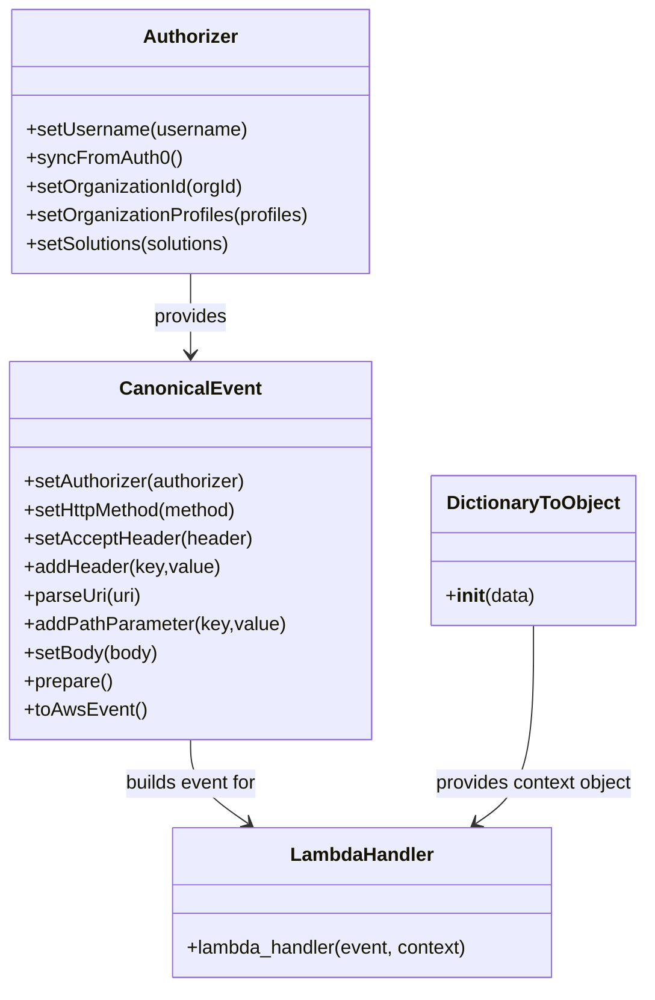

# Diagram: platform/tools/ide_local_testing/localTest/test/byUrl/entitySearch.py


> Auto-generated by Obscura crawlers

## Diagram 1

```mermaid
flowchart LR
  A[Start] --> B[Import modules json time localTest.core entity_search lambda]
  B --> C[Set configuration variables activeOrgId solutionId acceptType uri organizationProfiles]
  C --> D[Initialize Authorizer setUsername -> syncFromAuth0]
  D --> E{activeOrgId set?}
  E -- Yes --> F[authorizer.setOrganizationId(1004); setOrganizationProfiles; setSolutions]
  E -- No --> G[skip organization setup]
  F --> H[Build CanonicalEvent and prepare AWS event]
  G --> H
  H --> I[Call lambdaHandler(event, DictionaryToObject(function_name=entity-status-update))]
  I --> J{retval and retval.body exist?}
  J -- Yes --> K[body = json.loads(retval.body); prettyRetval = json.dumps(body, indent=2, sort_keys=True)]
  J -- No --> L[prettyRetval = empty string]
  K --> M[print(prettyRetval)]
  L --> M
  M --> N[print Lambda execution time]
  N --> O[End]
```

> SVG rendering failed for this diagram.

## Diagram 2

```mermaid
sequenceDiagram
  participant Script
  participant Authorizer
  participant CanonicalEvent
  participant LambdaHandler
  participant DictionaryToObject
  participant JSON
  Script->>Authorizer: Authorizer().setUsername(shipper-org-admin).syncFromAuth0()
  Authorizer-->>Script: authorizer
  Script->>Authorizer: setOrganizationId(1004); setOrganizationProfiles([SH,FV]); setSolutions([GM_FV])
  Script->>CanonicalEvent: CanonicalEvent().setAuthorizer(authorizer).setHttpMethod(GET).setAcceptHeader(acceptType).addHeader(x-active-org,1004).parseUri(uri).addPathParameter(solution_id,GM_FV).setBody(None).prepare().toAwsEvent()
  CanonicalEvent-->>Script: event
  Script->>LambdaHandler: lambdaHandler(event, DictionaryToObject(function_name=entity-status-update))
  LambdaHandler-->>Script: retval
  alt retval contains body
    Script->>JSON: json.loads(retval.body)
    JSON-->>Script: body dict
    Script->>Script: prettyRetval = json.dumps(body, indent=2, sort_keys=True)
  else no body
    Script->>Script: prettyRetval = ""
  end
  Script->>Script: print(prettyRetval)
  Script->>Script: print Lambda execution time
```

> SVG rendering failed for this diagram.

## Diagram 3



### SVG

<svg id="container" width="536.7109375" xmlns="http://www.w3.org/2000/svg" class="classDiagram" height="830" viewBox="0 0 536.7109375 830" role="graphics-document document" aria-roledescription="class"><style>#container{font-family:"trebuchet ms",verdana,arial,sans-serif;font-size:16px;fill:#333;}@keyframes edge-animation-frame{from{stroke-dashoffset:0;}}@keyframes dash{to{stroke-dashoffset:0;}}#container .edge-animation-slow{stroke-dasharray:9,5!important;stroke-dashoffset:900;animation:dash 50s linear infinite;stroke-linecap:round;}#container .edge-animation-fast{stroke-dasharray:9,5!important;stroke-dashoffset:900;animation:dash 20s linear infinite;stroke-linecap:round;}#container .error-icon{fill:#552222;}#container .error-text{fill:#552222;stroke:#552222;}#container .edge-thickness-normal{stroke-width:1px;}#container .edge-thickness-thick{stroke-width:3.5px;}#container .edge-pattern-solid{stroke-dasharray:0;}#container .edge-thickness-invisible{stroke-width:0;fill:none;}#container .edge-pattern-dashed{stroke-dasharray:3;}#container .edge-pattern-dotted{stroke-dasharray:2;}#container .marker{fill:#333333;stroke:#333333;}#container .marker.cross{stroke:#333333;}#container svg{font-family:"trebuchet ms",verdana,arial,sans-serif;font-size:16px;}#container p{margin:0;}#container g.classGroup text{fill:#9370DB;stroke:none;font-family:"trebuchet ms",verdana,arial,sans-serif;font-size:10px;}#container g.classGroup text .title{font-weight:bolder;}#container .nodeLabel,#container .edgeLabel{color:#131300;}#container .edgeLabel .label rect{fill:#ECECFF;}#container .label text{fill:#131300;}#container .labelBkg{background:#ECECFF;}#container .edgeLabel .label span{background:#ECECFF;}#container .classTitle{font-weight:bolder;}#container .node rect,#container .node circle,#container .node ellipse,#container .node polygon,#container .node path{fill:#ECECFF;stroke:#9370DB;stroke-width:1px;}#container .divider{stroke:#9370DB;stroke-width:1;}#container g.clickable{cursor:pointer;}#container g.classGroup rect{fill:#ECECFF;stroke:#9370DB;}#container g.classGroup line{stroke:#9370DB;stroke-width:1;}#container .classLabel .box{stroke:none;stroke-width:0;fill:#ECECFF;opacity:0.5;}#container .classLabel .label{fill:#9370DB;font-size:10px;}#container .relation{stroke:#333333;stroke-width:1;fill:none;}#container .dashed-line{stroke-dasharray:3;}#container .dotted-line{stroke-dasharray:1 2;}#container #compositionStart,#container .composition{fill:#333333!important;stroke:#333333!important;stroke-width:1;}#container #compositionEnd,#container .composition{fill:#333333!important;stroke:#333333!important;stroke-width:1;}#container #dependencyStart,#container .dependency{fill:#333333!important;stroke:#333333!important;stroke-width:1;}#container #dependencyStart,#container .dependency{fill:#333333!important;stroke:#333333!important;stroke-width:1;}#container #extensionStart,#container .extension{fill:transparent!important;stroke:#333333!important;stroke-width:1;}#container #extensionEnd,#container .extension{fill:transparent!important;stroke:#333333!important;stroke-width:1;}#container #aggregationStart,#container .aggregation{fill:transparent!important;stroke:#333333!important;stroke-width:1;}#container #aggregationEnd,#container .aggregation{fill:transparent!important;stroke:#333333!important;stroke-width:1;}#container #lollipopStart,#container .lollipop{fill:#ECECFF!important;stroke:#333333!important;stroke-width:1;}#container #lollipopEnd,#container .lollipop{fill:#ECECFF!important;stroke:#333333!important;stroke-width:1;}#container .edgeTerminals{font-size:11px;line-height:initial;}#container .classTitleText{text-anchor:middle;font-size:18px;fill:#333;}#container .label-icon{display:inline-block;height:1em;overflow:visible;vertical-align:-0.125em;}#container .node .label-icon path{fill:currentColor;stroke:revert;stroke-width:revert;}#container :root{--mermaid-font-family:"trebuchet ms",verdana,arial,sans-serif;}</style><g><defs><marker id="container_class-aggregationStart" class="marker aggregation class" refX="18" refY="7" markerWidth="190" markerHeight="240" orient="auto"><path d="M 18,7 L9,13 L1,7 L9,1 Z"></path></marker></defs><defs><marker id="container_class-aggregationEnd" class="marker aggregation class" refX="1" refY="7" markerWidth="20" markerHeight="28" orient="auto"><path d="M 18,7 L9,13 L1,7 L9,1 Z"></path></marker></defs><defs><marker id="container_class-extensionStart" class="marker extension class" refX="18" refY="7" markerWidth="190" markerHeight="240" orient="auto"><path d="M 1,7 L18,13 V 1 Z"></path></marker></defs><defs><marker id="container_class-extensionEnd" class="marker extension class" refX="1" refY="7" markerWidth="20" markerHeight="28" orient="auto"><path d="M 1,1 V 13 L18,7 Z"></path></marker></defs><defs><marker id="container_class-compositionStart" class="marker composition class" refX="18" refY="7" markerWidth="190" markerHeight="240" orient="auto"><path d="M 18,7 L9,13 L1,7 L9,1 Z"></path></marker></defs><defs><marker id="container_class-compositionEnd" class="marker composition class" refX="1" refY="7" markerWidth="20" markerHeight="28" orient="auto"><path d="M 18,7 L9,13 L1,7 L9,1 Z"></path></marker></defs><defs><marker id="container_class-dependencyStart" class="marker dependency class" refX="6" refY="7" markerWidth="190" markerHeight="240" orient="auto"><path d="M 5,7 L9,13 L1,7 L9,1 Z"></path></marker></defs><defs><marker id="container_class-dependencyEnd" class="marker dependency class" refX="13" refY="7" markerWidth="20" markerHeight="28" orient="auto"><path d="M 18,7 L9,13 L14,7 L9,1 Z"></path></marker></defs><defs><marker id="container_class-lollipopStart" class="marker lollipop class" refX="13" refY="7" markerWidth="190" markerHeight="240" orient="auto"><circle stroke="black" fill="transparent" cx="7" cy="7" r="6"></circle></marker></defs><defs><marker id="container_class-lollipopEnd" class="marker lollipop class" refX="1" refY="7" markerWidth="190" markerHeight="240" orient="auto"><circle stroke="black" fill="transparent" cx="7" cy="7" r="6"></circle></marker></defs><g class="root"><g class="clusters"></g><g class="edgePaths"><path d="M159.668,230L159.668,236.167C159.668,242.333,159.668,254.667,159.668,266C159.668,277.333,159.668,287.667,159.668,292.833L159.668,298" id="id_Authorizer_CanonicalEvent_1" class="edge-thickness-normal edge-pattern-solid relation" style=";;;" data-edge="true" data-et="edge" data-id="id_Authorizer_CanonicalEvent_1" data-points="W3sieCI6MTU5LjY2Nzk2ODc1LCJ5IjoyMzB9LHsieCI6MTU5LjY2Nzk2ODc1LCJ5IjoyNjd9LHsieCI6MTU5LjY2Nzk2ODc1LCJ5IjozMDR9XQ==" marker-end="url(#container_class-dependencyEnd)"></path><path d="M159.668,622L159.668,628.167C159.668,634.333,159.668,646.667,167.604,658.424C175.54,670.182,191.413,681.363,199.349,686.954L207.285,692.545" id="id_CanonicalEvent_LambdaHandler_2" class="edge-thickness-normal edge-pattern-solid relation" style=";;;" data-edge="true" data-et="edge" data-id="id_CanonicalEvent_LambdaHandler_2" data-points="W3sieCI6MTU5LjY2Nzk2ODc1LCJ5Ijo2MjJ9LHsieCI6MTU5LjY2Nzk2ODc1LCJ5Ijo2NTl9LHsieCI6MjEyLjE4OTkwMjM0Mzc1MDAyLCJ5Ijo2OTZ9XQ==" marker-end="url(#container_class-dependencyEnd)"></path><path d="M443.57,526L443.57,548.167C443.57,570.333,443.57,614.667,435.634,642.424C427.698,670.182,411.826,681.363,403.89,686.954L395.953,692.545" id="id_DictionaryToObject_LambdaHandler_3" class="edge-thickness-normal edge-pattern-solid relation" style=";;;" data-edge="true" data-et="edge" data-id="id_DictionaryToObject_LambdaHandler_3" data-points="W3sieCI6NDQzLjU3MDMxMjUsInkiOjUyNn0seyJ4Ijo0NDMuNTcwMzEyNSwieSI6NjU5fSx7IngiOjM5MS4wNDgzNzg5MDYyNSwieSI6Njk2fV0=" marker-end="url(#container_class-dependencyEnd)"></path></g><g class="edgeLabels"><g class="edgeLabel" transform="translate(159.66796875, 267)"><g class="label" data-id="id_Authorizer_CanonicalEvent_1" transform="translate(-31.3125, -12)"><foreignObject width="62.625" height="24"><div xmlns="http://www.w3.org/1999/xhtml" class="labelBkg" style="display: table-cell; white-space: nowrap; line-height: 1.5; max-width: 200px; text-align: center;"><span class="edgeLabel"><p>provides</p></span></div></foreignObject></g></g><g class="edgeLabel" transform="translate(159.66796875, 659)"><g class="label" data-id="id_CanonicalEvent_LambdaHandler_2" transform="translate(-57.2578125, -12)"><foreignObject width="114.515625" height="24"><div xmlns="http://www.w3.org/1999/xhtml" class="labelBkg" style="display: table-cell; white-space: nowrap; line-height: 1.5; max-width: 200px; text-align: center;"><span class="edgeLabel"><p>builds event for</p></span></div></foreignObject></g></g><g class="edgeLabel" transform="translate(443.5703125, 659)"><g class="label" data-id="id_DictionaryToObject_LambdaHandler_3" transform="translate(-85.140625, -12)"><foreignObject width="170.28125" height="24"><div xmlns="http://www.w3.org/1999/xhtml" class="labelBkg" style="display: table-cell; white-space: nowrap; line-height: 1.5; max-width: 200px; text-align: center;"><span class="edgeLabel"><p>provides context object</p></span></div></foreignObject></g></g></g><g class="nodes"><g class="node default" id="classId-Authorizer-0" transform="translate(159.66796875, 119)"><g class="basic label-container"><path d="M-151.66796875 -111 L151.66796875 -111 L151.66796875 111 L-151.66796875 111" stroke="none" stroke-width="0" fill="#ECECFF" style=""></path><path d="M-151.66796875 -111 C-43.67109751238638 -111, 64.32577372522724 -111, 151.66796875 -111 M-151.66796875 -111 C-69.26770180692017 -111, 13.132565136159656 -111, 151.66796875 -111 M151.66796875 -111 C151.66796875 -41.56411476650969, 151.66796875 27.87177046698062, 151.66796875 111 M151.66796875 -111 C151.66796875 -57.757263737951504, 151.66796875 -4.514527475903009, 151.66796875 111 M151.66796875 111 C32.969053859553284 111, -85.72986103089343 111, -151.66796875 111 M151.66796875 111 C58.713702801278714 111, -34.24056314744257 111, -151.66796875 111 M-151.66796875 111 C-151.66796875 65.09643669959016, -151.66796875 19.1928733991803, -151.66796875 -111 M-151.66796875 111 C-151.66796875 33.54834175833652, -151.66796875 -43.90331648332696, -151.66796875 -111" stroke="#9370DB" stroke-width="1.3" fill="none" stroke-dasharray="0 0" style=""></path></g><g class="annotation-group text" transform="translate(0, -87)"></g><g class="label-group text" transform="translate(-38.3671875, -87)"><g class="label" style="font-weight: bolder" transform="translate(0,-12)"><foreignObject width="76.734375" height="24"><div xmlns="http://www.w3.org/1999/xhtml" style="display: table-cell; white-space: nowrap; line-height: 1.5; max-width: 126px; text-align: center;"><span class="nodeLabel markdown-node-label" style=""><p>Authorizer</p></span></div></foreignObject></g></g><g class="members-group text" transform="translate(-139.66796875, -39)"></g><g class="methods-group text" transform="translate(-139.66796875, -9)"><g class="label" style="" transform="translate(0,-12)"><foreignObject width="185.90625" height="24"><div xmlns="http://www.w3.org/1999/xhtml" style="display: table-cell; white-space: nowrap; line-height: 1.5; max-width: 243px; text-align: center;"><span class="nodeLabel markdown-node-label" style=""><p>+setUsername(username)</p></span></div></foreignObject></g><g class="label" style="" transform="translate(0,12)"><foreignObject width="129.0625" height="24"><div xmlns="http://www.w3.org/1999/xhtml" style="display: table-cell; white-space: nowrap; line-height: 1.5; max-width: 186px; text-align: center;"><span class="nodeLabel markdown-node-label" style=""><p>+syncFromAuth0()</p></span></div></foreignObject></g><g class="label" style="" transform="translate(0,36)"><foreignObject width="184.578125" height="24"><div xmlns="http://www.w3.org/1999/xhtml" style="display: table-cell; white-space: nowrap; line-height: 1.5; max-width: 242px; text-align: center;"><span class="nodeLabel markdown-node-label" style=""><p>+setOrganizationId(orgId)</p></span></div></foreignObject></g><g class="label" style="" transform="translate(0,60)"><foreignObject width="240.96875" height="24"><div xmlns="http://www.w3.org/1999/xhtml" style="display: table-cell; white-space: nowrap; line-height: 1.5; max-width: 298px; text-align: center;"><span class="nodeLabel markdown-node-label" style=""><p>+setOrganizationProfiles(profiles)</p></span></div></foreignObject></g><g class="label" style="" transform="translate(0,84)"><foreignObject width="176.171875" height="24"><div xmlns="http://www.w3.org/1999/xhtml" style="display: table-cell; white-space: nowrap; line-height: 1.5; max-width: 234px; text-align: center;"><span class="nodeLabel markdown-node-label" style=""><p>+setSolutions(solutions)</p></span></div></foreignObject></g></g><g class="divider" style=""><path d="M-151.66796875 -63 C-72.988181556797 -63, 5.6916056364059955 -63, 151.66796875 -63 M-151.66796875 -63 C-84.0617462905894 -63, -16.455523831178795 -63, 151.66796875 -63" stroke="#9370DB" stroke-width="1.3" fill="none" stroke-dasharray="0 0" style=""></path></g><g class="divider" style=""><path d="M-151.66796875 -39 C-60.97645535213127 -39, 29.715058045737464 -39, 151.66796875 -39 M-151.66796875 -39 C-56.27568438965666 -39, 39.11659997068668 -39, 151.66796875 -39" stroke="#9370DB" stroke-width="1.3" fill="none" stroke-dasharray="0 0" style=""></path></g></g><g class="node default" id="classId-CanonicalEvent-1" transform="translate(159.66796875, 463)"><g class="basic label-container"><path d="M-149.12890625 -159 L149.12890625 -159 L149.12890625 159 L-149.12890625 159" stroke="none" stroke-width="0" fill="#ECECFF" style=""></path><path d="M-149.12890625 -159 C-48.888677426349716 -159, 51.35155139730057 -159, 149.12890625 -159 M-149.12890625 -159 C-31.709788974829195 -159, 85.70932830034161 -159, 149.12890625 -159 M149.12890625 -159 C149.12890625 -84.03936592982573, 149.12890625 -9.07873185965147, 149.12890625 159 M149.12890625 -159 C149.12890625 -73.72001955104247, 149.12890625 11.559960897915062, 149.12890625 159 M149.12890625 159 C74.52055351236845 159, -0.08779922526309747 159, -149.12890625 159 M149.12890625 159 C75.56047289429772 159, 1.992039538595435 159, -149.12890625 159 M-149.12890625 159 C-149.12890625 80.08265960411295, -149.12890625 1.1653192082258954, -149.12890625 -159 M-149.12890625 159 C-149.12890625 32.830195312743044, -149.12890625 -93.33960937451391, -149.12890625 -159" stroke="#9370DB" stroke-width="1.3" fill="none" stroke-dasharray="0 0" style=""></path></g><g class="annotation-group text" transform="translate(0, -135)"></g><g class="label-group text" transform="translate(-55.7109375, -135)"><g class="label" style="font-weight: bolder" transform="translate(0,-12)"><foreignObject width="111.421875" height="24"><div xmlns="http://www.w3.org/1999/xhtml" style="display: table-cell; white-space: nowrap; line-height: 1.5; max-width: 161px; text-align: center;"><span class="nodeLabel markdown-node-label" style=""><p>CanonicalEvent</p></span></div></foreignObject></g></g><g class="members-group text" transform="translate(-137.12890625, -87)"></g><g class="methods-group text" transform="translate(-137.12890625, -57)"><g class="label" style="" transform="translate(0,-12)"><foreignObject width="190.75" height="24"><div xmlns="http://www.w3.org/1999/xhtml" style="display: table-cell; white-space: nowrap; line-height: 1.5; max-width: 248px; text-align: center;"><span class="nodeLabel markdown-node-label" style=""><p>+setAuthorizer(authorizer)</p></span></div></foreignObject></g><g class="label" style="" transform="translate(0,12)"><foreignObject width="184" height="24"><div xmlns="http://www.w3.org/1999/xhtml" style="display: table-cell; white-space: nowrap; line-height: 1.5; max-width: 241px; text-align: center;"><span class="nodeLabel markdown-node-label" style=""><p>+setHttpMethod(method)</p></span></div></foreignObject></g><g class="label" style="" transform="translate(0,36)"><foreignObject width="191.859375" height="24"><div xmlns="http://www.w3.org/1999/xhtml" style="display: table-cell; white-space: nowrap; line-height: 1.5; max-width: 249px; text-align: center;"><span class="nodeLabel markdown-node-label" style=""><p>+setAcceptHeader(header)</p></span></div></foreignObject></g><g class="label" style="" transform="translate(0,60)"><foreignObject width="164.578125" height="24"><div xmlns="http://www.w3.org/1999/xhtml" style="display: table-cell; white-space: nowrap; line-height: 1.5; max-width: 222px; text-align: center;"><span class="nodeLabel markdown-node-label" style=""><p>+addHeader(key,value)</p></span></div></foreignObject></g><g class="label" style="" transform="translate(0,84)"><foreignObject width="99.8125" height="24"><div xmlns="http://www.w3.org/1999/xhtml" style="display: table-cell; white-space: nowrap; line-height: 1.5; max-width: 157px; text-align: center;"><span class="nodeLabel markdown-node-label" style=""><p>+parseUri(uri)</p></span></div></foreignObject></g><g class="label" style="" transform="translate(0,108)"><foreignObject width="218.546875" height="24"><div xmlns="http://www.w3.org/1999/xhtml" style="display: table-cell; white-space: nowrap; line-height: 1.5; max-width: 276px; text-align: center;"><span class="nodeLabel markdown-node-label" style=""><p>+addPathParameter(key,value)</p></span></div></foreignObject></g><g class="label" style="" transform="translate(0,132)"><foreignObject width="113.125" height="24"><div xmlns="http://www.w3.org/1999/xhtml" style="display: table-cell; white-space: nowrap; line-height: 1.5; max-width: 170px; text-align: center;"><span class="nodeLabel markdown-node-label" style=""><p>+setBody(body)</p></span></div></foreignObject></g><g class="label" style="" transform="translate(0,156)"><foreignObject width="74.75" height="24"><div xmlns="http://www.w3.org/1999/xhtml" style="display: table-cell; white-space: nowrap; line-height: 1.5; max-width: 132px; text-align: center;"><span class="nodeLabel markdown-node-label" style=""><p>+prepare()</p></span></div></foreignObject></g><g class="label" style="" transform="translate(0,180)"><foreignObject width="101.1875" height="24"><div xmlns="http://www.w3.org/1999/xhtml" style="display: table-cell; white-space: nowrap; line-height: 1.5; max-width: 159px; text-align: center;"><span class="nodeLabel markdown-node-label" style=""><p>+toAwsEvent()</p></span></div></foreignObject></g></g><g class="divider" style=""><path d="M-149.12890625 -111 C-41.390000794940704 -111, 66.34890466011859 -111, 149.12890625 -111 M-149.12890625 -111 C-44.52980565534409 -111, 60.06929493931182 -111, 149.12890625 -111" stroke="#9370DB" stroke-width="1.3" fill="none" stroke-dasharray="0 0" style=""></path></g><g class="divider" style=""><path d="M-149.12890625 -87 C-48.07805229425601 -87, 52.97280166148798 -87, 149.12890625 -87 M-149.12890625 -87 C-66.84027384047893 -87, 15.448358569042142 -87, 149.12890625 -87" stroke="#9370DB" stroke-width="1.3" fill="none" stroke-dasharray="0 0" style=""></path></g></g><g class="node default" id="classId-DictionaryToObject-2" transform="translate(443.5703125, 463)"><g class="basic label-container"><path d="M-84.7734375 -63 L84.7734375 -63 L84.7734375 63 L-84.7734375 63" stroke="none" stroke-width="0" fill="#ECECFF" style=""></path><path d="M-84.7734375 -63 C-21.45256361858209 -63, 41.86831026283582 -63, 84.7734375 -63 M-84.7734375 -63 C-47.51539702743054 -63, -10.257356554861076 -63, 84.7734375 -63 M84.7734375 -63 C84.7734375 -27.757969457001465, 84.7734375 7.4840610859970695, 84.7734375 63 M84.7734375 -63 C84.7734375 -17.651561117120515, 84.7734375 27.69687776575897, 84.7734375 63 M84.7734375 63 C19.29832405018601 63, -46.17678939962798 63, -84.7734375 63 M84.7734375 63 C37.53953172099166 63, -9.694374058016678 63, -84.7734375 63 M-84.7734375 63 C-84.7734375 23.183270147601966, -84.7734375 -16.633459704796067, -84.7734375 -63 M-84.7734375 63 C-84.7734375 29.30897081758836, -84.7734375 -4.38205836482328, -84.7734375 -63" stroke="#9370DB" stroke-width="1.3" fill="none" stroke-dasharray="0 0" style=""></path></g><g class="annotation-group text" transform="translate(0, -39)"></g><g class="label-group text" transform="translate(-70.109375, -39)"><g class="label" style="font-weight: bolder" transform="translate(0,-12)"><foreignObject width="140.21875" height="24"><div xmlns="http://www.w3.org/1999/xhtml" style="display: table-cell; white-space: nowrap; line-height: 1.5; max-width: 188px; text-align: center;"><span class="nodeLabel markdown-node-label" style=""><p>DictionaryToObject</p></span></div></foreignObject></g></g><g class="members-group text" transform="translate(-72.7734375, 9)"></g><g class="methods-group text" transform="translate(-72.7734375, 39)"><g class="label" style="" transform="translate(0,-12)"><foreignObject width="75.4375" height="24"><div xmlns="http://www.w3.org/1999/xhtml" style="display: table-cell; white-space: nowrap; line-height: 1.5; max-width: 164px; text-align: center;"><span class="nodeLabel markdown-node-label" style=""><p>+<strong>init</strong>(data)</p></span></div></foreignObject></g></g><g class="divider" style=""><path d="M-84.7734375 -15 C-20.7979801153363 -15, 43.1774772693274 -15, 84.7734375 -15 M-84.7734375 -15 C-27.06273685735316 -15, 30.647963785293683 -15, 84.7734375 -15" stroke="#9370DB" stroke-width="1.3" fill="none" stroke-dasharray="0 0" style=""></path></g><g class="divider" style=""><path d="M-84.7734375 9 C-37.48227346990262 9, 9.808890560194754 9, 84.7734375 9 M-84.7734375 9 C-31.55648742542791 9, 21.66046264914418 9, 84.7734375 9" stroke="#9370DB" stroke-width="1.3" fill="none" stroke-dasharray="0 0" style=""></path></g></g><g class="node default" id="classId-LambdaHandler-3" transform="translate(301.619140625, 759)"><g class="basic label-container"><path d="M-161.203125 -63 L161.203125 -63 L161.203125 63 L-161.203125 63" stroke="none" stroke-width="0" fill="#ECECFF" style=""></path><path d="M-161.203125 -63 C-67.85330101358268 -63, 25.49652297283464 -63, 161.203125 -63 M-161.203125 -63 C-86.74215394849246 -63, -12.281182896984916 -63, 161.203125 -63 M161.203125 -63 C161.203125 -30.8048833365496, 161.203125 1.3902333269007983, 161.203125 63 M161.203125 -63 C161.203125 -12.759705416196454, 161.203125 37.48058916760709, 161.203125 63 M161.203125 63 C64.78681194492403 63, -31.62950111015195 63, -161.203125 63 M161.203125 63 C47.255776293783484 63, -66.69157241243303 63, -161.203125 63 M-161.203125 63 C-161.203125 20.24977615680085, -161.203125 -22.500447686398303, -161.203125 -63 M-161.203125 63 C-161.203125 21.446222790627978, -161.203125 -20.107554418744044, -161.203125 -63" stroke="#9370DB" stroke-width="1.3" fill="none" stroke-dasharray="0 0" style=""></path></g><g class="annotation-group text" transform="translate(0, -39)"></g><g class="label-group text" transform="translate(-58.21875, -39)"><g class="label" style="font-weight: bolder" transform="translate(0,-12)"><foreignObject width="116.4375" height="24"><div xmlns="http://www.w3.org/1999/xhtml" style="display: table-cell; white-space: nowrap; line-height: 1.5; max-width: 167px; text-align: center;"><span class="nodeLabel markdown-node-label" style=""><p>LambdaHandler</p></span></div></foreignObject></g></g><g class="members-group text" transform="translate(-149.203125, 9)"></g><g class="methods-group text" transform="translate(-149.203125, 39)"><g class="label" style="" transform="translate(0,-12)"><foreignObject width="240.1875" height="24"><div xmlns="http://www.w3.org/1999/xhtml" style="display: table-cell; white-space: nowrap; line-height: 1.5; max-width: 298px; text-align: center;"><span class="nodeLabel markdown-node-label" style=""><p>+lambda_handler(event, context)</p></span></div></foreignObject></g></g><g class="divider" style=""><path d="M-161.203125 -15 C-86.29356971682869 -15, -11.38401443365737 -15, 161.203125 -15 M-161.203125 -15 C-77.96676025392408 -15, 5.269604492151842 -15, 161.203125 -15" stroke="#9370DB" stroke-width="1.3" fill="none" stroke-dasharray="0 0" style=""></path></g><g class="divider" style=""><path d="M-161.203125 9 C-81.51284397263774 9, -1.8225629452754788 9, 161.203125 9 M-161.203125 9 C-51.89588866824485 9, 57.4113476635103 9, 161.203125 9" stroke="#9370DB" stroke-width="1.3" fill="none" stroke-dasharray="0 0" style=""></path></g></g></g></g></g></svg>
