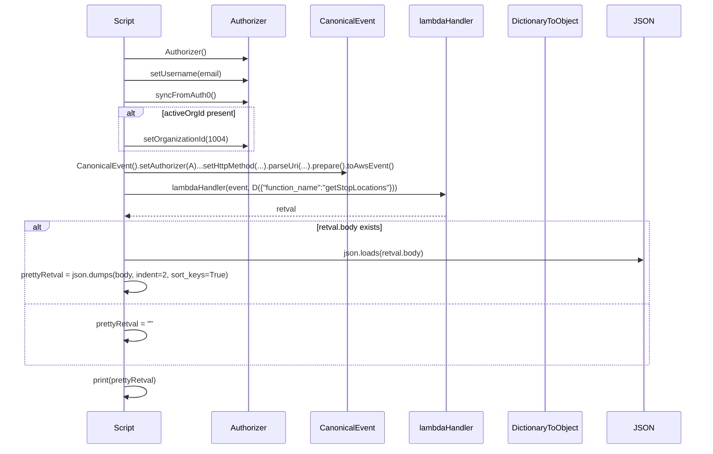
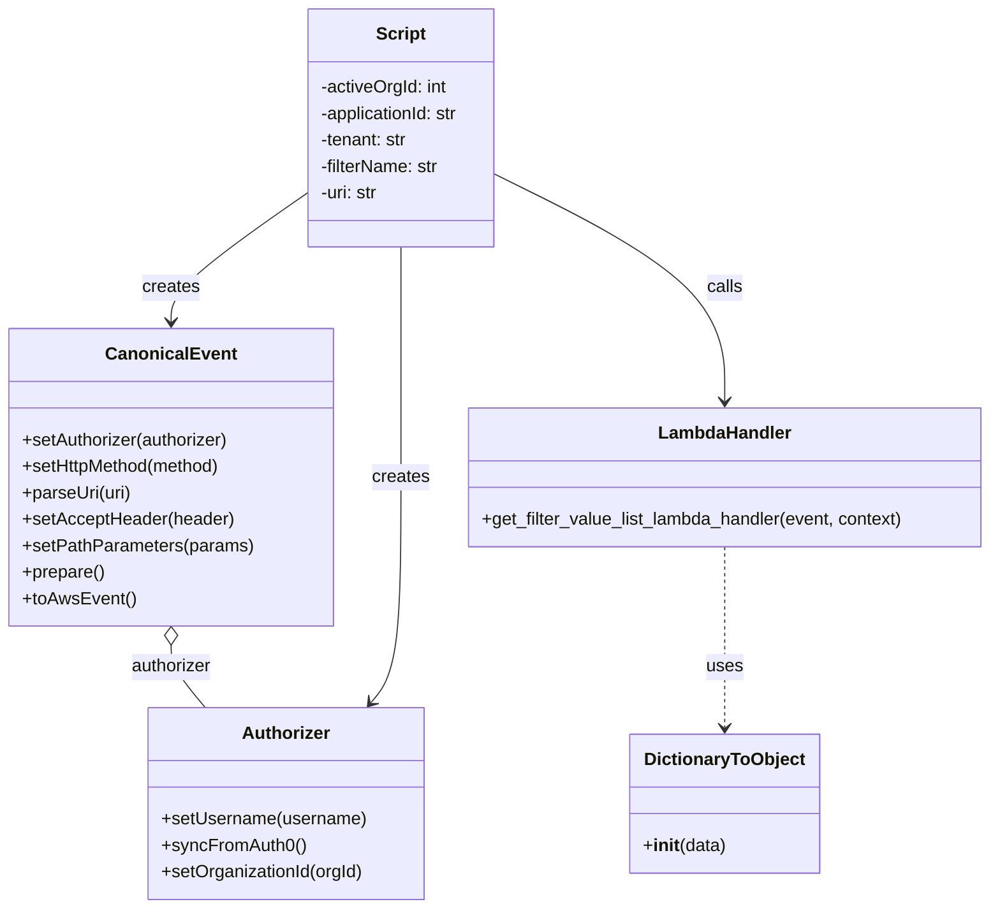

# Diagram: platform/tools/ide_local_testing/localTest/test/byUrl/filterServiceGetFilterList.py


> Auto-generated by Obscura crawlers

## Diagram 1

```mermaid
flowchart TD
    Start([Start])
    InitVars[Initialize constants: activeOrgId=1004, applicationId, tenant, filterName, uri]
    CreateAuthorizer[Create Authorizer()]
    SetUsername[Authorizer.setUsername(email)]
    SyncAuth[Authorizer.syncFromAuth0()]
    CheckOrg{activeOrgId set?}
    SetOrg[Authorizer.setOrganizationId(activeOrgId)]
    CreateEvent[Create CanonicalEvent() and chain setters]
    PrepareEvent[prepare() -> toAwsEvent()]
    CallLambda[Call lambdaHandler(event, DictionaryToObject({"function_name":"getStopLocations"}))]
    CheckRetval{retval and retval.body?}
    ParseBody[json.loads(retval.body) -> prettyRetval]
    Print[print(prettyRetval)]
    Start --> InitVars --> CreateAuthorizer --> SetUsername --> SyncAuth --> CheckOrg
    CheckOrg -->|yes| SetOrg --> CreateEvent
    CheckOrg -->|no| CreateEvent
    CreateEvent --> PrepareEvent --> CallLambda --> CheckRetval
    CheckRetval -->|yes| ParseBody --> Print
    CheckRetval -->|no| Print
```

> SVG rendering failed for this diagram.

## Diagram 2



### SVG

<svg id="container" width="1475" xmlns="http://www.w3.org/2000/svg" height="954" viewBox="-195.5 -10 1475 954" role="graphics-document document" aria-roledescription="sequence"><g><rect x="1079.5" y="868" fill="#eaeaea" stroke="#666" width="150" height="65" name="J" rx="3" ry="3" class="actor actor-bottom"></rect><text x="1154.5" y="900.5" dominant-baseline="central" alignment-baseline="central" class="actor actor-box" style="text-anchor: middle; font-size: 16px; font-weight: 400;"><tspan x="1154.5" dy="0">JSON</tspan></text></g><g><rect x="871.5" y="868" fill="#eaeaea" stroke="#666" width="158" height="65" name="D" rx="3" ry="3" class="actor actor-bottom"></rect><text x="950.5" y="900.5" dominant-baseline="central" alignment-baseline="central" class="actor actor-box" style="text-anchor: middle; font-size: 16px; font-weight: 400;"><tspan x="950.5" dy="0">DictionaryToObject</tspan></text></g><g><rect x="671.5" y="868" fill="#eaeaea" stroke="#666" width="150" height="65" name="L" rx="3" ry="3" class="actor actor-bottom"></rect><text x="746.5" y="900.5" dominant-baseline="central" alignment-baseline="central" class="actor actor-box" style="text-anchor: middle; font-size: 16px; font-weight: 400;"><tspan x="746.5" dy="0">lambdaHandler</tspan></text></g><g><rect x="471.5" y="868" fill="#eaeaea" stroke="#666" width="150" height="65" name="C" rx="3" ry="3" class="actor actor-bottom"></rect><text x="546.5" y="900.5" dominant-baseline="central" alignment-baseline="central" class="actor actor-box" style="text-anchor: middle; font-size: 16px; font-weight: 400;"><tspan x="546.5" dy="0">CanonicalEvent</tspan></text></g><g><rect x="271.5" y="868" fill="#eaeaea" stroke="#666" width="150" height="65" name="A" rx="3" ry="3" class="actor actor-bottom"></rect><text x="346.5" y="900.5" dominant-baseline="central" alignment-baseline="central" class="actor actor-box" style="text-anchor: middle; font-size: 16px; font-weight: 400;"><tspan x="346.5" dy="0">Authorizer</tspan></text></g><g><rect x="0" y="868" fill="#eaeaea" stroke="#666" width="150" height="65" name="S" rx="3" ry="3" class="actor actor-bottom"></rect><text x="75" y="900.5" dominant-baseline="central" alignment-baseline="central" class="actor actor-box" style="text-anchor: middle; font-size: 16px; font-weight: 400;"><tspan x="75" dy="0">Script</tspan></text></g><g><line id="actor5" x1="1154.5" y1="65" x2="1154.5" y2="868" class="actor-line 200" stroke-width="0.5px" stroke="#999" name="J"></line><g id="root-5"><rect x="1079.5" y="0" fill="#eaeaea" stroke="#666" width="150" height="65" name="J" rx="3" ry="3" class="actor actor-top"></rect><text x="1154.5" y="32.5" dominant-baseline="central" alignment-baseline="central" class="actor actor-box" style="text-anchor: middle; font-size: 16px; font-weight: 400;"><tspan x="1154.5" dy="0">JSON</tspan></text></g></g><g><line id="actor4" x1="950.5" y1="65" x2="950.5" y2="868" class="actor-line 200" stroke-width="0.5px" stroke="#999" name="D"></line><g id="root-4"><rect x="871.5" y="0" fill="#eaeaea" stroke="#666" width="158" height="65" name="D" rx="3" ry="3" class="actor actor-top"></rect><text x="950.5" y="32.5" dominant-baseline="central" alignment-baseline="central" class="actor actor-box" style="text-anchor: middle; font-size: 16px; font-weight: 400;"><tspan x="950.5" dy="0">DictionaryToObject</tspan></text></g></g><g><line id="actor3" x1="746.5" y1="65" x2="746.5" y2="868" class="actor-line 200" stroke-width="0.5px" stroke="#999" name="L"></line><g id="root-3"><rect x="671.5" y="0" fill="#eaeaea" stroke="#666" width="150" height="65" name="L" rx="3" ry="3" class="actor actor-top"></rect><text x="746.5" y="32.5" dominant-baseline="central" alignment-baseline="central" class="actor actor-box" style="text-anchor: middle; font-size: 16px; font-weight: 400;"><tspan x="746.5" dy="0">lambdaHandler</tspan></text></g></g><g><line id="actor2" x1="546.5" y1="65" x2="546.5" y2="868" class="actor-line 200" stroke-width="0.5px" stroke="#999" name="C"></line><g id="root-2"><rect x="471.5" y="0" fill="#eaeaea" stroke="#666" width="150" height="65" name="C" rx="3" ry="3" class="actor actor-top"></rect><text x="546.5" y="32.5" dominant-baseline="central" alignment-baseline="central" class="actor actor-box" style="text-anchor: middle; font-size: 16px; font-weight: 400;"><tspan x="546.5" dy="0">CanonicalEvent</tspan></text></g></g><g><line id="actor1" x1="346.5" y1="65" x2="346.5" y2="868" class="actor-line 200" stroke-width="0.5px" stroke="#999" name="A"></line><g id="root-1"><rect x="271.5" y="0" fill="#eaeaea" stroke="#666" width="150" height="65" name="A" rx="3" ry="3" class="actor actor-top"></rect><text x="346.5" y="32.5" dominant-baseline="central" alignment-baseline="central" class="actor actor-box" style="text-anchor: middle; font-size: 16px; font-weight: 400;"><tspan x="346.5" dy="0">Authorizer</tspan></text></g></g><g><line id="actor0" x1="75" y1="65" x2="75" y2="868" class="actor-line 200" stroke-width="0.5px" stroke="#999" name="S"></line><g id="root-0"><rect x="0" y="0" fill="#eaeaea" stroke="#666" width="150" height="65" name="S" rx="3" ry="3" class="actor actor-top"></rect><text x="75" y="32.5" dominant-baseline="central" alignment-baseline="central" class="actor actor-box" style="text-anchor: middle; font-size: 16px; font-weight: 400;"><tspan x="75" dy="0">Script</tspan></text></g></g><style>#container{font-family:"trebuchet ms",verdana,arial,sans-serif;font-size:16px;fill:#333;}@keyframes edge-animation-frame{from{stroke-dashoffset:0;}}@keyframes dash{to{stroke-dashoffset:0;}}#container .edge-animation-slow{stroke-dasharray:9,5!important;stroke-dashoffset:900;animation:dash 50s linear infinite;stroke-linecap:round;}#container .edge-animation-fast{stroke-dasharray:9,5!important;stroke-dashoffset:900;animation:dash 20s linear infinite;stroke-linecap:round;}#container .error-icon{fill:#552222;}#container .error-text{fill:#552222;stroke:#552222;}#container .edge-thickness-normal{stroke-width:1px;}#container .edge-thickness-thick{stroke-width:3.5px;}#container .edge-pattern-solid{stroke-dasharray:0;}#container .edge-thickness-invisible{stroke-width:0;fill:none;}#container .edge-pattern-dashed{stroke-dasharray:3;}#container .edge-pattern-dotted{stroke-dasharray:2;}#container .marker{fill:#333333;stroke:#333333;}#container .marker.cross{stroke:#333333;}#container svg{font-family:"trebuchet ms",verdana,arial,sans-serif;font-size:16px;}#container p{margin:0;}#container .actor{stroke:hsl(259.6261682243, 59.7765363128%, 87.9019607843%);fill:#ECECFF;}#container text.actor&gt;tspan{fill:black;stroke:none;}#container .actor-line{stroke:hsl(259.6261682243, 59.7765363128%, 87.9019607843%);}#container .innerArc{stroke-width:1.5;stroke-dasharray:none;}#container .messageLine0{stroke-width:1.5;stroke-dasharray:none;stroke:#333;}#container .messageLine1{stroke-width:1.5;stroke-dasharray:2,2;stroke:#333;}#container #arrowhead path{fill:#333;stroke:#333;}#container .sequenceNumber{fill:white;}#container #sequencenumber{fill:#333;}#container #crosshead path{fill:#333;stroke:#333;}#container .messageText{fill:#333;stroke:none;}#container .labelBox{stroke:hsl(259.6261682243, 59.7765363128%, 87.9019607843%);fill:#ECECFF;}#container .labelText,#container .labelText&gt;tspan{fill:black;stroke:none;}#container .loopText,#container .loopText&gt;tspan{fill:black;stroke:none;}#container .loopLine{stroke-width:2px;stroke-dasharray:2,2;stroke:hsl(259.6261682243, 59.7765363128%, 87.9019607843%);fill:hsl(259.6261682243, 59.7765363128%, 87.9019607843%);}#container .note{stroke:#aaaa33;fill:#fff5ad;}#container .noteText,#container .noteText&gt;tspan{fill:black;stroke:none;}#container .activation0{fill:#f4f4f4;stroke:#666;}#container .activation1{fill:#f4f4f4;stroke:#666;}#container .activation2{fill:#f4f4f4;stroke:#666;}#container .actorPopupMenu{position:absolute;}#container .actorPopupMenuPanel{position:absolute;fill:#ECECFF;box-shadow:0px 8px 16px 0px rgba(0,0,0,0.2);filter:drop-shadow(3px 5px 2px rgb(0 0 0 / 0.4));}#container .actor-man line{stroke:hsl(259.6261682243, 59.7765363128%, 87.9019607843%);fill:#ECECFF;}#container .actor-man circle,#container line{stroke:hsl(259.6261682243, 59.7765363128%, 87.9019607843%);fill:#ECECFF;stroke-width:2px;}#container :root{--mermaid-font-family:"trebuchet ms",verdana,arial,sans-serif;}</style><g></g><defs><symbol id="computer" width="24" height="24"><path transform="scale(.5)" d="M2 2v13h20v-13h-20zm18 11h-16v-9h16v9zm-10.228 6l.466-1h3.524l.467 1h-4.457zm14.228 3h-24l2-6h2.104l-1.33 4h18.45l-1.297-4h2.073l2 6zm-5-10h-14v-7h14v7z"></path></symbol></defs><defs><symbol id="database" fill-rule="evenodd" clip-rule="evenodd"><path transform="scale(.5)" d="M12.258.001l.256.004.255.005.253.008.251.01.249.012.247.015.246.016.242.019.241.02.239.023.236.024.233.027.231.028.229.031.225.032.223.034.22.036.217.038.214.04.211.041.208.043.205.045.201.046.198.048.194.05.191.051.187.053.183.054.18.056.175.057.172.059.168.06.163.061.16.063.155.064.15.066.074.033.073.033.071.034.07.034.069.035.068.035.067.035.066.035.064.036.064.036.062.036.06.036.06.037.058.037.058.037.055.038.055.038.053.038.052.038.051.039.05.039.048.039.047.039.045.04.044.04.043.04.041.04.04.041.039.041.037.041.036.041.034.041.033.042.032.042.03.042.029.042.027.042.026.043.024.043.023.043.021.043.02.043.018.044.017.043.015.044.013.044.012.044.011.045.009.044.007.045.006.045.004.045.002.045.001.045v17l-.001.045-.002.045-.004.045-.006.045-.007.045-.009.044-.011.045-.012.044-.013.044-.015.044-.017.043-.018.044-.02.043-.021.043-.023.043-.024.043-.026.043-.027.042-.029.042-.03.042-.032.042-.033.042-.034.041-.036.041-.037.041-.039.041-.04.041-.041.04-.043.04-.044.04-.045.04-.047.039-.048.039-.05.039-.051.039-.052.038-.053.038-.055.038-.055.038-.058.037-.058.037-.06.037-.06.036-.062.036-.064.036-.064.036-.066.035-.067.035-.068.035-.069.035-.07.034-.071.034-.073.033-.074.033-.15.066-.155.064-.16.063-.163.061-.168.06-.172.059-.175.057-.18.056-.183.054-.187.053-.191.051-.194.05-.198.048-.201.046-.205.045-.208.043-.211.041-.214.04-.217.038-.22.036-.223.034-.225.032-.229.031-.231.028-.233.027-.236.024-.239.023-.241.02-.242.019-.246.016-.247.015-.249.012-.251.01-.253.008-.255.005-.256.004-.258.001-.258-.001-.256-.004-.255-.005-.253-.008-.251-.01-.249-.012-.247-.015-.245-.016-.243-.019-.241-.02-.238-.023-.236-.024-.234-.027-.231-.028-.228-.031-.226-.032-.223-.034-.22-.036-.217-.038-.214-.04-.211-.041-.208-.043-.204-.045-.201-.046-.198-.048-.195-.05-.19-.051-.187-.053-.184-.054-.179-.056-.176-.057-.172-.059-.167-.06-.164-.061-.159-.063-.155-.064-.151-.066-.074-.033-.072-.033-.072-.034-.07-.034-.069-.035-.068-.035-.067-.035-.066-.035-.064-.036-.063-.036-.062-.036-.061-.036-.06-.037-.058-.037-.057-.037-.056-.038-.055-.038-.053-.038-.052-.038-.051-.039-.049-.039-.049-.039-.046-.039-.046-.04-.044-.04-.043-.04-.041-.04-.04-.041-.039-.041-.037-.041-.036-.041-.034-.041-.033-.042-.032-.042-.03-.042-.029-.042-.027-.042-.026-.043-.024-.043-.023-.043-.021-.043-.02-.043-.018-.044-.017-.043-.015-.044-.013-.044-.012-.044-.011-.045-.009-.044-.007-.045-.006-.045-.004-.045-.002-.045-.001-.045v-17l.001-.045.002-.045.004-.045.006-.045.007-.045.009-.044.011-.045.012-.044.013-.044.015-.044.017-.043.018-.044.02-.043.021-.043.023-.043.024-.043.026-.043.027-.042.029-.042.03-.042.032-.042.033-.042.034-.041.036-.041.037-.041.039-.041.04-.041.041-.04.043-.04.044-.04.046-.04.046-.039.049-.039.049-.039.051-.039.052-.038.053-.038.055-.038.056-.038.057-.037.058-.037.06-.037.061-.036.062-.036.063-.036.064-.036.066-.035.067-.035.068-.035.069-.035.07-.034.072-.034.072-.033.074-.033.151-.066.155-.064.159-.063.164-.061.167-.06.172-.059.176-.057.179-.056.184-.054.187-.053.19-.051.195-.05.198-.048.201-.046.204-.045.208-.043.211-.041.214-.04.217-.038.22-.036.223-.034.226-.032.228-.031.231-.028.234-.027.236-.024.238-.023.241-.02.243-.019.245-.016.247-.015.249-.012.251-.01.253-.008.255-.005.256-.004.258-.001.258.001zm-9.258 20.499v.01l.001.021.003.021.004.022.005.021.006.022.007.022.009.023.01.022.011.023.012.023.013.023.015.023.016.024.017.023.018.024.019.024.021.024.022.025.023.024.024.025.052.049.056.05.061.051.066.051.07.051.075.051.079.052.084.052.088.052.092.052.097.052.102.051.105.052.11.052.114.051.119.051.123.051.127.05.131.05.135.05.139.048.144.049.147.047.152.047.155.047.16.045.163.045.167.043.171.043.176.041.178.041.183.039.187.039.19.037.194.035.197.035.202.033.204.031.209.03.212.029.216.027.219.025.222.024.226.021.23.02.233.018.236.016.24.015.243.012.246.01.249.008.253.005.256.004.259.001.26-.001.257-.004.254-.005.25-.008.247-.011.244-.012.241-.014.237-.016.233-.018.231-.021.226-.021.224-.024.22-.026.216-.027.212-.028.21-.031.205-.031.202-.034.198-.034.194-.036.191-.037.187-.039.183-.04.179-.04.175-.042.172-.043.168-.044.163-.045.16-.046.155-.046.152-.047.148-.048.143-.049.139-.049.136-.05.131-.05.126-.05.123-.051.118-.052.114-.051.11-.052.106-.052.101-.052.096-.052.092-.052.088-.053.083-.051.079-.052.074-.052.07-.051.065-.051.06-.051.056-.05.051-.05.023-.024.023-.025.021-.024.02-.024.019-.024.018-.024.017-.024.015-.023.014-.024.013-.023.012-.023.01-.023.01-.022.008-.022.006-.022.006-.022.004-.022.004-.021.001-.021.001-.021v-4.127l-.077.055-.08.053-.083.054-.085.053-.087.052-.09.052-.093.051-.095.05-.097.05-.1.049-.102.049-.105.048-.106.047-.109.047-.111.046-.114.045-.115.045-.118.044-.12.043-.122.042-.124.042-.126.041-.128.04-.13.04-.132.038-.134.038-.135.037-.138.037-.139.035-.142.035-.143.034-.144.033-.147.032-.148.031-.15.03-.151.03-.153.029-.154.027-.156.027-.158.026-.159.025-.161.024-.162.023-.163.022-.165.021-.166.02-.167.019-.169.018-.169.017-.171.016-.173.015-.173.014-.175.013-.175.012-.177.011-.178.01-.179.008-.179.008-.181.006-.182.005-.182.004-.184.003-.184.002h-.37l-.184-.002-.184-.003-.182-.004-.182-.005-.181-.006-.179-.008-.179-.008-.178-.01-.176-.011-.176-.012-.175-.013-.173-.014-.172-.015-.171-.016-.17-.017-.169-.018-.167-.019-.166-.02-.165-.021-.163-.022-.162-.023-.161-.024-.159-.025-.157-.026-.156-.027-.155-.027-.153-.029-.151-.03-.15-.03-.148-.031-.146-.032-.145-.033-.143-.034-.141-.035-.14-.035-.137-.037-.136-.037-.134-.038-.132-.038-.13-.04-.128-.04-.126-.041-.124-.042-.122-.042-.12-.044-.117-.043-.116-.045-.113-.045-.112-.046-.109-.047-.106-.047-.105-.048-.102-.049-.1-.049-.097-.05-.095-.05-.093-.052-.09-.051-.087-.052-.085-.053-.083-.054-.08-.054-.077-.054v4.127zm0-5.654v.011l.001.021.003.021.004.021.005.022.006.022.007.022.009.022.01.022.011.023.012.023.013.023.015.024.016.023.017.024.018.024.019.024.021.024.022.024.023.025.024.024.052.05.056.05.061.05.066.051.07.051.075.052.079.051.084.052.088.052.092.052.097.052.102.052.105.052.11.051.114.051.119.052.123.05.127.051.131.05.135.049.139.049.144.048.147.048.152.047.155.046.16.045.163.045.167.044.171.042.176.042.178.04.183.04.187.038.19.037.194.036.197.034.202.033.204.032.209.03.212.028.216.027.219.025.222.024.226.022.23.02.233.018.236.016.24.014.243.012.246.01.249.008.253.006.256.003.259.001.26-.001.257-.003.254-.006.25-.008.247-.01.244-.012.241-.015.237-.016.233-.018.231-.02.226-.022.224-.024.22-.025.216-.027.212-.029.21-.03.205-.032.202-.033.198-.035.194-.036.191-.037.187-.039.183-.039.179-.041.175-.042.172-.043.168-.044.163-.045.16-.045.155-.047.152-.047.148-.048.143-.048.139-.05.136-.049.131-.05.126-.051.123-.051.118-.051.114-.052.11-.052.106-.052.101-.052.096-.052.092-.052.088-.052.083-.052.079-.052.074-.051.07-.052.065-.051.06-.05.056-.051.051-.049.023-.025.023-.024.021-.025.02-.024.019-.024.018-.024.017-.024.015-.023.014-.023.013-.024.012-.022.01-.023.01-.023.008-.022.006-.022.006-.022.004-.021.004-.022.001-.021.001-.021v-4.139l-.077.054-.08.054-.083.054-.085.052-.087.053-.09.051-.093.051-.095.051-.097.05-.1.049-.102.049-.105.048-.106.047-.109.047-.111.046-.114.045-.115.044-.118.044-.12.044-.122.042-.124.042-.126.041-.128.04-.13.039-.132.039-.134.038-.135.037-.138.036-.139.036-.142.035-.143.033-.144.033-.147.033-.148.031-.15.03-.151.03-.153.028-.154.028-.156.027-.158.026-.159.025-.161.024-.162.023-.163.022-.165.021-.166.02-.167.019-.169.018-.169.017-.171.016-.173.015-.173.014-.175.013-.175.012-.177.011-.178.009-.179.009-.179.007-.181.007-.182.005-.182.004-.184.003-.184.002h-.37l-.184-.002-.184-.003-.182-.004-.182-.005-.181-.007-.179-.007-.179-.009-.178-.009-.176-.011-.176-.012-.175-.013-.173-.014-.172-.015-.171-.016-.17-.017-.169-.018-.167-.019-.166-.02-.165-.021-.163-.022-.162-.023-.161-.024-.159-.025-.157-.026-.156-.027-.155-.028-.153-.028-.151-.03-.15-.03-.148-.031-.146-.033-.145-.033-.143-.033-.141-.035-.14-.036-.137-.036-.136-.037-.134-.038-.132-.039-.13-.039-.128-.04-.126-.041-.124-.042-.122-.043-.12-.043-.117-.044-.116-.044-.113-.046-.112-.046-.109-.046-.106-.047-.105-.048-.102-.049-.1-.049-.097-.05-.095-.051-.093-.051-.09-.051-.087-.053-.085-.052-.083-.054-.08-.054-.077-.054v4.139zm0-5.666v.011l.001.02.003.022.004.021.005.022.006.021.007.022.009.023.01.022.011.023.012.023.013.023.015.023.016.024.017.024.018.023.019.024.021.025.022.024.023.024.024.025.052.05.056.05.061.05.066.051.07.051.075.052.079.051.084.052.088.052.092.052.097.052.102.052.105.051.11.052.114.051.119.051.123.051.127.05.131.05.135.05.139.049.144.048.147.048.152.047.155.046.16.045.163.045.167.043.171.043.176.042.178.04.183.04.187.038.19.037.194.036.197.034.202.033.204.032.209.03.212.028.216.027.219.025.222.024.226.021.23.02.233.018.236.017.24.014.243.012.246.01.249.008.253.006.256.003.259.001.26-.001.257-.003.254-.006.25-.008.247-.01.244-.013.241-.014.237-.016.233-.018.231-.02.226-.022.224-.024.22-.025.216-.027.212-.029.21-.03.205-.032.202-.033.198-.035.194-.036.191-.037.187-.039.183-.039.179-.041.175-.042.172-.043.168-.044.163-.045.16-.045.155-.047.152-.047.148-.048.143-.049.139-.049.136-.049.131-.051.126-.05.123-.051.118-.052.114-.051.11-.052.106-.052.101-.052.096-.052.092-.052.088-.052.083-.052.079-.052.074-.052.07-.051.065-.051.06-.051.056-.05.051-.049.023-.025.023-.025.021-.024.02-.024.019-.024.018-.024.017-.024.015-.023.014-.024.013-.023.012-.023.01-.022.01-.023.008-.022.006-.022.006-.022.004-.022.004-.021.001-.021.001-.021v-4.153l-.077.054-.08.054-.083.053-.085.053-.087.053-.09.051-.093.051-.095.051-.097.05-.1.049-.102.048-.105.048-.106.048-.109.046-.111.046-.114.046-.115.044-.118.044-.12.043-.122.043-.124.042-.126.041-.128.04-.13.039-.132.039-.134.038-.135.037-.138.036-.139.036-.142.034-.143.034-.144.033-.147.032-.148.032-.15.03-.151.03-.153.028-.154.028-.156.027-.158.026-.159.024-.161.024-.162.023-.163.023-.165.021-.166.02-.167.019-.169.018-.169.017-.171.016-.173.015-.173.014-.175.013-.175.012-.177.01-.178.01-.179.009-.179.007-.181.006-.182.006-.182.004-.184.003-.184.001-.185.001-.185-.001-.184-.001-.184-.003-.182-.004-.182-.006-.181-.006-.179-.007-.179-.009-.178-.01-.176-.01-.176-.012-.175-.013-.173-.014-.172-.015-.171-.016-.17-.017-.169-.018-.167-.019-.166-.02-.165-.021-.163-.023-.162-.023-.161-.024-.159-.024-.157-.026-.156-.027-.155-.028-.153-.028-.151-.03-.15-.03-.148-.032-.146-.032-.145-.033-.143-.034-.141-.034-.14-.036-.137-.036-.136-.037-.134-.038-.132-.039-.13-.039-.128-.041-.126-.041-.124-.041-.122-.043-.12-.043-.117-.044-.116-.044-.113-.046-.112-.046-.109-.046-.106-.048-.105-.048-.102-.048-.1-.05-.097-.049-.095-.051-.093-.051-.09-.052-.087-.052-.085-.053-.083-.053-.08-.054-.077-.054v4.153zm8.74-8.179l-.257.004-.254.005-.25.008-.247.011-.244.012-.241.014-.237.016-.233.018-.231.021-.226.022-.224.023-.22.026-.216.027-.212.028-.21.031-.205.032-.202.033-.198.034-.194.036-.191.038-.187.038-.183.04-.179.041-.175.042-.172.043-.168.043-.163.045-.16.046-.155.046-.152.048-.148.048-.143.048-.139.049-.136.05-.131.05-.126.051-.123.051-.118.051-.114.052-.11.052-.106.052-.101.052-.096.052-.092.052-.088.052-.083.052-.079.052-.074.051-.07.052-.065.051-.06.05-.056.05-.051.05-.023.025-.023.024-.021.024-.02.025-.019.024-.018.024-.017.023-.015.024-.014.023-.013.023-.012.023-.01.023-.01.022-.008.022-.006.023-.006.021-.004.022-.004.021-.001.021-.001.021.001.021.001.021.004.021.004.022.006.021.006.023.008.022.01.022.01.023.012.023.013.023.014.023.015.024.017.023.018.024.019.024.02.025.021.024.023.024.023.025.051.05.056.05.06.05.065.051.07.052.074.051.079.052.083.052.088.052.092.052.096.052.101.052.106.052.11.052.114.052.118.051.123.051.126.051.131.05.136.05.139.049.143.048.148.048.152.048.155.046.16.046.163.045.168.043.172.043.175.042.179.041.183.04.187.038.191.038.194.036.198.034.202.033.205.032.21.031.212.028.216.027.22.026.224.023.226.022.231.021.233.018.237.016.241.014.244.012.247.011.25.008.254.005.257.004.26.001.26-.001.257-.004.254-.005.25-.008.247-.011.244-.012.241-.014.237-.016.233-.018.231-.021.226-.022.224-.023.22-.026.216-.027.212-.028.21-.031.205-.032.202-.033.198-.034.194-.036.191-.038.187-.038.183-.04.179-.041.175-.042.172-.043.168-.043.163-.045.16-.046.155-.046.152-.048.148-.048.143-.048.139-.049.136-.05.131-.05.126-.051.123-.051.118-.051.114-.052.11-.052.106-.052.101-.052.096-.052.092-.052.088-.052.083-.052.079-.052.074-.051.07-.052.065-.051.06-.05.056-.05.051-.05.023-.025.023-.024.021-.024.02-.025.019-.024.018-.024.017-.023.015-.024.014-.023.013-.023.012-.023.01-.023.01-.022.008-.022.006-.023.006-.021.004-.022.004-.021.001-.021.001-.021-.001-.021-.001-.021-.004-.021-.004-.022-.006-.021-.006-.023-.008-.022-.01-.022-.01-.023-.012-.023-.013-.023-.014-.023-.015-.024-.017-.023-.018-.024-.019-.024-.02-.025-.021-.024-.023-.024-.023-.025-.051-.05-.056-.05-.06-.05-.065-.051-.07-.052-.074-.051-.079-.052-.083-.052-.088-.052-.092-.052-.096-.052-.101-.052-.106-.052-.11-.052-.114-.052-.118-.051-.123-.051-.126-.051-.131-.05-.136-.05-.139-.049-.143-.048-.148-.048-.152-.048-.155-.046-.16-.046-.163-.045-.168-.043-.172-.043-.175-.042-.179-.041-.183-.04-.187-.038-.191-.038-.194-.036-.198-.034-.202-.033-.205-.032-.21-.031-.212-.028-.216-.027-.22-.026-.224-.023-.226-.022-.231-.021-.233-.018-.237-.016-.241-.014-.244-.012-.247-.011-.25-.008-.254-.005-.257-.004-.26-.001-.26.001z"></path></symbol></defs><defs><symbol id="clock" width="24" height="24"><path transform="scale(.5)" d="M12 2c5.514 0 10 4.486 10 10s-4.486 10-10 10-10-4.486-10-10 4.486-10 10-10zm0-2c-6.627 0-12 5.373-12 12s5.373 12 12 12 12-5.373 12-12-5.373-12-12-12zm5.848 12.459c.202.038.202.333.001.372-1.907.361-6.045 1.111-6.547 1.111-.719 0-1.301-.582-1.301-1.301 0-.512.77-5.447 1.125-7.445.034-.192.312-.181.343.014l.985 6.238 5.394 1.011z"></path></symbol></defs><defs><marker id="arrowhead" refX="7.9" refY="5" markerUnits="userSpaceOnUse" markerWidth="12" markerHeight="12" orient="auto-start-reverse"><path d="M -1 0 L 10 5 L 0 10 z"></path></marker></defs><defs><marker id="crosshead" markerWidth="15" markerHeight="8" orient="auto" refX="4" refY="4.5"><path fill="none" stroke="#000000" stroke-width="1pt" d="M 1,2 L 6,7 M 6,2 L 1,7" style="stroke-dasharray: 0, 0;"></path></marker></defs><defs><marker id="filled-head" refX="15.5" refY="7" markerWidth="20" markerHeight="28" orient="auto"><path d="M 18,7 L9,13 L14,7 L9,1 Z"></path></marker></defs><defs><marker id="sequencenumber" refX="15" refY="15" markerWidth="60" markerHeight="40" orient="auto"><circle cx="15" cy="15" r="6"></circle></marker></defs><g><line x1="64" y1="219" x2="357.5" y2="219" class="loopLine"></line><line x1="357.5" y1="219" x2="357.5" y2="312" class="loopLine"></line><line x1="64" y1="312" x2="357.5" y2="312" class="loopLine"></line><line x1="64" y1="219" x2="64" y2="312" class="loopLine"></line><polygon points="64,219 114,219 114,232 105.6,239 64,239" class="labelBox"></polygon><text x="89" y="232" text-anchor="middle" dominant-baseline="middle" alignment-baseline="middle" class="labelText" style="font-size: 16px; font-weight: 400;">alt</text><text x="235.75" y="237" text-anchor="middle" class="loopText" style="font-size: 16px; font-weight: 400;"><tspan x="235.75">[activeOrgId present]</tspan></text></g><g><line x1="-145.5" y1="466" x2="1165.5" y2="466" class="loopLine"></line><line x1="1165.5" y1="466" x2="1165.5" y2="770" class="loopLine"></line><line x1="-145.5" y1="770" x2="1165.5" y2="770" class="loopLine"></line><line x1="-145.5" y1="466" x2="-145.5" y2="770" class="loopLine"></line><line x1="-145.5" y1="642" x2="1165.5" y2="642" class="loopLine" style="stroke-dasharray: 3, 3;"></line><polygon points="-145.5,466 -95.5,466 -95.5,479 -103.9,486 -145.5,486" class="labelBox"></polygon><text x="-120" y="479" text-anchor="middle" dominant-baseline="middle" alignment-baseline="middle" class="labelText" style="font-size: 16px; font-weight: 400;">alt</text><text x="535" y="484" text-anchor="middle" class="loopText" style="font-size: 16px; font-weight: 400;"><tspan x="535">[retval.body exists]</tspan></text></g><text x="209" y="80" text-anchor="middle" dominant-baseline="middle" alignment-baseline="middle" class="messageText" dy="1em" style="font-size: 16px; font-weight: 400;">Authorizer()</text><line x1="76" y1="113" x2="342.5" y2="113" class="messageLine0" stroke-width="2" stroke="none" marker-end="url(#arrowhead)" style="fill: none;"></line><text x="209" y="128" text-anchor="middle" dominant-baseline="middle" alignment-baseline="middle" class="messageText" dy="1em" style="font-size: 16px; font-weight: 400;">setUsername(email)</text><line x1="76" y1="161" x2="342.5" y2="161" class="messageLine0" stroke-width="2" stroke="none" marker-end="url(#arrowhead)" style="fill: none;"></line><text x="209" y="176" text-anchor="middle" dominant-baseline="middle" alignment-baseline="middle" class="messageText" dy="1em" style="font-size: 16px; font-weight: 400;">syncFromAuth0()</text><line x1="76" y1="209" x2="342.5" y2="209" class="messageLine0" stroke-width="2" stroke="none" marker-end="url(#arrowhead)" style="fill: none;"></line><text x="209" y="269" text-anchor="middle" dominant-baseline="middle" alignment-baseline="middle" class="messageText" dy="1em" style="font-size: 16px; font-weight: 400;">setOrganizationId(1004)</text><line x1="76" y1="302" x2="342.5" y2="302" class="messageLine0" stroke-width="2" stroke="none" marker-end="url(#arrowhead)" style="fill: none;"></line><text x="309" y="327" text-anchor="middle" dominant-baseline="middle" alignment-baseline="middle" class="messageText" dy="1em" style="font-size: 16px; font-weight: 400;">CanonicalEvent().setAuthorizer(A)...setHttpMethod(...).parseUri(...).prepare().toAwsEvent()</text><line x1="76" y1="360" x2="542.5" y2="360" class="messageLine0" stroke-width="2" stroke="none" marker-end="url(#arrowhead)" style="fill: none;"></line><text x="409" y="375" text-anchor="middle" dominant-baseline="middle" alignment-baseline="middle" class="messageText" dy="1em" style="font-size: 16px; font-weight: 400;">lambdaHandler(event, D({"function_name":"getStopLocations"}))</text><line x1="76" y1="408" x2="742.5" y2="408" class="messageLine0" stroke-width="2" stroke="none" marker-end="url(#arrowhead)" style="fill: none;"></line><text x="412" y="423" text-anchor="middle" dominant-baseline="middle" alignment-baseline="middle" class="messageText" dy="1em" style="font-size: 16px; font-weight: 400;">retval</text><line x1="745.5" y1="456" x2="79" y2="456" class="messageLine1" stroke-width="2" stroke="none" marker-end="url(#arrowhead)" style="stroke-dasharray: 3, 3; fill: none;"></line><text x="613" y="516" text-anchor="middle" dominant-baseline="middle" alignment-baseline="middle" class="messageText" dy="1em" style="font-size: 16px; font-weight: 400;">json.loads(retval.body)</text><line x1="76" y1="549" x2="1150.5" y2="549" class="messageLine0" stroke-width="2" stroke="none" marker-end="url(#arrowhead)" style="fill: none;"></line><text x="76" y="564" text-anchor="middle" dominant-baseline="middle" alignment-baseline="middle" class="messageText" dy="1em" style="font-size: 16px; font-weight: 400;">prettyRetval = json.dumps(body, indent=2, sort_keys=True)</text><path d="M 76,597 C 136,587 136,627 76,617" class="messageLine0" stroke-width="2" stroke="none" marker-end="url(#arrowhead)" style="fill: none;"></path><text x="76" y="667" text-anchor="middle" dominant-baseline="middle" alignment-baseline="middle" class="messageText" dy="1em" style="font-size: 16px; font-weight: 400;">prettyRetval = ""</text><path d="M 76,700 C 136,690 136,730 76,720" class="messageLine0" stroke-width="2" stroke="none" marker-end="url(#arrowhead)" style="fill: none;"></path><text x="76" y="785" text-anchor="middle" dominant-baseline="middle" alignment-baseline="middle" class="messageText" dy="1em" style="font-size: 16px; font-weight: 400;">print(prettyRetval)</text><path d="M 76,818 C 136,808 136,848 76,838" class="messageLine0" stroke-width="2" stroke="none" marker-end="url(#arrowhead)" style="fill: none;"></path></svg>

## Diagram 3



### SVG

<svg id="container" width="896.9140625" xmlns="http://www.w3.org/2000/svg" class="classDiagram" height="824" viewBox="0 0 896.9140625 824" role="graphics-document document" aria-roledescription="class"><style>#container{font-family:"trebuchet ms",verdana,arial,sans-serif;font-size:16px;fill:#333;}@keyframes edge-animation-frame{from{stroke-dashoffset:0;}}@keyframes dash{to{stroke-dashoffset:0;}}#container .edge-animation-slow{stroke-dasharray:9,5!important;stroke-dashoffset:900;animation:dash 50s linear infinite;stroke-linecap:round;}#container .edge-animation-fast{stroke-dasharray:9,5!important;stroke-dashoffset:900;animation:dash 20s linear infinite;stroke-linecap:round;}#container .error-icon{fill:#552222;}#container .error-text{fill:#552222;stroke:#552222;}#container .edge-thickness-normal{stroke-width:1px;}#container .edge-thickness-thick{stroke-width:3.5px;}#container .edge-pattern-solid{stroke-dasharray:0;}#container .edge-thickness-invisible{stroke-width:0;fill:none;}#container .edge-pattern-dashed{stroke-dasharray:3;}#container .edge-pattern-dotted{stroke-dasharray:2;}#container .marker{fill:#333333;stroke:#333333;}#container .marker.cross{stroke:#333333;}#container svg{font-family:"trebuchet ms",verdana,arial,sans-serif;font-size:16px;}#container p{margin:0;}#container g.classGroup text{fill:#9370DB;stroke:none;font-family:"trebuchet ms",verdana,arial,sans-serif;font-size:10px;}#container g.classGroup text .title{font-weight:bolder;}#container .nodeLabel,#container .edgeLabel{color:#131300;}#container .edgeLabel .label rect{fill:#ECECFF;}#container .label text{fill:#131300;}#container .labelBkg{background:#ECECFF;}#container .edgeLabel .label span{background:#ECECFF;}#container .classTitle{font-weight:bolder;}#container .node rect,#container .node circle,#container .node ellipse,#container .node polygon,#container .node path{fill:#ECECFF;stroke:#9370DB;stroke-width:1px;}#container .divider{stroke:#9370DB;stroke-width:1;}#container g.clickable{cursor:pointer;}#container g.classGroup rect{fill:#ECECFF;stroke:#9370DB;}#container g.classGroup line{stroke:#9370DB;stroke-width:1;}#container .classLabel .box{stroke:none;stroke-width:0;fill:#ECECFF;opacity:0.5;}#container .classLabel .label{fill:#9370DB;font-size:10px;}#container .relation{stroke:#333333;stroke-width:1;fill:none;}#container .dashed-line{stroke-dasharray:3;}#container .dotted-line{stroke-dasharray:1 2;}#container #compositionStart,#container .composition{fill:#333333!important;stroke:#333333!important;stroke-width:1;}#container #compositionEnd,#container .composition{fill:#333333!important;stroke:#333333!important;stroke-width:1;}#container #dependencyStart,#container .dependency{fill:#333333!important;stroke:#333333!important;stroke-width:1;}#container #dependencyStart,#container .dependency{fill:#333333!important;stroke:#333333!important;stroke-width:1;}#container #extensionStart,#container .extension{fill:transparent!important;stroke:#333333!important;stroke-width:1;}#container #extensionEnd,#container .extension{fill:transparent!important;stroke:#333333!important;stroke-width:1;}#container #aggregationStart,#container .aggregation{fill:transparent!important;stroke:#333333!important;stroke-width:1;}#container #aggregationEnd,#container .aggregation{fill:transparent!important;stroke:#333333!important;stroke-width:1;}#container #lollipopStart,#container .lollipop{fill:#ECECFF!important;stroke:#333333!important;stroke-width:1;}#container #lollipopEnd,#container .lollipop{fill:#ECECFF!important;stroke:#333333!important;stroke-width:1;}#container .edgeTerminals{font-size:11px;line-height:initial;}#container .classTitleText{text-anchor:middle;font-size:18px;fill:#333;}#container .label-icon{display:inline-block;height:1em;overflow:visible;vertical-align:-0.125em;}#container .node .label-icon path{fill:currentColor;stroke:revert;stroke-width:revert;}#container :root{--mermaid-font-family:"trebuchet ms",verdana,arial,sans-serif;}</style><g><defs><marker id="container_class-aggregationStart" class="marker aggregation class" refX="18" refY="7" markerWidth="190" markerHeight="240" orient="auto"><path d="M 18,7 L9,13 L1,7 L9,1 Z"></path></marker></defs><defs><marker id="container_class-aggregationEnd" class="marker aggregation class" refX="1" refY="7" markerWidth="20" markerHeight="28" orient="auto"><path d="M 18,7 L9,13 L1,7 L9,1 Z"></path></marker></defs><defs><marker id="container_class-extensionStart" class="marker extension class" refX="18" refY="7" markerWidth="190" markerHeight="240" orient="auto"><path d="M 1,7 L18,13 V 1 Z"></path></marker></defs><defs><marker id="container_class-extensionEnd" class="marker extension class" refX="1" refY="7" markerWidth="20" markerHeight="28" orient="auto"><path d="M 1,1 V 13 L18,7 Z"></path></marker></defs><defs><marker id="container_class-compositionStart" class="marker composition class" refX="18" refY="7" markerWidth="190" markerHeight="240" orient="auto"><path d="M 18,7 L9,13 L1,7 L9,1 Z"></path></marker></defs><defs><marker id="container_class-compositionEnd" class="marker composition class" refX="1" refY="7" markerWidth="20" markerHeight="28" orient="auto"><path d="M 18,7 L9,13 L1,7 L9,1 Z"></path></marker></defs><defs><marker id="container_class-dependencyStart" class="marker dependency class" refX="6" refY="7" markerWidth="190" markerHeight="240" orient="auto"><path d="M 5,7 L9,13 L1,7 L9,1 Z"></path></marker></defs><defs><marker id="container_class-dependencyEnd" class="marker dependency class" refX="13" refY="7" markerWidth="20" markerHeight="28" orient="auto"><path d="M 18,7 L9,13 L14,7 L9,1 Z"></path></marker></defs><defs><marker id="container_class-lollipopStart" class="marker lollipop class" refX="13" refY="7" markerWidth="190" markerHeight="240" orient="auto"><circle stroke="black" fill="transparent" cx="7" cy="7" r="6"></circle></marker></defs><defs><marker id="container_class-lollipopEnd" class="marker lollipop class" refX="1" refY="7" markerWidth="190" markerHeight="240" orient="auto"><circle stroke="black" fill="transparent" cx="7" cy="7" r="6"></circle></marker></defs><g class="root"><g class="clusters"></g><g class="edgePaths"><path d="M151.699,585.25L151.699,588.542C151.699,591.833,151.699,598.417,156.793,607.875C161.888,617.333,172.076,629.667,177.17,635.833L182.265,642" id="id_CanonicalEvent_Authorizer_1" class="edge-thickness-normal edge-pattern-solid relation" style=";;;" data-edge="true" data-et="edge" data-id="id_CanonicalEvent_Authorizer_1" data-points="W3sieCI6MTUxLjY5OTIxODc1LCJ5Ijo1Njh9LHsieCI6MTUxLjY5OTIxODc1LCJ5Ijo2MDV9LHsieCI6MTgyLjI2NDY2NDE4ODUwODA1LCJ5Ijo2NDJ9XQ==" marker-start="url(#container_class-aggregationStart)"></path><path d="M356.57,224L356.57,230.167C356.57,236.333,356.57,248.667,356.57,283.5C356.57,318.333,356.57,375.667,356.57,433C356.57,490.333,356.57,547.667,352.113,581.729C347.656,615.791,338.741,626.583,334.284,631.979L329.826,637.374" id="id_Script_Authorizer_2" class="edge-thickness-normal edge-pattern-solid relation" style=";;;" data-edge="true" data-et="edge" data-id="id_Script_Authorizer_2" data-points="W3sieCI6MzU2LjU3MDMxMjUsInkiOjIyNH0seyJ4IjozNTYuNTcwMzEyNSwieSI6MjYxfSx7IngiOjM1Ni41NzAzMTI1LCJ5Ijo0MzN9LHsieCI6MzU2LjU3MDMxMjUsInkiOjYwNX0seyJ4IjozMjYuMDA0ODY3MDYxNDkxOTUsInkiOjY0Mn1d" marker-end="url(#container_class-dependencyEnd)"></path><path d="M268.637,178.236L249.147,192.03C229.658,205.824,190.678,233.412,171.189,252.373C151.699,271.333,151.699,281.667,151.699,286.833L151.699,292" id="id_Script_CanonicalEvent_3" class="edge-thickness-normal edge-pattern-solid relation" style=";;;" data-edge="true" data-et="edge" data-id="id_Script_CanonicalEvent_3" data-points="W3sieCI6MjY4LjYzNjcxODc1LCJ5IjoxNzguMjM2MDY2ODg2NTcxMjJ9LHsieCI6MTUxLjY5OTIxODc1LCJ5IjoyNjF9LHsieCI6MTUxLjY5OTIxODc1LCJ5IjoyOTh9XQ==" marker-end="url(#container_class-dependencyEnd)"></path><path d="M444.504,158.966L479.308,175.971C514.112,192.977,583.72,226.989,618.524,261.161C653.328,295.333,653.328,329.667,653.328,346.833L653.328,364" id="id_Script_LambdaHandler_4" class="edge-thickness-normal edge-pattern-solid relation" style=";;;" data-edge="true" data-et="edge" data-id="id_Script_LambdaHandler_4" data-points="W3sieCI6NDQ0LjUwMzkwNjI1LCJ5IjoxNTguOTY1NTc4NTE3ODM1OTh9LHsieCI6NjUzLjMyODEyNSwieSI6MjYxfSx7IngiOjY1My4zMjgxMjUsInkiOjM3MH1d" marker-end="url(#container_class-dependencyEnd)"></path><path d="M653.328,496L653.328,514.167C653.328,532.333,653.328,568.667,653.328,596C653.328,623.333,653.328,641.667,653.328,650.833L653.328,660" id="id_LambdaHandler_DictionaryToObject_5" class="edge-thickness-normal edge-pattern-dashed relation" style=";;;" data-edge="true" data-et="edge" data-id="id_LambdaHandler_DictionaryToObject_5" data-points="W3sieCI6NjUzLjMyODEyNSwieSI6NDk2fSx7IngiOjY1My4zMjgxMjUsInkiOjYwNX0seyJ4Ijo2NTMuMzI4MTI1LCJ5Ijo2NjZ9XQ==" marker-end="url(#container_class-dependencyEnd)"></path></g><g class="edgeLabels"><g class="edgeLabel" transform="translate(151.69921875, 605)"><g class="label" data-id="id_CanonicalEvent_Authorizer_1" transform="translate(-37.4921875, -12)"><foreignObject width="74.984375" height="24"><div xmlns="http://www.w3.org/1999/xhtml" class="labelBkg" style="display: table-cell; white-space: nowrap; line-height: 1.5; max-width: 200px; text-align: center;"><span class="edgeLabel"><p>authorizer</p></span></div></foreignObject></g></g><g class="edgeLabel" transform="translate(356.5703125, 433)"><g class="label" data-id="id_Script_Authorizer_2" transform="translate(-26.171875, -12)"><foreignObject width="52.34375" height="24"><div xmlns="http://www.w3.org/1999/xhtml" class="labelBkg" style="display: table-cell; white-space: nowrap; line-height: 1.5; max-width: 200px; text-align: center;"><span class="edgeLabel"><p>creates</p></span></div></foreignObject></g></g><g class="edgeLabel" transform="translate(151.69921875, 261)"><g class="label" data-id="id_Script_CanonicalEvent_3" transform="translate(-26.171875, -12)"><foreignObject width="52.34375" height="24"><div xmlns="http://www.w3.org/1999/xhtml" class="labelBkg" style="display: table-cell; white-space: nowrap; line-height: 1.5; max-width: 200px; text-align: center;"><span class="edgeLabel"><p>creates</p></span></div></foreignObject></g></g><g class="edgeLabel" transform="translate(653.328125, 261)"><g class="label" data-id="id_Script_LambdaHandler_4" transform="translate(-16.4453125, -12)"><foreignObject width="32.890625" height="24"><div xmlns="http://www.w3.org/1999/xhtml" class="labelBkg" style="display: table-cell; white-space: nowrap; line-height: 1.5; max-width: 200px; text-align: center;"><span class="edgeLabel"><p>calls</p></span></div></foreignObject></g></g><g class="edgeLabel" transform="translate(653.328125, 605)"><g class="label" data-id="id_LambdaHandler_DictionaryToObject_5" transform="translate(-16.4921875, -12)"><foreignObject width="32.984375" height="24"><div xmlns="http://www.w3.org/1999/xhtml" class="labelBkg" style="display: table-cell; white-space: nowrap; line-height: 1.5; max-width: 200px; text-align: center;"><span class="edgeLabel"><p>uses</p></span></div></foreignObject></g></g></g><g class="nodes"><g class="node default" id="classId-Authorizer-0" transform="translate(254.134765625, 729)"><g class="basic label-container"><path d="M-124.13671875 -87 L124.13671875 -87 L124.13671875 87 L-124.13671875 87" stroke="none" stroke-width="0" fill="#ECECFF" style=""></path><path d="M-124.13671875 -87 C-55.92897323557632 -87, 12.278772278847356 -87, 124.13671875 -87 M-124.13671875 -87 C-65.69442098474653 -87, -7.252123219493058 -87, 124.13671875 -87 M124.13671875 -87 C124.13671875 -50.652292912472674, 124.13671875 -14.304585824945349, 124.13671875 87 M124.13671875 -87 C124.13671875 -25.68081871375759, 124.13671875 35.63836257248482, 124.13671875 87 M124.13671875 87 C62.123088625154885 87, 0.10945850030977056 87, -124.13671875 87 M124.13671875 87 C33.26260726542317 87, -57.61150421915366 87, -124.13671875 87 M-124.13671875 87 C-124.13671875 18.709680857350776, -124.13671875 -49.58063828529845, -124.13671875 -87 M-124.13671875 87 C-124.13671875 37.889448352905774, -124.13671875 -11.221103294188453, -124.13671875 -87" stroke="#9370DB" stroke-width="1.3" fill="none" stroke-dasharray="0 0" style=""></path></g><g class="annotation-group text" transform="translate(0, -63)"></g><g class="label-group text" transform="translate(-38.3671875, -63)"><g class="label" style="font-weight: bolder" transform="translate(0,-12)"><foreignObject width="76.734375" height="24"><div xmlns="http://www.w3.org/1999/xhtml" style="display: table-cell; white-space: nowrap; line-height: 1.5; max-width: 126px; text-align: center;"><span class="nodeLabel markdown-node-label" style=""><p>Authorizer</p></span></div></foreignObject></g></g><g class="members-group text" transform="translate(-112.13671875, -15)"></g><g class="methods-group text" transform="translate(-112.13671875, 15)"><g class="label" style="" transform="translate(0,-12)"><foreignObject width="185.90625" height="24"><div xmlns="http://www.w3.org/1999/xhtml" style="display: table-cell; white-space: nowrap; line-height: 1.5; max-width: 243px; text-align: center;"><span class="nodeLabel markdown-node-label" style=""><p>+setUsername(username)</p></span></div></foreignObject></g><g class="label" style="" transform="translate(0,12)"><foreignObject width="129.0625" height="24"><div xmlns="http://www.w3.org/1999/xhtml" style="display: table-cell; white-space: nowrap; line-height: 1.5; max-width: 186px; text-align: center;"><span class="nodeLabel markdown-node-label" style=""><p>+syncFromAuth0()</p></span></div></foreignObject></g><g class="label" style="" transform="translate(0,36)"><foreignObject width="184.578125" height="24"><div xmlns="http://www.w3.org/1999/xhtml" style="display: table-cell; white-space: nowrap; line-height: 1.5; max-width: 242px; text-align: center;"><span class="nodeLabel markdown-node-label" style=""><p>+setOrganizationId(orgId)</p></span></div></foreignObject></g></g><g class="divider" style=""><path d="M-124.13671875 -39 C-41.74144894374594 -39, 40.65382086250813 -39, 124.13671875 -39 M-124.13671875 -39 C-27.531734130069566 -39, 69.07325048986087 -39, 124.13671875 -39" stroke="#9370DB" stroke-width="1.3" fill="none" stroke-dasharray="0 0" style=""></path></g><g class="divider" style=""><path d="M-124.13671875 -15 C-55.726914890518174 -15, 12.682888968963653 -15, 124.13671875 -15 M-124.13671875 -15 C-29.932190193409113 -15, 64.27233836318177 -15, 124.13671875 -15" stroke="#9370DB" stroke-width="1.3" fill="none" stroke-dasharray="0 0" style=""></path></g></g><g class="node default" id="classId-CanonicalEvent-1" transform="translate(151.69921875, 433)"><g class="basic label-container"><path d="M-143.69921875 -135 L143.69921875 -135 L143.69921875 135 L-143.69921875 135" stroke="none" stroke-width="0" fill="#ECECFF" style=""></path><path d="M-143.69921875 -135 C-85.21007246042174 -135, -26.720926170843484 -135, 143.69921875 -135 M-143.69921875 -135 C-32.48190473062378 -135, 78.73540928875244 -135, 143.69921875 -135 M143.69921875 -135 C143.69921875 -35.09934060632335, 143.69921875 64.8013187873533, 143.69921875 135 M143.69921875 -135 C143.69921875 -44.14576929354347, 143.69921875 46.70846141291307, 143.69921875 135 M143.69921875 135 C52.065177032751734 135, -39.56886468449653 135, -143.69921875 135 M143.69921875 135 C37.60880739312715 135, -68.4816039637457 135, -143.69921875 135 M-143.69921875 135 C-143.69921875 67.13766125225935, -143.69921875 -0.724677495481302, -143.69921875 -135 M-143.69921875 135 C-143.69921875 62.602857742446616, -143.69921875 -9.794284515106767, -143.69921875 -135" stroke="#9370DB" stroke-width="1.3" fill="none" stroke-dasharray="0 0" style=""></path></g><g class="annotation-group text" transform="translate(0, -111)"></g><g class="label-group text" transform="translate(-55.7109375, -111)"><g class="label" style="font-weight: bolder" transform="translate(0,-12)"><foreignObject width="111.421875" height="24"><div xmlns="http://www.w3.org/1999/xhtml" style="display: table-cell; white-space: nowrap; line-height: 1.5; max-width: 161px; text-align: center;"><span class="nodeLabel markdown-node-label" style=""><p>CanonicalEvent</p></span></div></foreignObject></g></g><g class="members-group text" transform="translate(-131.69921875, -63)"></g><g class="methods-group text" transform="translate(-131.69921875, -33)"><g class="label" style="" transform="translate(0,-12)"><foreignObject width="190.75" height="24"><div xmlns="http://www.w3.org/1999/xhtml" style="display: table-cell; white-space: nowrap; line-height: 1.5; max-width: 248px; text-align: center;"><span class="nodeLabel markdown-node-label" style=""><p>+setAuthorizer(authorizer)</p></span></div></foreignObject></g><g class="label" style="" transform="translate(0,12)"><foreignObject width="184" height="24"><div xmlns="http://www.w3.org/1999/xhtml" style="display: table-cell; white-space: nowrap; line-height: 1.5; max-width: 241px; text-align: center;"><span class="nodeLabel markdown-node-label" style=""><p>+setHttpMethod(method)</p></span></div></foreignObject></g><g class="label" style="" transform="translate(0,36)"><foreignObject width="99.8125" height="24"><div xmlns="http://www.w3.org/1999/xhtml" style="display: table-cell; white-space: nowrap; line-height: 1.5; max-width: 157px; text-align: center;"><span class="nodeLabel markdown-node-label" style=""><p>+parseUri(uri)</p></span></div></foreignObject></g><g class="label" style="" transform="translate(0,60)"><foreignObject width="191.859375" height="24"><div xmlns="http://www.w3.org/1999/xhtml" style="display: table-cell; white-space: nowrap; line-height: 1.5; max-width: 249px; text-align: center;"><span class="nodeLabel markdown-node-label" style=""><p>+setAcceptHeader(header)</p></span></div></foreignObject></g><g class="label" style="" transform="translate(0,84)"><foreignObject width="207.6875" height="24"><div xmlns="http://www.w3.org/1999/xhtml" style="display: table-cell; white-space: nowrap; line-height: 1.5; max-width: 265px; text-align: center;"><span class="nodeLabel markdown-node-label" style=""><p>+setPathParameters(params)</p></span></div></foreignObject></g><g class="label" style="" transform="translate(0,108)"><foreignObject width="74.75" height="24"><div xmlns="http://www.w3.org/1999/xhtml" style="display: table-cell; white-space: nowrap; line-height: 1.5; max-width: 132px; text-align: center;"><span class="nodeLabel markdown-node-label" style=""><p>+prepare()</p></span></div></foreignObject></g><g class="label" style="" transform="translate(0,132)"><foreignObject width="101.1875" height="24"><div xmlns="http://www.w3.org/1999/xhtml" style="display: table-cell; white-space: nowrap; line-height: 1.5; max-width: 159px; text-align: center;"><span class="nodeLabel markdown-node-label" style=""><p>+toAwsEvent()</p></span></div></foreignObject></g></g><g class="divider" style=""><path d="M-143.69921875 -87 C-57.88289595869364 -87, 27.933426832612724 -87, 143.69921875 -87 M-143.69921875 -87 C-30.71411305615554 -87, 82.27099263768892 -87, 143.69921875 -87" stroke="#9370DB" stroke-width="1.3" fill="none" stroke-dasharray="0 0" style=""></path></g><g class="divider" style=""><path d="M-143.69921875 -63 C-39.7404881238014 -63, 64.2182425023972 -63, 143.69921875 -63 M-143.69921875 -63 C-85.97833508360917 -63, -28.257451417218334 -63, 143.69921875 -63" stroke="#9370DB" stroke-width="1.3" fill="none" stroke-dasharray="0 0" style=""></path></g></g><g class="node default" id="classId-DictionaryToObject-2" transform="translate(653.328125, 729)"><g class="basic label-container"><path d="M-84.7734375 -63 L84.7734375 -63 L84.7734375 63 L-84.7734375 63" stroke="none" stroke-width="0" fill="#ECECFF" style=""></path><path d="M-84.7734375 -63 C-40.738202358371275 -63, 3.2970327832574498 -63, 84.7734375 -63 M-84.7734375 -63 C-36.20668191845568 -63, 12.360073663088642 -63, 84.7734375 -63 M84.7734375 -63 C84.7734375 -31.729930444437336, 84.7734375 -0.45986088887467247, 84.7734375 63 M84.7734375 -63 C84.7734375 -15.661094072088872, 84.7734375 31.677811855822256, 84.7734375 63 M84.7734375 63 C41.589756459395026 63, -1.5939245812099472 63, -84.7734375 63 M84.7734375 63 C39.7254365297833 63, -5.322564440433396 63, -84.7734375 63 M-84.7734375 63 C-84.7734375 22.591104338177985, -84.7734375 -17.81779132364403, -84.7734375 -63 M-84.7734375 63 C-84.7734375 19.972326088019734, -84.7734375 -23.05534782396053, -84.7734375 -63" stroke="#9370DB" stroke-width="1.3" fill="none" stroke-dasharray="0 0" style=""></path></g><g class="annotation-group text" transform="translate(0, -39)"></g><g class="label-group text" transform="translate(-70.109375, -39)"><g class="label" style="font-weight: bolder" transform="translate(0,-12)"><foreignObject width="140.21875" height="24"><div xmlns="http://www.w3.org/1999/xhtml" style="display: table-cell; white-space: nowrap; line-height: 1.5; max-width: 188px; text-align: center;"><span class="nodeLabel markdown-node-label" style=""><p>DictionaryToObject</p></span></div></foreignObject></g></g><g class="members-group text" transform="translate(-72.7734375, 9)"></g><g class="methods-group text" transform="translate(-72.7734375, 39)"><g class="label" style="" transform="translate(0,-12)"><foreignObject width="75.4375" height="24"><div xmlns="http://www.w3.org/1999/xhtml" style="display: table-cell; white-space: nowrap; line-height: 1.5; max-width: 164px; text-align: center;"><span class="nodeLabel markdown-node-label" style=""><p>+<strong>init</strong>(data)</p></span></div></foreignObject></g></g><g class="divider" style=""><path d="M-84.7734375 -15 C-28.401524564759036 -15, 27.970388370481928 -15, 84.7734375 -15 M-84.7734375 -15 C-31.415229064014724 -15, 21.94297937197055 -15, 84.7734375 -15" stroke="#9370DB" stroke-width="1.3" fill="none" stroke-dasharray="0 0" style=""></path></g><g class="divider" style=""><path d="M-84.7734375 9 C-33.927447951729995 9, 16.91854159654001 9, 84.7734375 9 M-84.7734375 9 C-27.033261801869685 9, 30.70691389626063 9, 84.7734375 9" stroke="#9370DB" stroke-width="1.3" fill="none" stroke-dasharray="0 0" style=""></path></g></g><g class="node default" id="classId-LambdaHandler-3" transform="translate(653.328125, 433)"><g class="basic label-container"><path d="M-235.5859375 -63 L235.5859375 -63 L235.5859375 63 L-235.5859375 63" stroke="none" stroke-width="0" fill="#ECECFF" style=""></path><path d="M-235.5859375 -63 C-64.52484799559502 -63, 106.53624150880995 -63, 235.5859375 -63 M-235.5859375 -63 C-97.61671811450825 -63, 40.35250127098351 -63, 235.5859375 -63 M235.5859375 -63 C235.5859375 -12.754149006693012, 235.5859375 37.491701986613975, 235.5859375 63 M235.5859375 -63 C235.5859375 -27.584478346735374, 235.5859375 7.831043306529253, 235.5859375 63 M235.5859375 63 C118.64357270084668 63, 1.7012079016933512 63, -235.5859375 63 M235.5859375 63 C112.10842774656115 63, -11.369082006877704 63, -235.5859375 63 M-235.5859375 63 C-235.5859375 17.890925625227112, -235.5859375 -27.218148749545776, -235.5859375 -63 M-235.5859375 63 C-235.5859375 14.229211032184061, -235.5859375 -34.54157793563188, -235.5859375 -63" stroke="#9370DB" stroke-width="1.3" fill="none" stroke-dasharray="0 0" style=""></path></g><g class="annotation-group text" transform="translate(0, -39)"></g><g class="label-group text" transform="translate(-58.21875, -39)"><g class="label" style="font-weight: bolder" transform="translate(0,-12)"><foreignObject width="116.4375" height="24"><div xmlns="http://www.w3.org/1999/xhtml" style="display: table-cell; white-space: nowrap; line-height: 1.5; max-width: 167px; text-align: center;"><span class="nodeLabel markdown-node-label" style=""><p>LambdaHandler</p></span></div></foreignObject></g></g><g class="members-group text" transform="translate(-223.5859375, 9)"></g><g class="methods-group text" transform="translate(-223.5859375, 39)"><g class="label" style="" transform="translate(0,-12)"><foreignObject width="388.953125" height="24"><div xmlns="http://www.w3.org/1999/xhtml" style="display: table-cell; white-space: nowrap; line-height: 1.5; max-width: 446px; text-align: center;"><span class="nodeLabel markdown-node-label" style=""><p>+get_filter_value_list_lambda_handler(event, context)</p></span></div></foreignObject></g></g><g class="divider" style=""><path d="M-235.5859375 -15 C-72.34391072589813 -15, 90.89811604820375 -15, 235.5859375 -15 M-235.5859375 -15 C-110.47291659150113 -15, 14.640104316997736 -15, 235.5859375 -15" stroke="#9370DB" stroke-width="1.3" fill="none" stroke-dasharray="0 0" style=""></path></g><g class="divider" style=""><path d="M-235.5859375 9 C-72.90356422857653 9, 89.77880904284694 9, 235.5859375 9 M-235.5859375 9 C-117.23371100293612 9, 1.118515494127763 9, 235.5859375 9" stroke="#9370DB" stroke-width="1.3" fill="none" stroke-dasharray="0 0" style=""></path></g></g><g class="node default" id="classId-Script-4" transform="translate(356.5703125, 116)"><g class="basic label-container"><path d="M-87.93359375 -108 L87.93359375 -108 L87.93359375 108 L-87.93359375 108" stroke="none" stroke-width="0" fill="#ECECFF" style=""></path><path d="M-87.93359375 -108 C-18.2156747579116 -108, 51.5022442341768 -108, 87.93359375 -108 M-87.93359375 -108 C-30.495800121729083 -108, 26.941993506541834 -108, 87.93359375 -108 M87.93359375 -108 C87.93359375 -53.10775828801063, 87.93359375 1.7844834239787417, 87.93359375 108 M87.93359375 -108 C87.93359375 -57.416695671197296, 87.93359375 -6.833391342394592, 87.93359375 108 M87.93359375 108 C20.719544925541882 108, -46.494503898916236 108, -87.93359375 108 M87.93359375 108 C43.555089123715014 108, -0.8234155025699721 108, -87.93359375 108 M-87.93359375 108 C-87.93359375 40.041954297095046, -87.93359375 -27.916091405809908, -87.93359375 -108 M-87.93359375 108 C-87.93359375 52.07831965199665, -87.93359375 -3.843360696006698, -87.93359375 -108" stroke="#9370DB" stroke-width="1.3" fill="none" stroke-dasharray="0 0" style=""></path></g><g class="annotation-group text" transform="translate(0, -84)"></g><g class="label-group text" transform="translate(-21.7421875, -84)"><g class="label" style="font-weight: bolder" transform="translate(0,-12)"><foreignObject width="43.484375" height="24"><div xmlns="http://www.w3.org/1999/xhtml" style="display: table-cell; white-space: nowrap; line-height: 1.5; max-width: 93px; text-align: center;"><span class="nodeLabel markdown-node-label" style=""><p>Script</p></span></div></foreignObject></g></g><g class="members-group text" transform="translate(-75.93359375, -36)"><g class="label" style="" transform="translate(0,-12)"><foreignObject width="116.75" height="24"><div xmlns="http://www.w3.org/1999/xhtml" style="display: table-cell; white-space: nowrap; line-height: 1.5; max-width: 174px; text-align: center;"><span class="nodeLabel markdown-node-label" style=""><p>-activeOrgId: int</p></span></div></foreignObject></g><g class="label" style="" transform="translate(0,12)"><foreignObject width="130.125" height="24"><div xmlns="http://www.w3.org/1999/xhtml" style="display: table-cell; white-space: nowrap; line-height: 1.5; max-width: 188px; text-align: center;"><span class="nodeLabel markdown-node-label" style=""><p>-applicationId: str</p></span></div></foreignObject></g><g class="label" style="" transform="translate(0,36)"><foreignObject width="81.4375" height="24"><div xmlns="http://www.w3.org/1999/xhtml" style="display: table-cell; white-space: nowrap; line-height: 1.5; max-width: 140px; text-align: center;"><span class="nodeLabel markdown-node-label" style=""><p>-tenant: str</p></span></div></foreignObject></g><g class="label" style="" transform="translate(0,60)"><foreignObject width="110.109375" height="24"><div xmlns="http://www.w3.org/1999/xhtml" style="display: table-cell; white-space: nowrap; line-height: 1.5; max-width: 168px; text-align: center;"><span class="nodeLabel markdown-node-label" style=""><p>-filterName: str</p></span></div></foreignObject></g><g class="label" style="" transform="translate(0,84)"><foreignObject width="53.953125" height="24"><div xmlns="http://www.w3.org/1999/xhtml" style="display: table-cell; white-space: nowrap; line-height: 1.5; max-width: 112px; text-align: center;"><span class="nodeLabel markdown-node-label" style=""><p>-uri: str</p></span></div></foreignObject></g></g><g class="methods-group text" transform="translate(-75.93359375, 108)"></g><g class="divider" style=""><path d="M-87.93359375 -60 C-49.5210090063898 -60, -11.108424262779593 -60, 87.93359375 -60 M-87.93359375 -60 C-33.67570514081564 -60, 20.582183468368726 -60, 87.93359375 -60" stroke="#9370DB" stroke-width="1.3" fill="none" stroke-dasharray="0 0" style=""></path></g><g class="divider" style=""><path d="M-87.93359375 84 C-22.441794266217784 84, 43.05000521756443 84, 87.93359375 84 M-87.93359375 84 C-38.05661078745835 84, 11.820372175083307 84, 87.93359375 84" stroke="#9370DB" stroke-width="1.3" fill="none" stroke-dasharray="0 0" style=""></path></g></g></g></g></g></svg>
