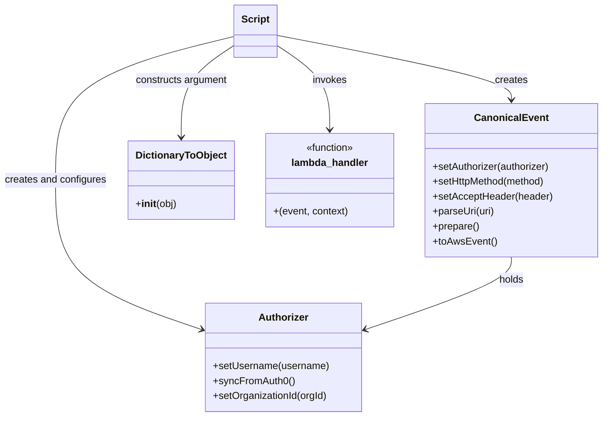

# Diagram: platform/tools/ide_local_testing/localTest/test/byUrl/getByUrl.py


> Auto-generated by Obscura crawlers

## Diagram 1

```mermaid
flowchart TD
Start((Start))
Start --> Auth[Create Authorizer and setUsername dave.damon@freightverify.com]
Auth --> Sync[authorizer.syncFromAuth0()]
Sync --> OrgCheck{activeOrgId?}
OrgCheck -- Yes --> SetOrg[authorizer.setOrganizationId 1028]
OrgCheck -- No --> SkipOrg[skip setOrganizationId]
SetOrg --> EventCreate[Create CanonicalEvent]
SkipOrg --> EventCreate
EventCreate --> SetAuth[CanonicalEvent.setAuthorizer(authorizer)]
SetAuth --> Configure[setHttpMethod GET<br>setAcceptHeader application/json]
Configure --> Parse[parseUri uri]
Parse --> Prep[prepare]
Prep --> AwsEvent[toAwsEvent]
AwsEvent --> Invoke[Call lambda_handler(event, DictionaryToObject(function_name: getByURL))]
Invoke --> Check{retval and retval.body?}
Check -- Yes --> Load[body = json.loads(retval.body)]
Load --> Pretty[prettyRetval = json.dumps(body, indent=2, sort_keys=True)]
Pretty --> Print[print prettyRetval]
Check -- No --> Empty[prettyRetval = ""]
Empty --> Print
Print --> End((End))
```

> SVG rendering failed for this diagram.

## Diagram 2



> SVG rendering failed for this diagram.
