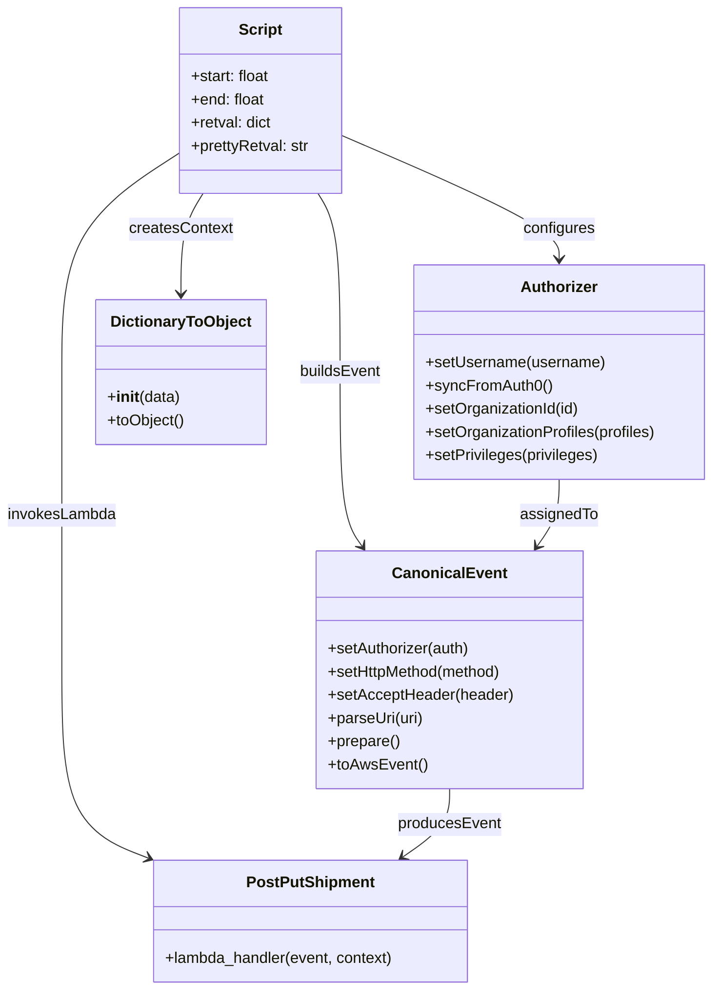

# Diagram: platform/tools/ide_local_testing/localTest/test/byUrl/getUserStatistics.py


> Auto-generated by Obscura crawlers

## Diagram 1

```mermaid
sequenceDiagram
    participant Script
    participant Authorizer
    participant CanonicalEvent as Event
    participant DictionaryToObject as DTO
    participant LambdaHandler as Lambda
    participant JSONParser as JSON

    Script->>Authorizer: setUsername("dave.damon@freightverify.com")
    Script->>Authorizer: syncFromAuth0()
    Authorizer-->>Script: Authorizer
    Script->>Authorizer: setOrganizationId(1003)
    Authorizer-->>Script: ok
    Script->>Authorizer: setOrganizationProfiles(["SH"])
    Authorizer-->>Script: ok
    Script->>Authorizer: setPrivileges([...])
    Authorizer-->>Script: ok

    Script->>Event: setAuthorizer(Authorizer)
    Script->>Event: setHttpMethod("POST")
    Script->>Event: setAcceptHeader("application/json;version=basic")
    Script->>Event: parseUri(uri)
    Event-->>Script: parsedUri
    Script->>Event: prepare()
    Event-->>Script: preparedEvent
    Script->>Event: toAwsEvent()
    Event-->>Script: awsEvent

    Script->>DTO: DictionaryToObject({"function_name":"v2-post-put-shipment"})
    DTO-->>Script: contextObject

    Script->>Lambda: lambda_handler(awsEvent, contextObject)
    Lambda-->>Script: retval

    alt retval and retval.body
        Script->>JSON: loads(retval.body)
        JSON-->>Script: body
        Script->>Script: prettyRetval = json.dumps(body)
    else no body
        Script->>Script: prettyRetval = ""
    end

    Script->>Script: print(prettyRetval)
    Script->>Script: print("Lambda execution time: end - start")
```

> SVG rendering failed for this diagram.

## Diagram 2



### SVG

<svg id="container" width="740.296875" xmlns="http://www.w3.org/2000/svg" class="classDiagram" height="1024" viewBox="0 0 740.296875 1024" role="graphics-document document" aria-roledescription="class"><style>#container{font-family:"trebuchet ms",verdana,arial,sans-serif;font-size:16px;fill:#333;}@keyframes edge-animation-frame{from{stroke-dashoffset:0;}}@keyframes dash{to{stroke-dashoffset:0;}}#container .edge-animation-slow{stroke-dasharray:9,5!important;stroke-dashoffset:900;animation:dash 50s linear infinite;stroke-linecap:round;}#container .edge-animation-fast{stroke-dasharray:9,5!important;stroke-dashoffset:900;animation:dash 20s linear infinite;stroke-linecap:round;}#container .error-icon{fill:#552222;}#container .error-text{fill:#552222;stroke:#552222;}#container .edge-thickness-normal{stroke-width:1px;}#container .edge-thickness-thick{stroke-width:3.5px;}#container .edge-pattern-solid{stroke-dasharray:0;}#container .edge-thickness-invisible{stroke-width:0;fill:none;}#container .edge-pattern-dashed{stroke-dasharray:3;}#container .edge-pattern-dotted{stroke-dasharray:2;}#container .marker{fill:#333333;stroke:#333333;}#container .marker.cross{stroke:#333333;}#container svg{font-family:"trebuchet ms",verdana,arial,sans-serif;font-size:16px;}#container p{margin:0;}#container g.classGroup text{fill:#9370DB;stroke:none;font-family:"trebuchet ms",verdana,arial,sans-serif;font-size:10px;}#container g.classGroup text .title{font-weight:bolder;}#container .nodeLabel,#container .edgeLabel{color:#131300;}#container .edgeLabel .label rect{fill:#ECECFF;}#container .label text{fill:#131300;}#container .labelBkg{background:#ECECFF;}#container .edgeLabel .label span{background:#ECECFF;}#container .classTitle{font-weight:bolder;}#container .node rect,#container .node circle,#container .node ellipse,#container .node polygon,#container .node path{fill:#ECECFF;stroke:#9370DB;stroke-width:1px;}#container .divider{stroke:#9370DB;stroke-width:1;}#container g.clickable{cursor:pointer;}#container g.classGroup rect{fill:#ECECFF;stroke:#9370DB;}#container g.classGroup line{stroke:#9370DB;stroke-width:1;}#container .classLabel .box{stroke:none;stroke-width:0;fill:#ECECFF;opacity:0.5;}#container .classLabel .label{fill:#9370DB;font-size:10px;}#container .relation{stroke:#333333;stroke-width:1;fill:none;}#container .dashed-line{stroke-dasharray:3;}#container .dotted-line{stroke-dasharray:1 2;}#container #compositionStart,#container .composition{fill:#333333!important;stroke:#333333!important;stroke-width:1;}#container #compositionEnd,#container .composition{fill:#333333!important;stroke:#333333!important;stroke-width:1;}#container #dependencyStart,#container .dependency{fill:#333333!important;stroke:#333333!important;stroke-width:1;}#container #dependencyStart,#container .dependency{fill:#333333!important;stroke:#333333!important;stroke-width:1;}#container #extensionStart,#container .extension{fill:transparent!important;stroke:#333333!important;stroke-width:1;}#container #extensionEnd,#container .extension{fill:transparent!important;stroke:#333333!important;stroke-width:1;}#container #aggregationStart,#container .aggregation{fill:transparent!important;stroke:#333333!important;stroke-width:1;}#container #aggregationEnd,#container .aggregation{fill:transparent!important;stroke:#333333!important;stroke-width:1;}#container #lollipopStart,#container .lollipop{fill:#ECECFF!important;stroke:#333333!important;stroke-width:1;}#container #lollipopEnd,#container .lollipop{fill:#ECECFF!important;stroke:#333333!important;stroke-width:1;}#container .edgeTerminals{font-size:11px;line-height:initial;}#container .classTitleText{text-anchor:middle;font-size:18px;fill:#333;}#container .label-icon{display:inline-block;height:1em;overflow:visible;vertical-align:-0.125em;}#container .node .label-icon path{fill:currentColor;stroke:revert;stroke-width:revert;}#container :root{--mermaid-font-family:"trebuchet ms",verdana,arial,sans-serif;}</style><g><defs><marker id="container_class-aggregationStart" class="marker aggregation class" refX="18" refY="7" markerWidth="190" markerHeight="240" orient="auto"><path d="M 18,7 L9,13 L1,7 L9,1 Z"></path></marker></defs><defs><marker id="container_class-aggregationEnd" class="marker aggregation class" refX="1" refY="7" markerWidth="20" markerHeight="28" orient="auto"><path d="M 18,7 L9,13 L1,7 L9,1 Z"></path></marker></defs><defs><marker id="container_class-extensionStart" class="marker extension class" refX="18" refY="7" markerWidth="190" markerHeight="240" orient="auto"><path d="M 1,7 L18,13 V 1 Z"></path></marker></defs><defs><marker id="container_class-extensionEnd" class="marker extension class" refX="1" refY="7" markerWidth="20" markerHeight="28" orient="auto"><path d="M 1,1 V 13 L18,7 Z"></path></marker></defs><defs><marker id="container_class-compositionStart" class="marker composition class" refX="18" refY="7" markerWidth="190" markerHeight="240" orient="auto"><path d="M 18,7 L9,13 L1,7 L9,1 Z"></path></marker></defs><defs><marker id="container_class-compositionEnd" class="marker composition class" refX="1" refY="7" markerWidth="20" markerHeight="28" orient="auto"><path d="M 18,7 L9,13 L1,7 L9,1 Z"></path></marker></defs><defs><marker id="container_class-dependencyStart" class="marker dependency class" refX="6" refY="7" markerWidth="190" markerHeight="240" orient="auto"><path d="M 5,7 L9,13 L1,7 L9,1 Z"></path></marker></defs><defs><marker id="container_class-dependencyEnd" class="marker dependency class" refX="13" refY="7" markerWidth="20" markerHeight="28" orient="auto"><path d="M 18,7 L9,13 L14,7 L9,1 Z"></path></marker></defs><defs><marker id="container_class-lollipopStart" class="marker lollipop class" refX="13" refY="7" markerWidth="190" markerHeight="240" orient="auto"><circle stroke="black" fill="transparent" cx="7" cy="7" r="6"></circle></marker></defs><defs><marker id="container_class-lollipopEnd" class="marker lollipop class" refX="1" refY="7" markerWidth="190" markerHeight="240" orient="auto"><circle stroke="black" fill="transparent" cx="7" cy="7" r="6"></circle></marker></defs><g class="root"><g class="clusters"></g><g class="edgePaths"><path d="M353.848,140.161L391.645,156.301C429.441,172.441,505.035,204.72,542.832,226.027C580.629,247.333,580.629,257.667,580.629,262.833L580.629,268" id="id_Script_Authorizer_1" class="edge-thickness-normal edge-pattern-solid relation" style=";;;" data-edge="true" data-et="edge" data-id="id_Script_Authorizer_1" data-points="W3sieCI6MzUzLjg0NzY1NjI1LCJ5IjoxNDAuMTYxMTIxMjE0MDIxNDV9LHsieCI6NTgwLjYyODkwNjI1LCJ5IjoyMzd9LHsieCI6NTgwLjYyODkwNjI1LCJ5IjoyNzR9XQ==" marker-end="url(#container_class-dependencyEnd)"></path><path d="M328.6,200L332.418,206.167C336.236,212.333,343.872,224.667,347.69,255.5C351.508,286.333,351.508,335.667,351.508,385C351.508,434.333,351.508,483.667,355.341,513.687C359.174,543.707,366.841,554.414,370.674,559.768L374.507,565.122" id="id_Script_CanonicalEvent_2" class="edge-thickness-normal edge-pattern-solid relation" style=";;;" data-edge="true" data-et="edge" data-id="id_Script_CanonicalEvent_2" data-points="W3sieCI6MzI4LjYwMDE1MjcyNTU2MzkzLCJ5IjoyMDB9LHsieCI6MzUxLjUwNzgxMjUsInkiOjIzN30seyJ4IjozNTEuNTA3ODEyNSwieSI6Mzg1fSx7IngiOjM1MS41MDc4MTI1LCJ5Ijo1MzN9LHsieCI6Mzc3Ljk5OTkzODk2NDg0Mzc1LCJ5Ijo1NzB9XQ==" marker-end="url(#container_class-dependencyEnd)"></path><path d="M209.728,200L205.91,206.167C202.092,212.333,194.456,224.667,190.638,242C186.82,259.333,186.82,281.667,186.82,292.833L186.82,304" id="id_Script_DictionaryToObject_3" class="edge-thickness-normal edge-pattern-solid relation" style=";;;" data-edge="true" data-et="edge" data-id="id_Script_DictionaryToObject_3" data-points="W3sieCI6MjA5LjcyNzk3MjI3NDQzNjEsInkiOjIwMH0seyJ4IjoxODYuODIwMzEyNSwieSI6MjM3fSx7IngiOjE4Ni44MjAzMTI1LCJ5IjozMTB9XQ==" marker-end="url(#container_class-dependencyEnd)"></path><path d="M184.48,159.054L164.498,172.045C144.516,185.036,104.551,211.018,84.568,248.676C64.586,286.333,64.586,335.667,64.586,385C64.586,434.333,64.586,483.667,64.586,535C64.586,586.333,64.586,639.667,64.586,693C64.586,746.333,64.586,799.667,79.565,832.139C94.544,864.611,124.502,876.221,139.48,882.026L154.459,887.832" id="id_Script_PostPutShipment_4" class="edge-thickness-normal edge-pattern-solid relation" style=";;;" data-edge="true" data-et="edge" data-id="id_Script_PostPutShipment_4" data-points="W3sieCI6MTg0LjQ4MDQ2ODc1LCJ5IjoxNTkuMDU0MzYxMTA4OTg5NTV9LHsieCI6NjQuNTg1OTM3NSwieSI6MjM3fSx7IngiOjY0LjU4NTkzNzUsInkiOjM4NX0seyJ4Ijo2NC41ODU5Mzc1LCJ5Ijo1MzN9LHsieCI6NjQuNTg1OTM3NSwieSI6NjkzfSx7IngiOjY0LjU4NTkzNzUsInkiOjg1M30seyJ4IjoxNjAuMDUzODg2NzE4NzUsInkiOjg5MH1d" marker-end="url(#container_class-dependencyEnd)"></path><path d="M580.629,496L580.629,502.167C580.629,508.333,580.629,520.667,576.796,532.187C572.963,543.707,565.296,554.414,561.463,559.768L557.63,565.122" id="id_Authorizer_CanonicalEvent_5" class="edge-thickness-normal edge-pattern-solid relation" style=";;;" data-edge="true" data-et="edge" data-id="id_Authorizer_CanonicalEvent_5" data-points="W3sieCI6NTgwLjYyODkwNjI1LCJ5Ijo0OTZ9LHsieCI6NTgwLjYyODkwNjI1LCJ5Ijo1MzN9LHsieCI6NTU0LjEzNjc3OTc4NTE1NjIsInkiOjU3MH1d" marker-end="url(#container_class-dependencyEnd)"></path><path d="M466.068,816L466.068,822.167C466.068,828.333,466.068,840.667,458.042,852.428C450.016,864.19,433.963,875.379,425.936,880.974L417.91,886.569" id="id_CanonicalEvent_PostPutShipment_6" class="edge-thickness-normal edge-pattern-solid relation" style=";;;" data-edge="true" data-et="edge" data-id="id_CanonicalEvent_PostPutShipment_6" data-points="W3sieCI6NDY2LjA2ODM1OTM3NSwieSI6ODE2fSx7IngiOjQ2Ni4wNjgzNTkzNzUsInkiOjg1M30seyJ4Ijo0MTIuOTg3ODEyNSwieSI6ODkwfV0=" marker-end="url(#container_class-dependencyEnd)"></path></g><g class="edgeLabels"><g class="edgeLabel" transform="translate(580.62890625, 237)"><g class="label" data-id="id_Script_Authorizer_1" transform="translate(-37.3046875, -12)"><foreignObject width="74.609375" height="24"><div xmlns="http://www.w3.org/1999/xhtml" class="labelBkg" style="display: table-cell; white-space: nowrap; line-height: 1.5; max-width: 200px; text-align: center;"><span class="edgeLabel"><p>configures</p></span></div></foreignObject></g></g><g class="edgeLabel" transform="translate(351.5078125, 385)"><g class="label" data-id="id_Script_CanonicalEvent_2" transform="translate(-42.453125, -12)"><foreignObject width="84.90625" height="24"><div xmlns="http://www.w3.org/1999/xhtml" class="labelBkg" style="display: table-cell; white-space: nowrap; line-height: 1.5; max-width: 200px; text-align: center;"><span class="edgeLabel"><p>buildsEvent</p></span></div></foreignObject></g></g><g class="edgeLabel" transform="translate(186.8203125, 237)"><g class="label" data-id="id_Script_DictionaryToObject_3" transform="translate(-53.6796875, -12)"><foreignObject width="107.359375" height="24"><div xmlns="http://www.w3.org/1999/xhtml" class="labelBkg" style="display: table-cell; white-space: nowrap; line-height: 1.5; max-width: 200px; text-align: center;"><span class="edgeLabel"><p>createsContext</p></span></div></foreignObject></g></g><g class="edgeLabel" transform="translate(64.5859375, 533)"><g class="label" data-id="id_Script_PostPutShipment_4" transform="translate(-56.5859375, -12)"><foreignObject width="113.171875" height="24"><div xmlns="http://www.w3.org/1999/xhtml" class="labelBkg" style="display: table-cell; white-space: nowrap; line-height: 1.5; max-width: 200px; text-align: center;"><span class="edgeLabel"><p>invokesLambda</p></span></div></foreignObject></g></g><g class="edgeLabel" transform="translate(580.62890625, 533)"><g class="label" data-id="id_Authorizer_CanonicalEvent_5" transform="translate(-40.28125, -12)"><foreignObject width="80.5625" height="24"><div xmlns="http://www.w3.org/1999/xhtml" class="labelBkg" style="display: table-cell; white-space: nowrap; line-height: 1.5; max-width: 200px; text-align: center;"><span class="edgeLabel"><p>assignedTo</p></span></div></foreignObject></g></g><g class="edgeLabel" transform="translate(466.068359375, 853)"><g class="label" data-id="id_CanonicalEvent_PostPutShipment_6" transform="translate(-53.4375, -12)"><foreignObject width="106.875" height="24"><div xmlns="http://www.w3.org/1999/xhtml" class="labelBkg" style="display: table-cell; white-space: nowrap; line-height: 1.5; max-width: 200px; text-align: center;"><span class="edgeLabel"><p>producesEvent</p></span></div></foreignObject></g></g></g><g class="nodes"><g class="node default" id="classId-Script-0" transform="translate(269.1640625, 104)"><g class="basic label-container"><path d="M-84.68359375 -96 L84.68359375 -96 L84.68359375 96 L-84.68359375 96" stroke="none" stroke-width="0" fill="#ECECFF" style=""></path><path d="M-84.68359375 -96 C-21.237209002862585 -96, 42.20917574427483 -96, 84.68359375 -96 M-84.68359375 -96 C-49.701721659600885 -96, -14.71984956920177 -96, 84.68359375 -96 M84.68359375 -96 C84.68359375 -45.985706562560665, 84.68359375 4.02858687487867, 84.68359375 96 M84.68359375 -96 C84.68359375 -50.86206904339667, 84.68359375 -5.724138086793346, 84.68359375 96 M84.68359375 96 C36.022203703273114 96, -12.639186343453773 96, -84.68359375 96 M84.68359375 96 C18.68547734811679 96, -47.31263905376642 96, -84.68359375 96 M-84.68359375 96 C-84.68359375 20.551001939009467, -84.68359375 -54.897996121981066, -84.68359375 -96 M-84.68359375 96 C-84.68359375 39.07608315131607, -84.68359375 -17.84783369736786, -84.68359375 -96" stroke="#9370DB" stroke-width="1.3" fill="none" stroke-dasharray="0 0" style=""></path></g><g class="annotation-group text" transform="translate(0, -72)"></g><g class="label-group text" transform="translate(-21.7421875, -72)"><g class="label" style="font-weight: bolder" transform="translate(0,-12)"><foreignObject width="43.484375" height="24"><div xmlns="http://www.w3.org/1999/xhtml" style="display: table-cell; white-space: nowrap; line-height: 1.5; max-width: 93px; text-align: center;"><span class="nodeLabel markdown-node-label" style=""><p>Script</p></span></div></foreignObject></g></g><g class="members-group text" transform="translate(-72.68359375, -24)"><g class="label" style="" transform="translate(0,-12)"><foreignObject width="82.984375" height="24"><div xmlns="http://www.w3.org/1999/xhtml" style="display: table-cell; white-space: nowrap; line-height: 1.5; max-width: 141px; text-align: center;"><span class="nodeLabel markdown-node-label" style=""><p>+start: float</p></span></div></foreignObject></g><g class="label" style="" transform="translate(0,12)"><foreignObject width="76.796875" height="24"><div xmlns="http://www.w3.org/1999/xhtml" style="display: table-cell; white-space: nowrap; line-height: 1.5; max-width: 134px; text-align: center;"><span class="nodeLabel markdown-node-label" style=""><p>+end: float</p></span></div></foreignObject></g><g class="label" style="" transform="translate(0,36)"><foreignObject width="84.703125" height="24"><div xmlns="http://www.w3.org/1999/xhtml" style="display: table-cell; white-space: nowrap; line-height: 1.5; max-width: 142px; text-align: center;"><span class="nodeLabel markdown-node-label" style=""><p>+retval: dict</p></span></div></foreignObject></g><g class="label" style="" transform="translate(0,60)"><foreignObject width="123.625" height="24"><div xmlns="http://www.w3.org/1999/xhtml" style="display: table-cell; white-space: nowrap; line-height: 1.5; max-width: 182px; text-align: center;"><span class="nodeLabel markdown-node-label" style=""><p>+prettyRetval: str</p></span></div></foreignObject></g></g><g class="methods-group text" transform="translate(-72.68359375, 96)"></g><g class="divider" style=""><path d="M-84.68359375 -48 C-25.091569759645118 -48, 34.500454230709764 -48, 84.68359375 -48 M-84.68359375 -48 C-33.021557917642184 -48, 18.640477914715632 -48, 84.68359375 -48" stroke="#9370DB" stroke-width="1.3" fill="none" stroke-dasharray="0 0" style=""></path></g><g class="divider" style=""><path d="M-84.68359375 72 C-48.67388269321107 72, -12.66417163642214 72, 84.68359375 72 M-84.68359375 72 C-32.71309766078634 72, 19.257398428427322 72, 84.68359375 72" stroke="#9370DB" stroke-width="1.3" fill="none" stroke-dasharray="0 0" style=""></path></g></g><g class="node default" id="classId-Authorizer-1" transform="translate(580.62890625, 385)"><g class="basic label-container"><path d="M-151.66796875 -111 L151.66796875 -111 L151.66796875 111 L-151.66796875 111" stroke="none" stroke-width="0" fill="#ECECFF" style=""></path><path d="M-151.66796875 -111 C-53.63493526150384 -111, 44.39809822699232 -111, 151.66796875 -111 M-151.66796875 -111 C-62.88800851909227 -111, 25.891951711815466 -111, 151.66796875 -111 M151.66796875 -111 C151.66796875 -64.66959968926672, 151.66796875 -18.339199378533436, 151.66796875 111 M151.66796875 -111 C151.66796875 -61.35567230547974, 151.66796875 -11.711344610959486, 151.66796875 111 M151.66796875 111 C68.7104160844029 111, -14.247136581194212 111, -151.66796875 111 M151.66796875 111 C57.036168899602785 111, -37.59563095079443 111, -151.66796875 111 M-151.66796875 111 C-151.66796875 49.38025943412175, -151.66796875 -12.239481131756506, -151.66796875 -111 M-151.66796875 111 C-151.66796875 42.33490598180953, -151.66796875 -26.330188036380946, -151.66796875 -111" stroke="#9370DB" stroke-width="1.3" fill="none" stroke-dasharray="0 0" style=""></path></g><g class="annotation-group text" transform="translate(0, -87)"></g><g class="label-group text" transform="translate(-38.3671875, -87)"><g class="label" style="font-weight: bolder" transform="translate(0,-12)"><foreignObject width="76.734375" height="24"><div xmlns="http://www.w3.org/1999/xhtml" style="display: table-cell; white-space: nowrap; line-height: 1.5; max-width: 126px; text-align: center;"><span class="nodeLabel markdown-node-label" style=""><p>Authorizer</p></span></div></foreignObject></g></g><g class="members-group text" transform="translate(-139.66796875, -39)"></g><g class="methods-group text" transform="translate(-139.66796875, -9)"><g class="label" style="" transform="translate(0,-12)"><foreignObject width="185.90625" height="24"><div xmlns="http://www.w3.org/1999/xhtml" style="display: table-cell; white-space: nowrap; line-height: 1.5; max-width: 243px; text-align: center;"><span class="nodeLabel markdown-node-label" style=""><p>+setUsername(username)</p></span></div></foreignObject></g><g class="label" style="" transform="translate(0,12)"><foreignObject width="129.0625" height="24"><div xmlns="http://www.w3.org/1999/xhtml" style="display: table-cell; white-space: nowrap; line-height: 1.5; max-width: 186px; text-align: center;"><span class="nodeLabel markdown-node-label" style=""><p>+syncFromAuth0()</p></span></div></foreignObject></g><g class="label" style="" transform="translate(0,36)"><foreignObject width="160.78125" height="24"><div xmlns="http://www.w3.org/1999/xhtml" style="display: table-cell; white-space: nowrap; line-height: 1.5; max-width: 218px; text-align: center;"><span class="nodeLabel markdown-node-label" style=""><p>+setOrganizationId(id)</p></span></div></foreignObject></g><g class="label" style="" transform="translate(0,60)"><foreignObject width="240.96875" height="24"><div xmlns="http://www.w3.org/1999/xhtml" style="display: table-cell; white-space: nowrap; line-height: 1.5; max-width: 298px; text-align: center;"><span class="nodeLabel markdown-node-label" style=""><p>+setOrganizationProfiles(profiles)</p></span></div></foreignObject></g><g class="label" style="" transform="translate(0,84)"><foreignObject width="180.125" height="24"><div xmlns="http://www.w3.org/1999/xhtml" style="display: table-cell; white-space: nowrap; line-height: 1.5; max-width: 237px; text-align: center;"><span class="nodeLabel markdown-node-label" style=""><p>+setPrivileges(privileges)</p></span></div></foreignObject></g></g><g class="divider" style=""><path d="M-151.66796875 -63 C-81.58450664177005 -63, -11.501044533540096 -63, 151.66796875 -63 M-151.66796875 -63 C-71.10416726079863 -63, 9.459634228402734 -63, 151.66796875 -63" stroke="#9370DB" stroke-width="1.3" fill="none" stroke-dasharray="0 0" style=""></path></g><g class="divider" style=""><path d="M-151.66796875 -39 C-64.35784795305821 -39, 22.952272843883577 -39, 151.66796875 -39 M-151.66796875 -39 C-64.10770896879114 -39, 23.452550812417712 -39, 151.66796875 -39" stroke="#9370DB" stroke-width="1.3" fill="none" stroke-dasharray="0 0" style=""></path></g></g><g class="node default" id="classId-CanonicalEvent-2" transform="translate(466.068359375, 693)"><g class="basic label-container"><path d="M-135.78515625 -123 L135.78515625 -123 L135.78515625 123 L-135.78515625 123" stroke="none" stroke-width="0" fill="#ECECFF" style=""></path><path d="M-135.78515625 -123 C-54.05339687831821 -123, 27.67836249336358 -123, 135.78515625 -123 M-135.78515625 -123 C-48.585791109565406 -123, 38.61357403086919 -123, 135.78515625 -123 M135.78515625 -123 C135.78515625 -71.02916346856864, 135.78515625 -19.058326937137267, 135.78515625 123 M135.78515625 -123 C135.78515625 -39.92084442846658, 135.78515625 43.15831114306684, 135.78515625 123 M135.78515625 123 C48.62105361233748 123, -38.54304902532505 123, -135.78515625 123 M135.78515625 123 C40.36595010685599 123, -55.05325603628802 123, -135.78515625 123 M-135.78515625 123 C-135.78515625 51.00366468581845, -135.78515625 -20.9926706283631, -135.78515625 -123 M-135.78515625 123 C-135.78515625 68.11531001591686, -135.78515625 13.230620031833737, -135.78515625 -123" stroke="#9370DB" stroke-width="1.3" fill="none" stroke-dasharray="0 0" style=""></path></g><g class="annotation-group text" transform="translate(0, -99)"></g><g class="label-group text" transform="translate(-55.7109375, -99)"><g class="label" style="font-weight: bolder" transform="translate(0,-12)"><foreignObject width="111.421875" height="24"><div xmlns="http://www.w3.org/1999/xhtml" style="display: table-cell; white-space: nowrap; line-height: 1.5; max-width: 161px; text-align: center;"><span class="nodeLabel markdown-node-label" style=""><p>CanonicalEvent</p></span></div></foreignObject></g></g><g class="members-group text" transform="translate(-123.78515625, -51)"></g><g class="methods-group text" transform="translate(-123.78515625, -21)"><g class="label" style="" transform="translate(0,-12)"><foreignObject width="148.9375" height="24"><div xmlns="http://www.w3.org/1999/xhtml" style="display: table-cell; white-space: nowrap; line-height: 1.5; max-width: 206px; text-align: center;"><span class="nodeLabel markdown-node-label" style=""><p>+setAuthorizer(auth)</p></span></div></foreignObject></g><g class="label" style="" transform="translate(0,12)"><foreignObject width="184" height="24"><div xmlns="http://www.w3.org/1999/xhtml" style="display: table-cell; white-space: nowrap; line-height: 1.5; max-width: 241px; text-align: center;"><span class="nodeLabel markdown-node-label" style=""><p>+setHttpMethod(method)</p></span></div></foreignObject></g><g class="label" style="" transform="translate(0,36)"><foreignObject width="191.859375" height="24"><div xmlns="http://www.w3.org/1999/xhtml" style="display: table-cell; white-space: nowrap; line-height: 1.5; max-width: 249px; text-align: center;"><span class="nodeLabel markdown-node-label" style=""><p>+setAcceptHeader(header)</p></span></div></foreignObject></g><g class="label" style="" transform="translate(0,60)"><foreignObject width="99.8125" height="24"><div xmlns="http://www.w3.org/1999/xhtml" style="display: table-cell; white-space: nowrap; line-height: 1.5; max-width: 157px; text-align: center;"><span class="nodeLabel markdown-node-label" style=""><p>+parseUri(uri)</p></span></div></foreignObject></g><g class="label" style="" transform="translate(0,84)"><foreignObject width="74.75" height="24"><div xmlns="http://www.w3.org/1999/xhtml" style="display: table-cell; white-space: nowrap; line-height: 1.5; max-width: 132px; text-align: center;"><span class="nodeLabel markdown-node-label" style=""><p>+prepare()</p></span></div></foreignObject></g><g class="label" style="" transform="translate(0,108)"><foreignObject width="101.1875" height="24"><div xmlns="http://www.w3.org/1999/xhtml" style="display: table-cell; white-space: nowrap; line-height: 1.5; max-width: 159px; text-align: center;"><span class="nodeLabel markdown-node-label" style=""><p>+toAwsEvent()</p></span></div></foreignObject></g></g><g class="divider" style=""><path d="M-135.78515625 -75 C-80.82162406952652 -75, -25.858091889053043 -75, 135.78515625 -75 M-135.78515625 -75 C-50.39878947603226 -75, 34.98757729793547 -75, 135.78515625 -75" stroke="#9370DB" stroke-width="1.3" fill="none" stroke-dasharray="0 0" style=""></path></g><g class="divider" style=""><path d="M-135.78515625 -51 C-71.50120915693313 -51, -7.217262063866258 -51, 135.78515625 -51 M-135.78515625 -51 C-47.23462573811777 -51, 41.31590477376446 -51, 135.78515625 -51" stroke="#9370DB" stroke-width="1.3" fill="none" stroke-dasharray="0 0" style=""></path></g></g><g class="node default" id="classId-DictionaryToObject-3" transform="translate(186.8203125, 385)"><g class="basic label-container"><path d="M-87.234375 -75 L87.234375 -75 L87.234375 75 L-87.234375 75" stroke="none" stroke-width="0" fill="#ECECFF" style=""></path><path d="M-87.234375 -75 C-17.48049927877338 -75, 52.27337644245324 -75, 87.234375 -75 M-87.234375 -75 C-38.895582010395096 -75, 9.443210979209809 -75, 87.234375 -75 M87.234375 -75 C87.234375 -26.95476410466828, 87.234375 21.090471790663443, 87.234375 75 M87.234375 -75 C87.234375 -41.23848748226433, 87.234375 -7.476974964528665, 87.234375 75 M87.234375 75 C30.97929699679075 75, -25.275781006418498 75, -87.234375 75 M87.234375 75 C43.72643510342768 75, 0.2184952068553656 75, -87.234375 75 M-87.234375 75 C-87.234375 43.212100725354524, -87.234375 11.424201450709049, -87.234375 -75 M-87.234375 75 C-87.234375 17.033782855200883, -87.234375 -40.932434289598234, -87.234375 -75" stroke="#9370DB" stroke-width="1.3" fill="none" stroke-dasharray="0 0" style=""></path></g><g class="annotation-group text" transform="translate(0, -51)"></g><g class="label-group text" transform="translate(-70.109375, -51)"><g class="label" style="font-weight: bolder" transform="translate(0,-12)"><foreignObject width="140.21875" height="24"><div xmlns="http://www.w3.org/1999/xhtml" style="display: table-cell; white-space: nowrap; line-height: 1.5; max-width: 188px; text-align: center;"><span class="nodeLabel markdown-node-label" style=""><p>DictionaryToObject</p></span></div></foreignObject></g></g><g class="members-group text" transform="translate(-75.234375, -3)"></g><g class="methods-group text" transform="translate(-75.234375, 27)"><g class="label" style="" transform="translate(0,-12)"><foreignObject width="75.4375" height="24"><div xmlns="http://www.w3.org/1999/xhtml" style="display: table-cell; white-space: nowrap; line-height: 1.5; max-width: 164px; text-align: center;"><span class="nodeLabel markdown-node-label" style=""><p>+<strong>init</strong>(data)</p></span></div></foreignObject></g><g class="label" style="" transform="translate(0,12)"><foreignObject width="80.359375" height="24"><div xmlns="http://www.w3.org/1999/xhtml" style="display: table-cell; white-space: nowrap; line-height: 1.5; max-width: 138px; text-align: center;"><span class="nodeLabel markdown-node-label" style=""><p>+toObject()</p></span></div></foreignObject></g></g><g class="divider" style=""><path d="M-87.234375 -27 C-44.08164705894711 -27, -0.9289191178942247 -27, 87.234375 -27 M-87.234375 -27 C-47.9103838598381 -27, -8.586392719676198 -27, 87.234375 -27" stroke="#9370DB" stroke-width="1.3" fill="none" stroke-dasharray="0 0" style=""></path></g><g class="divider" style=""><path d="M-87.234375 -3 C-17.508260785615718 -3, 52.217853428768564 -3, 87.234375 -3 M-87.234375 -3 C-29.00759786213768 -3, 29.219179275724642 -3, 87.234375 -3" stroke="#9370DB" stroke-width="1.3" fill="none" stroke-dasharray="0 0" style=""></path></g></g><g class="node default" id="classId-PostPutShipment-4" transform="translate(322.607421875, 953)"><g class="basic label-container"><path d="M-163.8671875 -63 L163.8671875 -63 L163.8671875 63 L-163.8671875 63" stroke="none" stroke-width="0" fill="#ECECFF" style=""></path><path d="M-163.8671875 -63 C-60.242235135511066 -63, 43.38271722897787 -63, 163.8671875 -63 M-163.8671875 -63 C-76.2974330743569 -63, 11.272321351286195 -63, 163.8671875 -63 M163.8671875 -63 C163.8671875 -37.178036239149534, 163.8671875 -11.356072478299062, 163.8671875 63 M163.8671875 -63 C163.8671875 -20.825589086901275, 163.8671875 21.34882182619745, 163.8671875 63 M163.8671875 63 C65.9673125430131 63, -31.932562413973812 63, -163.8671875 63 M163.8671875 63 C41.04281786403 63, -81.78155177194 63, -163.8671875 63 M-163.8671875 63 C-163.8671875 34.13858140477332, -163.8671875 5.277162809546631, -163.8671875 -63 M-163.8671875 63 C-163.8671875 22.093608916696567, -163.8671875 -18.812782166606866, -163.8671875 -63" stroke="#9370DB" stroke-width="1.3" fill="none" stroke-dasharray="0 0" style=""></path></g><g class="annotation-group text" transform="translate(0, -39)"></g><g class="label-group text" transform="translate(-63.546875, -39)"><g class="label" style="font-weight: bolder" transform="translate(0,-12)"><foreignObject width="127.09375" height="24"><div xmlns="http://www.w3.org/1999/xhtml" style="display: table-cell; white-space: nowrap; line-height: 1.5; max-width: 175px; text-align: center;"><span class="nodeLabel markdown-node-label" style=""><p>PostPutShipment</p></span></div></foreignObject></g></g><g class="members-group text" transform="translate(-151.8671875, 9)"></g><g class="methods-group text" transform="translate(-151.8671875, 39)"><g class="label" style="" transform="translate(0,-12)"><foreignObject width="240.1875" height="24"><div xmlns="http://www.w3.org/1999/xhtml" style="display: table-cell; white-space: nowrap; line-height: 1.5; max-width: 298px; text-align: center;"><span class="nodeLabel markdown-node-label" style=""><p>+lambda_handler(event, context)</p></span></div></foreignObject></g></g><g class="divider" style=""><path d="M-163.8671875 -15 C-47.51441965757108 -15, 68.83834818485784 -15, 163.8671875 -15 M-163.8671875 -15 C-72.60029846876104 -15, 18.66659056247792 -15, 163.8671875 -15" stroke="#9370DB" stroke-width="1.3" fill="none" stroke-dasharray="0 0" style=""></path></g><g class="divider" style=""><path d="M-163.8671875 9 C-45.62595622630238 9, 72.61527504739524 9, 163.8671875 9 M-163.8671875 9 C-81.85385163008566 9, 0.15948423982868576 9, 163.8671875 9" stroke="#9370DB" stroke-width="1.3" fill="none" stroke-dasharray="0 0" style=""></path></g></g></g></g></g></svg>
