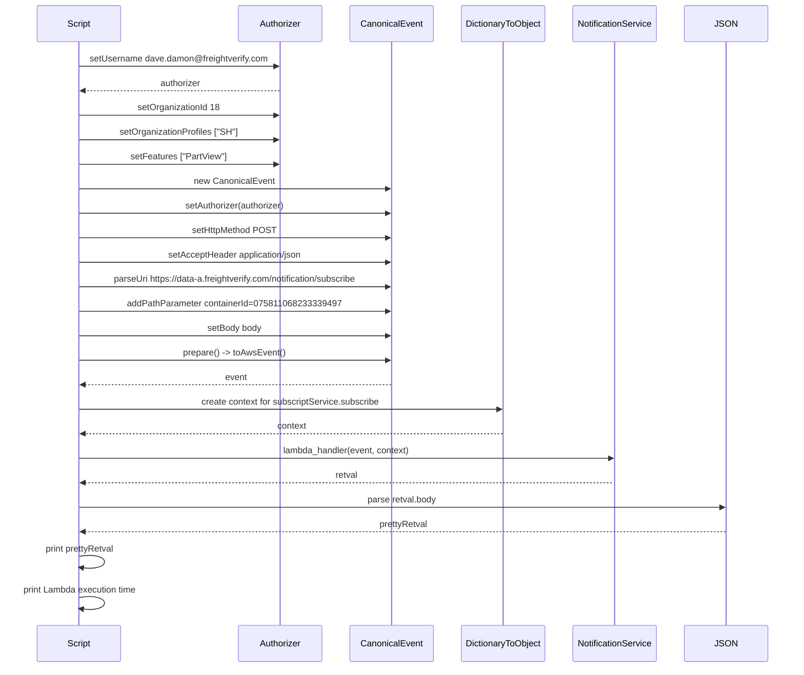
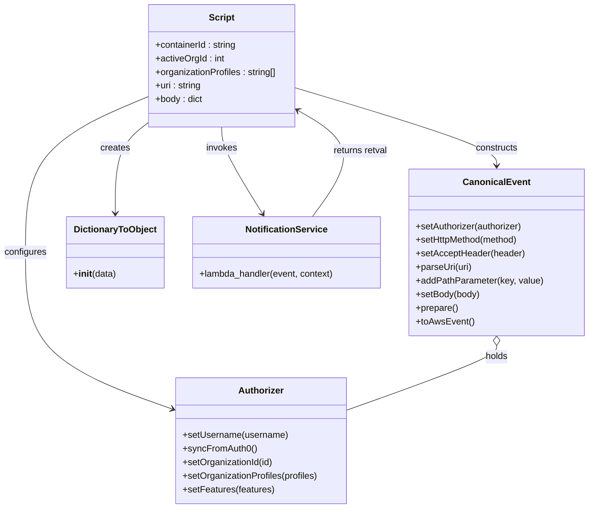

# Diagram: platform/tools/ide_local_testing/localTest/test/byUrl/notificationService.py

> Auto-generated by Obscura crawlers

## Diagram 1

### SVG

<svg id="container" width="1490" xmlns="http://www.w3.org/2000/svg" height="1287" viewBox="-79 -10 1490 1287" role="graphics-document document" aria-roledescription="sequence"><g><rect x="1211" y="1201" fill="#eaeaea" stroke="#666" width="150" height="65" name="JSON" rx="3" ry="3" class="actor actor-bottom"></rect><text x="1286" y="1233.5" dominant-baseline="central" alignment-baseline="central" class="actor actor-box" style="text-anchor: middle; font-size: 16px; font-weight: 400;"><tspan x="1286" dy="0">JSON</tspan></text></g><g><rect x="1004" y="1201" fill="#eaeaea" stroke="#666" width="157" height="65" name="NotificationService" rx="3" ry="3" class="actor actor-bottom"></rect><text x="1082.5" y="1233.5" dominant-baseline="central" alignment-baseline="central" class="actor actor-box" style="text-anchor: middle; font-size: 16px; font-weight: 400;"><tspan x="1082.5" dy="0">NotificationService</tspan></text></g><g><rect x="796" y="1201" fill="#eaeaea" stroke="#666" width="158" height="65" name="DictionaryToObject" rx="3" ry="3" class="actor actor-bottom"></rect><text x="875" y="1233.5" dominant-baseline="central" alignment-baseline="central" class="actor actor-box" style="text-anchor: middle; font-size: 16px; font-weight: 400;"><tspan x="875" dy="0">DictionaryToObject</tspan></text></g><g><rect x="596" y="1201" fill="#eaeaea" stroke="#666" width="150" height="65" name="CanonicalEvent" rx="3" ry="3" class="actor actor-bottom"></rect><text x="671" y="1233.5" dominant-baseline="central" alignment-baseline="central" class="actor actor-box" style="text-anchor: middle; font-size: 16px; font-weight: 400;"><tspan x="671" dy="0">CanonicalEvent</tspan></text></g><g><rect x="396" y="1201" fill="#eaeaea" stroke="#666" width="150" height="65" name="Authorizer" rx="3" ry="3" class="actor actor-bottom"></rect><text x="471" y="1233.5" dominant-baseline="central" alignment-baseline="central" class="actor actor-box" style="text-anchor: middle; font-size: 16px; font-weight: 400;"><tspan x="471" dy="0">Authorizer</tspan></text></g><g><rect x="0" y="1201" fill="#eaeaea" stroke="#666" width="150" height="65" name="Script" rx="3" ry="3" class="actor actor-bottom"></rect><text x="75" y="1233.5" dominant-baseline="central" alignment-baseline="central" class="actor actor-box" style="text-anchor: middle; font-size: 16px; font-weight: 400;"><tspan x="75" dy="0">Script</tspan></text></g><g><line id="actor5" x1="1286" y1="65" x2="1286" y2="1201" class="actor-line 200" stroke-width="0.5px" stroke="#999" name="JSON"></line><g id="root-5"><rect x="1211" y="0" fill="#eaeaea" stroke="#666" width="150" height="65" name="JSON" rx="3" ry="3" class="actor actor-top"></rect><text x="1286" y="32.5" dominant-baseline="central" alignment-baseline="central" class="actor actor-box" style="text-anchor: middle; font-size: 16px; font-weight: 400;"><tspan x="1286" dy="0">JSON</tspan></text></g></g><g><line id="actor4" x1="1082.5" y1="65" x2="1082.5" y2="1201" class="actor-line 200" stroke-width="0.5px" stroke="#999" name="NotificationService"></line><g id="root-4"><rect x="1004" y="0" fill="#eaeaea" stroke="#666" width="157" height="65" name="NotificationService" rx="3" ry="3" class="actor actor-top"></rect><text x="1082.5" y="32.5" dominant-baseline="central" alignment-baseline="central" class="actor actor-box" style="text-anchor: middle; font-size: 16px; font-weight: 400;"><tspan x="1082.5" dy="0">NotificationService</tspan></text></g></g><g><line id="actor3" x1="875" y1="65" x2="875" y2="1201" class="actor-line 200" stroke-width="0.5px" stroke="#999" name="DictionaryToObject"></line><g id="root-3"><rect x="796" y="0" fill="#eaeaea" stroke="#666" width="158" height="65" name="DictionaryToObject" rx="3" ry="3" class="actor actor-top"></rect><text x="875" y="32.5" dominant-baseline="central" alignment-baseline="central" class="actor actor-box" style="text-anchor: middle; font-size: 16px; font-weight: 400;"><tspan x="875" dy="0">DictionaryToObject</tspan></text></g></g><g><line id="actor2" x1="671" y1="65" x2="671" y2="1201" class="actor-line 200" stroke-width="0.5px" stroke="#999" name="CanonicalEvent"></line><g id="root-2"><rect x="596" y="0" fill="#eaeaea" stroke="#666" width="150" height="65" name="CanonicalEvent" rx="3" ry="3" class="actor actor-top"></rect><text x="671" y="32.5" dominant-baseline="central" alignment-baseline="central" class="actor actor-box" style="text-anchor: middle; font-size: 16px; font-weight: 400;"><tspan x="671" dy="0">CanonicalEvent</tspan></text></g></g><g><line id="actor1" x1="471" y1="65" x2="471" y2="1201" class="actor-line 200" stroke-width="0.5px" stroke="#999" name="Authorizer"></line><g id="root-1"><rect x="396" y="0" fill="#eaeaea" stroke="#666" width="150" height="65" name="Authorizer" rx="3" ry="3" class="actor actor-top"></rect><text x="471" y="32.5" dominant-baseline="central" alignment-baseline="central" class="actor actor-box" style="text-anchor: middle; font-size: 16px; font-weight: 400;"><tspan x="471" dy="0">Authorizer</tspan></text></g></g><g><line id="actor0" x1="75" y1="65" x2="75" y2="1201" class="actor-line 200" stroke-width="0.5px" stroke="#999" name="Script"></line><g id="root-0"><rect x="0" y="0" fill="#eaeaea" stroke="#666" width="150" height="65" name="Script" rx="3" ry="3" class="actor actor-top"></rect><text x="75" y="32.5" dominant-baseline="central" alignment-baseline="central" class="actor actor-box" style="text-anchor: middle; font-size: 16px; font-weight: 400;"><tspan x="75" dy="0">Script</tspan></text></g></g><g></g><defs><symbol id="computer" width="24" height="24"><path transform="scale(.5)" d="M2 2v13h20v-13h-20zm18 11h-16v-9h16v9zm-10.228 6l.466-1h3.524l.467 1h-4.457zm14.228 3h-24l2-6h2.104l-1.33 4h18.45l-1.297-4h2.073l2 6zm-5-10h-14v-7h14v7z"></path></symbol></defs><defs><symbol id="database" fill-rule="evenodd" clip-rule="evenodd"><path transform="scale(.5)" d="M12.258.001l.256.004.255.005.253.008.251.01.249.012.247.015.246.016.242.019.241.02.239.023.236.024.233.027.231.028.229.031.225.032.223.034.22.036.217.038.214.04.211.041.208.043.205.045.201.046.198.048.194.05.191.051.187.053.183.054.18.056.175.057.172.059.168.06.163.061.16.063.155.064.15.066.074.033.073.033.071.034.07.034.069.035.068.035.067.035.066.035.064.036.064.036.062.036.06.036.06.037.058.037.058.037.055.038.055.038.053.038.052.038.051.039.05.039.048.039.047.039.045.04.044.04.043.04.041.04.04.041.039.041.037.041.036.041.034.041.033.042.032.042.03.042.029.042.027.042.026.043.024.043.023.043.021.043.02.043.018.044.017.043.015.044.013.044.012.044.011.045.009.044.007.045.006.045.004.045.002.045.001.045v17l-.001.045-.002.045-.004.045-.006.045-.007.045-.009.044-.011.045-.012.044-.013.044-.015.044-.017.043-.018.044-.02.043-.021.043-.023.043-.024.043-.026.043-.027.042-.029.042-.03.042-.032.042-.033.042-.034.041-.036.041-.037.041-.039.041-.04.041-.041.04-.043.04-.044.04-.045.04-.047.039-.048.039-.05.039-.051.039-.052.038-.053.038-.055.038-.055.038-.058.037-.058.037-.06.037-.06.036-.062.036-.064.036-.064.036-.066.035-.067.035-.068.035-.069.035-.07.034-.071.034-.073.033-.074.033-.15.066-.155.064-.16.063-.163.061-.168.06-.172.059-.175.057-.18.056-.183.054-.187.053-.191.051-.194.05-.198.048-.201.046-.205.045-.208.043-.211.041-.214.04-.217.038-.22.036-.223.034-.225.032-.229.031-.231.028-.233.027-.236.024-.239.023-.241.02-.242.019-.246.016-.247.015-.249.012-.251.01-.253.008-.255.005-.256.004-.258.001-.258-.001-.256-.004-.255-.005-.253-.008-.251-.01-.249-.012-.247-.015-.245-.016-.243-.019-.241-.02-.238-.023-.236-.024-.234-.027-.231-.028-.228-.031-.226-.032-.223-.034-.22-.036-.217-.038-.214-.04-.211-.041-.208-.043-.204-.045-.201-.046-.198-.048-.195-.05-.19-.051-.187-.053-.184-.054-.179-.056-.176-.057-.172-.059-.167-.06-.164-.061-.159-.063-.155-.064-.151-.066-.074-.033-.072-.033-.072-.034-.07-.034-.069-.035-.068-.035-.067-.035-.066-.035-.064-.036-.063-.036-.062-.036-.061-.036-.06-.037-.058-.037-.057-.037-.056-.038-.055-.038-.053-.038-.052-.038-.051-.039-.049-.039-.049-.039-.046-.039-.046-.04-.044-.04-.043-.04-.041-.04-.04-.041-.039-.041-.037-.041-.036-.041-.034-.041-.033-.042-.032-.042-.03-.042-.029-.042-.027-.042-.026-.043-.024-.043-.023-.043-.021-.043-.02-.043-.018-.044-.017-.043-.015-.044-.013-.044-.012-.044-.011-.045-.009-.044-.007-.045-.006-.045-.004-.045-.002-.045-.001-.045v-17l.001-.045.002-.045.004-.045.006-.045.007-.045.009-.044.011-.045.012-.044.013-.044.015-.044.017-.043.018-.044.02-.043.021-.043.023-.043.024-.043.026-.043.027-.042.029-.042.03-.042.032-.042.033-.042.034-.041.036-.041.037-.041.039-.041.04-.041.041-.04.043-.04.044-.04.046-.04.046-.039.049-.039.049-.039.051-.039.052-.038.053-.038.055-.038.056-.038.057-.037.058-.037.06-.037.061-.036.062-.036.063-.036.064-.036.066-.035.067-.035.068-.035.069-.035.07-.034.072-.034.072-.033.074-.033.151-.066.155-.064.159-.063.164-.061.167-.06.172-.059.176-.057.179-.056.184-.054.187-.053.19-.051.195-.05.198-.048.201-.046.204-.045.208-.043.211-.041.214-.04.217-.038.22-.036.223-.034.226-.032.228-.031.231-.028.234-.027.236-.024.238-.023.241-.02.243-.019.245-.016.247-.015.249-.012.251-.01.253-.008.255-.005.256-.004.258-.001.258.001zm-9.258 20.499v.01l.001.021.003.021.004.022.005.021.006.022.007.022.009.023.01.022.011.023.012.023.013.023.015.023.016.024.017.023.018.024.019.024.021.024.022.025.023.024.024.025.052.049.056.05.061.051.066.051.07.051.075.051.079.052.084.052.088.052.092.052.097.052.102.051.105.052.11.052.114.051.119.051.123.051.127.05.131.05.135.05.139.048.144.049.147.047.152.047.155.047.16.045.163.045.167.043.171.043.176.041.178.041.183.039.187.039.19.037.194.035.197.035.202.033.204.031.209.03.212.029.216.027.219.025.222.024.226.021.23.02.233.018.236.016.24.015.243.012.246.01.249.008.253.005.256.004.259.001.26-.001.257-.004.254-.005.25-.008.247-.011.244-.012.241-.014.237-.016.233-.018.231-.021.226-.021.224-.024.22-.026.216-.027.212-.028.21-.031.205-.031.202-.034.198-.034.194-.036.191-.037.187-.039.183-.04.179-.04.175-.042.172-.043.168-.044.163-.045.16-.046.155-.046.152-.047.148-.048.143-.049.139-.049.136-.05.131-.05.126-.05.123-.051.118-.052.114-.051.11-.052.106-.052.101-.052.096-.052.092-.052.088-.053.083-.051.079-.052.074-.052.07-.051.065-.051.06-.051.056-.05.051-.05.023-.024.023-.025.021-.024.02-.024.019-.024.018-.024.017-.024.015-.023.014-.024.013-.023.012-.023.01-.023.01-.022.008-.022.006-.022.006-.022.004-.022.004-.021.001-.021.001-.021v-4.127l-.077.055-.08.053-.083.054-.085.053-.087.052-.09.052-.093.051-.095.05-.097.05-.1.049-.102.049-.105.048-.106.047-.109.047-.111.046-.114.045-.115.045-.118.044-.12.043-.122.042-.124.042-.126.041-.128.04-.13.04-.132.038-.134.038-.135.037-.138.037-.139.035-.142.035-.143.034-.144.033-.147.032-.148.031-.15.03-.151.03-.153.029-.154.027-.156.027-.158.026-.159.025-.161.024-.162.023-.163.022-.165.021-.166.02-.167.019-.169.018-.169.017-.171.016-.173.015-.173.014-.175.013-.175.012-.177.011-.178.01-.179.008-.179.008-.181.006-.182.005-.182.004-.184.003-.184.002h-.37l-.184-.002-.184-.003-.182-.004-.182-.005-.181-.006-.179-.008-.179-.008-.178-.01-.176-.011-.176-.012-.175-.013-.173-.014-.172-.015-.171-.016-.17-.017-.169-.018-.167-.019-.166-.02-.165-.021-.163-.022-.162-.023-.161-.024-.159-.025-.157-.026-.156-.027-.155-.027-.153-.029-.151-.03-.15-.03-.148-.031-.146-.032-.145-.033-.143-.034-.141-.035-.14-.035-.137-.037-.136-.037-.134-.038-.132-.038-.13-.04-.128-.04-.126-.041-.124-.042-.122-.042-.12-.044-.117-.043-.116-.045-.113-.045-.112-.046-.109-.047-.106-.047-.105-.048-.102-.049-.1-.049-.097-.05-.095-.05-.093-.052-.09-.051-.087-.052-.085-.053-.083-.054-.08-.054-.077-.054v4.127zm0-5.654v.011l.001.021.003.021.004.021.005.022.006.022.007.022.009.022.01.022.011.023.012.023.013.023.015.024.016.023.017.024.018.024.019.024.021.024.022.024.023.025.024.024.052.05.056.05.061.05.066.051.07.051.075.052.079.051.084.052.088.052.092.052.097.052.102.052.105.052.11.051.114.051.119.052.123.05.127.051.131.05.135.049.139.049.144.048.147.048.152.047.155.046.16.045.163.045.167.044.171.042.176.042.178.04.183.04.187.038.19.037.194.036.197.034.202.033.204.032.209.03.212.028.216.027.219.025.222.024.226.022.23.02.233.018.236.016.24.014.243.012.246.01.249.008.253.006.256.003.259.001.26-.001.257-.003.254-.006.25-.008.247-.01.244-.012.241-.015.237-.016.233-.018.231-.02.226-.022.224-.024.22-.025.216-.027.212-.029.21-.03.205-.032.202-.033.198-.035.194-.036.191-.037.187-.039.183-.039.179-.041.175-.042.172-.043.168-.044.163-.045.16-.045.155-.047.152-.047.148-.048.143-.048.139-.05.136-.049.131-.05.126-.051.123-.051.118-.051.114-.052.11-.052.106-.052.101-.052.096-.052.092-.052.088-.052.083-.052.079-.052.074-.051.07-.052.065-.051.06-.05.056-.051.051-.049.023-.025.023-.024.021-.025.02-.024.019-.024.018-.024.017-.024.015-.023.014-.023.013-.024.012-.022.01-.023.01-.023.008-.022.006-.022.006-.022.004-.021.004-.022.001-.021.001-.021v-4.139l-.077.054-.08.054-.083.054-.085.052-.087.053-.09.051-.093.051-.095.051-.097.05-.1.049-.102.049-.105.048-.106.047-.109.047-.111.046-.114.045-.115.044-.118.044-.12.044-.122.042-.124.042-.126.041-.128.04-.13.039-.132.039-.134.038-.135.037-.138.036-.139.036-.142.035-.143.033-.144.033-.147.033-.148.031-.15.03-.151.03-.153.028-.154.028-.156.027-.158.026-.159.025-.161.024-.162.023-.163.022-.165.021-.166.02-.167.019-.169.018-.169.017-.171.016-.173.015-.173.014-.175.013-.175.012-.177.011-.178.009-.179.009-.179.007-.181.007-.182.005-.182.004-.184.003-.184.002h-.37l-.184-.002-.184-.003-.182-.004-.182-.005-.181-.007-.179-.007-.179-.009-.178-.009-.176-.011-.176-.012-.175-.013-.173-.014-.172-.015-.171-.016-.17-.017-.169-.018-.167-.019-.166-.02-.165-.021-.163-.022-.162-.023-.161-.024-.159-.025-.157-.026-.156-.027-.155-.028-.153-.028-.151-.03-.15-.03-.148-.031-.146-.033-.145-.033-.143-.033-.141-.035-.14-.036-.137-.036-.136-.037-.134-.038-.132-.039-.13-.039-.128-.04-.126-.041-.124-.042-.122-.043-.12-.043-.117-.044-.116-.044-.113-.046-.112-.046-.109-.046-.106-.047-.105-.048-.102-.049-.1-.049-.097-.05-.095-.051-.093-.051-.09-.051-.087-.053-.085-.052-.083-.054-.08-.054-.077-.054v4.139zm0-5.666v.011l.001.02.003.022.004.021.005.022.006.021.007.022.009.023.01.022.011.023.012.023.013.023.015.023.016.024.017.024.018.023.019.024.021.025.022.024.023.024.024.025.052.05.056.05.061.05.066.051.07.051.075.052.079.051.084.052.088.052.092.052.097.052.102.052.105.051.11.052.114.051.119.051.123.051.127.05.131.05.135.05.139.049.144.048.147.048.152.047.155.046.16.045.163.045.167.043.171.043.176.042.178.04.183.04.187.038.19.037.194.036.197.034.202.033.204.032.209.03.212.028.216.027.219.025.222.024.226.021.23.02.233.018.236.017.24.014.243.012.246.01.249.008.253.006.256.003.259.001.26-.001.257-.003.254-.006.25-.008.247-.01.244-.013.241-.014.237-.016.233-.018.231-.02.226-.022.224-.024.22-.025.216-.027.212-.029.21-.03.205-.032.202-.033.198-.035.194-.036.191-.037.187-.039.183-.039.179-.041.175-.042.172-.043.168-.044.163-.045.16-.045.155-.047.152-.047.148-.048.143-.049.139-.049.136-.049.131-.051.126-.05.123-.051.118-.052.114-.051.11-.052.106-.052.101-.052.096-.052.092-.052.088-.052.083-.052.079-.052.074-.052.07-.051.065-.051.06-.051.056-.05.051-.049.023-.025.023-.025.021-.024.02-.024.019-.024.018-.024.017-.024.015-.023.014-.024.013-.023.012-.023.01-.022.01-.023.008-.022.006-.022.006-.022.004-.022.004-.021.001-.021.001-.021v-4.153l-.077.054-.08.054-.083.053-.085.053-.087.053-.09.051-.093.051-.095.051-.097.05-.1.049-.102.048-.105.048-.106.048-.109.046-.111.046-.114.046-.115.044-.118.044-.12.043-.122.043-.124.042-.126.041-.128.04-.13.039-.132.039-.134.038-.135.037-.138.036-.139.036-.142.034-.143.034-.144.033-.147.032-.148.032-.15.03-.151.03-.153.028-.154.028-.156.027-.158.026-.159.024-.161.024-.162.023-.163.023-.165.021-.166.02-.167.019-.169.018-.169.017-.171.016-.173.015-.173.014-.175.013-.175.012-.177.01-.178.01-.179.009-.179.007-.181.006-.182.006-.182.004-.184.003-.184.001-.185.001-.185-.001-.184-.001-.184-.003-.182-.004-.182-.006-.181-.006-.179-.007-.179-.009-.178-.01-.176-.01-.176-.012-.175-.013-.173-.014-.172-.015-.171-.016-.17-.017-.169-.018-.167-.019-.166-.02-.165-.021-.163-.023-.162-.023-.161-.024-.159-.024-.157-.026-.156-.027-.155-.028-.153-.028-.151-.03-.15-.03-.148-.032-.146-.032-.145-.033-.143-.034-.141-.034-.14-.036-.137-.036-.136-.037-.134-.038-.132-.039-.13-.039-.128-.041-.126-.041-.124-.041-.122-.043-.12-.043-.117-.044-.116-.044-.113-.046-.112-.046-.109-.046-.106-.048-.105-.048-.102-.048-.1-.05-.097-.049-.095-.051-.093-.051-.09-.052-.087-.052-.085-.053-.083-.053-.08-.054-.077-.054v4.153zm8.74-8.179l-.257.004-.254.005-.25.008-.247.011-.244.012-.241.014-.237.016-.233.018-.231.021-.226.022-.224.023-.22.026-.216.027-.212.028-.21.031-.205.032-.202.033-.198.034-.194.036-.191.038-.187.038-.183.04-.179.041-.175.042-.172.043-.168.043-.163.045-.16.046-.155.046-.152.048-.148.048-.143.048-.139.049-.136.05-.131.05-.126.051-.123.051-.118.051-.114.052-.11.052-.106.052-.101.052-.096.052-.092.052-.088.052-.083.052-.079.052-.074.051-.07.052-.065.051-.06.05-.056.05-.051.05-.023.025-.023.024-.021.024-.02.025-.019.024-.018.024-.017.023-.015.024-.014.023-.013.023-.012.023-.01.023-.01.022-.008.022-.006.023-.006.021-.004.022-.004.021-.001.021-.001.021.001.021.001.021.004.021.004.022.006.021.006.023.008.022.01.022.01.023.012.023.013.023.014.023.015.024.017.023.018.024.019.024.02.025.021.024.023.024.023.025.051.05.056.05.06.05.065.051.07.052.074.051.079.052.083.052.088.052.092.052.096.052.101.052.106.052.11.052.114.052.118.051.123.051.126.051.131.05.136.05.139.049.143.048.148.048.152.048.155.046.16.046.163.045.168.043.172.043.175.042.179.041.183.04.187.038.191.038.194.036.198.034.202.033.205.032.21.031.212.028.216.027.22.026.224.023.226.022.231.021.233.018.237.016.241.014.244.012.247.011.25.008.254.005.257.004.26.001.26-.001.257-.004.254-.005.25-.008.247-.011.244-.012.241-.014.237-.016.233-.018.231-.021.226-.022.224-.023.22-.026.216-.027.212-.028.21-.031.205-.032.202-.033.198-.034.194-.036.191-.038.187-.038.183-.04.179-.041.175-.042.172-.043.168-.043.163-.045.16-.046.155-.046.152-.048.148-.048.143-.048.139-.049.136-.05.131-.05.126-.051.123-.051.118-.051.114-.052.11-.052.106-.052.101-.052.096-.052.092-.052.088-.052.083-.052.079-.052.074-.051.07-.052.065-.051.06-.05.056-.05.051-.05.023-.025.023-.024.021-.024.02-.025.019-.024.018-.024.017-.023.015-.024.014-.023.013-.023.012-.023.01-.023.01-.022.008-.022.006-.023.006-.021.004-.022.004-.021.001-.021.001-.021-.001-.021-.001-.021-.004-.021-.004-.022-.006-.021-.006-.023-.008-.022-.01-.022-.01-.023-.012-.023-.013-.023-.014-.023-.015-.024-.017-.023-.018-.024-.019-.024-.02-.025-.021-.024-.023-.024-.023-.025-.051-.05-.056-.05-.06-.05-.065-.051-.07-.052-.074-.051-.079-.052-.083-.052-.088-.052-.092-.052-.096-.052-.101-.052-.106-.052-.11-.052-.114-.052-.118-.051-.123-.051-.126-.051-.131-.05-.136-.05-.139-.049-.143-.048-.148-.048-.152-.048-.155-.046-.16-.046-.163-.045-.168-.043-.172-.043-.175-.042-.179-.041-.183-.04-.187-.038-.191-.038-.194-.036-.198-.034-.202-.033-.205-.032-.21-.031-.212-.028-.216-.027-.22-.026-.224-.023-.226-.022-.231-.021-.233-.018-.237-.016-.241-.014-.244-.012-.247-.011-.25-.008-.254-.005-.257-.004-.26-.001-.26.001z"></path></symbol></defs><defs><symbol id="clock" width="24" height="24"><path transform="scale(.5)" d="M12 2c5.514 0 10 4.486 10 10s-4.486 10-10 10-10-4.486-10-10 4.486-10 10-10zm0-2c-6.627 0-12 5.373-12 12s5.373 12 12 12 12-5.373 12-12-5.373-12-12-12zm5.848 12.459c.202.038.202.333.001.372-1.907.361-6.045 1.111-6.547 1.111-.719 0-1.301-.582-1.301-1.301 0-.512.77-5.447 1.125-7.445.034-.192.312-.181.343.014l.985 6.238 5.394 1.011z"></path></symbol></defs><defs><marker id="arrowhead" refX="7.9" refY="5" markerUnits="userSpaceOnUse" markerWidth="12" markerHeight="12" orient="auto-start-reverse"><path d="M -1 0 L 10 5 L 0 10 z"></path></marker></defs><defs><marker id="crosshead" markerWidth="15" markerHeight="8" orient="auto" refX="4" refY="4.5"><path fill="none" stroke="#000000" stroke-width="1pt" d="M 1,2 L 6,7 M 6,2 L 1,7" style="stroke-dasharray: 0, 0;"></path></marker></defs><defs><marker id="filled-head" refX="15.5" refY="7" markerWidth="20" markerHeight="28" orient="auto"><path d="M 18,7 L9,13 L14,7 L9,1 Z"></path></marker></defs><defs><marker id="sequencenumber" refX="15" refY="15" markerWidth="60" markerHeight="40" orient="auto"><circle cx="15" cy="15" r="6"></circle></marker></defs><g></g><text x="272" y="80" text-anchor="middle" dominant-baseline="middle" alignment-baseline="middle" class="messageText" dy="1em" style="font-size: 16px; font-weight: 400;">setUsername dave.damon@freightverify.com</text><line x1="76" y1="113" x2="467" y2="113" class="messageLine0" stroke-width="2" stroke="none" marker-end="url(#arrowhead)" style="fill: none;"></line><text x="275" y="128" text-anchor="middle" dominant-baseline="middle" alignment-baseline="middle" class="messageText" dy="1em" style="font-size: 16px; font-weight: 400;">authorizer</text><line x1="470" y1="161" x2="79" y2="161" class="messageLine1" stroke-width="2" stroke="none" marker-end="url(#arrowhead)" style="stroke-dasharray: 3, 3; fill: none;"></line><text x="272" y="176" text-anchor="middle" dominant-baseline="middle" alignment-baseline="middle" class="messageText" dy="1em" style="font-size: 16px; font-weight: 400;">setOrganizationId 18</text><line x1="76" y1="209" x2="467" y2="209" class="messageLine0" stroke-width="2" stroke="none" marker-end="url(#arrowhead)" style="fill: none;"></line><text x="272" y="224" text-anchor="middle" dominant-baseline="middle" alignment-baseline="middle" class="messageText" dy="1em" style="font-size: 16px; font-weight: 400;">setOrganizationProfiles ["SH"]</text><line x1="76" y1="257" x2="467" y2="257" class="messageLine0" stroke-width="2" stroke="none" marker-end="url(#arrowhead)" style="fill: none;"></line><text x="272" y="272" text-anchor="middle" dominant-baseline="middle" alignment-baseline="middle" class="messageText" dy="1em" style="font-size: 16px; font-weight: 400;">setFeatures ["PartView"]</text><line x1="76" y1="305" x2="467" y2="305" class="messageLine0" stroke-width="2" stroke="none" marker-end="url(#arrowhead)" style="fill: none;"></line><text x="372" y="320" text-anchor="middle" dominant-baseline="middle" alignment-baseline="middle" class="messageText" dy="1em" style="font-size: 16px; font-weight: 400;">new CanonicalEvent</text><line x1="76" y1="353" x2="667" y2="353" class="messageLine0" stroke-width="2" stroke="none" marker-end="url(#arrowhead)" style="fill: none;"></line><text x="372" y="368" text-anchor="middle" dominant-baseline="middle" alignment-baseline="middle" class="messageText" dy="1em" style="font-size: 16px; font-weight: 400;">setAuthorizer(authorizer)</text><line x1="76" y1="401" x2="667" y2="401" class="messageLine0" stroke-width="2" stroke="none" marker-end="url(#arrowhead)" style="fill: none;"></line><text x="372" y="416" text-anchor="middle" dominant-baseline="middle" alignment-baseline="middle" class="messageText" dy="1em" style="font-size: 16px; font-weight: 400;">setHttpMethod POST</text><line x1="76" y1="449" x2="667" y2="449" class="messageLine0" stroke-width="2" stroke="none" marker-end="url(#arrowhead)" style="fill: none;"></line><text x="372" y="464" text-anchor="middle" dominant-baseline="middle" alignment-baseline="middle" class="messageText" dy="1em" style="font-size: 16px; font-weight: 400;">setAcceptHeader application/json</text><line x1="76" y1="497" x2="667" y2="497" class="messageLine0" stroke-width="2" stroke="none" marker-end="url(#arrowhead)" style="fill: none;"></line><text x="372" y="512" text-anchor="middle" dominant-baseline="middle" alignment-baseline="middle" class="messageText" dy="1em" style="font-size: 16px; font-weight: 400;">parseUri https://data-a.freightverify.com/notification/subscribe</text><line x1="76" y1="545" x2="667" y2="545" class="messageLine0" stroke-width="2" stroke="none" marker-end="url(#arrowhead)" style="fill: none;"></line><text x="372" y="560" text-anchor="middle" dominant-baseline="middle" alignment-baseline="middle" class="messageText" dy="1em" style="font-size: 16px; font-weight: 400;">addPathParameter containerId=075811068233339497</text><line x1="76" y1="593" x2="667" y2="593" class="messageLine0" stroke-width="2" stroke="none" marker-end="url(#arrowhead)" style="fill: none;"></line><text x="372" y="608" text-anchor="middle" dominant-baseline="middle" alignment-baseline="middle" class="messageText" dy="1em" style="font-size: 16px; font-weight: 400;">setBody body</text><line x1="76" y1="641" x2="667" y2="641" class="messageLine0" stroke-width="2" stroke="none" marker-end="url(#arrowhead)" style="fill: none;"></line><text x="372" y="656" text-anchor="middle" dominant-baseline="middle" alignment-baseline="middle" class="messageText" dy="1em" style="font-size: 16px; font-weight: 400;">prepare() -&gt; toAwsEvent()</text><line x1="76" y1="689" x2="667" y2="689" class="messageLine0" stroke-width="2" stroke="none" marker-end="url(#arrowhead)" style="fill: none;"></line><text x="375" y="704" text-anchor="middle" dominant-baseline="middle" alignment-baseline="middle" class="messageText" dy="1em" style="font-size: 16px; font-weight: 400;">event</text><line x1="670" y1="737" x2="79" y2="737" class="messageLine1" stroke-width="2" stroke="none" marker-end="url(#arrowhead)" style="stroke-dasharray: 3, 3; fill: none;"></line><text x="474" y="752" text-anchor="middle" dominant-baseline="middle" alignment-baseline="middle" class="messageText" dy="1em" style="font-size: 16px; font-weight: 400;">create context for subscriptService.subscribe</text><line x1="76" y1="785" x2="871" y2="785" class="messageLine0" stroke-width="2" stroke="none" marker-end="url(#arrowhead)" style="fill: none;"></line><text x="477" y="800" text-anchor="middle" dominant-baseline="middle" alignment-baseline="middle" class="messageText" dy="1em" style="font-size: 16px; font-weight: 400;">context</text><line x1="874" y1="833" x2="79" y2="833" class="messageLine1" stroke-width="2" stroke="none" marker-end="url(#arrowhead)" style="stroke-dasharray: 3, 3; fill: none;"></line><text x="577" y="848" text-anchor="middle" dominant-baseline="middle" alignment-baseline="middle" class="messageText" dy="1em" style="font-size: 16px; font-weight: 400;">lambda_handler(event, context)</text><line x1="76" y1="881" x2="1078.5" y2="881" class="messageLine0" stroke-width="2" stroke="none" marker-end="url(#arrowhead)" style="fill: none;"></line><text x="578" y="896" text-anchor="middle" dominant-baseline="middle" alignment-baseline="middle" class="messageText" dy="1em" style="font-size: 16px; font-weight: 400;">retval</text><line x1="1077.5" y1="929" x2="79" y2="929" class="messageLine1" stroke-width="2" stroke="none" marker-end="url(#arrowhead)" style="stroke-dasharray: 3, 3; fill: none;"></line><text x="679" y="944" text-anchor="middle" dominant-baseline="middle" alignment-baseline="middle" class="messageText" dy="1em" style="font-size: 16px; font-weight: 400;">parse retval.body</text><line x1="76" y1="977" x2="1282" y2="977" class="messageLine0" stroke-width="2" stroke="none" marker-end="url(#arrowhead)" style="fill: none;"></line><text x="682" y="992" text-anchor="middle" dominant-baseline="middle" alignment-baseline="middle" class="messageText" dy="1em" style="font-size: 16px; font-weight: 400;">prettyRetval</text><line x1="1285" y1="1025" x2="79" y2="1025" class="messageLine1" stroke-width="2" stroke="none" marker-end="url(#arrowhead)" style="stroke-dasharray: 3, 3; fill: none;"></line><text x="76" y="1040" text-anchor="middle" dominant-baseline="middle" alignment-baseline="middle" class="messageText" dy="1em" style="font-size: 16px; font-weight: 400;">print prettyRetval</text><path d="M 76,1073 C 136,1063 136,1103 76,1093" class="messageLine0" stroke-width="2" stroke="none" marker-end="url(#arrowhead)" style="fill: none;"></path><text x="76" y="1118" text-anchor="middle" dominant-baseline="middle" alignment-baseline="middle" class="messageText" dy="1em" style="font-size: 16px; font-weight: 400;">print Lambda execution time</text><path d="M 76,1151 C 136,1141 136,1181 76,1171" class="messageLine0" stroke-width="2" stroke="none" marker-end="url(#arrowhead)" style="fill: none;"></path></svg>

## Diagram 2

### SVG

<svg id="container" width="1032.0234375" xmlns="http://www.w3.org/2000/svg" class="classDiagram" height="896" viewBox="0 0 1032.0234375 896" role="graphics-document document" aria-roledescription="class"><g><defs><marker id="container_class-aggregationStart" class="marker aggregation class" refX="18" refY="7" markerWidth="190" markerHeight="240" orient="auto"><path d="M 18,7 L9,13 L1,7 L9,1 Z"></path></marker></defs><defs><marker id="container_class-aggregationEnd" class="marker aggregation class" refX="1" refY="7" markerWidth="20" markerHeight="28" orient="auto"><path d="M 18,7 L9,13 L1,7 L9,1 Z"></path></marker></defs><defs><marker id="container_class-extensionStart" class="marker extension class" refX="18" refY="7" markerWidth="190" markerHeight="240" orient="auto"><path d="M 1,7 L18,13 V 1 Z"></path></marker></defs><defs><marker id="container_class-extensionEnd" class="marker extension class" refX="1" refY="7" markerWidth="20" markerHeight="28" orient="auto"><path d="M 1,1 V 13 L18,7 Z"></path></marker></defs><defs><marker id="container_class-compositionStart" class="marker composition class" refX="18" refY="7" markerWidth="190" markerHeight="240" orient="auto"><path d="M 18,7 L9,13 L1,7 L9,1 Z"></path></marker></defs><defs><marker id="container_class-compositionEnd" class="marker composition class" refX="1" refY="7" markerWidth="20" markerHeight="28" orient="auto"><path d="M 18,7 L9,13 L1,7 L9,1 Z"></path></marker></defs><defs><marker id="container_class-dependencyStart" class="marker dependency class" refX="6" refY="7" markerWidth="190" markerHeight="240" orient="auto"><path d="M 5,7 L9,13 L1,7 L9,1 Z"></path></marker></defs><defs><marker id="container_class-dependencyEnd" class="marker dependency class" refX="13" refY="7" markerWidth="20" markerHeight="28" orient="auto"><path d="M 18,7 L9,13 L14,7 L9,1 Z"></path></marker></defs><defs><marker id="container_class-lollipopStart" class="marker lollipop class" refX="13" refY="7" markerWidth="190" markerHeight="240" orient="auto"><circle stroke="black" fill="transparent" cx="7" cy="7" r="6"></circle></marker></defs><defs><marker id="container_class-lollipopEnd" class="marker lollipop class" refX="1" refY="7" markerWidth="190" markerHeight="240" orient="auto"><circle stroke="black" fill="transparent" cx="7" cy="7" r="6"></circle></marker></defs><g class="root"><g class="clusters"></g><g class="edgePaths"><path d="M258.902,171.168L223.303,186.14C187.703,201.112,116.504,231.056,80.904,276.695C45.305,322.333,45.305,383.667,45.305,445C45.305,506.333,45.305,567.667,88.014,613.617C130.723,659.568,216.141,690.135,258.851,705.419L301.56,720.703" id="id_Script_Authorizer_1" class="edge-thickness-normal edge-pattern-solid relation" style=";;;" data-edge="true" data-et="edge" data-id="id_Script_Authorizer_1" data-points="W3sieCI6MjU4LjkwMjM0Mzc1LCJ5IjoxNzEuMTY4MDc5MTI4MDUwNTh9LHsieCI6NDUuMzA0Njg3NSwieSI6MjYxfSx7IngiOjQ1LjMwNDY4NzUsInkiOjQ0NX0seyJ4Ijo0NS4zMDQ2ODc1LCJ5Ijo2Mjl9LHsieCI6MzA3LjIwODk4NDM3NSwieSI6NzIyLjcyNDQ1Njc4NjEwMDV9XQ==" marker-end="url(#container_class-dependencyEnd)"></path><path d="M521.254,155.431L579.786,173.026C638.319,190.621,755.384,225.81,813.917,248.572C872.449,271.333,872.449,281.667,872.449,286.833L872.449,292" id="id_Script_CanonicalEvent_2" class="edge-thickness-normal edge-pattern-solid relation" style=";;;" data-edge="true" data-et="edge" data-id="id_Script_CanonicalEvent_2" data-points="W3sieCI6NTIxLjI1MzkwNjI1LCJ5IjoxNTUuNDMxMjM1Njc2NjI5OTR9LHsieCI6ODcyLjQ0OTIxODc1LCJ5IjoyNjF9LHsieCI6ODcyLjQ0OTIxODc1LCJ5IjoyOTh9XQ==" marker-end="url(#container_class-dependencyEnd)"></path><path d="M872.449,609.25L872.449,612.542C872.449,615.833,872.449,622.417,828.799,641.329C785.148,660.241,697.846,691.483,654.196,707.104L610.545,722.724" id="id_CanonicalEvent_Authorizer_3" class="edge-thickness-normal edge-pattern-solid relation" style=";;;" data-edge="true" data-et="edge" data-id="id_CanonicalEvent_Authorizer_3" data-points="W3sieCI6ODcyLjQ0OTIxODc1LCJ5Ijo1OTJ9LHsieCI6ODcyLjQ0OTIxODc1LCJ5Ijo2Mjl9LHsieCI6NjEwLjU0NDkyMTg3NSwieSI6NzIyLjcyNDQ1Njc4NjEwMDV9XQ==" marker-start="url(#container_class-aggregationStart)"></path><path d="M258.902,217.337L249.482,224.614C240.063,231.891,221.223,246.446,211.803,272.89C202.383,299.333,202.383,337.667,202.383,356.833L202.383,376" id="id_Script_DictionaryToObject_4" class="edge-thickness-normal edge-pattern-solid relation" style=";;;" data-edge="true" data-et="edge" data-id="id_Script_DictionaryToObject_4" data-points="W3sieCI6MjU4LjkwMjM0Mzc1LCJ5IjoyMTcuMzM3MDQ0NzQ1MDU3MjN9LHsieCI6MjAyLjM4MjgxMjUsInkiOjI2MX0seyJ4IjoyMDIuMzgyODEyNSwieSI6MzgyfV0=" marker-end="url(#container_class-dependencyEnd)"></path><path d="M390.078,224L390.078,230.167C390.078,236.333,390.078,248.667,402.039,274.15C414.001,299.633,437.923,338.266,449.884,357.582L461.846,376.899" id="id_Script_NotificationService_5" class="edge-thickness-normal edge-pattern-solid relation" style=";;;" data-edge="true" data-et="edge" data-id="id_Script_NotificationService_5" data-points="W3sieCI6MzkwLjA3ODEyNSwieSI6MjI0fSx7IngiOjM5MC4wNzgxMjUsInkiOjI2MX0seyJ4Ijo0NjUuMDA0NDE1NzYwODY5NTYsInkiOjM4Mn1d" marker-end="url(#container_class-dependencyEnd)"></path><path d="M548.821,382L563.164,361.833C577.507,341.667,606.192,301.333,602.458,270.459C598.723,239.585,562.57,218.171,544.493,207.464L526.416,196.756" id="id_NotificationService_Script_6" class="edge-thickness-normal edge-pattern-solid relation" style=";;;" data-edge="true" data-et="edge" data-id="id_NotificationService_Script_6" data-points="W3sieCI6NTQ4LjgyMTQwNTgyNTQwNzYsInkiOjM4Mn0seyJ4Ijo2MzQuODc2OTUzMTI1LCJ5IjoyNjF9LHsieCI6NTIxLjI1MzkwNjI1LCJ5IjoxOTMuNjk4NDQ0OTkyMzAwNzV9XQ==" marker-end="url(#container_class-dependencyEnd)"></path></g><g class="edgeLabels"><g class="edgeLabel" transform="translate(45.3046875, 445)"><g class="label" data-id="id_Script_Authorizer_1" transform="translate(-37.3046875, -12)"><foreignObject width="74.609375" height="24">

configures

</foreignObject></g></g><g class="edgeLabel" transform="translate(872.44921875, 261)"><g class="label" data-id="id_Script_CanonicalEvent_2" transform="translate(-37.84375, -12)"><foreignObject width="75.6875" height="24">

constructs

</foreignObject></g></g><g class="edgeLabel" transform="translate(872.44921875, 629)"><g class="label" data-id="id_CanonicalEvent_Authorizer_3" transform="translate(-20.1875, -12)"><foreignObject width="40.375" height="24">

holds

</foreignObject></g></g><g class="edgeLabel" transform="translate(202.3828125, 261)"><g class="label" data-id="id_Script_DictionaryToObject_4" transform="translate(-26.171875, -12)"><foreignObject width="52.34375" height="24">

creates

</foreignObject></g></g><g class="edgeLabel" transform="translate(390.078125, 261)"><g class="label" data-id="id_Script_NotificationService_5" transform="translate(-27.5859375, -12)"><foreignObject width="55.171875" height="24">

invokes

</foreignObject></g></g><g class="edgeLabel" transform="translate(630.11825, 267.69106)"><g class="label" data-id="id_NotificationService_Script_6" transform="translate(-48.8671875, -12)"><foreignObject width="97.734375" height="24">

returns retval

</foreignObject></g></g></g><g class="nodes"><g class="node default" id="classId-Script-0" transform="translate(390.078125, 116)"><g class="basic label-container"><path d="M-131.17578125 -108 L131.17578125 -108 L131.17578125 108 L-131.17578125 108" stroke="none" stroke-width="0" fill="#ECECFF" style=""></path><path d="M-131.17578125 -108 C-65.3123454140723 -108, 0.551090421855406 -108, 131.17578125 -108 M-131.17578125 -108 C-57.63987117929142 -108, 15.896038891417163 -108, 131.17578125 -108 M131.17578125 -108 C131.17578125 -55.77120756360192, 131.17578125 -3.5424151272038387, 131.17578125 108 M131.17578125 -108 C131.17578125 -51.098867272703764, 131.17578125 5.802265454592472, 131.17578125 108 M131.17578125 108 C26.40411591491636 108, -78.36754942016728 108, -131.17578125 108 M131.17578125 108 C66.80757881510885 108, 2.439376380217709 108, -131.17578125 108 M-131.17578125 108 C-131.17578125 60.658890808461656, -131.17578125 13.317781616923313, -131.17578125 -108 M-131.17578125 108 C-131.17578125 44.60467852006698, -131.17578125 -18.790642959866034, -131.17578125 -108" stroke="#9370DB" stroke-width="1.3" fill="none" stroke-dasharray="0 0" style=""></path></g><g class="annotation-group text" transform="translate(0, -84)"></g><g class="label-group text" transform="translate(-21.7421875, -84)"><g class="label" style="font-weight: bolder" transform="translate(0,-12)"><foreignObject width="43.484375" height="24">

Script

</foreignObject></g></g><g class="members-group text" transform="translate(-119.17578125, -36)"><g class="label" style="" transform="translate(0,-12)"><foreignObject width="145.4375" height="24">

+containerId : string

</foreignObject></g><g class="label" style="" transform="translate(0,12)"><foreignObject width="122.515625" height="24">

+activeOrgId : int

</foreignObject></g><g class="label" style="" transform="translate(0,36)"><foreignObject width="216.609375" height="24">

+organizationProfiles : string[]

</foreignObject></g><g class="label" style="" transform="translate(0,60)"><foreignObject width="81.9375" height="24">

+uri : string

</foreignObject></g><g class="label" style="" transform="translate(0,84)"><foreignObject width="84.109375" height="24">

+body : dict

</foreignObject></g></g><g class="methods-group text" transform="translate(-119.17578125, 108)"></g><g class="divider" style=""><path d="M-131.17578125 -60 C-33.086416624617584 -60, 65.00294800076483 -60, 131.17578125 -60 M-131.17578125 -60 C-60.98364836556328 -60, 9.208484518873433 -60, 131.17578125 -60" stroke="#9370DB" stroke-width="1.3" fill="none" stroke-dasharray="0 0" style=""></path></g><g class="divider" style=""><path d="M-131.17578125 84 C-45.709391016893065 84, 39.75699921621387 84, 131.17578125 84 M-131.17578125 84 C-33.3160467980794 84, 64.5436876538412 84, 131.17578125 84" stroke="#9370DB" stroke-width="1.3" fill="none" stroke-dasharray="0 0" style=""></path></g></g><g class="node default" id="classId-Authorizer-1" transform="translate(458.876953125, 777)"><g class="basic label-container"><path d="M-151.66796875 -111 L151.66796875 -111 L151.66796875 111 L-151.66796875 111" stroke="none" stroke-width="0" fill="#ECECFF" style=""></path><path d="M-151.66796875 -111 C-73.20152034538567 -111, 5.264928059228652 -111, 151.66796875 -111 M-151.66796875 -111 C-45.977086943050665 -111, 59.71379486389867 -111, 151.66796875 -111 M151.66796875 -111 C151.66796875 -63.798802341736646, 151.66796875 -16.597604683473293, 151.66796875 111 M151.66796875 -111 C151.66796875 -33.48674505257459, 151.66796875 44.02650989485082, 151.66796875 111 M151.66796875 111 C34.951684612074246 111, -81.76459952585151 111, -151.66796875 111 M151.66796875 111 C88.59457910987173 111, 25.52118946974346 111, -151.66796875 111 M-151.66796875 111 C-151.66796875 31.896190872260178, -151.66796875 -47.207618255479645, -151.66796875 -111 M-151.66796875 111 C-151.66796875 40.626802842152074, -151.66796875 -29.746394315695852, -151.66796875 -111" stroke="#9370DB" stroke-width="1.3" fill="none" stroke-dasharray="0 0" style=""></path></g><g class="annotation-group text" transform="translate(0, -87)"></g><g class="label-group text" transform="translate(-38.3671875, -87)"><g class="label" style="font-weight: bolder" transform="translate(0,-12)"><foreignObject width="76.734375" height="24">

Authorizer

</foreignObject></g></g><g class="members-group text" transform="translate(-139.66796875, -39)"></g><g class="methods-group text" transform="translate(-139.66796875, -9)"><g class="label" style="" transform="translate(0,-12)"><foreignObject width="185.90625" height="24">

+setUsername(username)

</foreignObject></g><g class="label" style="" transform="translate(0,12)"><foreignObject width="129.0625" height="24">

+syncFromAuth0()

</foreignObject></g><g class="label" style="" transform="translate(0,36)"><foreignObject width="160.78125" height="24">

+setOrganizationId(id)

</foreignObject></g><g class="label" style="" transform="translate(0,60)"><foreignObject width="240.96875" height="24">

+setOrganizationProfiles(profiles)

</foreignObject></g><g class="label" style="" transform="translate(0,84)"><foreignObject width="161.296875" height="24">

+setFeatures(features)

</foreignObject></g></g><g class="divider" style=""><path d="M-151.66796875 -63 C-87.6122578799802 -63, -23.55654700996041 -63, 151.66796875 -63 M-151.66796875 -63 C-48.470967764022106 -63, 54.72603322195579 -63, 151.66796875 -63" stroke="#9370DB" stroke-width="1.3" fill="none" stroke-dasharray="0 0" style=""></path></g><g class="divider" style=""><path d="M-151.66796875 -39 C-56.004064583211886 -39, 39.65983958357623 -39, 151.66796875 -39 M-151.66796875 -39 C-64.80877230561673 -39, 22.050424138766545 -39, 151.66796875 -39" stroke="#9370DB" stroke-width="1.3" fill="none" stroke-dasharray="0 0" style=""></path></g></g><g class="node default" id="classId-CanonicalEvent-2" transform="translate(872.44921875, 445)"><g class="basic label-container"><path d="M-151.57421875 -147 L151.57421875 -147 L151.57421875 147 L-151.57421875 147" stroke="none" stroke-width="0" fill="#ECECFF" style=""></path><path d="M-151.57421875 -147 C-82.19852725381281 -147, -12.822835757625626 -147, 151.57421875 -147 M-151.57421875 -147 C-64.46901579583175 -147, 22.636187158336497 -147, 151.57421875 -147 M151.57421875 -147 C151.57421875 -35.84679428652903, 151.57421875 75.30641142694193, 151.57421875 147 M151.57421875 -147 C151.57421875 -64.3599056073016, 151.57421875 18.280188785396803, 151.57421875 147 M151.57421875 147 C40.62220578116391 147, -70.32980718767217 147, -151.57421875 147 M151.57421875 147 C38.791488512702514 147, -73.99124172459497 147, -151.57421875 147 M-151.57421875 147 C-151.57421875 45.42433976281808, -151.57421875 -56.15132047436384, -151.57421875 -147 M-151.57421875 147 C-151.57421875 49.52853016082453, -151.57421875 -47.94293967835094, -151.57421875 -147" stroke="#9370DB" stroke-width="1.3" fill="none" stroke-dasharray="0 0" style=""></path></g><g class="annotation-group text" transform="translate(0, -123)"></g><g class="label-group text" transform="translate(-55.7109375, -123)"><g class="label" style="font-weight: bolder" transform="translate(0,-12)"><foreignObject width="111.421875" height="24">

CanonicalEvent

</foreignObject></g></g><g class="members-group text" transform="translate(-139.57421875, -75)"></g><g class="methods-group text" transform="translate(-139.57421875, -45)"><g class="label" style="" transform="translate(0,-12)"><foreignObject width="190.75" height="24">

+setAuthorizer(authorizer)

</foreignObject></g><g class="label" style="" transform="translate(0,12)"><foreignObject width="184" height="24">

+setHttpMethod(method)

</foreignObject></g><g class="label" style="" transform="translate(0,36)"><foreignObject width="191.859375" height="24">

+setAcceptHeader(header)

</foreignObject></g><g class="label" style="" transform="translate(0,60)"><foreignObject width="99.8125" height="24">

+parseUri(uri)

</foreignObject></g><g class="label" style="" transform="translate(0,84)"><foreignObject width="223.4375" height="24">

+addPathParameter(key, value)

</foreignObject></g><g class="label" style="" transform="translate(0,108)"><foreignObject width="113.125" height="24">

+setBody(body)

</foreignObject></g><g class="label" style="" transform="translate(0,132)"><foreignObject width="74.75" height="24">

+prepare()

</foreignObject></g><g class="label" style="" transform="translate(0,156)"><foreignObject width="101.1875" height="24">

+toAwsEvent()

</foreignObject></g></g><g class="divider" style=""><path d="M-151.57421875 -99 C-36.401598270508885 -99, 78.77102220898223 -99, 151.57421875 -99 M-151.57421875 -99 C-35.882971120103335 -99, 79.80827650979333 -99, 151.57421875 -99" stroke="#9370DB" stroke-width="1.3" fill="none" stroke-dasharray="0 0" style=""></path></g><g class="divider" style=""><path d="M-151.57421875 -75 C-40.537463734563715 -75, 70.49929128087257 -75, 151.57421875 -75 M-151.57421875 -75 C-62.270980092849896 -75, 27.032258564300207 -75, 151.57421875 -75" stroke="#9370DB" stroke-width="1.3" fill="none" stroke-dasharray="0 0" style=""></path></g></g><g class="node default" id="classId-DictionaryToObject-3" transform="translate(202.3828125, 445)"><g class="basic label-container"><path d="M-84.7734375 -63 L84.7734375 -63 L84.7734375 63 L-84.7734375 63" stroke="none" stroke-width="0" fill="#ECECFF" style=""></path><path d="M-84.7734375 -63 C-17.885409562845922 -63, 49.002618374308156 -63, 84.7734375 -63 M-84.7734375 -63 C-37.5432639504628 -63, 9.686909599074397 -63, 84.7734375 -63 M84.7734375 -63 C84.7734375 -22.804992781222083, 84.7734375 17.390014437555834, 84.7734375 63 M84.7734375 -63 C84.7734375 -18.37387394075259, 84.7734375 26.252252118494823, 84.7734375 63 M84.7734375 63 C25.011006955876063 63, -34.751423588247874 63, -84.7734375 63 M84.7734375 63 C43.967543110331164 63, 3.1616487206623276 63, -84.7734375 63 M-84.7734375 63 C-84.7734375 14.8749349070168, -84.7734375 -33.2501301859664, -84.7734375 -63 M-84.7734375 63 C-84.7734375 22.8877515859523, -84.7734375 -17.224496828095397, -84.7734375 -63" stroke="#9370DB" stroke-width="1.3" fill="none" stroke-dasharray="0 0" style=""></path></g><g class="annotation-group text" transform="translate(0, -39)"></g><g class="label-group text" transform="translate(-70.109375, -39)"><g class="label" style="font-weight: bolder" transform="translate(0,-12)"><foreignObject width="140.21875" height="24">

DictionaryToObject

</foreignObject></g></g><g class="members-group text" transform="translate(-72.7734375, 9)"></g><g class="methods-group text" transform="translate(-72.7734375, 39)"><g class="label" style="" transform="translate(0,-12)"><foreignObject width="75.4375" height="24">

+<strong>init</strong>(data)

</foreignObject></g></g><g class="divider" style=""><path d="M-84.7734375 -15 C-20.433243602644495 -15, 43.90695029471101 -15, 84.7734375 -15 M-84.7734375 -15 C-36.23242012423534 -15, 12.30859725152932 -15, 84.7734375 -15" stroke="#9370DB" stroke-width="1.3" fill="none" stroke-dasharray="0 0" style=""></path></g><g class="divider" style=""><path d="M-84.7734375 9 C-26.665237116850697 9, 31.442963266298605 9, 84.7734375 9 M-84.7734375 9 C-42.44638286034827 9, -0.11932822069654492 9, 84.7734375 9" stroke="#9370DB" stroke-width="1.3" fill="none" stroke-dasharray="0 0" style=""></path></g></g><g class="node default" id="classId-NotificationService-4" transform="translate(504.015625, 445)"><g class="basic label-container"><path d="M-166.859375 -63 L166.859375 -63 L166.859375 63 L-166.859375 63" stroke="none" stroke-width="0" fill="#ECECFF" style=""></path><path d="M-166.859375 -63 C-68.6717663431127 -63, 29.515842313774613 -63, 166.859375 -63 M-166.859375 -63 C-42.745526125624664 -63, 81.36832274875067 -63, 166.859375 -63 M166.859375 -63 C166.859375 -15.281190714965774, 166.859375 32.43761857006845, 166.859375 63 M166.859375 -63 C166.859375 -30.91597933214156, 166.859375 1.1680413357168788, 166.859375 63 M166.859375 63 C89.96468390648991 63, 13.06999281297982 63, -166.859375 63 M166.859375 63 C99.90574676362411 63, 32.95211852724822 63, -166.859375 63 M-166.859375 63 C-166.859375 20.971853551665525, -166.859375 -21.05629289666895, -166.859375 -63 M-166.859375 63 C-166.859375 37.29075763989532, -166.859375 11.581515279790644, -166.859375 -63" stroke="#9370DB" stroke-width="1.3" fill="none" stroke-dasharray="0 0" style=""></path></g><g class="annotation-group text" transform="translate(0, -39)"></g><g class="label-group text" transform="translate(-69.53125, -39)"><g class="label" style="font-weight: bolder" transform="translate(0,-12)"><foreignObject width="139.0625" height="24">

NotificationService

</foreignObject></g></g><g class="members-group text" transform="translate(-154.859375, 9)"></g><g class="methods-group text" transform="translate(-154.859375, 39)"><g class="label" style="" transform="translate(0,-12)"><foreignObject width="240.1875" height="24">

+lambda_handler(event, context)

</foreignObject></g></g><g class="divider" style=""><path d="M-166.859375 -15 C-62.751343871736026 -15, 41.35668725652795 -15, 166.859375 -15 M-166.859375 -15 C-66.88597005490134 -15, 33.08743489019733 -15, 166.859375 -15" stroke="#9370DB" stroke-width="1.3" fill="none" stroke-dasharray="0 0" style=""></path></g><g class="divider" style=""><path d="M-166.859375 9 C-96.65581870227801 9, -26.452262404556024 9, 166.859375 9 M-166.859375 9 C-84.37568834302476 9, -1.8920016860495252 9, 166.859375 9" stroke="#9370DB" stroke-width="1.3" fill="none" stroke-dasharray="0 0" style=""></path></g></g></g></g></g></svg>
