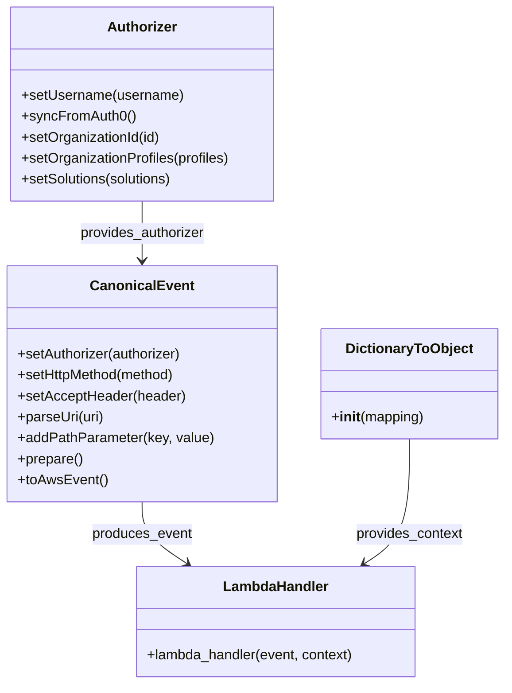

# Diagram: platform/tools/ide_local_testing/localTest/test/byUrl/organizationsGetByFeature.py


> Auto-generated by Obscura crawlers

## Diagram 1

```mermaid
flowchart TD
    S[Script: build event & call lambda] --> Auth[Authorizer<br/>setUsername('shipper-org-admin@yopmail.com')<br/>syncFromAuth0()]
    Auth --> AuthCfg[setOrganizationId(1004)<br/>setOrganizationProfiles(['SH','FV'])<br/>setSolutions(['FV_TEST'])]
    S --> Event[CanonicalEvent<br/>setAuthorizer(authorizer)<br/>setHttpMethod(GET)<br/>setAcceptHeader('application/json')<br/>parseUri(uri)<br/>addPathParameter('orgType','Dealer')<br/>addPathParameter('feature','PartView')<br/>addPathParameter('paginate','true')<br/>addPathParameter('pageNumber','0')<br/>addPathParameter('pageSize','20')<br/>prepare()<br/>toAwsEvent()]
    Event --> Invoke[lambdaHandler(event, DictionaryToObject({'function_name':'entity-status-update'}))]
    Invoke --> Resp{retval && retval.body}
    Resp -->|yes| Parse[body = json.loads(retval.body)<br/>prettyRetval = json.dumps(body, indent=2, sort_keys=True)<br/>print(prettyRetval)]
    Resp -->|no| Empty[prettyRetval = ""<br/>print(prettyRetval)]
    Invoke --> Time[compute elapsed = end - start<br/>print("Lambda execution time: ... seconds")]
```

> SVG rendering failed for this diagram.

## Diagram 2



### SVG

<svg id="container" width="569.7890625" xmlns="http://www.w3.org/2000/svg" class="classDiagram" height="782" viewBox="0 0 569.7890625 782" role="graphics-document document" aria-roledescription="class"><style>#container{font-family:"trebuchet ms",verdana,arial,sans-serif;font-size:16px;fill:#333;}@keyframes edge-animation-frame{from{stroke-dashoffset:0;}}@keyframes dash{to{stroke-dashoffset:0;}}#container .edge-animation-slow{stroke-dasharray:9,5!important;stroke-dashoffset:900;animation:dash 50s linear infinite;stroke-linecap:round;}#container .edge-animation-fast{stroke-dasharray:9,5!important;stroke-dashoffset:900;animation:dash 20s linear infinite;stroke-linecap:round;}#container .error-icon{fill:#552222;}#container .error-text{fill:#552222;stroke:#552222;}#container .edge-thickness-normal{stroke-width:1px;}#container .edge-thickness-thick{stroke-width:3.5px;}#container .edge-pattern-solid{stroke-dasharray:0;}#container .edge-thickness-invisible{stroke-width:0;fill:none;}#container .edge-pattern-dashed{stroke-dasharray:3;}#container .edge-pattern-dotted{stroke-dasharray:2;}#container .marker{fill:#333333;stroke:#333333;}#container .marker.cross{stroke:#333333;}#container svg{font-family:"trebuchet ms",verdana,arial,sans-serif;font-size:16px;}#container p{margin:0;}#container g.classGroup text{fill:#9370DB;stroke:none;font-family:"trebuchet ms",verdana,arial,sans-serif;font-size:10px;}#container g.classGroup text .title{font-weight:bolder;}#container .nodeLabel,#container .edgeLabel{color:#131300;}#container .edgeLabel .label rect{fill:#ECECFF;}#container .label text{fill:#131300;}#container .labelBkg{background:#ECECFF;}#container .edgeLabel .label span{background:#ECECFF;}#container .classTitle{font-weight:bolder;}#container .node rect,#container .node circle,#container .node ellipse,#container .node polygon,#container .node path{fill:#ECECFF;stroke:#9370DB;stroke-width:1px;}#container .divider{stroke:#9370DB;stroke-width:1;}#container g.clickable{cursor:pointer;}#container g.classGroup rect{fill:#ECECFF;stroke:#9370DB;}#container g.classGroup line{stroke:#9370DB;stroke-width:1;}#container .classLabel .box{stroke:none;stroke-width:0;fill:#ECECFF;opacity:0.5;}#container .classLabel .label{fill:#9370DB;font-size:10px;}#container .relation{stroke:#333333;stroke-width:1;fill:none;}#container .dashed-line{stroke-dasharray:3;}#container .dotted-line{stroke-dasharray:1 2;}#container #compositionStart,#container .composition{fill:#333333!important;stroke:#333333!important;stroke-width:1;}#container #compositionEnd,#container .composition{fill:#333333!important;stroke:#333333!important;stroke-width:1;}#container #dependencyStart,#container .dependency{fill:#333333!important;stroke:#333333!important;stroke-width:1;}#container #dependencyStart,#container .dependency{fill:#333333!important;stroke:#333333!important;stroke-width:1;}#container #extensionStart,#container .extension{fill:transparent!important;stroke:#333333!important;stroke-width:1;}#container #extensionEnd,#container .extension{fill:transparent!important;stroke:#333333!important;stroke-width:1;}#container #aggregationStart,#container .aggregation{fill:transparent!important;stroke:#333333!important;stroke-width:1;}#container #aggregationEnd,#container .aggregation{fill:transparent!important;stroke:#333333!important;stroke-width:1;}#container #lollipopStart,#container .lollipop{fill:#ECECFF!important;stroke:#333333!important;stroke-width:1;}#container #lollipopEnd,#container .lollipop{fill:#ECECFF!important;stroke:#333333!important;stroke-width:1;}#container .edgeTerminals{font-size:11px;line-height:initial;}#container .classTitleText{text-anchor:middle;font-size:18px;fill:#333;}#container .label-icon{display:inline-block;height:1em;overflow:visible;vertical-align:-0.125em;}#container .node .label-icon path{fill:currentColor;stroke:revert;stroke-width:revert;}#container :root{--mermaid-font-family:"trebuchet ms",verdana,arial,sans-serif;}</style><g><defs><marker id="container_class-aggregationStart" class="marker aggregation class" refX="18" refY="7" markerWidth="190" markerHeight="240" orient="auto"><path d="M 18,7 L9,13 L1,7 L9,1 Z"></path></marker></defs><defs><marker id="container_class-aggregationEnd" class="marker aggregation class" refX="1" refY="7" markerWidth="20" markerHeight="28" orient="auto"><path d="M 18,7 L9,13 L1,7 L9,1 Z"></path></marker></defs><defs><marker id="container_class-extensionStart" class="marker extension class" refX="18" refY="7" markerWidth="190" markerHeight="240" orient="auto"><path d="M 1,7 L18,13 V 1 Z"></path></marker></defs><defs><marker id="container_class-extensionEnd" class="marker extension class" refX="1" refY="7" markerWidth="20" markerHeight="28" orient="auto"><path d="M 1,1 V 13 L18,7 Z"></path></marker></defs><defs><marker id="container_class-compositionStart" class="marker composition class" refX="18" refY="7" markerWidth="190" markerHeight="240" orient="auto"><path d="M 18,7 L9,13 L1,7 L9,1 Z"></path></marker></defs><defs><marker id="container_class-compositionEnd" class="marker composition class" refX="1" refY="7" markerWidth="20" markerHeight="28" orient="auto"><path d="M 18,7 L9,13 L1,7 L9,1 Z"></path></marker></defs><defs><marker id="container_class-dependencyStart" class="marker dependency class" refX="6" refY="7" markerWidth="190" markerHeight="240" orient="auto"><path d="M 5,7 L9,13 L1,7 L9,1 Z"></path></marker></defs><defs><marker id="container_class-dependencyEnd" class="marker dependency class" refX="13" refY="7" markerWidth="20" markerHeight="28" orient="auto"><path d="M 18,7 L9,13 L14,7 L9,1 Z"></path></marker></defs><defs><marker id="container_class-lollipopStart" class="marker lollipop class" refX="13" refY="7" markerWidth="190" markerHeight="240" orient="auto"><circle stroke="black" fill="transparent" cx="7" cy="7" r="6"></circle></marker></defs><defs><marker id="container_class-lollipopEnd" class="marker lollipop class" refX="1" refY="7" markerWidth="190" markerHeight="240" orient="auto"><circle stroke="black" fill="transparent" cx="7" cy="7" r="6"></circle></marker></defs><g class="root"><g class="clusters"></g><g class="edgePaths"><path d="M159.668,230L159.668,236.167C159.668,242.333,159.668,254.667,159.668,266C159.668,277.333,159.668,287.667,159.668,292.833L159.668,298" id="id_Authorizer_CanonicalEvent_1" class="edge-thickness-normal edge-pattern-solid relation" style=";;;" data-edge="true" data-et="edge" data-id="id_Authorizer_CanonicalEvent_1" data-points="W3sieCI6MTU5LjY2Nzk2ODc1LCJ5IjoyMzB9LHsieCI6MTU5LjY2Nzk2ODc1LCJ5IjoyNjd9LHsieCI6MTU5LjY2Nzk2ODc1LCJ5IjozMDR9XQ==" marker-end="url(#container_class-dependencyEnd)"></path><path d="M159.668,574L159.668,580.167C159.668,586.333,159.668,598.667,168.141,610.448C176.615,622.229,193.561,633.457,202.035,639.072L210.508,644.686" id="id_CanonicalEvent_LambdaHandler_2" class="edge-thickness-normal edge-pattern-solid relation" style=";;;" data-edge="true" data-et="edge" data-id="id_CanonicalEvent_LambdaHandler_2" data-points="W3sieCI6MTU5LjY2Nzk2ODc1LCJ5Ijo1NzR9LHsieCI6MTU5LjY2Nzk2ODc1LCJ5Ijo2MTF9LHsieCI6MjE1LjUwOTc4NTE1NjI1MDAyLCJ5Ijo2NDh9XQ==" marker-end="url(#container_class-dependencyEnd)"></path><path d="M461.516,502L461.516,520.167C461.516,538.333,461.516,574.667,453.042,598.448C444.569,622.229,427.622,633.457,419.149,639.072L410.676,644.686" id="id_DictionaryToObject_LambdaHandler_3" class="edge-thickness-normal edge-pattern-solid relation" style=";;;" data-edge="true" data-et="edge" data-id="id_DictionaryToObject_LambdaHandler_3" data-points="W3sieCI6NDYxLjUxNTYyNSwieSI6NTAyfSx7IngiOjQ2MS41MTU2MjUsInkiOjYxMX0seyJ4Ijo0MDUuNjczODA4NTkzNzUsInkiOjY0OH1d" marker-end="url(#container_class-dependencyEnd)"></path></g><g class="edgeLabels"><g class="edgeLabel" transform="translate(159.66796875, 267)"><g class="label" data-id="id_Authorizer_CanonicalEvent_1" transform="translate(-72.640625, -12)"><foreignObject width="145.28125" height="24"><div xmlns="http://www.w3.org/1999/xhtml" class="labelBkg" style="display: table-cell; white-space: nowrap; line-height: 1.5; max-width: 200px; text-align: center;"><span class="edgeLabel"><p>provides_authorizer</p></span></div></foreignObject></g></g><g class="edgeLabel" transform="translate(159.66796875, 611)"><g class="label" data-id="id_CanonicalEvent_LambdaHandler_2" transform="translate(-57.484375, -12)"><foreignObject width="114.96875" height="24"><div xmlns="http://www.w3.org/1999/xhtml" class="labelBkg" style="display: table-cell; white-space: nowrap; line-height: 1.5; max-width: 200px; text-align: center;"><span class="edgeLabel"><p>produces_event</p></span></div></foreignObject></g></g><g class="edgeLabel" transform="translate(461.515625, 611)"><g class="label" data-id="id_DictionaryToObject_LambdaHandler_3" transform="translate(-62.0078125, -12)"><foreignObject width="124.015625" height="24"><div xmlns="http://www.w3.org/1999/xhtml" class="labelBkg" style="display: table-cell; white-space: nowrap; line-height: 1.5; max-width: 200px; text-align: center;"><span class="edgeLabel"><p>provides_context</p></span></div></foreignObject></g></g></g><g class="nodes"><g class="node default" id="classId-Authorizer-0" transform="translate(159.66796875, 119)"><g class="basic label-container"><path d="M-151.66796875 -111 L151.66796875 -111 L151.66796875 111 L-151.66796875 111" stroke="none" stroke-width="0" fill="#ECECFF" style=""></path><path d="M-151.66796875 -111 C-70.70454889060844 -111, 10.258870968783128 -111, 151.66796875 -111 M-151.66796875 -111 C-75.59517766277563 -111, 0.477613424448748 -111, 151.66796875 -111 M151.66796875 -111 C151.66796875 -31.85874852725088, 151.66796875 47.28250294549824, 151.66796875 111 M151.66796875 -111 C151.66796875 -24.79252160386727, 151.66796875 61.41495679226546, 151.66796875 111 M151.66796875 111 C83.74134357921936 111, 15.814718408438722 111, -151.66796875 111 M151.66796875 111 C89.6021177088238 111, 27.536266667647595 111, -151.66796875 111 M-151.66796875 111 C-151.66796875 27.942905156711376, -151.66796875 -55.11418968657725, -151.66796875 -111 M-151.66796875 111 C-151.66796875 23.564201404005487, -151.66796875 -63.871597191989025, -151.66796875 -111" stroke="#9370DB" stroke-width="1.3" fill="none" stroke-dasharray="0 0" style=""></path></g><g class="annotation-group text" transform="translate(0, -87)"></g><g class="label-group text" transform="translate(-38.3671875, -87)"><g class="label" style="font-weight: bolder" transform="translate(0,-12)"><foreignObject width="76.734375" height="24"><div xmlns="http://www.w3.org/1999/xhtml" style="display: table-cell; white-space: nowrap; line-height: 1.5; max-width: 126px; text-align: center;"><span class="nodeLabel markdown-node-label" style=""><p>Authorizer</p></span></div></foreignObject></g></g><g class="members-group text" transform="translate(-139.66796875, -39)"></g><g class="methods-group text" transform="translate(-139.66796875, -9)"><g class="label" style="" transform="translate(0,-12)"><foreignObject width="185.90625" height="24"><div xmlns="http://www.w3.org/1999/xhtml" style="display: table-cell; white-space: nowrap; line-height: 1.5; max-width: 243px; text-align: center;"><span class="nodeLabel markdown-node-label" style=""><p>+setUsername(username)</p></span></div></foreignObject></g><g class="label" style="" transform="translate(0,12)"><foreignObject width="129.0625" height="24"><div xmlns="http://www.w3.org/1999/xhtml" style="display: table-cell; white-space: nowrap; line-height: 1.5; max-width: 186px; text-align: center;"><span class="nodeLabel markdown-node-label" style=""><p>+syncFromAuth0()</p></span></div></foreignObject></g><g class="label" style="" transform="translate(0,36)"><foreignObject width="160.78125" height="24"><div xmlns="http://www.w3.org/1999/xhtml" style="display: table-cell; white-space: nowrap; line-height: 1.5; max-width: 218px; text-align: center;"><span class="nodeLabel markdown-node-label" style=""><p>+setOrganizationId(id)</p></span></div></foreignObject></g><g class="label" style="" transform="translate(0,60)"><foreignObject width="240.96875" height="24"><div xmlns="http://www.w3.org/1999/xhtml" style="display: table-cell; white-space: nowrap; line-height: 1.5; max-width: 298px; text-align: center;"><span class="nodeLabel markdown-node-label" style=""><p>+setOrganizationProfiles(profiles)</p></span></div></foreignObject></g><g class="label" style="" transform="translate(0,84)"><foreignObject width="176.171875" height="24"><div xmlns="http://www.w3.org/1999/xhtml" style="display: table-cell; white-space: nowrap; line-height: 1.5; max-width: 234px; text-align: center;"><span class="nodeLabel markdown-node-label" style=""><p>+setSolutions(solutions)</p></span></div></foreignObject></g></g><g class="divider" style=""><path d="M-151.66796875 -63 C-60.35481077641684 -63, 30.95834719716632 -63, 151.66796875 -63 M-151.66796875 -63 C-83.5522569346135 -63, -15.436545119226992 -63, 151.66796875 -63" stroke="#9370DB" stroke-width="1.3" fill="none" stroke-dasharray="0 0" style=""></path></g><g class="divider" style=""><path d="M-151.66796875 -39 C-53.02979262695713 -39, 45.608383496085736 -39, 151.66796875 -39 M-151.66796875 -39 C-34.406174623617474 -39, 82.85561950276505 -39, 151.66796875 -39" stroke="#9370DB" stroke-width="1.3" fill="none" stroke-dasharray="0 0" style=""></path></g></g><g class="node default" id="classId-CanonicalEvent-1" transform="translate(159.66796875, 439)"><g class="basic label-container"><path d="M-151.57421875 -135 L151.57421875 -135 L151.57421875 135 L-151.57421875 135" stroke="none" stroke-width="0" fill="#ECECFF" style=""></path><path d="M-151.57421875 -135 C-39.79567040526695 -135, 71.9828779394661 -135, 151.57421875 -135 M-151.57421875 -135 C-32.64112718683046 -135, 86.29196437633908 -135, 151.57421875 -135 M151.57421875 -135 C151.57421875 -68.94684010271517, 151.57421875 -2.8936802054303428, 151.57421875 135 M151.57421875 -135 C151.57421875 -80.9661444739059, 151.57421875 -26.9322889478118, 151.57421875 135 M151.57421875 135 C75.57257978267855 135, -0.4290591846429095 135, -151.57421875 135 M151.57421875 135 C63.978838561608 135, -23.616541626784 135, -151.57421875 135 M-151.57421875 135 C-151.57421875 40.85769401858923, -151.57421875 -53.28461196282154, -151.57421875 -135 M-151.57421875 135 C-151.57421875 41.86004738617818, -151.57421875 -51.27990522764364, -151.57421875 -135" stroke="#9370DB" stroke-width="1.3" fill="none" stroke-dasharray="0 0" style=""></path></g><g class="annotation-group text" transform="translate(0, -111)"></g><g class="label-group text" transform="translate(-55.7109375, -111)"><g class="label" style="font-weight: bolder" transform="translate(0,-12)"><foreignObject width="111.421875" height="24"><div xmlns="http://www.w3.org/1999/xhtml" style="display: table-cell; white-space: nowrap; line-height: 1.5; max-width: 161px; text-align: center;"><span class="nodeLabel markdown-node-label" style=""><p>CanonicalEvent</p></span></div></foreignObject></g></g><g class="members-group text" transform="translate(-139.57421875, -63)"></g><g class="methods-group text" transform="translate(-139.57421875, -33)"><g class="label" style="" transform="translate(0,-12)"><foreignObject width="190.75" height="24"><div xmlns="http://www.w3.org/1999/xhtml" style="display: table-cell; white-space: nowrap; line-height: 1.5; max-width: 248px; text-align: center;"><span class="nodeLabel markdown-node-label" style=""><p>+setAuthorizer(authorizer)</p></span></div></foreignObject></g><g class="label" style="" transform="translate(0,12)"><foreignObject width="184" height="24"><div xmlns="http://www.w3.org/1999/xhtml" style="display: table-cell; white-space: nowrap; line-height: 1.5; max-width: 241px; text-align: center;"><span class="nodeLabel markdown-node-label" style=""><p>+setHttpMethod(method)</p></span></div></foreignObject></g><g class="label" style="" transform="translate(0,36)"><foreignObject width="191.859375" height="24"><div xmlns="http://www.w3.org/1999/xhtml" style="display: table-cell; white-space: nowrap; line-height: 1.5; max-width: 249px; text-align: center;"><span class="nodeLabel markdown-node-label" style=""><p>+setAcceptHeader(header)</p></span></div></foreignObject></g><g class="label" style="" transform="translate(0,60)"><foreignObject width="99.8125" height="24"><div xmlns="http://www.w3.org/1999/xhtml" style="display: table-cell; white-space: nowrap; line-height: 1.5; max-width: 157px; text-align: center;"><span class="nodeLabel markdown-node-label" style=""><p>+parseUri(uri)</p></span></div></foreignObject></g><g class="label" style="" transform="translate(0,84)"><foreignObject width="223.4375" height="24"><div xmlns="http://www.w3.org/1999/xhtml" style="display: table-cell; white-space: nowrap; line-height: 1.5; max-width: 281px; text-align: center;"><span class="nodeLabel markdown-node-label" style=""><p>+addPathParameter(key, value)</p></span></div></foreignObject></g><g class="label" style="" transform="translate(0,108)"><foreignObject width="74.75" height="24"><div xmlns="http://www.w3.org/1999/xhtml" style="display: table-cell; white-space: nowrap; line-height: 1.5; max-width: 132px; text-align: center;"><span class="nodeLabel markdown-node-label" style=""><p>+prepare()</p></span></div></foreignObject></g><g class="label" style="" transform="translate(0,132)"><foreignObject width="101.1875" height="24"><div xmlns="http://www.w3.org/1999/xhtml" style="display: table-cell; white-space: nowrap; line-height: 1.5; max-width: 159px; text-align: center;"><span class="nodeLabel markdown-node-label" style=""><p>+toAwsEvent()</p></span></div></foreignObject></g></g><g class="divider" style=""><path d="M-151.57421875 -87 C-81.46907687068186 -87, -11.36393499136372 -87, 151.57421875 -87 M-151.57421875 -87 C-69.04173208370656 -87, 13.490754582586874 -87, 151.57421875 -87" stroke="#9370DB" stroke-width="1.3" fill="none" stroke-dasharray="0 0" style=""></path></g><g class="divider" style=""><path d="M-151.57421875 -63 C-86.5540566771812 -63, -21.533894604362388 -63, 151.57421875 -63 M-151.57421875 -63 C-48.60903276349951 -63, 54.35615322300097 -63, 151.57421875 -63" stroke="#9370DB" stroke-width="1.3" fill="none" stroke-dasharray="0 0" style=""></path></g></g><g class="node default" id="classId-DictionaryToObject-2" transform="translate(461.515625, 439)"><g class="basic label-container"><path d="M-100.2734375 -63 L100.2734375 -63 L100.2734375 63 L-100.2734375 63" stroke="none" stroke-width="0" fill="#ECECFF" style=""></path><path d="M-100.2734375 -63 C-31.473623385969987 -63, 37.32619072806003 -63, 100.2734375 -63 M-100.2734375 -63 C-23.928299291371445 -63, 52.41683891725711 -63, 100.2734375 -63 M100.2734375 -63 C100.2734375 -14.630999589563494, 100.2734375 33.73800082087301, 100.2734375 63 M100.2734375 -63 C100.2734375 -23.069056516669974, 100.2734375 16.86188696666005, 100.2734375 63 M100.2734375 63 C59.660999532099936 63, 19.048561564199872 63, -100.2734375 63 M100.2734375 63 C58.60318941400672 63, 16.93294132801344 63, -100.2734375 63 M-100.2734375 63 C-100.2734375 35.957683212269934, -100.2734375 8.915366424539869, -100.2734375 -63 M-100.2734375 63 C-100.2734375 25.260456675975313, -100.2734375 -12.479086648049375, -100.2734375 -63" stroke="#9370DB" stroke-width="1.3" fill="none" stroke-dasharray="0 0" style=""></path></g><g class="annotation-group text" transform="translate(0, -39)"></g><g class="label-group text" transform="translate(-70.109375, -39)"><g class="label" style="font-weight: bolder" transform="translate(0,-12)"><foreignObject width="140.21875" height="24"><div xmlns="http://www.w3.org/1999/xhtml" style="display: table-cell; white-space: nowrap; line-height: 1.5; max-width: 188px; text-align: center;"><span class="nodeLabel markdown-node-label" style=""><p>DictionaryToObject</p></span></div></foreignObject></g></g><g class="members-group text" transform="translate(-88.2734375, 9)"></g><g class="methods-group text" transform="translate(-88.2734375, 39)"><g class="label" style="" transform="translate(0,-12)"><foreignObject width="106.4375" height="24"><div xmlns="http://www.w3.org/1999/xhtml" style="display: table-cell; white-space: nowrap; line-height: 1.5; max-width: 195px; text-align: center;"><span class="nodeLabel markdown-node-label" style=""><p>+<strong>init</strong>(mapping)</p></span></div></foreignObject></g></g><g class="divider" style=""><path d="M-100.2734375 -15 C-54.25552469895142 -15, -8.237611897902838 -15, 100.2734375 -15 M-100.2734375 -15 C-24.29285711949541 -15, 51.68772326100918 -15, 100.2734375 -15" stroke="#9370DB" stroke-width="1.3" fill="none" stroke-dasharray="0 0" style=""></path></g><g class="divider" style=""><path d="M-100.2734375 9 C-46.82863775845085 9, 6.616161983098294 9, 100.2734375 9 M-100.2734375 9 C-28.014682348894652 9, 44.244072802210695 9, 100.2734375 9" stroke="#9370DB" stroke-width="1.3" fill="none" stroke-dasharray="0 0" style=""></path></g></g><g class="node default" id="classId-LambdaHandler-3" transform="translate(310.591796875, 711)"><g class="basic label-container"><path d="M-161.203125 -63 L161.203125 -63 L161.203125 63 L-161.203125 63" stroke="none" stroke-width="0" fill="#ECECFF" style=""></path><path d="M-161.203125 -63 C-38.47177856491541 -63, 84.25956787016918 -63, 161.203125 -63 M-161.203125 -63 C-73.15490095885086 -63, 14.89332308229828 -63, 161.203125 -63 M161.203125 -63 C161.203125 -18.927531549754328, 161.203125 25.144936900491345, 161.203125 63 M161.203125 -63 C161.203125 -29.664719628156547, 161.203125 3.670560743686906, 161.203125 63 M161.203125 63 C76.59175622034587 63, -8.019612559308257 63, -161.203125 63 M161.203125 63 C63.31252352355483 63, -34.57807795289034 63, -161.203125 63 M-161.203125 63 C-161.203125 15.930719800081633, -161.203125 -31.138560399836734, -161.203125 -63 M-161.203125 63 C-161.203125 17.266499152899726, -161.203125 -28.467001694200547, -161.203125 -63" stroke="#9370DB" stroke-width="1.3" fill="none" stroke-dasharray="0 0" style=""></path></g><g class="annotation-group text" transform="translate(0, -39)"></g><g class="label-group text" transform="translate(-58.21875, -39)"><g class="label" style="font-weight: bolder" transform="translate(0,-12)"><foreignObject width="116.4375" height="24"><div xmlns="http://www.w3.org/1999/xhtml" style="display: table-cell; white-space: nowrap; line-height: 1.5; max-width: 167px; text-align: center;"><span class="nodeLabel markdown-node-label" style=""><p>LambdaHandler</p></span></div></foreignObject></g></g><g class="members-group text" transform="translate(-149.203125, 9)"></g><g class="methods-group text" transform="translate(-149.203125, 39)"><g class="label" style="" transform="translate(0,-12)"><foreignObject width="240.1875" height="24"><div xmlns="http://www.w3.org/1999/xhtml" style="display: table-cell; white-space: nowrap; line-height: 1.5; max-width: 298px; text-align: center;"><span class="nodeLabel markdown-node-label" style=""><p>+lambda_handler(event, context)</p></span></div></foreignObject></g></g><g class="divider" style=""><path d="M-161.203125 -15 C-74.66139529586017 -15, 11.880334408279651 -15, 161.203125 -15 M-161.203125 -15 C-80.24949657397433 -15, 0.7041318520513471 -15, 161.203125 -15" stroke="#9370DB" stroke-width="1.3" fill="none" stroke-dasharray="0 0" style=""></path></g><g class="divider" style=""><path d="M-161.203125 9 C-54.13348499619775 9, 52.9361550076045 9, 161.203125 9 M-161.203125 9 C-79.02292719278037 9, 3.1572706144392555 9, 161.203125 9" stroke="#9370DB" stroke-width="1.3" fill="none" stroke-dasharray="0 0" style=""></path></g></g></g></g></g></svg>
