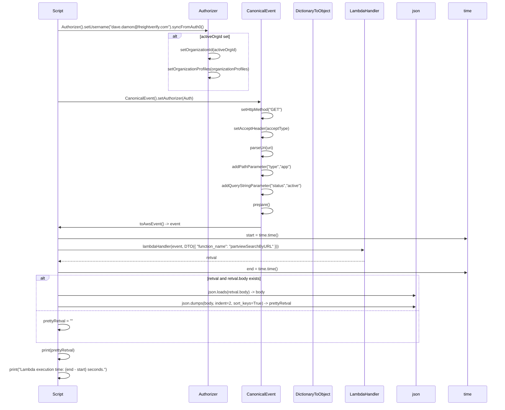
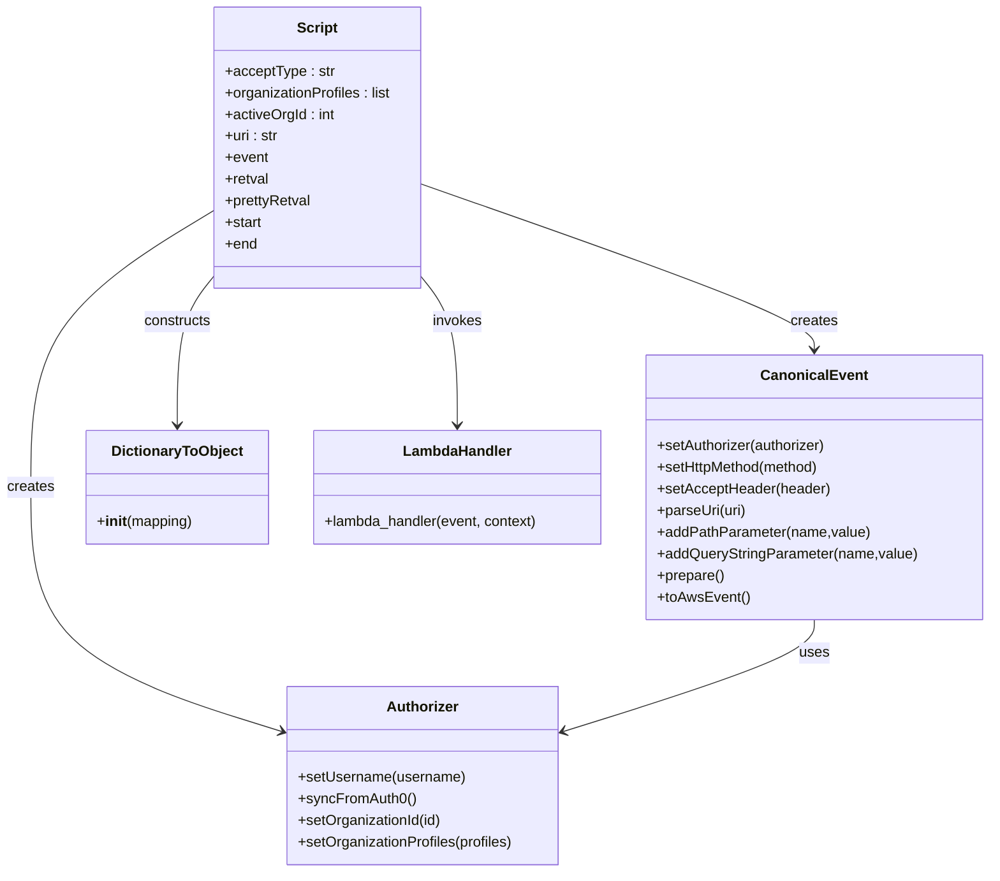

# Diagram: platform/tools/ide_local_testing/localTest/test/byUrl/partviewSearchByUrl.py

> Auto-generated by Obscura crawlers

## Diagram 1

### SVG

<svg id="container" width="2039.5" xmlns="http://www.w3.org/2000/svg" height="1656" viewBox="-168.5 -10 2039.5 1656" role="graphics-document document" aria-roledescription="sequence"><g><rect x="1671" y="1570" fill="#eaeaea" stroke="#666" width="150" height="65" name="T" rx="3" ry="3" class="actor actor-bottom"></rect><text x="1746" y="1602.5" dominant-baseline="central" alignment-baseline="central" class="actor actor-box" style="text-anchor: middle; font-size: 16px; font-weight: 400;"><tspan x="1746" dy="0">time</tspan></text></g><g><rect x="1471" y="1570" fill="#eaeaea" stroke="#666" width="150" height="65" name="JS" rx="3" ry="3" class="actor actor-bottom"></rect><text x="1546" y="1602.5" dominant-baseline="central" alignment-baseline="central" class="actor actor-box" style="text-anchor: middle; font-size: 16px; font-weight: 400;"><tspan x="1546" dy="0">json</tspan></text></g><g><rect x="1271" y="1570" fill="#eaeaea" stroke="#666" width="150" height="65" name="LH" rx="3" ry="3" class="actor actor-bottom"></rect><text x="1346" y="1602.5" dominant-baseline="central" alignment-baseline="central" class="actor actor-box" style="text-anchor: middle; font-size: 16px; font-weight: 400;"><tspan x="1346" dy="0">LambdaHandler</tspan></text></g><g><rect x="1063" y="1570" fill="#eaeaea" stroke="#666" width="158" height="65" name="DTO" rx="3" ry="3" class="actor actor-bottom"></rect><text x="1142" y="1602.5" dominant-baseline="central" alignment-baseline="central" class="actor actor-box" style="text-anchor: middle; font-size: 16px; font-weight: 400;"><tspan x="1142" dy="0">DictionaryToObject</tspan></text></g><g><rect x="851.5" y="1570" fill="#eaeaea" stroke="#666" width="150" height="65" name="CE" rx="3" ry="3" class="actor actor-bottom"></rect><text x="926.5" y="1602.5" dominant-baseline="central" alignment-baseline="central" class="actor actor-box" style="text-anchor: middle; font-size: 16px; font-weight: 400;"><tspan x="926.5" dy="0">CanonicalEvent</tspan></text></g><g><rect x="630" y="1570" fill="#eaeaea" stroke="#666" width="150" height="65" name="Auth" rx="3" ry="3" class="actor actor-bottom"></rect><text x="705" y="1602.5" dominant-baseline="central" alignment-baseline="central" class="actor actor-box" style="text-anchor: middle; font-size: 16px; font-weight: 400;"><tspan x="705" dy="0">Authorizer</tspan></text></g><g><rect x="0" y="1570" fill="#eaeaea" stroke="#666" width="150" height="65" name="S" rx="3" ry="3" class="actor actor-bottom"></rect><text x="75" y="1602.5" dominant-baseline="central" alignment-baseline="central" class="actor actor-box" style="text-anchor: middle; font-size: 16px; font-weight: 400;"><tspan x="75" dy="0">Script</tspan></text></g><g><line id="actor6" x1="1746" y1="65" x2="1746" y2="1570" class="actor-line 200" stroke-width="0.5px" stroke="#999" name="T"></line><g id="root-6"><rect x="1671" y="0" fill="#eaeaea" stroke="#666" width="150" height="65" name="T" rx="3" ry="3" class="actor actor-top"></rect><text x="1746" y="32.5" dominant-baseline="central" alignment-baseline="central" class="actor actor-box" style="text-anchor: middle; font-size: 16px; font-weight: 400;"><tspan x="1746" dy="0">time</tspan></text></g></g><g><line id="actor5" x1="1546" y1="65" x2="1546" y2="1570" class="actor-line 200" stroke-width="0.5px" stroke="#999" name="JS"></line><g id="root-5"><rect x="1471" y="0" fill="#eaeaea" stroke="#666" width="150" height="65" name="JS" rx="3" ry="3" class="actor actor-top"></rect><text x="1546" y="32.5" dominant-baseline="central" alignment-baseline="central" class="actor actor-box" style="text-anchor: middle; font-size: 16px; font-weight: 400;"><tspan x="1546" dy="0">json</tspan></text></g></g><g><line id="actor4" x1="1346" y1="65" x2="1346" y2="1570" class="actor-line 200" stroke-width="0.5px" stroke="#999" name="LH"></line><g id="root-4"><rect x="1271" y="0" fill="#eaeaea" stroke="#666" width="150" height="65" name="LH" rx="3" ry="3" class="actor actor-top"></rect><text x="1346" y="32.5" dominant-baseline="central" alignment-baseline="central" class="actor actor-box" style="text-anchor: middle; font-size: 16px; font-weight: 400;"><tspan x="1346" dy="0">LambdaHandler</tspan></text></g></g><g><line id="actor3" x1="1142" y1="65" x2="1142" y2="1570" class="actor-line 200" stroke-width="0.5px" stroke="#999" name="DTO"></line><g id="root-3"><rect x="1063" y="0" fill="#eaeaea" stroke="#666" width="158" height="65" name="DTO" rx="3" ry="3" class="actor actor-top"></rect><text x="1142" y="32.5" dominant-baseline="central" alignment-baseline="central" class="actor actor-box" style="text-anchor: middle; font-size: 16px; font-weight: 400;"><tspan x="1142" dy="0">DictionaryToObject</tspan></text></g></g><g><line id="actor2" x1="926.5" y1="65" x2="926.5" y2="1570" class="actor-line 200" stroke-width="0.5px" stroke="#999" name="CE"></line><g id="root-2"><rect x="851.5" y="0" fill="#eaeaea" stroke="#666" width="150" height="65" name="CE" rx="3" ry="3" class="actor actor-top"></rect><text x="926.5" y="32.5" dominant-baseline="central" alignment-baseline="central" class="actor actor-box" style="text-anchor: middle; font-size: 16px; font-weight: 400;"><tspan x="926.5" dy="0">CanonicalEvent</tspan></text></g></g><g><line id="actor1" x1="705" y1="65" x2="705" y2="1570" class="actor-line 200" stroke-width="0.5px" stroke="#999" name="Auth"></line><g id="root-1"><rect x="630" y="0" fill="#eaeaea" stroke="#666" width="150" height="65" name="Auth" rx="3" ry="3" class="actor actor-top"></rect><text x="705" y="32.5" dominant-baseline="central" alignment-baseline="central" class="actor actor-box" style="text-anchor: middle; font-size: 16px; font-weight: 400;"><tspan x="705" dy="0">Authorizer</tspan></text></g></g><g><line id="actor0" x1="75" y1="65" x2="75" y2="1570" class="actor-line 200" stroke-width="0.5px" stroke="#999" name="S"></line><g id="root-0"><rect x="0" y="0" fill="#eaeaea" stroke="#666" width="150" height="65" name="S" rx="3" ry="3" class="actor actor-top"></rect><text x="75" y="32.5" dominant-baseline="central" alignment-baseline="central" class="actor actor-box" style="text-anchor: middle; font-size: 16px; font-weight: 400;"><tspan x="75" dy="0">Script</tspan></text></g></g><g></g><defs><symbol id="computer" width="24" height="24"><path transform="scale(.5)" d="M2 2v13h20v-13h-20zm18 11h-16v-9h16v9zm-10.228 6l.466-1h3.524l.467 1h-4.457zm14.228 3h-24l2-6h2.104l-1.33 4h18.45l-1.297-4h2.073l2 6zm-5-10h-14v-7h14v7z"></path></symbol></defs><defs><symbol id="database" fill-rule="evenodd" clip-rule="evenodd"><path transform="scale(.5)" d="M12.258.001l.256.004.255.005.253.008.251.01.249.012.247.015.246.016.242.019.241.02.239.023.236.024.233.027.231.028.229.031.225.032.223.034.22.036.217.038.214.04.211.041.208.043.205.045.201.046.198.048.194.05.191.051.187.053.183.054.18.056.175.057.172.059.168.06.163.061.16.063.155.064.15.066.074.033.073.033.071.034.07.034.069.035.068.035.067.035.066.035.064.036.064.036.062.036.06.036.06.037.058.037.058.037.055.038.055.038.053.038.052.038.051.039.05.039.048.039.047.039.045.04.044.04.043.04.041.04.04.041.039.041.037.041.036.041.034.041.033.042.032.042.03.042.029.042.027.042.026.043.024.043.023.043.021.043.02.043.018.044.017.043.015.044.013.044.012.044.011.045.009.044.007.045.006.045.004.045.002.045.001.045v17l-.001.045-.002.045-.004.045-.006.045-.007.045-.009.044-.011.045-.012.044-.013.044-.015.044-.017.043-.018.044-.02.043-.021.043-.023.043-.024.043-.026.043-.027.042-.029.042-.03.042-.032.042-.033.042-.034.041-.036.041-.037.041-.039.041-.04.041-.041.04-.043.04-.044.04-.045.04-.047.039-.048.039-.05.039-.051.039-.052.038-.053.038-.055.038-.055.038-.058.037-.058.037-.06.037-.06.036-.062.036-.064.036-.064.036-.066.035-.067.035-.068.035-.069.035-.07.034-.071.034-.073.033-.074.033-.15.066-.155.064-.16.063-.163.061-.168.06-.172.059-.175.057-.18.056-.183.054-.187.053-.191.051-.194.05-.198.048-.201.046-.205.045-.208.043-.211.041-.214.04-.217.038-.22.036-.223.034-.225.032-.229.031-.231.028-.233.027-.236.024-.239.023-.241.02-.242.019-.246.016-.247.015-.249.012-.251.01-.253.008-.255.005-.256.004-.258.001-.258-.001-.256-.004-.255-.005-.253-.008-.251-.01-.249-.012-.247-.015-.245-.016-.243-.019-.241-.02-.238-.023-.236-.024-.234-.027-.231-.028-.228-.031-.226-.032-.223-.034-.22-.036-.217-.038-.214-.04-.211-.041-.208-.043-.204-.045-.201-.046-.198-.048-.195-.05-.19-.051-.187-.053-.184-.054-.179-.056-.176-.057-.172-.059-.167-.06-.164-.061-.159-.063-.155-.064-.151-.066-.074-.033-.072-.033-.072-.034-.07-.034-.069-.035-.068-.035-.067-.035-.066-.035-.064-.036-.063-.036-.062-.036-.061-.036-.06-.037-.058-.037-.057-.037-.056-.038-.055-.038-.053-.038-.052-.038-.051-.039-.049-.039-.049-.039-.046-.039-.046-.04-.044-.04-.043-.04-.041-.04-.04-.041-.039-.041-.037-.041-.036-.041-.034-.041-.033-.042-.032-.042-.03-.042-.029-.042-.027-.042-.026-.043-.024-.043-.023-.043-.021-.043-.02-.043-.018-.044-.017-.043-.015-.044-.013-.044-.012-.044-.011-.045-.009-.044-.007-.045-.006-.045-.004-.045-.002-.045-.001-.045v-17l.001-.045.002-.045.004-.045.006-.045.007-.045.009-.044.011-.045.012-.044.013-.044.015-.044.017-.043.018-.044.02-.043.021-.043.023-.043.024-.043.026-.043.027-.042.029-.042.03-.042.032-.042.033-.042.034-.041.036-.041.037-.041.039-.041.04-.041.041-.04.043-.04.044-.04.046-.04.046-.039.049-.039.049-.039.051-.039.052-.038.053-.038.055-.038.056-.038.057-.037.058-.037.06-.037.061-.036.062-.036.063-.036.064-.036.066-.035.067-.035.068-.035.069-.035.07-.034.072-.034.072-.033.074-.033.151-.066.155-.064.159-.063.164-.061.167-.06.172-.059.176-.057.179-.056.184-.054.187-.053.19-.051.195-.05.198-.048.201-.046.204-.045.208-.043.211-.041.214-.04.217-.038.22-.036.223-.034.226-.032.228-.031.231-.028.234-.027.236-.024.238-.023.241-.02.243-.019.245-.016.247-.015.249-.012.251-.01.253-.008.255-.005.256-.004.258-.001.258.001zm-9.258 20.499v.01l.001.021.003.021.004.022.005.021.006.022.007.022.009.023.01.022.011.023.012.023.013.023.015.023.016.024.017.023.018.024.019.024.021.024.022.025.023.024.024.025.052.049.056.05.061.051.066.051.07.051.075.051.079.052.084.052.088.052.092.052.097.052.102.051.105.052.11.052.114.051.119.051.123.051.127.05.131.05.135.05.139.048.144.049.147.047.152.047.155.047.16.045.163.045.167.043.171.043.176.041.178.041.183.039.187.039.19.037.194.035.197.035.202.033.204.031.209.03.212.029.216.027.219.025.222.024.226.021.23.02.233.018.236.016.24.015.243.012.246.01.249.008.253.005.256.004.259.001.26-.001.257-.004.254-.005.25-.008.247-.011.244-.012.241-.014.237-.016.233-.018.231-.021.226-.021.224-.024.22-.026.216-.027.212-.028.21-.031.205-.031.202-.034.198-.034.194-.036.191-.037.187-.039.183-.04.179-.04.175-.042.172-.043.168-.044.163-.045.16-.046.155-.046.152-.047.148-.048.143-.049.139-.049.136-.05.131-.05.126-.05.123-.051.118-.052.114-.051.11-.052.106-.052.101-.052.096-.052.092-.052.088-.053.083-.051.079-.052.074-.052.07-.051.065-.051.06-.051.056-.05.051-.05.023-.024.023-.025.021-.024.02-.024.019-.024.018-.024.017-.024.015-.023.014-.024.013-.023.012-.023.01-.023.01-.022.008-.022.006-.022.006-.022.004-.022.004-.021.001-.021.001-.021v-4.127l-.077.055-.08.053-.083.054-.085.053-.087.052-.09.052-.093.051-.095.05-.097.05-.1.049-.102.049-.105.048-.106.047-.109.047-.111.046-.114.045-.115.045-.118.044-.12.043-.122.042-.124.042-.126.041-.128.04-.13.04-.132.038-.134.038-.135.037-.138.037-.139.035-.142.035-.143.034-.144.033-.147.032-.148.031-.15.03-.151.03-.153.029-.154.027-.156.027-.158.026-.159.025-.161.024-.162.023-.163.022-.165.021-.166.02-.167.019-.169.018-.169.017-.171.016-.173.015-.173.014-.175.013-.175.012-.177.011-.178.01-.179.008-.179.008-.181.006-.182.005-.182.004-.184.003-.184.002h-.37l-.184-.002-.184-.003-.182-.004-.182-.005-.181-.006-.179-.008-.179-.008-.178-.01-.176-.011-.176-.012-.175-.013-.173-.014-.172-.015-.171-.016-.17-.017-.169-.018-.167-.019-.166-.02-.165-.021-.163-.022-.162-.023-.161-.024-.159-.025-.157-.026-.156-.027-.155-.027-.153-.029-.151-.03-.15-.03-.148-.031-.146-.032-.145-.033-.143-.034-.141-.035-.14-.035-.137-.037-.136-.037-.134-.038-.132-.038-.13-.04-.128-.04-.126-.041-.124-.042-.122-.042-.12-.044-.117-.043-.116-.045-.113-.045-.112-.046-.109-.047-.106-.047-.105-.048-.102-.049-.1-.049-.097-.05-.095-.05-.093-.052-.09-.051-.087-.052-.085-.053-.083-.054-.08-.054-.077-.054v4.127zm0-5.654v.011l.001.021.003.021.004.021.005.022.006.022.007.022.009.022.01.022.011.023.012.023.013.023.015.024.016.023.017.024.018.024.019.024.021.024.022.024.023.025.024.024.052.05.056.05.061.05.066.051.07.051.075.052.079.051.084.052.088.052.092.052.097.052.102.052.105.052.11.051.114.051.119.052.123.05.127.051.131.05.135.049.139.049.144.048.147.048.152.047.155.046.16.045.163.045.167.044.171.042.176.042.178.04.183.04.187.038.19.037.194.036.197.034.202.033.204.032.209.03.212.028.216.027.219.025.222.024.226.022.23.02.233.018.236.016.24.014.243.012.246.01.249.008.253.006.256.003.259.001.26-.001.257-.003.254-.006.25-.008.247-.01.244-.012.241-.015.237-.016.233-.018.231-.02.226-.022.224-.024.22-.025.216-.027.212-.029.21-.03.205-.032.202-.033.198-.035.194-.036.191-.037.187-.039.183-.039.179-.041.175-.042.172-.043.168-.044.163-.045.16-.045.155-.047.152-.047.148-.048.143-.048.139-.05.136-.049.131-.05.126-.051.123-.051.118-.051.114-.052.11-.052.106-.052.101-.052.096-.052.092-.052.088-.052.083-.052.079-.052.074-.051.07-.052.065-.051.06-.05.056-.051.051-.049.023-.025.023-.024.021-.025.02-.024.019-.024.018-.024.017-.024.015-.023.014-.023.013-.024.012-.022.01-.023.01-.023.008-.022.006-.022.006-.022.004-.021.004-.022.001-.021.001-.021v-4.139l-.077.054-.08.054-.083.054-.085.052-.087.053-.09.051-.093.051-.095.051-.097.05-.1.049-.102.049-.105.048-.106.047-.109.047-.111.046-.114.045-.115.044-.118.044-.12.044-.122.042-.124.042-.126.041-.128.04-.13.039-.132.039-.134.038-.135.037-.138.036-.139.036-.142.035-.143.033-.144.033-.147.033-.148.031-.15.03-.151.03-.153.028-.154.028-.156.027-.158.026-.159.025-.161.024-.162.023-.163.022-.165.021-.166.02-.167.019-.169.018-.169.017-.171.016-.173.015-.173.014-.175.013-.175.012-.177.011-.178.009-.179.009-.179.007-.181.007-.182.005-.182.004-.184.003-.184.002h-.37l-.184-.002-.184-.003-.182-.004-.182-.005-.181-.007-.179-.007-.179-.009-.178-.009-.176-.011-.176-.012-.175-.013-.173-.014-.172-.015-.171-.016-.17-.017-.169-.018-.167-.019-.166-.02-.165-.021-.163-.022-.162-.023-.161-.024-.159-.025-.157-.026-.156-.027-.155-.028-.153-.028-.151-.03-.15-.03-.148-.031-.146-.033-.145-.033-.143-.033-.141-.035-.14-.036-.137-.036-.136-.037-.134-.038-.132-.039-.13-.039-.128-.04-.126-.041-.124-.042-.122-.043-.12-.043-.117-.044-.116-.044-.113-.046-.112-.046-.109-.046-.106-.047-.105-.048-.102-.049-.1-.049-.097-.05-.095-.051-.093-.051-.09-.051-.087-.053-.085-.052-.083-.054-.08-.054-.077-.054v4.139zm0-5.666v.011l.001.02.003.022.004.021.005.022.006.021.007.022.009.023.01.022.011.023.012.023.013.023.015.023.016.024.017.024.018.023.019.024.021.025.022.024.023.024.024.025.052.05.056.05.061.05.066.051.07.051.075.052.079.051.084.052.088.052.092.052.097.052.102.052.105.051.11.052.114.051.119.051.123.051.127.05.131.05.135.05.139.049.144.048.147.048.152.047.155.046.16.045.163.045.167.043.171.043.176.042.178.04.183.04.187.038.19.037.194.036.197.034.202.033.204.032.209.03.212.028.216.027.219.025.222.024.226.021.23.02.233.018.236.017.24.014.243.012.246.01.249.008.253.006.256.003.259.001.26-.001.257-.003.254-.006.25-.008.247-.01.244-.013.241-.014.237-.016.233-.018.231-.02.226-.022.224-.024.22-.025.216-.027.212-.029.21-.03.205-.032.202-.033.198-.035.194-.036.191-.037.187-.039.183-.039.179-.041.175-.042.172-.043.168-.044.163-.045.16-.045.155-.047.152-.047.148-.048.143-.049.139-.049.136-.049.131-.051.126-.05.123-.051.118-.052.114-.051.11-.052.106-.052.101-.052.096-.052.092-.052.088-.052.083-.052.079-.052.074-.052.07-.051.065-.051.06-.051.056-.05.051-.049.023-.025.023-.025.021-.024.02-.024.019-.024.018-.024.017-.024.015-.023.014-.024.013-.023.012-.023.01-.022.01-.023.008-.022.006-.022.006-.022.004-.022.004-.021.001-.021.001-.021v-4.153l-.077.054-.08.054-.083.053-.085.053-.087.053-.09.051-.093.051-.095.051-.097.05-.1.049-.102.048-.105.048-.106.048-.109.046-.111.046-.114.046-.115.044-.118.044-.12.043-.122.043-.124.042-.126.041-.128.04-.13.039-.132.039-.134.038-.135.037-.138.036-.139.036-.142.034-.143.034-.144.033-.147.032-.148.032-.15.03-.151.03-.153.028-.154.028-.156.027-.158.026-.159.024-.161.024-.162.023-.163.023-.165.021-.166.02-.167.019-.169.018-.169.017-.171.016-.173.015-.173.014-.175.013-.175.012-.177.01-.178.01-.179.009-.179.007-.181.006-.182.006-.182.004-.184.003-.184.001-.185.001-.185-.001-.184-.001-.184-.003-.182-.004-.182-.006-.181-.006-.179-.007-.179-.009-.178-.01-.176-.01-.176-.012-.175-.013-.173-.014-.172-.015-.171-.016-.17-.017-.169-.018-.167-.019-.166-.02-.165-.021-.163-.023-.162-.023-.161-.024-.159-.024-.157-.026-.156-.027-.155-.028-.153-.028-.151-.03-.15-.03-.148-.032-.146-.032-.145-.033-.143-.034-.141-.034-.14-.036-.137-.036-.136-.037-.134-.038-.132-.039-.13-.039-.128-.041-.126-.041-.124-.041-.122-.043-.12-.043-.117-.044-.116-.044-.113-.046-.112-.046-.109-.046-.106-.048-.105-.048-.102-.048-.1-.05-.097-.049-.095-.051-.093-.051-.09-.052-.087-.052-.085-.053-.083-.053-.08-.054-.077-.054v4.153zm8.74-8.179l-.257.004-.254.005-.25.008-.247.011-.244.012-.241.014-.237.016-.233.018-.231.021-.226.022-.224.023-.22.026-.216.027-.212.028-.21.031-.205.032-.202.033-.198.034-.194.036-.191.038-.187.038-.183.04-.179.041-.175.042-.172.043-.168.043-.163.045-.16.046-.155.046-.152.048-.148.048-.143.048-.139.049-.136.05-.131.05-.126.051-.123.051-.118.051-.114.052-.11.052-.106.052-.101.052-.096.052-.092.052-.088.052-.083.052-.079.052-.074.051-.07.052-.065.051-.06.05-.056.05-.051.05-.023.025-.023.024-.021.024-.02.025-.019.024-.018.024-.017.023-.015.024-.014.023-.013.023-.012.023-.01.023-.01.022-.008.022-.006.023-.006.021-.004.022-.004.021-.001.021-.001.021.001.021.001.021.004.021.004.022.006.021.006.023.008.022.01.022.01.023.012.023.013.023.014.023.015.024.017.023.018.024.019.024.02.025.021.024.023.024.023.025.051.05.056.05.06.05.065.051.07.052.074.051.079.052.083.052.088.052.092.052.096.052.101.052.106.052.11.052.114.052.118.051.123.051.126.051.131.05.136.05.139.049.143.048.148.048.152.048.155.046.16.046.163.045.168.043.172.043.175.042.179.041.183.04.187.038.191.038.194.036.198.034.202.033.205.032.21.031.212.028.216.027.22.026.224.023.226.022.231.021.233.018.237.016.241.014.244.012.247.011.25.008.254.005.257.004.26.001.26-.001.257-.004.254-.005.25-.008.247-.011.244-.012.241-.014.237-.016.233-.018.231-.021.226-.022.224-.023.22-.026.216-.027.212-.028.21-.031.205-.032.202-.033.198-.034.194-.036.191-.038.187-.038.183-.04.179-.041.175-.042.172-.043.168-.043.163-.045.16-.046.155-.046.152-.048.148-.048.143-.048.139-.049.136-.05.131-.05.126-.051.123-.051.118-.051.114-.052.11-.052.106-.052.101-.052.096-.052.092-.052.088-.052.083-.052.079-.052.074-.051.07-.052.065-.051.06-.05.056-.05.051-.05.023-.025.023-.024.021-.024.02-.025.019-.024.018-.024.017-.023.015-.024.014-.023.013-.023.012-.023.01-.023.01-.022.008-.022.006-.023.006-.021.004-.022.004-.021.001-.021.001-.021-.001-.021-.001-.021-.004-.021-.004-.022-.006-.021-.006-.023-.008-.022-.01-.022-.01-.023-.012-.023-.013-.023-.014-.023-.015-.024-.017-.023-.018-.024-.019-.024-.02-.025-.021-.024-.023-.024-.023-.025-.051-.05-.056-.05-.06-.05-.065-.051-.07-.052-.074-.051-.079-.052-.083-.052-.088-.052-.092-.052-.096-.052-.101-.052-.106-.052-.11-.052-.114-.052-.118-.051-.123-.051-.126-.051-.131-.05-.136-.05-.139-.049-.143-.048-.148-.048-.152-.048-.155-.046-.16-.046-.163-.045-.168-.043-.172-.043-.175-.042-.179-.041-.183-.04-.187-.038-.191-.038-.194-.036-.198-.034-.202-.033-.205-.032-.21-.031-.212-.028-.216-.027-.22-.026-.224-.023-.226-.022-.231-.021-.233-.018-.237-.016-.241-.014-.244-.012-.247-.011-.25-.008-.254-.005-.257-.004-.26-.001-.26.001z"></path></symbol></defs><defs><symbol id="clock" width="24" height="24"><path transform="scale(.5)" d="M12 2c5.514 0 10 4.486 10 10s-4.486 10-10 10-10-4.486-10-10 4.486-10 10-10zm0-2c-6.627 0-12 5.373-12 12s5.373 12 12 12 12-5.373 12-12-5.373-12-12-12zm5.848 12.459c.202.038.202.333.001.372-1.907.361-6.045 1.111-6.547 1.111-.719 0-1.301-.582-1.301-1.301 0-.512.77-5.447 1.125-7.445.034-.192.312-.181.343.014l.985 6.238 5.394 1.011z"></path></symbol></defs><defs><marker id="arrowhead" refX="7.9" refY="5" markerUnits="userSpaceOnUse" markerWidth="12" markerHeight="12" orient="auto-start-reverse"><path d="M -1 0 L 10 5 L 0 10 z"></path></marker></defs><defs><marker id="crosshead" markerWidth="15" markerHeight="8" orient="auto" refX="4" refY="4.5"><path fill="none" stroke="#000000" stroke-width="1pt" d="M 1,2 L 6,7 M 6,2 L 1,7" style="stroke-dasharray: 0, 0;"></path></marker></defs><defs><marker id="filled-head" refX="15.5" refY="7" markerWidth="20" markerHeight="28" orient="auto"><path d="M 18,7 L9,13 L14,7 L9,1 Z"></path></marker></defs><defs><marker id="sequencenumber" refX="15" refY="15" markerWidth="60" markerHeight="40" orient="auto"><circle cx="15" cy="15" r="6"></circle></marker></defs><g><line x1="534.5" y1="123" x2="877.5" y2="123" class="loopLine"></line><line x1="877.5" y1="123" x2="877.5" y2="354" class="loopLine"></line><line x1="534.5" y1="354" x2="877.5" y2="354" class="loopLine"></line><line x1="534.5" y1="123" x2="534.5" y2="354" class="loopLine"></line><polygon points="534.5,123 584.5,123 584.5,136 576.1,143 534.5,143" class="labelBox"></polygon><text x="560" y="136" text-anchor="middle" dominant-baseline="middle" alignment-baseline="middle" class="labelText" style="font-size: 16px; font-weight: 400;">alt</text><text x="731" y="141" text-anchor="middle" class="loopText" style="font-size: 16px; font-weight: 400;"><tspan x="731">[activeOrgId set]</tspan></text></g><g><line x1="-9" y1="1120" x2="1557" y2="1120" class="loopLine"></line><line x1="1557" y1="1120" x2="1557" y2="1394" class="loopLine"></line><line x1="-9" y1="1394" x2="1557" y2="1394" class="loopLine"></line><line x1="-9" y1="1120" x2="-9" y2="1394" class="loopLine"></line><line x1="-9" y1="1266" x2="1557" y2="1266" class="loopLine" style="stroke-dasharray: 3, 3;"></line><polygon points="-9,1120 41,1120 41,1133 32.6,1140 -9,1140" class="labelBox"></polygon><text x="16" y="1133" text-anchor="middle" dominant-baseline="middle" alignment-baseline="middle" class="labelText" style="font-size: 16px; font-weight: 400;">alt</text><text x="799" y="1138" text-anchor="middle" class="loopText" style="font-size: 16px; font-weight: 400;"><tspan x="799">[retval and retval.body exists]</tspan></text></g><text x="389" y="80" text-anchor="middle" dominant-baseline="middle" alignment-baseline="middle" class="messageText" dy="1em" style="font-size: 16px; font-weight: 400;">Authorizer().setUsername("dave.damon@freightverify.com").syncFromAuth0()</text><line x1="76" y1="113" x2="701" y2="113" class="messageLine0" stroke-width="2" stroke="none" marker-end="url(#arrowhead)" style="fill: none;"></line><text x="706" y="173" text-anchor="middle" dominant-baseline="middle" alignment-baseline="middle" class="messageText" dy="1em" style="font-size: 16px; font-weight: 400;">setOrganizationId(activeOrgId)</text><path d="M 706,206 C 766,196 766,236 706,226" class="messageLine0" stroke-width="2" stroke="none" marker-end="url(#arrowhead)" style="fill: none;"></path><text x="706" y="251" text-anchor="middle" dominant-baseline="middle" alignment-baseline="middle" class="messageText" dy="1em" style="font-size: 16px; font-weight: 400;">setOrganizationProfiles(organizationProfiles)</text><path d="M 706,284 C 766,274 766,314 706,304" class="messageLine0" stroke-width="2" stroke="none" marker-end="url(#arrowhead)" style="fill: none;"></path><text x="499" y="369" text-anchor="middle" dominant-baseline="middle" alignment-baseline="middle" class="messageText" dy="1em" style="font-size: 16px; font-weight: 400;">CanonicalEvent().setAuthorizer(Auth)</text><line x1="76" y1="402" x2="922.5" y2="402" class="messageLine0" stroke-width="2" stroke="none" marker-end="url(#arrowhead)" style="fill: none;"></line><text x="928" y="417" text-anchor="middle" dominant-baseline="middle" alignment-baseline="middle" class="messageText" dy="1em" style="font-size: 16px; font-weight: 400;">setHttpMethod("GET")</text><path d="M 927.5,450 C 987.5,440 987.5,480 927.5,470" class="messageLine0" stroke-width="2" stroke="none" marker-end="url(#arrowhead)" style="fill: none;"></path><text x="928" y="495" text-anchor="middle" dominant-baseline="middle" alignment-baseline="middle" class="messageText" dy="1em" style="font-size: 16px; font-weight: 400;">setAcceptHeader(acceptType)</text><path d="M 927.5,528 C 987.5,518 987.5,558 927.5,548" class="messageLine0" stroke-width="2" stroke="none" marker-end="url(#arrowhead)" style="fill: none;"></path><text x="928" y="573" text-anchor="middle" dominant-baseline="middle" alignment-baseline="middle" class="messageText" dy="1em" style="font-size: 16px; font-weight: 400;">parseUri(uri)</text><path d="M 927.5,606 C 987.5,596 987.5,636 927.5,626" class="messageLine0" stroke-width="2" stroke="none" marker-end="url(#arrowhead)" style="fill: none;"></path><text x="928" y="651" text-anchor="middle" dominant-baseline="middle" alignment-baseline="middle" class="messageText" dy="1em" style="font-size: 16px; font-weight: 400;">addPathParameter("type","app")</text><path d="M 927.5,684 C 987.5,674 987.5,714 927.5,704" class="messageLine0" stroke-width="2" stroke="none" marker-end="url(#arrowhead)" style="fill: none;"></path><text x="928" y="729" text-anchor="middle" dominant-baseline="middle" alignment-baseline="middle" class="messageText" dy="1em" style="font-size: 16px; font-weight: 400;">addQueryStringParameter("status","active")</text><path d="M 927.5,762 C 987.5,752 987.5,792 927.5,782" class="messageLine0" stroke-width="2" stroke="none" marker-end="url(#arrowhead)" style="fill: none;"></path><text x="928" y="807" text-anchor="middle" dominant-baseline="middle" alignment-baseline="middle" class="messageText" dy="1em" style="font-size: 16px; font-weight: 400;">prepare()</text><path d="M 927.5,840 C 987.5,830 987.5,870 927.5,860" class="messageLine0" stroke-width="2" stroke="none" marker-end="url(#arrowhead)" style="fill: none;"></path><text x="502" y="885" text-anchor="middle" dominant-baseline="middle" alignment-baseline="middle" class="messageText" dy="1em" style="font-size: 16px; font-weight: 400;">toAwsEvent() -&gt; event</text><line x1="925.5" y1="918" x2="79" y2="918" class="messageLine0" stroke-width="2" stroke="none" marker-end="url(#arrowhead)" style="fill: none;"></line><text x="909" y="933" text-anchor="middle" dominant-baseline="middle" alignment-baseline="middle" class="messageText" dy="1em" style="font-size: 16px; font-weight: 400;">start = time.time()</text><line x1="76" y1="966" x2="1742" y2="966" class="messageLine0" stroke-width="2" stroke="none" marker-end="url(#arrowhead)" style="fill: none;"></line><text x="709" y="981" text-anchor="middle" dominant-baseline="middle" alignment-baseline="middle" class="messageText" dy="1em" style="font-size: 16px; font-weight: 400;">lambdaHandler(event, DTO({ "function_name": "partviewSearchByURL" }))</text><line x1="76" y1="1014" x2="1342" y2="1014" class="messageLine0" stroke-width="2" stroke="none" marker-end="url(#arrowhead)" style="fill: none;"></line><text x="712" y="1029" text-anchor="middle" dominant-baseline="middle" alignment-baseline="middle" class="messageText" dy="1em" style="font-size: 16px; font-weight: 400;">retval</text><line x1="1345" y1="1062" x2="79" y2="1062" class="messageLine1" stroke-width="2" stroke="none" marker-end="url(#arrowhead)" style="stroke-dasharray: 3, 3; fill: none;"></line><text x="909" y="1077" text-anchor="middle" dominant-baseline="middle" alignment-baseline="middle" class="messageText" dy="1em" style="font-size: 16px; font-weight: 400;">end = time.time()</text><line x1="76" y1="1110" x2="1742" y2="1110" class="messageLine0" stroke-width="2" stroke="none" marker-end="url(#arrowhead)" style="fill: none;"></line><text x="809" y="1170" text-anchor="middle" dominant-baseline="middle" alignment-baseline="middle" class="messageText" dy="1em" style="font-size: 16px; font-weight: 400;">json.loads(retval.body) -&gt; body</text><line x1="76" y1="1203" x2="1542" y2="1203" class="messageLine0" stroke-width="2" stroke="none" marker-end="url(#arrowhead)" style="fill: none;"></line><text x="809" y="1218" text-anchor="middle" dominant-baseline="middle" alignment-baseline="middle" class="messageText" dy="1em" style="font-size: 16px; font-weight: 400;">json.dumps(body, indent=2, sort_keys=True) -&gt; prettyRetval</text><line x1="76" y1="1251" x2="1542" y2="1251" class="messageLine0" stroke-width="2" stroke="none" marker-end="url(#arrowhead)" style="fill: none;"></line><text x="76" y="1291" text-anchor="middle" dominant-baseline="middle" alignment-baseline="middle" class="messageText" dy="1em" style="font-size: 16px; font-weight: 400;">prettyRetval = ""</text><path d="M 76,1324 C 136,1314 136,1354 76,1344" class="messageLine0" stroke-width="2" stroke="none" marker-end="url(#arrowhead)" style="fill: none;"></path><text x="76" y="1409" text-anchor="middle" dominant-baseline="middle" alignment-baseline="middle" class="messageText" dy="1em" style="font-size: 16px; font-weight: 400;">print(prettyRetval)</text><path d="M 76,1442 C 136,1432 136,1472 76,1462" class="messageLine0" stroke-width="2" stroke="none" marker-end="url(#arrowhead)" style="fill: none;"></path><text x="76" y="1487" text-anchor="middle" dominant-baseline="middle" alignment-baseline="middle" class="messageText" dy="1em" style="font-size: 16px; font-weight: 400;">print("Lambda execution time: {end - start} seconds.")</text><path d="M 76,1520 C 136,1510 136,1550 76,1540" class="messageLine0" stroke-width="2" stroke="none" marker-end="url(#arrowhead)" style="fill: none;"></path></svg>

## Diagram 2

### SVG

<svg id="container" width="1094.7265625" xmlns="http://www.w3.org/2000/svg" class="classDiagram" height="968" viewBox="0 0 1094.7265625 968" role="graphics-document document" aria-roledescription="class"><g><defs><marker id="container_class-aggregationStart" class="marker aggregation class" refX="18" refY="7" markerWidth="190" markerHeight="240" orient="auto"><path d="M 18,7 L9,13 L1,7 L9,1 Z"></path></marker></defs><defs><marker id="container_class-aggregationEnd" class="marker aggregation class" refX="1" refY="7" markerWidth="20" markerHeight="28" orient="auto"><path d="M 18,7 L9,13 L1,7 L9,1 Z"></path></marker></defs><defs><marker id="container_class-extensionStart" class="marker extension class" refX="18" refY="7" markerWidth="190" markerHeight="240" orient="auto"><path d="M 1,7 L18,13 V 1 Z"></path></marker></defs><defs><marker id="container_class-extensionEnd" class="marker extension class" refX="1" refY="7" markerWidth="20" markerHeight="28" orient="auto"><path d="M 1,1 V 13 L18,7 Z"></path></marker></defs><defs><marker id="container_class-compositionStart" class="marker composition class" refX="18" refY="7" markerWidth="190" markerHeight="240" orient="auto"><path d="M 18,7 L9,13 L1,7 L9,1 Z"></path></marker></defs><defs><marker id="container_class-compositionEnd" class="marker composition class" refX="1" refY="7" markerWidth="20" markerHeight="28" orient="auto"><path d="M 18,7 L9,13 L1,7 L9,1 Z"></path></marker></defs><defs><marker id="container_class-dependencyStart" class="marker dependency class" refX="6" refY="7" markerWidth="190" markerHeight="240" orient="auto"><path d="M 5,7 L9,13 L1,7 L9,1 Z"></path></marker></defs><defs><marker id="container_class-dependencyEnd" class="marker dependency class" refX="13" refY="7" markerWidth="20" markerHeight="28" orient="auto"><path d="M 18,7 L9,13 L14,7 L9,1 Z"></path></marker></defs><defs><marker id="container_class-lollipopStart" class="marker lollipop class" refX="13" refY="7" markerWidth="190" markerHeight="240" orient="auto"><circle stroke="black" fill="transparent" cx="7" cy="7" r="6"></circle></marker></defs><defs><marker id="container_class-lollipopEnd" class="marker lollipop class" refX="1" refY="7" markerWidth="190" markerHeight="240" orient="auto"><circle stroke="black" fill="transparent" cx="7" cy="7" r="6"></circle></marker></defs><g class="root"><g class="clusters"></g><g class="edgePaths"><path d="M234.922,234.848L201.464,255.206C168.005,275.565,101.089,316.283,67.63,367.308C34.172,418.333,34.172,479.667,34.172,541C34.172,602.333,34.172,663.667,80.301,708.783C126.431,753.899,218.689,782.799,264.819,797.248L310.948,811.698" id="id_Script_Authorizer_1" class="edge-thickness-normal edge-pattern-solid relation" style=";;;" data-edge="true" data-et="edge" data-id="id_Script_Authorizer_1" data-points="W3sieCI6MjM0LjkyMTg3NSwieSI6MjM0Ljg0NzU1OTY5OTAxMTA3fSx7IngiOjM0LjE3MTg3NSwieSI6MzU3fSx7IngiOjM0LjE3MTg3NSwieSI6NTQxfSx7IngiOjM0LjE3MTg3NSwieSI6NzI1fSx7IngiOjMxNi42NzM4MjgxMjUsInkiOjgxMy40OTEzMTEwOTU2MTYyfV0=" marker-end="url(#container_class-dependencyEnd)"></path><path d="M467.789,204.772L540.243,230.143C612.697,255.515,757.604,306.257,830.058,336.795C902.512,367.333,902.512,377.667,902.512,382.833L902.512,388" id="id_Script_CanonicalEvent_2" class="edge-thickness-normal edge-pattern-solid relation" style=";;;" data-edge="true" data-et="edge" data-id="id_Script_CanonicalEvent_2" data-points="W3sieCI6NDY3Ljc4OTA2MjUsInkiOjIwNC43NzE4OTI4OTU2MTcxNn0seyJ4Ijo5MDIuNTExNzE4NzUsInkiOjM1N30seyJ4Ijo5MDIuNTExNzE4NzUsInkiOjM5NH1d" marker-end="url(#container_class-dependencyEnd)"></path><path d="M902.512,688L902.512,694.167C902.512,700.333,902.512,712.667,856.382,733.283C810.253,753.899,717.994,782.799,671.865,797.248L625.735,811.698" id="id_CanonicalEvent_Authorizer_3" class="edge-thickness-normal edge-pattern-solid relation" style=";;;" data-edge="true" data-et="edge" data-id="id_CanonicalEvent_Authorizer_3" data-points="W3sieCI6OTAyLjUxMTcxODc1LCJ5Ijo2ODh9LHsieCI6OTAyLjUxMTcxODc1LCJ5Ijo3MjV9LHsieCI6NjIwLjAwOTc2NTYyNSwieSI6ODEzLjQ5MTMxMTA5NTYxNjJ9XQ==" marker-end="url(#container_class-dependencyEnd)"></path><path d="M234.922,308.291L228.371,316.409C221.82,324.528,208.719,340.764,202.168,368.049C195.617,395.333,195.617,433.667,195.617,452.833L195.617,472" id="id_Script_DictionaryToObject_4" class="edge-thickness-normal edge-pattern-solid relation" style=";;;" data-edge="true" data-et="edge" data-id="id_Script_DictionaryToObject_4" data-points="W3sieCI6MjM0LjkyMTg3NSwieSI6MzA4LjI5MTMyOTEwMjgxMTd9LHsieCI6MTk1LjYxNzE4NzUsInkiOjM1N30seyJ4IjoxOTUuNjE3MTg3NSwieSI6NDc4fV0=" marker-end="url(#container_class-dependencyEnd)"></path><path d="M467.789,308.291L474.34,316.409C480.891,324.528,493.992,340.764,500.543,368.049C507.094,395.333,507.094,433.667,507.094,452.833L507.094,472" id="id_Script_LambdaHandler_5" class="edge-thickness-normal edge-pattern-solid relation" style=";;;" data-edge="true" data-et="edge" data-id="id_Script_LambdaHandler_5" data-points="W3sieCI6NDY3Ljc4OTA2MjUsInkiOjMwOC4yOTEzMjkxMDI4MTE3fSx7IngiOjUwNy4wOTM3NSwieSI6MzU3fSx7IngiOjUwNy4wOTM3NSwieSI6NDc4fV0=" marker-end="url(#container_class-dependencyEnd)"></path></g><g class="edgeLabels"><g class="edgeLabel" transform="translate(34.171875, 541)"><g class="label" data-id="id_Script_Authorizer_1" transform="translate(-26.171875, -12)"><foreignObject width="52.34375" height="24">

creates

</foreignObject></g></g><g class="edgeLabel" transform="translate(902.51171875, 357)"><g class="label" data-id="id_Script_CanonicalEvent_2" transform="translate(-26.171875, -12)"><foreignObject width="52.34375" height="24">

creates

</foreignObject></g></g><g class="edgeLabel" transform="translate(902.51171875, 725)"><g class="label" data-id="id_CanonicalEvent_Authorizer_3" transform="translate(-16.4921875, -12)"><foreignObject width="32.984375" height="24">

uses

</foreignObject></g></g><g class="edgeLabel" transform="translate(195.6171875, 357)"><g class="label" data-id="id_Script_DictionaryToObject_4" transform="translate(-37.84375, -12)"><foreignObject width="75.6875" height="24">

constructs

</foreignObject></g></g><g class="edgeLabel" transform="translate(507.09375, 357)"><g class="label" data-id="id_Script_LambdaHandler_5" transform="translate(-27.5859375, -12)"><foreignObject width="55.171875" height="24">

invokes

</foreignObject></g></g></g><g class="nodes"><g class="node default" id="classId-Script-0" transform="translate(351.35546875, 164)"><g class="basic label-container"><path d="M-116.43359375 -156 L116.43359375 -156 L116.43359375 156 L-116.43359375 156" stroke="none" stroke-width="0" fill="#ECECFF" style=""></path><path d="M-116.43359375 -156 C-46.83591355486435 -156, 22.761766640271304 -156, 116.43359375 -156 M-116.43359375 -156 C-63.358639238725495 -156, -10.28368472745099 -156, 116.43359375 -156 M116.43359375 -156 C116.43359375 -55.7623179251964, 116.43359375 44.4753641496072, 116.43359375 156 M116.43359375 -156 C116.43359375 -50.84528555328639, 116.43359375 54.309428893427224, 116.43359375 156 M116.43359375 156 C39.66324603704055 156, -37.1071016759189 156, -116.43359375 156 M116.43359375 156 C46.80825735970534 156, -22.817079030589326 156, -116.43359375 156 M-116.43359375 156 C-116.43359375 47.574726174524514, -116.43359375 -60.85054765095097, -116.43359375 -156 M-116.43359375 156 C-116.43359375 41.00037043268479, -116.43359375 -73.99925913463042, -116.43359375 -156" stroke="#9370DB" stroke-width="1.3" fill="none" stroke-dasharray="0 0" style=""></path></g><g class="annotation-group text" transform="translate(0, -132)"></g><g class="label-group text" transform="translate(-21.7421875, -132)"><g class="label" style="font-weight: bolder" transform="translate(0,-12)"><foreignObject width="43.484375" height="24">

Script

</foreignObject></g></g><g class="members-group text" transform="translate(-104.43359375, -84)"><g class="label" style="" transform="translate(0,-12)"><foreignObject width="120.578125" height="24">

+acceptType : str

</foreignObject></g><g class="label" style="" transform="translate(0,12)"><foreignObject width="187.125" height="24">

+organizationProfiles : list

</foreignObject></g><g class="label" style="" transform="translate(0,36)"><foreignObject width="122.515625" height="24">

+activeOrgId : int

</foreignObject></g><g class="label" style="" transform="translate(0,60)"><foreignObject width="59.734375" height="24">

+uri : str

</foreignObject></g><g class="label" style="" transform="translate(0,84)"><foreignObject width="48.328125" height="24">

+event

</foreignObject></g><g class="label" style="" transform="translate(0,108)"><foreignObject width="48.953125" height="24">

+retval

</foreignObject></g><g class="label" style="" transform="translate(0,132)"><foreignObject width="95.953125" height="24">

+prettyRetval

</foreignObject></g><g class="label" style="" transform="translate(0,156)"><foreignObject width="41.78125" height="24">

+start

</foreignObject></g><g class="label" style="" transform="translate(0,180)"><foreignObject width="35.65625" height="24">

+end

</foreignObject></g></g><g class="methods-group text" transform="translate(-104.43359375, 156)"></g><g class="divider" style=""><path d="M-116.43359375 -108 C-52.33208627846189 -108, 11.769421193076226 -108, 116.43359375 -108 M-116.43359375 -108 C-65.97782955489942 -108, -15.522065359798816 -108, 116.43359375 -108" stroke="#9370DB" stroke-width="1.3" fill="none" stroke-dasharray="0 0" style=""></path></g><g class="divider" style=""><path d="M-116.43359375 132 C-36.80431203780397 132, 42.824969674392065 132, 116.43359375 132 M-116.43359375 132 C-51.85014436822152 132, 12.733305013556958 132, 116.43359375 132" stroke="#9370DB" stroke-width="1.3" fill="none" stroke-dasharray="0 0" style=""></path></g></g><g class="node default" id="classId-Authorizer-1" transform="translate(468.341796875, 861)"><g class="basic label-container"><path d="M-151.66796875 -99 L151.66796875 -99 L151.66796875 99 L-151.66796875 99" stroke="none" stroke-width="0" fill="#ECECFF" style=""></path><path d="M-151.66796875 -99 C-72.22375828052456 -99, 7.220452188950873 -99, 151.66796875 -99 M-151.66796875 -99 C-32.665009432336674 -99, 86.33794988532665 -99, 151.66796875 -99 M151.66796875 -99 C151.66796875 -31.736529254158384, 151.66796875 35.52694149168323, 151.66796875 99 M151.66796875 -99 C151.66796875 -38.06667653371279, 151.66796875 22.866646932574426, 151.66796875 99 M151.66796875 99 C83.00242397452502 99, 14.336879199050031 99, -151.66796875 99 M151.66796875 99 C43.038144536011444 99, -65.59167967797711 99, -151.66796875 99 M-151.66796875 99 C-151.66796875 41.5697516814661, -151.66796875 -15.860496637067797, -151.66796875 -99 M-151.66796875 99 C-151.66796875 36.86215492215242, -151.66796875 -25.27569015569516, -151.66796875 -99" stroke="#9370DB" stroke-width="1.3" fill="none" stroke-dasharray="0 0" style=""></path></g><g class="annotation-group text" transform="translate(0, -75)"></g><g class="label-group text" transform="translate(-38.3671875, -75)"><g class="label" style="font-weight: bolder" transform="translate(0,-12)"><foreignObject width="76.734375" height="24">

Authorizer

</foreignObject></g></g><g class="members-group text" transform="translate(-139.66796875, -27)"></g><g class="methods-group text" transform="translate(-139.66796875, 3)"><g class="label" style="" transform="translate(0,-12)"><foreignObject width="185.90625" height="24">

+setUsername(username)

</foreignObject></g><g class="label" style="" transform="translate(0,12)"><foreignObject width="129.0625" height="24">

+syncFromAuth0()

</foreignObject></g><g class="label" style="" transform="translate(0,36)"><foreignObject width="160.78125" height="24">

+setOrganizationId(id)

</foreignObject></g><g class="label" style="" transform="translate(0,60)"><foreignObject width="240.96875" height="24">

+setOrganizationProfiles(profiles)

</foreignObject></g></g><g class="divider" style=""><path d="M-151.66796875 -51 C-73.4005807767576 -51, 4.866807196484814 -51, 151.66796875 -51 M-151.66796875 -51 C-60.58371802251227 -51, 30.500532704975456 -51, 151.66796875 -51" stroke="#9370DB" stroke-width="1.3" fill="none" stroke-dasharray="0 0" style=""></path></g><g class="divider" style=""><path d="M-151.66796875 -27 C-67.89908035882365 -27, 15.869808032352694 -27, 151.66796875 -27 M-151.66796875 -27 C-41.17789564125779 -27, 69.31217746748442 -27, 151.66796875 -27" stroke="#9370DB" stroke-width="1.3" fill="none" stroke-dasharray="0 0" style=""></path></g></g><g class="node default" id="classId-CanonicalEvent-2" transform="translate(902.51171875, 541)"><g class="basic label-container"><path d="M-184.21484375 -147 L184.21484375 -147 L184.21484375 147 L-184.21484375 147" stroke="none" stroke-width="0" fill="#ECECFF" style=""></path><path d="M-184.21484375 -147 C-76.31416359497676 -147, 31.586516560046476 -147, 184.21484375 -147 M-184.21484375 -147 C-59.21784733938972 -147, 65.77914907122056 -147, 184.21484375 -147 M184.21484375 -147 C184.21484375 -47.943426106440555, 184.21484375 51.11314778711889, 184.21484375 147 M184.21484375 -147 C184.21484375 -46.6670934912337, 184.21484375 53.6658130175326, 184.21484375 147 M184.21484375 147 C72.92877065395645 147, -38.357302442087104 147, -184.21484375 147 M184.21484375 147 C86.13278113925784 147, -11.949281471484312 147, -184.21484375 147 M-184.21484375 147 C-184.21484375 49.05985261146972, -184.21484375 -48.880294777060556, -184.21484375 -147 M-184.21484375 147 C-184.21484375 75.47040381297812, -184.21484375 3.9408076259562392, -184.21484375 -147" stroke="#9370DB" stroke-width="1.3" fill="none" stroke-dasharray="0 0" style=""></path></g><g class="annotation-group text" transform="translate(0, -123)"></g><g class="label-group text" transform="translate(-55.7109375, -123)"><g class="label" style="font-weight: bolder" transform="translate(0,-12)"><foreignObject width="111.421875" height="24">

CanonicalEvent

</foreignObject></g></g><g class="members-group text" transform="translate(-172.21484375, -75)"></g><g class="methods-group text" transform="translate(-172.21484375, -45)"><g class="label" style="" transform="translate(0,-12)"><foreignObject width="190.75" height="24">

+setAuthorizer(authorizer)

</foreignObject></g><g class="label" style="" transform="translate(0,12)"><foreignObject width="184" height="24">

+setHttpMethod(method)

</foreignObject></g><g class="label" style="" transform="translate(0,36)"><foreignObject width="191.859375" height="24">

+setAcceptHeader(header)

</foreignObject></g><g class="label" style="" transform="translate(0,60)"><foreignObject width="99.8125" height="24">

+parseUri(uri)

</foreignObject></g><g class="label" style="" transform="translate(0,84)"><foreignObject width="234.96875" height="24">

+addPathParameter(name,value)

</foreignObject></g><g class="label" style="" transform="translate(0,108)"><foreignObject width="288.71875" height="24">

+addQueryStringParameter(name,value)

</foreignObject></g><g class="label" style="" transform="translate(0,132)"><foreignObject width="74.75" height="24">

+prepare()

</foreignObject></g><g class="label" style="" transform="translate(0,156)"><foreignObject width="101.1875" height="24">

+toAwsEvent()

</foreignObject></g></g><g class="divider" style=""><path d="M-184.21484375 -99 C-38.320625133760615 -99, 107.57359348247877 -99, 184.21484375 -99 M-184.21484375 -99 C-86.51666161134537 -99, 11.18152052730926 -99, 184.21484375 -99" stroke="#9370DB" stroke-width="1.3" fill="none" stroke-dasharray="0 0" style=""></path></g><g class="divider" style=""><path d="M-184.21484375 -75 C-92.4182916494079 -75, -0.6217395488158104 -75, 184.21484375 -75 M-184.21484375 -75 C-62.735225438732996 -75, 58.74439287253401 -75, 184.21484375 -75" stroke="#9370DB" stroke-width="1.3" fill="none" stroke-dasharray="0 0" style=""></path></g></g><g class="node default" id="classId-DictionaryToObject-3" transform="translate(195.6171875, 541)"><g class="basic label-container"><path d="M-100.2734375 -63 L100.2734375 -63 L100.2734375 63 L-100.2734375 63" stroke="none" stroke-width="0" fill="#ECECFF" style=""></path><path d="M-100.2734375 -63 C-37.05641292874871 -63, 26.160611642502573 -63, 100.2734375 -63 M-100.2734375 -63 C-29.926025876423637 -63, 40.421385747152726 -63, 100.2734375 -63 M100.2734375 -63 C100.2734375 -34.36996791456731, 100.2734375 -5.739935829134623, 100.2734375 63 M100.2734375 -63 C100.2734375 -28.911960644407856, 100.2734375 5.176078711184289, 100.2734375 63 M100.2734375 63 C48.15890185149679 63, -3.9556337970064135 63, -100.2734375 63 M100.2734375 63 C28.90234079505524 63, -42.46875590988952 63, -100.2734375 63 M-100.2734375 63 C-100.2734375 31.1271296881723, -100.2734375 -0.7457406236554007, -100.2734375 -63 M-100.2734375 63 C-100.2734375 25.2409848452509, -100.2734375 -12.5180303094982, -100.2734375 -63" stroke="#9370DB" stroke-width="1.3" fill="none" stroke-dasharray="0 0" style=""></path></g><g class="annotation-group text" transform="translate(0, -39)"></g><g class="label-group text" transform="translate(-70.109375, -39)"><g class="label" style="font-weight: bolder" transform="translate(0,-12)"><foreignObject width="140.21875" height="24">

DictionaryToObject

</foreignObject></g></g><g class="members-group text" transform="translate(-88.2734375, 9)"></g><g class="methods-group text" transform="translate(-88.2734375, 39)"><g class="label" style="" transform="translate(0,-12)"><foreignObject width="106.4375" height="24">

+<strong>init</strong>(mapping)

</foreignObject></g></g><g class="divider" style=""><path d="M-100.2734375 -15 C-29.304818403778114 -15, 41.66380069244377 -15, 100.2734375 -15 M-100.2734375 -15 C-41.48766553972124 -15, 17.298106420557517 -15, 100.2734375 -15" stroke="#9370DB" stroke-width="1.3" fill="none" stroke-dasharray="0 0" style=""></path></g><g class="divider" style=""><path d="M-100.2734375 9 C-41.056692937566474 9, 18.16005162486705 9, 100.2734375 9 M-100.2734375 9 C-51.337935030238725 9, -2.4024325604774504 9, 100.2734375 9" stroke="#9370DB" stroke-width="1.3" fill="none" stroke-dasharray="0 0" style=""></path></g></g><g class="node default" id="classId-LambdaHandler-4" transform="translate(507.09375, 541)"><g class="basic label-container"><path d="M-161.203125 -63 L161.203125 -63 L161.203125 63 L-161.203125 63" stroke="none" stroke-width="0" fill="#ECECFF" style=""></path><path d="M-161.203125 -63 C-61.371525313495866 -63, 38.46007437300827 -63, 161.203125 -63 M-161.203125 -63 C-33.5726388520452 -63, 94.0578472959096 -63, 161.203125 -63 M161.203125 -63 C161.203125 -32.37087411347839, 161.203125 -1.741748226956787, 161.203125 63 M161.203125 -63 C161.203125 -19.803036370815057, 161.203125 23.393927258369885, 161.203125 63 M161.203125 63 C42.82998981096286 63, -75.54314537807429 63, -161.203125 63 M161.203125 63 C63.55139610878389 63, -34.10033278243222 63, -161.203125 63 M-161.203125 63 C-161.203125 37.29777843880688, -161.203125 11.59555687761376, -161.203125 -63 M-161.203125 63 C-161.203125 29.070019058173564, -161.203125 -4.859961883652872, -161.203125 -63" stroke="#9370DB" stroke-width="1.3" fill="none" stroke-dasharray="0 0" style=""></path></g><g class="annotation-group text" transform="translate(0, -39)"></g><g class="label-group text" transform="translate(-58.21875, -39)"><g class="label" style="font-weight: bolder" transform="translate(0,-12)"><foreignObject width="116.4375" height="24">

LambdaHandler

</foreignObject></g></g><g class="members-group text" transform="translate(-149.203125, 9)"></g><g class="methods-group text" transform="translate(-149.203125, 39)"><g class="label" style="" transform="translate(0,-12)"><foreignObject width="240.1875" height="24">

+lambda_handler(event, context)

</foreignObject></g></g><g class="divider" style=""><path d="M-161.203125 -15 C-80.1360625324548 -15, 0.9309999350903979 -15, 161.203125 -15 M-161.203125 -15 C-66.41227918119793 -15, 28.378566637604138 -15, 161.203125 -15" stroke="#9370DB" stroke-width="1.3" fill="none" stroke-dasharray="0 0" style=""></path></g><g class="divider" style=""><path d="M-161.203125 9 C-94.01066973836222 9, -26.81821447672445 9, 161.203125 9 M-161.203125 9 C-79.03577199483625 9, 3.131581010327494 9, 161.203125 9" stroke="#9370DB" stroke-width="1.3" fill="none" stroke-dasharray="0 0" style=""></path></g></g></g></g></g></svg>
