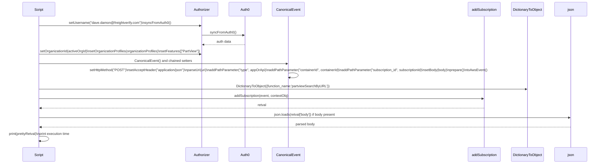
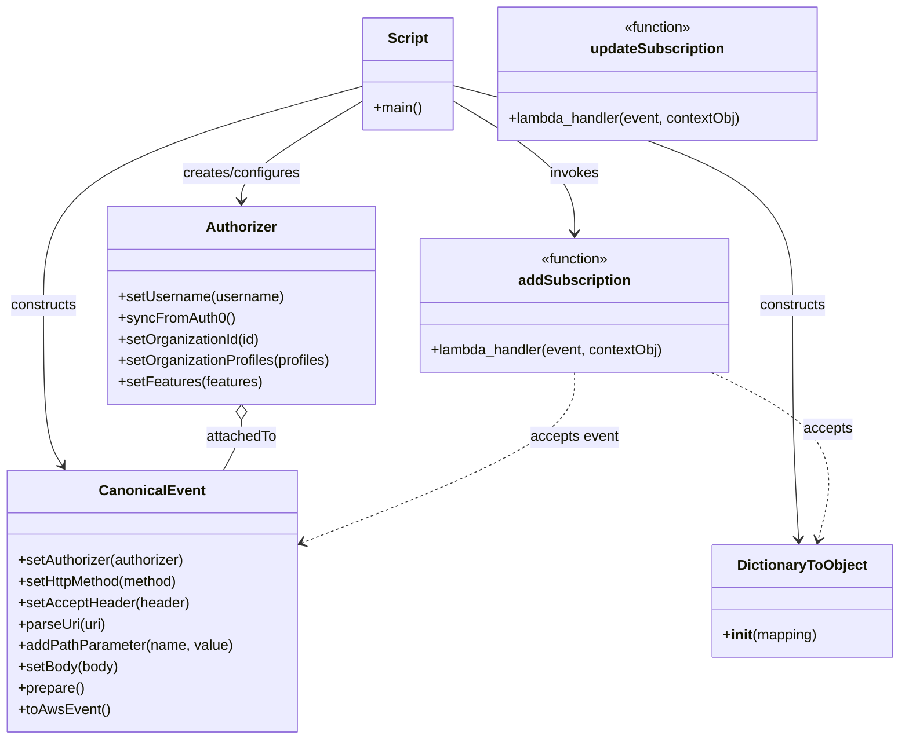

# Diagram: platform/tools/ide_local_testing/localTest/test/byUrl/partviewSubscribeByUrl.py

> Auto-generated by Obscura crawlers

## Diagram 1

### SVG

<svg id="container" width="2977" xmlns="http://www.w3.org/2000/svg" height="807" viewBox="-123.5 -10 2977 807" role="graphics-document document" aria-roledescription="sequence"><g><rect x="2653.5" y="721" fill="#eaeaea" stroke="#666" width="150" height="65" name="json" rx="3" ry="3" class="actor actor-bottom"></rect><text x="2728.5" y="753.5" dominant-baseline="central" alignment-baseline="central" class="actor actor-box" style="text-anchor: middle; font-size: 16px; font-weight: 400;"><tspan x="2728.5" dy="0">json</tspan></text></g><g><rect x="2445.5" y="721" fill="#eaeaea" stroke="#666" width="158" height="65" name="DictionaryToObject" rx="3" ry="3" class="actor actor-bottom"></rect><text x="2524.5" y="753.5" dominant-baseline="central" alignment-baseline="central" class="actor actor-box" style="text-anchor: middle; font-size: 16px; font-weight: 400;"><tspan x="2524.5" dy="0">DictionaryToObject</tspan></text></g><g><rect x="2245.5" y="721" fill="#eaeaea" stroke="#666" width="150" height="65" name="addSubscription" rx="3" ry="3" class="actor actor-bottom"></rect><text x="2320.5" y="753.5" dominant-baseline="central" alignment-baseline="central" class="actor actor-box" style="text-anchor: middle; font-size: 16px; font-weight: 400;"><tspan x="2320.5" dy="0">addSubscription</tspan></text></g><g><rect x="1230" y="721" fill="#eaeaea" stroke="#666" width="150" height="65" name="CanonicalEvent" rx="3" ry="3" class="actor actor-bottom"></rect><text x="1305" y="753.5" dominant-baseline="central" alignment-baseline="central" class="actor actor-box" style="text-anchor: middle; font-size: 16px; font-weight: 400;"><tspan x="1305" dy="0">CanonicalEvent</tspan></text></g><g><rect x="1030" y="721" fill="#eaeaea" stroke="#666" width="150" height="65" name="Auth0" rx="3" ry="3" class="actor actor-bottom"></rect><text x="1105" y="753.5" dominant-baseline="central" alignment-baseline="central" class="actor actor-box" style="text-anchor: middle; font-size: 16px; font-weight: 400;"><tspan x="1105" dy="0">Auth0</tspan></text></g><g><rect x="830" y="721" fill="#eaeaea" stroke="#666" width="150" height="65" name="Authorizer" rx="3" ry="3" class="actor actor-bottom"></rect><text x="905" y="753.5" dominant-baseline="central" alignment-baseline="central" class="actor actor-box" style="text-anchor: middle; font-size: 16px; font-weight: 400;"><tspan x="905" dy="0">Authorizer</tspan></text></g><g><rect x="0" y="721" fill="#eaeaea" stroke="#666" width="150" height="65" name="Script" rx="3" ry="3" class="actor actor-bottom"></rect><text x="75" y="753.5" dominant-baseline="central" alignment-baseline="central" class="actor actor-box" style="text-anchor: middle; font-size: 16px; font-weight: 400;"><tspan x="75" dy="0">Script</tspan></text></g><g><line id="actor6" x1="2728.5" y1="65" x2="2728.5" y2="721" class="actor-line 200" stroke-width="0.5px" stroke="#999" name="json"></line><g id="root-6"><rect x="2653.5" y="0" fill="#eaeaea" stroke="#666" width="150" height="65" name="json" rx="3" ry="3" class="actor actor-top"></rect><text x="2728.5" y="32.5" dominant-baseline="central" alignment-baseline="central" class="actor actor-box" style="text-anchor: middle; font-size: 16px; font-weight: 400;"><tspan x="2728.5" dy="0">json</tspan></text></g></g><g><line id="actor5" x1="2524.5" y1="65" x2="2524.5" y2="721" class="actor-line 200" stroke-width="0.5px" stroke="#999" name="DictionaryToObject"></line><g id="root-5"><rect x="2445.5" y="0" fill="#eaeaea" stroke="#666" width="158" height="65" name="DictionaryToObject" rx="3" ry="3" class="actor actor-top"></rect><text x="2524.5" y="32.5" dominant-baseline="central" alignment-baseline="central" class="actor actor-box" style="text-anchor: middle; font-size: 16px; font-weight: 400;"><tspan x="2524.5" dy="0">DictionaryToObject</tspan></text></g></g><g><line id="actor4" x1="2320.5" y1="65" x2="2320.5" y2="721" class="actor-line 200" stroke-width="0.5px" stroke="#999" name="addSubscription"></line><g id="root-4"><rect x="2245.5" y="0" fill="#eaeaea" stroke="#666" width="150" height="65" name="addSubscription" rx="3" ry="3" class="actor actor-top"></rect><text x="2320.5" y="32.5" dominant-baseline="central" alignment-baseline="central" class="actor actor-box" style="text-anchor: middle; font-size: 16px; font-weight: 400;"><tspan x="2320.5" dy="0">addSubscription</tspan></text></g></g><g><line id="actor3" x1="1305" y1="65" x2="1305" y2="721" class="actor-line 200" stroke-width="0.5px" stroke="#999" name="CanonicalEvent"></line><g id="root-3"><rect x="1230" y="0" fill="#eaeaea" stroke="#666" width="150" height="65" name="CanonicalEvent" rx="3" ry="3" class="actor actor-top"></rect><text x="1305" y="32.5" dominant-baseline="central" alignment-baseline="central" class="actor actor-box" style="text-anchor: middle; font-size: 16px; font-weight: 400;"><tspan x="1305" dy="0">CanonicalEvent</tspan></text></g></g><g><line id="actor2" x1="1105" y1="65" x2="1105" y2="721" class="actor-line 200" stroke-width="0.5px" stroke="#999" name="Auth0"></line><g id="root-2"><rect x="1030" y="0" fill="#eaeaea" stroke="#666" width="150" height="65" name="Auth0" rx="3" ry="3" class="actor actor-top"></rect><text x="1105" y="32.5" dominant-baseline="central" alignment-baseline="central" class="actor actor-box" style="text-anchor: middle; font-size: 16px; font-weight: 400;"><tspan x="1105" dy="0">Auth0</tspan></text></g></g><g><line id="actor1" x1="905" y1="65" x2="905" y2="721" class="actor-line 200" stroke-width="0.5px" stroke="#999" name="Authorizer"></line><g id="root-1"><rect x="830" y="0" fill="#eaeaea" stroke="#666" width="150" height="65" name="Authorizer" rx="3" ry="3" class="actor actor-top"></rect><text x="905" y="32.5" dominant-baseline="central" alignment-baseline="central" class="actor actor-box" style="text-anchor: middle; font-size: 16px; font-weight: 400;"><tspan x="905" dy="0">Authorizer</tspan></text></g></g><g><line id="actor0" x1="75" y1="65" x2="75" y2="721" class="actor-line 200" stroke-width="0.5px" stroke="#999" name="Script"></line><g id="root-0"><rect x="0" y="0" fill="#eaeaea" stroke="#666" width="150" height="65" name="Script" rx="3" ry="3" class="actor actor-top"></rect><text x="75" y="32.5" dominant-baseline="central" alignment-baseline="central" class="actor actor-box" style="text-anchor: middle; font-size: 16px; font-weight: 400;"><tspan x="75" dy="0">Script</tspan></text></g></g><g></g><defs><symbol id="computer" width="24" height="24"><path transform="scale(.5)" d="M2 2v13h20v-13h-20zm18 11h-16v-9h16v9zm-10.228 6l.466-1h3.524l.467 1h-4.457zm14.228 3h-24l2-6h2.104l-1.33 4h18.45l-1.297-4h2.073l2 6zm-5-10h-14v-7h14v7z"></path></symbol></defs><defs><symbol id="database" fill-rule="evenodd" clip-rule="evenodd"><path transform="scale(.5)" d="M12.258.001l.256.004.255.005.253.008.251.01.249.012.247.015.246.016.242.019.241.02.239.023.236.024.233.027.231.028.229.031.225.032.223.034.22.036.217.038.214.04.211.041.208.043.205.045.201.046.198.048.194.05.191.051.187.053.183.054.18.056.175.057.172.059.168.06.163.061.16.063.155.064.15.066.074.033.073.033.071.034.07.034.069.035.068.035.067.035.066.035.064.036.064.036.062.036.06.036.06.037.058.037.058.037.055.038.055.038.053.038.052.038.051.039.05.039.048.039.047.039.045.04.044.04.043.04.041.04.04.041.039.041.037.041.036.041.034.041.033.042.032.042.03.042.029.042.027.042.026.043.024.043.023.043.021.043.02.043.018.044.017.043.015.044.013.044.012.044.011.045.009.044.007.045.006.045.004.045.002.045.001.045v17l-.001.045-.002.045-.004.045-.006.045-.007.045-.009.044-.011.045-.012.044-.013.044-.015.044-.017.043-.018.044-.02.043-.021.043-.023.043-.024.043-.026.043-.027.042-.029.042-.03.042-.032.042-.033.042-.034.041-.036.041-.037.041-.039.041-.04.041-.041.04-.043.04-.044.04-.045.04-.047.039-.048.039-.05.039-.051.039-.052.038-.053.038-.055.038-.055.038-.058.037-.058.037-.06.037-.06.036-.062.036-.064.036-.064.036-.066.035-.067.035-.068.035-.069.035-.07.034-.071.034-.073.033-.074.033-.15.066-.155.064-.16.063-.163.061-.168.06-.172.059-.175.057-.18.056-.183.054-.187.053-.191.051-.194.05-.198.048-.201.046-.205.045-.208.043-.211.041-.214.04-.217.038-.22.036-.223.034-.225.032-.229.031-.231.028-.233.027-.236.024-.239.023-.241.02-.242.019-.246.016-.247.015-.249.012-.251.01-.253.008-.255.005-.256.004-.258.001-.258-.001-.256-.004-.255-.005-.253-.008-.251-.01-.249-.012-.247-.015-.245-.016-.243-.019-.241-.02-.238-.023-.236-.024-.234-.027-.231-.028-.228-.031-.226-.032-.223-.034-.22-.036-.217-.038-.214-.04-.211-.041-.208-.043-.204-.045-.201-.046-.198-.048-.195-.05-.19-.051-.187-.053-.184-.054-.179-.056-.176-.057-.172-.059-.167-.06-.164-.061-.159-.063-.155-.064-.151-.066-.074-.033-.072-.033-.072-.034-.07-.034-.069-.035-.068-.035-.067-.035-.066-.035-.064-.036-.063-.036-.062-.036-.061-.036-.06-.037-.058-.037-.057-.037-.056-.038-.055-.038-.053-.038-.052-.038-.051-.039-.049-.039-.049-.039-.046-.039-.046-.04-.044-.04-.043-.04-.041-.04-.04-.041-.039-.041-.037-.041-.036-.041-.034-.041-.033-.042-.032-.042-.03-.042-.029-.042-.027-.042-.026-.043-.024-.043-.023-.043-.021-.043-.02-.043-.018-.044-.017-.043-.015-.044-.013-.044-.012-.044-.011-.045-.009-.044-.007-.045-.006-.045-.004-.045-.002-.045-.001-.045v-17l.001-.045.002-.045.004-.045.006-.045.007-.045.009-.044.011-.045.012-.044.013-.044.015-.044.017-.043.018-.044.02-.043.021-.043.023-.043.024-.043.026-.043.027-.042.029-.042.03-.042.032-.042.033-.042.034-.041.036-.041.037-.041.039-.041.04-.041.041-.04.043-.04.044-.04.046-.04.046-.039.049-.039.049-.039.051-.039.052-.038.053-.038.055-.038.056-.038.057-.037.058-.037.06-.037.061-.036.062-.036.063-.036.064-.036.066-.035.067-.035.068-.035.069-.035.07-.034.072-.034.072-.033.074-.033.151-.066.155-.064.159-.063.164-.061.167-.06.172-.059.176-.057.179-.056.184-.054.187-.053.19-.051.195-.05.198-.048.201-.046.204-.045.208-.043.211-.041.214-.04.217-.038.22-.036.223-.034.226-.032.228-.031.231-.028.234-.027.236-.024.238-.023.241-.02.243-.019.245-.016.247-.015.249-.012.251-.01.253-.008.255-.005.256-.004.258-.001.258.001zm-9.258 20.499v.01l.001.021.003.021.004.022.005.021.006.022.007.022.009.023.01.022.011.023.012.023.013.023.015.023.016.024.017.023.018.024.019.024.021.024.022.025.023.024.024.025.052.049.056.05.061.051.066.051.07.051.075.051.079.052.084.052.088.052.092.052.097.052.102.051.105.052.11.052.114.051.119.051.123.051.127.05.131.05.135.05.139.048.144.049.147.047.152.047.155.047.16.045.163.045.167.043.171.043.176.041.178.041.183.039.187.039.19.037.194.035.197.035.202.033.204.031.209.03.212.029.216.027.219.025.222.024.226.021.23.02.233.018.236.016.24.015.243.012.246.01.249.008.253.005.256.004.259.001.26-.001.257-.004.254-.005.25-.008.247-.011.244-.012.241-.014.237-.016.233-.018.231-.021.226-.021.224-.024.22-.026.216-.027.212-.028.21-.031.205-.031.202-.034.198-.034.194-.036.191-.037.187-.039.183-.04.179-.04.175-.042.172-.043.168-.044.163-.045.16-.046.155-.046.152-.047.148-.048.143-.049.139-.049.136-.05.131-.05.126-.05.123-.051.118-.052.114-.051.11-.052.106-.052.101-.052.096-.052.092-.052.088-.053.083-.051.079-.052.074-.052.07-.051.065-.051.06-.051.056-.05.051-.05.023-.024.023-.025.021-.024.02-.024.019-.024.018-.024.017-.024.015-.023.014-.024.013-.023.012-.023.01-.023.01-.022.008-.022.006-.022.006-.022.004-.022.004-.021.001-.021.001-.021v-4.127l-.077.055-.08.053-.083.054-.085.053-.087.052-.09.052-.093.051-.095.05-.097.05-.1.049-.102.049-.105.048-.106.047-.109.047-.111.046-.114.045-.115.045-.118.044-.12.043-.122.042-.124.042-.126.041-.128.04-.13.04-.132.038-.134.038-.135.037-.138.037-.139.035-.142.035-.143.034-.144.033-.147.032-.148.031-.15.03-.151.03-.153.029-.154.027-.156.027-.158.026-.159.025-.161.024-.162.023-.163.022-.165.021-.166.02-.167.019-.169.018-.169.017-.171.016-.173.015-.173.014-.175.013-.175.012-.177.011-.178.01-.179.008-.179.008-.181.006-.182.005-.182.004-.184.003-.184.002h-.37l-.184-.002-.184-.003-.182-.004-.182-.005-.181-.006-.179-.008-.179-.008-.178-.01-.176-.011-.176-.012-.175-.013-.173-.014-.172-.015-.171-.016-.17-.017-.169-.018-.167-.019-.166-.02-.165-.021-.163-.022-.162-.023-.161-.024-.159-.025-.157-.026-.156-.027-.155-.027-.153-.029-.151-.03-.15-.03-.148-.031-.146-.032-.145-.033-.143-.034-.141-.035-.14-.035-.137-.037-.136-.037-.134-.038-.132-.038-.13-.04-.128-.04-.126-.041-.124-.042-.122-.042-.12-.044-.117-.043-.116-.045-.113-.045-.112-.046-.109-.047-.106-.047-.105-.048-.102-.049-.1-.049-.097-.05-.095-.05-.093-.052-.09-.051-.087-.052-.085-.053-.083-.054-.08-.054-.077-.054v4.127zm0-5.654v.011l.001.021.003.021.004.021.005.022.006.022.007.022.009.022.01.022.011.023.012.023.013.023.015.024.016.023.017.024.018.024.019.024.021.024.022.024.023.025.024.024.052.05.056.05.061.05.066.051.07.051.075.052.079.051.084.052.088.052.092.052.097.052.102.052.105.052.11.051.114.051.119.052.123.05.127.051.131.05.135.049.139.049.144.048.147.048.152.047.155.046.16.045.163.045.167.044.171.042.176.042.178.04.183.04.187.038.19.037.194.036.197.034.202.033.204.032.209.03.212.028.216.027.219.025.222.024.226.022.23.02.233.018.236.016.24.014.243.012.246.01.249.008.253.006.256.003.259.001.26-.001.257-.003.254-.006.25-.008.247-.01.244-.012.241-.015.237-.016.233-.018.231-.02.226-.022.224-.024.22-.025.216-.027.212-.029.21-.03.205-.032.202-.033.198-.035.194-.036.191-.037.187-.039.183-.039.179-.041.175-.042.172-.043.168-.044.163-.045.16-.045.155-.047.152-.047.148-.048.143-.048.139-.05.136-.049.131-.05.126-.051.123-.051.118-.051.114-.052.11-.052.106-.052.101-.052.096-.052.092-.052.088-.052.083-.052.079-.052.074-.051.07-.052.065-.051.06-.05.056-.051.051-.049.023-.025.023-.024.021-.025.02-.024.019-.024.018-.024.017-.024.015-.023.014-.023.013-.024.012-.022.01-.023.01-.023.008-.022.006-.022.006-.022.004-.021.004-.022.001-.021.001-.021v-4.139l-.077.054-.08.054-.083.054-.085.052-.087.053-.09.051-.093.051-.095.051-.097.05-.1.049-.102.049-.105.048-.106.047-.109.047-.111.046-.114.045-.115.044-.118.044-.12.044-.122.042-.124.042-.126.041-.128.04-.13.039-.132.039-.134.038-.135.037-.138.036-.139.036-.142.035-.143.033-.144.033-.147.033-.148.031-.15.03-.151.03-.153.028-.154.028-.156.027-.158.026-.159.025-.161.024-.162.023-.163.022-.165.021-.166.02-.167.019-.169.018-.169.017-.171.016-.173.015-.173.014-.175.013-.175.012-.177.011-.178.009-.179.009-.179.007-.181.007-.182.005-.182.004-.184.003-.184.002h-.37l-.184-.002-.184-.003-.182-.004-.182-.005-.181-.007-.179-.007-.179-.009-.178-.009-.176-.011-.176-.012-.175-.013-.173-.014-.172-.015-.171-.016-.17-.017-.169-.018-.167-.019-.166-.02-.165-.021-.163-.022-.162-.023-.161-.024-.159-.025-.157-.026-.156-.027-.155-.028-.153-.028-.151-.03-.15-.03-.148-.031-.146-.033-.145-.033-.143-.033-.141-.035-.14-.036-.137-.036-.136-.037-.134-.038-.132-.039-.13-.039-.128-.04-.126-.041-.124-.042-.122-.043-.12-.043-.117-.044-.116-.044-.113-.046-.112-.046-.109-.046-.106-.047-.105-.048-.102-.049-.1-.049-.097-.05-.095-.051-.093-.051-.09-.051-.087-.053-.085-.052-.083-.054-.08-.054-.077-.054v4.139zm0-5.666v.011l.001.02.003.022.004.021.005.022.006.021.007.022.009.023.01.022.011.023.012.023.013.023.015.023.016.024.017.024.018.023.019.024.021.025.022.024.023.024.024.025.052.05.056.05.061.05.066.051.07.051.075.052.079.051.084.052.088.052.092.052.097.052.102.052.105.051.11.052.114.051.119.051.123.051.127.05.131.05.135.05.139.049.144.048.147.048.152.047.155.046.16.045.163.045.167.043.171.043.176.042.178.04.183.04.187.038.19.037.194.036.197.034.202.033.204.032.209.03.212.028.216.027.219.025.222.024.226.021.23.02.233.018.236.017.24.014.243.012.246.01.249.008.253.006.256.003.259.001.26-.001.257-.003.254-.006.25-.008.247-.01.244-.013.241-.014.237-.016.233-.018.231-.02.226-.022.224-.024.22-.025.216-.027.212-.029.21-.03.205-.032.202-.033.198-.035.194-.036.191-.037.187-.039.183-.039.179-.041.175-.042.172-.043.168-.044.163-.045.16-.045.155-.047.152-.047.148-.048.143-.049.139-.049.136-.049.131-.051.126-.05.123-.051.118-.052.114-.051.11-.052.106-.052.101-.052.096-.052.092-.052.088-.052.083-.052.079-.052.074-.052.07-.051.065-.051.06-.051.056-.05.051-.049.023-.025.023-.025.021-.024.02-.024.019-.024.018-.024.017-.024.015-.023.014-.024.013-.023.012-.023.01-.022.01-.023.008-.022.006-.022.006-.022.004-.022.004-.021.001-.021.001-.021v-4.153l-.077.054-.08.054-.083.053-.085.053-.087.053-.09.051-.093.051-.095.051-.097.05-.1.049-.102.048-.105.048-.106.048-.109.046-.111.046-.114.046-.115.044-.118.044-.12.043-.122.043-.124.042-.126.041-.128.04-.13.039-.132.039-.134.038-.135.037-.138.036-.139.036-.142.034-.143.034-.144.033-.147.032-.148.032-.15.03-.151.03-.153.028-.154.028-.156.027-.158.026-.159.024-.161.024-.162.023-.163.023-.165.021-.166.02-.167.019-.169.018-.169.017-.171.016-.173.015-.173.014-.175.013-.175.012-.177.01-.178.01-.179.009-.179.007-.181.006-.182.006-.182.004-.184.003-.184.001-.185.001-.185-.001-.184-.001-.184-.003-.182-.004-.182-.006-.181-.006-.179-.007-.179-.009-.178-.01-.176-.01-.176-.012-.175-.013-.173-.014-.172-.015-.171-.016-.17-.017-.169-.018-.167-.019-.166-.02-.165-.021-.163-.023-.162-.023-.161-.024-.159-.024-.157-.026-.156-.027-.155-.028-.153-.028-.151-.03-.15-.03-.148-.032-.146-.032-.145-.033-.143-.034-.141-.034-.14-.036-.137-.036-.136-.037-.134-.038-.132-.039-.13-.039-.128-.041-.126-.041-.124-.041-.122-.043-.12-.043-.117-.044-.116-.044-.113-.046-.112-.046-.109-.046-.106-.048-.105-.048-.102-.048-.1-.05-.097-.049-.095-.051-.093-.051-.09-.052-.087-.052-.085-.053-.083-.053-.08-.054-.077-.054v4.153zm8.74-8.179l-.257.004-.254.005-.25.008-.247.011-.244.012-.241.014-.237.016-.233.018-.231.021-.226.022-.224.023-.22.026-.216.027-.212.028-.21.031-.205.032-.202.033-.198.034-.194.036-.191.038-.187.038-.183.04-.179.041-.175.042-.172.043-.168.043-.163.045-.16.046-.155.046-.152.048-.148.048-.143.048-.139.049-.136.05-.131.05-.126.051-.123.051-.118.051-.114.052-.11.052-.106.052-.101.052-.096.052-.092.052-.088.052-.083.052-.079.052-.074.051-.07.052-.065.051-.06.05-.056.05-.051.05-.023.025-.023.024-.021.024-.02.025-.019.024-.018.024-.017.023-.015.024-.014.023-.013.023-.012.023-.01.023-.01.022-.008.022-.006.023-.006.021-.004.022-.004.021-.001.021-.001.021.001.021.001.021.004.021.004.022.006.021.006.023.008.022.01.022.01.023.012.023.013.023.014.023.015.024.017.023.018.024.019.024.02.025.021.024.023.024.023.025.051.05.056.05.06.05.065.051.07.052.074.051.079.052.083.052.088.052.092.052.096.052.101.052.106.052.11.052.114.052.118.051.123.051.126.051.131.05.136.05.139.049.143.048.148.048.152.048.155.046.16.046.163.045.168.043.172.043.175.042.179.041.183.04.187.038.191.038.194.036.198.034.202.033.205.032.21.031.212.028.216.027.22.026.224.023.226.022.231.021.233.018.237.016.241.014.244.012.247.011.25.008.254.005.257.004.26.001.26-.001.257-.004.254-.005.25-.008.247-.011.244-.012.241-.014.237-.016.233-.018.231-.021.226-.022.224-.023.22-.026.216-.027.212-.028.21-.031.205-.032.202-.033.198-.034.194-.036.191-.038.187-.038.183-.04.179-.041.175-.042.172-.043.168-.043.163-.045.16-.046.155-.046.152-.048.148-.048.143-.048.139-.049.136-.05.131-.05.126-.051.123-.051.118-.051.114-.052.11-.052.106-.052.101-.052.096-.052.092-.052.088-.052.083-.052.079-.052.074-.051.07-.052.065-.051.06-.05.056-.05.051-.05.023-.025.023-.024.021-.024.02-.025.019-.024.018-.024.017-.023.015-.024.014-.023.013-.023.012-.023.01-.023.01-.022.008-.022.006-.023.006-.021.004-.022.004-.021.001-.021.001-.021-.001-.021-.001-.021-.004-.021-.004-.022-.006-.021-.006-.023-.008-.022-.01-.022-.01-.023-.012-.023-.013-.023-.014-.023-.015-.024-.017-.023-.018-.024-.019-.024-.02-.025-.021-.024-.023-.024-.023-.025-.051-.05-.056-.05-.06-.05-.065-.051-.07-.052-.074-.051-.079-.052-.083-.052-.088-.052-.092-.052-.096-.052-.101-.052-.106-.052-.11-.052-.114-.052-.118-.051-.123-.051-.126-.051-.131-.05-.136-.05-.139-.049-.143-.048-.148-.048-.152-.048-.155-.046-.16-.046-.163-.045-.168-.043-.172-.043-.175-.042-.179-.041-.183-.04-.187-.038-.191-.038-.194-.036-.198-.034-.202-.033-.205-.032-.21-.031-.212-.028-.216-.027-.22-.026-.224-.023-.226-.022-.231-.021-.233-.018-.237-.016-.241-.014-.244-.012-.247-.011-.25-.008-.254-.005-.257-.004-.26-.001-.26.001z"></path></symbol></defs><defs><symbol id="clock" width="24" height="24"><path transform="scale(.5)" d="M12 2c5.514 0 10 4.486 10 10s-4.486 10-10 10-10-4.486-10-10 4.486-10 10-10zm0-2c-6.627 0-12 5.373-12 12s5.373 12 12 12 12-5.373 12-12-5.373-12-12-12zm5.848 12.459c.202.038.202.333.001.372-1.907.361-6.045 1.111-6.547 1.111-.719 0-1.301-.582-1.301-1.301 0-.512.77-5.447 1.125-7.445.034-.192.312-.181.343.014l.985 6.238 5.394 1.011z"></path></symbol></defs><defs><marker id="arrowhead" refX="7.9" refY="5" markerUnits="userSpaceOnUse" markerWidth="12" markerHeight="12" orient="auto-start-reverse"><path d="M -1 0 L 10 5 L 0 10 z"></path></marker></defs><defs><marker id="crosshead" markerWidth="15" markerHeight="8" orient="auto" refX="4" refY="4.5"><path fill="none" stroke="#000000" stroke-width="1pt" d="M 1,2 L 6,7 M 6,2 L 1,7" style="stroke-dasharray: 0, 0;"></path></marker></defs><defs><marker id="filled-head" refX="15.5" refY="7" markerWidth="20" markerHeight="28" orient="auto"><path d="M 18,7 L9,13 L14,7 L9,1 Z"></path></marker></defs><defs><marker id="sequencenumber" refX="15" refY="15" markerWidth="60" markerHeight="40" orient="auto"><circle cx="15" cy="15" r="6"></circle></marker></defs><text x="489" y="80" text-anchor="middle" dominant-baseline="middle" alignment-baseline="middle" class="messageText" dy="1em" style="font-size: 16px; font-weight: 400;">setUsername("dave.damon@freightverify.com")\nsyncFromAuth0()</text><line x1="76" y1="113" x2="901" y2="113" class="messageLine0" stroke-width="2" stroke="none" marker-end="url(#arrowhead)" style="fill: none;"></line><text x="1004" y="128" text-anchor="middle" dominant-baseline="middle" alignment-baseline="middle" class="messageText" dy="1em" style="font-size: 16px; font-weight: 400;">syncFromAuth0()</text><line x1="906" y1="161" x2="1101" y2="161" class="messageLine0" stroke-width="2" stroke="none" marker-end="url(#arrowhead)" style="fill: none;"></line><text x="1007" y="176" text-anchor="middle" dominant-baseline="middle" alignment-baseline="middle" class="messageText" dy="1em" style="font-size: 16px; font-weight: 400;">auth data</text><line x1="1104" y1="209" x2="909" y2="209" class="messageLine1" stroke-width="2" stroke="none" marker-end="url(#arrowhead)" style="stroke-dasharray: 3, 3; fill: none;"></line><text x="489" y="224" text-anchor="middle" dominant-baseline="middle" alignment-baseline="middle" class="messageText" dy="1em" style="font-size: 16px; font-weight: 400;">setOrganizationId(activeOrgId)\nsetOrganizationProfiles(organizationProfiles)\nsetFeatures(["PartView"])</text><line x1="76" y1="257" x2="901" y2="257" class="messageLine0" stroke-width="2" stroke="none" marker-end="url(#arrowhead)" style="fill: none;"></line><text x="689" y="272" text-anchor="middle" dominant-baseline="middle" alignment-baseline="middle" class="messageText" dy="1em" style="font-size: 16px; font-weight: 400;">CanonicalEvent() and chained setters</text><line x1="76" y1="305" x2="1301" y2="305" class="messageLine0" stroke-width="2" stroke="none" marker-end="url(#arrowhead)" style="fill: none;"></line><text x="1306" y="320" text-anchor="middle" dominant-baseline="middle" alignment-baseline="middle" class="messageText" dy="1em" style="font-size: 16px; font-weight: 400;">setHttpMethod("POST")\nsetAcceptHeader("application/json")\nparseUri(uri)\naddPathParameter("type", appOrApi)\naddPathParameter("containerId", containerId)\naddPathParameter("subscription_id", subscriptionId)\nsetBody(body)\nprepare()\ntoAwsEvent()</text><path d="M 1306,353 C 1366,343 1366,383 1306,373" class="messageLine0" stroke-width="2" stroke="none" marker-end="url(#arrowhead)" style="fill: none;"></path><text x="1298" y="398" text-anchor="middle" dominant-baseline="middle" alignment-baseline="middle" class="messageText" dy="1em" style="font-size: 16px; font-weight: 400;">DictionaryToObject({function_name:'partviewSearchByURL'})</text><line x1="76" y1="431" x2="2520.5" y2="431" class="messageLine0" stroke-width="2" stroke="none" marker-end="url(#arrowhead)" style="fill: none;"></line><text x="1196" y="446" text-anchor="middle" dominant-baseline="middle" alignment-baseline="middle" class="messageText" dy="1em" style="font-size: 16px; font-weight: 400;">addSubscription(event, contextObj)</text><line x1="76" y1="479" x2="2316.5" y2="479" class="messageLine0" stroke-width="2" stroke="none" marker-end="url(#arrowhead)" style="fill: none;"></line><text x="1199" y="494" text-anchor="middle" dominant-baseline="middle" alignment-baseline="middle" class="messageText" dy="1em" style="font-size: 16px; font-weight: 400;">retval</text><line x1="2319.5" y1="527" x2="79" y2="527" class="messageLine1" stroke-width="2" stroke="none" marker-end="url(#arrowhead)" style="stroke-dasharray: 3, 3; fill: none;"></line><text x="1400" y="542" text-anchor="middle" dominant-baseline="middle" alignment-baseline="middle" class="messageText" dy="1em" style="font-size: 16px; font-weight: 400;">json.loads(retval['body']) if body present</text><line x1="76" y1="575" x2="2724.5" y2="575" class="messageLine0" stroke-width="2" stroke="none" marker-end="url(#arrowhead)" style="fill: none;"></line><text x="1403" y="590" text-anchor="middle" dominant-baseline="middle" alignment-baseline="middle" class="messageText" dy="1em" style="font-size: 16px; font-weight: 400;">parsed body</text><line x1="2727.5" y1="623" x2="79" y2="623" class="messageLine1" stroke-width="2" stroke="none" marker-end="url(#arrowhead)" style="stroke-dasharray: 3, 3; fill: none;"></line><text x="76" y="638" text-anchor="middle" dominant-baseline="middle" alignment-baseline="middle" class="messageText" dy="1em" style="font-size: 16px; font-weight: 400;">print(prettyRetval)\nprint execution time</text><path d="M 76,671 C 136,661 136,701 76,691" class="messageLine0" stroke-width="2" stroke="none" marker-end="url(#arrowhead)" style="fill: none;"></path></svg>

## Diagram 2

### SVG

<svg id="container" width="1012.537109375" xmlns="http://www.w3.org/2000/svg" class="classDiagram" height="830" viewBox="0 0 1012.537109375 830" role="graphics-document document" aria-roledescription="class"><g><defs><marker id="container_class-aggregationStart" class="marker aggregation class" refX="18" refY="7" markerWidth="190" markerHeight="240" orient="auto"><path d="M 18,7 L9,13 L1,7 L9,1 Z"></path></marker></defs><defs><marker id="container_class-aggregationEnd" class="marker aggregation class" refX="1" refY="7" markerWidth="20" markerHeight="28" orient="auto"><path d="M 18,7 L9,13 L1,7 L9,1 Z"></path></marker></defs><defs><marker id="container_class-extensionStart" class="marker extension class" refX="18" refY="7" markerWidth="190" markerHeight="240" orient="auto"><path d="M 1,7 L18,13 V 1 Z"></path></marker></defs><defs><marker id="container_class-extensionEnd" class="marker extension class" refX="1" refY="7" markerWidth="20" markerHeight="28" orient="auto"><path d="M 1,1 V 13 L18,7 Z"></path></marker></defs><defs><marker id="container_class-compositionStart" class="marker composition class" refX="18" refY="7" markerWidth="190" markerHeight="240" orient="auto"><path d="M 18,7 L9,13 L1,7 L9,1 Z"></path></marker></defs><defs><marker id="container_class-compositionEnd" class="marker composition class" refX="1" refY="7" markerWidth="20" markerHeight="28" orient="auto"><path d="M 18,7 L9,13 L1,7 L9,1 Z"></path></marker></defs><defs><marker id="container_class-dependencyStart" class="marker dependency class" refX="6" refY="7" markerWidth="190" markerHeight="240" orient="auto"><path d="M 5,7 L9,13 L1,7 L9,1 Z"></path></marker></defs><defs><marker id="container_class-dependencyEnd" class="marker dependency class" refX="13" refY="7" markerWidth="20" markerHeight="28" orient="auto"><path d="M 18,7 L9,13 L14,7 L9,1 Z"></path></marker></defs><defs><marker id="container_class-lollipopStart" class="marker lollipop class" refX="13" refY="7" markerWidth="190" markerHeight="240" orient="auto"><circle stroke="black" fill="transparent" cx="7" cy="7" r="6"></circle></marker></defs><defs><marker id="container_class-lollipopEnd" class="marker lollipop class" refX="1" refY="7" markerWidth="190" markerHeight="240" orient="auto"><circle stroke="black" fill="transparent" cx="7" cy="7" r="6"></circle></marker></defs><g class="root"><g class="clusters"></g><g class="edgePaths"><path d="M410.635,112.864L387.624,126.553C364.613,140.243,318.592,167.621,295.581,186.477C272.57,205.333,272.57,215.667,272.57,220.833L272.57,226" id="id_Script_Authorizer_1" class="edge-thickness-normal edge-pattern-solid relation" style=";;;" data-edge="true" data-et="edge" data-id="id_Script_Authorizer_1" data-points="W3sieCI6NDEwLjYzNDc2NTYyNSwieSI6MTEyLjg2NDAzMjk0OTEzNDI2fSx7IngiOjI3Mi41NzAzMTI1LCJ5IjoxOTV9LHsieCI6MjcyLjU3MDMxMjUsInkiOjIzMn1d" marker-end="url(#container_class-dependencyEnd)"></path><path d="M410.635,96.621L350.205,113.017C289.776,129.414,168.917,162.207,108.488,203.27C48.059,244.333,48.059,293.667,48.059,343C48.059,392.333,48.059,441.667,51.526,471.662C54.992,501.657,61.926,512.314,65.393,517.642L68.86,522.971" id="id_Script_CanonicalEvent_2" class="edge-thickness-normal edge-pattern-solid relation" style=";;;" data-edge="true" data-et="edge" data-id="id_Script_CanonicalEvent_2" data-points="W3sieCI6NDEwLjYzNDc2NTYyNSwieSI6OTYuNjIwNzU1MDgzMDE3NDl9LHsieCI6NDguMDU4NTkzNzUsInkiOjE5NX0seyJ4Ijo0OC4wNTg1OTM3NSwieSI6MzQzfSx7IngiOjQ4LjA1ODU5Mzc1LCJ5Ijo0OTF9LHsieCI6NzIuMTMyNDcyODI2MDg2OTUsInkiOjUyOH1d" marker-end="url(#container_class-dependencyEnd)"></path><path d="M511.033,95.896L575.328,112.413C639.622,128.931,768.212,161.965,832.506,203.149C896.801,244.333,896.801,293.667,896.801,343C896.801,392.333,896.801,441.667,897.578,485.501C898.356,529.335,899.91,567.67,900.688,586.837L901.465,606.005" id="id_Script_DictionaryToObject_3" class="edge-thickness-normal edge-pattern-solid relation" style=";;;" data-edge="true" data-et="edge" data-id="id_Script_DictionaryToObject_3" data-points="W3sieCI6NTExLjAzMzIwMzEyNSwieSI6OTUuODk2MTk0MjUyMTc4Mzl9LHsieCI6ODk2LjgwMDc4MTI1LCJ5IjoxOTV9LHsieCI6ODk2LjgwMDc4MTI1LCJ5IjozNDN9LHsieCI6ODk2LjgwMDc4MTI1LCJ5Ijo0OTF9LHsieCI6OTAxLjcwODQ0MzAxOTcwMTEsInkiOjYxMn1d" marker-end="url(#container_class-dependencyEnd)"></path><path d="M511.033,112.864L534.044,126.553C557.055,140.243,603.076,167.621,626.087,192.477C649.098,217.333,649.098,239.667,649.098,250.833L649.098,262" id="id_Script_addSubscription_4" class="edge-thickness-normal edge-pattern-solid relation" style=";;;" data-edge="true" data-et="edge" data-id="id_Script_addSubscription_4" data-points="W3sieCI6NTExLjAzMzIwMzEyNSwieSI6MTEyLjg2NDAzMjk0OTEzNDI2fSx7IngiOjY0OS4wOTc2NTYyNSwieSI6MTk1fSx7IngiOjY0OS4wOTc2NTYyNSwieSI6MjY4fV0=" marker-end="url(#container_class-dependencyEnd)"></path><path d="M272.57,471.25L272.57,474.542C272.57,477.833,272.57,484.417,269.058,493.875C265.546,503.333,258.522,515.667,255.01,521.833L251.498,528" id="id_Authorizer_CanonicalEvent_5" class="edge-thickness-normal edge-pattern-solid relation" style=";;;" data-edge="true" data-et="edge" data-id="id_Authorizer_CanonicalEvent_5" data-points="W3sieCI6MjcyLjU3MDMxMjUsInkiOjQ1NH0seyJ4IjoyNzIuNTcwMzEyNSwieSI6NDkxfSx7IngiOjI1MS40OTc4MTMzNDkxODQ3OCwieSI6NTI4fV0=" marker-start="url(#container_class-aggregationStart)"></path><path d="M802.436,418L827.311,430.167C852.186,442.333,901.936,466.667,921.863,498.032C941.79,529.397,931.894,567.793,926.946,586.992L921.998,606.19" id="id_addSubscription_DictionaryToObject_6" class="edge-thickness-normal edge-pattern-dashed relation" style=";;;" data-edge="true" data-et="edge" data-id="id_addSubscription_DictionaryToObject_6" data-points="W3sieCI6ODAyLjQzNjExNDMzNjk5MzIsInkiOjQxOH0seyJ4Ijo5NTEuNjg1NTQ2ODc1LCJ5Ijo0OTF9LHsieCI6OTIwLjUwMDUwOTUxMDg2OTYsInkiOjYxMn1d" marker-end="url(#container_class-dependencyEnd)"></path><path d="M649.098,418L649.098,430.167C649.098,442.333,649.098,466.667,596.441,498.963C543.785,531.259,438.472,571.518,385.816,591.648L333.159,611.778" id="id_addSubscription_CanonicalEvent_7" class="edge-thickness-normal edge-pattern-dashed relation" style=";;;" data-edge="true" data-et="edge" data-id="id_addSubscription_CanonicalEvent_7" data-points="W3sieCI6NjQ5LjA5NzY1NjI1LCJ5Ijo0MTh9LHsieCI6NjQ5LjA5NzY1NjI1LCJ5Ijo0OTF9LHsieCI6MzI3LjU1NDY4NzUsInkiOjYxMy45MjAwMjc5MTc5OTl9XQ==" marker-end="url(#container_class-dependencyEnd)"></path></g><g class="edgeLabels"><g class="edgeLabel" transform="translate(272.5703125, 195)"><g class="label" data-id="id_Script_Authorizer_1" transform="translate(-67.234375, -12)"><foreignObject width="134.46875" height="24">

creates/configures

</foreignObject></g></g><g class="edgeLabel" transform="translate(48.05859375, 343)"><g class="label" data-id="id_Script_CanonicalEvent_2" transform="translate(-37.84375, -12)"><foreignObject width="75.6875" height="24">

constructs

</foreignObject></g></g><g class="edgeLabel" transform="translate(896.80078125, 343)"><g class="label" data-id="id_Script_DictionaryToObject_3" transform="translate(-37.84375, -12)"><foreignObject width="75.6875" height="24">

constructs

</foreignObject></g></g><g class="edgeLabel" transform="translate(649.09765625, 195)"><g class="label" data-id="id_Script_addSubscription_4" transform="translate(-27.5859375, -12)"><foreignObject width="55.171875" height="24">

invokes

</foreignObject></g></g><g class="edgeLabel" transform="translate(272.5703125, 491)"><g class="label" data-id="id_Authorizer_CanonicalEvent_5" transform="translate(-40.453125, -12)"><foreignObject width="80.90625" height="24">

attachedTo

</foreignObject></g></g><g class="edgeLabel" transform="translate(933.18421, 481.95074)"><g class="label" data-id="id_addSubscription_DictionaryToObject_6" transform="translate(-27.421875, -12)"><foreignObject width="54.84375" height="24">

accepts

</foreignObject></g></g><g class="edgeLabel" transform="translate(649.09765625, 491)"><g class="label" data-id="id_addSubscription_CanonicalEvent_7" transform="translate(-49.7109375, -12)"><foreignObject width="99.421875" height="24">

accepts event

</foreignObject></g></g></g><g class="nodes"><g class="node default" id="classId-Script-0" transform="translate(460.833984375, 83)"><g class="basic label-container"><path d="M-50.19921875 -63 L50.19921875 -63 L50.19921875 63 L-50.19921875 63" stroke="none" stroke-width="0" fill="#ECECFF" style=""></path><path d="M-50.19921875 -63 C-10.801736535885162 -63, 28.595745678229676 -63, 50.19921875 -63 M-50.19921875 -63 C-20.048234847667413 -63, 10.102749054665175 -63, 50.19921875 -63 M50.19921875 -63 C50.19921875 -26.560850615389093, 50.19921875 9.878298769221814, 50.19921875 63 M50.19921875 -63 C50.19921875 -21.440856716608828, 50.19921875 20.118286566782345, 50.19921875 63 M50.19921875 63 C10.11591450113211 63, -29.96738974773578 63, -50.19921875 63 M50.19921875 63 C16.680194116326206 63, -16.83883051734759 63, -50.19921875 63 M-50.19921875 63 C-50.19921875 35.680730829237135, -50.19921875 8.361461658474262, -50.19921875 -63 M-50.19921875 63 C-50.19921875 23.190641900643584, -50.19921875 -16.618716198712832, -50.19921875 -63" stroke="#9370DB" stroke-width="1.3" fill="none" stroke-dasharray="0 0" style=""></path></g><g class="annotation-group text" transform="translate(0, -39)"></g><g class="label-group text" transform="translate(-21.7421875, -39)"><g class="label" style="font-weight: bolder" transform="translate(0,-12)"><foreignObject width="43.484375" height="24">

Script

</foreignObject></g></g><g class="members-group text" transform="translate(-38.19921875, 9)"></g><g class="methods-group text" transform="translate(-38.19921875, 39)"><g class="label" style="" transform="translate(0,-12)"><foreignObject width="54.65625" height="24">

+main()

</foreignObject></g></g><g class="divider" style=""><path d="M-50.19921875 -15 C-10.147542410747583 -15, 29.904133928504834 -15, 50.19921875 -15 M-50.19921875 -15 C-14.511066661942081 -15, 21.177085426115838 -15, 50.19921875 -15" stroke="#9370DB" stroke-width="1.3" fill="none" stroke-dasharray="0 0" style=""></path></g><g class="divider" style=""><path d="M-50.19921875 9 C-17.360046890185856 9, 15.479124969628288 9, 50.19921875 9 M-50.19921875 9 C-13.599389500962573 9, 23.000439748074854 9, 50.19921875 9" stroke="#9370DB" stroke-width="1.3" fill="none" stroke-dasharray="0 0" style=""></path></g></g><g class="node default" id="classId-Authorizer-1" transform="translate(272.5703125, 343)"><g class="basic label-container"><path d="M-151.66796875 -111 L151.66796875 -111 L151.66796875 111 L-151.66796875 111" stroke="none" stroke-width="0" fill="#ECECFF" style=""></path><path d="M-151.66796875 -111 C-75.84416363069045 -111, -0.020358511380891287 -111, 151.66796875 -111 M-151.66796875 -111 C-56.60124175863331 -111, 38.465485232733386 -111, 151.66796875 -111 M151.66796875 -111 C151.66796875 -57.73402884836805, 151.66796875 -4.468057696736096, 151.66796875 111 M151.66796875 -111 C151.66796875 -53.07808063329639, 151.66796875 4.843838733407225, 151.66796875 111 M151.66796875 111 C63.61584650751021 111, -24.436275734979574 111, -151.66796875 111 M151.66796875 111 C30.597731503406166 111, -90.47250574318767 111, -151.66796875 111 M-151.66796875 111 C-151.66796875 23.046674590372874, -151.66796875 -64.90665081925425, -151.66796875 -111 M-151.66796875 111 C-151.66796875 65.7714096293117, -151.66796875 20.54281925862341, -151.66796875 -111" stroke="#9370DB" stroke-width="1.3" fill="none" stroke-dasharray="0 0" style=""></path></g><g class="annotation-group text" transform="translate(0, -87)"></g><g class="label-group text" transform="translate(-38.3671875, -87)"><g class="label" style="font-weight: bolder" transform="translate(0,-12)"><foreignObject width="76.734375" height="24">

Authorizer

</foreignObject></g></g><g class="members-group text" transform="translate(-139.66796875, -39)"></g><g class="methods-group text" transform="translate(-139.66796875, -9)"><g class="label" style="" transform="translate(0,-12)"><foreignObject width="185.90625" height="24">

+setUsername(username)

</foreignObject></g><g class="label" style="" transform="translate(0,12)"><foreignObject width="129.0625" height="24">

+syncFromAuth0()

</foreignObject></g><g class="label" style="" transform="translate(0,36)"><foreignObject width="160.78125" height="24">

+setOrganizationId(id)

</foreignObject></g><g class="label" style="" transform="translate(0,60)"><foreignObject width="240.96875" height="24">

+setOrganizationProfiles(profiles)

</foreignObject></g><g class="label" style="" transform="translate(0,84)"><foreignObject width="161.296875" height="24">

+setFeatures(features)

</foreignObject></g></g><g class="divider" style=""><path d="M-151.66796875 -63 C-51.04586758525136 -63, 49.576233579497284 -63, 151.66796875 -63 M-151.66796875 -63 C-72.43561474742012 -63, 6.796739255159764 -63, 151.66796875 -63" stroke="#9370DB" stroke-width="1.3" fill="none" stroke-dasharray="0 0" style=""></path></g><g class="divider" style=""><path d="M-151.66796875 -39 C-74.93339271312165 -39, 1.8011833237567032 -39, 151.66796875 -39 M-151.66796875 -39 C-50.72525482494842 -39, 50.217459100103156 -39, 151.66796875 -39" stroke="#9370DB" stroke-width="1.3" fill="none" stroke-dasharray="0 0" style=""></path></g></g><g class="node default" id="classId-CanonicalEvent-2" transform="translate(167.77734375, 675)"><g class="basic label-container"><path d="M-159.77734375 -147 L159.77734375 -147 L159.77734375 147 L-159.77734375 147" stroke="none" stroke-width="0" fill="#ECECFF" style=""></path><path d="M-159.77734375 -147 C-44.38361469470934 -147, 71.01011436058133 -147, 159.77734375 -147 M-159.77734375 -147 C-72.43777568735392 -147, 14.90179237529216 -147, 159.77734375 -147 M159.77734375 -147 C159.77734375 -49.98704907267778, 159.77734375 47.025901854644445, 159.77734375 147 M159.77734375 -147 C159.77734375 -45.89264282788851, 159.77734375 55.21471434422298, 159.77734375 147 M159.77734375 147 C92.1691295253383 147, 24.560915300676612 147, -159.77734375 147 M159.77734375 147 C55.99399642860318 147, -47.789350892793635 147, -159.77734375 147 M-159.77734375 147 C-159.77734375 53.889635546003404, -159.77734375 -39.22072890799319, -159.77734375 -147 M-159.77734375 147 C-159.77734375 55.551432115649305, -159.77734375 -35.89713576870139, -159.77734375 -147" stroke="#9370DB" stroke-width="1.3" fill="none" stroke-dasharray="0 0" style=""></path></g><g class="annotation-group text" transform="translate(0, -123)"></g><g class="label-group text" transform="translate(-55.7109375, -123)"><g class="label" style="font-weight: bolder" transform="translate(0,-12)"><foreignObject width="111.421875" height="24">

CanonicalEvent

</foreignObject></g></g><g class="members-group text" transform="translate(-147.77734375, -75)"></g><g class="methods-group text" transform="translate(-147.77734375, -45)"><g class="label" style="" transform="translate(0,-12)"><foreignObject width="190.75" height="24">

+setAuthorizer(authorizer)

</foreignObject></g><g class="label" style="" transform="translate(0,12)"><foreignObject width="184" height="24">

+setHttpMethod(method)

</foreignObject></g><g class="label" style="" transform="translate(0,36)"><foreignObject width="191.859375" height="24">

+setAcceptHeader(header)

</foreignObject></g><g class="label" style="" transform="translate(0,60)"><foreignObject width="99.8125" height="24">

+parseUri(uri)

</foreignObject></g><g class="label" style="" transform="translate(0,84)"><foreignObject width="239.84375" height="24">

+addPathParameter(name, value)

</foreignObject></g><g class="label" style="" transform="translate(0,108)"><foreignObject width="113.125" height="24">

+setBody(body)

</foreignObject></g><g class="label" style="" transform="translate(0,132)"><foreignObject width="74.75" height="24">

+prepare()

</foreignObject></g><g class="label" style="" transform="translate(0,156)"><foreignObject width="101.1875" height="24">

+toAwsEvent()

</foreignObject></g></g><g class="divider" style=""><path d="M-159.77734375 -99 C-60.90727816943907 -99, 37.962787411121866 -99, 159.77734375 -99 M-159.77734375 -99 C-45.17680354434066 -99, 69.42373666131869 -99, 159.77734375 -99" stroke="#9370DB" stroke-width="1.3" fill="none" stroke-dasharray="0 0" style=""></path></g><g class="divider" style=""><path d="M-159.77734375 -75 C-92.37368236061747 -75, -24.97002097123493 -75, 159.77734375 -75 M-159.77734375 -75 C-37.798515260964535 -75, 84.18031322807093 -75, 159.77734375 -75" stroke="#9370DB" stroke-width="1.3" fill="none" stroke-dasharray="0 0" style=""></path></g></g><g class="node default" id="classId-DictionaryToObject-3" transform="translate(904.263671875, 675)"><g class="basic label-container"><path d="M-100.2734375 -63 L100.2734375 -63 L100.2734375 63 L-100.2734375 63" stroke="none" stroke-width="0" fill="#ECECFF" style=""></path><path d="M-100.2734375 -63 C-53.82154469533135 -63, -7.369651890662695 -63, 100.2734375 -63 M-100.2734375 -63 C-52.24304023379824 -63, -4.21264296759648 -63, 100.2734375 -63 M100.2734375 -63 C100.2734375 -28.160378736290774, 100.2734375 6.679242527418452, 100.2734375 63 M100.2734375 -63 C100.2734375 -19.824287014825835, 100.2734375 23.35142597034833, 100.2734375 63 M100.2734375 63 C38.15512382403652 63, -23.963189851926955 63, -100.2734375 63 M100.2734375 63 C22.31365814368249 63, -55.64612121263502 63, -100.2734375 63 M-100.2734375 63 C-100.2734375 28.31709402767747, -100.2734375 -6.36581194464506, -100.2734375 -63 M-100.2734375 63 C-100.2734375 24.659960333687287, -100.2734375 -13.680079332625425, -100.2734375 -63" stroke="#9370DB" stroke-width="1.3" fill="none" stroke-dasharray="0 0" style=""></path></g><g class="annotation-group text" transform="translate(0, -39)"></g><g class="label-group text" transform="translate(-70.109375, -39)"><g class="label" style="font-weight: bolder" transform="translate(0,-12)"><foreignObject width="140.21875" height="24">

DictionaryToObject

</foreignObject></g></g><g class="members-group text" transform="translate(-88.2734375, 9)"></g><g class="methods-group text" transform="translate(-88.2734375, 39)"><g class="label" style="" transform="translate(0,-12)"><foreignObject width="106.4375" height="24">

+<strong>init</strong>(mapping)

</foreignObject></g></g><g class="divider" style=""><path d="M-100.2734375 -15 C-22.398339636751615 -15, 55.47675822649677 -15, 100.2734375 -15 M-100.2734375 -15 C-42.02778257064595 -15, 16.217872358708107 -15, 100.2734375 -15" stroke="#9370DB" stroke-width="1.3" fill="none" stroke-dasharray="0 0" style=""></path></g><g class="divider" style=""><path d="M-100.2734375 9 C-26.20824283259344 9, 47.85695183481312 9, 100.2734375 9 M-100.2734375 9 C-34.42727437533526 9, 31.418888749329483 9, 100.2734375 9" stroke="#9370DB" stroke-width="1.3" fill="none" stroke-dasharray="0 0" style=""></path></g></g><g class="node default" id="classId-addSubscription-4" transform="translate(649.09765625, 343)"><g class="basic label-container"><path d="M-174.859375 -75 L174.859375 -75 L174.859375 75 L-174.859375 75" stroke="none" stroke-width="0" fill="#ECECFF" style=""></path><path d="M-174.859375 -75 C-73.75237485754454 -75, 27.354625284910924 -75, 174.859375 -75 M-174.859375 -75 C-104.21983122770834 -75, -33.58028745541668 -75, 174.859375 -75 M174.859375 -75 C174.859375 -41.79396998601769, 174.859375 -8.587939972035386, 174.859375 75 M174.859375 -75 C174.859375 -26.666279750730766, 174.859375 21.66744049853847, 174.859375 75 M174.859375 75 C70.66607107190528 75, -33.52723285618944 75, -174.859375 75 M174.859375 75 C60.72539770168447 75, -53.40857959663106 75, -174.859375 75 M-174.859375 75 C-174.859375 29.090103795865396, -174.859375 -16.81979240826921, -174.859375 -75 M-174.859375 75 C-174.859375 37.79373977915092, -174.859375 0.5874795583018368, -174.859375 -75" stroke="#9370DB" stroke-width="1.3" fill="none" stroke-dasharray="0 0" style=""></path></g><g class="annotation-group text" transform="translate(-39.484375, -51)"><g class="label" style="" transform="translate(0,-12)"><foreignObject width="78.96875" height="24">

«function»

</foreignObject></g></g><g class="label-group text" transform="translate(-60.484375, -27)"><g class="label" style="font-weight: bolder" transform="translate(0,-12)"><foreignObject width="120.96875" height="24">

addSubscription

</foreignObject></g></g><g class="members-group text" transform="translate(-162.859375, 21)"></g><g class="methods-group text" transform="translate(-162.859375, 51)"><g class="label" style="" transform="translate(0,-12)"><foreignObject width="265.234375" height="24">

+lambda_handler(event, contextObj)

</foreignObject></g></g><g class="divider" style=""><path d="M-174.859375 -3 C-67.21808792005827 -3, 40.42319915988347 -3, 174.859375 -3 M-174.859375 -3 C-78.74690207110064 -3, 17.36557085779873 -3, 174.859375 -3" stroke="#9370DB" stroke-width="1.3" fill="none" stroke-dasharray="0 0" style=""></path></g><g class="divider" style=""><path d="M-174.859375 21 C-50.134419378904354 21, 74.59053624219129 21, 174.859375 21 M-174.859375 21 C-82.47108177372495 21, 9.917211452550106 21, 174.859375 21" stroke="#9370DB" stroke-width="1.3" fill="none" stroke-dasharray="0 0" style=""></path></g></g><g class="node default" id="classId-updateSubscription-5" transform="translate(741.849609375, 83)"><g class="basic label-container"><path d="M-180.81640625 -75 L180.81640625 -75 L180.81640625 75 L-180.81640625 75" stroke="none" stroke-width="0" fill="#ECECFF" style=""></path><path d="M-180.81640625 -75 C-87.37019283255886 -75, 6.076020584882286 -75, 180.81640625 -75 M-180.81640625 -75 C-96.67701106375723 -75, -12.537615877514469 -75, 180.81640625 -75 M180.81640625 -75 C180.81640625 -43.95838432059688, 180.81640625 -12.916768641193748, 180.81640625 75 M180.81640625 -75 C180.81640625 -30.41828750008677, 180.81640625 14.16342499982646, 180.81640625 75 M180.81640625 75 C60.811604030955394 75, -59.19319818808921 75, -180.81640625 75 M180.81640625 75 C66.01684612989642 75, -48.78271399020716 75, -180.81640625 75 M-180.81640625 75 C-180.81640625 24.31430192392734, -180.81640625 -26.371396152145323, -180.81640625 -75 M-180.81640625 75 C-180.81640625 39.263282776141416, -180.81640625 3.5265655522828325, -180.81640625 -75" stroke="#9370DB" stroke-width="1.3" fill="none" stroke-dasharray="0 0" style=""></path></g><g class="annotation-group text" transform="translate(-39.484375, -51)"><g class="label" style="" transform="translate(0,-12)"><foreignObject width="78.96875" height="24">

«function»

</foreignObject></g></g><g class="label-group text" transform="translate(-72.3984375, -27)"><g class="label" style="font-weight: bolder" transform="translate(0,-12)"><foreignObject width="144.796875" height="24">

updateSubscription

</foreignObject></g></g><g class="members-group text" transform="translate(-168.81640625, 21)"></g><g class="methods-group text" transform="translate(-168.81640625, 51)"><g class="label" style="" transform="translate(0,-12)"><foreignObject width="265.234375" height="24">

+lambda_handler(event, contextObj)

</foreignObject></g></g><g class="divider" style=""><path d="M-180.81640625 -3 C-54.02123871873245 -3, 72.7739288125351 -3, 180.81640625 -3 M-180.81640625 -3 C-97.73127116022381 -3, -14.646136070447625 -3, 180.81640625 -3" stroke="#9370DB" stroke-width="1.3" fill="none" stroke-dasharray="0 0" style=""></path></g><g class="divider" style=""><path d="M-180.81640625 21 C-96.68010211721857 21, -12.543797984437134 21, 180.81640625 21 M-180.81640625 21 C-60.381297688955954 21, 60.05381087208809 21, 180.81640625 21" stroke="#9370DB" stroke-width="1.3" fill="none" stroke-dasharray="0 0" style=""></path></g></g></g></g></g></svg>
