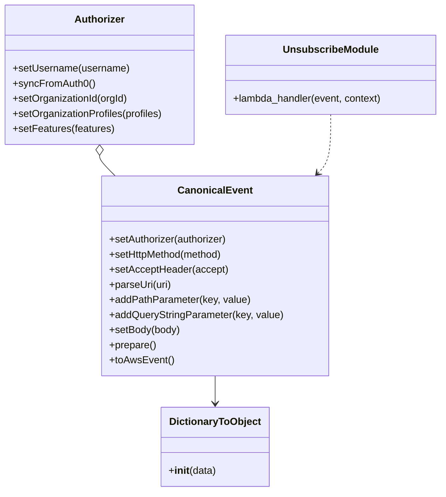

# Diagram: platform/tools/ide_local_testing/localTest/test/byUrl/partviewUnsubscribeByUrl.py


> Auto-generated by Obscura crawlers

## Diagram 1



### SVG

<svg id="container" width="706.0078125" xmlns="http://www.w3.org/2000/svg" class="classDiagram" height="782" viewBox="0 0 706.0078125 782" role="graphics-document document" aria-roledescription="class"><style>#container{font-family:"trebuchet ms",verdana,arial,sans-serif;font-size:16px;fill:#333;}@keyframes edge-animation-frame{from{stroke-dashoffset:0;}}@keyframes dash{to{stroke-dashoffset:0;}}#container .edge-animation-slow{stroke-dasharray:9,5!important;stroke-dashoffset:900;animation:dash 50s linear infinite;stroke-linecap:round;}#container .edge-animation-fast{stroke-dasharray:9,5!important;stroke-dashoffset:900;animation:dash 20s linear infinite;stroke-linecap:round;}#container .error-icon{fill:#552222;}#container .error-text{fill:#552222;stroke:#552222;}#container .edge-thickness-normal{stroke-width:1px;}#container .edge-thickness-thick{stroke-width:3.5px;}#container .edge-pattern-solid{stroke-dasharray:0;}#container .edge-thickness-invisible{stroke-width:0;fill:none;}#container .edge-pattern-dashed{stroke-dasharray:3;}#container .edge-pattern-dotted{stroke-dasharray:2;}#container .marker{fill:#333333;stroke:#333333;}#container .marker.cross{stroke:#333333;}#container svg{font-family:"trebuchet ms",verdana,arial,sans-serif;font-size:16px;}#container p{margin:0;}#container g.classGroup text{fill:#9370DB;stroke:none;font-family:"trebuchet ms",verdana,arial,sans-serif;font-size:10px;}#container g.classGroup text .title{font-weight:bolder;}#container .nodeLabel,#container .edgeLabel{color:#131300;}#container .edgeLabel .label rect{fill:#ECECFF;}#container .label text{fill:#131300;}#container .labelBkg{background:#ECECFF;}#container .edgeLabel .label span{background:#ECECFF;}#container .classTitle{font-weight:bolder;}#container .node rect,#container .node circle,#container .node ellipse,#container .node polygon,#container .node path{fill:#ECECFF;stroke:#9370DB;stroke-width:1px;}#container .divider{stroke:#9370DB;stroke-width:1;}#container g.clickable{cursor:pointer;}#container g.classGroup rect{fill:#ECECFF;stroke:#9370DB;}#container g.classGroup line{stroke:#9370DB;stroke-width:1;}#container .classLabel .box{stroke:none;stroke-width:0;fill:#ECECFF;opacity:0.5;}#container .classLabel .label{fill:#9370DB;font-size:10px;}#container .relation{stroke:#333333;stroke-width:1;fill:none;}#container .dashed-line{stroke-dasharray:3;}#container .dotted-line{stroke-dasharray:1 2;}#container #compositionStart,#container .composition{fill:#333333!important;stroke:#333333!important;stroke-width:1;}#container #compositionEnd,#container .composition{fill:#333333!important;stroke:#333333!important;stroke-width:1;}#container #dependencyStart,#container .dependency{fill:#333333!important;stroke:#333333!important;stroke-width:1;}#container #dependencyStart,#container .dependency{fill:#333333!important;stroke:#333333!important;stroke-width:1;}#container #extensionStart,#container .extension{fill:transparent!important;stroke:#333333!important;stroke-width:1;}#container #extensionEnd,#container .extension{fill:transparent!important;stroke:#333333!important;stroke-width:1;}#container #aggregationStart,#container .aggregation{fill:transparent!important;stroke:#333333!important;stroke-width:1;}#container #aggregationEnd,#container .aggregation{fill:transparent!important;stroke:#333333!important;stroke-width:1;}#container #lollipopStart,#container .lollipop{fill:#ECECFF!important;stroke:#333333!important;stroke-width:1;}#container #lollipopEnd,#container .lollipop{fill:#ECECFF!important;stroke:#333333!important;stroke-width:1;}#container .edgeTerminals{font-size:11px;line-height:initial;}#container .classTitleText{text-anchor:middle;font-size:18px;fill:#333;}#container .label-icon{display:inline-block;height:1em;overflow:visible;vertical-align:-0.125em;}#container .node .label-icon path{fill:currentColor;stroke:revert;stroke-width:revert;}#container :root{--mermaid-font-family:"trebuchet ms",verdana,arial,sans-serif;}</style><g><defs><marker id="container_class-aggregationStart" class="marker aggregation class" refX="18" refY="7" markerWidth="190" markerHeight="240" orient="auto"><path d="M 18,7 L9,13 L1,7 L9,1 Z"></path></marker></defs><defs><marker id="container_class-aggregationEnd" class="marker aggregation class" refX="1" refY="7" markerWidth="20" markerHeight="28" orient="auto"><path d="M 18,7 L9,13 L1,7 L9,1 Z"></path></marker></defs><defs><marker id="container_class-extensionStart" class="marker extension class" refX="18" refY="7" markerWidth="190" markerHeight="240" orient="auto"><path d="M 1,7 L18,13 V 1 Z"></path></marker></defs><defs><marker id="container_class-extensionEnd" class="marker extension class" refX="1" refY="7" markerWidth="20" markerHeight="28" orient="auto"><path d="M 1,1 V 13 L18,7 Z"></path></marker></defs><defs><marker id="container_class-compositionStart" class="marker composition class" refX="18" refY="7" markerWidth="190" markerHeight="240" orient="auto"><path d="M 18,7 L9,13 L1,7 L9,1 Z"></path></marker></defs><defs><marker id="container_class-compositionEnd" class="marker composition class" refX="1" refY="7" markerWidth="20" markerHeight="28" orient="auto"><path d="M 18,7 L9,13 L1,7 L9,1 Z"></path></marker></defs><defs><marker id="container_class-dependencyStart" class="marker dependency class" refX="6" refY="7" markerWidth="190" markerHeight="240" orient="auto"><path d="M 5,7 L9,13 L1,7 L9,1 Z"></path></marker></defs><defs><marker id="container_class-dependencyEnd" class="marker dependency class" refX="13" refY="7" markerWidth="20" markerHeight="28" orient="auto"><path d="M 18,7 L9,13 L14,7 L9,1 Z"></path></marker></defs><defs><marker id="container_class-lollipopStart" class="marker lollipop class" refX="13" refY="7" markerWidth="190" markerHeight="240" orient="auto"><circle stroke="black" fill="transparent" cx="7" cy="7" r="6"></circle></marker></defs><defs><marker id="container_class-lollipopEnd" class="marker lollipop class" refX="1" refY="7" markerWidth="190" markerHeight="240" orient="auto"><circle stroke="black" fill="transparent" cx="7" cy="7" r="6"></circle></marker></defs><g class="root"><g class="clusters"></g><g class="edgePaths"><path d="M159.668,247.25L159.668,248.542C159.668,249.833,159.668,252.417,163.857,257.875C168.047,263.333,176.425,271.667,180.615,275.833L184.804,280" id="id_Authorizer_CanonicalEvent_1" class="edge-thickness-normal edge-pattern-solid relation" style=";;;" data-edge="true" data-et="edge" data-id="id_Authorizer_CanonicalEvent_1" data-points="W3sieCI6MTU5LjY2Nzk2ODc1LCJ5IjoyMzB9LHsieCI6MTU5LjY2Nzk2ODc1LCJ5IjoyNTV9LHsieCI6MTg0LjgwNDEwMzY4NTQ2MTk3LCJ5IjoyODB9XQ==" marker-start="url(#container_class-aggregationStart)"></path><path d="M344.67,598L344.67,602.167C344.67,606.333,344.67,614.667,344.67,622C344.67,629.333,344.67,635.667,344.67,638.833L344.67,642" id="id_CanonicalEvent_DictionaryToObject_2" class="edge-thickness-normal edge-pattern-solid relation" style=";;;" data-edge="true" data-et="edge" data-id="id_CanonicalEvent_DictionaryToObject_2" data-points="W3sieCI6MzQ0LjY2OTkyMTg3NSwieSI6NTk4fSx7IngiOjM0NC42Njk5MjE4NzUsInkiOjYyM30seyJ4IjozNDQuNjY5OTIxODc1LCJ5Ijo2NDh9XQ==" marker-end="url(#container_class-dependencyEnd)"></path><path d="M529.672,182L529.672,194.167C529.672,206.333,529.672,230.667,526.192,246.295C522.711,261.923,515.751,268.846,512.27,272.307L508.79,275.769" id="id_UnsubscribeModule_CanonicalEvent_3" class="edge-thickness-normal edge-pattern-dashed relation" style=";;;" data-edge="true" data-et="edge" data-id="id_UnsubscribeModule_CanonicalEvent_3" data-points="W3sieCI6NTI5LjY3MTg3NSwieSI6MTgyfSx7IngiOjUyOS42NzE4NzUsInkiOjI1NX0seyJ4Ijo1MDQuNTM1NzQwMDY0NTM4LCJ5IjoyODB9XQ==" marker-end="url(#container_class-dependencyEnd)"></path></g><g class="edgeLabels"><g class="edgeLabel"><g class="label" data-id="id_Authorizer_CanonicalEvent_1" transform="translate(0, 0)"><foreignObject width="0" height="0"><div xmlns="http://www.w3.org/1999/xhtml" class="labelBkg" style="display: table-cell; white-space: nowrap; line-height: 1.5; max-width: 200px; text-align: center;"><span class="edgeLabel"></span></div></foreignObject></g></g><g class="edgeLabel"><g class="label" data-id="id_CanonicalEvent_DictionaryToObject_2" transform="translate(0, 0)"><foreignObject width="0" height="0"><div xmlns="http://www.w3.org/1999/xhtml" class="labelBkg" style="display: table-cell; white-space: nowrap; line-height: 1.5; max-width: 200px; text-align: center;"><span class="edgeLabel"></span></div></foreignObject></g></g><g class="edgeLabel"><g class="label" data-id="id_UnsubscribeModule_CanonicalEvent_3" transform="translate(0, 0)"><foreignObject width="0" height="0"><div xmlns="http://www.w3.org/1999/xhtml" class="labelBkg" style="display: table-cell; white-space: nowrap; line-height: 1.5; max-width: 200px; text-align: center;"><span class="edgeLabel"></span></div></foreignObject></g></g></g><g class="nodes"><g class="node default" id="classId-Authorizer-0" transform="translate(159.66796875, 119)"><g class="basic label-container"><path d="M-151.66796875 -111 L151.66796875 -111 L151.66796875 111 L-151.66796875 111" stroke="none" stroke-width="0" fill="#ECECFF" style=""></path><path d="M-151.66796875 -111 C-75.09462978269934 -111, 1.478709184601314 -111, 151.66796875 -111 M-151.66796875 -111 C-78.89664024636866 -111, -6.125311742737324 -111, 151.66796875 -111 M151.66796875 -111 C151.66796875 -48.0682596398945, 151.66796875 14.863480720211001, 151.66796875 111 M151.66796875 -111 C151.66796875 -39.73200830851319, 151.66796875 31.535983382973626, 151.66796875 111 M151.66796875 111 C60.54689825960861 111, -30.57417223078278 111, -151.66796875 111 M151.66796875 111 C56.588705830396435 111, -38.49055708920713 111, -151.66796875 111 M-151.66796875 111 C-151.66796875 23.123178515937582, -151.66796875 -64.75364296812484, -151.66796875 -111 M-151.66796875 111 C-151.66796875 31.57105153089499, -151.66796875 -47.85789693821002, -151.66796875 -111" stroke="#9370DB" stroke-width="1.3" fill="none" stroke-dasharray="0 0" style=""></path></g><g class="annotation-group text" transform="translate(0, -87)"></g><g class="label-group text" transform="translate(-38.3671875, -87)"><g class="label" style="font-weight: bolder" transform="translate(0,-12)"><foreignObject width="76.734375" height="24"><div xmlns="http://www.w3.org/1999/xhtml" style="display: table-cell; white-space: nowrap; line-height: 1.5; max-width: 126px; text-align: center;"><span class="nodeLabel markdown-node-label" style=""><p>Authorizer</p></span></div></foreignObject></g></g><g class="members-group text" transform="translate(-139.66796875, -39)"></g><g class="methods-group text" transform="translate(-139.66796875, -9)"><g class="label" style="" transform="translate(0,-12)"><foreignObject width="185.90625" height="24"><div xmlns="http://www.w3.org/1999/xhtml" style="display: table-cell; white-space: nowrap; line-height: 1.5; max-width: 243px; text-align: center;"><span class="nodeLabel markdown-node-label" style=""><p>+setUsername(username)</p></span></div></foreignObject></g><g class="label" style="" transform="translate(0,12)"><foreignObject width="129.0625" height="24"><div xmlns="http://www.w3.org/1999/xhtml" style="display: table-cell; white-space: nowrap; line-height: 1.5; max-width: 186px; text-align: center;"><span class="nodeLabel markdown-node-label" style=""><p>+syncFromAuth0()</p></span></div></foreignObject></g><g class="label" style="" transform="translate(0,36)"><foreignObject width="184.578125" height="24"><div xmlns="http://www.w3.org/1999/xhtml" style="display: table-cell; white-space: nowrap; line-height: 1.5; max-width: 242px; text-align: center;"><span class="nodeLabel markdown-node-label" style=""><p>+setOrganizationId(orgId)</p></span></div></foreignObject></g><g class="label" style="" transform="translate(0,60)"><foreignObject width="240.96875" height="24"><div xmlns="http://www.w3.org/1999/xhtml" style="display: table-cell; white-space: nowrap; line-height: 1.5; max-width: 298px; text-align: center;"><span class="nodeLabel markdown-node-label" style=""><p>+setOrganizationProfiles(profiles)</p></span></div></foreignObject></g><g class="label" style="" transform="translate(0,84)"><foreignObject width="161.296875" height="24"><div xmlns="http://www.w3.org/1999/xhtml" style="display: table-cell; white-space: nowrap; line-height: 1.5; max-width: 219px; text-align: center;"><span class="nodeLabel markdown-node-label" style=""><p>+setFeatures(features)</p></span></div></foreignObject></g></g><g class="divider" style=""><path d="M-151.66796875 -63 C-51.5087594313045 -63, 48.650449887391005 -63, 151.66796875 -63 M-151.66796875 -63 C-87.86988664613051 -63, -24.071804542261006 -63, 151.66796875 -63" stroke="#9370DB" stroke-width="1.3" fill="none" stroke-dasharray="0 0" style=""></path></g><g class="divider" style=""><path d="M-151.66796875 -39 C-57.21263427746442 -39, 37.242700195071166 -39, 151.66796875 -39 M-151.66796875 -39 C-74.43409802645374 -39, 2.7997726970925214 -39, 151.66796875 -39" stroke="#9370DB" stroke-width="1.3" fill="none" stroke-dasharray="0 0" style=""></path></g></g><g class="node default" id="classId-CanonicalEvent-1" transform="translate(344.669921875, 439)"><g class="basic label-container"><path d="M-178.44140625 -159 L178.44140625 -159 L178.44140625 159 L-178.44140625 159" stroke="none" stroke-width="0" fill="#ECECFF" style=""></path><path d="M-178.44140625 -159 C-35.998133695956454 -159, 106.44513885808709 -159, 178.44140625 -159 M-178.44140625 -159 C-55.18101084036556 -159, 68.07938456926888 -159, 178.44140625 -159 M178.44140625 -159 C178.44140625 -35.04035312866891, 178.44140625 88.91929374266218, 178.44140625 159 M178.44140625 -159 C178.44140625 -68.78236719792191, 178.44140625 21.43526560415617, 178.44140625 159 M178.44140625 159 C52.807643310215084 159, -72.82611962956983 159, -178.44140625 159 M178.44140625 159 C87.64159757464007 159, -3.1582111007198534 159, -178.44140625 159 M-178.44140625 159 C-178.44140625 87.02366226051632, -178.44140625 15.047324521032635, -178.44140625 -159 M-178.44140625 159 C-178.44140625 76.95655630532727, -178.44140625 -5.086887389345463, -178.44140625 -159" stroke="#9370DB" stroke-width="1.3" fill="none" stroke-dasharray="0 0" style=""></path></g><g class="annotation-group text" transform="translate(0, -135)"></g><g class="label-group text" transform="translate(-55.7109375, -135)"><g class="label" style="font-weight: bolder" transform="translate(0,-12)"><foreignObject width="111.421875" height="24"><div xmlns="http://www.w3.org/1999/xhtml" style="display: table-cell; white-space: nowrap; line-height: 1.5; max-width: 161px; text-align: center;"><span class="nodeLabel markdown-node-label" style=""><p>CanonicalEvent</p></span></div></foreignObject></g></g><g class="members-group text" transform="translate(-166.44140625, -87)"></g><g class="methods-group text" transform="translate(-166.44140625, -57)"><g class="label" style="" transform="translate(0,-12)"><foreignObject width="190.75" height="24"><div xmlns="http://www.w3.org/1999/xhtml" style="display: table-cell; white-space: nowrap; line-height: 1.5; max-width: 248px; text-align: center;"><span class="nodeLabel markdown-node-label" style=""><p>+setAuthorizer(authorizer)</p></span></div></foreignObject></g><g class="label" style="" transform="translate(0,12)"><foreignObject width="184" height="24"><div xmlns="http://www.w3.org/1999/xhtml" style="display: table-cell; white-space: nowrap; line-height: 1.5; max-width: 241px; text-align: center;"><span class="nodeLabel markdown-node-label" style=""><p>+setHttpMethod(method)</p></span></div></foreignObject></g><g class="label" style="" transform="translate(0,36)"><foreignObject width="188.125" height="24"><div xmlns="http://www.w3.org/1999/xhtml" style="display: table-cell; white-space: nowrap; line-height: 1.5; max-width: 245px; text-align: center;"><span class="nodeLabel markdown-node-label" style=""><p>+setAcceptHeader(accept)</p></span></div></foreignObject></g><g class="label" style="" transform="translate(0,60)"><foreignObject width="99.8125" height="24"><div xmlns="http://www.w3.org/1999/xhtml" style="display: table-cell; white-space: nowrap; line-height: 1.5; max-width: 157px; text-align: center;"><span class="nodeLabel markdown-node-label" style=""><p>+parseUri(uri)</p></span></div></foreignObject></g><g class="label" style="" transform="translate(0,84)"><foreignObject width="223.4375" height="24"><div xmlns="http://www.w3.org/1999/xhtml" style="display: table-cell; white-space: nowrap; line-height: 1.5; max-width: 281px; text-align: center;"><span class="nodeLabel markdown-node-label" style=""><p>+addPathParameter(key, value)</p></span></div></foreignObject></g><g class="label" style="" transform="translate(0,108)"><foreignObject width="277.171875" height="24"><div xmlns="http://www.w3.org/1999/xhtml" style="display: table-cell; white-space: nowrap; line-height: 1.5; max-width: 335px; text-align: center;"><span class="nodeLabel markdown-node-label" style=""><p>+addQueryStringParameter(key, value)</p></span></div></foreignObject></g><g class="label" style="" transform="translate(0,132)"><foreignObject width="113.125" height="24"><div xmlns="http://www.w3.org/1999/xhtml" style="display: table-cell; white-space: nowrap; line-height: 1.5; max-width: 170px; text-align: center;"><span class="nodeLabel markdown-node-label" style=""><p>+setBody(body)</p></span></div></foreignObject></g><g class="label" style="" transform="translate(0,156)"><foreignObject width="74.75" height="24"><div xmlns="http://www.w3.org/1999/xhtml" style="display: table-cell; white-space: nowrap; line-height: 1.5; max-width: 132px; text-align: center;"><span class="nodeLabel markdown-node-label" style=""><p>+prepare()</p></span></div></foreignObject></g><g class="label" style="" transform="translate(0,180)"><foreignObject width="101.1875" height="24"><div xmlns="http://www.w3.org/1999/xhtml" style="display: table-cell; white-space: nowrap; line-height: 1.5; max-width: 159px; text-align: center;"><span class="nodeLabel markdown-node-label" style=""><p>+toAwsEvent()</p></span></div></foreignObject></g></g><g class="divider" style=""><path d="M-178.44140625 -111 C-65.32819645001996 -111, 47.78501334996008 -111, 178.44140625 -111 M-178.44140625 -111 C-64.50528966317643 -111, 49.430826923647146 -111, 178.44140625 -111" stroke="#9370DB" stroke-width="1.3" fill="none" stroke-dasharray="0 0" style=""></path></g><g class="divider" style=""><path d="M-178.44140625 -87 C-53.22442235879004 -87, 71.99256153241993 -87, 178.44140625 -87 M-178.44140625 -87 C-93.20545689107489 -87, -7.969507532149777 -87, 178.44140625 -87" stroke="#9370DB" stroke-width="1.3" fill="none" stroke-dasharray="0 0" style=""></path></g></g><g class="node default" id="classId-DictionaryToObject-2" transform="translate(344.669921875, 711)"><g class="basic label-container"><path d="M-84.7734375 -63 L84.7734375 -63 L84.7734375 63 L-84.7734375 63" stroke="none" stroke-width="0" fill="#ECECFF" style=""></path><path d="M-84.7734375 -63 C-44.3696526508323 -63, -3.9658678016646007 -63, 84.7734375 -63 M-84.7734375 -63 C-32.8044402419611 -63, 19.164557016077794 -63, 84.7734375 -63 M84.7734375 -63 C84.7734375 -28.14521900777725, 84.7734375 6.7095619844455, 84.7734375 63 M84.7734375 -63 C84.7734375 -23.740506939790492, 84.7734375 15.518986120419015, 84.7734375 63 M84.7734375 63 C17.66394308384409 63, -49.44555133231182 63, -84.7734375 63 M84.7734375 63 C39.34549963790226 63, -6.082438224195485 63, -84.7734375 63 M-84.7734375 63 C-84.7734375 15.977596973154242, -84.7734375 -31.044806053691516, -84.7734375 -63 M-84.7734375 63 C-84.7734375 30.775137119962814, -84.7734375 -1.4497257600743723, -84.7734375 -63" stroke="#9370DB" stroke-width="1.3" fill="none" stroke-dasharray="0 0" style=""></path></g><g class="annotation-group text" transform="translate(0, -39)"></g><g class="label-group text" transform="translate(-70.109375, -39)"><g class="label" style="font-weight: bolder" transform="translate(0,-12)"><foreignObject width="140.21875" height="24"><div xmlns="http://www.w3.org/1999/xhtml" style="display: table-cell; white-space: nowrap; line-height: 1.5; max-width: 188px; text-align: center;"><span class="nodeLabel markdown-node-label" style=""><p>DictionaryToObject</p></span></div></foreignObject></g></g><g class="members-group text" transform="translate(-72.7734375, 9)"></g><g class="methods-group text" transform="translate(-72.7734375, 39)"><g class="label" style="" transform="translate(0,-12)"><foreignObject width="75.4375" height="24"><div xmlns="http://www.w3.org/1999/xhtml" style="display: table-cell; white-space: nowrap; line-height: 1.5; max-width: 164px; text-align: center;"><span class="nodeLabel markdown-node-label" style=""><p>+<strong>init</strong>(data)</p></span></div></foreignObject></g></g><g class="divider" style=""><path d="M-84.7734375 -15 C-45.831451516472804 -15, -6.889465532945607 -15, 84.7734375 -15 M-84.7734375 -15 C-38.8702766734293 -15, 7.032884153141396 -15, 84.7734375 -15" stroke="#9370DB" stroke-width="1.3" fill="none" stroke-dasharray="0 0" style=""></path></g><g class="divider" style=""><path d="M-84.7734375 9 C-39.33831482346326 9, 6.096807853073486 9, 84.7734375 9 M-84.7734375 9 C-35.60894177854566 9, 13.555553942908674 9, 84.7734375 9" stroke="#9370DB" stroke-width="1.3" fill="none" stroke-dasharray="0 0" style=""></path></g></g><g class="node default" id="classId-UnsubscribeModule-3" transform="translate(529.671875, 119)"><g class="basic label-container"><path d="M-168.3359375 -63 L168.3359375 -63 L168.3359375 63 L-168.3359375 63" stroke="none" stroke-width="0" fill="#ECECFF" style=""></path><path d="M-168.3359375 -63 C-48.09836540189609 -63, 72.13920669620782 -63, 168.3359375 -63 M-168.3359375 -63 C-49.986618982807 -63, 68.362699534386 -63, 168.3359375 -63 M168.3359375 -63 C168.3359375 -34.45676935252135, 168.3359375 -5.913538705042697, 168.3359375 63 M168.3359375 -63 C168.3359375 -35.14778589493474, 168.3359375 -7.295571789869484, 168.3359375 63 M168.3359375 63 C68.09306431975868 63, -32.149808860482636 63, -168.3359375 63 M168.3359375 63 C41.4121142614607 63, -85.5117089770786 63, -168.3359375 63 M-168.3359375 63 C-168.3359375 18.173822529826943, -168.3359375 -26.652354940346115, -168.3359375 -63 M-168.3359375 63 C-168.3359375 21.755302640736822, -168.3359375 -19.489394718526356, -168.3359375 -63" stroke="#9370DB" stroke-width="1.3" fill="none" stroke-dasharray="0 0" style=""></path></g><g class="annotation-group text" transform="translate(0, -39)"></g><g class="label-group text" transform="translate(-72.484375, -39)"><g class="label" style="font-weight: bolder" transform="translate(0,-12)"><foreignObject width="144.96875" height="24"><div xmlns="http://www.w3.org/1999/xhtml" style="display: table-cell; white-space: nowrap; line-height: 1.5; max-width: 194px; text-align: center;"><span class="nodeLabel markdown-node-label" style=""><p>UnsubscribeModule</p></span></div></foreignObject></g></g><g class="members-group text" transform="translate(-156.3359375, 9)"></g><g class="methods-group text" transform="translate(-156.3359375, 39)"><g class="label" style="" transform="translate(0,-12)"><foreignObject width="240.1875" height="24"><div xmlns="http://www.w3.org/1999/xhtml" style="display: table-cell; white-space: nowrap; line-height: 1.5; max-width: 298px; text-align: center;"><span class="nodeLabel markdown-node-label" style=""><p>+lambda_handler(event, context)</p></span></div></foreignObject></g></g><g class="divider" style=""><path d="M-168.3359375 -15 C-75.80038907693593 -15, 16.735159346128142 -15, 168.3359375 -15 M-168.3359375 -15 C-64.92462371329805 -15, 38.486690073403906 -15, 168.3359375 -15" stroke="#9370DB" stroke-width="1.3" fill="none" stroke-dasharray="0 0" style=""></path></g><g class="divider" style=""><path d="M-168.3359375 9 C-82.71233939948294 9, 2.9112587010341144 9, 168.3359375 9 M-168.3359375 9 C-80.03696881079942 9, 8.261999878401156 9, 168.3359375 9" stroke="#9370DB" stroke-width="1.3" fill="none" stroke-dasharray="0 0" style=""></path></g></g></g></g></g></svg>

## Diagram 2

```mermaid
flowchart TD
    Start([Start]) --> CreateAuth[Create Authorizer instance]
    CreateAuth --> SetUser[setUsername & syncFromAuth0]
    SetUser --> CheckOrg{activeOrgId set?}
    CheckOrg -->|Yes| SetOrg[setOrganizationId & setOrganizationProfiles]
    CheckOrg -->|No| SkipOrg[skip org settings]
    SetOrg --> SetFeatures[setFeatures(["PartView"])]
    SkipOrg --> SetFeatures
    SetFeatures --> BuildEvent[Build CanonicalEvent and set authorizer]
    BuildEvent --> ConfigureEvent[setHttpMethod & setAcceptHeader]
    ConfigureEvent --> ParseUri[parseUri(uri) & addPathParameter(type, containerId)]
    ParseUri --> AddQuery[addQueryStringParameter(email, sourceService, type) & setBody]
    AddQuery --> Prepare[prepare() -> toAwsEvent()]
    Prepare --> RecordStart[start = time.time()]
    RecordStart --> CallUnsub[call unsubscribe(event, DictionaryToObject(...))]
    CallUnsub --> RecordEnd[end = time.time()]
    RecordEnd --> HasBody{retval and retval.body?}
    HasBody -->|Yes| ParseRetval[body = json.loads(retval.body); prettyRetval = json.dumps(...)]
    HasBody -->|No| EmptyRetval[prettyRetval = ""]
    ParseRetval --> PrintBody[print(prettyRetval)]
    EmptyRetval --> PrintBody
    PrintBody --> PrintTime[print("Lambda execution time: " + (end - start) + " seconds")]
    PrintTime --> End([End])
```

> SVG rendering failed for this diagram.
