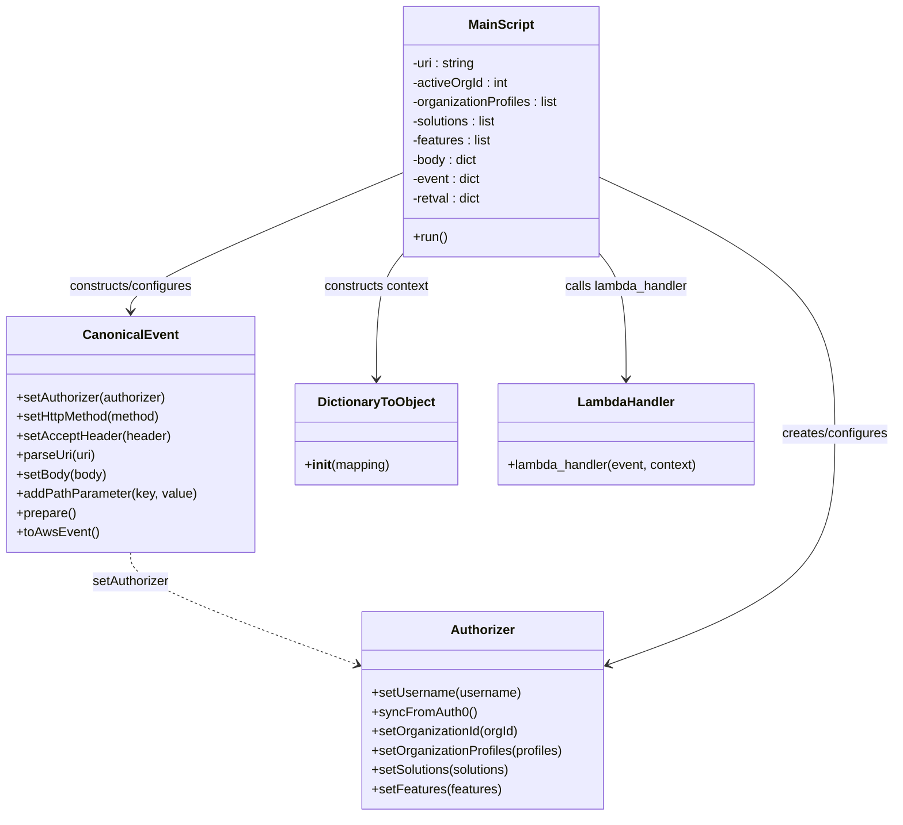
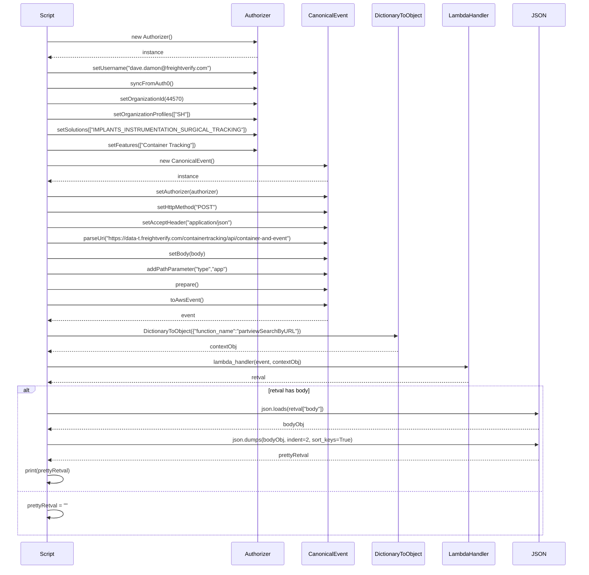

# Diagram: platform/tools/ide_local_testing/localTest/test/byUrl/reusableContainerTrackingHealthcareEvent.py

> Auto-generated by Obscura crawlers

## Diagram 1

### SVG

<svg id="container" width="1111.5703125" xmlns="http://www.w3.org/2000/svg" class="classDiagram" height="1016" viewBox="0 0 1111.5703125 1016" role="graphics-document document" aria-roledescription="class"><g><defs><marker id="container_class-aggregationStart" class="marker aggregation class" refX="18" refY="7" markerWidth="190" markerHeight="240" orient="auto"><path d="M 18,7 L9,13 L1,7 L9,1 Z"></path></marker></defs><defs><marker id="container_class-aggregationEnd" class="marker aggregation class" refX="1" refY="7" markerWidth="20" markerHeight="28" orient="auto"><path d="M 18,7 L9,13 L1,7 L9,1 Z"></path></marker></defs><defs><marker id="container_class-extensionStart" class="marker extension class" refX="18" refY="7" markerWidth="190" markerHeight="240" orient="auto"><path d="M 1,7 L18,13 V 1 Z"></path></marker></defs><defs><marker id="container_class-extensionEnd" class="marker extension class" refX="1" refY="7" markerWidth="20" markerHeight="28" orient="auto"><path d="M 1,1 V 13 L18,7 Z"></path></marker></defs><defs><marker id="container_class-compositionStart" class="marker composition class" refX="18" refY="7" markerWidth="190" markerHeight="240" orient="auto"><path d="M 18,7 L9,13 L1,7 L9,1 Z"></path></marker></defs><defs><marker id="container_class-compositionEnd" class="marker composition class" refX="1" refY="7" markerWidth="20" markerHeight="28" orient="auto"><path d="M 18,7 L9,13 L1,7 L9,1 Z"></path></marker></defs><defs><marker id="container_class-dependencyStart" class="marker dependency class" refX="6" refY="7" markerWidth="190" markerHeight="240" orient="auto"><path d="M 5,7 L9,13 L1,7 L9,1 Z"></path></marker></defs><defs><marker id="container_class-dependencyEnd" class="marker dependency class" refX="13" refY="7" markerWidth="20" markerHeight="28" orient="auto"><path d="M 18,7 L9,13 L14,7 L9,1 Z"></path></marker></defs><defs><marker id="container_class-lollipopStart" class="marker lollipop class" refX="13" refY="7" markerWidth="190" markerHeight="240" orient="auto"><circle stroke="black" fill="transparent" cx="7" cy="7" r="6"></circle></marker></defs><defs><marker id="container_class-lollipopEnd" class="marker lollipop class" refX="1" refY="7" markerWidth="190" markerHeight="240" orient="auto"><circle stroke="black" fill="transparent" cx="7" cy="7" r="6"></circle></marker></defs><g class="root"><g class="clusters"></g><g class="edgePaths"><path d="M159.574,688L159.574,694.167C159.574,700.333,159.574,712.667,206.42,735.931C253.266,759.196,346.959,793.391,393.805,810.489L440.651,827.587" id="id_CanonicalEvent_Authorizer_1" class="edge-thickness-normal edge-pattern-dashed relation" style=";;;" data-edge="true" data-et="edge" data-id="id_CanonicalEvent_Authorizer_1" data-points="W3sieCI6MTU5LjU3NDIxODc1LCJ5Ijo2ODh9LHsieCI6MTU5LjU3NDIxODc1LCJ5Ijo3MjV9LHsieCI6NDQ2LjI4NzEwOTM3NSwieSI6ODI5LjY0NDMwOTg5MzkxOX1d" marker-end="url(#container_class-dependencyEnd)"></path><path d="M741.598,221.294L790.721,243.912C839.844,266.53,938.09,311.765,987.213,365.049C1036.336,418.333,1036.336,479.667,1036.336,541C1036.336,602.333,1036.336,663.667,989.49,711.431C942.644,759.196,848.952,793.391,802.105,810.489L755.259,827.587" id="id_MainScript_Authorizer_2" class="edge-thickness-normal edge-pattern-solid relation" style=";;;" data-edge="true" data-et="edge" data-id="id_MainScript_Authorizer_2" data-points="W3sieCI6NzQxLjU5NzY1NjI1LCJ5IjoyMjEuMjk0NDMwMTAzNzE5MTV9LHsieCI6MTAzNi4zMzU5Mzc1LCJ5IjozNTd9LHsieCI6MTAzNi4zMzU5Mzc1LCJ5Ijo1NDF9LHsieCI6MTAzNi4zMzU5Mzc1LCJ5Ijo3MjV9LHsieCI6NzQ5LjYyMzA0Njg3NSwieSI6ODI5LjY0NDMwOTg5MzkxOX1d" marker-end="url(#container_class-dependencyEnd)"></path><path d="M492.723,216.485L437.198,239.904C381.673,263.323,270.624,310.162,215.099,338.748C159.574,367.333,159.574,377.667,159.574,382.833L159.574,388" id="id_MainScript_CanonicalEvent_3" class="edge-thickness-normal edge-pattern-solid relation" style=";;;" data-edge="true" data-et="edge" data-id="id_MainScript_CanonicalEvent_3" data-points="W3sieCI6NDkyLjcyMjY1NjI1LCJ5IjoyMTYuNDg1MDg2NDc2MjQyNTF9LHsieCI6MTU5LjU3NDIxODc1LCJ5IjozNTd9LHsieCI6MTU5LjU3NDIxODc1LCJ5IjozOTR9XQ==" marker-end="url(#container_class-dependencyEnd)"></path><path d="M741.598,318.21L746.814,324.675C752.031,331.14,762.465,344.07,767.682,369.702C772.898,395.333,772.898,433.667,772.898,452.833L772.898,472" id="id_MainScript_LambdaHandler_4" class="edge-thickness-normal edge-pattern-solid relation" style=";;;" data-edge="true" data-et="edge" data-id="id_MainScript_LambdaHandler_4" data-points="W3sieCI6NzQxLjU5NzY1NjI1LCJ5IjozMTguMjEwMjM4NTMxMTg5NjV9LHsieCI6NzcyLjg5ODQzNzUsInkiOjM1N30seyJ4Ijo3NzIuODk4NDM3NSwieSI6NDc4fV0=" marker-end="url(#container_class-dependencyEnd)"></path><path d="M492.723,318.21L487.506,324.675C482.289,331.14,471.855,344.07,466.639,369.702C461.422,395.333,461.422,433.667,461.422,452.833L461.422,472" id="id_MainScript_DictionaryToObject_5" class="edge-thickness-normal edge-pattern-solid relation" style=";;;" data-edge="true" data-et="edge" data-id="id_MainScript_DictionaryToObject_5" data-points="W3sieCI6NDkyLjcyMjY1NjI1LCJ5IjozMTguMjEwMjM4NTMxMTg5NjV9LHsieCI6NDYxLjQyMTg3NSwieSI6MzU3fSx7IngiOjQ2MS40MjE4NzUsInkiOjQ3OH1d" marker-end="url(#container_class-dependencyEnd)"></path></g><g class="edgeLabels"><g class="edgeLabel" transform="translate(159.57421875, 725)"><g class="label" data-id="id_CanonicalEvent_Authorizer_1" transform="translate(-48.7109375, -12)"><foreignObject width="97.421875" height="24">

setAuthorizer

</foreignObject></g></g><g class="edgeLabel" transform="translate(1036.3359375, 541)"><g class="label" data-id="id_MainScript_Authorizer_2" transform="translate(-67.234375, -12)"><foreignObject width="134.46875" height="24">

creates/configures

</foreignObject></g></g><g class="edgeLabel" transform="translate(159.57421875, 357)"><g class="label" data-id="id_MainScript_CanonicalEvent_3" transform="translate(-78.90625, -12)"><foreignObject width="157.8125" height="24">

constructs/configures

</foreignObject></g></g><g class="edgeLabel" transform="translate(772.8984375, 357)"><g class="label" data-id="id_MainScript_LambdaHandler_4" transform="translate(-78.390625, -12)"><foreignObject width="156.78125" height="24">

calls lambda_handler

</foreignObject></g></g><g class="edgeLabel" transform="translate(461.421875, 357)"><g class="label" data-id="id_MainScript_DictionaryToObject_5" transform="translate(-66.8125, -12)"><foreignObject width="133.625" height="24">

constructs context

</foreignObject></g></g></g><g class="nodes"><g class="node default" id="classId-Authorizer-0" transform="translate(597.955078125, 885)"><g class="basic label-container"><path d="M-151.66796875 -123 L151.66796875 -123 L151.66796875 123 L-151.66796875 123" stroke="none" stroke-width="0" fill="#ECECFF" style=""></path><path d="M-151.66796875 -123 C-84.45229754981027 -123, -17.236626349620536 -123, 151.66796875 -123 M-151.66796875 -123 C-60.401007824817825 -123, 30.86595310036435 -123, 151.66796875 -123 M151.66796875 -123 C151.66796875 -45.11760417729896, 151.66796875 32.764791645402084, 151.66796875 123 M151.66796875 -123 C151.66796875 -41.74112660183427, 151.66796875 39.517746796331465, 151.66796875 123 M151.66796875 123 C31.72783348957516 123, -88.21230177084968 123, -151.66796875 123 M151.66796875 123 C35.443852834892866 123, -80.78026308021427 123, -151.66796875 123 M-151.66796875 123 C-151.66796875 51.033086635112966, -151.66796875 -20.93382672977407, -151.66796875 -123 M-151.66796875 123 C-151.66796875 64.53687922738285, -151.66796875 6.0737584547657235, -151.66796875 -123" stroke="#9370DB" stroke-width="1.3" fill="none" stroke-dasharray="0 0" style=""></path></g><g class="annotation-group text" transform="translate(0, -99)"></g><g class="label-group text" transform="translate(-38.3671875, -99)"><g class="label" style="font-weight: bolder" transform="translate(0,-12)"><foreignObject width="76.734375" height="24">

Authorizer

</foreignObject></g></g><g class="members-group text" transform="translate(-139.66796875, -51)"></g><g class="methods-group text" transform="translate(-139.66796875, -21)"><g class="label" style="" transform="translate(0,-12)"><foreignObject width="185.90625" height="24">

+setUsername(username)

</foreignObject></g><g class="label" style="" transform="translate(0,12)"><foreignObject width="129.0625" height="24">

+syncFromAuth0()

</foreignObject></g><g class="label" style="" transform="translate(0,36)"><foreignObject width="184.578125" height="24">

+setOrganizationId(orgId)

</foreignObject></g><g class="label" style="" transform="translate(0,60)"><foreignObject width="240.96875" height="24">

+setOrganizationProfiles(profiles)

</foreignObject></g><g class="label" style="" transform="translate(0,84)"><foreignObject width="176.171875" height="24">

+setSolutions(solutions)

</foreignObject></g><g class="label" style="" transform="translate(0,108)"><foreignObject width="161.296875" height="24">

+setFeatures(features)

</foreignObject></g></g><g class="divider" style=""><path d="M-151.66796875 -75 C-50.40221901881574 -75, 50.863530712368515 -75, 151.66796875 -75 M-151.66796875 -75 C-80.95420708431855 -75, -10.240445418637108 -75, 151.66796875 -75" stroke="#9370DB" stroke-width="1.3" fill="none" stroke-dasharray="0 0" style=""></path></g><g class="divider" style=""><path d="M-151.66796875 -51 C-90.51106357740153 -51, -29.354158404803073 -51, 151.66796875 -51 M-151.66796875 -51 C-69.97472074227164 -51, 11.718527265456714 -51, 151.66796875 -51" stroke="#9370DB" stroke-width="1.3" fill="none" stroke-dasharray="0 0" style=""></path></g></g><g class="node default" id="classId-CanonicalEvent-1" transform="translate(159.57421875, 541)"><g class="basic label-container"><path d="M-151.57421875 -147 L151.57421875 -147 L151.57421875 147 L-151.57421875 147" stroke="none" stroke-width="0" fill="#ECECFF" style=""></path><path d="M-151.57421875 -147 C-46.675289786125504 -147, 58.22363917774899 -147, 151.57421875 -147 M-151.57421875 -147 C-56.5398135852557 -147, 38.4945915794886 -147, 151.57421875 -147 M151.57421875 -147 C151.57421875 -43.1272387693883, 151.57421875 60.7455224612234, 151.57421875 147 M151.57421875 -147 C151.57421875 -45.9468800385969, 151.57421875 55.106239922806196, 151.57421875 147 M151.57421875 147 C68.25349338516428 147, -15.067231979671448 147, -151.57421875 147 M151.57421875 147 C53.423122918467016 147, -44.72797291306597 147, -151.57421875 147 M-151.57421875 147 C-151.57421875 34.918452575559456, -151.57421875 -77.16309484888109, -151.57421875 -147 M-151.57421875 147 C-151.57421875 52.718084169983555, -151.57421875 -41.56383166003289, -151.57421875 -147" stroke="#9370DB" stroke-width="1.3" fill="none" stroke-dasharray="0 0" style=""></path></g><g class="annotation-group text" transform="translate(0, -123)"></g><g class="label-group text" transform="translate(-55.7109375, -123)"><g class="label" style="font-weight: bolder" transform="translate(0,-12)"><foreignObject width="111.421875" height="24">

CanonicalEvent

</foreignObject></g></g><g class="members-group text" transform="translate(-139.57421875, -75)"></g><g class="methods-group text" transform="translate(-139.57421875, -45)"><g class="label" style="" transform="translate(0,-12)"><foreignObject width="190.75" height="24">

+setAuthorizer(authorizer)

</foreignObject></g><g class="label" style="" transform="translate(0,12)"><foreignObject width="184" height="24">

+setHttpMethod(method)

</foreignObject></g><g class="label" style="" transform="translate(0,36)"><foreignObject width="191.859375" height="24">

+setAcceptHeader(header)

</foreignObject></g><g class="label" style="" transform="translate(0,60)"><foreignObject width="99.8125" height="24">

+parseUri(uri)

</foreignObject></g><g class="label" style="" transform="translate(0,84)"><foreignObject width="113.125" height="24">

+setBody(body)

</foreignObject></g><g class="label" style="" transform="translate(0,108)"><foreignObject width="223.4375" height="24">

+addPathParameter(key, value)

</foreignObject></g><g class="label" style="" transform="translate(0,132)"><foreignObject width="74.75" height="24">

+prepare()

</foreignObject></g><g class="label" style="" transform="translate(0,156)"><foreignObject width="101.1875" height="24">

+toAwsEvent()

</foreignObject></g></g><g class="divider" style=""><path d="M-151.57421875 -99 C-88.19665550377275 -99, -24.819092257545478 -99, 151.57421875 -99 M-151.57421875 -99 C-74.43122907598996 -99, 2.711760598020078 -99, 151.57421875 -99" stroke="#9370DB" stroke-width="1.3" fill="none" stroke-dasharray="0 0" style=""></path></g><g class="divider" style=""><path d="M-151.57421875 -75 C-34.63073622747544 -75, 82.31274629504912 -75, 151.57421875 -75 M-151.57421875 -75 C-71.51638161470086 -75, 8.541455520598277 -75, 151.57421875 -75" stroke="#9370DB" stroke-width="1.3" fill="none" stroke-dasharray="0 0" style=""></path></g></g><g class="node default" id="classId-DictionaryToObject-2" transform="translate(461.421875, 541)"><g class="basic label-container"><path d="M-100.2734375 -63 L100.2734375 -63 L100.2734375 63 L-100.2734375 63" stroke="none" stroke-width="0" fill="#ECECFF" style=""></path><path d="M-100.2734375 -63 C-46.61736528542138 -63, 7.038706929157243 -63, 100.2734375 -63 M-100.2734375 -63 C-31.582702396379844 -63, 37.10803270724031 -63, 100.2734375 -63 M100.2734375 -63 C100.2734375 -21.37113336682595, 100.2734375 20.257733266348097, 100.2734375 63 M100.2734375 -63 C100.2734375 -32.89626446135953, 100.2734375 -2.7925289227190575, 100.2734375 63 M100.2734375 63 C47.69125821869969 63, -4.890921062600626 63, -100.2734375 63 M100.2734375 63 C24.309152192893322 63, -51.655133114213356 63, -100.2734375 63 M-100.2734375 63 C-100.2734375 30.829250378245156, -100.2734375 -1.3414992435096877, -100.2734375 -63 M-100.2734375 63 C-100.2734375 30.74784732691584, -100.2734375 -1.504305346168323, -100.2734375 -63" stroke="#9370DB" stroke-width="1.3" fill="none" stroke-dasharray="0 0" style=""></path></g><g class="annotation-group text" transform="translate(0, -39)"></g><g class="label-group text" transform="translate(-70.109375, -39)"><g class="label" style="font-weight: bolder" transform="translate(0,-12)"><foreignObject width="140.21875" height="24">

DictionaryToObject

</foreignObject></g></g><g class="members-group text" transform="translate(-88.2734375, 9)"></g><g class="methods-group text" transform="translate(-88.2734375, 39)"><g class="label" style="" transform="translate(0,-12)"><foreignObject width="106.4375" height="24">

+<strong>init</strong>(mapping)

</foreignObject></g></g><g class="divider" style=""><path d="M-100.2734375 -15 C-41.73247157199185 -15, 16.808494356016297 -15, 100.2734375 -15 M-100.2734375 -15 C-23.79737091130488 -15, 52.67869567739024 -15, 100.2734375 -15" stroke="#9370DB" stroke-width="1.3" fill="none" stroke-dasharray="0 0" style=""></path></g><g class="divider" style=""><path d="M-100.2734375 9 C-50.28700467242244 9, -0.30057184484488175 9, 100.2734375 9 M-100.2734375 9 C-43.62279346862958 9, 13.027850562740838 9, 100.2734375 9" stroke="#9370DB" stroke-width="1.3" fill="none" stroke-dasharray="0 0" style=""></path></g></g><g class="node default" id="classId-LambdaHandler-3" transform="translate(772.8984375, 541)"><g class="basic label-container"><path d="M-161.203125 -63 L161.203125 -63 L161.203125 63 L-161.203125 63" stroke="none" stroke-width="0" fill="#ECECFF" style=""></path><path d="M-161.203125 -63 C-32.88297411039261 -63, 95.43717677921478 -63, 161.203125 -63 M-161.203125 -63 C-53.05159826812911 -63, 55.099928463741776 -63, 161.203125 -63 M161.203125 -63 C161.203125 -21.905442028379042, 161.203125 19.189115943241916, 161.203125 63 M161.203125 -63 C161.203125 -37.283168024144736, 161.203125 -11.566336048289472, 161.203125 63 M161.203125 63 C85.73663698835163 63, 10.270148976703268 63, -161.203125 63 M161.203125 63 C76.00539201512014 63, -9.192340969759726 63, -161.203125 63 M-161.203125 63 C-161.203125 28.719029658679148, -161.203125 -5.561940682641705, -161.203125 -63 M-161.203125 63 C-161.203125 13.94158607154332, -161.203125 -35.11682785691336, -161.203125 -63" stroke="#9370DB" stroke-width="1.3" fill="none" stroke-dasharray="0 0" style=""></path></g><g class="annotation-group text" transform="translate(0, -39)"></g><g class="label-group text" transform="translate(-58.21875, -39)"><g class="label" style="font-weight: bolder" transform="translate(0,-12)"><foreignObject width="116.4375" height="24">

LambdaHandler

</foreignObject></g></g><g class="members-group text" transform="translate(-149.203125, 9)"></g><g class="methods-group text" transform="translate(-149.203125, 39)"><g class="label" style="" transform="translate(0,-12)"><foreignObject width="240.1875" height="24">

+lambda_handler(event, context)

</foreignObject></g></g><g class="divider" style=""><path d="M-161.203125 -15 C-79.00830110691159 -15, 3.1865227861768233 -15, 161.203125 -15 M-161.203125 -15 C-66.33823537693256 -15, 28.526654246134882 -15, 161.203125 -15" stroke="#9370DB" stroke-width="1.3" fill="none" stroke-dasharray="0 0" style=""></path></g><g class="divider" style=""><path d="M-161.203125 9 C-46.17277702625492 9, 68.85757094749016 9, 161.203125 9 M-161.203125 9 C-56.172394015970866 9, 48.85833696805827 9, 161.203125 9" stroke="#9370DB" stroke-width="1.3" fill="none" stroke-dasharray="0 0" style=""></path></g></g><g class="node default" id="classId-MainScript-4" transform="translate(617.16015625, 164)"><g class="basic label-container"><path d="M-124.4375 -156 L124.4375 -156 L124.4375 156 L-124.4375 156" stroke="none" stroke-width="0" fill="#ECECFF" style=""></path><path d="M-124.4375 -156 C-49.075994799948504 -156, 26.285510400102993 -156, 124.4375 -156 M-124.4375 -156 C-73.08362782452033 -156, -21.729755649040683 -156, 124.4375 -156 M124.4375 -156 C124.4375 -59.00548597882653, 124.4375 37.989028042346945, 124.4375 156 M124.4375 -156 C124.4375 -90.2103694698751, 124.4375 -24.42073893975021, 124.4375 156 M124.4375 156 C52.390454560159 156, -19.656590879682 156, -124.4375 156 M124.4375 156 C29.481529710442558 156, -65.47444057911488 156, -124.4375 156 M-124.4375 156 C-124.4375 34.76567812847176, -124.4375 -86.46864374305648, -124.4375 -156 M-124.4375 156 C-124.4375 61.2493281124289, -124.4375 -33.5013437751422, -124.4375 -156" stroke="#9370DB" stroke-width="1.3" fill="none" stroke-dasharray="0 0" style=""></path></g><g class="annotation-group text" transform="translate(0, -132)"></g><g class="label-group text" transform="translate(-39.28125, -132)"><g class="label" style="font-weight: bolder" transform="translate(0,-12)"><foreignObject width="78.5625" height="24">

MainScript

</foreignObject></g></g><g class="members-group text" transform="translate(-112.4375, -84)"><g class="label" style="" transform="translate(0,-12)"><foreignObject width="80.40625" height="24">

-uri : string

</foreignObject></g><g class="label" style="" transform="translate(0,12)"><foreignObject width="120.984375" height="24">

-activeOrgId : int

</foreignObject></g><g class="label" style="" transform="translate(0,36)"><foreignObject width="185.59375" height="24">

-organizationProfiles : list

</foreignObject></g><g class="label" style="" transform="translate(0,60)"><foreignObject width="108.515625" height="24">

-solutions : list

</foreignObject></g><g class="label" style="" transform="translate(0,84)"><foreignObject width="100.421875" height="24">

-features : list

</foreignObject></g><g class="label" style="" transform="translate(0,108)"><foreignObject width="82.5625" height="24">

-body : dict

</foreignObject></g><g class="label" style="" transform="translate(0,132)"><foreignObject width="86.609375" height="24">

-event : dict

</foreignObject></g><g class="label" style="" transform="translate(0,156)"><foreignObject width="87.234375" height="24">

-retval : dict

</foreignObject></g></g><g class="methods-group text" transform="translate(-112.4375, 132)"><g class="label" style="" transform="translate(0,-12)"><foreignObject width="43.21875" height="24">

+run()

</foreignObject></g></g><g class="divider" style=""><path d="M-124.4375 -108 C-67.98209418504479 -108, -11.526688370089573 -108, 124.4375 -108 M-124.4375 -108 C-46.45586260279647 -108, 31.525774794407056 -108, 124.4375 -108" stroke="#9370DB" stroke-width="1.3" fill="none" stroke-dasharray="0 0" style=""></path></g><g class="divider" style=""><path d="M-124.4375 108 C-65.99215622192867 108, -7.546812443857334 108, 124.4375 108 M-124.4375 108 C-35.64558278825969 108, 53.146334423480624 108, 124.4375 108" stroke="#9370DB" stroke-width="1.3" fill="none" stroke-dasharray="0 0" style=""></path></g></g></g></g></g></svg>

## Diagram 2

### SVG

<svg id="container" width="1632" xmlns="http://www.w3.org/2000/svg" height="1733" viewBox="-59 -10 1632 1733" role="graphics-document document" aria-roledescription="sequence"><g><rect x="1373" y="1647" fill="#eaeaea" stroke="#666" width="150" height="65" name="JSON" rx="3" ry="3" class="actor actor-bottom"></rect><text x="1448" y="1679.5" dominant-baseline="central" alignment-baseline="central" class="actor actor-box" style="text-anchor: middle; font-size: 16px; font-weight: 400;"><tspan x="1448" dy="0">JSON</tspan></text></g><g><rect x="1173" y="1647" fill="#eaeaea" stroke="#666" width="150" height="65" name="LambdaHandler" rx="3" ry="3" class="actor actor-bottom"></rect><text x="1248" y="1679.5" dominant-baseline="central" alignment-baseline="central" class="actor actor-box" style="text-anchor: middle; font-size: 16px; font-weight: 400;"><tspan x="1248" dy="0">LambdaHandler</tspan></text></g><g><rect x="965" y="1647" fill="#eaeaea" stroke="#666" width="158" height="65" name="DictionaryToObject" rx="3" ry="3" class="actor actor-bottom"></rect><text x="1044" y="1679.5" dominant-baseline="central" alignment-baseline="central" class="actor actor-box" style="text-anchor: middle; font-size: 16px; font-weight: 400;"><tspan x="1044" dy="0">DictionaryToObject</tspan></text></g><g><rect x="765" y="1647" fill="#eaeaea" stroke="#666" width="150" height="65" name="CanonicalEvent" rx="3" ry="3" class="actor actor-bottom"></rect><text x="840" y="1679.5" dominant-baseline="central" alignment-baseline="central" class="actor actor-box" style="text-anchor: middle; font-size: 16px; font-weight: 400;"><tspan x="840" dy="0">CanonicalEvent</tspan></text></g><g><rect x="565" y="1647" fill="#eaeaea" stroke="#666" width="150" height="65" name="Authorizer" rx="3" ry="3" class="actor actor-bottom"></rect><text x="640" y="1679.5" dominant-baseline="central" alignment-baseline="central" class="actor actor-box" style="text-anchor: middle; font-size: 16px; font-weight: 400;"><tspan x="640" dy="0">Authorizer</tspan></text></g><g><rect x="0" y="1647" fill="#eaeaea" stroke="#666" width="150" height="65" name="Script" rx="3" ry="3" class="actor actor-bottom"></rect><text x="75" y="1679.5" dominant-baseline="central" alignment-baseline="central" class="actor actor-box" style="text-anchor: middle; font-size: 16px; font-weight: 400;"><tspan x="75" dy="0">Script</tspan></text></g><g><line id="actor5" x1="1448" y1="65" x2="1448" y2="1647" class="actor-line 200" stroke-width="0.5px" stroke="#999" name="JSON"></line><g id="root-5"><rect x="1373" y="0" fill="#eaeaea" stroke="#666" width="150" height="65" name="JSON" rx="3" ry="3" class="actor actor-top"></rect><text x="1448" y="32.5" dominant-baseline="central" alignment-baseline="central" class="actor actor-box" style="text-anchor: middle; font-size: 16px; font-weight: 400;"><tspan x="1448" dy="0">JSON</tspan></text></g></g><g><line id="actor4" x1="1248" y1="65" x2="1248" y2="1647" class="actor-line 200" stroke-width="0.5px" stroke="#999" name="LambdaHandler"></line><g id="root-4"><rect x="1173" y="0" fill="#eaeaea" stroke="#666" width="150" height="65" name="LambdaHandler" rx="3" ry="3" class="actor actor-top"></rect><text x="1248" y="32.5" dominant-baseline="central" alignment-baseline="central" class="actor actor-box" style="text-anchor: middle; font-size: 16px; font-weight: 400;"><tspan x="1248" dy="0">LambdaHandler</tspan></text></g></g><g><line id="actor3" x1="1044" y1="65" x2="1044" y2="1647" class="actor-line 200" stroke-width="0.5px" stroke="#999" name="DictionaryToObject"></line><g id="root-3"><rect x="965" y="0" fill="#eaeaea" stroke="#666" width="158" height="65" name="DictionaryToObject" rx="3" ry="3" class="actor actor-top"></rect><text x="1044" y="32.5" dominant-baseline="central" alignment-baseline="central" class="actor actor-box" style="text-anchor: middle; font-size: 16px; font-weight: 400;"><tspan x="1044" dy="0">DictionaryToObject</tspan></text></g></g><g><line id="actor2" x1="840" y1="65" x2="840" y2="1647" class="actor-line 200" stroke-width="0.5px" stroke="#999" name="CanonicalEvent"></line><g id="root-2"><rect x="765" y="0" fill="#eaeaea" stroke="#666" width="150" height="65" name="CanonicalEvent" rx="3" ry="3" class="actor actor-top"></rect><text x="840" y="32.5" dominant-baseline="central" alignment-baseline="central" class="actor actor-box" style="text-anchor: middle; font-size: 16px; font-weight: 400;"><tspan x="840" dy="0">CanonicalEvent</tspan></text></g></g><g><line id="actor1" x1="640" y1="65" x2="640" y2="1647" class="actor-line 200" stroke-width="0.5px" stroke="#999" name="Authorizer"></line><g id="root-1"><rect x="565" y="0" fill="#eaeaea" stroke="#666" width="150" height="65" name="Authorizer" rx="3" ry="3" class="actor actor-top"></rect><text x="640" y="32.5" dominant-baseline="central" alignment-baseline="central" class="actor actor-box" style="text-anchor: middle; font-size: 16px; font-weight: 400;"><tspan x="640" dy="0">Authorizer</tspan></text></g></g><g><line id="actor0" x1="75" y1="65" x2="75" y2="1647" class="actor-line 200" stroke-width="0.5px" stroke="#999" name="Script"></line><g id="root-0"><rect x="0" y="0" fill="#eaeaea" stroke="#666" width="150" height="65" name="Script" rx="3" ry="3" class="actor actor-top"></rect><text x="75" y="32.5" dominant-baseline="central" alignment-baseline="central" class="actor actor-box" style="text-anchor: middle; font-size: 16px; font-weight: 400;"><tspan x="75" dy="0">Script</tspan></text></g></g><g></g><defs><symbol id="computer" width="24" height="24"><path transform="scale(.5)" d="M2 2v13h20v-13h-20zm18 11h-16v-9h16v9zm-10.228 6l.466-1h3.524l.467 1h-4.457zm14.228 3h-24l2-6h2.104l-1.33 4h18.45l-1.297-4h2.073l2 6zm-5-10h-14v-7h14v7z"></path></symbol></defs><defs><symbol id="database" fill-rule="evenodd" clip-rule="evenodd"><path transform="scale(.5)" d="M12.258.001l.256.004.255.005.253.008.251.01.249.012.247.015.246.016.242.019.241.02.239.023.236.024.233.027.231.028.229.031.225.032.223.034.22.036.217.038.214.04.211.041.208.043.205.045.201.046.198.048.194.05.191.051.187.053.183.054.18.056.175.057.172.059.168.06.163.061.16.063.155.064.15.066.074.033.073.033.071.034.07.034.069.035.068.035.067.035.066.035.064.036.064.036.062.036.06.036.06.037.058.037.058.037.055.038.055.038.053.038.052.038.051.039.05.039.048.039.047.039.045.04.044.04.043.04.041.04.04.041.039.041.037.041.036.041.034.041.033.042.032.042.03.042.029.042.027.042.026.043.024.043.023.043.021.043.02.043.018.044.017.043.015.044.013.044.012.044.011.045.009.044.007.045.006.045.004.045.002.045.001.045v17l-.001.045-.002.045-.004.045-.006.045-.007.045-.009.044-.011.045-.012.044-.013.044-.015.044-.017.043-.018.044-.02.043-.021.043-.023.043-.024.043-.026.043-.027.042-.029.042-.03.042-.032.042-.033.042-.034.041-.036.041-.037.041-.039.041-.04.041-.041.04-.043.04-.044.04-.045.04-.047.039-.048.039-.05.039-.051.039-.052.038-.053.038-.055.038-.055.038-.058.037-.058.037-.06.037-.06.036-.062.036-.064.036-.064.036-.066.035-.067.035-.068.035-.069.035-.07.034-.071.034-.073.033-.074.033-.15.066-.155.064-.16.063-.163.061-.168.06-.172.059-.175.057-.18.056-.183.054-.187.053-.191.051-.194.05-.198.048-.201.046-.205.045-.208.043-.211.041-.214.04-.217.038-.22.036-.223.034-.225.032-.229.031-.231.028-.233.027-.236.024-.239.023-.241.02-.242.019-.246.016-.247.015-.249.012-.251.01-.253.008-.255.005-.256.004-.258.001-.258-.001-.256-.004-.255-.005-.253-.008-.251-.01-.249-.012-.247-.015-.245-.016-.243-.019-.241-.02-.238-.023-.236-.024-.234-.027-.231-.028-.228-.031-.226-.032-.223-.034-.22-.036-.217-.038-.214-.04-.211-.041-.208-.043-.204-.045-.201-.046-.198-.048-.195-.05-.19-.051-.187-.053-.184-.054-.179-.056-.176-.057-.172-.059-.167-.06-.164-.061-.159-.063-.155-.064-.151-.066-.074-.033-.072-.033-.072-.034-.07-.034-.069-.035-.068-.035-.067-.035-.066-.035-.064-.036-.063-.036-.062-.036-.061-.036-.06-.037-.058-.037-.057-.037-.056-.038-.055-.038-.053-.038-.052-.038-.051-.039-.049-.039-.049-.039-.046-.039-.046-.04-.044-.04-.043-.04-.041-.04-.04-.041-.039-.041-.037-.041-.036-.041-.034-.041-.033-.042-.032-.042-.03-.042-.029-.042-.027-.042-.026-.043-.024-.043-.023-.043-.021-.043-.02-.043-.018-.044-.017-.043-.015-.044-.013-.044-.012-.044-.011-.045-.009-.044-.007-.045-.006-.045-.004-.045-.002-.045-.001-.045v-17l.001-.045.002-.045.004-.045.006-.045.007-.045.009-.044.011-.045.012-.044.013-.044.015-.044.017-.043.018-.044.02-.043.021-.043.023-.043.024-.043.026-.043.027-.042.029-.042.03-.042.032-.042.033-.042.034-.041.036-.041.037-.041.039-.041.04-.041.041-.04.043-.04.044-.04.046-.04.046-.039.049-.039.049-.039.051-.039.052-.038.053-.038.055-.038.056-.038.057-.037.058-.037.06-.037.061-.036.062-.036.063-.036.064-.036.066-.035.067-.035.068-.035.069-.035.07-.034.072-.034.072-.033.074-.033.151-.066.155-.064.159-.063.164-.061.167-.06.172-.059.176-.057.179-.056.184-.054.187-.053.19-.051.195-.05.198-.048.201-.046.204-.045.208-.043.211-.041.214-.04.217-.038.22-.036.223-.034.226-.032.228-.031.231-.028.234-.027.236-.024.238-.023.241-.02.243-.019.245-.016.247-.015.249-.012.251-.01.253-.008.255-.005.256-.004.258-.001.258.001zm-9.258 20.499v.01l.001.021.003.021.004.022.005.021.006.022.007.022.009.023.01.022.011.023.012.023.013.023.015.023.016.024.017.023.018.024.019.024.021.024.022.025.023.024.024.025.052.049.056.05.061.051.066.051.07.051.075.051.079.052.084.052.088.052.092.052.097.052.102.051.105.052.11.052.114.051.119.051.123.051.127.05.131.05.135.05.139.048.144.049.147.047.152.047.155.047.16.045.163.045.167.043.171.043.176.041.178.041.183.039.187.039.19.037.194.035.197.035.202.033.204.031.209.03.212.029.216.027.219.025.222.024.226.021.23.02.233.018.236.016.24.015.243.012.246.01.249.008.253.005.256.004.259.001.26-.001.257-.004.254-.005.25-.008.247-.011.244-.012.241-.014.237-.016.233-.018.231-.021.226-.021.224-.024.22-.026.216-.027.212-.028.21-.031.205-.031.202-.034.198-.034.194-.036.191-.037.187-.039.183-.04.179-.04.175-.042.172-.043.168-.044.163-.045.16-.046.155-.046.152-.047.148-.048.143-.049.139-.049.136-.05.131-.05.126-.05.123-.051.118-.052.114-.051.11-.052.106-.052.101-.052.096-.052.092-.052.088-.053.083-.051.079-.052.074-.052.07-.051.065-.051.06-.051.056-.05.051-.05.023-.024.023-.025.021-.024.02-.024.019-.024.018-.024.017-.024.015-.023.014-.024.013-.023.012-.023.01-.023.01-.022.008-.022.006-.022.006-.022.004-.022.004-.021.001-.021.001-.021v-4.127l-.077.055-.08.053-.083.054-.085.053-.087.052-.09.052-.093.051-.095.05-.097.05-.1.049-.102.049-.105.048-.106.047-.109.047-.111.046-.114.045-.115.045-.118.044-.12.043-.122.042-.124.042-.126.041-.128.04-.13.04-.132.038-.134.038-.135.037-.138.037-.139.035-.142.035-.143.034-.144.033-.147.032-.148.031-.15.03-.151.03-.153.029-.154.027-.156.027-.158.026-.159.025-.161.024-.162.023-.163.022-.165.021-.166.02-.167.019-.169.018-.169.017-.171.016-.173.015-.173.014-.175.013-.175.012-.177.011-.178.01-.179.008-.179.008-.181.006-.182.005-.182.004-.184.003-.184.002h-.37l-.184-.002-.184-.003-.182-.004-.182-.005-.181-.006-.179-.008-.179-.008-.178-.01-.176-.011-.176-.012-.175-.013-.173-.014-.172-.015-.171-.016-.17-.017-.169-.018-.167-.019-.166-.02-.165-.021-.163-.022-.162-.023-.161-.024-.159-.025-.157-.026-.156-.027-.155-.027-.153-.029-.151-.03-.15-.03-.148-.031-.146-.032-.145-.033-.143-.034-.141-.035-.14-.035-.137-.037-.136-.037-.134-.038-.132-.038-.13-.04-.128-.04-.126-.041-.124-.042-.122-.042-.12-.044-.117-.043-.116-.045-.113-.045-.112-.046-.109-.047-.106-.047-.105-.048-.102-.049-.1-.049-.097-.05-.095-.05-.093-.052-.09-.051-.087-.052-.085-.053-.083-.054-.08-.054-.077-.054v4.127zm0-5.654v.011l.001.021.003.021.004.021.005.022.006.022.007.022.009.022.01.022.011.023.012.023.013.023.015.024.016.023.017.024.018.024.019.024.021.024.022.024.023.025.024.024.052.05.056.05.061.05.066.051.07.051.075.052.079.051.084.052.088.052.092.052.097.052.102.052.105.052.11.051.114.051.119.052.123.05.127.051.131.05.135.049.139.049.144.048.147.048.152.047.155.046.16.045.163.045.167.044.171.042.176.042.178.04.183.04.187.038.19.037.194.036.197.034.202.033.204.032.209.03.212.028.216.027.219.025.222.024.226.022.23.02.233.018.236.016.24.014.243.012.246.01.249.008.253.006.256.003.259.001.26-.001.257-.003.254-.006.25-.008.247-.01.244-.012.241-.015.237-.016.233-.018.231-.02.226-.022.224-.024.22-.025.216-.027.212-.029.21-.03.205-.032.202-.033.198-.035.194-.036.191-.037.187-.039.183-.039.179-.041.175-.042.172-.043.168-.044.163-.045.16-.045.155-.047.152-.047.148-.048.143-.048.139-.05.136-.049.131-.05.126-.051.123-.051.118-.051.114-.052.11-.052.106-.052.101-.052.096-.052.092-.052.088-.052.083-.052.079-.052.074-.051.07-.052.065-.051.06-.05.056-.051.051-.049.023-.025.023-.024.021-.025.02-.024.019-.024.018-.024.017-.024.015-.023.014-.023.013-.024.012-.022.01-.023.01-.023.008-.022.006-.022.006-.022.004-.021.004-.022.001-.021.001-.021v-4.139l-.077.054-.08.054-.083.054-.085.052-.087.053-.09.051-.093.051-.095.051-.097.05-.1.049-.102.049-.105.048-.106.047-.109.047-.111.046-.114.045-.115.044-.118.044-.12.044-.122.042-.124.042-.126.041-.128.04-.13.039-.132.039-.134.038-.135.037-.138.036-.139.036-.142.035-.143.033-.144.033-.147.033-.148.031-.15.03-.151.03-.153.028-.154.028-.156.027-.158.026-.159.025-.161.024-.162.023-.163.022-.165.021-.166.02-.167.019-.169.018-.169.017-.171.016-.173.015-.173.014-.175.013-.175.012-.177.011-.178.009-.179.009-.179.007-.181.007-.182.005-.182.004-.184.003-.184.002h-.37l-.184-.002-.184-.003-.182-.004-.182-.005-.181-.007-.179-.007-.179-.009-.178-.009-.176-.011-.176-.012-.175-.013-.173-.014-.172-.015-.171-.016-.17-.017-.169-.018-.167-.019-.166-.02-.165-.021-.163-.022-.162-.023-.161-.024-.159-.025-.157-.026-.156-.027-.155-.028-.153-.028-.151-.03-.15-.03-.148-.031-.146-.033-.145-.033-.143-.033-.141-.035-.14-.036-.137-.036-.136-.037-.134-.038-.132-.039-.13-.039-.128-.04-.126-.041-.124-.042-.122-.043-.12-.043-.117-.044-.116-.044-.113-.046-.112-.046-.109-.046-.106-.047-.105-.048-.102-.049-.1-.049-.097-.05-.095-.051-.093-.051-.09-.051-.087-.053-.085-.052-.083-.054-.08-.054-.077-.054v4.139zm0-5.666v.011l.001.02.003.022.004.021.005.022.006.021.007.022.009.023.01.022.011.023.012.023.013.023.015.023.016.024.017.024.018.023.019.024.021.025.022.024.023.024.024.025.052.05.056.05.061.05.066.051.07.051.075.052.079.051.084.052.088.052.092.052.097.052.102.052.105.051.11.052.114.051.119.051.123.051.127.05.131.05.135.05.139.049.144.048.147.048.152.047.155.046.16.045.163.045.167.043.171.043.176.042.178.04.183.04.187.038.19.037.194.036.197.034.202.033.204.032.209.03.212.028.216.027.219.025.222.024.226.021.23.02.233.018.236.017.24.014.243.012.246.01.249.008.253.006.256.003.259.001.26-.001.257-.003.254-.006.25-.008.247-.01.244-.013.241-.014.237-.016.233-.018.231-.02.226-.022.224-.024.22-.025.216-.027.212-.029.21-.03.205-.032.202-.033.198-.035.194-.036.191-.037.187-.039.183-.039.179-.041.175-.042.172-.043.168-.044.163-.045.16-.045.155-.047.152-.047.148-.048.143-.049.139-.049.136-.049.131-.051.126-.05.123-.051.118-.052.114-.051.11-.052.106-.052.101-.052.096-.052.092-.052.088-.052.083-.052.079-.052.074-.052.07-.051.065-.051.06-.051.056-.05.051-.049.023-.025.023-.025.021-.024.02-.024.019-.024.018-.024.017-.024.015-.023.014-.024.013-.023.012-.023.01-.022.01-.023.008-.022.006-.022.006-.022.004-.022.004-.021.001-.021.001-.021v-4.153l-.077.054-.08.054-.083.053-.085.053-.087.053-.09.051-.093.051-.095.051-.097.05-.1.049-.102.048-.105.048-.106.048-.109.046-.111.046-.114.046-.115.044-.118.044-.12.043-.122.043-.124.042-.126.041-.128.04-.13.039-.132.039-.134.038-.135.037-.138.036-.139.036-.142.034-.143.034-.144.033-.147.032-.148.032-.15.03-.151.03-.153.028-.154.028-.156.027-.158.026-.159.024-.161.024-.162.023-.163.023-.165.021-.166.02-.167.019-.169.018-.169.017-.171.016-.173.015-.173.014-.175.013-.175.012-.177.01-.178.01-.179.009-.179.007-.181.006-.182.006-.182.004-.184.003-.184.001-.185.001-.185-.001-.184-.001-.184-.003-.182-.004-.182-.006-.181-.006-.179-.007-.179-.009-.178-.01-.176-.01-.176-.012-.175-.013-.173-.014-.172-.015-.171-.016-.17-.017-.169-.018-.167-.019-.166-.02-.165-.021-.163-.023-.162-.023-.161-.024-.159-.024-.157-.026-.156-.027-.155-.028-.153-.028-.151-.03-.15-.03-.148-.032-.146-.032-.145-.033-.143-.034-.141-.034-.14-.036-.137-.036-.136-.037-.134-.038-.132-.039-.13-.039-.128-.041-.126-.041-.124-.041-.122-.043-.12-.043-.117-.044-.116-.044-.113-.046-.112-.046-.109-.046-.106-.048-.105-.048-.102-.048-.1-.05-.097-.049-.095-.051-.093-.051-.09-.052-.087-.052-.085-.053-.083-.053-.08-.054-.077-.054v4.153zm8.74-8.179l-.257.004-.254.005-.25.008-.247.011-.244.012-.241.014-.237.016-.233.018-.231.021-.226.022-.224.023-.22.026-.216.027-.212.028-.21.031-.205.032-.202.033-.198.034-.194.036-.191.038-.187.038-.183.04-.179.041-.175.042-.172.043-.168.043-.163.045-.16.046-.155.046-.152.048-.148.048-.143.048-.139.049-.136.05-.131.05-.126.051-.123.051-.118.051-.114.052-.11.052-.106.052-.101.052-.096.052-.092.052-.088.052-.083.052-.079.052-.074.051-.07.052-.065.051-.06.05-.056.05-.051.05-.023.025-.023.024-.021.024-.02.025-.019.024-.018.024-.017.023-.015.024-.014.023-.013.023-.012.023-.01.023-.01.022-.008.022-.006.023-.006.021-.004.022-.004.021-.001.021-.001.021.001.021.001.021.004.021.004.022.006.021.006.023.008.022.01.022.01.023.012.023.013.023.014.023.015.024.017.023.018.024.019.024.02.025.021.024.023.024.023.025.051.05.056.05.06.05.065.051.07.052.074.051.079.052.083.052.088.052.092.052.096.052.101.052.106.052.11.052.114.052.118.051.123.051.126.051.131.05.136.05.139.049.143.048.148.048.152.048.155.046.16.046.163.045.168.043.172.043.175.042.179.041.183.04.187.038.191.038.194.036.198.034.202.033.205.032.21.031.212.028.216.027.22.026.224.023.226.022.231.021.233.018.237.016.241.014.244.012.247.011.25.008.254.005.257.004.26.001.26-.001.257-.004.254-.005.25-.008.247-.011.244-.012.241-.014.237-.016.233-.018.231-.021.226-.022.224-.023.22-.026.216-.027.212-.028.21-.031.205-.032.202-.033.198-.034.194-.036.191-.038.187-.038.183-.04.179-.041.175-.042.172-.043.168-.043.163-.045.16-.046.155-.046.152-.048.148-.048.143-.048.139-.049.136-.05.131-.05.126-.051.123-.051.118-.051.114-.052.11-.052.106-.052.101-.052.096-.052.092-.052.088-.052.083-.052.079-.052.074-.051.07-.052.065-.051.06-.05.056-.05.051-.05.023-.025.023-.024.021-.024.02-.025.019-.024.018-.024.017-.023.015-.024.014-.023.013-.023.012-.023.01-.023.01-.022.008-.022.006-.023.006-.021.004-.022.004-.021.001-.021.001-.021-.001-.021-.001-.021-.004-.021-.004-.022-.006-.021-.006-.023-.008-.022-.01-.022-.01-.023-.012-.023-.013-.023-.014-.023-.015-.024-.017-.023-.018-.024-.019-.024-.02-.025-.021-.024-.023-.024-.023-.025-.051-.05-.056-.05-.06-.05-.065-.051-.07-.052-.074-.051-.079-.052-.083-.052-.088-.052-.092-.052-.096-.052-.101-.052-.106-.052-.11-.052-.114-.052-.118-.051-.123-.051-.126-.051-.131-.05-.136-.05-.139-.049-.143-.048-.148-.048-.152-.048-.155-.046-.16-.046-.163-.045-.168-.043-.172-.043-.175-.042-.179-.041-.183-.04-.187-.038-.191-.038-.194-.036-.198-.034-.202-.033-.205-.032-.21-.031-.212-.028-.216-.027-.22-.026-.224-.023-.226-.022-.231-.021-.233-.018-.237-.016-.241-.014-.244-.012-.247-.011-.25-.008-.254-.005-.257-.004-.26-.001-.26.001z"></path></symbol></defs><defs><symbol id="clock" width="24" height="24"><path transform="scale(.5)" d="M12 2c5.514 0 10 4.486 10 10s-4.486 10-10 10-10-4.486-10-10 4.486-10 10-10zm0-2c-6.627 0-12 5.373-12 12s5.373 12 12 12 12-5.373 12-12-5.373-12-12-12zm5.848 12.459c.202.038.202.333.001.372-1.907.361-6.045 1.111-6.547 1.111-.719 0-1.301-.582-1.301-1.301 0-.512.77-5.447 1.125-7.445.034-.192.312-.181.343.014l.985 6.238 5.394 1.011z"></path></symbol></defs><defs><marker id="arrowhead" refX="7.9" refY="5" markerUnits="userSpaceOnUse" markerWidth="12" markerHeight="12" orient="auto-start-reverse"><path d="M -1 0 L 10 5 L 0 10 z"></path></marker></defs><defs><marker id="crosshead" markerWidth="15" markerHeight="8" orient="auto" refX="4" refY="4.5"><path fill="none" stroke="#000000" stroke-width="1pt" d="M 1,2 L 6,7 M 6,2 L 1,7" style="stroke-dasharray: 0, 0;"></path></marker></defs><defs><marker id="filled-head" refX="15.5" refY="7" markerWidth="20" markerHeight="28" orient="auto"><path d="M 18,7 L9,13 L14,7 L9,1 Z"></path></marker></defs><defs><marker id="sequencenumber" refX="15" refY="15" markerWidth="60" markerHeight="40" orient="auto"><circle cx="15" cy="15" r="6"></circle></marker></defs><g><line x1="-9" y1="1179" x2="1459" y2="1179" class="loopLine"></line><line x1="1459" y1="1179" x2="1459" y2="1627" class="loopLine"></line><line x1="-9" y1="1627" x2="1459" y2="1627" class="loopLine"></line><line x1="-9" y1="1179" x2="-9" y2="1627" class="loopLine"></line><line x1="-9" y1="1499" x2="1459" y2="1499" class="loopLine" style="stroke-dasharray: 3, 3;"></line><polygon points="-9,1179 41,1179 41,1192 32.6,1199 -9,1199" class="labelBox"></polygon><text x="16" y="1192" text-anchor="middle" dominant-baseline="middle" alignment-baseline="middle" class="labelText" style="font-size: 16px; font-weight: 400;">alt</text><text x="750" y="1197" text-anchor="middle" class="loopText" style="font-size: 16px; font-weight: 400;"><tspan x="750">[retval has body]</tspan></text></g><text x="356" y="80" text-anchor="middle" dominant-baseline="middle" alignment-baseline="middle" class="messageText" dy="1em" style="font-size: 16px; font-weight: 400;">new Authorizer()</text><line x1="76" y1="113" x2="636" y2="113" class="messageLine0" stroke-width="2" stroke="none" marker-end="url(#arrowhead)" style="fill: none;"></line><text x="359" y="128" text-anchor="middle" dominant-baseline="middle" alignment-baseline="middle" class="messageText" dy="1em" style="font-size: 16px; font-weight: 400;">instance</text><line x1="639" y1="161" x2="79" y2="161" class="messageLine1" stroke-width="2" stroke="none" marker-end="url(#arrowhead)" style="stroke-dasharray: 3, 3; fill: none;"></line><text x="356" y="176" text-anchor="middle" dominant-baseline="middle" alignment-baseline="middle" class="messageText" dy="1em" style="font-size: 16px; font-weight: 400;">setUsername("dave.damon@freightverify.com")</text><line x1="76" y1="209" x2="636" y2="209" class="messageLine0" stroke-width="2" stroke="none" marker-end="url(#arrowhead)" style="fill: none;"></line><text x="356" y="224" text-anchor="middle" dominant-baseline="middle" alignment-baseline="middle" class="messageText" dy="1em" style="font-size: 16px; font-weight: 400;">syncFromAuth0()</text><line x1="76" y1="257" x2="636" y2="257" class="messageLine0" stroke-width="2" stroke="none" marker-end="url(#arrowhead)" style="fill: none;"></line><text x="356" y="272" text-anchor="middle" dominant-baseline="middle" alignment-baseline="middle" class="messageText" dy="1em" style="font-size: 16px; font-weight: 400;">setOrganizationId(44570)</text><line x1="76" y1="305" x2="636" y2="305" class="messageLine0" stroke-width="2" stroke="none" marker-end="url(#arrowhead)" style="fill: none;"></line><text x="356" y="320" text-anchor="middle" dominant-baseline="middle" alignment-baseline="middle" class="messageText" dy="1em" style="font-size: 16px; font-weight: 400;">setOrganizationProfiles(["SH"])</text><line x1="76" y1="353" x2="636" y2="353" class="messageLine0" stroke-width="2" stroke="none" marker-end="url(#arrowhead)" style="fill: none;"></line><text x="356" y="368" text-anchor="middle" dominant-baseline="middle" alignment-baseline="middle" class="messageText" dy="1em" style="font-size: 16px; font-weight: 400;">setSolutions(["IMPLANTS_INSTRUMENTATION_SURGICAL_TRACKING"])</text><line x1="76" y1="401" x2="636" y2="401" class="messageLine0" stroke-width="2" stroke="none" marker-end="url(#arrowhead)" style="fill: none;"></line><text x="356" y="416" text-anchor="middle" dominant-baseline="middle" alignment-baseline="middle" class="messageText" dy="1em" style="font-size: 16px; font-weight: 400;">setFeatures(["Container Tracking"])</text><line x1="76" y1="449" x2="636" y2="449" class="messageLine0" stroke-width="2" stroke="none" marker-end="url(#arrowhead)" style="fill: none;"></line><text x="456" y="464" text-anchor="middle" dominant-baseline="middle" alignment-baseline="middle" class="messageText" dy="1em" style="font-size: 16px; font-weight: 400;">new CanonicalEvent()</text><line x1="76" y1="497" x2="836" y2="497" class="messageLine0" stroke-width="2" stroke="none" marker-end="url(#arrowhead)" style="fill: none;"></line><text x="459" y="512" text-anchor="middle" dominant-baseline="middle" alignment-baseline="middle" class="messageText" dy="1em" style="font-size: 16px; font-weight: 400;">instance</text><line x1="839" y1="545" x2="79" y2="545" class="messageLine1" stroke-width="2" stroke="none" marker-end="url(#arrowhead)" style="stroke-dasharray: 3, 3; fill: none;"></line><text x="456" y="560" text-anchor="middle" dominant-baseline="middle" alignment-baseline="middle" class="messageText" dy="1em" style="font-size: 16px; font-weight: 400;">setAuthorizer(authorizer)</text><line x1="76" y1="593" x2="836" y2="593" class="messageLine0" stroke-width="2" stroke="none" marker-end="url(#arrowhead)" style="fill: none;"></line><text x="456" y="608" text-anchor="middle" dominant-baseline="middle" alignment-baseline="middle" class="messageText" dy="1em" style="font-size: 16px; font-weight: 400;">setHttpMethod("POST")</text><line x1="76" y1="641" x2="836" y2="641" class="messageLine0" stroke-width="2" stroke="none" marker-end="url(#arrowhead)" style="fill: none;"></line><text x="456" y="656" text-anchor="middle" dominant-baseline="middle" alignment-baseline="middle" class="messageText" dy="1em" style="font-size: 16px; font-weight: 400;">setAcceptHeader("application/json")</text><line x1="76" y1="689" x2="836" y2="689" class="messageLine0" stroke-width="2" stroke="none" marker-end="url(#arrowhead)" style="fill: none;"></line><text x="456" y="704" text-anchor="middle" dominant-baseline="middle" alignment-baseline="middle" class="messageText" dy="1em" style="font-size: 16px; font-weight: 400;">parseUri("https://data-t.freightverify.com/containertracking/api/container-and-event")</text><line x1="76" y1="737" x2="836" y2="737" class="messageLine0" stroke-width="2" stroke="none" marker-end="url(#arrowhead)" style="fill: none;"></line><text x="456" y="752" text-anchor="middle" dominant-baseline="middle" alignment-baseline="middle" class="messageText" dy="1em" style="font-size: 16px; font-weight: 400;">setBody(body)</text><line x1="76" y1="785" x2="836" y2="785" class="messageLine0" stroke-width="2" stroke="none" marker-end="url(#arrowhead)" style="fill: none;"></line><text x="456" y="800" text-anchor="middle" dominant-baseline="middle" alignment-baseline="middle" class="messageText" dy="1em" style="font-size: 16px; font-weight: 400;">addPathParameter("type","app")</text><line x1="76" y1="833" x2="836" y2="833" class="messageLine0" stroke-width="2" stroke="none" marker-end="url(#arrowhead)" style="fill: none;"></line><text x="456" y="848" text-anchor="middle" dominant-baseline="middle" alignment-baseline="middle" class="messageText" dy="1em" style="font-size: 16px; font-weight: 400;">prepare()</text><line x1="76" y1="881" x2="836" y2="881" class="messageLine0" stroke-width="2" stroke="none" marker-end="url(#arrowhead)" style="fill: none;"></line><text x="456" y="896" text-anchor="middle" dominant-baseline="middle" alignment-baseline="middle" class="messageText" dy="1em" style="font-size: 16px; font-weight: 400;">toAwsEvent()</text><line x1="76" y1="929" x2="836" y2="929" class="messageLine0" stroke-width="2" stroke="none" marker-end="url(#arrowhead)" style="fill: none;"></line><text x="459" y="944" text-anchor="middle" dominant-baseline="middle" alignment-baseline="middle" class="messageText" dy="1em" style="font-size: 16px; font-weight: 400;">event</text><line x1="839" y1="977" x2="79" y2="977" class="messageLine1" stroke-width="2" stroke="none" marker-end="url(#arrowhead)" style="stroke-dasharray: 3, 3; fill: none;"></line><text x="558" y="992" text-anchor="middle" dominant-baseline="middle" alignment-baseline="middle" class="messageText" dy="1em" style="font-size: 16px; font-weight: 400;">DictionaryToObject({"function_name":"partviewSearchByURL"})</text><line x1="76" y1="1025" x2="1040" y2="1025" class="messageLine0" stroke-width="2" stroke="none" marker-end="url(#arrowhead)" style="fill: none;"></line><text x="561" y="1040" text-anchor="middle" dominant-baseline="middle" alignment-baseline="middle" class="messageText" dy="1em" style="font-size: 16px; font-weight: 400;">contextObj</text><line x1="1043" y1="1073" x2="79" y2="1073" class="messageLine1" stroke-width="2" stroke="none" marker-end="url(#arrowhead)" style="stroke-dasharray: 3, 3; fill: none;"></line><text x="660" y="1088" text-anchor="middle" dominant-baseline="middle" alignment-baseline="middle" class="messageText" dy="1em" style="font-size: 16px; font-weight: 400;">lambda_handler(event, contextObj)</text><line x1="76" y1="1121" x2="1244" y2="1121" class="messageLine0" stroke-width="2" stroke="none" marker-end="url(#arrowhead)" style="fill: none;"></line><text x="663" y="1136" text-anchor="middle" dominant-baseline="middle" alignment-baseline="middle" class="messageText" dy="1em" style="font-size: 16px; font-weight: 400;">retval</text><line x1="1247" y1="1169" x2="79" y2="1169" class="messageLine1" stroke-width="2" stroke="none" marker-end="url(#arrowhead)" style="stroke-dasharray: 3, 3; fill: none;"></line><text x="760" y="1229" text-anchor="middle" dominant-baseline="middle" alignment-baseline="middle" class="messageText" dy="1em" style="font-size: 16px; font-weight: 400;">json.loads(retval["body"])</text><line x1="76" y1="1262" x2="1444" y2="1262" class="messageLine0" stroke-width="2" stroke="none" marker-end="url(#arrowhead)" style="fill: none;"></line><text x="763" y="1277" text-anchor="middle" dominant-baseline="middle" alignment-baseline="middle" class="messageText" dy="1em" style="font-size: 16px; font-weight: 400;">bodyObj</text><line x1="1447" y1="1310" x2="79" y2="1310" class="messageLine1" stroke-width="2" stroke="none" marker-end="url(#arrowhead)" style="stroke-dasharray: 3, 3; fill: none;"></line><text x="760" y="1325" text-anchor="middle" dominant-baseline="middle" alignment-baseline="middle" class="messageText" dy="1em" style="font-size: 16px; font-weight: 400;">json.dumps(bodyObj, indent=2, sort_keys=True)</text><line x1="76" y1="1358" x2="1444" y2="1358" class="messageLine0" stroke-width="2" stroke="none" marker-end="url(#arrowhead)" style="fill: none;"></line><text x="763" y="1373" text-anchor="middle" dominant-baseline="middle" alignment-baseline="middle" class="messageText" dy="1em" style="font-size: 16px; font-weight: 400;">prettyRetval</text><line x1="1447" y1="1406" x2="79" y2="1406" class="messageLine1" stroke-width="2" stroke="none" marker-end="url(#arrowhead)" style="stroke-dasharray: 3, 3; fill: none;"></line><text x="76" y="1421" text-anchor="middle" dominant-baseline="middle" alignment-baseline="middle" class="messageText" dy="1em" style="font-size: 16px; font-weight: 400;">print(prettyRetval)</text><path d="M 76,1454 C 136,1444 136,1484 76,1474" class="messageLine0" stroke-width="2" stroke="none" marker-end="url(#arrowhead)" style="fill: none;"></path><text x="76" y="1524" text-anchor="middle" dominant-baseline="middle" alignment-baseline="middle" class="messageText" dy="1em" style="font-size: 16px; font-weight: 400;">prettyRetval = ""</text><path d="M 76,1557 C 136,1547 136,1587 76,1577" class="messageLine0" stroke-width="2" stroke="none" marker-end="url(#arrowhead)" style="fill: none;"></path></svg>
