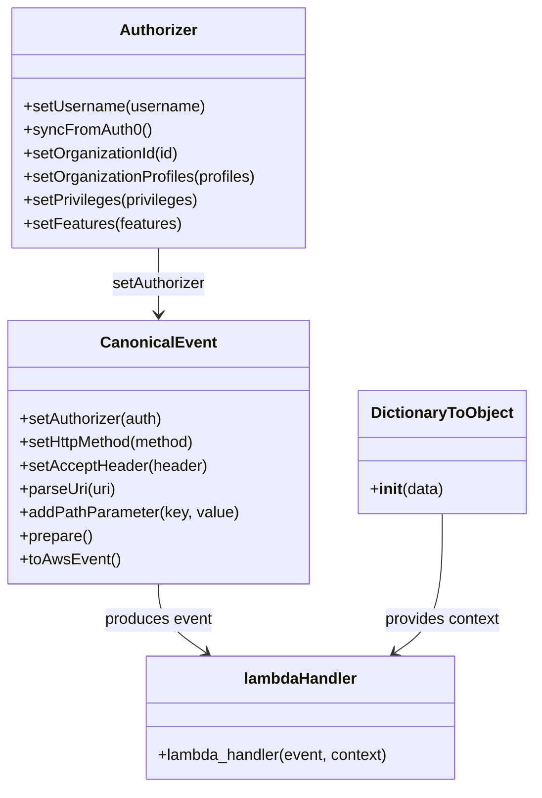

# Diagram: platform/tools/ide_local_testing/localTest/test/byUrl/reusableContainerTrackingSearchByUrl.py


> Auto-generated by Obscura crawlers

## Diagram 1



### SVG

<svg id="container" width="538.7890625" xmlns="http://www.w3.org/2000/svg" class="classDiagram" height="806" viewBox="0 0 538.7890625 806" role="graphics-document document" aria-roledescription="class"><style>#container{font-family:"trebuchet ms",verdana,arial,sans-serif;font-size:16px;fill:#333;}@keyframes edge-animation-frame{from{stroke-dashoffset:0;}}@keyframes dash{to{stroke-dashoffset:0;}}#container .edge-animation-slow{stroke-dasharray:9,5!important;stroke-dashoffset:900;animation:dash 50s linear infinite;stroke-linecap:round;}#container .edge-animation-fast{stroke-dasharray:9,5!important;stroke-dashoffset:900;animation:dash 20s linear infinite;stroke-linecap:round;}#container .error-icon{fill:#552222;}#container .error-text{fill:#552222;stroke:#552222;}#container .edge-thickness-normal{stroke-width:1px;}#container .edge-thickness-thick{stroke-width:3.5px;}#container .edge-pattern-solid{stroke-dasharray:0;}#container .edge-thickness-invisible{stroke-width:0;fill:none;}#container .edge-pattern-dashed{stroke-dasharray:3;}#container .edge-pattern-dotted{stroke-dasharray:2;}#container .marker{fill:#333333;stroke:#333333;}#container .marker.cross{stroke:#333333;}#container svg{font-family:"trebuchet ms",verdana,arial,sans-serif;font-size:16px;}#container p{margin:0;}#container g.classGroup text{fill:#9370DB;stroke:none;font-family:"trebuchet ms",verdana,arial,sans-serif;font-size:10px;}#container g.classGroup text .title{font-weight:bolder;}#container .nodeLabel,#container .edgeLabel{color:#131300;}#container .edgeLabel .label rect{fill:#ECECFF;}#container .label text{fill:#131300;}#container .labelBkg{background:#ECECFF;}#container .edgeLabel .label span{background:#ECECFF;}#container .classTitle{font-weight:bolder;}#container .node rect,#container .node circle,#container .node ellipse,#container .node polygon,#container .node path{fill:#ECECFF;stroke:#9370DB;stroke-width:1px;}#container .divider{stroke:#9370DB;stroke-width:1;}#container g.clickable{cursor:pointer;}#container g.classGroup rect{fill:#ECECFF;stroke:#9370DB;}#container g.classGroup line{stroke:#9370DB;stroke-width:1;}#container .classLabel .box{stroke:none;stroke-width:0;fill:#ECECFF;opacity:0.5;}#container .classLabel .label{fill:#9370DB;font-size:10px;}#container .relation{stroke:#333333;stroke-width:1;fill:none;}#container .dashed-line{stroke-dasharray:3;}#container .dotted-line{stroke-dasharray:1 2;}#container #compositionStart,#container .composition{fill:#333333!important;stroke:#333333!important;stroke-width:1;}#container #compositionEnd,#container .composition{fill:#333333!important;stroke:#333333!important;stroke-width:1;}#container #dependencyStart,#container .dependency{fill:#333333!important;stroke:#333333!important;stroke-width:1;}#container #dependencyStart,#container .dependency{fill:#333333!important;stroke:#333333!important;stroke-width:1;}#container #extensionStart,#container .extension{fill:transparent!important;stroke:#333333!important;stroke-width:1;}#container #extensionEnd,#container .extension{fill:transparent!important;stroke:#333333!important;stroke-width:1;}#container #aggregationStart,#container .aggregation{fill:transparent!important;stroke:#333333!important;stroke-width:1;}#container #aggregationEnd,#container .aggregation{fill:transparent!important;stroke:#333333!important;stroke-width:1;}#container #lollipopStart,#container .lollipop{fill:#ECECFF!important;stroke:#333333!important;stroke-width:1;}#container #lollipopEnd,#container .lollipop{fill:#ECECFF!important;stroke:#333333!important;stroke-width:1;}#container .edgeTerminals{font-size:11px;line-height:initial;}#container .classTitleText{text-anchor:middle;font-size:18px;fill:#333;}#container .label-icon{display:inline-block;height:1em;overflow:visible;vertical-align:-0.125em;}#container .node .label-icon path{fill:currentColor;stroke:revert;stroke-width:revert;}#container :root{--mermaid-font-family:"trebuchet ms",verdana,arial,sans-serif;}</style><g><defs><marker id="container_class-aggregationStart" class="marker aggregation class" refX="18" refY="7" markerWidth="190" markerHeight="240" orient="auto"><path d="M 18,7 L9,13 L1,7 L9,1 Z"></path></marker></defs><defs><marker id="container_class-aggregationEnd" class="marker aggregation class" refX="1" refY="7" markerWidth="20" markerHeight="28" orient="auto"><path d="M 18,7 L9,13 L1,7 L9,1 Z"></path></marker></defs><defs><marker id="container_class-extensionStart" class="marker extension class" refX="18" refY="7" markerWidth="190" markerHeight="240" orient="auto"><path d="M 1,7 L18,13 V 1 Z"></path></marker></defs><defs><marker id="container_class-extensionEnd" class="marker extension class" refX="1" refY="7" markerWidth="20" markerHeight="28" orient="auto"><path d="M 1,1 V 13 L18,7 Z"></path></marker></defs><defs><marker id="container_class-compositionStart" class="marker composition class" refX="18" refY="7" markerWidth="190" markerHeight="240" orient="auto"><path d="M 18,7 L9,13 L1,7 L9,1 Z"></path></marker></defs><defs><marker id="container_class-compositionEnd" class="marker composition class" refX="1" refY="7" markerWidth="20" markerHeight="28" orient="auto"><path d="M 18,7 L9,13 L1,7 L9,1 Z"></path></marker></defs><defs><marker id="container_class-dependencyStart" class="marker dependency class" refX="6" refY="7" markerWidth="190" markerHeight="240" orient="auto"><path d="M 5,7 L9,13 L1,7 L9,1 Z"></path></marker></defs><defs><marker id="container_class-dependencyEnd" class="marker dependency class" refX="13" refY="7" markerWidth="20" markerHeight="28" orient="auto"><path d="M 18,7 L9,13 L14,7 L9,1 Z"></path></marker></defs><defs><marker id="container_class-lollipopStart" class="marker lollipop class" refX="13" refY="7" markerWidth="190" markerHeight="240" orient="auto"><circle stroke="black" fill="transparent" cx="7" cy="7" r="6"></circle></marker></defs><defs><marker id="container_class-lollipopEnd" class="marker lollipop class" refX="1" refY="7" markerWidth="190" markerHeight="240" orient="auto"><circle stroke="black" fill="transparent" cx="7" cy="7" r="6"></circle></marker></defs><g class="root"><g class="clusters"></g><g class="edgePaths"><path d="M159.668,254L159.668,260.167C159.668,266.333,159.668,278.667,159.668,290C159.668,301.333,159.668,311.667,159.668,316.833L159.668,322" id="id_Authorizer_CanonicalEvent_1" class="edge-thickness-normal edge-pattern-solid relation" style=";;;" data-edge="true" data-et="edge" data-id="id_Authorizer_CanonicalEvent_1" data-points="W3sieCI6MTU5LjY2Nzk2ODc1LCJ5IjoyNTR9LHsieCI6MTU5LjY2Nzk2ODc1LCJ5IjoyOTF9LHsieCI6MTU5LjY2Nzk2ODc1LCJ5IjozMjh9XQ==" marker-end="url(#container_class-dependencyEnd)"></path><path d="M159.668,598L159.668,604.167C159.668,610.333,159.668,622.667,167.677,634.427C175.686,646.188,191.705,657.376,199.714,662.97L207.723,668.564" id="id_CanonicalEvent_lambdaHandler_2" class="edge-thickness-normal edge-pattern-solid relation" style=";;;" data-edge="true" data-et="edge" data-id="id_CanonicalEvent_lambdaHandler_2" data-points="W3sieCI6MTU5LjY2Nzk2ODc1LCJ5Ijo1OTh9LHsieCI6MTU5LjY2Nzk2ODc1LCJ5Ijo2MzV9LHsieCI6MjEyLjY0MjI4NTE1NjI1LCJ5Ijo2NzJ9XQ==" marker-end="url(#container_class-dependencyEnd)"></path><path d="M446.016,526L446.016,544.167C446.016,562.333,446.016,598.667,438.006,622.427C429.997,646.188,413.979,657.376,405.97,662.97L397.96,668.564" id="id_DictionaryToObject_lambdaHandler_3" class="edge-thickness-normal edge-pattern-solid relation" style=";;;" data-edge="true" data-et="edge" data-id="id_DictionaryToObject_lambdaHandler_3" data-points="W3sieCI6NDQ2LjAxNTYyNSwieSI6NTI2fSx7IngiOjQ0Ni4wMTU2MjUsInkiOjYzNX0seyJ4IjozOTMuMDQxMzA4NTkzNzUsInkiOjY3Mn1d" marker-end="url(#container_class-dependencyEnd)"></path></g><g class="edgeLabels"><g class="edgeLabel" transform="translate(159.66796875, 291)"><g class="label" data-id="id_Authorizer_CanonicalEvent_1" transform="translate(-48.7109375, -12)"><foreignObject width="97.421875" height="24"><div xmlns="http://www.w3.org/1999/xhtml" class="labelBkg" style="display: table-cell; white-space: nowrap; line-height: 1.5; max-width: 200px; text-align: center;"><span class="edgeLabel"><p>setAuthorizer</p></span></div></foreignObject></g></g><g class="edgeLabel" transform="translate(159.66796875, 635)"><g class="label" data-id="id_CanonicalEvent_lambdaHandler_2" transform="translate(-55.765625, -12)"><foreignObject width="111.53125" height="24"><div xmlns="http://www.w3.org/1999/xhtml" class="labelBkg" style="display: table-cell; white-space: nowrap; line-height: 1.5; max-width: 200px; text-align: center;"><span class="edgeLabel"><p>produces event</p></span></div></foreignObject></g></g><g class="edgeLabel" transform="translate(446.015625, 635)"><g class="label" data-id="id_DictionaryToObject_lambdaHandler_3" transform="translate(-60.28125, -12)"><foreignObject width="120.5625" height="24"><div xmlns="http://www.w3.org/1999/xhtml" class="labelBkg" style="display: table-cell; white-space: nowrap; line-height: 1.5; max-width: 200px; text-align: center;"><span class="edgeLabel"><p>provides context</p></span></div></foreignObject></g></g></g><g class="nodes"><g class="node default" id="classId-Authorizer-0" transform="translate(159.66796875, 131)"><g class="basic label-container"><path d="M-151.66796875 -123 L151.66796875 -123 L151.66796875 123 L-151.66796875 123" stroke="none" stroke-width="0" fill="#ECECFF" style=""></path><path d="M-151.66796875 -123 C-39.412948350690186 -123, 72.84207204861963 -123, 151.66796875 -123 M-151.66796875 -123 C-60.25252032924104 -123, 31.162928091517927 -123, 151.66796875 -123 M151.66796875 -123 C151.66796875 -70.77729318427959, 151.66796875 -18.554586368559185, 151.66796875 123 M151.66796875 -123 C151.66796875 -43.49580163397239, 151.66796875 36.00839673205522, 151.66796875 123 M151.66796875 123 C43.99159504987456 123, -63.68477865025088 123, -151.66796875 123 M151.66796875 123 C43.277457855185986 123, -65.11305303962803 123, -151.66796875 123 M-151.66796875 123 C-151.66796875 63.034902842983975, -151.66796875 3.0698056859679497, -151.66796875 -123 M-151.66796875 123 C-151.66796875 55.714750522074766, -151.66796875 -11.570498955850468, -151.66796875 -123" stroke="#9370DB" stroke-width="1.3" fill="none" stroke-dasharray="0 0" style=""></path></g><g class="annotation-group text" transform="translate(0, -99)"></g><g class="label-group text" transform="translate(-38.3671875, -99)"><g class="label" style="font-weight: bolder" transform="translate(0,-12)"><foreignObject width="76.734375" height="24"><div xmlns="http://www.w3.org/1999/xhtml" style="display: table-cell; white-space: nowrap; line-height: 1.5; max-width: 126px; text-align: center;"><span class="nodeLabel markdown-node-label" style=""><p>Authorizer</p></span></div></foreignObject></g></g><g class="members-group text" transform="translate(-139.66796875, -51)"></g><g class="methods-group text" transform="translate(-139.66796875, -21)"><g class="label" style="" transform="translate(0,-12)"><foreignObject width="185.90625" height="24"><div xmlns="http://www.w3.org/1999/xhtml" style="display: table-cell; white-space: nowrap; line-height: 1.5; max-width: 243px; text-align: center;"><span class="nodeLabel markdown-node-label" style=""><p>+setUsername(username)</p></span></div></foreignObject></g><g class="label" style="" transform="translate(0,12)"><foreignObject width="129.0625" height="24"><div xmlns="http://www.w3.org/1999/xhtml" style="display: table-cell; white-space: nowrap; line-height: 1.5; max-width: 186px; text-align: center;"><span class="nodeLabel markdown-node-label" style=""><p>+syncFromAuth0()</p></span></div></foreignObject></g><g class="label" style="" transform="translate(0,36)"><foreignObject width="160.78125" height="24"><div xmlns="http://www.w3.org/1999/xhtml" style="display: table-cell; white-space: nowrap; line-height: 1.5; max-width: 218px; text-align: center;"><span class="nodeLabel markdown-node-label" style=""><p>+setOrganizationId(id)</p></span></div></foreignObject></g><g class="label" style="" transform="translate(0,60)"><foreignObject width="240.96875" height="24"><div xmlns="http://www.w3.org/1999/xhtml" style="display: table-cell; white-space: nowrap; line-height: 1.5; max-width: 298px; text-align: center;"><span class="nodeLabel markdown-node-label" style=""><p>+setOrganizationProfiles(profiles)</p></span></div></foreignObject></g><g class="label" style="" transform="translate(0,84)"><foreignObject width="180.125" height="24"><div xmlns="http://www.w3.org/1999/xhtml" style="display: table-cell; white-space: nowrap; line-height: 1.5; max-width: 237px; text-align: center;"><span class="nodeLabel markdown-node-label" style=""><p>+setPrivileges(privileges)</p></span></div></foreignObject></g><g class="label" style="" transform="translate(0,108)"><foreignObject width="161.296875" height="24"><div xmlns="http://www.w3.org/1999/xhtml" style="display: table-cell; white-space: nowrap; line-height: 1.5; max-width: 219px; text-align: center;"><span class="nodeLabel markdown-node-label" style=""><p>+setFeatures(features)</p></span></div></foreignObject></g></g><g class="divider" style=""><path d="M-151.66796875 -75 C-60.413778302047106 -75, 30.840412145905788 -75, 151.66796875 -75 M-151.66796875 -75 C-86.44407066000386 -75, -21.22017257000772 -75, 151.66796875 -75" stroke="#9370DB" stroke-width="1.3" fill="none" stroke-dasharray="0 0" style=""></path></g><g class="divider" style=""><path d="M-151.66796875 -51 C-56.49466032574604 -51, 38.67864809850792 -51, 151.66796875 -51 M-151.66796875 -51 C-31.184190116107445 -51, 89.29958851778511 -51, 151.66796875 -51" stroke="#9370DB" stroke-width="1.3" fill="none" stroke-dasharray="0 0" style=""></path></g></g><g class="node default" id="classId-CanonicalEvent-1" transform="translate(159.66796875, 463)"><g class="basic label-container"><path d="M-151.57421875 -135 L151.57421875 -135 L151.57421875 135 L-151.57421875 135" stroke="none" stroke-width="0" fill="#ECECFF" style=""></path><path d="M-151.57421875 -135 C-50.21139068338536 -135, 51.15143738322928 -135, 151.57421875 -135 M-151.57421875 -135 C-40.17521086984202 -135, 71.22379701031596 -135, 151.57421875 -135 M151.57421875 -135 C151.57421875 -60.081486988876094, 151.57421875 14.837026022247812, 151.57421875 135 M151.57421875 -135 C151.57421875 -70.09057475327856, 151.57421875 -5.181149506557119, 151.57421875 135 M151.57421875 135 C50.684333302556254 135, -50.20555214488749 135, -151.57421875 135 M151.57421875 135 C43.21520382078015 135, -65.1438111084397 135, -151.57421875 135 M-151.57421875 135 C-151.57421875 69.60707149440663, -151.57421875 4.214142988813251, -151.57421875 -135 M-151.57421875 135 C-151.57421875 78.57468306398746, -151.57421875 22.149366127974943, -151.57421875 -135" stroke="#9370DB" stroke-width="1.3" fill="none" stroke-dasharray="0 0" style=""></path></g><g class="annotation-group text" transform="translate(0, -111)"></g><g class="label-group text" transform="translate(-55.7109375, -111)"><g class="label" style="font-weight: bolder" transform="translate(0,-12)"><foreignObject width="111.421875" height="24"><div xmlns="http://www.w3.org/1999/xhtml" style="display: table-cell; white-space: nowrap; line-height: 1.5; max-width: 161px; text-align: center;"><span class="nodeLabel markdown-node-label" style=""><p>CanonicalEvent</p></span></div></foreignObject></g></g><g class="members-group text" transform="translate(-139.57421875, -63)"></g><g class="methods-group text" transform="translate(-139.57421875, -33)"><g class="label" style="" transform="translate(0,-12)"><foreignObject width="148.9375" height="24"><div xmlns="http://www.w3.org/1999/xhtml" style="display: table-cell; white-space: nowrap; line-height: 1.5; max-width: 206px; text-align: center;"><span class="nodeLabel markdown-node-label" style=""><p>+setAuthorizer(auth)</p></span></div></foreignObject></g><g class="label" style="" transform="translate(0,12)"><foreignObject width="184" height="24"><div xmlns="http://www.w3.org/1999/xhtml" style="display: table-cell; white-space: nowrap; line-height: 1.5; max-width: 241px; text-align: center;"><span class="nodeLabel markdown-node-label" style=""><p>+setHttpMethod(method)</p></span></div></foreignObject></g><g class="label" style="" transform="translate(0,36)"><foreignObject width="191.859375" height="24"><div xmlns="http://www.w3.org/1999/xhtml" style="display: table-cell; white-space: nowrap; line-height: 1.5; max-width: 249px; text-align: center;"><span class="nodeLabel markdown-node-label" style=""><p>+setAcceptHeader(header)</p></span></div></foreignObject></g><g class="label" style="" transform="translate(0,60)"><foreignObject width="99.8125" height="24"><div xmlns="http://www.w3.org/1999/xhtml" style="display: table-cell; white-space: nowrap; line-height: 1.5; max-width: 157px; text-align: center;"><span class="nodeLabel markdown-node-label" style=""><p>+parseUri(uri)</p></span></div></foreignObject></g><g class="label" style="" transform="translate(0,84)"><foreignObject width="223.4375" height="24"><div xmlns="http://www.w3.org/1999/xhtml" style="display: table-cell; white-space: nowrap; line-height: 1.5; max-width: 281px; text-align: center;"><span class="nodeLabel markdown-node-label" style=""><p>+addPathParameter(key, value)</p></span></div></foreignObject></g><g class="label" style="" transform="translate(0,108)"><foreignObject width="74.75" height="24"><div xmlns="http://www.w3.org/1999/xhtml" style="display: table-cell; white-space: nowrap; line-height: 1.5; max-width: 132px; text-align: center;"><span class="nodeLabel markdown-node-label" style=""><p>+prepare()</p></span></div></foreignObject></g><g class="label" style="" transform="translate(0,132)"><foreignObject width="101.1875" height="24"><div xmlns="http://www.w3.org/1999/xhtml" style="display: table-cell; white-space: nowrap; line-height: 1.5; max-width: 159px; text-align: center;"><span class="nodeLabel markdown-node-label" style=""><p>+toAwsEvent()</p></span></div></foreignObject></g></g><g class="divider" style=""><path d="M-151.57421875 -87 C-87.57167006972281 -87, -23.569121389445627 -87, 151.57421875 -87 M-151.57421875 -87 C-45.10482737810236 -87, 61.36456399379529 -87, 151.57421875 -87" stroke="#9370DB" stroke-width="1.3" fill="none" stroke-dasharray="0 0" style=""></path></g><g class="divider" style=""><path d="M-151.57421875 -63 C-89.68296521126055 -63, -27.791711672521117 -63, 151.57421875 -63 M-151.57421875 -63 C-49.03459132561916 -63, 53.50503609876168 -63, 151.57421875 -63" stroke="#9370DB" stroke-width="1.3" fill="none" stroke-dasharray="0 0" style=""></path></g></g><g class="node default" id="classId-DictionaryToObject-2" transform="translate(446.015625, 463)"><g class="basic label-container"><path d="M-84.7734375 -63 L84.7734375 -63 L84.7734375 63 L-84.7734375 63" stroke="none" stroke-width="0" fill="#ECECFF" style=""></path><path d="M-84.7734375 -63 C-18.059192703593965 -63, 48.65505209281207 -63, 84.7734375 -63 M-84.7734375 -63 C-43.876105190831204 -63, -2.978772881662408 -63, 84.7734375 -63 M84.7734375 -63 C84.7734375 -25.130037718890613, 84.7734375 12.739924562218775, 84.7734375 63 M84.7734375 -63 C84.7734375 -21.541456473156785, 84.7734375 19.91708705368643, 84.7734375 63 M84.7734375 63 C18.877337438449885 63, -47.01876262310023 63, -84.7734375 63 M84.7734375 63 C40.747364158664446 63, -3.2787091826711077 63, -84.7734375 63 M-84.7734375 63 C-84.7734375 26.124373006465, -84.7734375 -10.751253987070001, -84.7734375 -63 M-84.7734375 63 C-84.7734375 36.66035525097474, -84.7734375 10.320710501949478, -84.7734375 -63" stroke="#9370DB" stroke-width="1.3" fill="none" stroke-dasharray="0 0" style=""></path></g><g class="annotation-group text" transform="translate(0, -39)"></g><g class="label-group text" transform="translate(-70.109375, -39)"><g class="label" style="font-weight: bolder" transform="translate(0,-12)"><foreignObject width="140.21875" height="24"><div xmlns="http://www.w3.org/1999/xhtml" style="display: table-cell; white-space: nowrap; line-height: 1.5; max-width: 188px; text-align: center;"><span class="nodeLabel markdown-node-label" style=""><p>DictionaryToObject</p></span></div></foreignObject></g></g><g class="members-group text" transform="translate(-72.7734375, 9)"></g><g class="methods-group text" transform="translate(-72.7734375, 39)"><g class="label" style="" transform="translate(0,-12)"><foreignObject width="75.4375" height="24"><div xmlns="http://www.w3.org/1999/xhtml" style="display: table-cell; white-space: nowrap; line-height: 1.5; max-width: 164px; text-align: center;"><span class="nodeLabel markdown-node-label" style=""><p>+<strong>init</strong>(data)</p></span></div></foreignObject></g></g><g class="divider" style=""><path d="M-84.7734375 -15 C-48.4710461556848 -15, -12.168654811369606 -15, 84.7734375 -15 M-84.7734375 -15 C-36.10293297488298 -15, 12.567571550234035 -15, 84.7734375 -15" stroke="#9370DB" stroke-width="1.3" fill="none" stroke-dasharray="0 0" style=""></path></g><g class="divider" style=""><path d="M-84.7734375 9 C-30.543216762194213 9, 23.687003975611574 9, 84.7734375 9 M-84.7734375 9 C-17.05617101811481 9, 50.66109546377038 9, 84.7734375 9" stroke="#9370DB" stroke-width="1.3" fill="none" stroke-dasharray="0 0" style=""></path></g></g><g class="node default" id="classId-lambdaHandler-3" transform="translate(302.841796875, 735)"><g class="basic label-container"><path d="M-160.359375 -63 L160.359375 -63 L160.359375 63 L-160.359375 63" stroke="none" stroke-width="0" fill="#ECECFF" style=""></path><path d="M-160.359375 -63 C-87.80865407769674 -63, -15.257933155393488 -63, 160.359375 -63 M-160.359375 -63 C-72.94138118125655 -63, 14.476612637486909 -63, 160.359375 -63 M160.359375 -63 C160.359375 -24.064228365877256, 160.359375 14.871543268245489, 160.359375 63 M160.359375 -63 C160.359375 -22.340079135024688, 160.359375 18.319841729950625, 160.359375 63 M160.359375 63 C76.6129421054449 63, -7.133490789110198 63, -160.359375 63 M160.359375 63 C94.43114025166503 63, 28.502905503330055 63, -160.359375 63 M-160.359375 63 C-160.359375 30.869141350566935, -160.359375 -1.261717298866131, -160.359375 -63 M-160.359375 63 C-160.359375 25.00999264810156, -160.359375 -12.980014703796883, -160.359375 -63" stroke="#9370DB" stroke-width="1.3" fill="none" stroke-dasharray="0 0" style=""></path></g><g class="annotation-group text" transform="translate(0, -39)"></g><g class="label-group text" transform="translate(-56.53125, -39)"><g class="label" style="font-weight: bolder" transform="translate(0,-12)"><foreignObject width="113.0625" height="24"><div xmlns="http://www.w3.org/1999/xhtml" style="display: table-cell; white-space: nowrap; line-height: 1.5; max-width: 164px; text-align: center;"><span class="nodeLabel markdown-node-label" style=""><p>lambdaHandler</p></span></div></foreignObject></g></g><g class="members-group text" transform="translate(-148.359375, 9)"></g><g class="methods-group text" transform="translate(-148.359375, 39)"><g class="label" style="" transform="translate(0,-12)"><foreignObject width="240.1875" height="24"><div xmlns="http://www.w3.org/1999/xhtml" style="display: table-cell; white-space: nowrap; line-height: 1.5; max-width: 298px; text-align: center;"><span class="nodeLabel markdown-node-label" style=""><p>+lambda_handler(event, context)</p></span></div></foreignObject></g></g><g class="divider" style=""><path d="M-160.359375 -15 C-86.13894326934883 -15, -11.918511538697658 -15, 160.359375 -15 M-160.359375 -15 C-94.72351351012802 -15, -29.08765202025603 -15, 160.359375 -15" stroke="#9370DB" stroke-width="1.3" fill="none" stroke-dasharray="0 0" style=""></path></g><g class="divider" style=""><path d="M-160.359375 9 C-80.71815900317183 9, -1.0769430063436687 9, 160.359375 9 M-160.359375 9 C-58.10492913698364 9, 44.149516726032715 9, 160.359375 9" stroke="#9370DB" stroke-width="1.3" fill="none" stroke-dasharray="0 0" style=""></path></g></g></g></g></g></svg>

## Diagram 2

```mermaid
sequenceDiagram
    participant Script
    participant Authorizer
    participant CanonicalEvent
    participant DictionaryToObject
    participant lambdaHandler
    Script->>Authorizer: Authorizer(); setUsername(email)
    Authorizer->>Authorizer: syncFromAuth0()
    Script->>Authorizer: setOrganizationId(137); setOrganizationProfiles(SH,FV); setPrivileges(...); setFeatures(Container Tracking)
    Script->>CanonicalEvent: CanonicalEvent()
    CanonicalEvent->>CanonicalEvent: setAuthorizer(Authorizer)
    CanonicalEvent->>CanonicalEvent: setHttpMethod(GET)
    CanonicalEvent->>CanonicalEvent: setAcceptHeader(application/json)
    CanonicalEvent->>CanonicalEvent: parseUri(uri)
    CanonicalEvent->>CanonicalEvent: addPathParameter(type,app)
    CanonicalEvent->>CanonicalEvent: prepare()
    CanonicalEvent->>Script: toAwsEvent() -> event
    Script->>DictionaryToObject: DictionaryToObject({function_name:partviewSearchByURL})
    Script->>lambdaHandler: lambdaHandler(event, DictionaryToObject)
    lambdaHandler-->>Script: retval
    Script->>Script: parse body if present; print prettyRetval
```

> SVG rendering failed for this diagram.
