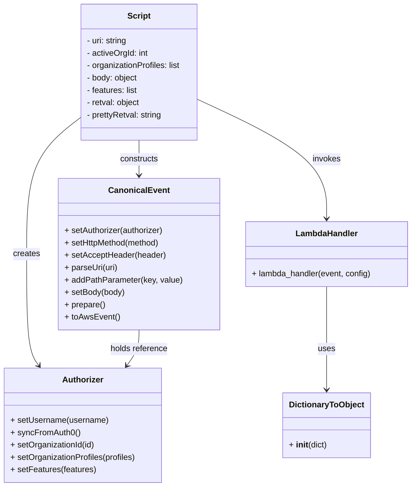
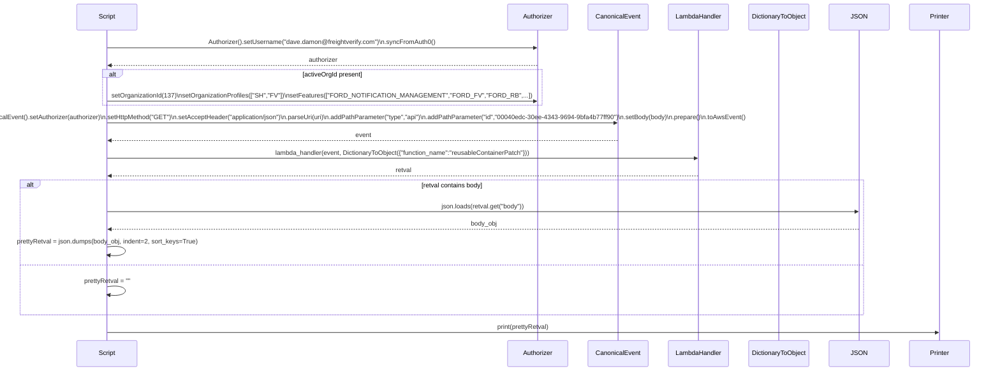

# Diagram: platform/tools/ide_local_testing/localTest/test/byUrl/reusableTripContainerPatch.py

> Auto-generated by Obscura crawlers

## Diagram 1

### SVG

<svg id="container" width="797.599609375" xmlns="http://www.w3.org/2000/svg" class="classDiagram" height="944" viewBox="0 0 797.599609375 944" role="graphics-document document" aria-roledescription="class"><g><defs><marker id="container_class-aggregationStart" class="marker aggregation class" refX="18" refY="7" markerWidth="190" markerHeight="240" orient="auto"><path d="M 18,7 L9,13 L1,7 L9,1 Z"></path></marker></defs><defs><marker id="container_class-aggregationEnd" class="marker aggregation class" refX="1" refY="7" markerWidth="20" markerHeight="28" orient="auto"><path d="M 18,7 L9,13 L1,7 L9,1 Z"></path></marker></defs><defs><marker id="container_class-extensionStart" class="marker extension class" refX="18" refY="7" markerWidth="190" markerHeight="240" orient="auto"><path d="M 1,7 L18,13 V 1 Z"></path></marker></defs><defs><marker id="container_class-extensionEnd" class="marker extension class" refX="1" refY="7" markerWidth="20" markerHeight="28" orient="auto"><path d="M 1,1 V 13 L18,7 Z"></path></marker></defs><defs><marker id="container_class-compositionStart" class="marker composition class" refX="18" refY="7" markerWidth="190" markerHeight="240" orient="auto"><path d="M 18,7 L9,13 L1,7 L9,1 Z"></path></marker></defs><defs><marker id="container_class-compositionEnd" class="marker composition class" refX="1" refY="7" markerWidth="20" markerHeight="28" orient="auto"><path d="M 18,7 L9,13 L1,7 L9,1 Z"></path></marker></defs><defs><marker id="container_class-dependencyStart" class="marker dependency class" refX="6" refY="7" markerWidth="190" markerHeight="240" orient="auto"><path d="M 5,7 L9,13 L1,7 L9,1 Z"></path></marker></defs><defs><marker id="container_class-dependencyEnd" class="marker dependency class" refX="13" refY="7" markerWidth="20" markerHeight="28" orient="auto"><path d="M 18,7 L9,13 L14,7 L9,1 Z"></path></marker></defs><defs><marker id="container_class-lollipopStart" class="marker lollipop class" refX="13" refY="7" markerWidth="190" markerHeight="240" orient="auto"><circle stroke="black" fill="transparent" cx="7" cy="7" r="6"></circle></marker></defs><defs><marker id="container_class-lollipopEnd" class="marker lollipop class" refX="1" refY="7" markerWidth="190" markerHeight="240" orient="auto"><circle stroke="black" fill="transparent" cx="7" cy="7" r="6"></circle></marker></defs><g class="root"><g class="clusters"></g><g class="edgePaths"><path d="M153.607,230.929L137.055,243.941C120.503,256.952,87.399,282.976,70.847,326.655C54.295,370.333,54.295,431.667,54.295,493C54.295,554.333,54.295,615.667,58.186,651.691C62.077,687.715,69.859,698.43,73.75,703.788L77.642,709.145" id="id_Script_Authorizer_1" class="edge-thickness-normal edge-pattern-solid relation" style=";;;" data-edge="true" data-et="edge" data-id="id_Script_Authorizer_1" data-points="W3sieCI6MTUzLjYwNzQyMTg3NSwieSI6MjMwLjkyODY2MzU3NzcyMzI4fSx7IngiOjU0LjI5NDkyMTg3NSwieSI6MzA5fSx7IngiOjU0LjI5NDkyMTg3NSwieSI6NDkzfSx7IngiOjU0LjI5NDkyMTg3NSwieSI6Njc3fSx7IngiOjgxLjE2NzQ4MDQ2ODc1LCJ5Ijo3MTR9XQ==" marker-end="url(#container_class-dependencyEnd)"></path><path d="M269.275,272L269.275,278.167C269.275,284.333,269.275,296.667,269.275,308C269.275,319.333,269.275,329.667,269.275,334.833L269.275,340" id="id_Script_CanonicalEvent_2" class="edge-thickness-normal edge-pattern-solid relation" style=";;;" data-edge="true" data-et="edge" data-id="id_Script_CanonicalEvent_2" data-points="W3sieCI6MjY5LjI3NTM5MDYyNSwieSI6MjcyfSx7IngiOjI2OS4yNzUzOTA2MjUsInkiOjMwOX0seyJ4IjoyNjkuMjc1MzkwNjI1LCJ5IjozNDZ9XQ==" marker-end="url(#container_class-dependencyEnd)"></path><path d="M384.943,193.99L426.01,213.158C467.076,232.327,549.209,270.663,590.275,308.998C631.342,347.333,631.342,385.667,631.342,404.833L631.342,424" id="id_Script_LambdaHandler_3" class="edge-thickness-normal edge-pattern-solid relation" style=";;;" data-edge="true" data-et="edge" data-id="id_Script_LambdaHandler_3" data-points="W3sieCI6Mzg0Ljk0MzM1OTM3NSwieSI6MTkzLjk4OTc4MzAzNzkwMDkzfSx7IngiOjYzMS4zNDE3OTY4NzUsInkiOjMwOX0seyJ4Ijo2MzEuMzQxNzk2ODc1LCJ5Ijo0MzB9XQ==" marker-end="url(#container_class-dependencyEnd)"></path><path d="M269.275,640L269.275,646.167C269.275,652.333,269.275,664.667,265.384,676.191C261.493,687.715,253.711,698.43,249.82,703.788L245.929,709.145" id="id_CanonicalEvent_Authorizer_4" class="edge-thickness-normal edge-pattern-solid relation" style=";;;" data-edge="true" data-et="edge" data-id="id_CanonicalEvent_Authorizer_4" data-points="W3sieCI6MjY5LjI3NTM5MDYyNSwieSI6NjQwfSx7IngiOjI2OS4yNzUzOTA2MjUsInkiOjY3N30seyJ4IjoyNDIuNDAyODMyMDMxMjUsInkiOjcxNH1d" marker-end="url(#container_class-dependencyEnd)"></path><path d="M631.342,556L631.342,576.167C631.342,596.333,631.342,636.667,631.342,670C631.342,703.333,631.342,729.667,631.342,742.833L631.342,756" id="id_LambdaHandler_DictionaryToObject_5" class="edge-thickness-normal edge-pattern-solid relation" style=";;;" data-edge="true" data-et="edge" data-id="id_LambdaHandler_DictionaryToObject_5" data-points="W3sieCI6NjMxLjM0MTc5Njg3NSwieSI6NTU2fSx7IngiOjYzMS4zNDE3OTY4NzUsInkiOjY3N30seyJ4Ijo2MzEuMzQxNzk2ODc1LCJ5Ijo3NjJ9XQ==" marker-end="url(#container_class-dependencyEnd)"></path></g><g class="edgeLabels"><g class="edgeLabel" transform="translate(54.294921875, 493)"><g class="label" data-id="id_Script_Authorizer_1" transform="translate(-26.171875, -12)"><foreignObject width="52.34375" height="24">

creates

</foreignObject></g></g><g class="edgeLabel" transform="translate(269.275390625, 309)"><g class="label" data-id="id_Script_CanonicalEvent_2" transform="translate(-37.84375, -12)"><foreignObject width="75.6875" height="24">

constructs

</foreignObject></g></g><g class="edgeLabel" transform="translate(631.341796875, 309)"><g class="label" data-id="id_Script_LambdaHandler_3" transform="translate(-27.5859375, -12)"><foreignObject width="55.171875" height="24">

invokes

</foreignObject></g></g><g class="edgeLabel" transform="translate(269.275390625, 677)"><g class="label" data-id="id_CanonicalEvent_Authorizer_4" transform="translate(-56.3984375, -12)"><foreignObject width="112.796875" height="24">

holds reference

</foreignObject></g></g><g class="edgeLabel" transform="translate(631.341796875, 677)"><g class="label" data-id="id_LambdaHandler_DictionaryToObject_5" transform="translate(-16.4921875, -12)"><foreignObject width="32.984375" height="24">

uses

</foreignObject></g></g></g><g class="nodes"><g class="node default" id="classId-Script-0" transform="translate(269.275390625, 140)"><g class="basic label-container"><path d="M-115.66796875 -132 L115.66796875 -132 L115.66796875 132 L-115.66796875 132" stroke="none" stroke-width="0" fill="#ECECFF" style=""></path><path d="M-115.66796875 -132 C-26.67641290899448 -132, 62.31514293201104 -132, 115.66796875 -132 M-115.66796875 -132 C-33.79093840323503 -132, 48.08609194352994 -132, 115.66796875 -132 M115.66796875 -132 C115.66796875 -37.584510077752114, 115.66796875 56.83097984449577, 115.66796875 132 M115.66796875 -132 C115.66796875 -37.53439913611946, 115.66796875 56.93120172776108, 115.66796875 132 M115.66796875 132 C52.48336234284837 132, -10.701244064303253 132, -115.66796875 132 M115.66796875 132 C24.17290804678524 132, -67.32215265642952 132, -115.66796875 132 M-115.66796875 132 C-115.66796875 73.3290339486933, -115.66796875 14.658067897386587, -115.66796875 -132 M-115.66796875 132 C-115.66796875 70.78349595145474, -115.66796875 9.566991902909479, -115.66796875 -132" stroke="#9370DB" stroke-width="1.3" fill="none" stroke-dasharray="0 0" style=""></path></g><g class="annotation-group text" transform="translate(0, -108)"></g><g class="label-group text" transform="translate(-21.7421875, -108)"><g class="label" style="font-weight: bolder" transform="translate(0,-12)"><foreignObject width="43.484375" height="24">

Script

</foreignObject></g></g><g class="members-group text" transform="translate(-103.66796875, -60)"><g class="label" style="" transform="translate(0,-12)"><foreignObject width="80.40625" height="24">

- uri: string

</foreignObject></g><g class="label" style="" transform="translate(0,12)"><foreignObject width="121.21875" height="24">

- activeOrgId: int

</foreignObject></g><g class="label" style="" transform="translate(0,36)"><foreignObject width="185.59375" height="24">

- organizationProfiles: list

</foreignObject></g><g class="label" style="" transform="translate(0,60)"><foreignObject width="100.59375" height="24">

- body: object

</foreignObject></g><g class="label" style="" transform="translate(0,84)"><foreignObject width="100.65625" height="24">

- features: list

</foreignObject></g><g class="label" style="" transform="translate(0,108)"><foreignObject width="105.375" height="24">

- retval: object

</foreignObject></g><g class="label" style="" transform="translate(0,132)"><foreignObject width="148.53125" height="24">

- prettyRetval: string

</foreignObject></g></g><g class="methods-group text" transform="translate(-103.66796875, 132)"></g><g class="divider" style=""><path d="M-115.66796875 -84 C-55.63603907533664 -84, 4.395890599326719 -84, 115.66796875 -84 M-115.66796875 -84 C-67.37730661320342 -84, -19.086644476406832 -84, 115.66796875 -84" stroke="#9370DB" stroke-width="1.3" fill="none" stroke-dasharray="0 0" style=""></path></g><g class="divider" style=""><path d="M-115.66796875 108 C-27.90515272183039 108, 59.85766330633922 108, 115.66796875 108 M-115.66796875 108 C-26.902455033001928 108, 61.863058683996144 108, 115.66796875 108" stroke="#9370DB" stroke-width="1.3" fill="none" stroke-dasharray="0 0" style=""></path></g></g><g class="node default" id="classId-Authorizer-1" transform="translate(161.78515625, 825)"><g class="basic label-container"><path d="M-153.78515625 -111 L153.78515625 -111 L153.78515625 111 L-153.78515625 111" stroke="none" stroke-width="0" fill="#ECECFF" style=""></path><path d="M-153.78515625 -111 C-80.26795321025288 -111, -6.750750170505768 -111, 153.78515625 -111 M-153.78515625 -111 C-33.99810685138115 -111, 85.7889425472377 -111, 153.78515625 -111 M153.78515625 -111 C153.78515625 -43.44862751252063, 153.78515625 24.10274497495874, 153.78515625 111 M153.78515625 -111 C153.78515625 -41.40175322100205, 153.78515625 28.196493557995893, 153.78515625 111 M153.78515625 111 C66.26844780479925 111, -21.248260640401497 111, -153.78515625 111 M153.78515625 111 C43.41513762063313 111, -66.95488100873374 111, -153.78515625 111 M-153.78515625 111 C-153.78515625 28.650733078191806, -153.78515625 -53.69853384361639, -153.78515625 -111 M-153.78515625 111 C-153.78515625 53.55753558471118, -153.78515625 -3.8849288305776355, -153.78515625 -111" stroke="#9370DB" stroke-width="1.3" fill="none" stroke-dasharray="0 0" style=""></path></g><g class="annotation-group text" transform="translate(0, -87)"></g><g class="label-group text" transform="translate(-38.3671875, -87)"><g class="label" style="font-weight: bolder" transform="translate(0,-12)"><foreignObject width="76.734375" height="24">

Authorizer

</foreignObject></g></g><g class="members-group text" transform="translate(-141.78515625, -39)"></g><g class="methods-group text" transform="translate(-141.78515625, -9)"><g class="label" style="" transform="translate(0,-12)"><foreignObject width="190.15625" height="24">

+ setUsername(username)

</foreignObject></g><g class="label" style="" transform="translate(0,12)"><foreignObject width="133.296875" height="24">

+ syncFromAuth0()

</foreignObject></g><g class="label" style="" transform="translate(0,36)"><foreignObject width="165.015625" height="24">

+ setOrganizationId(id)

</foreignObject></g><g class="label" style="" transform="translate(0,60)"><foreignObject width="245.203125" height="24">

+ setOrganizationProfiles(profiles)

</foreignObject></g><g class="label" style="" transform="translate(0,84)"><foreignObject width="165.546875" height="24">

+ setFeatures(features)

</foreignObject></g></g><g class="divider" style=""><path d="M-153.78515625 -63 C-88.0227206660105 -63, -22.260285082021 -63, 153.78515625 -63 M-153.78515625 -63 C-87.37102522490122 -63, -20.956894199802434 -63, 153.78515625 -63" stroke="#9370DB" stroke-width="1.3" fill="none" stroke-dasharray="0 0" style=""></path></g><g class="divider" style=""><path d="M-153.78515625 -39 C-80.89129622713084 -39, -7.997436204261675 -39, 153.78515625 -39 M-153.78515625 -39 C-71.65770800995632 -39, 10.469740230087353 -39, 153.78515625 -39" stroke="#9370DB" stroke-width="1.3" fill="none" stroke-dasharray="0 0" style=""></path></g></g><g class="node default" id="classId-CanonicalEvent-2" transform="translate(269.275390625, 493)"><g class="basic label-container"><path d="M-153.80859375 -147 L153.80859375 -147 L153.80859375 147 L-153.80859375 147" stroke="none" stroke-width="0" fill="#ECECFF" style=""></path><path d="M-153.80859375 -147 C-49.72736053802784 -147, 54.35387267394432 -147, 153.80859375 -147 M-153.80859375 -147 C-67.97596157882279 -147, 17.85667059235442 -147, 153.80859375 -147 M153.80859375 -147 C153.80859375 -73.46887114696185, 153.80859375 0.062257706076309205, 153.80859375 147 M153.80859375 -147 C153.80859375 -61.13492054455111, 153.80859375 24.730158910897785, 153.80859375 147 M153.80859375 147 C47.884463032501046 147, -58.03966768499791 147, -153.80859375 147 M153.80859375 147 C88.97512476948502 147, 24.14165578897004 147, -153.80859375 147 M-153.80859375 147 C-153.80859375 55.68229612848481, -153.80859375 -35.635407743030385, -153.80859375 -147 M-153.80859375 147 C-153.80859375 59.66824641413308, -153.80859375 -27.66350717173384, -153.80859375 -147" stroke="#9370DB" stroke-width="1.3" fill="none" stroke-dasharray="0 0" style=""></path></g><g class="annotation-group text" transform="translate(0, -123)"></g><g class="label-group text" transform="translate(-55.7109375, -123)"><g class="label" style="font-weight: bolder" transform="translate(0,-12)"><foreignObject width="111.421875" height="24">

CanonicalEvent

</foreignObject></g></g><g class="members-group text" transform="translate(-141.80859375, -75)"></g><g class="methods-group text" transform="translate(-141.80859375, -45)"><g class="label" style="" transform="translate(0,-12)"><foreignObject width="194.984375" height="24">

+ setAuthorizer(authorizer)

</foreignObject></g><g class="label" style="" transform="translate(0,12)"><foreignObject width="188.234375" height="24">

+ setHttpMethod(method)

</foreignObject></g><g class="label" style="" transform="translate(0,36)"><foreignObject width="196.109375" height="24">

+ setAcceptHeader(header)

</foreignObject></g><g class="label" style="" transform="translate(0,60)"><foreignObject width="104.0625" height="24">

+ parseUri(uri)

</foreignObject></g><g class="label" style="" transform="translate(0,84)"><foreignObject width="227.90625" height="24">

+ addPathParameter(key, value)

</foreignObject></g><g class="label" style="" transform="translate(0,108)"><foreignObject width="117.375" height="24">

+ setBody(body)

</foreignObject></g><g class="label" style="" transform="translate(0,132)"><foreignObject width="78.984375" height="24">

+ prepare()

</foreignObject></g><g class="label" style="" transform="translate(0,156)"><foreignObject width="105.515625" height="24">

+ toAwsEvent()

</foreignObject></g></g><g class="divider" style=""><path d="M-153.80859375 -99 C-36.544930797346694 -99, 80.71873215530661 -99, 153.80859375 -99 M-153.80859375 -99 C-78.14313375925772 -99, -2.4776737685154444 -99, 153.80859375 -99" stroke="#9370DB" stroke-width="1.3" fill="none" stroke-dasharray="0 0" style=""></path></g><g class="divider" style=""><path d="M-153.80859375 -75 C-45.863460020116634 -75, 62.08167370976673 -75, 153.80859375 -75 M-153.80859375 -75 C-35.10719358403439 -75, 83.59420658193122 -75, 153.80859375 -75" stroke="#9370DB" stroke-width="1.3" fill="none" stroke-dasharray="0 0" style=""></path></g></g><g class="node default" id="classId-DictionaryToObject-3" transform="translate(631.341796875, 825)"><g class="basic label-container"><path d="M-84.328125 -63 L84.328125 -63 L84.328125 63 L-84.328125 63" stroke="none" stroke-width="0" fill="#ECECFF" style=""></path><path d="M-84.328125 -63 C-32.24602112970184 -63, 19.836082740596325 -63, 84.328125 -63 M-84.328125 -63 C-41.851677596025866 -63, 0.6247698079482689 -63, 84.328125 -63 M84.328125 -63 C84.328125 -26.693585021634007, 84.328125 9.612829956731986, 84.328125 63 M84.328125 -63 C84.328125 -24.047504257758362, 84.328125 14.904991484483276, 84.328125 63 M84.328125 63 C18.405127149345688 63, -47.517870701308624 63, -84.328125 63 M84.328125 63 C26.931404327308847 63, -30.465316345382305 63, -84.328125 63 M-84.328125 63 C-84.328125 34.948001366410914, -84.328125 6.896002732821827, -84.328125 -63 M-84.328125 63 C-84.328125 24.892205010152836, -84.328125 -13.215589979694329, -84.328125 -63" stroke="#9370DB" stroke-width="1.3" fill="none" stroke-dasharray="0 0" style=""></path></g><g class="annotation-group text" transform="translate(0, -39)"></g><g class="label-group text" transform="translate(-70.109375, -39)"><g class="label" style="font-weight: bolder" transform="translate(0,-12)"><foreignObject width="140.21875" height="24">

DictionaryToObject

</foreignObject></g></g><g class="members-group text" transform="translate(-72.328125, 9)"></g><g class="methods-group text" transform="translate(-72.328125, 39)"><g class="label" style="" transform="translate(0,-12)"><foreignObject width="74.546875" height="24">

+ <strong>init</strong>(dict)

</foreignObject></g></g><g class="divider" style=""><path d="M-84.328125 -15 C-17.06907089410322 -15, 50.18998321179356 -15, 84.328125 -15 M-84.328125 -15 C-48.712634583276326 -15, -13.097144166552653 -15, 84.328125 -15" stroke="#9370DB" stroke-width="1.3" fill="none" stroke-dasharray="0 0" style=""></path></g><g class="divider" style=""><path d="M-84.328125 9 C-31.234211208887885 9, 21.85970258222423 9, 84.328125 9 M-84.328125 9 C-42.69554808184832 9, -1.0629711636966448 9, 84.328125 9" stroke="#9370DB" stroke-width="1.3" fill="none" stroke-dasharray="0 0" style=""></path></g></g><g class="node default" id="classId-LambdaHandler-4" transform="translate(631.341796875, 493)"><g class="basic label-container"><path d="M-158.2578125 -63 L158.2578125 -63 L158.2578125 63 L-158.2578125 63" stroke="none" stroke-width="0" fill="#ECECFF" style=""></path><path d="M-158.2578125 -63 C-38.41091036110819 -63, 81.43599177778361 -63, 158.2578125 -63 M-158.2578125 -63 C-75.3451599862566 -63, 7.567492527486792 -63, 158.2578125 -63 M158.2578125 -63 C158.2578125 -22.589348597316317, 158.2578125 17.821302805367367, 158.2578125 63 M158.2578125 -63 C158.2578125 -32.32545845929502, 158.2578125 -1.6509169185900419, 158.2578125 63 M158.2578125 63 C90.38474474612411 63, 22.511676992248226 63, -158.2578125 63 M158.2578125 63 C69.44194099902315 63, -19.37393050195371 63, -158.2578125 63 M-158.2578125 63 C-158.2578125 17.136995774281658, -158.2578125 -28.726008451436684, -158.2578125 -63 M-158.2578125 63 C-158.2578125 19.796281756107803, -158.2578125 -23.407436487784395, -158.2578125 -63" stroke="#9370DB" stroke-width="1.3" fill="none" stroke-dasharray="0 0" style=""></path></g><g class="annotation-group text" transform="translate(0, -39)"></g><g class="label-group text" transform="translate(-58.21875, -39)"><g class="label" style="font-weight: bolder" transform="translate(0,-12)"><foreignObject width="116.4375" height="24">

LambdaHandler

</foreignObject></g></g><g class="members-group text" transform="translate(-146.2578125, 9)"></g><g class="methods-group text" transform="translate(-146.2578125, 39)"><g class="label" style="" transform="translate(0,-12)"><foreignObject width="234.296875" height="24">

+ lambda_handler(event, config)

</foreignObject></g></g><g class="divider" style=""><path d="M-158.2578125 -15 C-79.5189806148765 -15, -0.7801487297529945 -15, 158.2578125 -15 M-158.2578125 -15 C-58.19553540120245 -15, 41.8667416975951 -15, 158.2578125 -15" stroke="#9370DB" stroke-width="1.3" fill="none" stroke-dasharray="0 0" style=""></path></g><g class="divider" style=""><path d="M-158.2578125 9 C-58.92923216961778 9, 40.39934816076445 9, 158.2578125 9 M-158.2578125 9 C-81.17107248497089 9, -4.084332469941785 9, 158.2578125 9" stroke="#9370DB" stroke-width="1.3" fill="none" stroke-dasharray="0 0" style=""></path></g></g></g></g></g></svg>

## Diagram 2

### SVG

<svg id="container" width="2478" xmlns="http://www.w3.org/2000/svg" height="972" viewBox="-211 -10 2478 972" role="graphics-document document" aria-roledescription="sequence"><g><rect x="2067" y="886" fill="#eaeaea" stroke="#666" width="150" height="65" name="Printer" rx="3" ry="3" class="actor actor-bottom"></rect><text x="2142" y="918.5" dominant-baseline="central" alignment-baseline="central" class="actor actor-box" style="text-anchor: middle; font-size: 16px; font-weight: 400;"><tspan x="2142" dy="0">Printer</tspan></text></g><g><rect x="1867" y="886" fill="#eaeaea" stroke="#666" width="150" height="65" name="JSON" rx="3" ry="3" class="actor actor-bottom"></rect><text x="1942" y="918.5" dominant-baseline="central" alignment-baseline="central" class="actor actor-box" style="text-anchor: middle; font-size: 16px; font-weight: 400;"><tspan x="1942" dy="0">JSON</tspan></text></g><g><rect x="1659" y="886" fill="#eaeaea" stroke="#666" width="158" height="65" name="DictionaryToObject" rx="3" ry="3" class="actor actor-bottom"></rect><text x="1738" y="918.5" dominant-baseline="central" alignment-baseline="central" class="actor actor-box" style="text-anchor: middle; font-size: 16px; font-weight: 400;"><tspan x="1738" dy="0">DictionaryToObject</tspan></text></g><g><rect x="1459" y="886" fill="#eaeaea" stroke="#666" width="150" height="65" name="LambdaHandler" rx="3" ry="3" class="actor actor-bottom"></rect><text x="1534" y="918.5" dominant-baseline="central" alignment-baseline="central" class="actor actor-box" style="text-anchor: middle; font-size: 16px; font-weight: 400;"><tspan x="1534" dy="0">LambdaHandler</tspan></text></g><g><rect x="1259" y="886" fill="#eaeaea" stroke="#666" width="150" height="65" name="CanonicalEvent" rx="3" ry="3" class="actor actor-bottom"></rect><text x="1334" y="918.5" dominant-baseline="central" alignment-baseline="central" class="actor actor-box" style="text-anchor: middle; font-size: 16px; font-weight: 400;"><tspan x="1334" dy="0">CanonicalEvent</tspan></text></g><g><rect x="1059" y="886" fill="#eaeaea" stroke="#666" width="150" height="65" name="Authorizer" rx="3" ry="3" class="actor actor-bottom"></rect><text x="1134" y="918.5" dominant-baseline="central" alignment-baseline="central" class="actor actor-box" style="text-anchor: middle; font-size: 16px; font-weight: 400;"><tspan x="1134" dy="0">Authorizer</tspan></text></g><g><rect x="0" y="886" fill="#eaeaea" stroke="#666" width="150" height="65" name="Script" rx="3" ry="3" class="actor actor-bottom"></rect><text x="75" y="918.5" dominant-baseline="central" alignment-baseline="central" class="actor actor-box" style="text-anchor: middle; font-size: 16px; font-weight: 400;"><tspan x="75" dy="0">Script</tspan></text></g><g><line id="actor6" x1="2142" y1="65" x2="2142" y2="886" class="actor-line 200" stroke-width="0.5px" stroke="#999" name="Printer"></line><g id="root-6"><rect x="2067" y="0" fill="#eaeaea" stroke="#666" width="150" height="65" name="Printer" rx="3" ry="3" class="actor actor-top"></rect><text x="2142" y="32.5" dominant-baseline="central" alignment-baseline="central" class="actor actor-box" style="text-anchor: middle; font-size: 16px; font-weight: 400;"><tspan x="2142" dy="0">Printer</tspan></text></g></g><g><line id="actor5" x1="1942" y1="65" x2="1942" y2="886" class="actor-line 200" stroke-width="0.5px" stroke="#999" name="JSON"></line><g id="root-5"><rect x="1867" y="0" fill="#eaeaea" stroke="#666" width="150" height="65" name="JSON" rx="3" ry="3" class="actor actor-top"></rect><text x="1942" y="32.5" dominant-baseline="central" alignment-baseline="central" class="actor actor-box" style="text-anchor: middle; font-size: 16px; font-weight: 400;"><tspan x="1942" dy="0">JSON</tspan></text></g></g><g><line id="actor4" x1="1738" y1="65" x2="1738" y2="886" class="actor-line 200" stroke-width="0.5px" stroke="#999" name="DictionaryToObject"></line><g id="root-4"><rect x="1659" y="0" fill="#eaeaea" stroke="#666" width="158" height="65" name="DictionaryToObject" rx="3" ry="3" class="actor actor-top"></rect><text x="1738" y="32.5" dominant-baseline="central" alignment-baseline="central" class="actor actor-box" style="text-anchor: middle; font-size: 16px; font-weight: 400;"><tspan x="1738" dy="0">DictionaryToObject</tspan></text></g></g><g><line id="actor3" x1="1534" y1="65" x2="1534" y2="886" class="actor-line 200" stroke-width="0.5px" stroke="#999" name="LambdaHandler"></line><g id="root-3"><rect x="1459" y="0" fill="#eaeaea" stroke="#666" width="150" height="65" name="LambdaHandler" rx="3" ry="3" class="actor actor-top"></rect><text x="1534" y="32.5" dominant-baseline="central" alignment-baseline="central" class="actor actor-box" style="text-anchor: middle; font-size: 16px; font-weight: 400;"><tspan x="1534" dy="0">LambdaHandler</tspan></text></g></g><g><line id="actor2" x1="1334" y1="65" x2="1334" y2="886" class="actor-line 200" stroke-width="0.5px" stroke="#999" name="CanonicalEvent"></line><g id="root-2"><rect x="1259" y="0" fill="#eaeaea" stroke="#666" width="150" height="65" name="CanonicalEvent" rx="3" ry="3" class="actor actor-top"></rect><text x="1334" y="32.5" dominant-baseline="central" alignment-baseline="central" class="actor actor-box" style="text-anchor: middle; font-size: 16px; font-weight: 400;"><tspan x="1334" dy="0">CanonicalEvent</tspan></text></g></g><g><line id="actor1" x1="1134" y1="65" x2="1134" y2="886" class="actor-line 200" stroke-width="0.5px" stroke="#999" name="Authorizer"></line><g id="root-1"><rect x="1059" y="0" fill="#eaeaea" stroke="#666" width="150" height="65" name="Authorizer" rx="3" ry="3" class="actor actor-top"></rect><text x="1134" y="32.5" dominant-baseline="central" alignment-baseline="central" class="actor actor-box" style="text-anchor: middle; font-size: 16px; font-weight: 400;"><tspan x="1134" dy="0">Authorizer</tspan></text></g></g><g><line id="actor0" x1="75" y1="65" x2="75" y2="886" class="actor-line 200" stroke-width="0.5px" stroke="#999" name="Script"></line><g id="root-0"><rect x="0" y="0" fill="#eaeaea" stroke="#666" width="150" height="65" name="Script" rx="3" ry="3" class="actor actor-top"></rect><text x="75" y="32.5" dominant-baseline="central" alignment-baseline="central" class="actor actor-box" style="text-anchor: middle; font-size: 16px; font-weight: 400;"><tspan x="75" dy="0">Script</tspan></text></g></g><g></g><defs><symbol id="computer" width="24" height="24"><path transform="scale(.5)" d="M2 2v13h20v-13h-20zm18 11h-16v-9h16v9zm-10.228 6l.466-1h3.524l.467 1h-4.457zm14.228 3h-24l2-6h2.104l-1.33 4h18.45l-1.297-4h2.073l2 6zm-5-10h-14v-7h14v7z"></path></symbol></defs><defs><symbol id="database" fill-rule="evenodd" clip-rule="evenodd"><path transform="scale(.5)" d="M12.258.001l.256.004.255.005.253.008.251.01.249.012.247.015.246.016.242.019.241.02.239.023.236.024.233.027.231.028.229.031.225.032.223.034.22.036.217.038.214.04.211.041.208.043.205.045.201.046.198.048.194.05.191.051.187.053.183.054.18.056.175.057.172.059.168.06.163.061.16.063.155.064.15.066.074.033.073.033.071.034.07.034.069.035.068.035.067.035.066.035.064.036.064.036.062.036.06.036.06.037.058.037.058.037.055.038.055.038.053.038.052.038.051.039.05.039.048.039.047.039.045.04.044.04.043.04.041.04.04.041.039.041.037.041.036.041.034.041.033.042.032.042.03.042.029.042.027.042.026.043.024.043.023.043.021.043.02.043.018.044.017.043.015.044.013.044.012.044.011.045.009.044.007.045.006.045.004.045.002.045.001.045v17l-.001.045-.002.045-.004.045-.006.045-.007.045-.009.044-.011.045-.012.044-.013.044-.015.044-.017.043-.018.044-.02.043-.021.043-.023.043-.024.043-.026.043-.027.042-.029.042-.03.042-.032.042-.033.042-.034.041-.036.041-.037.041-.039.041-.04.041-.041.04-.043.04-.044.04-.045.04-.047.039-.048.039-.05.039-.051.039-.052.038-.053.038-.055.038-.055.038-.058.037-.058.037-.06.037-.06.036-.062.036-.064.036-.064.036-.066.035-.067.035-.068.035-.069.035-.07.034-.071.034-.073.033-.074.033-.15.066-.155.064-.16.063-.163.061-.168.06-.172.059-.175.057-.18.056-.183.054-.187.053-.191.051-.194.05-.198.048-.201.046-.205.045-.208.043-.211.041-.214.04-.217.038-.22.036-.223.034-.225.032-.229.031-.231.028-.233.027-.236.024-.239.023-.241.02-.242.019-.246.016-.247.015-.249.012-.251.01-.253.008-.255.005-.256.004-.258.001-.258-.001-.256-.004-.255-.005-.253-.008-.251-.01-.249-.012-.247-.015-.245-.016-.243-.019-.241-.02-.238-.023-.236-.024-.234-.027-.231-.028-.228-.031-.226-.032-.223-.034-.22-.036-.217-.038-.214-.04-.211-.041-.208-.043-.204-.045-.201-.046-.198-.048-.195-.05-.19-.051-.187-.053-.184-.054-.179-.056-.176-.057-.172-.059-.167-.06-.164-.061-.159-.063-.155-.064-.151-.066-.074-.033-.072-.033-.072-.034-.07-.034-.069-.035-.068-.035-.067-.035-.066-.035-.064-.036-.063-.036-.062-.036-.061-.036-.06-.037-.058-.037-.057-.037-.056-.038-.055-.038-.053-.038-.052-.038-.051-.039-.049-.039-.049-.039-.046-.039-.046-.04-.044-.04-.043-.04-.041-.04-.04-.041-.039-.041-.037-.041-.036-.041-.034-.041-.033-.042-.032-.042-.03-.042-.029-.042-.027-.042-.026-.043-.024-.043-.023-.043-.021-.043-.02-.043-.018-.044-.017-.043-.015-.044-.013-.044-.012-.044-.011-.045-.009-.044-.007-.045-.006-.045-.004-.045-.002-.045-.001-.045v-17l.001-.045.002-.045.004-.045.006-.045.007-.045.009-.044.011-.045.012-.044.013-.044.015-.044.017-.043.018-.044.02-.043.021-.043.023-.043.024-.043.026-.043.027-.042.029-.042.03-.042.032-.042.033-.042.034-.041.036-.041.037-.041.039-.041.04-.041.041-.04.043-.04.044-.04.046-.04.046-.039.049-.039.049-.039.051-.039.052-.038.053-.038.055-.038.056-.038.057-.037.058-.037.06-.037.061-.036.062-.036.063-.036.064-.036.066-.035.067-.035.068-.035.069-.035.07-.034.072-.034.072-.033.074-.033.151-.066.155-.064.159-.063.164-.061.167-.06.172-.059.176-.057.179-.056.184-.054.187-.053.19-.051.195-.05.198-.048.201-.046.204-.045.208-.043.211-.041.214-.04.217-.038.22-.036.223-.034.226-.032.228-.031.231-.028.234-.027.236-.024.238-.023.241-.02.243-.019.245-.016.247-.015.249-.012.251-.01.253-.008.255-.005.256-.004.258-.001.258.001zm-9.258 20.499v.01l.001.021.003.021.004.022.005.021.006.022.007.022.009.023.01.022.011.023.012.023.013.023.015.023.016.024.017.023.018.024.019.024.021.024.022.025.023.024.024.025.052.049.056.05.061.051.066.051.07.051.075.051.079.052.084.052.088.052.092.052.097.052.102.051.105.052.11.052.114.051.119.051.123.051.127.05.131.05.135.05.139.048.144.049.147.047.152.047.155.047.16.045.163.045.167.043.171.043.176.041.178.041.183.039.187.039.19.037.194.035.197.035.202.033.204.031.209.03.212.029.216.027.219.025.222.024.226.021.23.02.233.018.236.016.24.015.243.012.246.01.249.008.253.005.256.004.259.001.26-.001.257-.004.254-.005.25-.008.247-.011.244-.012.241-.014.237-.016.233-.018.231-.021.226-.021.224-.024.22-.026.216-.027.212-.028.21-.031.205-.031.202-.034.198-.034.194-.036.191-.037.187-.039.183-.04.179-.04.175-.042.172-.043.168-.044.163-.045.16-.046.155-.046.152-.047.148-.048.143-.049.139-.049.136-.05.131-.05.126-.05.123-.051.118-.052.114-.051.11-.052.106-.052.101-.052.096-.052.092-.052.088-.053.083-.051.079-.052.074-.052.07-.051.065-.051.06-.051.056-.05.051-.05.023-.024.023-.025.021-.024.02-.024.019-.024.018-.024.017-.024.015-.023.014-.024.013-.023.012-.023.01-.023.01-.022.008-.022.006-.022.006-.022.004-.022.004-.021.001-.021.001-.021v-4.127l-.077.055-.08.053-.083.054-.085.053-.087.052-.09.052-.093.051-.095.05-.097.05-.1.049-.102.049-.105.048-.106.047-.109.047-.111.046-.114.045-.115.045-.118.044-.12.043-.122.042-.124.042-.126.041-.128.04-.13.04-.132.038-.134.038-.135.037-.138.037-.139.035-.142.035-.143.034-.144.033-.147.032-.148.031-.15.03-.151.03-.153.029-.154.027-.156.027-.158.026-.159.025-.161.024-.162.023-.163.022-.165.021-.166.02-.167.019-.169.018-.169.017-.171.016-.173.015-.173.014-.175.013-.175.012-.177.011-.178.01-.179.008-.179.008-.181.006-.182.005-.182.004-.184.003-.184.002h-.37l-.184-.002-.184-.003-.182-.004-.182-.005-.181-.006-.179-.008-.179-.008-.178-.01-.176-.011-.176-.012-.175-.013-.173-.014-.172-.015-.171-.016-.17-.017-.169-.018-.167-.019-.166-.02-.165-.021-.163-.022-.162-.023-.161-.024-.159-.025-.157-.026-.156-.027-.155-.027-.153-.029-.151-.03-.15-.03-.148-.031-.146-.032-.145-.033-.143-.034-.141-.035-.14-.035-.137-.037-.136-.037-.134-.038-.132-.038-.13-.04-.128-.04-.126-.041-.124-.042-.122-.042-.12-.044-.117-.043-.116-.045-.113-.045-.112-.046-.109-.047-.106-.047-.105-.048-.102-.049-.1-.049-.097-.05-.095-.05-.093-.052-.09-.051-.087-.052-.085-.053-.083-.054-.08-.054-.077-.054v4.127zm0-5.654v.011l.001.021.003.021.004.021.005.022.006.022.007.022.009.022.01.022.011.023.012.023.013.023.015.024.016.023.017.024.018.024.019.024.021.024.022.024.023.025.024.024.052.05.056.05.061.05.066.051.07.051.075.052.079.051.084.052.088.052.092.052.097.052.102.052.105.052.11.051.114.051.119.052.123.05.127.051.131.05.135.049.139.049.144.048.147.048.152.047.155.046.16.045.163.045.167.044.171.042.176.042.178.04.183.04.187.038.19.037.194.036.197.034.202.033.204.032.209.03.212.028.216.027.219.025.222.024.226.022.23.02.233.018.236.016.24.014.243.012.246.01.249.008.253.006.256.003.259.001.26-.001.257-.003.254-.006.25-.008.247-.01.244-.012.241-.015.237-.016.233-.018.231-.02.226-.022.224-.024.22-.025.216-.027.212-.029.21-.03.205-.032.202-.033.198-.035.194-.036.191-.037.187-.039.183-.039.179-.041.175-.042.172-.043.168-.044.163-.045.16-.045.155-.047.152-.047.148-.048.143-.048.139-.05.136-.049.131-.05.126-.051.123-.051.118-.051.114-.052.11-.052.106-.052.101-.052.096-.052.092-.052.088-.052.083-.052.079-.052.074-.051.07-.052.065-.051.06-.05.056-.051.051-.049.023-.025.023-.024.021-.025.02-.024.019-.024.018-.024.017-.024.015-.023.014-.023.013-.024.012-.022.01-.023.01-.023.008-.022.006-.022.006-.022.004-.021.004-.022.001-.021.001-.021v-4.139l-.077.054-.08.054-.083.054-.085.052-.087.053-.09.051-.093.051-.095.051-.097.05-.1.049-.102.049-.105.048-.106.047-.109.047-.111.046-.114.045-.115.044-.118.044-.12.044-.122.042-.124.042-.126.041-.128.04-.13.039-.132.039-.134.038-.135.037-.138.036-.139.036-.142.035-.143.033-.144.033-.147.033-.148.031-.15.03-.151.03-.153.028-.154.028-.156.027-.158.026-.159.025-.161.024-.162.023-.163.022-.165.021-.166.02-.167.019-.169.018-.169.017-.171.016-.173.015-.173.014-.175.013-.175.012-.177.011-.178.009-.179.009-.179.007-.181.007-.182.005-.182.004-.184.003-.184.002h-.37l-.184-.002-.184-.003-.182-.004-.182-.005-.181-.007-.179-.007-.179-.009-.178-.009-.176-.011-.176-.012-.175-.013-.173-.014-.172-.015-.171-.016-.17-.017-.169-.018-.167-.019-.166-.02-.165-.021-.163-.022-.162-.023-.161-.024-.159-.025-.157-.026-.156-.027-.155-.028-.153-.028-.151-.03-.15-.03-.148-.031-.146-.033-.145-.033-.143-.033-.141-.035-.14-.036-.137-.036-.136-.037-.134-.038-.132-.039-.13-.039-.128-.04-.126-.041-.124-.042-.122-.043-.12-.043-.117-.044-.116-.044-.113-.046-.112-.046-.109-.046-.106-.047-.105-.048-.102-.049-.1-.049-.097-.05-.095-.051-.093-.051-.09-.051-.087-.053-.085-.052-.083-.054-.08-.054-.077-.054v4.139zm0-5.666v.011l.001.02.003.022.004.021.005.022.006.021.007.022.009.023.01.022.011.023.012.023.013.023.015.023.016.024.017.024.018.023.019.024.021.025.022.024.023.024.024.025.052.05.056.05.061.05.066.051.07.051.075.052.079.051.084.052.088.052.092.052.097.052.102.052.105.051.11.052.114.051.119.051.123.051.127.05.131.05.135.05.139.049.144.048.147.048.152.047.155.046.16.045.163.045.167.043.171.043.176.042.178.04.183.04.187.038.19.037.194.036.197.034.202.033.204.032.209.03.212.028.216.027.219.025.222.024.226.021.23.02.233.018.236.017.24.014.243.012.246.01.249.008.253.006.256.003.259.001.26-.001.257-.003.254-.006.25-.008.247-.01.244-.013.241-.014.237-.016.233-.018.231-.02.226-.022.224-.024.22-.025.216-.027.212-.029.21-.03.205-.032.202-.033.198-.035.194-.036.191-.037.187-.039.183-.039.179-.041.175-.042.172-.043.168-.044.163-.045.16-.045.155-.047.152-.047.148-.048.143-.049.139-.049.136-.049.131-.051.126-.05.123-.051.118-.052.114-.051.11-.052.106-.052.101-.052.096-.052.092-.052.088-.052.083-.052.079-.052.074-.052.07-.051.065-.051.06-.051.056-.05.051-.049.023-.025.023-.025.021-.024.02-.024.019-.024.018-.024.017-.024.015-.023.014-.024.013-.023.012-.023.01-.022.01-.023.008-.022.006-.022.006-.022.004-.022.004-.021.001-.021.001-.021v-4.153l-.077.054-.08.054-.083.053-.085.053-.087.053-.09.051-.093.051-.095.051-.097.05-.1.049-.102.048-.105.048-.106.048-.109.046-.111.046-.114.046-.115.044-.118.044-.12.043-.122.043-.124.042-.126.041-.128.04-.13.039-.132.039-.134.038-.135.037-.138.036-.139.036-.142.034-.143.034-.144.033-.147.032-.148.032-.15.03-.151.03-.153.028-.154.028-.156.027-.158.026-.159.024-.161.024-.162.023-.163.023-.165.021-.166.02-.167.019-.169.018-.169.017-.171.016-.173.015-.173.014-.175.013-.175.012-.177.01-.178.01-.179.009-.179.007-.181.006-.182.006-.182.004-.184.003-.184.001-.185.001-.185-.001-.184-.001-.184-.003-.182-.004-.182-.006-.181-.006-.179-.007-.179-.009-.178-.01-.176-.01-.176-.012-.175-.013-.173-.014-.172-.015-.171-.016-.17-.017-.169-.018-.167-.019-.166-.02-.165-.021-.163-.023-.162-.023-.161-.024-.159-.024-.157-.026-.156-.027-.155-.028-.153-.028-.151-.03-.15-.03-.148-.032-.146-.032-.145-.033-.143-.034-.141-.034-.14-.036-.137-.036-.136-.037-.134-.038-.132-.039-.13-.039-.128-.041-.126-.041-.124-.041-.122-.043-.12-.043-.117-.044-.116-.044-.113-.046-.112-.046-.109-.046-.106-.048-.105-.048-.102-.048-.1-.05-.097-.049-.095-.051-.093-.051-.09-.052-.087-.052-.085-.053-.083-.053-.08-.054-.077-.054v4.153zm8.74-8.179l-.257.004-.254.005-.25.008-.247.011-.244.012-.241.014-.237.016-.233.018-.231.021-.226.022-.224.023-.22.026-.216.027-.212.028-.21.031-.205.032-.202.033-.198.034-.194.036-.191.038-.187.038-.183.04-.179.041-.175.042-.172.043-.168.043-.163.045-.16.046-.155.046-.152.048-.148.048-.143.048-.139.049-.136.05-.131.05-.126.051-.123.051-.118.051-.114.052-.11.052-.106.052-.101.052-.096.052-.092.052-.088.052-.083.052-.079.052-.074.051-.07.052-.065.051-.06.05-.056.05-.051.05-.023.025-.023.024-.021.024-.02.025-.019.024-.018.024-.017.023-.015.024-.014.023-.013.023-.012.023-.01.023-.01.022-.008.022-.006.023-.006.021-.004.022-.004.021-.001.021-.001.021.001.021.001.021.004.021.004.022.006.021.006.023.008.022.01.022.01.023.012.023.013.023.014.023.015.024.017.023.018.024.019.024.02.025.021.024.023.024.023.025.051.05.056.05.06.05.065.051.07.052.074.051.079.052.083.052.088.052.092.052.096.052.101.052.106.052.11.052.114.052.118.051.123.051.126.051.131.05.136.05.139.049.143.048.148.048.152.048.155.046.16.046.163.045.168.043.172.043.175.042.179.041.183.04.187.038.191.038.194.036.198.034.202.033.205.032.21.031.212.028.216.027.22.026.224.023.226.022.231.021.233.018.237.016.241.014.244.012.247.011.25.008.254.005.257.004.26.001.26-.001.257-.004.254-.005.25-.008.247-.011.244-.012.241-.014.237-.016.233-.018.231-.021.226-.022.224-.023.22-.026.216-.027.212-.028.21-.031.205-.032.202-.033.198-.034.194-.036.191-.038.187-.038.183-.04.179-.041.175-.042.172-.043.168-.043.163-.045.16-.046.155-.046.152-.048.148-.048.143-.048.139-.049.136-.05.131-.05.126-.051.123-.051.118-.051.114-.052.11-.052.106-.052.101-.052.096-.052.092-.052.088-.052.083-.052.079-.052.074-.051.07-.052.065-.051.06-.05.056-.05.051-.05.023-.025.023-.024.021-.024.02-.025.019-.024.018-.024.017-.023.015-.024.014-.023.013-.023.012-.023.01-.023.01-.022.008-.022.006-.023.006-.021.004-.022.004-.021.001-.021.001-.021-.001-.021-.001-.021-.004-.021-.004-.022-.006-.021-.006-.023-.008-.022-.01-.022-.01-.023-.012-.023-.013-.023-.014-.023-.015-.024-.017-.023-.018-.024-.019-.024-.02-.025-.021-.024-.023-.024-.023-.025-.051-.05-.056-.05-.06-.05-.065-.051-.07-.052-.074-.051-.079-.052-.083-.052-.088-.052-.092-.052-.096-.052-.101-.052-.106-.052-.11-.052-.114-.052-.118-.051-.123-.051-.126-.051-.131-.05-.136-.05-.139-.049-.143-.048-.148-.048-.152-.048-.155-.046-.16-.046-.163-.045-.168-.043-.172-.043-.175-.042-.179-.041-.183-.04-.187-.038-.191-.038-.194-.036-.198-.034-.202-.033-.205-.032-.21-.031-.212-.028-.216-.027-.22-.026-.224-.023-.226-.022-.231-.021-.233-.018-.237-.016-.241-.014-.244-.012-.247-.011-.25-.008-.254-.005-.257-.004-.26-.001-.26.001z"></path></symbol></defs><defs><symbol id="clock" width="24" height="24"><path transform="scale(.5)" d="M12 2c5.514 0 10 4.486 10 10s-4.486 10-10 10-10-4.486-10-10 4.486-10 10-10zm0-2c-6.627 0-12 5.373-12 12s5.373 12 12 12 12-5.373 12-12-5.373-12-12-12zm5.848 12.459c.202.038.202.333.001.372-1.907.361-6.045 1.111-6.547 1.111-.719 0-1.301-.582-1.301-1.301 0-.512.77-5.447 1.125-7.445.034-.192.312-.181.343.014l.985 6.238 5.394 1.011z"></path></symbol></defs><defs><marker id="arrowhead" refX="7.9" refY="5" markerUnits="userSpaceOnUse" markerWidth="12" markerHeight="12" orient="auto-start-reverse"><path d="M -1 0 L 10 5 L 0 10 z"></path></marker></defs><defs><marker id="crosshead" markerWidth="15" markerHeight="8" orient="auto" refX="4" refY="4.5"><path fill="none" stroke="#000000" stroke-width="1pt" d="M 1,2 L 6,7 M 6,2 L 1,7" style="stroke-dasharray: 0, 0;"></path></marker></defs><defs><marker id="filled-head" refX="15.5" refY="7" markerWidth="20" markerHeight="28" orient="auto"><path d="M 18,7 L9,13 L14,7 L9,1 Z"></path></marker></defs><defs><marker id="sequencenumber" refX="15" refY="15" markerWidth="60" markerHeight="40" orient="auto"><circle cx="15" cy="15" r="6"></circle></marker></defs><g><line x1="64" y1="171" x2="1145" y2="171" class="loopLine"></line><line x1="1145" y1="171" x2="1145" y2="264" class="loopLine"></line><line x1="64" y1="264" x2="1145" y2="264" class="loopLine"></line><line x1="64" y1="171" x2="64" y2="264" class="loopLine"></line><polygon points="64,171 114,171 114,184 105.6,191 64,191" class="labelBox"></polygon><text x="89" y="184" text-anchor="middle" dominant-baseline="middle" alignment-baseline="middle" class="labelText" style="font-size: 16px; font-weight: 400;">alt</text><text x="629.5" y="189" text-anchor="middle" class="loopText" style="font-size: 16px; font-weight: 400;"><tspan x="629.5">[activeOrgId present]</tspan></text></g><g><line x1="-161" y1="466" x2="1953" y2="466" class="loopLine"></line><line x1="1953" y1="466" x2="1953" y2="818" class="loopLine"></line><line x1="-161" y1="818" x2="1953" y2="818" class="loopLine"></line><line x1="-161" y1="466" x2="-161" y2="818" class="loopLine"></line><line x1="-161" y1="690" x2="1953" y2="690" class="loopLine" style="stroke-dasharray: 3, 3;"></line><polygon points="-161,466 -111,466 -111,479 -119.4,486 -161,486" class="labelBox"></polygon><text x="-136" y="479" text-anchor="middle" dominant-baseline="middle" alignment-baseline="middle" class="labelText" style="font-size: 16px; font-weight: 400;">alt</text><text x="921" y="484" text-anchor="middle" class="loopText" style="font-size: 16px; font-weight: 400;"><tspan x="921">[retval contains body]</tspan></text></g><text x="603" y="80" text-anchor="middle" dominant-baseline="middle" alignment-baseline="middle" class="messageText" dy="1em" style="font-size: 16px; font-weight: 400;">Authorizer().setUsername("dave.damon@freightverify.com")\n.syncFromAuth0()</text><line x1="76" y1="113" x2="1130" y2="113" class="messageLine0" stroke-width="2" stroke="none" marker-end="url(#arrowhead)" style="fill: none;"></line><text x="606" y="128" text-anchor="middle" dominant-baseline="middle" alignment-baseline="middle" class="messageText" dy="1em" style="font-size: 16px; font-weight: 400;">authorizer</text><line x1="1133" y1="161" x2="79" y2="161" class="messageLine1" stroke-width="2" stroke="none" marker-end="url(#arrowhead)" style="stroke-dasharray: 3, 3; fill: none;"></line><text x="603" y="221" text-anchor="middle" dominant-baseline="middle" alignment-baseline="middle" class="messageText" dy="1em" style="font-size: 16px; font-weight: 400;">setOrganizationId(137)\nsetOrganizationProfiles(["SH","FV"])\nsetFeatures(["FORD_NOTIFICATION_MANAGEMENT","FORD_FV","FORD_RB",...])</text><line x1="76" y1="254" x2="1130" y2="254" class="messageLine0" stroke-width="2" stroke="none" marker-end="url(#arrowhead)" style="fill: none;"></line><text x="703" y="279" text-anchor="middle" dominant-baseline="middle" alignment-baseline="middle" class="messageText" dy="1em" style="font-size: 16px; font-weight: 400;">CanonicalEvent().setAuthorizer(authorizer)\n.setHttpMethod("GET")\n.setAcceptHeader("application/json")\n.parseUri(uri)\n.addPathParameter("type","api")\n.addPathParameter("id","00040edc-30ee-4343-9694-9bfa4b77ff90")\n.setBody(body)\n.prepare()\n.toAwsEvent()</text><line x1="76" y1="312" x2="1330" y2="312" class="messageLine0" stroke-width="2" stroke="none" marker-end="url(#arrowhead)" style="fill: none;"></line><text x="706" y="327" text-anchor="middle" dominant-baseline="middle" alignment-baseline="middle" class="messageText" dy="1em" style="font-size: 16px; font-weight: 400;">event</text><line x1="1333" y1="360" x2="79" y2="360" class="messageLine1" stroke-width="2" stroke="none" marker-end="url(#arrowhead)" style="stroke-dasharray: 3, 3; fill: none;"></line><text x="803" y="375" text-anchor="middle" dominant-baseline="middle" alignment-baseline="middle" class="messageText" dy="1em" style="font-size: 16px; font-weight: 400;">lambda_handler(event, DictionaryToObject({"function_name":"reusableContainerPatch"}))</text><line x1="76" y1="408" x2="1530" y2="408" class="messageLine0" stroke-width="2" stroke="none" marker-end="url(#arrowhead)" style="fill: none;"></line><text x="806" y="423" text-anchor="middle" dominant-baseline="middle" alignment-baseline="middle" class="messageText" dy="1em" style="font-size: 16px; font-weight: 400;">retval</text><line x1="1533" y1="456" x2="79" y2="456" class="messageLine1" stroke-width="2" stroke="none" marker-end="url(#arrowhead)" style="stroke-dasharray: 3, 3; fill: none;"></line><text x="1007" y="516" text-anchor="middle" dominant-baseline="middle" alignment-baseline="middle" class="messageText" dy="1em" style="font-size: 16px; font-weight: 400;">json.loads(retval.get("body"))</text><line x1="76" y1="549" x2="1938" y2="549" class="messageLine0" stroke-width="2" stroke="none" marker-end="url(#arrowhead)" style="fill: none;"></line><text x="1010" y="564" text-anchor="middle" dominant-baseline="middle" alignment-baseline="middle" class="messageText" dy="1em" style="font-size: 16px; font-weight: 400;">body_obj</text><line x1="1941" y1="597" x2="79" y2="597" class="messageLine1" stroke-width="2" stroke="none" marker-end="url(#arrowhead)" style="stroke-dasharray: 3, 3; fill: none;"></line><text x="76" y="612" text-anchor="middle" dominant-baseline="middle" alignment-baseline="middle" class="messageText" dy="1em" style="font-size: 16px; font-weight: 400;">prettyRetval = json.dumps(body_obj, indent=2, sort_keys=True)</text><path d="M 76,645 C 136,635 136,675 76,665" class="messageLine0" stroke-width="2" stroke="none" marker-end="url(#arrowhead)" style="fill: none;"></path><text x="76" y="715" text-anchor="middle" dominant-baseline="middle" alignment-baseline="middle" class="messageText" dy="1em" style="font-size: 16px; font-weight: 400;">prettyRetval = ""</text><path d="M 76,748 C 136,738 136,778 76,768" class="messageLine0" stroke-width="2" stroke="none" marker-end="url(#arrowhead)" style="fill: none;"></path><text x="1107" y="833" text-anchor="middle" dominant-baseline="middle" alignment-baseline="middle" class="messageText" dy="1em" style="font-size: 16px; font-weight: 400;">print(prettyRetval)</text><line x1="76" y1="866" x2="2138" y2="866" class="messageLine0" stroke-width="2" stroke="none" marker-end="url(#arrowhead)" style="fill: none;"></line></svg>
