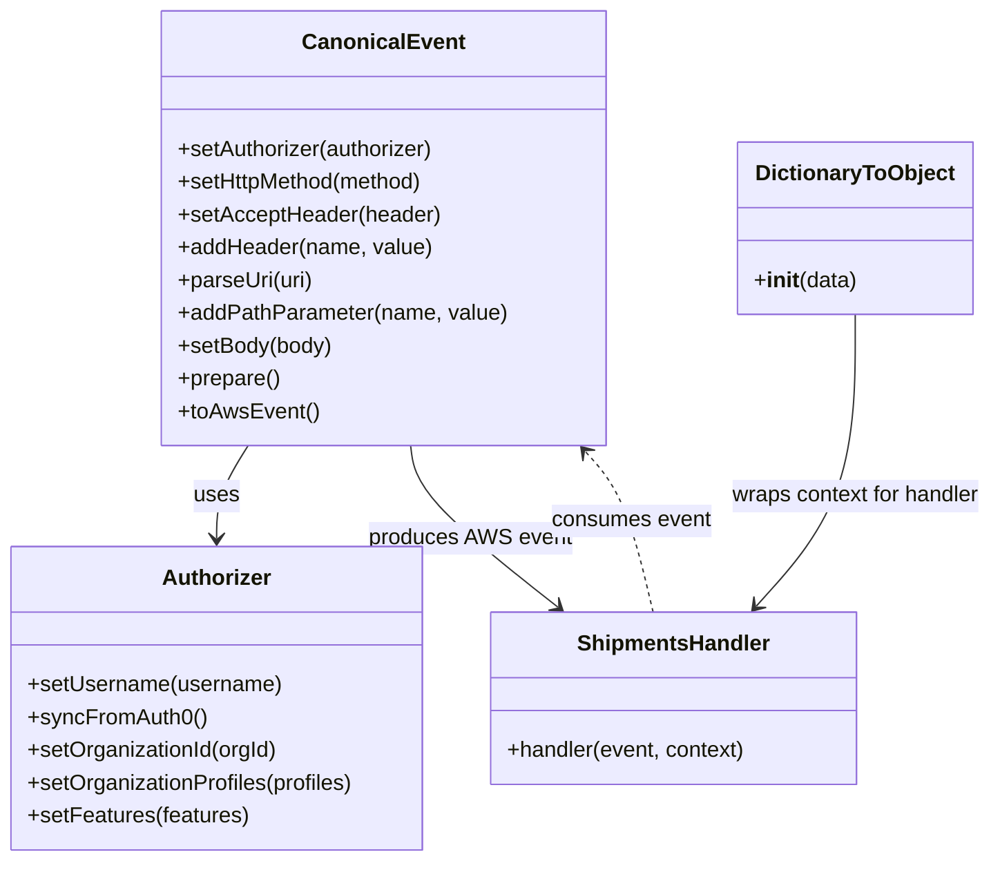
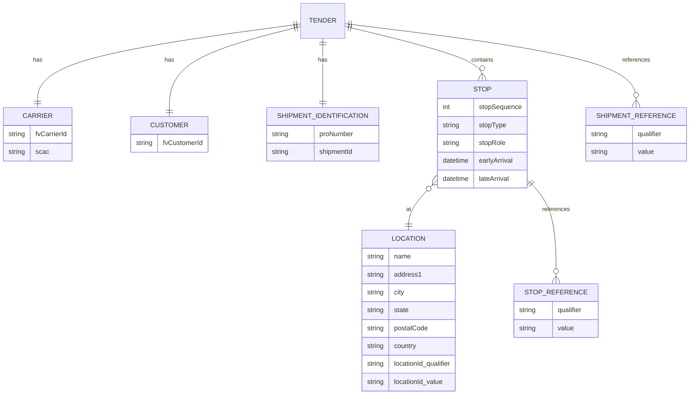

# Diagram: platform/tools/ide_local_testing/localTest/test/byUrl/shipmentCreateByProxy.py


> Auto-generated by Obscura crawlers

## Diagram 1

```mermaid
flowchart TD
    Start([Start]) --> Load[Define constants & build payload\n(acceptType, containerId, body)]
    Load --> AuthorizerInit[Create Authorizer\nsetUsername(...)\nsyncFromAuth0()]
    AuthorizerInit --> AuthorizerConfig[Set organization id & profiles\nsetOrganizationId(), setOrganizationProfiles()]
    AuthorizerConfig --> EventBuild[Build CanonicalEvent\nsetAuthorizer(), setHttpMethod(), setAcceptHeader(),\naddHeader(), parseUri(), addPathParameter(), setBody(), prepare(), toAwsEvent()]
    EventBuild --> Invoke[Invoke shipments handler\nhandler(event, DictionaryToObject({function_name: \"patchShipment\"}))]
    Invoke --> Process[Process handler response\nparse body if present -> prettyRetval]
    Process --> Print[Print prettyRetval\nPrint Lambda execution time]
    Print --> End([End])
```

> SVG rendering failed for this diagram.

## Diagram 2



### SVG

<svg id="container" width="731.810546875" xmlns="http://www.w3.org/2000/svg" class="classDiagram" height="630" viewBox="0 0 731.810546875 630" role="graphics-document document" aria-roledescription="class"><style>#container{font-family:"trebuchet ms",verdana,arial,sans-serif;font-size:16px;fill:#333;}@keyframes edge-animation-frame{from{stroke-dashoffset:0;}}@keyframes dash{to{stroke-dashoffset:0;}}#container .edge-animation-slow{stroke-dasharray:9,5!important;stroke-dashoffset:900;animation:dash 50s linear infinite;stroke-linecap:round;}#container .edge-animation-fast{stroke-dasharray:9,5!important;stroke-dashoffset:900;animation:dash 20s linear infinite;stroke-linecap:round;}#container .error-icon{fill:#552222;}#container .error-text{fill:#552222;stroke:#552222;}#container .edge-thickness-normal{stroke-width:1px;}#container .edge-thickness-thick{stroke-width:3.5px;}#container .edge-pattern-solid{stroke-dasharray:0;}#container .edge-thickness-invisible{stroke-width:0;fill:none;}#container .edge-pattern-dashed{stroke-dasharray:3;}#container .edge-pattern-dotted{stroke-dasharray:2;}#container .marker{fill:#333333;stroke:#333333;}#container .marker.cross{stroke:#333333;}#container svg{font-family:"trebuchet ms",verdana,arial,sans-serif;font-size:16px;}#container p{margin:0;}#container g.classGroup text{fill:#9370DB;stroke:none;font-family:"trebuchet ms",verdana,arial,sans-serif;font-size:10px;}#container g.classGroup text .title{font-weight:bolder;}#container .nodeLabel,#container .edgeLabel{color:#131300;}#container .edgeLabel .label rect{fill:#ECECFF;}#container .label text{fill:#131300;}#container .labelBkg{background:#ECECFF;}#container .edgeLabel .label span{background:#ECECFF;}#container .classTitle{font-weight:bolder;}#container .node rect,#container .node circle,#container .node ellipse,#container .node polygon,#container .node path{fill:#ECECFF;stroke:#9370DB;stroke-width:1px;}#container .divider{stroke:#9370DB;stroke-width:1;}#container g.clickable{cursor:pointer;}#container g.classGroup rect{fill:#ECECFF;stroke:#9370DB;}#container g.classGroup line{stroke:#9370DB;stroke-width:1;}#container .classLabel .box{stroke:none;stroke-width:0;fill:#ECECFF;opacity:0.5;}#container .classLabel .label{fill:#9370DB;font-size:10px;}#container .relation{stroke:#333333;stroke-width:1;fill:none;}#container .dashed-line{stroke-dasharray:3;}#container .dotted-line{stroke-dasharray:1 2;}#container #compositionStart,#container .composition{fill:#333333!important;stroke:#333333!important;stroke-width:1;}#container #compositionEnd,#container .composition{fill:#333333!important;stroke:#333333!important;stroke-width:1;}#container #dependencyStart,#container .dependency{fill:#333333!important;stroke:#333333!important;stroke-width:1;}#container #dependencyStart,#container .dependency{fill:#333333!important;stroke:#333333!important;stroke-width:1;}#container #extensionStart,#container .extension{fill:transparent!important;stroke:#333333!important;stroke-width:1;}#container #extensionEnd,#container .extension{fill:transparent!important;stroke:#333333!important;stroke-width:1;}#container #aggregationStart,#container .aggregation{fill:transparent!important;stroke:#333333!important;stroke-width:1;}#container #aggregationEnd,#container .aggregation{fill:transparent!important;stroke:#333333!important;stroke-width:1;}#container #lollipopStart,#container .lollipop{fill:#ECECFF!important;stroke:#333333!important;stroke-width:1;}#container #lollipopEnd,#container .lollipop{fill:#ECECFF!important;stroke:#333333!important;stroke-width:1;}#container .edgeTerminals{font-size:11px;line-height:initial;}#container .classTitleText{text-anchor:middle;font-size:18px;fill:#333;}#container .label-icon{display:inline-block;height:1em;overflow:visible;vertical-align:-0.125em;}#container .node .label-icon path{fill:currentColor;stroke:revert;stroke-width:revert;}#container :root{--mermaid-font-family:"trebuchet ms",verdana,arial,sans-serif;}</style><g><defs><marker id="container_class-aggregationStart" class="marker aggregation class" refX="18" refY="7" markerWidth="190" markerHeight="240" orient="auto"><path d="M 18,7 L9,13 L1,7 L9,1 Z"></path></marker></defs><defs><marker id="container_class-aggregationEnd" class="marker aggregation class" refX="1" refY="7" markerWidth="20" markerHeight="28" orient="auto"><path d="M 18,7 L9,13 L1,7 L9,1 Z"></path></marker></defs><defs><marker id="container_class-extensionStart" class="marker extension class" refX="18" refY="7" markerWidth="190" markerHeight="240" orient="auto"><path d="M 1,7 L18,13 V 1 Z"></path></marker></defs><defs><marker id="container_class-extensionEnd" class="marker extension class" refX="1" refY="7" markerWidth="20" markerHeight="28" orient="auto"><path d="M 1,1 V 13 L18,7 Z"></path></marker></defs><defs><marker id="container_class-compositionStart" class="marker composition class" refX="18" refY="7" markerWidth="190" markerHeight="240" orient="auto"><path d="M 18,7 L9,13 L1,7 L9,1 Z"></path></marker></defs><defs><marker id="container_class-compositionEnd" class="marker composition class" refX="1" refY="7" markerWidth="20" markerHeight="28" orient="auto"><path d="M 18,7 L9,13 L1,7 L9,1 Z"></path></marker></defs><defs><marker id="container_class-dependencyStart" class="marker dependency class" refX="6" refY="7" markerWidth="190" markerHeight="240" orient="auto"><path d="M 5,7 L9,13 L1,7 L9,1 Z"></path></marker></defs><defs><marker id="container_class-dependencyEnd" class="marker dependency class" refX="13" refY="7" markerWidth="20" markerHeight="28" orient="auto"><path d="M 18,7 L9,13 L14,7 L9,1 Z"></path></marker></defs><defs><marker id="container_class-lollipopStart" class="marker lollipop class" refX="13" refY="7" markerWidth="190" markerHeight="240" orient="auto"><circle stroke="black" fill="transparent" cx="7" cy="7" r="6"></circle></marker></defs><defs><marker id="container_class-lollipopEnd" class="marker lollipop class" refX="1" refY="7" markerWidth="190" markerHeight="240" orient="auto"><circle stroke="black" fill="transparent" cx="7" cy="7" r="6"></circle></marker></defs><g class="root"><g class="clusters"></g><g class="edgePaths"><path d="M183.175,326L179.257,332.167C175.339,338.333,167.504,350.667,163.586,362C159.668,373.333,159.668,383.667,159.668,388.833L159.668,394" id="id_CanonicalEvent_Authorizer_1" class="edge-thickness-normal edge-pattern-solid relation" style=";;;" data-edge="true" data-et="edge" data-id="id_CanonicalEvent_Authorizer_1" data-points="W3sieCI6MTgzLjE3NDU3NTQ5NDI2MDIsInkiOjMyNn0seyJ4IjoxNTkuNjY3OTY4NzUsInkiOjM2M30seyJ4IjoxNTkuNjY3OTY4NzUsInkiOjQwMH1d" marker-end="url(#container_class-dependencyEnd)"></path><path d="M302.452,326L303.16,332.167C303.868,338.333,305.285,350.667,323.315,370.384C341.346,390.101,375.991,417.202,393.313,430.753L410.636,444.303" id="id_CanonicalEvent_ShipmentsHandler_2" class="edge-thickness-normal edge-pattern-solid relation" style=";;;" data-edge="true" data-et="edge" data-id="id_CanonicalEvent_ShipmentsHandler_2" data-points="W3sieCI6MzAyLjQ1MTUxMDY4MjM5Nzk1LCJ5IjozMjZ9LHsieCI6MzA2LjcwMTE3MTg3NSwieSI6MzYzfSx7IngiOjQxNS4zNjE3NjM2MTkwODc4LCJ5Ijo0NDh9XQ==" marker-end="url(#container_class-dependencyEnd)"></path><path d="M630.592,230L630.592,252.167C630.592,274.333,630.592,318.667,618.372,354.26C606.152,389.854,581.712,416.708,569.492,430.135L557.273,443.563" id="id_DictionaryToObject_ShipmentsHandler_3" class="edge-thickness-normal edge-pattern-solid relation" style=";;;" data-edge="true" data-et="edge" data-id="id_DictionaryToObject_ShipmentsHandler_3" data-points="W3sieCI6NjMwLjU5MTc5Njg3NSwieSI6MjMwfSx7IngiOjYzMC41OTE3OTY4NzUsInkiOjM2M30seyJ4Ijo1NTMuMjM0MTI0MjYwOTc5NywieSI6NDQ4fV0=" marker-end="url(#container_class-dependencyEnd)"></path><path d="M480.071,448L476.512,433.833C472.953,419.667,465.835,391.333,457.45,371.747C449.065,352.16,439.413,341.321,434.586,335.901L429.76,330.481" id="id_ShipmentsHandler_CanonicalEvent_4" class="edge-thickness-normal edge-pattern-dashed relation" style=";;;" data-edge="true" data-et="edge" data-id="id_ShipmentsHandler_CanonicalEvent_4" data-points="W3sieCI6NDgwLjA3MTExNzUwNDIyMjk3LCJ5Ijo0NDh9LHsieCI6NDU4LjcxNjc5Njg3NSwieSI6MzYzfSx7IngiOjQyNS43NzAzMDg1MTQwMzA2LCJ5IjozMjZ9XQ==" marker-end="url(#container_class-dependencyEnd)"></path></g><g class="edgeLabels"><g class="edgeLabel" transform="translate(159.66796875, 363)"><g class="label" data-id="id_CanonicalEvent_Authorizer_1" transform="translate(-16.4921875, -12)"><foreignObject width="32.984375" height="24"><div xmlns="http://www.w3.org/1999/xhtml" class="labelBkg" style="display: table-cell; white-space: nowrap; line-height: 1.5; max-width: 200px; text-align: center;"><span class="edgeLabel"><p>uses</p></span></div></foreignObject></g></g><g class="edgeLabel" transform="translate(346.36431, 394.02658)"><g class="label" data-id="id_CanonicalEvent_ShipmentsHandler_2" transform="translate(-73.359375, -12)"><foreignObject width="146.71875" height="24"><div xmlns="http://www.w3.org/1999/xhtml" class="labelBkg" style="display: table-cell; white-space: nowrap; line-height: 1.5; max-width: 200px; text-align: center;"><span class="edgeLabel"><p>produces AWS event</p></span></div></foreignObject></g></g><g class="edgeLabel" transform="translate(630.591796875, 363)"><g class="label" data-id="id_DictionaryToObject_ShipmentsHandler_3" transform="translate(-93.21875, -12)"><foreignObject width="186.4375" height="24"><div xmlns="http://www.w3.org/1999/xhtml" class="labelBkg" style="display: table-cell; white-space: nowrap; line-height: 1.5; max-width: 200px; text-align: center;"><span class="edgeLabel"><p>wraps context for handler</p></span></div></foreignObject></g></g><g class="edgeLabel" transform="translate(463.35829, 381.47525)"><g class="label" data-id="id_ShipmentsHandler_CanonicalEvent_4" transform="translate(-58.65625, -12)"><foreignObject width="117.3125" height="24"><div xmlns="http://www.w3.org/1999/xhtml" class="labelBkg" style="display: table-cell; white-space: nowrap; line-height: 1.5; max-width: 200px; text-align: center;"><span class="edgeLabel"><p>consumes event</p></span></div></foreignObject></g></g></g><g class="nodes"><g class="node default" id="classId-Authorizer-0" transform="translate(159.66796875, 511)"><g class="basic label-container"><path d="M-151.66796875 -111 L151.66796875 -111 L151.66796875 111 L-151.66796875 111" stroke="none" stroke-width="0" fill="#ECECFF" style=""></path><path d="M-151.66796875 -111 C-33.71672900749461 -111, 84.23451073501079 -111, 151.66796875 -111 M-151.66796875 -111 C-41.96293003208828 -111, 67.74210868582344 -111, 151.66796875 -111 M151.66796875 -111 C151.66796875 -31.383655572937855, 151.66796875 48.23268885412429, 151.66796875 111 M151.66796875 -111 C151.66796875 -23.82111270132387, 151.66796875 63.35777459735226, 151.66796875 111 M151.66796875 111 C32.1452227158633 111, -87.3775233182734 111, -151.66796875 111 M151.66796875 111 C51.20459725469044 111, -49.25877424061912 111, -151.66796875 111 M-151.66796875 111 C-151.66796875 36.63673910308313, -151.66796875 -37.72652179383374, -151.66796875 -111 M-151.66796875 111 C-151.66796875 55.83469776518303, -151.66796875 0.6693955303660601, -151.66796875 -111" stroke="#9370DB" stroke-width="1.3" fill="none" stroke-dasharray="0 0" style=""></path></g><g class="annotation-group text" transform="translate(0, -87)"></g><g class="label-group text" transform="translate(-38.3671875, -87)"><g class="label" style="font-weight: bolder" transform="translate(0,-12)"><foreignObject width="76.734375" height="24"><div xmlns="http://www.w3.org/1999/xhtml" style="display: table-cell; white-space: nowrap; line-height: 1.5; max-width: 126px; text-align: center;"><span class="nodeLabel markdown-node-label" style=""><p>Authorizer</p></span></div></foreignObject></g></g><g class="members-group text" transform="translate(-139.66796875, -39)"></g><g class="methods-group text" transform="translate(-139.66796875, -9)"><g class="label" style="" transform="translate(0,-12)"><foreignObject width="185.90625" height="24"><div xmlns="http://www.w3.org/1999/xhtml" style="display: table-cell; white-space: nowrap; line-height: 1.5; max-width: 243px; text-align: center;"><span class="nodeLabel markdown-node-label" style=""><p>+setUsername(username)</p></span></div></foreignObject></g><g class="label" style="" transform="translate(0,12)"><foreignObject width="129.0625" height="24"><div xmlns="http://www.w3.org/1999/xhtml" style="display: table-cell; white-space: nowrap; line-height: 1.5; max-width: 186px; text-align: center;"><span class="nodeLabel markdown-node-label" style=""><p>+syncFromAuth0()</p></span></div></foreignObject></g><g class="label" style="" transform="translate(0,36)"><foreignObject width="184.578125" height="24"><div xmlns="http://www.w3.org/1999/xhtml" style="display: table-cell; white-space: nowrap; line-height: 1.5; max-width: 242px; text-align: center;"><span class="nodeLabel markdown-node-label" style=""><p>+setOrganizationId(orgId)</p></span></div></foreignObject></g><g class="label" style="" transform="translate(0,60)"><foreignObject width="240.96875" height="24"><div xmlns="http://www.w3.org/1999/xhtml" style="display: table-cell; white-space: nowrap; line-height: 1.5; max-width: 298px; text-align: center;"><span class="nodeLabel markdown-node-label" style=""><p>+setOrganizationProfiles(profiles)</p></span></div></foreignObject></g><g class="label" style="" transform="translate(0,84)"><foreignObject width="161.296875" height="24"><div xmlns="http://www.w3.org/1999/xhtml" style="display: table-cell; white-space: nowrap; line-height: 1.5; max-width: 219px; text-align: center;"><span class="nodeLabel markdown-node-label" style=""><p>+setFeatures(features)</p></span></div></foreignObject></g></g><g class="divider" style=""><path d="M-151.66796875 -63 C-54.22788509192253 -63, 43.21219856615494 -63, 151.66796875 -63 M-151.66796875 -63 C-67.91084665339751 -63, 15.846275443204973 -63, 151.66796875 -63" stroke="#9370DB" stroke-width="1.3" fill="none" stroke-dasharray="0 0" style=""></path></g><g class="divider" style=""><path d="M-151.66796875 -39 C-32.11614248980776 -39, 87.43568377038449 -39, 151.66796875 -39 M-151.66796875 -39 C-76.28549295672764 -39, -0.9030171634552744 -39, 151.66796875 -39" stroke="#9370DB" stroke-width="1.3" fill="none" stroke-dasharray="0 0" style=""></path></g></g><g class="node default" id="classId-CanonicalEvent-1" transform="translate(284.189453125, 167)"><g class="basic label-container"><path d="M-159.77734375 -159 L159.77734375 -159 L159.77734375 159 L-159.77734375 159" stroke="none" stroke-width="0" fill="#ECECFF" style=""></path><path d="M-159.77734375 -159 C-48.76946084312678 -159, 62.23842206374644 -159, 159.77734375 -159 M-159.77734375 -159 C-62.54248571397004 -159, 34.692372322059924 -159, 159.77734375 -159 M159.77734375 -159 C159.77734375 -83.207211796528, 159.77734375 -7.414423593056, 159.77734375 159 M159.77734375 -159 C159.77734375 -94.80498331859216, 159.77734375 -30.60996663718433, 159.77734375 159 M159.77734375 159 C77.62188893316512 159, -4.533565883669752 159, -159.77734375 159 M159.77734375 159 C74.14841820083731 159, -11.480507348325375 159, -159.77734375 159 M-159.77734375 159 C-159.77734375 67.0708179674698, -159.77734375 -24.858364065060414, -159.77734375 -159 M-159.77734375 159 C-159.77734375 53.79438805828343, -159.77734375 -51.41122388343314, -159.77734375 -159" stroke="#9370DB" stroke-width="1.3" fill="none" stroke-dasharray="0 0" style=""></path></g><g class="annotation-group text" transform="translate(0, -135)"></g><g class="label-group text" transform="translate(-55.7109375, -135)"><g class="label" style="font-weight: bolder" transform="translate(0,-12)"><foreignObject width="111.421875" height="24"><div xmlns="http://www.w3.org/1999/xhtml" style="display: table-cell; white-space: nowrap; line-height: 1.5; max-width: 161px; text-align: center;"><span class="nodeLabel markdown-node-label" style=""><p>CanonicalEvent</p></span></div></foreignObject></g></g><g class="members-group text" transform="translate(-147.77734375, -87)"></g><g class="methods-group text" transform="translate(-147.77734375, -57)"><g class="label" style="" transform="translate(0,-12)"><foreignObject width="190.75" height="24"><div xmlns="http://www.w3.org/1999/xhtml" style="display: table-cell; white-space: nowrap; line-height: 1.5; max-width: 248px; text-align: center;"><span class="nodeLabel markdown-node-label" style=""><p>+setAuthorizer(authorizer)</p></span></div></foreignObject></g><g class="label" style="" transform="translate(0,12)"><foreignObject width="184" height="24"><div xmlns="http://www.w3.org/1999/xhtml" style="display: table-cell; white-space: nowrap; line-height: 1.5; max-width: 241px; text-align: center;"><span class="nodeLabel markdown-node-label" style=""><p>+setHttpMethod(method)</p></span></div></foreignObject></g><g class="label" style="" transform="translate(0,36)"><foreignObject width="191.859375" height="24"><div xmlns="http://www.w3.org/1999/xhtml" style="display: table-cell; white-space: nowrap; line-height: 1.5; max-width: 249px; text-align: center;"><span class="nodeLabel markdown-node-label" style=""><p>+setAcceptHeader(header)</p></span></div></foreignObject></g><g class="label" style="" transform="translate(0,60)"><foreignObject width="185.875" height="24"><div xmlns="http://www.w3.org/1999/xhtml" style="display: table-cell; white-space: nowrap; line-height: 1.5; max-width: 243px; text-align: center;"><span class="nodeLabel markdown-node-label" style=""><p>+addHeader(name, value)</p></span></div></foreignObject></g><g class="label" style="" transform="translate(0,84)"><foreignObject width="99.8125" height="24"><div xmlns="http://www.w3.org/1999/xhtml" style="display: table-cell; white-space: nowrap; line-height: 1.5; max-width: 157px; text-align: center;"><span class="nodeLabel markdown-node-label" style=""><p>+parseUri(uri)</p></span></div></foreignObject></g><g class="label" style="" transform="translate(0,108)"><foreignObject width="239.84375" height="24"><div xmlns="http://www.w3.org/1999/xhtml" style="display: table-cell; white-space: nowrap; line-height: 1.5; max-width: 297px; text-align: center;"><span class="nodeLabel markdown-node-label" style=""><p>+addPathParameter(name, value)</p></span></div></foreignObject></g><g class="label" style="" transform="translate(0,132)"><foreignObject width="113.125" height="24"><div xmlns="http://www.w3.org/1999/xhtml" style="display: table-cell; white-space: nowrap; line-height: 1.5; max-width: 170px; text-align: center;"><span class="nodeLabel markdown-node-label" style=""><p>+setBody(body)</p></span></div></foreignObject></g><g class="label" style="" transform="translate(0,156)"><foreignObject width="74.75" height="24"><div xmlns="http://www.w3.org/1999/xhtml" style="display: table-cell; white-space: nowrap; line-height: 1.5; max-width: 132px; text-align: center;"><span class="nodeLabel markdown-node-label" style=""><p>+prepare()</p></span></div></foreignObject></g><g class="label" style="" transform="translate(0,180)"><foreignObject width="101.1875" height="24"><div xmlns="http://www.w3.org/1999/xhtml" style="display: table-cell; white-space: nowrap; line-height: 1.5; max-width: 159px; text-align: center;"><span class="nodeLabel markdown-node-label" style=""><p>+toAwsEvent()</p></span></div></foreignObject></g></g><g class="divider" style=""><path d="M-159.77734375 -111 C-49.2725097620596 -111, 61.2323242258808 -111, 159.77734375 -111 M-159.77734375 -111 C-45.8291877677037 -111, 68.1189682145926 -111, 159.77734375 -111" stroke="#9370DB" stroke-width="1.3" fill="none" stroke-dasharray="0 0" style=""></path></g><g class="divider" style=""><path d="M-159.77734375 -87 C-38.926452491566735 -87, 81.92443876686653 -87, 159.77734375 -87 M-159.77734375 -87 C-65.63921838818929 -87, 28.498906973621416 -87, 159.77734375 -87" stroke="#9370DB" stroke-width="1.3" fill="none" stroke-dasharray="0 0" style=""></path></g></g><g class="node default" id="classId-DictionaryToObject-2" transform="translate(630.591796875, 167)"><g class="basic label-container"><path d="M-84.7734375 -63 L84.7734375 -63 L84.7734375 63 L-84.7734375 63" stroke="none" stroke-width="0" fill="#ECECFF" style=""></path><path d="M-84.7734375 -63 C-40.8290631494709 -63, 3.115311201058205 -63, 84.7734375 -63 M-84.7734375 -63 C-29.589112643971987 -63, 25.595212212056026 -63, 84.7734375 -63 M84.7734375 -63 C84.7734375 -20.33310263373731, 84.7734375 22.333794732525377, 84.7734375 63 M84.7734375 -63 C84.7734375 -33.12175949084721, 84.7734375 -3.2435189816944217, 84.7734375 63 M84.7734375 63 C48.61466783287954 63, 12.45589816575908 63, -84.7734375 63 M84.7734375 63 C48.54454084443086 63, 12.315644188861725 63, -84.7734375 63 M-84.7734375 63 C-84.7734375 36.37116854711904, -84.7734375 9.742337094238081, -84.7734375 -63 M-84.7734375 63 C-84.7734375 19.73622806493176, -84.7734375 -23.527543870136483, -84.7734375 -63" stroke="#9370DB" stroke-width="1.3" fill="none" stroke-dasharray="0 0" style=""></path></g><g class="annotation-group text" transform="translate(0, -39)"></g><g class="label-group text" transform="translate(-70.109375, -39)"><g class="label" style="font-weight: bolder" transform="translate(0,-12)"><foreignObject width="140.21875" height="24"><div xmlns="http://www.w3.org/1999/xhtml" style="display: table-cell; white-space: nowrap; line-height: 1.5; max-width: 188px; text-align: center;"><span class="nodeLabel markdown-node-label" style=""><p>DictionaryToObject</p></span></div></foreignObject></g></g><g class="members-group text" transform="translate(-72.7734375, 9)"></g><g class="methods-group text" transform="translate(-72.7734375, 39)"><g class="label" style="" transform="translate(0,-12)"><foreignObject width="75.4375" height="24"><div xmlns="http://www.w3.org/1999/xhtml" style="display: table-cell; white-space: nowrap; line-height: 1.5; max-width: 164px; text-align: center;"><span class="nodeLabel markdown-node-label" style=""><p>+<strong>init</strong>(data)</p></span></div></foreignObject></g></g><g class="divider" style=""><path d="M-84.7734375 -15 C-23.722006367473362 -15, 37.329424765053275 -15, 84.7734375 -15 M-84.7734375 -15 C-23.05657220400436 -15, 38.66029309199128 -15, 84.7734375 -15" stroke="#9370DB" stroke-width="1.3" fill="none" stroke-dasharray="0 0" style=""></path></g><g class="divider" style=""><path d="M-84.7734375 9 C-50.35453654845447 9, -15.935635596908938 9, 84.7734375 9 M-84.7734375 9 C-39.436642333897616 9, 5.900152832204768 9, 84.7734375 9" stroke="#9370DB" stroke-width="1.3" fill="none" stroke-dasharray="0 0" style=""></path></g></g><g class="node default" id="classId-ShipmentsHandler-3" transform="translate(495.8984375, 511)"><g class="basic label-container"><path d="M-134.5625 -63 L134.5625 -63 L134.5625 63 L-134.5625 63" stroke="none" stroke-width="0" fill="#ECECFF" style=""></path><path d="M-134.5625 -63 C-36.82081394062284 -63, 60.92087211875432 -63, 134.5625 -63 M-134.5625 -63 C-29.774625647340343 -63, 75.01324870531931 -63, 134.5625 -63 M134.5625 -63 C134.5625 -29.054030413326217, 134.5625 4.891939173347566, 134.5625 63 M134.5625 -63 C134.5625 -26.138117656230747, 134.5625 10.723764687538505, 134.5625 63 M134.5625 63 C75.02794233498872 63, 15.493384669977445 63, -134.5625 63 M134.5625 63 C37.65397029364678 63, -59.25455941270644 63, -134.5625 63 M-134.5625 63 C-134.5625 26.220602111277117, -134.5625 -10.558795777445766, -134.5625 -63 M-134.5625 63 C-134.5625 17.430993834875082, -134.5625 -28.138012330249836, -134.5625 -63" stroke="#9370DB" stroke-width="1.3" fill="none" stroke-dasharray="0 0" style=""></path></g><g class="annotation-group text" transform="translate(0, -39)"></g><g class="label-group text" transform="translate(-68.0625, -39)"><g class="label" style="font-weight: bolder" transform="translate(0,-12)"><foreignObject width="136.125" height="24"><div xmlns="http://www.w3.org/1999/xhtml" style="display: table-cell; white-space: nowrap; line-height: 1.5; max-width: 186px; text-align: center;"><span class="nodeLabel markdown-node-label" style=""><p>ShipmentsHandler</p></span></div></foreignObject></g></g><g class="members-group text" transform="translate(-122.5625, 9)"></g><g class="methods-group text" transform="translate(-122.5625, 39)"><g class="label" style="" transform="translate(0,-12)"><foreignObject width="177.0625" height="24"><div xmlns="http://www.w3.org/1999/xhtml" style="display: table-cell; white-space: nowrap; line-height: 1.5; max-width: 234px; text-align: center;"><span class="nodeLabel markdown-node-label" style=""><p>+handler(event, context)</p></span></div></foreignObject></g></g><g class="divider" style=""><path d="M-134.5625 -15 C-36.13576829661166 -15, 62.29096340677668 -15, 134.5625 -15 M-134.5625 -15 C-60.29084834999625 -15, 13.980803300007494 -15, 134.5625 -15" stroke="#9370DB" stroke-width="1.3" fill="none" stroke-dasharray="0 0" style=""></path></g><g class="divider" style=""><path d="M-134.5625 9 C-29.366912867192823 9, 75.82867426561435 9, 134.5625 9 M-134.5625 9 C-37.47460762006571 9, 59.61328475986858 9, 134.5625 9" stroke="#9370DB" stroke-width="1.3" fill="none" stroke-dasharray="0 0" style=""></path></g></g></g></g></g></svg>

## Diagram 3



### SVG

<svg id="container" width="1605.625" xmlns="http://www.w3.org/2000/svg" class="erDiagram" height="943.25" viewBox="0 0 1605.625 943.25" role="graphics-document document" aria-roledescription="er"><style>#container{font-family:"trebuchet ms",verdana,arial,sans-serif;font-size:16px;fill:#333;}@keyframes edge-animation-frame{from{stroke-dashoffset:0;}}@keyframes dash{to{stroke-dashoffset:0;}}#container .edge-animation-slow{stroke-dasharray:9,5!important;stroke-dashoffset:900;animation:dash 50s linear infinite;stroke-linecap:round;}#container .edge-animation-fast{stroke-dasharray:9,5!important;stroke-dashoffset:900;animation:dash 20s linear infinite;stroke-linecap:round;}#container .error-icon{fill:#552222;}#container .error-text{fill:#552222;stroke:#552222;}#container .edge-thickness-normal{stroke-width:1px;}#container .edge-thickness-thick{stroke-width:3.5px;}#container .edge-pattern-solid{stroke-dasharray:0;}#container .edge-thickness-invisible{stroke-width:0;fill:none;}#container .edge-pattern-dashed{stroke-dasharray:3;}#container .edge-pattern-dotted{stroke-dasharray:2;}#container .marker{fill:#333333;stroke:#333333;}#container .marker.cross{stroke:#333333;}#container svg{font-family:"trebuchet ms",verdana,arial,sans-serif;font-size:16px;}#container p{margin:0;}#container .entityBox{fill:#ECECFF;stroke:#9370DB;}#container .relationshipLabelBox{fill:hsl(80, 100%, 96.2745098039%);opacity:0.7;background-color:hsl(80, 100%, 96.2745098039%);}#container .relationshipLabelBox rect{opacity:0.5;}#container .labelBkg{background-color:rgba(248.6666666666, 255, 235.9999999999, 0.5);}#container .edgeLabel .label{fill:#9370DB;font-size:14px;}#container .label{font-family:"trebuchet ms",verdana,arial,sans-serif;color:#333;}#container .edge-pattern-dashed{stroke-dasharray:8,8;}#container .node rect,#container .node circle,#container .node ellipse,#container .node polygon{fill:#ECECFF;stroke:#9370DB;stroke-width:1px;}#container .relationshipLine{stroke:#333333;stroke-width:1;fill:none;}#container .marker{fill:none!important;stroke:#333333!important;stroke-width:1;}#container :root{--mermaid-font-family:"trebuchet ms",verdana,arial,sans-serif;}</style><g><defs><marker id="container_er-onlyOneStart" class="marker onlyOne er" refX="0" refY="9" markerWidth="18" markerHeight="18" orient="auto"><path d="M9,0 L9,18 M15,0 L15,18"></path></marker></defs><defs><marker id="container_er-onlyOneEnd" class="marker onlyOne er" refX="18" refY="9" markerWidth="18" markerHeight="18" orient="auto"><path d="M3,0 L3,18 M9,0 L9,18"></path></marker></defs><defs><marker id="container_er-zeroOrOneStart" class="marker zeroOrOne er" refX="0" refY="9" markerWidth="30" markerHeight="18" orient="auto"><circle fill="white" cx="21" cy="9" r="6"></circle><path d="M9,0 L9,18"></path></marker></defs><defs><marker id="container_er-zeroOrOneEnd" class="marker zeroOrOne er" refX="30" refY="9" markerWidth="30" markerHeight="18" orient="auto"><circle fill="white" cx="9" cy="9" r="6"></circle><path d="M21,0 L21,18"></path></marker></defs><defs><marker id="container_er-oneOrMoreStart" class="marker oneOrMore er" refX="18" refY="18" markerWidth="45" markerHeight="36" orient="auto"><path d="M0,18 Q 18,0 36,18 Q 18,36 0,18 M42,9 L42,27"></path></marker></defs><defs><marker id="container_er-oneOrMoreEnd" class="marker oneOrMore er" refX="27" refY="18" markerWidth="45" markerHeight="36" orient="auto"><path d="M3,9 L3,27 M9,18 Q27,0 45,18 Q27,36 9,18"></path></marker></defs><defs><marker id="container_er-zeroOrMoreStart" class="marker zeroOrMore er" refX="18" refY="18" markerWidth="57" markerHeight="36" orient="auto"><circle fill="white" cx="48" cy="18" r="6"></circle><path d="M0,18 Q18,0 36,18 Q18,36 0,18"></path></marker></defs><defs><marker id="container_er-zeroOrMoreEnd" class="marker zeroOrMore er" refX="39" refY="18" markerWidth="57" markerHeight="36" orient="auto"><circle fill="white" cx="9" cy="18" r="6"></circle><path d="M21,18 Q39,0 57,18 Q39,36 21,18"></path></marker></defs><g class="root"><g class="clusters"></g><g class="edgePaths"><path d="M716.195,56.862L612.199,71.135C508.203,85.408,300.211,113.954,196.215,147.331C92.219,180.708,92.219,218.917,92.219,238.021L92.219,257.125" id="id_entity-TENDER-0_entity-CARRIER-1_0" class="edge-thickness-normal edge-pattern-solid relationshipLine" style="undefined;;;undefined" data-edge="true" data-et="edge" data-id="id_entity-TENDER-0_entity-CARRIER-1_0" data-points="W3sieCI6NzE2LjE5NTMxMjUsInkiOjU2Ljg2MjI1NjQzMDQ2NzQ5fSx7IngiOjkyLjIxODc1LCJ5IjoxNDIuNX0seyJ4Ijo5Mi4yMTg3NSwieSI6MjU3LjEyNX1d" marker-start="url(#container_er-onlyOneStart)" marker-end="url(#container_er-onlyOneEnd)"></path><path d="M716.195,63.003L665.246,76.252C614.297,89.502,512.398,116.001,461.449,151.917C410.5,187.833,410.5,233.167,410.5,255.833L410.5,278.5" id="id_entity-TENDER-0_entity-CUSTOMER-2_1" class="edge-thickness-normal edge-pattern-solid relationshipLine" style="undefined;;;undefined" data-edge="true" data-et="edge" data-id="id_entity-TENDER-0_entity-CUSTOMER-2_1" data-points="W3sieCI6NzE2LjE5NTMxMjUsInkiOjYzLjAwMjcwMTU3NDgyMDQ0fSx7IngiOjQxMC41LCJ5IjoxNDIuNX0seyJ4Ijo0MTAuNSwieSI6Mjc4LjV9XQ==" marker-start="url(#container_er-onlyOneStart)" marker-end="url(#container_er-onlyOneEnd)"></path><path d="M766.195,92L766.195,100.417C766.195,108.833,766.195,125.667,766.195,153.188C766.195,180.708,766.195,218.917,766.195,238.021L766.195,257.125" id="id_entity-TENDER-0_entity-SHIPMENT_IDENTIFICATION-3_2" class="edge-thickness-normal edge-pattern-solid relationshipLine" style="undefined;;;undefined" data-edge="true" data-et="edge" data-id="id_entity-TENDER-0_entity-SHIPMENT_IDENTIFICATION-3_2" data-points="W3sieCI6NzY2LjE5NTMxMjUsInkiOjkyfSx7IngiOjc2Ni4xOTUzMTI1LCJ5IjoxNDIuNX0seyJ4Ijo3NjYuMTk1MzEyNSwieSI6MjU3LjEyNX1d" marker-start="url(#container_er-onlyOneStart)" marker-end="url(#container_er-onlyOneEnd)"></path><path d="M816.195,62.486L869.599,75.821C923.003,89.157,1029.81,115.829,1083.214,137.581C1136.617,159.333,1136.617,176.167,1136.617,184.583L1136.617,193" id="id_entity-TENDER-0_entity-STOP-4_3" class="edge-thickness-normal edge-pattern-solid relationshipLine" style="undefined;;;undefined" data-edge="true" data-et="edge" data-id="id_entity-TENDER-0_entity-STOP-4_3" data-points="W3sieCI6ODE2LjE5NTMxMjUsInkiOjYyLjQ4NTc2MzY5ODQ4NTY4fSx7IngiOjExMzYuNjE3MTg3NSwieSI6MTQyLjV9LHsieCI6MTEzNi42MTcxODc1LCJ5IjoxOTN9XQ==" marker-start="url(#container_er-onlyOneStart)" marker-end="url(#container_er-zeroOrMoreEnd)"></path><path d="M816.195,56.376L928.749,70.73C1041.302,85.084,1266.409,113.792,1378.962,147.25C1491.516,180.708,1491.516,218.917,1491.516,238.021L1491.516,257.125" id="id_entity-TENDER-0_entity-SHIPMENT_REFERENCE-5_4" class="edge-thickness-normal edge-pattern-solid relationshipLine" style="undefined;;;undefined" data-edge="true" data-et="edge" data-id="id_entity-TENDER-0_entity-SHIPMENT_REFERENCE-5_4" data-points="W3sieCI6ODE2LjE5NTMxMjUsInkiOjU2LjM3NjQ5MzE0NDE5Mjc2fSx7IngiOjE0OTEuNTE1NjI1LCJ5IjoxNDIuNX0seyJ4IjoxNDkxLjUxNTYyNSwieSI6MjU3LjEyNX1d" marker-start="url(#container_er-onlyOneStart)" marker-end="url(#container_er-zeroOrMoreEnd)"></path><path d="M1027.828,434.255L1017.279,445.212C1006.73,456.17,985.633,478.085,975.084,497.459C964.535,516.833,964.535,533.667,964.535,542.083L964.535,550.5" id="id_entity-STOP-4_entity-LOCATION-6_5" class="edge-thickness-normal edge-pattern-solid relationshipLine" style="undefined;;;undefined" data-edge="true" data-et="edge" data-id="id_entity-STOP-4_entity-LOCATION-6_5" data-points="W3sieCI6MTAyNy44MjgxMjUsInkiOjQzNC4yNTQ1MDU5MzYwMzE2fSx7IngiOjk2NC41MzUxNTYyNSwieSI6NTAwfSx7IngiOjk2NC41MzUxNTYyNSwieSI6NTUwLjV9XQ==" marker-start="url(#container_er-zeroOrMoreStart)" marker-end="url(#container_er-onlyOneEnd)"></path><path d="M1245.406,434.255L1255.955,445.212C1266.504,456.17,1287.602,478.085,1298.15,518.834C1308.699,559.583,1308.699,619.167,1308.699,648.958L1308.699,678.75" id="id_entity-STOP-4_entity-STOP_REFERENCE-7_6" class="edge-thickness-normal edge-pattern-solid relationshipLine" style="undefined;;;undefined" data-edge="true" data-et="edge" data-id="id_entity-STOP-4_entity-STOP_REFERENCE-7_6" data-points="W3sieCI6MTI0NS40MDYyNSwieSI6NDM0LjI1NDUwNTkzNjAzMTZ9LHsieCI6MTMwOC42OTkyMTg3NSwieSI6NTAwfSx7IngiOjEzMDguNjk5MjE4NzUsInkiOjY3OC43NX1d" marker-start="url(#container_er-onlyOneStart)" marker-end="url(#container_er-zeroOrMoreEnd)"></path></g><g class="edgeLabels"><g class="edgeLabel" transform="translate(92.21875, 142.5)"><g class="label" data-id="id_entity-TENDER-0_entity-CARRIER-1_0" transform="translate(-11.109375, -10.5)"><foreignObject width="22.21875" height="21"><div xmlns="http://www.w3.org/1999/xhtml" class="labelBkg" style="display: table-cell; white-space: nowrap; line-height: 1.5; max-width: 200px; text-align: center;"><span class="edgeLabel"><p>has</p></span></div></foreignObject></g></g><g class="edgeLabel" transform="translate(410.5, 142.5)"><g class="label" data-id="id_entity-TENDER-0_entity-CUSTOMER-2_1" transform="translate(-11.109375, -10.5)"><foreignObject width="22.21875" height="21"><div xmlns="http://www.w3.org/1999/xhtml" class="labelBkg" style="display: table-cell; white-space: nowrap; line-height: 1.5; max-width: 200px; text-align: center;"><span class="edgeLabel"><p>has</p></span></div></foreignObject></g></g><g class="edgeLabel" transform="translate(766.1953125, 142.5)"><g class="label" data-id="id_entity-TENDER-0_entity-SHIPMENT_IDENTIFICATION-3_2" transform="translate(-11.109375, -10.5)"><foreignObject width="22.21875" height="21"><div xmlns="http://www.w3.org/1999/xhtml" class="labelBkg" style="display: table-cell; white-space: nowrap; line-height: 1.5; max-width: 200px; text-align: center;"><span class="edgeLabel"><p>has</p></span></div></foreignObject></g></g><g class="edgeLabel" transform="translate(1136.6171875, 142.5)"><g class="label" data-id="id_entity-TENDER-0_entity-STOP-4_3" transform="translate(-27.03125, -10.5)"><foreignObject width="54.0625" height="21"><div xmlns="http://www.w3.org/1999/xhtml" class="labelBkg" style="display: table-cell; white-space: nowrap; line-height: 1.5; max-width: 200px; text-align: center;"><span class="edgeLabel"><p>contains</p></span></div></foreignObject></g></g><g class="edgeLabel" transform="translate(1491.515625, 142.5)"><g class="label" data-id="id_entity-TENDER-0_entity-SHIPMENT_REFERENCE-5_4" transform="translate(-33.1015625, -10.5)"><foreignObject width="66.203125" height="21"><div xmlns="http://www.w3.org/1999/xhtml" class="labelBkg" style="display: table-cell; white-space: nowrap; line-height: 1.5; max-width: 200px; text-align: center;"><span class="edgeLabel"><p>references</p></span></div></foreignObject></g></g><g class="edgeLabel" transform="translate(964.53515625, 500)"><g class="label" data-id="id_entity-STOP-4_entity-LOCATION-6_5" transform="translate(-6.3359375, -10.5)"><foreignObject width="12.671875" height="21"><div xmlns="http://www.w3.org/1999/xhtml" class="labelBkg" style="display: table-cell; white-space: nowrap; line-height: 1.5; max-width: 200px; text-align: center;"><span class="edgeLabel"><p>at</p></span></div></foreignObject></g></g><g class="edgeLabel" transform="translate(1308.69921875, 500)"><g class="label" data-id="id_entity-STOP-4_entity-STOP_REFERENCE-7_6" transform="translate(-33.1015625, -10.5)"><foreignObject width="66.203125" height="21"><div xmlns="http://www.w3.org/1999/xhtml" class="labelBkg" style="display: table-cell; white-space: nowrap; line-height: 1.5; max-width: 200px; text-align: center;"><span class="edgeLabel"><p>references</p></span></div></foreignObject></g></g></g><g class="nodes"><g class="node default" id="entity-TENDER-0" transform="translate(766.1953125, 50)"><rect class="basic label-container" style="" x="-50" y="-42" width="100" height="84"></rect><g class="label" style="" transform="translate(-28.15625, -12)"><rect></rect><foreignObject width="56.3125" height="24"><div xmlns="http://www.w3.org/1999/xhtml" style="display: table-cell; white-space: nowrap; line-height: 1.5; max-width: 100px; text-align: center;"><span class="nodeLabel"><p>TENDER</p></span></div></foreignObject></g></g><g class="node default" id="entity-CARRIER-1" transform="translate(92.21875, 321.25)"><g style=""><path d="M-84.21875 -64.125 L84.21875 -64.125 L84.21875 64.125 L-84.21875 64.125" stroke="none" stroke-width="0" fill="#ECECFF"></path><path d="M-84.21875 -64.125 C-22.769377196980564 -64.125, 38.67999560603887 -64.125, 84.21875 -64.125 M-84.21875 -64.125 C-36.830120019496015 -64.125, 10.558509961007971 -64.125, 84.21875 -64.125 M84.21875 -64.125 C84.21875 -35.60606173456203, 84.21875 -7.087123469124073, 84.21875 64.125 M84.21875 -64.125 C84.21875 -28.048105156371257, 84.21875 8.028789687257486, 84.21875 64.125 M84.21875 64.125 C31.033596869515925 64.125, -22.15155626096815 64.125, -84.21875 64.125 M84.21875 64.125 C46.4921086433072 64.125, 8.765467286614395 64.125, -84.21875 64.125 M-84.21875 64.125 C-84.21875 20.016763488521356, -84.21875 -24.091473022957288, -84.21875 -64.125 M-84.21875 64.125 C-84.21875 33.55710836738448, -84.21875 2.9892167347689593, -84.21875 -64.125" stroke="#9370DB" stroke-width="1.3" fill="none" stroke-dasharray="0 0"></path></g><g style="" class="row-rect-odd"><path d="M-84.21875 -21.375 L84.21875 -21.375 L84.21875 21.375 L-84.21875 21.375" stroke="none" stroke-width="0" fill="hsl(240, 100%, 100%)"></path><path d="M-84.21875 -21.375 C-35.33159340934358 -21.375, 13.555563181312834 -21.375, 84.21875 -21.375 M-84.21875 -21.375 C-16.893028871044862 -21.375, 50.432692257910276 -21.375, 84.21875 -21.375 M84.21875 -21.375 C84.21875 -4.496142226139558, 84.21875 12.382715547720885, 84.21875 21.375 M84.21875 -21.375 C84.21875 -9.13486489759894, 84.21875 3.105270204802121, 84.21875 21.375 M84.21875 21.375 C43.43144490149078 21.375, 2.644139802981556 21.375, -84.21875 21.375 M84.21875 21.375 C39.58811605996791 21.375, -5.042517880064182 21.375, -84.21875 21.375 M-84.21875 21.375 C-84.21875 6.578628001430902, -84.21875 -8.217743997138196, -84.21875 -21.375 M-84.21875 21.375 C-84.21875 11.246181301142986, -84.21875 1.1173626022859722, -84.21875 -21.375" stroke="#9370DB" stroke-width="1.3" fill="none" stroke-dasharray="0 0"></path></g><g style="" class="row-rect-even"><path d="M-84.21875 21.375 L84.21875 21.375 L84.21875 64.125 L-84.21875 64.125" stroke="none" stroke-width="0" fill="hsl(240, 100%, 97.2745098039%)"></path><path d="M-84.21875 21.375 C-34.31279086728426 21.375, 15.593168265431487 21.375, 84.21875 21.375 M-84.21875 21.375 C-49.1755592116452 21.375, -14.132368423290401 21.375, 84.21875 21.375 M84.21875 21.375 C84.21875 32.04379493066233, 84.21875 42.71258986132465, 84.21875 64.125 M84.21875 21.375 C84.21875 38.30854835282953, 84.21875 55.24209670565906, 84.21875 64.125 M84.21875 64.125 C28.44530108556765 64.125, -27.3281478288647 64.125, -84.21875 64.125 M84.21875 64.125 C34.36078931088276 64.125, -15.497171378234484 64.125, -84.21875 64.125 M-84.21875 64.125 C-84.21875 55.329854952126404, -84.21875 46.53470990425281, -84.21875 21.375 M-84.21875 64.125 C-84.21875 49.396779241143406, -84.21875 34.66855848228681, -84.21875 21.375" stroke="#9370DB" stroke-width="1.3" fill="none" stroke-dasharray="0 0"></path></g><g class="label name" transform="translate(-30.2265625, -54.75)" style=""><foreignObject width="60.453125" height="24"><div xmlns="http://www.w3.org/1999/xhtml" style="display: table-cell; white-space: nowrap; line-height: 1.5; max-width: 161px; text-align: start;"><span class="nodeLabel"><p>CARRIER</p></span></div></foreignObject></g><g class="label attribute-type" transform="translate(-71.71875, -12)" style=""><foreignObject width="41.640625" height="24"><div xmlns="http://www.w3.org/1999/xhtml" style="display: table-cell; white-space: nowrap; line-height: 1.5; max-width: 142px; text-align: start;"><span class="nodeLabel"><p>string</p></span></div></foreignObject></g><g class="label attribute-name" transform="translate(-5.078125, -12)" style=""><foreignObject width="76.796875" height="24"><div xmlns="http://www.w3.org/1999/xhtml" style="display: table-cell; white-space: nowrap; line-height: 1.5; max-width: 177px; text-align: start;"><span class="nodeLabel"><p>fvCarrierId</p></span></div></foreignObject></g><g class="label attribute-keys" transform="translate(96.71875, -12)" style=""><foreignObject width="0" height="0"><div xmlns="http://www.w3.org/1999/xhtml" style="display: table-cell; white-space: nowrap; line-height: 1.5; max-width: 100px; text-align: start;"><span class="nodeLabel"></span></div></foreignObject></g><g class="label attribute-comment" transform="translate(96.71875, -12)" style=""><foreignObject width="0" height="0"><div xmlns="http://www.w3.org/1999/xhtml" style="display: table-cell; white-space: nowrap; line-height: 1.5; max-width: 100px; text-align: start;"><span class="nodeLabel"></span></div></foreignObject></g><g class="label attribute-type" transform="translate(-71.71875, 30.75)" style=""><foreignObject width="41.640625" height="24"><div xmlns="http://www.w3.org/1999/xhtml" style="display: table-cell; white-space: nowrap; line-height: 1.5; max-width: 142px; text-align: start;"><span class="nodeLabel"><p>string</p></span></div></foreignObject></g><g class="label attribute-name" transform="translate(-5.078125, 30.75)" style=""><foreignObject width="31.3125" height="24"><div xmlns="http://www.w3.org/1999/xhtml" style="display: table-cell; white-space: nowrap; line-height: 1.5; max-width: 132px; text-align: start;"><span class="nodeLabel"><p>scac</p></span></div></foreignObject></g><g class="label attribute-keys" transform="translate(96.71875, 30.75)" style=""><foreignObject width="0" height="0"><div xmlns="http://www.w3.org/1999/xhtml" style="display: table-cell; white-space: nowrap; line-height: 1.5; max-width: 100px; text-align: start;"><span class="nodeLabel"></span></div></foreignObject></g><g class="label attribute-comment" transform="translate(96.71875, 30.75)" style=""><foreignObject width="0" height="0"><div xmlns="http://www.w3.org/1999/xhtml" style="display: table-cell; white-space: nowrap; line-height: 1.5; max-width: 100px; text-align: start;"><span class="nodeLabel"></span></div></foreignObject></g><g class="divider"><path d="M-84.21875 -21.375 C-19.08432114981008 -21.375, 46.05010770037984 -21.375, 84.21875 -21.375 M-84.21875 -21.375 C-30.16239491824752 -21.375, 23.893960163504957 -21.375, 84.21875 -21.375" stroke="#9370DB" stroke-width="1.3" fill="none" stroke-dasharray="0 0"></path></g><g class="divider"><path d="M-17.578125 -21.375 C-17.578125 2.2400124201231293, -17.578125 25.85502484024626, -17.578125 64.125 M-17.578125 -21.375 C-17.578125 9.16585157789573, -17.578125 39.70670315579146, -17.578125 64.125" stroke="#9370DB" stroke-width="1.3" fill="none" stroke-dasharray="0 0"></path></g><g class="divider"><path d="M-84.21875 -21.375 C-35.98736566801985 -21.375, 12.244018663960304 -21.375, 84.21875 -21.375 M-84.21875 -21.375 C-45.78749124772803 -21.375, -7.356232495456055 -21.375, 84.21875 -21.375" stroke="#9370DB" stroke-width="1.3" fill="none" stroke-dasharray="0 0"></path></g></g><g class="node default" id="entity-CUSTOMER-2" transform="translate(410.5, 321.25)"><g style=""><path d="M-94.0625 -42.75 L94.0625 -42.75 L94.0625 42.75 L-94.0625 42.75" stroke="none" stroke-width="0" fill="#ECECFF"></path><path d="M-94.0625 -42.75 C-21.69994186228925 -42.75, 50.6626162754215 -42.75, 94.0625 -42.75 M-94.0625 -42.75 C-33.17340077466191 -42.75, 27.715698450676186 -42.75, 94.0625 -42.75 M94.0625 -42.75 C94.0625 -24.851849220293236, 94.0625 -6.9536984405864715, 94.0625 42.75 M94.0625 -42.75 C94.0625 -13.49076641730025, 94.0625 15.7684671653995, 94.0625 42.75 M94.0625 42.75 C46.47977206058049 42.75, -1.1029558788390261 42.75, -94.0625 42.75 M94.0625 42.75 C29.666284709393253 42.75, -34.729930581213495 42.75, -94.0625 42.75 M-94.0625 42.75 C-94.0625 24.176322632340785, -94.0625 5.60264526468157, -94.0625 -42.75 M-94.0625 42.75 C-94.0625 20.540616795424857, -94.0625 -1.6687664091502867, -94.0625 -42.75" stroke="#9370DB" stroke-width="1.3" fill="none" stroke-dasharray="0 0"></path></g><g style="" class="row-rect-odd"><path d="M-94.0625 0 L94.0625 0 L94.0625 42.75 L-94.0625 42.75" stroke="none" stroke-width="0" fill="hsl(240, 100%, 100%)"></path><path d="M-94.0625 0 C-43.41647130773067 0, 7.229557384538666 0, 94.0625 0 M-94.0625 0 C-45.664993011040394 0, 2.7325139779192114 0, 94.0625 0 M94.0625 0 C94.0625 13.893804648626814, 94.0625 27.787609297253628, 94.0625 42.75 M94.0625 0 C94.0625 15.746761431276596, 94.0625 31.493522862553192, 94.0625 42.75 M94.0625 42.75 C51.70260156247669 42.75, 9.342703124953374 42.75, -94.0625 42.75 M94.0625 42.75 C33.69423220893103 42.75, -26.674035582137947 42.75, -94.0625 42.75 M-94.0625 42.75 C-94.0625 33.112041567846646, -94.0625 23.47408313569329, -94.0625 0 M-94.0625 42.75 C-94.0625 33.224326838484046, -94.0625 23.698653676968085, -94.0625 0" stroke="#9370DB" stroke-width="1.3" fill="none" stroke-dasharray="0 0"></path></g><g class="label name" transform="translate(-38.5078125, -33.375)" style=""><foreignObject width="77.015625" height="24"><div xmlns="http://www.w3.org/1999/xhtml" style="display: table-cell; white-space: nowrap; line-height: 1.5; max-width: 177px; text-align: start;"><span class="nodeLabel"><p>CUSTOMER</p></span></div></foreignObject></g><g class="label attribute-type" transform="translate(-81.5625, 9.375)" style=""><foreignObject width="41.640625" height="24"><div xmlns="http://www.w3.org/1999/xhtml" style="display: table-cell; white-space: nowrap; line-height: 1.5; max-width: 142px; text-align: start;"><span class="nodeLabel"><p>string</p></span></div></foreignObject></g><g class="label attribute-name" transform="translate(-14.921875, 9.375)" style=""><foreignObject width="96.484375" height="24"><div xmlns="http://www.w3.org/1999/xhtml" style="display: table-cell; white-space: nowrap; line-height: 1.5; max-width: 196px; text-align: start;"><span class="nodeLabel"><p>fvCustomerId</p></span></div></foreignObject></g><g class="label attribute-keys" transform="translate(106.5625, 9.375)" style=""><foreignObject width="0" height="0"><div xmlns="http://www.w3.org/1999/xhtml" style="display: table-cell; white-space: nowrap; line-height: 1.5; max-width: 100px; text-align: start;"><span class="nodeLabel"></span></div></foreignObject></g><g class="label attribute-comment" transform="translate(106.5625, 9.375)" style=""><foreignObject width="0" height="0"><div xmlns="http://www.w3.org/1999/xhtml" style="display: table-cell; white-space: nowrap; line-height: 1.5; max-width: 100px; text-align: start;"><span class="nodeLabel"></span></div></foreignObject></g><g class="divider"><path d="M-94.0625 0 C-47.63344092620048 0, -1.2043818524009566 0, 94.0625 0 M-94.0625 0 C-26.51634563523932 0, 41.02980872952136 0, 94.0625 0" stroke="#9370DB" stroke-width="1.3" fill="none" stroke-dasharray="0 0"></path></g><g class="divider"><path d="M-27.421875 0 C-27.421875 13.188440752291038, -27.421875 26.376881504582077, -27.421875 42.75 M-27.421875 0 C-27.421875 11.715578943157583, -27.421875 23.431157886315166, -27.421875 42.75" stroke="#9370DB" stroke-width="1.3" fill="none" stroke-dasharray="0 0"></path></g><g class="divider"><path d="M-94.0625 0 C-20.17457587413689 0, 53.71334825172622 0, 94.0625 0 M-94.0625 0 C-48.53286141604007 0, -3.003222832080141 0, 94.0625 0" stroke="#9370DB" stroke-width="1.3" fill="none" stroke-dasharray="0 0"></path></g></g><g class="node default" id="entity-SHIPMENT_IDENTIFICATION-3" transform="translate(766.1953125, 321.25)"><g style=""><path d="M-121.6328125 -64.125 L121.6328125 -64.125 L121.6328125 64.125 L-121.6328125 64.125" stroke="none" stroke-width="0" fill="#ECECFF"></path><path d="M-121.6328125 -64.125 C-43.47997690468455 -64.125, 34.6728586906309 -64.125, 121.6328125 -64.125 M-121.6328125 -64.125 C-42.63727650091761 -64.125, 36.358259498164784 -64.125, 121.6328125 -64.125 M121.6328125 -64.125 C121.6328125 -26.359058974026723, 121.6328125 11.406882051946553, 121.6328125 64.125 M121.6328125 -64.125 C121.6328125 -21.216708399728148, 121.6328125 21.691583200543704, 121.6328125 64.125 M121.6328125 64.125 C65.36064348298288 64.125, 9.08847446596576 64.125, -121.6328125 64.125 M121.6328125 64.125 C44.12352561818312 64.125, -33.38576126363375 64.125, -121.6328125 64.125 M-121.6328125 64.125 C-121.6328125 29.194324041702956, -121.6328125 -5.736351916594089, -121.6328125 -64.125 M-121.6328125 64.125 C-121.6328125 32.017316318966806, -121.6328125 -0.09036736206638807, -121.6328125 -64.125" stroke="#9370DB" stroke-width="1.3" fill="none" stroke-dasharray="0 0"></path></g><g style="" class="row-rect-odd"><path d="M-121.6328125 -21.375 L121.6328125 -21.375 L121.6328125 21.375 L-121.6328125 21.375" stroke="none" stroke-width="0" fill="hsl(240, 100%, 100%)"></path><path d="M-121.6328125 -21.375 C-36.39605175996442 -21.375, 48.840708980071156 -21.375, 121.6328125 -21.375 M-121.6328125 -21.375 C-25.227773698035065 -21.375, 71.17726510392987 -21.375, 121.6328125 -21.375 M121.6328125 -21.375 C121.6328125 -9.221592784463825, 121.6328125 2.9318144310723504, 121.6328125 21.375 M121.6328125 -21.375 C121.6328125 -11.546830803462402, 121.6328125 -1.7186616069248046, 121.6328125 21.375 M121.6328125 21.375 C50.20406222158903 21.375, -21.224688056821947 21.375, -121.6328125 21.375 M121.6328125 21.375 C71.59110554342266 21.375, 21.549398586845314 21.375, -121.6328125 21.375 M-121.6328125 21.375 C-121.6328125 6.737696691114431, -121.6328125 -7.899606617771138, -121.6328125 -21.375 M-121.6328125 21.375 C-121.6328125 10.80340495113223, -121.6328125 0.23180990226445886, -121.6328125 -21.375" stroke="#9370DB" stroke-width="1.3" fill="none" stroke-dasharray="0 0"></path></g><g style="" class="row-rect-even"><path d="M-121.6328125 21.375 L121.6328125 21.375 L121.6328125 64.125 L-121.6328125 64.125" stroke="none" stroke-width="0" fill="hsl(240, 100%, 97.2745098039%)"></path><path d="M-121.6328125 21.375 C-51.95565184373329 21.375, 17.721508812533415 21.375, 121.6328125 21.375 M-121.6328125 21.375 C-50.256879842314206 21.375, 21.11905281537159 21.375, 121.6328125 21.375 M121.6328125 21.375 C121.6328125 31.394082792660157, 121.6328125 41.413165585320314, 121.6328125 64.125 M121.6328125 21.375 C121.6328125 36.31517830290544, 121.6328125 51.25535660581088, 121.6328125 64.125 M121.6328125 64.125 C62.50301279234609 64.125, 3.373213084692182 64.125, -121.6328125 64.125 M121.6328125 64.125 C61.585274119795145 64.125, 1.537735739590289 64.125, -121.6328125 64.125 M-121.6328125 64.125 C-121.6328125 48.72926298172593, -121.6328125 33.33352596345186, -121.6328125 21.375 M-121.6328125 64.125 C-121.6328125 54.104337478702476, -121.6328125 44.08367495740495, -121.6328125 21.375" stroke="#9370DB" stroke-width="1.3" fill="none" stroke-dasharray="0 0"></path></g><g class="label name" transform="translate(-96.6328125, -54.75)" style=""><foreignObject width="193.265625" height="24"><div xmlns="http://www.w3.org/1999/xhtml" style="display: table-cell; white-space: nowrap; line-height: 1.5; max-width: 293px; text-align: start;"><span class="nodeLabel"><p>SHIPMENT_IDENTIFICATION</p></span></div></foreignObject></g><g class="label attribute-type" transform="translate(-109.1328125, -12)" style=""><foreignObject width="41.640625" height="24"><div xmlns="http://www.w3.org/1999/xhtml" style="display: table-cell; white-space: nowrap; line-height: 1.5; max-width: 142px; text-align: start;"><span class="nodeLabel"><p>string</p></span></div></foreignObject></g><g class="label attribute-name" transform="translate(-8.1328125, -12)" style=""><foreignObject width="82.90625" height="24"><div xmlns="http://www.w3.org/1999/xhtml" style="display: table-cell; white-space: nowrap; line-height: 1.5; max-width: 184px; text-align: start;"><span class="nodeLabel"><p>proNumber</p></span></div></foreignObject></g><g class="label attribute-keys" transform="translate(134.1328125, -12)" style=""><foreignObject width="0" height="0"><div xmlns="http://www.w3.org/1999/xhtml" style="display: table-cell; white-space: nowrap; line-height: 1.5; max-width: 100px; text-align: start;"><span class="nodeLabel"></span></div></foreignObject></g><g class="label attribute-comment" transform="translate(134.1328125, -12)" style=""><foreignObject width="0" height="0"><div xmlns="http://www.w3.org/1999/xhtml" style="display: table-cell; white-space: nowrap; line-height: 1.5; max-width: 100px; text-align: start;"><span class="nodeLabel"></span></div></foreignObject></g><g class="label attribute-type" transform="translate(-109.1328125, 30.75)" style=""><foreignObject width="41.640625" height="24"><div xmlns="http://www.w3.org/1999/xhtml" style="display: table-cell; white-space: nowrap; line-height: 1.5; max-width: 142px; text-align: start;"><span class="nodeLabel"><p>string</p></span></div></foreignObject></g><g class="label attribute-name" transform="translate(-8.1328125, 30.75)" style=""><foreignObject width="82.75" height="24"><div xmlns="http://www.w3.org/1999/xhtml" style="display: table-cell; white-space: nowrap; line-height: 1.5; max-width: 183px; text-align: start;"><span class="nodeLabel"><p>shipmentId</p></span></div></foreignObject></g><g class="label attribute-keys" transform="translate(134.1328125, 30.75)" style=""><foreignObject width="0" height="0"><div xmlns="http://www.w3.org/1999/xhtml" style="display: table-cell; white-space: nowrap; line-height: 1.5; max-width: 100px; text-align: start;"><span class="nodeLabel"></span></div></foreignObject></g><g class="label attribute-comment" transform="translate(134.1328125, 30.75)" style=""><foreignObject width="0" height="0"><div xmlns="http://www.w3.org/1999/xhtml" style="display: table-cell; white-space: nowrap; line-height: 1.5; max-width: 100px; text-align: start;"><span class="nodeLabel"></span></div></foreignObject></g><g class="divider"><path d="M-121.6328125 -21.375 C-28.642567140506202 -21.375, 64.3476782189876 -21.375, 121.6328125 -21.375 M-121.6328125 -21.375 C-72.15480573374073 -21.375, -22.67679896748146 -21.375, 121.6328125 -21.375" stroke="#9370DB" stroke-width="1.3" fill="none" stroke-dasharray="0 0"></path></g><g class="divider"><path d="M-20.6328125 -21.375 C-20.6328125 2.220219531924311, -20.6328125 25.815439063848622, -20.6328125 64.125 M-20.6328125 -21.375 C-20.6328125 12.567265116418575, -20.6328125 46.50953023283715, -20.6328125 64.125" stroke="#9370DB" stroke-width="1.3" fill="none" stroke-dasharray="0 0"></path></g><g class="divider"><path d="M-121.6328125 -21.375 C-36.29302564248373 -21.375, 49.04676121503255 -21.375, 121.6328125 -21.375 M-121.6328125 -21.375 C-47.73211522173828 -21.375, 26.168582056523434 -21.375, 121.6328125 -21.375" stroke="#9370DB" stroke-width="1.3" fill="none" stroke-dasharray="0 0"></path></g></g><g class="node default" id="entity-STOP-4" transform="translate(1136.6171875, 321.25)"><g style=""><path d="M-108.7890625 -128.25 L108.7890625 -128.25 L108.7890625 128.25 L-108.7890625 128.25" stroke="none" stroke-width="0" fill="#ECECFF"></path><path d="M-108.7890625 -128.25 C-44.169028003216425 -128.25, 20.45100649356715 -128.25, 108.7890625 -128.25 M-108.7890625 -128.25 C-24.875715445992455 -128.25, 59.03763160801509 -128.25, 108.7890625 -128.25 M108.7890625 -128.25 C108.7890625 -39.07124070930669, 108.7890625 50.107518581386614, 108.7890625 128.25 M108.7890625 -128.25 C108.7890625 -66.61149711452566, 108.7890625 -4.972994229051324, 108.7890625 128.25 M108.7890625 128.25 C49.67657863240084 128.25, -9.43590523519832 128.25, -108.7890625 128.25 M108.7890625 128.25 C30.851226765078962 128.25, -47.086608969842075 128.25, -108.7890625 128.25 M-108.7890625 128.25 C-108.7890625 52.234569114443815, -108.7890625 -23.78086177111237, -108.7890625 -128.25 M-108.7890625 128.25 C-108.7890625 71.17409278503396, -108.7890625 14.098185570067926, -108.7890625 -128.25" stroke="#9370DB" stroke-width="1.3" fill="none" stroke-dasharray="0 0"></path></g><g style="" class="row-rect-odd"><path d="M-108.7890625 -85.5 L108.7890625 -85.5 L108.7890625 -42.75 L-108.7890625 -42.75" stroke="none" stroke-width="0" fill="hsl(240, 100%, 100%)"></path><path d="M-108.7890625 -85.5 C-33.98326394827993 -85.5, 40.82253460344015 -85.5, 108.7890625 -85.5 M-108.7890625 -85.5 C-33.86515266270098 -85.5, 41.05875717459804 -85.5, 108.7890625 -85.5 M108.7890625 -85.5 C108.7890625 -75.38408619851853, 108.7890625 -65.26817239703706, 108.7890625 -42.75 M108.7890625 -85.5 C108.7890625 -76.37576391042134, 108.7890625 -67.25152782084268, 108.7890625 -42.75 M108.7890625 -42.75 C31.623763119835303 -42.75, -45.541536260329394 -42.75, -108.7890625 -42.75 M108.7890625 -42.75 C48.41122006098174 -42.75, -11.966622378036519 -42.75, -108.7890625 -42.75 M-108.7890625 -42.75 C-108.7890625 -54.80653748049062, -108.7890625 -66.86307496098124, -108.7890625 -85.5 M-108.7890625 -42.75 C-108.7890625 -55.53363063740746, -108.7890625 -68.31726127481492, -108.7890625 -85.5" stroke="#9370DB" stroke-width="1.3" fill="none" stroke-dasharray="0 0"></path></g><g style="" class="row-rect-even"><path d="M-108.7890625 -42.75 L108.7890625 -42.75 L108.7890625 0 L-108.7890625 0" stroke="none" stroke-width="0" fill="hsl(240, 100%, 97.2745098039%)"></path><path d="M-108.7890625 -42.75 C-27.01856152535609 -42.75, 54.75193944928782 -42.75, 108.7890625 -42.75 M-108.7890625 -42.75 C-25.42136759727852 -42.75, 57.94632730544296 -42.75, 108.7890625 -42.75 M108.7890625 -42.75 C108.7890625 -26.452390152183995, 108.7890625 -10.15478030436799, 108.7890625 0 M108.7890625 -42.75 C108.7890625 -33.901050252173974, 108.7890625 -25.05210050434795, 108.7890625 0 M108.7890625 0 C50.20994599369338 0, -8.369170512613238 0, -108.7890625 0 M108.7890625 0 C52.83293593473208 0, -3.123190630535845 0, -108.7890625 0 M-108.7890625 0 C-108.7890625 -10.667051254430731, -108.7890625 -21.334102508861463, -108.7890625 -42.75 M-108.7890625 0 C-108.7890625 -15.593147072716272, -108.7890625 -31.186294145432544, -108.7890625 -42.75" stroke="#9370DB" stroke-width="1.3" fill="none" stroke-dasharray="0 0"></path></g><g style="" class="row-rect-odd"><path d="M-108.7890625 0 L108.7890625 0 L108.7890625 42.75 L-108.7890625 42.75" stroke="none" stroke-width="0" fill="hsl(240, 100%, 100%)"></path><path d="M-108.7890625 0 C-31.239878536484397 0, 46.309305427031205 0, 108.7890625 0 M-108.7890625 0 C-25.79443742535001 0, 57.20018764929998 0, 108.7890625 0 M108.7890625 0 C108.7890625 8.56714097437859, 108.7890625 17.13428194875718, 108.7890625 42.75 M108.7890625 0 C108.7890625 10.657843017556623, 108.7890625 21.315686035113245, 108.7890625 42.75 M108.7890625 42.75 C57.54521186411636 42.75, 6.301361228232722 42.75, -108.7890625 42.75 M108.7890625 42.75 C64.5275748358217 42.75, 20.266087171643377 42.75, -108.7890625 42.75 M-108.7890625 42.75 C-108.7890625 28.52760513515284, -108.7890625 14.305210270305675, -108.7890625 0 M-108.7890625 42.75 C-108.7890625 31.759040712206485, -108.7890625 20.768081424412973, -108.7890625 0" stroke="#9370DB" stroke-width="1.3" fill="none" stroke-dasharray="0 0"></path></g><g style="" class="row-rect-even"><path d="M-108.7890625 42.75 L108.7890625 42.75 L108.7890625 85.5 L-108.7890625 85.5" stroke="none" stroke-width="0" fill="hsl(240, 100%, 97.2745098039%)"></path><path d="M-108.7890625 42.75 C-61.41451700640965 42.75, -14.039971512819307 42.75, 108.7890625 42.75 M-108.7890625 42.75 C-41.82000129810908 42.75, 25.149059903781847 42.75, 108.7890625 42.75 M108.7890625 42.75 C108.7890625 55.96756294660457, 108.7890625 69.18512589320915, 108.7890625 85.5 M108.7890625 42.75 C108.7890625 54.37252314079265, 108.7890625 65.9950462815853, 108.7890625 85.5 M108.7890625 85.5 C54.58890937702558 85.5, 0.38875625405115954 85.5, -108.7890625 85.5 M108.7890625 85.5 C34.916345706679664 85.5, -38.95637108664067 85.5, -108.7890625 85.5 M-108.7890625 85.5 C-108.7890625 75.24143919775987, -108.7890625 64.98287839551976, -108.7890625 42.75 M-108.7890625 85.5 C-108.7890625 72.75060238922256, -108.7890625 60.001204778445135, -108.7890625 42.75" stroke="#9370DB" stroke-width="1.3" fill="none" stroke-dasharray="0 0"></path></g><g style="" class="row-rect-odd"><path d="M-108.7890625 85.5 L108.7890625 85.5 L108.7890625 128.25 L-108.7890625 128.25" stroke="none" stroke-width="0" fill="hsl(240, 100%, 100%)"></path><path d="M-108.7890625 85.5 C-37.483583786855704 85.5, 33.82189492628859 85.5, 108.7890625 85.5 M-108.7890625 85.5 C-49.848170182770836 85.5, 9.092722134458327 85.5, 108.7890625 85.5 M108.7890625 85.5 C108.7890625 95.06737132202343, 108.7890625 104.63474264404685, 108.7890625 128.25 M108.7890625 85.5 C108.7890625 100.73025892698712, 108.7890625 115.96051785397422, 108.7890625 128.25 M108.7890625 128.25 C26.327234638604608 128.25, -56.134593222790784 128.25, -108.7890625 128.25 M108.7890625 128.25 C38.14735474503517 128.25, -32.494353009929654 128.25, -108.7890625 128.25 M-108.7890625 128.25 C-108.7890625 113.34876382432036, -108.7890625 98.44752764864072, -108.7890625 85.5 M-108.7890625 128.25 C-108.7890625 117.9002914384564, -108.7890625 107.5505828769128, -108.7890625 85.5" stroke="#9370DB" stroke-width="1.3" fill="none" stroke-dasharray="0 0"></path></g><g class="label name" transform="translate(-18.2265625, -118.875)" style=""><foreignObject width="36.453125" height="24"><div xmlns="http://www.w3.org/1999/xhtml" style="display: table-cell; white-space: nowrap; line-height: 1.5; max-width: 136px; text-align: start;"><span class="nodeLabel"><p>STOP</p></span></div></foreignObject></g><g class="label attribute-type" transform="translate(-96.2890625, -76.125)" style=""><foreignObject width="19.671875" height="24"><div xmlns="http://www.w3.org/1999/xhtml" style="display: table-cell; white-space: nowrap; line-height: 1.5; max-width: 120px; text-align: start;"><span class="nodeLabel"><p>int</p></span></div></foreignObject></g><g class="label attribute-name" transform="translate(-6.0390625, -76.125)" style=""><foreignObject width="102.328125" height="24"><div xmlns="http://www.w3.org/1999/xhtml" style="display: table-cell; white-space: nowrap; line-height: 1.5; max-width: 202px; text-align: start;"><span class="nodeLabel"><p>stopSequence</p></span></div></foreignObject></g><g class="label attribute-keys" transform="translate(121.2890625, -76.125)" style=""><foreignObject width="0" height="0"><div xmlns="http://www.w3.org/1999/xhtml" style="display: table-cell; white-space: nowrap; line-height: 1.5; max-width: 100px; text-align: start;"><span class="nodeLabel"></span></div></foreignObject></g><g class="label attribute-comment" transform="translate(121.2890625, -76.125)" style=""><foreignObject width="0" height="0"><div xmlns="http://www.w3.org/1999/xhtml" style="display: table-cell; white-space: nowrap; line-height: 1.5; max-width: 100px; text-align: start;"><span class="nodeLabel"></span></div></foreignObject></g><g class="label attribute-type" transform="translate(-96.2890625, -33.375)" style=""><foreignObject width="41.640625" height="24"><div xmlns="http://www.w3.org/1999/xhtml" style="display: table-cell; white-space: nowrap; line-height: 1.5; max-width: 142px; text-align: start;"><span class="nodeLabel"><p>string</p></span></div></foreignObject></g><g class="label attribute-name" transform="translate(-6.0390625, -33.375)" style=""><foreignObject width="65.59375" height="24"><div xmlns="http://www.w3.org/1999/xhtml" style="display: table-cell; white-space: nowrap; line-height: 1.5; max-width: 166px; text-align: start;"><span class="nodeLabel"><p>stopType</p></span></div></foreignObject></g><g class="label attribute-keys" transform="translate(121.2890625, -33.375)" style=""><foreignObject width="0" height="0"><div xmlns="http://www.w3.org/1999/xhtml" style="display: table-cell; white-space: nowrap; line-height: 1.5; max-width: 100px; text-align: start;"><span class="nodeLabel"></span></div></foreignObject></g><g class="label attribute-comment" transform="translate(121.2890625, -33.375)" style=""><foreignObject width="0" height="0"><div xmlns="http://www.w3.org/1999/xhtml" style="display: table-cell; white-space: nowrap; line-height: 1.5; max-width: 100px; text-align: start;"><span class="nodeLabel"></span></div></foreignObject></g><g class="label attribute-type" transform="translate(-96.2890625, 9.375)" style=""><foreignObject width="41.640625" height="24"><div xmlns="http://www.w3.org/1999/xhtml" style="display: table-cell; white-space: nowrap; line-height: 1.5; max-width: 142px; text-align: start;"><span class="nodeLabel"><p>string</p></span></div></foreignObject></g><g class="label attribute-name" transform="translate(-6.0390625, 9.375)" style=""><foreignObject width="63.96875" height="24"><div xmlns="http://www.w3.org/1999/xhtml" style="display: table-cell; white-space: nowrap; line-height: 1.5; max-width: 164px; text-align: start;"><span class="nodeLabel"><p>stopRole</p></span></div></foreignObject></g><g class="label attribute-keys" transform="translate(121.2890625, 9.375)" style=""><foreignObject width="0" height="0"><div xmlns="http://www.w3.org/1999/xhtml" style="display: table-cell; white-space: nowrap; line-height: 1.5; max-width: 100px; text-align: start;"><span class="nodeLabel"></span></div></foreignObject></g><g class="label attribute-comment" transform="translate(121.2890625, 9.375)" style=""><foreignObject width="0" height="0"><div xmlns="http://www.w3.org/1999/xhtml" style="display: table-cell; white-space: nowrap; line-height: 1.5; max-width: 100px; text-align: start;"><span class="nodeLabel"></span></div></foreignObject></g><g class="label attribute-type" transform="translate(-96.2890625, 52.125)" style=""><foreignObject width="65.25" height="24"><div xmlns="http://www.w3.org/1999/xhtml" style="display: table-cell; white-space: nowrap; line-height: 1.5; max-width: 165px; text-align: start;"><span class="nodeLabel"><p>datetime</p></span></div></foreignObject></g><g class="label attribute-name" transform="translate(-6.0390625, 52.125)" style=""><foreignObject width="82.734375" height="24"><div xmlns="http://www.w3.org/1999/xhtml" style="display: table-cell; white-space: nowrap; line-height: 1.5; max-width: 183px; text-align: start;"><span class="nodeLabel"><p>earlyArrival</p></span></div></foreignObject></g><g class="label attribute-keys" transform="translate(121.2890625, 52.125)" style=""><foreignObject width="0" height="0"><div xmlns="http://www.w3.org/1999/xhtml" style="display: table-cell; white-space: nowrap; line-height: 1.5; max-width: 100px; text-align: start;"><span class="nodeLabel"></span></div></foreignObject></g><g class="label attribute-comment" transform="translate(121.2890625, 52.125)" style=""><foreignObject width="0" height="0"><div xmlns="http://www.w3.org/1999/xhtml" style="display: table-cell; white-space: nowrap; line-height: 1.5; max-width: 100px; text-align: start;"><span class="nodeLabel"></span></div></foreignObject></g><g class="label attribute-type" transform="translate(-96.2890625, 94.875)" style=""><foreignObject width="65.25" height="24"><div xmlns="http://www.w3.org/1999/xhtml" style="display: table-cell; white-space: nowrap; line-height: 1.5; max-width: 165px; text-align: start;"><span class="nodeLabel"><p>datetime</p></span></div></foreignObject></g><g class="label attribute-name" transform="translate(-6.0390625, 94.875)" style=""><foreignObject width="74.453125" height="24"><div xmlns="http://www.w3.org/1999/xhtml" style="display: table-cell; white-space: nowrap; line-height: 1.5; max-width: 175px; text-align: start;"><span class="nodeLabel"><p>lateArrival</p></span></div></foreignObject></g><g class="label attribute-keys" transform="translate(121.2890625, 94.875)" style=""><foreignObject width="0" height="0"><div xmlns="http://www.w3.org/1999/xhtml" style="display: table-cell; white-space: nowrap; line-height: 1.5; max-width: 100px; text-align: start;"><span class="nodeLabel"></span></div></foreignObject></g><g class="label attribute-comment" transform="translate(121.2890625, 94.875)" style=""><foreignObject width="0" height="0"><div xmlns="http://www.w3.org/1999/xhtml" style="display: table-cell; white-space: nowrap; line-height: 1.5; max-width: 100px; text-align: start;"><span class="nodeLabel"></span></div></foreignObject></g><g class="divider"><path d="M-108.7890625 -85.5 C-30.155872711029176 -85.5, 48.47731707794165 -85.5, 108.7890625 -85.5 M-108.7890625 -85.5 C-25.692001865583407 -85.5, 57.405058768833186 -85.5, 108.7890625 -85.5" stroke="#9370DB" stroke-width="1.3" fill="none" stroke-dasharray="0 0"></path></g><g class="divider"><path d="M-18.5390625 -85.5 C-18.5390625 -31.7446604914036, -18.5390625 22.0106790171928, -18.5390625 128.25 M-18.5390625 -85.5 C-18.5390625 -4.673881969435996, -18.5390625 76.15223606112801, -18.5390625 128.25" stroke="#9370DB" stroke-width="1.3" fill="none" stroke-dasharray="0 0"></path></g><g class="divider"><path d="M-108.7890625 -85.5 C-27.67777874555479 -85.5, 53.43350500889042 -85.5, 108.7890625 -85.5 M-108.7890625 -85.5 C-44.99330529832203 -85.5, 18.802451903355944 -85.5, 108.7890625 -85.5" stroke="#9370DB" stroke-width="1.3" fill="none" stroke-dasharray="0 0"></path></g></g><g class="node default" id="entity-SHIPMENT_REFERENCE-5" transform="translate(1491.515625, 321.25)"><g style=""><path d="M-106.109375 -64.125 L106.109375 -64.125 L106.109375 64.125 L-106.109375 64.125" stroke="none" stroke-width="0" fill="#ECECFF"></path><path d="M-106.109375 -64.125 C-56.37699044041221 -64.125, -6.644605880824415 -64.125, 106.109375 -64.125 M-106.109375 -64.125 C-33.45855782479103 -64.125, 39.19225935041794 -64.125, 106.109375 -64.125 M106.109375 -64.125 C106.109375 -31.120410188274782, 106.109375 1.8841796234504358, 106.109375 64.125 M106.109375 -64.125 C106.109375 -26.054477378183726, 106.109375 12.016045243632547, 106.109375 64.125 M106.109375 64.125 C63.33923948204201 64.125, 20.56910396408402 64.125, -106.109375 64.125 M106.109375 64.125 C54.74493259315106 64.125, 3.3804901863021257 64.125, -106.109375 64.125 M-106.109375 64.125 C-106.109375 27.184720874050683, -106.109375 -9.755558251898634, -106.109375 -64.125 M-106.109375 64.125 C-106.109375 34.29804099381077, -106.109375 4.471081987621538, -106.109375 -64.125" stroke="#9370DB" stroke-width="1.3" fill="none" stroke-dasharray="0 0"></path></g><g style="" class="row-rect-odd"><path d="M-106.109375 -21.375 L106.109375 -21.375 L106.109375 21.375 L-106.109375 21.375" stroke="none" stroke-width="0" fill="hsl(240, 100%, 100%)"></path><path d="M-106.109375 -21.375 C-52.1945169783039 -21.375, 1.720341043392196 -21.375, 106.109375 -21.375 M-106.109375 -21.375 C-39.63384315982478 -21.375, 26.841688680350444 -21.375, 106.109375 -21.375 M106.109375 -21.375 C106.109375 -10.156002608381025, 106.109375 1.0629947832379507, 106.109375 21.375 M106.109375 -21.375 C106.109375 -5.310743804798157, 106.109375 10.753512390403685, 106.109375 21.375 M106.109375 21.375 C54.85654219749381 21.375, 3.603709394987618 21.375, -106.109375 21.375 M106.109375 21.375 C62.14199548102802 21.375, 18.174615962056038 21.375, -106.109375 21.375 M-106.109375 21.375 C-106.109375 9.373736444565639, -106.109375 -2.627527110868723, -106.109375 -21.375 M-106.109375 21.375 C-106.109375 9.980927678974492, -106.109375 -1.4131446420510159, -106.109375 -21.375" stroke="#9370DB" stroke-width="1.3" fill="none" stroke-dasharray="0 0"></path></g><g style="" class="row-rect-even"><path d="M-106.109375 21.375 L106.109375 21.375 L106.109375 64.125 L-106.109375 64.125" stroke="none" stroke-width="0" fill="hsl(240, 100%, 97.2745098039%)"></path><path d="M-106.109375 21.375 C-45.607478371824435 21.375, 14.89441825635113 21.375, 106.109375 21.375 M-106.109375 21.375 C-32.33007854834419 21.375, 41.44921790331162 21.375, 106.109375 21.375 M106.109375 21.375 C106.109375 33.82746419341623, 106.109375 46.27992838683247, 106.109375 64.125 M106.109375 21.375 C106.109375 31.32850871987734, 106.109375 41.28201743975468, 106.109375 64.125 M106.109375 64.125 C45.975298333420824 64.125, -14.158778333158352 64.125, -106.109375 64.125 M106.109375 64.125 C38.10312582557572 64.125, -29.903123348848567 64.125, -106.109375 64.125 M-106.109375 64.125 C-106.109375 48.92337913710182, -106.109375 33.72175827420363, -106.109375 21.375 M-106.109375 64.125 C-106.109375 51.06547120449361, -106.109375 38.005942408987224, -106.109375 21.375" stroke="#9370DB" stroke-width="1.3" fill="none" stroke-dasharray="0 0"></path></g><g class="label name" transform="translate(-81.109375, -54.75)" style=""><foreignObject width="162.21875" height="24"><div xmlns="http://www.w3.org/1999/xhtml" style="display: table-cell; white-space: nowrap; line-height: 1.5; max-width: 262px; text-align: start;"><span class="nodeLabel"><p>SHIPMENT_REFERENCE</p></span></div></foreignObject></g><g class="label attribute-type" transform="translate(-93.609375, -12)" style=""><foreignObject width="41.640625" height="24"><div xmlns="http://www.w3.org/1999/xhtml" style="display: table-cell; white-space: nowrap; line-height: 1.5; max-width: 142px; text-align: start;"><span class="nodeLabel"><p>string</p></span></div></foreignObject></g><g class="label attribute-name" transform="translate(2.953125, -12)" style=""><foreignObject width="60.734375" height="24"><div xmlns="http://www.w3.org/1999/xhtml" style="display: table-cell; white-space: nowrap; line-height: 1.5; max-width: 162px; text-align: start;"><span class="nodeLabel"><p>qualifier</p></span></div></foreignObject></g><g class="label attribute-keys" transform="translate(118.609375, -12)" style=""><foreignObject width="0" height="0"><div xmlns="http://www.w3.org/1999/xhtml" style="display: table-cell; white-space: nowrap; line-height: 1.5; max-width: 100px; text-align: start;"><span class="nodeLabel"></span></div></foreignObject></g><g class="label attribute-comment" transform="translate(118.609375, -12)" style=""><foreignObject width="0" height="0"><div xmlns="http://www.w3.org/1999/xhtml" style="display: table-cell; white-space: nowrap; line-height: 1.5; max-width: 100px; text-align: start;"><span class="nodeLabel"></span></div></foreignObject></g><g class="label attribute-type" transform="translate(-93.609375, 30.75)" style=""><foreignObject width="41.640625" height="24"><div xmlns="http://www.w3.org/1999/xhtml" style="display: table-cell; white-space: nowrap; line-height: 1.5; max-width: 142px; text-align: start;"><span class="nodeLabel"><p>string</p></span></div></foreignObject></g><g class="label attribute-name" transform="translate(2.953125, 30.75)" style=""><foreignObject width="38.890625" height="24"><div xmlns="http://www.w3.org/1999/xhtml" style="display: table-cell; white-space: nowrap; line-height: 1.5; max-width: 139px; text-align: start;"><span class="nodeLabel"><p>value</p></span></div></foreignObject></g><g class="label attribute-keys" transform="translate(118.609375, 30.75)" style=""><foreignObject width="0" height="0"><div xmlns="http://www.w3.org/1999/xhtml" style="display: table-cell; white-space: nowrap; line-height: 1.5; max-width: 100px; text-align: start;"><span class="nodeLabel"></span></div></foreignObject></g><g class="label attribute-comment" transform="translate(118.609375, 30.75)" style=""><foreignObject width="0" height="0"><div xmlns="http://www.w3.org/1999/xhtml" style="display: table-cell; white-space: nowrap; line-height: 1.5; max-width: 100px; text-align: start;"><span class="nodeLabel"></span></div></foreignObject></g><g class="divider"><path d="M-106.109375 -21.375 C-47.33317456283006 -21.375, 11.443025874339881 -21.375, 106.109375 -21.375 M-106.109375 -21.375 C-61.9191481855954 -21.375, -17.728921371190793 -21.375, 106.109375 -21.375" stroke="#9370DB" stroke-width="1.3" fill="none" stroke-dasharray="0 0"></path></g><g class="divider"><path d="M-9.546875 -21.375 C-9.546875 0.7000881674740285, -9.546875 22.775176334948057, -9.546875 64.125 M-9.546875 -21.375 C-9.546875 10.978823212846088, -9.546875 43.332646425692175, -9.546875 64.125" stroke="#9370DB" stroke-width="1.3" fill="none" stroke-dasharray="0 0"></path></g><g class="divider"><path d="M-106.109375 -21.375 C-35.86580417487299 -21.375, 34.37776665025402 -21.375, 106.109375 -21.375 M-106.109375 -21.375 C-49.657518158280304 -21.375, 6.794338683439392 -21.375, 106.109375 -21.375" stroke="#9370DB" stroke-width="1.3" fill="none" stroke-dasharray="0 0"></path></g></g><g class="node default" id="entity-LOCATION-6" transform="translate(964.53515625, 742.875)"><g style=""><path d="M-116.90625 -192.375 L116.90625 -192.375 L116.90625 192.375 L-116.90625 192.375" stroke="none" stroke-width="0" fill="#ECECFF"></path><path d="M-116.90625 -192.375 C-32.199202328412454 -192.375, 52.50784534317509 -192.375, 116.90625 -192.375 M-116.90625 -192.375 C-64.38513141933251 -192.375, -11.864012838665005 -192.375, 116.90625 -192.375 M116.90625 -192.375 C116.90625 -114.72975498251137, 116.90625 -37.08450996502273, 116.90625 192.375 M116.90625 -192.375 C116.90625 -71.29882597402698, 116.90625 49.777348051946035, 116.90625 192.375 M116.90625 192.375 C36.16757151395245 192.375, -44.571106972095095 192.375, -116.90625 192.375 M116.90625 192.375 C50.17396397387796 192.375, -16.55832205224408 192.375, -116.90625 192.375 M-116.90625 192.375 C-116.90625 68.36749234604727, -116.90625 -55.64001530790546, -116.90625 -192.375 M-116.90625 192.375 C-116.90625 71.34792891615788, -116.90625 -49.67914216768423, -116.90625 -192.375" stroke="#9370DB" stroke-width="1.3" fill="none" stroke-dasharray="0 0"></path></g><g style="" class="row-rect-odd"><path d="M-116.90625 -149.625 L116.90625 -149.625 L116.90625 -106.875 L-116.90625 -106.875" stroke="none" stroke-width="0" fill="hsl(240, 100%, 100%)"></path><path d="M-116.90625 -149.625 C-29.00098868009401 -149.625, 58.90427263981198 -149.625, 116.90625 -149.625 M-116.90625 -149.625 C-31.97657416314712 -149.625, 52.95310167370576 -149.625, 116.90625 -149.625 M116.90625 -149.625 C116.90625 -134.48808575602266, 116.90625 -119.35117151204533, 116.90625 -106.875 M116.90625 -149.625 C116.90625 -132.88616488431396, 116.90625 -116.14732976862791, 116.90625 -106.875 M116.90625 -106.875 C44.914441743037386 -106.875, -27.077366513925227 -106.875, -116.90625 -106.875 M116.90625 -106.875 C29.745364749756035 -106.875, -57.41552050048793 -106.875, -116.90625 -106.875 M-116.90625 -106.875 C-116.90625 -119.96922135577911, -116.90625 -133.06344271155822, -116.90625 -149.625 M-116.90625 -106.875 C-116.90625 -118.38146409845625, -116.90625 -129.8879281969125, -116.90625 -149.625" stroke="#9370DB" stroke-width="1.3" fill="none" stroke-dasharray="0 0"></path></g><g style="" class="row-rect-even"><path d="M-116.90625 -106.875 L116.90625 -106.875 L116.90625 -64.125 L-116.90625 -64.125" stroke="none" stroke-width="0" fill="hsl(240, 100%, 97.2745098039%)"></path><path d="M-116.90625 -106.875 C-69.35699880518787 -106.875, -21.807747610375742 -106.875, 116.90625 -106.875 M-116.90625 -106.875 C-48.701245483887604 -106.875, 19.503759032224792 -106.875, 116.90625 -106.875 M116.90625 -106.875 C116.90625 -91.7590262960986, 116.90625 -76.6430525921972, 116.90625 -64.125 M116.90625 -106.875 C116.90625 -95.25698375170943, 116.90625 -83.63896750341884, 116.90625 -64.125 M116.90625 -64.125 C55.06908882766771 -64.125, -6.768072344664574 -64.125, -116.90625 -64.125 M116.90625 -64.125 C23.886914438786675 -64.125, -69.13242112242665 -64.125, -116.90625 -64.125 M-116.90625 -64.125 C-116.90625 -80.63472576562259, -116.90625 -97.14445153124518, -116.90625 -106.875 M-116.90625 -64.125 C-116.90625 -78.33347099719163, -116.90625 -92.54194199438324, -116.90625 -106.875" stroke="#9370DB" stroke-width="1.3" fill="none" stroke-dasharray="0 0"></path></g><g style="" class="row-rect-odd"><path d="M-116.90625 -64.125 L116.90625 -64.125 L116.90625 -21.375 L-116.90625 -21.375" stroke="none" stroke-width="0" fill="hsl(240, 100%, 100%)"></path><path d="M-116.90625 -64.125 C-23.537260060031628 -64.125, 69.83172987993674 -64.125, 116.90625 -64.125 M-116.90625 -64.125 C-68.7770298131905 -64.125, -20.647809626381004 -64.125, 116.90625 -64.125 M116.90625 -64.125 C116.90625 -51.511542459723856, 116.90625 -38.898084919447705, 116.90625 -21.375 M116.90625 -64.125 C116.90625 -49.02373342159762, 116.90625 -33.92246684319524, 116.90625 -21.375 M116.90625 -21.375 C60.56390308893154 -21.375, 4.221556177863079 -21.375, -116.90625 -21.375 M116.90625 -21.375 C25.53595343646745 -21.375, -65.8343431270651 -21.375, -116.90625 -21.375 M-116.90625 -21.375 C-116.90625 -31.17323465168883, -116.90625 -40.97146930337766, -116.90625 -64.125 M-116.90625 -21.375 C-116.90625 -37.91941251243595, -116.90625 -54.463825024871895, -116.90625 -64.125" stroke="#9370DB" stroke-width="1.3" fill="none" stroke-dasharray="0 0"></path></g><g style="" class="row-rect-even"><path d="M-116.90625 -21.375 L116.90625 -21.375 L116.90625 21.375 L-116.90625 21.375" stroke="none" stroke-width="0" fill="hsl(240, 100%, 97.2745098039%)"></path><path d="M-116.90625 -21.375 C-52.11785239601595 -21.375, 12.670545207968104 -21.375, 116.90625 -21.375 M-116.90625 -21.375 C-24.14665504282523 -21.375, 68.61293991434954 -21.375, 116.90625 -21.375 M116.90625 -21.375 C116.90625 -9.252075685631677, 116.90625 2.8708486287366455, 116.90625 21.375 M116.90625 -21.375 C116.90625 -11.450312411004903, 116.90625 -1.5256248220098065, 116.90625 21.375 M116.90625 21.375 C55.880488559467544 21.375, -5.145272881064912 21.375, -116.90625 21.375 M116.90625 21.375 C68.01119869712629 21.375, 19.11614739425258 21.375, -116.90625 21.375 M-116.90625 21.375 C-116.90625 6.231881760675289, -116.90625 -8.911236478649421, -116.90625 -21.375 M-116.90625 21.375 C-116.90625 7.391686182569304, -116.90625 -6.591627634861393, -116.90625 -21.375" stroke="#9370DB" stroke-width="1.3" fill="none" stroke-dasharray="0 0"></path></g><g style="" class="row-rect-odd"><path d="M-116.90625 21.375 L116.90625 21.375 L116.90625 64.125 L-116.90625 64.125" stroke="none" stroke-width="0" fill="hsl(240, 100%, 100%)"></path><path d="M-116.90625 21.375 C-36.140261346835146 21.375, 44.62572730632971 21.375, 116.90625 21.375 M-116.90625 21.375 C-39.05666502096341 21.375, 38.792919958073185 21.375, 116.90625 21.375 M116.90625 21.375 C116.90625 37.39128649923177, 116.90625 53.40757299846353, 116.90625 64.125 M116.90625 21.375 C116.90625 35.09152085667645, 116.90625 48.80804171335291, 116.90625 64.125 M116.90625 64.125 C27.818893171678496 64.125, -61.26846365664301 64.125, -116.90625 64.125 M116.90625 64.125 C30.65526713414944 64.125, -55.59571573170112 64.125, -116.90625 64.125 M-116.90625 64.125 C-116.90625 48.76528204802582, -116.90625 33.405564096051634, -116.90625 21.375 M-116.90625 64.125 C-116.90625 54.798245894096446, -116.90625 45.47149178819289, -116.90625 21.375" stroke="#9370DB" stroke-width="1.3" fill="none" stroke-dasharray="0 0"></path></g><g style="" class="row-rect-even"><path d="M-116.90625 64.125 L116.90625 64.125 L116.90625 106.875 L-116.90625 106.875" stroke="none" stroke-width="0" fill="hsl(240, 100%, 97.2745098039%)"></path><path d="M-116.90625 64.125 C-51.995958837635 64.125, 12.914332324729997 64.125, 116.90625 64.125 M-116.90625 64.125 C-41.313674654506315 64.125, 34.27890069098737 64.125, 116.90625 64.125 M116.90625 64.125 C116.90625 78.8837403618833, 116.90625 93.64248072376661, 116.90625 106.875 M116.90625 64.125 C116.90625 74.68740352487634, 116.90625 85.24980704975269, 116.90625 106.875 M116.90625 106.875 C44.11043210659186 106.875, -28.685385786816283 106.875, -116.90625 106.875 M116.90625 106.875 C62.98795278256379 106.875, 9.069655565127576 106.875, -116.90625 106.875 M-116.90625 106.875 C-116.90625 90.29479920322423, -116.90625 73.71459840644846, -116.90625 64.125 M-116.90625 106.875 C-116.90625 91.10316213274714, -116.90625 75.33132426549429, -116.90625 64.125" stroke="#9370DB" stroke-width="1.3" fill="none" stroke-dasharray="0 0"></path></g><g style="" class="row-rect-odd"><path d="M-116.90625 106.875 L116.90625 106.875 L116.90625 149.625 L-116.90625 149.625" stroke="none" stroke-width="0" fill="hsl(240, 100%, 100%)"></path><path d="M-116.90625 106.875 C-43.49558515553173 106.875, 29.915079688936544 106.875, 116.90625 106.875 M-116.90625 106.875 C-38.68428302132011 106.875, 39.537683957359775 106.875, 116.90625 106.875 M116.90625 106.875 C116.90625 120.42075692685992, 116.90625 133.96651385371985, 116.90625 149.625 M116.90625 106.875 C116.90625 118.26663810275745, 116.90625 129.6582762055149, 116.90625 149.625 M116.90625 149.625 C48.944020241234426 149.625, -19.018209517531147 149.625, -116.90625 149.625 M116.90625 149.625 C60.81737021414555 149.625, 4.728490428291096 149.625, -116.90625 149.625 M-116.90625 149.625 C-116.90625 136.19876574333608, -116.90625 122.77253148667216, -116.90625 106.875 M-116.90625 149.625 C-116.90625 139.05052625629477, -116.90625 128.47605251258955, -116.90625 106.875" stroke="#9370DB" stroke-width="1.3" fill="none" stroke-dasharray="0 0"></path></g><g style="" class="row-rect-even"><path d="M-116.90625 149.625 L116.90625 149.625 L116.90625 192.375 L-116.90625 192.375" stroke="none" stroke-width="0" fill="hsl(240, 100%, 97.2745098039%)"></path><path d="M-116.90625 149.625 C-25.293445541039773 149.625, 66.31935891792045 149.625, 116.90625 149.625 M-116.90625 149.625 C-44.425204834596244 149.625, 28.055840330807513 149.625, 116.90625 149.625 M116.90625 149.625 C116.90625 162.80857176714423, 116.90625 175.99214353428846, 116.90625 192.375 M116.90625 149.625 C116.90625 162.58073449592794, 116.90625 175.53646899185588, 116.90625 192.375 M116.90625 192.375 C44.406530341315786 192.375, -28.093189317368427 192.375, -116.90625 192.375 M116.90625 192.375 C56.15640707704442 192.375, -4.593435845911159 192.375, -116.90625 192.375 M-116.90625 192.375 C-116.90625 179.92504698338593, -116.90625 167.47509396677182, -116.90625 149.625 M-116.90625 192.375 C-116.90625 181.16910098614787, -116.90625 169.96320197229574, -116.90625 149.625" stroke="#9370DB" stroke-width="1.3" fill="none" stroke-dasharray="0 0"></path></g><g class="label name" transform="translate(-35.3203125, -183)" style=""><foreignObject width="70.640625" height="24"><div xmlns="http://www.w3.org/1999/xhtml" style="display: table-cell; white-space: nowrap; line-height: 1.5; max-width: 171px; text-align: start;"><span class="nodeLabel"><p>LOCATION</p></span></div></foreignObject></g><g class="label attribute-type" transform="translate(-104.40625, -140.25)" style=""><foreignObject width="41.640625" height="24"><div xmlns="http://www.w3.org/1999/xhtml" style="display: table-cell; white-space: nowrap; line-height: 1.5; max-width: 142px; text-align: start;"><span class="nodeLabel"><p>string</p></span></div></foreignObject></g><g class="label attribute-name" transform="translate(-37.765625, -140.25)" style=""><foreignObject width="40.515625" height="24"><div xmlns="http://www.w3.org/1999/xhtml" style="display: table-cell; white-space: nowrap; line-height: 1.5; max-width: 141px; text-align: start;"><span class="nodeLabel"><p>name</p></span></div></foreignObject></g><g class="label attribute-keys" transform="translate(129.40625, -140.25)" style=""><foreignObject width="0" height="0"><div xmlns="http://www.w3.org/1999/xhtml" style="display: table-cell; white-space: nowrap; line-height: 1.5; max-width: 100px; text-align: start;"><span class="nodeLabel"></span></div></foreignObject></g><g class="label attribute-comment" transform="translate(129.40625, -140.25)" style=""><foreignObject width="0" height="0"><div xmlns="http://www.w3.org/1999/xhtml" style="display: table-cell; white-space: nowrap; line-height: 1.5; max-width: 100px; text-align: start;"><span class="nodeLabel"></span></div></foreignObject></g><g class="label attribute-type" transform="translate(-104.40625, -97.5)" style=""><foreignObject width="41.640625" height="24"><div xmlns="http://www.w3.org/1999/xhtml" style="display: table-cell; white-space: nowrap; line-height: 1.5; max-width: 142px; text-align: start;"><span class="nodeLabel"><p>string</p></span></div></foreignObject></g><g class="label attribute-name" transform="translate(-37.765625, -97.5)" style=""><foreignObject width="63.5" height="24"><div xmlns="http://www.w3.org/1999/xhtml" style="display: table-cell; white-space: nowrap; line-height: 1.5; max-width: 164px; text-align: start;"><span class="nodeLabel"><p>address1</p></span></div></foreignObject></g><g class="label attribute-keys" transform="translate(129.40625, -97.5)" style=""><foreignObject width="0" height="0"><div xmlns="http://www.w3.org/1999/xhtml" style="display: table-cell; white-space: nowrap; line-height: 1.5; max-width: 100px; text-align: start;"><span class="nodeLabel"></span></div></foreignObject></g><g class="label attribute-comment" transform="translate(129.40625, -97.5)" style=""><foreignObject width="0" height="0"><div xmlns="http://www.w3.org/1999/xhtml" style="display: table-cell; white-space: nowrap; line-height: 1.5; max-width: 100px; text-align: start;"><span class="nodeLabel"></span></div></foreignObject></g><g class="label attribute-type" transform="translate(-104.40625, -54.75)" style=""><foreignObject width="41.640625" height="24"><div xmlns="http://www.w3.org/1999/xhtml" style="display: table-cell; white-space: nowrap; line-height: 1.5; max-width: 142px; text-align: start;"><span class="nodeLabel"><p>string</p></span></div></foreignObject></g><g class="label attribute-name" transform="translate(-37.765625, -54.75)" style=""><foreignObject width="25.734375" height="24"><div xmlns="http://www.w3.org/1999/xhtml" style="display: table-cell; white-space: nowrap; line-height: 1.5; max-width: 126px; text-align: start;"><span class="nodeLabel"><p>city</p></span></div></foreignObject></g><g class="label attribute-keys" transform="translate(129.40625, -54.75)" style=""><foreignObject width="0" height="0"><div xmlns="http://www.w3.org/1999/xhtml" style="display: table-cell; white-space: nowrap; line-height: 1.5; max-width: 100px; text-align: start;"><span class="nodeLabel"></span></div></foreignObject></g><g class="label attribute-comment" transform="translate(129.40625, -54.75)" style=""><foreignObject width="0" height="0"><div xmlns="http://www.w3.org/1999/xhtml" style="display: table-cell; white-space: nowrap; line-height: 1.5; max-width: 100px; text-align: start;"><span class="nodeLabel"></span></div></foreignObject></g><g class="label attribute-type" transform="translate(-104.40625, -12)" style=""><foreignObject width="41.640625" height="24"><div xmlns="http://www.w3.org/1999/xhtml" style="display: table-cell; white-space: nowrap; line-height: 1.5; max-width: 142px; text-align: start;"><span class="nodeLabel"><p>string</p></span></div></foreignObject></g><g class="label attribute-name" transform="translate(-37.765625, -12)" style=""><foreignObject width="36.109375" height="24"><div xmlns="http://www.w3.org/1999/xhtml" style="display: table-cell; white-space: nowrap; line-height: 1.5; max-width: 136px; text-align: start;"><span class="nodeLabel"><p>state</p></span></div></foreignObject></g><g class="label attribute-keys" transform="translate(129.40625, -12)" style=""><foreignObject width="0" height="0"><div xmlns="http://www.w3.org/1999/xhtml" style="display: table-cell; white-space: nowrap; line-height: 1.5; max-width: 100px; text-align: start;"><span class="nodeLabel"></span></div></foreignObject></g><g class="label attribute-comment" transform="translate(129.40625, -12)" style=""><foreignObject width="0" height="0"><div xmlns="http://www.w3.org/1999/xhtml" style="display: table-cell; white-space: nowrap; line-height: 1.5; max-width: 100px; text-align: start;"><span class="nodeLabel"></span></div></foreignObject></g><g class="label attribute-type" transform="translate(-104.40625, 30.75)" style=""><foreignObject width="41.640625" height="24"><div xmlns="http://www.w3.org/1999/xhtml" style="display: table-cell; white-space: nowrap; line-height: 1.5; max-width: 142px; text-align: start;"><span class="nodeLabel"><p>string</p></span></div></foreignObject></g><g class="label attribute-name" transform="translate(-37.765625, 30.75)" style=""><foreignObject width="81.5" height="24"><div xmlns="http://www.w3.org/1999/xhtml" style="display: table-cell; white-space: nowrap; line-height: 1.5; max-width: 182px; text-align: start;"><span class="nodeLabel"><p>postalCode</p></span></div></foreignObject></g><g class="label attribute-keys" transform="translate(129.40625, 30.75)" style=""><foreignObject width="0" height="0"><div xmlns="http://www.w3.org/1999/xhtml" style="display: table-cell; white-space: nowrap; line-height: 1.5; max-width: 100px; text-align: start;"><span class="nodeLabel"></span></div></foreignObject></g><g class="label attribute-comment" transform="translate(129.40625, 30.75)" style=""><foreignObject width="0" height="0"><div xmlns="http://www.w3.org/1999/xhtml" style="display: table-cell; white-space: nowrap; line-height: 1.5; max-width: 100px; text-align: start;"><span class="nodeLabel"></span></div></foreignObject></g><g class="label attribute-type" transform="translate(-104.40625, 73.5)" style=""><foreignObject width="41.640625" height="24"><div xmlns="http://www.w3.org/1999/xhtml" style="display: table-cell; white-space: nowrap; line-height: 1.5; max-width: 142px; text-align: start;"><span class="nodeLabel"><p>string</p></span></div></foreignObject></g><g class="label attribute-name" transform="translate(-37.765625, 73.5)" style=""><foreignObject width="55.1875" height="24"><div xmlns="http://www.w3.org/1999/xhtml" style="display: table-cell; white-space: nowrap; line-height: 1.5; max-width: 155px; text-align: start;"><span class="nodeLabel"><p>country</p></span></div></foreignObject></g><g class="label attribute-keys" transform="translate(129.40625, 73.5)" style=""><foreignObject width="0" height="0"><div xmlns="http://www.w3.org/1999/xhtml" style="display: table-cell; white-space: nowrap; line-height: 1.5; max-width: 100px; text-align: start;"><span class="nodeLabel"></span></div></foreignObject></g><g class="label attribute-comment" transform="translate(129.40625, 73.5)" style=""><foreignObject width="0" height="0"><div xmlns="http://www.w3.org/1999/xhtml" style="display: table-cell; white-space: nowrap; line-height: 1.5; max-width: 100px; text-align: start;"><span class="nodeLabel"></span></div></foreignObject></g><g class="label attribute-type" transform="translate(-104.40625, 116.25)" style=""><foreignObject width="41.640625" height="24"><div xmlns="http://www.w3.org/1999/xhtml" style="display: table-cell; white-space: nowrap; line-height: 1.5; max-width: 142px; text-align: start;"><span class="nodeLabel"><p>string</p></span></div></foreignObject></g><g class="label attribute-name" transform="translate(-37.765625, 116.25)" style=""><foreignObject width="142.171875" height="24"><div xmlns="http://www.w3.org/1999/xhtml" style="display: table-cell; white-space: nowrap; line-height: 1.5; max-width: 243px; text-align: start;"><span class="nodeLabel"><p>locationId_qualifier</p></span></div></foreignObject></g><g class="label attribute-keys" transform="translate(129.40625, 116.25)" style=""><foreignObject width="0" height="0"><div xmlns="http://www.w3.org/1999/xhtml" style="display: table-cell; white-space: nowrap; line-height: 1.5; max-width: 100px; text-align: start;"><span class="nodeLabel"></span></div></foreignObject></g><g class="label attribute-comment" transform="translate(129.40625, 116.25)" style=""><foreignObject width="0" height="0"><div xmlns="http://www.w3.org/1999/xhtml" style="display: table-cell; white-space: nowrap; line-height: 1.5; max-width: 100px; text-align: start;"><span class="nodeLabel"></span></div></foreignObject></g><g class="label attribute-type" transform="translate(-104.40625, 159)" style=""><foreignObject width="41.640625" height="24"><div xmlns="http://www.w3.org/1999/xhtml" style="display: table-cell; white-space: nowrap; line-height: 1.5; max-width: 142px; text-align: start;"><span class="nodeLabel"><p>string</p></span></div></foreignObject></g><g class="label attribute-name" transform="translate(-37.765625, 159)" style=""><foreignObject width="120.171875" height="24"><div xmlns="http://www.w3.org/1999/xhtml" style="display: table-cell; white-space: nowrap; line-height: 1.5; max-width: 220px; text-align: start;"><span class="nodeLabel"><p>locationId_value</p></span></div></foreignObject></g><g class="label attribute-keys" transform="translate(129.40625, 159)" style=""><foreignObject width="0" height="0"><div xmlns="http://www.w3.org/1999/xhtml" style="display: table-cell; white-space: nowrap; line-height: 1.5; max-width: 100px; text-align: start;"><span class="nodeLabel"></span></div></foreignObject></g><g class="label attribute-comment" transform="translate(129.40625, 159)" style=""><foreignObject width="0" height="0"><div xmlns="http://www.w3.org/1999/xhtml" style="display: table-cell; white-space: nowrap; line-height: 1.5; max-width: 100px; text-align: start;"><span class="nodeLabel"></span></div></foreignObject></g><g class="divider"><path d="M-116.90625 -149.625 C-29.319244045647707 -149.625, 58.267761908704585 -149.625, 116.90625 -149.625 M-116.90625 -149.625 C-54.36148736840246 -149.625, 8.183275263195085 -149.625, 116.90625 -149.625" stroke="#9370DB" stroke-width="1.3" fill="none" stroke-dasharray="0 0"></path></g><g class="divider"><path d="M-50.265625 -149.625 C-50.265625 -15.214698676398456, -50.265625 119.19560264720309, -50.265625 192.375 M-50.265625 -149.625 C-50.265625 -38.32505050265543, -50.265625 72.97489899468914, -50.265625 192.375" stroke="#9370DB" stroke-width="1.3" fill="none" stroke-dasharray="0 0"></path></g><g class="divider"><path d="M-116.90625 -149.625 C-42.29392378638177 -149.625, 32.318402427236464 -149.625, 116.90625 -149.625 M-116.90625 -149.625 C-46.04268334551003 -149.625, 24.820883308979944 -149.625, 116.90625 -149.625" stroke="#9370DB" stroke-width="1.3" fill="none" stroke-dasharray="0 0"></path></g></g><g class="node default" id="entity-STOP_REFERENCE-7" transform="translate(1308.69921875, 742.875)"><g style=""><path d="M-87.2578125 -64.125 L87.2578125 -64.125 L87.2578125 64.125 L-87.2578125 64.125" stroke="none" stroke-width="0" fill="#ECECFF"></path><path d="M-87.2578125 -64.125 C-23.669458519004657 -64.125, 39.91889546199069 -64.125, 87.2578125 -64.125 M-87.2578125 -64.125 C-29.40272113250166 -64.125, 28.45237023499668 -64.125, 87.2578125 -64.125 M87.2578125 -64.125 C87.2578125 -29.671544762442608, 87.2578125 4.781910475114785, 87.2578125 64.125 M87.2578125 -64.125 C87.2578125 -14.20770155689943, 87.2578125 35.70959688620114, 87.2578125 64.125 M87.2578125 64.125 C43.406116843581216 64.125, -0.4455788128375673 64.125, -87.2578125 64.125 M87.2578125 64.125 C50.70317278977545 64.125, 14.148533079550901 64.125, -87.2578125 64.125 M-87.2578125 64.125 C-87.2578125 19.06571413249629, -87.2578125 -25.99357173500742, -87.2578125 -64.125 M-87.2578125 64.125 C-87.2578125 24.840378892601734, -87.2578125 -14.444242214796532, -87.2578125 -64.125" stroke="#9370DB" stroke-width="1.3" fill="none" stroke-dasharray="0 0"></path></g><g style="" class="row-rect-odd"><path d="M-87.2578125 -21.375 L87.2578125 -21.375 L87.2578125 21.375 L-87.2578125 21.375" stroke="none" stroke-width="0" fill="hsl(240, 100%, 100%)"></path><path d="M-87.2578125 -21.375 C-39.989847546694754 -21.375, 7.278117406610491 -21.375, 87.2578125 -21.375 M-87.2578125 -21.375 C-26.350016830273027 -21.375, 34.557778839453945 -21.375, 87.2578125 -21.375 M87.2578125 -21.375 C87.2578125 -5.8824332688041405, 87.2578125 9.610133462391719, 87.2578125 21.375 M87.2578125 -21.375 C87.2578125 -11.502001105762215, 87.2578125 -1.6290022115244298, 87.2578125 21.375 M87.2578125 21.375 C49.10613418353455 21.375, 10.9544558670691 21.375, -87.2578125 21.375 M87.2578125 21.375 C52.33206695924195 21.375, 17.4063214184839 21.375, -87.2578125 21.375 M-87.2578125 21.375 C-87.2578125 7.674306782900137, -87.2578125 -6.0263864341997255, -87.2578125 -21.375 M-87.2578125 21.375 C-87.2578125 12.115801847240727, -87.2578125 2.8566036944814535, -87.2578125 -21.375" stroke="#9370DB" stroke-width="1.3" fill="none" stroke-dasharray="0 0"></path></g><g style="" class="row-rect-even"><path d="M-87.2578125 21.375 L87.2578125 21.375 L87.2578125 64.125 L-87.2578125 64.125" stroke="none" stroke-width="0" fill="hsl(240, 100%, 97.2745098039%)"></path><path d="M-87.2578125 21.375 C-18.870311646828398 21.375, 49.517189206343204 21.375, 87.2578125 21.375 M-87.2578125 21.375 C-28.674120934972052 21.375, 29.909570630055896 21.375, 87.2578125 21.375 M87.2578125 21.375 C87.2578125 32.98698579605019, 87.2578125 44.59897159210039, 87.2578125 64.125 M87.2578125 21.375 C87.2578125 36.99230890147219, 87.2578125 52.609617802944385, 87.2578125 64.125 M87.2578125 64.125 C49.26679870256921 64.125, 11.275784905138423 64.125, -87.2578125 64.125 M87.2578125 64.125 C44.84038374189723 64.125, 2.4229549837944546 64.125, -87.2578125 64.125 M-87.2578125 64.125 C-87.2578125 50.02664095828566, -87.2578125 35.92828191657132, -87.2578125 21.375 M-87.2578125 64.125 C-87.2578125 51.6539097466827, -87.2578125 39.1828194933654, -87.2578125 21.375" stroke="#9370DB" stroke-width="1.3" fill="none" stroke-dasharray="0 0"></path></g><g class="label name" transform="translate(-62.2578125, -54.75)" style=""><foreignObject width="124.515625" height="24"><div xmlns="http://www.w3.org/1999/xhtml" style="display: table-cell; white-space: nowrap; line-height: 1.5; max-width: 225px; text-align: start;"><span class="nodeLabel"><p>STOP_REFERENCE</p></span></div></foreignObject></g><g class="label attribute-type" transform="translate(-74.7578125, -12)" style=""><foreignObject width="41.640625" height="24"><div xmlns="http://www.w3.org/1999/xhtml" style="display: table-cell; white-space: nowrap; line-height: 1.5; max-width: 142px; text-align: start;"><span class="nodeLabel"><p>string</p></span></div></foreignObject></g><g class="label attribute-name" transform="translate(2.953125, -12)" style=""><foreignObject width="60.734375" height="24"><div xmlns="http://www.w3.org/1999/xhtml" style="display: table-cell; white-space: nowrap; line-height: 1.5; max-width: 162px; text-align: start;"><span class="nodeLabel"><p>qualifier</p></span></div></foreignObject></g><g class="label attribute-keys" transform="translate(99.7578125, -12)" style=""><foreignObject width="0" height="0"><div xmlns="http://www.w3.org/1999/xhtml" style="display: table-cell; white-space: nowrap; line-height: 1.5; max-width: 100px; text-align: start;"><span class="nodeLabel"></span></div></foreignObject></g><g class="label attribute-comment" transform="translate(99.7578125, -12)" style=""><foreignObject width="0" height="0"><div xmlns="http://www.w3.org/1999/xhtml" style="display: table-cell; white-space: nowrap; line-height: 1.5; max-width: 100px; text-align: start;"><span class="nodeLabel"></span></div></foreignObject></g><g class="label attribute-type" transform="translate(-74.7578125, 30.75)" style=""><foreignObject width="41.640625" height="24"><div xmlns="http://www.w3.org/1999/xhtml" style="display: table-cell; white-space: nowrap; line-height: 1.5; max-width: 142px; text-align: start;"><span class="nodeLabel"><p>string</p></span></div></foreignObject></g><g class="label attribute-name" transform="translate(2.953125, 30.75)" style=""><foreignObject width="38.890625" height="24"><div xmlns="http://www.w3.org/1999/xhtml" style="display: table-cell; white-space: nowrap; line-height: 1.5; max-width: 139px; text-align: start;"><span class="nodeLabel"><p>value</p></span></div></foreignObject></g><g class="label attribute-keys" transform="translate(99.7578125, 30.75)" style=""><foreignObject width="0" height="0"><div xmlns="http://www.w3.org/1999/xhtml" style="display: table-cell; white-space: nowrap; line-height: 1.5; max-width: 100px; text-align: start;"><span class="nodeLabel"></span></div></foreignObject></g><g class="label attribute-comment" transform="translate(99.7578125, 30.75)" style=""><foreignObject width="0" height="0"><div xmlns="http://www.w3.org/1999/xhtml" style="display: table-cell; white-space: nowrap; line-height: 1.5; max-width: 100px; text-align: start;"><span class="nodeLabel"></span></div></foreignObject></g><g class="divider"><path d="M-87.2578125 -21.375 C-39.813557328399824 -21.375, 7.630697843200352 -21.375, 87.2578125 -21.375 M-87.2578125 -21.375 C-24.185359827477548 -21.375, 38.887092845044904 -21.375, 87.2578125 -21.375" stroke="#9370DB" stroke-width="1.3" fill="none" stroke-dasharray="0 0"></path></g><g class="divider"><path d="M-9.546875 -21.375 C-9.546875 9.370322960966163, -9.546875 40.11564592193233, -9.546875 64.125 M-9.546875 -21.375 C-9.546875 6.221442195515515, -9.546875 33.81788439103103, -9.546875 64.125" stroke="#9370DB" stroke-width="1.3" fill="none" stroke-dasharray="0 0"></path></g><g class="divider"><path d="M-87.2578125 -21.375 C-20.9112199449562 -21.375, 45.4353726100876 -21.375, 87.2578125 -21.375 M-87.2578125 -21.375 C-22.5714435709815 -21.375, 42.114925358037 -21.375, 87.2578125 -21.375" stroke="#9370DB" stroke-width="1.3" fill="none" stroke-dasharray="0 0"></path></g></g></g></g></g></svg>
