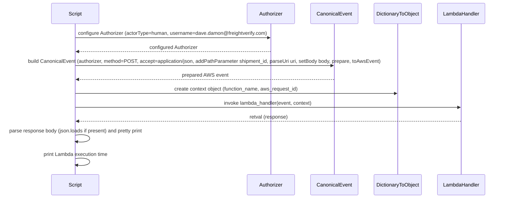
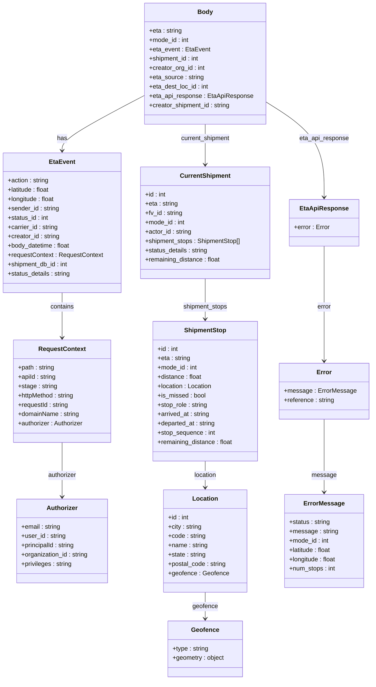

# Diagram: platform/tools/ide_local_testing/localTest/test/byUrl/shipmentEtaSetter.py

> Auto-generated by Obscura crawlers

## Diagram 1

### SVG

<svg id="container" width="1674.5" xmlns="http://www.w3.org/2000/svg" height="663" viewBox="-190.5 -10 1674.5 663" role="graphics-document document" aria-roledescription="sequence"><g><rect x="1284" y="577" fill="#eaeaea" stroke="#666" width="150" height="65" name="LambdaHandler" rx="3" ry="3" class="actor actor-bottom"></rect><text x="1359" y="609.5" dominant-baseline="central" alignment-baseline="central" class="actor actor-box" style="text-anchor: middle; font-size: 16px; font-weight: 400;"><tspan x="1359" dy="0">LambdaHandler</tspan></text></g><g><rect x="1076" y="577" fill="#eaeaea" stroke="#666" width="158" height="65" name="DictionaryToObject" rx="3" ry="3" class="actor actor-bottom"></rect><text x="1155" y="609.5" dominant-baseline="central" alignment-baseline="central" class="actor actor-box" style="text-anchor: middle; font-size: 16px; font-weight: 400;"><tspan x="1155" dy="0">DictionaryToObject</tspan></text></g><g><rect x="876" y="577" fill="#eaeaea" stroke="#666" width="150" height="65" name="CanonicalEvent" rx="3" ry="3" class="actor actor-bottom"></rect><text x="951" y="609.5" dominant-baseline="central" alignment-baseline="central" class="actor actor-box" style="text-anchor: middle; font-size: 16px; font-weight: 400;"><tspan x="951" dy="0">CanonicalEvent</tspan></text></g><g><rect x="676" y="577" fill="#eaeaea" stroke="#666" width="150" height="65" name="Authorizer" rx="3" ry="3" class="actor actor-bottom"></rect><text x="751" y="609.5" dominant-baseline="central" alignment-baseline="central" class="actor actor-box" style="text-anchor: middle; font-size: 16px; font-weight: 400;"><tspan x="751" dy="0">Authorizer</tspan></text></g><g><rect x="0" y="577" fill="#eaeaea" stroke="#666" width="150" height="65" name="Script" rx="3" ry="3" class="actor actor-bottom"></rect><text x="75" y="609.5" dominant-baseline="central" alignment-baseline="central" class="actor actor-box" style="text-anchor: middle; font-size: 16px; font-weight: 400;"><tspan x="75" dy="0">Script</tspan></text></g><g><line id="actor4" x1="1359" y1="65" x2="1359" y2="577" class="actor-line 200" stroke-width="0.5px" stroke="#999" name="LambdaHandler"></line><g id="root-4"><rect x="1284" y="0" fill="#eaeaea" stroke="#666" width="150" height="65" name="LambdaHandler" rx="3" ry="3" class="actor actor-top"></rect><text x="1359" y="32.5" dominant-baseline="central" alignment-baseline="central" class="actor actor-box" style="text-anchor: middle; font-size: 16px; font-weight: 400;"><tspan x="1359" dy="0">LambdaHandler</tspan></text></g></g><g><line id="actor3" x1="1155" y1="65" x2="1155" y2="577" class="actor-line 200" stroke-width="0.5px" stroke="#999" name="DictionaryToObject"></line><g id="root-3"><rect x="1076" y="0" fill="#eaeaea" stroke="#666" width="158" height="65" name="DictionaryToObject" rx="3" ry="3" class="actor actor-top"></rect><text x="1155" y="32.5" dominant-baseline="central" alignment-baseline="central" class="actor actor-box" style="text-anchor: middle; font-size: 16px; font-weight: 400;"><tspan x="1155" dy="0">DictionaryToObject</tspan></text></g></g><g><line id="actor2" x1="951" y1="65" x2="951" y2="577" class="actor-line 200" stroke-width="0.5px" stroke="#999" name="CanonicalEvent"></line><g id="root-2"><rect x="876" y="0" fill="#eaeaea" stroke="#666" width="150" height="65" name="CanonicalEvent" rx="3" ry="3" class="actor actor-top"></rect><text x="951" y="32.5" dominant-baseline="central" alignment-baseline="central" class="actor actor-box" style="text-anchor: middle; font-size: 16px; font-weight: 400;"><tspan x="951" dy="0">CanonicalEvent</tspan></text></g></g><g><line id="actor1" x1="751" y1="65" x2="751" y2="577" class="actor-line 200" stroke-width="0.5px" stroke="#999" name="Authorizer"></line><g id="root-1"><rect x="676" y="0" fill="#eaeaea" stroke="#666" width="150" height="65" name="Authorizer" rx="3" ry="3" class="actor actor-top"></rect><text x="751" y="32.5" dominant-baseline="central" alignment-baseline="central" class="actor actor-box" style="text-anchor: middle; font-size: 16px; font-weight: 400;"><tspan x="751" dy="0">Authorizer</tspan></text></g></g><g><line id="actor0" x1="75" y1="65" x2="75" y2="577" class="actor-line 200" stroke-width="0.5px" stroke="#999" name="Script"></line><g id="root-0"><rect x="0" y="0" fill="#eaeaea" stroke="#666" width="150" height="65" name="Script" rx="3" ry="3" class="actor actor-top"></rect><text x="75" y="32.5" dominant-baseline="central" alignment-baseline="central" class="actor actor-box" style="text-anchor: middle; font-size: 16px; font-weight: 400;"><tspan x="75" dy="0">Script</tspan></text></g></g><g></g><defs><symbol id="computer" width="24" height="24"><path transform="scale(.5)" d="M2 2v13h20v-13h-20zm18 11h-16v-9h16v9zm-10.228 6l.466-1h3.524l.467 1h-4.457zm14.228 3h-24l2-6h2.104l-1.33 4h18.45l-1.297-4h2.073l2 6zm-5-10h-14v-7h14v7z"></path></symbol></defs><defs><symbol id="database" fill-rule="evenodd" clip-rule="evenodd"><path transform="scale(.5)" d="M12.258.001l.256.004.255.005.253.008.251.01.249.012.247.015.246.016.242.019.241.02.239.023.236.024.233.027.231.028.229.031.225.032.223.034.22.036.217.038.214.04.211.041.208.043.205.045.201.046.198.048.194.05.191.051.187.053.183.054.18.056.175.057.172.059.168.06.163.061.16.063.155.064.15.066.074.033.073.033.071.034.07.034.069.035.068.035.067.035.066.035.064.036.064.036.062.036.06.036.06.037.058.037.058.037.055.038.055.038.053.038.052.038.051.039.05.039.048.039.047.039.045.04.044.04.043.04.041.04.04.041.039.041.037.041.036.041.034.041.033.042.032.042.03.042.029.042.027.042.026.043.024.043.023.043.021.043.02.043.018.044.017.043.015.044.013.044.012.044.011.045.009.044.007.045.006.045.004.045.002.045.001.045v17l-.001.045-.002.045-.004.045-.006.045-.007.045-.009.044-.011.045-.012.044-.013.044-.015.044-.017.043-.018.044-.02.043-.021.043-.023.043-.024.043-.026.043-.027.042-.029.042-.03.042-.032.042-.033.042-.034.041-.036.041-.037.041-.039.041-.04.041-.041.04-.043.04-.044.04-.045.04-.047.039-.048.039-.05.039-.051.039-.052.038-.053.038-.055.038-.055.038-.058.037-.058.037-.06.037-.06.036-.062.036-.064.036-.064.036-.066.035-.067.035-.068.035-.069.035-.07.034-.071.034-.073.033-.074.033-.15.066-.155.064-.16.063-.163.061-.168.06-.172.059-.175.057-.18.056-.183.054-.187.053-.191.051-.194.05-.198.048-.201.046-.205.045-.208.043-.211.041-.214.04-.217.038-.22.036-.223.034-.225.032-.229.031-.231.028-.233.027-.236.024-.239.023-.241.02-.242.019-.246.016-.247.015-.249.012-.251.01-.253.008-.255.005-.256.004-.258.001-.258-.001-.256-.004-.255-.005-.253-.008-.251-.01-.249-.012-.247-.015-.245-.016-.243-.019-.241-.02-.238-.023-.236-.024-.234-.027-.231-.028-.228-.031-.226-.032-.223-.034-.22-.036-.217-.038-.214-.04-.211-.041-.208-.043-.204-.045-.201-.046-.198-.048-.195-.05-.19-.051-.187-.053-.184-.054-.179-.056-.176-.057-.172-.059-.167-.06-.164-.061-.159-.063-.155-.064-.151-.066-.074-.033-.072-.033-.072-.034-.07-.034-.069-.035-.068-.035-.067-.035-.066-.035-.064-.036-.063-.036-.062-.036-.061-.036-.06-.037-.058-.037-.057-.037-.056-.038-.055-.038-.053-.038-.052-.038-.051-.039-.049-.039-.049-.039-.046-.039-.046-.04-.044-.04-.043-.04-.041-.04-.04-.041-.039-.041-.037-.041-.036-.041-.034-.041-.033-.042-.032-.042-.03-.042-.029-.042-.027-.042-.026-.043-.024-.043-.023-.043-.021-.043-.02-.043-.018-.044-.017-.043-.015-.044-.013-.044-.012-.044-.011-.045-.009-.044-.007-.045-.006-.045-.004-.045-.002-.045-.001-.045v-17l.001-.045.002-.045.004-.045.006-.045.007-.045.009-.044.011-.045.012-.044.013-.044.015-.044.017-.043.018-.044.02-.043.021-.043.023-.043.024-.043.026-.043.027-.042.029-.042.03-.042.032-.042.033-.042.034-.041.036-.041.037-.041.039-.041.04-.041.041-.04.043-.04.044-.04.046-.04.046-.039.049-.039.049-.039.051-.039.052-.038.053-.038.055-.038.056-.038.057-.037.058-.037.06-.037.061-.036.062-.036.063-.036.064-.036.066-.035.067-.035.068-.035.069-.035.07-.034.072-.034.072-.033.074-.033.151-.066.155-.064.159-.063.164-.061.167-.06.172-.059.176-.057.179-.056.184-.054.187-.053.19-.051.195-.05.198-.048.201-.046.204-.045.208-.043.211-.041.214-.04.217-.038.22-.036.223-.034.226-.032.228-.031.231-.028.234-.027.236-.024.238-.023.241-.02.243-.019.245-.016.247-.015.249-.012.251-.01.253-.008.255-.005.256-.004.258-.001.258.001zm-9.258 20.499v.01l.001.021.003.021.004.022.005.021.006.022.007.022.009.023.01.022.011.023.012.023.013.023.015.023.016.024.017.023.018.024.019.024.021.024.022.025.023.024.024.025.052.049.056.05.061.051.066.051.07.051.075.051.079.052.084.052.088.052.092.052.097.052.102.051.105.052.11.052.114.051.119.051.123.051.127.05.131.05.135.05.139.048.144.049.147.047.152.047.155.047.16.045.163.045.167.043.171.043.176.041.178.041.183.039.187.039.19.037.194.035.197.035.202.033.204.031.209.03.212.029.216.027.219.025.222.024.226.021.23.02.233.018.236.016.24.015.243.012.246.01.249.008.253.005.256.004.259.001.26-.001.257-.004.254-.005.25-.008.247-.011.244-.012.241-.014.237-.016.233-.018.231-.021.226-.021.224-.024.22-.026.216-.027.212-.028.21-.031.205-.031.202-.034.198-.034.194-.036.191-.037.187-.039.183-.04.179-.04.175-.042.172-.043.168-.044.163-.045.16-.046.155-.046.152-.047.148-.048.143-.049.139-.049.136-.05.131-.05.126-.05.123-.051.118-.052.114-.051.11-.052.106-.052.101-.052.096-.052.092-.052.088-.053.083-.051.079-.052.074-.052.07-.051.065-.051.06-.051.056-.05.051-.05.023-.024.023-.025.021-.024.02-.024.019-.024.018-.024.017-.024.015-.023.014-.024.013-.023.012-.023.01-.023.01-.022.008-.022.006-.022.006-.022.004-.022.004-.021.001-.021.001-.021v-4.127l-.077.055-.08.053-.083.054-.085.053-.087.052-.09.052-.093.051-.095.05-.097.05-.1.049-.102.049-.105.048-.106.047-.109.047-.111.046-.114.045-.115.045-.118.044-.12.043-.122.042-.124.042-.126.041-.128.04-.13.04-.132.038-.134.038-.135.037-.138.037-.139.035-.142.035-.143.034-.144.033-.147.032-.148.031-.15.03-.151.03-.153.029-.154.027-.156.027-.158.026-.159.025-.161.024-.162.023-.163.022-.165.021-.166.02-.167.019-.169.018-.169.017-.171.016-.173.015-.173.014-.175.013-.175.012-.177.011-.178.01-.179.008-.179.008-.181.006-.182.005-.182.004-.184.003-.184.002h-.37l-.184-.002-.184-.003-.182-.004-.182-.005-.181-.006-.179-.008-.179-.008-.178-.01-.176-.011-.176-.012-.175-.013-.173-.014-.172-.015-.171-.016-.17-.017-.169-.018-.167-.019-.166-.02-.165-.021-.163-.022-.162-.023-.161-.024-.159-.025-.157-.026-.156-.027-.155-.027-.153-.029-.151-.03-.15-.03-.148-.031-.146-.032-.145-.033-.143-.034-.141-.035-.14-.035-.137-.037-.136-.037-.134-.038-.132-.038-.13-.04-.128-.04-.126-.041-.124-.042-.122-.042-.12-.044-.117-.043-.116-.045-.113-.045-.112-.046-.109-.047-.106-.047-.105-.048-.102-.049-.1-.049-.097-.05-.095-.05-.093-.052-.09-.051-.087-.052-.085-.053-.083-.054-.08-.054-.077-.054v4.127zm0-5.654v.011l.001.021.003.021.004.021.005.022.006.022.007.022.009.022.01.022.011.023.012.023.013.023.015.024.016.023.017.024.018.024.019.024.021.024.022.024.023.025.024.024.052.05.056.05.061.05.066.051.07.051.075.052.079.051.084.052.088.052.092.052.097.052.102.052.105.052.11.051.114.051.119.052.123.05.127.051.131.05.135.049.139.049.144.048.147.048.152.047.155.046.16.045.163.045.167.044.171.042.176.042.178.04.183.04.187.038.19.037.194.036.197.034.202.033.204.032.209.03.212.028.216.027.219.025.222.024.226.022.23.02.233.018.236.016.24.014.243.012.246.01.249.008.253.006.256.003.259.001.26-.001.257-.003.254-.006.25-.008.247-.01.244-.012.241-.015.237-.016.233-.018.231-.02.226-.022.224-.024.22-.025.216-.027.212-.029.21-.03.205-.032.202-.033.198-.035.194-.036.191-.037.187-.039.183-.039.179-.041.175-.042.172-.043.168-.044.163-.045.16-.045.155-.047.152-.047.148-.048.143-.048.139-.05.136-.049.131-.05.126-.051.123-.051.118-.051.114-.052.11-.052.106-.052.101-.052.096-.052.092-.052.088-.052.083-.052.079-.052.074-.051.07-.052.065-.051.06-.05.056-.051.051-.049.023-.025.023-.024.021-.025.02-.024.019-.024.018-.024.017-.024.015-.023.014-.023.013-.024.012-.022.01-.023.01-.023.008-.022.006-.022.006-.022.004-.021.004-.022.001-.021.001-.021v-4.139l-.077.054-.08.054-.083.054-.085.052-.087.053-.09.051-.093.051-.095.051-.097.05-.1.049-.102.049-.105.048-.106.047-.109.047-.111.046-.114.045-.115.044-.118.044-.12.044-.122.042-.124.042-.126.041-.128.04-.13.039-.132.039-.134.038-.135.037-.138.036-.139.036-.142.035-.143.033-.144.033-.147.033-.148.031-.15.03-.151.03-.153.028-.154.028-.156.027-.158.026-.159.025-.161.024-.162.023-.163.022-.165.021-.166.02-.167.019-.169.018-.169.017-.171.016-.173.015-.173.014-.175.013-.175.012-.177.011-.178.009-.179.009-.179.007-.181.007-.182.005-.182.004-.184.003-.184.002h-.37l-.184-.002-.184-.003-.182-.004-.182-.005-.181-.007-.179-.007-.179-.009-.178-.009-.176-.011-.176-.012-.175-.013-.173-.014-.172-.015-.171-.016-.17-.017-.169-.018-.167-.019-.166-.02-.165-.021-.163-.022-.162-.023-.161-.024-.159-.025-.157-.026-.156-.027-.155-.028-.153-.028-.151-.03-.15-.03-.148-.031-.146-.033-.145-.033-.143-.033-.141-.035-.14-.036-.137-.036-.136-.037-.134-.038-.132-.039-.13-.039-.128-.04-.126-.041-.124-.042-.122-.043-.12-.043-.117-.044-.116-.044-.113-.046-.112-.046-.109-.046-.106-.047-.105-.048-.102-.049-.1-.049-.097-.05-.095-.051-.093-.051-.09-.051-.087-.053-.085-.052-.083-.054-.08-.054-.077-.054v4.139zm0-5.666v.011l.001.02.003.022.004.021.005.022.006.021.007.022.009.023.01.022.011.023.012.023.013.023.015.023.016.024.017.024.018.023.019.024.021.025.022.024.023.024.024.025.052.05.056.05.061.05.066.051.07.051.075.052.079.051.084.052.088.052.092.052.097.052.102.052.105.051.11.052.114.051.119.051.123.051.127.05.131.05.135.05.139.049.144.048.147.048.152.047.155.046.16.045.163.045.167.043.171.043.176.042.178.04.183.04.187.038.19.037.194.036.197.034.202.033.204.032.209.03.212.028.216.027.219.025.222.024.226.021.23.02.233.018.236.017.24.014.243.012.246.01.249.008.253.006.256.003.259.001.26-.001.257-.003.254-.006.25-.008.247-.01.244-.013.241-.014.237-.016.233-.018.231-.02.226-.022.224-.024.22-.025.216-.027.212-.029.21-.03.205-.032.202-.033.198-.035.194-.036.191-.037.187-.039.183-.039.179-.041.175-.042.172-.043.168-.044.163-.045.16-.045.155-.047.152-.047.148-.048.143-.049.139-.049.136-.049.131-.051.126-.05.123-.051.118-.052.114-.051.11-.052.106-.052.101-.052.096-.052.092-.052.088-.052.083-.052.079-.052.074-.052.07-.051.065-.051.06-.051.056-.05.051-.049.023-.025.023-.025.021-.024.02-.024.019-.024.018-.024.017-.024.015-.023.014-.024.013-.023.012-.023.01-.022.01-.023.008-.022.006-.022.006-.022.004-.022.004-.021.001-.021.001-.021v-4.153l-.077.054-.08.054-.083.053-.085.053-.087.053-.09.051-.093.051-.095.051-.097.05-.1.049-.102.048-.105.048-.106.048-.109.046-.111.046-.114.046-.115.044-.118.044-.12.043-.122.043-.124.042-.126.041-.128.04-.13.039-.132.039-.134.038-.135.037-.138.036-.139.036-.142.034-.143.034-.144.033-.147.032-.148.032-.15.03-.151.03-.153.028-.154.028-.156.027-.158.026-.159.024-.161.024-.162.023-.163.023-.165.021-.166.02-.167.019-.169.018-.169.017-.171.016-.173.015-.173.014-.175.013-.175.012-.177.01-.178.01-.179.009-.179.007-.181.006-.182.006-.182.004-.184.003-.184.001-.185.001-.185-.001-.184-.001-.184-.003-.182-.004-.182-.006-.181-.006-.179-.007-.179-.009-.178-.01-.176-.01-.176-.012-.175-.013-.173-.014-.172-.015-.171-.016-.17-.017-.169-.018-.167-.019-.166-.02-.165-.021-.163-.023-.162-.023-.161-.024-.159-.024-.157-.026-.156-.027-.155-.028-.153-.028-.151-.03-.15-.03-.148-.032-.146-.032-.145-.033-.143-.034-.141-.034-.14-.036-.137-.036-.136-.037-.134-.038-.132-.039-.13-.039-.128-.041-.126-.041-.124-.041-.122-.043-.12-.043-.117-.044-.116-.044-.113-.046-.112-.046-.109-.046-.106-.048-.105-.048-.102-.048-.1-.05-.097-.049-.095-.051-.093-.051-.09-.052-.087-.052-.085-.053-.083-.053-.08-.054-.077-.054v4.153zm8.74-8.179l-.257.004-.254.005-.25.008-.247.011-.244.012-.241.014-.237.016-.233.018-.231.021-.226.022-.224.023-.22.026-.216.027-.212.028-.21.031-.205.032-.202.033-.198.034-.194.036-.191.038-.187.038-.183.04-.179.041-.175.042-.172.043-.168.043-.163.045-.16.046-.155.046-.152.048-.148.048-.143.048-.139.049-.136.05-.131.05-.126.051-.123.051-.118.051-.114.052-.11.052-.106.052-.101.052-.096.052-.092.052-.088.052-.083.052-.079.052-.074.051-.07.052-.065.051-.06.05-.056.05-.051.05-.023.025-.023.024-.021.024-.02.025-.019.024-.018.024-.017.023-.015.024-.014.023-.013.023-.012.023-.01.023-.01.022-.008.022-.006.023-.006.021-.004.022-.004.021-.001.021-.001.021.001.021.001.021.004.021.004.022.006.021.006.023.008.022.01.022.01.023.012.023.013.023.014.023.015.024.017.023.018.024.019.024.02.025.021.024.023.024.023.025.051.05.056.05.06.05.065.051.07.052.074.051.079.052.083.052.088.052.092.052.096.052.101.052.106.052.11.052.114.052.118.051.123.051.126.051.131.05.136.05.139.049.143.048.148.048.152.048.155.046.16.046.163.045.168.043.172.043.175.042.179.041.183.04.187.038.191.038.194.036.198.034.202.033.205.032.21.031.212.028.216.027.22.026.224.023.226.022.231.021.233.018.237.016.241.014.244.012.247.011.25.008.254.005.257.004.26.001.26-.001.257-.004.254-.005.25-.008.247-.011.244-.012.241-.014.237-.016.233-.018.231-.021.226-.022.224-.023.22-.026.216-.027.212-.028.21-.031.205-.032.202-.033.198-.034.194-.036.191-.038.187-.038.183-.04.179-.041.175-.042.172-.043.168-.043.163-.045.16-.046.155-.046.152-.048.148-.048.143-.048.139-.049.136-.05.131-.05.126-.051.123-.051.118-.051.114-.052.11-.052.106-.052.101-.052.096-.052.092-.052.088-.052.083-.052.079-.052.074-.051.07-.052.065-.051.06-.05.056-.05.051-.05.023-.025.023-.024.021-.024.02-.025.019-.024.018-.024.017-.023.015-.024.014-.023.013-.023.012-.023.01-.023.01-.022.008-.022.006-.023.006-.021.004-.022.004-.021.001-.021.001-.021-.001-.021-.001-.021-.004-.021-.004-.022-.006-.021-.006-.023-.008-.022-.01-.022-.01-.023-.012-.023-.013-.023-.014-.023-.015-.024-.017-.023-.018-.024-.019-.024-.02-.025-.021-.024-.023-.024-.023-.025-.051-.05-.056-.05-.06-.05-.065-.051-.07-.052-.074-.051-.079-.052-.083-.052-.088-.052-.092-.052-.096-.052-.101-.052-.106-.052-.11-.052-.114-.052-.118-.051-.123-.051-.126-.051-.131-.05-.136-.05-.139-.049-.143-.048-.148-.048-.152-.048-.155-.046-.16-.046-.163-.045-.168-.043-.172-.043-.175-.042-.179-.041-.183-.04-.187-.038-.191-.038-.194-.036-.198-.034-.202-.033-.205-.032-.21-.031-.212-.028-.216-.027-.22-.026-.224-.023-.226-.022-.231-.021-.233-.018-.237-.016-.241-.014-.244-.012-.247-.011-.25-.008-.254-.005-.257-.004-.26-.001-.26.001z"></path></symbol></defs><defs><symbol id="clock" width="24" height="24"><path transform="scale(.5)" d="M12 2c5.514 0 10 4.486 10 10s-4.486 10-10 10-10-4.486-10-10 4.486-10 10-10zm0-2c-6.627 0-12 5.373-12 12s5.373 12 12 12 12-5.373 12-12-5.373-12-12-12zm5.848 12.459c.202.038.202.333.001.372-1.907.361-6.045 1.111-6.547 1.111-.719 0-1.301-.582-1.301-1.301 0-.512.77-5.447 1.125-7.445.034-.192.312-.181.343.014l.985 6.238 5.394 1.011z"></path></symbol></defs><defs><marker id="arrowhead" refX="7.9" refY="5" markerUnits="userSpaceOnUse" markerWidth="12" markerHeight="12" orient="auto-start-reverse"><path d="M -1 0 L 10 5 L 0 10 z"></path></marker></defs><defs><marker id="crosshead" markerWidth="15" markerHeight="8" orient="auto" refX="4" refY="4.5"><path fill="none" stroke="#000000" stroke-width="1pt" d="M 1,2 L 6,7 M 6,2 L 1,7" style="stroke-dasharray: 0, 0;"></path></marker></defs><defs><marker id="filled-head" refX="15.5" refY="7" markerWidth="20" markerHeight="28" orient="auto"><path d="M 18,7 L9,13 L14,7 L9,1 Z"></path></marker></defs><defs><marker id="sequencenumber" refX="15" refY="15" markerWidth="60" markerHeight="40" orient="auto"><circle cx="15" cy="15" r="6"></circle></marker></defs><text x="412" y="80" text-anchor="middle" dominant-baseline="middle" alignment-baseline="middle" class="messageText" dy="1em" style="font-size: 16px; font-weight: 400;">configure Authorizer (actorType=human, username=dave.damon@freightverify.com)</text><line x1="76" y1="113" x2="747" y2="113" class="messageLine0" stroke-width="2" stroke="none" marker-end="url(#arrowhead)" style="fill: none;"></line><text x="415" y="128" text-anchor="middle" dominant-baseline="middle" alignment-baseline="middle" class="messageText" dy="1em" style="font-size: 16px; font-weight: 400;">configured Authorizer</text><line x1="750" y1="161" x2="79" y2="161" class="messageLine1" stroke-width="2" stroke="none" marker-end="url(#arrowhead)" style="stroke-dasharray: 3, 3; fill: none;"></line><text x="512" y="176" text-anchor="middle" dominant-baseline="middle" alignment-baseline="middle" class="messageText" dy="1em" style="font-size: 16px; font-weight: 400;">build CanonicalEvent (authorizer, method=POST, accept=application/json, addPathParameter shipment_id, parseUri uri, setBody body, prepare, toAwsEvent)</text><line x1="76" y1="209" x2="947" y2="209" class="messageLine0" stroke-width="2" stroke="none" marker-end="url(#arrowhead)" style="fill: none;"></line><text x="515" y="224" text-anchor="middle" dominant-baseline="middle" alignment-baseline="middle" class="messageText" dy="1em" style="font-size: 16px; font-weight: 400;">prepared AWS event</text><line x1="950" y1="257" x2="79" y2="257" class="messageLine1" stroke-width="2" stroke="none" marker-end="url(#arrowhead)" style="stroke-dasharray: 3, 3; fill: none;"></line><text x="614" y="272" text-anchor="middle" dominant-baseline="middle" alignment-baseline="middle" class="messageText" dy="1em" style="font-size: 16px; font-weight: 400;">create context object (function_name, aws_request_id)</text><line x1="76" y1="305" x2="1151" y2="305" class="messageLine0" stroke-width="2" stroke="none" marker-end="url(#arrowhead)" style="fill: none;"></line><text x="716" y="320" text-anchor="middle" dominant-baseline="middle" alignment-baseline="middle" class="messageText" dy="1em" style="font-size: 16px; font-weight: 400;">invoke lambda_handler(event, context)</text><line x1="76" y1="353" x2="1355" y2="353" class="messageLine0" stroke-width="2" stroke="none" marker-end="url(#arrowhead)" style="fill: none;"></line><text x="719" y="368" text-anchor="middle" dominant-baseline="middle" alignment-baseline="middle" class="messageText" dy="1em" style="font-size: 16px; font-weight: 400;">retval (response)</text><line x1="1358" y1="401" x2="79" y2="401" class="messageLine1" stroke-width="2" stroke="none" marker-end="url(#arrowhead)" style="stroke-dasharray: 3, 3; fill: none;"></line><text x="76" y="416" text-anchor="middle" dominant-baseline="middle" alignment-baseline="middle" class="messageText" dy="1em" style="font-size: 16px; font-weight: 400;">parse response body (json.loads if present) and pretty print</text><path d="M 76,449 C 136,439 136,479 76,469" class="messageLine0" stroke-width="2" stroke="none" marker-end="url(#arrowhead)" style="fill: none;"></path><text x="76" y="494" text-anchor="middle" dominant-baseline="middle" alignment-baseline="middle" class="messageText" dy="1em" style="font-size: 16px; font-weight: 400;">print Lambda execution time</text><path d="M 76,527 C 136,517 136,557 76,547" class="messageLine0" stroke-width="2" stroke="none" marker-end="url(#arrowhead)" style="fill: none;"></path></svg>

## Diagram 2

### SVG

<svg id="container" width="950.53515625" xmlns="http://www.w3.org/2000/svg" class="classDiagram" height="1752" viewBox="0 0 950.53515625 1752" role="graphics-document document" aria-roledescription="class"><g><defs><marker id="container_class-aggregationStart" class="marker aggregation class" refX="18" refY="7" markerWidth="190" markerHeight="240" orient="auto"><path d="M 18,7 L9,13 L1,7 L9,1 Z"></path></marker></defs><defs><marker id="container_class-aggregationEnd" class="marker aggregation class" refX="1" refY="7" markerWidth="20" markerHeight="28" orient="auto"><path d="M 18,7 L9,13 L1,7 L9,1 Z"></path></marker></defs><defs><marker id="container_class-extensionStart" class="marker extension class" refX="18" refY="7" markerWidth="190" markerHeight="240" orient="auto"><path d="M 1,7 L18,13 V 1 Z"></path></marker></defs><defs><marker id="container_class-extensionEnd" class="marker extension class" refX="1" refY="7" markerWidth="20" markerHeight="28" orient="auto"><path d="M 1,1 V 13 L18,7 Z"></path></marker></defs><defs><marker id="container_class-compositionStart" class="marker composition class" refX="18" refY="7" markerWidth="190" markerHeight="240" orient="auto"><path d="M 18,7 L9,13 L1,7 L9,1 Z"></path></marker></defs><defs><marker id="container_class-compositionEnd" class="marker composition class" refX="1" refY="7" markerWidth="20" markerHeight="28" orient="auto"><path d="M 18,7 L9,13 L1,7 L9,1 Z"></path></marker></defs><defs><marker id="container_class-dependencyStart" class="marker dependency class" refX="6" refY="7" markerWidth="190" markerHeight="240" orient="auto"><path d="M 5,7 L9,13 L1,7 L9,1 Z"></path></marker></defs><defs><marker id="container_class-dependencyEnd" class="marker dependency class" refX="13" refY="7" markerWidth="20" markerHeight="28" orient="auto"><path d="M 18,7 L9,13 L14,7 L9,1 Z"></path></marker></defs><defs><marker id="container_class-lollipopStart" class="marker lollipop class" refX="13" refY="7" markerWidth="190" markerHeight="240" orient="auto"><circle stroke="black" fill="transparent" cx="7" cy="7" r="6"></circle></marker></defs><defs><marker id="container_class-lollipopEnd" class="marker lollipop class" refX="1" refY="7" markerWidth="190" markerHeight="240" orient="auto"><circle stroke="black" fill="transparent" cx="7" cy="7" r="6"></circle></marker></defs><g class="root"><g class="clusters"></g><g class="edgePaths"><path d="M372.605,244.545L336.858,263.287C301.111,282.03,229.616,319.515,193.868,343.424C158.121,367.333,158.121,377.667,158.121,382.833L158.121,388" id="id_Body_EtaEvent_1" class="edge-thickness-normal edge-pattern-solid relation" style=";;;" data-edge="true" data-et="edge" data-id="id_Body_EtaEvent_1" data-points="W3sieCI6MzcyLjYwNTQ2ODc1LCJ5IjoyNDQuNTQ0NTAwNDUxMDAwMTV9LHsieCI6MTU4LjEyMTA5Mzc1LCJ5IjozNTd9LHsieCI6MTU4LjEyMTA5Mzc1LCJ5IjozOTR9XQ==" marker-end="url(#container_class-dependencyEnd)"></path><path d="M158.121,754L158.121,760.167C158.121,766.333,158.121,778.667,158.121,798C158.121,817.333,158.121,843.667,158.121,856.833L158.121,870" id="id_EtaEvent_RequestContext_2" class="edge-thickness-normal edge-pattern-solid relation" style=";;;" data-edge="true" data-et="edge" data-id="id_EtaEvent_RequestContext_2" data-points="W3sieCI6MTU4LjEyMTA5Mzc1LCJ5Ijo3NTR9LHsieCI6MTU4LjEyMTA5Mzc1LCJ5Ijo3OTF9LHsieCI6MTU4LjEyMTA5Mzc1LCJ5Ijo4NzZ9XQ==" marker-end="url(#container_class-dependencyEnd)"></path><path d="M158.121,1140L158.121,1154.167C158.121,1168.333,158.121,1196.667,158.121,1220C158.121,1243.333,158.121,1261.667,158.121,1270.833L158.121,1280" id="id_RequestContext_Authorizer_3" class="edge-thickness-normal edge-pattern-solid relation" style=";;;" data-edge="true" data-et="edge" data-id="id_RequestContext_Authorizer_3" data-points="W3sieCI6MTU4LjEyMTA5Mzc1LCJ5IjoxMTQwfSx7IngiOjE1OC4xMjEwOTM3NSwieSI6MTIyNX0seyJ4IjoxNTguMTIxMDkzNzUsInkiOjEyODZ9XQ==" marker-end="url(#container_class-dependencyEnd)"></path><path d="M679.848,261.079L705.146,277.066C730.444,293.053,781.04,325.026,806.339,366.18C831.637,407.333,831.637,457.667,831.637,482.833L831.637,508" id="id_Body_EtaApiResponse_4" class="edge-thickness-normal edge-pattern-solid relation" style=";;;" data-edge="true" data-et="edge" data-id="id_Body_EtaApiResponse_4" data-points="W3sieCI6Njc5Ljg0NzY1NjI1LCJ5IjoyNjEuMDc4ODY0MjMyMjY5Nn0seyJ4Ijo4MzEuNjM2NzE4NzUsInkiOjM1N30seyJ4Ijo4MzEuNjM2NzE4NzUsInkiOjUxNH1d" marker-end="url(#container_class-dependencyEnd)"></path><path d="M831.637,634L831.637,660.167C831.637,686.333,831.637,738.667,831.637,788C831.637,837.333,831.637,883.667,831.637,906.833L831.637,930" id="id_EtaApiResponse_Error_5" class="edge-thickness-normal edge-pattern-solid relation" style=";;;" data-edge="true" data-et="edge" data-id="id_EtaApiResponse_Error_5" data-points="W3sieCI6ODMxLjYzNjcxODc1LCJ5Ijo2MzR9LHsieCI6ODMxLjYzNjcxODc1LCJ5Ijo3OTF9LHsieCI6ODMxLjYzNjcxODc1LCJ5Ijo5MzZ9XQ==" marker-end="url(#container_class-dependencyEnd)"></path><path d="M831.637,1080L831.637,1104.167C831.637,1128.333,831.637,1176.667,831.637,1208C831.637,1239.333,831.637,1253.667,831.637,1260.833L831.637,1268" id="id_Error_ErrorMessage_6" class="edge-thickness-normal edge-pattern-solid relation" style=";;;" data-edge="true" data-et="edge" data-id="id_Error_ErrorMessage_6" data-points="W3sieCI6ODMxLjYzNjcxODc1LCJ5IjoxMDgwfSx7IngiOjgzMS42MzY3MTg3NSwieSI6MTIyNX0seyJ4Ijo4MzEuNjM2NzE4NzUsInkiOjEyNzR9XQ==" marker-end="url(#container_class-dependencyEnd)"></path><path d="M526.227,320L526.227,326.167C526.227,332.333,526.227,344.667,526.227,362C526.227,379.333,526.227,401.667,526.227,412.833L526.227,424" id="id_Body_CurrentShipment_7" class="edge-thickness-normal edge-pattern-solid relation" style=";;;" data-edge="true" data-et="edge" data-id="id_Body_CurrentShipment_7" data-points="W3sieCI6NTI2LjIyNjU2MjUsInkiOjMyMH0seyJ4Ijo1MjYuMjI2NTYyNSwieSI6MzU3fSx7IngiOjUyNi4yMjY1NjI1LCJ5Ijo0MzB9XQ==" marker-end="url(#container_class-dependencyEnd)"></path><path d="M526.227,718L526.227,730.167C526.227,742.333,526.227,766.667,526.227,784C526.227,801.333,526.227,811.667,526.227,816.833L526.227,822" id="id_CurrentShipment_ShipmentStop_8" class="edge-thickness-normal edge-pattern-solid relation" style=";;;" data-edge="true" data-et="edge" data-id="id_CurrentShipment_ShipmentStop_8" data-points="W3sieCI6NTI2LjIyNjU2MjUsInkiOjcxOH0seyJ4Ijo1MjYuMjI2NTYyNSwieSI6NzkxfSx7IngiOjUyNi4yMjY1NjI1LCJ5Ijo4Mjh9XQ==" marker-end="url(#container_class-dependencyEnd)"></path><path d="M526.227,1188L526.227,1194.167C526.227,1200.333,526.227,1212.667,526.227,1224C526.227,1235.333,526.227,1245.667,526.227,1250.833L526.227,1256" id="id_ShipmentStop_Location_9" class="edge-thickness-normal edge-pattern-solid relation" style=";;;" data-edge="true" data-et="edge" data-id="id_ShipmentStop_Location_9" data-points="W3sieCI6NTI2LjIyNjU2MjUsInkiOjExODh9LHsieCI6NTI2LjIyNjU2MjUsInkiOjEyMjV9LHsieCI6NTI2LjIyNjU2MjUsInkiOjEyNjJ9XQ==" marker-end="url(#container_class-dependencyEnd)"></path><path d="M526.227,1526L526.227,1532.167C526.227,1538.333,526.227,1550.667,526.227,1562C526.227,1573.333,526.227,1583.667,526.227,1588.833L526.227,1594" id="id_Location_Geofence_10" class="edge-thickness-normal edge-pattern-solid relation" style=";;;" data-edge="true" data-et="edge" data-id="id_Location_Geofence_10" data-points="W3sieCI6NTI2LjIyNjU2MjUsInkiOjE1MjZ9LHsieCI6NTI2LjIyNjU2MjUsInkiOjE1NjN9LHsieCI6NTI2LjIyNjU2MjUsInkiOjE2MDB9XQ==" marker-end="url(#container_class-dependencyEnd)"></path></g><g class="edgeLabels"><g class="edgeLabel" transform="translate(158.12109375, 357)"><g class="label" data-id="id_Body_EtaEvent_1" transform="translate(-12.703125, -12)"><foreignObject width="25.40625" height="24">

has

</foreignObject></g></g><g class="edgeLabel" transform="translate(158.12109375, 791)"><g class="label" data-id="id_EtaEvent_RequestContext_2" transform="translate(-30.890625, -12)"><foreignObject width="61.78125" height="24">

contains

</foreignObject></g></g><g class="edgeLabel" transform="translate(158.12109375, 1225)"><g class="label" data-id="id_RequestContext_Authorizer_3" transform="translate(-37.4921875, -12)"><foreignObject width="74.984375" height="24">

authorizer

</foreignObject></g></g><g class="edgeLabel" transform="translate(831.63671875, 357)"><g class="label" data-id="id_Body_EtaApiResponse_4" transform="translate(-64.21875, -12)"><foreignObject width="128.4375" height="24">

eta_api_response

</foreignObject></g></g><g class="edgeLabel" transform="translate(831.63671875, 791)"><g class="label" data-id="id_EtaApiResponse_Error_5" transform="translate(-18.0625, -12)"><foreignObject width="36.125" height="24">

error

</foreignObject></g></g><g class="edgeLabel" transform="translate(831.63671875, 1225)"><g class="label" data-id="id_Error_ErrorMessage_6" transform="translate(-31.1953125, -12)"><foreignObject width="62.390625" height="24">

message

</foreignObject></g></g><g class="edgeLabel" transform="translate(526.2265625, 357)"><g class="label" data-id="id_Body_CurrentShipment_7" transform="translate(-64.65625, -12)"><foreignObject width="129.3125" height="24">

current_shipment

</foreignObject></g></g><g class="edgeLabel" transform="translate(526.2265625, 791)"><g class="label" data-id="id_CurrentShipment_ShipmentStop_8" transform="translate(-58.0546875, -12)"><foreignObject width="116.109375" height="24">

shipment_stops

</foreignObject></g></g><g class="edgeLabel" transform="translate(526.2265625, 1225)"><g class="label" data-id="id_ShipmentStop_Location_9" transform="translate(-29.578125, -12)"><foreignObject width="59.15625" height="24">

location

</foreignObject></g></g><g class="edgeLabel" transform="translate(526.2265625, 1563)"><g class="label" data-id="id_Location_Geofence_10" transform="translate(-32.7421875, -12)"><foreignObject width="65.484375" height="24">

geofence

</foreignObject></g></g></g><g class="nodes"><g class="node default" id="classId-Body-0" transform="translate(526.2265625, 164)"><g class="basic label-container"><path d="M-153.62109375 -156 L153.62109375 -156 L153.62109375 156 L-153.62109375 156" stroke="none" stroke-width="0" fill="#ECECFF" style=""></path><path d="M-153.62109375 -156 C-42.16810869401306 -156, 69.28487636197389 -156, 153.62109375 -156 M-153.62109375 -156 C-52.45742965990674 -156, 48.70623443018653 -156, 153.62109375 -156 M153.62109375 -156 C153.62109375 -69.78932007404705, 153.62109375 16.42135985190589, 153.62109375 156 M153.62109375 -156 C153.62109375 -65.18519388404124, 153.62109375 25.62961223191752, 153.62109375 156 M153.62109375 156 C75.63758078159978 156, -2.3459321868004395 156, -153.62109375 156 M153.62109375 156 C38.53042196169744 156, -76.56024982660512 156, -153.62109375 156 M-153.62109375 156 C-153.62109375 89.29497105734198, -153.62109375 22.589942114683964, -153.62109375 -156 M-153.62109375 156 C-153.62109375 54.000524697798596, -153.62109375 -47.99895060440281, -153.62109375 -156" stroke="#9370DB" stroke-width="1.3" fill="none" stroke-dasharray="0 0" style=""></path></g><g class="annotation-group text" transform="translate(0, -132)"></g><g class="label-group text" transform="translate(-18.5546875, -132)"><g class="label" style="font-weight: bolder" transform="translate(0,-12)"><foreignObject width="37.109375" height="24">

Body

</foreignObject></g></g><g class="members-group text" transform="translate(-141.62109375, -84)"><g class="label" style="" transform="translate(0,-12)"><foreignObject width="85.03125" height="24">

+eta : string

</foreignObject></g><g class="label" style="" transform="translate(0,12)"><foreignObject width="103.40625" height="24">

+mode_id : int

</foreignObject></g><g class="label" style="" transform="translate(0,36)"><foreignObject width="154.359375" height="24">

+eta_event : EtaEvent

</foreignObject></g><g class="label" style="" transform="translate(0,60)"><foreignObject width="130.828125" height="24">

+shipment_id : int

</foreignObject></g><g class="label" style="" transform="translate(0,84)"><foreignObject width="144.421875" height="24">

+creator_org_id : int

</foreignObject></g><g class="label" style="" transform="translate(0,108)"><foreignObject width="141.21875" height="24">

+eta_source : string

</foreignObject></g><g class="label" style="" transform="translate(0,132)"><foreignObject width="154.765625" height="24">

+eta_dest_loc_id : int

</foreignObject></g><g class="label" style="" transform="translate(0,156)"><foreignObject width="264.6875" height="24">

+eta_api_response : EtaApiResponse

</foreignObject></g><g class="label" style="" transform="translate(0,180)"><foreignObject width="211.5" height="24">

+creator_shipment_id : string

</foreignObject></g></g><g class="methods-group text" transform="translate(-141.62109375, 156)"></g><g class="divider" style=""><path d="M-153.62109375 -108 C-77.52654549150735 -108, -1.4319972330146982 -108, 153.62109375 -108 M-153.62109375 -108 C-46.84021333242504 -108, 59.940667085149926 -108, 153.62109375 -108" stroke="#9370DB" stroke-width="1.3" fill="none" stroke-dasharray="0 0" style=""></path></g><g class="divider" style=""><path d="M-153.62109375 132 C-79.34379329843429 132, -5.066492846868584 132, 153.62109375 132 M-153.62109375 132 C-82.34946843827936 132, -11.077843126558719 132, 153.62109375 132" stroke="#9370DB" stroke-width="1.3" fill="none" stroke-dasharray="0 0" style=""></path></g></g><g class="node default" id="classId-EtaEvent-1" transform="translate(158.12109375, 574)"><g class="basic label-container"><path d="M-150.12109375 -180 L150.12109375 -180 L150.12109375 180 L-150.12109375 180" stroke="none" stroke-width="0" fill="#ECECFF" style=""></path><path d="M-150.12109375 -180 C-75.9896179911904 -180, -1.8581422323808 -180, 150.12109375 -180 M-150.12109375 -180 C-49.91529364106397 -180, 50.29050646787206 -180, 150.12109375 -180 M150.12109375 -180 C150.12109375 -104.05062833967123, 150.12109375 -28.10125667934247, 150.12109375 180 M150.12109375 -180 C150.12109375 -81.90323255421333, 150.12109375 16.193534891573336, 150.12109375 180 M150.12109375 180 C65.24884317381043 180, -19.623407402379144 180, -150.12109375 180 M150.12109375 180 C60.109140228310835 180, -29.90281329337833 180, -150.12109375 180 M-150.12109375 180 C-150.12109375 101.9580222031629, -150.12109375 23.916044406325796, -150.12109375 -180 M-150.12109375 180 C-150.12109375 45.179342203300564, -150.12109375 -89.64131559339887, -150.12109375 -180" stroke="#9370DB" stroke-width="1.3" fill="none" stroke-dasharray="0 0" style=""></path></g><g class="annotation-group text" transform="translate(0, -156)"></g><g class="label-group text" transform="translate(-31.6484375, -156)"><g class="label" style="font-weight: bolder" transform="translate(0,-12)"><foreignObject width="63.296875" height="24">

EtaEvent

</foreignObject></g></g><g class="members-group text" transform="translate(-138.12109375, -108)"><g class="label" style="" transform="translate(0,-12)"><foreignObject width="107.0625" height="24">

+action : string

</foreignObject></g><g class="label" style="" transform="translate(0,12)"><foreignObject width="110.34375" height="24">

+latitude : float

</foreignObject></g><g class="label" style="" transform="translate(0,36)"><foreignObject width="122.90625" height="24">

+longitude : float

</foreignObject></g><g class="label" style="" transform="translate(0,60)"><foreignObject width="133.09375" height="24">

+sender_id : string

</foreignObject></g><g class="label" style="" transform="translate(0,84)"><foreignObject width="106.453125" height="24">

+status_id : int

</foreignObject></g><g class="label" style="" transform="translate(0,108)"><foreignObject width="131.015625" height="24">

+carrier_id : string

</foreignObject></g><g class="label" style="" transform="translate(0,132)"><foreignObject width="134.734375" height="24">

+creator_id : string

</foreignObject></g><g class="label" style="" transform="translate(0,156)"><foreignObject width="162.421875" height="24">

+body_datetime : float

</foreignObject></g><g class="label" style="" transform="translate(0,180)"><foreignObject width="244.59375" height="24">

+requestContext : RequestContext

</foreignObject></g><g class="label" style="" transform="translate(0,204)"><foreignObject width="157.578125" height="24">

+shipment_db_id : int

</foreignObject></g><g class="label" style="" transform="translate(0,228)"><foreignObject width="163.359375" height="24">

+status_details : string

</foreignObject></g></g><g class="methods-group text" transform="translate(-138.12109375, 180)"></g><g class="divider" style=""><path d="M-150.12109375 -132 C-83.34651162799044 -132, -16.571929505980876 -132, 150.12109375 -132 M-150.12109375 -132 C-82.10933813721915 -132, -14.097582524438309 -132, 150.12109375 -132" stroke="#9370DB" stroke-width="1.3" fill="none" stroke-dasharray="0 0" style=""></path></g><g class="divider" style=""><path d="M-150.12109375 156 C-88.690008126566 156, -27.258922503132013 156, 150.12109375 156 M-150.12109375 156 C-42.087042430312295 156, 65.94700888937541 156, 150.12109375 156" stroke="#9370DB" stroke-width="1.3" fill="none" stroke-dasharray="0 0" style=""></path></g></g><g class="node default" id="classId-RequestContext-2" transform="translate(158.12109375, 1008)"><g class="basic label-container"><path d="M-126.31640625 -132 L126.31640625 -132 L126.31640625 132 L-126.31640625 132" stroke="none" stroke-width="0" fill="#ECECFF" style=""></path><path d="M-126.31640625 -132 C-44.49862190237435 -132, 37.319162445251294 -132, 126.31640625 -132 M-126.31640625 -132 C-31.052188624855205 -132, 64.21202900028959 -132, 126.31640625 -132 M126.31640625 -132 C126.31640625 -55.79282144330644, 126.31640625 20.414357113387126, 126.31640625 132 M126.31640625 -132 C126.31640625 -69.53360270989718, 126.31640625 -7.067205419794362, 126.31640625 132 M126.31640625 132 C32.49597469133798 132, -61.324456867324045 132, -126.31640625 132 M126.31640625 132 C63.165935144606 132, 0.015464039212005787 132, -126.31640625 132 M-126.31640625 132 C-126.31640625 32.248827273973475, -126.31640625 -67.50234545205305, -126.31640625 -132 M-126.31640625 132 C-126.31640625 76.91951148528732, -126.31640625 21.839022970574632, -126.31640625 -132" stroke="#9370DB" stroke-width="1.3" fill="none" stroke-dasharray="0 0" style=""></path></g><g class="annotation-group text" transform="translate(0, -108)"></g><g class="label-group text" transform="translate(-58.1484375, -108)"><g class="label" style="font-weight: bolder" transform="translate(0,-12)"><foreignObject width="116.296875" height="24">

RequestContext

</foreignObject></g></g><g class="members-group text" transform="translate(-114.31640625, -60)"><g class="label" style="" transform="translate(0,-12)"><foreignObject width="95.140625" height="24">

+path : string

</foreignObject></g><g class="label" style="" transform="translate(0,12)"><foreignObject width="98.71875" height="24">

+apiId : string

</foreignObject></g><g class="label" style="" transform="translate(0,36)"><foreignObject width="100.40625" height="24">

+stage : string

</foreignObject></g><g class="label" style="" transform="translate(0,60)"><foreignObject width="147.609375" height="24">

+httpMethod : string

</foreignObject></g><g class="label" style="" transform="translate(0,84)"><foreignObject width="131.5" height="24">

+requestId : string

</foreignObject></g><g class="label" style="" transform="translate(0,108)"><foreignObject width="159.21875" height="24">

+domainName : string

</foreignObject></g><g class="label" style="" transform="translate(0,132)"><foreignObject width="170.484375" height="24">

+authorizer : Authorizer

</foreignObject></g></g><g class="methods-group text" transform="translate(-114.31640625, 132)"></g><g class="divider" style=""><path d="M-126.31640625 -84 C-65.42921750519056 -84, -4.542028760381143 -84, 126.31640625 -84 M-126.31640625 -84 C-45.54586971837517 -84, 35.224666813249655 -84, 126.31640625 -84" stroke="#9370DB" stroke-width="1.3" fill="none" stroke-dasharray="0 0" style=""></path></g><g class="divider" style=""><path d="M-126.31640625 108 C-66.15858896105438 108, -6.000771672108755 108, 126.31640625 108 M-126.31640625 108 C-28.575413996058273 108, 69.16557825788345 108, 126.31640625 108" stroke="#9370DB" stroke-width="1.3" fill="none" stroke-dasharray="0 0" style=""></path></g></g><g class="node default" id="classId-Authorizer-3" transform="translate(158.12109375, 1394)"><g class="basic label-container"><path d="M-118.53515625 -108 L118.53515625 -108 L118.53515625 108 L-118.53515625 108" stroke="none" stroke-width="0" fill="#ECECFF" style=""></path><path d="M-118.53515625 -108 C-44.368960778624384 -108, 29.797234692751232 -108, 118.53515625 -108 M-118.53515625 -108 C-54.95690675687708 -108, 8.621342736245836 -108, 118.53515625 -108 M118.53515625 -108 C118.53515625 -61.3202850266456, 118.53515625 -14.6405700532912, 118.53515625 108 M118.53515625 -108 C118.53515625 -48.67278461736804, 118.53515625 10.654430765263925, 118.53515625 108 M118.53515625 108 C50.729546837877066 108, -17.076062574245867 108, -118.53515625 108 M118.53515625 108 C29.883510657087072 108, -58.768134935825856 108, -118.53515625 108 M-118.53515625 108 C-118.53515625 44.92456798007408, -118.53515625 -18.15086403985184, -118.53515625 -108 M-118.53515625 108 C-118.53515625 46.28728456788838, -118.53515625 -15.425430864223244, -118.53515625 -108" stroke="#9370DB" stroke-width="1.3" fill="none" stroke-dasharray="0 0" style=""></path></g><g class="annotation-group text" transform="translate(0, -84)"></g><g class="label-group text" transform="translate(-38.3671875, -84)"><g class="label" style="font-weight: bolder" transform="translate(0,-12)"><foreignObject width="76.734375" height="24">

Authorizer

</foreignObject></g></g><g class="members-group text" transform="translate(-106.53515625, -36)"><g class="label" style="" transform="translate(0,-12)"><foreignObject width="102.28125" height="24">

+email : string

</foreignObject></g><g class="label" style="" transform="translate(0,12)"><foreignObject width="114.75" height="24">

+user_id : string

</foreignObject></g><g class="label" style="" transform="translate(0,36)"><foreignObject width="140.53125" height="24">

+principalId : string

</foreignObject></g><g class="label" style="" transform="translate(0,60)"><foreignObject width="174.703125" height="24">

+organization_id : string

</foreignObject></g><g class="label" style="" transform="translate(0,84)"><foreignObject width="132.109375" height="24">

+privileges : string

</foreignObject></g></g><g class="methods-group text" transform="translate(-106.53515625, 108)"></g><g class="divider" style=""><path d="M-118.53515625 -60 C-31.888384353463024 -60, 54.75838754307395 -60, 118.53515625 -60 M-118.53515625 -60 C-53.610329786919735 -60, 11.31449667616053 -60, 118.53515625 -60" stroke="#9370DB" stroke-width="1.3" fill="none" stroke-dasharray="0 0" style=""></path></g><g class="divider" style=""><path d="M-118.53515625 84 C-51.41431030786593 84, 15.706535634268135 84, 118.53515625 84 M-118.53515625 84 C-40.41120692500624 84, 37.71274239998752 84, 118.53515625 84" stroke="#9370DB" stroke-width="1.3" fill="none" stroke-dasharray="0 0" style=""></path></g></g><g class="node default" id="classId-CurrentShipment-4" transform="translate(526.2265625, 574)"><g class="basic label-container"><path d="M-167.984375 -144 L167.984375 -144 L167.984375 144 L-167.984375 144" stroke="none" stroke-width="0" fill="#ECECFF" style=""></path><path d="M-167.984375 -144 C-91.07837401614943 -144, -14.17237303229885 -144, 167.984375 -144 M-167.984375 -144 C-84.14110613052328 -144, -0.29783726104656694 -144, 167.984375 -144 M167.984375 -144 C167.984375 -51.57265887488191, 167.984375 40.85468225023618, 167.984375 144 M167.984375 -144 C167.984375 -42.32286022771633, 167.984375 59.35427954456733, 167.984375 144 M167.984375 144 C37.20976222095459 144, -93.56485055809082 144, -167.984375 144 M167.984375 144 C46.06688270734553 144, -75.85060958530894 144, -167.984375 144 M-167.984375 144 C-167.984375 52.839195755965406, -167.984375 -38.32160848806919, -167.984375 -144 M-167.984375 144 C-167.984375 48.58454915491208, -167.984375 -46.830901690175835, -167.984375 -144" stroke="#9370DB" stroke-width="1.3" fill="none" stroke-dasharray="0 0" style=""></path></g><g class="annotation-group text" transform="translate(0, -120)"></g><g class="label-group text" transform="translate(-62.453125, -120)"><g class="label" style="font-weight: bolder" transform="translate(0,-12)"><foreignObject width="124.90625" height="24">

CurrentShipment

</foreignObject></g></g><g class="members-group text" transform="translate(-155.984375, -72)"><g class="label" style="" transform="translate(0,-12)"><foreignObject width="54.0625" height="24">

+id : int

</foreignObject></g><g class="label" style="" transform="translate(0,12)"><foreignObject width="85.03125" height="24">

+eta : string

</foreignObject></g><g class="label" style="" transform="translate(0,36)"><foreignObject width="96.859375" height="24">

+fv_id : string

</foreignObject></g><g class="label" style="" transform="translate(0,60)"><foreignObject width="103.40625" height="24">

+mode_id : int

</foreignObject></g><g class="label" style="" transform="translate(0,84)"><foreignObject width="120.234375" height="24">

+actor_id : string

</foreignObject></g><g class="label" style="" transform="translate(0,108)"><foreignObject width="249.515625" height="24">

+shipment_stops : ShipmentStop[]

</foreignObject></g><g class="label" style="" transform="translate(0,132)"><foreignObject width="163.359375" height="24">

+status_details : string

</foreignObject></g><g class="label" style="" transform="translate(0,156)"><foreignObject width="195.703125" height="24">

+remaining_distance : float

</foreignObject></g></g><g class="methods-group text" transform="translate(-155.984375, 144)"></g><g class="divider" style=""><path d="M-167.984375 -96 C-54.837868615710775 -96, 58.30863776857845 -96, 167.984375 -96 M-167.984375 -96 C-60.90047580280152 -96, 46.183423394396954 -96, 167.984375 -96" stroke="#9370DB" stroke-width="1.3" fill="none" stroke-dasharray="0 0" style=""></path></g><g class="divider" style=""><path d="M-167.984375 120 C-61.85637665795913 120, 44.27162168408174 120, 167.984375 120 M-167.984375 120 C-91.53151172617989 120, -15.078648452359772 120, 167.984375 120" stroke="#9370DB" stroke-width="1.3" fill="none" stroke-dasharray="0 0" style=""></path></g></g><g class="node default" id="classId-ShipmentStop-5" transform="translate(526.2265625, 1008)"><g class="basic label-container"><path d="M-135.890625 -180 L135.890625 -180 L135.890625 180 L-135.890625 180" stroke="none" stroke-width="0" fill="#ECECFF" style=""></path><path d="M-135.890625 -180 C-77.38059480916361 -180, -18.870564618327222 -180, 135.890625 -180 M-135.890625 -180 C-32.47879842898516 -180, 70.93302814202968 -180, 135.890625 -180 M135.890625 -180 C135.890625 -78.32256507845135, 135.890625 23.354869843097305, 135.890625 180 M135.890625 -180 C135.890625 -57.28734366468741, 135.890625 65.42531267062517, 135.890625 180 M135.890625 180 C54.85522041609457 180, -26.180184167810864 180, -135.890625 180 M135.890625 180 C47.03664204498102 180, -41.817340910037956 180, -135.890625 180 M-135.890625 180 C-135.890625 60.47403585837368, -135.890625 -59.051928283252636, -135.890625 -180 M-135.890625 180 C-135.890625 38.50592607269215, -135.890625 -102.9881478546157, -135.890625 -180" stroke="#9370DB" stroke-width="1.3" fill="none" stroke-dasharray="0 0" style=""></path></g><g class="annotation-group text" transform="translate(0, -156)"></g><g class="label-group text" transform="translate(-52.078125, -156)"><g class="label" style="font-weight: bolder" transform="translate(0,-12)"><foreignObject width="104.15625" height="24">

ShipmentStop

</foreignObject></g></g><g class="members-group text" transform="translate(-123.890625, -108)"><g class="label" style="" transform="translate(0,-12)"><foreignObject width="54.0625" height="24">

+id : int

</foreignObject></g><g class="label" style="" transform="translate(0,12)"><foreignObject width="85.03125" height="24">

+eta : string

</foreignObject></g><g class="label" style="" transform="translate(0,36)"><foreignObject width="103.40625" height="24">

+mode_id : int

</foreignObject></g><g class="label" style="" transform="translate(0,60)"><foreignObject width="114.71875" height="24">

+distance : float

</foreignObject></g><g class="label" style="" transform="translate(0,84)"><foreignObject width="141.578125" height="24">

+location : Location

</foreignObject></g><g class="label" style="" transform="translate(0,108)"><foreignObject width="124.46875" height="24">

+is_missed : bool

</foreignObject></g><g class="label" style="" transform="translate(0,132)"><foreignObject width="130.171875" height="24">

+stop_role : string

</foreignObject></g><g class="label" style="" transform="translate(0,156)"><foreignObject width="135.84375" height="24">

+arrived_at : string

</foreignObject></g><g class="label" style="" transform="translate(0,180)"><foreignObject width="150.765625" height="24">

+departed_at : string

</foreignObject></g><g class="label" style="" transform="translate(0,204)"><foreignObject width="149.046875" height="24">

+stop_sequence : int

</foreignObject></g><g class="label" style="" transform="translate(0,228)"><foreignObject width="195.703125" height="24">

+remaining_distance : float

</foreignObject></g></g><g class="methods-group text" transform="translate(-123.890625, 180)"></g><g class="divider" style=""><path d="M-135.890625 -132 C-64.23269092889174 -132, 7.425243142216516 -132, 135.890625 -132 M-135.890625 -132 C-76.26057304838187 -132, -16.630521096763758 -132, 135.890625 -132" stroke="#9370DB" stroke-width="1.3" fill="none" stroke-dasharray="0 0" style=""></path></g><g class="divider" style=""><path d="M-135.890625 156 C-59.86287595310466 156, 16.164873093790675 156, 135.890625 156 M-135.890625 156 C-31.396034556125812 156, 73.09855588774838 156, 135.890625 156" stroke="#9370DB" stroke-width="1.3" fill="none" stroke-dasharray="0 0" style=""></path></g></g><g class="node default" id="classId-Location-6" transform="translate(526.2265625, 1394)"><g class="basic label-container"><path d="M-104.31640625 -132 L104.31640625 -132 L104.31640625 132 L-104.31640625 132" stroke="none" stroke-width="0" fill="#ECECFF" style=""></path><path d="M-104.31640625 -132 C-31.859522503806474 -132, 40.59736124238705 -132, 104.31640625 -132 M-104.31640625 -132 C-61.56048033649448 -132, -18.804554422988957 -132, 104.31640625 -132 M104.31640625 -132 C104.31640625 -43.83005113557621, 104.31640625 44.339897728847575, 104.31640625 132 M104.31640625 -132 C104.31640625 -76.57036864587351, 104.31640625 -21.140737291747044, 104.31640625 132 M104.31640625 132 C52.53155261465806 132, 0.7466989793161218 132, -104.31640625 132 M104.31640625 132 C26.466823343191876 132, -51.38275956361625 132, -104.31640625 132 M-104.31640625 132 C-104.31640625 50.506441529878884, -104.31640625 -30.98711694024223, -104.31640625 -132 M-104.31640625 132 C-104.31640625 51.47067667677109, -104.31640625 -29.058646646457817, -104.31640625 -132" stroke="#9370DB" stroke-width="1.3" fill="none" stroke-dasharray="0 0" style=""></path></g><g class="annotation-group text" transform="translate(0, -108)"></g><g class="label-group text" transform="translate(-31.3515625, -108)"><g class="label" style="font-weight: bolder" transform="translate(0,-12)"><foreignObject width="62.703125" height="24">

Location

</foreignObject></g></g><g class="members-group text" transform="translate(-92.31640625, -60)"><g class="label" style="" transform="translate(0,-12)"><foreignObject width="54.0625" height="24">

+id : int

</foreignObject></g><g class="label" style="" transform="translate(0,12)"><foreignObject width="87.671875" height="24">

+city : string

</foreignObject></g><g class="label" style="" transform="translate(0,36)"><foreignObject width="96.90625" height="24">

+code : string

</foreignObject></g><g class="label" style="" transform="translate(0,60)"><foreignObject width="102.453125" height="24">

+name : string

</foreignObject></g><g class="label" style="" transform="translate(0,84)"><foreignObject width="98.046875" height="24">

+state : string

</foreignObject></g><g class="label" style="" transform="translate(0,108)"><foreignObject width="150.125" height="24">

+postal_code : string

</foreignObject></g><g class="label" style="" transform="translate(0,132)"><foreignObject width="153.28125" height="24">

+geofence : Geofence

</foreignObject></g></g><g class="methods-group text" transform="translate(-92.31640625, 132)"></g><g class="divider" style=""><path d="M-104.31640625 -84 C-36.98479552557001 -84, 30.346815198859986 -84, 104.31640625 -84 M-104.31640625 -84 C-39.11222183242704 -84, 26.09196258514592 -84, 104.31640625 -84" stroke="#9370DB" stroke-width="1.3" fill="none" stroke-dasharray="0 0" style=""></path></g><g class="divider" style=""><path d="M-104.31640625 108 C-23.51527195218827 108, 57.28586234562346 108, 104.31640625 108 M-104.31640625 108 C-21.89910269087612 108, 60.51820086824776 108, 104.31640625 108" stroke="#9370DB" stroke-width="1.3" fill="none" stroke-dasharray="0 0" style=""></path></g></g><g class="node default" id="classId-Geofence-7" transform="translate(526.2265625, 1672)"><g class="basic label-container"><path d="M-96.15625 -72 L96.15625 -72 L96.15625 72 L-96.15625 72" stroke="none" stroke-width="0" fill="#ECECFF" style=""></path><path d="M-96.15625 -72 C-47.14733627935144 -72, 1.8615774412971149 -72, 96.15625 -72 M-96.15625 -72 C-27.333513122971752 -72, 41.489223754056496 -72, 96.15625 -72 M96.15625 -72 C96.15625 -42.294360261513475, 96.15625 -12.588720523026943, 96.15625 72 M96.15625 -72 C96.15625 -29.71305114912832, 96.15625 12.573897701743363, 96.15625 72 M96.15625 72 C40.07327508039649 72, -16.009699839207016 72, -96.15625 72 M96.15625 72 C22.502200728914303 72, -51.15184854217139 72, -96.15625 72 M-96.15625 72 C-96.15625 23.720100163669365, -96.15625 -24.55979967266127, -96.15625 -72 M-96.15625 72 C-96.15625 24.705946727579075, -96.15625 -22.58810654484185, -96.15625 -72" stroke="#9370DB" stroke-width="1.3" fill="none" stroke-dasharray="0 0" style=""></path></g><g class="annotation-group text" transform="translate(0, -48)"></g><g class="label-group text" transform="translate(-34.140625, -48)"><g class="label" style="font-weight: bolder" transform="translate(0,-12)"><foreignObject width="68.28125" height="24">

Geofence

</foreignObject></g></g><g class="members-group text" transform="translate(-84.15625, 0)"><g class="label" style="" transform="translate(0,-12)"><foreignObject width="93.65625" height="24">

+type : string

</foreignObject></g><g class="label" style="" transform="translate(0,12)"><foreignObject width="134.171875" height="24">

+geometry : object

</foreignObject></g></g><g class="methods-group text" transform="translate(-84.15625, 72)"></g><g class="divider" style=""><path d="M-96.15625 -24 C-35.39091502873888 -24, 25.374419942522238 -24, 96.15625 -24 M-96.15625 -24 C-21.877632564490625 -24, 52.40098487101875 -24, 96.15625 -24" stroke="#9370DB" stroke-width="1.3" fill="none" stroke-dasharray="0 0" style=""></path></g><g class="divider" style=""><path d="M-96.15625 48 C-21.160109890377697 48, 53.836030219244606 48, 96.15625 48 M-96.15625 48 C-45.933876385358104 48, 4.2884972292837915 48, 96.15625 48" stroke="#9370DB" stroke-width="1.3" fill="none" stroke-dasharray="0 0" style=""></path></g></g><g class="node default" id="classId-EtaApiResponse-8" transform="translate(831.63671875, 574)"><g class="basic label-container"><path d="M-87.42578125 -60 L87.42578125 -60 L87.42578125 60 L-87.42578125 60" stroke="none" stroke-width="0" fill="#ECECFF" style=""></path><path d="M-87.42578125 -60 C-41.636197954028944 -60, 4.153385341942112 -60, 87.42578125 -60 M-87.42578125 -60 C-35.11963786416681 -60, 17.186505521666376 -60, 87.42578125 -60 M87.42578125 -60 C87.42578125 -30.133681733367457, 87.42578125 -0.2673634667349134, 87.42578125 60 M87.42578125 -60 C87.42578125 -13.207094218282556, 87.42578125 33.58581156343489, 87.42578125 60 M87.42578125 60 C42.240344555699636 60, -2.945092138600728 60, -87.42578125 60 M87.42578125 60 C32.298300964199626 60, -22.829179321600748 60, -87.42578125 60 M-87.42578125 60 C-87.42578125 16.471198929696357, -87.42578125 -27.057602140607287, -87.42578125 -60 M-87.42578125 60 C-87.42578125 13.201859404658073, -87.42578125 -33.596281190683854, -87.42578125 -60" stroke="#9370DB" stroke-width="1.3" fill="none" stroke-dasharray="0 0" style=""></path></g><g class="annotation-group text" transform="translate(0, -36)"></g><g class="label-group text" transform="translate(-58.6328125, -36)"><g class="label" style="font-weight: bolder" transform="translate(0,-12)"><foreignObject width="117.265625" height="24">

EtaApiResponse

</foreignObject></g></g><g class="members-group text" transform="translate(-75.42578125, 12)"><g class="label" style="" transform="translate(0,-12)"><foreignObject width="92.21875" height="24">

+error : Error

</foreignObject></g></g><g class="methods-group text" transform="translate(-75.42578125, 60)"></g><g class="divider" style=""><path d="M-87.42578125 -12 C-27.16210158343275 -12, 33.1015780831345 -12, 87.42578125 -12 M-87.42578125 -12 C-50.17865580542076 -12, -12.93153036084152 -12, 87.42578125 -12" stroke="#9370DB" stroke-width="1.3" fill="none" stroke-dasharray="0 0" style=""></path></g><g class="divider" style=""><path d="M-87.42578125 36 C-40.0794778268935 36, 7.266825596212996 36, 87.42578125 36 M-87.42578125 36 C-40.517700530372785 36, 6.390380189254429 36, 87.42578125 36" stroke="#9370DB" stroke-width="1.3" fill="none" stroke-dasharray="0 0" style=""></path></g></g><g class="node default" id="classId-Error-9" transform="translate(831.63671875, 1008)"><g class="basic label-container"><path d="M-110.8984375 -72 L110.8984375 -72 L110.8984375 72 L-110.8984375 72" stroke="none" stroke-width="0" fill="#ECECFF" style=""></path><path d="M-110.8984375 -72 C-60.66310447090909 -72, -10.42777144181818 -72, 110.8984375 -72 M-110.8984375 -72 C-38.57808151256587 -72, 33.74227447486825 -72, 110.8984375 -72 M110.8984375 -72 C110.8984375 -35.67694130573471, 110.8984375 0.646117388530584, 110.8984375 72 M110.8984375 -72 C110.8984375 -19.67047139532609, 110.8984375 32.65905720934782, 110.8984375 72 M110.8984375 72 C58.856957402341855 72, 6.815477304683711 72, -110.8984375 72 M110.8984375 72 C58.14743735320151 72, 5.3964372064030215 72, -110.8984375 72 M-110.8984375 72 C-110.8984375 43.14697005418694, -110.8984375 14.293940108373867, -110.8984375 -72 M-110.8984375 72 C-110.8984375 42.59291934584098, -110.8984375 13.185838691681973, -110.8984375 -72" stroke="#9370DB" stroke-width="1.3" fill="none" stroke-dasharray="0 0" style=""></path></g><g class="annotation-group text" transform="translate(0, -48)"></g><g class="label-group text" transform="translate(-18.1875, -48)"><g class="label" style="font-weight: bolder" transform="translate(0,-12)"><foreignObject width="36.375" height="24">

Error

</foreignObject></g></g><g class="members-group text" transform="translate(-98.8984375, 0)"><g class="label" style="" transform="translate(0,-12)"><foreignObject width="179.609375" height="24">

+message : ErrorMessage

</foreignObject></g><g class="label" style="" transform="translate(0,12)"><foreignObject width="130.125" height="24">

+reference : string

</foreignObject></g></g><g class="methods-group text" transform="translate(-98.8984375, 72)"></g><g class="divider" style=""><path d="M-110.8984375 -24 C-54.41077654163224 -24, 2.076884416735524 -24, 110.8984375 -24 M-110.8984375 -24 C-61.46237586731159 -24, -12.026314234623186 -24, 110.8984375 -24" stroke="#9370DB" stroke-width="1.3" fill="none" stroke-dasharray="0 0" style=""></path></g><g class="divider" style=""><path d="M-110.8984375 48 C-36.55736211534155 48, 37.783713269316905 48, 110.8984375 48 M-110.8984375 48 C-30.372442774872937 48, 50.153551950254126 48, 110.8984375 48" stroke="#9370DB" stroke-width="1.3" fill="none" stroke-dasharray="0 0" style=""></path></g></g><g class="node default" id="classId-ErrorMessage-10" transform="translate(831.63671875, 1394)"><g class="basic label-container"><path d="M-98.8828125 -120 L98.8828125 -120 L98.8828125 120 L-98.8828125 120" stroke="none" stroke-width="0" fill="#ECECFF" style=""></path><path d="M-98.8828125 -120 C-20.215072942243722 -120, 58.452666615512555 -120, 98.8828125 -120 M-98.8828125 -120 C-41.29149984014599 -120, 16.299812819708023 -120, 98.8828125 -120 M98.8828125 -120 C98.8828125 -71.93089758743128, 98.8828125 -23.861795174862536, 98.8828125 120 M98.8828125 -120 C98.8828125 -68.0252037984487, 98.8828125 -16.050407596897415, 98.8828125 120 M98.8828125 120 C50.13975763007419 120, 1.3967027601483863 120, -98.8828125 120 M98.8828125 120 C54.94222785113492 120, 11.001643202269847 120, -98.8828125 120 M-98.8828125 120 C-98.8828125 41.81158447156447, -98.8828125 -36.376831056871055, -98.8828125 -120 M-98.8828125 120 C-98.8828125 32.67319576128229, -98.8828125 -54.65360847743543, -98.8828125 -120" stroke="#9370DB" stroke-width="1.3" fill="none" stroke-dasharray="0 0" style=""></path></g><g class="annotation-group text" transform="translate(0, -96)"></g><g class="label-group text" transform="translate(-49.4375, -96)"><g class="label" style="font-weight: bolder" transform="translate(0,-12)"><foreignObject width="98.875" height="24">

ErrorMessage

</foreignObject></g></g><g class="members-group text" transform="translate(-86.8828125, -48)"><g class="label" style="" transform="translate(0,-12)"><foreignObject width="106.34375" height="24">

+status : string

</foreignObject></g><g class="label" style="" transform="translate(0,12)"><foreignObject width="124.328125" height="24">

+message : string

</foreignObject></g><g class="label" style="" transform="translate(0,36)"><foreignObject width="103.40625" height="24">

+mode_id : int

</foreignObject></g><g class="label" style="" transform="translate(0,60)"><foreignObject width="110.34375" height="24">

+latitude : float

</foreignObject></g><g class="label" style="" transform="translate(0,84)"><foreignObject width="122.90625" height="24">

+longitude : float

</foreignObject></g><g class="label" style="" transform="translate(0,108)"><foreignObject width="120.03125" height="24">

+num_stops : int

</foreignObject></g></g><g class="methods-group text" transform="translate(-86.8828125, 120)"></g><g class="divider" style=""><path d="M-98.8828125 -72 C-21.827986143272142 -72, 55.226840213455716 -72, 98.8828125 -72 M-98.8828125 -72 C-48.70062108323979 -72, 1.4815703335204233 -72, 98.8828125 -72" stroke="#9370DB" stroke-width="1.3" fill="none" stroke-dasharray="0 0" style=""></path></g><g class="divider" style=""><path d="M-98.8828125 96 C-34.827234264918886 96, 29.22834397016223 96, 98.8828125 96 M-98.8828125 96 C-31.311992954169455 96, 36.25882659166109 96, 98.8828125 96" stroke="#9370DB" stroke-width="1.3" fill="none" stroke-dasharray="0 0" style=""></path></g></g></g></g></g></svg>
