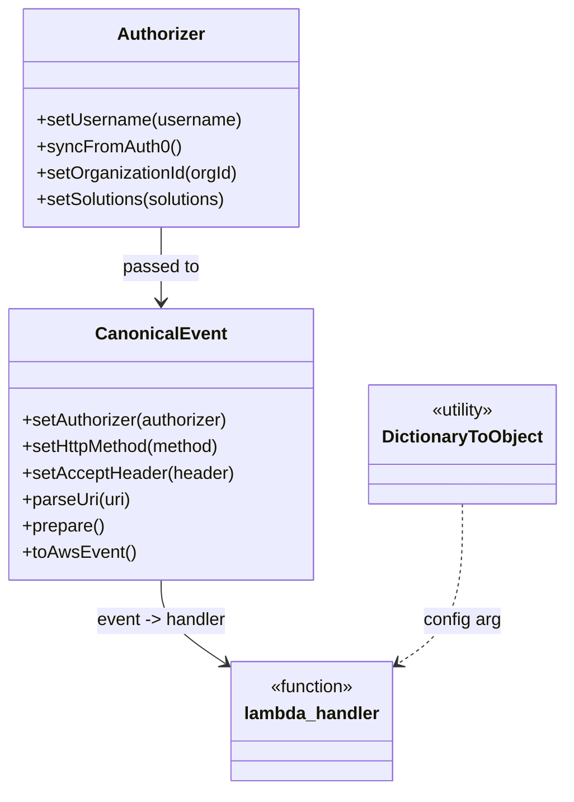

# Diagram: platform/tools/ide_local_testing/localTest/test/byUrl/shipmentGetFilterList.py


> Auto-generated by Obscura crawlers

## Diagram 1

```mermaid
flowchart TD
    Start([Start]) --> CreateAuth[Create Authorizer]
    CreateAuth --> SetUsername[setUsername(dave.damon@freightverify.com)]
    SetUsername --> SyncFromAuth0[syncFromAuth0()]
    SyncFromAuth0 --> CheckOrg{activeOrgId?}
    CheckOrg -- yes --> SetOrg[setOrganizationId(1004)]
    CheckOrg -- no --> CreateEvent[Create CanonicalEvent()]
    SetOrg --> CreateEvent
    CreateEvent --> SetAuth[setAuthorizer(authorizer)]
    SetAuth --> SetMethod[setHttpMethod(GET)]
    SetMethod --> SetAccept[setAcceptHeader(application/json)]
    SetAccept --> ParseUri[parseUri(uri)]
    ParseUri --> Prepare[prepare()]
    Prepare --> ToAws[toAwsEvent()]
    ToAws --> CallLambda[lambda_handler(event, DictionaryToObject(function_name:getStopLocations))]
    CallLambda --> BodyExists{retval and body?}
    BodyExists -- yes --> LoadBody[body = json.loads(retval.body)]
    LoadBody --> Pretty[prettyRetval = json.dumps(body, indent=2, sort_keys=True)]
    BodyExists -- no --> PrettyEmpty[prettyRetval = ""]
    Pretty --> Print[print(prettyRetval)]
    PrettyEmpty --> Print
```

> SVG rendering failed for this diagram.

## Diagram 2



### SVG

<svg id="container" width="501.7890625" xmlns="http://www.w3.org/2000/svg" class="classDiagram" height="716" viewBox="0 0 501.7890625 716" role="graphics-document document" aria-roledescription="class"><style>#container{font-family:"trebuchet ms",verdana,arial,sans-serif;font-size:16px;fill:#333;}@keyframes edge-animation-frame{from{stroke-dashoffset:0;}}@keyframes dash{to{stroke-dashoffset:0;}}#container .edge-animation-slow{stroke-dasharray:9,5!important;stroke-dashoffset:900;animation:dash 50s linear infinite;stroke-linecap:round;}#container .edge-animation-fast{stroke-dasharray:9,5!important;stroke-dashoffset:900;animation:dash 20s linear infinite;stroke-linecap:round;}#container .error-icon{fill:#552222;}#container .error-text{fill:#552222;stroke:#552222;}#container .edge-thickness-normal{stroke-width:1px;}#container .edge-thickness-thick{stroke-width:3.5px;}#container .edge-pattern-solid{stroke-dasharray:0;}#container .edge-thickness-invisible{stroke-width:0;fill:none;}#container .edge-pattern-dashed{stroke-dasharray:3;}#container .edge-pattern-dotted{stroke-dasharray:2;}#container .marker{fill:#333333;stroke:#333333;}#container .marker.cross{stroke:#333333;}#container svg{font-family:"trebuchet ms",verdana,arial,sans-serif;font-size:16px;}#container p{margin:0;}#container g.classGroup text{fill:#9370DB;stroke:none;font-family:"trebuchet ms",verdana,arial,sans-serif;font-size:10px;}#container g.classGroup text .title{font-weight:bolder;}#container .nodeLabel,#container .edgeLabel{color:#131300;}#container .edgeLabel .label rect{fill:#ECECFF;}#container .label text{fill:#131300;}#container .labelBkg{background:#ECECFF;}#container .edgeLabel .label span{background:#ECECFF;}#container .classTitle{font-weight:bolder;}#container .node rect,#container .node circle,#container .node ellipse,#container .node polygon,#container .node path{fill:#ECECFF;stroke:#9370DB;stroke-width:1px;}#container .divider{stroke:#9370DB;stroke-width:1;}#container g.clickable{cursor:pointer;}#container g.classGroup rect{fill:#ECECFF;stroke:#9370DB;}#container g.classGroup line{stroke:#9370DB;stroke-width:1;}#container .classLabel .box{stroke:none;stroke-width:0;fill:#ECECFF;opacity:0.5;}#container .classLabel .label{fill:#9370DB;font-size:10px;}#container .relation{stroke:#333333;stroke-width:1;fill:none;}#container .dashed-line{stroke-dasharray:3;}#container .dotted-line{stroke-dasharray:1 2;}#container #compositionStart,#container .composition{fill:#333333!important;stroke:#333333!important;stroke-width:1;}#container #compositionEnd,#container .composition{fill:#333333!important;stroke:#333333!important;stroke-width:1;}#container #dependencyStart,#container .dependency{fill:#333333!important;stroke:#333333!important;stroke-width:1;}#container #dependencyStart,#container .dependency{fill:#333333!important;stroke:#333333!important;stroke-width:1;}#container #extensionStart,#container .extension{fill:transparent!important;stroke:#333333!important;stroke-width:1;}#container #extensionEnd,#container .extension{fill:transparent!important;stroke:#333333!important;stroke-width:1;}#container #aggregationStart,#container .aggregation{fill:transparent!important;stroke:#333333!important;stroke-width:1;}#container #aggregationEnd,#container .aggregation{fill:transparent!important;stroke:#333333!important;stroke-width:1;}#container #lollipopStart,#container .lollipop{fill:#ECECFF!important;stroke:#333333!important;stroke-width:1;}#container #lollipopEnd,#container .lollipop{fill:#ECECFF!important;stroke:#333333!important;stroke-width:1;}#container .edgeTerminals{font-size:11px;line-height:initial;}#container .classTitleText{text-anchor:middle;font-size:18px;fill:#333;}#container .label-icon{display:inline-block;height:1em;overflow:visible;vertical-align:-0.125em;}#container .node .label-icon path{fill:currentColor;stroke:revert;stroke-width:revert;}#container :root{--mermaid-font-family:"trebuchet ms",verdana,arial,sans-serif;}</style><g><defs><marker id="container_class-aggregationStart" class="marker aggregation class" refX="18" refY="7" markerWidth="190" markerHeight="240" orient="auto"><path d="M 18,7 L9,13 L1,7 L9,1 Z"></path></marker></defs><defs><marker id="container_class-aggregationEnd" class="marker aggregation class" refX="1" refY="7" markerWidth="20" markerHeight="28" orient="auto"><path d="M 18,7 L9,13 L1,7 L9,1 Z"></path></marker></defs><defs><marker id="container_class-extensionStart" class="marker extension class" refX="18" refY="7" markerWidth="190" markerHeight="240" orient="auto"><path d="M 1,7 L18,13 V 1 Z"></path></marker></defs><defs><marker id="container_class-extensionEnd" class="marker extension class" refX="1" refY="7" markerWidth="20" markerHeight="28" orient="auto"><path d="M 1,1 V 13 L18,7 Z"></path></marker></defs><defs><marker id="container_class-compositionStart" class="marker composition class" refX="18" refY="7" markerWidth="190" markerHeight="240" orient="auto"><path d="M 18,7 L9,13 L1,7 L9,1 Z"></path></marker></defs><defs><marker id="container_class-compositionEnd" class="marker composition class" refX="1" refY="7" markerWidth="20" markerHeight="28" orient="auto"><path d="M 18,7 L9,13 L1,7 L9,1 Z"></path></marker></defs><defs><marker id="container_class-dependencyStart" class="marker dependency class" refX="6" refY="7" markerWidth="190" markerHeight="240" orient="auto"><path d="M 5,7 L9,13 L1,7 L9,1 Z"></path></marker></defs><defs><marker id="container_class-dependencyEnd" class="marker dependency class" refX="13" refY="7" markerWidth="20" markerHeight="28" orient="auto"><path d="M 18,7 L9,13 L14,7 L9,1 Z"></path></marker></defs><defs><marker id="container_class-lollipopStart" class="marker lollipop class" refX="13" refY="7" markerWidth="190" markerHeight="240" orient="auto"><circle stroke="black" fill="transparent" cx="7" cy="7" r="6"></circle></marker></defs><defs><marker id="container_class-lollipopEnd" class="marker lollipop class" refX="1" refY="7" markerWidth="190" markerHeight="240" orient="auto"><circle stroke="black" fill="transparent" cx="7" cy="7" r="6"></circle></marker></defs><g class="root"><g class="clusters"></g><g class="edgePaths"><path d="M143.785,206L143.785,212.167C143.785,218.333,143.785,230.667,143.785,242C143.785,253.333,143.785,263.667,143.785,268.833L143.785,274" id="id_Authorizer_CanonicalEvent_1" class="edge-thickness-normal edge-pattern-solid relation" style=";;;" data-edge="true" data-et="edge" data-id="id_Authorizer_CanonicalEvent_1" data-points="W3sieCI6MTQzLjc4NTE1NjI1LCJ5IjoyMDZ9LHsieCI6MTQzLjc4NTE1NjI1LCJ5IjoyNDN9LHsieCI6MTQzLjc4NTE1NjI1LCJ5IjoyODB9XQ==" marker-end="url(#container_class-dependencyEnd)"></path><path d="M143.785,526L143.785,532.167C143.785,538.333,143.785,550.667,153.286,563.288C162.788,575.91,181.79,588.82,191.292,595.275L200.793,601.729" id="id_CanonicalEvent_lambda_handler_2" class="edge-thickness-normal edge-pattern-solid relation" style=";;;" data-edge="true" data-et="edge" data-id="id_CanonicalEvent_lambda_handler_2" data-points="W3sieCI6MTQzLjc4NTE1NjI1LCJ5Ijo1MjZ9LHsieCI6MTQzLjc4NTE1NjI1LCJ5Ijo1NjN9LHsieCI6MjA1Ljc1NTg1OTM3NSwieSI6NjA1LjEwMTE1MDQ2NDQxNDN9XQ==" marker-end="url(#container_class-dependencyEnd)"></path><path d="M411.68,457L411.68,474.667C411.68,492.333,411.68,527.667,402.178,551.788C392.677,575.91,373.675,588.82,364.173,595.275L354.672,601.729" id="id_DictionaryToObject_lambda_handler_3" class="edge-thickness-normal edge-pattern-dashed relation" style=";;;" data-edge="true" data-et="edge" data-id="id_DictionaryToObject_lambda_handler_3" data-points="W3sieCI6NDExLjY3OTY4NzUsInkiOjQ1N30seyJ4Ijo0MTEuNjc5Njg3NSwieSI6NTYzfSx7IngiOjM0OS43MDg5ODQzNzUsInkiOjYwNS4xMDExNTA0NjQ0MTQzfV0=" marker-end="url(#container_class-dependencyEnd)"></path></g><g class="edgeLabels"><g class="edgeLabel" transform="translate(143.78515625, 243)"><g class="label" data-id="id_Authorizer_CanonicalEvent_1" transform="translate(-35.046875, -12)"><foreignObject width="70.09375" height="24"><div xmlns="http://www.w3.org/1999/xhtml" class="labelBkg" style="display: table-cell; white-space: nowrap; line-height: 1.5; max-width: 200px; text-align: center;"><span class="edgeLabel"><p>passed to</p></span></div></foreignObject></g></g><g class="edgeLabel" transform="translate(143.78515625, 563)"><g class="label" data-id="id_CanonicalEvent_lambda_handler_2" transform="translate(-59.8984375, -12)"><foreignObject width="119.796875" height="24"><div xmlns="http://www.w3.org/1999/xhtml" class="labelBkg" style="display: table-cell; white-space: nowrap; line-height: 1.5; max-width: 200px; text-align: center;"><span class="edgeLabel"><p>event -&gt; handler</p></span></div></foreignObject></g></g><g class="edgeLabel" transform="translate(411.6796875, 563)"><g class="label" data-id="id_DictionaryToObject_lambda_handler_3" transform="translate(-35.390625, -12)"><foreignObject width="70.78125" height="24"><div xmlns="http://www.w3.org/1999/xhtml" class="labelBkg" style="display: table-cell; white-space: nowrap; line-height: 1.5; max-width: 200px; text-align: center;"><span class="edgeLabel"><p>config arg</p></span></div></foreignObject></g></g></g><g class="nodes"><g class="node default" id="classId-Authorizer-0" transform="translate(143.78515625, 107)"><g class="basic label-container"><path d="M-124.13671875 -99 L124.13671875 -99 L124.13671875 99 L-124.13671875 99" stroke="none" stroke-width="0" fill="#ECECFF" style=""></path><path d="M-124.13671875 -99 C-37.89372288358908 -99, 48.349272982821844 -99, 124.13671875 -99 M-124.13671875 -99 C-29.95606344529142 -99, 64.22459185941716 -99, 124.13671875 -99 M124.13671875 -99 C124.13671875 -30.63443103507163, 124.13671875 37.73113792985674, 124.13671875 99 M124.13671875 -99 C124.13671875 -35.037069510112616, 124.13671875 28.925860979774768, 124.13671875 99 M124.13671875 99 C66.38704465568841 99, 8.63737056137684 99, -124.13671875 99 M124.13671875 99 C30.44074176411594 99, -63.25523522176812 99, -124.13671875 99 M-124.13671875 99 C-124.13671875 46.75408374047074, -124.13671875 -5.491832519058519, -124.13671875 -99 M-124.13671875 99 C-124.13671875 45.15497570388149, -124.13671875 -8.69004859223702, -124.13671875 -99" stroke="#9370DB" stroke-width="1.3" fill="none" stroke-dasharray="0 0" style=""></path></g><g class="annotation-group text" transform="translate(0, -75)"></g><g class="label-group text" transform="translate(-38.3671875, -75)"><g class="label" style="font-weight: bolder" transform="translate(0,-12)"><foreignObject width="76.734375" height="24"><div xmlns="http://www.w3.org/1999/xhtml" style="display: table-cell; white-space: nowrap; line-height: 1.5; max-width: 126px; text-align: center;"><span class="nodeLabel markdown-node-label" style=""><p>Authorizer</p></span></div></foreignObject></g></g><g class="members-group text" transform="translate(-112.13671875, -27)"></g><g class="methods-group text" transform="translate(-112.13671875, 3)"><g class="label" style="" transform="translate(0,-12)"><foreignObject width="185.90625" height="24"><div xmlns="http://www.w3.org/1999/xhtml" style="display: table-cell; white-space: nowrap; line-height: 1.5; max-width: 243px; text-align: center;"><span class="nodeLabel markdown-node-label" style=""><p>+setUsername(username)</p></span></div></foreignObject></g><g class="label" style="" transform="translate(0,12)"><foreignObject width="129.0625" height="24"><div xmlns="http://www.w3.org/1999/xhtml" style="display: table-cell; white-space: nowrap; line-height: 1.5; max-width: 186px; text-align: center;"><span class="nodeLabel markdown-node-label" style=""><p>+syncFromAuth0()</p></span></div></foreignObject></g><g class="label" style="" transform="translate(0,36)"><foreignObject width="184.578125" height="24"><div xmlns="http://www.w3.org/1999/xhtml" style="display: table-cell; white-space: nowrap; line-height: 1.5; max-width: 242px; text-align: center;"><span class="nodeLabel markdown-node-label" style=""><p>+setOrganizationId(orgId)</p></span></div></foreignObject></g><g class="label" style="" transform="translate(0,60)"><foreignObject width="176.171875" height="24"><div xmlns="http://www.w3.org/1999/xhtml" style="display: table-cell; white-space: nowrap; line-height: 1.5; max-width: 234px; text-align: center;"><span class="nodeLabel markdown-node-label" style=""><p>+setSolutions(solutions)</p></span></div></foreignObject></g></g><g class="divider" style=""><path d="M-124.13671875 -51 C-67.91897525449315 -51, -11.701231758986282 -51, 124.13671875 -51 M-124.13671875 -51 C-35.04621833507211 -51, 54.044282079855776 -51, 124.13671875 -51" stroke="#9370DB" stroke-width="1.3" fill="none" stroke-dasharray="0 0" style=""></path></g><g class="divider" style=""><path d="M-124.13671875 -27 C-37.974405841774654 -27, 48.18790706645069 -27, 124.13671875 -27 M-124.13671875 -27 C-51.34683699367193 -27, 21.443044762656143 -27, 124.13671875 -27" stroke="#9370DB" stroke-width="1.3" fill="none" stroke-dasharray="0 0" style=""></path></g></g><g class="node default" id="classId-CanonicalEvent-1" transform="translate(143.78515625, 403)"><g class="basic label-container"><path d="M-135.78515625 -123 L135.78515625 -123 L135.78515625 123 L-135.78515625 123" stroke="none" stroke-width="0" fill="#ECECFF" style=""></path><path d="M-135.78515625 -123 C-65.1164343001045 -123, 5.552287649790998 -123, 135.78515625 -123 M-135.78515625 -123 C-69.31085249732224 -123, -2.836548744644489 -123, 135.78515625 -123 M135.78515625 -123 C135.78515625 -24.687880124000856, 135.78515625 73.62423975199829, 135.78515625 123 M135.78515625 -123 C135.78515625 -30.271670412902424, 135.78515625 62.45665917419515, 135.78515625 123 M135.78515625 123 C54.41664783332337 123, -26.951860583353266 123, -135.78515625 123 M135.78515625 123 C64.95865811790145 123, -5.8678400141971 123, -135.78515625 123 M-135.78515625 123 C-135.78515625 52.91590781616512, -135.78515625 -17.168184367669767, -135.78515625 -123 M-135.78515625 123 C-135.78515625 67.69299981549946, -135.78515625 12.385999630998938, -135.78515625 -123" stroke="#9370DB" stroke-width="1.3" fill="none" stroke-dasharray="0 0" style=""></path></g><g class="annotation-group text" transform="translate(0, -99)"></g><g class="label-group text" transform="translate(-55.7109375, -99)"><g class="label" style="font-weight: bolder" transform="translate(0,-12)"><foreignObject width="111.421875" height="24"><div xmlns="http://www.w3.org/1999/xhtml" style="display: table-cell; white-space: nowrap; line-height: 1.5; max-width: 161px; text-align: center;"><span class="nodeLabel markdown-node-label" style=""><p>CanonicalEvent</p></span></div></foreignObject></g></g><g class="members-group text" transform="translate(-123.78515625, -51)"></g><g class="methods-group text" transform="translate(-123.78515625, -21)"><g class="label" style="" transform="translate(0,-12)"><foreignObject width="190.75" height="24"><div xmlns="http://www.w3.org/1999/xhtml" style="display: table-cell; white-space: nowrap; line-height: 1.5; max-width: 248px; text-align: center;"><span class="nodeLabel markdown-node-label" style=""><p>+setAuthorizer(authorizer)</p></span></div></foreignObject></g><g class="label" style="" transform="translate(0,12)"><foreignObject width="184" height="24"><div xmlns="http://www.w3.org/1999/xhtml" style="display: table-cell; white-space: nowrap; line-height: 1.5; max-width: 241px; text-align: center;"><span class="nodeLabel markdown-node-label" style=""><p>+setHttpMethod(method)</p></span></div></foreignObject></g><g class="label" style="" transform="translate(0,36)"><foreignObject width="191.859375" height="24"><div xmlns="http://www.w3.org/1999/xhtml" style="display: table-cell; white-space: nowrap; line-height: 1.5; max-width: 249px; text-align: center;"><span class="nodeLabel markdown-node-label" style=""><p>+setAcceptHeader(header)</p></span></div></foreignObject></g><g class="label" style="" transform="translate(0,60)"><foreignObject width="99.8125" height="24"><div xmlns="http://www.w3.org/1999/xhtml" style="display: table-cell; white-space: nowrap; line-height: 1.5; max-width: 157px; text-align: center;"><span class="nodeLabel markdown-node-label" style=""><p>+parseUri(uri)</p></span></div></foreignObject></g><g class="label" style="" transform="translate(0,84)"><foreignObject width="74.75" height="24"><div xmlns="http://www.w3.org/1999/xhtml" style="display: table-cell; white-space: nowrap; line-height: 1.5; max-width: 132px; text-align: center;"><span class="nodeLabel markdown-node-label" style=""><p>+prepare()</p></span></div></foreignObject></g><g class="label" style="" transform="translate(0,108)"><foreignObject width="101.1875" height="24"><div xmlns="http://www.w3.org/1999/xhtml" style="display: table-cell; white-space: nowrap; line-height: 1.5; max-width: 159px; text-align: center;"><span class="nodeLabel markdown-node-label" style=""><p>+toAwsEvent()</p></span></div></foreignObject></g></g><g class="divider" style=""><path d="M-135.78515625 -75 C-76.59533277384969 -75, -17.405509297699382 -75, 135.78515625 -75 M-135.78515625 -75 C-35.896294348649946 -75, 63.99256755270011 -75, 135.78515625 -75" stroke="#9370DB" stroke-width="1.3" fill="none" stroke-dasharray="0 0" style=""></path></g><g class="divider" style=""><path d="M-135.78515625 -51 C-30.396885664154055 -51, 74.99138492169189 -51, 135.78515625 -51 M-135.78515625 -51 C-76.05294848694612 -51, -16.320740723892243 -51, 135.78515625 -51" stroke="#9370DB" stroke-width="1.3" fill="none" stroke-dasharray="0 0" style=""></path></g></g><g class="node default" id="classId-DictionaryToObject-2" transform="translate(411.6796875, 403)"><g class="basic label-container"><path d="M-82.109375 -54 L82.109375 -54 L82.109375 54 L-82.109375 54" stroke="none" stroke-width="0" fill="#ECECFF" style=""></path><path d="M-82.109375 -54 C-24.056740706732676 -54, 33.99589358653465 -54, 82.109375 -54 M-82.109375 -54 C-16.699042066782397 -54, 48.711290866435206 -54, 82.109375 -54 M82.109375 -54 C82.109375 -26.377310505253703, 82.109375 1.2453789894925933, 82.109375 54 M82.109375 -54 C82.109375 -13.552351875028876, 82.109375 26.89529624994225, 82.109375 54 M82.109375 54 C23.747799868123785 54, -34.61377526375243 54, -82.109375 54 M82.109375 54 C20.89821811295822 54, -40.31293877408356 54, -82.109375 54 M-82.109375 54 C-82.109375 23.064573075040997, -82.109375 -7.8708538499180065, -82.109375 -54 M-82.109375 54 C-82.109375 17.949561077116385, -82.109375 -18.10087784576723, -82.109375 -54" stroke="#9370DB" stroke-width="1.3" fill="none" stroke-dasharray="0 0" style=""></path></g><g class="annotation-group text" transform="translate(-30.3125, -30)"><g class="label" style="" transform="translate(0,-12)"><foreignObject width="60.625" height="24"><div xmlns="http://www.w3.org/1999/xhtml" style="display: table-cell; white-space: nowrap; line-height: 1.5; max-width: 111px; text-align: center;"><span class="nodeLabel markdown-node-label" style=""><p>«utility»</p></span></div></foreignObject></g></g><g class="label-group text" transform="translate(-70.109375, -6)"><g class="label" style="font-weight: bolder" transform="translate(0,-12)"><foreignObject width="140.21875" height="24"><div xmlns="http://www.w3.org/1999/xhtml" style="display: table-cell; white-space: nowrap; line-height: 1.5; max-width: 188px; text-align: center;"><span class="nodeLabel markdown-node-label" style=""><p>DictionaryToObject</p></span></div></foreignObject></g></g><g class="members-group text" transform="translate(-70.109375, 42)"></g><g class="methods-group text" transform="translate(-70.109375, 72)"></g><g class="divider" style=""><path d="M-82.109375 18 C-25.52097450431306 18, 31.06742599137388 18, 82.109375 18 M-82.109375 18 C-39.50485915116933 18, 3.099656697661345 18, 82.109375 18" stroke="#9370DB" stroke-width="1.3" fill="none" stroke-dasharray="0 0" style=""></path></g><g class="divider" style=""><path d="M-82.109375 36 C-29.555922946217436 36, 22.99752910756513 36, 82.109375 36 M-82.109375 36 C-30.84203305205309 36, 20.42530889589382 36, 82.109375 36" stroke="#9370DB" stroke-width="1.3" fill="none" stroke-dasharray="0 0" style=""></path></g></g><g class="node default" id="classId-lambda_handler-3" transform="translate(277.732421875, 654)"><g class="basic label-container"><path d="M-71.9765625 -54 L71.9765625 -54 L71.9765625 54 L-71.9765625 54" stroke="none" stroke-width="0" fill="#ECECFF" style=""></path><path d="M-71.9765625 -54 C-27.135156192886413 -54, 17.706250114227174 -54, 71.9765625 -54 M-71.9765625 -54 C-38.735146803639246 -54, -5.493731107278492 -54, 71.9765625 -54 M71.9765625 -54 C71.9765625 -27.354817084700258, 71.9765625 -0.7096341694005162, 71.9765625 54 M71.9765625 -54 C71.9765625 -18.4450438700326, 71.9765625 17.109912259934802, 71.9765625 54 M71.9765625 54 C33.976548240305355 54, -4.023466019389289 54, -71.9765625 54 M71.9765625 54 C27.960224080880394 54, -16.05611433823921 54, -71.9765625 54 M-71.9765625 54 C-71.9765625 26.13160287238073, -71.9765625 -1.736794255238543, -71.9765625 -54 M-71.9765625 54 C-71.9765625 12.131575732143752, -71.9765625 -29.736848535712497, -71.9765625 -54" stroke="#9370DB" stroke-width="1.3" fill="none" stroke-dasharray="0 0" style=""></path></g><g class="annotation-group text" transform="translate(-39.484375, -30)"><g class="label" style="" transform="translate(0,-12)"><foreignObject width="78.96875" height="24"><div xmlns="http://www.w3.org/1999/xhtml" style="display: table-cell; white-space: nowrap; line-height: 1.5; max-width: 129px; text-align: center;"><span class="nodeLabel markdown-node-label" style=""><p>«function»</p></span></div></foreignObject></g></g><g class="label-group text" transform="translate(-59.9765625, -6)"><g class="label" style="font-weight: bolder" transform="translate(0,-12)"><foreignObject width="119.953125" height="24"><div xmlns="http://www.w3.org/1999/xhtml" style="display: table-cell; white-space: nowrap; line-height: 1.5; max-width: 170px; text-align: center;"><span class="nodeLabel markdown-node-label" style=""><p>lambda_handler</p></span></div></foreignObject></g></g><g class="members-group text" transform="translate(-59.9765625, 42)"></g><g class="methods-group text" transform="translate(-59.9765625, 72)"></g><g class="divider" style=""><path d="M-71.9765625 18 C-24.940755419690653 18, 22.095051660618694 18, 71.9765625 18 M-71.9765625 18 C-42.7070552409045 18, -13.437547981809004 18, 71.9765625 18" stroke="#9370DB" stroke-width="1.3" fill="none" stroke-dasharray="0 0" style=""></path></g><g class="divider" style=""><path d="M-71.9765625 36 C-17.770980171386903 36, 36.434602157226195 36, 71.9765625 36 M-71.9765625 36 C-26.763782519983536 36, 18.448997460032928 36, 71.9765625 36" stroke="#9370DB" stroke-width="1.3" fill="none" stroke-dasharray="0 0" style=""></path></g></g></g></g></g></svg>
