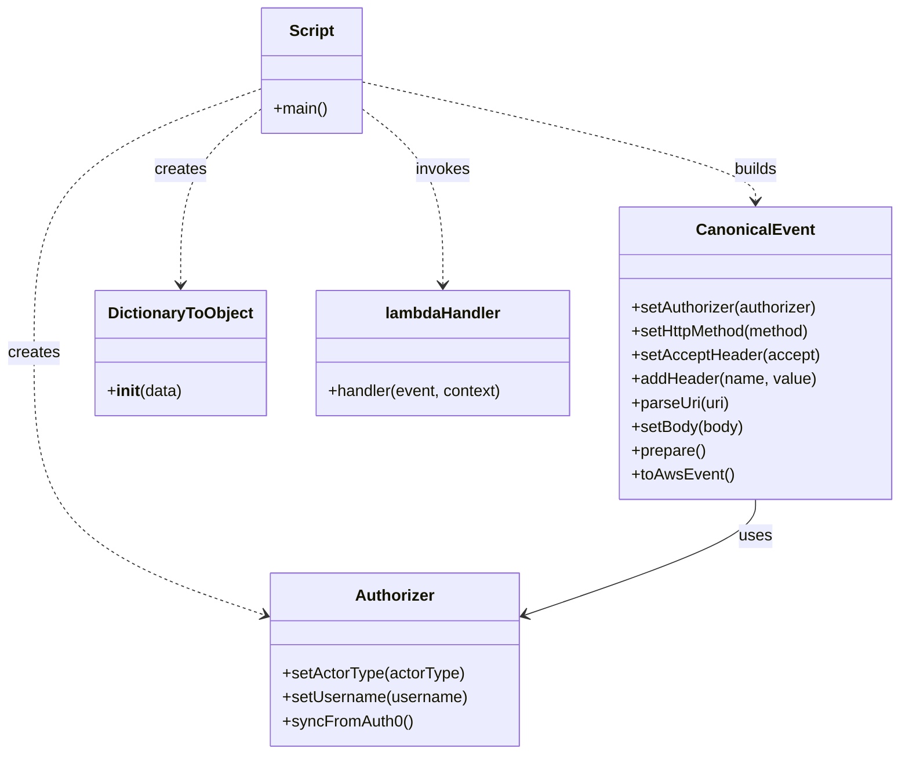

# Diagram: platform/tools/ide_local_testing/localTest/test/byUrl/shipmentPostProxyStatus.py


> Auto-generated by Obscura crawlers

## Diagram 1

```mermaid
flowchart TD
  Start((Start))
  Prepare[Prepare body and set shipmentId]
  Start --> Prepare
  Auth[Create Authorizer<br/>Authorizer().setActorType system<br/>setUsername test@freightverify-api.com<br/>syncFromAuth0()]
  Prepare --> Auth
  CE[Build CanonicalEvent<br/>setAuthorizer(authorizer)<br/>setHttpMethod POST<br/>setAcceptHeader application/json<br/>addHeader X-WSS-fvShipmentId, shipmentId<br/>parseUri uri<br/>setBody body<br/>prepare()<br/>toAwsEvent()]
  Auth --> CE
  EventObj[aws_event object]
  CE --> EventObj
  Invoke[Invoke lambdaHandler(event, DictionaryToObject(context))]
  EventObj --> Invoke
  Decision{retval and retval.get body?}
  Invoke --> Decision
  Decision -- Yes --> Parse[Parse JSON body and pretty print]
  Decision -- No --> Empty[Set prettyRetval to empty string]
  Parse --> PrintBody[print prettyRetval]
  Empty --> PrintBody
  PrintBody --> PrintTime[print Lambda execution time]
  PrintTime --> End((End))
```

> SVG rendering failed for this diagram.

## Diagram 2

```mermaid
sequenceDiagram
  participant Script as Script
  participant Authorizer as Authorizer
  participant CE as CanonicalEvent
  participant DTO as DictionaryToObject
  participant Lambda as lambdaHandler
  participant JSON as JSON
  Script->>Authorizer: setActorType system; setUsername test@freightverify-api.com; syncFromAuth0
  Authorizer-->>Script: authorizer instance
  Script->>CE: CanonicalEvent(); setAuthorizer; setHttpMethod POST; setAcceptHeader application/json; addHeader X-WSS-fvShipmentId; parseUri; setBody; prepare; toAwsEvent
  CE-->>Script: aws_event
  Script->>DTO: DictionaryToObject(context dict with function_name and aws_request_id)
  DTO-->>Script: context object
  Script->>Lambda: invoke lambdaHandler(event, context)
  Lambda-->>Script: retval
  Script->>JSON: json.loads(retval.body) if body present
  JSON-->>Script: parsed body dict
  Script->>Script: print prettyRetval; print lambda execution time
```

> SVG rendering failed for this diagram.

## Diagram 3



### SVG

<svg id="container" width="900.9453125" xmlns="http://www.w3.org/2000/svg" class="classDiagram" height="758" viewBox="0 0 900.9453125 758" role="graphics-document document" aria-roledescription="class"><style>#container{font-family:"trebuchet ms",verdana,arial,sans-serif;font-size:16px;fill:#333;}@keyframes edge-animation-frame{from{stroke-dashoffset:0;}}@keyframes dash{to{stroke-dashoffset:0;}}#container .edge-animation-slow{stroke-dasharray:9,5!important;stroke-dashoffset:900;animation:dash 50s linear infinite;stroke-linecap:round;}#container .edge-animation-fast{stroke-dasharray:9,5!important;stroke-dashoffset:900;animation:dash 20s linear infinite;stroke-linecap:round;}#container .error-icon{fill:#552222;}#container .error-text{fill:#552222;stroke:#552222;}#container .edge-thickness-normal{stroke-width:1px;}#container .edge-thickness-thick{stroke-width:3.5px;}#container .edge-pattern-solid{stroke-dasharray:0;}#container .edge-thickness-invisible{stroke-width:0;fill:none;}#container .edge-pattern-dashed{stroke-dasharray:3;}#container .edge-pattern-dotted{stroke-dasharray:2;}#container .marker{fill:#333333;stroke:#333333;}#container .marker.cross{stroke:#333333;}#container svg{font-family:"trebuchet ms",verdana,arial,sans-serif;font-size:16px;}#container p{margin:0;}#container g.classGroup text{fill:#9370DB;stroke:none;font-family:"trebuchet ms",verdana,arial,sans-serif;font-size:10px;}#container g.classGroup text .title{font-weight:bolder;}#container .nodeLabel,#container .edgeLabel{color:#131300;}#container .edgeLabel .label rect{fill:#ECECFF;}#container .label text{fill:#131300;}#container .labelBkg{background:#ECECFF;}#container .edgeLabel .label span{background:#ECECFF;}#container .classTitle{font-weight:bolder;}#container .node rect,#container .node circle,#container .node ellipse,#container .node polygon,#container .node path{fill:#ECECFF;stroke:#9370DB;stroke-width:1px;}#container .divider{stroke:#9370DB;stroke-width:1;}#container g.clickable{cursor:pointer;}#container g.classGroup rect{fill:#ECECFF;stroke:#9370DB;}#container g.classGroup line{stroke:#9370DB;stroke-width:1;}#container .classLabel .box{stroke:none;stroke-width:0;fill:#ECECFF;opacity:0.5;}#container .classLabel .label{fill:#9370DB;font-size:10px;}#container .relation{stroke:#333333;stroke-width:1;fill:none;}#container .dashed-line{stroke-dasharray:3;}#container .dotted-line{stroke-dasharray:1 2;}#container #compositionStart,#container .composition{fill:#333333!important;stroke:#333333!important;stroke-width:1;}#container #compositionEnd,#container .composition{fill:#333333!important;stroke:#333333!important;stroke-width:1;}#container #dependencyStart,#container .dependency{fill:#333333!important;stroke:#333333!important;stroke-width:1;}#container #dependencyStart,#container .dependency{fill:#333333!important;stroke:#333333!important;stroke-width:1;}#container #extensionStart,#container .extension{fill:transparent!important;stroke:#333333!important;stroke-width:1;}#container #extensionEnd,#container .extension{fill:transparent!important;stroke:#333333!important;stroke-width:1;}#container #aggregationStart,#container .aggregation{fill:transparent!important;stroke:#333333!important;stroke-width:1;}#container #aggregationEnd,#container .aggregation{fill:transparent!important;stroke:#333333!important;stroke-width:1;}#container #lollipopStart,#container .lollipop{fill:#ECECFF!important;stroke:#333333!important;stroke-width:1;}#container #lollipopEnd,#container .lollipop{fill:#ECECFF!important;stroke:#333333!important;stroke-width:1;}#container .edgeTerminals{font-size:11px;line-height:initial;}#container .classTitleText{text-anchor:middle;font-size:18px;fill:#333;}#container .label-icon{display:inline-block;height:1em;overflow:visible;vertical-align:-0.125em;}#container .node .label-icon path{fill:currentColor;stroke:revert;stroke-width:revert;}#container :root{--mermaid-font-family:"trebuchet ms",verdana,arial,sans-serif;}</style><g><defs><marker id="container_class-aggregationStart" class="marker aggregation class" refX="18" refY="7" markerWidth="190" markerHeight="240" orient="auto"><path d="M 18,7 L9,13 L1,7 L9,1 Z"></path></marker></defs><defs><marker id="container_class-aggregationEnd" class="marker aggregation class" refX="1" refY="7" markerWidth="20" markerHeight="28" orient="auto"><path d="M 18,7 L9,13 L1,7 L9,1 Z"></path></marker></defs><defs><marker id="container_class-extensionStart" class="marker extension class" refX="18" refY="7" markerWidth="190" markerHeight="240" orient="auto"><path d="M 1,7 L18,13 V 1 Z"></path></marker></defs><defs><marker id="container_class-extensionEnd" class="marker extension class" refX="1" refY="7" markerWidth="20" markerHeight="28" orient="auto"><path d="M 1,1 V 13 L18,7 Z"></path></marker></defs><defs><marker id="container_class-compositionStart" class="marker composition class" refX="18" refY="7" markerWidth="190" markerHeight="240" orient="auto"><path d="M 18,7 L9,13 L1,7 L9,1 Z"></path></marker></defs><defs><marker id="container_class-compositionEnd" class="marker composition class" refX="1" refY="7" markerWidth="20" markerHeight="28" orient="auto"><path d="M 18,7 L9,13 L1,7 L9,1 Z"></path></marker></defs><defs><marker id="container_class-dependencyStart" class="marker dependency class" refX="6" refY="7" markerWidth="190" markerHeight="240" orient="auto"><path d="M 5,7 L9,13 L1,7 L9,1 Z"></path></marker></defs><defs><marker id="container_class-dependencyEnd" class="marker dependency class" refX="13" refY="7" markerWidth="20" markerHeight="28" orient="auto"><path d="M 18,7 L9,13 L14,7 L9,1 Z"></path></marker></defs><defs><marker id="container_class-lollipopStart" class="marker lollipop class" refX="13" refY="7" markerWidth="190" markerHeight="240" orient="auto"><circle stroke="black" fill="transparent" cx="7" cy="7" r="6"></circle></marker></defs><defs><marker id="container_class-lollipopEnd" class="marker lollipop class" refX="1" refY="7" markerWidth="190" markerHeight="240" orient="auto"><circle stroke="black" fill="transparent" cx="7" cy="7" r="6"></circle></marker></defs><g class="root"><g class="clusters"></g><g class="edgePaths"><path d="M261.703,89.075L223.781,102.729C185.859,116.383,110.016,143.692,72.094,188.012C34.172,232.333,34.172,293.667,34.172,355C34.172,416.333,34.172,477.667,72.832,521.584C111.492,565.502,188.811,592.004,227.471,605.255L266.131,618.506" id="id_Script_Authorizer_1" class="edge-thickness-normal edge-pattern-dashed relation" style=";;;" data-edge="true" data-et="edge" data-id="id_Script_Authorizer_1" data-points="W3sieCI6MjYxLjcwMzEyNSwieSI6ODkuMDc0Nzk3MTEzODgzNDZ9LHsieCI6MzQuMTcxODc1LCJ5IjoxNzF9LHsieCI6MzQuMTcxODc1LCJ5IjozNTV9LHsieCI6MzQuMTcxODc1LCJ5Ijo1Mzl9LHsieCI6MjcxLjgwNjY0MDYyNSwieSI6NjIwLjQ1MTE3MDcyNTY1MDJ9XQ==" marker-end="url(#container_class-dependencyEnd)"></path><path d="M362.102,82.26L428.037,97.05C493.973,111.84,625.844,141.42,691.779,161.377C757.715,181.333,757.715,191.667,757.715,196.833L757.715,202" id="id_Script_CanonicalEvent_2" class="edge-thickness-normal edge-pattern-dashed relation" style=";;;" data-edge="true" data-et="edge" data-id="id_Script_CanonicalEvent_2" data-points="W3sieCI6MzYyLjEwMTU2MjUsInkiOjgyLjI2MDE2NDAyNjM1NjM2fSx7IngiOjc1Ny43MTQ4NDM3NSwieSI6MTcxfSx7IngiOjc1Ny43MTQ4NDM3NSwieSI6MjA4fV0=" marker-end="url(#container_class-dependencyEnd)"></path><path d="M261.703,109.092L248.105,119.41C234.508,129.728,207.313,150.364,193.715,179.849C180.117,209.333,180.117,247.667,180.117,266.833L180.117,286" id="id_Script_DictionaryToObject_3" class="edge-thickness-normal edge-pattern-dashed relation" style=";;;" data-edge="true" data-et="edge" data-id="id_Script_DictionaryToObject_3" data-points="W3sieCI6MjYxLjcwMzEyNSwieSI6MTA5LjA5MTcwOTM5OTE3NTk4fSx7IngiOjE4MC4xMTcxODc1LCJ5IjoxNzF9LHsieCI6MTgwLjExNzE4NzUsInkiOjI5Mn1d" marker-end="url(#container_class-dependencyEnd)"></path><path d="M362.102,109.092L375.699,119.41C389.297,129.728,416.492,150.364,430.09,179.849C443.688,209.333,443.688,247.667,443.688,266.833L443.688,286" id="id_Script_lambdaHandler_4" class="edge-thickness-normal edge-pattern-dashed relation" style=";;;" data-edge="true" data-et="edge" data-id="id_Script_lambdaHandler_4" data-points="W3sieCI6MzYyLjEwMTU2MjUsInkiOjEwOS4wOTE3MDkzOTkxNzU5OH0seyJ4Ijo0NDMuNjg3NSwieSI6MTcxfSx7IngiOjQ0My42ODc1LCJ5IjoyOTJ9XQ==" marker-end="url(#container_class-dependencyEnd)"></path><path d="M757.715,502L757.715,508.167C757.715,514.333,757.715,526.667,719.055,546.084C680.395,565.502,603.076,592.004,564.416,605.255L525.756,618.506" id="id_CanonicalEvent_Authorizer_5" class="edge-thickness-normal edge-pattern-solid relation" style=";;;" data-edge="true" data-et="edge" data-id="id_CanonicalEvent_Authorizer_5" data-points="W3sieCI6NzU3LjcxNDg0Mzc1LCJ5Ijo1MDJ9LHsieCI6NzU3LjcxNDg0Mzc1LCJ5Ijo1Mzl9LHsieCI6NTIwLjA4MDA3ODEyNSwieSI6NjIwLjQ1MTE3MDcyNTY1MDJ9XQ==" marker-end="url(#container_class-dependencyEnd)"></path></g><g class="edgeLabels"><g class="edgeLabel" transform="translate(34.171875, 355)"><g class="label" data-id="id_Script_Authorizer_1" transform="translate(-26.171875, -12)"><foreignObject width="52.34375" height="24"><div xmlns="http://www.w3.org/1999/xhtml" class="labelBkg" style="display: table-cell; white-space: nowrap; line-height: 1.5; max-width: 200px; text-align: center;"><span class="edgeLabel"><p>creates</p></span></div></foreignObject></g></g><g class="edgeLabel" transform="translate(757.71484375, 171)"><g class="label" data-id="id_Script_CanonicalEvent_2" transform="translate(-22.4921875, -12)"><foreignObject width="44.984375" height="24"><div xmlns="http://www.w3.org/1999/xhtml" class="labelBkg" style="display: table-cell; white-space: nowrap; line-height: 1.5; max-width: 200px; text-align: center;"><span class="edgeLabel"><p>builds</p></span></div></foreignObject></g></g><g class="edgeLabel" transform="translate(180.1171875, 171)"><g class="label" data-id="id_Script_DictionaryToObject_3" transform="translate(-26.171875, -12)"><foreignObject width="52.34375" height="24"><div xmlns="http://www.w3.org/1999/xhtml" class="labelBkg" style="display: table-cell; white-space: nowrap; line-height: 1.5; max-width: 200px; text-align: center;"><span class="edgeLabel"><p>creates</p></span></div></foreignObject></g></g><g class="edgeLabel" transform="translate(443.6875, 171)"><g class="label" data-id="id_Script_lambdaHandler_4" transform="translate(-27.5859375, -12)"><foreignObject width="55.171875" height="24"><div xmlns="http://www.w3.org/1999/xhtml" class="labelBkg" style="display: table-cell; white-space: nowrap; line-height: 1.5; max-width: 200px; text-align: center;"><span class="edgeLabel"><p>invokes</p></span></div></foreignObject></g></g><g class="edgeLabel" transform="translate(757.71484375, 539)"><g class="label" data-id="id_CanonicalEvent_Authorizer_5" transform="translate(-16.4921875, -12)"><foreignObject width="32.984375" height="24"><div xmlns="http://www.w3.org/1999/xhtml" class="labelBkg" style="display: table-cell; white-space: nowrap; line-height: 1.5; max-width: 200px; text-align: center;"><span class="edgeLabel"><p>uses</p></span></div></foreignObject></g></g></g><g class="nodes"><g class="node default" id="classId-Script-0" transform="translate(311.90234375, 71)"><g class="basic label-container"><path d="M-50.19921875 -63 L50.19921875 -63 L50.19921875 63 L-50.19921875 63" stroke="none" stroke-width="0" fill="#ECECFF" style=""></path><path d="M-50.19921875 -63 C-26.63338487161018 -63, -3.067550993220358 -63, 50.19921875 -63 M-50.19921875 -63 C-21.54353055050751 -63, 7.112157648984983 -63, 50.19921875 -63 M50.19921875 -63 C50.19921875 -29.98376376180108, 50.19921875 3.0324724763978423, 50.19921875 63 M50.19921875 -63 C50.19921875 -28.255061445230027, 50.19921875 6.489877109539947, 50.19921875 63 M50.19921875 63 C27.83038988350638 63, 5.461561017012762 63, -50.19921875 63 M50.19921875 63 C17.041301760701764 63, -16.116615228596473 63, -50.19921875 63 M-50.19921875 63 C-50.19921875 16.57620350594631, -50.19921875 -29.84759298810738, -50.19921875 -63 M-50.19921875 63 C-50.19921875 23.54505144177398, -50.19921875 -15.909897116452044, -50.19921875 -63" stroke="#9370DB" stroke-width="1.3" fill="none" stroke-dasharray="0 0" style=""></path></g><g class="annotation-group text" transform="translate(0, -39)"></g><g class="label-group text" transform="translate(-21.7421875, -39)"><g class="label" style="font-weight: bolder" transform="translate(0,-12)"><foreignObject width="43.484375" height="24"><div xmlns="http://www.w3.org/1999/xhtml" style="display: table-cell; white-space: nowrap; line-height: 1.5; max-width: 93px; text-align: center;"><span class="nodeLabel markdown-node-label" style=""><p>Script</p></span></div></foreignObject></g></g><g class="members-group text" transform="translate(-38.19921875, 9)"></g><g class="methods-group text" transform="translate(-38.19921875, 39)"><g class="label" style="" transform="translate(0,-12)"><foreignObject width="54.65625" height="24"><div xmlns="http://www.w3.org/1999/xhtml" style="display: table-cell; white-space: nowrap; line-height: 1.5; max-width: 112px; text-align: center;"><span class="nodeLabel markdown-node-label" style=""><p>+main()</p></span></div></foreignObject></g></g><g class="divider" style=""><path d="M-50.19921875 -15 C-16.3826494857247 -15, 17.433919778550603 -15, 50.19921875 -15 M-50.19921875 -15 C-16.51323183273385 -15, 17.172755084532298 -15, 50.19921875 -15" stroke="#9370DB" stroke-width="1.3" fill="none" stroke-dasharray="0 0" style=""></path></g><g class="divider" style=""><path d="M-50.19921875 9 C-28.413843791717774 9, -6.628468833435548 9, 50.19921875 9 M-50.19921875 9 C-18.209758078425224 9, 13.779702593149551 9, 50.19921875 9" stroke="#9370DB" stroke-width="1.3" fill="none" stroke-dasharray="0 0" style=""></path></g></g><g class="node default" id="classId-Authorizer-1" transform="translate(395.943359375, 663)"><g class="basic label-container"><path d="M-124.13671875 -87 L124.13671875 -87 L124.13671875 87 L-124.13671875 87" stroke="none" stroke-width="0" fill="#ECECFF" style=""></path><path d="M-124.13671875 -87 C-42.58826825637543 -87, 38.96018223724914 -87, 124.13671875 -87 M-124.13671875 -87 C-49.680115117232404 -87, 24.776488515535192 -87, 124.13671875 -87 M124.13671875 -87 C124.13671875 -37.23193349491815, 124.13671875 12.536133010163695, 124.13671875 87 M124.13671875 -87 C124.13671875 -40.204271385266146, 124.13671875 6.591457229467707, 124.13671875 87 M124.13671875 87 C27.325698120793177 87, -69.48532250841365 87, -124.13671875 87 M124.13671875 87 C70.87587281576079 87, 17.615026881521572 87, -124.13671875 87 M-124.13671875 87 C-124.13671875 35.61914863700498, -124.13671875 -15.761702725990034, -124.13671875 -87 M-124.13671875 87 C-124.13671875 45.34588845307121, -124.13671875 3.6917769061424224, -124.13671875 -87" stroke="#9370DB" stroke-width="1.3" fill="none" stroke-dasharray="0 0" style=""></path></g><g class="annotation-group text" transform="translate(0, -63)"></g><g class="label-group text" transform="translate(-38.3671875, -63)"><g class="label" style="font-weight: bolder" transform="translate(0,-12)"><foreignObject width="76.734375" height="24"><div xmlns="http://www.w3.org/1999/xhtml" style="display: table-cell; white-space: nowrap; line-height: 1.5; max-width: 126px; text-align: center;"><span class="nodeLabel markdown-node-label" style=""><p>Authorizer</p></span></div></foreignObject></g></g><g class="members-group text" transform="translate(-112.13671875, -15)"></g><g class="methods-group text" transform="translate(-112.13671875, 15)"><g class="label" style="" transform="translate(0,-12)"><foreignObject width="183.0625" height="24"><div xmlns="http://www.w3.org/1999/xhtml" style="display: table-cell; white-space: nowrap; line-height: 1.5; max-width: 240px; text-align: center;"><span class="nodeLabel markdown-node-label" style=""><p>+setActorType(actorType)</p></span></div></foreignObject></g><g class="label" style="" transform="translate(0,12)"><foreignObject width="185.90625" height="24"><div xmlns="http://www.w3.org/1999/xhtml" style="display: table-cell; white-space: nowrap; line-height: 1.5; max-width: 243px; text-align: center;"><span class="nodeLabel markdown-node-label" style=""><p>+setUsername(username)</p></span></div></foreignObject></g><g class="label" style="" transform="translate(0,36)"><foreignObject width="129.0625" height="24"><div xmlns="http://www.w3.org/1999/xhtml" style="display: table-cell; white-space: nowrap; line-height: 1.5; max-width: 186px; text-align: center;"><span class="nodeLabel markdown-node-label" style=""><p>+syncFromAuth0()</p></span></div></foreignObject></g></g><g class="divider" style=""><path d="M-124.13671875 -39 C-33.45790216297003 -39, 57.22091442405994 -39, 124.13671875 -39 M-124.13671875 -39 C-69.77370885184686 -39, -15.410698953693725 -39, 124.13671875 -39" stroke="#9370DB" stroke-width="1.3" fill="none" stroke-dasharray="0 0" style=""></path></g><g class="divider" style=""><path d="M-124.13671875 -15 C-55.64205255887771 -15, 12.852613632244584 -15, 124.13671875 -15 M-124.13671875 -15 C-26.729804591342756 -15, 70.67710956731449 -15, 124.13671875 -15" stroke="#9370DB" stroke-width="1.3" fill="none" stroke-dasharray="0 0" style=""></path></g></g><g class="node default" id="classId-CanonicalEvent-2" transform="translate(757.71484375, 355)"><g class="basic label-container"><path d="M-135.23046875 -147 L135.23046875 -147 L135.23046875 147 L-135.23046875 147" stroke="none" stroke-width="0" fill="#ECECFF" style=""></path><path d="M-135.23046875 -147 C-76.79267747809254 -147, -18.3548862061851 -147, 135.23046875 -147 M-135.23046875 -147 C-63.78581601920382 -147, 7.6588367115923575 -147, 135.23046875 -147 M135.23046875 -147 C135.23046875 -39.88804143583309, 135.23046875 67.22391712833382, 135.23046875 147 M135.23046875 -147 C135.23046875 -75.01021126612278, 135.23046875 -3.0204225322455613, 135.23046875 147 M135.23046875 147 C42.703930628591564 147, -49.82260749281687 147, -135.23046875 147 M135.23046875 147 C46.2656127553076 147, -42.6992432393848 147, -135.23046875 147 M-135.23046875 147 C-135.23046875 43.23889576573775, -135.23046875 -60.5222084685245, -135.23046875 -147 M-135.23046875 147 C-135.23046875 84.72077846999889, -135.23046875 22.441556939997767, -135.23046875 -147" stroke="#9370DB" stroke-width="1.3" fill="none" stroke-dasharray="0 0" style=""></path></g><g class="annotation-group text" transform="translate(0, -123)"></g><g class="label-group text" transform="translate(-55.7109375, -123)"><g class="label" style="font-weight: bolder" transform="translate(0,-12)"><foreignObject width="111.421875" height="24"><div xmlns="http://www.w3.org/1999/xhtml" style="display: table-cell; white-space: nowrap; line-height: 1.5; max-width: 161px; text-align: center;"><span class="nodeLabel markdown-node-label" style=""><p>CanonicalEvent</p></span></div></foreignObject></g></g><g class="members-group text" transform="translate(-123.23046875, -75)"></g><g class="methods-group text" transform="translate(-123.23046875, -45)"><g class="label" style="" transform="translate(0,-12)"><foreignObject width="190.75" height="24"><div xmlns="http://www.w3.org/1999/xhtml" style="display: table-cell; white-space: nowrap; line-height: 1.5; max-width: 248px; text-align: center;"><span class="nodeLabel markdown-node-label" style=""><p>+setAuthorizer(authorizer)</p></span></div></foreignObject></g><g class="label" style="" transform="translate(0,12)"><foreignObject width="184" height="24"><div xmlns="http://www.w3.org/1999/xhtml" style="display: table-cell; white-space: nowrap; line-height: 1.5; max-width: 241px; text-align: center;"><span class="nodeLabel markdown-node-label" style=""><p>+setHttpMethod(method)</p></span></div></foreignObject></g><g class="label" style="" transform="translate(0,36)"><foreignObject width="188.125" height="24"><div xmlns="http://www.w3.org/1999/xhtml" style="display: table-cell; white-space: nowrap; line-height: 1.5; max-width: 245px; text-align: center;"><span class="nodeLabel markdown-node-label" style=""><p>+setAcceptHeader(accept)</p></span></div></foreignObject></g><g class="label" style="" transform="translate(0,60)"><foreignObject width="185.875" height="24"><div xmlns="http://www.w3.org/1999/xhtml" style="display: table-cell; white-space: nowrap; line-height: 1.5; max-width: 243px; text-align: center;"><span class="nodeLabel markdown-node-label" style=""><p>+addHeader(name, value)</p></span></div></foreignObject></g><g class="label" style="" transform="translate(0,84)"><foreignObject width="99.8125" height="24"><div xmlns="http://www.w3.org/1999/xhtml" style="display: table-cell; white-space: nowrap; line-height: 1.5; max-width: 157px; text-align: center;"><span class="nodeLabel markdown-node-label" style=""><p>+parseUri(uri)</p></span></div></foreignObject></g><g class="label" style="" transform="translate(0,108)"><foreignObject width="113.125" height="24"><div xmlns="http://www.w3.org/1999/xhtml" style="display: table-cell; white-space: nowrap; line-height: 1.5; max-width: 170px; text-align: center;"><span class="nodeLabel markdown-node-label" style=""><p>+setBody(body)</p></span></div></foreignObject></g><g class="label" style="" transform="translate(0,132)"><foreignObject width="74.75" height="24"><div xmlns="http://www.w3.org/1999/xhtml" style="display: table-cell; white-space: nowrap; line-height: 1.5; max-width: 132px; text-align: center;"><span class="nodeLabel markdown-node-label" style=""><p>+prepare()</p></span></div></foreignObject></g><g class="label" style="" transform="translate(0,156)"><foreignObject width="101.1875" height="24"><div xmlns="http://www.w3.org/1999/xhtml" style="display: table-cell; white-space: nowrap; line-height: 1.5; max-width: 159px; text-align: center;"><span class="nodeLabel markdown-node-label" style=""><p>+toAwsEvent()</p></span></div></foreignObject></g></g><g class="divider" style=""><path d="M-135.23046875 -99 C-68.23383980484857 -99, -1.237210859697143 -99, 135.23046875 -99 M-135.23046875 -99 C-44.924286323927234 -99, 45.38189610214553 -99, 135.23046875 -99" stroke="#9370DB" stroke-width="1.3" fill="none" stroke-dasharray="0 0" style=""></path></g><g class="divider" style=""><path d="M-135.23046875 -75 C-61.79499920262185 -75, 11.640470344756295 -75, 135.23046875 -75 M-135.23046875 -75 C-80.47299835500556 -75, -25.715527960011116 -75, 135.23046875 -75" stroke="#9370DB" stroke-width="1.3" fill="none" stroke-dasharray="0 0" style=""></path></g></g><g class="node default" id="classId-DictionaryToObject-3" transform="translate(180.1171875, 355)"><g class="basic label-container"><path d="M-84.7734375 -63 L84.7734375 -63 L84.7734375 63 L-84.7734375 63" stroke="none" stroke-width="0" fill="#ECECFF" style=""></path><path d="M-84.7734375 -63 C-37.48851729225876 -63, 9.796402915482474 -63, 84.7734375 -63 M-84.7734375 -63 C-24.9062644036431 -63, 34.9609086927138 -63, 84.7734375 -63 M84.7734375 -63 C84.7734375 -18.614648600825596, 84.7734375 25.770702798348808, 84.7734375 63 M84.7734375 -63 C84.7734375 -13.911958977584149, 84.7734375 35.1760820448317, 84.7734375 63 M84.7734375 63 C34.96877562493479 63, -14.835886250130415 63, -84.7734375 63 M84.7734375 63 C38.28240734783227 63, -8.208622804335462 63, -84.7734375 63 M-84.7734375 63 C-84.7734375 21.81348311678982, -84.7734375 -19.373033766420363, -84.7734375 -63 M-84.7734375 63 C-84.7734375 19.664977769376684, -84.7734375 -23.670044461246633, -84.7734375 -63" stroke="#9370DB" stroke-width="1.3" fill="none" stroke-dasharray="0 0" style=""></path></g><g class="annotation-group text" transform="translate(0, -39)"></g><g class="label-group text" transform="translate(-70.109375, -39)"><g class="label" style="font-weight: bolder" transform="translate(0,-12)"><foreignObject width="140.21875" height="24"><div xmlns="http://www.w3.org/1999/xhtml" style="display: table-cell; white-space: nowrap; line-height: 1.5; max-width: 188px; text-align: center;"><span class="nodeLabel markdown-node-label" style=""><p>DictionaryToObject</p></span></div></foreignObject></g></g><g class="members-group text" transform="translate(-72.7734375, 9)"></g><g class="methods-group text" transform="translate(-72.7734375, 39)"><g class="label" style="" transform="translate(0,-12)"><foreignObject width="75.4375" height="24"><div xmlns="http://www.w3.org/1999/xhtml" style="display: table-cell; white-space: nowrap; line-height: 1.5; max-width: 164px; text-align: center;"><span class="nodeLabel markdown-node-label" style=""><p>+<strong>init</strong>(data)</p></span></div></foreignObject></g></g><g class="divider" style=""><path d="M-84.7734375 -15 C-45.79200109414586 -15, -6.81056468829172 -15, 84.7734375 -15 M-84.7734375 -15 C-30.720507602711088 -15, 23.332422294577825 -15, 84.7734375 -15" stroke="#9370DB" stroke-width="1.3" fill="none" stroke-dasharray="0 0" style=""></path></g><g class="divider" style=""><path d="M-84.7734375 9 C-33.359752397059765 9, 18.05393270588047 9, 84.7734375 9 M-84.7734375 9 C-32.417595055131116 9, 19.938247389737768 9, 84.7734375 9" stroke="#9370DB" stroke-width="1.3" fill="none" stroke-dasharray="0 0" style=""></path></g></g><g class="node default" id="classId-lambdaHandler-4" transform="translate(443.6875, 355)"><g class="basic label-container"><path d="M-128.796875 -63 L128.796875 -63 L128.796875 63 L-128.796875 63" stroke="none" stroke-width="0" fill="#ECECFF" style=""></path><path d="M-128.796875 -63 C-68.02300319471692 -63, -7.249131389433842 -63, 128.796875 -63 M-128.796875 -63 C-38.69657483754024 -63, 51.40372532491952 -63, 128.796875 -63 M128.796875 -63 C128.796875 -20.51377984976576, 128.796875 21.972440300468477, 128.796875 63 M128.796875 -63 C128.796875 -14.336116363305258, 128.796875 34.32776727338948, 128.796875 63 M128.796875 63 C68.21228469848825 63, 7.6276943969765085 63, -128.796875 63 M128.796875 63 C35.680482557959266 63, -57.43590988408147 63, -128.796875 63 M-128.796875 63 C-128.796875 18.963293054206652, -128.796875 -25.073413891586696, -128.796875 -63 M-128.796875 63 C-128.796875 25.368863255370414, -128.796875 -12.262273489259172, -128.796875 -63" stroke="#9370DB" stroke-width="1.3" fill="none" stroke-dasharray="0 0" style=""></path></g><g class="annotation-group text" transform="translate(0, -39)"></g><g class="label-group text" transform="translate(-56.53125, -39)"><g class="label" style="font-weight: bolder" transform="translate(0,-12)"><foreignObject width="113.0625" height="24"><div xmlns="http://www.w3.org/1999/xhtml" style="display: table-cell; white-space: nowrap; line-height: 1.5; max-width: 164px; text-align: center;"><span class="nodeLabel markdown-node-label" style=""><p>lambdaHandler</p></span></div></foreignObject></g></g><g class="members-group text" transform="translate(-116.796875, 9)"></g><g class="methods-group text" transform="translate(-116.796875, 39)"><g class="label" style="" transform="translate(0,-12)"><foreignObject width="177.0625" height="24"><div xmlns="http://www.w3.org/1999/xhtml" style="display: table-cell; white-space: nowrap; line-height: 1.5; max-width: 234px; text-align: center;"><span class="nodeLabel markdown-node-label" style=""><p>+handler(event, context)</p></span></div></foreignObject></g></g><g class="divider" style=""><path d="M-128.796875 -15 C-36.40912686893634 -15, 55.97862126212732 -15, 128.796875 -15 M-128.796875 -15 C-72.59441844415612 -15, -16.391961888312238 -15, 128.796875 -15" stroke="#9370DB" stroke-width="1.3" fill="none" stroke-dasharray="0 0" style=""></path></g><g class="divider" style=""><path d="M-128.796875 9 C-50.135579917909496 9, 28.52571516418101 9, 128.796875 9 M-128.796875 9 C-58.11097490683747 9, 12.57492518632506 9, 128.796875 9" stroke="#9370DB" stroke-width="1.3" fill="none" stroke-dasharray="0 0" style=""></path></g></g></g></g></g></svg>
