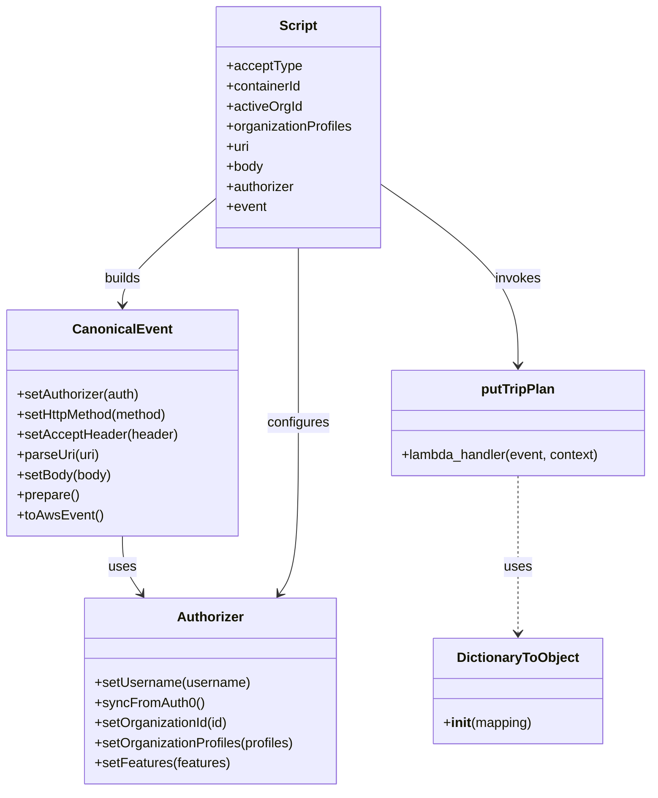

# Diagram: platform/tools/ide_local_testing/localTest/test/byUrl/shipmentPutTripPlan.py


> Auto-generated by Obscura crawlers

## Diagram 1

```mermaid
flowchart LR
  S([Start]) --> B["Prepare trip plan JSON body (body variable)"]
  B --> AU["Authorizer.setUsername('dave.damon@freightverify.com')<br/>syncFromAuth0()"]
  AU --> ActiveOrg{activeOrgId?}
  ActiveOrg -->|yes| SetOrg["authorizer.setOrganizationId(activeOrgId)<br/>authorizer.setOrganizationProfiles(organizationProfiles)"]
  ActiveOrg -->|no| SkipOrg([skip organization config])
  SetOrg --> Features
  SkipOrg --> Features
  Features["authorizer.setFeatures(['PartView'])"] --> CE["CanonicalEvent.setAuthorizer(authorizer)<br/>setHttpMethod('PUT')<br/>setAcceptHeader(acceptType)<br/>parseUri(uri)<br/>setBody(body)<br/>prepare()<br/>toAwsEvent()"]
  CE --> StartTimer["start = time.time()"]
  StartTimer --> CallLambda["retval = putTripPlan(event, DictionaryToObject({'function_name':'subscriptService.subscribe'}))"]
  CallLambda --> EndTimer["end = time.time()"]
  EndTimer --> CheckRetval{retval and retval.get('body')?}
  CheckRetval -->|yes| Parse["body = json.loads(retval.get('body'))<br/>prettyRetval = json.dumps(body, indent=2, sort_keys=True)"]
  CheckRetval -->|no| Empty["prettyRetval = ''"]
  Parse --> Print["print(prettyRetval)<br/>print(f'Lambda execution time: {end - start} seconds.')"]
  Empty --> Print
  Print --> End([End])
```

> SVG rendering failed for this diagram.

## Diagram 2



### SVG

<svg id="container" width="777.25390625" xmlns="http://www.w3.org/2000/svg" class="classDiagram" height="944" viewBox="0 0 777.25390625 944" role="graphics-document document" aria-roledescription="class"><style>#container{font-family:"trebuchet ms",verdana,arial,sans-serif;font-size:16px;fill:#333;}@keyframes edge-animation-frame{from{stroke-dashoffset:0;}}@keyframes dash{to{stroke-dashoffset:0;}}#container .edge-animation-slow{stroke-dasharray:9,5!important;stroke-dashoffset:900;animation:dash 50s linear infinite;stroke-linecap:round;}#container .edge-animation-fast{stroke-dasharray:9,5!important;stroke-dashoffset:900;animation:dash 20s linear infinite;stroke-linecap:round;}#container .error-icon{fill:#552222;}#container .error-text{fill:#552222;stroke:#552222;}#container .edge-thickness-normal{stroke-width:1px;}#container .edge-thickness-thick{stroke-width:3.5px;}#container .edge-pattern-solid{stroke-dasharray:0;}#container .edge-thickness-invisible{stroke-width:0;fill:none;}#container .edge-pattern-dashed{stroke-dasharray:3;}#container .edge-pattern-dotted{stroke-dasharray:2;}#container .marker{fill:#333333;stroke:#333333;}#container .marker.cross{stroke:#333333;}#container svg{font-family:"trebuchet ms",verdana,arial,sans-serif;font-size:16px;}#container p{margin:0;}#container g.classGroup text{fill:#9370DB;stroke:none;font-family:"trebuchet ms",verdana,arial,sans-serif;font-size:10px;}#container g.classGroup text .title{font-weight:bolder;}#container .nodeLabel,#container .edgeLabel{color:#131300;}#container .edgeLabel .label rect{fill:#ECECFF;}#container .label text{fill:#131300;}#container .labelBkg{background:#ECECFF;}#container .edgeLabel .label span{background:#ECECFF;}#container .classTitle{font-weight:bolder;}#container .node rect,#container .node circle,#container .node ellipse,#container .node polygon,#container .node path{fill:#ECECFF;stroke:#9370DB;stroke-width:1px;}#container .divider{stroke:#9370DB;stroke-width:1;}#container g.clickable{cursor:pointer;}#container g.classGroup rect{fill:#ECECFF;stroke:#9370DB;}#container g.classGroup line{stroke:#9370DB;stroke-width:1;}#container .classLabel .box{stroke:none;stroke-width:0;fill:#ECECFF;opacity:0.5;}#container .classLabel .label{fill:#9370DB;font-size:10px;}#container .relation{stroke:#333333;stroke-width:1;fill:none;}#container .dashed-line{stroke-dasharray:3;}#container .dotted-line{stroke-dasharray:1 2;}#container #compositionStart,#container .composition{fill:#333333!important;stroke:#333333!important;stroke-width:1;}#container #compositionEnd,#container .composition{fill:#333333!important;stroke:#333333!important;stroke-width:1;}#container #dependencyStart,#container .dependency{fill:#333333!important;stroke:#333333!important;stroke-width:1;}#container #dependencyStart,#container .dependency{fill:#333333!important;stroke:#333333!important;stroke-width:1;}#container #extensionStart,#container .extension{fill:transparent!important;stroke:#333333!important;stroke-width:1;}#container #extensionEnd,#container .extension{fill:transparent!important;stroke:#333333!important;stroke-width:1;}#container #aggregationStart,#container .aggregation{fill:transparent!important;stroke:#333333!important;stroke-width:1;}#container #aggregationEnd,#container .aggregation{fill:transparent!important;stroke:#333333!important;stroke-width:1;}#container #lollipopStart,#container .lollipop{fill:#ECECFF!important;stroke:#333333!important;stroke-width:1;}#container #lollipopEnd,#container .lollipop{fill:#ECECFF!important;stroke:#333333!important;stroke-width:1;}#container .edgeTerminals{font-size:11px;line-height:initial;}#container .classTitleText{text-anchor:middle;font-size:18px;fill:#333;}#container .label-icon{display:inline-block;height:1em;overflow:visible;vertical-align:-0.125em;}#container .node .label-icon path{fill:currentColor;stroke:revert;stroke-width:revert;}#container :root{--mermaid-font-family:"trebuchet ms",verdana,arial,sans-serif;}</style><g><defs><marker id="container_class-aggregationStart" class="marker aggregation class" refX="18" refY="7" markerWidth="190" markerHeight="240" orient="auto"><path d="M 18,7 L9,13 L1,7 L9,1 Z"></path></marker></defs><defs><marker id="container_class-aggregationEnd" class="marker aggregation class" refX="1" refY="7" markerWidth="20" markerHeight="28" orient="auto"><path d="M 18,7 L9,13 L1,7 L9,1 Z"></path></marker></defs><defs><marker id="container_class-extensionStart" class="marker extension class" refX="18" refY="7" markerWidth="190" markerHeight="240" orient="auto"><path d="M 1,7 L18,13 V 1 Z"></path></marker></defs><defs><marker id="container_class-extensionEnd" class="marker extension class" refX="1" refY="7" markerWidth="20" markerHeight="28" orient="auto"><path d="M 1,1 V 13 L18,7 Z"></path></marker></defs><defs><marker id="container_class-compositionStart" class="marker composition class" refX="18" refY="7" markerWidth="190" markerHeight="240" orient="auto"><path d="M 18,7 L9,13 L1,7 L9,1 Z"></path></marker></defs><defs><marker id="container_class-compositionEnd" class="marker composition class" refX="1" refY="7" markerWidth="20" markerHeight="28" orient="auto"><path d="M 18,7 L9,13 L1,7 L9,1 Z"></path></marker></defs><defs><marker id="container_class-dependencyStart" class="marker dependency class" refX="6" refY="7" markerWidth="190" markerHeight="240" orient="auto"><path d="M 5,7 L9,13 L1,7 L9,1 Z"></path></marker></defs><defs><marker id="container_class-dependencyEnd" class="marker dependency class" refX="13" refY="7" markerWidth="20" markerHeight="28" orient="auto"><path d="M 18,7 L9,13 L14,7 L9,1 Z"></path></marker></defs><defs><marker id="container_class-lollipopStart" class="marker lollipop class" refX="13" refY="7" markerWidth="190" markerHeight="240" orient="auto"><circle stroke="black" fill="transparent" cx="7" cy="7" r="6"></circle></marker></defs><defs><marker id="container_class-lollipopEnd" class="marker lollipop class" refX="1" refY="7" markerWidth="190" markerHeight="240" orient="auto"><circle stroke="black" fill="transparent" cx="7" cy="7" r="6"></circle></marker></defs><g class="root"><g class="clusters"></g><g class="edgePaths"><path d="M143.785,640L143.785,646.167C143.785,652.333,143.785,664.667,147.545,676.182C151.305,687.697,158.826,698.394,162.586,703.743L166.346,709.092" id="id_CanonicalEvent_Authorizer_1" class="edge-thickness-normal edge-pattern-solid relation" style=";;;" data-edge="true" data-et="edge" data-id="id_CanonicalEvent_Authorizer_1" data-points="W3sieCI6MTQzLjc4NTE1NjI1LCJ5Ijo2NDB9LHsieCI6MTQzLjc4NTE1NjI1LCJ5Ijo2Nzd9LHsieCI6MTY5Ljc5NjM4NjcxODc1LCJ5Ijo3MTR9XQ==" marker-end="url(#container_class-dependencyEnd)"></path><path d="M351.875,296L351.875,302.167C351.875,308.333,351.875,320.667,351.875,355.5C351.875,390.333,351.875,447.667,351.875,505C351.875,562.333,351.875,619.667,348.115,653.682C344.355,687.697,336.835,698.394,333.075,703.743L329.314,709.092" id="id_Script_Authorizer_2" class="edge-thickness-normal edge-pattern-solid relation" style=";;;" data-edge="true" data-et="edge" data-id="id_Script_Authorizer_2" data-points="W3sieCI6MzUxLjg3NSwieSI6Mjk2fSx7IngiOjM1MS44NzUsInkiOjMzM30seyJ4IjozNTEuODc1LCJ5Ijo1MDV9LHsieCI6MzUxLjg3NSwieSI6Njc3fSx7IngiOjMyNS44NjM3Njk1MzEyNSwieSI6NzE0fV0=" marker-end="url(#container_class-dependencyEnd)"></path><path d="M252.824,238.156L234.651,253.963C216.478,269.771,180.132,301.385,161.958,322.359C143.785,343.333,143.785,353.667,143.785,358.833L143.785,364" id="id_Script_CanonicalEvent_3" class="edge-thickness-normal edge-pattern-solid relation" style=";;;" data-edge="true" data-et="edge" data-id="id_Script_CanonicalEvent_3" data-points="W3sieCI6MjUyLjgyNDIxODc1LCJ5IjoyMzguMTU2MDEzNTkwODg0MzZ9LHsieCI6MTQzLjc4NTE1NjI1LCJ5IjozMzN9LHsieCI6MTQzLjc4NTE1NjI1LCJ5IjozNzB9XQ==" marker-end="url(#container_class-dependencyEnd)"></path><path d="M450.926,219.942L478.396,238.785C505.867,257.628,560.809,295.314,588.279,331.324C615.75,367.333,615.75,401.667,615.75,418.833L615.75,436" id="id_Script_putTripPlan_4" class="edge-thickness-normal edge-pattern-solid relation" style=";;;" data-edge="true" data-et="edge" data-id="id_Script_putTripPlan_4" data-points="W3sieCI6NDUwLjkyNTc4MTI1LCJ5IjoyMTkuOTQxOTg1NDMzNDQzODV9LHsieCI6NjE1Ljc1LCJ5IjozMzN9LHsieCI6NjE1Ljc1LCJ5Ijo0NDJ9XQ==" marker-end="url(#container_class-dependencyEnd)"></path><path d="M615.75,568L615.75,586.167C615.75,604.333,615.75,640.667,615.75,672C615.75,703.333,615.75,729.667,615.75,742.833L615.75,756" id="id_putTripPlan_DictionaryToObject_5" class="edge-thickness-normal edge-pattern-dashed relation" style=";;;" data-edge="true" data-et="edge" data-id="id_putTripPlan_DictionaryToObject_5" data-points="W3sieCI6NjE1Ljc1LCJ5Ijo1Njh9LHsieCI6NjE1Ljc1LCJ5Ijo2Nzd9LHsieCI6NjE1Ljc1LCJ5Ijo3NjJ9XQ==" marker-end="url(#container_class-dependencyEnd)"></path></g><g class="edgeLabels"><g class="edgeLabel" transform="translate(143.78515625, 677)"><g class="label" data-id="id_CanonicalEvent_Authorizer_1" transform="translate(-16.4921875, -12)"><foreignObject width="32.984375" height="24"><div xmlns="http://www.w3.org/1999/xhtml" class="labelBkg" style="display: table-cell; white-space: nowrap; line-height: 1.5; max-width: 200px; text-align: center;"><span class="edgeLabel"><p>uses</p></span></div></foreignObject></g></g><g class="edgeLabel" transform="translate(351.875, 505)"><g class="label" data-id="id_Script_Authorizer_2" transform="translate(-37.3046875, -12)"><foreignObject width="74.609375" height="24"><div xmlns="http://www.w3.org/1999/xhtml" class="labelBkg" style="display: table-cell; white-space: nowrap; line-height: 1.5; max-width: 200px; text-align: center;"><span class="edgeLabel"><p>configures</p></span></div></foreignObject></g></g><g class="edgeLabel" transform="translate(143.78515625, 333)"><g class="label" data-id="id_Script_CanonicalEvent_3" transform="translate(-22.4921875, -12)"><foreignObject width="44.984375" height="24"><div xmlns="http://www.w3.org/1999/xhtml" class="labelBkg" style="display: table-cell; white-space: nowrap; line-height: 1.5; max-width: 200px; text-align: center;"><span class="edgeLabel"><p>builds</p></span></div></foreignObject></g></g><g class="edgeLabel" transform="translate(615.75, 333)"><g class="label" data-id="id_Script_putTripPlan_4" transform="translate(-27.5859375, -12)"><foreignObject width="55.171875" height="24"><div xmlns="http://www.w3.org/1999/xhtml" class="labelBkg" style="display: table-cell; white-space: nowrap; line-height: 1.5; max-width: 200px; text-align: center;"><span class="edgeLabel"><p>invokes</p></span></div></foreignObject></g></g><g class="edgeLabel" transform="translate(615.75, 677)"><g class="label" data-id="id_putTripPlan_DictionaryToObject_5" transform="translate(-16.4921875, -12)"><foreignObject width="32.984375" height="24"><div xmlns="http://www.w3.org/1999/xhtml" class="labelBkg" style="display: table-cell; white-space: nowrap; line-height: 1.5; max-width: 200px; text-align: center;"><span class="edgeLabel"><p>uses</p></span></div></foreignObject></g></g></g><g class="nodes"><g class="node default" id="classId-Authorizer-0" transform="translate(247.830078125, 825)"><g class="basic label-container"><path d="M-151.66796875 -111 L151.66796875 -111 L151.66796875 111 L-151.66796875 111" stroke="none" stroke-width="0" fill="#ECECFF" style=""></path><path d="M-151.66796875 -111 C-49.01012631794765 -111, 53.647716114104696 -111, 151.66796875 -111 M-151.66796875 -111 C-70.79971107799763 -111, 10.068546594004744 -111, 151.66796875 -111 M151.66796875 -111 C151.66796875 -62.64353339998642, 151.66796875 -14.287066799972834, 151.66796875 111 M151.66796875 -111 C151.66796875 -47.53029615010684, 151.66796875 15.939407699786315, 151.66796875 111 M151.66796875 111 C35.68256877412968 111, -80.30283120174064 111, -151.66796875 111 M151.66796875 111 C43.32654950842661 111, -65.01486973314678 111, -151.66796875 111 M-151.66796875 111 C-151.66796875 35.86463102770924, -151.66796875 -39.270737944581526, -151.66796875 -111 M-151.66796875 111 C-151.66796875 35.311464678436295, -151.66796875 -40.37707064312741, -151.66796875 -111" stroke="#9370DB" stroke-width="1.3" fill="none" stroke-dasharray="0 0" style=""></path></g><g class="annotation-group text" transform="translate(0, -87)"></g><g class="label-group text" transform="translate(-38.3671875, -87)"><g class="label" style="font-weight: bolder" transform="translate(0,-12)"><foreignObject width="76.734375" height="24"><div xmlns="http://www.w3.org/1999/xhtml" style="display: table-cell; white-space: nowrap; line-height: 1.5; max-width: 126px; text-align: center;"><span class="nodeLabel markdown-node-label" style=""><p>Authorizer</p></span></div></foreignObject></g></g><g class="members-group text" transform="translate(-139.66796875, -39)"></g><g class="methods-group text" transform="translate(-139.66796875, -9)"><g class="label" style="" transform="translate(0,-12)"><foreignObject width="185.90625" height="24"><div xmlns="http://www.w3.org/1999/xhtml" style="display: table-cell; white-space: nowrap; line-height: 1.5; max-width: 243px; text-align: center;"><span class="nodeLabel markdown-node-label" style=""><p>+setUsername(username)</p></span></div></foreignObject></g><g class="label" style="" transform="translate(0,12)"><foreignObject width="129.0625" height="24"><div xmlns="http://www.w3.org/1999/xhtml" style="display: table-cell; white-space: nowrap; line-height: 1.5; max-width: 186px; text-align: center;"><span class="nodeLabel markdown-node-label" style=""><p>+syncFromAuth0()</p></span></div></foreignObject></g><g class="label" style="" transform="translate(0,36)"><foreignObject width="160.78125" height="24"><div xmlns="http://www.w3.org/1999/xhtml" style="display: table-cell; white-space: nowrap; line-height: 1.5; max-width: 218px; text-align: center;"><span class="nodeLabel markdown-node-label" style=""><p>+setOrganizationId(id)</p></span></div></foreignObject></g><g class="label" style="" transform="translate(0,60)"><foreignObject width="240.96875" height="24"><div xmlns="http://www.w3.org/1999/xhtml" style="display: table-cell; white-space: nowrap; line-height: 1.5; max-width: 298px; text-align: center;"><span class="nodeLabel markdown-node-label" style=""><p>+setOrganizationProfiles(profiles)</p></span></div></foreignObject></g><g class="label" style="" transform="translate(0,84)"><foreignObject width="161.296875" height="24"><div xmlns="http://www.w3.org/1999/xhtml" style="display: table-cell; white-space: nowrap; line-height: 1.5; max-width: 219px; text-align: center;"><span class="nodeLabel markdown-node-label" style=""><p>+setFeatures(features)</p></span></div></foreignObject></g></g><g class="divider" style=""><path d="M-151.66796875 -63 C-37.53039373267971 -63, 76.60718128464057 -63, 151.66796875 -63 M-151.66796875 -63 C-88.73853801153952 -63, -25.809107273079036 -63, 151.66796875 -63" stroke="#9370DB" stroke-width="1.3" fill="none" stroke-dasharray="0 0" style=""></path></g><g class="divider" style=""><path d="M-151.66796875 -39 C-74.9726961440191 -39, 1.7225764619618076 -39, 151.66796875 -39 M-151.66796875 -39 C-51.8716482457 -39, 47.9246722586 -39, 151.66796875 -39" stroke="#9370DB" stroke-width="1.3" fill="none" stroke-dasharray="0 0" style=""></path></g></g><g class="node default" id="classId-CanonicalEvent-1" transform="translate(143.78515625, 505)"><g class="basic label-container"><path d="M-135.78515625 -135 L135.78515625 -135 L135.78515625 135 L-135.78515625 135" stroke="none" stroke-width="0" fill="#ECECFF" style=""></path><path d="M-135.78515625 -135 C-55.43089477654898 -135, 24.923366696902036 -135, 135.78515625 -135 M-135.78515625 -135 C-54.44020280507567 -135, 26.904750639848658 -135, 135.78515625 -135 M135.78515625 -135 C135.78515625 -70.98250114028951, 135.78515625 -6.965002280579029, 135.78515625 135 M135.78515625 -135 C135.78515625 -59.1461362322769, 135.78515625 16.707727535446196, 135.78515625 135 M135.78515625 135 C65.90146709708199 135, -3.9822220558360186 135, -135.78515625 135 M135.78515625 135 C48.469262797708396 135, -38.84663065458321 135, -135.78515625 135 M-135.78515625 135 C-135.78515625 66.11385249163034, -135.78515625 -2.7722950167393208, -135.78515625 -135 M-135.78515625 135 C-135.78515625 46.553856733633594, -135.78515625 -41.89228653273281, -135.78515625 -135" stroke="#9370DB" stroke-width="1.3" fill="none" stroke-dasharray="0 0" style=""></path></g><g class="annotation-group text" transform="translate(0, -111)"></g><g class="label-group text" transform="translate(-55.7109375, -111)"><g class="label" style="font-weight: bolder" transform="translate(0,-12)"><foreignObject width="111.421875" height="24"><div xmlns="http://www.w3.org/1999/xhtml" style="display: table-cell; white-space: nowrap; line-height: 1.5; max-width: 161px; text-align: center;"><span class="nodeLabel markdown-node-label" style=""><p>CanonicalEvent</p></span></div></foreignObject></g></g><g class="members-group text" transform="translate(-123.78515625, -63)"></g><g class="methods-group text" transform="translate(-123.78515625, -33)"><g class="label" style="" transform="translate(0,-12)"><foreignObject width="148.9375" height="24"><div xmlns="http://www.w3.org/1999/xhtml" style="display: table-cell; white-space: nowrap; line-height: 1.5; max-width: 206px; text-align: center;"><span class="nodeLabel markdown-node-label" style=""><p>+setAuthorizer(auth)</p></span></div></foreignObject></g><g class="label" style="" transform="translate(0,12)"><foreignObject width="184" height="24"><div xmlns="http://www.w3.org/1999/xhtml" style="display: table-cell; white-space: nowrap; line-height: 1.5; max-width: 241px; text-align: center;"><span class="nodeLabel markdown-node-label" style=""><p>+setHttpMethod(method)</p></span></div></foreignObject></g><g class="label" style="" transform="translate(0,36)"><foreignObject width="191.859375" height="24"><div xmlns="http://www.w3.org/1999/xhtml" style="display: table-cell; white-space: nowrap; line-height: 1.5; max-width: 249px; text-align: center;"><span class="nodeLabel markdown-node-label" style=""><p>+setAcceptHeader(header)</p></span></div></foreignObject></g><g class="label" style="" transform="translate(0,60)"><foreignObject width="99.8125" height="24"><div xmlns="http://www.w3.org/1999/xhtml" style="display: table-cell; white-space: nowrap; line-height: 1.5; max-width: 157px; text-align: center;"><span class="nodeLabel markdown-node-label" style=""><p>+parseUri(uri)</p></span></div></foreignObject></g><g class="label" style="" transform="translate(0,84)"><foreignObject width="113.125" height="24"><div xmlns="http://www.w3.org/1999/xhtml" style="display: table-cell; white-space: nowrap; line-height: 1.5; max-width: 170px; text-align: center;"><span class="nodeLabel markdown-node-label" style=""><p>+setBody(body)</p></span></div></foreignObject></g><g class="label" style="" transform="translate(0,108)"><foreignObject width="74.75" height="24"><div xmlns="http://www.w3.org/1999/xhtml" style="display: table-cell; white-space: nowrap; line-height: 1.5; max-width: 132px; text-align: center;"><span class="nodeLabel markdown-node-label" style=""><p>+prepare()</p></span></div></foreignObject></g><g class="label" style="" transform="translate(0,132)"><foreignObject width="101.1875" height="24"><div xmlns="http://www.w3.org/1999/xhtml" style="display: table-cell; white-space: nowrap; line-height: 1.5; max-width: 159px; text-align: center;"><span class="nodeLabel markdown-node-label" style=""><p>+toAwsEvent()</p></span></div></foreignObject></g></g><g class="divider" style=""><path d="M-135.78515625 -87 C-80.86041653126772 -87, -25.935676812535434 -87, 135.78515625 -87 M-135.78515625 -87 C-55.12791011764189 -87, 25.529336014716222 -87, 135.78515625 -87" stroke="#9370DB" stroke-width="1.3" fill="none" stroke-dasharray="0 0" style=""></path></g><g class="divider" style=""><path d="M-135.78515625 -63 C-73.23670360052459 -63, -10.688250951049184 -63, 135.78515625 -63 M-135.78515625 -63 C-77.55975481914598 -63, -19.334353388291973 -63, 135.78515625 -63" stroke="#9370DB" stroke-width="1.3" fill="none" stroke-dasharray="0 0" style=""></path></g></g><g class="node default" id="classId-DictionaryToObject-2" transform="translate(615.75, 825)"><g class="basic label-container"><path d="M-100.2734375 -63 L100.2734375 -63 L100.2734375 63 L-100.2734375 63" stroke="none" stroke-width="0" fill="#ECECFF" style=""></path><path d="M-100.2734375 -63 C-20.493293182215155 -63, 59.28685113556969 -63, 100.2734375 -63 M-100.2734375 -63 C-45.326334945443804 -63, 9.620767609112391 -63, 100.2734375 -63 M100.2734375 -63 C100.2734375 -25.64836919550585, 100.2734375 11.7032616089883, 100.2734375 63 M100.2734375 -63 C100.2734375 -15.350146166668715, 100.2734375 32.29970766666257, 100.2734375 63 M100.2734375 63 C43.30514725529589 63, -13.663142989408215 63, -100.2734375 63 M100.2734375 63 C27.35868848560682 63, -45.55606052878636 63, -100.2734375 63 M-100.2734375 63 C-100.2734375 21.53378358035465, -100.2734375 -19.932432839290698, -100.2734375 -63 M-100.2734375 63 C-100.2734375 15.239596213931435, -100.2734375 -32.52080757213713, -100.2734375 -63" stroke="#9370DB" stroke-width="1.3" fill="none" stroke-dasharray="0 0" style=""></path></g><g class="annotation-group text" transform="translate(0, -39)"></g><g class="label-group text" transform="translate(-70.109375, -39)"><g class="label" style="font-weight: bolder" transform="translate(0,-12)"><foreignObject width="140.21875" height="24"><div xmlns="http://www.w3.org/1999/xhtml" style="display: table-cell; white-space: nowrap; line-height: 1.5; max-width: 188px; text-align: center;"><span class="nodeLabel markdown-node-label" style=""><p>DictionaryToObject</p></span></div></foreignObject></g></g><g class="members-group text" transform="translate(-88.2734375, 9)"></g><g class="methods-group text" transform="translate(-88.2734375, 39)"><g class="label" style="" transform="translate(0,-12)"><foreignObject width="106.4375" height="24"><div xmlns="http://www.w3.org/1999/xhtml" style="display: table-cell; white-space: nowrap; line-height: 1.5; max-width: 195px; text-align: center;"><span class="nodeLabel markdown-node-label" style=""><p>+<strong>init</strong>(mapping)</p></span></div></foreignObject></g></g><g class="divider" style=""><path d="M-100.2734375 -15 C-50.44597262403389 -15, -0.6185077480677847 -15, 100.2734375 -15 M-100.2734375 -15 C-56.644845142641785 -15, -13.01625278528357 -15, 100.2734375 -15" stroke="#9370DB" stroke-width="1.3" fill="none" stroke-dasharray="0 0" style=""></path></g><g class="divider" style=""><path d="M-100.2734375 9 C-49.72205339158571 9, 0.8293307168285793 9, 100.2734375 9 M-100.2734375 9 C-31.26371701597968 9, 37.74600346804064 9, 100.2734375 9" stroke="#9370DB" stroke-width="1.3" fill="none" stroke-dasharray="0 0" style=""></path></g></g><g class="node default" id="classId-putTripPlan-3" transform="translate(615.75, 505)"><g class="basic label-container"><path d="M-153.50390625 -63 L153.50390625 -63 L153.50390625 63 L-153.50390625 63" stroke="none" stroke-width="0" fill="#ECECFF" style=""></path><path d="M-153.50390625 -63 C-76.53467841200121 -63, 0.43454942599757374 -63, 153.50390625 -63 M-153.50390625 -63 C-64.03554853473864 -63, 25.432809180522725 -63, 153.50390625 -63 M153.50390625 -63 C153.50390625 -18.65832865108647, 153.50390625 25.683342697827058, 153.50390625 63 M153.50390625 -63 C153.50390625 -16.932320422270493, 153.50390625 29.135359155459014, 153.50390625 63 M153.50390625 63 C37.382598429568674 63, -78.73870939086265 63, -153.50390625 63 M153.50390625 63 C87.04358208474477 63, 20.58325791948954 63, -153.50390625 63 M-153.50390625 63 C-153.50390625 36.6597695747575, -153.50390625 10.319539149514995, -153.50390625 -63 M-153.50390625 63 C-153.50390625 14.69731302628007, -153.50390625 -33.60537394743986, -153.50390625 -63" stroke="#9370DB" stroke-width="1.3" fill="none" stroke-dasharray="0 0" style=""></path></g><g class="annotation-group text" transform="translate(0, -39)"></g><g class="label-group text" transform="translate(-42.8203125, -39)"><g class="label" style="font-weight: bolder" transform="translate(0,-12)"><foreignObject width="85.640625" height="24"><div xmlns="http://www.w3.org/1999/xhtml" style="display: table-cell; white-space: nowrap; line-height: 1.5; max-width: 134px; text-align: center;"><span class="nodeLabel markdown-node-label" style=""><p>putTripPlan</p></span></div></foreignObject></g></g><g class="members-group text" transform="translate(-141.50390625, 9)"></g><g class="methods-group text" transform="translate(-141.50390625, 39)"><g class="label" style="" transform="translate(0,-12)"><foreignObject width="240.1875" height="24"><div xmlns="http://www.w3.org/1999/xhtml" style="display: table-cell; white-space: nowrap; line-height: 1.5; max-width: 298px; text-align: center;"><span class="nodeLabel markdown-node-label" style=""><p>+lambda_handler(event, context)</p></span></div></foreignObject></g></g><g class="divider" style=""><path d="M-153.50390625 -15 C-86.85425195726015 -15, -20.204597664520293 -15, 153.50390625 -15 M-153.50390625 -15 C-39.33660774416802 -15, 74.83069076166396 -15, 153.50390625 -15" stroke="#9370DB" stroke-width="1.3" fill="none" stroke-dasharray="0 0" style=""></path></g><g class="divider" style=""><path d="M-153.50390625 9 C-53.990302592649186 9, 45.52330106470163 9, 153.50390625 9 M-153.50390625 9 C-81.93988049818041 9, -10.37585474636083 9, 153.50390625 9" stroke="#9370DB" stroke-width="1.3" fill="none" stroke-dasharray="0 0" style=""></path></g></g><g class="node default" id="classId-Script-4" transform="translate(351.875, 152)"><g class="basic label-container"><path d="M-99.05078125 -144 L99.05078125 -144 L99.05078125 144 L-99.05078125 144" stroke="none" stroke-width="0" fill="#ECECFF" style=""></path><path d="M-99.05078125 -144 C-54.38442908686989 -144, -9.718076923739787 -144, 99.05078125 -144 M-99.05078125 -144 C-56.04405658102604 -144, -13.037331912052082 -144, 99.05078125 -144 M99.05078125 -144 C99.05078125 -79.15394707696251, 99.05078125 -14.30789415392502, 99.05078125 144 M99.05078125 -144 C99.05078125 -42.88066789215337, 99.05078125 58.23866421569326, 99.05078125 144 M99.05078125 144 C41.72915766220848 144, -15.592465925583042 144, -99.05078125 144 M99.05078125 144 C19.84503498747351 144, -59.36071127505298 144, -99.05078125 144 M-99.05078125 144 C-99.05078125 51.82760468893818, -99.05078125 -40.34479062212364, -99.05078125 -144 M-99.05078125 144 C-99.05078125 55.712649622627666, -99.05078125 -32.57470075474467, -99.05078125 -144" stroke="#9370DB" stroke-width="1.3" fill="none" stroke-dasharray="0 0" style=""></path></g><g class="annotation-group text" transform="translate(0, -120)"></g><g class="label-group text" transform="translate(-21.7421875, -120)"><g class="label" style="font-weight: bolder" transform="translate(0,-12)"><foreignObject width="43.484375" height="24"><div xmlns="http://www.w3.org/1999/xhtml" style="display: table-cell; white-space: nowrap; line-height: 1.5; max-width: 93px; text-align: center;"><span class="nodeLabel markdown-node-label" style=""><p>Script</p></span></div></foreignObject></g></g><g class="members-group text" transform="translate(-87.05078125, -72)"><g class="label" style="" transform="translate(0,-12)"><foreignObject width="88.84375" height="24"><div xmlns="http://www.w3.org/1999/xhtml" style="display: table-cell; white-space: nowrap; line-height: 1.5; max-width: 146px; text-align: center;"><span class="nodeLabel markdown-node-label" style=""><p>+acceptType</p></span></div></foreignObject></g><g class="label" style="" transform="translate(0,12)"><foreignObject width="91.484375" height="24"><div xmlns="http://www.w3.org/1999/xhtml" style="display: table-cell; white-space: nowrap; line-height: 1.5; max-width: 149px; text-align: center;"><span class="nodeLabel markdown-node-label" style=""><p>+containerId</p></span></div></foreignObject></g><g class="label" style="" transform="translate(0,36)"><foreignObject width="90.53125" height="24"><div xmlns="http://www.w3.org/1999/xhtml" style="display: table-cell; white-space: nowrap; line-height: 1.5; max-width: 148px; text-align: center;"><span class="nodeLabel markdown-node-label" style=""><p>+activeOrgId</p></span></div></foreignObject></g><g class="label" style="" transform="translate(0,60)"><foreignObject width="152.359375" height="24"><div xmlns="http://www.w3.org/1999/xhtml" style="display: table-cell; white-space: nowrap; line-height: 1.5; max-width: 210px; text-align: center;"><span class="nodeLabel markdown-node-label" style=""><p>+organizationProfiles</p></span></div></foreignObject></g><g class="label" style="" transform="translate(0,84)"><foreignObject width="27.984375" height="24"><div xmlns="http://www.w3.org/1999/xhtml" style="display: table-cell; white-space: nowrap; line-height: 1.5; max-width: 85px; text-align: center;"><span class="nodeLabel markdown-node-label" style=""><p>+uri</p></span></div></foreignObject></g><g class="label" style="" transform="translate(0,108)"><foreignObject width="44.28125" height="24"><div xmlns="http://www.w3.org/1999/xhtml" style="display: table-cell; white-space: nowrap; line-height: 1.5; max-width: 102px; text-align: center;"><span class="nodeLabel markdown-node-label" style=""><p>+body</p></span></div></foreignObject></g><g class="label" style="" transform="translate(0,132)"><foreignObject width="82.734375" height="24"><div xmlns="http://www.w3.org/1999/xhtml" style="display: table-cell; white-space: nowrap; line-height: 1.5; max-width: 141px; text-align: center;"><span class="nodeLabel markdown-node-label" style=""><p>+authorizer</p></span></div></foreignObject></g><g class="label" style="" transform="translate(0,156)"><foreignObject width="48.328125" height="24"><div xmlns="http://www.w3.org/1999/xhtml" style="display: table-cell; white-space: nowrap; line-height: 1.5; max-width: 106px; text-align: center;"><span class="nodeLabel markdown-node-label" style=""><p>+event</p></span></div></foreignObject></g></g><g class="methods-group text" transform="translate(-87.05078125, 144)"></g><g class="divider" style=""><path d="M-99.05078125 -96 C-28.700681269415185 -96, 41.64941871116963 -96, 99.05078125 -96 M-99.05078125 -96 C-22.197408944090014 -96, 54.65596336181997 -96, 99.05078125 -96" stroke="#9370DB" stroke-width="1.3" fill="none" stroke-dasharray="0 0" style=""></path></g><g class="divider" style=""><path d="M-99.05078125 120 C-31.180056926651773 120, 36.690667396696455 120, 99.05078125 120 M-99.05078125 120 C-42.29880509723438 120, 14.453171055531243 120, 99.05078125 120" stroke="#9370DB" stroke-width="1.3" fill="none" stroke-dasharray="0 0" style=""></path></g></g></g></g></g></svg>
