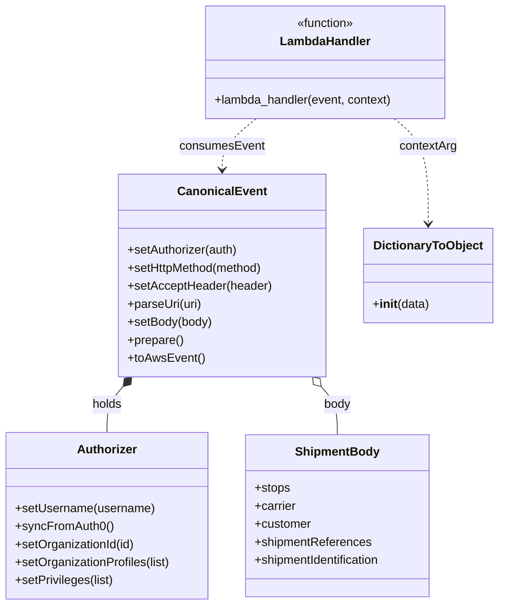

# Diagram: platform/tools/ide_local_testing/localTest/test/byUrl/v2PostPutShipment.py


> Auto-generated by Obscura crawlers

## Diagram 1

```mermaid
flowchart TD
  Start([Start])
  Body[Build body (stops, carrier, customer, shipmentReferences, shipmentIdentification)]
  Authorizer[Authorizer() <br/> setUsername(...) <br/> syncFromAuth0()]
  CheckOrg{"activeOrgId ?"}
  SetOrg[setOrganizationId()<br/>setOrganizationProfiles()<br/>setPrivileges()]
  Canonical[CanonicalEvent() <br/> setAuthorizer(...) <br/> setHttpMethod('POST') <br/> setAcceptHeader(...) <br/> parseUri(uri) <br/> setBody(body)]
  Prepare[prepare() -> toAwsEvent()]
  AwsEvent([AWS Event])
  StartTime[start = time.time()]
  DTO[DictionaryToObject({'function_name':'v2-post-put-shipment'})]
  Invoke[lambda_handler(event, DTO)]
  EndTime[end = time.time()]
  Retval([retval])
  RetvalCheck{"retval and retval.get('body')?"}
  ParseBody[json.loads(retval.get('body')) -> prettyRetval]
  EmptyBody[prettyRetval = ""]
  Print[print(prettyRetval)<br/>print(Lambda execution time)]
  End([End])

  Start --> Body --> Authorizer --> CheckOrg
  CheckOrg -- yes --> SetOrg --> Canonical
  CheckOrg -- no --> Canonical
  Canonical --> Prepare --> AwsEvent --> StartTime --> DTO --> Invoke --> EndTime --> Retval --> RetvalCheck
  RetvalCheck -- yes --> ParseBody --> Print --> End
  RetvalCheck -- no --> EmptyBody --> Print
```

> SVG rendering failed for this diagram.

## Diagram 2



### SVG

<svg id="container" width="662.556640625" xmlns="http://www.w3.org/2000/svg" class="classDiagram" height="806" viewBox="0 0 662.556640625 806" role="graphics-document document" aria-roledescription="class"><style>#container{font-family:"trebuchet ms",verdana,arial,sans-serif;font-size:16px;fill:#333;}@keyframes edge-animation-frame{from{stroke-dashoffset:0;}}@keyframes dash{to{stroke-dashoffset:0;}}#container .edge-animation-slow{stroke-dasharray:9,5!important;stroke-dashoffset:900;animation:dash 50s linear infinite;stroke-linecap:round;}#container .edge-animation-fast{stroke-dasharray:9,5!important;stroke-dashoffset:900;animation:dash 20s linear infinite;stroke-linecap:round;}#container .error-icon{fill:#552222;}#container .error-text{fill:#552222;stroke:#552222;}#container .edge-thickness-normal{stroke-width:1px;}#container .edge-thickness-thick{stroke-width:3.5px;}#container .edge-pattern-solid{stroke-dasharray:0;}#container .edge-thickness-invisible{stroke-width:0;fill:none;}#container .edge-pattern-dashed{stroke-dasharray:3;}#container .edge-pattern-dotted{stroke-dasharray:2;}#container .marker{fill:#333333;stroke:#333333;}#container .marker.cross{stroke:#333333;}#container svg{font-family:"trebuchet ms",verdana,arial,sans-serif;font-size:16px;}#container p{margin:0;}#container g.classGroup text{fill:#9370DB;stroke:none;font-family:"trebuchet ms",verdana,arial,sans-serif;font-size:10px;}#container g.classGroup text .title{font-weight:bolder;}#container .nodeLabel,#container .edgeLabel{color:#131300;}#container .edgeLabel .label rect{fill:#ECECFF;}#container .label text{fill:#131300;}#container .labelBkg{background:#ECECFF;}#container .edgeLabel .label span{background:#ECECFF;}#container .classTitle{font-weight:bolder;}#container .node rect,#container .node circle,#container .node ellipse,#container .node polygon,#container .node path{fill:#ECECFF;stroke:#9370DB;stroke-width:1px;}#container .divider{stroke:#9370DB;stroke-width:1;}#container g.clickable{cursor:pointer;}#container g.classGroup rect{fill:#ECECFF;stroke:#9370DB;}#container g.classGroup line{stroke:#9370DB;stroke-width:1;}#container .classLabel .box{stroke:none;stroke-width:0;fill:#ECECFF;opacity:0.5;}#container .classLabel .label{fill:#9370DB;font-size:10px;}#container .relation{stroke:#333333;stroke-width:1;fill:none;}#container .dashed-line{stroke-dasharray:3;}#container .dotted-line{stroke-dasharray:1 2;}#container #compositionStart,#container .composition{fill:#333333!important;stroke:#333333!important;stroke-width:1;}#container #compositionEnd,#container .composition{fill:#333333!important;stroke:#333333!important;stroke-width:1;}#container #dependencyStart,#container .dependency{fill:#333333!important;stroke:#333333!important;stroke-width:1;}#container #dependencyStart,#container .dependency{fill:#333333!important;stroke:#333333!important;stroke-width:1;}#container #extensionStart,#container .extension{fill:transparent!important;stroke:#333333!important;stroke-width:1;}#container #extensionEnd,#container .extension{fill:transparent!important;stroke:#333333!important;stroke-width:1;}#container #aggregationStart,#container .aggregation{fill:transparent!important;stroke:#333333!important;stroke-width:1;}#container #aggregationEnd,#container .aggregation{fill:transparent!important;stroke:#333333!important;stroke-width:1;}#container #lollipopStart,#container .lollipop{fill:#ECECFF!important;stroke:#333333!important;stroke-width:1;}#container #lollipopEnd,#container .lollipop{fill:#ECECFF!important;stroke:#333333!important;stroke-width:1;}#container .edgeTerminals{font-size:11px;line-height:initial;}#container .classTitleText{text-anchor:middle;font-size:18px;fill:#333;}#container .label-icon{display:inline-block;height:1em;overflow:visible;vertical-align:-0.125em;}#container .node .label-icon path{fill:currentColor;stroke:revert;stroke-width:revert;}#container :root{--mermaid-font-family:"trebuchet ms",verdana,arial,sans-serif;}</style><g><defs><marker id="container_class-aggregationStart" class="marker aggregation class" refX="18" refY="7" markerWidth="190" markerHeight="240" orient="auto"><path d="M 18,7 L9,13 L1,7 L9,1 Z"></path></marker></defs><defs><marker id="container_class-aggregationEnd" class="marker aggregation class" refX="1" refY="7" markerWidth="20" markerHeight="28" orient="auto"><path d="M 18,7 L9,13 L1,7 L9,1 Z"></path></marker></defs><defs><marker id="container_class-extensionStart" class="marker extension class" refX="18" refY="7" markerWidth="190" markerHeight="240" orient="auto"><path d="M 1,7 L18,13 V 1 Z"></path></marker></defs><defs><marker id="container_class-extensionEnd" class="marker extension class" refX="1" refY="7" markerWidth="20" markerHeight="28" orient="auto"><path d="M 1,1 V 13 L18,7 Z"></path></marker></defs><defs><marker id="container_class-compositionStart" class="marker composition class" refX="18" refY="7" markerWidth="190" markerHeight="240" orient="auto"><path d="M 18,7 L9,13 L1,7 L9,1 Z"></path></marker></defs><defs><marker id="container_class-compositionEnd" class="marker composition class" refX="1" refY="7" markerWidth="20" markerHeight="28" orient="auto"><path d="M 18,7 L9,13 L1,7 L9,1 Z"></path></marker></defs><defs><marker id="container_class-dependencyStart" class="marker dependency class" refX="6" refY="7" markerWidth="190" markerHeight="240" orient="auto"><path d="M 5,7 L9,13 L1,7 L9,1 Z"></path></marker></defs><defs><marker id="container_class-dependencyEnd" class="marker dependency class" refX="13" refY="7" markerWidth="20" markerHeight="28" orient="auto"><path d="M 18,7 L9,13 L14,7 L9,1 Z"></path></marker></defs><defs><marker id="container_class-lollipopStart" class="marker lollipop class" refX="13" refY="7" markerWidth="190" markerHeight="240" orient="auto"><circle stroke="black" fill="transparent" cx="7" cy="7" r="6"></circle></marker></defs><defs><marker id="container_class-lollipopEnd" class="marker lollipop class" refX="1" refY="7" markerWidth="190" markerHeight="240" orient="auto"><circle stroke="black" fill="transparent" cx="7" cy="7" r="6"></circle></marker></defs><g class="root"><g class="clusters"></g><g class="edgePaths"><path d="M165.521,514.792L161.871,518.827C158.221,522.861,150.921,530.931,147.271,541.132C143.621,551.333,143.621,563.667,143.621,569.833L143.621,576" id="id_CanonicalEvent_Authorizer_1" class="edge-thickness-normal edge-pattern-solid relation" style=";;;" data-edge="true" data-et="edge" data-id="id_CanonicalEvent_Authorizer_1" data-points="W3sieCI6MTc3LjA5Mzk0MzA0MTQyNDQ0LCJ5Ijo1MDJ9LHsieCI6MTQzLjYyMTA5Mzc1LCJ5Ijo1Mzl9LHsieCI6MTQzLjYyMTA5Mzc1LCJ5Ijo1NzZ9XQ==" marker-start="url(#container_class-compositionStart)"></path><path d="M432.928,514.792L436.578,518.827C440.228,522.861,447.528,530.931,451.178,541.632C454.828,552.333,454.828,565.667,454.828,572.333L454.828,579" id="id_CanonicalEvent_ShipmentBody_2" class="edge-thickness-normal edge-pattern-solid relation" style=";;;" data-edge="true" data-et="edge" data-id="id_CanonicalEvent_ShipmentBody_2" data-points="W3sieCI6NDIxLjM1NTI3NTcwODU3NTU2LCJ5Ijo1MDJ9LHsieCI6NDU0LjgyODEyNSwieSI6NTM5fSx7IngiOjQ1NC44MjgxMjUsInkiOjU3OX1d" marker-start="url(#container_class-aggregationStart)"></path><path d="M525.093,158L532.541,164.167C539.99,170.333,554.886,182.667,562.335,206C569.783,229.333,569.783,263.667,569.783,280.833L569.783,298" id="id_LambdaHandler_DictionaryToObject_3" class="edge-thickness-normal edge-pattern-dashed relation" style=";;;" data-edge="true" data-et="edge" data-id="id_LambdaHandler_DictionaryToObject_3" data-points="W3sieCI6NTI1LjA5MjcyMTEyMTY1MTgsInkiOjE1OH0seyJ4Ijo1NjkuNzgzMjAzMTI1LCJ5IjoxOTV9LHsieCI6NTY5Ljc4MzIwMzEyNSwieSI6MzA0fV0=" marker-end="url(#container_class-dependencyEnd)"></path><path d="M343.915,158L336.467,164.167C329.018,170.333,314.121,182.667,306.673,194C299.225,205.333,299.225,215.667,299.225,220.833L299.225,226" id="id_LambdaHandler_CanonicalEvent_4" class="edge-thickness-normal edge-pattern-dashed relation" style=";;;" data-edge="true" data-et="edge" data-id="id_LambdaHandler_CanonicalEvent_4" data-points="W3sieCI6MzQzLjkxNTA5MTM3ODM0ODIsInkiOjE1OH0seyJ4IjoyOTkuMjI0NjA5Mzc1LCJ5IjoxOTV9LHsieCI6Mjk5LjIyNDYwOTM3NSwieSI6MjMyfV0=" marker-end="url(#container_class-dependencyEnd)"></path></g><g class="edgeLabels"><g class="edgeLabel" transform="translate(143.62109375, 539)"><g class="label" data-id="id_CanonicalEvent_Authorizer_1" transform="translate(-20.1875, -12)"><foreignObject width="40.375" height="24"><div xmlns="http://www.w3.org/1999/xhtml" class="labelBkg" style="display: table-cell; white-space: nowrap; line-height: 1.5; max-width: 200px; text-align: center;"><span class="edgeLabel"><p>holds</p></span></div></foreignObject></g></g><g class="edgeLabel" transform="translate(454.828125, 539)"><g class="label" data-id="id_CanonicalEvent_ShipmentBody_2" transform="translate(-18.1484375, -12)"><foreignObject width="36.296875" height="24"><div xmlns="http://www.w3.org/1999/xhtml" class="labelBkg" style="display: table-cell; white-space: nowrap; line-height: 1.5; max-width: 200px; text-align: center;"><span class="edgeLabel"><p>body</p></span></div></foreignObject></g></g><g class="edgeLabel" transform="translate(569.783203125, 195)"><g class="label" data-id="id_LambdaHandler_DictionaryToObject_3" transform="translate(-38.5625, -12)"><foreignObject width="77.125" height="24"><div xmlns="http://www.w3.org/1999/xhtml" class="labelBkg" style="display: table-cell; white-space: nowrap; line-height: 1.5; max-width: 200px; text-align: center;"><span class="edgeLabel"><p>contextArg</p></span></div></foreignObject></g></g><g class="edgeLabel" transform="translate(299.224609375, 195)"><g class="label" data-id="id_LambdaHandler_CanonicalEvent_4" transform="translate(-56.328125, -12)"><foreignObject width="112.65625" height="24"><div xmlns="http://www.w3.org/1999/xhtml" class="labelBkg" style="display: table-cell; white-space: nowrap; line-height: 1.5; max-width: 200px; text-align: center;"><span class="edgeLabel"><p>consumesEvent</p></span></div></foreignObject></g></g></g><g class="nodes"><g class="node default" id="classId-Authorizer-0" transform="translate(143.62109375, 687)"><g class="basic label-container"><path d="M-135.62109375 -111 L135.62109375 -111 L135.62109375 111 L-135.62109375 111" stroke="none" stroke-width="0" fill="#ECECFF" style=""></path><path d="M-135.62109375 -111 C-59.03083759471441 -111, 17.559418560571174 -111, 135.62109375 -111 M-135.62109375 -111 C-59.858903958212906 -111, 15.903285833574188 -111, 135.62109375 -111 M135.62109375 -111 C135.62109375 -57.22378000031676, 135.62109375 -3.4475600006335156, 135.62109375 111 M135.62109375 -111 C135.62109375 -51.129260552538376, 135.62109375 8.741478894923247, 135.62109375 111 M135.62109375 111 C38.18422673287165 111, -59.2526402842567 111, -135.62109375 111 M135.62109375 111 C28.025349566409446 111, -79.57039461718111 111, -135.62109375 111 M-135.62109375 111 C-135.62109375 36.799773000532, -135.62109375 -37.400453998936, -135.62109375 -111 M-135.62109375 111 C-135.62109375 32.800539989958935, -135.62109375 -45.39892002008213, -135.62109375 -111" stroke="#9370DB" stroke-width="1.3" fill="none" stroke-dasharray="0 0" style=""></path></g><g class="annotation-group text" transform="translate(0, -87)"></g><g class="label-group text" transform="translate(-38.3671875, -87)"><g class="label" style="font-weight: bolder" transform="translate(0,-12)"><foreignObject width="76.734375" height="24"><div xmlns="http://www.w3.org/1999/xhtml" style="display: table-cell; white-space: nowrap; line-height: 1.5; max-width: 126px; text-align: center;"><span class="nodeLabel markdown-node-label" style=""><p>Authorizer</p></span></div></foreignObject></g></g><g class="members-group text" transform="translate(-123.62109375, -39)"></g><g class="methods-group text" transform="translate(-123.62109375, -9)"><g class="label" style="" transform="translate(0,-12)"><foreignObject width="185.90625" height="24"><div xmlns="http://www.w3.org/1999/xhtml" style="display: table-cell; white-space: nowrap; line-height: 1.5; max-width: 243px; text-align: center;"><span class="nodeLabel markdown-node-label" style=""><p>+setUsername(username)</p></span></div></foreignObject></g><g class="label" style="" transform="translate(0,12)"><foreignObject width="129.0625" height="24"><div xmlns="http://www.w3.org/1999/xhtml" style="display: table-cell; white-space: nowrap; line-height: 1.5; max-width: 186px; text-align: center;"><span class="nodeLabel markdown-node-label" style=""><p>+syncFromAuth0()</p></span></div></foreignObject></g><g class="label" style="" transform="translate(0,36)"><foreignObject width="160.78125" height="24"><div xmlns="http://www.w3.org/1999/xhtml" style="display: table-cell; white-space: nowrap; line-height: 1.5; max-width: 218px; text-align: center;"><span class="nodeLabel markdown-node-label" style=""><p>+setOrganizationId(id)</p></span></div></foreignObject></g><g class="label" style="" transform="translate(0,60)"><foreignObject width="208.875" height="24"><div xmlns="http://www.w3.org/1999/xhtml" style="display: table-cell; white-space: nowrap; line-height: 1.5; max-width: 266px; text-align: center;"><span class="nodeLabel markdown-node-label" style=""><p>+setOrganizationProfiles(list)</p></span></div></foreignObject></g><g class="label" style="" transform="translate(0,84)"><foreignObject width="132.40625" height="24"><div xmlns="http://www.w3.org/1999/xhtml" style="display: table-cell; white-space: nowrap; line-height: 1.5; max-width: 190px; text-align: center;"><span class="nodeLabel markdown-node-label" style=""><p>+setPrivileges(list)</p></span></div></foreignObject></g></g><g class="divider" style=""><path d="M-135.62109375 -63 C-64.29111096756225 -63, 7.038871814875506 -63, 135.62109375 -63 M-135.62109375 -63 C-39.88353024180931 -63, 55.85403326638138 -63, 135.62109375 -63" stroke="#9370DB" stroke-width="1.3" fill="none" stroke-dasharray="0 0" style=""></path></g><g class="divider" style=""><path d="M-135.62109375 -39 C-29.98013623536393 -39, 75.66082127927214 -39, 135.62109375 -39 M-135.62109375 -39 C-34.127937495485526 -39, 67.36521875902895 -39, 135.62109375 -39" stroke="#9370DB" stroke-width="1.3" fill="none" stroke-dasharray="0 0" style=""></path></g></g><g class="node default" id="classId-CanonicalEvent-1" transform="translate(299.224609375, 367)"><g class="basic label-container"><path d="M-135.78515625 -135 L135.78515625 -135 L135.78515625 135 L-135.78515625 135" stroke="none" stroke-width="0" fill="#ECECFF" style=""></path><path d="M-135.78515625 -135 C-43.83649800818293 -135, 48.11216023363414 -135, 135.78515625 -135 M-135.78515625 -135 C-38.93741427303699 -135, 57.910327703926015 -135, 135.78515625 -135 M135.78515625 -135 C135.78515625 -37.26596321140491, 135.78515625 60.46807357719018, 135.78515625 135 M135.78515625 -135 C135.78515625 -78.14789192113557, 135.78515625 -21.29578384227115, 135.78515625 135 M135.78515625 135 C67.43214620092292 135, -0.9208638481541698 135, -135.78515625 135 M135.78515625 135 C29.502024103288036 135, -76.78110804342393 135, -135.78515625 135 M-135.78515625 135 C-135.78515625 64.08923644311636, -135.78515625 -6.821527113767274, -135.78515625 -135 M-135.78515625 135 C-135.78515625 64.83316284828555, -135.78515625 -5.333674303428893, -135.78515625 -135" stroke="#9370DB" stroke-width="1.3" fill="none" stroke-dasharray="0 0" style=""></path></g><g class="annotation-group text" transform="translate(0, -111)"></g><g class="label-group text" transform="translate(-55.7109375, -111)"><g class="label" style="font-weight: bolder" transform="translate(0,-12)"><foreignObject width="111.421875" height="24"><div xmlns="http://www.w3.org/1999/xhtml" style="display: table-cell; white-space: nowrap; line-height: 1.5; max-width: 161px; text-align: center;"><span class="nodeLabel markdown-node-label" style=""><p>CanonicalEvent</p></span></div></foreignObject></g></g><g class="members-group text" transform="translate(-123.78515625, -63)"></g><g class="methods-group text" transform="translate(-123.78515625, -33)"><g class="label" style="" transform="translate(0,-12)"><foreignObject width="148.9375" height="24"><div xmlns="http://www.w3.org/1999/xhtml" style="display: table-cell; white-space: nowrap; line-height: 1.5; max-width: 206px; text-align: center;"><span class="nodeLabel markdown-node-label" style=""><p>+setAuthorizer(auth)</p></span></div></foreignObject></g><g class="label" style="" transform="translate(0,12)"><foreignObject width="184" height="24"><div xmlns="http://www.w3.org/1999/xhtml" style="display: table-cell; white-space: nowrap; line-height: 1.5; max-width: 241px; text-align: center;"><span class="nodeLabel markdown-node-label" style=""><p>+setHttpMethod(method)</p></span></div></foreignObject></g><g class="label" style="" transform="translate(0,36)"><foreignObject width="191.859375" height="24"><div xmlns="http://www.w3.org/1999/xhtml" style="display: table-cell; white-space: nowrap; line-height: 1.5; max-width: 249px; text-align: center;"><span class="nodeLabel markdown-node-label" style=""><p>+setAcceptHeader(header)</p></span></div></foreignObject></g><g class="label" style="" transform="translate(0,60)"><foreignObject width="99.8125" height="24"><div xmlns="http://www.w3.org/1999/xhtml" style="display: table-cell; white-space: nowrap; line-height: 1.5; max-width: 157px; text-align: center;"><span class="nodeLabel markdown-node-label" style=""><p>+parseUri(uri)</p></span></div></foreignObject></g><g class="label" style="" transform="translate(0,84)"><foreignObject width="113.125" height="24"><div xmlns="http://www.w3.org/1999/xhtml" style="display: table-cell; white-space: nowrap; line-height: 1.5; max-width: 170px; text-align: center;"><span class="nodeLabel markdown-node-label" style=""><p>+setBody(body)</p></span></div></foreignObject></g><g class="label" style="" transform="translate(0,108)"><foreignObject width="74.75" height="24"><div xmlns="http://www.w3.org/1999/xhtml" style="display: table-cell; white-space: nowrap; line-height: 1.5; max-width: 132px; text-align: center;"><span class="nodeLabel markdown-node-label" style=""><p>+prepare()</p></span></div></foreignObject></g><g class="label" style="" transform="translate(0,132)"><foreignObject width="101.1875" height="24"><div xmlns="http://www.w3.org/1999/xhtml" style="display: table-cell; white-space: nowrap; line-height: 1.5; max-width: 159px; text-align: center;"><span class="nodeLabel markdown-node-label" style=""><p>+toAwsEvent()</p></span></div></foreignObject></g></g><g class="divider" style=""><path d="M-135.78515625 -87 C-64.17037674401374 -87, 7.444402761972526 -87, 135.78515625 -87 M-135.78515625 -87 C-78.80961460109867 -87, -21.83407295219736 -87, 135.78515625 -87" stroke="#9370DB" stroke-width="1.3" fill="none" stroke-dasharray="0 0" style=""></path></g><g class="divider" style=""><path d="M-135.78515625 -63 C-60.579447097353565 -63, 14.62626205529287 -63, 135.78515625 -63 M-135.78515625 -63 C-27.196276043276313 -63, 81.39260416344737 -63, 135.78515625 -63" stroke="#9370DB" stroke-width="1.3" fill="none" stroke-dasharray="0 0" style=""></path></g></g><g class="node default" id="classId-DictionaryToObject-2" transform="translate(569.783203125, 367)"><g class="basic label-container"><path d="M-84.7734375 -63 L84.7734375 -63 L84.7734375 63 L-84.7734375 63" stroke="none" stroke-width="0" fill="#ECECFF" style=""></path><path d="M-84.7734375 -63 C-50.25012535962942 -63, -15.726813219258844 -63, 84.7734375 -63 M-84.7734375 -63 C-40.28629438201225 -63, 4.200848735975498 -63, 84.7734375 -63 M84.7734375 -63 C84.7734375 -26.56815918848927, 84.7734375 9.863681623021463, 84.7734375 63 M84.7734375 -63 C84.7734375 -20.79118723312162, 84.7734375 21.417625533756762, 84.7734375 63 M84.7734375 63 C21.557138037776227 63, -41.65916142444755 63, -84.7734375 63 M84.7734375 63 C34.92492025230123 63, -14.923596995397546 63, -84.7734375 63 M-84.7734375 63 C-84.7734375 32.70248055712618, -84.7734375 2.404961114252366, -84.7734375 -63 M-84.7734375 63 C-84.7734375 22.71407069902299, -84.7734375 -17.57185860195402, -84.7734375 -63" stroke="#9370DB" stroke-width="1.3" fill="none" stroke-dasharray="0 0" style=""></path></g><g class="annotation-group text" transform="translate(0, -39)"></g><g class="label-group text" transform="translate(-70.109375, -39)"><g class="label" style="font-weight: bolder" transform="translate(0,-12)"><foreignObject width="140.21875" height="24"><div xmlns="http://www.w3.org/1999/xhtml" style="display: table-cell; white-space: nowrap; line-height: 1.5; max-width: 188px; text-align: center;"><span class="nodeLabel markdown-node-label" style=""><p>DictionaryToObject</p></span></div></foreignObject></g></g><g class="members-group text" transform="translate(-72.7734375, 9)"></g><g class="methods-group text" transform="translate(-72.7734375, 39)"><g class="label" style="" transform="translate(0,-12)"><foreignObject width="75.4375" height="24"><div xmlns="http://www.w3.org/1999/xhtml" style="display: table-cell; white-space: nowrap; line-height: 1.5; max-width: 164px; text-align: center;"><span class="nodeLabel markdown-node-label" style=""><p>+<strong>init</strong>(data)</p></span></div></foreignObject></g></g><g class="divider" style=""><path d="M-84.7734375 -15 C-17.63455715720032 -15, 49.50432318559936 -15, 84.7734375 -15 M-84.7734375 -15 C-23.602245944619952 -15, 37.568945610760096 -15, 84.7734375 -15" stroke="#9370DB" stroke-width="1.3" fill="none" stroke-dasharray="0 0" style=""></path></g><g class="divider" style=""><path d="M-84.7734375 9 C-33.77214099781355 9, 17.229155504372898 9, 84.7734375 9 M-84.7734375 9 C-17.050429646151315 9, 50.67257820769737 9, 84.7734375 9" stroke="#9370DB" stroke-width="1.3" fill="none" stroke-dasharray="0 0" style=""></path></g></g><g class="node default" id="classId-ShipmentBody-3" transform="translate(454.828125, 687)"><g class="basic label-container"><path d="M-125.5859375 -108 L125.5859375 -108 L125.5859375 108 L-125.5859375 108" stroke="none" stroke-width="0" fill="#ECECFF" style=""></path><path d="M-125.5859375 -108 C-73.79745035339957 -108, -22.008963206799123 -108, 125.5859375 -108 M-125.5859375 -108 C-62.46533518201022 -108, 0.6552671359795568 -108, 125.5859375 -108 M125.5859375 -108 C125.5859375 -61.24222755729896, 125.5859375 -14.484455114597921, 125.5859375 108 M125.5859375 -108 C125.5859375 -42.59676435882757, 125.5859375 22.80647128234486, 125.5859375 108 M125.5859375 108 C33.439415807698225 108, -58.70710588460355 108, -125.5859375 108 M125.5859375 108 C62.69474110232976 108, -0.19645529534048478 108, -125.5859375 108 M-125.5859375 108 C-125.5859375 44.190777193672844, -125.5859375 -19.618445612654313, -125.5859375 -108 M-125.5859375 108 C-125.5859375 40.33739773534498, -125.5859375 -27.325204529310042, -125.5859375 -108" stroke="#9370DB" stroke-width="1.3" fill="none" stroke-dasharray="0 0" style=""></path></g><g class="annotation-group text" transform="translate(0, -84)"></g><g class="label-group text" transform="translate(-53.65625, -84)"><g class="label" style="font-weight: bolder" transform="translate(0,-12)"><foreignObject width="107.3125" height="24"><div xmlns="http://www.w3.org/1999/xhtml" style="display: table-cell; white-space: nowrap; line-height: 1.5; max-width: 156px; text-align: center;"><span class="nodeLabel markdown-node-label" style=""><p>ShipmentBody</p></span></div></foreignObject></g></g><g class="members-group text" transform="translate(-113.5859375, -36)"><g class="label" style="" transform="translate(0,-12)"><foreignObject width="47.3125" height="24"><div xmlns="http://www.w3.org/1999/xhtml" style="display: table-cell; white-space: nowrap; line-height: 1.5; max-width: 105px; text-align: center;"><span class="nodeLabel markdown-node-label" style=""><p>+stops</p></span></div></foreignObject></g><g class="label" style="" transform="translate(0,12)"><foreignObject width="55.9375" height="24"><div xmlns="http://www.w3.org/1999/xhtml" style="display: table-cell; white-space: nowrap; line-height: 1.5; max-width: 114px; text-align: center;"><span class="nodeLabel markdown-node-label" style=""><p>+carrier</p></span></div></foreignObject></g><g class="label" style="" transform="translate(0,36)"><foreignObject width="75.75" height="24"><div xmlns="http://www.w3.org/1999/xhtml" style="display: table-cell; white-space: nowrap; line-height: 1.5; max-width: 134px; text-align: center;"><span class="nodeLabel markdown-node-label" style=""><p>+customer</p></span></div></foreignObject></g><g class="label" style="" transform="translate(0,60)"><foreignObject width="155.828125" height="24"><div xmlns="http://www.w3.org/1999/xhtml" style="display: table-cell; white-space: nowrap; line-height: 1.5; max-width: 213px; text-align: center;"><span class="nodeLabel markdown-node-label" style=""><p>+shipmentReferences</p></span></div></foreignObject></g><g class="label" style="" transform="translate(0,84)"><foreignObject width="173.515625" height="24"><div xmlns="http://www.w3.org/1999/xhtml" style="display: table-cell; white-space: nowrap; line-height: 1.5; max-width: 231px; text-align: center;"><span class="nodeLabel markdown-node-label" style=""><p>+shipmentIdentification</p></span></div></foreignObject></g></g><g class="methods-group text" transform="translate(-113.5859375, 108)"></g><g class="divider" style=""><path d="M-125.5859375 -60 C-47.60451976483532 -60, 30.376897970329367 -60, 125.5859375 -60 M-125.5859375 -60 C-69.21163027259459 -60, -12.837323045189194 -60, 125.5859375 -60" stroke="#9370DB" stroke-width="1.3" fill="none" stroke-dasharray="0 0" style=""></path></g><g class="divider" style=""><path d="M-125.5859375 84 C-70.47695814529004 84, -15.367978790580068 84, 125.5859375 84 M-125.5859375 84 C-61.95302172950295 84, 1.6798940409940997 84, 125.5859375 84" stroke="#9370DB" stroke-width="1.3" fill="none" stroke-dasharray="0 0" style=""></path></g></g><g class="node default" id="classId-LambdaHandler-4" transform="translate(434.50390625, 83)"><g class="basic label-container"><path d="M-161.203125 -75 L161.203125 -75 L161.203125 75 L-161.203125 75" stroke="none" stroke-width="0" fill="#ECECFF" style=""></path><path d="M-161.203125 -75 C-48.868181031272556 -75, 63.46676293745489 -75, 161.203125 -75 M-161.203125 -75 C-88.3452467261356 -75, -15.487368452271198 -75, 161.203125 -75 M161.203125 -75 C161.203125 -24.293165648537247, 161.203125 26.413668702925506, 161.203125 75 M161.203125 -75 C161.203125 -16.172205074232018, 161.203125 42.655589851535964, 161.203125 75 M161.203125 75 C96.02369010150353 75, 30.844255203007066 75, -161.203125 75 M161.203125 75 C54.23633410252721 75, -52.73045679494558 75, -161.203125 75 M-161.203125 75 C-161.203125 25.62971086464733, -161.203125 -23.740578270705342, -161.203125 -75 M-161.203125 75 C-161.203125 38.713817591548505, -161.203125 2.42763518309701, -161.203125 -75" stroke="#9370DB" stroke-width="1.3" fill="none" stroke-dasharray="0 0" style=""></path></g><g class="annotation-group text" transform="translate(-39.484375, -51)"><g class="label" style="" transform="translate(0,-12)"><foreignObject width="78.96875" height="24"><div xmlns="http://www.w3.org/1999/xhtml" style="display: table-cell; white-space: nowrap; line-height: 1.5; max-width: 129px; text-align: center;"><span class="nodeLabel markdown-node-label" style=""><p>«function»</p></span></div></foreignObject></g></g><g class="label-group text" transform="translate(-58.21875, -27)"><g class="label" style="font-weight: bolder" transform="translate(0,-12)"><foreignObject width="116.4375" height="24"><div xmlns="http://www.w3.org/1999/xhtml" style="display: table-cell; white-space: nowrap; line-height: 1.5; max-width: 167px; text-align: center;"><span class="nodeLabel markdown-node-label" style=""><p>LambdaHandler</p></span></div></foreignObject></g></g><g class="members-group text" transform="translate(-149.203125, 21)"></g><g class="methods-group text" transform="translate(-149.203125, 51)"><g class="label" style="" transform="translate(0,-12)"><foreignObject width="240.1875" height="24"><div xmlns="http://www.w3.org/1999/xhtml" style="display: table-cell; white-space: nowrap; line-height: 1.5; max-width: 298px; text-align: center;"><span class="nodeLabel markdown-node-label" style=""><p>+lambda_handler(event, context)</p></span></div></foreignObject></g></g><g class="divider" style=""><path d="M-161.203125 -3 C-45.24438680830271 -3, 70.71435138339459 -3, 161.203125 -3 M-161.203125 -3 C-81.86206629266827 -3, -2.521007585336548 -3, 161.203125 -3" stroke="#9370DB" stroke-width="1.3" fill="none" stroke-dasharray="0 0" style=""></path></g><g class="divider" style=""><path d="M-161.203125 21 C-94.30879371125074 21, -27.414462422501487 21, 161.203125 21 M-161.203125 21 C-43.42945616246422 21, 74.34421267507156 21, 161.203125 21" stroke="#9370DB" stroke-width="1.3" fill="none" stroke-dasharray="0 0" style=""></path></g></g></g></g></g></svg>
