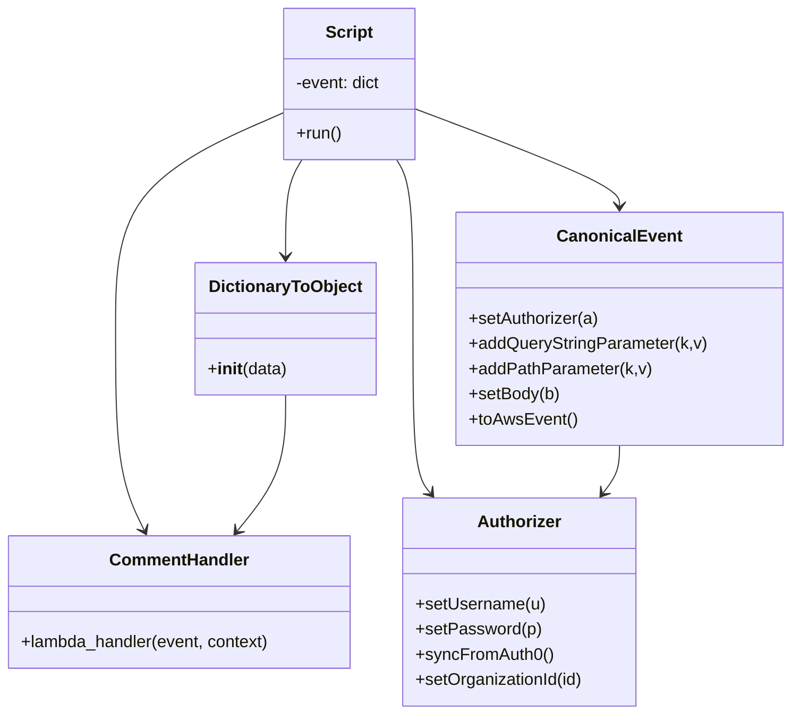

# Diagram: platform/tools/ide_local_testing/localTest/test/comment/addComment.py


> Auto-generated by Obscura crawlers

## Diagram 1

```mermaid
flowchart TD
    Script[Script] --> BuildEvent[Construct AWS-like event dict]
    BuildEvent --> Wrap[Wrap with DictionaryToObject(function_name="addComment")]
    Wrap --> Invoke[Call postComment(event, contextObj)]
    Invoke --> Handler[comment_service.comment_post.lambda_handler]
    Handler --> Ret[retval]
    Ret --> Print[print(retval)]
    Script --> DictionaryToObject[DictionaryToObject]
    Script --> CanonicalEvent[CanonicalEvent]
    Script --> Authorizer[Authorizer]
```

> SVG rendering failed for this diagram.

## Diagram 2



### SVG

<svg id="container" width="752.095703125" xmlns="http://www.w3.org/2000/svg" class="classDiagram" height="680" viewBox="0 0 752.095703125 680" role="graphics-document document" aria-roledescription="class"><style>#container{font-family:"trebuchet ms",verdana,arial,sans-serif;font-size:16px;fill:#333;}@keyframes edge-animation-frame{from{stroke-dashoffset:0;}}@keyframes dash{to{stroke-dashoffset:0;}}#container .edge-animation-slow{stroke-dasharray:9,5!important;stroke-dashoffset:900;animation:dash 50s linear infinite;stroke-linecap:round;}#container .edge-animation-fast{stroke-dasharray:9,5!important;stroke-dashoffset:900;animation:dash 20s linear infinite;stroke-linecap:round;}#container .error-icon{fill:#552222;}#container .error-text{fill:#552222;stroke:#552222;}#container .edge-thickness-normal{stroke-width:1px;}#container .edge-thickness-thick{stroke-width:3.5px;}#container .edge-pattern-solid{stroke-dasharray:0;}#container .edge-thickness-invisible{stroke-width:0;fill:none;}#container .edge-pattern-dashed{stroke-dasharray:3;}#container .edge-pattern-dotted{stroke-dasharray:2;}#container .marker{fill:#333333;stroke:#333333;}#container .marker.cross{stroke:#333333;}#container svg{font-family:"trebuchet ms",verdana,arial,sans-serif;font-size:16px;}#container p{margin:0;}#container g.classGroup text{fill:#9370DB;stroke:none;font-family:"trebuchet ms",verdana,arial,sans-serif;font-size:10px;}#container g.classGroup text .title{font-weight:bolder;}#container .nodeLabel,#container .edgeLabel{color:#131300;}#container .edgeLabel .label rect{fill:#ECECFF;}#container .label text{fill:#131300;}#container .labelBkg{background:#ECECFF;}#container .edgeLabel .label span{background:#ECECFF;}#container .classTitle{font-weight:bolder;}#container .node rect,#container .node circle,#container .node ellipse,#container .node polygon,#container .node path{fill:#ECECFF;stroke:#9370DB;stroke-width:1px;}#container .divider{stroke:#9370DB;stroke-width:1;}#container g.clickable{cursor:pointer;}#container g.classGroup rect{fill:#ECECFF;stroke:#9370DB;}#container g.classGroup line{stroke:#9370DB;stroke-width:1;}#container .classLabel .box{stroke:none;stroke-width:0;fill:#ECECFF;opacity:0.5;}#container .classLabel .label{fill:#9370DB;font-size:10px;}#container .relation{stroke:#333333;stroke-width:1;fill:none;}#container .dashed-line{stroke-dasharray:3;}#container .dotted-line{stroke-dasharray:1 2;}#container #compositionStart,#container .composition{fill:#333333!important;stroke:#333333!important;stroke-width:1;}#container #compositionEnd,#container .composition{fill:#333333!important;stroke:#333333!important;stroke-width:1;}#container #dependencyStart,#container .dependency{fill:#333333!important;stroke:#333333!important;stroke-width:1;}#container #dependencyStart,#container .dependency{fill:#333333!important;stroke:#333333!important;stroke-width:1;}#container #extensionStart,#container .extension{fill:transparent!important;stroke:#333333!important;stroke-width:1;}#container #extensionEnd,#container .extension{fill:transparent!important;stroke:#333333!important;stroke-width:1;}#container #aggregationStart,#container .aggregation{fill:transparent!important;stroke:#333333!important;stroke-width:1;}#container #aggregationEnd,#container .aggregation{fill:transparent!important;stroke:#333333!important;stroke-width:1;}#container #lollipopStart,#container .lollipop{fill:#ECECFF!important;stroke:#333333!important;stroke-width:1;}#container #lollipopEnd,#container .lollipop{fill:#ECECFF!important;stroke:#333333!important;stroke-width:1;}#container .edgeTerminals{font-size:11px;line-height:initial;}#container .classTitleText{text-anchor:middle;font-size:18px;fill:#333;}#container .label-icon{display:inline-block;height:1em;overflow:visible;vertical-align:-0.125em;}#container .node .label-icon path{fill:currentColor;stroke:revert;stroke-width:revert;}#container :root{--mermaid-font-family:"trebuchet ms",verdana,arial,sans-serif;}</style><g><defs><marker id="container_class-aggregationStart" class="marker aggregation class" refX="18" refY="7" markerWidth="190" markerHeight="240" orient="auto"><path d="M 18,7 L9,13 L1,7 L9,1 Z"></path></marker></defs><defs><marker id="container_class-aggregationEnd" class="marker aggregation class" refX="1" refY="7" markerWidth="20" markerHeight="28" orient="auto"><path d="M 18,7 L9,13 L1,7 L9,1 Z"></path></marker></defs><defs><marker id="container_class-extensionStart" class="marker extension class" refX="18" refY="7" markerWidth="190" markerHeight="240" orient="auto"><path d="M 1,7 L18,13 V 1 Z"></path></marker></defs><defs><marker id="container_class-extensionEnd" class="marker extension class" refX="1" refY="7" markerWidth="20" markerHeight="28" orient="auto"><path d="M 1,1 V 13 L18,7 Z"></path></marker></defs><defs><marker id="container_class-compositionStart" class="marker composition class" refX="18" refY="7" markerWidth="190" markerHeight="240" orient="auto"><path d="M 18,7 L9,13 L1,7 L9,1 Z"></path></marker></defs><defs><marker id="container_class-compositionEnd" class="marker composition class" refX="1" refY="7" markerWidth="20" markerHeight="28" orient="auto"><path d="M 18,7 L9,13 L1,7 L9,1 Z"></path></marker></defs><defs><marker id="container_class-dependencyStart" class="marker dependency class" refX="6" refY="7" markerWidth="190" markerHeight="240" orient="auto"><path d="M 5,7 L9,13 L1,7 L9,1 Z"></path></marker></defs><defs><marker id="container_class-dependencyEnd" class="marker dependency class" refX="13" refY="7" markerWidth="20" markerHeight="28" orient="auto"><path d="M 18,7 L9,13 L14,7 L9,1 Z"></path></marker></defs><defs><marker id="container_class-lollipopStart" class="marker lollipop class" refX="13" refY="7" markerWidth="190" markerHeight="240" orient="auto"><circle stroke="black" fill="transparent" cx="7" cy="7" r="6"></circle></marker></defs><defs><marker id="container_class-lollipopEnd" class="marker lollipop class" refX="1" refY="7" markerWidth="190" markerHeight="240" orient="auto"><circle stroke="black" fill="transparent" cx="7" cy="7" r="6"></circle></marker></defs><g class="root"><g class="clusters"></g><g class="edgePaths"><path d="M290.359,152L287.786,156.167C285.214,160.333,280.069,168.667,277.496,184C274.924,199.333,274.924,221.667,274.924,232.833L274.924,244" id="id_Script_DictionaryToObject_1" class="edge-thickness-normal edge-pattern-solid relation" style=";;;" data-edge="true" data-et="edge" data-id="id_Script_DictionaryToObject_1" data-points="W3sieCI6MjkwLjM1ODU0OTQ1MjMxOTYsInkiOjE1Mn0seyJ4IjoyNzQuOTIzODI4MTI1LCJ5IjoxNzd9LHsieCI6Mjc0LjkyMzgyODEyNSwieSI6MjUwfV0=" marker-end="url(#container_class-dependencyEnd)"></path><path d="M398.9,104.225L430.99,116.354C463.079,128.483,527.257,152.742,559.346,168.037C591.436,183.333,591.436,189.667,591.436,192.833L591.436,196" id="id_Script_CanonicalEvent_2" class="edge-thickness-normal edge-pattern-solid relation" style=";;;" data-edge="true" data-et="edge" data-id="id_Script_CanonicalEvent_2" data-points="W3sieCI6Mzk4LjkwMDM5MDYyNSwieSI6MTA0LjIyNDg5OTUzNzI2MjU0fSx7IngiOjU5MS40MzU1NDY4NzUsInkiOjE3N30seyJ4Ijo1OTEuNDM1NTQ2ODc1LCJ5IjoyMDJ9XQ==" marker-end="url(#container_class-dependencyEnd)"></path><path d="M379.263,152L381.835,156.167C384.407,160.333,389.552,168.667,392.125,195.5C394.697,222.333,394.697,267.667,394.697,313C394.697,358.333,394.697,403.667,397.517,429.73C400.336,455.794,405.975,462.589,408.794,465.986L411.613,469.383" id="id_Script_Authorizer_3" class="edge-thickness-normal edge-pattern-solid relation" style=";;;" data-edge="true" data-et="edge" data-id="id_Script_Authorizer_3" data-points="W3sieCI6Mzc5LjI2MjU0NDI5NzY4MDQsInkiOjE1Mn0seyJ4IjozOTQuNjk3MjY1NjI1LCJ5IjoxNzd9LHsieCI6Mzk0LjY5NzI2NTYyNSwieSI6MzEzfSx7IngiOjM5NC42OTcyNjU2MjUsInkiOjQ0OX0seyJ4Ijo0MTUuNDQ0ODg3MjIyNzgyMjYsInkiOjQ3NH1d" marker-end="url(#container_class-dependencyEnd)"></path><path d="M270.721,107.918L244.289,119.431C217.857,130.945,164.993,153.973,138.561,188.153C112.129,222.333,112.129,267.667,112.129,313C112.129,358.333,112.129,403.667,116.604,435.6C121.079,467.532,130.03,486.065,134.505,495.331L138.98,504.597" id="id_Script_CommentHandler_4" class="edge-thickness-normal edge-pattern-solid relation" style=";;;" data-edge="true" data-et="edge" data-id="id_Script_CommentHandler_4" data-points="W3sieCI6MjcwLjcyMDcwMzEyNSwieSI6MTA3LjkxNzUwMDYzNTg5MjR9LHsieCI6MTEyLjEyODkwNjI1LCJ5IjoxNzd9LHsieCI6MTEyLjEyODkwNjI1LCJ5IjozMTN9LHsieCI6MTEyLjEyODkwNjI1LCJ5Ijo0NDl9LHsieCI6MTQxLjU4OTMwODIxNTcyNTgsInkiOjUxMH1d" marker-end="url(#container_class-dependencyEnd)"></path><path d="M591.436,424L591.436,428.167C591.436,432.333,591.436,440.667,588.886,448.203C586.337,455.738,581.238,462.477,578.688,465.846L576.139,469.215" id="id_CanonicalEvent_Authorizer_5" class="edge-thickness-normal edge-pattern-solid relation" style=";;;" data-edge="true" data-et="edge" data-id="id_CanonicalEvent_Authorizer_5" data-points="W3sieCI6NTkxLjQzNTU0Njg3NSwieSI6NDI0fSx7IngiOjU5MS40MzU1NDY4NzUsInkiOjQ0OX0seyJ4Ijo1NzIuNTE4MTkyNDE0MzE0NSwieSI6NDc0fV0=" marker-end="url(#container_class-dependencyEnd)"></path><path d="M274.924,376L274.924,388.167C274.924,400.333,274.924,424.667,267.125,446.23C259.326,467.794,243.729,486.589,235.93,495.986L228.131,505.383" id="id_DictionaryToObject_CommentHandler_6" class="edge-thickness-normal edge-pattern-solid relation" style=";;;" data-edge="true" data-et="edge" data-id="id_DictionaryToObject_CommentHandler_6" data-points="W3sieCI6Mjc0LjkyMzgyODEyNSwieSI6Mzc2fSx7IngiOjI3NC45MjM4MjgxMjUsInkiOjQ0OX0seyJ4IjoyMjQuMjk5NjMxNDI2NDExMjgsInkiOjUxMH1d" marker-end="url(#container_class-dependencyEnd)"></path></g><g class="edgeLabels"><g class="edgeLabel"><g class="label" data-id="id_Script_DictionaryToObject_1" transform="translate(0, 0)"><foreignObject width="0" height="0"><div xmlns="http://www.w3.org/1999/xhtml" class="labelBkg" style="display: table-cell; white-space: nowrap; line-height: 1.5; max-width: 200px; text-align: center;"><span class="edgeLabel"></span></div></foreignObject></g></g><g class="edgeLabel"><g class="label" data-id="id_Script_CanonicalEvent_2" transform="translate(0, 0)"><foreignObject width="0" height="0"><div xmlns="http://www.w3.org/1999/xhtml" class="labelBkg" style="display: table-cell; white-space: nowrap; line-height: 1.5; max-width: 200px; text-align: center;"><span class="edgeLabel"></span></div></foreignObject></g></g><g class="edgeLabel"><g class="label" data-id="id_Script_Authorizer_3" transform="translate(0, 0)"><foreignObject width="0" height="0"><div xmlns="http://www.w3.org/1999/xhtml" class="labelBkg" style="display: table-cell; white-space: nowrap; line-height: 1.5; max-width: 200px; text-align: center;"><span class="edgeLabel"></span></div></foreignObject></g></g><g class="edgeLabel"><g class="label" data-id="id_Script_CommentHandler_4" transform="translate(0, 0)"><foreignObject width="0" height="0"><div xmlns="http://www.w3.org/1999/xhtml" class="labelBkg" style="display: table-cell; white-space: nowrap; line-height: 1.5; max-width: 200px; text-align: center;"><span class="edgeLabel"></span></div></foreignObject></g></g><g class="edgeLabel"><g class="label" data-id="id_CanonicalEvent_Authorizer_5" transform="translate(0, 0)"><foreignObject width="0" height="0"><div xmlns="http://www.w3.org/1999/xhtml" class="labelBkg" style="display: table-cell; white-space: nowrap; line-height: 1.5; max-width: 200px; text-align: center;"><span class="edgeLabel"></span></div></foreignObject></g></g><g class="edgeLabel"><g class="label" data-id="id_DictionaryToObject_CommentHandler_6" transform="translate(0, 0)"><foreignObject width="0" height="0"><div xmlns="http://www.w3.org/1999/xhtml" class="labelBkg" style="display: table-cell; white-space: nowrap; line-height: 1.5; max-width: 200px; text-align: center;"><span class="edgeLabel"></span></div></foreignObject></g></g></g><g class="nodes"><g class="node default" id="classId-Script-0" transform="translate(334.810546875, 80)"><g class="basic label-container"><path d="M-64.08984375 -72 L64.08984375 -72 L64.08984375 72 L-64.08984375 72" stroke="none" stroke-width="0" fill="#ECECFF" style=""></path><path d="M-64.08984375 -72 C-26.004529841491866 -72, 12.080784067016268 -72, 64.08984375 -72 M-64.08984375 -72 C-13.777695449241918 -72, 36.534452851516164 -72, 64.08984375 -72 M64.08984375 -72 C64.08984375 -24.9569726631915, 64.08984375 22.086054673617, 64.08984375 72 M64.08984375 -72 C64.08984375 -18.395675120511875, 64.08984375 35.20864975897625, 64.08984375 72 M64.08984375 72 C23.277297405777 72, -17.535248938446003 72, -64.08984375 72 M64.08984375 72 C17.48284747764584 72, -29.12414879470832 72, -64.08984375 72 M-64.08984375 72 C-64.08984375 22.71070108449844, -64.08984375 -26.578597831003123, -64.08984375 -72 M-64.08984375 72 C-64.08984375 33.9793354467325, -64.08984375 -4.041329106535002, -64.08984375 -72" stroke="#9370DB" stroke-width="1.3" fill="none" stroke-dasharray="0 0" style=""></path></g><g class="annotation-group text" transform="translate(0, -48)"></g><g class="label-group text" transform="translate(-21.7421875, -48)"><g class="label" style="font-weight: bolder" transform="translate(0,-12)"><foreignObject width="43.484375" height="24"><div xmlns="http://www.w3.org/1999/xhtml" style="display: table-cell; white-space: nowrap; line-height: 1.5; max-width: 93px; text-align: center;"><span class="nodeLabel markdown-node-label" style=""><p>Script</p></span></div></foreignObject></g></g><g class="members-group text" transform="translate(-52.08984375, 0)"><g class="label" style="" transform="translate(0,-12)"><foreignObject width="82.4375" height="24"><div xmlns="http://www.w3.org/1999/xhtml" style="display: table-cell; white-space: nowrap; line-height: 1.5; max-width: 140px; text-align: center;"><span class="nodeLabel markdown-node-label" style=""><p>-event: dict</p></span></div></foreignObject></g></g><g class="methods-group text" transform="translate(-52.08984375, 48)"><g class="label" style="" transform="translate(0,-12)"><foreignObject width="43.21875" height="24"><div xmlns="http://www.w3.org/1999/xhtml" style="display: table-cell; white-space: nowrap; line-height: 1.5; max-width: 101px; text-align: center;"><span class="nodeLabel markdown-node-label" style=""><p>+run()</p></span></div></foreignObject></g></g><g class="divider" style=""><path d="M-64.08984375 -24 C-27.0968391267439 -24, 9.896165496512197 -24, 64.08984375 -24 M-64.08984375 -24 C-22.532623523441814 -24, 19.024596703116373 -24, 64.08984375 -24" stroke="#9370DB" stroke-width="1.3" fill="none" stroke-dasharray="0 0" style=""></path></g><g class="divider" style=""><path d="M-64.08984375 24 C-13.364541797586327 24, 37.36076015482735 24, 64.08984375 24 M-64.08984375 24 C-24.81037960258611 24, 14.46908454482778 24, 64.08984375 24" stroke="#9370DB" stroke-width="1.3" fill="none" stroke-dasharray="0 0" style=""></path></g></g><g class="node default" id="classId-DictionaryToObject-1" transform="translate(274.923828125, 313)"><g class="basic label-container"><path d="M-84.7734375 -63 L84.7734375 -63 L84.7734375 63 L-84.7734375 63" stroke="none" stroke-width="0" fill="#ECECFF" style=""></path><path d="M-84.7734375 -63 C-33.75447732038421 -63, 17.264482859231578 -63, 84.7734375 -63 M-84.7734375 -63 C-35.50062691329611 -63, 13.772183673407781 -63, 84.7734375 -63 M84.7734375 -63 C84.7734375 -23.180604778759694, 84.7734375 16.638790442480612, 84.7734375 63 M84.7734375 -63 C84.7734375 -26.566183132325882, 84.7734375 9.867633735348235, 84.7734375 63 M84.7734375 63 C50.538661696548125 63, 16.30388589309625 63, -84.7734375 63 M84.7734375 63 C30.097467955466925 63, -24.57850158906615 63, -84.7734375 63 M-84.7734375 63 C-84.7734375 31.853562266388593, -84.7734375 0.7071245327771862, -84.7734375 -63 M-84.7734375 63 C-84.7734375 13.465359055770605, -84.7734375 -36.06928188845879, -84.7734375 -63" stroke="#9370DB" stroke-width="1.3" fill="none" stroke-dasharray="0 0" style=""></path></g><g class="annotation-group text" transform="translate(0, -39)"></g><g class="label-group text" transform="translate(-70.109375, -39)"><g class="label" style="font-weight: bolder" transform="translate(0,-12)"><foreignObject width="140.21875" height="24"><div xmlns="http://www.w3.org/1999/xhtml" style="display: table-cell; white-space: nowrap; line-height: 1.5; max-width: 188px; text-align: center;"><span class="nodeLabel markdown-node-label" style=""><p>DictionaryToObject</p></span></div></foreignObject></g></g><g class="members-group text" transform="translate(-72.7734375, 9)"></g><g class="methods-group text" transform="translate(-72.7734375, 39)"><g class="label" style="" transform="translate(0,-12)"><foreignObject width="75.4375" height="24"><div xmlns="http://www.w3.org/1999/xhtml" style="display: table-cell; white-space: nowrap; line-height: 1.5; max-width: 164px; text-align: center;"><span class="nodeLabel markdown-node-label" style=""><p>+<strong>init</strong>(data)</p></span></div></foreignObject></g></g><g class="divider" style=""><path d="M-84.7734375 -15 C-30.18842630366447 -15, 24.396584892671058 -15, 84.7734375 -15 M-84.7734375 -15 C-47.22449398530584 -15, -9.675550470611682 -15, 84.7734375 -15" stroke="#9370DB" stroke-width="1.3" fill="none" stroke-dasharray="0 0" style=""></path></g><g class="divider" style=""><path d="M-84.7734375 9 C-46.032248416303496 9, -7.2910593326069915 9, 84.7734375 9 M-84.7734375 9 C-23.95625573716906 9, 36.86092602566188 9, 84.7734375 9" stroke="#9370DB" stroke-width="1.3" fill="none" stroke-dasharray="0 0" style=""></path></g></g><g class="node default" id="classId-CanonicalEvent-2" transform="translate(591.435546875, 313)"><g class="basic label-container"><path d="M-152.66015625 -111 L152.66015625 -111 L152.66015625 111 L-152.66015625 111" stroke="none" stroke-width="0" fill="#ECECFF" style=""></path><path d="M-152.66015625 -111 C-32.152028935020994 -111, 88.35609837995801 -111, 152.66015625 -111 M-152.66015625 -111 C-71.90301796155343 -111, 8.854120326893138 -111, 152.66015625 -111 M152.66015625 -111 C152.66015625 -54.23760147338369, 152.66015625 2.524797053232618, 152.66015625 111 M152.66015625 -111 C152.66015625 -44.738342660290144, 152.66015625 21.523314679419713, 152.66015625 111 M152.66015625 111 C87.31190204879368 111, 21.963647847587367 111, -152.66015625 111 M152.66015625 111 C39.49788645528774 111, -73.66438333942452 111, -152.66015625 111 M-152.66015625 111 C-152.66015625 41.98824892495301, -152.66015625 -27.023502150093975, -152.66015625 -111 M-152.66015625 111 C-152.66015625 47.1636295855892, -152.66015625 -16.672740828821603, -152.66015625 -111" stroke="#9370DB" stroke-width="1.3" fill="none" stroke-dasharray="0 0" style=""></path></g><g class="annotation-group text" transform="translate(0, -87)"></g><g class="label-group text" transform="translate(-55.7109375, -87)"><g class="label" style="font-weight: bolder" transform="translate(0,-12)"><foreignObject width="111.421875" height="24"><div xmlns="http://www.w3.org/1999/xhtml" style="display: table-cell; white-space: nowrap; line-height: 1.5; max-width: 161px; text-align: center;"><span class="nodeLabel markdown-node-label" style=""><p>CanonicalEvent</p></span></div></foreignObject></g></g><g class="members-group text" transform="translate(-140.66015625, -39)"></g><g class="methods-group text" transform="translate(-140.66015625, -9)"><g class="label" style="" transform="translate(0,-12)"><foreignObject width="124.46875" height="24"><div xmlns="http://www.w3.org/1999/xhtml" style="display: table-cell; white-space: nowrap; line-height: 1.5; max-width: 182px; text-align: center;"><span class="nodeLabel markdown-node-label" style=""><p>+setAuthorizer(a)</p></span></div></foreignObject></g><g class="label" style="" transform="translate(0,12)"><foreignObject width="225.609375" height="24"><div xmlns="http://www.w3.org/1999/xhtml" style="display: table-cell; white-space: nowrap; line-height: 1.5; max-width: 283px; text-align: center;"><span class="nodeLabel markdown-node-label" style=""><p>+addQueryStringParameter(k,v)</p></span></div></foreignObject></g><g class="label" style="" transform="translate(0,36)"><foreignObject width="171.859375" height="24"><div xmlns="http://www.w3.org/1999/xhtml" style="display: table-cell; white-space: nowrap; line-height: 1.5; max-width: 229px; text-align: center;"><span class="nodeLabel markdown-node-label" style=""><p>+addPathParameter(k,v)</p></span></div></foreignObject></g><g class="label" style="" transform="translate(0,60)"><foreignObject width="86.34375" height="24"><div xmlns="http://www.w3.org/1999/xhtml" style="display: table-cell; white-space: nowrap; line-height: 1.5; max-width: 144px; text-align: center;"><span class="nodeLabel markdown-node-label" style=""><p>+setBody(b)</p></span></div></foreignObject></g><g class="label" style="" transform="translate(0,84)"><foreignObject width="101.1875" height="24"><div xmlns="http://www.w3.org/1999/xhtml" style="display: table-cell; white-space: nowrap; line-height: 1.5; max-width: 159px; text-align: center;"><span class="nodeLabel markdown-node-label" style=""><p>+toAwsEvent()</p></span></div></foreignObject></g></g><g class="divider" style=""><path d="M-152.66015625 -63 C-64.10464820459137 -63, 24.45085984081726 -63, 152.66015625 -63 M-152.66015625 -63 C-49.10617822608256 -63, 54.447799797834875 -63, 152.66015625 -63" stroke="#9370DB" stroke-width="1.3" fill="none" stroke-dasharray="0 0" style=""></path></g><g class="divider" style=""><path d="M-152.66015625 -39 C-31.40474081661108 -39, 89.85067461677784 -39, 152.66015625 -39 M-152.66015625 -39 C-37.23339675472438 -39, 78.19336274055124 -39, 152.66015625 -39" stroke="#9370DB" stroke-width="1.3" fill="none" stroke-dasharray="0 0" style=""></path></g></g><g class="node default" id="classId-Authorizer-3" transform="translate(497.60546875, 573)"><g class="basic label-container"><path d="M-111.57421875 -99 L111.57421875 -99 L111.57421875 99 L-111.57421875 99" stroke="none" stroke-width="0" fill="#ECECFF" style=""></path><path d="M-111.57421875 -99 C-36.60299536442197 -99, 38.36822802115606 -99, 111.57421875 -99 M-111.57421875 -99 C-62.33911020391734 -99, -13.104001657834687 -99, 111.57421875 -99 M111.57421875 -99 C111.57421875 -38.96380599144796, 111.57421875 21.072388017104075, 111.57421875 99 M111.57421875 -99 C111.57421875 -24.168998889307417, 111.57421875 50.662002221385166, 111.57421875 99 M111.57421875 99 C56.367235234121175 99, 1.1602517182423497 99, -111.57421875 99 M111.57421875 99 C38.29834153599812 99, -34.97753567800376 99, -111.57421875 99 M-111.57421875 99 C-111.57421875 47.9319848370109, -111.57421875 -3.136030325978197, -111.57421875 -99 M-111.57421875 99 C-111.57421875 40.98737065235841, -111.57421875 -17.025258695283185, -111.57421875 -99" stroke="#9370DB" stroke-width="1.3" fill="none" stroke-dasharray="0 0" style=""></path></g><g class="annotation-group text" transform="translate(0, -75)"></g><g class="label-group text" transform="translate(-38.3671875, -75)"><g class="label" style="font-weight: bolder" transform="translate(0,-12)"><foreignObject width="76.734375" height="24"><div xmlns="http://www.w3.org/1999/xhtml" style="display: table-cell; white-space: nowrap; line-height: 1.5; max-width: 126px; text-align: center;"><span class="nodeLabel markdown-node-label" style=""><p>Authorizer</p></span></div></foreignObject></g></g><g class="members-group text" transform="translate(-99.57421875, -27)"></g><g class="methods-group text" transform="translate(-99.57421875, 3)"><g class="label" style="" transform="translate(0,-12)"><foreignObject width="123.03125" height="24"><div xmlns="http://www.w3.org/1999/xhtml" style="display: table-cell; white-space: nowrap; line-height: 1.5; max-width: 180px; text-align: center;"><span class="nodeLabel markdown-node-label" style=""><p>+setUsername(u)</p></span></div></foreignObject></g><g class="label" style="" transform="translate(0,12)"><foreignObject width="117.546875" height="24"><div xmlns="http://www.w3.org/1999/xhtml" style="display: table-cell; white-space: nowrap; line-height: 1.5; max-width: 175px; text-align: center;"><span class="nodeLabel markdown-node-label" style=""><p>+setPassword(p)</p></span></div></foreignObject></g><g class="label" style="" transform="translate(0,36)"><foreignObject width="129.0625" height="24"><div xmlns="http://www.w3.org/1999/xhtml" style="display: table-cell; white-space: nowrap; line-height: 1.5; max-width: 186px; text-align: center;"><span class="nodeLabel markdown-node-label" style=""><p>+syncFromAuth0()</p></span></div></foreignObject></g><g class="label" style="" transform="translate(0,60)"><foreignObject width="160.78125" height="24"><div xmlns="http://www.w3.org/1999/xhtml" style="display: table-cell; white-space: nowrap; line-height: 1.5; max-width: 218px; text-align: center;"><span class="nodeLabel markdown-node-label" style=""><p>+setOrganizationId(id)</p></span></div></foreignObject></g></g><g class="divider" style=""><path d="M-111.57421875 -51 C-49.84393610372088 -51, 11.886346542558243 -51, 111.57421875 -51 M-111.57421875 -51 C-35.87145439931402 -51, 39.83130995137196 -51, 111.57421875 -51" stroke="#9370DB" stroke-width="1.3" fill="none" stroke-dasharray="0 0" style=""></path></g><g class="divider" style=""><path d="M-111.57421875 -27 C-63.40686988459515 -27, -15.239521019190306 -27, 111.57421875 -27 M-111.57421875 -27 C-50.3890469536552 -27, 10.796124842689593 -27, 111.57421875 -27" stroke="#9370DB" stroke-width="1.3" fill="none" stroke-dasharray="0 0" style=""></path></g></g><g class="node default" id="classId-CommentHandler-4" transform="translate(172.015625, 573)"><g class="basic label-container"><path d="M-164.015625 -63 L164.015625 -63 L164.015625 63 L-164.015625 63" stroke="none" stroke-width="0" fill="#ECECFF" style=""></path><path d="M-164.015625 -63 C-36.86908405808754 -63, 90.27745688382493 -63, 164.015625 -63 M-164.015625 -63 C-81.66650513558695 -63, 0.6826147288261097 -63, 164.015625 -63 M164.015625 -63 C164.015625 -17.653389195643697, 164.015625 27.693221608712605, 164.015625 63 M164.015625 -63 C164.015625 -15.518486204699194, 164.015625 31.963027590601612, 164.015625 63 M164.015625 63 C34.7411332239233 63, -94.5333585521534 63, -164.015625 63 M164.015625 63 C89.06047996770265 63, 14.105334935405295 63, -164.015625 63 M-164.015625 63 C-164.015625 17.434924875313534, -164.015625 -28.13015024937293, -164.015625 -63 M-164.015625 63 C-164.015625 19.832367779729182, -164.015625 -23.335264440541636, -164.015625 -63" stroke="#9370DB" stroke-width="1.3" fill="none" stroke-dasharray="0 0" style=""></path></g><g class="annotation-group text" transform="translate(0, -39)"></g><g class="label-group text" transform="translate(-63.84375, -39)"><g class="label" style="font-weight: bolder" transform="translate(0,-12)"><foreignObject width="127.6875" height="24"><div xmlns="http://www.w3.org/1999/xhtml" style="display: table-cell; white-space: nowrap; line-height: 1.5; max-width: 178px; text-align: center;"><span class="nodeLabel markdown-node-label" style=""><p>CommentHandler</p></span></div></foreignObject></g></g><g class="members-group text" transform="translate(-152.015625, 9)"></g><g class="methods-group text" transform="translate(-152.015625, 39)"><g class="label" style="" transform="translate(0,-12)"><foreignObject width="240.1875" height="24"><div xmlns="http://www.w3.org/1999/xhtml" style="display: table-cell; white-space: nowrap; line-height: 1.5; max-width: 298px; text-align: center;"><span class="nodeLabel markdown-node-label" style=""><p>+lambda_handler(event, context)</p></span></div></foreignObject></g></g><g class="divider" style=""><path d="M-164.015625 -15 C-68.02552311136395 -15, 27.964578777272095 -15, 164.015625 -15 M-164.015625 -15 C-44.12308160435222 -15, 75.76946179129556 -15, 164.015625 -15" stroke="#9370DB" stroke-width="1.3" fill="none" stroke-dasharray="0 0" style=""></path></g><g class="divider" style=""><path d="M-164.015625 9 C-35.53514283070149 9, 92.94533933859702 9, 164.015625 9 M-164.015625 9 C-62.85345050511668 9, 38.308723989766634 9, 164.015625 9" stroke="#9370DB" stroke-width="1.3" fill="none" stroke-dasharray="0 0" style=""></path></g></g></g></g></g></svg>
