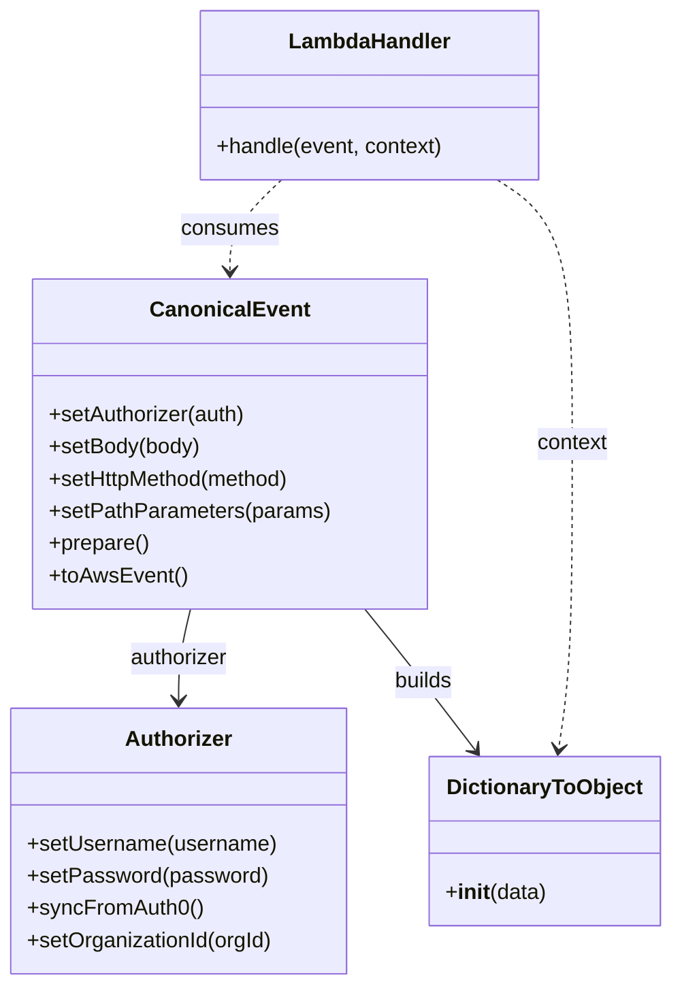

# Diagram: platform/tools/ide_local_testing/localTest/test/comment/getNgShipmentComment.py


> Auto-generated by Obscura crawlers

## Diagram 1



### SVG

<svg id="container" width="497.1328125" xmlns="http://www.w3.org/2000/svg" class="classDiagram" height="734" viewBox="0 0 497.1328125 734" role="graphics-document document" aria-roledescription="class"><style>#container{font-family:"trebuchet ms",verdana,arial,sans-serif;font-size:16px;fill:#333;}@keyframes edge-animation-frame{from{stroke-dashoffset:0;}}@keyframes dash{to{stroke-dashoffset:0;}}#container .edge-animation-slow{stroke-dasharray:9,5!important;stroke-dashoffset:900;animation:dash 50s linear infinite;stroke-linecap:round;}#container .edge-animation-fast{stroke-dasharray:9,5!important;stroke-dashoffset:900;animation:dash 20s linear infinite;stroke-linecap:round;}#container .error-icon{fill:#552222;}#container .error-text{fill:#552222;stroke:#552222;}#container .edge-thickness-normal{stroke-width:1px;}#container .edge-thickness-thick{stroke-width:3.5px;}#container .edge-pattern-solid{stroke-dasharray:0;}#container .edge-thickness-invisible{stroke-width:0;fill:none;}#container .edge-pattern-dashed{stroke-dasharray:3;}#container .edge-pattern-dotted{stroke-dasharray:2;}#container .marker{fill:#333333;stroke:#333333;}#container .marker.cross{stroke:#333333;}#container svg{font-family:"trebuchet ms",verdana,arial,sans-serif;font-size:16px;}#container p{margin:0;}#container g.classGroup text{fill:#9370DB;stroke:none;font-family:"trebuchet ms",verdana,arial,sans-serif;font-size:10px;}#container g.classGroup text .title{font-weight:bolder;}#container .nodeLabel,#container .edgeLabel{color:#131300;}#container .edgeLabel .label rect{fill:#ECECFF;}#container .label text{fill:#131300;}#container .labelBkg{background:#ECECFF;}#container .edgeLabel .label span{background:#ECECFF;}#container .classTitle{font-weight:bolder;}#container .node rect,#container .node circle,#container .node ellipse,#container .node polygon,#container .node path{fill:#ECECFF;stroke:#9370DB;stroke-width:1px;}#container .divider{stroke:#9370DB;stroke-width:1;}#container g.clickable{cursor:pointer;}#container g.classGroup rect{fill:#ECECFF;stroke:#9370DB;}#container g.classGroup line{stroke:#9370DB;stroke-width:1;}#container .classLabel .box{stroke:none;stroke-width:0;fill:#ECECFF;opacity:0.5;}#container .classLabel .label{fill:#9370DB;font-size:10px;}#container .relation{stroke:#333333;stroke-width:1;fill:none;}#container .dashed-line{stroke-dasharray:3;}#container .dotted-line{stroke-dasharray:1 2;}#container #compositionStart,#container .composition{fill:#333333!important;stroke:#333333!important;stroke-width:1;}#container #compositionEnd,#container .composition{fill:#333333!important;stroke:#333333!important;stroke-width:1;}#container #dependencyStart,#container .dependency{fill:#333333!important;stroke:#333333!important;stroke-width:1;}#container #dependencyStart,#container .dependency{fill:#333333!important;stroke:#333333!important;stroke-width:1;}#container #extensionStart,#container .extension{fill:transparent!important;stroke:#333333!important;stroke-width:1;}#container #extensionEnd,#container .extension{fill:transparent!important;stroke:#333333!important;stroke-width:1;}#container #aggregationStart,#container .aggregation{fill:transparent!important;stroke:#333333!important;stroke-width:1;}#container #aggregationEnd,#container .aggregation{fill:transparent!important;stroke:#333333!important;stroke-width:1;}#container #lollipopStart,#container .lollipop{fill:#ECECFF!important;stroke:#333333!important;stroke-width:1;}#container #lollipopEnd,#container .lollipop{fill:#ECECFF!important;stroke:#333333!important;stroke-width:1;}#container .edgeTerminals{font-size:11px;line-height:initial;}#container .classTitleText{text-anchor:middle;font-size:18px;fill:#333;}#container .label-icon{display:inline-block;height:1em;overflow:visible;vertical-align:-0.125em;}#container .node .label-icon path{fill:currentColor;stroke:revert;stroke-width:revert;}#container :root{--mermaid-font-family:"trebuchet ms",verdana,arial,sans-serif;}</style><g><defs><marker id="container_class-aggregationStart" class="marker aggregation class" refX="18" refY="7" markerWidth="190" markerHeight="240" orient="auto"><path d="M 18,7 L9,13 L1,7 L9,1 Z"></path></marker></defs><defs><marker id="container_class-aggregationEnd" class="marker aggregation class" refX="1" refY="7" markerWidth="20" markerHeight="28" orient="auto"><path d="M 18,7 L9,13 L1,7 L9,1 Z"></path></marker></defs><defs><marker id="container_class-extensionStart" class="marker extension class" refX="18" refY="7" markerWidth="190" markerHeight="240" orient="auto"><path d="M 1,7 L18,13 V 1 Z"></path></marker></defs><defs><marker id="container_class-extensionEnd" class="marker extension class" refX="1" refY="7" markerWidth="20" markerHeight="28" orient="auto"><path d="M 1,1 V 13 L18,7 Z"></path></marker></defs><defs><marker id="container_class-compositionStart" class="marker composition class" refX="18" refY="7" markerWidth="190" markerHeight="240" orient="auto"><path d="M 18,7 L9,13 L1,7 L9,1 Z"></path></marker></defs><defs><marker id="container_class-compositionEnd" class="marker composition class" refX="1" refY="7" markerWidth="20" markerHeight="28" orient="auto"><path d="M 18,7 L9,13 L1,7 L9,1 Z"></path></marker></defs><defs><marker id="container_class-dependencyStart" class="marker dependency class" refX="6" refY="7" markerWidth="190" markerHeight="240" orient="auto"><path d="M 5,7 L9,13 L1,7 L9,1 Z"></path></marker></defs><defs><marker id="container_class-dependencyEnd" class="marker dependency class" refX="13" refY="7" markerWidth="20" markerHeight="28" orient="auto"><path d="M 18,7 L9,13 L14,7 L9,1 Z"></path></marker></defs><defs><marker id="container_class-lollipopStart" class="marker lollipop class" refX="13" refY="7" markerWidth="190" markerHeight="240" orient="auto"><circle stroke="black" fill="transparent" cx="7" cy="7" r="6"></circle></marker></defs><defs><marker id="container_class-lollipopEnd" class="marker lollipop class" refX="1" refY="7" markerWidth="190" markerHeight="240" orient="auto"><circle stroke="black" fill="transparent" cx="7" cy="7" r="6"></circle></marker></defs><g class="root"><g class="clusters"></g><g class="edgePaths"><path d="M141.385,454L139.844,460.167C138.302,466.333,135.219,478.667,133.678,490C132.137,501.333,132.137,511.667,132.137,516.833L132.137,522" id="id_CanonicalEvent_Authorizer_1" class="edge-thickness-normal edge-pattern-solid relation" style=";;;" data-edge="true" data-et="edge" data-id="id_CanonicalEvent_Authorizer_1" data-points="W3sieCI6MTQxLjM4NDkxMjEwOTM3NSwieSI6NDU0fSx7IngiOjEzMi4xMzY3MTg3NSwieSI6NDkxfSx7IngiOjEzMi4xMzY3MTg3NSwieSI6NTI4fV0=" marker-end="url(#container_class-dependencyEnd)"></path><path d="M271.647,454L276.637,460.167C281.626,466.333,291.605,478.667,305.186,496.202C318.767,513.738,335.95,536.475,344.541,547.844L353.133,559.213" id="id_CanonicalEvent_DictionaryToObject_2" class="edge-thickness-normal edge-pattern-solid relation" style=";;;" data-edge="true" data-et="edge" data-id="id_CanonicalEvent_DictionaryToObject_2" data-points="W3sieCI6MjcxLjY0NzQ5NzU1ODU5MzcsInkiOjQ1NH0seyJ4IjozMDEuNTgzOTg0Mzc1LCJ5Ijo0OTF9LHsieCI6MzU2Ljc1MDE4NjY5NTc3MjEsInkiOjU2NH1d" marker-end="url(#container_class-dependencyEnd)"></path><path d="M210.156,134L203.818,140.167C197.48,146.333,184.805,158.667,178.467,170C172.129,181.333,172.129,191.667,172.129,196.833L172.129,202" id="id_LambdaHandler_CanonicalEvent_3" class="edge-thickness-normal edge-pattern-dashed relation" style=";;;" data-edge="true" data-et="edge" data-id="id_LambdaHandler_CanonicalEvent_3" data-points="W3sieCI6MjEwLjE1NTgwMDc4MTI0OTk4LCJ5IjoxMzR9LHsieCI6MTcyLjEyODkwNjI1LCJ5IjoxNzF9LHsieCI6MTcyLjEyODkwNjI1LCJ5IjoyMDh9XQ==" marker-end="url(#container_class-dependencyEnd)"></path><path d="M369.846,134L379.139,140.167C388.433,146.333,407.019,158.667,416.312,191.5C425.605,224.333,425.605,277.667,425.605,331C425.605,384.333,425.605,437.667,423.859,475.512C422.113,513.357,418.62,535.715,416.874,546.893L415.127,558.072" id="id_LambdaHandler_DictionaryToObject_4" class="edge-thickness-normal edge-pattern-dashed relation" style=";;;" data-edge="true" data-et="edge" data-id="id_LambdaHandler_DictionaryToObject_4" data-points="W3sieCI6MzY5Ljg0NjAzNTE1NjI0OTk3LCJ5IjoxMzR9LHsieCI6NDI1LjYwNTQ2ODc1LCJ5IjoxNzF9LHsieCI6NDI1LjYwNTQ2ODc1LCJ5IjozMzF9LHsieCI6NDI1LjYwNTQ2ODc1LCJ5Ijo0OTF9LHsieCI6NDE0LjIwMTMxNTQ4NzEzMjQsInkiOjU2NH1d" marker-end="url(#container_class-dependencyEnd)"></path></g><g class="edgeLabels"><g class="edgeLabel" transform="translate(132.13671875, 491)"><g class="label" data-id="id_CanonicalEvent_Authorizer_1" transform="translate(-37.4921875, -12)"><foreignObject width="74.984375" height="24"><div xmlns="http://www.w3.org/1999/xhtml" class="labelBkg" style="display: table-cell; white-space: nowrap; line-height: 1.5; max-width: 200px; text-align: center;"><span class="edgeLabel"><p>authorizer</p></span></div></foreignObject></g></g><g class="edgeLabel" transform="translate(314.81969, 508.51446)"><g class="label" data-id="id_CanonicalEvent_DictionaryToObject_2" transform="translate(-22.4921875, -12)"><foreignObject width="44.984375" height="24"><div xmlns="http://www.w3.org/1999/xhtml" class="labelBkg" style="display: table-cell; white-space: nowrap; line-height: 1.5; max-width: 200px; text-align: center;"><span class="edgeLabel"><p>builds</p></span></div></foreignObject></g></g><g class="edgeLabel" transform="translate(172.12890625, 171)"><g class="label" data-id="id_LambdaHandler_CanonicalEvent_3" transform="translate(-36.375, -12)"><foreignObject width="72.75" height="24"><div xmlns="http://www.w3.org/1999/xhtml" class="labelBkg" style="display: table-cell; white-space: nowrap; line-height: 1.5; max-width: 200px; text-align: center;"><span class="edgeLabel"><p>consumes</p></span></div></foreignObject></g></g><g class="edgeLabel" transform="translate(425.60546875, 331)"><g class="label" data-id="id_LambdaHandler_DictionaryToObject_4" transform="translate(-26.8515625, -12)"><foreignObject width="53.703125" height="24"><div xmlns="http://www.w3.org/1999/xhtml" class="labelBkg" style="display: table-cell; white-space: nowrap; line-height: 1.5; max-width: 200px; text-align: center;"><span class="edgeLabel"><p>context</p></span></div></foreignObject></g></g></g><g class="nodes"><g class="node default" id="classId-Authorizer-0" transform="translate(132.13671875, 627)"><g class="basic label-container"><path d="M-124.13671875 -99 L124.13671875 -99 L124.13671875 99 L-124.13671875 99" stroke="none" stroke-width="0" fill="#ECECFF" style=""></path><path d="M-124.13671875 -99 C-49.1581146919558 -99, 25.820489366088395 -99, 124.13671875 -99 M-124.13671875 -99 C-35.78381802716386 -99, 52.56908269567228 -99, 124.13671875 -99 M124.13671875 -99 C124.13671875 -47.083533963491696, 124.13671875 4.832932073016607, 124.13671875 99 M124.13671875 -99 C124.13671875 -34.82418032574269, 124.13671875 29.351639348514624, 124.13671875 99 M124.13671875 99 C46.995209076686294 99, -30.146300596627412 99, -124.13671875 99 M124.13671875 99 C54.52943492204169 99, -15.077848905916625 99, -124.13671875 99 M-124.13671875 99 C-124.13671875 45.94559626860244, -124.13671875 -7.108807462795113, -124.13671875 -99 M-124.13671875 99 C-124.13671875 53.05349073201677, -124.13671875 7.106981464033538, -124.13671875 -99" stroke="#9370DB" stroke-width="1.3" fill="none" stroke-dasharray="0 0" style=""></path></g><g class="annotation-group text" transform="translate(0, -75)"></g><g class="label-group text" transform="translate(-38.3671875, -75)"><g class="label" style="font-weight: bolder" transform="translate(0,-12)"><foreignObject width="76.734375" height="24"><div xmlns="http://www.w3.org/1999/xhtml" style="display: table-cell; white-space: nowrap; line-height: 1.5; max-width: 126px; text-align: center;"><span class="nodeLabel markdown-node-label" style=""><p>Authorizer</p></span></div></foreignObject></g></g><g class="members-group text" transform="translate(-112.13671875, -27)"></g><g class="methods-group text" transform="translate(-112.13671875, 3)"><g class="label" style="" transform="translate(0,-12)"><foreignObject width="185.90625" height="24"><div xmlns="http://www.w3.org/1999/xhtml" style="display: table-cell; white-space: nowrap; line-height: 1.5; max-width: 243px; text-align: center;"><span class="nodeLabel markdown-node-label" style=""><p>+setUsername(username)</p></span></div></foreignObject></g><g class="label" style="" transform="translate(0,12)"><foreignObject width="176.6875" height="24"><div xmlns="http://www.w3.org/1999/xhtml" style="display: table-cell; white-space: nowrap; line-height: 1.5; max-width: 234px; text-align: center;"><span class="nodeLabel markdown-node-label" style=""><p>+setPassword(password)</p></span></div></foreignObject></g><g class="label" style="" transform="translate(0,36)"><foreignObject width="129.0625" height="24"><div xmlns="http://www.w3.org/1999/xhtml" style="display: table-cell; white-space: nowrap; line-height: 1.5; max-width: 186px; text-align: center;"><span class="nodeLabel markdown-node-label" style=""><p>+syncFromAuth0()</p></span></div></foreignObject></g><g class="label" style="" transform="translate(0,60)"><foreignObject width="184.578125" height="24"><div xmlns="http://www.w3.org/1999/xhtml" style="display: table-cell; white-space: nowrap; line-height: 1.5; max-width: 242px; text-align: center;"><span class="nodeLabel markdown-node-label" style=""><p>+setOrganizationId(orgId)</p></span></div></foreignObject></g></g><g class="divider" style=""><path d="M-124.13671875 -51 C-26.717696510139447 -51, 70.7013257297211 -51, 124.13671875 -51 M-124.13671875 -51 C-72.14095263018635 -51, -20.14518651037268 -51, 124.13671875 -51" stroke="#9370DB" stroke-width="1.3" fill="none" stroke-dasharray="0 0" style=""></path></g><g class="divider" style=""><path d="M-124.13671875 -27 C-32.392898046380836 -27, 59.35092265723833 -27, 124.13671875 -27 M-124.13671875 -27 C-44.204146933105164 -27, 35.72842488378967 -27, 124.13671875 -27" stroke="#9370DB" stroke-width="1.3" fill="none" stroke-dasharray="0 0" style=""></path></g></g><g class="node default" id="classId-CanonicalEvent-1" transform="translate(172.12890625, 331)"><g class="basic label-container"><path d="M-143.69921875 -123 L143.69921875 -123 L143.69921875 123 L-143.69921875 123" stroke="none" stroke-width="0" fill="#ECECFF" style=""></path><path d="M-143.69921875 -123 C-57.52597356364181 -123, 28.647271622716374 -123, 143.69921875 -123 M-143.69921875 -123 C-61.04147789695779 -123, 21.616262956084427 -123, 143.69921875 -123 M143.69921875 -123 C143.69921875 -72.21725151432423, 143.69921875 -21.43450302864845, 143.69921875 123 M143.69921875 -123 C143.69921875 -56.996317967029725, 143.69921875 9.00736406594055, 143.69921875 123 M143.69921875 123 C71.45911178465572 123, -0.7809951806885636 123, -143.69921875 123 M143.69921875 123 C79.27959657939516 123, 14.859974408790322 123, -143.69921875 123 M-143.69921875 123 C-143.69921875 38.34055475111762, -143.69921875 -46.318890497764755, -143.69921875 -123 M-143.69921875 123 C-143.69921875 59.14064959296003, -143.69921875 -4.718700814079938, -143.69921875 -123" stroke="#9370DB" stroke-width="1.3" fill="none" stroke-dasharray="0 0" style=""></path></g><g class="annotation-group text" transform="translate(0, -99)"></g><g class="label-group text" transform="translate(-55.7109375, -99)"><g class="label" style="font-weight: bolder" transform="translate(0,-12)"><foreignObject width="111.421875" height="24"><div xmlns="http://www.w3.org/1999/xhtml" style="display: table-cell; white-space: nowrap; line-height: 1.5; max-width: 161px; text-align: center;"><span class="nodeLabel markdown-node-label" style=""><p>CanonicalEvent</p></span></div></foreignObject></g></g><g class="members-group text" transform="translate(-131.69921875, -51)"></g><g class="methods-group text" transform="translate(-131.69921875, -21)"><g class="label" style="" transform="translate(0,-12)"><foreignObject width="148.9375" height="24"><div xmlns="http://www.w3.org/1999/xhtml" style="display: table-cell; white-space: nowrap; line-height: 1.5; max-width: 206px; text-align: center;"><span class="nodeLabel markdown-node-label" style=""><p>+setAuthorizer(auth)</p></span></div></foreignObject></g><g class="label" style="" transform="translate(0,12)"><foreignObject width="113.125" height="24"><div xmlns="http://www.w3.org/1999/xhtml" style="display: table-cell; white-space: nowrap; line-height: 1.5; max-width: 170px; text-align: center;"><span class="nodeLabel markdown-node-label" style=""><p>+setBody(body)</p></span></div></foreignObject></g><g class="label" style="" transform="translate(0,36)"><foreignObject width="184" height="24"><div xmlns="http://www.w3.org/1999/xhtml" style="display: table-cell; white-space: nowrap; line-height: 1.5; max-width: 241px; text-align: center;"><span class="nodeLabel markdown-node-label" style=""><p>+setHttpMethod(method)</p></span></div></foreignObject></g><g class="label" style="" transform="translate(0,60)"><foreignObject width="207.6875" height="24"><div xmlns="http://www.w3.org/1999/xhtml" style="display: table-cell; white-space: nowrap; line-height: 1.5; max-width: 265px; text-align: center;"><span class="nodeLabel markdown-node-label" style=""><p>+setPathParameters(params)</p></span></div></foreignObject></g><g class="label" style="" transform="translate(0,84)"><foreignObject width="74.75" height="24"><div xmlns="http://www.w3.org/1999/xhtml" style="display: table-cell; white-space: nowrap; line-height: 1.5; max-width: 132px; text-align: center;"><span class="nodeLabel markdown-node-label" style=""><p>+prepare()</p></span></div></foreignObject></g><g class="label" style="" transform="translate(0,108)"><foreignObject width="101.1875" height="24"><div xmlns="http://www.w3.org/1999/xhtml" style="display: table-cell; white-space: nowrap; line-height: 1.5; max-width: 159px; text-align: center;"><span class="nodeLabel markdown-node-label" style=""><p>+toAwsEvent()</p></span></div></foreignObject></g></g><g class="divider" style=""><path d="M-143.69921875 -75 C-44.41157055110904 -75, 54.876077647781926 -75, 143.69921875 -75 M-143.69921875 -75 C-53.39163743085301 -75, 36.91594388829398 -75, 143.69921875 -75" stroke="#9370DB" stroke-width="1.3" fill="none" stroke-dasharray="0 0" style=""></path></g><g class="divider" style=""><path d="M-143.69921875 -51 C-70.75445299471389 -51, 2.190312760572226 -51, 143.69921875 -51 M-143.69921875 -51 C-84.43913886513694 -51, -25.17905898027388 -51, 143.69921875 -51" stroke="#9370DB" stroke-width="1.3" fill="none" stroke-dasharray="0 0" style=""></path></g></g><g class="node default" id="classId-DictionaryToObject-2" transform="translate(404.359375, 627)"><g class="basic label-container"><path d="M-84.7734375 -63 L84.7734375 -63 L84.7734375 63 L-84.7734375 63" stroke="none" stroke-width="0" fill="#ECECFF" style=""></path><path d="M-84.7734375 -63 C-46.83002023705867 -63, -8.886602974117338 -63, 84.7734375 -63 M-84.7734375 -63 C-44.778448596639564 -63, -4.783459693279127 -63, 84.7734375 -63 M84.7734375 -63 C84.7734375 -21.21655168925833, 84.7734375 20.566896621483338, 84.7734375 63 M84.7734375 -63 C84.7734375 -27.189629831235216, 84.7734375 8.620740337529568, 84.7734375 63 M84.7734375 63 C46.66318684006847 63, 8.552936180136939 63, -84.7734375 63 M84.7734375 63 C23.905795760300883 63, -36.961845979398234 63, -84.7734375 63 M-84.7734375 63 C-84.7734375 31.607686165034014, -84.7734375 0.21537233006802836, -84.7734375 -63 M-84.7734375 63 C-84.7734375 17.296125112674147, -84.7734375 -28.407749774651705, -84.7734375 -63" stroke="#9370DB" stroke-width="1.3" fill="none" stroke-dasharray="0 0" style=""></path></g><g class="annotation-group text" transform="translate(0, -39)"></g><g class="label-group text" transform="translate(-70.109375, -39)"><g class="label" style="font-weight: bolder" transform="translate(0,-12)"><foreignObject width="140.21875" height="24"><div xmlns="http://www.w3.org/1999/xhtml" style="display: table-cell; white-space: nowrap; line-height: 1.5; max-width: 188px; text-align: center;"><span class="nodeLabel markdown-node-label" style=""><p>DictionaryToObject</p></span></div></foreignObject></g></g><g class="members-group text" transform="translate(-72.7734375, 9)"></g><g class="methods-group text" transform="translate(-72.7734375, 39)"><g class="label" style="" transform="translate(0,-12)"><foreignObject width="75.4375" height="24"><div xmlns="http://www.w3.org/1999/xhtml" style="display: table-cell; white-space: nowrap; line-height: 1.5; max-width: 164px; text-align: center;"><span class="nodeLabel markdown-node-label" style=""><p>+<strong>init</strong>(data)</p></span></div></foreignObject></g></g><g class="divider" style=""><path d="M-84.7734375 -15 C-17.093584510545767 -15, 50.586268478908465 -15, 84.7734375 -15 M-84.7734375 -15 C-44.978821417959246 -15, -5.184205335918492 -15, 84.7734375 -15" stroke="#9370DB" stroke-width="1.3" fill="none" stroke-dasharray="0 0" style=""></path></g><g class="divider" style=""><path d="M-84.7734375 9 C-36.83174945206968 9, 11.10993859586064 9, 84.7734375 9 M-84.7734375 9 C-49.95314553994216 9, -15.132853579884326 9, 84.7734375 9" stroke="#9370DB" stroke-width="1.3" fill="none" stroke-dasharray="0 0" style=""></path></g></g><g class="node default" id="classId-LambdaHandler-3" transform="translate(274.904296875, 71)"><g class="basic label-container"><path d="M-126.5546875 -63 L126.5546875 -63 L126.5546875 63 L-126.5546875 63" stroke="none" stroke-width="0" fill="#ECECFF" style=""></path><path d="M-126.5546875 -63 C-37.63705909161317 -63, 51.280569316773665 -63, 126.5546875 -63 M-126.5546875 -63 C-56.68422583548613 -63, 13.186235829027737 -63, 126.5546875 -63 M126.5546875 -63 C126.5546875 -15.885521850177994, 126.5546875 31.22895629964401, 126.5546875 63 M126.5546875 -63 C126.5546875 -16.708082802329344, 126.5546875 29.583834395341313, 126.5546875 63 M126.5546875 63 C32.65762576287172 63, -61.239435974256565 63, -126.5546875 63 M126.5546875 63 C41.19967239052724 63, -44.15534271894552 63, -126.5546875 63 M-126.5546875 63 C-126.5546875 17.621266762916044, -126.5546875 -27.757466474167913, -126.5546875 -63 M-126.5546875 63 C-126.5546875 13.271274751282263, -126.5546875 -36.457450497435474, -126.5546875 -63" stroke="#9370DB" stroke-width="1.3" fill="none" stroke-dasharray="0 0" style=""></path></g><g class="annotation-group text" transform="translate(0, -39)"></g><g class="label-group text" transform="translate(-58.21875, -39)"><g class="label" style="font-weight: bolder" transform="translate(0,-12)"><foreignObject width="116.4375" height="24"><div xmlns="http://www.w3.org/1999/xhtml" style="display: table-cell; white-space: nowrap; line-height: 1.5; max-width: 167px; text-align: center;"><span class="nodeLabel markdown-node-label" style=""><p>LambdaHandler</p></span></div></foreignObject></g></g><g class="members-group text" transform="translate(-114.5546875, 9)"></g><g class="methods-group text" transform="translate(-114.5546875, 39)"><g class="label" style="" transform="translate(0,-12)"><foreignObject width="170.890625" height="24"><div xmlns="http://www.w3.org/1999/xhtml" style="display: table-cell; white-space: nowrap; line-height: 1.5; max-width: 228px; text-align: center;"><span class="nodeLabel markdown-node-label" style=""><p>+handle(event, context)</p></span></div></foreignObject></g></g><g class="divider" style=""><path d="M-126.5546875 -15 C-74.46933416114076 -15, -22.38398082228153 -15, 126.5546875 -15 M-126.5546875 -15 C-42.649235994288716 -15, 41.25621551142257 -15, 126.5546875 -15" stroke="#9370DB" stroke-width="1.3" fill="none" stroke-dasharray="0 0" style=""></path></g><g class="divider" style=""><path d="M-126.5546875 9 C-32.20622895770366 9, 62.142229584592684 9, 126.5546875 9 M-126.5546875 9 C-42.3546605101031 9, 41.845366479793796 9, 126.5546875 9" stroke="#9370DB" stroke-width="1.3" fill="none" stroke-dasharray="0 0" style=""></path></g></g></g></g></g></svg>

## Diagram 2

```mermaid
flowchart TD
    Start([Script start]) --> Auth[Create Authorizer]
    Auth --> U1[setUsername(username)]
    U1 --> P1[setPassword(password)]
    P1 --> S1[syncFromAuth0()]
    S1 --> O1[setOrganizationId(1003)]
    O1 --> CE[Instantiate CanonicalEvent]
    CE --> CA[setAuthorizer(authorizer)]
    CA --> CB[setBody(body)]
    CB --> CM[setHttpMethod GET]
    CM --> CP[setPathParameters {shipment_id: shipmentId}]
    CP --> PT[prepare() / toAwsEvent()]
    PT --> CALL[call lambda_handler(event, DictionaryToObject(...))]
    CALL --> OUT[print result / return comments]
```

> SVG rendering failed for this diagram.
