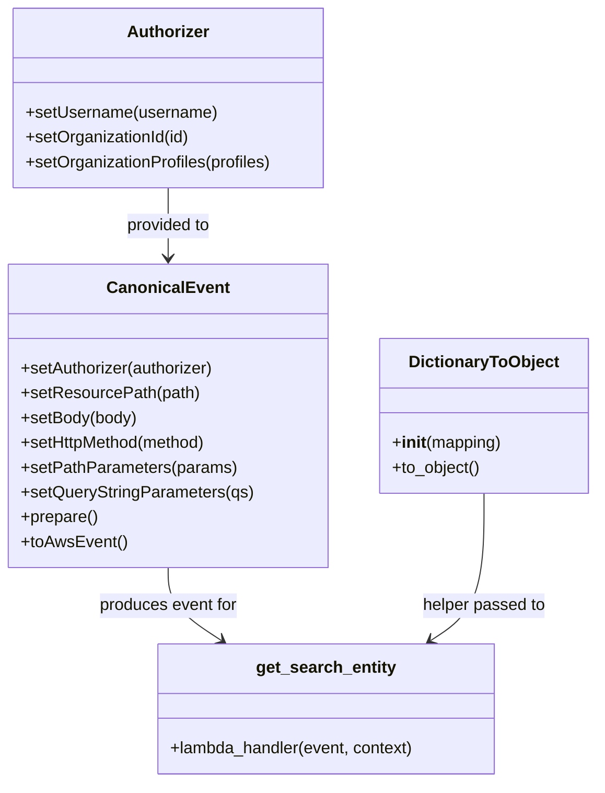

# Diagram: platform/tools/ide_local_testing/localTest/test/entity/entity/getEntity.py


> Auto-generated by Obscura crawlers

## Diagram 1

```mermaid
flowchart TD
    Start([Script Start])
    Start --> Init[Set constants: solutionId, entityId, pathParameters, queryStringParameters, body]
    Init --> AuthorizerCreate[Create Authorizer instance]
    AuthorizerCreate --> SetUsername[setUsername: dave.damon@freightverify.com]
    SetUsername --> SetOrgId[setOrganizationId: 18]
    SetOrgId --> SetOrgProfiles[setOrganizationProfiles: ["SH"]]
    SetOrgProfiles --> CanonicalEventCreate[Create CanonicalEvent instance]
    CanonicalEventCreate --> CE_Config[Configure CanonicalEvent:\nsetAuthorizer, setResourcePath, setBody, setHttpMethod(GET), setPathParameters, setQueryStringParameters, prepare(), toAwsEvent()]
    CE_Config --> EventJSON[(AWS Lambda Event JSON)]
    EventJSON --> JSONDump[json.dumps(event)]
    JSONDump --> PrintT1[print datetime.now()]
    PrintT1 --> InvokeHandler[getEntity(event, DictionaryToObject({...}))]
    InvokeHandler --> PrintT2[print datetime.now()]
    PrintT2 --> PrintRet[print(retval)]
    PrintRet --> End([End])
```

> SVG rendering failed for this diagram.

## Diagram 2



### SVG

<svg id="container" width="571.1796875" xmlns="http://www.w3.org/2000/svg" class="classDiagram" height="758" viewBox="0 0 571.1796875 758" role="graphics-document document" aria-roledescription="class"><style>#container{font-family:"trebuchet ms",verdana,arial,sans-serif;font-size:16px;fill:#333;}@keyframes edge-animation-frame{from{stroke-dashoffset:0;}}@keyframes dash{to{stroke-dashoffset:0;}}#container .edge-animation-slow{stroke-dasharray:9,5!important;stroke-dashoffset:900;animation:dash 50s linear infinite;stroke-linecap:round;}#container .edge-animation-fast{stroke-dasharray:9,5!important;stroke-dashoffset:900;animation:dash 20s linear infinite;stroke-linecap:round;}#container .error-icon{fill:#552222;}#container .error-text{fill:#552222;stroke:#552222;}#container .edge-thickness-normal{stroke-width:1px;}#container .edge-thickness-thick{stroke-width:3.5px;}#container .edge-pattern-solid{stroke-dasharray:0;}#container .edge-thickness-invisible{stroke-width:0;fill:none;}#container .edge-pattern-dashed{stroke-dasharray:3;}#container .edge-pattern-dotted{stroke-dasharray:2;}#container .marker{fill:#333333;stroke:#333333;}#container .marker.cross{stroke:#333333;}#container svg{font-family:"trebuchet ms",verdana,arial,sans-serif;font-size:16px;}#container p{margin:0;}#container g.classGroup text{fill:#9370DB;stroke:none;font-family:"trebuchet ms",verdana,arial,sans-serif;font-size:10px;}#container g.classGroup text .title{font-weight:bolder;}#container .nodeLabel,#container .edgeLabel{color:#131300;}#container .edgeLabel .label rect{fill:#ECECFF;}#container .label text{fill:#131300;}#container .labelBkg{background:#ECECFF;}#container .edgeLabel .label span{background:#ECECFF;}#container .classTitle{font-weight:bolder;}#container .node rect,#container .node circle,#container .node ellipse,#container .node polygon,#container .node path{fill:#ECECFF;stroke:#9370DB;stroke-width:1px;}#container .divider{stroke:#9370DB;stroke-width:1;}#container g.clickable{cursor:pointer;}#container g.classGroup rect{fill:#ECECFF;stroke:#9370DB;}#container g.classGroup line{stroke:#9370DB;stroke-width:1;}#container .classLabel .box{stroke:none;stroke-width:0;fill:#ECECFF;opacity:0.5;}#container .classLabel .label{fill:#9370DB;font-size:10px;}#container .relation{stroke:#333333;stroke-width:1;fill:none;}#container .dashed-line{stroke-dasharray:3;}#container .dotted-line{stroke-dasharray:1 2;}#container #compositionStart,#container .composition{fill:#333333!important;stroke:#333333!important;stroke-width:1;}#container #compositionEnd,#container .composition{fill:#333333!important;stroke:#333333!important;stroke-width:1;}#container #dependencyStart,#container .dependency{fill:#333333!important;stroke:#333333!important;stroke-width:1;}#container #dependencyStart,#container .dependency{fill:#333333!important;stroke:#333333!important;stroke-width:1;}#container #extensionStart,#container .extension{fill:transparent!important;stroke:#333333!important;stroke-width:1;}#container #extensionEnd,#container .extension{fill:transparent!important;stroke:#333333!important;stroke-width:1;}#container #aggregationStart,#container .aggregation{fill:transparent!important;stroke:#333333!important;stroke-width:1;}#container #aggregationEnd,#container .aggregation{fill:transparent!important;stroke:#333333!important;stroke-width:1;}#container #lollipopStart,#container .lollipop{fill:#ECECFF!important;stroke:#333333!important;stroke-width:1;}#container #lollipopEnd,#container .lollipop{fill:#ECECFF!important;stroke:#333333!important;stroke-width:1;}#container .edgeTerminals{font-size:11px;line-height:initial;}#container .classTitleText{text-anchor:middle;font-size:18px;fill:#333;}#container .label-icon{display:inline-block;height:1em;overflow:visible;vertical-align:-0.125em;}#container .node .label-icon path{fill:currentColor;stroke:revert;stroke-width:revert;}#container :root{--mermaid-font-family:"trebuchet ms",verdana,arial,sans-serif;}</style><g><defs><marker id="container_class-aggregationStart" class="marker aggregation class" refX="18" refY="7" markerWidth="190" markerHeight="240" orient="auto"><path d="M 18,7 L9,13 L1,7 L9,1 Z"></path></marker></defs><defs><marker id="container_class-aggregationEnd" class="marker aggregation class" refX="1" refY="7" markerWidth="20" markerHeight="28" orient="auto"><path d="M 18,7 L9,13 L1,7 L9,1 Z"></path></marker></defs><defs><marker id="container_class-extensionStart" class="marker extension class" refX="18" refY="7" markerWidth="190" markerHeight="240" orient="auto"><path d="M 1,7 L18,13 V 1 Z"></path></marker></defs><defs><marker id="container_class-extensionEnd" class="marker extension class" refX="1" refY="7" markerWidth="20" markerHeight="28" orient="auto"><path d="M 1,1 V 13 L18,7 Z"></path></marker></defs><defs><marker id="container_class-compositionStart" class="marker composition class" refX="18" refY="7" markerWidth="190" markerHeight="240" orient="auto"><path d="M 18,7 L9,13 L1,7 L9,1 Z"></path></marker></defs><defs><marker id="container_class-compositionEnd" class="marker composition class" refX="1" refY="7" markerWidth="20" markerHeight="28" orient="auto"><path d="M 18,7 L9,13 L1,7 L9,1 Z"></path></marker></defs><defs><marker id="container_class-dependencyStart" class="marker dependency class" refX="6" refY="7" markerWidth="190" markerHeight="240" orient="auto"><path d="M 5,7 L9,13 L1,7 L9,1 Z"></path></marker></defs><defs><marker id="container_class-dependencyEnd" class="marker dependency class" refX="13" refY="7" markerWidth="20" markerHeight="28" orient="auto"><path d="M 18,7 L9,13 L14,7 L9,1 Z"></path></marker></defs><defs><marker id="container_class-lollipopStart" class="marker lollipop class" refX="13" refY="7" markerWidth="190" markerHeight="240" orient="auto"><circle stroke="black" fill="transparent" cx="7" cy="7" r="6"></circle></marker></defs><defs><marker id="container_class-lollipopEnd" class="marker lollipop class" refX="1" refY="7" markerWidth="190" markerHeight="240" orient="auto"><circle stroke="black" fill="transparent" cx="7" cy="7" r="6"></circle></marker></defs><g class="root"><g class="clusters"></g><g class="edgePaths"><path d="M160.316,182L160.316,188.167C160.316,194.333,160.316,206.667,160.316,218C160.316,229.333,160.316,239.667,160.316,244.833L160.316,250" id="id_Authorizer_CanonicalEvent_1" class="edge-thickness-normal edge-pattern-solid relation" style=";;;" data-edge="true" data-et="edge" data-id="id_Authorizer_CanonicalEvent_1" data-points="W3sieCI6MTYwLjMxNjQwNjI1LCJ5IjoxODJ9LHsieCI6MTYwLjMxNjQwNjI1LCJ5IjoyMTl9LHsieCI6MTYwLjMxNjQwNjI1LCJ5IjoyNTZ9XQ==" marker-end="url(#container_class-dependencyEnd)"></path><path d="M160.316,550L160.316,556.167C160.316,562.333,160.316,574.667,168.812,586.449C177.308,598.231,194.299,609.461,202.794,615.076L211.29,620.692" id="id_CanonicalEvent_get_search_entity_2" class="edge-thickness-normal edge-pattern-solid relation" style=";;;" data-edge="true" data-et="edge" data-id="id_CanonicalEvent_get_search_entity_2" data-points="W3sieCI6MTYwLjMxNjQwNjI1LCJ5Ijo1NTB9LHsieCI6MTYwLjMxNjQwNjI1LCJ5Ijo1ODd9LHsieCI6MjE2LjI5NTUyNzM0Mzc1LCJ5Ijo2MjR9XQ==" marker-end="url(#container_class-dependencyEnd)"></path><path d="M462.906,478L462.906,496.167C462.906,514.333,462.906,550.667,454.411,574.449C445.915,598.231,428.924,609.461,420.428,615.076L411.933,620.692" id="id_DictionaryToObject_get_search_entity_3" class="edge-thickness-normal edge-pattern-solid relation" style=";;;" data-edge="true" data-et="edge" data-id="id_DictionaryToObject_get_search_entity_3" data-points="W3sieCI6NDYyLjkwNjI1LCJ5Ijo0Nzh9LHsieCI6NDYyLjkwNjI1LCJ5Ijo1ODd9LHsieCI6NDA2LjkyNzEyODkwNjI1LCJ5Ijo2MjR9XQ==" marker-end="url(#container_class-dependencyEnd)"></path></g><g class="edgeLabels"><g class="edgeLabel" transform="translate(160.31640625, 219)"><g class="label" data-id="id_Authorizer_CanonicalEvent_1" transform="translate(-41.921875, -12)"><foreignObject width="83.84375" height="24"><div xmlns="http://www.w3.org/1999/xhtml" class="labelBkg" style="display: table-cell; white-space: nowrap; line-height: 1.5; max-width: 200px; text-align: center;"><span class="edgeLabel"><p>provided to</p></span></div></foreignObject></g></g><g class="edgeLabel" transform="translate(160.31640625, 587)"><g class="label" data-id="id_CanonicalEvent_get_search_entity_2" transform="translate(-68.2421875, -12)"><foreignObject width="136.484375" height="24"><div xmlns="http://www.w3.org/1999/xhtml" class="labelBkg" style="display: table-cell; white-space: nowrap; line-height: 1.5; max-width: 200px; text-align: center;"><span class="edgeLabel"><p>produces event for</p></span></div></foreignObject></g></g><g class="edgeLabel" transform="translate(462.90625, 587)"><g class="label" data-id="id_DictionaryToObject_get_search_entity_3" transform="translate(-60.7578125, -12)"><foreignObject width="121.515625" height="24"><div xmlns="http://www.w3.org/1999/xhtml" class="labelBkg" style="display: table-cell; white-space: nowrap; line-height: 1.5; max-width: 200px; text-align: center;"><span class="edgeLabel"><p>helper passed to</p></span></div></foreignObject></g></g></g><g class="nodes"><g class="node default" id="classId-Authorizer-0" transform="translate(160.31640625, 95)"><g class="basic label-container"><path d="M-151.66796875 -87 L151.66796875 -87 L151.66796875 87 L-151.66796875 87" stroke="none" stroke-width="0" fill="#ECECFF" style=""></path><path d="M-151.66796875 -87 C-48.18916731195641 -87, 55.28963412608718 -87, 151.66796875 -87 M-151.66796875 -87 C-87.06767750133636 -87, -22.467386252672725 -87, 151.66796875 -87 M151.66796875 -87 C151.66796875 -51.95937215169177, 151.66796875 -16.918744303383534, 151.66796875 87 M151.66796875 -87 C151.66796875 -23.488296826490227, 151.66796875 40.023406347019545, 151.66796875 87 M151.66796875 87 C63.653838993499846 87, -24.360290763000307 87, -151.66796875 87 M151.66796875 87 C32.670602768864555 87, -86.32676321227089 87, -151.66796875 87 M-151.66796875 87 C-151.66796875 32.58670504175632, -151.66796875 -21.826589916487364, -151.66796875 -87 M-151.66796875 87 C-151.66796875 30.222562020301837, -151.66796875 -26.554875959396327, -151.66796875 -87" stroke="#9370DB" stroke-width="1.3" fill="none" stroke-dasharray="0 0" style=""></path></g><g class="annotation-group text" transform="translate(0, -63)"></g><g class="label-group text" transform="translate(-38.3671875, -63)"><g class="label" style="font-weight: bolder" transform="translate(0,-12)"><foreignObject width="76.734375" height="24"><div xmlns="http://www.w3.org/1999/xhtml" style="display: table-cell; white-space: nowrap; line-height: 1.5; max-width: 126px; text-align: center;"><span class="nodeLabel markdown-node-label" style=""><p>Authorizer</p></span></div></foreignObject></g></g><g class="members-group text" transform="translate(-139.66796875, -15)"></g><g class="methods-group text" transform="translate(-139.66796875, 15)"><g class="label" style="" transform="translate(0,-12)"><foreignObject width="185.90625" height="24"><div xmlns="http://www.w3.org/1999/xhtml" style="display: table-cell; white-space: nowrap; line-height: 1.5; max-width: 243px; text-align: center;"><span class="nodeLabel markdown-node-label" style=""><p>+setUsername(username)</p></span></div></foreignObject></g><g class="label" style="" transform="translate(0,12)"><foreignObject width="160.78125" height="24"><div xmlns="http://www.w3.org/1999/xhtml" style="display: table-cell; white-space: nowrap; line-height: 1.5; max-width: 218px; text-align: center;"><span class="nodeLabel markdown-node-label" style=""><p>+setOrganizationId(id)</p></span></div></foreignObject></g><g class="label" style="" transform="translate(0,36)"><foreignObject width="240.96875" height="24"><div xmlns="http://www.w3.org/1999/xhtml" style="display: table-cell; white-space: nowrap; line-height: 1.5; max-width: 298px; text-align: center;"><span class="nodeLabel markdown-node-label" style=""><p>+setOrganizationProfiles(profiles)</p></span></div></foreignObject></g></g><g class="divider" style=""><path d="M-151.66796875 -39 C-47.010971357071995 -39, 57.64602603585601 -39, 151.66796875 -39 M-151.66796875 -39 C-83.04232714307581 -39, -14.416685536151618 -39, 151.66796875 -39" stroke="#9370DB" stroke-width="1.3" fill="none" stroke-dasharray="0 0" style=""></path></g><g class="divider" style=""><path d="M-151.66796875 -15 C-39.339245536304276 -15, 72.98947767739145 -15, 151.66796875 -15 M-151.66796875 -15 C-87.39365781877139 -15, -23.119346887542775 -15, 151.66796875 -15" stroke="#9370DB" stroke-width="1.3" fill="none" stroke-dasharray="0 0" style=""></path></g></g><g class="node default" id="classId-CanonicalEvent-1" transform="translate(160.31640625, 403)"><g class="basic label-container"><path d="M-152.31640625 -147 L152.31640625 -147 L152.31640625 147 L-152.31640625 147" stroke="none" stroke-width="0" fill="#ECECFF" style=""></path><path d="M-152.31640625 -147 C-81.42239959274387 -147, -10.528392935487744 -147, 152.31640625 -147 M-152.31640625 -147 C-37.330183164032064 -147, 77.65603992193587 -147, 152.31640625 -147 M152.31640625 -147 C152.31640625 -62.67679308550913, 152.31640625 21.646413828981736, 152.31640625 147 M152.31640625 -147 C152.31640625 -31.571456587064475, 152.31640625 83.85708682587105, 152.31640625 147 M152.31640625 147 C44.21353108241371 147, -63.88934408517258 147, -152.31640625 147 M152.31640625 147 C76.21902825366561 147, 0.12165025733122548 147, -152.31640625 147 M-152.31640625 147 C-152.31640625 43.460007450958855, -152.31640625 -60.07998509808229, -152.31640625 -147 M-152.31640625 147 C-152.31640625 81.84143924464679, -152.31640625 16.682878489293586, -152.31640625 -147" stroke="#9370DB" stroke-width="1.3" fill="none" stroke-dasharray="0 0" style=""></path></g><g class="annotation-group text" transform="translate(0, -123)"></g><g class="label-group text" transform="translate(-55.7109375, -123)"><g class="label" style="font-weight: bolder" transform="translate(0,-12)"><foreignObject width="111.421875" height="24"><div xmlns="http://www.w3.org/1999/xhtml" style="display: table-cell; white-space: nowrap; line-height: 1.5; max-width: 161px; text-align: center;"><span class="nodeLabel markdown-node-label" style=""><p>CanonicalEvent</p></span></div></foreignObject></g></g><g class="members-group text" transform="translate(-140.31640625, -75)"></g><g class="methods-group text" transform="translate(-140.31640625, -45)"><g class="label" style="" transform="translate(0,-12)"><foreignObject width="190.75" height="24"><div xmlns="http://www.w3.org/1999/xhtml" style="display: table-cell; white-space: nowrap; line-height: 1.5; max-width: 248px; text-align: center;"><span class="nodeLabel markdown-node-label" style=""><p>+setAuthorizer(authorizer)</p></span></div></foreignObject></g><g class="label" style="" transform="translate(0,12)"><foreignObject width="171.828125" height="24"><div xmlns="http://www.w3.org/1999/xhtml" style="display: table-cell; white-space: nowrap; line-height: 1.5; max-width: 229px; text-align: center;"><span class="nodeLabel markdown-node-label" style=""><p>+setResourcePath(path)</p></span></div></foreignObject></g><g class="label" style="" transform="translate(0,36)"><foreignObject width="113.125" height="24"><div xmlns="http://www.w3.org/1999/xhtml" style="display: table-cell; white-space: nowrap; line-height: 1.5; max-width: 170px; text-align: center;"><span class="nodeLabel markdown-node-label" style=""><p>+setBody(body)</p></span></div></foreignObject></g><g class="label" style="" transform="translate(0,60)"><foreignObject width="184" height="24"><div xmlns="http://www.w3.org/1999/xhtml" style="display: table-cell; white-space: nowrap; line-height: 1.5; max-width: 241px; text-align: center;"><span class="nodeLabel markdown-node-label" style=""><p>+setHttpMethod(method)</p></span></div></foreignObject></g><g class="label" style="" transform="translate(0,84)"><foreignObject width="207.6875" height="24"><div xmlns="http://www.w3.org/1999/xhtml" style="display: table-cell; white-space: nowrap; line-height: 1.5; max-width: 265px; text-align: center;"><span class="nodeLabel markdown-node-label" style=""><p>+setPathParameters(params)</p></span></div></foreignObject></g><g class="label" style="" transform="translate(0,108)"><foreignObject width="224.921875" height="24"><div xmlns="http://www.w3.org/1999/xhtml" style="display: table-cell; white-space: nowrap; line-height: 1.5; max-width: 282px; text-align: center;"><span class="nodeLabel markdown-node-label" style=""><p>+setQueryStringParameters(qs)</p></span></div></foreignObject></g><g class="label" style="" transform="translate(0,132)"><foreignObject width="74.75" height="24"><div xmlns="http://www.w3.org/1999/xhtml" style="display: table-cell; white-space: nowrap; line-height: 1.5; max-width: 132px; text-align: center;"><span class="nodeLabel markdown-node-label" style=""><p>+prepare()</p></span></div></foreignObject></g><g class="label" style="" transform="translate(0,156)"><foreignObject width="101.1875" height="24"><div xmlns="http://www.w3.org/1999/xhtml" style="display: table-cell; white-space: nowrap; line-height: 1.5; max-width: 159px; text-align: center;"><span class="nodeLabel markdown-node-label" style=""><p>+toAwsEvent()</p></span></div></foreignObject></g></g><g class="divider" style=""><path d="M-152.31640625 -99 C-32.04599934537299 -99, 88.22440755925402 -99, 152.31640625 -99 M-152.31640625 -99 C-69.18194038009545 -99, 13.95252548980909 -99, 152.31640625 -99" stroke="#9370DB" stroke-width="1.3" fill="none" stroke-dasharray="0 0" style=""></path></g><g class="divider" style=""><path d="M-152.31640625 -75 C-87.84025800532521 -75, -23.364109760650422 -75, 152.31640625 -75 M-152.31640625 -75 C-57.76579707040021 -75, 36.78481210919958 -75, 152.31640625 -75" stroke="#9370DB" stroke-width="1.3" fill="none" stroke-dasharray="0 0" style=""></path></g></g><g class="node default" id="classId-DictionaryToObject-2" transform="translate(462.90625, 403)"><g class="basic label-container"><path d="M-100.2734375 -75 L100.2734375 -75 L100.2734375 75 L-100.2734375 75" stroke="none" stroke-width="0" fill="#ECECFF" style=""></path><path d="M-100.2734375 -75 C-31.223867164605736 -75, 37.82570317078853 -75, 100.2734375 -75 M-100.2734375 -75 C-57.167060550549266 -75, -14.060683601098532 -75, 100.2734375 -75 M100.2734375 -75 C100.2734375 -44.91549325157811, 100.2734375 -14.830986503156218, 100.2734375 75 M100.2734375 -75 C100.2734375 -16.88008034099073, 100.2734375 41.23983931801854, 100.2734375 75 M100.2734375 75 C40.17212392236648 75, -19.929189655267038 75, -100.2734375 75 M100.2734375 75 C23.60866849842175 75, -53.0561005031565 75, -100.2734375 75 M-100.2734375 75 C-100.2734375 39.51355715234946, -100.2734375 4.027114304698927, -100.2734375 -75 M-100.2734375 75 C-100.2734375 21.59303475069411, -100.2734375 -31.813930498611782, -100.2734375 -75" stroke="#9370DB" stroke-width="1.3" fill="none" stroke-dasharray="0 0" style=""></path></g><g class="annotation-group text" transform="translate(0, -51)"></g><g class="label-group text" transform="translate(-70.109375, -51)"><g class="label" style="font-weight: bolder" transform="translate(0,-12)"><foreignObject width="140.21875" height="24"><div xmlns="http://www.w3.org/1999/xhtml" style="display: table-cell; white-space: nowrap; line-height: 1.5; max-width: 188px; text-align: center;"><span class="nodeLabel markdown-node-label" style=""><p>DictionaryToObject</p></span></div></foreignObject></g></g><g class="members-group text" transform="translate(-88.2734375, -3)"></g><g class="methods-group text" transform="translate(-88.2734375, 27)"><g class="label" style="" transform="translate(0,-12)"><foreignObject width="106.4375" height="24"><div xmlns="http://www.w3.org/1999/xhtml" style="display: table-cell; white-space: nowrap; line-height: 1.5; max-width: 195px; text-align: center;"><span class="nodeLabel markdown-node-label" style=""><p>+<strong>init</strong>(mapping)</p></span></div></foreignObject></g><g class="label" style="" transform="translate(0,12)"><foreignObject width="86.3125" height="24"><div xmlns="http://www.w3.org/1999/xhtml" style="display: table-cell; white-space: nowrap; line-height: 1.5; max-width: 144px; text-align: center;"><span class="nodeLabel markdown-node-label" style=""><p>+to_object()</p></span></div></foreignObject></g></g><g class="divider" style=""><path d="M-100.2734375 -27 C-44.63713222491974 -27, 10.999173050160522 -27, 100.2734375 -27 M-100.2734375 -27 C-34.37622679069379 -27, 31.520983918612416 -27, 100.2734375 -27" stroke="#9370DB" stroke-width="1.3" fill="none" stroke-dasharray="0 0" style=""></path></g><g class="divider" style=""><path d="M-100.2734375 -3 C-21.717632542378865 -3, 56.83817241524227 -3, 100.2734375 -3 M-100.2734375 -3 C-46.005881158669226 -3, 8.261675182661548 -3, 100.2734375 -3" stroke="#9370DB" stroke-width="1.3" fill="none" stroke-dasharray="0 0" style=""></path></g></g><g class="node default" id="classId-get_search_entity-3" transform="translate(311.611328125, 687)"><g class="basic label-container"><path d="M-164.828125 -63 L164.828125 -63 L164.828125 63 L-164.828125 63" stroke="none" stroke-width="0" fill="#ECECFF" style=""></path><path d="M-164.828125 -63 C-38.877141949954975 -63, 87.07384110009005 -63, 164.828125 -63 M-164.828125 -63 C-69.28881860529468 -63, 26.25048778941064 -63, 164.828125 -63 M164.828125 -63 C164.828125 -28.71873160677309, 164.828125 5.562536786453819, 164.828125 63 M164.828125 -63 C164.828125 -21.097656127944667, 164.828125 20.804687744110666, 164.828125 63 M164.828125 63 C72.31196444438018 63, -20.20419611123964 63, -164.828125 63 M164.828125 63 C93.63834334608714 63, 22.44856169217428 63, -164.828125 63 M-164.828125 63 C-164.828125 17.80226136671949, -164.828125 -27.395477266561016, -164.828125 -63 M-164.828125 63 C-164.828125 18.627178234581557, -164.828125 -25.745643530836887, -164.828125 -63" stroke="#9370DB" stroke-width="1.3" fill="none" stroke-dasharray="0 0" style=""></path></g><g class="annotation-group text" transform="translate(0, -39)"></g><g class="label-group text" transform="translate(-65.46875, -39)"><g class="label" style="font-weight: bolder" transform="translate(0,-12)"><foreignObject width="130.9375" height="24"><div xmlns="http://www.w3.org/1999/xhtml" style="display: table-cell; white-space: nowrap; line-height: 1.5; max-width: 178px; text-align: center;"><span class="nodeLabel markdown-node-label" style=""><p>get_search_entity</p></span></div></foreignObject></g></g><g class="members-group text" transform="translate(-152.828125, 9)"></g><g class="methods-group text" transform="translate(-152.828125, 39)"><g class="label" style="" transform="translate(0,-12)"><foreignObject width="240.1875" height="24"><div xmlns="http://www.w3.org/1999/xhtml" style="display: table-cell; white-space: nowrap; line-height: 1.5; max-width: 298px; text-align: center;"><span class="nodeLabel markdown-node-label" style=""><p>+lambda_handler(event, context)</p></span></div></foreignObject></g></g><g class="divider" style=""><path d="M-164.828125 -15 C-72.08394312006787 -15, 20.660238759864257 -15, 164.828125 -15 M-164.828125 -15 C-79.23871517984604 -15, 6.350694640307921 -15, 164.828125 -15" stroke="#9370DB" stroke-width="1.3" fill="none" stroke-dasharray="0 0" style=""></path></g><g class="divider" style=""><path d="M-164.828125 9 C-33.19468139103293 9, 98.43876221793414 9, 164.828125 9 M-164.828125 9 C-61.3202082398964 9, 42.187708520207195 9, 164.828125 9" stroke="#9370DB" stroke-width="1.3" fill="none" stroke-dasharray="0 0" style=""></path></g></g></g></g></g></svg>
