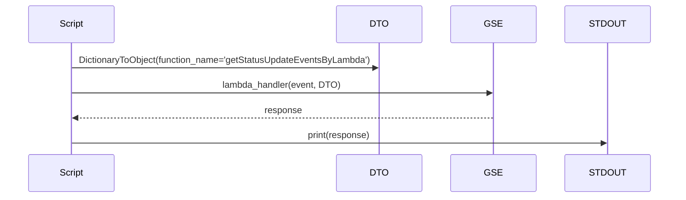
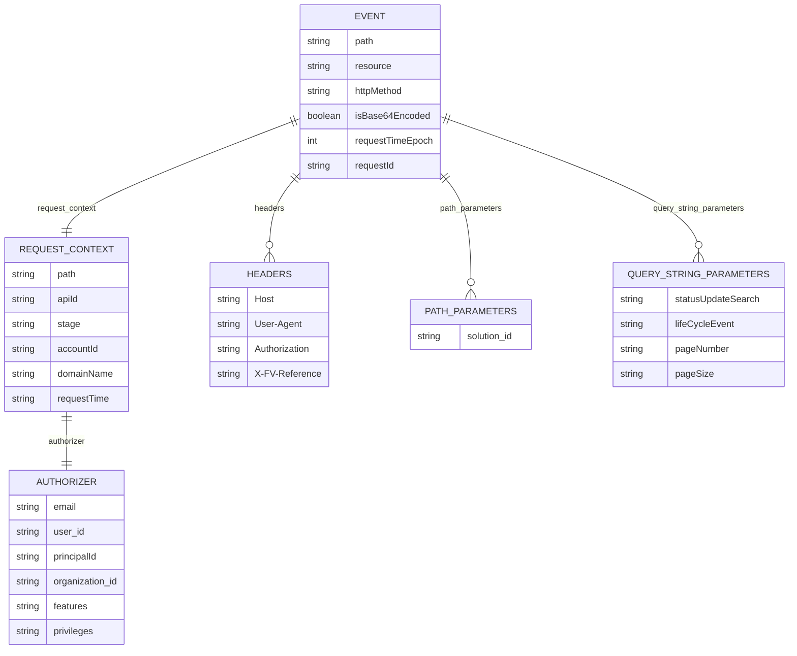

# Diagram: platform/tools/ide_local_testing/localTest/test/entity/entity/getSearchEntityByMilestone.py


> Auto-generated by Obscura crawlers

## Diagram 1

```mermaid
flowchart TD
    EVT([event dict created])
    LFUNC([lambda_handler() defined (no-op)])
    GSE[getSearchEntity.lambda_handler imported]
    DTO[DictionaryToObject imported]
    CALL[Call getSearchEntity.lambda_handler(event, DTO(function_name=...))]
    RESP([response returned])
    PRINT([print(response)])
    EVT --> CALL
    DTO --> CALL
    GSE --> CALL
    CALL --> RESP
    RESP --> PRINT
    LFUNC -.-> EVT
```

> SVG rendering failed for this diagram.

## Diagram 2



### SVG

<svg id="container" width="1237" xmlns="http://www.w3.org/2000/svg" height="363" viewBox="-50 -10 1237 363" role="graphics-document document" aria-roledescription="sequence"><g><rect x="987" y="277" fill="#eaeaea" stroke="#666" width="150" height="65" name="STDOUT" rx="3" ry="3" class="actor actor-bottom"></rect><text x="1062" y="309.5" dominant-baseline="central" alignment-baseline="central" class="actor actor-box" style="text-anchor: middle; font-size: 16px; font-weight: 400;"><tspan x="1062" dy="0">STDOUT</tspan></text></g><g><rect x="787" y="277" fill="#eaeaea" stroke="#666" width="150" height="65" name="GSE" rx="3" ry="3" class="actor actor-bottom"></rect><text x="862" y="309.5" dominant-baseline="central" alignment-baseline="central" class="actor actor-box" style="text-anchor: middle; font-size: 16px; font-weight: 400;"><tspan x="862" dy="0">GSE</tspan></text></g><g><rect x="587" y="277" fill="#eaeaea" stroke="#666" width="150" height="65" name="DTO" rx="3" ry="3" class="actor actor-bottom"></rect><text x="662" y="309.5" dominant-baseline="central" alignment-baseline="central" class="actor actor-box" style="text-anchor: middle; font-size: 16px; font-weight: 400;"><tspan x="662" dy="0">DTO</tspan></text></g><g><rect x="0" y="277" fill="#eaeaea" stroke="#666" width="150" height="65" name="Script" rx="3" ry="3" class="actor actor-bottom"></rect><text x="75" y="309.5" dominant-baseline="central" alignment-baseline="central" class="actor actor-box" style="text-anchor: middle; font-size: 16px; font-weight: 400;"><tspan x="75" dy="0">Script</tspan></text></g><g><line id="actor3" x1="1062" y1="65" x2="1062" y2="277" class="actor-line 200" stroke-width="0.5px" stroke="#999" name="STDOUT"></line><g id="root-3"><rect x="987" y="0" fill="#eaeaea" stroke="#666" width="150" height="65" name="STDOUT" rx="3" ry="3" class="actor actor-top"></rect><text x="1062" y="32.5" dominant-baseline="central" alignment-baseline="central" class="actor actor-box" style="text-anchor: middle; font-size: 16px; font-weight: 400;"><tspan x="1062" dy="0">STDOUT</tspan></text></g></g><g><line id="actor2" x1="862" y1="65" x2="862" y2="277" class="actor-line 200" stroke-width="0.5px" stroke="#999" name="GSE"></line><g id="root-2"><rect x="787" y="0" fill="#eaeaea" stroke="#666" width="150" height="65" name="GSE" rx="3" ry="3" class="actor actor-top"></rect><text x="862" y="32.5" dominant-baseline="central" alignment-baseline="central" class="actor actor-box" style="text-anchor: middle; font-size: 16px; font-weight: 400;"><tspan x="862" dy="0">GSE</tspan></text></g></g><g><line id="actor1" x1="662" y1="65" x2="662" y2="277" class="actor-line 200" stroke-width="0.5px" stroke="#999" name="DTO"></line><g id="root-1"><rect x="587" y="0" fill="#eaeaea" stroke="#666" width="150" height="65" name="DTO" rx="3" ry="3" class="actor actor-top"></rect><text x="662" y="32.5" dominant-baseline="central" alignment-baseline="central" class="actor actor-box" style="text-anchor: middle; font-size: 16px; font-weight: 400;"><tspan x="662" dy="0">DTO</tspan></text></g></g><g><line id="actor0" x1="75" y1="65" x2="75" y2="277" class="actor-line 200" stroke-width="0.5px" stroke="#999" name="Script"></line><g id="root-0"><rect x="0" y="0" fill="#eaeaea" stroke="#666" width="150" height="65" name="Script" rx="3" ry="3" class="actor actor-top"></rect><text x="75" y="32.5" dominant-baseline="central" alignment-baseline="central" class="actor actor-box" style="text-anchor: middle; font-size: 16px; font-weight: 400;"><tspan x="75" dy="0">Script</tspan></text></g></g><style>#container{font-family:"trebuchet ms",verdana,arial,sans-serif;font-size:16px;fill:#333;}@keyframes edge-animation-frame{from{stroke-dashoffset:0;}}@keyframes dash{to{stroke-dashoffset:0;}}#container .edge-animation-slow{stroke-dasharray:9,5!important;stroke-dashoffset:900;animation:dash 50s linear infinite;stroke-linecap:round;}#container .edge-animation-fast{stroke-dasharray:9,5!important;stroke-dashoffset:900;animation:dash 20s linear infinite;stroke-linecap:round;}#container .error-icon{fill:#552222;}#container .error-text{fill:#552222;stroke:#552222;}#container .edge-thickness-normal{stroke-width:1px;}#container .edge-thickness-thick{stroke-width:3.5px;}#container .edge-pattern-solid{stroke-dasharray:0;}#container .edge-thickness-invisible{stroke-width:0;fill:none;}#container .edge-pattern-dashed{stroke-dasharray:3;}#container .edge-pattern-dotted{stroke-dasharray:2;}#container .marker{fill:#333333;stroke:#333333;}#container .marker.cross{stroke:#333333;}#container svg{font-family:"trebuchet ms",verdana,arial,sans-serif;font-size:16px;}#container p{margin:0;}#container .actor{stroke:hsl(259.6261682243, 59.7765363128%, 87.9019607843%);fill:#ECECFF;}#container text.actor&gt;tspan{fill:black;stroke:none;}#container .actor-line{stroke:hsl(259.6261682243, 59.7765363128%, 87.9019607843%);}#container .innerArc{stroke-width:1.5;stroke-dasharray:none;}#container .messageLine0{stroke-width:1.5;stroke-dasharray:none;stroke:#333;}#container .messageLine1{stroke-width:1.5;stroke-dasharray:2,2;stroke:#333;}#container #arrowhead path{fill:#333;stroke:#333;}#container .sequenceNumber{fill:white;}#container #sequencenumber{fill:#333;}#container #crosshead path{fill:#333;stroke:#333;}#container .messageText{fill:#333;stroke:none;}#container .labelBox{stroke:hsl(259.6261682243, 59.7765363128%, 87.9019607843%);fill:#ECECFF;}#container .labelText,#container .labelText&gt;tspan{fill:black;stroke:none;}#container .loopText,#container .loopText&gt;tspan{fill:black;stroke:none;}#container .loopLine{stroke-width:2px;stroke-dasharray:2,2;stroke:hsl(259.6261682243, 59.7765363128%, 87.9019607843%);fill:hsl(259.6261682243, 59.7765363128%, 87.9019607843%);}#container .note{stroke:#aaaa33;fill:#fff5ad;}#container .noteText,#container .noteText&gt;tspan{fill:black;stroke:none;}#container .activation0{fill:#f4f4f4;stroke:#666;}#container .activation1{fill:#f4f4f4;stroke:#666;}#container .activation2{fill:#f4f4f4;stroke:#666;}#container .actorPopupMenu{position:absolute;}#container .actorPopupMenuPanel{position:absolute;fill:#ECECFF;box-shadow:0px 8px 16px 0px rgba(0,0,0,0.2);filter:drop-shadow(3px 5px 2px rgb(0 0 0 / 0.4));}#container .actor-man line{stroke:hsl(259.6261682243, 59.7765363128%, 87.9019607843%);fill:#ECECFF;}#container .actor-man circle,#container line{stroke:hsl(259.6261682243, 59.7765363128%, 87.9019607843%);fill:#ECECFF;stroke-width:2px;}#container :root{--mermaid-font-family:"trebuchet ms",verdana,arial,sans-serif;}</style><g></g><defs><symbol id="computer" width="24" height="24"><path transform="scale(.5)" d="M2 2v13h20v-13h-20zm18 11h-16v-9h16v9zm-10.228 6l.466-1h3.524l.467 1h-4.457zm14.228 3h-24l2-6h2.104l-1.33 4h18.45l-1.297-4h2.073l2 6zm-5-10h-14v-7h14v7z"></path></symbol></defs><defs><symbol id="database" fill-rule="evenodd" clip-rule="evenodd"><path transform="scale(.5)" d="M12.258.001l.256.004.255.005.253.008.251.01.249.012.247.015.246.016.242.019.241.02.239.023.236.024.233.027.231.028.229.031.225.032.223.034.22.036.217.038.214.04.211.041.208.043.205.045.201.046.198.048.194.05.191.051.187.053.183.054.18.056.175.057.172.059.168.06.163.061.16.063.155.064.15.066.074.033.073.033.071.034.07.034.069.035.068.035.067.035.066.035.064.036.064.036.062.036.06.036.06.037.058.037.058.037.055.038.055.038.053.038.052.038.051.039.05.039.048.039.047.039.045.04.044.04.043.04.041.04.04.041.039.041.037.041.036.041.034.041.033.042.032.042.03.042.029.042.027.042.026.043.024.043.023.043.021.043.02.043.018.044.017.043.015.044.013.044.012.044.011.045.009.044.007.045.006.045.004.045.002.045.001.045v17l-.001.045-.002.045-.004.045-.006.045-.007.045-.009.044-.011.045-.012.044-.013.044-.015.044-.017.043-.018.044-.02.043-.021.043-.023.043-.024.043-.026.043-.027.042-.029.042-.03.042-.032.042-.033.042-.034.041-.036.041-.037.041-.039.041-.04.041-.041.04-.043.04-.044.04-.045.04-.047.039-.048.039-.05.039-.051.039-.052.038-.053.038-.055.038-.055.038-.058.037-.058.037-.06.037-.06.036-.062.036-.064.036-.064.036-.066.035-.067.035-.068.035-.069.035-.07.034-.071.034-.073.033-.074.033-.15.066-.155.064-.16.063-.163.061-.168.06-.172.059-.175.057-.18.056-.183.054-.187.053-.191.051-.194.05-.198.048-.201.046-.205.045-.208.043-.211.041-.214.04-.217.038-.22.036-.223.034-.225.032-.229.031-.231.028-.233.027-.236.024-.239.023-.241.02-.242.019-.246.016-.247.015-.249.012-.251.01-.253.008-.255.005-.256.004-.258.001-.258-.001-.256-.004-.255-.005-.253-.008-.251-.01-.249-.012-.247-.015-.245-.016-.243-.019-.241-.02-.238-.023-.236-.024-.234-.027-.231-.028-.228-.031-.226-.032-.223-.034-.22-.036-.217-.038-.214-.04-.211-.041-.208-.043-.204-.045-.201-.046-.198-.048-.195-.05-.19-.051-.187-.053-.184-.054-.179-.056-.176-.057-.172-.059-.167-.06-.164-.061-.159-.063-.155-.064-.151-.066-.074-.033-.072-.033-.072-.034-.07-.034-.069-.035-.068-.035-.067-.035-.066-.035-.064-.036-.063-.036-.062-.036-.061-.036-.06-.037-.058-.037-.057-.037-.056-.038-.055-.038-.053-.038-.052-.038-.051-.039-.049-.039-.049-.039-.046-.039-.046-.04-.044-.04-.043-.04-.041-.04-.04-.041-.039-.041-.037-.041-.036-.041-.034-.041-.033-.042-.032-.042-.03-.042-.029-.042-.027-.042-.026-.043-.024-.043-.023-.043-.021-.043-.02-.043-.018-.044-.017-.043-.015-.044-.013-.044-.012-.044-.011-.045-.009-.044-.007-.045-.006-.045-.004-.045-.002-.045-.001-.045v-17l.001-.045.002-.045.004-.045.006-.045.007-.045.009-.044.011-.045.012-.044.013-.044.015-.044.017-.043.018-.044.02-.043.021-.043.023-.043.024-.043.026-.043.027-.042.029-.042.03-.042.032-.042.033-.042.034-.041.036-.041.037-.041.039-.041.04-.041.041-.04.043-.04.044-.04.046-.04.046-.039.049-.039.049-.039.051-.039.052-.038.053-.038.055-.038.056-.038.057-.037.058-.037.06-.037.061-.036.062-.036.063-.036.064-.036.066-.035.067-.035.068-.035.069-.035.07-.034.072-.034.072-.033.074-.033.151-.066.155-.064.159-.063.164-.061.167-.06.172-.059.176-.057.179-.056.184-.054.187-.053.19-.051.195-.05.198-.048.201-.046.204-.045.208-.043.211-.041.214-.04.217-.038.22-.036.223-.034.226-.032.228-.031.231-.028.234-.027.236-.024.238-.023.241-.02.243-.019.245-.016.247-.015.249-.012.251-.01.253-.008.255-.005.256-.004.258-.001.258.001zm-9.258 20.499v.01l.001.021.003.021.004.022.005.021.006.022.007.022.009.023.01.022.011.023.012.023.013.023.015.023.016.024.017.023.018.024.019.024.021.024.022.025.023.024.024.025.052.049.056.05.061.051.066.051.07.051.075.051.079.052.084.052.088.052.092.052.097.052.102.051.105.052.11.052.114.051.119.051.123.051.127.05.131.05.135.05.139.048.144.049.147.047.152.047.155.047.16.045.163.045.167.043.171.043.176.041.178.041.183.039.187.039.19.037.194.035.197.035.202.033.204.031.209.03.212.029.216.027.219.025.222.024.226.021.23.02.233.018.236.016.24.015.243.012.246.01.249.008.253.005.256.004.259.001.26-.001.257-.004.254-.005.25-.008.247-.011.244-.012.241-.014.237-.016.233-.018.231-.021.226-.021.224-.024.22-.026.216-.027.212-.028.21-.031.205-.031.202-.034.198-.034.194-.036.191-.037.187-.039.183-.04.179-.04.175-.042.172-.043.168-.044.163-.045.16-.046.155-.046.152-.047.148-.048.143-.049.139-.049.136-.05.131-.05.126-.05.123-.051.118-.052.114-.051.11-.052.106-.052.101-.052.096-.052.092-.052.088-.053.083-.051.079-.052.074-.052.07-.051.065-.051.06-.051.056-.05.051-.05.023-.024.023-.025.021-.024.02-.024.019-.024.018-.024.017-.024.015-.023.014-.024.013-.023.012-.023.01-.023.01-.022.008-.022.006-.022.006-.022.004-.022.004-.021.001-.021.001-.021v-4.127l-.077.055-.08.053-.083.054-.085.053-.087.052-.09.052-.093.051-.095.05-.097.05-.1.049-.102.049-.105.048-.106.047-.109.047-.111.046-.114.045-.115.045-.118.044-.12.043-.122.042-.124.042-.126.041-.128.04-.13.04-.132.038-.134.038-.135.037-.138.037-.139.035-.142.035-.143.034-.144.033-.147.032-.148.031-.15.03-.151.03-.153.029-.154.027-.156.027-.158.026-.159.025-.161.024-.162.023-.163.022-.165.021-.166.02-.167.019-.169.018-.169.017-.171.016-.173.015-.173.014-.175.013-.175.012-.177.011-.178.01-.179.008-.179.008-.181.006-.182.005-.182.004-.184.003-.184.002h-.37l-.184-.002-.184-.003-.182-.004-.182-.005-.181-.006-.179-.008-.179-.008-.178-.01-.176-.011-.176-.012-.175-.013-.173-.014-.172-.015-.171-.016-.17-.017-.169-.018-.167-.019-.166-.02-.165-.021-.163-.022-.162-.023-.161-.024-.159-.025-.157-.026-.156-.027-.155-.027-.153-.029-.151-.03-.15-.03-.148-.031-.146-.032-.145-.033-.143-.034-.141-.035-.14-.035-.137-.037-.136-.037-.134-.038-.132-.038-.13-.04-.128-.04-.126-.041-.124-.042-.122-.042-.12-.044-.117-.043-.116-.045-.113-.045-.112-.046-.109-.047-.106-.047-.105-.048-.102-.049-.1-.049-.097-.05-.095-.05-.093-.052-.09-.051-.087-.052-.085-.053-.083-.054-.08-.054-.077-.054v4.127zm0-5.654v.011l.001.021.003.021.004.021.005.022.006.022.007.022.009.022.01.022.011.023.012.023.013.023.015.024.016.023.017.024.018.024.019.024.021.024.022.024.023.025.024.024.052.05.056.05.061.05.066.051.07.051.075.052.079.051.084.052.088.052.092.052.097.052.102.052.105.052.11.051.114.051.119.052.123.05.127.051.131.05.135.049.139.049.144.048.147.048.152.047.155.046.16.045.163.045.167.044.171.042.176.042.178.04.183.04.187.038.19.037.194.036.197.034.202.033.204.032.209.03.212.028.216.027.219.025.222.024.226.022.23.02.233.018.236.016.24.014.243.012.246.01.249.008.253.006.256.003.259.001.26-.001.257-.003.254-.006.25-.008.247-.01.244-.012.241-.015.237-.016.233-.018.231-.02.226-.022.224-.024.22-.025.216-.027.212-.029.21-.03.205-.032.202-.033.198-.035.194-.036.191-.037.187-.039.183-.039.179-.041.175-.042.172-.043.168-.044.163-.045.16-.045.155-.047.152-.047.148-.048.143-.048.139-.05.136-.049.131-.05.126-.051.123-.051.118-.051.114-.052.11-.052.106-.052.101-.052.096-.052.092-.052.088-.052.083-.052.079-.052.074-.051.07-.052.065-.051.06-.05.056-.051.051-.049.023-.025.023-.024.021-.025.02-.024.019-.024.018-.024.017-.024.015-.023.014-.023.013-.024.012-.022.01-.023.01-.023.008-.022.006-.022.006-.022.004-.021.004-.022.001-.021.001-.021v-4.139l-.077.054-.08.054-.083.054-.085.052-.087.053-.09.051-.093.051-.095.051-.097.05-.1.049-.102.049-.105.048-.106.047-.109.047-.111.046-.114.045-.115.044-.118.044-.12.044-.122.042-.124.042-.126.041-.128.04-.13.039-.132.039-.134.038-.135.037-.138.036-.139.036-.142.035-.143.033-.144.033-.147.033-.148.031-.15.03-.151.03-.153.028-.154.028-.156.027-.158.026-.159.025-.161.024-.162.023-.163.022-.165.021-.166.02-.167.019-.169.018-.169.017-.171.016-.173.015-.173.014-.175.013-.175.012-.177.011-.178.009-.179.009-.179.007-.181.007-.182.005-.182.004-.184.003-.184.002h-.37l-.184-.002-.184-.003-.182-.004-.182-.005-.181-.007-.179-.007-.179-.009-.178-.009-.176-.011-.176-.012-.175-.013-.173-.014-.172-.015-.171-.016-.17-.017-.169-.018-.167-.019-.166-.02-.165-.021-.163-.022-.162-.023-.161-.024-.159-.025-.157-.026-.156-.027-.155-.028-.153-.028-.151-.03-.15-.03-.148-.031-.146-.033-.145-.033-.143-.033-.141-.035-.14-.036-.137-.036-.136-.037-.134-.038-.132-.039-.13-.039-.128-.04-.126-.041-.124-.042-.122-.043-.12-.043-.117-.044-.116-.044-.113-.046-.112-.046-.109-.046-.106-.047-.105-.048-.102-.049-.1-.049-.097-.05-.095-.051-.093-.051-.09-.051-.087-.053-.085-.052-.083-.054-.08-.054-.077-.054v4.139zm0-5.666v.011l.001.02.003.022.004.021.005.022.006.021.007.022.009.023.01.022.011.023.012.023.013.023.015.023.016.024.017.024.018.023.019.024.021.025.022.024.023.024.024.025.052.05.056.05.061.05.066.051.07.051.075.052.079.051.084.052.088.052.092.052.097.052.102.052.105.051.11.052.114.051.119.051.123.051.127.05.131.05.135.05.139.049.144.048.147.048.152.047.155.046.16.045.163.045.167.043.171.043.176.042.178.04.183.04.187.038.19.037.194.036.197.034.202.033.204.032.209.03.212.028.216.027.219.025.222.024.226.021.23.02.233.018.236.017.24.014.243.012.246.01.249.008.253.006.256.003.259.001.26-.001.257-.003.254-.006.25-.008.247-.01.244-.013.241-.014.237-.016.233-.018.231-.02.226-.022.224-.024.22-.025.216-.027.212-.029.21-.03.205-.032.202-.033.198-.035.194-.036.191-.037.187-.039.183-.039.179-.041.175-.042.172-.043.168-.044.163-.045.16-.045.155-.047.152-.047.148-.048.143-.049.139-.049.136-.049.131-.051.126-.05.123-.051.118-.052.114-.051.11-.052.106-.052.101-.052.096-.052.092-.052.088-.052.083-.052.079-.052.074-.052.07-.051.065-.051.06-.051.056-.05.051-.049.023-.025.023-.025.021-.024.02-.024.019-.024.018-.024.017-.024.015-.023.014-.024.013-.023.012-.023.01-.022.01-.023.008-.022.006-.022.006-.022.004-.022.004-.021.001-.021.001-.021v-4.153l-.077.054-.08.054-.083.053-.085.053-.087.053-.09.051-.093.051-.095.051-.097.05-.1.049-.102.048-.105.048-.106.048-.109.046-.111.046-.114.046-.115.044-.118.044-.12.043-.122.043-.124.042-.126.041-.128.04-.13.039-.132.039-.134.038-.135.037-.138.036-.139.036-.142.034-.143.034-.144.033-.147.032-.148.032-.15.03-.151.03-.153.028-.154.028-.156.027-.158.026-.159.024-.161.024-.162.023-.163.023-.165.021-.166.02-.167.019-.169.018-.169.017-.171.016-.173.015-.173.014-.175.013-.175.012-.177.01-.178.01-.179.009-.179.007-.181.006-.182.006-.182.004-.184.003-.184.001-.185.001-.185-.001-.184-.001-.184-.003-.182-.004-.182-.006-.181-.006-.179-.007-.179-.009-.178-.01-.176-.01-.176-.012-.175-.013-.173-.014-.172-.015-.171-.016-.17-.017-.169-.018-.167-.019-.166-.02-.165-.021-.163-.023-.162-.023-.161-.024-.159-.024-.157-.026-.156-.027-.155-.028-.153-.028-.151-.03-.15-.03-.148-.032-.146-.032-.145-.033-.143-.034-.141-.034-.14-.036-.137-.036-.136-.037-.134-.038-.132-.039-.13-.039-.128-.041-.126-.041-.124-.041-.122-.043-.12-.043-.117-.044-.116-.044-.113-.046-.112-.046-.109-.046-.106-.048-.105-.048-.102-.048-.1-.05-.097-.049-.095-.051-.093-.051-.09-.052-.087-.052-.085-.053-.083-.053-.08-.054-.077-.054v4.153zm8.74-8.179l-.257.004-.254.005-.25.008-.247.011-.244.012-.241.014-.237.016-.233.018-.231.021-.226.022-.224.023-.22.026-.216.027-.212.028-.21.031-.205.032-.202.033-.198.034-.194.036-.191.038-.187.038-.183.04-.179.041-.175.042-.172.043-.168.043-.163.045-.16.046-.155.046-.152.048-.148.048-.143.048-.139.049-.136.05-.131.05-.126.051-.123.051-.118.051-.114.052-.11.052-.106.052-.101.052-.096.052-.092.052-.088.052-.083.052-.079.052-.074.051-.07.052-.065.051-.06.05-.056.05-.051.05-.023.025-.023.024-.021.024-.02.025-.019.024-.018.024-.017.023-.015.024-.014.023-.013.023-.012.023-.01.023-.01.022-.008.022-.006.023-.006.021-.004.022-.004.021-.001.021-.001.021.001.021.001.021.004.021.004.022.006.021.006.023.008.022.01.022.01.023.012.023.013.023.014.023.015.024.017.023.018.024.019.024.02.025.021.024.023.024.023.025.051.05.056.05.06.05.065.051.07.052.074.051.079.052.083.052.088.052.092.052.096.052.101.052.106.052.11.052.114.052.118.051.123.051.126.051.131.05.136.05.139.049.143.048.148.048.152.048.155.046.16.046.163.045.168.043.172.043.175.042.179.041.183.04.187.038.191.038.194.036.198.034.202.033.205.032.21.031.212.028.216.027.22.026.224.023.226.022.231.021.233.018.237.016.241.014.244.012.247.011.25.008.254.005.257.004.26.001.26-.001.257-.004.254-.005.25-.008.247-.011.244-.012.241-.014.237-.016.233-.018.231-.021.226-.022.224-.023.22-.026.216-.027.212-.028.21-.031.205-.032.202-.033.198-.034.194-.036.191-.038.187-.038.183-.04.179-.041.175-.042.172-.043.168-.043.163-.045.16-.046.155-.046.152-.048.148-.048.143-.048.139-.049.136-.05.131-.05.126-.051.123-.051.118-.051.114-.052.11-.052.106-.052.101-.052.096-.052.092-.052.088-.052.083-.052.079-.052.074-.051.07-.052.065-.051.06-.05.056-.05.051-.05.023-.025.023-.024.021-.024.02-.025.019-.024.018-.024.017-.023.015-.024.014-.023.013-.023.012-.023.01-.023.01-.022.008-.022.006-.023.006-.021.004-.022.004-.021.001-.021.001-.021-.001-.021-.001-.021-.004-.021-.004-.022-.006-.021-.006-.023-.008-.022-.01-.022-.01-.023-.012-.023-.013-.023-.014-.023-.015-.024-.017-.023-.018-.024-.019-.024-.02-.025-.021-.024-.023-.024-.023-.025-.051-.05-.056-.05-.06-.05-.065-.051-.07-.052-.074-.051-.079-.052-.083-.052-.088-.052-.092-.052-.096-.052-.101-.052-.106-.052-.11-.052-.114-.052-.118-.051-.123-.051-.126-.051-.131-.05-.136-.05-.139-.049-.143-.048-.148-.048-.152-.048-.155-.046-.16-.046-.163-.045-.168-.043-.172-.043-.175-.042-.179-.041-.183-.04-.187-.038-.191-.038-.194-.036-.198-.034-.202-.033-.205-.032-.21-.031-.212-.028-.216-.027-.22-.026-.224-.023-.226-.022-.231-.021-.233-.018-.237-.016-.241-.014-.244-.012-.247-.011-.25-.008-.254-.005-.257-.004-.26-.001-.26.001z"></path></symbol></defs><defs><symbol id="clock" width="24" height="24"><path transform="scale(.5)" d="M12 2c5.514 0 10 4.486 10 10s-4.486 10-10 10-10-4.486-10-10 4.486-10 10-10zm0-2c-6.627 0-12 5.373-12 12s5.373 12 12 12 12-5.373 12-12-5.373-12-12-12zm5.848 12.459c.202.038.202.333.001.372-1.907.361-6.045 1.111-6.547 1.111-.719 0-1.301-.582-1.301-1.301 0-.512.77-5.447 1.125-7.445.034-.192.312-.181.343.014l.985 6.238 5.394 1.011z"></path></symbol></defs><defs><marker id="arrowhead" refX="7.9" refY="5" markerUnits="userSpaceOnUse" markerWidth="12" markerHeight="12" orient="auto-start-reverse"><path d="M -1 0 L 10 5 L 0 10 z"></path></marker></defs><defs><marker id="crosshead" markerWidth="15" markerHeight="8" orient="auto" refX="4" refY="4.5"><path fill="none" stroke="#000000" stroke-width="1pt" d="M 1,2 L 6,7 M 6,2 L 1,7" style="stroke-dasharray: 0, 0;"></path></marker></defs><defs><marker id="filled-head" refX="15.5" refY="7" markerWidth="20" markerHeight="28" orient="auto"><path d="M 18,7 L9,13 L14,7 L9,1 Z"></path></marker></defs><defs><marker id="sequencenumber" refX="15" refY="15" markerWidth="60" markerHeight="40" orient="auto"><circle cx="15" cy="15" r="6"></circle></marker></defs><text x="367" y="80" text-anchor="middle" dominant-baseline="middle" alignment-baseline="middle" class="messageText" dy="1em" style="font-size: 16px; font-weight: 400;">DictionaryToObject(function_name='getStatusUpdateEventsByLambda')</text><line x1="76" y1="113" x2="658" y2="113" class="messageLine0" stroke-width="2" stroke="none" marker-end="url(#arrowhead)" style="fill: none;"></line><text x="467" y="128" text-anchor="middle" dominant-baseline="middle" alignment-baseline="middle" class="messageText" dy="1em" style="font-size: 16px; font-weight: 400;">lambda_handler(event, DTO)</text><line x1="76" y1="161" x2="858" y2="161" class="messageLine0" stroke-width="2" stroke="none" marker-end="url(#arrowhead)" style="fill: none;"></line><text x="470" y="176" text-anchor="middle" dominant-baseline="middle" alignment-baseline="middle" class="messageText" dy="1em" style="font-size: 16px; font-weight: 400;">response</text><line x1="861" y1="209" x2="79" y2="209" class="messageLine1" stroke-width="2" stroke="none" marker-end="url(#arrowhead)" style="stroke-dasharray: 3, 3; fill: none;"></line><text x="567" y="224" text-anchor="middle" dominant-baseline="middle" alignment-baseline="middle" class="messageText" dy="1em" style="font-size: 16px; font-weight: 400;">print(response)</text><line x1="76" y1="257" x2="1058" y2="257" class="messageLine0" stroke-width="2" stroke="none" marker-end="url(#arrowhead)" style="fill: none;"></line></svg>

## Diagram 3



### SVG

<svg id="container" width="1278.1015625" xmlns="http://www.w3.org/2000/svg" class="erDiagram" height="1115.75" viewBox="0 0 1278.1015625 1115.75" role="graphics-document document" aria-roledescription="er"><style>#container{font-family:"trebuchet ms",verdana,arial,sans-serif;font-size:16px;fill:#333;}@keyframes edge-animation-frame{from{stroke-dashoffset:0;}}@keyframes dash{to{stroke-dashoffset:0;}}#container .edge-animation-slow{stroke-dasharray:9,5!important;stroke-dashoffset:900;animation:dash 50s linear infinite;stroke-linecap:round;}#container .edge-animation-fast{stroke-dasharray:9,5!important;stroke-dashoffset:900;animation:dash 20s linear infinite;stroke-linecap:round;}#container .error-icon{fill:#552222;}#container .error-text{fill:#552222;stroke:#552222;}#container .edge-thickness-normal{stroke-width:1px;}#container .edge-thickness-thick{stroke-width:3.5px;}#container .edge-pattern-solid{stroke-dasharray:0;}#container .edge-thickness-invisible{stroke-width:0;fill:none;}#container .edge-pattern-dashed{stroke-dasharray:3;}#container .edge-pattern-dotted{stroke-dasharray:2;}#container .marker{fill:#333333;stroke:#333333;}#container .marker.cross{stroke:#333333;}#container svg{font-family:"trebuchet ms",verdana,arial,sans-serif;font-size:16px;}#container p{margin:0;}#container .entityBox{fill:#ECECFF;stroke:#9370DB;}#container .relationshipLabelBox{fill:hsl(80, 100%, 96.2745098039%);opacity:0.7;background-color:hsl(80, 100%, 96.2745098039%);}#container .relationshipLabelBox rect{opacity:0.5;}#container .labelBkg{background-color:rgba(248.6666666666, 255, 235.9999999999, 0.5);}#container .edgeLabel .label{fill:#9370DB;font-size:14px;}#container .label{font-family:"trebuchet ms",verdana,arial,sans-serif;color:#333;}#container .edge-pattern-dashed{stroke-dasharray:8,8;}#container .node rect,#container .node circle,#container .node ellipse,#container .node polygon{fill:#ECECFF;stroke:#9370DB;stroke-width:1px;}#container .relationshipLine{stroke:#333333;stroke-width:1;fill:none;}#container .marker{fill:none!important;stroke:#333333!important;stroke-width:1;}#container :root{--mermaid-font-family:"trebuchet ms",verdana,arial,sans-serif;}</style><g><defs><marker id="container_er-onlyOneStart" class="marker onlyOne er" refX="0" refY="9" markerWidth="18" markerHeight="18" orient="auto"><path d="M9,0 L9,18 M15,0 L15,18"></path></marker></defs><defs><marker id="container_er-onlyOneEnd" class="marker onlyOne er" refX="18" refY="9" markerWidth="18" markerHeight="18" orient="auto"><path d="M3,0 L3,18 M9,0 L9,18"></path></marker></defs><defs><marker id="container_er-zeroOrOneStart" class="marker zeroOrOne er" refX="0" refY="9" markerWidth="30" markerHeight="18" orient="auto"><circle fill="white" cx="21" cy="9" r="6"></circle><path d="M9,0 L9,18"></path></marker></defs><defs><marker id="container_er-zeroOrOneEnd" class="marker zeroOrOne er" refX="30" refY="9" markerWidth="30" markerHeight="18" orient="auto"><circle fill="white" cx="9" cy="9" r="6"></circle><path d="M21,0 L21,18"></path></marker></defs><defs><marker id="container_er-oneOrMoreStart" class="marker oneOrMore er" refX="18" refY="18" markerWidth="45" markerHeight="36" orient="auto"><path d="M0,18 Q 18,0 36,18 Q 18,36 0,18 M42,9 L42,27"></path></marker></defs><defs><marker id="container_er-oneOrMoreEnd" class="marker oneOrMore er" refX="27" refY="18" markerWidth="45" markerHeight="36" orient="auto"><path d="M3,9 L3,27 M9,18 Q27,0 45,18 Q27,36 9,18"></path></marker></defs><defs><marker id="container_er-zeroOrMoreStart" class="marker zeroOrMore er" refX="18" refY="18" markerWidth="57" markerHeight="36" orient="auto"><circle fill="white" cx="48" cy="18" r="6"></circle><path d="M0,18 Q18,0 36,18 Q18,36 0,18"></path></marker></defs><defs><marker id="container_er-zeroOrMoreEnd" class="marker zeroOrMore er" refX="39" refY="18" markerWidth="57" markerHeight="36" orient="auto"><circle fill="white" cx="9" cy="18" r="6"></circle><path d="M21,18 Q39,0 57,18 Q39,36 21,18"></path></marker></defs><g class="root"><g class="clusters"></g><g class="edgePaths"><path d="M489.902,206.323L426.619,231.561C363.336,256.799,236.77,307.274,173.486,340.929C110.203,374.583,110.203,391.417,110.203,399.833L110.203,408.25" id="id_entity-EVENT-0_entity-REQUEST_CONTEXT-1_0" class="edge-thickness-normal edge-pattern-solid relationshipLine" style="undefined;;;undefined" data-edge="true" data-et="edge" data-id="id_entity-EVENT-0_entity-REQUEST_CONTEXT-1_0" data-points="W3sieCI6NDg5LjkwMjM0Mzc1LCJ5IjoyMDYuMzIzMTI3MDg3MTc2ODZ9LHsieCI6MTEwLjIwMzEyNSwieSI6MzU3Ljc1fSx7IngiOjExMC4yMDMxMjUsInkiOjQwOC4yNX1d" marker-start="url(#container_er-onlyOneStart)" marker-end="url(#container_er-onlyOneEnd)"></path><path d="M110.203,707.5L110.203,715.917C110.203,724.333,110.203,741.167,110.203,758C110.203,774.833,110.203,791.667,110.203,800.083L110.203,808.5" id="id_entity-REQUEST_CONTEXT-1_entity-AUTHORIZER-2_1" class="edge-thickness-normal edge-pattern-solid relationshipLine" style="undefined;;;undefined" data-edge="true" data-et="edge" data-id="id_entity-REQUEST_CONTEXT-1_entity-AUTHORIZER-2_1" data-points="W3sieCI6MTEwLjIwMzEyNSwieSI6NzA3LjV9LHsieCI6MTEwLjIwMzEyNSwieSI6NzU4fSx7IngiOjExMC4yMDMxMjUsInkiOjgwOC41fV0=" marker-start="url(#container_er-onlyOneStart)" marker-end="url(#container_er-onlyOneEnd)"></path><path d="M489.902,304.048L482.438,312.998C474.974,321.948,460.046,339.849,452.581,364.341C445.117,388.833,445.117,419.917,445.117,435.458L445.117,451" id="id_entity-EVENT-0_entity-HEADERS-3_2" class="edge-thickness-normal edge-pattern-solid relationshipLine" style="undefined;;;undefined" data-edge="true" data-et="edge" data-id="id_entity-EVENT-0_entity-HEADERS-3_2" data-points="W3sieCI6NDg5LjkwMjM0Mzc1LCJ5IjozMDQuMDQ3NjQ0ODIxNTMzfSx7IngiOjQ0NS4xMTcxODc1LCJ5IjozNTcuNzV9LHsieCI6NDQ1LjExNzE4NzUsInkiOjQ1MX1d" marker-start="url(#container_er-onlyOneStart)" marker-end="url(#container_er-zeroOrMoreEnd)"></path><path d="M734.121,304.048L741.585,312.998C749.049,321.948,763.978,339.849,771.442,375.029C778.906,410.208,778.906,462.667,778.906,488.896L778.906,515.125" id="id_entity-EVENT-0_entity-PATH_PARAMETERS-4_3" class="edge-thickness-normal edge-pattern-solid relationshipLine" style="undefined;;;undefined" data-edge="true" data-et="edge" data-id="id_entity-EVENT-0_entity-PATH_PARAMETERS-4_3" data-points="W3sieCI6NzM0LjEyMTA5Mzc1LCJ5IjozMDQuMDQ3NjQ0ODIxNTMzfSx7IngiOjc3OC45MDYyNSwieSI6MzU3Ljc1fSx7IngiOjc3OC45MDYyNSwieSI6NTE1LjEyNX1d" marker-start="url(#container_er-onlyOneStart)" marker-end="url(#container_er-zeroOrMoreEnd)"></path><path d="M734.121,203.806L801.963,229.463C869.805,255.121,1005.488,306.435,1073.33,347.634C1141.172,388.833,1141.172,419.917,1141.172,435.458L1141.172,451" id="id_entity-EVENT-0_entity-QUERY_STRING_PARAMETERS-5_4" class="edge-thickness-normal edge-pattern-solid relationshipLine" style="undefined;;;undefined" data-edge="true" data-et="edge" data-id="id_entity-EVENT-0_entity-QUERY_STRING_PARAMETERS-5_4" data-points="W3sieCI6NzM0LjEyMTA5Mzc1LCJ5IjoyMDMuODA1OTg3NzA5MDAyMzJ9LHsieCI6MTE0MS4xNzE4NzUsInkiOjM1Ny43NX0seyJ4IjoxMTQxLjE3MTg3NSwieSI6NDUxfV0=" marker-start="url(#container_er-onlyOneStart)" marker-end="url(#container_er-zeroOrMoreEnd)"></path></g><g class="edgeLabels"><g class="edgeLabel" transform="translate(110.203125, 357.75)"><g class="label" data-id="id_entity-EVENT-0_entity-REQUEST_CONTEXT-1_0" transform="translate(-51.171875, -10.5)"><foreignObject width="102.34375" height="21"><div xmlns="http://www.w3.org/1999/xhtml" class="labelBkg" style="display: table-cell; white-space: nowrap; line-height: 1.5; max-width: 200px; text-align: center;"><span class="edgeLabel"><p>request_context</p></span></div></foreignObject></g></g><g class="edgeLabel" transform="translate(110.203125, 758)"><g class="label" data-id="id_entity-REQUEST_CONTEXT-1_entity-AUTHORIZER-2_1" transform="translate(-32.8046875, -10.5)"><foreignObject width="65.609375" height="21"><div xmlns="http://www.w3.org/1999/xhtml" class="labelBkg" style="display: table-cell; white-space: nowrap; line-height: 1.5; max-width: 200px; text-align: center;"><span class="edgeLabel"><p>authorizer</p></span></div></foreignObject></g></g><g class="edgeLabel" transform="translate(445.1171875, 357.75)"><g class="label" data-id="id_entity-EVENT-0_entity-HEADERS-3_2" transform="translate(-25.5234375, -10.5)"><foreignObject width="51.046875" height="21"><div xmlns="http://www.w3.org/1999/xhtml" class="labelBkg" style="display: table-cell; white-space: nowrap; line-height: 1.5; max-width: 200px; text-align: center;"><span class="edgeLabel"><p>headers</p></span></div></foreignObject></g></g><g class="edgeLabel" transform="translate(778.90625, 357.75)"><g class="label" data-id="id_entity-EVENT-0_entity-PATH_PARAMETERS-4_3" transform="translate(-54.25, -10.5)"><foreignObject width="108.5" height="21"><div xmlns="http://www.w3.org/1999/xhtml" class="labelBkg" style="display: table-cell; white-space: nowrap; line-height: 1.5; max-width: 200px; text-align: center;"><span class="edgeLabel"><p>path_parameters</p></span></div></foreignObject></g></g><g class="edgeLabel" transform="translate(1141.171875, 357.75)"><g class="label" data-id="id_entity-EVENT-0_entity-QUERY_STRING_PARAMETERS-5_4" transform="translate(-79.6171875, -10.5)"><foreignObject width="159.234375" height="21"><div xmlns="http://www.w3.org/1999/xhtml" class="labelBkg" style="display: table-cell; white-space: nowrap; line-height: 1.5; max-width: 200px; text-align: center;"><span class="edgeLabel"><p>query_string_parameters</p></span></div></foreignObject></g></g></g><g class="nodes"><g class="node default" id="entity-EVENT-0" transform="translate(612.01171875, 157.625)"><g style=""><path d="M-122.109375 -149.625 L122.109375 -149.625 L122.109375 149.625 L-122.109375 149.625" stroke="none" stroke-width="0" fill="#ECECFF"></path><path d="M-122.109375 -149.625 C-49.051168505869384 -149.625, 24.00703798826123 -149.625, 122.109375 -149.625 M-122.109375 -149.625 C-28.95539283376708 -149.625, 64.19858933246584 -149.625, 122.109375 -149.625 M122.109375 -149.625 C122.109375 -52.13345725861154, 122.109375 45.358085482776914, 122.109375 149.625 M122.109375 -149.625 C122.109375 -73.87058308180981, 122.109375 1.8838338363803757, 122.109375 149.625 M122.109375 149.625 C59.57441995375681 149.625, -2.9605350924863814 149.625, -122.109375 149.625 M122.109375 149.625 C36.53327183638517 149.625, -49.04283132722966 149.625, -122.109375 149.625 M-122.109375 149.625 C-122.109375 67.74637735217414, -122.109375 -14.132245295651728, -122.109375 -149.625 M-122.109375 149.625 C-122.109375 34.400587434664516, -122.109375 -80.82382513067097, -122.109375 -149.625" stroke="#9370DB" stroke-width="1.3" fill="none" stroke-dasharray="0 0"></path></g><g style="" class="row-rect-odd"><path d="M-122.109375 -106.875 L122.109375 -106.875 L122.109375 -64.125 L-122.109375 -64.125" stroke="none" stroke-width="0" fill="hsl(240, 100%, 100%)"></path><path d="M-122.109375 -106.875 C-27.52442761300631 -106.875, 67.06051977398738 -106.875, 122.109375 -106.875 M-122.109375 -106.875 C-66.5530505666024 -106.875, -10.996726133204803 -106.875, 122.109375 -106.875 M122.109375 -106.875 C122.109375 -95.0512112071842, 122.109375 -83.22742241436839, 122.109375 -64.125 M122.109375 -106.875 C122.109375 -92.95451122713598, 122.109375 -79.03402245427196, 122.109375 -64.125 M122.109375 -64.125 C55.55344904153715 -64.125, -11.002476916925701 -64.125, -122.109375 -64.125 M122.109375 -64.125 C63.98791232763011 -64.125, 5.866449655260226 -64.125, -122.109375 -64.125 M-122.109375 -64.125 C-122.109375 -73.170318558594, -122.109375 -82.215637117188, -122.109375 -106.875 M-122.109375 -64.125 C-122.109375 -75.91244221521275, -122.109375 -87.6998844304255, -122.109375 -106.875" stroke="#9370DB" stroke-width="1.3" fill="none" stroke-dasharray="0 0"></path></g><g style="" class="row-rect-even"><path d="M-122.109375 -64.125 L122.109375 -64.125 L122.109375 -21.375 L-122.109375 -21.375" stroke="none" stroke-width="0" fill="hsl(240, 100%, 97.2745098039%)"></path><path d="M-122.109375 -64.125 C-33.390318604461214 -64.125, 55.32873779107757 -64.125, 122.109375 -64.125 M-122.109375 -64.125 C-40.54683195520181 -64.125, 41.01571108959638 -64.125, 122.109375 -64.125 M122.109375 -64.125 C122.109375 -49.390794478297316, 122.109375 -34.65658895659463, 122.109375 -21.375 M122.109375 -64.125 C122.109375 -51.152534763436705, 122.109375 -38.18006952687341, 122.109375 -21.375 M122.109375 -21.375 C26.99948931610004 -21.375, -68.11039636779992 -21.375, -122.109375 -21.375 M122.109375 -21.375 C38.8548343488353 -21.375, -44.399706302329406 -21.375, -122.109375 -21.375 M-122.109375 -21.375 C-122.109375 -35.17646016885793, -122.109375 -48.977920337715865, -122.109375 -64.125 M-122.109375 -21.375 C-122.109375 -35.618749703693744, -122.109375 -49.86249940738749, -122.109375 -64.125" stroke="#9370DB" stroke-width="1.3" fill="none" stroke-dasharray="0 0"></path></g><g style="" class="row-rect-odd"><path d="M-122.109375 -21.375 L122.109375 -21.375 L122.109375 21.375 L-122.109375 21.375" stroke="none" stroke-width="0" fill="hsl(240, 100%, 100%)"></path><path d="M-122.109375 -21.375 C-69.17358553305037 -21.375, -16.237796066100742 -21.375, 122.109375 -21.375 M-122.109375 -21.375 C-58.03862772048018 -21.375, 6.032119559039643 -21.375, 122.109375 -21.375 M122.109375 -21.375 C122.109375 -11.962631521014702, 122.109375 -2.5502630420294032, 122.109375 21.375 M122.109375 -21.375 C122.109375 -6.2594218586740205, 122.109375 8.856156282651959, 122.109375 21.375 M122.109375 21.375 C52.016808313695265 21.375, -18.07575837260947 21.375, -122.109375 21.375 M122.109375 21.375 C67.62868571424266 21.375, 13.147996428485314 21.375, -122.109375 21.375 M-122.109375 21.375 C-122.109375 8.860061069815327, -122.109375 -3.6548778603693464, -122.109375 -21.375 M-122.109375 21.375 C-122.109375 8.040917274808965, -122.109375 -5.2931654503820695, -122.109375 -21.375" stroke="#9370DB" stroke-width="1.3" fill="none" stroke-dasharray="0 0"></path></g><g style="" class="row-rect-even"><path d="M-122.109375 21.375 L122.109375 21.375 L122.109375 64.125 L-122.109375 64.125" stroke="none" stroke-width="0" fill="hsl(240, 100%, 97.2745098039%)"></path><path d="M-122.109375 21.375 C-70.67731535741744 21.375, -19.245255714834883 21.375, 122.109375 21.375 M-122.109375 21.375 C-32.69155587316088 21.375, 56.72626325367824 21.375, 122.109375 21.375 M122.109375 21.375 C122.109375 30.000197502053098, 122.109375 38.625395004106196, 122.109375 64.125 M122.109375 21.375 C122.109375 35.33290715946459, 122.109375 49.29081431892918, 122.109375 64.125 M122.109375 64.125 C39.9977170573037 64.125, -42.113940885392594 64.125, -122.109375 64.125 M122.109375 64.125 C51.43792984324591 64.125, -19.23351531350818 64.125, -122.109375 64.125 M-122.109375 64.125 C-122.109375 50.19643205303537, -122.109375 36.267864106070746, -122.109375 21.375 M-122.109375 64.125 C-122.109375 51.399446498665604, -122.109375 38.67389299733121, -122.109375 21.375" stroke="#9370DB" stroke-width="1.3" fill="none" stroke-dasharray="0 0"></path></g><g style="" class="row-rect-odd"><path d="M-122.109375 64.125 L122.109375 64.125 L122.109375 106.875 L-122.109375 106.875" stroke="none" stroke-width="0" fill="hsl(240, 100%, 100%)"></path><path d="M-122.109375 64.125 C-44.172624482553545 64.125, 33.76412603489291 64.125, 122.109375 64.125 M-122.109375 64.125 C-45.02567946457245 64.125, 32.0580160708551 64.125, 122.109375 64.125 M122.109375 64.125 C122.109375 76.41213622472367, 122.109375 88.69927244944735, 122.109375 106.875 M122.109375 64.125 C122.109375 80.1403100955082, 122.109375 96.15562019101638, 122.109375 106.875 M122.109375 106.875 C63.32291472435064 106.875, 4.536454448701278 106.875, -122.109375 106.875 M122.109375 106.875 C61.62170824128558 106.875, 1.1340414825711633 106.875, -122.109375 106.875 M-122.109375 106.875 C-122.109375 98.2059475694769, -122.109375 89.53689513895381, -122.109375 64.125 M-122.109375 106.875 C-122.109375 94.70711776332237, -122.109375 82.53923552664476, -122.109375 64.125" stroke="#9370DB" stroke-width="1.3" fill="none" stroke-dasharray="0 0"></path></g><g style="" class="row-rect-even"><path d="M-122.109375 106.875 L122.109375 106.875 L122.109375 149.625 L-122.109375 149.625" stroke="none" stroke-width="0" fill="hsl(240, 100%, 97.2745098039%)"></path><path d="M-122.109375 106.875 C-36.06962619891712 106.875, 49.97012260216576 106.875, 122.109375 106.875 M-122.109375 106.875 C-27.05686596791466 106.875, 67.99564306417068 106.875, 122.109375 106.875 M122.109375 106.875 C122.109375 121.64894102007194, 122.109375 136.4228820401439, 122.109375 149.625 M122.109375 106.875 C122.109375 117.1156903263422, 122.109375 127.35638065268441, 122.109375 149.625 M122.109375 149.625 C38.787821822035895 149.625, -44.53373135592821 149.625, -122.109375 149.625 M122.109375 149.625 C36.813184101448996 149.625, -48.48300679710201 149.625, -122.109375 149.625 M-122.109375 149.625 C-122.109375 138.81829681608383, -122.109375 128.01159363216766, -122.109375 106.875 M-122.109375 149.625 C-122.109375 135.37730182997848, -122.109375 121.12960365995697, -122.109375 106.875" stroke="#9370DB" stroke-width="1.3" fill="none" stroke-dasharray="0 0"></path></g><g class="label name" transform="translate(-22.609375, -140.25)" style=""><foreignObject width="45.21875" height="24"><div xmlns="http://www.w3.org/1999/xhtml" style="display: table-cell; white-space: nowrap; line-height: 1.5; max-width: 146px; text-align: start;"><span class="nodeLabel"><p>EVENT</p></span></div></foreignObject></g><g class="label attribute-type" transform="translate(-109.609375, -97.5)" style=""><foreignObject width="41.640625" height="24"><div xmlns="http://www.w3.org/1999/xhtml" style="display: table-cell; white-space: nowrap; line-height: 1.5; max-width: 142px; text-align: start;"><span class="nodeLabel"><p>string</p></span></div></foreignObject></g><g class="label attribute-name" transform="translate(-25.15625, -97.5)" style=""><foreignObject width="33.203125" height="24"><div xmlns="http://www.w3.org/1999/xhtml" style="display: table-cell; white-space: nowrap; line-height: 1.5; max-width: 133px; text-align: start;"><span class="nodeLabel"><p>path</p></span></div></foreignObject></g><g class="label attribute-keys" transform="translate(134.609375, -97.5)" style=""><foreignObject width="0" height="0"><div xmlns="http://www.w3.org/1999/xhtml" style="display: table-cell; white-space: nowrap; line-height: 1.5; max-width: 100px; text-align: start;"><span class="nodeLabel"></span></div></foreignObject></g><g class="label attribute-comment" transform="translate(134.609375, -97.5)" style=""><foreignObject width="0" height="0"><div xmlns="http://www.w3.org/1999/xhtml" style="display: table-cell; white-space: nowrap; line-height: 1.5; max-width: 100px; text-align: start;"><span class="nodeLabel"></span></div></foreignObject></g><g class="label attribute-type" transform="translate(-109.609375, -54.75)" style=""><foreignObject width="41.640625" height="24"><div xmlns="http://www.w3.org/1999/xhtml" style="display: table-cell; white-space: nowrap; line-height: 1.5; max-width: 142px; text-align: start;"><span class="nodeLabel"><p>string</p></span></div></foreignObject></g><g class="label attribute-name" transform="translate(-25.15625, -54.75)" style=""><foreignObject width="62.296875" height="24"><div xmlns="http://www.w3.org/1999/xhtml" style="display: table-cell; white-space: nowrap; line-height: 1.5; max-width: 162px; text-align: start;"><span class="nodeLabel"><p>resource</p></span></div></foreignObject></g><g class="label attribute-keys" transform="translate(134.609375, -54.75)" style=""><foreignObject width="0" height="0"><div xmlns="http://www.w3.org/1999/xhtml" style="display: table-cell; white-space: nowrap; line-height: 1.5; max-width: 100px; text-align: start;"><span class="nodeLabel"></span></div></foreignObject></g><g class="label attribute-comment" transform="translate(134.609375, -54.75)" style=""><foreignObject width="0" height="0"><div xmlns="http://www.w3.org/1999/xhtml" style="display: table-cell; white-space: nowrap; line-height: 1.5; max-width: 100px; text-align: start;"><span class="nodeLabel"></span></div></foreignObject></g><g class="label attribute-type" transform="translate(-109.609375, -12)" style=""><foreignObject width="41.640625" height="24"><div xmlns="http://www.w3.org/1999/xhtml" style="display: table-cell; white-space: nowrap; line-height: 1.5; max-width: 142px; text-align: start;"><span class="nodeLabel"><p>string</p></span></div></foreignObject></g><g class="label attribute-name" transform="translate(-25.15625, -12)" style=""><foreignObject width="85.671875" height="24"><div xmlns="http://www.w3.org/1999/xhtml" style="display: table-cell; white-space: nowrap; line-height: 1.5; max-width: 186px; text-align: start;"><span class="nodeLabel"><p>httpMethod</p></span></div></foreignObject></g><g class="label attribute-keys" transform="translate(134.609375, -12)" style=""><foreignObject width="0" height="0"><div xmlns="http://www.w3.org/1999/xhtml" style="display: table-cell; white-space: nowrap; line-height: 1.5; max-width: 100px; text-align: start;"><span class="nodeLabel"></span></div></foreignObject></g><g class="label attribute-comment" transform="translate(134.609375, -12)" style=""><foreignObject width="0" height="0"><div xmlns="http://www.w3.org/1999/xhtml" style="display: table-cell; white-space: nowrap; line-height: 1.5; max-width: 100px; text-align: start;"><span class="nodeLabel"></span></div></foreignObject></g><g class="label attribute-type" transform="translate(-109.609375, 30.75)" style=""><foreignObject width="59.453125" height="24"><div xmlns="http://www.w3.org/1999/xhtml" style="display: table-cell; white-space: nowrap; line-height: 1.5; max-width: 159px; text-align: start;"><span class="nodeLabel"><p>boolean</p></span></div></foreignObject></g><g class="label attribute-name" transform="translate(-25.15625, 30.75)" style=""><foreignObject width="125.796875" height="24"><div xmlns="http://www.w3.org/1999/xhtml" style="display: table-cell; white-space: nowrap; line-height: 1.5; max-width: 226px; text-align: start;"><span class="nodeLabel"><p>isBase64Encoded</p></span></div></foreignObject></g><g class="label attribute-keys" transform="translate(134.609375, 30.75)" style=""><foreignObject width="0" height="0"><div xmlns="http://www.w3.org/1999/xhtml" style="display: table-cell; white-space: nowrap; line-height: 1.5; max-width: 100px; text-align: start;"><span class="nodeLabel"></span></div></foreignObject></g><g class="label attribute-comment" transform="translate(134.609375, 30.75)" style=""><foreignObject width="0" height="0"><div xmlns="http://www.w3.org/1999/xhtml" style="display: table-cell; white-space: nowrap; line-height: 1.5; max-width: 100px; text-align: start;"><span class="nodeLabel"></span></div></foreignObject></g><g class="label attribute-type" transform="translate(-109.609375, 73.5)" style=""><foreignObject width="19.671875" height="24"><div xmlns="http://www.w3.org/1999/xhtml" style="display: table-cell; white-space: nowrap; line-height: 1.5; max-width: 120px; text-align: start;"><span class="nodeLabel"><p>int</p></span></div></foreignObject></g><g class="label attribute-name" transform="translate(-25.15625, 73.5)" style=""><foreignObject width="134.765625" height="24"><div xmlns="http://www.w3.org/1999/xhtml" style="display: table-cell; white-space: nowrap; line-height: 1.5; max-width: 235px; text-align: start;"><span class="nodeLabel"><p>requestTimeEpoch</p></span></div></foreignObject></g><g class="label attribute-keys" transform="translate(134.609375, 73.5)" style=""><foreignObject width="0" height="0"><div xmlns="http://www.w3.org/1999/xhtml" style="display: table-cell; white-space: nowrap; line-height: 1.5; max-width: 100px; text-align: start;"><span class="nodeLabel"></span></div></foreignObject></g><g class="label attribute-comment" transform="translate(134.609375, 73.5)" style=""><foreignObject width="0" height="0"><div xmlns="http://www.w3.org/1999/xhtml" style="display: table-cell; white-space: nowrap; line-height: 1.5; max-width: 100px; text-align: start;"><span class="nodeLabel"></span></div></foreignObject></g><g class="label attribute-type" transform="translate(-109.609375, 116.25)" style=""><foreignObject width="41.640625" height="24"><div xmlns="http://www.w3.org/1999/xhtml" style="display: table-cell; white-space: nowrap; line-height: 1.5; max-width: 142px; text-align: start;"><span class="nodeLabel"><p>string</p></span></div></foreignObject></g><g class="label attribute-name" transform="translate(-25.15625, 116.25)" style=""><foreignObject width="69.5625" height="24"><div xmlns="http://www.w3.org/1999/xhtml" style="display: table-cell; white-space: nowrap; line-height: 1.5; max-width: 170px; text-align: start;"><span class="nodeLabel"><p>requestId</p></span></div></foreignObject></g><g class="label attribute-keys" transform="translate(134.609375, 116.25)" style=""><foreignObject width="0" height="0"><div xmlns="http://www.w3.org/1999/xhtml" style="display: table-cell; white-space: nowrap; line-height: 1.5; max-width: 100px; text-align: start;"><span class="nodeLabel"></span></div></foreignObject></g><g class="label attribute-comment" transform="translate(134.609375, 116.25)" style=""><foreignObject width="0" height="0"><div xmlns="http://www.w3.org/1999/xhtml" style="display: table-cell; white-space: nowrap; line-height: 1.5; max-width: 100px; text-align: start;"><span class="nodeLabel"></span></div></foreignObject></g><g class="divider"><path d="M-122.109375 -106.875 C-51.494023631184646 -106.875, 19.121327737630708 -106.875, 122.109375 -106.875 M-122.109375 -106.875 C-70.50080551961258 -106.875, -18.892236039225168 -106.875, 122.109375 -106.875" stroke="#9370DB" stroke-width="1.3" fill="none" stroke-dasharray="0 0"></path></g><g class="divider"><path d="M-37.65625 -106.875 C-37.65625 -28.62331427858109, -37.65625 49.62837144283782, -37.65625 149.625 M-37.65625 -106.875 C-37.65625 -11.810785498184757, -37.65625 83.25342900363049, -37.65625 149.625" stroke="#9370DB" stroke-width="1.3" fill="none" stroke-dasharray="0 0"></path></g><g class="divider"><path d="M-122.109375 -106.875 C-65.76943915956926 -106.875, -9.429503319138504 -106.875, 122.109375 -106.875 M-122.109375 -106.875 C-34.610896544516706 -106.875, 52.88758191096659 -106.875, 122.109375 -106.875" stroke="#9370DB" stroke-width="1.3" fill="none" stroke-dasharray="0 0"></path></g></g><g class="node default" id="entity-REQUEST_CONTEXT-1" transform="translate(110.203125, 557.875)"><g style=""><path d="M-94.4609375 -149.625 L94.4609375 -149.625 L94.4609375 149.625 L-94.4609375 149.625" stroke="none" stroke-width="0" fill="#ECECFF"></path><path d="M-94.4609375 -149.625 C-30.299087965248845 -149.625, 33.86276156950231 -149.625, 94.4609375 -149.625 M-94.4609375 -149.625 C-29.4844547140941 -149.625, 35.4920280718118 -149.625, 94.4609375 -149.625 M94.4609375 -149.625 C94.4609375 -61.653780891556906, 94.4609375 26.31743821688619, 94.4609375 149.625 M94.4609375 -149.625 C94.4609375 -54.360682790304466, 94.4609375 40.90363441939107, 94.4609375 149.625 M94.4609375 149.625 C40.25222502298214 149.625, -13.956487454035724 149.625, -94.4609375 149.625 M94.4609375 149.625 C27.08124538086804 149.625, -40.29844673826392 149.625, -94.4609375 149.625 M-94.4609375 149.625 C-94.4609375 48.22116557836749, -94.4609375 -53.18266884326502, -94.4609375 -149.625 M-94.4609375 149.625 C-94.4609375 36.07712377433607, -94.4609375 -77.47075245132785, -94.4609375 -149.625" stroke="#9370DB" stroke-width="1.3" fill="none" stroke-dasharray="0 0"></path></g><g style="" class="row-rect-odd"><path d="M-94.4609375 -106.875 L94.4609375 -106.875 L94.4609375 -64.125 L-94.4609375 -64.125" stroke="none" stroke-width="0" fill="hsl(240, 100%, 100%)"></path><path d="M-94.4609375 -106.875 C-35.09764336344511 -106.875, 24.265650773109783 -106.875, 94.4609375 -106.875 M-94.4609375 -106.875 C-44.42367607891315 -106.875, 5.613585342173707 -106.875, 94.4609375 -106.875 M94.4609375 -106.875 C94.4609375 -94.53012410843877, 94.4609375 -82.18524821687754, 94.4609375 -64.125 M94.4609375 -106.875 C94.4609375 -94.41039903822104, 94.4609375 -81.9457980764421, 94.4609375 -64.125 M94.4609375 -64.125 C44.463477896647 -64.125, -5.533981706706001 -64.125, -94.4609375 -64.125 M94.4609375 -64.125 C24.750707018515143 -64.125, -44.95952346296971 -64.125, -94.4609375 -64.125 M-94.4609375 -64.125 C-94.4609375 -79.74868432017497, -94.4609375 -95.37236864034993, -94.4609375 -106.875 M-94.4609375 -64.125 C-94.4609375 -77.90540473267933, -94.4609375 -91.68580946535866, -94.4609375 -106.875" stroke="#9370DB" stroke-width="1.3" fill="none" stroke-dasharray="0 0"></path></g><g style="" class="row-rect-even"><path d="M-94.4609375 -64.125 L94.4609375 -64.125 L94.4609375 -21.375 L-94.4609375 -21.375" stroke="none" stroke-width="0" fill="hsl(240, 100%, 97.2745098039%)"></path><path d="M-94.4609375 -64.125 C-51.72768797312236 -64.125, -8.994438446244715 -64.125, 94.4609375 -64.125 M-94.4609375 -64.125 C-55.84484736912909 -64.125, -17.228757238258183 -64.125, 94.4609375 -64.125 M94.4609375 -64.125 C94.4609375 -51.3169407470899, 94.4609375 -38.5088814941798, 94.4609375 -21.375 M94.4609375 -64.125 C94.4609375 -48.407858741472445, 94.4609375 -32.69071748294489, 94.4609375 -21.375 M94.4609375 -21.375 C29.244935541095387 -21.375, -35.971066417809226 -21.375, -94.4609375 -21.375 M94.4609375 -21.375 C54.44281432238712 -21.375, 14.424691144774243 -21.375, -94.4609375 -21.375 M-94.4609375 -21.375 C-94.4609375 -33.33039928547021, -94.4609375 -45.285798570940415, -94.4609375 -64.125 M-94.4609375 -21.375 C-94.4609375 -31.018336447061785, -94.4609375 -40.66167289412357, -94.4609375 -64.125" stroke="#9370DB" stroke-width="1.3" fill="none" stroke-dasharray="0 0"></path></g><g style="" class="row-rect-odd"><path d="M-94.4609375 -21.375 L94.4609375 -21.375 L94.4609375 21.375 L-94.4609375 21.375" stroke="none" stroke-width="0" fill="hsl(240, 100%, 100%)"></path><path d="M-94.4609375 -21.375 C-19.810976144866302 -21.375, 54.838985210267396 -21.375, 94.4609375 -21.375 M-94.4609375 -21.375 C-29.154466314303065 -21.375, 36.15200487139387 -21.375, 94.4609375 -21.375 M94.4609375 -21.375 C94.4609375 -8.350975955437566, 94.4609375 4.673048089124869, 94.4609375 21.375 M94.4609375 -21.375 C94.4609375 -7.069697160608618, 94.4609375 7.235605678782765, 94.4609375 21.375 M94.4609375 21.375 C36.55488463299226 21.375, -21.351168234015475 21.375, -94.4609375 21.375 M94.4609375 21.375 C31.563385443507464 21.375, -31.334166612985072 21.375, -94.4609375 21.375 M-94.4609375 21.375 C-94.4609375 4.586961822476937, -94.4609375 -12.201076355046126, -94.4609375 -21.375 M-94.4609375 21.375 C-94.4609375 10.416834891571238, -94.4609375 -0.5413302168575242, -94.4609375 -21.375" stroke="#9370DB" stroke-width="1.3" fill="none" stroke-dasharray="0 0"></path></g><g style="" class="row-rect-even"><path d="M-94.4609375 21.375 L94.4609375 21.375 L94.4609375 64.125 L-94.4609375 64.125" stroke="none" stroke-width="0" fill="hsl(240, 100%, 97.2745098039%)"></path><path d="M-94.4609375 21.375 C-41.35891131826201 21.375, 11.74311486347598 21.375, 94.4609375 21.375 M-94.4609375 21.375 C-54.84469469303645 21.375, -15.228451886072904 21.375, 94.4609375 21.375 M94.4609375 21.375 C94.4609375 36.91649494754799, 94.4609375 52.457989895095984, 94.4609375 64.125 M94.4609375 21.375 C94.4609375 34.52454631910379, 94.4609375 47.67409263820759, 94.4609375 64.125 M94.4609375 64.125 C26.340574477905406 64.125, -41.77978854418919 64.125, -94.4609375 64.125 M94.4609375 64.125 C51.44540420421264 64.125, 8.429870908425286 64.125, -94.4609375 64.125 M-94.4609375 64.125 C-94.4609375 53.33782876998291, -94.4609375 42.550657539965826, -94.4609375 21.375 M-94.4609375 64.125 C-94.4609375 53.259137299908765, -94.4609375 42.39327459981753, -94.4609375 21.375" stroke="#9370DB" stroke-width="1.3" fill="none" stroke-dasharray="0 0"></path></g><g style="" class="row-rect-odd"><path d="M-94.4609375 64.125 L94.4609375 64.125 L94.4609375 106.875 L-94.4609375 106.875" stroke="none" stroke-width="0" fill="hsl(240, 100%, 100%)"></path><path d="M-94.4609375 64.125 C-32.296034404545956 64.125, 29.868868690908087 64.125, 94.4609375 64.125 M-94.4609375 64.125 C-33.34670825264371 64.125, 27.767520994712584 64.125, 94.4609375 64.125 M94.4609375 64.125 C94.4609375 77.76950611250702, 94.4609375 91.41401222501403, 94.4609375 106.875 M94.4609375 64.125 C94.4609375 73.03627794357303, 94.4609375 81.94755588714607, 94.4609375 106.875 M94.4609375 106.875 C55.79841112648914 106.875, 17.135884752978285 106.875, -94.4609375 106.875 M94.4609375 106.875 C33.85847315960005 106.875, -26.743991180799895 106.875, -94.4609375 106.875 M-94.4609375 106.875 C-94.4609375 94.9748470462732, -94.4609375 83.0746940925464, -94.4609375 64.125 M-94.4609375 106.875 C-94.4609375 92.397378606733, -94.4609375 77.919757213466, -94.4609375 64.125" stroke="#9370DB" stroke-width="1.3" fill="none" stroke-dasharray="0 0"></path></g><g style="" class="row-rect-even"><path d="M-94.4609375 106.875 L94.4609375 106.875 L94.4609375 149.625 L-94.4609375 149.625" stroke="none" stroke-width="0" fill="hsl(240, 100%, 97.2745098039%)"></path><path d="M-94.4609375 106.875 C-23.87085176678889 106.875, 46.71923396642222 106.875, 94.4609375 106.875 M-94.4609375 106.875 C-24.09201981234419 106.875, 46.27689787531162 106.875, 94.4609375 106.875 M94.4609375 106.875 C94.4609375 120.93401740453832, 94.4609375 134.99303480907665, 94.4609375 149.625 M94.4609375 106.875 C94.4609375 122.38469017324724, 94.4609375 137.89438034649447, 94.4609375 149.625 M94.4609375 149.625 C37.96173310558894 149.625, -18.53747128882212 149.625, -94.4609375 149.625 M94.4609375 149.625 C45.403567118919774 149.625, -3.6538032621604515 149.625, -94.4609375 149.625 M-94.4609375 149.625 C-94.4609375 133.43007056635003, -94.4609375 117.23514113270008, -94.4609375 106.875 M-94.4609375 149.625 C-94.4609375 137.67851500769444, -94.4609375 125.73203001538891, -94.4609375 106.875" stroke="#9370DB" stroke-width="1.3" fill="none" stroke-dasharray="0 0"></path></g><g class="label name" transform="translate(-68.0078125, -140.25)" style=""><foreignObject width="136.015625" height="24"><div xmlns="http://www.w3.org/1999/xhtml" style="display: table-cell; white-space: nowrap; line-height: 1.5; max-width: 237px; text-align: start;"><span class="nodeLabel"><p>REQUEST_CONTEXT</p></span></div></foreignObject></g><g class="label attribute-type" transform="translate(-81.9609375, -97.5)" style=""><foreignObject width="41.640625" height="24"><div xmlns="http://www.w3.org/1999/xhtml" style="display: table-cell; white-space: nowrap; line-height: 1.5; max-width: 142px; text-align: start;"><span class="nodeLabel"><p>string</p></span></div></foreignObject></g><g class="label attribute-name" transform="translate(-15.3203125, -97.5)" style=""><foreignObject width="33.203125" height="24"><div xmlns="http://www.w3.org/1999/xhtml" style="display: table-cell; white-space: nowrap; line-height: 1.5; max-width: 133px; text-align: start;"><span class="nodeLabel"><p>path</p></span></div></foreignObject></g><g class="label attribute-keys" transform="translate(106.9609375, -97.5)" style=""><foreignObject width="0" height="0"><div xmlns="http://www.w3.org/1999/xhtml" style="display: table-cell; white-space: nowrap; line-height: 1.5; max-width: 100px; text-align: start;"><span class="nodeLabel"></span></div></foreignObject></g><g class="label attribute-comment" transform="translate(106.9609375, -97.5)" style=""><foreignObject width="0" height="0"><div xmlns="http://www.w3.org/1999/xhtml" style="display: table-cell; white-space: nowrap; line-height: 1.5; max-width: 100px; text-align: start;"><span class="nodeLabel"></span></div></foreignObject></g><g class="label attribute-type" transform="translate(-81.9609375, -54.75)" style=""><foreignObject width="41.640625" height="24"><div xmlns="http://www.w3.org/1999/xhtml" style="display: table-cell; white-space: nowrap; line-height: 1.5; max-width: 142px; text-align: start;"><span class="nodeLabel"><p>string</p></span></div></foreignObject></g><g class="label attribute-name" transform="translate(-15.3203125, -54.75)" style=""><foreignObject width="37.015625" height="24"><div xmlns="http://www.w3.org/1999/xhtml" style="display: table-cell; white-space: nowrap; line-height: 1.5; max-width: 137px; text-align: start;"><span class="nodeLabel"><p>apiId</p></span></div></foreignObject></g><g class="label attribute-keys" transform="translate(106.9609375, -54.75)" style=""><foreignObject width="0" height="0"><div xmlns="http://www.w3.org/1999/xhtml" style="display: table-cell; white-space: nowrap; line-height: 1.5; max-width: 100px; text-align: start;"><span class="nodeLabel"></span></div></foreignObject></g><g class="label attribute-comment" transform="translate(106.9609375, -54.75)" style=""><foreignObject width="0" height="0"><div xmlns="http://www.w3.org/1999/xhtml" style="display: table-cell; white-space: nowrap; line-height: 1.5; max-width: 100px; text-align: start;"><span class="nodeLabel"></span></div></foreignObject></g><g class="label attribute-type" transform="translate(-81.9609375, -12)" style=""><foreignObject width="41.640625" height="24"><div xmlns="http://www.w3.org/1999/xhtml" style="display: table-cell; white-space: nowrap; line-height: 1.5; max-width: 142px; text-align: start;"><span class="nodeLabel"><p>string</p></span></div></foreignObject></g><g class="label attribute-name" transform="translate(-15.3203125, -12)" style=""><foreignObject width="38.46875" height="24"><div xmlns="http://www.w3.org/1999/xhtml" style="display: table-cell; white-space: nowrap; line-height: 1.5; max-width: 138px; text-align: start;"><span class="nodeLabel"><p>stage</p></span></div></foreignObject></g><g class="label attribute-keys" transform="translate(106.9609375, -12)" style=""><foreignObject width="0" height="0"><div xmlns="http://www.w3.org/1999/xhtml" style="display: table-cell; white-space: nowrap; line-height: 1.5; max-width: 100px; text-align: start;"><span class="nodeLabel"></span></div></foreignObject></g><g class="label attribute-comment" transform="translate(106.9609375, -12)" style=""><foreignObject width="0" height="0"><div xmlns="http://www.w3.org/1999/xhtml" style="display: table-cell; white-space: nowrap; line-height: 1.5; max-width: 100px; text-align: start;"><span class="nodeLabel"></span></div></foreignObject></g><g class="label attribute-type" transform="translate(-81.9609375, 30.75)" style=""><foreignObject width="41.640625" height="24"><div xmlns="http://www.w3.org/1999/xhtml" style="display: table-cell; white-space: nowrap; line-height: 1.5; max-width: 142px; text-align: start;"><span class="nodeLabel"><p>string</p></span></div></foreignObject></g><g class="label attribute-name" transform="translate(-15.3203125, 30.75)" style=""><foreignObject width="71.46875" height="24"><div xmlns="http://www.w3.org/1999/xhtml" style="display: table-cell; white-space: nowrap; line-height: 1.5; max-width: 171px; text-align: start;"><span class="nodeLabel"><p>accountId</p></span></div></foreignObject></g><g class="label attribute-keys" transform="translate(106.9609375, 30.75)" style=""><foreignObject width="0" height="0"><div xmlns="http://www.w3.org/1999/xhtml" style="display: table-cell; white-space: nowrap; line-height: 1.5; max-width: 100px; text-align: start;"><span class="nodeLabel"></span></div></foreignObject></g><g class="label attribute-comment" transform="translate(106.9609375, 30.75)" style=""><foreignObject width="0" height="0"><div xmlns="http://www.w3.org/1999/xhtml" style="display: table-cell; white-space: nowrap; line-height: 1.5; max-width: 100px; text-align: start;"><span class="nodeLabel"></span></div></foreignObject></g><g class="label attribute-type" transform="translate(-81.9609375, 73.5)" style=""><foreignObject width="41.640625" height="24"><div xmlns="http://www.w3.org/1999/xhtml" style="display: table-cell; white-space: nowrap; line-height: 1.5; max-width: 142px; text-align: start;"><span class="nodeLabel"><p>string</p></span></div></foreignObject></g><g class="label attribute-name" transform="translate(-15.3203125, 73.5)" style=""><foreignObject width="97.28125" height="24"><div xmlns="http://www.w3.org/1999/xhtml" style="display: table-cell; white-space: nowrap; line-height: 1.5; max-width: 197px; text-align: start;"><span class="nodeLabel"><p>domainName</p></span></div></foreignObject></g><g class="label attribute-keys" transform="translate(106.9609375, 73.5)" style=""><foreignObject width="0" height="0"><div xmlns="http://www.w3.org/1999/xhtml" style="display: table-cell; white-space: nowrap; line-height: 1.5; max-width: 100px; text-align: start;"><span class="nodeLabel"></span></div></foreignObject></g><g class="label attribute-comment" transform="translate(106.9609375, 73.5)" style=""><foreignObject width="0" height="0"><div xmlns="http://www.w3.org/1999/xhtml" style="display: table-cell; white-space: nowrap; line-height: 1.5; max-width: 100px; text-align: start;"><span class="nodeLabel"></span></div></foreignObject></g><g class="label attribute-type" transform="translate(-81.9609375, 116.25)" style=""><foreignObject width="41.640625" height="24"><div xmlns="http://www.w3.org/1999/xhtml" style="display: table-cell; white-space: nowrap; line-height: 1.5; max-width: 142px; text-align: start;"><span class="nodeLabel"><p>string</p></span></div></foreignObject></g><g class="label attribute-name" transform="translate(-15.3203125, 116.25)" style=""><foreignObject width="90.484375" height="24"><div xmlns="http://www.w3.org/1999/xhtml" style="display: table-cell; white-space: nowrap; line-height: 1.5; max-width: 190px; text-align: start;"><span class="nodeLabel"><p>requestTime</p></span></div></foreignObject></g><g class="label attribute-keys" transform="translate(106.9609375, 116.25)" style=""><foreignObject width="0" height="0"><div xmlns="http://www.w3.org/1999/xhtml" style="display: table-cell; white-space: nowrap; line-height: 1.5; max-width: 100px; text-align: start;"><span class="nodeLabel"></span></div></foreignObject></g><g class="label attribute-comment" transform="translate(106.9609375, 116.25)" style=""><foreignObject width="0" height="0"><div xmlns="http://www.w3.org/1999/xhtml" style="display: table-cell; white-space: nowrap; line-height: 1.5; max-width: 100px; text-align: start;"><span class="nodeLabel"></span></div></foreignObject></g><g class="divider"><path d="M-94.4609375 -106.875 C-41.283370102477285 -106.875, 11.89419729504543 -106.875, 94.4609375 -106.875 M-94.4609375 -106.875 C-49.36623957156764 -106.875, -4.271541643135279 -106.875, 94.4609375 -106.875" stroke="#9370DB" stroke-width="1.3" fill="none" stroke-dasharray="0 0"></path></g><g class="divider"><path d="M-27.8203125 -106.875 C-27.8203125 -46.154329469630824, -27.8203125 14.566341060738353, -27.8203125 149.625 M-27.8203125 -106.875 C-27.8203125 -18.552787179171858, -27.8203125 69.76942564165628, -27.8203125 149.625" stroke="#9370DB" stroke-width="1.3" fill="none" stroke-dasharray="0 0"></path></g><g class="divider"><path d="M-94.4609375 -106.875 C-23.11912717935175 -106.875, 48.2226831412965 -106.875, 94.4609375 -106.875 M-94.4609375 -106.875 C-39.669203652541626 -106.875, 15.122530194916749 -106.875, 94.4609375 -106.875" stroke="#9370DB" stroke-width="1.3" fill="none" stroke-dasharray="0 0"></path></g></g><g class="node default" id="entity-AUTHORIZER-2" transform="translate(110.203125, 958.125)"><g style=""><path d="M-102.203125 -149.625 L102.203125 -149.625 L102.203125 149.625 L-102.203125 149.625" stroke="none" stroke-width="0" fill="#ECECFF"></path><path d="M-102.203125 -149.625 C-33.90652806821741 -149.625, 34.390068863565176 -149.625, 102.203125 -149.625 M-102.203125 -149.625 C-34.58499311244924 -149.625, 33.03313877510152 -149.625, 102.203125 -149.625 M102.203125 -149.625 C102.203125 -80.66467966625063, 102.203125 -11.70435933250127, 102.203125 149.625 M102.203125 -149.625 C102.203125 -52.02284244952736, 102.203125 45.57931510094528, 102.203125 149.625 M102.203125 149.625 C44.762290254678256 149.625, -12.678544490643489 149.625, -102.203125 149.625 M102.203125 149.625 C33.24455667896902 149.625, -35.71401164206196 149.625, -102.203125 149.625 M-102.203125 149.625 C-102.203125 48.50508871995498, -102.203125 -52.61482256009003, -102.203125 -149.625 M-102.203125 149.625 C-102.203125 56.893343638843234, -102.203125 -35.83831272231353, -102.203125 -149.625" stroke="#9370DB" stroke-width="1.3" fill="none" stroke-dasharray="0 0"></path></g><g style="" class="row-rect-odd"><path d="M-102.203125 -106.875 L102.203125 -106.875 L102.203125 -64.125 L-102.203125 -64.125" stroke="none" stroke-width="0" fill="hsl(240, 100%, 100%)"></path><path d="M-102.203125 -106.875 C-36.19402803937096 -106.875, 29.815068921258074 -106.875, 102.203125 -106.875 M-102.203125 -106.875 C-37.36560119876751 -106.875, 27.471922602464986 -106.875, 102.203125 -106.875 M102.203125 -106.875 C102.203125 -96.39543357688152, 102.203125 -85.91586715376305, 102.203125 -64.125 M102.203125 -106.875 C102.203125 -94.06994221955816, 102.203125 -81.2648844391163, 102.203125 -64.125 M102.203125 -64.125 C52.36788944535791 -64.125, 2.532653890715821 -64.125, -102.203125 -64.125 M102.203125 -64.125 C50.53752467946378 -64.125, -1.1280756410724422 -64.125, -102.203125 -64.125 M-102.203125 -64.125 C-102.203125 -74.37719180134815, -102.203125 -84.62938360269628, -102.203125 -106.875 M-102.203125 -64.125 C-102.203125 -74.2057781471407, -102.203125 -84.28655629428141, -102.203125 -106.875" stroke="#9370DB" stroke-width="1.3" fill="none" stroke-dasharray="0 0"></path></g><g style="" class="row-rect-even"><path d="M-102.203125 -64.125 L102.203125 -64.125 L102.203125 -21.375 L-102.203125 -21.375" stroke="none" stroke-width="0" fill="hsl(240, 100%, 97.2745098039%)"></path><path d="M-102.203125 -64.125 C-39.29518108380807 -64.125, 23.612762832383865 -64.125, 102.203125 -64.125 M-102.203125 -64.125 C-49.15025395740802 -64.125, 3.9026170851839623 -64.125, 102.203125 -64.125 M102.203125 -64.125 C102.203125 -48.48676164336937, 102.203125 -32.84852328673874, 102.203125 -21.375 M102.203125 -64.125 C102.203125 -52.24709776721768, 102.203125 -40.36919553443536, 102.203125 -21.375 M102.203125 -21.375 C56.26665745084111 -21.375, 10.330189901682218 -21.375, -102.203125 -21.375 M102.203125 -21.375 C41.31643382958552 -21.375, -19.57025734082896 -21.375, -102.203125 -21.375 M-102.203125 -21.375 C-102.203125 -30.545042705120345, -102.203125 -39.71508541024069, -102.203125 -64.125 M-102.203125 -21.375 C-102.203125 -31.092385151106093, -102.203125 -40.809770302212186, -102.203125 -64.125" stroke="#9370DB" stroke-width="1.3" fill="none" stroke-dasharray="0 0"></path></g><g style="" class="row-rect-odd"><path d="M-102.203125 -21.375 L102.203125 -21.375 L102.203125 21.375 L-102.203125 21.375" stroke="none" stroke-width="0" fill="hsl(240, 100%, 100%)"></path><path d="M-102.203125 -21.375 C-59.918326713482905 -21.375, -17.63352842696581 -21.375, 102.203125 -21.375 M-102.203125 -21.375 C-57.64141597594014 -21.375, -13.079706951880283 -21.375, 102.203125 -21.375 M102.203125 -21.375 C102.203125 -9.623846094632341, 102.203125 2.127307810735317, 102.203125 21.375 M102.203125 -21.375 C102.203125 -12.173430007037812, 102.203125 -2.9718600140756237, 102.203125 21.375 M102.203125 21.375 C24.91422729595466 21.375, -52.37467040809068 21.375, -102.203125 21.375 M102.203125 21.375 C52.06805477079682 21.375, 1.9329845415936404 21.375, -102.203125 21.375 M-102.203125 21.375 C-102.203125 12.475641639300354, -102.203125 3.576283278600709, -102.203125 -21.375 M-102.203125 21.375 C-102.203125 12.039291505201888, -102.203125 2.7035830104037757, -102.203125 -21.375" stroke="#9370DB" stroke-width="1.3" fill="none" stroke-dasharray="0 0"></path></g><g style="" class="row-rect-even"><path d="M-102.203125 21.375 L102.203125 21.375 L102.203125 64.125 L-102.203125 64.125" stroke="none" stroke-width="0" fill="hsl(240, 100%, 97.2745098039%)"></path><path d="M-102.203125 21.375 C-31.336384808037096 21.375, 39.53035538392581 21.375, 102.203125 21.375 M-102.203125 21.375 C-26.964584478851066 21.375, 48.27395604229787 21.375, 102.203125 21.375 M102.203125 21.375 C102.203125 33.68983391249704, 102.203125 46.00466782499409, 102.203125 64.125 M102.203125 21.375 C102.203125 30.422889718965394, 102.203125 39.47077943793079, 102.203125 64.125 M102.203125 64.125 C49.634280346932144 64.125, -2.9345643061357123 64.125, -102.203125 64.125 M102.203125 64.125 C55.16681309742835 64.125, 8.130501194856706 64.125, -102.203125 64.125 M-102.203125 64.125 C-102.203125 48.2029552825993, -102.203125 32.280910565198596, -102.203125 21.375 M-102.203125 64.125 C-102.203125 47.07139244463751, -102.203125 30.01778488927502, -102.203125 21.375" stroke="#9370DB" stroke-width="1.3" fill="none" stroke-dasharray="0 0"></path></g><g style="" class="row-rect-odd"><path d="M-102.203125 64.125 L102.203125 64.125 L102.203125 106.875 L-102.203125 106.875" stroke="none" stroke-width="0" fill="hsl(240, 100%, 100%)"></path><path d="M-102.203125 64.125 C-52.779632019928556 64.125, -3.356139039857112 64.125, 102.203125 64.125 M-102.203125 64.125 C-48.57363028521947 64.125, 5.055864429561055 64.125, 102.203125 64.125 M102.203125 64.125 C102.203125 73.65007271632065, 102.203125 83.1751454326413, 102.203125 106.875 M102.203125 64.125 C102.203125 80.81664095021385, 102.203125 97.5082819004277, 102.203125 106.875 M102.203125 106.875 C36.48846210797903 106.875, -29.226200784041936 106.875, -102.203125 106.875 M102.203125 106.875 C58.59952338947247 106.875, 14.995921778944947 106.875, -102.203125 106.875 M-102.203125 106.875 C-102.203125 91.12210142049345, -102.203125 75.3692028409869, -102.203125 64.125 M-102.203125 106.875 C-102.203125 96.41164048963695, -102.203125 85.9482809792739, -102.203125 64.125" stroke="#9370DB" stroke-width="1.3" fill="none" stroke-dasharray="0 0"></path></g><g style="" class="row-rect-even"><path d="M-102.203125 106.875 L102.203125 106.875 L102.203125 149.625 L-102.203125 149.625" stroke="none" stroke-width="0" fill="hsl(240, 100%, 97.2745098039%)"></path><path d="M-102.203125 106.875 C-49.86649561009184 106.875, 2.4701337798163223 106.875, 102.203125 106.875 M-102.203125 106.875 C-25.434855462419648 106.875, 51.333414075160704 106.875, 102.203125 106.875 M102.203125 106.875 C102.203125 115.44179020536674, 102.203125 124.0085804107335, 102.203125 149.625 M102.203125 106.875 C102.203125 116.78688261280506, 102.203125 126.6987652256101, 102.203125 149.625 M102.203125 149.625 C36.731428501848 149.625, -28.740267996304 149.625, -102.203125 149.625 M102.203125 149.625 C27.640566169285492 149.625, -46.921992661429016 149.625, -102.203125 149.625 M-102.203125 149.625 C-102.203125 133.3945422094898, -102.203125 117.1640844189796, -102.203125 106.875 M-102.203125 149.625 C-102.203125 140.80283424205314, -102.203125 131.9806684841063, -102.203125 106.875" stroke="#9370DB" stroke-width="1.3" fill="none" stroke-dasharray="0 0"></path></g><g class="label name" transform="translate(-45.4140625, -140.25)" style=""><foreignObject width="90.828125" height="24"><div xmlns="http://www.w3.org/1999/xhtml" style="display: table-cell; white-space: nowrap; line-height: 1.5; max-width: 191px; text-align: start;"><span class="nodeLabel"><p>AUTHORIZER</p></span></div></foreignObject></g><g class="label attribute-type" transform="translate(-89.703125, -97.5)" style=""><foreignObject width="41.640625" height="24"><div xmlns="http://www.w3.org/1999/xhtml" style="display: table-cell; white-space: nowrap; line-height: 1.5; max-width: 142px; text-align: start;"><span class="nodeLabel"><p>string</p></span></div></foreignObject></g><g class="label attribute-name" transform="translate(-23.0625, -97.5)" style=""><foreignObject width="40.34375" height="24"><div xmlns="http://www.w3.org/1999/xhtml" style="display: table-cell; white-space: nowrap; line-height: 1.5; max-width: 141px; text-align: start;"><span class="nodeLabel"><p>email</p></span></div></foreignObject></g><g class="label attribute-keys" transform="translate(114.703125, -97.5)" style=""><foreignObject width="0" height="0"><div xmlns="http://www.w3.org/1999/xhtml" style="display: table-cell; white-space: nowrap; line-height: 1.5; max-width: 100px; text-align: start;"><span class="nodeLabel"></span></div></foreignObject></g><g class="label attribute-comment" transform="translate(114.703125, -97.5)" style=""><foreignObject width="0" height="0"><div xmlns="http://www.w3.org/1999/xhtml" style="display: table-cell; white-space: nowrap; line-height: 1.5; max-width: 100px; text-align: start;"><span class="nodeLabel"></span></div></foreignObject></g><g class="label attribute-type" transform="translate(-89.703125, -54.75)" style=""><foreignObject width="41.640625" height="24"><div xmlns="http://www.w3.org/1999/xhtml" style="display: table-cell; white-space: nowrap; line-height: 1.5; max-width: 142px; text-align: start;"><span class="nodeLabel"><p>string</p></span></div></foreignObject></g><g class="label attribute-name" transform="translate(-23.0625, -54.75)" style=""><foreignObject width="52.8125" height="24"><div xmlns="http://www.w3.org/1999/xhtml" style="display: table-cell; white-space: nowrap; line-height: 1.5; max-width: 153px; text-align: start;"><span class="nodeLabel"><p>user_id</p></span></div></foreignObject></g><g class="label attribute-keys" transform="translate(114.703125, -54.75)" style=""><foreignObject width="0" height="0"><div xmlns="http://www.w3.org/1999/xhtml" style="display: table-cell; white-space: nowrap; line-height: 1.5; max-width: 100px; text-align: start;"><span class="nodeLabel"></span></div></foreignObject></g><g class="label attribute-comment" transform="translate(114.703125, -54.75)" style=""><foreignObject width="0" height="0"><div xmlns="http://www.w3.org/1999/xhtml" style="display: table-cell; white-space: nowrap; line-height: 1.5; max-width: 100px; text-align: start;"><span class="nodeLabel"></span></div></foreignObject></g><g class="label attribute-type" transform="translate(-89.703125, -12)" style=""><foreignObject width="41.640625" height="24"><div xmlns="http://www.w3.org/1999/xhtml" style="display: table-cell; white-space: nowrap; line-height: 1.5; max-width: 142px; text-align: start;"><span class="nodeLabel"><p>string</p></span></div></foreignObject></g><g class="label attribute-name" transform="translate(-23.0625, -12)" style=""><foreignObject width="78.59375" height="24"><div xmlns="http://www.w3.org/1999/xhtml" style="display: table-cell; white-space: nowrap; line-height: 1.5; max-width: 179px; text-align: start;"><span class="nodeLabel"><p>principalId</p></span></div></foreignObject></g><g class="label attribute-keys" transform="translate(114.703125, -12)" style=""><foreignObject width="0" height="0"><div xmlns="http://www.w3.org/1999/xhtml" style="display: table-cell; white-space: nowrap; line-height: 1.5; max-width: 100px; text-align: start;"><span class="nodeLabel"></span></div></foreignObject></g><g class="label attribute-comment" transform="translate(114.703125, -12)" style=""><foreignObject width="0" height="0"><div xmlns="http://www.w3.org/1999/xhtml" style="display: table-cell; white-space: nowrap; line-height: 1.5; max-width: 100px; text-align: start;"><span class="nodeLabel"></span></div></foreignObject></g><g class="label attribute-type" transform="translate(-89.703125, 30.75)" style=""><foreignObject width="41.640625" height="24"><div xmlns="http://www.w3.org/1999/xhtml" style="display: table-cell; white-space: nowrap; line-height: 1.5; max-width: 142px; text-align: start;"><span class="nodeLabel"><p>string</p></span></div></foreignObject></g><g class="label attribute-name" transform="translate(-23.0625, 30.75)" style=""><foreignObject width="112.765625" height="24"><div xmlns="http://www.w3.org/1999/xhtml" style="display: table-cell; white-space: nowrap; line-height: 1.5; max-width: 213px; text-align: start;"><span class="nodeLabel"><p>organization_id</p></span></div></foreignObject></g><g class="label attribute-keys" transform="translate(114.703125, 30.75)" style=""><foreignObject width="0" height="0"><div xmlns="http://www.w3.org/1999/xhtml" style="display: table-cell; white-space: nowrap; line-height: 1.5; max-width: 100px; text-align: start;"><span class="nodeLabel"></span></div></foreignObject></g><g class="label attribute-comment" transform="translate(114.703125, 30.75)" style=""><foreignObject width="0" height="0"><div xmlns="http://www.w3.org/1999/xhtml" style="display: table-cell; white-space: nowrap; line-height: 1.5; max-width: 100px; text-align: start;"><span class="nodeLabel"></span></div></foreignObject></g><g class="label attribute-type" transform="translate(-89.703125, 73.5)" style=""><foreignObject width="41.640625" height="24"><div xmlns="http://www.w3.org/1999/xhtml" style="display: table-cell; white-space: nowrap; line-height: 1.5; max-width: 142px; text-align: start;"><span class="nodeLabel"><p>string</p></span></div></foreignObject></g><g class="label attribute-name" transform="translate(-23.0625, 73.5)" style=""><foreignObject width="59.453125" height="24"><div xmlns="http://www.w3.org/1999/xhtml" style="display: table-cell; white-space: nowrap; line-height: 1.5; max-width: 159px; text-align: start;"><span class="nodeLabel"><p>features</p></span></div></foreignObject></g><g class="label attribute-keys" transform="translate(114.703125, 73.5)" style=""><foreignObject width="0" height="0"><div xmlns="http://www.w3.org/1999/xhtml" style="display: table-cell; white-space: nowrap; line-height: 1.5; max-width: 100px; text-align: start;"><span class="nodeLabel"></span></div></foreignObject></g><g class="label attribute-comment" transform="translate(114.703125, 73.5)" style=""><foreignObject width="0" height="0"><div xmlns="http://www.w3.org/1999/xhtml" style="display: table-cell; white-space: nowrap; line-height: 1.5; max-width: 100px; text-align: start;"><span class="nodeLabel"></span></div></foreignObject></g><g class="label attribute-type" transform="translate(-89.703125, 116.25)" style=""><foreignObject width="41.640625" height="24"><div xmlns="http://www.w3.org/1999/xhtml" style="display: table-cell; white-space: nowrap; line-height: 1.5; max-width: 142px; text-align: start;"><span class="nodeLabel"><p>string</p></span></div></foreignObject></g><g class="label attribute-name" transform="translate(-23.0625, 116.25)" style=""><foreignObject width="70.171875" height="24"><div xmlns="http://www.w3.org/1999/xhtml" style="display: table-cell; white-space: nowrap; line-height: 1.5; max-width: 170px; text-align: start;"><span class="nodeLabel"><p>privileges</p></span></div></foreignObject></g><g class="label attribute-keys" transform="translate(114.703125, 116.25)" style=""><foreignObject width="0" height="0"><div xmlns="http://www.w3.org/1999/xhtml" style="display: table-cell; white-space: nowrap; line-height: 1.5; max-width: 100px; text-align: start;"><span class="nodeLabel"></span></div></foreignObject></g><g class="label attribute-comment" transform="translate(114.703125, 116.25)" style=""><foreignObject width="0" height="0"><div xmlns="http://www.w3.org/1999/xhtml" style="display: table-cell; white-space: nowrap; line-height: 1.5; max-width: 100px; text-align: start;"><span class="nodeLabel"></span></div></foreignObject></g><g class="divider"><path d="M-102.203125 -106.875 C-20.457096458555554 -106.875, 61.28893208288889 -106.875, 102.203125 -106.875 M-102.203125 -106.875 C-34.146828833632014 -106.875, 33.90946733273597 -106.875, 102.203125 -106.875" stroke="#9370DB" stroke-width="1.3" fill="none" stroke-dasharray="0 0"></path></g><g class="divider"><path d="M-35.5625 -106.875 C-35.5625 -45.64829886883707, -35.5625 15.578402262325866, -35.5625 149.625 M-35.5625 -106.875 C-35.5625 -36.620988867256656, -35.5625 33.63302226548669, -35.5625 149.625" stroke="#9370DB" stroke-width="1.3" fill="none" stroke-dasharray="0 0"></path></g><g class="divider"><path d="M-102.203125 -106.875 C-29.67353682564793 -106.875, 42.85605134870414 -106.875, 102.203125 -106.875 M-102.203125 -106.875 C-25.54011210249378 -106.875, 51.12290079501244 -106.875, 102.203125 -106.875" stroke="#9370DB" stroke-width="1.3" fill="none" stroke-dasharray="0 0"></path></g></g><g class="node default" id="entity-HEADERS-3" transform="translate(445.1171875, 557.875)"><g style=""><path d="M-100.453125 -106.875 L100.453125 -106.875 L100.453125 106.875 L-100.453125 106.875" stroke="none" stroke-width="0" fill="#ECECFF"></path><path d="M-100.453125 -106.875 C-45.7278001310495 -106.875, 8.997524737901003 -106.875, 100.453125 -106.875 M-100.453125 -106.875 C-32.230126584010435 -106.875, 35.99287183197913 -106.875, 100.453125 -106.875 M100.453125 -106.875 C100.453125 -59.102495062529734, 100.453125 -11.329990125059467, 100.453125 106.875 M100.453125 -106.875 C100.453125 -63.90410719602962, 100.453125 -20.93321439205924, 100.453125 106.875 M100.453125 106.875 C34.641727209598585 106.875, -31.16967058080283 106.875, -100.453125 106.875 M100.453125 106.875 C60.146803710231616 106.875, 19.840482420463232 106.875, -100.453125 106.875 M-100.453125 106.875 C-100.453125 24.573092544771058, -100.453125 -57.728814910457885, -100.453125 -106.875 M-100.453125 106.875 C-100.453125 27.93446299231617, -100.453125 -51.00607401536766, -100.453125 -106.875" stroke="#9370DB" stroke-width="1.3" fill="none" stroke-dasharray="0 0"></path></g><g style="" class="row-rect-odd"><path d="M-100.453125 -64.125 L100.453125 -64.125 L100.453125 -21.375 L-100.453125 -21.375" stroke="none" stroke-width="0" fill="hsl(240, 100%, 100%)"></path><path d="M-100.453125 -64.125 C-42.38678658248847 -64.125, 15.679551835023062 -64.125, 100.453125 -64.125 M-100.453125 -64.125 C-37.916439499269316 -64.125, 24.620246001461368 -64.125, 100.453125 -64.125 M100.453125 -64.125 C100.453125 -48.890271876443535, 100.453125 -33.65554375288707, 100.453125 -21.375 M100.453125 -64.125 C100.453125 -50.466559316256635, 100.453125 -36.80811863251328, 100.453125 -21.375 M100.453125 -21.375 C56.78038907249621 -21.375, 13.107653144992426 -21.375, -100.453125 -21.375 M100.453125 -21.375 C32.9427997040294 -21.375, -34.567525591941205 -21.375, -100.453125 -21.375 M-100.453125 -21.375 C-100.453125 -31.25790540555868, -100.453125 -41.14081081111736, -100.453125 -64.125 M-100.453125 -21.375 C-100.453125 -38.46287607526055, -100.453125 -55.550752150521106, -100.453125 -64.125" stroke="#9370DB" stroke-width="1.3" fill="none" stroke-dasharray="0 0"></path></g><g style="" class="row-rect-even"><path d="M-100.453125 -21.375 L100.453125 -21.375 L100.453125 21.375 L-100.453125 21.375" stroke="none" stroke-width="0" fill="hsl(240, 100%, 97.2745098039%)"></path><path d="M-100.453125 -21.375 C-40.37554887691745 -21.375, 19.702027246165102 -21.375, 100.453125 -21.375 M-100.453125 -21.375 C-46.846815295684 -21.375, 6.759494408631994 -21.375, 100.453125 -21.375 M100.453125 -21.375 C100.453125 -10.466040798658229, 100.453125 0.4429184026835422, 100.453125 21.375 M100.453125 -21.375 C100.453125 -6.291109795691643, 100.453125 8.792780408616714, 100.453125 21.375 M100.453125 21.375 C30.344761274454285 21.375, -39.76360245109143 21.375, -100.453125 21.375 M100.453125 21.375 C41.71781749363972 21.375, -17.017490012720558 21.375, -100.453125 21.375 M-100.453125 21.375 C-100.453125 9.104350771064308, -100.453125 -3.1662984578713846, -100.453125 -21.375 M-100.453125 21.375 C-100.453125 5.989782592527357, -100.453125 -9.395434814945286, -100.453125 -21.375" stroke="#9370DB" stroke-width="1.3" fill="none" stroke-dasharray="0 0"></path></g><g style="" class="row-rect-odd"><path d="M-100.453125 21.375 L100.453125 21.375 L100.453125 64.125 L-100.453125 64.125" stroke="none" stroke-width="0" fill="hsl(240, 100%, 100%)"></path><path d="M-100.453125 21.375 C-41.950549125753625 21.375, 16.55202674849275 21.375, 100.453125 21.375 M-100.453125 21.375 C-31.3956341320265 21.375, 37.661856735947 21.375, 100.453125 21.375 M100.453125 21.375 C100.453125 35.27436195841584, 100.453125 49.17372391683168, 100.453125 64.125 M100.453125 21.375 C100.453125 31.735970681523803, 100.453125 42.096941363047605, 100.453125 64.125 M100.453125 64.125 C39.677716221518416 64.125, -21.097692556963167 64.125, -100.453125 64.125 M100.453125 64.125 C39.52746026317951 64.125, -21.398204473640973 64.125, -100.453125 64.125 M-100.453125 64.125 C-100.453125 54.16791748523749, -100.453125 44.21083497047498, -100.453125 21.375 M-100.453125 64.125 C-100.453125 55.159483424561266, -100.453125 46.19396684912253, -100.453125 21.375" stroke="#9370DB" stroke-width="1.3" fill="none" stroke-dasharray="0 0"></path></g><g style="" class="row-rect-even"><path d="M-100.453125 64.125 L100.453125 64.125 L100.453125 106.875 L-100.453125 106.875" stroke="none" stroke-width="0" fill="hsl(240, 100%, 97.2745098039%)"></path><path d="M-100.453125 64.125 C-50.57628214951808 64.125, -0.6994392990361575 64.125, 100.453125 64.125 M-100.453125 64.125 C-32.19481823914869 64.125, 36.063488521702624 64.125, 100.453125 64.125 M100.453125 64.125 C100.453125 73.07846388640262, 100.453125 82.03192777280523, 100.453125 106.875 M100.453125 64.125 C100.453125 80.01669259270571, 100.453125 95.90838518541142, 100.453125 106.875 M100.453125 106.875 C56.5591522089635 106.875, 12.665179417927007 106.875, -100.453125 106.875 M100.453125 106.875 C59.25727400485391 106.875, 18.061423009707823 106.875, -100.453125 106.875 M-100.453125 106.875 C-100.453125 96.80214622360239, -100.453125 86.72929244720478, -100.453125 64.125 M-100.453125 106.875 C-100.453125 92.42787011908591, -100.453125 77.98074023817182, -100.453125 64.125" stroke="#9370DB" stroke-width="1.3" fill="none" stroke-dasharray="0 0"></path></g><g class="label name" transform="translate(-32.8828125, -97.5)" style=""><foreignObject width="65.765625" height="24"><div xmlns="http://www.w3.org/1999/xhtml" style="display: table-cell; white-space: nowrap; line-height: 1.5; max-width: 166px; text-align: start;"><span class="nodeLabel"><p>HEADERS</p></span></div></foreignObject></g><g class="label attribute-type" transform="translate(-87.953125, -54.75)" style=""><foreignObject width="41.640625" height="24"><div xmlns="http://www.w3.org/1999/xhtml" style="display: table-cell; white-space: nowrap; line-height: 1.5; max-width: 142px; text-align: start;"><span class="nodeLabel"><p>string</p></span></div></foreignObject></g><g class="label attribute-name" transform="translate(-21.3125, -54.75)" style=""><foreignObject width="33.484375" height="24"><div xmlns="http://www.w3.org/1999/xhtml" style="display: table-cell; white-space: nowrap; line-height: 1.5; max-width: 134px; text-align: start;"><span class="nodeLabel"><p>Host</p></span></div></foreignObject></g><g class="label attribute-keys" transform="translate(112.953125, -54.75)" style=""><foreignObject width="0" height="0"><div xmlns="http://www.w3.org/1999/xhtml" style="display: table-cell; white-space: nowrap; line-height: 1.5; max-width: 100px; text-align: start;"><span class="nodeLabel"></span></div></foreignObject></g><g class="label attribute-comment" transform="translate(112.953125, -54.75)" style=""><foreignObject width="0" height="0"><div xmlns="http://www.w3.org/1999/xhtml" style="display: table-cell; white-space: nowrap; line-height: 1.5; max-width: 100px; text-align: start;"><span class="nodeLabel"></span></div></foreignObject></g><g class="label attribute-type" transform="translate(-87.953125, -12)" style=""><foreignObject width="41.640625" height="24"><div xmlns="http://www.w3.org/1999/xhtml" style="display: table-cell; white-space: nowrap; line-height: 1.5; max-width: 142px; text-align: start;"><span class="nodeLabel"><p>string</p></span></div></foreignObject></g><g class="label attribute-name" transform="translate(-21.3125, -12)" style=""><foreignObject width="79.75" height="24"><div xmlns="http://www.w3.org/1999/xhtml" style="display: table-cell; white-space: nowrap; line-height: 1.5; max-width: 180px; text-align: start;"><span class="nodeLabel"><p>User-Agent</p></span></div></foreignObject></g><g class="label attribute-keys" transform="translate(112.953125, -12)" style=""><foreignObject width="0" height="0"><div xmlns="http://www.w3.org/1999/xhtml" style="display: table-cell; white-space: nowrap; line-height: 1.5; max-width: 100px; text-align: start;"><span class="nodeLabel"></span></div></foreignObject></g><g class="label attribute-comment" transform="translate(112.953125, -12)" style=""><foreignObject width="0" height="0"><div xmlns="http://www.w3.org/1999/xhtml" style="display: table-cell; white-space: nowrap; line-height: 1.5; max-width: 100px; text-align: start;"><span class="nodeLabel"></span></div></foreignObject></g><g class="label attribute-type" transform="translate(-87.953125, 30.75)" style=""><foreignObject width="41.640625" height="24"><div xmlns="http://www.w3.org/1999/xhtml" style="display: table-cell; white-space: nowrap; line-height: 1.5; max-width: 142px; text-align: start;"><span class="nodeLabel"><p>string</p></span></div></foreignObject></g><g class="label attribute-name" transform="translate(-21.3125, 30.75)" style=""><foreignObject width="98.140625" height="24"><div xmlns="http://www.w3.org/1999/xhtml" style="display: table-cell; white-space: nowrap; line-height: 1.5; max-width: 198px; text-align: start;"><span class="nodeLabel"><p>Authorization</p></span></div></foreignObject></g><g class="label attribute-keys" transform="translate(112.953125, 30.75)" style=""><foreignObject width="0" height="0"><div xmlns="http://www.w3.org/1999/xhtml" style="display: table-cell; white-space: nowrap; line-height: 1.5; max-width: 100px; text-align: start;"><span class="nodeLabel"></span></div></foreignObject></g><g class="label attribute-comment" transform="translate(112.953125, 30.75)" style=""><foreignObject width="0" height="0"><div xmlns="http://www.w3.org/1999/xhtml" style="display: table-cell; white-space: nowrap; line-height: 1.5; max-width: 100px; text-align: start;"><span class="nodeLabel"></span></div></foreignObject></g><g class="label attribute-type" transform="translate(-87.953125, 73.5)" style=""><foreignObject width="41.640625" height="24"><div xmlns="http://www.w3.org/1999/xhtml" style="display: table-cell; white-space: nowrap; line-height: 1.5; max-width: 142px; text-align: start;"><span class="nodeLabel"><p>string</p></span></div></foreignObject></g><g class="label attribute-name" transform="translate(-21.3125, 73.5)" style=""><foreignObject width="109.265625" height="24"><div xmlns="http://www.w3.org/1999/xhtml" style="display: table-cell; white-space: nowrap; line-height: 1.5; max-width: 209px; text-align: start;"><span class="nodeLabel"><p>X-FV-Reference</p></span></div></foreignObject></g><g class="label attribute-keys" transform="translate(112.953125, 73.5)" style=""><foreignObject width="0" height="0"><div xmlns="http://www.w3.org/1999/xhtml" style="display: table-cell; white-space: nowrap; line-height: 1.5; max-width: 100px; text-align: start;"><span class="nodeLabel"></span></div></foreignObject></g><g class="label attribute-comment" transform="translate(112.953125, 73.5)" style=""><foreignObject width="0" height="0"><div xmlns="http://www.w3.org/1999/xhtml" style="display: table-cell; white-space: nowrap; line-height: 1.5; max-width: 100px; text-align: start;"><span class="nodeLabel"></span></div></foreignObject></g><g class="divider"><path d="M-100.453125 -64.125 C-25.821939664188676 -64.125, 48.80924567162265 -64.125, 100.453125 -64.125 M-100.453125 -64.125 C-22.749495983940832 -64.125, 54.954133032118335 -64.125, 100.453125 -64.125" stroke="#9370DB" stroke-width="1.3" fill="none" stroke-dasharray="0 0"></path></g><g class="divider"><path d="M-33.8125 -64.125 C-33.8125 -27.651470971804905, -33.8125 8.82205805639019, -33.8125 106.875 M-33.8125 -64.125 C-33.8125 -27.61048250793204, -33.8125 8.904034984135919, -33.8125 106.875" stroke="#9370DB" stroke-width="1.3" fill="none" stroke-dasharray="0 0"></path></g><g class="divider"><path d="M-100.453125 -64.125 C-56.86816264858657 -64.125, -13.283200297173138 -64.125, 100.453125 -64.125 M-100.453125 -64.125 C-29.405383332197317 -64.125, 41.642358335605365 -64.125, 100.453125 -64.125" stroke="#9370DB" stroke-width="1.3" fill="none" stroke-dasharray="0 0"></path></g></g><g class="node default" id="entity-PATH_PARAMETERS-4" transform="translate(778.90625, 557.875)"><g style=""><path d="M-93.3359375 -42.75 L93.3359375 -42.75 L93.3359375 42.75 L-93.3359375 42.75" stroke="none" stroke-width="0" fill="#ECECFF"></path><path d="M-93.3359375 -42.75 C-28.387364061947537 -42.75, 36.56120937610493 -42.75, 93.3359375 -42.75 M-93.3359375 -42.75 C-54.151377063161405 -42.75, -14.96681662632281 -42.75, 93.3359375 -42.75 M93.3359375 -42.75 C93.3359375 -13.872668686556704, 93.3359375 15.004662626886592, 93.3359375 42.75 M93.3359375 -42.75 C93.3359375 -14.059767380068745, 93.3359375 14.63046523986251, 93.3359375 42.75 M93.3359375 42.75 C19.2933909637229 42.75, -54.7491555725542 42.75, -93.3359375 42.75 M93.3359375 42.75 C45.54670398107117 42.75, -2.2425295378576635 42.75, -93.3359375 42.75 M-93.3359375 42.75 C-93.3359375 23.72375539281599, -93.3359375 4.697510785631977, -93.3359375 -42.75 M-93.3359375 42.75 C-93.3359375 13.500488242996841, -93.3359375 -15.749023514006318, -93.3359375 -42.75" stroke="#9370DB" stroke-width="1.3" fill="none" stroke-dasharray="0 0"></path></g><g style="" class="row-rect-odd"><path d="M-93.3359375 0 L93.3359375 0 L93.3359375 42.75 L-93.3359375 42.75" stroke="none" stroke-width="0" fill="hsl(240, 100%, 100%)"></path><path d="M-93.3359375 0 C-37.774820354508456 0, 17.786296790983087 0, 93.3359375 0 M-93.3359375 0 C-44.3011194018485 0, 4.733698696302994 0, 93.3359375 0 M93.3359375 0 C93.3359375 10.33212036339916, 93.3359375 20.66424072679832, 93.3359375 42.75 M93.3359375 0 C93.3359375 11.991287237587484, 93.3359375 23.982574475174967, 93.3359375 42.75 M93.3359375 42.75 C39.946702649789415 42.75, -13.44253220042117 42.75, -93.3359375 42.75 M93.3359375 42.75 C32.253167076091614 42.75, -28.82960334781677 42.75, -93.3359375 42.75 M-93.3359375 42.75 C-93.3359375 32.00383723319245, -93.3359375 21.2576744663849, -93.3359375 0 M-93.3359375 42.75 C-93.3359375 29.51170572606267, -93.3359375 16.273411452125337, -93.3359375 0" stroke="#9370DB" stroke-width="1.3" fill="none" stroke-dasharray="0 0"></path></g><g class="label name" transform="translate(-68.3359375, -33.375)" style=""><foreignObject width="136.671875" height="24"><div xmlns="http://www.w3.org/1999/xhtml" style="display: table-cell; white-space: nowrap; line-height: 1.5; max-width: 237px; text-align: start;"><span class="nodeLabel"><p>PATH_PARAMETERS</p></span></div></foreignObject></g><g class="label attribute-type" transform="translate(-80.8359375, 9.375)" style=""><foreignObject width="41.640625" height="24"><div xmlns="http://www.w3.org/1999/xhtml" style="display: table-cell; white-space: nowrap; line-height: 1.5; max-width: 142px; text-align: start;"><span class="nodeLabel"><p>string</p></span></div></foreignObject></g><g class="label attribute-name" transform="translate(-7.796875, 9.375)" style=""><foreignObject width="82.234375" height="24"><div xmlns="http://www.w3.org/1999/xhtml" style="display: table-cell; white-space: nowrap; line-height: 1.5; max-width: 182px; text-align: start;"><span class="nodeLabel"><p>solution_id</p></span></div></foreignObject></g><g class="label attribute-keys" transform="translate(105.8359375, 9.375)" style=""><foreignObject width="0" height="0"><div xmlns="http://www.w3.org/1999/xhtml" style="display: table-cell; white-space: nowrap; line-height: 1.5; max-width: 100px; text-align: start;"><span class="nodeLabel"></span></div></foreignObject></g><g class="label attribute-comment" transform="translate(105.8359375, 9.375)" style=""><foreignObject width="0" height="0"><div xmlns="http://www.w3.org/1999/xhtml" style="display: table-cell; white-space: nowrap; line-height: 1.5; max-width: 100px; text-align: start;"><span class="nodeLabel"></span></div></foreignObject></g><g class="divider"><path d="M-93.3359375 0 C-52.3603514182847 0, -11.384765336569401 0, 93.3359375 0 M-93.3359375 0 C-54.24561971246948 0, -15.155301924938954 0, 93.3359375 0" stroke="#9370DB" stroke-width="1.3" fill="none" stroke-dasharray="0 0"></path></g><g class="divider"><path d="M-20.296875 0 C-20.296875 11.50695800795847, -20.296875 23.01391601591694, -20.296875 42.75 M-20.296875 0 C-20.296875 11.736960874636916, -20.296875 23.47392174927383, -20.296875 42.75" stroke="#9370DB" stroke-width="1.3" fill="none" stroke-dasharray="0 0"></path></g><g class="divider"><path d="M-93.3359375 0 C-51.57690342464917 0, -9.817869349298334 0, 93.3359375 0 M-93.3359375 0 C-41.33863678343242 0, 10.65866393313516 0, 93.3359375 0" stroke="#9370DB" stroke-width="1.3" fill="none" stroke-dasharray="0 0"></path></g></g><g class="node default" id="entity-QUERY_STRING_PARAMETERS-5" transform="translate(1141.171875, 557.875)"><g style=""><path d="M-128.9296875 -106.875 L128.9296875 -106.875 L128.9296875 106.875 L-128.9296875 106.875" stroke="none" stroke-width="0" fill="#ECECFF"></path><path d="M-128.9296875 -106.875 C-70.96860797092677 -106.875, -13.007528441853523 -106.875, 128.9296875 -106.875 M-128.9296875 -106.875 C-53.04224286387557 -106.875, 22.845201772248856 -106.875, 128.9296875 -106.875 M128.9296875 -106.875 C128.9296875 -58.720096589663946, 128.9296875 -10.565193179327892, 128.9296875 106.875 M128.9296875 -106.875 C128.9296875 -29.13761481839984, 128.9296875 48.59977036320032, 128.9296875 106.875 M128.9296875 106.875 C26.530802712147135 106.875, -75.86808207570573 106.875, -128.9296875 106.875 M128.9296875 106.875 C38.05031880282688 106.875, -52.82904989434624 106.875, -128.9296875 106.875 M-128.9296875 106.875 C-128.9296875 28.699744063333483, -128.9296875 -49.47551187333303, -128.9296875 -106.875 M-128.9296875 106.875 C-128.9296875 38.41760458638174, -128.9296875 -30.039790827236516, -128.9296875 -106.875" stroke="#9370DB" stroke-width="1.3" fill="none" stroke-dasharray="0 0"></path></g><g style="" class="row-rect-odd"><path d="M-128.9296875 -64.125 L128.9296875 -64.125 L128.9296875 -21.375 L-128.9296875 -21.375" stroke="none" stroke-width="0" fill="hsl(240, 100%, 100%)"></path><path d="M-128.9296875 -64.125 C-75.09185358924157 -64.125, -21.254019678483132 -64.125, 128.9296875 -64.125 M-128.9296875 -64.125 C-35.06173026676805 -64.125, 58.806226966463896 -64.125, 128.9296875 -64.125 M128.9296875 -64.125 C128.9296875 -53.42968657616275, 128.9296875 -42.7343731523255, 128.9296875 -21.375 M128.9296875 -64.125 C128.9296875 -48.15583097364701, 128.9296875 -32.18666194729401, 128.9296875 -21.375 M128.9296875 -21.375 C42.41238183676134 -21.375, -44.10492382647732 -21.375, -128.9296875 -21.375 M128.9296875 -21.375 C43.466611402283675 -21.375, -41.99646469543265 -21.375, -128.9296875 -21.375 M-128.9296875 -21.375 C-128.9296875 -37.115207218453996, -128.9296875 -52.85541443690799, -128.9296875 -64.125 M-128.9296875 -21.375 C-128.9296875 -36.77046810578545, -128.9296875 -52.165936211570894, -128.9296875 -64.125" stroke="#9370DB" stroke-width="1.3" fill="none" stroke-dasharray="0 0"></path></g><g style="" class="row-rect-even"><path d="M-128.9296875 -21.375 L128.9296875 -21.375 L128.9296875 21.375 L-128.9296875 21.375" stroke="none" stroke-width="0" fill="hsl(240, 100%, 97.2745098039%)"></path><path d="M-128.9296875 -21.375 C-39.83367589265599 -21.375, 49.26233571468802 -21.375, 128.9296875 -21.375 M-128.9296875 -21.375 C-67.55300894742402 -21.375, -6.176330394848037 -21.375, 128.9296875 -21.375 M128.9296875 -21.375 C128.9296875 -10.118639399471213, 128.9296875 1.1377212010575732, 128.9296875 21.375 M128.9296875 -21.375 C128.9296875 -8.781813080925401, 128.9296875 3.8113738381491977, 128.9296875 21.375 M128.9296875 21.375 C42.60819806260689 21.375, -43.71329137478622 21.375, -128.9296875 21.375 M128.9296875 21.375 C69.86555278958687 21.375, 10.801418079173743 21.375, -128.9296875 21.375 M-128.9296875 21.375 C-128.9296875 5.053092818219326, -128.9296875 -11.268814363561347, -128.9296875 -21.375 M-128.9296875 21.375 C-128.9296875 5.778020236353724, -128.9296875 -9.818959527292552, -128.9296875 -21.375" stroke="#9370DB" stroke-width="1.3" fill="none" stroke-dasharray="0 0"></path></g><g style="" class="row-rect-odd"><path d="M-128.9296875 21.375 L128.9296875 21.375 L128.9296875 64.125 L-128.9296875 64.125" stroke="none" stroke-width="0" fill="hsl(240, 100%, 100%)"></path><path d="M-128.9296875 21.375 C-66.82104216571517 21.375, -4.712396831430354 21.375, 128.9296875 21.375 M-128.9296875 21.375 C-28.416709971941742 21.375, 72.09626755611652 21.375, 128.9296875 21.375 M128.9296875 21.375 C128.9296875 37.87898217134931, 128.9296875 54.38296434269862, 128.9296875 64.125 M128.9296875 21.375 C128.9296875 36.71771534278928, 128.9296875 52.06043068557857, 128.9296875 64.125 M128.9296875 64.125 C41.546508806893 64.125, -45.836669886214 64.125, -128.9296875 64.125 M128.9296875 64.125 C64.92750332038051 64.125, 0.9253191407610188 64.125, -128.9296875 64.125 M-128.9296875 64.125 C-128.9296875 55.00065654120387, -128.9296875 45.87631308240774, -128.9296875 21.375 M-128.9296875 64.125 C-128.9296875 54.288870864105434, -128.9296875 44.45274172821087, -128.9296875 21.375" stroke="#9370DB" stroke-width="1.3" fill="none" stroke-dasharray="0 0"></path></g><g style="" class="row-rect-even"><path d="M-128.9296875 64.125 L128.9296875 64.125 L128.9296875 106.875 L-128.9296875 106.875" stroke="none" stroke-width="0" fill="hsl(240, 100%, 97.2745098039%)"></path><path d="M-128.9296875 64.125 C-38.85284561663913 64.125, 51.22399626672174 64.125, 128.9296875 64.125 M-128.9296875 64.125 C-44.84323988674474 64.125, 39.24320772651052 64.125, 128.9296875 64.125 M128.9296875 64.125 C128.9296875 76.03692283876785, 128.9296875 87.9488456775357, 128.9296875 106.875 M128.9296875 64.125 C128.9296875 73.96947226569716, 128.9296875 83.81394453139434, 128.9296875 106.875 M128.9296875 106.875 C39.67858281107851 106.875, -49.57252187784297 106.875, -128.9296875 106.875 M128.9296875 106.875 C57.86155852694756 106.875, -13.206570446104877 106.875, -128.9296875 106.875 M-128.9296875 106.875 C-128.9296875 90.26869089646306, -128.9296875 73.66238179292613, -128.9296875 64.125 M-128.9296875 106.875 C-128.9296875 92.26974218285977, -128.9296875 77.66448436571955, -128.9296875 64.125" stroke="#9370DB" stroke-width="1.3" fill="none" stroke-dasharray="0 0"></path></g><g class="label name" transform="translate(-103.9296875, -97.5)" style=""><foreignObject width="207.859375" height="24"><div xmlns="http://www.w3.org/1999/xhtml" style="display: table-cell; white-space: nowrap; line-height: 1.5; max-width: 308px; text-align: start;"><span class="nodeLabel"><p>QUERY_STRING_PARAMETERS</p></span></div></foreignObject></g><g class="label attribute-type" transform="translate(-116.4296875, -54.75)" style=""><foreignObject width="41.640625" height="24"><div xmlns="http://www.w3.org/1999/xhtml" style="display: table-cell; white-space: nowrap; line-height: 1.5; max-width: 142px; text-align: start;"><span class="nodeLabel"><p>string</p></span></div></foreignObject></g><g class="label attribute-name" transform="translate(-39.546875, -54.75)" style=""><foreignObject width="145.734375" height="24"><div xmlns="http://www.w3.org/1999/xhtml" style="display: table-cell; white-space: nowrap; line-height: 1.5; max-width: 246px; text-align: start;"><span class="nodeLabel"><p>statusUpdateSearch</p></span></div></foreignObject></g><g class="label attribute-keys" transform="translate(141.4296875, -54.75)" style=""><foreignObject width="0" height="0"><div xmlns="http://www.w3.org/1999/xhtml" style="display: table-cell; white-space: nowrap; line-height: 1.5; max-width: 100px; text-align: start;"><span class="nodeLabel"></span></div></foreignObject></g><g class="label attribute-comment" transform="translate(141.4296875, -54.75)" style=""><foreignObject width="0" height="0"><div xmlns="http://www.w3.org/1999/xhtml" style="display: table-cell; white-space: nowrap; line-height: 1.5; max-width: 100px; text-align: start;"><span class="nodeLabel"></span></div></foreignObject></g><g class="label attribute-type" transform="translate(-116.4296875, -12)" style=""><foreignObject width="41.640625" height="24"><div xmlns="http://www.w3.org/1999/xhtml" style="display: table-cell; white-space: nowrap; line-height: 1.5; max-width: 142px; text-align: start;"><span class="nodeLabel"><p>string</p></span></div></foreignObject></g><g class="label attribute-name" transform="translate(-39.546875, -12)" style=""><foreignObject width="99.984375" height="24"><div xmlns="http://www.w3.org/1999/xhtml" style="display: table-cell; white-space: nowrap; line-height: 1.5; max-width: 200px; text-align: start;"><span class="nodeLabel"><p>lifeCycleEvent</p></span></div></foreignObject></g><g class="label attribute-keys" transform="translate(141.4296875, -12)" style=""><foreignObject width="0" height="0"><div xmlns="http://www.w3.org/1999/xhtml" style="display: table-cell; white-space: nowrap; line-height: 1.5; max-width: 100px; text-align: start;"><span class="nodeLabel"></span></div></foreignObject></g><g class="label attribute-comment" transform="translate(141.4296875, -12)" style=""><foreignObject width="0" height="0"><div xmlns="http://www.w3.org/1999/xhtml" style="display: table-cell; white-space: nowrap; line-height: 1.5; max-width: 100px; text-align: start;"><span class="nodeLabel"></span></div></foreignObject></g><g class="label attribute-type" transform="translate(-116.4296875, 30.75)" style=""><foreignObject width="41.640625" height="24"><div xmlns="http://www.w3.org/1999/xhtml" style="display: table-cell; white-space: nowrap; line-height: 1.5; max-width: 142px; text-align: start;"><span class="nodeLabel"><p>string</p></span></div></foreignObject></g><g class="label attribute-name" transform="translate(-39.546875, 30.75)" style=""><foreignObject width="93.03125" height="24"><div xmlns="http://www.w3.org/1999/xhtml" style="display: table-cell; white-space: nowrap; line-height: 1.5; max-width: 194px; text-align: start;"><span class="nodeLabel"><p>pageNumber</p></span></div></foreignObject></g><g class="label attribute-keys" transform="translate(141.4296875, 30.75)" style=""><foreignObject width="0" height="0"><div xmlns="http://www.w3.org/1999/xhtml" style="display: table-cell; white-space: nowrap; line-height: 1.5; max-width: 100px; text-align: start;"><span class="nodeLabel"></span></div></foreignObject></g><g class="label attribute-comment" transform="translate(141.4296875, 30.75)" style=""><foreignObject width="0" height="0"><div xmlns="http://www.w3.org/1999/xhtml" style="display: table-cell; white-space: nowrap; line-height: 1.5; max-width: 100px; text-align: start;"><span class="nodeLabel"></span></div></foreignObject></g><g class="label attribute-type" transform="translate(-116.4296875, 73.5)" style=""><foreignObject width="41.640625" height="24"><div xmlns="http://www.w3.org/1999/xhtml" style="display: table-cell; white-space: nowrap; line-height: 1.5; max-width: 142px; text-align: start;"><span class="nodeLabel"><p>string</p></span></div></foreignObject></g><g class="label attribute-name" transform="translate(-39.546875, 73.5)" style=""><foreignObject width="63.515625" height="24"><div xmlns="http://www.w3.org/1999/xhtml" style="display: table-cell; white-space: nowrap; line-height: 1.5; max-width: 164px; text-align: start;"><span class="nodeLabel"><p>pageSize</p></span></div></foreignObject></g><g class="label attribute-keys" transform="translate(141.4296875, 73.5)" style=""><foreignObject width="0" height="0"><div xmlns="http://www.w3.org/1999/xhtml" style="display: table-cell; white-space: nowrap; line-height: 1.5; max-width: 100px; text-align: start;"><span class="nodeLabel"></span></div></foreignObject></g><g class="label attribute-comment" transform="translate(141.4296875, 73.5)" style=""><foreignObject width="0" height="0"><div xmlns="http://www.w3.org/1999/xhtml" style="display: table-cell; white-space: nowrap; line-height: 1.5; max-width: 100px; text-align: start;"><span class="nodeLabel"></span></div></foreignObject></g><g class="divider"><path d="M-128.9296875 -64.125 C-45.46122082766638 -64.125, 38.00724584466724 -64.125, 128.9296875 -64.125 M-128.9296875 -64.125 C-39.995879450253355 -64.125, 48.93792859949329 -64.125, 128.9296875 -64.125" stroke="#9370DB" stroke-width="1.3" fill="none" stroke-dasharray="0 0"></path></g><g class="divider"><path d="M-52.046875 -64.125 C-52.046875 -10.599729593375216, -52.046875 42.92554081324957, -52.046875 106.875 M-52.046875 -64.125 C-52.046875 -22.608850620768912, -52.046875 18.907298758462176, -52.046875 106.875" stroke="#9370DB" stroke-width="1.3" fill="none" stroke-dasharray="0 0"></path></g><g class="divider"><path d="M-128.9296875 -64.125 C-37.915904260695385 -64.125, 53.09787897860923 -64.125, 128.9296875 -64.125 M-128.9296875 -64.125 C-37.02023614530786 -64.125, 54.889215209384275 -64.125, 128.9296875 -64.125" stroke="#9370DB" stroke-width="1.3" fill="none" stroke-dasharray="0 0"></path></g></g></g></g></g></svg>
