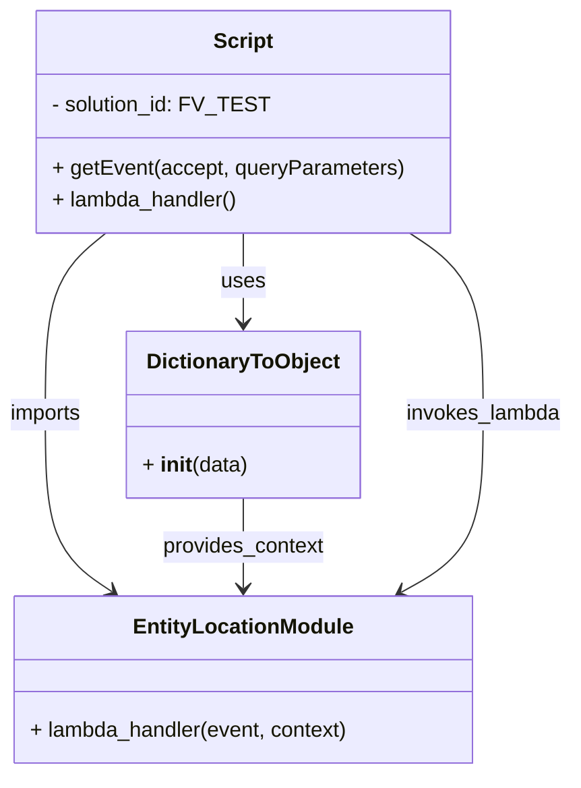

# Diagram: platform/tools/ide_local_testing/localTest/test/entity/entityLocation/getEntityLocation.py


> Auto-generated by Obscura crawlers

## Diagram 1

```mermaid
flowchart TD
    Runner[Script<br>test runner] --> E1[Event 1<br>Accept: application/json;version=groupByDay<br>lob=Vehicles; lad=Distribution; lifeCycleState=Active,Delivered; watched=1]
    Runner --> E2[Event 2<br>Accept: application/json;version=detail<br>lob=Vehicles; lad=Distribution; lifeCycleState=Active,Delivered]
    Runner --> E3[Event 3<br>Accept: application/json, text/plain, */*<br>lob=Vehicles; lad=Distribution; lifeCycleState=Active,Delivered; sortColumn=percentFill]
    E1 --> ELambda[entity_location.lambda_handler(event, context)]
    E2 --> ELambda
    E3 --> ELambda
    Context[DictionaryToObject<br>function_name=getEntityLocationLambda] --> ELambda
    ELambda --> Print[print(retval)]
```

> SVG rendering failed for this diagram.

## Diagram 2



### SVG

<svg id="container" width="434.109375" xmlns="http://www.w3.org/2000/svg" class="classDiagram" height="584" viewBox="0 0 434.109375 584" role="graphics-document document" aria-roledescription="class"><style>#container{font-family:"trebuchet ms",verdana,arial,sans-serif;font-size:16px;fill:#333;}@keyframes edge-animation-frame{from{stroke-dashoffset:0;}}@keyframes dash{to{stroke-dashoffset:0;}}#container .edge-animation-slow{stroke-dasharray:9,5!important;stroke-dashoffset:900;animation:dash 50s linear infinite;stroke-linecap:round;}#container .edge-animation-fast{stroke-dasharray:9,5!important;stroke-dashoffset:900;animation:dash 20s linear infinite;stroke-linecap:round;}#container .error-icon{fill:#552222;}#container .error-text{fill:#552222;stroke:#552222;}#container .edge-thickness-normal{stroke-width:1px;}#container .edge-thickness-thick{stroke-width:3.5px;}#container .edge-pattern-solid{stroke-dasharray:0;}#container .edge-thickness-invisible{stroke-width:0;fill:none;}#container .edge-pattern-dashed{stroke-dasharray:3;}#container .edge-pattern-dotted{stroke-dasharray:2;}#container .marker{fill:#333333;stroke:#333333;}#container .marker.cross{stroke:#333333;}#container svg{font-family:"trebuchet ms",verdana,arial,sans-serif;font-size:16px;}#container p{margin:0;}#container g.classGroup text{fill:#9370DB;stroke:none;font-family:"trebuchet ms",verdana,arial,sans-serif;font-size:10px;}#container g.classGroup text .title{font-weight:bolder;}#container .nodeLabel,#container .edgeLabel{color:#131300;}#container .edgeLabel .label rect{fill:#ECECFF;}#container .label text{fill:#131300;}#container .labelBkg{background:#ECECFF;}#container .edgeLabel .label span{background:#ECECFF;}#container .classTitle{font-weight:bolder;}#container .node rect,#container .node circle,#container .node ellipse,#container .node polygon,#container .node path{fill:#ECECFF;stroke:#9370DB;stroke-width:1px;}#container .divider{stroke:#9370DB;stroke-width:1;}#container g.clickable{cursor:pointer;}#container g.classGroup rect{fill:#ECECFF;stroke:#9370DB;}#container g.classGroup line{stroke:#9370DB;stroke-width:1;}#container .classLabel .box{stroke:none;stroke-width:0;fill:#ECECFF;opacity:0.5;}#container .classLabel .label{fill:#9370DB;font-size:10px;}#container .relation{stroke:#333333;stroke-width:1;fill:none;}#container .dashed-line{stroke-dasharray:3;}#container .dotted-line{stroke-dasharray:1 2;}#container #compositionStart,#container .composition{fill:#333333!important;stroke:#333333!important;stroke-width:1;}#container #compositionEnd,#container .composition{fill:#333333!important;stroke:#333333!important;stroke-width:1;}#container #dependencyStart,#container .dependency{fill:#333333!important;stroke:#333333!important;stroke-width:1;}#container #dependencyStart,#container .dependency{fill:#333333!important;stroke:#333333!important;stroke-width:1;}#container #extensionStart,#container .extension{fill:transparent!important;stroke:#333333!important;stroke-width:1;}#container #extensionEnd,#container .extension{fill:transparent!important;stroke:#333333!important;stroke-width:1;}#container #aggregationStart,#container .aggregation{fill:transparent!important;stroke:#333333!important;stroke-width:1;}#container #aggregationEnd,#container .aggregation{fill:transparent!important;stroke:#333333!important;stroke-width:1;}#container #lollipopStart,#container .lollipop{fill:#ECECFF!important;stroke:#333333!important;stroke-width:1;}#container #lollipopEnd,#container .lollipop{fill:#ECECFF!important;stroke:#333333!important;stroke-width:1;}#container .edgeTerminals{font-size:11px;line-height:initial;}#container .classTitleText{text-anchor:middle;font-size:18px;fill:#333;}#container .label-icon{display:inline-block;height:1em;overflow:visible;vertical-align:-0.125em;}#container .node .label-icon path{fill:currentColor;stroke:revert;stroke-width:revert;}#container :root{--mermaid-font-family:"trebuchet ms",verdana,arial,sans-serif;}</style><g><defs><marker id="container_class-aggregationStart" class="marker aggregation class" refX="18" refY="7" markerWidth="190" markerHeight="240" orient="auto"><path d="M 18,7 L9,13 L1,7 L9,1 Z"></path></marker></defs><defs><marker id="container_class-aggregationEnd" class="marker aggregation class" refX="1" refY="7" markerWidth="20" markerHeight="28" orient="auto"><path d="M 18,7 L9,13 L1,7 L9,1 Z"></path></marker></defs><defs><marker id="container_class-extensionStart" class="marker extension class" refX="18" refY="7" markerWidth="190" markerHeight="240" orient="auto"><path d="M 1,7 L18,13 V 1 Z"></path></marker></defs><defs><marker id="container_class-extensionEnd" class="marker extension class" refX="1" refY="7" markerWidth="20" markerHeight="28" orient="auto"><path d="M 1,1 V 13 L18,7 Z"></path></marker></defs><defs><marker id="container_class-compositionStart" class="marker composition class" refX="18" refY="7" markerWidth="190" markerHeight="240" orient="auto"><path d="M 18,7 L9,13 L1,7 L9,1 Z"></path></marker></defs><defs><marker id="container_class-compositionEnd" class="marker composition class" refX="1" refY="7" markerWidth="20" markerHeight="28" orient="auto"><path d="M 18,7 L9,13 L1,7 L9,1 Z"></path></marker></defs><defs><marker id="container_class-dependencyStart" class="marker dependency class" refX="6" refY="7" markerWidth="190" markerHeight="240" orient="auto"><path d="M 5,7 L9,13 L1,7 L9,1 Z"></path></marker></defs><defs><marker id="container_class-dependencyEnd" class="marker dependency class" refX="13" refY="7" markerWidth="20" markerHeight="28" orient="auto"><path d="M 18,7 L9,13 L14,7 L9,1 Z"></path></marker></defs><defs><marker id="container_class-lollipopStart" class="marker lollipop class" refX="13" refY="7" markerWidth="190" markerHeight="240" orient="auto"><circle stroke="black" fill="transparent" cx="7" cy="7" r="6"></circle></marker></defs><defs><marker id="container_class-lollipopEnd" class="marker lollipop class" refX="1" refY="7" markerWidth="190" markerHeight="240" orient="auto"><circle stroke="black" fill="transparent" cx="7" cy="7" r="6"></circle></marker></defs><g class="root"><g class="clusters"></g><g class="edgePaths"><path d="M82.163,176L74.511,182.167C66.859,188.333,51.554,200.667,43.902,223.5C36.25,246.333,36.25,279.667,36.25,313C36.25,346.333,36.25,379.667,44.677,401.946C53.104,424.225,69.957,435.449,78.384,441.062L86.811,446.674" id="id_Script_EntityLocationModule_1" class="edge-thickness-normal edge-pattern-solid relation" style=";;;" data-edge="true" data-et="edge" data-id="id_Script_EntityLocationModule_1" data-points="W3sieCI6ODIuMTYzMTU4NTc0MzgwMTYsInkiOjE3Nn0seyJ4IjozNi4yNSwieSI6MjEzfSx7IngiOjM2LjI1LCJ5IjozMTN9LHsieCI6MzYuMjUsInkiOjQxM30seyJ4Ijo5MS44MDQ5MjE4NzUsInkiOjQ1MH1d" marker-end="url(#container_class-dependencyEnd)"></path><path d="M186.398,176L186.398,182.167C186.398,188.333,186.398,200.667,186.398,212C186.398,223.333,186.398,233.667,186.398,238.833L186.398,244" id="id_Script_DictionaryToObject_2" class="edge-thickness-normal edge-pattern-solid relation" style=";;;" data-edge="true" data-et="edge" data-id="id_Script_DictionaryToObject_2" data-points="W3sieCI6MTg2LjM5ODQzNzUsInkiOjE3Nn0seyJ4IjoxODYuMzk4NDM3NSwieSI6MjEzfSx7IngiOjE4Ni4zOTg0Mzc1LCJ5IjoyNTB9XQ==" marker-end="url(#container_class-dependencyEnd)"></path><path d="M186.398,376L186.398,382.167C186.398,388.333,186.398,400.667,186.398,412C186.398,423.333,186.398,433.667,186.398,438.833L186.398,444" id="id_DictionaryToObject_EntityLocationModule_3" class="edge-thickness-normal edge-pattern-solid relation" style=";;;" data-edge="true" data-et="edge" data-id="id_DictionaryToObject_EntityLocationModule_3" data-points="W3sieCI6MTg2LjM5ODQzNzUsInkiOjM3Nn0seyJ4IjoxODYuMzk4NDM3NSwieSI6NDEzfSx7IngiOjE4Ni4zOTg0Mzc1LCJ5Ijo0NTB9XQ==" marker-end="url(#container_class-dependencyEnd)"></path><path d="M311.916,176L321.13,182.167C330.345,188.333,348.774,200.667,357.989,223.5C367.203,246.333,367.203,279.667,367.203,313C367.203,346.333,367.203,379.667,356.929,402.016C346.654,424.365,326.105,435.731,315.83,441.413L305.556,447.096" id="id_Script_EntityLocationModule_4" class="edge-thickness-normal edge-pattern-solid relation" style=";;;" data-edge="true" data-et="edge" data-id="id_Script_EntityLocationModule_4" data-points="W3sieCI6MzExLjkxNTc0MTIxOTAwODMsInkiOjE3Nn0seyJ4IjozNjcuMjAzMTI1LCJ5IjoyMTN9LHsieCI6MzY3LjIwMzEyNSwieSI6MzEzfSx7IngiOjM2Ny4yMDMxMjUsInkiOjQxM30seyJ4IjozMDAuMzA1MzkwNjI1LCJ5Ijo0NTB9XQ==" marker-end="url(#container_class-dependencyEnd)"></path></g><g class="edgeLabels"><g class="edgeLabel" transform="translate(36.25, 313)"><g class="label" data-id="id_Script_EntityLocationModule_1" transform="translate(-28.25, -12)"><foreignObject width="56.5" height="24"><div xmlns="http://www.w3.org/1999/xhtml" class="labelBkg" style="display: table-cell; white-space: nowrap; line-height: 1.5; max-width: 200px; text-align: center;"><span class="edgeLabel"><p>imports</p></span></div></foreignObject></g></g><g class="edgeLabel" transform="translate(186.3984375, 213)"><g class="label" data-id="id_Script_DictionaryToObject_2" transform="translate(-16.4921875, -12)"><foreignObject width="32.984375" height="24"><div xmlns="http://www.w3.org/1999/xhtml" class="labelBkg" style="display: table-cell; white-space: nowrap; line-height: 1.5; max-width: 200px; text-align: center;"><span class="edgeLabel"><p>uses</p></span></div></foreignObject></g></g><g class="edgeLabel" transform="translate(186.3984375, 413)"><g class="label" data-id="id_DictionaryToObject_EntityLocationModule_3" transform="translate(-62.0078125, -12)"><foreignObject width="124.015625" height="24"><div xmlns="http://www.w3.org/1999/xhtml" class="labelBkg" style="display: table-cell; white-space: nowrap; line-height: 1.5; max-width: 200px; text-align: center;"><span class="edgeLabel"><p>provides_context</p></span></div></foreignObject></g></g><g class="edgeLabel" transform="translate(367.203125, 313)"><g class="label" data-id="id_Script_EntityLocationModule_4" transform="translate(-58.90625, -12)"><foreignObject width="117.8125" height="24"><div xmlns="http://www.w3.org/1999/xhtml" class="labelBkg" style="display: table-cell; white-space: nowrap; line-height: 1.5; max-width: 200px; text-align: center;"><span class="edgeLabel"><p>invokes_lambda</p></span></div></foreignObject></g></g></g><g class="nodes"><g class="node default" id="classId-Script-0" transform="translate(186.3984375, 92)"><g class="basic label-container"><path d="M-154.75390625 -84 L154.75390625 -84 L154.75390625 84 L-154.75390625 84" stroke="none" stroke-width="0" fill="#ECECFF" style=""></path><path d="M-154.75390625 -84 C-40.113890224820295 -84, 74.52612580035941 -84, 154.75390625 -84 M-154.75390625 -84 C-88.39414927550652 -84, -22.034392301013042 -84, 154.75390625 -84 M154.75390625 -84 C154.75390625 -38.23024918514611, 154.75390625 7.539501629707786, 154.75390625 84 M154.75390625 -84 C154.75390625 -27.719947309757657, 154.75390625 28.560105380484686, 154.75390625 84 M154.75390625 84 C87.00692350298415 84, 19.2599407559683 84, -154.75390625 84 M154.75390625 84 C82.92856808659126 84, 11.10322992318251 84, -154.75390625 84 M-154.75390625 84 C-154.75390625 40.75237613857297, -154.75390625 -2.49524772285406, -154.75390625 -84 M-154.75390625 84 C-154.75390625 27.17136344718908, -154.75390625 -29.65727310562184, -154.75390625 -84" stroke="#9370DB" stroke-width="1.3" fill="none" stroke-dasharray="0 0" style=""></path></g><g class="annotation-group text" transform="translate(0, -60)"></g><g class="label-group text" transform="translate(-21.7421875, -60)"><g class="label" style="font-weight: bolder" transform="translate(0,-12)"><foreignObject width="43.484375" height="24"><div xmlns="http://www.w3.org/1999/xhtml" style="display: table-cell; white-space: nowrap; line-height: 1.5; max-width: 93px; text-align: center;"><span class="nodeLabel markdown-node-label" style=""><p>Script</p></span></div></foreignObject></g></g><g class="members-group text" transform="translate(-142.75390625, -12)"><g class="label" style="" transform="translate(0,-12)"><foreignObject width="157.78125" height="24"><div xmlns="http://www.w3.org/1999/xhtml" style="display: table-cell; white-space: nowrap; line-height: 1.5; max-width: 216px; text-align: center;"><span class="nodeLabel markdown-node-label" style=""><p>- solution_id: FV_TEST</p></span></div></foreignObject></g></g><g class="methods-group text" transform="translate(-142.75390625, 36)"><g class="label" style="" transform="translate(0,-12)"><foreignObject width="263.765625" height="24"><div xmlns="http://www.w3.org/1999/xhtml" style="display: table-cell; white-space: nowrap; line-height: 1.5; max-width: 321px; text-align: center;"><span class="nodeLabel markdown-node-label" style=""><p>+ getEvent(accept, queryParameters)</p></span></div></foreignObject></g><g class="label" style="" transform="translate(0,12)"><foreignObject width="142.25" height="24"><div xmlns="http://www.w3.org/1999/xhtml" style="display: table-cell; white-space: nowrap; line-height: 1.5; max-width: 200px; text-align: center;"><span class="nodeLabel markdown-node-label" style=""><p>+ lambda_handler()</p></span></div></foreignObject></g></g><g class="divider" style=""><path d="M-154.75390625 -36 C-62.23120188012645 -36, 30.291502489747103 -36, 154.75390625 -36 M-154.75390625 -36 C-87.25655196801308 -36, -19.75919768602617 -36, 154.75390625 -36" stroke="#9370DB" stroke-width="1.3" fill="none" stroke-dasharray="0 0" style=""></path></g><g class="divider" style=""><path d="M-154.75390625 12 C-74.38540053543919 12, 5.9831051791216225 12, 154.75390625 12 M-154.75390625 12 C-71.46048584830223 12, 11.832934553395546 12, 154.75390625 12" stroke="#9370DB" stroke-width="1.3" fill="none" stroke-dasharray="0 0" style=""></path></g></g><g class="node default" id="classId-EntityLocationModule-1" transform="translate(186.3984375, 513)"><g class="basic label-container"><path d="M-174.0703125 -63 L174.0703125 -63 L174.0703125 63 L-174.0703125 63" stroke="none" stroke-width="0" fill="#ECECFF" style=""></path><path d="M-174.0703125 -63 C-51.61111784741293 -63, 70.84807680517414 -63, 174.0703125 -63 M-174.0703125 -63 C-37.86994033958854 -63, 98.33043182082292 -63, 174.0703125 -63 M174.0703125 -63 C174.0703125 -36.32260040094515, 174.0703125 -9.645200801890304, 174.0703125 63 M174.0703125 -63 C174.0703125 -24.76038616047716, 174.0703125 13.479227679045678, 174.0703125 63 M174.0703125 63 C77.63518429091751 63, -18.799943918164985 63, -174.0703125 63 M174.0703125 63 C68.9659773259653 63, -36.138357848069404 63, -174.0703125 63 M-174.0703125 63 C-174.0703125 15.80148353458307, -174.0703125 -31.39703293083386, -174.0703125 -63 M-174.0703125 63 C-174.0703125 25.450312315232345, -174.0703125 -12.09937536953531, -174.0703125 -63" stroke="#9370DB" stroke-width="1.3" fill="none" stroke-dasharray="0 0" style=""></path></g><g class="annotation-group text" transform="translate(0, -39)"></g><g class="label-group text" transform="translate(-79.71875, -39)"><g class="label" style="font-weight: bolder" transform="translate(0,-12)"><foreignObject width="159.4375" height="24"><div xmlns="http://www.w3.org/1999/xhtml" style="display: table-cell; white-space: nowrap; line-height: 1.5; max-width: 208px; text-align: center;"><span class="nodeLabel markdown-node-label" style=""><p>EntityLocationModule</p></span></div></foreignObject></g></g><g class="members-group text" transform="translate(-162.0703125, 9)"></g><g class="methods-group text" transform="translate(-162.0703125, 39)"><g class="label" style="" transform="translate(0,-12)"><foreignObject width="244.421875" height="24"><div xmlns="http://www.w3.org/1999/xhtml" style="display: table-cell; white-space: nowrap; line-height: 1.5; max-width: 302px; text-align: center;"><span class="nodeLabel markdown-node-label" style=""><p>+ lambda_handler(event, context)</p></span></div></foreignObject></g></g><g class="divider" style=""><path d="M-174.0703125 -15 C-103.51218555247044 -15, -32.95405860494088 -15, 174.0703125 -15 M-174.0703125 -15 C-65.56643895670325 -15, 42.9374345865935 -15, 174.0703125 -15" stroke="#9370DB" stroke-width="1.3" fill="none" stroke-dasharray="0 0" style=""></path></g><g class="divider" style=""><path d="M-174.0703125 9 C-81.71973624011243 9, 10.63084001977515 9, 174.0703125 9 M-174.0703125 9 C-54.28256017496493 9, 65.50519215007014 9, 174.0703125 9" stroke="#9370DB" stroke-width="1.3" fill="none" stroke-dasharray="0 0" style=""></path></g></g><g class="node default" id="classId-DictionaryToObject-2" transform="translate(186.3984375, 313)"><g class="basic label-container"><path d="M-86.8984375 -63 L86.8984375 -63 L86.8984375 63 L-86.8984375 63" stroke="none" stroke-width="0" fill="#ECECFF" style=""></path><path d="M-86.8984375 -63 C-49.44811819335306 -63, -11.997798886706121 -63, 86.8984375 -63 M-86.8984375 -63 C-23.215223840403652 -63, 40.467989819192695 -63, 86.8984375 -63 M86.8984375 -63 C86.8984375 -12.728141838056416, 86.8984375 37.54371632388717, 86.8984375 63 M86.8984375 -63 C86.8984375 -26.88764350913229, 86.8984375 9.224712981735422, 86.8984375 63 M86.8984375 63 C35.92819940329655 63, -15.042038693406894 63, -86.8984375 63 M86.8984375 63 C31.41504533231341 63, -24.068346835373177 63, -86.8984375 63 M-86.8984375 63 C-86.8984375 32.60653037931237, -86.8984375 2.213060758624735, -86.8984375 -63 M-86.8984375 63 C-86.8984375 32.466306630303734, -86.8984375 1.932613260607475, -86.8984375 -63" stroke="#9370DB" stroke-width="1.3" fill="none" stroke-dasharray="0 0" style=""></path></g><g class="annotation-group text" transform="translate(0, -39)"></g><g class="label-group text" transform="translate(-70.109375, -39)"><g class="label" style="font-weight: bolder" transform="translate(0,-12)"><foreignObject width="140.21875" height="24"><div xmlns="http://www.w3.org/1999/xhtml" style="display: table-cell; white-space: nowrap; line-height: 1.5; max-width: 188px; text-align: center;"><span class="nodeLabel markdown-node-label" style=""><p>DictionaryToObject</p></span></div></foreignObject></g></g><g class="members-group text" transform="translate(-74.8984375, 9)"></g><g class="methods-group text" transform="translate(-74.8984375, 39)"><g class="label" style="" transform="translate(0,-12)"><foreignObject width="79.6875" height="24"><div xmlns="http://www.w3.org/1999/xhtml" style="display: table-cell; white-space: nowrap; line-height: 1.5; max-width: 170px; text-align: center;"><span class="nodeLabel markdown-node-label" style=""><p>+ <strong>init</strong>(data)</p></span></div></foreignObject></g></g><g class="divider" style=""><path d="M-86.8984375 -15 C-27.498739813077705 -15, 31.90095787384459 -15, 86.8984375 -15 M-86.8984375 -15 C-24.598022412538135 -15, 37.70239267492373 -15, 86.8984375 -15" stroke="#9370DB" stroke-width="1.3" fill="none" stroke-dasharray="0 0" style=""></path></g><g class="divider" style=""><path d="M-86.8984375 9 C-42.92631295571234 9, 1.0458115885753188 9, 86.8984375 9 M-86.8984375 9 C-22.362524319372838 9, 42.173388861254324 9, 86.8984375 9" stroke="#9370DB" stroke-width="1.3" fill="none" stroke-dasharray="0 0" style=""></path></g></g></g></g></g></svg>
